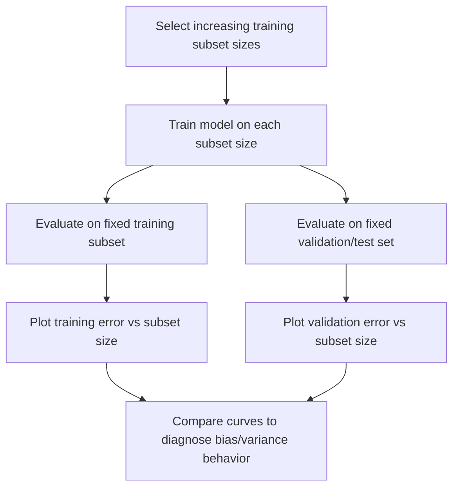
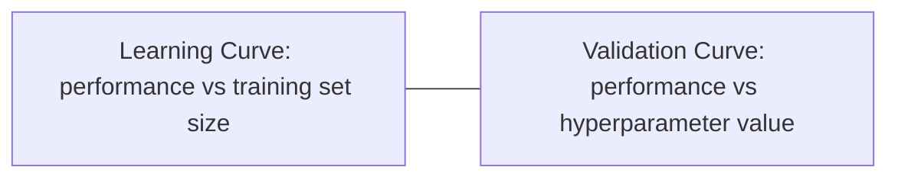

## Learning Curves Interpretation

[Unverified] This entire response contains generated educational content. Labels are applied individually per claim and are not chained from one claim to justify another.

### Definition

A learning curve is a plot showing a model's performance metric (e.g., error, accuracy, loss) as a function of training set size, used to diagnose how a model's performance is expected to change with more or less data.

[Inference] This definition is consistent with common usage in machine learning literature. I cannot verify this exact phrasing against a specific named source.

### Two Common Types of Learning Curves

**Training set size curves**

[Inference] These plot model performance (on both training and validation/test sets) against increasing amounts of training data, holding model architecture and hyperparameters fixed. I cannot verify this exact terminology against a specific named source.

**Training iteration/epoch curves**

[Inference] These plot model performance against training iterations or epochs, commonly used for iterative learning algorithms such as gradient descent-based methods. I cannot verify this exact terminology against a specific named source.

[Unverified] This response focuses primarily on training-set-size learning curves, as this is the interpretation most directly connected to sample size and generalization concepts discussed earlier in this series; epoch-based curves involve additional considerations (e.g., convergence, learning rate) not fully covered here.

### Basic Structure of a Training Set Size Learning Curve

[Unverified] This diagram is a generated illustration of a commonly described general procedure. I cannot verify it matches any specific named source's exact notation.

### Visualizing Typical Curve Shapes

<svg xmlns="http://www.w3.org/2000/svg" viewBox="0 0 700 380">
  <text x="350" y="25" font-size="16" font-weight="bold" text-anchor="middle" fill="#222">Learning Curve Shapes (svg_diagram)</text>

  
  <line x1="70" y1="330" x2="650" y2="330" stroke="#333" stroke-width="1.5" />
  <line x1="70" y1="330" x2="70" y2="50" stroke="#333" stroke-width="1.5" />
  <text x="360" y="360" font-size="13" text-anchor="middle" fill="#333">Training set size</text>
  <text x="30" y="190" font-size="13" text-anchor="middle" fill="#333" transform="rotate(-90 30 190)">Error</text>

  
  <path d="M 100 70 C 200 100, 300 130, 400 145 C 480 155, 560 160, 620 162" fill="none" stroke="#3366cc" stroke-width="2.5" />
  <text x="500" y="140" font-size="11" fill="#3366cc">Training error</text>

  
  <path d="M 100 300 C 200 250, 300 200, 400 185 C 480 178, 560 175, 620 173" fill="none" stroke="#cc3333" stroke-width="2.5" />
  <text x="500" y="195" font-size="11" fill="#cc3333">Validation error</text>

  
  <line x1="620" y1="162" x2="620" y2="173" stroke="#555" stroke-width="1" />
  <text x="630" y="170" font-size="10" fill="#555">gap</text>
</svg>

[Unverified] This diagram illustrates a generic conceptual pattern commonly described in machine learning literature for a well-behaved model. It does not represent output from any specific dataset, model, or software run, and actual curve shapes may vary substantially depending on the model and data.

### Interpreting the Gap Between Training and Validation Curves

**Large, persistent gap**

[Speculation] A large and persistent gap between low training error and higher validation error, even as training set size increases, is sometimes described in machine learning literature as suggestive of high variance (overfitting) — the model may be fitting patterns specific to the training data that do not generalize. I cannot verify this interpretation applies in any specific case without direct model diagnosis, and this should be treated as a general heuristic rather than a confirmed diagnostic rule.

**Small gap with high error on both curves**

[Speculation] Training and validation errors that converge to a similar, relatively high value are sometimes described in machine learning literature as suggestive of high bias (underfitting) — the model may lack sufficient capacity or appropriate features to capture the underlying pattern. I cannot verify this interpretation applies in any specific case without direct model diagnosis.

**Both curves still improving at maximum available data**

[Speculation] If both training and validation error curves are still declining (or the gap is still narrowing) at the maximum training set size evaluated, this is sometimes described as suggestive that additional training data could further improve performance. I cannot verify this interpretation applies in any specific case without direct empirical testing (e.g., acquiring more data and re-evaluating).

**Plateaued curves**

[Speculation] If both curves have flattened and the gap has stabilized, this is sometimes described as suggestive that additional data of the same kind and distribution may provide diminishing returns, and that further improvement might instead require changes to model architecture, features, or hyperparameters. I cannot verify this interpretation applies in any specific case without direct empirical testing.

[Unverified] I do not have access to a general quantitative threshold (e.g., a specific gap size or slope value) that reliably distinguishes these categories across all models and datasets; these interpretations are described as general heuristics in machine learning literature, not precise diagnostic rules.

### Relationship to Bias-Variance Trade-off

[Inference] Learning curve interpretation is described in machine learning literature as a diagnostic tool connected to the bias-variance trade-off framework, where the training error curve is described as informative about model bias (how well the model can fit even the data it has seen) and the gap between training and validation curves is described as informative about model variance (how much performance depends on the specific training sample). I cannot verify this framing against a specific named source, though it is a commonly repeated general characterization.

### Statistical Considerations in Constructing Learning Curves

**Variability at small sample sizes**

[Inference] At small training set sizes, performance estimates are described in statistical literature as having higher variance, meaning a single learning curve may show noisy or non-monotonic behavior at the low end of the training-size axis purely due to sampling variability, independent of any true underlying trend. I cannot verify the magnitude of this variability in any specific dataset without direct empirical evaluation.

**Repeated sampling for stability**

[Speculation] Some practitioners repeat the training-subset sampling process multiple times at each training set size (e.g., drawing several different random subsets of the same size) and average results, intending to reduce the noise described above. I cannot verify how commonly this practice is used or its quantitative effect on curve stability without reference to a specific study.

**Fixed evaluation set**

[Inference] Learning curves are described in machine learning literature as typically using the same fixed validation or test set for evaluation across all training subset sizes, so that changes in the curve reflect changes in training set size rather than changes in the evaluation data. I cannot verify that this practice is universal across all described implementations.

### Learning Curves and Sample Size Determination

[Inference] Learning curves are described in some machine learning literature as an empirical, exploratory alternative to the closed-form sample size determination formulas discussed earlier in this series, since [Speculation] no single closed-form formula reliably determines required training data size for arbitrary machine learning models. This connection reflects a reasoned link between topics in this series rather than a claim sourced from a specific named reference.

### Diagnostic Use Cases

- [Speculation] Deciding whether collecting more training data is likely to be worthwhile before investing resources in additional data collection
- [Speculation] Diagnosing whether a model is underfitting or overfitting as one step among several diagnostic approaches
- [Speculation] Comparing the data efficiency of different model architectures by examining how quickly each model's validation curve improves with more data

[Unverified] I cannot verify the relative effectiveness of learning curve analysis compared to other diagnostic approaches (e.g., regularization path analysis, validation curves over hyperparameters) without reference to a specific comparative study.

### Validation Curves — A Related but Distinct Tool

[Inference] A validation curve is described in machine learning literature as a related but distinct diagnostic tool that plots performance against a hyperparameter value (e.g., regularization strength, tree depth) at a fixed training set size, rather than against training set size itself. I cannot verify this distinction against a specific named source, though it is a commonly repeated general characterization.

[Unverified] This diagram is a generated illustration distinguishing two commonly described diagnostic tools. I cannot verify it matches any specific named source's exact terminology or notation.

### Limitations of Learning Curve Interpretation

- [Inference] Learning curves are described in machine learning literature as providing a descriptive, visual diagnostic rather than a formal statistical test; conclusions drawn from visual inspection are described as more subjective than a hypothesis test with a defined significance level. I cannot verify the extent of this subjectivity in any specific case.
- [Speculation] The shape of a learning curve for one model architecture may not generalize to predict the shape for a different architecture on the same data, since different models can have different capacity and data-efficiency characteristics. I cannot verify this claim against a specific comparative study.
- [Unverified] I do not have access to a general method for extrapolating a learning curve to predict performance at data sizes substantially beyond what has been observed, and any such extrapolation should be treated as speculative rather than a reliable forecast.

### Relationship to Earlier Topics in This Series

[Inference] Learning curve interpretation connects to the discussion of training set size under sample size determination, providing an empirical, visual complement to the closed-form estimation approaches described there. I cannot verify that this connection is drawn explicitly in any specific named source, though the underlying conceptual link (both concern how much data is needed) follows reasonably from the topics themselves.

### Common Pitfalls

- **Interpreting noisy small-sample-size behavior as a meaningful trend** — [Inference] described in the literature as a risk when sample sizes at the low end of the curve are small and estimates are high-variance
- **Using a different evaluation set at each training set size** — [Inference] described in the literature as confounding the interpretation, since changes in the curve could reflect evaluation set differences rather than training set size effects
- **Assuming a plateaued curve means the model is optimal**, when [Speculation] a plateau may instead indicate a limitation in model capacity, features, or data quality that additional data of the same kind cannot resolve
- **Treating learning curve shape as a substitute for formal statistical testing** — [Inference] described in the literature as conflating a descriptive diagnostic with a confirmatory statistical procedure
- **Extrapolating curve trends far beyond observed data sizes** — [Unverified] I do not have access to a validated general method for this, and such extrapolation should be treated as speculative

[Unverified] I cannot verify that any specific software library's built-in learning curve utility (e.g., scikit-learn's `learning_curve` function) matches the general descriptions above without checking that library's current documentation directly; behavior may vary by implementation and version and is not guaranteed to remain consistent across releases.

Correction: If any statement in this response was phrased in a way that implied confirmed sourcing without an actual citation, that framing should be treated as unverified rather than confirmed, consistent with the labeling applied throughout.

**Next Steps**

- Bias-variance trade-off in depth
- Validation curves over hyperparameter ranges
- Regularization path analysis as a related diagnostic
- Sample size determination for machine learning training sets
- Data efficiency comparisons across model architectures
- Diagnosing overfitting and underfitting beyond learning curves