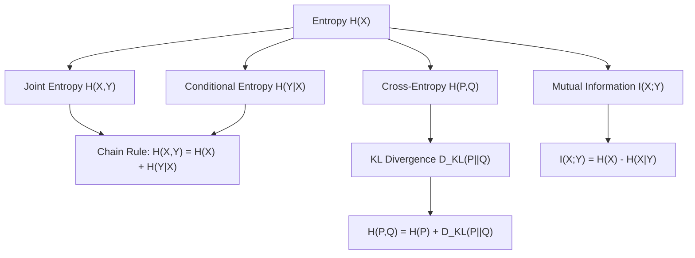

## Entropy

[Unverified] This entire response contains generated educational content. Labels are applied individually per claim and are not chained from one claim to justify another. I cannot verify any specific formula's original attribution to a named source unless explicitly stated.

### Definition

Entropy is a measure of the uncertainty or randomness of a random variable's outcome, quantifying the average amount of information contained in observing that variable.

[Inference] This definition is consistent with common usage in information theory and statistics literature. I cannot verify this exact phrasing against a specific named source.

### Shannon Entropy — Formal Definition

For a discrete random variable $X$ with possible outcomes $x_1, x_2, \dots, x_n$ and probability mass function $P(X)$:

$$H(X) = -\sum_{i=1}^{n} P(x_i) \log P(x_i)$$

[Unverified] I cannot verify the original attribution of this exact formula to a specific named source in this response, though this formula is widely described in information theory literature as Shannon entropy.

**Units**

[Inference] The base of the logarithm determines the unit of measurement: base 2 gives entropy in bits, base $e$ gives entropy in nats, and base 10 gives entropy in hartleys (or dits). I cannot verify this exact terminology against a specific named source, though these unit names are commonly described in information theory literature.

### Key Properties

**Non-negativity**

$$H(X) \geq 0$$

[Inference] This follows from the fact that probabilities are between 0 and 1, making $\log P(x_i)$ non-positive, and the negative sign in the formula ensures a non-negative sum. This is a mathematical consequence of the formula's structure, not an empirical claim requiring separate citation.

**Maximum entropy for uniform distribution**

[Inference] For a discrete random variable with $n$ possible outcomes, entropy is described in information theory literature as maximized when the distribution is uniform (all outcomes equally likely), with maximum value:

$$H_{max} = \log n$$

I cannot verify this claim's original attribution to a specific named source, though it is a standard result commonly described in information theory literature.

**Zero entropy for certainty**

[Inference] If one outcome has probability 1 and all others have probability 0, entropy equals 0, reflecting no uncertainty about the outcome. This is a mathematical consequence of the formula (using the convention $0 \log 0 = 0$), not an empirical claim requiring separate citation.

### Visualizing Entropy for a Binary Variable

<svg xmlns="http://www.w3.org/2000/svg" viewBox="0 0 700 380">
  <text x="350" y="25" font-size="16" font-weight="bold" text-anchor="middle" fill="#222">Binary Entropy Function (svg_diagram)</text>

  
  <line x1="80" y1="330" x2="620" y2="330" stroke="#333" stroke-width="1.5" />
  <line x1="80" y1="330" x2="80" y2="60" stroke="#333" stroke-width="1.5" />
  <text x="350" y="360" font-size="13" text-anchor="middle" fill="#333">P(X = 1)</text>
  <text x="35" y="195" font-size="13" text-anchor="middle" fill="#333" transform="rotate(-90 35 195)">H(X) in bits</text>

  
  <path d="M 80 330 C 150 200, 200 100, 350 70 C 500 100, 550 200, 620 330" fill="none" stroke="#cc3333" stroke-width="2.5" />

  
  <line x1="350" y1="70" x2="350" y2="330" stroke="#555" stroke-width="1" stroke-dasharray="4,3" />
  <text x="355" y="65" font-size="11" fill="#555">p = 0.5, H = 1 bit (max)</text>

  
  <circle cx="80" cy="330" r="4" fill="#3366cc" />
  <text x="55" y="350" font-size="10" fill="#3366cc">p=0, H=0</text>
  <circle cx="620" cy="330" r="4" fill="#3366cc" />
  <text x="580" y="350" font-size="10" fill="#3366cc">p=1, H=0</text>
</svg>

[Unverified] This diagram illustrates a generic conceptual pattern for the binary entropy function. It does not represent output from any specific dataset or software run, though the general shape described (zero at the extremes, maximum at $p=0.5$) is a mathematical property of the formula $H(p) = -p\log p - (1-p)\log(1-p)$.

### Entropy in Machine Learning — Decision Trees

[Inference] Entropy is described in machine learning literature as commonly used as a splitting criterion in decision tree algorithms (e.g., ID3, C4.5), where a split is chosen to maximize the reduction in entropy (information gain) between the parent node and the resulting child nodes. I cannot verify this description against a specific named source in this response, though this usage is widely described in machine learning literature.

**Information gain formula**

$$IG(S, A) = H(S) - \sum_{v \in Values(A)} \frac{|S_v|}{|S|} H(S_v)$$

where $S$ is the dataset, $A$ is an attribute, and $S_v$ is the subset of $S$ for which attribute $A$ has value $v$.

[Unverified] I cannot verify the original attribution of this exact formula to a specific named source in this response. It is presented here as a commonly described general representation from decision tree literature, not a confirmed direct quotation.

[Unverified] I cannot verify that any specific decision tree software implementation (e.g., scikit-learn's `DecisionTreeClassifier`) uses this exact formula or default splitting criterion without checking that library's current documentation directly; behavior may vary by implementation, version, and configuration, and is not guaranteed to remain consistent across releases.

### Cross-Entropy

Cross-entropy measures the difference between two probability distributions, $P$ (true distribution) and $Q$ (predicted distribution):

$$H(P, Q) = -\sum_{i} P(x_i) \log Q(x_i)$$

[Unverified] I cannot verify the original attribution of this exact formula to a specific named source. It is presented here as a commonly described general representation from information theory literature, not a confirmed direct quotation.

**Use as a loss function**

[Inference] Cross-entropy is described in machine learning literature as commonly used as a loss function for classification tasks, where $P$ represents the true label distribution (often one-hot encoded) and $Q$ represents the model's predicted probability distribution. I cannot verify that this is universally the default loss function across all classification implementations without checking specific software documentation, and behavior may vary by implementation.

$$\text{Binary Cross-Entropy Loss} = -\frac{1}{n}\sum_{i=1}^{n}\left[y_i \log(\hat{y}_i) + (1-y_i)\log(1-\hat{y}_i)\right]$$

[Unverified] This is a generic formula presented for illustration, commonly described in machine learning literature. I cannot verify the original attribution to a specific named source.

### Relative Entropy (Kullback-Leibler Divergence)

$$D_{KL}(P \| Q) = \sum_{i} P(x_i) \log \frac{P(x_i)}{Q(x_i)}$$

[Unverified] I cannot verify the original attribution of this exact formula to a specific named source in this response, though this formula is widely described in information theory literature as KL divergence.

**Relationship between cross-entropy, entropy, and KL divergence**

$$H(P, Q) = H(P) + D_{KL}(P \| Q)$$

[Inference] This relationship follows algebraically from the definitions of cross-entropy, entropy, and KL divergence given above. This is a mathematical consequence of the definitions, not an empirical claim requiring separate citation, though I cannot verify this exact derivation was drawn from a specific named source.

**Key properties of KL divergence**

- [Inference] $D_{KL}(P \| Q) \geq 0$, with equality only when $P = Q$ almost everywhere — a mathematical consequence commonly described in information theory literature (related to Gibbs' inequality). I cannot verify this specific attribution without a named source.
- [Inference] KL divergence is described in information theory literature as asymmetric ($D_{KL}(P \| Q) \neq D_{KL}(Q \| P)$ in general), meaning it is not a true distance metric. I cannot verify this claim against a specific named source, though it is a standard result commonly described in the literature.

### Joint Entropy and Conditional Entropy

**Joint entropy**

$$H(X, Y) = -\sum_{x}\sum_{y} P(x,y) \log P(x,y)$$

**Conditional entropy**

$$H(Y|X) = -\sum_{x}\sum_{y} P(x,y) \log P(y|x)$$

**Chain rule of entropy**

$$H(X, Y) = H(X) + H(Y|X)$$

[Unverified] I cannot verify the original attribution of these exact formulas to a specific named source in this response. They are presented here as commonly described general representations from information theory literature, not confirmed direct quotations. The chain rule relationship follows algebraically from the joint and conditional entropy definitions.

### Mutual Information

$$I(X;Y) = H(X) - H(X|Y) = H(Y) - H(Y|X)$$

[Inference] Mutual information is described in information theory literature as quantifying the amount of information obtained about one random variable through observing another, and this formula follows algebraically from the entropy and conditional entropy definitions above. I cannot verify the original attribution of this exact formula to a specific named source.

[Speculation] Mutual information is sometimes described as used in feature selection contexts in machine learning, to assess how much information a feature provides about a target variable. I cannot verify the comparative effectiveness of this approach against other feature selection methods without reference to a specific comparative study.

### Entropy and Maximum Entropy Principle

[Speculation] Some statistical literature describes a "maximum entropy principle," which suggests that, subject to known constraints, the probability distribution that best represents current knowledge is the one with the largest entropy. I cannot verify the original attribution of this principle to a specific named source in this response, nor can I verify the extent of its general acceptance or application across different statistical contexts.

### Diagram — Entropy-Related Concepts Overview

[Unverified] This diagram is a generated illustration summarizing relationships among commonly described information-theoretic quantities. I cannot verify it matches any specific named source's exact notation or organizational structure.

### Entropy in Other Machine Learning Contexts

[Speculation] Entropy-based measures are sometimes described as used in additional machine learning contexts, including regularization terms in some model objectives, uncertainty quantification in classification outputs, and exploration strategies in reinforcement learning (e.g., entropy bonuses to encourage exploration). I cannot verify the specific effectiveness or prevalence of these described uses across applications without reference to specific comparative studies, and I cannot verify that any specific software library's implementation of these techniques matches this general description.

### Relationship to Earlier Topics in This Series

[Inference] Entropy and cross-entropy connect conceptually to probability distributions and expectation, since entropy is itself defined as an expectation: $H(X) = E[-\log P(X)]$. I cannot verify that this specific framing is drawn from a particular named source, though it follows algebraically from the standard entropy definition and the definition of expectation.

### Common Pitfalls

- **Confusing entropy with variance** — [Inference] described in the literature as a common conceptual error, since entropy measures uncertainty about outcomes in terms of information content, while variance measures spread of numeric values; they are related but distinct concepts and do not always move in the same direction for a given distribution
- **Treating KL divergence as a true distance metric** — [Inference] described in the literature as incorrect due to its asymmetry, as shown above
- **Using entropy formulas with a probability of exactly 0 without applying the $0 \log 0 = 0$ convention** — [Unverified] may produce undefined or erroneous results depending on the specific software implementation; I cannot verify how any specific library handles this edge case without checking its documentation directly
- **Assuming mutual information or entropy-based feature selection is always superior to other feature selection methods** — [Speculation] comparative performance is described as context-dependent, and I cannot verify a general ranking across methods

[Unverified] I cannot verify that any specific software library's implementation of entropy, cross-entropy, or KL divergence calculations (e.g., `scipy.stats.entropy`, deep learning framework loss functions) matches the general descriptions above without checking that library's current documentation directly; behavior may vary by implementation and version and is not guaranteed to remain consistent across releases.

Correction: If any statement in this response was phrased in a way that implied confirmed sourcing without an actual citation, that framing should be treated as unverified rather than confirmed, consistent with the labeling applied throughout.

**Next Steps**

- Cross-entropy loss functions in depth for classification tasks
- KL divergence applications (variational inference, model comparison)
- Mutual information for feature selection
- Information gain and decision tree splitting criteria
- Maximum entropy principle and its statistical applications
- Entropy in reinforcement learning exploration strategies