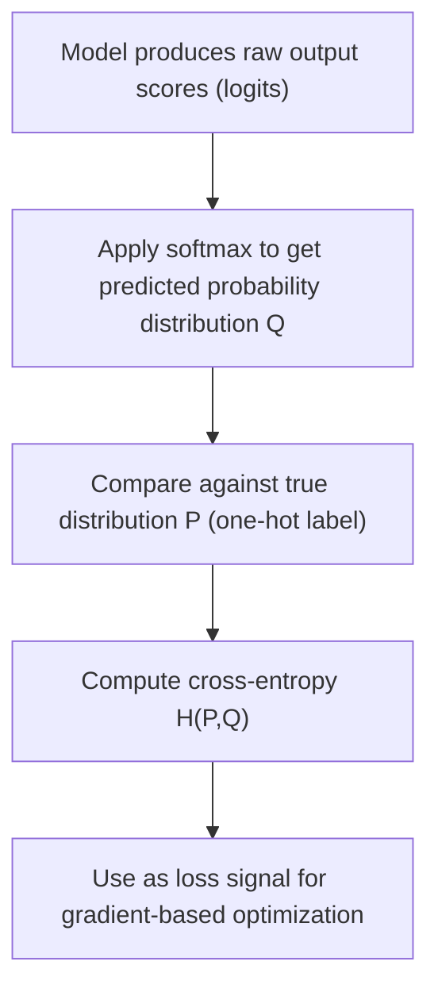

## Cross Entropy

[Unverified] This entire response contains generated educational content. Labels are applied individually per claim and are not chained from one claim to justify another.

### Definition

Cross-entropy is a measure of the difference between two probability distributions over the same set of events, quantifying the average number of bits (or nats) needed to identify an event drawn from the true distribution $P$ when using a coding scheme optimized for a different distribution $Q$.

[Inference] This definition is consistent with common usage in information theory literature. I cannot verify this exact phrasing against a specific named source.

### Formal Definition

For discrete probability distributions $P$ and $Q$ over the same outcomes $x_1, \dots, x_n$:

$$H(P, Q) = -\sum_{i=1}^{n} P(x_i) \log Q(x_i)$$

[Unverified] I cannot verify the original attribution of this exact formula to a specific named source in this response. It is presented here as a commonly described general representation from information theory literature, not a confirmed direct quotation.

For continuous distributions, the analogous definition replaces the sum with an integral:

$$H(P, Q) = -\int P(x) \log Q(x) \, dx$$

[Unverified] I cannot verify the original attribution of this exact formula to a specific named source. It is presented here as a standard extension commonly described in information theory literature.

### Relationship to Entropy and KL Divergence

$$H(P, Q) = H(P) + D_{KL}(P \| Q)$$

where $H(P)$ is the entropy of the true distribution and $D_{KL}(P \| Q)$ is the Kullback-Leibler divergence from $Q$ to $P$.

[Inference] This relationship follows algebraically from the definitions of entropy, cross-entropy, and KL divergence. This is a mathematical consequence of the definitions, not an empirical claim requiring separate citation, though I cannot verify this exact derivation was drawn from a specific named source.

**Interpretation of the relationship**

[Inference] Because $H(P)$ is fixed once the true distribution is specified, minimizing cross-entropy $H(P,Q)$ with respect to $Q$ is described in information theory literature as equivalent to minimizing $D_{KL}(P \| Q)$ — that is, making the predicted distribution $Q$ as close as possible to the true distribution $P$. I cannot verify this specific framing against a named source, though it follows algebraically from the relationship above.

### Why Cross-Entropy Is Non-Negative and When It Equals Entropy

[Inference] Since $D_{KL}(P \| Q) \geq 0$ with equality only when $P = Q$ almost everywhere (a property commonly described in information theory literature, related to Gibbs' inequality), it follows that $H(P, Q) \geq H(P)$, with equality only when $Q = P$. I cannot verify this specific derivation against a named source, though it follows algebraically from the properties of KL divergence stated in the entropy discussion.

### Cross-Entropy as a Loss Function in Machine Learning

[Inference] Cross-entropy is described in machine learning literature as commonly used as a loss function for classification tasks, where $P$ represents the true label distribution (often a one-hot encoded vector) and $Q$ represents the model's predicted probability distribution over classes. I cannot verify that this is universally the default loss function across all classification implementations without checking specific software documentation, and behavior may vary by implementation and configuration.

### Binary Cross-Entropy

For binary classification, with true label $y \in \{0, 1\}$ and predicted probability $\hat{y} \in (0, 1)$:

$$L(y, \hat{y}) = -\left[y \log(\hat{y}) + (1-y)\log(1-\hat{y})\right]$$

Averaged over $n$ samples:

$$\text{BCE} = -\frac{1}{n}\sum_{i=1}^{n}\left[y_i \log(\hat{y}_i) + (1-y_i)\log(1-\hat{y}_i)\right]$$

[Unverified] I cannot verify the original attribution of this exact formula to a specific named source. It is presented here as a commonly described general representation from machine learning literature, not a confirmed direct quotation.

### Categorical Cross-Entropy (Multi-Class)

For a classification task with $C$ classes, true one-hot label vector $y$, and predicted probability vector $\hat{y}$ (e.g., from a softmax output):

$$L(y, \hat{y}) = -\sum_{c=1}^{C} y_c \log(\hat{y}_c)$$

[Unverified] I cannot verify the original attribution of this exact formula to a specific named source. It is presented here as a commonly described general representation from machine learning literature, not a confirmed direct quotation.

[Inference] Because the true label vector $y$ is one-hot encoded (a single entry equal to 1, all others 0) in the standard multi-class classification setup, this sum is described in machine learning literature as reducing to the negative log of the predicted probability assigned to the true class. I cannot verify this simplification against a specific named source, though it follows algebraically from the one-hot encoding property.

$$L(y, \hat{y}) = -\log(\hat{y}_{true\ class})$$

[Unverified] This simplified form is presented as a commonly described consequence, not a confirmed direct quotation from a named source.

### Diagram — Cross-Entropy Loss Computation Flow

[Unverified] This diagram is a generated illustration of a commonly described general procedure in supervised classification training. I cannot verify it matches any specific named source's exact notation, and actual training pipeline implementations may differ.

### Gradient Behavior — Why Cross-Entropy Is Commonly Paired with Softmax/Sigmoid

[Speculation] Some machine learning literature describes the combination of cross-entropy loss with a softmax (multi-class) or sigmoid (binary) output activation as producing a gradient with a simplified form (proportional to the difference between predicted and true probabilities), which is sometimes described as numerically convenient for gradient-based optimization compared to some other loss/activation combinations. I cannot verify the specific derivation, original attribution, or the extent of this claimed convenience against a specific named source in this response, and I cannot verify this description generalizes to every optimization scenario or software implementation.

### Cross-Entropy vs. Mean Squared Error for Classification

[Speculation] Some machine learning literature describes cross-entropy as generally preferred over mean squared error (MSE) for classification tasks with probabilistic outputs, citing reasons related to gradient behavior and the probabilistic interpretation of cross-entropy as related to maximum likelihood estimation. I cannot verify this preference as a universal rule across all classification contexts, model architectures, or specific empirical studies, and this should be treated as a commonly described tendency rather than a confirmed general result.

### Relationship to Maximum Likelihood Estimation

[Inference] Minimizing cross-entropy loss for a classification model is described in some statistical and machine learning literature as equivalent to maximizing the likelihood of the observed labels under the model's predicted probability distribution, since the negative log-likelihood of the true class under the predicted distribution corresponds to the simplified cross-entropy form shown above. I cannot verify this exact equivalence claim against a specific named source, though it follows from standard likelihood definitions applied to the cross-entropy formula.

### Label Smoothing — A Related Technique

[Speculation] Some machine learning literature describes "label smoothing" as a technique that modifies the true one-hot distribution $P$ used in the cross-entropy calculation, softening it slightly (e.g., replacing the 1 with a value slightly less than 1 and distributing the remainder across other classes), intended to reduce model overconfidence. I cannot verify the specific formula, original attribution, or general effectiveness of this technique against a specific named source in this response, and this should be treated as an unconfirmed description rather than a settled recommendation.

### Worked Numeric Example

**Example**

[Unverified] The following is a fabricated illustrative example using invented numeric values; it does not represent output from any real dataset, model, or software run.

Suppose a 3-class classification problem has true label $y = [0, 1, 0]$ (class 2 is correct), and a model predicts $\hat{y} = [0.2, 0.7, 0.1]$.

Using the simplified categorical cross-entropy formula:

$$L = -\log(0.7) \approx 0.357$$

[Unverified] This is a fabricated arithmetic example for illustration only. It does not represent a verified statistical result, and the specific numeric prediction values are invented rather than drawn from any real model output.

If instead the model had predicted $\hat{y} = [0.1, 0.1, 0.8]$ (assigning low probability to the correct class):

$$L = -\log(0.1) \approx 2.303$$

[Unverified] This is a fabricated arithmetic example illustrating that cross-entropy loss increases as predicted probability assigned to the true class decreases. This qualitative relationship follows algebraically from the negative logarithm function, though the specific numeric values used here are invented for illustration only.

### Numerical Stability Considerations

[Speculation] Some machine learning software implementations are described in technical documentation as combining the softmax and cross-entropy computation into a single numerically stable operation (sometimes described as "log-softmax plus negative log-likelihood" or a fused "softmax cross-entropy" function), intended to avoid numerical underflow/overflow issues that can occur when computing softmax probabilities and logarithms as separate steps. [Unverified] I cannot verify the specific implementation details, default behavior, or numerical stability guarantees of any particular software library (e.g., PyTorch, TensorFlow) without checking that library's current documentation directly; behavior may vary by implementation and version and is not guaranteed to remain consistent across releases.

### Relationship to Earlier Topics in This Series

[Inference] Cross-entropy connects to the entropy concepts described earlier in this series, since cross-entropy is defined directly in terms of entropy and KL divergence ($H(P,Q) = H(P) + D_{KL}(P\|Q)$), and both concepts are themselves expressible as expectations over a probability distribution. I cannot verify that this specific framing was drawn from a particular named source, though it follows algebraically from the definitions presented.

### Common Pitfalls

- **Confusing cross-entropy with KL divergence** — [Inference] described in the literature as related but distinct quantities; cross-entropy includes the entropy of the true distribution as an additive term, while KL divergence isolates only the divergence component
- **Applying cross-entropy loss to non-probability outputs** — [Inference] described in the literature as inappropriate, since the formula assumes $Q$ represents a valid probability distribution (values between 0 and 1, summing to 1 across classes)
- **Assuming cross-entropy is always superior to other loss functions for every classification scenario** — [Speculation] comparative performance is described as context- and task-dependent, and I cannot verify a universal ranking across all scenarios
- **Numerical instability from computing $\log(0)$ when a predicted probability is exactly zero** — [Unverified] I cannot verify how any specific software implementation handles this edge case without checking its documentation directly

[Unverified] I cannot verify that any specific software library's implementation of cross-entropy loss (e.g., PyTorch's `CrossEntropyLoss`, TensorFlow's `categorical_crossentropy`) matches the general descriptions above without checking that library's current documentation directly; behavior may vary by implementation and version and is not guaranteed to remain consistent across releases.

Correction: If any statement in this response was phrased in a way that implied confirmed sourcing or a verified numeric result without an actual citation or independent verification, that framing should be treated as unverified rather than confirmed, consistent with the labeling applied throughout. The worked numeric example above uses fabricated data for illustration only and does not represent a verified statistical result.

**Next Steps**

- KL divergence and its applications in variational inference
- Maximum likelihood estimation and its connection to loss functions
- Label smoothing and other regularization techniques for classification
- Softmax function properties and numerical stability
- Focal loss and other cross-entropy variants for imbalanced classification
- Entropy and information-theoretic foundations