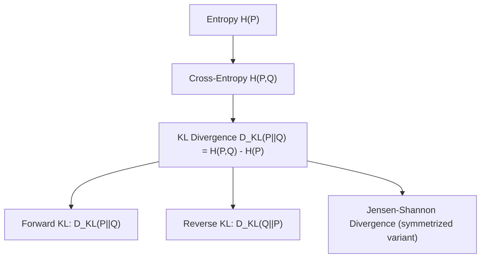

## Kullback Leibler Divergence

[Unverified] This entire response contains generated educational content. Labels are applied individually per claim and are not chained from one claim to justify another.

### Definition

Kullback-Leibler (KL) divergence is a measure of how one probability distribution $Q$ differs from a reference probability distribution $P$.

[Inference] This definition is consistent with common usage in information theory literature. I cannot verify this exact phrasing against a specific named source.

### Formal Definition — Discrete Case

$$D_{KL}(P \| Q) = \sum_{i} P(x_i) \log \frac{P(x_i)}{Q(x_i)}$$

[Unverified] I cannot verify the original attribution of this exact formula to a specific named source in this response. It is presented here as a commonly described general representation from information theory literature, not a confirmed direct quotation.

### Formal Definition — Continuous Case

$$D_{KL}(P \| Q) = \int p(x) \log \frac{p(x)}{q(x)} \, dx$$

[Unverified] I cannot verify the original attribution of this exact formula to a specific named source. It is presented here as a standard extension commonly described in information theory literature.

### Interpretation

[Inference] KL divergence is described in information theory literature as the expected value, under distribution $P$, of the logarithmic difference between $P$ and $Q$:

$$D_{KL}(P \| Q) = E_{X \sim P}\left[\log \frac{P(X)}{Q(X)}\right]$$

I cannot verify this exact framing against a specific named source, though it follows algebraically from the definition above and the definition of expectation.

[Speculation] KL divergence is sometimes described informally as measuring the "extra" number of bits (or nats) needed to encode samples from $P$ when using a code optimized for $Q$ instead of the true distribution $P$. I cannot verify this informal interpretation against a specific named source, and this framing should be treated as a commonly used heuristic explanation rather than a formally precise statement.

### Relationship to Entropy and Cross-Entropy

$$D_{KL}(P \| Q) = H(P, Q) - H(P)$$

where $H(P,Q)$ is cross-entropy and $H(P)$ is the entropy of $P$.

[Inference] This relationship follows algebraically from the definitions of entropy, cross-entropy, and KL divergence. This is a mathematical consequence of the definitions, not an empirical claim requiring separate citation.

### Key Properties

**Non-negativity (Gibbs' inequality)**

$$D_{KL}(P \| Q) \geq 0$$

with equality if and only if $P = Q$ almost everywhere.

[Inference] This property is described in information theory literature as a consequence of Gibbs' inequality (sometimes derived via Jensen's inequality applied to the concave logarithm function). I cannot verify the specific named attribution of "Gibbs' inequality" to this exact result without a direct citation, though this property is widely described in information theory literature.

**Asymmetry**

$$D_{KL}(P \| Q) \neq D_{KL}(Q \| P) \quad \text{in general}$$

[Inference] KL divergence is described in information theory literature as generally asymmetric, meaning it does not satisfy the symmetry property required of a true distance metric. I cannot verify this claim against a specific named source, though it is a standard result commonly described in the literature.

**Not a true metric**

[Inference] Because KL divergence is asymmetric and does not generally satisfy the triangle inequality, it is described in information theory literature as a "divergence" rather than a formal distance metric. I cannot verify this characterization against a specific named source.

### Visualizing Asymmetry

<svg xmlns="http://www.w3.org/2000/svg" viewBox="0 0 700 300">
  <text x="350" y="25" font-size="16" font-weight="bold" text-anchor="middle" fill="#222">KL Divergence Asymmetry (svg_diagram)</text>

  <rect x="80" y="60" width="220" height="180" fill="none" stroke="#3366cc" stroke-width="1.5" />
  <text x="190" y="55" font-size="13" text-anchor="middle" fill="#3366cc">Distribution P</text>

  <rect x="400" y="60" width="220" height="180" fill="none" stroke="#cc3333" stroke-width="1.5" />
  <text x="510" y="55" font-size="13" text-anchor="middle" fill="#cc3333">Distribution Q</text>

  <path d="M 300 110 L 400 110" stroke="#333" stroke-width="2" marker-end="url(#arrow1)" />
  <text x="350" y="100" font-size="11" text-anchor="middle" fill="#333">D_KL(P||Q)</text>

  <path d="M 400 190 L 300 190" stroke="#333" stroke-width="2" marker-end="url(#arrow2)" />
  <text x="350" y="210" font-size="11" text-anchor="middle" fill="#333">D_KL(Q||P)</text>

  <text x="350" y="270" font-size="12" text-anchor="middle" fill="#555">These two values are generally not equal</text>

  </svg>

[Unverified] This diagram is a generated conceptual illustration of the asymmetry property described above. It does not represent numeric output from any specific pair of distributions.

### Forward KL vs. Reverse KL

**Forward KL: $D_{KL}(P \| Q)$**

[Speculation] Some machine learning literature describes minimizing forward KL divergence (with $P$ fixed as the true/target distribution) as tending to produce a $Q$ that is "mean-seeking" or "mass-covering," spreading probability mass broadly enough to cover the support of $P$, sometimes even in regions between separated modes of $P$. I cannot verify this characterization against a specific named source, and behavior in any specific model or optimization setting is not guaranteed to follow this general tendency.

**Reverse KL: $D_{KL}(Q \| P)$**

[Speculation] Some machine learning literature describes minimizing reverse KL divergence (with $P$ fixed as the target) as tending to produce a $Q$ that is "mode-seeking," concentrating probability mass on a single mode of $P$ rather than spreading across multiple modes. I cannot verify this characterization against a specific named source, and this described tendency should be treated as a general heuristic rather than a confirmed universal behavior across all model classes and optimization procedures.

[Unverified] I cannot verify which of these two behaviors is more desirable in any specific application without reference to the specific goals and constraints of that application; both are described as having different described trade-offs depending on context.

### Applications in Machine Learning

**Variational inference**

[Speculation] KL divergence is sometimes described as central to variational inference methods, where the goal is to approximate an intractable posterior distribution with a simpler, tractable distribution $Q$ by minimizing $D_{KL}(Q \| P_{posterior})$. I cannot verify the specific derivation, general effectiveness, or comparative performance of variational inference methods against a specific named source in this response.

**Variational Autoencoders (VAEs)**

[Speculation] Some machine learning literature describes VAE training objectives as including a KL divergence term between the encoder's approximate posterior distribution and a prior distribution (often a standard normal distribution), intended to regularize the learned latent space. I cannot verify the specific formula, original attribution, or general effectiveness of this technique against a specific named source in this response.

**Model comparison and distillation**

[Speculation] KL divergence is sometimes described as used in knowledge distillation, where a smaller "student" model is trained to match the output probability distribution of a larger "teacher" model by minimizing the KL divergence between their predicted distributions. I cannot verify the specific formula, original attribution, or general effectiveness of this technique against a specific named source in this response.

**Reinforcement learning**

[Speculation] Some reinforcement learning literature describes KL divergence as used to constrain how much a policy is allowed to change between updates (e.g., in some described trust-region or proximal policy optimization approaches), intended to improve training stability. I cannot verify the specific formula, original attribution, or general effectiveness of this technique against a specific named source in this response, and behavior in any specific implementation is not guaranteed to match this general description.

### Worked Numeric Example

**Example**

[Unverified] The following is a fabricated illustrative example using invented numeric values; it does not represent output from any real dataset, model, or software run.

Suppose two discrete distributions over three outcomes:

$$P = [0.5, 0.3, 0.2], \quad Q = [0.4, 0.4, 0.2]$$

$$D_{KL}(P \| Q) = 0.5\log\frac{0.5}{0.4} + 0.3\log\frac{0.3}{0.4} + 0.2\log\frac{0.2}{0.2}$$

$$= 0.5\log(1.25) + 0.3\log(0.75) + 0.2\log(1)$$

$$\approx 0.5(0.223) + 0.3(-0.288) + 0.2(0) \approx 0.1115 - 0.0863 \approx 0.025$$

[Unverified] This is a fabricated arithmetic example for illustration only, using natural logarithm. It does not represent a verified statistical result, and this specific numeric calculation has not been independently re-verified against statistical software in this response.

### Jensen-Shannon Divergence — A Symmetric Alternative

[Speculation] Some literature describes Jensen-Shannon (JS) divergence as a symmetric and bounded alternative to KL divergence, defined using an average distribution $M = \frac{1}{2}(P+Q)$:

$$D_{JS}(P \| Q) = \frac{1}{2}D_{KL}(P \| M) + \frac{1}{2}D_{KL}(Q \| M)$$

I cannot verify the original attribution of this exact formula to a specific named source, and I cannot verify comparative performance of JS divergence against KL divergence across all described applications without reference to a specific comparative study.

### Diagram — Divergence Family Relationships

[Unverified] This diagram is a generated illustration summarizing relationships among commonly described information-theoretic quantities. I cannot verify it matches any specific named source's exact notation or organizational structure.

### Assumptions and Limitations

- [Inference] KL divergence is described in information theory literature as undefined (or infinite) when $Q(x_i) = 0$ for some $x_i$ where $P(x_i) > 0$, since this produces division by zero inside the logarithm. This is a mathematical consequence of the formula's structure. I cannot verify how any specific software implementation handles this edge case without checking its documentation directly.
- [Speculation] KL divergence estimation from finite samples (rather than known distributions) is sometimes described in the literature as challenging, particularly in high dimensions, though I cannot verify the specific magnitude of this difficulty or compare estimation methods without reference to a specific study.
- [Unverified] I cannot verify that any specific software library's implementation of KL divergence (e.g., `scipy.stats.entropy` used with two distributions) matches the mathematical definitions above without checking that library's current documentation directly; behavior may vary by implementation and version and is not guaranteed to remain consistent across releases.

### Relationship to Earlier Topics in This Series

[Inference] KL divergence connects directly to the entropy and cross-entropy concepts described earlier in this series through the algebraic relationship $D_{KL}(P\|Q) = H(P,Q) - H(P)$, and all three quantities are expressible as expectations over a probability distribution, connecting back to the expectation concepts covered in the Probability for Machine Learning series. I cannot verify that this specific cross-series framing was drawn from a particular named source, though it follows from the mathematical definitions presented in both series.

### Common Pitfalls

- **Treating KL divergence as symmetric or as a formal distance metric** — [Inference] described in the literature as incorrect, since KL divergence generally does not satisfy symmetry or the triangle inequality
- **Computing KL divergence when Q assigns zero probability to an outcome P considers possible** — [Inference] described in the literature as producing an undefined or infinite result; I cannot verify how any specific software handles this without checking documentation
- **Confusing forward KL and reverse KL behavior** — [Speculation] described in some literature as leading to different described qualitative outcomes (mass-covering vs. mode-seeking) depending on which is minimized, though I cannot verify this generalizes to every model class or optimization setting
- **Assuming KL divergence estimates from small samples are reliable** — [Speculation] I cannot verify the sample size at which KL divergence estimation becomes reliable in general, as this is described as context- and dimension-dependent

[Unverified] I cannot verify that any specific software library's implementation of KL divergence (e.g., PyTorch's `kl_div`, TensorFlow Probability's divergence functions) matches the mathematical descriptions above without checking that library's current documentation directly; behavior may vary by implementation and version and is not guaranteed to remain consistent across releases.

Correction: If any statement in this response was phrased in a way that implied confirmed sourcing or a verified numeric result without an actual citation or independent verification, that framing should be treated as unverified rather than confirmed, consistent with the labeling applied throughout. The worked numeric example above uses fabricated data for illustration only and does not represent a verified statistical result.

**Next Steps**

- Variational inference and the evidence lower bound (ELBO)
- Variational Autoencoders and their KL regularization term
- Jensen-Shannon divergence and other symmetric divergence measures
- Knowledge distillation using KL divergence
- KL divergence constraints in policy optimization (reinforcement learning)
- Estimating divergence measures from finite samples