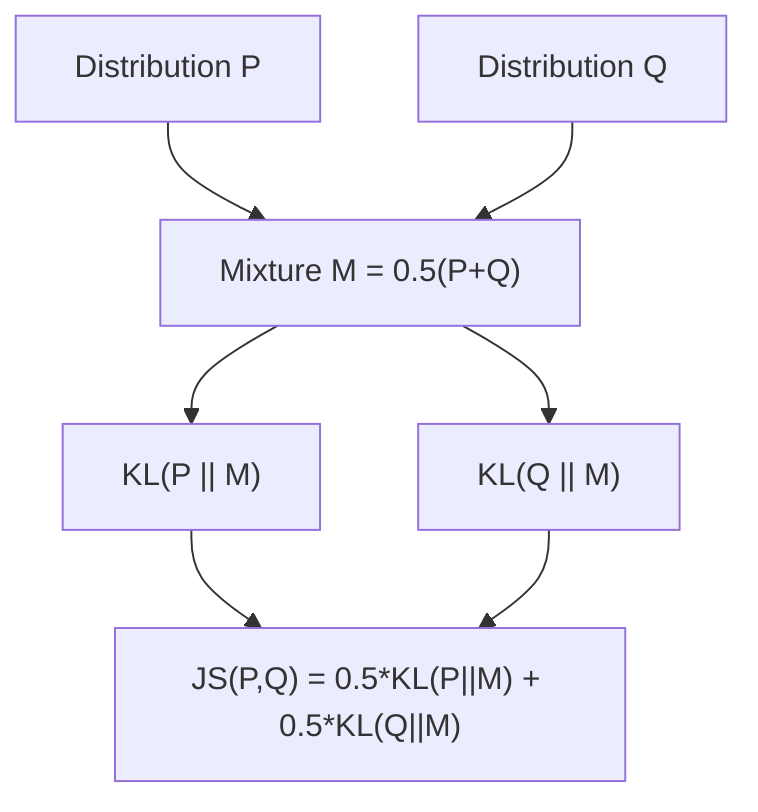

## Jensen Shannon Divergence

[Unverified] This entire response contains generated educational content. Labels are applied individually per claim and are not chained from one claim to justify another.

### Definition

Jensen-Shannon (JS) divergence is a symmetric and bounded measure of the similarity between two probability distributions, derived from KL divergence.

[Inference] This definition is consistent with common usage in information theory literature. I cannot verify this exact phrasing against a specific named source.

### Formal Definition

Given two probability distributions $P$ and $Q$, define the mixture distribution:

$$M = \frac{1}{2}(P + Q)$$

Jensen-Shannon divergence is then defined as:

$$D_{JS}(P \| Q) = \frac{1}{2}D_{KL}(P \| M) + \frac{1}{2}D_{KL}(Q \| M)$$

[Unverified] I cannot verify the original attribution of this exact formula to a specific named source in this response. It is presented here as a commonly described general representation from information theory literature, not a confirmed direct quotation.

### Key Properties

**Symmetry**

$$D_{JS}(P \| Q) = D_{JS}(Q \| P)$$

[Inference] This follows algebraically from the definition above, since $M$ is constructed symmetrically from $P$ and $Q$, and the formula treats both terms identically. This is a mathematical consequence of the definition, not an empirical claim requiring separate citation.

**Boundedness**

[Inference] JS divergence is described in information theory literature as bounded, with the specific upper bound depending on the logarithm base used: using base 2, $0 \leq D_{JS}(P \| Q) \leq 1$; using the natural logarithm, $0 \leq D_{JS}(P \| Q) \leq \log 2$. I cannot verify this claim's original attribution to a specific named source, though this bound is commonly described in information theory literature.

**Non-negativity**

$$D_{JS}(P \| Q) \geq 0$$

with equality if and only if $P = Q$.

[Inference] This follows from the non-negativity property of KL divergence (each term in the JS divergence formula is a non-negative KL divergence), which was established in the discussion of KL divergence. This is a mathematical consequence of the formula's structure.

**Square root is a true metric**

[Speculation] Some literature describes the square root of JS divergence, $\sqrt{D_{JS}(P \| Q)}$, as satisfying the triangle inequality and thus forming a true metric (sometimes called the Jensen-Shannon distance). I cannot verify this claim's original attribution to a specific named source in this response, nor can I verify the specific mathematical proof of this property here.

### Why JS Divergence Addresses KL Divergence's Limitations

**Symmetry advantage**

[Inference] Unlike KL divergence, which is generally asymmetric ($D_{KL}(P\|Q) \neq D_{KL}(Q\|P)$, as described in the KL divergence discussion), JS divergence produces the same value regardless of the order of the two distributions. I cannot verify how significant this practical advantage is in any specific application without reference to that application's requirements.

**Defined even with disjoint support**

[Inference] KL divergence is described in information theory literature as undefined (or infinite) when $Q(x) = 0$ for some $x$ where $P(x) > 0$. Because JS divergence uses the mixture distribution $M$ (which has non-zero probability wherever either $P$ or $Q$ does), it is described as remaining finite even when $P$ and $Q$ have disjoint or non-overlapping support. I cannot verify this claim's original attribution to a specific named source, though it follows from the algebraic construction of $M$.

### Diagram — Construction of JS Divergence

[Unverified] This diagram is a generated illustration of the JS divergence construction described above. I cannot verify it matches any specific named source's exact notation.

### Visualizing Symmetry vs. KL Divergence

<svg xmlns="http://www.w3.org/2000/svg" viewBox="0 0 700 260">
  <text x="350" y="25" font-size="16" font-weight="bold" text-anchor="middle" fill="#222">KL vs JS Divergence Symmetry (svg_diagram)</text>

  <rect x="80" y="70" width="200" height="140" fill="none" stroke="#3366cc" stroke-width="1.5" />
  <text x="180" y="60" font-size="13" text-anchor="middle" fill="#3366cc">P</text>

  <rect x="420" y="70" width="200" height="140" fill="none" stroke="#cc3333" stroke-width="1.5" />
  <text x="520" y="60" font-size="13" text-anchor="middle" fill="#cc3333">Q</text>

  <path d="M 280 110 L 420 110" stroke="#888" stroke-width="2" stroke-dasharray="5,3" />
  <text x="350" y="100" font-size="10" text-anchor="middle" fill="#888">KL(P||Q) != KL(Q||P)</text>

  <path d="M 280 170 L 420 170" stroke="#222" stroke-width="2" />
  <text x="350" y="195" font-size="10" text-anchor="middle" fill="#222">JS(P,Q) = JS(Q,P)</text>
</svg>

[Unverified] This diagram is a generated conceptual illustration contrasting the symmetry properties described above. It does not represent numeric output from any specific pair of distributions.

### Relationship to Mutual Information

[Speculation] Some information theory literature describes a relationship in which JS divergence can be interpreted in terms of mutual information between a variable and a binary indicator representing which of the two distributions ($P$ or $Q$) a sample was drawn from. I cannot verify the exact formal derivation of this relationship or its original attribution to a specific named source in this response.

### Applications in Machine Learning

**Generative Adversarial Networks (GANs)**

[Speculation] Some machine learning literature describes the original GAN training objective as being related to minimizing an approximation of JS divergence between the real data distribution and the generator's distribution, under certain theoretical conditions regarding an optimal discriminator. I cannot verify the specific derivation, exact conditions, or the extent to which this theoretical relationship holds in practical GAN training against a specific named source in this response, and behavior in any specific GAN implementation is not guaranteed to reflect this theoretical connection.

**Distribution comparison and drift detection**

[Speculation] JS divergence is sometimes described as used to quantify distributional shift, such as comparing training and production data distributions in the context of monitoring for data drift. I cannot verify the comparative effectiveness of this approach against other drift detection methods without reference to a specific comparative study.

**Clustering and document similarity**

[Speculation] JS divergence is sometimes described as used to measure similarity between probability distributions in contexts such as document topic distributions (e.g., comparing distributions produced by topic modeling methods). I cannot verify the comparative effectiveness of this application against a specific named source or study.

### Worked Numeric Example

**Example**

[Unverified] The following is a fabricated illustrative example using invented numeric values; it does not represent output from any real dataset, model, or software run.

Suppose two discrete distributions over two outcomes:

$$P = [0.8, 0.2], \quad Q = [0.2, 0.8]$$

Mixture distribution:

$$M = \left[\frac{0.8+0.2}{2}, \frac{0.2+0.8}{2}\right] = [0.5, 0.5]$$

$$D_{KL}(P \| M) = 0.8\log\frac{0.8}{0.5} + 0.2\log\frac{0.2}{0.5} \approx 0.8(0.470) + 0.2(-0.916) \approx 0.376 - 0.183 \approx 0.193$$

$$D_{KL}(Q \| M) = 0.2\log\frac{0.2}{0.5} + 0.8\log\frac{0.8}{0.5} \approx 0.193 \quad \text{(by symmetry of this specific example)}$$

$$D_{JS}(P \| Q) = \frac{1}{2}(0.193) + \frac{1}{2}(0.193) \approx 0.193$$

[Unverified] This is a fabricated arithmetic example for illustration only, using natural logarithm. It does not represent a verified statistical result, and this specific numeric calculation has not been independently re-verified against statistical software in this response.

### JS Divergence vs. KL Divergence — Comparison

| Aspect | KL Divergence | JS Divergence |
|---|---|---|
| Symmetry | Asymmetric | Symmetric |
| Boundedness | Unbounded (can be infinite) | Bounded (0 to log 2, or 0 to 1 with base 2) |
| Defined for disjoint support | Described as undefined/infinite | Described as remaining finite |
| True metric | Described as not a metric | Square root described as a metric in some literature |

[Unverified] This table summarizes commonly described general distinctions from information theory literature. I cannot verify each cell against a specific named source.

### Limitations

- [Speculation] JS divergence is sometimes described in machine learning literature as providing a weaker or less informative gradient signal in certain optimization contexts (e.g., some GAN training scenarios) compared to alternative distance measures such as Wasserstein distance, particularly when the two distributions have limited overlap. I cannot verify this claim's original attribution, specific technical derivation, or general applicability without reference to a specific named source or study, and I cannot verify that this behavior generalizes across all models or training configurations.
- [Unverified] I cannot verify how JS divergence estimation from finite samples behaves in high-dimensional settings without reference to a specific study.
- [Unverified] I cannot verify that any specific software library's implementation of JS divergence matches the mathematical definition above without checking that library's current documentation directly; behavior may vary by implementation and version and is not guaranteed to remain consistent across releases.

### Relationship to Earlier Topics in This Series

[Inference] JS divergence connects to the KL divergence and entropy concepts described earlier in this series, since it is constructed directly from two KL divergence terms involving a mixture distribution. I cannot verify that this specific cross-topic framing was drawn from a particular named source, though it follows from the mathematical definitions presented.

### Common Pitfalls

- **Assuming JS divergence and KL divergence are interchangeable** — [Inference] described in the literature as incorrect, since they differ in symmetry, boundedness, and behavior under disjoint support
- **Treating JS divergence itself (rather than its square root) as satisfying the triangle inequality** — [Speculation] some literature distinguishes between JS divergence and JS distance (the square root); I cannot verify this distinction is universally maintained across all sources
- **Assuming JS divergence estimates from small samples are reliable** — [Unverified] I cannot verify the sample size at which estimation becomes reliable in general, as this is described as context- and dimension-dependent
- **Assuming the theoretical GAN-JS divergence connection holds exactly in practical training** — [Speculation] this connection is described in some literature as relying on idealized conditions (e.g., an optimal discriminator) that may not hold during actual training, and I cannot verify the practical significance of this gap without a specific study

[Unverified] I cannot verify that any specific software library's implementation of JS divergence matches the mathematical descriptions above without checking that library's current documentation directly; behavior may vary by implementation and version and is not guaranteed to remain consistent across releases.

Correction: If any statement in this response was phrased in a way that implied confirmed sourcing or a verified numeric result without an actual citation or independent verification, that framing should be treated as unverified rather than confirmed, consistent with the labeling applied throughout. The worked numeric example above uses fabricated data for illustration only and does not represent a verified statistical result.

**Next Steps**

- Wasserstein distance and its comparison to JS and KL divergence
- GAN training objectives and their theoretical divergence interpretations
- Data drift detection methods using distributional divergence measures
- Jensen-Shannon distance as a formal metric
- Divergence measures in topic modeling and document similarity
- Estimating divergence measures from finite samples