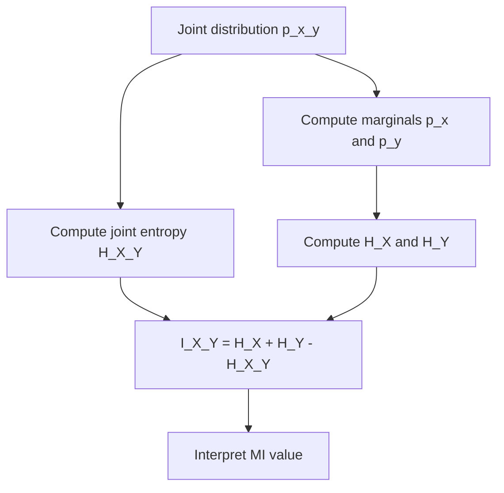

## Mutual Information

### Definition

Mutual information (MI) quantifies the amount of information one random variable contains about another. For discrete random variables $X$ and $Y$, it is defined as:

$$I(X;Y) = \sum_{x \in X} \sum_{y \in Y} p(x,y) \log \frac{p(x,y)}{p(x)p(y)}$$

For continuous variables, sums become integrals:

$$I(X;Y) = \int \int p(x,y) \log \frac{p(x,y)}{p(x)p(y)} \, dx \, dy$$

Mutual information measures the reduction in uncertainty about one variable given knowledge of the other. It is symmetric: $I(X;Y) = I(Y;X)$.

### Relationship to Entropy

Mutual information connects directly to entropy and conditional entropy:

$$I(X;Y) = H(X) - H(X|Y) = H(Y) - H(Y|X) = H(X) + H(Y) - H(X,Y)$$

Where:
- $H(X)$ is the entropy (uncertainty) of $X$
- $H(X|Y)$ is the conditional entropy of $X$ given $Y$
- $H(X,Y)$ is the joint entropy

This shows MI as the overlap between two variables' information content.

Diagram showing this relationship:

<svg xmlns="http://www.w3.org/2000/svg" viewBox="0 0 500 300">
  <text x="250" y="25" font-size="16" font-weight="bold" text-anchor="middle">Entropy Relationships (svg_diagram)</text>
  <circle cx="190" cy="160" r="100" fill="#a8d8ea" fill-opacity="0.6" stroke="#333" stroke-width="1.5" />
  <circle cx="310" cy="160" r="100" fill="#f7a4a4" fill-opacity="0.6" stroke="#333" stroke-width="1.5" />
  <text x="140" y="160" font-size="14" text-anchor="middle">H(X|Y)</text>
  <text x="250" y="160" font-size="14" text-anchor="middle" font-weight="bold">I(X;Y)</text>
  <text x="360" y="160" font-size="14" text-anchor="middle">H(Y|X)</text>
  <text x="150" y="90" font-size="13" text-anchor="middle">H(X)</text>
  <text x="350" y="90" font-size="13" text-anchor="middle">H(Y)</text>
  <text x="250" y="280" font-size="12" text-anchor="middle" fill="#555">H(X,Y) = H(X) + H(Y) − I(X;Y)</text>
</svg>

### Relationship to KL Divergence

Mutual information can be expressed as the Kullback-Leibler divergence between the joint distribution and the product of marginal distributions:

$$I(X;Y) = D_{KL}\big(p(x,y) \,\|\, p(x)p(y)\big)$$

This framing shows MI as a measure of how far $X$ and $Y$ are from being statistically independent. If $X$ and $Y$ are independent, $p(x,y) = p(x)p(y)$ for all $x,y$, and $I(X;Y) = 0$.

### Key Properties

- **Non-negativity**: $I(X;Y) \geq 0$, with equality if and only if $X$ and $Y$ are independent.
- **Symmetry**: $I(X;Y) = I(Y;X)$.
- **Not a metric**: MI does not satisfy the triangle inequality and is not a distance measure in the formal sense. [Inference] This is a mathematical consequence of its definition via KL divergence, which is itself asymmetric and not a true metric.
- **Invariance under invertible transformations**: For invertible, differentiable functions $f$ and $g$, $I(f(X);g(Y)) = I(X;Y)$. This makes MI robust to monotonic rescaling, unlike correlation coefficients.
- **Captures nonlinear dependence**: Unlike Pearson correlation, MI can detect nonlinear and non-monotonic relationships between variables.

### Mutual Information vs. Correlation

| Property | Correlation | Mutual Information |
|---|---|---|
| Detects linear relationships | Yes | Yes |
| Detects nonlinear relationships | No | Yes |
| Range | $[-1, 1]$ | $[0, \infty)$ |
| Zero implies independence | No (only implies no linear relationship) | Yes |
| Symmetric | Yes | Yes |

A classic illustrative case: two variables related by $Y = X^2$ where $X$ is symmetric around zero can have correlation near zero, while mutual information remains high, because MI captures the dependency regardless of its functional form.

### Applications in Machine Learning

**Feature selection**: MI is used to rank features by how much information they provide about a target variable, independent of the model class used downstream. This is common in filter-based feature selection methods.

**Decision trees**: Information gain, used to select splits in decision tree algorithms (e.g., ID3, C4.5), is a direct application of mutual information — specifically, the reduction in entropy of the target variable given a feature split.

**Representation learning**: Mutual information appears in objectives such as the Information Bottleneck method, and in some self-supervised learning approaches (e.g., InfoNCE-based contrastive losses), where the goal is to maximize MI between related views of data while controlling MI with irrelevant factors. [Unverified] The specific formulations and effectiveness of these methods vary across papers and implementations; behavior in practice depends on architecture, data, and training setup, and is not guaranteed by the underlying theoretical objective.

**Clustering evaluation**: Normalized Mutual Information (NMI) is used to compare clustering assignments against ground-truth labels, measuring shared information between the two partitions.

### Estimating Mutual Information

Exact computation of MI requires the true joint and marginal distributions, which are rarely known in practice. Common estimation approaches include:

- **Discretization/binning**: Convert continuous variables into bins and compute MI on the resulting discrete distribution. Sensitive to bin size choice. [Inference] Coarser bins tend to underestimate MI by smoothing out fine-grained dependencies, though the precise effect depends on the underlying distribution.
- **K-nearest neighbor estimators**: Methods such as the Kraskov-Stögbauer-Grassberger (KSG) estimator estimate MI for continuous variables using local density estimates via nearest-neighbor distances.
- **Neural estimators**: Approaches like MINE (Mutual Information Neural Estimation) use neural networks to approximate a variational lower bound on MI. [Unverified] The tightness and reliability of these bounds can vary substantially depending on network capacity, sample size, and the true underlying MI magnitude; specific numerical claims about estimator accuracy should be checked against the original source before being relied upon.

### Worked Example

Consider a binary classification feature selection scenario. Suppose $X$ is a binary feature (0 or 1) and $Y$ is a binary target label (0 or 1), with joint distribution:

| | Y=0 | Y=1 |
|---|---|---|
| X=0 | 0.4 | 0.1 |
| X=1 | 0.1 | 0.4 |

Marginals: $p(X=0) = 0.5$, $p(X=1) = 0.5$, $p(Y=0) = 0.5$, $p(Y=1) = 0.5$.

Computing MI:

$$I(X;Y) = 0.4\log\frac{0.4}{0.25} + 0.1\log\frac{0.1}{0.25} + 0.1\log\frac{0.1}{0.25} + 0.4\log\frac{0.4}{0.25}$$

Using base-2 logarithms:

$$I(X;Y) = 2(0.4\log_2 1.6) + 2(0.1\log_2 0.4) \approx 2(0.271) + 2(-0.132) \approx 0.278 \text{ bits}$$

This nonzero value indicates $X$ carries meaningful information about $Y$ — consistent with the strong diagonal association visible in the joint table.

### Computation Flow

### Limitations

- MI values are not bounded above, which makes cross-context comparison difficult without normalization (e.g., Normalized Mutual Information).
- Estimating MI accurately from finite samples, especially in high dimensions, is a known hard problem; naive estimators can be biased upward or downward depending on sample size and method. [Inference] This bias arises from the general difficulty of density estimation in high-dimensional spaces, though exact bias behavior depends on the specific estimator used.
- MI does not indicate the direction or nature of a relationship, only that statistical dependence exists.

**Related Topics**
- Kullback-Leibler divergence and cross-entropy
- Conditional entropy and joint entropy
- Information Bottleneck method
- Normalized Mutual Information for clustering evaluation
- Contrastive learning objectives (InfoNCE, noise-contrastive estimation)
- Feature selection methods beyond MI (Chi-squared test, ANOVA F-test)
- Entropy-based decision tree splitting criteria (information gain, Gini impurity)