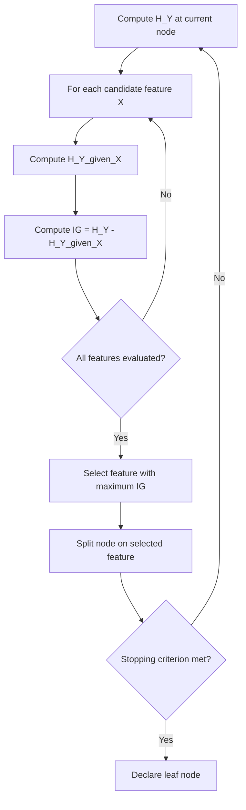

## Information Gain

### Definition

Information gain measures the reduction in entropy (uncertainty) about a target variable achieved by partitioning data according to a given feature. It is defined as:

$$IG(Y, X) = H(Y) - H(Y|X)$$

Where $H(Y)$ is the entropy of the target variable before the split, and $H(Y|X)$ is the conditional entropy of the target after splitting on feature $X$. This quantity is mathematically identical to mutual information: $IG(Y,X) = I(Y;X)$.

### Entropy Foundation

For a discrete target variable $Y$ with classes $c_1, \dots, c_k$, entropy is defined as:

$$H(Y) = -\sum_{i=1}^{k} p(c_i) \log_2 p(c_i)$$

Entropy is maximized when classes are equally distributed (maximum uncertainty) and minimized (zero) when all instances belong to a single class (no uncertainty).

### Conditional Entropy After Split

When splitting on feature $X$ with values $v_1, \dots, v_m$, the conditional entropy is the weighted average of entropy across the resulting subsets:

$$H(Y|X) = \sum_{j=1}^{m} p(X=v_j) \, H(Y|X=v_j)$$

Each subset's entropy $H(Y|X=v_j)$ is computed using the class distribution within that subset only.

### Worked Example

Consider a dataset of 10 samples for a binary classification task (Play = Yes/No) split by a binary feature (Weather = Sunny/Rainy):

| Weather | Play=Yes | Play=No | Total |
|---|---|---|---|
| Sunny | 4 | 1 | 5 |
| Rainy | 2 | 3 | 5 |

**Step 1 — Overall entropy of Y:**

$p(\text{Yes}) = 6/10 = 0.6$, $p(\text{No}) = 4/10 = 0.4$

$$H(Y) = -(0.6 \log_2 0.6 + 0.4 \log_2 0.4) \approx 0.971 \text{ bits}$$

**Step 2 — Entropy within each subset:**

For Sunny: $p(\text{Yes}) = 4/5 = 0.8$, $p(\text{No}) = 1/5 = 0.2$

$$H(Y|\text{Sunny}) = -(0.8 \log_2 0.8 + 0.2 \log_2 0.2) \approx 0.722 \text{ bits}$$

For Rainy: $p(\text{Yes}) = 2/5 = 0.4$, $p(\text{No}) = 3/5 = 0.6$

$$H(Y|\text{Rainy}) = -(0.4 \log_2 0.4 + 0.6 \log_2 0.6) \approx 0.971 \text{ bits}$$

**Step 3 — Weighted conditional entropy:**

$$H(Y|X) = 0.5(0.722) + 0.5(0.971) \approx 0.847 \text{ bits}$$

**Step 4 — Information gain:**

$$IG(Y,X) = 0.971 - 0.847 \approx 0.124 \text{ bits}$$

This value represents the reduction in uncertainty about Play achieved by knowing Weather.

### Role in Decision Tree Construction

Information gain is the splitting criterion used in the ID3 algorithm. At each node, the algorithm computes information gain for every candidate feature and selects the feature that yields the highest gain. [Unverified] The specific implementation details of ID3, C4.5, and related algorithms vary across sources and software libraries; the general principle described here (selecting the maximum-gain feature at each node) reflects the commonly cited textbook formulation, and I cannot verify that any particular library implements it identically.

Splitting process:

### Bias Toward High-Cardinality Features

Information gain has a known tendency to favor features with many distinct values (high cardinality), because such splits can partition data into smaller, purer subsets even when the feature has little genuine predictive relationship with the target. [Inference] This is commonly cited as the motivation for the gain ratio metric introduced in C4.5, which normalizes information gain by the intrinsic information of the split; I cannot verify the exact historical derivation or original source text without citation access. A feature such as a unique row identifier could produce maximal information gain (splitting each instance into its own subset with zero remaining entropy) while providing no generalizable predictive value.

### Gain Ratio as a Correction

Gain ratio adjusts for the cardinality bias by dividing information gain by "split information," which measures the entropy of the split itself:

$$SplitInfo(X) = -\sum_{j=1}^{m} p(X=v_j) \log_2 p(X=v_j)$$

$$GainRatio(Y,X) = \frac{IG(Y,X)}{SplitInfo(X)}$$

Features that split data into many small subsets have high split information, which penalizes their gain ratio relative to raw information gain.

### Comparison of Splitting Criteria

| Criterion | Formula Basis | Bias | Used In |
|---|---|---|---|
| Information Gain | Entropy reduction | Favors high-cardinality features | ID3 |
| Gain Ratio | IG normalized by split info | Corrects cardinality bias | C4.5 |
| Gini Impurity | $1 - \sum p_i^2$ | Similar to entropy, computationally simpler | CART |

[Unverified] This table reflects commonly taught associations between criteria and algorithms in machine learning coursework; I do not have access to verify against the original published specifications of each algorithm, and specific software implementations (e.g., scikit-learn's DecisionTreeClassifier) may support multiple criteria interchangeably regardless of this historical association.

### Diagram: Entropy Reduction Concept

<svg xmlns="http://www.w3.org/2000/svg" viewBox="0 0 550 280">
  <text x="275" y="25" font-size="16" font-weight="bold" text-anchor="middle">Information Gain via Entropy Reduction (svg_diagram)</text>
  <rect x="40" y="60" width="180" height="80" fill="#f7a4a4" fill-opacity="0.6" stroke="#333" stroke-width="1.5" />
  <text x="130" y="105" font-size="13" text-anchor="middle">H(Y) = 0.971</text>
  <text x="130" y="150" font-size="12" text-anchor="middle">Before Split</text>
  <line x1="230" y1="100" x2="290" y2="100" stroke="#333" stroke-width="2" marker-end="url(#arrow)" />
  <rect x="300" y="30" width="110" height="60" fill="#a8d8ea" fill-opacity="0.6" stroke="#333" stroke-width="1.5" />
  <text x="355" y="65" font-size="12" text-anchor="middle">Sunny: 0.722</text>
  <rect x="300" y="110" width="110" height="60" fill="#a8d8ea" fill-opacity="0.6" stroke="#333" stroke-width="1.5" />
  <text x="355" y="145" font-size="12" text-anchor="middle">Rainy: 0.971</text>
  <text x="440" y="105" font-size="12" text-anchor="middle">Weighted avg</text>
  <text x="440" y="122" font-size="12" text-anchor="middle">= 0.847</text>
  <text x="275" y="220" font-size="13" text-anchor="middle" font-weight="bold">IG = 0.971 − 0.847 = 0.124 bits</text>
</svg>

### Limitations

- Information gain requires discrete or discretized target and feature variables in its classical formulation; continuous features require threshold-based binarization before computing gain. [Inference] This follows from the entropy formula's dependence on discrete probability distributions over categories, though specific discretization strategies vary by implementation.
- The high-cardinality bias described above means information gain alone is not a reliable criterion when features have widely varying numbers of distinct values.
- Information gain does not account for the computational cost or interpretability trade-offs of a resulting tree structure; it is a purely statistical criterion. This claim describes a structural property of the metric's definition and is not a behavioral claim requiring the [Unverified] disclaimer.

**Related Topics**
- Gini impurity and its relationship to entropy
- Gain ratio and the C4.5 algorithm
- Mutual information (parent concept)
- Pruning strategies for decision trees
- Random forests and feature importance via mean decrease in impurity
- Cross-entropy loss in classification models
- Discretization methods for continuous features