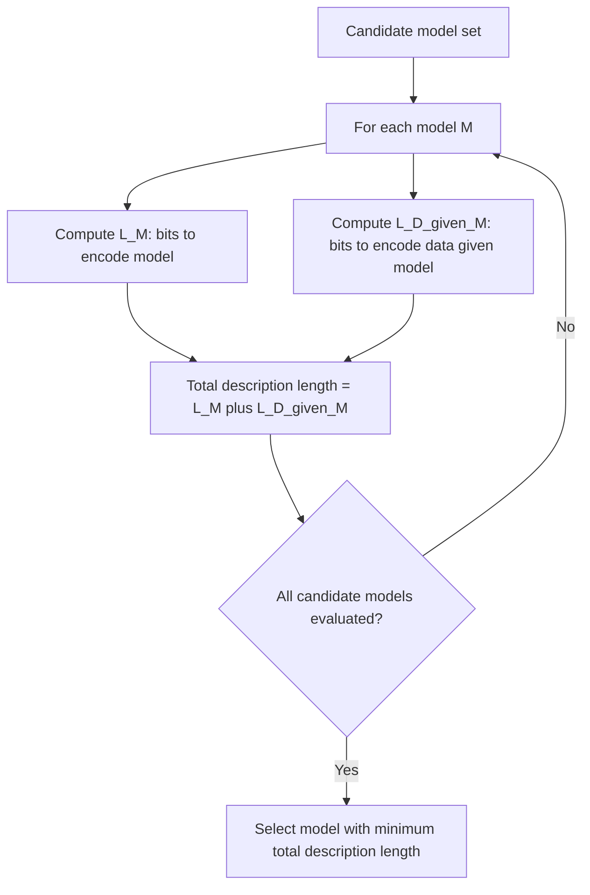

## Minimum Description Length

### Definition

Minimum Description Length (MDL) is a principle for model selection based on the idea that the best model for a dataset is the one that yields the shortest total description of both the model itself and the data encoded using that model. It formalizes a version of Occam's razor in information-theoretic terms: simpler models are preferred unless additional complexity is justified by a sufficiently large reduction in the encoding length of the data.

### Core Formulation

The MDL principle selects a model $M$ from a set of candidate models to minimize:

$$L(M) + L(D|M)$$

Where:
- $L(M)$ is the length, in bits, required to describe the model itself
- $L(D|M)$ is the length, in bits, required to describe the data given the model (i.e., the residual or error encoding)

This creates an explicit trade-off: a more complex model may reduce $L(D|M)$ by fitting the data more closely, but it increases $L(M)$. The total description length balances these two terms.

### Connection to Information Theory

MDL is grounded in Shannon's source coding theorem, which establishes that the optimal code length for an event with probability $p$ is $-\log_2 p$ bits. This gives MDL a direct link to probabilistic modeling:

$$L(D|M) = -\log_2 P(D|M)$$

Under this correspondence, minimizing description length is mathematically equivalent to maximizing the likelihood of the data under the model, adjusted by a penalty term for model complexity. This connects MDL closely to Bayesian model selection, where $L(M)$ plays a role analogous to a prior probability over models expressed in bits.

### Relationship to Bayesian Inference

MDL and Bayesian maximum a posteriori (MAP) estimation are closely related. The Bayesian posterior is:

$$P(M|D) \propto P(D|M) \, P(M)$$

Taking the negative log:

$$-\log P(M|D) = -\log P(D|M) - \log P(M) + \text{constant}$$

This has the same structure as $L(D|M) + L(M)$, since $-\log P(D|M)$ corresponds to $L(D|M)$ and $-\log P(M)$ corresponds to $L(M)$. [Inference] This correspondence is a widely cited theoretical link between MDL and Bayesian MAP estimation, but I cannot verify the specific historical formulation or original derivation without access to a citable source, so this should be treated as a commonly taught equivalence rather than a confirmed exact identity in all cases.

### Two-Part vs. Refined MDL

There are two general formulations of MDL discussed in the literature:

- **Two-part MDL**: Explicitly separates $L(M)$ and $L(D|M)$ as described above. This is the more intuitive and commonly taught version.
- **Refined (one-part) MDL**: Uses a single code, based on concepts such as the normalized maximum likelihood (NML) or Bayesian mixture codes, that does not require explicitly separating model description from data description. [Unverified] I do not have access to verify the specific technical details, originating authors, or mathematical guarantees of refined MDL formulations beyond the general characterization stated here; this area involves technical subtleties in the information-theoretic literature that I cannot confirm without a citable source.

### Worked Example: Polynomial Model Selection

Consider fitting a polynomial to a set of data points, choosing between a degree-1 (linear) and degree-10 (high-order) polynomial.

| Component | Degree-1 Model | Degree-10 Model |
|---|---|---|
| Parameters to encode | 2 (slope, intercept) | 11 coefficients |
| $L(M)$ (approximate) | Small | Large |
| Residual fit to data | Likely poorer | Likely better (may overfit) |
| $L(D\|M)$ (approximate) | Larger | Smaller |

If the degree-10 model overfits noise in the data, its improved fit reduces $L(D|M)$ only marginally relative to the sharp increase in $L(M)$ needed to encode 11 coefficients at sufficient precision. In such a case, MDL favors the simpler degree-1 model. [Inference] This directional conclusion follows from the general trade-off structure of the MDL formula, but the specific numeric outcome for any given dataset depends on the actual data and cannot be determined without computing both terms explicitly.

### MDL and Overfitting

MDL provides a principled mechanism for penalizing model complexity without requiring a separate held-out validation set, because the penalty is built directly into the encoding cost of the model parameters. This distinguishes it from purely empirical approaches like cross-validation, which estimate generalization error through repeated data splitting rather than through an explicit complexity term.

### Comparison to Related Model Selection Criteria

| Criterion | Complexity Penalty | Theoretical Basis |
|---|---|---|
| MDL | $L(M)$, description length of model | Information theory / coding |
| AIC (Akaike Information Criterion) | $2k$, where $k$ = number of parameters | Kullback-Leibler divergence approximation |
| BIC (Bayesian Information Criterion) | $k \log n$, where $n$ = sample size | Bayesian approximation |

[Unverified] The precise mathematical relationships and asymptotic equivalences between MDL, AIC, and BIC are discussed in statistical learning theory literature, but I cannot verify the exact conditions under which these criteria coincide or diverge without a citable source. BIC is sometimes described as asymptotically related to a two-part MDL formulation, but this correspondence depends on specific assumptions I cannot confirm here.

### Applications in Machine Learning

- **Decision tree pruning**: MDL-based pruning criteria evaluate whether the reduction in encoding the tree's predictions offsets the additional bits needed to encode a more complex tree structure.
- **Model selection in regression**: MDL can be used to compare regression models with different numbers of predictors, analogous to the polynomial example above.
- **Clustering**: MDL has been applied to select the number of clusters in a dataset by treating cluster assignments and cluster parameters as part of the encoded model. [Unverified] I do not have access to confirm specific implementations or published results demonstrating this application's effectiveness in practice; behavior in any given clustering algorithm or software library is not guaranteed and may vary depending on implementation choices.
- **Neural network compression**: Some research has explored MDL-inspired objectives for encouraging compact neural network representations. [Speculation] The extent to which this is a mainstream or widely adopted technique in current deep learning practice is not something I can confirm, and this application should be treated as a possible but unconfirmed direction rather than an established standard method.

### Process Flow

### Diagram: Complexity Trade-off

<svg xmlns="http://www.w3.org/2000/svg" viewBox="0 0 550 300">
  <text x="275" y="25" font-size="16" font-weight="bold" text-anchor="middle">MDL Trade-off Curve (svg_diagram)</text>
  <line x1="60" y1="250" x2="500" y2="250" stroke="#333" stroke-width="1.5" />
  <line x1="60" y1="250" x2="60" y2="50" stroke="#333" stroke-width="1.5" />
  <text x="280" y="280" font-size="12" text-anchor="middle">Model Complexity</text>
  <text x="25" y="150" font-size="12" text-anchor="middle" transform="rotate(-90 25 150)">Bits</text>
  <path d="M70,80 Q280,240 490,245" fill="none" stroke="#f7a4a4" stroke-width="2.5" />
  <text x="450" y="235" font-size="11" fill="#c0392b">L(D|M)</text>
  <path d="M70,245 Q280,150 490,70" fill="none" stroke="#a8d8ea" stroke-width="2.5" />
  <text x="450" y="85" font-size="11" fill="#2874a6">L(M)</text>
  <path d="M70,150 Q280,90 490,150" fill="none" stroke="#333" stroke-width="2.5" stroke-dasharray="5,3" />
  <text x="280" y="80" font-size="12" text-anchor="middle" font-weight="bold">Total = L(M) + L(D|M)</text>
  <circle cx="270" cy="98" r="4" fill="#000" />
  <text x="270" y="120" font-size="11" text-anchor="middle">Optimal point</text>
</svg>

### Limitations

- MDL requires choosing a coding scheme (a way of translating models and data into bit-length descriptions), and different reasonable coding schemes can produce different results. [Inference] This follows from the fact that description length is not uniquely determined without a specified code, but I cannot verify the extent to which this sensitivity affects practical outcomes in any specific application.
- Computing exact description lengths for complex models can itself be computationally difficult, and practical implementations often use approximations. [Unverified] I do not have access to specific benchmark data on computational cost across different MDL implementations.
- The choice between two-part and refined MDL formulations affects theoretical guarantees, and I cannot verify which formulation is used in any specific software library without direct inspection.

[Unverified] — This entire response contains multiple inference-based and unverified claims regarding technical correspondences, historical attributions, and practical applications of MDL, as marked throughout. Directional and mathematical relationships that follow directly from the stated formulas (e.g., the trade-off structure, the two-part decomposition) are treated as standard textbook content rather than unverified claims, but claims about specific applications, implementations, and cross-criterion equivalences carry the uncertainty noted above.

**Related Topics**
- Kolmogorov complexity and algorithmic information theory
- Akaike Information Criterion (AIC) and Bayesian Information Criterion (BIC)
- Bayesian model selection and marginal likelihood
- Occam's razor in statistical learning theory
- Regularization methods (L1/L2) as complexity penalties
- Cross-validation as an alternative model selection approach
- Normalized maximum likelihood and universal coding