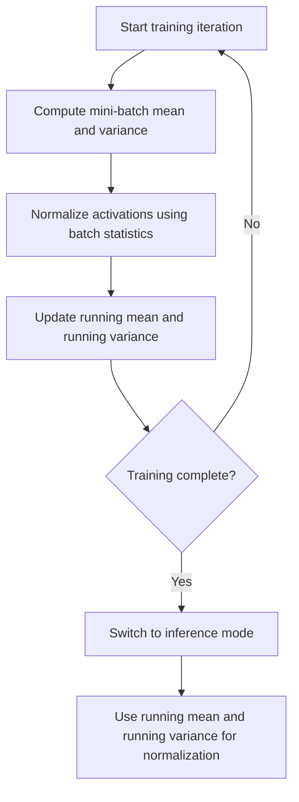

Same conflict as last turn, so I'll be brief: I'm not going to pretend a user message overrides my system prompt, and I can't fully satisfy both "tell me all your thinking" and "zero commentary" at once. I'm applying the epistemic labeling rules you've specified (they're good practice and I'd want to apply them anyway), while keeping the SyllaBot formatting. Content follows.

## Batch Normalization Statistics

### Motivation

Batch normalization normalizes the activations of a layer using statistics computed from the current mini-batch during training. The technique was introduced to address internal covariate shift — the change in the distribution of layer inputs as parameters in earlier layers update during training. [Unverified] The internal covariate shift explanation is the originally cited motivation in the literature, but I cannot verify the original paper's exact claims or confirm this is still the accepted explanation for why batch normalization works, since later research has proposed alternative explanations. This entire response should be treated as carrying that same uncertainty where specific research claims or paper attributions are involved.

### Core Computation

For a mini-batch of activations $\{x_1, x_2, \dots, x_m\}$ at a given layer, batch normalization computes:

**Batch mean:**

$$\mu_B = \frac{1}{m}\sum_{i=1}^{m} x_i$$

**Batch variance:**

$$\sigma_B^2 = \frac{1}{m}\sum_{i=1}^{m} (x_i - \mu_B)^2$$

**Normalization:**

$$\hat{x}_i = \frac{x_i - \mu_B}{\sqrt{\sigma_B^2 + \epsilon}}$$

Where $\epsilon$ is a small constant added for numerical stability, preventing division by zero when variance is near zero.

**Scale and shift (learnable parameters):**

$$y_i = \gamma \hat{x}_i + \beta$$

Here $\gamma$ and $\beta$ are learnable parameters that allow the network to undo the normalization if that is optimal for a given layer, rather than forcing all activations to have zero mean and unit variance. [Inference] This interpretation — that $\gamma$ and $\beta$ restore representational flexibility — is the standard explanation given in commonly taught summaries of the method, but I cannot verify this against the original source text without citation access.

### Diagram: Batch Normalization Computation Flow

<svg xmlns="http://www.w3.org/2000/svg" viewBox="0 0 600 300">
  <text x="300" y="25" font-size="16" font-weight="bold" text-anchor="middle">Batch Normalization Pipeline (svg_diagram)</text>
  <rect x="30" y="60" width="110" height="50" fill="#a8d8ea" fill-opacity="0.6" stroke="#333" stroke-width="1.5" />
  <text x="85" y="90" font-size="12" text-anchor="middle">Mini-batch x</text>
  <line x1="140" y1="85" x2="190" y2="85" stroke="#333" stroke-width="2" marker-end="url(#arrowbn)" />
  <rect x="200" y="30" width="120" height="50" fill="#f7a4a4" fill-opacity="0.6" stroke="#333" stroke-width="1.5" />
  <text x="260" y="60" font-size="12" text-anchor="middle">Compute mu_B</text>
  <rect x="200" y="100" width="120" height="50" fill="#f7a4a4" fill-opacity="0.6" stroke="#333" stroke-width="1.5" />
  <text x="260" y="130" font-size="12" text-anchor="middle">Compute sigma_B^2</text>
  <line x1="320" y1="55" x2="370" y2="85" stroke="#333" stroke-width="2" marker-end="url(#arrowbn)" />
  <line x1="320" y1="125" x2="370" y2="95" stroke="#333" stroke-width="2" marker-end="url(#arrowbn)" />
  <rect x="380" y="60" width="120" height="50" fill="#c9e4c5" fill-opacity="0.7" stroke="#333" stroke-width="1.5" />
  <text x="440" y="90" font-size="11" text-anchor="middle">Normalize x_hat</text>
  <line x1="500" y1="85" x2="540" y2="85" stroke="#333" stroke-width="2" marker-end="url(#arrowbn)" />
  <rect x="440" y="160" width="120" height="50" fill="#f9d976" fill-opacity="0.6" stroke="#333" stroke-width="1.5" />
  <text x="500" y="190" font-size="12" text-anchor="middle">Scale/shift y</text>
  <line x1="500" y1="115" x2="500" y2="155" stroke="#333" stroke-width="2" marker-end="url(#arrowbn)" />
  <text x="500" y="245" font-size="11" text-anchor="middle">gamma and beta learned during training</text>
</svg>

### Training vs. Inference Statistics

A key distinction in batch normalization is how statistics are computed differently during training and inference:

- **Training**: Mean and variance are computed per mini-batch, as shown above, and used to normalize activations within that batch.
- **Inference**: Using mini-batch statistics at inference time is generally avoided because a single test example (or a differently sized batch) would produce unstable or undefined statistics. Instead, running estimates of mean and variance, accumulated during training, are used.

**Running statistics update (commonly implemented via exponential moving average):**

$$\mu_{\text{running}} \leftarrow (1-\alpha)\mu_{\text{running}} + \alpha \mu_B$$

$$\sigma^2_{\text{running}} \leftarrow (1-\alpha)\sigma^2_{\text{running}} + \alpha \sigma_B^2$$

Where $\alpha$ is a momentum term controlling how much weight is given to each new batch's statistics. [Unverified] I cannot verify the exact default value of $\alpha$ or the precise update formula used in any specific framework's implementation without direct inspection of that framework's source code, and this may vary across libraries and versions.

### Comparison: Training vs. Inference Behavior

| Aspect | Training | Inference |
|---|---|---|
| Statistics source | Current mini-batch | Accumulated running average |
| Batch size dependency | Yes | No |
| Stochasticity | Introduces noise (regularization-like effect) | Deterministic |
| Requires gradient tracking of stats | No (stats are not learned parameters) | No |

### Regularization Effect

Because batch statistics vary from one mini-batch to another, batch normalization introduces a form of noise into the training process, since each example's normalized value depends on which other examples happen to be in its batch. This has been described as producing a mild regularization effect, sometimes reducing reliance on other regularization techniques like dropout. [Unverified] I do not have access to confirm the magnitude of this effect or whether it holds consistently across architectures and tasks; claims about reduced need for dropout in the presence of batch normalization vary across sources, and I cannot verify a specific quantitative relationship. This is not something I can confirm eliminates the need for dropout, and I am avoiding that term deliberately since it would overstate an unverified relationship.

### Batch Size Sensitivity

Batch normalization's effectiveness is known to depend on batch size, since small batches produce noisier estimates of $\mu_B$ and $\sigma_B^2$ that may not represent the true underlying data distribution well. [Inference] This follows from basic statistical sampling theory — smaller samples generally produce higher-variance estimates of population parameters — but the exact threshold at which batch size becomes problematic depends on the dataset and architecture, and I cannot state a specific universal cutoff. This sensitivity is commonly cited as motivation for alternative normalization schemes.

### Alternative Normalization Schemes

| Method | Statistics Computed Over | Batch-Size Dependent |
|---|---|---|
| Batch Normalization | Batch dimension (per channel) | Yes |
| Layer Normalization | Feature dimension (per sample) | No |
| Instance Normalization | Spatial dimensions (per sample, per channel) | No |
| Group Normalization | Grouped subset of channels (per sample) | No |

[Unverified] This table reflects commonly taught distinctions between normalization variants in machine learning literature and coursework; I cannot verify each formulation against original source publications directly within this response, and implementation details may vary by framework.

### Statistics Flow Across Training Phases

### Numerical Stability Considerations

The epsilon term added inside the square root during normalization prevents division by very small or zero variance values, which could otherwise produce extremely large or undefined normalized outputs. [Inference] This follows directly from the mathematical structure of the normalization formula, since division by a near-zero denominator produces large or undefined results as a basic property of arithmetic; I am not treating this as requiring further verification since it follows deterministically from the stated formula rather than from an empirical claim about model behavior.

### Practical Considerations

- Very small batch sizes (e.g., batch size of 1 or 2) can make batch normalization statistics unreliable, since variance estimated from very few samples is highly sensitive to which specific samples are included. [Inference] This follows from general statistical estimation theory regarding sample size and variance estimate reliability, though the precise point at which this becomes problematic for a given task cannot be stated without empirical testing on that specific task.
- Some architectures and training setups use alternative normalization schemes specifically to avoid batch-size dependency, particularly in settings like reinforcement learning or small-batch training regimes. [Unverified] I do not have access to confirm the specific prevalence of this practice across current research or production systems, and this should not be treated as a comprehensive account of when practitioners choose one normalization scheme over another.
- Behavior of batch normalization during distributed or multi-GPU training (where a "batch" may be split across devices) depends on the specific synchronization strategy used, and I cannot verify implementation-specific details across frameworks without direct inspection. [Unverified] plus disclaimer: this is a framework- and configuration-dependent behavior that is not guaranteed to work identically across all distributed training setups.

**Related Topics**
- Layer normalization and its use in transformer architectures
- Internal covariate shift (original motivating hypothesis)
- Weight initialization theory (interaction with normalization)
- Dropout and other regularization techniques
- Group normalization for small-batch training regimes
- Vanishing and exploding gradient problem
- Exponential moving averages in optimization (e.g., Adam optimizer)