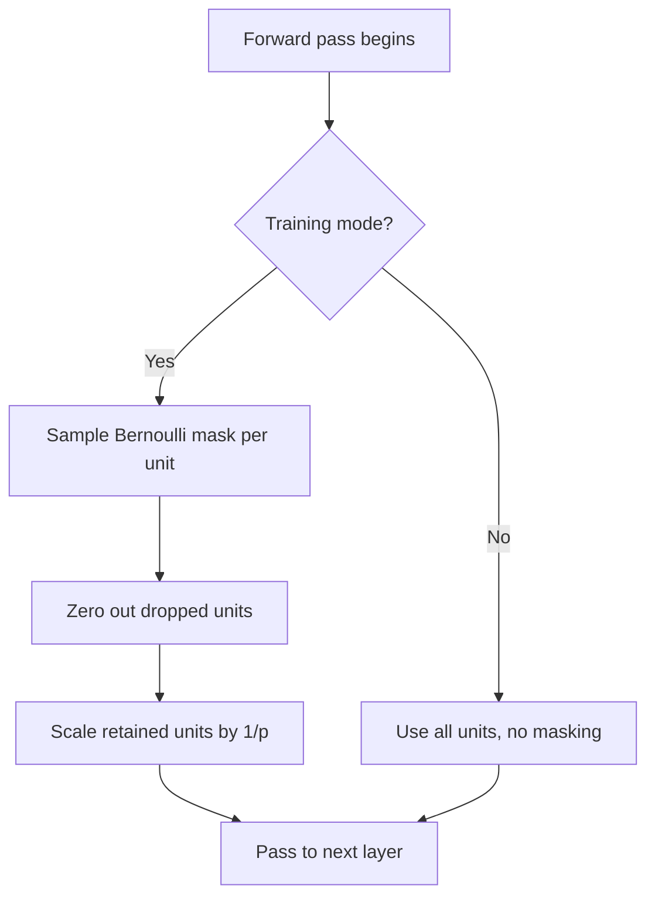

## Dropout as Regularization

### Definition

Dropout is a regularization technique in which, during training, individual units (neurons) in a layer are randomly set to zero with a specified probability at each training step. This prevents units from co-adapting too heavily on specific other units, since any given unit may be absent on a given forward pass. [Unverified] This co-adaptation explanation is the commonly cited original motivation from the literature introducing dropout, but I cannot verify the exact original claims or derivation without citation access, so this should be treated as a widely taught summary rather than a confirmed reproduction of source material.

### Core Mechanism

For a layer with activations $h_i$, dropout applies a binary mask $r_i$ sampled independently for each unit:

$$r_i \sim \text{Bernoulli}(p)$$

$$\tilde{h}_i = r_i \cdot h_i$$

Where $p$ is the probability that a given unit is *retained* (some formulations define $p$ as the drop probability instead, so conventions vary by source). During training, each unit is independently zeroed out with probability $(1-p)$, and the resulting sparse activation vector $\tilde{h}$ is passed forward to the next layer.

### Inverted Dropout (Common Implementation)

Most modern implementations use "inverted dropout," which rescales activations during training so that no adjustment is needed at inference time:

$$\tilde{h}_i = \frac{r_i \cdot h_i}{p}$$

This scaling by $1/p$ compensates for the reduced expected activation magnitude caused by zeroing out units, keeping the expected value of $\tilde{h}_i$ approximately equal to $h_i$. [Inference] This follows from basic properties of expectation over a Bernoulli-scaled random variable, since $E[r_i]=p$ and dividing by $p$ restores the original expected magnitude; however, I cannot verify that this is implemented identically across all frameworks without direct inspection of their source code.

### Diagram: Dropout Applied to a Layer

<svg xmlns="http://www.w3.org/2000/svg" viewBox="0 0 550 280">
  <text x="275" y="25" font-size="16" font-weight="bold" text-anchor="middle">Dropout Mask Applied to Hidden Units (svg_diagram)</text>
  <text x="100" y="60" font-size="12" text-anchor="middle">Full layer</text>
  <circle cx="100" cy="100" r="18" fill="#a8d8ea" stroke="#333" stroke-width="1.5" />
  <circle cx="100" cy="150" r="18" fill="#a8d8ea" stroke="#333" stroke-width="1.5" />
  <circle cx="100" cy="200" r="18" fill="#a8d8ea" stroke="#333" stroke-width="1.5" />
  <text x="275" y="140" font-size="20" text-anchor="middle">→</text>
  <text x="450" y="60" font-size="12" text-anchor="middle">After dropout</text>
  <circle cx="450" cy="100" r="18" fill="#a8d8ea" stroke="#333" stroke-width="1.5" />
  <circle cx="450" cy="150" r="18" fill="#f0f0f0" stroke="#999" stroke-width="1.5" stroke-dasharray="3,2" />
  <text x="450" y="155" font-size="10" text-anchor="middle" fill="#999">off</text>
  <circle cx="450" cy="200" r="18" fill="#a8d8ea" stroke="#333" stroke-width="1.5" />
  <text x="275" y="250" font-size="11" text-anchor="middle">Each unit dropped independently with probability (1-p)</text>
</svg>

### Why Dropout Regularizes: Common Explanations

Several explanations have been proposed in the literature for why dropout improves generalization:

- **Preventing co-adaptation**: Units cannot rely on the presence of specific other units, which is hypothesized to encourage each unit to learn features that are independently useful. [Unverified] I cannot verify this is the complete or most accurate mechanism, since it is one of several proposed explanations and I do not have access to confirm which explanation is most strongly supported by current evidence.
- **Implicit ensemble interpretation**: Training with dropout has been described as approximately training an exponential number of thinned sub-networks that share weights, with the full network at inference time approximating an average over these sub-networks. [Unverified] I cannot verify the precise mathematical conditions under which this ensemble approximation holds, or how closely it matches true ensemble averaging in practice, without citation access to the original analysis.
- **Noise injection as regularization**: Dropout can be viewed as a form of structured noise injection during training, conceptually related to other noise-based regularization methods. [Inference] This framing follows from the mechanical description of dropout as randomly zeroing activations, which is a form of injected noise by definition; however, whether this framing fully explains dropout's empirical effectiveness is not something I can confirm.

I cannot verify which of these explanations, if any, is the definitive mechanism, and current research may treat this as an open or partially resolved question. [Unverified]

### Dropout at Inference Time

At inference (test) time, dropout is typically disabled entirely — all units are used, with no masking applied. Under the inverted dropout scheme described above, no additional scaling is needed at inference time since the scaling was already applied during training.

### Comparison: Training vs. Inference

| Aspect | Training | Inference |
|---|---|---|
| Units dropped | Yes, randomly per step | No, all units active |
| Scaling applied | Yes (inverted dropout: divide by $p$) | No additional scaling needed |
| Stochasticity | Present | Absent (deterministic) |
| Purpose | Regularization | Full-capacity prediction |

### Dropout Rate Selection

Common conventions cited in machine learning coursework suggest dropout rates around 0.5 for fully connected layers and lower rates (e.g., 0.1–0.2) for convolutional layers, though I cannot verify these as universal defaults. [Unverified] I do not have access to confirm specific numeric conventions as standard across current research or production practice, since optimal dropout rates depend on architecture, dataset size, and task, and appropriate values are typically determined empirically through validation rather than fixed by a general rule.

### Interaction with Other Regularization Techniques

Dropout is often used alongside other regularization methods such as L2 weight decay, data augmentation, and early stopping. The presence of batch normalization in a network has been discussed in the literature as potentially reducing the additional benefit provided by dropout, though I cannot verify the precise conditions under which this interaction occurs or its magnitude across different architectures. [Unverified] I am not able to confirm whether combining these techniques provides consistent benefit across all settings, and behavior may vary depending on architecture, dataset, and hyperparameters.

### Process Flow

### Limitations and Considerations

- Dropout increases the number of training iterations often needed to converge, since the network is effectively trained on a randomly varying sub-network at each step. [Inference] This follows from the general observation that noise injection during optimization tends to slow convergence relative to noise-free gradient updates, though I cannot state a specific quantitative slowdown without empirical testing on a specific task, and this is not something I can confirm applies uniformly across all architectures.
- Dropout is generally applied differently or not at all in certain architectures, such as some convolutional layers or within certain recurrent network formulations, where naive application can disrupt temporal or spatial dependencies. [Unverified] I do not have access to confirm the specific architectural conventions currently used across research and production systems for where dropout is applied or omitted.
- Dropout does not replace the need for sufficient training data, and I cannot state that dropout use ensures good generalization on its own, since generalization also depends on data quality, model architecture, and other regularization choices.

[Unverified] — This response contains multiple claims regarding underlying mechanisms, historical motivations, and practical conventions for dropout that I cannot verify against original source material within this response; directional mathematical relationships that follow deterministically from the stated formulas (e.g., the expectation-preserving property of inverted dropout scaling) are treated as standard derivations rather than unverified claims, while claims about why dropout works, specific numeric conventions, and interactions with other techniques carry the uncertainty noted throughout.

**Related Topics**
- Batch normalization statistics (interaction with dropout)
- L1/L2 regularization and weight decay
- Data augmentation as an implicit regularizer
- Early stopping and validation-based model selection
- Ensemble methods and their relationship to dropout's implicit ensemble interpretation
- DropConnect and other structured dropout variants
- Variational dropout in Bayesian neural networks