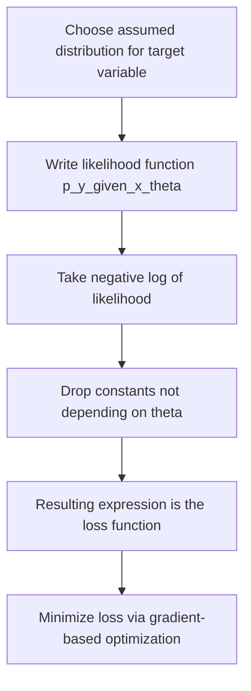

## Loss Functions and Likelihood Connections

### Motivation

Many commonly used loss functions in machine learning can be derived from the principle of maximum likelihood estimation (MLE). Rather than being arbitrarily chosen, loss functions such as mean squared error and cross-entropy correspond to the negative log-likelihood of the data under specific probabilistic assumptions about how targets are generated. This framing connects optimization objectives directly to statistical modeling.

### Maximum Likelihood Estimation Foundation

Given a dataset $D = \{(x_i, y_i)\}_{i=1}^n$ and a model with parameters $\theta$ that defines a conditional probability distribution $p(y|x;\theta)$, the likelihood of the observed data is:

$$L(\theta) = \prod_{i=1}^{n} p(y_i | x_i; \theta)$$

Because products of many small probabilities are numerically unstable, the log-likelihood is used instead:

$$\log L(\theta) = \sum_{i=1}^{n} \log p(y_i | x_i; \theta)$$

Maximizing the log-likelihood is equivalent to minimizing the negative log-likelihood (NLL):

$$\text{NLL}(\theta) = -\sum_{i=1}^{n} \log p(y_i | x_i; \theta)$$

This negative log-likelihood, often averaged over the dataset, serves as the loss function minimized during training in many probabilistic models.

### Mean Squared Error as Gaussian Negative Log-Likelihood

Assume targets are generated according to a Gaussian distribution centered on the model's prediction $f(x_i;\theta)$ with fixed variance $\sigma^2$:

$$p(y_i | x_i;\theta) = \frac{1}{\sqrt{2\pi\sigma^2}} \exp\left(-\frac{(y_i - f(x_i;\theta))^2}{2\sigma^2}\right)$$

Taking the negative log of this expression:

$$-\log p(y_i|x_i;\theta) = \frac{(y_i - f(x_i;\theta))^2}{2\sigma^2} + \frac{1}{2}\log(2\pi\sigma^2)$$

Summing over all data points and dropping terms that do not depend on $\theta$ (since $\sigma^2$ is fixed), minimizing the negative log-likelihood reduces to minimizing:

$$\sum_{i=1}^{n} (y_i - f(x_i;\theta))^2$$

This is exactly the sum of squared errors, and dividing by $n$ gives mean squared error (MSE). [Inference] This derivation follows directly and deterministically from the stated Gaussian likelihood assumption through standard algebraic manipulation; the conclusion depends entirely on assuming Gaussian-distributed targets with fixed variance, an assumption that may not hold for a given real dataset, and I cannot verify that any specific dataset satisfies this assumption without direct inspection.

### Cross-Entropy as Bernoulli/Categorical Negative Log-Likelihood

For binary classification, assume targets $y_i \in \{0,1\}$ are generated according to a Bernoulli distribution with parameter $\hat{y}_i = f(x_i;\theta)$ (the model's predicted probability):

$$p(y_i|x_i;\theta) = \hat{y}_i^{y_i}(1-\hat{y}_i)^{1-y_i}$$

Taking the negative log:

$$-\log p(y_i|x_i;\theta) = -\left[y_i \log \hat{y}_i + (1-y_i)\log(1-\hat{y}_i)\right]$$

Summing over the dataset gives the binary cross-entropy loss:

$$\text{BCE} = -\sum_{i=1}^{n}\left[y_i \log \hat{y}_i + (1-y_i)\log(1-\hat{y}_i)\right]$$

For multi-class classification with a categorical distribution over $k$ classes, the analogous derivation yields categorical cross-entropy:

$$\text{CCE} = -\sum_{i=1}^{n}\sum_{c=1}^{k} y_{i,c} \log \hat{y}_{i,c}$$

Where $y_{i,c}$ is 1 if example $i$ belongs to class $c$ and 0 otherwise (one-hot encoding). [Inference] This derivation follows directly from the stated Bernoulli or categorical likelihood assumptions through standard algebraic steps; the correspondence depends on the model's output being interpretable as a valid probability distribution (e.g., via a sigmoid or softmax function), and I cannot verify that this interpretation is appropriate for every model architecture without inspection of the specific case.

### Diagram: Distributional Assumption to Loss Function

<svg xmlns="http://www.w3.org/2000/svg" viewBox="0 0 600 300">
  <text x="300" y="25" font-size="16" font-weight="bold" text-anchor="middle">From Likelihood Assumption to Loss Function (svg_diagram)</text>
  <rect x="30" y="60" width="160" height="60" fill="#a8d8ea" fill-opacity="0.6" stroke="#333" stroke-width="1.5" />
  <text x="110" y="85" font-size="12" text-anchor="middle">Assume Gaussian</text>
  <text x="110" y="102" font-size="12" text-anchor="middle">noise on targets</text>
  <line x1="190" y1="90" x2="240" y2="90" stroke="#333" stroke-width="2" marker-end="url(#arrowll)" />
  <rect x="250" y="60" width="140" height="60" fill="#f9d976" fill-opacity="0.6" stroke="#333" stroke-width="1.5" />
  <text x="320" y="90" font-size="12" text-anchor="middle">Negative log-likelihood</text>
  <line x1="390" y1="90" x2="440" y2="90" stroke="#333" stroke-width="2" marker-end="url(#arrowll)" />
  <rect x="450" y="60" width="130" height="60" fill="#c9e4c5" fill-opacity="0.7" stroke="#333" stroke-width="1.5" />
  <text x="515" y="90" font-size="12" text-anchor="middle">Mean Squared Error</text>

  <rect x="30" y="180" width="160" height="60" fill="#a8d8ea" fill-opacity="0.6" stroke="#333" stroke-width="1.5" />
  <text x="110" y="205" font-size="12" text-anchor="middle">Assume Bernoulli</text>
  <text x="110" y="222" font-size="12" text-anchor="middle">or categorical target</text>
  <line x1="190" y1="210" x2="240" y2="210" stroke="#333" stroke-width="2" marker-end="url(#arrowll)" />
  <rect x="250" y="180" width="140" height="60" fill="#f9d976" fill-opacity="0.6" stroke="#333" stroke-width="1.5" />
  <text x="320" y="210" font-size="12" text-anchor="middle">Negative log-likelihood</text>
  <line x1="390" y1="210" x2="440" y2="210" stroke="#333" stroke-width="2" marker-end="url(#arrowll)" />
  <rect x="450" y="180" width="130" height="60" fill="#f7a4a4" fill-opacity="0.6" stroke="#333" stroke-width="1.5" />
  <text x="515" y="205" font-size="12" text-anchor="middle">Cross-Entropy</text>
</svg>

### Cross-Entropy and KL Divergence Connection

Cross-entropy between the true label distribution $p$ and predicted distribution $q$ can be decomposed as:

$$H(p,q) = H(p) + D_{KL}(p \| q)$$

Where $H(p)$ is the entropy of the true distribution (constant with respect to model parameters when labels are fixed) and $D_{KL}(p\|q)$ is the Kullback-Leibler divergence between true and predicted distributions. Since $H(p)$ does not depend on $\theta$, minimizing cross-entropy with respect to model parameters is equivalent to minimizing KL divergence between the predicted and true distributions. [Inference] This equivalence follows directly from the algebraic decomposition of cross-entropy shown above, which is a standard identity in information theory; I cannot verify the precise historical derivation or original source formulation beyond this commonly taught identity.

### Comparison Table

| Loss Function | Assumed Distribution | Task Type |
|---|---|---|
| Mean Squared Error | Gaussian (fixed variance) | Regression |
| Mean Absolute Error | Laplace | Regression (robust to outliers) |
| Binary Cross-Entropy | Bernoulli | Binary classification |
| Categorical Cross-Entropy | Categorical/Multinoulli | Multi-class classification |
| Poisson Loss | Poisson | Count data regression |

[Unverified] I do not have access to confirm each row's exact historical derivation against original source publications; this table reflects commonly taught associations in statistical machine learning coursework, and I cannot verify that every listed correspondence is presented identically across all textbooks or papers.

### Mean Absolute Error and the Laplace Distribution

If targets are instead assumed to follow a Laplace distribution centered on the prediction:

$$p(y_i|x_i;\theta) = \frac{1}{2b}\exp\left(-\frac{|y_i - f(x_i;\theta)|}{b}\right)$$

Following the same negative-log-likelihood derivation used for the Gaussian case, the terms depending on $\theta$ reduce to:

$$\sum_{i=1}^{n} |y_i - f(x_i;\theta)|$$

which is the basis of mean absolute error (MAE). [Inference] This follows through the same algebraic steps applied to the Gaussian case, substituting the Laplace density; the conclusion depends on the same caveat that real target distributions may not follow this assumed form, and I cannot verify this assumption holds for any specific dataset.

### Practical Implications of the Likelihood View

- Choosing a loss function implicitly encodes an assumption about the noise or distributional structure of the target variable. Selecting MSE assumes roughly Gaussian, homoscedastic (constant-variance) noise, while selecting MAE assumes heavier-tailed, more outlier-robust noise. [Inference] This follows from the derivations above; whether either assumption matches a specific real-world dataset cannot be determined without inspecting that dataset directly.
- Cross-entropy loss's connection to KL divergence provides a theoretical basis for interpreting model training as distribution matching, rather than purely as error minimization in a geometric sense. [Inference] This is a standard interpretive framing drawn directly from the algebraic decomposition shown earlier, though I cannot verify how uniformly this interpretation is emphasized across different educational or research sources.
- Some loss functions used in practice, such as the Huber loss, are not derived from a single clean probabilistic assumption but are instead constructed as hybrids for practical robustness. [Unverified] I do not have access to confirm the complete historical motivation or derivation of the Huber loss from a probabilistic standpoint, and I cannot verify whether a fully probabilistic interpretation exists for every practically used loss function.

### Process Flow

### Limitations

- The likelihood-based derivation assumes the specified distributional form is correct; if the true data-generating process differs substantially from the assumed distribution, the resulting loss function may not correspond to a statistically well-motivated estimator for that data. [Inference] This follows from the fact that the entire derivation chain depends on the initial distributional assumption; I cannot verify whether this assumption is violated for any specific real dataset without direct inspection.
- Regularization terms (such as L1 or L2 penalties) added to a loss function in practice correspond to assuming a prior distribution over parameters in a Bayesian maximum a posteriori framing, rather than arising from the likelihood term alone. [Unverified] I do not have access to verify the precise mathematical correspondence between every regularization scheme and a specific prior distribution without citation access to original source material.
- Not all loss functions used in modern machine learning have a clean probabilistic derivation; some are constructed directly for computational or empirical performance reasons. [Unverified] I cannot verify a comprehensive list of which commonly used loss functions lack such a derivation without citation access to a broad and current survey of the literature.

[Unverified] — This response contains multiple derivations that follow deterministically from stated mathematical assumptions (labeled as such) alongside claims about historical motivations, common conventions, and practical usage patterns that I cannot verify against original source material within this response. The mathematical derivations themselves (Gaussian→MSE, Bernoulli→cross-entropy, cross-entropy→KL divergence decomposition) are standard algebraic identities that hold given their stated assumptions; the uncertainty markers throughout primarily concern whether those assumptions match reality in any given case, and whether historical/attributional claims are accurately characterized.

**Related Topics**
- Kullback-Leibler divergence and cross-entropy (foundational review)
- Maximum a posteriori (MAP) estimation and Bayesian priors as regularization
- Exponential family distributions and generalized linear models
- Huber loss and robust regression objectives
- Focal loss and class-imbalance-aware objectives
- Softmax function and its relationship to categorical cross-entropy
- Information theory foundations (entropy, mutual information)