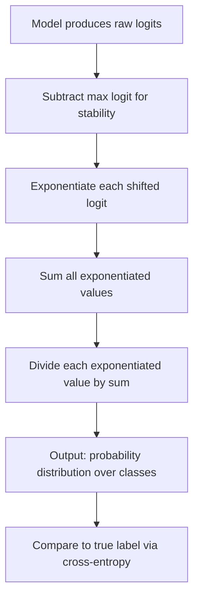

## Softmax and Probabilistic Outputs

### Definition

The softmax function converts a vector of real-valued scores (often called logits) into a probability distribution over discrete classes. For a vector of logits $z = (z_1, z_2, \dots, z_k)$, the softmax function is defined as:

$$\text{softmax}(z_i) = \frac{e^{z_i}}{\sum_{j=1}^{k} e^{z_j}}$$

The output is a vector of values that are non-negative and sum to exactly 1, satisfying the basic requirements of a probability distribution over $k$ mutually exclusive classes.

### Why Exponentiation

Exponentiation serves two structural purposes in softmax: it guarantees non-negativity regardless of the sign of the input logits, and it amplifies relative differences between logits, so that larger logits correspond to disproportionately larger probabilities. [Inference] This follows directly from the mathematical properties of the exponential function — it is always positive and monotonically increasing — which are standard properties and not claims requiring further verification beyond the definition itself.

### Numerical Stability

Direct computation of $e^{z_i}$ for large logit values can cause numerical overflow. A common implementation technique subtracts the maximum logit value from all logits before exponentiating:

$$\text{softmax}(z_i) = \frac{e^{z_i - \max(z)}}{\sum_{j=1}^{k} e^{z_j - \max(z)}}$$

This produces mathematically identical output to the original formula, since the same constant is subtracted from both numerator and denominator terms inside the exponential, which cancels out in the ratio. [Inference] This follows from the algebraic identity $e^{a-c}/\sum e^{b-c} = e^a/\sum e^b$ for any constant $c$, which is a direct mathematical consequence of exponent rules rather than an empirical claim.

### Diagram: Logits to Probability Distribution

<svg xmlns="http://www.w3.org/2000/svg" viewBox="0 0 600 300">
  <text x="300" y="25" font-size="16" font-weight="bold" text-anchor="middle">Softmax Transformation (svg_diagram)</text>
  <text x="120" y="55" font-size="12" text-anchor="middle">Raw logits</text>
  <rect x="60" y="70" width="50" height="90" fill="#a8d8ea" fill-opacity="0.7" stroke="#333" />
  <text x="85" y="90" font-size="10" text-anchor="middle">2.0</text>
  <rect x="120" y="100" width="50" height="60" fill="#a8d8ea" fill-opacity="0.7" stroke="#333" />
  <text x="145" y="120" font-size="10" text-anchor="middle">1.0</text>
  <rect x="180" y="130" width="50" height="30" fill="#a8d8ea" fill-opacity="0.7" stroke="#333" />
  <text x="205" y="150" font-size="10" text-anchor="middle">0.1</text>
  <text x="300" y="130" font-size="20" text-anchor="middle">→</text>
  <text x="480" y="55" font-size="12" text-anchor="middle">Probabilities (sum to 1)</text>
  <rect x="420" y="60" width="50" height="100" fill="#c9e4c5" fill-opacity="0.8" stroke="#333" />
  <text x="445" y="80" font-size="10" text-anchor="middle">0.63</text>
  <rect x="480" y="100" width="50" height="60" fill="#c9e4c5" fill-opacity="0.8" stroke="#333" />
  <text x="505" y="120" font-size="10" text-anchor="middle">0.23</text>
  <rect x="540" y="140" width="50" height="20" fill="#c9e4c5" fill-opacity="0.8" stroke="#333" />
  <text x="565" y="155" font-size="10" text-anchor="middle">0.14</text>
  <text x="300" y="220" font-size="11" text-anchor="middle">Larger logit gaps produce more skewed probability distributions</text>
</svg>

### Worked Example

Given logits $z = (2.0, 1.0, 0.1)$ for a 3-class problem:

$$e^{2.0} \approx 7.389, \quad e^{1.0} \approx 2.718, \quad e^{0.1} \approx 1.105$$

$$\text{Sum} \approx 7.389 + 2.718 + 1.105 = 11.212$$

$$\text{softmax}(z_1) = 7.389/11.212 \approx 0.659$$
$$\text{softmax}(z_2) = 2.718/11.212 \approx 0.242$$
$$\text{softmax}(z_3) = 1.105/11.212 \approx 0.099$$

These three values sum to approximately 1.0 (subject to rounding), and the class with the highest logit receives the highest probability, consistent with softmax's monotonicity property.

### Temperature Scaling

A temperature parameter $T$ can be introduced to control the sharpness of the output distribution:

$$\text{softmax}(z_i; T) = \frac{e^{z_i/T}}{\sum_{j=1}^{k} e^{z_j/T}}$$

As $T \to 0$, the distribution approaches a one-hot vector concentrated on the class with the highest logit (approaching the behavior of an argmax function). As $T \to \infty$, the distribution approaches uniform across all classes, since dividing logits by a very large number shrinks their relative differences toward zero. [Inference] This limiting behavior follows directly from the mathematical structure of the temperature-scaled formula; the exact practical effect of a specific finite temperature value on a specific model's output cannot be stated without computing it directly for that model.

### Relationship to Categorical Distribution and Cross-Entropy

Softmax output is commonly interpreted as the parameters of a categorical distribution over $k$ classes, which connects directly to the categorical cross-entropy loss described in earlier likelihood-based loss derivations:

$$\text{CCE} = -\sum_{i=1}^{n}\sum_{c=1}^{k} y_{i,c} \log(\text{softmax}(z_{i})_c)$$

This combination is frequently implemented as a single fused operation (sometimes called "softmax cross-entropy" or achieved via a log-softmax followed by negative log-likelihood) for numerical stability reasons. [Unverified] I do not have access to confirm the exact internal implementation details of this fusion across specific frameworks or library versions without direct inspection of their source code, and behavior may differ across libraries.

### Gradient of Softmax with Cross-Entropy

When softmax output is combined with cross-entropy loss, the gradient with respect to the logits takes a notably simple form:

$$\frac{\partial \text{CCE}}{\partial z_i} = \hat{y}_i - y_i$$

Where $\hat{y}_i$ is the softmax output and $y_i$ is the one-hot true label. This simplification arises because the derivative terms from softmax and cross-entropy partially cancel during the chain rule computation. [Inference] This is a standard calculus derivation that follows from differentiating the composed softmax and cross-entropy functions; I cannot verify the exact historical derivation as presented in any specific original source without citation access, though the algebraic result itself follows deterministically from the stated function definitions.

### Softmax vs. Sigmoid

| Aspect | Sigmoid | Softmax |
|---|---|---|
| Output range per unit | $(0,1)$ | $(0,1)$ |
| Sum across units | Not constrained to 1 | Always sums to 1 |
| Typical use case | Binary classification, multi-label | Multi-class (mutually exclusive) classification |
| Independence assumption | Each output independent | Outputs compete (probability mass shared) |

Softmax can be viewed as a generalization of sigmoid to more than two classes: applying softmax to a two-class problem with logits $(z_1, z_2)$ produces the same result as applying sigmoid to $(z_1 - z_2)$. [Inference] This equivalence follows from algebraic simplification of the two-class softmax formula, which is a standard derivation; I cannot verify this specific equivalence is presented identically across all textbook sources without citation access, though the underlying algebra holds given the stated definitions.

### Process Flow

### Limitations and Considerations

- Softmax assumes mutually exclusive classes; applying it to problems where multiple labels can be simultaneously true (multi-label classification) is generally considered a mismatch, since softmax forces probability mass to be shared across classes rather than allowing each class to be independently likely. [Inference] This follows from the structural definition of softmax, where all outputs are coupled through a shared normalizing denominator; whether this mismatch causes practically significant problems in any specific application cannot be stated without testing that specific case.
- Softmax outputs are sometimes interpreted as calibrated confidence scores, but the relationship between softmax probability values and true predictive confidence is not automatic. [Unverified] I do not have access to confirm the extent to which softmax outputs are miscalibrated in any general or specific case, since calibration depends on model architecture, training procedure, and dataset, and I cannot state a general quantitative claim about softmax calibration behavior without a citable source. Behavior in this regard may vary and is not guaranteed to match intuitive notions of confidence.
- Temperature scaling is sometimes used as a post-hoc calibration technique, but I cannot verify the general effectiveness of this approach across model types without citation access to specific empirical studies. [Unverified]

[Unverified] — This response contains algebraic derivations that follow deterministically from stated mathematical definitions (labeled as [Inference] where they involve interpretive framing beyond pure algebra) alongside claims about implementation practices, calibration behavior, and historical conventions that I cannot verify against original source material within this response.

**Related Topics**
- Loss functions and likelihood connections (categorical cross-entropy derivation)
- Sigmoid function and binary classification
- Log-softmax and numerical stability in implementation
- Model calibration techniques (temperature scaling, Platt scaling)
- Multi-label classification approaches
- Attention mechanisms (softmax's role in attention weight computation)
- One-hot encoding and categorical distributions