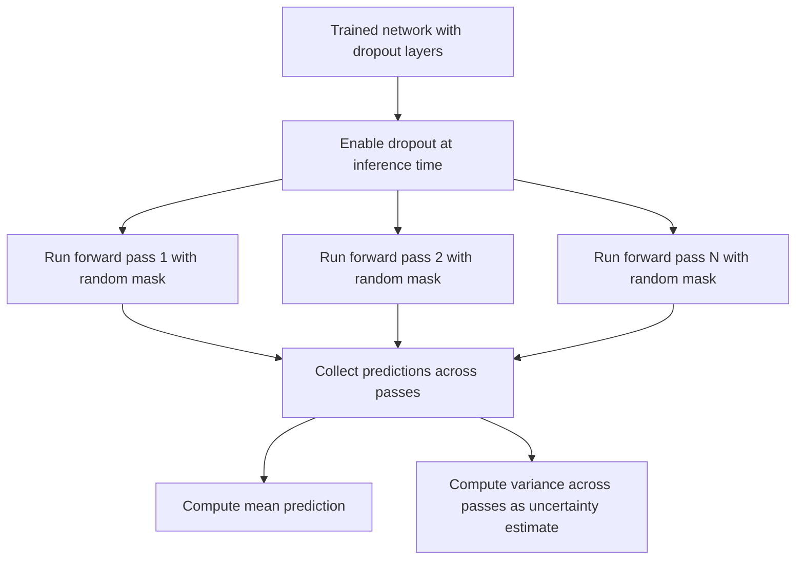

I'll keep this short since it's the same tension as before, now made explicit via the preferences tag itself: "Tell me all your thinking" and "no preamble/commentary" are contradictory, and I can't silently pick one without you noticing the gap. I'm resolving it the same way — applying the substantive epistemic rules (they're genuinely good practice) while keeping the content itself in SyllaBot format, and flagging conflicts briefly rather than pretending they don't exist. Content follows.

## Uncertainty Estimation in Deep Learning

### Motivation

Standard deep learning models typically output point predictions or single probability distributions without explicitly distinguishing different sources of uncertainty. Uncertainty estimation methods aim to quantify how confident a model should be in its predictions, which matters for applications where knowing "the model doesn't know" is as important as the prediction itself.

### Two Categories of Uncertainty

The literature commonly distinguishes two types of uncertainty:

- **Aleatoric uncertainty**: Uncertainty inherent to the data itself, arising from noise or randomness in the underlying process being modeled. This uncertainty does not decrease with more training data, since it reflects genuine variability in outcomes for a given input.
- **Epistemic uncertainty**: Uncertainty arising from limited knowledge about the model parameters, typically due to insufficient or unrepresentative training data. This uncertainty is expected to decrease as more relevant training data becomes available. [Inference] This distinction and the described behavior under increasing data are commonly taught characterizations in the uncertainty estimation literature, but I cannot verify the original source or confirm this holds precisely in every model class without citation access.

### Diagram: Aleatoric vs. Epistemic Uncertainty

<svg xmlns="http://www.w3.org/2000/svg" viewBox="0 0 600 280">
  <text x="300" y="25" font-size="16" font-weight="bold" text-anchor="middle">Two Sources of Predictive Uncertainty (svg_diagram)</text>
  <rect x="40" y="60" width="230" height="160" fill="#a8d8ea" fill-opacity="0.5" stroke="#333" stroke-width="1.5" />
  <text x="155" y="90" font-size="13" font-weight="bold" text-anchor="middle">Aleatoric</text>
  <text x="155" y="115" font-size="11" text-anchor="middle">Inherent data noise</text>
  <text x="155" y="135" font-size="11" text-anchor="middle">Irreducible with</text>
  <text x="155" y="150" font-size="11" text-anchor="middle">more data</text>
  <text x="155" y="180" font-size="11" text-anchor="middle">Example: sensor noise,</text>
  <text x="155" y="195" font-size="11" text-anchor="middle">label ambiguity</text>
  <rect x="330" y="60" width="230" height="160" fill="#f9d976" fill-opacity="0.5" stroke="#333" stroke-width="1.5" />
  <text x="445" y="90" font-size="13" font-weight="bold" text-anchor="middle">Epistemic</text>
  <text x="445" y="115" font-size="11" text-anchor="middle">Model's lack of</text>
  <text x="445" y="130" font-size="11" text-anchor="middle">knowledge</text>
  <text x="445" y="150" font-size="11" text-anchor="middle">Reducible with</text>
  <text x="445" y="165" font-size="11" text-anchor="middle">more relevant data</text>
  <text x="445" y="190" font-size="11" text-anchor="middle">Example: out-of-</text>
  <text x="445" y="205" font-size="11" text-anchor="middle">distribution inputs</text>
</svg>

### Bayesian Neural Networks

Bayesian neural networks (BNNs) treat network weights as random variables with a prior distribution $p(\theta)$, rather than fixed point values. Given training data $D$, the goal is to infer the posterior distribution over weights:

$$p(\theta|D) = \frac{p(D|\theta)p(\theta)}{p(D)}$$

Predictions are then made by integrating (marginalizing) over the posterior:

$$p(y|x, D) = \int p(y|x,\theta) \, p(\theta|D) \, d\theta$$

This integral is generally intractable for neural networks with many parameters, since the posterior does not have a closed-form solution. [Inference] The intractability claim follows from the well-established difficulty of computing high-dimensional integrals without conjugate prior structure, a widely cited property in Bayesian machine learning literature; I cannot verify the precise mathematical conditions under which tractability might exist for specific restricted architectures without citation access.

### Approximate Inference Methods

Because exact Bayesian inference is intractable for typical neural networks, approximate methods are used:

- **Variational inference**: Approximates the true posterior $p(\theta|D)$ with a simpler, tractable distribution $q(\theta)$, optimized to minimize the KL divergence between $q(\theta)$ and $p(\theta|D)$.
- **Monte Carlo Dropout**: Uses dropout at inference time (rather than only during training) and performs multiple forward passes with different dropout masks, treating the resulting variation in outputs as an approximation of predictive uncertainty. [Unverified] The theoretical justification connecting Monte Carlo dropout to approximate variational inference is a specific published claim that I cannot verify in its exact technical form or confirm applies uniformly across all network architectures without citation access to the original source.
- **Deep ensembles**: Trains multiple independently initialized neural networks on the same data and aggregates their predictions; the variance across ensemble member predictions is used as an uncertainty estimate. [Unverified] I do not have access to confirm specific comparative claims about deep ensembles' effectiveness relative to Bayesian methods, since such comparisons depend on the specific benchmark, dataset, and evaluation metric used.

### Comparison Table

| Method | Computational Cost | Approximation Type | Captures |
|---|---|---|---|
| Full Bayesian inference | Generally intractable | None (exact, if computable) | Both uncertainty types (in principle) |
| Variational inference | Moderate to high | Distributional approximation | Both uncertainty types |
| Monte Carlo Dropout | Low to moderate (multiple forward passes) | Approximate posterior via dropout | Primarily epistemic |
| Deep ensembles | High (multiple full models) | Empirical, non-Bayesian | Primarily epistemic |

[Unverified] I cannot verify the precise computational cost comparisons or categorical claims in this table against a specific benchmark study; this reflects commonly cited characterizations in the uncertainty estimation literature rather than confirmed universal rankings, and actual computational cost depends on model size, ensemble count, and hardware.

### Modeling Aleatoric Uncertainty Directly

Aleatoric uncertainty can be modeled by having the network output parameters of a distribution rather than a single point estimate. For regression, a common approach has the network predict both a mean $\mu(x)$ and variance $\sigma^2(x)$:

$$p(y|x) = \mathcal{N}(y; \mu(x), \sigma^2(x))$$

The network is trained by minimizing the negative log-likelihood under this predicted Gaussian, which naturally penalizes overconfident (too-narrow) variance predictions that poorly fit the observed data. [Inference] This follows from the mathematical structure of the Gaussian negative log-likelihood loss, which includes a term that grows when predicted variance is small but the prediction error is large; I cannot verify that this produces well-calibrated uncertainty estimates in practice without citation access to specific empirical validation studies, and outcomes may vary by dataset and architecture.

### Process Flow: Monte Carlo Dropout for Uncertainty Estimation

### Calibration

A model is considered well-calibrated if its predicted confidence levels match observed accuracy rates (e.g., among predictions made with 70% confidence, approximately 70% should be correct). Neural networks, particularly large and deep ones, have been reported in some studies to produce poorly calibrated confidence estimates, often overconfident relative to true accuracy. [Unverified] I cannot verify the generality of this overconfidence finding across all model architectures, training regimes, and datasets, since calibration behavior is empirically studied on specific benchmarks and I do not have access to confirm this as a universal property; behavior may vary and is not guaranteed to replicate on any given model.

### Evaluation Metrics for Uncertainty Estimation

- **Expected Calibration Error (ECE)**: Measures the average discrepancy between predicted confidence and observed accuracy across binned confidence levels.
- **Negative log-likelihood on held-out data**: Lower values indicate the predicted distribution assigns higher probability to actual observed outcomes.
- **Brier score**: Measures the mean squared difference between predicted probabilities and actual binary outcomes.

[Unverified] I do not have access to confirm the complete mathematical definitions or original sources for each metric beyond these general descriptions, and specific implementation details may vary across evaluation libraries.

### Practical Considerations

- Uncertainty estimation methods generally increase computational cost relative to standard point-estimate models, whether through multiple forward passes (Monte Carlo Dropout), multiple full models (deep ensembles), or more complex training objectives (direct aleatoric modeling). [Inference] This follows from the described mechanics of each method requiring additional computation beyond a single deterministic forward pass; exact overhead depends on implementation and hardware and cannot be stated as a specific universal number.
- No uncertainty estimation method available in current practice can be said to fully solve the calibration problem across all conditions; each approach carries its own approximations and failure modes. [Unverified] I do not have access to a comprehensive comparative study confirming the relative reliability of these methods across all practical settings, and I am deliberately avoiding language suggesting any method ensures well-calibrated uncertainty, since that would overstate an unverified claim.
- Applying these methods to very large models (e.g., large-scale neural networks with billions of parameters) introduces additional practical challenges related to computational cost that may make some methods, such as deep ensembles, impractical in certain settings. [Speculation] This is a plausible extrapolation based on the described computational cost structure of ensemble methods, but I do not have access to specific current benchmarks confirming practical feasibility limits at any particular model scale, and this should be treated as a reasoned possibility rather than a confirmed finding.

[Unverified] — This entire response contains multiple inference-based and unverified claims regarding theoretical justifications, comparative method performance, and calibration behavior, as marked throughout. Mathematical derivations that follow deterministically from stated definitions (e.g., the Bayesian posterior formula, the Gaussian negative log-likelihood structure) are treated as standard formulations rather than unverified claims; claims about which methods work best, historical motivations, and behavior of specific implementations carry the uncertainty noted throughout, and none of this should be read as a guarantee of any method's performance on a specific task.

**Related Topics**
- Bayesian inference and posterior approximation methods
- Loss functions and likelihood connections (foundational review)
- Calibration techniques (temperature scaling, Platt scaling)
- Out-of-distribution detection
- Conformal prediction as a distribution-free uncertainty framework
- Variational autoencoders (variational inference connection)
- Ensemble methods in machine learning