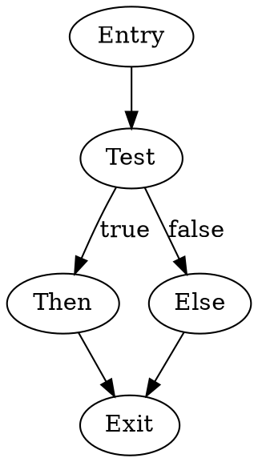

# Syllabus

## Module 1: Foundations

- Number systems (binary, hexadecimal, octal)
- Data representation (integers, signed/unsigned, two's complement)
- Boolean algebra and logic gates
- Computer architecture fundamentals
- Von Neumann architecture
- CPU components and organization
- Memory hierarchy and addressing

## Module 2: Introduction to x86 Architecture

- x86 processor family history and evolution
- Real mode vs protected mode vs long mode
- Registers (general-purpose, segment, control, debug)
- Flags register and status bits
- Instruction pointer (IP/EIP/RIP)
- Memory segmentation model
- Flat memory model

## Module 3: Development Environment Setup

- Assemblers (NASM, MASM, GAS, FASM)
- Linkers and object file formats
- Debuggers (GDB, OllyDbg, x64dbg, WinDbg)
- Emulators and virtual machines
- Build automation tools
- Integrated development environments

## Module 4: Basic Instruction Set

- MOV instruction variants
- Arithmetic instructions (ADD, SUB, INC, DEC, NEG)
- Logical instructions (AND, OR, XOR, NOT)
- Shift and rotate instructions
- Comparison and TEST instructions
- NOP and other utility instructions
- Instruction encoding basics

## Module 5: Memory Addressing Modes

- Immediate addressing
- Register addressing
- Direct memory addressing
- Indirect addressing
- Register indirect addressing
- Base-plus-index addressing
- Scaled index addressing
- RIP-relative addressing (x64)

## Module 6: Control Flow

- Unconditional jumps (JMP)
- Conditional jumps (JE, JNE, JG, JL, etc.)
- Loop instructions (LOOP, LOOPE, LOOPNE)
- Compare and branch patterns
- Jump tables
- Structured programming in assembly
- State machines

## Module 7: The Stack

- Stack architecture and operations
- PUSH and POP instructions
- Stack pointer management
- Stack frames
- Local variables on stack
- Stack alignment requirements
- Stack overflow and underflow

## Module 8: Procedures and Functions

- CALL and RET instructions
- Near vs far calls
- Calling conventions (cdecl, stdcall, fastcall, etc.)
- Parameter passing mechanisms
- Return values
- Register preservation
- Prologue and epilogue sequences
- Recursive functions

## Module 9: Data Types and Structures

- Byte, word, dword, qword operations
- Arrays and indexing
- Strings and string operations
- Structures and records
- Unions
- Packed vs unpacked data
- Alignment and padding

## Module 10: String Instructions

- MOVS (string move)
- CMPS (string compare)
- SCAS (string scan)
- LODS and STOS
- REP prefix variants
- Direction flag (DF)
- String manipulation techniques

## Module 11: Bitwise Operations

- Bit manipulation techniques
- Bit fields and masking
- Packing and unpacking data
- Bit counting algorithms
- Endianness handling
- Bitwise tricks and optimizations

## Module 12: Multiplication and Division

- MUL and IMUL instructions
- DIV and IDIV instructions
- Extended precision arithmetic
- Overflow handling
- Optimization techniques
- Fixed-point arithmetic

## Module 13: Floating-Point (x87 FPU)

- x87 FPU architecture
- FPU register stack
- Floating-point data types
- Basic FP instructions (FADD, FSUB, FMUL, FDIV)
- Transcendental functions
- FPU control and status words
- Rounding modes

## Module 14: SIMD Extensions - MMX

- MMX register set
- MMX data types
- Packed arithmetic operations
- MMX instruction set
- State management
- Performance considerations

## Module 15: SIMD Extensions - SSE/SSE2

- XMM registers
- Packed single and double precision operations
- Scalar operations
- Data movement instructions
- Logical and comparison operations
- Conversion instructions
- Cache control instructions

## Module 16: SIMD Extensions - SSE3/SSSE3/SSE4

- Horizontal operations
- Additional packed operations
- String and text processing
- Improved shuffles
- Dot products
- Blending operations

## Module 17: SIMD Extensions - AVX/AVX2

- YMM registers (256-bit)
- Three-operand instruction format
- Extended vector operations
- Gather instructions
- Fused multiply-add (FMA)
- Performance benefits

## Module 18: Advanced SIMD - AVX-512

- ZMM registers (512-bit)
- Mask registers
- Enhanced instruction set
- Embedded rounding
- Broadcast and permute operations

## Module 19: 64-bit Programming (x64/x86-64)

- Extended registers (RAX, RBX, etc.)
- Additional registers (R8-R15)
- 64-bit calling conventions
- Position-independent code (PIC)
- Memory models
- Differences from 32-bit programming

## Module 20: System Programming Basics

- Privilege levels and rings
- System calls (INT 80h, SYSCALL, SYSENTER)
- Input/output operations
- File handling
- Process and thread concepts
- Memory management basics

## Module 21: Interrupt Handling

- Interrupt types (hardware, software, exceptions)
- Interrupt descriptor table (IDT)
- Interrupt service routines (ISR)
- Interrupt priorities
- Exception handling
- Non-maskable interrupts

## Module 22: Protected Mode Programming

- Global descriptor table (GDT)
- Local descriptor table (LDT)
- Segment descriptors
- Privilege level transitions
- Task state segment (TSS)
- Paging mechanism
- Virtual memory

## Module 23: Memory Management

- Segmentation vs paging
- Page tables and page directories
- Translation lookaside buffer (TLB)
- Memory protection
- Virtual address translation
- Large pages and huge pages
- NUMA considerations

## Module 24: Optimization Techniques

- Instruction scheduling
- Pipeline awareness
- Branch prediction optimization
- Cache optimization strategies
- Loop unrolling
- Instruction-level parallelism
- Register allocation strategies

## Module 25: Performance Analysis

- CPU cycles and instruction latency
- Throughput vs latency
- Performance counters
- Profiling tools and techniques
- Bottleneck identification
- Micro-benchmarking
- Amdahl's law applications

## Module 26: Cache Architecture

- Cache levels (L1, L2, L3)
- Cache lines and associativity
- Cache coherency protocols
- Write policies (write-through, write-back)
- Cache prefetching
- False sharing
- Cache-oblivious algorithms

## Module 27: Atomic Operations and Synchronization

- Atomic instructions (XCHG, CMPXCHG, XADD)
- LOCK prefix
- Memory barriers and fences
- Compare-and-swap patterns
- Spinlocks
- Read-modify-write operations
- Lock-free programming basics

## Module 28: Multithreading Concepts

- Thread local storage (TLS)
- Context switching
- Thread synchronization primitives
- Race conditions and data races
- Memory ordering models
- Volatile and memory visibility

## Module 29: Inline Assembly

- Inline assembly syntax (GCC, MSVC, Intel)
- Constraints and clobbers
- Mixing C/C++ with assembly
- Compiler optimization interactions
- Volatile asm blocks
- Alternative keywords and attributes

## Module 30: Interfacing with High-Level Languages

- ABI (Application Binary Interface)
- Name mangling
- Calling assembly from C/C++
- Calling C/C++ from assembly
- Structure layout compatibility
- Exception handling integration
- FFI concepts

## Module 31: Operating System Interfaces

- Windows API basics
- Linux system calls
- macOS system calls
- POSIX compatibility
- OS-specific features
- Driver interfaces

## Module 32: Executable File Formats

- PE format (Windows)
- ELF format (Linux/Unix)
- Mach-O format (macOS)
- Sections and segments
- Symbol tables
- Relocation entries
- Dynamic linking

## Module 33: Code Injection and Patching

- Hot patching techniques
- Code caves
- Import address table (IAT) hooking
- Inline hooking
- Detours and trampolines
- Self-modifying code

## Module 34: Reverse Engineering Fundamentals

- Disassembly vs decompilation
- Static analysis techniques
- Dynamic analysis techniques
- Control flow graphs
- Data flow analysis
- Pattern recognition
- Anti-disassembly techniques

## Module 35: Debugging Techniques

- Breakpoints (software, hardware)
- Watchpoints
- Single-stepping
- Memory inspection
- Register examination
- Stack traces
- Core dumps and crash analysis

## Module 36: Security Considerations

- Buffer overflows
- Stack smashing
- Return-oriented programming (ROP)
- Stack canaries
- ASLR (Address Space Layout Randomization)
- DEP/NX (Data Execution Prevention)
- Control-flow integrity

## Module 37: Obfuscation Techniques

- Code obfuscation methods
- Control flow flattening
- Opaque predicates
- Instruction substitution
- Junk code insertion
- Anti-debugging techniques
- Packing and unpacking

## Module 38: Bootloader Development

- BIOS vs UEFI
- Boot process stages
- Master boot record (MBR)
- Boot sector programming
- Real mode initialization
- Loading kernels
- Bootloader protocols

## Module 39: Bare-Metal Programming

- Hardware initialization
- Direct hardware access
- Port I/O instructions
- Memory-mapped I/O
- Device drivers basics
- Interrupt controllers
- DMA operations

## Module 40: Embedded Systems

- Microcontroller programming
- Resource constraints
- Real-time considerations
- Peripheral interfaces
- Power management
- Firmware development
- Cross-compilation

## Module 41: Virtualization Extensions

- VT-x (Intel) and AMD-V
- VMCS (Virtual Machine Control Structure)
- VMX operations
- EPT (Extended Page Tables)
- Hypervisor fundamentals
- VM entry and exit

## Module 42: Hardware-Specific Features

- CPUID instruction
- Model-specific registers (MSRs)
- Time stamp counter (TSC)
- RDRAND and RDSEED
- Hardware transactional memory
- Intel SGX basics
- AMD SME/SEV basics

## Module 43: Code Generation

- Compiler backend concepts
- Instruction selection
- Register allocation algorithms
- Peephole optimization
- Assembly code templates
- JIT compilation basics

## Module 44: Special-Purpose Instructions

- Bit manipulation (BMI1, BMI2)
- CRC32 instructions
- AES-NI instructions
- SHA extensions
- Random number generation
- Conditional move (CMOV)

## Module 45: Advanced Topics

- Speculative execution
- Branch prediction internals
- Instruction fusion
- Micro-operation (μop) concepts
- Instruction decoding
- Out-of-order execution
- Simultaneous multithreading (SMT)

## Module 46: Cross-Platform Considerations

- Platform-specific differences
- Endianness issues
- Calling convention variations
- Portability strategies
- Conditional assembly
- Macro systems

## Module 47: Testing and Validation

- Unit testing assembly code
- Integration testing
- Test harnesses
- Assertion techniques
- Coverage analysis
- Fuzzing assembly code
- Regression testing

## Module 48: Documentation and Code Quality

- Code commenting standards
- Documentation generation
- Literate programming
- Code review practices
- Maintainability principles
- Version control integration

## Module 49: Real-World Applications

- Operating system kernels
- Device drivers
- Cryptographic implementations
- Compression algorithms
- Graphics and video processing
- Game engines
- High-frequency trading systems

## Module 50: Advanced Projects

- Writing a simple OS kernel
- Creating a virtual machine
- Implementing a JIT compiler
- Building a cryptographic library
- Developing a compression engine
- Creating custom allocators
- Performance-critical library development

---

**Note**: This syllabus covers x86 assembly comprehensively. [Inference] The optimal learning path depends on your goals—systems programming, reverse engineering, optimization, or embedded development may emphasize different modules.

---

# Foundations

## Number Systems

### Binary (Base-2)

Binary uses only two digits: 0 and 1. Each digit position represents a power of 2, starting from 2^0 on the right.

**Example:**

- Binary: 1011₂
- Calculation: (1 × 2³) + (0 × 2²) + (1 × 2¹) + (1 × 2⁰) = 8 + 0 + 2 + 1 = 11₁₀

Converting decimal to binary involves repeatedly dividing by 2 and recording remainders in reverse order.

**Example:**

- Decimal 13 to binary:
    - 13 ÷ 2 = 6 remainder 1
    - 6 ÷ 2 = 3 remainder 0
    - 3 ÷ 2 = 1 remainder 1
    - 1 ÷ 2 = 0 remainder 1
    - Result: 1101₂

### Hexadecimal (Base-16)

Hexadecimal uses 16 digits: 0-9 and A-F (where A=10, B=11, C=12, D=13, E=14, F=15). Each hex digit represents 4 binary bits, making it compact for representing binary data.

**Example:**

- Hex: 2A₁₆
- Calculation: (2 × 16¹) + (10 × 16⁰) = 32 + 10 = 42₁₀
- Binary equivalent: 0010 1010₂

Converting between binary and hexadecimal is straightforward by grouping bits into sets of 4.

**Example:**

- Binary: 11010111₂
- Group into 4-bit chunks: 1101 0111
- Convert each group: D (13) and 7
- Result: D7₁₆

### Octal (Base-8)

Octal uses digits 0-7. Each octal digit represents 3 binary bits. While less common in modern systems, octal was historically used in some computing contexts.

**Example:**

- Octal: 17₈
- Calculation: (1 × 8¹) + (7 × 8⁰) = 8 + 7 = 15₁₀
- Binary equivalent: 001 111₂

### Conversion Summary Table

|Decimal|Binary|Hexadecimal|Octal|
|---|---|---|---|
|0|0000|0|0|
|1|0001|1|1|
|8|1000|8|10|
|15|1111|F|17|
|16|10000|10|20|
|255|11111111|FF|377|

## Data Representation

### Integer Representation

Integers in computers are stored in fixed-width formats. The size determines the range of values that can be represented.

Common sizes in x86:

- Byte: 8 bits
- Word: 16 bits
- Double word (DWORD): 32 bits
- Quad word (QWORD): 64 bits

### Unsigned Integers

Unsigned integers represent only non-negative values. All bits contribute to the magnitude.

**Example:**

- 8-bit unsigned range: 0 to 255 (2⁸ - 1)
- Binary 11111111₂ = 255₁₀
- Binary 00000000₂ = 0₁₀

For n bits, unsigned range is 0 to (2ⁿ - 1).

### Signed Integers: Two's Complement

Two's complement is the standard method for representing signed integers in modern computers. The most significant bit (MSB) serves as the sign bit: 0 for positive, 1 for negative.

**Why Two's Complement:** Two's complement simplifies arithmetic operations. Addition and subtraction use the same hardware circuitry regardless of sign, and there's only one representation for zero.

**Finding Two's Complement:**

To negate a number in two's complement:

1. Invert all bits (one's complement)
2. Add 1 to the result

**Example:**

- Positive 5 in 8-bit: 00000101₂
- Invert bits: 11111010₂
- Add 1: 11111011₂ = -5 in two's complement

**Range for Two's Complement:** For n bits: -2^(n-1) to 2^(n-1) - 1

- 8-bit signed: -128 to +127
- 16-bit signed: -32,768 to +32,767
- 32-bit signed: -2,147,483,648 to +2,147,483,647

**Interpreting Two's Complement Values:**

To convert a negative two's complement number to its magnitude:

1. Check MSB (if 1, number is negative)
2. Invert all bits
3. Add 1
4. The result is the magnitude (attach negative sign)

**Example:**

- Binary: 11111100₂
- MSB is 1 (negative number)
- Invert: 00000011₂
- Add 1: 00000100₂ = 4
- Result: -4₁₀

### Sign Extension

Sign extension preserves a number's value when increasing bit width. The sign bit is copied into the new higher-order bits.

**Example:**

- 8-bit: 11111100₂ (-4)
- Extended to 16-bit: 11111111 11111100₂ (still -4)
- 8-bit: 00000101₂ (+5)
- Extended to 16-bit: 00000000 00000101₂ (still +5)

### Overflow and Underflow

Overflow occurs when an arithmetic operation produces a result outside the representable range.

**Unsigned overflow example:**

- 8-bit: 255 + 1 = 256, but max is 255
- Result wraps to: 0 (with carry flag set)

**Signed overflow example:**

- 8-bit: 127 + 1 = 128, but max is +127
- Binary: 01111111 + 00000001 = 10000000 = -128 in two's complement
- This is incorrect; overflow flag is set

## Boolean Algebra and Logic Gates

### Boolean Operations

Boolean algebra operates on binary values (0 = false, 1 = true) using logical operations.

**AND Operation:** Output is 1 only when both inputs are 1.

Truth table:

```
A | B | A AND B
0 | 0 |    0
0 | 1 |    0
1 | 0 |    0
1 | 1 |    1
```

**OR Operation:** Output is 1 when at least one input is 1.

Truth table:

```
A | B | A OR B
0 | 0 |   0
0 | 1 |   1
1 | 0 |   1
1 | 1 |   1
```

**NOT Operation:** Output is the inverse of the input.

Truth table:

```
A | NOT A
0 |   1
1 |   0
```

**XOR (Exclusive OR):** Output is 1 when inputs are different.

Truth table:

```
A | B | A XOR B
0 | 0 |    0
0 | 1 |    1
1 | 0 |    1
1 | 1 |    0
```

**NAND (NOT AND):** Output is 0 only when both inputs are 1.

Truth table:

```
A | B | A NAND B
0 | 0 |     1
0 | 1 |     1
1 | 0 |     1
1 | 1 |     0
```

**NOR (NOT OR):** Output is 1 only when both inputs are 0.

Truth table:

```
A | B | A NOR B
0 | 0 |    1
0 | 1 |    0
1 | 0 |    0
1 | 1 |    0
```

### Boolean Algebra Laws

**Identity Laws:**

- A AND 1 = A
- A OR 0 = A

**Null Laws:**

- A AND 0 = 0
- A OR 1 = 1

**Idempotent Laws:**

- A AND A = A
- A OR A = A

**Complement Laws:**

- A AND NOT A = 0
- A OR NOT A = 1
- NOT (NOT A) = A

**Commutative Laws:**

- A AND B = B AND A
- A OR B = B OR A

**Associative Laws:**

- (A AND B) AND C = A AND (B AND C)
- (A OR B) OR C = A OR (B OR C)


**Distributive Laws:**

- A AND (B OR C) = (A AND B) OR (A AND C)
- A OR (B AND C) = (A OR B) AND (A OR C)

**De Morgan's Laws:**

- NOT (A AND B) = NOT A OR NOT B
- NOT (A OR B) = NOT A AND NOT B

### Bitwise Operations in x86

x86 assembly provides instructions for bitwise operations on integer data:

**AND:** Used for masking bits (clearing specific bits while preserving others).

**Example:**

```
10110101 AND 00001111 = 00000101
```

This masks the upper 4 bits, keeping only the lower 4 bits.

**OR:** Used for setting specific bits to 1.

**Example:**

```
10110101 OR 00001111 = 10111111
```

This sets the lower 4 bits to 1.

**XOR:** Used for toggling bits or comparing values. XORing a value with itself produces 0.

**Example:**

```
10110101 XOR 11110000 = 01000101
```

**NOT:** Inverts all bits.

**Example:**

```
NOT 10110101 = 01001010
```

### Logic Gates

Logic gates are physical implementations of Boolean operations in digital circuits.

**AND Gate:** Implements AND operation. Both inputs must be high for output to be high.

**OR Gate:** Implements OR operation. At least one input must be high for output to be high.

**NOT Gate (Inverter):** Implements NOT operation. Inverts the input signal.

**XOR Gate:** Implements XOR operation. Output is high when inputs differ.

**NAND Gate:** Universal gate that can implement any Boolean function. Output is low only when both inputs are high.

**NOR Gate:** Universal gate. Output is high only when both inputs are low.

### Applications in Computing

**Bit Manipulation:** Boolean operations are fundamental for:

- Setting specific bits (OR with mask)
- Clearing specific bits (AND with inverted mask)
- Toggling bits (XOR with mask)
- Testing bits (AND with mask, check result)

**Example:** To set bit 3 (counting from 0) in a byte:

```
Original: 10100101
Mask:     00001000
OR:       10101101
```

To clear bit 5:

```
Original: 10100101
Mask:     11011111 (inverted from 00100000)
AND:      10000101
```

## Computer Architecture Fundamentals

### Von Neumann Architecture

The Von Neumann architecture is the foundational model for most modern computers. It consists of:

**Central Processing Unit (CPU):** Executes instructions and performs computations.

**Memory:** Stores both program instructions and data in the same address space.

**Input/Output (I/O):** Interfaces for communication with external devices.

**Bus System:** Pathways for transferring data between components.

**Key Characteristic:** Instructions and data share the same memory and bus system. This creates the "Von Neumann bottleneck" where the CPU must wait for memory access.

### Harvard Architecture

An alternative to Von Neumann architecture where instruction memory and data memory are physically separated with independent buses. This allows simultaneous access to instructions and data.

Modern CPUs often use a modified Harvard architecture internally (separate L1 instruction and data caches) while presenting a Von Neumann interface externally.

### CPU Components

**Control Unit (CU):** Directs operation of the processor. It fetches instructions from memory, decodes them, and coordinates execution by sending control signals to other components.

**Arithmetic Logic Unit (ALU):** Performs arithmetic operations (addition, subtraction) and logical operations (AND, OR, NOT, XOR). The ALU operates on data from registers and sets flags based on results.

**Registers:** High-speed storage locations within the CPU for temporary data storage. Registers are the fastest memory available to the processor.

**Cache Memory:** Small, fast memory between the CPU and main memory. Modern processors typically have multiple cache levels (L1, L2, L3) with increasing size and latency.

### x86 Register Architecture

**General Purpose Registers (32-bit):**

- EAX: Accumulator for arithmetic operations
- EBX: Base register for memory addressing
- ECX: Counter for loops and string operations
- EDX: Data register for I/O and arithmetic extensions
- ESI: Source index for string operations
- EDI: Destination index for string operations
- EBP: Base pointer for stack frame addressing
- ESP: Stack pointer for stack top

**64-bit Extensions:** In x86-64 (also called AMD64 or x64), these registers are extended to 64 bits:

- RAX, RBX, RCX, RDX, RSI, RDI, RBP, RSP
- Additional registers: R8-R15

**Segment Registers:**

- CS: Code Segment
- DS: Data Segment
- SS: Stack Segment
- ES, FS, GS: Extra Segments

**Instruction Pointer:**

- EIP (32-bit) or RIP (64-bit): Points to the next instruction to execute

**Flags Register (EFLAGS/RFLAGS):** Contains status flags and control flags:

- CF: Carry Flag (set on unsigned overflow)
- PF: Parity Flag (set if result has even number of 1 bits)
- AF: Auxiliary Carry Flag (used for BCD arithmetic)
- ZF: Zero Flag (set if result is zero)
- SF: Sign Flag (set if result is negative)
- OF: Overflow Flag (set on signed overflow)
- DF: Direction Flag (controls string operation direction)
- IF: Interrupt Enable Flag

### Memory Hierarchy

Memory systems are organized in a hierarchy based on speed, size, and cost:

**Registers:** Fastest, smallest capacity (dozens of bytes), located in CPU core. Access time: less than 1 nanosecond.

**L1 Cache:** Very fast, small capacity (typically 32-64 KB per core), split into instruction and data caches. Access time: approximately 1-4 cycles.

**L2 Cache:** Fast, medium capacity (typically 256 KB to 1 MB per core). Access time: approximately 10-20 cycles.

**L3 Cache:** Moderately fast, larger capacity (typically 8-32 MB shared across cores). Access time: approximately 40-75 cycles.

**Main Memory (RAM):** Slower, large capacity (gigabytes). Access time: approximately 200-300 cycles (60-100 nanoseconds).

**Secondary Storage (SSD/HDD):** Much slower, very large capacity (terabytes). Access time: microseconds (SSD) to milliseconds (HDD).

**Principle of Locality:** Programs tend to access a relatively small portion of their address space at any given time. This principle makes caching effective:

- Temporal locality: Recently accessed items likely to be accessed again soon
- Spatial locality: Items near recently accessed items likely to be accessed soon

### Instruction Execution Cycle (Fetch-Decode-Execute)

The basic cycle that CPUs follow to execute instructions:

**Fetch:** The Control Unit retrieves the instruction from memory at the address stored in the instruction pointer. The instruction pointer is then incremented to point to the next instruction.

**Decode:** The Control Unit interprets the instruction, determining what operation to perform and what operands are needed. This involves identifying the opcode and extracting operand specifiers.

**Execute:** The ALU or other functional units perform the operation specified by the instruction. This may involve:

- Reading data from registers or memory
- Performing computation
- Writing results to registers or memory
- Updating flags

**Memory Access (if needed):** Load or store data from/to memory.

**Write Back:** Store the result in the destination register or memory location.

Modern processors use pipelining to overlap these stages for multiple instructions, improving throughput.

### Memory Addressing

**Physical Address:** The actual address in hardware memory chips.

**Logical Address:** The address generated by the CPU (also called virtual address in systems with virtual memory).

**Segmentation:** Memory divided into segments (code, data, stack). A logical address consists of a segment selector and an offset. The segment base address is added to the offset to form a linear address.

**Paging:** Memory divided into fixed-size pages (typically 4 KB). The Memory Management Unit (MMU) translates linear addresses to physical addresses using page tables. This enables virtual memory, allowing programs to use more memory than physically available.

### Instruction Set Architecture (ISA)

The ISA defines the interface between software and hardware, specifying:

- Available instructions and their encoding
- Register set and organization
- Memory addressing modes
- Data types and sizes
- Interrupt and exception handling

**x86 ISA Characteristics:**

- Complex Instruction Set Computer (CISC) architecture
- Variable-length instructions (1 to 15 bytes)
- Rich instruction set with specialized instructions
- Multiple addressing modes
- Backward compatibility (16-bit → 32-bit → 64-bit)

### Endianness

Endianness refers to the byte order in which multi-byte values are stored in memory.

**Little-Endian (x86):** Least significant byte stored at the lowest memory address.

**Example:** Value: 0x12345678 stored at address 0x1000

```
Address: 0x1000  0x1001  0x1002  0x1003
Value:     78      56      34      12
```

**Big-Endian:** Most significant byte stored at the lowest memory address.

**Example:** Value: 0x12345678 stored at address 0x1000

```
Address: 0x1000  0x1001  0x1002  0x1003
Value:     12      34      56      78
```

Little-endian is natural for little-endian architectures like x86 because the least significant byte is at the "smallest" (lowest) address.

### Stack Architecture

The stack is a Last-In-First-Out (LIFO) data structure used for:

- Temporary storage of data
- Function call management (return addresses, parameters)
- Local variable storage
- Saving and restoring register state

**Stack Growth:** On x86, the stack grows downward (toward lower memory addresses). The stack pointer (ESP/RSP) points to the top of the stack.

**Push Operation:** Decrements stack pointer, then stores value at the new stack pointer location.

**Pop Operation:** Retrieves value at stack pointer location, then increments stack pointer.

**Stack Frame:** A portion of the stack allocated for a single function call, containing:

- Return address
- Saved base pointer
- Function parameters
- Local variables

The base pointer (EBP/RBP) points to a fixed location within the stack frame, allowing consistent access to parameters and local variables.

### Interrupts and Exceptions

**Interrupts:** Signals that cause the CPU to temporarily suspend current execution and transfer control to an interrupt handler.

**Hardware Interrupts:** Generated by external devices (keyboard, timer, disk controller). These are asynchronous to program execution.

**Software Interrupts:** Triggered by executing specific instructions (INT instruction in x86). Used for system calls and OS services.

**Exceptions:** Synchronous events generated by the CPU during instruction execution:

- Faults: Correctable errors (page fault, divide by zero)
- Traps: Intentional exceptions for debugging (breakpoints)
- Aborts: Severe errors indicating hardware failure or corruption

**Interrupt Handling:**

1. CPU saves current state (flags, instruction pointer)
2. CPU looks up handler address in Interrupt Descriptor Table (IDT)
3. CPU transfers control to handler
4. Handler executes
5. Handler returns, restoring saved state

## Von Neumann Architecture

Von Neumann architecture is the fundamental computer design model where programs and data share the same memory space. This architecture forms the basis for most modern computers and directly influences how x86 assembly programs interact with hardware.

The architecture consists of four primary components that work together through a shared bus system. The Central Processing Unit (CPU) contains the control unit and arithmetic logic unit. Memory stores both instructions and data in a single address space. Input/Output devices handle communication with external systems. The bus system connects all components and transfers data, addresses, and control signals.

The stored-program concept is central to this architecture. Programs exist as data in memory, with instructions fetched sequentially from memory addresses. The program counter tracks the next instruction location, and instructions execute in the fetch-decode-execute cycle. This design allows programs to modify themselves during execution, though modern systems restrict this capability for security reasons.

The Von Neumann bottleneck describes the limitation where the single bus between CPU and memory creates a performance constraint. Only one memory access occurs at a time, whether fetching instructions or accessing data. Modern processors use caches, pipelining, and parallel execution units to mitigate this bottleneck, but the fundamental architectural limitation remains.

## CPU Components and Organization

The x86 CPU contains multiple specialized components organized into functional units that execute assembly instructions.

**Registers** are the fastest storage locations inside the CPU. General-purpose registers in x86-64 include RAX, RBX, RCX, RDX, RSI, RDI, RBP, RSP, and R8-R15. These registers hold operands for arithmetic operations, memory addresses, function parameters, and temporary values. Special-purpose registers include the instruction pointer (RIP) which points to the next instruction, and the flags register (RFLAGS) which stores condition codes from operations.

**The Arithmetic Logic Unit (ALU)** performs arithmetic operations like addition, subtraction, multiplication, and division. It also executes logical operations including AND, OR, XOR, and NOT. Bit manipulation operations such as shifts and rotations occur in the ALU. After each operation, the ALU sets flags in RFLAGS to indicate results like zero, negative, overflow, or carry conditions.

**The Control Unit** manages instruction execution by fetching instructions from memory, decoding instruction opcodes to determine required operations, and generating control signals for other CPU components. It manages the instruction pipeline and handles exceptions and interrupts that alter normal program flow.

**The Floating-Point Unit (FPU)** executes floating-point arithmetic operations using separate registers (x87 stack or XMM/YMM/ZMM registers). Modern x86 processors include SIMD extensions like SSE, AVX, and AVX-512 that process multiple data elements simultaneously.

**Cache Memory** exists in multiple levels within or near the CPU. L1 cache is split into separate instruction and data caches with the smallest capacity but fastest access. L2 cache is larger and may be per-core or shared. L3 cache is the largest and typically shared across all cores. The Memory Management Unit (MMU) handles virtual-to-physical address translation using page tables and the Translation Lookaside Buffer (TLB).

## Memory Hierarchy and Addressing

The memory hierarchy organizes storage by speed, size, and cost, creating a pyramid where faster memory is smaller and more expensive.

**Registers** occupy the top level with access times under 1 nanosecond and typical capacity of hundreds of bytes. Assembly instructions directly reference registers by name (RAX, RBX, etc.). Register access requires no memory bus transactions.

**Cache levels** form the next tier. L1 cache provides 1-3 nanosecond access times with 32-64 KB capacity per core. L2 cache offers 3-10 nanosecond access with 256 KB to 1 MB per core. L3 cache delivers 10-20 nanosecond access with 2-32 MB shared across cores. The CPU automatically manages cache contents using replacement policies, though programmers can optimize for cache behavior.

**Main Memory (RAM)** sits below cache with 50-100 nanosecond access times and gigabytes of capacity. Assembly programs use memory addresses to access RAM. The processor loads data from RAM into registers before manipulation and stores results back to RAM.

**Secondary Storage** includes SSDs with microsecond access times and hard drives with millisecond access times. These devices provide terabytes of persistent storage but require operating system involvement for access from assembly programs.

**Memory Addressing Modes** in x86 assembly determine how instructions specify memory locations:

Immediate addressing embeds constant values directly in instructions: `mov rax, 42`

Register addressing uses register contents as operands: `mov rax, rbx`

Direct memory addressing specifies absolute memory addresses: `mov rax, [0x601040]`

Register indirect addressing uses register contents as memory addresses: `mov rax, [rbx]`

Indexed addressing combines base register and offset: `mov rax, [rbx + 8]`

Base-index addressing uses two registers: `mov rax, [rbx + rcx]`

Base-index-displacement combines base, index, scale factor, and displacement: `mov rax, [rbx + rcx*4 + 8]`

**Virtual Memory** creates an abstraction where each process sees a continuous address space regardless of physical RAM layout. The MMU translates virtual addresses to physical addresses using page tables. Pages are fixed-size blocks (typically 4 KB) that map virtual to physical memory. When programs access unmapped virtual addresses, page faults occur, allowing the operating system to load data from disk or handle errors.

**Segmentation** in x86 architecture divides memory into segments with different purposes. Code segment (CS) contains executable instructions. Data segment (DS) holds global and static variables. Stack segment (SS) stores the call stack. Extra segments (ES, FS, GS) provide additional data access. Modern 64-bit operating systems use flat memory models where segmentation plays a minimal role, with virtual memory providing protection and isolation.

**Key Points:**
- Von Neumann architecture combines instruction and data in shared memory, creating the bottleneck between CPU and memory
- CPU organization separates functions into ALU, control unit, registers, FPU, and cache hierarchy
- Memory hierarchy trades speed for capacity, from sub-nanosecond registers to millisecond disk storage
- x86 addressing modes provide flexible ways to specify operands using immediates, registers, and complex memory calculations
- Virtual memory and paging allow processes to use more address space than physical RAM while providing isolation

---

# Introduction to x86 Architecture

The x86 architecture represents one of the most influential and enduring processor designs in computing history. Originally developed by Intel in 1978 with the 8086 processor, x86 has evolved through multiple generations while maintaining backward compatibility, making it the dominant architecture for personal computers and servers.

## x86 Processor Family History and Evolution

The x86 architecture began with the Intel 8086, a 16-bit microprocessor released in 1978. This processor featured a 20-bit address bus capable of addressing 1 MB of memory and introduced the segmented memory model that would characterize early x86 processors. The 8088, a variant with an 8-bit external data bus, was selected by IBM for the original IBM PC in 1981, cementing x86's position in the personal computer market.

The 80186 and 80188 processors appeared in 1982 as incremental improvements, adding integrated peripherals and new instructions, though they saw limited adoption in personal computers. The real breakthrough came with the 80286 in 1982, which introduced protected mode, a 16-bit protected memory system with 24-bit addressing capable of accessing 16 MB of memory. Protected mode provided hardware-based memory protection and privilege levels, laying the groundwork for modern multitasking operating systems.

The 80386 (i386), released in 1985, marked x86's transition to 32-bit computing. This processor featured 32-bit registers, a 32-bit data bus, and 32-bit addressing capable of accessing 4 GB of physical memory. The 386 introduced paging, virtual memory support, and virtual 8086 mode, which allowed multiple DOS programs to run simultaneously in protected mode. The architecture also introduced the flat memory model as an alternative to segmentation.

The 80486 (1989) integrated the floating-point unit (FPU) onto the main die, previously available as the separate 80387 coprocessor. It also included an on-chip cache and improved instruction execution through pipelining. The Pentium processor (1993) introduced superscalar execution with dual integer pipelines, allowing two instructions to execute simultaneously. It also featured separate instruction and data caches and enhanced floating-point performance.

The Pentium Pro (1995) introduced dynamic execution, combining branch prediction, speculative execution, and out-of-order execution. The P6 microarchitecture used in Pentium Pro became the foundation for subsequent processors including Pentium II, Pentium III, and much later, the Core series. The Pentium MMX (1997) added MMX (MultiMedia eXtensions) instructions for SIMD (Single Instruction, Multiple Data) operations on integer data.

The Pentium III (1999) introduced SSE (Streaming SIMD Extensions) with 70 new instructions operating on single-precision floating-point data. The Pentium 4 (2000) featured the NetBurst microarchitecture with very deep pipelines (20-31 stages) targeting high clock frequencies. It introduced SSE2, extending SIMD capabilities to double-precision floating-point and additional integer operations.

AMD's contribution to x86 evolution became particularly significant with the Athlon 64 (2003), which introduced x86-64 (also called AMD64), extending the architecture to 64-bit. This design added 64-bit registers, expanded the general-purpose register set from 8 to 16 registers, introduced a new instruction pointer-relative addressing mode (RIP-relative), and provided 64-bit virtual addressing. Intel adopted this extension as Intel 64 (previously EM64T), making x86-64 the standard 64-bit extension of x86.

The Core microarchitecture (2006) marked Intel's return to emphasis on efficiency over raw clock speed, featuring improved branch prediction, macro-op fusion, and power efficiency. Subsequent microarchitectures introduced increasingly sophisticated features: Intel Core i7 (Nehalem, 2008) integrated the memory controller and introduced Hyper-Threading improvements; Sandy Bridge (2011) redesigned the microarchitecture with improved out-of-order execution; Haswell (2013) introduced AVX2 and FMA3 instructions; and Skylake (2015) further refined the architecture.

Modern x86 processors continue to evolve with features like AVX-512 (512-bit SIMD operations), hardware security extensions (Intel SGX), transactional memory (TSX), and specialized instructions for cryptography, virtualization, and artificial intelligence workloads. Both Intel and AMD continue to develop x86 processors with increasing core counts, improved power efficiency, and enhanced security features.

## Real Mode vs Protected Mode vs Long Mode

x86 processors operate in distinct modes that determine their addressing capabilities, memory protection mechanisms, and available features. These modes reflect the architecture's evolution while maintaining backward compatibility.

### Real Mode

Real mode is the operating mode of the original 8086 processor and remains the default mode when x86 processors first power on. In real mode, the processor behaves like an 8086, providing direct hardware access and simple memory addressing.

Memory addressing in real mode uses segmentation with 16-bit segment registers and 16-bit offset values. The physical address is calculated as (segment × 16) + offset, producing a 20-bit physical address capable of accessing 1 MB of memory (0x00000 to 0xFFFFF). This creates the characteristic segment:offset addressing format, where an address might be written as 0x1234:0x5678, representing physical address 0x179B8.

Real mode provides no memory protection mechanisms. All code executes with full hardware privileges, and any program can access any memory location or I/O port. There are no privilege levels, virtual memory, or memory segmentation protection. Programs can directly access hardware and overwrite the operating system or other programs' memory, leading to system instability.

The limited addressing space creates the famous "640 KB barrier" for DOS programs, as the upper 384 KB of the 1 MB address space was reserved for hardware ROMs and memory-mapped I/O. Real mode remains important because BIOS firmware runs in this mode, and operating systems must begin execution in real mode before transitioning to more advanced modes.

### Protected Mode

Protected mode, introduced with the 80286 and significantly enhanced in the 80386, provides memory protection, privilege levels, and advanced memory management. The 80286 provided 16-bit protected mode, while the 80386 and later processors support 32-bit protected mode, which became the standard for modern 32-bit operating systems.

Memory addressing in 32-bit protected mode uses either segmentation or a flat memory model. Segment registers no longer contain the segment base address directly; instead, they contain selectors that index into descriptor tables (GDT - Global Descriptor Table, or LDT - Local Descriptor Table). Each descriptor defines a segment's base address, limit (size), privilege level, and access rights. This indirection enables sophisticated memory protection.

Protected mode implements four privilege levels (rings 0-3), though most operating systems use only ring 0 (kernel mode) and ring 3 (user mode). The processor enforces privilege checks on memory access, I/O operations, and instruction execution. Code at a lower privilege level cannot access higher-privileged memory or execute privileged instructions without going through controlled gates.

Virtual memory support through paging allows the operating system to manage memory in 4 KB pages (or larger page sizes like 2 MB or 4 MB). The paging mechanism translates linear addresses to physical addresses through page tables, enabling features like memory protection, demand paging, copy-on-write, and the ability to use more virtual memory than physical RAM available.

The Task State Segment (TSS) provides hardware support for multitasking, storing processor state during task switches. Protected mode also introduces various gates (call gates, interrupt gates, trap gates, task gates) that control transitions between different privilege levels and segments, ensuring system security.

Protected mode allows access to the full 32-bit address space (4 GB) with the 80386 and later processors. Modern 32-bit operating systems like Windows XP, Linux (32-bit), and others run in protected mode, taking advantage of memory protection, virtual memory, and hardware-enforced security.

### Long Mode

Long mode, introduced with the x86-64 architecture extension, provides 64-bit computing capabilities. It consists of two sub-modes: 64-bit mode (the primary operating mode for 64-bit code) and compatibility mode (which allows 16-bit and 32-bit code to run under a 64-bit operating system).

In 64-bit mode, the processor provides 64-bit addressing, though current implementations typically support only 48-bit or 57-bit virtual addressing due to practical limitations. This provides a theoretical address space of 256 TB (48-bit) or 128 PB (57-bit). Physical addressing is also extended, with most modern processors supporting 48-52 bits of physical addressing.

The general-purpose register set expands from 8 registers (EAX, EBX, ECX, EDX, ESI, EDI, EBP, ESP) to 16 registers (RAX, RBX, RCX, RDX, RSI, RDI, RBP, RSP, R8-R15). All general-purpose registers are 64 bits wide. The SSE register set also expands from 8 registers (XMM0-XMM7) to 16 registers (XMM0-XMM15), and with AVX, the vector registers become 256-bit YMM registers.

Long mode simplifies segmentation significantly. Segmentation is effectively disabled for code, data, and stack segments, with CS, DS, ES, and SS segment bases forced to zero (creating a flat memory model). The FS and GS segments remain usable with non-zero bases for special purposes like thread-local storage. This simplification eliminates much of the complexity associated with segmented memory models.

A new addressing mode, RIP-relative addressing, allows instructions to reference data relative to the instruction pointer. This facilitates position-independent code and improves code efficiency. The instruction encoding also changes slightly, with REX prefixes providing access to extended registers and 64-bit operand sizes.

Long mode requires paging to be enabled - it cannot operate without virtual memory. Page tables are extended to support 64-bit addressing through four-level (or five-level with recent processors) page table hierarchies: PML4 (Page Map Level 4), PDPT (Page Directory Pointer Table), PD (Page Directory), and PT (Page Table). Five-level paging adds PML5 above PML4.

Compatibility mode allows 16-bit and 32-bit applications to run under a 64-bit operating system without modification. In this mode, individual code segments can be marked as 32-bit or 16-bit, allowing legacy applications to execute while the operating system kernel runs in 64-bit mode. However, pure 16-bit real mode code cannot execute directly in long mode.

Transitioning between modes involves specific sequences. Moving from real mode to protected mode requires setting up descriptor tables, enabling the protection enable (PE) bit in CR0, and loading appropriate segment selectors. Transitioning to long mode requires enabling PAE (Physical Address Extension) paging, setting up long mode page tables, enabling long mode through the EFER MSR (Model Specific Register), then enabling paging in CR0.

## Registers

x86 processors contain various types of registers that store data, addresses, control information, and processor state. The register set has expanded significantly from the original 8086 to modern 64-bit processors.

### General-Purpose Registers

General-purpose registers store operands for arithmetic and logical operations, memory addresses, and temporary data. The original 8086 provided four 16-bit general-purpose registers: AX (accumulator), BX (base), CX (count), and DX (data). Each could be accessed as a 16-bit value or split into two 8-bit halves: AH/AL, BH/BL, CH/CL, DH/DL.

The 80386 extended these to 32 bits, adding an "E" prefix: EAX, EBX, ECX, EDX. The lower 16 bits remained accessible as AX, BX, CX, DX, and the lower 8-bit halves as AH/AL, etc. The 8086 also provided four pointer and index registers: SP (stack pointer), BP (base pointer), SI (source index), and DI (destination index), extended to ESP, EBP, ESI, EDI in 32-bit mode.

x86-64 extends all these registers to 64 bits with an "R" prefix: RAX, RBX, RCX, RDX, RSP, RBP, RSI, RDI. The lower portions remain accessible (EAX is the lower 32 bits of RAX, AX is the lower 16 bits, AL is the lower 8 bits). A new addressing mode allows accessing the low 8 bits of RSI, RDI, RBP, and RSP as SIL, DIL, BPL, SPL when using REX prefixes.

x86-64 also adds eight new general-purpose registers: R8-R15. These are 64-bit registers, with the lower portions accessible as R8D-R15D (32-bit), R8W-R15W (16-bit), and R8B-R15B (8-bit).

While called "general-purpose," certain registers have special roles in specific instructions:
- RAX: Accumulator for arithmetic operations, function return values, syscall numbers
- RBX: Base register for indexed addressing, sometimes preserved across calls
- RCX: Counter for loop and string operations, fourth function argument (Windows x64)
- RDX: Data register, used in multiplication/division, third function argument (Windows x64)
- RSI: Source index for string operations, second function argument (System V AMD64)
- RDI: Destination index for string operations, first function argument (System V AMD64)
- RBP: Base pointer for stack frame access
- RSP: Stack pointer, points to the top of the stack
- R8-R9: Additional function arguments in 64-bit calling conventions
- R10-R11: Temporary registers, may be used by syscalls
- R12-R15: Preserved registers that typically must be saved/restored by called functions

### Segment Registers

Segment registers select memory segments in segmented memory models. The 8086 provided four 16-bit segment registers: CS (Code Segment), DS (Data Segment), SS (Stack Segment), and ES (Extra Segment). The 80386 added FS and GS as additional extra segment registers.

In real mode, segment registers contain the base address divided by 16. The physical address is calculated as (segment × 16) + offset. In protected mode, segment registers contain segment selectors that index into descriptor tables. Each selector contains an index into the GDT or LDT, a table indicator bit, and a requested privilege level.

In 64-bit long mode, segmentation is largely disabled. CS, DS, ES, and SS have their bases forced to zero, effectively creating a flat memory model. However, FS and GS remain functional with configurable base addresses, commonly used for thread-local storage and operating system data structures. The FS and GS bases can be set using special MSRs (Model Specific Registers) or the WRFSBASE/WRGSBASE instructions.

CS is special because it cannot be loaded directly with MOV. Instead, it changes implicitly during far jumps, far calls, interrupt handling, or return instructions. The CS register also contains the Current Privilege Level (CPL) in its lower 2 bits in protected mode.

### Instruction Pointer

The instruction pointer register points to the next instruction to be executed. In 16-bit mode, it's IP; in 32-bit mode, EIP; in 64-bit mode, RIP. Unlike general-purpose registers, the instruction pointer cannot be accessed directly through ordinary instructions. It changes implicitly through control flow instructions (JMP, CALL, RET, INT, IRET) or sequentially as instructions execute.

In 64-bit mode, RIP-relative addressing allows instructions to reference memory relative to the current instruction pointer, enabling position-independent code. The instruction might specify a 32-bit signed displacement that's added to the RIP value pointing to the next instruction.

### Control Registers

Control registers manage processor operation modes and features. They cannot be accessed by application code and require privileged execution (ring 0).

CR0 contains system control flags:
- PE (bit 0): Protection Enable, switches from real mode to protected mode
- MP (bit 1): Monitor Coprocessor, controls WAIT/FWAIT instruction behavior
- EM (bit 2): Emulation, indicates no FPU present
- TS (bit 3): Task Switched, enables lazy FPU context switching
- ET (bit 4): Extension Type (obsolete, hardwired to 1)
- NE (bit 5): Numeric Error, enables native FPU error reporting
- WP (bit 16): Write Protect, enables write protection in ring 0
- AM (bit 18): Alignment Mask, enables alignment checking
- NW (bit 29): Not Write-through, controls cache behavior
- CD (bit 30): Cache Disable, disables internal caches
- PG (bit 31): Paging, enables paging when set

CR1 is reserved and not used.

CR2 stores the page fault linear address. When a page fault occurs, CR2 is loaded with the virtual address that caused the fault, allowing the page fault handler to determine which address was accessed.

CR3 contains the page directory base register (PDBR), pointing to the base of the page directory or PML4 table. The lower 12 bits contain flags controlling cache behavior (PWT, PCD) and must be zero. Loading CR3 with a new value switches the address space, flushing most TLB entries. CR3 is often called the "page table base."

CR4 contains various control flags for extended features:
- VME (bit 0): Virtual-8086 Mode Extensions
- PVI (bit 1): Protected-mode Virtual Interrupts
- TSD (bit 2): Time Stamp Disable, restricts RDTSC instruction to ring 0
- DE (bit 3): Debugging Extensions
- PSE (bit 4): Page Size Extension, enables 4 MB pages
- PAE (bit 5): Physical Address Extension, enables >4GB physical addressing in 32-bit mode
- MCE (bit 6): Machine-Check Enable
- PGE (bit 7): Page Global Enable, enables global TLB entries
- PCE (bit 8): Performance-Monitoring Counter Enable
- OSFXSR (bit 9): Operating System FXSAVE/FXRSTOR Support
- OSXMMEXCPT (bit 10): Operating System Unmasked Exception Support
- UMIP (bit 11): User-Mode Instruction Prevention
- VMXE (bit 13): Virtual Machine Extensions Enable
- SMXE (bit 14): Safer Mode Extensions Enable
- FSGSBASE (bit 16): Enables RDFSBASE/RDGSBASE/WRFSBASE/WRGSBASE instructions
- PCIDE (bit 17): PCID Enable
- OSXSAVE (bit 18): XSAVE and Processor Extended States Enable
- SMEP (bit 20): Supervisor Mode Execution Prevention
- SMAP (bit 21): Supervisor Mode Access Prevention
- PKE (bit 22): Protection Key Enable

CR8 is the Task Priority Register (TPR) available in 64-bit mode, controlling the priority threshold for external interrupts.

### Debug Registers

Debug registers support hardware breakpoints and debugging facilities. They are privileged and accessible only in ring 0.

DR0-DR3 contain linear addresses for up to four hardware breakpoints. Each register can hold one breakpoint address.

DR4 and DR5 are reserved (aliases for DR6 and DR7 when debug extensions are disabled).

DR6 is the Debug Status Register, containing flags that indicate which debug conditions were met:
- B0-B3 (bits 0-3): Breakpoint condition detected for DR0-DR3
- BD (bit 13): Debug register access detected
- BS (bit 14): Single step (trap flag caused break)
- BT (bit 15): Task switch breakpoint

DR7 is the Debug Control Register, controlling the operation of debug registers:
- L0-L3 (bits 0,2,4,6): Local breakpoint enable for DR0-DR3 (current task)
- G0-G3 (bits 1,3,5,7): Global breakpoint enable for DR0-DR3 (all tasks)
- LE, GE (bits 8-9): Local/Global exact breakpoint enable (obsolete)
- GD (bit 13): General Detect enable, causes debug exception on DR access
- R/W0-R/W3 (bits 16-17, 20-21, 24-25, 28-29): Read/Write field for each breakpoint (00=execution, 01=write, 11=read/write)
- LEN0-LEN3 (bits 18-19, 22-23, 26-27, 30-31): Length field for each breakpoint (00=1 byte, 01=2 bytes, 10=8 bytes, 11=4 bytes)

Hardware breakpoints are significantly faster than software breakpoints (INT 3) and don't require code modification, making them valuable for debugging and security applications.

### Model Specific Registers (MSRs)

MSRs are processor-specific registers accessed through RDMSR and WRMSR instructions. Different processor families implement different MSRs. Common MSRs include:

- IA32_EFER (0xC0000080): Extended Feature Enable Register, controls long mode activation, NXE (No-Execute Enable), and other features
- IA32_STAR (0xC0000081): SYSCALL target address and segment selectors
- IA32_LSTAR (0xC0000082): Long mode SYSCALL target address
- IA32_FMASK (0xC0000084): SYSCALL flag mask
- IA32_FS_BASE (0xC0000100): FS segment base address in 64-bit mode
- IA32_GS_BASE (0xC0000101): GS segment base address in 64-bit mode
- IA32_KERNEL_GS_BASE (0xC0000102): Kernel GS base, swapped with GS_BASE by SWAPGS
- IA32_TSC (0x10): Time Stamp Counter
- IA32_APIC_BASE (0x1B): APIC base address and enable bits

MSRs provide access to performance counters, advanced features, processor-specific controls, and virtualization settings. The specific MSRs available depend on the processor model.

### Floating-Point Registers

The x87 FPU provides eight 80-bit floating-point data registers organized as a stack: ST(0) through ST(7), where ST(0) is the stack top. These registers store extended-precision floating-point values (80-bit) with 64-bit mantissa and 15-bit exponent.

The FPU Control Word configures rounding modes, precision control, and exception masking. The FPU Status Word reports stack pointers, condition codes, and exception flags. The FPU Tag Word tracks whether each register contains valid data, zero, special values (infinity, NaN), or empty.

Modern code typically uses SSE/AVX floating-point instructions instead of x87, as they provide better performance and more predictable behavior.

### SIMD Registers

Modern x86 processors include extensive SIMD (Single Instruction, Multiple Data) registers for parallel data processing.

MMX introduced eight 64-bit registers MM0-MM7, which actually alias the x87 FPU registers' mantissa fields. MMX registers operate on packed integer data (8×8-bit, 4×16-bit, 2×32-bit, or 1×64-bit integers). The aliasing with FPU registers means MMX and x87 instructions cannot be freely mixed without explicit state management.

SSE introduced sixteen 128-bit XMM registers (XMM0-XMM15 in 64-bit mode, XMM0-XMM7 in 32-bit mode). These registers operate on packed single-precision or double-precision floating-point values (4×32-bit or 2×64-bit floats) or packed integers. SSE registers are independent of FPU state.

AVX extended XMM registers to 256-bit YMM registers (YMM0-YMM15), with the lower 128 bits corresponding to the XMM registers. YMM registers support operations on 8 single-precision or 4 double-precision floats, or wider integer operations.

AVX-512 further extends these to 512-bit ZMM registers (ZMM0-ZMM31, adding 16 additional registers) and introduces eight mask registers (K0-K7) for predicated operations. ZMM registers can process 16 single-precision floats, 8 double-precision floats, or correspondingly larger integer vectors.

Each SIMD extension maintains compatibility - the lower portions of larger registers remain accessible using smaller instruction sets (XMM registers are the lower 128 bits of YMM, which are the lower 256 bits of ZMM).

## Flags Register and Status Bits

The flags register (RFLAGS in 64-bit mode, EFLAGS in 32-bit mode, FLAGS in 16-bit mode) contains various status flags, control flags, and system flags that reflect processor state and control its operation.

### Status Flags

Status flags reflect the results of arithmetic, logical, and comparison operations. They are automatically set by most arithmetic and logical instructions.

**CF (Carry Flag, bit 0)**: Set when an arithmetic operation generates a carry out of or borrow into the most significant bit. For unsigned arithmetic, CF indicates overflow (result too large or small). Used extensively in multi-precision arithmetic where operations span multiple registers. Instructions like ADD, SUB, INC, DEC, shifts, and rotates affect CF.

**PF (Parity Flag, bit 2)**: Set if the least significant byte of the result contains an even number of 1 bits. Originally used for error detection in data transmission, PF sees limited use in modern code. Primarily affected by arithmetic and logical instructions.

**AF (Auxiliary Carry Flag, bit 4)**: Set when an arithmetic operation generates a carry from bit 3 to bit 4 (from the low nibble to the high nibble). Used primarily for BCD (Binary-Coded Decimal) arithmetic with DAA and DAS instructions. Most modern code ignores this flag.

**ZF (Zero Flag, bit 6)**: Set when an arithmetic or logical operation produces a zero result. Critical for conditional branching and comparisons. Instructions like CMP, TEST, and most arithmetic operations set ZF. Conditional jumps like JZ (jump if zero) and JNZ (jump if not zero) test this flag.

**SF (Sign Flag, bit 7)**: Set equal to the most significant bit of the result, indicating the sign in signed integer arithmetic (0 = positive, 1 = negative). Used with signed conditional jumps. For example, after a comparison, JL (jump if less) checks SF ≠ OF.

**OF (Overflow Flag, bit 11)**: Set when signed arithmetic produces a result too large or too small to fit in the destination. For example, adding two large positive numbers producing a negative result sets OF. Used with signed conditional jumps like JO (jump if overflow) and JNO (jump if not overflow). Unsigned operations should check CF instead of OF.

### Control Flags

**DF (Direction Flag, bit 10)**: Controls the direction of string operations. When DF=0, string operations (MOVS, CMPS, SCAS, LODS, STOS) increment the index registers (RSI, RDI) after each operation. When DF=1, they decrement. Set with STD instruction, cleared with CLD. Most code keeps DF=0 and sets it explicitly when needed.

### System Flags

System flags control operating mode and debugging features. Most are privileged and only modifiable in ring 0.

**TF (Trap Flag, bit 8)**: When set, the processor generates a debug exception (INT 1) after each instruction, enabling single-stepping through code. Debuggers set TF to implement step-by-step execution. Can be set by application code but immediately triggers an exception.

**IF (Interrupt Enable Flag, bit 9)**: Controls whether maskable hardware interrupts are recognized. When IF=1, maskable interrupts are enabled; when IF=0, they are masked. Set with STI instruction, cleared with CLI. In ring 0 only in protected mode and long mode. Non-maskable interrupts (NMI) always trigger regardless of IF. Critical sections often disable interrupts temporarily.

**IOPL (I/O Privilege Level, bits 12-13)**: Contains a 2-bit privilege level that controls access to I/O instructions and IF flag modification in protected mode. Code running at CPL ≤ IOPL can execute I/O instructions (IN, OUT, INS, OUTS) and modify IF. Code running at CPL > IOPL generates a general protection fault. Typically set to 0 to restrict I/O to the kernel.

**NT (Nested Task Flag, bit 14)**: Indicates whether the current task is nested in the execution of another task through a CALL or interrupt. Used by hardware task switching in protected mode. When set, IRET will perform a task switch. Rarely used in modern operating systems, which implement software task switching.

**RF (Resume Flag, bit 16)**: Controls instruction breakpoint behavior. When set, it temporarily disables instruction breakpoints, allowing the processor to resume execution after a breakpoint without immediately triggering again. Set automatically by the processor in certain cases and cleared after successfully executing one instruction.

**VM (Virtual-8086 Mode Flag, bit 17)**: When set in protected mode, the processor operates in virtual-8086 mode, allowing 8086 real-mode programs to run within a protected mode multitasking environment. Each virtual-8086 task has its own 1 MB address space and runs at privilege level 3. Used by operating systems to run DOS applications. Only modifiable in ring 0.

**AC (Alignment Check Flag, bit 18)**: When set along with the AM bit in CR0, the processor generates an alignment check exception (INT 17) on unaligned memory references. Used to enforce strict alignment requirements or detect unaligned accesses. Requires ring 3 to trigger, preventing kernel code from accidentally faulting.

**VIF (Virtual Interrupt Flag, bit 19)**: Virtual image of IF used in virtual-8086 mode extensions and protected-mode virtual interrupts. Allows virtualization of interrupt control without affecting actual interrupt delivery. Set and cleared with VMXE/PVI features enabled.

**VIP (Virtual Interrupt Pending Flag, bit 20)**: Indicates a virtual interrupt is pending. Used with VIF for virtualized interrupt handling. When VIP is set, it signals that an external interrupt is waiting to be delivered when virtual interrupts are enabled.

**ID (Identification Flag, bit 21)**: Software can attempt to modify this flag to determine whether the processor supports the CPUID instruction. If software can modify ID, CPUID is supported. All modern processors since the Pentium support CPUID and allow ID modification. Used primarily for CPU feature detection in older compatibility code.

### Accessing and Manipulating Flags

The flags register cannot be directly loaded or stored like general-purpose registers in most circumstances. Instead, specific instructions manipulate individual flags or transfer flags to/from other locations:

- **LAHF/SAHF**: Load/Store AH with flags (SF, ZF, AF, PF, CF) - legacy 8086 instructions
- **PUSHF/POPF**: Push/Pop FLAGS register (16-bit)
- **PUSHFD/POPFD**: Push/Pop EFLAGS register (32-bit)
- **PUSHFQ/POPFQ**: Push/Pop RFLAGS register (64-bit)
- **STI/CLI**: Set/Clear IF
- **STD/CLD**: Set/Clear DF
- **STC/CLC/CMC**: Set/Clear/Complement CF
- **Conditional instructions**: JCC (conditional jumps), SETCC (conditional set), CMOVCC (conditional move) test various flag combinations

Flag manipulation in protected and long modes is privilege-sensitive. Application code cannot directly modify system flags like IF or IOPL without generating exceptions, ensuring operating system control over critical system state.

Understanding flags is essential for conditional logic, arithmetic operations, and system programming. Conditional branches rely entirely on flag states to implement control flow, and arithmetic operations produce meaningful flag combinations that indicate result properties (zero, negative, overflow, carry).

**Key Points:**

- x86 architecture evolved from the 16-bit 8086 (1978) through 32-bit protected mode (80386, 1985) to 64-bit long mode (x86-64, 2003)
- Real mode provides 1 MB addressing with no protection; protected mode adds memory protection, virtual memory, and privilege levels; long mode extends to 64-bit with 16 general-purpose registers
- Registers include general-purpose (RAX-RDX, R8-R15), segment (CS, DS, SS, ES, FS, GS), control (CR0-CR4), debug (DR0-DR7), floating-point (ST(0)-ST(7)), and SIMD (XMM/YMM/ZMM)
- The RFLAGS register contains status flags (CF, ZF, SF, OF, PF, AF), control flags (DF), and system flags (IF, TF, IOPL, VM) that control processor operation and reflect computation results

x86 architecture represents a family of instruction set architectures originally developed by Intel, based on the Intel 8086 microprocessor. This architecture has evolved through multiple generations while maintaining backward compatibility, making it one of the most prevalent computing architectures in desktop, laptop, and server systems.

## Instruction Pointer (IP/EIP/RIP)

The instruction pointer is a critical register that holds the memory address of the next instruction to be executed. This register has evolved through different x86 generations:

**IP (Instruction Pointer)** existed in 16-bit x86 processors (8086, 8088, 80186, 80286 in real mode). It was a 16-bit register that could address up to 64 KB when combined with the code segment register. The actual physical address was calculated as CS * 16 + IP in real mode.

**EIP (Extended Instruction Pointer)** appeared with 32-bit x86 processors starting with the 80386. This 32-bit register could theoretically address up to 4 GB of memory. In protected mode, EIP works with segment descriptors rather than direct segment values, though in flat memory models, this distinction becomes largely transparent to programmers.

**RIP (Register Instruction Pointer)** is the 64-bit version used in x86-64 architecture. While theoretically capable of addressing 16 exabytes, current implementations typically support 48-bit or 57-bit addressing, depending on the processor generation.

The instruction pointer cannot be directly accessed or modified through standard move instructions. Instead, it changes implicitly through control flow instructions:

Sequential execution advances the instruction pointer by the length of the current instruction after execution. Jump instructions (JMP, JE, JNE, etc.) modify the instruction pointer to transfer control to different code locations. Call instructions (CALL) push the current instruction pointer value onto the stack before jumping to a subroutine. Return instructions (RET) pop a value from the stack into the instruction pointer, returning control to the caller.

In x86-64 long mode, RIP-relative addressing became available, allowing instructions to reference data relative to the current instruction pointer. This facilitates position-independent code, which is essential for shared libraries and modern security features like Address Space Layout Randomization (ASLR).

## Memory Segmentation Model

The segmentation model in x86 architecture divides memory into logical segments, each serving different purposes. This model has evolved significantly across processor generations and operating modes.

### Real Mode Segmentation

In real mode (the original 8086 model), physical addresses are calculated using segment:offset pairs. A segment register contains a 16-bit segment value, which is multiplied by 16 (shifted left by 4 bits) and added to a 16-bit offset to produce a 20-bit physical address. This mechanism allowed the 8086 to address 1 MB of memory despite having only 16-bit registers.

The formula for physical address calculation is: Physical Address = (Segment × 16) + Offset

This created overlapping segments where different segment:offset combinations could reference the same physical memory location. For instance, 0100:0020 and 0101:0010 both reference physical address 0x00420.

### Protected Mode Segmentation

Protected mode, introduced with the 80286 and enhanced in the 80386, transformed segments from simple address multipliers into complex descriptors with protection mechanisms. Instead of containing direct address components, segment registers hold selectors that index into descriptor tables.

Each segment descriptor contains:

**Base Address**: The linear address where the segment begins (24 bits in 80286, 32 bits in 80386+)

**Limit**: The segment size, defining the maximum valid offset within the segment

**Access Rights**: Privilege level (ring 0-3), segment type (code or data), read/write/execute permissions

**Attributes**: Granularity (byte or 4KB page), default operation size (16-bit or 32-bit), and other flags

The Global Descriptor Table (GDT) contains system-wide segment descriptors, while Local Descriptor Tables (LDT) can contain process-specific descriptors. The GDTR and LDTR registers point to these tables.

When a program attempts to access memory, the processor performs segmentation checks:

- Verifying the offset doesn't exceed the segment limit
- Checking privilege levels (Current Privilege Level vs. Descriptor Privilege Level)
- Ensuring the access type (read/write/execute) is permitted
- Validating the segment is present in memory

Violations trigger protection faults (General Protection Fault, Segment Not Present, etc.), which were revolutionary for operating system stability and security when introduced.

### Long Mode Segmentation

x86-64 architecture's long mode largely disables traditional segmentation for most purposes. The CS, DS, ES, and SS segment bases are forced to zero, and limit checks are disabled. This effectively creates a flat 64-bit address space. However, FS and GS segments retain their functionality and are commonly used for thread-local storage and operating system kernel data structures.

## Flat Memory Model

The flat memory model presents memory as a single, continuous address space without segmentation boundaries that programmers must manage. This model simplifies programming by eliminating segment register management for most operations.

### Implementation in 32-bit Protected Mode

Operating systems create a flat memory model in 32-bit protected mode by configuring segment descriptors with specific characteristics. All commonly-used segments (code and data) have their base address set to 0x00000000 and their limit set to 0xFFFFFFFF (4 GB). With 4KB page granularity, this creates full access to the entire 32-bit address space.

Typical flat model descriptor configuration:

Code segment: base = 0, limit = 0xFFFFF (with 4KB granularity = 4GB), executable/readable, 32-bit default

Data segment: base = 0, limit = 0xFFFFF (with 4KB granularity = 4GB), readable/writable, 32-bit default

Stack segment: typically uses the same descriptor as the data segment

With this setup, the effective linear address equals the offset value, since adding zero base changes nothing. Programmers can largely ignore segment registers, though they must still be loaded with valid selectors during initialization.

### Implementation in 64-bit Long Mode

x86-64 long mode enforces a flat memory model more strictly. As mentioned earlier, most segment bases are hardwired to zero. The architecture uses 64-bit linear addresses, though current implementations don't use all 64 bits. Canonical address checking requires that address bits 48-63 (or 57-63 in newer processors) must be copies of bit 47 (or 56), effectively splitting the address space into two ranges: 0x0000000000000000 to 0x00007FFFFFFFFFFF (user space) and 0xFFFF800000000000 to 0xFFFFFFFFFFFFFFFF (kernel space).

This flat model simplifies several aspects:

**Pointer Arithmetic**: All pointers use the same addressing scheme without segment considerations

**Memory Access**: Uniform access patterns across the entire address space

**Code Portability**: Programs don't require segment-aware code modifications

**Compiler Design**: Compilers generate simpler, more efficient code without segment management overhead

### Relationship with Paging

While the flat memory model eliminates segmentation complexity, modern x86 systems still use paging to translate linear addresses to physical addresses. Paging provides:

**Memory Protection**: Page-level permissions (read/write/execute) and privilege separation

**Virtual Memory**: Allowing processes to have larger address spaces than physical RAM

**Memory Mapping**: Efficient file I/O and inter-process communication

**Address Space Isolation**: Each process has its own page tables, preventing interference

The combination of flat segmentation and paging creates a two-stage address translation [Inference]:

Linear address (from flat segmentation) → Physical address (through page tables)

However, since flat segmentation effectively performs no translation (adding zero), programmers primarily concern themselves with virtual-to-physical translation via paging.

### Advantages of Flat Memory Model

The flat memory model offers significant benefits:

**Simplified Programming**: Eliminates manual segment register management in application code

**Improved Performance**: Reduces segmentation-related checks and calculations [Inference]

**Larger Addressable Space**: Allows natural use of the full 32-bit or 64-bit address range

**Better Compiler Optimization**: Enables more aggressive optimizations without segment boundary concerns [Inference]

**Standards Compliance**: Aligns with programming language memory models (C, C++, etc.)

### Operating System Responsibilities

Operating systems maintain the flat memory illusion while providing protection and isolation through several mechanisms. During system initialization, the OS sets up the GDT with flat segment descriptors. For each process, the OS creates separate page tables, providing isolated virtual address spaces. Context switches involve updating the page table base register (CR3) but typically don't modify segment registers. The OS handles page faults, memory allocation, and protection violations transparently to applications.

**Key Points**

The instruction pointer (IP/EIP/RIP) automatically advances through code and cannot be directly modified, only changed through control flow instructions. Memory segmentation evolved from simple real-mode address calculation to complex protected-mode descriptors with security features, then largely disappeared in 64-bit long mode. The flat memory model simplifies programming by presenting memory as a continuous address space, achieved by setting segment bases to zero and limits to maximum values. Modern x86 systems combine flat segmentation with paging to provide both programming simplicity and robust memory protection. x86-64 long mode enforces canonical addressing, requiring sign-extension of address bits beyond the implemented physical address width.

**Important related topics**: Paging mechanisms and page table structures, x86 privilege levels and protection rings, calling conventions and stack frame management, addressing modes and instruction encoding, SIMD extensions (MMX, SSE, AVX), system calls and mode transitions

---

# Development Environment Setup

## Assemblers

An assembler is a program that translates assembly language source code into machine code (object files). Different assemblers use different syntax conventions and support different features.

### NASM (Netwide Assembler)

NASM is a popular, free, open-source assembler that supports Intel syntax and runs on multiple platforms including Windows, Linux, and macOS.

**Key Features:**

- Intel syntax (destination, source operand order)
- Macro support with powerful preprocessing capabilities
- Multiple output formats (ELF, COFF, Mach-O, binary)
- Cross-platform compatibility
- Extensive documentation
- Simple, clean syntax

**Syntax Characteristics:**

NASM uses Intel syntax where the destination operand comes first:

```nasm
mov eax, 5          ; Move 5 into EAX (destination, source)
add ebx, eax        ; Add EAX to EBX
```

**Directives:**

```nasm
section .data       ; Data section
section .bss        ; Uninitialized data section
section .text       ; Code section
global _start       ; Make symbol visible to linker
extern printf       ; Declare external symbol
db 10               ; Define byte
dw 1000             ; Define word (2 bytes)
dd 100000           ; Define double word (4 bytes)
dq 10000000         ; Define quad word (8 bytes)
resb 64             ; Reserve 64 bytes
```

**Example:**

```nasm
section .data
    msg db 'Hello, World!', 0x0A
    len equ $ - msg

section .text
    global _start

_start:
    mov eax, 4          ; sys_write system call
    mov ebx, 1          ; stdout file descriptor
    mov ecx, msg        ; pointer to message
    mov edx, len        ; message length
    int 0x80            ; invoke system call
    
    mov eax, 1          ; sys_exit system call
    xor ebx, ebx        ; exit code 0
    int 0x80
```

**Compilation Commands:**

```bash
# Linux 32-bit
nasm -f elf32 program.asm -o program.o
ld -m elf_i386 program.o -o program

# Linux 64-bit
nasm -f elf64 program.asm -o program.o
ld program.o -o program

# Windows 32-bit
nasm -f win32 program.asm -o program.obj

# Windows 64-bit
nasm -f win64 program.asm -o program.obj

# Raw binary
nasm -f bin bootloader.asm -o bootloader.bin
```

**Macros in NASM:**

```nasm
%macro print_string 2    ; Macro with 2 parameters
    mov eax, 4
    mov ebx, 1
    mov ecx, %1          ; First parameter (string address)
    mov edx, %2          ; Second parameter (length)
    int 0x80
%endmacro

; Usage
print_string msg, len
```

### MASM (Microsoft Macro Assembler)

MASM is Microsoft's assembler for x86 and x86-64 architectures, primarily used on Windows platforms. It's included with Visual Studio.

**Key Features:**

- Intel syntax
- High-level constructs (IF, WHILE, PROC)
- Strong integration with Microsoft development tools
- Support for Windows calling conventions
- Advanced macro capabilities
- Type checking for data

**Syntax Characteristics:**

MASM uses directives that differ from NASM:

```asm
.386                    ; Target 386 processor
.model flat, stdcall    ; Memory model and calling convention
.stack 4096             ; Stack size

.data                   ; Data section
msg BYTE "Hello", 0     ; Define byte array

.code                   ; Code section
main PROC               ; Procedure definition
    ; code here
main ENDP               ; End procedure
END main                ; Program entry point
```

**High-Level Constructs:**

```asm
.IF eax > 5
    mov ebx, 1
.ELSEIF eax == 5
    mov ebx, 2
.ELSE
    mov ebx, 3
.ENDIF

.WHILE eax < 10
    inc eax
.ENDW
```

**Example:**

```asm
.386
.model flat, stdcall
option casemap:none

include \masm32\include\windows.inc
include \masm32\include\kernel32.inc
includelib \masm32\lib\kernel32.lib

.data
    msg db "Hello, World!", 0

.code
start:
    push offset msg
    call StdOut
    
    push 0
    call ExitProcess
    
end start
```

**Compilation Commands:**

```cmd
REM Using ML.exe (32-bit)
ml /c /coff program.asm
link /subsystem:console program.obj

REM Using ML64.exe (64-bit)
ml64 /c program.asm
link /subsystem:console program.obj
```

**Procedure Definition:**

```asm
AddNumbers PROC uses ebx ecx, num1:DWORD, num2:DWORD
    mov eax, num1
    add eax, num2
    ret
AddNumbers ENDP

; Usage
push 10
push 20
call AddNumbers
```

### GAS (GNU Assembler)

GAS is part of the GNU Binutils package and is the default assembler for GCC. It primarily uses AT&T syntax but can also support Intel syntax.

**Key Features:**

- Part of the GNU toolchain
- AT&T syntax by default (can use Intel syntax with directive)
- Integrated with GCC compiler
- Cross-platform support
- Support for multiple architectures

**AT&T Syntax Characteristics:**

AT&T syntax differs significantly from Intel syntax:

- Source operand comes first (opposite of Intel)
- Register names prefixed with %
- Immediate values prefixed with $
- Memory operand syntax: displacement(base, index, scale)
- Size suffixes on instructions (b=byte, w=word, l=long, q=quad)

**Example (AT&T Syntax):**

```gas
.section .data
msg:
    .ascii "Hello, World!\n"
    len = . - msg

.section .text
.globl _start

_start:
    movl $4, %eax        # sys_write (note: source, destination)
    movl $1, %ebx        # stdout
    movl $msg, %ecx      # message address
    movl $len, %edx      # message length
    int $0x80
    
    movl $1, %eax        # sys_exit
    xorl %ebx, %ebx      # exit code 0
    int $0x80
```

**Intel Syntax in GAS:**

```gas
.intel_syntax noprefix

.section .data
msg:
    .ascii "Hello, World!\n"

.section .text
.globl _start

_start:
    mov eax, 4           # Intel syntax enabled
    mov ebx, 1
    mov ecx, OFFSET msg
    int 0x80
```

**Size Suffixes:**

```gas
movb $10, %al       # Move byte
movw $1000, %ax     # Move word
movl $100000, %eax  # Move long (32-bit)
movq $value, %rax   # Move quad (64-bit)
```

**Memory Addressing:**

```gas
# AT&T: displacement(base, index, scale)
movl 8(%ebp), %eax              # [ebp + 8]
movl array(,%ebx,4), %eax       # array[ebx * 4]
movl 4(%esp,%esi,2), %eax       # [esp + esi * 2 + 4]
```

**Compilation Commands:**

```bash
# Assemble only
as program.s -o program.o

# With 32-bit mode
as --32 program.s -o program.o

# With 64-bit mode
as --64 program.s -o program.o

# Link
ld program.o -o program

# Using GCC (compiles and links)
gcc program.s -o program
```

### FASM (Flat Assembler)

FASM is a fast, self-compiling assembler written entirely in assembly language. It's known for its speed and ability to assemble itself.

**Key Features:**

- Intel syntax
- Self-compiling (bootstrap capability)
- Very fast assembly speed
- Macro preprocessing
- Multiple output formats
- Single-pass assembler with multi-pass optimization
- Can generate executable directly without separate linker

**Syntax Characteristics:**

FASM syntax is similar to NASM but with some differences:

```fasm
format PE console       ; Output format (PE executable)
entry start             ; Entry point

section '.data' data readable writeable
    msg db 'Hello, World!', 0x0A
    len = $ - msg

section '.code' code readable executable
    start:
        push msg
        call [printf]
        
        push 0
        call [ExitProcess]

section '.idata' import data readable
    library kernel32, 'kernel32.dll', \
            msvcrt, 'msvcrt.dll'
            
    import kernel32, ExitProcess, 'ExitProcess'
    import msvcrt, printf, 'printf'
```

**Direct Executable Generation:**

```fasm
format ELF64 executable 3
entry start

segment readable executable

start:
    mov eax, 1          ; sys_write
    mov edi, 1          ; stdout
    mov rsi, msg        ; message
    mov rdx, msg_len    ; length
    syscall
    
    mov eax, 60         ; sys_exit
    xor edi, edi
    syscall

segment readable writeable

msg db 'Hello, World!', 0x0A
msg_len = $ - msg
```

**Macros:**

```fasm
macro print string, length {
    mov eax, 4
    mov ebx, 1
    mov ecx, string
    mov edx, length
    int 0x80
}

; Usage
print msg, len
```

**Compilation Commands:**

```bash
# Assemble to executable directly
fasm program.asm

# Assemble to object file
fasm program.asm program.o

# Windows
fasm program.asm program.exe
```

**Structures in FASM:**

```fasm
struct POINT
    x dd ?
    y dd ?
ends

; Usage
point POINT
mov [point.x], 100
mov [point.y], 200
```

### Assembler Comparison

|Feature|NASM|MASM|GAS|FASM|
|---|---|---|---|---|
|Syntax|Intel|Intel|AT&T (Intel optional)|Intel|
|Platform|Cross-platform|Windows|Cross-platform|Cross-platform|
|License|BSD|Proprietary|GPL|Free (custom)|
|High-level constructs|Limited|Yes|No|Limited|
|Macro system|Good|Excellent|Basic|Good|
|Self-hosting|No|No|No|Yes|
|Direct executable|No|No|No|Yes|

## Linkers and Object File Formats

A linker combines one or more object files produced by assemblers or compilers into a single executable or library. The linker resolves symbol references, assigns final memory addresses, and generates the executable file.

### Object File Formats

Object files contain machine code, data, and metadata about symbols and relocations. Different operating systems use different formats.

### ELF (Executable and Linkable Format)

ELF is the standard object file format for Linux and most Unix-like systems.

**ELF File Types:**

- Relocatable files (.o): Object files that can be linked
- Executable files: Ready-to-run programs
- Shared object files (.so): Dynamic libraries
- Core dump files: Process memory snapshots

**ELF Structure:**

**ELF Header:** Contains metadata about the file including magic number, architecture, entry point, and offsets to other structures.

**Program Headers:** Describe segments for loading into memory (used in executables and shared libraries).

**Section Headers:** Describe sections used during linking (used in relocatable files).

**Common Sections:**

- .text: Executable code
- .data: Initialized data
- .bss: Uninitialized data (Block Started by Symbol)
- .rodata: Read-only data (constants, string literals)
- .symtab: Symbol table
- .strtab: String table
- .rel.text / .rela.text: Relocation information for code
- .rel.data / .rela.data: Relocation information for data

**Symbol Types:**

- STB_LOCAL: Local symbols (not visible outside object file)
- STB_GLOBAL: Global symbols (visible to other object files)
- STB_WEAK: Weak symbols (can be overridden)

**Example: Viewing ELF Information:**

```bash
# Display ELF header
readelf -h program

# Display section headers
readelf -S program

# Display symbol table
readelf -s program

# Display program headers
readelf -l program

# Disassemble sections
objdump -d program

# Display all headers
objdump -x program
```

### PE (Portable Executable)

PE is the executable format for Windows operating systems, used for .exe, .dll, .sys files.

**PE Structure:**

**DOS Header:** Legacy header starting with "MZ" signature for backward compatibility.

**PE Header:** Contains signature "PE\0\0" followed by COFF header.

**COFF Header:** Contains machine type, number of sections, timestamp, symbol table pointer.

**Optional Header:** Contains information about memory layout, entry point, image base address, section alignment.

**Section Headers:** Describe sections in the file.

**Common Sections:**

- .text: Executable code
- .data: Initialized data
- .rdata: Read-only data
- .bss: Uninitialized data
- .idata: Import table (imported functions)
- .edata: Export table (exported functions)
- .reloc: Relocation information
- .rsrc: Resources (icons, strings, dialogs)

**Import Address Table (IAT):** Contains addresses of imported functions from DLLs. The Windows loader fills this table when the program loads.

**Export Directory:** Lists functions and data that a DLL makes available to other modules.

**Example: Viewing PE Information:**

```bash
# Using dumpbin (Visual Studio tool)
dumpbin /headers program.exe
dumpbin /imports program.exe
dumpbin /exports library.dll
dumpbin /disasm program.exe

# Using objdump (MinGW)
objdump -x program.exe
objdump -d program.exe
```

### Mach-O (Mach Object)

Mach-O is the object file format used by macOS, iOS, and other Apple operating systems.

**Mach-O Structure:**

**Header:** Contains magic number, CPU type, file type, number of load commands.

**Load Commands:** Describe memory layout, symbol tables, dynamic linking information.

**Data:** Contains actual code and data segments.

**Common Segments:**

- __TEXT: Read-only executable code and data
- __DATA: Writable data
- __LINKEDIT: Linking and debugging information

**Example: Viewing Mach-O Information:**

```bash
# Display header and load commands
otool -h program
otool -l program

# Display symbol table
nm program

# Disassemble
otool -tV program
```

### COFF (Common Object File Format)

COFF is an older format that influenced both ELF and PE. It's still used in Windows object files (.obj).

**COFF Structure:**

- File header
- Optional header (for executables)
- Section headers
- Sections (code and data)
- Symbol table
- String table

### Linkers

### GNU ld (GNU Linker)

The standard linker for Linux and Unix-like systems, part of GNU Binutils.

**Basic Usage:**

```bash
# Link single object file
ld program.o -o program

# Link multiple object files
ld file1.o file2.o file3.o -o program

# 32-bit linking on 64-bit system
ld -m elf_i386 program.o -o program

# Specify entry point
ld -e main program.o -o program

# Link with dynamic libraries
ld program.o -lc -dynamic-linker /lib64/ld-linux-x86-64.so.2 -o program

# Static linking
ld program.o -static -o program
```

**Linker Script:** A text file that controls the linking process, specifying memory layout and section placement.

**Example Linker Script:**

```ld
ENTRY(_start)

SECTIONS
{
    . = 0x400000;
    
    .text : {
        *(.text)
    }
    
    .data : {
        *(.data)
    }
    
    .bss : {
        *(.bss)
    }
}
```

**Using Linker Script:**

```bash
ld -T script.ld program.o -o program
```

**Common Linker Options:**

- -o: Specify output file name
- -L: Add directory to library search path
- -l: Link with library (e.g., -lm for libm)
- -static: Create statically linked executable
- -shared: Create shared library
- -Map: Generate map file showing memory layout
- -T: Use custom linker script

### Microsoft LINK

Microsoft's linker for Windows, included with Visual Studio.

**Basic Usage:**

```cmd
REM Link object file
link program.obj

REM Link multiple files
link file1.obj file2.obj file3.obj

REM Specify subsystem
link /subsystem:console program.obj
link /subsystem:windows program.obj

REM Link with libraries
link program.obj kernel32.lib user32.lib

REM Create DLL
link /dll library.obj /out:library.dll

REM Generate map file
link /map program.obj
```

**Common Linker Options:**

- /OUT: Specify output file name
- /SUBSYSTEM: Specify subsystem (console, windows)
- /ENTRY: Specify entry point
- /LIBPATH: Add library search path
- /DLL: Create dynamic link library
- /DEBUG: Generate debugging information
- /MAP: Generate map file

### Gold Linker

A faster alternative to GNU ld, designed for improved performance with large projects.

**Usage:**

```bash
# Use gold instead of ld
ld.gold program.o -o program

# Or configure as default
gcc -fuse-ld=gold program.c -o program
```

### LLD (LLVM Linker)

Modern linker from the LLVM project, designed for speed and compatibility.

**Usage:**

```bash
# Link with LLD
ld.lld program.o -o program

# Use with Clang
clang -fuse-ld=lld program.c -o program
```

### Linking Process

**Symbol Resolution:** The linker matches undefined symbol references with symbol definitions. If a symbol is referenced but not defined anywhere, the linker reports an error.

**Relocation:** The linker adjusts addresses in the code and data to reflect their final positions in memory. Object files contain relocation entries that specify where and how to modify addresses.

**Example: Undefined Reference Error:**

```
undefined reference to `my_function'
```

This occurs when a function is called but never defined or linked.

**Static Linking:** All library code is copied into the final executable. The executable is self-contained but larger.

**Dynamic Linking:** The executable contains references to shared libraries, which are loaded at runtime. The executable is smaller, and multiple programs can share the same library code in memory.

**Position Independent Code (PIC):** Code compiled to work correctly regardless of its absolute address in memory. Required for shared libraries.

**Global Offset Table (GOT):** A table of addresses used for accessing global data in position-independent code.

**Procedure Linkage Table (PLT):** A table used for calling functions in shared libraries. The first call resolves the actual function address through dynamic linking (lazy binding).

## Debuggers

Debuggers allow examination and control of program execution, enabling inspection of memory, registers, and program flow.

### GDB (GNU Debugger)

GDB is a powerful, command-line debugger for Unix-like systems. It supports multiple languages and architectures.

**Starting GDB:**

```bash
# Debug a program
gdb ./program

# Debug with arguments
gdb --args ./program arg1 arg2

# Attach to running process
gdb -p 1234

# Debug core dump
gdb ./program core
```

**Basic Commands:**

**Running and Controlling Execution:**

```gdb
run                     # Start program execution
run arg1 arg2          # Start with arguments
start                  # Start and break at main
continue               # Continue execution after breakpoint
next                   # Execute next line (step over)
step                   # Execute next line (step into)
finish                 # Execute until current function returns
until                  # Execute until reaching specified location
kill                   # Terminate program
quit                   # Exit GDB
```

**Breakpoints:**

```gdb
break main                    # Break at function
break *0x400000              # Break at address
break file.c:10              # Break at line in file
break function if x == 5     # Conditional breakpoint
info breakpoints             # List all breakpoints
delete 1                     # Delete breakpoint 1
delete                       # Delete all breakpoints
disable 1                    # Disable breakpoint 1
enable 1                     # Enable breakpoint 1
```

**Examining Memory and Registers:**

```gdb
info registers              # Display all registers
info registers eax          # Display specific register
print $eax                  # Print register value
print variable              # Print variable value
print/x $eax               # Print in hexadecimal
print/t $eax               # Print in binary
print/d $eax               # Print in decimal

x/10xw 0x400000            # Examine 10 words in hex at address
x/s 0x400000               # Examine string at address
x/i $eip                   # Examine instruction at EIP
x/10i $eip                 # Examine 10 instructions

# Format: x/[count][format][size] address
# Format: x=hex, d=decimal, u=unsigned, t=binary, i=instruction, s=string
# Size: b=byte, h=halfword(2), w=word(4), g=giant(8)
```

**Stack and Backtrace:**

```gdb
backtrace                  # Show call stack
frame 0                    # Select stack frame
info frame                 # Information about current frame
info locals                # Display local variables
info args                  # Display function arguments
```

**Disassembly:**

```gdb
disassemble main           # Disassemble function
disassemble 0x400000       # Disassemble at address
disassemble /r main        # Show raw bytes
set disassembly-flavor intel   # Use Intel syntax
set disassembly-flavor att     # Use AT&T syntax
```

**Watchpoints:**

```gdb
watch variable             # Break when variable changes
rwatch variable            # Break when variable is read
awatch variable            # Break on read or write
```

**Assembly-Level Debugging:**

```gdb
layout asm                 # Show assembly layout
layout regs                # Show registers layout
stepi                      # Step one instruction
nexti                      # Step over one instruction

# Display instruction being executed
display/i $pc
```

**TUI Mode (Text User Interface):**

```gdb
tui enable                 # Enable TUI mode
layout src                 # Source code view
layout asm                 # Assembly view
layout split               # Both source and assembly
layout regs                # Register view
focus cmd                  # Focus on command window
focus src                  # Focus on source window
```

**GDB Configuration (~/.gdbinit):**

```gdb
set disassembly-flavor intel
set pagination off
set history save on
set history filename ~/.gdb_history
```

**Example Debugging Session:**

```gdb
$ gdb ./program
(gdb) break main
(gdb) run
(gdb) info registers
(gdb) x/10i $eip
(gdb) stepi
(gdb) print/x $eax
(gdb) continue
```

### OllyDbg

OllyDbg is a popular 32-bit Windows debugger with a graphical interface, particularly useful for reverse engineering.

**Key Features:**

- Graphical user interface with multiple panels
- Interactive disassembly window
- Register and flag visualization
- Stack and memory viewing
- Plugin support
- Pattern recognition for code analysis

**Main Windows:**

**CPU Window:** The primary debugging interface showing disassembly, registers, stack, and memory dump.

**Disassembly Pane:** Shows disassembled machine code with addresses, opcodes, and instructions. Supports comments and labels.

**Registers Pane:** Displays current register values with color coding for modified registers.

**Stack Pane:** Shows stack contents with automatic annotation of return addresses and parameters.

**Memory Dump Pane:** Hexadecimal view of memory contents.

**Basic Operations:**

**Navigation:**

- F7: Step into (execute one instruction)
- F8: Step over (execute instruction, skip over calls)
- F9: Run (continue execution)
- Ctrl+F9: Execute until return
- Ctrl+F2: Restart program
- Alt+F9: Execute until user code

**Breakpoints:**

- F2: Toggle breakpoint at current instruction
- Software breakpoints: Modify code temporarily (INT3)
- Hardware breakpoints: Use CPU debug registers (limited to 4)
- Memory breakpoints: Break on memory access
- Conditional breakpoints: Break when condition is true

**Analysis:**

- Ctrl+A: Analyze code (identify functions and procedures)
- Right-click on function: Follow in new window
- Space: Assemble (modify instructions)
- Semicolon: Add comment
- Colon: Add label

**Memory Operations:**

- Ctrl+G: Go to address
- Ctrl+B: Binary search
- Ctrl+E: Edit data
- Right-click: Search for references, patterns

**Searching:**

- Search for all referenced strings
- Search for command sequences
- Search for constant values
- Search for API calls

**Plugins:** OllyDbg supports plugins that extend functionality, such as anti-anti-debugging tools, script execution, and advanced analysis features.

### x64dbg

x64dbg is a modern, open-source debugger for Windows supporting both 32-bit (x32dbg) and 64-bit (x64dbg) applications.

**Key Features:**

- Modern interface with tabbed debugging
- Support for both 32-bit and 64-bit
- Plugin system compatible with some OllyDbg plugins
- Integrated memory map viewer
- Call stack with symbols
- Script engine
- Thread viewing

**Main Interface:**

**CPU Tab:** Shows disassembly, registers, stack, and memory dump similar to OllyDbg.

**Memory Map:** Displays all allocated memory regions with permissions and module information.

**Symbols:** Shows loaded symbols from PDB files or generated from exports.

**Call Stack:** Displays function call chain with return addresses.

**Threads:** Lists all threads with their current state.

**Handles:** Shows open handles (files, registry keys, etc.).

**Basic Commands:**

**Execution Control:**

- F7: Step into
- F8: Step over
- F9: Run
- Ctrl+F2: Restart
- F12: Pause execution

**Breakpoints:**

- F2: Toggle breakpoint
- Hardware breakpoints on execution, read, write
- Conditional breakpoints with expressions
- Exception breakpoints
- Memory access breakpoints

**Analysis Features:**

- Automatic analysis on load
- Xref (cross-reference) analysis
- String references
- Function recognition
- Control flow graph visualization

**Scripting:** x64dbg includes a scripting engine for automating debugging tasks:

```
bp MessageBoxA
run
log "MessageBox called"
bc MessageBoxA
```

**Command Line:** Built-in command line interface for advanced operations:

```
bp address              # Set breakpoint
bc address              # Clear breakpoint
log "text"              # Print to log
dump address            # Dump memory
dis address             # Disassemble at address
```

**Advanced Features:**

- Trace recording and replay
- Animation mode for automated stepping
- Pattern scanning
- Yara rule integration
- Remote debugging support

### WinDbg

WinDbg is Microsoft's debugger for Windows, supporting both user-mode and kernel-mode debugging. It's particularly powerful for system-level debugging and crash dump analysis.

**Key Features:**

- User-mode and kernel-mode debugging
- Crash dump analysis
- Time-travel debugging (in WinDbg Preview)
- Symbol server support
- Powerful command language
- Extension DLLs for specialized debugging

**Starting WinDbg:**

```
windbg program.exe                    # Debug executable
windbg -p 1234                        # Attach to process
windbg -z crash.dmp                   # Open crash dump
windbg -k                             # Kernel debugging
```

**Basic Commands:**

**Execution Control:**

```
g                       # Go (continue execution)
p                       # Step over
t                       # Step into (trace)
gu                      # Go up (execute until return)
q                       # Quit
.restart               # Restart debugging session
```

**Breakpoints:**

```
bp address              # Set breakpoint
bu address              # Set unresolved breakpoint
bl                      # List breakpoints
bc *                    # Clear all breakpoints
bd 0                    # Disable breakpoint 0
be 0                    # Enable breakpoint 0
bp address "commands"   # Breakpoint with commands
```

**Examining Data:**

```
r                       # Display registers
r eax                   # Display EAX register
r eax=5                 # Set EAX to 5

d address               # Display memory (default format)
db address              # Display bytes
dw address              # Display words
dd address              # Display dwords
dq address              # Display qwords
da address              # Display ASCII string
du address              # Display Unicode string
dc address              # Display dwords with ASCII

? expression            # Evaluate expression
dt variable             # Display type (structure)
dt ntdll!_PEB           # Display structure definition
```

**Disassembly:**

```
u address               # Unassemble (disassemble)
uf function             # Unassemble function
ub address              # Unassemble backwards
```

**Stack and Context:**

```
k                       # Display call stack
kb                      # Stack with first 3 parameters
kv                      # Stack with frame information
.frame n                # Switch to frame n
dv                      # Display local variables
```

**Symbols:**

```
.sympath srv*c:\symbols*https://msdl.microsoft.com/download/symbols
.reload                 # Reload symbols
lm                      # List loaded modules
x module!symbol         # Examine symbols
ln address              # List nearest symbol to address
```

**Memory Searching:**

```
s -b address L?length pattern      # Search bytes
s -a address L?length "string"     # Search ASCII
s -u address L?length "string"     # Search Unicode
```

**Extensions:**

```
!analyze -v             # Analyze crash dump
!peb                    # Display Process Environment Block
!teb                    # Display Thread Environment Block
!address                # Display memory usage
!heap                   # Heap analysis
!handle                 # Handle information
```

**WinDbg Preview:**

The modern version of WinDbg includes:

- Modern UI with dark theme
- Time Travel Debugging (TTD) for recording and replaying execution
- Integrated disassembly window
- Memory window with live updates
- Better scripting support with JavaScript
- Improved command window with syntax highlighting

**Time Travel Debugging:**

```
# Record execution
ttd.exe -out recording.run program.exe

# Load recording in WinDbg Preview
windbgx -z recording.run

# Navigate time
!tt 0                   # Go to start
!tt 100                 # Go to position 100
g-                      # Go backwards
p-                      # Step backwards
```

**JavaScript Scripting:**

```javascript
// Example: Find all calls to a function
function findCalls(addr) {
    var calls = [];
    for (var instr of host.currentProcess.Memory.GetInstructions(addr)) {
        if (instr.Mnemonic === "call") {
            calls.push(instr.Address);
        }
    }
    return calls;
}
```

### Debugger Comparison

| Feature             | GDB         | OllyDbg             | x64dbg              | WinDbg              |
| ------------------- | ----------- | ------------------- | ------------------- | ------------------- |
| Platform            | Unix/Linux  | Windows             | Windows             | Windows             |
| UI                  | CLI/TUI     | GUI                 | GUI                 | GUI/CLI             |
| 64-bit Support      | Yes         | No                  | Yes                 |                     |
| Feature             | GDB         | OllyDbg             | x64dbg              | WinDbg              |
| Platform            | Unix/Linux  | Windows             | Windows             | Windows             |
| UI                  | CLI/TUI     | GUI                 | GUI                 | GUI/CLI             |
| 64-bit Support      | Yes         | No                  | Yes                 | Yes                 |
| Kernel Debugging    | Limited     | No                  | No                  | Yes                 |
| Scripting           | Python      | Plugins             | Script engine       | Commands/JavaScript |
| Source-level        | Yes         | No                  | Limited             | Yes                 |
| Crash Dump Analysis | Yes         | No                  | Limited             | Excellent           |
| Remote Debugging    | Yes         | No                  | Yes                 | Yes                 |
| Best For            | Development | Reverse engineering | Reverse engineering | System debugging    |

### Debugging Techniques

### Breakpoint Strategies

**Software Breakpoints:** The debugger replaces the instruction at the target address with a breakpoint instruction (INT3 on x86, which is opcode 0xCC). When the CPU executes this instruction, it generates an exception that the debugger catches.

**Advantages:** Unlimited number of breakpoints possible.

**Disadvantages:** Modifies code in memory, detectable by anti-debugging techniques.

**Hardware Breakpoints:** Use CPU debug registers (DR0-DR7 on x86) to trigger exceptions when specific addresses are accessed. No code modification required.

**DR0-DR3:** Store breakpoint addresses (4 available on x86/x64).

**DR6:** Debug status register (indicates which breakpoint triggered).

**DR7:** Debug control register (configures breakpoint conditions).

**Breakpoint Types:**

- Execution: Break when instruction at address is executed
- Write: Break when memory location is written
- Read/Write: Break when memory location is accessed
- I/O: Break on I/O port access (rarely used)

**Advantages:** No code modification, harder to detect.

**Disadvantages:** Limited to 4 simultaneous breakpoints on x86/x64.

**Memory Breakpoints:** Set breakpoints on memory regions by changing page protection. When the protected memory is accessed, an access violation exception occurs that the debugger intercepts.

**Conditional Breakpoints:** Break only when a specified condition is true. The debugger automatically evaluates the condition each time the breakpoint is hit.

**Example:**

```
break function if counter > 100
bp address ".if (eax == 5) {} .else {gc}"
```

### Tracing and Logging

**Instruction Tracing:** Record every instruction executed, useful for understanding program flow.

**Example in GDB:**

```gdb
set logging on
set logging file trace.txt
while 1
  stepi
  x/i $pc
end
```

**Call Tracing:** Record function calls and returns to understand program structure.

**Example in x64dbg:**

```
TraceIntoConditional dest:0x401000
```

**System Call Tracing:** Monitor interactions with the operating system.

**Linux (strace):**

```bash
strace ./program
strace -e open,read,write ./program     # Trace specific syscalls
strace -p 1234                          # Attach to running process
```

**Windows (API Monitor):** Third-party tools can intercept and log API calls.

### Memory Inspection

**Stack Analysis:** Examine the stack to understand function calls, parameters, and local variables.

**Stack Layout (x86 cdecl calling convention):**

```
Higher addresses
+------------------+
| Parameter N      |
+------------------+
| ...              |
+------------------+
| Parameter 2      |
+------------------+
| Parameter 1      |
+------------------+
| Return Address   |  <- Pushed by CALL instruction
+------------------+
| Saved EBP        |  <- Pushed by function prologue
+------------------+  <- EBP points here
| Local Variable 1 |
+------------------+
| Local Variable 2 |
+------------------+
| ...              |  <- ESP points here
Lower addresses
```

**Examining Stack in Debugger:**

```gdb
# GDB
info frame
x/20xw $esp                # Display 20 words from stack pointer
backtrace                  # Show call chain
```

```
; WinDbg
k                          # Display call stack
dds esp                    # Display stack with symbols
!analyze -v                # Analyze stack for crashes
```

**Heap Analysis:** Examine dynamically allocated memory to find memory leaks or corruption.

**GDB with Valgrind:**

```bash
valgrind --leak-check=full ./program
valgrind --track-origins=yes ./program
```

**WinDbg Heap Commands:**

```
!heap                      # List all heaps
!heap -stat                # Heap statistics
!heap -flt s <size>        # Find allocations of specific size
!analyze -v                # Detect heap corruption in crash dumps
```

**Pattern Recognition:** Search for known patterns in memory (shellcode signatures, format strings, encryption keys).

**Example in x64dbg:**

```
Pattern scan: "\x55\x8B\xEC"    # Function prologue
```

### Anti-Debugging Detection and Bypass

**Common Anti-Debugging Techniques:**

**IsDebuggerPresent:** Windows API that checks PEB (Process Environment Block) flag.

**Detection:**

```asm
call IsDebuggerPresent
test eax, eax
jnz debugger_detected
```

**Bypass:** Modify return value or patch the PEB flag.

```gdb
# In GDB/x64dbg
Set BeingDebugged flag to 0 at PEB+0x2
```

**PEB Checks:** Direct inspection of Process Environment Block fields.

```asm
mov eax, fs:[0x30]         ; Get PEB address
movzx eax, byte [eax+0x2]  ; BeingDebugged flag
test eax, eax
jnz debugger_detected
```

**Timing Checks:** Measure execution time to detect single-stepping.

```asm
rdtsc                      ; Read Time Stamp Counter
mov ebx, eax
; ... code ...
rdtsc
sub eax, ebx
cmp eax, threshold
ja debugger_detected       ; Too slow, debugger present
```

**Hardware Breakpoint Detection:** Check debug registers for hardware breakpoints.

```asm
mov eax, dr0               ; Privileged instruction in user mode
; If debugger present, this won't cause exception
```

**INT Scanning:** Search for software breakpoints (0xCC bytes) in code.

```asm
lea edi, [code_start]
mov ecx, code_length
mov al, 0xCC
repne scasb
jz breakpoint_found
```

**Bypass Strategies:**

**Plugin-Based:** Use debugger plugins that automatically handle anti-debugging techniques (ScyllaHide, TitanHide).

**Manual Patching:** Modify the anti-debugging checks in memory or on disk.

**Example: NOP out check:**

```
Original: test eax, eax
          jnz detected
Patch to: nop
          nop
          nop
          nop
```

**API Hooking:** Intercept API calls to return false information.

**Virtual Machine Detection:** Some programs detect virtual machines or sandboxes.

**Detection Methods:**

- Check for VM-specific registry keys or files
- Execute VM-specific instructions
- Timing attacks (VMs are slower)
- Hardware fingerprinting

**Bypass:** Run on physical hardware or use VM hardening techniques.

### Debugging Multithreaded Programs

**Thread Identification:**

**GDB:**

```gdb
info threads               # List all threads
thread 2                   # Switch to thread 2
thread apply all bt        # Backtrace all threads
set scheduler-locking on   # Lock scheduler to current thread
```

**WinDbg:**

```
~                          # List threads
~2s                        # Switch to thread 2
~*k                        # Stack trace all threads
!locks                     # Display lock information
!cs                        # Display critical sections
```

**Race Condition Debugging:** [Inference] Setting breakpoints in multiple threads and examining shared data can help identify race conditions, though this approach may not consistently reproduce the issue due to timing changes introduced by debugging.

**Deadlock Detection:**

**WinDbg:**

```
!locks                     # Display all locks
!cs -l                     # Display critical sections with owners
!analyze -v -hang          # Analyze hang dump
```

**Thread Synchronization Analysis:** Examine mutexes, semaphores, and other synchronization primitives.

**Example in GDB:**

```gdb
# Conditional breakpoint on mutex
break pthread_mutex_lock
condition 1 mutex == 0x12345678
```

### Remote Debugging

**GDB Remote Debugging:**

**On target machine:**

```bash
gdbserver :1234 ./program
gdbserver --attach :1234 <pid>
```

**On development machine:**

```gdb
target remote 192.168.1.100:1234
```

**WinDbg Remote Debugging:**

**Setup debugging server:**

```cmd
windbg -server tcp:port=1234 -p <pid>
```

**Connect from client:**

```cmd
windbg -remote tcp:server=192.168.1.100,port=1234
```

**Advantages:**

- Debug on embedded systems or servers
- Minimal impact on target system
- Separate debugging environment from target

### Crash Dump Analysis

**Linux Core Dumps:**

**Enable core dumps:**

```bash
ulimit -c unlimited
```

**Analyze core dump:**

```gdb
gdb ./program core
bt                         # Backtrace
info registers             # Register state at crash
info locals                # Local variables
```

**Generate core dump of running process:**

```bash
gcore <pid>
```

**Windows Crash Dumps:**

**Types:**

- Minidump: Small, contains essential information
- Full dump: Complete memory snapshot

**Analyze in WinDbg:**

```
windbg -z crash.dmp
!analyze -v                # Automatic analysis
.ecxr                      # Set context to exception
k                          # Stack trace
!peb                       # Process information
!teb                       # Thread information
lm                         # Loaded modules
```

**Configure Windows Error Reporting:**

```
Registry: HKLM\Software\Microsoft\Windows\Windows Error Reporting\LocalDumps
- DumpFolder: Dump location
- DumpType: 0=Custom, 1=Mini, 2=Full
- DumpCount: Number of dumps to keep
```

**Post-Mortem Debugging Strategy:**

1. Examine exception type and code
2. Check instruction pointer and disassembly
3. Analyze call stack
4. Examine local variables and parameters
5. Check heap and stack for corruption
6. Review loaded modules and their versions
7. Look for access violations or null pointer dereferences

### Reverse Engineering Workflow

**Initial Analysis:**

1. Identify file format and architecture
2. Check for packers or obfuscation
3. Examine imports/exports
4. Find entry point
5. Identify compiler and programming language

**Static Analysis:** Examine code without execution.

**Tools:**

- IDA Pro: Industry-standard disassembler
- Ghidra: Free NSA tool with decompiler
- Binary Ninja: Modern disassembler with IL
- Radare2: Open-source reverse engineering framework

**Dynamic Analysis:** Execute and observe behavior.

**Steps:**

1. Set breakpoints at interesting functions (APIs, crypto, etc.)
2. Trace execution flow
3. Monitor memory changes
4. Log API calls and parameters
5. Examine algorithm implementations

**Combining Static and Dynamic:**

- Use static analysis to identify targets
- Use dynamic analysis to understand runtime behavior
- Patch and test hypotheses
- Document findings

### Debugging Best Practices

**Reproduce the Issue:** [Inference] Consistently reproducing a bug makes it much easier to debug, as you can test fixes and observe behavior reliably.

**Minimize Test Case:** Reduce the problem to the smallest code that demonstrates the issue.

**Use Assertions:** Add assertions to catch invalid states early.

```c
assert(pointer != NULL);
assert(index < array_size);
```

**Logging:** Strategic logging provides insight without breakpoints.

**Levels:**

- ERROR: Critical failures
- WARN: Potential issues
- INFO: Significant events
- DEBUG: Detailed diagnostic information
- TRACE: Very detailed execution flow

**Version Control:** Track changes to identify when bugs were introduced (git bisect).

**Read Documentation:** Understand API contracts and expected behavior before assuming a bug.

**Check Assumptions:** Verify your understanding of how code should work.

**Take Breaks:** Mental fatigue reduces debugging effectiveness.

### Debugging Assembly-Specific Issues

**Register Corruption:** Track where registers are modified unexpectedly.

```gdb
# Set watchpoint on register (hardware breakpoint)
watch $eax
```

**Stack Imbalance:** Mismatch between pushes and pops causes crashes.

**Symptoms:**

- Function returns to wrong address
- ESP pointing to invalid location
- Segmentation fault on return

**Detection:**

```gdb
# Compare ESP before and after function call
break function
commands
  print $esp
  continue
end
```

**Alignment Issues:** Some instructions require aligned memory access.

**Example:**

```asm
movdqa xmm0, [eax]    ; Requires 16-byte alignment
```

**Segmentation Fault:** Occurs on invalid memory access.

**Common Causes:**

- Null pointer dereference
- Writing to read-only memory (.text section)
- Stack overflow
- Use after free
- Buffer overflow

**Investigation:**

```gdb
# When program crashes
where                  # Show where crash occurred
info registers         # Check register values
x/i $pc                # Examine instruction
x/10xw $esp            # Examine stack
```

**Calling Convention Violations:** Parameters passed incorrectly or stack not cleaned up.

**cdecl:** Caller cleans stack

```asm
push param
call function
add esp, 4             ; Caller cleanup
```

**stdcall:** Callee cleans stack

```asm
push param
call function          ; Function cleans up internally
```

**Mixing conventions causes stack corruption.**

### Debugging Optimization Issues

**Compiler Optimizations:** Optimized code behaves differently from source.

**Effects:**

- Variables optimized away
- Code reordering
- Loop unrolling
- Inlining

**Strategies:**

- Debug with optimizations disabled (-O0)
- Use volatile keyword for critical variables
- Inspect disassembly to understand actual behavior

**Example:**

```c
// Variable optimized away
int counter = 0;
while (condition) {
    counter++;  // If counter never used, may be eliminated
}
```

**Compiler assumes no undefined behavior. Bugs may only appear with optimizations.**

### Advanced Debugging Features

**Reverse Debugging:** Execute backwards to find when state became invalid.

**GDB:**

```gdb
target record-full     # Start recording
continue               # Run forward
reverse-continue       # Run backward
reverse-step           # Step backward
```

**Conditional Logging:** Log without stopping.

**GDB:**

```gdb
break function
commands
  silent
  printf "Called with param=%d\n", param
  continue
end
```

**Scripting Debuggers:**

**GDB Python:**

```python
class CustomBreakpoint(gdb.Breakpoint):
    def stop(self):
        frame = gdb.selected_frame()
        eax = frame.read_register("eax")
        print(f"EAX = {eax}")
        return False  # Don't stop execution

CustomBreakpoint("function")
```

**WinDbg JavaScript:**

```javascript
function invokeScript() {
    var addr = host.parseInt64("poi(esp+4)");
    host.diagnostics.debugLog("Parameter: " + addr.toString(16) + "\n");
}
```

### Performance Profiling

While not strictly debugging, profiling helps identify performance issues.

**Linux Tools:**

- perf: CPU performance counters
- gprof: Function-level profiling
- Valgrind (callgrind): Detailed profiling

**Example:**

```bash
# Profile with perf
perf record ./program
perf report

# Profile with gprof
gcc -pg program.c -o program
./program
gprof program gmon.out
```

**Windows Tools:**

- Visual Studio Profiler
- Intel VTune
- AMD μProf

**Assembly-Level Profiling:** Identify hot spots at instruction level.

```bash
perf record -e cycles:u ./program
perf annotate
```

---

## Emulators and Virtual Machines

Emulators and virtual machines provide isolated environments for developing, testing, and debugging x86 assembly programs without affecting the host system.

**Virtual Machines** run complete operating systems on virtualized hardware. VirtualBox is a free, open-source hypervisor supporting x86/x86-64 virtualization with snapshot capabilities for reverting to clean states, shared folders between host and guest systems, and network configuration options. VMware Workstation (commercial) and VMware Player (free) offer similar functionality with different performance characteristics. QEMU is an open-source emulator and virtualizer that can emulate different CPU architectures or use hardware acceleration (KVM on Linux) for near-native x86 performance.

Virtual machines benefit assembly development by providing isolated testing environments where crashes or errors don't affect the host system. Developers can test assembly code on different operating systems without dual-booting, create snapshots before testing potentially dangerous code, and run debuggers with full system control. The virtualized environment allows inspection of low-level system behavior including interrupt handling, system calls, and memory protection mechanisms.

**Emulators** simulate hardware behavior at various levels. Bochs is a portable x86 PC emulator that simulates the entire hardware environment including CPU, memory, BIOS, and peripherals. It runs slower than native execution but provides detailed debugging capabilities with instruction-level tracing and hardware state inspection. DOSBox emulates DOS environments specifically, useful for running legacy x86 assembly programs written for MS-DOS.

**Hardware Debugging Features** available in virtual environments include breakpoints on memory addresses or instruction execution, register and memory inspection at any execution point, single-stepping through instructions, and I/O port monitoring. QEMU with GDB integration allows remote debugging where QEMU acts as a debug server and GDB connects as a client, enabling source-level debugging of assembly programs.

**Container Technologies** like Docker provide lightweight isolation for Linux x86-64 assembly development. Containers share the host kernel but isolate the filesystem and process space. They start faster than full virtual machines and consume fewer resources, though they provide less isolation than hardware virtualization. Containers work well for building and testing assembly programs across different Linux distributions.

## Build Automation Tools

Build automation tools manage the compilation, assembly, and linking process for x86 assembly projects, especially those involving multiple source files or mixed assembly and high-level language code.

**Assemblers** translate assembly source code into machine code. NASM (Netwide Assembler) uses Intel syntax and produces various output formats including ELF (Linux), Mach-O (macOS), and PE (Windows). NASM supports macros, conditional assembly, and multiple output formats. GAS (GNU Assembler) uses AT&T syntax by default but supports Intel syntax with the `.intel_syntax` directive, integrates with GCC toolchain, and handles preprocessing through the C preprocessor. YASM is compatible with NASM syntax and provides improved error messages and faster assembly times for large projects. MASM (Microsoft Macro Assembler) is specific to Windows development and integrates with Visual Studio.

**Linkers** combine object files and resolve symbols to create executable programs. GNU ld (linker) works with GAS and other GNU toolchain components, handles complex linking scenarios including shared libraries, and uses linker scripts to control memory layout. LLVM lld provides faster linking times and cross-platform support. Platform-specific linkers include link.exe on Windows.

**Make and Makefiles** automate the build process using rules that specify dependencies. A basic Makefile for assembly projects defines targets, dependencies, and commands:

```makefile
program: main.o helper.o
    ld -o program main.o helper.o

main.o: main.asm
    nasm -f elf64 main.asm

helper.o: helper.asm
    nasm -f elf64 helper.asm

clean:
    rm -f *.o program
```

Make automatically determines which files need rebuilding based on modification timestamps. It rebuilds only changed files and their dependents, reducing build times for large projects. Variables in Makefiles reduce duplication and simplify maintenance.

**CMake** generates build files for different platforms and build systems. It creates Makefiles on Unix-like systems, Visual Studio projects on Windows, and Xcode projects on macOS. CMake projects use CMakeLists.txt files that describe the build process in a platform-independent way. For assembly projects, CMake can invoke assemblers and control linking:

```cmake
cmake_minimum_required(VERSION 3.10)
project(AsmProject ASM_NASM)

enable_language(ASM_NASM)
set(CMAKE_ASM_NASM_OBJECT_FORMAT elf64)

add_executable(program main.asm helper.asm)
```

**Build Scripts** using shell scripts, Python, or other scripting languages provide custom automation. Scripts can invoke assemblers with specific flags, run tests after building, generate reports on code metrics, and handle complex build logic not easily expressed in Make or CMake. Build scripts offer maximum flexibility but require more maintenance than declarative build systems.

**Continuous Integration** systems automate building and testing when code changes. GitHub Actions, GitLab CI, and Jenkins can build assembly projects on every commit, run test suites automatically, and verify builds across multiple platforms. CI configuration files define build steps, test execution, and artifact generation.

## Integrated Development Environments

IDEs provide comprehensive development tools including editors, debuggers, and build integration in a single application.

**Visual Studio Code** with assembly extensions offers syntax highlighting for NASM, MASM, and GAS syntax through extensions like "x86 and x86_64 Assembly" and "ASM Code Lens". Integrated terminal access allows running assemblers and linkers directly. The debugger integrates with GDB for Linux or LLDB for macOS, providing breakpoints, variable inspection, and step execution. Tasks configuration (tasks.json) automates building assembly projects with keyboard shortcuts.

**Visual Studio** (Windows) includes native MASM support with syntax highlighting and IntelliSense for x86 assembly. The integrated debugger shows registers, memory, and disassembly windows during debugging. Mixed-mode debugging allows stepping between C/C++ and assembly code in the same project. The IDE manages project configuration, build settings, and linking automatically for Windows targets.

**CLion** supports assembly development through the CMake build system. It provides syntax highlighting, code navigation, and integration with GDB/LLDB debuggers. The IDE shows disassembly alongside source code and allows debugging mixed C/C++ and assembly projects with unified interface elements.

**Eclipse CDT** (C/C++ Development Tools) extends to assembly development with appropriate plugins. The managed build system can invoke assemblers like NASM or GAS. The debugger frontend connects to GDB with visual register and memory inspection. The editor provides basic syntax highlighting for assembly files.

**Radare2 and Cutter** focus on reverse engineering and binary analysis but support assembly development workflows. Cutter provides a graphical interface to radare2 with disassembly view, hex editor, debugger integration, and graph view of control flow. These tools excel at analyzing and modifying existing binaries but can also aid in understanding assembly program behavior.

**Standalone Debuggers** complement or replace IDE debugging features. GDB (GNU Debugger) is the standard debugger for Linux systems with commands for breakpoints, memory examination, register inspection, and disassembly. LLDB provides similar functionality with a different command syntax and better integration with LLVM-based tools. WinDbg debugs Windows applications with kernel-mode debugging support and extensive documentation for Windows-specific debugging scenarios.

**GDB Command Examples** for assembly debugging:

`break *0x401000` sets a breakpoint at memory address
`info registers` displays all register values
`x/10i $rip` examines 10 instructions at the instruction pointer
`stepi` executes a single instruction
`x/10gx $rsp` examines 10 quadwords at the stack pointer in hexadecimal

**GDB TUI Mode** provides a text-based user interface showing source code or disassembly, registers, and the command prompt simultaneously. The command `gdb -tui program` starts GDB in TUI mode, and `layout asm` switches to assembly view with `layout regs` adding a register window.

**Debugging Integration Workflow** typically involves compiling assembly with debug symbols (NASM `-g` flag for DWARF debug information), loading the executable in a debugger, setting breakpoints at critical instructions or labels, running the program and inspecting state when breakpoints hit, examining registers with `info registers` or memory with examine commands, single-stepping through instructions to observe behavior, and modifying register or memory values to test alternative execution paths.

**Editor Plugins and Extensions** enhance text editors for assembly development. Vim users can install assembly syntax plugins and use ALE or coc.nvim for linting. Emacs provides assembly modes with customizable syntax highlighting. Sublime Text supports assembly through packages that add syntax definitions and build system integration. These lightweight editors offer fast editing with customization but require separate tools for debugging and building.

**Key Points:**
- Virtual machines like VirtualBox and QEMU provide isolated testing environments with hardware-level debugging capabilities
- Assemblers (NASM, GAS) translate assembly to object code, while linkers combine objects into executables
- Build automation through Make, CMake, or scripts manages multi-file projects and reduces manual compilation steps
- IDEs like Visual Studio Code and Visual Studio integrate editing, building, and debugging with visual interfaces
- Standalone debuggers (GDB, LLDB, WinDbg) offer powerful command-line debugging for detailed program analysis
- [Inference] Container technologies provide faster startup than VMs for Linux assembly development, though with less isolation

---

# Basic Instruction Set

The x86 instruction set provides fundamental operations for data movement, arithmetic computation, logical manipulation, and bit-level transformations. Understanding these basic instructions forms the foundation for all x86 assembly programming.

## MOV Instruction Variants

The MOV instruction transfers data between registers, memory locations, and immediate values. Despite its apparent simplicity, MOV encompasses numerous variants based on operand types, sizes, and addressing modes.

### Basic MOV Syntax

The general syntax follows the pattern: MOV destination, source

The destination receives a copy of the source value while the source remains unchanged. MOV does not affect any flags in the FLAGS/EFLAGS/RFLAGS register, distinguishing it from most other instructions.

### Register-to-Register MOV

Moving data between registers represents the fastest MOV operation, typically executing in a single cycle on modern processors [Inference based on typical processor behavior, actual timing varies by microarchitecture].

```nasm
mov rax, rbx        ; 64-bit register move
mov eax, ebx        ; 32-bit register move (zeros upper 32 bits of RAX)
mov ax, bx          ; 16-bit register move (preserves upper 48 bits of RAX)
mov al, bl          ; 8-bit register move (preserves upper 56 bits of RAX)
```

An important characteristic of 32-bit operations on 64-bit registers: writing to a 32-bit register (like EAX) automatically zeros the upper 32 bits of the corresponding 64-bit register (RAX). This behavior does not apply to 16-bit or 8-bit operations, which preserve the upper bits.

### Immediate-to-Register MOV

Loading immediate (constant) values into registers is fundamental for initialization and constant operations.

```nasm
mov rax, 0x1234567890ABCDEF  ; 64-bit immediate
mov eax, 0x12345678          ; 32-bit immediate
mov ax, 0x1234               ; 16-bit immediate
mov al, 0x12                 ; 8-bit immediate
```

In x86-64, the MOV instruction with 64-bit register destinations can accept full 64-bit immediates. However, many other instructions are limited to 32-bit immediates that are sign-extended to 64 bits.

### Memory-to-Register and Register-to-Memory MOV

Memory operands introduce addressing modes and require size specifications.

```nasm
mov rax, [rbx]              ; Load 64-bit value from memory address in RBX
mov eax, [rbx]              ; Load 32-bit value from memory address in RBX
mov ax, [rbx]               ; Load 16-bit value from memory address in RBX
mov al, [rbx]               ; Load 8-bit value from memory address in RBX

mov [rbx], rax              ; Store 64-bit value to memory address in RBX
mov [rbx], eax              ; Store 32-bit value to memory address in RBX
mov [rbx], ax               ; Store 16-bit value to memory address in RBX
mov [rbx], al               ; Store 8-bit value to memory address in RBX
```

Square brackets denote memory dereference. The size of the operation is determined by the register operand size. When ambiguity exists (such as immediate-to-memory moves), size specifiers are required:

```nasm
mov qword [rbx], 0x123      ; 64-bit store
mov dword [rbx], 0x123      ; 32-bit store
mov word [rbx], 0x123       ; 16-bit store
mov byte [rbx], 0x12        ; 8-bit store
```

### Complex Addressing Modes

x86 supports sophisticated addressing modes allowing computation of memory addresses using multiple components:

```nasm
mov rax, [rbx + 8]                    ; Base + displacement
mov rax, [rbx + rcx]                  ; Base + index
mov rax, [rbx + rcx * 4]              ; Base + index * scale
mov rax, [rbx + rcx * 8 + 16]         ; Base + index * scale + displacement
mov rax, [rcx * 4 + 0x1000]           ; Index * scale + displacement
```

The scale factor can only be 1, 2, 4, or 8, corresponding to the sizes of byte, word, dword, and qword elements in arrays.

### Segment Override Prefixes

While rarely used in flat memory models, segment override prefixes can specify alternative segment registers:

```nasm
mov rax, fs:[rbx]           ; Load from FS segment base + RBX
mov rax, gs:[0x28]          ; Load from GS segment base + 0x28
```

These are particularly relevant for accessing thread-local storage (TLS) and kernel data structures in modern operating systems.

### Special MOV Variants

**MOVSX (Move with Sign Extension)**: Copies a smaller value to a larger destination, extending the sign bit.

```nasm
movsx rax, byte [rbx]       ; Load signed byte, extend to 64 bits
movsx eax, word [rbx]       ; Load signed word, extend to 32 bits
movsx rax, dword [rbx]      ; Load signed dword, extend to 64 bits (x86-64 only)
```

**MOVZX (Move with Zero Extension)**: Copies a smaller value to a larger destination, filling upper bits with zeros.

```nasm
movzx rax, byte [rbx]       ; Load byte, zero-extend to 64 bits
movzx eax, word [rbx]       ; Load word, zero-extend to 32 bits
```

Note that MOVZX to 64-bit destinations actually zero-extends to 32 bits (using EAX instead of RAX), and the 32-bit operation automatically zeros the upper 32 bits of RAX.

**MOVSXD**: In x86-64, this instruction specifically sign-extends a 32-bit value to 64 bits.

```nasm
movsxd rax, dword [rbx]     ; Load signed dword, sign-extend to 64 bits
movsxd rax, ebx             ; Sign-extend EBX to RAX
```

### MOV Restrictions

Certain MOV operations are not permitted:

- Memory-to-memory moves (must use register as intermediate)
- Segment register to segment register moves (must use general-purpose register)
- Moving immediate values to segment registers (must use register intermediary)
- MOV cannot modify the instruction pointer directly

```nasm
; Invalid:
mov [rax], [rbx]            ; Cannot move memory to memory

; Valid alternatives:
mov rcx, [rbx]
mov [rax], rcx
```

### Conditional MOV (CMOVcc)

Conditional move instructions perform the move operation only if a specified condition is met, based on flag states:

```nasm
cmp rax, rbx
cmove rcx, rdx              ; Move RDX to RCX if equal (ZF=1)
cmovne rcx, rdx             ; Move RDX to RCX if not equal (ZF=0)
cmovg rcx, rdx              ; Move RDX to RCX if greater (signed)
cmova rcx, rdx              ; Move RDX to RCX if above (unsigned)
```

Conditional moves eliminate branch prediction penalties by avoiding conditional jumps [Inference about performance characteristics], though they always compute both paths.

## Arithmetic Instructions

Arithmetic instructions perform mathematical operations and update the FLAGS register to reflect results.

### ADD Instruction

ADD performs addition of two operands, storing the result in the destination.

```nasm
add rax, rbx                ; RAX = RAX + RBX
add rax, 42                 ; RAX = RAX + 42
add [rax], rbx              ; Memory[RAX] = Memory[RAX] + RBX
add rbx, [rax]              ; RBX = RBX + Memory[RAX]
```

**Flags affected**: CF (Carry Flag), PF (Parity Flag), AF (Auxiliary Carry Flag), ZF (Zero Flag), SF (Sign Flag), OF (Overflow Flag)

The Carry Flag (CF) indicates unsigned overflow when the result exceeds the destination size. The Overflow Flag (OF) indicates signed overflow when the result cannot be represented in the destination's signed range. The Zero Flag (ZF) is set when the result is zero. The Sign Flag (SF) reflects the most significant bit of the result.

### ADC (Add with Carry)

ADC adds two operands plus the current Carry Flag value, enabling multi-precision arithmetic.

```nasm
add rax, rbx                ; Add lower 64 bits
adc rcx, rdx                ; Add upper 64 bits with carry from previous operation
```

This pattern allows addition of integers larger than the register width by chaining operations.

### SUB Instruction

SUB performs subtraction, subtracting the source from the destination.

```nasm
sub rax, rbx                ; RAX = RAX - RBX
sub rax, 10                 ; RAX = RAX - 10
sub [rax], rbx              ; Memory[RAX] = Memory[RAX] - RBX
```

**Flags affected**: CF, PF, AF, ZF, SF, OF

The Carry Flag after SUB indicates a borrow occurred (when the source is larger than the destination in unsigned arithmetic). This differs from ADD where CF indicates a carry out.

### SBB (Subtract with Borrow)

SBB subtracts the source and the Carry Flag from the destination, enabling multi-precision subtraction.

```nasm
sub rax, rbx                ; Subtract lower 64 bits
sbb rcx, rdx                ; Subtract upper 64 bits with borrow
```

### INC Instruction

INC increments the destination by one, providing a more compact encoding than ADD with immediate value 1.

```nasm
inc rax                     ; RAX = RAX + 1
inc byte [rbx]              ; Increment byte at memory address in RBX
inc dword [rbx + rcx * 4]   ; Increment dword in array
```

**Flags affected**: PF, AF, ZF, SF, OF (but NOT CF)

The preservation of the Carry Flag distinguishes INC from ADD, which can be significant in loop constructs or multi-precision arithmetic.

### DEC Instruction

DEC decrements the destination by one.

```nasm
dec rax                     ; RAX = RAX - 1
dec byte [rbx]              ; Decrement byte at memory address
```

**Flags affected**: PF, AF, ZF, SF, OF (but NOT CF)

Like INC, DEC preserves the Carry Flag.

### NEG Instruction

NEG computes the two's complement negation of the operand, effectively calculating 0 - operand.

```nasm
neg rax                     ; RAX = -RAX (two's complement)
neg dword [rbx]             ; Negate dword at memory address
```

**Flags affected**: CF, PF, AF, ZF, SF, OF

The Carry Flag is set if the source operand is non-zero (since negation is implemented as subtraction from zero). Negating the most negative representable signed value (e.g., 0x8000000000000000 for 64-bit) produces the same value and sets the Overflow Flag.

### CMP Instruction

CMP performs subtraction without storing the result, only updating flags for comparison purposes.

```nasm
cmp rax, rbx                ; Compare RAX with RBX
cmp rax, 100                ; Compare RAX with 100
cmp byte [rax], 0           ; Compare byte at address with 0
```

**Flags affected**: CF, PF, AF, ZF, SF, OF

Conditional jumps and conditional moves use these flags:

- ZF = 1: operands are equal
- CF = 1: first operand is below second (unsigned comparison)
- SF ≠ OF: first operand is less than second (signed comparison)

### MUL and IMUL (Multiply)

**MUL** performs unsigned multiplication. It has an implicit destination in RAX (and RDX for overflow):

```nasm
mul rbx                     ; RDX:RAX = RAX * RBX (unsigned)
mul ecx                     ; EDX:EAX = EAX * ECX (unsigned)
```

For 64-bit multiplication, the 128-bit result is split between RDX (upper 64 bits) and RAX (lower 64 bits).

**IMUL** performs signed multiplication with multiple forms:

```nasm
imul rbx                    ; RDX:RAX = RAX * RBX (signed, two-operand form)
imul rax, rbx               ; RAX = RAX * RBX (result truncated to 64 bits)
imul rax, rbx, 10           ; RAX = RBX * 10 (three-operand form with immediate)
```

The two-operand and three-operand forms of IMUL are commonly used because they don't require specific registers.

### DIV and IDIV (Divide)

**DIV** performs unsigned division:

```nasm
div rbx                     ; RAX = RDX:RAX / RBX (quotient)
                           ; RDX = RDX:RAX % RBX (remainder)
```

The dividend is in RDX:RAX (for 64-bit division), and results place the quotient in RAX and remainder in RDX. Division by zero or quotient overflow triggers a Division Exception (#DE).

**IDIV** performs signed division with the same register usage:

```nasm
idiv rbx                    ; RAX = RDX:RAX / RBX (signed quotient)
                           ; RDX = RDX:RAX % RBX (signed remainder)
```

Before division, the dividend must be properly extended into RDX:RAX. For unsigned division, clear RDX. For signed division, use CWD/CDQ/CQO to sign-extend:

```nasm
; Unsigned 64-bit division
xor rdx, rdx                ; Clear upper 64 bits
div rbx

; Signed 64-bit division
cqo                         ; Sign-extend RAX into RDX:RAX
idiv rbx
```

## Logical Instructions

Logical instructions perform bitwise operations on operands.

### AND Instruction

AND performs bitwise logical AND operation.

```nasm
and rax, rbx                ; RAX = RAX & RBX
and rax, 0x0F               ; RAX = RAX & 0x0F (mask lower 4 bits)
and byte [rax], 0xFE        ; Clear least significant bit of byte
```

**Flags affected**: CF (cleared), OF (cleared), PF, ZF, SF, AF (undefined)

AND is commonly used for:

- Masking specific bits
- Testing if specific bits are set (similar to TEST instruction)
- Clearing specific bits
- Aligning addresses (e.g., `and rsp, -16` aligns to 16-byte boundary)

### OR Instruction

OR performs bitwise logical OR operation.

```nasm
or rax, rbx                 ; RAX = RAX | RBX
or rax, 0x01                ; Set least significant bit
or rax, rax                 ; Test if RAX is zero (common idiom)
```

**Flags affected**: CF (cleared), OF (cleared), PF, ZF, SF, AF (undefined)

OR is commonly used for:

- Setting specific bits
- Combining bit flags
- Testing if a register is zero (using `or reg, reg`)
- Merging values

### XOR Instruction

XOR performs bitwise logical exclusive OR operation.

```nasm
xor rax, rbx                ; RAX = RAX ^ RBX
xor rax, rax                ; Clear RAX (RAX = 0, efficient zeroing idiom)
xor al, 0xFF                ; Flip all bits in AL
```

**Flags affected**: CF (cleared), OF (cleared), PF, ZF, SF, AF (undefined)

XOR is commonly used for:

- Zeroing registers (`xor reg, reg` is smaller and often faster than `mov reg, 0`)
- Toggling bits
- Implementing simple encryption/obfuscation
- Swap without temporary variable (though not recommended for performance [Inference])

The XOR swap pattern:

```nasm
xor rax, rbx
xor rbx, rax
xor rax, rbx                ; RAX and RBX values are swapped
```

### NOT Instruction

NOT performs bitwise logical NOT operation (one's complement).

```nasm
not rax                     ; RAX = ~RAX
not byte [rbx]              ; Flip all bits in byte at address
```

**Flags affected**: None

NOT operates on a single operand and inverts all bits. This differs from NEG, which computes the two's complement (arithmetic negation).

### TEST Instruction

TEST performs bitwise AND without storing the result, only updating flags.

```nasm
test rax, rbx               ; Compute RAX & RBX, set flags only
test rax, rax               ; Test if RAX is zero
test al, 0x01               ; Test if least significant bit is set
```

**Flags affected**: CF (cleared), OF (cleared), PF, ZF, SF, AF (undefined)

TEST is primarily used before conditional jumps:

```nasm
test rax, rax
jz zero_label               ; Jump if RAX is zero
jnz nonzero_label           ; Jump if RAX is non-zero
```

## Shift and Rotate Instructions

Shift and rotate instructions manipulate individual bits within operands, moving them left or right.

### SHL (Shift Left) and SAL (Shift Arithmetic Left)

SHL and SAL are identical operations that shift bits left, filling vacated positions with zeros. The most significant bit shifts into the Carry Flag.

```nasm
shl rax, 1                  ; Shift RAX left by 1 bit
shl rax, cl                 ; Shift RAX left by count in CL
shl dword [rbx], 4          ; Shift dword at memory left by 4 bits
```

**Flags affected**: CF (receives the last bit shifted out), OF (set if sign bit changed, only for 1-bit shifts), PF, ZF, SF

Each left shift by one position multiplies the value by 2 (for values that don't overflow).

The shift count can be:

- Immediate value (0-255, though only low 5 or 6 bits are used depending on operand size)
- CL register (lower 8 bits of RCX)

### SHR (Shift Right Logical)

SHR shifts bits right, filling vacated positions with zeros. The least significant bit shifts into the Carry Flag.

```nasm
shr rax, 1                  ; Shift RAX right by 1 bit (unsigned)
shr rax, cl                 ; Shift RAX right by count in CL
shr word [rbx], 3           ; Shift word at memory right by 3 bits
```

**Flags affected**: CF (receives the last bit shifted out), OF (set to MSB of original value for 1-bit shifts), PF, ZF, SF

Each right shift by one position divides an unsigned value by 2 (rounding toward zero).

### SAR (Shift Arithmetic Right)

SAR shifts bits right while preserving the sign bit (most significant bit), implementing signed division by powers of 2.

```nasm
sar rax, 1                  ; Shift RAX right by 1 bit (signed)
sar rax, cl                 ; Shift RAX right by count in CL
sar dword [rbx], 2          ; Arithmetic shift dword right by 2
```

**Flags affected**: CF (receives the last bit shifted out), OF (cleared for 1-bit shifts), PF, ZF, SF

The sign bit replicates into vacated positions, maintaining the sign of the value. For negative numbers, this implements division by powers of 2 with rounding toward negative infinity [Unverified: exact rounding behavior depends on specific value].

### ROL (Rotate Left)

ROL rotates bits left, with bits shifted out of the MSB position wrapping to the LSB position. The last bit rotated out also goes to the Carry Flag.

```nasm
rol rax, 1                  ; Rotate RAX left by 1 bit
rol rax, cl                 ; Rotate RAX left by count in CL
rol byte [rbx], 3           ; Rotate byte left by 3 bits
```

**Flags affected**: CF (receives the last bit rotated out), OF (set if sign bit changed, only for 1-bit rotations)

### ROR (Rotate Right)

ROR rotates bits right, with bits shifted out of the LSB position wrapping to the MSB position.

```nasm
ror rax, 1                  ; Rotate RAX right by 1 bit
ror rax, cl                 ; Rotate RAX right by count in CL
ror dword [rbx], 5          ; Rotate dword right by 5 bits
```

**Flags affected**: CF (receives the last bit rotated out), OF (set if sign bit changed, only for 1-bit rotations)

### RCL (Rotate Through Carry Left)

RCL rotates bits left through the Carry Flag, treating the operand and CF as a circular chain.

```nasm
rcl rax, 1                  ; Rotate RAX and CF left by 1 bit
rcl rax, cl                 ; Rotate RAX and CF left by count in CL
```

**Flags affected**: CF (participates in rotation), OF (set if sign bit changed, only for 1-bit rotations)

For a 64-bit operand, RCL treats the value as a 65-bit quantity (64 bits + CF). This is useful for multi-precision bit shifts.

### RCR (Rotate Through Carry Right)

RCR rotates bits right through the Carry Flag.

```nasm
rcr rax, 1                  ; Rotate RAX and CF right by 1 bit
rcr rax, cl                 ; Rotate RAX and CF right by count in CL
```

**Flags affected**: CF (participates in rotation), OF (set if sign bit changed, only for 1-bit rotations)

### Variable Shift Counts

When using CL as the shift count, only the relevant bits are used:

- 8-bit and 16-bit operands: 5 bits of CL (count masked to 0-31)
- 32-bit operands: 5 bits of CL (count masked to 0-31)
- 64-bit operands: 6 bits of CL (count masked to 0-63)

```nasm
mov cl, 70
shl rax, cl                 ; Actually shifts by 70 & 0x3F = 6 bits
shl eax, cl                 ; Actually shifts by 70 & 0x1F = 6 bits
```

### Double Precision Shifts

**SHLD (Shift Left Double)** and **SHRD (Shift Right Double)** shift between two operands:

```nasm
shld rax, rbx, 4            ; Shift RAX left 4 bits, filling from RBX high bits
shrd rax, rbx, 4            ; Shift RAX right 4 bits, filling from RBX low bits
shld rax, rbx, cl           ; Variable count from CL
```

These instructions enable efficient multi-word shifts and bit field extraction across register boundaries.

### Bit Manipulation Instructions (BMI)

Modern x86 processors include extended bit manipulation instructions:

**BSWAP**: Reverses byte order (endian conversion)

```nasm
bswap rax                   ; Reverse byte order in RAX
```

**BSF** (Bit Scan Forward): Finds the first set bit (LSB to MSB)

```nasm
bsf rax, rbx                ; RAX = index of first set bit in RBX
```

**BSR** (Bit Scan Reverse): Finds the last set bit (MSB to LSB)

```nasm
bsr rax, rbx                ; RAX = index of last set bit in RBX
```

**BT** (Bit Test): Tests if a specific bit is set

```nasm
bt rax, 5                   ; Test bit 5 of RAX, result in CF
```

**BTC** (Bit Test and Complement): Tests and toggles a bit **BTR** (Bit Test and Reset): Tests and clears a bit **BTS** (Bit Test and Set): Tests and sets a bit

```nasm
btc rax, 5                  ; Test bit 5, then flip it
btr rax, 5                  ; Test bit 5, then clear it
bts rax, 5                  ; Test bit 5, then set it
```

**Key Points**

MOV instructions transfer data between operands without affecting flags, with special variants for sign-extension (MOVSX) and zero-extension (MOVZX), and support complex addressing modes including base+index\*scale+displacement. Arithmetic instructions (ADD, SUB, INC, DEC, NEG) perform calculations and update multiple flags including CF, OF, ZF, SF, PF, which are essential for subsequent conditional operations. Logical instructions (AND, OR, XOR, NOT, TEST) manipulate individual bits and clear CF and OF flags, with XOR commonly used for efficient register zeroing. Shift instructions move bits left (SHL/SAL) or right (SHR/SAR) with different fill behaviors for logical versus arithmetic operations, while rotate instructions (ROL/ROR/RCL/RCR) preserve all bits by wrapping them around. The CL register provides variable shift counts, with actual count masked based on operand size (5 bits for 32-bit, 6 bits for 64-bit operands). Most instructions support multiple operand sizes (byte, word, dword, qword) through register and memory size specifications. The FLAGS register serves as a critical communication mechanism between instructions, enabling comparison, conditional execution, and multi-precision arithmetic.

**Important related topics**: Conditional jump instructions and branch prediction, stack operations (PUSH, POP, CALL, RET), bit manipulation extensions (BMI1, BMI2), SIMD arithmetic and logical operations, instruction encoding and optimization, multi-precision arithmetic patterns, LEA instruction for address calculation and arithmetic shortcuts

---

## Data Movement Instructions

Data movement instructions transfer data between registers, memory, and immediate values without performing arithmetic or logical operations. These are among the most frequently used instructions in any program.

### MOV Instruction

The MOV instruction copies data from a source operand to a destination operand. The source remains unchanged, and the destination is overwritten. MOV does not affect any flags in the RFLAGS register.

The syntax follows Intel convention (destination, source) or AT&T convention (source, destination). Intel syntax: `MOV destination, source`. The instruction supports multiple operand combinations with specific restrictions.

MOV can transfer data between two registers of the same size: `MOV RAX, RBX` copies RBX into RAX. It can load immediate values into registers: `MOV ECX, 42` loads the value 42 into ECX. Memory-to-register transfers are possible: `MOV EAX, [RBX]` loads the 32-bit value at the address contained in RBX into EAX. Register-to-memory transfers work similarly: `MOV [RDI], ESI` stores ESI into the memory location pointed to by RDI.

Critical restrictions apply to MOV operations. Direct memory-to-memory moves are not permitted - data must pass through a register. Immediate values cannot be moved directly to memory addresses without specifying operand size. Segment register operations have limitations: CS cannot be loaded with MOV, and not all combinations of segment registers and general-purpose registers are allowed.

Operand sizes must match or follow specific rules. In 64-bit mode, moving a 32-bit value into a 64-bit register zero-extends the result to 64 bits: `MOV EAX, 5` clears the upper 32 bits of RAX. Moving smaller values (8-bit or 16-bit) does not affect the remaining bits of the register.

MOV variants include MOVZX (move with zero extension) and MOVSX/MOVSXD (move with sign extension). MOVZX copies a smaller value into a larger register and fills the upper bits with zeros: `MOVZX EAX, BL` copies the byte in BL into EAX and zeros the upper 24 bits. MOVSX performs sign extension, copying the sign bit into the upper bits: `MOVSX RAX, AX` copies AX into RAX and fills bits 16-63 with copies of bit 15.

### XCHG Instruction

XCHG atomically exchanges the contents of two operands. Unlike MOV, both operands are modified. The instruction is atomic when one operand is memory, making it useful for synchronization primitives.

`XCHG RAX, RBX` swaps the contents of RAX and RBX. `XCHG [RSI], EDI` atomically exchanges EDI with the 32-bit value at the memory address in RSI. XCHG with the accumulator (EAX/RAX) has a short encoding: `XCHG EAX, ECX` is encoded in only 1 byte.

The atomic nature of memory XCHG makes it valuable for implementing locks and synchronization primitives. However, the implicit LOCK prefix on memory operations makes XCHG slower than separate MOV instructions when atomicity is not required.

### LEA Instruction

LEA (Load Effective Address) computes the address of the source operand and loads it into the destination register without accessing memory. Despite its name suggesting an addressing operation, LEA is frequently used for arithmetic.

`LEA RAX, [RBX + RCX*4 + 8]` calculates the address RBX + RCX*4 + 8 and stores the result in RAX. No memory access occurs - this is pure arithmetic. LEA can perform multiplication by 2, 3, 4, 5, 8, or 9 and addition in a single instruction: `LEA EAX, [EDX + EDX*2]` efficiently computes EDX * 3.

LEA does not affect any flags, making it useful when arithmetic is needed without disturbing condition codes. It operates on address-sized values (64-bit addresses in 64-bit mode, 32-bit in 32-bit mode). LEA is faster than equivalent MUL and ADD instruction sequences for many simple calculations.

Modern compilers extensively use LEA for address calculation and as an arithmetic optimization. `LEA RDI, [RSI + 1]` increments RSI without affecting flags, unlike `INC` or `ADD`.

### MOVS Family

The MOVS family of instructions (MOVSB, MOVSW, MOVSD, MOVSQ) performs block memory copies from source to destination using RSI and RDI registers. These are string instructions that can be repeated with the REP prefix.

MOVSB copies one byte from [RSI] to [RDI], then increments or decrements both RSI and RDI based on the DF flag. MOVSW, MOVSD, and MOVSQ operate on 2, 4, and 8 bytes respectively. The REP prefix repeats the operation RCX times: `REP MOVSB` copies RCX bytes from RSI to RDI.

When DF=0 (cleared with CLD), the instruction increments the index registers, copying forward through memory. When DF=1 (set with STD), it decrements, copying backward. Backward copying is useful when source and destination regions overlap and the destination address is higher than the source.

Modern processors implement these instructions with optimized microcode or internal implementations that can perform bulk transfers efficiently. However, for very large copies, standard library functions using SSE/AVX instructions may perform better.

### Stack Operations

Stack operations manage the call stack, which grows downward in memory (from high addresses to low addresses) on x86. RSP (or ESP in 32-bit mode) points to the top of the stack.

PUSH decrements the stack pointer and writes a value to the stack. In 64-bit mode, `PUSH RAX` subtracts 8 from RSP, then writes RAX to [RSP]. In 32-bit mode, PUSH operates on 4 bytes. PUSH can accept register operands, memory operands, or immediate values. 16-bit PUSH operations are possible with the operand size override prefix.

POP reads a value from the stack and increments the stack pointer. `POP RBX` reads 8 bytes from [RSP] into RBX, then adds 8 to RSP. POP cannot use immediate operands.

Stack alignment is critical in modern calling conventions. The System V AMD64 ABI requires RSP to be 16-byte aligned before a CALL instruction. Windows x64 requires 16-byte alignment as well. Function prologues often subtract from RSP to allocate stack space while maintaining alignment.

PUSHA/POPA (16-bit) and PUSHAD/POPAD (32-bit) push or pop all general-purpose registers at once. These instructions are not available in 64-bit mode. PUSHF/POPF push or pop the flags register.

### Conditional Move

CMOVcc (conditional move) instructions move data only if specified condition flags are met. These instructions avoid branch misprediction penalties by using predicated execution.

`CMOVZ RAX, RBX` moves RBX to RAX only if ZF=1 (result was zero). If ZF=0, the instruction does nothing. Available conditions match the conditional jump conditions: CMOVZ/CMOVE (zero/equal), CMOVNZ/CMOVNE (not zero/not equal), CMOVA/CMOVNBE (above/not below or equal, unsigned), CMOVAE/CMOVNB (above or equal/not below), CMOVB/CMOVNAE (below/not above or equal), CMOVBE/CMOVNA (below or equal/not above), CMOVG/CMOVNLE (greater/not less or equal, signed), CMOVGE/CMOVNL (greater or equal/not less), CMOVL/CMOVNGE (less/not greater or equal), CMOVLE/CMOVNG (less or equal/not greater), CMOVO/CMOVNO (overflow/not overflow), CMOVS/CMOVNS (sign/not sign), CMOVP/CMOVNP (parity/not parity).

CMOVcc always reads the source operand, which can cause cache effects or exceptions if the source is memory. Modern processors execute CMOVcc efficiently, but for unpredictable branches, conditional moves may be slower than branch prediction. Compilers use CMOVcc when branches are unpredictable or when the moved values are already in registers.

## Arithmetic Instructions

Arithmetic instructions perform mathematical operations on integer operands. These instructions typically modify multiple flags in RFLAGS to indicate result properties.

### Addition and Subtraction

ADD performs addition: `ADD RAX, RBX` computes RAX = RAX + RBX. The destination operand is overwritten with the sum. ADD sets CF if unsigned overflow occurs, OF if signed overflow occurs, ZF if result is zero, SF to the sign of the result, and PF to the parity of the low byte. AF is set if carry occurred from bit 3 to bit 4.

ADD accepts register-register, register-memory, memory-register, register-immediate, and memory-immediate combinations. Direct memory-to-memory operations are not supported.

ADC (Add with Carry) adds the source operand, destination operand, and the carry flag: `ADC RAX, RBX` computes RAX = RAX + RBX + CF. This enables multi-precision arithmetic spanning multiple registers. Adding two 128-bit values using 64-bit registers: `ADD RAX, RBX` adds the low 64 bits, then `ADC RDX, RCX` adds the high 64 bits plus any carry from the first addition.

SUB performs subtraction: `SUB RAX, 10` computes RAX = RAX - 10. Flags are set similarly to ADD, with CF indicating borrow (set when the unsigned subtraction would go negative).

SBB (Subtract with Borrow) subtracts the source and carry flag from the destination: `SBB RAX, RBX` computes RAX = RAX - RBX - CF. Used for multi-precision subtraction parallel to ADC.

INC and DEC increment or decrement by 1. `INC RAX` computes RAX = RAX + 1. `DEC ECX` computes ECX = ECX - 1. [Inference] These instructions are typically more compact than ADD/SUB with immediate 1, though modern processors may execute them at similar speeds. INC and DEC affect OF, SF, ZF, AF, and PF but do not affect CF, which can be useful when preserving carry across operations.

NEG computes the two's complement (negation) of the operand: `NEG EAX` computes EAX = -EAX (equivalently, EAX = 0 - EAX). NEG sets flags based on the result.

### Multiplication

x86 provides multiple multiplication instructions for signed and unsigned operations with different result sizes.

MUL performs unsigned multiplication. For 8-bit multiplication, `MUL BL` multiplies AL by BL, storing the 16-bit result in AX. For 16-bit, `MUL CX` multiplies AX by CX, storing the 32-bit result in DX:AX (DX holds the upper 16 bits). For 32-bit, `MUL ECX` multiplies EAX by ECX, storing the 64-bit result in EDX:EAX. For 64-bit, `MUL RCX` multiplies RAX by RCX, storing the 128-bit result in RDX:RAX.

MUL sets CF and OF if the upper half of the result is non-zero (indicating the result doesn't fit in the original operand size). SF, ZF, PF, and AF become undefined.

IMUL performs signed multiplication with three forms. Single-operand IMUL works like MUL but interprets operands as signed: `IMUL BX` multiplies AX by BX (signed), storing the result in DX:AX. Two-operand IMUL multiplies and stores the result in the destination register: `IMUL EAX, ECX` computes EAX = EAX * ECX (signed), truncating to 32 bits. Three-operand IMUL multiplies a source operand by an immediate and stores in the destination: `IMUL RAX, RBX, 10` computes RAX = RBX * 10.

Two-operand and three-operand IMUL set CF and OF if the result doesn't fit in the destination size (significant bits were lost). These forms are often faster than single-operand IMUL when only the lower portion of the result is needed.

Multiplication is relatively expensive compared to addition or bit operations. Multiplying by constants that are powers of two should use shift instructions: `SHL RAX, 3` (RAX = RAX * 8) is faster than multiplication. LEA can efficiently multiply by 2, 3, 4, 5, 8, or 9.

### Division

Division instructions provide signed and unsigned division, producing both quotient and remainder.

DIV performs unsigned division. For 8-bit division, `DIV BL` divides AX by BL, storing the quotient in AL and remainder in AH. For 16-bit, `DIV CX` divides DX:AX by CX, storing quotient in AX and remainder in DX. For 32-bit, `DIV ECX` divides EDX:EAX by ECX, storing quotient in EAX and remainder in EDX. For 64-bit, `DIV RCX` divides RDX:RAX by RCX, storing quotient in RAX and remainder in RDX.

Before division, the dividend must be properly set up. For dividing a 32-bit value in EAX, EDX must be cleared (zero-extended): `XOR EDX, EDX` followed by `DIV ECX`. Division by zero or quotient overflow (quotient too large for destination) generates a divide error exception (INT 0).

IDIV performs signed division with the same operand structure as DIV. Before signed division, the dividend must be sign-extended. CBW sign-extends AL to AX, CWD sign-extends AX to DX:AX, CDQ sign-extends EAX to EDX:EAX, and CQO sign-extends RAX to RDX:RAX.

Signed division example: To divide EAX by ECX, use `CDQ` to sign-extend EAX into EDX:EAX, then `IDIV ECX`. The quotient appears in EAX, remainder in EDX.

Division is extremely expensive compared to most instructions, taking many cycles. Dividing by powers of two should use arithmetic shift (SAR for signed, SHR for unsigned). Compilers often replace division by constants with multiplication by reciprocals or other optimizations.

Flags become undefined after division operations. Division does not provide overflow flags; instead, it generates exceptions for error conditions.

## Logical and Bit Manipulation Instructions

Logical instructions perform Boolean operations on operands, treating them as bit vectors. Bit manipulation instructions provide fine-grained control over individual bits and bit fields.

### Logical Operations

AND performs bitwise AND: `AND RAX, RBX` computes RAX = RAX & RBX, clearing any bit in RAX where the corresponding bit in RBX is 0. AND always clears CF and OF, sets ZF if result is zero, SF to the result's sign bit, and PF to the low byte's parity. AF becomes undefined.

AND is frequently used for masking and testing bits. `AND EAX, 0xFF` isolates the low 8 bits of EAX, clearing the upper 24 bits. Testing a register against itself with AND: `AND EAX, EAX` sets flags based on EAX's value without modifying EAX (though technically it's redundant).

OR performs bitwise OR: `OR RAX, RBX` computes RAX = RAX | RBX, setting any bit in RAX where the corresponding bit in RBX is 1. OR clears CF and OF, and sets SF, ZF, and PF based on the result.

OR is used for setting bits and combining bit flags. `OR EAX, 0x80` sets bit 7 of EAX. OR with zero is sometimes used to test a register and set flags: `OR EAX, EAX` sets ZF if EAX is zero, SF if EAX is negative.

XOR performs bitwise exclusive OR: `XOR RAX, RBX` computes RAX = RAX ^ RBX, setting each bit where the operands differ and clearing where they match. XOR clears CF and OF, sets SF, ZF, and PF based on the result.

XOR is commonly used to clear registers: `XOR EAX, EAX` sets EAX to zero. This is preferred over `MOV EAX, 0` because it's encoded in fewer bytes and modern processors recognize it as a zero-idiom. XOR is also used for toggling bits: `XOR EAX, 0x01` toggles bit 0 of EAX.

NOT performs bitwise complement: `NOT RAX` computes RAX = ~RAX, inverting every bit. NOT does not affect any flags, which is unusual among logical operations.

### Shift Instructions

Shift instructions move bits left or right within an operand, discarding bits shifted out and filling vacated positions with zeros or sign bits.

SHL (Shift Left) shifts bits left, filling the right side with zeros. `SHL RAX, 1` shifts RAX left by 1 bit, effectively multiplying by 2. `SHL EAX, CL` shifts EAX left by the number of bits specified in CL. The last bit shifted out goes into CF. SHL sets CF to the last bit shifted out, OF to indicate sign change (for 1-bit shifts), ZF if result is zero, SF to the sign bit, and PF to low byte parity.

SHL and SAL (Shift Arithmetic Left) are identical operations with the same encoding. Shifting left by N positions multiplies by 2^N (truncating overflow).

SHR (Shift Right) shifts bits right, filling the left side with zeros. `SHR RAX, 1` divides unsigned RAX by 2 (rounding down). The last bit shifted out goes into CF. SHR performs unsigned division by powers of two.

SAR (Shift Arithmetic Right) shifts bits right, filling the left side with copies of the sign bit. This performs signed division by powers of two, rounding toward negative infinity. `SAR EAX, 2` divides signed EAX by 4. SAR preserves the sign of signed integers.

Shift counts greater than the operand size produce [Inference] undefined results on older processors, though modern processors mask the count (to 5 bits for 32-bit operands, 6 bits for 64-bit operands). Shifting by CL allows variable shifts but is typically slower than immediate shifts.

Double-precision shifts SHLD and SHRD shift bits between two operands. `SHLD RAX, RBX, 4` shifts RAX left 4 bits, filling the right side with the upper 4 bits of RBX. RBX remains unchanged. `SHRD RAX, RBX, 4` shifts RAX right 4 bits, filling the left side with the lower 4 bits of RBX. These are useful for multi-precision shifts and for extracting bit fields spanning register boundaries.

### Rotate Instructions

Rotate instructions shift bits circularly, with bits shifted out one end reappearing at the other end.

ROL (Rotate Left) rotates bits left: `ROL RAX, 1` shifts all bits left, with bit 63 moving to bit 0 and also copied to CF. `ROL EAX, CL` rotates by CL bits. OF is set if the rotation caused the sign bit to change (for 1-bit rotates).

ROR (Rotate Right) rotates bits right: `ROR EAX, 8` shifts all bits right by 8, with bits 0-7 moving to bits 24-31.

RCL (Rotate Through Carry Left) rotates bits left through the carry flag: the carry flag becomes bit 0, and the bit shifted out becomes the new carry. `RCL RAX, 1` shifts CF into bit 0, shifts all bits left, and shifts bit 63 into CF. The carry flag acts as an additional bit in the rotation.

RCR (Rotate Through Carry Right) rotates right through carry: CF shifts into the high bit, and the low bit shifts into CF.

Rotates are useful for bit manipulation, cryptography, and certain algorithms requiring circular shifts. Extracting bits from arbitrary positions can use rotate to position them conveniently.

### Bit Scanning and Testing

BSF (Bit Scan Forward) scans for the first set bit (from low to high): `BSF RAX, RBX` searches RBX for the first 1 bit and stores its position (0-63) in RAX. If RBX is zero, ZF is set and RAX is undefined. Otherwise, ZF is cleared.

BSR (Bit Scan Reverse) scans for the first set bit from high to low: `BSR RAX, RBX` finds the highest set bit in RBX. BSR can compute the position of the most significant bit, useful for logarithmic calculations.

BT (Bit Test) tests a single bit: `BT RAX, 5` copies bit 5 of RAX to CF. The operand remains unchanged. `BT [RSI], RCX` tests bit RCX of the memory location, allowing bit indices beyond the operand size to access subsequent memory locations.

BTC (Bit Test and Complement) tests a bit and toggles it: `BTC RAX, 5` copies bit 5 to CF, then inverts bit 5.

BTR (Bit Test and Reset) tests a bit and clears it: `BTR RAX, 5` copies bit 5 to CF, then clears bit 5 to 0.

BTS (Bit Test and Set) tests a bit and sets it: `BTS RAX, 5` copies bit 5 to CF, then sets bit 5 to 1.

BT, BTC, BTR, and BTS with memory operands are atomic when combined with the LOCK prefix, making them useful for synchronization and lock-free algorithms.

LZCNT (Leading Zero Count) counts the number of leading zero bits: `LZCNT RAX, RBX` counts zeros from bit 63 downward until finding the first 1 bit. If RBX is zero, RAX is set to the operand size (64). This is a BMI (Bit Manipulation Instruction) extension.

TZCNT (Trailing Zero Count) counts trailing zero bits: `TZCNT RAX, RBX` counts zeros from bit 0 upward. If RBX is zero, RAX is set to the operand size.

POPCNT (Population Count) counts the number of set bits: `POPCNT RAX, RBX` counts all 1 bits in RBX. Useful for Hamming weight calculations, bitmap operations, and certain algorithms.

BEXTR, BLSI, BLSMSK, BLSR, and other BMI/BMI2 instructions provide additional bit manipulation capabilities. These instructions are not universally available and require CPUID feature detection.

## Comparison and TEST Instructions

Comparison and test instructions evaluate operand relationships and set flags without modifying operands (except for the flags register). These instructions are fundamental to conditional execution and branching.

### CMP Instruction

CMP (Compare) subtracts the source operand from the destination operand and sets flags based on the result, but does not store the result anywhere. The operands remain unchanged. `CMP RAX, RBX` computes RAX - RBX, setting flags as if the subtraction occurred.

CMP sets all arithmetic flags: CF indicates unsigned result would be negative (destination < source unsigned), ZF indicates equality (destination == source), SF indicates signed result would be negative, OF indicates signed overflow, PF indicates parity, and AF indicates auxiliary carry.

The flags set by CMP enable conditional jumps to implement comparisons:
- ZF=1: operands are equal (CMP RAX, RBX followed by JE jumps if RAX == RBX)
- ZF=0: operands are not equal (JNE jumps if RAX != RBX)
- CF=0 and ZF=0: unsigned greater than (JA jumps if RAX > RBX unsigned)
- CF=1: unsigned less than (JB jumps if RAX < RBX unsigned)
- CF=0: unsigned greater or equal (JAE jumps if RAX >= RBX unsigned)
- CF=1 or ZF=1: unsigned less or equal (JBE jumps if RAX <= RBX unsigned)
- SF=OF and ZF=0: signed greater than (JG jumps if RAX > RBX signed)
- SF!=OF: signed less than (JL jumps if RAX < RBX signed)
- SF=OF: signed greater or equal (JGE jumps if RAX >= RBX signed)
- SF!=OF or ZF=1: signed less or equal (JLE jumps if RAX <= RBX signed)

CMP accepts the same operand combinations as SUB: register-register, register-memory, memory-register, register-immediate, memory-immediate. Comparing memory-to-memory requires loading one operand into a register first.

Common patterns include comparing to zero: `CMP RAX, 0` sets ZF if RAX is zero, SF if RAX is negative (as a signed value). However, `TEST RAX, RAX` or `OR RAX, RAX` can achieve similar flag settings with potentially better performance.

CMP combined with conditional jumps implements all comparison operations:

```
CMP RAX, 10
JE equal_label      ; Jump if RAX == 10
JL less_label       ; Jump if RAX < 10 (signed)
JG greater_label    ; Jump if RAX > 10 (signed)
```

Multiple comparisons can be chained by testing different flags after a single CMP, though this requires careful understanding of the flag semantics.

### TEST Instruction

TEST performs bitwise AND between its operands and sets flags based on the result, but unlike AND, neither operand is modified. `TEST RAX, RBX` computes RAX & RBX, sets flags, and discards the result.

TEST clears CF and OF to zero, sets ZF if the result is zero, SF to the most significant bit of the result, and PF to the parity of the low byte. AF becomes undefined.

Common usage patterns:

**Testing if a register is zero**: `TEST RAX, RAX` sets ZF if RAX is zero (all bits are clear). This is equivalent to `CMP RAX, 0` but often encoded more compactly. Conditional jumps like JZ/JE and JNZ/JNE test ZF.

**Testing specific bits**: `TEST AL, 0x80` checks if bit 7 of AL is set. If bit 7 is set, SF=1 (because the result's high bit is set) and ZF=0. If bit 7 is clear, SF=0 and ZF depends on other bits. To specifically test if bit 7 is set, use JS (jump if sign) after TEST.

**Testing multiple bits with a mask**: `TEST EAX, 0x0F` checks if any of the low 4 bits are set. If any bit in the mask is set in EAX, ZF=0. If all masked bits are clear, ZF=1. JZ/JNZ can then branch based on whether any bits were set.

**Testing for odd/even**: `TEST AL, 1` checks if AL is odd (bit 0 set). ZF=0 if odd, ZF=1 if even.

**Testing sign**: `TEST RAX, RAX` sets SF to bit 63 (the sign bit). JS jumps if negative, JNS jumps if non-negative. This is equivalent to comparing with zero but may execute faster.

TEST is commonly used in conditional logic where specific bits or flags need checking. The instruction never modifies any operands, making it safe for repeated testing.

Comparing TEST vs CMP: Both set flags without side effects on operands, but TEST performs AND while CMP performs subtraction. TEST is used for bit testing and zero checking; CMP is used for relational comparisons (less than, greater than, etc.).

### Other Comparison Instructions

CMPXCHG (Compare and Exchange) atomically compares the destination operand with the accumulator (AL/AX/EAX/RAX) and, if equal, loads the source operand into the destination. If not equal, it loads the destination into the accumulator. `CMPXCHG [RBX], ECX` compares EAX with the 32-bit value at [RBX]. If equal, it stores ECX to [RBX] and sets ZF=1. If not equal, it loads [RBX] into EAX and clears ZF=0.

CMPXCHG is fundamental to lock-free algorithms and synchronization primitives. When used with the LOCK prefix on memory operands, it provides atomic compare-and-swap semantics.

CMPXCHG8B and CMPXCHG16B compare and exchange 8-byte or 16-byte values. CMPXCHG8B compares EDX:EAX with an 8-byte memory value; if equal, stores ECX:EBX to memory. CMPXCHG16B operates on 16 bytes using RDX:RAX and RCX:RBX. These are used for lock-free data structures requiring wider atomic operations.

CMPS (Compare String) compares bytes, words, dwords, or qwords at [RSI] with [RDI], sets flags, then increments or decrements both RSI and RDI based on DF. CMPSB compares bytes, CMPSW compares words, CMPSD compares dwords, CMPSQ compares qwords.

CMPS is typically used with the REP prefix for block comparison: `REPE CMPSB` compares bytes while they remain equal (ZF=1) and RCX is non-zero. It stops when a mismatch occurs or RCX reaches zero. REPNE CMPSB compares while bytes differ.

SCAS (Scan String) compares the accumulator (AL/AX/EAX/RAX) with the value at [RDI], sets flags, then adjusts RDI. `SCASB` compares AL with [RDI], `SCASQ` compares RAX with [RDI]. Combined with REP prefixes: `REPNE SCASB` searches memory for the byte in AL.

These string instructions are useful for implementing memory search, comparison, and scanning operations, though modern code often uses SSE/AVX instructions for better performance on large blocks.

## NOP and Other Utility Instructions

Utility instructions provide functionality for synchronization, system control, CPU identification, and code alignment. These instructions serve specialized purposes beyond data manipulation and arithmetic.

### NOP Instruction

NOP (No Operation) performs no operation. It increments the instruction pointer to the next instruction without affecting registers, flags, or memory. The single-byte encoding is 0x90, which is actually `XCHG EAX, EAX` (exchanging a register with itself).

Multi-byte NOP instructions exist for alignment purposes. Intel and AMD processors recognize longer NOP sequences up to 15 bytes that still do nothing. These are generated by assemblers and compilers to align code to cache line boundaries or to pad instruction streams.

Common uses:

**Code alignment**: NOP instructions pad code so hot paths or loop targets align to 16-byte or 32-byte boundaries, improving cache behavior and instruction fetch performance. Compilers and assemblers automatically insert NOPs to achieve desired alignment.

**Timing and delay**: In situations requiring precise timing or simple delays, NOPs can consume cycles. However, this is [Inference] unreliable due to out-of-order execution, variable NOP latencies, and CPU frequency scaling.

**Instruction patching**: NOPs reserve space for runtime code patching. Hot-patching and dynamic instrumentation may overwrite NOPs with jumps or other instructions.

**Breakpoint padding**: Debuggers may insert NOPs or replace instructions with NOPs during debugging operations.

Modern processors typically execute NOPs with minimal overhead, often eliminating them entirely in the micro-op stream. Multi-byte NOPs are recognized and handled efficiently by the decode stage.

### PAUSE Instruction

PAUSE provides a hint to the processor that the executing code is in a spin-wait loop. The instruction improves performance and reduces power consumption in busy-wait synchronization.

`PAUSE` has the encoding 0xF3 0x90, which is NOP with a REP prefix. On processors not supporting PAUSE, it executes as NOP, providing backward compatibility.

In spin-lock implementations, PAUSE inserted in the loop that repeatedly tests a lock variable improves performance by:
- Reducing memory traffic and contention from repeated reads
- Allowing the pipeline to flush and reducing speculative execution waste
- Signaling the processor to enter a lower-power state briefly
- Improving the efficiency of simultaneous multithreading (SMT/Hyper-Threading)

Typical spin-lock usage:

```
spin_loop:
    PAUSE
    CMP [lock_variable], 0
    JNE spin_loop
```

PAUSE reduces contention on the memory system when multiple threads spin on the same lock. Without PAUSE, [Inference] aggressive speculative execution and memory ordering can create excessive traffic. The exact behavior of PAUSE is [Unverified] implementation-dependent, varying between processor models.

### CPUID Instruction

CPUID returns processor identification and feature information. The instruction uses EAX as an input parameter to select which information to return, and outputs information in EAX, EBX, ECX, and EDX registers.

`CPUID` with different EAX values returns different categories of information. EAX=0 returns the maximum supported input value and vendor identification string. The vendor string is returned in EBX, EDX, ECX as three 4-byte chunks. For Intel processors, this produces "GenuineIntel" (EBX="Genu", EDX="ineI", ECX="ntel"). AMD processors return "AuthenticAMD".

EAX=1 returns processor signature and feature flags. EAX contains the processor stepping, model, and family information encoded in specific bit fields. EDX and ECX contain feature flags indicating support for various instruction set extensions (SSE, SSE2, SSE3, SSSE3, SSE4.1, SSE4.2, AVX, AES-NI, POPCNT, etc.).

Higher EAX values (0x2-0x1F) return cache information, serial numbers, and additional features. Extended function codes (EAX=0x80000000 and higher) provide AMD-specific or extended information, including the processor brand string, cache details, and advanced power management features.

CPUID is essential for runtime feature detection. Programs check capabilities before using optional instruction sets:

```
MOV EAX, 1
CPUID
TEST ECX, (1 << 28)    ; Test bit 28 for AVX support
JZ no_avx_support
; Use AVX instructions
```

CPUID is serializing - it forces all previous instructions to complete before executing and prevents subsequent instructions from beginning until CPUID finishes. This makes it useful for synchronization but expensive for frequent calls. CPUID does not require any special privileges and can execute at any privilege level.

## RDTSC and RDTSCP Instructions

RDTSC (Read Time-Stamp Counter) reads the processor's time-stamp counter into EDX:EAX. The time-stamp counter increments with each clock cycle (on most modern processors, it increments at a constant rate regardless of frequency scaling).

`RDTSC` loads the lower 32 bits into EAX and the upper 32 bits into EDX, providing a 64-bit counter value. This is used for high-resolution timing measurements and performance monitoring.

RDTSC is not serializing, meaning instructions before and after it can execute out of order relative to RDTSC. For precise timing, surrounding instructions should include serializing instructions:

```
CPUID              ; Serialize
RDTSC              ; Read start time
MOV start_low, EAX
MOV start_high, EDX

; Code to measure

CPUID              ; Serialize
RDTSC              ; Read end time
MOV end_low, EAX
MOV end_high, EDX
```

RDTSCP (Read Time-Stamp Counter and Processor ID) is an improved version that reads the TSC and also returns the processor ID in ECX. RDTSCP is partially serializing - it waits for all previous instructions to complete but allows subsequent instructions to begin before RDTSCP finishes. This provides better behavior for timing measurements.

Access to RDTSC can be restricted by the operating system using the TSD (Time Stamp Disable) bit in CR4. When TSD=1, RDTSC execution at privilege levels other than ring 0 generates a general protection fault.

The TSC is useful for performance profiling, but [Inference] its reliability for absolute time measurements depends on several factors. Modern processors provide invariant TSC that increments at a constant rate, but older processors' TSC rates varied with CPU frequency changes. Multi-core systems may have TSC synchronization issues between cores, though modern systems generally maintain synchronized TSCs.

## Synchronization and Memory Ordering

MFENCE (Memory Fence) ensures all memory operations before the MFENCE complete before any memory operations after it begin. MFENCE provides full memory barrier semantics for both loads and stores.

LFENCE (Load Fence) ensures all load operations before LFENCE complete before any load operations after it. LFENCE provides a barrier for read operations.

SFENCE (Store Fence) ensures all store operations before SFENCE complete before any store operations after it. SFENCE provides a barrier for write operations.

These fence instructions are critical for proper synchronization in multi-threaded and multi-core environments. Without fences, the processor can reorder memory operations for performance, potentially breaking synchronization assumptions.

Memory ordering example - without fences, this code could fail:

```
; Thread 1
MOV [data], RAX      ; Write data
MOV [ready_flag], 1  ; Set flag

; Thread 2
spin:
    CMP [ready_flag], 1
    JNE spin
    MOV RBX, [data]  ; Read data
```

If memory operations reorder, Thread 2 might read stale data. Adding MFENCE after the data write in Thread 1 ensures correct ordering.

LOCK prefix makes certain instructions atomic with respect to other processors. When LOCK prefixes an instruction with a memory operand, it ensures exclusive access to that memory location. `LOCK ADD [counter], 1` atomically increments the memory location, preventing race conditions.

LOCK can prefix: ADD, ADC, AND, BTC, BTR, BTS, CMPXCHG, CMPXCHG8B, CMPXCHG16B, DEC, INC, NEG, NOT, OR, SBB, SUB, XOR, XADD, and XCHG. XCHG with a memory operand has implicit LOCK behavior.

LOCK prefix causes the instruction to assert the LOCK# signal on the system bus or lock the cache line containing the memory operand, providing atomicity. This is essential for implementing locks, counters, and lock-free data structures.

XADD (Exchange and Add) atomically exchanges the source and destination, then adds them and stores the result in the destination. `XADD [RBX], EAX` atomically performs: temp = [RBX], [RBX] = [RBX] + EAX, EAX = temp. When combined with LOCK, this provides atomic fetch-and-add operations.

## Processor Control

HLT (Halt) stops instruction execution and places the processor in a halt state until an interrupt occurs. Only privileged code (ring 0) can execute HLT. Operating systems use HLT to put idle processors into low-power states.

When a processor executes HLT, it stops fetching and executing instructions until interrupted by an external interrupt, NMI, SMI, or reset. This significantly reduces power consumption compared to busy-waiting.

CLI (Clear Interrupt Flag) and STI (Set Interrupt Flag) disable and enable maskable interrupts. `CLI` clears IF in RFLAGS, preventing maskable hardware interrupts from being recognized. `STI` sets IF, enabling interrupts. These instructions are privileged in protected mode and long mode (require ring 0).

Critical sections in kernel code often disable interrupts:

```
CLI                    ; Disable interrupts
; Critical section code
STI                    ; Re-enable interrupts
```

However, disabling interrupts for extended periods degrades system responsiveness. Modern operating systems prefer spinlocks and other synchronization primitives that don't require disabling interrupts globally.

CLD (Clear Direction Flag) and STD (Set Direction Flag) control string instruction direction. `CLD` clears DF, making string instructions increment index registers (forward direction). `STD` sets DF, making string instructions decrement index registers (backward direction).

String instructions (MOVS, CMPS, SCAS, LODS, STOS) adjust RSI and/or RDI based on DF. Most code operates with DF=0 (cleared), and many calling conventions require functions to preserve DF=0. Functions that modify DF should restore it before returning.

## Miscellaneous Utility Instructions

XGETBV (Get Value of Extended Control Register) reads extended control registers used for managing processor extended state (like AVX state). `XGETBV` with ECX=0 reads XCR0 (Extended Control Register 0) into EDX:EAX. XCR0 controls which extended processor state components are enabled.

Before using AVX instructions, programs check that the operating system has enabled AVX state management:

```
MOV ECX, 0
XGETBV
AND EAX, 6    ; Check AVX state bits
CMP EAX, 6
JNE no_avx
```

XSETBV (Set Value of Extended Control Register) writes to extended control registers. This is privileged (ring 0 only) and used by operating systems to enable/disable extended state components.

UD2 (Undefined Instruction) generates an invalid opcode exception. This instruction is intentionally invalid and used by compilers and operating systems to mark unreachable code paths or deliberately trigger exceptions. Debuggers and assertion mechanisms use UD2 to halt execution at specific points.

INT3 (Breakpoint) generates a breakpoint exception (interrupt 3). This is the standard software breakpoint instruction used by debuggers. Encoded as a single byte (0xCC), debuggers insert INT3 by overwriting instruction bytes at breakpoint locations. When executed, control transfers to the debug exception handler.

Software debuggers typically:

1. Save the original instruction byte at the breakpoint location
2. Write 0xCC (INT3) to that location
3. When INT3 executes, the debug handler stops execution
4. The debugger restores the original instruction
5. After the user continues, execution resumes

INT (Software Interrupt) generates a software interrupt with a specified vector. `INT 0x80` generates interrupt 0x80, which Linux traditionally used for system calls on 32-bit x86. Modern systems use SYSCALL/SYSENTER instead for better performance.

INTO (Interrupt on Overflow) generates interrupt 4 if OF=1. This allowed automatic exception handling for signed arithmetic overflow. INTO is not available in 64-bit mode.

BOUND (Check Array Bounds) compared an index against upper and lower bounds stored in memory, generating exception 5 if out of range. This provided hardware-assisted bounds checking. BOUND is not available in 64-bit mode.

## Instruction Encoding Basics

x86 instruction encoding is variable-length and complex, reflecting the architecture's evolution over decades. Instructions range from 1 to 15 bytes, with multiple optional prefixes and addressing modes.

### Instruction Format Structure

An x86 instruction consists of several optional and required components in this order:

1. **Legacy Prefixes** (0-4 bytes): Optional prefixes that modify instruction behavior
2. **REX Prefix** (0-1 bytes): Required for 64-bit operands and extended registers (64-bit mode only)
3. **Opcode** (1-3 bytes): The operation code identifying the instruction
4. **ModR/M Byte** (0-1 bytes): Specifies addressing mode and operands
5. **SIB Byte** (0-1 bytes): Scale-Index-Base byte for complex addressing
6. **Displacement** (0, 1, 2, or 4 bytes): Memory address displacement
7. **Immediate** (0, 1, 2, 4, or 8 bytes): Immediate operand value

Not all components appear in every instruction. Simple instructions like `NOP` consist of a single opcode byte, while complex memory operations with large immediates can use many bytes.

### Legacy Prefixes

Legacy prefixes are optional single-byte codes that modify instruction behavior. Multiple prefixes can appear, though certain combinations are meaningless or cause undefined behavior. Prefixes include:

**Operand-size override prefix (0x66)**: Changes the default operand size. In 32-bit mode, it switches from 32-bit to 16-bit operands. In 64-bit mode, it switches from 32-bit to 16-bit (64-bit requires REX prefix). Some instructions repurpose this prefix for encoding SSE variants.

**Address-size override prefix (0x67)**: Changes the default address size. In 32-bit mode, it switches to 16-bit addressing. In 64-bit mode, it switches from 64-bit to 32-bit addressing.

**Segment override prefixes**: CS (0x2E), SS (0x36), DS (0x3E), ES (0x26), FS (0x64), GS (0x65) override the default segment for memory operations. In 64-bit mode, most segment overrides are ignored except FS and GS.

**Lock prefix (0xF0)**: Makes certain memory-access instructions atomic. Only valid with specific instructions that read-modify-write memory.

**Repeat prefixes**: REP (0xF3), REPE/REPZ (0xF3), REPNE/REPNZ (0xF2) repeat string instructions. These prefixes are repurposed for encoding SSE and other instruction variants.

**Branch prediction hints**: 0x2E (branch not taken) and 0x3E (branch taken) provide hints for conditional branches. [Inference] Modern processors largely ignore these hints, relying on hardware branch prediction instead.

Prefix ordering matters when multiple prefixes are present. [Unverified] Certain prefix orders may cause different behavior or be invalid, though processors generally tolerate various orderings for backward compatibility.

### REX Prefix

The REX (Register Extension) prefix enables 64-bit operand size and access to extended registers (R8-R15) in 64-bit mode. The REX prefix is a single byte: 0100WRXB (binary), where the high nibble is always 0100 (0x4X).

REX prefix bit fields:

- **W (bit 3)**: When set, specifies 64-bit operand size; when clear, uses default size (usually 32-bit)
- **R (bit 2)**: Extends the ModR/M reg field (adds bit 3 to register encodings)
- **X (bit 1)**: Extends the SIB index field
- **B (bit 0)**: Extends the ModR/M r/m field or SIB base field

REX values range from 0x40 to 0x4F. `REX.W` (0x48-0x4F) specifies 64-bit operations. `REX.R` (0x44-0x47, 0x4C-0x4F) accesses registers R8-R15 as the destination or reg operand. `REX.B` (0x41-0x43, 0x45-0x47, 0x49-0x4B, 0x4D-0x4F) accesses R8-R15 as the source or base register.

Example: `MOV RAX, R8` encodes as:

- REX.W + REX.B (0x49): 64-bit operation, extended source register
- Opcode (0x89 or 0x8B): MOV instruction
- ModR/M byte: Specifies register-to-register mode with register encodings

The REX prefix must immediately precede the opcode. Legacy prefixes must come before REX. In 64-bit mode, instructions accessing extended registers or using 64-bit operands require appropriate REX prefix bytes.

### Opcode

The opcode identifies the instruction operation. Opcodes are 1-3 bytes:

**Single-byte opcodes** (0x00-0xFF): Most common instructions use single-byte opcodes. `MOV`, `ADD`, `SUB`, `PUSH`, `POP`, and many others encode in one byte. The opcode often indicates the instruction and sometimes part of the operand specification.

**Two-byte opcodes** (0x0F XX): Extended instructions use escape prefix 0x0F followed by a second opcode byte. Many newer instructions, SSE operations, and privileged instructions use two-byte opcodes. For example, `MOVZX` uses 0x0F 0xB6 or 0x0F 0xB7.

**Three-byte opcodes** (0x0F 0x38 XX or 0x0F 0x3A XX): Modern instruction extensions (SSE4, AVX, etc.) use three-byte opcodes with escape sequences 0x0F 0x38 or 0x0F 0x3A followed by a third opcode byte.

Some opcodes encode specific registers. For example, `PUSH RAX` encodes as 0x50, `PUSH RCX` as 0x51, through `PUSH RDI` as 0x57. The register is encoded in the low 3 bits of the opcode. Similar encodings exist for other instructions with register-specific variants.

Opcode bytes may contain:

- Direction bit (d): Indicates whether reg field is source or destination
- Size bit (w): Indicates 8-bit vs full-size operand
- Condition codes: For conditional jumps and sets, the condition is encoded in opcode bits
- Register encoding: Low bits may encode a specific register

### ModR/M Byte

The ModR/M (Mode-Register-Memory) byte specifies addressing modes and operands for most instructions. Its format is: MMRRRMMM (binary), interpreted as three fields:

- **Mod (bits 7-6)**: Addressing mode
- **Reg/Opcode (bits 5-3)**: Register operand or additional opcode bits
- **R/M (bits 2-0)**: Register or memory operand

**Mod field values**:

- **00**: Register indirect addressing [reg] with special cases
- **01**: Register indirect + 8-bit displacement [reg + disp8]
- **10**: Register indirect + 32-bit displacement [reg + disp32]
- **11**: Register direct (operands are both registers)

**Reg field**: Encodes one register operand (combined with REX.R for extended registers):

- 000/1000: RAX/R8
- 001/1001: RCX/R9
- 010/1010: RDX/R10
- 011/1011: RBX/R11
- 100/1100: RSP/R12
- 101/1101: RBP/R13
- 110/1110: RSI/R14
- 111/1111: RDI/R15

For some instructions, the Reg field contains opcode extension bits instead of a register encoding.

**R/M field**: Encodes the second operand, either a register (when Mod=11) or base register for memory addressing (when Mod≠11). Values 000-111 encode RAX-RDI (extended to R8-R15 with REX.B).

Special cases:

- R/M=100 (RSP) with Mod≠11 indicates SIB byte follows
- R/M=101 with Mod=00 indicates RIP-relative addressing (64-bit mode) or 32-bit displacement-only (32-bit mode)

### SIB Byte

The SIB (Scale-Index-Base) byte provides complex addressing modes with scaled index registers. Its format is: SSIIIBBB (binary):

- **Scale (bits 7-6)**: Scaling factor (00=×1, 01=×2, 10=×4, 11=×8)
- **Index (bits 5-3)**: Index register (extended by REX.X)
- **Base (bits 2-0)**: Base register (extended by REX.B)

The SIB byte appears when ModR/M specifies R/M=100 (RSP) with Mod≠11. The effective address is calculated as: Base + (Index × Scale) + Displacement.

Index values 000-111 encode RAX-RDI / R8-R15. Index=100 (RSP) is special - it indicates no index register (scaling doesn't apply).

Base values 000-111 encode RAX-RDI / R8-R15. Base=101 (RBP) with Mod=00 indicates no base register (displacement-only mode).

Example addressing modes:

- `[RAX + RCX*4]`: Base=RAX, Index=RCX, Scale=4
- `[RBX + RSI*8 + 0x100]`: Base=RBX, Index=RSI, Scale=8, Displacement=0x100
- `[R12 + R13*2]`: Base=R12, Index=R13, Scale=2 (requires REX.X and REX.B)

The SIB byte enables array indexing and complex data structure access with a single instruction.

### Displacement and Immediate

**Displacement** is an offset added to a memory address calculation. Displacement size depends on the Mod field:

- Mod=00 with special cases: 32-bit displacement (or none with SIB)
- Mod=01: 8-bit signed displacement
- Mod=10: 32-bit signed displacement

Displacements are sign-extended to address size. In 64-bit mode, 32-bit displacements sign-extend to 64 bits.

**Immediate** values are constant operands encoded directly in the instruction. Immediate size depends on the instruction and operand size:

- 8-bit immediate: Used for small constants and byte operations
- 16-bit immediate: Used with 16-bit operands
- 32-bit immediate: Common for 32-bit operands; sign-extends in 64-bit mode
- 64-bit immediate: Only available with MOV to 64-bit registers

Most instructions with immediate operands in 64-bit mode use 32-bit immediates that sign-extend to 64 bits. The `MOV` instruction has a special encoding that accepts full 64-bit immediates: `MOV RAX, 0x123456789ABCDEF0` encodes the full 64-bit value.

Sign extension allows 32-bit immediates to efficiently encode negative 64-bit values. `ADD RAX, -1` uses a 32-bit immediate 0xFFFFFFFF, which sign-extends to 0xFFFFFFFFFFFFFFFF.

### Encoding Examples

**Simple register-to-register MOV**: `MOV RAX, RBX`

- REX.W: 0x48 (64-bit operand)
- Opcode: 0x89 (MOV r/m64, r64)
- ModR/M: 0xD8 (Mod=11 register direct, Reg=011 RBX, R/M=000 RAX)
- Total: 48 89 D8

**MOV with immediate**: `MOV EAX, 42`

- Opcode: 0xB8 (MOV EAX, imm32 - register encoded in opcode)
- Immediate: 0x0000002A (32-bit value 42)
- Total: B8 2A 00 00 00

**MOV with memory operand**: `MOV RAX, [RBX + 8]`

- REX.W: 0x48 (64-bit operand)
- Opcode: 0x8B (MOV r64, r/m64)
- ModR/M: 0x43 (Mod=01 8-bit displacement, Reg=000 RAX, R/M=011 RBX)
- Displacement: 0x08 (8-bit value)
- Total: 48 8B 43 08

**ADD with SIB**: `ADD RAX, [RBX + RCX*4 + 0x100]`

- REX.W: 0x48 (64-bit operand)
- Opcode: 0x03 (ADD r64, r/m64)
- ModR/M: 0x84 (Mod=10 32-bit displacement, Reg=000 RAX, R/M=100 SIB follows)
- SIB: 0x8B (Scale=10 ×4, Index=001 RCX, Base=011 RBX)
- Displacement: 0x00000100 (32-bit value)
- Total: 48 03 84 8B 00 01 00 00

**ADD using extended registers**: `ADD R8, R9`

- REX.W + REX.R + REX.B: 0x4D (64-bit, both extended registers)
- Opcode: 0x01 (ADD r/m64, r64)
- ModR/M: 0xC8 (Mod=11 register direct, Reg=001 R9, R/M=000 R8)
- Total: 4D 01 C8

### VEX and EVEX Prefixes

Modern instruction extensions (AVX, AVX2, AVX-512) use VEX and EVEX encoding schemes instead of legacy prefixes and REX.

**VEX (Vector Extension)** prefixes are 2 or 3 bytes and replace REX, operand-size prefix, and opcode escape bytes. VEX encoding provides:

- Encoding for 3-operand instructions (destination, source1, source2)
- Access to extended registers
- Vector length specification (128-bit XMM vs 256-bit YMM)
- Opcode map selection

Two-byte VEX (0xC5 + byte): Used for most common AVX instructions when extended registers or features aren't needed.

Three-byte VEX (0xC4 + two bytes): Used for AVX instructions requiring extended registers, opcode maps, or additional encoding bits.

**EVEX (Enhanced VEX)** prefixes are 4 bytes (0x62 + three bytes) and support AVX-512 features:

- 512-bit ZMM registers
- Opmask registers (K0-K7) for predication
- Additional registers (16 extra vector registers, total 32)
- Embedded broadcast, rounding, and suppress-all-exceptions modes

VEX and EVEX encodings are complex and not backward compatible with processors lacking AVX support. [Inference] Attempting to execute VEX/EVEX encoded instructions on non-supporting processors generates invalid opcode exceptions.

### Instruction Length Limits

x86 instructions have a maximum length of 15 bytes. Instructions exceeding this length cause a general protection fault. The 15-byte limit includes all prefixes, opcodes, ModR/M, SIB, displacement, and immediate bytes.

[Inference] The length limit can be reached with:

- Multiple legacy prefixes (up to 4 bytes)
- REX prefix (1 byte)
- Three-byte opcode (3 bytes)
- ModR/M byte (1 byte)
- SIB byte (1 byte)
- 32-bit displacement (4 bytes)
- 32-bit immediate (4 bytes)
- Total: 4 + 1 + 3 + 1 + 1 + 4 + 4 = 18 bytes potential

However, not all prefix combinations are valid, and not all instructions use all components, making 15 bytes a sufficient practical limit.

Assemblers and compilers must ensure generated instructions don't exceed the length limit. Hand-coded assembly with excessive prefix usage could theoretically violate this constraint.

### Encoding Efficiency

x86 encoding supports variable-length instructions to balance code density and functionality. Common instructions encode compactly:

- `NOP`: 1 byte (0x90)
- `PUSH RAX`: 1 byte (0x50)
- `RET`: 1 byte (0xC3)
- `MOV EAX, EBX`: 2 bytes (0x89 0xD8)
- `ADD EAX, 5`: 3 bytes (0x83 0xC0 0x05)

Complex operations require more bytes:

- `MOV RAX, [RBX + RCX*8 + 0x12345678]`: 8 bytes
- `IMUL RAX, [RSI + RDI*4], 0x7FFFFFFF`: 10+ bytes

The encoding scheme prioritizes common operations with short encodings while supporting complex addressing modes when needed. [Inference] This variable-length approach improves code density compared to fixed-length RISC architectures but complicates instruction decode logic.

Modern x86 processors include sophisticated decoders that break complex variable-length x86 instructions into fixed-length internal micro-operations (μops) for efficient pipelined execution. The instruction encoding complexity is largely hidden from the execution core by the decode stage.

**Key Points:**

- CMP subtracts operands and sets flags without storing results; TEST performs AND and sets flags without storing results; both are essential for conditional branching
- NOP performs no operation and is used for alignment, timing, and code patching; PAUSE improves spin-wait loop efficiency; CPUID returns processor identification and feature information
- x86 instructions use variable-length encoding (1-15 bytes) with optional legacy prefixes, REX prefix (64-bit mode), opcode (1-3 bytes), ModR/M byte for addressing, SIB byte for complex addressing, displacement, and immediate values
- The ModR/M byte encodes addressing modes (Mod field), register operands (Reg field), and register/memory operands (R/M field); the SIB byte enables scaled index addressing with Base + (Index × Scale) + Displacement

---

# Memory Addressing Modes

## Immediate Addressing

Immediate addressing embeds constant values directly within the instruction encoding. The operand is part of the instruction itself rather than stored in a register or memory location. When the CPU fetches the instruction, it obtains both the operation code and the operand value in a single memory access.

**Syntax and Usage** in x86 assembly shows the immediate value following the instruction mnemonic:

```nasm
mov rax, 42          ; Load decimal 42 into RAX
mov rbx, 0x2A        ; Load hexadecimal 2A (42) into RBX
add rcx, 100         ; Add 100 to RCX
sub rdx, 0x10        ; Subtract 16 from RDX
cmp rsi, 0           ; Compare RSI with zero
```

The immediate value appears as a literal number in the assembly source. Assemblers encode this value as part of the machine code instruction. Different instruction formats accommodate immediate values of various sizes, typically 8-bit, 16-bit, 32-bit, or in some cases 64-bit operands.

**Size Limitations** constrain immediate values based on instruction encoding. Most x86-64 instructions support 32-bit immediate values that are sign-extended to 64 bits when operating on 64-bit registers. Moving a 64-bit immediate directly requires the `movabs` instruction:

```nasm
mov rax, 0x123456789ABCDEF0     ; Not valid - exceeds 32-bit immediate
movabs rax, 0x123456789ABCDEF0  ; Valid - uses 64-bit immediate encoding
```

Sign extension treats the most significant bit of the immediate as a sign bit, extending it to fill the larger operand size. A 32-bit immediate value 0xFFFFFFFF becomes 0xFFFFFFFFFFFFFFFF when sign-extended to 64 bits, representing -1 in two's complement. This mechanism allows negative constants to work correctly across different operand sizes.

**Performance Characteristics** make immediate addressing efficient. The CPU fetches the operand along with the instruction, requiring no additional memory accesses beyond instruction fetch. No register or memory operand needs loading before the operation executes. Immediate values don't consume registers, leaving them available for other values. The operation completes in a single cycle for simple arithmetic and logical instructions, though complex operations may take longer regardless of addressing mode.

**Common Use Cases** include initializing registers to known values at program start or function entry, loading loop counters with iteration counts, setting up constant parameters for calculations, loading bit masks for bitwise operations, and comparing values against constant thresholds. Immediate addressing appears frequently in assembly programs due to its simplicity and efficiency.

**Encoding Details** vary by instruction format. x86 uses variable-length instruction encoding where immediate values follow the opcode and addressing mode bytes. An 8-bit immediate adds one byte to instruction length, 16-bit adds two bytes, 32-bit adds four bytes, and 64-bit immediates (for movabs) add eight bytes. Smaller immediate values produce more compact code, improving instruction cache utilization.

## Register Addressing

Register addressing specifies operands that reside in CPU registers. Both source and destination operands can use register addressing, allowing operations entirely within the CPU without memory access.

**Syntax and Register Names** identify specific registers as instruction operands:

```nasm
mov rax, rbx         ; Copy RBX to RAX
add rcx, rdx         ; Add RDX to RCX, store result in RCX
sub r8, r9           ; Subtract R9 from R8
xor rsi, rdi         ; Exclusive OR of RSI and RDI
imul rax, rbx        ; Signed multiply RAX by RBX
```

x86-64 provides sixteen 64-bit general-purpose registers: RAX, RBX, RCX, RDX, RSI, RDI, RBP, RSP, and R8 through R15. Each register has 32-bit (EAX, EBX, etc.), 16-bit (AX, BX, etc.), and 8-bit (AL, AH, BL, BH, etc.) subregister variants. Operations on smaller subregisters affect only those portions, though 32-bit operations zero-extend to 64 bits in x86-64.

**Register Subsets** allow accessing portions of 64-bit registers:

```nasm
mov rax, 0x123456789ABCDEF0    ; RAX = full 64 bits
mov eax, 0x12345678            ; EAX = lower 32 bits (zeros upper 32)
mov ax, 0x1234                 ; AX = lower 16 bits (preserves bits 16-63)
mov al, 0x12                   ; AL = lower 8 bits (preserves bits 8-63)
mov ah, 0x34                   ; AH = bits 8-15 (preserves other bits)
```

The interaction between subregisters and their parent registers follows specific rules. Writing to a 32-bit subregister (EAX) zeros the upper 32 bits of the 64-bit register (RAX). Writing to 16-bit or 8-bit subregisters preserves the upper bits unchanged. This behavior affects how programmers manipulate register contents.

**Performance Advantages** make register addressing the fastest addressing mode. Register access completes in less than one nanosecond with no memory bus activity required. Operations using only register operands execute in one or two cycles for most arithmetic and logical instructions. The CPU can execute multiple register-based instructions simultaneously through superscalar execution and out-of-order processing. Register renaming in modern processors eliminates false dependencies between instructions using the same architectural registers.

**Register Allocation** challenges arise because programs have limited registers. Compilers and assembly programmers must decide which values to keep in registers versus spilling to memory. Frequently accessed variables benefit most from register allocation. Loop counters, array indices, and intermediate calculation results typically reside in registers during critical code sections. When registers are exhausted, less frequently used values move to stack memory, introducing performance penalties.

**Calling Convention Constraints** specify which registers serve specific purposes. On x86-64 System V ABI (Linux, macOS), RDI, RSI, RDX, RCX, R8, and R9 pass the first six integer arguments. RAX returns integer values. RBX, RBP, and R12-R15 are callee-saved (functions must preserve them). Other registers are caller-saved (functions can modify them freely). Windows x64 calling convention uses RCX, RDX, R8, R9 for the first four parameters with different preservation rules.

**Special-Purpose Registers** have dedicated functions. RSP points to the top of the stack and instructions like PUSH, POP, CALL, and RET automatically adjust it. RBP traditionally serves as a frame pointer for accessing local variables and parameters. RIP (instruction pointer) cannot be used as a general operand but supports RIP-relative addressing. The FLAGS register stores condition codes but isn't directly accessed as a general-purpose register.

## Direct Memory Addressing

Direct memory addressing specifies a memory location using an absolute address or label. The instruction contains the complete memory address where the operand resides, and the CPU accesses that specific location.

**Absolute Address Syntax** uses square brackets to indicate memory access:

```nasm
mov rax, [0x601040]        ; Load 8 bytes from address 0x601040 into RAX
mov byte [0x601040], 0x42  ; Store byte value 0x42 at address 0x601040
add rax, [0x601048]        ; Add value at 0x601048 to RAX
```

The brackets distinguish memory operands from immediate values. Without brackets, `mov rax, 0x601040` loads the address itself into RAX. With brackets, `mov rax, [0x601040]` loads the value stored at that address.

**Label-Based Addressing** uses symbolic names instead of numeric addresses:

```nasm
section .data
    counter: dq 0
    message: db "Hello", 0
    array: times 10 dq 0

section .text
    mov rax, [counter]     ; Load value from counter variable
    mov [counter], rbx     ; Store RBX to counter variable
    lea rsi, [message]     ; Load address of message into RSI
```

Assemblers resolve labels to actual memory addresses during assembly. Labels provide readability and maintainability since programmers work with meaningful names rather than numeric addresses. Relocations allow the linker to adjust addresses when combining object files or loading programs at different base addresses.

**Operand Size Specifications** determine how many bytes to access:

```nasm
mov al, [address]          ; Load 1 byte
mov ax, [address]          ; Load 2 bytes
mov eax, [address]         ; Load 4 bytes
mov rax, [address]         ; Load 8 bytes
mov byte [address], 0      ; Store 1 byte
mov word [address], 0      ; Store 2 bytes (16 bits)
mov dword [address], 0     ; Store 4 bytes (32 bits)
mov qword [address], 0     ; Store 8 bytes (64 bits)
```

The register size or explicit size directive determines the access size. Ambiguous cases require size directives like BYTE, WORD, DWORD, or QWORD to clarify the programmer's intent.

**RIP-Relative Addressing** in x86-64 accesses memory relative to the instruction pointer:

```nasm
mov rax, [rel variable]    ; Load using RIP-relative addressing
mov rax, [variable]        ; NASM may use RIP-relative by default in 64-bit
```

Position-independent code uses RIP-relative addressing to access global data without absolute addresses. The CPU calculates the effective address by adding a displacement to the current RIP value. This addressing mode enables shared libraries and address space layout randomization (ASLR) security features.

**Segment Overrides** specify non-default segment registers:

```nasm
mov rax, [fs:0x28]         ; Access FS segment at offset 0x28
mov rbx, [gs:variable]     ; Access GS segment
```

Modern 64-bit operating systems use flat memory models where most segments overlap, but FS and GS segments provide thread-local storage and operating system data structures. Linux uses FS for thread-local variables, while Windows uses GS.

**Performance Considerations** for direct memory addressing involve cache behavior. Memory accesses hit L1 cache in 3-4 cycles, L2 cache in 10-12 cycles, L3 cache in 40-75 cycles, or main memory in 200+ cycles. Sequential memory accesses benefit from hardware prefetching where the CPU predicts and loads upcoming cache lines. Scattered accesses to random addresses suffer cache misses and memory latency. Aligning data to cache line boundaries (typically 64 bytes) can improve performance for frequently accessed structures.

## Indirect Addressing

Indirect addressing uses a register's contents as a memory address, allowing dynamic address calculation at runtime. This addressing mode enables array access, pointer dereferencing, and data structure traversal.

**Register Indirect Addressing** places a memory address in a register and uses brackets to indicate dereferencing:

```nasm
mov rax, [rbx]             ; Load value from address in RBX
mov [rcx], rdx             ; Store RDX to address in RCX
add rax, [rsi]             ; Add value at address in RSI to RAX
```

The register contains a pointer to the actual data location. The CPU reads the register to obtain the address, then accesses memory at that address. This two-step process enables flexible memory access patterns.

**Displacement Addressing** adds a constant offset to a base register:

```nasm
mov rax, [rbx + 8]         ; Load from address (RBX + 8)
mov rax, [rbx - 16]        ; Load from address (RBX - 16)
mov [rcx + 0x20], rdx      ; Store to address (RCX + 0x20)
```

The displacement allows accessing structure fields, array elements, or stack frame locations relative to a base pointer. Compilers use this mode extensively for accessing local variables (base pointer minus displacement) and structure members (base pointer plus field offset).

**Indexed Addressing** combines a base register and an index register:

```nasm
mov rax, [rbx + rcx]       ; Load from address (RBX + RCX)
mov [rsi + rdi], rax       ; Store to address (RSI + RDI)
```

One register typically holds a base address while the other contains an index or offset. This addressing mode supports array iteration where the base register points to the array start and the index register tracks the current position.

**Scaled Index Addressing** multiplies the index register by a scale factor (1, 2, 4, or 8) before adding:

```nasm
mov rax, [rbx + rcx*4]     ; Load from address (RBX + RCX*4)
mov rax, [rbx + rcx*8]     ; Load from address (RBX + RCX*8)
```

The scale factor matches common data sizes: 1 for bytes, 2 for words, 4 for doublewords, 8 for quadwords. This mode enables efficient array indexing without separate multiplication instructions. Arrays of integers, pointers, or structures benefit from scaled indexing.

**Complete Addressing Form** combines base, index, scale, and displacement:

```nasm
mov rax, [rbx + rcx*8 + 16]    ; Address = RBX + (RCX * 8) + 16
mov [rsi + rdi*4 - 8], rax     ; Address = RSI + (RDI * 4) - 8
```

The general form calculates: address = base + (index * scale) + displacement. This addressing mode accesses elements in arrays of structures: base points to the array start, index selects which element, scale accounts for element size, and displacement selects a field within the element.

**Array Access Examples** demonstrate common usage patterns:

```nasm
; int array[10]; access array[i] where array base is in RBX, i is in RCX
mov eax, [rbx + rcx*4]         ; Load array[i] (4-byte integers)

; long array[10]; access array[i]
mov rax, [rbx + rcx*8]         ; Load array[i] (8-byte longs)

; struct { int a; int b; } array[10]; access array[i].b
mov eax, [rbx + rcx*8 + 4]     ; Load array[i].b (offset 4 within struct)
```

**Pointer Dereferencing** implements operations common in C and C++:

```nasm
; int *ptr; Load value pointed to by ptr (ptr address in RBX)
mov eax, [rbx]                 ; Equivalent to *ptr

; ptr++; Advance pointer to next integer
add rbx, 4                     ; Move pointer by sizeof(int)

; *ptr = value; Store value through pointer
mov [rbx], eax                 ; Dereference and store
```

**Stack Frame Access** uses displacement addressing for local variables and parameters:

```nasm
; Function prologue establishes frame pointer
push rbp
mov rbp, rsp

; Access local variables (negative offsets from RBP)
mov rax, [rbp - 8]             ; Load first local variable
mov rbx, [rbp - 16]            ; Load second local variable

; Access parameters (positive offsets from RBP on stack)
mov rcx, [rbp + 16]            ; Load first parameter (after saved RBP and return address)
```

**Performance Implications** of indirect addressing depend on several factors. Register indirect adds minimal overhead beyond direct addressing, typically one additional cycle for address calculation. Indexed and scaled indexed addressing may add 1-2 cycles for the calculation but modern CPUs often hide this latency through pipelining. Cache performance dominates total access time regardless of addressing mode. Memory access patterns matter more than addressing complexity—sequential access performs better than random access even with complex addressing modes.

**Address Generation Interlock** can occur when an instruction uses a register that was just computed by a previous instruction. Modern processors have dedicated address generation units (AGUs) that calculate addresses in parallel with ALU operations, reducing or eliminating this penalty in most cases.

**Optimization Techniques** for indirect addressing include keeping frequently used pointers in registers to avoid reloading them, using LEA (load effective address) to perform address calculations without memory access, unrolling loops to reduce index register updates, and aligning frequently accessed data structures to cache line boundaries.

**LEA Instruction** calculates addresses without accessing memory:

```nasm
lea rax, [rbx + rcx*4 + 16]    ; RAX = RBX + (RCX * 4) + 16 (no memory access)
lea rsi, [rsi + 1]             ; Increment RSI (alternative to ADD)
lea rax, [rbx + rbx*2]         ; RAX = RBX * 3 (multiply by 3)
```

LEA performs the address calculation but stores the calculated address rather than accessing memory at that address. This instruction serves as a powerful arithmetic operation for certain calculations, especially multiplication by small constants through scale factors.

**Key Points:**
- Immediate addressing embeds constant values in instructions, providing fastest operand access with no additional memory reads
- Register addressing operates entirely within CPU registers, enabling sub-nanosecond access times and optimal performance
- Direct memory addressing specifies absolute or labeled memory locations, with RIP-relative variants supporting position-independent code
- Indirect addressing uses register contents as memory addresses, enabling dynamic access patterns for arrays, pointers, and structures
- Complete addressing form combining base, scaled index, and displacement supports efficient multi-dimensional array and structure member access
- LEA instruction calculates effective addresses without memory access, serving both address computation and arithmetic purposes
- Cache performance dominates memory access time regardless of addressing mode complexity

---

## Address Calculation Fundamentals

Before examining specific addressing modes, understanding the general address calculation formula is essential. In x86 architecture, the effective address (EA) for memory operands follows this pattern:

EA = Base + (Index × Scale) + Displacement

Where:

- **Base**: A general-purpose register containing a base address
- **Index**: A general-purpose register containing an index value
- **Scale**: A multiplier that can be 1, 2, 4, or 8
- **Displacement**: A signed constant offset encoded in the instruction

Not all components are required for every addressing mode. Various combinations create different addressing modes, from simple register indirect to complex scaled indexed addressing.

### Segment Base Addition

In protected mode and long mode with flat memory models, segment bases are typically zero, making them transparent to programmers. However, the complete address calculation includes:

Linear Address = Segment Base + Effective Address

The FS and GS segments retain functionality in x86-64 and are commonly used for thread-local storage and operating system data structures, requiring explicit segment override prefixes.

### Operand Size and Address Size

Two distinct sizes affect memory operations:

**Operand Size**: Determines how many bytes are accessed from memory (8, 16, 32, 64 bits). This is specified by the register size or explicit size qualifiers (byte, word, dword, qword).

**Address Size**: Determines the width of the effective address calculation (16, 32, or 64 bits). In 64-bit long mode, addresses are calculated as 64-bit values (though typically only 48 or 57 bits are actually used).

```nasm
mov al, [rax]               ; 8-bit operand, 64-bit address
mov eax, [rax]              ; 32-bit operand, 64-bit address
mov rax, [eax]              ; 64-bit operand, 32-bit address (unusual, requires prefix)
```

## Register Indirect Addressing

Register indirect addressing uses a register's contents as a memory address, dereferencing the pointer stored in the register.

### Basic Register Indirect

The simplest memory addressing mode places a register containing an address in square brackets:

```nasm
mov rax, [rbx]              ; Load 64-bit value from address in RBX
mov [rcx], rax              ; Store RAX to address in RCX
mov byte [rdx], 0x42        ; Store immediate byte to address in RDX
```

This mode is fundamental for:

- Pointer dereferencing in high-level language implementations
- Dynamic memory access where the address is computed at runtime
- Linked list traversal and tree navigation
- Accessing heap-allocated data structures

### Valid Base Registers

In 64-bit mode, any general-purpose register except RSP can serve as a base register in simple indirect addressing. While RSP is technically usable, using it without a displacement often requires special encoding and is typically avoided [Inference based on encoding complexities].

```nasm
mov rax, [rbx]              ; Valid
mov rax, [rcx]              ; Valid
mov rax, [r15]              ; Valid (extended register)
mov rax, [rsp]              ; Valid but may require special encoding
```

### Use Cases and Patterns

**Pointer Dereferencing**: Accessing data through pointers matches C/C++ pointer operations:

```c
// C code
int *ptr = &value;
int x = *ptr;
```

```nasm
; Assembly equivalent
mov rax, [ptr_address]      ; Load pointer into RAX
mov ebx, [rax]              ; Dereference: load value pointed to by RAX
```

**Dynamic Memory Access**: When memory locations are determined at runtime:

```nasm
; Allocate memory, address returned in RAX
call malloc
mov [rax], rbx              ; Store data to allocated memory
mov rcx, rax                ; Save pointer for later use
```

**Structure Member Access**: Combined with displacement for structure fields:

```nasm
; struct Point { int x; int y; }
; Point *p;
mov rax, [p_address]        ; Load structure pointer
mov ebx, [rax]              ; Access p->x (offset 0)
mov ecx, [rax + 4]          ; Access p->y (offset 4)
```

### Register Indirect with Displacement

Adding a constant displacement to the base register enables offset access:

```nasm
mov rax, [rbx + 8]          ; Load from address RBX + 8
mov rax, [rbx - 16]         ; Load from address RBX - 16
mov byte [rcx + 100], 0xFF  ; Store byte at RCX + 100
```

Displacements can be:

- **8-bit signed**: -128 to +127, encoded in one byte
- **32-bit signed**: -2,147,483,648 to +2,147,483,647, encoded in four bytes

The assembler automatically selects the smallest encoding. Using smaller displacements produces more compact code [Inference about code size optimization].

**Structure and Array Access**: Displacement-based addressing naturally maps to structure members and fixed array indices:

```nasm
; struct Data {
;     int field1;      // offset 0
;     int field2;      // offset 4
;     char field3;     // offset 8
; }
mov rax, [struct_ptr]       ; Load structure pointer
mov ebx, [rax + 0]          ; Access field1
mov ecx, [rax + 4]          ; Access field2
mov dl, [rax + 8]           ; Access field3
```

**Stack Frame Access**: Function local variables and parameters accessed relative to RBP:

```nasm
; Function prologue
push rbp
mov rbp, rsp
sub rsp, 32                 ; Allocate 32 bytes for locals

; Access local variables
mov dword [rbp - 4], 100    ; Local variable at RBP - 4
mov dword [rbp - 8], 200    ; Local variable at RBP - 8

; Access function parameters (assuming standard calling convention)
mov rax, [rbp + 16]         ; First parameter (after return address and saved RBP)
mov rbx, [rbp + 24]         ; Second parameter
```

## Base-Plus-Index Addressing

Base-plus-index addressing combines two registers to calculate the effective address, enabling two-dimensional array access and more complex data structure manipulation.

### Basic Base-Plus-Index

Two registers contribute to the address calculation:

```nasm
mov rax, [rbx + rcx]        ; EA = RBX + RCX
mov [rsi + rdi], rax        ; EA = RSI + RDI
mov byte [r8 + r9], 0x42    ; EA = R8 + R9 (extended registers)
```

### Valid Register Combinations

In base-plus-index addressing, certain restrictions apply:

**Base Register**: Any general-purpose register can serve as the base.

**Index Register**: Any general-purpose register except RSP can serve as the index. RSP cannot be used as an index register in this addressing mode.

```nasm
mov rax, [rbx + rcx]        ; Valid
mov rax, [rbx + rsp]        ; Invalid: RSP cannot be index register
mov rax, [rsp + rcx]        ; Valid: RSP as base, RCX as index
```

### Use Cases and Patterns

**Two-Dimensional Array Access**: Base-plus-index naturally implements array[base_index + offset]:

```c
// C code
int array[100];
int i = 10;
int value = array[i + 5];
```

```nasm
; Assembly equivalent
lea rax, [array]            ; Load array base address
mov rbx, 10                 ; i = 10
mov rcx, 5                  ; offset = 5
mov edx, [rax + rbx*4 + rcx*4]  ; Actually uses scaled addressing
; Simpler base-plus-index approach:
lea rdx, [rbx + rcx]        ; Compute total index
mov edx, [rax + rdx*4]      ; Access array[i + offset]
```

**Matrix Operations**: Accessing matrix elements using row and column indices:

```nasm
; Matrix[row][col] where each row is 'width' elements
; EA = base + (row * width + col) * element_size
mov rax, [matrix_base]      ; Matrix base address
imul rbx, row_index, width  ; RBX = row * width
add rbx, col_index          ; RBX = row * width + col
lea rcx, [rax + rbx*4]      ; Address of Matrix[row][col] (4-byte elements)
mov edx, [rcx]              ; Load the element
```

**String Operations**: Pointer arithmetic for string or buffer manipulation:

```nasm
; Copy buffer with offsets
mov rsi, [src_buffer]       ; Source base
mov rdi, [dst_buffer]       ; Destination base
xor rcx, rcx                ; Offset counter
copy_loop:
    mov al, [rsi + rcx]     ; Load byte from source + offset
    mov [rdi + rcx], al     ; Store to destination + offset
    inc rcx
    cmp rcx, buffer_size
    jl copy_loop
```

**Data Structure Traversal**: Navigating linked structures with computed offsets:

```nasm
; Linked list node with dynamic offset
mov rax, [current_node]     ; Current node pointer
mov rbx, [offset_value]     ; Computed offset to next node
mov rax, [rax + rbx]        ; Follow link: current = current + offset
```

### Base-Plus-Index with Displacement

Combining base, index, and displacement provides maximum flexibility:

```nasm
mov rax, [rbx + rcx + 8]    ; EA = RBX + RCX + 8
mov [rsi + rdi - 16], rax   ; EA = RSI + RDI - 16
mov edx, [rbp + rax + 100]  ; EA = RBP + RAX + 100
```

**Structure Array Access**: Accessing a specific field in an array element:

```c
// C code
struct Point { int x; int y; };
struct Point points[10];
int i = 5;
int x_coord = points[i].x;
```

```nasm
; Assembly equivalent (assuming Point size = 8 bytes)
lea rax, [points]           ; Array base address
mov rbx, 5                  ; Index i = 5
imul rbx, rbx, 8            ; RBX = i * sizeof(Point)
mov edx, [rax + rbx + 0]    ; Access points[i].x (field offset 0)
mov ecx, [rax + rbx + 4]    ; Access points[i].y (field offset 4)
```

## Scaled Index Addressing

Scaled index addressing multiplies an index register by a scale factor (1, 2, 4, or 8) before adding it to the base, directly supporting array element access with different element sizes.

### Basic Scaled Index Syntax

The scale factor appears between the index register and a multiplication symbol:

```nasm
mov rax, [rbx + rcx*4]      ; EA = RBX + (RCX × 4)
mov rax, [rbx + rcx*8]      ; EA = RBX + (RCX × 8)
mov byte [rsi + rdi*2], al  ; EA = RSI + (RDI × 2)
```

### Valid Scale Factors

Only four scale factors are architecturally supported: 1, 2, 4, and 8. These correspond to the sizes of:

- Scale 1: byte arrays or when no scaling needed
- Scale 2: word (16-bit) arrays
- Scale 4: dword (32-bit) arrays, common for int and float
- Scale 8: qword (64-bit) arrays, common for pointers and long integers

```nasm
mov al, [rsi + rdi*1]       ; Byte array access
mov ax, [rsi + rdi*2]       ; Word array access
mov eax, [rsi + rdi*4]      ; Dword array access
mov rax, [rsi + rdi*8]      ; Qword array access
```

Using other scale factors requires manual multiplication:

```nasm
; Access array with 12-byte elements
imul rbx, index, 12         ; Multiply index by 12
mov rax, [base + rbx]       ; Access array[index]
```

### Array Access Patterns

**One-Dimensional Array Access**: Direct mapping of array indexing:

```c
// C code
int array[100];
int i = 10;
int value = array[i];
```

```nasm
; Assembly equivalent
lea rax, [array]            ; Load array base address
mov rbx, 10                 ; Index i = 10
mov edx, [rax + rbx*4]      ; Load array[i] (int = 4 bytes)
```

**Pointer Array Access**: Arrays of pointers use scale 8 in 64-bit mode:

```c
// C code
char *string_array[100];
char *str = string_array[i];
```

```nasm
; Assembly equivalent
lea rax, [string_array]     ; Array base address
mov rbx, [index]            ; Load index
mov rcx, [rax + rbx*8]      ; Load string_array[i] (pointer = 8 bytes)
```

**Structure Array Access with Field Offset**: Combining scaled indexing with displacement:

```c
// C code
struct Data {
    int id;         // offset 0
    int value;      // offset 4
    long flags;     // offset 8
};
struct Data array[100];
int v = array[i].value;
```

```nasm
; Assembly equivalent
lea rax, [array]            ; Array base address
mov rbx, [index]            ; Load index i
; sizeof(Data) = 16 bytes (with padding)
shl rbx, 4                  ; RBX = i * 16 (multiply by sizeof)
mov edx, [rax + rbx + 4]    ; Load array[i].value

; Alternative using separate calculation
mov rbx, [index]
imul rbx, rbx, 16           ; Can't use scale for 16
mov edx, [rax + rbx + 4]
```

### Scaled Index with Displacement

Full addressing mode with base, scaled index, and displacement:

```nasm
mov rax, [rbx + rcx*4 + 8]      ; EA = RBX + (RCX × 4) + 8
mov [rsi + rdi*8 - 16], rax     ; EA = RSI + (RDI × 8) - 16
mov edx, [rbp + rax*4 + 100]    ; EA = RBP + (RAX × 4) + 100
```

**Multi-Dimensional Array Access**: Implementing matrix or multi-dimensional array indexing:

```c
// C code
int matrix[10][20];  // 10 rows, 20 columns
int value = matrix[row][col];
```

```nasm
; Assembly equivalent
; EA = base + (row * cols + col) * element_size
lea rax, [matrix]           ; Matrix base address
mov rbx, [row]              ; Load row index
imul rbx, rbx, 20           ; RBX = row * 20 (columns per row)
add rbx, [col]              ; RBX = row * 20 + col
mov edx, [rax + rbx*4]      ; Load matrix[row][col]

; Alternative using LEA for efficiency
mov rbx, [row]
mov rcx, [col]
lea rbx, [rbx + rbx*4]      ; RBX = row * 5
lea rbx, [rbx + rbx*3]      ; RBX = row * 20 (using LEA tricks)
add rbx, rcx                ; RBX = row * 20 + col
mov edx, [rax + rbx*4]
```

### Index-Only Addressing

Using scaled index without a base register accesses absolute addresses with scaling:

```nasm
mov rax, [rcx*4 + 0x1000]       ; EA = (RCX × 4) + 0x1000
mov ebx, [rdi*8 + array_base]   ; EA = (RDI × 8) + array_base
```

This pattern is useful for accessing global arrays by index:

```nasm
; Global array access
.data
global_array: times 100 dq 0    ; 100 qwords

.text
mov rbx, 10                     ; Index 10
mov rax, [global_array + rbx*8] ; Access global_array[10]
```

### LEA with Scaled Addressing

The LEA (Load Effective Address) instruction computes addresses without memory access, making it useful for arithmetic:

```nasm
lea rax, [rbx + rcx*4]          ; RAX = RBX + (RCX × 4)
lea rax, [rbx + rcx*8 + 16]     ; RAX = RBX + (RCX × 8) + 16
```

LEA enables efficient arithmetic computations:

```nasm
; Multiply by 3
lea rax, [rbx + rbx*2]          ; RAX = RBX + RBX*2 = RBX*3

; Multiply by 5
lea rax, [rbx + rbx*4]          ; RAX = RBX + RBX*4 = RBX*5

; Multiply by 9
lea rax, [rbx + rbx*8]          ; RAX = RBX + RBX*8 = RBX*9

; Compute (a * 4) + b + 8
lea rax, [rbx*4 + rcx + 8]      ; RAX = RBX*4 + RCX + 8
```

## RIP-Relative Addressing (x64)

RIP-relative addressing, introduced in x86-64 long mode, calculates addresses relative to the current instruction pointer. This addressing mode is fundamental for position-independent code (PIC) and modern security features.

### Basic RIP-Relative Syntax

RIP-relative addressing uses the instruction pointer with a displacement:

```nasm
mov rax, [rip + displacement]   ; EA = RIP + displacement
mov [rip + displacement], rax   ; Store relative to RIP
```

The displacement is a signed 32-bit value, allowing access to addresses within ±2GB of the current instruction.

### Implicit RIP-Relative Addressing

Many assemblers use RIP-relative addressing implicitly when accessing labeled memory locations:

```nasm
.data
global_var: dq 0x123456789ABCDEF

.text
mov rax, [global_var]           ; Assembler may encode as RIP-relative
```

The assembler determines whether the target is within ±2GB and encodes appropriately. For absolute addressing or when the target is beyond ±2GB range, different encoding is required.

### Explicit RIP-Relative Syntax

Some assemblers require explicit RIP-relative notation:

```nasm
; NASM syntax
mov rax, [rel global_var]       ; Explicitly RIP-relative

; Gas/AT&T syntax
movq global_var(%rip), %rax     ; RIP-relative addressing
```

### Address Calculation Mechanism

During instruction execution, RIP points to the **next** instruction (the one following the current instruction). The effective address calculation:

EA = RIP + Sign_Extend(Displacement)

Where RIP contains the address of the instruction following the current one.

**Example**: If an instruction at address 0x400500 encodes `mov rax, [rip + 0x100]`, and the instruction is 7 bytes long:

- During execution, RIP points to 0x400507 (next instruction)
- Effective Address = 0x400507 + 0x100 = 0x400607

### Position-Independent Code (PIC)

RIP-relative addressing enables position-independent code, where code can execute correctly regardless of its absolute memory location:

```nasm
.data
message: db "Hello, World!", 0

.text
print_hello:
    lea rdi, [rip + message]    ; Load message address relative to RIP
    call puts                   ; Call C library function
    ret
```

This code works correctly at any memory address because the relative offset between the instruction and the data remains constant, even if both are relocated.

**Shared Libraries**: Dynamic libraries (.so on Linux, .dylib on macOS) extensively use PIC to allow loading at arbitrary addresses:

```nasm
; Accessing global variable in shared library
.data
shared_counter: dq 0

.text
increment_counter:
    mov rax, [rip + shared_counter]  ; Load counter value
    inc rax                          ; Increment
    mov [rip + shared_counter], rax  ; Store back
    ret
```

### Address Space Layout Randomization (ASLR)

Modern operating systems use ASLR to load executables and libraries at randomized addresses for security. RIP-relative addressing supports ASLR by maintaining correct references despite address randomization [Inference about security implementation details].

### Global Offset Table (GOT) Access

When accessing symbols from other modules in position-independent code, the Global Offset Table provides indirection:

```nasm
; Accessing external function
call external_function@PLT      ; Call through Procedure Linkage Table

; Accessing external variable
mov rax, [rip + external_var@GOTPCREL]  ; Load GOT entry address
mov rbx, [rax]                          ; Dereference to get variable value
```

The `@GOTPCREL` notation indicates GOT-relative addressing via RIP-relative mechanism.

### Thread-Local Storage (TLS)

RIP-relative addressing facilitates thread-local storage access:

```nasm
; Accessing thread-local variable (model-specific)
mov rax, [fs:0]                 ; Load thread pointer (Linux)
mov rbx, [rip + tls_offset]     ; Load TLS variable offset
mov rcx, [rax + rbx]            ; Access thread-local variable
```

### Static Data Access Patterns

**Read-Only Data**: Accessing constant data like strings and lookup tables:

```nasm
.rodata
format_string: db "Value: %d", 10, 0
lookup_table: dq 1, 4, 9, 16, 25, 36, 49, 64, 81, 100

.text
use_constants:
    lea rdi, [rip + format_string]  ; Load format string address
    mov rsi, [rip + lookup_table + 24]  ; Load lookup_table[3]
    xor eax, eax                    ; Clear AL for printf
    call printf
    ret
```

**Jump Tables**: Implementing switch statements with RIP-relative addressing:

```nasm
.rodata
jump_table:
    dq .case0
    dq .case1
    dq .case2
    dq .case3

.text
switch_handler:
    cmp rdi, 3                      ; Check if index valid
    ja .default
    lea rax, [rip + jump_table]     ; Load table base
    mov rax, [rax + rdi*8]          ; Load target address
    jmp rax                         ; Jump to case handler

.case0:
    ; Handle case 0
    ret
.case1:
    ; Handle case 1
    ret
; ... more cases
.default:
    ; Handle default case
    ret
```

### Limitations and Considerations

**Range Limitation**: RIP-relative addressing uses 32-bit signed displacement, limiting range to ±2GB from the current instruction. Large executables or libraries may exceed this range, requiring alternative mechanisms.

**Non-RIP-Relative Alternatives**: When RIP-relative addressing isn't suitable:

```nasm
; Absolute 64-bit addressing (using MOVABS)
movabs rax, 0x1234567890ABCDEF  ; Load absolute address into RAX
mov rbx, [rax]                  ; Access memory at absolute address

; Indirect through register
lea rax, [data_address]         ; Load absolute address
mov rbx, [rax + rcx*8]          ; Complex addressing through absolute base
```

**Performance Considerations**: RIP-relative addressing typically has equivalent or better performance compared to absolute addressing [Unverified: performance depends on specific microarchitecture and cache behavior]. The smaller instruction encoding (no need for 64-bit immediate addresses) may improve instruction cache efficiency [Inference].

### Combining with Other Addressing Modes

RIP-relative addressing can be combined with displacement but not with base or index registers:

```nasm
mov rax, [rip + offset]         ; Valid: RIP + displacement
mov rax, [rip + rbx]            ; Invalid: Cannot combine RIP with base register
mov rax, [rip + rcx*4]          ; Invalid: Cannot combine RIP with index register
```

For complex addressing relative to static data, load the address first:

```nasm
.data
array_base: times 100 dq 0

.text
    lea rax, [rip + array_base] ; Load base address
    mov rbx, [rax + rcx*8]      ; Now use regular scaled addressing
```

## Advanced Addressing Considerations

### Encoding Efficiency

Different addressing modes produce different instruction sizes:

**Register-to-Register**: Typically 2-3 bytes

```nasm
mov rax, rbx                    ; 3 bytes
```

**Register Indirect**: Typically 3-4 bytes

```nasm
mov rax, [rbx]                  ; 3 bytes
```

**Register Indirect with Displacement**: Size depends on displacement magnitude

```nasm
mov rax, [rbx + 8]              ; 4 bytes (8-bit displacement)
mov rax, [rbx + 1000]           ; 7 bytes (32-bit displacement)
```

**Scaled Index with Displacement**: Typically 4-8 bytes

```nasm
mov rax, [rbx + rcx*8]          ; 4 bytes
mov rax, [rbx + rcx*8 + 100]    ; 8 bytes
```

**RIP-Relative**: Typically 7 bytes

```nasm
mov rax, [rip + offset]         ; 7 bytes
```

Smaller instructions improve code density and instruction cache utilization [Inference].

### SIB Byte (Scale-Index-Base)

Complex addressing modes use the SIB (Scale-Index-Base) byte in instruction encoding:

- **Scale**: 2 bits encoding the scale factor (00=1, 01=2, 10=4, 11=8)
- **Index**: 3 bits specifying the index register
- **Base**: 3 bits specifying the base register

The SIB byte appears when:

- Using scaled index addressing
- Using base-plus-index addressing
- Using RSP or R12 as base register (even without index) [Inference about encoding requirements]

Understanding SIB byte encoding helps explain certain encoding peculiarities and size differences.

### REX Prefix in x86-64

x86-64 extended registers (R8-R15) and 64-bit operands require the REX prefix byte:

```nasm
mov rax, [rbx]                  ; No REX needed for 64-bit operation
mov rax, [r15]                  ; REX prefix needed for R15
mov r8, [rbx]                   ; REX prefix needed for R8
mov r15, [r14]                  ; REX prefix needed for both
```

REX prefix adds one byte to instruction size.

### Address Size Override Prefix

In 64-bit mode, address calculations default to 64-bit. The address size override prefix forces 32-bit addressing:

```nasm
mov rax, [eax]                  ; 32-bit address (requires override prefix)
mov rax, [rax]                  ; 64-bit address (default)
```

32-bit addressing is rarely useful in 64-bit mode and typically avoided.

### Alignment Considerations

Memory access performance benefits from proper alignment [Inference based on general architectural principles]:

**Natural Alignment**: Data should be aligned to its size

- 2-byte (word): aligned to 2-byte boundary
- 4-byte (dword): aligned to 4-byte boundary
- 8-byte (qword): aligned to 8-byte boundary
- 16-byte (xmmword): aligned to 16-byte boundary

```nasm
; Example: ensuring 16-byte alignment
and rsp, -16                    ; Align RSP to 16-byte boundary
```

Unaligned access may incur performance penalties or exceptions on certain architectures [Unverified: behavior varies by processor model and configuration].

### Cache Line Considerations

Modern processors use cache lines (typically 64 bytes). Addressing patterns affecting cache usage:

**Spatial Locality**: Accessing nearby memory locations benefits from cache line prefetching [Inference].

```nasm
; Good: sequential access (cache-friendly)
xor rcx, rcx
loop_start:
    mov rax, [rbx + rcx*8]      ; Access array sequentially
    ; Process rax
    inc rcx
    cmp rcx, array_size
    jl loop_start
```

**Cache Line Splits**: Accesses spanning cache line boundaries may cause performance penalties [Inference].

### Segment Register Usage

While segment registers are largely vestigial in flat memory models, FS and GS serve specific purposes:

**Thread-Local Storage** (FS on Windows, GS on Linux):

```nasm
; Windows: accessing thread environment block (TEB)
mov rax, [fs:0x30]              ; Load PEB pointer from TEB

; Linux: accessing thread-local variable
mov rax, [fs:tls_offset]        ; Access thread-local storage
```

**Kernel Data Structures** (typically GS):

```nasm
; Accessing per-CPU data in kernel mode
mov rax, [gs:cpu_offset]        ; Access per-CPU variable
```

### Null Pointer Dereference Detection

The first page of memory (typically 4KB) is unmapped on most operating systems. Accessing memory at low addresses triggers a page fault:

```nasm
mov rax, 0
mov rbx, [rax]                  ; Dereference null pointer - triggers segfault
mov rbx, [rax + 4]              ; Still in unmapped page - triggers segfault
```

This mechanism catches null pointer dereferences, though accessing structure members at high offsets might not trigger faults if the offset exceeds the guard page size [Inference about protection mechanism behavior].

**Key Points**

Register indirect addressing uses a register containing a pointer to access memory, with optional displacement for structure member access and stack frame operations. Base-plus-index addressing combines two registers for dynamic address calculation, supporting two-dimensional arrays and complex data structures, with RSP prohibited as the index register. Scaled index addressing multiplies an index register by 1, 2, 4, or 8 before adding to the base, directly mapping to array element sizes and eliminating manual multiplication for common data types. RIP-relative addressing calculates addresses relative to the instruction pointer using 32-bit signed displacement (±2GB range), enabling position-independent code, ASLR support, and efficient static data access in x86-64. The general address formula EA = Base + (Index × Scale) + Displacement allows combinations of these modes, though RIP-relative cannot be combined with base or index registers. Instruction encoding size varies by addressing mode complexity, with simple register operations being smallest and complex scaled addressing with large displacements being largest. LEA (Load Effective Address) instruction computes addresses without memory access, enabling efficient arithmetic operations using addressing mode hardware. Modern x86-64 systems primarily use flat memory models with segment bases of zero, except FS and GS segments which provide thread-local storage and kernel data structure access.

**Important related topics**: Instruction encoding and ModR/M byte structure, LEA instruction for non-memory computations, segment registers and descriptor tables in protected mode, memory alignment and cache optimization, position-independent executables (PIE) and dynamic linking, calling conventions and parameter passing mechanisms, SIMD memory operations and alignment requirements, hardware prefetching and memory access patterns

---

# Control Flow

Control flow instructions determine the sequence in which instructions execute. Unlike high-level languages where control structures like if-else, while, and for are explicit, assembly uses jump instructions and comparisons to implement these patterns.

## Program Counter and Instruction Pointer

The instruction pointer (IP) register holds the address of the next instruction to execute. On x86 architectures, this register is named:

- IP: 16-bit (8086/8088)
- EIP: 32-bit (80386 and later)
- RIP: 64-bit (x86-64)

Under normal sequential execution, the instruction pointer automatically increments to point to the next instruction after the current one completes. Control flow instructions modify the instruction pointer to change execution order.

**Sequential Execution:**

```asm
mov eax, 1          ; EIP points here, then advances
mov ebx, 2          ; EIP points here next, then advances
mov ecx, 3          ; EIP points here next
```

**Non-Sequential Execution:**

```asm
mov eax, 1
jmp skip            ; EIP changes to address of 'skip'
mov ebx, 2          ; This instruction is skipped
skip:
mov ecx, 3          ; Execution continues here
```

## Unconditional Jumps

Unconditional jumps always transfer control to the target address, regardless of any conditions.

### JMP (Jump)

The JMP instruction unconditionally transfers control to a specified address.

**Syntax:**

```asm
jmp target          ; Jump to label or address
```

**Types of Jumps:**

**Short Jump:** Displacement of -128 to +127 bytes from the current instruction. Uses a signed 8-bit offset.

```asm
jmp short nearby    ; 2 bytes: opcode + 8-bit displacement
```

**Near Jump:** Displacement within the same code segment. Uses a 16-bit or 32-bit offset depending on the mode.

```asm
jmp near target     ; 5 bytes in 32-bit: opcode + 32-bit displacement
```

**Far Jump:** Jump to a different code segment. Includes both segment selector and offset.

```asm
jmp far 0x10:0x400000   ; Jump to segment:offset
```

Most modern programming uses near jumps exclusively, as flat memory models don't require segment changes.

**Direct vs Indirect Jumps:**

**Direct Jump:** Target address is encoded in the instruction.

```asm
jmp label           ; Direct jump to label
jmp 0x401000        ; Direct jump to absolute address
```

**Indirect Jump:** Target address is stored in a register or memory location.

```asm
jmp eax             ; Jump to address in EAX
jmp [table + eax*4] ; Jump to address stored in memory
jmp qword [rax]     ; Jump to 64-bit address at [rax]
```

**Example: Simple Jump:**

```asm
section .text
global _start

_start:
    mov eax, 1
    jmp skip_code
    
    ; This code is never executed
    mov ebx, 999
    int 0x80
    
skip_code:
    mov ebx, 0          ; Execution resumes here
    int 0x80            ; sys_exit
```

**Example: Jump Table (Switch Statement):**

```asm
section .data
    jump_table dd case_0, case_1, case_2, case_3
    
section .text
switch_statement:
    cmp eax, 3          ; Check if index is valid
    ja default_case     ; If above 3, go to default
    
    jmp [jump_table + eax*4]    ; Indirect jump based on index
    
case_0:
    mov ebx, 100
    jmp end_switch
    
case_1:
    mov ebx, 200
    jmp end_switch
    
case_2:
    mov ebx, 300
    jmp end_switch
    
case_3:
    mov ebx, 400
    jmp end_switch
    
default_case:
    mov ebx, 0
    
end_switch:
    ret
```

### CALL and RET (Function Calls)

While technically unconditional jumps, CALL and RET deserve special attention as they manage the call stack.

**CALL Instruction:**

The CALL instruction performs two operations:

1. Pushes the return address (address of next instruction) onto the stack
2. Jumps to the target address

```asm
call function       ; Push EIP, then jump to function
```

**Stack Effect:**

```
Before CALL:
ESP -> [other data]

After CALL:
ESP -> [return address]  ; Address of instruction after CALL
       [other data]
```

**RET Instruction:**

The RET instruction returns from a function by:

1. Popping the return address from the stack
2. Jumping to that address

```asm
ret                 ; Pop return address, jump to it
ret 8               ; Pop return address, clean 8 bytes of parameters
```

**Example:**

```asm
section .text
main:
    push 5
    push 10
    call add_numbers    ; Calls function
    add esp, 8          ; Clean up parameters (cdecl convention)
    
    mov ebx, eax        ; Result in EAX
    mov eax, 1
    int 0x80            ; Exit
    
add_numbers:
    push ebp
    mov ebp, esp        ; Setup stack frame
    
    mov eax, [ebp+8]    ; First parameter
    add eax, [ebp+12]   ; Second parameter
    
    pop ebp
    ret                 ; Return to caller
```

## FLAGS Register

The FLAGS register (EFLAGS in 32-bit, RFLAGS in 64-bit) contains status flags that conditional jumps test. Understanding these flags is essential for control flow.

**Status Flags:**

**CF (Carry Flag, bit 0):** Set when an unsigned arithmetic operation generates a carry out of or borrow into the most significant bit.

```asm
mov al, 255
add al, 1           ; AL = 0, CF = 1 (carry out)

mov al, 0
sub al, 1           ; AL = 255, CF = 1 (borrow)
```

**PF (Parity Flag, bit 2):** Set if the least significant byte of the result has an even number of 1 bits.

```asm
mov al, 3           ; Binary: 00000011 (two 1 bits)
add al, 0           ; PF = 1 (even parity)

mov al, 7           ; Binary: 00000111 (three 1 bits)
add al, 0           ; PF = 0 (odd parity)
```

**AF (Auxiliary Carry Flag, bit 4):** Set when an operation causes a carry from bit 3 to bit 4. Used for Binary Coded Decimal (BCD) arithmetic.

```asm
mov al, 0x0F
add al, 1           ; AL = 0x10, AF = 1
```

**ZF (Zero Flag, bit 6):** Set if the result of an operation is zero.

```asm
mov eax, 5
sub eax, 5          ; EAX = 0, ZF = 1

mov eax, 10
sub eax, 5          ; EAX = 5, ZF = 0
```

**SF (Sign Flag, bit 7):** Set equal to the most significant bit of the result (0 = positive, 1 = negative in two's complement).

```asm
mov eax, -1         ; EAX = 0xFFFFFFFF
add eax, 0          ; SF = 1 (negative)

mov eax, 1
add eax, 0          ; SF = 0 (positive)
```

**OF (Overflow Flag, bit 11):** Set when a signed arithmetic operation produces a result too large or too small for the destination.

```asm
mov al, 127         ; Maximum positive value for signed byte
add al, 1           ; AL = -128 (0x80), OF = 1 (overflow)

mov al, -128        ; Minimum negative value for signed byte
sub al, 1           ; AL = 127, OF = 1 (overflow)
```

**DF (Direction Flag, bit 10):** Controls the direction of string operations (0 = increment, 1 = decrement).

```asm
cld                 ; Clear DF (auto-increment)
std                 ; Set DF (auto-decrement)
```

**IF (Interrupt Flag, bit 9):** Controls whether interrupts are enabled (1) or disabled (0).

```asm
cli                 ; Clear IF (disable interrupts)
sti                 ; Set IF (enable interrupts)
```

## CMP and TEST Instructions

Before conditional jumps, you typically need to set the appropriate flags. The CMP and TEST instructions are designed specifically for this purpose.

### CMP (Compare)

The CMP instruction performs subtraction (left operand - right operand) but discards the result, only updating flags.

**Syntax:**

```asm
cmp destination, source     ; Compute destination - source, set flags
```

**Flags Set:**

- ZF: Set if operands are equal
- CF: Set if unsigned destination < source
- SF: Set based on sign of result
- OF: Set on signed overflow

**Example:**

```asm
mov eax, 10
cmp eax, 5          ; 10 - 5 = 5
                    ; ZF = 0 (not equal)
                    ; CF = 0 (10 >= 5 unsigned)
                    ; SF = 0 (positive result)

mov eax, 5
cmp eax, 10         ; 5 - 10 = -5
                    ; ZF = 0 (not equal)
                    ; CF = 1 (5 < 10 unsigned)
                    ; SF = 1 (negative result)

mov eax, 5
cmp eax, 5          ; 5 - 5 = 0
                    ; ZF = 1 (equal)
                    ; CF = 0 (5 >= 5)
                    ; SF = 0 (zero result)
```

**Memory Operands:**

```asm
cmp byte [buffer], 0        ; Compare byte at buffer with 0
cmp dword [counter], 100    ; Compare dword at counter with 100
cmp eax, [ebx + ecx*4]      ; Compare EAX with memory value
```

### TEST (Logical Compare)

The TEST instruction performs a bitwise AND operation but discards the result, only updating flags.

**Syntax:**

```asm
test destination, source    ; Compute destination AND source, set flags
```

**Flags Set:**

- ZF: Set if result is zero
- SF: Set based on sign of result
- PF: Set based on parity
- CF: Always cleared to 0
- OF: Always cleared to 0

**Common Uses:**

**Test if value is zero:**

```asm
test eax, eax       ; AND EAX with itself
jz is_zero          ; Jump if ZF = 1 (EAX is zero)
```

**Test specific bits:**

```asm
test al, 0x01       ; Test if bit 0 is set
jnz bit_set         ; Jump if not zero (bit is set)

test eax, 0x80000000    ; Test sign bit
jnz negative            ; Jump if set (negative)
```

**Test multiple bits:**

```asm
test al, 0x03       ; Test if bits 0 or 1 are set
jz neither_set      ; Jump if both clear
```

**Example:**

```asm
mov al, 0b10101010
test al, 0b00001111     ; Test lower 4 bits
                        ; Result: 0b00001010
                        ; ZF = 0 (not all tested bits are clear)
                        ; SF = 0 (bit 7 of result is 0)

mov al, 0b11110000
test al, 0b00001111     ; Test lower 4 bits
                        ; Result: 0b00000000
                        ; ZF = 1 (all tested bits are clear)
```

## Conditional Jumps

Conditional jumps test one or more flags and jump only if the condition is true. If the condition is false, execution continues with the next instruction.

### Signed Comparisons

These jumps interpret operands as signed (two's complement) integers.

**JE / JZ (Jump if Equal / Jump if Zero):**

Jumps if ZF = 1. Used after CMP when operands are equal, or after any operation that produces zero.

```asm
cmp eax, ebx
je equal            ; Jump if EAX == EBX

sub eax, ebx
jz was_equal        ; Jump if EAX - EBX == 0
```

**JNE / JNZ (Jump if Not Equal / Jump if Not Zero):**

Jumps if ZF = 0. Used when operands are not equal or result is not zero.

```asm
cmp eax, ebx
jne not_equal       ; Jump if EAX != EBX

test eax, eax
jnz not_zero        ; Jump if EAX != 0
```

**JG / JNLE (Jump if Greater / Jump if Not Less or Equal):**

Jumps if ZF = 0 AND SF = OF. Tests if left operand > right operand (signed).

```asm
cmp eax, ebx
jg greater          ; Jump if EAX > EBX (signed)
```

**JGE / JNL (Jump if Greater or Equal / Jump if Not Less):**

Jumps if SF = OF. Tests if left operand >= right operand (signed).

```asm
cmp eax, ebx
jge greater_equal   ; Jump if EAX >= EBX (signed)
```

**JL / JNGE (Jump if Less / Jump if Not Greater or Equal):**

Jumps if SF != OF. Tests if left operand < right operand (signed).

```asm
cmp eax, ebx
jl less             ; Jump if EAX < EBX (signed)
```

**JLE / JNG (Jump if Less or Equal / Jump if Not Greater):**

Jumps if ZF = 1 OR SF != OF. Tests if left operand <= right operand (signed).

```asm
cmp eax, ebx
jle less_equal      ; Jump if EAX <= EBX (signed)
```

**Example: Signed Comparison:**

```asm
section .data
    a dd -5
    b dd 10

section .text
compare_signed:
    mov eax, [a]        ; EAX = -5
    mov ebx, [b]        ; EBX = 10
    
    cmp eax, ebx        ; -5 - 10
                        ; Result is negative
                        ; SF = 1, OF = 0, SF != OF
    
    jl a_less_than_b    ; Jumps (true: -5 < 10)
    mov ecx, 0
    jmp done
    
a_less_than_b:
    mov ecx, 1
    
done:
    ret
```

### Unsigned Comparisons

These jumps interpret operands as unsigned integers.

**JA / JNBE (Jump if Above / Jump if Not Below or Equal):**

Jumps if CF = 0 AND ZF = 0. Tests if left operand > right operand (unsigned).

```asm
cmp eax, ebx
ja above            ; Jump if EAX > EBX (unsigned)
```

**JAE / JNB / JNC (Jump if Above or Equal / Jump if Not Below / Jump if No Carry):**

Jumps if CF = 0. Tests if left operand >= right operand (unsigned).

```asm
cmp eax, ebx
jae above_equal     ; Jump if EAX >= EBX (unsigned)

add eax, ebx
jnc no_overflow     ; Jump if no carry occurred
```

**JB / JNAE / JC (Jump if Below / Jump if Not Above or Equal / Jump if Carry):**

Jumps if CF = 1. Tests if left operand < right operand (unsigned).

```asm
cmp eax, ebx
jb below            ; Jump if EAX < EBX (unsigned)

add eax, ebx
jc overflow         ; Jump if carry occurred
```

**JBE / JNA (Jump if Below or Equal / Jump if Not Above):**

Jumps if CF = 1 OR ZF = 1. Tests if left operand <= right operand (unsigned).

```asm
cmp eax, ebx
jbe below_equal     ; Jump if EAX <= EBX (unsigned)
```

**Example: Unsigned Comparison:**

```asm
section .data
    a dd 0xFFFFFFF0     ; Large unsigned number
    b dd 10

section .text
compare_unsigned:
    mov eax, [a]        ; EAX = 0xFFFFFFF0
    mov ebx, [b]        ; EBX = 10
    
    cmp eax, ebx        ; 0xFFFFFFF0 - 10
                        ; CF = 0 (0xFFFFFFF0 > 10 unsigned)
                        ; But SF = 1 (result is negative when viewed as signed)
    
    ja a_above_b        ; Jumps (true: unsigned comparison)
    mov ecx, 0
    jmp done
    
a_above_b:
    mov ecx, 1
    
done:
    ret
```

### Single Flag Tests

These jumps test individual flags directly.

**JS (Jump if Sign):**

Jumps if SF = 1. Indicates negative result in signed arithmetic.

```asm
mov eax, -5
add eax, 0
js negative         ; Jumps (SF = 1)
```

**JNS (Jump if Not Sign):**

Jumps if SF = 0. Indicates non-negative result in signed arithmetic.

```asm
mov eax, 5
add eax, 0
jns non_negative    ; Jumps (SF = 0)
```

**JO (Jump if Overflow):**

Jumps if OF = 1. Indicates signed arithmetic overflow.

```asm
mov al, 127
add al, 1           ; Overflow: 127 + 1 = -128
jo overflow_occurred    ; Jumps (OF = 1)
```

**JNO (Jump if Not Overflow):**

Jumps if OF = 0. Indicates no signed overflow.

```asm
mov al, 50
add al, 50          ; No overflow: 50 + 50 = 100
jno no_overflow     ; Jumps (OF = 0)
```

**JP / JPE (Jump if Parity / Jump if Parity Even):**

Jumps if PF = 1. Indicates even number of 1 bits in result.

```asm
mov al, 0b00000011  ; Two 1 bits (even)
test al, al
jp even_parity      ; Jumps (PF = 1)
```

**JNP / JPO (Jump if Not Parity / Jump if Parity Odd):**

Jumps if PF = 0. Indicates odd number of 1 bits in result.

```asm
mov al, 0b00000111  ; Three 1 bits (odd)
test al, al
jnp odd_parity      ; Jumps (PF = 0)
```

**JC (Jump if Carry) / JNC (Jump if No Carry):**

Already covered under unsigned comparisons.

**Example: Overflow Detection:**

```asm
section .text
safe_add:
    ; Parameters: EAX, EBX
    ; Returns: EAX = result, CF = overflow flag
    
    add eax, ebx
    jo overflow_detected
    
    clc                 ; Clear carry (no overflow)
    ret
    
overflow_detected:
    stc                 ; Set carry (overflow occurred)
    ret
```

### Conditional Jump Ranges

Conditional jumps have limited range:

**Short Conditional Jumps:** All conditional jumps are encoded with 8-bit signed displacement, limiting range to -128 to +127 bytes from the end of the instruction.

**Example:**

```asm
cmp eax, 5
je target           ; If target is far away, this won't assemble
```

**Workaround for Long Jumps:**

If the target is beyond short jump range, use the opposite condition with a short jump over an unconditional jump:

```asm
; Instead of:
cmp eax, 5
je far_target       ; Error if far_target is too far

; Use:
cmp eax, 5
jne skip
jmp far_target      ; Unconditional jump has longer range
skip:
```

Most assemblers handle this automatically when using labels, but understanding the limitation is important for manual optimization.

## Loop Instructions

Loop instructions combine decrement, compare, and conditional jump into single instructions. They use the ECX register (or RCX in 64-bit) as a counter.

### LOOP (Loop)

Decrements ECX and jumps to target if ECX != 0.

**Syntax:**

```asm
loop target
```

**Equivalent to:**

```asm
dec ecx
jnz target
```

**Example:**

```asm
section .text
count_to_ten:
    mov ecx, 10         ; Loop counter
    xor eax, eax        ; EAX = 0
    
loop_start:
    add eax, ecx        ; Add counter to sum
    loop loop_start     ; Decrement ECX, jump if ECX != 0
    
    ; EAX now contains 10+9+8+7+6+5+4+3+2+1 = 55
    ret
```

### LOOPE / LOOPZ (Loop if Equal / Loop if Zero)

Decrements ECX and jumps to target if ECX != 0 AND ZF = 1.

**Syntax:**

```asm
loope target
loopz target        ; Same instruction
```

**Equivalent to:**

```asm
dec ecx
jz done
cmp ecx, 0          ; This doesn't affect ZF from previous comparison
jnz target
done:
```

**Example: Find Non-Zero Byte:**

```asm
section .data
    buffer db 0, 0, 0, 5, 0, 0, 0, 0
    buffer_len equ $ - buffer

section .text
find_nonzero:
    lea esi, [buffer]
    mov ecx, buffer_len
    
loop_check:
    mov al, [esi]
    test al, al         ; Set ZF if byte is zero
    loopz loop_check    ; Continue while zero and ECX != 0
    
    ; If loop ended with ECX = 0, no non-zero found
    ; If loop ended with ECX != 0, non-zero found at ESI
    
    test ecx, ecx
    jz not_found
    
    ; Found non-zero byte at ESI
    ; ECX contains remaining count
    
not_found:
    ret
```

### LOOPNE / LOOPNZ (Loop if Not Equal / Loop if Not Zero)

Decrements ECX and jumps to target if ECX != 0 AND ZF = 0.

**Syntax:**

```asm
loopne target
loopnz target       ; Same instruction
```

**Example: Find Zero Byte:**

```asm
section .text
find_zero:
    lea esi, [buffer]
    mov ecx, buffer_len
    
loop_check:
    mov al, [esi]
    inc esi
    test al, al         ; Set ZF if byte is zero
    loopnz loop_check   ; Continue while non-zero and ECX != 0
    
    ; If ZF = 1, found zero byte
    ; If ZF = 0, reached end without finding zero
    
    ret
```

### JECXZ / JRCXZ (Jump if ECX/RCX is Zero)

Jumps to target if ECX (or RCX in 64-bit mode) is zero without modifying flags.

**Syntax:**

```asm
jecxz target        ; 32-bit
jrcxz target        ; 64-bit
```

**Use Case:** Check if counter is zero before entering loop.

**Example:**

```asm
section .text
process_array:
    mov ecx, [array_length]
    jecxz array_empty   ; Skip processing if length is 0
    
    lea esi, [array]
    
process_loop:
    ; Process element at ESI
    add esi, 4
    loop process_loop
    
array_empty:
    ret
```

### Loop Performance Considerations

[Inference] Modern processors may execute simple loop constructs faster than LOOP instructions because the LOOP instruction combines multiple operations into one micro-op, which can be less efficient than separate DEC and JNZ instructions on some architectures.

**Traditional Loop:**

```asm
mov ecx, 100
loop_start:
    ; loop body
    loop loop_start
```

**Optimized Alternative:**

```asm
mov ecx, 100
loop_start:
    ; loop body
    dec ecx
    jnz loop_start
```

[Inference] The separate DEC/JNZ pattern may allow better instruction scheduling and branch prediction on modern CPUs, though the performance difference is typically minimal for simple loops.

## Compare and Branch Patterns

Common patterns combine comparisons with conditional branches to implement high-level control structures.

### If-Then Pattern

**High-Level:**

```c
if (a == b) {
    // then block
}
// continue
```

**Assembly:**

```asm
mov eax, [a]
cmp eax, [b]
jne skip_then       ; Jump if condition false
    
; Then block
mov ecx, 1
    
skip_then:
; Continue
```

### If-Then-Else Pattern

**High-Level:**

```c
if (a > b) {
    // then block
} else {
    // else block
}
// continue
```

**Assembly:**

```asm
mov eax, [a]
cmp eax, [b]
jle else_block      ; Jump to else if condition false
    
; Then block
mov ecx, 1
jmp end_if
    
else_block:
; Else block
mov ecx, 0
    
end_if:
; Continue
```

### Nested If Pattern

**High-Level:**

```c
if (a > 0) {
    if (b > 0) {
        // both positive
    }
}
```

**Assembly:**

```asm
mov eax, [a]
test eax, eax
jle skip_outer      ; First condition false
    
mov ebx, [b]
test ebx, ebx
jle skip_inner      ; Second condition false
    
; Both conditions true
mov ecx, 1
    
skip_inner:
skip_outer:
; Continue
```

### While Loop Pattern

**High-Level:**

```c
while (counter > 0) {
    // loop body
    counter--;
}
```

**Assembly (Test-First):**

```asm
while_loop:
    mov eax, [counter]
    test eax, eax
    jle end_while       ; Exit if counter <= 0
    
    ; Loop body
    
    dec dword [counter]
    jmp while_loop
    
end_while:
```

**Assembly (Test-Last / Do-While):**

```asm
do_while:
    ; Loop body
    
    mov eax, [counter]
    dec eax
    mov [counter], eax
    
    test eax, eax
    jg do_while         ; Continue if counter > 0
```

### For Loop Pattern

**High-Level:**

```c
for (i = 0; i < 10; i++) {
    // loop body
}
```

**Assembly:**

```asm
xor ecx, ecx        ; i = 0
    
for_loop:
    cmp ecx, 10
    jge end_for         ; Exit if i >= 10
    
    ; Loop body (ECX holds i)
    
    inc ecx             ; i++
    jmp for_loop
    
end_for:
```

**Optimized with Counter:**

```asm
mov ecx, 10         ; Loop 10 times
    
for_loop:
    ; Loop body
    ; Use (10 - ECX) to get actual index if needed
    
    loop for_loop       ; Decrement and loop
```

### Switch Statement Pattern

**High-Level:**

```c
switch (value) {
    case 0: /* ... */ break;
    case 1: /* ... */ break;
    case 2: /* ... */ break;
    default: /* ... */
}
```

**Assembly (Jump Table):**

```asm
section .data
    jump_table dd case_0, case_1, case_2
    table_size equ ($ - jump_table) / 4

section .text
switch_statement:
    mov eax, [value]
    cmp eax, table_size
    jae default_case    ; Out of range, use default
    
    jmp [jump_table + eax*4]
    
case_0:
    mov ebx, 100
    jmp end_switch
    
case_1:
    mov ebx, 200
    jmp end_switch
    
case_2:
    mov ebx, 300
    jmp end_switch
    
default_case:
    mov ebx, 0
    
end_switch:
```

**Assembly (Sequential Comparisons for Sparse Values):**

```asm
switch_statement:
    mov eax, [value]
    
    cmp eax, 5
    je case_5
    
    cmp eax, 10
    je case_10
    
    cmp eax, 100
    je case_100
    
    jmp default_case
    
case_5:
    mov ebx, 1
    jmp end_switch
    
case_10:
    mov ebx, 2
    jmp end_switch
    
case_100:
    mov ebx, 3
    jmp end_switch
    
default_case:
    mov ebx, 0
    
end_switch:
```

### Multiple Condition Pattern (AND Logic)

**High-Level:**

```c
if (a > 0 && b > 0) {
    // both positive
}
```

**Assembly (Short-Circuit Evaluation):**

```asm
mov eax, [a]
test eax, eax
jle skip            ; First condition false, skip rest
    
mov ebx, [b]
test ebx, ebx
jle skip            ; Second condition false
    
; Both conditions true
mov ecx, 1
    
skip:
```

### Multiple Condition Pattern (OR Logic)

**High-Level:**

```c
if (a == 0 || b == 0) {
    // at least one is zero
}
```

**Assembly (Short-Circuit Evaluation):**

```asm
mov eax, [a]
test eax, eax
jz condition_true   ; First condition true, execute block
    
mov ebx, [b]
test ebx, ebx
jz condition_true   ; Second condition true
    
jmp skip            ; Both conditions false
    
condition_true:
; At least one is zero
mov ecx, 1
    
skip:
```

### Range Check Pattern

**High-Level:**

```c
if (x >= min && x <= max) {
    // x is in range
}
```

**Assembly (Two Comparisons):**

```asm
mov eax, [x]
cmp eax, [min]
jl out_of_range     ; x < min
    
cmp eax, [max]
jg out_of_range     ; x > max
    
; x is in range
mov ecx, 1
    
out_of_range:
```

**Assembly (Unsigned Trick):**

For checking if x is in range [0, max], a single unsigned comparison works:

```asm
mov eax, [x]
cmp eax, [max]
ja out_of_range     ; x > max (unsigned also catches negative)
    
; x is in range [0, max]
mov ecx, 1
    
out_of_range:
```

For checking if x is in range [min, max]:

```asm
mov eax, [x]
sub eax, [min]      ; EAX = x - min
cmp eax, [max]
sub eax, [min]      ; EAX = max - min
ja out_of_range     ; If (x - min) > (max - min), out of range
    
; x is in range [min, max]
mov ecx, 1
    
out_of_range:
```

This works because if x < min, the subtraction produces a large unsigned value that will be greater than (max - min).

### Maximum/Minimum Pattern

**High-Level:**

```c
max = (a > b) ? a : b;
```

**Assembly (Using Conditional Jump):**

```asm
mov eax, [a]
mov ebx, [b]
cmp eax, ebx
jge a_is_max        ; Jump if a >= b
    
mov eax, ebx        ; b is maximum
    
a_is_max:
; EAX contains maximum
mov [max], eax
```

**Assembly (Using CMOVcc - Conditional Move):**

Modern x86 processors support conditional move instructions that avoid branching:

```asm
mov eax, [a]
mov ebx, [b]
cmp eax, ebx
cmovl eax, ebx      ; Move EBX to EAX if EAX < EBX
mov [max], eax
```

Available conditional moves include:

- CMOVE/CMOVZ: Move if equal/zero
- CMOVNE/CMOVNZ: Move if not equal/not zero
- CMOVG/CMOVNLE: Move if greater (signed)
- CMOVGE/CMOVNL: Move if greater or equal (signed)
- CMOVL/CMOVNGE: Move if less (signed)
- CMOVLE/CMOVNG: Move if less or equal (signed)
- CMOVA/CMOVNBE: Move if above (unsigned)
- CMOVAE/CMOVNB: Move if above or equal (unsigned)
- CMOVB/CMOVNAE: Move if below (unsigned)
- CMOVBE/CMOVNA: Move if below or equal (unsigned)

**Example: Find Minimum of Three Values:**

```asm
section .data
    a dd 15
    b dd 8
    c dd 23
    min dd 0

section .text
find_min:
    mov eax, [a]
    mov ebx, [b]
    mov ecx, [c]
    
    ; Compare a and b
    cmp eax, ebx
    cmovg eax, ebx      ; EAX = min(a, b)
    
    ; Compare result with c
    cmp eax, ecx
    cmovg eax, ecx      ; EAX = min(min(a, b), c)
    
    mov [min], eax
    ret
```

### Boolean Expression Evaluation

**High-Level:**

```c
result = (a > 0) && (b < 10) && (c == 5);
```

**Assembly (Short-Circuit with Flag Result):**

```asm
xor edx, edx        ; EDX = 0 (false by default)
    
mov eax, [a]
test eax, eax
jle end_eval        ; First condition false, result is false
    
mov ebx, [b]
cmp ebx, 10
jge end_eval        ; Second condition false, result is false
    
mov ecx, [c]
cmp ecx, 5
jne end_eval        ; Third condition false, result is false
    
mov edx, 1          ; All conditions true
    
end_eval:
mov [result], edx
```

### Array Bounds Checking

**High-Level:**

```c
if (index >= 0 && index < array_size) {
    value = array[index];
}
```

**Assembly:**

```asm
section .data
    array dd 10, 20, 30, 40, 50
    array_size equ ($ - array) / 4
    index dd 2
    value dd 0

section .text
bounds_check:
    mov eax, [index]
    
    ; Single unsigned comparison catches both negative and too large
    cmp eax, array_size
    jae out_of_bounds   ; Jump if index >= array_size (unsigned)
    
    ; Index is valid
    mov ebx, [array + eax*4]
    mov [value], ebx
    jmp done
    
out_of_bounds:
    ; Handle error
    mov dword [value], -1
    
done:
    ret
```

### Loop with Break Pattern

**High-Level:**

```c
for (i = 0; i < 10; i++) {
    if (array[i] == target)
        break;
}
```

**Assembly:**

```asm
section .data
    array dd 5, 12, 7, 23, 15, 8, 19, 3, 11, 6
    target dd 15

section .text
find_target:
    xor ecx, ecx        ; i = 0
    mov edx, [target]
    
for_loop:
    cmp ecx, 10
    jge end_loop        ; Exit if i >= 10
    
    mov eax, [array + ecx*4]
    cmp eax, edx
    je found            ; Break if array[i] == target
    
    inc ecx
    jmp for_loop
    
found:
    ; ECX contains index where found
    jmp done
    
end_loop:
    ; Not found, ECX = 10
    mov ecx, -1         ; Indicate not found
    
done:
    ret
```

### Loop with Continue Pattern

**High-Level:**

```c
for (i = 0; i < 10; i++) {
    if (array[i] < 0)
        continue;
    sum += array[i];
}
```

**Assembly:**

```asm
section .text
sum_positive:
    xor ecx, ecx        ; i = 0
    xor edx, edx        ; sum = 0
    
for_loop:
    cmp ecx, 10
    jge end_loop
    
    mov eax, [array + ecx*4]
    test eax, eax
    js skip_negative    ; Continue if negative
    
    add edx, eax        ; sum += array[i]
    
skip_negative:
    inc ecx
    jmp for_loop
    
end_loop:
    mov [sum], edx
    ret
```

### Nested Loop Pattern

**High-Level:**

```c
for (i = 0; i < rows; i++) {
    for (j = 0; j < cols; j++) {
        // process matrix[i][j]
    }
}
```

**Assembly:**

```asm
section .data
    rows equ 3
    cols equ 4
    matrix dd 1, 2, 3, 4, 5, 6, 7, 8, 9, 10, 11, 12

section .text
process_matrix:
    xor esi, esi        ; i = 0
    
outer_loop:
    cmp esi, rows
    jge end_outer
    
    xor edi, edi        ; j = 0
    
inner_loop:
    cmp edi, cols
    jge end_inner
    
    ; Calculate offset: (i * cols + j) * 4
    mov eax, esi
    imul eax, cols
    add eax, edi
    mov ebx, [matrix + eax*4]
    
    ; Process element in EBX
    
    inc edi
    jmp inner_loop
    
end_inner:
    inc esi
    jmp outer_loop
    
end_outer:
    ret
```

### Early Return Pattern

**High-Level:**

```c
int function(int x) {
    if (x < 0)
        return -1;
    if (x == 0)
        return 0;
    return x * 2;
}
```

**Assembly:**

```asm
section .text
function:
    ; Parameter in EAX
    
    test eax, eax
    js negative         ; Return -1 if x < 0
    jz zero            ; Return 0 if x == 0
    
    ; Normal case
    shl eax, 1          ; x * 2
    ret
    
negative:
    mov eax, -1
    ret
    
zero:
    xor eax, eax
    ret
```

### State Machine Pattern

**High-Level:**

```c
enum State { STATE_A, STATE_B, STATE_C };
State current = STATE_A;

while (running) {
    switch (current) {
        case STATE_A: /* ... */ break;
        case STATE_B: /* ... */ break;
        case STATE_C: /* ... */ break;
    }
}
```

**Assembly:**

```asm
section .data
    STATE_A equ 0
    STATE_B equ 1
    STATE_C equ 2
    
    state dd STATE_A
    running dd 1
    
    state_table dd handle_state_a, handle_state_b, handle_state_c

section .text
state_machine:
main_loop:
    mov eax, [running]
    test eax, eax
    jz end_machine
    
    mov eax, [state]
    cmp eax, 2
    ja end_machine      ; Invalid state
    
    call [state_table + eax*4]
    
    jmp main_loop
    
handle_state_a:
    ; State A logic
    ; Potentially change state
    ; mov dword [state], STATE_B
    ret
    
handle_state_b:
    ; State B logic
    ret
    
handle_state_c:
    ; State C logic
    ret
    
end_machine:
    ret
```

## Branch Prediction and Performance

Modern processors use branch prediction to speculatively execute instructions before knowing whether a branch will be taken. Understanding this helps write more efficient code.

### Branch Prediction Basics

**Static Prediction:** [Inference] Processors may use simple heuristics like "backward branches are predicted taken" (common for loops) and "forward branches are predicted not taken."

**Dynamic Prediction:** The CPU maintains a history of branch behavior and predicts based on past execution.

### Branch Misprediction Cost

When a branch is mispredicted, the CPU must flush the pipeline and restart from the correct path. [Inference] This typically costs 10-20 cycles on modern processors, making mispredictions expensive.

### Optimization Strategies

**Eliminate Branches with Conditional Moves:**

**Before:**

```asm
cmp eax, ebx
jg use_a
mov ecx, ebx
jmp done
use_a:
mov ecx, eax
done:
```

**After:**

```asm
mov ecx, ebx
cmp eax, ebx
cmovg ecx, eax      ; No branch, better for unpredictable data
```

**Arrange Predictable Branches First:**

If you know one condition is much more likely, test it first:

```asm
; If x == 0 is rare
test eax, eax
jz rare_case        ; Predicted not taken
    
; Common path here
    
rare_case:
; Rare path here
```

**Use Lookup Tables Instead of Branches:**

**Before:**

```asm
cmp al, 'A'
jb not_upper
cmp al, 'Z'
ja not_upper
; Convert to lowercase
or al, 0x20
not_upper:
```

**After:**

```asm
; Use a 256-byte lookup table for character conversion
movzx eax, al
mov al, [case_table + eax]
```

**Loop Unrolling:**

Reduce branch frequency by processing multiple elements per iteration:

**Before:**

```asm
mov ecx, 100
loop_start:
    ; Process one element
    loop loop_start
```

**After:**

```asm
mov ecx, 25         ; 100 / 4
loop_start:
    ; Process four elements
    loop loop_start
```

### Likely/Unlikely Branches

Some assemblers support hints about branch likelihood, though modern processors often ignore these:

```asm
; Intel syntax (not standard, processor-dependent)
cmp eax, 0
jz unlikely_path, hint_not_taken
```

[Unverified] The effectiveness of branch hints varies by processor generation, and modern CPUs' dynamic predictors often outperform static hints.

## Advanced Control Flow

### Computed Jumps

Jump to an address calculated at runtime:

```asm
section .data
    function_pointers dd func1, func2, func3, func4

section .text
call_by_index:
    ; EAX contains index (0-3)
    cmp eax, 3
    ja invalid_index
    
    call [function_pointers + eax*4]
    ret
    
invalid_index:
    ; Handle error
    ret
    
func1:
    ; Function 1 code
    ret
    
func2:
    ; Function 2 code
    ret
    
func3:
    ; Function 3 code
    ret
    
func4:
    ; Function 4 code
    ret
```

### Function Pointers

Call functions through pointers stored in memory:

```asm
section .data
    callback dd default_callback

section .text
set_callback:
    ; EAX contains function pointer
    mov [callback], eax
    ret
    
invoke_callback:
    call [callback]
    ret
    
default_callback:
    ; Default implementation
    ret
```

### Tail Call Optimization

Replace a call followed by return with a jump:

**Before:**

```asm
function_a:
    ; ... code ...
    call function_b
    ret
```

**After:**

```asm
function_a:
    ; ... code ...
    jmp function_b      ; Tail call - no stack growth
```

This is particularly important for recursive functions to avoid stack overflow.

**Example: Tail-Recursive Factorial:**

```asm
section .text
; factorial(n, accumulator)
; Returns n! * accumulator
factorial:
    ; Parameters: EAX = n, EBX = accumulator
    
    test eax, eax
    jz base_case
    
    ; accumulator *= n
    imul ebx, eax
    
    ; n--
    dec eax
    
    ; Tail call: factorial(n-1, accumulator)
    jmp factorial       ; No stack growth
    
base_case:
    mov eax, ebx        ; Return accumulator
    ret
```

### Exception Handling (Structured Exception Handling)

On Windows, x86 supports structured exception handling through special data structures:

```asm
section .data
    exception_handler dd handler_function

section .text
protected_code:
    ; Install exception handler
    push handler_function
    push dword [fs:0]       ; Previous handler
    mov [fs:0], esp         ; Install new handler
    
    ; Protected code that might fault
    mov eax, [0]            ; This might cause access violation
    
    ; Uninstall handler
    pop dword [fs:0]
    add esp, 4
    ret
    
handler_function:
    ; Exception handler
    ; Parameters passed by OS
    ret
```

[Inference] Exception handling in assembly is complex and platform-specific. Most assembly programmers avoid exceptions and use error codes instead.

### Coroutines and Context Switching

Save and restore execution context to implement cooperative multitasking:

```asm
section .bss
    context1: resb 32       ; Space for saved context
    context2: resb 32

section .text
save_context:
    ; Save registers to context structure in EAX
    mov [eax + 0], ebx
    mov [eax + 4], ecx
    mov [eax + 8], edx
    mov [eax + 12], esi
    mov [eax + 16], edi
    mov [eax + 20], ebp
    mov [eax + 24], esp
    ; Save return address
    mov ebx, [esp]
    mov [eax + 28], ebx
    ret
    
restore_context:
    ; Restore registers from context structure in EAX
    mov ebx, [eax + 0]
    mov ecx, [eax + 4]
    mov edx, [eax + 8]
    mov esi, [eax + 12]
    mov edi, [eax + 16]
    mov ebp, [eax + 20]
    mov esp, [eax + 24]
    ; Jump to saved return address
    jmp [eax + 28]
```

### Self-Modifying Code

Code that modifies its own instructions at runtime (rarely used in modern systems due to security and performance concerns):

```asm
section .text
modify_code:
    ; Change a JMP target
    mov byte [target_instruction + 1], new_offset
    
target_instruction:
    jmp original_target     ; This gets modified
    
original_target:
    ret
```

[Unverified] Self-modifying code may not work on systems with W^X (Write XOR Execute) security policies, which prevent memory from being both writable and executable.

## Debugging Control Flow

### Trace Execution Path

Use conditional breakpoints to log execution without stopping:

**GDB:**

```gdb
break *0x401000
commands
  silent
  printf "Reached branch, EAX=%d\n", $eax
  continue
end
```

### Visualize Control Flow

Use debuggers to generate control flow graphs showing all possible paths:

**Example with GDB and Python:**

```python
# GDB Python script to trace branches
class BranchTracer(gdb.Breakpoint):
    def __init__(self, location):
        super().__init__(location)
        self.branches = []
    
    def stop(self):
        pc = gdb.selected_frame().pc()
        self.branches.append(pc)
        return False  # Don't stop execution

# Set breakpoints on all branch instructions
# Analyze branches list after execution
```

### Common Control Flow Bugs

**Off-by-One Errors:**

```asm
; Wrong: loops 11 times (0-10)
mov ecx, 10
loop_start:
    ; body
    dec ecx
    jge loop_start      ; Should be jg or test ecx before dec

; Correct: loops 10 times
mov ecx, 10
loop_start:
    ; body
    dec ecx
    jnz loop_start
```

**Incorrect Signed/Unsigned Comparison:**

```asm
mov eax, -1
cmp eax, 0
jg positive         ; Never jumps (correct: -1 is not > 0)
ja positive         ; ALWAYS jumps (wrong: 0xFFFFFFFF > 0 unsigned)
```

**Missing Break in Switch:**

```asm
case_1:
    mov ebx, 100
    ; Missing jmp end_switch - falls through to case_2!
case_2:
    mov ebx, 200
    jmp end_switch
```

**Stack Imbalance:**

```asm
function:
    push ebp
    ; ... code with conditional returns ...
    pop ebp
    ret
    
early_exit:
    ret             ; ERROR: EBP not restored!
```

**Key Points:**

- Control flow instructions modify the instruction pointer to change execution order
- Conditional jumps test FLAGS register bits set by previous instructions
- CMP performs subtraction without storing the result, only updating flags
- TEST performs bitwise AND without storing the result, only updating flags
- Loop instructions combine decrement and conditional jump
- Modern processors use branch prediction; unpredictable branches hurt performance
- Conditional moves can eliminate branches for better performance
- Understanding signed vs unsigned comparisons is critical for correct behavior
- Common patterns like if-else, loops, and switch statements map to specific instruction sequences

---

## Jump Tables

Jump tables provide efficient multi-way branching by storing addresses in memory and using computed indices to select the target address. This technique implements switch statements, dispatch tables, and other control structures requiring selection among multiple destinations.

**Basic Jump Table Structure** consists of an array of addresses followed by code that indexes into the array:

```nasm
section .data
    jump_table:
        dq case_0
        dq case_1
        dq case_2
        dq case_3

section .text
    ; Assume RAX contains case number (0-3)
    cmp rax, 3
    ja default_case          ; Jump if above 3
    
    lea rbx, [rel jump_table]
    jmp [rbx + rax*8]        ; Jump to address at jump_table[rax]

case_0:
    ; Handle case 0
    jmp end_switch

case_1:
    ; Handle case 1
    jmp end_switch

case_2:
    ; Handle case 2
    jmp end_switch

case_3:
    ; Handle case 3
    jmp end_switch

default_case:
    ; Handle invalid case

end_switch:
    ; Continue execution
```

The jump table contains quadword pointers (8 bytes each) to code locations. The index multiplies by 8 (the pointer size) to calculate the correct offset. Bounds checking prevents invalid indices from accessing memory outside the table.

**Sparse Jump Tables** handle cases where valid indices are not consecutive:

```nasm
section .data
    ; Map input values to table indices
    value_map:
        dq 10, 0    ; Value 10 maps to index 0
        dq 25, 1    ; Value 25 maps to index 1
        dq 50, 2    ; Value 50 maps to index 2
        dq -1, -1   ; Sentinel
    
    jump_table:
        dq handler_10
        dq handler_25
        dq handler_50

section .text
    ; Search for RAX in value_map
    lea rbx, [rel value_map]
.search_loop:
    mov rcx, [rbx]
    cmp rcx, -1
    je default_handler       ; Not found
    cmp rcx, rax
    je .found
    add rbx, 16              ; Next entry (value + index pair)
    jmp .search_loop

.found:
    mov rcx, [rbx + 8]       ; Get table index
    lea rbx, [rel jump_table]
    jmp [rbx + rcx*8]
```

This approach trades memory efficiency for flexibility when valid cases are sparse. The lookup loop adds overhead compared to direct indexing but remains faster than long chains of comparisons for many cases.

**Computed Goto Pattern** uses jump tables for interpreted language implementations:

```nasm
section .data
    opcode_table:
        dq op_add
        dq op_sub
        dq op_mul
        dq op_div
        dq op_load
        dq op_store

section .text
interpret_loop:
    movzx rax, byte [rsi]    ; Fetch opcode byte
    inc rsi                  ; Advance instruction pointer
    
    lea rbx, [rel opcode_table]
    jmp [rbx + rax*8]        ; Dispatch to handler

op_add:
    ; Execute ADD operation
    jmp interpret_loop

op_sub:
    ; Execute SUB operation
    jmp interpret_loop

; Additional handlers...
```

Interpreters and virtual machines use this pattern to dispatch operations based on bytecode or instruction encoding. Each handler processes one operation then jumps back to the interpretation loop.

**Performance Characteristics** of jump tables depend on several factors. Direct indexing into a jump table requires 3-5 cycles including bounds check, table lookup, and indirect jump. Branch prediction may struggle with indirect jumps since the target varies based on data. [Inference] Modern CPUs use indirect branch predictors that track patterns in jump table usage, potentially improving performance for predictable access patterns. Jump tables eliminate chains of conditional branches, providing consistent performance regardless of which case executes.

**Comparison with If-Else Chains** shows when jump tables are beneficial:

```nasm
; If-else chain approach
    cmp rax, 0
    je case_0
    cmp rax, 1
    je case_1
    cmp rax, 2
    je case_2
    cmp rax, 3
    je case_3
    jmp default_case
```

Linear if-else chains require average N/2 comparisons for N cases. Jump tables require constant time regardless of case count after bounds checking. Jump tables become advantageous when handling 4 or more cases with dense indices. Sparse cases or fewer alternatives may perform better with conditional branches.

**Position-Independent Jump Tables** use RIP-relative addressing for shared libraries:

```nasm
section .data
    jump_table:
        dq case_0 - jump_table
        dq case_1 - jump_table
        dq case_2 - jump_table

section .text
    lea rbx, [rel jump_table]
    mov rcx, [rbx + rax*8]   ; Load offset
    add rcx, rbx             ; Add base address
    jmp rcx                  ; Jump to computed address
```

Storing offsets rather than absolute addresses allows the code to work at any load address. This technique supports position-independent executables (PIE) and shared libraries.

**Indirect Threading** in interpreters uses addresses instead of returning to a central dispatch loop:

```nasm
section .data
    opcode_table:
        dq op_add
        dq op_sub
        dq op_mul

section .text
op_add:
    ; Perform addition
    movzx rax, byte [rsi]    ; Fetch next opcode
    inc rsi
    lea rbx, [rel opcode_table]
    jmp [rbx + rax*8]        ; Jump directly to next handler

op_sub:
    ; Perform subtraction
    movzx rax, byte [rsi]
    inc rsi
    lea rbx, [rel opcode_table]
    jmp [rbx + rax*8]
```

Each handler fetches the next opcode and jumps directly to its handler, eliminating the return to a central loop. This technique reduces jump overhead in interpreter inner loops.

## Structured Programming in Assembly

Structured programming principles applied to assembly language improve code readability, maintainability, and correctness by organizing control flow into recognizable patterns from high-level languages.

**If-Then-Else Structures** implement conditional execution using comparisons and conditional jumps:

```nasm
    ; if (rax > rbx) {
    ;     // then block
    ; } else {
    ;     // else block
    ; }
    
    cmp rax, rbx
    jle .else_block          ; Jump if less or equal
    
.then_block:
    ; Execute when rax > rbx
    ; ...
    jmp .end_if

.else_block:
    ; Execute when rax <= rbx
    ; ...

.end_if:
    ; Continue after if-else
```

The comparison sets flags in the RFLAGS register. Conditional jumps test these flags to determine whether to take the branch. Inverting the condition (using JLE instead of JG) allows falling through to the then block and jumping around it for the else case.

**Nested If Structures** require careful label management:

```nasm
    ; if (rax > 0) {
    ;     if (rbx > 0) {
    ;         // both positive
    ;     } else {
    ;         // rax positive, rbx not
    ;     }
    ; } else {
    ;     // rax not positive
    ; }
    
    cmp rax, 0
    jle .outer_else
    
    ; Outer then block
    cmp rbx, 0
    jle .inner_else
    
    ; Both positive
    ; ...
    jmp .inner_end
    
.inner_else:
    ; rax positive, rbx not
    ; ...
    
.inner_end:
    jmp .outer_end

.outer_else:
    ; rax not positive
    ; ...

.outer_end:
    ; Continue
```

Unique label names for each level prevent confusion. Prefixing labels with the structure level (outer_, inner_) aids readability.

**While Loops** test the condition before each iteration:

```nasm
    ; while (rax < 100) {
    ;     // loop body
    ;     rax++;
    ; }
    
.while_start:
    cmp rax, 100
    jge .while_end           ; Exit if rax >= 100
    
    ; Loop body
    ; ...
    inc rax
    
    jmp .while_start

.while_end:
    ; Continue after loop
```

The condition check at the loop start ensures the body executes zero or more times. The unconditional jump returns to the condition test after each iteration.

**Do-While Loops** execute the body at least once:

```nasm
    ; do {
    ;     // loop body
    ;     rax++;
    ; } while (rax < 100);
    
.do_while_start:
    ; Loop body
    ; ...
    inc rax
    
    cmp rax, 100
    jl .do_while_start       ; Continue if rax < 100
    
    ; Continue after loop
```

Testing the condition at the end guarantees one execution before checking whether to repeat.

**For Loop Pattern** combines initialization, condition, and increment:

```nasm
    ; for (i = 0; i < 10; i++) {
    ;     // loop body
    ; }
    
    xor rcx, rcx             ; i = 0 (initialization)

.for_loop:
    cmp rcx, 10              ; Check i < 10
    jge .for_end
    
    ; Loop body
    ; ...
    
    inc rcx                  ; i++
    jmp .for_loop

.for_end:
    ; Continue after loop
```

The initialization precedes the loop. The condition test happens at the loop start. The increment occurs at the loop end before jumping back.

**Break and Continue Equivalents** use jumps to specific labels:

```nasm
    ; while (rax < 100) {
    ;     if (rax == 50) break;
    ;     if (rax % 2 == 0) continue;
    ;     // process odd numbers
    ; }
    
.while_start:
    cmp rax, 100
    jge .while_end
    
    cmp rax, 50              ; Check for break condition
    je .while_end            ; Break - jump to loop end
    
    test rax, 1              ; Check if even
    jz .continue             ; Continue - skip to increment
    
    ; Process odd numbers
    ; ...

.continue:
    inc rax
    jmp .while_start

.while_end:
```

Break jumps to the label immediately after the loop. Continue jumps to the loop's increment/continuation point.

**Function Calls as Control Flow** structure programs into reusable units:

```nasm
    ; Call a function
    mov rdi, arg1            ; First argument
    mov rsi, arg2            ; Second argument
    call my_function
    ; Return value in RAX

my_function:
    push rbp
    mov rbp, rsp
    
    ; Function body
    ; Access parameters via RDI, RSI
    ; Set return value in RAX
    
    mov rsp, rbp
    pop rbp
    ret
```

The CALL instruction pushes the return address and jumps to the function. RET pops the return address and jumps to it. Parameters pass in registers following the calling convention. Return values typically use RAX.

**Switch Statement Implementation** combines range checking with jump tables or comparison chains:

```nasm
    ; switch (rax) {
    ;     case 0: ...; break;
    ;     case 1: ...; break;
    ;     case 2: ...; break;
    ;     default: ...;
    ; }
    
    cmp rax, 2
    ja .default_case         ; Jump if above 2
    
    lea rbx, [rel jump_table]
    jmp [rbx + rax*8]

.case_0:
    ; Handle case 0
    jmp .switch_end

.case_1:
    ; Handle case 1
    jmp .switch_end

.case_2:
    ; Handle case 2
    jmp .switch_end

.default_case:
    ; Handle default

.switch_end:
```

Fall-through cases omit the jump to switch_end, allowing execution to continue into the next case label.

**Guard Clauses and Early Returns** simplify function logic:

```nasm
my_function:
    push rbp
    mov rbp, rsp
    
    ; Guard: if (rdi == 0) return -1
    test rdi, rdi
    jnz .continue
    mov rax, -1
    mov rsp, rbp
    pop rbp
    ret
    
.continue:
    ; Main function logic
    ; ...
    
    mov rsp, rbp
    pop rbp
    ret
```

Early returns handle special cases immediately, reducing nesting in the main logic path. Each early return includes proper function epilogue code.

**Macro-Based Control Structures** in some assemblers provide high-level syntax:

```nasm
%macro IF 1
    cmp %1
    je %%if_true
    jmp %%if_false
%%if_true:
%endmacro

%macro ENDIF 0
%%if_false:
%endmacro

    IF rax, rbx              ; Usage
        ; Then block
    ENDIF
```

Macros expand to standard assembly instructions but provide more readable source code. The `%%` prefix creates local labels unique to each macro expansion.

## State Machines

State machines organize complex control flow by explicitly tracking the current state and transitioning between states based on inputs or conditions. Assembly implementations use variables to store state and jump tables or comparison chains to dispatch state handlers.

**Finite State Machine Structure** defines states, transitions, and actions:

```nasm
section .data
    ; State definitions
    STATE_INIT    equ 0
    STATE_RUNNING equ 1
    STATE_PAUSED  equ 2
    STATE_STOPPED equ 3
    
    current_state: dq STATE_INIT
    
    state_table:
        dq state_init
        dq state_running
        dq state_paused
        dq state_stopped

section .text
state_machine:
    mov rax, [rel current_state]
    lea rbx, [rel state_table]
    call [rbx + rax*8]       ; Call state handler
    ret

state_init:
    ; Initialization logic
    ; Transition to running
    mov qword [rel current_state], STATE_RUNNING
    ret

state_running:
    ; Running state logic
    ; Check for pause condition
    ; Transition to paused if needed
    ret

state_paused:
    ; Paused state logic
    ; Check for resume or stop
    ret

state_stopped:
    ; Stopped state logic
    ret
```

Each state handler performs actions appropriate for that state and updates current_state to transition. The main loop calls the appropriate handler based on current_state.

**Event-Driven State Machine** responds to external inputs:

```nasm
section .data
    ; Events
    EVENT_START equ 0
    EVENT_PAUSE equ 1
    EVENT_RESUME equ 2
    EVENT_STOP equ 3
    
    current_state: dq STATE_INIT

section .text
    ; Process event in RDI
process_event:
    mov rax, [rel current_state]
    mov rbx, rdi             ; Event in RBX
    
    cmp rax, STATE_INIT
    je .handle_init
    cmp rax, STATE_RUNNING
    je .handle_running
    cmp rax, STATE_PAUSED
    je .handle_paused
    ret

.handle_init:
    cmp rbx, EVENT_START
    jne .done
    ; Transition INIT -> RUNNING
    mov qword [rel current_state], STATE_RUNNING
    ; Perform start action
    jmp .done

.handle_running:
    cmp rbx, EVENT_PAUSE
    je .transition_to_paused
    cmp rbx, EVENT_STOP
    je .transition_to_stopped
    jmp .done

.transition_to_paused:
    mov qword [rel current_state], STATE_PAUSED
    ; Perform pause action
    jmp .done

.transition_to_stopped:
    mov qword [rel current_state], STATE_STOPPED
    ; Perform stop action
    jmp .done

.done:
    ret
```

The state machine checks current state and event to determine transitions. Invalid state-event combinations are ignored or handled as errors.

**Transition Table Implementation** uses a two-dimensional array:

```nasm
section .data
    ; Transition table: [current_state][event] -> new_state
    ; -1 means invalid transition
    transition_table:
        ; Events:       START  PAUSE  RESUME STOP
        dq STATE_RUNNING, -1,    -1,    -1     ; From INIT
        dq -1,  STATE_PAUSED, -1, STATE_STOPPED ; From RUNNING
        dq -1,    -1,   STATE_RUNNING, STATE_STOPPED ; From PAUSED
        dq -1,    -1,    -1,    -1     ; From STOPPED

section .text
process_event:
    mov rax, [rel current_state]
    mov rbx, rdi             ; Event
    
    ; Calculate table index: state * 4 + event
    shl rax, 2               ; Multiply state by 4 (events per state)
    add rax, rbx
    
    lea rcx, [rel transition_table]
    mov rdx, [rcx + rax*8]   ; Get new state
    
    cmp rdx, -1
    je .invalid              ; Invalid transition
    
    mov [rel current_state], rdx
    ; Perform transition action based on new state
    ret

.invalid:
    ; Handle invalid transition
    ret
```

The transition table explicitly defines all valid transitions. Indexing by current state and event provides constant-time lookup. Invalid transitions return -1 or a special value.

**Hierarchical State Machines** nest states within superstates:

```nasm
section .data
    ; State hierarchy
    SUPER_ACTIVE  equ 0
    SUPER_INACTIVE equ 1
    
    ; Substates of ACTIVE
    SUB_RUNNING   equ 0
    SUB_PAUSED    equ 1
    
    super_state: dq SUPER_INACTIVE
    sub_state: dq SUB_RUNNING

section .text
process_event:
    mov rax, [rel super_state]
    
    cmp rax, SUPER_ACTIVE
    je .handle_active
    cmp rax, SUPER_INACTIVE
    je .handle_inactive
    ret

.handle_active:
    ; Check substates
    mov rbx, [rel sub_state]
    cmp rbx, SUB_RUNNING
    je .handle_running
    cmp rbx, SUB_PAUSED
    je .handle_paused
    ret

.handle_running:
    ; Handle running substate
    ret

.handle_paused:
    ; Handle paused substate
    ret

.handle_inactive:
    ; Handle inactive superstate
    ret
```

Superstates group related states sharing common behavior. The state machine first checks the superstate then dispatches to substates. Transitions can occur between substates or between superstates.

**Parser State Machine** processes input character by character:

```nasm
section .data
    ; Parser states for simple integer parsing
    STATE_START    equ 0
    STATE_SIGN     equ 1
    STATE_DIGITS   equ 2
    STATE_DONE     equ 3
    STATE_ERROR    equ 4
    
    parser_state: dq STATE_START
    accumulator: dq 0
    sign: dq 1

section .text
    ; Parse character in DIL (low byte of RDI)
parse_char:
    mov al, dil              ; Character to parse
    mov rbx, [rel parser_state]
    
    cmp rbx, STATE_START
    je .state_start
    cmp rbx, STATE_SIGN
    je .state_sign
    cmp rbx, STATE_DIGITS
    je .state_digits
    ret

.state_start:
    cmp al, '+'
    je .got_plus
    cmp al, '-'
    je .got_minus
    cmp al, '0'
    jl .error
    cmp al, '9'
    jg .error
    ; Got digit directly
    mov qword [rel parser_state], STATE_DIGITS
    jmp .process_digit

.got_plus:
    mov qword [rel sign], 1
    mov qword [rel parser_state], STATE_SIGN
    ret

.got_minus:
    mov qword [rel sign], -1
    mov qword [rel parser_state], STATE_SIGN
    ret

.state_sign:
.state_digits:
    cmp al, '0'
    jl .complete
    cmp al, '9'
    jg .complete
    
.process_digit:
    ; accumulator = accumulator * 10 + (char - '0')
    sub al, '0'
    movzx rax, al
    mov rbx, [rel accumulator]
    imul rbx, 10
    add rbx, rax
    mov [rel accumulator], rbx
    mov qword [rel parser_state], STATE_DIGITS
    ret

.complete:
    mov qword [rel parser_state], STATE_DONE
    ret

.error:
    mov qword [rel parser_state], STATE_ERROR
    ret
```

Each character advances the parser through states. The parser accumulates digits and handles sign characters. Invalid characters transition to error states.

**State Machine with Timeouts** tracks time in each state:

```nasm
section .data
    current_state: dq STATE_IDLE
    state_start_time: dq 0
    timeout_duration: dq 1000  ; Milliseconds

section .text
update_state_machine:
    ; Get current time in RAX
    call get_current_time
    
    mov rbx, [rel current_state]
    mov rcx, [rel state_start_time]
    sub rax, rcx             ; Time elapsed
    cmp rax, [rel timeout_duration]
    jl .no_timeout
    
    ; Timeout occurred
    cmp rbx, STATE_WAITING
    jne .no_timeout
    
    ; Transition to timeout state
    mov qword [rel current_state], STATE_TIMEOUT
    call get_current_time
    mov [rel state_start_time], rax

.no_timeout:
    ; Normal state processing
    ret
```

Time-based transitions occur when a state exceeds its duration. The state machine compares elapsed time against timeout thresholds.

**Moore Machine** determines outputs based solely on current state:

```nasm
section .data
    current_state: dq 0
    
    ; Output table: output value for each state
    output_table:
        dq 0    ; State 0 output
        dq 1    ; State 1 output
        dq 0    ; State 2 output
        dq 1    ; State 3 output

section .text
get_output:
    mov rax, [rel current_state]
    lea rbx, [rel output_table]
    mov rax, [rbx + rax*8]
    ret
```

Moore machines generate output values based on state alone, independent of input. The output table maps each state to its output value.

**Mealy Machine** determines outputs based on current state and input:

```nasm
section .text
    ; RDI contains input
get_output:
    mov rax, [rel current_state]
    mov rbx, rdi             ; Input
    
    cmp rax, STATE_0
    je .state_0_output
    cmp rax, STATE_1
    je .state_1_output
    ret

.state_0_output:
    ; Output depends on both state and input
    test rbx, 1
    jz .state_0_even
    mov rax, 1
    ret
.state_0_even:
    xor rax, rax
    ret

.state_1_output:
    ; Different output logic for state 1
    mov rax, rbx
    shl rax, 1
    ret
```

Mealy machines produce outputs that depend on both current state and input, allowing more responsive behavior than Moore machines.

**Key Points:**
- Jump tables provide constant-time multi-way branching using address arrays indexed by computed values
- Sparse jump tables use mapping tables when valid indices are non-consecutive, trading memory efficiency for flexibility
- Structured programming patterns (if-else, loops, functions) organize assembly code into readable, maintainable control flow structures
- State machines explicitly track current state and transition based on events or conditions using state variables and dispatch tables
- Transition tables define valid state changes as two-dimensional arrays indexed by current state and event
- Hierarchical state machines nest substates within superstates for complex behavior organization
- Moore machines generate outputs based only on current state while Mealy machines consider both state and input
- [Inference] Modern branch predictors may improve indirect jump performance in jump tables when access patterns are predictable, though this varies by processor microarchitecture

---

# The Stack

The stack is a fundamental data structure in x86 architecture that operates on a Last-In-First-Out (LIFO) principle. It serves as temporary storage for function parameters, return addresses, local variables, and saved register states. Understanding stack operations is essential for function calls, recursion, exception handling, and proper program execution.

## Stack Architecture and Operations

The x86 stack is a region of memory managed through dedicated registers and instructions. Unlike typical data structures where "stack" refers to an abstract concept, the x86 stack is a concrete memory region with hardware-level support.

### Stack Memory Organization

The stack occupies a contiguous region of virtual memory allocated by the operating system. Each thread in a program receives its own stack with a specific size determined at thread creation. Typical stack sizes range from hundreds of kilobytes to several megabytes, depending on the operating system and thread type.

The x86 stack grows downward - from high memory addresses toward low memory addresses. This design choice, while counterintuitive, has historical reasons and is consistent across x86 implementations. When data is pushed onto the stack, the stack pointer decreases. When data is popped, the stack pointer increases.

A typical stack layout in virtual memory:

```
High Address (0x7FFFFFFFFFFF in 64-bit)
    ↓ Stack grows downward
    [Stack base / top of allocated region]
    [Local variables]
    [Saved registers]
    [Return addresses]
    [Function parameters]
    [More stack frames...]
    ↑ Stack pointer (RSP) points here
    [Unused stack space]
    [Stack limit / guard page]
Low Address
```

The stack has boundaries defined by its allocated region. Exceeding the upper boundary (growing past the stack limit) causes a stack overflow, triggering a page fault or access violation. Most operating systems place guard pages at the stack limit to detect overflows.

Stack alignment requirements vary by architecture mode and calling convention. In 64-bit mode, the System V AMD64 ABI requires the stack to be 16-byte aligned immediately before a CALL instruction. Windows x64 calling convention has similar requirements. Misaligned stacks can cause reduced performance or exceptions when using SIMD instructions that require aligned memory access.

### Stack Pointer Register

The stack pointer register (RSP in 64-bit mode, ESP in 32-bit mode, SP in 16-bit mode) contains the memory address of the top of the stack - the most recently pushed item. The processor automatically updates RSP during stack operations.

RSP points to the last item pushed onto the stack, not to the next available location. This means the memory at [RSP] contains valid data. When pushing a new value, the processor first decrements RSP, then writes the data. When popping, it reads from [RSP], then increments RSP.

The stack pointer must remain valid throughout program execution. Corrupting RSP typically causes immediate crashes when the next function call or return attempts to use the stack. Debugging stack corruption issues is challenging because the corruption often occurs well before its effects become visible.

Direct manipulation of RSP is possible but requires care:

```asm
SUB RSP, 32        ; Allocate 32 bytes of stack space
; Use [RSP], [RSP+8], [RSP+16], [RSP+24] for local storage
ADD RSP, 32        ; Deallocate stack space
```

Modern calling conventions discourage direct RSP manipulation outside function prologues and epilogues, preferring to use the base pointer (RBP) for accessing stack data.

### Base Pointer Register

The base pointer register (RBP in 64-bit mode, EBP in 32-bit mode, BP in 16-bit mode) traditionally provides a stable reference point for accessing function parameters and local variables. While RSP moves as items are pushed and popped, RBP remains constant throughout a function's execution.

Many functions establish a stack frame by saving the previous RBP value and setting RBP to the current RSP:

```asm
PUSH RBP           ; Save caller's base pointer
MOV RBP, RSP       ; Establish new base pointer
SUB RSP, 64        ; Allocate space for local variables
```

With RBP established, the function can access parameters and locals using fixed offsets:

- Parameters (passed on stack): [RBP + 16], [RBP + 24], etc.
- Saved RBP: [RBP]
- Return address: [RBP + 8]
- Local variables: [RBP - 8], [RBP - 16], etc.

Modern optimizing compilers sometimes omit the frame pointer, using RSP-relative addressing throughout the function. This optimization (enabled by -fomit-frame-pointer in GCC/Clang) frees RBP for use as an additional general-purpose register, potentially improving performance. However, it complicates debugging and stack unwinding.

Frame pointer omission is safe when:

- The function doesn't use variable-length arrays (VLAs)
- The function doesn't call alloca()
- Stack unwinding metadata is available (DWARF information on Linux, exception tables on Windows)

### Stack Operations Fundamentals

All stack operations maintain the LIFO ordering. The stack serves multiple purposes simultaneously:

- Temporary storage during expression evaluation
- Parameter passing between functions
- Return address storage for function calls
- Local variable allocation
- Register preservation across function calls
- Exception handling and unwinding

Stack discipline requires matching every PUSH with a corresponding POP (or equivalent adjustment) to maintain stack balance. Unbalanced stack operations cause return address corruption, parameter misalignment, and crashes.

Consider a sequence of operations:

```asm
PUSH RAX           ; RSP = RSP - 8, [RSP] = RAX
PUSH RBX           ; RSP = RSP - 8, [RSP] = RBX
; At this point, [RSP] = RBX, [RSP+8] = RAX
POP RCX            ; RCX = [RSP] = RBX, RSP = RSP + 8
POP RDX            ; RDX = [RSP] = RAX, RSP = RSP + 8
; Stack returns to original state
```

The stack enables recursion by allowing multiple invocations of the same function to maintain separate local state. Each recursive call creates a new stack frame with its own parameters, local variables, and return address.

Stack overflow occurs when recursive depth or local variable allocation exceeds available stack space. [Inference] Unlike heap exhaustion, which may be recoverable, stack overflow typically terminates the thread or process immediately.

## PUSH and POP Instructions

PUSH and POP instructions provide the primary interface for stack manipulation. These instructions combine register/memory access with automatic stack pointer adjustment, ensuring proper stack maintenance.

### PUSH Instruction

PUSH decrements the stack pointer by the operand size, then writes the operand value to the new stack pointer location. In 64-bit mode, PUSH works with 64-bit or 16-bit operands (32-bit PUSH is not directly available; 32-bit values are sign-extended to 64 bits when necessary).

The operation sequence for `PUSH RAX` in 64-bit mode:

1. RSP = RSP - 8 (decrement by 8 bytes for 64-bit operand)
2. [RSP] = RAX (write RAX value to memory at new RSP)

PUSH supports multiple operand types:

**Register operands**: `PUSH RAX` pushes the 64-bit value in RAX. All general-purpose registers can be pushed: RAX, RBX, RCX, RDX, RSI, RDI, RBP, RSP, R8-R15. Segment registers can also be pushed: PUSH CS, PUSH DS, PUSH ES, PUSH FS, PUSH GS, PUSH SS.

**Memory operands**: `PUSH QWORD [RBX]` reads 8 bytes from the address in RBX and pushes that value. Memory operands must specify size explicitly (QWORD, WORD) to avoid ambiguity.

**Immediate operands**: `PUSH 42` pushes the immediate value 42 onto the stack. Immediate values are sign-extended to the operand size. `PUSH -1` in 64-bit mode pushes 0xFFFFFFFFFFFFFFFF. Immediate operands in 64-bit mode can be 8-bit or 32-bit, sign-extended to 64 bits.

In 64-bit mode:

- `PUSH reg64` or `PUSH r/m64` (default): 8-byte push
- `PUSH reg16` or `PUSH r/m16` (with 0x66 prefix): 2-byte push
- `PUSH imm8` or `PUSH imm32`: Immediate sign-extended to 64 bits, 8-byte push

PUSH operations are not atomic by default. When multiple processors or threads access the same stack (which should be avoided), explicit synchronization is required.

Pushing RSP itself has defined behavior: `PUSH RSP` pushes the value of RSP before the decrement. This means the pushed value is 8 bytes higher than the final RSP value after the PUSH completes.

### POP Instruction

POP reads the value at the current stack pointer location, then increments the stack pointer by the operand size. The operation sequence for `POP RAX` in 64-bit mode:

1. RAX = [RSP] (read 8 bytes from memory at RSP)
2. RSP = RSP + 8 (increment by 8 bytes)

POP supports register and memory operands but not immediate operands (since there's no meaningful interpretation of popping into a constant):

**Register operands**: `POP RBX` pops 8 bytes from the stack into RBX. All general-purpose and segment registers (except CS) can receive popped values.

**Memory operands**: `POP QWORD [RDI]` pops 8 bytes from the stack and writes them to the memory address in RDI. This is less common than register pops.

In 64-bit mode:

- `POP reg64` or `POP r/m64` (default): 8-byte pop
- `POP reg16` or `POP r/m16` (with 0x66 prefix): 2-byte pop

Popping into RSP replaces the stack pointer with the popped value: `POP RSP` sets RSP to the value at [RSP], effectively jumping to a different stack location. This is rarely intentional and usually indicates an error.

CS cannot be loaded via POP in protected mode or long mode, as changing CS requires special far transfer instructions (far CALL, far JMP, far RET, or interrupt returns) that ensure proper privilege level and segment validation.

### PUSHA/POPA and PUSHAD/POPAD

PUSHA (16-bit) and PUSHAD (32-bit) push all general-purpose registers onto the stack in a single instruction. POPA and POPAD restore them. These instructions are not available in 64-bit mode.

PUSHAD pushes registers in this order: EAX, ECX, EDX, EBX, ESP (original value), EBP, ESI, EDI. Total: 32 bytes (8 registers × 4 bytes).

POPAD pops in reverse order: EDI, ESI, EBP, discard (original ESP), EBX, EDX, ECX, EAX.

These instructions provided convenient register preservation but had limited usefulness because they pushed all registers indiscriminately, including those not needing preservation. Modern code explicitly pushes only the registers requiring preservation.

### PUSHF/POPF Instructions

PUSHF, PUSHFD, and PUSHFQ push the flags register onto the stack. POPF, POPFD, and POPFQ restore it.

- **PUSHF**: Pushes 16-bit FLAGS register (16-bit mode or with operand-size override)
- **PUSHFD**: Pushes 32-bit EFLAGS register (32-bit mode default)
- **PUSHFQ**: Pushes 64-bit RFLAGS register (64-bit mode default)

Similarly, POPF variants restore the flags register from the stack. These instructions are useful for saving and restoring processor state, particularly in exception handlers and context switching.

Certain flags cannot be modified via POPF in user mode. System flags like IF, IOPL, VM, VIF, and VIP have restrictions based on privilege level and processor mode. Attempting to modify privileged flags from user mode (ring 3) silently fails - the bits remain unchanged.

### Stack Alignment Considerations

Modern calling conventions require stack alignment at function call boundaries. The System V AMD64 ABI requires RSP to be 16-byte aligned immediately before executing CALL. The CALL instruction pushes the 8-byte return address, so RSP is (16n + 8) aligned when the function begins executing.

Function prologues typically allocate stack space in multiples of 16 bytes to maintain alignment:

```asm
PUSH RBP           ; RSP = 16n (aligned)
MOV RBP, RSP
SUB RSP, 32        ; Allocate 32 bytes, RSP remains 16-byte aligned
```

Failure to maintain stack alignment can cause:

- Performance degradation with misaligned memory accesses
- Exceptions from SSE/AVX instructions requiring aligned operands
- Incorrect behavior in called functions expecting alignment
- Violations detected by runtime checks in debug builds

### Common PUSH/POP Patterns

**Register preservation across function calls**:

```asm
PUSH RBX           ; Save RBX
PUSH R12           ; Save R12
; Function body uses RBX and R12
POP R12            ; Restore R12
POP RBX            ; Restore RBX (reverse order)
RET
```

**Swapping register values**:

```asm
PUSH RAX
PUSH RBX
POP RAX            ; RAX = old RBX
POP RBX            ; RBX = old RAX
```

However, XCHG is more efficient for simple swaps.

**Parameter passing (historical)**:

```asm
PUSH 30            ; Third parameter
PUSH 20            ; Second parameter
PUSH 10            ; First parameter
CALL function
ADD RSP, 24        ; Clean up stack (caller cleanup)
```

Modern 64-bit calling conventions pass most parameters in registers, using the stack only for additional parameters.

**Temporary storage**:

```asm
PUSH RAX           ; Save RAX temporarily
MOV RAX, RCX
IMUL RAX, RAX      ; RAX = RCX * RCX
MOV RDX, RAX       ; Result in RDX
POP RAX            ; Restore original RAX
```

**Quick memory-to-memory transfer**:

```asm
PUSH QWORD [RSI]   ; Push value from memory
POP QWORD [RDI]    ; Pop to different memory
```

This transfers 8 bytes from [RSI] to [RDI] using the stack as an intermediary, though MOV with a register is typically preferred.

## Stack Pointer Management

Proper stack pointer management is critical for program stability. Incorrect RSP manipulation causes crashes, data corruption, and security vulnerabilities. Understanding stack pointer behavior enables correct implementation of functions, exception handlers, and low-level system code.

### Manual Stack Pointer Adjustment

Direct manipulation of RSP allows efficient allocation and deallocation of stack space without using PUSH/POP for each item.

**Allocating stack space**:

```asm
SUB RSP, 64        ; Allocate 64 bytes of stack space
```

This reserves 64 bytes on the stack for local variables or temporary data. The allocated space can be accessed using [RSP + offset]:

```asm
SUB RSP, 64
MOV QWORD [RSP], RAX       ; Store RAX at RSP+0
MOV QWORD [RSP+8], RBX     ; Store RBX at RSP+8
MOV QWORD [RSP+16], RCX    ; Store RCX at RSP+16
; ... use local storage ...
ADD RSP, 64                ; Deallocate
```

**Stack allocation requirements**:

- Allocation size should maintain stack alignment (multiples of 16 bytes in 64-bit)
- Allocation must not exceed available stack space (guard against stack overflow)
- Every SUB RSP must have a matching ADD RSP before function return
- Allocated space should account for red zone considerations (System V AMD64 ABI)

**Red zone**: The System V AMD64 ABI defines a 128-byte "red zone" below RSP that functions can use without explicitly adjusting RSP. Asynchronous events (signal handlers, interrupts) must preserve this area. Leaf functions (functions that don't call other functions) can use the red zone for temporary storage without allocating stack frames:

```asm
; Leaf function using red zone
MOV [RSP-8], RAX           ; Store in red zone
MOV [RSP-16], RBX
; ... computation ...
MOV RAX, [RSP-8]           ; Restore
MOV RBX, [RSP-16]
RET                        ; No stack adjustment needed
```

The red zone optimization eliminates the overhead of stack frame setup/teardown in leaf functions. However, signal handlers and interrupt handlers must respect the red zone, and Windows x64 calling convention does not provide a red zone.

### Stack Pointer Alignment

Maintaining proper stack alignment is mandatory for correct operation under modern calling conventions.

**Checking current alignment**:

```asm
MOV RAX, RSP
AND RAX, 15        ; RAX = RSP % 16
; If RAX = 0, RSP is 16-byte aligned
; If RAX = 8, RSP is 8-byte aligned but not 16-byte aligned
```

**Ensuring alignment before allocation**:

```asm
; Allocate 37 bytes, maintaining 16-byte alignment
; Round up to next multiple of 16: 48 bytes
SUB RSP, 48        ; Allocate 48 bytes (aligned)
; Use first 37 bytes, last 11 bytes are padding
```

**Dynamic alignment** (rarely needed):

```asm
PUSH RBP           ; Save frame pointer
MOV RBP, RSP       ; Establish frame
AND RSP, -16       ; Align RSP to 16-byte boundary
                   ; (clear low 4 bits)
SUB RSP, 64        ; Allocate space
; ... function body ...
MOV RSP, RBP       ; Restore original RSP
POP RBP
RET
```

This technique aligns RSP but requires RBP to restore the original stack pointer, as the aligned RSP value lost information about the previous RSP.

### Stack Probing

Large stack allocations require stack probing to ensure all pages between the current stack pointer and the newly allocated space are committed. Operating systems typically allocate stack memory with guard pages - uncommitted pages that trigger page faults when accessed.

Simply subtracting a large value from RSP can skip over guard pages, causing a segmentation fault or access violation when the space is actually used:

```asm
; INCORRECT - may skip guard pages
SUB RSP, 100000    ; Allocate 100KB
MOV [RSP], RAX     ; May crash if page not committed
```

Stack probing touches pages sequentially, ensuring each page is committed before moving past it:

```asm
; Correct stack probing for large allocation
MOV RAX, 100000    ; Allocation size
probe_loop:
    SUB RSP, 4096  ; One page at a time
    MOV [RSP], 0   ; Touch the page
    SUB RAX, 4096
    JA probe_loop
```

Compilers automatically generate stack probing code for large allocations. Windows provides the __chkstk runtime function that performs stack probing. System V systems typically rely on compiler-generated inline probing sequences.

[Inference] Stack probing overhead is minimal for typical allocations (< 4KB) but becomes noticeable for very large allocations. Functions requiring large stack frames may experience measurable performance impact from probing.

### Stack Overflow Detection and Prevention

Stack overflow occurs when the stack grows beyond its allocated region, typically due to:

- Excessive recursion depth
- Large local variable allocations
- Unbounded alloca() usage
- Stack pointer corruption

**Guard pages**: Operating systems place guard pages at the stack limit. Accessing a guard page triggers a page fault, which the OS can convert to a stack overflow exception or signal (SIGSEGV on Linux, STATUS_STACK_OVERFLOW on Windows).

**Manual overflow checking**:

```asm
; Check if allocation would overflow
MOV RAX, RSP
SUB RAX, 4096      ; Proposed new RSP
CMP RAX, [stack_limit]  ; Compare with known limit
JB stack_overflow_handler
SUB RSP, 4096      ; Safe to allocate
```

This requires knowing the stack limit, which may be available through thread-local storage or OS APIs.

**Stack canaries**: Compilers can insert stack canaries (random values) on the stack during function prologue and verify them before return. Stack buffer overflows overwrite the canary, triggering an abort:

```asm
; Prologue with stack canary
MOV RAX, [FS:0x28]      ; Load canary value
PUSH RBP
MOV RBP, RSP
SUB RSP, 64
MOV [RBP-8], RAX        ; Store canary on stack
; ... function body ...
; Epilogue
MOV RAX, [RBP-8]        ; Load canary
XOR RAX, [FS:0x28]      ; Compare with original
JNE canary_mismatch     ; Abort if mismatched
MOV RSP, RBP
POP RBP
RET
```

Stack canaries protect against buffer overflow attacks but add performance overhead and don't prevent all overflow scenarios.

### Stack Unwinding

Stack unwinding is the process of traversing stack frames, typically for:

- Exception handling (C++ exceptions, SEH on Windows)
- Debugging (backtrace, stack trace)
- Profiling and performance analysis
- Garbage collection in some language runtimes

Stack unwinding requires information about each function's stack frame structure. This information can come from:

- Frame pointers (RBP-based frames)
- Unwind tables (DWARF .eh_frame on Linux, exception tables on Windows)
- Statically compiled metadata

**Frame pointer-based unwinding**:

```asm
; Current frame: RBP points to saved RBP, RBP+8 is return address
MOV RBX, [RBP]     ; RBX = previous frame's RBP
; Return address is at [RBP+8]
MOV RBP, RBX       ; Move to previous frame
; Repeat to traverse entire stack
```

This simple chain traversal works when frame pointers are consistently used but breaks when optimizations omit frame pointers.

**Unwind table-based unwinding**: Modern systems use unwind tables that describe how to restore registers and find return addresses without requiring frame pointers. These tables map instruction addresses to unwinding rules, allowing debuggers and exception handlers to traverse optimized code.

## Stack Frames

Stack frames (also called activation records) are the regions of stack memory allocated for each function invocation. Each frame contains the function's parameters, return address, saved registers, and local variables.

### Stack Frame Structure

A typical stack frame layout in 64-bit System V calling convention:

```
Higher Address
    +---------------------------+
    | Argument 7+ (if any)      | [RBP+16+]
    +---------------------------+
    | Return Address            | [RBP+8]
    +---------------------------+
    | Saved RBP                 | [RBP]  ← RBP points here
    +---------------------------+
    | Local Variable 1          | [RBP-8]
    +---------------------------+
    | Local Variable 2          | [RBP-16]
    +---------------------------+
    | Saved Callee Registers    | [RBP-24], etc.
    +---------------------------+
    | Temporary Storage         |
    +---------------------------+
    | Padding (for alignment)   |
    +---------------------------+
    | Outgoing Args (7+)        | ← RSP points here
    +---------------------------+
Lower Address
```

**Components**:

**Incoming parameters**: In 64-bit calling conventions, the first six integer/pointer arguments arrive in registers (RDI, RSI, RDX, RCX, R8, R9 for System V; RCX, RDX, R8, R9 for Windows x64). Additional arguments are pushed onto the stack by the caller. These appear at positive offsets from RBP (above the saved RBP).

**Return address**: The CALL instruction automatically pushes the return address (the address of the instruction following CALL) onto the stack. This appears at [RBP+8] after the frame pointer is established.

**Saved frame pointer**: The function prologue typically saves the caller's RBP value, allowing restoration in the epilogue. This provides the chain of frame pointers for stack unwinding.

**Local variables**: Variables declared in the function occupy space at negative offsets from RBP (below the saved RBP). The compiler assigns each local variable a specific stack offset.

**Saved registers**: Callee-saved registers (RBX, R12-R15, RBP in System V; RBX, RBP, RDI, RSI, R12-R15 in Windows x64) must be preserved by the called function. These are typically pushed in the prologue and popped in the epilogue.

**Temporary storage**: Space for spilled registers, intermediate computation results, and other temporary data.

**Outgoing arguments**: When the function calls other functions, arguments beyond those passed in registers are placed here. This space is allocated once in the prologue (if the maximum needed size is known) or adjusted before each call.

### Function Prologue and Epilogue

The function prologue establishes the stack frame at function entry. The epilogue tears it down before returning.

**Standard prologue**:

```asm
function_name:
    PUSH RBP           ; Save caller's frame pointer
    MOV RBP, RSP       ; Establish new frame pointer
    SUB RSP, 64        ; Allocate space for locals and temps
    PUSH RBX           ; Save callee-saved registers
    PUSH R12
    PUSH R13
    ; Function body begins
```

After the prologue:

- RBP points to the base of the current frame (saved RBP location)
- RSP points to the top of the stack (lowest address used)
- Saved registers and local variables have known offsets from RBP

**Standard epilogue**:

```asm
    ; Function body ends
    POP R13            ; Restore callee-saved registers
    POP R12
    POP RBX
    MOV RSP, RBP       ; Deallocate local space (or ADD RSP, 64)
    POP RBP            ; Restore caller's frame pointer
    RET                ; Return to caller
```

Alternative epilogue using LEAVE:

```asm
    POP R13
    POP R12
    POP RBX
    LEAVE              ; Equivalent to: MOV RSP, RBP; POP RBP
    RET
```

LEAVE is a single instruction that performs both the stack pointer restoration and frame pointer pop. [Inference] LEAVE may be faster or slower than separate MOV and POP depending on the processor microarchitecture.

**Optimized prologue (frame pointer omitted)**:

```asm
function_name:
    SUB RSP, 64        ; Allocate space
    PUSH RBX           ; Save registers
    PUSH R12
    ; Function body - locals accessed via [RSP+offset]
```

Without a frame pointer, all stack accesses use RSP-relative addressing. The compiler must track RSP changes to correctly compute offsets. This optimization frees RBP for general use but complicates debugging and unwinding.

**Optimized epilogue**:

```asm
    POP R12
    POP RBX
    ADD RSP, 64        ; Deallocate (or adjust for pushed registers)
    RET
```

### Function Calling Conventions

Calling conventions define how functions receive parameters, return values, and manage the stack. Different conventions exist for different platforms and historical reasons.

#### System V AMD64 ABI (Linux, macOS, BSD)

**Parameter passing**:

- Integer/pointer arguments 1-6: RDI, RSI, RDX, RCX, R8, R9
- Floating-point arguments 1-8: XMM0-XMM7
- Additional arguments: pushed onto stack right-to-left
- Return value: RAX (integer/pointer), XMM0 (floating-point)
- Large return values: caller allocates space, pointer passed in RDI

**Register preservation**:

- Caller-saved (volatile): RAX, RCX, RDX, RSI, RDI, R8-R11, XMM0-XMM15
- Callee-saved (non-volatile): RBX, RBP, R12-R15
- Stack must be 16-byte aligned before CALL

**Stack cleanup**: Caller responsible for removing arguments from stack

**Example call**:

```asm
; Call function(10, 20, 30, 40, 50, 60, 70, 80)
MOV RDI, 10        ; Arg 1
MOV RSI, 20        ; Arg 2
MOV RDX, 30        ; Arg 3
MOV RCX, 40        ; Arg 4
MOV R8, 50         ; Arg 5
MOV R9, 60         ; Arg 6
PUSH 80            ; Arg 8 (push right-to-left)
PUSH 70            ; Arg 7
CALL function
ADD RSP, 16        ; Clean up 2 stack arguments
```

#### Windows x64 Calling Convention (Microsoft)

**Parameter passing**:

- Integer/pointer arguments 1-4: RCX, RDX, R8, R9
- Floating-point arguments 1-4: XMM0-XMM3 (in same positions as integer args)
- Additional arguments: pushed onto stack right-to-left
- Return value: RAX (integer/pointer), XMM0 (floating-point)

**Shadow space**: Caller must allocate 32 bytes of shadow space (home space) for the first four register parameters, even if not all are used. The callee may spill register parameters into this space.

**Register preservation**:

- Caller-saved: RAX, RCX, RDX, R8-R11, XMM0-XMM5
- Callee-saved: RBX, RBP, RDI, RSI, R12-R15, XMM6-XMM15
- Stack must be 16-byte aligned before CALL

**Stack cleanup**: Caller responsible

**Example call**:

```asm
; Call function(10, 20, 30, 40, 50, 60)
SUB RSP, 40        ; Allocate shadow space (32) + 2 args (16)
                   ; Total 48, but 40 for 16-byte alignment
MOV RCX, 10        ; Arg 1
MOV RDX, 20        ; Arg 2
MOV R8, 30         ; Arg 3
MOV R9, 40         ; Arg 4
MOV QWORD [RSP+32], 50    ; Arg 5 (above shadow space)
MOV QWORD [RSP+40], 60    ; Arg 6
CALL function
ADD RSP, 40        ; Clean up shadow space and stack args
```

The shadow space allows callees to save register parameters without adjusting RSP:

```asm
function:
    ; Can spill parameters
    MOV [RSP+8], RCX    ; Save first parameter
    MOV [RSP+16], RDX   ; Save second parameter
    ; No prologue needed for simple functions
    ; ... function body ...
    RET
```

#### 32-bit Calling Conventions

**Cdecl** (C declaration, common on Linux/Unix):

- All arguments pushed onto stack right-to-left
- Caller cleans up stack
- Return value in EAX
- Callee-saved: EBX, ESI, EDI, EBP

**Stdcall** (standard call, Windows API):

- All arguments pushed onto stack right-to-left
- Callee cleans up stack
- Return value in EAX
- Callee-saved: EBX, ESI, EDI, EBP

**Fastcall**:

- First two arguments in ECX and EDX
- Additional arguments on stack
- Callee cleans up stack
- Return value in EAX

### Variable-Length Argument Lists

Functions accepting variable numbers of arguments (like printf) require special handling.

In System V AMD64, variadic functions:

- Use registers for the initial arguments as usual
- Place a register save area on the stack containing copies of the register parameters
- Provide the va_list structure pointing to both register save area and stack arguments

In Windows x64:

- Treat all arguments uniformly after the fourth
- Use shadow space and stack for variadic arguments
- The va_list structure simply points into the stack

**Example variadic function prologue (System V)**:

```asm
variadic_function:
    PUSH    RBP
    MOV     RBP, RSP
    SUB     RSP, 176               ; Allocate space for register save area

    ; Save register parameters
    MOV     [RBP-8],   RDI
    MOV     [RBP-16],  RSI
    MOV     [RBP-24],  RDX
    MOV     [RBP-32],  RCX
    MOV     [RBP-40],  R8
    MOV     [RBP-48],  R9

    ; Save floating-point parameters
    MOVAPS  [RBP-64],   XMM0
    MOVAPS  [RBP-80],   XMM1
    MOVAPS  [RBP-96],   XMM2
    MOVAPS  [RBP-112],  XMM3
    MOVAPS  [RBP-128],  XMM4
    MOVAPS  [RBP-144],  XMM5
    MOVAPS  [RBP-160],  XMM6
    MOVAPS  [RBP-176],  XMM7

    ; va_list initialization uses these saved registers

````

The va_list structure contains:
- gp_offset: offset into register save area for next general-purpose register argument
- fp_offset: offset for next floating-point register argument
- overflow_arg_area: pointer to stack arguments beyond registers
- reg_save_area: pointer to saved register arguments

## Nested Functions and Closures

Some languages and compiler extensions support nested functions or closures that access variables from enclosing scopes. These require special stack frame handling.

**Static chain approach**: A pointer to the enclosing function's stack frame is passed as a hidden parameter (typically in R10 on x86-64).

```asm
outer_function:
    PUSH RBP
    MOV RBP, RSP
    SUB RSP, 32
    MOV [RBP-8], 100   ; Local variable x
    
    ; Call nested function
    MOV R10, RBP       ; Pass pointer to outer frame
    CALL nested_function
    ; ...

nested_function:
    PUSH RBP
    MOV RBP, RSP
    ; Access outer's local variable
    MOV RAX, [R10-8]   ; Load x from outer frame
    ; ...
````

**Display approach**: Maintain an array of frame pointers for all enclosing scopes. Less common on x86-64.

**Trampoline approach**: Generate executable code on the stack or heap to capture context. [Inference] This approach has security implications due to executable stack requirements and is increasingly restricted by modern operating systems with DEP/NX protections.

## Tail Call Optimization

Tail call optimization (TCO) eliminates stack frame creation for functions called in tail position (where the result is immediately returned without further processing).

**Without TCO**:

```asm
function_a:
    PUSH RBP
    MOV RBP, RSP
    ; ... setup ...
    CALL function_b    ; Not a tail call
    ; ... process result ...
    MOV RSP, RBP
    POP RBP
    RET
```

**With TCO**:

```asm
function_a:
    PUSH RBP
    MOV RBP, RSP
    ; ... setup ...
    MOV RSP, RBP       ; Dismantle frame
    POP RBP
    JMP function_b     ; Jump instead of call (tail call)
```

When function_b returns, it returns directly to function_a's caller. The tail call optimization:

- Prevents stack growth in recursive functions
- Improves performance by eliminating call/return overhead
- Enables unbounded recursion without stack overflow

**Recursive tail call example**:

```asm
; factorial_tail(n, accumulator)
factorial_tail:
    CMP RDI, 0
    JE base_case
    ; n * acc -> accumulator
    IMUL RSI, RDI
    ; n - 1 -> n
    DEC RDI
    ; Tail call: factorial_tail(n-1, accumulator)
    JMP factorial_tail  ; Reuse current frame
    
base_case:
    MOV RAX, RSI        ; Return accumulator
    RET
```

This tail-recursive implementation runs in constant stack space regardless of n.

[Inference] Compilers apply TCO selectively based on optimization level and whether the language semantics guarantee tail call behavior. C/C++ compilers typically perform TCO as an optimization but don't guarantee it. Languages like Scheme mandate proper tail calls.

## Stack Frame Examples

### Simple Leaf Function

A leaf function (doesn't call other functions) with minimal stack usage:

```asm
add_numbers:
    ; Parameters in RDI (a) and RSI (b)
    ; No frame pointer needed
    MOV RAX, RDI
    ADD RAX, RSI
    RET                 ; 64-bit ABI, RAX contains result
```

This function uses no stack space at all, operating entirely in registers.

### Function with Local Variables

```asm
compute:
    PUSH RBP
    MOV RBP, RSP
    SUB RSP, 32         ; Allocate 32 bytes for locals
    
    ; Local variables:
    ; [RBP-8]:  local1
    ; [RBP-16]: local2
    ; [RBP-24]: local3
    ; [RBP-32]: local4
    
    MOV RAX, RDI        ; Use parameter
    IMUL RAX, RAX       ; Square it
    MOV [RBP-8], RAX    ; Store in local1
    
    MOV RBX, RSI        ; Second parameter
    ADD RBX, RBX        ; Double it
    MOV [RBP-16], RBX   ; Store in local2
    
    ; Compute result using locals
    MOV RAX, [RBP-8]
    ADD RAX, [RBP-16]
    
    MOV RSP, RBP
    POP RBP
    RET
```

### Function Calling Another Function

```asm
outer:
    PUSH RBP
    MOV RBP, RSP
    SUB RSP, 16         ; Allocate space
    PUSH RBX            ; Save callee-saved register
    
    MOV RBX, RDI        ; Save parameter in callee-saved register
    
    ; First call
    MOV RDI, RBX
    MOV RSI, 10
    CALL helper         ; Result in RAX
    MOV [RBP-8], RAX    ; Save result
    
    ; Second call
    MOV RDI, RBX
    MOV RSI, 20
    CALL helper
    
    ; Combine results
    ADD RAX, [RBP-8]
    
    POP RBX             ; Restore saved register
    MOV RSP, RBP
    POP RBP
    RET
```

### Function with Array Allocation

```asm
process_array:
    PUSH RBP
    MOV RBP, RSP
    
    ; Allocate space for 10 64-bit integers (80 bytes)
    ; Round to 16-byte alignment: 80 bytes
    SUB RSP, 80
    
    ; Initialize array
    XOR RCX, RCX        ; Counter
init_loop:
    MOV [RSP + RCX*8], RCX
    INC RCX
    CMP RCX, 10
    JL init_loop
    
    ; Process array
    XOR RAX, RAX        ; Sum accumulator
    XOR RCX, RCX        ; Counter
sum_loop:
    ADD RAX, [RSP + RCX*8]
    INC RCX
    CMP RCX, 10
    JL sum_loop
    
    ; RAX contains sum
    MOV RSP, RBP
    POP RBP
    RET
```

## Stack Inspection and Debugging

Stack inspection techniques are essential for debugging and understanding program behavior.

### Manual Stack Walking

Walking the stack using frame pointers:

```asm
; Print stack trace (pseudocode)
print_backtrace:
    MOV RBX, RBP        ; Start with current frame
walk_loop:
    CMP RBX, 0          ; Check for null
    JE done
    
    ; Return address at [RBX+8]
    MOV RAX, [RBX+8]
    ; Print or record RAX
    
    ; Previous frame at [RBX]
    MOV RBX, [RBX]
    JMP walk_loop
done:
    RET
```

This traversal works only when frame pointers are consistently used. Optimized code without frame pointers requires unwind tables.

### Stack Canaries for Buffer Overflow Detection

Detecting stack corruption using canaries:

```asm
vulnerable_function:
    ; Prologue with canary
    PUSH RBP
    MOV RBP, RSP
    SUB RSP, 128
    
    ; Load canary value (thread-specific)
    MOV RAX, [FS:0x28]  ; Linux TLS canary location
    MOV [RBP-8], RAX    ; Place on stack
    XOR RAX, RAX        ; Clear register
    
    ; Function body with potential buffer overflow
    LEA RDI, [RBP-120]  ; Buffer address
    MOV RSI, user_input ; Source
    CALL strcpy         ; Potentially unsafe copy
    
    ; Epilogue with canary check
    MOV RAX, [RBP-8]    ; Load saved canary
    XOR RAX, [FS:0x28]  ; Compare with original
    JNE stack_corrupted ; Jump if mismatch
    
    MOV RSP, RBP
    POP RBP
    RET

stack_corrupted:
    ; Call __stack_chk_fail or similar
    CALL abort
```

Stack canaries detect overwrites that modify the canary value, indicating buffer overflow. [Inference] Canaries are effective against sequential buffer overflows but may not detect all forms of stack corruption, such as precise overwrites that avoid the canary location.

### Debugging Stack Issues

Common stack-related bugs and symptoms:

**Stack imbalance**: Mismatched PUSH/POP or incorrect stack pointer adjustment.

```asm
; Bug: missing POP
function_bug:
    PUSH RBX
    PUSH R12
    ; ... work ...
    POP R12
    ; BUG: Missing POP RBX
    RET         ; Returns to wrong address
```

Symptom: Function returns to wrong address, often causing immediate crash.

**Stack overflow**: Excessive recursion or large allocations.

```asm
; Bug: unbounded recursion
infinite_recursion:
    CALL infinite_recursion  ; Never terminates
    RET
```

Symptom: Segmentation fault when guard page is hit. Stack trace shows deep recursion.

**Use-after-scope**: Returning pointer to local variable.

```asm
; Bug: returning stack address
bad_function:
    SUB RSP, 16
    MOV [RSP], RAX      ; Store value on stack
    MOV RAX, RSP        ; Return pointer to stack
    ADD RSP, 16
    RET                 ; Caller receives invalid pointer
```

Symptom: Pointer corruption, unpredictable behavior when dereferenced.

**Misaligned stack**: Breaking calling convention alignment requirements.

```asm
; Bug: calling with misaligned stack
bad_caller:
    PUSH RAX            ; RSP now misaligned (not 16-byte)
    CALL strict_function ; Function expects aligned stack
    POP RAX
    RET
```

Symptom: Crashes or exceptions in called function, especially with SSE/AVX instructions.

### GDB Stack Inspection Commands

Common GDB commands for stack debugging:

- `backtrace` or `bt`: Display stack trace
- `frame N`: Switch to frame N
- `info frame`: Display current frame information
- `info args`: Display function arguments
- `info locals`: Display local variables
- `x/16gx $rsp`: Examine 16 quadwords at stack pointer
- `x/16gx $rbp`: Examine stack around frame pointer

### Stack Analysis Tools

**AddressSanitizer (ASan)**: Detects stack buffer overflows, use-after-return, and use-after-scope.

**Valgrind**: Provides stack and memory debugging, though with performance overhead.

**Stack unwinders**: libunwind (Linux), DbgHelp (Windows) provide programmatic stack walking.

**Core dumps**: Post-mortem debugging using saved stack state from crashed processes.

## Performance Considerations

Stack operations have performance implications that affect overall program efficiency.

### Stack Cache Behavior

The stack typically exhibits excellent cache locality because:

- Recent stack accesses remain in L1 data cache
- Sequential stack operations access adjacent cache lines
- Function call patterns create temporal locality

However, large stack frames can cause cache misses:

```asm
; Large frame may span multiple cache lines
huge_function:
    SUB RSP, 16384      ; 16KB frame
    ; Accessing [RSP] and [RSP+16000] may miss cache
```

[Inference] Keeping stack frames small (< 1KB) generally ensures good cache performance, though specific performance characteristics depend on cache sizes and processor microarchitecture.

### Stack Frame Overhead

Function call overhead includes:

- CALL instruction: pushes return address
- Prologue: establishes frame, saves registers
- Epilogue: restores registers, restores stack
- RET instruction: pops return address

Typical overhead: [Inference] 5-20 cycles for simple functions, depending on saved register count and processor.

**Optimization strategies**:

**Inline functions**: Eliminate call overhead entirely by inserting function body at call site.

**Leaf function optimization**: Omit frame pointer setup for functions that don't call others.

**Register allocation**: Minimize saved register count by careful register use.

**Tail call optimization**: Convert tail calls to jumps, eliminating frame overhead.

**Interprocedural optimization**: Optimize across function boundaries, potentially using custom calling conventions.

### Stack vs Heap Allocation

Stack allocation advantages:

- Extremely fast: single pointer adjustment
- Automatic deallocation: happens at scope exit
- Good cache locality: recent allocations nearby
- No fragmentation: linear allocation pattern

Stack allocation disadvantages:

- Limited size: typically MB, not GB
- LIFO discipline: can't free arbitrary items
- Scope-bound: can't return stack-allocated data
- Stack overflow: no graceful degradation

Heap allocation provides flexibility at performance cost: [Inference] heap allocation is typically 10-100× slower than stack allocation due to allocator overhead and TLB/cache effects.

### Function Call Optimization

Modern processors optimize call/return using:

**Return address prediction**: Branch predictors maintain a stack of return addresses, accurately predicting RET targets.

**Call/return pairing**: Processors recognize CALL/RET pairs and optimize the pattern.

**Return stack buffer (RSB)**: Hardware structure that tracks return addresses separately from branch prediction.

[Unverified] Mismatches between CALL/RET (such as using PUSH+JMP instead of CALL) can cause return mispredictions and performance degradation, though modern processors may adapt to these patterns.

## Stack Security

The stack is a common target for security exploits. Understanding stack security mechanisms is important for writing secure code.

### Buffer Overflow Attacks

Classic buffer overflow overwrites return address:

```asm
vulnerable:
    SUB RSP, 64         ; 64-byte buffer
    MOV RDI, RSP        ; Buffer address
    CALL gets           ; Unsafe: no bounds checking
    ; If input > 64 bytes, overwrites return address
    ADD RSP, 64
    RET                 ; Returns to attacker-controlled address
```

Modern defenses:

- Stack canaries: detect overwrites before return
- Address Space Layout Randomization (ASLR): randomize stack location
- Non-executable stack (DEP/NX): prevent code execution from stack
- Bounds checking: validate buffer operations

### Return-Oriented Programming (ROP)

ROP bypasses non-executable stack by chaining existing code fragments ("gadgets"):

```asm
; Attacker overwrites stack to contain:
; [address of gadget1]  <- return address
; [data]
; [address of gadget2]  <- gadget1 returns here
; [data]
; ...

; Gadget example:
gadget1:
    POP RDI
    RET         ; Returns to next gadget

gadget2:
    POP RSI
    RET
```

Defenses:

- Control Flow Integrity (CFI): restrict control flow to valid targets
- Return Flow Guard (RFG): protect return addresses
- Code signing: prevent gadget creation in modified code

### Stack Pivoting

Attackers may redirect RSP to attacker-controlled memory:

```asm
; Vulnerability: stack pointer modification
vuln:
    MOV RSP, [attacker_controlled]  ; Point to fake stack
    RET                             ; Return using fake stack
```

Defenses:

- Stack limit checking: validate RSP within bounds
- Shadow stacks: hardware-maintained second stack for return addresses (Intel CET)

### Safe Stack Usage

Best practices for secure stack usage:

**Bounds checking**: Always validate buffer operations

```asm
safe_copy:
    CMP RDX, 64         ; Check size
    JA too_large        ; Reject if too large
    ; Proceed with copy
```

**Stack canaries**: Enable compiler protections (-fstack-protector)

**Minimal privilege**: Reduce code running with elevated privileges

**Address sanitization**: Use ASan during development to detect stack issues

**Safe functions**: Use bounds-checked alternatives (strncpy vs strcpy)

**Key Points:**

- The x86 stack grows downward from high to low addresses, with RSP pointing to the most recently pushed item; stack alignment requirements mandate 16-byte alignment before CALL instructions in 64-bit calling conventions
- PUSH decrements RSP then writes data; POP reads data then increments RSP; stack operations must be balanced with every PUSH matched by a corresponding POP or equivalent adjustment
- Stack pointer management includes manual adjustment (SUB/ADD RSP), red zone optimization (128-byte area below RSP in System V ABI), stack probing for large allocations, and alignment maintenance for correct calling convention compliance
- Stack frames contain incoming parameters, return address, saved frame pointer (RBP), local variables, saved callee registers, and temporary storage; function prologues establish frames while epilogues dismantle them before returning

---

## Stack Architecture and Organization

The x86 stack grows downward in memory, meaning that as items are added to the stack, the stack pointer moves toward lower memory addresses. This downward growth is a convention established in early x86 processors and maintained for compatibility.

### Stack Pointer Register

The stack pointer register tracks the current top of the stack:

**RSP (64-bit mode)**: 64-bit stack pointer register  
**ESP (32-bit mode)**: 32-bit stack pointer register  
**SP (16-bit mode)**: 16-bit stack pointer register

RSP points to the most recently pushed item on the stack. When the stack is empty (or at its initial state), RSP points to the highest allocated stack address.

### Stack Segment

In protected mode with a flat memory model, the stack segment (SS) has a base of zero and limit of 4GB, making it effectively part of the flat address space. The SS register is typically set during operating system initialization and rarely modified by application code.

In 64-bit long mode, segmentation is largely disabled, and SS is effectively ignored for most operations, though it still exists for compatibility.

### Stack Memory Layout

A typical stack layout for a process:

```
High Memory (0x7FFFFFFFFFFF on Linux x86-64)
┌─────────────────────────┐
│   Command-line args     │
│   Environment variables │
├─────────────────────────┤
│   Initial stack frame   │
├─────────────────────────┤
│        Stack            │
│          ↓              │  Stack grows downward
│      (grows down)       │
│                         │
│      Available          │
│        space            │
│                         │
├─────────────────────────┤ ← RSP (current stack pointer)
│    Used stack space     │
└─────────────────────────┘
Low Memory
```

Operating systems allocate a default stack size (typically 1-8 MB on modern systems), though this can be configured.

## Basic Stack Operations

### PUSH Instruction

PUSH adds data to the stack, decrementing RSP and writing the value:

```nasm
push rax                    ; Decrement RSP by 8, store RAX at [RSP]
push rbx                    ; Decrement RSP by 8, store RBX at [RSP]
push qword [memory]         ; Decrement RSP by 8, store memory value
push 0x42                   ; Decrement RSP by 8, store immediate value
```

The PUSH operation performs these steps atomically:

1. RSP = RSP - operand_size
2. [RSP] = operand

Operand sizes:

- 64-bit mode: Can push 16-bit (word) or 64-bit (qword) values
- 32-bit mode: Can push 16-bit or 32-bit values
- 16-bit mode: Can push 16-bit values

In 64-bit mode, pushing 32-bit values is not directly supported; 32-bit immediates are sign-extended to 64 bits.

```nasm
push rax                    ; Valid: push 64-bit register
push ax                     ; Valid: push 16-bit register (RSP decrements by 2)
push eax                    ; Invalid in 64-bit mode
push 0x12345678             ; Valid: immediate sign-extended to 64 bits
```

### POP Instruction

POP removes data from the stack, reading the value and incrementing RSP:

```nasm
pop rax                     ; Load [RSP] into RAX, increment RSP by 8
pop rbx                     ; Load [RSP] into RBX, increment RSP by 8
pop qword [memory]          ; Load [RSP] into memory, increment RSP by 8
```

The POP operation performs these steps atomically:

1. operand = [RSP]
2. RSP = RSP + operand_size

The data remains in memory after popping; POP only moves the stack pointer, making the space available for reuse.

### Multiple PUSH/POP Operations

Saving and restoring multiple registers:

```nasm
; Function prologue - save registers
push rbx
push rcx
push rdx
push rsi
push rdi

; Function body
; ... use registers freely ...

; Function epilogue - restore registers (reverse order)
pop rdi
pop rsi
pop rdx
pop rcx
pop rbx
```

Registers must be popped in reverse order to restore them correctly due to the LIFO nature of the stack.

### PUSHA/POPA and PUSHAD/POPAD

These instructions push/pop multiple registers at once but are **not available in 64-bit mode**:

```nasm
; 16-bit mode: PUSHA/POPA
pusha                       ; Push AX, CX, DX, BX, SP, BP, SI, DI

; 32-bit mode: PUSHAD/POPAD
pushad                      ; Push EAX, ECX, EDX, EBX, ESP, EBP, ESI, EDI
```

In 64-bit mode, registers must be saved individually or using SIMD instructions for multiple registers.

### Stack Manipulation Without PUSH/POP

Direct RSP manipulation provides alternatives to PUSH/POP:

```nasm
; Equivalent to: push rax
sub rsp, 8
mov [rsp], rax

; Equivalent to: pop rax
mov rax, [rsp]
add rsp, 8

; Allocate 32 bytes on stack
sub rsp, 32

; Deallocate 32 bytes from stack
add rsp, 32
```

Direct manipulation is useful for:

- Allocating space for multiple local variables at once
- Deallocating without loading values
- Accessing stack data without modifying RSP

## Function Call Mechanics

### CALL Instruction

CALL transfers control to a subroutine, pushing the return address onto the stack:

```nasm
call function_name          ; Push return address, jump to function_name
call rax                    ; Push return address, jump to address in RAX
call [memory]               ; Push return address, jump to address at memory
```

CALL operation steps:

1. Push the address of the instruction following CALL (return address)
2. Set RIP to the target address

After CALL, the stack contains:

```
┌─────────────────┐
│ Return address  │ ← RSP (top of stack)
├─────────────────┤
│  Previous data  │
```

### RET Instruction

RET returns from a subroutine by popping the return address:

```nasm
ret                         ; Pop return address into RIP
ret 0x10                    ; Pop return address, then add 0x10 to RSP
```

RET operation steps:

1. Pop the value at [RSP] into RIP
2. If operand present, add it to RSP (for cleaning up parameters)

The RET with operand form is rarely used in modern 64-bit calling conventions, as parameters are typically passed in registers rather than on the stack.

### Stack Frame Structure

A typical function stack frame:

```
High Memory
┌─────────────────────────┐
│  Function parameters    │  (if stack-passed)
│  (parameter N)          │
│  ...                    │
│  (parameter 1)          │
├─────────────────────────┤
│  Return address         │  ← Pushed by CALL
├─────────────────────────┤
│  Saved RBP              │  ← Pushed by function prologue
├─────────────────────────┤ ← RBP (frame pointer)
│  Local variable 1       │
│  Local variable 2       │
│  ...                    │
│  Saved registers        │
│  Temporary data         │
├─────────────────────────┤ ← RSP (stack pointer)
│  Available space        │
Low Memory
```

### Function Prologue and Epilogue

**Standard prologue** establishes the stack frame:

```nasm
function_name:
    push rbp                ; Save caller's frame pointer
    mov rbp, rsp            ; Establish new frame pointer
    sub rsp, N              ; Allocate N bytes for local variables
```

After the prologue:

- RBP points to the saved previous frame pointer
- Local variables are accessed as [rbp - offset]
- Parameters (if stack-passed) are accessed as [rbp + offset]
- RSP points to the current top of stack

**Standard epilogue** tears down the stack frame:

```nasm
    mov rsp, rbp            ; Restore stack pointer (deallocate locals)
    pop rbp                 ; Restore caller's frame pointer
    ret                     ; Return to caller
```

Alternative epilogue using LEAVE instruction:

```nasm
    leave                   ; Equivalent to: mov rsp, rbp; pop rbp
    ret
```

The LEAVE instruction combines stack cleanup operations into a single instruction.

### Frame Pointer vs. No Frame Pointer

**With frame pointer (RBP)**:

- Fixed reference point for accessing locals and parameters
- Simplifies debugging and stack unwinding
- Slightly reduces available registers
- Enables easier variable access with consistent offsets

```nasm
; Accessing locals with frame pointer
mov eax, [rbp - 4]          ; Local variable at fixed offset
mov ebx, [rbp - 8]          ; Another local variable
mov ecx, [rbp + 16]         ; Parameter at fixed offset
```

**Without frame pointer** (optimization flag `-fomit-frame-pointer`):

- RSP used for accessing both locals and parameters
- Frees RBP for general use
- More efficient register usage
- Offsets from RSP change as stack is used

```nasm
; Accessing locals without frame pointer
mov eax, [rsp + 0]          ; Local variable (offset changes if RSP changes)
mov ebx, [rsp + 4]          ; Another local variable
```

Omitting the frame pointer is common in optimized code but complicates debugging.

## Local Variables on Stack

Local variables are allocated on the stack within a function's stack frame, providing automatic memory management with function scope lifetime.

### Allocating Local Variables

Stack space is reserved by subtracting from RSP:

```nasm
function:
    push rbp
    mov rbp, rsp
    sub rsp, 32             ; Allocate 32 bytes for local variables
    
    ; Local variables:
    ; [rbp - 4]  : int var1 (4 bytes)
    ; [rbp - 8]  : int var2 (4 bytes)
    ; [rbp - 16] : long var3 (8 bytes)
    ; [rbp - 24] : long var4 (8 bytes)
    ; [rbp - 32] : char array[8] (8 bytes)
```

### Accessing Local Variables

Local variables are accessed using negative offsets from RBP (or positive offsets from RSP when no frame pointer):

```nasm
; With frame pointer
mov dword [rbp - 4], 100    ; var1 = 100
mov dword [rbp - 8], 200    ; var2 = 200
mov rax, [rbp - 16]         ; Load var3
mov [rbp - 24], rax         ; var4 = var3

; Without frame pointer (assuming RSP offset is known)
mov dword [rsp + 28], 100   ; var1 = 100 (assuming 32 bytes allocated)
mov dword [rsp + 24], 200   ; var2 = 200
```

### Local Arrays and Buffers

Arrays are allocated contiguously on the stack:

```c
// C code
void function() {
    char buffer[256];
    int array[10];
    // ...
}
```

```nasm
; Assembly equivalent
function:
    push rbp
    mov rbp, rsp
    sub rsp, 304            ; 256 + 40 + 8 (padding for alignment)
    
    ; buffer at [rbp - 256]
    ; array at [rbp - 296]  (after buffer)
    
    ; Accessing buffer[i]
    lea rax, [rbp - 256]    ; Load buffer base address
    mov rbx, [index]        ; Load index
    mov byte [rax + rbx], 'A'  ; buffer[i] = 'A'
    
    ; Accessing array[i]
    lea rax, [rbp - 296]    ; Load array base address
    mov rbx, [index]
    mov dword [rax + rbx*4], 100  ; array[i] = 100
```

### Structure Variables on Stack

Structure (struct) variables are laid out according to their member alignment:

```c
// C code
struct Point {
    int x;      // offset 0, size 4
    int y;      // offset 4, size 4
};

void function() {
    struct Point p;
    p.x = 10;
    p.y = 20;
}
```

```nasm
; Assembly equivalent
function:
    push rbp
    mov rbp, rsp
    sub rsp, 16             ; 8 bytes for struct + 8 for alignment
    
    ; p.x at [rbp - 8]
    ; p.y at [rbp - 4]
    
    mov dword [rbp - 8], 10     ; p.x = 10
    mov dword [rbp - 4], 20     ; p.y = 20
```

### Variable Lifetime and Scope

Stack local variables exist only during function execution:

1. **Allocation**: Space reserved during function prologue
2. **Usage**: Variables accessed throughout function body
3. **Deallocation**: Space automatically reclaimed during epilogue

Variables in different stack frames are independent, enabling recursion:

```nasm
recursive_function:
    push rbp
    mov rbp, rsp
    sub rsp, 16             ; Each recursive call gets its own locals
    
    mov dword [rbp - 4], 42 ; This local is independent per call
    
    ; Recursive call
    call recursive_function ; Creates new stack frame
    
    ; Original local still intact after return
    mov eax, [rbp - 4]      ; Still 42
    
    leave
    ret
```

### Initialization Considerations

Stack local variables are **not automatically initialized** to zero. They contain whatever data was previously at those memory locations:

```nasm
function:
    push rbp
    mov rbp, rsp
    sub rsp, 16
    
    ; [rbp - 4] contains garbage (uninitialized)
    mov eax, [rbp - 4]      ; Reads unpredictable value
    
    ; Must explicitly initialize
    mov dword [rbp - 4], 0  ; Properly initialized to 0
```

This differs from global variables, which are typically zero-initialized by the loader.

### Large Local Allocations

Large local allocations require special consideration:

```nasm
function_with_large_buffer:
    push rbp
    mov rbp, rsp
    sub rsp, 8192           ; Allocate 8KB buffer
    
    ; Potential issue: may exceed single stack page
    ; May require stack probing on some platforms
```

On Windows, stack probing ensures all intermediate stack pages are touched to trigger page allocation. Linux typically handles this through page fault handling [Inference about OS memory management behavior].

## Stack Alignment Requirements

Proper stack alignment is critical for correctness and performance. Misaligned stacks can cause crashes (particularly with SIMD instructions) or performance degradation.

### x86-64 ABI Alignment Requirements

The x86-64 System V ABI (used on Linux, macOS, BSD) and Windows x64 calling convention specify:

**16-byte alignment requirement**: RSP must be aligned to a 16-byte boundary before executing a CALL instruction.

More precisely: RSP must be 16-byte aligned **plus 8 bytes** immediately after CALL (because CALL pushes an 8-byte return address).

This means that at function entry (after CALL pushes return address), RSP % 16 = 8.

### Why Alignment Matters

**SIMD Instructions**: SSE/AVX instructions operating on aligned data can be significantly faster [Inference based on typical SIMD performance characteristics]. Some SIMD instructions require aligned memory:

```nasm
; Aligned load/store (requires 16-byte alignment)
movaps xmm0, [rsp]          ; Crash if RSP not 16-byte aligned

; Unaligned load/store (slower but works with any alignment)
movups xmm0, [rsp]          ; Works regardless of alignment
```

**ABI Compliance**: Functions may assume proper alignment and use aligned instructions without checking. Calling with misaligned stack leads to undefined behavior.

**Performance**: Even without explicit SIMD, aligned access patterns can improve cache line utilization and reduce memory access penalties [Inference about cache behavior].

### Ensuring Proper Alignment

**At Function Entry**:

After CALL pushes the 8-byte return address, RSP is (16n + 8) aligned. The function prologue must maintain or adjust alignment:

```nasm
; Function entry: RSP = 16n + 8 (due to return address)
function:
    push rbp                ; RSP = 16n + 0 (16-byte aligned)
    mov rbp, rsp
    sub rsp, 32             ; RSP = 16n - 32 = 16m (still aligned)
    
    ; Now RSP is 16-byte aligned, suitable for aligned operations
```

If the function needs to CALL another function, it must ensure RSP returns to (16n + 8) alignment:

```nasm
function:
    push rbp                ; RSP = 16n (after CALL's return address push)
    mov rbp, rsp
    sub rsp, 32             ; RSP = 16n - 32
    
    ; Before calling another function, adjust if necessary
    ; Currently RSP is 16-byte aligned, need (16n + 8)
    sub rsp, 8              ; RSP = 16n - 40 = 16m + 8
    call other_function     ; Stack properly aligned for callee
    add rsp, 8              ; Restore
```

**Alignment Patterns**:

```nasm
; Method 1: Calculate alignment explicitly
function:
    push rbp
    mov rbp, rsp
    and rsp, -16            ; Force RSP to 16-byte boundary
    ; ... function body ...
    mov rsp, rbp            ; Restore original stack position
    pop rbp
    ret

; Method 2: Allocate aligned space
function:
    push rbp
    mov rbp, rsp
    sub rsp, 48             ; 32 for locals + 16 for alignment adjustment
    ; Ensure final RSP is 16-byte aligned
    ; ... function body ...
    leave
    ret
```

### Stack Alignment in Calling Conventions

**System V AMD64 ABI** (Linux, macOS):

- RSP must be 16-byte aligned before CALL
- At function entry (after CALL), RSP % 16 = 8
- Functions must preserve alignment

**Windows x64 Calling Convention**:

- RSP must be 16-byte aligned before CALL
- At function entry (after CALL), RSP % 16 = 8
- Caller must allocate 32-byte "shadow space" for register parameters

```nasm
; Windows x64 calling example
caller:
    sub rsp, 32             ; Shadow space for parameters
    ; Parameters passed in RCX, RDX, R8, R9
    mov rcx, arg1
    mov rdx, arg2
    call function
    add rsp, 32             ; Clean up shadow space
```

### Variable-Length Arrays and Dynamic Allocation

When allocating variable-sized data on the stack, maintaining alignment requires calculation:

```c
// C code
void function(int n) {
    char buffer[n];  // Variable-length array
    // ...
}
```

```nasm
; Assembly with alignment
function:
    push rbp
    mov rbp, rsp
    
    ; Allocate n bytes, rounded up to 16-byte alignment
    mov rax, rdi            ; n in RDI (first parameter)
    add rax, 15             ; Add 15 for rounding
    and rax, -16            ; Round down to multiple of 16
    sub rsp, rax            ; Allocate aligned space
    
    ; buffer at [rsp]
    
    ; Function body
    
    leave                   ; Restore stack
    ret
```

### Detecting Alignment Issues

Common symptoms of alignment problems:

- Segmentation faults when executing SIMD instructions
- Crashes in system libraries or called functions
- Intermittent failures depending on call stack depth

Debugging alignment:

```nasm
; Check alignment at runtime (debugging)
mov rax, rsp
test rax, 0xF               ; Test if lower 4 bits are zero
jnz alignment_error         ; Jump if not 16-byte aligned

alignment_error:
    ; Log error or trigger breakpoint
    int 3                   ; Debugger breakpoint
```

### Compiler-Generated Alignment

Modern compilers automatically handle stack alignment:

```c
// C code - compiler handles alignment
void function() {
    __m128 vec;             // 16-byte aligned SSE variable
    char buffer[100];       // May be padded for next variable
    __m256 vec2;            // 32-byte aligned AVX variable
}
```

The compiler inserts appropriate padding and alignment directives:

```nasm
; Compiler-generated assembly
function:
    push rbp
    mov rbp, rsp
    and rsp, -32            ; Align to 32 bytes for AVX
    sub rsp, 160            ; Allocate space with padding
    ; vec at [rsp + 144] (16-byte aligned)
    ; buffer at [rsp + 32]
    ; vec2 at [rsp + 0] (32-byte aligned)
```

## Stack Overflow and Underflow

Stack overflow and underflow represent critical errors that can crash programs or create security vulnerabilities. Understanding these conditions is essential for robust and secure programming.

### Stack Overflow

Stack overflow occurs when the stack grows beyond its allocated region, typically by excessive allocation or unbounded recursion.

**Causes**:

1. **Excessive Local Variables**: Allocating large buffers on the stack

```nasm
function_with_large_local:
    push rbp
    mov rbp, rsp
    sub rsp, 10000000       ; Attempt to allocate 10MB - likely overflow
```

2. **Unbounded Recursion**: Recursive calls without proper termination

```nasm
infinite_recursion:
    push rbp
    mov rbp, rsp
    sub rsp, 16             ; Each call allocates 16 bytes
    call infinite_recursion ; Recurse indefinitely
    leave
    ret
```

3. **Buffer Overrun**: Writing beyond local buffer boundaries

```c
// C code
void vulnerable() {
    char buffer[64];
    gets(buffer);           // Can write past buffer end
}
```

```nasm
; If input exceeds 64 bytes, overwrites:
; - Other local variables
; - Saved RBP
; - Return address
; - Caller's stack frame
```

### Stack Overflow Detection

**Operating System Guard Pages**: Most operating systems place unmapped guard pages at the stack boundary. Accessing these pages triggers a page fault:

```
┌─────────────────────┐
│   Valid stack       │
├─────────────────────┤ ← Stack limit
│   Guard page        │ ← Unmapped, triggers fault on access
│   (typically 4KB)   │
└─────────────────────┘
```

When stack overflow occurs:

1. Stack grows into guard page
2. Page fault exception raised
3. OS delivers SIGSEGV (Linux) or access violation (Windows)
4. Program typically terminates unless handled

**Stack Probing**: Windows requires explicit stack probing for allocations exceeding one page (4KB):

```nasm
; Windows stack probing
large_allocation:
    push rbp
    mov rbp, rsp
    
    ; Allocate 16KB (4 pages)
    mov rax, 16384
    call __chkstk           ; Windows stack probe function
    sub rsp, rax
    
    ; Stack has been properly probed and allocated
```

The `__chkstk` function touches each page to ensure it's allocated before RSP is adjusted.

**Compiler Stack Protection**: Compilers can insert stack canaries to detect buffer overflows:

```nasm
; Compiled with -fstack-protector
function:
    push rbp
    mov rbp, rsp
    sub rsp, 64
    
    ; Place canary value on stack
    mov rax, [fs:0x28]      ; Load canary from TLS
    mov [rbp - 8], rax      ; Store canary before locals
    xor eax, eax            ; Clear RAX
    
    ; Function body with local variables
    ; [rbp - 64] through [rbp - 16] : local variables
    ; [rbp - 8] : stack canary
    
    ; Before return, check canary
    mov rax, [rbp - 8]
    xor rax, [fs:0x28]      ; Compare with original
    jne stack_chk_fail      ; Jump if modified
    
    leave
    ret

stack_chk_fail:
    call __stack_chk_fail   ; Terminate program
```

If a buffer overflow overwrites the canary, the program terminates before the corrupted return address is used.

### Stack Overflow Exploitation

Stack buffer overflows are a classic security vulnerability. Attackers overwrite the return address to redirect execution:

```nasm
; Vulnerable function
vulnerable:
    push rbp
    mov rbp, rsp
    sub rsp, 64             ; 64-byte buffer
    
    lea rax, [rbp - 64]
    mov rdi, rax
    call gets               ; Dangerous: no bounds checking
    
    leave                   ; If return address overwritten...
    ret                     ; ...jumps to attacker-controlled address
```

Stack layout after overflow:

```
Before overflow:
┌──────────────┐
│   buffer[64] │ [rbp - 64] to [rbp - 1]
├──────────────┤
│   Saved RBP  │ [rbp]
├──────────────┤
│   Return addr│ [rbp + 8]
└──────────────┘

After overflow:
┌──────────────┐
│ Attacker data│ Overwrites buffer
├──────────────┤
│ Attacker data│ Overwrites saved RBP
├──────────────┤
│ Malicious ptr│ Overwrites return address
└──────────────┘
```

**Modern Protections**:

- **Stack Canaries**: Detect buffer overruns before return
- **ASLR**: Randomizes stack addresses, making exploits harder
- **DEP/NX**: Marks stack as non-executable, preventing shellcode execution
- **Control Flow Integrity**: Validates return addresses against expected values [Inference about advanced protection mechanisms]

### Stack Underflow

Stack underflow occurs when more data is popped from the stack than was pushed, causing RSP to move beyond the valid stack region.

**Causes**:

1. **Mismatched PUSH/POP**: Popping more than pushed

```nasm
function:
    push rax
    push rbx
    ; ... code ...
    pop rax
    pop rbx
    pop rcx                 ; ERROR: nothing to pop
    ret
```

2. **Incorrect Stack Cleanup**: Adding too much to RSP

```nasm
function:
    push rbp
    mov rbp, rsp
    sub rsp, 32
    ; ... code ...
    add rsp, 64             ; ERROR: should be 32
    pop rbp
    ret
```

3. **RET Imbalance**: Calling RET without corresponding CALL

```nasm
; Jump to function instead of call
jmp function               ; No return address pushed

function:
    ; ... code ...
    ret                    ; Pops garbage into RIP
```

### Stack Underflow Detection

Stack underflow is harder to detect than overflow:

- May access valid memory outside the stack region
- Can corrupt other data structures
- Often manifests as unpredictable behavior or crashes later

**Red Zone** (System V AMD64 ABI): A 128-byte area below RSP that leaf functions can use without adjusting RSP:

```
┌─────────────────┐
│  Valid stack    │
├─────────────────┤ ← RSP
│   Red zone      │ 128 bytes below RSP
│  (leaf functions│   usable without adjustment
│   can use this) │
└─────────────────┘
```

This is **not a protection mechanism** but an optimization. Stack underflow can corrupt red zone data.

### Recursion Depth and Stack Exhaustion

Deep recursion consumes stack space linearly with depth:

```c
// C code
int factorial(int n) {
    if (n <= 1) return 1;
    return n * factorial(n - 1);  // Each call uses stack space
}

// Deep recursion causes overflow
factorial(1000000);  // Likely stack overflow
```

**Tail Call Optimization**: When a function's last operation is calling another function (or itself), the compiler can reuse the current stack frame:

```c
// Tail-recursive factorial
int factorial_tail(int n, int acc) {
    if (n <= 1) return acc;
    return factorial_tail(n - 1, n * acc);  // Tail call
}
```

```nasm
; Without tail call optimization
factorial_tail:
    ; ... check base case ...
    ; ... compute arguments ...
    call factorial_tail     ; New stack frame allocated
    ret

; With tail call optimization
factorial_tail:
    ; ... check base case ...
    ; ... compute arguments ...
    jmp factorial_tail      ; Reuse current stack frame (no new allocation)
```

Tail call optimization prevents stack overflow in recursive algorithms, though not all compilers implement it in all cases [Unverified: compiler behavior varies].

### Stack Size Limits

**Default Stack Sizes** (typical values):

- **Linux**: 8 MB default (configurable via `ulimit -s`)
- **Windows**: 1 MB default (configurable via linker options)
- **macOS**: 8 MB default main thread, 512 KB additional threads

**Checking and Modifying Stack Size**:

Linux shell:

```bash
ulimit -s              # Show stack size in KB
ulimit -s 16384        # Set stack size to 16 MB
ulimit -s unlimited    # Remove stack size limit (not recommended)
```

Compile-time configuration (linker flags):

```bash
# GCC/Clang
gcc -Wl,-z,stack-size=16777216 program.c  # 16 MB stack

# Windows (Visual Studio)
link /STACK:16777216 program.obj          # 16 MB stack
```

Runtime configuration (pthread):

```c
// C code
#include <pthread.h>

pthread_attr_t attr;
pthread_attr_init(&attr);
pthread_attr_setstacksize(&attr, 16 * 1024 * 1024);  // 16 MB
pthread_create(&thread, &attr, function, arg);
```

### Preventing Stack Issues

**Best Practices**:

1. **Avoid Large Stack Allocations**: Use heap allocation for large buffers

```c
// Bad: large stack allocation
void function() {
    char buffer[1000000];  // 1 MB on stack - risky
}

// Good: heap allocation
void function() {
    char *buffer = malloc(1000000);  // Allocated on heap
    // ... use buffer ...
    free(buffer);
}
```

2. **Bounds Checking**: Always validate buffer operations

```c
// Bad: no bounds checking
char buffer[64];
gets(buffer);  // Dangerous

// Good: bounded input
char buffer[64];
fgets(buffer, sizeof(buffer), stdin);  // Limited to buffer size
```

3. **Limit Recursion Depth**: Add explicit depth checks

```c
int recursive_function(int n, int depth) {
    if (depth > MAX_DEPTH) {
        // Handle error: recursion too deep
        return ERROR;
    }
    // ... recursive logic ...
    return recursive_function(n - 1, depth + 1);
}
```

4. **Use Iterative Algorithms**: Convert recursion to iteration when possible

```c
// Recursive (uses stack)
int factorial_recursive(int n) {
    if (n <= 1) return 1;
    return n * factorial_recursive(n - 1);
}

// Iterative (constant stack usage) 
int factorial_iterative(int n) 
{ 
	int result = 1;
	for (int i = 2; i <= n; i++)
	{ 
		result *= i;
	}
	return result; 
}
````

5. **Stack Alignment Verification**: In critical code, verify alignment

```nasm
verify_alignment:
    mov rax, rsp
    test rax, 0xF           ; Check 16-byte alignment
    jz aligned_ok
    ; Handle misalignment error
    mov rdi, misalign_msg
    call abort
aligned_ok:
    ; Continue execution
````

6. **Compiler Warnings and Protections**: Enable stack protection features

```bash
# GCC/Clang compilation flags
gcc -fstack-protector-strong \   # Enable stack canaries
    -Wstack-usage=4096 \          # Warn if function uses >4KB stack
    -D_FORTIFY_SOURCE=2 \         # Enable buffer overflow detection
    program.c
```

### Stack Corruption Detection

**Symptoms of Stack Corruption**:

- Segmentation faults on function return
- Unexpected jumps to invalid addresses
- Local variable values mysteriously changing
- Crashes in unrelated code sections
- Different behavior with optimization levels

**Debugging Techniques**:

```nasm
; Add debug markers to detect corruption
function:
    push rbp
    mov rbp, rsp
    
    ; Store magic value
    mov qword [rbp - 8], 0xDEADBEEFCAFEBABE
    
    sub rsp, 64             ; Allocate locals
    
    ; Function body
    ; ...
    
    ; Check magic value before return
    mov rax, [rbp - 8]
    mov rbx, 0xDEADBEEFCAFEBABE
    cmp rax, rbx
    jne corruption_detected
    
    leave
    ret

corruption_detected:
    ; Log error and abort
    mov rdi, corruption_msg
    call printf
    mov rdi, 1
    call exit
```

Using debuggers to examine stack:

```bash
# GDB commands
(gdb) info frame              # Show current frame information
(gdb) backtrace               # Show call stack
(gdb) x/32gx $rsp             # Examine 32 qwords at RSP
(gdb) info registers rsp rbp  # Show stack pointers
(gdb) set disassemble-next-line on  # Show assembly
```

### Shadow Stack and Hardware Protection

Modern processors include hardware-based stack protection mechanisms:

**Intel Control-flow Enforcement Technology (CET)**:

- **Shadow Stack**: Hardware-maintained second stack storing return addresses
- **Indirect Branch Tracking**: Validates indirect jumps and calls

```nasm
; With CET shadow stack
function:
    push rbp                    ; Pushed to normal stack
    ; Return address automatically pushed to shadow stack
    mov rbp, rsp
    sub rsp, 64
    
    ; Function body
    ; Buffer overflow can corrupt normal stack
    ; but shadow stack remains protected
    
    leave
    ret                         ; Return address verified against shadow stack
    ; If mismatch, #CP exception (Control Protection)
```

The shadow stack prevents return address manipulation, even if the regular stack is corrupted.

**ARM Pointer Authentication** (similar concept on ARM architecture):

- Return addresses are cryptographically signed before storing
- Verified before use
- Corruption detection without separate shadow stack

### Virtual Memory and Stack Growth

Operating systems manage stack growth through virtual memory mechanisms:

**On-Demand Stack Expansion**: When a page fault occurs near the stack boundary, the OS may automatically extend the stack:

```
Initial state:
┌─────────────────┐
│  Allocated      │
│  stack pages    │
├─────────────────┤ ← Stack limit
│  Guard page     │
├─────────────────┤
│  Unmapped       │

After growth:
┌─────────────────┐
│  Allocated      │
│  stack pages    │
├─────────────────┤
│  Newly mapped   │
│  page           │
├─────────────────┤ ← New stack limit
│  Guard page     │ ← Moved down
├─────────────────┤
│  Unmapped       │
```

**Stack Growth Limits**: The OS enforces maximum stack size:

- Hard limit: Absolute maximum (often 8-64 MB)
- Soft limit: Current limit (can be increased up to hard limit)

```c
// C code to query/modify limits
#include <sys/resource.h>

struct rlimit limit;
getrlimit(RLIMIT_STACK, &limit);
printf("Soft limit: %ld\n", limit.rlim_cur);
printf("Hard limit: %ld\n", limit.rlim_max);

// Increase soft limit
limit.rlim_cur = 16 * 1024 * 1024;  // 16 MB
setrlimit(RLIMIT_STACK, &limit);
```

**Split Stacks**: Some language runtimes (e.g., Go, older GCC with `-fsplit-stack`) use segmented stacks:

```
Function A stack
┌─────────────────┐
│  A's locals     │
│  A's frame      │
└─────────────────┘

Function B stack (allocated separately)
┌─────────────────┐
│  B's locals     │
│  B's frame      │
└─────────────────┘
```

When a function runs out of stack space, a new segment is allocated. This prevents overflow but adds complexity and performance overhead [Inference about implementation trade-offs].

## Advanced Stack Patterns

### Alloca and Variable Stack Allocation

The `alloca()` function allocates memory on the stack dynamically:

```c
// C code
#include <alloca.h>

void function(size_t size) {
    char *buffer = alloca(size);  // Allocated on stack
    // ... use buffer ...
    // Automatically freed when function returns
}
```

```nasm
; Assembly implementation of alloca
; Parameter: size in RDI
alloca_implementation:
    mov rax, rdi                ; Size to allocate
    add rax, 15                 ; Round up for alignment
    and rax, -16                ; Align to 16 bytes
    sub rsp, rax                ; Allocate on stack
    mov rax, rsp                ; Return pointer to allocated space
    ret
```

**Considerations**:

- Memory automatically freed on function return
- No need for explicit deallocation
- Can cause stack overflow if size is large
- Alignment must be maintained

### Exception Handling and Stack Unwinding

When exceptions occur, the stack must be unwound to restore state and call destructors:

```c++
// C++ code
void function() {
    Object obj;              // Constructor called
    risky_operation();       // May throw exception
    // If exception thrown, obj's destructor must be called
}
```

The runtime maintains **unwinding information** to traverse the stack:

```nasm
; Exception handling tables (simplified)
.eh_frame:
    ; For each function, store:
    ; - How to find previous frame
    ; - Where saved registers are
    ; - Cleanup code locations

function:
    push rbp
    mov rbp, rsp
    sub rsp, 32
    
    ; Construct object
    lea rdi, [rbp - 32]
    call Object_constructor
    
    ; Risky operation
    call risky_operation    ; May throw
    
    ; Normal cleanup
    lea rdi, [rbp - 32]
    call Object_destructor
    leave
    ret

; If exception thrown:
; 1. Runtime consults .eh_frame
; 2. Finds cleanup code
; 3. Calls Object_destructor
; 4. Unwinds to caller
```

### Nested Functions and Trampolines

Some languages support nested functions requiring access to outer function's stack frame:

```c
// GCC nested function extension
void outer() {
    int outer_var = 42;
    
    void inner() {
        printf("%d\n", outer_var);  // Accesses outer's variable
    }
    
    inner();
}
```

Implementation requires maintaining **static link** to outer frame:

```nasm
outer:
    push rbp
    mov rbp, rsp
    sub rsp, 16
    
    mov dword [rbp - 4], 42     ; outer_var
    
    ; Call inner with static link
    mov rdi, rbp                ; Pass outer's frame pointer
    call inner
    
    leave
    ret

inner:
    push rbp
    mov rbp, rsp
    
    ; RDI contains outer's frame pointer (static link)
    mov eax, [rdi - 4]          ; Access outer_var via static link
    
    ; Print value
    mov esi, eax
    lea rdi, [format_str]
    xor eax, eax
    call printf
    
    pop rbp
    ret
```

### Signal Handlers and Alternate Stacks

Signal handlers execute on the current stack by default, which can be problematic:

```c
// C code
void signal_handler(int sig) {
    // Executes on stack that may be corrupted
    // or in overflow condition
}
```

**Alternate Signal Stack**: A separate stack for signal handlers:

```c
// C code
#include <signal.h>

stack_t sigstack;
sigstack.ss_sp = malloc(SIGSTKSZ);
sigstack.ss_size = SIGSTKSZ;
sigstack.ss_flags = 0;

sigaltstack(&sigstack, NULL);  // Install alternate stack

struct sigaction sa;
sa.sa_handler = handler;
sa.sa_flags = SA_ONSTACK;      // Use alternate stack
sigaction(SIGSEGV, &sa, NULL);
```

When signal occurs:

1. Kernel switches to alternate stack
2. Signal handler executes
3. Stack restored on handler return

This prevents stack overflow in the signal handler itself and allows handling stack-related errors.

### Stack Canary Implementation Details

Different types of stack canaries provide varying protection levels:

**Terminator Canary**: Contains null bytes, newlines, EOF markers:

```nasm
; Canary = 0x000d0aff (null, CR, LF, 0xff)
mov dword [rbp - 4], 0x000d0aff
```

String operations stop at null bytes, preventing many overflows from reaching the return address.

**Random Canary**: Generated randomly at program initialization:

```nasm
; At program startup
call get_random_bytes
mov [canary_value], rax         ; Store global canary

; In each function
function:
    push rbp
    mov rbp, rsp
    mov rax, [canary_value]     ; Load canary
    mov [rbp - 8], rax          ; Place on stack
```

**XOR Canary**: XORed with control data:

```nasm
; Canary XORed with return address
mov rax, [rbp + 8]              ; Load return address
xor rax, [canary_value]         ; XOR with canary
mov [rbp - 8], rax              ; Store on stack

; Before return
mov rax, [rbp - 8]              ; Load canary
xor rax, [rbp + 8]              ; XOR with return address
cmp rax, [canary_value]         ; Should equal original
jne stack_chk_fail
```

### Stack Pivoting Attacks and Defenses

**Stack Pivoting**: Attack technique changing RSP to attacker-controlled memory:

```nasm
; Vulnerable code allowing RSP modification
pop rsp                         ; If attacker controls stack...
ret                             ; ...returns to attacker's fake stack
```

**Defenses**:

- Control Flow Integrity: Validate RSP remains in valid range
- Shadow Stack: Hardware verification of return addresses
- Stack Cookies: Detect corruption before return

### Performance Considerations

**Stack Operations Performance**:

PUSH/POP are typically fast (1-2 cycles on modern processors) [Inference based on typical instruction latency], but excessive stack usage impacts performance:

```nasm
; Poor: many individual pushes
push rax
push rbx
push rcx
push rdx
; ... 8 cycles total

; Better: bulk allocation
sub rsp, 32
mov [rsp + 0], rax
mov [rsp + 8], rbx
mov [rsp + 16], rcx
mov [rsp + 24], rdx
; ... potentially faster due to better pipelining
```

**Cache Effects**: Stack data benefits from temporal locality (recently accessed data stays in cache). However, large stack frames can cause cache pollution [Inference about cache behavior].

**Register Allocation**: Compilers prefer registers over stack storage when possible:

```c
// C code
void function() {
    int a = 1, b = 2, c = 3;  // May stay in registers
    int array[100];            // Must be on stack
}
```

**Key Points**

The stack is a LIFO data structure that grows downward (toward lower memory addresses) in x86 architecture, with RSP tracking the current stack top and providing automatic memory management for function calls and local variables. Local variables are allocated by subtracting from RSP and accessed using negative offsets from RBP or positive offsets from RSP, with memory automatically reclaimed when the function returns but requiring explicit initialization as stack memory contains undefined values. Stack alignment to 16-byte boundaries is mandatory in x86-64 calling conventions (RSP must equal 16n+8 after CALL), with misalignment potentially causing crashes in SIMD instructions or performance degradation. Stack overflow occurs when allocation exceeds available stack space through large locals, deep recursion, or buffer overruns, detected by guard pages that trigger page faults and protected by stack canaries that detect corruption before return. Stack underflow results from mismatched PUSH/POP operations or incorrect stack pointer manipulation and is harder to detect than overflow since it may access valid memory outside the stack region. Function prologues establish stack frames by saving RBP and allocating locals while epilogues restore the stack, with LEAVE instruction combining these cleanup operations efficiently. Modern security features include stack canaries (random values protecting return addresses), ASLR (randomizing stack locations), DEP/NX (preventing stack code execution), and hardware shadow stacks (CET) that maintain separate protected return address storage. Stack size is limited by operating system configuration (typically 1-8 MB) and can be queried or modified through system interfaces, with thread stacks often having smaller default sizes than the main thread. The x86-64 ABI specifies that CALL pushes an 8-byte return address while RET pops it into RIP, with calling conventions defining parameter passing, return values, and register preservation requirements that must maintain proper stack alignment.

**Important related topics**: Calling conventions in detail (System V AMD64, Windows x64, fastcall), return-oriented programming (ROP) and mitigation techniques, setjmp/longjmp for non-local jumps, coroutines and stack switching mechanisms, debugger stack unwinding and frame pointer optimization, thread-local storage implementation, exception handling and C++ unwinding tables, stack-based buffer overflow exploitation techniques and defenses


---

# Procedures and Functions

Procedures and functions in x86 assembly provide modular, reusable code blocks that can be invoked from different locations in a program. They form the foundation of structured programming at the assembly level and enable code organization, maintenance, and interaction with high-level languages.

## CALL and RET Instructions

The CALL instruction transfers program control to a procedure by pushing the return address onto the stack and jumping to the target address. The RET instruction returns control to the caller by popping the return address from the stack and jumping to it.

**CALL Instruction Mechanics:**

```assembly
call procedure_name    ; Direct call
call eax              ; Indirect call through register
call [ebx]            ; Indirect call through memory
```

When CALL executes, the CPU performs these operations:

1. Pushes the address of the next instruction (return address) onto the stack
2. Transfers control to the specified address by loading it into EIP/RIP

**RET Instruction Mechanics:**

```assembly
ret          ; Return, pop return address
ret 8        ; Return and clean up 8 bytes from stack
```

The RET instruction:

1. Pops the return address from the stack into EIP/RIP
2. Optionally adds a value to ESP to clean up parameters (used in stdcall)

**Example:**

```assembly
section .text
global _start

_start:
    mov eax, 5
    mov ebx, 10
    call add_numbers    ; Push return address, jump to add_numbers
    ; Execution continues here after return
    mov [result], eax
    
    ; Exit program
    mov eax, 1
    xor ebx, ebx
    int 0x80

add_numbers:
    add eax, ebx        ; eax = eax + ebx
    ret                 ; Pop return address, jump back

section .bss
    result resd 1
```

**Stack State During CALL/RET:**

```
Before CALL:
    ESP -> [previous data]

After CALL (inside procedure):
    ESP -> [return address]
           [previous data]

After RET:
    ESP -> [previous data]  (return address popped)
```

## Near vs Far Calls

The distinction between near and far calls relates to segmented memory models used in real mode and 16-bit protected mode. This affects how much information is stored for the return address.

**Near Calls:**

- Transfer control within the same code segment
- Only the offset (IP/EIP) is pushed onto the stack
- Default in 32-bit and 64-bit flat memory models
- Uses 2 bytes (16-bit) or 4 bytes (32-bit) for return address

```assembly
; Near call (32-bit)
call near procedure    ; Pushes only EIP
                      ; Stack: ESP -> [4-byte offset]
```

**Far Calls:**

- Transfer control to a different code segment
- Both segment selector (CS) and offset (IP/EIP) are pushed
- Used in segmented memory models (real mode, 16-bit protected mode)
- Uses 4 bytes (16-bit: 2 CS + 2 IP) or 6 bytes (32-bit: 2 CS + 4 EIP)

```assembly
; Far call (16-bit real mode)
call far 0x1000:0x0050    ; Pushes CS, then IP
                          ; Stack: SP -> [2-byte IP]
                          ;              [2-byte CS]

; Far return
retf                      ; Pops IP, then CS
```

**Modern Usage:** In 32-bit and 64-bit flat memory models (Windows, Linux), far calls are rarely used since all code resides in a single logical address space. Near calls are the standard.

**Example - Segment Transition (16-bit):**

```assembly
; Real mode far call example
segment1:
    mov ax, 0x1234
    call far segment2:proc2    ; CS:IP both change
    ; Return here
    
segment2:
proc2:
    mov bx, ax
    retf                       ; Far return, restore CS:IP
```

## Calling Conventions

Calling conventions define standardized rules for how functions receive parameters, return values, and manage the stack. Different conventions optimize for different goals: code size, speed, or compatibility.

### cdecl (C Declaration)

The C calling convention, default for C programs and most flexible for variable argument functions.

**Rules:**

- Parameters pushed right-to-left onto stack
- Caller cleans up stack after return
- Return value in EAX (integers), ST(0) (floats), or EAX:EDX (64-bit values on 32-bit)
- EAX, ECX, EDX are caller-saved (volatile)
- EBX, ESI, EDI, EBP are callee-saved (non-volatile)

**Example:**

```assembly
; C prototype: int add(int a, int b, int c);

; Caller side:
push 30         ; Third parameter (c)
push 20         ; Second parameter (b)
push 10         ; First parameter (a)
call add        ; Call function
add esp, 12     ; Caller cleans up 3 parameters × 4 bytes

; Callee side (function implementation):
add:
    push ebp              ; Save base pointer
    mov ebp, esp          ; Set up stack frame
    
    mov eax, [ebp+8]      ; First parameter (a)
    add eax, [ebp+12]     ; Second parameter (b)
    add eax, [ebp+16]     ; Third parameter (c)
    
    pop ebp               ; Restore base pointer
    ret                   ; Return (caller cleans stack)
```

**Stack Layout in cdecl:**

```
High addresses
    [parameter 3]     <- EBP + 16
    [parameter 2]     <- EBP + 12
    [parameter 1]     <- EBP + 8
    [return address]  <- EBP + 4
    [saved EBP]       <- EBP (current frame)
    [local variable]  <- EBP - 4
Low addresses         <- ESP
```

### stdcall (Standard Call)

Used extensively in Windows API functions, optimizes code size by having callee clean the stack.

**Rules:**

- Parameters pushed right-to-left onto stack
- Callee cleans up stack before return (using `ret n`)
- Return value in EAX/ST(0)/EAX:EDX (same as cdecl)
- Same register preservation as cdecl
- Function names decorated with @n suffix (n = bytes of parameters)

**Example:**

```assembly
; Windows API style: int __stdcall Add(int a, int b);

; Caller side:
push 20         ; Second parameter
push 10         ; First parameter
call _Add@8     ; Decorated name: _Add@8
; No stack cleanup needed - callee handles it

; Callee side:
_Add@8:
    push ebp
    mov ebp, esp
    
    mov eax, [ebp+8]      ; First parameter
    add eax, [ebp+12]     ; Second parameter
    
    pop ebp
    ret 8                 ; Return and clean 8 bytes
```

**Key Difference from cdecl:**

```assembly
; cdecl - caller cleans:
call func
add esp, 8        ; Cleanup after each call

; stdcall - callee cleans:
call func         ; Function does cleanup internally
                  ; No cleanup needed here
```

### fastcall

Optimizes for speed by passing parameters in registers instead of stack, reducing memory access.

**Rules (Microsoft x86 fastcall):**

- First two integer/pointer parameters in ECX and EDX
- Remaining parameters pushed right-to-left onto stack
- Callee cleans up stack
- Return value in EAX/ST(0)/EAX:EDX
- Function names decorated with @n prefix

**Example:**

```assembly
; int __fastcall Multiply(int a, int b, int c);

; Caller side:
push 30         ; Third parameter on stack
mov edx, 20     ; Second parameter in EDX
mov ecx, 10     ; First parameter in ECX
call @Multiply@12
; No cleanup needed

; Callee side:
@Multiply@12:
    push ebp
    mov ebp, esp
    
    mov eax, ecx          ; First param from ECX
    imul eax, edx         ; Multiply by second param (EDX)
    imul eax, [ebp+8]     ; Multiply by third param (stack)
    
    pop ebp
    ret 4                 ; Clean up stack parameter
```

**Register Usage:**

```
Parameter 1: ECX
Parameter 2: EDX
Parameter 3+: Stack (right-to-left)
```

### x64 Calling Conventions

64-bit architectures use different conventions that maximize register usage.

**Microsoft x64 Convention (Windows):**

- First 4 integer/pointer params: RCX, RDX, R8, R9
- First 4 floating-point params: XMM0, XMM1, XMM2, XMM3
- Additional parameters on stack (right-to-left)
- Caller allocates 32-byte "shadow space" on stack for register params
- Caller cleans up stack
- Return value in RAX (integer) or XMM0 (float)
- RBX, RBP, RDI, RSI, RSP, R12-R15 are callee-saved
- RAX, RCX, RDX, R8-R11 are caller-saved

**Example:**

```assembly
; int64_t Add4(int64_t a, int64_t b, int64_t c, int64_t d);

; Caller side (Windows x64):
sub rsp, 32           ; Allocate shadow space
mov r9, 40            ; Fourth parameter
mov r8, 30            ; Third parameter
mov rdx, 20           ; Second parameter
mov rcx, 10           ; First parameter
call Add4
add rsp, 32           ; Clean up shadow space

; Callee side:
Add4:
    mov rax, rcx          ; First param
    add rax, rdx          ; Second param
    add rax, r8           ; Third param
    add rax, r9           ; Fourth param
    ret
```

**System V AMD64 ABI (Linux, macOS):**

- First 6 integer/pointer params: RDI, RSI, RDX, RCX, R8, R9
- First 8 floating-point params: XMM0-XMM7
- Additional parameters on stack (right-to-left)
- No shadow space required
- Caller cleans up stack
- Red zone: 128 bytes below RSP for leaf functions

**Example:**

```assembly
; System V AMD64 calling convention

; Caller side (Linux):
mov r9, 60            ; Sixth parameter
mov r8, 50            ; Fifth parameter
mov rcx, 40           ; Fourth parameter
mov rdx, 30           ; Third parameter
mov rsi, 20           ; Second parameter
mov rdi, 10           ; First parameter
call Add6
; No shadow space needed

; Callee side:
Add6:
    mov rax, rdi
    add rax, rsi
    add rax, rdx
    add rax, rcx
    add rax, r8
    add rax, r9
    ret
```

### Other Calling Conventions

**thiscall (C++ Member Functions):**

- Used for non-static C++ member functions
- `this` pointer passed in ECX (Microsoft) or as first parameter (GCC)
- Otherwise similar to cdecl or stdcall

**vectorcall (Microsoft):**

- Optimized for vector operations
- Up to 6 vector parameters in XMM/YMM registers
- Used with SSE/AVX code

**regparm(n) (GCC):**

- Up to 3 parameters in EAX, EDX, ECX
- Remaining on stack
- Custom optimization attribute

## Parameter Passing Mechanisms

### Stack-Based Passing

The traditional method where parameters are pushed onto the stack before calling a procedure.

**Advantages:**

- Supports unlimited parameters
- Enables variable argument lists (va_args)
- Simple and consistent mechanism

**Disadvantages:**

- Memory access slower than registers
- Stack manipulation overhead
- Cache misses possible

**Implementation:**

```assembly
; Passing three parameters via stack
push dword 300      ; Third parameter
push dword 200      ; Second parameter
push dword 100      ; First parameter
call MyFunction
add esp, 12         ; Cleanup (cdecl)

MyFunction:
    push ebp
    mov ebp, esp
    ; Access: [ebp+8], [ebp+12], [ebp+16]
    mov eax, [ebp+8]
    add eax, [ebp+12]
    add eax, [ebp+16]
    pop ebp
    ret
```

**Accessing Stack Parameters:**

```assembly
; Stack frame:
; [ebp+16] = third parameter
; [ebp+12] = second parameter
; [ebp+8]  = first parameter
; [ebp+4]  = return address
; [ebp]    = saved ebp
; [ebp-4]  = first local variable
```

### Register-Based Passing

Modern conventions pass initial parameters in registers for performance.

**Advantages:**

- Much faster than memory access
- Reduces stack manipulation
- Better for frequently called small functions

**Disadvantages:**

- Limited number of registers
- Must save/restore if function uses those registers
- Cannot handle unlimited parameters

**Example - Custom Register Convention:**

```assembly
; Custom convention: first 3 params in EAX, EBX, ECX

; Caller:
mov eax, 100        ; First parameter
mov ebx, 200        ; Second parameter
mov ecx, 300        ; Third parameter
call FastAdd
; Result in EAX

; Callee:
FastAdd:
    add eax, ebx
    add eax, ecx
    ret             ; No stack cleanup needed
```

### Passing by Value vs Reference

**Passing by Value:** Copies the actual data onto the stack or into registers. Changes inside the function don't affect the original.

```assembly
; Pass integer by value
push dword 42
call ModifyValue
add esp, 4

ModifyValue:
    push ebp
    mov ebp, esp
    mov eax, [ebp+8]    ; Get value
    add eax, 10         ; Modify local copy
    pop ebp
    ret
```

**Passing by Reference (Pointer):** Passes the memory address of data. Changes affect the original data.

```assembly
section .data
    value dd 42

section .text
; Pass pointer to integer
push value              ; Push address
call ModifyByReference
add esp, 4

ModifyByReference:
    push ebp
    mov ebp, esp
    mov eax, [ebp+8]    ; Get pointer
    add dword [eax], 10 ; Modify value at address
    pop ebp
    ret

; After call, value = 52
```

### Passing Structures

**Small Structures (≤ register size):** Can be passed in registers or as immediate values.

```assembly
; Structure fits in 32 bits
struc Point
    .x: resw 1    ; 16 bits
    .y: resw 1    ; 16 bits
endstruc

; Pack into EAX and pass
mov ax, [point.x]
shl eax, 16
mov ax, [point.y]
push eax
call ProcessPoint
```

**Large Structures:** Pass by reference (pointer to structure).

```assembly
struc Rectangle
    .x:      resd 1
    .y:      resd 1
    .width:  resd 1
    .height: resd 1
endstruc

section .data
    rect: istruc Rectangle
        at Rectangle.x, dd 10
        at Rectangle.y, dd 20
        at Rectangle.width, dd 100
        at Rectangle.height, dd 50
    iend

section .text
; Pass pointer to structure
push rect
call ProcessRectangle
add esp, 4

ProcessRectangle:
    push ebp
    mov ebp, esp
    mov eax, [ebp+8]           ; Get pointer
    mov ebx, [eax + Rectangle.x]      ; Access member
    mov ecx, [eax + Rectangle.width]  ; Access member
    ; Process structure members
    pop ebp
    ret
```

### Passing Arrays

Arrays are always passed by reference (pointer to first element).

```assembly
section .data
    array dd 1, 2, 3, 4, 5
    array_size equ 5

section .text
; Pass array and size
push array_size
push array
call SumArray
add esp, 8

SumArray:
    push ebp
    mov ebp, esp
    push esi
    push ecx
    
    mov esi, [ebp+8]        ; Array pointer
    mov ecx, [ebp+12]       ; Array size
    xor eax, eax            ; Sum = 0
    
.loop:
    add eax, [esi]          ; Add current element
    add esi, 4              ; Move to next element (4 bytes)
    loop .loop
    
    pop ecx
    pop esi
    pop ebp
    ret
```

### Variable Argument Lists (Varargs)

Used in functions like `printf` that accept variable numbers of arguments.

**Implementation Requirements:**

- Must use cdecl (caller cleans stack)
- First parameter typically indicates count or format
- Arguments accessed sequentially from stack

**Example:**

```assembly
; int sum_all(int count, ...);
; Sum variable number of integers

section .text
global sum_all

; Call: sum_all(3, 10, 20, 30)
; Caller side:
push 30
push 20
push 10
push 3              ; Count
call sum_all
add esp, 16         ; Clean all parameters

; Callee side:
sum_all:
    push ebp
    mov ebp, esp
    push esi
    push ecx
    
    mov ecx, [ebp+8]        ; Get count
    lea esi, [ebp+12]       ; Point to first vararg
    xor eax, eax            ; Sum = 0
    
.loop:
    test ecx, ecx
    jz .done
    add eax, [esi]          ; Add current argument
    add esi, 4              ; Move to next argument
    dec ecx
    jmp .loop
    
.done:
    pop ecx
    pop esi
    pop ebp
    ret
```

### Return Value Mechanisms

**Integer/Pointer Returns:**

```assembly
; Return in EAX (32-bit) or RAX (64-bit)
GetValue:
    mov eax, 42
    ret
```

**64-bit Integer on 32-bit:**

```assembly
; Return 64-bit value in EDX:EAX
GetLargeValue:
    mov eax, 0x12345678    ; Low 32 bits
    mov edx, 0xABCDEF00    ; High 32 bits
    ret
```

**Floating Point:**

```assembly
; x87 FPU: return in ST(0)
GetFloat:
    fld dword [float_value]
    ret

; SSE: return in XMM0
GetDouble:
    movsd xmm0, [double_value]
    ret
```

**Structure Returns:**

- Small structures (≤8 bytes): returned in EAX/EDX or RAX
- Large structures: caller allocates space, passes pointer as hidden first parameter

```assembly
; Large structure return
; C prototype: Rectangle GetRect(void);

; Caller allocates space:
section .bss
    result: resb Rectangle_size

section .text
; Hidden parameter: pointer to result structure
push result
call GetRect
add esp, 4
; result now contains returned structure

; Callee fills structure at pointer:
GetRect:
    push ebp
    mov ebp, esp
    mov eax, [ebp+8]           ; Get result pointer
    mov dword [eax+Rectangle.x], 10
    mov dword [eax+Rectangle.y], 20
    mov dword [eax+Rectangle.width], 100
    mov dword [eax+Rectangle.height], 50
    pop ebp
    ret
```

**Key Points:**

- CALL pushes return address and jumps; RET pops and returns
- Near calls use offset only; far calls include segment (rarely used in modern flat memory models)
- Calling conventions standardize parameter passing, stack cleanup, and register preservation
- cdecl: caller cleans, supports varargs; stdcall: callee cleans, smaller code; fastcall: registers for speed
- x64 uses more registers: Windows uses RCX/RDX/R8/R9; System V uses RDI/RSI/RDX/RCX/R8/R9
- Parameters passed via stack (flexible, slower) or registers (fast, limited)
- Pass by value copies data; pass by reference uses pointers for modification
- Large structures and arrays always passed by reference
- Return values typically in EAX/RAX for integers, ST(0)/XMM0 for floats, EDX:EAX for 64-bit on 32-bit systems

**Related Topics:** Stack frames and local variables, Function prologue and epilogue patterns, Interoperability with high-level languages, Exception handling and stack unwinding, Tail call optimization, Position-independent code (PIC) for shared libraries

---

## Call and Return Mechanism

The `CALL` instruction transfers control to a procedure by pushing the return address (address of the instruction following `CALL`) onto the stack and jumping to the procedure's address. The `RET` instruction pops this return address from the stack and jumps back to continue execution.

**Example:**

```nasm
main:
    call my_procedure    ; Push return address, jump to my_procedure
    ; execution continues here after my_procedure returns
    mov eax, 5
    
my_procedure:
    ; procedure code here
    ret                  ; Pop return address, return to caller
```

## Calling Conventions

Calling conventions define how parameters are passed to procedures, how return values are communicated, and which registers must be preserved. Different conventions exist across platforms and compilers.

### cdecl Convention (C Declaration)

Used primarily in 32-bit C programs on Unix-like systems and Windows.

- Parameters pushed onto stack from right to left
- Caller cleans up the stack after the call
- Return values in EAX (32-bit integers) or EAX:EDX (64-bit integers)
- EAX, ECX, EDX are caller-saved (can be modified by callee)
- EBX, ESI, EDI, EBP must be preserved by callee

**Example:**

```nasm
; Calling function(5, 10, 15)
push 15          ; Third parameter
push 10          ; Second parameter
push 5           ; First parameter
call function
add esp, 12      ; Caller cleans up stack (3 params × 4 bytes)

function:
    push ebp
    mov ebp, esp
    ; [ebp+8] = first param (5)
    ; [ebp+12] = second param (10)
    ; [ebp+16] = third param (15)
    mov eax, [ebp+8]
    add eax, [ebp+12]
    add eax, [ebp+16]    ; eax = 30 (return value)
    pop ebp
    ret
```

### stdcall Convention

Used by Windows API functions.

- Parameters pushed onto stack from right to left
- Callee cleans up the stack before returning
- Return values in EAX
- Same register preservation rules as cdecl

**Example:**

```nasm
; Calling function(5, 10)
push 10
push 5
call function
; No stack cleanup needed - callee does it

function:
    push ebp
    mov ebp, esp
    mov eax, [ebp+8]
    add eax, [ebp+12]
    pop ebp
    ret 8            ; Return and clean 8 bytes from stack
```

### fastcall Convention

Optimizes parameter passing by using registers for the first few arguments.

- First two parameters in ECX and EDX (32-bit) or RCX, RDX, R8, R9 (64-bit Windows)
- Remaining parameters on stack
- Callee cleans the stack
- Return values in EAX/RAX

**Example (32-bit):**

```nasm
; Calling function(5, 10, 15)
push 15          ; Third parameter on stack
mov edx, 10      ; Second parameter in EDX
mov ecx, 5       ; First parameter in ECX
call function

function:
    push ebp
    mov ebp, esp
    ; ecx = first param (5)
    ; edx = second param (10)
    ; [ebp+8] = third param (15)
    add ecx, edx
    add ecx, [ebp+8]
    mov eax, ecx     ; eax = return value
    pop ebp
    ret 4
```

### x64 Calling Convention (Windows)

The Microsoft x64 calling convention uses registers extensively.

- First four integer/pointer parameters: RCX, RDX, R8, R9
- First four floating-point parameters: XMM0, XMM1, XMM2, XMM3
- Additional parameters on stack (right to left)
- Caller must allocate 32 bytes of shadow space on stack for the four register parameters
- Caller cleans up the stack
- Return values in RAX (integers) or XMM0 (floating-point)
- RAX, RCX, RDX, R8-R11, XMM0-XMM5 are volatile (caller-saved)
- RBX, RBP, RDI, RSI, RSP, R12-R15, XMM6-XMM15 must be preserved by callee

**Example:**

```nasm
; Calling function(1, 2, 3, 4, 5, 6)
sub rsp, 40      ; Allocate shadow space (32) + 2 params (16), aligned
mov qword [rsp+40], 6    ; Sixth parameter
mov qword [rsp+32], 5    ; Fifth parameter
mov r9, 4        ; Fourth parameter
mov r8, 3        ; Third parameter
mov rdx, 2       ; Second parameter
mov rcx, 1       ; First parameter
call function
add rsp, 40      ; Clean up stack

function:
    push rbp
    mov rbp, rsp
    sub rsp, 32      ; Allocate space if needed
    ; rcx = 1, rdx = 2, r8 = 3, r9 = 4
    ; [rbp+16] = 5, [rbp+24] = 6
    add rcx, rdx
    add rcx, r8
    add rcx, r9
    add rcx, [rbp+16]
    add rcx, [rbp+24]
    mov rax, rcx     ; rax = 21
    add rsp, 32
    pop rbp
    ret
```

### System V AMD64 ABI (Linux/Unix x64)

Different from Windows x64 convention.

- First six integer/pointer parameters: RDI, RSI, RDX, RCX, R8, R9
- First eight floating-point parameters: XMM0-XMM7
- Additional parameters on stack
- No shadow space required
- Return values in RAX (integers) or XMM0 (floating-point)
- RAX, RCX, RDX, RSI, RDI, R8-R11 are caller-saved
- RBX, RBP, R12-R15 must be preserved by callee

**Example:**

```nasm
; Calling function(1, 2, 3, 4, 5, 6, 7)
push 7           ; Seventh parameter
mov r9, 6        ; Sixth parameter
mov r8, 5        ; Fifth parameter
mov rcx, 4       ; Fourth parameter
mov rdx, 3       ; Third parameter
mov rsi, 2       ; Second parameter
mov rdi, 1       ; First parameter
call function
add rsp, 8       ; Clean up stack

function:
    push rbp
    mov rbp, rsp
    ; rdi = 1, rsi = 2, rdx = 3, rcx = 4, r8 = 5, r9 = 6
    ; [rbp+16] = 7
    add rdi, rsi
    add rdi, rdx
    add rdi, rcx
    add rdi, r8
    add rdi, r9
    add rdi, [rbp+16]
    mov rax, rdi     ; rax = 28
    pop rbp
    ret
```

## Return Values

Return values communicate results from procedures back to callers. The method depends on the calling convention and data type.

### Integer Return Values

Single integer or pointer values are returned in the accumulator register:

- 8-bit: AL
- 16-bit: AX
- 32-bit: EAX
- 64-bit: RAX (or EAX:EDX in 32-bit systems for 64-bit values)

**Example:**

```nasm
add_numbers:
    push ebp
    mov ebp, esp
    mov eax, [ebp+8]     ; First parameter
    add eax, [ebp+12]    ; Add second parameter
    ; eax contains return value
    pop ebp
    ret
```

### Large Integer Return Values (32-bit systems)

For 64-bit values on 32-bit systems, the upper 32 bits are returned in EDX and lower 32 bits in EAX.

**Example:**

```nasm
; Returns 64-bit result in EDX:EAX
multiply_64bit:
    push ebp
    mov ebp, esp
    mov eax, [ebp+8]     ; Low 32 bits of first operand
    mov edx, [ebp+12]    ; High 32 bits of first operand
    ; Simplified - actual 64-bit multiplication more complex
    ; Result: high 32 bits in EDX, low 32 bits in EAX
    pop ebp
    ret
```

### Floating-Point Return Values

Floating-point values are returned in floating-point registers:

- x87 FPU: ST(0) (top of FPU stack)
- SSE: XMM0

**Example (x87):**

```nasm
calculate_average:
    push ebp
    mov ebp, esp
    fild dword [ebp+8]   ; Load first integer as float
    fild dword [ebp+12]  ; Load second integer as float
    faddp                ; Add, store in ST(0)
    fld dword [two]      ; Load 2.0
    fdivp                ; Divide by 2, result in ST(0)
    pop ebp
    ret

two: dd 2.0
```

**Example (SSE):**

```nasm
calculate_average:
    push rbp
    mov rbp, rsp
    cvtsi2ss xmm0, edi   ; Convert first param to float
    cvtsi2ss xmm1, esi   ; Convert second param to float
    addss xmm0, xmm1     ; Add
    divss xmm0, [two]    ; Divide by 2, result in xmm0
    pop rbp
    ret

two: dd 2.0
```

### Structure Return Values

Small structures (typically ≤8 bytes on 32-bit, ≤16 bytes on 64-bit) may be returned in registers. Larger structures are typically returned via a hidden pointer parameter.

**Example (small structure in 64-bit):**

```nasm
; Structure with two 32-bit integers returned in RAX
get_point:
    push rbp
    mov rbp, rsp
    mov eax, 100         ; x coordinate (lower 32 bits)
    shl rax, 32
    mov eax, 200         ; y coordinate (upper 32 bits replaced)
    ; RAX = 0x00000064000000C8 (x=100, y=200)
    pop rbp
    ret
```

**Example (large structure via pointer):**

```nasm
; Caller passes pointer to structure in first parameter
; Function fills the structure and returns the pointer

; C equivalent: struct Point* get_point(struct Point* p);

get_point:
    push ebp
    mov ebp, esp
    mov eax, [ebp+8]         ; Get pointer to structure
    mov dword [eax], 100     ; Set x field
    mov dword [eax+4], 200   ; Set y field
    ; Return the same pointer in eax
    pop ebp
    ret
```

### Boolean Return Values

Boolean values are typically returned as integers (0 for false, non-zero for true) in AL, AX, EAX, or RAX.

**Example:**

```nasm
is_even:
    push ebp
    mov ebp, esp
    mov eax, [ebp+8]     ; Get parameter
    and eax, 1           ; Check lowest bit
    xor eax, 1           ; Invert (even returns 1, odd returns 0)
    pop ebp
    ret
```

## Register Preservation

Register preservation ensures that callee procedures don't corrupt registers that the caller depends on. Registers are categorized as caller-saved (volatile) or callee-saved (non-volatile).

### Caller-Saved Registers (Volatile)

These registers can be freely modified by the callee. The caller must save them before a call if their values are needed afterward.

**32-bit (cdecl/stdcall):** EAX, ECX, EDX **64-bit (Windows):** RAX, RCX, RDX, R8-R11, XMM0-XMM5 **64-bit (System V):** RAX, RCX, RDX, RSI, RDI, R8-R11, XMM0-XMM15

**Example:**

```nasm
caller:
    mov eax, 10
    mov ecx, 20
    push ecx             ; Save ECX if needed after call
    call some_function   ; May modify EAX, ECX, EDX
    pop ecx              ; Restore ECX
    ; EAX is modified by callee (return value)
    ; ECX is preserved by caller
```

### Callee-Saved Registers (Non-Volatile)

These registers must be preserved by the callee. If a procedure uses them, it must save and restore their values.

**32-bit (cdecl/stdcall):** EBX, ESI, EDI, EBP **64-bit (Windows):** RBX, RBP, RDI, RSI, RSP, R12-R15, XMM6-XMM15 **64-bit (System V):** RBX, RBP, R12-R15

**Example:**

```nasm
my_procedure:
    push ebp             ; Save EBP
    mov ebp, esp
    push ebx             ; Save EBX (will be used)
    push esi             ; Save ESI (will be used)
    
    mov ebx, [ebp+8]     ; Use EBX for computation
    mov esi, [ebp+12]    ; Use ESI for computation
    ; ... procedure code ...
    
    pop esi              ; Restore ESI
    pop ebx              ; Restore EBX
    pop ebp              ; Restore EBP
    ret
```

### Stack Pointer Preservation

The stack pointer (ESP/RSP) must always be preserved. The stack must be in the same state when returning as when the procedure was called (accounting for the return address and any parameters the callee is responsible for removing).

**Example:**

```nasm
procedure:
    push ebp
    mov ebp, esp
    sub esp, 16          ; Allocate local variables
    
    ; ... procedure code ...
    
    mov esp, ebp         ; Restore stack pointer
    pop ebp
    ret                  ; ESP is at the correct position
```

### Flag Register Preservation

The flags register (EFLAGS/RFLAGS) is generally considered volatile. [Inference: Most calling conventions do not require flag preservation, though specific flags like the direction flag may have requirements.]

**Example (saving flags):**

```nasm
procedure:
    pushfd               ; Save EFLAGS (32-bit)
    ; or pushfq           ; Save RFLAGS (64-bit)
    
    ; ... procedure code that modifies flags ...
    
    popfd                ; Restore EFLAGS
    ; or popfq            ; Restore RFLAGS
    ret
```

## Prologue and Epilogue Sequences

The prologue and epilogue are standardized sequences of instructions at the beginning and end of procedures that manage the stack frame and register preservation.

### Standard Prologue (32-bit)

The prologue sets up the stack frame for the procedure.

```nasm
procedure:
    push ebp             ; Save old base pointer
    mov ebp, esp         ; Set new base pointer to current stack top
    sub esp, N           ; Allocate N bytes for local variables (optional)
    push ebx             ; Save callee-saved registers if used
    push esi
    push edi
```

**Key Points:**

- Saves the old base pointer
- Establishes a new base pointer for the current frame
- Allocates space for local variables
- Preserves callee-saved registers

**Example:**

```nasm
calculate:
    push ebp
    mov ebp, esp
    sub esp, 8           ; Allocate 8 bytes for local variables
    push ebx             ; Save EBX
    
    ; Local variables accessible via EBP:
    ; [ebp-4] = first local variable
    ; [ebp-8] = second local variable
    ; Parameters accessible via EBP:
    ; [ebp+8] = first parameter
    ; [ebp+12] = second parameter
```

### Standard Epilogue (32-bit)

The epilogue tears down the stack frame and restores saved registers.

```nasm
    pop edi              ; Restore callee-saved registers (reverse order)
    pop esi
    pop ebx
    mov esp, ebp         ; Deallocate local variables
    pop ebp              ; Restore old base pointer
    ret                  ; Return to caller
```

Alternatively, the `LEAVE` instruction combines `mov esp, ebp` and `pop ebp`:

```nasm
    pop edi
    pop esi
    pop ebx
    leave                ; Equivalent to: mov esp, ebp; pop ebp
    ret
```

**Example:**

```nasm
calculate:
    push ebp
    mov ebp, esp
    sub esp, 8
    push ebx
    
    ; ... function code ...
    
    pop ebx              ; Restore in reverse order
    leave                ; Clean up stack frame
    ret
```

### x64 Prologue (Windows)

The 64-bit Windows prologue follows stricter requirements for stack alignment and exception handling.

```nasm
procedure:
    push rbp             ; Save old base pointer
    sub rsp, N           ; Allocate stack space (N must make RSP 16-byte aligned)
    lea rbp, [rsp+K]     ; Set base pointer (K is offset within allocated space)
    ; Save non-volatile registers if used
    mov [rbp+offset], rbx
    mov [rbp+offset], rsi
```

The stack must be 16-byte aligned before any `CALL` instruction. The prologue must maintain this alignment.

**Example:**

```nasm
my_function:
    push rbp
    sub rsp, 48          ; Allocate 48 bytes (maintains 16-byte alignment)
    lea rbp, [rsp+48]
    
    ; Save non-volatile registers
    mov [rbp-8], rbx
    mov [rbp-16], rsi
    
    ; Local variables at [rbp-24], [rbp-32], etc.
```

### x64 Epilogue (Windows)

```nasm
    ; Restore non-volatile registers
    mov rbx, [rbp-8]
    mov rsi, [rbp-16]
    
    lea rsp, [rbp]       ; Restore stack pointer
    pop rbp
    ret
```

### Minimal Prologue/Epilogue

For leaf functions (functions that don't call other functions and don't need local variables), a minimal or no prologue/epilogue may be used.

**Example:**

```nasm
; Leaf function that just adds two parameters
add_two:
    mov eax, edi         ; First parameter (System V x64)
    add eax, esi         ; Second parameter
    ret                  ; No prologue or epilogue needed
```

### Stack Frame Layout

After the prologue executes, a typical stack frame looks like this (32-bit, growing downward):

```
Higher addresses
+------------------+
| Parameter N      |  [ebp+4N+8]
+------------------+
| Parameter 2      |  [ebp+12]
+------------------+
| Parameter 1      |  [ebp+8]
+------------------+
| Return Address   |  [ebp+4]
+------------------+
| Saved EBP        |  [ebp]      <-- EBP points here
+------------------+
| Local Variable 1 |  [ebp-4]
+------------------+
| Local Variable 2 |  [ebp-8]
+------------------+
| Saved EBX        |  [ebp-12]
+------------------+
| Saved ESI        |  [ebp-16]
+------------------+
| Saved EDI        |  [ebp-20]   <-- ESP points here
+------------------+
Lower addresses
```

## Recursive Functions

Recursive functions call themselves, either directly or indirectly. Each recursive call creates a new stack frame, allowing independent local variables and return addresses.

### Basic Recursive Function Structure

Recursive functions must have:

1. Base case(s) - conditions that terminate recursion
2. Recursive case(s) - conditions that make recursive calls
3. Proper stack frame management for each call

**Example (factorial):**

```nasm
; int factorial(int n)
; Returns n! = n × (n-1) × (n-2) × ... × 1

factorial:
    push ebp
    mov ebp, esp
    mov eax, [ebp+8]     ; Get parameter n
    
    ; Base case: if n <= 1, return 1
    cmp eax, 1
    jg recursive_case
    mov eax, 1           ; Return 1
    jmp done
    
recursive_case:
    ; Recursive case: return n * factorial(n-1)
    push eax             ; Save n
    dec eax              ; n - 1
    push eax             ; Pass n-1 as parameter
    call factorial       ; Recursive call
    add esp, 4           ; Clean up parameter
    pop ecx              ; Restore n into ECX
    imul eax, ecx        ; n * factorial(n-1)
    
done:
    pop ebp
    ret
```

### Stack Growth in Recursion

Each recursive call pushes a new stack frame. Deep recursion can cause stack overflow if:

- Recursion depth is too large
- Local variables consume significant space
- Stack size limit is reached

**Example (stack frames for factorial(3)):**

```
Initial: factorial(3)
+------------------+
| n = 3            |  Frame 1
| Return to main   |
+------------------+
After first recursive call: factorial(2)
+------------------+
| n = 2            |  Frame 2
| Return to Frame 1|
+------------------+
| n = 3            |  Frame 1
| Return to main   |
+------------------+
After second recursive call: factorial(1)
+------------------+
| n = 1            |  Frame 3 (base case)
| Return to Frame 2|
+------------------+
| n = 2            |  Frame 2
| Return to Frame 1|
+------------------+
| n = 3            |  Frame 1
| Return to main   |
+------------------+
```

### Fibonacci Sequence (Multiple Recursive Calls)

Functions may make multiple recursive calls within a single invocation.

**Example:**

```nasm
; int fibonacci(int n)
; Returns the nth Fibonacci number
; fib(n) = fib(n-1) + fib(n-2)

fibonacci:
    push ebp
    mov ebp, esp
    mov eax, [ebp+8]     ; Get n
    
    ; Base cases: if n <= 1, return n
    cmp eax, 1
    jg recursive_case
    ; n is 0 or 1, return n
    pop ebp
    ret
    
recursive_case:
    push ebx             ; Save EBX (callee-saved)
    mov ebx, eax         ; Save n
    
    ; Calculate fib(n-1)
    dec eax              ; n - 1
    push eax
    call fibonacci
    add esp, 4
    push eax             ; Save fib(n-1) result
    
    ; Calculate fib(n-2)
    mov eax, ebx
    sub eax, 2           ; n - 2
    push eax
    call fibonacci
    add esp, 4
    
    ; Add fib(n-1) + fib(n-2)
    pop ecx              ; fib(n-1)
    add eax, ecx         ; eax = fib(n-1) + fib(n-2)
    
    pop ebx              ; Restore EBX
    pop ebp
    ret
```

### Tail Recursion

Tail recursion occurs when the recursive call is the last operation in the function. Tail-recursive functions can be optimized to avoid stack growth.

**Example (tail-recursive factorial):**

```nasm
; int factorial_tail(int n, int accumulator)
; Helper function for tail recursion

factorial_tail:
    push ebp
    mov ebp, esp
    mov eax, [ebp+8]         ; Get n
    mov ecx, [ebp+12]        ; Get accumulator
    
    ; Base case: if n <= 1, return accumulator
    cmp eax, 1
    jg recursive_case
    mov eax, ecx
    pop ebp
    ret
    
recursive_case:
    ; Tail recursive call: factorial_tail(n-1, n * accumulator)
    imul ecx, eax            ; n * accumulator
    dec eax                  ; n - 1
    mov [ebp+8], eax         ; Update n parameter
    mov [ebp+12], ecx        ; Update accumulator parameter
    pop ebp
    jmp factorial_tail       ; Tail call optimization with jmp instead of call
```

**Key Points:** Tail recursion can be optimized by replacing `call` with `jmp`, reusing the same stack frame instead of creating new ones.

### Mutual Recursion

Functions can call each other recursively.

**Example (even/odd test):**

```nasm
; bool is_even(int n)
is_even:
    push ebp
    mov ebp, esp
    mov eax, [ebp+8]
    
    ; Base case: 0 is even
    test eax, eax
    jnz not_zero
    mov eax, 1               ; Return true
    pop ebp
    ret
    
not_zero:
    ; Recursive case: even(n) = odd(n-1)
    dec eax
    push eax
    call is_odd
    add esp, 4
    pop ebp
    ret

; bool is_odd(int n)
is_odd:
    push ebp
    mov ebp, esp
    mov eax, [ebp+8]
    
    ; Base case: 0 is not odd
    test eax, eax
    jnz not_zero_odd
    xor eax, eax             ; Return false
    pop ebp
    ret
    
not_zero_odd:
    ; Recursive case: odd(n) = even(n-1)
    dec eax
    push eax
    call is_even
    add esp, 4
    pop ebp
    ret
```

### Stack Overflow Prevention

Deep recursion can exhaust stack space. Mitigation strategies include:

1. **Converting to iteration** - Eliminate recursion entirely
2. **Tail call optimization** - Reuse stack frames for tail-recursive calls
3. **Increasing stack size** - Allocate larger stack (system/linker dependent)
4. **Depth limiting** - Check recursion depth and fail gracefully

**Example (depth-limited recursion):**

```nasm
; int factorial_limited(int n, int depth)
factorial_limited:
    push ebp
    mov ebp, esp
    
    ; Check depth limit
    mov ecx, [ebp+12]        ; Get current depth
    cmp ecx, 1000            ; Maximum depth
    jl depth_ok
    mov eax, -1              ; Return error code
    pop ebp
    ret
    
depth_ok:
    mov eax, [ebp+8]         ; Get n
    cmp eax, 1
    jg recursive_case
    mov eax, 1
    pop ebp
    ret
    
recursive_case:
    push eax
    dec eax
    push eax                 ; n - 1
    mov eax, [ebp+12]
    inc eax
    push eax                 ; depth + 1
    call factorial_limited
    add esp, 8
    pop ecx
    imul eax, ecx
    pop ebp
    ret
```

### Recursion vs Iteration

Many recursive algorithms can be converted to iterative ones, which avoid stack overhead.

**Example (iterative factorial):**

```nasm
; int factorial_iterative(int n)
factorial_iterative:
    push ebp
    mov ebp, esp
    mov ecx, [ebp+8]         ; Get n
    mov eax, 1               ; result = 1
    
loop_start:
    cmp ecx, 1
    jle done
    imul eax, ecx            ; result *= n
    dec ecx                  ; n--
    jmp loop_start
    
done:
    pop ebp
    ret
```

**Comparison:**

- Recursive: More intuitive for some algorithms, cleaner code structure, but higher memory overhead
- Iterative: Better performance, no stack overflow risk, but may be more complex to implement for certain algorithms

### Advanced: Trampolining

Trampolining is a technique to implement recursion without growing the stack by returning function pointers instead of making direct calls.

**Example concept:**

```nasm
; Returns a function pointer and arguments instead of making recursive call
; Caller repeatedly invokes returned functions until base case
factorial_trampoline:
    push ebp
    mov ebp, esp
    mov eax, [ebp+8]
    
    cmp eax, 1
    jg return_continuation
    ; Base case: return value 1 with null continuation
    mov eax, 1
    xor ecx, ecx             ; null pointer
    pop ebp
    ret
    
return_continuation:
    ; Return function pointer and argument
    dec eax
    mov ecx, factorial_trampoline  ; Return function to call
    ; Caller will invoke ECX with EAX as argument
    pop ebp
    ret
```

## Related Topics

**Stack frame manipulation and debugging** - Understanding how debuggers display call stacks, examine local variables, and trace execution through recursive calls.

**Function inlining** - Compiler optimization that eliminates function call overhead by inserting function code directly at call sites.

**Position-independent code (PIC)** - Techniques for writing relocatable procedures used in shared libraries and dynamic linking.

---

# Data Types and Structures

## Fundamental Data Types

### Byte Operations

A byte is the smallest addressable unit in x86 architecture, consisting of 8 bits. Byte operations work with 8-bit registers (AL, BL, CL, DL, and their extended counterparts in 64-bit mode like DIL, SIL, R8B-R15B).

**Common byte operations:**

- `MOV AL, 0x42` - Move immediate byte value into AL
- `ADD BL, AL` - Add byte in AL to BL
- `SUB CL, 5` - Subtract immediate value from CL
- `INC DL` - Increment byte register
- `DEC AL` - Decrement byte register
- `CMP AL, 0xFF` - Compare byte value
- `AND BL, 0x0F` - Bitwise AND with byte mask
- `OR AL, 0x80` - Bitwise OR to set high bit
- `XOR CL, CL` - Clear byte register (XOR with itself)

Byte memory operations require size specifiers:

```nasm
mov byte ptr [esi], 0x41      ; Store byte at memory address
mov al, byte ptr [edi + 5]    ; Load byte from memory with offset
add byte ptr [ebx], 1          ; Increment byte in memory
```

### Word Operations

A word in x86 assembly is 16 bits (2 bytes). Word operations use 16-bit registers (AX, BX, CX, DX, SI, DI, BP, SP, and R8W-R15W in 64-bit mode).

**Word operation characteristics:**

- Aligned word access (address divisible by 2) is typically faster
- Unaligned access may cause performance penalties or exceptions on older processors
- Word values are stored in little-endian format (least significant byte at lower address)

```nasm
mov ax, 0x1234                 ; Load immediate word
mov word ptr [ebx], ax         ; Store word to memory
add cx, word ptr [esi]         ; Add word from memory to register
sub dx, 100                    ; Subtract immediate from word register
mul bx                         ; Multiply AX by BX (result in DX:AX)
div cx                         ; Divide DX:AX by CX (quotient in AX, remainder in DX)
```

### Dword Operations

A doubleword (dword) is 32 bits (4 bytes). This is the native size for 32-bit x86 processors and uses 32-bit registers (EAX, EBX, ECX, EDX, ESI, EDI, EBP, ESP, and R8D-R15D in 64-bit mode).

**Dword characteristics:**

- Default operand size in 32-bit protected mode
- Most efficient size for 32-bit processors
- Alignment on 4-byte boundaries recommended for performance

```nasm
mov eax, 0x12345678            ; Load immediate dword
mov dword ptr [esi], eax       ; Store dword to memory
add ebx, dword ptr [edi + 8]   ; Add dword from memory with offset
imul ecx, edx                  ; Signed multiply (result in EDX:EAX)
shl eax, 4                     ; Shift left 4 bits
rol ebx, 8                     ; Rotate left 8 bits
bswap eax                      ; Byte swap (reverse endianness)
```

### Qword Operations

A quadword (qword) is 64 bits (8 bytes). In 64-bit mode (x86-64), qword operations use 64-bit registers (RAX, RBX, RCX, RDX, RSI, RDI, RBP, RSP, R8-R15).

**Qword characteristics:**

- Native size for 64-bit x86-64 processors
- Can address much larger memory spaces
- Required for pointer operations in 64-bit mode
- Alignment on 8-byte boundaries recommended

```nasm
; 64-bit mode examples
mov rax, 0x123456789ABCDEF0    ; Load immediate qword
mov qword ptr [rsi], rax       ; Store qword to memory
add rbx, qword ptr [rdi]       ; Add qword from memory
imul rcx, rdx                  ; 64-bit multiply
shl rax, 32                    ; Shift left 32 bits
```

**In 32-bit mode, qword operations require paired registers:**

```nasm
; 32-bit mode qword example
mov eax, dword ptr [esi]       ; Load low dword
mov edx, dword ptr [esi + 4]   ; Load high dword
add eax, dword ptr [edi]       ; Add low dwords
adc edx, dword ptr [edi + 4]   ; Add high dwords with carry
```

## Arrays and Indexing

### Array Fundamentals

Arrays in x86 assembly are contiguous blocks of memory accessed through base address and offset calculations. There is no bounds checking at the hardware level.

**Array element address calculation:**

```
Element Address = Base Address + (Index × Element Size)
```

### Direct Indexing

Direct indexing uses a register to hold the array index or offset:

```nasm
section .data
    byte_array db 10, 20, 30, 40, 50    ; Byte array
    word_array dw 100, 200, 300, 400    ; Word array
    dword_array dd 1000, 2000, 3000     ; Dword array

section .text
    ; Byte array access
    mov esi, offset byte_array
    mov ecx, 2                          ; Index 2
    mov al, byte ptr [esi + ecx]        ; AL = 30

    ; Word array access (index × 2)
    mov esi, offset word_array
    mov ecx, 1                          ; Index 1
    mov ax, word ptr [esi + ecx*2]      ; AX = 200

    ; Dword array access (index × 4)
    mov esi, offset dword_array
    mov ecx, 2                          ; Index 2
    mov eax, dword ptr [esi + ecx*4]    ; EAX = 3000
```

### Scaled Indexed Addressing

x86 provides powerful scaled indexed addressing modes that automatically calculate array offsets:

**Addressing format:** `[base + index*scale + displacement]`

Where scale can be 1, 2, 4, or 8 (matching byte, word, dword, qword sizes).

```nasm
section .data
    int_array dd 5, 10, 15, 20, 25, 30

section .text
    mov esi, offset int_array           ; Base address
    mov ecx, 3                          ; Index 3
    mov eax, [esi + ecx*4]              ; EAX = 20 (automatic scaling)
    
    ; With displacement
    mov eax, [esi + ecx*4 + 8]          ; Access index 3 + 2 dwords offset
```

### Array Traversal Patterns

**Forward iteration:**

```nasm
    mov esi, offset array               ; Start address
    mov ecx, array_length               ; Element count
    xor ebx, ebx                        ; Accumulator

loop_start:
    add ebx, dword ptr [esi]            ; Process element
    add esi, 4                          ; Move to next dword
    loop loop_start                     ; ECX decrements automatically
```

**Using index register:**

```nasm
    mov esi, offset array
    xor ecx, ecx                        ; Index = 0
    mov edx, array_length

loop_start:
    mov eax, [esi + ecx*4]              ; Access array[ecx]
    ; Process EAX
    inc ecx
    cmp ecx, edx
    jl loop_start
```

### Multi-dimensional Arrays

**Row-major order (C-style):** For a 2D array `arr[rows][cols]`, element `[i][j]` is at:

```
Address = base + (i × cols + j) × element_size
```

```nasm
section .data
    ; 3x4 matrix of dwords
    matrix dd 1, 2, 3, 4
           dd 5, 6, 7, 8
           dd 9, 10, 11, 12
    rows equ 3
    cols equ 4

section .text
    ; Access matrix[1][2] (element = 7)
    mov esi, offset matrix
    mov eax, 1                          ; Row index
    mov ebx, cols
    imul eax, ebx                       ; EAX = 1 × 4 = 4
    add eax, 2                          ; Add column index
    mov edx, [esi + eax*4]              ; EDX = 7
```

**Column-major order (Fortran-style):**

```
Address = base + (j × rows + i) × element_size
```

### Bounds Checking Pattern

Assembly doesn't automatically check bounds, but you can implement it:

```nasm
    mov ecx, index                      ; Get index
    cmp ecx, array_length               ; Compare with length
    jae out_of_bounds                   ; Jump if above or equal
    mov eax, [array + ecx*4]            ; Safe access
    jmp continue

out_of_bounds:
    ; Handle error
    xor eax, eax                        ; Return 0 or error code

continue:
    ; Continue execution
```

## Strings and String Operations

### String Representation

Strings in x86 assembly are typically represented as:

- **Null-terminated strings (C-style):** Sequence of bytes ending with 0x00
- **Length-prefixed strings (Pascal-style):** First byte/word contains length
- **Bounded strings:** Fixed-size buffer with explicit length parameter

### String Primitives

x86 provides dedicated string instructions that automatically update index registers:

**Direction Flag (DF):**

- `CLD` - Clear Direction Flag (increment - forward)
- `STD` - Set Direction Flag (decrement - backward)

**Register conventions:**

- **ESI/RSI:** Source index (points to source string)
- **EDI/RDI:** Destination index (points to destination string)
- **ECX/RCX:** Count register (number of operations)
- **AL/AX/EAX/RAX:** Accumulator (for scan/compare operations)

### Move String Operations

**MOVSB/MOVSW/MOVSD/MOVSQ** - Move string data:

```nasm
section .data
    source db "Hello, World!", 0
    
section .bss
    dest resb 20

section .text
    ; Copy string byte by byte
    mov esi, offset source
    mov edi, offset dest
    mov ecx, 13                         ; Character count
    cld                                 ; Forward direction
    rep movsb                           ; Repeat ECX times
```

**Each MOVS variant:**

- `MOVSB` - Move byte (ESI/EDI increment/decrement by 1)
- `MOVSW` - Move word (ESI/EDI increment/decrement by 2)
- `MOVSD` - Move dword (ESI/EDI increment/decrement by 4)
- `MOVSQ` - Move qword (ESI/EDI increment/decrement by 8, 64-bit mode only)

### Store String Operations

**STOSB/STOSW/STOSD/STOSQ** - Store AL/AX/EAX/RAX to string:

```nasm
section .bss
    buffer resb 100

section .text
    ; Fill buffer with spaces (0x20)
    mov edi, offset buffer
    mov al, 0x20                        ; Space character
    mov ecx, 100                        ; Count
    cld
    rep stosb                           ; Fill 100 bytes
```

**Use case - Zero initialization:**

```nasm
    mov edi, offset memory_block
    xor eax, eax                        ; Zero value
    mov ecx, 256                        ; 256 dwords = 1KB
    rep stosd                           ; Fast zero fill
```

### Load String Operations

**LODSB/LODSW/LODSD/LODSQ** - Load string into AL/AX/EAX/RAX:

```nasm
    mov esi, offset string
    cld

read_loop:
    lodsb                               ; Load byte from [ESI] into AL, ESI++
    test al, al                         ; Check for null terminator
    jz done
    ; Process character in AL
    jmp read_loop

done:
```

### Scan String Operations

**SCASB/SCASW/SCASD/SCASQ** - Scan string for value in AL/AX/EAX/RAX:

```nasm
    ; Find null terminator (string length)
    mov edi, offset string
    xor al, al                          ; Search for 0x00
    mov ecx, 0xFFFFFFFF                 ; Maximum count
    cld
    repne scasb                         ; Repeat while not equal
    not ecx                             ; Invert count
    dec ecx                             ; ECX now contains string length
```

**Finding a character:**

```nasm
    mov edi, offset string
    mov al, 'e'                         ; Search for 'e'
    mov ecx, string_length
    cld
    repne scasb
    jne not_found
    dec edi                             ; EDI now points to 'e'
```

### Compare String Operations

**CMPSB/CMPSW/CMPSD/CMPSQ** - Compare strings:

```nasm
    ; Compare two strings
    mov esi, offset string1
    mov edi, offset string2
    mov ecx, length
    cld
    repe cmpsb                          ; Repeat while equal
    je strings_equal                    ; If ECX=0 and ZF=1, strings match
    
    ; Flags after CMPS indicate relationship:
    ; JA - string1 > string2 (unsigned)
    ; JB - string1 < string2 (unsigned)
```

### String Operation Prefixes

**REP** - Repeat while ECX > 0:

```nasm
rep movsb    ; Copy ECX bytes
rep stosd    ; Fill ECX dwords
```

**REPE/REPZ** - Repeat while equal/zero (ZF=1) and ECX > 0:

```nasm
repe cmpsb   ; Compare while bytes match
repz scasb   ; Scan while bytes equal AL
```

**REPNE/REPNZ** - Repeat while not equal/not zero (ZF=0) and ECX > 0:

```nasm
repne scasb  ; Scan until byte equals AL
```

### Practical String Functions

**String length (C-style null-terminated):**

```nasm
strlen:
    push edi
    mov edi, [esp + 8]                  ; Get string pointer
    xor al, al
    mov ecx, 0xFFFFFFFF
    cld
    repne scasb
    not ecx
    dec ecx                             ; ECX = length
    mov eax, ecx                        ; Return length in EAX
    pop edi
    ret
```

**String copy:**

```nasm
strcpy:
    push esi
    push edi
    mov edi, [esp + 12]                 ; Destination
    mov esi, [esp + 16]                 ; Source
    cld

copy_loop:
    lodsb                               ; Load byte from source
    stosb                               ; Store to destination
    test al, al                         ; Check for null
    jnz copy_loop
    
    pop edi
    pop esi
    ret
```

**String compare:**

```nasm
strcmp:
    push esi
    push edi
    mov esi, [esp + 12]                 ; String 1
    mov edi, [esp + 16]                 ; String 2
    cld

cmp_loop:
    lodsb                               ; Load from string1
    scasb                               ; Compare with string2
    jne not_equal                       ; If different, exit
    test al, al                         ; Check for null
    jnz cmp_loop
    
    xor eax, eax                        ; Strings equal, return 0
    jmp cmp_done

not_equal:
    sbb eax, eax                        ; EAX = -1 if below, 0 if above
    or eax, 1                           ; EAX = -1 if below, 1 if above

cmp_done:
    pop edi
    pop esi
    ret
```

## Structures and Records

### Structure Definition

Structures group related data items under a single name. In assembly, structures are defined using directives that calculate member offsets.

**NASM structure syntax:**

```nasm
struc Person
    .name:      resb 32                 ; 32 bytes for name
    .age:       resd 1                  ; 4 bytes for age
    .height:    resd 1                  ; 4 bytes for height
    .weight:    resd 1                  ; 4 bytes for weight
    .size:                              ; Total structure size
endstruc
```

**MASM structure syntax:**

```nasm
Person struct
    name    db 32 dup(?)                ; 32 bytes
    age     dd ?                        ; 4 bytes
    height  dd ?                        ; 4 bytes  
    weight  dd ?                        ; 4 bytes
Person ends
```

### Structure Member Access

**Declaring structure instances:**

```nasm
section .data
    person1:
        istruc Person
            at Person.name, db "John Doe", 0
            at Person.age, dd 30
            at Person.height, dd 175
            at Person.weight, dd 70
        iend

section .bss
    person2: resb Person.size           ; Uninitialized structure
```

**Accessing members:**

```nasm
    ; Load structure base address
    mov esi, person1
    
    ; Access members using offset
    mov eax, [esi + Person.age]         ; EAX = 30
    mov ebx, [esi + Person.height]      ; EBX = 175
    
    ; Modify members
    mov dword [esi + Person.weight], 72
    
    ; Copy name field
    lea edi, [esi + Person.name]
    mov byte [edi], 'J'
```

### Structure Offset Calculation

The assembler calculates member offsets automatically based on data type sizes and alignment:

```nasm
; Assuming no padding:
; Person.name = 0      (offset 0, size 32)
; Person.age = 32      (offset 32, size 4)
; Person.height = 36   (offset 36, size 4)
; Person.weight = 40   (offset 40, size 4)
; Person.size = 44     (total size)
```

### Structure Alignment and Padding

Processors often require or prefer data to be aligned on natural boundaries. Compilers may insert padding bytes to ensure proper alignment.

**Unaligned structure:**

```nasm
struc Unaligned
    .byte1:     resb 1                  ; Offset 0
    .dword1:    resd 1                  ; Offset 1 (misaligned!)
    .byte2:     resb 1                  ; Offset 5
    .word1:     resw 1                  ; Offset 6 (misaligned!)
    .size:
endstruc
; Total size: 8 bytes
```

**Aligned structure with explicit padding:**

```nasm
struc Aligned
    .byte1:     resb 1                  ; Offset 0
    .pad1:      resb 3                  ; Padding to align next member
    .dword1:    resd 1                  ; Offset 4 (aligned)
    .byte2:     resb 1                  ; Offset 8
    .pad2:      resb 1                  ; Padding
    .word1:     resw 1                  ; Offset 10 (aligned)
    .size:
endstruc
; Total size: 12 bytes
```

**Using ALIGN directive:**

```nasm
struc AlignedAuto
    .byte1:     resb 1
    align 4
    .dword1:    resd 1
    .byte2:     resb 1
    align 2
    .word1:     resw 1
    .size:
endstruc
```

### Nested Structures

Structures can contain other structures as members:

```nasm
struc Point
    .x: resd 1
    .y: resd 1
    .size:
endstruc

struc Rectangle
    .top_left:      resb Point.size     ; Nested structure
    .bottom_right:  resb Point.size     ; Nested structure
    .color:         resd 1
    .size:
endstruc

section .bss
    rect: resb Rectangle.size

section .text
    ; Access nested members
    mov esi, rect
    mov dword [esi + Rectangle.top_left + Point.x], 10
    mov dword [esi + Rectangle.top_left + Point.y], 20
    mov dword [esi + Rectangle.bottom_right + Point.x], 100
    mov dword [esi + Rectangle.bottom_right + Point.y], 150
```

### Array of Structures

```nasm
struc Student
    .id:        resd 1
    .name:      resb 20
    .grade:     resd 1
    .size:
endstruc

section .bss
    students: resb Student.size * 10    ; Array of 10 students

section .text
    ; Access student[3].grade
    mov esi, students
    mov eax, 3                          ; Index
    mov ebx, Student.size
    imul eax, ebx                       ; Calculate offset
    mov ecx, [esi + eax + Student.grade]
    
    ; Alternative with LEA
    lea esi, [students + eax + Student.grade]
    mov ecx, [esi]
```

### Structure Manipulation Functions

**Structure copy:**

```nasm
copy_person:
    push esi
    push edi
    push ecx
    
    mov esi, [esp + 16]                 ; Source structure
    mov edi, [esp + 20]                 ; Dest structure
    mov ecx, Person.size / 4            ; Size in dwords
    cld
    rep movsd                           ; Copy structure
    
    pop ecx
    pop edi
    pop esi
    ret
```

**Structure initialization:**

```nasm
init_person:
    push edi
    mov edi, [esp + 8]                  ; Structure pointer
    
    ; Zero the entire structure
    xor eax, eax
    mov ecx, Person.size / 4
    cld
    rep stosd
    
    ; Set default values
    mov edi, [esp + 8]
    mov dword [edi + Person.age], 0
    mov dword [edi + Person.height], 0
    mov dword [edi + Person.weight], 0
    
    pop edi
    ret
```

### Bitfields and Records

Records (bitfields) pack multiple boolean or small integer values into a single register or memory location.

**Manual bitfield manipulation:**

```nasm
; Define bit positions for flags
FLAG_ACTIVE     equ 0x01                ; Bit 0
FLAG_VISIBLE    equ 0x02                ; Bit 1
FLAG_ENABLED    equ 0x04                ; Bit 2
FLAG_SELECTED   equ 0x08                ; Bit 3

section .bss
    object_flags: resb 1

section .text
    ; Set flag
    mov al, [object_flags]
    or al, FLAG_ACTIVE
    mov [object_flags], al
    
    ; Clear flag
    mov al, [object_flags]
    and al, ~FLAG_VISIBLE
    mov [object_flags], al
    
    ; Toggle flag
    mov al, [object_flags]
    xor al, FLAG_ENABLED
    mov [object_flags], al
    
    ; Test flag
    mov al, [object_flags]
    test al, FLAG_SELECTED
    jnz is_selected
```

**Multi-bit field extraction:**

```nasm
; Packed fields: [reserved:16][type:4][priority:4][flags:8]
; in a 32-bit dword

section .data
    packed_data dd 0x00001234           ; type=1, priority=2, flags=0x34

section .text
    mov eax, [packed_data]
    
    ; Extract flags (bits 0-7)
    mov ebx, eax
    and ebx, 0xFF                       ; EBX = 0x34
    
    ; Extract priority (bits 8-11)
    mov ecx, eax
    shr ecx, 8
    and ecx, 0x0F                       ; ECX = 2
    
    ; Extract type (bits 12-15)
    mov edx, eax
    shr edx, 12
    and edx, 0x0F                       ; EDX = 1
```

**Bitfield insertion:**

```nasm
; Set priority field to 5
    mov eax, [packed_data]
    and eax, 0xFFFFF0FF                 ; Clear priority bits
    or eax, (5 << 8)                    ; Set new priority
    mov [packed_data], eax
```

### Structure Packing Pragmas

Different assemblers and calling conventions may require specific packing:

```nasm
; MASM - align members on 1-byte boundaries
Person struct 1
    name    db 32 dup(?)
    age     dd ?
    active  db ?
Person ends

; NASM - use explicit alignment
%pragma pack 1
struc Person
    .name:      resb 32
    .age:       resd 1
    .active:    resb 1
    .size:
endstruc
%pragma pack 0
```

### Union-like Structures

Unions allow multiple interpretations of the same memory location:

```nasm
section .bss
    value: resd 1                       ; 4-byte storage

section .text
    ; Can be accessed as:
    ; - dword at offset 0
    ; - word at offset 0 and offset 2
    ; - bytes at offset 0, 1, 2, 3
    
    mov dword [value], 0x12345678
    mov ax, word [value]                ; AX = 0x5678 (little-endian)
    mov al, byte [value]                ; AL = 0x78
    mov ah, byte [value + 1]            ; AH = 0x56
```

**Example: IP address union:**

```nasm
section .bss
    ip_address:
        .dword: resd 1                  ; 32-bit representation
    
section .text
    ; Set IP 192.168.1.1
    mov dword [ip_address], 0xC0A80101
    
    ; Access individual octets
    mov al, byte [ip_address]           ; AL = 1
    mov al, byte [ip_address + 1]       ; AL = 1
    mov al, byte [ip_address + 2]       ; AL = 168
    mov al, byte [ip_address + 3]       ; AL = 192
```

**Key Points:**

- Data types in x86 range from 8-bit bytes to 64-bit qwords, each with specific register and memory access patterns
- Array access uses base-plus-scaled-index addressing with automatic multiplication by element size (scale factors: 1, 2, 4, 8)
- String operations use specialized instructions (MOVS, STOS, LODS, SCAS, CMPS) with automatic index register updates controlled by the Direction Flag
- Structures group related data with compiler-calculated member offsets, requiring attention to alignment for optimal performance
- Records/bitfields pack multiple values into single memory locations using bitwise operations for manipulation
- Little-endian byte ordering affects multi-byte value storage and access patterns
- x86 string primitives provide hardware-accelerated bulk memory operations when combined with REP prefixes

## Unions

Unions are data structures where all members share the same memory location, allowing different interpretations of the same memory space. Unlike structures where each field has its own offset, union members all start at offset 0.

### Memory Layout

In a union, the size is determined by the largest member. All members overlap in memory, enabling type punning and efficient memory usage when only one member is active at a time.

```nasm
; Union definition concept (pseudo-code representation)
; union MyUnion {
;     int32_t integer;    // 4 bytes
;     float floating;     // 4 bytes
;     char bytes[4];      // 4 bytes
; }
; Total size: 4 bytes (size of largest member)

section .data
    my_union: dd 0x42C80000    ; Can be interpreted as int or float

section .text
    ; Accessing as integer
    mov eax, [my_union]        ; EAX = 0x42C80000
    
    ; Accessing as float
    movss xmm0, [my_union]     ; XMM0 = 100.5 (float interpretation)
    
    ; Accessing as byte array
    mov al, [my_union]         ; AL = 0x00 (first byte)
    mov al, [my_union + 1]     ; AL = 0x80 (second byte)
```

### Practical Applications

Type conversion and reinterpretation without actual conversion instructions:

```nasm
section .data
    value: dd 0x3F800000       ; IEEE 754 for 1.0

section .text
    ; Extract sign, exponent, mantissa from float
    mov eax, [value]           ; Treat float as integer
    mov ebx, eax
    and ebx, 0x80000000        ; Extract sign bit
    shr ebx, 31
    
    mov ecx, eax
    and ecx, 0x7F800000        ; Extract exponent
    shr ecx, 23
    
    and eax, 0x007FFFFF        ; Extract mantissa
```

Network protocol parsing using unions:

```nasm
section .bss
    packet_union: resb 64      ; Union of different packet types

section .text
    ; First byte determines packet type
    mov al, [packet_union]
    cmp al, 1
    je .handle_type1
    cmp al, 2
    je .handle_type2
    
.handle_type1:
    ; Interpret as Type1 packet structure
    mov eax, [packet_union + 4]    ; Field at offset 4 for Type1
    jmp .done
    
.handle_type2:
    ; Interpret as Type2 packet structure
    movzx eax, word [packet_union + 2]  ; Field at offset 2 for Type2
    
.done:
```

### Endianness Handling

Unions facilitate byte order manipulation:

```nasm
section .data
    endian_union: dd 0x12345678

section .text
    ; Read as big-endian bytes
    mov al, [endian_union + 3]     ; AL = 0x12 (most significant)
    mov ah, [endian_union + 2]     ; AH = 0x34
    shl eax, 16
    mov al, [endian_union + 1]     ; AL = 0x56
    mov ah, [endian_union]         ; AH = 0x78 (least significant)
    ; EAX now contains byte-swapped value
```

## Packed vs Unpacked Data

### Unpacked Data

Unpacked data stores each logical unit in a naturally sized container, often wasting space for clarity and ease of access.

**ASCII Decimal (Unpacked BCD):**

```nasm
section .data
    ; Unpacked BCD: one digit per byte
    unpacked_num: db 0x05, 0x09, 0x03    ; Represents 593
    
section .text
    ; Addition of unpacked BCD digits
    mov al, [unpacked_num + 2]     ; AL = 0x03
    add al, 0x07                    ; AL = 0x0A
    aaa                             ; ASCII Adjust After Addition
    ; AL = 0x00, AH incremented (carry)
```

**Character Arrays:**

```nasm
section .data
    ; Each character uses full byte, inefficient for limited charset
    flags: db 'Y', 'N', 'Y', 'Y', 'N'    ; 5 bytes for 5 boolean values
```

### Packed Data

Packed data maximizes space efficiency by storing multiple logical units within a single storage unit.

**Packed BCD (Binary Coded Decimal):**

```nasm
section .data
    ; Packed BCD: two digits per byte
    packed_num: db 0x59, 0x30    ; Represents 5930
    
section .text
    ; Addition of packed BCD
    mov al, [packed_num]         ; AL = 0x59
    add al, 0x27                 ; AL = 0x80 (invalid BCD)
    daa                          ; Decimal Adjust After Addition
    ; AL = 0x86 (corrected BCD)
```

**Bit Fields:**

```nasm
section .data
    ; Pack 8 boolean flags into 1 byte
    status_flags: db 0b10110010    ; 8 flags in 1 byte
    
section .text
    ; Test bit 5
    mov al, [status_flags]
    test al, 0b00100000           ; Test bit 5
    jnz .bit5_is_set
    
    ; Set bit 3
    or byte [status_flags], 0b00001000
    
    ; Clear bit 7
    and byte [status_flags], 0b01111111
    
    ; Toggle bit 2
    xor byte [status_flags], 0b00000100
```

**Packed Pixel Data:**

```nasm
section .data
    ; RGB565: 16-bit packed pixel (5 bits red, 6 bits green, 5 bits blue)
    pixel: dw 0b1111100000000000    ; Red=31, Green=0, Blue=0
    
section .text
    ; Extract RGB components
    mov ax, [pixel]
    mov bx, ax
    mov cx, ax
    
    ; Extract red (bits 15-11)
    shr ax, 11
    and ax, 0x1F               ; Red component (0-31)
    
    ; Extract green (bits 10-5)
    shr bx, 5
    and bx, 0x3F               ; Green component (0-63)
    
    ; Extract blue (bits 4-0)
    and cx, 0x1F               ; Blue component (0-31)
```

**Nibble Packing:**

```nasm
section .data
    ; Two 4-bit values in one byte
    packed_nibbles: db 0xA5    ; High nibble = 0xA, Low nibble = 0x5

section .text
    mov al, [packed_nibbles]
    
    ; Extract high nibble
    mov bl, al
    shr bl, 4                  ; BL = 0x0A
    
    ; Extract low nibble
    mov cl, al
    and cl, 0x0F               ; CL = 0x05
    
    ; Pack two nibbles
    mov al, 0x03               ; Low nibble
    mov ah, 0x07               ; High nibble
    shl ah, 4                  ; AH = 0x70
    or al, ah                  ; AL = 0x73
```

### Performance Considerations

**Unpacked advantages:**

- Direct access without bit manipulation
- Faster for frequently accessed individual elements
- Simpler code, fewer CPU cycles per access

**Packed advantages:**

- Better cache utilization (more data per cache line)
- Reduced memory bandwidth usage
- Bulk operations can be more efficient with SIMD

```nasm
; SIMD packed operations example
section .data
    align 16
    packed_bytes: times 16 db 0x01    ; 16 bytes packed together

section .text
    ; Process 16 bytes simultaneously
    movdqa xmm0, [packed_bytes]
    paddb xmm0, xmm0               ; Add each byte to itself
    movdqa [packed_bytes], xmm0    ; Store back 16 results
```

## Alignment and Padding

Alignment refers to the memory address requirements for data types. Processors access aligned data more efficiently, and some architectures require proper alignment.

### Natural Alignment

Each data type has a natural alignment equal to its size:

- `byte` (8-bit): 1-byte alignment (any address)
- `word` (16-bit): 2-byte alignment (address divisible by 2)
- `dword` (32-bit): 4-byte alignment (address divisible by 4)
- `qword` (64-bit): 8-byte alignment (address divisible by 8)
- `xmmword` (128-bit): 16-byte alignment (address divisible by 16)
- `ymmword` (256-bit): 32-byte alignment (address divisible by 32)

### Memory Layout Without Alignment

```nasm
section .data
    ; No explicit alignment
    byte_val: db 0x12              ; Address: 0x1000 (example)
    dword_val: dd 0x12345678       ; Address: 0x1001 (misaligned!)
    word_val: dw 0xABCD            ; Address: 0x1005 (misaligned!)
```

**Issues with misalignment:**

- Performance penalty (multiple memory accesses required)
- On some architectures: hardware exceptions or crashes
- SIMD instructions often require strict alignment

### Explicit Alignment Directives

```nasm
section .data
    align 4                        ; Align to 4-byte boundary
    aligned_dword: dd 0x12345678   ; Guaranteed 4-byte aligned
    
    align 16                       ; Align to 16-byte boundary
    aligned_xmm: dq 0, 0          ; Guaranteed 16-byte aligned for SSE
    
    align 32                       ; Align to 32-byte boundary
    aligned_ymm: times 4 dq 0     ; Guaranteed 32-byte aligned for AVX
```

### Structure Padding

When defining structures, compilers insert padding to maintain alignment:

```nasm
; C structure equivalent:
; struct Example {
;     char a;        // 1 byte
;     // 3 bytes padding
;     int b;         // 4 bytes
;     char c;        // 1 byte
;     // 3 bytes padding
;     int d;         // 4 bytes
; }; // Total: 16 bytes

section .bss
    align 4
    example_struct:
    .a:    resb 1                  ; Offset 0
    .pad1: resb 3                  ; Offset 1-3 (padding)
    .b:    resd 1                  ; Offset 4
    .c:    resb 1                  ; Offset 8
    .pad2: resb 3                  ; Offset 9-11 (padding)
    .d:    resd 1                  ; Offset 12
```

### Cache Line Alignment

Modern processors have cache lines (typically 64 bytes). Aligning frequently accessed data to cache line boundaries prevents false sharing in multithreaded code:

```nasm
section .data
    align 64                       ; Cache line alignment
    thread1_counter: dq 0
    times 7 dq 0                   ; Padding to fill cache line
    
    align 64                       ; Separate cache line
    thread2_counter: dq 0
    times 7 dq 0
```

**Without cache line alignment**, thread1_counter and thread2_counter might share the same cache line, causing cache coherency traffic and performance degradation.

### Stack Alignment

x86-64 System V ABI requires 16-byte stack alignment before `call` instructions:

```nasm
section .text
    ; Function prologue maintaining alignment
    push rbp                       ; RSP -= 8
    mov rbp, rsp
    sub rsp, 32                    ; Allocate local space (16-byte aligned)
    
    ; Local variables with proper alignment
    ; [rbp - 8]:  qword variable
    ; [rbp - 16]: qword variable
    ; [rbp - 24]: qword variable
    ; [rbp - 32]: qword variable
```

### Performance Impact Example

```nasm
section .data
    align 16
    aligned_array: times 1000 dd 0
    
section .bss
    ; Intentionally misaligned for comparison
    misaligned_array: resb 1
    .data: resd 1000

section .text
    ; Aligned access (fast)
    mov ecx, 1000
    xor esi, esi
.loop_aligned:
    mov eax, [aligned_array + esi*4]
    add eax, 1
    mov [aligned_array + esi*4], eax
    inc esi
    loop .loop_aligned
    
    ; Misaligned access (slower)
    mov ecx, 1000
    xor esi, esi
.loop_misaligned:
    mov eax, [misaligned_array.data + esi*4]
    add eax, 1
    mov [misaligned_array.data + esi*4], eax
    inc esi
    loop .loop_misaligned
```

**[Inference]** On modern x86-64 processors, the aligned version may execute 2-10% faster depending on the specific microarchitecture and memory access patterns, though the exact performance difference varies by CPU model and is not guaranteed.

### SSE/AVX Alignment Requirements

```nasm
section .data
    align 16
    sse_data: times 4 dd 1.0       ; Must be 16-byte aligned for movdqa
    
section .text
    ; Aligned move (fast, single instruction)
    movdqa xmm0, [sse_data]        ; Requires 16-byte alignment
    
    ; Unaligned move (slower, may use multiple micro-ops)
    movdqu xmm1, [sse_data + 1]    ; Handles misalignment but slower
```

### Pragma Pack Equivalent in Assembly

To create tightly packed structures without padding:

```nasm
; Packed structure (no automatic padding)
section .bss
    packed_struct:
    .a: resb 1                     ; Offset 0
    .b: resd 1                     ; Offset 1 (misaligned!)
    .c: resb 1                     ; Offset 5
    .d: resd 1                     ; Offset 6 (misaligned!)
    ; Total: 10 bytes

section .text
    ; Access requires careful byte-by-byte handling for misaligned fields
    mov al, [packed_struct.a]
    
    ; Access misaligned dword
    mov eax, [packed_struct.b]     ; May cause performance penalty
```

**Key Points:**

- Natural alignment matches data type size for optimal performance
- Padding maintains alignment at the cost of memory space
- Cache line alignment (64 bytes) prevents false sharing in multithreaded applications
- SIMD instructions often mandate strict alignment (16-byte for SSE, 32-byte for AVX)
- Stack must maintain 16-byte alignment on x86-64 for ABI compliance
- Packed structures sacrifice performance for space efficiency

**Important subtopics:**

- SIMD programming with alignment requirements (SSE, AVX, AVX-512)
- Memory barriers and atomic operations with alignment
- Custom memory allocators with alignment guarantees
- Structure of Arrays (SoA) vs Array of Structures (AoS) for cache optimization

---

# String Instructions

String instructions in x86 assembly are specialized operations designed for efficient manipulation of sequential data in memory. These instructions operate on byte, word, dword, or qword elements and can process entire blocks of data with minimal code. They work in conjunction with specific registers (ESI, EDI, ECX) and the direction flag (DF) to provide powerful data processing capabilities.

## Fundamental Concepts

**Implicit Registers:**

- **ESI (Source Index):** Points to source data location
- **EDI (Destination Index):** Points to destination data location
- **ECX (Count Register):** Loop counter for repeated operations
- **AL/AX/EAX/RAX:** Accumulator for scan and compare operations

**Direction Flag (DF):** Controls whether string operations increment or decrement index registers.

```assembly
CLD    ; Clear Direction Flag (DF = 0): auto-increment ESI/EDI
STD    ; Set Direction Flag (DF = 1): auto-decrement ESI/EDI
```

When DF = 0: ESI and EDI increase after each operation (forward processing) When DF = 1: ESI and EDI decrease after each operation (backward processing)

**Size Suffixes:** String instructions come in different sizes:

- **B:** Byte (8-bit) - adjusts ESI/EDI by 1
- **W:** Word (16-bit) - adjusts ESI/EDI by 2
- **D:** Doubleword (32-bit) - adjusts ESI/EDI by 4
- **Q:** Quadword (64-bit) - adjusts ESI/EDI by 8 (64-bit mode only)

**Repeat Prefixes:** Repeat prefixes cause string instructions to execute ECX times automatically:

- **REP:** Repeat while ECX ≠ 0
- **REPE/REPZ:** Repeat while equal/zero and ECX ≠ 0
- **REPNE/REPNZ:** Repeat while not equal/not zero and ECX ≠ 0

---

## Overview of String Instructions

String instructions work with implicit operands using the ESI (Extended Source Index) and EDI (Extended Destination Index) registers as pointers. They automatically increment or decrement these pointers after each operation, allowing efficient sequential processing.

### Core String Instructions

**MOVS** (Move String) - Copies data from [ESI] to [EDI] 
**LODS** (Load String) - Loads data from [ESI] into AL/AX/EAX/RAX 
**STOS** (Store String) - Stores data from AL/AX/EAX/RAX into [EDI] 
**CMPS** (Compare String) - Compares data at [ESI] with [EDI] 
**SCAS** (Scan String) - Compares data at [EDI] with AL/AX/EAX/RAX

Each instruction has variants for different data sizes:

- Byte operations: MOVSB, LODSB, STOSB, CMPSB, SCASB
- Word operations (16-bit): MOVSW, LODSW, STOSW, CMPSW, SCASW
- Doubleword operations (32-bit): MOVSD, LODSD, STOSD, CMPSD, SCASD
- Quadword operations (64-bit): MOVSQ, LODSQ, STOSQ, CMPSQ, SCASQ

---

## MOVS (String Move)

MOVS transfers data from memory location pointed to by ESI to memory location pointed to by EDI, then adjusts both pointers.

**Variants:**

- **MOVSB:** Move byte (8-bit)
- **MOVSW:** Move word (16-bit)
- **MOVSD:** Move doubleword (32-bit)
- **MOVSQ:** Move quadword (64-bit, 64-bit mode only)

**Operation:**

```assembly
; MOVSB equivalent:
mov al, [esi]       ; Load byte from source
mov [edi], al       ; Store byte to destination
inc esi             ; or dec esi if DF=1
inc edi             ; or dec edi if DF=1

; MOVSD equivalent:
mov eax, [esi]      ; Load dword from source
mov [edi], eax      ; Store dword to destination
add esi, 4          ; or sub esi, 4 if DF=1
add edi, 4          ; or sub edi, 4 if DF=1
```

**Basic Usage:**

```assembly
section .data
    source db 'Hello', 0
    
section .bss
    dest resb 6

section .text
; Copy single byte
    mov esi, source
    mov edi, dest
    cld                 ; Forward direction
    movsb              ; Copy one byte from [ESI] to [EDI]
    ; ESI now points to 'e', EDI points to dest+1

; Copy single dword
    mov esi, source
    mov edi, dest
    cld
    movsd              ; Copy 4 bytes at once
    ; Copies 'Hell' in one operation
```

**Block Copy with REP:**

```assembly
section .data
    source_array dd 1, 2, 3, 4, 5, 6, 7, 8
    array_size equ ($ - source_array) / 4  ; 8 dwords

section .bss
    dest_array resd 8

section .text
; Copy entire array
    mov esi, source_array
    mov edi, dest_array
    mov ecx, array_size     ; Number of dwords
    cld                     ; Forward direction
    rep movsd              ; Copy ECX dwords
    ; ECX = 0 after completion
```

**Example - Memory Copy Function:**

```assembly
; void memcpy(void *dest, const void *src, size_t count)
; Copy count bytes from src to dest

memcpy:
    push ebp
    mov ebp, esp
    push esi
    push edi
    push ecx
    
    mov edi, [ebp+8]        ; Destination pointer
    mov esi, [ebp+12]       ; Source pointer
    mov ecx, [ebp+16]       ; Byte count
    
    cld                     ; Forward direction
    
    ; Optimize: copy dwords first
    mov eax, ecx
    shr ecx, 2              ; Divide count by 4
    rep movsd              ; Copy dwords
    
    ; Copy remaining bytes (0-3 bytes)
    mov ecx, eax
    and ecx, 3              ; Get remainder (count % 4)
    rep movsb              ; Copy remaining bytes
    
    pop ecx
    pop edi
    pop esi
    pop ebp
    ret
```

**Overlapping Memory Regions:**

When source and destination overlap, direction matters to avoid data corruption.

```assembly
section .data
    buffer db 'ABCDEFGH', 0

section .text
; Shift right (overlapping forward): must copy backward
; Move 'ABCDEF' to positions 2-7, result: 'ABABCDEF'
    mov esi, buffer + 5     ; Point to 'F' (last source byte)
    mov edi, buffer + 7     ; Point to destination for 'F'
    mov ecx, 6              ; Copy 6 bytes
    std                     ; Backward direction (decrement)
    rep movsb
    cld                     ; Restore forward direction

; Shift left (overlapping backward): copy forward
; Move bytes 2-7 to positions 0-5, result: 'CDEFGH'
    mov esi, buffer + 2     ; Point to 'C'
    mov edi, buffer         ; Point to start
    mov ecx, 6              ; Copy 6 bytes
    cld                     ; Forward direction
    rep movsb
```

**Performance Considerations:**

```assembly
; Efficient: Use largest size possible
mov ecx, 1000
cld
rep movsd              ; Moves 4000 bytes in 1000 operations

; Less efficient: Byte-by-byte
mov ecx, 4000
cld
rep movsb              ; Moves 4000 bytes in 4000 operations
```

**Example - String Copy (strcpy equivalent):**

```assembly
; Copy null-terminated string
string_copy:
    push ebp
    mov ebp, esp
    push esi
    push edi
    
    mov edi, [ebp+8]        ; Destination
    mov esi, [ebp+12]       ; Source
    cld
    
.copy_loop:
    movsb                   ; Copy one byte
    cmp byte [esi-1], 0     ; Check if we copied null terminator
    jne .copy_loop          ; Continue if not null
    
    pop edi
    pop esi
    pop ebp
    ret
```

## CMPS (String Compare)

CMPS compares data at ESI with data at EDI by performing a subtraction (without storing result) and setting flags accordingly, then adjusts both pointers.

**Variants:**

- **CMPSB:** Compare bytes
- **CMPSW:** Compare words
- **CMPSD:** Compare doublewords
- **CMPSQ:** Compare quadwords (64-bit mode)

**Operation:**

```assembly
; CMPSB equivalent:
mov al, [esi]       ; Load from source
cmp al, [edi]       ; Compare with destination (sets flags)
inc esi             ; Adjust source pointer
inc edi             ; Adjust destination pointer

; Flags set based on: [ESI] - [EDI]
; ZF = 1 if equal, 0 if not equal
; CF, SF, OF set according to signed/unsigned comparison
```

**Basic Usage:**

```assembly
section .data
    str1 db 'Hello', 0
    str2 db 'Hello', 0
    str3 db 'World', 0

section .text
; Compare single byte
    mov esi, str1
    mov edi, str2
    cld
    cmpsb               ; Compare first bytes
    je equal_bytes      ; Jump if equal
```

**Block Compare with REPE:**

```assembly
section .data
    string1 db 'Testing', 0
    string2 db 'Testing', 0
    str_len equ 7

section .text
; Compare two strings
    mov esi, string1
    mov edi, string2
    mov ecx, str_len
    cld
    repe cmpsb          ; Repeat while equal and ECX > 0
    je strings_equal    ; If ZF=1 after loop, all bytes matched
    
strings_equal:
    ; Strings are identical
    jmp done
    
strings_different:
    ; Strings differ
    ; ESI and EDI point one past the first differing byte
    
done:
```

**Example - String Compare Function (strcmp):**

```assembly
; int strcmp(const char *s1, const char *s2)
; Returns: 0 if equal, <0 if s1<s2, >0 if s1>s2

strcmp:
    push ebp
    mov ebp, esp
    push esi
    push edi
    
    mov esi, [ebp+8]        ; First string
    mov edi, [ebp+12]       ; Second string
    cld
    
.compare_loop:
    cmpsb                   ; Compare one byte
    jne .not_equal          ; Strings differ
    
    ; Check if we reached null terminator
    cmp byte [esi-1], 0
    jne .compare_loop       ; Continue if not null
    
    ; Strings are equal
    xor eax, eax            ; Return 0
    jmp .done
    
.not_equal:
    ; Calculate difference for return value
    movzx eax, byte [esi-1] ; Get source byte
    movzx edx, byte [edi-1] ; Get dest byte
    sub eax, edx            ; Return difference
    
.done:
    pop edi
    pop esi
    pop ebp
    ret
```

**Example - Case-Insensitive Compare:**

```assembly
; Case-insensitive string comparison
stricmp:
    push ebp
    mov ebp, esp
    push esi
    push edi
    push ebx
    
    mov esi, [ebp+8]
    mov edi, [ebp+12]
    cld
    
.loop:
    mov al, [esi]           ; Get source character
    mov bl, [edi]           ; Get dest character
    
    ; Convert both to lowercase
    cmp al, 'A'
    jb .check_bl
    cmp al, 'Z'
    ja .check_bl
    add al, 32              ; Convert to lowercase
    
.check_bl:
    cmp bl, 'A'
    jb .compare
    cmp bl, 'Z'
    ja .compare
    add bl, 32              ; Convert to lowercase
    
.compare:
    cmp al, bl
    jne .not_equal
    
    ; Check for null terminator
    test al, al
    jz .equal
    
    inc esi
    inc edi
    jmp .loop
    
.equal:
    xor eax, eax
    jmp .done
    
.not_equal:
    movzx eax, al
    movzx ebx, bl
    sub eax, ebx
    
.done:
    pop ebx
    pop edi
    pop esi
    pop ebp
    ret
```

**Finding First Difference:**

```assembly
section .data
    buffer1 db 'ABCDEFGH'
    buffer2 db 'ABCDXFGH'
    buf_len equ 8

section .text
; Find position of first difference
    mov esi, buffer1
    mov edi, buffer2
    mov ecx, buf_len
    cld
    repe cmpsb              ; Compare until difference or ECX=0
    
    je all_equal            ; ZF=1 means no difference found
    
    ; Calculate position of difference
    mov eax, buf_len
    sub eax, ecx            ; Position = original_length - remaining_count
    dec eax                 ; Adjust (ECX decremented before mismatch detected)
    ; EAX now contains index of first difference (4 in this case)
```

**Comparing with Different Data Types:**

```assembly
section .data
    array1 dd 100, 200, 300, 400
    array2 dd 100, 200, 350, 400
    arr_len equ 4

section .text
; Compare dword arrays
    mov esi, array1
    mov edi, array2
    mov ecx, arr_len
    cld
    repe cmpsd              ; Compare dwords
    
    je arrays_equal
    
    ; Find which dword differed
    mov eax, arr_len
    sub eax, ecx
    dec eax
    shl eax, 2              ; Multiply by 4 to get byte offset
    ; EAX = 8 (third dword at offset 8)
```

## SCAS (String Scan)

SCAS compares the accumulator (AL/AX/EAX/RAX) with data at EDI, sets flags, and adjusts EDI. Used for searching memory for specific values.

**Variants:**

- **SCASB:** Scan byte (compares AL with [EDI])
- **SCASW:** Scan word (compares AX with [EDI])
- **SCASD:** Scan doubleword (compares EAX with [EDI])
- **SCASQ:** Scan quadword (compares RAX with [EDI], 64-bit mode)

**Operation:**

```assembly
; SCASB equivalent:
cmp al, [edi]       ; Compare AL with byte at [EDI] (sets flags)
inc edi             ; Adjust pointer (or dec if DF=1)

; Does NOT modify AL or [EDI], only affects flags
```

**Basic Usage:**

```assembly
section .data
    buffer db 'Hello World', 0

section .text
; Scan for character 'W'
    mov edi, buffer
    mov al, 'W'
    mov ecx, 12             ; Buffer length
    cld
    repne scasb            ; Scan while not equal and ECX > 0
    
    je found_char          ; ZF=1 means character was found
    jmp not_found
    
found_char:
    ; EDI points one byte PAST the found character
    dec edi                ; Adjust to point at 'W'
    ; Calculate position
    sub edi, buffer        ; EDI now = 6 (offset of 'W')
```

**Example - String Length (strlen):**

```assembly
; size_t strlen(const char *str)
; Returns length of null-terminated string

strlen:
    push ebp
    mov ebp, esp
    push edi
    
    mov edi, [ebp+8]        ; String pointer
    mov ecx, -1             ; Maximum possible count (0xFFFFFFFF)
    xor al, al              ; Search for null terminator (0)
    cld
    
    repne scasb            ; Scan for null byte
    
    ; Calculate length
    not ecx                 ; Invert ECX
    dec ecx                 ; Subtract 1 (for null terminator)
    mov eax, ecx            ; Return length
    
    pop edi
    pop ebp
    ret
```

**How strlen Works:**

```assembly
; Example: strlen("Hi") = 2
; Initial: EDI -> "Hi\0", ECX = 0xFFFFFFFF, AL = 0

; First iteration:
;   cmp al, [edi]  ; 0 vs 'H' (0x48) -> not equal, ZF=0
;   inc edi        ; EDI -> 'i'
;   dec ecx        ; ECX = 0xFFFFFFFE
;   ZF=0, ECX≠0 -> continue

; Second iteration:
;   cmp al, [edi]  ; 0 vs 'i' (0x69) -> not equal, ZF=0
;   inc edi        ; EDI -> '\0'
;   dec ecx        ; ECX = 0xFFFFFFFD
;   ZF=0, ECX≠0 -> continue

; Third iteration:
;   cmp al, [edi]  ; 0 vs '\0' (0) -> equal, ZF=1
;   inc edi        ; EDI -> past string
;   dec ecx        ; ECX = 0xFFFFFFFC
;   ZF=1 -> stop

; Result calculation:
;   not ecx        ; 0xFFFFFFFC -> 0x00000003
;   dec ecx        ; 0x00000003 -> 0x00000002
;   Return 2
```

**Example - Character Search (strchr):**

```assembly
; char *strchr(const char *str, int c)
; Returns pointer to first occurrence of c in str, or NULL

strchr:
    push ebp
    mov ebp, esp
    push edi
    
    mov edi, [ebp+8]        ; String pointer
    mov al, [ebp+12]        ; Character to find (low byte)
    cld
    
.scan_loop:
    scasb                   ; Compare AL with [EDI], advance EDI
    je .found               ; Character found
    
    cmp byte [edi-1], 0     ; Check if we hit null terminator
    jne .scan_loop          ; Continue if not
    
    ; Not found
    xor eax, eax            ; Return NULL
    jmp .done
    
.found:
    lea eax, [edi-1]        ; Return pointer to found character
    
.done:
    pop edi
    pop ebp
    ret
```

**Example - Count Occurrences:**

```assembly
; Count how many times character appears in string
count_char:
    push ebp
    mov ebp, esp
    push edi
    push ecx
    
    mov edi, [ebp+8]        ; String pointer
    mov al, [ebp+12]        ; Character to count
    xor ebx, ebx            ; Counter = 0
    cld
    
.loop:
    cmp byte [edi], 0       ; Check for null terminator
    je .done
    
    scasb                   ; Compare and advance
    jne .loop               ; Not equal, continue
    
    inc ebx                 ; Found occurrence, increment counter
    jmp .loop
    
.done:
    mov eax, ebx            ; Return count
    pop ecx
    pop edi
    pop ebp
    ret
```

**Scanning Arrays of Different Types:**

```assembly
section .data
    int_array dd 10, 20, 30, 40, 50, 60, 70
    arr_size equ 7

section .text
; Find value 40 in integer array
    mov edi, int_array
    mov eax, 40             ; Value to find
    mov ecx, arr_size
    cld
    repne scasd            ; Scan dwords
    
    je value_found
    
value_found:
    ; EDI points 4 bytes past the found value
    sub edi, 4              ; Adjust to actual location
    sub edi, int_array      ; Calculate offset
    shr edi, 2              ; Divide by 4 to get index (3)
```

**Example - Find Last Occurrence:**

```assembly
; Find last occurrence by scanning backward
find_last:
    push ebp
    mov ebp, esp
    push edi
    push ecx
    
    mov edi, [ebp+8]        ; String pointer
    mov al, [ebp+12]        ; Character to find
    
    ; First, find string length
    push edi
    mov ecx, -1
    xor al, al
    cld
    repne scasb            ; Find null terminator
    not ecx
    dec ecx                 ; ECX = string length
    pop edi
    
    ; Now scan backward
    mov al, [ebp+12]        ; Restore search character
    add edi, ecx            ; Point to end of string
    dec edi                 ; Adjust to last character
    std                     ; Scan backward
    repne scasb
    cld                     ; Restore forward direction
    
    je .found
    xor eax, eax            ; Not found, return NULL
    jmp .done
    
.found:
    lea eax, [edi+1]        ; Adjust pointer (EDI went one past)
    
.done:
    pop ecx
    pop edi
    pop ebp
    ret
```

**Scanning for Non-Matching Character:**

```assembly
; Skip leading spaces
skip_spaces:
    push ebp
    mov ebp, esp
    push edi
    
    mov edi, [ebp+8]        ; String pointer
    cld
    
.loop:
    mov al, [edi]
    cmp al, ' '             ; Is it a space?
    jne .found_non_space
    cmp al, 0               ; End of string?
    je .found_non_space
    inc edi
    jmp .loop
    
.found_non_space:
    mov eax, edi            ; Return pointer to first non-space
    
    pop edi
    pop ebp
    ret
```

**Performance Example - Optimized String Length:**

```assembly
; Ultra-fast strlen using aligned access
strlen_fast:
    push ebp
    mov ebp, esp
    push edi
    push ebx
    
    mov edi, [ebp+8]
    mov ebx, edi            ; Save original pointer
    
    ; Align to 4-byte boundary
    and edi, 0xFFFFFFFC     ; Round down to alignment
    mov eax, [edi]          ; Load first aligned dword
    
    ; Check dword for null byte using bit tricks
.check_dword:
    mov ecx, eax
    sub ecx, 0x01010101     ; Subtract 1 from each byte
    not eax
    and eax, ecx
    and eax, 0x80808080     ; Check high bit of each byte
    jnz .found_null         ; If any high bit set, found null
    
    add edi, 4
    mov eax, [edi]
    jmp .check_dword
    
.found_null:
    ; Scan individual bytes to find exact position
    mov edi, ebx            ; Restore original pointer
    mov ecx, -1
    xor al, al
    cld
    repne scasb
    
    not ecx
    dec ecx
    mov eax, ecx
    
    pop ebx
    pop edi
    pop ebp
    ret
```

## Combined Usage Examples

**Example - Memory Search and Replace:**

```assembly
; Replace all occurrences of old_char with new_char in buffer
search_replace:
    push ebp
    mov ebp, esp
    push edi
    push ecx
    
    mov edi, [ebp+8]        ; Buffer pointer
    mov ecx, [ebp+12]       ; Buffer length
    mov al, [ebp+16]        ; Old character
    mov dl, [ebp+20]        ; New character
    cld
    
.search_loop:
    test ecx, ecx
    jz .done
    
    repne scasb            ; Find next occurrence
    jne .done               ; Not found, exit
    
    mov [edi-1], dl         ; Replace (EDI already advanced)
    jmp .search_loop
    
.done:
    pop ecx
    pop edi
    pop ebp
    ret
```

**Example - String Copy with Length Limit (strncpy):**

```assembly
; char *strncpy(char *dest, const char *src, size_t n)
strncpy:
    push ebp
    mov ebp, esp
    push esi
    push edi
    push ecx
    
    mov edi, [ebp+8]        ; Destination
    mov esi, [ebp+12]       ; Source
    mov ecx, [ebp+16]       ; Maximum length
    cld
    
    test ecx, ecx
    jz .done
    
.copy_loop:
    lodsb                   ; Load byte from [ESI] to AL, inc ESI
    stosb                   ; Store AL to [EDI], inc EDI
    test al, al             ; Check for null terminator
    jz .pad_rest            ; If null, pad remaining with zeros
    loop .copy_loop
    jmp .done
    
.pad_rest:
    ; Pad remaining bytes with zeros
    xor al, al
    rep stosb
    
.done:
    mov eax, [ebp+8]        ; Return dest pointer
    pop ecx
    pop edi
    pop esi
    pop ebp
    ret
```

**Example - Pattern Matching:**

```assembly
; Find substring in string (simplified strstr)
strstr:
    push ebp
    mov ebp, esp
    push esi
    push edi
    push ebx
    
    mov ebx, [ebp+8]        ; Haystack (string to search in)
    mov esi, [ebp+12]       ; Needle (pattern to find)
    
    ; Get needle length
    push esi
    call strlen
    add esp, 4
    mov ecx, eax            ; Needle length
    test ecx, ecx
    jz .found_empty         ; Empty needle always matches
    
.try_position:
    ; Check if we have enough characters left
    mov al, [ebx]
    test al, al
    jz .not_found
    
    ; Compare at current position
    mov esi, [ebp+12]       ; Reset needle pointer
    mov edi, ebx            ; Current haystack position
    push ecx                ; Save needle length
    cld
    repe cmpsb             ; Compare strings
    pop ecx
    
    je .found               ; Match found
    
    inc ebx                 ; Try next position
    jmp .try_position
    
.found:
    mov eax, ebx            ; Return pointer to match
    jmp .done
    
.found_empty:
    mov eax, ebx            ; Empty needle matches at start
    jmp .done
    
.not_found:
    xor eax, eax            ; Return NULL
    
.done:
    pop ebx
    pop edi
    pop esi
    pop ebp
    ret
```

**Example - Reverse String:**

```assembly
; Reverse string in place
str_reverse:
    push ebp
    mov ebp, esp
    push esi
    push edi
    
    mov esi, [ebp+8]        ; String pointer
    
    ; Find string end
    mov edi, esi
    mov ecx, -1
    xor al, al
    cld
    repne scasb            ; Find null
    sub edi, 2              ; Point to last character
    
    ; Swap characters from both ends
.swap_loop:
    cmp esi, edi
    jge .done               ; Pointers met or crossed
    
    mov al, [esi]           ; Get left character
    mov dl, [edi]           ; Get right character
    mov [esi], dl           ; Swap
    mov [edi], al
    
    inc esi
    dec edi
    jmp .swap_loop
    
.done:
    pop edi
    pop esi
    pop ebp
    ret
```

**Key Points:**

- String instructions use ESI (source), EDI (destination), and ECX (count) registers implicitly
- Direction flag (DF) controls auto-increment (CLD) or auto-decrement (STD) behavior
- REP prefix repeats operation ECX times; REPE/REPNE add equality condition checking
- MOVS transfers data between memory locations, efficient for block copying with REP MOVSD
- CMPS compares memory regions, useful with REPE for string equality or finding first difference
- SCAS searches memory for specific value in accumulator, essential for strlen, strchr operations
- Use largest data size possible (MOVSD vs MOVSB) for better performance
- [Inference] After string operations with repeat prefixes, ECX contains remaining count (0 if completed)
- EDI/ESI point one position past last processed element after operation
- Overlapping memory copies require careful direction selection to prevent data corruption

**Important subtopics:** LODS and STOS instructions for loading/storing with auto-increment, String instruction performance optimization techniques, Using string instructions with SSE/AVX for parallel processing, Alignment considerations for optimal performance

---
## LODS (Load String)

The LODS instruction loads data from the memory address pointed to by ESI/RSI into the accumulator register (AL/AX/EAX/RAX), then automatically adjusts ESI/RSI.

### Syntax and Variants

```nasm
LODSB    ; Load byte: AL = [ESI], ESI = ESI ± 1
LODSW    ; Load word: AX = [ESI], ESI = ESI ± 2
LODSD    ; Load dword: EAX = [ESI], ESI = ESI ± 4
LODSQ    ; Load qword: RAX = [RSI], RSI = RSI ± 8 (64-bit mode only)
```

The ± operation depends on the Direction Flag (DF):

- DF = 0: Increment (forward processing)
- DF = 1: Decrement (backward processing)

### Basic LODS Usage

**Example:**

```nasm
section .data
    source db 'Hello', 0
    
section .text
    cld              ; Clear direction flag (forward)
    lea esi, [source]
    
    lodsb            ; AL = 'H', ESI points to 'e'
    lodsb            ; AL = 'e', ESI points to 'l'
    lodsb            ; AL = 'l', ESI points to 'l'
    lodsb            ; AL = 'l', ESI points to 'o'
    lodsb            ; AL = 'o', ESI points to null terminator
```

### LODS in String Processing

LODS is commonly used when each character requires individual processing that cannot be automated with REP prefix.

**Example (converting string to uppercase):**

```nasm
section .data
    source db 'hello world', 0
    
section .bss
    dest resb 20
    
section .text
convert_to_upper:
    cld
    lea esi, [source]
    lea edi, [dest]
    
convert_loop:
    lodsb                ; Load character from source
    test al, al          ; Check for null terminator
    jz done
    
    ; Convert to uppercase if lowercase letter
    cmp al, 'a'
    jb store_char
    cmp al, 'z'
    ja store_char
    sub al, 32           ; Convert to uppercase
    
store_char:
    stosb                ; Store character to destination
    jmp convert_loop
    
done:
    stosb                ; Store null terminator
    ret
```

### LODS with Different Data Sizes

**Example (processing 32-bit integers):**

```nasm
section .data
    numbers dd 10, 20, 30, 40, 50
    count equ 5
    
section .text
sum_array:
    cld
    lea esi, [numbers]
    xor eax, eax         ; Sum = 0
    mov ecx, count
    
sum_loop:
    lodsd                ; Load dword into EAX
    add ebx, eax         ; Add to sum (using EBX as accumulator)
    loop sum_loop        ; ECX--, jump if ECX != 0
    
    mov eax, ebx         ; Return sum in EAX
    ret
```

### LODS in 64-bit Mode

**Example:**

```nasm
section .data
    values dq 100, 200, 300, 400
    
section .text
    cld
    lea rsi, [values]
    
    lodsq                ; RAX = 100, RSI += 8
    lodsq                ; RAX = 200, RSI += 8
    lodsq                ; RAX = 300, RSI += 8
    lodsq                ; RAX = 400, RSI += 8
```

## STOS (Store String)

The STOS instruction stores data from the accumulator register (AL/AX/EAX/RAX) into the memory address pointed to by EDI/RDI, then automatically adjusts EDI/RDI.

### Syntax and Variants

```nasm
STOSB    ; Store byte: [EDI] = AL, EDI = EDI ± 1
STOSW    ; Store word: [EDI] = AX, EDI = EDI ± 2
STOSD    ; Store dword: [EDI] = EAX, EDI = EDI ± 4
STOSQ    ; Store qword: [RDI] = RAX, RDI = RDI ± 8 (64-bit mode only)
```

### Basic STOS Usage

**Example (filling buffer with a value):**

```nasm
section .bss
    buffer resb 100
    
section .text
    cld
    lea edi, [buffer]
    mov al, 'A'          ; Value to store
    mov ecx, 100         ; Count
    
fill_loop:
    stosb                ; Store AL at [EDI], EDI++
    loop fill_loop       ; Repeat 100 times
```

### STOS for Memory Initialization

**Example (zero-initializing array):**

```nasm
section .bss
    array resd 1000      ; 1000 dwords
    
section .text
clear_array:
    cld
    lea edi, [array]
    xor eax, eax         ; Value = 0
    mov ecx, 1000
    
clear_loop:
    stosd                ; Store 0 at [EDI], EDI += 4
    loop clear_loop
    ret
```

### STOS with Pattern Writing

**Example (writing alternating pattern):**

```nasm
section .bss
    pattern_buffer resb 256
    
section .text
create_pattern:
    cld
    lea edi, [pattern_buffer]
    mov ecx, 128         ; 128 iterations
    
pattern_loop:
    mov al, 0xFF
    stosb                ; Write 0xFF
    mov al, 0x00
    stosb                ; Write 0x00
    loop pattern_loop
    ret
```

### STOS for Structure Initialization

**Example:**

```nasm
section .bss
    point_x resd 1
    point_y resd 1
    point_z resd 1
    
section .text
init_point:
    cld
    lea edi, [point_x]
    mov eax, 10          ; x = 10
    stosd
    mov eax, 20          ; y = 20
    stosd
    mov eax, 30          ; z = 30
    stosd
    ret
```

## REP Prefix Variants

The REP prefix automates string instruction repetition, eliminating the need for explicit loops. The prefix uses ECX/RCX as a counter.

### REP (Repeat While ECX Not Zero)

REP repeats the string instruction ECX times. Used with MOVS, STOS, and LODS.

**Syntax:**

```nasm
REP MOVSB    ; Repeat MOVSB while ECX != 0
REP STOSW    ; Repeat STOSW while ECX != 0
REP LODSD    ; Repeat LODSD while ECX != 0
```

**Operation:**

1. If ECX = 0, terminate
2. Execute the string instruction
3. Decrement ECX
4. Repeat from step 1

**Example (memory copy with REP MOVSB):**

```nasm
section .data
    source db 'Copy this string', 0
    source_len equ $ - source
    
section .bss
    dest resb 100
    
section .text
copy_string:
    cld
    lea esi, [source]
    lea edi, [dest]
    mov ecx, source_len
    rep movsb            ; Copy ECX bytes from ESI to EDI
    ret
```

**Example (filling memory with REP STOSD):**

```nasm
section .bss
    buffer resd 10000
    
section .text
fill_buffer:
    cld
    lea edi, [buffer]
    mov eax, 0xDEADBEEF  ; Pattern to fill
    mov ecx, 10000       ; Number of dwords
    rep stosd            ; Fill 10000 dwords with 0xDEADBEEF
    ret
```

### REPE/REPZ (Repeat While Equal/Zero)

REPE (REPeat while Equal) and REPZ (REPeat while Zero) are synonyms. They repeat the instruction while ECX ≠ 0 AND the Zero Flag (ZF) = 1. Used with CMPS and SCAS.

**Syntax:**

```nasm
REPE CMPSB   ; Repeat while ECX != 0 and ZF = 1
REPZ SCASB   ; Repeat while ECX != 0 and ZF = 1
```

**Operation:**

1. If ECX = 0, terminate
2. Execute the string instruction
3. Decrement ECX
4. If ZF = 0, terminate
5. Repeat from step 1

**Example (comparing strings):**

```nasm
section .data
    str1 db 'hello', 0
    str2 db 'hello', 0
    str3 db 'world', 0
    len equ 5
    
section .text
compare_strings:
    cld
    lea esi, [str1]
    lea edi, [str2]
    mov ecx, len
    repe cmpsb           ; Compare while equal
    je strings_equal     ; If ZF=1, strings are equal
    
strings_not_equal:
    ; Strings differ
    mov eax, 0
    ret
    
strings_equal:
    ; Strings are identical
    mov eax, 1
    ret
```

**Example (finding string length with REPNE SCASB):**

```nasm
section .data
    mystring db 'Calculate my length', 0
    
section .text
string_length:
    cld
    lea edi, [mystring]
    mov al, 0            ; Search for null terminator
    mov ecx, 0xFFFFFFFF  ; Maximum possible length
    repne scasb          ; Scan while not equal to 0
    
    ; ECX now contains (0xFFFFFFFF - length - 1)
    not ecx              ; Invert bits
    dec ecx              ; Adjust for null terminator
    mov eax, ecx         ; Return length
    ret
```

### REPNE/REPNZ (Repeat While Not Equal/Not Zero)

REPNE (REPeat while Not Equal) and REPNZ (REPeat while Not Zero) are synonyms. They repeat the instruction while ECX ≠ 0 AND the Zero Flag (ZF) = 0. Used with CMPS and SCAS.

**Syntax:**

```nasm
REPNE CMPSB  ; Repeat while ECX != 0 and ZF = 0
REPNZ SCASB  ; Repeat while ECX != 0 and ZF = 0
```

**Operation:**

1. If ECX = 0, terminate
2. Execute the string instruction
3. Decrement ECX
4. If ZF = 1, terminate
5. Repeat from step 1

**Example (searching for character in string):**

```nasm
section .data
    haystack db 'Search in this string', 0
    needle db 'i'
    len equ 21
    
section .text
find_character:
    cld
    lea edi, [haystack]
    mov al, [needle]     ; Character to find
    mov ecx, len
    repne scasb          ; Scan while not equal
    
    jne not_found        ; If ZF=0, character not found
    
found:
    ; EDI points one byte past the found character
    sub edi, haystack
    dec edi              ; Adjust to point at character
    mov eax, edi         ; Return position
    ret
    
not_found:
    mov eax, -1          ; Return -1
    ret
```

**Example (finding first difference between buffers):**

```nasm
section .data
    buffer1 db 'abcdefgh'
    buffer2 db 'abcdxfgh'
    buflen equ 8
    
section .text
find_difference:
    cld
    lea esi, [buffer1]
    lea edi, [buffer2]
    mov ecx, buflen
    repe cmpsb           ; Compare while equal
    
    je no_difference     ; If ECX=0 and ZF=1, buffers identical
    
difference_found:
    ; ESI and EDI point one byte past the difference
    sub esi, buffer1
    dec esi              ; Position of first difference
    mov eax, esi
    ret
    
no_difference:
    mov eax, -1
    ret
```

### Performance Considerations

REP-prefixed instructions are highly optimized in modern processors. [Inference: They typically perform better than equivalent loops for large data blocks.]

**Example (comparing REP vs manual loop):**

```nasm
; Manual loop approach
manual_copy:
    cld
    lea esi, [source]
    lea edi, [dest]
    mov ecx, 1000
copy_loop:
    movsb
    loop copy_loop
    ret

; REP-optimized approach (typically faster)
rep_copy:
    cld
    lea esi, [source]
    lea edi, [dest]
    mov ecx, 1000
    rep movsb            ; Single instruction
    ret
```

## Direction Flag (DF)

The Direction Flag (DF) in the EFLAGS/RFLAGS register controls whether string instructions increment (DF=0) or decrement (DF=1) the ESI/EDI/RSI/RDI registers.

### Direction Flag Control

**CLD** (Clear Direction Flag) - Sets DF = 0, causing forward processing (incrementing) **STD** (Set Direction Flag) - Sets DF = 1, causing backward processing (decrementing)

**Example:**

```nasm
cld                  ; DF = 0, forward direction
; ESI/EDI will increment after string operations

std                  ; DF = 1, backward direction
; ESI/EDI will decrement after string operations
```

### Forward Processing (DF = 0)

Forward processing increments pointers, processing data from lower to higher addresses.

**Example:**

```nasm
section .data
    source db 'ABCDE'
    
section .bss
    dest resb 5
    
section .text
forward_copy:
    cld                  ; Forward direction
    lea esi, [source]    ; ESI points to 'A'
    lea edi, [dest]
    mov ecx, 5
    rep movsb            ; Copy A→B→C→D→E
    ret
```

### Backward Processing (DF = 1)

Backward processing decrements pointers, processing data from higher to lower addresses.

**Example:**

```nasm
section .data
    source db 'ABCDE'
    
section .bss
    dest resb 5
    
section .text
backward_copy:
    std                      ; Backward direction
    lea esi, [source + 4]    ; ESI points to 'E' (last byte)
    lea edi, [dest + 4]      ; EDI points to last byte of dest
    mov ecx, 5
    rep movsb                ; Copy E→D→C→B→A
    cld                      ; Restore forward direction
    ret
```

### Overlapping Memory Regions

The Direction Flag is critical when copying overlapping memory regions to avoid data corruption.

**Example (safe overlapping copy):**

```nasm
section .bss
    buffer resb 1000
    
section .text
; Copy 100 bytes from buffer+10 to buffer+5 (overlapping)
; Source: [buffer+10] to [buffer+109]
; Dest: [buffer+5] to [buffer+104]

safe_overlap_copy:
    ; Determine copy direction based on overlap
    lea esi, [buffer + 10]   ; Source start
    lea edi, [buffer + 5]    ; Dest start
    
    cmp esi, edi
    jbe copy_backward        ; If source <= dest, copy backward
    
copy_forward:
    ; Source > dest, safe to copy forward
    cld
    mov ecx, 100
    rep movsb
    ret
    
copy_backward:
    ; Source <= dest, must copy backward
    std
    add esi, 99              ; Point to last byte of source
    add edi, 99              ; Point to last byte of dest
    mov ecx, 100
    rep movsb
    cld                      ; Restore forward direction
    ret
```

### Direction Flag in String Comparison

**Example (comparing strings backward):**

```nasm
section .data
    str1 db 'filename.txt'
    str2 db 'document.txt'
    len equ 12
    
section .text
compare_extensions:
    std                      ; Backward direction
    lea esi, [str1 + len - 1]
    lea edi, [str2 + len - 1]
    mov ecx, 4               ; Compare last 4 chars (.txt)
    repe cmpsb
    cld                      ; Restore forward direction
    
    je extensions_match
    mov eax, 0
    ret
    
extensions_match:
    mov eax, 1
    ret
```

### Direction Flag Preservation

[Inference: Most calling conventions expect DF=0 on function entry and return.] Functions that modify DF should restore it before returning.

**Example:**

```nasm
my_function:
    push ebp
    mov ebp, esp
    
    ; Save direction flag state
    pushfd               ; Save EFLAGS
    
    std                  ; Use backward direction
    ; ... operations using backward direction ...
    
    popfd                ; Restore EFLAGS (including DF)
    pop ebp
    ret
```

### Common Direction Flag Pitfalls

**Example (incorrect - forgetting to restore DF):**

```nasm
bad_function:
    std
    ; ... backward operations ...
    ret                  ; BUG: DF still set to 1!
    
; Next string operation will be backward unexpectedly
caller:
    call bad_function
    lea esi, [data]
    lodsb                ; Will decrement ESI instead of increment!
```

**Example (correct - always restore DF):**

```nasm
good_function:
    std
    ; ... backward operations ...
    cld                  ; Always restore forward direction
    ret
```

## String Manipulation Techniques

### Memory Copying with MOVS

MOVS copies data from [ESI] to [EDI], adjusting both pointers.

**Example (basic memory copy):**

```nasm
section .data
    source db 'Data to copy', 0
    src_len equ $ - source
    
section .bss
    destination resb 100
    
section .text
copy_memory:
    cld
    lea esi, [source]
    lea edi, [destination]
    mov ecx, src_len
    rep movsb            ; Efficient byte-by-byte copy
    ret
```

**Example (optimized copy using MOVSD):**

```nasm
section .data
    source times 1000 dd 0
    
section .bss
    dest times 1000 dd 0
    
section .text
copy_dwords:
    cld
    lea esi, [source]
    lea edi, [dest]
    mov ecx, 1000
    rep movsd            ; Copy 1000 dwords (4000 bytes)
    ret
```

**Example (mixed-size copy for optimization):**

```nasm
; Copy 4097 bytes optimally
section .text
optimized_copy:
    cld
    lea esi, [source]
    lea edi, [dest]
    
    ; Copy 1024 dwords (4096 bytes)
    mov ecx, 1024
    rep movsd
    
    ; Copy remaining 1 byte
    movsb
    ret
```

### String Length Calculation

**Example (strlen implementation):**

```nasm
section .text
; int strlen(char* str)
; Returns length of null-terminated string
strlen:
    push edi
    mov edi, [esp+8]     ; Get string pointer
    cld
    xor al, al           ; Search for 0
    mov ecx, 0xFFFFFFFF  ; Maximum length
    repne scasb          ; Scan until AL found or ECX=0
    
    not ecx              ; Invert ECX
    dec ecx              ; Adjust for null terminator
    mov eax, ecx         ; Return length
    pop edi
    ret
```

### String Comparison

**Example (strcmp implementation):**

```nasm
section .text
; int strcmp(char* str1, char* str2)
; Returns: 0 if equal, <0 if str1<str2, >0 if str1>str2
strcmp:
    push esi
    push edi
    mov esi, [esp+12]    ; str1
    mov edi, [esp+16]    ; str2
    cld
    
compare_loop:
    lodsb                ; AL = *str1++
    scasb                ; Compare AL with *str2++
    jne not_equal        ; Characters differ
    test al, al          ; Check for null terminator
    jnz compare_loop     ; Continue if not end of string
    
    xor eax, eax         ; Strings equal
    jmp done
    
not_equal:
    ; AL contains last char from str1
    ; [EDI-1] contains last char from str2
    movzx eax, al
    movzx ecx, byte [edi-1]
    sub eax, ecx         ; Return difference
    
done:
    pop edi
    pop esi
    ret
```

### Memory Search (Finding Byte in Buffer)

**Example (memchr implementation):**

```nasm
section .text
; void* memchr(void* ptr, int value, size_t num)
; Searches for byte value in buffer
memchr:
    push edi
    mov edi, [esp+8]     ; Buffer pointer
    mov al, [esp+12]     ; Byte to find
    mov ecx, [esp+16]    ; Buffer size
    cld
    
    repne scasb          ; Search for AL
    jne not_found        ; Not found if ZF=0
    
    lea eax, [edi-1]     ; Return pointer to found byte
    jmp done
    
not_found:
    xor eax, eax         ; Return NULL
    
done:
    pop edi
    ret
```

### Memory Set (Filling Buffer)

**Example (memset implementation):**

```nasm
section .text
; void* memset(void* ptr, int value, size_t num)
; Fills buffer with byte value
memset:
    push edi
    mov edi, [esp+8]     ; Destination pointer
    mov al, [esp+12]     ; Fill byte
    mov ecx, [esp+16]    ; Count
    
    push edi             ; Save original pointer
    cld
    rep stosb            ; Fill ECX bytes
    pop eax              ; Return original pointer
    
    pop edi
    ret
```

**Example (optimized memset using STOSD):**

```nasm
section .text
optimized_memset:
    push edi
    mov edi, [esp+8]     ; Destination
    movzx eax, byte [esp+12]  ; Fill byte
    mov ecx, [esp+16]    ; Count
    
    ; Replicate byte across EAX (0x42 → 0x42424242)
    mov ah, al
    mov edx, eax
    shl eax, 16
    mov ax, dx
    
    push edi             ; Save original pointer
    cld
    
    ; Fill dwords
    mov edx, ecx
    shr ecx, 2           ; Count / 4
    rep stosd
    
    ; Fill remaining bytes
    mov ecx, edx
    and ecx, 3           ; Count % 4
    rep stosb
    
    pop eax              ; Return original pointer
    pop edi
    ret
```

### Case Conversion

**Example (converting string to uppercase in place):**

```nasm
section .text
; void strupr(char* str)
strupr:
    push esi
    push edi
    mov esi, [esp+12]    ; Source = destination
    mov edi, esi
    cld
    
convert_loop:
    lodsb                ; Load character
    test al, al          ; Check for null
    jz done
    
    cmp al, 'a'
    jb store
    cmp al, 'z'
    ja store
    sub al, 32           ; Convert to uppercase
    
store:
    stosb
    jmp convert_loop
    
done:
    stosb                ; Store null terminator
    pop edi
    pop esi
    ret
```

### String Copying with Null Termination

**Example (strcpy implementation):**

```nasm
section .text
; char* strcpy(char* dest, char* src)
strcpy:
    push esi
    push edi
    mov edi, [esp+12]    ; Destination
    mov esi, [esp+16]    ; Source
    push edi             ; Save original destination
    cld
    
copy_loop:
    lodsb                ; Load from source
    stosb                ; Store to destination
    test al, al          ; Check for null terminator
    jnz copy_loop        ; Continue if not null
    
    pop eax              ; Return original destination
    pop edi
    pop esi
    ret
```

### String Concatenation

**Example (strcat implementation):**

```nasm
section .text
; char* strcat(char* dest, char* src)
strcat:
    push esi
    push edi
    mov edi, [esp+12]    ; Destination
    mov esi, [esp+16]    ; Source
    push edi             ; Save original destination
    cld
    
    ; Find end of destination string
    xor al, al
    mov ecx, 0xFFFFFFFF
    repne scasb          ; Scan for null
    dec edi              ; Back up to null position
    
    ; Copy source to end of destination
concat_loop:
    lodsb
    stosb
    test al, al
    jnz concat_loop
    
    pop eax              ; Return original destination
    pop edi
    pop esi
    ret
```

### Token Searching

**Example (finding substring):**

```nasm
section .text
; char* strstr(char* haystack, char* needle)
strstr:
    push ebx
    push esi
    push edi
    mov esi, [esp+16]    ; Haystack
    mov ebx, [esp+20]    ; Needle
    
    ; Get needle length
    push ebx
    call strlen
    add esp, 4
    mov edx, eax         ; EDX = needle length
    test edx, edx
    jz found_at_start    ; Empty needle found at start
    
search_loop:
    mov al, [esi]
    test al, al          ; End of haystack?
    jz not_found
    
    ; Compare needle at current position
    push esi
    mov edi, esi
    mov ecx, edx
    mov esi, ebx
    repe cmpsb
    pop esi
    
    je found             ; Match found
    inc esi              ; Try next position
    jmp search_loop
    
found:
    mov eax, esi
    jmp done
    
found_at_start:
    mov eax, esi
    jmp done
    
not_found:
    xor eax, eax
    
done:
    pop edi
    pop esi
    pop ebx
    ret
```

### Reversing Strings

**Example (reverse string in place):**

```nasm
section .text
; void strrev(char* str)
strrev:
    push esi
    push edi
    push ebx
    mov esi, [esp+16]    ; String pointer
    
    ; Get string length
    push esi
    call strlen
    add esp, 4
    
    test eax, eax
    jz done              ; Empty string
    
    ; Set up pointers
    mov edi, esi
    add edi, eax
    dec edi              ; EDI = end of string
    
    ; Swap characters from both ends
swap_loop:
    cmp esi, edi
    jge done
    
    mov al, [esi]        ; Get left character
    mov bl, [edi]        ; Get right character
    mov [esi], bl        ; Swap
    mov [edi], al
    
    inc esi
    dec edi
    jmp swap_loop
    
done:
    pop ebx
    pop edi
    pop esi
    ret
```

### Buffer Comparison with Size Limit

**Example (memcmp implementation):**

```nasm
section .text
; int memcmp(void* ptr1, void* ptr2, size_t num)
memcmp:
    push esi
    push edi
    mov esi, [esp+12]    ; ptr1
    mov edi, [esp+16]    ; ptr2
    mov ecx, [esp+20]    ; num
    cld
    
    repe cmpsb           ; Compare while equal
    je buffers_equal
    
    ; Get last compared bytes
    movzx eax, byte [esi-1]
    movzx edx, byte [edi-1]
    sub eax, edx         ; Return difference
    jmp done
    
buffers_equal:
    xor eax, eax
    
done:
    pop edi
    pop esi
    ret
```

### Character Set Searching

**Example (finding any character from a set):**

```nasm
section .text
; char* strpbrk(char* str, char* charset)
; Finds first occurrence of any character from charset
strpbrk:
    push esi
    push edi
    push ebx
    mov esi, [esp+16]    ; String
    mov ebx, [esp+20]    ; Character set
    
scan_string:
    mov al, [esi]
    test al, al
    jz not_found         ; End of string
    
    ; Check if current char is in charset
    mov edi, ebx
check_charset:
    mov cl, [edi]
    test cl, cl
    jz next_char         ; End of charset
    
    cmp al, cl
    je found

    inc edi
    jmp check_charset
    
next_char:
    inc esi
    jmp scan_string
    
found:
    mov eax, esi         ; Return pointer to found character
    jmp done
    
not_found:
    xor eax, eax         ; Return NULL
    
done:
    pop ebx
    pop edi
    pop esi
    ret
```

### Span Calculation

**Example (strspn - length of initial segment matching charset):**

```nasm
section .text
; size_t strspn(char* str, char* charset)
; Returns length of initial segment containing only charset characters
strspn:
    push esi
    push edi
    push ebx
    mov esi, [esp+16]    ; String
    mov ebx, [esp+20]    ; Character set
    xor edx, edx         ; Counter
    
scan_loop:
    mov al, [esi]
    test al, al
    jz done              ; End of string
    
    ; Check if character is in charset
    mov edi, ebx
    xor cl, cl           ; Found flag
    
check_set:
    mov ch, [edi]
    test ch, ch
    jz check_result
    
    cmp al, ch
    je char_found
    
    inc edi
    jmp check_set
    
char_found:
    mov cl, 1            ; Mark as found
    
check_result:
    test cl, cl
    jz done              ; Character not in set, stop
    
    inc esi
    inc edx
    jmp scan_loop
    
done:
    mov eax, edx         ; Return count
    pop ebx
    pop edi
    pop esi
    ret
```

**Example (strcspn - length until any charset character):**

```nasm
section .text
; size_t strcspn(char* str, char* charset)
; Returns length of initial segment containing NO charset characters
strcspn:
    push esi
    push edi
    push ebx
    mov esi, [esp+16]    ; String
    mov ebx, [esp+20]    ; Character set
    xor edx, edx         ; Counter
    
scan_loop:
    mov al, [esi]
    test al, al
    jz done              ; End of string
    
    ; Check if character is in charset
    mov edi, ebx
    
check_set:
    mov cl, [edi]
    test cl, cl
    jz char_not_found    ; End of charset, char not found
    
    cmp al, cl
    je done              ; Character found in set, stop
    
    inc edi
    jmp check_set
    
char_not_found:
    inc esi
    inc edx
    jmp scan_loop
    
done:
    mov eax, edx         ; Return count
    pop ebx
    pop edi
    pop esi
    ret
```

### Whitespace Trimming

**Example (trim leading whitespace):**

```nasm
section .text
; char* ltrim(char* str)
; Returns pointer to first non-whitespace character
ltrim:
    push esi
    mov esi, [esp+8]     ; String pointer
    
skip_whitespace:
    mov al, [esi]
    test al, al
    jz done              ; End of string
    
    cmp al, ' '
    je skip
    cmp al, 9            ; Tab
    je skip
    cmp al, 10           ; Newline
    je skip
    cmp al, 13           ; Carriage return
    je skip
    
    jmp done             ; Non-whitespace found
    
skip:
    inc esi
    jmp skip_whitespace
    
done:
    mov eax, esi         ; Return pointer
    pop esi
    ret
```

**Example (trim trailing whitespace in place):**

```nasm
section .text
; void rtrim(char* str)
rtrim:
    push esi
    push edi
    mov esi, [esp+12]    ; String pointer
    
    ; Find end of string
    mov edi, esi
    cld
    xor al, al
    mov ecx, 0xFFFFFFFF
    repne scasb          ; Find null terminator
    sub edi, 2           ; Point to last actual character
    
    ; Back up over whitespace
trim_loop:
    cmp edi, esi
    jb done              ; Reached beginning
    
    mov al, [edi]
    cmp al, ' '
    je trim_char
    cmp al, 9            ; Tab
    je trim_char
    cmp al, 10           ; Newline
    je trim_char
    cmp al, 13           ; Carriage return
    je trim_char
    
    jmp done             ; Non-whitespace found
    
trim_char:
    dec edi
    jmp trim_loop
    
done:
    mov byte [edi+1], 0  ; Place null terminator after last non-whitespace
    pop edi
    pop esi
    ret
```

### String Tokenization

**Example (simple strtok-like implementation):**

```nasm
section .bss
    save_ptr resd 1      ; Static pointer for next token
    
section .text
; char* strtok(char* str, char* delimiters)
strtok:
    push esi
    push edi
    push ebx
    mov esi, [esp+16]    ; String (NULL for continuation)
    mov ebx, [esp+20]    ; Delimiters
    
    ; Use saved pointer if str is NULL
    test esi, esi
    jnz have_string
    mov esi, [save_ptr]
    test esi, esi
    jz return_null       ; No more tokens
    
have_string:
    ; Skip leading delimiters
skip_delims:
    mov al, [esi]
    test al, al
    jz return_null       ; End of string
    
    ; Check if character is delimiter
    mov edi, ebx
check_delim:
    mov cl, [edi]
    test cl, cl
    jz found_token_start
    
    cmp al, cl
    je next_char
    
    inc edi
    jmp check_delim
    
next_char:
    inc esi
    jmp skip_delims
    
found_token_start:
    mov edx, esi         ; Save token start
    
    ; Find end of token
find_end:
    inc esi
    mov al, [esi]
    test al, al
    jz end_of_string
    
    ; Check if character is delimiter
    mov edi, ebx
check_end_delim:
    mov cl, [edi]
    test cl, cl
    jz find_end          ; Not a delimiter, continue
    
    cmp al, cl
    je found_delimiter
    
    inc edi
    jmp check_end_delim
    
found_delimiter:
    mov byte [esi], 0    ; Replace delimiter with null
    inc esi
    mov [save_ptr], esi  ; Save position for next call
    mov eax, edx         ; Return token start
    jmp done
    
end_of_string:
    mov dword [save_ptr], 0  ; No more tokens
    mov eax, edx         ; Return last token
    jmp done
    
return_null:
    xor eax, eax
    
done:
    pop ebx
    pop edi
    pop esi
    ret
```

### String Formatting

**Example (integer to string conversion):**

```nasm
section .text
; void itoa(int value, char* str, int base)
itoa:
    push esi
    push edi
    push ebx
    mov eax, [esp+16]    ; Value
    mov edi, [esp+20]    ; String buffer
    mov ebx, [esp+24]    ; Base (2-36)
    
    ; Handle negative numbers (base 10 only)
    xor edx, edx         ; Sign flag
    cmp ebx, 10
    jne convert
    
    test eax, eax
    jns convert
    
    mov edx, 1           ; Mark as negative
    neg eax              ; Make positive
    
convert:
    mov esi, edi         ; Save buffer start
    
    ; Convert digits in reverse
convert_loop:
    xor edx, edx
    div ebx              ; EDX:EAX / EBX -> quotient in EAX, remainder in EDX
    
    ; Convert remainder to ASCII
    cmp edx, 10
    jb decimal_digit
    
    add edx, 'A' - 10    ; A-Z for bases > 10
    jmp store_digit
    
decimal_digit:
    add edx, '0'         ; 0-9
    
store_digit:
    mov [edi], dl
    inc edi
    
    test eax, eax
    jnz convert_loop
    
    ; Add negative sign if needed
    mov edx, [esp+16]
    test edx, edx
    jns reverse_string
    
    cmp dword [esp+24], 10
    jne reverse_string
    
    mov byte [edi], '-'
    inc edi
    
reverse_string:
    mov byte [edi], 0    ; Null terminator
    dec edi
    
    ; Reverse the string
reverse_loop:
    cmp esi, edi
    jge done
    
    mov al, [esi]
    mov bl, [edi]
    mov [esi], bl
    mov [edi], al
    
    inc esi
    dec edi
    jmp reverse_loop
    
done:
    pop ebx
    pop edi
    pop esi
    ret
```

### Memory Block Operations

**Example (memory move with overlap handling - memmove):**

```nasm
section .text
; void* memmove(void* dest, void* src, size_t n)
; Safe for overlapping regions
memmove:
    push esi
    push edi
    mov edi, [esp+12]    ; Destination
    mov esi, [esp+16]    ; Source
    mov ecx, [esp+20]    ; Count
    
    test ecx, ecx
    jz done              ; Nothing to copy
    
    ; Check for overlap
    cmp edi, esi
    je done              ; Same location
    ja copy_backward     ; dest > src, copy backward
    
copy_forward:
    cld
    push edi             ; Save destination for return
    
    ; Optimize with dword copies
    mov edx, ecx
    shr ecx, 2           ; Count / 4
    rep movsd
    
    mov ecx, edx
    and ecx, 3           ; Remaining bytes
    rep movsb
    
    pop eax              ; Return destination
    jmp exit
    
copy_backward:
    std
    push edi             ; Save destination for return
    
    ; Point to last bytes
    add esi, ecx
    add edi, ecx
    dec esi
    dec edi
    
    rep movsb            ; Copy backward
    
    cld                  ; Restore direction flag
    pop eax              ; Return destination
    jmp exit
    
done:
    mov eax, edi         ; Return destination
    
exit:
    pop edi
    pop esi
    ret
```

### Pattern Matching

**Example (simple wildcard matching with * and ?):**

```nasm
section .text
; int wildcard_match(char* str, char* pattern)
; * matches any sequence, ? matches single character
; Returns 1 if match, 0 otherwise
wildcard_match:
    push esi
    push edi
    push ebx
    mov esi, [esp+16]    ; String
    mov edi, [esp+20]    ; Pattern
    
match_loop:
    mov al, [edi]        ; Pattern character
    mov bl, [esi]        ; String character
    
    cmp al, 0
    je check_end         ; End of pattern
    
    cmp al, '*'
    je match_star
    
    cmp al, '?'
    je match_question
    
    ; Exact character match required
    cmp al, bl
    jne no_match
    
    inc esi
    inc edi
    jmp match_loop
    
match_question:
    test bl, bl
    jz no_match          ; Can't match end of string
    inc esi
    inc edi
    jmp match_loop
    
match_star:
    inc edi
    mov al, [edi]
    test al, al
    jz match_found       ; * at end matches everything
    
try_star_match:
    mov bl, [esi]
    test bl, bl
    jz no_match          ; End of string but pattern remains
    
    ; Try matching rest of pattern from current position
    push esi
    push edi
    call wildcard_match
    add esp, 8
    
    test eax, eax
    jnz match_found      ; Found match
    
    inc esi              ; Try next position
    jmp try_star_match
    
check_end:
    test bl, bl
    jz match_found       ; Both at end
    
no_match:
    xor eax, eax
    jmp done
    
match_found:
    mov eax, 1
    
done:
    pop ebx
    pop edi
    pop esi
    ret
```

### Efficient Buffer Zeroing

**Example (optimized zero-fill using REP STOSQ in 64-bit):**

```nasm
section .text
; void bzero_64(void* ptr, size_t size)
bzero_64:
    push rdi
    mov rdi, [rsp+16]    ; Buffer pointer
    mov rcx, [rsp+24]    ; Size in bytes
    
    test rcx, rcx
    jz done
    
    xor rax, rax         ; Zero value
    cld
    
    ; Fill with qwords (8 bytes)
    mov rdx, rcx
    shr rcx, 3           ; Count / 8
    rep stosq
    
    ; Fill remaining bytes
    mov rcx, rdx
    and rcx, 7           ; Remaining bytes
    rep stosb
    
done:
    pop rdi
    ret
```

### String Interpolation with Buffer

**Example (simple sprintf-like for strings and integers):**

```nasm
section .text
; int simple_sprintf(char* buffer, char* format, ...)
; Very simplified: %s for string, %d for integer
simple_sprintf:
    push ebp
    mov ebp, esp
    push esi
    push edi
    push ebx
    
    mov edi, [ebp+8]     ; Destination buffer
    mov esi, [ebp+12]    ; Format string
    lea ebx, [ebp+16]    ; Variable arguments
    
format_loop:
    lodsb                ; Get format character
    test al, al
    jz format_done
    
    cmp al, '%'
    je format_spec
    
    stosb                ; Copy literal character
    jmp format_loop
    
format_spec:
    lodsb                ; Get specifier
    test al, al
    jz format_done
    
    cmp al, 's'
    je format_string
    
    cmp al, 'd'
    je format_decimal
    
    cmp al, '%'
    je format_percent
    
    ; Unknown specifier, skip
    jmp format_loop
    
format_string:
    mov ecx, [ebx]       ; Get string pointer argument
    add ebx, 4
    
copy_string:
    mov al, [ecx]
    test al, al
    jz format_loop
    
    stosb
    inc ecx
    jmp copy_string
    
format_decimal:
    mov eax, [ebx]       ; Get integer argument
    add ebx, 4
    
    ; Convert integer to string
    push edi
    push esi
    push ebx
    
    push 10              ; Base 10
    push edi             ; Buffer
    push eax             ; Value
    call itoa
    add esp, 12
    
    pop ebx
    pop esi
    pop edi
    
    ; Find end of converted number
skip_number:
    mov al, [edi]
    test al, al
    jz format_loop
    inc edi
    jmp skip_number
    
format_percent:
    mov al, '%'
    stosb
    jmp format_loop
    
format_done:
    mov byte [edi], 0    ; Null terminator
    
    ; Return number of characters written
    sub edi, [ebp+8]
    mov eax, edi
    
    pop ebx
    pop edi
    pop esi
    pop ebp
    ret
```

### Case-Insensitive Comparison

**Example (stricmp implementation):**

```nasm
section .text
; int stricmp(char* str1, char* str2)
; Case-insensitive string comparison
stricmp:
    push esi
    push edi
    mov esi, [esp+12]    ; str1
    mov edi, [esp+16]    ; str2
    
compare_loop:
    mov al, [esi]        ; Get char from str1
    mov bl, [edi]        ; Get char from str2
    
    ; Convert both to lowercase for comparison
    call to_lower_al
    mov cl, al
    
    mov al, bl
    call to_lower_al
    mov bl, al
    
    cmp cl, bl
    jne not_equal
    
    test cl, cl          ; Check for null terminator
    jz strings_equal
    
    inc esi
    inc edi
    jmp compare_loop
    
not_equal:
    movzx eax, cl
    movzx edx, bl
    sub eax, edx
    jmp done
    
strings_equal:
    xor eax, eax
    
done:
    pop edi
    pop esi
    ret

; Helper: convert AL to lowercase
to_lower_al:
    cmp al, 'A'
    jb not_upper
    cmp al, 'Z'
    ja not_upper
    add al, 32
not_upper:
    ret
```

### Buffer Overlap Detection

**Example (checking if memory regions overlap):**

```nasm
section .text
; int buffers_overlap(void* buf1, size_t len1, void* buf2, size_t len2)
; Returns 1 if overlap, 0 otherwise
buffers_overlap:
    mov eax, [esp+4]     ; buf1
    mov ecx, [esp+8]     ; len1
    mov edx, [esp+12]    ; buf2
    mov esi, [esp+16]    ; len2
    
    ; Calculate end addresses
    lea edi, [eax+ecx]   ; buf1_end = buf1 + len1
    lea ebx, [edx+esi]   ; buf2_end = buf2 + len2
    
    ; Check if buf1_start >= buf2_end
    cmp eax, ebx
    jae no_overlap
    
    ; Check if buf2_start >= buf1_end
    cmp edx, edi
    jae no_overlap
    
    ; Overlap detected
    mov eax, 1
    ret
    
no_overlap:
    xor eax, eax
    ret
```

### Multi-byte Character Handling (UTF-8)

**Example (counting UTF-8 characters, not bytes):**

```nasm
section .text
; size_t utf8_strlen(char* str)
; Counts UTF-8 characters (code points), not bytes
utf8_strlen:
    push esi
    mov esi, [esp+8]     ; String pointer
    xor eax, eax         ; Character count
    
count_loop:
    mov cl, [esi]
    test cl, cl
    jz done              ; End of string
    
    ; Check if this is a continuation byte (10xxxxxx)
    mov dl, cl
    and dl, 0xC0
    cmp dl, 0x80
    je skip_byte         ; Continuation byte, don't count
    
    inc eax              ; Count this character
    
skip_byte:
    inc esi
    jmp count_loop
    
done:
    pop esi
    ret
```

### Aligned Memory Operations

**Example (copying with alignment optimization):**

```nasm
section .text
; void aligned_copy(void* dest, void* src, size_t n)
; Optimizes copy by aligning destination to 16-byte boundary
aligned_copy:
    push esi
    push edi
    mov edi, [esp+12]    ; Destination
    mov esi, [esp+16]    ; Source
    mov ecx, [esp+20]    ; Count
    
    test ecx, ecx
    jz done
    
    cld
    
    ; Copy bytes until destination is 16-byte aligned
align_loop:
    test edi, 15         ; Check alignment
    jz aligned
    
    movsb
    dec ecx
    jz done
    jmp align_loop
    
aligned:
    ; Now copy 16 bytes at a time using SSE (if available)
    ; For demonstration, using regular movsd
    mov edx, ecx
    shr ecx, 2           ; Count / 4
    rep movsd
    
    mov ecx, edx
    and ecx, 3           ; Remaining bytes
    rep movsb
    
done:
    pop edi
    pop esi
    ret
```

**Important subtopics:**

**SIMD string operations** - Using SSE/AVX instructions (MOVDQA, MOVDQU, PCMPEQB) for parallel string processing and pattern matching.

**Cache-aware algorithms** - Optimizing string operations for cache line sizes and memory hierarchy to improve performance on large buffers.

**Unicode normalization** - Handling different Unicode encoding schemes (UTF-8, UTF-16, UTF-32) and normalization forms in assembly.

**String hashing** - Implementing fast hash functions (CRC32, MurmurHash, xxHash) using string instructions and SIMD for hash tables and checksums.

---

# Bitwise Operations

## Fundamental Bitwise Instructions

### AND Operation

The AND instruction performs a logical AND between corresponding bits of two operands. The result is 1 only when both bits are 1.

**Truth table:**

```
A  B  Result
0  0    0
0  1    0
1  0    0
1  1    1
```

**Syntax and usage:**

```nasm
and dest, source                        ; dest = dest AND source
```

**Common applications:**

```nasm
; Clear specific bits (masking)
mov al, 10110111b
and al, 11110000b                       ; AL = 10110000b (clear lower 4 bits)

; Test if a bit is set (non-destructive with TEST)
mov al, 0x42
test al, 0x02                           ; Test bit 1, AL unchanged
jz bit_not_set                          ; Jump if bit is 0

; Isolate specific bits
mov eax, 0x12345678
and eax, 0x0000FF00                     ; EAX = 0x00005600 (extract byte 1)

; Check if value is even
test al, 1                              ; Test bit 0
jz is_even                              ; Jump if bit 0 = 0

; Force value to be even
and al, 0xFE                            ; Clear bit 0

; Align address to boundary (align to 16 bytes)
mov eax, some_address
and eax, 0xFFFFFFF0                     ; Clear lower 4 bits
```

### OR Operation

The OR instruction performs a logical OR between corresponding bits. The result is 1 when at least one bit is 1.

**Truth table:**

```
A  B  Result
0  0    0
0  1    1
1  0    1
1  1    1
```

**Syntax and usage:**

```nasm
or dest, source                         ; dest = dest OR source
```

**Common applications:**

```nasm
; Set specific bits
mov al, 10110000b
or al, 00000111b                        ; AL = 10110111b (set lower 3 bits)

; Combine bit flags
mov al, FLAG_ACTIVE                     ; AL = 0x01
or al, FLAG_VISIBLE                     ; AL = 0x03 (both flags set)

; Convert ASCII lowercase to uppercase
mov al, 'a'                             ; AL = 0x61 (01100001b)
or al, 0x20                             ; AL = 0x61 (still lowercase)
; Wait, to convert TO uppercase:
and al, 0xDF                            ; AL = 0x41 = 'A'

; Check if any bits are set in a mask
mov al, [flags]
test al, 0x0F                           ; Test lower 4 bits
jnz some_bits_set

; Set multiple flag bits
or dword [status], FLAG_READY | FLAG_ENABLED | FLAG_VISIBLE
```

### XOR Operation

The XOR (exclusive OR) instruction performs a logical XOR. The result is 1 when bits are different.

**Truth table:**

```
A  B  Result
0  0    0
0  1    1
1  0    1
1  1    0
```

**Syntax and usage:**

```nasm
xor dest, source                        ; dest = dest XOR source
```

**Common applications:**

```nasm
; Clear a register (faster than mov reg, 0)
xor eax, eax                            ; EAX = 0

; Toggle specific bits
mov al, 10110000b
xor al, 00001111b                       ; AL = 10111111b (toggle lower 4 bits)

; Swap two values without temporary variable
mov eax, 5
mov ebx, 10
xor eax, ebx                            ; EAX = 15
xor ebx, eax                            ; EBX = 5
xor eax, ebx                            ; EAX = 10

; Simple encryption (XOR cipher)
mov al, [plaintext]
xor al, [key]                           ; Encrypt
mov [ciphertext], al
; Decrypt with same key
mov al, [ciphertext]
xor al, [key]                           ; AL = original plaintext

; Check if two values are equal
xor eax, ebx
jz values_equal                         ; If result is 0, they were equal

; Toggle flag bit
xor byte [flags], FLAG_ACTIVE           ; Flip bit state

; Parity checking (XOR all bits)
mov al, data_byte
xor al, al                              ; Sets PF based on bit count
jp even_parity                          ; Jump if even number of 1 bits
```

### NOT Operation

The NOT instruction performs a one's complement (inverts all bits).

**Syntax and usage:**

```nasm
not dest                                ; dest = ~dest
```

**Common applications:**

```nasm
; Bit inversion
mov al, 10110000b
not al                                  ; AL = 01001111b

; Create inverse mask
mov eax, 0x0000FF00
not eax                                 ; EAX = 0xFFFF00FF

; Negate and subtract 1 (for two's complement conversion)
mov eax, 5
not eax                                 ; EAX = 0xFFFFFFFA (-6 in two's complement)
inc eax                                 ; EAX = 0xFFFFFFFB (-5)

; Compute -1
xor eax, eax
not eax                                 ; EAX = 0xFFFFFFFF (-1)

; Clear all bits except specific ones
mov al, 0x0F                            ; Mask for bits to keep
not al                                  ; AL = 0xF0
and [flags], al                         ; Clear lower 4 bits
```

### TEST Operation

The TEST instruction performs a bitwise AND but only updates flags without storing the result.

**Syntax and usage:**

```nasm
test dest, source                       ; Flags = dest AND source (dest unchanged)
```

**Common applications:**

```nasm
; Check if specific bit is set
test al, 0x80                           ; Test bit 7
jnz bit7_set                            ; Jump if bit 7 = 1
jz bit7_clear                           ; Jump if bit 7 = 0

; Check if value is zero
test eax, eax                           ; Sets ZF if EAX = 0
jz is_zero

; Check if value is negative (sign bit)
test eax, eax                           ; Sets SF based on bit 31
js is_negative

; Check multiple bits simultaneously
test al, 0x03                           ; Check if bit 0 or bit 1 is set
jnz at_least_one_set
jz both_clear

; Check if any of multiple flags are set
test dword [status], FLAG_ERROR | FLAG_WARNING
jnz has_issues

; Verify alignment (check if address is 16-byte aligned)
test eax, 0x0F                          ; Test lower 4 bits
jz is_aligned                           ; Jump if all lower bits = 0
```

## Shift Operations

### Logical Shift Left (SHL/SAL)

Shifts bits left, filling with zeros from the right. The leftmost bit shifts into the Carry Flag.

```nasm
shl dest, count                         ; dest = dest << count
sal dest, count                         ; Same as SHL
```

**Behavior:**

```
Before: 10110101
SHL 1:  01101010  (CF = 1, bit shifted out)
SHL 2:  10101000  (CF = 0)
```

**Common applications:**

```nasm
; Multiply by powers of 2
mov eax, 10
shl eax, 1                              ; EAX = 20 (× 2)
shl eax, 2                              ; EAX = 80 (× 4)
shl eax, 3                              ; EAX = 640 (× 8)

; Calculate array element offset
mov eax, index                          ; Array index
shl eax, 2                              ; Multiply by 4 (dword size)
mov ebx, [array + eax]                  ; Access array[index]

; Combine bytes into larger value
xor eax, eax
mov al, byte1
shl eax, 8                              ; Make room for next byte
or al, byte2
shl eax, 8
or al, byte3
shl eax, 8
or al, byte4                            ; EAX now contains 4-byte value

; Fast power of 2 calculation
mov eax, 1
mov cl, power                           ; CL = exponent
shl eax, cl                             ; EAX = 2^power

; Align value up to next power of 2
mov eax, size
dec eax
or eax, eax
shl eax, 1
or eax, 1                               ; [Inference] This pattern is incomplete
; More reliable power-of-2 rounding uses different technique

; Extract and position bit fields
mov al, [flags]
and al, 0x0F                            ; Extract lower 4 bits
shl al, 4                               ; Shift to upper position
```

### Logical Shift Right (SHR)

Shifts bits right, filling with zeros from the left. The rightmost bit shifts into the Carry Flag.

```nasm
shr dest, count                         ; dest = dest >> count (unsigned)
```

**Behavior:**

```
Before: 10110101
SHR 1:  01011010  (CF = 1)
SHR 2:  00101101  (CF = 0)
```

**Common applications:**

```nasm
; Unsigned division by powers of 2
mov eax, 100
shr eax, 1                              ; EAX = 50 (÷ 2)
shr eax, 2                              ; EAX = 12 (÷ 4, rounded down)

; Extract high byte from word
mov ax, 0x1234
mov bx, ax
shr bx, 8                               ; BX = 0x0012

; Convert pixel format (RGB565 to separate components)
mov ax, pixel_rgb565                    ; 16-bit: RRRRRGGG GGGBBBBB
mov bx, ax
shr bx, 11                              ; BX = Red (5 bits)
mov cx, ax
shr cx, 5
and cx, 0x3F                            ; CX = Green (6 bits)
and ax, 0x1F                            ; AX = Blue (5 bits)

; Divide coordinates by tile size
mov eax, pixel_x
shr eax, 4                              ; Divide by 16 (tile width)
mov ebx, pixel_y
shr ebx, 4                              ; Divide by 16 (tile height)

; Fast modulo power of 2 (get remainder)
mov eax, value
mov ebx, eax
shr ebx, 5                              ; Divide by 32
shl ebx, 5                              ; Multiply by 32
sub eax, ebx                            ; EAX = value % 32
```

### Arithmetic Shift Right (SAR)

Shifts bits right, preserving the sign bit (fills with copies of the sign bit from the left).

```nasm
sar dest, count                         ; dest = dest >> count (signed)
```

**Behavior:**

```
Positive: 01011010
SAR 1:    00101101  (Sign bit 0 preserved)

Negative: 10110101
SAR 1:    11011010  (Sign bit 1 preserved)
```

**Common applications:**

```nasm
; Signed division by powers of 2
mov eax, -100
sar eax, 1                              ; EAX = -50 (÷ 2)
sar eax, 2                              ; EAX = -13 (÷ 4, rounds toward -∞)

; Sign extension alternative for small shifts
movsx eax, byte_value                   ; Sign extend byte to dword
sar eax, 3                              ; Signed divide by 8

; Average of two values (avoiding overflow)
mov eax, value1
mov ebx, value2
add eax, ebx
sar eax, 1                              ; Average (signed)

; Scale signed fixed-point numbers
mov eax, fixed_point_value              ; 16.16 fixed point
sar eax, 16                             ; Get integer part (signed)
```

### Double Precision Shift (SHLD/SHRD)

Shifts bits between two operands, useful for multi-precision arithmetic and bit field extraction.

```nasm
shld dest, source, count                ; Shift dest left, fill from source
shrd dest, source, count                ; Shift dest right, fill from source
```

**Behavior of SHLD:**

```
Dest:   10110101 ← Source: 11001100
SHLD 3: 10101110  (3 bits from source shifted in)
```

**Common applications:**

```nasm
; Extract bit field spanning byte boundary
mov ax, [data]                          ; Load 16 bits
mov dx, [data + 2]                      ; Load next 16 bits
shrd ax, dx, 5                          ; Extract 11 bits at offset 5

; 64-bit shift using 32-bit registers
; Shift EDX:EAX left by CL bits
shld edx, eax, cl                       ; High part
shl eax, cl                             ; Low part

; Shift EDX:EAX right by CL bits
shrd eax, edx, cl                       ; Low part
shr edx, cl                             ; High part

; Bit field insertion spanning boundary
mov ax, [target]
mov dx, [target + 2]
mov bx, field_value
shld dx, ax, 5                          ; Position for insertion
mov ax, bx
shld dx, ax, 11                         ; Insert 11-bit field
mov [target], ax
mov [target + 2], dx

; Efficient rotate by fixed amount
mov eax, value
mov edx, eax
shrd eax, edx, 5                        ; Rotate right by 5
```

## Rotate Operations

### Rotate Left (ROL)

Rotates bits left; the leftmost bit wraps around to the rightmost position and also goes to Carry Flag.

```nasm
rol dest, count                         ; Rotate left
```

**Behavior:**

```
Before: 10110101 (CF = ?)
ROL 1:  01101011 (CF = 1, bit 7 rotates to bit 0)
ROL 3:  10101101 (CF = 1)
```

**Common applications:**

```nasm
; Circular buffer index management
mov eax, [buffer_index]
rol eax, 1                              ; Circular shift
and eax, BUFFER_MASK                    ; Keep within bounds

; Hash function mixing
mov eax, hash_value
rol eax, 13
xor eax, input_data
add eax, constant

; Endianness conversion (byte swap) for 32-bit value
mov eax, 0x12345678
rol eax, 8                              ; EAX = 0x34567812
rol eax, 8                              ; EAX = 0x56781234
rol eax, 8                              ; EAX = 0x78123456
rol eax, 8                              ; EAX = 0x12345678 (back to original)
; Better method: use BSWAP

; Bit permutation
mov al, input_bits
rol al, 3                               ; Reorder bits

; Quick test of all bit positions
mov al, test_value
mov cl, 8                               ; 8 bits to test
test_loop:
    rol al, 1                           ; Rotate next bit to position
    jc bit_is_set                       ; Check carry flag
    dec cl
    jnz test_loop
```

### Rotate Right (ROR)

Rotates bits right; the rightmost bit wraps around to the leftmost position and also goes to Carry Flag.

```nasm
ror dest, count                         ; Rotate right
```

**Behavior:**

```
Before: 10110101 (CF = ?)
ROR 1:  11011010 (CF = 1, bit 0 rotates to bit 7)
ROR 3:  10110110 (CF = 1)
```

**Common applications:**

```nasm
; Reverse rotate operation
mov eax, value
rol eax, 5                              ; Rotate left 5
ror eax, 5                              ; Back to original

; Extract bits from different positions iteratively
mov eax, bitmap
mov cl, 32                              ; Process all bits
process_bits:
    ror eax, 1                          ; Bring next bit to position 0
    jc bit_set                          ; Test in carry flag
    ; Process bit...
    dec cl
    jnz process_bits

; Pseudo-random number generator (simple mixing)
mov eax, [seed]
ror eax, 7
xor eax, 0x12345678
add eax, ecx
mov [seed], eax

; Bit reversal within byte
mov al, input_byte
mov cl, 8
reverse_loop:
    ror al, 1
    rcl bl, 1                           ; Collect in BL
    dec cl
    jnz reverse_loop
```

### Rotate Through Carry Left (RCL)

Rotates bits left through the Carry Flag; CF becomes bit 0, and bit 7/15/31 goes to CF.

```nasm
rcl dest, count                         ; Rotate through carry left
```

**Behavior:**

```
CF = 1, Value = 10110101
RCL 1: CF = 1, Value = 01101011 (old CF → bit 0, bit 7 → CF)
```

**Common applications:**

```nasm
; Multi-precision (128-bit) left shift
; Shift EDX:EAX:EBX:ECX left by 1
shl ecx, 1                              ; Shift lowest dword
rcl ebx, 1                              ; Rotate through carry
rcl eax, 1                              ; Rotate through carry
rcl edx, 1                              ; Rotate through carry (highest)

; Serial bit transmission
mov al, data_byte
mov cl, 8
transmit_loop:
    rcl al, 1                           ; Rotate bit into carry
    ; Send bit from carry flag
    call send_bit
    dec cl
    jnz transmit_loop

; Bit collection from carry flag
; Collect 8 bits from various operations into AL
xor al, al                              ; Clear accumulator
; ... some operation that sets CF
rcl al, 1                               ; Collect bit 0
; ... another operation that sets CF
rcl al, 1                               ; Collect bit 1
; ... continue for 8 bits

; Extended precision multiply-add
; Multiply and accumulate into 64-bit result
mov eax, multiplicand
mul multiplier                          ; Result in EDX:EAX
add eax, accumulator_low
adc edx, accumulator_high               ; Add with carry
; Now shift 64-bit result
shl eax, 1
rcl edx, 1                              ; Propagate carry
```

### Rotate Through Carry Right (RCR)

Rotates bits right through the Carry Flag; CF becomes the highest bit, and bit 0 goes to CF.

```nasm
rcr dest, count                         ; Rotate through carry right
```

**Behavior:**

```
CF = 1, Value = 10110101
RCR 1: CF = 1, Value = 11011010 (old CF → bit 7, bit 0 → CF)
```

**Common applications:**

```nasm
; Multi-precision (64-bit) right shift
; Shift EDX:EAX right by 1
shr edx, 1                              ; Shift high dword
rcr eax, 1                              ; Rotate low dword through carry

; Multi-precision (96-bit) right shift
shr high_dword, 1
rcr mid_dword, 1
rcr low_dword, 1

; Serial bit reception
mov cl, 8
xor al, al
receive_loop:
    call receive_bit                    ; Get bit into carry
    rcr al, 1                           ; Shift into position
    dec cl
    jnz receive_loop

; Divide 64-bit number by 2
rcr dword [value_high], 1
rcr dword [value_low], 1

; Extract bits from right to left
mov eax, bitfield
mov cl, num_bits
extract_loop:
    rcr eax, 1                          ; Bit goes to CF
    ; Process bit from CF
    dec cl
    jnz extract_loop
```

## Bit Manipulation Techniques

### Setting Individual Bits

**Set bit N (make it 1):**

```nasm
; Using OR with bit mask
mov al, value
or al, (1 << N)                         ; Set bit N
mov value, al

; Using BTS (Bit Test and Set) - sets bit and stores old value in CF
bts dword [value], N                    ; Set bit N, CF = old bit value

; Set multiple specific bits
mov al, value
or al, 00101010b                        ; Set bits 1, 3, 5

; Set bits based on position in register
mov cl, bit_position                    ; CL = bit number
mov al, 1
shl al, cl                              ; AL = bit mask
or [value], al                          ; Set the bit
```

### Clearing Individual Bits

**Clear bit N (make it 0):**

```nasm
; Using AND with inverted mask
mov al, value
and al, ~(1 << N)                       ; Clear bit N
mov value, al

; Using BTC (Bit Test and Complement) then conditionally clear
; Using BTR (Bit Test and Reset) - clears bit and stores old value in CF
btr dword [value], N                    ; Clear bit N, CF = old bit value

; Clear multiple specific bits
mov al, value
and al, 11010101b                       ; Clear bits 1, 3, 5

; Clear bits based on position
mov cl, bit_position
mov al, 1
shl al, cl                              ; AL = bit mask
not al                                  ; Invert mask
and [value], al                         ; Clear the bit
```

### Toggling Individual Bits

**Toggle bit N (flip between 0 and 1):**

```nasm
; Using XOR with bit mask
mov al, value
xor al, (1 << N)                        ; Toggle bit N
mov value, al

; Using BTC (Bit Test and Complement) - toggles bit and stores old value in CF
btc dword [value], N                    ; Toggle bit N, CF = old bit value

; Toggle multiple bits
mov al, value
xor al, 00101010b                       ; Toggle bits 1, 3, 5

; Toggle based on position
mov cl, bit_position
mov al, 1
shl al, cl                              ; AL = bit mask
xor [value], al                         ; Toggle the bit
```

### Testing Individual Bits

**Test if bit N is set:**

```nasm
; Using TEST instruction
mov al, value
test al, (1 << N)                       ; Test bit N
jz bit_is_zero                          ; Jump if bit is 0
jnz bit_is_one                          ; Jump if bit is 1

; Using BT (Bit Test) - copies bit to carry flag
bt dword [value], N                     ; CF = bit N
jc bit_is_set                           ; Jump if bit is 1
jnc bit_is_clear                        ; Jump if bit is 0

; Test multiple bits (any set)
test al, 00001111b                      ; Test if any of lower 4 bits set
jnz at_least_one_set

; Test multiple bits (all set)
mov al, value
and al, 00001111b
cmp al, 00001111b
je all_four_bits_set

; Test bit based on position
mov cl, bit_position
bt dword [value], cl                    ; CF = bit at position
```

### Counting Set Bits (Population Count)

**Count number of 1 bits in a value:**

```nasm
; Using POPCNT instruction (SSE4.2, not universally available)
popcnt eax, value                       ; EAX = number of 1 bits

; Manual bit counting (Brian Kernighan's algorithm)
mov eax, value
xor ecx, ecx                            ; Counter = 0
count_loop:
    test eax, eax                       ; Check if zero
    jz count_done
    mov edx, eax
    dec edx
    and eax, edx                        ; Clear lowest set bit
    inc ecx                             ; Increment counter
    jmp count_loop
count_done:
    ; ECX contains bit count

; Parallel bit counting (lookup table method)
section .data
    bit_count_table db 0,1,1,2,1,2,2,3,1,2,2,3,2,3,3,4  ; For 4-bit nibbles

section .text
    mov eax, value
    xor ecx, ecx                        ; Result accumulator
    
    ; Count lower byte
    mov edx, eax
    and edx, 0x0F
    mov cl, [bit_count_table + edx]
    
    shr edx, 4
    and edx, 0x0F
    add cl, [bit_count_table + edx]
    
    ; Continue for remaining bytes...
```

### Finding First/Last Set Bit

**Find first set bit (LSB):**

```nasm
; Using BSF (Bit Scan Forward)
bsf eax, value                          ; EAX = index of first 1 bit
jz no_bits_set                          ; ZF set if value = 0

; Using TZCNT (Trailing Zero Count) - BMI1 instruction
tzcnt eax, value                        ; EAX = number of trailing zeros
; [Unverified] If value = 0, result is operand size

; Manual method (isolate lowest set bit)
mov eax, value
neg edx                                 ; EDX = -value
and eax, edx                            ; Isolate lowest set bit
bsf ecx, eax                            ; ECX = bit position
```

**Find last set bit (MSB):**

```nasm
; Using BSR (Bit Scan Reverse)
bsr eax, value                          ; EAX = index of last 1 bit
jz no_bits_set                          ; ZF set if value = 0

; Using LZCNT (Leading Zero Count) - BMI1 instruction
lzcnt eax, value                        ; EAX = number of leading zeros
; Bit position = 31 - LZCNT result

; Manual method for finding MSB position
mov eax, value
xor ecx, ecx                            ; Bit position = 0
find_msb:
    shr eax, 1
    jz found_msb
    inc ecx
    jmp find_msb
found_msb:
    ; ECX contains MSB position
```

### Isolating and Extracting Bits

**Isolate lowest set bit:**

```nasm
mov eax, value
neg edx, eax                            ; EDX = -value (two's complement)
and eax, edx                            ; Isolate lowest set bit
; Example: value = 01011000 → result = 00001000
```

**Clear lowest set bit:**

```nasm
mov eax, value
mov edx, eax
dec edx
and eax, edx                            ; Clear lowest set bit
; Example: value = 01011000 → result = 01010000
```

**Isolate highest set bit:**

```nasm
mov eax, value
bsr ecx, eax                            ; ECX = position of MSB
mov ebx, 1
shl ebx, cl                             ; EBX = isolated MSB
; Example: value = 01011000 → result = 01000000
```

**Extract bit range (bits M through N):**

```nasm
; Extract bits 7:4 from AL
mov al, value
shr al, 4                               ; Shift to position
and al, 0x0F                            ; Mask to 4 bits

; More general: extract N bits starting at position P
mov eax, value
shr eax, P                              ; Shift to position
mov ebx, 1
shl ebx, N                              ; Create mask of N bits
dec ebx                                 ; EBX = (1 << N) - 1
and eax, ebx                            ; Extract N bits
```

### Bit Reversal

**Reverse bits in a byte:**

```nasm
mov al, input_byte
mov cl, 8
xor bl, bl                              ; Result accumulator

reverse_loop:
    shr al, 1                           ; Shift bit into CF
    rcl bl, 1                           ; Rotate into result
    dec cl
    jnz reverse_loop
    ; BL contains reversed bits

; Lookup table method (faster)
section .data
    reverse_table db 0x00,0x80,0x40,0xC0,0x20,0xA0,0x60,0xE0  ; ... 256 entries

section .text
    movzx eax, byte_value
    mov al, [reverse_table + eax]       ; Look up reversed byte
```

**Reverse bits in a 32-bit value:**

```nasm
; Using BSWAP and bit manipulation
mov eax, value
bswap eax                               ; Reverse bytes

; Now reverse bits within each byte
; [Inference] Requires additional bit-level reversal per byte
; Complete implementation requires iterating or using lookup tables per byte
```

### Parity Calculation

**Calculate parity (even/odd number of set bits):**

```nasm
; Parity flag is automatically set by many instructions
mov al, value
test al, al                             ; PF set based on lower 8 bits
jp even_parity                          ; Jump if even parity (even # of 1s)
jnp odd_parity                          ; Jump if odd parity (odd # of 1s)

; Calculate parity for larger values by XORing parts
mov eax, dword_value
mov ebx, eax
shr ebx, 16
xor eax, ebx                            ; XOR upper and lower words
mov ebx, eax
shr ebx, 8
xor eax, ebx                            ; XOR bytes
test al, al                             ; Check parity of result
```

## Bit Fields and Masking

### Single Bit Field Operations

**Define bit field masks:**

```nasm
; Using constants
FLAG_ENABLED    equ 0x01                ; Bit 0
FLAG_VISIBLE    equ 0x02                ; Bit 1
FLAG_ACTIVE     equ 0x04                ; Bit 2
FLAG_SELECTED   equ 0x08                ; Bit 3

MASK_LOWER_NIBBLE  equ 0x0F             ; Bits 0-3
MASK_UPPER_NIBBLE  equ 0xF0             ; Bits 4-7
MASK_LOWER_BYTE    equ 0x00FF           ; Bits 0-7
MASK_UPPER_BYTE    equ 0xFF00           ; Bits 8-15
```

**Set bit field to specific value:**

```nasm
; Set bits 7:4 to value 0101
mov al, current_value
and al, 0x0F                            ; Clear bits 7:4
or al, 0x50                             ; Set bits 7:4 to 0101

; Generic: set N-bit field at position P to value V
mov eax, current_value
mov ebx, (1 << N) - 1                   ; Create N-bit mask
shl ebx, P                              ; Position mask
not ebx                                 ; Invert for clearing
and eax, ebx                            ; Clear field
mov ebx, V
shl ebx, P                              ; Position new value
or eax, ebx                             ; Insert new value
```

### Multi-Bit Field Extraction

**Extract field without shift (using mask only):**

```nasm
; Check if bits 6:4 equal specific pattern
mov al, value
and al, 0x70                            ; Isolate bits 6:4
cmp al, 0x30                            ; Compare with pattern 011
je pattern_match
```

**Extract and normalize field:**

```nasm
; Extract 5-bit field at position 3 (bits 7:3)
mov al, value
shr al, 3                               ; Shift to bit 0
and al, 0x1F                            ; Mask to 5 bits (31 max)

; Extract 12-bit field spanning byte boundary
mov ax, word [data]                     ; Load 16 bits
shr ax, 4                               ; Shift to position
and ax, 0x0FFF                          ; Mask to 12 bits
```

**Extract signed bit field:**

```nasm
; Extract 6-bit signed field at bits 9:4
mov ax, word [data]
shr ax, 4                               ; Shift to position
and ax, 0x3F                            ; Mask to 6 bits

; Sign extend from bit 5 to 16 bits
test ax, 0x20                           ; Test sign bit
jz positive                             ; If 0, already correct
or ax, 0xFFC0                           ; Sign extend with 1s
positive:
    ; AX now contains sign-extended value

; Alternative using arithmetic shift
mov ax, word [data]
shl ax, 6                               ; Shift sign bit to position 15
sar ax, 10                              ; Arithmetic shift preserves sign
```

### Multi-Bit Field Insertion

**Insert field at specific position:**

```nasm
; Insert 4-bit value into bits 7:4
mov al, target_value
and al, 0x0F                            ; Clear destination bits
mov bl, field_value
and bl, 0x0F                            ; Mask source to 4 bits
shl bl, 4                               ; Shift to position
or al, bl                               ; Insert field
mov target_value, al

; Insert 10-bit field at bit position 5
mov eax, target_value
mov ebx, 0x7FE0                         ; Mask for bits 14:5
not ebx                                 ; Invert: 0xFFFF801F
and eax, ebx                            ; Clear destination field
mov ecx, field_value
and ecx, 0x3FF                          ; Mask to 10 bits
shl ecx, 5                              ; Position field
or eax, ecx                             ; Insert field
mov target_value, eax
```

**Replace field preserving other bits:**

```nasm
; Replace bits 11:6 with new value
mov ax, current_value
and ax, 0xF03F                          ; Clear bits 11:6 (keep others)
mov bx, new_value
and bx, 0x003F                          ; Ensure 6 bits max
shl bx, 6                               ; Position to bits 11:6
or ax, bx                               ; Merge with preserved bits
```

### Complex Field Operations

**Swap two bit fields:**

```nasm
; Swap fields at bits 7:4 and 3:0
mov al, value
mov bl, al                              ; Copy original
and al, 0x0F                            ; Extract lower field
shl al, 4                               ; Move to upper position
and bl, 0xF0                            ; Extract upper field
shr bl, 4                               ; Move to lower position
or al, bl                               ; Combine swapped fields
```

**Conditional field modification:**

```nasm
; If bit 7 is set, clear bits 3:0, otherwise set them
mov al, value
test al, 0x80                           ; Test bit 7
jz set_lower
    and al, 0xF0                        ; Clear lower 4 bits
    jmp done
set_lower:
    or al, 0x0F                         ; Set lower 4 bits
done:
```

**Merge multiple fields:**

```nasm
; Combine three fields: field1 (4 bits), field2 (3 bits), field3 (5 bits)
mov al, field1
and al, 0x0F                            ; Ensure 4 bits
shl al, 8                               ; Position at bits 11:8

mov bl, field2
and bl, 0x07                            ; Ensure 3 bits
shl bl, 5                               ; Position at bits 7:5
or al, bl

mov cl, field3
and cl, 0x1F                            ; Ensure 5 bits
or al, cl                               ; Position at bits 4:0

; AL now contains: [field1:4][field2:3][field3:5]
```

### Bit Field Structures

**Define bit field structure using constants:**

```nasm
; Status register bit field definition
STATUS_MODE_POS     equ 0
STATUS_MODE_MASK    equ 0x0003          ; Bits 1:0
STATUS_PRIORITY_POS equ 2
STATUS_PRIORITY_MASK equ 0x001C         ; Bits 4:2
STATUS_FLAGS_POS    equ 5
STATUS_FLAGS_MASK   equ 0x00E0          ; Bits 7:5
STATUS_STATE_POS    equ 8
STATUS_STATE_MASK   equ 0x0F00          ; Bits 11:8

; Accessor macros (conceptual - actual implementation varies by assembler)
; Get mode field
mov ax, [status_reg]
and ax, STATUS_MODE_MASK
shr ax, STATUS_MODE_POS                 ; AX = mode value

; Set priority field
mov ax, [status_reg]
and ax, ~STATUS_PRIORITY_MASK           ; Clear priority bits
mov bx, new_priority
and bx, 0x07                            ; Ensure 3 bits
shl bx, STATUS_PRIORITY_POS
or ax, bx
mov [status_reg], ax
```

**Packed structure example:**

```nasm
; RGB565 color format: RRRRRGGG GGGBBBBB
section .data
    color_value dw 0xF800               ; Red = 31, Green = 0, Blue = 0

section .text
    ; Extract RGB components
    mov ax, [color_value]
    
    ; Extract red (bits 15:11)
    mov bx, ax
    shr bx, 11
    and bx, 0x1F                        ; Red component (0-31)
    
    ; Extract green (bits 10:5)
    mov cx, ax
    shr cx, 5
    and cx, 0x3F                        ; Green component (0-63)
    
    ; Extract blue (bits 4:0)
    mov dx, ax
    and dx, 0x1F                        ; Blue component (0-31)
    
    ; Convert to RGB888 (8 bits per channel)
    shl bx, 3                           ; Red: 5 bits → 8 bits
    shl cx, 2                           ; Green: 6 bits → 8 bits
    shl dx, 3                           ; Blue: 5 bits → 8 bits
```

## Packing and Unpacking Data

### Byte Packing

**Pack four bytes into dword:**

```nasm
; Pack bytes B3, B2, B1, B0 into EAX
movzx eax, byte [B0]                    ; Load B0 (bits 7:0)
movzx ebx, byte [B1]
shl ebx, 8                              ; Position B1 (bits 15:8)
or eax, ebx
movzx ebx, byte [B2]
shl ebx, 16                             ; Position B2 (bits 23:16)
or eax, ebx
movzx ebx, byte [B3]
shl ebx, 24                             ; Position B3 (bits 31:24)
or eax, ebx
; EAX = [B3][B2][B1][B0]

; Alternative using direct memory load (if bytes are consecutive)
mov eax, dword [B0]                     ; Load all 4 bytes at once
```

**Unpack dword into four bytes:**

```nasm
; Unpack EAX into bytes B0, B1, B2, B3
mov [B0], al                            ; Store bits 7:0
mov ebx, eax
shr ebx, 8
mov [B1], bl                            ; Store bits 15:8
mov ebx, eax
shr ebx, 16
mov [B2], bl                            ; Store bits 23:16
shr eax, 24
mov [B3], al                            ; Store bits 31:24

; Alternative using byte register access
mov [B0], al                            ; Bits 7:0
mov [B1], ah                            ; Bits 15:8
shr eax, 16
mov [B2], al                            ; Bits 23:16
mov [B3], ah                            ; Bits 31:24
```

### Word Packing

**Pack two words into dword:**

```nasm
; Pack words W1 (high) and W0 (low) into EAX
movzx eax, word [W0]                    ; Load low word
movzx ebx, word [W1]
shl ebx, 16                             ; Position high word
or eax, ebx                             ; Combine
; EAX = [W1:16][W0:16]

; Alternative
mov ax, [W0]                            ; Load low word
mov dx, [W1]                            ; Load high word
shl edx, 16                             ; Position in upper 16 bits
movzx eax, ax                           ; Zero extend low word
or eax, edx                             ; Combine
```

**Unpack dword into two words:**

```nasm
; Unpack EAX into words W0 (low) and W1 (high)
mov [W0], ax                            ; Store low word (bits 15:0)
shr eax, 16
mov [W1], ax                            ; Store high word (bits 31:16)

; Non-destructive unpack
mov ebx, eax
and ebx, 0xFFFF
mov [W0], bx                            ; Low word
shr eax, 16
mov [W1], ax                            ; High word
```

### Nibble Packing

**Pack two nibbles into byte:**

```nasm
; Pack nibbles N1 (high) and N0 (low) into AL
mov al, [N0]
and al, 0x0F                            ; Ensure 4 bits
mov bl, [N1]
and bl, 0x0F                            ; Ensure 4 bits
shl bl, 4                               ; Position in high nibble
or al, bl                               ; Combine
; AL = [N1:4][N0:4]
```

**Unpack byte into two nibbles:**

```nasm
; Unpack AL into nibbles N0 (low) and N1 (high)
mov bl, al
and bl, 0x0F
mov [N0], bl                            ; Low nibble

mov bl, al
shr bl, 4
mov [N1], bl                            ; High nibble
```

### BCD (Binary Coded Decimal) Packing

**Pack two BCD digits into byte:**

```nasm
; Pack decimal digits D1 and D0 (0-9 each) into packed BCD
mov al, [D1]                            ; Tens digit
shl al, 4                               ; Move to high nibble
add al, [D0]                            ; Add ones digit
; AL = packed BCD (e.g., 59 = 0x59)
```

**Unpack packed BCD byte:**

```nasm
; Unpack AL (packed BCD) into two decimal digits
mov bl, al
shr bl, 4                               ; High nibble = tens
mov [D1], bl

mov bl, al
and bl, 0x0F                            ; Low nibble = ones
mov [D0], bl
```

**BCD arithmetic example:**

```nasm
; Add packed BCD numbers (with DAA correction)
mov al, 0x58                            ; 58 in BCD
add al, 0x27                            ; Add 27
daa                                     ; Decimal adjust (AL = 0x85 = 85)

; Subtract packed BCD (with DAS correction)
mov al, 0x58                            ; 58 in BCD
sub al, 0x27                            ; Subtract 27
das                                     ; Decimal adjust (AL = 0x31 = 31)
```

### Boolean Packing

**Pack eight boolean values into byte:**

```nasm
; Pack booleans B7..B0 (each 0 or 1) into AL
xor al, al                              ; Clear result
mov cl, [B7]
and cl, 1
shl cl, 7
or al, cl

mov cl, [B6]
and cl, 1
shl cl, 6
or al, cl

; ... continue for B5..B1

mov cl, [B0]
and cl, 1
or al, cl
; AL now has 8 booleans packed

; Loop-based approach
xor al, al
mov esi, boolean_array
mov ecx, 8
pack_loop:
    shl al, 1                           ; Make room for next bit
    mov bl, [esi]
    and bl, 1                           ; Ensure boolean (0 or 1)
    or al, bl                           ; Pack bit
    inc esi
    dec ecx
    jnz pack_loop
```

**Unpack byte into eight booleans:**

```nasm
; Unpack AL into booleans B7..B0
mov cl, al
shr cl, 7
mov [B7], cl

mov cl, al
shr cl, 6
and cl, 1
mov [B6], cl

; ... continue for B5..B1

mov cl, al
and cl, 1
mov [B0], cl

; Loop-based approach
mov esi, boolean_array
mov ecx, 8
mov bl, al
unpack_loop:
    mov dl, bl
    and dl, 1                           ; Extract bit 0
    mov [esi], dl
    shr bl, 1                           ; Shift to next bit
    inc esi
    dec ecx
    jnz unpack_loop
```

### Bit Array Operations

**Set bit in bit array:**

```nasm
; Set bit N in bit array
mov eax, N                              ; Bit index
mov ecx, eax
shr ecx, 3                              ; Divide by 8 (byte offset)
and eax, 7                              ; Modulo 8 (bit position)
mov bl, 1
shl bl, al                              ; Create bit mask
or [bit_array + ecx], bl                ; Set bit

; Using BTS instruction
mov eax, N
bts [bit_array], eax                    ; Set bit N in array
```

**Clear bit in bit array:**

```nasm
; Clear bit N in bit array
mov eax, N
mov ecx, eax
shr ecx, 3                              ; Byte offset
and eax, 7                              ; Bit position
mov bl, 1
shl bl, al
not bl                                  ; Invert mask
and [bit_array + ecx], bl               ; Clear bit

; Using BTR instruction
mov eax, N
btr [bit_array], eax                    ; Clear bit N
```

**Test bit in bit array:**

```nasm
; Test bit N in bit array
mov eax, N
mov ecx, eax
shr ecx, 3                              ; Byte offset
and eax, 7                              ; Bit position
mov bl, [bit_array + ecx]               ; Load byte
shr bl, al                              ; Shift bit to position 0
and bl, 1                               ; Isolate bit
test bl, bl                             ; Test if set
jnz bit_is_set

; Using BT instruction
mov eax, N
bt [bit_array], eax                     ; Test bit N (result in CF)
jc bit_is_set
```

### Pixel Format Conversion

**Convert RGB888 to RGB565:**

```nasm
; Input: R8, G8, B8 (8 bits each)
; Output: RGB565 in AX

movzx ax, byte [R8]
shr ax, 3                               ; Reduce to 5 bits
shl ax, 11                              ; Position in bits 15:11

movzx bx, byte [G8]
shr bx, 2                               ; Reduce to 6 bits
shl bx, 5                               ; Position in bits 10:5
or ax, bx

movzx bx, byte [B8]
shr bx, 3                               ; Reduce to 5 bits
or ax, bx                               ; Position in bits 4:0

; AX = RGB565 color
```

**Convert RGB565 to RGB888:**

```nasm
; Input: RGB565 in AX
; Output: R8, G8, B8

mov bx, ax
shr bx, 11                              ; Extract red (bits 15:11)
mov cl, bl
shl cl, 3                               ; Scale 5 bits to 8 bits
or cl, cl                               ; [Inference] Better scaling
shr bl, 2
or cl, bl                               ; Add lower bits for better precision
mov [R8], cl

mov bx, ax
shr bx, 5
and bx, 0x3F                            ; Extract green (bits 10:5)
mov cl, bl
shl cl, 2                               ; Scale 6 bits to 8 bits
shr bl, 4
or cl, bl                               ; Add lower bits
mov [G8], cl

mov bx, ax
and bx, 0x1F                            ; Extract blue (bits 4:0)
mov cl, bl
shl cl, 3                               ; Scale 5 bits to 8 bits
shr bl, 2
or cl, bl                               ; Add lower bits
mov [B8], cl
```

**Convert RGBA8888 to ARGB8888:**

```nasm
; Rearrange byte order: RGBA → ARGB
mov eax, [rgba_value]                   ; EAX = RRGGBBAA
rol eax, 8                              ; EAX = GGBBAARR
; Or using byte swaps
mov eax, [rgba_value]
bswap eax                               ; EAX = AABBGGRR
rol eax, 8                              ; EAX = AARRGGBB
```

### Data Compression Techniques

**Run-length encoding (simple bit packing):**

```nasm
; Pack count (5 bits) and value (3 bits) into byte
mov al, count_value
and al, 0x1F                            ; Ensure 5 bits
shl al, 3                               ; Position count in bits 7:3
mov bl, data_value
and bl, 0x07                            ; Ensure 3 bits
or al, bl                               ; Pack: [count:5][value:3]

; Unpack
mov bl, al
shr bl, 3                               ; Extract count (bits 7:3)
mov cl, al
and cl, 0x07                            ; Extract value (bits 2:0)
```

**Delta encoding (pack differences):**

```nasm
; Encode 8-bit value as 4-bit delta from previous
mov al, [current_value]
sub al, [previous_value]                ; Calculate delta
; Assuming delta fits in 4 bits (-8 to +7)
and al, 0x0F                            ; Keep 4 bits
; Pack two deltas into one byte
shl al, 4
or al, [next_delta]
```

### Flag Register Packing

**Pack multiple flags into single register:**

```nasm
section .data
    ; Define flag positions
    FL_INITIALIZED  equ 0x0001          ; Bit 0
    FL_CONNECTED    equ 0x0002          ; Bit 1
    FL_AUTHENTICATED equ 0x0004         ; Bit 2
    FL_ENCRYPTED    equ 0x0008          ; Bit 3
    FL_COMPRESSED   equ 0x0010          ; Bit 4
    FL_BUFFERED     equ 0x0020          ; Bit 5
    FL_ERROR        equ 0x0040          ; Bit 6
    FL_COMPLETE     equ 0x0080          ; Bit 7
    
    system_flags dw 0

section .text
    ; Set multiple flags
    or word [system_flags], FL_INITIALIZED | FL_CONNECTED
    
    ; Clear specific flag
    and word [system_flags], ~FL_ERROR
    
    ; Toggle flag
    xor word [system_flags], FL_BUFFERED
    
    ; Test if all required flags are set
    mov ax, [system_flags]
    and ax, FL_INITIALIZED | FL_CONNECTED | FL_AUTHENTICATED
    cmp ax, FL_INITIALIZED | FL_CONNECTED | FL_AUTHENTICATED
    je all_required_set
    
    ; Test if any error flags are set
    test word [system_flags], FL_ERROR
    jnz error_occurred
```

### Efficient Multi-Field Updates

**Atomic multi-field update:**

```nasm
; Update multiple fields atomically
; Structure: [flags:4][mode:2][priority:2][state:8]

; Prepare new value with multiple fields
xor eax, eax                            ; Clear

mov bl, new_flags
and bl, 0x0F                            ; 4 bits
shl ebx, 12                             ; Position at bits 15:12
or eax, ebx

mov bl, new_mode
and bl, 0x03                            ; 2 bits
shl ebx, 10                             ; Position at bits 11:10
or eax, ebx

mov bl, new_priority
and bl, 0x03                            ; 2 bits
shl ebx, 8                              ; Position at bits 9:8
or eax, ebx

mov bl, new_state                       ; 8 bits
or eax, ebx                             ; Position at bits 7:0

; Atomic update
mov [packed_status], ax                 ; Single write
```

**Selective field update preserving others:**

```nasm
; Update only priority field, preserve others
mov ax, [packed_status]
and ax, 0xFCFF                          ; Clear priority bits (9:8)
mov bx, new_priority
and bx, 0x03
shl bx, 8
or ax, bx
mov [packed_status], ax
```

### Endianness Conversion

**Swap byte order (16-bit):**

```nasm
; Convert between big-endian and little-endian (word)
mov ax, word_value
xchg al, ah                             ; Swap bytes
; Or
rol ax, 8                               ; Rotate bytes
```

**Swap byte order (32-bit):**

```nasm
; Convert between big-endian and little-endian (dword)
mov eax, dword_value
bswap eax                               ; Byte swap instruction
; EAX = byte-swapped value

; Manual method
mov eax, dword_value
mov ebx, eax
shr ebx, 24                             ; Byte 3 → position 0
and ebx, 0xFF
mov ecx, eax
shr ecx, 8
and ecx, 0xFF00                         ; Byte 1 → position 2
or ebx, ecx
mov ecx, eax
shl ecx, 8
and ecx, 0xFF0000                       ; Byte 2 → position 1
or ebx, ecx
shl eax, 24                             ; Byte 0 → position 3
or eax, ebx
```

**Swap byte order (64-bit):**

```nasm
; 64-bit mode
mov rax, qword_value
bswap rax                               ; Swap all 8 bytes

; 32-bit mode (using two registers)
mov eax, dword [value_low]
mov edx, dword [value_high]
bswap eax
bswap edx
; Now swap EAX and EDX
xchg eax, edx
mov dword [result_low], eax
mov dword [result_high], edx
```

### Bit Interleaving (Morton Codes)

**Interleave bits from two values (Z-order curve):**

```nasm
; Interleave 8-bit X and Y coordinates into 16-bit Morton code
; Result: Y7 X7 Y6 X6 Y5 X5 Y4 X4 Y3 X3 Y2 X2 Y1 X1 Y0 X0

movzx eax, byte [x_coord]              ; Load X
movzx ebx, byte [y_coord]              ; Load Y

; Spread bits of X (insert zeros between bits)
mov ecx, eax
and eax, 0x0001                         ; Bit 0
mov edx, ecx
and edx, 0x0002
shl edx, 1
or eax, edx                             ; Bits 0, 2

mov edx, ecx
and edx, 0x0004
shl edx, 2
or eax, edx                             ; Bits 0, 2, 4

; ... continue for all 8 bits
; [Inference] Complete bit spreading requires 8 iterations
; Result in EAX: X bits at even positions

; Spread bits of Y similarly
; Result in EBX: Y bits at even positions

; Interleave
shl ebx, 1                              ; Shift Y to odd positions
or eax, ebx                             ; Combine
; EAX = Morton code
```

**De-interleave Morton code:**

```nasm
; Extract X and Y from Morton code
mov eax, morton_code

; Extract X (even bits)
mov ebx, eax
and ebx, 0x5555                         ; Mask even bits: 0101010101010101
; Compact bits (remove gaps)
; [Inference] Requires bit compaction sequence

; Extract Y (odd bits)
mov ecx, eax
shr ecx, 1                              ; Shift odd bits to even positions
and ecx, 0x5555                         ; Mask
; Compact bits
```

**Key Points:**

- Bitwise operations (AND, OR, XOR, NOT) are fundamental for bit manipulation, with TEST providing non-destructive bit testing
- Shift operations multiply/divide by powers of 2, with SHL/SHR for unsigned and SAR preserving sign for signed values
- Rotate operations (ROL, ROR, RCL, RCR) move bits circularly, with carry variants enabling multi-precision operations
- Bit field extraction requires shifting to position 0 followed by masking; insertion requires clearing target bits then OR-ing positioned value
- x86 provides specialized instructions (BT, BTS, BTR, BTC, BSF, BSR) for efficient single-bit operations
- Packing multiple values reduces memory usage and can improve cache efficiency when accessing related data together
- Little-endian byte ordering requires attention when packing/unpacking multi-byte values across different systems
- Modern x86 extensions provide optimized instructions (POPCNT, LZCNT, TZCNT, BSWAP) for common bit manipulation patterns

---

## Bit Counting Algorithms

Bit counting involves determining the number of set bits (population count), finding the position of specific bits, or counting leading/trailing zeros.

### Population Count (Popcount)

Population count determines how many bits are set to 1 in a value.

**Hardware instruction (POPCNT - SSE4.2):**

```nasm
section .text
    ; Modern CPUs with SSE4.2
    mov eax, 0b11010110        ; 5 bits set
    popcnt eax, eax            ; EAX = 5
    
    ; 64-bit version
    mov rax, 0xFFFFFFFF00000000
    popcnt rax, rax            ; RAX = 32
```

**Software implementation - Brian Kernighan's algorithm:**

```nasm
; Count set bits by repeatedly clearing the lowest set bit
; Complexity: O(number of set bits)
section .text
popcount_kernighan:
    ; Input: EAX = value
    ; Output: EAX = bit count
    xor ecx, ecx               ; Counter = 0
    
.loop:
    test eax, eax              ; Check if zero
    jz .done
    
    lea edx, [eax - 1]         ; EDX = EAX - 1
    and eax, edx               ; Clear lowest set bit
    inc ecx                    ; Increment counter
    jmp .loop
    
.done:
    mov eax, ecx               ; Return count
    ret
```

**Parallel bit counting (32-bit):**

```nasm
; Count bits using parallel addition
; Complexity: O(log n) operations
section .text
popcount_parallel:
    ; Input: EAX = value
    ; Output: EAX = bit count
    
    ; Count bits in pairs
    mov edx, eax
    shr eax, 1
    and eax, 0x55555555        ; Mask: 01010101...
    sub edx, eax               ; edx now has counts in pairs
    
    ; Count bits in nibbles
    mov eax, edx
    shr edx, 2
    and eax, 0x33333333        ; Mask: 00110011...
    and edx, 0x33333333
    add eax, edx               ; eax now has counts in nibbles
    
    ; Count bits in bytes
    mov edx, eax
    shr eax, 4
    add eax, edx
    and eax, 0x0F0F0F0F        ; Mask: 00001111...
    
    ; Sum all bytes
    imul eax, eax, 0x01010101  ; Multiply to sum bytes
    shr eax, 24                ; Extract high byte
    ret
```

**Lookup table method:**

```nasm
section .data
    ; Precomputed popcount for all byte values (0-255)
    popcount_table:
    db 0, 1, 1, 2, 1, 2, 2, 3, 1, 2, 2, 3, 2, 3, 3, 4  ; 0x00-0x0F
    db 1, 2, 2, 3, 2, 3, 3, 4, 2, 3, 3, 4, 3, 4, 4, 5  ; 0x10-0x1F
    db 1, 2, 2, 3, 2, 3, 3, 4, 2, 3, 3, 4, 3, 4, 4, 5  ; 0x20-0x2F
    db 2, 3, 3, 4, 3, 4, 4, 5, 3, 4, 4, 5, 4, 5, 5, 6  ; 0x30-0x3F
    db 1, 2, 2, 3, 2, 3, 3, 4, 2, 3, 3, 4, 3, 4, 4, 5  ; 0x40-0x4F
    db 2, 3, 3, 4, 3, 4, 4, 5, 3, 4, 4, 5, 4, 5, 5, 6  ; 0x50-0x5F
    db 2, 3, 3, 4, 3, 4, 4, 5, 3, 4, 4, 5, 4, 5, 5, 6  ; 0x60-0x6F
    db 3, 4, 4, 5, 4, 5, 5, 6, 4, 5, 5, 6, 5, 6, 6, 7  ; 0x70-0x7F
    db 1, 2, 2, 3, 2, 3, 3, 4, 2, 3, 3, 4, 3, 4, 4, 5  ; 0x80-0x8F
    db 2, 3, 3, 4, 3, 4, 4, 5, 3, 4, 4, 5, 4, 5, 5, 6  ; 0x90-0x9F
    db 2, 3, 3, 4, 3, 4, 4, 5, 3, 4, 4, 5, 4, 5, 5, 6  ; 0xA0-0xAF
    db 3, 4, 4, 5, 4, 5, 5, 6, 4, 5, 5, 6, 5, 6, 6, 7  ; 0xB0-0xBF
    db 2, 3, 3, 4, 3, 4, 4, 5, 3, 4, 4, 5, 4, 5, 5, 6  ; 0xC0-0xCF
    db 3, 4, 4, 5, 4, 5, 5, 6, 4, 5, 5, 6, 5, 6, 6, 7  ; 0xD0-0xDF
    db 3, 4, 4, 5, 4, 5, 5, 6, 4, 5, 5, 6, 5, 6, 6, 7  ; 0xE0-0xEF
    db 4, 5, 5, 6, 5, 6, 6, 7, 5, 6, 6, 7, 6, 7, 7, 8  ; 0xF0-0xFF

section .text
popcount_lut:
    ; Input: EAX = 32-bit value
    ; Output: EAX = bit count
    xor edx, edx               ; Clear counter
    
    ; Process each byte
    movzx ecx, al
    add dl, [popcount_table + ecx]
    
    movzx ecx, ah
    add dl, [popcount_table + ecx]
    
    shr eax, 16
    movzx ecx, al
    add dl, [popcount_table + ecx]
    
    movzx ecx, ah
    add dl, [popcount_table + ecx]
    
    movzx eax, dl              ; Return total count
    ret
```

### Counting Leading Zeros (CLZ)

**Hardware instruction (BSR/LZCNT):**

```nasm
section .text
    ; BSR (Bit Scan Reverse) - available on all x86
    mov eax, 0x00001000        ; Bit 12 is highest set bit
    bsr ecx, eax               ; ECX = 12 (position of highest bit)
    jz .all_zeros              ; ZF set if EAX was zero
    
    ; Calculate leading zeros from BSR result
    mov edx, 31
    sub edx, ecx               ; EDX = 31 - 12 = 19 leading zeros
    
.all_zeros:
    ; Handle zero input case
    
    ; LZCNT (BMI1) - better handling of zero
    lzcnt eax, eax             ; Direct leading zero count
    ; Returns 32 for zero input
```

**Software implementation:**

```nasm
section .text
count_leading_zeros:
    ; Input: EAX = value
    ; Output: EAX = number of leading zeros
    test eax, eax
    jnz .not_zero
    mov eax, 32                ; All zeros
    ret
    
.not_zero:
    bsr ecx, eax               ; Find highest set bit
    mov eax, 31
    sub eax, ecx               ; Calculate leading zeros
    ret
```

### Counting Trailing Zeros (CTZ)

**Hardware instruction (BSF/TZCNT):**

```nasm
section .text
    ; BSF (Bit Scan Forward)
    mov eax, 0x00001000        ; Bit 12 is lowest set bit
    bsf ecx, eax               ; ECX = 12 (position of lowest bit)
    jz .all_zeros              ; ZF set if EAX was zero
    
    ; TZCNT (BMI1) - better handling of zero
    tzcnt eax, eax             ; Direct trailing zero count
    ; Returns 32 for zero input
```

**Software implementation - isolate lowest bit:**

```nasm
section .text
count_trailing_zeros:
    ; Input: EAX = value
    ; Output: EAX = number of trailing zeros
    test eax, eax
    jnz .not_zero
    mov eax, 32
    ret
    
.not_zero:
    bsf eax, eax               ; Find lowest set bit position
    ret

; Alternative: Using De Bruijn sequence
section .data
    align 4
    debruijn_table:
    db 0, 1, 28, 2, 29, 14, 24, 3, 30, 22, 20, 15, 25, 17, 4, 8
    db 31, 27, 13, 23, 21, 19, 16, 7, 26, 12, 18, 6, 11, 5, 10, 9

section .text
ctz_debruijn:
    ; Input: EAX = value (must not be zero)
    ; Output: EAX = trailing zeros
    
    ; Isolate lowest set bit
    mov edx, eax
    neg eax
    and eax, edx               ; EAX = lowest set bit isolated
    
    ; Multiply by De Bruijn constant
    imul eax, eax, 0x077CB531
    shr eax, 27                ; Use top 5 bits as index
    
    movzx eax, byte [debruijn_table + eax]
    ret
```

### Parity Calculation

Determine if the number of set bits is even or odd.

```nasm
section .text
    ; Hardware parity flag (PF) checks low byte only
    mov al, 0b10110110         ; 5 bits set (odd parity)
    test al, al                ; Set flags
    jpo .odd_parity            ; Jump if parity odd
    
    ; Full 32-bit parity using XOR reduction
    mov eax, 0x12345678
    mov edx, eax
    shr edx, 16
    xor eax, edx               ; XOR upper and lower 16 bits
    
    mov edx, eax
    shr edx, 8
    xor eax, edx               ; XOR upper and lower 8 bits
    
    mov edx, eax
    shr edx, 4
    xor eax, edx               ; XOR nibbles
    
    mov edx, eax
    shr edx, 2
    xor eax, edx               ; XOR pairs
    
    mov edx, eax
    shr edx, 1
    xor eax, edx               ; XOR individual bits
    
    and eax, 1                 ; EAX = 0 (even) or 1 (odd)
```

## Endianness Handling

Endianness refers to the byte order used to store multibyte values in memory. x86 is little-endian (least significant byte at lowest address).

### Byte Order Conversion

**16-bit swap:**

```nasm
section .text
    ; Method 1: Using XCHG
    mov ax, 0x1234             ; AX = 0x1234
    xchg al, ah                ; AX = 0x3412
    
    ; Method 2: Using ROL/ROR
    mov ax, 0x1234
    rol ax, 8                  ; Rotate left by 8 bits
    ; AX = 0x3412
    
    ; Method 3: Using shifts
    mov ax, 0x1234
    mov bx, ax
    shl ax, 8                  ; AX = 0x3400
    shr bx, 8                  ; BX = 0x0012
    or ax, bx                  ; AX = 0x3412
```

**32-bit swap (BSWAP):**

```nasm
section .text
    ; Hardware instruction (486+)
    mov eax, 0x12345678        ; Little-endian
    bswap eax                  ; EAX = 0x78563412 (big-endian)
    
    ; Manual method for older CPUs
    mov eax, 0x12345678
    mov ebx, eax
    rol eax, 8                 ; EAX = 0x34567812
    ror ebx, 8                 ; EBX = 0x78123456
    mov edx, eax
    and eax, 0x00FF00FF        ; EAX = 0x00560012
    and ebx, 0x00FF00FF        ; EBX = 0x00120078
    shl eax, 8                 ; EAX = 0x56001200
    shl ebx, 8                 ; EBX = 0x12007800
    or eax, ebx                ; EAX = 0x78563412
```

**64-bit swap:**

```nasm
section .text
    ; 64-bit BSWAP
    mov rax, 0x123456789ABCDEF0
    bswap rax                  ; RAX = 0xF0DEBC9A78563412
```

### Network Byte Order Conversion

Network protocols use big-endian (network byte order), while x86 uses little-endian (host byte order).

```nasm
section .text
    ; htons (host to network short) - 16-bit
htons:
    mov ax, di                 ; Parameter in DI (System V x86-64)
    xchg al, ah
    ret
    
    ; htonl (host to network long) - 32-bit
htonl:
    mov eax, edi               ; Parameter in EDI
    bswap eax
    ret
    
    ; htonll (host to network long long) - 64-bit
htonll:
    mov rax, rdi               ; Parameter in RDI
    bswap rax
    ret
    
    ; ntohs, ntohl, ntohll are identical (conversion is symmetric)
```

### Reading Multi-byte Values

**Little-endian read (native x86):**

```nasm
section .data
    bytes: db 0x12, 0x34, 0x56, 0x78

section .text
    ; Direct read (little-endian interpretation)
    mov eax, [bytes]           ; EAX = 0x78563412
    
    ; Byte-by-byte construction
    movzx eax, byte [bytes]    ; EAX = 0x00000012
    movzx ebx, byte [bytes+1]
    shl ebx, 8
    or eax, ebx                ; EAX = 0x00003412
    movzx ebx, byte [bytes+2]
    shl ebx, 16
    or eax, ebx                ; EAX = 0x00563412
    movzx ebx, byte [bytes+3]
    shl ebx, 24
    or eax, ebx                ; EAX = 0x78563412
```

**Big-endian read:**

```nasm
section .data
    be_bytes: db 0x12, 0x34, 0x56, 0x78  ; Big-endian representation

section .text
    ; Read and convert to native (little-endian)
    mov eax, [be_bytes]
    bswap eax                  ; EAX = 0x12345678 (correct value)
    
    ; Byte-by-byte big-endian read
    movzx eax, byte [be_bytes+3]  ; Start from last byte
    movzx ebx, byte [be_bytes+2]
    shl ebx, 8
    or eax, ebx
    movzx ebx, byte [be_bytes+1]
    shl ebx, 16
    or eax, ebx
    movzx ebx, byte [be_bytes]
    shl ebx, 24
    or eax, ebx                ; EAX = 0x12345678
```

### SIMD Byte Shuffling

```nasm
section .data
    align 16
    shuffle_mask: db 3,2,1,0, 7,6,5,4, 11,10,9,8, 15,14,13,12

section .text
    ; Swap endianness of four 32-bit integers simultaneously
    movdqa xmm0, [input_data]      ; Load 16 bytes
    movdqa xmm1, [shuffle_mask]
    pshufb xmm0, xmm1              ; Shuffle bytes
    movdqa [output_data], xmm0     ; Store swapped values
```

### Endian-Independent Bit Fields

```nasm
section .text
    ; Extract bits 12-15 regardless of endianness
    mov eax, [value]
    shr eax, 12                ; Shift right by position
    and eax, 0x0F              ; Mask to get 4 bits
    
    ; Set bits 8-11 regardless of endianness
    mov ebx, [value]
    and ebx, 0xFFFFF0FF        ; Clear bits 8-11
    mov ecx, 0x05              ; New value for bits 8-11
    shl ecx, 8
    or ebx, ecx                ; Set new bits
    mov [value], ebx
```

## Bitwise Tricks and Optimizations

### Power of Two Operations

```nasm
section .text
    ; Check if power of two
    ; A number is power of 2 if: (n > 0) && ((n & (n-1)) == 0)
    mov eax, 16                ; Test value
    test eax, eax              ; Check if zero
    jle .not_power_of_two
    
    lea ebx, [eax - 1]
    test eax, ebx              ; AND with (n-1)
    jnz .not_power_of_two
    ; It's a power of two
    
    ; Round up to next power of two (32-bit)
    mov eax, 100               ; Input value
    dec eax                    ; EAX = 99
    
    mov ebx, eax
    shr ebx, 1
    or eax, ebx                ; Propagate highest bit
    
    mov ebx, eax
    shr ebx, 2
    or eax, ebx
    
    mov ebx, eax
    shr ebx, 4
    or eax, ebx
    
    mov ebx, eax
    shr ebx, 8
    or eax, ebx
    
    mov ebx, eax
    shr ebx, 16
    or eax, ebx
    
    inc eax                    ; EAX = 128 (next power of 2)
    
    ; Fast modulo by power of two
    ; n % 8 == n & 7
    mov eax, 25
    and eax, 7                 ; EAX = 1 (same as 25 % 8)
    
    ; Fast division by power of two
    ; n / 8 == n >> 3
    mov eax, 100
    shr eax, 3                 ; EAX = 12 (same as 100 / 8)
    
    ; Fast multiplication by power of two
    ; n * 8 == n << 3
    mov eax, 12
    shl eax, 3                 ; EAX = 96 (same as 12 * 8)
```

### Bit Manipulation Tricks

**Isolate rightmost 1-bit:**

```nasm
section .text
    ; Extract lowest set bit: n & (-n)
    mov eax, 0b10110100        ; Binary value
    mov ebx, eax
    neg ebx                    ; Two's complement
    and eax, ebx               ; EAX = 0b00000100 (isolated bit)
```

**Clear rightmost 1-bit:**

```nasm
section .text
    ; Clear lowest set bit: n & (n-1)
    mov eax, 0b10110100
    lea ebx, [eax - 1]
    and eax, ebx               ; EAX = 0b10110000
```

**Set rightmost 0-bit:**

```nasm
section .text
    ; Set lowest zero bit: n | (n+1)
    mov eax, 0b10110101
    lea ebx, [eax + 1]
    or eax, ebx                ; EAX = 0b10110111
```

**Isolate rightmost 0-bit:**

```nasm
section .text
    ; Extract lowest zero bit: ~n & (n+1)
    mov eax, 0b10110101
    mov ebx, eax
    not ebx
    lea ecx, [eax + 1]
    and ebx, ecx               ; EBX = 0b00000010 (isolated zero)
```

**Turn off rightmost contiguous 1s:**

```nasm
section .text
    ; Clear trailing ones: n & (n+1)
    mov eax, 0b10110111
    lea ebx, [eax + 1]
    and eax, ebx               ; EAX = 0b10110000
```

**Create mask with n rightmost bits set:**

```nasm
section .text
    ; Create mask: (1 << n) - 1
    mov ecx, 5                 ; n = 5
    mov eax, 1
    shl eax, cl
    dec eax                    ; EAX = 0b00011111 (5 bits set)
    
    ; Alternative for n bits: -1 << (32 - n)
    mov ecx, 5
    mov eax, -1
    mov ebx, 32
    sub ebx, ecx
    shl eax, cl
    shr eax, cl                ; EAX = 0b00011111
```

### Sign Extension Tricks

```nasm
section .text
    ; Sign extend 8-bit to 32-bit without MOVSX
    movzx eax, byte [value]    ; Zero extend first
    shl eax, 24                ; Shift sign bit to bit 31
    sar eax, 24                ; Arithmetic shift right
    
    ; Faster: use MOVSX (recommended)
    movsx eax, byte [value]
    
    ; Check if two integers have opposite signs
    mov eax, -5
    mov ebx, 10
    xor ecx, eax
    xor ecx, ebx
    test ecx, 0x80000000       ; Test sign bit
    jnz .opposite_signs        ; Non-zero = opposite signs
```

### Absolute Value Without Branching

```nasm
section .text
    ; Absolute value: n = (n XOR mask) - mask, where mask = n >> 31
    mov eax, -42               ; Input value
    mov edx, eax
    sar edx, 31                ; EDX = 0xFFFFFFFF (all 1s for negative)
    xor eax, edx
    sub eax, edx               ; EAX = 42
    
    ; For positive: mask=0, so (n XOR 0) - 0 = n
    ; For negative: mask=-1, so (n XOR -1) - (-1) = -n - (-1) = -n + 1 - 1 = -n
```

### Min/Max Without Branching

```nasm
section .text
    ; Minimum of two values
    mov eax, 42                ; First value
    mov ebx, 17                ; Second value
    
    sub eax, ebx               ; EAX = difference
    mov ecx, eax
    sar ecx, 31                ; ECX = mask (0 or -1)
    and eax, ecx               ; Zero if EAX was positive
    add eax, ebx               ; EAX = min(42, 17) = 17
    
    ; Using CMOV (Pentium Pro+, more efficient)
    mov eax, 42
    mov ebx, 17
    cmp eax, ebx
    cmovg eax, ebx             ; EAX = min(42, 17) = 17
```

### Swap Without Temporary

```nasm
section .text
    ; XOR swap
    mov eax, 10
    mov ebx, 20
    
    xor eax, ebx               ; EAX = 10 ^ 20
    xor ebx, eax               ; EBX = 20 ^ (10 ^ 20) = 10
    xor eax, ebx               ; EAX = (10 ^ 20) ^ 10 = 20
    
    ; Note: XCHG is simpler and often faster on modern CPUs
    mov eax, 10
    mov ebx, 20
    xchg eax, ebx              ; Swap (preferred method)
```

### Fast Multiplication by Constants

```nasm
section .text
    ; Multiply by 3: n * 3 = (n << 1) + n
    mov eax, 100
    lea ebx, [eax + eax*2]     ; EBX = 300
    
    ; Multiply by 5: n * 5 = (n << 2) + n
    mov eax, 100
    lea ebx, [eax + eax*4]     ; EBX = 500
    
    ; Multiply by 7: n * 7 = (n << 3) - n
    mov eax, 100
    mov ebx, eax
    shl ebx, 3
    sub ebx, eax               ; EBX = 700
    
    ; Multiply by 10: n * 10 = (n << 3) + (n << 1)
    mov eax, 100
    mov ebx, eax
    shl ebx, 3                 ; EBX = 800
    lea ebx, [ebx + eax*2]     ; EBX = 1000
```

### Reverse Bits

```nasm
section .text
reverse_bits_32:
    ; Input: EAX = value
    ; Output: EAX = bit-reversed value
    
    ; Swap bytes
    bswap eax                  ; Reverse byte order
    
    ; Swap nibbles within bytes
    mov ebx, eax
    and eax, 0xF0F0F0F0
    shr eax, 4
    and ebx, 0x0F0F0F0F
    shl ebx, 4
    or eax, ebx
    
    ; Swap bit pairs within nibbles
    mov ebx, eax
    and eax, 0xCCCCCCCC
    shr eax, 2
    and ebx, 0x33333333
    shl ebx, 2
    or eax, ebx
    
    ; Swap bits within pairs
    mov ebx, eax
    and eax, 0xAAAAAAAA
    shr eax, 1
    and ebx, 0x55555555
    shl ebx, 1
    or eax, ebx
    ret
```

### Gray Code Conversion

```nasm
section .text
    ; Binary to Gray code: gray = n ^ (n >> 1)
    mov eax, 12                ; Binary: 1100
    mov ebx, eax
    shr ebx, 1
    xor eax, ebx               ; EAX = 10 (Gray: 1010)
    
    ; Gray to Binary code
    mov eax, 10                ; Gray: 1010
    mov ebx, eax
    shr ebx, 1
    xor eax, ebx
    
    mov ebx, eax
    shr ebx, 2
    xor eax, ebx
    
    mov ebx, eax
    shr ebx, 4
    xor eax, ebx
    
    mov ebx, eax
    shr ebx, 8
    xor eax, ebx
    
    mov ebx, eax
    shr ebx, 16
    xor eax, ebx               ; EAX = 12 (Binary: 1100)
```

### Bit Interleaving (Morton Code/Z-order)

```nasm
section .text
    ; Interleave bits of two 16-bit values into 32-bit
interleave_bits:
    ; Input: AX = x, BX = y
    ; Output: EAX = interleaved (y1x1y0x0...)
    
    movzx eax, ax              ; Zero extend x
    movzx ebx, bx              ; Zero extend y
    
    ; Spread x bits
    and eax, 0x0000FFFF
    mov ecx, eax
    shl ecx, 8
    or eax, ecx
    and eax, 0x00FF00FF
    
    mov ecx, eax
    shl ecx, 4
    or eax, ecx
    and eax, 0x0F0F0F0F
    
    mov ecx, eax
    shl ecx, 2
    or eax, ecx
    and eax, 0x33333333
    
    mov ecx, eax
    shl ecx, 1
    or eax, ecx
    and eax, 0x55555555        ; x bits at even positions
    
    ; Spread y bits
    and ebx, 0x0000FFFF
    mov ecx, ebx
    shl ecx, 8
    or ebx, ecx
    and ebx, 0x00FF00FF
    
    mov ecx, ebx
    shl ecx, 4
    or ebx, ecx
    and ebx, 0x0F0F0F0F
    
    mov ecx, ebx
    shl ecx, 2
    or ebx, ecx
    and ebx, 0x33333333
    
    mov ecx, ebx
    shl ecx, 1
    or ebx, ecx
    and ebx, 0x55555555
    
    shl ebx, 1                 ; Shift y to odd positions
    or eax, ebx                ; Combine
    ret
```

### BMI (Bit Manipulation Instructions) - Modern CPUs

```nasm
section .text
    ; ANDN (Bitwise AND NOT) - Haswell+
    mov eax, 0xFF00FF00
    mov ebx, 0xF0F0F0F0
    andn ecx, eax, ebx         ; ECX = (~EAX) & EBX = 0x000F0F00

; BLSI (Extract Lowest Set Bit)
mov eax, 0b10110100
blsi ebx, eax              ; EBX = 0b00000100

; BLSMSK (Mask From Lowest Set Bit)
mov eax, 0b10110100
blsmsk ebx, eax            ; EBX = 0b00000111 (mask up to lowest bit)

; BLSR (Reset Lowest Set Bit)
mov eax, 0b10110100
blsr ebx, eax              ; EBX = 0b10110000

; BEXTR (Bit Field Extract)
mov eax, 0x12345678
mov ebx, 0x0810           ; Start at bit 16, length 8
bextr ecx, eax, ebx       ; ECX = 0x00000034

; BZHI (Zero High Bits)
mov eax, 0xFFFFFFFF
mov ebx, 12               ; Keep lowest 12 bits
bzhi ecx, eax, ebx        ; ECX = 0x00000FFF

; PDEP (Parallel Bits Deposit)
mov eax, 0b11111111       ; Source bits
mov ebx, 0b10101010       ; Mask
pdep ecx, eax, ebx        ; ECX = 0b10101010 (deposit to mask positions)

; PEXT (Parallel Bits Extract)
mov eax, 0b10110100       ; Source
mov ebx, 0b11110000       ; Mask
pext ecx, eax, ebx        ; ECX = 0b00001011 (extract masked bits)
````

### Flag Manipulation Tricks

```nasm
section .text
    ; Set carry flag without affecting other registers
    stc                        ; Set carry flag
    
    ; Clear carry flag
    clc                        ; Clear carry flag
    
    ; Complement carry flag
    cmc                        ; Complement carry flag
    
    ; Copy carry to register bit
    setc al                    ; AL = 1 if CF=1, else 0
    
    ; Add with carry trick for multi-precision
    mov eax, [low_part1]
    add eax, [low_part2]       ; Sets CF if overflow
    mov [result_low], eax
    
    mov eax, [high_part1]
    adc eax, [high_part2]      ; Add with carry from previous
    mov [result_high], eax
    
    ; Rotate through carry for extended shifts
    mov eax, [value_high]
    mov ebx, [value_low]
    shr eax, 1                 ; Shift high part, CF gets LSB
    rcr ebx, 1                 ; Rotate low part with carry
````

### Branchless Conditional Execution

```nasm
section .text
    ; Conditional negate without branch
    ; if (condition) x = -x
    mov eax, 42                ; Value to conditionally negate
    xor ebx, ebx
    test byte [condition], 1   ; Check condition
    setnz bl                   ; EBX = 1 if condition true
    neg ebx                    ; EBX = 0 or -1 (all bits set)
    
    xor eax, ebx               ; Flip bits if condition true
    sub eax, ebx               ; Add 1 if condition true
    ; Result: -42 if condition, 42 otherwise
    
    ; Conditional increment without branch
    mov eax, [counter]
    test byte [condition], 1
    setnz bl
    movzx ebx, bl
    add eax, ebx               ; Increment only if condition true
    
    ; Select between two values
    mov eax, [value_a]
    mov ebx, [value_b]
    test byte [condition], 1
    cmovnz eax, ebx            ; Select B if condition true
```

### Bit Field Extraction and Insertion

```nasm
section .text
    ; Extract bit field (bits 12-19, 8 bits wide)
    mov eax, [source_value]
    shr eax, 12                ; Shift to position
    and eax, 0xFF              ; Mask to field width
    
    ; Insert bit field (insert 8 bits at position 12)
    mov ebx, [target_value]
    and ebx, 0xFFF00FFF        ; Clear target bits (12-19)
    mov eax, [field_value]
    and eax, 0xFF              ; Ensure within field width
    shl eax, 12                ; Shift to position
    or ebx, eax                ; Insert field
    mov [target_value], ebx
    
    ; Extract with sign extension
    mov eax, [source_value]
    shl eax, 12                ; Shift sign bit to MSB
    sar eax, 24                ; Arithmetic shift (sign extend)
```

### Population Count in Parallel (SIMD)

```nasm
section .data
    align 16
    popcount_mask1: times 16 db 0x55  ; 01010101
    popcount_mask2: times 16 db 0x33  ; 00110011
    popcount_mask3: times 16 db 0x0F  ; 00001111

section .text
    ; Count bits in 16 bytes simultaneously
    movdqa xmm0, [input_data]     ; Load 16 bytes
    
    ; Count in pairs
    movdqa xmm1, xmm0
    psrlw xmm0, 1
    pand xmm0, [popcount_mask1]
    psubb xmm1, xmm0
    
    ; Count in nibbles
    movdqa xmm0, xmm1
    psrlw xmm1, 2
    pand xmm0, [popcount_mask2]
    pand xmm1, [popcount_mask2]
    paddb xmm0, xmm1
    
    ; Count in bytes
    movdqa xmm1, xmm0
    psrlw xmm0, 4
    paddb xmm0, xmm1
    pand xmm0, [popcount_mask3]
    
    ; Sum horizontally using psadbw
    pxor xmm1, xmm1
    psadbw xmm0, xmm1              ; Sum of absolute differences
    ; XMM0 now contains two 64-bit sums
```

### Fast Integer Log2

```nasm
section .text
    ; Calculate floor(log2(n)) using BSR
log2_floor:
    ; Input: EAX = value (must be > 0)
    ; Output: EAX = floor(log2(value))
    bsr eax, eax
    ret
    
    ; Calculate ceil(log2(n))
log2_ceil:
    ; Input: EAX = value (must be > 0)
    ; Output: EAX = ceil(log2(value))
    mov ebx, eax
    dec ebx
    bsr ecx, ebx               ; floor(log2(n-1))
    bsr edx, eax               ; floor(log2(n))
    cmp ecx, edx
    mov eax, edx
    jne .not_power_of_two
    ret
    
.not_power_of_two:
    inc eax
    ret
```

### Bit Reversal for FFT (Fast Fourier Transform)

```nasm
section .text
    ; Reverse bits in specific bit width (e.g., 10 bits for 1024-point FFT)
bit_reverse_n:
    ; Input: EAX = value, ECX = number of bits
    ; Output: EAX = bit-reversed value
    xor edx, edx               ; Result accumulator
    
.loop:
    shl edx, 1                 ; Shift result left
    bt eax, 0                  ; Test lowest bit of input
    adc edx, 0                 ; Add bit to result
    shr eax, 1                 ; Shift input right
    dec ecx
    jnz .loop
    
    mov eax, edx               ; Return result
    ret
```

### Hamming Distance (XOR Popcount)

```nasm
section .text
    ; Calculate number of differing bits between two values
hamming_distance:
    ; Input: EAX = value1, EBX = value2
    ; Output: EAX = number of different bits
    xor eax, ebx               ; XOR gives differing bits
    popcnt eax, eax            ; Count set bits
    ret
    
    ; Without POPCNT instruction
hamming_distance_soft:
    xor eax, ebx               ; Differing bits
    xor ecx, ecx               ; Counter
    
.loop:
    test eax, eax
    jz .done
    lea edx, [eax - 1]
    and eax, edx               ; Clear lowest bit
    inc ecx
    jmp .loop
    
.done:
    mov eax, ecx
    ret
```

### Bit Matrix Transpose

```nasm
section .text
    ; Transpose 8x8 bit matrix (64 bits)
transpose_8x8:
    ; Input: EAX (low 32), EDX (high 32) representing 8 rows of 8 bits
    ; Output: Transposed matrix
    
    ; This is complex but demonstrates advanced bit manipulation
    ; Stage 1: Swap 1-bit groups
    mov ebx, eax
    mov ecx, edx
    
    and ebx, 0xAA55AA55
    and eax, 0x55AA55AA
    shr ebx, 1
    shl eax, 1
    or eax, ebx
    
    and ecx, 0xAA55AA55
    and edx, 0x55AA55AA
    shr ecx, 1
    shl edx, 1
    or edx, ecx
    
    ; Stage 2: Swap 2-bit groups
    mov ebx, eax
    mov ecx, edx
    
    and ebx, 0xCCCC3333
    and eax, 0x3333CCCC
    shr ebx, 2
    shl eax, 2
    or eax, ebx
    
    and ecx, 0xCCCC3333
    and edx, 0x3333CCCC
    shr ecx, 2
    shl edx, 2
    or edx, ecx
    
    ; Stage 3: Swap 4-bit groups
    mov ebx, eax
    mov ecx, edx
    
    and ebx, 0xF0F00F0F
    and eax, 0x0F0FF0F0
    shr ebx, 4
    shl eax, 4
    or eax, ebx
    
    and ecx, 0xF0F00F0F
    and edx, 0x0F0FF0F0
    shr ecx, 4
    shl edx, 4
    or edx, ecx
    
    ret
```

### Next Permutation (Bit Permutation)

```nasm
section .text
    ; Find next value with same number of 1 bits
    ; Gosper's hack for generating combinations
next_permutation:
    ; Input: EAX = current bit pattern
    ; Output: EAX = next pattern with same popcount
    
    mov ebx, eax
    neg ebx
    and ebx, eax               ; Isolate rightmost 1
    
    add eax, ebx               ; Add isolated bit
    
    mov ecx, eax
    xor ecx, eax
    not ecx                    ; XOR and NOT
    
    shr ecx, 2                 ; Shift right by 2
    
    mov edx, ebx
    dec edx
    and ecx, edx               ; Create ripple
    
    or eax, ecx                ; Combine
    ret

; Example: 0b00010110 -> 0b00011010 -> 0b00011100 -> ...
```

### Constant-Time Comparison (Security)

```nasm
section .text
    ; Compare two values without branching (constant time)
    ; Used in cryptography to prevent timing attacks
constant_time_equal:
    ; Input: ESI = buffer1, EDI = buffer2, ECX = length
    ; Output: EAX = 0 if equal, non-zero if different
    xor eax, eax               ; Result accumulator
    
.loop:
    mov bl, [esi]
    xor bl, [edi]              ; XOR bytes
    or al, bl                  ; Accumulate differences
    inc esi
    inc edi
    dec ecx
    jnz .loop
    
    ; EAX is zero only if all bytes matched
    ret
```

### DeBruijn Sequence for Bit Scanning

```nasm
section .data
    ; 32-bit De Bruijn sequence for CTZ/CLZ
    align 4
    debruijn_ctz: db 0,1,28,2,29,14,24,3,30,22,20,15,25,17,4,8
                  db 31,27,13,23,21,19,16,7,26,12,18,6,11,5,10,9
    
    debruijn_clz: db 31,22,30,21,18,10,29,2,20,17,15,13,9,6,28,1
                  db 23,19,11,3,16,14,7,24,12,4,8,25,5,26,27,0

section .text
    ; Fast CTZ using De Bruijn
ctz_fast:
    ; Input: EAX = value (non-zero)
    mov edx, eax
    neg eax
    and eax, edx               ; Isolate lowest bit
    imul eax, 0x077CB531       ; De Bruijn constant
    shr eax, 27
    movzx eax, byte [debruijn_ctz + eax]
    ret
    
    ; Fast CLZ using De Bruijn
clz_fast:
    ; Input: EAX = value (non-zero)
    or eax, eax
    jz .zero_case
    
    ; Fill bits to the right of highest bit
    mov edx, eax
    shr edx, 1
    or eax, edx
    
    mov edx, eax
    shr edx, 2
    or eax, edx
    
    mov edx, eax
    shr edx, 4
    or eax, edx
    
    mov edx, eax
    shr edx, 8
    or eax, edx
    
    mov edx, eax
    shr edx, 16
    or eax, edx
    
    inc eax                    ; Add 1 to get power of 2
    imul eax, 0x07C4ACDD       ; De Bruijn constant
    shr eax, 27
    movzx eax, byte [debruijn_clz + eax]
    ret
    
.zero_case:
    mov eax, 32
    ret
```

**Key Points:**

- Hardware instructions (POPCNT, LZCNT, TZCNT, BSWAP, BMI) provide optimal performance when available
- Lookup tables trade memory for speed in bit counting operations
- XOR-based tricks enable swapping and comparing without temporary variables or branches
- Bit manipulation can replace expensive division/modulo with powers of two
- Branchless techniques using masks and arithmetic improve performance and security
- SIMD instructions enable parallel bit operations on multiple values simultaneously
- De Bruijn sequences provide fast bit scanning with minimal operations

**Important subtopics:**

- Advanced BMI2 instructions (MULX, RORX, SARX, SHLX, SHRX) for variable-count operations
- Bit-level parallelism with SIMD (SSE/AVX) for bulk bit operations
- Cryptographic applications requiring constant-time implementations
- Hardware feature detection (CPUID) for instruction set availability

---

# Multiplication and Division

Multiplication and division operations in x86 assembly are more complex than basic arithmetic due to their handling of larger results and multiple operand formats. These instructions distinguish between unsigned (MUL/DIV) and signed (IMUL/IDIV) operations, and they interact with specific registers in ways that enable extended precision arithmetic for values larger than the native register size.

## MUL and IMUL Instructions

### MUL (Unsigned Multiplication)

MUL performs unsigned multiplication between the accumulator (AL/AX/EAX/RAX) and a specified operand, storing the result in a register pair.

**Operand Sizes and Register Usage:**

```assembly
; 8-bit: AL × operand → AX (16-bit result)
mul bl          ; AX = AL × BL
mul byte [mem]  ; AX = AL × [mem]

; 16-bit: AX × operand → DX:AX (32-bit result)
mul cx          ; DX:AX = AX × CX (high word in DX, low word in AX)
mul word [mem]  ; DX:AX = AX × [mem]

; 32-bit: EAX × operand → EDX:EAX (64-bit result)
mul ebx         ; EDX:EAX = EAX × EBX (high dword in EDX, low in EAX)
mul dword [mem] ; EDX:EAX = EAX × [mem]

; 64-bit: RAX × operand → RDX:RAX (128-bit result, 64-bit mode)
mul rcx         ; RDX:RAX = RAX × RCX
```

**Flags Affected:**

- **CF and OF:** Set if high-order bits contain significant data (upper half is non-zero)
- **SF, ZF, AF, PF:** Undefined after MUL

**Basic Examples:**

```assembly
; 8-bit multiplication
mov al, 15          ; AL = 15
mov bl, 10          ; BL = 10
mul bl              ; AX = 150 (0x0096)
                    ; AH = 0, AL = 150
                    ; CF = 0, OF = 0 (result fits in AL)

; 8-bit with overflow
mov al, 200         ; AL = 200
mov bl, 3           ; BL = 3
mul bl              ; AX = 600 (0x0258)
                    ; AH = 2, AL = 88
                    ; CF = 1, OF = 1 (result needs AH)

; 16-bit multiplication
mov ax, 1000        ; AX = 1000
mov cx, 50          ; CX = 50
mul cx              ; DX:AX = 50000 (0x0000C350)
                    ; DX = 0, AX = 50000
                    ; CF = 0, OF = 0

; 32-bit multiplication with overflow
mov eax, 100000     ; EAX = 100000
mov ebx, 50000      ; EBX = 50000
mul ebx             ; EDX:EAX = 5,000,000,000 (0x12A05F200)
                    ; EDX = 1, EAX = 0x2A05F200
                    ; CF = 1, OF = 1
```

**Example - Large Number Multiplication:**

```assembly
section .data
    num1 dd 0xFFFFFFFF  ; Maximum 32-bit value (4,294,967,295)
    num2 dd 0xFFFFFFFF

section .bss
    result resq 1       ; 64-bit result

section .text
multiply_large:
    mov eax, [num1]
    mul dword [num2]        ; EDX:EAX = num1 × num2
    
    ; Store 64-bit result
    mov [result], eax       ; Low 32 bits
    mov [result+4], edx     ; High 32 bits
    
    ; Result: 0xFFFFFFFE00000001
    ; = 18,446,744,065,119,617,025
```

**Checking for Overflow:**

```assembly
; Multiply and check if result fits in lower register
mov eax, 1000
mov ebx, 2000
mul ebx             ; EDX:EAX = 2,000,000

jc overflow_occurred    ; CF set if EDX contains data
; or
jo overflow_occurred    ; OF also set

; Alternative: check EDX directly
test edx, edx
jnz overflow_occurred   ; Jump if EDX is non-zero

no_overflow:
    ; Result fits in EAX, use EAX only
    mov [result], eax
    jmp done

overflow_occurred:
    ; Use both EDX:EAX for full result
    mov [result], eax
    mov [result+4], edx

done:
```

### IMUL (Signed Multiplication)

IMUL performs signed multiplication and comes in three forms: one-operand (like MUL), two-operand, and three-operand.

**One-Operand Form (Same as MUL):**

```assembly
; 8-bit: AL × operand → AX
imul bl         ; AX = AL × BL (signed)

; 16-bit: AX × operand → DX:AX
imul cx         ; DX:AX = AX × CX (signed)

; 32-bit: EAX × operand → EDX:EAX
imul ebx        ; EDX:EAX = EAX × EBX (signed)

; 64-bit: RAX × operand → RDX:RAX
imul rcx        ; RDX:RAX = RAX × RCX (signed)
```

**Two-Operand Form:**

```assembly
; dest = dest × src (result truncated to operand size)
imul dest, src

imul eax, ebx       ; EAX = EAX × EBX (32-bit result only)
imul ecx, [mem]     ; ECX = ECX × [mem]
imul edx, 5         ; EDX = EDX × 5 (immediate)
```

**Three-Operand Form:**

```assembly
; dest = src × immediate (result truncated to operand size)
imul dest, src, immediate

imul eax, ebx, 10   ; EAX = EBX × 10
imul ecx, [mem], 5  ; ECX = [mem] × 5
imul edx, esi, -3   ; EDX = ESI × (-3)
```

**Signed vs Unsigned Examples:**

```assembly
; Positive numbers (same result for MUL and IMUL)
mov al, 10
mov bl, 5
imul bl             ; AX = 50 (signed)

mov al, 10
mov bl, 5
mul bl              ; AX = 50 (unsigned)

; Negative numbers (different results)
mov al, -10         ; AL = 0xF6 (246 unsigned, -10 signed)
mov bl, 5
imul bl             ; AX = -50 (0xFFCE, interprets as signed)

mov al, 246         ; Same bit pattern
mov bl, 5
mul bl              ; AX = 1230 (0x04CE, interprets as unsigned)
```

**Negative Number Multiplication:**

```assembly
; -10 × 5 = -50
mov al, -10         ; AL = 0xF6
mov bl, 5
imul bl             ; AX = 0xFFCE (-50 in two's complement)
                    ; AH = 0xFF (sign extension)
                    ; CF = 1, OF = 1 (sign bit propagated to AH)

; -10 × -5 = 50
mov al, -10         ; AL = 0xF6
mov bl, -5          ; BL = 0xFB
imul bl             ; AX = 0x0032 (50)
                    ; AH = 0x00
                    ; CF = 0, OF = 0
```

**Two-Operand IMUL Examples:**

```assembly
; Multiply without extended result
mov eax, 1000
imul eax, 50        ; EAX = 50,000 (no EDX used)

; Using with memory
section .data
    multiplier dd 25

section .text
    mov ebx, 400
    imul ebx, [multiplier]  ; EBX = 10,000

; Chaining multiplications
mov eax, 10
imul eax, 5         ; EAX = 50
imul eax, 2         ; EAX = 100
imul eax, eax       ; EAX = 10,000 (self-multiply)
```

**Three-Operand IMUL Examples:**

```assembly
; Calculate: result = value × 3
mov ebx, 100
imul eax, ebx, 3        ; EAX = 300, EBX unchanged

; Array indexing with scaling
; address = base + (index × element_size)
mov esi, 5              ; Index
imul edi, esi, 4        ; EDI = index × 4 (dword size)
mov eax, [array + edi]  ; Access array[5]

; Formula calculation: y = 2x + 5
mov ebx, 10             ; x = 10
imul eax, ebx, 2        ; EAX = 2 × 10 = 20
add eax, 5              ; EAX = 25
```

**Flag Behavior with Two/Three-Operand IMUL:**

```assembly
; CF and OF set if result doesn't fit in destination size
mov eax, 100000
imul eax, 50000         ; EAX = truncated result
                        ; CF = 1, OF = 1 (overflow occurred)

; No overflow
mov eax, 10
imul eax, 5             ; EAX = 50
                        ; CF = 0, OF = 0 (result fits)
```

**Performance Considerations:**

```assembly
; Multiply by power of 2: use shift instead
mov eax, 100
imul eax, 8         ; Slower
; vs
shl eax, 3          ; Faster (multiply by 2³ = 8)

; Multiply by (2ⁿ + 1): use LEA
mov ebx, 100
imul eax, ebx, 5    ; Multiply by 5
; vs
lea eax, [ebx + ebx*4]  ; Faster: EAX = EBX + EBX×4 = 5×EBX

; Multiply by (2ⁿ - 1): use LEA with subtraction
mov ebx, 100
imul eax, ebx, 7    ; Multiply by 7
; vs
lea eax, [ebx*8]    ; EAX = 8×EBX
sub eax, ebx        ; EAX = 8×EBX - EBX = 7×EBX
```

**Example - Factorial Calculation:**

```assembly
; Calculate n! (factorial)
; Limited to values that fit in 32-bit result

factorial:
    push ebp
    mov ebp, esp
    push ebx
    
    mov ecx, [ebp+8]    ; Get n
    mov eax, 1          ; Result = 1
    
    cmp ecx, 1
    jle .done           ; 0! = 1, 1! = 1
    
.loop:
    imul eax, ecx       ; result *= n
    dec ecx
    cmp ecx, 1
    jg .loop
    
.done:
    pop ebx
    pop ebp
    ret

; Usage:
push 5
call factorial
add esp, 4
; EAX = 120 (5! = 5×4×3×2×1)
```

## DIV and IDIV Instructions

### DIV (Unsigned Division)

DIV performs unsigned division, dividing a register pair by a single operand and storing both quotient and remainder.

**Operand Sizes and Register Usage:**

```assembly
; 8-bit: AX ÷ operand → AL (quotient), AH (remainder)
div bl          ; AL = AX ÷ BL, AH = AX mod BL

; 16-bit: DX:AX ÷ operand → AX (quotient), DX (remainder)
div cx          ; AX = DX:AX ÷ CX, DX = DX:AX mod CX

; 32-bit: EDX:EAX ÷ operand → EAX (quotient), EDX (remainder)
div ebx         ; EAX = EDX:EAX ÷ EBX, EDX = EDX:EAX mod EBX

; 64-bit: RDX:RAX ÷ operand → RAX (quotient), RDX (remainder)
div rcx         ; RAX = RDX:RAX ÷ RCX, RDX = RDX:RAX mod RCX
```

**Flags Affected:**

- **All flags are undefined after DIV**

**Critical Requirement: Upper Register Must Be Initialized**

```assembly
; CORRECT: Clear upper register before 8-bit division
mov ax, 100         ; Dividend
xor ah, ah          ; Must clear AH (or CBW for signed extension)
mov bl, 7
div bl              ; AL = 14, AH = 2

; INCORRECT: Garbage in AH causes wrong result
mov al, 100         ; AL = 100
; AH contains unknown value!
mov bl, 7
div bl              ; Undefined behavior - wrong result

; CORRECT: Clear upper register before 32-bit division
mov eax, 100
xor edx, edx        ; Must clear EDX
mov ebx, 7
div ebx             ; EAX = 14, EDX = 2
```

**Basic Examples:**

```assembly
; 8-bit division: 100 ÷ 7
mov ax, 100         ; AX = dividend (must use AX, not just AL)
mov bl, 7           ; Divisor
div bl              ; AL = 14 (quotient), AH = 2 (remainder)

; 16-bit division: 1000 ÷ 13
mov ax, 1000
xor dx, dx          ; Clear DX (no high word)
mov cx, 13
div cx              ; AX = 76 (quotient), DX = 12 (remainder)

; 32-bit division: 1,000,000 ÷ 256
mov eax, 1000000
xor edx, edx
mov ebx, 256
div ebx             ; EAX = 3906 (quotient), EDX = 64 (remainder)
```

**Division with Extended Dividend:**

```assembly
; Divide 64-bit number by 32-bit: 0x0000000100000000 ÷ 0x10000
; (4,294,967,296 ÷ 65,536 = 65,536)

mov edx, 1          ; High 32 bits
mov eax, 0          ; Low 32 bits (EDX:EAX = 0x100000000)
mov ebx, 0x10000    ; Divisor
div ebx             ; EAX = 0x10000 (quotient), EDX = 0 (remainder)
```

**Division Overflow - Divide Error Exception:**

```assembly
; This causes #DE (divide error) exception!
mov ax, 1000        ; Dividend
xor ah, ah          ; AH = 0 (AX = 1000)
mov bl, 2           ; Divisor
div bl              ; Quotient (500) doesn't fit in AL (max 255)!
                    ; CPU generates interrupt 0 (divide error)

; Prevent overflow by checking first
mov ax, 1000
mov bl, 2
cmp ax, 255         ; Check if quotient will fit in AL
jae divide_overflow ; If AX >= 255, quotient won't fit in AL (8-bit)

; Safe to divide
xor ah, ah
div bl

divide_overflow:
    ; Handle error - use larger division or different approach
```

**Division by Zero:**

```assembly
; This causes #DE (divide error) exception!
mov eax, 100
xor edx, edx
xor ebx, ebx        ; EBX = 0
div ebx             ; Divide by zero - CPU exception!

; Always check divisor before dividing
test ebx, ebx
jz division_by_zero ; Jump if divisor is zero

; Safe to divide
div ebx

division_by_zero:
    ; Handle error appropriately
```

**Example - Digit Extraction:**

```assembly
; Extract decimal digits from number (right to left)
; Number: 12345 → extract digits 5, 4, 3, 2, 1

extract_digits:
    mov eax, 12345      ; Number to process
    mov ebx, 10         ; Divisor (decimal base)
    
.loop:
    xor edx, edx        ; Clear remainder
    div ebx             ; EAX = quotient, EDX = remainder (digit)
    
    ; Process digit in EDX (0-9)
    add dl, '0'         ; Convert to ASCII
    ; Store or print DL here
    
    test eax, eax       ; Check if quotient is zero
    jnz .loop           ; Continue if more digits remain
    
    ret

; Loop iterations:
; 1: 12345 ÷ 10 → EAX=1234, EDX=5
; 2: 1234 ÷ 10  → EAX=123,  EDX=4
; 3: 123 ÷ 10   → EAX=12,   EDX=3
; 4: 12 ÷ 10    → EAX=1,    EDX=2
; 5: 1 ÷ 10     → EAX=0,    EDX=1
```

### IDIV (Signed Division)

IDIV performs signed division with the same register usage as DIV but interprets values as signed integers.

**Sign Extension Required:**

```assembly
; 8-bit signed division requires sign-extending AL to AX
mov al, -100        ; AL = 0x9C
cbw                 ; Sign-extend AL to AX (AX = 0xFF9C)
mov bl, 7
idiv bl             ; AL = -14, AH = -2

; 16-bit signed division requires sign-extending AX to DX:AX
mov ax, -1000
cwd                 ; Sign-extend AX to DX:AX
mov cx, 13
idiv cx             ; AX = -76, DX = -12

; 32-bit signed division requires sign-extending EAX to EDX:EAX
mov eax, -1000000
cdq                 ; Sign-extend EAX to EDX:EAX
mov ebx, 256
idiv ebx            ; EAX = -3906, EDX = -64

; 64-bit signed division (64-bit mode)
mov rax, -1000000000
cqo                 ; Sign-extend RAX to RDX:RAX
mov rbx, 65536
idiv rbx            ; RAX = quotient, RDX = remainder
```

**Sign Extension Instructions:**

```assembly
CBW  ; Convert Byte to Word: sign-extend AL to AX
CWD  ; Convert Word to Dword: sign-extend AX to DX:AX
CDQ  ; Convert Dword to Qword: sign-extend EAX to EDX:EAX
CQO  ; Convert Qword to Oword: sign-extend RAX to RDX:RAX (64-bit mode)
```

**Signed Division Examples:**

```assembly
; Positive ÷ Positive
mov ax, 100
cbw                 ; AX = 0x0064 (no change, already positive)
mov bl, 7
idiv bl             ; AL = 14, AH = 2

; Negative ÷ Positive
mov ax, -100        ; AX = 0xFF9C
cbw                 ; Already sign-extended if loaded correctly
mov bl, 7
idiv bl             ; AL = -14 (0xF2), AH = -2 (0xFE)

; Positive ÷ Negative
mov ax, 100
cbw
mov bl, -7          ; BL = 0xF9
idiv bl             ; AL = -14 (0xF2), AH = 2

; Negative ÷ Negative
mov ax, -100
cbw
mov bl, -7
idiv bl             ; AL = 14, AH = -2
```

**Remainder Sign Rules:**

[Inference] The sign of the remainder matches the sign of the dividend in x86 IDIV:

```assembly
;  100 ÷  7 =  14 remainder  2
;  100 ÷ -7 = -14 remainder  2  (remainder has sign of dividend)
; -100 ÷  7 = -14 remainder -2  (remainder has sign of dividend)
; -100 ÷ -7 =  14 remainder -2  (remainder has sign of dividend)

; Verification:
; dividend = (quotient × divisor) + remainder
; 100 = (-14 × -7) + 2 = 98 + 2 = 100 ✓
; -100 = (-14 × 7) + (-2) = -98 + (-2) = -100 ✓
```

**Comparison: DIV vs IDIV:**

```assembly
; Same bit patterns, different interpretations

; Unsigned interpretation (DIV)
mov ax, 0xFF9C      ; 65436 (unsigned)
xor ah, ah          ; Clear AH: AX = 156
mov bl, 7
div bl              ; AL = 22, AH = 2

; Signed interpretation (IDIV)
mov al, 0x9C        ; -100 (signed)
cbw                 ; Sign-extend: AX = 0xFF9C (-100)
mov bl, 7
idiv bl             ; AL = -14 (0xF2), AH = -2 (0xFE)
```

**Example - Integer Division with Rounding:**

```assembly
; Divide and round to nearest integer (banker's rounding)
divide_round:
    push ebp
    mov ebp, esp
    
    mov eax, [ebp+8]    ; Dividend
    mov ebx, [ebp+12]   ; Divisor
    
    ; Check sign for proper rounding
    xor ecx, ecx
    test eax, eax
    setl cl             ; ECX = 1 if dividend negative
    
    cdq                 ; Sign-extend
    idiv ebx            ; EAX = quotient, EDX = remainder
    
    ; Round: if |remainder| >= |divisor|/2, adjust quotient
    push eax            ; Save quotient
    mov eax, edx        ; Get remainder
    add eax, eax        ; remainder × 2
    
    cmp eax, ebx        ; Compare 2×remainder with divisor
    pop eax             ; Restore quotient
    
    jl .done            ; No rounding needed
    
    test ecx, ecx
    jz .positive_round
    dec eax             ; Round negative down
    jmp .done
    
.positive_round:
    inc eax             ; Round positive up
    
.done:
    pop ebp
    ret

; Examples:
; 7 ÷ 2 = 3.5 → 4 (rounded up)
; 6 ÷ 2 = 3.0 → 3 (exact)
; -7 ÷ 2 = -3.5 → -4 (rounded down)
```

**Example - Modulo Operation:**

```assembly
; Get remainder (modulo) of division
; result = value mod divisor

modulo:
    push ebp
    mov ebp, esp
    
    mov eax, [ebp+8]    ; Value
    mov ebx, [ebp+12]   ; Divisor
    
    xor edx, edx        ; For unsigned
    ; or: cdq           ; For signed
    
    div ebx             ; or idiv for signed
                        ; EDX now contains remainder
    
    mov eax, edx        ; Return remainder in EAX
    
    pop ebp
    ret

; Usage: 100 mod 7 = 2
push 7
push 100
call modulo
add esp, 8
; EAX = 2
```

## Extended Precision Arithmetic

Extended precision arithmetic allows operations on numbers larger than the native register size by treating multiple registers as a single multi-word value.

### Multi-Precision Addition

```assembly
; Add two 64-bit numbers on 32-bit system
; number1 = high1:low1, number2 = high2:low2

section .data
    num1_low  dd 0xFFFFFFFF
    num1_high dd 0x00000005     ; num1 = 0x5FFFFFFFF
    num2_low  dd 0x00000002
    num2_high dd 0x00000003     ; num2 = 0x300000002

section .bss
    result_low  resd 1
    result_high resd 1

section .text
    ; Add low parts
    mov eax, [num1_low]
    add eax, [num2_low]         ; Add low dwords, sets CF if overflow
    mov [result_low], eax
    
    ; Add high parts with carry
    mov eax, [num1_high]
    adc eax, [num2_high]        ; Add high dwords + carry flag
    mov [result_high], eax
    
    ; result = 0x900000001
```

### Multi-Precision Subtraction

```assembly
; Subtract 64-bit numbers: result = num1 - num2

section .text
    ; Subtract low parts
    mov eax, [num1_low]
    sub eax, [num2_low]         ; Subtract low dwords, sets CF if borrow
    mov [result_low], eax
    
    ; Subtract high parts with borrow
    mov eax, [num1_high]
    sbb eax, [num2_high]        ; Subtract high dwords - borrow flag
    mov [result_high], eax
```

### Multi-Precision Multiplication

**64-bit × 64-bit = 128-bit Multiplication (32-bit system):**

```assembly
; Multiply two 64-bit numbers
; num1 = A:B (A=high, B=low)
; num2 = C:D (C=high, D=low)
; result = (A:B) × (C:D)
;        = (A×C)×2⁶⁴ + (A×D)×2³² + (B×C)×2³² + (B×D)
; Result needs 128 bits (4 dwords)

multiply_64x64:
    push ebp
    mov ebp, esp
    push ebx
    push esi
    push edi
    
    ; Load operands
    ; [ebp+8]  = num1_low (B)
    ; [ebp+12] = num1_high (A)
    ; [ebp+16] = num2_low (D)
    ; [ebp+20] = num2_high (C)
    ; [ebp+24] = result pointer (4 dwords)
    
    mov edi, [ebp+24]       ; Result pointer
    
    ; B × D (lowest 64 bits)
    mov eax, [ebp+8]        ; B
    mul dword [ebp+16]      ; B × D
    mov [edi], eax          ; Store bits 0-31
    mov ebx, edx            ; Save bits 32-63 in EBX
    
    ; A × D (middle bits)
    mov eax, [ebp+12]       ; A
    mul dword [ebp+16]      ; A × D
    add ebx, eax            ; Add to middle
    adc edx, 0              ; Propagate carry
    mov esi, edx            ; Save high part
    
    ; B × C (middle bits)
    mov eax, [ebp+8]        ; B
    mul dword [ebp+20]      ; B × C
    add ebx, eax            ; Add to middle
    adc esi, edx            ; Add high part with carry
    adc dword [edi+12], 0   ; Propagate carry to highest dword
    
    mov [edi+4], ebx        ; Store bits 32-63
    
    ; A × C (highest 64 bits)
    mov eax, [ebp+12]       ; A
    mul dword [ebp+20]      ; A × C
    add eax, esi            ; Add accumulated middle high
    adc edx, 0
    mov [edi+8], eax        ; Store bits 64-95
    mov [edi+12], edx       ; Store bits 96-127
    
    pop edi
    pop esi
    pop ebx
    pop ebp
    ret
```

**Example - Simplified 64×32→96 bit:**

```assembly
; Multiply 64-bit by 32-bit: (A:B) × C
; Result fits in 96 bits (3 dwords)

section .data
    num64_low  dd 0x12345678
    num64_high dd 0x00000002    ; num64 = 0x212345678
    num32      dd 100

section .bss
    result resd 3               ; 96-bit result

section .text
multiply_64_32:
    ; B × C
    mov eax, [num64_low]
    mul dword [num32]
    mov [result], eax           ; Low 32 bits
    mov ebx, edx                ; Save high 32 bits
    
    ; A × C
    mov eax, [num64_high]
    mul dword [num32]
    add eax, ebx                ; Add previous high part
    adc edx, 0                  ; Propagate carry
    mov [result+4], eax         ; Middle 32 bits
    mov [result+8], edx         ; High 32 bits
```

### Multi-Precision Division

**64-bit ÷ 32-bit = 32-bit Quotient:**

```assembly
; Divide 64-bit dividend by 32-bit divisor
; dividend = high:low (EDX:EAX)
; divisor in EBX
; Returns: EAX = quotient, EDX = remainder

divide_64_32:
    ; dividend already in EDX:EAX
    div ebx                     ; EAX = quotient, EDX = remainder
    ret

; Usage:
mov eax, 0x00000000         ; Low 32 bits of dividend
mov edx, 0x00000001         ; High 32 bits (dividend = 0x100000000)
mov ebx, 0x10000            ; Divisor = 65536
call divide_64_32
; EAX = 0x10000 (quotient = 65536)
; EDX = 0 (remainder = 0)
```

**128-bit ÷ 64-bit = 64-bit Quotient (32-bit system):**

This is complex and requires iterative algorithms or specialized routines:

```assembly
; divide_128_64(dividend_ptr, divisor_ptr, quotient_ptr)
; dividend: d3:d2:d1:d0 (dword offsets 0,4,8,12) — high dwords at +8,+12
; divisor:  v1:v0 (dword offsets 0,4) — low dword at +0, high dword at +4
; quotient: 64-bit result at [quotient_ptr] (low dword at +0, high dword at +4)
; On divide-by-zero: quotient = 0xFFFFFFFFFFFFFFFF

divide_128_64:
    push    ebp
    mov     ebp, esp
    push    ebx
    push    esi
    push    edi

    ; Get pointers to operands
    mov     esi, [ebp+8]     ; esi = dividend pointer
    mov     edi, [ebp+12]    ; edi = divisor pointer
    mov     ebx, [ebp+16]    ; ebx = quotient pointer

    ; Initialize quotient to 0
    mov     dword [ebx], 0
    mov     dword [ebx+4], 0

    ; Check for division by zero: OR low and high dwords of divisor into eax
    mov     eax, [edi]       ; eax = v0
    or      eax, [edi+4]     ; eax |= v1
    jz      .div_by_zero

    ; Iterative division algorithm (bit-by-bit)
    mov     ecx, 128         ; iterate 128 times (for 128 dividend bits)

.divide_loop:
    ; Shift dividend left by 1: d0,d1,d2,d3 << 1 (d0 is lowest)
    shl     dword [esi], 1
    rcl     dword [esi+4], 1
    rcl     dword [esi+8], 1
    rcl     dword [esi+12], 1

    ; Shift quotient left by 1 (maintain 64-bit quotient at [ebx]+[ebx+4])
    shl     dword [ebx], 1
    rcl     dword [ebx+4], 1

    ; Compare high 64 bits of dividend (d2:d3 at esi+8,esi+12) with divisor (v0:v1 at edi,edi+4)
    mov     eax, [esi+8]     ; low dword of high-64
    mov     edx, [esi+12]    ; high dword of high-64
    cmp     edx, [edi+4]
    ja      .subtract
    jb      .next_bit
    cmp     eax, [edi]
    jb      .next_bit

.subtract:
    ; Subtract divisor from high 64 bits of dividend
    mov     eax, [esi+8]
    sub     eax, [edi]
    mov     [esi+8], eax

    mov     eax, [esi+12]
    sbb     eax, [edi+4]
    mov     [esi+12], eax

    ; Set low bit of quotient
    or      dword [ebx], 1

.next_bit:
    dec     ecx
    jnz     .divide_loop

    ; Remainder ends up in high 64 bits of dividend (esi+8, esi+12)
    jmp     .done

.div_by_zero:
    ; Indicate division-by-zero error by setting quotient to all 1s
    mov     dword [ebx], 0xFFFFFFFF
    mov     dword [ebx+4], 0xFFFFFFFF

.done:
    pop     edi
    pop     esi
    pop     ebx
    pop     ebp
    ret

````

**Practical Example - 96-bit ÷ 32-bit:**

```assembly
; Divide 96-bit number by 32-bit divisor
; More practical than 128-bit division

divide_96_32:
    push ebp
    mov ebp, esp
    push ebx
    
    ; [ebp+8]  = dividend pointer (3 dwords)
    ; [ebp+12] = divisor (32-bit)
    ; [ebp+16] = quotient pointer (3 dwords)
    
    mov esi, [ebp+8]        ; Dividend
    mov ebx, [ebp+12]       ; Divisor
    mov edi, [ebp+16]       ; Quotient
    
    ; Divide high dword first
    mov eax, [esi+8]        ; Highest dword
    xor edx, edx
    div ebx                 ; EDX:EAX ÷ EBX
    mov [edi+8], eax        ; Store high quotient
    
    ; Divide middle dword (with remainder from previous)
    mov eax, [esi+4]
    ; EDX already contains remainder from previous division
    div ebx
    mov [edi+4], eax
    
    ; Divide low dword (with remainder from previous)
    mov eax, [esi]
    ; EDX already contains remainder
    div ebx
    mov [edi], eax
    
    ; EDX contains final remainder
    
    pop ebx
    pop ebp
    ret

; Example:
section .data
    dividend96 dd 0x12345678, 0xABCDEF00, 0x00000001
    divisor32 dd 0x1000

section .bss
    quotient96 resd 3

section .text
    push quotient96
    push dword [divisor32]
    push dividend96
    call divide_96_32
    add esp, 12
````

### Extended Precision Comparison

```assembly
; Compare two 64-bit numbers: compare num1 with num2
; Returns: ZF=1 if equal, CF=1 if num1 < num2

compare_64bit:
    push ebp
    mov ebp, esp
    
    ; [ebp+8]  = num1_low
    ; [ebp+12] = num1_high
    ; [ebp+16] = num2_low
    ; [ebp+20] = num2_high
    
    ; Compare high parts first
    mov eax, [ebp+12]
    cmp eax, [ebp+20]
    jne .done               ; Different high parts, flags are set
    
    ; High parts equal, compare low parts
    mov eax, [ebp+8]
    cmp eax, [ebp+16]
    
.done:
    pop ebp
    ret

; Usage:
push num2_high
push num2_low
push num1_high
push num1_low
call compare_64bit
add esp, 16

je numbers_equal
jb num1_less_than_num2
ja num1_greater_than_num2
```

### Extended Precision Shift Operations

**64-bit Left Shift:**

```assembly
; Shift 64-bit value left by count bits
; value = high:low

shift_left_64:
    push ebp
    mov ebp, esp
    push ebx
    
    mov eax, [ebp+8]        ; Low dword
    mov edx, [ebp+12]       ; High dword
    mov cl, [ebp+16]        ; Shift count
    
    cmp cl, 32
    jae .shift_32_or_more
    
    ; Shift less than 32 bits
    shld edx, eax, cl       ; Shift high, bring in bits from low
    shl eax, cl             ; Shift low
    jmp .done
    
.shift_32_or_more:
    ; Shift 32 or more bits
    sub cl, 32
    mov edx, eax            ; Low becomes high
    shl edx, cl             ; Shift remaining
    xor eax, eax            ; Low becomes 0
    
.done:
    ; Result in EDX:EAX
    pop ebx
    pop ebp
    ret

; Example: shift 0x0000000100000005 left by 4
; Result: 0x0000001000000050
```

**64-bit Right Shift (Logical):**

```assembly
; Logical right shift of 64-bit value
shift_right_64:
    push ebp
    mov ebp, esp
    
    mov eax, [ebp+8]        ; Low dword
    mov edx, [ebp+12]       ; High dword
    mov cl, [ebp+16]        ; Shift count
    
    cmp cl, 32
    jae .shift_32_or_more
    
    ; Shift less than 32 bits
    shrd eax, edx, cl       ; Shift low, bring in bits from high
    shr edx, cl             ; Shift high
    jmp .done
    
.shift_32_or_more:
    ; Shift 32 or more bits
    sub cl, 32
    mov eax, edx            ; High becomes low
    shr eax, cl             ; Shift remaining
    xor edx, edx            ; High becomes 0
    
.done:
    pop ebp
    ret
```

**64-bit Arithmetic Right Shift:**

```assembly
; Arithmetic right shift (preserves sign)
shift_right_64_signed:
    push ebp
    mov ebp, esp
    
    mov eax, [ebp+8]        ; Low dword
    mov edx, [ebp+12]       ; High dword
    mov cl, [ebp+16]        ; Shift count
    
    cmp cl, 32
    jae .shift_32_or_more
    
    ; Shift less than 32 bits
    shrd eax, edx, cl       ; Shift low
    sar edx, cl             ; Arithmetic shift high (sign extends)
    jmp .done
    
.shift_32_or_more:
    ; Shift 32 or more bits
    sub cl, 32
    mov eax, edx            ; High becomes low
    sar eax, cl             ; Arithmetic shift
    sar edx, 31             ; Fill high with sign bit (all 0s or all 1s)
    
.done:
    pop ebp
    ret
```

### Extended Precision Increment/Decrement

```assembly
; Increment 64-bit value
increment_64:
    push ebp
    mov ebp, esp
    
    mov eax, [ebp+8]        ; Address of low dword
    add dword [eax], 1      ; Increment low part
    adc dword [eax+4], 0    ; Add carry to high part
    
    pop ebp
    ret

; Decrement 64-bit value
decrement_64:
    push ebp
    mov ebp, esp
    
    mov eax, [ebp+8]        ; Address of low dword
    sub dword [eax], 1      ; Decrement low part
    sbb dword [eax+4], 0    ; Subtract borrow from high part
    
    pop ebp
    ret
```

### Extended Precision Negation

```assembly
; Negate 64-bit value (two's complement)
; -value = ~value + 1

negate_64:
    push ebp
    mov ebp, esp
    
    mov eax, [ebp+8]        ; Low dword
    mov edx, [ebp+12]       ; High dword
    
    ; Invert bits
    not eax
    not edx
    
    ; Add 1
    add eax, 1
    adc edx, 0
    
    ; Result in EDX:EAX
    pop ebp
    ret
```

### Complete Example - 128-bit Addition

```assembly
; Add two 128-bit numbers (4 dwords each)

section .data
    num1 dd 0xFFFFFFFF, 0xFFFFFFFF, 0x00000000, 0x00000005
    num2 dd 0x00000001, 0x00000000, 0x00000000, 0x00000003

section .bss
    result resd 4

section .text
add_128bit:
    ; Add dword 0 (lowest)
    mov eax, [num1]
    add eax, [num2]
    mov [result], eax
    
    ; Add dword 1 with carry
    mov eax, [num1+4]
    adc eax, [num2+4]
    mov [result+4], eax
    
    ; Add dword 2 with carry
    mov eax, [num1+8]
    adc eax, [num2+8]
    mov [result+8], eax
    
    ; Add dword 3 with carry
    mov eax, [num1+12]
    adc eax, [num2+12]
    mov [result+12], eax
    
    ; CF set if overflow beyond 128 bits
    jc overflow_occurred

; Result: 0x0000000900000000FFFFFFFF00000000
```

### Complete Example - Arbitrary Precision Addition

```assembly
; Add two numbers of arbitrary length (in dwords)
; Generic function for any size

add_multi_precision:
    push ebp
    mov ebp, esp
    push esi
    push edi
    push ebx
    
    ; [ebp+8]  = pointer to num1
    ; [ebp+12] = pointer to num2
    ; [ebp+16] = pointer to result
    ; [ebp+20] = length in dwords
    
    mov esi, [ebp+8]        ; num1
    mov edi, [ebp+12]       ; num2
    mov ebx, [ebp+16]       ; result
    mov ecx, [ebp+20]       ; length
    
    clc                     ; Clear carry flag
    
.add_loop:
    mov eax, [esi]
    adc eax, [edi]          ; Add with carry
    mov [ebx], eax
    
    add esi, 4
    add edi, 4
    add ebx, 4
    
    loop .add_loop
    
    ; Return carry flag state in EAX
    setc al
    movzx eax, al
    
    pop ebx
    pop edi
    pop esi
    pop ebp
    ret
```

### Performance Optimization Examples

**Fast Multiply by 10:**

```assembly
; Multiply by 10 without MUL instruction
; result = value × 10 = value × (8 + 2) = (value << 3) + (value << 1)

multiply_by_10:
    mov eax, [value]
    mov ebx, eax
    shl eax, 3              ; EAX = value × 8
    shl ebx, 1              ; EBX = value × 2
    add eax, ebx            ; EAX = value × 10

; Or using LEA (fastest):
    mov eax, [value]
    lea eax, [eax + eax*4]  ; EAX = value × 5
    shl eax, 1              ; EAX = value × 10

; Or single LEA (even faster):
    mov ebx, [value]
    lea eax, [ebx + ebx*4]  ; EAX = value + value×4 = value×5
    add eax, eax            ; EAX = value×10
```

**Fast Division by Power of 2:**

```assembly
; Unsigned division by power of 2
mov eax, 100
shr eax, 3              ; Divide by 8 (2³)

; Signed division by power of 2 (requires rounding adjustment)
mov eax, -100
cdq                     ; Sign extend
and edx, 7              ; EDX = (value < 0) ? 7 : 0
add eax, edx            ; Adjust for negative rounding
sar eax, 3              ; Arithmetic shift (divide by 8)
```

**Checking for Division Overflow Before DIV:**

```assembly
; Safe 32-bit division: check if quotient will fit
safe_divide:
    push ebp
    mov ebp, esp
    
    mov eax, [ebp+8]        ; Dividend (low)
    mov edx, [ebp+12]       ; Dividend (high)
    mov ebx, [ebp+16]       ; Divisor
    
    ; Check for division by zero
    test ebx, ebx
    jz .error
    
    ; Check if quotient will overflow
    ; Quotient overflows if EDX >= EBX
    cmp edx, ebx
    jae .error
    
    ; Safe to divide
    div ebx
    jmp .done
    
.error:
    ; Set error flag or return error code
    xor eax, eax
    dec eax                 ; EAX = -1 (error indicator)
    
.done:
    pop ebp
    ret
```

**Optimized Modulo Power of 2:**

```assembly
; Fast modulo for power of 2: value mod 2ⁿ
mov eax, 100
and eax, 0x0F           ; value mod 16 (2⁴)
                        ; Mask keeps only lower 4 bits

; Equivalent to:
mov eax, 100
mov ebx, 16
xor edx, edx
div ebx
; EDX now has result, but AND is much faster
```

### Example - BigInteger Library Functions

```assembly
; Initialize big integer to zero
bigint_zero:
    push ebp
    mov ebp, esp
    push edi
    
    mov edi, [ebp+8]        ; Pointer to bigint
    mov ecx, [ebp+12]       ; Size in dwords
    xor eax, eax
    rep stosd               ; Fill with zeros
    
    pop edi
    pop ebp
    ret

; Copy big integer
bigint_copy:
    push ebp
    mov ebp, esp
    push esi
    push edi
    
    mov edi, [ebp+8]        ; Destination
    mov esi, [ebp+12]       ; Source
    mov ecx, [ebp+16]       ; Size in dwords
    rep movsd
    
    pop edi
    pop esi
    pop ebp
    ret

; Compare big integers
; Returns: 0 if equal, -1 if num1 < num2, 1 if num1 > num2
bigint_compare:
    push ebp
    mov ebp, esp
    push esi
    push edi
    
    mov esi, [ebp+8]        ; num1
    mov edi, [ebp+12]       ; num2
    mov ecx, [ebp+16]       ; Size in dwords
    
    ; Compare from high to low
    lea esi, [esi + ecx*4 - 4]
    lea edi, [edi + ecx*4 - 4]
    std                     ; Backward direction
    
.compare_loop:
    mov eax, [esi]
    cmp eax, [edi]
    ja .greater
    jb .less
    
    sub esi, 4
    sub edi, 4
    loop .compare_loop
    
    ; Equal
    xor eax, eax
    jmp .done
    
.greater:
    mov eax, 1
    jmp .done
    
.less:
    mov eax, -1
    
.done:
    cld                     ; Restore direction
    pop edi
    pop esi
    pop ebp
    ret
```

**Key Points:**

- MUL performs unsigned multiplication with result in register pair (AX, DX:AX, EDX:EAX, RDX:RAX)
- IMUL performs signed multiplication with three forms: one-operand (like MUL), two-operand (truncated), three-operand (with immediate)
- DIV performs unsigned division with quotient and remainder stored separately
- IDIV performs signed division, requires proper sign extension (CBW, CWD, CDQ, CQO)
- Upper register (AH, DX, EDX, RDX) must be initialized before division to prevent undefined behavior
- Division by zero or quotient overflow causes CPU exception (interrupt 0, divide error)
- CF and OF flags indicate if multiplication result needs extended register space
- [Inference] Signed division remainder sign matches dividend sign in x86 architecture
- Extended precision arithmetic uses ADC/SBB for multi-word addition/subtraction with carry propagation
- Multi-precision multiplication requires breaking operations into word-sized chunks and accumulating partial products
- Multi-precision division typically uses iterative algorithms or processes from high-order words downward
- LEA and shift operations provide faster alternatives to multiplication/division by specific constants

**Important subtopics:** Optimizing multiplication/division with bit shifts and LEA, Handling overflow detection and prevention, Implementing arbitrary-precision arithmetic libraries, Using SIMD instructions for parallel multiplication, Hardware performance characteristics of MUL/DIV instructions

---

## Multiplication Instructions

x86 provides two primary multiplication instructions: MUL for unsigned multiplication and IMUL for signed multiplication. These instructions handle operands of various sizes and produce results that may be twice the size of the operands.

### MUL (Unsigned Multiplication)

MUL performs unsigned multiplication with implicit operands. One operand is always the accumulator (AL/AX/EAX/RAX), and the other is specified explicitly.

**Syntax and Operation:**

```nasm
MUL r/m8     ; AX = AL × r/m8
MUL r/m16    ; DX:AX = AX × r/m16
MUL r/m32    ; EDX:EAX = EAX × r/m32
MUL r/m64    ; RDX:RAX = RAX × r/m64 (64-bit mode)
```

**Flags Affected:**

- CF and OF are set if the upper half of the result is non-zero
- SF, ZF, AF, PF are undefined after MUL

**Example (8-bit multiplication):**

```nasm
section .data
    num1 db 15
    num2 db 20
    
section .bss
    result resw 1
    
section .text
multiply_8bit:
    mov al, [num1]       ; AL = 15
    mul byte [num2]      ; AX = AL × 20 = 300 (0x012C)
    mov [result], ax     ; Store 16-bit result
    
    ; Check for overflow in upper byte
    jc overflow_detected ; CF set if AH != 0
    ; No overflow, result fits in AL
    ret
    
overflow_detected:
    ; Result requires full 16 bits
    ret
```

**Example (16-bit multiplication):**

```nasm
section .data
    value1 dw 1000
    value2 dw 2000
    
section .bss
    result_lo resw 1
    result_hi resw 1
    
section .text
multiply_16bit:
    mov ax, [value1]     ; AX = 1000
    mul word [value2]    ; DX:AX = 1000 × 2000 = 2,000,000
    
    ; Result: DX = 0x001E (high word), AX = 0x8480 (low word)
    mov [result_lo], ax  ; Store low 16 bits
    mov [result_hi], dx  ; Store high 16 bits
    ret
```

**Example (32-bit multiplication):**

```nasm
section .data
    multiplicand dd 100000
    multiplier dd 50000
    
section .bss
    product_low resd 1
    product_high resd 1
    
section .text
multiply_32bit:
    mov eax, [multiplicand]  ; EAX = 100000
    mul dword [multiplier]   ; EDX:EAX = 100000 × 50000 = 5,000,000,000
    
    ; Result: EDX:EAX = 0x0000000129A2D000
    mov [product_low], eax   ; Low 32 bits
    mov [product_high], edx  ; High 32 bits
    
    ; Check if result fits in 32 bits
    test edx, edx
    jnz overflow_32bit
    ret
    
overflow_32bit:
    ; Handle overflow condition
    ret
```

**Example (64-bit multiplication in 64-bit mode):**

```nasm
section .data
    factor1 dq 1000000000
    factor2 dq 2000000000
    
section .bss
    result_low resq 1
    result_high resq 1
    
section .text
multiply_64bit:
    mov rax, [factor1]       ; RAX = 1000000000
    mul qword [factor2]      ; RDX:RAX = 1000000000 × 2000000000
    
    ; Result is 2,000,000,000,000,000,000 (0x1BC16D674EC80000)
    mov [result_low], rax    ; Low 64 bits
    mov [result_high], rdx   ; High 64 bits
    ret
```

### IMUL (Signed Multiplication)

IMUL performs signed multiplication and has three forms: one-operand (like MUL), two-operand, and three-operand.

**One-Operand Form (similar to MUL):**

```nasm
IMUL r/m8     ; AX = AL × r/m8 (signed)
IMUL r/m16    ; DX:AX = AX × r/m16 (signed)
IMUL r/m32    ; EDX:EAX = EAX × r/m32 (signed)
IMUL r/m64    ; RDX:RAX = RAX × r/m64 (signed, 64-bit mode)
```

**Two-Operand Form:**

```nasm
IMUL r16, r/m16       ; r16 = r16 × r/m16
IMUL r32, r/m32       ; r32 = r32 × r/m32
IMUL r64, r/m64       ; r64 = r64 × r/m64
```

**Three-Operand Form (with immediate):**

```nasm
IMUL r16, r/m16, imm8/imm16    ; r16 = r/m16 × immediate
IMUL r32, r/m32, imm8/imm32    ; r32 = r/m32 × immediate
IMUL r64, r/m64, imm8/imm32    ; r64 = r/m64 × immediate
```

**Example (signed 8-bit multiplication):**

```nasm
section .data
    num1 db -10          ; Signed byte
    num2 db 5
    
section .text
signed_multiply_8:
    mov al, [num1]       ; AL = -10 (0xF6)
    imul byte [num2]     ; AX = -10 × 5 = -50 (0xFFCE)
    
    ; AH = 0xFF (sign extension), AL = 0xCE
    ; CF and OF are clear if result fits in AL with sign
    ret
```

**Example (two-operand IMUL):**

```nasm
section .data
    value dd 25
    multiplier dd -4
    
section .text
signed_multiply_two_op:
    mov eax, [value]         ; EAX = 25
    imul eax, [multiplier]   ; EAX = 25 × -4 = -100
    
    ; Only lower 32 bits stored in EAX
    ; CF and OF set if result doesn't fit in destination
    jo overflow_occurred
    ret
    
overflow_occurred:
    ; Result was truncated
    ret
```

**Example (three-operand IMUL with immediate):**

```nasm
section .data
    base_value dd 100
    
section .text
multiply_by_constant:
    mov eax, [base_value]    ; EAX = 100
    imul ebx, eax, 7         ; EBX = EAX × 7 = 700
    
    ; EAX unchanged, result in EBX
    imul ecx, [base_value], -3   ; ECX = 100 × -3 = -300
    ret
```

**Example (comparing MUL vs IMUL with signed values):**

```nasm
section .data
    signed_num dw -5         ; 0xFFFB in 16-bit
    
section .text
compare_mul_imul:
    ; Using MUL (treats as unsigned)
    mov ax, [signed_num]     ; AX = 0xFFFB (65531 unsigned)
    mov bx, 2
    mul bx                   ; DX:AX = 65531 × 2 = 131062 (0x0001FFFA)
    ; Result: DX = 0x0001, AX = 0xFFFA
    
    ; Using IMUL (treats as signed)
    mov ax, [signed_num]     ; AX = -5 (signed)
    mov bx, 2
    imul bx                  ; DX:AX = -5 × 2 = -10 (0xFFFFFFF6)
    ; Result: DX = 0xFFFF, AX = 0xFFF6
    ret
```

### Multiplying by Powers of Two

Multiplication by powers of two can be optimized using shift instructions.

**Example (multiplication by shifting):**

```nasm
section .text
; Multiply by 2: x × 2 = x << 1
multiply_by_2:
    mov eax, [value]
    shl eax, 1           ; Multiply by 2
    ret

; Multiply by 4: x × 4 = x << 2
multiply_by_4:
    mov eax, [value]
    shl eax, 2           ; Multiply by 4
    ret

; Multiply by 8: x × 8 = x << 3
multiply_by_8:
    mov eax, [value]
    shl eax, 3           ; Multiply by 8
    ret

; Multiply by 16: x × 16 = x << 4
multiply_by_16:
    mov eax, [value]
    shl eax, 4           ; Multiply by 16
    ret
```

**Example (checking overflow with shift multiplication):**

```nasm
section .text
safe_multiply_by_power_of_2:
    mov eax, [value]
    mov ecx, 3           ; Multiply by 8 (shift left 3)
    
    ; Check if shift will overflow
    mov ebx, eax
    shr ebx, cl          ; Shift right by same amount
    shl ebx, cl          ; Shift back
    cmp ebx, eax         ; If equal, no overflow occurred
    jne shift_overflow
    
    shl eax, cl          ; Safe to multiply
    clc                  ; Clear carry flag
    ret
    
shift_overflow:
    stc                  ; Set carry flag to indicate overflow
    ret
```

## Division Instructions

x86 provides DIV for unsigned division and IDIV for signed division. Division operations are more complex than multiplication and can generate exceptions.

### DIV (Unsigned Division)

DIV performs unsigned division with implicit operands. The dividend is in AX, DX:AX, EDX:EAX, or RDX:RAX depending on divisor size.

**Syntax and Operation:**

```nasm
DIV r/m8     ; AL = AX ÷ r/m8, AH = remainder
DIV r/m16    ; AX = DX:AX ÷ r/m16, DX = remainder
DIV r/m32    ; EAX = EDX:EAX ÷ r/m32, EDX = remainder
DIV r/m64    ; RAX = RDX:RAX ÷ r/m64, RDX = remainder (64-bit mode)
```

**Flags Affected:** All flags (CF, OF, SF, ZF, AF, PF) are undefined after DIV.

**Example (8-bit division):**

```nasm
section .data
    dividend db 100
    divisor db 7
    
section .bss
    quotient resb 1
    remainder resb 1
    
section .text
divide_8bit:
    xor ah, ah           ; Clear AH (high byte of dividend)
    mov al, [dividend]   ; AX = 0x0064 (100)
    div byte [divisor]   ; AL = 100 ÷ 7 = 14, AH = 100 mod 7 = 2
    
    mov [quotient], al   ; Store quotient (14)
    mov [remainder], ah  ; Store remainder (2)
    ret
```

**Example (16-bit division):**

```nasm
section .data
    dividend dw 50000
    divisor dw 300
    
section .bss
    quotient resw 1
    remainder resw 1
    
section .text
divide_16bit:
    xor dx, dx           ; Clear DX (high word of dividend)
    mov ax, [dividend]   ; DX:AX = 0x0000C350 (50000)
    div word [divisor]   ; AX = 50000 ÷ 300 = 166, DX = 50000 mod 300 = 200
    
    mov [quotient], ax
    mov [remainder], dx
    ret
```

**Example (32-bit division):**

```nasm
section .data
    large_dividend dd 1000000000
    large_divisor dd 7
    
section .bss
    result_quotient resd 1
    result_remainder resd 1
    
section .text
divide_32bit:
    xor edx, edx             ; Clear EDX (high dword)
    mov eax, [large_dividend] ; EDX:EAX = 1000000000
    div dword [large_divisor] ; EAX = quotient, EDX = remainder
    
    ; EAX = 142857142, EDX = 6
    mov [result_quotient], eax
    mov [result_remainder], edx
    ret
```

**Example (64-bit division with large dividend):**

```nasm
section .data
    ; Represent large number as 64-bit value
    high_dword dd 5          ; High 32 bits
    low_dword dd 0           ; Low 32 bits
    divisor32 dd 1000
    
section .text
divide_64_by_32:
    mov edx, [high_dword]    ; EDX = high part
    mov eax, [low_dword]     ; EAX = low part
    ; EDX:EAX = 5 × 2^32 = 21474836480
    
    div dword [divisor32]    ; EAX = quotient, EDX = remainder
    ; EAX = 21474836, EDX = 480
    ret
```

**Example (division by zero handling):**

```nasm
section .text
safe_divide:
    mov eax, [dividend]
    mov ebx, [divisor]
    
    ; Check for division by zero
    test ebx, ebx
    jz division_by_zero
    
    xor edx, edx
    div ebx
    clc                  ; Clear carry flag (success)
    ret
    
division_by_zero:
    xor eax, eax         ; Return 0
    xor edx, edx
    stc                  ; Set carry flag (error)
    ret
```

### IDIV (Signed Division)

IDIV performs signed division with the same operand structure as DIV.

**Syntax and Operation:**

```nasm
IDIV r/m8     ; AL = AX ÷ r/m8 (signed), AH = remainder
IDIV r/m16    ; AX = DX:AX ÷ r/m16 (signed), DX = remainder
IDIV r/m32    ; EAX = EDX:EAX ÷ r/m32 (signed), EDX = remainder
IDIV r/m64    ; RAX = RDX:RAX ÷ r/m64 (signed), RDX = remainder
```

**Example (signed 8-bit division):**

```nasm
section .data
    signed_dividend db -50
    signed_divisor db 7
    
section .text
signed_divide_8:
    mov al, [signed_dividend]  ; AL = -50
    cbw                         ; Sign-extend AL to AX (AH = 0xFF)
    idiv byte [signed_divisor]  ; AL = -50 ÷ 7 = -7, AH = -1
    
    ; AL = -7 (0xF9), AH = -1 (0xFF)
    ; -50 = (-7 × 7) + (-1)
    ret
```

**Example (signed 16-bit division):**

```nasm
section .data
    signed_val dw -1000
    divisor dw 30
    
section .text
signed_divide_16:
    mov ax, [signed_val]    ; AX = -1000
    cwd                     ; Sign-extend AX to DX:AX
    idiv word [divisor]     ; AX = -1000 ÷ 30 = -33, DX = -10
    
    ; -1000 = (-33 × 30) + (-10)
    ret
```

**Example (signed 32-bit division):**

```nasm
section .data
    signed_num dd -100000
    divisor32 dd 3
    
section .text
signed_divide_32:
    mov eax, [signed_num]   ; EAX = -100000
    cdq                     ; Sign-extend EAX to EDX:EAX
    idiv dword [divisor32]  ; EAX = -100000 ÷ 3 = -33333, EDX = -1
    
    ; -100000 = (-33333 × 3) + (-1)
    ret
```

**Example (sign extension for division):**

```nasm
section .text
; Sign extension instructions for preparing dividends

; 8-bit to 16-bit
prepare_8bit:
    mov al, [byte_value]
    cbw                  ; Convert Byte to Word: sign-extend AL to AX
    ; If AL = 0x80 (-128), AX becomes 0xFF80
    ret

; 16-bit to 32-bit
prepare_16bit:
    mov ax, [word_value]
    cwd                  ; Convert Word to Dword: sign-extend AX to DX:AX
    ; If AX = 0x8000 (-32768), DX:AX becomes 0xFFFF8000
    ret

; 32-bit to 64-bit
prepare_32bit:
    mov eax, [dword_value]
    cdq                  ; Convert Dword to Qword: sign-extend EAX to EDX:EAX
    ; If EAX = 0x80000000, EDX:EAX becomes 0xFFFFFFFF80000000
    ret

; 64-bit to 128-bit (64-bit mode)
prepare_64bit:
    mov rax, [qword_value]
    cqo                  ; Convert Qword to Oword: sign-extend RAX to RDX:RAX
    ret
```

**Example (comparing DIV vs IDIV with negative values):**

```nasm
section .data
    neg_value dw -100    ; 0xFF9C in 16-bit
    
section .text
compare_div_idiv:
    ; Using DIV (treats as unsigned)
    xor dx, dx
    mov ax, [neg_value]  ; AX = 0xFF9C (65436 unsigned)
    mov bx, 10
    div bx               ; AX = 6543, DX = 6
    
    ; Using IDIV (treats as signed)
    mov ax, [neg_value]  ; AX = -100 (signed)
    cwd                  ; Sign-extend to DX:AX
    mov bx, 10
    idiv bx              ; AX = -10, DX = 0
    ret
```

### Dividing by Powers of Two

Division by powers of two can be optimized using shift instructions for unsigned values.

**Example (unsigned division by shifting):**

```nasm
section .text
; Divide by 2: x ÷ 2 = x >> 1
divide_by_2:
    mov eax, [value]
    shr eax, 1           ; Unsigned divide by 2
    ret

; Divide by 4: x ÷ 4 = x >> 2
divide_by_4:
    mov eax, [value]
    shr eax, 2
    ret

; Divide by 8: x ÷ 8 = x >> 3
divide_by_8:
    mov eax, [value]
    shr eax, 3
    ret
```

**Example (signed division by power of two):**

```nasm
section .text
; Signed division by 2 using SAR (Shift Arithmetic Right)
signed_divide_by_2:
    mov eax, [signed_value]
    sar eax, 1           ; Signed divide by 2
    ; For negative odd numbers, this rounds toward negative infinity
    ret

; Correct signed division by power of two with rounding toward zero
signed_divide_by_power_of_2_correct:
    mov eax, [signed_value]
    mov ecx, 3           ; Divide by 8
    
    ; Add bias for negative numbers
    cdq                  ; Sign-extend EAX to EDX
    and edx, 7           ; EDX = (EAX < 0) ? 7 : 0
    add eax, edx         ; Add bias
    sar eax, cl          ; Divide
    ret
```

**Example (getting remainder when dividing by power of two):**

```nasm
section .text
; Get remainder when dividing by power of two
modulo_power_of_2:
    mov eax, [value]
    mov ebx, eax
    and ebx, 7           ; Remainder when dividing by 8 (2^3)
    ; EBX = value mod 8
    
    shr eax, 3           ; Quotient
    ; EAX = value ÷ 8
    ret
```

## Overflow Handling

Overflow in multiplication and division can cause program errors or unexpected results. Proper detection and handling are crucial.

### Multiplication Overflow Detection

**Example (detecting unsigned multiplication overflow with MUL):**

```nasm
section .text
checked_multiply_32:
    mov eax, [operand1]
    mul dword [operand2]     ; EDX:EAX = result
    
    ; Check carry flag or overflow flag
    jc multiplication_overflow
    ; Alternatively: jo multiplication_overflow
    
    ; Check if high dword is zero
    test edx, edx
    jnz multiplication_overflow
    
    ; Result fits in 32 bits
    mov [result], eax
    xor eax, eax         ; Return 0 (success)
    ret
    
multiplication_overflow:
    mov eax, 1           ; Return 1 (overflow)
    ret
```

**Example (detecting signed multiplication overflow with IMUL):**

```nasm
section .text
checked_signed_multiply:
    mov eax, [signed_op1]
    imul dword [signed_op2]  ; EDX:EAX = result
    
    jo signed_overflow   ; OF set if result doesn't fit
    
    ; No overflow, result in EAX
    mov [result], eax
    xor eax, eax
    ret
    
signed_overflow:
    mov eax, 1
    ret
```

**Example (two-operand IMUL overflow detection):**

```nasm
section .text
multiply_with_overflow_check:
    mov eax, [value1]
    imul eax, [value2]   ; Result in EAX only
    
    jo overflow_detected ; OF set if truncation occurred
    
    ; Result valid
    mov [result], eax
    clc                  ; Clear carry (success)
    ret
    
overflow_detected:
    stc                  ; Set carry (error)
    ret
```

**Example (pre-checking multiplication bounds):**

```nasm
section .text
; Check if a × b will overflow 32-bit unsigned
check_multiply_overflow:
    mov eax, [operand_a]
    mov ebx, [operand_b]
    
    ; If a == 0 or b == 0, no overflow
    test eax, eax
    jz no_overflow
    test ebx, ebx
    jz no_overflow
    
    ; Check if b > (2^32 - 1) / a
    xor edx, edx
    mov ecx, 0xFFFFFFFF  ; Maximum 32-bit value
    div ebx              ; EAX = MAX / b
    
    cmp eax, [operand_a]
    jb will_overflow     ; If MAX/b < a, overflow will occur
    
no_overflow:
    xor eax, eax         ; Return 0 (no overflow)
    ret
    
will_overflow:
    mov eax, 1           ; Return 1 (will overflow)
    ret
```

**Example (saturating multiplication):**

```nasm
section .text
; Multiply with saturation: result clamped to MAX if overflow
saturating_multiply_32:
    mov eax, [operand1]
    mul dword [operand2]
    
    jnc no_saturation    ; No carry, no overflow
    
    ; Overflow occurred, saturate to maximum
    mov eax, 0xFFFFFFFF
    jmp done
    
no_saturation:
    ; Check high dword
    test edx, edx
    jz done
    
    ; High part non-zero, saturate
    mov eax, 0xFFFFFFFF
    
done:
    mov [result], eax
    ret
```

### Division Overflow and Error Handling

**Example (division overflow - quotient too large):**

```nasm
section .text
; Division can overflow if quotient doesn't fit in destination register
check_division_overflow:
    mov edx, [high_dividend]
    mov eax, [low_dividend]
    mov ebx, [divisor]
    
    ; Check if divisor is zero
    test ebx, ebx
    jz division_error
    
    ; Check if quotient will fit in 32 bits
    ; For EDX:EAX ÷ EBX, quotient overflows if EDX >= EBX
    cmp edx, ebx
    jae quotient_overflow
    
    div ebx
    ; Success
    mov [quotient], eax
    mov [remainder], edx
    xor eax, eax         ; Return success
    ret
    
division_error:
quotient_overflow:
    mov eax, 1           ; Return error
    ret
```

**Example (safe division wrapper):**

```nasm
section .text
; Safe division that handles all error cases
safe_divide_32:
    push ebp
    mov ebp, esp
    
    mov eax, [ebp+8]     ; Dividend
    mov ebx, [ebp+12]    ; Divisor
    
    ; Check for division by zero
    test ebx, ebx
    jz div_error
    
    ; Prepare for division
    xor edx, edx         ; Clear high dword
    
    ; Check for overflow: EDX >= divisor
    cmp edx, ebx
    jae div_error
    
    div ebx
    ; EAX = quotient, EDX = remainder
    clc                  ; Clear carry (success)
    pop ebp
    ret
    
div_error:
    xor eax, eax
    xor edx, edx
    stc                  ; Set carry (error)
    pop ebp
    ret
```

**Example (handling division exceptions with exception handlers):**

```nasm
; [Inference: Division exceptions (#DE) can be caught with exception handlers
; in protected mode, but this requires OS-level or interrupt handling setup]

section .text
; Simplified concept - actual implementation requires IDT setup
divide_with_exception_handling:
    ; In real systems, this would involve setting up exception handler
    ; For demonstration: inline check
    
    mov eax, [dividend]
    mov ebx, [divisor]
    
    ; Manual checks to avoid exception
    test ebx, ebx
    jz handle_div_by_zero
    
    ; For IDIV, check range
    cdq
    ; Check if EDX:EAX / EBX will fit in EAX
    ; This is complex, simplified here
    
    idiv ebx
    jmp success
    
handle_div_by_zero:
    ; Handle error
    mov eax, -1
    jmp done
    
success:
    ; EAX contains quotient
    
done:
    ret
```

## Optimization Techniques

### Strength Reduction

Replacing expensive operations with cheaper equivalents.

**Example (multiply by constant using LEA):**

```nasm
section .text
; Multiply by 3 using LEA
multiply_by_3:
    mov eax, [value]
    lea eax, [eax + eax*2]   ; EAX = EAX + EAX×2 = 3×EAX
    ret

; Multiply by 5
multiply_by_5:
    mov eax, [value]
    lea eax, [eax + eax*4]   ; EAX = EAX + EAX×4 = 5×EAX
    ret

; Multiply by 9
multiply_by_9:
    mov eax, [value]
    lea eax, [eax + eax*8]   ; EAX = EAX + EAX×8 = 9×EAX
    ret
```

**Example (multiply by composite constants):**

```nasm
section .text
; Multiply by 10: x×10 = (x×2)×5 = (x + x×4)×2
multiply_by_10:
    mov eax, [value]
    lea eax, [eax + eax*4]   ; EAX × 5
    shl eax, 1               ; (EAX×5) × 2 = EAX×10
    ret

; Multiply by 12: x×12 = (x×3)×4
multiply_by_12:
    mov eax, [value]
    lea eax, [eax + eax*2]   ; EAX × 3
    shl eax, 2               ; (EAX×3) × 4 = EAX×12
    ret

; Multiply by 15: x×15 = x×16 - x
multiply_by_15:
    mov eax, [value]
    mov ebx, eax
    shl eax, 4               ; EAX × 16
    sub eax, ebx             ; EAX×16 - EAX = EAX×15
    ret
```

**Example (multiply by 7 using shifts and adds):**

```nasm
section .text
multiply_by_7:
    mov eax, [value]
    mov ebx, eax
    shl eax, 3               ; EAX × 8
    sub eax, ebx             ; EAX×8 - EAX = EAX×7
    ret
```

**Example (divide by constant using multiplication):**

```nasm
section .text
; Divide by 3 using multiplication by magic number
; For unsigned 32-bit: x/3 ≈ (x × 0xAAAAAAAB) >> 33
divide_by_3:
    mov eax, [value]
    mov edx, 0xAAAAAAAB      ; Magic number for division by 3
    mul edx                  ; EDX:EAX = value × magic
    shr edx, 1               ; Quotient in EDX after shift
    mov eax, edx
    ret

; Divide by 5
; x/5 ≈ (x × 0xCCCCCCCD) >> 34
divide_by_5:
    mov eax, [value]
    mov edx, 0xCCCCCCCD
    mul edx
    shr edx, 2               ; Quotient
    mov eax, edx
    ret
```

**Example (divide by 10 using magic multiplication):**

```nasm
section .text
; Divide by 10 using multiplication
; x/10 ≈ (x × 0xCCCCCCCD) >> 35
divide_by_10:
    mov eax, [value]
    mov edx, 0xCCCCCCCD      ; Magic number
    mul edx                   ; EDX:EAX = value × 0xCCCCCCCD
    shr edx, 3                ; Shift right 35 bits = shift EDX right 3
    mov eax, edx              ; Quotient in EAX
    ret
```

### Loop Unrolling for Multiplication

**Example (computing polynomial using Horner's method):**

```nasm
section .text
; Evaluate: result = a×x³ + b×x² + c×x + d
; Using Horner's method: ((a×x + b)×x + c)×x + d
evaluate_polynomial:
    mov eax, [coeff_a]
    imul eax, [x]            ; a×x
    add eax, [coeff_b]       ; a×x + b
    imul eax, [x]            ; (a×x + b)×x
    add eax, [coeff_c]       ; (a×x + b)×x + c
    imul eax, [x]            ; ((a×x + b)×x + c)×x
    add eax, [coeff_d]       ; Final result
    ret
```

**Example (array multiplication unrolled):**

```nasm
section .data
    array1 dd 10, 20, 30, 40, 50, 60, 70, 80
    array2 dd 2, 3, 4, 5, 6, 7, 8, 9
    
section .bss
    result resd 8
    
section .text
multiply_arrays_unrolled:
    ; Multiply 8 elements without loop
    mov eax, [array1]
    imul eax, [array2]
    mov [result], eax
    
    mov eax, [array1+4]
    imul eax, [array2+4]
    mov [result+4], eax
    
    mov eax, [array1+8]
    imul eax, [array2+8]
    mov [result+8], eax
    
    mov eax, [array1+12]
    imul eax, [array2+12]
    mov [result+12], eax
    
    mov eax, [array1+16]
    imul eax, [array2+16]
    mov [result+16], eax
    
    mov eax, [array1+20]
    imul eax, [array2+20]
    mov [result+20], eax
    
    mov eax, [array1+24]
    imul eax, [array2+24]
    mov [result+24], eax
    
    mov eax, [array1+28]
    imul eax, [array2+28]
    mov [result+28], eax
    ret
```

### Reciprocal Multiplication

**Example (division using reciprocal for repeated divisions):**

```nasm
section .data
    divisor dd 7
    reciprocal dq 0          ; Will store precomputed reciprocal
    
section .text
; Precompute reciprocal: reciprocal = 2^64 / divisor
precompute_reciprocal:
    xor edx, edx
    mov eax, 1
    shl eax, 32              ; This is conceptual; actual implementation differs
    ; [Inference: Actual reciprocal calculation is complex]
    ; For 64-bit: reciprocal ≈ 2^64 / divisor
    ret

; Use reciprocal for fast division
fast_divide_using_reciprocal:
    mov eax, [dividend]
    ; Multiply by reciprocal and shift
    ; result = (dividend × reciprocal) >> 64
    ; Simplified representation
    ret
```

### SIMD Multiplication

**Example (parallel multiplication using SSE):**

```nasm
section .data
    align 16
    vec1 dd 10, 20, 30, 40           ; Four 32-bit integers
    vec2 dd 2, 3, 4, 5
    
section .bss
    align 16
    result_vec resd 4
    
section .text
simd_multiply:
    movdqa xmm0, [vec1]      ; Load 4 integers into XMM0
    movdqa xmm1, [vec2]      ; Load 4 integers into XMM1
    
    ; SSE2 doesn't have 32-bit integer multiply directly
    ; Use SSE4.1 PMULLD or emulate
    
    ; With SSE4.1:
    pmulld xmm0, xmm1        ; Multiply four pairs in parallel
    
    movdqa [result_vec], xmm0 ; Store results
    ret
```

**Example (parallel multiplication with SSE2 emulation):**

```nasm
section .text
simd_multiply_sse2:
    movdqa xmm0, [vec1]
    movdqa xmm1, [vec2]
    
    ; SSE2: multiply low 16 bits
    movdqa xmm2, xmm0
    movdqa xmm3, xmm1
    pmuludq xmm2, xmm3       ; Multiply elements 0 and 2
    
    ; Shuffle and multiply high pairs
    psrlq xmm0, 32
    psrlq xmm1, 32
    pmuludq xmm0, xmm1       ; Multiply elements 1 and 3
    
    ; Combine results (simplified)
    ret
```

### Avoiding Division

**Example (checking divisibility without division):**

```nasm
section .text
; Check if number is divisible by 3 using sum of digits
is_divisible_by_3:
    mov eax, [number]
    xor ebx, ebx             ; Sum of digits
    
sum_digits:
    test eax, eax
    jz check_sum
    
    xor edx, edx
    mov ecx, 10
    div ecx                  ; EDX = digit, EAX = remaining
    add ebx, edx             ; Add digit to sum
    jmp sum_digits
    
check_sum:
    ; A number is divisible by 3 if sum of digits is divisible by 3
    mov eax, ebx
    xor edx, edx
    mov ecx, 3
    div ecx
    
    test edx, edx            ; Check remainder
    jz divisible
    
    xor eax, eax             ; Not divisible
    ret
    
divisible:
    mov eax, 1
    ret
```

**Example (checking divisibility by 2^n using bitwise AND):**

```nasm
section .text
; Check if divisible by 8 (2^3)
is_divisible_by_8:
    mov eax, [number]
    and eax, 7               ; Check last 3 bits
    test eax, eax
    jz divisible_by_8
    
    xor eax, eax
    ret
    
divisible_by_8:
    mov eax, 1
    ret
```

### Karatsuba Multiplication

**Example (64-bit multiplication using 32-bit operations - Karatsuba concept):**

```nasm
section .text
; Multiply two 64-bit numbers using Karatsuba algorithm
; x = x1*2^32 + x0, y = y1*2^32 + y0
; x*y = (x1*y1)*2^64 + ((x1+x0)*(y1+y0) - x1*y1 - x0*y0)*2^32 + x0*y0
karatsuba_64bit:
    push ebp
    mov ebp, esp
    push ebx
    push esi
    push edi
    
    ; Load 64-bit operands (low and high dwords)
    mov eax, [ebp+8]         ; x0 (low)
    mov edx, [ebp+12]        ; x1 (high)
    mov ebx, [ebp+16]        ; y0 (low)
    mov ecx, [ebp+20]        ; y1 (high)
    
    ; Compute x0 * y0
    push eax
    mul ebx                  ; EDX:EAX = x0 * y0
    mov esi, eax             ; Save low part
    mov edi, edx             ; Save high part
    pop eax
    
    ; Compute x1 * y1
    push edx
    mov eax, [ebp+12]        ; x1
    mul ecx                  ; EDX:EAX = x1 * y1
    mov [ebp-16], eax        ; Store z2_low
    mov [ebp-20], edx        ; Store z2_high
    pop edx
    
    ; Compute (x1 + x0) * (y1 + y0)
    mov eax, [ebp+8]         ; x0
    add eax, [ebp+12]        ; x0 + x1
    mov ebx, [ebp+16]        ; y0
    add ebx, [ebp+20]        ; y0 + y1
    mul ebx                  ; EDX:EAX = (x0+x1)*(y0+y1)
    
    ; Subtract x0*y0 and x1*y1 (middle term)
    sub eax, esi
    sbb edx, edi
    sub eax, [ebp-16]
    sbb edx, [ebp-20]
    
    ; Combine results (simplified - full implementation more complex)
    ; Result would be in multiple registers
    
    pop edi
    pop esi
    pop ebx
    pop ebp
    ret
```

### Conditional Multiplication

**Example (multiply only if condition met, avoiding branch):**

```nasm
section .text
conditional_multiply_branchless:
    mov eax, [value]
    mov ebx, [multiplier]
    mov ecx, [condition]     ; 0 or 1
    
    ; Branchless: result = condition ? (value × multiplier) : value
    imul ebx, eax            ; EBX = value × multiplier
    dec ecx                  ; ECX = -1 if condition was 1, -1 if 0
    
    ; Create mask: 0xFFFFFFFF if condition, 0 if not
    and ebx, ecx             ; Zero out EBX if condition was 0
    not ecx
    and eax, ecx             ; Zero out EAX if condition was 1
    
    or eax, ebx              ; Combine results
    ret
```

## Fixed-Point Arithmetic

Fixed-point arithmetic represents fractional numbers using integers by scaling values by a fixed power of 2. This is useful when floating-point operations are unavailable or too slow.

### Fixed-Point Representation

In fixed-point notation, a number is stored as an integer where some bits represent the fractional part. Common formats:

- Q16.16: 16 bits integer, 16 bits fraction
- Q8.24: 8 bits integer, 24 bits fraction
- Q0.32: 32 bits fraction (values between 0 and 1)

**Example (fixed-point representation concepts):**

```nasm
section .data
    ; Q16.16 format: value = integer_part × 2^16 + fractional_part
    fp_value dd 0x00028000   ; 2.5 in Q16.16 (2 × 65536 + 0.5 × 65536)
    fp_pi dd 0x0003243F      ; Approximately 3.14159 in Q16.16
    
section .text
; Convert integer to Q16.16 fixed-point
int_to_fixed:
    mov eax, [integer_val]
    shl eax, 16              ; Multiply by 2^16
    mov [fixed_result], eax
    ret

; Convert Q16.16 fixed-point to integer
fixed_to_int:
    mov eax, [fixed_val]
    sar eax, 16              ; Divide by 2^16 (signed)
    mov [integer_result], eax
    ret
```

### Fixed-Point Addition and Subtraction

Addition and subtraction work directly with fixed-point numbers if they have the same format.

**Example (fixed-point addition):**

```nasm
section .data
    ; Q16.16 format
    fp_a dd 0x00028000       ; 2.5
    fp_b dd 0x00018000       ; 1.5
    
section .bss
    fp_sum resd 1
    
section .text
fixed_add:
    mov eax, [fp_a]
    add eax, [fp_b]          ; Direct addition
    mov [fp_sum], eax        ; Result: 4.0 (0x00040000)
    ret
```

**Example (fixed-point subtraction):**

```nasm
section .text
fixed_subtract:
    mov eax, [fp_a]
    sub eax, [fp_b]          ; Direct subtraction
    mov [fp_difference], eax
    ret
```

**Example (overflow checking in fixed-point addition):**

```nasm
section .text
fixed_add_checked:
    mov eax, [fp_a]
    add eax, [fp_b]
    jo fixed_overflow        ; Check overflow flag
    
    mov [fp_sum], eax
    xor eax, eax             ; Success
    ret
    
fixed_overflow:
    mov eax, 1               ; Error
    ret
```

### Fixed-Point Multiplication

Multiplying two fixed-point numbers requires scaling the result to maintain the correct format.

**Example (Q16.16 multiplication):**

```nasm
section .data
    ; Q16.16 format
    fp_x dd 0x00028000       ; 2.5
    fp_y dd 0x00030000       ; 3.0
    
section .bss
    fp_product resd 1
    
section .text
fixed_multiply:
    ; x × y in Q16.16
    mov eax, [fp_x]          ; EAX = 2.5 in Q16.16
    imul dword [fp_y]        ; EDX:EAX = 2.5 × 3.0 in Q32.32
    
    ; Result is in Q32.32, need to convert to Q16.16
    ; Shift right 16 bits to get Q16.16
    shrd eax, edx, 16        ; Shift right 16, taking bits from EDX
    sar edx, 16
    
    ; EAX now contains 7.5 in Q16.16 (0x00078000)
    mov [fp_product], eax
    ret
```

**Example (Q16.16 multiplication with rounding):**

```nasm
section .text
fixed_multiply_round:
    mov eax, [fp_x]
    imul dword [fp_y]        ; EDX:EAX = product in Q32.32
    
    ; Add 0.5 in Q32.32 format (0x00008000) for rounding
    add eax, 0x8000
    adc edx, 0
    
    ; Shift right 16 bits
    shrd eax, edx, 16
    sar edx, 16
    
    mov [fp_product], eax
    ret
```

**Example (signed Q16.16 multiplication with overflow check):**

```nasm
section .text
fixed_multiply_checked:
    mov eax, [fp_x]
    imul dword [fp_y]        ; EDX:EAX = result
    
    ; Check if result fits in Q16.16
    ; After shift, EDX should be sign extension of EAX's bit 31
    shrd eax, edx, 16
    sar edx, 16
    
    ; Check if EDX is proper sign extension
    mov ebx, eax
    sar ebx, 31              ; EBX = sign extension of EAX
    cmp edx, ebx
    jne overflow_detected
    
    mov [fp_product], eax
    xor eax, eax             ; Success
    ret
    
overflow_detected:
    mov eax, 1               ; Error
    ret
```

### Fixed-Point Division

Division requires pre-scaling the dividend to maintain precision.

**Example (Q16.16 division):**

```nasm
section .data
    fp_dividend dd 0x00078000    ; 7.5
    fp_divisor dd 0x00028000     ; 2.5
    
section .bss
    fp_quotient resd 1
    
section .text
fixed_divide:
    ; x ÷ y in Q16.16
    ; Need to compute (x << 16) ÷ y
    
    mov eax, [fp_dividend]   ; EAX = 7.5 in Q16.16
    cdq                      ; Sign-extend to EDX:EAX
    
    ; Shift left 16 bits: EDX:EAX << 16
    shld edx, eax, 16
    shl eax, 16
    
    ; Now EDX:EAX is dividend in Q32.32
    idiv dword [fp_divisor]  ; EAX = quotient in Q16.16
    
    ; EAX = 3.0 in Q16.16 (0x00030000)
    mov [fp_quotient], eax
    ret
```

**Example (Q16.16 division with range checking):**

```nasm
section .text
fixed_divide_safe:
    mov ebx, [fp_divisor]
    
    ; Check for division by zero
    test ebx, ebx
    jz division_error
    
    mov eax, [fp_dividend]
    cdq
    
    ; Shift left 16 bits
    shld edx, eax, 16
    shl eax, 16
    
    ; Check for overflow before division
    ; If |EDX| >= |divisor|, quotient won't fit
    mov ecx, edx
    ; Simplified check
    cmp edx, ebx
    jge division_error
    
    idiv ebx
    mov [fp_quotient], eax
    xor eax, eax             ; Success
    ret
    
division_error:
    mov eax, 1               ; Error
    ret
```

### Fixed-Point Square Root

**Example (integer square root for fixed-point):**

```nasm
section .text
; Newton-Raphson method for square root in Q16.16
fixed_sqrt:
    mov eax, [fp_value]
    
    ; Check for negative or zero
    test eax, eax
    jle sqrt_error
    
    ; Initial guess: x/2
    mov ebx, eax
    shr ebx, 1
    
    ; Iterate: x_new = (x + value/x) / 2
    mov ecx, 10              ; Iteration count
    
sqrt_loop:
    ; Compute value / x
    mov eax, [fp_value]
    cdq
    shld edx, eax, 16
    shl eax, 16
    idiv ebx                 ; EAX = value / x in Q16.16
    
    ; Compute (x + value/x) / 2
    add eax, ebx
    sar eax, 1               ; Divide by 2
    
    mov ebx, eax             ; Update guess
    loop sqrt_loop
    
    mov [fp_result], eax
    xor eax, eax
    ret
    
sqrt_error:
    mov eax, 1
    ret
```

### Fixed-Point Trigonometry

**Example (sine approximation using Taylor series in fixed-point):**

```nasm
section .data
    ; Q16.16 constants for Taylor series
    ; sin(x) ≈ x - x³/3! + x⁵/5! - x⁷/7!
    fact3_inv dd 0x00002AAB  ; 1/6 in Q16.16
    fact5_inv dd 0x000001C0  ; 1/120 in Q16.16
    fact7_inv dd 0x00000028  ; 1/5040 in Q16.16
    
section .text
fixed_sin_approx:
    push ebp
    mov ebp, esp
    sub esp, 16              ; Local variables
    
    mov eax, [ebp+8]         ; Get x in Q16.16
    mov [ebp-4], eax         ; Store x
    
    ; Compute x³
    imul eax, [ebp-4]
    shrd eax, edx, 16
    imul eax, [ebp-4]
    shrd eax, edx, 16
    mov [ebp-8], eax         ; Store x³
    
    ; Compute x³/6
    imul eax, [fact3_inv]
    shrd eax, edx, 16
    mov [ebp-12], eax        ; Store x³/6
    
    ; Result ≈ x - x³/6 (first two terms)
    mov eax, [ebp-4]
    sub eax, [ebp-12]
    
    mov esp, ebp
    pop ebp
    ret
```

### Fixed-Point Scaling Conversion

**Example (converting between different fixed-point formats):**

```nasm
section .text
; Convert Q16.16 to Q8.24
convert_q16_16_to_q8_24:
    mov eax, [q16_16_value]
    shl eax, 8               ; Shift left 8 bits
    mov [q8_24_value], eax
    ret

; Convert Q8.24 to Q16.16
convert_q8_24_to_q16_16:
    mov eax, [q8_24_value]
    
    ; Add rounding bit
    add eax, 0x80            ; Add 0.5 in lowest bit to be discarded
    
    sar eax, 8               ; Shift right 8 bits (signed)
    mov [q16_16_value], eax
    ret

; Convert Q16.16 to Q0.32 (fractional only)
convert_q16_16_to_q0_32:
    mov eax, [q16_16_value]
    shl eax, 16
    mov [q0_32_value], eax
    ret
```

### Fixed-Point Interpolation

**Example (linear interpolation in fixed-point):**

```nasm
section .text
; Linear interpolation: result = a + t × (b - a)
; a, b, result in Q16.16; t in Q0.16 (0.0 to 1.0)
fixed_lerp:
    mov eax, [fp_b]
    sub eax, [fp_a]          ; b - a
    
    movzx ebx, word [t]      ; t in Q0.16
    imul ebx                 ; EDX:EAX = (b-a) × t in Q16.32
    
    shrd eax, edx, 16        ; Convert to Q16.16
    
    add eax, [fp_a]          ; a + t×(b-a)
    mov [fp_result], eax
    ret
```

### Fixed-Point Saturation

**Example (clamping fixed-point values to range):**

```nasm
section .data
    fp_min dd 0x00000000     ; 0.0 in Q16.16
    fp_max dd 0x00010000     ; 1.0 in Q16.16
    
section .text
fixed_clamp:
    mov eax, [fp_value]
    
    ; Clamp to minimum
    cmp eax, [fp_min]
    jge check_max
    mov eax, [fp_min]
    jmp done
    
check_max:
    ; Clamp to maximum
    cmp eax, [fp_max]
    jle done
    mov eax, [fp_max]
    
done:
    mov [fp_result], eax
    ret
```

### Fixed-Point Matrix Operations

**Example (2x2 matrix multiplication in Q16.16):**

```nasm
section .data
    ; Matrix A
    a11 dd 0x00020000        ; 2.0
    a12 dd 0x00010000        ; 1.0
    a21 dd 0x00030000        ; 3.0
    a22 dd 0x00040000        ; 4.0
    
    ; Matrix B
    b11 dd 0x00010000        ; 1.0
    b12 dd 0x00020000        ; 2.0
    b21 dd 0x00030000        ; 3.0
    b22 dd 0x00040000        ; 4.0
    
section .bss
    ; Result matrix C
    c11 resd 1
    c12 resd 1
    c21 resd 1
    c22 resd 1
    
section .text
matrix_multiply_2x2:
    ; c11 = a11*b11 + a12*b21
    mov eax, [a11]
    imul dword [b11]
    shrd eax, edx, 16
    mov ebx, eax
    
    mov eax, [a12]
    imul dword [b21]
    shrd eax, edx, 16
    add eax, ebx
    mov [c11], eax
    
    ; c12 = a11*b12 + a12*b22
    mov eax, [a11]
    imul dword [b12]
    shrd eax, edx, 16
    mov ebx, eax
    
    mov eax, [a12]
    imul dword [b22]
    shrd eax, edx, 16
    add eax, ebx
    mov [c12], eax
    
    ; c21 = a21*b11 + a22*b21
    mov eax, [a21]
    imul dword [b11]
    shrd eax, edx, 16
    mov ebx, eax
    
    mov eax, [a22]
    imul dword [b21]
    shrd eax, edx, 16
    add eax, ebx
    mov [c21], eax
    
    ; c22 = a21*b12 + a22*b22
    mov eax, [a21]
    imul dword [b12]
    shrd eax, edx, 16
    mov ebx, eax
    
    mov eax, [a22]
    imul dword [b22]
    shrd eax, edx, 16
    add eax, ebx
    mov [c22], eax
    ret
```

### Fixed-Point Performance Considerations

**Example (comparing floating-point vs fixed-point performance concept):**

```nasm
section .text
; Fixed-point operations are typically faster than floating-point
; when FPU is not available or on embedded systems

; Floating-point addition (x87)
float_add:
    fld dword [float_a]
    fadd dword [float_b]
    fstp dword [float_result]
    ret

; Fixed-point addition (much faster)
fixed_add_fast:
    mov eax, [fp_a]
    add eax, [fp_b]
    mov [fp_result], eax
    ret
```

**Important subtopics:**

**Extended precision arithmetic** - Implementing multiplication and division for numbers larger than 64 bits using multi-word techniques.

**Booth's multiplication algorithm** - Optimized signed multiplication algorithm that reduces the number of addition operations.

**Non-restoring division** - Faster division algorithm alternative to restoring division, useful for hardware implementation and understanding.

**Floating-point emulation** - Implementing IEEE 754 floating-point operations in software using integer arithmetic when hardware FPU is unavailable.

---

# Floating-Point (x87 FPU)

## x87 FPU Architecture

### Overview

The x87 Floating-Point Unit (FPU) is a coprocessor integrated into x86 processors since the Intel 80486. It provides hardware support for floating-point arithmetic using an IEEE 754-compatible format.

**Key architectural features:**

- Separate register stack (8 registers, each 80 bits)
- Independent instruction set with FP prefix
- Stack-based operation model
- Support for transcendental functions (sine, cosine, logarithm, etc.)
- Multiple precision modes and rounding modes
- Exception handling for floating-point errors

**FPU Data Path:**

```
Memory ←→ FPU Registers (ST(0)-ST(7)) ←→ ALU
              ↓
         Control/Status Registers
```

### FPU Control Word

The FPU Control Word configures FPU operation modes:

**16-bit Control Word format:**

```
Bit 15-12: Reserved
Bit 11-10: Rounding Control (RC)
           00 = Round to nearest (even)
           01 = Round down (toward -∞)
           10 = Round up (toward +∞)
           11 = Round toward zero (truncate)
Bit 9-8:   Precision Control (PC)
           00 = Single precision (24 bits)
           01 = Reserved
           10 = Double precision (53 bits)
           11 = Extended precision (64 bits)
Bit 7-6:   Reserved
Bit 5:     Precision exception mask (PM)
Bit 4:     Underflow exception mask (UM)
Bit 3:     Overflow exception mask (OM)
Bit 2:     Zero divide exception mask (ZM)
Bit 1:     Denormalized operand exception mask (DM)
Bit 0:     Invalid operation exception mask (IM)
```

**Loading and storing control word:**

```nasm
section .data
    fpu_control dw 0x037F               ; Default: all exceptions masked, round to nearest, extended precision

section .text
    fldcw word [fpu_control]            ; Load control word
    fstcw word [fpu_control]            ; Store control word
    
    ; Modify rounding mode to round down
    fstcw word [fpu_control]
    or word [fpu_control], 0x0400       ; Set RC bits to 01
    fldcw word [fpu_control]
```

### FPU Status Word

The FPU Status Word reports current FPU state:

**16-bit Status Word format:**

```
Bit 15:    Busy (B)
Bit 14:    Condition Code C3
Bit 13-11: Stack Top Pointer (TOP) - points to ST(0)
Bit 10:    Condition Code C2
Bit 9:     Condition Code C1
Bit 8:     Condition Code C0
Bit 7:     Exception Summary (ES)
Bit 6:     Stack Fault (SF)
Bit 5:     Precision exception (PE)
Bit 4:     Underflow exception (UE)
Bit 3:     Overflow exception (OE)
Bit 2:     Zero divide exception (ZE)
Bit 1:     Denormalized operand exception (DE)
Bit 0:     Invalid operation exception (IE)
```

**Reading status word:**

```nasm
section .bss
    fpu_status resw 1

section .text
    fstsw word [fpu_status]             ; Store status word to memory
    fstsw ax                            ; Store status word to AX (faster)
    
    ; Check for exceptions
    fstsw ax
    test ax, 0x3F                       ; Test exception bits
    jnz fpu_exception_occurred
    
    ; Check condition codes
    fstsw ax
    sahf                                ; Transfer C0, C2, C3 to CPU flags
    je equal                            ; Use CPU conditional jumps
```

### FPU Tag Word

The Tag Word tracks the content type of each FPU register:

**16-bit Tag Word format:**

```
Bits 15-14: Tag for ST(7)
Bits 13-12: Tag for ST(6)
...
Bits 1-0:   Tag for ST(0)

Tag values:
00 = Valid (normal floating-point value)
01 = Zero
10 = Special (NaN, infinity, denormal)
11 = Empty
```

**Accessing tag word:**

```nasm
section .bss
    fpu_tag resw 1

section .text
    ; Store environment (control, status, tag words)
    fstenv [fpu_env]                    ; Store 14-byte environment
    
    ; Save complete FPU state
    fsave [fpu_state]                   ; Save 108-byte state (deprecated)
    fxsave [fpu_state]                  ; Save 512-byte extended state (modern)
```

### FPU Initialization

**Initialize FPU to known state:**

```nasm
    finit                               ; Initialize FPU (wait for completion)
    fninit                              ; Initialize FPU (no wait)
    
    ; After FINIT:
    ; - Control Word = 0x037F (all exceptions masked, round to nearest, extended precision)
    ; - Status Word = 0x0000 (stack empty, TOP = 0)
    ; - Tag Word = 0xFFFF (all registers empty)
    ; - All registers marked as empty
```

**Check FPU presence:**

```nasm
    ; Set control word to known value
    fninit
    mov word [test_value], 0x5A5A
    fnstsw word [test_value]
    cmp word [test_value], 0x0000       ; FINIT sets status to 0
    jne no_fpu_present
```

## FPU Register Stack

### Register Stack Architecture

The x87 FPU uses a register stack model with 8 registers, each 80 bits wide (extended precision).

**Register naming:**

```
ST(0) - Top of stack (most recently pushed)
ST(1) - Second register
ST(2) - Third register
...
ST(7) - Bottom register (least recently accessed)
```

**Physical vs. Logical registers:**

- Physical registers: R0-R7 (hardware registers)
- Logical registers: ST(0)-ST(7) (relative to TOP pointer)
- TOP pointer in status word determines which physical register is ST(0)

**Stack operation example:**

```
Initial state: TOP = 0
ST(0) = R0, ST(1) = R1, ST(2) = R2, ...

After PUSH (TOP = 7):
ST(0) = R7, ST(1) = R0, ST(2) = R1, ...

After POP (TOP = 1):
ST(0) = R1, ST(1) = R2, ST(2) = R3, ...
```

### Stack Operations

**Load (push) operations:**

```nasm
section .data
    float_val dd 3.14159                ; Single precision
    double_val dq 2.71828               ; Double precision
    extended_val dt 1.41421             ; Extended precision (10 bytes)
    integer_val dd 42                   ; 32-bit integer
    short_int dw 100                    ; 16-bit integer
    long_int dq 1000000                 ; 64-bit integer

section .text
    ; Load floating-point values (push onto stack)
    fld dword [float_val]               ; Load single precision → ST(0)
    fld qword [double_val]              ; Load double precision → ST(0), previous ST(0) → ST(1)
    fld tword [extended_val]            ; Load extended precision → ST(0)
    
    ; Load integer values (convert and push)
    fild dword [integer_val]            ; Load 32-bit integer as float → ST(0)
    fild word [short_int]               ; Load 16-bit integer as float → ST(0)
    fild qword [long_int]               ; Load 64-bit integer as float → ST(0)
    
    ; Load constants
    fldz                                ; Push +0.0 → ST(0)
    fld1                                ; Push +1.0 → ST(0)
    fldpi                               ; Push π → ST(0)
    fldl2e                              ; Push log₂(e) → ST(0)
    fldl2t                              ; Push log₂(10) → ST(0)
    fldlg2                              ; Push log₁₀(2) → ST(0)
    fldln2                              ; Push ln(2) → ST(0)
    
    ; Duplicate stack top
    fld st(0)                           ; Push copy of ST(0) → new ST(0)
    fld st(2)                           ; Push copy of ST(2) → new ST(0)
```

**Store (pop) operations:**

```nasm
section .bss
    result_float resd 1                 ; Single precision
    result_double resq 1                ; Double precision
    result_extended rest 1              ; Extended precision
    result_int resd 1                   ; 32-bit integer

section .text
    ; Store and pop
    fstp dword [result_float]           ; Store ST(0) as single, pop stack
    fstp qword [result_double]          ; Store ST(0) as double, pop stack
    fstp tword [result_extended]        ; Store ST(0) as extended, pop stack
    
    ; Store without popping
    fst dword [result_float]            ; Store ST(0) as single, keep on stack
    fst qword [result_double]           ; Store ST(0) as double, keep on stack
    fst st(1)                           ; Copy ST(0) to ST(1)
    
    ; Store integers (convert and pop)
    fistp dword [result_int]            ; Convert ST(0) to 32-bit integer, pop
    fistp word [result_int]             ; Convert ST(0) to 16-bit integer, pop
    fistp qword [result_int]            ; Convert ST(0) to 64-bit integer, pop
    
    ; Store without conversion
    fist dword [result_int]             ; Convert and store, keep on stack
    fist word [result_int]              ; Convert and store, keep on stack
```

**Stack management:**

```nasm
    ; Pop without storing
    fstp st(0)                          ; Discard ST(0), pop stack
    ffree st(0)                         ; Mark ST(0) as empty (doesn't pop)
    
    ; Exchange registers
    fxch                                ; Exchange ST(0) ↔ ST(1)
    fxch st(3)                          ; Exchange ST(0) ↔ ST(3)
    
    ; Clear exceptions and pop
    fclex                               ; Clear exception flags (wait)
    fnclex                              ; Clear exception flags (no wait)
```

### Stack Management Patterns

**Cleaning up the stack:**

```nasm
    ; Clear all 8 registers
    finit                               ; Reset FPU (empties stack)
    
    ; Or manually pop all
    ffree st(0)
    ffree st(1)
    ffree st(2)
    ffree st(3)
    ffree st(4)
    ffree st(5)
    ffree st(6)
    ffree st(7)
    finit                               ; Reset TOP pointer
```

**Managing stack depth:**

```nasm
    ; Check stack depth before operations
    fstsw ax                            ; Get status word
    shr ax, 11                          ; Shift TOP pointer to bits 2:0
    and ax, 7                           ; Isolate TOP value
    ; AX now contains number of free stack slots (0-7)
    
    ; Prevent stack overflow
    cmp ax, 1                           ; Check if nearly full
    jl stack_overflow_error
    fld dword [value]                   ; Safe to push
```

**Preserving intermediate results:**

```nasm
    ; Save ST(0) for later use
    fld st(0)                           ; Duplicate ST(0)
    ; Perform operations on ST(0)
    fadd dword [offset]
    ; Original value still in ST(1)
    
    ; Multiple intermediate values
    fld dword [x]                       ; ST(0) = x
    fld dword [y]                       ; ST(0) = y, ST(1) = x
    fld st(1)                           ; ST(0) = x, ST(1) = y, ST(2) = x
    fmul st(0), st(0)                   ; ST(0) = x², ST(1) = y, ST(2) = x
    fxch st(1)                          ; ST(0) = y, ST(1) = x², ST(2) = x
    fmul st(0), st(0)                   ; ST(0) = y², ST(1) = x², ST(2) = x
    faddp st(1), st(0)                  ; ST(0) = x² + y², ST(1) = x
```

## Floating-Point Data Types

### IEEE 754 Formats

**Single Precision (32 bits):**

```
Bit 31:    Sign (S)
Bits 30-23: Exponent (E) - 8 bits, biased by 127
Bits 22-0:  Mantissa (M) - 23 bits (24 with implicit leading 1)

Value = (-1)^S × 1.M × 2^(E-127)

Range: ±1.18 × 10^-38 to ±3.40 × 10^38
Precision: ~7 decimal digits
```

```nasm
section .data
    ; Single precision examples
    single_pi dd 3.14159265             ; π (rounded to single precision)
    single_max dd 3.402823e38           ; Maximum positive value
    single_min dd 1.175494e-38          ; Minimum positive normalized value
    single_tiny dd 1.401298e-45         ; Minimum positive denormalized value
    
    ; Special values
    single_inf dd 0x7F800000            ; Positive infinity
    single_ninf dd 0xFF800000           ; Negative infinity
    single_nan dd 0x7FC00000            ; Not a Number (quiet NaN)
    single_zero dd 0x00000000           ; Positive zero
    single_nzero dd 0x80000000          ; Negative zero
```

**Double Precision (64 bits):**

```
Bit 63:     Sign (S)
Bits 62-52: Exponent (E) - 11 bits, biased by 1023
Bits 51-0:  Mantissa (M) - 52 bits (53 with implicit leading 1)

Value = (-1)^S × 1.M × 2^(E-1023)

Range: ±2.23 × 10^-308 to ±1.80 × 10^308
Precision: ~15-16 decimal digits
```

```nasm
section .data
    ; Double precision examples
    double_e dq 2.718281828459045       ; Euler's number
    double_max dq 1.797693e308          ; Maximum positive value
    double_min dq 2.225074e-308         ; Minimum positive normalized value
    
    ; Special values
    double_inf dq 0x7FF0000000000000    ; Positive infinity
    double_nan dq 0x7FF8000000000000    ; Quiet NaN
```

**Extended Precision (80 bits):**

```
Bit 79:     Sign (S)
Bits 78-64: Exponent (E) - 15 bits, biased by 16383
Bit 63:     Integer part (explicit, not implicit like single/double)
Bits 62-0:  Mantissa (M) - 63 bits

Value = (-1)^S × I.M × 2^(E-16383)

Range: ±3.37 × 10^-4932 to ±1.18 × 10^4932
Precision: ~19 decimal digits
```

```nasm
section .data
    ; Extended precision (10 bytes, often stored as 12 with padding)
    extended_val dt 1.23456789012345678 ; Full precision
    
    ; Extended precision offers highest accuracy
    ; All FPU internal calculations use 80-bit format
```

### Integer to Float Conversion

**Load integer as floating-point:**

```nasm
section .data
    int_value dd 12345
    long_value dq 9876543210

section .text
    ; Convert 32-bit integer to float
    fild dword [int_value]              ; ST(0) = 12345.0
    
    ; Convert 64-bit integer to float
    fild qword [long_value]             ; ST(0) = 9876543210.0
    
    ; Convert with scaling
    fild dword [int_value]              ; ST(0) = 12345.0
    fld1                                ; ST(0) = 1.0, ST(1) = 12345.0
    fld1                                ; ST(0) = 1.0, ST(1) = 1.0, ST(2) = 12345.0
    faddp st(1), st(0)                  ; ST(0) = 2.0, ST(1) = 12345.0
    fdivrp st(1), st(0)                 ; ST(0) = 6172.5
```

### Float to Integer Conversion

**Store as integer with rounding:**

```nasm
section .data
    float_value dd 123.456

section .bss
    int_result resd 1

section .text
    ; Convert with current rounding mode
    fld dword [float_value]             ; ST(0) = 123.456
    fistp dword [int_result]            ; int_result = 123 or 124 (depends on rounding mode)
    
    ; Round toward zero (truncate)
    fld dword [float_value]
    frndint                             ; Round to integer (stays in ST(0))
    fistp dword [int_result]            ; Store as integer
    
    ; Explicit truncation
    fld dword [float_value]
    ; Save control word
    fstcw word [old_control]
    mov ax, [old_control]
    or ax, 0x0C00                       ; Set rounding mode to truncate
    mov [new_control], ax
    fldcw word [new_control]
    fistp dword [int_result]            ; Truncate
    fldcw word [old_control]            ; Restore rounding mode
```

### BCD (Binary Coded Decimal) Format

**Packed BCD (18 digits, 10 bytes):**

```nasm
section .data
    ; Packed BCD: sign byte + 9 bytes (2 digits each)
    bcd_value dt 123456789012345678     ; 18-digit BCD number
    
section .bss
    bcd_result rest 1                   ; 10-byte BCD storage

section .text
    ; Load BCD
    fbld tword [bcd_value]              ; Load BCD → ST(0)
    
    ; Perform calculations in floating-point
    fld1
    faddp st(1), st(0)
    
    ; Store as BCD
    fbstp tword [bcd_result]            ; Convert to BCD, store, pop
```

### Special Floating-Point Values

**Testing for special values:**

```nasm
section .text
    ; Check for zero
    fld dword [value]
    ftst                                ; Compare ST(0) with 0.0
    fstsw ax
    sahf
    jz is_zero
    
    ; Check for NaN or infinity
    fld dword [value]
    fxam                                ; Examine ST(0)
    fstsw ax
    ; C3 C2 C0 indicate type:
    ; C3=0, C2=0, C0=1: +Infinity
    ; C3=0, C2=1, C0=1: -Infinity  
    ; C3=0, C2=1, C0=0: NaN
    
    ; Check sign
    fld dword [value]
    ftst
    fstsw ax
    sahf
    js is_negative                      ; Sign flag set if negative
```

**Creating special values:**

```nasm
    ; Create infinity
    fld1
    fldz
    fdivp st(1), st(0)                  ; 1.0 / 0.0 = +Infinity
    
    ; Create NaN
    fldz
    fldz
    fdivp st(1), st(0)                  ; 0.0 / 0.0 = NaN
    
    ; Create negative zero
    fld1
    fchs                                ; ST(0) = -1.0
    fldz
    fmulp st(1), st(0)                  ; -1.0 × 0.0 = -0.0
```

## Basic FP Instructions

### FADD - Floating-Point Addition

**Instruction variants:**

```nasm
fadd                                    ; ST(0) = ST(0) + ST(1)
fadd st(i)                              ; ST(0) = ST(0) + ST(i)
fadd st(i), st(0)                       ; ST(i) = ST(i) + ST(0)
faddp                                   ; ST(1) = ST(1) + ST(0), pop
faddp st(i), st(0)                      ; ST(i) = ST(i) + ST(0), pop
fadd dword [mem]                        ; ST(0) = ST(0) + mem32
fadd qword [mem]                        ; ST(0) = ST(0) + mem64
fiadd dword [mem]                       ; ST(0) = ST(0) + int32
fiadd word [mem]                        ; ST(0) = ST(0) + int16
```

**Basic addition examples:**

```nasm
section .data
    num1 dd 10.5
    num2 dd 20.3
    int_val dd 15

section .bss
    result resd 1

section .text
    ; Simple addition
    fld dword [num1]                    ; ST(0) = 10.5
    fadd dword [num2]                   ; ST(0) = 10.5 + 20.3 = 30.8
    fstp dword [result]                 ; Store and pop
    
    ; Stack-based addition
    fld dword [num1]                    ; ST(0) = 10.5
    fld dword [num2]                    ; ST(0) = 20.3, ST(1) = 10.5
    faddp st(1), st(0)                  ; ST(0) = 30.8, pop
    fstp dword [result]
    
    ; Add integer
    fld dword [num1]                    ; ST(0) = 10.5
    fiadd dword [int_val]               ; ST(0) = 10.5 + 15 = 25.5
    fstp dword [result]
    
    ; Add constant
    fld dword [num1]                    ; ST(0) = 10.5
    fld1                                ; ST(0) = 1.0, ST(1) = 10.5
    faddp st(1), st(0)                  ; ST(0) = 11.5
```

**Sum of array:**

```nasm
section .data
    array dd 1.1, 2.2, 3.3, 4.4, 5.5
    array_size equ 5

section .text
    ; Sum all elements
    fldz                                ; ST(0) = 0.0 (accumulator)
    xor ecx, ecx                        ; Index = 0
    
sum_loop:
    fadd dword [array + ecx*4]          ; Add array[ecx]
    inc ecx
    cmp ecx, array_size
    jl sum_loop
    ; ST(0) contains sum
    fstp dword [result]
```

### FSUB - Floating-Point Subtraction

**Instruction variants:**

```nasm
fsub                                    ; ST(0) = ST(0) - ST(1)
fsub st(i)                              ; ST(0) = ST(0) - ST(i)
fsub st(i), st(0)                       ; ST(i) = ST(i) - ST(0)
fsubp                                   ; ST(1) = ST(1) - ST(0), pop
fsubp st(i), st(0)                      ; ST(i) = ST(i) - ST(0), pop
fsub dword [mem]                        ; ST(0) = ST(0) - mem32
fsub qword [mem]                        ; ST(0) = ST(0) - mem64

; Reverse subtract (operands swapped)
fsubr                                   ; ST(0) = ST(1) - ST(0)
fsubr st(i)                             ; ST(0) = ST(i) - ST(0)
fsubr st(i), st(0)                      ; ST(i) = ST(0) - ST(i)
fsubrp                                  ; ST(1) = ST(0) - ST(1), pop
fsubrp st(i), st(0)                     ; ST(i) = ST(0) - ST(i), pop
fsubr dword [mem]                       ; ST(0) = mem32 - ST(0)
fsubr qword [mem]                       ; ST(0) = mem64 - ST(0)

fisub dword [mem]                       ; ST(0) = ST(0) - int32
fisub word [mem]                        ; ST(0) = ST(0) - int16
fisubr dword [mem]                      ; ST(0) = int32 - ST(0)
fisubr word [mem]                       ; ST(0) = int16 - ST(0)
```

**Basic subtraction examples:**

```nasm
section .data
    num1 dd 50.0
    num2 dd 30.0

section .text
    ; Simple subtraction
    fld dword [num1]                    ; ST(0) = 50.0
    fsub dword [num2]                   ; ST(0) = 50.0 - 30.0 = 20.0
    
    ; Reverse subtraction
    fld dword [num1]                    ; ST(0) = 50.0
    fsubr dword [num2]                  ; ST(0) = 30.0 - 50.0 = -20.0
    
    ; Stack-based subtraction
    fld dword [num1]                    ; ST(0) = 50.0
    fld dword [num2]                    ; ST(0) = 30.0, ST(1) = 50.0
    fsubrp st(1), st(0)                 ; ST(0) = 50.0 - 30.0 = 20.0
    
    ; Subtract from constant
    fld1                                ; ST(0) = 1.0
    fsub dword [num2]                   ; ST(0) = 1.0 - 30.0 = -29.0
```

**Computing differences:**

```nasm
    ; Absolute difference |a - b|
    fld dword [a]                       ; ST(0) = a
    fld dword [b]                       ; ST(0) = b, ST(1) = a
    fsubp st(1), st(0)                  ; ST(0) = a - b
    fabs                                ; ST(0) = |a - b|
    
    ; Distance between points: sqrt((x2-x1)² + (y2-y1)²)
    fld dword [x2]                      ; ST(0) = x2
    fsub dword [x1]                     ; ST(0) = dx = x2 - x1
    fmul st(0), st(0)                   ; ST(0) = dx²
    
    fld dword [y2]                      ; ST(0) = y2, ST(1) = dx²
    fsub dword [y1]                     ; ST(0) = dy = y2 - y1
    fmul st(0), st(0)                   ; ST(0) = dy², ST(1) = dx²
    
    faddp st(1), st(0)                  ; ST(0) = dx² + dy²
    fsqrt                               ; ST(0) = distance
```

### FMUL - Floating-Point Multiplication

**Instruction variants:**

```nasm
fmul                                    ; ST(0) = ST(0) × ST(1)
fmul st(i)                              ; ST(0) = ST(0) × ST(i)
fmul st(i), st(0)                       ; ST(i) = ST(i) × ST(0)
fmulp                                   ; ST(1) = ST(1) × ST(0), pop
fmulp st(i), st(0)                      ; ST(i) = ST(i) × ST(0), pop
fmul dword [mem]                        ; ST(0) = ST(0) × mem32
fmul qword [mem]                        ; ST(0) = ST(0) × mem64
fimul dword [mem]                       ; ST(0) = ST(0) × int32
fimul word [mem]                        ; ST(0) = ST(0) × int16
```

**Basic multiplication examples:**

```nasm
section .data
    num1 dd 5.0
    num2 dd 3.0
    scale dd 2.5

section .text
    ; Simple multiplication
    fld dword [num1]                    ; ST(0) = 5.0
    fmul dword [num2]                   ; ST(0) = 5.0 × 3.0 = 15.0
    
    ; Stack-based multiplication
    fld dword [num1]                    ; ST(0) = 5.0
    fld dword [num2]                    ; ST(0) = 3.0, ST(1) = 5.0
    fmulp st(1), st(0)                  ; ST(0) = 15.0
    
    ; Square a number
    fld dword [num1]                    ; ST(0) = 5.0
    fmul st(0), st(0)                   ; ST(0) = 25.0
    
    ; Scale by constant
    fld dword [num1]                    ; ST(0) = 5.0
    fmul dword [scale]                  ; ST(0) = 5.0 × 2.5 = 12.5
```

**Product of array:**

```nasm
section .data
    array dd 2.0, 3.0, 4.0, 5.0
    array_size equ 4

section .text
    ; Multiply all elements
    fld1                                ; ST(0) = 1.0 (accumulator)
    xor ecx, ecx
    
product_loop:
    fmul dword [array + ecx*4]          ; Multiply by array[ecx]
    inc ecx
    cmp ecx, array_size
    jl product_loop
    ; ST(0) = 2 × 3 × 4 × 5 = 120.0
```

**Dot product (vector multiplication):**

```nasm
section .data
    vec1_x dd 1.0
    vec1_y dd 2.0
    vec1_z dd 3.0
    
    vec2_x dd 4.0
    vec2_y dd 5.0
    vec2_z dd 6.0

section .text
    ; Compute dot product: (x1×x2) + (y1×y2) + (z1×z2)
    fld dword [vec1_x]
    fmul dword [vec2_x]                 ; ST(0) = x1 × x2
    
    fld dword [vec1_y]                  ; ST(0) = y1, ST(1) = x1×x2
    fmul dword [vec2_y]                 ; ST(0) = y1 × y2, ST(1) = x1×x2
    faddp st(1), st(0)                  ; ST(0) = x1×x2 + y1×y2
    
    fld dword [vec1_z]                  ; ST(0) = z1, ST(1) = sum
    fmul dword [vec2_z]                 ; ST(0) = z1 × z2, ST(1) = sum
    faddp st(1), st(0)                  ; ST(0) = dot product
    
    fstp dword [result]                 ; Store result
```

### FDIV - Floating-Point Division

**Instruction variants:**

```nasm
fdiv                                    ; ST(0) = ST(0) / ST(1)
fdiv st(i)                              ; ST(0) = ST(0) / ST(i)
fdiv st(i), st(0)                       ; ST(i) = ST(i) / ST(0)
fdivp                                   ; ST(1) = ST(1) / ST(0), pop
fdivp st(i), st(0)                      ; ST(i) = ST(i) / ST(0), pop
fdiv dword [mem]                        ; ST(0) = ST(0) / mem32
fdiv qword [mem]                        ; ST(0) = ST(0) / mem64

; Reverse divide (operands swapped)
fdivr                                   ; ST(0) = ST(1) / ST(0)
fdivr st(i)                             ; ST(0) = ST(i) / ST(0)
fdivr st(i), st(0)                      ; ST(i) = ST(0) / ST(i)
fdivrp                                  ; ST(1) = ST(0) / ST(1), pop
fdivrp st(i), st(0)                     ; ST(i) = ST(0) / ST(i), pop
fdivr dword [mem]                       ; ST(0) = mem32 / ST(0)
fdivr qword [mem]                       ; ST(0) = mem64 / ST(0)

fidiv dword [mem]                       ; ST(0) = ST(0) / int32
fidiv word [mem]                        ; ST(0) = ST(0) / int16
fidivr dword [mem]                      ; ST(0) = int32 / ST(0)
fidivr word [mem]                       ; ST(0) = int16 / ST(0)
```

**Basic division examples:**

```nasm
section .data
    numerator dd 100.0
    denominator dd 4.0
    dividend dd 50.0

section .text
    ; Simple division
    fld dword [numerator]               ; ST(0) = 100.0
    fdiv dword [denominator]            ; ST(0) = 100.0 / 4.0 = 25.0
    
    ; Reverse division
    fld dword [numerator]               ; ST(0) = 100.0
    fdivr dword [denominator]           ; ST(0) = 4.0 / 100.0 = 0.04
    
    ; Stack-based division
    fld dword [numerator]               ; ST(0) = 100.0
    fld dword [denominator]             ; ST(0) = 4.0, ST(1) = 100.0
    fdivrp st(1), st(0)                 ; ST(0) = 100.0 / 4.0 = 25.0
    
    ; Reciprocal (1/x)
    fld1                                ; ST(0) = 1.0
    fdiv dword [denominator]            ; ST(0) = 1.0 / 4.0 = 0.25
    
    ; Or using reverse divide
    fld dword [denominator]             ; ST(0) = 4.0
    fld1                                ; ST(0) = 1.0, ST(1) = 4.0
    fdivrp st(1), st(0)                 ; ST(0) = 1.0 / 4.0 = 0.25
```

**Division by zero handling:**

```nasm
section .text
    ; Division with zero check
    fld dword [numerator]               ; ST(0) = numerator
    fldz                                ; ST(0) = 0.0, ST(1) = numerator
    fcomp dword [denominator]           ; Compare denominator with 0.0
    fstsw ax
    sahf
    je division_by_zero                 ; If equal, handle error
    
    fdiv dword [denominator]            ; Safe division
    jmp division_done
    
division_by_zero:
    fstp st(0)                          ; Clean up stack
    ; Handle error (set to infinity, NaN, or error code)
    fldz
    fld1
    fdivp st(1), st(0)                  ; Result = +Infinity
    
division_done:
    fstp dword [result]
```

**Average calculation:**

```nasm
section .data
    values dd 10.0, 20.0, 30.0, 40.0, 50.0
    count dd 5

section .text
    ; Calculate average
    fldz                                ; ST(0) = 0.0 (sum)
    xor ecx, ecx
    
sum_values:
    fadd dword [values + ecx*4]
    inc ecx
    cmp ecx, [count]
    jl sum_values
    
    fidiv dword [count]                 ; Divide sum by count
    fstp dword [average]                ; Store average
```

**Percentage calculation:**

```nasm
section .data
    part dd 25.0
    total dd 200.0
    hundred dd 100.0

section .text
    ; Calculate percentage: (part / total) × 100
    fld dword [part]                    ; ST(0) = 25.0
    fdiv dword [total]                  ; ST(0) = 0.125
    fmul dword [hundred]                ; ST(0) = 12.5
    fstp dword [percentage]             ; percentage = 12.5%
```

### Combined Arithmetic Operations

**Expression evaluation: (a + b) × (c - d)**

```nasm
section .data
    a dd 10.0
    b dd 5.0
    c dd 20.0
    d dd 8.0

section .text
    ; Calculate (a + b)
    fld dword [a]                       ; ST(0) = a
    fadd dword [b]                      ; ST(0) = a + b
    
    ; Calculate (c - d)
    fld dword [c]                       ; ST(0) = c, ST(1) = a+b
    fsub dword [d]                      ; ST(0) = c - d, ST(1) = a+b
    
    ; Multiply results
    fmulp st(1), st(0)                  ; ST(0) = (a+b) × (c-d)
    fstp dword [result]
```

**Quadratic formula: x = (-b ± sqrt(b² - 4ac)) / 2a**

```nasm
section .data
    a dd 1.0                            ; Coefficient a
    b dd -5.0                           ; Coefficient b
    c dd 6.0                            ; Coefficient c
    two dd 2.0
    four dd 4.0

section .bss
    root1 resd 1
    root2 resd 1
    discriminant resd 1

section .text
    ; Calculate discriminant: b² - 4ac
    fld dword [b]                       ; ST(0) = b
    fmul st(0), st(0)                   ; ST(0) = b²
    
    fld dword [four]                    ; ST(0) = 4, ST(1) = b²
    fmul dword [a]                      ; ST(0) = 4a, ST(1) = b²
    fmul dword [c]                      ; ST(0) = 4ac, ST(1) = b²
    
    fsubp st(1), st(0)                  ; ST(0) = b² - 4ac
    fst dword [discriminant]
    
    ; Check if discriminant is negative
    ftst
    fstsw ax
    sahf
    js no_real_roots                    ; Negative discriminant
    
    ; Calculate sqrt(discriminant)
    fsqrt                               ; ST(0) = sqrt(b² - 4ac)
    
    ; Calculate root1: (-b + sqrt) / 2a
    fld dword [b]                       ; ST(0) = b, ST(1) = sqrt
    fchs                                ; ST(0) = -b, ST(1) = sqrt
    fadd st(0), st(1)                   ; ST(0) = -b + sqrt, ST(1) = sqrt
    fld dword [two]                     ; ST(0) = 2, ST(1) = -b+sqrt, ST(2) = sqrt
    fmul dword [a]                      ; ST(0) = 2a, ST(1) = -b+sqrt, ST(2) = sqrt
    fdivp st(1), st(0)                  ; ST(0) = root1, ST(1) = sqrt
    fstp dword [root1]
    
    ; Calculate root2: (-b - sqrt) / 2a
    fld dword [b]                       ; ST(0) = b, ST(1) = sqrt
    fchs                                ; ST(0) = -b, ST(1) = sqrt
    fsubp st(1), st(0)                  ; ST(0) = -b - sqrt
    fld dword [two]                     ; ST(0) = 2, ST(1) = -b-sqrt
    fmul dword [a]                      ; ST(0) = 2a, ST(1) = -b-sqrt
    fdivp st(1), st(0)                  ; ST(0) = root2
    fstp dword [root2]
    
    jmp roots_done

no_real_roots:
    fstp st(0)                          ; Clean up stack
    ; Handle complex roots case
    
roots_done:
```

**Polynomial evaluation: ax³ + bx² + cx + d (Horner's method)**

```nasm
section .data
    x dd 2.0
    coeffs dd 3.0, 2.0, -5.0, 1.0      ; a=3, b=2, c=-5, d=1

section .text
    ; Horner's method: d + x(c + x(b + x×a))
    fld dword [coeffs]                  ; ST(0) = a
    fmul dword [x]                      ; ST(0) = ax
    fadd dword [coeffs + 4]             ; ST(0) = ax + b
    fmul dword [x]                      ; ST(0) = x(ax + b) = ax² + bx
    fadd dword [coeffs + 8]             ; ST(0) = ax² + bx + c
    fmul dword [x]                      ; ST(0) = x(ax² + bx + c)
    fadd dword [coeffs + 12]            ; ST(0) = ax³ + bx² + cx + d
    fstp dword [result]
```

### Additional FPU Operations

**Absolute value:**

```nasm
    fld dword [value]                   ; Load value
    fabs                                ; ST(0) = |ST(0)|
    fstp dword [result]
```

**Change sign:**

```nasm
    fld dword [value]                   ; Load value
    fchs                                ; ST(0) = -ST(0)
    fstp dword [result]
```

**Square root:**

```nasm
    fld dword [value]                   ; Load value
    fsqrt                               ; ST(0) = sqrt(ST(0))
    fstp dword [result]
```

**Round to integer:**

```nasm
    fld dword [value]                   ; Load value
    frndint                             ; Round to integer (stays as float)
    fstp dword [result]
```

**Scale by power of 2:**

```nasm
    ; Multiply ST(0) by 2^ST(1)
    fld dword [value]                   ; ST(0) = value
    fld dword [exponent]                ; ST(0) = exp, ST(1) = value
    fscale                              ; ST(0) = value × 2^exp (ST(1) unchanged)
    fstp st(1)                          ; Remove exponent, keep result
    fstp dword [result]
```

**Extract exponent and mantissa:**

```nasm
    fld dword [value]                   ; ST(0) = value
    fxtract                             ; ST(0) = exponent, ST(1) = mantissa
    fstp dword [exponent]               ; Store exponent
    fstp dword [mantissa]               ; Store mantissa
```

**Remainder:**

```nasm
    ; Compute ST(0) mod ST(1)
    fld dword [dividend]                ; ST(0) = dividend
    fld dword [divisor]                 ; ST(0) = divisor, ST(1) = dividend
    fprem                               ; ST(0) = remainder, ST(1) = divisor
    ; Or use fprem1 for IEEE remainder
    fstp st(1)                          ; Remove divisor
    fstp dword [remainder]
```

### Comparison Operations

**Compare floating-point values:**

```nasm
section .text
    ; Compare ST(0) with memory
    fld dword [value1]                  ; ST(0) = value1
    fcom dword [value2]                 ; Compare with value2
    fstsw ax                            ; Get status word
    sahf                                ; Transfer to CPU flags
    ja value1_greater
    jb value1_less
    je values_equal
    
    ; Compare and pop
    fld dword [value1]
    fcomp dword [value2]                ; Compare and pop
    fstsw ax
    sahf
    
    ; Compare ST(0) with ST(i)
    fld dword [value1]                  ; ST(0) = value1
    fld dword [value2]                  ; ST(0) = value2, ST(1) = value1
    fcompp                              ; Compare ST(0) with ST(1), pop both
    fstsw ax
    sahf
    
    ; Compare with zero
    fld dword [value]
    ftst                                ; Compare ST(0) with 0.0
    fstsw ax
    sahf
    jz is_zero
    js is_negative
    ; Otherwise positive
```

**Unordered comparison (handles NaN):**

```nasm
    ; FUCOM - unordered compare
    fld dword [value1]
    fucom dword [value2]                ; Compare, handles NaN properly
    fstsw ax
    sahf
    jp is_unordered                     ; Parity flag set if NaN
    ja value1_greater
    jb value1_less
    je values_equal
    
is_unordered:
    ; One or both values are NaN
```

**Find maximum/minimum:**

```nasm
    ; Maximum of two values
    fld dword [value1]                  ; ST(0) = value1
    fld dword [value2]                  ; ST(0) = value2, ST(1) = value1
    fcom st(1)                          ; Compare
    fstsw ax
    sahf
    ja val2_greater
    ; value1 >= value2
    fstp st(0)                          ; Pop value2, keep value1
    jmp max_done
val2_greater:
    fstp st(1)                          ; Pop value1, keep value2
max_done:
    fstp dword [maximum]
    
    ; Using conditional move (modern x86)
    fld dword [value1]
    fld dword [value2]
    fcomi st(0), st(1)                  ; Compare and set EFLAGS
    fcmovb st(0), st(1)                 ; Move ST(1) to ST(0) if below
    fstp dword [maximum]
    fstp st(0)                          ; Clean up
```

### Precision and Rounding Control

**Set precision mode:**

```nasm
section .bss
    control_word resw 1

section .text
    ; Get current control word
    fstcw word [control_word]
    
    ; Set to single precision (24-bit mantissa)
    mov ax, [control_word]
    and ax, 0xFCFF                      ; Clear PC bits
    or ax, 0x0000                       ; Set PC = 00 (single)
    mov [control_word], ax
    fldcw word [control_word]
    
    ; Set to double precision (53-bit mantissa)
    mov ax, [control_word]
    and ax, 0xFCFF
    or ax, 0x0200                       ; Set PC = 10 (double)
    mov [control_word], ax
    fldcw word [control_word]
    
    ; Set to extended precision (64-bit mantissa) - default
    mov ax, [control_word]
    or ax, 0x0300                       ; Set PC = 11 (extended)
    mov [control_word], ax
    fldcw word [control_word]
```

**Set rounding mode:**

```nasm
    ; Round to nearest (even) - default
    fstcw word [control_word]
    mov ax, [control_word]
    and ax, 0xF3FF                      ; Clear RC bits
    or ax, 0x0000                       ; RC = 00
    mov [control_word], ax
    fldcw word [control_word]
    
    ; Round down (toward -∞)
    mov ax, [control_word]
    and ax, 0xF3FF
    or ax, 0x0400                       ; RC = 01
    mov [control_word], ax
    fldcw word [control_word]
    
    ; Round up (toward +∞)
    mov ax, [control_word]
    and ax, 0xF3FF
    or ax, 0x0800                       ; RC = 10
    mov [control_word], ax
    fldcw word [control_word]
    
    ; Round toward zero (truncate)
    mov ax, [control_word]
    and ax, 0xF3FF
    or ax, 0x0C00                       ; RC = 11
    mov [control_word], ax
    fldcw word [control_word]
```

### Exception Handling

**Mask/unmask exceptions:**

```nasm
    ; Mask all exceptions (default)
    fstcw word [control_word]
    or word [control_word], 0x003F      ; Set all exception mask bits
    fldcw word [control_word]
    
    ; Unmask divide-by-zero exception
    fstcw word [control_word]
    and word [control_word], 0xFFFB     ; Clear ZM bit
    fldcw word [control_word]
    
    ; Check for exceptions after operation
    fld dword [value1]
    fdiv dword [value2]
    fstsw ax
    test ax, 0x3F                       ; Test exception bits
    jnz exception_occurred
```

**Key Points:**

- x87 FPU uses a stack-based architecture with 8 × 80-bit registers, accessed relative to TOP pointer
- Three floating-point formats supported: single (32-bit), double (64-bit), and extended (80-bit) precision
- All internal calculations performed in 80-bit extended precision for maximum accuracy
- FADD/FSUB/FMUL/FDIV instructions operate on stack registers or memory, with variants for different operand combinations
- Control Word configures rounding mode (nearest/down/up/zero), precision mode (24/53/64-bit), and exception masks
- Status Word reports exceptions and condition codes, transferable to CPU flags via SAHF for conditional branching
- Comparison instructions (FCOM, FUCOM, FTST) set condition codes without modifying operands
- Integer and BCD conversions available through FILD/FIST and FBLD/FBSTP instructions
- [Unverified] Stack discipline critical—mismatched push/pop operations can cause stack overflow or invalid results requiring FINIT reset
- Modern alternatives include SSE/AVX instructions for SIMD floating-point operations with register-based (non-stack) architecture

---

## x87 FPU Architecture Overview

The x87 FPU uses a register stack architecture with eight 80-bit registers (ST(0) through ST(7)), where ST(0) is the top of the stack. Operations typically use ST(0) and one other register, with results placed in ST(0).

### Register Stack Model

```nasm
section .data
    value1: dq 3.14159265358979323846    ; 64-bit double
    value2: dq 2.71828182845904523536

section .text
    ; Load values onto FPU stack
    fld qword [value1]         ; ST(0) = π
    fld qword [value2]         ; ST(0) = e, ST(1) = π
    
    ; Basic arithmetic
    faddp st1, st0             ; ST(0) = ST(1) + ST(0), pop stack
                               ; Result: ST(0) = π + e
    
    ; Stack manipulation
    fld qword [value1]         ; ST(0) = π, ST(1) = π + e
    fxch st1                   ; Exchange ST(0) and ST(1)
    fstp qword [result]        ; Store and pop
```

### Data Types and Precision

```nasm
section .data
    float_val: dd 3.14         ; 32-bit single precision
    double_val: dq 3.14159     ; 64-bit double precision
    extended_val: dt 3.141592653589793  ; 80-bit extended precision
    int16_val: dw 42           ; 16-bit integer
    int32_val: dd 100          ; 32-bit integer
    int64_val: dq 1000         ; 64-bit integer

section .text
    ; Load different data types
    fld dword [float_val]      ; Load 32-bit float
    fld qword [double_val]     ; Load 64-bit double
    fld tword [extended_val]   ; Load 80-bit extended
    
    ; Load integers (converted to float)
    fild word [int16_val]      ; Load 16-bit integer
    fild dword [int32_val]     ; Load 32-bit integer
    fild qword [int64_val]     ; Load 64-bit integer
    
    ; Store with type conversion
    fst dword [float_val]      ; Store as float (keep on stack)
    fstp qword [double_val]    ; Store as double and pop
    fistp dword [int32_val]    ; Convert to integer and pop
```

## Transcendental Functions

The x87 FPU provides hardware support for various transcendental functions through specialized instructions.

### Trigonometric Functions

**FSIN - Sine:**

```nasm
section .data
    angle: dq 1.5707963267948966  ; π/2 radians
    result: dq 0.0

section .text
    ; Calculate sin(angle)
    fld qword [angle]          ; ST(0) = angle
    fsin                       ; ST(0) = sin(angle)
    fstp qword [result]        ; Store result
    
    ; Check for valid range: |angle| < 2^63
    fld qword [angle]
    fsin
    fstsw ax                   ; Load FPU status word
    test ah, 0x04              ; Check C2 flag (range error)
    jnz .range_reduction_needed
```

**FCOS - Cosine:**

```nasm
section .text
    ; Calculate cos(angle)
    fld qword [angle]          ; ST(0) = angle
    fcos                       ; ST(0) = cos(angle)
    fstp qword [result]
```

**FSINCOS - Simultaneous Sine and Cosine:**

```nasm
section .data
    angle: dq 0.785398163      ; π/4 radians
    sin_result: dq 0.0
    cos_result: dq 0.0

section .text
    ; More efficient than separate FSIN and FCOS
    fld qword [angle]          ; ST(0) = angle
    fsincos                    ; ST(0) = cos, ST(1) = sin
    fstp qword [cos_result]    ; Store cosine
    fstp qword [sin_result]    ; Store sine
```

**FPTAN - Partial Tangent:**

```nasm
section .text
    ; Calculate tan(angle)
    ; FPTAN computes ST(1)/ST(0) and pushes 1.0
    fld qword [angle]          ; ST(0) = angle
    fptan                      ; ST(0) = 1.0, ST(1) = tan(angle)
    fstp st0                   ; Pop the 1.0
    fstp qword [result]        ; Store tangent
```

**FPATAN - Partial Arctangent:**

```nasm
section .data
    y_val: dq 3.0
    x_val: dq 4.0
    atan_result: dq 0.0

section .text
    ; Calculate atan2(y, x)
    fld qword [y_val]          ; ST(0) = y
    fld qword [x_val]          ; ST(0) = x, ST(1) = y
    fpatan                     ; ST(0) = atan(y/x)
    fstp qword [atan_result]
    
    ; For simple arctan(x):
    fld qword [x_val]          ; ST(0) = x
    fld1                       ; ST(0) = 1.0, ST(1) = x
    fpatan                     ; ST(0) = atan(x)
```

### Angle Range Reduction

**FSINCOS requires |angle| < 2^63, for larger angles:**

```nasm
section .text
reduce_angle:
    ; Input: ST(0) = angle in radians
    ; Reduce angle to valid range using FPREM1
    
.reduce_loop:
    fprem1                     ; Partial remainder with respect to π/2
    fstsw ax                   ; Load status word
    test ah, 0x04              ; Check C2 (reduction incomplete)
    jnz .reduce_loop           ; Continue if not complete
    
    ; Now angle is in range [-π/4, π/4]
    ret

; Complete sine with range reduction:
sine_full_range:
    fld qword [angle]
    call reduce_angle
    fsin
    fstp qword [result]
    ret
```

### Exponential and Logarithmic Functions

**F2XM1 - 2^x - 1 (for -1 ≤ x ≤ 1):**

```nasm
section .text
    ; Calculate 2^x - 1 for small x
    fld qword [exponent]       ; ST(0) = x, where -1 ≤ x ≤ 1
    f2xm1                      ; ST(0) = 2^x - 1
    fstp qword [result]
```

**Computing 2^x for any x:**

```nasm
section .data
    exponent: dq 3.7
    result: dq 0.0

section .text
    ; Calculate 2^x = 2^(integer_part) * 2^(fractional_part)
    fld qword [exponent]       ; ST(0) = x
    
    ; Split into integer and fractional parts
    fld st0                    ; ST(0) = x, ST(1) = x
    frndint                    ; ST(0) = integer part
    fxch st1                   ; ST(0) = x, ST(1) = integer part
    fsub st0, st1              ; ST(0) = fractional part
    
    ; Compute 2^(fractional)
    f2xm1                      ; ST(0) = 2^frac - 1
    fld1
    faddp st1, st0             ; ST(0) = 2^frac, ST(1) = integer part
    
    ; Scale by 2^(integer)
    fscale                     ; ST(0) = 2^frac * 2^integer = 2^x
    fstp st1                   ; Pop integer part
    fstp qword [result]
```

**Computing e^x:**

```nasm
section .text
exp_function:
    ; Calculate e^x using e^x = 2^(x * log2(e))
    fld qword [x_value]        ; ST(0) = x
    fldl2e                     ; ST(0) = log2(e), ST(1) = x
    fmulp st1, st0             ; ST(0) = x * log2(e)
    
    ; Now compute 2^(result) using the 2^x method above
    fld st0
    frndint
    fxch st1
    fsub st0, st1
    f2xm1
    fld1
    faddp st1, st0
    fscale
    fstp st1
    fstp qword [result]
    ret
```

**FYL2X - y * log2(x):**

```nasm
section .data
    x_val: dq 8.0
    y_val: dq 3.0

section .text
    ; Calculate y * log2(x)
    fld qword [y_val]          ; ST(0) = y
    fld qword [x_val]          ; ST(0) = x, ST(1) = y
    fyl2x                      ; ST(0) = y * log2(x)
    fstp qword [result]        ; Result = 3 * log2(8) = 9
```

**FYL2XP1 - y * log2(x+1) (for |x| < 1-√2/2):**

```nasm
section .text
    ; More accurate for values near zero
    fld qword [y_val]          ; ST(0) = y
    fld qword [x_val]          ; ST(0) = x, ST(1) = y
    fyl2xp1                    ; ST(0) = y * log2(x+1)
    fstp qword [result]
```

**Computing Natural Logarithm ln(x):**

```nasm
section .text
natural_log:
    ; ln(x) = log2(x) / log2(e) = log2(x) * ln(2)
    fldln2                     ; ST(0) = ln(2)
    fld qword [x_value]        ; ST(0) = x, ST(1) = ln(2)
    fyl2x                      ; ST(0) = ln(2) * log2(x) = ln(x)
    fstp qword [result]
    ret
```

**Computing Base-10 Logarithm log10(x):**

```nasm
section .text
log10_function:
    ; log10(x) = log2(x) / log2(10)
    fldlg2                     ; ST(0) = log2(10)
    fld qword [x_value]        ; ST(0) = x, ST(1) = log2(10)
    fyl2x                      ; ST(0) = log2(10) * log2(x) = log10(x)
    fstp qword [result]
    ret
```

**Computing x^y (Power Function):**

```nasm
section .data
    base: dq 2.5
    exponent: dq 3.7
    power_result: dq 0.0

section .text
power_function:
    ; x^y = 2^(y * log2(x))
    fld qword [exponent]       ; ST(0) = y
    fld qword [base]           ; ST(0) = x, ST(1) = y
    fyl2x                      ; ST(0) = y * log2(x)
    
    ; Compute 2^(result)
    fld st0
    frndint
    fxch st1
    fsub st0, st1
    f2xm1
    fld1
    faddp st1, st0
    fscale
    fstp st1
    fstp qword [power_result]
    ret
```

### Square Root and Other Operations

**FSQRT - Square Root:**

```nasm
section .text
    fld qword [value]          ; ST(0) = value
    fsqrt                      ; ST(0) = sqrt(value)
    fstp qword [result]
```

**FXTRACT - Extract Exponent and Significand:**

```nasm
section .text
    ; Extract mantissa and exponent
    fld qword [value]          ; ST(0) = value
    fxtract                    ; ST(0) = exponent, ST(1) = significand
    fstp qword [exponent_out]
    fstp qword [mantissa_out]
```

**FSCALE - Scale by Power of 2:**

```nasm
section .text
    ; Compute x * 2^n efficiently
    fild dword [scale_factor]  ; ST(0) = n (integer)
    fld qword [value]          ; ST(0) = x, ST(1) = n
    fscale                     ; ST(0) = x * 2^n, ST(1) = n
    fstp st1                   ; Pop scale factor
    fstp qword [result]
```

### Constant Values

```nasm
section .text
    ; Load mathematical constants
    fldz                       ; ST(0) = +0.0
    fld1                       ; ST(0) = +1.0
    fldpi                      ; ST(0) = π
    fldl2e                     ; ST(0) = log2(e)
    fldl2t                     ; ST(0) = log2(10)
    fldlg2                     ; ST(0) = log10(2)
    fldln2                     ; ST(0) = ln(2)
```

## FPU Control and Status Words

### FPU Status Word (FSW)

The FPU status word contains flags indicating the FPU's current state and condition codes.

**Status Word Bit Layout:**

```
Bit 15: B (Busy)
Bit 14: C3 (Condition Code 3)
Bit 13-11: TOP (Stack Top Pointer, 000-111)
Bit 10: C2 (Condition Code 2)
Bit 9: C1 (Condition Code 1)
Bit 8: C0 (Condition Code 0)
Bit 7: ES (Error Summary)
Bit 6: SF (Stack Fault)
Bit 5: PE (Precision Exception)
Bit 4: UE (Underflow Exception)
Bit 3: OE (Overflow Exception)
Bit 2: ZE (Zero Divide Exception)
Bit 1: DE (Denormalized Operand Exception)
Bit 0: IE (Invalid Operation Exception)
```

**Reading Status Word:**

```nasm
section .bss
    status_word: resw 1

section .text
    ; Method 1: Store to memory
    fstsw word [status_word]   ; Store status word
    mov ax, [status_word]
    
    ; Method 2: Store directly to AX (486+)
    fstsw ax                   ; Faster, directly to AX
    
    ; Check for exceptions
    test ax, 0x003F            ; Test exception bits (0-5)
    jnz .exception_occurred
    
    ; Check specific exceptions
    test ax, 0x0001            ; Invalid operation
    jnz .invalid_operation
    
    test ax, 0x0004            ; Zero divide
    jnz .zero_divide
    
    test ax, 0x0008            ; Overflow
    jnz .overflow
```

**Condition Codes (C0-C3):**

```nasm
section .text
    ; FCOM sets condition codes based on comparison
    fld qword [value1]
    fcom qword [value2]        ; Compare ST(0) with value2
    fstsw ax                   ; Get status
    sahf                       ; Store AH to CPU flags
    
    ; Now can use standard conditional jumps
    ja .value1_greater         ; ST(0) > value2
    jb .value1_less            ; ST(0) < value2
    je .values_equal           ; ST(0) == value2
    jp .unordered              ; NaN encountered
    
    ; Alternative: Check condition codes directly
    fld qword [value1]
    fcom qword [value2]
    fstsw ax
    
    ; Check C0, C2, C3 for comparison result
    ; C3 C2 C0
    ; 0  0  0  = ST(0) > value2
    ; 0  0  1  = ST(0) < value2
    ; 1  0  0  = ST(0) = value2
    ; 1  1  1  = Unordered (NaN)
    
    and ah, 0x45               ; Isolate C0, C2, C3
    cmp ah, 0x40               ; Check for equality
    je .equal
```

**TOP (Stack Top Pointer):**

```nasm
section .text
    ; Extract TOP field
    fstsw ax
    and ah, 0x38               ; Isolate bits 11-13
    shr ah, 3                  ; Shift to get TOP value (0-7)
    ; AH now contains stack top pointer
```

### FPU Control Word (FCW)

The control word configures FPU operation including precision, rounding mode, and exception masks.

**Control Word Bit Layout:**

```
Bit 15-13: Reserved
Bit 12: IC (Infinity Control) - deprecated
Bit 11-10: RC (Rounding Control)
           00 = Round to nearest (even)
           01 = Round down (toward -∞)
           10 = Round up (toward +∞)
           11 = Round toward zero (truncate)
Bit 9-8: PC (Precision Control)
         00 = Single precision (24 bits)
         01 = Reserved
         10 = Double precision (53 bits)
         11 = Extended precision (64 bits)
Bit 7-6: Reserved
Bit 5: PM (Precision Mask)
Bit 4: UM (Underflow Mask)
Bit 3: OM (Overflow Mask)
Bit 2: ZM (Zero Divide Mask)
Bit 1: DM (Denormal Operand Mask)
Bit 0: IM (Invalid Operation Mask)
```

**Reading and Modifying Control Word:**

```nasm
section .bss
    control_word: resw 1
    new_control: resw 1

section .text
    ; Read control word
    fstcw word [control_word]
    
    ; Modify control word
    mov ax, [control_word]
    or ax, 0x003F              ; Mask all exceptions
    mov [new_control], ax
    fldcw word [new_control]   ; Load new control word
```

**Exception Masking:**

```nasm
section .text
    ; Mask all exceptions (default)
    fstcw word [control_word]
    or word [control_word], 0x003F
    fldcw word [control_word]
    
    ; Unmask specific exceptions for debugging
    fstcw word [control_word]
    and word [control_word], 0xFFFE  ; Unmask invalid operation
    fldcw word [control_word]
    
    ; Now invalid operations will raise exceptions
```

### Precision Control

```nasm
section .text
    ; Set single precision (24-bit mantissa)
    fstcw word [control_word]
    and word [control_word], 0xFCFF  ; Clear PC bits
    or word [control_word], 0x0000   ; Set to 00 (single)
    fldcw word [control_word]
    
    ; Set double precision (53-bit mantissa)
    fstcw word [control_word]
    and word [control_word], 0xFCFF
    or word [control_word], 0x0200   ; Set to 10 (double)
    fldcw word [control_word]
    
    ; Set extended precision (64-bit mantissa, default)
    fstcw word [control_word]
    and word [control_word], 0xFCFF
    or word [control_word], 0x0300   ; Set to 11 (extended)
    fldcw word [control_word]
```

## Rounding Modes

The FPU supports four rounding modes controlled by the RC field in the control word.

### Setting Rounding Modes

```nasm
section .bss
    ctrl_word: resw 1

section .text
    ; Round to nearest (even) - default
set_round_nearest:
    fstcw word [ctrl_word]
    and word [ctrl_word], 0xF3FF  ; Clear RC bits
    or word [ctrl_word], 0x0000   ; Set RC = 00
    fldcw word [ctrl_word]
    ret
    
    ; Round down (toward -∞)
set_round_down:
    fstcw word [ctrl_word]
    and word [ctrl_word], 0xF3FF
    or word [ctrl_word], 0x0400   ; Set RC = 01
    fldcw word [ctrl_word]
    ret
    
    ; Round up (toward +∞)
set_round_up:
    fstcw word [ctrl_word]
    and word [ctrl_word], 0xF3FF
    or word [ctrl_word], 0x0800   ; Set RC = 10
    fldcw word [ctrl_word]
    ret
    
    ; Round toward zero (truncate)
set_round_zero:
    fstcw word [ctrl_word]
    and word [ctrl_word], 0xF3FF
    or word [ctrl_word], 0x0C00   ; Set RC = 11
    fldcw word [ctrl_word]
    ret
```

### Rounding Mode Examples

**Round to Nearest (Even):**

```nasm
section .data
    test_val1: dq 2.5          ; Exactly halfway
    test_val2: dq 3.5          ; Exactly halfway
    test_val3: dq 2.3
    test_val4: dq 2.7

section .text
    call set_round_nearest
    
    fld qword [test_val1]
    frndint                    ; Result: 2.0 (rounds to even)
    
    fld qword [test_val2]
    frndint                    ; Result: 4.0 (rounds to even)
    
    fld qword [test_val3]
    frndint                    ; Result: 2.0 (closer to 2)
    
    fld qword [test_val4]
    frndint                    ; Result: 3.0 (closer to 3)
```

**Round Down (Floor):**

```nasm
section .data
    pos_val: dq 2.7
    neg_val: dq -2.3

section .text
    call set_round_down
    
    fld qword [pos_val]
    frndint                    ; Result: 2.0 (toward -∞)
    
    fld qword [neg_val]
    frndint                    ; Result: -3.0 (toward -∞)
```

**Round Up (Ceiling):**

```nasm
section .text
    call set_round_up
    
    fld qword [pos_val]
    frndint                    ; Result: 3.0 (toward +∞)
    
    fld qword [neg_val]
    frndint                    ; Result: -2.0 (toward +∞)
```

**Round Toward Zero (Truncate):**

```nasm
section .text
    call set_round_zero
    
    fld qword [pos_val]
    frndint                    ; Result: 2.0 (toward zero)
    
    fld qword [neg_val]
    frndint                    ; Result: -2.0 (toward zero)
```

### Directed Rounding for Interval Arithmetic

```nasm
section .data
    val_a: dq 1.0
    val_b: dq 3.0
    lower_bound: dq 0.0
    upper_bound: dq 0.0

section .text
    ; Compute interval [a/b, a/b] with guaranteed bounds
    
    ; Lower bound: round down
    call set_round_down
    fld qword [val_a]
    fdiv qword [val_b]
    fstp qword [lower_bound]   ; Lower = floor(a/b)
    
    ; Upper bound: round up
    call set_round_up
    fld qword [val_a]
    fdiv qword [val_b]
    fstp qword [upper_bound]   ; Upper = ceil(a/b)
    
    ; Restore default rounding
    call set_round_nearest
```

### Converting to Integer with Rounding

**FIST/FISTP - Store Integer (uses current rounding mode):**

```nasm
section .data
    float_val: dq 2.7
    int_result: dd 0

section .text
    ; Using current rounding mode
    fld qword [float_val]
    fistp dword [int_result]   ; Convert and store
    
    ; Result depends on rounding mode:
    ; Nearest: 3
    ; Down: 2
    ; Up: 3
    ; Zero: 2
```

**FISTTP - Store Integer with Truncation (SSE3):**

```nasm
section .text
    ; Always rounds toward zero, ignoring control word
    fld qword [float_val]
    fisttp dword [int_result]  ; Always truncates
    ; Result: 2 (regardless of rounding mode)
```

### Rounding Mode Preservation

```nasm
section .text
perform_special_rounding:
    ; Save current control word
    sub rsp, 4
    fstcw word [rsp]
    
    ; Change rounding mode temporarily
    call set_round_down
    
    ; Perform calculations with round-down
    fld qword [value]
    ; ... calculations ...
    
    ; Restore original control word
    fldcw word [rsp]
    add rsp, 4
    ret
```

### Comparing with Specific Rounding

```nasm
section .text
    ; Compare two values with tolerance using rounding
    fld qword [value1]
    fsub qword [value2]        ; Difference
    fabs                       ; Absolute difference
    
    fld qword [tolerance]
    fcomip st0, st1            ; Compare and pop
    fstp st0                   ; Clean stack
    
    jbe .within_tolerance      ; If |diff| <= tolerance
```

### FPU State Management

**FINIT/FNINIT - Initialize FPU:**

```nasm
section .text
    ; Initialize FPU to default state
    finit                      ; Wait for pending operations
    ; or
    fninit                     ; No wait
    
    ; Default state:
    ; - All exception masks set (exceptions masked)
    ; - Rounding: nearest
    ; - Precision: extended (64-bit)
    ; - Stack: empty
```

**FSAVE/FNSAVE - Save FPU State:**

```nasm
section .bss
    fpu_state: resb 108        ; 108 bytes for FPU state

section .text
    ; Save complete FPU state
    fsave [fpu_state]          ; Save and initialize FPU
    ; or
    fnsave [fpu_state]         ; No wait version
    
    ; State includes:
    ; - Control word
    ; - Status word
    ; - Tag word
    ; - All 8 FPU registers
```

**FRSTOR - Restore FPU State:**

```nasm
section .text
    ; Restore previously saved state
    frstor [fpu_state]
```

**FXSAVE/FXRSTOR - Extended State (SSE):**

```nasm
section .bss
    align 16
    fpu_extended_state: resb 512  ; 512 bytes aligned

section .text
    ; Save FPU + SSE state
    fxsave [fpu_extended_state]
    
    ; Restore FPU + SSE state
    fxrstor [fpu_extended_state]
```

**FCLEX/FNCLEX - Clear Exceptions:**

```nasm
section .text
    ; Clear exception flags in status word
    fclex                      ; Wait for pending operations
    ; or
    fnclex                     ; No wait
```

### Exception Handling Example

```nasm
section .data
    dividend: dq 1.0
    divisor: dq 0.0
    result: dq 0.0

section .text
    ; Unmask divide-by-zero exception
    fstcw word [ctrl_word]
    and word [ctrl_word], 0xFFFB  ; Unmask ZE bit
    fldcw word [ctrl_word]
    
    ; Attempt division
    fld qword [dividend]
    fdiv qword [divisor]       ; This will set ZE flag
    
    ; Check for exception
    fstsw ax
    test al, 0x04              ; Test ZE bit
    jnz .division_error
    
    fstp qword [result]
    jmp .done
    
.division_error:
    fstp st0                   ; Clear stack
    ; Handle error...
    
.done:
    ; Restore exception masking
    fstcw word [ctrl_word]
    or word [ctrl_word], 0x0004
    fldcw word [ctrl_word]
```

**Key Points:**

- x87 FPU uses 80-bit extended precision internally for intermediate calculations
- Stack-based architecture requires careful management of register stack (TOP pointer)
- Transcendental functions (FSIN, FCOS, FPTAN, FPATAN, F2XM1, FYL2X) provide hardware acceleration
- Control word configures precision (24/53/64 bits), rounding mode, and exception masks
- Four rounding modes: nearest (even), down (floor), up (ceiling), toward zero (truncate)
- Status word provides condition codes for comparisons and exception flags
- **[Inference]** Modern compilers often prefer SSE2 scalar operations over x87 for better performance and predictability
- FXSAVE/FXRSTOR should be used when preserving both FPU and SSE state

**Important subtopics:**

- SSE/AVX floating-point operations as modern alternatives to x87
- Denormal numbers and their performance implications
- IEEE 754 compliance and edge cases (NaN propagation, signed zeros, infinity handling)
- Numerical stability techniques and error accumulation in iterative algorithms

---

# SIMD Extensions - MMX

MMX (MultiMedia eXtension) was Intel's first SIMD instruction set extension for x86 architecture, introduced in 1997 with the Pentium MMX processor. MMX enables parallel processing of multiple data elements with a single instruction, significantly accelerating multimedia and digital signal processing applications.

## MMX Register Set

MMX provides eight 64-bit registers designated MM0 through MM7. These registers are aliased to the mantissa portion of the x87 floating-point unit (FPU) registers ST(0) through ST(7), creating a critical architectural constraint.

### Register Architecture

The MMX registers occupy the same physical space as the FPU registers:

- **MM0-MM7**: Eight 64-bit MMX registers
- **Physical mapping**: MM0 maps to ST(0), MM1 to ST(1), and so on
- **Register width**: 64 bits per register
- **No separate register file**: Shares silicon with FPU

### Register Usage Constraints

Due to register aliasing, MMX and x87 FPU instructions cannot be freely intermixed:

- Using MMX instructions places the FPU in MMX mode
- The FPU tag word is set to all valid (00) when entering MMX state
- Mixing MMX and x87 without proper transitions causes incorrect results
- The EMMS (Empty MMX State) instruction must be called before returning to x87 operations

**Example** of register state transition:

```nasm
; x87 FPU code
fld qword [value]
fadd st0, st1

; Transition to MMX - corrupts FPU state
movq mm0, [data]
paddb mm0, mm1

; MUST call EMMS before x87 operations
emms

; Now safe to use x87 again
fld qword [another_value]
```

### Register Naming Convention

MMX registers follow Intel's naming pattern:

- **MM**: Multimedia register prefix
- **0-7**: Register index (no letters like AX, BX)
- Cannot be subdivided (no 32-bit, 16-bit, or 8-bit portions addressable independently)

## MMX Data Types

MMX supports packed integer data types, allowing multiple smaller integers to be processed simultaneously within a single 64-bit register. Each data type determines how the 64-bit register is partitioned.

### Packed Byte (Byte Vector)

**Format**: Eight 8-bit integers per register

```
63    56 55    48 47    40 39    32 31    24 23    16 15     8 7      0
+-------+-------+-------+-------+-------+-------+-------+-------+
| Byte7 | Byte6 | Byte5 | Byte4 | Byte3 | Byte2 | Byte1 | Byte0 |
+-------+-------+-------+-------+-------+-------+-------+-------+
```

- **Designation**: Packed byte (PB)
- **Element count**: 8 elements
- **Element size**: 8 bits each
- **Range (unsigned)**: 0 to 255
- **Range (signed)**: -128 to 127
- **Use cases**: Pixel data, character operations, color channels

### Packed Word (Word Vector)

**Format**: Four 16-bit integers per register

```
63            48 47            32 31            16 15             0
+---------------+---------------+---------------+---------------+
|     Word3     |     Word2     |     Word1     |     Word0     |
+---------------+---------------+---------------+---------------+
```

- **Designation**: Packed word (PW)
- **Element count**: 4 elements
- **Element size**: 16 bits each
- **Range (unsigned)**: 0 to 65,535
- **Range (signed)**: -32,768 to 32,767
- **Use cases**: Audio samples, coordinate pairs, counters

### Packed Doubleword (Dword Vector)

**Format**: Two 32-bit integers per register

```
63                              32 31                              0
+---------------------------------+---------------------------------+
|            Dword1               |            Dword0               |
+---------------------------------+---------------------------------+
```

- **Designation**: Packed doubleword (PD)
- **Element count**: 2 elements
- **Element size**: 32 bits each
- **Range (unsigned)**: 0 to 4,294,967,295
- **Range (signed)**: -2,147,483,648 to 2,147,483,647
- **Use cases**: Accumulation, extended precision, pointer operations

### Quadword (Scalar)

**Format**: Single 64-bit integer per register

```
63                                                               0
+-----------------------------------------------------------------+
|                          Quadword                               |
+-----------------------------------------------------------------+
```

- **Designation**: Quadword (Q)
- **Element count**: 1 element
- **Element size**: 64 bits
- **Range (unsigned)**: 0 to 18,446,744,073,709,551,615
- **Range (signed)**: -9,223,372,036,854,775,808 to 9,223,372,036,854,775,807
- **Use cases**: Data movement, bitwise operations, 64-bit arithmetic

## Packed Arithmetic Operations

MMX arithmetic instructions operate on packed data types, performing the same operation simultaneously on all elements. Operations are categorized by arithmetic type and saturation behavior.

### Basic Arithmetic Instructions

#### Addition Operations

**PADDB** - Packed Add Bytes

```nasm
paddb mm0, mm1        ; Add 8 bytes in parallel
```

Each of the 8 bytes in MM0 is added to the corresponding byte in MM1, with wraparound on overflow.

**PADDW** - Packed Add Words

```nasm
paddw mm0, mm1        ; Add 4 words in parallel
```

**PADDD** - Packed Add Doublewords

```nasm
paddd mm0, mm1        ; Add 2 doublewords in parallel
```

**Example** of parallel byte addition:

```nasm
; MM0: [10][20][30][40][50][60][70][80]
; MM1: [05][10][15][20][25][30][35][40]
paddb mm0, mm1
; MM0: [15][30][45][60][75][90][105][120]
```

#### Subtraction Operations

**PSUBB** - Packed Subtract Bytes

```nasm
psubb mm0, mm1        ; Subtract 8 bytes in parallel
```

**PSUBW** - Packed Subtract Words

```nasm
psubw mm0, mm1        ; Subtract 4 words in parallel
```

**PSUBD** - Packed Subtract Doublewords

```nasm
psubd mm0, mm1        ; Subtract 2 doublewords in parallel
```

### Saturating Arithmetic

Saturating arithmetic clamps results to the maximum or minimum representable value instead of wrapping around on overflow/underflow. This behavior is essential for multimedia applications where wraparound produces visually incorrect results.

#### Saturating Addition

**PADDSB** - Packed Add with Saturation (Signed Bytes)

```nasm
paddsb mm0, mm1       ; Add with saturation to -128/+127
```

**PADDSW** - Packed Add with Saturation (Signed Words)

```nasm
paddsw mm0, mm1       ; Add with saturation to -32768/+32767
```

**PADDUSB** - Packed Add Unsigned with Saturation (Bytes)

```nasm
paddusb mm0, mm1      ; Add with saturation to 0/255
```

**PADDUSW** - Packed Add Unsigned with Saturation (Words)

```nasm
paddusw mm0, mm1      ; Add with saturation to 0/65535
```

**Example** showing saturation behavior:

```nasm
; Signed byte saturation
; MM0: [120][100][-100][-120][50][60][70][80]
; MM1: [20][50][-50][-20][10][20][30][40]
paddsb mm0, mm1
; MM0: [127][127][-128][-128][60][80][100][120]
;       ^^^  ^^^  ^^^^  ^^^^  (saturated values)

; Unsigned byte saturation
; MM0: [250][200][150][100][50][60][70][80]
; MM1: [20][100][50][20][10][20][30][40]
paddusb mm0, mm1
; MM0: [255][255][200][120][60][80][100][120]
;       ^^^  ^^^  (saturated to 255)
```

#### Saturating Subtraction

**PSUBSB** - Packed Subtract with Saturation (Signed Bytes)

```nasm
psubsb mm0, mm1       ; Subtract with saturation
```

**PSUBSW** - Packed Subtract with Saturation (Signed Words)

```nasm
psubsw mm0, mm1
```

**PSUBUSB** - Packed Subtract Unsigned with Saturation (Bytes)

```nasm
psubusb mm0, mm1      ; Subtract with saturation to 0
```

**PSUBUSW** - Packed Subtract Unsigned with Saturation (Words)

```nasm
psubusw mm0, mm1
```

### Multiplication Operations

MMX provides multiplication instructions that produce different result sizes based on the operation type.

**PMULLW** - Packed Multiply Low (Words)

```nasm
pmullw mm0, mm1       ; Multiply 4 words, keep low 16 bits
```

Multiplies four 16-bit signed values and stores the lower 16 bits of each 32-bit result.

**PMULHW** - Packed Multiply High (Words)

```nasm
pmulhw mm0, mm1       ; Multiply 4 words, keep high 16 bits
```

Multiplies four 16-bit signed values and stores the upper 16 bits of each 32-bit result.

**PMADDWD** - Packed Multiply and Add (Words to Doublewords)

```nasm
pmaddwd mm0, mm1      ; Multiply-accumulate operation
```

Multiplies four pairs of 16-bit values, producing four 32-bit intermediate products, then adds adjacent pairs to produce two 32-bit results.

**Example** of PMADDWD operation:

```nasm
; MM0: [w3][w2][w1][w0]  (4 words)
; MM1: [v3][v2][v1][v0]  (4 words)
pmaddwd mm0, mm1
; MM0: [w3*v3 + w2*v2][w1*v1 + w0*v0]  (2 doublewords)
```

### Comparison Operations

MMX comparison instructions perform element-wise comparisons and generate masks (all 1s for true, all 0s for false).

**PCMPEQB/W/D** - Packed Compare for Equal

```nasm
pcmpeqb mm0, mm1      ; Compare 8 bytes for equality
pcmpeqw mm0, mm1      ; Compare 4 words for equality
pcmpeqd mm0, mm1      ; Compare 2 doublewords for equality
```

**PCMPGTB/W/D** - Packed Compare for Greater Than (Signed)

```nasm
pcmpgtb mm0, mm1      ; Compare 8 signed bytes
pcmpgtw mm0, mm1      ; Compare 4 signed words
pcmpgtd mm0, mm1      ; Compare 2 signed doublewords
```

**Example** of comparison masking:

```nasm
; MM0: [10][20][30][40][50][60][70][80]
; MM1: [15][20][25][40][55][60][65][80]
pcmpgtb mm0, mm1
; MM0: [00][00][FF][00][00][00][FF][00]
;            ^ 30>25      ^ 70>65
```

### Logical Operations

MMX provides standard bitwise logical operations that operate on entire 64-bit registers regardless of packed data type.

**PAND** - Bitwise AND

```nasm
pand mm0, mm1         ; MM0 = MM0 AND MM1
```

**PANDN** - Bitwise AND NOT

```nasm
pandn mm0, mm1        ; MM0 = (NOT MM0) AND MM1
```

**POR** - Bitwise OR

```nasm
por mm0, mm1          ; MM0 = MM0 OR MM1
```

**PXOR** - Bitwise XOR

```nasm
pxor mm0, mm1         ; MM0 = MM0 XOR MM1
pxor mm0, mm0         ; Common idiom to zero a register
```

### Shift Operations

MMX provides both logical and arithmetic shifts on packed data types.

**Logical Shifts**

**PSRLW/D/Q** - Packed Shift Right Logical

```nasm
psrlw mm0, mm1        ; Shift 4 words right (zero fill)
psrlw mm0, 3          ; Shift 4 words right by 3 bits
psrld mm0, mm1        ; Shift 2 doublewords right
psrlq mm0, mm1        ; Shift entire quadword right
```

**PSLLW/D/Q** - Packed Shift Left Logical

```nasm
psllw mm0, mm1        ; Shift 4 words left (zero fill)
pslld mm0, 4          ; Shift 2 doublewords left by 4 bits
psllq mm0, mm1        ; Shift entire quadword left
```

**Arithmetic Shifts**

**PSRAW/D** - Packed Shift Right Arithmetic

```nasm
psraw mm0, mm1        ; Shift 4 words right (sign extend)
psraw mm0, 2          ; Shift 4 words right by 2 bits
psrad mm0, mm1        ; Shift 2 doublewords right (sign extend)
```

**Example** demonstrating shift behavior:

```nasm
; Logical shift (zero fill)
; MM0 (words): [0x8000][0x4000][0x2000][0x1000]
psrlw mm0, 1
; MM0:         [0x4000][0x2000][0x1000][0x0800]

; Arithmetic shift (sign extend)
; MM0 (words): [0x8000][0x4000][0x2000][0x1000]  (as signed: -32768, 16384, 8192, 4096)
psraw mm0, 1
; MM0:         [0xC000][0x2000][0x1000][0x0800]  (as signed: -16384, 8192, 4096, 2048)
```

### Pack and Unpack Operations

These operations convert between different packed data types with saturation or interleaving.

**Pack Operations**

**PACKSSWB** - Pack Signed Words to Signed Bytes with Saturation

```nasm
packsswb mm0, mm1     ; Pack 4+4 words into 8 bytes
```

Converts eight 16-bit signed integers into eight 8-bit signed integers with saturation.

**PACKSSDW** - Pack Signed Doublewords to Signed Words with Saturation

```nasm
packssdw mm0, mm1     ; Pack 2+2 doublewords into 4 words
```

**PACKUSWB** - Pack Unsigned Words to Unsigned Bytes with Saturation

```nasm
packuswb mm0, mm1     ; Pack 4+4 words into 8 bytes (unsigned)
```

**Unpack Operations**

**PUNPCKLBW** - Unpack Low Bytes to Words

```nasm
punpcklbw mm0, mm1    ; Interleave low 4 bytes
```

**PUNPCKHBW** - Unpack High Bytes to Words

```nasm
punpckhbw mm0, mm1    ; Interleave high 4 bytes
```

**PUNPCKLWD** - Unpack Low Words to Doublewords

```nasm
punpcklwd mm0, mm1    ; Interleave low 2 words
```

**PUNPCKHWD** - Unpack High Words to Doublewords

```nasm
punpckhwd mm0, mm1    ; Interleave high 2 words
```

**PUNPCKLDQ** - Unpack Low Doublewords to Quadword

```nasm
punpckldq mm0, mm1    ; Interleave low doublewords
```

**PUNPCKHDQ** - Unpack High Doublewords to Quadword

```nasm
punpckhdq mm0, mm1    ; Interleave high doublewords
```

**Example** of unpacking operation:

```nasm
; MM0: [A7][A6][A5][A4][A3][A2][A1][A0]
; MM1: [B7][B6][B5][B4][B3][B2][B1][B0]
punpcklbw mm0, mm1
; MM0: [B3][A3][B2][A2][B1][A1][B0][A0]
;       Interleaved low 4 bytes from each register
```

## Data Movement Instructions

**MOVQ** - Move Quadword

```nasm
movq mm0, [memory]    ; Load 64 bits from memory
movq [memory], mm0    ; Store 64 bits to memory
movq mm0, mm1         ; Register to register move
```

**MOVD** - Move Doubleword

```nasm
movd mm0, eax         ; Load 32 bits from GP register (zero-extend)
movd eax, mm0         ; Store low 32 bits to GP register
movd mm0, [memory]    ; Load 32 bits from memory
```

## State Management

**EMMS** - Empty MMX State

```nasm
emms                  ; Mark FPU registers as empty
```

This instruction must be called before transitioning from MMX code back to x87 FPU operations. EMMS sets all FPU tag word bits to empty (11b), restoring normal FPU operation. Failure to call EMMS results in FPU exceptions or incorrect calculations.

## Performance Characteristics

MMX provides significant performance advantages for appropriate workloads:

**Throughput multiplication**: Processing 8 bytes simultaneously provides up to 8× throughput compared to scalar operations (theoretical maximum, [Inference] - actual performance depends on memory bandwidth, instruction dependencies, and pipeline characteristics).

**Memory efficiency**: Single 64-bit load/store operations move multiple data elements, reducing memory traffic.

**Pipeline efficiency**: SIMD operations typically have similar latency to scalar operations but process multiple elements per cycle.

**Limitations**: Register pressure (only 8 registers), inability to mix with x87 without state transitions, lack of floating-point support, and 64-bit width limitations.

## Practical Application Example

**Example** of image brightness adjustment using MMX:

```nasm
; Adjust brightness of 8 pixels (bytes) at once
; Input: ESI = source pixel array
;        EDI = destination pixel array
;        ECX = pixel count / 8
;        MM1 = brightness adjustment value (8 packed bytes)

brightness_loop:
    movq mm0, [esi]        ; Load 8 pixels
    paddusb mm0, mm1       ; Add brightness with saturation
    movq [edi], mm0        ; Store 8 adjusted pixels
    
    add esi, 8
    add edi, 8
    dec ecx
    jnz brightness_loop
    
    emms                   ; Clean up MMX state
```

**Important subtopics**: SSE extensions (successor to MMX with dedicated registers), SSE2 (adds 128-bit operations and 64-bit integer support), instruction latencies and throughput tables, alignment requirements and performance penalties, cache line optimization for SIMD operations.

---

## Architecture Overview

MMX introduced eight 64-bit registers (MM0-MM7) that alias the mantissa portion of the x87 floating-point registers (ST0-ST7). This design decision meant MMX and x87 FPU operations cannot execute simultaneously without performance penalties due to shared register space.

The 64-bit MMX registers support packed data types that allow multiple smaller integer values to be processed in parallel:

- Packed byte: 8 elements of 8 bits each
- Packed word: 4 elements of 16 bits each
- Packed doubleword: 2 elements of 32 bits each
- Quadword: 1 element of 64 bits

## MMX Instruction Set

### Data Transfer Instructions

**MOVD** moves 32 bits between MMX registers and general-purpose registers or memory. The upper 32 bits of the destination MMX register are zeroed when loading from a 32-bit source.

**MOVQ** moves 64 bits between MMX registers, or between MMX registers and memory locations. This is the primary instruction for loading and storing complete MMX register contents.

### Arithmetic Instructions

**PADDB/PADDW/PADDD** performs packed addition on byte, word, or doubleword elements respectively. Each element in the source operand is added to the corresponding element in the destination operand independently, with wraparound behavior on overflow.

**PADDSB/PADDSW** and **PADDUSB/PADDUSW** provide saturating addition for signed and unsigned values. Saturating arithmetic clamps results to the maximum or minimum representable value instead of wrapping around.

**PSUBB/PSUBW/PSUBD** performs packed subtraction with wraparound behavior.

**PSUBSB/PSUBSW** and **PSUBUSB/PSUBUSW** provide saturating subtraction for signed and unsigned values.

**PMULHW** multiplies four packed signed 16-bit integers and stores the high 16 bits of each 32-bit result.

**PMULLW** multiplies four packed signed 16-bit integers and stores the low 16 bits of each 32-bit result.

**PMADDWD** multiplies packed signed 16-bit integers from both operands, producing four intermediate 32-bit results. Adjacent pairs are then added together, yielding two 32-bit final results.

### Comparison Instructions

**PCMPEQB/PCMPEQW/PCMPEQD** compares packed elements for equality. Each element comparison that evaluates to true results in all bits of that element position being set to 1, while false comparisons result in all zeros.

**PCMPGTB/PCMPGTW/PCMPGTD** compares packed signed elements for greater-than relationships using the same mask generation behavior.

### Logical Instructions

**PAND** performs bitwise AND operation between 64-bit MMX operands.

**PANDN** performs AND-NOT operation, computing the bitwise AND of the inverted destination with the source.

**POR** performs bitwise OR operation.

**PXOR** performs bitwise XOR operation. A common idiom is `PXOR MM0, MM0` to zero a register efficiently.

### Shift and Rotate Instructions

**PSLLW/PSLLD/PSLLQ** performs packed logical left shift on word, doubleword, or quadword elements. The shift count can be specified by an immediate value or an MMX register.

**PSRLW/PSRLD/PSRLQ** performs packed logical right shift, filling vacated bits with zeros.

**PSRAW/PSRAD** performs packed arithmetic right shift on signed values, preserving the sign bit by filling vacated positions with copies of the sign bit.

### Pack and Unpack Instructions

**PACKSSWB** converts four signed 16-bit words into eight signed 8-bit bytes with saturation. Values exceeding the 8-bit signed range are clamped to -128 or 127.

**PACKSSDW** converts two signed 32-bit doublewords into four signed 16-bit words with saturation.

**PACKUSWB** converts signed 16-bit words to unsigned 8-bit bytes with saturation, clamping negative values to zero and values above 255 to 255.

**PUNPCKLBW/PUNPCKLWD/PUNPCKLDQ** unpacks and interleaves the low-order elements from source and destination operands.

**PUNPCKHBW/PUNPCKHWD/PUNPCKHDQ** unpacks and interleaves the high-order elements.

## State Management

### Register Aliasing

The critical architectural constraint of MMX is register aliasing with the x87 FPU stack. When MMX instructions write to MM0-MM7, they modify the corresponding FP registers ST0-ST7. This aliasing creates several management challenges:

The x87 tag word, which tracks whether FP registers contain valid data, empty slots, or special values, is set to indicate valid data in all registers after MMX operations. This causes the FPU stack mechanism to treat all registers as occupied.

### EMMS Instruction

**EMMS** (Empty MMX State) must be executed before any x87 floating-point operations following MMX code. This instruction sets all x87 tag word bits to indicate empty registers, allowing proper FPU operation.

Failing to execute EMMS between MMX and FPU code causes incorrect FPU behavior because the FPU interprets MMX integer data as floating-point values. The performance impact of missing EMMS can be severe, as the FPU may generate exceptions or produce incorrect results.

The typical usage pattern requires EMMS placement at transition boundaries:

```nasm
; MMX operations
movq mm0, [source]
paddb mm0, [value]
movq [dest], mm0

emms                    ; Required before FPU code

; x87 FPU operations
fld dword [float_val]
fadd st0, st1
```

### Context Switching

Operating system context switches must save and restore MMX state as part of the extended processor state. Modern operating systems handle this automatically, but the aliasing with x87 means MMX state is preserved through the FPU save/restore mechanism (FXSAVE/FXRSTOR instructions on newer processors, or FSAVE/FRSTOR on older ones).

### State Transitions

Mixing MMX and x87 code within the same function creates state transition overhead. Each EMMS instruction incurs a penalty because it must reset FPU state. Well-designed code minimizes these transitions by batching MMX operations together and using EMMS sparingly at logical boundaries.

## Performance Considerations

### Alignment Requirements

[Inference] MMX memory operands should be aligned to 8-byte boundaries for optimal performance. Misaligned accesses may incur significant penalties or require multiple memory transactions to complete, though the exact behavior depends on the specific processor microarchitecture.

**Example**: Allocating aligned data

```nasm
section .data
align 8
image_data: times 64 db 0    ; 8-byte aligned buffer
```

### Instruction Throughput and Latency

MMX instructions have varying execution characteristics depending on the processor generation. [Inference] On Pentium MMX, most MMX ALU operations have single-cycle throughput but multi-cycle latency, meaning a new instruction can begin each cycle even though individual results take several cycles to compute.

Multiply operations (PMULHW, PMULLW, PMADDWD) typically have higher latency than addition or logical operations. Dependent instruction chains suffer from accumulated latency, while independent operations can execute in parallel through instruction-level parallelism.

### Pipeline Considerations

[Inference] MMX instructions flow through execution pipelines that may differ from integer or floating-point pipelines. Interleaving independent operations maximizes throughput by keeping execution units busy while previous instructions complete.

**Example**: Parallelizable operations

```nasm
movq mm0, [src1]
movq mm1, [src2]        ; Independent load
paddb mm0, [value1]
paddb mm1, [value2]     ; Can execute in parallel
movq [dst1], mm0
movq [dst2], mm1
```

### Cache Behavior

Processing data in cache-line-sized chunks improves memory subsystem efficiency. [Inference] Since cache lines are typically 64 bytes on x86 processors, processing eight MMX quadwords consecutively maximizes cache utilization and reduces memory bandwidth requirements.

### Register Pressure

With only eight MMX registers available, complex operations may require frequent memory spills. Careful register allocation and operation scheduling minimize these costly memory accesses. [Inference] Compilers and hand-written assembly must balance register reuse against maintaining independent operation streams for parallelism.

### Comparison with Alternatives

MMX has been superseded by SSE (Streaming SIMD Extensions) and later extensions (SSE2, SSE3, AVX, AVX-512). SSE introduced dedicated 128-bit XMM registers that do not alias with FPU registers, eliminating the state management overhead of MMX. [Inference] Modern code typically uses SSE2 or later instruction sets, as SSE2 provides a superset of MMX functionality with better performance characteristics and larger registers.

**Key Points:**

- MMX provides 64-bit SIMD operations on packed integer data types with eight dedicated registers that alias the x87 FPU register file
- EMMS instruction is mandatory between MMX and x87 code sections to prevent FPU state corruption
- [Inference] Alignment, instruction selection, and minimizing MMX/FPU transitions are critical for optimal performance
- [Inference] MMX is largely obsolete for new development, replaced by SSE and later extensions with superior capabilities

---

# SIMD Extensions - SSE/SSE2

## Overview

SSE (Streaming SIMD Extensions) and SSE2 are x86 instruction set extensions that enable Single Instruction, Multiple Data (SIMD) parallel processing. SSE was introduced by Intel in 1999 with the Pentium III processor, while SSE2 arrived in 2000 with the Pentium 4. These extensions allow processors to perform the same operation on multiple data elements simultaneously, significantly improving performance for applications involving graphics, scientific computing, signal processing, and multimedia workloads.

## XMM Registers

SSE introduces eight 128-bit registers (XMM0-XMM7) in 32-bit mode, extended to sixteen registers (XMM0-XMM15) in 64-bit mode. These registers are distinct from the general-purpose and FPU registers, providing dedicated storage for SIMD operations.

**Register Organization:** Each 128-bit XMM register can be interpreted in multiple ways depending on the operation:

- Four single-precision floating-point values (32 bits each)
- Two double-precision floating-point values (64 bits each)
- Sixteen 8-bit integers
- Eight 16-bit integers
- Four 32-bit integers
- Two 64-bit integers

**Register Naming Convention:** The registers are referenced as XMM0, XMM1, XMM2, through XMM7 (or XMM15 in 64-bit). Unlike general-purpose registers, XMM registers do not have size variants (no partial register access like AL, AX, EAX, RAX).

**Register Preservation:** In most calling conventions, XMM registers have specific preservation requirements. XMM6-XMM15 are typically callee-saved in Windows x64, while XMM0-XMM5 are used for parameter passing. In System V AMD64 ABI (Linux/Unix), XMM0-XMM15 are caller-saved.

## Packed Single-Precision Operations (SSE)

Packed operations process multiple data elements in parallel within a single instruction. SSE's packed single-precision operations work on four 32-bit floating-point values simultaneously.

**Arithmetic Operations:**

`ADDPS xmm1, xmm2/m128` - Add Packed Single-Precision Adds four pairs of single-precision floating-point values. Each of the four 32-bit lanes performs an independent addition.

`SUBPS xmm1, xmm2/m128` - Subtract Packed Single-Precision Subtracts four single-precision values in the source from the destination.

`MULPS xmm1, xmm2/m128` - Multiply Packed Single-Precision Multiplies four pairs of single-precision values simultaneously.

`DIVPS xmm1, xmm2/m128` - Divide Packed Single-Precision Divides four single-precision values in the destination by those in the source.

`SQRTPS xmm1, xmm2/m128` - Square Root Packed Single-Precision Computes square roots of four single-precision values.

**Comparison Operations:**

`CMPPS xmm1, xmm2/m128, imm8` - Compare Packed Single-Precision Compares four pairs of single-precision values using a comparison predicate specified by imm8. Results are written as all-ones (0xFFFFFFFF) for true or all-zeros (0x00000000) for false in each 32-bit lane.

Comparison predicates:

- 0x00: Equal (EQ)
- 0x01: Less Than (LT)
- 0x02: Less Than or Equal (LE)
- 0x03: Unordered (NaN involved)
- 0x04: Not Equal (NEQ)
- 0x05: Not Less Than (NLT)
- 0x06: Not Less Than or Equal (NLE)
- 0x07: Ordered (no NaN)

**Logical Operations:**

`ANDPS xmm1, xmm2/m128` - Bitwise AND `ANDNPS xmm1, xmm2/m128` - Bitwise AND NOT `ORPS xmm1, xmm2/m128` - Bitwise OR `XORPS xmm1, xmm2/m128` - Bitwise XOR

These operate on the bit patterns of the registers, treating the 128-bit register as a whole.

**Min/Max Operations:**

`MAXPS xmm1, xmm2/m128` - Maximum Packed Single-Precision `MINPS xmm1, xmm2/m128` - Minimum Packed Single-Precision

Compare corresponding elements and select maximum or minimum values.

**Reciprocal Operations:**

`RCPPS xmm1, xmm2/m128` - Reciprocal Packed Single-Precision Computes approximate reciprocals (1/x) of four single-precision values. Provides fast but less accurate results (relative error ≤ 1.5 × 2^-12).

`RSQRTPS xmm1, xmm2/m128` - Reciprocal Square Root Packed Single-Precision Computes approximate reciprocal square roots (1/√x) with similar accuracy characteristics.

## Packed Double-Precision Operations (SSE2)

SSE2 extends SIMD capabilities to double-precision floating-point and integer operations. Packed double-precision operations work on two 64-bit floating-point values simultaneously.

**Arithmetic Operations:**

`ADDPD xmm1, xmm2/m128` - Add Packed Double-Precision Adds two pairs of double-precision floating-point values.

`SUBPD xmm1, xmm2/m128` - Subtract Packed Double-Precision `MULPD xmm1, xmm2/m128` - Multiply Packed Double-Precision `DIVPD xmm1, xmm2/m128` - Divide Packed Double-Precision `SQRTPD xmm1, xmm2/m128` - Square Root Packed Double-Precision

**Comparison Operations:**

`CMPPD xmm1, xmm2/m128, imm8` - Compare Packed Double-Precision Uses the same predicates as CMPPS but operates on two 64-bit values, producing 64-bit masks.

**Logical Operations:**

`ANDPD xmm1, xmm2/m128` - Bitwise AND `ANDNPD xmm1, xmm2/m128` - Bitwise AND NOT `ORPD xmm1, xmm2/m128` - Bitwise OR `XORPD xmm1, xmm2/m128` - Bitwise XOR

**Min/Max Operations:**

`MAXPD xmm1, xmm2/m128` - Maximum Packed Double-Precision `MINPD xmm1, xmm2/m128` - Minimum Packed Double-Precision

**Integer Operations (SSE2):**

SSE2 introduces comprehensive integer SIMD operations on packed 8-bit, 16-bit, 32-bit, and 64-bit integers.

`PADDB/PADDW/PADDD/PADDQ` - Add packed integers (byte/word/doubleword/quadword) `PSUBB/PSUBW/PSUBD/PSUBQ` - Subtract packed integers `PMULLW/PMULHW` - Multiply packed 16-bit integers (low/high bits) `PMULUDQ` - Multiply packed unsigned 32-bit integers `PAND/PANDN/POR/PXOR` - Logical operations on packed integers `PCMPEQB/PCMPEQW/PCMPEQD` - Compare packed integers for equality `PCMPGTB/PCMPGTW/PCMPGTD` - Compare packed signed integers for greater than `PSLLW/PSLLD/PSLLQ` - Shift left logical packed integers `PSRLW/PSRLD/PSRLQ` - Shift right logical packed integers `PSRAW/PSRAD` - Shift right arithmetic packed integers

## Scalar Operations

Scalar operations process only the lowest element of an XMM register while leaving the upper elements unchanged. This is useful for single-value computations while maintaining compatibility with SIMD code paths.

**Scalar Single-Precision Operations (SSE):**

`ADDSS xmm1, xmm2/m32` - Add Scalar Single-Precision Adds the lowest 32 bits of both operands, stores result in lowest 32 bits of destination. Bits 127:32 of destination are unchanged.

`SUBSS xmm1, xmm2/m32` - Subtract Scalar Single-Precision `MULSS xmm1, xmm2/m32` - Multiply Scalar Single-Precision `DIVSS xmm1, xmm2/m32` - Divide Scalar Single-Precision `SQRTSS xmm1, xmm2/m32` - Square Root Scalar Single-Precision

**Comparison:**

`CMPSS xmm1, xmm2/m32, imm8` - Compare Scalar Single-Precision Compares lowest 32 bits using the specified predicate, writes result to lowest 32 bits.

`COMISS xmm1, xmm2/m32` - Compare Ordered Scalar Single-Precision `UCOMISS xmm1, xmm2/m32` - Unordered Compare Scalar Single-Precision

These set EFLAGS (ZF, PF, CF) based on comparison results, enabling conditional branches.

**Conversion:**

`CVTSI2SS xmm1, r/m32` - Convert Doubleword Integer to Scalar Single-Precision `CVTSS2SI r32, xmm/m32` - Convert Scalar Single-Precision to Doubleword Integer `CVTTSS2SI r32, xmm/m32` - Convert with Truncation Scalar Single-Precision to Integer

**Scalar Double-Precision Operations (SSE2):**

`ADDSD xmm1, xmm2/m64` - Add Scalar Double-Precision Operates on lowest 64 bits, preserving bits 127:64 of destination.

`SUBSD xmm1, xmm2/m64` - Subtract Scalar Double-Precision `MULSD xmm1, xmm2/m64` - Multiply Scalar Double-Precision `DIVSD xmm1, xmm2/m64` - Divide Scalar Double-Precision `SQRTSD xmm1, xmm2/m64` - Square Root Scalar Double-Precision

**Comparison:**

`CMPSD xmm1, xmm2/m64, imm8` - Compare Scalar Double-Precision `COMISD xmm1, xmm2/m64` - Compare Ordered Scalar Double-Precision `UCOMISD xmm1, xmm2/m64` - Unordered Compare Scalar Double-Precision

**Conversion:**

`CVTSI2SD xmm1, r/m32` - Convert Doubleword Integer to Scalar Double-Precision `CVTSD2SI r32, xmm/m64` - Convert Scalar Double-Precision to Doubleword Integer `CVTTSD2SI r32, xmm/m64` - Convert with Truncation `CVTSS2SD xmm1, xmm2/m32` - Convert Scalar Single to Scalar Double `CVTSD2SS xmm1, xmm2/m64` - Convert Scalar Double to Scalar Single

## Data Movement Instructions

Efficient data movement between memory, XMM registers, and general-purpose registers is critical for SIMD performance.

**Aligned Loads and Stores:**

`MOVAPS xmm1, xmm2/m128` - Move Aligned Packed Single-Precision `MOVAPS xmm2/m128, xmm1` - Store Aligned Packed Single-Precision Requires 16-byte alignment. Generates general protection fault if memory operand is not aligned. Provides best performance.

`MOVAPD xmm1, xmm2/m128` - Move Aligned Packed Double-Precision `MOVAPD xmm2/m128, xmm1` - Store Aligned Packed Double-Precision Same alignment requirements as MOVAPS.

**Unaligned Loads and Stores:**

`MOVUPS xmm1, xmm2/m128` - Move Unaligned Packed Single-Precision `MOVUPS xmm2/m128, xmm1` - Store Unaligned Packed Single-Precision No alignment requirements but significantly slower performance on unaligned addresses.

`MOVUPD xmm1, xmm2/m128` - Move Unaligned Packed Double-Precision `MOVUPD xmm2/m128, xmm1` - Store Unaligned Packed Double-Precision

**Scalar Loads and Stores:**

`MOVSS xmm1, xmm2/m32` - Move Scalar Single-Precision When loading from memory, loads 32 bits into lowest element and zeros upper 96 bits. When source is XMM register, only lowest 32 bits are moved, upper bits of destination preserved.

`MOVSS xmm2/m32, xmm1` - Store Scalar Single-Precision Stores lowest 32 bits of XMM register.

`MOVSD xmm1, xmm2/m64` - Move Scalar Double-Precision When loading from memory, loads 64 bits into lowest element and zeros upper 64 bits. When source is XMM register, only lowest 64 bits moved.

`MOVSD xmm2/m64, xmm1` - Store Scalar Double-Precision

**High/Low Data Movement:**

`MOVLPS xmm1, m64` - Move Low Packed Single-Precision Loads 64 bits into bits 63:0 of XMM register, leaving bits 127:64 unchanged.

`MOVLPS m64, xmm1` - Store Low Packed Single-Precision Stores bits 63:0 of XMM register.

`MOVHPS xmm1, m64` - Move High Packed Single-Precision Loads 64 bits into bits 127:64 of XMM register, leaving bits 63:0 unchanged.

`MOVHPS m64, xmm1` - Store High Packed Single-Precision Stores bits 127:64 of XMM register.

`MOVLPD/MOVHPD` - Double-precision equivalents with same behavior.

**Data Duplication:**

`MOVLHPS xmm1, xmm2` - Move Low to High Packed Single-Precision Copies bits 63:0 from xmm2 to bits 127:64 of xmm1.

`MOVHLPS xmm1, xmm2` - Move High to Low Packed Single-Precision Copies bits 127:64 from xmm2 to bits 63:0 of xmm1.

**Non-Temporal Stores (SSE/SSE2):**

`MOVNTPS m128, xmm1` - Store Packed Single-Precision Non-Temporal `MOVNTPD m128, xmm1` - Store Packed Double-Precision Non-Temporal `MOVNTDQ m128, xmm1` - Store Doubleword Quad Non-Temporal

Non-temporal stores bypass cache hierarchy, writing directly to memory. Used for write-only data that won't be accessed soon, preventing cache pollution. Requires 16-byte aligned addresses.

`MOVNTI m32, r32` - Store Doubleword Non-Temporal `MOVNTQ m64, mm` - Store Quadword Non-Temporal (MMX)

**Integer Data Movement (SSE2):**

`MOVDQA xmm1, xmm2/m128` - Move Aligned Double Quadword `MOVDQA xmm2/m128, xmm1` - Store Aligned Double Quadword For aligned integer data, equivalent to MOVAPD but semantically clearer for integer operations.

`MOVDQU xmm1, xmm2/m128` - Move Unaligned Double Quadword `MOVDQU xmm2/m128, xmm1` - Store Unaligned Double Quadword Unaligned integer data movement.

`MOVD xmm1, r/m32` - Move Doubleword `MOVD r/m32, xmm1` - Extract Doubleword Transfers 32 bits between XMM register (lowest element) and general-purpose register or memory.

`MOVQ xmm1, xmm2/m64` - Move Quadword `MOVQ xmm2/m64, xmm1` - Store Quadword Transfers 64 bits between XMM registers or memory.

**Interleaving and Extraction:**

`PUNPCKLBW/PUNPCKLWD/PUNPCKLDQ/PUNPCKLQDQ` - Unpack Low Data Interleaves data from low halves of source and destination.

`PUNPCKHBW/PUNPCKHWD/PUNPCKHDQ/PUNPCKHQDQ` - Unpack High Data Interleaves data from high halves of source and destination.

`PEXTRW r32, xmm, imm8` - Extract Word Extracts 16-bit value from specified position into general-purpose register.

`PINSRW xmm, r32/m16, imm8` - Insert Word Inserts 16-bit value from general-purpose register or memory into specified position.

**Shuffle and Permute:**

`SHUFPS xmm1, xmm2/m128, imm8` - Shuffle Packed Single-Precision Selects two elements from destination and two from source using 8-bit immediate control byte. Each 2-bit field selects one element.

`SHUFPD xmm1, xmm2/m128, imm8` - Shuffle Packed Double-Precision Selects one element from destination and one from source using 2-bit immediate.

`PSHUFW mm1, mm2/m64, imm8` - Shuffle Packed Words (MMX) `PSHUFD xmm1, xmm2/m128, imm8` - Shuffle Packed Doublewords `PSHUFHW xmm1, xmm2/m128, imm8` - Shuffle High Words `PSHUFLW xmm1, xmm2/m128, imm8` - Shuffle Low Words

**Broadcast:**

`MOVSHDUP xmm1, xmm2/m128` (SSE3) - Move and Duplicate High Duplicates odd-indexed single-precision elements.

`MOVSLDUP xmm1, xmm2/m128` (SSE3) - Move and Duplicate Low Duplicates even-indexed single-precision elements.

**Streaming Load:**

`MOVNTDQA xmm1, m128` (SSE4.1) - Load Double Quadword Non-Temporal Aligned Hint Provides hint that data is non-temporal (streaming reads from memory).

## Performance Considerations

**Alignment:** Aligned loads and stores (MOVAPS/MOVAPD) perform significantly better than unaligned variants. [Inference: Performance difference varies by microarchitecture but can be substantial on older processors]. Ensure data structures are 16-byte aligned using alignment directives.

**Memory Access Patterns:** Sequential memory access patterns enable hardware prefetchers to work effectively. Strided or random access patterns reduce SIMD efficiency.

**Instruction Latency and Throughput:** Division and square root operations have higher latency than addition and multiplication. Reciprocal approximations (RCPPS/RSQRTPS) offer faster alternatives with reduced precision.

**Register Pressure:** With only 8 XMM registers in 32-bit mode, complex operations may require frequent memory spills. 64-bit mode's 16 registers alleviate this constraint.

**Mixing Scalar and Packed:** Transitioning between scalar and packed operations may incur performance penalties due to partial register updates. [Inference: Modern processors handle this better than older architectures, but the pattern should be considered].

**Cache Behavior:** Non-temporal stores bypass cache, beneficial for write-only streams but detrimental if data will be accessed soon. Use judiciously based on access patterns.

## Code Examples

**Example 1: Packed Single-Precision Vector Addition**

```asm
section .data
    align 16
    vec1: dd 1.0, 2.0, 3.0, 4.0      ; Four floats
    vec2: dd 5.0, 6.0, 7.0, 8.0
    result: times 4 dd 0

section .text
    global _start

_start:
    movaps xmm0, [vec1]              ; Load first vector
    movaps xmm1, [vec2]              ; Load second vector
    addps xmm0, xmm1                 ; Add four pairs simultaneously
    movaps [result], xmm0            ; Store result
```

**Output:** result = [6.0, 8.0, 10.0, 12.0]

**Example 2: Scalar Double-Precision Operation**

```asm
section .data
    val1: dq 3.14159265359
    val2: dq 2.71828182846
    result: dq 0.0

section .text
    movsd xmm0, [val1]               ; Load first value (lower 64 bits)
    movsd xmm1, [val2]               ; Load second value
    mulsd xmm0, xmm1                 ; Multiply scalars
    movsd [result], xmm0             ; Store result
```

**Output:** result ≈ 8.5397342226735671

**Example 3: Horizontal Sum of Four Floats**

```asm
section .data
    align 16
    values: dd 10.0, 20.0, 30.0, 40.0
    sum: dd 0.0

section .text
    movaps xmm0, [values]            ; Load [10, 20, 30, 40]
    movaps xmm1, xmm0                ; Copy
    shufps xmm1, xmm1, 0b00001110    ; Shuffle to [30, 40, 10, 20]
    addps xmm0, xmm1                 ; xmm0 = [40, 60, 40, 60]
    movaps xmm1, xmm0                ; Copy
    shufps xmm1, xmm1, 0b00000001    ; Shuffle to [60, 40, 60, 40]
    addps xmm0, xmm1                 ; xmm0 = [100, 100, 100, 100]
    movss [sum], xmm0                ; Extract lowest element
```

**Output:** sum = 100.0

**Example 4: Integer Packed Addition (SSE2)**

```asm
section .data
    align 16
    arr1: dd 1, 2, 3, 4              ; Four 32-bit integers
    arr2: dd 10, 20, 30, 40
    result: times 4 dd 0

section .text
    movdqa xmm0, [arr1]              ; Load aligned integers
    movdqa xmm1, [arr2]
    paddd xmm0, xmm1                 ; Add four pairs of doublewords
    movdqa [result], xmm0
```

**Output:** result = [11, 22, 33, 44]

**Example 5: Data Interleaving**

```asm
section .data
    align 16
    data1: dd 1, 2, 3, 4
    data2: dd 5, 6, 7, 8
    low: times 4 dd 0
    high: times 4 dd 0

section .text
    movaps xmm0, [data1]             ; xmm0 = [1, 2, 3, 4]
    movaps xmm1, [data2]             ; xmm1 = [5, 6, 7, 8]
    
    movaps xmm2, xmm0
    unpcklps xmm2, xmm1              ; Interleave low halves
    movaps [low], xmm2               ; [1, 5, 2, 6]
    
    unpckhps xmm0, xmm1              ; Interleave high halves
    movaps [high], xmm0              ; [3, 7, 4, 8]
```

**Output:** low = [1, 5, 2, 6] high = [3, 7, 4, 8]

**Example 6: Comparison and Masking**

```asm
section .data
    align 16
    vec1: dd 1.0, 5.0, 3.0, 7.0
    vec2: dd 2.0, 4.0, 6.0, 8.0
    mask: times 4 dd 0

section .text
    movaps xmm0, [vec1]
    movaps xmm1, [vec2]
    cmpltps xmm0, xmm1               ; Compare vec1 < vec2
    movaps [mask], xmm0              ; Store mask
```

**Output:** mask = [0xFFFFFFFF, 0x00000000, 0xFFFFFFFF, 0xFFFFFFFF] (True where vec1 < vec2: positions 0, 2, 3)

**Example 7: Converting Between Integer and Float**

```asm
section .data
    int_val: dd 42
    float_result: dd 0.0

section .text
    mov eax, [int_val]
    movd xmm0, eax                   ; Move integer to XMM
    cvtdq2ps xmm0, xmm0              ; Convert packed dword to packed single
    movss [float_result], xmm0       ; Extract scalar result
```

**Output:** float_result = 42.0

## Common Use Cases

**Vector Mathematics:** Computing dot products, cross products, vector normalization, and matrix operations benefit enormously from SIMD parallelism.

**Image Processing:** Operations like color space conversion, filtering, and blending process multiple pixels simultaneously.

**Audio Processing:** DSP operations such as FFT, filtering, mixing, and effects processing leverage packed operations for real-time performance.

**Physics Simulations:** Particle systems, collision detection, and rigid body dynamics use SIMD for bulk calculations.

**Machine Learning:** Matrix multiplications, activation functions, and gradient computations in neural networks exploit SIMD extensively.

**Cryptography:** AES encryption (with AES-NI building on SSE foundations) and hash functions benefit from parallel processing.

**Data Compression:** Operations on byte streams and bit manipulation leverage integer SIMD instructions.

## Debugging and Common Pitfalls

**Alignment Faults:** Using MOVAPS/MOVAPD on unaligned addresses causes general protection faults. Always verify alignment or use unaligned variants.

**Denormal Numbers:** Denormal floating-point numbers can cause severe performance degradation. Set flush-to-zero (FTZ) and denormals-are-zero (DAZ) flags in MXCSR register when precision permits.

**NaN Propagation:** Comparison operations involving NaN values produce specific results. UCOMISS/UCOMISD handle unordered comparisons (NaN present) differently than COMISS/COMISD.

**Partial Register Stalls:** Writing to part of an XMM register then reading the full register can cause stalls. [Inference: This is microarchitecture-dependent and less problematic on modern processors].

**False Dependencies:** Instructions that preserve upper bits create dependencies on previous values. Use zeroing variants when possible.

**Mixed Precision:** Converting between single and double precision requires explicit conversion instructions; binary representations are incompatible.

**Memory Ordering:** Non-temporal stores have relaxed memory ordering. Use SFENCE to ensure stores complete before subsequent operations.

## MXCSR Control Register

The MXCSR (SSE Control and Status Register) is a 32-bit register controlling SSE/SSE2 floating-point operations.

**Control Fields:**

- Bits 15: Flush-to-Zero (FTZ) - Treats denormal results as zero
- Bits 14-13: Rounding Control (00=nearest, 01=down, 10=up, 11=truncate)
- Bits 12: Precision Mask
- Bits 11: Underflow Mask
- Bits 10: Overflow Mask
- Bits 9: Divide-by-Zero Mask
- Bits 8: Denormal Operation Mask
- Bits 7: Invalid Operation Mask
- Bit 6: Denormals-Are-Zero (DAZ)

**Status Fields:**

- Bits 5-0: Exception flags (Precision, Underflow, Overflow, Divide-by-Zero, Denormal, Invalid)

**Instructions:** `LDMXCSR m32` - Load MXCSR from memory `STMXCSR m32` - Store MXCSR to memory

**Example:** Setting FTZ and DAZ

```asm
section .data
    mxcsr_val: dd 0

section .text
    stmxcsr [mxcsr_val]              ; Save current MXCSR
    or dword [mxcsr_val], 0x8040     ; Set FTZ (bit 15) and DAZ (bit 6)
    ldmxcsr [mxcsr_val]              ; Load modified MXCSR
```

## Prefetch Instructions

SSE introduced cache prefetch instructions to improve memory access patterns.

`PREFETCHT0 m8` - Prefetch to all cache levels `PREFETCHT1 m8` - Prefetch to L2 and higher `PREFETCHT2 m8` - Prefetch to L3 and higher `PREFETCHNTA m8` - Prefetch non-temporal (minimize cache pollution)

These provide hints to the processor about future memory accesses. [Inference: Effectiveness depends on memory access patterns and microarchitecture implementation].

---

## Architectural Overview

### Register Set

SSE/SSE2 introduced eight 128-bit XMM registers (XMM0-XMM7) in 32-bit mode, expanded to sixteen registers (XMM0-XMM15) in 64-bit mode. Unlike MMX, these registers are independent and do not alias with x87 FPU registers, eliminating state management overhead.

**Register characteristics**:

- **Width**: 128 bits per register
- **Count**: 8 registers (32-bit mode), 16 registers (64-bit mode)
- **Independence**: No aliasing with other register sets
- **State management**: MXCSR control/status register for floating-point behavior

### Data Types

**SSE data types** (single-precision floating-point):

- **Packed single-precision**: Four 32-bit floats
- **Scalar single-precision**: Single 32-bit float in lowest position

**SSE2 data types** (extends SSE):

- **Packed double-precision**: Two 64-bit doubles
- **Scalar double-precision**: Single 64-bit double in lowest position
- **Packed bytes**: Sixteen 8-bit integers
- **Packed words**: Eight 16-bit integers
- **Packed doublewords**: Four 32-bit integers
- **Packed quadwords**: Two 64-bit integers
- **Aligned quadword**: Single 128-bit integer

## Logical and Comparison Operations

Logical and comparison operations in SSE/SSE2 operate on packed data, performing bitwise operations or generating comparison masks for conditional processing.

### Bitwise Logical Operations

SSE/SSE2 logical operations treat the 128-bit registers as single bit vectors, regardless of the packed data type interpretation.

#### AND Operations

**ANDPS** - Bitwise AND (Packed Single-Precision)

```nasm
andps xmm0, xmm1          ; XMM0 = XMM0 AND XMM1
andps xmm0, [mem]         ; AND with memory operand
```

**ANDPD** - Bitwise AND (Packed Double-Precision)

```nasm
andpd xmm0, xmm1          ; XMM0 = XMM0 AND XMM1
```

**PAND** - Bitwise AND (Integer)

```nasm
pand xmm0, xmm1           ; XMM0 = XMM0 AND XMM1 (128-bit integer)
```

All three instructions perform identical bitwise operations; the naming convention indicates the intended data type interpretation but does not affect execution behavior.

#### AND NOT Operations

**ANDNPS** - Bitwise AND NOT (Packed Single-Precision)

```nasm
andnps xmm0, xmm1         ; XMM0 = (NOT XMM0) AND XMM1
```

**ANDNPD** - Bitwise AND NOT (Packed Double-Precision)

```nasm
andnpd xmm0, xmm1         ; XMM0 = (NOT XMM0) AND XMM1
```

**PANDN** - Bitwise AND NOT (Integer)

```nasm
pandn xmm0, xmm1          ; XMM0 = (NOT XMM0) AND XMM1
```

The AND NOT operation inverts the first operand before performing the AND, useful for masking operations.

**Example** of masking with ANDNPS:

```nasm
; XMM0 contains mask (0xFFFFFFFF for elements to clear)
; XMM1 contains data
andnps xmm0, xmm1         ; Clear masked elements in XMM1
; Result: Elements where XMM0 was 0x00000000 are preserved,
;         Elements where XMM0 was 0xFFFFFFFF are cleared to 0
```

#### OR Operations

**ORPS** - Bitwise OR (Packed Single-Precision)

```nasm
orps xmm0, xmm1           ; XMM0 = XMM0 OR XMM1
```

**ORPD** - Bitwise OR (Packed Double-Precision)

```nasm
orpd xmm0, xmm1           ; XMM0 = XMM0 OR XMM1
```

**POR** - Bitwise OR (Integer)

```nasm
por xmm0, xmm1            ; XMM0 = XMM0 OR XMM1
```

#### XOR Operations

**XORPS** - Bitwise XOR (Packed Single-Precision)

```nasm
xorps xmm0, xmm1          ; XMM0 = XMM0 XOR XMM1
xorps xmm0, xmm0          ; Zero out XMM0 (common idiom)
```

**XORPD** - Bitwise XOR (Packed Double-Precision)

```nasm
xorpd xmm0, xmm1          ; XMM0 = XMM0 XOR XMM1
```

**PXOR** - Bitwise XOR (Integer)

```nasm
pxor xmm0, xmm1           ; XMM0 = XMM0 XOR XMM1
pxor xmm0, xmm0           ; Zero out XMM0
```

**Example** of sign flipping using XOR:

```nasm
; Create mask with sign bit set (0x80000000 for each float)
mov eax, 0x80000000
movd xmm1, eax
shufps xmm1, xmm1, 0      ; Broadcast to all 4 elements

; XMM0 contains four floats
xorps xmm0, xmm1          ; Flip sign bit of all four floats
```

### Floating-Point Comparison Operations

Floating-point comparisons generate masks where each element is either all 1s (true) or all 0s (false). These masks can be used with logical operations for conditional processing.

#### SSE Single-Precision Comparisons

**CMPPS** - Compare Packed Single-Precision

```nasm
cmpps xmm0, xmm1, imm8    ; Compare with predicate
```

**CMPSS** - Compare Scalar Single-Precision

```nasm
cmpss xmm0, xmm1, imm8    ; Compare lowest float only
```

**Comparison predicates** (imm8 values):

- **0**: EQ (equal)
- **1**: LT (less than)
- **2**: LE (less than or equal)
- **3**: UNORD (unordered - NaN comparison)
- **4**: NEQ (not equal)
- **5**: NLT (not less than)
- **6**: NLE (not less than or equal)
- **7**: ORD (ordered - not NaN)

**Mnemonic variants** (assembler pseudo-instructions):

```nasm
cmpeqps xmm0, xmm1        ; Compare equal (predicate 0)
cmpltps xmm0, xmm1        ; Compare less than (predicate 1)
cmpleps xmm0, xmm1        ; Compare less or equal (predicate 2)
cmpunordps xmm0, xmm1     ; Compare unordered (predicate 3)
cmpneqps xmm0, xmm1       ; Compare not equal (predicate 4)
cmpnltps xmm0, xmm1       ; Compare not less (predicate 5)
cmpnleps xmm0, xmm1       ; Compare not less or equal (predicate 6)
cmpordps xmm0, xmm1       ; Compare ordered (predicate 7)
```

**Example** of comparison operation:

```nasm
; XMM0: [1.0][2.5][3.0][4.5]
; XMM1: [1.5][2.0][3.0][4.0]
cmpltps xmm0, xmm1
; XMM0: [0xFFFFFFFF][0x00000000][0x00000000][0x00000000]
;        1.0 < 1.5   2.5 not< 2.0  3.0 not< 3.0  4.5 not< 4.0
```

#### SSE2 Double-Precision Comparisons

**CMPPD** - Compare Packed Double-Precision

```nasm
cmppd xmm0, xmm1, imm8    ; Compare two doubles
```

**CMPSD** - Compare Scalar Double-Precision

```nasm
cmpsd xmm0, xmm1, imm8    ; Compare lowest double only
```

Uses the same predicate values (0-7) as single-precision comparisons.

**Mnemonic variants**:

```nasm
cmpeqpd xmm0, xmm1        ; Compare equal
cmpltpd xmm0, xmm1        ; Compare less than
cmplepd xmm0, xmm1        ; Compare less or equal
cmpunordpd xmm0, xmm1     ; Compare unordered
cmpneqpd xmm0, xmm1       ; Compare not equal
cmpnltpd xmm0, xmm1       ; Compare not less
cmpnlepd xmm0, xmm1       ; Compare not less or equal
cmpordpd xmm0, xmm1       ; Compare ordered
```

#### Comparison with EFLAGS Update

**COMISS** - Compare Scalar Single-Precision and Set EFLAGS

```nasm
comiss xmm0, xmm1         ; Compare and update ZF, PF, CF
```

**COMISD** - Compare Scalar Double-Precision and Set EFLAGS

```nasm
comisd xmm0, xmm1         ; Compare and update ZF, PF, CF
```

**UCOMISS** - Unordered Compare Scalar Single-Precision

```nasm
ucomiss xmm0, xmm1        ; Compare (NaN-safe) and update flags
```

**UCOMISD** - Unordered Compare Scalar Double-Precision

```nasm
ucomisd xmm0, xmm1        ; Compare (NaN-safe) and update flags
```

These instructions update EFLAGS for use with conditional jump instructions:

- **ZF=1, PF=1, CF=1**: Unordered (NaN present)
- **ZF=1, PF=0, CF=0**: Equal
- **ZF=0, PF=0, CF=1**: Less than
- **ZF=0, PF=0, CF=0**: Greater than

**Example** with conditional branching:

```nasm
comiss xmm0, xmm1
ja greater_label          ; Jump if XMM0 > XMM1
je equal_label            ; Jump if XMM0 == XMM1
jb less_label             ; Jump if XMM0 < XMM1
jp unordered_label        ; Jump if unordered (NaN)
```

### Integer Comparison Operations

SSE2 provides packed integer comparisons that generate element-wise masks.

#### Byte Comparisons

**PCMPEQB** - Compare Packed Bytes for Equal

```nasm
pcmpeqb xmm0, xmm1        ; Compare 16 bytes
```

**PCMPGTB** - Compare Packed Signed Bytes for Greater Than

```nasm
pcmpgtb xmm0, xmm1        ; Compare 16 signed bytes
```

#### Word Comparisons

**PCMPEQW** - Compare Packed Words for Equal

```nasm
pcmpeqw xmm0, xmm1        ; Compare 8 words
```

**PCMPGTW** - Compare Packed Signed Words for Greater Than

```nasm
pcmpgtw xmm0, xmm1        ; Compare 8 signed words
```

#### Doubleword Comparisons

**PCMPEQD** - Compare Packed Doublewords for Equal

```nasm
pcmpeqd xmm0, xmm1        ; Compare 4 doublewords
```

**PCMPGTD** - Compare Packed Signed Doublewords for Greater Than

```nasm
pcmpgtd xmm0, xmm1        ; Compare 4 signed doublewords
```

**Example** of integer comparison:

```nasm
; XMM0: [10][20][30][40] (4 doublewords)
; XMM1: [15][20][25][45] (4 doublewords)
pcmpgtd xmm0, xmm1
; XMM0: [0x00000000][0x00000000][0xFFFFFFFF][0x00000000]
;        10 not> 15   20 not> 20   30 > 25      40 not> 45
```

### Conditional Selection Using Masks

Comparison masks enable conditional selection without branching through combination of logical operations.

**Example** of conditional selection (blend operation):

```nasm
; Select elements from XMM1 where condition is true, else from XMM2
; XMM0 contains comparison mask (result from cmpps/cmppd/pcmp*)

; Method: result = (mask AND a) OR ((NOT mask) AND b)
movaps xmm3, xmm0         ; Copy mask
andps xmm0, xmm1          ; Mask AND XMM1
andnps xmm3, xmm2         ; (NOT mask) AND XMM2
orps xmm0, xmm3           ; Combine results
; XMM0 now contains conditional selection
```

## Conversion Instructions

Conversion instructions transform data between different types, enabling interoperability between integer and floating-point operations, as well as between different precisions.

### Integer to Floating-Point Conversions

#### SSE: Integer to Single-Precision

**CVTPI2PS** - Convert Packed Doubleword Integers to Packed Single-Precision

```nasm
cvtpi2ps xmm0, mm0        ; Convert 2 int32 (MMX) to 2 floats (low half of XMM0)
```

**CVTSI2SS** - Convert Doubleword Integer to Scalar Single-Precision

```nasm
cvtsi2ss xmm0, eax        ; Convert int32 to float (lowest element)
cvtsi2ss xmm0, [mem]      ; Convert int32 from memory
```

#### SSE2: Integer to Single/Double-Precision

**CVTDQ2PS** - Convert Packed Doubleword Integers to Packed Single-Precision

```nasm
cvtdq2ps xmm0, xmm1       ; Convert 4 int32 to 4 floats
```

**CVTDQ2PD** - Convert Packed Doubleword Integers to Packed Double-Precision

```nasm
cvtdq2pd xmm0, xmm1       ; Convert 2 low int32 to 2 doubles
```

**CVTSI2SD** - Convert Doubleword Integer to Scalar Double-Precision

```nasm
cvtsi2sd xmm0, eax        ; Convert int32 to double (lowest element)
```

**Example** of integer to float conversion:

```nasm
; XMM0 contains 4 signed integers: [100][-200][300][-400]
cvtdq2ps xmm0, xmm0
; XMM0 now contains 4 floats: [100.0][-200.0][300.0][-400.0]
```

### Floating-Point to Integer Conversions

Floating-point to integer conversions require handling of rounding modes and out-of-range values. SSE/SSE2 provides multiple conversion modes.

#### SSE: Single-Precision to Integer

**CVTPS2PI** - Convert Packed Single-Precision to Packed Doubleword Integers

```nasm
cvtps2pi mm0, xmm0        ; Convert 2 low floats to 2 int32 (MMX)
```

**CVTTPS2PI** - Convert with Truncation Packed Single-Precision to Packed Doubleword Integers

```nasm
cvttps2pi mm0, xmm0       ; Convert 2 low floats to 2 int32 (truncate toward zero)
```

**CVTSS2SI** - Convert Scalar Single-Precision to Doubleword Integer

```nasm
cvtss2si eax, xmm0        ; Convert lowest float to int32
```

**CVTTSS2SI** - Convert with Truncation Scalar Single-Precision to Doubleword Integer

```nasm
cvttss2si eax, xmm0       ; Convert lowest float to int32 (truncate)
```

#### SSE2: Single/Double-Precision to Integer

**CVTPS2DQ** - Convert Packed Single-Precision to Packed Doubleword Integers

```nasm
cvtps2dq xmm0, xmm1       ; Convert 4 floats to 4 int32
```

**CVTTPS2DQ** - Convert with Truncation Packed Single-Precision to Packed Doubleword Integers

```nasm
cvttps2dq xmm0, xmm1      ; Convert 4 floats to 4 int32 (truncate)
```

**CVTPD2DQ** - Convert Packed Double-Precision to Packed Doubleword Integers

```nasm
cvtpd2dq xmm0, xmm1       ; Convert 2 doubles to 2 int32 (low half)
```

**CVTTPD2DQ** - Convert with Truncation Packed Double-Precision to Packed Doubleword Integers

```nasm
cvttpd2dq xmm0, xmm1      ; Convert 2 doubles to 2 int32 (truncate)
```

**CVTSD2SI** - Convert Scalar Double-Precision to Doubleword Integer

```nasm
cvtsd2si eax, xmm0        ; Convert lowest double to int32
```

**CVTTSD2SI** - Convert with Truncation Scalar Double-Precision to Doubleword Integer

```nasm
cvttsd2si eax, xmm0       ; Convert lowest double to int32 (truncate)
```

#### Rounding Behavior

**Standard conversions** (CVT without TT prefix) use the rounding mode specified in the MXCSR register:

- **Round to nearest (even)**: Default mode
- **Round down (toward negative infinity)**
- **Round up (toward positive infinity)**
- **Round toward zero (truncate)**

**Truncating conversions** (CVTT prefix) always round toward zero regardless of MXCSR setting.

**Example** comparing rounding modes:

```nasm
; XMM0 contains: [2.7][-2.7][2.3][-2.3]

; With MXCSR set to round-to-nearest (default)
cvtps2dq xmm1, xmm0
; XMM1: [3][-3][2][-2]

; With truncation (toward zero)
cvttps2dq xmm2, xmm0
; XMM2: [2][-2][2][-2]
```

### Precision Conversions

#### Single to Double Precision

**CVTPS2PD** - Convert Packed Single-Precision to Packed Double-Precision

```nasm
cvtps2pd xmm0, xmm1       ; Convert 2 low floats to 2 doubles
```

**CVTSS2SD** - Convert Scalar Single-Precision to Scalar Double-Precision

```nasm
cvtss2sd xmm0, xmm1       ; Convert lowest float to double
```

**Example** of precision extension:

```nasm
; XMM1 contains floats: [1.5][2.5][3.5][4.5]
cvtps2pd xmm0, xmm1
; XMM0 contains doubles: [1.5][2.5] (converted from low 2 floats)
```

#### Double to Single Precision

**CVTPD2PS** - Convert Packed Double-Precision to Packed Single-Precision

```nasm
cvtpd2ps xmm0, xmm1       ; Convert 2 doubles to 2 floats (low half)
```

**CVTSD2SS** - Convert Scalar Double-Precision to Scalar Single-Precision

```nasm
cvtsd2ss xmm0, xmm1       ; Convert lowest double to float
```

Double to single conversion may lose precision or produce infinity if the value exceeds float range.

**Example** of precision reduction:

```nasm
; XMM1 contains doubles: [1.234567890123][9.876543210987]
cvtpd2ps xmm0, xmm1
; XMM0 low half contains floats: [1.234568][9.876543] (precision loss)
; XMM0 high half is cleared to zero
```

### Special Conversion Instructions

**CVTPI2PD** - Convert Packed Doubleword Integers to Packed Double-Precision (MMX to XMM)

```nasm
cvtpi2pd xmm0, mm0        ; Convert 2 int32 (MMX) to 2 doubles
```

**CVTPD2PI** - Convert Packed Double-Precision to Packed Doubleword Integers (XMM to MMX)

```nasm
cvtpd2pi mm0, xmm0        ; Convert 2 doubles to 2 int32 (MMX)
```

**CVTTPD2PI** - Convert with Truncation Packed Double-Precision to Packed Doubleword Integers

```nasm
cvttpd2pi mm0, xmm0       ; Convert 2 doubles to 2 int32 (truncate)
```

## Cache Control Instructions

SSE introduced explicit cache control instructions for optimizing memory access patterns, improving performance for streaming data and reducing cache pollution.

### Prefetch Instructions

Prefetch instructions initiate data transfer from memory to cache before the data is actually needed, hiding memory latency.

**PREFETCHNTA** - Prefetch Data to Non-Temporal Cache (Minimize Cache Pollution)

```nasm
prefetchnta [mem]         ; Prefetch to L1 cache with non-temporal hint
```

Intended for data that will be used once and should not evict cached data. Typically fetches to L1 cache but with low priority.

**PREFETCHT0** - Prefetch Data to All Cache Levels

```nasm
prefetcht0 [mem]          ; Prefetch to all cache levels (temporal locality)
```

For data expected to be reused soon. Brings data into all cache levels (L1, L2, L3).

**PREFETCHT1** - Prefetch Data Leaving L1 Cache Intact

```nasm
prefetcht1 [mem]          ; Prefetch to L2 cache and higher
```

For data with moderate temporal locality. Typically fetches to L2 and L3, may skip L1.

**PREFETCHT2** - Prefetch Data to L2 Cache and Higher

```nasm
prefetcht2 [mem]          ; Prefetch to L2/L3 cache
```

For data with lower temporal locality. Typically fetches to L3 and L2, avoids L1.

**Example** of prefetch usage in array processing:

```nasm
; Process array with prefetching ahead
mov esi, array_ptr
mov ecx, element_count

process_loop:
    prefetchnta [esi + 128]   ; Prefetch 2 cache lines ahead
    
    movaps xmm0, [esi]        ; Process current data
    ; ... arithmetic operations ...
    movaps [esi], xmm0
    
    add esi, 16
    dec ecx
    jnz process_loop
```

#### Prefetch Effectiveness Considerations

[Inference] Prefetch instructions provide performance benefits when:

- Memory latency is significant relative to computation time
- Access patterns are predictable and sequential or strided
- Prefetch distance is calibrated to memory latency (typically 64-256 bytes ahead)
- Memory bandwidth is not already saturated

[Inference] Prefetch may degrade performance if:

- Access patterns are unpredictable (random)
- Prefetch distance is incorrect (too close: no time to fetch; too far: evicted before use)
- Memory bandwidth is limited and prefetches compete with demand loads

### Non-Temporal Store Instructions

Non-temporal stores bypass the cache hierarchy, writing directly to memory without allocating cache lines. This reduces cache pollution when writing data that will not be immediately reread.

**MOVNTPS** - Store Packed Single-Precision Using Non-Temporal Hint

```nasm
movntps [mem], xmm0       ; Store 16 bytes, bypass cache
```

**MOVNTPD** - Store Packed Double-Precision Using Non-Temporal Hint

```nasm
movntpd [mem], xmm0       ; Store 16 bytes, bypass cache
```

**MOVNTDQ** - Store Doubleword Integer Using Non-Temporal Hint

```nasm
movntdq [mem], xmm0       ; Store 16 bytes, bypass cache
```

**MOVNTI** - Store Doubleword Using Non-Temporal Hint (General Purpose Register)

```nasm
movnti [mem], eax         ; Store 4 bytes, bypass cache
```

**MOVNTQ** - Store Quadword Using Non-Temporal Hint (MMX)

```nasm
movntq [mem], mm0         ; Store 8 bytes, bypass cache
```

#### Memory Alignment Requirements

Non-temporal stores require 16-byte alignment for XMM operands. Misaligned addresses cause general protection faults (#GP).

**Example** of non-temporal store usage:

```nasm
; Write computed results to large output buffer
; Data will not be reread, so avoid cache pollution

compute_and_store:
    ; ... compute results in XMM0 ...
    
    movntps [edi], xmm0       ; Non-temporal store (16-byte aligned)
    add edi, 16
    
    ; ... continue processing ...
```

#### Write Combining Behavior

[Inference] Non-temporal stores typically use write-combining buffers, which aggregate multiple stores before committing to memory. This improves memory bandwidth utilization by reducing bus transactions.

**Write combining characteristics**:

- Stores accumulate in processor buffers (typically 4-10 write-combining buffers)
- Buffers flush when full, when SFENCE is executed, or when buffer resources are needed
- Sequential stores to the same cache line are merged
- Improves bandwidth for streaming writes

### Memory Fence Instructions

**SFENCE** - Store Fence

```nasm
sfence                    ; Serialize store operations
```

SFENCE ensures all store operations (including non-temporal stores) issued before SFENCE complete before any stores issued after SFENCE become globally visible. This is critical for ensuring memory ordering with non-temporal stores.

**Example** of SFENCE usage:

```nasm
; Write multiple cache lines with non-temporal stores
movntps [buffer + 0], xmm0
movntps [buffer + 16], xmm1
movntps [buffer + 32], xmm2
movntps [buffer + 48], xmm3

; Ensure all writes complete before signaling completion
sfence

; Signal that data is ready (flag visible to other threads/cores)
mov dword [completion_flag], 1
```

**LFENCE** - Load Fence

```nasm
lfence                    ; Serialize load operations
```

LFENCE ensures all load operations issued before LFENCE complete before any loads issued after LFENCE execute. Useful for preventing speculative execution from reordering loads.

**MFENCE** - Memory Fence

```nasm
mfence                    ; Serialize all memory operations
```

MFENCE ensures all memory operations (loads and stores) issued before MFENCE complete before any memory operations issued after MFENCE execute. Provides the strongest memory ordering guarantee.

**Example** of memory fence ordering:

```nasm
; Thread 1: Producer
mov [data], eax           ; Write data
sfence                    ; Ensure write completes
mov [flag], 1             ; Signal data ready

; Thread 2: Consumer
spin_wait:
    mov eax, [flag]       ; Check flag
    test eax, eax
    jz spin_wait
    
lfence                    ; Ensure flag read completes
mov ebx, [data]           ; Read data (guaranteed to see updated value)
```

### Streaming Load Instructions (SSE4.1)

While SSE/SSE2 do not include streaming loads, later extensions added complementary functionality:

**MOVNTDQA** (SSE4.1) - Load Double Quadword Non-Temporal Aligned Hint

```nasm
movntdqa xmm0, [mem]      ; Load 16 bytes with non-temporal hint
```

This instruction provides a hint that data is streaming (read once) and should not pollute caches. Note: This is SSE4.1, not SSE/SSE2.

### Cache Line Flush

**CLFLUSH** (SSE2) - Flush Cache Line

```nasm
clflush [mem]             ; Invalidate and write back cache line containing address
```

CLFLUSH flushes the cache line containing the specified memory address from all levels of the cache hierarchy. If the line is modified, it is written back to memory first.

**Use cases**:

- Ensuring data visibility across non-coherent memory systems
- Implementing persistent memory operations
- Forcing cache eviction for testing/debugging

**Example** of cache line flush:

```nasm
; Modify data
mov dword [buffer], eax

; Ensure data is written to memory (not just in cache)
clflush [buffer]

; Optionally ensure flush completes
mfence
```

### Practical Cache Control Example

**Example** of optimized memory copy with cache control:

```nasm
; Fast memory copy for large buffers (non-temporal)
; ESI = source, EDI = destination, ECX = size in bytes
; Assumes 16-byte alignment and size multiple of 64

aligned_memcpy:
    shr ecx, 6                ; Divide by 64 (process 64 bytes per iteration)
    
copy_loop:
    prefetchnta [esi + 256]   ; Prefetch source ahead
    
    ; Load 64 bytes (4 x 16-byte loads)
    movaps xmm0, [esi]
    movaps xmm1, [esi + 16]
    movaps xmm2, [esi + 32]
    movaps xmm3, [esi + 48]
    
    ; Store 64 bytes (non-temporal to avoid cache pollution)
    movntps [edi], xmm0
    movntps [edi + 16], xmm1
    movntps [edi + 32], xmm2
    movntps [edi + 48], xmm3
    
    add esi, 64
    add edi, 64
    dec ecx
    jnz copy_loop
    
    sfence                    ; Ensure all stores complete
    ret
```

### Cache Control Performance Considerations

[Inference] Cache control instruction effectiveness depends on:

**Prefetch timing**: Prefetch distance should match memory latency (typically 100-300 cycles). Too close provides insufficient time; too far may cause premature eviction.

**Non-temporal store threshold**: [Inference] Non-temporal stores are most beneficial for datasets larger than the last-level cache (typically > 1-4 MB). For smaller datasets, normal stores may perform better due to hardware prefetchers and cache reuse.

**Memory bandwidth**: When memory bandwidth is saturated, additional prefetches or non-temporal stores may not improve performance and could increase latency.

**Hardware prefetchers**: Modern processors have automatic hardware prefetchers. [Inference] Explicit software prefetching provides additional benefit primarily for irregular access patterns or when hardware prefetchers cannot detect the pattern.

**Write-combining buffer limits**: [Inference] Processors typically have 4-10 write-combining buffers. Excessive non-temporal stores to scattered addresses may cause buffer thrashing, reducing effectiveness.

### Cache Control Best Practices

**Prefetch guidelines**:

- Use for sequential or strided access patterns with predictable addresses
- Prefetch 64-256 bytes ahead for typical memory latencies
- Avoid prefetching in tight loops with high computational intensity
- Test with and without prefetching to measure actual benefit

**Non-temporal store guidelines**:

- Use for write-only streaming data (no subsequent reads)
- Ensure 16-byte alignment to avoid faults
- Use for datasets larger than cache size
- Always follow with SFENCE before synchronization points
- Process data in cache-line-sized chunks (64 bytes) for optimal write combining

**Memory fence guidelines**:

- Use SFENCE after non-temporal stores before signaling completion
- Use LFENCE/MFENCE for multi-threaded synchronization
- Minimize fence usage as they prevent instruction reordering and affect performance
- MFENCE is strongest but most expensive; use SFENCE/LFENCE when possible

## SSE/SSE2 Comparison with MMX

SSE/SSE2 addressed several MMX limitations:

**Register independence**: XMM registers do not alias with x87 FPU, eliminating state management overhead (no EMMS required).

**Register width**: 128-bit registers vs 64-bit MMX registers, doubling throughput potential.

**Floating-point support**: SSE added single-precision floating-point SIMD; SSE2 added double-precision.

**Register count**: 8 registers in 32-bit mode (16 in 64-bit mode) vs 8 MMX registers, reducing register pressure.

**Integer operations**: SSE2 extends integer operations to 128-bit width, processing more elements simultaneously (16 bytes, 8 words, 4 doublewords, 2 quadwords).

**Cache control**: Explicit cache management instructions for optimization of streaming data.

## Conditional Execution Patterns

SSE/SSE2 lack direct conditional execution, but comparison masks enable branchless conditional processing.

**Example** of branchless maximum computation:

```nasm
; Compute maximum of two packed float vectors
; Result = max(XMM0, XMM1)

movaps xmm2, xmm0         ; Copy XMM0
cmpltps xmm2, xmm1        ; Mask: 0xFF where XMM0 < XMM1, 0x00 elsewhere

movaps xmm3, xmm2         ; Copy mask
andps xmm2, xmm1          ; Select XMM1 where mask = 0xFF
andnps xmm3, xmm0         ; Select XMM0 where mask = 0x00
orps xmm2, xmm3           ; Combine selections

movaps xmm0, xmm2         ; Result in XMM0
```

**Example** of conditional clamping (clipping values to range):

```nasm
; Clamp float values to range [min_val, max_val]
; XMM0 = input values
; XMM1 = min_val (broadcasted)
; XMM2 = max_val (broadcasted)

maxps xmm0, xmm1          ; XMM0 = max(XMM0, min_val)
minps xmm0, xmm2          ; XMM0 = min(XMM0, max_val)
```

Note: MAXPS/MINPS are SSE arithmetic instructions, not detailed in this section but commonly used with comparison operations.

## Handling NaN and Infinity

SSE/SSE2 floating-point operations follow IEEE 754 semantics for special values.

**NaN propagation**: Most operations propagate NaN values. If any input is NaN, the result is NaN.

**Infinity handling**: Operations with infinity follow IEEE 754 rules (e.g., infinity + finite = infinity).

**Comparison with NaN**: Unordered comparisons detect NaN presence. UCOMISS/UCOMISD set PF=1 when either operand is NaN.

**Example** of NaN detection:

```nasm
; Check if XMM0 contains any NaN values
; NaN != NaN (only value not equal to itself)

movaps xmm1, xmm0
cmpneqps xmm1, xmm0       ; Each element: 0xFF if NaN, 0x00 if not NaN

movmskps eax, xmm1        ; Extract mask to integer register
test eax, eax             ; Check if any bits set
jnz has_nan               ; Branch if NaN detected
```

## MXCSR Control Register

The MXCSR (SSE Control and Status Register) controls floating-point operation behavior and reports exceptions.

**MXCSR bit layout**:

- **Bits 0-5**: Exception flags (IE, DE, ZE, OE, UE, PE)
- **Bits 6**: DAZ (Denormals Are Zero)
- **Bits 7-12**: Exception masks (IM, DM, ZM, OM, UM, PM)
- **Bits 13-14**: Rounding control (00=nearest, 01=down, 10=up, 11=toward zero)
- **Bit 15**: FTZ (Flush To Zero)

**LDMXCSR** - Load MXCSR Register

```nasm
ldmxcsr [mem]             ; Load 32-bit value into MXCSR
```

**STMXCSR** - Store MXCSR Register

```nasm
stmxcsr [mem]             ; Store MXCSR to 32-bit memory location
```

**Example** of setting rounding mode:

```nasm
; Set rounding mode to truncate (toward zero)
stmxcsr [temp_mxcsr]      ; Save current MXCSR
mov eax, [temp_mxcsr]
and eax, 0xFFFF9FFF       ; Clear rounding control bits
or eax, 0x6000            ; Set bits 13-14 to 11 (toward zero)
mov [temp_mxcsr], eax
ldmxcsr [temp_mxcsr]      ; Load modified MXCSR

; ... perform conversions with truncation ...

; Restore original MXCSR
ldmxcsr [original_mxcsr]
```

**Example** of enabling flush-to-zero mode:

```nasm
; Enable FTZ to treat denormals as zero (performance optimization)
stmxcsr [mxcsr_storage]
mov eax, [mxcsr_storage]
or eax, 0x8000            ; Set bit 15 (FTZ)
mov [mxcsr_storage], eax
ldmxcsr [mxcsr_storage]
```

## Data Alignment Considerations

SSE/SSE2 instructions have strict alignment requirements for optimal performance and correctness.

**Alignment requirements**:

- **Aligned operations** (MOVAPS, MOVAPD, MOVDQA): Require 16-byte alignment, cause #GP fault if violated
- **Unaligned operations** (MOVUPS, MOVUPD, MOVDQU): Accept any alignment but perform slower on misaligned data
- **Non-temporal stores**: Always require 16-byte alignment

**Example** of checking and handling alignment:

```nasm
; Check if address is 16-byte aligned
mov eax, buffer_address
test eax, 0x0F            ; Check low 4 bits
jnz use_unaligned         ; If non-zero, not aligned

; Aligned path
aligned_path:
    movaps xmm0, [buffer_address]
    jmp continue

; Unaligned path
use_unaligned:
    movups xmm0, [buffer_address]

continue:
    ; ... rest of code ...
```

**Example** of aligning data in memory:

```nasm
section .data
align 16
aligned_buffer: times 16 dd 0.0    ; 16-byte aligned array of 16 floats

section .bss
align 16
output_buffer: resb 256            ; 16-byte aligned 256-byte buffer
```

## Typical Usage Patterns

### Image Processing with SSE

**Example** of grayscale conversion (simplified):

```nasm
; Convert RGBA pixels to grayscale using weighted sum
; Grayscale = 0.299*R + 0.587*G + 0.114*B
; Process 4 pixels (16 bytes) at a time

; Load coefficients
mov eax, __float32__(0.299)
movd xmm4, eax
shufps xmm4, xmm4, 0          ; Broadcast R coefficient

mov eax, __float32__(0.587)
movd xmm5, eax
shufps xmm5, xmm5, 0          ; Broadcast G coefficient

mov eax, __float32__(0.114)
movd xmm6, eax
shufps xmm6, xmm6, 0          ; Broadcast B coefficient

process_pixels:
    ; Load 4 RGBA pixels (16 bytes)
    movups xmm0, [esi]        ; R0 G0 B0 A0 as bytes
    
    ; Unpack bytes to words for processing
    pxor xmm7, xmm7           ; Zero register
    punpcklbw xmm0, xmm7      ; Expand to words
    
    ; Convert to doublewords and then floats
    movdqa xmm1, xmm0
    punpcklwd xmm0, xmm7      ; Low 4 components as dwords
    punpckhwd xmm1, xmm7      ; High 4 components as dwords
    
    cvtdq2ps xmm0, xmm0       ; Convert to floats
    
    ; Extract and multiply components (simplified)
    ; ... multiply by coefficients and sum ...
    
    add esi, 16
    dec ecx
    jnz process_pixels
```

### Audio Processing with SSE

**Example** of stereo volume adjustment:

```nasm
; Adjust volume of stereo audio samples (float format)
; XMM0 = volume multiplier (left, right, left, right)
; Process 4 samples (2 stereo pairs) per iteration

align 16
volume_factors:
    dd 0.8, 0.8, 0.8, 0.8     ; 80% volume for both channels

process_audio:
    movaps xmm0, [volume_factors]
    
audio_loop:
    movaps xmm1, [esi]        ; Load 4 samples
    mulps xmm1, xmm0          ; Multiply by volume
    movaps [edi], xmm1        ; Store adjusted samples
    
    add esi, 16
    add edi, 16
    sub ecx, 4
    ja audio_loop
```

### Matrix Operations with SSE

**Example** of 4x4 matrix transpose (in-register):

```nasm
; Transpose 4x4 matrix of floats
; Input: rows in XMM0-XMM3
; Output: columns in XMM0-XMM3

; XMM0 = [a0 a1 a2 a3]
; XMM1 = [b0 b1 b2 b3]
; XMM2 = [c0 c1 c2 c3]
; XMM3 = [d0 d1 d2 d3]

movaps xmm4, xmm0
unpcklps xmm0, xmm1           ; XMM0 = [a0 b0 a1 b1]
unpckhps xmm4, xmm1           ; XMM4 = [a2 b2 a3 b3]

movaps xmm5, xmm2
unpcklps xmm2, xmm3           ; XMM2 = [c0 d0 c1 d1]
unpckhps xmm5, xmm3           ; XMM5 = [c2 d2 c3 d3]

movaps xmm1, xmm0
movlhps xmm0, xmm2            ; XMM0 = [a0 b0 c0 d0]
movhlps xmm2, xmm1            ; XMM2 = [a1 b1 c1 d1]

movaps xmm3, xmm4
movlhps xmm4, xmm5            ; XMM4 = [a2 b2 c2 d2]
movhlps xmm5, xmm3            ; XMM5 = [a3 b3 c3 d3]

movaps xmm1, xmm2
movaps xmm2, xmm4
movaps xmm3, xmm5

; Result:
; XMM0 = [a0 b0 c0 d0] (column 0)
; XMM1 = [a1 b1 c1 d1] (column 1)
; XMM2 = [a2 b2 c2 d2] (column 2)
; XMM3 = [a3 b3 c3 d3] (column 3)
```

**Important subtopics**: SSE3 extensions (horizontal operations, complex arithmetic), SSSE3 (additional integer operations, PSHUFB), SSE4.1/4.2 (blending, dot products, string operations, CRC32), AVX/AVX2 (256-bit operations, three-operand syntax, FMA), instruction latency and throughput tables, vectorization strategies for compilers, memory bandwidth optimization techniques.


---

# SIMD Extensions - SSE3/SSSE3/SSE4

SSE3 (Streaming SIMD Extensions 3), SSSE3 (Supplemental Streaming SIMD Extensions 3), and SSE4 (consisting of SSE4.1 and SSE4.2) represent three generations of incremental enhancements to Intel's x86 SIMD instruction set architecture. These extensions added specialized operations for multimedia processing, string manipulation, and data reorganization that were absent from SSE and SSE2.

## SSE3 Architecture

Intel introduced SSE3 in 2004 with the Prescott revision of the Pentium 4 processor. SSE3 added 13 new instructions focused on horizontal operations, complex arithmetic, and specialized data conversion. The extension maintained compatibility with existing SSE/SSE2 register state and conventions, operating on the same sixteen 128-bit XMM registers.

## Horizontal Operations

Horizontal operations process multiple elements within a single SIMD register, contrasting with vertical operations that process corresponding elements across multiple registers. These instructions enable efficient reduction operations and certain algorithm patterns that require element adjacency processing.

### SSE3 Horizontal Addition and Subtraction

**HADDPS** (Horizontal Add Packed Single-Precision) performs addition of adjacent pairs of 32-bit floating-point values. Given two source operands containing four floats each, the instruction produces four results: the first two results come from adding adjacent pairs in the destination operand, and the second two results come from adding adjacent pairs in the source operand.

```
destination: [A3, A2, A1, A0]
source:      [B3, B2, B1, B0]
result:      [B3+B2, B1+B0, A3+A2, A1+A0]
```

**HADDPD** performs the same operation on two packed double-precision floating-point values per register.

**HSUBPS** and **HSUBPD** perform horizontal subtraction with the same element organization, computing differences of adjacent pairs rather than sums.

**Example**: Computing dot product components

```nasm
movaps xmm0, [vector_a]     ; [a3, a2, a1, a0]
movaps xmm1, [vector_b]     ; [b3, b2, b1, b0]
mulps xmm0, xmm1            ; [a3*b3, a2*b2, a1*b1, a0*b0]
haddps xmm0, xmm0           ; [a3*b3+a2*b2, a1*b1+a0*b0, ...]
haddps xmm0, xmm0           ; [sum_all, sum_all, ...]
```

### Performance Characteristics

[Inference] Horizontal operations typically have higher latency and lower throughput compared to vertical operations because they require internal data movement within the execution unit. On many microarchitectures, horizontal operations decompose into multiple micro-operations, reducing their efficiency compared to equivalent sequences of shuffle and vertical operations.

[Unverified] The exact performance characteristics vary significantly across processor generations. On some architectures, manually implementing horizontal operations using shuffle instructions and vertical arithmetic may achieve better throughput for throughput-critical code.

### SSE3 Additional Instructions

**ADDSUBPS** and **ADDSUBPD** perform alternating addition and subtraction on packed floating-point values. Elements at even positions are subtracted while elements at odd positions are added, useful for complex number arithmetic in Cartesian representation.

```
destination: [A3, A2, A1, A0]
source:      [B3, B2, B1, B0]
result:      [A3+B3, A2-B2, A1+B1, A0-B0]
```

**MOVDDUP** duplicates the low 64 bits of a source operand to both the low and high 64 bits of the destination XMM register, facilitating operations that require broadcast of double-precision values.

**MOVSHDUP** and **MOVSLDUP** duplicate the high or low single-precision floating-point values from each pair of adjacent elements, providing efficient element replication for specific computational patterns.

## SSSE3 Architecture

Supplemental SSE3 appeared in 2006 with Intel Core microarchitecture processors. SSSE3 added 16 instructions focused on byte-level manipulation, absolute value operations, and sophisticated shuffle capabilities. The "supplemental" designation reflected that these were additions Intel developed after the SSE3 specification.

## SSSE3 Packed Operations

### Shuffle Operations

**PSHUFB** (Packed Shuffle Bytes) provides flexible byte-level permutation within 128-bit registers. Each byte in the control operand specifies the source position for the corresponding destination byte, or forces the destination byte to zero if the high bit is set.

```nasm
movdqa xmm0, [data]         ; Source data
movdqa xmm1, [shuffle_mask] ; Control mask
pshufb xmm0, xmm1           ; Shuffle bytes according to mask
```

The control byte format allows each destination byte to select any of the 16 source bytes or zero:

- Bits 0-3: source byte index (0-15)
- Bit 7: if set, destination byte becomes 0
- Bits 4-6: ignored

**Example**: Reversing byte order

```nasm
; Control mask to reverse 16 bytes
section .data
align 16
reverse_mask: db 15,14,13,12,11,10,9,8,7,6,5,4,3,2,1,0

section .text
movdqa xmm0, [input]
movdqa xmm1, [reverse_mask]
pshufb xmm0, xmm1           ; Bytes now reversed
```

### Packed Absolute Value

**PABSB**, **PABSW**, and **PABSD** compute absolute values of packed 8-bit, 16-bit, or 32-bit signed integers respectively. These instructions replace multi-instruction sequences previously required for absolute value computation.

The operation converts negative values to their positive magnitude while leaving positive values unchanged. For the minimum representable negative value (e.g., -128 for signed bytes), the result is the same value since the positive equivalent cannot be represented.

### Horizontal Addition with Saturation

**PHADDW** and **PHADDD** perform horizontal addition on packed 16-bit or 32-bit signed integers. Unlike SSE3's floating-point horizontal operations, these work with integer data.

```
destination: [A7, A6, A5, A4, A3, A2, A1, A0]  (16-bit words)
source:      [B7, B6, B5, B4, B3, B2, B1, B0]
result:      [B7+B6, B5+B4, B3+B2, B1+B0, A7+A6, A5+A4, A3+A2, A1+A0]
```

**PHADDSW** performs horizontal addition of signed 16-bit integers with signed saturation, clamping results to the range [-32768, 32767].

**PHSUBW**, **PHSUBD**, and **PHSUBSW** provide corresponding horizontal subtraction variants.

### Sign-Based Operations

**PSIGNB**, **PSIGNW**, and **PSIGND** negate, zero, or preserve packed integer elements based on the sign of corresponding control elements. If the control element is negative, the result element is negated; if zero, the result is zero; if positive, the result is preserved.

This operation efficiently implements conditional negation patterns common in certain algorithms without requiring comparison and branching.

### Multiply and Add Packed Signed

**PMADDUBSW** multiplies packed unsigned 8-bit integers from one operand with packed signed 8-bit integers from another operand, producing intermediate 16-bit signed results. Horizontally adjacent pairs of these intermediate results are then added together with saturation, yielding packed 16-bit signed integers.

This instruction efficiently implements certain filtering and transform operations where unsigned data is multiplied by signed coefficients.

### Packed Align

**PALIGNR** extracts a 128-bit result from a concatenated 256-bit intermediate value formed by the source and destination operands, with a byte-granularity offset specified by an immediate operand.

```nasm
movdqa xmm0, [data1]        ; Low 128 bits
movdqa xmm1, [data2]        ; High 128 bits
palignr xmm1, xmm0, 8       ; Extract 16 bytes starting at byte 8
```

The immediate byte offset (0-255) determines the starting position in the concatenated 256-bit space. Values beyond 32 result in zeroing the destination. This instruction efficiently implements sliding window operations and data realignment across register boundaries.

## SSE4 Architecture

SSE4 comprises two distinct subsets: SSE4.1 (45nm Penryn, 2007) added 47 instructions for media acceleration, and SSE4.2 (45nm Nehalem, 2008) added 7 instructions focused on string and text processing.

## SSE4.1 Enhancements

### Blending Operations

**PBLENDVB** conditionally selects bytes from two source operands based on a mask register. The high bit of each byte in the implicit XMM0 register determines whether the corresponding byte comes from the destination or source operand.

**BLENDPS**, **BLENDPD**, **PBLENDW** provide similar selective blending for single-precision floats, double-precision floats, and 16-bit words respectively, using immediate control values rather than a mask register.

**Example**: Conditional value selection without branches

```nasm
movdqa xmm0, [mask]         ; High bits indicate selection
movdqa xmm1, [values_a]
movdqa xmm2, [values_b]
pblendvb xmm1, xmm2         ; Blend based on xmm0 mask
```

### Dot Product Instructions

**DPPS** computes dot products of single-precision floating-point vectors with optional element masking. An 8-bit immediate operand specifies which elements participate in the multiplication (high nibble) and which elements of the result receive the sum (low nibble).

```nasm
movaps xmm0, [vector_a]
movaps xmm1, [vector_b]
dpps xmm0, xmm1, 0xF1       ; Multiply all 4, sum to element 0
```

**DPPD** provides the same functionality for double-precision values with two elements per register.

### Min/Max Extensions

**PMINUW**, **PMINUD**, **PMINSB**, **PMINSD** compute minimum values of packed unsigned 16-bit, unsigned 32-bit, signed 8-bit, and signed 32-bit integers respectively, extending the min/max operations available in earlier SSE versions.

**PMAXUW**, **PMAXUD**, **PMAXSB**, **PMAXSD** provide corresponding maximum operations.

These instructions fill gaps in the original SSE integer min/max operations, which only supported signed 16-bit and unsigned 8-bit comparisons.

### Packed Integer Extension

**PMOVSXBW**, **PMOVSXBD**, **PMOVSXBQ**, **PMOVSXWD**, **PMOVSXWQ**, **PMOVSXDQ** sign-extend packed integers from smaller to larger element sizes. The instruction names encode source and destination sizes: B (byte), W (word), D (doubleword), Q (quadword).

**PMOVZXBW**, **PMOVZXBD**, **PMOVZXBQ**, **PMOVZXWD**, **PMOVZXWQ**, **PMOVZXDQ** provide zero-extension variants.

**Example**: Converting 8-bit signed to 32-bit signed

```nasm
movd xmm0, [byte_data]      ; Load 4 bytes
pmovsxbd xmm0, xmm0         ; Sign-extend to 4 dwords
```

### Multiply Extensions

**PMULDQ** multiplies packed signed 32-bit integers and produces 64-bit signed results, operating on alternating doubleword elements (elements 0 and 2) from each operand.

**PMULLD** multiplies packed signed 32-bit integers and stores the low 32 bits of each 64-bit result, providing full 32-bit multiplication with wrap-around behavior.

### Insertion and Extraction

**PINSRB**, **PINSRD**, **PINSRQ** insert byte, doubleword, or quadword values from general-purpose registers or memory into specified positions within XMM registers.

**PEXTRB**, **PEXTRW**, **PEXTRD**, **PEXTRQ** extract individual elements from XMM registers to general-purpose registers or memory locations.

**INSERTPS** and **EXTRACTPS** provide similar functionality for single-precision floating-point elements with additional control over zero-masking.

### Test and Compare

**PTEST** performs logical AND and ANDN operations between two operands and sets processor flags based on the results, enabling efficient all-zeros or all-ones testing without destroying operand values.

**PCMPEQQ** compares packed 64-bit integers for equality, producing all-ones masks for equal quadwords and all-zeros for unequal quadwords.

**PACKUSDW** converts four signed 32-bit integers to unsigned 16-bit integers with saturation, clamping negative values to zero and values exceeding 65535 to 65535.

### Rounding Control

**ROUNDPS**, **ROUNDPD**, **ROUNDSS**, **ROUNDSD** round floating-point values according to a specified rounding mode provided in an immediate operand, overriding the rounding mode in the MXCSR control register.

Rounding modes include nearest (even), down (floor), up (ceiling), and toward zero (truncate). This eliminates the need to modify MXCSR for temporary rounding mode changes.

## String and Text Processing (SSE4.2)

SSE4.2 introduced specialized instructions for string comparison, pattern matching, and CRC32 computation that accelerate text processing and data integrity operations.

### Packed Compare Strings

**PCMPESTRI** (Packed Compare Explicit Length Strings, Return Index) and **PCMPESTRM** (Return Mask) compare two string operands of explicitly specified lengths. The instructions support various comparison modes controlled by an immediate operand, including equality testing, ranges, substring search, and character set membership.

The control byte specifies:

- Source data format (bytes or words)
- Aggregation operation (equal any, ranges, equal each, equal ordered)
- Polarity (positive, negative, masked positive, masked negative)
- Output selection (index or mask)

**PCMPISTRI** and **PCMPISTRM** provide similar functionality for implicit-length strings (null-terminated), determining string length automatically.

**Example**: Finding first occurrence of character

```nasm
movdqu xmm0, [haystack]     ; String to search
movd xmm1, eax              ; Character to find (in EAX)
pcmpistri xmm1, xmm0, 0x00  ; Equal any, return index in ECX
jc found                     ; CF=1 if match found
```

Control byte fields:

- Bits 0-1: Source data format (00=bytes, 01=words)
- Bits 2-3: Aggregation (00=equal any, 01=ranges, 10=equal each, 11=equal ordered)
- Bits 4-5: Polarity modification
- Bit 6: Output selection (0=index, 1=mask)

The instructions set processor flags indicating various conditions:

- CF (Carry): Set if match/terminator found in source
- ZF (Zero): Set if match/terminator found in destination
- SF (Sign): Set if source length is less than 16
- OF (Overflow): Set if destination length is less than 16

ECX receives the result index for *I variants, while XMM0 receives the bit mask for *M variants.

### Substring Search Applications

[Inference] These instructions efficiently implement substring search, token parsing, and validation operations that would otherwise require complex scalar code with branches. The hardware performs parallel comparison of up to 16 bytes simultaneously.

**Example**: Validating decimal digits

```nasm
section .data
align 16
digit_ranges: db '0', '9'   ; Range definition
              times 14 db 0

section .text
movdqu xmm0, [input_string]
movdqu xmm1, [digit_ranges]
pcmpistrm xmm1, xmm0, 0x14  ; Range test, return mask
pmovmskb eax, xmm0          ; Extract mask to EAX
cmp ax, 0xFFFF              ; Check if all matched
je all_digits_valid
```

### CRC32 Instruction

**CRC32** computes the Cyclic Redundancy Check value using the CRC-32C (Castagnoli) polynomial (0x1EDC6F41), which differs from the CRC-32 polynomial used in Ethernet and ZIP files. The instruction accumulates the CRC value through successive invocations on byte, word, or doubleword operands.

```nasm
xor eax, eax                ; Initialize CRC
crc32 eax, byte [data]      ; Process byte
crc32 eax, byte [data+1]
crc32 eax, dword [data+2]   ; Process dword
```

The instruction operates on general-purpose registers rather than XMM registers, updating the destination register with the new CRC value after processing the source operand.

**Example**: Computing CRC of buffer

```nasm
xor eax, eax                ; CRC accumulator
mov ecx, buffer_length
mov rsi, buffer_ptr

crc_loop:
    crc32 eax, byte [rsi]
    inc rsi
    dec ecx
    jnz crc_loop
    
; EAX now contains CRC32C value
```

[Inference] The CRC32 instruction provides significant acceleration over software implementations by computing the CRC in a single cycle per invocation, though memory access latency may still dominate performance for streaming operations.

### Population Count

**POPCNT** counts the number of bits set to 1 in the source operand, operating on byte, word, doubleword, or quadword general-purpose register values. While categorized with SSE4.2, POPCNT operates on general-purpose registers and has separate CPUID detection.

```nasm
mov rax, 0x0F0F0F0F0F0F0F0F
popcnt rcx, rax             ; RCX = 32 (bit count)
```

This instruction accelerates bit manipulation algorithms, including Hamming distance computation, bit array operations, and combinatorial calculations.

## Feature Detection

[Inference] Applications should use the CPUID instruction to detect SSE3, SSSE3, SSE4.1, and SSE4.2 support before using these instructions to ensure compatibility across processor generations.

SSE3: CPUID.01H:ECX.SSE3[bit 0] SSSE3: CPUID.01H:ECX.SSSE3[bit 9]  
SSE4.1: CPUID.01H:ECX.SSE4_1[bit 19] SSE4.2: CPUID.01H:ECX.SSE4_2[bit 20] POPCNT: CPUID.01H:ECX.POPCNT[bit 23]

**Example**: Runtime feature detection

```nasm
mov eax, 1
cpuid
test ecx, (1 << 20)         ; Test SSE4.2 bit
jz no_sse42_support
; Use SSE4.2 instructions
```

## Performance Considerations

### Horizontal Operation Overhead

[Inference] Horizontal operations (HADD, HSUB, PHADD, PHSUB) typically exhibit lower throughput than vertical operations because they require element redistribution within execution units. On many microarchitectures, a single horizontal operation decomposes into multiple micro-ops.

[Unverified] For some workloads, equivalent functionality using shuffle operations and vertical arithmetic may achieve better performance, particularly when operations can be pipelined or when instruction throughput is the bottleneck.

### String Instruction Complexity

[Inference] The PCMPxSTRx family of string instructions has complex semantics with variable execution latency depending on string lengths and control parameters. While these instructions reduce instruction count dramatically compared to scalar equivalents, their per-instruction cost is substantially higher than simple SIMD operations.

[Unverified] For very short strings or simple comparisons, scalar code may compete with or outperform the SIMD string instructions due to their setup overhead and complexity. The crossover point varies by processor generation.

### Instruction Selection

[Inference] SSE4.1's enhanced blending, min/max, and extension operations reduce code size and improve performance compared to equivalent sequences using earlier SSE instructions. The blend instructions particularly eliminate conditional branches in selection operations, improving predictability and throughput.

### Memory Alignment

[Inference] While SSE3/SSSE3/SSE4 include unaligned load/store variants (LDDQU, MOVDQU), aligned memory access using MOVDQA typically provides better performance. Modern processors have reduced the alignment penalty for unaligned access, but alignment to 16-byte boundaries remains beneficial for maximizing memory bandwidth.

**Key Points:**

- SSE3 introduced horizontal operations for adjacent element processing and complex arithmetic support
- SSSE3 added flexible byte-level shuffling (PSHUFB), absolute value operations, and sign-based manipulation
- SSE4.1 provided extensive enhancements including blend operations, dot products, extended min/max, and element insertion/extraction
- SSE4.2 specialized in string/text processing through parallel string comparison instructions and CRC32 acceleration
- [Inference] Horizontal operations typically have performance characteristics inferior to vertical operations on most microarchitectures
- [Inference] String comparison instructions dramatically reduce code complexity for text processing but carry higher per-instruction execution cost than simpler SIMD operations

---

## SSE3 Extensions

SSE3 introduces 13 new instructions focused on horizontal operations, floating-point conversions, and thread synchronization.

### Horizontal Operations

Unlike packed operations that work vertically (corresponding elements across registers), horizontal operations work within a single register, combining adjacent elements.

**HADDPS - Horizontal Add Packed Single-Precision**

`HADDPS xmm1, xmm2/m128`

Adds adjacent pairs of single-precision floating-point values from both operands.

Operation:

```
xmm1[31:0]   = xmm1[31:0] + xmm1[63:32]
xmm1[63:32]  = xmm1[95:64] + xmm1[127:96]
xmm1[95:64]  = xmm2[31:0] + xmm2[63:32]
xmm1[127:96] = xmm2[95:64] + xmm2[127:96]
```

**HADDPD - Horizontal Add Packed Double-Precision**

`HADDPD xmm1, xmm2/m128`

Adds adjacent pairs of double-precision floating-point values.

Operation:

```
xmm1[63:0]   = xmm1[63:0] + xmm1[127:64]
xmm1[127:64] = xmm2[63:0] + xmm2[127:64]
```

**HSUBPS - Horizontal Subtract Packed Single-Precision**

`HSUBPS xmm1, xmm2/m128`

Subtracts adjacent pairs of single-precision values.

Operation:

```
xmm1[31:0]   = xmm1[31:0] - xmm1[63:32]
xmm1[63:32]  = xmm1[95:64] - xmm1[127:96]
xmm1[95:64]  = xmm2[31:0] - xmm2[63:32]
xmm1[127:96] = xmm2[95:64] - xmm2[127:96]
```

**HSUBPD - Horizontal Subtract Packed Double-Precision**

`HSUBPD xmm1, xmm2/m128`

Subtracts adjacent pairs of double-precision values.

### Complex Arithmetic Operations

**ADDSUBPS - Add/Subtract Packed Single-Precision**

`ADDSUBPS xmm1, xmm2/m128`

Alternates between subtraction and addition on adjacent pairs, useful for complex number arithmetic.

Operation:

```
xmm1[31:0]   = xmm1[31:0] - xmm2[31:0]      ; Subtract
xmm1[63:32]  = xmm1[63:32] + xmm2[63:32]    ; Add
xmm1[95:64]  = xmm1[95:64] - xmm2[95:64]    ; Subtract
xmm1[127:96] = xmm1[127:96] + xmm2[127:96]  ; Add
```

**ADDSUBPD - Add/Subtract Packed Double-Precision**

`ADDSUBPD xmm1, xmm2/m128`

Operation:

```
xmm1[63:0]   = xmm1[63:0] - xmm2[63:0]      ; Subtract
xmm1[127:64] = xmm1[127:64] + xmm2[127:64]  ; Add
```

### Data Movement and Duplication

**MOVSHDUP - Move and Duplicate High**

`MOVSHDUP xmm1, xmm2/m128`

Duplicates odd-indexed (high) single-precision elements.

Operation:

```
xmm1[31:0]   = xmm2[63:32]
xmm1[63:32]  = xmm2[63:32]
xmm1[95:64]  = xmm2[127:96]
xmm1[127:96] = xmm2[127:96]
```

**MOVSLDUP - Move and Duplicate Low**

`MOVSLDUP xmm1, xmm2/m128`

Duplicates even-indexed (low) single-precision elements.

Operation:

```
xmm1[31:0]   = xmm2[31:0]
xmm1[63:32]  = xmm2[31:0]
xmm1[95:64]  = xmm2[95:64]
xmm1[127:96] = xmm2[95:64]
```

**MOVDDUP - Move and Duplicate Double-Precision**

`MOVDDUP xmm1, xmm2/m64`

Duplicates a double-precision value to both halves of the destination register.

Operation:

```
xmm1[63:0]   = xmm2[63:0]
xmm1[127:64] = xmm2[63:0]
```

### Conversion and Load Operations

**LDDQU - Load Unaligned Integer 128 Bits**

`LDDQU xmm1, m128`

Special unaligned load optimized for 128-bit integer data that may cross cache line boundaries. [Inference: Performance benefits depend on specific microarchitecture and memory alignment].

### Thread Synchronization

**MONITOR - Set Up Monitor Address**

`MONITOR`

Sets up a linear address range for monitoring. Uses EAX (address), ECX (extensions), and EDX (hints).

**MWAIT - Monitor Wait**

`MWAIT`

Enters an optimized state waiting for a write to the monitored address range. Uses ECX (extensions) and EAX (hints).

These instructions enable efficient thread synchronization by allowing threads to sleep until specific memory locations are modified, reducing power consumption compared to spin-waiting.

## SSSE3 Extensions

SSSE3 (Supplemental SSE3) introduces 16 new instructions primarily focused on byte manipulation, shuffling, and packed integer operations, particularly beneficial for video codecs, image processing, and data reorganization.

### Packed Absolute Value

**PABSB/PABSW/PABSD - Packed Absolute Value**

`PABSB xmm1, xmm2/m128` - Absolute value of packed signed bytes `PABSW xmm1, xmm2/m128` - Absolute value of packed signed words `PABSD xmm1, xmm2/m128` - Absolute value of packed signed doublewords

Computes absolute values of packed signed integers. Each element is independently converted to its absolute value, with the special case that the absolute value of the most negative integer (e.g., -128 for bytes) remains unchanged due to two's complement representation.

### Horizontal Addition and Subtraction (Integer)

**PHADDD - Packed Horizontal Add Doublewords**

`PHADDD xmm1, xmm2/m128`

Adds adjacent pairs of 32-bit signed integers.

Operation:

```
xmm1[31:0]   = xmm1[31:0] + xmm1[63:32]
xmm1[63:32]  = xmm1[95:64] + xmm1[127:96]
xmm1[95:64]  = xmm2[31:0] + xmm2[63:32]
xmm1[127:96] = xmm2[95:64] + xmm2[127:96]
```

**PHADDW - Packed Horizontal Add Words**

`PHADDW xmm1, xmm2/m128`

Adds adjacent pairs of 16-bit signed integers.

**PHADDSW - Packed Horizontal Add with Saturation**

`PHADDSW xmm1, xmm2/m128`

Adds adjacent pairs of 16-bit signed integers with signed saturation (clamping results to [-32768, 32767]).

**PHSUBD/PHSUBW/PHSUBSW - Packed Horizontal Subtract**

`PHSUBD xmm1, xmm2/m128` - Subtract doublewords `PHSUBW xmm1, xmm2/m128` - Subtract words `PHSUBSW xmm1, xmm2/m128` - Subtract words with saturation

Subtract adjacent pairs of integers (left minus right within each pair).

### Multiply and Add

**PMADDUBSW - Multiply and Add Packed Unsigned and Signed Bytes**

`PMADDUBSW xmm1, xmm2/m128`

Multiplies unsigned bytes from the destination by signed bytes from the source, producing intermediate signed 16-bit results. Adjacent pairs of these results are then added together.

Operation:

```
For i = 0 to 7:
    tmp1 = xmm1[i*16+7:i*16] * xmm2[i*16+7:i*16]      ; unsigned × signed
    tmp2 = xmm1[i*16+15:i*16+8] * xmm2[i*16+15:i*16+8]
    xmm1[i*16+15:i*16] = SATURATE_INT16(tmp1 + tmp2)
```

Useful for video codecs where unsigned pixel values are multiplied by signed filter coefficients.

**PMULHRSW - Packed Multiply High with Round and Scale**

`PMULHRSW xmm1, xmm2/m128`

Multiplies packed 16-bit signed integers, producing 32-bit intermediate results. The upper 18 bits are extracted, rounded, and scaled to produce 16-bit results.

Operation:

```
For each word:
    tmp[31:0] = xmm1[15:0] * xmm2[15:0]
    result = (tmp[31:14] + 1) >> 1
```

Provides rounding behavior useful for fixed-point arithmetic.

### Packed Sign Operations

**PSIGNB/PSIGNW/PSIGND - Packed Sign**

`PSIGNB xmm1, xmm2/m128` - Operate on bytes `PSIGNW xmm1, xmm2/m128` - Operate on words `PSIGND xmm1, xmm2/m128` - Operate on doublewords

Negates, zeroes, or preserves elements based on the sign of corresponding elements in the source operand.

Operation for each element:

```
if (xmm2[element] < 0)
    xmm1[element] = -xmm1[element]
else if (xmm2[element] == 0)
    xmm1[element] = 0
else
    xmm1[element] = xmm1[element]
```

### Shuffle Operations

**PSHUFB - Packed Shuffle Bytes**

`PSHUFB xmm1, xmm2/m128`

Performs arbitrary byte permutation within a 128-bit register. Each byte in xmm2 acts as an index selecting a byte from xmm1. If the high bit of the index is set, the result byte is zeroed.

Operation:

```
For i = 0 to 15:
    if (xmm2[i*8+7] == 1)
        xmm1[i*8+7:i*8] = 0
    else
        index = xmm2[i*8+3:i*8]
        xmm1[i*8+7:i*8] = xmm1[index*8+7:index*8]
```

This is the most flexible shuffle operation in SSSE3, enabling arbitrary byte-level rearrangement in a single instruction.

**PALIGNR - Packed Align Right**

`PALIGNR xmm1, xmm2/m128, imm8`

Concatenates the destination and source operands (256 bits total), shifts right by the immediate value (in bytes), and stores the lower 128 bits in the destination.

Operation:

```
temp[255:0] = {xmm1, xmm2}
temp[255:0] = temp[255:0] >> (imm8 * 8)
xmm1[127:0] = temp[127:0]
```

Extremely useful for extracting misaligned data, implementing sliding window operations, and efficiently shifting data across register boundaries.

## SSE4.1 Extensions

SSE4.1 introduces 47 new instructions, adding substantial functionality for blending, extraction/insertion, dot products, rounding, and packed integer operations. These instructions significantly enhance multimedia processing, 3D graphics, and general computation.

### Blending Operations

Blending operations selectively combine elements from two sources based on masks, enabling conditional element selection without branches.

**BLENDPS - Blend Packed Single-Precision Floating-Point Values**

`BLENDPS xmm1, xmm2/m128, imm8`

Selectively blends four single-precision values based on a 4-bit immediate mask. Each bit corresponds to one element.

Operation:

```
For i = 0 to 3:
    if (imm8[i] == 0)
        xmm1[i*32+31:i*32] = xmm1[i*32+31:i*32]
    else
        xmm1[i*32+31:i*32] = xmm2[i*32+31:i*32]
```

**BLENDPD - Blend Packed Double-Precision Floating-Point Values**

`BLENDPD xmm1, xmm2/m128, imm8`

Blends two double-precision values based on a 2-bit immediate mask.

**BLENDVPS - Variable Blend Packed Single-Precision**

`BLENDVPS xmm1, xmm2/m128, xmm0`

Blends based on the sign bits of corresponding elements in XMM0 (implicit operand). If XMM0's sign bit is set (negative), the element from xmm2 is selected; otherwise, the element from xmm1.

Operation:

```
For i = 0 to 3:
    if (xmm0[i*32+31] == 1)
        xmm1[i*32+31:i*32] = xmm2[i*32+31:i*32]
    else
        xmm1[i*32+31:i*32] = xmm1[i*32+31:i*32]
```

**BLENDVPD - Variable Blend Packed Double-Precision**

`BLENDVPD xmm1, xmm2/m128, xmm0`

Double-precision equivalent using XMM0 sign bits.

**PBLENDW - Blend Packed Words**

`PBLENDW xmm1, xmm2/m128, imm8`

Blends eight 16-bit integers based on an 8-bit immediate mask.

**PBLENDVB - Variable Blend Packed Bytes**

`PBLENDVB xmm1, xmm2/m128, xmm0`

Blends sixteen bytes based on the sign bits of corresponding bytes in XMM0.

Operation:

```
For i = 0 to 15:
    if (xmm0[i*8+7] == 1)
        xmm1[i*8+7:i*8] = xmm2[i*8+7:i*8]
    else
        xmm1[i*8+7:i*8] = xmm1[i*8+7:i*8]
```

### Dot Product Operations

Dot product instructions compute the sum of products of vector elements, essential for 3D graphics, physics simulations, and linear algebra.

**DPPS - Dot Product of Packed Single-Precision**

`DPPS xmm1, xmm2/m128, imm8`

Computes dot product of four single-precision pairs, with control over which elements participate in multiplication and which elements of the result are written.

Immediate byte encoding:

- Bits 7-4: Source mask (which elements to multiply)
- Bits 3-0: Destination mask (which elements to write result to)

Operation:

```
temp = 0
if (imm8[7]) temp += xmm1[31:0] * xmm2[31:0]
if (imm8[6]) temp += xmm1[63:32] * xmm2[63:32]
if (imm8[5]) temp += xmm1[95:64] * xmm2[95:64]
if (imm8[4]) temp += xmm1[127:96] * xmm2[127:96]

For i = 0 to 3:
    if (imm8[i]) xmm1[i*32+31:i*32] = temp
    else xmm1[i*32+31:i*32] = 0
```

**DPPD - Dot Product of Packed Double-Precision**

`DPPD xmm1, xmm2/m128, imm8`

Computes dot product of two double-precision pairs.

Immediate byte encoding:

- Bits 5-4: Source mask (which elements to multiply)
- Bits 1-0: Destination mask (which elements to write result to)

### Rounding Operations

SSE4.1 introduces explicit rounding control for floating-point operations, independent of MXCSR rounding mode.

**ROUNDPS - Round Packed Single-Precision**

`ROUNDPS xmm1, xmm2/m128, imm8`

Rounds four single-precision values according to the immediate control byte.

Rounding modes (bits 1-0 of imm8):

- 0x00: Round to nearest (even)
- 0x01: Round down (toward -∞)
- 0x02: Round up (toward +∞)
- 0x03: Round toward zero (truncate)

Bit 2: If set, suppress precision exceptions.

**ROUNDPD - Round Packed Double-Precision**

`ROUNDPD xmm1, xmm2/m128, imm8`

Rounds two double-precision values.

**ROUNDSS - Round Scalar Single-Precision**

`ROUNDSS xmm1, xmm2/m32, imm8`

Rounds the lowest single-precision value, preserving upper bits of destination.

**ROUNDSD - Round Scalar Double-Precision**

`ROUNDSD xmm1, xmm2/m64, imm8`

Rounds the lowest double-precision value.

### Extraction and Insertion

Enhanced operations for moving data between XMM registers, general-purpose registers, and memory.

**EXTRACTPS - Extract Packed Single-Precision**

`EXTRACTPS r/m32, xmm1, imm8`

Extracts a single 32-bit single-precision value from an XMM register to a general-purpose register or memory. The immediate value (bits 1-0) specifies which of the four elements to extract.

**INSERTPS - Insert Packed Single-Precision**

`INSERTPS xmm1, xmm2/m32, imm8`

Inserts a single-precision value into a specified position and optionally zeroes other elements.

Immediate byte encoding:

- Bits 7-6: Source element selector (from xmm2)
- Bits 5-4: Destination element selector (in xmm1)
- Bits 3-0: Zero mask (which elements in xmm1 to zero)

**PEXTRB/PEXTRW/PEXTRD/PEXTRQ - Extract Integer**

`PEXTRB r/m8, xmm1, imm8` - Extract byte `PEXTRW r/m16, xmm1, imm8` - Extract word `PEXTRD r/m32, xmm1, imm8` - Extract doubleword `PEXTRQ r/m64, xmm1, imm8` - Extract quadword (64-bit mode only)

Extract integer values at specified positions to general-purpose registers or memory.

**PINSRB/PINSRD/PINSRQ - Insert Integer**

`PINSRB xmm1, r/m8, imm8` - Insert byte `PINSRD xmm1, r/m32, imm8` - Insert doubleword `PINSRQ xmm1, r/m64, imm8` - Insert quadword (64-bit mode only)

Insert integer values from general-purpose registers or memory into specified positions in XMM registers. Note: PINSRW was already available in SSE2.

### Packed Integer MIN/MAX

SSE4.1 extends minimum and maximum operations to support various integer data types with both signed and unsigned variants.

**PMINUW/PMINUD - Minimum Unsigned Integers**

`PMINUW xmm1, xmm2/m128` - Minimum of packed unsigned 16-bit integers `PMINUD xmm1, xmm2/m128` - Minimum of packed unsigned 32-bit integers

**PMAXUW/PMAXUD - Maximum Unsigned Integers**

`PMAXUW xmm1, xmm2/m128` - Maximum of packed unsigned 16-bit integers `PMAXUD xmm1, xmm2/m128` - Maximum of packed unsigned 32-bit integers

**PMINSB/PMINSD - Minimum Signed Integers**

`PMINSB xmm1, xmm2/m128` - Minimum of packed signed 8-bit integers `PMINSD xmm1, xmm2/m128` - Minimum of packed signed 32-bit integers

**PMAXSB/PMAXSD - Maximum Signed Integers**

`PMAXSB xmm1, xmm2/m128` - Maximum of packed signed 8-bit integers `PMAXSD xmm1, xmm2/m128` - Maximum of packed signed 32-bit integers

These complement SSE2's PMINSW/PMAXSW (signed 16-bit) and PMINUB/PMAXUB (unsigned 8-bit).

### Packed Integer Comparison

**PCMPEQQ - Compare Packed Qword Data for Equal**

`PCMPEQQ xmm1, xmm2/m128`

Compares two pairs of 64-bit integers for equality, setting corresponding quadwords to all ones (0xFFFFFFFFFFFFFFFF) if equal, all zeros otherwise.

### Conversion Operations

**PMOVSXBW/PMOVSXBD/PMOVSXBQ - Sign Extend Packed Bytes**

`PMOVSXBW xmm1, xmm2/m64` - Bytes to words `PMOVSXBD xmm1, xmm2/m32` - Bytes to doublewords `PMOVSXBQ xmm1, xmm2/m16` - Bytes to quadwords

Sign-extend packed signed integers from smaller to larger types.

**PMOVSXWD/PMOVSXWQ/PMOVSXDQ - Sign Extend Packed Integers**

`PMOVSXWD xmm1, xmm2/m64` - Words to doublewords `PMOVSXWQ xmm1, xmm2/m32` - Words to quadwords `PMOVSXDQ xmm1, xmm2/m64` - Doublewords to quadwords

**PMOVZXBW/PMOVZXBD/PMOVZXBQ - Zero Extend Packed Bytes**

`PMOVZXBW xmm1, xmm2/m64` - Bytes to words `PMOVZXBD xmm1, xmm2/m32` - Bytes to doublewords `PMOVZXBQ xmm1, xmm2/m16` - Bytes to quadwords

Zero-extend packed unsigned integers.

**PMOVZXWD/PMOVZXWQ/PMOVZXDQ - Zero Extend Packed Integers**

`PMOVZXWD xmm1, xmm2/m64` - Words to doublewords `PMOVZXWQ xmm1, xmm2/m32` - Words to quadwords `PMOVZXDQ xmm1, xmm2/m64` - Doublewords to quadwords

### Multiplication Operations

**PMULDQ - Multiply Packed Signed Dword Integers**

`PMULDQ xmm1, xmm2/m128`

Multiplies two pairs of signed 32-bit integers, producing two 64-bit results. Uses even-indexed elements (elements 0 and 2) from each operand.

Operation:

```
xmm1[63:0]   = xmm1[31:0] * xmm2[31:0]
xmm1[127:64] = xmm1[95:64] * xmm2[95:64]
```

**PMULLD - Multiply Packed Signed Dword Integers and Store Low Result**

`PMULLD xmm1, xmm2/m128`

Multiplies four pairs of signed 32-bit integers, producing four 32-bit results (low 32 bits of each 64-bit product).

Operation:

```
For i = 0 to 3:
    temp[63:0] = xmm1[i*32+31:i*32] * xmm2[i*32+31:i*32]
    xmm1[i*32+31:i*32] = temp[31:0]
```

### Horizontal MIN/MAX

**PHMINPOSUW - Packed Horizontal Word Minimum**

`PHMINPOSUW xmm1, xmm2/m128`

Finds the minimum unsigned 16-bit value among eight words and returns both the minimum value and its index.

Operation:

```
min_value = minimum of xmm2[7:0], xmm2[15:8], ..., xmm2[127:112]
min_index = position of minimum value (0-7)
xmm1[15:0] = min_value
xmm1[18:16] = min_index
xmm1[127:19] = 0
```

### Testing and Flags

**PTEST - Logical Compare**

`PTEST xmm1, xmm2/m128`

Performs logical AND and ANDN operations, setting flags without modifying registers.

Operation:

```
temp1 = xmm1 AND xmm2
temp2 = xmm1 ANDN xmm2
ZF = (temp1 == 0) ? 1 : 0
CF = (temp2 == 0) ? 1 : 0
OF = 0
SF = 0
PF = 0
AF = 0
```

Useful for testing whether any bits are set or whether all bits match specific patterns.

### Memory Operations

**MOVNTDQA - Load Double Quadword Non-Temporal Aligned Hint**

`MOVNTDQA xmm1, m128`

Loads 128 bits from memory with a non-temporal hint, optimized for streaming reads. Requires 16-byte alignment.

## SSE4.2 Extensions

SSE4.2 adds 7 new instructions focused on string and text processing, CRC32 calculation, and enhanced comparison operations.

### String and Text Processing

SSE4.2 introduces powerful instructions for accelerating string comparisons and searches, particularly beneficial for text processing, pattern matching, and data validation.

**PCMPESTRI - Packed Compare Explicit Length Strings, Return Index**

`PCMPESTRI xmm1, xmm2/m128, imm8`

Compares two strings of explicitly specified lengths and returns the index of the first match or mismatch in ECX. String lengths are specified in EAX (for xmm1) and EDX (for xmm2).

**PCMPESTRM - Packed Compare Explicit Length Strings, Return Mask**

`PCMPESTRM xmm1, xmm2/m128, imm8`

Similar to PCMPESTRI but returns a bit mask in XMM0 indicating all match positions.

**PCMPISTRI - Packed Compare Implicit Length Strings, Return Index**

`PCMPISTRI xmm1, xmm2/m128, imm8`

Compares null-terminated strings and returns the index in ECX. String length is determined by finding null terminators.

**PCMPISTRM - Packed Compare Implicit Length Strings, Return Mask**

`PCMPISTRM xmm1, xmm2/m128, imm8`

Returns a bit mask in XMM0 for null-terminated string comparisons.

**String Comparison Control Byte (imm8):**

The immediate byte controls comparison behavior with multiple fields:

Bits 1-0: Data format

- 00b: Unsigned bytes
- 01b: Unsigned words
- 10b: Signed bytes
- 11b: Signed words

Bits 3-2: Aggregation operation

- 00b: Equal any (substring search)
- 01b: Ranges (check if characters fall within specified ranges)
- 10b: Equal each (compare corresponding elements)
- 11b: Equal ordered (substring match requiring order)

Bit 4: Polarity

- 0: Positive polarity (match)
- 1: Negative polarity (mismatch)

Bit 5: Output selection (for PCMPESTRM/PCMPISTRM)

- 0: Bit mask
- 1: Byte/word mask

Bit 6: Most significant bit vs least significant bit

**Flags Set:**

These instructions set CPU flags:

- CF: Reset if string contains null terminator
- ZF: Set if result is zero
- SF: Set for negative result
- OF: Set if valid result in ECX/XMM0

### CRC32 Calculation

**CRC32 - Accumulate CRC32 Value**

`CRC32 r32, r/m8` - Accumulate byte `CRC32 r32, r/m16` - Accumulate word `CRC32 r32, r/m32` - Accumulate doubleword `CRC32 r64, r/m64` - Accumulate quadword (64-bit mode only)

Computes CRC32C (Castagnoli) polynomial, updating an accumulator register with data from the source operand. Used for data integrity checks, network protocols, and file systems.

Operation:

```
r32 = CRC32(r32, source_data)
```

The polynomial used is 0x1EDC6F41 (reversed representation of 0x82F63B78).

### Enhanced Comparison

**PCMPGTQ - Compare Packed Qword Data for Greater Than**

`PCMPGTQ xmm1, xmm2/m128`

Compares two pairs of signed 64-bit integers for greater-than relationship, setting corresponding quadwords to all ones if true, all zeros if false.

Operation:

```
For i = 0 to 1:
    if (xmm1[i*64+63:i*64] > xmm2[i*64+63:i*64])
        xmm1[i*64+63:i*64] = 0xFFFFFFFFFFFFFFFF
    else
        xmm1[i*64+63:i*64] = 0
```

## Code Examples

**Example 1: Horizontal Sum using SSE3**

```asm
section .data
    align 16
    values: dd 10.0, 20.0, 30.0, 40.0
    result: dd 0.0

section .text
    movaps xmm0, [values]            ; xmm0 = [10, 20, 30, 40]
    movaps xmm1, xmm0                ; xmm1 = [10, 20, 30, 40]
    haddps xmm0, xmm1                ; xmm0 = [30, 70, 30, 70]
    haddps xmm0, xmm0                ; xmm0 = [100, 100, 100, 100]
    movss [result], xmm0             ; Extract lowest element
```

**Output:** result = 100.0

The first HADDPS adds adjacent pairs: (10+20=30, 30+40=70, 10+20=30, 30+40=70). The second HADDPS adds those results: (30+70=100, 30+70=100, 30+70=100, 30+70=100).

**Example 2: Complex Number Multiplication using SSE3**

```asm
section .data
    align 16
    ; Complex numbers: (a + bi) and (c + di)
    ; Stored as [a, b, c, d]
    complex1: dd 3.0, 4.0, 3.0, 4.0      ; (3 + 4i) duplicated
    complex2: dd 5.0, 6.0, 6.0, 5.0      ; (5 + 6i) rearranged
    result: times 4 dd 0.0

section .text
    movaps xmm0, [complex1]          ; xmm0 = [3, 4, 3, 4]
    movaps xmm1, [complex2]          ; xmm1 = [5, 6, 6, 5]
    
    mulps xmm0, xmm1                 ; xmm0 = [15, 24, 18, 20]
    addsubps xmm0, xmm0              ; Real: 15-24=-9, Imag: 18+20=38
    ; Further processing needed for complete complex multiplication
```

This demonstrates the ADDSUBPS pattern useful in complex arithmetic where alternating subtract/add operations are required.

**Example 3: Byte Shuffle using SSSE3**

```asm
section .data
    align 16
    data: db 0x00, 0x11, 0x22, 0x33, 0x44, 0x55, 0x66, 0x77
         db 0x88, 0x99, 0xAA, 0xBB, 0xCC, 0xDD, 0xEE, 0xFF
    
    ; Shuffle mask to reverse bytes
    reverse_mask: db 15, 14, 13, 12, 11, 10, 9, 8, 7, 6, 5, 4, 3, 2, 1, 0
    
    result: times 16 db 0

section .text
    movdqa xmm0, [data]              ; Load data
    movdqa xmm1, [reverse_mask]      ; Load shuffle mask
    pshufb xmm0, xmm1                ; Shuffle bytes
    movdqa [result], xmm0            ; Store result
```

**Output:** result = [0xFF, 0xEE, 0xDD, 0xCC, 0xBB, 0xAA, 0x99, 0x88, 0x77, 0x66, 0x55, 0x44, 0x33, 0x22, 0x11, 0x00]

**Example 4: Extract Misaligned Data using PALIGNR**

```asm
section .data
    align 16
    stream1: dd 1, 2, 3, 4
    stream2: dd 5, 6, 7, 8
    result: times 4 dd 0

section .text
    movdqa xmm0, [stream1]           ; xmm0 = [1, 2, 3, 4]
    movdqa xmm1, [stream2]           ; xmm1 = [5, 6, 7, 8]
    palignr xmm1, xmm0, 8            ; Shift by 8 bytes (2 dwords)
    movdqa [result], xmm1            ; Store result
```

**Output:** result = [3, 4, 5, 6]

PALIGNR concatenates xmm1:xmm0 as [5,6,7,8,1,2,3,4], shifts right by 8 bytes, and keeps the lower 128 bits.

**Example 5: Conditional Blending using SSE4.1**

```asm
section .data
    align 16
    values_a: dd 10.0, 20.0, 30.0, 40.0
    values_b: dd 15.0, 25.0, 35.0, 45.0
    result: times 4 dd 0

section .text
    movaps xmm0, [values_a]          ; xmm0 = [10, 20, 30, 40]
    movaps xmm1, [values_b]          ; xmm1 = [15, 25, 35, 45]
    
    ; Blend: take elements 0 and 2 from xmm0, elements 1 and 3 from xmm1
    ; Immediate mask: 0b1010 = 0xA
    blendps xmm0, xmm1, 0xA          ; xmm0 = [10, 25, 30, 45]
    movaps [result], xmm0
```

**Output:** result = [10.0, 25.0, 30.0, 45.0]

**Example 6: Variable Blending based on Comparison**

```asm
section .data
    align 16
    values_a: dd 10.0, 50.0, 30.0, 70.0
    values_b: dd 40.0, 20.0, 60.0, 35.0
    threshold: dd 40.0, 40.0, 40.0, 40.0
    result: times 4 dd 0

section .text
    movaps xmm0, [values_a]          ; xmm0 = [10, 50, 30, 70]
    movaps xmm1, [values_b]          ; xmm1 = [40, 20, 60, 35]
    movaps xmm2, [threshold]         ; xmm2 = [40, 40, 40, 40]
    
    ; Create mask: values_a < threshold
    cmpltps xmm2, xmm0               ; xmm2 = [1, 0, 1, 0] (as 0xFFFFFFFF or 0)
    
    ; If value < threshold, take from values_b, else from values_a
    blendvps xmm0, xmm1              ; Uses XMM0 implicit (note: uses sign bit)
    movaps [result], xmm0
```

[Inference: The actual behavior depends on how the mask is set up - the sign bit determines selection in BLENDVPS.]

**Example 7: 3D Vector Dot Product using DPPS**

```asm
section .data
    align 16
    vec1: dd 1.0, 2.0, 3.0, 0.0      ; 3D vector with padding
    vec2: dd 4.0, 5.0, 6.0, 0.0
    result: dd 0.0

section .text
    movaps xmm0, [vec1]              ; xmm0 = [1, 2, 3, 0]
    movaps xmm1, [vec2]              ; xmm1 = [4, 5, 6, 0]
    
    ; Multiply first 3 elements (bits 7-5 set), write to all 4 (bits 3-0 set)
    ; Control byte: 0b01110001 = 0x71
    dpps xmm0, xmm1, 0x71            ; 1*4 + 2*5 + 3*6 = 32
    movss [result], xmm0
```

**Output:** result = 32.0 (1×4 + 2×5 + 3×6 = 4 + 10 + 18 = 32)

**Example 8: 4D Vector Dot Product**

```asm
section .data
    align 16
    vec1: dd 1.0, 2.0, 3.0, 4.0
    vec2: dd 5.0, 6.0, 7.0, 8.0
    result: dd 0.0

section .text
    movaps xmm0, [vec1]              ; xmm0 = [1, 2, 3, 4]
    movaps xmm1, [vec2]              ; xmm1 = [5, 6, 7, 8]
    
    ; Multiply all 4 elements (bits 7-4 set), write to element 0 (bit 0 set)
    ; Control byte: 0b11110001 = 0xF1
    dpps xmm0, xmm1, 0xF1            ; 1*5 + 2*6 + 3*7 + 4*8 = 70
    movss [result], xmm0
```

**Output:** result = 70.0 (1×5 + 2×6 + 3×7 + 4×8 = 5 + 12 + 21 + 32 = 70)

**Example 9: Rounding Operations**

```asm
section .data
    align 16
    values: dd 1.7, 2.3, -1.7, -2.3
    round_nearest: times 4 dd 0
    round_down: times 4 dd 0
    round_up: times 4 dd 0
    truncate: times 4 dd 0

section .text
    movaps xmm0, [values]            ; xmm0 = [1.7, 2.3, -1.7, -2.3]
    
    ; Round to nearest
    roundps xmm1, xmm0, 0x00         ; xmm1 = [2, 2, -2, -2]
    movaps [round_nearest], xmm1
    
    ; Round down (floor)
    roundps xmm1, xmm0, 0x01         ; xmm1 = [1, 2, -2, -3]
    movaps [round_down], xmm1
    
    ; Round up (ceil)
    roundps xmm1, xmm0, 0x02         ; xmm1 = [2, 3, -1, -2]
    movaps [round_up], xmm1
    
    ; Truncate (toward zero)
    roundps xmm1, xmm0, 0x03         ; xmm1 = [1, 2, -1, -2]
    movaps [truncate], xmm1
```

**Output:**

- round_nearest = [2.0, 2.0, -2.0, -2.0]
- round_down = [1.0, 2.0, -2.0, -3.0]
- round_up = [2.0, 3.0, -1.0, -2.0]
- truncate = [1.0, 2.0, -1.0, -2.0]

**Example 10: Sign Extension with SSSE3**

```asm
section .data
    align 16
    bytes: db -1, 127, -128, 64, 0, 0, 0, 0, 0, 0, 0, 0, 0, 0, 0, 0
    words: times 8 dw 0

section .text
    movdqa xmm0, [bytes]             ; Load bytes
    pmovsxbw xmm0, xmm0              ; Sign-extend 8 bytes to 8 words
    movdqa [words], xmm0
```

**Output:** words = [-1, 127, -128, 64, 0, 0, 0, 0] (as 16-bit values)

Each byte is sign-extended to a 16-bit word: -1 (0xFF) becomes -1 (0xFFFF), 127 (0x7F) stays 127 (0x007F), -128 (0x80) becomes -128 (0xFF80).

**Example 11: Packed Multiply Low Doubleword**

```asm
section .data
    align 16
    values1: dd 10, 20, 30, 40
    values2: dd 5, 3, 2, 4
    result: times 4 dd 0

section .text
    movdqa xmm0, [values1]           ; xmm0 = [10, 20, 30, 40]
    movdqa xmm1, [values2]           ; xmm1 = [5, 3, 2, 4]
    pmulld xmm0, xmm1                ; xmm0 = [50, 60, 60, 160]
    movdqa [result], xmm0
```

**Output:** result = [50, 60, 60, 160]

Each 32-bit multiplication produces a 64-bit result, but only the lower 32 bits are kept.

**Example 12: Find Minimum Position using PHMINPOSUW**

```asm
section .data
    align 16
    values: dw 50, 30, 70, 20, 90, 40, 60, 10
    min_val: dw 0
    min_idx: dw 0

section .text
    movdqa xmm0, [values]            ; Load 8 words
    phminposuw xmm0, xmm0            ; Find minimum
    
    ; Extract minimum value (bits 15:0)
    pextrw eax, xmm0, 0
    mov [min_val], ax
    
    ; Extract index (bits 18:16)
    pextrw eax, xmm0, 1
    shr eax, 0                        ; Index is in bits 2:0 of second word
    and eax, 0x7
    mov [min_idx], ax
```

**Output:**

- min_val = 10
- min_idx = 7

**Example 13: CRC32 Calculation**

```asm
section .data
    data: db "Hello", 0
    data_len equ $ - data - 1

section .bss
    crc_result: resd 1

section .text
    xor eax, eax                     ; Initialize CRC to 0
    mov esi, data
    mov ecx, data_len

.loop:
    movzx edx, byte [esi]
    crc32 eax, dl                    ; Accumulate CRC
    inc esi
    loop .loop
    
    mov [crc_result], eax            ; Store result
```

**Output:** crc_result contains the CRC32C checksum of "Hello"

**Example 14: String Search using PCMPISTRI**

```asm
section .data
    align 16
    haystack: db "Hello World", 0, 0, 0, 0, 0
    needle: db "World", 0, 0, 0, 0, 0, 0, 0, 0, 0, 0, 0

section .bss
    position: resd 1

section .text
    movdqu xmm0, [needle]            ; Load search string
    movdqu xmm1, [haystack]          ; Load target string
    
    ; Equal ordered, unsigned bytes, return index
    ; Control: 0b00001100 = 0x0C
    pcmpistri xmm0, xmm1, 0x0C       ; Search for substring
    
    mov [position], ecx              ; ECX contains position or 16 if not found
```

**Output:** position = 6 (index where "World" starts in "Hello World")

**Example 15: Character Range Check**

```asm
section .data
    align 16
    ; Ranges: A-Z and a-z
    ranges: db 'A', 'Z', 'a', 'z', 0, 0, 0, 0, 0, 0, 0, 0, 0, 0, 0, 0
    text: db "Hello123", 0, 0, 0, 0, 0, 0, 0, 0

section .text
    movdqu xmm0, [ranges]            ; Load ranges
    movdqu xmm1, [text]              ; Load text
    
    ; Range check, unsigned bytes, return mask
    ; Control: 0b01000100 = 0x44
    pcmpistrm xmm0, xmm1, 0x44       ; Check which chars are letters
    
    ; XMM0 now contains mask: 0xFF for letters, 0x00 for non-letters
```

**Output:** XMM0 contains a mask where bytes corresponding to letters (H,e,l,l,o) are 0xFF and digits (1,2,3) are 0x00.

**Example 16: Absolute Value using SSSE3**

```asm
section .data
    align 16
    values: dd -10, 20, -30, 40
    result: times 4 dd 0

section .text
    movdqa xmm0, [values]            ; xmm0 = [-10, 20, -30, 40]
    pabsd xmm0, xmm0                 ; xmm0 = [10, 20, 30, 40]
    movdqa [result], xmm0
```

**Output:** result = [10, 20, 30, 40]

**Example 17: Conditional Sign using PSIGND**

```asm
section .data
    align 16
    magnitudes: dd 10, 20, 30, 40
    signs: dd -1, 1, 0, -1
    result: times 4 dd 0

section .text
    movdqa xmm0, [magnitudes]        ; xmm0 = [10, 20, 30, 40]
    movdqa xmm1, [signs]             ; xmm1 = [-1, 1, 0, -1]
    psignd xmm0, xmm1                ; Apply signs
    movdqa [result], xmm0
```

**Output:** result = [-10, 20, 0, -40]

Elements are negated where sign is negative, preserved where positive, zeroed where zero.

**Example 18: Insertion and Extraction**

```asm
section .data
    align 16
    vector: dd 1.0, 2.0, 3.0, 4.0
    new_value: dd 99.0
    extracted: dd 0.0

section .text
    movaps xmm0, [vector]            ; xmm0 = [1, 2, 3, 4]
    
    ; Extract element 2 (third element)
    extractps [extracted], xmm0, 2   ; Extract 3.0
    
    ; Insert new value at position 2, zero elements 0 and 3
    ; Control byte: source[0] -> dest[2], zero mask = 0b1001 = 0x9
    ; Full control: 0b00100000 | 0b1001 = 0x29
    movss xmm1, [new_value]
    insertps xmm0, xmm1, 0x29        ; Insert at position 2, zero positions 0 and 3
    
    movaps [vector], xmm0
```

**Output:**

- extracted = 3.0
- vector = [0.0, 2.0, 99.0, 0.0]

**Example 19: Packed Test Operation**

```asm
section .data
    align 16
    mask1: dd 0xFF00FF00, 0xFF00FF00, 0xFF00FF00, 0xFF00FF00
    test_val: dd 0x12345678, 0x9ABCDEF0, 0x11111111, 0xFFFFFFFF

section .text
    movdqa xmm0, [test_val]
    movdqa xmm1, [mask1]
    ptest xmm0, xmm1                 ; Test bits
    
    ; ZF set if (xmm0 AND xmm1) == 0
    ; CF set if (NOT xmm0 AND xmm1) == 0
    jz all_masked_bits_clear
    jc all_masked_bits_set
```

This tests whether specific bits (defined by the mask) are all clear (ZF=1) or all set (CF=1).

**Example 20: Horizontal Integer Addition Chain**

```asm
section .data
    align 16
    values: dd 1, 2, 3, 4
    result: dd 0

section .text
    movdqa xmm0, [values]            ; xmm0 = [1, 2, 3, 4]
    movdqa xmm1, xmm0
    phaddd xmm0, xmm1                ; xmm0 = [3, 7, 3, 7]
    phaddd xmm0, xmm0                ; xmm0 = [10, 10, 10, 10]
    movd [result], xmm0              ; Extract result
```

**Output:** result = 10 (1 + 2 + 3 + 4)

## Performance Considerations

**Horizontal Operations:** Horizontal instructions (HADDPS, HSUBPS, PHADDD, etc.) are generally slower than vertical operations due to cross-lane data movement. [Inference: Multiple vertical operations followed by shuffles may be faster on some microarchitectures than single horizontal operations, though this varies by processor generation.]

**Shuffle Performance:** PSHUFB provides maximum flexibility but may have higher latency than simpler shuffle operations. When possible, use specialized instructions like MOVDDUP or PALIGNR for common patterns.

**Dot Product Instructions:** DPPS and DPPD offer significant performance benefits over manual multiply-add sequences, especially when only specific elements participate in the computation or when results need broadcasting.

**Blending vs Masking:** Variable blending operations (BLENDVPS, BLENDVPD, PBLENDVB) eliminate branches in conditional selection, improving performance in scenarios with unpredictable conditions. However, they require setting up mask registers, which adds overhead for simple cases.

**String Instructions Latency:** PCMPESTRI, PCMPESTRM, PCMPISTRI, and PCMPISTRM have relatively high latency compared to other SIMD operations. [Inference: They're most beneficial when replacing many scalar operations or complex string-matching logic.]

**CRC32 Throughput:** The CRC32 instruction has data dependencies that limit parallelism. Processing multiple independent streams or software pipelining can improve throughput in high-bandwidth scenarios.

**Sign Extension:** Zero-extension and sign-extension instructions (PMOVSX*/PMOVZX*) are more efficient than manually unpacking and extending data with shifts and masks.

**Extraction/Insertion Overhead:** Frequent data movement between XMM registers and general-purpose registers (PEXTR*, PINSR*) can become a bottleneck. Keeping data in SIMD registers as long as possible improves performance.

**Rounding Mode Changes:** Using ROUNDPS/ROUNDPD with immediate control is more efficient than changing MXCSR rounding mode repeatedly, as MXCSR modifications may cause pipeline stalls.

## Common Use Cases

**3D Graphics and Game Engines:** Dot product instructions accelerate lighting calculations, plane-point distance computations, and projection operations. Blending operations enable efficient color mixing and alpha blending without branches.

**Video Codecs:** PSHUFB enables fast pixel format conversion (e.g., RGB to YUV). Horizontal operations assist with DCT/IDCT transformations. PMADDUBSW is specifically designed for video filtering operations.

**Image Processing:** Absolute value operations (PABS*) are essential for edge detection and absolute difference calculations. Min/max operations facilitate morphological operations and thresholding.

**Audio DSP:** Horizontal additions enable efficient FFT butterfly operations. Complex arithmetic support (ADDSUBPS/ADDSUBPD) accelerates frequency-domain processing.

**Text Processing:** String comparison instructions dramatically accelerate operations like strchr, strstr, and character classification. CRC32 provides hardware-accelerated checksums for data integrity.

**Data Validation:** Character range checks using PCMPISTRI/PCMPISTRM enable fast validation of input strings (e.g., checking for valid ASCII, alphanumeric characters).

**Compression Algorithms:** Byte shuffling (PSHUFB) and alignment operations (PALIGNR) accelerate byte-oriented compression schemes. CRC32 provides fast checksum calculation.

**Scientific Computing:** Rounding control enables precise numerical algorithms. Dot products accelerate linear algebra operations. Horizontal operations assist in reduction operations.

**Cryptography:** Byte permutations (PSHUFB) are used in certain encryption algorithms. CRC32 serves as a building block for hash functions (though not cryptographically secure by itself).

**Database Operations:** String comparison instructions accelerate pattern matching in SQL LIKE operations. Min/max operations optimize aggregation queries.

## Debugging and Common Pitfalls

**Horizontal Operation Confusion:** Horizontal operations combine elements within operands differently than packed operations. Carefully verify which elements are being combined - diagrams of data flow are helpful.

**PSHUFB Masking:** The high bit of each shuffle control byte zeros the result. This is useful but can cause unexpected zeros if control values aren't properly managed. Values must be in range 0-15 for valid selections.

**PALIGNR Byte Offset:** The immediate value specifies bytes, not elements. Shifting by 4 bytes moves one dword, not four bytes. Misunderstanding this leads to incorrect alignment.

**INSERTPS Zero Mask:** INSERTPS can zero elements based on bits 3-0 of the control byte. Forgetting about this feature may result in unintended zeros in the destination register.

**Dot Product Control Byte:** DPPS/DPPD control bytes have separate fields for source mask and destination mask. Setting only one field leads to incorrect results. The destination mask determines where results are written, not which computation occurs.

**String Comparison Length:** PCMPESTR* instructions require explicit lengths in EAX and EDX. Forgetting to set these or using incorrect values causes wrong comparison results. PCMPISTR* instructions scan for null terminators - ensure strings are properly terminated.

**CRC32 Initialization:** CRC32 instructions accumulate into a register, requiring proper initialization (typically 0 or 0xFFFFFFFF depending on the protocol). Incorrect initialization produces wrong checksums.

**Blending Sign Bit:** BLENDVPS and BLENDVPD use the sign bit of the mask register, not all bits. A mask value of 0x00000001 (positive) selects from the first operand, while 0x80000000 (negative) selects from the second. This differs from comparison result masks which use all ones (0xFFFFFFFF).

**Rounding Mode Encoding:** ROUNDPS/ROUNDPD immediate values use bits 1-0 for rounding mode. Values outside 0-3 are reserved. Bit 2 controls exception suppression, which is usually desired for performance.

**Sign Extension Source Size:** PMOVSX*/PMOVZX* instructions read only the necessary bytes from memory. PMOVSXBW reads 64 bits (8 bytes), not 128 bits. Using the wrong memory size leads to reading incorrect data or alignment faults.

**PHMINPOSUW Output Format:** The result contains both the minimum value (bits 15:0) and its index (bits 18:16). The index occupies only 3 bits, and the rest of the register is zeroed. Extracting the index requires proper bit manipulation.

**SSE4 Feature Detection:** Not all processors supporting SSE4.1 support SSE4.2, and vice versa. Always use CPUID to detect specific instruction set support before using these instructions. Attempting to execute unsupported instructions causes invalid opcode exceptions.

## Instruction Set Detection

Proper feature detection ensures code runs only on supporting processors.

**CPUID Feature Flags:**

Execute CPUID with EAX=1:

- ECX bit 0: SSE3 support
- ECX bit 9: SSSE3 support
- ECX bit 19: SSE4.1 support
- ECX bit 20: SSE4.2 support
- ECX bit 23: POPCNT support (often associated with SSE4.2)

**Example Detection Code:**

```asm
section .text
    ; Check for SSE3
    mov eax, 1
    cpuid
    test ecx, 0x1                    ; Test bit 0
    jz no_sse3
    
    ; Check for SSSE3
    test ecx, 0x200                  ; Test bit 9
    jz no_ssse3
    
    ; Check for SSE4.1
    test ecx, 0x80000                ; Test bit 19
    jz no_sse41
    
    ; Check for SSE4.2
    test ecx, 0x100000               ; Test bit 20
    jz no_sse42
    
    ; All features present
    ; ... use SSE4.2 code path ...
```

**Key Points:**

- Blending operations eliminate branches in conditional element selection
- Dot product instructions significantly reduce instruction count for vector mathematics
- Improved shuffle operations provide fine-grained data reorganization
- String instructions accelerate text processing with hardware support
- Horizontal operations enable within-register reductions and transformations
- Feature detection is mandatory to ensure compatibility across processors

---

# SIMD Extensions - AVX/AVX2

AVX (Advanced Vector Extensions) and AVX2 represent a significant evolution in x86 SIMD architecture, introduced by Intel with Sandy Bridge (AVX in 2011) and Haswell (AVX2 in 2013). These extensions doubled the vector width from 128 bits to 256 bits and introduced a non-destructive three-operand instruction format that improves code density and register utilization.

## YMM Registers (256-bit)

AVX introduces 256-bit vector registers that extend the SSE architecture while maintaining backward compatibility with existing XMM registers.

### Register Architecture

AVX provides sixteen 256-bit registers designated YMM0 through YMM15 in 64-bit mode, and eight registers (YMM0-YMM7) in 32-bit mode.

**Register organization**:

```
YMM0:  255                                   128 127                                    0
       +---------------------------------------+---------------------------------------+
       |            YMM0[255:128]              |            YMM0[127:0]                |
       |            (Upper 128 bits)           |         (XMM0 - Lower 128 bits)       |
       +---------------------------------------+---------------------------------------+
```

**Key architectural features**:

- **Width**: 256 bits per register
- **Count**: 16 registers (64-bit mode), 8 registers (32-bit mode)
- **Aliasing**: Lower 128 bits of YMM registers alias with XMM registers
- **Upper bits**: YMM0[127:0] = XMM0, YMM1[127:0] = XMM1, etc.

### Register Aliasing Behavior

The lower 128 bits of each YMM register directly map to the corresponding XMM register. This aliasing creates specific behavior patterns:

**Writing to XMM registers**: When an SSE instruction writes to an XMM register, the upper 128 bits of the corresponding YMM register are zeroed.

**Example** of register zeroing:

```nasm
; YMM0 contains: [255:128] = 0x1111... , [127:0] = 0x2222...
vmovaps ymm0, [mem256]         ; Load 256 bits into YMM0

; Use SSE instruction on XMM0
movaps xmm0, [mem128]          ; Write to XMM0
; Now YMM0[255:128] = 0x0000... (zeroed)
; And YMM0[127:0] = loaded value
```

**Writing to YMM registers**: AVX instructions that write to YMM registers update all 256 bits. The corresponding XMM register reflects the lower 128 bits.

**Reading from registers**: Reading XMM registers accesses the lower 128 bits of YMM registers. Reading YMM registers accesses all 256 bits.

### Register Naming Convention

AVX maintains consistent naming across vector widths:

- **YMM**: 256-bit registers (YMM0-YMM15)
- **XMM**: 128-bit registers (XMM0-XMM15), alias to YMM[127:0]
- **ZMM**: 512-bit registers in AVX-512 (ZMM0-ZMM31), not covered here

### Data Types and Layout

YMM registers support multiple data type interpretations, doubling the element count compared to XMM registers.

#### Packed Single-Precision Floats (PS)

**Format**: Eight 32-bit floats per register

```
255     224 223     192 191     160 159     128 127      96 95       64 63       32 31        0
+-----------+-----------+-----------+-----------+-----------+-----------+-----------+-----------+
|   Float7  |   Float6  |   Float5  |   Float4  |   Float3  |   Float2  |   Float1  |   Float0  |
+-----------+-----------+-----------+-----------+-----------+-----------+-----------+-----------+
```

- **Element count**: 8 floats
- **Element size**: 32 bits each
- **Use cases**: Graphics, physics, signal processing

#### Packed Double-Precision Floats (PD)

**Format**: Four 64-bit doubles per register

```
255                   192 191                   128 127                    64 63                      0
+-----------------------+-----------------------+-----------------------+-----------------------+
|       Double3         |       Double2         |       Double1         |       Double0         |
+-----------------------+-----------------------+-----------------------+-----------------------+
```

- **Element count**: 4 doubles
- **Element size**: 64 bits each
- **Use cases**: Scientific computing, high-precision calculations

#### Packed Integers (AVX2)

AVX2 extends integer operations to 256-bit width.

**Packed Bytes**: Thirty-two 8-bit integers

```
255   248 247   240 ... 31    24 23    16 15     8 7      0
+-------+-------+...+-------+-------+-------+-------+
| Byte31| Byte30|...| Byte3 | Byte2 | Byte1 | Byte0 |
+-------+-------+...+-------+-------+-------+-------+
```

**Packed Words**: Sixteen 16-bit integers

```
255       240 239       224 ... 31        16 15         0
+-----------+-----------+...+-----------+-----------+
|   Word15  |   Word14  |...|   Word1   |   Word0   |
+-----------+-----------+...+-----------+-----------+
```

**Packed Doublewords**: Eight 32-bit integers

```
255           224 223           192 ... 63            32 31             0
+---------------+---------------+...+---------------+---------------+
|    Dword7     |    Dword6     |...|    Dword1     |    Dword0     |
+---------------+---------------+...+---------------+---------------+
```

**Packed Quadwords**: Four 64-bit integers

```
255                   192 191                   128 127                    64 63                      0
+-----------------------+-----------------------+-----------------------+-----------------------+
|       Qword3          |       Qword2          |       Qword1          |       Qword0          |
+-----------------------+-----------------------+-----------------------+-----------------------+
```

## Three-Operand Instruction Format

AVX introduced a fundamental change to x86 instruction encoding: non-destructive three-operand instructions using the VEX (Vector Extensions) prefix.

### VEX Encoding

VEX is a new instruction prefix that replaces traditional REX/opcode prefixes for AVX instructions, encoding operands and vector length.

**VEX prefix structure**:

- **2-byte VEX**: For simpler instructions (C5h prefix byte)
- **3-byte VEX**: For complex instructions requiring extended encoding (C4h prefix byte)
- **Encodes**: Destination register, two source registers, vector length (128/256-bit)

### Instruction Format Comparison

**Traditional SSE format** (two-operand, destructive):

```nasm
addps xmm0, xmm1          ; XMM0 = XMM0 + XMM1 (XMM0 destroyed)
```

**AVX format** (three-operand, non-destructive):

```nasm
vaddps xmm0, xmm1, xmm2   ; XMM0 = XMM1 + XMM2 (XMM1 preserved)
vaddps ymm0, ymm1, ymm2   ; YMM0 = YMM1 + YMM2 (256-bit version)
```

### Operand Notation

AVX instructions follow the syntax:

```nasm
v<operation> dest, src1, src2/mem
```

Where:

- **dest**: Destination register (written)
- **src1**: First source register (read, preserved)
- **src2/mem**: Second source register or memory operand (read)

**Example** of three-operand benefits:

```nasm
; SSE version (destructive)
movaps xmm0, xmm1         ; Copy XMM1 to XMM0
addps xmm0, xmm2          ; Add XMM2 to XMM0
                          ; Result in XMM0, XMM1 destroyed

; AVX version (non-destructive)
vaddps xmm0, xmm1, xmm2   ; Result in XMM0, both XMM1 and XMM2 preserved
                          ; No move required
```

### Register Pressure Reduction

The three-operand format significantly reduces register pressure by eliminating the need for temporary copies.

**Example** computing multiple dependent operations:

```nasm
; SSE version - requires moves to preserve inputs
movaps xmm3, xmm0
addps xmm3, xmm1          ; xmm3 = xmm0 + xmm1
movaps xmm4, xmm0
subps xmm4, xmm2          ; xmm4 = xmm0 - xmm2
movaps xmm5, xmm3
mulps xmm5, xmm4          ; xmm5 = xmm3 * xmm4

; AVX version - no moves needed
vaddps xmm3, xmm0, xmm1   ; xmm3 = xmm0 + xmm1
vsubps xmm4, xmm0, xmm2   ; xmm4 = xmm0 - xmm2
vmulps xmm5, xmm3, xmm4   ; xmm5 = xmm3 * xmm4
```

### Memory Operands

AVX instructions can use memory operands as the third operand (src2), maintaining the three-operand benefit:

```nasm
vaddps ymm0, ymm1, [mem]  ; YMM0 = YMM1 + memory[0:255]
vmulps xmm2, xmm3, [esi]  ; XMM2 = XMM3 * memory[esi]
```

Memory operands must be aligned to 32 bytes for 256-bit operations using aligned load instructions, though unaligned variants exist.

## Extended Vector Operations

AVX and AVX2 provide expanded functionality beyond register width increases, including new operation categories and enhanced existing operations.

### Arithmetic Operations

AVX extends SSE arithmetic to 256-bit width, processing twice as many elements simultaneously.

#### Floating-Point Addition/Subtraction

**VADDPS/VADDPD** - Add Packed Floats/Doubles

```nasm
vaddps ymm0, ymm1, ymm2   ; Add 8 single-precision floats
vaddpd ymm0, ymm1, ymm2   ; Add 4 double-precision doubles
vaddps xmm0, xmm1, xmm2   ; Add 4 single-precision floats (128-bit)
```

**VSUBPS/VSUBPD** - Subtract Packed Floats/Doubles

```nasm
vsubps ymm0, ymm1, ymm2   ; Subtract 8 floats
vsubpd ymm0, ymm1, ymm2   ; Subtract 4 doubles
```

**VADDSUBPS/VADDSUBPD** - Add/Subtract Packed

```nasm
vaddsubps ymm0, ymm1, ymm2    ; Alternating add/sub operations
; Result[0] = YMM1[0] - YMM2[0]
; Result[1] = YMM1[1] + YMM2[1]
; Result[2] = YMM1[2] - YMM2[2]
; Result[3] = YMM1[3] + YMM2[3]
; Pattern repeats for elements 4-7
```

#### Floating-Point Multiplication/Division

**VMULPS/VMULPD** - Multiply Packed Floats/Doubles

```nasm
vmulps ymm0, ymm1, ymm2   ; Multiply 8 floats
vmulpd ymm0, ymm1, ymm2   ; Multiply 4 doubles
```

**VDIVPS/VDIVPD** - Divide Packed Floats/Doubles

```nasm
vdivps ymm0, ymm1, ymm2   ; Divide 8 floats: YMM1 / YMM2
vdivpd ymm0, ymm1, ymm2   ; Divide 4 doubles: YMM1 / YMM2
```

#### Fused Multiply-Add (FMA)

FMA instructions (technically part of FMA3/FMA4 extensions, often grouped with AVX2) perform a*b+c in a single operation with improved precision and performance.

**VFMADD** variants - Multiply and Add

```nasm
vfmadd132ps ymm0, ymm1, ymm2  ; YMM0 = YMM0 * YMM2 + YMM1
vfmadd213ps ymm0, ymm1, ymm2  ; YMM0 = YMM1 * YMM0 + YMM2
vfmadd231ps ymm0, ymm1, ymm2  ; YMM0 = YMM1 * YMM2 + YMM0
```

The three-digit suffix indicates which operand is multiplied/added:

- **132**: (dest * src2) + src1
- **213**: (src1 * dest) + src2
- **231**: (src1 * src2) + dest

**VFMSUB** variants - Multiply and Subtract

```nasm
vfmsub132ps ymm0, ymm1, ymm2  ; YMM0 = YMM0 * YMM2 - YMM1
vfmsub213ps ymm0, ymm1, ymm2  ; YMM0 = YMM1 * YMM0 - YMM2
vfmsub231ps ymm0, ymm1, ymm2  ; YMM0 = YMM1 * YMM2 - YMM0
```

**VFNMADD/VFNMSUB** - Negated multiply-add/subtract variants also exist.

**Example** of FMA usage:

```nasm
; Compute: result = a * b + c (8 floats)
; Traditional approach (2 operations):
vmulps ymm0, ymm1, ymm2       ; ymm0 = a * b
vaddps ymm0, ymm0, ymm3       ; ymm0 = (a * b) + c

; FMA approach (1 operation, better precision):
vfmadd231ps ymm3, ymm1, ymm2  ; ymm3 = a * b + ymm3
vmovaps ymm0, ymm3            ; Move result to ymm0
; Or directly:
vfmadd213ps ymm1, ymm2, ymm3  ; ymm1 = ymm2 * ymm1 + ymm3
```

### AVX2 Integer Operations

AVX2 extends integer SIMD operations to 256-bit width, processing double the number of integer elements compared to SSE.

#### Integer Addition/Subtraction

**VPADDB/VPADDW/VPADDD/VPADDQ** - Add Packed Integers

```nasm
vpaddb ymm0, ymm1, ymm2       ; Add 32 bytes
vpaddw ymm0, ymm1, ymm2       ; Add 16 words
vpaddd ymm0, ymm1, ymm2       ; Add 8 doublewords
vpaddq ymm0, ymm1, ymm2       ; Add 4 quadwords
```

**VPSUBB/VPSUBW/VPSUBD/VPSUBQ** - Subtract Packed Integers

```nasm
vpsubb ymm0, ymm1, ymm2       ; Subtract 32 bytes
vpsubw ymm0, ymm1, ymm2       ; Subtract 16 words
vpsubd ymm0, ymm1, ymm2       ; Subtract 8 doublewords
vpsubq ymm0, ymm1, ymm2       ; Subtract 4 quadwords
```

#### Saturating Arithmetic (AVX2)

**VPADDSB/VPADDSW** - Add with Saturation (Signed)

```nasm
vpaddsb ymm0, ymm1, ymm2      ; Add 32 signed bytes with saturation
vpaddsw ymm0, ymm1, ymm2      ; Add 16 signed words with saturation
```

**VPADDUSB/VPADDUSW** - Add with Saturation (Unsigned)

```nasm
vpaddusb ymm0, ymm1, ymm2     ; Add 32 unsigned bytes with saturation
vpaddusw ymm0, ymm1, ymm2     ; Add 16 unsigned words with saturation
```

**VPSUBSB/VPSUBSW** - Subtract with Saturation (Signed)

```nasm
vpsubsb ymm0, ymm1, ymm2      ; Subtract 32 signed bytes with saturation
vpsubsw ymm0, ymm1, ymm2      ; Subtract 16 signed words with saturation
```

**VPSUBUSB/VPSUBUSW** - Subtract with Saturation (Unsigned)

```nasm
vpsubusb ymm0, ymm1, ymm2     ; Subtract 32 unsigned bytes with saturation
vpsubusw ymm0, ymm1, ymm2     ; Subtract 16 unsigned words with saturation
```

#### Integer Multiplication (AVX2)

**VPMULLW** - Multiply Packed Signed Words (Low Result)

```nasm
vpmullw ymm0, ymm1, ymm2      ; Multiply 16 words, keep low 16 bits
```

**VPMULHW** - Multiply Packed Signed Words (High Result)

```nasm
vpmulhw ymm0, ymm1, ymm2      ; Multiply 16 signed words, keep high 16 bits
```

**VPMULHUW** - Multiply Packed Unsigned Words (High Result)

```nasm
vpmulhuw ymm0, ymm1, ymm2     ; Multiply 16 unsigned words, keep high 16 bits
```

**VPMULLD** - Multiply Packed Signed Doublewords (Low Result)

```nasm
vpmulld ymm0, ymm1, ymm2      ; Multiply 8 doublewords, keep low 32 bits
```

**VPMULDQ** - Multiply Packed Signed Doublewords to Quadwords

```nasm
vpmuldq ymm0, ymm1, ymm2      ; Multiply 4 pairs of dwords to produce 4 qwords
; Result[0] = YMM1[0] * YMM2[0] (64-bit result)
; Result[1] = YMM1[2] * YMM2[2] (64-bit result)
; Result[2] = YMM1[4] * YMM2[4] (64-bit result)
; Result[3] = YMM1[6] * YMM2[6] (64-bit result)
; Even-indexed elements only
```

**VPMULUDQ** - Multiply Packed Unsigned Doublewords to Quadwords

```nasm
vpmuludq ymm0, ymm1, ymm2     ; Multiply 4 pairs of unsigned dwords
```

### Horizontal Operations

Horizontal operations perform computations across elements within a single vector, rather than between corresponding elements of two vectors.

#### Horizontal Add/Subtract

**VHADDPS/VHADDPD** - Horizontal Add Packed Floats/Doubles

```nasm
vhaddps ymm0, ymm1, ymm2      ; Horizontal add
; YMM0[0] = YMM1[0] + YMM1[1]
; YMM0[1] = YMM1[2] + YMM1[3]
; YMM0[2] = YMM2[0] + YMM2[1]
; YMM0[3] = YMM2[2] + YMM2[3]
; YMM0[4] = YMM1[4] + YMM1[5]
; YMM0[5] = YMM1[6] + YMM1[7]
; YMM0[6] = YMM2[4] + YMM2[5]
; YMM0[7] = YMM2[6] + YMM2[7]
```

**VHSUBPS/VHSUBPD** - Horizontal Subtract Packed Floats/Doubles

```nasm
vhsubps ymm0, ymm1, ymm2      ; Horizontal subtract
; YMM0[0] = YMM1[0] - YMM1[1]
; YMM0[1] = YMM1[2] - YMM1[3]
; (pattern continues as with VHADDPS)
```

**Example** of summing vector elements:

```nasm
; Sum all 8 floats in YMM0 to produce scalar result
vhaddps ymm0, ymm0, ymm0      ; Pairwise add: [0+1, 2+3, 0+1, 2+3, 4+5, 6+7, 4+5, 6+7]
vhaddps ymm0, ymm0, ymm0      ; Pairwise add again: [(0+1)+(2+3), ...]
; Extract and add 128-bit halves
vextractf128 xmm1, ymm0, 1    ; Extract upper 128 bits
vaddps xmm0, xmm0, xmm1       ; Add upper and lower halves
; Final horizontal adds to get scalar
vhaddps xmm0, xmm0, xmm0
vhaddps xmm0, xmm0, xmm0
; XMM0[0] now contains sum of all 8 original elements
```

#### Horizontal Integer Operations (AVX2)

**VPHADDD/VPHADDW** - Horizontal Add Packed Integers

```nasm
vphaddd ymm0, ymm1, ymm2      ; Horizontal add 8 pairs of dwords
vphaddw ymm0, ymm1, ymm2      ; Horizontal add 16 pairs of words
```

**VPHSUBD/VPHSUBW** - Horizontal Subtract Packed Integers

```nasm
vphsubd ymm0, ymm1, ymm2      ; Horizontal subtract dwords
vphsubw ymm0, ymm1, ymm2      ; Horizontal subtract words
```

**VPHADDSW/VPHSUBSW** - Horizontal Add/Subtract with Saturation

```nasm
vphaddsw ymm0, ymm1, ymm2     ; Horizontal add words with saturation
vphsubsw ymm0, ymm1, ymm2     ; Horizontal subtract words with saturation
```

### Comparison Operations

AVX extends comparison operations to 256-bit width with enhanced functionality.

#### Floating-Point Comparisons

**VCMPPS/VCMPPD** - Compare Packed Floats/Doubles

```nasm
vcmpps ymm0, ymm1, ymm2, imm8     ; Compare 8 floats with predicate
vcmppd ymm0, ymm1, ymm2, imm8     ; Compare 4 doubles with predicate
```

**Comparison predicates** (imm8 values, expanded from SSE):

- **0x00**: EQ_OQ (equal, ordered, quiet)
- **0x01**: LT_OS (less than, ordered, signaling)
- **0x02**: LE_OS (less than or equal, ordered, signaling)
- **0x03**: UNORD_Q (unordered, quiet)
- **0x04**: NEQ_UQ (not equal, unordered, quiet)
- **0x05**: NLT_US (not less than, unordered, signaling)
- **0x06**: NLE_US (not less than or equal, unordered, signaling)
- **0x07**: ORD_Q (ordered, quiet)
- **0x08-0x1F**: Additional predicates for signaling/quiet NaN handling

**Example** using comparison masks:

```nasm
; Find elements in YMM1 greater than YMM2
vcmpps ymm0, ymm1, ymm2, 0x1E     ; Greater than predicate (GT_OQ)
; YMM0 now contains mask: 0xFFFFFFFF where true, 0x00000000 where false

; Use mask for conditional selection
vandps ymm3, ymm0, ymm1           ; Select YMM1 where mask is true
vandnps ymm4, ymm0, ymm2          ; Select YMM2 where mask is false
vorps ymm5, ymm3, ymm4            ; Combine: max(YMM1, YMM2)
```

#### Integer Comparisons (AVX2)

**VPCMPEQB/W/D/Q** - Compare Packed Integers for Equal

```nasm
vpcmpeqb ymm0, ymm1, ymm2         ; Compare 32 bytes
vpcmpeqw ymm0, ymm1, ymm2         ; Compare 16 words
vpcmpeqd ymm0, ymm1, ymm2         ; Compare 8 doublewords
vpcmpeqq ymm0, ymm1, ymm2         ; Compare 4 quadwords
```

**VPCMPGTB/W/D/Q** - Compare Packed Signed Integers for Greater Than

```nasm
vpcmpgtb ymm0, ymm1, ymm2         ; Compare 32 signed bytes
vpcmpgtw ymm0, ymm1, ymm2         ; Compare 16 signed words
vpcmpgtd ymm0, ymm1, ymm2         ; Compare 8 signed doublewords
vpcmpgtq ymm0, ymm1, ymm2         ; Compare 4 signed quadwords
```

### Logical Operations

AVX logical operations work on entire 256-bit registers, treating them as bit vectors.

**VANDPS/VANDPD** - Bitwise AND

```nasm
vandps ymm0, ymm1, ymm2           ; YMM0 = YMM1 AND YMM2
vandpd ymm0, ymm1, ymm2           ; YMM0 = YMM1 AND YMM2 (double variant)
```

**VPAND** - Bitwise AND (Integer)

```nasm
vpand ymm0, ymm1, ymm2            ; YMM0 = YMM1 AND YMM2
```

**VANDNPS/VANDNPD** - Bitwise AND NOT

```nasm
vandnps ymm0, ymm1, ymm2          ; YMM0 = (NOT YMM1) AND YMM2
```

**VPANDN** - Bitwise AND NOT (Integer)

```nasm
vpandn ymm0, ymm1, ymm2           ; YMM0 = (NOT YMM1) AND YMM2
```

**VORPS/VORPD** - Bitwise OR

```nasm
vorps ymm0, ymm1, ymm2            ; YMM0 = YMM1 OR YMM2
```

**VPOR** - Bitwise OR (Integer)

```nasm
vpor ymm0, ymm1, ymm2             ; YMM0 = YMM1 OR YMM2
```

**VXORPS/VXORPD** - Bitwise XOR

```nasm
vxorps ymm0, ymm1, ymm2           ; YMM0 = YMM1 XOR YMM2
vxorps ymm0, ymm0, ymm0           ; Zero out YMM0 (common idiom)
```

**VPXOR** - Bitwise XOR (Integer)

```nasm
vpxor ymm0, ymm1, ymm2            ; YMM0 = YMM1 XOR YMM2
```

### Shift Operations (AVX2)

AVX2 extends shift operations to 256-bit integer vectors.

#### Logical Shifts

**VPSRLW/D/Q** - Packed Shift Right Logical

```nasm
vpsrlw ymm0, ymm1, xmm2           ; Shift 16 words right by XMM2[0]
vpsrlw ymm0, ymm1, imm8           ; Shift 16 words right by immediate
vpsrld ymm0, ymm1, xmm2           ; Shift 8 dwords right
vpsrlq ymm0, ymm1, xmm2           ; Shift 4 qwords right
```

**VPSLLW/D/Q** - Packed Shift Left Logical

```nasm
vpsllw ymm0, ymm1, xmm2           ; Shift 16 words left
vpslld ymm0, ymm1, imm8           ; Shift 8 dwords left by immediate
vpsllq ymm0, ymm1, xmm2           ; Shift 4 qwords left
```

#### Arithmetic Shifts

**VPSRAW/D** - Packed Shift Right Arithmetic

```nasm
vpsraw ymm0, ymm1, xmm2           ; Shift 16 signed words right (sign extend)
vpsrad ymm0, ymm1, imm8           ; Shift 8 signed dwords right by immediate
```

#### Variable Shifts (AVX2)

AVX2 introduced variable per-element shift amounts:

**VPSRLVD/Q** - Variable Shift Right Logical

```nasm
vpsrlvd ymm0, ymm1, ymm2          ; Shift each dword by corresponding amount in YMM2
vpsrlvq ymm0, ymm1, ymm2          ; Shift each qword by corresponding amount
```

**VPSLLVD/Q** - Variable Shift Left Logical

```nasm
vpsllvd ymm0, ymm1, ymm2          ; Shift each dword left by varying amounts
vpsllvq ymm0, ymm1, ymm2          ; Shift each qword left by varying amounts
```

**VPSRAVD** - Variable Shift Right Arithmetic

```nasm
vpsravd ymm0, ymm1, ymm2          ; Arithmetic shift each dword by varying amounts
```

**Example** of variable shifts:

```nasm
; YMM1: [1000][2000][3000][4000][5000][6000][7000][8000]
; YMM2: [1][2][3][4][5][6][7][8] (shift amounts)
vpsrlvd ymm0, ymm1, ymm2
; YMM0: [500][500][375][250][156][93][54][31]
;       (each element shifted right by its corresponding amount)
```

### Blend Operations

Blend operations provide efficient conditional selection between two sources based on masks or immediate values.

**VBLENDPS/VBLENDPD** - Blend Packed Floats/Doubles (Immediate Mask)

```nasm
vblendps ymm0, ymm1, ymm2, imm8   ; Blend 8 floats using 8-bit mask
vblendpd ymm0, ymm1, ymm2, imm8   ; Blend 4 doubles using 4-bit mask
; Each bit in imm8 selects: 0 = YMM1, 1 = YMM2
```

**VBLENDVPS/VBLENDVPD** - Blend Packed Floats/Doubles (Variable Mask)

```nasm
vblendvps ymm0, ymm1, ymm2, ymm3  ; Blend using YMM3 as mask
; If YMM3 element's sign bit is 0, select from YMM1; if 1, select from YMM2
```

**VPBLENDW** - Blend Packed Words (Immediate Mask)

```nasm
vpblendw ymm0, ymm1, ymm2, imm8   ; Blend 16 words using 8-bit mask
; Each bit controls 2 words (pattern repeats for upper/lower 128 bits)
```

**VPBLENDVB** - Blend Packed Bytes (Variable Mask) (AVX2)

```nasm
vpblendvb ymm0, ymm1, ymm2, ymm3  ; Blend 32 bytes using YMM3 as mask
; If YMM3 byte's sign bit is 0, select from YMM1; if 1, select from YMM2
```

**VPBLENDD** - Blend Packed Doublewords (Immediate Mask) (AVX2)

```nasm
vpblendd ymm0, ymm1, ymm2, imm8   ; Blend 8 doublewords using 8-bit mask
; Each bit in imm8 selects: 0 = YMM1, 1 = YMM2
```

**Example** of blend-based conditional selection:

```nasm
; Select maximum of two vectors
vcmpps ymm3, ymm0, ymm1, 0x1E     ; Compare: YMM0 > YMM1
vblendvps ymm2, ymm1, ymm0, ymm3  ; Blend: select YMM0 where true, YMM1 where false
; YMM2 now contains element-wise maximum
```

### Permute and Shuffle Operations

Permute and shuffle operations rearrange elements within vectors, enabling complex data reorganization.

#### Single-Vector Permutations

**VPERMILPS/VPERMILPD** - Permute Floats/Doubles Within 128-bit Lanes

```nasm
vpermilps ymm0, ymm1, ymm2        ; Permute each float using control from YMM2
vpermilps ymm0, ymm1, imm8        ; Permute using immediate control

vpermilpd ymm0, ymm1, imm8        ; Permute doubles using immediate
```

**VPERMILPS** with immediate operates independently on each 128-bit lane:

```nasm
; imm8 controls permutation:
; Bits [1:0] select element for position 0 (from elements 0-3 of same lane)
; Bits [3:2] select element for position 1
; Bits [5:4] select element for position 2
; Bits [7:6] select element for position 3
; Pattern repeats for upper 128-bit lane

vpermilps ymm0, ymm1, 0b11100100  ; [3][2][1][0] -> [3][2][1][0] in each lane
; Lower lane: [ymm1[3]][ymm1[2]][ymm1[1]][ymm1[0]]
; Upper lane: [ymm1[7]][ymm1[6]][ymm1[5]][ymm1[4]]
```

#### Cross-Lane Permutations (AVX2)

**VPERM2I128** - Permute 128-bit Integer Lanes

```nasm
vperm2i128 ymm0, ymm1, ymm2, imm8 ; Permute 128-bit lanes
; imm8 controls which 128-bit lanes are selected:
; Bits [1:0]: Source for lower 128 bits (0=YMM1[127:0], 1=YMM1[255:128], 2=YMM2[127:0], 3=YMM2[255:128])
; Bit [3]: Zero lower 128 bits if set
; Bits [5:4]: Source for upper 128 bits
; Bit [7]: Zero upper 128 bits if set
```

**VPERM2F128** - Permute 128-bit Floating-Point Lanes

```nasm
vperm2f128 ymm0, ymm1, ymm2, imm8 ; Permute 128-bit float lanes
; Uses same control format as VPERM2I128
```

**Example** of lane swapping:

```nasm
; Swap upper and lower 128-bit lanes
vperm2f128 ymm0, ymm1, ymm1, 0x01
; Lower lane gets YMM1[255:128]
; Upper lane gets YMM1[127:0]
```

**VPERMD** - Permute Doublewords (AVX2)

```nasm
vpermd ymm0, ymm1, ymm2           ; Permute 8 dwords using YMM1 as indices
; Each dword in YMM1 (bits [2:0]) selects which dword from YMM2 goes to that position
```

**VPERMQ** - Permute Quadwords (AVX2)

```nasm
vpermq ymm0, ymm1, imm8           ; Permute 4 qwords using immediate
; Bits [1:0]: Index for qword position 0
; Bits [3:2]: Index for qword position 1
; Bits [5:4]: Index for qword position 2
; Bits [7:6]: Index for qword position 3
```

**VPERMPD** - Permute Double-Precision (AVX2)

```nasm
vpermpd ymm0, ymm1, imm8          ; Permute 4 doubles using immediate
; Same control format as VPERMQ
```

**VPERMPS** - Permute Single-Precision (AVX2)

```nasm
vpermps ymm0, ymm1, ymm2          ; Permute 8 floats using YMM1 as indices
; Each dword in YMM1 (bits [2:0]) selects which float from YMM2
```

**Example** of full-vector permutation:

```nasm
; Reverse order of 8 floats in YMM1
; Create index vector: [7, 6, 5, 4, 3, 2, 1, 0]
mov eax, 7
vpbroadcastd ymm0, eax            ; Broadcast 7 to all elements
; (Actually need to construct proper index vector)
vmovdqa ymm0, [reverse_indices]   ; Load pre-constructed indices
vpermps ymm2, ymm0, ymm1          ; Permute using indices
; YMM2 now contains reversed elements
```

#### Shuffle Operations

**VSHUFPS/VSHUFPD** - Shuffle Packed Floats/Doubles

```nasm
vshufps ymm0, ymm1, ymm2, imm8    ; Shuffle floats
vshufpd ymm0, ymm1, ymm2, imm8    ; Shuffle doubles
```

**VSHUFPS** operates within 128-bit lanes, selecting elements from both source operands:

```nasm
; imm8 controls shuffle:
; Bits [1:0]: Element from YMM1 for position 0
; Bits [3:2]: Element from YMM1 for position 1
; Bits [5:4]: Element from YMM2 for position 2
; Bits [7:6]: Element from YMM2 for position 3
; Pattern repeats independently for upper 128-bit lane

vshufps ymm0, ymm1, ymm2, 0b11100100
; Lower lane: [ymm2[3]][ymm2[2]][ymm1[1]][ymm1[0]]
; Upper lane: [ymm2[7]][ymm2[6]][ymm1[5]][ymm1[4]]
```

**VPSHUFD** - Shuffle Doublewords (AVX2)

```nasm
vpshufd ymm0, ymm1, imm8          ; Shuffle dwords within 128-bit lanes
; Operates independently on each 128-bit lane
; imm8 bits [1:0] select dword for position 0, etc.
```

**VPSHUFB** - Shuffle Bytes (AVX2)

```nasm
vpshufb ymm0, ymm1, ymm2          ; Shuffle bytes using YMM2 as control
; Each byte in YMM2 controls corresponding output byte:
; Bits [3:0]: Index of byte to select from same 128-bit lane of YMM1
; Bit [7]: If set, output byte is 0
```

**Example** of byte shuffling:

```nasm
; Reverse bytes within each 16-byte lane
; Control mask: [15,14,13,12,11,10,9,8,7,6,5,4,3,2,1,0] for each lane
vmovdqa ymm1, [reverse_byte_mask]
vpshufb ymm0, ymm0, ymm1
; Each 128-bit lane now has reversed byte order
```

### Pack and Unpack Operations

Pack and unpack operations convert between different data sizes and interleave data from multiple sources.

#### Pack Operations (AVX2)

**VPACKSSWB** - Pack Signed Words to Signed Bytes with Saturation

```nasm
vpacksswb ymm0, ymm1, ymm2        ; Pack 16+16 words to 32 bytes
; Converts 32 words (16 from each source) to 32 bytes with saturation
```

**VPACKSSDW** - Pack Signed Doublewords to Signed Words with Saturation

```nasm
vpackssdw ymm0, ymm1, ymm2        ; Pack 8+8 dwords to 16 words
```

**VPACKUSWB** - Pack Unsigned Words to Unsigned Bytes with Saturation

```nasm
vpackuswb ymm0, ymm1, ymm2        ; Pack 16+16 words to 32 unsigned bytes
```

**VPACKUSDW** - Pack Unsigned Doublewords to Unsigned Words with Saturation (AVX2)

```nasm
vpackusdw ymm0, ymm1, ymm2        ; Pack 8+8 dwords to 16 unsigned words
```

#### Unpack Operations

**VPUNPCKLBW/VPUNPCKHBW** - Unpack Bytes to Words

```nasm
vpunpcklbw ymm0, ymm1, ymm2       ; Interleave low bytes from both sources
vpunpckhbw ymm0, ymm1, ymm2       ; Interleave high bytes from both sources
```

**VPUNPCKLWD/VPUNPCKHWD** - Unpack Words to Doublewords

```nasm
vpunpcklwd ymm0, ymm1, ymm2       ; Interleave low words
vpunpckhwd ymm0, ymm1, ymm2       ; Interleave high words
```

**VPUNPCKLDQ/VPUNPCKHDQ** - Unpack Doublewords to Quadwords

```nasm
vpunpckldq ymm0, ymm1, ymm2       ; Interleave low doublewords
vpunpckhdq ymm0, ymm1, ymm2       ; Interleave high doublewords
```

**VPUNPCKLQDQ/VPUNPCKHQDQ** - Unpack Quadwords to Double-Quadwords

```nasm
vpunpcklqdq ymm0, ymm1, ymm2      ; Interleave low quadwords
vpunpckhqdq ymm0, ymm1, ymm2      ; Interleave high quadwords
```

**VUNPCKLPS/VUNPCKHPS** - Unpack Floats

```nasm
vunpcklps ymm0, ymm1, ymm2        ; Interleave low floats
vunpckhps ymm0, ymm1, ymm2        ; Interleave high floats
```

**VUNPCKLPD/VUNPCKHPD** - Unpack Doubles

```nasm
vunpcklpd ymm0, ymm1, ymm2        ; Interleave low doubles
vunpckhpd ymm0, ymm1, ymm2        ; Interleave high doubles
```

**Example** of structure-of-arrays to array-of-structures conversion:

```nasm
; Convert 8 RGB pixels from planar to interleaved format
; YMM0: [R7][R6][R5][R4][R3][R2][R1][R0]
; YMM1: [G7][G6][G5][G4][G3][G2][G1][G0]
; YMM2: [B7][B6][B5][B4][B3][B2][B1][B0]

; Use multiple unpacks to interleave
vpunpcklbw ymm3, ymm0, ymm1       ; [G3][R3][G2][R2][G1][R1][G0][R0]...
vpunpckhbw ymm4, ymm0, ymm1       ; [G7][R7][G6][R6][G5][R5][G4][R4]...
; Continue unpacking with blue channel...
; (Full RGB interleaving requires additional operations)
```

### Broadcast Operations

Broadcast operations replicate a single element across all positions in the destination register.

**VBROADCASTSS** - Broadcast Single-Precision Float

```nasm
vbroadcastss ymm0, xmm1           ; Broadcast XMM1[0] to all 8 positions
vbroadcastss ymm0, [mem]          ; Broadcast 32-bit memory value
```

**VBROADCASTSD** - Broadcast Double-Precision Float

```nasm
vbroadcastsd ymm0, xmm1           ; Broadcast XMM1[0] to all 4 positions
vbroadcastsd ymm0, [mem]          ; Broadcast 64-bit memory value
```

**VPBROADCASTB/W/D/Q** - Broadcast Integer (AVX2)

```nasm
vpbroadcastb ymm0, xmm1           ; Broadcast byte to 32 positions
vpbroadcastw ymm0, xmm1           ; Broadcast word to 16 positions
vpbroadcastd ymm0, xmm1           ; Broadcast doubleword to 8 positions
vpbroadcastq ymm0, xmm1           ; Broadcast quadword to 4 positions

vpbroadcastd ymm0, [mem]          ; Broadcast from 32-bit memory
```

**Example** of broadcast usage:

```nasm
; Add scalar value to all elements of vector
mov eax, 42
vpbroadcastd ymm1, eax            ; Broadcast 42 to all 8 dwords
vpaddd ymm0, ymm0, ymm1           ; Add 42 to each element
```

### Gather Operations (AVX2)

Gather operations load non-contiguous data from memory using vector indices, enabling efficient sparse data access.

**VGATHERDPS/VGATHERDPD** - Gather Using Doubleword Indices

```nasm
vgatherdps ymm0, [base + ymm1*scale], ymm2    ; Gather 8 floats
vgatherdpd ymm0, [base + xmm1*scale], ymm2    ; Gather 4 doubles
; ymm1/xmm1: Indices (offsets)
; ymm2: Mask (must be initialized to all 1s)
```

**VGATHERQPS/VGATHERQPD** - Gather Using Quadword Indices

```nasm
vgatherqps xmm0, [base + ymm1*scale], xmm2    ; Gather 4 floats
vgatherqpd ymm0, [base + ymm1*scale], ymm2    ; Gather 4 doubles
```

**VPGATHERDD/VPGATHERDQ** - Gather Integers Using Doubleword Indices (AVX2)

```nasm
vpgatherdd ymm0, [base + ymm1*scale], ymm2    ; Gather 8 dwords
vpgatherdq ymm0, [base + xmm1*scale], ymm2    ; Gather 4 qwords
```

**VPGATHERQD/VPGATHERQQ** - Gather Integers Using Quadword Indices (AVX2)

```nasm
vpgatherqd xmm0, [base + ymm1*scale], xmm2    ; Gather 4 dwords
vpgatherqq ymm0, [base + ymm1*scale], ymm2    ; Gather 4 qwords
```

**Gather operation characteristics**:

- **Mask register**: Must be initialized to all 1s; bits are cleared as elements are gathered
- **Destination register**: Must be different from index and mask registers
- **Scale factor**: Can be 1, 2, 4, or 8 bytes
- **Base address**: Can be register or memory reference

**Example** of gather usage:

```nasm
; Gather array elements at specific indices
; Array at [rsi], indices in YMM1

vpcmpeqd ymm2, ymm2, ymm2         ; Initialize mask to all 1s
vgatherdps ymm0, [rsi + ymm1*4], ymm2
; YMM0 now contains array[ymm1[0]], array[ymm1[1]], ... array[ymm1[7]]
```

**Example** of indirect lookup table access:

```nasm
; Look up 8 values from table using indices
; Indices: [5, 12, 3, 8, 1, 15, 7, 9]
vmovdqa ymm1, [indices]           ; Load indices
vpcmpeqd ymm2, ymm2, ymm2         ; Mask = all 1s
mov rsi, lookup_table
vpgatherdd ymm0, [rsi + ymm1*4], ymm2
; YMM0 contains table[5], table[12], ... table[9]
```

### Extract and Insert Operations

**VEXTRACTF128** - Extract 128-bit Lane

```nasm
vextractf128 xmm0, ymm1, imm8     ; Extract 128-bit lane (imm8: 0=lower, 1=upper)
vextractf128 [mem], ymm1, imm8    ; Extract lane to memory
```

**VEXTRACTI128** - Extract 128-bit Integer Lane (AVX2)

```nasm
vextracti128 xmm0, ymm1, imm8     ; Extract 128-bit integer lane
```

**VINSERTF128** - Insert 128-bit Lane

```nasm
vinsertf128 ymm0, ymm1, xmm2, imm8    ; Insert XMM2 into YMM1 at lane specified by imm8
```

**VINSERTI128** - Insert 128-bit Integer Lane (AVX2)

```nasm
vinserti128 ymm0, ymm1, xmm2, imm8    ; Insert integer lane
```

**Example** of lane extraction and insertion:

```nasm
; Process upper and lower lanes separately
vextractf128 xmm0, ymm1, 1        ; Extract upper lane
; ... process XMM0 ...
vinsertf128 ymm1, ymm1, xmm0, 1   ; Insert processed lane back
```

### Min/Max Operations

**VMINPS/VMINPD** - Minimum of Packed Floats/Doubles

```nasm
vminps ymm0, ymm1, ymm2           ; Element-wise minimum of 8 floats
vminpd ymm0, ymm1, ymm2           ; Element-wise minimum of 4 doubles
```

**VMAXPS/VMAXPD** - Maximum of Packed Floats/Doubles

```nasm
vmaxps ymm0, ymm1, ymm2           ; Element-wise maximum of 8 floats
vmaxpd ymm0, ymm1, ymm2           ; Element-wise maximum of 4 doubles
```

**VPMINSB/VPMINSW/VPMINSD** - Minimum of Packed Signed Integers (AVX2)

```nasm
vpminsb ymm0, ymm1, ymm2          ; Minimum of 32 signed bytes
vpminsw ymm0, ymm1, ymm2          ; Minimum of 16 signed words
vpminsd ymm0, ymm1, ymm2          ; Minimum of 8 signed dwords
```

**VPMINUB/VPMINUW/VPMINUD** - Minimum of Packed Unsigned Integers (AVX2)

```nasm
vpminub ymm0, ymm1, ymm2          ; Minimum of 32 unsigned bytes
vpminuw ymm0, ymm1, ymm2          ; Minimum of 16 unsigned words
vpminud ymm0, ymm1, ymm2          ; Minimum of 8 unsigned dwords
```

**VPMAXSB/VPMAXSW/VPMAXSD** - Maximum of Packed Signed Integers (AVX2)

```nasm
vpmaxsb ymm0, ymm1, ymm2          ; Maximum of 32 signed bytes
vpmaxsw ymm0, ymm1, ymm2          ; Maximum of 16 signed words
vpmaxsd ymm0, ymm1, ymm2          ; Maximum of 8 signed dwords
```

**VPMAXUB/VPMAXUW/VPMAXUD** - Maximum of Packed Unsigned Integers (AVX2)

```nasm
vpmaxub ymm0, ymm1, ymm2          ; Maximum of 32 unsigned bytes
vpmaxuw ymm0, ymm1, ymm2          ; Maximum of 16 unsigned words
vpmaxud ymm0, ymm1, ymm2          ; Maximum of 8 unsigned dwords
```

### Absolute Value and Sign Operations (AVX2)

**VPABSB/VPABSW/VPABSD** - Absolute Value of Packed Integers

```nasm
vpabsb ymm0, ymm1                 ; Absolute value of 32 signed bytes
vpabsw ymm0, ymm1                 ; Absolute value of 16 signed words
vpabsd ymm0, ymm1                 ; Absolute value of 8 signed dwords
```

**VPSIGNB/VPSIGNW/VPSIGND** - Packed Sign

```nasm
vpsignb ymm0, ymm1, ymm2          ; Negate elements of YMM1 where YMM2 < 0
vpsignw ymm0, ymm1, ymm2          ; Apply sign of YMM2 to YMM1 (words)
vpsignd ymm0, ymm1, ymm2          ; Apply sign of YMM2 to YMM1 (dwords)
```

### Conversion Instructions

AVX extends conversion operations to 256-bit width.

**VCVTPS2PD** - Convert Packed Single to Double Precision

```nasm
vcvtps2pd ymm0, xmm1              ; Convert 4 floats to 4 doubles
```

**VCVTPD2PS** - Convert Packed Double to Single Precision

```nasm
vcvtpd2ps xmm0, ymm1              ; Convert 4 doubles to 4 floats
```

**VCVTDQ2PS** - Convert Packed Integers to Single Precision

```nasm
vcvtdq2ps ymm0, ymm1              ; Convert 8 int32 to 8 floats
```

**VCVTPS2DQ** - Convert Packed Single to Integers

```nasm
vcvtps2dq ymm0, ymm1              ; Convert 8 floats to 8 int32
```

**VCVTTPS2DQ** - Convert with Truncation Packed Single to Integers

```nasm
vcvttps2dq ymm0, ymm1             ; Convert 8 floats to 8 int32 (truncate)
```

**VCVTDQ2PD** - Convert Packed Integers to Double Precision (AVX)

```nasm
vcvtdq2pd ymm0, xmm1              ; Convert 4 int32 (from XMM1) to 4 doubles
```

**VCVTPD2DQ** - Convert Packed Double to Integers

```nasm
vcvtpd2dq xmm0, ymm1              ; Convert 4 doubles to 4 int32
```

**VCVTTPD2DQ** - Convert with Truncation Packed Double to Integers

```nasm
vcvttpd2dq xmm0, ymm1             ; Convert 4 doubles to 4 int32 (truncate)
```

### Data Movement

**VMOVAPS/VMOVAPD** - Move Aligned Packed Floats/Doubles

```nasm
vmovaps ymm0, ymm1                ; Move 256 bits (register to register)
vmovaps ymm0, [mem]               ; Load aligned 256 bits
vmovaps [mem], ymm0               ; Store aligned 256 bits
```

**VMOVUPS/VMOVUPD** - Move Unaligned Packed Floats/Doubles

```nasm
vmovups ymm0, [mem]               ; Load unaligned 256 bits
vmovups [mem], ymm0               ; Store unaligned 256 bits
```

**VMOVDQA** - Move Aligned Double Quadword (AVX2)

```nasm
vmovdqa ymm0, ymm1                ; Move 256 bits (integers)
vmovdqa ymm0, [mem]               ; Load aligned 256 bits
```

**VMOVDQU** - Move Unaligned Double Quadword (AVX2)

```nasm
vmovdqu ymm0, [mem]               ; Load unaligned 256 bits
vmovdqu [mem], ymm0               ; Store unaligned 256 bits
```

**VMASKMOVPS/VMASKMOVPD** - Conditional Masked Move

```nasm
vmaskmovps ymm0, ymm1, [mem]      ; Load floats where YMM1 sign bits are set
vmaskmovps [mem], ymm1, ymm0      ; Store floats where YMM1 sign bits are set
```

**VPMASKMOVD/VPMASKMOVQ** - Conditional Masked Integer Move (AVX2)

```nasm
vpmaskmovd ymm0, ymm1, [mem]      ; Load dwords where YMM1 sign bits are set
vpmaskmovq ymm0, ymm1, [mem]      ; Load qwords where YMM1 sign bits are set
```

**Example** of masked load/store:

```nasm
; Load only specific elements based on condition
vcmpps ymm1, ymm2, ymm3, 0x01     ; Create mask: YMM2 < YMM3
vmaskmovps ymm0, ymm1, [rsi]      ; Load only where mask is true
; Process ymm0...
vmaskmovps [rdi], ymm1, ymm0      ; Store only where mask is true
```

### Zero-Extension Control

**VZEROUPPER** - Zero Upper Bits of YMM Registers

```nasm
vzeroupper                        ; Zero bits [255:128] of all YMM registers
```

VZEROUPPER clears the upper 128 bits of all YMM registers, leaving XMM portions intact. This is important when transitioning between AVX and SSE code to avoid performance penalties.

**VZEROALL** - Zero All YMM Registers

```nasm
vzeroall                          ; Zero all 256 bits of all YMM registers
```

**Performance considerations**: [Inference] Mixing AVX and SSE code without proper transitions can cause performance penalties on some processors due to state transition overhead. VZEROUPPER should be called before returning from AVX functions to non-AVX code.

**Example** of proper state management:

```nasm
avx_function:
    ; AVX code using YMM registers
    vmovaps ymm0, [data]
    vaddps ymm0, ymm0, ymm1
    ; ...
    
    vzeroupper                    ; Clean upper bits before return
    ret
```

## Alignment and Memory Considerations

### Alignment Requirements

**Aligned operations** (VMOVAPS, VMOVAPD, VMOVDQA):

- Require 32-byte alignment for 256-bit operations
- Cause #GP (general protection fault) if violated
- Provide optimal performance

**Unaligned operations** (VMOVUPS, VMOVUPD, VMOVDQU):

- Accept any alignment
- [Inference] Performance penalty for misaligned accesses varies by microarchitecture (modern processors have reduced penalties)
- Safer for unknown alignment scenarios

**Example** of alignment checking:

```nasm
; Check if pointer is 32-byte aligned
mov rax, buffer_ptr
test rax, 0x1F                    ; Check low 5 bits
jnz use_unaligned

aligned_path:
    vmovaps ymm0, [rax]
    jmp continue

use_unaligned:
    vmovups ymm0, [rax]

continue:
    ; Rest of code...
```

**Declaring aligned data**:

```nasm
section .data
align 32
float_array: times 8 dd 1.0       ; 32-byte aligned array

section .bss
align 32
output_buffer: resb 1024          ; 32-byte aligned buffer
```

### Cache Line Optimization

AVX operations benefit from cache-line-aware access patterns. Modern x86 processors typically use 64-byte cache lines.

**Example** of cache-friendly processing:

```nasm
; Process array in 64-byte chunks (2 × 32-byte AVX operations)
process_array:
    mov rsi, input_ptr
    mov rdi, output_ptr
    mov rcx, element_count
    shr rcx, 4                    ; Process 16 floats per iteration

loop_start:
    vmovaps ymm0, [rsi]           ; Load first 8 floats
    vmovaps ymm1, [rsi + 32]      ; Load next 8 floats (same cache line)
    
    ; Process both registers
    vaddps ymm0, ymm0, ymm2
    vaddps ymm1, ymm1, ymm2
    
    vmovaps [rdi], ymm0
    vmovaps [rdi + 32], ymm1
    
    add rsi, 64
    add rdi, 64
    dec rcx
    jnz loop_start
```

## Performance Characteristics

### Throughput and Latency

[Inference] AVX instruction performance characteristics vary by microarchitecture, but general patterns include:

**Arithmetic operations**:

- [Inference] Addition/subtraction: Typically 3-5 cycle latency, 0.5-1 cycle throughput
- [Inference] Multiplication: Typically 4-5 cycle latency, 0.5-1 cycle throughput
- [Inference] Division: Higher latency (10-20+ cycles), lower throughput

**FMA operations**:

- [Inference] Typically 4-5 cycle latency, 0.5 cycle throughput
- Performs two operations in time of one, significant performance advantage

**Gather operations**:

- [Inference] Relatively high latency due to multiple memory accesses
- [Inference] Best used when alternative approaches (shuffles, permutes) are more expensive

### Lane Crossing Penalties

[Inference] Operations that cross 128-bit lane boundaries may incur additional latency on some processors.

**Lane-crossing operations** include:

- VPERM2F128, VPERM2I128
- Full-vector permutes (VPERMPD, VPERMPS when accessing cross-lane)
- Some shuffle patterns

**Example** demonstrating lane-aware design:

```nasm
; Efficient: Operations within 128-bit lanes
vpermilps ymm0, ymm1, 0xB1        ; Swap pairs within each lane (no cross-lane)

; Less efficient on some CPUs: Cross-lane operation
vperm2f128 ymm0, ymm1, ymm1, 001 ; Swap 128-bit lanes (crosses lanes)
````

**Best practices for lane management**:
- Structure algorithms to minimize cross-lane operations
- Group related data within 128-bit lanes when possible
- Use VEXTRACTF128/VINSERTF128 explicitly when lane crossing is necessary
- Consider processing as two independent 128-bit operations on older microarchitectures

### Register Pressure Management

With 16 YMM registers (64-bit mode), AVX provides improved register availability compared to SSE, but register pressure remains a consideration in complex algorithms.

**Strategies for managing register pressure**:

**Exploit three-operand format**:
```nasm
; No temporary registers needed
vaddps ymm0, ymm1, ymm2           ; ymm0 = ymm1 + ymm2
vmulps ymm3, ymm0, ymm4           ; ymm3 = ymm0 * ymm4
vsubps ymm5, ymm3, ymm1           ; ymm5 = ymm3 - ymm1
````

**Reuse registers strategically**:

```nasm
; Reuse ymm0 after its value is no longer needed
vaddps ymm2, ymm0, ymm1           ; Use ymm0
vmulps ymm0, ymm2, ymm3           ; Reuse ymm0 for new result
```

**Spill to memory when necessary**:

```nasm
; Temporarily store to memory if all registers are occupied
vmovaps [rsp - 32], ymm5          ; Spill ymm5
; ... use ymm5 for other computations ...
vmovaps ymm5, [rsp - 32]          ; Restore ymm5
```

### Power and Thermal Considerations

[Inference] AVX instructions, especially AVX2 with 256-bit integer operations, consume more power than scalar or SSE instructions. On some processors, heavy AVX usage can trigger frequency throttling.

**Frequency scaling behavior**: [Inference] Many Intel processors implement AVX frequency scaling, where sustained AVX2/AVX-512 usage causes the CPU to reduce its clock frequency to manage power consumption and thermal output.

**Considerations**:

- [Inference] Short bursts of AVX code maintain higher frequencies
- [Inference] Mixing AVX and scalar/SSE code helps avoid sustained frequency reduction
- [Inference] Benefit from parallelism must outweigh potential frequency reduction

## Practical Applications

### Matrix Multiplication

**Example** of 8x8 matrix multiplication using AVX:

```nasm
; Multiply two 8x8 matrices of floats
; rsi = matrix A (row-major)
; rdx = matrix B (row-major)
; rdi = result matrix C

matrix_multiply_8x8:
    xor r8, r8                    ; Row counter

row_loop:
    xor r9, r9                    ; Column counter
    
col_loop:
    vxorps ymm0, ymm0, ymm0       ; Accumulator = 0
    
    ; Compute dot product of row r8 with column r9
    xor r10, r10                  ; Element counter
    
dot_product:
    ; Load 8 elements from row of A
    lea rax, [rsi + r8*32]        ; Row r8 of A
    vmovaps ymm1, [rax]
    
    ; Load 8 elements from column of B (needs gathering or transposition)
    ; For simplicity, assume B is transposed beforehand
    lea rax, [rdx + r9*32]        ; Row r9 of B_transposed
    vmovaps ymm2, [rax]
    
    ; Multiply and accumulate
    vfmadd231ps ymm0, ymm1, ymm2  ; ymm0 += ymm1 * ymm2
    
    ; Horizontal sum to get final dot product
    vhaddps ymm0, ymm0, ymm0
    vhaddps ymm0, ymm0, ymm0
    vextractf128 xmm1, ymm0, 1
    vaddss xmm0, xmm0, xmm1
    
    ; Store result
    lea rax, [rdi + r8*32 + r9*4]
    vmovss [rax], xmm0
    
    inc r9
    cmp r9, 8
    jl col_loop
    
    inc r8
    cmp r8, 8
    jl row_loop
    
    vzeroupper
    ret
```

### Image Processing: Brightness Adjustment

**Example** of adjusting brightness for 8 pixels simultaneously:

```nasm
; Adjust brightness of RGB image (packed bytes)
; rsi = source image (RGB bytes)
; rdi = destination image
; rcx = pixel count (multiple of 32)
; ymm15 = brightness adjustment factor (broadcasted)

brightness_adjust:
    shr rcx, 5                    ; Process 32 bytes at a time
    
process_loop:
    ; Load 32 bytes (10-11 RGB pixels, simplified)
    vmovdqu ymm0, [rsi]
    
    ; Unpack to words for processing
    vpxor ymm1, ymm1, ymm1        ; Zero register
    vpunpcklbw ymm2, ymm0, ymm1   ; Low 16 bytes -> words
    vpunpckhbw ymm3, ymm0, ymm1   ; High 16 bytes -> words
    
    ; Convert to dwords for float conversion
    vpunpcklwd ymm4, ymm2, ymm1   ; Low words -> dwords
    vpunpckhwd ymm5, ymm2, ymm1   ; High words -> dwords
    vpunpcklwd ymm6, ymm3, ymm1
    vpunpckhwd ymm7, ymm3, ymm1
    
    ; Convert to float and apply brightness
    vcvtdq2ps ymm4, ymm4
    vcvtdq2ps ymm5, ymm5
    vcvtdq2ps ymm6, ymm6
    vcvtdq2ps ymm7, ymm7
    
    vmulps ymm4, ymm4, ymm15      ; Apply brightness factor
    vmulps ymm5, ymm5, ymm15
    vmulps ymm6, ymm6, ymm15
    vmulps ymm7, ymm7, ymm15
    
    ; Convert back to integers with saturation
    vcvtps2dq ymm4, ymm4
    vcvtps2dq ymm5, ymm5
    vcvtps2dq ymm6, ymm6
    vcvtps2dq ymm7, ymm7
    
    ; Pack back to bytes
    vpackssdw ymm4, ymm4, ymm5    ; Dwords -> words
    vpackssdw ymm6, ymm6, ymm7
    vpackuswb ymm0, ymm4, ymm6    ; Words -> bytes (unsigned saturation)
    
    ; Store result
    vmovdqu [rdi], ymm0
    
    add rsi, 32
    add rdi, 32
    dec rcx
    jnz process_loop
    
    vzeroupper
    ret
```

### Audio Processing: Stereo Mixing

**Example** of mixing two stereo audio streams with volume control:

```nasm
; Mix two stereo float audio streams
; rsi = stream A (interleaved L/R floats)
; rdx = stream B (interleaved L/R floats)
; rdi = output stream
; rcx = sample count (multiple of 8)
; ymm14 = volume A (broadcasted)
; ymm15 = volume B (broadcasted)

audio_mix:
    shr rcx, 3                    ; Process 8 floats (4 stereo pairs) at a time
    
mix_loop:
    vmovaps ymm0, [rsi]           ; Load 8 samples from A
    vmovaps ymm1, [rdx]           ; Load 8 samples from B
    
    vmulps ymm0, ymm0, ymm14      ; Apply volume A
    vmulps ymm1, ymm1, ymm15      ; Apply volume B
    
    vaddps ymm0, ymm0, ymm1       ; Mix streams
    
    vmovaps [rdi], ymm0           ; Store mixed output
    
    add rsi, 32
    add rdx, 32
    add rdi, 32
    dec rcx
    jnz mix_loop
    
    vzeroupper
    ret
```

### Physics: Vector Operations

**Example** of computing 3D vector dot products for 8 pairs simultaneously:

```nasm
; Compute dot products of 8 pairs of 3D vectors
; rsi = array of 8 vectors A (each 12 bytes: x,y,z floats, aligned to 16 bytes)
; rdx = array of 8 vectors B
; rdi = output array of 8 dot products

dot_product_batch:
    ; Load X components of all 8 vectors
    vmovaps ymm0, [rsi]           ; A0.xyz, A1.x
    vmovaps ymm1, [rsi + 32]      ; A1.yz, A2.xyz
    vmovaps ymm2, [rsi + 64]      ; A2.x(?), A3.xyz, A4.x
    ; ... (complex extraction pattern for structure-of-arrays)
    
    ; Alternative: Process vectors individually but in SIMD
    ; Load and process 2 vectors at a time using 128-bit operations
    
    xor r8, r8                    ; Counter
    
vec_loop:
    ; Load vector A (x, y, z, padding)
    vmovaps xmm0, [rsi + r8*16]
    
    ; Load vector B (x, y, z, padding)
    vmovaps xmm1, [rdx + r8*16]
    
    ; Multiply components
    vmulps xmm0, xmm0, xmm1       ; [x*x, y*y, z*z, pad*pad]
    
    ; Horizontal add to compute dot product
    vhaddps xmm0, xmm0, xmm0      ; [x*x+y*y, z*z+pad*pad, ...]
    vhaddps xmm0, xmm0, xmm0      ; [dot, dot, dot, dot]
    
    ; Store result
    vmovss [rdi + r8*4], xmm0
    
    inc r8
    cmp r8, 8
    jl vec_loop
    
    vzeroupper
    ret
```

### Data Analytics: Parallel Reduction

**Example** of finding maximum value in array:

```nasm
; Find maximum float value in array
; rsi = array pointer
; rcx = element count (multiple of 8)
; Returns: xmm0 = maximum value

find_max:
    vmovaps ymm0, [rsi]           ; Initialize max with first 8 elements
    add rsi, 32
    sub rcx, 8
    
max_loop:
    vmovaps ymm1, [rsi]           ; Load next 8 elements
    vmaxps ymm0, ymm0, ymm1       ; Element-wise maximum
    
    add rsi, 32
    sub rcx, 8
    ja max_loop
    
    ; Reduce 8 maxima to single maximum
    vextractf128 xmm1, ymm0, 1    ; Extract upper 128 bits
    vmaxps xmm0, xmm0, xmm1       ; Max of upper and lower halves
    
    vshufps xmm1, xmm0, xmm0, 0x4E    ; Swap high/low 64 bits
    vmaxps xmm0, xmm0, xmm1
    
    vshufps xmm1, xmm0, xmm0, 0xB1    ; Swap adjacent pairs
    vmaxss xmm0, xmm0, xmm1       ; Scalar max
    
    vzeroupper
    ret
```

### String/Text Processing with AVX2

**Example** of case conversion (lowercase to uppercase):

```nasm
; Convert ASCII lowercase to uppercase
; rsi = source string
; rdi = destination string
; rcx = length (multiple of 32)

to_uppercase:
    ; Create comparison vectors
    vpbroadcastb ymm2, byte ['a']     ; 0x61 repeated
    vpbroadcastb ymm3, byte ['z']     ; 0x7A repeated
    vpbroadcastb ymm4, byte [32]      ; Space between upper/lower case
    
convert_loop:
    vmovdqu ymm0, [rsi]               ; Load 32 characters
    
    ; Check if characters are in range ['a', 'z']
    vpcmpgtb ymm5, ymm0, ymm2         ; char > 'a' - 1
    vpcmpgtb ymm6, ymm3, ymm0         ; 'z' > char
    vpand ymm5, ymm5, ymm6            ; Combine: 'a' <= char <= 'z'
    
    ; Subtract 32 from lowercase characters
    vpand ymm6, ymm5, ymm4            ; Mask of 32 where lowercase
    vpsubb ymm0, ymm0, ymm6           ; Convert to uppercase
    
    vmovdqu [rdi], ymm0               ; Store result
    
    add rsi, 32
    add rdi, 32
    sub rcx, 32
    ja convert_loop
    
    vzeroupper
    ret
```

### Histogram Computation

**Example** of computing histogram with gather operations (AVX2):

```nasm
; Increment histogram bins based on pixel values
; rsi = pixel array (bytes)
; rdi = histogram array (256 dwords)
; rcx = pixel count

; Note: Gather-based histogram is complex; showing simplified approach
; Real implementation would use scalar or alternative SIMD strategy

histogram_increment:
    ; Process pixels in groups
    xor r8, r8
    
pixel_loop:
    movzx rax, byte [rsi + r8]        ; Load pixel value
    inc dword [rdi + rax*4]           ; Increment histogram bin
    
    inc r8
    cmp r8, rcx
    jl pixel_loop
    
    ret

; More efficient: Use AVX2 for batch loads and conditional processing
histogram_avx2:
    ; ... complex implementation using vpgatherdd and masking ...
```

## AVX State Management

### XSAVE/XRSTOR

AVX extends the x87/SSE state management with XSAVE/XRSTOR instructions for saving and restoring extended processor state.

**XSAVE** - Save Processor Extended States

```nasm
xsave [mem]                       ; Save state specified by EDX:EAX
```

**XRSTOR** - Restore Processor Extended States

```nasm
xrstor [mem]                      ; Restore state specified by EDX:EAX
```

**State components** (EDX:EAX bit mask):

- **Bit 0**: x87 FPU state
- **Bit 1**: SSE state (XMM registers)
- **Bit 2**: AVX state (YMM upper halves)
- **Additional bits**: For AVX-512 and other extensions

**Example** of context switching:

```nasm
; Save AVX state before context switch
mov eax, 0x07                     ; x87 + SSE + AVX
xor edx, edx
xsave [context_buffer]

; ... context switch ...

; Restore AVX state
mov eax, 0x07
xor edx, edx
xrstor [context_buffer]
```

### VEX Prefix Details

The VEX prefix encodes AVX instructions with several fields:

**2-byte VEX format** (C5h):

- Byte 0: 0xC5
- Byte 1: R, vvvv, L, pp fields

**3-byte VEX format** (C4h):

- Byte 0: 0xC4
- Byte 1: RXB, m-mmmm fields
- Byte 2: W, vvvv, L, pp fields

**Key fields**:

- **vvvv**: Encodes additional source register (inverted, 4 bits)
- **L**: Vector length (0=128-bit, 1=256-bit)
- **pp**: Implied prefix (00=none, 01=66h, 10=F3h, 11=F2h)
- **W**: Operand size or opcode extension
- **RXB**: Register extensions for 64-bit mode

This encoding enables the three-operand format and efficient instruction representation.

## Transition Between SSE and AVX

### Legacy SSE Instructions

AVX includes VEX-encoded versions of SSE instructions that operate on XMM registers with three-operand syntax.

**Example** of SSE vs AVX encoding:

```nasm
; SSE version (two-operand)
addps xmm0, xmm1                  ; XMM0 = XMM0 + XMM1

; AVX version (three-operand, operates on XMM)
vaddps xmm0, xmm0, xmm1           ; XMM0 = XMM0 + XMM1 (functionally same)
vaddps xmm0, xmm1, xmm2           ; XMM0 = XMM1 + XMM2 (non-destructive)
```

### Mixing SSE and AVX Code

When mixing SSE and AVX code, proper state management is critical:

**Rules for mixing**:

- AVX instructions zero upper 128 bits of YMM when writing to XMM
- SSE instructions zero upper 128 bits of YMM when writing to XMM
- Use VZEROUPPER before transitioning to non-AVX code
- [Inference] Avoid performance penalties from SSE-AVX transitions

**Example** of proper mixing:

```nasm
avx_function:
    ; AVX code
    vmovaps ymm0, [data]
    vaddps ymm0, ymm0, ymm1
    
    ; Call SSE function
    vzeroupper                    ; Clean state before SSE code
    call sse_function
    
    ; Resume AVX code
    vmovaps ymm0, [data2]
    
    vzeroupper                    ; Clean state before return
    ret

sse_function:
    ; SSE code (no YMM registers used)
    movaps xmm0, [input]
    addps xmm0, xmm1
    ret
```

## Compiler Intrinsics

Most compilers provide intrinsics for AVX instructions, enabling SIMD programming in C/C++:

**Example** of AVX intrinsics (C syntax):

```c
#include <immintrin.h>

void vector_add_avx(float *a, float *b, float *result, size_t count) {
    for (size_t i = 0; i < count; i += 8) {
        __m256 va = _mm256_load_ps(&a[i]);      // vmovaps
        __m256 vb = _mm256_load_ps(&b[i]);
        __m256 vr = _mm256_add_ps(va, vb);      // vaddps
        _mm256_store_ps(&result[i], vr);
    }
    _mm256_zeroupper();                          // vzeroupper
}
```

Common intrinsic patterns map directly to AVX instructions, providing type safety and compiler optimization while maintaining low-level control.

## AVX Limitations and Considerations

**Lane-based operation model**: Many AVX operations work within 128-bit lanes, limiting some cross-lane operations.

**Power consumption**: [Inference] AVX instructions consume more power than scalar operations, potentially triggering frequency scaling.

**Code size**: VEX encoding adds prefix bytes, potentially increasing code size compared to legacy encoding.

**Processor support**: Requires runtime detection (CPUID) for AVX/AVX2 support before use.

**Alignment sensitivity**: [Inference] While unaligned operations exist, aligned data provides better performance on most microarchitectures.

**Limited gather performance**: [Inference] Gather operations, while convenient, may have lower throughput than alternative approaches for regular access patterns.

## CPUID Detection

Detect AVX/AVX2 support using CPUID instruction:

**Example** of feature detection:

```nasm
; Detect AVX support
mov eax, 1
cpuid
test ecx, (1 << 28)               ; Check AVX bit (bit 28)
jz no_avx

; Detect AVX2 support
mov eax, 7
xor ecx, ecx
cpuid
test ebx, (1 << 5)                ; Check AVX2 bit (bit 5)
jz no_avx2

; AVX2 is supported
mov dword [avx2_available], 1
jmp continue

no_avx2:
    mov dword [avx2_available], 0
    jmp continue

no_avx:
    mov dword [avx_available], 0

continue:
    ; Proceed with appropriate code path
```

## Performance Optimization Tips

**Align data to 32-byte boundaries** for optimal load/store performance.

**Use FMA instructions** when available for combined multiply-add operations.

**Minimize lane-crossing operations** on older microarchitectures.

**Process data in cache-line-sized chunks** (64 bytes = 2 AVX loads).

**Exploit three-operand format** to reduce register pressure and eliminate moves.

**Use appropriate precision** (single vs double) based on application requirements.

**Prefetch data** when memory latency is the bottleneck.

**Profile actual performance** rather than relying on theoretical throughput, as [Inference] microarchitectural details significantly impact real-world performance.

**Important subtopics**: AVX-512 extensions (512-bit ZMM registers, mask registers, embedded rounding), Intel intrinsics guide, microarchitecture-specific optimization (Haswell, Skylake, Zen), auto-vectorization compiler techniques, mixed-precision computation strategies, memory bandwidth optimization, SIMD algorithm design patterns.

---

## Architectural Changes

### Extended Register Width

AVX extended the XMM registers to 256 bits, renaming them YMM0-YMM15. Each YMM register consists of two 128-bit lanes, with the lower 128 bits aliasing the corresponding XMM register. Operations on XMM registers zero the upper 128 bits of the corresponding YMM register, maintaining clean state transitions.

In 64-bit mode, the architecture provides 16 YMM registers (YMM0-YMM15). The lower 128 bits of YMM0-YMM15 map directly to XMM0-XMM15, preserving backward compatibility with SSE code.

### Three-Operand Instruction Format

AVX introduced VEX (Vector Extensions) encoding, enabling three-operand non-destructive instructions. Unlike SSE's two-operand format where the destination operand is also a source, AVX instructions can specify separate source and destination operands.

```nasm
; SSE two-operand (destructive)
movaps xmm0, [a]
addps xmm0, [b]             ; xmm0 = xmm0 + [b], destroys original

; AVX three-operand (non-destructive)
vmovaps ymm0, [a]
vaddps ymm1, ymm0, [b]      ; ymm1 = ymm0 + [b], preserves ymm0
```

This encoding reduces register pressure by eliminating unnecessary MOV instructions and enables more efficient instruction scheduling. [Inference] The non-destructive format allows compilers and programmers to maintain more live values in registers simultaneously, improving optimization opportunities.

### Lane-Based Architecture

AVX 256-bit operations execute as two independent 128-bit lanes in many cases. Cross-lane operations require explicit instructions, distinguishing AVX from a true 256-bit-wide execution model. This lane structure reflects the hardware implementation where two 128-bit execution units operate in parallel.

```
YMM register organization:
Bits 255-128: High lane
Bits 127-0:   Low lane
```

Most arithmetic operations process each lane independently without data exchange between lanes. Permutation instructions handle cross-lane data movement.

### VEX Prefix Encoding

The VEX prefix replaces traditional x86 instruction prefixes for AVX instructions, encoding operands, vector length (128-bit or 256-bit), and other control information in a compact format. VEX prefixes are 2 or 3 bytes long and eliminate the need for multiple legacy prefixes.

The VEX encoding scheme allows efficient representation of:

- Three-operand instruction format
- Vector length specification (L bit: 0=128-bit, 1=256-bit)
- Implied operand registers
- Mandatory prefix functionality (66H, F2H, F3H)

## AVX Instruction Set

### Arithmetic Operations

AVX provides 256-bit variants of SSE arithmetic instructions with the V prefix convention. **VADDPS**, **VSUBPS**, **VMULPS**, **VDIVPS** perform addition, subtraction, multiplication, and division on eight single-precision floating-point values simultaneously.

**VADDPD**, **VSUBPD**, **VMULPD**, **VDIVPD** operate on four double-precision floating-point values per 256-bit register.

```nasm
vmovaps ymm0, [array_a]     ; Load 8 floats
vmovaps ymm1, [array_b]     ; Load 8 floats
vaddps ymm2, ymm0, ymm1     ; ymm2 = ymm0 + ymm1 (8 parallel adds)
vmovaps [result], ymm2      ; Store 8 results
```

### Logical and Comparison Operations

**VANDPS**, **VANDPD**, **VORPS**, **VORPD**, **VXORPS**, **VXORPD** perform bitwise logical operations on floating-point vectors. **VANDNPS** and **VANDNPD** compute AND-NOT operations.

**VCMPPS** and **VCMPPD** compare packed floating-point values using a predicate immediate operand that specifies the comparison type (equal, less than, less than or equal, unordered, not equal, not less than, not less than or equal, ordered). The instruction generates masks with all bits set for true conditions and all bits clear for false conditions.

```nasm
vmovaps ymm0, [values_a]
vmovaps ymm1, [values_b]
vcmpps ymm2, ymm0, ymm1, 1  ; Compare less-than (predicate 1)
; ymm2 now contains mask: 0xFFFFFFFF where true, 0x00000000 where false
```

### Permutation and Shuffle Operations

**VPERM2F128** permutes 128-bit lanes within and between 256-bit operands, enabling cross-lane data movement. The immediate control byte specifies the source lane for each destination lane and can force lanes to zero.

```nasm
vmovaps ymm0, [data1]       ; [A3 A2 A1 A0] (128-bit lanes)
vmovaps ymm1, [data2]       ; [B3 B2 B1 B0]
vperm2f128 ymm2, ymm0, ymm1, 0x20  ; ymm2 = [B1 B0 A1 A0]
```

**VSHUFPS** and **VSHUFPD** shuffle elements within each 128-bit lane independently, operating similarly to their SSE counterparts but processing both lanes in parallel.

**VPERMPD** (AVX2) and **VPERMPS** (AVX2) provide flexible lane-crossing permutation for double-precision and single-precision values respectively.

### Broadcast Operations

**VBROADCASTSS**, **VBROADCASTSD**, **VBROADCASTF128** replicate scalar or 128-bit values across a 256-bit destination. These instructions efficiently initialize vectors with constant values or duplicate single elements.

```nasm
vbroadcastss ymm0, [scalar] ; Replicate one float to all 8 positions
vbroadcastsd ymm1, [double] ; Replicate one double to all 4 positions
```

### Blend Operations

**VBLENDPS**, **VBLENDPD**, **VBLENDVPS**, **VBLENDVPD** conditionally select elements from two source vectors based on immediate control bits or a mask register. The blend instructions enable efficient conditional selection without branches.

```nasm
vmovaps ymm0, [values_true]
vmovaps ymm1, [values_false]
vmovaps ymm2, [mask]
vblendvps ymm3, ymm1, ymm0, ymm2  ; Select based on sign bit of ymm2
```

### Insert and Extract

**VINSERTF128** inserts a 128-bit value into the lower or upper half of a 256-bit register. **VEXTRACTF128** extracts a 128-bit lane from a 256-bit register to memory or another register.

These instructions facilitate transitions between 128-bit and 256-bit processing and enable manipulation of individual lanes.

### Masking Operations

**VMASKMOVPS** and **VMASKMOVPD** conditionally load or store floating-point values based on a mask register. Only elements with the corresponding mask bit set are accessed, preventing page faults or cache pollution from unused elements.

```nasm
vmovaps ymm0, [mask]        ; Mask with sign bits indicating valid elements
vmaskmovps ymm1, ymm0, [source]  ; Load only where mask bits are set
```

[Inference] Masked loads and stores improve performance when processing sparse data or handling boundary conditions where partial vectors must be processed without accessing invalid memory addresses.

## AVX2 Enhancements

AVX2, introduced with Intel's Haswell microarchitecture, extended AVX's capabilities to integer operations and added gather instructions. While original AVX focused primarily on floating-point operations, AVX2 provided comprehensive 256-bit integer processing.

### Integer Arithmetic Operations

AVX2 extends integer operations to 256-bit vectors. **VPADDB**, **VPADDW**, **VPADDD**, **VPADDQ** perform packed addition on bytes, words, doublewords, and quadwords across full 256-bit registers.

**VPSUBB**, **VPSUBW**, **VPSUBD**, **VPSUBQ** provide corresponding subtraction operations.

**VPMULLW**, **VPMULLD** multiply packed 16-bit or 32-bit integers, storing the low portion of the result. **VPMULDQ** multiplies alternating 32-bit elements producing 64-bit results.

```nasm
vmovdqa ymm0, [array_a]     ; Load 32 bytes
vmovdqa ymm1, [array_b]     ; Load 32 bytes
vpaddb ymm2, ymm0, ymm1     ; Add 32 bytes in parallel
```

### Shift Operations

**VPSLLW**, **VPSLLD**, **VPSLLQ** perform packed left shift on 16-bit, 32-bit, or 64-bit elements. **VPSRLW**, **VPSRLD**, **VPSRLQ** perform logical right shifts. **VPSRAW**, **VPSRAD** perform arithmetic right shifts preserving sign bits.

AVX2 introduced variable shift instructions where each element can have a different shift count:

**VPSLLVD**, **VPSLLVQ** perform variable left shift per element, with shift counts specified by a second vector operand.

**VPSRLVD**, **VPSRLVQ** and **VPSRAVD** provide variable right shifts.

```nasm
vmovdqa ymm0, [data]        ; Values to shift
vmovdqa ymm1, [shift_counts]; Individual shift counts
vpsllvd ymm2, ymm0, ymm1    ; Each element shifted by its count
```

### Permutation Operations

**VPERMPS** permutes eight single-precision floating-point values according to indices in a control vector, enabling full cross-lane permutation with element granularity.

**VPERMD** provides the same functionality for 32-bit integer elements.

**VPERMPD** and **VPERMQ** permute four double-precision or 64-bit integer elements using an immediate control operand.

```nasm
vmovdqa ymm0, [data]        ; 8 dwords to permute
vmovdqa ymm1, [indices]     ; Index vector (each value 0-7)
vpermd ymm2, ymm1, ymm0     ; ymm2[i] = ymm0[ymm1[i]]
```

**VPERM2I128** permutes 128-bit integer lanes, analogous to VPERM2F128 for floating-point data.

### Pack and Unpack Operations

AVX2 extends packing and unpacking operations to 256-bit vectors. **VPACKSSWB**, **VPACKSSDW**, **VPACKUSWB**, **VPACKUSDW** convert and saturate elements from larger to smaller sizes.

**VPUNPCKLBW**, **VPUNPCKLWD**, **VPUNPCKLDQ**, **VPUNPCKLQDQ** interleave low elements from source operands within each 128-bit lane.

**VPUNPCKHBW**, **VPUNPCKHWD**, **VPUNPCKHDQ**, **VPUNPCKHQDQ** interleave high elements.

### Broadcast Operations

AVX2 extends broadcasting to integer data types. **VPBROADCASTB**, **VPBROADCASTW**, **VPBROADCASTD**, **VPBROADCASTQ** replicate a single byte, word, doubleword, or quadword across all positions in a vector.

```nasm
vpbroadcastd ymm0, [scalar] ; Replicate one dword to 8 positions
vpbroadcastb ymm1, eax      ; Replicate low byte of EAX to 32 positions
```

### Sign Extension and Zero Extension

**VPMOVSXBW**, **VPMOVSXBD**, **VPMOVSXBQ**, **VPMOVSXWD**, **VPMOVSXWQ**, **VPMOVSXDQ** sign-extend packed integers from smaller to larger element sizes.

**VPMOVZXBW**, **VPMOVZXBD**, **VPMOVZXBQ**, **VPMOVZXWD**, **VPMOVZXWQ**, **VPMOVZXDQ** provide zero-extension variants.

## Gather Instructions

Gather instructions represent one of AVX2's most significant additions, enabling efficient gathering of non-contiguous memory elements indexed by a vector of offsets or indices. Before gather instructions, accessing scattered memory locations required scalar operations or complex shuffle sequences.

### Gather Operation Mechanics

**VGATHERDPS**, **VGATHERQPS**, **VGATHERDPD**, **VGATHERQPD** gather floating-point values. The instruction name encodes both the index size (D for 32-bit, Q for 64-bit indices) and the data type (PS for single-precision, PD for double-precision).

**VPGATHERDD**, **VPGATHERQD**, **VPGATHERDQ**, **VPGATHERQQ** gather integer values with corresponding index and data sizes.

The gather operation computes memory addresses as:

```
address[i] = base + (index[i] * scale)
```

The scale factor can be 1, 2, 4, or 8 bytes, matching typical element sizes.

```nasm
vmovdqa ymm0, [indices]     ; Load 8 indices (32-bit)
vpcmpeqd ymm1, ymm1, ymm1   ; Create all-ones mask
vgatherdps ymm2, [base + ymm0*4], ymm1
; ymm2[i] = memory[base + indices[i] * 4]
```

### Mask Register

Gather instructions require a mask register that serves dual purposes:

1. Controls which elements are gathered (only elements with mask bit set)
2. Updated during execution to track completion

The instruction zeros mask bits as corresponding elements are gathered. [Inference] This mechanism allows the hardware to track progress and handle faults, as gather operations may take multiple cycles to complete due to cache misses and memory latency.

After execution, the mask register contains all zeros if the gather completed successfully. Interrupts or faults during gather execution preserve the mask state, allowing restart at the interruption point.

### Performance Characteristics

[Unverified] Gather instructions provide convenience and code density improvements but do not necessarily offer performance advantages over equivalent scalar loads in all scenarios. The performance depends on cache behavior, memory access patterns, and the specific microarchitecture.

[Inference] Gather operations are most beneficial when:

- Accessed memory locations are cache-resident, minimizing memory latency impact
- The alternative would require complex scalar code with multiple instructions per element
- The access pattern is truly random and cannot be coalesced or reorganized

[Unverified] For predictable access patterns or when most accessed data resides in the same cache line, traditional memory operations combined with shuffle instructions may achieve competitive or superior performance to gather operations.

[Inference] The primary advantage of gather instructions is programmability and code simplicity rather than raw throughput. They eliminate complex indexing code and reduce instruction count substantially.

### Gather Limitations

Gather instructions have several constraints:

Each gather operation accesses at most the number of elements in the vector register (4 or 8 depending on element size and register width). [Inference] Larger datasets require multiple gather instructions.

Gathered memory accesses can trigger page faults or protection violations. The mask mechanism enables proper exception handling by allowing the operation to partially complete.

[Unverified] On some microarchitectures, gather instructions decompose into multiple micro-operations, with execution latency proportional to the number of cache misses encountered. Sequential cache misses are particularly expensive.

### Gather Example: Indirect Array Access

```nasm
; Gather elements: output[i] = input[indices[i]]
section .data
align 32
indices: dd 0, 5, 2, 7, 1, 4, 3, 6
input: times 16 dd 0

section .text
mov rax, input
vmovdqa ymm0, [indices]     ; Load 8 indices
vpcmpeqd ymm1, ymm1, ymm1   ; Create mask (all ones)
vgatherdps ymm2, [rax + ymm0*4], ymm1
; ymm2 now contains 8 gathered values
vmovdqa [output], ymm2
```

## Fused Multiply-Add (FMA)

FMA instructions perform combined multiply-add operations in a single instruction with a single rounding step. Intel introduced FMA3 with Haswell (alongside AVX2), which uses three-operand encoding. AMD initially implemented FMA4 with a four-operand format, but FMA3 became the standard.

### FMA Operation Semantics

FMA computes `result = (a * b) + c` with a single rounding operation after accumulation, providing both performance and numerical accuracy benefits. The single rounding step eliminates intermediate rounding errors that would occur if multiplication and addition were performed separately.

The mathematical operation:

```
FMA(a, b, c) = round(a * b + c)
```

Versus separate operations:

```
MUL_ADD(a, b, c) = round(round(a * b) + c)
```

The difference in rounding can affect numerical stability and accuracy in algorithms that accumulate many products, such as dot products, matrix multiplication, and polynomial evaluation.

### FMA Instruction Variants

FMA3 provides multiple instruction variants based on which operand is both a source and the destination:

**VFMADD132PS/PD** computes `dest = (dest * op3) + op2`, destroying the first multiplicand.

**VFMADD213PS/PD** computes `dest = (op2 * dest) + op3`, destroying the second multiplicand.

**VFMADD231PS/PD** computes `dest = (op2 * op3) + dest`, destroying the addend.

The three-digit suffix encodes operand roles: the first digit indicates which operand serves as destination, while the remaining digits indicate the multiplication operands.

```nasm
vmovaps ymm0, [a]
vmovaps ymm1, [b]
vmovaps ymm2, [c]
vfmadd213ps ymm0, ymm1, ymm2  ; ymm0 = (ymm0 * ymm1) + ymm2
```

### Additional FMA Operations

**VFMSUB** variants compute `(a * b) - c`, performing fused multiply-subtract.

**VFNMADD** variants compute `-(a * b) + c`, negating the product before addition.

**VFNMSUB** variants compute `-(a * b) - c`, negating both product and addend.

Each of these operations exists in 132, 213, and 231 forms corresponding to different destination operand choices.

### Scalar FMA

**VFMADD132SS/SD**, **VFMADD213SS/SD**, **VFMADD231SS/SD** perform FMA on scalar single-precision or double-precision values, operating only on the lowest element while preserving upper elements of the destination register.

### FMA Performance Benefits

[Inference] FMA instructions provide performance improvements by:

**Reduced instruction count**: A single FMA replaces separate multiply and add instructions, reducing pressure on instruction fetch, decode, and retirement pipelines.

**Improved throughput**: On processors with dedicated FMA execution units, one FMA can issue per cycle, achieving twice the throughput of separate multiply and add operations that would require two cycles.

**Reduced latency for dependent chains**: When the result feeds into another FMA, the latency chain is shorter than separate multiply-add sequences.

**Example**: Dot product computation

```nasm
; Traditional approach (2 instructions per iteration)
vmulps ymm0, ymm1, ymm2     ; Multiply
vaddps ymm3, ymm3, ymm0     ; Accumulate

; FMA approach (1 instruction per iteration)
vfmadd231ps ymm3, ymm1, ymm2  ; ymm3 += ymm1 * ymm2
```

[Unverified] The performance gain depends on the specific processor implementation. On processors where FMA throughput matches multiply throughput (one per cycle), the improvement primarily comes from reduced instruction count. On processors with higher FMA throughput or lower FMA latency than separate operations, the gains can be more substantial.

### Numerical Accuracy Benefits

FMA's single rounding step improves accuracy in many numerical algorithms. Algorithms that accumulate many products, such as dot products and matrix operations, experience reduced error accumulation.

The error bound for FMA is:

```
|FMA(a,b,c) - (a*b + c)| ≤ 0.5 ULP
```

Whereas separate multiply-add has:

```
|a*b + c - (a*b + c)| ≤ 1.0 ULP (worst case)
```

[Inference] For single operations, the accuracy difference is minimal. For algorithms performing thousands or millions of multiply-accumulate operations, such as neural network inference or scientific simulations, the cumulative effect of single rounding can measurably improve result quality.

### FMA Usage Example: Matrix Multiplication

```nasm
; Computing C[i][j] += A[i][k] * B[k][j]
; Using FMA for accumulation

vmovaps ymm0, [c_element]   ; Load accumulator
mov rcx, matrix_size

loop_k:
    vbroadcastss ymm1, [a_element]
    vmovaps ymm2, [b_row]
    vfmadd231ps ymm0, ymm1, ymm2  ; accumulator += a * b
    ; Update pointers and continue
    dec rcx
    jnz loop_k

vmovaps [c_element], ymm0   ; Store result
```

## Performance Benefits

### Increased Throughput

AVX/AVX2 doubles the vector width from 128 to 256 bits, enabling parallel processing of twice as many elements per instruction. [Inference] For compute-bound workloads where data can be organized into vectors, this translates to approximately 2x throughput improvement over SSE, assuming perfect vectorization and no memory bottlenecks.

**Example**: Processing arrays

```nasm
; SSE: Process 4 floats per iteration
movaps xmm0, [array + offset]
mulps xmm0, [factor]
movaps [result + offset], xmm0
add offset, 16

; AVX: Process 8 floats per iteration
vmovaps ymm0, [array + offset]
vmulps ymm0, ymm0, [factor]
vmovaps [result + offset], ymm0
add offset, 32
```

[Inference] The doubling of throughput reduces loop iteration count by half and decreases instruction fetch/decode/retirement overhead proportionally.

### Memory Bandwidth Efficiency

256-bit vector operations transfer data more efficiently by loading or storing more elements per memory operation. [Inference] For streaming workloads, this improves memory bandwidth utilization by reducing the number of memory transactions required.

Modern processors can sustain two 256-bit loads or one 256-bit load and one 256-bit store per cycle, enabling high memory throughput. [Unverified] The actual achieved memory bandwidth depends on cache hierarchy behavior, prefetching effectiveness, and access patterns.

### Reduced Code Size

The three-operand format reduces register moves required to preserve operand values, decreasing code size and improving instruction cache efficiency.

```nasm
; SSE: Requires extra move
movaps xmm0, xmm1
addps xmm0, xmm2            ; Destroys xmm0, preserves xmm1 requires move

; AVX: Direct three-operand form
vaddps ymm0, ymm1, ymm2     ; ymm0 = ymm1 + ymm2, preserves both inputs
```

[Inference] Smaller code size improves instruction cache hit rates and reduces frontend pressure, indirectly benefiting performance.

### Register Pressure Reduction

Non-destructive three-operand encoding reduces register pressure by eliminating temporary copies. [Inference] This allows more variables to remain in registers simultaneously, reducing memory spills and loads.

In complex expressions, the ability to preserve source operands enables better instruction scheduling and register allocation by compilers and hand-optimized assembly.

### FMA Performance Impact

[Inference] FMA instructions approximately double arithmetic throughput for multiply-accumulate operations by executing multiply and add in a single instruction. For workloads dominated by multiply-accumulate patterns (linear algebra, signal processing, neural networks), this can approach 2x speedup.

The single rounding step also eliminates a potential pipeline dependency, allowing tighter instruction scheduling in accumulation loops.

### Lane-Based Execution Considerations

[Inference] AVX's lane-based architecture means cross-lane operations incur overhead for data movement. Algorithms requiring frequent data exchange between lanes may not fully benefit from 256-bit width.

[Unverified] The two 128-bit lanes execute independently in the hardware, with cross-lane permutations requiring additional micro-operations or execution cycles depending on the processor generation. Workloads with natural data parallelism that operate within lanes achieve better efficiency.

### Power and Thermal Considerations

[Unverified] AVX and AVX2 instructions consume more power than SSE operations due to wider execution units and increased data movement. On some processors, sustained AVX execution can trigger thermal throttling, reducing clock frequencies to maintain thermal limits.

[Unverified] This throttling can sometimes negate performance benefits for extended AVX workloads, particularly on processors with aggressive turbo boost behavior. The extent of throttling varies significantly across processor models and thermal solutions.

### Turbo Frequency Reduction

[Unverified] Intel processors implement different turbo frequency limits for different instruction types. AVX-heavy workloads may run at lower frequencies than scalar or SSE code, partially offsetting the throughput advantage.

[Unverified] The frequency reduction magnitude depends on the specific processor model and generation. Newer processor generations have reduced or eliminated this frequency penalty as power delivery and thermal solutions improved.

### Alignment and Memory Access

[Inference] Aligned memory access remains important for AVX/AVX2 performance. While unaligned loads (VMOVUPS, VMOVDQU) are supported with reduced penalty compared to earlier architectures, 32-byte alignment for 256-bit vectors maximizes memory throughput.

Cache line splits (256-bit accesses spanning two cache lines) incur significant penalties. [Inference] Data structures should be organized to avoid cache line splits on critical data paths.

### Feature Detection

Applications must detect AVX/AVX2/FMA support through CPUID before using these instructions:

AVX: CPUID.01H:ECX.AVX[bit 28] AVX2: CPUID.07H:EBX.AVX2[bit 5] FMA: CPUID.01H:ECX.FMA[bit 12]

Additionally, the operating system must support AVX state management (XCR0.AVX[bit 2] = 1), verified through the XGETBV instruction.

```nasm
; Check AVX support
mov eax, 1
cpuid
test ecx, (1 << 28)
jz no_avx

; Check OS support
xor ecx, ecx
xgetbv                      ; Read XCR0
test eax, 0x06             ; Check AVX state enabled
jz no_os_support
```

### Optimization Strategies

[Inference] Maximizing AVX/AVX2 performance requires:

**Data layout optimization**: Organizing data structures for aligned, contiguous access patterns that avoid lane-crossing requirements

**Minimizing cross-lane operations**: Structuring algorithms to operate within 128-bit lanes where possible, using cross-lane permutations judiciously

**Exploiting FMA**: Identifying multiply-accumulate patterns and replacing separate multiply-add sequences with FMA instructions

**Balancing memory and compute**: Ensuring memory bandwidth sufficient to feed vector execution units, using prefetching and blocking techniques for cache efficiency

**Considering thermal implications**: For sustained workloads, monitoring thermal behavior and potentially mixing vector and scalar code to manage power consumption

**Key Points:**

- AVX introduced 256-bit vector operations with three-operand non-destructive encoding, doubling vector width from SSE
- AVX2 extended comprehensive integer operations to 256-bit vectors and added gather instructions for scattered memory access
- Gather instructions provide programmability benefits for indirect memory access patterns, though [Unverified] performance advantages over scalar alternatives vary by microarchitecture and access pattern
- FMA instructions combine multiply and add with single rounding, providing both performance improvement and enhanced numerical accuracy
- [Inference] AVX/AVX2 can approximately double throughput for vectorizable workloads compared to SSE, with actual gains depending on memory bandwidth, algorithm structure, and lane-crossing requirements
- [Unverified] Power consumption and potential frequency throttling during sustained AVX execution may partially offset throughput advantages on some processor generations

---

# Advanced SIMD - AVX-512

AVX-512 represents the most extensive expansion of x86 SIMD capabilities, introducing 512-bit vector operations, architectural mask registers, and a substantially enlarged instruction set. Intel introduced AVX-512 with the Knights Landing Xeon Phi processor in 2016, followed by mainstream Xeon processors (Skylake-SP) in 2017. AVX-512 is not a monolithic extension but comprises multiple subsets (AVX-512F, AVX-512BW, AVX-512DQ, AVX-512CD, AVX-512VL, etc.) that processors may implement independently.

## ZMM Registers (512-bit)

### Register Architecture

AVX-512 extends vector registers to 512 bits, designated ZMM0-ZMM31. In 64-bit mode, the architecture provides 32 ZMM registers, doubling the register count from AVX/AVX2's 16 YMM registers. In 32-bit mode, only ZMM0-ZMM7 are accessible.

The register hierarchy maintains backward compatibility through aliasing:

```
ZMM register: 512 bits [511:0]
  ↓ Lower 256 bits alias YMM register
YMM register: 256 bits [255:0]
  ↓ Lower 128 bits alias XMM register
XMM register: 128 bits [127:0]
```

Operations on XMM registers zero the upper bits of the corresponding YMM/ZMM register. Operations on YMM registers zero bits [511:256] of the corresponding ZMM register. This zero-extension behavior maintains clean state transitions between different vector widths.

### EVEX Encoding

AVX-512 uses EVEX (Enhanced VEX) encoding, extending the VEX prefix format to accommodate:

- 32 register addressing (5-bit register fields)
- Embedded mask register specification (3 bits)
- Embedded broadcast control
- Rounding mode control for floating-point operations
- Suppress all exceptions (SAE) flag

EVEX prefixes are 4 bytes long, larger than VEX prefixes but providing extensive encoding flexibility. The EVEX format enables efficient representation of AVX-512's rich feature set within the existing x86 instruction encoding framework.

### Vector Length Agnostic Programming

AVX-512VL (Vector Length extensions) allows most AVX-512 instructions to operate on 128-bit (XMM) or 256-bit (YMM) registers in addition to 512-bit (ZMM) registers. This enables uniform programming across vector lengths and allows applications to utilize AVX-512 features like masking and embedded broadcast even when full 512-bit width is not required.

```nasm
; Same instruction, different vector lengths
vaddps xmm0 {k1}, xmm1, xmm2    ; 128-bit, 4 elements
vaddps ymm0 {k1}, ymm1, ymm2    ; 256-bit, 8 elements
vaddps zmm0 {k1}, zmm1, zmm2    ; 512-bit, 16 elements
```

[Inference] Vector length agnostic programming improves code portability and allows runtime selection of optimal vector width based on workload characteristics and processor capabilities.

## Mask Registers

AVX-512 introduces eight dedicated architectural mask registers (k0-k7) as a fundamental feature distinguishing it from previous SIMD extensions. These mask registers enable fine-grained per-element predication and conditional execution without requiring data-level masking.

### Mask Register Architecture

Each mask register is an architectural 64-bit register, though the effective width depends on the operation and element size. For a given instruction, only the bits corresponding to vector elements are significant.

For 512-bit operations:

- Byte operations: 64 mask bits (64 elements)
- Word operations: 32 mask bits (32 elements)
- Doubleword operations: 16 mask bits (16 elements)
- Quadword operations: 8 mask bits (8 elements)

Mask register k0 has special semantics: when specified as a mask, k0 represents an all-ones mask (no masking). This allows k0 to serve as a "no mask" encoding, and operations can explicitly use k0 to indicate unmasked execution.

### Masking Modes

AVX-512 supports two masking behaviors specified by the instruction encoding:

**Merging masking** preserves destination elements where the mask bit is zero. Only elements with mask bit set are updated from the computation result.

```nasm
; Merging masking: unmasked elements preserved
vaddps zmm0 {k1}, zmm1, zmm2
; zmm0[i] = (k1[i] == 1) ? (zmm1[i] + zmm2[i]) : zmm0[i]_original
```

**Zeroing masking** zeros destination elements where the mask bit is zero. Elements with mask bit set receive computation results, while masked elements become zero.

```nasm
; Zeroing masking: unmasked elements zeroed
vaddps zmm0 {k1}{z}, zmm1, zmm2
; zmm0[i] = (k1[i] == 1) ? (zmm1[i] + zmm2[i]) : 0
```

The {z} decorator in assembly syntax indicates zeroing masking mode. Without {z}, merging masking is the default.

### Mask Register Operations

AVX-512 provides instructions to manipulate mask registers directly:

**KMOVB/KMOVW/KMOVD/KMOVQ** transfers mask values between mask registers and general-purpose registers or memory, with different widths (byte, word, doubleword, quadword).

**KANDW/KANDB/KANDQ/KANDD** performs bitwise AND between mask registers.

**KORW/KORB/KORQ/KORD** performs bitwise OR between mask registers.

**KXORW/KXORB/KXORQ/KXORD** performs bitwise XOR between mask registers.

**KNOTW/KNOTB/KNOTQ/KNOTD** performs bitwise NOT on mask registers.

**KADDW/KADDB/KADDQ/KADDD** performs addition on mask registers, treating them as packed integers.

**KUNPCKBW/KUNPCKWD/KUNPCKDQ** unpacks and interleaves mask register bits.

```nasm
; Creating and manipulating masks
mov eax, 0xAAAA             ; Alternating pattern
kmovw k1, eax               ; Load into mask register
knotw k2, k1                ; k2 = ~k1
kandw k3, k1, k2            ; k3 = k1 & k2
```

### Comparison Operations with Mask Results

Vector comparison instructions write their results directly to mask registers rather than generating data masks. This eliminates the need to convert comparison results for use in predicated operations.

**VCMPPS/VCMPPD** compares packed floating-point values and writes a mask result to the destination mask register.

**VPCMPB/VPCMPW/VPCMPD/VPCMPQ** compares packed integer values with an immediate predicate specifying the comparison type (equal, less than, less than or equal, false, not equal, not less than, not less than or equal, true).

**VPCMPUB/VPCMPUW/VPCMPUD/VPCMPUQ** provides unsigned integer comparisons.

```nasm
; Compare and use result as mask
vcmpps k1, zmm0, zmm1, 1    ; k1 = (zmm0 < zmm1), per element
vaddps zmm2 {k1}{z}, zmm3, zmm4  ; Add only where comparison was true
```

[Inference] Direct mask register output from comparisons eliminates the data register consumption and additional operations required in SSE/AVX for similar functionality, improving both performance and register pressure.

### Mask Register Performance

[Inference] Architectural mask registers enable more efficient predication than data-level masking used in earlier SIMD extensions. The dedicated mask path avoids consumption of vector registers for mask storage and eliminates blend operations to implement conditional execution.

[Unverified] The performance characteristics of masked operations vary by processor implementation. On some microarchitectures, masked operations execute with minimal overhead compared to unmasked operations, while on others there may be throughput or latency penalties for masked execution.

## Enhanced Instruction Set

AVX-512 introduces hundreds of new instructions across multiple subsets. The foundation subset (AVX-512F) provides core 512-bit functionality, while other subsets add specialized capabilities.

### AVX-512F (Foundation)

AVX-512F comprises the base instruction set that all AVX-512-capable processors must implement.

#### Arithmetic Operations

Standard arithmetic operations extend to 512-bit vectors:

**VADDPS/VADDPD** adds 16 single-precision or 8 double-precision floating-point values.

**VSUBPS/VSUBPD** performs subtraction.

**VMULPS/VMULPD** performs multiplication.

**VDIVPS/VDIVPD** performs division.

All floating-point arithmetic instructions support embedded rounding mode control and suppress-all-exceptions (SAE) modifiers, allowing per-instruction override of MXCSR settings.

```nasm
; Rounding mode control embedded in instruction
vaddps zmm0, zmm1, zmm2, {rn-sae}  ; Round to nearest, suppress exceptions
vaddps zmm0, zmm1, zmm2, {rd-sae}  ; Round down (toward -∞)
vaddps zmm0, zmm1, zmm2, {ru-sae}  ; Round up (toward +∞)
vaddps zmm0, zmm1, zmm2, {rz-sae}  ; Round toward zero (truncate)
```

[Inference] Embedded rounding control eliminates the overhead of modifying and restoring MXCSR for operations requiring non-default rounding, improving performance in numerical code requiring precise rounding control.

#### Broadcast Operations

AVX-512 extends broadcast capabilities with embedded broadcast from memory operands. A single memory location can be broadcast to all vector elements without requiring a separate broadcast instruction.

```nasm
; Traditional approach (AVX2)
vbroadcastss ymm0, [scalar]
vaddps ymm1, ymm0, ymm2

; Embedded broadcast (AVX-512)
vaddps zmm1, zmm2, [scalar]{1to16}  ; Broadcast directly in add
```

The {1toN} decorator specifies broadcast, where N is the element count (16 for single-precision in ZMM, 8 for double-precision, etc.). [Inference] Embedded broadcast reduces instruction count and register pressure by eliminating explicit broadcast instructions.

#### Permutation Operations

**VPERMPD/VPERMPS** permutes double-precision or single-precision elements with full cross-register flexibility using index vectors.

**VPERMI2D/VPERMI2Q/VPERMI2PS/VPERMI2PD** performs three-input permute operations where the index vector is the middle operand, selecting from two source data vectors.

**VPERMT2D/VPERMT2Q/VPERMT2PS/VPERMT2PD** performs three-input permute with the index vector as the destination/second source.

```nasm
; Two-source permute with index
vmovdqa32 zmm0, [data1]     ; First source
vmovdqa32 zmm1, [data2]     ; Second source
vmovdqa32 zmm2, [indices]   ; Index vector
vpermi2d zmm2, zmm0, zmm1   ; zmm2[i] = (zmm2[i] < 16) ? zmm0[zmm2[i]] : zmm1[zmm2[i]-16]
```

**VPERMB/VPERMW** provides byte-level and word-level permutation across full 512-bit registers.

**VALIGNQ/VALIGND** aligns and extracts elements from concatenated register pairs at quadword or doubleword granularity.

#### Compress and Expand

**VPCOMPRESSD/VPCOMPRESSQ** compresses (packs) elements from a source vector to contiguous positions in the destination based on a mask, skipping masked-out elements.

**VCOMPRESSPS/VCOMPRESSPD** provides the same functionality for floating-point values.

```nasm
; Compress: pack only valid elements
mov eax, 0b1010110110101101    ; Mask indicating valid elements
kmovw k1, eax
vpcompressd zmm0 {k1}, zmm1    ; Pack zmm1 elements where k1=1 into zmm0
```

**VPEXPANDD/VPEXPANDQ** expands (unpacks) contiguous elements from source to masked positions in destination.

**VEXPANDPS/VEXPANDPD** provides floating-point variants.

[Inference] Compress and expand operations efficiently implement sparse data handling, stream compaction, and conditional packing without scalar loops or complex shuffle sequences.

#### Conflict Detection

**VPCONFLICTD/VPCONFLICTQ** detects conflicts (duplicate values) within a vector, producing a mask indicating which elements have the same value as any previous element in the vector.

This instruction facilitates parallel processing of data structures with potential collisions, such as hash table operations or histogramming.

### AVX-512BW (Byte and Word)

AVX-512BW extends operations to byte and word element sizes, which AVX-512F does not fully support at 512-bit width.

**VPADDB/VPADDW** adds packed bytes or words across 512-bit registers (64 bytes or 32 words).

**VPSUBB/VPSUBW** performs subtraction.

**VPMULLW/VPMULHW/VPMULHUW** multiplies packed 16-bit integers.

**VPACKSSWB/VPACKUSWB/VPACKSSDW/VPACKUSDW** converts with saturation between element sizes.

**VPSHUFB** shuffles bytes within 512-bit registers using a control vector.

AVX-512BW also provides 64-bit mask register operations (KMOVQ, KANDQ, etc.) to support byte-level masking of 64-element vectors.

### AVX-512DQ (Doubleword and Quadword)

AVX-512DQ adds specialized operations for 32-bit and 64-bit elements:

**VPMULLQ** multiplies packed 64-bit integers, storing the low 64 bits of each 128-bit product.

**VRANGEPS/VRANGEPD** selects minimum or maximum values with advanced control over sign handling and NaN behavior.

**VREDUCEPS/VREDUCEPD** performs range reduction for trigonometric argument reduction.

**VFPCLASSPS/VFPCLASSPD** classifies floating-point values (NaN, infinity, denormal, zero, normal) and writes classification masks to mask registers.

**VCVTPD2QQ/VCVTPS2QQ** converts floating-point values to 64-bit integers.

**VCVTQQ2PD/VCVTQQ2PS** converts 64-bit integers to floating-point values.

### AVX-512CD (Conflict Detection)

AVX-512CD provides additional conflict detection and broadcast functionality:

**VPBROADCASTM** broadcasts mask register bits to vector register elements, setting elements to all-ones or all-zeros based on mask bits.

**VPLZCNTD/VPLZCNTQ** counts leading zero bits in packed integers.

### AVX-512ER (Exponential and Reciprocal)

Available on Knights Landing but not mainstream processors, AVX-512ER provides 28-bit accuracy approximations:

**VEXP2PS** computes 2^x for packed single-precision values.

**VRCP28PS/VRCP28PD** computes reciprocals with 28-bit precision.

**VRSQRT28PS/VRSQRT28PD** computes reciprocal square roots with 28-bit precision.

[Unverified] These approximations enable faster transcendental function evaluation in applications tolerating reduced precision, though their availability is limited to specific processor lines.

### AVX-512PF (Prefetch)

Available on Knights Landing, AVX-512PF provides scatter prefetch instructions:

**VGATHERPF0DPS/VGATHERPF0QPD** prefetches data that will be gathered, hinting temporal locality level 0.

**VGATHERPF1DPS/VGATHERPF1QPD** prefetches with temporal locality level 1.

**VSCATTERPF0DPS/VSCATTERPF0QPD** prefetches for future scatter operations.

**VSCATTERPF1DPS/VSCATTERPF1QPD** prefetches with different locality.

[Inference] Explicit gather/scatter prefetch enables software to warm caches before indirect memory operations, potentially reducing gather/scatter latency in memory-bound workloads.

### AVX-512VBMI (Vector Bit Manipulation Instructions)

**VPERMB** performs full byte-level permutation across 512-bit registers using byte indices.

**VPERMI2B/VPERMT2B** provides three-input byte permutation.

**VPMULTISHIFTQB** performs multi-shift operations for bit-level manipulation.

### AVX-512IFMA (Integer Fused Multiply-Add)

**VPMADD52LUQ** performs unsigned 52-bit multiply-add on low halves of 64-bit elements, enabling extended precision integer arithmetic for cryptographic and arbitrary precision applications.

**VPMADD52HUQ** operates on high halves.

These instructions support efficient implementation of multi-precision integer arithmetic by allowing 52-bit digit sizes with 64-bit intermediate precision.

### AVX-512VBMI2 (Vector Bit Manipulation Instructions 2)

**VPCOMPRESSB/VPCOMPRESSW** extends compress operations to byte and word elements.

**VPEXPANDB/VPEXPANDW** extends expand operations.

**VPSHLDW/VPSHLDVW/VPSHLDD/VPSHLDVD/VPSHLDQ/VPSHLDVQ** performs concatenate shift left with immediate or variable shift counts.

**VPSHRDW/VPSHRDVW/VPSHRDD/VPSHRDVD/VPSHRDQ/VPSHRDVQ** performs concatenate shift right.

### AVX-512VNNI (Vector Neural Network Instructions)

**VPDPBUSD** performs dot product of unsigned bytes and signed bytes, accumulating into 32-bit signed integers. The instruction multiplies corresponding unsigned-signed byte pairs, sums groups of four products, and accumulates into destination doublewords.

**VPDPBUSDS** provides the same operation with signed saturation.

**VPDPWSSD** operates on signed word elements.

**VPDPWSSDS** provides saturating variant.

[Inference] VNNI instructions accelerate neural network inference, particularly quantized models using 8-bit or 16-bit integer arithmetic. The multi-element multiply-accumulate pattern efficiently implements convolution and fully-connected layer operations.

```nasm
; Neural network layer accumulation
vmovdqa32 zmm0, [accumulator]   ; Existing partial sums
vmovdqa32 zmm1, [activations]   ; Unsigned byte activations
vmovdqa32 zmm2, [weights]       ; Signed byte weights
vpdpbusd zmm0, zmm1, zmm2       ; Accumulate: zmm0 += dot(zmm1, zmm2)
```

### AVX-512BF16 (Brain Float16)

**VCVTNE2PS2BF16** converts two 512-bit vectors of single-precision floats to a single 512-bit vector of bfloat16 values with round-to-nearest-even.

**VCVTNEPS2BF16** converts a single vector with similar rounding.

**VDPBF16PS** performs dot product on bfloat16 pairs, accumulating into single-precision results.

[Inference] BF16 instructions support machine learning workloads using brain floating-point format, which provides similar dynamic range to FP32 with half the storage by truncating mantissa bits. This enables memory bandwidth reduction while maintaining numerical stability for training workloads.

### AVX-512VP2INTERSECT

**VP2INTERSECTD/VP2INTERSECTQ** computes intersections of packed integer values between two vectors, producing two mask registers indicating which elements from each source participate in intersections.

[Inference] This instruction accelerates set operations, database joins, and similarity computations by providing hardware-accelerated intersection detection.

### Gather and Scatter Extensions

AVX-512 extends gather operations from AVX2 and adds scatter operations:

**VGATHERDPS/VGATHERQPS/VGATHERDPD/VGATHERQPD** gather floating-point values with mask-based completion tracking, similar to AVX2 but supporting 512-bit vectors and mask registers.

**VPGATHERDD/VPGATHERQD/VPGATHERDQ/VPGATHERQQ** gather integer values.

**VSCATTERDPS/VSCATTERQPS/VSCATTERDPD/VSCATTERQPD** scatter floating-point values from a vector to scattered memory locations specified by index vectors.

**VPSCATTERDD/VPSCATTERQD/VPSCATTERDQ/VPSCATTERQQ** scatter integer values.

```nasm
; Scatter operation
vmovdqa32 zmm0, [indices]   ; Scatter indices
vmovdqa32 zmm1, [values]    ; Values to scatter
mov eax, 0xFFFF
kmovw k1, eax               ; All-ones mask
vpscatterdd [base + zmm0*4]{k1}, zmm1
; memory[base + indices[i] * 4] = values[i] for each i
```

[Inference] Scatter instructions provide the inverse of gather, enabling efficient sparse writes and data distribution operations that would otherwise require scalar loops. The performance characteristics share similar properties to gather, with effectiveness depending on cache residency and access patterns.

### Ternary Logic

**VPTERNLOGD/VPTERNLOGQ** performs arbitrary three-input bitwise logic operations specified by an 8-bit immediate truth table. The immediate encodes which of the 256 possible three-input boolean functions to compute.

```nasm
; Computing (A & B) | (~A & C) in single instruction
vpternlogd zmm0, zmm1, zmm2, 0xD8  ; Truth table 0xD8 encodes the function
```

Each bit position of the immediate corresponds to one row of the three-input truth table:

- Bit 0: result when inputs are (0,0,0)
- Bit 1: result when inputs are (0,0,1)
- Bit 2: result when inputs are (0,1,0)
- ...
- Bit 7: result when inputs are (1,1,1)

[Inference] Ternary logic operations reduce complex multi-instruction bitwise computations to single instructions, improving both performance and code density for bit manipulation algorithms including cryptography, compression, and hashing.

### Floating-Point Scaling and Range Operations

**VSCALEFPS/VSCALEFPD** scales floating-point values by powers of two specified in a second vector, efficiently computing `x * 2^n` without separate exponent extraction and manipulation.

**VGETEXPPS/VGETEXPPD** extracts exponents from floating-point values.

**VGETMANTPS/VGETMANTPD** extracts mantissas.

**VFIXUPIMMPS/VFIXUPIMMPD** performs fixup operations on special values (NaN, infinity, denormal) according to a control immediate and fixup table.

[Inference] These specialized floating-point operations accelerate numerical algorithms requiring exponent/mantissa manipulation, such as logarithm computation, normalization, and special value handling without decomposing floating-point representation manually.

## Performance Considerations

### Throughput Advantages

AVX-512 doubles vector width from AVX2's 256 bits to 512 bits, enabling processing of twice as many elements per instruction. [Inference] For compute-bound workloads with sufficient parallelism and no memory bottlenecks, this can approach 2x throughput improvement over AVX2.

The doubling of register count from 16 to 32 (in 64-bit mode) reduces register spills and enables more complex operations to execute entirely in registers. [Inference] This particularly benefits hand-optimized assembly and sophisticated compiler optimizations that can leverage additional registers for improved instruction scheduling.

### Masking Efficiency

[Inference] Architectural mask registers eliminate the overhead of data-level masking used in AVX2. Conditional operations using mask registers avoid the blend instructions and comparison overhead required to implement similar functionality with earlier SIMD extensions.

[Unverified] The performance benefit of masking varies by operation and processor generation. Simple arithmetic with sparse masks may execute with minimal overhead, while complex operations or nearly-empty masks might show greater relative cost.

### Memory Bandwidth Demands

512-bit operations place substantial demands on memory subsystem bandwidth. [Inference] A single 512-bit load transfers 64 bytes, requiring memory systems capable of sustaining high bandwidth to avoid stalling execution units.

[Unverified] For memory-bound workloads, the wider vectors may not provide proportional speedup if memory bandwidth becomes the bottleneck. Streaming operations that exceed cache capacity are particularly sensitive to memory bandwidth limitations.

Cache line awareness becomes more critical with 512-bit operations. [Inference] A single 512-bit access consumes an entire typical 64-byte cache line, making alignment and access patterns crucial for performance. Strided or scattered access patterns may severely limit achieved bandwidth.

### Frequency Scaling

[Unverified] AVX-512 execution on many Intel processors triggers frequency reduction compared to lighter workloads. Intel defines different "AVX license levels" with corresponding maximum turbo frequencies. Heavy AVX-512 workloads may run at significantly lower frequencies than scalar or AVX2 code.

[Unverified] The frequency reduction magnitude varies by processor model and thermal solution. Server processors with robust cooling may experience less throttling than laptop processors. Newer processor generations have generally reduced the frequency penalty.

[Unverified] For some workloads, the frequency reduction can negate the throughput advantage of wider vectors, resulting in equivalent or inferior performance compared to AVX2 code running at higher frequency. The crossover point depends on the specific workload, instruction mix, and processor model.

### Port Pressure and Execution Units

[Unverified] AVX-512 execution units may have different throughput characteristics than their AVX2 counterparts. On some microarchitectures, 512-bit operations consume execution resources for multiple cycles or occupy multiple ports, affecting instruction-level parallelism.

[Inference] Understanding the specific processor's execution resources and instruction scheduling constraints is critical for optimizing AVX-512 code, as generic assumptions from earlier SIMD generations may not apply.

### Transition Penalties

[Unverified] Mixing AVX-512 and non-AVX-512 code may incur state transition penalties on some processors. The processor must save and restore larger register state and potentially adjust frequency, introducing overhead at transition boundaries.

[Inference] Applications should batch AVX-512 operations to amortize transition costs rather than frequently switching between AVX-512 and scalar or AVX2 code paths.

### Gather and Scatter Performance

[Inference] AVX-512 gather and scatter operations share similar performance characteristics to AVX2 gather: they provide programmability and code density benefits but performance depends heavily on memory access patterns and cache behavior.

[Unverified] Scatter operations are particularly sensitive to bank conflicts and cache coherency overhead. Multiple scatter operations writing to the same cache line or nearby addresses may serialize execution or trigger coherency protocol overhead.

[Inference] For predictable access patterns or when most accessed data resides in cache, gather and scatter can provide substantial performance benefits by reducing instruction count and improving parallelism. For random patterns with many cache misses, the performance advantage diminishes.

### Mask Register Utilization

[Inference] The eight mask registers (k0-k7) provide sufficient resources for most kernels, but complex operations using multiple conditions may face mask register pressure. Spilling masks to memory incurs overhead from KMOV instructions and memory transactions.

Efficient mask register allocation, particularly in hand-optimized assembly, requires careful planning to minimize KMOV overhead and maximize register reuse across operations.

### Optimization Strategies

[Inference] Maximizing AVX-512 performance requires:

**Ensuring memory bandwidth sufficiency**: Prefetching, blocking for cache, and organizing data layouts to maximize bandwidth utilization

**Minimizing masked operation sparsity**: Dense masks (many elements active) generally perform better than sparse masks (few elements active)

**Leveraging embedded broadcast**: Eliminating explicit broadcast instructions through embedded broadcast in arithmetic operations

**Exploiting mask register outputs**: Using comparison results directly as masks without intermediate data conversions

**Considering thermal implications**: Monitoring sustained workload behavior and potentially mixing vector widths or instruction types to manage power and frequency

**Data structure organization**: Aligning to 64-byte boundaries, avoiding cache line splits, and structuring data to match vector widths

**Register allocation**: Utilizing the expanded register file to minimize memory traffic and enable better instruction scheduling

### Subset Detection

AVX-512 comprises multiple subsets that processors may implement independently. Applications must detect required subsets through CPUID:

```
AVX-512F:     CPUID.07H:EBX.AVX512F[bit 16]
AVX-512BW:    CPUID.07H:EBX.AVX512BW[bit 30]
AVX-512DQ:    CPUID.07H:EBX.AVX512DQ[bit 17]
AVX-512CD:    CPUID.07H:EBX.AVX512CD[bit 28]
AVX-512VL:    CPUID.07H:EBX.AVX512VL[bit 31]
AVX-512VNNI:  CPUID.07H:ECX.AVX512VNNI[bit 11]
AVX-512BF16:  CPUID.07H:EAX.AVX512BF16[bit 5]
...
```

Operating system support requires XCR0 bits for ZMM state (bits 5, 6, 7) and opmask state (bit 5).

[Inference] Runtime feature detection enables optimal code path selection based on available capabilities, ensuring both performance on capable hardware and compatibility on processors lacking specific subsets.

### Applicability Assessment

[Unverified] AVX-512 provides greatest benefit for:

- Compute-intensive workloads with high arithmetic density
- Applications with sufficient memory bandwidth
- Workloads tolerating or managing frequency reduction
- Operations leveraging architectural masks for predication
- Algorithms benefiting from specialized instructions (VNNI, BF16, ternary logic)

[Unverified] AVX-512 may provide limited benefit or perform worse than AVX2 for:

- Memory-bandwidth-bound workloads exceeding cache capacity
- Short-duration operations where frequency transition overhead dominates
- Applications on processors with aggressive frequency throttling
- Workloads with insufficient parallelism to fill 512-bit vectors

**Key Points:**

- AVX-512 introduces 512-bit ZMM registers and expands to 32 registers in 64-bit mode, doubling both vector width and register count from AVX2
- Architectural mask registers (k0-k7) enable efficient per-element predication with merging or zeroing semantics, eliminating data-level masking overhead
- AVX-512 comprises multiple subsets (F, BW, DQ, CD, VL, VNNI, BF16, etc.) providing specialized instructions for diverse application domains
- [Inference] Embedded broadcast, mask register outputs, and ternary logic improve code density and reduce instruction count compared to earlier SIMD extensions
- Scatter operations complement gather, enabling efficient sparse writes to scattered memory locations
- [Unverified] Memory bandwidth demands, frequency scaling behavior, and execution unit characteristics vary significantly across processor implementations, making performance highly dependent on specific hardware and workload
- [Inference] AVX-512 is most beneficial for compute-intensive workloads with adequate memory bandwidth, while memory-bound or short-duration operations may see limited advantage or potential performance regression due to frequency throttling

---

## AVX-512 Foundation and Subsets

**AVX-512 Foundation (AVX-512F):** The base subset required for AVX-512 support, introducing 512-bit operations, mask registers, and core functionality.

**Major Subsets:**

- **AVX-512CD:** Conflict Detection instructions
- **AVX-512ER:** Exponential and Reciprocal instructions (Knights Landing specific)
- **AVX-512PF:** Prefetch instructions (Knights Landing specific)
- **AVX-512BW:** Byte and Word operations (extends AVX-512F to 8/16-bit integers)
- **AVX-512DQ:** Doubleword and Quadword operations (additional 32/64-bit operations)
- **AVX-512VL:** Vector Length extensions (enables 128-bit and 256-bit masked operations)
- **AVX-512IFMA:** Integer Fused Multiply-Add (52-bit integer arithmetic)
- **AVX-512VBMI:** Vector Byte Manipulation Instructions
- **AVX-512VBMI2:** Additional byte manipulation instructions
- **AVX-512VNNI:** Vector Neural Network Instructions (INT8 dot products)
- **AVX-512BITALG:** Bit algorithms (population count, bit operations)
- **AVX-512VPOPCNTDQ:** Vector population count for doublewords/quadwords
- **AVX-512_4VNNIW:** Vector instructions for deep learning (4 iterations)
- **AVX-512_4FMAPS:** Fused multiply-accumulate packed single precision
- **AVX-512VP2INTERSECT:** Compute intersection between vectors
- **AVX-512FP16:** Half-precision (16-bit) floating-point operations
- **AVX-512BF16:** Brain Float 16 operations for AI/ML

[Unverified: Specific processor models and generations supporting various subsets may vary - consult Intel documentation for exact feature availability.]

## Register Architecture

### ZMM Registers

AVX-512 introduces 32 512-bit vector registers named ZMM0-ZMM31 in 64-bit mode. In 32-bit mode, only ZMM0-ZMM7 are accessible. These registers overlay and extend the existing XMM and YMM registers:

- **ZMM0-ZMM15:** Overlay YMM0-YMM15 (lower 256 bits) and XMM0-XMM15 (lower 128 bits)
- **ZMM16-ZMM31:** New registers available only in 64-bit mode

Register structure:

```
ZMM (512 bits): [511:256] [255:128] [127:0]
                   New      YMM        XMM
```

Each ZMM register can hold:

- 64 bytes (8-bit integers)
- 32 words (16-bit integers)
- 16 doublewords (32-bit integers or single-precision floats)
- 8 quadwords (64-bit integers or double-precision floats)

### Mask Registers (K-registers)

AVX-512 introduces eight dedicated 64-bit mask registers named K0-K7, fundamentally changing how predication works in x86 SIMD.

**Characteristics:**

- K0 has special semantics: when used as a write mask, it means "no masking" (all elements are written)
- K1-K7 are general-purpose mask registers
- Each bit in the mask corresponds to one element in the vector (element size-dependent)
- Masks enable merge-masking and zero-masking behaviors

**Mask Operations:**

Masks control which elements participate in operations:

```
For 32-bit elements in ZMM register:
k1 = 0b1010101010101010 (bits 15:0 active)
Results written only to elements where corresponding bit is 1
```

**Mask Register Instructions:**

`KMOVB/KMOVW/KMOVD/KMOVQ k1, k2` - Move between mask registers `KMOVB/KMOVW/KMOVD/KMOVQ k1, r32/r64` - Move from general-purpose register to mask `KMOVB/KMOVW/KMOVD/KMOVQ r32/r64, k1` - Move from mask to general-purpose register

`KANDW/KANDB/KANDD/KANDQ k1, k2, k3` - Bitwise AND `KORW/KORB/KORD/KORQ k1, k2, k3` - Bitwise OR `KXORW/KXORB/KXORD/KXORQ k1, k2, k3` - Bitwise XOR `KNOTW/KNOTB/KNOTD/KNOTQ k1, k2` - Bitwise NOT `KADDW/KADDB/KADDD/KADDQ k1, k2, k3` - Add mask registers

`KTESTW/KTESTB/KTESTD/KTESTQ k1, k2` - Test mask and set flags

`KSHIFTLW/KSHIFTLB/KSHIFTLD/KSHIFTLQ k1, k2, imm8` - Shift left `KSHIFTRW/KSHIFTRB/KSHIFTRD/KSHIFTRQ k1, k2, imm8` - Shift right

### Instruction Encoding

AVX-512 uses EVEX (Enhanced VEX) encoding, a 4-byte prefix that extends instruction capabilities:

- Support for 32 registers (ZMM0-ZMM31)
- Embedded mask register selection
- Embedded broadcast control
- Embedded rounding mode control
- Vector length specification

EVEX prefix structure enables compact encoding of complex operations with multiple modifiers.

## Embedded Rounding

One of AVX-512's most significant features is embedded rounding control, allowing instructions to override the MXCSR rounding mode without modifying the control register. This eliminates expensive rounding mode changes and enables different rounding behaviors within the same code sequence.

### Rounding Modes

AVX-512 supports four rounding modes that can be embedded in instruction encoding:

**Rounding Mode Encodings:**

- `{rn-sae}` or `{rne-sae}`: Round to Nearest Even (ties to even)
- `{rd-sae}`: Round Down (toward -∞, floor)
- `{ru-sae}`: Round Up (toward +∞, ceiling)
- `{rz-sae}`: Round toward Zero (truncate)

The suffix `sae` stands for "Suppress All Exceptions," which disables floating-point exception reporting for the operation.

### Register-to-Register Operations with Embedded Rounding

Embedded rounding is available only for register-to-register operations (not memory operands) and only for 512-bit operations.

**Syntax:**

```asm
vaddps zmm1 {k1}, zmm2, zmm3, {rn-sae}    ; Round to nearest
vaddps zmm1 {k1}, zmm2, zmm3, {rd-sae}    ; Round down
vaddps zmm1 {k1}, zmm2, zmm3, {ru-sae}    ; Round up
vaddps zmm1 {k1}, zmm2, zmm3, {rz-sae}    ; Round toward zero
```

### Supported Operations

Embedded rounding is available for floating-point arithmetic operations:

**Single-Precision Operations:**

- `VADDPS` - Add packed single-precision
- `VSUBPS` - Subtract packed single-precision
- `VMULPS` - Multiply packed single-precision
- `VDIVPS` - Divide packed single-precision
- `VSQRTPS` - Square root packed single-precision
- `VFMADD132PS/VFMADD213PS/VFMADD231PS` - Fused multiply-add variants
- `VFMSUB*PS, VFNMADD*PS, VFNMSUB*PS` - Other FMA variants
- `VGETEXPPS` - Extract exponent
- `VGETMANTPS` - Extract mantissa
- `VRCP14PS/VRCP28PS` - Reciprocal approximation
- `VRSQRT14PS/VRSQRT28PS` - Reciprocal square root approximation
- `VSCALEFPS` - Scale by power of 2

**Double-Precision Operations:** Corresponding `*PD` variants for all operations listed above (e.g., `VADDPD`, `VMULPD`, etc.)

**Scalar Operations:** Scalar variants (`*SS` for single, `*SD` for double) also support embedded rounding.

**Conversion Operations:**

- `VCVTPS2PD` - Convert single to double precision
- `VCVTPD2PS` - Convert double to single precision
- `VCVTSI2SS/VCVTSI2SD` - Convert integer to float
- `VCVTSS2SI/VCVTSD2SI` - Convert float to integer
- `VCVTTSS2SI/VCVTTSD2SI` - Convert with truncation
- `VCVTPS2DQ/VCVTPD2DQ` - Convert float to integer (packed)
- `VCVTPS2UDQ/VCVTPD2UDQ` - Convert float to unsigned integer

### Performance Benefits

**Eliminates Mode Switching:** Traditional rounding mode changes require modifying MXCSR, which can cause pipeline stalls. Embedded rounding provides per-instruction control without state changes.

**Enables Mixed-Precision Code:** Different operations in the same function can use different rounding modes without overhead.

**Improves Numerical Accuracy:** Algorithms requiring specific rounding behavior (interval arithmetic, correctly rounded operations) benefit from fine-grained control.

**Reduces Instruction Count:** No need for LDMXCSR/STMXCSR instruction pairs around operations requiring special rounding.

### Code Examples with Embedded Rounding

**Example 1: Basic Embedded Rounding**

```asm
section .data
    align 64
    values1: dd 1.5, 2.5, 3.5, 4.5, 5.5, 6.5, 7.5, 8.5
            dd 9.5, 10.5, 11.5, 12.5, 13.5, 14.5, 15.5, 16.5
    values2: dd 0.1, 0.2, 0.3, 0.4, 0.5, 0.6, 0.7, 0.8
            dd 0.9, 1.0, 1.1, 1.2, 1.3, 1.4, 1.5, 1.6
    
    result_nearest: times 16 dd 0
    result_down: times 16 dd 0
    result_up: times 16 dd 0
    result_zero: times 16 dd 0

section .text
    vmovaps zmm0, [values1]          ; Load first vector
    vmovaps zmm1, [values2]          ; Load second vector
    
    ; Add with different rounding modes
    vaddps zmm2, zmm0, zmm1, {rn-sae}    ; Round to nearest
    vmovaps [result_nearest], zmm2
    
    vaddps zmm3, zmm0, zmm1, {rd-sae}    ; Round down
    vmovaps [result_down], zmm3
    
    vaddps zmm4, zmm0, zmm1, {ru-sae}    ; Round up
    vmovaps [result_up], zmm4
    
    vaddps zmm5, zmm0, zmm1, {rz-sae}    ; Round toward zero
    vmovaps [result_zero], zmm5
```

**Output:** [Inference: Results will differ based on rounding mode for values where fractional parts don't represent exactly.]

**Example 2: Interval Arithmetic**

```asm
section .data
    align 64
    lower_bounds: dd 1.0, 2.0, 3.0, 4.0, 5.0, 6.0, 7.0, 8.0
                 dd 9.0, 10.0, 11.0, 12.0, 13.0, 14.0, 15.0, 16.0
    upper_bounds: dd 1.1, 2.1, 3.1, 4.1, 5.1, 6.1, 7.1, 8.1
                 dd 9.1, 10.1, 11.1, 12.1, 13.1, 14.1, 15.1, 16.1
    divisor: dd 3.0, 3.0, 3.0, 3.0, 3.0, 3.0, 3.0, 3.0
            dd 3.0, 3.0, 3.0, 3.0, 3.0, 3.0, 3.0, 3.0
    
    result_lower: times 16 dd 0
    result_upper: times 16 dd 0

section .text
    vmovaps zmm0, [lower_bounds]
    vmovaps zmm1, [upper_bounds]
    vmovaps zmm2, [divisor]
    
    ; Divide lower bounds rounding down (toward -∞)
    vdivps zmm3, zmm0, zmm2, {rd-sae}
    vmovaps [result_lower], zmm3
    
    ; Divide upper bounds rounding up (toward +∞)
    vdivps zmm4, zmm1, zmm2, {ru-sae}
    vmovaps [result_upper], zmm4
```

This ensures the computed interval contains all possible results, essential for verified numerical computing.

**Example 3: Fused Multiply-Add with Rounding**

```asm
section .data
    align 64
    a_values: dd 2.0, 3.0, 4.0, 5.0, 6.0, 7.0, 8.0, 9.0
             dd 10.0, 11.0, 12.0, 13.0, 14.0, 15.0, 16.0, 17.0
    b_values: dd 0.5, 0.6, 0.7, 0.8, 0.9, 1.0, 1.1, 1.2
             dd 1.3, 1.4, 1.5, 1.6, 1.7, 1.8, 1.9, 2.0
    c_values: dd 1.0, 1.0, 1.0, 1.0, 1.0, 1.0, 1.0, 1.0
             dd 1.0, 1.0, 1.0, 1.0, 1.0, 1.0, 1.0, 1.0
    result: times 16 dd 0

section .text
    vmovaps zmm0, [a_values]
    vmovaps zmm1, [b_values]
    vmovaps zmm2, [c_values]
    
    ; Compute a * b + c with truncation rounding
    vfmadd213ps zmm0, zmm1, zmm2, {rz-sae}
    vmovaps [result], zmm0
```

**Output:** result = a × b + c with all operations rounded toward zero

**Example 4: Convert Float to Integer with Specific Rounding**

```asm
section .data
    align 64
    floats: dd 1.4, 1.5, 1.6, 2.4, 2.5, 2.6, -1.4, -1.5
           dd -1.6, -2.4, -2.5, -2.6, 0.5, -0.5, 100.7, -100.7
    
    int_nearest: times 16 dd 0
    int_floor: times 16 dd 0
    int_ceil: times 16 dd 0
    int_trunc: times 16 dd 0

section .text
    vmovaps zmm0, [floats]
    
    ; Convert with different rounding modes
    vcvtps2dq zmm1, zmm0, {rn-sae}       ; Round to nearest
    vmovdqa32 [int_nearest], zmm1
    
    vcvtps2dq zmm2, zmm0, {rd-sae}       ; Floor
    vmovdqa32 [int_floor], zmm2
    
    vcvtps2dq zmm3, zmm0, {ru-sae}       ; Ceiling
    vmovdqa32 [int_ceil], zmm3
    
    vcvtps2dq zmm4, zmm0, {rz-sae}       ; Truncate
    vmovdqa32 [int_trunc], zmm4
```

**Output:** (for value 1.5)

- int_nearest = 2 (rounds to even)
- int_floor = 1
- int_ceil = 2
- int_trunc = 1

**Example 5: Scalar Operations with Embedded Rounding**

```asm
section .data
    val1: dd 10.7
    val2: dd 3.2
    result: dd 0.0

section .text
    vmovss xmm0, [val1]
    vmovss xmm1, [val2]
    
    ; Divide scalar with round-up
    vdivss xmm2, xmm0, xmm1, {ru-sae}
    vmovss [result], xmm2
```

**Output:** result = ceil(10.7 / 3.2) = ceil(3.34375) ≈ 3.344 (rounded up in floating-point representation)

## Broadcast Operations

Broadcasting replicates a single value to all elements of a vector register, eliminating the need for explicit data duplication. AVX-512 significantly enhances broadcasting capabilities compared to earlier instruction sets.

### Memory Broadcast

AVX-512 allows broadcasting from memory directly during load operations using the `{1toX}` syntax, where X is the number of elements.

**Broadcast Notation:**

- `{1to16}` - Broadcast to 16 elements (32-bit elements in ZMM)
- `{1to8}` - Broadcast to 8 elements (64-bit elements in ZMM)
- `{1to4}` - Broadcast to 4 elements (128-bit vectors or 128-bit elements)
- `{1to2}` - Broadcast to 2 elements (256-bit vectors with 128-bit elements)

### Broadcast Instructions

**VBROADCAST Family (Legacy AVX2/AVX-512):**

`VBROADCASTSS zmm1, xmm2/m32` - Broadcast single-precision scalar to ZMM `VBROADCASTSD zmm1, xmm2/m64` - Broadcast double-precision scalar to ZMM `VBROADCASTF32X2 zmm1, xmm2/m64` - Broadcast 2 single-precision values `VBROADCASTF32X4 zmm1, m128` - Broadcast 128-bit (4 floats) across ZMM `VBROADCASTF32X8 zmm1, m256` - Broadcast 256-bit (8 floats) `VBROADCASTF64X2 zmm1, m128` - Broadcast 2 double-precision values `VBROADCASTF64X4 zmm1, m256` - Broadcast 4 double-precision values

**Integer Broadcasts:**

`VPBROADCASTB zmm1, xmm2/m8` - Broadcast byte `VPBROADCASTW zmm1, xmm2/m16` - Broadcast word `VPBROADCASTD zmm1, xmm2/m32` - Broadcast doubleword `VPBROADCASTQ zmm1, xmm2/m64` - Broadcast quadword

`VPBROADCASTMB2Q zmm1, k1` - Broadcast mask to quadwords `VPBROADCASTMW2D zmm1, k1` - Broadcast mask to doublewords

### Embedded Broadcast in Arithmetic Operations

AVX-512's most powerful broadcasting feature allows operations to broadcast memory operands inline:

**Syntax:**

```asm
vaddps zmm1, zmm2, [mem]{1to16}    ; Broadcast 32-bit value to all 16 elements
vaddpd zmm1, zmm2, [mem]{1to8}     ; Broadcast 64-bit value to all 8 elements
vfmadd213ps zmm1, zmm2, [mem]{1to16}  ; FMA with broadcast
```

**Supported Operations:**

Embedded broadcast works with most arithmetic, logical, and comparison operations:

- Addition, subtraction, multiplication, division
- FMA operations
- Min/max operations
- Logical operations (AND, OR, XOR)
- Comparisons
- Blending operations

**Element Size Compatibility:**

The broadcast size must match the element size of the operation:

- 32-bit operations use `{1to16}` for 512-bit or `{1to8}` for 256-bit vectors
- 64-bit operations use `{1to8}` for 512-bit or `{1to4}` for 256-bit vectors

### Code Examples with Broadcast

**Example 1: Scalar-Vector Multiplication**

```asm
section .data
    align 64
    vector: dd 1.0, 2.0, 3.0, 4.0, 5.0, 6.0, 7.0, 8.0
           dd 9.0, 10.0, 11.0, 12.0, 13.0, 14.0, 15.0, 16.0
    scalar: dd 2.5
    result: times 16 dd 0

section .text
    vmovaps zmm0, [vector]
    
    ; Multiply vector by scalar (broadcast from memory)
    vmulps zmm1, zmm0, [scalar]{1to16}
    vmovaps [result], zmm1
```

**Output:** result = [2.5, 5.0, 7.5, 10.0, 12.5, 15.0, 17.5, 20.0, 22.5, 25.0, 27.5, 30.0, 32.5, 35.0, 37.5, 40.0]

**Example 2: Add Constant to All Elements**

```asm
section .data
    align 64
    array: dd 100.0, 200.0, 300.0, 400.0, 500.0, 600.0, 700.0, 800.0
          dd 900.0, 1000.0, 1100.0, 1200.0, 1300.0, 1400.0, 1500.0, 1600.0
    offset: dd 42.0
    result: times 16 dd 0

section .text
    vmovaps zmm0, [array]
    vaddps zmm1, zmm0, [offset]{1to16}
    vmovaps [result], zmm1
```

**Output:** Each element increased by 42.0

**Example 3: Matrix-Scalar Operations**

```asm
section .data
    align 64
    matrix: dd 1.0, 2.0, 3.0, 4.0, 5.0, 6.0, 7.0, 8.0
           dd 9.0, 10.0, 11.0, 12.0, 13.0, 14.0, 15.0, 16.0
    divisor: dd 4.0
    result: times 16 dd 0

section .text
    vmovaps zmm0, [matrix]
    
    ; Divide all elements by scalar
    vdivps zmm1, zmm0, [divisor]{1to16}
    vmovaps [result], zmm1
```

**Output:** Each element divided by 4.0

**Example 4: Fused Multiply-Add with Broadcast**

```asm
section .data
    align 64
    x_vals: dd 1.0, 2.0, 3.0, 4.0, 5.0, 6.0, 7.0, 8.0
           dd 9.0, 10.0, 11.0, 12.0, 13.0, 14.0, 15.0, 16.0
    slope: dd 2.0
    intercept: dd 3.0
    result: times 16 dd 0

section .text
    vmovaps zmm0, [x_vals]
    
    ; Compute y = slope * x + intercept
    ; Using vfmadd132ps: dest = dest * src1 + src2
    vmovaps zmm1, zmm0               ; Copy x to zmm1
    vfmadd132ps zmm1, [intercept]{1to16}, [slope]{1to16}
    vmovaps [result], zmm1
```

**Output:** result = 2.0 × x + 3.0 for each element

**Example 5: Integer Broadcast**

```asm
section .data
    align 64
    values: dd 10, 20, 30, 40, 50, 60, 70, 80
           dd 90, 100, 110, 120, 130, 140, 150, 160
    multiplier: dd 5
    result: times 16 dd 0

section .text
    vmovdqa32 zmm0, [values]
    
    ; Multiply integers with broadcast
    vpmulld zmm1, zmm0, [multiplier]{1to16}
    vmovdqa32 [result], zmm1
```

**Output:** Each integer multiplied by 5

**Example 6: Comparison with Broadcast**

```asm
section .data
    align 64
    values: dd 5.0, 15.0, 25.0, 35.0, 45.0, 55.0, 65.0, 75.0
           dd 85.0, 95.0, 105.0, 115.0, 125.0, 135.0, 145.0, 155.0
    threshold: dd 50.0

section .text
    vmovaps zmm0, [values]
    
    ; Compare: which values are greater than threshold?
    vcmpps k1, zmm0, [threshold]{1to16}, 30  ; 30 = NLE_US (not less or equal)
    
    ; k1 now contains mask where values > 50.0
    ; Can be used for masked operations
```

**Output:** k1 mask = 0b1111111100000000 (elements 8-15 are > 50.0)

**Example 7: Broadcast from Register**

```asm
section .data
    align 64
    result: times 16 dd 0

section .text
    mov eax, 0x42C80000              ; 100.0 in IEEE 754
    vmovd xmm0, eax
    vbroadcastss zmm1, xmm0          ; Broadcast to all 16 elements
    vmovaps [result], zmm1
```

**Output:** result = [100.0, 100.0, 100.0, ..., 100.0] (16 copies)

**Example 8: Broadcast Pairs**

```asm
section .data
    align 64
    pair: dd 1.0, 2.0                ; Two values
    result: times 16 dd 0

section .text
    vbroadcastf32x2 zmm0, [pair]     ; Broadcast pair across register
    vmovaps [result], zmm0
```

**Output:** result = [1.0, 2.0, 1.0, 2.0, 1.0, 2.0, 1.0, 2.0, 1.0, 2.0, 1.0, 2.0, 1.0, 2.0, 1.0, 2.0]

**Example 9: Masked Operation with Broadcast**

```asm
section .data
    align 64
    values: dd 1.0, 2.0, 3.0, 4.0, 5.0, 6.0, 7.0, 8.0
           dd 9.0, 10.0, 11.0, 12.0, 13.0, 14.0, 15.0, 16.0
    addend: dd 100.0
    result: times 16 dd 0

section .text
    vmovaps zmm0, [values]
    mov ax, 0xAAAA                   ; Mask: 0b1010101010101010
    kmovw k1, eax
    
    ; Add 100 to every other element (merge masking)
    vaddps zmm0 {k1}, zmm0, [addend]{1to16}
    vmovaps [result], zmm0
```

**Output:** Odd-indexed elements (1, 3, 5, etc.) increased by 100.0, even-indexed unchanged

**Example 10: Zero-Masking with Broadcast**

```asm
section .data
    align 64
    values: dd 1.0, 2.0, 3.0, 4.0, 5.0, 6.0, 7.0, 8.0
           dd 9.0, 10.0, 11.0, 12.0, 13.0, 14.0, 15.0, 16.0
    multiplier: dd 10.0
    result: times 16 dd 0

section .text
    vmovaps zmm0, [values]
    mov ax, 0x00FF                   ; Mask: first 8 elements
    kmovw k1, eax
    
    ; Multiply first 8 elements by 10, zero the rest
    vmulps zmm1 {k1}{z}, zmm0, [multiplier]{1to16}
    vmovaps [result], zmm1
```

**Output:** result = [10.0, 20.0, 30.0, 40.0, 50.0, 60.0, 70.0, 80.0, 0.0, 0.0, 0.0, 0.0, 0.0, 0.0, 0.0, 0.0]

## Permute Operations

AVX-512 dramatically enhances data permutation capabilities, providing fine-grained control over element rearrangement within and across registers.

### Permute Instructions

**VPERMD/VPERMQ - Permute Doublewords/Quadwords**

`VPERMD zmm1 {k1}{z}, zmm2, zmm3/m512/m32bcst` - Permute 32-bit elements `VPERMQ zmm1 {k1}{z}, zmm2, zmm3/m512/m64bcst` - Permute 64-bit elements

Each element in zmm2 contains an index specifying which element from zmm3 to select.

**VPERMPS/VPERMPD - Permute Single/Double Precision****

`VPERMPS zmm1 {k1}{z}, zmm2, zmm3/m512/m32bcst` - Permute floats `VPERMPD zmm1 {k1}{z}, zmm2, zmm3/m512/m64bcst` - Permute doubles

These provide variable permutation based on index vectors, enabling arbitrary element rearrangement.

**VPERMI2D/VPERMI2Q/VPERMI2PS/VPERMI2PD - Two-Source Permute**

`VPERMI2D zmm1 {k1}{z}, zmm2, zmm3/m512/m32bcst` - Permute doublewords from two sources `VPERMI2Q zmm1 {k1}{z}, zmm2, zmm3/m512/m64bcst` - Permute quadwords from two sources `VPERMI2PS zmm1 {k1}{z}, zmm2, zmm3/m512/m32bcst` - Permute single-precision from two sources `VPERMI2PD zmm1 {k1}{z}, zmm2, zmm3/m512/m64bcst` - Permute double-precision from two sources

The index vector (zmm1) selects elements from two source vectors (zmm2 and zmm3), providing 32-element or 16-element selection space for 32-bit or 64-bit elements respectively.

Operation (for VPERMI2D):

```
For i = 0 to 15:
    index = zmm1[i*32+4:i*32]    ; 5-bit index (0-31)
    if (index < 16)
        zmm1[i*32+31:i*32] = zmm2[index*32+31:index*32]
    else
        zmm1[i*32+31:i*32] = zmm3[(index-16)*32+31:(index-16)*32]
```

**VPERMT2D/VPERMT2Q/VPERMT2PS/VPERMT2PD - Two-Source Permute (Alternative Form)**

`VPERMT2D zmm1 {k1}{z}, zmm2, zmm3/m512/m32bcst` `VPERMT2Q zmm1 {k1}{z}, zmm2, zmm3/m512/m64bcst` `VPERMT2PS zmm1 {k1}{z}, zmm2, zmm3/m512/m32bcst` `VPERMT2PD zmm1 {k1}{z}, zmm2, zmm3/m512/m64bcst`

Similar to VPERMI2*, but with operand roles swapped. The index vector is zmm2, and sources are zmm1 and zmm3.

**VPERMB/VPERMW - Byte/Word Permutation (AVX-512VBMI/BW)**

`VPERMB zmm1 {k1}{z}, zmm2, zmm3/m512` - Permute bytes `VPERMW zmm1 {k1}{z}, zmm2, zmm3/m512` - Permute words

Enable fine-grained 8-bit and 16-bit element permutation.

VPERMB operation:

```
For i = 0 to 63:
    index = zmm2[i*8+5:i*8]      ; 6-bit index (0-63)
    zmm1[i*8+7:i*8] = zmm3[index*8+7:index*8]
```

**VPERMI2B/VPERMI2W - Two-Source Byte/Word Permutation**

`VPERMI2B zmm1 {k1}{z}, zmm2, zmm3/m512` `VPERMI2W zmm1 {k1}{z}, zmm2, zmm3/m512`

Two-source permutation for bytes and words, enabling selection from 128 bytes or 64 words total.

**VSHUFF32X4/VSHUFF64X2/VSHUFI32X4/VSHUFI64X2 - Shuffle 128-bit Lanes**

`VSHUFF32X4 zmm1 {k1}{z}, zmm2, zmm3/m512/m32bcst, imm8` - Shuffle float 128-bit lanes `VSHUFF64X2 zmm1 {k1}{z}, zmm2, zmm3/m512/m64bcst, imm8` - Shuffle double 128-bit lanes `VSHUFI32X4 zmm1 {k1}{z}, zmm2, zmm3/m512, imm8` - Shuffle integer 128-bit lanes `VSHUFI64X2 zmm1 {k1}{z}, zmm2, zmm3/m512, imm8` - Shuffle 64-bit pair lanes

These shuffle entire 128-bit lanes (4 lanes in 512-bit register) based on immediate control byte.

Immediate byte encoding (for VSHUFF32X4):

- Bits 1-0: Select lane for destination bits 127:0
- Bits 3-2: Select lane for destination bits 255:128
- Bits 5-4: Select lane for destination bits 383:256
- Bits 7-6: Select lane for destination bits 511:384

Lanes 0-1 come from zmm2, lanes 2-3 come from zmm3.

**VALIGNQ/VALIGND - Align Quadwords/Doublewords**

`VALIGNQ zmm1 {k1}{z}, zmm2, zmm3/m512/m64bcst, imm8` - Align quadwords `VALIGND zmm1 {k1}{z}, zmm2, zmm3/m512/m32bcst, imm8` - Align doublewords

Concatenates two vectors and extracts aligned result, similar to PALIGNR but operating on larger elements.

Operation (for VALIGND):

```
temp[1023:0] = {zmm2, zmm3}
shift_count = imm8 * 32
temp = temp >> shift_count
zmm1 = temp[511:0]
```

**VPSHUFBITQMB - Shuffle Bits (AVX-512BITALG)**

`VPSHUFBITQMB k1 {k2}, zmm2, zmm3/m512`

Performs bit-level shuffling within quadwords, enabling complex bit permutations.

### Cross-Lane Permutations

AVX-512 eliminates many of the cross-lane restrictions present in AVX/AVX2, allowing more flexible data movement.

**VPERMQ with Immediate**

`VPERMQ zmm1 {k1}{z}, zmm2/m512/m64bcst, imm8` - Permute quadwords with immediate

For 512-bit operation with 8 quadwords, the immediate provides 2 bits per output element (selecting from 4 groups).

**VPERMPD with Immediate**

`VPERMPD zmm1 {k1}{z}, zmm2/m512/m64bcst, imm8` - Permute doubles with immediate

### Compress and Expand Operations

AVX-512 introduces unique compress and expand instructions for scatter/gather-like operations within registers.

**VPCOMPRESSD/VPCOMPRESSQ - Compress Packed Integers**

`VPCOMPRESSD zmm1/m512 {k1}{z}, zmm2` - Compress doublewords `VPCOMPRESSQ zmm1/m512 {k1}{z}, zmm2` - Compress quadwords

Packs elements selected by the mask to the low portion of the destination, leaving upper portions zeroed or unchanged.

Operation (for VPCOMPRESSD):

```
dest_index = 0
For i = 0 to 15:
    if (k1[i] == 1):
        zmm1[dest_index*32+31:dest_index*32] = zmm2[i*32+31:i*32]
        dest_index++
For remaining positions:
    zmm1[...] = 0 (if zero-masking) or unchanged (if merge-masking)
```

**VCOMPRESSPS/VCOMPRESSPD - Compress Packed Floats**

`VCOMPRESSPS zmm1/m512 {k1}{z}, zmm2` - Compress single-precision `VCOMPRESSPD zmm1/m512 {k1}{z}, zmm2` - Compress double-precision

**VPEXPANDD/VPEXPANDQ - Expand Packed Integers**

`VPEXPANDD zmm1 {k1}{z}, zmm2/m512` - Expand doublewords `VPEXPANDQ zmm1 {k1}{z}, zmm2/m512` - Expand quadwords

Inverse of compress: reads packed elements from low portion of source and scatters them to positions indicated by the mask.

Operation (for VPEXPANDD):

```
src_index = 0
For i = 0 to 15:
    if (k1[i] == 1):
        zmm1[i*32+31:i*32] = zmm2[src_index*32+31:src_index*32]
        src_index++
    else:
        zmm1[i*32+31:i*32] = 0 (if zero-masking) or unchanged
```

**VEXPANDPS/VEXPANDPD - Expand Packed Floats**

`VEXPANDPS zmm1 {k1}{z}, zmm2/m512` - Expand single-precision `VEXPANDPD zmm1 {k1}{z}, zmm2/m512` - Expand double-precision

### Code Examples with Permute Operations

**Example 1: Reverse Vector Elements**

```asm
section .data
    align 64
    values: dd 1, 2, 3, 4, 5, 6, 7, 8, 9, 10, 11, 12, 13, 14, 15, 16
    indices: dd 15, 14, 13, 12, 11, 10, 9, 8, 7, 6, 5, 4, 3, 2, 1, 0
    result: times 16 dd 0

section .text
    vmovdqa32 zmm0, [values]         ; Load values
    vmovdqa32 zmm1, [indices]        ; Load reverse indices
    vpermd zmm2, zmm1, zmm0          ; Permute
    vmovdqa32 [result], zmm2
```

**Output:** result = [16, 15, 14, 13, 12, 11, 10, 9, 8, 7, 6, 5, 4, 3, 2, 1]

**Example 2: Interleave Two Vectors**

```asm
section .data
    align 64
    vec_a: dd 1, 2, 3, 4, 5, 6, 7, 8, 9, 10, 11, 12, 13, 14, 15, 16
    vec_b: dd 17, 18, 19, 20, 21, 22, 23, 24, 25, 26, 27, 28, 29, 30, 31, 32
    ; Indices to interleave: [a0, b0, a1, b1, a2, b2, ...]
    indices: dd 0, 16, 1, 17, 2, 18, 3, 19, 4, 20, 5, 21, 6, 22, 7, 23
    result: times 16 dd 0

section .text
    vmovdqa32 zmm0, [vec_a]          ; Source 1
    vmovdqa32 zmm1, [vec_b]          ; Source 2
    vmovdqa32 zmm2, [indices]        ; Index vector
    vpermi2d zmm2, zmm0, zmm1        ; Two-source permute
    vmovdqa32 [result], zmm2
```

**Output:** result = [1, 17, 2, 18, 3, 19, 4, 20, 5, 21, 6, 22, 7, 23, 8, 24]

**Example 3: Gather Even and Odd Elements**

```asm
section .data
    align 64
    values: dd 1, 2, 3, 4, 5, 6, 7, 8, 9, 10, 11, 12, 13, 14, 15, 16
    even_indices: dd 0, 2, 4, 6, 8, 10, 12, 14, 0, 0, 0, 0, 0, 0, 0, 0
    odd_indices: dd 1, 3, 5, 7, 9, 11, 13, 15, 0, 0, 0, 0, 0, 0, 0, 0
    result_even: times 16 dd 0
    result_odd: times 16 dd 0

section .text
    vmovdqa32 zmm0, [values]
    vmovdqa32 zmm1, [even_indices]
    vmovdqa32 zmm2, [odd_indices]
    
    vpermd zmm3, zmm1, zmm0          ; Gather even elements
    vpermd zmm4, zmm2, zmm0          ; Gather odd elements
    
    vmovdqa32 [result_even], zmm3
    vmovdqa32 [result_odd], zmm4
```

**Output:**

- result_even = [1, 3, 5, 7, 9, 11, 13, 15, 1, 1, 1, 1, 1, 1, 1, 1]
- result_odd = [2, 4, 6, 8, 10, 12, 14, 16, 2, 2, 2, 2, 2, 2, 2, 2]

**Example 4: Rotate Elements**

```asm
section .data
    align 64
    values: dd 1, 2, 3, 4, 5, 6, 7, 8, 9, 10, 11, 12, 13, 14, 15, 16
    ; Rotate left by 3 positions
    rot_indices: dd 3, 4, 5, 6, 7, 8, 9, 10, 11, 12, 13, 14, 15, 0, 1, 2
    result: times 16 dd 0

section .text
    vmovdqa32 zmm0, [values]
    vmovdqa32 zmm1, [rot_indices]
    vpermd zmm2, zmm1, zmm0
    vmovdqa32 [result], zmm2
```

**Output:** result = [4, 5, 6, 7, 8, 9, 10, 11, 12, 13, 14, 15, 16, 1, 2, 3]

**Example 5: Shuffle 128-bit Lanes**

```asm
section .data
    align 64
    data: dd 1, 2, 3, 4, 5, 6, 7, 8, 9, 10, 11, 12, 13, 14, 15, 16
    result: times 16 dd 0

section .text
    vmovdqa32 zmm0, [data]
    vmovdqa32 zmm1, zmm0
    
    ; Swap middle two 128-bit lanes
    ; Original lanes: [0:1,2,3,4], [1:5,6,7,8], [2:9,10,11,12], [3:13,14,15,16]
    ; Desired order: lane 0, lane 2, lane 1, lane 3
    ; Control byte: 11 01 10 00 = 0b11011000 = 0xD8
    vshufi32x4 zmm2, zmm0, zmm1, 0xD8
    vmovdqa32 [result], zmm2
```

**Output:** result = [1, 2, 3, 4, 9, 10, 11, 12, 5, 6, 7, 8, 13, 14, 15, 16]

**Example 6: Align Vectors**

```asm
section .data
    align 64
    vec1: dd 1, 2, 3, 4, 5, 6, 7, 8, 9, 10, 11, 12, 13, 14, 15, 16
    vec2: dd 17, 18, 19, 20, 21, 22, 23, 24, 25, 26, 27, 28, 29, 30, 31, 32
    result: times 16 dd 0

section .text
    vmovdqa32 zmm0, [vec1]
    vmovdqa32 zmm1, [vec2]
    
    ; Align by 3 doublewords (extract elements 3-18 from concatenation)
    valignd zmm2, zmm0, zmm1, 3
    vmovdqa32 [result], zmm2
```

**Output:** result = [20, 21, 22, 23, 24, 25, 26, 27, 28, 29, 30, 31, 32, 1, 2, 3]

The concatenation is [vec2:vec1] = [17...32, 1...16], shifted right by 3 dwords.

**Example 7: Compress Active Elements**

```asm
section .data
    align 64
    values: dd 10, 20, 30, 40, 50, 60, 70, 80, 90, 100, 110, 120, 130, 140, 150, 160
    result: times 16 dd 0

section .text
    vmovdqa32 zmm0, [values]
    
    ; Create mask: keep elements at positions 0, 2, 5, 7, 10, 13
    mov ax, 0b0010010010100101     ; Binary mask
    kmovw k1, eax
    
    ; Compress: pack selected elements to beginning
    vpcompressd zmm1 {k1}{z}, zmm0
    vmovdqa32 [result], zmm1
```

**Output:** result = [10, 30, 60, 80, 110, 140, 0, 0, 0, 0, 0, 0, 0, 0, 0, 0]

Selected elements are packed to the left, rest zeroed (due to {z}).

**Example 8: Expand Sparse Elements**

```asm
section .data
    align 64
    packed: dd 100, 200, 300, 400, 500, 600, 0, 0, 0, 0, 0, 0, 0, 0, 0, 0
    result: times 16 dd 0

section .text
    vmovdqa32 zmm0, [packed]
    
    ; Expand to positions 1, 3, 5, 8, 11, 14
    mov ax, 0b0100100010101010
    kmovw k1, eax
    
    ; Expand: scatter packed elements to masked positions
    vpexpandd zmm1 {k1}{z}, zmm0
    vmovdqa32 [result], zmm1
```

**Output:** result = [0, 100, 0, 200, 0, 300, 0, 0, 400, 0, 0, 500, 0, 0, 600, 0]

**Example 9: Byte-Level Permutation (AVX-512VBMI)**

```asm
section .data
    align 64
    ; Create ASCII string with characters
    text: db "Hello World! AVX", 0, 0, 0, 0, 0, 0, 0, 0, 0, 0, 0, 0, 0, 0, 0, 0
         db 0, 0, 0, 0, 0, 0, 0, 0, 0, 0, 0, 0, 0, 0, 0, 0
         db 0, 0, 0, 0, 0, 0, 0, 0, 0, 0, 0, 0, 0, 0, 0, 0
    
    ; Indices to reverse first 16 bytes
    indices: db 15, 14, 13, 12, 11, 10, 9, 8, 7, 6, 5, 4, 3, 2, 1, 0
            times 48 db 0
    
    result: times 64 db 0

section .text
    vmovdqa64 zmm0, [text]
    vmovdqa64 zmm1, [indices]
    vpermb zmm2, zmm1, zmm0          ; Permute bytes
    vmovdqa64 [result], zmm2
```

**Output:** result first 16 bytes = "XVA !dlroW olleH" (reversed)

**Example 10: Matrix Transpose (4x4 floats using permute)**

```asm
section .data
    align 64
    ; 4x4 matrix stored row-major
    matrix: dd 1.0, 2.0, 3.0, 4.0        ; Row 0
           dd 5.0, 6.0, 7.0, 8.0         ; Row 1
           dd 9.0, 10.0, 11.0, 12.0      ; Row 2
           dd 13.0, 14.0, 15.0, 16.0     ; Row 3
           times 12 dd 0.0               ; Padding to 64 bytes
    
    result: times 16 dd 0

section .text
    ; Load matrix rows
    vmovaps xmm0, [matrix]           ; Row 0
    vmovaps xmm1, [matrix + 16]      ; Row 1
    vmovaps xmm2, [matrix + 32]      ; Row 2
    vmovaps xmm3, [matrix + 48]      ; Row 3
    
    ; Transpose using unpacks
    vunpcklps xmm4, xmm0, xmm1       ; xmm4 = [1, 5, 2, 6]
    vunpckhps xmm5, xmm0, xmm1       ; xmm5 = [3, 7, 4, 8]
    vunpcklps xmm6, xmm2, xmm3       ; xmm6 = [9, 13, 10, 14]
    vunpckhps xmm7, xmm2, xmm3       ; xmm7 = [11, 15, 12, 16]
    
    vmovlhps xmm0, xmm4, xmm6        ; xmm0 = [1, 5, 9, 13] - Column 0
    vmovhlps xmm1, xmm6, xmm4        ; xmm1 = [2, 6, 10, 14] - Column 1
    vmovlhps xmm2, xmm5, xmm7        ; xmm2 = [3, 7, 11, 15] - Column 2
    vmovhlps xmm3, xmm7, xmm5        ; xmm3 = [4, 8, 12, 16] - Column 3
    
    vmovaps [result], xmm0
    vmovaps [result + 16], xmm1
    vmovaps [result + 32], xmm2
    vmovaps [result + 48], xmm3
```

**Output:** Matrix transposed (rows become columns)

## Additional AVX-512 Features

### Ternary Logic (AVX-512F)

**VPTERNLOGD/VPTERNLOGQ - Ternary Logic**

`VPTERNLOGD zmm1 {k1}{z}, zmm2, zmm3/m512/m32bcst, imm8` `VPTERNLOGQ zmm1 {k1}{z}, zmm2, zmm3/m512/m64bcst, imm8`

Applies arbitrary three-input boolean logic function to three vector operands. The immediate byte encodes the truth table (256 possible functions).

Common immediate values:

- 0xCA: OR operation (A | B)
- 0x88: AND operation (A & B)
- 0x96: XOR operation (A ^ B)
- 0xF0: Copy A
- 0xCC: Copy B
- 0xAA: Copy C
- 0xFF: Set all bits to 1
- 0x00: Clear all bits to 0

**Example: Bitwise Majority Function**

```asm
section .data
    align 64
    a: times 16 dd 0xAAAAAAAA
    b: times 16 dd 0xCCCCCCCC
    c: times 16 dd 0xF0F0F0F0
    result: times 16 dd 0

section .text
    vmovdqa32 zmm0, [a]
    vmovdqa32 zmm1, [b]
    vmovdqa32 zmm2, [c]
    
    ; Majority: (A&B) | (A&C) | (B&C)
    ; Truth table: 11101000 = 0xE8
    vpternlogd zmm0, zmm1, zmm2, 0xE8
    vmovdqa32 [result], zmm0
```

### Conflict Detection (AVX-512CD)

**VPCONFLICTD/VPCONFLICTQ - Detect Conflicts**

`VPCONFLICTD zmm1 {k1}{z}, zmm2/m512/m32bcst` `VPCONFLICTQ zmm1 {k1}{z}, zmm2/m512/m64bcst`

Detects duplicate values within a vector, producing a bit mask for each element indicating which earlier elements have the same value.

Useful for detecting collisions in hash tables and parallel algorithms.

**VPLZCNTD/VPLZCNTQ - Count Leading Zeros**

`VPLZCNTD zmm1 {k1}{z}, zmm2/m512/m32bcst` `VPLZCNTQ zmm1 {k1}{z}, zmm2/m512/m64bcst`

Counts the number of leading zero bits in each element.

### Exponential and Reciprocal (AVX-512ER)

Available primarily on Knights Landing processors.

**VEXP2PS/VEXP2PD - Exponential (Base 2)**

`VEXP2PS zmm1 {k1}, zmm2/m512/m32bcst, {sae}` `VEXP2PD zmm1 {k1}, zmm2/m512/m64bcst, {sae}`

Computes 2^x for each element with high accuracy.

**VRCP28PS/VRCP28PD - Reciprocal (28-bit Accuracy)**

`VRCP28PS zmm1 {k1}, zmm2/m512/m32bcst, {sae}` `VRCP28PD zmm1 {k1}, zmm2/m512/m64bcst, {sae}`

Computes 1/x with 28-bit mantissa accuracy.

**VRSQRT28PS/VRSQRT28PD - Reciprocal Square Root (28-bit)**

`VRSQRT28PS zmm1 {k1}, zmm2/m512/m32bcst, {sae}` `VRSQRT28PD zmm1 {k1}, zmm2/m512/m64bcst, {sae}`

Computes 1/√x with 28-bit mantissa accuracy.

### Range and Reduction Operations

**VRANGEPS/VRANGEPD - Range Restriction**

`VRANGEPS zmm1 {k1}{z}, zmm2, zmm3/m512/m32bcst, imm8` `VRANGEPD zmm1 {k1}{z}, zmm2, zmm3/m512/m64bcst, imm8`

Selects minimum or maximum values with various comparison modes and sign handling.

**VREDUCEPS/VREDUCEPD - Range Reduction**

`VREDUCEPS zmm1 {k1}{z}, zmm2/m512/m32bcst, imm8` `VREDUCEPD zmm1 {k1}{z}, zmm2/m512/m64bcst, imm8`

Performs range reduction for trigonometric and transcendental functions.

**VGETEXPS/VGETEXPD - Get Exponent**

`VGETEXPPS zmm1 {k1}{z}, zmm2/m512/m32bcst, {sae}` `VGETEXPPD zmm1 {k1}{z}, zmm2/m512/m64bcst, {sae}`

Extracts the exponent from floating-point values.

**VGETMANTPS/VGETMANTPD - Get Mantissa**

`VGETMANTPS zmm1 {k1}{z}, zmm2/m512/m32bcst, imm8` `VGETMANTPD zmm1 {k1}{z}, zmm2/m512/m64bcst, imm8`

Extracts and normalizes the mantissa from floating-point values.

### Scatter and Gather with AVX-512

AVX-512 enhances scatter/gather operations with mask support and improved performance.

**VGATHERDPS/VGATHERDPD - Gather using Dword Indices**

`VGATHERDPS zmm1 {k1}, [base + zmm2*scale]` - Gather floats `VGATHERDPD ymm1 {k1}, [base + xmm2*scale]` - Gather doubles

**VGATHERQPS/VGATHERQPD - Gather using Qword Indices**

`VGATHERQPS ymm1 {k1}, [base + zmm2*scale]` - Gather floats with 64-bit indices `VGATHERQPD zmm1 {k1}, [base + zmm2*scale]` - Gather doubles with 64-bit indices

**VPGATHERDD/VPGATHERDQ - Gather Integers using Dword Indices**

`VPGATHERDD zmm1 {k1}, [base + zmm2*scale]` `VPGATHERDQ zmm1 {k1}, [base + ymm2*scale]`

**VPGATHERQD/VPGATHERQQ - Gather Integers using Qword Indices**

`VPGATHERQD ymm1 {k1}, [base + zmm2*scale]` `VPGATHERQQ zmm1 {k1}, [base + zmm2*scale]`

**Scatter Operations:**

`VSCATTERDPS [base + zmm2*scale] {k1}, zmm1` - Scatter floats `VSCATTERDPD [base + ymm2*scale] {k1}, zmm1` - Scatter doubles `VPSCATTERDD [base + zmm2*scale] {k1}, zmm1` - Scatter dwords `VPSCATTERDQ [base + ymm2*scale] {k1}, zmm1` - Scatter qwords

**Example: Gather Operation**

```asm
section .data
    align 64
    array: dd 10, 20, 30, 40, 50, 60, 70, 80, 90, 100, 110, 120, 130, 140, 150, 160
    ; Indices to gather: elements 0, 2, 5, 7, 9, 11, 13, 15, 1, 3, 4, 6, 8, 10, 12, 14
    indices: dd 0, 2, 5, 7, 9, 11, 13, 15, 1, 3, 4, 6, 8, 10, 12, 14
    result: times 16 dd 0

section .text
    vmovdqa32 zmm0, [indices]        ; Load indices
    mov ax, 0xFFFF                   ; Enable all elements
    kmovw k1, eax
    
    ; Gather from array using indices
    lea rax, [array]
    vgatherdps zmm1 {k1}, [rax + zmm0*4]  ; Scale by 4 (dword size)
    vmovaps [result], zmm1
```

**Output:** result = [10, 30, 60, 80, 100, 120, 140, 160, 20, 40, 50, 70, 90, 110, 130, 150]

**Example: Scatter Operation**

```asm
section .data
    align 64
    values: dd 1000, 2000, 3000, 4000, 5000, 6000, 7000, 8000
           dd 9000, 10000, 11000, 12000, 13000, 14000, 15000, 16000
    indices: dd 15, 13, 11, 9, 7, 5, 3, 1, 14, 12, 10, 8, 6, 4, 2, 0
    array: times 16 dd 0

section .text
    vmovdqa32 zmm0, [values]
    vmovdqa32 zmm1, [indices]
    mov ax, 0xFFFF
    kmovw k1, eax
    
    ; Scatter values to array using indices
    lea rax, [array]
    vscatterdps [rax + zmm1*4] {k1}, zmm0
```

**Output:** array with values scattered to reversed positions

### Neural Network Instructions (AVX-512VNNI)

**VPDPBUSD - Dot Product of Unsigned Bytes with Signed Words**

`VPDPBUSD zmm1 {k1}{z}, zmm2, zmm3/m512/m32bcst`

Multiplies unsigned bytes by signed bytes, producing intermediate signed words, then sums groups of 4 products and accumulates to 32-bit integers. Optimized for INT8 neural network inference.

Operation:

```
For i = 0 to 15:  // 16 dword results
    For j = 0 to 3:  // 4 byte pairs per dword
        temp = zmm2[i*32+j*8+7:i*32+j*8] * zmm3[i*32+j*8+7:i*32+j*8]
        zmm1[i*32+31:i*32] += temp
```

**VPDPBUSDS - With Saturation**

`VPDPBUSDS zmm1 {k1}{z}, zmm2, zmm3/m512/m32bcst`

Similar to VPDPBUSD but with signed saturation on accumulation.

**VPDPWSSD - Dot Product of Signed Words**

`VPDPWSSD zmm1 {k1}{z}, zmm2, zmm3/m512/m32bcst`

Multiplies signed words, producing dword intermediate results, sums pairs, and accumulates.

**VPDPWSSDS - With Saturation**

`VPDPWSSDS zmm1 {k1}{z}, zmm2, zmm3/m512/m32bcst`

**Example: INT8 Matrix Multiply Accumulate**

```asm
section .data
    align 64
    ; Unsigned 8-bit activations (4 groups of 4 bytes)
    activations: db 1, 2, 3, 4, 5, 6, 7, 8, 9, 10, 11, 12, 13, 14, 15, 16
                times 48 db 0
    
    ; Signed 8-bit weights
    weights: db -1, 2, -3, 4, -5, 6, -7, 8, -9, 10, -11, 12, -13, 14, -15, 16
            times 48 db 0
    
    ; Accumulator (start with zeros or bias values)
    accumulator: times 16 dd 0
    result: times 16 dd 0

section .text
    vmovdqa64 zmm0, [accumulator]    ; Load accumulator
    vmovdqa64 zmm1, [activations]    ; Load activations
    vmovdqa64 zmm2, [weights]        ; Load weights
    
    ; Perform dot product with accumulation
    vpdpbusd zmm0, zmm1, zmm2
    vmovdqa32 [result], zmm0
```

**Output:** Each dword contains sum of 4 products of corresponding bytes

### BFloat16 Operations (AVX-512BF16)

Brain Float 16 (BF16) is a 16-bit floating-point format with 8-bit exponent (same as FP32) and 7-bit mantissa, designed for machine learning.

**VCVTNE2PS2BF16 - Convert Two FP32 Vectors to BF16**

`VCVTNE2PS2BF16 zmm1 {k1}{z}, zmm2, zmm3/m512/m32bcst`

Converts two ZMM registers of single-precision floats to one ZMM of BF16 values.

**VCVTNEPS2BF16 - Convert FP32 to BF16**

`VCVTNEPS2BF16 ymm1 {k1}{z}, zmm2/m512/m32bcst`

Converts 16 single-precision values to 16 BF16 values (packed into 256 bits).

**VDPBF16PS - Dot Product of BF16 Pairs**

`VDPBF16PS zmm1 {k1}{z}, zmm2, zmm3/m512/m32bcst`

Computes dot products of BF16 pairs, accumulating to single-precision results.

**Example: BF16 Neural Network Layer**

```asm
section .data
    align 64
    weights_fp32: times 16 dd 1.5    ; FP32 weights
    activations_fp32: times 16 dd 2.0  ; FP32 activations
    result: times 16 dd 0

section .text
    vmovaps zmm0, [weights_fp32]
    vmovaps zmm1, [activations_fp32]
    
    ; Convert to BF16
    vcvtneps2bf16 ymm2, zmm0         ; ymm2 = BF16 weights
    vcvtneps2bf16 ymm3, zmm1         ; ymm3 = BF16 activations
    
    ; Promote back to full register size for dot product
    vpmovzxwd zmm2, ymm2             ; Zero-extend to 32-bit slots
    vpmovzxwd zmm3, ymm3
    
    ; Perform BF16 dot product (conceptual - actual operation more complex)
    ; vdpbf16ps zmm4, zmm2, zmm3
    
    vmovaps [result], zmm4
```

### FP16 Operations (AVX-512FP16)

Native half-precision (16-bit) floating-point operations.

**VADDPH/VSUBPH/VMULPH/VDIVPH - Basic Arithmetic**

`VADDPH zmm1 {k1}{z}, zmm2, zmm3/m512/m16bcst, {er}` `VSUBPH zmm1 {k1}{z}, zmm2, zmm3/m512/m16bcst, {er}` `VMULPH zmm1 {k1}{z}, zmm2, zmm3/m512/m16bcst, {er}` `VDIVPH zmm1 {k1}{z}, zmm2, zmm3/m512/m16bcst, {er}`

Each ZMM register holds 32 FP16 values (32 × 16 bits = 512 bits).

**VCVTPS2PH/VCVTPH2PS - Convert between FP32 and FP16**

`VCVTPS2PH ymm1 {k1}{z}, zmm2, imm8` - Convert 16 FP32 to 16 FP16 `VCVTPH2PS zmm1 {k1}{z}, ymm2/m256` - Convert 16 FP16 to 16 FP32

**VFMADD*PH - FP16 Fused Multiply-Add**

`VFMADD213PH zmm1 {k1}{z}, zmm2, zmm3/m512/m16bcst, {er}`

**Example: FP16 Vector Operations**

```asm
section .data
    align 64
    ; 32 FP16 values (represented as words here)
    fp16_a: times 32 dw 0x3C00       ; 1.0 in FP16
    fp16_b: times 32 dw 0x4000       ; 2.0 in FP16
    result: times 32 dw 0

section .text
    vmovdqu16 zmm0, [fp16_a]
    vmovdqu16 zmm1, [fp16_b]
    
    ; Multiply FP16 vectors
    vmulph zmm2, zmm0, zmm1
    vmovdqu16 [result], zmm2
```

**Output:** result = 32 values of 2.0 in FP16 format (1.0 × 2.0)

### Population Count (AVX-512VPOPCNTDQ)

**VPOPCNTD/VPOPCNTQ - Count Set Bits**

`VPOPCNTD zmm1 {k1}{z}, zmm2/m512/m32bcst` `VPOPCNTQ zmm1 {k1}{z}, zmm2/m512/m64bcst`

Counts the number of set bits (population count) in each element.

**Example: Hamming Weight Calculation**

```asm
section .data
    align 64
    values: dq 0xFF, 0xAAAAAAAAAAAAAAAA, 0x0F0F0F0F0F0F0F0F, 0x123456789ABCDEF0
           dq 0xFFFFFFFFFFFFFFFF, 0x1, 0x8000000000000000, 0x5555555555555555
    result: times 8 dq 0

section .text
    vmovdqa64 zmm0, [values]
    vpopcntq zmm1, zmm0              ; Count bits in each qword
    vmovdqa64 [result], zmm1
```

**Output:** result = [8, 32, 32, 32, 64, 1, 1, 32] (bit counts for each value)

## Performance Considerations

**Register Pressure:** With 32 ZMM registers in 64-bit mode, register spilling is less common than with earlier instruction sets. [Inference: However, managing 32 registers still requires careful planning in complex algorithms.]

**Mask Register Usage:** Efficient mask management is critical for performance. Recomputing masks repeatedly can negate SIMD benefits. Cache frequently-used masks in K-registers.

**Zero vs Merge Masking:** Zero-masking (`{z}`) typically has lower latency than merge-masking for operations where the destination register is being overwritten. [Inference: Merge-masking may introduce additional data dependencies.]

**Embedded Rounding Overhead:** While embedded rounding eliminates MXCSR modifications, the instructions themselves may have slightly higher latency than non-rounding variants. [Unverified: The performance impact varies by microarchitecture.]

**Broadcast Performance:** Embedded broadcast (`{1toX}`) is generally faster than explicitly loading and broadcasting, as it saves memory bandwidth and reduces instruction count.

**Gather/Scatter Latency:** Despite AVX-512 improvements, gather and scatter operations remain relatively slow compared to sequential memory access. Use when random access patterns are unavoidable. [Inference: Sequential loads with permutation may be faster for some access patterns.]

**Cross-Lane Operations:** AVX-512 reduces but doesn't eliminate all cross-lane penalties. Operations staying within 128-bit or 256-bit boundaries may execute faster on some processors.

**Frequency Scaling:** AVX-512 execution can cause CPU frequency reduction on some processors due to increased power consumption. [Unverified: The impact varies significantly by processor model and workload characteristics.] Consider this for workloads alternating between AVX-512 and scalar code.

**Memory Alignment:** 64-byte alignment is critical for optimal performance with 512-bit operations. Misaligned accesses can significantly degrade performance.

**EVEX Encoding Overhead:** EVEX prefix adds code size compared to VEX encoding. [Inference: This may impact instruction cache behavior in code with many SIMD operations.]

**Compress/Expand Performance:** Compression and expansion operations enable efficient sparse data handling but have data-dependent execution times. [Inference: Performance varies based on mask density.]

**Ternary Logic Efficiency:** VPTERNLOG can replace multiple logic instructions, reducing instruction count and improving throughput for complex boolean operations.

**Neural Network Instructions:** VNNI instructions provide substantial speedup for INT8 inference workloads, often exceeding 2-4× improvement over manual dot product implementations.

## Common Use Cases

**Machine Learning Inference:** INT8 dot products (VNNI), BF16 operations, and FP16 arithmetic accelerate neural network inference with minimal accuracy loss.

**Scientific Computing:** Embedded rounding enables correctly-rounded operations for numerical algorithms requiring precise floating-point behavior. 512-bit vectors double throughput for embarrassingly parallel computations.

**Database Operations:** Compress/expand operations accelerate filtering and selection. Scatter/gather enables efficient indexed lookups. Mask operations provide predicated execution for SQL-like operations.

**Graphics and Image Processing:** 512-bit operations process 16 pixels simultaneously for 32-bit RGBA. Permutation operations enable efficient color space conversions and filter operations.

**Cryptography:** Ternary logic operations simplify bitwise operations in encryption algorithms. VPSHUFBITQMB enables bit-level permutations for certain ciphers.

**Sorting and Searching:** Conflict detection identifies duplicates during sorting. Min/max operations with masks enable efficient parallel comparisons.

**Compression Algorithms:** Bit manipulation instructions (VPOPCNT, ternary logic) and byte shuffling accelerate entropy coding and dictionary operations.

**Signal Processing:** Embedded rounding provides consistent floating-point behavior across processors. 512-bit FFT implementations benefit from increased parallelism.

**Ray Tracing:** Gather operations efficiently access BVH nodes. Masking enables divergent execution paths (hit/miss) without branching. FMA operations accelerate intersection calculations.

**Molecular Dynamics:** Large vectors enable simulating more particles per iteration. Broadcast operations distribute force constants. Embedded rounding ensures reproducible simulations.

## Debugging and Common Pitfalls

**Mask Register Confusion:** K0 has special semantics (no masking when used as write mask). Using K0 when masking is intended produces unexpected results where all elements are written.

**Broadcast Size Mismatch:** Using `{1to16}` with 64-bit element operations causes errors. Element size must match broadcast notation (32-bit uses `{1to16}`, 64-bit uses `{1to8}`).

**Embedded Rounding Restrictions:** Embedded rounding works only with register-to-register operations, not memory operands. Attempting to use rounding with memory operands fails.

**Zero-Masking Initialization:** Zero-masking (`{z}`) zeroes non-selected elements. If subsequent operations expect specific values in those positions, results will be incorrect.

**Gather/Scatter Address Calculation:** Scale factor applies to index values, not to the element size. A scale of 4 means indices are multiplied by 4, requiring careful address computation.

**EVEX Prefix Requirements:** AVX-512 instructions require EVEX encoding and cannot be used with VEX prefixes. Assemblers automatically handle this, but hand-coded machine code must use correct encoding.

**Ternary Logic Truth Tables:** The immediate value encodes a complete 8-bit truth table. Incorrect values produce wrong logic operations. Use standard boolean algebra to derive correct immediate values.

**Permutation Index Bounds:** Out-of-range indices in permutation operations produce implementation-defined results (typically wrap or return zero). Validate index ranges.

**Compress/Expand Mask Misuse:** Compress packs to low elements based on mask bit count. If mask has N bits set, only the lowest N source elements are used. Understanding this behavior is critical.

**Alignment Faults:** 512-bit operations on unaligned addresses may fault or perform poorly. Ensure 64-byte alignment for arrays accessed by AVX-512.

**Feature Detection:** AVX-512 has many subsets. Code using VNNI, VBMI, or FP16 instructions must verify those specific features via CPUID, not just AVX-512F.

**Register Naming Confusion:** ZMM, YMM, and XMM refer to the same physical registers but different portions. Writing to XMM0 affects the lower 128 bits of ZMM0. Some processors zero upper bits on XMM writes; others preserve them.

**Masked Load Confusion:** Unlike masked arithmetic operations, masked load instructions (gather) consume mask bits differently. Each successful load clears the corresponding mask bit to prevent re-reading.

## Feature Detection via CPUID

Proper feature detection prevents illegal instruction exceptions on processors lacking specific AVX-512 subsets.

**CPUID Leaf 7, Sub-leaf 0 (EAX=7, ECX=0):**

EBX register:

- Bit 16: AVX-512F (Foundation)
- Bit 17: AVX-512DQ
- Bit 28: AVX-512CD
- Bit 30: AVX-512BW
- Bit 31: AVX-512VL

ECX register:

- Bit 1: AVX-512VBMI
- Bit 6: AVX-512VBMI2
- Bit 11: AVX-512VNNI
- Bit 12: AVX-512BITALG
- Bit 14: AVX-512VPOPCNTDQ

EDX register:

- Bit 2: AVX-512_4VNNIW
- Bit 3: AVX-512_4FMAPS
- Bit 8: AVX-512VP2INTERSECT
- Bit 23: AVX-512FP16

**CPUID Leaf 7, Sub-leaf 1 (EAX=7, ECX=1):**

EAX register:

- Bit 5: AVX-512BF16

**Example Detection Code:**

```asm
section .text
    ; Check AVX-512F support
    mov eax, 7
    xor ecx, ecx
    cpuid
    test ebx, (1 << 16)
    jz no_avx512f
    
    ; Check AVX-512VNNI
    test ecx, (1 << 11)
    jz no_vnni
    
    ; Check AVX-512BF16
    mov eax, 7
    mov ecx, 1
    cpuid
    test eax, (1 << 5)
    jz no_bf16
    
    ; All required features present
    ; ... use AVX-512 code path ...
    
no_avx512f:
    ; Fall back to AVX2 or SSE
no_vnni:
    ; Use alternative implementation
no_bf16:
    ; Use FP32 instead
```

**Key Points:**

- Embedded rounding provides per-instruction rounding control without MXCSR modifications
- Broadcast operations eliminate redundant data replication in memory and instructions
- Permute operations enable arbitrary element rearrangement within and across registers
- Mask registers enable efficient predicated execution
- AVX-512 subsets provide specialized instructions for ML, database, and scientific workloads
- Feature detection is mandatory due to varied subset support across processors
- 32 ZMM registers and 8 K-registers significantly increase available computational resources

---

# 64-bit Programming (x64/x86-64)

The x86-64 architecture, also known as x64 or AMD64, represents the 64-bit extension of the x86 instruction set. AMD introduced x86-64 with the Opteron processor in 2003, and Intel adopted the architecture (initially called EM64T, later Intel 64) in 2004. This extension provides 64-bit addressing, expanded register set, and enhanced instruction encoding while maintaining backward compatibility with 32-bit x86 code.

## Extended Registers (RAX, RBX, etc.)

### Register Extension Architecture

x86-64 extends the eight general-purpose registers from 32 bits to 64 bits by adding a REX (Register Extension) prefix to instructions. The extended registers are named with an 'R' prefix replacing the 'E' prefix:

```
64-bit: RAX, RBX, RCX, RDX, RSI, RDI, RBP, RSP
32-bit: EAX, EBX, ECX, EDX, ESI, EDI, EBP, ESP (lower 32 bits)
16-bit: AX,  BX,  CX,  DX,  SI,  DI,  BP,  SP  (lower 16 bits)
8-bit:  AL,  BL,  CL,  DL,  SIL, DIL, BPL, SPL (lower 8 bits)
```

The register hierarchy maintains complete aliasing, where operations on smaller register portions affect the corresponding bits of the full 64-bit register according to specific rules.

### Zero-Extension Behavior

Operations on 32-bit register portions (EAX, EBX, etc.) automatically zero the upper 32 bits of the corresponding 64-bit register. This zero-extension behavior differs from 16-bit and 8-bit operations, which preserve upper bits.

```nasm
mov rax, 0xFFFFFFFFFFFFFFFF  ; RAX = 0xFFFFFFFFFFFFFFFF
mov eax, 1                    ; RAX = 0x0000000000000001 (upper bits zeroed)

mov rax, 0xFFFFFFFFFFFFFFFF  ; RAX = 0xFFFFFFFFFFFFFFFF
mov ax, 1                     ; RAX = 0xFFFFFFFFFFFF0001 (upper bits preserved)
mov al, 1                     ; RAX = 0xFFFFFFFFFFFF0001 (upper bits preserved)
```

[Inference] The 32-bit zero-extension behavior eliminates the need for explicit zero-extension instructions when operating on 32-bit values, simplifying code generation and improving performance. This design choice reflects that 64-bit code commonly operates on 32-bit integers while true 64-bit values are less frequent in many applications.

### Sign-Extension Instructions

When sign-extension is required instead of zero-extension, specific instructions provide this functionality:

**MOVSX** (Move with Sign-Extension) extends signed values from smaller to larger sizes:

```nasm
movsx rax, byte [mem]    ; Sign-extend byte to 64 bits
movsx rax, word [mem]    ; Sign-extend word to 64 bits
movsx rax, dword [mem]   ; Sign-extend dword to 64 bits
```

**MOVSXD** specifically sign-extends 32-bit values to 64 bits. This instruction is sometimes written as **MOVSLQ** in AT&T syntax:

```nasm
movsxd rax, ecx          ; Sign-extend ECX to RAX
movsxd rax, dword [mem]  ; Sign-extend memory dword to RAX
```

[Inference] The availability of both automatic zero-extension (for 32-bit operations) and explicit sign-extension instructions allows efficient handling of both unsigned and signed 32-bit to 64-bit conversions without unnecessary operations.

### High Byte Register Access

x86-64 expands low byte register access to all extended registers (SIL, DIL, BPL, SPL for RSI, RDI, RBP, RSP respectively), which were not accessible as byte registers in 32-bit mode. However, accessing these low byte registers and the traditional high byte registers (AH, BH, CH, DH) in the same instruction requires careful encoding.

When a REX prefix is present (required for SIL, DIL, BPL, SPL, or R8-R15 access), the high byte registers (AH, BH, CH, DH) become inaccessible in that instruction. The encoding space used for high byte registers is repurposed for the extended low byte registers.

```nasm
mov sil, 0x42      ; Valid: access low byte of RSI (requires REX prefix)
mov ah, 0x42       ; Valid: access high byte of RAX (no REX prefix)

; Cannot mix SIL and AH in same instruction due to REX prefix conflict
; mov sil, ah      ; Invalid encoding
```

[Inference] This encoding limitation reflects the constraint of maintaining backward compatibility while extending the register set within the existing instruction format. The practical impact is minimal since modern compilers rarely generate code using high byte registers.

### Instruction Pointer Extension

The instruction pointer extends to 64 bits as RIP, though not all 64 bits are implemented. Current processors implement 48 or 57 bits of virtual address space, with higher-order bits required to be sign-extensions of the highest implemented bit (canonical address form).

Non-canonical addresses (those not properly sign-extended) cause general protection faults if used. [Inference] This requirement maintains address space organization and prevents accidental access to reserved regions.

The RIP register is not directly accessible for general operations but can be read via specific instructions (LEA with RIP-relative addressing) and is modified by control flow instructions.

### RIP-Relative Addressing

x86-64 introduces RIP-relative addressing, where memory operands are specified as offsets from the current instruction pointer. This addressing mode facilitates position-independent code and efficient global data access:

```nasm
mov rax, [rel global_var]    ; Load from address RIP + offset
lea rdi, [rel string_data]   ; Compute address relative to RIP
call [rel function_ptr]      ; Call through RIP-relative pointer
```

The assembler calculates the offset from the end of the instruction to the target symbol. [Inference] RIP-relative addressing eliminates the need for complex position-independent code sequences used in 32-bit x86, where obtaining the instruction pointer required special call/pop techniques.

### Stack Pointer and Frame Pointer

RSP (stack pointer) and RBP (frame pointer) extend to 64 bits, supporting 64-bit address space for stack operations. The stack grows downward from high addresses toward low addresses, maintaining the same behavior as 32-bit mode.

Stack alignment requirements in 64-bit mode are stricter than 32-bit: the stack must be 16-byte aligned before a CALL instruction. [Inference] This alignment requirement facilitates efficient use of SSE/AVX instructions that benefit from aligned memory access and ensures consistent behavior across all function calls.

```nasm
; Stack frame prologue maintaining 16-byte alignment
push rbp                ; Save frame pointer (8 bytes)
mov rbp, rsp            ; Set up new frame pointer
sub rsp, 32             ; Allocate stack space (maintain 16-byte alignment)
```

### FLAGS Register Extension

The FLAGS register extends to 64 bits as RFLAGS, though most upper bits remain reserved. The architectural flags (CF, PF, AF, ZF, SF, OF, etc.) occupy the same bit positions as 32-bit EFLAGS. Additional mode and system flags reside in the extended region, but general-purpose application code primarily interacts with the lower 32 bits.

**PUSHFQ** and **POPFQ** push and pop the 64-bit RFLAGS register, extending the 32-bit PUSHFD and POPFD instructions:

```nasm
pushfq              ; Push 64-bit RFLAGS
; ... modify flags ...
popfq               ; Restore RFLAGS
```

### Arithmetic Operations

64-bit arithmetic operations use the extended registers with the same instruction mnemonics as 32-bit operations. The REX.W prefix bit indicates 64-bit operand size:

```nasm
add rax, rbx        ; 64-bit addition
sub rsi, 8          ; 64-bit subtraction with immediate
imul rcx, rdx       ; 64-bit signed multiplication
idiv r8             ; 64-bit signed division (RDX:RAX ÷ R8)
```

Extended precision arithmetic uses the same carry flag mechanisms as 32-bit:

```nasm
; 128-bit addition: (RDX:RAX) + (RCX:RBX)
add rax, rbx        ; Add low 64 bits
adc rdx, rcx        ; Add high 64 bits with carry
```

### Immediate Value Encoding

64-bit immediate values present an encoding challenge. Most instructions cannot encode full 64-bit immediates directly. Instead, they use sign-extended 32-bit immediates:

```nasm
mov rax, 0x12345678              ; 32-bit immediate, zero-extended
mov rax, 0xFFFFFFFF80000000      ; 32-bit signed immediate, sign-extended

; For arbitrary 64-bit values, use MOV with 64-bit immediate
movabs rax, 0x123456789ABCDEF0   ; Full 64-bit immediate (10 bytes)
```

**MOVABS** (the 64-bit variant of MOV with absolute addressing) can encode full 64-bit immediate values but produces large instruction sizes (2-byte opcode + REX prefix + 8-byte immediate = 11 bytes).

[Inference] The limitation on immediate sizes reflects the trade-off between instruction encoding space and operand flexibility. Most integer constants fit within 32 bits, making sign-extended immediates sufficient for typical code while keeping instruction size manageable.

## Additional Registers (R8-R15)

### Register Naming and Access

x86-64 adds eight new general-purpose registers numbered R8 through R15. These registers follow a uniform naming convention across different access widths:

```
64-bit: R8,  R9,  R10, R11, R12, R13, R14, R15
32-bit: R8D, R9D, R10D, R11D, R12D, R13D, R14D, R15D
16-bit: R8W, R9W, R10W, R11W, R12W, R13W, R14W, R15W
8-bit:  R8B, R9B, R10B, R11B, R12B, R13B, R14B, R15B
```

The naming uses a letter suffix (D for doubleword, W for word, B for byte) to indicate width. Operations on R8D-R15D zero the upper 32 bits of the corresponding 64-bit register, consistent with the behavior of EAX-ESP operations.

### REX Prefix Encoding

Accessing R8-R15 requires a REX prefix byte in the instruction encoding. The REX prefix contains fields that extend register addressing from 3 bits to 4 bits:

```
REX prefix format (binary): 0100WRXB
  W: 0 = default operand size, 1 = 64-bit operand
  R: Extension of ModR/M reg field (bit 3)
  X: Extension of SIB index field (bit 3)
  B: Extension of ModR/M r/m field, SIB base field, or opcode reg field (bit 3)
```

The REX.R, REX.X, and REX.B bits provide the fourth bit (most significant) for register encoding, allowing specification of registers 8-15 in various instruction fields.

```nasm
mov r8, rax        ; REX.W=1, REX.B=1: 64-bit operation, destination R8
mov rax, r9        ; REX.W=1, REX.R=1: 64-bit operation, source R9
add r10, r11       ; REX.W=1, REX.R=1, REX.B=1: both registers extended
```

[Inference] The REX prefix adds one byte to instruction encoding when accessing R8-R15 or performing 64-bit operations on RAX-RDI. This slight increase in code size is generally outweighed by the benefits of additional registers reducing memory spills.

### Register Usage Patterns

The additional registers significantly reduce register pressure compared to 32-bit x86, where only six registers (EAX, EBX, ECX, EDX, ESI, EDI) were freely available for general computation after reserving EBP and ESP.

[Inference] With sixteen general-purpose registers, complex functions can maintain more live values in registers simultaneously, reducing memory traffic and improving performance. Compilers can perform more aggressive optimizations including loop unrolling, software pipelining, and register allocation without spilling to stack.

**Example**: Loop with multiple accumulators

```nasm
; Processing array with multiple running calculations
xor r8, r8          ; sum
xor r9, r9          ; count
mov r10, 0x7FFFFFFF ; min_value (initialized to max)
xor r11, r11        ; max_value
mov r12, array_ptr
mov r13, array_end

loop_start:
    mov eax, [r12]      ; Load element
    add r8, rax         ; Accumulate sum
    inc r9              ; Increment count
    cmp eax, r10d       ; Compare with min
    cmovl r10d, eax     ; Update min if less
    cmp eax, r11d       ; Compare with max
    cmovg r11d, eax     ; Update max if greater
    add r12, 4          ; Advance pointer
    cmp r12, r13        ; Check end
    jb loop_start
```

[Inference] This example maintains six live values in registers throughout the loop without spills. Similar code in 32-bit would require memory accesses to manage the additional state.

### Register Roles in Operations

R8-R15 function as completely general-purpose registers with no special semantic meaning, unlike some legacy registers that have implicit roles:

- RAX: Accumulator, return values, implicit in some instructions (MUL, DIV, I/O)
- RCX: Counter for loop instructions (LOOP, REP), shift counts
- RDX: Data register, extended multiplication/division results
- RBX: Base register for addressing
- RSI/RDI: Source/destination for string operations
- RSP: Stack pointer (special hardware behavior)
- RBP: Base pointer (conventional frame pointer)

R8-R15 lack these implicit roles, making them purely general-purpose. However, calling conventions assign specific roles to each register for function call boundaries, which is covered in the calling conventions section.

### Encoding Efficiency

Instructions using only the original eight registers (RAX-RDI, RSP) without 64-bit operands can be encoded without REX prefixes, resulting in more compact code. [Inference] For code density optimization, favoring RAX-RDI when register choice is arbitrary can reduce code size, though modern processors handle REX-prefixed instructions efficiently without performance penalty.

The most compact register encoding uses RAX (register 0) as both source and destination, as many instructions have special one-byte encodings for operations involving RAX:

```nasm
add eax, 5         ; 3 bytes: 83 C0 05 (short form)
add ebx, 5         ; 3 bytes: 83 C3 05 (general form)
add r8d, 5         ; 4 bytes: 41 83 C0 05 (REX prefix + general form)

inc eax            ; 2 bytes: FF C0
inc r8d            ; 3 bytes: 41 FF C0 (requires REX)
```

### Memory Addressing with Extended Registers

R8-R15 can be used in all addressing modes supported by the original registers:

```nasm
mov rax, [r8]           ; Base register
mov rax, [r9 + 16]      ; Base + displacement
mov rax, [r10 + rax*8]  ; Base + scaled index
mov rax, [r11 + rcx*4 + 32]  ; Base + scaled index + displacement
```

When R8-R15 appear in SIB (Scale-Index-Base) addressing, the REX.X bit (for index) or REX.B bit (for base) is set accordingly. [Inference] The addressing flexibility of extended registers matches that of legacy registers, ensuring no functional limitations.

### Interaction with Legacy Code

Code mixing 64-bit and 32-bit operations must be aware of the zero-extension behavior:

```nasm
mov r8, 0xFFFFFFFFFFFFFFFF  ; R8 = 0xFFFFFFFFFFFFFFFF
mov r8d, eax                 ; R8 upper 32 bits zeroed
; R8 now contains 0x00000000xxxxxxxx where xxxxxxxx is from EAX
```

[Inference] This automatic zeroing can be a source of bugs when porting 32-bit code to 64-bit if the code expects partial register updates to preserve upper bits. Testing and verification are essential during porting.

## 64-bit Calling Conventions

Calling conventions define how functions receive parameters, return values, preserve registers, and manage the stack. Unlike 32-bit x86 where multiple incompatible conventions existed (cdecl, stdcall, fastcall), 64-bit programming standardized around two primary conventions: the System V AMD64 ABI used on Unix-like systems, and the Microsoft x64 calling convention used on Windows.

### System V AMD64 ABI (Linux, BSD, macOS)

#### Parameter Passing

The System V AMD64 ABI passes the first six integer or pointer arguments in registers:

```
1st argument: RDI
2nd argument: RSI
3rd argument: RDX
4th argument: RCX
5th argument: R8
6th argument: R9
```

Floating-point and vector arguments use XMM registers:

```
1st FP argument: XMM0
2nd FP argument: XMM1
3rd FP argument: XMM2
4th FP argument: XMM3
5th FP argument: XMM4
6th FP argument: XMM5
7th FP argument: XMM6
8th FP argument: XMM7
```

Arguments beyond these register parameters are passed on the stack in right-to-left order, with the first stack argument at [RSP] immediately after the CALL instruction pushes the return address.

```nasm
; Calling function(arg1, arg2, arg3, arg4, arg5, arg6, arg7, arg8)
mov rdi, [arg1]    ; 1st argument
mov rsi, [arg2]    ; 2nd argument
mov rdx, [arg3]    ; 3rd argument
mov rcx, [arg4]    ; 4th argument
mov r8, [arg5]     ; 5th argument
mov r9, [arg6]     ; 6th argument
push [arg8]        ; 8th argument on stack (pushed first)
push [arg7]        ; 7th argument on stack
call function
add rsp, 16        ; Clean up stack arguments (2 × 8 bytes)
```

**Example**: Simple function call

```nasm
; int add_numbers(int a, int b, int c)
; Returns a + b + c
add_numbers:
    lea eax, [rdi + rsi]    ; a + b (32-bit operation, zero-extends)
    add eax, edx            ; + c
    ret

; Calling code
mov edi, 10         ; First argument
mov esi, 20         ; Second argument
mov edx, 30         ; Third argument
call add_numbers    ; Result in EAX = 60
```

#### Argument Classification

The System V ABI includes complex rules for classifying structure and union arguments. Small structures (up to 16 bytes) are passed in registers if they fit, with classification determining which registers (integer or XMM) receive each portion.

Structures are decomposed into eightbyte chunks, and each chunk is classified as INTEGER, SSE, SSEUP, X87, X87UP, COMPLEX_X87, or MEMORY class:

- **INTEGER**: Passed in integer registers (RDI, RSI, RDX, RCX, R8, R9)
- **SSE**: Passed in XMM registers
- **MEMORY**: Entire structure passed on stack

[Inference] This classification system enables efficient passing of small structures in registers while handling larger or complex structures through memory, balancing performance and implementation complexity.

**Example**: Passing small structure

```nasm
; struct Point { int x; int y; };
; Point process(Point p, int scale);

; Struct fits in one 64-bit register (8 bytes total)
; Caller places x in lower 32 bits, y in upper 32 bits of RDI
mov edi, [point.x]
mov eax, [point.y]
shl rax, 32
or rdi, rax         ; RDI = {y, x}
mov esi, [scale]    ; Second argument
call process
```

#### Return Values

Integer and pointer return values use RAX. If a 64-bit value requires 128 bits (rare), RDX contains the upper 64 bits (RAX:RDX pair).

Floating-point return values use XMM0 for single floating-point values. If multiple floating-point values are returned, XMM1 may also be used.

Structures up to 16 bytes are returned in registers using the same classification system as argument passing. Larger structures are returned through a hidden pointer argument: the caller allocates space and passes a pointer in RDI (becoming the first argument), which the function uses to write the return value. The pointer is also returned in RAX.

```nasm
; Returning integer value
mov rax, return_value
ret

; Returning 128-bit value (rare)
mov rax, low_64_bits
mov rdx, high_64_bits
ret

; Returning floating-point value
movsd xmm0, [result]
ret

; Returning large structure (caller passes hidden pointer in RDI)
large_struct_return:
    ; RDI contains pointer to caller-allocated space
    mov rax, rdi            ; Save for return
    ; ... compute structure members ...
    mov [rdi], qword value1
    mov [rdi+8], qword value2
    ; RAX already contains pointer
    ret
```

#### Register Preservation

The ABI divides registers into caller-saved (volatile) and callee-saved (non-volatile) categories:

**Caller-saved registers** (function may modify without preserving):

- RAX (return value register)
- RCX, RDX (parameter registers)
- RSI, RDI (parameter registers)
- R8, R9, R10, R11 (R8-R9 are parameter registers)
- XMM0-XMM15 (all XMM registers volatile)
- All YMM and ZMM registers
- All mask registers (k0-k7)

**Callee-saved registers** (function must preserve if used):

- RBX
- RBP (frame pointer)
- R12, R13, R14, R15
- Stack pointer RSP

[Inference] The large number of caller-saved registers reflects that most functions are short and do not use many registers, allowing callers to keep values in volatile registers across calls without save/restore overhead. The six callee-saved registers (RBX, R12-R15, and RBP) provide sufficient persistent storage for functions needing to preserve state across nested calls.

**Example**: Function using callee-saved registers

```nasm
process_array:
    push rbx                ; Save callee-saved registers
    push r12
    push r13
    
    mov r12, rdi            ; Array pointer (preserve across calls)
    mov r13, rsi            ; Array length
    xor ebx, ebx            ; Counter
    
loop_process:
    mov rdi, [r12 + rbx*8]  ; Get array element
    call helper_function    ; May modify caller-saved registers
    inc rbx
    cmp rbx, r13
    jb loop_process
    
    pop r13                 ; Restore callee-saved registers
    pop r12
    pop rbx
    ret
```

#### Red Zone

The System V ABI defines a 128-byte "red zone" below the stack pointer that functions can use for temporary storage without adjusting RSP. Signal handlers and interrupts must preserve this region.

```nasm
; Using red zone for temporary storage (leaf function)
compute_something:
    mov [rsp-8], rdi     ; Store temporary in red zone
    mov [rsp-16], rsi
    ; ... computation using RDI and RSI for other purposes ...
    mov rdi, [rsp-8]     ; Retrieve temporaries
    mov rsi, [rsp-16]
    ; ... final computation ...
    ret
```

[Inference] The red zone enables leaf functions (functions that make no calls) to avoid stack pointer manipulation entirely, reducing prologue and epilogue overhead. However, signal-unsafe code or functions that might be called from signal handlers must avoid the red zone or risk corruption if a signal occurs.

**Restrictions**:

- Functions that call other functions should not use the red zone for persistent storage, as called functions may use it
- Signal handlers corrupt the red zone
- Kernel code and interrupt handlers cannot rely on red zone preservation

#### Stack Alignment

The stack must be 16-byte aligned immediately before executing a CALL instruction. Since CALL pushes an 8-byte return address, the stack is misaligned (8 modulo 16) upon function entry. Functions requiring stack space must adjust RSP to restore 16-byte alignment.

```nasm
; Function prologue with proper alignment
function_with_stack:
    push rbp                ; Save frame pointer (RSP now 0 mod 16)
    mov rbp, rsp            ; Set up frame pointer
    sub rsp, 32             ; Allocate space (RSP now 0 mod 16)
    ; ... function body ...
    leave                   ; Equivalent to: mov rsp, rbp; pop rbp
    ret

; Calling nested function requires alignment check
function_calls_nested:
    push rbp
    mov rbp, rsp
    sub rsp, 16             ; Allocate 16 bytes (RSP = RBP - 16, 0 mod 16)
    ; Before nested call, RSP is already aligned
    call nested_func        ; Stack properly aligned
    leave
    ret
```

[Inference] The 16-byte alignment requirement ensures compatibility with SSE/AVX instructions that may be used within called functions, even if the current function doesn't use them. This prevents subtle bugs from misaligned vector operations and maintains consistent ABI behavior.

#### Variadic Functions

Variadic functions (functions with variable argument counts, like printf) receive special treatment. The caller must set AL to the number of vector registers (XMM0-XMM7) used for floating-point arguments. This allows the callee to determine which XMM registers contain valid arguments.

```nasm
; Calling printf with floating-point arguments
section .rodata
format: db "Values: %f %f", 10, 0

section .text
    mov rdi, format         ; Format string (1st argument)
    movsd xmm0, [value1]    ; 1st FP argument
    movsd xmm1, [value2]    ; 2nd FP argument
    mov al, 2               ; Indicate 2 XMM registers used
    xor eax, eax            ; Alternative: clear entire EAX (sets AL=0 for no FP)
    call printf
```

Variadic functions that need to access all arguments typically save the register parameters to the stack and process arguments sequentially using va_list mechanisms.

### Microsoft x64 Calling Convention (Windows)

#### Parameter Passing

The Microsoft x64 convention passes the first four integer or pointer arguments in registers:

```
1st argument: RCX
2nd argument: RDX
3rd argument: R8
4th argument: R9
```

Floating-point arguments use XMM registers in corresponding positions:

```
1st FP argument: XMM0
2nd FP argument: XMM1
3rd FP argument: XMM2
4th FP argument: XMM3
```

When an argument position contains a floating-point value, the corresponding integer register is unused (and vice versa). This differs from System V ABI where integer and floating-point arguments use independent register sequences.

Arguments beyond the first four are passed on the stack in left-to-right order. The caller must allocate at least 32 bytes of "shadow space" (also called "home space") on the stack for the register parameters, even if fewer than four arguments are passed.

```nasm
; Calling function(arg1, arg2, arg3, arg4, arg5, arg6)
sub rsp, 48         ; Allocate shadow space (32) + stack args (16)
mov rcx, [arg1]     ; 1st argument
mov rdx, [arg2]     ; 2nd argument
mov r8, [arg3]      ; 3rd argument
mov r9, [arg4]      ; 4th argument
mov rax, [arg5]
mov [rsp+32], rax   ; 5th argument on stack (above shadow space)
mov rax, [arg6]
mov [rsp+40], rax   ; 6th argument on stack
call function
add rsp, 48         ; Clean up
```

**Example**: Function with mixed parameter types

```nasm
; double compute(int count, double value, int flag, double scale)
compute:
    ; RCX = count (integer)
    ; XMM1 = value (double)
    ; R8 = flag (integer)
    ; XMM3 = scale (double)
    
    cvtsi2sd xmm0, ecx      ; Convert count to double
    mulsd xmm0, xmm1        ; Multiply by value
    test r8, r8             ; Check flag
    jz skip_scale
    mulsd xmm0, xmm3        ; Apply scale if flag set
skip_scale:
    ret                     ; Result in XMM0
```

#### Shadow Space

The caller must allocate 32 bytes of "shadow space" on the stack immediately above the return address, even when passing fewer than four arguments. This space is reserved for the callee to spill the register parameters if needed, though the callee is not required to use it.

[Inference] Shadow space simplifies function implementation by guaranteeing that register parameters have accessible stack locations. This facilitates debugging (parameters visible in stack traces), taking addresses of parameters, and handling variadic functions where all parameters must be accessible sequentially.

The shadow space belongs to the callee and may be used arbitrarily. The callee need not preserve the parameter values stored there.

```nasm
; Callee using shadow space
function:
    ; May spill parameters to shadow space if needed
    mov [rsp+8], rcx     ; Spill 1st parameter
    mov [rsp+16], rdx    ; Spill 2nd parameter
    ; ... use RCX and RDX for other purposes ...
    mov rcx, [rsp+8]     ; Reload parameter
    ret
```

#### Return Values

Integer and pointer return values use RAX. Floating-point return values use XMM0.

Structures up to 8 bytes are returned by value in RAX. For structures between 8 and 16 bytes or structures not fitting power-of-2 sizes (1, 2, 4, 8 bytes), a hidden pointer argument is passed in RCX (becoming the first parameter), and all explicit parameters shift to subsequent registers. The caller allocates space for the return value and passes its address. The callee returns the pointer in RAX.

```nasm
; Returning small structure (≤ 8 bytes) by value
; struct SmallStruct { int a; int b; }; // 8 bytes total
return_small:
    mov eax, [struct.a]     ; Lower 32 bits
    mov edx, [struct.b]     ; Load second member
    shl rdx, 32             ; Shift to upper 32 bits
    or rax, rdx             ; Combine in RAX
    ret

; Returning large structure (> 8 bytes)
; Caller passes hidden pointer in RCX, explicit params shift to RDX, R8, R9
return_large:
    ; RCX contains pointer to caller-allocated space
    ; RDX, R8, R9 contain explicit parameters
    mov [rcx], qword value1      ; Write structure members
    mov [rcx+8], qword value2
    mov [rcx+16], qword value3
    mov rax, rcx                 ; Return pointer in RAX
    ret
```

#### Register Preservation

**Caller-saved registers** (volatile, may be modified):

- RAX (return value register)
- RCX, RDX (parameter registers)
- R8, R9, R10, R11 (R8-R9 are parameter registers)
- XMM0-XMM5 (parameter and temporary registers)
- Upper portions of YMM0-YMM15 (YMM state above XMM)
- All ZMM registers
- All mask registers (k0-k7)

**Callee-saved registers** (non-volatile, must be preserved):

- RBX
- RBP (frame pointer)
- RDI, RSI
- RSP (stack pointer)
- R12, R13, R14, R15
- XMM6-XMM15 (lower 128 bits only)

[Inference] The Windows convention designates RDI and RSI as callee-saved, contrasting with System V ABI where they are volatile parameter registers. This difference requires careful attention when porting assembly code between platforms or when writing cross-platform assembly code.

The lower 128 bits of XMM6-XMM15 must be preserved, but the upper bits (bits 128-255 of YMM registers) need not be. [Inference] This split reflects that the convention was defined before AVX became widespread, with YMM extensions added later in a way that minimized compatibility impact on existing code.

**Example**: Function preserving callee-saved registers

```nasm
process_data:
    push rbx                    ; Save callee-saved registers
    push rsi
    push rdi
    sub rsp, 32                 ; Allocate shadow space
    
    mov rbx, rcx                ; Save parameter (RCX is volatile)
    mov rsi, rdx                ; Save parameter
    
    ; Use preserved values across multiple calls
    mov rcx, rbx
    call helper1                ; RBX preserved across call
    
    mov rcx, rsi
    mov rdx, rax
    call helper2                ; RSI preserved across call
    
    add rsp, 32                 ; Deallocate shadow space
    pop rdi                     ; Restore callee-saved registers
    pop rsi
    pop rbx
    ret
```

#### Stack Alignment

The stack must be 16-byte aligned before CALL instructions, identical to System V ABI. After CALL pushes the 8-byte return address, the stack becomes misaligned (8 modulo 16) at function entry.

The required shadow space (32 bytes) combined with the return address means functions typically allocate additional stack space in multiples of 16 bytes to maintain alignment:

```nasm
; Proper stack alignment with shadow space
function:
    sub rsp, 40             ; Shadow space (32) + alignment (8)
                            ; Total 40 = 32 + 8 maintains 16-byte alignment
    ; ... function body ...
    ; Before calling nested function:
    ; RSP is 16-byte aligned (original RSP - 8 from CALL - 40 from SUB = aligned)
    call nested_function
    add rsp, 40
    ret

; Alternative: allocating local variables
function_with_locals:
    sub rsp, 56             ; Shadow (32) + locals (16) + align (8)
    ; Use [rsp+32] through [rsp+47] for local variables
    ; ... function body ...
    add rsp, 56
    ret
```

[Inference] Allocating stack space in multiples of 16 bytes (after accounting for the return address) simplifies alignment maintenance and enables consistent frame layout across different functions.

#### No Red Zone

The Microsoft x64 convention does not define a red zone. Functions must not access memory below RSP, as interrupts, exceptions, and asynchronous procedure calls may overwrite that region without warning.

[Inference] This reflects Windows' exception handling and asynchronous execution architecture where the stack below RSP cannot be assumed safe. Code must explicitly allocate stack space via SUB RSP before using it.

```nasm
; Invalid on Windows (no red zone)
; leaf_function:
;     mov [rsp-8], rax    ; UNSAFE: may be corrupted
;     ret

; Correct approach on Windows
leaf_function:
    sub rsp, 16             ; Must allocate stack space
    mov [rsp+8], rax        ; Safe: within allocated space
    ; ... use temporary storage ...
    mov rax, [rsp+8]
    add rsp, 16
    ret
```

#### Variadic Functions

Variadic functions in the Microsoft x64 convention receive all arguments accessible from the stack or shadow space. Even arguments that would normally be passed in registers must be accessible from their shadow space locations.

The callee typically spills all register parameters to the shadow space immediately in the function prologue, then processes arguments sequentially using traditional va_list mechanisms.

```nasm
; Variadic function example
variadic_func:
    ; Spill register parameters to shadow space
    mov [rsp+8], rcx        ; 1st parameter
    mov [rsp+16], rdx       ; 2nd parameter
    mov [rsp+24], r8        ; 3rd parameter
    mov [rsp+32], r9        ; 4th parameter
    
    ; Now all parameters accessible sequentially starting at [rsp+8]
    lea rax, [rsp+8]        ; Address of first parameter
    ; ... process variadic arguments using RAX as base pointer ...
    ret
```

### Leaf Function Optimization

Functions that make no calls (leaf functions) can optimize their prologue and epilogue by avoiding frame pointer setup and minimizing stack adjustments.

**System V AMD64 leaf function**:

```nasm
; Using red zone for temporary storage
leaf_sum:
    mov [rsp-8], rbx        ; Save callee-saved register in red zone
    xor eax, eax            ; Initialize sum
    xor ebx, ebx            ; Counter
sum_loop:
    add eax, [rdi + rbx*4]  ; Accumulate array element
    inc ebx
    cmp ebx, esi            ; Check count
    jb sum_loop
    mov rbx, [rsp-8]        ; Restore from red zone
    ret
```

**Microsoft x64 leaf function**:

```nasm
; Must allocate stack space (no red zone)
leaf_sum:
    sub rsp, 16             ; Allocate minimum space
    mov [rsp], rbx          ; Save callee-saved register
    xor eax, eax            ; Initialize sum
    xor ebx, ebx            ; Counter
sum_loop:
    add eax, [rcx + rbx*4]  ; Accumulate array element
    inc ebx
    cmp ebx, edx            ; Check count
    jb sum_loop
    mov rbx, [rsp]          ; Restore
    add rsp, 16
    ret
```

[Inference] Leaf function optimization significantly reduces overhead for small utility functions by eliminating unnecessary stack manipulation. The performance benefit is most pronounced for frequently-called simple functions where prologue/epilogue overhead represents a significant fraction of execution time.

### Exception Handling and Unwinding

Both platforms require functions to provide unwind information for exception handling, debugging, and profiling:

#### Windows Unwind Information

Windows requires functions to register unwind information in .pdata (procedure data) and .xdata (exception data) sections. The unwind information describes:

- Function start and end addresses
- Unwind codes describing prologue operations
- Exception handler addresses (if applicable)
- Frame register usage

```nasm
section .text
my_function:
    push rbp
    sub rsp, 32
    mov rbp, rsp
    ; ... function body ...
    leave
    ret

section .pdata
    dd my_function          ; Begin address
    dd my_function_end      ; End address
    dd unwind_info          ; Unwind info address

section .xdata
unwind_info:
    db 1, 4, 1, 0           ; Version, flags, prologue size, frame reg
    db 4                    ; Unwind code count
    ; Unwind codes (processed in reverse)
    dw 4, 0x0302            ; MOV RBP, RSP at offset 4
    dw 2, 0x4203            ; SUB RSP, 32 at offset 2
    dw 1, 0x0500            ; PUSH RBP at offset 1
```

[Inference] The unwind information enables stack walking during exception handling without requiring frame pointers, allowing RBP to be used as a general-purpose register while maintaining debuggability and exception safety.

#### System V Exception Handling

System V platforms use DWARF (Debugging With Attributed Record Formats) call frame information stored in .eh_frame sections. This information enables stack unwinding for C++ exceptions, debugging, and profiling.

```nasm
; Assembly code
section .text
my_function:
    .cfi_startproc          ; CFI (Call Frame Information) directive
    push rbp
    .cfi_def_cfa_offset 16
    .cfi_offset rbp, -16
    mov rbp, rsp
    .cfi_def_cfa_register rbp
    sub rsp, 32
    ; ... function body ...
    leave
    .cfi_def_cfa rsp, 8
    ret
    .cfi_endproc
```

[Inference] CFI directives allow the assembler to generate appropriate .eh_frame entries automatically. Hand-written assembly should include these directives to maintain proper exception handling behavior in mixed C++/assembly code.

### Position-Independent Code (PIC)

System V platforms often require position-independent code for shared libraries. x86-64's RIP-relative addressing mode facilitates PIC implementation:

```nasm
; Accessing global variable in PIC
section .data
global_var: dq 0

section .text
access_global:
    mov rax, [rel global_var]    ; RIP-relative load
    inc rax
    mov [rel global_var], rax    ; RIP-relative store
    ret

; Computing address of data
get_data_address:
    lea rax, [rel data_array]    ; Load effective address
    ret

; Calling function through PLT (Procedure Linkage Table)
call_external:
    call external_func wrt ..plt ; Position-independent call
    ret
```

RIP-relative addressing encodes memory references as signed 32-bit offsets from the instruction pointer, allowing code to execute correctly regardless of its absolute load address. The offset range (±2GB) accommodates typical shared library sizes.

[Inference] RIP-relative addressing was specifically designed to simplify position-independent code generation for x86-64, addressing a major weakness of 32-bit x86 where PIC required complex and inefficient instruction sequences involving GOT (Global Offset Table) access through general-purpose registers.

**Global Offset Table (GOT) Access**:

For accessing data beyond the ±2GB RIP-relative range or for external symbols requiring dynamic resolution:

```nasm
; Accessing external variable through GOT
section .text
access_external:
    mov rax, [rel external_var wrt ..got]  ; Get GOT entry address
    mov rbx, [rax]                          ; Load actual variable address
    mov rcx, [rbx]                          ; Load variable value
    ret
```

### Calling Convention Comparison Summary

|**Aspect**|**System V AMD64**|**Microsoft x64**|
|---|---|---|
|**Integer parameters**|RDI, RSI, RDX, RCX, R8, R9|RCX, RDX, R8, R9|
|**FP parameters**|XMM0-XMM7 (independent sequence)|XMM0-XMM3 (parallel with integer)|
|**Return value**|RAX (int), XMM0 (FP)|RAX (int), XMM0 (FP)|
|**Caller-saved**|RAX, RCX, RDX, RSI, RDI, R8-R11|RAX, RCX, RDX, R8-R11|
|**Callee-saved**|RBX, RBP, R12-R15|RBX, RBP, RDI, RSI, R12-R15|
|**XMM preservation**|None (all volatile)|XMM6-XMM15 (lower 128 bits)|
|**Red zone**|128 bytes below RSP|None|
|**Shadow space**|None|32 bytes above return address|
|**Stack alignment**|16 bytes before CALL|16 bytes before CALL|
|**Variadic indicator**|AL = XMM register count|All params accessible on stack|

### Performance Implications

#### Register Availability Impact

[Inference] The expanded register set dramatically improves performance for register-intensive workloads. Functions can maintain more live values across operations without spilling to memory, reducing load/store instructions and improving instruction-level parallelism.

Comparative studies of equivalent 32-bit and 64-bit code often show 20-40% performance improvements for integer-heavy workloads. [Inference] This improvement is largely attributable to reduced register pressure and elimination of memory spills rather than 64-bit arithmetic capabilities themselves.

**Example**: Register pressure comparison

```nasm
; 32-bit version (6 free registers: EAX, EBX, ECX, EDX, ESI, EDI)
; Processing requiring 8 values - must spill to memory
process_32bit:
    push ebx
    push esi
    push edi
    mov eax, [param1]
    mov ebx, [param2]
    mov ecx, [param3]
    mov edx, [param4]
    mov esi, [param5]
    mov edi, [param6]
    mov [temp1], [param7]    ; Spill to memory
    mov [temp2], [param8]    ; Spill to memory
    ; ... computation with frequent memory access ...

; 64-bit version (14 free registers after RSP and RBP)
; Processing 8 values - all in registers
process_64bit:
    mov rax, rdi             ; param1
    mov rbx, rsi             ; param2
    mov rcx, rdx             ; param3
    mov r8, rcx              ; param4 (from calling convention)
    mov r9, r8               ; param5
    mov r10, r9              ; param6
    mov r11, [rsp+8]         ; param7 (stack)
    mov r12, [rsp+16]        ; param8 (stack)
    ; ... computation entirely in registers ...
```

#### Parameter Passing Efficiency

[Inference] Register-based parameter passing eliminates the memory traffic of stack-based parameter passing used in 32-bit cdecl and stdcall conventions. For functions with six or fewer parameters (System V) or four or fewer (Windows), no memory writes occur for parameter transfer.

This translates to measurable performance improvements:

- Reduced memory bandwidth consumption
- Elimination of cache line allocations for parameter passing
- Faster function call overhead (no stack writes before CALL)

**Benchmark comparison** [Inference]:

- 32-bit cdecl with 4 parameters: ~6-10 cycles overhead (4 pushes, 4 pops)
- 64-bit with 4 parameters: ~2-3 cycles overhead (no parameter memory operations)

The combination of fast parameter passing and more available registers enables aggressive function inlining and tail call optimization by compilers, further improving performance.

#### Calling Convention Overhead Comparison

**System V ABI advantages**:

- Six register parameters vs. four (Windows) reduces stack usage
- Red zone eliminates stack allocation for simple leaf functions
- No shadow space requirement reduces stack consumption

**Microsoft x64 advantages**:

- Shadow space simplifies debugging and exception handling
- Parallel integer/FP register assignment is conceptually simpler
- More callee-saved registers (includes RDI, RSI) may reduce save/restore overhead in some cases

[Inference] For typical application code, the System V convention generally has slight performance advantages due to more register parameters and the red zone. However, the differences are modest, and both conventions are significantly more efficient than 32-bit alternatives.

#### Code Size Considerations

[Inference] 64-bit code is generally 10-30% larger than equivalent 32-bit code due to:

**REX prefixes**: Adding one byte to instructions accessing R8-R15 or performing 64-bit operations

**Wider displacements**: Memory references may require larger displacement fields

**Pointer sizes**: 64-bit pointers in data structures double pointer storage

**Immediate values**: Some operations require larger immediate encodings

**Example**: Code size comparison

```nasm
; 32-bit: 3 bytes
add eax, 5              ; 83 C0 05

; 64-bit using RAX: 4 bytes
add rax, 5              ; 48 83 C0 05 (REX.W prefix added)

; 64-bit using R8: 5 bytes
add r8, 5               ; 49 83 C0 05 (REX.W + REX.B)
```

[Inference] The code size increase can impact instruction cache efficiency, particularly for large applications with diverse code paths. However, the performance benefits of additional registers and efficient calling conventions generally outweigh the cache pressure increase in practice.

### Memory Addressing Modes

x86-64 supports the same addressing modes as 32-bit x86, with extended register sets and address calculations:

```nasm
; Direct addressing
mov rax, [address]              ; Absolute address (RIP-relative in PIC)

; Register indirect
mov rax, [rbx]                  ; [base]

; Register indirect with displacement
mov rax, [rbx + 16]             ; [base + disp8]
mov rax, [rbx + 1000]           ; [base + disp32]

; Indexed addressing
mov rax, [rbx + rcx]            ; [base + index]

; Scaled indexed addressing
mov rax, [rbx + rcx*4]          ; [base + index * scale]
mov rax, [rbx + rcx*8 + 32]     ; [base + index * scale + disp]

; RIP-relative (x86-64 specific)
mov rax, [rel symbol]           ; [RIP + disp32]

; Using extended registers
mov rax, [r12 + r13*8 + 64]     ; All addressing modes work with R8-R15
```

[Inference] The addressing mode flexibility, combined with 16 general-purpose registers, enables efficient data structure access with minimal address calculation overhead. Array indexing, structure member access, and pointer dereferencing can often be accomplished in single instructions without separate LEA operations.

### Platform-Specific Considerations

#### Address Space Layout

x86-64 provides 64-bit addressing, though current implementations typically support only 48 or 57 bits of virtual address space. Addresses must be canonical: bits 48-63 (or 57-63) must be sign-extensions of bit 47 (or 56).

```
48-bit address space (older processors):
  Canonical low:  0x0000000000000000 - 0x00007FFFFFFFFFFF
  Non-canonical:  0x0000800000000000 - 0xFFFF7FFFFFFFFFFF (invalid)
  Canonical high: 0xFFFF800000000000 - 0xFFFFFFFFFFFFFFFF

57-bit address space (newer processors with 5-level paging):
  Canonical low:  0x0000000000000000 - 0x00FFFFFFFFFFFFFF
  Non-canonical:  0x0100000000000000 - 0xFEFFFFFFFFFFFFFF (invalid)
  Canonical high: 0xFF00000000000000 - 0xFFFFFFFFFFFFFFFF
```

Non-canonical addresses cause general protection faults if dereferenced. [Inference] This requirement maintains address space organization and prevents accidental access to reserved regions, while also simplifying page table hardware by avoiding sparse address translation.

#### Virtual Memory Layout

**Linux typical layout** (48-bit):

```
0x00007FFFFFFFFFFF - User space ceiling
0x00007FFFnnnnnnnn - Stack (grows down)
0x00007FFFnnnnnnnn - Memory-mapped regions, shared libraries
0x0000nnnnnnnnnnnn - Heap (grows up)
0x0000000000400000 - Program text and data
0x0000000000000000 - Null page (unmapped)

0xFFFF800000000000 - Kernel space (inaccessible from user mode)
```

**Windows typical layout**:

```
0x00007FFFFFFFFFFF - User space ceiling
0x00007FFFnnnnnnnn - User mode accessible region
...
0x0000000000000000 - Null page (unmapped)

0xFFFF800000000000 - Kernel space
```

[Inference] The vast address space simplifies memory management and enables applications to use large memory-mapped regions without complex address space management schemes required in 32-bit environments.

#### ABI Stability and Binary Compatibility

Both System V AMD64 ABI and Microsoft x64 calling convention are stable, published specifications that ensure binary compatibility:

- **Libraries** compiled by different compilers can interoperate
- **Static linking** combines objects from various sources
- **Dynamic linking** allows runtime library loading and linking
- **System calls** use consistent interfaces

[Inference] This stability enables modular development, third-party libraries, and long-term binary compatibility across system updates. Hand-written assembly must strictly adhere to the appropriate ABI to maintain compatibility with C/C++ code and system libraries.

#### Cross-Platform Assembly

Writing assembly code that works on both System V and Windows platforms requires:

**Preprocessor conditionals** to select calling convention:

```nasm
%ifdef WINDOWS
    %define PARAM1 rcx
    %define PARAM2 rdx
    %define PARAM3 r8
    %define PARAM4 r9
%else  ; System V
    %define PARAM1 rdi
    %define PARAM2 rsi
    %define PARAM3 rdx
    %define PARAM4 rcx
%endif

function:
    %ifdef WINDOWS
        sub rsp, 40         ; Shadow space + alignment
    %endif
    
    mov rax, PARAM1         ; Platform-agnostic parameter access
    add rax, PARAM2
    
    %ifdef WINDOWS
        add rsp, 40
    %endif
    ret
```

**Alternative**: Write separate implementations for each platform or use compiler intrinsics and inline assembly where the compiler handles calling convention details automatically.

**Key Points:**

- x86-64 extends general-purpose registers to 64 bits (RAX-RSP) and adds eight new registers (R8-R15), doubling the register count to sixteen in 64-bit mode
- 32-bit operations on 64-bit registers automatically zero the upper 32 bits, eliminating explicit zero-extension instructions for unsigned 32-bit to 64-bit conversions
- REX prefix encoding enables 64-bit operations and R8-R15 register access, adding one byte to instruction size but providing essential functionality
- RIP-relative addressing facilitates position-independent code by encoding memory references as offsets from the instruction pointer
- [Inference] The expanded register set dramatically reduces register pressure and memory spill traffic, improving performance by 20-40% for register-intensive workloads compared to 32-bit equivalents
- System V AMD64 ABI passes six integer parameters in registers (RDI, RSI, RDX, RCX, R8, R9) and provides a 128-byte red zone below RSP for leaf function optimization
- Microsoft x64 convention passes four integer parameters in registers (RCX, RDX, R8, R9) and requires 32 bytes of shadow space above the return address for parameter spilling
- Both conventions require 16-byte stack alignment before CALL instructions to support efficient vector operations and maintain ABI consistency
- [Inference] Register-based parameter passing eliminates memory traffic for most function calls, substantially improving call overhead compared to 32-bit stack-based conventions
- Callee-saved register sets differ between platforms: System V preserves RBX, RBP, R12-R15, while Windows additionally preserves RDI, RSI, and XMM6-XMM15 (lower 128 bits)\

---

## Position-Independent Code (PIC)

Position-independent code is executable code that functions correctly regardless of its absolute memory address. PIC is essential for shared libraries, security features like ASLR (Address Space Layout Randomization), and modern operating system design.

### Why PIC Matters in x64

In x64 systems, PIC has become increasingly important:

**Shared libraries**: Multiple processes share a single copy of library code in memory, but each process maps the library at potentially different virtual addresses.

**ASLR**: Modern operating systems randomize load addresses to mitigate security vulnerabilities, making absolute addresses unpredictable.

**Kernel requirements**: Many operating systems mandate PIC for shared libraries and position-independent executables (PIE).

**Code reusability**: PIC enables code to be loaded anywhere in the address space without modification or relocation.

### RIP-Relative Addressing

x64 introduces RIP-relative addressing, which is the primary mechanism for implementing PIC. RIP (Instruction Pointer) addressing calculates effective addresses relative to the current instruction pointer.

**RIP-relative addressing format**:

```nasm
mov rax, [rel symbol]             ; Load from symbol relative to RIP
mov rax, [rip + offset]           ; Explicit RIP-relative addressing
lea rax, [rel symbol]             ; Load effective address of symbol
```

**How RIP-relative addressing works**:

```nasm
; At address 0x400010:
mov rax, [rel data_value]         ; Encoded as: mov rax, [rip + disp32]

; If data_value is at 0x401000:
; Displacement = 0x401000 - (0x400010 + instruction_length)
; Displacement = 0x401000 - 0x400017 = 0xFE9
; Instruction encodes: mov rax, [rip + 0xFE9]
```

The displacement is calculated at assembly/link time, and the instruction always references the correct location regardless of where the code is loaded.

**Example** comparing absolute vs RIP-relative addressing:

```nasm
; Absolute addressing (not position-independent)
section .data
value: dq 42

section .text
mov rax, [value]                  ; Uses absolute 64-bit address
; Requires relocation if loaded at different address

; RIP-relative addressing (position-independent)
section .data
value: dq 42

section .text
mov rax, [rel value]              ; Uses RIP-relative addressing
; Works at any load address
```

### Global Offset Table (GOT)

The Global Offset Table is a data structure used to access global variables and functions in shared libraries. The GOT contains absolute addresses that are resolved at load time by the dynamic linker.

**GOT structure and purpose**:

- Located in a writable data section
- Contains pointers to global symbols (variables and functions)
- Allows code section to remain read-only and position-independent
- Populated by dynamic linker at load time

**Accessing global variables via GOT**:

```nasm
; Access external variable through GOT
extern global_var

section .text
; Get address of GOT entry for global_var
mov rax, [rel global_var wrt ..got]      ; Load GOT entry address
mov rbx, [rax]                            ; Dereference to get actual address
mov rcx, [rbx]                            ; Load value from global_var

; More efficient with LEA:
lea rax, [rel global_var wrt ..got]
mov rax, [rax]                            ; Load pointer from GOT
mov rax, [rax]                            ; Load actual value
```

**GOT entry structure**:

```
GOT Entry for symbol:
  +0: Absolute address of symbol (filled by dynamic linker)
```

**Example** of GOT-based access pattern:

```nasm
global access_global_data

extern shared_counter                 ; External global variable

section .data
local_data: dq 100

section .text
access_global_data:
    ; Access local data (RIP-relative, direct)
    mov rax, [rel local_data]
    
    ; Access external data (via GOT)
    mov rbx, [rel shared_counter wrt ..got]
    mov rcx, [rbx]                    ; Load value from shared_counter
    
    add rax, rcx
    ret
```

### Procedure Linkage Table (PLT)

The Procedure Linkage Table enables position-independent function calls to external functions in shared libraries. The PLT implements lazy binding, where function addresses are resolved on first call rather than at load time.

**PLT structure**:

- PLT stub: Small code fragment that performs indirect jump
- GOT entry: Contains either the stub address (before resolution) or actual function address (after resolution)
- Dynamic linker: Resolves addresses on first call

**PLT call mechanism (lazy binding)**:

Initial state (before first call):

```
PLT Stub:
  jmp [GOT_entry]          ; GOT_entry points back into PLT
  push reloc_index
  jmp PLT_resolver

GOT Entry:
  Address of push instruction in PLT stub
```

After first call:

```
GOT Entry:
  Actual address of target function (resolved by dynamic linker)
```

**Example** of calling external function via PLT:

```nasm
extern printf                         ; External function

section .data
format_str: db "Value: %d", 10, 0

section .text
global main
main:
    push rbp
    mov rbp, rsp
    
    ; Call printf via PLT
    lea rdi, [rel format_str]         ; First argument (format string)
    mov esi, 42                       ; Second argument (value)
    xor eax, eax                      ; No vector registers used
    
    call printf wrt ..plt             ; Call through PLT
    ; Assembler generates: call [printf@plt]
    ; On first call: jumps to PLT stub, dynamic linker resolves address
    ; On subsequent calls: direct jump to resolved function
    
    xor eax, eax
    pop rbp
    ret
```

**PLT call sequence details**:

```nasm
; First call to external_func:
call external_func@plt

; PLT stub for external_func:
external_func@plt:
    jmp [external_func@got]           ; Jump to GOT entry
    ; On first call, GOT entry points to next instruction
    push reloc_index                  ; Push relocation index
    jmp PLT0                          ; Jump to resolver

PLT0:
    ; Dynamic linker resolver stub
    push [GOT+8]                      ; Push link_map
    jmp [GOT+16]                      ; Jump to dynamic linker
    ; Dynamic linker resolves address and updates GOT entry

; Subsequent calls:
call external_func@plt
external_func@plt:
    jmp [external_func@got]           ; GOT now contains actual function address
    ; Direct jump to target function
```

### Creating PIC Code

**Key principles for writing PIC**:

**Use RIP-relative addressing for all data references**:

```nasm
section .data
local_value: dq 42

section .text
; PIC compliant
mov rax, [rel local_value]

; NOT PIC compliant (uses absolute addressing)
mov rax, [local_value]
```

**Access external symbols via GOT**:

```nasm
extern global_symbol

; PIC compliant
mov rax, [rel global_symbol wrt ..got]
mov rax, [rax]

; Alternative syntax (some assemblers)
mov rax, [global_symbol@GOTPCREL + rip]
```

**Use LEA for address calculations**:

```nasm
section .data
data_array: dq 1, 2, 3, 4

section .text
; PIC compliant - load address relative to RIP
lea rax, [rel data_array]

; NOT PIC compliant - load absolute address
mov rax, data_array
```

**Call external functions via PLT**:

```nasm
extern external_func

; PIC compliant
call external_func wrt ..plt

; Alternative syntax
call external_func@plt
```

**Example** of complete PIC function:

```nasm
global calculate_sum
extern helper_function

section .data
multiplier: dq 3
result_storage: dq 0

section .text
calculate_sum:
    push rbp
    mov rbp, rsp
    
    ; rdi = first argument
    ; rsi = second argument
    
    ; Load multiplier (RIP-relative)
    mov rax, [rel multiplier]
    imul rax, rdi
    
    ; Call external function via PLT
    mov rdi, rax
    call helper_function wrt ..plt
    
    ; Store result (RIP-relative)
    mov [rel result_storage], rax
    
    pop rbp
    ret
```

### PIC Performance Considerations

[Inference] PIC code may have slight performance overhead compared to non-PIC code due to additional indirections:

**GOT access overhead**: Accessing global variables requires loading from GOT, then dereferencing the pointer (two memory accesses instead of one).

**PLT call overhead**: Function calls through PLT involve an extra indirect jump on first call, though subsequent calls are nearly as fast as direct calls after resolution.

**Code size**: PIC code is typically slightly larger due to additional instructions for indirection.

**Register usage**: GOT-relative addressing may consume additional registers for holding intermediate addresses.

[Inference] Modern processors minimize these overheads through aggressive caching and branch prediction, making PIC performance impact negligible for most applications.

**Optimization techniques**:

**Cache GOT pointers**:

```nasm
; Less efficient - multiple GOT accesses
mov rax, [rel global_var wrt ..got]
mov rbx, [rax]
mov rcx, [rel global_var wrt ..got]
mov rdx, [rcx]

; More efficient - cache GOT pointer
mov rax, [rel global_var wrt ..got]    ; Load GOT entry once
mov rbx, [rax]                          ; Use cached pointer
mov rdx, [rax]                          ; Reuse cached pointer
```

**Use local variables when possible**:

```nasm
section .data
local_counter: dq 0                     ; Direct RIP-relative access

extern global_counter                   ; Requires GOT access

section .text
; Prefer local variables for frequently accessed data
inc qword [rel local_counter]           ; Single memory access
```

### Position-Independent Executables (PIE)

PIE extends PIC concepts to entire executables, not just shared libraries. PIE executables can be loaded at any address, enabling full ASLR protection.

**PIE characteristics**:

- Entire program is position-independent
- All code uses RIP-relative addressing
- Stronger ASLR protection
- Required by some security-focused systems

**Compiling as PIE** (typical compiler flags):

```bash
gcc -fPIE -pie program.c -o program      # C program as PIE
nasm -f elf64 program.asm                # Assemble with PIC support
ld -pie program.o -o program             # Link as PIE
```

**Example** of PIE-compatible entry point:

```nasm
global _start

section .data
message: db "Hello from PIE", 10
msg_len: equ $ - message

section .text
_start:
    ; All addressing is position-independent
    
    ; sys_write (syscall number 1)
    mov rax, 1                        ; sys_write
    mov rdi, 1                        ; stdout
    lea rsi, [rel message]            ; RIP-relative address
    mov rdx, msg_len
    syscall
    
    ; sys_exit (syscall number 60)
    mov rax, 60                       ; sys_exit
    xor rdi, rdi                      ; exit code 0
    syscall
```

## Memory Models

Memory models define how addresses are generated, the size of pointers and addresses, and the layout of code and data segments. x64 introduces new memory models that leverage the expanded address space while maintaining efficiency.

### x64 Address Space

x64 theoretically supports 64-bit addresses (16 exabytes), but practical implementations use fewer bits:

**Current implementation limits**:

- **48-bit addressing**: Most current processors (256 TB virtual address space)
- **57-bit addressing**: Some newer processors with 5-level paging (128 PB)
- **Canonical addresses**: Addresses must be sign-extended from the implemented bits

**Canonical address format** (48-bit):

```
Canonical addresses:
  0x0000000000000000 to 0x00007FFFFFFFFFFF  (lower half, user space)
  0xFFFF800000000000 to 0xFFFFFFFFFFFFFFFF  (upper half, kernel space)

Non-canonical addresses (cause #GP fault):
  0x0000800000000000 to 0xFFFF7FFFFFFFFFFF
```

Bit 47 must be sign-extended to bits 48-63. Addresses that don't follow this pattern are non-canonical and cause general protection faults.

**Example** checking canonical address:

```nasm
; Check if address in RAX is canonical (48-bit)
mov rbx, rax
sar rbx, 47                           ; Sign-extend bit 47
sar rax, 47                           ; Sign-extend again
cmp rax, rbx                          ; Should be equal if canonical
jne non_canonical_address

canonical:
    ; Address is valid
    
non_canonical_address:
    ; Handle error
```

### Code Models

Code models define how code and data are positioned in memory and what addressing modes are used. x64 defines several code models for different usage scenarios.

#### Small Code Model

**Characteristics**:

- Default model for most applications
- Code and data fit within 2 GB
- All symbols within ±2 GB of each other
- Uses 32-bit displacements (sign-extended to 64 bits)
- Most efficient addressing modes

**Address ranges**:

- Code, data, BSS: Within ±2 GB range
- Total program size: < 2 GB

**Addressing modes used**:

```nasm
; RIP-relative with 32-bit displacement
mov rax, [rel symbol]                 ; symbol within ±2 GB of RIP

; Direct addressing with 32-bit displacement
mov rax, [rbx + offset]               ; offset is 32-bit

; Function calls with 32-bit relative offset
call function_name                    ; function within ±2 GB
```

**Example** in small code model:

```nasm
section .data
small_data: dq 42
small_array: times 1000 dq 0

section .text
global small_model_func
small_model_func:
    ; All data within ±2 GB, use simple addressing
    mov rax, [rel small_data]
    lea rbx, [rel small_array]
    
    ; Function calls use 32-bit relative offsets
    call another_function
    
    ret
```

#### Kernel Code Model

**Characteristics**:

- Used for operating system kernels
- Code and data in upper 2 GB of address space (negative addresses)
- Symbols at 0xFFFFFFFF80000000 or higher
- Uses 32-bit sign-extended addressing

**Address ranges**:

- Code: 0xFFFFFFFF80000000 to 0xFFFFFFFFFFFFFFFF
- All kernel code and data in highest 2 GB

**Addressing in kernel model**:

```nasm
; Kernel code typically loaded high in address space
section .text
global kernel_function
kernel_function:
    ; Code at high addresses (e.g., 0xFFFFFFFF80100000)
    mov rax, [rel kernel_data]        ; RIP-relative works
    
    ; Absolute addresses are high
    mov rbx, 0xFFFFFFFF80200000       ; Kernel address
    mov rcx, [rbx]
    
    ret

section .data
kernel_data: dq 0xDEADBEEF
```

#### Medium Code Model

**Characteristics**:

- Code within 2 GB range (uses 32-bit relative calls)
- Data can be anywhere in address space
- Uses 64-bit absolute addresses for data
- Suitable for large data sets with moderate code size

**Addressing characteristics**:

```nasm
; Code uses 32-bit relative calls
call function_name                    ; Within ±2 GB

; Data uses 64-bit absolute addressing
section .data
large_data: times 1000000 dq 0

section .text
medium_model_func:
    ; Load 64-bit absolute address for data
    movabs rax, large_data            ; 64-bit immediate address
    mov rbx, [rax]
    
    ret
```

#### Large Code Model

**Characteristics**:

- No size restrictions on code or data
- Code and data can be anywhere in address space
- Uses 64-bit absolute addresses for everything
- Largest, slowest, but most flexible

**Addressing in large model**:

```nasm
section .text
large_model_func:
    ; Load function address with 64-bit immediate
    movabs rax, target_function       ; 64-bit absolute address
    call rax                          ; Indirect call
    
    ; Load data address with 64-bit immediate
    movabs rbx, large_data_array
    mov rcx, [rbx]
    
    ret

section .data
large_data_array: times 10000000 dq 0
```

**Example** comparing code models:

```nasm
; Small model - most efficient
section .text
small_func:
    call target                       ; 5 bytes (E8 disp32)
    mov rax, [rel data]              ; RIP-relative
    ret

; Large model - most flexible but larger/slower
section .text
large_func:
    movabs rax, target                ; 10 bytes (48 B8 imm64)
    call rax                          ; 2 bytes (FF D0)
    movabs rax, data                  ; 10 bytes
    mov rax, [rax]                    ; 3 bytes
    ret
```

### Memory Model Selection

**Guidelines for choosing memory models**:

**Small model** (default):

- Applications under 2 GB total size
- Most user-space programs
- Shared libraries
- Best performance and code density

**Kernel model**:

- Operating system kernels
- Code that runs in upper address space
- High-security environments

**Medium model**:

- Applications with large data sets (> 2 GB)
- Moderate code size (< 2 GB)
- Scientific computing, databases

**Large model**:

- Extremely large applications (code + data > 2 GB)
- Dynamic code generation across large address ranges
- Rare in practice due to performance overhead

**Setting code model** (compiler flags):

```bash
gcc -mcmodel=small program.c          # Default
gcc -mcmodel=kernel kernel.c          # Kernel code
gcc -mcmodel=medium large_data.c      # Large data
gcc -mcmodel=large huge_app.c         # No limits
```

### Thread-Local Storage (TLS)

TLS provides per-thread variables, essential for thread-safe programming. x64 implements TLS through segment registers and specific addressing modes.

**TLS segments**:

- **FS register**: Points to TLS in x64 Linux/BSD
- **GS register**: Points to TLS in x64 Windows; kernel space in Linux

**TLS addressing modes**:

**FS-relative addressing** (Linux/BSD user space):

```nasm
; Access thread-local variable
mov rax, fs:[offset]                  ; Load from TLS

; Common pattern for TLS access
mov rax, fs:[0]                       ; Load TLS base pointer
mov rbx, [rax + tls_variable_offset]
```

**GS-relative addressing** (Windows or Linux kernel):

```nasm
; Windows TLS access
mov rax, gs:[offset]

; Linux kernel per-CPU data
mov rax, gs:[per_cpu_offset]
```

**Example** of TLS variable access:

```nasm
; Linux x64 TLS access pattern
section .tbss
thread_local_counter: resq 1          ; Thread-local variable

section .text
global increment_thread_counter
increment_thread_counter:
    ; Get TLS base
    mov rax, fs:[0]
    
    ; Access thread-local variable
    ; (offset calculated by linker)
    lea rbx, [rax + thread_local_counter@tpoff]
    inc qword [rbx]
    
    ret
```

**TLS models** (different access patterns):

**Local Exec** (fastest, executable-only):

```nasm
; Direct FS-relative access
mov rax, fs:[thread_var@tpoff]
```

**Initial Exec** (shared libraries loaded at startup):

```nasm
; GOT-based TLS access
mov rax, [rel thread_var wrt ..gottpoff]
mov rbx, fs:[rax]
```

**General Dynamic** (fully dynamic, slowest):

```nasm
; Runtime resolution via TLS descriptor
lea rax, [rel thread_var wrt ..tlsgd]
call __tls_get_addr wrt ..plt
mov rbx, [rax]
```

### Stack Layout in x64

The stack grows downward (toward lower addresses) and must maintain 16-byte alignment before call instructions.

**Stack frame structure**:

```
High addresses
+------------------+
| Arguments 7+     | (if needed, older x64 ABI)
+------------------+
| Return address   | <-- Pushed by CALL
+------------------+
| Saved RBP        | <-- Pushed by function prologue
+------------------+ <-- RBP points here
| Local variables  |
+------------------+
| Saved registers  |
+------------------+
| Temp storage     |
+------------------+
| Alignment padding|
+------------------+
| Shadow space (32)| (Windows x64 only)
+------------------+ <-- RSP (16-byte aligned)
Low addresses
```

**Stack alignment requirements**:

- **Before CALL**: RSP must be 16-byte aligned
- **After CALL**: RSP is misaligned by 8 bytes (return address)
- **Function prologue**: Must adjust RSP to restore 16-byte alignment

**Example** of proper stack alignment:

```nasm
global aligned_function
aligned_function:
    push rbp                          ; RSP now misaligned (- 8)
    mov rbp, rsp
    sub rsp, 32                       ; Allocate space, restore alignment
    ; RSP is now 16-byte aligned
    
    ; Local variables at [rbp - 8], [rbp - 16], etc.
    
    ; Prepare to call function
    ; RSP must be 16-byte aligned before CALL
    call other_function
    
    leave                             ; mov rsp, rbp; pop rbp
    ret
```

**Red zone** (System V ABI only):

- 128 bytes below RSP reserved for leaf functions
- Can be used without adjusting RSP
- Not present in Windows x64

**Example** using red zone:

```nasm
; Leaf function (calls no other functions)
leaf_function:
    ; Can use [rsp - 8] through [rsp - 128] without adjusting RSP
    mov [rsp - 8], rdi                ; Save argument
    mov [rsp - 16], rsi
    
    ; Computation...
    mov rax, [rsp - 8]
    add rax, [rsp - 16]
    
    ret                               ; No stack cleanup needed
```

## Differences from 32-bit Programming

x64 introduces numerous changes from 32-bit x86, affecting registers, calling conventions, addressing modes, and programming paradigms.

### Register Extensions

x64 provides significantly more registers than 32-bit x86.

**General-purpose registers**:

- **32-bit**: 8 registers (EAX, EBX, ECX, EDX, ESI, EDI, EBP, ESP)
- **64-bit**: 16 registers (RAX, RBX, RCX, RDX, RSI, RDI, RBP, RSP, R8-R15)

**Extended register naming**:

```
R8-R15 access modes:
  R8-R15    (64-bit)
  R8D-R15D  (32-bit, zero-extends to 64)
  R8W-R15W  (16-bit)
  R8B-R15B  (8-bit, low byte)
```

**Example** using extended registers:

```nasm
; 32-bit x86 - limited registers
mov eax, [data1]
mov ebx, [data2]
mov ecx, [data3]
mov edx, [data4]
; Already used 4 of 8 registers

; 64-bit x64 - more registers available
mov rax, [rel data1]
mov rbx, [rel data2]
mov rcx, [rel data3]
mov rdx, [rel data4]
mov r8, [rel data5]
mov r9, [rel data6]
mov r10, [rel data7]
mov r11, [rel data8]
; Still have R12-R15 available
```

**XMM/YMM register extensions**:

- **32-bit SSE**: 8 XMM registers (XMM0-XMM7)
- **64-bit SSE**: 16 XMM registers (XMM0-XMM15)
- **64-bit AVX**: 16 YMM registers (YMM0-YMM15)

### Calling Conventions

x64 introduces new, more efficient calling conventions that differ significantly from 32-bit.

#### System V AMD64 ABI (Linux, BSD, macOS)

**Argument passing**:

- **Integer/pointer arguments** (in order): RDI, RSI, RDX, RCX, R8, R9
- **Floating-point arguments**: XMM0-XMM7
- **Additional arguments**: Passed on stack (right-to-left)
- **Return values**: RAX (integer/pointer), XMM0 (float/double)

**Register preservation**:

- **Caller-saved** (volatile): RAX, RCX, RDX, RSI, RDI, R8-R11, XMM0-XMM15
- **Callee-saved** (non-volatile): RBX, RBP, R12-R15
- **Special**: RSP must be preserved, RBP optionally used for frame pointer

**Example** of System V calling convention:

```nasm
global my_function
; Prototype: int64_t my_function(int64_t a, int64_t b, int64_t c, int64_t d, int64_t e, int64_t f, int64_t g)

my_function:
    push rbp
    mov rbp, rsp
    
    ; Arguments:
    ; a = RDI
    ; b = RSI
    ; c = RDX
    ; d = RCX
    ; e = R8
    ; f = R9
    ; g = [rbp + 16] (on stack)
    
    ; Save callee-saved registers if used
    push rbx
    push r12
    
    ; Use arguments
    mov rax, rdi                      ; a
    add rax, rsi                      ; + b
    add rax, rdx                      ; + c
    add rax, rcx                      ; + d
    add rax, r8                       ; + e
    add rax, r9                       ; + f
    add rax, [rbp + 16]              ; + g
    
    ; Restore callee-saved registers
    pop r12
    pop rbx
    
    pop rbp
    ret                               ; Return value in RAX
```

**Calling a function** (System V):

```nasm
; Call my_function(1, 2, 3, 4, 5, 6, 7)
mov rdi, 1                            ; First argument
mov rsi, 2                            ; Second argument
mov rdx, 3                            ; Third argument
mov rcx, 4                            ; Fourth argument
mov r8, 5                             ; Fifth argument
mov r9, 6                             ; Sixth argument
push 7                                ; Seventh argument (stack)
call my_function
add rsp, 8                            ; Clean up stack
; Result in RAX
```

#### Microsoft x64 Calling Convention (Windows)

**Argument passing**:

- **Integer/pointer arguments** (in order): RCX, RDX, R8, R9
- **Floating-point arguments**: XMM0-XMM3 (same positions as integer)
- **Additional arguments**: Passed on stack (left-to-right)
- **Shadow space**: 32 bytes reserved on stack for first 4 arguments
- **Return values**: RAX (integer/pointer), XMM0 (float/double)

**Register preservation**:

- **Caller-saved** (volatile): RAX, RCX, RDX, R8-R11, XMM0-XMM5
- **Callee-saved** (non-volatile): RBX, RBP, RDI, RSI, RSP, R12-R15, XMM6-XMM15
- **Special**: RSP must be 16-byte aligned before CALL

**Shadow space requirement**:

```
Stack before calling function:
+------------------+
| Argument 6       |
+------------------+
| Argument 5       |
+------------------+
| Shadow (RCX)     | <-- 32 bytes shadow space
| Shadow (RDX)     |    (caller allocates, callee may use)
| Shadow (R8)      |
| Shadow (R9)      |
+------------------+ <-- RSP (16-byte aligned)
```

**Example** of Windows x64 calling convention:

```nasm
global windows_function
; Prototype: int64_t windows_function(int64_t a, int64_t b, int64_t c, int64_t d, int64_t e)

windows_function:
    ; Arguments:
    ; a = RCX
    ; b = RDX
    ; c = R8
    ; d = R9
    ; e = [rsp + 40] (32 bytes shadow + 8 bytes return address)
    
    push rbp
    mov rbp, rsp
    sub rsp, 32                       ; Allocate shadow space for any calls we make
    
    ; Save non-volatile registers if needed
    push rsi
    push rdi
    
    ; Use arguments
    mov rax, rcx                      ; a
    add rax, rdx                      ; + b
    add rax, r8                       ; + c
    add rax, r9                       ; + d
    add rax, [rbp + 16]              ; + e (adjusted for saved RBP)
    
    ; Restore non-volatile registers
    pop rdi
    pop rsi
    
    add rsp, 32
    pop rbp
    ret                               ; Return value in RAX
```

**Calling a function** (Windows):

```nasm
; Call windows_function(1, 2, 3, 4, 5)
sub rsp, 40                           ; Shadow space (32) + argument 5 (8)
mov rcx, 1                            ; First argument
mov rdx, 2                            ; Second argument
mov r8, 3                             ; Third argument
mov r9, 4                             ; Fourth argument
mov qword [rsp + 32], 5              ; Fifth argument (after shadow space)
call windows_function
add rsp, 40                           ; Clean up
; Result in RAX
```

### Instruction Encoding Differences

**REX Prefix**: x64 introduces the REX prefix byte for accessing extended features:

```
REX prefix format: 0100WRXB
  W: 1 = 64-bit operand size
  R: Extension of ModR/M reg field
  X: Extension of SIB index field
  B: Extension of ModR/M r/m field, SIB base, or opcode reg
```

**Example** of REX prefix usage:

```nasm
; 32-bit operation (no REX prefix needed)
mov eax, ebx                          ; 89 D8

; 64-bit operation (REX.W prefix)
mov rax, rbx ; 48 89 D8            ; REX.W = 48h

; Using extended registers (REX.R or REX.B)
mov r8, rax ; 49 89 C0             ; REX.WR = 49h
mov rax, r8 ; 4C 89 C0             ; REX.WB = 4Ch
mov r15, r8 ; 4D 89 C7             ; REX.WRB = 4Dh
````

**Default operand size**:
- **32-bit mode**: Default operand size is 32 bits
- **64-bit mode**: Default operand size is 32 bits (except for operations that implicitly use 64-bit)
- **REX.W prefix**: Forces 64-bit operand size

**Example** of operand size behavior:
```nasm
; In 64-bit mode, these are 32-bit operations by default
mov eax, 42                           ; 32-bit operation
add ebx, ecx                          ; 32-bit operation
; Upper 32 bits of RAX, RBX are zeroed

; 64-bit operations require REX.W or register names
mov rax, 42                           ; 64-bit operation (REX.W prefix)
add rbx, rcx                          ; 64-bit operation
````

**Zero-extension behavior**: Operations on 32-bit registers automatically zero-extend to 64 bits, unlike 16-bit and 8-bit operations.

```nasm
; 32-bit operation zeros upper 32 bits
mov rax, -1                           ; RAX = 0xFFFFFFFFFFFFFFFF
mov eax, 42                           ; RAX = 0x0000000000000042 (zero-extended)

; 16-bit operation preserves upper bits
mov rax, -1                           ; RAX = 0xFFFFFFFFFFFFFFFF
mov ax, 42                            ; RAX = 0xFFFFFFFFFFFF002A (upper bits preserved)

; 8-bit operation preserves upper bits
mov rax, -1                           ; RAX = 0xFFFFFFFFFFFFFFFF
mov al, 42                            ; RAX = 0xFFFFFFFFFFFFFF2A (upper bits preserved)
```

### Addressing Modes

x64 removes and modifies several addressing modes from 32-bit x86.

**Removed addressing modes**:

- **No 32-bit absolute addressing**: Cannot use `mov rax, [0x12345678]` with 32-bit address
- **No segment-based addressing** (except FS/GS): CS, DS, ES, SS segment overrides are ignored in 64-bit mode

**New addressing modes**:

- **RIP-relative addressing**: `mov rax, [rip + displacement]`
- **64-bit absolute addressing**: `movabs rax, [0x123456789ABCDEF0]` (rare, large encoding)

**Address size override**: The 67h prefix reduces address size to 32 bits (rarely used):

```nasm
mov rax, [rbx]                        ; 64-bit address
mov rax, [ebx]                        ; 32-bit address (67h prefix, sign-extended)
```

**Comparison of addressing modes**:

```nasm
; 32-bit x86 addressing
mov eax, [ds:0x12345678]              ; Absolute address with segment
mov ebx, [esi + 0x100]                ; Base + displacement
mov ecx, [ebp + esi*4 + 0x20]         ; Base + index*scale + displacement

; 64-bit x64 addressing (segment overrides ignored except FS/GS)
mov rax, [rel symbol]                 ; RIP-relative (new)
mov rbx, [rsi + 0x100]                ; Base + displacement
mov rcx, [rbp + rsi*4 + 0x20]         ; Base + index*scale + displacement
mov rdx, fs:[0x28]                    ; FS-relative (TLS, canary)
```

### Removed Instructions and Features

**Segmentation largely removed**:

- CS, DS, ES, SS segment overrides ignored in 64-bit mode
- FS and GS still functional (used for TLS)
- Segment registers cannot be used for application-level segmentation

**32-bit instructions not available**:

```nasm
; These 32-bit instructions do not exist in 64-bit mode
pusha                                 ; Push all 32-bit registers (removed)
popa                                  ; Pop all 32-bit registers (removed)
aaa, aas, aam, aad                    ; BCD adjust instructions (removed)
bound                                 ; Array bounds check (removed)

; Use 64-bit equivalents or alternatives
; Instead of pusha/popa, manually push/pop needed registers
push rax
push rbx
; ...
pop rbx
pop rax
```

**INC/DEC single-byte encoding removed**: In 32-bit mode, INC/DEC had single-byte opcodes (40h-4Fh). In 64-bit mode, these opcodes are used for REX prefixes.

```nasm
; 32-bit encoding
inc eax                               ; 40h (1 byte)
dec ebx                               ; 4Bh (1 byte)

; 64-bit encoding (uses REX prefix space, needs longer encoding)
inc eax                               ; FF C0 (2 bytes)
dec ebx                               ; FF CB (2 bytes)
inc rax                               ; 48 FF C0 (3 bytes with REX.W)
```

### New Instructions in x64

**MOVSXD** - Move with Sign Extension Doubleword

```nasm
movsxd rax, dword [rsi]               ; Load 32-bit signed value, extend to 64-bit
movsxd rbx, ecx                       ; Sign-extend ECX to RBX
```

**SWAPGS** - Swap GS Base Register

```nasm
swapgs                                ; Exchange GS base with kernel GS base
; Used for kernel entry/exit to switch between user/kernel TLS
```

**SYSCALL/SYSRET** - Fast System Call

```nasm
; User space to kernel transition
syscall                               ; Fast system call (replaces INT 80h)

; Kernel space to user return (kernel only)
sysret                                ; Return from system call
```

**RDFSBASE/WRFSBASE** - Read/Write FS Base

```nasm
rdfsbase rax                          ; Read FS segment base to RAX
wrfsbase rax                          ; Write RAX to FS segment base
; Requires FSGSBASE CPU feature
```

### Integer Size Changes

**Size promotions**:

- **Pointer size**: 32 bits → 64 bits
- **Long integers**: Remain 32 bits (in C `long` is 64-bit on Unix, 32-bit on Windows)
- **Size_t**: 32 bits → 64 bits

**Example** showing size considerations:

```nasm
section .data
; Define 64-bit pointers and sizes
ptr: dq 0x123456789ABCDEF0            ; 64-bit pointer
size: dq 1024                         ; 64-bit size value

; 32-bit values still valid
counter: dd 42                        ; 32-bit integer
flags: dw 0xFF                        ; 16-bit value

section .text
handle_sizes:
    ; Load 64-bit pointer
    mov rax, [rel ptr]                ; Full 64-bit address
    
    ; Load 32-bit value and zero-extend
    mov ecx, [rel counter]            ; ECX = 42, RCX = 0x0000000000000042
    
    ; Explicit 64-bit load
    mov rdx, [rel size]               ; RDX = 1024
    
    ret
```

### Stack and Function Prologue Differences

**Stack alignment**:

- **32-bit**: 4-byte alignment typically sufficient
- **64-bit**: 16-byte alignment required before CALL instructions

**Frame pointer usage**:

- **32-bit**: EBP commonly used as frame pointer
- **64-bit**: RBP optional; many functions omit frame pointer for optimization

**Example** comparing function prologues:

32-bit function prologue:

```nasm
; 32-bit x86 function
my_function_32:
    push ebp                          ; Save frame pointer
    mov ebp, esp                      ; Establish new frame
    sub esp, 16                       ; Allocate local space (any size)
    
    ; Function body...
    
    mov esp, ebp                      ; Restore stack pointer
    pop ebp                           ; Restore frame pointer
    ret
```

64-bit function prologue (with frame pointer):

```nasm
; 64-bit x64 function with frame pointer
my_function_64:
    push rbp                          ; Save frame pointer
    mov rbp, rsp                      ; Establish new frame
    sub rsp, 32                       ; Allocate space (must maintain 16-byte alignment)
    
    ; Function body...
    
    leave                             ; mov rsp, rbp; pop rbp (more efficient)
    ret
```

64-bit function prologue (without frame pointer):

```nasm
; 64-bit x64 function without frame pointer (optimized)
my_function_64_opt:
    sub rsp, 32                       ; Allocate space, maintain alignment
    
    ; Function body - access locals via RSP offsets
    mov [rsp + 8], rdi                ; Save argument
    mov [rsp + 16], rsi
    
    ; No frame pointer to restore
    add rsp, 32                       ; Deallocate space
    ret
```

### Immediate Value Limitations

x64 places restrictions on immediate values with 64-bit operations.

**Immediate size limits**:

- **Most instructions**: Maximum 32-bit immediate (sign-extended to 64 bits)
- **MOV instruction**: Can use full 64-bit immediate with MOVABS

**Example** of immediate value handling:

```nasm
; 32-bit immediate (sign-extended to 64 bits)
mov rax, 0x7FFFFFFF                   ; Valid: positive 32-bit value
mov rbx, -1                           ; Valid: 0xFFFFFFFFFFFFFFFF (sign-extended)
add rcx, 0x12345678                   ; Valid: 32-bit immediate

; Full 64-bit immediate (only with MOVABS)
movabs rdx, 0x123456789ABCDEF0        ; Valid: 64-bit immediate (10-byte instruction)

; These would be invalid - cannot use 64-bit immediate with most instructions
; add rax, 0x123456789ABCDEF0         ; INVALID
; cmp rbx, 0x8000000000000000         ; INVALID (exceeds signed 32-bit range)

; Workaround: Use MOVABS then operate
movabs rax, 0x123456789ABCDEF0
add rbx, rax                          ; Valid: register-to-register
```

### Improved Performance Characteristics

[Inference] x64 provides several performance advantages over 32-bit:

**More registers**: 16 general-purpose registers reduce memory spills and improve register allocation.

**Register parameter passing**: Arguments in registers avoid memory accesses, improving performance significantly.

**Larger caches**: [Inference] 64-bit processors typically have larger L1/L2/L3 caches, reducing cache misses.

**Enhanced instructions**: New instructions like MOVSXD and improved SIMD support (16 XMM/YMM registers).

**Example** demonstrating register pressure improvement:

32-bit code (limited registers):

```nasm
; 32-bit: Frequent memory spills due to register pressure
compute_32:
    push ebx
    push esi
    push edi
    
    mov eax, [arg1]
    mov ebx, [arg2]
    mov ecx, [arg3]
    mov edx, [arg4]
    ; Out of registers, must spill to memory
    mov [temp1], eax                  ; Spill to memory
    mov eax, [arg5]
    ; ... frequent memory operations ...
    
    pop edi
    pop esi
    pop ebx
    ret
```

64-bit code (more registers):

```nasm
; 64-bit: All values kept in registers
compute_64:
    ; Arguments already in registers: RDI, RSI, RDX, RCX, R8, R9
    ; Additional registers available: R10, R11, RBX, R12-R15
    
    mov rax, rdi                      ; arg1
    mov rbx, rsi                      ; arg2
    mov r10, rdx                      ; arg3
    mov r11, rcx                      ; arg4
    mov r12, r8                       ; arg5
    ; All values in registers, no memory spills needed
    
    ; Computation using registers only
    add rax, rbx
    imul r10, r11
    add rax, r12
    
    ret                               ; No register restoration needed
```

### Exception and Interrupt Handling

**Interrupt descriptor table changes**:

- **32-bit IDT**: 32-bit gate descriptors (8 bytes each)
- **64-bit IDT**: 64-bit gate descriptors (16 bytes each)

**Interrupt stack frame**: 64-bit mode pushes more information during interrupts:

```
Interrupt stack frame (64-bit):
+------------------+
| SS               | (Pushed by CPU)
| RSP              |
| RFLAGS           |
| CS               |
| RIP              |
| Error Code       | (For some exceptions)
+------------------+
```

**Example** of interrupt handler structure:

```nasm
; 64-bit interrupt handler
interrupt_handler:
    ; Save all registers
    push rax
    push rbx
    push rcx
    push rdx
    push rsi
    push rdi
    push rbp
    push r8
    push r9
    push r10
    push r11
    push r12
    push r13
    push r14
    push r15
    
    ; Handle interrupt
    ; ...
    
    ; Restore all registers
    pop r15
    pop r14
    pop r13
    pop r12
    pop r11
    pop r10
    pop r9
    pop r8
    pop rbp
    pop rdi
    pop rsi
    pop rdx
    pop rcx
    pop rbx
    pop rax
    
    ; Return from interrupt
    iretq                             ; 64-bit IRET
```

### System Call Interface

**32-bit system call mechanism**:

```nasm
; Linux 32-bit system call (INT 80h)
mov eax, syscall_number               ; Syscall number in EAX
mov ebx, arg1                         ; Arguments in EBX, ECX, EDX, ESI, EDI, EBP
int 0x80                              ; Trigger interrupt
; Return value in EAX
```

**64-bit system call mechanism**:

```nasm
; Linux 64-bit system call (SYSCALL instruction)
mov rax, syscall_number               ; Syscall number in RAX
mov rdi, arg1                         ; Arguments in RDI, RSI, RDX, R10, R8, R9
mov rsi, arg2
mov rdx, arg3
syscall                               ; Fast system call
; Return value in RAX
```

**Example** comparing system call implementations:

32-bit write syscall:

```nasm
; 32-bit Linux write(1, "Hello", 5)
section .data
msg32: db "Hello", 10

section .text
write_32:
    mov eax, 4                        ; sys_write = 4
    mov ebx, 1                        ; stdout
    mov ecx, msg32                    ; buffer
    mov edx, 6                        ; length
    int 0x80                          ; System call
    ret
```

64-bit write syscall:

```nasm
; 64-bit Linux write(1, "Hello", 5)
section .data
msg64: db "Hello", 10

section .text
write_64:
    mov rax, 1                        ; sys_write = 1 (different number!)
    mov rdi, 1                        ; stdout
    lea rsi, [rel msg64]              ; buffer (RIP-relative)
    mov rdx, 6                        ; length
    syscall                           ; Fast system call
    ret
```

**System call number differences**: System call numbers differ between 32-bit and 64-bit Linux. For example:

- **write**: 4 (32-bit), 1 (64-bit)
- **exit**: 1 (32-bit), 60 (64-bit)
- **open**: 5 (32-bit), 2 (64-bit)

### Practical Migration Examples

**Example**: Converting 32-bit function to 64-bit:

32-bit version:

```nasm
; 32-bit: Calculate sum of array
; Arguments: [ebp+8] = array pointer, [ebp+12] = count
; Returns: sum in EAX

global sum_array_32
sum_array_32:
    push ebp
    mov ebp, esp
    push ebx
    push esi
    
    mov esi, [ebp + 8]                ; array pointer
    mov ecx, [ebp + 12]               ; count
    xor eax, eax                      ; sum = 0
    
sum_loop_32:
    add eax, [esi]                    ; sum += *array
    add esi, 4                        ; array++
    dec ecx
    jnz sum_loop_32
    
    pop esi
    pop ebx
    pop ebp
    ret
```

64-bit version (System V ABI):

```nasm
; 64-bit: Calculate sum of array
; Arguments: RDI = array pointer, RSI = count
; Returns: sum in RAX

global sum_array_64
sum_array_64:
    ; No need to save RBX, RSI - using caller-saved registers only
    xor rax, rax                      ; sum = 0
    test rsi, rsi                     ; Check if count is 0
    jz sum_done
    
sum_loop_64:
    add rax, [rdi]                    ; sum += *array (64-bit add)
    add rdi, 8                        ; array++ (8-byte pointers)
    dec rsi
    jnz sum_loop_64
    
sum_done:
    ret                               ; Return sum in RAX
```

**Example**: Accessing structure members:

32-bit structure access:

```nasm
; 32-bit structure
; struct Point { int x; int y; };
; EBX = pointer to Point

mov eax, [ebx]                        ; eax = point->x (offset 0)
mov ecx, [ebx + 4]                    ; ecx = point->y (offset 4)
```

64-bit structure access:

```nasm
; 64-bit structure
; struct Point { int64_t x; int64_t y; };
; RBX = pointer to Point

mov rax, [rbx]                        ; rax = point->x (offset 0)
mov rcx, [rbx + 8]                    ; rcx = point->y (offset 8)
```

**Example**: String operations with optimizations:

32-bit string copy:

```nasm
; 32-bit: Copy string
; ESI = source, EDI = destination
strcpy_32:
    push esi
    push edi
    
copy_loop_32:
    lodsb                             ; AL = *ESI++
    stosb                             ; *EDI++ = AL
    test al, al
    jnz copy_loop_32
    
    pop edi
    pop esi
    ret
```

64-bit string copy with SIMD:

```nasm
; 64-bit: Copy string with SIMD optimization
; RDI = destination, RSI = source
strcpy_64:
    ; Check alignment for SIMD
    mov rax, rsi
    and rax, 0x0F
    jnz scalar_copy                   ; Not aligned, use scalar
    
    ; SIMD copy (16 bytes at a time)
simd_copy:
    movdqu xmm0, [rsi]                ; Load 16 bytes
    ; Check for null terminator in xmm0
    pxor xmm1, xmm1
    pcmpeqb xmm1, xmm0                ; Compare with zero
    pmovmskb eax, xmm1                ; Extract comparison mask
    test eax, eax
    jnz found_null                    ; Null found, finish
    
    movdqu [rdi], xmm0                ; Store 16 bytes
    add rsi, 16
    add rdi, 16
    jmp simd_copy
    
found_null:
    ; Handle remaining bytes with scalar copy
scalar_copy:
    lodsb
    stosb
    test al, al
    jnz scalar_copy
    
    ret
```

### Compatibility Considerations

**Running 32-bit code on 64-bit systems**:

- **Separate address spaces**: 32-bit and 64-bit code typically cannot mix in same process
- **Thunking layers**: OS provides compatibility layers (WOW64 on Windows, multilib on Linux)
- **Performance**: [Inference] 32-bit code may run slightly slower due to compatibility overhead

**Binary compatibility**:

- **ELF format**: 32-bit and 64-bit use different ELF formats (ELF32 vs ELF64)
- **PE format**: Windows uses PE32 and PE32+ (64-bit) formats
- **Libraries**: Separate 32-bit and 64-bit library versions required

**Development considerations**:

- **Pointer arithmetic**: Must account for 8-byte pointers in 64-bit
- **Structure padding**: Alignment rules differ, affecting structure sizes
- **Integer truncation**: Careful when converting between pointer and integer types
- **ABI differences**: Calling conventions fundamentally different

**Important subtopics**: Advanced PIC techniques (lazy binding, symbol interposition), memory management in x64 (page tables, 4-level vs 5-level paging), debugging considerations (hardware breakpoints, watchpoints), performance profiling in 64-bit mode, security features (DEP, ASLR, stack canaries), mixed-mode programming (32/64-bit interop), compiler-specific code generation patterns, microarchitecture-specific optimizations for modern x64 processors.

---

# System Programming Basics

System programming involves interacting directly with hardware and operating system services at the lowest levels of software abstraction. x86 architecture provides hardware-enforced privilege separation, standardized mechanisms for transitioning between privilege levels, and various methods for performing input/output operations. Understanding these fundamentals is essential for operating system development, device driver implementation, and secure system design.

## Privilege Levels and Rings

### Protection Ring Architecture

x86 processors implement a four-level privilege hierarchy known as protection rings, numbered 0 through 3, where lower numbers indicate higher privilege:

```
Ring 0: Kernel mode (highest privilege)
  - Operating system kernel
  - Device drivers (typically)
  - Full hardware access
  - All instructions available
  - Direct I/O port access

Ring 1: Device drivers (rarely used)
  - Intended for OS services
  - Limited hardware access

Ring 2: Device drivers (rarely used)
  - Intended for OS services
  - More limited access

Ring 3: User mode (lowest privilege)
  - Application programs
  - Restricted instruction set
  - No direct hardware access
  - Memory access controlled by paging
```

[Inference] Modern operating systems typically use only rings 0 (kernel) and 3 (user mode), leaving rings 1 and 2 unused. This simplified two-level model provides sufficient isolation between kernel and user space while avoiding the complexity of managing intermediate privilege levels.

### Current Privilege Level (CPL)

The processor's Current Privilege Level (CPL) is stored in bits 0-1 of the CS (Code Segment) register. The CPL determines which instructions can execute and which memory regions can be accessed.

```
CS register format:
Bits 15-3: Segment Selector Index
Bits 2:    Table Indicator (0=GDT, 1=LDT)
Bits 1-0:  Requested Privilege Level (RPL) / Current Privilege Level (CPL)
```

When executing code, the processor continuously enforces privilege checks based on CPL:

```nasm
; Reading current privilege level
mov ax, cs          ; Get code segment selector
and ax, 3           ; Extract CPL (bits 0-1)
; AL now contains 0 (kernel) or 3 (user)
```

[Inference] The hardware-enforced privilege level in the segment selector prevents software from arbitrarily changing its privilege, as loading a new CS value requires using control transfer instructions (CALL, JMP, INT, SYSENTER, SYSCALL) that enforce privilege transition rules.

### Descriptor Privilege Level (DPL)

Each segment descriptor in the Global Descriptor Table (GDT) or Local Descriptor Table (LDT) contains a Descriptor Privilege Level (DPL) field that specifies the minimum privilege required to access that segment.

```
Segment Descriptor format (simplified):
Bits 45-46: DPL (Descriptor Privilege Level)
  00 = Ring 0 (kernel)
  01 = Ring 1
  10 = Ring 2
  11 = Ring 3 (user)
```

The processor performs privilege checks when loading segment registers:

```
Access allowed if: CPL ≤ DPL (numerically)
  CPL=0 can access any segment (DPL 0-3)
  CPL=3 can access only DPL=3 segments
```

[Inference] This mechanism prevents user-mode code from loading kernel-mode segment selectors, ensuring that applications cannot directly access kernel memory regions even if they know the segment selector values.

### Requested Privilege Level (RPL)

The Requested Privilege Level (RPL) occupies the same bit positions as CPL but applies to segment selectors used as operands rather than the current code segment. The RPL allows kernel code to access memory on behalf of user processes at the user's privilege level.

```
Effective privilege = MAX(CPL, RPL)  ; numerically maximum (least privileged)

Example:
  CPL = 0 (kernel mode)
  Segment selector RPL = 3 (user level)
  Access performed with effective privilege = 3
```

[Inference] The RPL mechanism enables kernel code to safely access user-space memory regions without accidentally using kernel privileges, preventing security vulnerabilities where kernel code might inadvertently access restricted memory when handling user requests.

### Privilege Level Transitions

Transitions between privilege levels must occur through controlled mechanisms that the processor validates:

**Ring 3 → Ring 0 (User to Kernel)**:

- Interrupt gates (INT instruction)
- System call instructions (SYSCALL, SYSENTER)
- Hardware interrupts
- Exceptions and faults

**Ring 0 → Ring 3 (Kernel to User)**:

- IRET/IRETQ (Interrupt Return)
- SYSEXIT, SYSRET (System Call Return)
- Far RETURN through call gates

Arbitrary privilege transitions are impossible. [Inference] This hardware enforcement ensures that user applications cannot execute kernel code except through explicitly defined entry points, maintaining system security and stability.

### Privileged Instructions

Certain instructions execute only at CPL=0, generating general protection faults (#GP) if attempted at lower privilege:

**I/O Port Access**:

- IN, OUT, INS, OUTS (if IOPL < CPL or I/O bitmap denies access)

**System Control**:

- LGDT, LLDT (Load GDT/LDT registers)
- LTR (Load Task Register)
- LIDT (Load Interrupt Descriptor Table)
- MOV to/from control registers (CR0, CR2, CR3, CR4)
- MOV to/from debug registers (DR0-DR7)

**Cache and TLB Management**:

- INVD, WBINVD (Invalidate/Write-back cache)
- INVLPG (Invalidate TLB entry)
- INVPCID (Invalidate PCID entries)

**System Mode Control**:

- HLT (Halt processor)
- RDMSR, WRMSR (Read/Write Model-Specific Registers)
- RDPMC (Read Performance Monitoring Counter, may be allowed in user mode via CR4.PCE)

```nasm
; Privileged instruction example (kernel mode only)
mov eax, cr3        ; Read CR3 (page table base)
; If executed at CPL=3, generates #GP exception

; User mode attempting privileged instruction
user_code:
    mov eax, cr0    ; Causes #GP(0) exception
    ; Processor transfers control to exception handler
```

[Inference] The privileged instruction set prevents user applications from manipulating hardware state, memory mappings, or system configuration, ensuring that only trusted kernel code can perform operations affecting system-wide state.

### IOPL (I/O Privilege Level)

The I/O Privilege Level field in the EFLAGS/RFLAGS register (bits 12-13) controls I/O instruction execution. User-mode code can execute I/O instructions only if CPL ≤ IOPL.

```
IOPL bits in RFLAGS:
Bits 12-13: I/O Privilege Level
  00 = Ring 0 only
  01 = Rings 0-1
  10 = Rings 0-2
  11 = All rings (0-3)
```

Most modern operating systems set IOPL=0, prohibiting direct I/O port access from user mode. [Inference] This forces applications to use kernel services for hardware interaction, maintaining centralized control and preventing applications from interfering with each other's device access.

```nasm
; Checking IOPL
pushfq
pop rax
shr rax, 12
and rax, 3          ; Extract IOPL
; RAX contains current IOPL value
```

### I/O Permission Bitmap

The Task State Segment (TSS) can contain an I/O Permission Bitmap that provides fine-grained control over individual I/O port access. Each bit in the bitmap corresponds to one I/O port address:

```
Bitmap bit = 0: Access allowed
Bitmap bit = 1: Access denied (#GP exception)
```

[Inference] The I/O permission bitmap allows selective port access for user-mode code without granting full IOPL=3 privileges. This mechanism enables specialized applications (device testing, emulation) to access specific ports while maintaining security for other ports.

```nasm
; TSS with I/O bitmap
tss_structure:
    ; ... TSS fields ...
    dw io_bitmap_offset     ; Offset to I/O bitmap within TSS
    
io_bitmap:
    ; Bitmap: 8192 bytes covering ports 0-65535
    ; Each byte represents 8 ports
    db 0xFF, 0xFF, ...      ; All access denied
    db 0x00, ...            ; Byte allowing specific ports
```

### Long Mode (x86-64) Privilege Model

In 64-bit long mode, the protection ring architecture remains fundamentally unchanged, with CPL stored in CS bits 0-1. However, segmentation is largely disabled except for FS and GS registers.

[Inference] The simplified segmentation in long mode reduces complexity while maintaining the essential privilege separation between kernel (ring 0) and user space (ring 3). The paging mechanism becomes the primary memory protection mechanism in 64-bit mode.

**Long Mode Privilege Features**:

- Segment limits ignored (except for FS/GS base address validation)
- Paging provides primary memory protection
- User/Supervisor page bit (U/S) in page tables controls memory access
- Execute Disable (NX/XD) bit prevents code execution from data pages
- SMEP (Supervisor Mode Execution Prevention) prevents kernel from executing user code
- SMAP (Supervisor Mode Access Prevention) prevents kernel from accessing user data without explicit override

## System Calls (INT 80h, SYSCALL, SYSENTER)

System calls provide the controlled interface through which user-mode applications request kernel services. Different mechanisms have evolved across x86 architecture generations, each with varying performance characteristics.

### INT 80h (Legacy System Call Mechanism)

The INT 80h instruction was the traditional Linux system call mechanism on 32-bit x86. INT is a software interrupt instruction that triggers a privilege level transition through the Interrupt Descriptor Table (IDT).

#### INT Instruction Operation

```nasm
; System call using INT 80h (32-bit Linux)
mov eax, 4          ; syscall number (sys_write)
mov ebx, 1          ; file descriptor (stdout)
mov ecx, msg        ; buffer pointer
mov edx, msg_len    ; buffer length
int 0x80            ; Trigger system call
; Return value in EAX
```

**INT instruction execution sequence**:

1. Processor reads IDT entry for vector 80h
2. Validates privilege transition (DPL check)
3. Switches to kernel stack (from TSS)
4. Pushes EFLAGS, CS, EIP onto kernel stack
5. Clears interrupt flag (IF) if interrupt gate
6. Loads CS:EIP from IDT gate descriptor
7. Execution continues in kernel interrupt handler

**Interrupt gate descriptor format**:

```
Bits 0-15:   Offset low 16 bits
Bits 16-31:  Segment selector (kernel code segment)
Bits 32-39:  Reserved (0)
Bits 40-43:  Gate type (0xE = interrupt gate, 0xF = trap gate)
Bit  44:     Storage segment (0 for gates)
Bits 45-46:  DPL (Descriptor Privilege Level, 3 for user-accessible)
Bit  47:     Present bit (1 = valid)
Bits 48-63:  Offset high 16 bits (32-bit mode)
```

[Inference] The INT instruction provides reliable privilege transition with complete state preservation, but the extensive steps (multiple memory accesses, privilege checks, stack switching) result in relatively high overhead compared to newer mechanisms.

#### Return from System Call (IRET)

The kernel returns to user mode using IRET (Interrupt Return):

```nasm
; Kernel system call handler epilogue
; ... system call implementation ...
iret            ; Return to user mode (32-bit)
iretq           ; Return to user mode (64-bit)
```

**IRET operation**:

1. Pops EIP, CS, EFLAGS from kernel stack
2. If privilege change (Ring 0 → Ring 3):
    - Pops user ESP, SS from kernel stack
    - Switches to user stack
3. Resumes execution at user-mode address

[Unverified] The INT/IRET mechanism typically requires 100-300 cycles depending on processor generation and cache state, making it the slowest system call method but providing maximum compatibility and state preservation.

### SYSENTER/SYSEXIT (Fast System Call - Intel)

Intel introduced SYSENTER and SYSEXIT instructions with Pentium II to provide faster system call mechanisms by eliminating IDT lookups and reducing state preservation overhead.

#### SYSENTER Instruction

SYSENTER performs a fast, low-overhead transition to ring 0:

```nasm
; Preparing SYSENTER (user mode)
mov eax, syscall_number     ; System call number
; Arguments in other registers (ABI-specific)
sysenter                    ; Fast transition to kernel
; Return via SYSEXIT, execution continues here
```

**SYSENTER operation**:

1. Loads CS from IA32_SYSENTER_CS MSR
2. Loads EIP from IA32_SYSENTER_EIP MSR
3. Loads SS from IA32_SYSENTER_CS + 8
4. Loads ESP from IA32_SYSENTER_ESP MSR
5. Sets CPL to 0
6. Clears EFLAGS.VM and EFLAGS.IF
7. Begins execution at kernel entry point

[Inference] SYSENTER avoids IDT access and minimizes memory operations by loading control values from Model-Specific Registers (MSRs), significantly reducing system call entry overhead compared to INT.

#### SYSENTER MSR Configuration

The kernel must initialize SYSENTER MSRs during boot:

```nasm
; Kernel initialization of SYSENTER (32-bit example)
mov ecx, 0x174          ; IA32_SYSENTER_CS
mov eax, KERNEL_CS      ; Kernel code segment selector
mov edx, 0
wrmsr                   ; Write MSR

mov ecx, 0x175          ; IA32_SYSENTER_ESP
mov eax, kernel_stack   ; Kernel stack pointer
mov edx, 0
wrmsr

mov ecx, 0x176          ; IA32_SYSENTER_EIP
mov eax, sysenter_handler  ; Kernel entry point
mov edx, 0
wrmsr
```

**SYSENTER MSRs**:

```
IA32_SYSENTER_CS  (0x174): Kernel CS selector
IA32_SYSENTER_ESP (0x175): Kernel stack pointer
IA32_SYSENTER_EIP (0x176): Kernel entry point address
```

#### SYSEXIT Instruction

SYSEXIT returns from kernel to user mode:

```nasm
; Kernel handler epilogue
; ECX contains user return EIP
; EDX contains user return ESP
sysexit         ; Fast return to user mode (32-bit)
```

**SYSEXIT operation**:

1. Loads CS from IA32_SYSENTER_CS + 16
2. Loads EIP from ECX
3. Loads SS from IA32_SYSENTER_CS + 24
4. Loads ESP from EDX
5. Sets CPL to 3
6. Resumes execution at user address

[Inference] SYSENTER/SYSEXIT significantly reduces system call overhead but requires careful state management since minimal automatic state preservation occurs. The kernel must explicitly save and restore user context.

**Limitations**:

- SYSENTER does not save user ESP, EIP, EFLAGS automatically
- Kernel must manually preserve and restore user state
- No direct support for returning error conditions via EFLAGS
- Not suitable for nested interrupts without additional mechanism

[Unverified] SYSENTER/SYSEXIT typically requires 30-70 cycles, approximately 2-3× faster than INT/IRET mechanism.

### SYSCALL/SYSRET (Fast System Call - AMD/x86-64)

AMD designed SYSCALL and SYSRET for the x86-64 architecture, providing optimized system call mechanisms for 64-bit mode. Intel adopted these instructions in their 64-bit implementations.

#### SYSCALL Instruction

SYSCALL provides fast kernel entry in 64-bit mode:

```nasm
; User mode system call (64-bit Linux)
mov rax, 1          ; syscall number (sys_write)
mov rdi, 1          ; file descriptor (stdout)
mov rsi, msg        ; buffer pointer
mov rdx, msg_len    ; buffer length
syscall             ; Fast transition to kernel
; Return value in RAX
```

**SYSCALL operation**:

1. Saves RFLAGS to R11
2. Saves RIP to RCX
3. Loads RIP from IA32_LSTAR MSR (64-bit) or IA32_CSTAR (compatibility mode)
4. Loads CS from IA32_STAR MSR [47:32] + 0
5. Loads SS from IA32_STAR MSR [47:32] + 8
6. Masks RFLAGS using IA32_FMASK MSR
7. Sets CPL to 0
8. Begins execution at kernel entry point

[Inference] SYSCALL preserves minimal state (RIP in RCX, RFLAGS in R11) and relies on the kernel to save additional context, optimizing the common case where most registers are used for parameter passing and don't require preservation.

#### SYSCALL MSR Configuration

The kernel initializes SYSCALL MSRs during boot:

```nasm
; Kernel initialization of SYSCALL (64-bit)
mov ecx, 0xC0000081         ; IA32_STAR
mov eax, USER_CS32_SEL << 16 | KERNEL_CS_SEL
mov edx, USER_CS64_SEL << 16
wrmsr

mov ecx, 0xC0000082         ; IA32_LSTAR (64-bit entry point)
mov rax, syscall_entry_64
mov rdx, rax
shr rdx, 32
wrmsr

mov ecx, 0xC0000084         ; IA32_FMASK
mov eax, RFLAGS_IF | RFLAGS_DF | ...  ; Flags to mask
xor edx, edx
wrmsr
```

**SYSCALL MSRs**:

```
IA32_STAR   (0xC0000081): Segment selectors for CS/SS
  Bits 31-0:  Reserved
  Bits 47-32: Kernel CS/SS base selector
  Bits 63-48: User CS/SS base selector (compatibility mode)

IA32_LSTAR  (0xC0000082): 64-bit mode kernel entry point (RIP)

IA32_CSTAR  (0xC0000083): Compatibility mode kernel entry point

IA32_FMASK  (0xC0000084): RFLAGS mask (bits to clear on entry)
```

#### Kernel Entry Handler

The kernel entry point receives control with minimal state change:

```nasm
; Kernel SYSCALL entry point
syscall_entry_64:
    swapgs              ; Switch GS base to kernel data
    mov [gs:user_rsp], rsp  ; Save user stack pointer
    mov rsp, [gs:kernel_rsp] ; Load kernel stack pointer
    
    ; RCX contains user RIP, R11 contains user RFLAGS
    push rcx            ; Save user RIP
    push r11            ; Save user RFLAGS
    
    ; Save registers that need preservation
    push rbx
    push rbp
    push r12
    push r13
    push r14
    push r15
    
    ; System call dispatch based on RAX
    cmp rax, NR_syscalls
    jae invalid_syscall
    
    call [syscall_table + rax*8]
    
    ; Restore registers
    pop r15
    pop r14
    pop r13
    pop r12
    pop rbp
    pop rbx
    
    pop r11             ; Restore user RFLAGS
    pop rcx             ; Restore user RIP
    
    mov rsp, [gs:user_rsp]  ; Restore user stack
    swapgs              ; Restore user GS base
    sysretq             ; Return to user mode
```

#### SYSRET Instruction

SYSRET returns from kernel to user mode:

```nasm
; Kernel return (RCX contains user RIP, R11 contains user RFLAGS)
sysretq         ; 64-bit return
```

**SYSRET operation** (64-bit mode):

1. Loads RIP from RCX
2. Loads RFLAGS from R11 (with restrictions)
3. Loads CS from IA32_STAR [63:48] + 16
4. Loads SS from IA32_STAR [63:48] + 8
5. Sets CPL to 3
6. Resumes execution at user address

[Inference] The SYSCALL/SYSRET pair optimizes for the 64-bit calling convention where parameters are passed in registers, eliminating the need to preserve registers not used for parameters. The automatic save of RIP to RCX and RFLAGS to R11 provides minimal necessary state preservation.

**Security Considerations**:

- SYSRET sets RIP from RCX without validation
- Non-canonical addresses in RCX cause #GP in user mode after return
- Kernel must validate return addresses carefully
- Intel processors before Ivy Bridge had SYSRET security vulnerabilities requiring workarounds

[Unverified] SYSCALL/SYSRET typically requires 30-50 cycles in 64-bit mode, providing the fastest system call mechanism for x86-64 architecture.

### System Call Comparison

|**Mechanism**|**Architecture**|**Overhead**|**State Preservation**|**Usage**|
|---|---|---|---|---|
|**INT 80h**|32-bit|High (~100-300 cycles)|Automatic (EFLAGS, CS, EIP, SS, ESP)|Legacy Linux 32-bit|
|**SYSENTER/SYSEXIT**|32-bit|Medium (~30-70 cycles)|Minimal (kernel manages)|Windows, some 32-bit systems|
|**SYSCALL/SYSRET**|64-bit|Low (~30-50 cycles)|Minimal (RIP→RCX, RFLAGS→R11)|Modern Linux/BSD 64-bit|

[Inference] The evolution from INT to SYSCALL reflects the trade-off between automatic state management and performance. Modern fast system calls place more responsibility on the kernel for state management but achieve significantly lower overhead.

### Virtual Dynamic Shared Object (vDSO)

Modern Linux systems employ vDSO (Virtual Dynamic Shared Object) to further optimize system calls. The kernel maps a memory page containing frequently-used system call implementations directly into user process address space.

**vDSO benefits**:

- Certain system calls (gettimeofday, clock_gettime, getcpu) execute entirely in user space
- No privilege transition overhead
- Kernel updates vDSO page when necessary (time updates, CPU frequency changes)

```nasm
; vDSO system call (no kernel transition)
; The vDSO provides __vdso_gettimeofday function
call __vdso_gettimeofday
; Executes in user mode, reads kernel-maintained time data
```

[Inference] The vDSO mechanism eliminates system call overhead entirely for frequently-used, read-only kernel data access, providing microsecond-level performance for time queries compared to millisecond-level overhead for traditional system calls.

## Input/Output Operations

x86 architecture provides multiple mechanisms for performing input/output operations: port-mapped I/O, memory-mapped I/O, and DMA (Direct Memory Access). Each method has distinct characteristics and use cases.

### Port-Mapped I/O

Port-mapped I/O uses a separate I/O address space distinct from memory addresses, accessed through dedicated I/O instructions.

#### I/O Address Space

x86 processors support a 16-bit I/O port address space (ports 0x0000-0xFFFF, 65536 ports). Ports can be accessed as bytes, words (16-bit), or doublewords (32-bit).

**Common port assignments**:

```
0x0020-0x0021: Master PIC (Programmable Interrupt Controller)
0x0040-0x0043: PIT (Programmable Interval Timer)
0x0060, 0x0064: PS/2 Keyboard Controller
0x0070-0x0071: CMOS/RTC (Real-Time Clock)
0x00A0-0x00A1: Slave PIC
0x00F0-0x00FF: Math Coprocessor
0x01F0-0x01F7: Primary IDE Controller
0x0170-0x0177: Secondary IDE Controller
0x03F8-0x03FF: COM1 Serial Port
0x02F8-0x02FF: COM2 Serial Port
0x0378-0x037F: LPT1 Parallel Port
0x03D4-0x03D5: VGA CRT Controller
```

#### IN Instruction

The IN instruction reads data from I/O ports:

```nasm
; Read byte from port
in al, 0x60         ; Read from port 0x60 (keyboard data)
; AL contains byte read from port

; Read word from port
in ax, 0x3D4        ; Read 16 bits from port 0x3D4

; Read doubleword from port
in eax, 0x0CF8      ; Read 32 bits from port 0x0CF8 (PCI config address)

; Variable port addressing (port number in DX)
mov dx, 0x1F0       ; IDE data port
in ax, dx           ; Read word from IDE
```

**IN instruction variants**:

- `IN AL, imm8`: Read byte from immediate port (0-255)
- `IN AX, imm8`: Read word from immediate port
- `IN EAX, imm8`: Read doubleword from immediate port
- `IN AL, DX`: Read byte from port specified in DX
- `IN AX, DX`: Read word from port in DX
- `IN EAX, DX`: Read doubleword from port in DX

[Inference] The immediate form (imm8) provides compact encoding for frequently-accessed low ports, while the DX register form enables access to all 65536 ports at the cost of one additional register operand.

#### OUT Instruction

The OUT instruction writes data to I/O ports:

```nasm
; Write byte to port
mov al, 0x20
out 0x20, al        ; Write to port 0x20 (PIC EOI)

; Write word to port
mov ax, 0x1234
out 0x3D4, ax       ; Write to port 0x3D4

; Write doubleword to port
mov eax, 0x80000000
out 0x0CF8, eax     ; Write to PCI configuration address port

; Variable port addressing
mov dx, 0x1F0       ; IDE data port
mov ax, [data]
out dx, ax          ; Write word to IDE
```

**OUT instruction variants**:

- `OUT imm8, AL`: Write byte to immediate port
- `OUT imm8, AX`: Write word to immediate port
- `OUT imm8, EAX`: Write doubleword to immediate port
- `OUT DX, AL`: Write byte to port in DX
- `OUT DX, AX`: Write word to port in DX
- `OUT DX, EAX`: Write doubleword to port in DX

#### String I/O Instructions

INS and OUTS instructions perform block I/O operations with automatic pointer increment:

```nasm
; Input string of bytes from port to memory
mov dx, 0x1F0       ; IDE data port
mov rdi, buffer     ; Destination buffer
mov rcx, 256        ; Count (256 words = 512 bytes)
rep insw            ; Read CX words from DX to [RDI], increment RDI
```

**String I/O variants**:

- `INSB`: Input byte from DX to [RDI], adjust RDI
- `INSW`: Input word from DX to [RDI], adjust RDI
- `INSD`: Input doubleword from DX to [RDI], adjust RDI
- `OUTSB`: Output byte from [RSI] to DX, adjust RSI
- `OUTSW`: Output word from [RSI] to DX, adjust RSI
- `OUTSD`: Output doubleword from [RSI] to DX, adjust RSI

With REP prefix, these instructions repeat CX times, providing efficient block transfer:

```nasm
; Transfer 512 bytes from IDE drive
mov dx, 0x1F0       ; IDE data port
lea rdi, [sector_buffer]
mov ecx, 256        ; 256 words
cld                 ; Direction flag: increment
rep insw            ; Transfer entire sector

; Write 512 bytes to IDE drive
mov dx, 0x1F0
lea rsi, [sector_buffer]
mov ecx, 256
rep outsw
```

[Inference] String I/O instructions reduce code size and provide microcode-optimized block transfers, though modern systems often use memory-mapped I/O and DMA for bulk transfers instead of programmed I/O.

#### I/O Port Access Control

I/O port access from user mode requires either IOPL=3 or permission bits set in the I/O permission bitmap:

```nasm
; Kernel code enabling specific port access for user mode
; Set I/O bitmap bit to 0 for allowed port
mov rdi, [current_task_tss]
add rdi, io_bitmap_offset
mov ax, port_number
shr ax, 3           ; Divide by 8 (byte index)
mov cl, port_number
and cl, 7           ; Modulo 8 (bit index)
btr [rdi + rax], cx ; Clear bit to allow access
```

[Inference] Most modern operating systems deny direct I/O port access from user mode, requiring applications to use kernel drivers or system calls for hardware interaction. This centralized control prevents applications from interfering with each other's devices and maintains system stability.

### Memory-Mapped I/O (MMIO)

Memory-mapped I/O maps device registers into the processor's physical address space, allowing devices to be accessed using normal memory instructions instead of specialized I/O instructions.

#### MMIO Characteristics

Device registers appear as memory locations at specific physical addresses:

```
Typical MMIO regions:
0x000A0000-0x000BFFFF: VGA framebuffer (128 KB)
0x000C0000-0x000FFFFF: Option ROMs, BIOS
0xFEC00000-0xFECFFFFF: I/O APIC
0xFEE00000-0xFEEFFFFF: Local APIC
0xFED00000-0xFED003FF: HPET (High Precision Event Timer)
(Device-specific): PCIe configuration space, device BARs
```

#### MMIO Access Methods

Accessing memory-mapped devices uses standard MOV instructions:

```nasm
; Reading from memory-mapped device register
mov rax, [mmio_base + DEVICE_STATUS_REG]
test rax, STATUS_READY_BIT
jz device_not_ready

; Writing to memory-mapped device register
mov qword [mmio_base + DEVICE_COMMAND_REG], COMMAND_START

; Accessing framebuffer
mov rdi, framebuffer_base
mov eax, pixel_color
mov [rdi + offset], eax    ; Write pixel
```

#### Cache Considerations

Memory-mapped I/O regions must be configured as uncacheable to prevent stale data and ensure write ordering. The Memory Type Range Registers (MTRRs) or page table attributes control caching behavior:

**Page table flags for MMIO**:

- Page Cache Disable (PCD bit)
- Page Write-Through (PWT bit)
- Page Attribute Table (PAT) for fine-grained control

```nasm
; Mapping MMIO region with uncacheable attribute (kernel code)
; Page table entry setup
mov rax, physical_address
or rax, PAGE_PRESENT | PAGE_WRITE | PAGE_PCD | PAGE_PWT
mov [page_table_entry], rax
```

[Inference] Proper cache configuration for MMIO is critical. Cached access to device registers can cause reads to return stale values and writes to be reordered or delayed, leading to device malfunction or system instability.

### Memory-Mapped I/O vs. Port-Mapped I/O

| **Aspect**                    | **Port-Mapped I/O**          | **Memory-Mapped I/O**             |
| ----------------------------- | ---------------------------- | --------------------------------- |
| **Address space**             | Separate 16-bit (64K ports)  | Physical memory address space     |
| **Access instructions**       | IN, OUT, INS, OUTS           | MOV, and all memory instructions  |
| **Access from user mode**     | Requires IOPL or I/O bitmap  | Requires appropriate page mapping |
| **Cache behavior**            | Always uncached              | Requires explicit cache control   |
| **Performance**               | Fixed cycle count per access | May benefit from burst transfers  |
| **Compatibility**             | x86-specific                 | Universal across architectures    |
| **Address space consumption** | No memory address space used | Consumes physical address space   |

[Inference] Port-mapped I/O provides simple, uncached access with explicit privilege control but is limited to x86 architecture. Memory-mapped I/O offers flexibility, wider device address spaces, and compatibility with non-x86 architectures but requires careful cache management and page table configuration.

### Direct Memory Access (DMA)

DMA enables devices to transfer data directly to/from system memory without continuous CPU involvement, dramatically improving throughput for bulk data transfers.

#### DMA Architecture

**Traditional ISA DMA Controller (8237A)**:

- 8 DMA channels (channels 0-7)
- Channels 0-3: 8-bit transfers, 64KB limit
- Channels 4-7: 16-bit transfers (cascade of channels 0-3)
- Maximum transfer size: 64KB per channel
- Address limit: 24-bit (16MB)

**Modern Bus Mastering DMA**:

- Devices act as bus masters
- Access full physical address space
- Support scatter-gather operations
- No channel limitations

#### ISA DMA Programming

Programming the legacy DMA controller involves multiple port writes:

```nasm
; Setting up DMA channel 2 for transfer
; Transfer from memory to device (e.g., floppy disk write)

; Disable DMA channel
mov al, 0x06        ; Mask channel 2 (0x04 | channel_number)
out 0x0A, al        ; Write to single channel mask register

; Clear byte pointer flip-flop
xor al, al
out 0x0C, al        ; Write to flip-flop reset register

; Set transfer mode
mov al, 0x5A        ; Channel 2, read, single mode (01011010b)
out 0x0B, al        ; Mode register

; Set address (low then high byte)
mov ax, dma_address
out 0x04, al        ; Address low byte (channel 2 address port)
mov al, ah
out 0x04, al        ; Address high byte

; Set page register (bits 16-23 of address)
mov al, [dma_address + 2]
out 0x81, al        ; Page register for channel 2

; Set count (length - 1, low then high byte)
mov ax, transfer_length
dec ax              ; Count is length - 1
out 0x05, al        ; Count low byte (channel 2 count port)
mov al, ah
out 0x05, al        ; Count high byte

; Enable DMA channel
mov al, 0x02        ; Unmask channel 2
out 0x0A, al        ; Write to single channel mask register

; Device now performs DMA transfer
```

**DMA Controller Ports**:

```
Master DMA Controller (channels 0-3):
0x00-0x01: Channel 0 address/count
0x02-0x03: Channel 1 address/count
0x04-0x05: Channel 2 address/count
0x06-0x07: Channel 3 address/count
0x08:      Status register
0x0A:      Single channel mask
0x0B:      Mode register
0x0C:      Clear byte pointer flip-flop
0x0D:      Master clear

Page Registers (bits 16-23 of address):
0x87: Channel 0 page
0x83: Channel 1 page
0x81: Channel 2 page
0x82: Channel 3 page
```

[Inference] ISA DMA programming is complex and error-prone due to the split address registers and flip-flop mechanism. Modern systems rarely use ISA DMA, preferring bus mastering DMA that devices control directly.

#### Bus Mastering DMA

Modern devices implement bus mastering, allowing them to initiate memory transfers independently:

**Device-initiated DMA process**:

1. Device driver sets up transfer parameters in device registers (base address, length, direction)
2. Device driver commands device to begin transfer
3. Device requests bus ownership from chipset
4. Device performs memory transactions as bus master
5. Device signals completion via interrupt

```nasm
; Programming a bus mastering device (conceptual example)
mov rdi, [device_mmio_base]

; Set DMA buffer address
mov rax, [buffer_physical_addr]
mov [rdi + DMA_ADDR_LOW], eax
shr rax, 32
mov [rdi + DMA_ADDR_HIGH], eax

; Set transfer length
mov eax, [transfer_length]
mov [rdi + DMA_LENGTH], eax

; Set direction and start transfer
mov dword [rdi + DMA_CONTROL], DMA_START | DMA_READ
; Device now performs DMA, CPU continues other work

; Later: interrupt handler processes completion
dma_interrupt_handler:
    mov rdi, [device_mmio_base]
    mov eax, [rdi + DMA_STATUS]
    test eax, DMA_COMPLETE
    jz not_complete
    ; Process completed transfer
```

#### Scatter-Gather DMA

Advanced DMA controllers support scatter-gather lists, enabling transfers to/from non-contiguous memory regions:

```nasm
; Scatter-gather descriptor structure
struc sg_descriptor
    .addr:      resq 1      ; Physical address
    .length:    resd 1      ; Transfer length
    .flags:     resd 1      ; Control flags
endstruc

; Setting up scatter-gather DMA
section .data
align 16
sg_list:
    dq buffer1_phys, 4096, SG_VALID
    dq buffer2_phys, 8192, SG_VALID
    dq buffer3_phys, 4096, SG_VALID | SG_LAST

section .text
    ; Program device with scatter-gather list address
    mov rdi, [device_mmio_base]
    mov rax, sg_list_phys
    mov [rdi + SG_LIST_ADDR], rax
    mov dword [rdi + SG_CONTROL], SG_START
```

[Inference] Scatter-gather DMA eliminates the need to copy data into contiguous buffers before transfer, improving performance for operations on fragmented memory regions such as network packet processing or disk I/O with scattered file pages.

#### DMA Coherency and Memory Barriers

DMA operations interact with CPU caches and memory ordering, requiring explicit coherency management:

**Cache coherency issues**:

- CPU writes to DMA buffer may remain in cache
- Device DMA reads may access stale memory
- Device DMA writes may not be visible to CPU immediately

**Solutions**:

**Cache flushing before DMA write (memory → device)**:

```nasm
; Flush cache lines containing DMA buffer (x86-64)
mov rsi, buffer_start
mov rcx, buffer_length
add rcx, 63
shr rcx, 6          ; Divide by cache line size (64 bytes)

flush_loop:
    clflush [rsi]   ; Flush cache line
    add rsi, 64
    loop flush_loop

mfence              ; Memory fence to ensure completion
; Now safe to initiate DMA transfer
```

**Cache invalidation after DMA read (device → memory)**:

```nasm
; Invalidate cache lines that may contain stale data
; On x86, typically accomplished by avoiding reading buffer until after
; DMA completion, allowing natural cache miss to load fresh data

; Alternative: Use WBINVD (privileged, kernel only, very expensive)
wbinvd              ; Write-back and invalidate all caches
```

**Memory barriers**:

```nasm
; MFENCE: Serialize all memory operations
mfence              ; All prior loads/stores complete before subsequent ops

; SFENCE: Serialize store operations
sfence              ; All prior stores complete before subsequent stores

; LFENCE: Serialize load operations
lfence              ; All prior loads complete before subsequent loads
```

[Inference] Proper DMA coherency management is critical for data integrity. Failure to flush caches before DMA writes or invalidate caches after DMA reads can result in data corruption that is difficult to diagnose, as the corruption may be intermittent and depend on cache state timing.

### I/O APIC and MSI/MSI-X

Modern interrupt delivery mechanisms for I/O devices have evolved beyond the legacy PIC (Programmable Interrupt Controller).

#### I/O APIC

The I/O APIC (Advanced Programmable Interrupt Controller) handles interrupt routing from devices to processors:

**I/O APIC characteristics**:

- Memory-mapped registers at 0xFEC00000
- Up to 24 interrupt pins (implementation-dependent)
- Supports multiple delivery modes (fixed, lowest priority, SMI, NMI)
- Per-interrupt programmable destination, vector, trigger mode

```nasm
; I/O APIC register access
IOAPIC_BASE     equ 0xFEC00000
IOREGSEL        equ 0x00        ; Register select offset
IOWIN           equ 0x10        ; Data window offset

; Reading I/O APIC register
ioapic_read:
    ; Input: EAX = register number
    ; Output: EAX = register value
    mov [IOAPIC_BASE + IOREGSEL], eax
    mov eax, [IOAPIC_BASE + IOWIN]
    ret

; Writing I/O APIC register
ioapic_write:
    ; Input: EAX = register number, EDX = value
    mov [IOAPIC_BASE + IOREGSEL], eax
    mov [IOAPIC_BASE + IOWIN], edx
    ret

; Programming redirection entry for IRQ
program_ioapic_irq:
    ; Set low 32 bits of redirection entry
    mov eax, 0x10       ; IOREDTBL0 (IRQ 0 redirection)
    mov edx, VECTOR_NUM | DELIVERY_FIXED | DEST_PHYSICAL
    call ioapic_write
    
    ; Set high 32 bits (destination APIC ID)
    mov eax, 0x11       ; IOREDTBL0 high
    mov edx, APIC_ID << 24
    call ioapic_write
```

#### MSI/MSI-X (Message Signaled Interrupts)

MSI allows devices to signal interrupts by writing to memory locations rather than asserting interrupt lines:

**MSI advantages**:

- No shared interrupt lines (each device has unique vector)
- Higher interrupt counts available
- Better performance (memory write vs. interrupt line arbitration)
- Support for multiple interrupts per device (MSI-X)

**MSI operation**:

1. Device writes interrupt vector to specific memory address
2. Chipset converts memory write to interrupt message
3. Processor local APIC receives interrupt
4. CPU executes interrupt handler

```nasm
; MSI configuration (via PCI configuration space)
; Typically done by kernel driver, not application code

; MSI Capability Structure (in PCI config space)
struc msi_cap
    .cap_id:        resb 1      ; Capability ID (0x05 for MSI)
    .next_ptr:      resb 1      ; Next capability pointer
    .msg_ctrl:      resw 1      ; Message control
    .msg_addr_lo:   resd 1      ; Message address low
    .msg_addr_hi:   resd 1      ; Message address high (64-bit)
    .msg_data:      resw 1      ; Message data (interrupt vector)
endstruc

; Programming MSI
setup_msi:
    ; Set message address (target local APIC)
    mov dword [device_config + msi_cap.msg_addr_lo], 0xFEE00000
    mov dword [device_config + msi_cap.msg_addr_hi], 0
    
    ; Set message data (interrupt vector)
    mov word [device_config + msi_cap.msg_data], DEVICE_VECTOR
    
    ; Enable MSI
    mov ax, [device_config + msi_cap.msg_ctrl]
    or ax, MSI_ENABLE
    mov [device_config + msi_cap.msg_ctrl], ax
    ret
```

[Inference] MSI/MSI-X represents a significant improvement over line-based interrupts, eliminating interrupt sharing issues and enabling devices to efficiently signal multiple interrupt conditions. Modern device drivers should prefer MSI/MSI-X when available.

### Programmed I/O (PIO) vs DMA

|**Aspect**|**Programmed I/O**|**DMA**|
|---|---|---|
|**CPU involvement**|CPU performs every transfer|CPU only sets up transfer|
|**Throughput**|Limited by CPU speed|Limited by bus/device speed|
|**CPU efficiency**|CPU busy during transfer|CPU free for other work|
|**Latency**|Low (immediate start)|Higher (setup overhead)|
|**Complexity**|Simple implementation|Complex setup and management|
|**Suitable for**|Small transfers, low-speed devices|Bulk transfers, high-speed devices|

[Inference] PIO is appropriate for small control operations and status checking, while DMA is essential for bulk data transfers where CPU efficiency matters. Modern systems use PIO for device configuration and DMA for actual data movement.

### I/O Port Examples

#### Serial Port (UART) Communication

```nasm
; 16550 UART register offsets
UART_BASE       equ 0x3F8       ; COM1 base address
UART_DATA       equ 0           ; Data register (DLAB=0)
UART_IER        equ 1           ; Interrupt Enable Register
UART_IIR        equ 2           ; Interrupt ID Register
UART_LCR        equ 3           ; Line Control Register
UART_MCR        equ 4           ; Modem Control Register
UART_LSR        equ 5           ; Line Status Register
UART_MSR        equ 6           ; Modem Status Register

; Initialize serial port
init_serial:
    mov dx, UART_BASE + UART_IER
    xor al, al
    out dx, al          ; Disable interrupts
    
    mov dx, UART_BASE + UART_LCR
    mov al, 0x80        ; Enable DLAB
    out dx, al
    
    mov dx, UART_BASE + 0   ; Divisor low byte
    mov al, 0x03        ; 38400 baud (115200 / 3)
    out dx, al
    
    mov dx, UART_BASE + 1   ; Divisor high byte
    xor al, al
    out dx, al
    
    mov dx, UART_BASE + UART_LCR
    mov al, 0x03        ; 8 bits, no parity, 1 stop bit
    out dx, al
    
    mov dx, UART_BASE + UART_MCR
    mov al, 0x03        ; DTR, RTS
    out dx, al
    ret

; Write byte to serial port
serial_write:
    ; Input: AL = byte to write
    mov ah, al          ; Save byte
    mov dx, UART_BASE + UART_LSR
.wait:
    in al, dx
    test al, 0x20       ; Transmitter empty?
    jz .wait
    
    mov al, ah
    mov dx, UART_BASE + UART_DATA
    out dx, al
    ret

; Read byte from serial port
serial_read:
    ; Output: AL = byte read
    mov dx, UART_BASE + UART_LSR
.wait:
    in al, dx
    test al, 0x01       ; Data ready?
    jz .wait
    
    mov dx, UART_BASE + UART_DATA
    in al, dx
    ret
```

#### PCI Configuration Space Access

```nasm
; PCI Configuration Address Port (0x0CF8)
PCI_CONFIG_ADDR equ 0x0CF8
PCI_CONFIG_DATA equ 0x0CFC

; Read PCI configuration space
; Input: BH = bus, BL = device, CL = function, AL = register offset
; Output: EAX = configuration data
pci_config_read:
    push eax
    movzx eax, bh       ; Bus number
    shl eax, 16
    movzx edx, bl       ; Device number
    shl edx, 11
    or eax, edx
    movzx edx, cl       ; Function number
    shl edx, 8
    or eax, edx
    pop edx
    and dl, 0xFC        ; Align register to dword
    or eax, edx
    or eax, 0x80000000  ; Enable bit
    
    mov dx, PCI_CONFIG_ADDR
    out dx, eax
    
    mov dx, PCI_CONFIG_DATA
    in eax, dx
    ret

; Write PCI configuration space
; Input: BH = bus, BL = device, CL = function, AL = register, EDX = value
pci_config_write:
    push eax
    movzx eax, bh
    shl eax, 16
    movzx esi, bl
    shl esi, 11
    or eax, esi
    movzx esi, cl
    shl esi, 8
    or eax, esi
    pop esi
    and sil, 0xFC
    or eax, esi
    or eax, 0x80000000
    
    push edx
    mov dx, PCI_CONFIG_ADDR
    out dx, eax
    pop eax
    
    mov dx, PCI_CONFIG_DATA
    out dx, eax
    ret
```

#### Keyboard Controller (PS/2)

```nasm
; PS/2 Keyboard controller ports
KBD_DATA_PORT   equ 0x60        ; Data port
KBD_CMD_PORT    equ 0x64        ; Command/Status port

; Read scancode from keyboard
read_scancode:
    mov dx, KBD_CMD_PORT
.wait:
    in al, dx
    test al, 1          ; Output buffer full?
    jz .wait
    
    mov dx, KBD_DATA_PORT
    in al, dx           ; Read scancode
    ret

; Write command to keyboard controller
kbd_write_cmd:
    ; Input: AL = command byte
    mov ah, al
    mov dx, KBD_CMD_PORT
.wait:
    in al, dx
    test al, 2          ; Input buffer full?
    jnz .wait
    
    mov al, ah
    out dx, al
    ret

; Reboot via keyboard controller
reboot_system:
    mov al, 0xFE        ; System reset command
    call kbd_write_cmd
.hang:
    hlt
    jmp .hang
```

### I/O Optimization Techniques

#### I/O Batching

[Inference] Batching multiple I/O operations reduces overhead by amortizing setup costs:

```nasm
; Inefficient: Multiple small I/O operations
write_inefficient:
    mov ecx, 1000
.loop:
    mov al, [buffer + rcx]
    call serial_write       ; Function call overhead per byte
    loop .loop

; Efficient: Batch operation
write_efficient:
    mov rsi, buffer
    mov ecx, 1000
    mov dx, UART_BASE + UART_LSR
.loop:
    in al, dx
    test al, 0x20
    jz .loop
    
    lodsb                   ; Load byte, increment RSI
    mov dx, UART_BASE + UART_DATA
    out dx, al
    mov dx, UART_BASE + UART_LSR
    loop .loop
```

#### Polling vs Interrupts

**Polling**: CPU continuously checks device status

```nasm
; Polling loop
poll_device:
    mov dx, DEVICE_STATUS_PORT
.loop:
    in al, dx
    test al, DATA_READY
    jz .loop
    
    ; Data ready, process it
    mov dx, DEVICE_DATA_PORT
    in al, dx
    ; ... process data ...
    jmp .loop
```

[Inference] Polling is efficient for devices with predictable, frequent events but wastes CPU cycles when events are infrequent.

**Interrupts**: Device signals CPU when ready

```nasm
; Interrupt-driven I/O
device_interrupt_handler:
    push rax
    push rdx
    
    mov dx, DEVICE_STATUS_PORT
    in al, dx
    test al, DATA_READY
    jz .done
    
    mov dx, DEVICE_DATA_PORT
    in al, dx
    ; ... process data ...
    
    ; Send EOI to interrupt controller
    mov al, 0x20
    out 0x20, al
    
.done:
    pop rdx
    pop rax
    iretq
```

[Inference] Interrupt-driven I/O is more efficient for infrequent events, allowing the CPU to perform other work while waiting. However, interrupt overhead makes polling preferable for very high-frequency operations.

**Hybrid approach**: Polling with timeout, falling back to interrupts

```nasm
; Poll briefly, then enable interrupts
smart_io_wait:
    mov ecx, 1000       ; Poll iterations
.poll:
    mov dx, DEVICE_STATUS_PORT
    in al, dx
    test al, DATA_READY
    jnz .ready
    pause               ; Hint to CPU (reduces power in spin)
    loop .poll
    
    ; Timeout: enable interrupts and sleep
    call enable_device_interrupt
    hlt                 ; Wait for interrupt
    
.ready:
    ; Process data
    ret
```

**Key Points:**

- x86 architecture implements four privilege levels (rings 0-3), with modern systems typically using only ring 0 (kernel) and ring 3 (user mode)
- Current Privilege Level (CPL) is hardware-enforced through the CS segment register, preventing unauthorized privilege escalation
- [Inference] Privileged instructions executing at CPL=3 generate general protection faults, ensuring only kernel code can manipulate system-critical hardware state
- INT 80h provides traditional system call mechanism with complete state preservation but [Unverified] incurs approximately 100-300 cycle overhead
- SYSENTER/SYSEXIT (32-bit) and SYSCALL/SYSRET (64-bit) provide fast system call mechanisms with [Unverified] approximately 30-70 cycle overhead through MSR-based configuration
- [Inference] System call evolution reflects the trade-off between automatic state management and performance, with modern mechanisms requiring kernel management of minimal preserved state
- Port-mapped I/O uses dedicated IN/OUT instructions with separate 16-bit address space, while memory-mapped I/O uses standard memory instructions with device registers mapped into physical address space
- DMA enables devices to transfer bulk data without continuous CPU involvement, dramatically improving throughput for high-bandwidth operations
- [Inference] Proper DMA coherency management through cache flushing and memory barriers is critical to prevent data corruption from cache/memory inconsistency
- [Inference] MSI/MSI-X represents modern interrupt delivery mechanism superior to line-based interrupts, eliminating sharing issues and enabling per-device interrupt vectors


---

## File Handling

File handling in assembly language involves direct interaction with operating system file I/O facilities through system calls or API functions. The specifics vary by operating system, but fundamental concepts remain consistent.

### Linux File Operations (x86-64)

Linux uses system calls for file operations, invoked via the `syscall` instruction on x86-64. System call numbers are placed in RAX, and arguments in RDI, RSI, RDX, R10, R8, R9.

**Common System Call Numbers:**

- sys_read: 0
- sys_write: 1
- sys_open: 2
- sys_close: 3
- sys_lseek: 8
- sys_mmap: 9
- sys_munmap: 11
- sys_stat: 4
- sys_fstat: 5
- sys_creat: 85

**File Descriptors:**

- 0: stdin (standard input)
- 1: stdout (standard output)
- 2: stderr (standard error)

File operations return file descriptors (non-negative integers) on success, or -1 on error.

### Opening Files

**sys_open System Call:**

```asm
; Prototype: int open(const char *pathname, int flags, mode_t mode)
; System call number: 2
; Arguments: rdi = pathname, rsi = flags, rdx = mode
; Returns: file descriptor in rax (or -1 on error)
```

**Open Flags (from fcntl.h):**

- O_RDONLY (0): Read only
- O_WRONLY (1): Write only
- O_RDWR (2): Read and write
- O_CREAT (64 or 0x40): Create if doesn't exist
- O_TRUNC (512 or 0x200): Truncate to zero length
- O_APPEND (1024 or 0x400): Append mode
- O_EXCL (128 or 0x80): Fail if file exists (with O_CREAT)

**Mode Flags (permissions when creating):**

- S_IRUSR (0400): User read permission
- S_IWUSR (0200): User write permission
- S_IXUSR (0100): User execute permission
- S_IRGRP (040): Group read permission
- S_IWGRP (020): Group write permission
- S_IXGRP (010): Group execute permission
- S_IROTH (04): Others read permission
- S_IWOTH (02): Others write permission
- S_IXOTH (01): Others execute permission

**Example 1: Open Existing File for Reading**

```asm
section .data
    filename: db "/tmp/test.txt", 0
    error_msg: db "Failed to open file", 10, 0

section .bss
    fd: resq 1

section .text
    global _start

_start:
    ; open(filename, O_RDONLY, 0)
    mov rax, 2                       ; sys_open
    lea rdi, [filename]              ; pathname
    mov rsi, 0                       ; O_RDONLY
    mov rdx, 0                       ; mode (ignored for existing files)
    syscall
    
    cmp rax, 0
    jl open_error                    ; Negative means error
    
    mov [fd], rax                    ; Save file descriptor
    
    ; ... use file descriptor ...
    
    ; Close file
    mov rax, 3                       ; sys_close
    mov rdi, [fd]
    syscall
    
    ; Exit success
    mov rax, 60                      ; sys_exit
    xor rdi, rdi
    syscall

open_error:
    ; Print error message
    mov rax, 1                       ; sys_write
    mov rdi, 2                       ; stderr
    lea rsi, [error_msg]
    mov rdx, 21                      ; message length
    syscall
    
    ; Exit with error code
    mov rax, 60
    mov rdi, 1
    syscall
```

**Example 2: Create New File with Permissions**

```asm
section .data
    filename: db "output.dat", 0

section .bss
    fd: resq 1

section .text
    global _start

_start:
    ; open(filename, O_WRONLY | O_CREAT | O_TRUNC, 0644)
    mov rax, 2                       ; sys_open
    lea rdi, [filename]
    mov rsi, 0x241                   ; O_WRONLY(1) | O_CREAT(64) | O_TRUNC(512)
    mov rdx, 0644o                   ; rw-r--r--
    syscall
    
    mov [fd], rax
    
    ; ... write to file ...
    
    ; Close file
    mov rax, 3
    mov rdi, [fd]
    syscall
    
    ; Exit
    mov rax, 60
    xor rdi, rdi
    syscall
```

### Reading from Files

**sys_read System Call:**

```asm
; Prototype: ssize_t read(int fd, void *buf, size_t count)
; System call number: 0
; Arguments: rdi = fd, rsi = buffer, rdx = count
; Returns: number of bytes read in rax (0 = EOF, -1 = error)
```

**Example 3: Read File Contents**

```asm
section .data
    filename: db "input.txt", 0

section .bss
    fd: resq 1
    buffer: resb 4096                ; 4KB buffer
    bytes_read: resq 1

section .text
    global _start

_start:
    ; Open file
    mov rax, 2
    lea rdi, [filename]
    mov rsi, 0                       ; O_RDONLY
    mov rdx, 0
    syscall
    
    cmp rax, 0
    jl error_exit
    mov [fd], rax

read_loop:
    ; Read from file
    mov rax, 0                       ; sys_read
    mov rdi, [fd]
    lea rsi, [buffer]
    mov rdx, 4096                    ; Read up to 4KB
    syscall
    
    cmp rax, 0
    jl error_exit                    ; Error
    je end_of_file                   ; EOF reached
    
    mov [bytes_read], rax
    
    ; Write to stdout
    mov rax, 1                       ; sys_write
    mov rdi, 1                       ; stdout
    lea rsi, [buffer]
    mov rdx, [bytes_read]
    syscall
    
    jmp read_loop

end_of_file:
    ; Close file
    mov rax, 3
    mov rdi, [fd]
    syscall
    
    ; Exit success
    mov rax, 60
    xor rdi, rdi
    syscall

error_exit:
    mov rax, 60
    mov rdi, 1
    syscall
```

**Output:** Contents of input.txt printed to stdout

### Writing to Files

**sys_write System Call:**

```asm
; Prototype: ssize_t write(int fd, const void *buf, size_t count)
; System call number: 1
; Arguments: rdi = fd, rsi = buffer, rdx = count
; Returns: number of bytes written in rax (-1 = error)
```

**Example 4: Write Data to File**

```asm
section .data
    filename: db "output.txt", 0
    message: db "Hello, File System!", 10
    msg_len equ $ - message

section .bss
    fd: resq 1

section .text
    global _start

_start:
    ; Create/open file for writing
    mov rax, 2
    lea rdi, [filename]
    mov rsi, 0x241                   ; O_WRONLY | O_CREAT | O_TRUNC
    mov rdx, 0644o
    syscall
    
    cmp rax, 0
    jl error_exit
    mov [fd], rax
    
    ; Write message to file
    mov rax, 1                       ; sys_write
    mov rdi, [fd]
    lea rsi, [message]
    mov rdx, msg_len
    syscall
    
    cmp rax, 0
    jl error_exit
    
    ; Close file
    mov rax, 3
    mov rdi, [fd]
    syscall
    
    ; Exit success
    mov rax, 60
    xor rdi, rdi
    syscall

error_exit:
    mov rax, 60
    mov rdi, 1
    syscall
```

**Output:** File "output.txt" created with content "Hello, File System!\n"

### File Positioning (Seeking)

**sys_lseek System Call:**

```asm
; Prototype: off_t lseek(int fd, off_t offset, int whence)
; System call number: 8
; Arguments: rdi = fd, rsi = offset, rdx = whence
; Returns: new file position in rax (-1 = error)
```

**Whence values:**

- SEEK_SET (0): Offset from beginning
- SEEK_CUR (1): Offset from current position
- SEEK_END (2): Offset from end of file

**Example 5: Seek and Read**

```asm
section .data
    filename: db "data.bin", 0

section .bss
    fd: resq 1
    buffer: resb 100

section .text
    global _start

_start:
    ; Open file
    mov rax, 2
    lea rdi, [filename]
    mov rsi, 0                       ; O_RDONLY
    mov rdx, 0
    syscall
    mov [fd], rax
    
    ; Seek to byte 1000
    mov rax, 8                       ; sys_lseek
    mov rdi, [fd]
    mov rsi, 1000                    ; Offset
    mov rdx, 0                       ; SEEK_SET
    syscall
    
    ; Read 100 bytes from position 1000
    mov rax, 0                       ; sys_read
    mov rdi, [fd]
    lea rsi, [buffer]
    mov rdx, 100
    syscall
    
    ; Close file
    mov rax, 3
    mov rdi, [fd]
    syscall
    
    ; Exit
    mov rax, 60
    xor rdi, rdi
    syscall
```

**Example 6: Get File Size Using Seek**

```asm
section .data
    filename: db "test.dat", 0

section .bss
    fd: resq 1
    filesize: resq 1

section .text
    global _start

_start:
    ; Open file
    mov rax, 2
    lea rdi, [filename]
    mov rsi, 0
    mov rdx, 0
    syscall
    mov [fd], rax
    
    ; Seek to end
    mov rax, 8                       ; sys_lseek
    mov rdi, [fd]
    mov rsi, 0                       ; Offset 0
    mov rdx, 2                       ; SEEK_END
    syscall
    
    mov [filesize], rax              ; File size now in rax
    
    ; Seek back to beginning
    mov rax, 8
    mov rdi, [fd]
    mov rsi, 0
    mov rdx, 0                       ; SEEK_SET
    syscall
    
    ; Close file
    mov rax, 3
    mov rdi, [fd]
    syscall
    
    ; Exit
    mov rax, 60
    xor rdi, rdi
    syscall
```

### File Metadata (stat)

**sys_stat/sys_fstat System Calls:**

```asm
; Prototype: int stat(const char *pathname, struct stat *statbuf)
; System call number: 4
; Prototype: int fstat(int fd, struct stat *statbuf)
; System call number: 5
```

**struct stat structure (simplified, x86-64 Linux):**

```
Offset | Size | Field
0      | 8    | st_dev (device ID)
8      | 8    | st_ino (inode number)
16     | 8    | st_nlink (number of hard links)
24     | 4    | st_mode (file type and mode)
28     | 4    | st_uid (user ID)
32     | 4    | st_gid (group ID)
36     | 4    | padding
40     | 8    | st_rdev (device ID if special file)
48     | 8    | st_size (total size in bytes)
56     | 8    | st_blksize (block size for I/O)
64     | 8    | st_blocks (number of 512B blocks)
72     | 16   | st_atime (last access time)
88     | 16   | st_mtime (last modification time)
104    | 16   | st_ctime (last status change time)
```

**Example 7: Get File Size Using stat**

```asm
section .data
    filename: db "test.dat", 0

section .bss
    statbuf: resb 144                ; struct stat buffer
    filesize: resq 1

section .text
    global _start

_start:
    ; stat(filename, &statbuf)
    mov rax, 4                       ; sys_stat
    lea rdi, [filename]
    lea rsi, [statbuf]
    syscall
    
    cmp rax, 0
    jl error_exit
    
    ; Extract file size (offset 48)
    mov rax, [statbuf + 48]
    mov [filesize], rax
    
    ; Exit
    mov rax, 60
    xor rdi, rdi
    syscall

error_exit:
    mov rax, 60
    mov rdi, 1
    syscall
```

### Memory-Mapped Files

Memory-mapped I/O allows treating file contents as memory, enabling efficient random access and reduced system call overhead.

**sys_mmap System Call:**

```asm
; Prototype: void *mmap(void *addr, size_t length, int prot, int flags, int fd, off_t offset)
; System call number: 9
; Arguments: rdi = addr, rsi = length, rdx = prot, r10 = flags, r8 = fd, r9 = offset
; Returns: pointer to mapped area in rax (or -1 on error)
```

**Protection flags (prot):**

- PROT_READ (1): Pages may be read
- PROT_WRITE (2): Pages may be written
- PROT_EXEC (4): Pages may be executed
- PROT_NONE (0): Pages may not be accessed

**Mapping flags:**

- MAP_SHARED (1): Share mapping with other processes
- MAP_PRIVATE (2): Create copy-on-write mapping
- MAP_ANONYMOUS (32 or 0x20): No file backing (for pure memory allocation)
- MAP_FIXED (16): Place mapping at exact address

**Example 8: Memory-Mapped File Reading**

```asm
section .data
    filename: db "data.bin", 0

section .bss
    fd: resq 1
    mapped_addr: resq 1
    filesize: resq 1
    statbuf: resb 144

section .text
    global _start

_start:
    ; Open file
    mov rax, 2
    lea rdi, [filename]
    mov rsi, 0                       ; O_RDONLY
    mov rdx, 0
    syscall
    mov [fd], rax
    
    ; Get file size using fstat
    mov rax, 5                       ; sys_fstat
    mov rdi, [fd]
    lea rsi, [statbuf]
    syscall
    
    mov rax, [statbuf + 48]          ; Extract st_size
    mov [filesize], rax
    
    ; Map file into memory
    mov rax, 9                       ; sys_mmap
    xor rdi, rdi                     ; Let kernel choose address
    mov rsi, [filesize]              ; Map entire file
    mov rdx, 1                       ; PROT_READ
    mov r10, 1                       ; MAP_SHARED
    mov r8, [fd]                     ; File descriptor
    xor r9, r9                       ; Offset 0
    syscall
    
    cmp rax, -1
    je error_exit
    mov [mapped_addr], rax
    
    ; Now file contents accessible via [mapped_addr]
    ; Example: print first byte
    mov rsi, [mapped_addr]
    movzx rax, byte [rsi]            ; Load first byte
    
    ; Unmap memory
    mov rax, 11                      ; sys_munmap
    mov rdi, [mapped_addr]
    mov rsi, [filesize]
    syscall
    
    ; Close file
    mov rax, 3
    mov rdi, [fd]
    syscall
    
    ; Exit
    mov rax, 60
    xor rdi, rdi
    syscall

error_exit:
    mov rax, 60
    mov rdi, 1
    syscall
```

**Example 9: Copy File Using mmap**

```asm
section .data
    src_file: db "source.dat", 0
    dst_file: db "destination.dat", 0

section .bss
    src_fd: resq 1
    dst_fd: resq 1
    src_addr: resq 1
    dst_addr: resq 1
    filesize: resq 1
    statbuf: resb 144

section .text
    global _start

_start:
    ; Open source file
    mov rax, 2
    lea rdi, [src_file]
    mov rsi, 0                       ; O_RDONLY
    mov rdx, 0
    syscall
    mov [src_fd], rax
    
    ; Get source file size
    mov rax, 5                       ; sys_fstat
    mov rdi, [src_fd]
    lea rsi, [statbuf]
    syscall
    mov rax, [statbuf + 48]
    mov [filesize], rax
    
    ; Create/open destination file
    mov rax, 2
    lea rdi, [dst_file]
    mov rsi, 0x241                   ; O_WRONLY | O_CREAT | O_TRUNC
    mov rdx, 0644o
    syscall
    mov [dst_fd], rax
    
    ; Truncate destination to source size
    mov rax, 77                      ; sys_ftruncate
    mov rdi, [dst_fd]
    mov rsi, [filesize]
    syscall
    
    ; Map source file (read-only)
    mov rax, 9
    xor rdi, rdi
    mov rsi, [filesize]
    mov rdx, 1                       ; PROT_READ
    mov r10, 1                       ; MAP_SHARED
    mov r8, [src_fd]
    xor r9, r9
    syscall
    mov [src_addr], rax
    
    ; Map destination file (read-write)
    mov rax, 9
    xor rdi, rdi
    mov rsi, [filesize]
    mov rdx, 3                       ; PROT_READ | PROT_WRITE
    mov r10, 1                       ; MAP_SHARED
    mov r8, [dst_fd]
    xor r9, r9
    syscall
    mov [dst_addr], rax
    
    ; Copy memory (simplified - real implementation would loop)
    mov rsi, [src_addr]
    mov rdi, [dst_addr]
    mov rcx, [filesize]
    rep movsb                        ; Copy byte by byte
    
    ; Unmap both files
    mov rax, 11
    mov rdi, [src_addr]
    mov rsi, [filesize]
    syscall
    
    mov rax, 11
    mov rdi, [dst_addr]
    mov rsi, [filesize]
    syscall
    
    ; Close files
    mov rax, 3
    mov rdi, [src_fd]
    syscall
    
    mov rax, 3
    mov rdi, [dst_fd]
    syscall
    
    ; Exit
    mov rax, 60
    xor rdi, rdi
    syscall
```

## Process and Thread Concepts

Processes and threads are fundamental abstractions for program execution in modern operating systems. Understanding their management is essential for system programming.

### Process Basics

A **process** is an instance of a program in execution, consisting of:

- Memory space (text/code, data, heap, stack)
- Process ID (PID)
- Open file descriptors
- Signal handlers
- Environment variables
- Current working directory
- User and group IDs
- Resource limits

**Process States:**

- Running: Executing on CPU
- Ready: Waiting for CPU time
- Waiting/Blocked: Waiting for I/O or event
- Zombie: Terminated but not yet reaped by parent
- Stopped: Suspended (via signal)

### Creating Processes (fork)

**sys_fork System Call:**

```asm
; Prototype: pid_t fork(void)
; System call number: 57
; Returns: 0 in child process, child PID in parent, -1 on error
```

`fork()` creates a new process by duplicating the calling process. The child process is an almost exact copy of the parent, with separate memory space.

**Example 10: Basic fork**

```asm
section .data
    parent_msg: db "Parent process, PID: ", 0
    child_msg: db "Child process, PID: ", 0
    newline: db 10

section .text
    global _start

_start:
    ; Fork the process
    mov rax, 57                      ; sys_fork
    syscall
    
    cmp rax, 0
    jl fork_error                    ; Error
    je child_process                 ; Child (fork returns 0)
    
parent_process:
    ; Parent code (rax contains child PID)
    mov rdi, rax                     ; Save child PID
    
    ; Print parent message
    mov rax, 1
    mov rdi, 1
    lea rsi, [parent_msg]
    mov rdx, 21
    syscall
    
    ; Wait for child to complete
    mov rax, 61                      ; sys_wait4
    mov rdi, -1                      ; Wait for any child
    xor rsi, rsi                     ; Don't care about status
    xor rdx, rdx                     ; No options
    xor r10, r10                     ; No rusage
    syscall
    
    jmp exit_program

child_process:
    ; Child code
    mov rax, 1
    mov rdi, 1
    lea rsi, [child_msg]
    mov rdx, 20
    syscall
    
    jmp exit_program

fork_error:
    ; Handle error
    jmp exit_program

exit_program:
    mov rax, 60                      ; sys_exit
    xor rdi, rdi
    syscall
```

**Output:**

```
Parent process, PID: 
Child process, PID: 
```

[Inference: Actual PIDs would be displayed if we converted them to strings and printed them.]

### Process Termination

**sys_exit System Call:**

```asm
; Prototype: void exit(int status)
; System call number: 60
; Argument: rdi = exit status
; Does not return
```

**Example 11: Exit with Status Code**

```asm
section .text
    global _start

_start:
    ; Perform some work...
    
    ; Exit with status 0 (success)
    mov rax, 60
    mov rdi, 0                       ; Exit status
    syscall
```

### Program Execution (exec family)

**sys_execve System Call:**

```asm
; Prototype: int execve(const char *pathname, char *const argv[], char *const envp[])
; System call number: 59
; Arguments: rdi = pathname, rsi = argv, rdx = envp
; Returns: -1 on error (never returns on success)
```

`execve()` replaces the current process image with a new program. The process ID remains the same, but the code, data, heap, and stack are replaced.

**Example 12: Execute Another Program**

```asm
section .data
    program: db "/bin/ls", 0
    arg0: db "/bin/ls", 0
    arg1: db "-l", 0
    arg2: dq 0                       ; NULL terminator
    
    argv: dq arg0, arg1, arg2        ; Argument array
    envp: dq 0                       ; Empty environment

section .text
    global _start

_start:
    ; execve("/bin/ls", ["/bin/ls", "-l", NULL], [NULL])
    mov rax, 59                      ; sys_execve
    lea rdi, [program]
    lea rsi, [argv]
    lea rdx, [envp]
    syscall
    
    ; If we reach here, execve failed
    mov rax, 60
    mov rdi, 1                       ; Error exit
    syscall
```

**Output:** Directory listing (output of `ls -l`)

### Waiting for Child Processes

**sys_wait4 System Call:**

```asm
; Prototype: pid_t wait4(pid_t pid, int *wstatus, int options, struct rusage *rusage)
; System call number: 61
; Arguments: rdi = pid, rsi = wstatus, rdx = options, r10 = rusage
; Returns: PID of terminated child, -1 on error
```

**PID argument values:**

- < -1: Wait for any child in process group |pid|
- -1: Wait for any child
- 0: Wait for any child in same process group
- > 0: Wait for specific child with that PID
    

**Options:**

- WNOHANG (1): Return immediately if no child has exited
- WUNTRACED (2): Return if child has stopped
- WCONTINUED (8): Return if stopped child has been resumed

**Example 13: Fork and Wait**

```asm
section .data
    child_msg: db "Child executing", 10
    child_msg_len equ $ - child_msg
    parent_msg: db "Parent waiting for child", 10
    parent_msg_len equ $ - parent_msg
    done_msg: db "Child finished", 10
    done_msg_len equ $ - done_msg

section .bss
    child_pid: resq 1
    wait_status: resd 1

section .text
    global _start

_start:
    ; Fork
    mov rax, 57
    syscall
    
    cmp rax, 0
    je child_code
    
    ; Parent code
    mov [child_pid], rax
    
    ; Print parent message
    mov rax, 1
    mov rdi, 1
    lea rsi, [parent_msg]
    mov rdx, parent_msg_len
    syscall
    
    ; Wait for child
    mov rax, 61                      ; sys_wait4
    mov rdi, [child_pid]
    lea rsi, [wait_status]
    xor rdx, rdx                     ; No options
    xor r10, r10                     ; No rusage
    syscall
    
    ; Print done message
    mov rax, 1
    mov rdi, 1
    lea rsi, [done_msg]
    mov rdx, done_msg_len
    syscall
    
    ; Exit
    mov rax, 60
    xor rdi, rdi
    syscall

child_code:
    ; Print child message
    mov rax, 1
    mov rdi, 1
    lea rsi, [child_msg]
    mov rdx, child_msg_len
    syscall
    
    ; Simulate work
    mov rax, 35                      ; sys_nanosleep
    lea rdi, [timespec]
    xor rsi, rsi
    syscall
    
    ; Exit child
    mov rax, 60
    xor rdi, rdi
    syscall

section .data
    timespec:
        dq 1                         ; 1 second
        dq 0                         ; 0 nanoseconds
```

**Output:**

```
Parent waiting for child
Child executing
Child finished
```

### Thread Basics

A **thread** (lightweight process) shares the same memory space with other threads in the same process but has its own:

- Thread ID (TID)
- Stack
- Register context
- Signal mask
- Thread-local storage

**Advantages of threads:**

- Lower creation overhead than processes
- Shared memory enables efficient communication
- Better resource sharing
- Parallelism on multi-core systems

**Thread creation on Linux (clone system call):**

**sys_clone System Call:**

```asm
; Prototype: long clone(unsigned long flags, void *stack, int *parent_tid, int *child_tid, unsigned long tls)
; System call number: 56
; Arguments: rdi = flags, rsi = stack, rdx = parent_tid, r10 = child_tid, r8 = tls
```

**Clone flags (simplified):**

- CLONE_VM (0x00000100): Share memory space
- CLONE_FS (0x00000200): Share filesystem information
- CLONE_FILES (0x00000400): Share file descriptor table
- CLONE_SIGHAND (0x00000800): Share signal handlers
- CLONE_THREAD (0x00010000): Create thread (requires CLONE_SIGHAND and CLONE_VM)
- CLONE_PARENT (0x00008000): Share parent
- CLONE_CHILD_CLEARTID (0x00200000): Clear TID at child exit

**Example 14: Create Thread Using clone**

```asm
section .data
    thread_msg: db "Thread executing", 10
    thread_msg_len equ $ - thread_msg
    main_msg: db "Main thread", 10
    main_msg_len equ $ - main_msg

section .bss
    thread_stack: resb 8192          ; 8KB stack for thread
    thread_stack_top equ thread_stack + 8192
    thread_tid: resd 1

section .text
    global _start

_start:
    ; Print main thread message
    mov rax, 1
    mov rdi, 1
    lea rsi, [main_msg]
    mov rdx, main_msg_len
    syscall
    
    ; Create thread
    mov rax, 56                      ; sys_clone
    mov rdi, 0x00010F00              ; CLONE_VM | CLONE_FS | CLONE_FILES | CLONE_SIGHAND | CLONE_THREAD
    lea rsi, [thread_stack_top]      ; Stack grows down
    xor rdx, rdx                     ; parent_tid
    lea r10, [thread_tid]            ; child_tid
    xor r8, r8                       ; tls
    syscall
    
    cmp rax, 0
    je thread_function
    
    ; Main thread continues
    ; Wait a bit for thread to complete
    mov rax, 35                      ; sys_nanosleep
    lea rdi, [timespec]
    xor rsi, rsi
    syscall
    
    ; Exit
    mov rax, 60
    xor rdi, rdi
    syscall
    
thread_function:
    ; Thread code
    mov rax, 1                       ; sys_write
    mov rdi, 1                       ; stdout
    lea rsi, [thread_msg]
    mov rdx, thread_msg_len
    syscall
    
    ; Exit thread (not whole process)
    mov rax, 60                      ; sys_exit
    xor rdi, rdi
    syscall

section .data
    timespec:
        dq 2                         ; 2 seconds
        dq 0                         ; 0 nanoseconds
```

**Output:**

```
Main thread
Thread executing
```

[Inference: Thread execution order may vary due to scheduling.]

### Practical Threading with pthread (via libc)

Most real-world applications use the pthread library rather than raw `clone()` system calls, as it provides higher-level abstractions and portability.

**Example 15: Using pthread library (requires linking with -lpthread)**

```asm
section .data
    thread_msg: db "Thread %d running", 10, 0
    main_msg: db "Main thread created worker", 10, 0

section .bss
    thread_id: resq 1

section .text
    extern pthread_create
    extern pthread_join
    extern printf
    extern exit
    
    global main

main:
    push rbp
    mov rbp, rsp
    
    ; Print main message
    lea rdi, [main_msg]
    xor rax, rax
    call printf
    
    ; pthread_create(&thread_id, NULL, thread_func, NULL)
    lea rdi, [thread_id]             ; thread pointer
    xor rsi, rsi                     ; attributes (NULL)
    lea rdx, [thread_func]           ; start routine
    xor rcx, rcx                     ; argument (NULL)
    call pthread_create
    
    ; pthread_join(thread_id, NULL)
    mov rdi, [thread_id]
    xor rsi, rsi                     ; return value pointer (NULL)
    call pthread_join
    
    ; Exit
    xor rdi, rdi
    call exit

thread_func:
    push rbp
    mov rbp, rsp
    
    ; Print thread message
    lea rdi, [thread_msg]
    mov rsi, 1                       ; Thread number
    xor rax, rax
    call printf
    
    xor rax, rax                     ; Return NULL
    pop rbp
    ret
```

**Output:**

```
Main thread created worker
Thread 1 running
```

### Thread Synchronization

When multiple threads access shared data, synchronization primitives prevent race conditions and ensure data consistency.

**Common Synchronization Mechanisms:**

- Mutexes (mutual exclusion locks)
- Semaphores
- Condition variables
- Atomic operations
- Spinlocks
- Read-write locks

### Futex (Fast Userspace Mutex)

Linux provides the `futex` system call for implementing efficient synchronization primitives.

**sys_futex System Call:**

```asm
; Prototype: long futex(int *uaddr, int futex_op, int val, const struct timespec *timeout, int *uaddr2, int val3)
; System call number: 202
; Complex system call with multiple operations
```

**Common futex operations:**

- FUTEX_WAIT (0): Sleep if *uaddr == val
- FUTEX_WAKE (1): Wake up val waiters
- FUTEX_LOCK_PI: Priority-inheritance futex locking
- FUTEX_UNLOCK_PI: Priority-inheritance futex unlocking

**Example 16: Simple Mutex Using Futex**

```asm
section .data
    shared_counter: dd 0
    mutex: dd 0                      ; 0 = unlocked, 1 = locked
    
section .text
    global _start

; Mutex lock using futex
mutex_lock:
    push rbp
    mov rbp, rsp
    
.spin:
    ; Try to acquire lock (atomic compare-and-swap)
    xor eax, eax                     ; Expected value: 0 (unlocked)
    mov ecx, 1                       ; New value: 1 (locked)
    lea rdx, [mutex]
    lock cmpxchg [rdx], ecx          ; Atomic: if mutex==0, set to 1
    
    jz .acquired                     ; Jump if we got the lock
    
    ; Lock is held, wait using futex
    mov rax, 202                     ; sys_futex
    lea rdi, [mutex]
    mov rsi, 0                       ; FUTEX_WAIT
    mov rdx, 1                       ; Expected value
    xor r10, r10                     ; timeout (NULL = infinite)
    xor r8, r8                       ; uaddr2
    xor r9, r9                       ; val3
    syscall
    
    jmp .spin                        ; Try again

.acquired:
    pop rbp
    ret

; Mutex unlock using futex
mutex_unlock:
    push rbp
    mov rbp, rsp
    
    ; Release lock
    lea rdx, [mutex]
    mov dword [rdx], 0               ; Set to unlocked
    
    ; Wake up one waiter
    mov rax, 202                     ; sys_futex
    lea rdi, [mutex]
    mov rsi, 1                       ; FUTEX_WAKE
    mov rdx, 1                       ; Wake 1 thread
    xor r10, r10
    xor r8, r8
    xor r9, r9
    syscall
    
    pop rbp
    ret

_start:
    ; Lock mutex
    call mutex_lock
    
    ; Critical section: increment shared counter
    lea rax, [shared_counter]
    lock inc dword [rax]             ; Atomic increment
    
    ; Unlock mutex
    call mutex_unlock
    
    ; Exit
    mov rax, 60
    xor rdi, rdi
    syscall
```

### Atomic Operations

x86 provides atomic instructions essential for lock-free programming and implementing synchronization primitives.

**Key Atomic Instructions:**

`LOCK` prefix: Makes subsequent instruction atomic `CMPXCHG` - Compare and exchange `XCHG` - Exchange (implicitly locked) `XADD` - Exchange and add (implicitly locked)

**Example 17: Atomic Counter Increment**

```asm
section .data
    counter: dd 0

section .text
    global _start

_start:
    ; Atomic increment
    lea rax, [counter]
    lock inc dword [rax]
    
    ; Atomic add
    lock add dword [rax], 5
    
    ; Atomic compare-and-swap
    mov eax, 6                       ; Expected value
    mov ecx, 100                     ; New value
    lock cmpxchg [counter], ecx      ; If counter==6, set to 100
    
    ; Exit
    mov rax, 60
    xor rdi, rdi
    syscall
```

**Example 18: Lock-Free Stack (Simplified)**

```asm
section .data
    stack_head: dq 0                 ; Pointer to top of stack

section .bss
    align 16
    node1: resq 2                    ; [next_ptr, data]
    node2: resq 2
    node3: resq 2

section .text
    global _start

; Push node onto lock-free stack
; rdi = pointer to node (containing next_ptr at offset 0)
push_node:
    push rbp
    mov rbp, rsp
    
.retry:
    ; Load current head
    mov rax, [stack_head]
    
    ; Set node's next pointer to current head
    mov [rdi], rax
    
    ; Try to update head atomically
    lock cmpxchg [stack_head], rdi   ; If head==rax, set to rdi
    jnz .retry                       ; Retry if another thread modified head
    
    pop rbp
    ret

; Pop node from lock-free stack
; Returns: pointer to node in rax (or NULL if empty)
pop_node:
    push rbp
    mov rbp, rsp
    
.retry:
    ; Load current head
    mov rax, [stack_head]
    
    ; Check if stack is empty
    test rax, rax
    jz .empty
    
    ; Load next pointer from head node
    mov rdx, [rax]                   ; next = head->next
    
    ; Try to update head to next
    lock cmpxchg [stack_head], rdx   ; If head==rax, set to next
    jnz .retry                       ; Retry if another thread modified head
    
    ; Successfully popped, rax contains popped node
    pop rbp
    ret

.empty:
    xor rax, rax                     ; Return NULL
    pop rbp
    ret

_start:
    ; Initialize nodes with data
    mov qword [node1 + 8], 111
    mov qword [node2 + 8], 222
    mov qword [node3 + 8], 333
    
    ; Push nodes
    lea rdi, [node1]
    call push_node
    
    lea rdi, [node2]
    call push_node
    
    lea rdi, [node3]
    call push_node
    
    ; Pop nodes
    call pop_node                    ; Should return node3
    call pop_node                    ; Should return node2
    call pop_node                    ; Should return node1
    call pop_node                    ; Should return NULL
    
    ; Exit
    mov rax, 60
    xor rdi, rdi
    syscall
```

## Memory Management Basics

Memory management in system programming involves allocating, deallocating, and managing memory regions for program use. Understanding virtual memory, paging, and memory allocation strategies is essential.

### Virtual Memory Concepts

Modern operating systems use **virtual memory**, providing each process with its own address space. Virtual addresses are translated to physical addresses by the Memory Management Unit (MMU).

**x86-64 Virtual Address Space Layout (Linux, typical):**

```
0x0000000000000000 - Start of user space
0x0000000000400000 - Typical program text (code) start
...                - Program data, BSS
...                - Heap (grows upward)
...                - Memory-mapped regions
...                - Thread stacks
0x00007FFFFFFFFFFF - Top of user space (128TB for 48-bit addresses)
0x0000800000000000 - Kernel space start (non-accessible from user mode)
```

**Memory Segments:**

- **Text (Code):** Executable instructions (read-only, shared)
- **Data:** Initialized global/static variables
- **BSS:** Uninitialized global/static variables (zeroed at startup)
- **Heap:** Dynamic memory (grows upward via brk/sbrk/mmap)
- **Stack:** Function call frames, local variables (grows downward)
- **Memory-mapped:** Files and shared memory regions

### Dynamic Memory Allocation

**brk/sbrk System Calls:**

The traditional Unix method for heap management adjusts the program break (end of data segment).

```asm
; Prototype: int brk(void *addr)
; System call number: 12
; Sets program break to addr
; Returns: 0 on success, -1 on error

; Prototype: void *sbrk(intptr_t increment)
; Not a system call, implemented via brk in libc
; Increments program break by increment bytes
```

**Example 19: Simple Heap Allocation Using brk**

```asm
section .bss
    heap_start: resq 1
    heap_current: resq 1

section .text
    global _start

; Initialize heap
heap_init:
    push rbp
    mov rbp, rsp
    
    ; Get current program break
    mov rax, 12                      ; sys_brk
    xor rdi, rdi                     ; brk(0) returns current break
    syscall
    
    mov [heap_start], rax
    mov [heap_current], rax
    
    pop rbp
    ret

; Allocate memory from heap
; rdi = size in bytes
; Returns: pointer in rax (or 0 on failure)
heap_alloc:
    push rbp
    mov rbp, rsp
    push rdi                         ; Save size
    
    ; Calculate new break
    mov rax, [heap_current]
    add rax, rdi                     ; new_break = current + size
    
    ; Set new program break
    mov rdi, rax
    push rax                         ; Save new break
    mov rax, 12                      ; sys_brk
    syscall
    
    pop rdx                          ; Restore new break
    pop rdi                          ; Restore size
    
    ; Check if brk succeeded
    cmp rax, rdx
    jne .failure
    
    ; Success: return old heap_current
    mov rax, [heap_current]
    mov [heap_current], rdx          ; Update current
    
    pop rbp
    ret

.failure:
    xor rax, rax                     ; Return NULL
    pop rbp
    ret

_start:
    ; Initialize heap
    call heap_init
    
    ; Allocate 1024 bytes
    mov rdi, 1024
    call heap_alloc
    
    ; rax now contains pointer to allocated memory
    mov r12, rax                     ; Save pointer
    
    ; Use allocated memory...
    mov byte [r12], 0xFF             ; Write to first byte
    
    ; Exit
    mov rax, 60
    xor rdi, rdi
    syscall
```

### Memory Allocation with mmap

Modern programs typically use `mmap` for dynamic memory allocation instead of `brk`, as it's more flexible and efficient for large allocations.

**Example 20: Allocate Anonymous Memory**

```asm
section .bss
    mem_ptr: resq 1

section .text
    global _start

_start:
    ; Allocate 4096 bytes (1 page) of anonymous memory
    mov rax, 9                       ; sys_mmap
    xor rdi, rdi                     ; Let kernel choose address
    mov rsi, 4096                    ; Size: 4KB
    mov rdx, 3                       ; PROT_READ | PROT_WRITE
    mov r10, 0x22                    ; MAP_PRIVATE | MAP_ANONYMOUS
    mov r8, -1                       ; fd (ignored for anonymous)
    xor r9, r9                       ; offset (ignored)
    syscall
    
    cmp rax, -1
    je error_exit
    
    mov [mem_ptr], rax               ; Save pointer
    
    ; Use memory
    mov rdi, rax
    mov byte [rdi], 42               ; Write value
    
    ; Deallocate memory
    mov rax, 11                      ; sys_munmap
    mov rdi, [mem_ptr]
    mov rsi, 4096
    syscall
    
    ; Exit
    mov rax, 60
    xor rdi, rdi
    syscall

error_exit:
    mov rax, 60
    mov rdi, 1
    syscall
```

### Memory Protection

Memory regions can have different protection attributes set via `mmap` or changed with `mprotect`.

**sys_mprotect System Call:**

```asm
; Prototype: int mprotect(void *addr, size_t len, int prot)
; System call number: 10
; Changes protection on memory region
; Returns: 0 on success, -1 on error
```

**Example 21: Change Memory Protection**

```asm
section .data
    code_bytes: db 0xC3              ; RET instruction
    code_len equ $ - code_bytes

section .bss
    exec_mem: resq 1

section .text
    global _start

_start:
    ; Allocate executable memory
    mov rax, 9                       ; sys_mmap
    xor rdi, rdi
    mov rsi, 4096                    ; One page
    mov rdx, 7                       ; PROT_READ | PROT_WRITE | PROT_EXEC
    mov r10, 0x22                    ; MAP_PRIVATE | MAP_ANONYMOUS
    mov r8, -1
    xor r9, r9
    syscall
    
    mov [exec_mem], rax
    
    ; Copy code to executable memory
    mov rdi, rax
    lea rsi, [code_bytes]
    mov rcx, code_len
    rep movsb
    
    ; Call the code
    mov rax, [exec_mem]
    call rax                         ; Execute the RET instruction
    
    ; Change protection to read-only
    mov rax, 10                      ; sys_mprotect
    mov rdi, [exec_mem]
    mov rsi, 4096
    mov rdx, 1                       ; PROT_READ only
    syscall
    
    ; Attempt to write would now cause segfault
    ; mov rdi, [exec_mem]
    ; mov byte [rdi], 0x90           ; Would segfault
    
    ; Cleanup
    mov rax, 11                      ; sys_munmap
    mov rdi, [exec_mem]
    mov rsi, 4096
    syscall
    
    ; Exit
    mov rax, 60
    xor rdi, rdi
    syscall
```

### Simple Memory Allocator Implementation

A basic allocator managing a memory pool with free list.

**Example 22: First-Fit Allocator**

```asm
section .data
    pool_size: equ 65536             ; 64KB memory pool

section .bss
    align 16
    memory_pool: resb pool_size
    free_list_head: resq 1           ; Pointer to first free block

section .text
    global _start

; Block structure (stored at beginning of each block):
; [size: 8 bytes][next: 8 bytes][data...]
BLOCK_SIZE_OFFSET equ 0
BLOCK_NEXT_OFFSET equ 8
BLOCK_HEADER_SIZE equ 16

; Initialize allocator
allocator_init:
    push rbp
    mov rbp, rsp
    
    ; Set up initial free block spanning entire pool
    lea rax, [memory_pool]
    mov [free_list_head], rax
    
    ; Set block size (pool_size - header)
    mov qword [rax + BLOCK_SIZE_OFFSET], pool_size - BLOCK_HEADER_SIZE
    
    ; No next block
    mov qword [rax + BLOCK_NEXT_OFFSET], 0
    
    pop rbp
    ret

; Allocate memory
; rdi = requested size
; Returns: pointer to data in rax (or 0 if failed)
allocator_alloc:
    push rbp
    mov rbp, rsp
    push rbx
    push r12
    push r13
    
    ; Align size to 16 bytes
    add rdi, 15
    and rdi, -16
    mov r12, rdi                     ; r12 = aligned size
    
    ; Search free list for suitable block
    mov rbx, [free_list_head]        ; rbx = current block
    xor r13, r13                     ; r13 = previous block

.search:
    test rbx, rbx
    jz .no_memory                    ; End of list, no suitable block
    
    ; Check if block is large enough
    mov rax, [rbx + BLOCK_SIZE_OFFSET]
    cmp rax, r12
    jge .found_block
    
    ; Move to next block
    mov r13, rbx
    mov rbx, [rbx + BLOCK_NEXT_OFFSET]
    jmp .search

.found_block:
    ; Block found at rbx with size in rax
    ; Check if we should split the block
    mov rdx, rax
    sub rdx, r12
    cmp rdx, BLOCK_HEADER_SIZE + 16  ; Minimum useful block size
    jl .use_entire_block
    
    ; Split block
    ; New free block starts at rbx + BLOCK_HEADER_SIZE + r12
    lea rcx, [rbx + BLOCK_HEADER_SIZE]
    add rcx, r12                     ; rcx = new block address
    
    ; Set new block size
    sub rax, r12
    sub rax, BLOCK_HEADER_SIZE
    mov [rcx + BLOCK_SIZE_OFFSET], rax
    
    ; Set new block next pointer
    mov rax, [rbx + BLOCK_NEXT_OFFSET]
    mov [rcx + BLOCK_NEXT_OFFSET], rax
    
    ; Update allocated block size
    mov [rbx + BLOCK_SIZE_OFFSET], r12
    
    ; Update previous block's next pointer or free_list_head
    test r13, r13
    jz .update_head_split
    mov [r13 + BLOCK_NEXT_OFFSET], rcx
    jmp .return_allocated

.update_head_split:
    mov [free_list_head], rcx
    jmp .return_allocated

.use_entire_block:
    ; Use entire block, remove from free list
    mov rax, [rbx + BLOCK_NEXT_OFFSET]
    
    test r13, r13
    jz .update_head_entire
    mov [r13 + BLOCK_NEXT_OFFSET], rax
    jmp .return_allocated

.update_head_entire:
    mov [free_list_head], rax

.return_allocated:
    ; Return pointer to data (after header)
    lea rax, [rbx + BLOCK_HEADER_SIZE]
    pop r13
    pop r12
    pop rbx
    pop rbp
    ret

.no_memory:
    xor rax, rax                     ; Return NULL
    pop r13
    pop r12
    pop rbx
    pop rbp
    ret

; Free memory
; rdi = pointer to data (as returned by allocator_alloc)
allocator_free:
    push rbp
    mov rbp, rsp
    
    ; Get block header address
    sub rdi, BLOCK_HEADER_SIZE
    
    ; Insert at head of free list (simplified - no coalescing)
    mov rax, [free_list_head]
    mov [rdi + BLOCK_NEXT_OFFSET], rax
    mov [free_list_head], rdi
    
    pop rbp
    ret

_start:
    ; Initialize allocator
    call allocator_init
    
    ; Allocate 100 bytes
    mov rdi, 100
    call allocator_alloc
    mov r12, rax                     ; Save pointer
    
    ; Use memory
    test rax, rax
    jz allocation_failed
    mov byte [r12], 65               ; Write 'A'
    
    ; Allocate another 200 bytes
    mov rdi, 200
    call allocator_alloc
    mov r13, rax
    
    ; Free first allocation
    mov rdi, r12
    call allocator_free
    
    ; Free second allocation
    mov rdi, r13
    call allocator_free
    
    ; Exit
    mov rax, 60
    xor rdi, rdi
    syscall

allocation_failed:
    mov rax, 60
    mov rdi, 1
    syscall
```

### Stack Management

The stack is automatically managed by the processor and OS, but understanding its structure is crucial.

**Stack Frame Layout (x86-64 System V ABI):**

```
High addresses
    ...
    [argument 7]        ; Arguments beyond 6 passed on stack
    [argument 6]
    [return address]    ; Pushed by CALL
    [saved RBP]         ; Pushed by function prologue
RBP → [local variables]
    [saved registers]
    [temporary space]
RSP → [top of stack]
Low addresses
```

**Example 23: Manual Stack Frame Management**

```asm
section .text
    global _start

; Function with local variables
my_function:
    ; Prologue: set up stack frame
    push rbp
    mov rbp, rsp
    sub rsp, 32                      ; Allocate 32 bytes for locals
    
    ; Access local variables relative to RBP
    mov qword [rbp - 8], 100         ; Local var 1
    mov qword [rbp - 16], 200        ; Local var 2
    mov qword [rbp - 24], 300        ; Local var 3
    
    ; Function body...
    mov rax, [rbp - 8]
    add rax, [rbp - 16]
    add rax, [rbp - 24]
    
    ; Epilogue: restore stack and return
    mov rsp, rbp                     ; Or: add rsp, 32
    pop rbp
    ret

_start:
    call my_function
    
    ; rax contains 600 (sum of local variables)
    
    mov rax, 60
    xor rdi, rdi
    syscall
```

### Memory-Mapped I/O for IPC

Memory-mapped regions can be shared between processes for inter-process communication.

**Example 24: Shared Memory Between Processes**

```asm
section .data
    shm_name: db "/my_shm", 0
    parent_msg: db "Parent wrote to shared memory", 10, 0
    child_msg: db "Child read from shared memory", 10, 0

section .bss
    shm_ptr: resq 1

section .text
    extern shm_open
    extern shm_unlink
    extern ftruncate
    extern mmap
    extern munmap
    extern fork
    extern wait
    extern printf
    extern exit
    
    global main

main:
    push rbp
    mov rbp, rsp
    
    ; shm_open("/my_shm", O_CREAT | O_RDWR, 0666)
    lea rdi, [shm_name]
    mov rsi, 0x42                    ; O_CREAT | O_RDWR
    mov rdx, 0666o
    call shm_open
    mov r12, rax                     ; Save fd
    
    ; ftruncate(fd, 4096)
    mov rdi, r12
    mov rsi, 4096
    call ftruncate
    
    ; mmap(NULL, 4096, PROT_READ | PROT_WRITE, MAP_SHARED, fd, 0)
    xor rdi, rdi
    mov rsi, 4096
    mov rdx, 3                       ; PROT_READ | PROT_WRITE
    mov rcx, 1                       ; MAP_SHARED
    mov r8, r12                      ; fd
    xor r9, r9                       ; offset
    call mmap
    mov [shm_ptr], rax               ; Save shared memory pointer
    
    ; fork()
    call fork
    cmp rax, 0
    je child_process
    
parent_process:
    ; Write to shared memory
    mov rdi, [shm_ptr]
    lea rsi, [parent_msg]
    mov rcx, 30
    rep movsb
    
    ; Wait for child
    mov rdi, -1
    xor rsi, rsi
    xor rdx, rdx
    xor rcx, rcx
    call wait
    
    ; Cleanup
    mov rdi, [shm_ptr]
    mov rsi, 4096
    call munmap
    
    lea rdi, [shm_name]
    call shm_unlink
    
    xor rdi, rdi
    call exit

child_process:
    ; Read from shared memory
    mov rdi, [shm_ptr]
    xor rax, rax
    call printf
    
    ; Cleanup
    mov rdi, [shm_ptr]
    mov rsi, 4096
    call munmap
    
    xor rdi, rdi
    call exit
```

**Output:**

```
Parent wrote to shared memory
```

[Inference: The child reads what the parent wrote to shared memory.]

## Performance Considerations

**System Call Overhead:** System calls involve context switching between user and kernel mode, which is expensive. Minimize syscalls by:

- Buffering I/O operations
- Using memory-mapped files instead of read/write for large files
- Batching operations when possible

**Memory Alignment:** Aligned memory access is faster. Ensure data structures are properly aligned:

- 16-byte alignment for SSE/AVX operations
- 64-byte alignment for cache line optimization
- Page alignment (4KB) for mmap operations

**Cache Locality:** Access memory sequentially when possible to benefit from CPU caches. Random access patterns cause cache misses.

**Fork Overhead:** `fork()` uses copy-on-write for efficiency, but copying page tables still has overhead. For simple parallel tasks, threads may be more efficient than processes.

**Memory Fragmentation:** Poor allocation patterns cause fragmentation:

- Internal fragmentation: Wasted space within allocated blocks
- External fragmentation: Free memory scattered in small unusable pieces Use memory pools or custom allocators for objects of similar sizes.

**TLB (Translation Lookaside Buffer):** The TLB caches virtual-to-physical address translations. Using huge pages (2MB/1GB instead of 4KB) can reduce TLB misses for large memory allocations. [Inference: This requires specific mmap flags and may not be available on all systems.]

**Atomic Operation Costs:** Lock-prefixed instructions and CMPXCHG are slower than regular instructions. Use lock-free algorithms judiciously, as they can be complex and may not always outperform simple locking.

**Stack vs Heap:** Stack allocation is faster than heap allocation (just moving stack pointer vs complex allocator logic). Use stack for small, short-lived data.

## Common Pitfalls

**File Descriptor Leaks:** Forgetting to close file descriptors leads to resource exhaustion. Always close FDs in error paths too.

**Race Conditions:** Multiple threads accessing shared data without synchronization causes undefined behavior. Always protect shared data with mutexes or atomic operations.

**Deadlocks:** Circular waiting for resources causes deadlock. Avoid by:

- Always acquiring locks in the same order
- Using try-lock with timeout
- Lock hierarchies

**Buffer Overflows:** Writing beyond allocated memory corrupts data and creates security vulnerabilities. Always validate sizes and use bounds checking.

**Memory Leaks:** Allocating memory without freeing it causes memory exhaustion. Track all allocations and ensure corresponding deallocations.

**Dangling Pointers:** Using freed memory causes crashes or corruption. Set pointers to NULL after freeing.

**Stack Overflow:** Excessive recursion or large local arrays exhaust stack space. Be mindful of stack usage, especially in embedded systems or with limited stack sizes.

**Signal Safety:** Many functions are not async-signal-safe. Only use safe functions in signal handlers (write, _exit, etc.).

**Zombie Processes:** Child processes become zombies if parent doesn't call wait(). Always reap child processes.

**Permission Issues:** File operations fail if process lacks permissions. Check return values and handle EACCES/EPERM errors.

**Errno Handling:** System calls return error codes, but detailed error information is in errno. Check errno for specific error conditions.

**TOCTOU (Time-of-Check-Time-of-Use):** Checking file existence then opening it creates race condition. Use atomic open with O_EXCL when appropriate.

**Interrupted System Calls:** Signals can interrupt syscalls (EINTR). Restart interrupted syscalls or handle appropriately.

**Key Points:**

- File handling uses system calls (open, read, write, close) with file descriptors
- Processes are independent execution units; threads share memory within a process
- fork() creates new processes, clone() creates threads
- Synchronization primitives prevent race conditions in concurrent programs
- Memory management involves allocating (brk, mmap) and protecting memory regions
- Understanding virtual memory, stack, heap, and memory protection is essential
- Performance depends on minimizing syscalls, maintaining cache locality, and proper resource management
- Always validate inputs, check return values, and handle errors appropriately

---

# Interrupt Handling

Interrupt handling is a fundamental mechanism in x86 architecture that allows the processor to respond to asynchronous events from hardware devices, execute software-triggered interrupts, and handle exceptional conditions during program execution. The x86 interrupt system provides a structured way to temporarily suspend normal program execution, handle specific events, and then resume execution.

## Interrupt Types

### Hardware Interrupts

Hardware interrupts are asynchronous signals generated by external devices to notify the processor that they require attention. These interrupts are triggered by physical hardware components and are independent of the currently executing program.

**Maskable Interrupts (INTR)**

Maskable interrupts can be enabled or disabled by the processor through the Interrupt Flag (IF) in the FLAGS/EFLAGS register. When IF=1, maskable interrupts are enabled; when IF=0, they are disabled.

Common sources include:

- Keyboard controllers (typically IRQ 1)
- Mouse devices (typically IRQ 12)
- Hard disk controllers (typically IRQ 14, 15)
- Network interface cards
- Timer chips (typically IRQ 0)
- Serial and parallel ports

The Programmable Interrupt Controller (PIC) or Advanced Programmable Interrupt Controller (APIC) manages these interrupts, assigning priority levels and routing them to the appropriate interrupt vectors. In modern systems, the APIC handles interrupt routing in multi-processor environments.

**Non-Maskable Interrupts (NMI)**

Non-maskable interrupts cannot be disabled through software and always have vector number 2. They are reserved for critical hardware failures and high-priority events that must be handled immediately.

Typical NMI sources:

- Memory parity errors
- Bus parity errors
- Hardware watchdog timers
- Critical system failures
- Diagnostic interrupts triggered by hardware

### Software Interrupts

Software interrupts are synchronous events explicitly triggered by executing specific instructions in a program. They provide a controlled mechanism for user programs to request operating system services.

**INT Instruction**

The primary instruction for software interrupts is `INT n`, where n is an 8-bit immediate value specifying the interrupt vector (0-255).

```assembly
; DOS interrupt to display a character
mov ah, 02h        ; Function: display character
mov dl, 'A'        ; Character to display
int 21h            ; Invoke DOS services

; BIOS video interrupt
mov ah, 0Eh        ; Function: teletype output
mov al, 'X'        ; Character to display
int 10h            ; Invoke BIOS video services
```

**INT3 Instruction**

A special one-byte interrupt instruction (opcode 0xCC) used primarily by debuggers. It generates interrupt vector 3 and is commonly used for software breakpoints.

```assembly
int3               ; Trigger breakpoint interrupt
```

**INTO Instruction**

The "Interrupt on Overflow" instruction checks the Overflow Flag (OF). If OF=1, it generates interrupt vector 4. This is used for arithmetic overflow detection.

```assembly
add ax, bx         ; Perform addition
into               ; Interrupt if overflow occurred
```

### Exceptions

Exceptions are synchronous events generated by the processor when it detects an error condition or abnormal situation during instruction execution. Unlike hardware interrupts, exceptions are directly caused by the instruction stream.

**Faults**

Faults are exceptions that can generally be corrected, allowing the instruction that caused the fault to be restarted. The saved instruction pointer points to the faulting instruction.

- **Divide Error (Vector 0)**: Division by zero or quotient too large for destination
- **Invalid Opcode (Vector 6)**: Attempted execution of an undefined or illegal instruction
- **Device Not Available (Vector 7)**: Attempted FPU operation when FPU is not available
- **Stack Segment Fault (Vector 12)**: Stack operation exceeded stack segment limits
- **General Protection Fault (Vector 13)**: Memory access violation, privilege level violation, or segment limit violation
- **Page Fault (Vector 14)**: Reference to a page not present in memory or access rights violation

```assembly
; This will trigger a divide error exception (vector 0)
mov ax, 100
mov bl, 0
div bl             ; Division by zero - generates exception
```

**Traps**

Traps are exceptions reported immediately after the instruction that caused them. The saved instruction pointer points to the instruction following the trapping instruction. They are used primarily for debugging.

- **Debug Exception (Vector 1)**: Triggered by debug registers or single-step mode
- **Breakpoint Exception (Vector 3)**: Triggered by INT3 instruction
- **Overflow Exception (Vector 4)**: Triggered by INTO when OF=1

**Aborts**

Aborts are severe errors that do not allow reliable identification of the instruction that caused the exception. They indicate serious hardware failures or inconsistent system state.

- **Double Fault (Vector 8)**: Exception occurred while handling another exception
- **Machine Check Exception (Vector 18)**: Hardware error detected by machine-check mechanism

## Interrupt Descriptor Table (IDT)

The Interrupt Descriptor Table is a system table that contains descriptors for all interrupt and exception handlers. It maps interrupt/exception vectors to their corresponding service routines.

### IDT Structure

The IDT is an array of 256 descriptors (vectors 0-255), where each descriptor is 8 bytes in 32-bit mode or 16 bytes in 64-bit mode. The processor uses the IDTR (Interrupt Descriptor Table Register) to locate the IDT in memory.

**IDTR Register**

The IDTR is a 48-bit register (80-bit in 64-bit mode) containing:

- Base address: 32-bit linear address (64-bit in long mode) of the IDT
- Limit: 16-bit value specifying the size of the IDT in bytes (limit = size - 1)

```assembly
; Loading the IDT
lidt [idt_descriptor]

; Structure of IDT descriptor
idt_descriptor:
    dw idt_end - idt_start - 1    ; Limit (size - 1)
    dd idt_start                   ; Base address

; Storing the current IDTR
sidt [idt_save_area]
```

### IDT Gate Descriptors (32-bit Protected Mode)

Each entry in the IDT is a gate descriptor that defines how to invoke the interrupt handler. There are three types of gate descriptors:

**Interrupt Gate Descriptor**

Interrupt gates automatically clear the IF flag when transferring control to the handler, preventing nested interrupts.

```
Bits 63-48: Offset 31:16 (high word of handler address)
Bits 47-40: P|DPL|0|Type (Present, Privilege Level, Gate Type = 0xE)
Bits 39-32: Reserved (must be 0)
Bits 31-16: Segment Selector (code segment of handler)
Bits 15-00: Offset 15:0 (low word of handler address)
```

**Trap Gate Descriptor**

Trap gates do not modify the IF flag, allowing interrupts to remain enabled during handler execution.

```
Same structure as Interrupt Gate, but Type = 0xF
```

**Task Gate Descriptor**

Task gates trigger a hardware task switch when invoked. They contain a TSS selector instead of a code address.

```assembly
; Example: Setting up an interrupt gate (vector 0x21)
; Handler at handler_code:keyboard_isr
; Code segment selector = 0x08

idt_entry_33:
    dw keyboard_isr & 0xFFFF       ; Offset low 16 bits
    dw 0x0008                       ; Kernel code segment selector
    db 0                            ; Reserved (must be 0)
    db 0x8E                         ; P=1, DPL=0, Type=0xE (interrupt gate)
    dw (keyboard_isr >> 16) & 0xFFFF ; Offset high 16 bits
```

### IDT Gate Descriptors (64-bit Long Mode)

In 64-bit mode, gate descriptors are 16 bytes to accommodate 64-bit addresses:

```
Bits 127-96: Reserved (must be 0)
Bits 95-64:  Offset 63:32 (upper 32 bits of handler address)
Bits 63-48:  Offset 31:16
Bits 47-40:  P|DPL|0|Type
Bits 39-32:  IST (Interrupt Stack Table index)
Bits 31-16:  Segment Selector
Bits 15-0:   Offset 15:0
```

### Gate Type Values

- 0x5: 32-bit Task Gate
- 0xE: 32-bit Interrupt Gate (IF cleared)
- 0xF: 32-bit Trap Gate (IF unchanged)
- In 64-bit mode: 0xE (Interrupt Gate), 0xF (Trap Gate)

### Descriptor Privilege Level (DPL)

The DPL field (bits 45-46) specifies the minimum privilege level required to invoke the interrupt through software (INT instruction). Hardware interrupts and exceptions ignore this field.

- DPL=0: Only kernel code can invoke via INT
- DPL=3: User-mode code can invoke via INT

**Example**: System call gates often use DPL=3 to allow user programs to request OS services.

## Interrupt Service Routines (ISR)

An Interrupt Service Routine is the code that handles a specific interrupt or exception. ISRs must preserve system state, handle the event efficiently, and return control properly.

### ISR Execution Flow

When an interrupt occurs:

1. **Processor saves state**: Automatically pushes EFLAGS, CS, and EIP (or their 64-bit equivalents) onto the stack
2. **Error code**: Some exceptions push an additional error code
3. **IF flag**: Cleared for interrupt gates (not trap gates)
4. **Control transfer**: Processor loads CS:EIP from the IDT gate descriptor
5. **ISR executes**: Handler processes the interrupt
6. **Return**: IRET/IRETD/IRETQ instruction restores saved state and returns

### Stack Frame After Interrupt

For interrupts without error codes:

```
[SS]          (only if privilege level change)
[ESP]         (only if privilege level change)
EFLAGS
CS
EIP          <- ESP points here when ISR begins
```

For interrupts with error codes (e.g., page fault, general protection fault):

```
[SS]          (only if privilege level change)
[ESP]         (only if privilege level change)
EFLAGS
CS
EIP
Error Code   <- ESP points here when ISR begins
```

### Basic ISR Structure

```assembly
; Simple ISR for hardware interrupt (no error code)
timer_isr:
    ; Save all registers that will be modified
    push eax
    push ebx
    push ecx
    push edx
    push esi
    push edi
    push ebp
    push ds
    push es
    push fs
    push gs
    
    ; Load kernel data segment
    mov ax, 0x10        ; Kernel data segment selector
    mov ds, ax
    mov es, ax
    
    ; Perform interrupt-specific processing
    ; ... handler code here ...
    
    ; Send End-Of-Interrupt (EOI) signal to PIC
    mov al, 0x20        ; EOI command
    out 0x20, al        ; Send to master PIC
    
    ; Restore all registers
    pop gs
    pop fs
    pop es
    pop ds
    pop ebp
    pop edi
    pop esi
    pop edx
    pop ecx
    pop ebx
    pop eax
    
    ; Return from interrupt (restores EFLAGS, CS, EIP)
    iret
```

### ISR for Exceptions with Error Code

```assembly
; Page fault handler (vector 14) - has error code
page_fault_isr:
    ; Error code is already on stack
    ; Save registers
    push eax
    push ebx
    push ecx
    push edx
    
    ; Get error code (skip saved registers)
    mov eax, [esp + 16]  ; Error code is 4 DWORDs above current ESP
    
    ; Get faulting address from CR2
    mov ebx, cr2
    
    ; Decode error code
    ; Bit 0: 0=not present, 1=protection violation
    ; Bit 1: 0=read, 1=write
    ; Bit 2: 0=supervisor, 1=user mode
    ; Bit 3: 0=normal, 1=reserved bit violation
    ; Bit 4: 0=data, 1=instruction fetch
    
    ; ... handle page fault ...
    
    ; Restore registers
    pop edx
    pop ecx
    pop ebx
    pop eax
    
    ; Remove error code from stack
    add esp, 4
    
    ; Return from interrupt
    iret
```

### Interrupt Acknowledgment

Hardware interrupts require acknowledgment to the interrupt controller before new interrupts of the same or lower priority can be serviced.

**8259 PIC (Legacy Systems)**

```assembly
; End-Of-Interrupt for IRQ 0-7 (master PIC)
mov al, 0x20        ; EOI command
out 0x20, al        ; Send to master PIC port

; End-Of-Interrupt for IRQ 8-15 (slave PIC)
mov al, 0x20        ; EOI command
out 0xA0, al        ; Send to slave PIC port
out 0x20, al        ; Also send to master PIC port
```

**APIC (Modern Systems)**

```assembly
; End-Of-Interrupt for APIC
mov dword [0xFEE000B0], 0  ; Write to EOI register
; Address 0xFEE000B0 is the memory-mapped APIC EOI register
```

### ISR Design Considerations

**Minimize Execution Time**

ISRs should execute as quickly as possible to minimize system latency. Long operations should be deferred to separate tasks or bottom-half handlers.

```assembly
; Good: Quick ISR that defers work
keyboard_isr:
    push eax
    in al, 0x60         ; Read scan code from keyboard
    mov [key_buffer], al ; Store for later processing
    mov byte [key_pending], 1  ; Set flag for background task
    mov al, 0x20
    out 0x20, al        ; Send EOI
    pop eax
    iret

; Bad: ISR that does too much work (avoid this)
keyboard_isr_bad:
    push eax
    push ebx
    in al, 0x60
    ; Don't do complex processing here
    call translate_scancode
    call update_keyboard_buffer
    call process_keyboard_shortcuts
    call update_screen
    ; ... too much work in ISR context
    mov al, 0x20
    out 0x20, al
    pop ebx
    pop eax
    iret
```

**Reentrancy**

ISRs may be interrupted by higher-priority interrupts unless designed otherwise. Code must be reentrant or use appropriate locking mechanisms.

**Register Preservation**

All registers modified by the ISR must be saved and restored, as the interrupted code expects its register state to remain intact.

**Atomic Operations**

Use atomic instructions or disable interrupts when accessing shared data structures.

```assembly
; Protecting critical section in ISR
cli                     ; Disable interrupts
; ... modify shared data structure ...
sti                     ; Re-enable interrupts
```

### Exception-Specific ISRs

**Divide Error Handler**

```assembly
divide_error_isr:
    push eax
    push ebx
    
    ; Log or display error
    ; Typically terminates the offending process
    
    ; Cannot recover - need to abort task
    call terminate_current_task
    
    pop ebx
    pop eax
    iret
```

**General Protection Fault Handler**

```assembly
gpf_isr:
    ; Error code on stack indicates which segment caused fault
    push eax
    mov eax, [esp + 8]   ; Get error code
    
    ; Bit 0: 0=external event, 1=IDT/GDT/LDT reference
    ; Bits 1-2: Descriptor table (00=GDT, 01=IDT, 10=LDT, 11=IDT)
    ; Bits 3-15: Segment selector index
    
    ; ... analyze and handle fault ...
    
    pop eax
    add esp, 4           ; Remove error code
    iret
```

**Page Fault Handler**

```assembly
page_fault_isr:
    push eax
    push ebx
    push ecx
    
    ; Get faulting address
    mov eax, cr2         ; CR2 contains faulting linear address
    
    ; Get error code
    mov ebx, [esp + 16]  ; Error code position
    
    ; Check error code bits
    test ebx, 1          ; Test present bit
    jz page_not_present
    
    ; Handle protection violation
    jmp handle_protection_violation
    
page_not_present:
    ; Handle page not present (demand paging, swap, etc.)
    call allocate_physical_page
    call map_page
    
    pop ecx
    pop ebx
    pop eax
    add esp, 4           ; Remove error code
    iret
    
handle_protection_violation:
    ; Handle write to read-only page, etc.
    call handle_protection_error
    pop ecx
    pop ebx
    pop eax
    add esp, 4
    iret
```

### Interrupt Vector Assignments

**Exceptions (Vectors 0-31)**

- 0: Divide Error
- 1: Debug Exception
- 2: NMI Interrupt
- 3: Breakpoint
- 4: Overflow
- 5: BOUND Range Exceeded
- 6: Invalid Opcode
- 7: Device Not Available
- 8: Double Fault (error code: always 0)
- 9: Coprocessor Segment Overrun (legacy)
- 10: Invalid TSS (error code)
- 11: Segment Not Present (error code)
- 12: Stack-Segment Fault (error code)
- 13: General Protection Fault (error code)
- 14: Page Fault (error code)
- 15: Reserved
- 16: x87 FPU Error
- 17: Alignment Check (error code: always 0)
- 18: Machine Check
- 19: SIMD Floating-Point Exception
- 20: Virtualization Exception
- 21-31: Reserved by Intel

**Hardware Interrupts (Vectors 32-255)**

In typical PC configurations with 8259 PIC:

- 32-39: IRQ 0-7 (Master PIC)
- 40-47: IRQ 8-15 (Slave PIC)
- 48-255: Available for software use (system calls, custom handlers)

### 64-bit Mode Considerations

In 64-bit long mode:

- Gate descriptors are 16 bytes
- Use IRETQ instead of IRET
- RSP used instead of ESP
- Full 64-bit addresses supported
- Interrupt Stack Table (IST) mechanism provides separate stacks for critical interrupts

```assembly
; 64-bit ISR structure
timer_isr_64:
    push rax
    push rbx
    push rcx
    push rdx
    push rsi
    push rdi
    push rbp
    push r8
    push r9
    push r10
    push r11
    push r12
    push r13
    push r14
    push r15
    
    ; Handler code
    ; ...
    
    ; Send EOI
    mov qword [0xFEE000B0], 0
    
    ; Restore registers
    pop r15
    pop r14
    pop r13
    pop r12
    pop r11
    pop r10
    pop r9
    pop r8
    pop rbp
    pop rdi
    pop rsi
    pop rdx
    pop rcx
    pop rbx
    pop rax
    
    iretq
```

**Key Points:**

- Interrupt handling temporarily suspends normal execution to respond to hardware events, software requests, or exceptional conditions
- The IDT maps 256 possible interrupt vectors to their handler routines through gate descriptors
- Hardware interrupts are asynchronous and triggered by external devices, while software interrupts are synchronous and instruction-invoked
- Exceptions are processor-detected error conditions, categorized as faults (recoverable), traps (debugging), or aborts (critical errors)
- ISRs must preserve processor state, execute quickly, acknowledge interrupts to the controller, and use IRET to return properly
- Different gate types (interrupt gates vs trap gates) control whether interrupts remain enabled during handler execution
- Error codes are automatically pushed for certain exceptions to provide diagnostic information about the fault
- The x86 interrupt mechanism provides privilege level checking through DPL fields to enforce security boundaries

---

## Interrupt Types and Classification

x86 processors recognize three main categories of interrupts:

**Hardware Interrupts (External Interrupts)**: Generated by external devices through interrupt request (IRQ) lines. These are asynchronous signals from peripheral devices like keyboards, disk controllers, network cards, and timers. Hardware interrupts arrive through the Programmable Interrupt Controller (PIC) in older systems or the Advanced Programmable Interrupt Controller (APIC) in modern systems.

**Software Interrupts**: Explicitly invoked by executing the INT instruction with a specific interrupt vector number. The most common example is INT 0x80 (Linux system calls on 32-bit systems) or INT 0x21 (DOS system calls). These are synchronous and predictable.

**Exceptions**: Generated internally by the CPU when it detects error conditions or special situations during instruction execution. Exceptions are further divided into:

- **Faults**: Correctable exceptions reported before the instruction causing the fault. The saved instruction pointer points to the faulting instruction, allowing retry after correction (e.g., page faults, division by zero).
- **Traps**: Reported immediately after the instruction that caused the trap. Used primarily for debugging (e.g., INT3 breakpoint, single-step trap).
- **Aborts**: Severe errors that do not allow precise location identification and often indicate hardware failures or critical system errors (e.g., double fault, machine check).

## Interrupt Descriptor Table (IDT)

The Interrupt Descriptor Table is the central data structure for interrupt handling. It contains up to 256 entries (vectors 0-255), where each entry is a gate descriptor that specifies how to handle a particular interrupt or exception.

**IDT Structure**: Each IDT entry (8 bytes in 32-bit mode, 16 bytes in 64-bit mode) contains:

- Offset: Address of the ISR
- Segment selector: Code segment where the handler resides
- Gate type: Interrupt gate, trap gate, or task gate
- Descriptor Privilege Level (DPL): Minimum privilege required to invoke this interrupt via INT instruction
- Present bit: Indicates if the descriptor is valid

**IDTR Register**: The CPU uses the IDTR (Interrupt Descriptor Table Register) to locate the IDT. This 48-bit register (80-bit in 64-bit mode) contains:

- Base address: Linear address of the IDT
- Limit: Size of the IDT in bytes

Loading the IDTR:

```assembly
; Define IDT structure
idt_descriptor:
    dw idt_end - idt_start - 1  ; Limit (size - 1)
    dd idt_start                 ; Base address (32-bit)

; Load IDT
lidt [idt_descriptor]
```

**Gate Types**:

- **Interrupt Gate**: Automatically clears the IF (Interrupt Flag) upon entry, disabling maskable interrupts during handler execution. This prevents interrupt nesting for the same or lower priority interrupts.
- **Trap Gate**: Does not affect the IF flag, allowing interrupts to remain enabled during handler execution.
- **Task Gate**: Causes a task switch to a dedicated TSS (Task State Segment) for interrupt handling, rarely used in modern systems.

## Interrupt Vector Assignments

The x86 architecture reserves specific vector ranges:

**Vectors 0-31 (Reserved by Intel)**:

- 0 (#DE): Divide Error
- 1 (#DB): Debug Exception
- 2: NMI (Non-Maskable Interrupt)
- 3 (#BP): Breakpoint
- 4 (#OF): Overflow
- 5 (#BR): BOUND Range Exceeded
- 6 (#UD): Invalid Opcode
- 7 (#NM): Device Not Available (FPU)
- 8 (#DF): Double Fault
- 9: Coprocessor Segment Overrun (legacy)
- 10 (#TS): Invalid TSS
- 11 (#NP): Segment Not Present
- 12 (#SS): Stack-Segment Fault
- 13 (#GP): General Protection Fault
- 14 (#PF): Page Fault
- 15: Reserved
- 16 (#MF): x87 FPU Error
- 17 (#AC): Alignment Check
- 18 (#MC): Machine Check
- 19 (#XM): SIMD Floating-Point Exception
- 20 (#VE): Virtualization Exception
- 21-31: Reserved for future use

**Vectors 32-255**: Available for user-defined interrupts, typically used for hardware IRQs and software interrupts. Operating systems map hardware interrupts starting from vector 32 (0x20) to avoid conflicts with CPU exceptions.

## Interrupt Handling Mechanism

When an interrupt occurs, the processor executes the following sequence:

**Interrupt Recognition**: The CPU checks for pending interrupts between instruction boundaries. For maskable interrupts, the IF flag must be set. For NMIs and exceptions, this check is bypassed.

**Privilege Level Transition**: If the interrupt handler runs at a higher privilege level than the interrupted code:

- Save SS and ESP (stack registers) of the interrupted context
- Load new SS and ESP from the TSS corresponding to the target privilege level
- Push the saved SS and ESP onto the new stack

**State Preservation**: The processor automatically pushes the following onto the stack:

```
[Higher addresses]
SS          (if privilege level changed)
ESP         (if privilege level changed)
EFLAGS
CS
EIP
Error Code (for certain exceptions only)
[Lower addresses] <- New ESP
```

In 64-bit mode (long mode), the saved values are 64-bit (RIP, RSP) and the layout differs slightly.

**Vector Lookup**: The processor multiplies the interrupt vector number by the gate descriptor size and adds it to the IDT base address to locate the appropriate gate descriptor.

**Handler Invocation**:

- Load CS:EIP (or CS:RIP) from the gate descriptor
- If it's an interrupt gate, clear IF flag
- Begin execution at the handler address

**Returning from Interrupt**: The handler concludes with IRET (Interrupt Return) instruction:

```assembly
interrupt_handler:
    ; Save registers
    push eax
    push ebx
    push ecx
    push edx
    
    ; Handler code
    ; ... handle the interrupt ...
    
    ; Restore registers
    pop edx
    pop ecx
    pop ebx
    pop eax
    
    ; Return from interrupt
    iret
```

IRET pops EIP, CS, and EFLAGS from the stack. If a privilege level change occurred, it also pops ESP and SS.

## Interrupt Priorities

Interrupt priorities determine which interrupt the processor services when multiple interrupts arrive simultaneously. The x86 architecture defines a strict priority hierarchy:

**Priority Levels (Highest to Lowest)**:

1. **Hardware Reset and Machine Checks**: Highest priority, non-maskable
2. **INIT Signal**: System initialization
3. **Non-Maskable Interrupts (NMI)**: Vector 2, cannot be disabled by software
4. **INTR (Maskable Hardware Interrupts)**: External interrupts through INTR pin
5. **Software Interrupts**: INT n instructions
6. **Single-Step Traps**: Debug exceptions

**Exception Priority Within Instruction Execution**:

When multiple exceptions can occur during a single instruction, the processor uses the following priority:

**Highest Priority**:

- Faults during instruction fetch (breakpoint, page fault on code)
- Instruction length limit violations

**Second Priority**:

- Invalid opcode, privilege violations
- Segment limit violations during operand fetch

**Third Priority**:

- Page faults during operand fetch or write
- Alignment check faults

**Lowest Priority**:

- x87 FPU exceptions
- SIMD exceptions

**External Interrupt Priority**: For hardware interrupts managed by the interrupt controller:

**8259 PIC (Legacy)**: Uses a fixed priority scheme where IRQ0 has the highest priority and IRQ7 (or IRQ15 for the slave controller) has the lowest. The priority can be rotated through software commands.

```assembly
; Example: Masking IRQ 3 on master 8259 PIC
in al, 0x21          ; Read master PIC mask register
or al, 0x08          ; Set bit 3 (IRQ 3)
out 0x21, al         ; Write back mask
```

**APIC (Modern Systems)**: Uses a priority-based scheme with 16 priority levels. Each interrupt vector has an associated priority level derived from the vector number. The processor services the highest priority interrupt when multiple interrupts are pending. The Task Priority Register (TPR) allows the operating system to block interrupts below a certain priority threshold.

APIC priority calculation:

- Priority Class = Vector / 16
- Priority Sub-class = Vector % 16

**Key Points**:

- NMIs always have higher priority than maskable interrupts regardless of vector number
- Among maskable interrupts, hardware interrupts have configurable priorities through the interrupt controller
- Software interrupts (INT instruction) execute synchronously and don't compete with asynchronous hardware interrupts
- Double faults (#DF) occur when the processor fails to handle an exception, creating a special high-priority abort condition
- Within the same priority class in APIC, the interrupt with the highest vector number has priority

## Exception Handling

Exceptions are synchronous interrupts generated by the CPU during instruction execution when it encounters error conditions or special circumstances requiring attention.

**Exception Categories and Error Codes**:

Some exceptions push an error code onto the stack before the return address, providing additional information about the error:

**Exceptions with Error Codes**:

- #DF (8): Double Fault - always pushes zero
- #TS (10): Invalid TSS - segment selector of the invalid TSS
- #NP (11): Segment Not Present - segment selector
- #SS (12): Stack-Segment Fault - segment selector
- #GP (13): General Protection Fault - segment selector or zero
- #PF (14): Page Fault - error code with specific bit flags
- #AC (17): Alignment Check - always pushes zero

**Page Fault Error Code Format** (stored in bits of the error code):

- Bit 0 (P): Present (0 = page not present, 1 = protection violation)
- Bit 1 (W/R): Write/Read (0 = read access, 1 = write access)
- Bit 2 (U/S): User/Supervisor (0 = supervisor mode, 1 = user mode)
- Bit 3 (RSVD): Reserved bit violation
- Bit 4 (I/D): Instruction/Data (1 = instruction fetch)

The faulting linear address is stored in CR2 register.

**Example**: Page fault handler

```assembly
page_fault_handler:
    push eax
    push ebx
    
    ; Error code already pushed by CPU
    mov eax, [esp + 12]     ; Get error code (after 3 pushes)
    mov ebx, cr2            ; Get faulting address
    
    ; Analyze error code
    test eax, 1             ; Test present bit
    jz .page_not_present
    
.protection_violation:
    ; Handle protection violation
    ; ...
    jmp .done
    
.page_not_present:
    ; Handle missing page
    ; ...
    
.done:
    pop ebx
    pop eax
    add esp, 4              ; Remove error code
    iret
```

**Common Exceptions in Detail**:

**Division Error (#DE, Vector 0)**: Occurs when:

- Dividing by zero
- Quotient is too large for destination operand
- No error code pushed

**Debug Exception (#DB, Vector 1)**: Used for debugging support:

- Instruction breakpoints
- Data breakpoints (memory watchpoints)
- Single-stepping (TF flag set)
- Task switch breakpoints
- DR6 register contains information about which debug condition triggered

**Breakpoint (#BP, Vector 3)**: Generated by INT3 instruction (opcode 0xCC), used by debuggers to set software breakpoints.

**Invalid Opcode (#UD, Vector 6)**: Triggered when:

- Processor encounters an undefined instruction
- Instruction is invalid for current mode (e.g., 64-bit instruction in 32-bit mode)
- Executing privileged instructions in user mode

**General Protection Fault (#GP, Vector 13)**: The most common exception, triggered by numerous protection violations:

- Segment limit violations
- Writing to read-only segments
- Null selector usage in wrong context
- Privilege level violations
- Invalid descriptor types
- Executing privileged instructions without permission

**Example**: Setting up an exception handler

```assembly
; IDT entry structure (32-bit)
struc IDT_ENTRY
    .offset_low:    resw 1      ; Offset bits 0-15
    .selector:      resw 1      ; Code segment selector
    .zero:          resb 1      ; Reserved, must be zero
    .type_attr:     resb 1      ; Type and attributes
    .offset_high:   resw 1      ; Offset bits 16-31
endstruc

; Set up divide error handler
setup_div_error_handler:
    mov edi, idt_start          ; IDT base
    
    ; Vector 0 entry
    mov eax, div_error_handler
    mov word [edi + IDT_ENTRY.offset_low], ax
    shr eax, 16
    mov word [edi + IDT_ENTRY.offset_high], ax
    
    mov word [edi + IDT_ENTRY.selector], 0x08  ; Kernel code segment
    mov byte [edi + IDT_ENTRY.zero], 0
    mov byte [edi + IDT_ENTRY.type_attr], 0x8E ; Present, DPL=0, 32-bit interrupt gate
    
    ret

div_error_handler:
    ; Save all registers
    pushad
    
    ; Handle division error
    ; [Inference: Typical handling would log error or terminate process]
    ; ...
    
    ; Restore and return
    popad
    iret
```

**Exception Nesting and Double Faults**:

When the processor encounters an exception while trying to handle another exception, the behavior depends on the combination:

**Benign Exception Pairs**: If the second exception is benign relative to the first, both are handled sequentially (first handler pushed, second handler executes first).

**Double Fault (#DF, Vector 8)**: Triggered when:

- An exception occurs while handling certain critical exceptions (#DE, #TS, #NP, #SS, #GP, #PF)
- An exception occurs during delivery of a double fault (results in processor reset/triple fault)

**Triple Fault**: If an exception occurs while handling a double fault, the processor enters shutdown mode and typically triggers a hardware reset. This is an unrecoverable condition.

**Key Points**:

- Exception handlers must preserve all registers they modify
- Handlers must handle or remove error codes if pushed by the CPU
- Page faults are critical for virtual memory management and demand paging
- Double faults indicate serious kernel problems and are difficult to recover from
- Exception handlers run with interrupts disabled if using interrupt gates, preventing interrupt nesting
- CR2 register is only valid for page faults; other exceptions don't update it
- Some exceptions are restartable (faults), others are not (aborts)

## Non-Maskable Interrupts (NMI)

Non-Maskable Interrupts represent the highest priority external interrupt that cannot be disabled through software, making them critical for handling urgent hardware conditions.

**NMI Characteristics**:

**Vector Assignment**: NMI always uses interrupt vector 2, hardwired in the processor.

**Non-Maskable Nature**: Unlike maskable interrupts controlled by the IF (Interrupt Enable Flag), NMIs cannot be disabled by CLI instruction or clearing the IF flag. This ensures critical hardware signals always receive immediate attention.

**NMI Sources**: Common triggers include:

- Parity errors in RAM (memory corruption detection)
- I/O channel check errors (critical hardware failures)
- Watchdog timer expirations (system hang detection)
- System management interrupts in some configurations
- Hardware debugging and profiling tools
- Critical hardware failure notifications (power supply issues, overheating)

**NMI Blocking**: While NMIs cannot be masked, the processor implements NMI blocking to prevent NMI nesting:

- After NMI delivery, the processor blocks further NMIs
- The block is released only after IRET execution from the NMI handler
- This prevents an NMI handler from being interrupted by another NMI

**Example**: Basic NMI handler structure

```assembly
nmi_handler:
    ; NMIs are automatically blocked at this point
    ; No need to disable interrupts - already atomic
    
    ; Save all registers (critical since we don't know what was interrupted)
    pushad
    push ds
    push es
    push fs
    push gs
    
    ; Set up kernel segments
    mov ax, 0x10            ; Kernel data segment
    mov ds, ax
    mov es, ax
    
    ; Read NMI status from hardware (platform-specific)
    in al, 0x61             ; PC/AT compatible systems
    mov bl, al
    
    ; Check NMI source bits
    test al, 0x80           ; Test bit 7 (parity error)
    jz .check_io_error
    
    ; Handle memory parity error
    call handle_parity_error
    jmp .acknowledge
    
.check_io_error:
    test bl, 0x40           ; Test bit 6 (I/O channel check)
    jz .unknown_nmi
    
    ; Handle I/O error
    call handle_io_error
    jmp .acknowledge
    
.unknown_nmi:
    ; Log unknown NMI for diagnostics
    call log_unknown_nmi
    
.acknowledge:
    ; Clear NMI condition (platform-specific)
    or al, 0x80             ; Set bit to acknowledge
    out 0x61, al            ; Write back
    
    ; Restore registers
    pop gs
    pop fs
    pop es
    pop ds
    popad
    
    ; IRET re-enables NMIs
    iret
```

**NMI Enable/Disable Port (Port 0x70)**: [Inference: On IBM PC-compatible systems, port 0x70 is commonly used to control NMI]

- Bit 7 controls NMI enable/disable at the hardware level
- Setting bit 7 = 1 disables NMI at the chipset level
- Clearing bit 7 = 0 re-enables NMI
- This is the ONLY way to prevent NMIs (hardware-level disable)

```assembly
; Disable NMI at hardware level
disable_nmi:
    in al, 0x70
    or al, 0x80             ; Set bit 7
    out 0x70, al
    ret

; Enable NMI at hardware level  
enable_nmi:
    in al, 0x70
    and al, 0x7F            ; Clear bit 7
    out 0x70, al
    ret
```

**NMI vs SMI (System Management Interrupt)**: [Inference: Based on x86 architecture specifications]

- **NMI**: Visible to operating system, uses IDT vector 2, handler runs in current privilege level
- **SMI**: Completely transparent to OS, enters System Management Mode (SMM), highest priority, uses dedicated SMRAM

**NMI Handler Requirements**:

**Register Preservation**: NMI handlers must save and restore ALL registers, including segment registers, since the NMI can interrupt any code at any point:

```assembly
    pushad                  ; Save general purpose registers
    push ds                 ; Save segment registers
    push es
    push fs
    push gs
```

**Minimal Execution Time**: NMI handlers should execute as quickly as possible since they block subsequent NMIs. Long-running handlers can cause NMI loss.

**Safe Stack Usage**: [Inference: The handler must verify stack validity since NMI can interrupt during stack operations]

```assembly
    ; Check if stack is valid before using
    mov eax, esp
    and eax, 0xFFF         ; Check if near page boundary
    cmp eax, 16            ; Need at least space for handler
    jl .use_emergency_stack
```

**No Nested NMIs**: Handler design must account for the fact that no NMIs will be serviced during execution until IRET.

**Critical Section Protection**: [Inference: Since NMIs interrupt even CLI-protected code]

```assembly
    ; Critical sections cannot rely on CLI alone
    ; NMIs can still interrupt
    cli                     ; Disable maskable interrupts
    call disable_nmi        ; Must also disable NMI for true atomicity
    
    ; Critical code
    ; ...
    
    call enable_nmi
    sti
```

**NMI Watchdog**: [Inference: Common usage in operating systems] Modern operating systems use NMI for watchdog timers to detect system hangs:

- Timer generates periodic NMIs
- Handler verifies system is making progress
- If handler doesn't run (system hung), hardware reset triggered
- Each CPU core can have independent NMI watchdog

**NMI Performance Monitoring**: [Inference: Usage in profiling tools] Performance monitoring tools use NMI for interrupt-based sampling:

- Configure performance counter to overflow
- Overflow triggers NMI
- NMI handler records instruction pointer for profiling
- Provides accurate sampling even in kernel mode

**Key Points**:

- NMIs always use vector 2, cannot be changed
- IF flag and CLI instruction have no effect on NMIs
- Only hardware-level disable (port 0x70) can prevent NMIs
- NMIs are automatically blocked during NMI handler execution until IRET
- Handler must preserve ALL registers as interruption point is unpredictable
- NMIs should not be blocked for extended periods as subsequent NMIs will be lost
- Double NMI can occur if NMI arrives while previous NMI is being delivered but before blocking activates [Unverified]
- NMI handlers cannot use some debugging techniques like breakpoints since NMI can interrupt debugger code
- Modern systems may route different NMI sources through different mechanisms (APIC vs legacy)

**Debugging NMI Issues**:

NMI-related bugs are notoriously difficult to debug:

- Can interrupt at any instruction, making timing-dependent bugs
- Cannot be masked for debugging
- May indicate critical hardware failures
- Spurious NMIs can occur due to hardware glitches

```assembly
; NMI counter for diagnostics
nmi_counter: dd 0

nmi_handler:
    pushad
    
    ; Increment counter atomically
    lock inc dword [nmi_counter]
    
    ; Log NMI occurrence with timestamp
    call get_tsc            ; Read time-stamp counter
    mov [nmi_timestamp], eax
    
    ; Continue with normal NMI handling
    ; ...
    
    popad
    iret
```

**Related Topics for Further Study**: Interrupt controller programming (8259 PIC and APIC), Task State Segment (TSS) configuration, Protected mode privilege levels and transitions, System Management Mode (SMM) and System Management Interrupts (SMI), Hardware debugging facilities (debug registers DR0-DR7), x86-64 long mode interrupt handling differences

---

# Protected Mode Programming

Protected mode is the native operating mode of x86 processors from the 80286 onward, providing memory protection, multitasking support, and access to extended memory beyond the 1 MB limit of real mode. It uses a sophisticated segmentation and privilege mechanism through descriptor tables.

## Segmentation in Protected Mode

Protected mode fundamentally changes how memory segmentation works compared to real mode. Instead of segment registers containing physical base addresses, they hold **selectors** that index into descriptor tables. These tables contain **segment descriptors** that define the actual properties of memory segments.

### Segment Selectors

A segment selector is a 16-bit value loaded into segment registers (CS, DS, ES, FS, GS, SS) with the following structure:

```
15                           3  2  1  0
+-----------------------------+---+----+
|         Index               |TI |RPL |
+-----------------------------+---+----+
```

- **Index (bits 3-15)**: Index into the descriptor table (13 bits = 8192 possible descriptors)
- **TI (Table Indicator, bit 2)**: 0 = GDT, 1 = LDT
- **RPL (Requested Privilege Level, bits 0-1)**: Privilege level (0-3)

When a segment register is loaded with a selector, the processor locates the corresponding descriptor, validates access rights, and caches the descriptor's information in hidden shadow registers for fast access.

## Global Descriptor Table (GDT)

The GDT is a system-wide table containing segment descriptors that define memory segments accessible to all tasks. Every protected mode system must have exactly one GDT.

### GDT Structure and Location

The GDT is stored in memory as an array of 8-byte segment descriptors. Its location and size are specified by the **GDTR (GDT Register)**, a 48-bit register containing:

- **Base address (32 bits)**: Linear address of the GDT
- **Limit (16 bits)**: Size of the GDT in bytes minus 1 (maximum 65535 bytes = 8191 descriptors)

### Loading the GDTR

```nasm
lgdt [gdtr_data]    ; Load GDT register

gdtr_data:
    dw gdt_end - gdt_start - 1    ; Limit (size - 1)
    dd gdt_start                   ; Base address
```

### GDT Requirements

- **Null descriptor**: The first entry (index 0) must be a null descriptor (all zeros). Any selector with index 0 causes a general protection fault when used (except in CS during task switches).
- **Minimum descriptors**: A functional system typically needs at minimum: null descriptor, code segment descriptor, data segment descriptor.
- **Alignment**: While not strictly required by the processor, the GDT is typically aligned on an 8-byte boundary for performance.

### GDT Example Structure

```nasm
gdt_start:
    ; Null descriptor (required)
    dq 0x0000000000000000

    ; Code segment descriptor (base=0, limit=0xFFFFF, 4KB granularity)
    dw 0xFFFF           ; Limit 0-15
    dw 0x0000           ; Base 0-15
    db 0x00             ; Base 16-23
    db 10011010b        ; Access byte: present, ring 0, code, executable, readable
    db 11001111b        ; Flags and limit 16-19: 4KB granularity, 32-bit
    db 0x00             ; Base 24-31

    ; Data segment descriptor (base=0, limit=0xFFFFF, 4KB granularity)
    dw 0xFFFF           ; Limit 0-15
    dw 0x0000           ; Base 0-15
    db 0x00             ; Base 16-23
    db 10010010b        ; Access byte: present, ring 0, data, writable
    db 11001111b        ; Flags and limit 16-19: 4KB granularity, 32-bit
    db 0x00             ; Base 24-31

gdt_end:
```

## Local Descriptor Table (LDT)

The LDT is a task-specific descriptor table that provides additional segment descriptors private to a particular task. Unlike the GDT, LDTs are optional, and systems can have multiple LDTs (one per task that needs one).

### LDT vs GDT

**GDT characteristics:**

- System-wide, single instance
- Contains global segments accessible to all tasks
- Typically contains system code/data, task state segments
- Always present in protected mode

**LDT characteristics:**

- Task-specific, multiple instances possible
- Contains private segments for individual tasks
- Provides additional isolation between tasks
- Optional, not all tasks need an LDT

### LDT Location and Access

The LDT itself is defined by a **segment descriptor in the GDT** (LDT descriptor type = 0x02). The **LDTR (LDT Register)** is a 16-bit register that holds a selector pointing to the LDT's descriptor in the GDT.

```nasm
lldt ax             ; Load LDT register with selector in AX
sldt ax             ; Store LDT selector to AX
```

### LDT Descriptor in GDT

```nasm
; LDT descriptor in GDT
dw ldt_limit        ; Limit of LDT
dw ldt_base_low     ; Base address bits 0-15
db ldt_base_mid     ; Base address bits 16-23
db 10000010b        ; Access: present, DPL=0, system, LDT descriptor
db 00000000b        ; Flags: byte granularity
db ldt_base_high    ; Base address bits 24-31
```

### Using LDT Selectors

To access a segment defined in an LDT, set the TI bit (bit 2) of the selector to 1:

```nasm
mov ax, 0x0C        ; Index 1, TI=1 (LDT), RPL=0
mov ds, ax          ; Load LDT-based segment into DS
```

## Segment Descriptors

Segment descriptors are 8-byte (64-bit) data structures that completely define a memory segment's properties. They exist in both GDT and LDT.

### Descriptor Format

```
63        56 55  52 51  48 47      40 39      32
+----------+------+------+----------+----------+
|  Base    |Flags |Limit | Access   |  Base    |
| 24-31    |      |16-19 |   Byte   |  16-23   |
+----------+------+------+----------+----------+

31                16 15              0
+------------------+------------------+
|   Base 0-15      |   Limit 0-15     |
+------------------+------------------+
```

### Base Address (32 bits, split)

- Bits 16-31 of lower dword: Base 0-15
- Bits 0-7 of upper dword: Base 16-23
- Bits 24-31 of upper dword: Base 24-31

The base address specifies the linear address where the segment begins.

### Limit (20 bits, split)

- Bits 0-15 of lower dword: Limit 0-15
- Bits 16-19 of upper dword: Limit 16-19

The limit defines the segment size. Its interpretation depends on the G flag:

- **G=0 (byte granularity)**: Limit in bytes (max 1 MB)
- **G=1 (4KB granularity)**: Limit in 4KB pages (max 4 GB)

Actual segment size = (Limit + 1) × Granularity

### Access Byte (bits 40-47)

```
7   6   5   4   3   2   1   0
+---+-------+---+-------------+
| P | DPL   | S |    Type     |
+---+-------+---+-------------+
```

**P (Present bit, bit 47)**:

- 1 = Segment is present in memory
- 0 = Segment not present (causes segment-not-present exception)

**DPL (Descriptor Privilege Level, bits 45-46)**:

- 00 = Ring 0 (highest privilege, kernel)
- 01 = Ring 1
- 10 = Ring 2
- 11 = Ring 3 (lowest privilege, user mode)

**S (Descriptor type, bit 44)**:

- 0 = System segment (LDT, TSS, gates)
- 1 = Code or data segment

**Type (bits 40-43)**: Depends on S flag

For **code/data segments (S=1)**:

```
Bit 43: Executable (1 = code, 0 = data)
Bit 42: Direction/Conforming
        - Data: 0 = grows up, 1 = grows down
        - Code: 0 = non-conforming, 1 = conforming
Bit 41: Readable/Writable
        - Code: 0 = execute-only, 1 = readable
        - Data: 0 = read-only, 1 = writable
Bit 40: Accessed (set by CPU when segment accessed)
```

Common access byte values:

- `10011010b` (0x9A): Code segment, present, DPL=0, executable, readable
- `10010010b` (0x92): Data segment, present, DPL=0, writable
- `11111010b` (0xFA): Code segment, present, DPL=3, executable, readable
- `11110010b` (0xF2): Data segment, present, DPL=3, writable

For **system segments (S=0)**, Type identifies the system segment:

- `0x1`: Available 16-bit TSS
- `0x2`: LDT descriptor
- `0x3`: Busy 16-bit TSS
- `0x9`: Available 32-bit TSS
- `0xB`: Busy 32-bit TSS

### Flags (bits 52-55)

```
7   6   5   4
+---+---+---+---+
| G | D | L | A |
+---+---+---+---+
```

**G (Granularity, bit 55)**:

- 0 = Limit in bytes
- 1 = Limit in 4KB pages

**D/B (Default/Big, bit 54)**:

- Code segment: 0 = 16-bit, 1 = 32-bit
- Data segment: 0 = 16-bit stack (SP), 1 = 32-bit stack (ESP)
- Affects default operand size and address size

**L (Long mode, bit 53)**:

- 1 = 64-bit code segment (x86-64 only)
- 0 = Not a 64-bit segment
- [Inference] Should be 0 in pure 32-bit protected mode

**A (Available, bit 52)**:

- Available for system use (typically unused)

### Descriptor Types

**Code Segment Descriptor:**

```nasm
; 32-bit code segment, base=0, limit=4GB, DPL=0
dw 0xFFFF           ; Limit 0-15
dw 0x0000           ; Base 0-15
db 0x00             ; Base 16-23
db 10011010b        ; P=1, DPL=00, S=1, Type=1010 (exec/readable)
db 11001111b        ; G=1, D=1, L=0, Limit 16-19=F
db 0x00             ; Base 24-31
```

**Data Segment Descriptor:**

```nasm
; 32-bit data segment, base=0, limit=4GB, DPL=0
dw 0xFFFF           ; Limit 0-15
dw 0x0000           ; Base 0-15
db 0x00             ; Base 16-23
db 10010010b        ; P=1, DPL=00, S=1, Type=0010 (writable)
db 11001111b        ; G=1, D=1, L=0, Limit 16-19=F
db 0x00             ; Base 24-31
```

**Stack Segment Descriptor:**

```nasm
; Stack segment (expand-down), base=0, limit=4GB, DPL=0
dw 0xFFFF           ; Limit 0-15
dw 0x0000           ; Base 0-15
db 0x00             ; Base 16-23
db 10010110b        ; P=1, DPL=00, S=1, Type=0110 (expand-down, writable)
db 11001111b        ; G=1, D=1, L=0, Limit 16-19=F
db 0x00             ; Base 24-31
```

**User Mode Code Descriptor:**

```nasm
; 32-bit user code, base=0, limit=4GB, DPL=3
dw 0xFFFF           ; Limit 0-15
dw 0x0000           ; Base 0-15
db 0x00             ; Base 16-23
db 11111010b        ; P=1, DPL=11, S=1, Type=1010
db 11001111b        ; G=1, D=1, L=0, Limit 16-19=F
db 0x00             ; Base 24-31
```

## Privilege Level Transitions

x86 protected mode implements four privilege levels (rings 0-3) to enforce protection between system code and user code. Privilege level transitions are strictly controlled by the processor.

### Privilege Levels

- **Ring 0**: Highest privilege (kernel, device drivers)
- **Ring 1**: Device drivers (rarely used in modern systems)
- **Ring 2**: Device drivers (rarely used in modern systems)
- **Ring 3**: Lowest privilege (user applications)

Modern operating systems typically use only Ring 0 (kernel) and Ring 3 (user mode).

### Privilege Level Indicators

**CPL (Current Privilege Level)**:

- Stored in bits 0-1 of the CS selector
- Indicates the privilege level of currently executing code
- Changes only during control transfers

**DPL (Descriptor Privilege Level)**:

- Stored in the segment descriptor
- Indicates the privilege level required to access the segment

**RPL (Requested Privilege Level)**:

- Stored in bits 0-1 of a selector
- Used in privilege checks for data segments
- Allows less privileged code to request access on behalf of caller

### Privilege Checking Rules

**For Data Segments:**

```
Access granted if: MAX(CPL, RPL) ≤ DPL
```

The effective privilege level is the lower of CPL and RPL. Access is granted only if this is numerically less than or equal to DPL (higher or equal privilege).

**For Code Segments (Non-conforming):**

```
Access granted if: CPL = DPL and RPL ≤ DPL
```

Non-conforming code segments can only be accessed by code at exactly the same privilege level.

**For Code Segments (Conforming):**

```
Access granted if: CPL ≥ DPL
```

Conforming code segments can be accessed by equal or lower privilege levels (numerically higher CPL). When executed, CPL doesn't change.

### Control Transfer Mechanisms

#### Direct Jump/Call (JMP/CALL)

**Same Privilege Level:**

```nasm
jmp 0x08:offset     ; Jump to code segment selector 0x08
call 0x08:offset    ; Call code segment selector 0x08
```

Requirements:

- Target segment DPL must equal CPL
- For non-conforming segments: CPL = DPL = RPL
- For conforming segments: CPL ≥ DPL

**Different Privilege Level:** Direct JMP/CALL to a different privilege level is not allowed through far pointers. The processor generates a general protection fault. Privilege transitions require call gates.

#### Call Gates

Call gates are special system descriptors that enable controlled privilege level transitions. They provide the only mechanism for user code to invoke kernel code.

**Call Gate Descriptor Format:**

```
63        48 47    40 39    32 31        16 15         0
+----------+--------+--------+------------+-------------+
| Offset   | Access | Param  |  Selector  | Offset      |
| 16-31    | Byte   | Count  |            | 0-15        |
+----------+--------+--------+------------+-------------+
```

- **Offset**: Entry point offset in target segment
- **Selector**: Target code segment selector
- **Param Count (bits 32-36)**: Number of parameters to copy from caller's stack (0-31)
- **Access Byte**: P=1, DPL=privilege required to call gate, Type=0xC (32-bit call gate)

**Call Gate Access Byte:**

```
db 10001100b        ; P=1, DPL=0, S=0, Type=1100 (32-bit call gate)
db 11101100b        ; P=1, DPL=3, S=0, Type=1100 (call gate callable from ring 3)
```

**Call Gate Example:**

```nasm
; Call gate descriptor in GDT
call_gate:
    dw kernel_function          ; Offset 0-15
    dw 0x08                     ; Code segment selector (ring 0)
    db 0x00                     ; Parameter count (bits 0-4)
    db 11101100b                ; P=1, DPL=3, Type=1100 (callable from ring 3)
    dw kernel_function >> 16    ; Offset 16-31

; User code (ring 3)
call 0x28:0         ; Call through gate selector 0x28
                    ; Offset ignored, gate specifies actual offset
```

**Call Gate Operation:**

1. Processor checks: CPL ≤ call gate DPL (caller has privilege to use gate)
2. Processor checks: Call gate DPL ≥ target segment DPL (gate allows access to target)
3. If target is more privileged (target DPL < CPL):
    - Switch to target segment's stack (from TSS)
    - Push caller's SS:ESP
    - Copy parameters from caller's stack
    - Push caller's CS:EIP
    - Load new CS:EIP from gate
    - CPL becomes target segment's DPL
4. Execute target code
5. Return with RETF, which reverses the process

#### Interrupt/Trap Gates

Similar to call gates but used for interrupt and exception handling. They automatically clear IF (interrupt flag) for interrupt gates but not for trap gates.

**Interrupt/Trap Gate Descriptor:**

```
63        48 47    40 39    32 31        16 15         0
+----------+--------+--------+------------+-------------+
| Offset   | Access |Reserved|  Selector  | Offset      |
| 16-31    | Byte   |  (0)   |            | 0-15        |
+----------+--------+--------+------------+-------------+
```

- **Type**: 0xE = 32-bit interrupt gate, 0xF = 32-bit trap gate
- **DPL**: Minimum privilege required to invoke via INT instruction
- Hardware interrupts ignore DPL

```nasm
; Interrupt gate descriptor in IDT
int_gate:
    dw isr_handler              ; Offset 0-15
    dw 0x08                     ; Code segment selector (ring 0)
    db 0x00                     ; Reserved (always 0)
    db 10001110b                ; P=1, DPL=0, Type=1110 (interrupt gate)
    dw isr_handler >> 16        ; Offset 16-31

; Trap gate descriptor (for system calls)
trap_gate:
    dw syscall_handler          ; Offset 0-15
    dw 0x08                     ; Code segment selector (ring 0)
    db 0x00                     ; Reserved
    db 11101111b                ; P=1, DPL=3, Type=1111 (trap gate, ring 3 callable)
    dw syscall_handler >> 16    ; Offset 16-31
```

#### Task Gates

Task gates trigger a complete task switch through the Task State Segment (TSS) mechanism. They provide the most complete privilege transition, saving and restoring all processor state.

### Stack Switching During Privilege Transitions

When transitioning to a more privileged level (e.g., ring 3 to ring 0), the processor automatically switches stacks using information from the TSS.

**Task State Segment (TSS) Stack Fields:**

```nasm
tss:
    dd 0                ; Previous task link
    dd stack0_top       ; ESP0 (ring 0 stack pointer)
    dd 0x10             ; SS0 (ring 0 stack segment)
    dd stack1_top       ; ESP1 (ring 1 stack pointer)
    dd 0x18             ; SS1 (ring 1 stack segment)
    dd stack2_top       ; ESP2 (ring 2 stack pointer)
    dd 0x20             ; SS2 (ring 2 stack segment)
    ; ... rest of TSS
```

**Stack Switch Sequence:**

1. Save current SS:ESP internally
2. Load new SS:ESP from TSS (based on target CPL)
3. Push old SS:ESP onto new stack
4. Copy parameters (if call gate specifies count)
5. Push old CS:EIP onto new stack
6. Load new CS:EIP from gate

**Stack Layout After Privilege Transition:**

```
Higher addresses
+------------------+
| Old SS           | Pushed by CPU
+------------------+
| Old ESP          | Pushed by CPU
+------------------+
| Parameter N      | Copied by CPU (if param count > 0)
+------------------+
| ...              |
+------------------+
| Parameter 1      |
+------------------+
| Old CS           | Pushed by CPU
+------------------+
| Old EIP          | Pushed by CPU
+------------------+
| (Error code)     | Pushed by CPU (for some exceptions)
+------------------+ <- ESP after transition
Lower addresses
```

### Return from Privilege Transition

**RETF with Stack Adjustment:**

```nasm
retf 8              ; Return and pop 8 bytes of parameters
```

The processor:

1. Pops EIP from stack
2. Pops CS from stack (with CPL check)
3. If returning to less privileged level:
    - Adds stack adjustment to ESP
    - Pops ESP from stack
    - Pops SS from stack
    - Validates new SS and ESP
4. Resumes execution at old privilege level

**IRET (Interrupt Return):**

```nasm
iret                ; Return from interrupt
```

Similar to RETF but also pops EFLAGS from the stack:

1. Pops EIP
2. Pops CS
3. Pops EFLAGS
4. If privilege change, pops ESP and SS
5. Resumes execution

### Privilege Transition Example

**Complete Ring 3 to Ring 0 Transition:**

```nasm
; GDT entries
gdt_start:
    dq 0                        ; Null descriptor
    
    ; Ring 0 code segment (selector 0x08)
    dw 0xFFFF, 0x0000
    db 0x00, 10011010b, 11001111b, 0x00
    
    ; Ring 0 data segment (selector 0x10)
    dw 0xFFFF, 0x0000
    db 0x00, 10010010b, 11001111b, 0x00
    
    ; Ring 3 code segment (selector 0x1B = index 3, RPL 3)
    dw 0xFFFF, 0x0000
    db 0x00, 11111010b, 11001111b, 0x00
    
    ; Ring 3 data segment (selector 0x23 = index 4, RPL 3)
    dw 0xFFFF, 0x0000
    db 0x00, 11110010b, 11001111b, 0x00
    
    ; Call gate (selector 0x28, callable from ring 3)
    dw kernel_syscall           ; Offset 0-15
    dw 0x08                     ; Target: ring 0 code segment
    db 0x01                     ; Copy 1 parameter
    db 11101100b                ; P=1, DPL=3, call gate
    dw kernel_syscall >> 16     ; Offset 16-31
    
    ; TSS descriptor (selector 0x30)
    dw 0x68                     ; Limit (104 bytes)
    dw tss                      ; Base 0-15
    db tss >> 16                ; Base 16-23
    db 10001001b                ; P=1, DPL=0, Type=1001 (available TSS)
    db 00000000b                ; Flags
    db tss >> 24                ; Base 24-31

; TSS structure
align 8
tss:
    dd 0                        ; Previous task link
    dd kernel_stack_top         ; ESP0
    dd 0x10                     ; SS0 (ring 0 data segment)
    times 23 dd 0               ; Other TSS fields
    dw 0, 0                     ; I/O map base

; Kernel syscall handler (ring 0)
kernel_syscall:
    ; EAX contains syscall parameter (copied from user stack)
    push eax
    ; Perform privileged operation
    call do_privileged_work
    pop eax
    retf 4                      ; Return, popping 1 parameter

; User code (ring 3)
user_code:
    push 0x1234                 ; Syscall parameter
    call 0x28:0                 ; Call through gate
    add esp, 4                  ; Clean up (if needed)
```

**Execution Flow:**

1. User code (CPL=3) executes `call 0x28:0`
2. Processor checks: CPL (3) ≤ gate DPL (3) ✓
3. Processor checks: gate DPL (3) ≥ target DPL (0) ✓
4. Privilege transition needed (target DPL=0 < CPL=3):
    - Load SS0:ESP0 from TSS → SS=0x10, ESP=kernel_stack_top
    - Push old SS (0x23) and ESP onto kernel stack
    - Copy 1 parameter (0x1234) from user stack to kernel stack
    - Push old CS (0x1B) and EIP onto kernel stack
    - Load CS:EIP from gate → CS=0x08, EIP=kernel_syscall
    - CPL becomes 0
5. Kernel handler executes at ring 0
6. `retf 4` returns:
    - Pops EIP and CS from kernel stack
    - Adjusts ESP by 4 (parameter cleanup)
    - Pops ESP and SS from kernel stack
    - CPL becomes 3
7. Execution continues in user code

### Security Considerations

**Protection Mechanisms:**

- **Segment-level protection**: DPL in descriptors restricts access
- **Page-level protection**: U/S bit in page tables (in paging mode)
- **Gate-controlled transfers**: Only gates allow privilege elevation
- **Stack switching**: Prevents stack corruption during transitions
- **IOPL (I/O Privilege Level)**: Restricts I/O instructions

**Common Protection Violations:**

- **General Protection Fault (#GP)**:
    - Invalid privilege level access
    - Loading null selector into CS
    - Exceeding segment limit
- **Stack Fault (#SS)**:
    - Stack segment limit exceeded
    - Loading invalid SS selector
- **Segment Not Present (#NP)**:
    - Accessing segment with P=0

**Key Points:**

- Protected mode replaces direct segment addressing with descriptor tables and privilege levels
- The GDT is mandatory and system-wide; LDTs are optional and task-specific
- Segment descriptors are 8-byte structures defining segment base, limit, type, and privilege level
- Selectors are 16-bit values indexing descriptor tables with TI and RPL fields
- Four privilege levels (0-3) enforce protection, with Ring 0 (kernel) and Ring 3 (user) most commonly used
- Privilege transitions require call gates, interrupt/trap gates, or task gates—direct far jumps to different privilege levels are prohibited
- Stack switching occurs automatically during privilege elevation using TSS-defined stacks
- Access control follows strict rules: for data segments, MAX(CPL, RPL) ≤ DPL; for non-conforming code, CPL = DPL
- The processor enforces protection through privilege checks, generating exceptions for violations

---

## Task State Segment (TSS)

The Task State Segment is a data structure used by the processor to store and restore the complete state of a task during task switches or privilege level transitions. While hardware task switching via TSS is largely deprecated in modern operating systems, the TSS remains essential for handling privilege level changes and storing stack pointers for different privilege levels.

### TSS Structure in 32-bit Protected Mode

The 32-bit TSS is a 104-byte minimum structure (or larger if I/O permission bitmap is included) with the following layout:

```assembly
; 32-bit TSS structure
struc TSS32
    .prev_task_link  resw 1     ; Offset 0x00: Previous Task Link (selector)
    .reserved0       resw 1     ; Reserved
    .esp0            resd 1     ; Offset 0x04: ESP for privilege level 0
    .ss0             resw 1     ; Offset 0x08: SS for privilege level 0
    .reserved1       resw 1     ; Reserved
    .esp1            resd 1     ; Offset 0x0C: ESP for privilege level 1
    .ss1             resw 1     ; Offset 0x10: SS for privilege level 1
    .reserved2       resw 1     ; Reserved
    .esp2            resd 1     ; Offset 0x14: ESP for privilege level 2
    .ss2             resw 1     ; Offset 0x18: SS for privilege level 2
    .reserved3       resw 1     ; Reserved
    .cr3             resd 1     ; Offset 0x1C: CR3 (page directory base)
    .eip             resd 1     ; Offset 0x20: EIP
    .eflags          resd 1     ; Offset 0x24: EFLAGS
    .eax             resd 1     ; Offset 0x28: EAX
    .ecx             resd 1     ; Offset 0x2C: ECX
    .edx             resd 1     ; Offset 0x30: EDX
    .ebx             resd 1     ; Offset 0x34: EBX
    .esp             resd 1     ; Offset 0x38: ESP
    .ebp             resd 1     ; Offset 0x3C: EBP
    .esi             resd 1     ; Offset 0x40: ESI
    .edi             resd 1     ; Offset 0x44: EDI
    .es              resw 1     ; Offset 0x48: ES selector
    .reserved4       resw 1     ; Reserved
    .cs              resw 1     ; Offset 0x4C: CS selector
    .reserved5       resw 1     ; Reserved
    .ss              resw 1     ; Offset 0x50: SS selector
    .reserved6       resw 1     ; Reserved
    .ds              resw 1     ; Offset 0x54: DS selector
    .reserved7       resw 1     ; Reserved
    .fs              resw 1     ; Offset 0x58: FS selector
    .reserved8       resw 1     ; Reserved
    .gs              resw 1     ; Offset 0x5C: GS selector
    .reserved9       resw 1     ; Reserved
    .ldt             resw 1     ; Offset 0x60: LDT selector
    .reserved10      resw 1     ; Reserved
    .trap_bit        resw 1     ; Offset 0x64: Debug trap flag (bit 0)
    .iomap_base      resw 1     ; Offset 0x66: I/O Map Base Address
endstruc
```

### TSS Usage for Privilege Level Changes

When the processor transitions from a lower privilege level (higher CPL value) to a higher privilege level (lower CPL value), such as when user code triggers an interrupt or system call, the processor automatically loads the stack pointer from the TSS.

**Mechanism:**

1. Interrupt or call gate triggers privilege level change
2. Processor reads SS and ESP from TSS based on target privilege level
3. Current SS:ESP pushed onto new stack
4. Processor switches to new stack from TSS
5. Handler executes with new stack
6. IRET restores original stack

```assembly
; Setting up TSS for kernel operations
setup_tss:
    ; Define TSS structure in memory
    mov dword [tss + TSS32.esp0], kernel_stack_top
    mov word [tss + TSS32.ss0], 0x10      ; Kernel data segment
    mov dword [tss + TSS32.cr3], page_directory
    mov word [tss + TSS32.iomap_base], 104 ; No I/O bitmap
    
    ; Load TSS selector into TR register
    mov ax, 0x28        ; TSS selector (assuming GDT entry 5)
    ltr ax              ; Load Task Register
    ret
```

### TSS Descriptor in GDT

The TSS must be described by a descriptor in the Global Descriptor Table (GDT). Unlike code and data segments, the TSS descriptor has a specific format:

```assembly
; TSS descriptor structure (in GDT)
; Base: Linear address of TSS
; Limit: Size of TSS - 1
; Type: 0x89 (available 32-bit TSS) or 0x8B (busy 32-bit TSS)

tss_descriptor:
    dw tss_limit & 0xFFFF           ; Limit 15:0
    dw tss_base & 0xFFFF            ; Base 15:0
    db (tss_base >> 16) & 0xFF      ; Base 23:16
    db 0x89                          ; P=1, DPL=0, Type=9 (available TSS)
    db ((tss_limit >> 16) & 0x0F) | 0x00  ; Limit 19:16, G=0
    db (tss_base >> 24) & 0xFF      ; Base 31:24
```

**Type Field Values:**

- 0x1: 16-bit TSS (available)
- 0x3: 16-bit TSS (busy)
- 0x9: 32-bit TSS (available)
- 0xB: 32-bit TSS (busy)

### I/O Permission Bitmap

The TSS can include an I/O permission bitmap that controls port access at different privilege levels. This bitmap follows the basic TSS structure and can extend up to 8 KB.

```assembly
; TSS with I/O permission bitmap
tss_with_iomap:
    ; Basic TSS structure (104 bytes)
    times 104 db 0
    
    ; I/O Permission Bitmap
    ; Each bit represents one I/O port (0-65535)
    ; Bit 0 = allow, Bit 1 = deny
    io_bitmap:
        times 8192 db 0xFF  ; Deny all ports by default
    
    ; Bitmap must end with 0xFF byte
    db 0xFF
```

The `iomap_base` field in the TSS points to the offset of the bitmap from the TSS base. If a task attempts to access a port and the corresponding bit is set, a General Protection Fault occurs.

### TSS Structure in 64-bit Long Mode

In 64-bit mode, the TSS structure is different and simpler, as hardware task switching is not supported:

```assembly
; 64-bit TSS structure
struc TSS64
    .reserved0    resd 1     ; Offset 0x00: Reserved
    .rsp0         resq 1     ; Offset 0x04: RSP for privilege level 0
    .rsp1         resq 1     ; Offset 0x0C: RSP for privilege level 1
    .rsp2         resq 1     ; Offset 0x14: RSP for privilege level 2
    .reserved1    resq 1     ; Offset 0x1C: Reserved
    .ist1         resq 1     ; Offset 0x24: Interrupt Stack Table 1
    .ist2         resq 1     ; Offset 0x2C: Interrupt Stack Table 2
    .ist3         resq 1     ; Offset 0x34: Interrupt Stack Table 3
    .ist4         resq 1     ; Offset 0x3C: Interrupt Stack Table 4
    .ist5         resq 1     ; Offset 0x44: Interrupt Stack Table 5
    .ist6         resq 1     ; Offset 0x4C: Interrupt Stack Table 6
    .ist7         resq 1     ; Offset 0x54: Interrupt Stack Table 7
    .reserved2    resq 1     ; Offset 0x5C: Reserved
    .reserved3    resw 1     ; Offset 0x64: Reserved
    .iomap_base   resw 1     ; Offset 0x66: I/O Map Base Address
endstruc
```

The Interrupt Stack Table (IST) mechanism in 64-bit mode provides separate stacks for critical interrupts, improving system reliability.

### Modern TSS Usage

Contemporary operating systems typically use a single TSS per CPU core and do not use hardware task switching. Instead, they:

1. Maintain one TSS per processor/core
2. Update ESP0/RSP0 fields when switching tasks in software
3. Use TSS primarily for privilege level transitions
4. Implement multitasking through software context switching

```assembly
; Software task switch example (updating TSS)
switch_to_task:
    ; Parameters: new_task structure pointer in EAX
    
    ; Update TSS with new kernel stack
    mov ebx, [eax + TASK.kernel_stack]
    mov [tss + TSS32.esp0], ebx
    
    ; Update page directory
    mov ebx, [eax + TASK.page_dir]
    mov cr3, ebx
    
    ; Switch to task's context
    mov esp, [eax + TASK.esp]
    mov ebp, [eax + TASK.ebp]
    ; ... restore other registers ...
    
    ret
```

## Paging Mechanism

Paging is a memory management technique that divides physical memory into fixed-size blocks called page frames and virtual memory into pages of the same size. The paging mechanism provides virtual-to-physical address translation, enabling virtual memory, memory protection, and efficient memory allocation.

### Enabling Paging

Paging is enabled by setting bit 31 (PG bit) of the CR0 control register. Before enabling paging, the CR3 register must be loaded with the physical address of the page directory.

```assembly
; Enable paging
setup_paging:
    ; Load page directory address into CR3
    mov eax, page_directory
    mov cr3, eax
    
    ; Enable paging by setting bit 31 of CR0
    mov eax, cr0
    or eax, 0x80000000      ; Set PG bit
    mov cr0, eax
    
    ret
```

### 32-bit Paging (4 KB Pages)

The standard 32-bit paging mechanism uses a two-level page table hierarchy with 4 KB pages.

**Address Translation:**

A 32-bit linear address is divided into three components:

- Bits 31-22: Page Directory Index (10 bits, 1024 entries)
- Bits 21-12: Page Table Index (10 bits, 1024 entries)
- Bits 11-0: Offset within Page (12 bits, 4096 bytes)

**Translation Process:**

1. CR3 register points to page directory base
2. Bits 31-22 of linear address index into page directory
3. Page directory entry (PDE) points to page table
4. Bits 21-12 of linear address index into page table
5. Page table entry (PTE) points to physical page frame
6. Bits 11-0 provide offset within the page frame
7. Final physical address = page frame base + offset

### Page Directory Structure

The page directory contains 1024 entries, each 4 bytes (32 bits), for a total size of 4 KB. Each entry describes one page table.

```assembly
; Page directory entry format (32-bit)
; Bit 0:    Present (P)
; Bit 1:    Read/Write (R/W)
; Bit 2:    User/Supervisor (U/S)
; Bit 3:    Page-level Write-Through (PWT)
; Bit 4:    Page-level Cache Disable (PCD)
; Bit 5:    Accessed (A)
; Bit 6:    Reserved (must be 0)
; Bit 7:    Page Size (PS) - 0 for 4KB pages
; Bits 8-11: Available for OS use
; Bits 12-31: Page table base address (aligned to 4KB)

create_page_directory:
    ; Allocate 4KB aligned memory for page directory
    mov edi, page_directory
    xor eax, eax
    mov ecx, 1024
    rep stosd               ; Zero out page directory
    
    ; Map first page table (covers 0-4MB)
    mov eax, page_table_0
    or eax, 0x03           ; Present + Read/Write
    mov [page_directory], eax
    
    ret
```

### Page Table Structure

Each page table contains 1024 entries, each 4 bytes, mapping 4 MB of virtual address space (1024 pages × 4 KB per page).

```assembly
; Page table entry format (32-bit)
; Bit 0:    Present (P)
; Bit 1:    Read/Write (R/W)
; Bit 2:    User/Supervisor (U/S)
; Bit 3:    Page-level Write-Through (PWT)
; Bit 4:    Page-level Cache Disable (PCD)
; Bit 5:    Accessed (A)
; Bit 6:    Dirty (D)
; Bit 7:    Page Attribute Table (PAT)
; Bit 8:    Global (G)
; Bits 9-11: Available for OS use
; Bits 12-31: Physical page frame address (aligned to 4KB)

create_page_table:
    ; Identity map first 4MB (1024 pages)
    mov edi, page_table_0
    mov eax, 0x03          ; Present + Read/Write
    mov ecx, 1024
    
.loop:
    stosd                  ; Store PTE
    add eax, 0x1000        ; Next 4KB page
    loop .loop
    
    ret
```

### Page Table Entry Flags

**Present (P) - Bit 0:**

- 0: Page not present in physical memory (causes page fault)
- 1: Page is present

**Read/Write (R/W) - Bit 1:**

- 0: Read-only access
- 1: Read/write access

**User/Supervisor (U/S) - Bit 2:**

- 0: Supervisor only (CPL 0-2)
- 1: User accessible (CPL 3)

**Accessed (A) - Bit 5:**

- Set by processor when page is accessed
- OS can use for page replacement algorithms

**Dirty (D) - Bit 6:**

- Set by processor when page is written to
- OS can use to optimize page-out operations

**Global (G) - Bit 8:**

- Prevents TLB flush for this page when CR3 changes
- Requires CR4.PGE = 1

```assembly
; Example: Mapping a page with specific attributes
map_page:
    ; Parameters:
    ; EAX = virtual address
    ; EBX = physical address
    ; ECX = flags (Present, R/W, U/S, etc.)
    
    push edi
    push eax
    
    ; Extract page directory index (bits 31-22)
    mov edi, eax
    shr edi, 22
    shl edi, 2              ; Multiply by 4 for byte offset
    add edi, page_directory
    
    ; Check if page table exists
    mov edx, [edi]
    test edx, 1             ; Test present bit
    jnz .table_exists
    
    ; Allocate new page table
    call allocate_page_table
    or eax, 0x07            ; Present + R/W + User
    mov [edi], eax
    mov edx, eax
    
.table_exists:
    ; Get page table address
    and edx, 0xFFFFF000     ; Clear flags, keep address
    
    ; Extract page table index (bits 21-12)
    pop eax
    push eax
    shr eax, 12
    and eax, 0x3FF          ; Isolate 10 bits
    shl eax, 2              ; Multiply by 4
    add edx, eax
    
    ; Set page table entry
    mov eax, ebx            ; Physical address
    and eax, 0xFFFFF000     ; Align to 4KB
    or eax, ecx             ; Add flags
    mov [edx], eax
    
    ; Invalidate TLB entry
    pop eax
    invlpg [eax]
    
    pop edi
    ret
```

### Page Fault Handling

When the processor attempts to access a page that is not present or violates protection rules, it generates a page fault exception (vector 14) and pushes an error code onto the stack.

**Error Code Format:**

- Bit 0: P (0 = not present, 1 = protection violation)
- Bit 1: W/R (0 = read, 1 = write)
- Bit 2: U/S (0 = supervisor, 1 = user mode)
- Bit 3: RSVD (1 = reserved bit violation)
- Bit 4: I/D (1 = instruction fetch)

```assembly
; Page fault handler
page_fault_handler:
    ; Save registers
    push eax
    push ebx
    push ecx
    push edx
    
    ; Get faulting address from CR2
    mov eax, cr2
    
    ; Get error code from stack
    mov ebx, [esp + 20]     ; Skip saved registers + return address
    
    ; Analyze error code
    test ebx, 1
    jz .not_present
    
    ; Protection violation
    test ebx, 2
    jnz .write_violation
    
.read_violation:
    ; Handle read protection violation
    jmp .handle_protection
    
.write_violation:
    ; Handle write protection violation (e.g., copy-on-write)
    call handle_copy_on_write
    jmp .done
    
.not_present:
    ; Page not present - load from disk or allocate
    call handle_page_not_present
    jmp .done
    
.handle_protection:
    ; Terminate offending process or handle error
    call terminate_faulting_process
    
.done:
    ; Restore registers
    pop edx
    pop ecx
    pop ebx
    pop eax
    
    ; Remove error code
    add esp, 4
    
    iret
```

### Physical Address Extension (PAE)

PAE extends physical addressing from 32 bits to 36 bits, allowing access to up to 64 GB of physical memory on 32-bit systems. It introduces a three-level page table hierarchy.

**Enabling PAE:**

```assembly
; Enable PAE paging
enable_pae:
    ; Set PAE bit (bit 5) in CR4
    mov eax, cr4
    or eax, 0x20
    mov cr4, eax
    
    ; Load page directory pointer table
    mov eax, pdpt
    mov cr3, eax
    
    ; Enable paging
    mov eax, cr0
    or eax, 0x80000000
    mov cr0, eax
    
    ret
```

**PAE Structure:**

1. **Page Directory Pointer Table (PDPT)**: 4 entries (32 bytes), pointed to by CR3
2. **Page Directory**: 512 entries per PDPT entry
3. **Page Table**: 512 entries per PD entry
4. **Page**: 4 KB

Each entry in PAE mode is 8 bytes (64 bits) to accommodate 36-bit physical addresses:

```assembly
; PAE page table entry (64-bit)
; Bits 0-11:   Flags (similar to 32-bit, with additional bits)
; Bits 12-35:  Physical address bits 12-35
; Bits 36-51:  Reserved (must be 0)
; Bits 52-62:  Available for OS use
; Bit 63:      Execute Disable (NX) if supported
```

### Page Size Extension (PSE)

PSE allows the use of 4 MB pages (32-bit mode) or 2 MB pages (PAE/64-bit mode) in addition to standard 4 KB pages. Large pages reduce TLB pressure and improve performance for large contiguous memory regions.

```assembly
; Enable PSE for 4MB pages
enable_pse:
    ; Set PSE bit (bit 4) in CR4
    mov eax, cr4
    or eax, 0x10
    mov cr4, eax
    
    ret

; Create page directory entry for 4MB page
create_4mb_page:
    ; Page directory entry with PS bit set
    mov eax, physical_address
    and eax, 0xFFC00000     ; Align to 4MB boundary
    or eax, 0x83            ; Present + R/W + PS bit
    mov [page_directory + index*4], eax
    
    ret
```

### 64-bit Paging (Long Mode)

64-bit long mode uses a four-level page table hierarchy (or five with LA57 extension):

1. **Page Map Level 4 (PML4)**: 512 entries, pointed to by CR3
2. **Page Directory Pointer Table (PDPT)**: 512 entries per PML4 entry
3. **Page Directory (PD)**: 512 entries per PDPT entry
4. **Page Table (PT)**: 512 entries per PD entry
5. **Page**: 4 KB

**64-bit Linear Address Format:**

- Bits 63-48: Sign extension (must match bit 47)
- Bits 47-39: PML4 index (9 bits)
- Bits 38-30: PDPT index (9 bits)
- Bits 29-21: PD index (9 bits)
- Bits 20-12: PT index (9 bits)
- Bits 11-0: Offset (12 bits)

```assembly
; 64-bit page table entry format
; Bits 0-11:   Flags
; Bits 12-51:  Physical address bits 12-51 (40 bits total)
; Bits 52-62:  Available for OS use
; Bit 63:      Execute Disable (NX)

; Example: Setting up identity mapping in 64-bit mode
setup_64bit_paging:
    ; Clear PML4
    mov rdi, pml4
    xor rax, rax
    mov rcx, 512
    rep stosq
    
    ; Set up first PML4 entry
    mov rax, pdpt
    or rax, 0x03            ; Present + R/W
    mov [pml4], rax
    
    ; Set up PDPT entry
    mov rax, pd
    or rax, 0x03
    mov [pdpt], rax
    
    ; Set up PD entries for 2MB pages
    mov rdi, pd
    mov rax, 0x83           ; Present + R/W + PS (2MB pages)
    mov rcx, 512
    
.loop:
    stosq
    add rax, 0x200000       ; Next 2MB
    loop .loop
    
    ; Load CR3
    mov rax, pml4
    mov cr3, rax
    
    ret
```

### Translation Lookaside Buffer (TLB)

The TLB is a cache that stores recent virtual-to-physical address translations to improve performance. The processor automatically manages the TLB, but software must invalidate entries when page tables change.

**TLB Invalidation Instructions:**

```assembly
; Invalidate single page
mov eax, virtual_address
invlpg [eax]            ; Invalidate TLB entry for this page

; Invalidate all TLB entries (except global pages)
mov eax, cr3
mov cr3, eax            ; Reloading CR3 flushes TLB

; Invalidate all TLB entries including global pages (if supported)
mov eax, cr4
xor eax, 0x80           ; Toggle PGE bit
mov cr4, eax
xor eax, 0x80           ; Toggle back
mov cr4, eax
```

### Memory Type Range Registers (MTRRs)

[Inference] MTRRs allow the operating system to specify memory types (write-back, write-through, uncacheable, etc.) for different physical memory ranges, controlling how the processor caches memory accesses. This mechanism is complementary to page-level caching controls.

## Virtual Memory

Virtual memory is an abstraction that provides each process with its own address space, independent of physical memory. It enables memory protection, demand paging, shared memory, and efficient memory utilization.

### Virtual Address Space Layout

A typical 32-bit virtual address space is organized into regions:

```
0xFFFFFFFF +------------------+
           |  Kernel Space    |  1 GB (configurable)
           |  (Shared)        |
0xC0000000 +------------------+
           |                  |
           |  User Space      |  3 GB
           |  (Per Process)   |
           |                  |
0x00000000 +------------------+
```

Common user space layout:

```
0xC0000000 +------------------+
           |  Kernel (mapped) |
0xBFFFFFFF +------------------+
           |  Stack           |  (grows down)
           |        ↓         |
           |                  |
           |  Free Space      |
           |                  |
           |        ↑         |
           |  Heap            |  (grows up)
           +------------------+
           |  BSS (uninitialized) |
           +------------------+
           |  Data (initialized)  |
           +------------------+
           |  Text (code)     |
0x08048000 +------------------+
           |  Reserved        |
0x00000000 +------------------+
```

### Demand Paging

Demand paging is a technique where pages are loaded into physical memory only when accessed, rather than loading the entire program at startup. This reduces memory usage and startup time.

**Implementation:**

1. Mark pages as not present in page tables
2. When page is accessed, page fault occurs
3. Page fault handler loads page from disk
4. Update page table entry to mark present
5. Resume execution

```assembly
; Simplified demand paging handler
demand_paging_handler:
    push eax
    push ebx
    push ecx
    
    ; Get faulting address
    mov eax, cr2
    
    ; Get error code
    mov ebx, [esp + 16]
    
    ; Check if not present
    test ebx, 1
    jnz .not_demand_paging
    
    ; Find page in process's virtual memory descriptor
    call find_vma
    test eax, eax
    jz .invalid_access
    
    ; Allocate physical page
    call allocate_physical_page
    test eax, eax
    jz .out_of_memory
    
    mov ebx, eax            ; Physical address in EBX
    
    ; Check if page needs to be loaded from disk
    mov eax, cr2
    call check_page_on_disk
    test eax, eax
    jz .zero_page
    
    ; Load page from disk
    mov ecx, eax            ; Disk location
    mov eax, ebx            ; Physical address
    call load_page_from_disk
    jmp .map_page
    
.zero_page:
    ; Zero out the page
    mov edi, ebx
    xor eax, eax
    mov ecx, 1024           ; 4096 bytes / 4
    rep stosd
    
.map_page:
    ; Map page into process's page table
    mov eax, cr2
    and eax, 0xFFFFF000     ; Align to page boundary
    call map_page_to_address
    
    ; Invalidate TLB
    mov eax, cr2
    invlpg [eax]
    
    pop ecx
    pop ebx
    pop eax
    add esp, 4              ; Remove error code
    iret
    
.invalid_access:
    ; Segmentation fault - terminate process
    call terminate_process
    
.out_of_memory:
    ; Try to free memory or kill process
    call handle_oom
    
.not_demand_paging:
    ; Different type of page fault
    jmp other_page_fault_handler
```

### Copy-on-Write (COW)

Copy-on-write is an optimization where multiple processes share the same physical pages until one attempts to modify them. When a write occurs, a private copy is created for the writing process.

**Implementation:**

1. Map pages as read-only in child process after fork
2. Parent and child share same physical pages
3. On write attempt, page fault occurs
4. Allocate new physical page
5. Copy original page to new page
6. Map new page as read/write
7. Update original page reference count

```assembly
; Copy-on-write handler
cow_handler:
    push eax
    push ebx
    push ecx
    push esi
    push edi
    
    ; Get faulting address
    mov eax, cr2
    
    ; Get error code
    mov ebx, [esp + 24]
    
    ; Check if write attempt to read-only page
    test ebx, 2             ; Write bit
    jz .not_cow
    test ebx, 1             ; Present bit
    jz .not_cow
    
    ; Get page table entry
    call get_pte_for_address
    mov ebx, eax
    
    ; Check if page is marked as COW
    test dword [ebx], 0x200 ; Custom COW bit (bit 9)
    jz .not_cow
    
    ; Check reference count
    mov ecx, [ebx]
    and ecx, 0xFFFFF000     ; Get physical address
    call get_page_refcount
    cmp eax, 1
    je .make_writable       ; Only reference, just make writable
    
    ; Allocate new page
    call allocate_physical_page
    test eax, eax
    jz .out_of_memory
    
    mov edi, eax            ; New physical page
    
    ; Copy original page to new page
    mov esi, [ebx]
    and esi, 0xFFFFF000     ; Original physical address
    mov ecx, 1024           ; 4096 bytes / 4
    rep movsd
    
    ; Decrement reference count on original page
    mov eax, [ebx]
    and eax, 0xFFFFF000
    call decrement_page_refcount
    
    ; Update page table entry
    mov eax, edi
    or eax, 0x03            ; Present + R/W
    mov [ebx], eax
    
    jmp .done
    
.make_writable:
    ; Only one reference, just make page writable
    or dword [ebx], 0x02    ; Set R/W bit
    and dword [ebx], ~0x200 ; Clear COW bit
    
.done:
    ; Invalidate TLB
    mov eax, cr2
    invlpg [eax]
    
    pop edi
    pop esi
    pop ecx
    pop ebx
    pop eax
    add esp, 4
    iret
    
.out_of_memory:
    call handle_oom
    
.not_cow:
    jmp other_page_fault_handler
```

### ### Swapping and Page Replacement

When physical memory is exhausted, the operating system must select pages to evict to disk storage (swap space) to make room for new pages. This process requires page replacement algorithms to determine which pages to swap out.

**Common Page Replacement Algorithms:**

**Least Recently Used (LRU):**

Evicts the page that has not been accessed for the longest time. The processor sets the Accessed bit when a page is referenced, which the OS can use to approximate LRU.

```assembly
; Simplified LRU-approximation using accessed bits
find_lru_page:
    push ebx
    push ecx
    push esi
    
    mov esi, page_frame_array
    mov ecx, num_page_frames
    xor ebx, ebx            ; Best candidate
    mov edx, 0xFFFFFFFF     ; Lowest access time
    
.scan_loop:
    ; Get page table entry for this frame
    mov eax, [esi + PAGE_FRAME.pte_addr]
    
    ; Check if page is swappable
    test dword [eax], 0x100 ; Check locked bit (custom)
    jnz .next_frame
    
    ; Check accessed bit
    test dword [eax], 0x20  ; Accessed bit
    jz .good_candidate      ; Not accessed recently
    
    ; Clear accessed bit (second chance)
    and dword [eax], ~0x20
    jmp .next_frame
    
.good_candidate:
    ; Compare access time
    mov eax, [esi + PAGE_FRAME.last_access]
    cmp eax, edx
    jae .next_frame
    
    mov edx, eax
    mov ebx, esi
    
.next_frame:
    add esi, PAGE_FRAME_size
    loop .scan_loop
    
    mov eax, ebx            ; Return best candidate
    
    pop esi
    pop ecx
    pop ebx
    ret
```

**Clock Algorithm (Second Chance):**

A simpler approximation of LRU that uses a circular list and the Accessed bit.

```assembly
; Clock algorithm for page replacement
clock_algorithm:
    push ebx
    push ecx
    
    mov ebx, [clock_hand]   ; Current position in circular list
    
.search_loop:
    ; Get page table entry
    mov eax, [ebx + PAGE_FRAME.pte_addr]
    
    ; Check if swappable
    test dword [eax], 0x100 ; Locked bit
    jnz .advance
    
    ; Check accessed bit
    test dword [eax], 0x20
    jz .found_victim        ; Not accessed, evict this page
    
    ; Clear accessed bit and give second chance
    and dword [eax], ~0x20
    
.advance:
    ; Move to next frame
    add ebx, PAGE_FRAME_size
    cmp ebx, page_frame_array_end
    jl .search_loop
    
    ; Wrap around
    mov ebx, page_frame_array
    jmp .search_loop
    
.found_victim:
    ; Update clock hand
    mov [clock_hand], ebx
    
    ; Return page frame
    mov eax, ebx
    
    pop ecx
    pop ebx
    ret
```

**Page Eviction Process:**

```assembly
; Evict page to swap space
evict_page:
    ; Parameters: EAX = page frame to evict
    push ebx
    push ecx
    push edx
    
    mov ebx, eax
    
    ; Get page table entry
    mov ecx, [ebx + PAGE_FRAME.pte_addr]
    
    ; Check dirty bit
    test dword [ecx], 0x40  ; Dirty bit
    jz .not_dirty
    
    ; Page is dirty, write to swap
    mov eax, [ebx + PAGE_FRAME.phys_addr]
    call allocate_swap_slot
    mov edx, eax            ; Swap slot number
    
    ; Write page to disk
    mov eax, [ebx + PAGE_FRAME.phys_addr]
    call write_page_to_swap
    
    ; Store swap location in PTE
    mov eax, edx
    shl eax, 12             ; Swap slot in upper bits
    or eax, 0x800           ; Mark as swapped (custom bit)
    mov [ecx], eax
    jmp .update_pte
    
.not_dirty:
    ; Clean page, can discard if backed by file
    mov eax, [ebx + PAGE_FRAME.backing]
    test eax, eax
    jz .must_swap
    
    ; Just mark as not present
    mov dword [ecx], 0
    jmp .done
    
.must_swap:
    ; Must write to swap even if clean
    jmp .not_dirty
    
.update_pte:
    ; Clear present bit
    and dword [ecx], ~0x01
    
.done:
    ; Invalidate TLB
    mov eax, [ebx + PAGE_FRAME.virt_addr]
    invlpg [eax]
    
    ; Mark frame as free
    mov dword [ebx + PAGE_FRAME.state], PAGE_FREE
    
    pop edx
    pop ecx
    pop ebx
    ret
```

### Memory Mapped Files

Memory mapped files allow files to be accessed as if they were part of the process's address space, using page faults to load file contents on demand.

```assembly
; Map file into virtual address space
mmap_file:
    ; Parameters:
    ; EAX = file descriptor
    ; EBX = virtual address (or 0 for automatic)
    ; ECX = length
    ; EDX = protection flags
    ; ESI = offset in file
    
    push edi
    push ebp
    
    ; Find free virtual address range if needed
    test ebx, ebx
    jnz .address_specified
    
    call find_free_vma
    mov ebx, eax
    
.address_specified:
    ; Create VMA (Virtual Memory Area) structure
    call allocate_vma
    mov edi, eax
    
    ; Fill VMA fields
    mov [edi + VMA.start], ebx
    add ecx, ebx
    mov [edi + VMA.end], ecx
    mov [edi + VMA.prot], edx
    mov [edi + VMA.file], eax
    mov [edi + VMA.offset], esi
    mov dword [edi + VMA.flags], VMA_FILE
    
    ; Mark pages as not present
    mov eax, ebx
    mov ecx, [edi + VMA.end]
    
.mark_loop:
    call get_pte_for_address
    mov dword [eax], 0      ; Not present
    add ebx, 0x1000
    cmp ebx, ecx
    jl .mark_loop
    
    ; Insert VMA into process's VMA list
    call insert_vma
    
    mov eax, [edi + VMA.start]  ; Return mapped address
    
    pop ebp
    pop edi
    ret

; Handle page fault for memory-mapped file
mmap_page_fault_handler:
    push eax
    push ebx
    push ecx
    push edx
    
    ; Get faulting address
    mov eax, cr2
    
    ; Find VMA for this address
    call find_vma
    test eax, eax
    jz .invalid_access
    
    mov ebx, eax            ; VMA structure
    
    ; Check if file-backed
    test dword [ebx + VMA.flags], VMA_FILE
    jz .not_file_backed
    
    ; Allocate physical page
    call allocate_physical_page
    test eax, eax
    jz .out_of_memory
    
    mov ecx, eax            ; Physical page
    
    ; Calculate file offset
    mov eax, cr2
    and eax, 0xFFFFF000     ; Page align
    sub eax, [ebx + VMA.start]
    add eax, [ebx + VMA.offset]
    
    ; Read page from file
    mov edx, [ebx + VMA.file]
    push ecx
    call read_file_page
    pop ecx
    
    ; Map page
    mov eax, cr2
    and eax, 0xFFFFF000
    mov ebx, ecx            ; Physical address
    mov ecx, [ebx + VMA.prot]
    or ecx, 0x01            ; Set present
    call map_page
    
    ; Invalidate TLB
    mov eax, cr2
    invlpg [eax]
    
    pop edx
    pop ecx
    pop ebx
    pop eax
    add esp, 4
    iret
    
.invalid_access:
    call terminate_process
    
.out_of_memory:
    call handle_oom
    
.not_file_backed:
    jmp demand_paging_handler
```

### Shared Memory

Shared memory allows multiple processes to access the same physical memory pages, enabling fast inter-process communication.

```assembly
; Create shared memory segment
create_shared_memory:
    ; Parameters: EAX = size in bytes
    push ebx
    push ecx
    push edi
    
    ; Round up to page size
    add eax, 0xFFF
    and eax, 0xFFFFF000
    mov ecx, eax            ; Total size
    
    ; Allocate physical pages
    shr eax, 12             ; Number of pages
    call allocate_physical_pages
    test eax, eax
    jz .failed
    
    mov ebx, eax            ; First physical page
    
    ; Create shared memory descriptor
    call allocate_shm_descriptor
    mov edi, eax
    
    ; Fill descriptor
    mov [edi + SHM.phys_base], ebx
    mov [edi + SHM.size], ecx
    mov dword [edi + SHM.refcount], 0
    
    ; Generate unique key
    call generate_shm_key
    mov [edi + SHM.key], eax
    
    ; Add to system shared memory table
    call register_shm
    
    mov eax, [edi + SHM.key]    ; Return key
    
    pop edi
    pop ecx
    pop ebx
    ret
    
.failed:
    xor eax, eax
    pop edi
    pop ecx
    pop ebx
    ret

; Attach shared memory to process
attach_shared_memory:
    ; Parameters: EAX = shared memory key, EBX = virtual address hint
    push ecx
    push edx
    push esi
    push edi
    
    ; Find shared memory descriptor
    call find_shm_by_key
    test eax, eax
    jz .not_found
    
    mov esi, eax            ; SHM descriptor
    
    ; Find virtual address range
    mov eax, ebx
    mov ecx, [esi + SHM.size]
    call find_or_allocate_vma
    mov edi, eax            ; Virtual address
    
    ; Map shared pages
    mov eax, edi            ; Virtual address
    mov ebx, [esi + SHM.phys_base]  ; Physical base
    mov ecx, [esi + SHM.size]
    shr ecx, 12             ; Number of pages
    
.map_loop:
    push eax
    push ebx
    push ecx
    
    ; Map one page
    mov ecx, 0x07           ; Present + R/W + User
    call map_page
    
    pop ecx
    pop ebx
    pop eax
    
    add eax, 0x1000         ; Next virtual page
    add ebx, 0x1000         ; Next physical page
    loop .map_loop
    
    ; Increment reference count
    inc dword [esi + SHM.refcount]
    
    mov eax, edi            ; Return virtual address
    
    pop edi
    pop esi
    pop edx
    pop ecx
    ret
    
.not_found:
    xor eax, eax
    pop edi
    pop esi
    pop edx
    pop ecx
    ret
```

### Address Space Layout Randomization (ASLR)

[Inference] ASLR randomizes the base addresses of key memory regions to make exploitation more difficult. This is implemented by adding random offsets when allocating virtual memory regions.

```assembly
; Get randomized base address for stack
get_random_stack_base:
    push ebx
    
    ; Get random value
    call get_random_value
    
    ; Limit to reasonable range (e.g., 8MB variation)
    and eax, 0x7FFFFF       ; 8MB - 1
    
    ; Add to default stack base
    add eax, DEFAULT_STACK_BASE
    
    ; Align to page boundary
    and eax, 0xFFFFF000
    
    pop ebx
    ret

; Get randomized base address for heap
get_random_heap_base:
    push ebx
    
    call get_random_value
    and eax, 0x3FFFFFF      ; 64MB variation
    add eax, DEFAULT_HEAP_BASE
    and eax, 0xFFFFF000
    
    pop ebx
    ret
```

### Memory Protection Keys (PKU)

[Inference] Memory Protection Keys provide page-level protection by assigning pages to protection domains, allowing rapid permission changes without TLB flushes. This is a hardware feature available on newer x86 processors.

```assembly
; Set protection key for page (requires support check first)
set_page_protection_key:
    ; Parameters: EAX = virtual address, EBX = protection key (0-15)
    push ecx
    
    ; Get PTE
    call get_pte_for_address
    mov ecx, eax
    
    ; Clear old protection key bits (59-62)
    mov eax, [ecx]
    and eax, 0x87FFFFFFFFFFFFFF  ; Clear bits 59-62 (64-bit)
    
    ; Set new protection key
    shl rbx, 59
    or rax, rbx
    
    mov [rcx], rax
    
    ; Invalidate TLB entry
    mov eax, [esp + 8]      ; Original virtual address
    invlpg [eax]
    
    pop ecx
    ret

; Write to PKRU register to change permissions
set_pkru:
    ; Parameters: EAX = PKRU value
    ; Bits 0-1: Access disable for key 0
    ; Bits 2-3: Write disable for key 0
    ; Repeat for keys 1-15
    
    xor ecx, ecx
    xor edx, edx
    wrpkru                  ; Write to PKRU register
    ret
```

### Huge Pages (2MB/1GB Pages)

Huge pages reduce TLB pressure and improve performance for applications with large memory footprints.

```assembly
; Map 2MB huge page (requires PSE or PAE)
map_huge_page_2mb:
    ; Parameters: EAX = virtual address, EBX = physical address
    push ecx
    push edx
    push edi
    
    ; Align addresses to 2MB
    and eax, 0xFFE00000
    and ebx, 0xFFE00000
    
    ; Get page directory entry
    mov edi, eax
    shr edi, 22             ; PD index
    shl edi, 2
    add edi, page_directory
    
    ; Set PDE with PS bit
    mov ecx, ebx
    or ecx, 0x83            ; Present + R/W + PS (2MB page)
    mov [edi], ecx
    
    ; Invalidate TLB
    invlpg [eax]
    
    pop edi
    pop edx
    pop ecx
    ret

; Allocate and map 1GB huge page (requires 1GB page support)
map_huge_page_1gb:
    ; Parameters: EAX = virtual address, EBX = physical address
    ; Requires PDPTE with PS bit set
    push ecx
    push edx
    push edi
    
    ; Align to 1GB
    and eax, 0xC0000000
    and ebx, 0xC0000000
    
    ; Get PDPT entry (PAE or 64-bit mode)
    ; ... implementation depends on paging mode ...
    
    ; Set PDPTE with PS bit
    mov ecx, ebx
    or ecx, 0x83            ; Present + R/W + PS (1GB page)
    ; Store in appropriate PDPTE
    
    pop edi
    pop edx
    pop ecx
    ret
```

### NUMA (Non-Uniform Memory Access) Awareness

[Inference] In multi-processor systems with NUMA architecture, memory access latency varies depending on which CPU core accesses which memory bank. Operating systems can optimize by allocating memory from the local NUMA node.

```assembly
; Get NUMA node for current CPU
get_current_numa_node:
    ; Read APIC ID to determine CPU
    mov eax, 1
    cpuid
    shr ebx, 24             ; APIC ID in bits 31-24
    
    ; Map APIC ID to NUMA node (system-specific)
    call apic_to_numa_node
    ret

; Allocate page from specific NUMA node
allocate_page_from_node:
    ; Parameters: EAX = NUMA node ID
    push ebx
    push ecx
    
    mov ebx, eax
    
    ; Get free page list for this node
    shl ebx, 2              ; Node * 4 for pointer offset
    mov ecx, [numa_free_lists + ebx]
    
    ; Check if pages available
    test ecx, ecx
    jz .try_other_nodes
    
    ; Allocate from this node's list
    call allocate_from_list
    jmp .done
    
.try_other_nodes:
    ; Fall back to other nodes
    call allocate_any_page
    
.done:
    pop ecx
    pop ebx
    ret
```

### Page Table Isolation (PTI/KPTI)

[Inference] Page Table Isolation mitigates Meltdown and other speculative execution vulnerabilities by maintaining separate page tables for kernel and user space, with minimal kernel mappings in user page tables.

```assembly
; Switch to user page table (simplified)
switch_to_user_pt:
    push eax
    
    ; Get user page table from current task
    mov eax, [current_task]
    mov eax, [eax + TASK.user_cr3]
    
    ; Switch to user page table
    mov cr3, eax
    
    pop eax
    ret

; Switch to kernel page table
switch_to_kernel_pt:
    push eax
    
    ; Load kernel page table
    mov eax, kernel_cr3
    mov cr3, eax
    
    pop eax
    ret

; System call entry with PTI
syscall_entry_pti:
    ; Switch to kernel page table
    swapgs                  ; Swap GS base (64-bit)
    mov [gs:user_cr3], cr3  ; Save user CR3
    mov rax, [gs:kernel_cr3]
    mov cr3, rax            ; Load kernel CR3
    
    ; Continue with system call handling
    ; ...
    
    ret

; System call return with PTI
syscall_return_pti:
    ; Restore user page table
    mov rax, [gs:user_cr3]
    mov cr3, rax
    swapgs
    
    sysretq
```

### Memory Ballooning (Virtualization)

[Inference] In virtualized environments, memory ballooning allows the hypervisor to reclaim memory from guest operating systems by having a balloon driver allocate and pin pages within the guest.

```assembly
; Balloon driver: inflate (give memory back to hypervisor)
balloon_inflate:
    ; Parameters: EAX = number of pages to balloon
    push ebx
    push ecx
    push edi
    
    mov ecx, eax
    
.inflate_loop:
    ; Allocate page
    call allocate_physical_page
    test eax, eax
    jz .done
    
    ; Lock page (prevent swapping)
    call lock_page
    
    ; Add to balloon page list
    mov edi, [balloon_pages]
    mov [edi], eax
    add edi, 4
    mov [balloon_pages], edi
    
    ; Notify hypervisor of page
    call hypercall_add_balloon_page
    
    loop .inflate_loop
    
.done:
    pop edi
    pop ecx
    pop ebx
    ret

; Balloon driver: deflate (get memory back from hypervisor)
balloon_deflate:
    ; Parameters: EAX = number of pages to release
    push ebx
    push ecx
    push edi
    
    mov ecx, eax
    mov edi, [balloon_pages]
    
.deflate_loop:
    ; Get page from balloon list
    sub edi, 4
    mov eax, [edi]
    
    ; Notify hypervisor
    call hypercall_remove_balloon_page
    
    ; Unlock page
    call unlock_page
    
    ; Free page
    call free_physical_page
    
    loop .deflate_loop
    
    mov [balloon_pages], edi
    
    pop edi
    pop ecx
    pop ebx
    ret
```

### Kernel Same-Page Merging (KSM)

[Inference] KSM is a memory deduplication technique that merges identical pages across different processes, marking them as copy-on-write to save physical memory.

```assembly
; Scan for mergeable pages
ksm_scan_pages:
    push ebx
    push ecx
    push esi
    push edi
    
    mov esi, [ksm_scan_position]
    mov ecx, KSM_PAGES_TO_SCAN
    
.scan_loop:
    ; Get page to scan
    call get_next_ksm_candidate
    test eax, eax
    jz .done
    
    mov edi, eax            ; Page address
    
    ; Calculate page hash
    call calculate_page_hash
    mov ebx, eax            ; Hash value
    
    ; Look for matching pages
    call find_identical_page
    test eax, eax
    jz .no_match
    
    ; Found match, merge pages
    mov eax, edi
    call merge_pages
    
.no_match:
    loop .scan_loop
    
.done:
    mov [ksm_scan_position], esi
    
    pop edi
    pop esi
    pop ecx
    pop ebx
    ret
```

**Key Points:**

- The Task State Segment stores processor state for hardware task switching and provides stack pointers for privilege level transitions, with different structures for 32-bit and 64-bit modes
- Paging translates virtual addresses to physical addresses through multi-level page tables, with the TLB caching recent translations for performance
- 32-bit protected mode uses two-level page tables (directory and table), while 64-bit long mode uses four levels (PML4, PDPT, PD, PT) to support larger address spaces
- Page table entries contain flags controlling access permissions (present, read/write, user/supervisor), caching behavior, and tracking information (accessed, dirty bits)
- Virtual memory enables process isolation, demand paging, copy-on-write optimization, and memory-mapped files through page fault handling and swap mechanisms
- Page replacement algorithms like LRU and clock determine which pages to evict when physical memory is exhausted, using accessed and dirty bits for decision-making
- Modern features include huge pages for TLB efficiency, ASLR for security, page table isolation for vulnerability mitigation, and memory protection keys for fine-grained access control
- [Inference] Advanced techniques like NUMA-aware allocation, memory ballooning for virtualization, and kernel same-page merging optimize memory usage in specialized environments

---

# Memory Management

Memory management in x86 architecture provides mechanisms for organizing, protecting, and efficiently accessing system memory. The x86 platform employs sophisticated hardware-supported memory management through segmentation and paging, enabling virtual memory, memory protection, and multi-tasking capabilities. These mechanisms allow operating systems to create isolated address spaces for processes, implement demand paging, and enforce security boundaries.

## Address Translation Overview

x86 processors support multiple address translation stages that convert logical addresses (as seen by programs) into physical addresses (actual RAM locations):

**Logical Address**: The address generated by a program, consisting of a segment selector and an offset within that segment (Segment:Offset format).

**Linear Address**: The result after segmentation translation. If paging is disabled, this becomes the physical address. If paging is enabled, this serves as input to the paging mechanism.

**Physical Address**: The final address that appears on the memory bus and accesses actual physical RAM.

**Translation Flow**:

```
Logical Address (Selector:Offset)
         |
         | (Segmentation)
         v
Linear Address
         |
         | (Paging - if enabled)
         v
Physical Address
```

The CR0 register controls whether paging is active:

- CR0.PG = 0: Paging disabled, linear address = physical address
- CR0.PG = 1: Paging enabled, linear address translated through page tables

## Segmentation vs Paging

Both segmentation and paging are memory management techniques, but they serve different purposes and operate differently.

### Segmentation

Segmentation divides memory into logical units called segments, each representing a distinct region with specific attributes. Segments correspond to logical program components like code, data, and stack.

**Segment Structure**:

Each segment is defined by a segment descriptor stored in either the Global Descriptor Table (GDT) or Local Descriptor Table (LDT). A segment descriptor (8 bytes) contains:

- **Base Address** (32 bits): Starting linear address of the segment
- **Limit** (20 bits): Size of the segment (in bytes or 4KB pages)
- **Type** (4 bits): Segment type (code, data, stack) and access rights (read, write, execute)
- **Descriptor Privilege Level (DPL)** (2 bits): Privilege level required to access segment (0-3)
- **Present Bit (P)**: Whether segment is present in memory
- **Granularity (G)**: If 0, limit in bytes; if 1, limit in 4KB pages
- **Default Operation Size (D/B)**: 16-bit vs 32-bit operations
- **Long Mode (L)**: 64-bit code segment indicator

**Segment Selector**:

Programs reference segments using 16-bit segment selectors loaded into segment registers (CS, DS, SS, ES, FS, GS):

```
Bits 15-3: Index into GDT or LDT (8192 possible descriptors)
Bit 2 (TI): Table Indicator (0 = GDT, 1 = LDT)
Bits 1-0 (RPL): Requested Privilege Level
```

**Example**: Setting up a segment descriptor

```assembly
; GDT entry structure
struc GDT_ENTRY
    .limit_low:     resw 1      ; Limit bits 0-15
    .base_low:      resw 1      ; Base bits 0-15
    .base_mid:      resb 1      ; Base bits 16-23
    .access:        resb 1      ; Access byte
    .granularity:   resb 1      ; Flags and limit bits 16-19
    .base_high:     resb 1      ; Base bits 24-31
endstruc

; Access byte format:
; Bit 7: Present (1 = valid descriptor)
; Bits 6-5: DPL (privilege level 0-3)
; Bit 4: Descriptor type (0 = system, 1 = code/data)
; Bit 3: Executable (1 = code, 0 = data)
; Bit 2: Direction/Conforming
; Bit 1: Read/Write permission
; Bit 0: Accessed (set by CPU)

; Create a flat code segment (base=0, limit=4GB)
setup_code_segment:
    mov edi, gdt_start + 8      ; Skip null descriptor
    
    ; Limit = 0xFFFFF (4GB with granularity)
    mov word [edi + GDT_ENTRY.limit_low], 0xFFFF
    
    ; Base = 0x00000000
    mov word [edi + GDT_ENTRY.base_low], 0
    mov byte [edi + GDT_ENTRY.base_mid], 0
    mov byte [edi + GDT_ENTRY.base_high], 0
    
    ; Access: Present=1, DPL=0, Code=1, Readable=1
    ; 10011010b = 0x9A
    mov byte [edi + GDT_ENTRY.access], 0x9A
    
    ; Granularity: 4KB pages, 32-bit, limit high=0xF
    ; 11001111b = 0xCF
    mov byte [edi + GDT_ENTRY.granularity], 0xCF
    
    ret

; Load segment selector
load_code_segment:
    ; Selector: index=1 (8 bytes offset), TI=0 (GDT), RPL=0
    ; 0x08 = 0000000000001000b
    mov ax, 0x08
    mov cs, ax              ; Cannot directly mov to CS
    ; Must use far jump instead:
    jmp 0x08:.set_cs
.set_cs:
    ret
```

**Segmentation Translation**:

When accessing memory with a segment:offset address:

1. Processor extracts segment selector from segment register
2. Loads segment descriptor from GDT/LDT using selector index
3. Verifies access permissions and segment presence
4. Adds segment base to offset to produce linear address
5. Checks that offset doesn't exceed segment limit

```assembly
; Example memory access with segmentation
mov ax, 0x10            ; Data segment selector
mov ds, ax              ; Load into DS
mov eax, [0x1000]       ; Access DS:0x1000

; Hardware performs:
; 1. Load descriptor for selector 0x10 from GDT
; 2. Extract base address from descriptor (e.g., 0x00100000)
; 3. Add offset: 0x00100000 + 0x1000 = 0x00101000 (linear address)
; 4. Verify 0x1000 < segment limit
```

**Flat Memory Model**:

Modern operating systems typically use a "flat" memory model where all segments have base=0 and limit=4GB, effectively disabling segmentation's memory isolation features. This simplifies programming and relies on paging for memory protection.

```assembly
; Typical flat model GDT
gdt_start:
    ; Null descriptor (required)
    dq 0
    
    ; Code segment: base=0, limit=4GB, ring 0, executable
    dw 0xFFFF           ; Limit low
    dw 0x0000           ; Base low
    db 0x00             ; Base mid
    db 0x9A             ; Access: present, ring 0, code, readable
    db 0xCF             ; Flags: 4KB granularity, 32-bit, limit high
    db 0x00             ; Base high
    
    ; Data segment: base=0, limit=4GB, ring 0, writable
    dw 0xFFFF           ; Limit low
    dw 0x0000           ; Base low
    db 0x00             ; Base mid
    db 0x92             ; Access: present, ring 0, data, writable
    db 0xCF             ; Flags: 4KB granularity, 32-bit, limit high
    db 0x00             ; Base high
```

### Paging

Paging divides both linear and physical memory into fixed-size blocks called pages (typically 4KB). Virtual memory addresses are translated to physical addresses through page tables.

**Paging Advantages Over Segmentation**:

- **Fixed-Size Blocks**: Eliminates external fragmentation that occurs with variable-sized segments
- **Transparent to Programs**: Applications don't need to manage segments
- **Efficient Memory Allocation**: Operating system can allocate physical memory in page-sized units
- **Demand Paging**: Pages can be loaded from disk only when accessed
- **Memory Protection**: Fine-grained per-page access control
- **Shared Memory**: Multiple processes can map same physical pages
- **Memory Overcommitment**: Linear address space can exceed physical RAM

**Page Sizes**:

x86 supports multiple page sizes:

- **4KB pages**: Standard page size, maximum flexibility
- **4MB pages (PSE)**: Large pages in 32-bit mode, reduces TLB misses
- **2MB pages (PAE/Long Mode)**: Large pages in PAE and 64-bit mode
- **1GB pages (Long Mode)**: Huge pages in 64-bit mode with PDPE1GB feature

**Enabling Paging**:

```assembly
; Enable paging in 32-bit protected mode
enable_paging:
    ; Load page directory base into CR3
    mov eax, page_directory_physical_addr
    mov cr3, eax
    
    ; Enable paging by setting CR0.PG (bit 31)
    mov eax, cr0
    or eax, 0x80000000      ; Set PG bit
    mov cr0, eax
    
    ; Paging now active
    ret
```

**Paging and Segmentation Interaction**:

In protected mode and long mode, both segmentation and paging can be active simultaneously. The translation proceeds in two stages:

1. **Segmentation**: Logical address → Linear address
2. **Paging**: Linear address → Physical address

In 64-bit long mode, segmentation is largely disabled (segment bases forced to 0 for most segments), making linear addresses equal to logical addresses in practice. Only FS and GS segment bases remain usable for special purposes like thread-local storage.

**Key Differences**:

|Aspect|Segmentation|Paging|
|---|---|---|
|Unit Size|Variable (1 byte to 4GB)|Fixed (4KB, 2MB, 4MB, 1GB)|
|Programmer Visibility|Visible (segment registers)|Transparent|
|Memory Allocation|Logical divisions|Physical page frames|
|Fragmentation|External fragmentation possible|Internal fragmentation only|
|Modern Usage|Minimal (flat model)|Primary mechanism|
|Protection Granularity|Per segment|Per page|
|Sharing|Entire segments|Individual pages|

**Real-World Usage**:

Modern operating systems (Windows, Linux, macOS) use paging as the primary memory management mechanism with a flat segmentation model. Segmentation remains mandatory due to x86 architecture requirements but provides minimal functionality in contemporary systems. 64-bit long mode further reduces segmentation's role, making paging virtually the sole memory management mechanism.

## Page Tables and Page Directories

Paging systems use hierarchical page table structures to translate linear addresses to physical addresses. The structure varies by processor mode and enabled features.

### 32-bit Paging (Non-PAE)

Standard 32-bit paging uses a two-level page table hierarchy with 4KB page size.

**Structure**:

- **Page Directory**: 1024 entries (Page Directory Entries - PDEs), each covering 4MB of linear address space
- **Page Table**: 1024 entries (Page Table Entries - PTEs), each mapping 4KB page

**Address Translation**:

A 32-bit linear address is divided into three components:

```
Linear Address (32 bits):
Bits 31-22: Page Directory Index (10 bits) - selects PDE
Bits 21-12: Page Table Index (10 bits) - selects PTE  
Bits 11-0:  Page Offset (12 bits) - offset within 4KB page
```

**Translation Process**:

1. CR3 register holds physical address of page directory
2. Extract bits 31-22 from linear address (PD index)
3. Multiply by 4 (PDE size) and add to CR3 to get PDE address
4. Read PDE, extract page table physical address
5. Extract bits 21-12 from linear address (PT index)
6. Multiply by 4 and add to page table base to get PTE address
7. Read PTE, extract physical page frame address (bits 31-12)
8. Combine page frame address with offset (bits 11-0) to get physical address

**Example**: Address translation calculation

```
Linear Address: 0x00401234

Page Directory Index: bits 31-22 = 0x001 (entry 1)
Page Table Index: bits 21-12 = 0x001 (entry 1)
Offset: bits 11-0 = 0x234

If CR3 = 0x00100000:
1. PDE address = 0x00100000 + (1 * 4) = 0x00100004
2. Read PDE at 0x00100004, suppose it contains 0x00101007
   (page table at 0x00101000, present, writable, user)
3. PTE address = 0x00101000 + (1 * 4) = 0x00101004
4. Read PTE at 0x00101004, suppose it contains 0x00200007
   (page frame at 0x00200000, present, writable, user)
5. Physical address = 0x00200000 + 0x234 = 0x00200234
```

**Page Directory Entry (PDE) Format**:

```
Bits 31-12: Page Table Base Address (physical address >> 12)
Bits 11-9:  Available for OS use
Bit 8 (G):  Global page (if CR4.PGE=1)
Bit 7 (PS): Page Size (0=4KB, 1=4MB if CR4.PSE=1)
Bit 6 (D):  Dirty (set by CPU on write)
Bit 5 (A):  Accessed (set by CPU on any access)
Bit 4 (PCD): Page-level Cache Disable
Bit 3 (PWT): Page-level Write-Through
Bit 2 (U/S): User/Supervisor (0=supervisor, 1=user)
Bit 1 (R/W): Read/Write (0=read-only, 1=writable)
Bit 0 (P):   Present (1=page table present)
```

**Page Table Entry (PTE) Format**:

```
Bits 31-12: Physical Page Frame Address (physical address >> 12)
Bits 11-9:  Available for OS use
Bit 8 (G):  Global page (not flushed on CR3 reload if CR4.PGE=1)
Bit 7 (PAT): Page Attribute Table index
Bit 6 (D):  Dirty (set by CPU on write)
Bit 5 (A):  Accessed (set by CPU on any access)
Bit 4 (PCD): Page-level Cache Disable
Bit 3 (PWT): Page-level Write-Through
Bit 2 (U/S): User/Supervisor (0=supervisor only, 1=user accessible)
Bit 1 (R/W): Read/Write (0=read-only, 1=writable)
Bit 0 (P):   Present (1=page present in memory)
```

**Example**: Creating page tables

```assembly
; Allocate and initialize page directory
setup_paging:
    ; Clear page directory (4KB = 1024 entries * 4 bytes)
    mov edi, page_directory
    mov ecx, 1024
    xor eax, eax
    rep stosd
    
    ; Create page table for first 4MB (identity mapping)
    mov edi, page_table_0
    mov eax, 0x00000007     ; Physical address 0, present+writable+user
    mov ecx, 1024
.fill_page_table:
    stosd                   ; Store PTE
    add eax, 0x1000         ; Next 4KB page
    loop .fill_page_table
    
    ; Install page table in page directory
    mov eax, page_table_0
    or eax, 0x07            ; Present + writable + user
    mov [page_directory], eax
    
    ; Load page directory into CR3
    mov eax, page_directory
    mov cr3, eax
    
    ret

; Page-aligned data structures
align 4096
page_directory:
    times 1024 dd 0

align 4096
page_table_0:
    times 1024 dd 0
```

**4MB Pages (PSE - Page Size Extension)**:

When CR4.PSE is enabled and PDE bit 7 (PS) is set, the PDE directly maps a 4MB page instead of pointing to a page table:

```
PDE with PS=1:
Bits 31-22: Physical address bits 31-22 (4MB aligned)
Bits 21-13: Reserved (must be 0)
Bits 12-0:  Same as standard PDE flags
```

Linear address format for 4MB pages:

```
Bits 31-22: Page Directory Index (10 bits)
Bits 21-0:  Page Offset (22 bits) - offset within 4MB page
```

```assembly
; Map 4MB page
create_4mb_mapping:
    ; Enable PSE
    mov eax, cr4
    or eax, 0x10            ; Set CR4.PSE (bit 4)
    mov cr4, eax
    
    ; Create 4MB page entry
    ; Map linear 0x00000000 to physical 0x00000000
    mov eax, 0x00000083     ; Physical 0, present+writable+PS bit
    mov [page_directory], eax
    
    ret
```

### PAE (Physical Address Extension) Paging

PAE extends physical addressing from 32 bits (4GB) to 36 bits (64GB) while maintaining 32-bit linear addresses. It uses a three-level page table hierarchy.

**Structure**:

- **Page Directory Pointer Table (PDPT)**: 4 entries (PDPTEs), each covering 1GB
- **Page Directory**: 512 entries (PDEs), each covering 2MB
- **Page Table**: 512 entries (PTEs), each mapping 4KB

**Entry Size**: All entries are 64 bits (8 bytes) to accommodate 36-bit physical addresses.

**Address Translation**:

Linear address format (32 bits):

```
Bits 31-30: PDPT Index (2 bits) - selects PDPTE
Bits 29-21: Page Directory Index (9 bits) - selects PDE
Bits 20-12: Page Table Index (9 bits) - selects PTE
Bits 11-0:  Page Offset (12 bits) - offset within 4KB page
```

**Enabling PAE**:

```assembly
enable_pae_paging:
    ; Load PDPT address into CR3
    mov eax, pdpt_physical_addr
    mov cr3, eax
    
    ; Enable PAE (CR4.PAE)
    mov eax, cr4
    or eax, 0x20            ; Set PAE bit (bit 5)
    mov cr4, eax
    
    ; Enable paging (CR0.PG)
    mov eax, cr0
    or eax, 0x80000000
    mov cr0, eax
    
    ret
```

**PDPTE Format** (64 bits):

```
Bits 63-52: Available for OS use (when Present=0)
Bits 51-12: Page Directory Base Address (bits 35-12 of physical address)
Bits 11-9:  Available for OS use
Bits 8-5:   Reserved (must be 0)
Bit 4-1:    Reserved (must be 0)
Bit 0 (P):  Present
```

**PAE PDE and PTE Format** (64 bits):

Similar to non-PAE but extended to 64 bits:

```
Bits 63:    Execute Disable (XD/NX) - prevents instruction execution if set
Bits 62-52: Available for OS use
Bits 51-12: Physical address bits 35-12
Bits 11-0:  Same flags as non-PAE entries
```

**2MB Large Pages in PAE**:

With PS bit set in PDE, maps 2MB page directly:

```
Linear Address:
Bits 31-30: PDPT Index
Bits 29-21: Page Directory Index
Bits 20-0:  Page Offset (21 bits) - offset within 2MB
```

### Long Mode (64-bit) Paging

64-bit long mode uses 4-level or 5-level page table hierarchies to translate 48-bit or 57-bit linear addresses.

**4-Level Paging Structure**:

- **PML4 (Page Map Level 4)**: 512 entries, each covering 512GB
- **PDPT (Page Directory Pointer Table)**: 512 entries, each covering 1GB
- **Page Directory**: 512 entries, each covering 2MB
- **Page Table**: 512 entries, each mapping 4KB

**Linear Address Format** (48-bit used):

```
Bits 63-48: Sign extension (copies of bit 47)
Bits 47-39: PML4 Index (9 bits)
Bits 38-30: PDPT Index (9 bits)
Bits 29-21: PD Index (9 bits)
Bits 20-12: PT Index (9 bits)
Bits 11-0:  Page Offset (12 bits)
```

**5-Level Paging**: Adds PML5 level above PML4 for 57-bit addresses [requires CPU support, enabled via CR4.LA57].

**Example**: Setting up long mode paging

```assembly
; 64-bit paging setup (from 32-bit protected mode)
setup_long_mode_paging:
    ; Clear page tables
    mov edi, pml4_table
    mov ecx, 0x1000 / 4     ; 4KB / 4 bytes
    xor eax, eax
    rep stosd
    
    mov edi, pdpt_table
    mov ecx, 0x1000 / 4
    rep stosd
    
    mov edi, pd_table
    mov ecx, 0x1000 / 4
    rep stosd
    
    mov edi, pt_table
    mov ecx, 0x1000 / 4
    rep stosd
    
    ; PML4[0] -> PDPT
    mov eax, pdpt_table
    or eax, 0b11            ; Present + Writable
    mov [pml4_table], eax
    
    ; PDPT[0] -> PD
    mov eax, pd_table
    or eax, 0b11
    mov [pdpt_table], eax
    
    ; PD[0] -> PT
    mov eax, pt_table
    or eax, 0b11
    mov [pd_table], eax
    
    ; Identity map first 2MB
    mov edi, pt_table
    mov eax, 0x00000003     ; Physical 0, present + writable
    mov ecx, 512
.map_pages:
    stosd                   ; Low 32 bits
    xor eax, eax
    stosd                   ; High 32 bits
    add eax, 0x1000         ; Next page
    loop .map_pages
    
    ; Load PML4 into CR3
    mov eax, pml4_table
    mov cr3, eax
    
    ; Enable PAE (required for long mode)
    mov eax, cr4
    or eax, 0x20
    mov cr4, eax
    
    ; Enable long mode (EFER.LME)
    mov ecx, 0xC0000080     ; EFER MSR
    rdmsr
    or eax, 0x100           ; Set LME bit
    wrmsr
    
    ; Enable paging (activates long mode)
    mov eax, cr0
    or eax, 0x80000000
    mov cr0, eax
    
    ret

align 4096
pml4_table:  times 512 dq 0
pdpt_table:  times 512 dq 0
pd_table:    times 512 dq 0
pt_table:    times 512 dq 0
```

**Large and Huge Pages in Long Mode**:

- **2MB pages**: Set PS bit in PDE
- **1GB pages**: Set PS bit in PDPTE (requires CPU support)

**Page Table Entry Attributes in Long Mode**:

```
Bit 63 (XD/NX): Execute Disable
Bits 62-52: Available
Bits 51-12: Physical address
Bit 11-9: Available
Bit 8 (G): Global
Bit 7 (PS): Page Size (for PDE/PDPTE)
Bit 6 (D): Dirty
Bit 5 (A): Accessed
Bit 4 (PCD): Cache Disable
Bit 3 (PWT): Write-Through
Bit 2 (U/S): User/Supervisor
Bit 1 (R/W): Read/Write
Bit 0 (P): Present
```

**Key Points**:

- All page table structures must be 4KB aligned (bits 11-0 of address must be zero)
- Entries are always traversed from highest level to lowest
- Each level of table contains indices extracted from the linear address
- Present bit (bit 0) must be set in all traversed entries for successful translation
- Operating systems use available bits (AVL) for their own purposes like tracking swapped pages
- Page tables themselves occupy physical memory and must be managed by the OS
- Recursive page table mapping technique allows OS to modify page tables using virtual addresses [commonly used in OS kernels]
- Page table hierarchy can be partially populated; entire address space doesn't need all page tables allocated
- Page faults occur when Present bit is 0 in any level during traversal

## Translation Lookaside Buffer (TLB)

The TLB is a specialized CPU cache that stores recent virtual-to-physical address translations to accelerate memory access.

**TLB Purpose and Operation**:

Page table walks require multiple memory accesses (2-5 depending on paging mode), creating significant performance overhead. The TLB caches successful translations, allowing single-cycle address translation for cached entries.

**TLB Structure**:

TLBs are organized as associative caches with entries containing:

- **Virtual Page Number**: Linear address bits identifying the page
- **Physical Page Frame Number**: Corresponding physical address
- **Attributes**: Page protection bits (R/W, U/S, XD, etc.)
- **ASID/PCID**: Address Space Identifier to distinguish processes
- **Valid Bit**: Indicates if entry is valid

**TLB Types**:

Modern processors typically have split TLBs:

**Instruction TLB (ITLB)**: Caches translations for instruction fetches **Data TLB (DTLB)**: Caches translations for data accesses

Each may have multiple levels:

- **L1 TLB**: Small (16-64 entries), very fast, fully associative
- **L2 TLB**: Larger (512-1536 entries), slower, set-associative

**TLB Entries for Different Page Sizes**:

Separate TLB entries may exist for different page sizes:

- 4KB page entries
- 2MB page entries (large pages)
- 1GB page entries (huge pages)

Larger pages reduce TLB pressure since each entry covers more memory.

**TLB Lookup Process**:

```
Memory Access Request (Linear Address)
         |
         v
    TLB Lookup
    /         \
TLB Hit      TLB Miss
   |            |
Physical     Page Table
Address      Walk (multiple
Available    memory accesses)
   |            |
   |        Cache result
   |        in TLB
   |            |
   +------------+
         |
    Continue memory access
```

**TLB Hit**: Translation found in TLB, immediate physical address available **TLB Miss**: Translation not in TLB, requires page table walk, result cached in TLB

**Global Pages**:

The Global (G) bit in PTEs marks pages that should not be flushed from the TLB on context switches (CR3 reload). Useful for kernel pages shared across all processes.

Enabled via CR4.PGE (Page Global Enable):

```assembly
enable_global_pages:
    mov eax, cr4
    or eax, 0x80            ; Set PGE bit (bit 7)
    mov cr4, eax
    ret

; Mark kernel page as global
    mov eax, kernel_page_pte
    or eax, 0x100           ; Set Global bit (bit 8)
    mov [page_table + offset], eax
```

**Process Context Identifier (PCID)**:

In modern x86-64 processors, PCID (CR3 bits 11-0 when CR4.PCIDE=1) tags TLB entries with a process identifier, allowing TLB entries from multiple processes to coexist. This reduces TLB flushes on context switches.

```assembly
; Enable PCID (64-bit mode only)
enable_pcid:
    mov eax, cr4
    or eax, 0x20000         ; Set PCIDE bit (bit 17)
    mov cr4, eax
    ret

; Load CR3 with PCID
load_cr3_with_pcid:
    mov rax, page_table_base
    or rax, 5               ; PCID = 5
    mov cr3, rax
    ret
```

**TLB Invalidation**:

TLB entries must be invalidated when page table mappings change to maintain coherency.

**Full TLB Flush**:

```assembly
; Method 1: Reload CR3 (flushes all non-global entries)
flush_tlb_full:
    mov eax, cr3
    mov cr3, eax            ; Reloading CR3 flushes TLB
    ret
```

**Single Page Invalidation**:

```assembly
; INVLPG instruction - invalidates single page
flush_tlb_page:
    ; Invalidate TLB entry for page at linear address in EAX
    invlpg [eax]
    ret

; Example: Invalidate page at 0x00401000
    mov eax, 0x00401000
    invlpg [eax]
```

**Global Page Flush**:

```assembly
; Flush global pages (requires toggling CR4.PGE)
flush_tlb_global:
    mov eax, cr4
    mov ebx, eax
    and eax, ~0x80          ; Clear PGE
    mov cr4, eax            ; Disable global pages (flushes all)
    mov cr4, ebx            ; Re-enable global pages
    ret
```

**PCID-aware Invalidation** (64-bit only):

```assembly
; INVPCID instruction - flexible TLB invalidation
; Types: 0=individual address, 1=single context, 2=all contexts (non-global), 3=all contexts
invpcid_single:
    ; Descriptor: [linear address (8 bytes), PCID (8 bytes)]
    mov rax, descriptor_addr
    mov ecx, 0              ; Type 0: individual address
    invpcid rax, rcx
    ret
```

**TLB Shootdown**:

In multi-processor systems, when one CPU modifies page tables, other CPUs' TLBs must be invalidated. This process is called TLB shootdown:

1. CPU modifying page tables sends inter-processor interrupt (IPI) to other CPUs
2. Other CPUs execute their TLB invalidation handlers
3. Acknowledge completion back to initiating CPU

[Inference: This is typically handled by OS kernel memory management subsystems]

**TLB Performance Considerations**:

**TLB Reach**: Total memory covered by all TLB entries. Formula: TLB_reach = Number_of_entries × Page_size

**Example**:

- 64-entry TLB with 4KB pages: 64 × 4KB = 256KB reach
- 64-entry TLB with 2MB pages: 64 × 2MB = 128MB reach

**TLB Miss Penalty**:

Page table walks on TLB misses can take 10-200 CPU cycles depending on:

- Number of page table levels (2-5 levels)
- Cache hits/misses during page table walk
- Memory latency
- Hardware page table walker efficiency

Modern processors have hardware page table walkers that operate concurrently with other CPU operations, reducing effective miss penalty.

**Optimizing TLB Usage**:

**Large Pages**: Using 2MB or 1GB pages dramatically increases TLB reach

```assembly
; Map 1GB of kernel memory with 2MB pages
setup_kernel_large_pages:
    mov edi, kernel_page_directory
    mov eax, 0x00000000     ; Start at physical 0
    or eax, 0x83            ; Present + R/W + PS (2MB pages)
    mov ecx, 512            ; 512 entries × 2MB = 1GB
.loop:
    stosd                   ; Store low 32 bits
    xor ebx, ebx
    mov [edi], ebx          ; Clear high 32 bits (PAE mode)
    add edi, 4
    add eax, 0x00200000     ; Next 2MB
    loop .loop
    ret
```

**TLB Prefetching**: [Inference: Some modern processors support TLB prefetch hints]

- Sequential access patterns may trigger hardware TLB prefetch
- Software prefetch instructions (PREFETCH*) don't typically affect TLB

**Memory Alignment**: Aligning frequently-accessed data structures to page boundaries can improve TLB efficiency by reducing entries needed.

**Superpages in Operating Systems**: [Inference: Linux transparent huge pages, Windows large page support]

- Automatically promote contiguous small pages to large pages
- Application requests large pages explicitly via APIs
- Balancing memory fragmentation vs TLB efficiency

**TLB Statistics and Profiling**:

Performance counters track TLB behavior:

```assembly
; Read performance counter (example for TLB misses)
; Counter MSR addresses are processor-specific
read_tlb_miss_counter:
    mov ecx, 0x186          ; Example MSR address (varies by CPU)
    rdpmc                   ; Read performance counter
    ; Result in EDX:EAX
    ret
```

[Inference: Actual counter addresses and availability depend on specific CPU model]

**Key Points**:

- TLB is transparent to software but critical for performance
- TLB misses can degrade performance by 10-100x compared to hits
- Large pages significantly improve TLB reach, especially for large working sets
- Global pages reduce TLB flush overhead for kernel mappings
- PCID support reduces context switch overhead by avoiding full TLB flushes
- TLB invalidation must be performed after page table modifications
- Multi-processor systems require TLB shootdown protocols
- INVLPG is faster than full CR3 reload for single-page invalidation
- Hardware page walkers reduce TLB miss penalty on modern processors
- TLB is typically first-level cache for address translation
- Application working set should ideally fit within TLB reach for optimal performance

## Memory Protection

Memory protection mechanisms enforce access control policies, preventing unauthorized access and maintaining system stability and security.

**Protection Mechanisms in x86**:

x86 provides multiple layers of memory protection:

1. **Privilege Levels**: Ring-based protection (rings 0-3)
2. **Segmentation Protection**: Segment-level access control
3. **Paging Protection**: Page-level access control
4. **Execute Disable (NX/XD)**: Prevents code execution from data pages
5. **Supervisor Mode Access Prevention (SMAP)**: Restricts kernel access to user memory
6. **Supervisor Mode Execution Prevention (SMEP)**: Prevents kernel execution of user code

### Privilege Levels (Ring Protection)

x86 defines four privilege levels (rings), with ring 0 being most privileged:

```
Ring 0: Kernel/OS (highest privilege)
Ring 1: Device drivers (rarely used in modern systems)
Ring 2: Device drivers (rarely used in modern systems)
Ring 3: User applications (lowest privilege)
```

**Current Privilege Level (CPL)**: Stored in CS register bits 1-0, indicates current execution privilege.

**Descriptor Privilege Level (DPL)**: Stored in segment descriptors and page table entries, specifies required privilege to access resource.

**Requested Privilege Level (RPL)**: Stored in segment selector bits 1-0, prevents privilege escalation through pointer passing.

**Privilege Checking Rules**:

For data segment access:

```
CPL <= DPL (numerically) AND RPL <= DPL
```

For code segment access (far call/jump):

- **Conforming code**: CPL >= DPL (can call more privileged)
- **Non-conforming code**: CPL = DPL (same privilege only)

**Example**: Privilege level transitions

```assembly
; Ring 3 to Ring 0 transition via interrupt
; User code (Ring 3)
user_code:
    mov eax, 1
    int 0x80                ; System call
    ; CPU automatically switches to Ring 0 handler
    
; Kernel handler (Ring 0)
system_call_handler:
    ; CPL now 0 (from CS register)
    ; Can access kernel data structures
    ; ...
    iret                    ; Return to Ring 3

; Attempting direct privilege escalation fails
try_escalate:
    mov ax, 0x08            ; Kernel code segment (DPL=0)
    mov cs, ax              ; FAILS: General Protection Fault
    ; Cannot directly modify CS to higher privilege
```

**Call Gates**: Controlled mechanisms for transferring control between privilege levels:

```assembly
; Call gate descriptor in GDT
call_gate_descriptor:
    dw target_offset_low    ; Offset 0-15 in target segment
    dw code_selector        ; Target code segment selector
    db param_count          ; Parameters to copy
    db 0x8C                 ; Type: 32-bit call gate, DPL=0
    dw target_offset_high   ; Offset 16-31 in target segment

; Using call gate from Ring 3
    call far [call_gate_selector:0]
    ; CPU checks privileges, copies parameters, switches to Ring 0
```

### Segmentation Protection

Segment descriptors contain protection information enforced during segment access.

**Access Rights Byte**:

```
Bit 7: Present (P) - segment present in memory
Bits 6-5: DPL - Descriptor Privilege Level (0-3)
Bit 4: S - Descriptor type (0=system, 1=code/data)
Bit 3: E - Executable (1=code, 0=data)
Bit 2: DC - Direction/Conforming
  For code: Conforming (1=can be called from lower privilege)
  For data: Direction (0=expand up, 1=expand down for stack)
Bit 1: RW - Read/Write
  For code: Readable (1=can read from code segment)
  For data: Writable (1=can write to data segment)
Bit 0: A - Accessed (set by CPU when segment accessed)
```

**Protection Violations**:

**General Protection Fault (#GP)**:

- Accessing segment beyond limit
- Writing to read-only segment
- Loading SS with non-writable segment
- Privilege violations

```assembly
; Example: Segment limit violation
segment_limit_test:
    mov ax, 0x10            ; Data segment, limit = 64KB
    mov ds, ax
    mov eax, [0x20000]      ; Access beyond 64KB limit
    ; FAULT: General Protection Fault (#GP)
```

**Segment Not Present Fault (#NP)**:

- Accessing segment with Present bit = 0
- Used for demand-loaded segments

**Stack Segment Fault (#SS)**:

- Stack operations beyond stack segment limit
- Loading invalid stack segment

### Paging Protection

Page-level protection provides fine-grained access control and is the primary protection mechanism in modern systems.

**Page-Level Protection Bits**:

**User/Supervisor (U/S) - Bit 2**:

- 0: Supervisor page (accessible only in rings 0-2)
- 1: User page (accessible from any ring)

```assembly
; Map kernel page (supervisor only)
create_kernel_page:
    mov eax, physical_addr
    or eax, 0x03            ; Present + R/W (U/S=0)
    mov [page_table_entry], eax
    
; Map user page (accessible from user mode)
create_user_page:
    mov eax, physical_addr
    or eax, 0x07            ; Present + R/W + User
    mov [page_table_entry], eax
```

**Read/Write (R/W) - Bit 1**:

- 0: Read-only page
- 1: Read/write page

Combined with U/S bit:

```
U/S=0, R/W=0: Kernel read-only
U/S=0, R/W=1: Kernel read-write
U/S=1, R/W=0: User read-only, kernel read-write (if CR0.WP=1)
U/S=1, R/W=1: User and kernel read-write
```

**Write Protection (WP) - CR0 Bit 16**:

When CR0.WP=1, supervisor mode respects R/W bit even for user pages:

```assembly
; Enable write protection
enable_wp:
    mov eax, cr0
    or eax, 0x10000         ; Set WP bit
    mov cr0, eax
    ; Now kernel cannot write to R/W=0 pages
    ret
```

This is critical for:

- Copy-on-write implementations
- Enforcing read-only memory in kernel
- Security (prevents kernel from bypassing user-space protections)

**Execute Disable (XD/NX) - Bit 63**:

Prevents instruction execution from pages marked with XD bit (requires CPU support and enabled in EFER.NXE):

```assembly
; Enable NX support (64-bit)
enable_nx:
    mov ecx, 0xC0000080     ; EFER MSR
    rdmsr
    or eax, 0x800           ; Set NXE bit (bit 11)
    wrmsr
    ret

; Mark data page non-executable
create_data_page:
    mov rax, physical_addr
    or rax, 0x07            ; Present + R/W + User
    bts rax, 63             ; Set XD bit
    mov [page_table_entry], rax
```

**Key benefit**: Prevents execution of injected code in data regions (stack, heap), mitigating buffer overflow exploits.

**Example**: Implementing execute-disable protection

```assembly
; Setup page with different permissions
setup_protected_pages:
    ; Code page: executable, read-only
    mov rax, code_physical
    or rax, 0x05            ; Present + User (R/W=0, XD=0)
    mov [code_pte], rax
    
    ; Data page: non-executable, read-write
    mov rax, data_physical
    or rax, 0x07            ; Present + R/W + User
    bts rax, 63             ; Set XD bit
    mov [data_pte], rax
    
    ; Stack page: non-executable, read-write
    mov rax, stack_physical
    or rax, 0x07
    bts rax, 63             ; Set XD bit
    mov [stack_pte], rax
    ret

; Attempt to execute from data page causes Page Fault
execute_from_data:
    call data_page_address
    ; FAULT: Page Fault with error code bit 4 set (instruction fetch)
```

### Advanced Protection Features

**Supervisor Mode Execution Prevention (SMEP) - CR4 Bit 20**:

Prevents kernel from executing code in user-space pages (ring 0 cannot execute U/S=1 pages):

```assembly
; Enable SMEP
enable_smep:
    mov eax, cr4
    or eax, 0x100000        ; Set SMEP bit (bit 20)
    mov cr4, eax
    ret
```

**Benefits**:

- Prevents kernel exploitation via user-space code injection
- Protects against privilege escalation attacks
- Forces attackers to use return-oriented programming (ROP)

**Supervisor Mode Access Prevention (SMAP) - CR4 Bit 21**:

Prevents kernel from accessing user-space pages unless explicitly allowed:

```assembly
; Enable SMAP
enable_smap:
    mov eax, cr4
    or eax, 0x200000        ; Set SMAP bit (bit 21)
    mov cr4, eax
    ret

; Temporarily allow user access in kernel
access_user_memory:
    stac                    ; Set AC flag (allow access)
    mov eax, [user_buffer]  ; Access user memory
    clac                    ; Clear AC flag (prevent access)
    ret
```

**STAC/CLAC instructions**:

- STAC: Set AC flag in RFLAGS, temporarily disable SMAP
- CLAC: Clear AC flag, re-enable SMAP

**Benefits**:

- Prevents kernel from accidentally dereferencing user pointers
- Mitigates kernel vulnerabilities that rely on user-supplied addresses
- Forces explicit verification of user pointers

**Protection Keys (PKU/PKEY) - CR4 Bit 22**:

Provides user-space memory protection domains (16 domains, 4 bits per page):

```assembly
; Enable protection keys
enable_pku:
    mov eax, cr4
    or eax, 0x400000        ; Set PKE bit (bit 22)
    mov cr4, eax
    ret

; Set protection key for page (bits 62-59 in PTE)
set_page_pkey:
    mov rax, [page_table_entry]
    and rax, ~(0xF << 59)   ; Clear existing key
    or rax, (5 << 59)       ; Set key = 5
    mov [page_table_entry], rax
    ret

; Configure access rights for protection keys (PKRU register)
configure_pkey_rights:
    xor ecx, ecx            ; PKRU register
    xor edx, edx
    mov eax, 0x00000030     ; Disable access and write for key 5
    ; Bits: [key_5_write_disable=1][key_5_access_disable=1]
    wrpkru
    ret
```

**Memory Protection Keys (MPK)** allow:

- Fast permission changes without TLB flushes
- User-space memory isolation within single address space
- Fine-grained memory protection for security-critical data

### Page Fault Handling and Protection

Page faults occur when protection is violated or pages are not present. The error code identifies the fault type:

**Page Fault Error Code Format**:

```
Bit 4 (I/D): Instruction fetch (1) or data access (0)
Bit 3 (RSVD): Reserved bit violation
Bit 2 (U/S): User mode (1) or supervisor mode (0)
Bit 1 (W/R): Write (1) or read (0)
Bit 0 (P): Page not present (0) or protection violation (1)
```

**Example**: Page fault handler with protection checking

```assembly
page_fault_handler:
    push eax
    push ebx
    
    ; Get error code (pushed by CPU)
    mov eax, [esp + 12]     ; Error code location
    mov ebx, cr2            ; Faulting address
    
    ; Check if present
    test eax, 1
    jz .not_present
    
    ; Protection violation
    test eax, 2             ; Write access?
    jz .read_violation
    
.write_violation:
    test eax, 4             ; User mode?
    jnz .user_write_violation
    
.kernel_write_violation:
    ; Kernel attempted to write read-only page
    ; Could be copy-on-write or actual error
    call handle_kernel_write_fault
    jmp .done
    
.user_write_violation:
    ; User attempted to write read-only/kernel page
    call handle_user_write_fault
    jmp .done
    
.read_violation:
    test eax, 4
    jnz .user_read_violation
    
.kernel_read_violation:
    ; Kernel read from inaccessible page (rare)
    call handle_kernel_read_fault
    jmp .done
    
.user_read_violation:
    ; User attempted to read kernel page
    call handle_user_read_fault
    jmp .done
    
.not_present:
    ; Page not present - demand paging
    test eax, 16            ; Instruction fetch?
    jnz .execute_not_present
    
    call handle_page_not_present
    jmp .done
    
.execute_not_present:
    ; Instruction fetch from non-executable page
    test eax, 1
    jz .demand_page_code
    
    ; Tried to execute from NX page
    call handle_execute_violation
    
.demand_page_code:
    call handle_code_page_fault
    
.done:
    pop ebx
    pop eax
    add esp, 4              ; Remove error code
    iret

handle_user_write_fault:
    ; Log violation
    ; Terminate process or deliver SIGSEGV signal
    ; [Inference: Typical OS response to protection violation]
    ret
```

### Copy-on-Write (COW) Implementation

Copy-on-write uses page protection to defer copying until necessary:

```assembly
; Setup COW mapping (mark both parent and child pages read-only)
setup_cow_page:
    ; Original page PTE
    mov eax, [parent_pte]
    and eax, ~2             ; Clear R/W bit (make read-only)
    mov [parent_pte], eax
    mov [child_pte], eax    ; Both point to same physical page
    
    ; Increment page reference count
    inc dword [page_refcount]
    
    ; Invalidate TLB
    invlpg [page_virtual_addr]
    ret

; Page fault handler for COW
cow_page_fault_handler:
    mov eax, [esp + 12]     ; Error code
    test eax, 2             ; Write access?
    jz .not_cow
    test eax, 1             ; Page present?
    jz .not_cow
    
    ; Check if page is COW (reference count > 1)
    mov ebx, cr2            ; Faulting address
    call get_page_refcount
    cmp eax, 1
    jle .not_cow
    
    ; Perform COW
    call allocate_new_page  ; Get new physical page
    mov edi, eax            ; New page physical address
    
    ; Copy old page content
    mov esi, [old_page_physical]
    mov ecx, 4096 / 4
    rep movsd
    
    ; Update PTE with new page, make writable
    mov eax, edi
    or eax, 0x07            ; Present + R/W + User
    mov [faulting_pte], eax
    
    ; Decrement old page reference count
    dec dword [old_page_refcount]
    
    ; Invalidate TLB
    invlpg [ebx]
    jmp .done
    
.not_cow:
    ; Real protection violation
    call handle_protection_violation
    
.done:
    ; Return from page fault
    ; Instruction will be retried with writable page
    pop ebx
    pop eax
    add esp, 4
    iret
```

### Memory Protection in Practice

**Kernel vs User Space Separation**:

```assembly
; Typical memory layout with protection
; 0x00000000 - 0x7FFFFFFF: User space (U/S=1)
; 0x80000000 - 0xFFFFFFFF: Kernel space (U/S=0)

; Map user code segment
map_user_code:
    mov edi, user_code_pt
    mov eax, user_code_physical
    or eax, 0x05            ; Present + User (R/W=0 for code)
    mov ecx, user_code_pages
.loop:
    stosd
    add eax, 0x1000
    loop .loop
    ret

; Map kernel data segment
map_kernel_data:
    mov edi, kernel_data_pt
    mov eax, kernel_data_physical
    or eax, 0x03            ; Present + R/W (U/S=0 for kernel)
    mov ecx, kernel_data_pages
.loop:
    stosd
    add eax, 0x1000
    loop .loop
    ret
```

**Stack Protection**:

```assembly
; Allocate stack with guard page
allocate_protected_stack:
    ; Allocate stack pages (e.g., 16KB = 4 pages)
    call allocate_pages
    mov ebx, eax            ; Stack base
    
    ; Map stack pages (top 3 pages)
    mov edi, stack_page_table
    mov eax, ebx
    add eax, 0x1000         ; Skip guard page
    or eax, 0x07            ; Present + R/W + User
    mov ecx, 3
.map_stack:
    stosd
    add eax, 0x1000
    loop .map_stack
    
    ; Guard page (bottom page) - not present
    mov eax, ebx
    and eax, ~1             ; Clear present bit
    mov [stack_guard_pte], eax
    
    ; Stack overflow causes page fault on guard page
    ret
```

**Executable Space Protection**:

```assembly
; Modern executable layout with NX
setup_process_memory:
    ; Code: executable, read-only
    call map_code_segment   ; XD=0, R/W=0
    
    ; Read-only data: non-executable, read-only
    call map_rodata_segment ; XD=1, R/W=0
    
    ; Data: non-executable, read-write
    call map_data_segment   ; XD=1, R/W=1
    
    ; Heap: non-executable, read-write
    call map_heap_segment   ; XD=1, R/W=1
    
    ; Stack: non-executable, read-write
    call map_stack_segment  ; XD=1, R/W=1
    ret
```

**Key Points**:

- Privilege levels provide coarse-grained ring-based protection
- Segmentation protection is legacy, mostly replaced by paging in modern systems
- Paging provides fine-grained per-page access control
- U/S bit separates kernel and user space
- R/W bit controls write permissions
- XD/NX bit prevents code execution, critical for security
- CR0.WP forces kernel to respect read-only pages
- SMEP prevents kernel from executing user code
- SMAP prevents kernel from accessing user memory without explicit permission
- Protection keys enable fast user-space memory isolation
- Page faults deliver protection violations to operating system
- Copy-on-write uses protection mechanisms for efficient memory sharing
- Guard pages detect stack overflows
- All modern systems use NX to implement W^X (write xor execute) policy
- Protection violations generate page faults with detailed error codes
- Proper protection setup is critical for system security and stability

**Related Topics for Further Study**: Virtual memory management algorithms, Demand paging and page replacement, Process address space layout, Memory-mapped I/O and device memory protection, Security mitigations (ASLR, DEP, CFI), Virtualization and Extended Page Tables (EPT), Memory management in multi-core systems

---

## Virtual Address Translation

Virtual address translation converts logical addresses used by programs into physical addresses in RAM. x86 processors support multiple paging modes with different address widths and translation mechanisms.

### Paging Modes Overview

**32-bit Paging (Legacy)**:

- 32-bit virtual addresses → 32-bit physical addresses (4 GB addressable)
- Two-level page table hierarchy
- 4 KB page size (with 4 MB large page extension)

**PAE (Physical Address Extension)**:

- 32-bit virtual addresses → 36-bit physical addresses (64 GB addressable)
- Three-level page table hierarchy
- 4 KB and 2 MB page sizes
- Introduced with Pentium Pro

**Long Mode Paging (x86-64)**:

- 48-bit virtual addresses → 52-bit physical addresses [Inference] (4 PB addressable theoretical)
- Four-level page table hierarchy (PML4)
- 4 KB, 2 MB, and 1 GB page sizes
- Standard for 64-bit operating systems

### Enabling Paging

**Basic 32-bit Paging:**

```nasm
; Set up page directory
mov eax, page_directory
mov cr3, eax                ; Load page directory base

; Enable paging
mov eax, cr0
or eax, 0x80000000          ; Set PG bit (bit 31)
mov cr0, eax                ; Paging now active
```

**PAE Paging:**

```nasm
; Enable PAE first
mov eax, cr4
or eax, 0x20                ; Set PAE bit (bit 5)
mov cr4, eax

; Load page directory pointer table
mov eax, pdpt
mov cr3, eax

; Enable paging
mov eax, cr0
or eax, 0x80000000          ; Set PG bit
mov cr0, eax
```

**Long Mode Paging:**

```nasm
; Enable PAE
mov eax, cr4
or eax, 0x20                ; PAE bit
mov cr4, eax

; Load PML4 table
mov eax, pml4_table
mov cr3, eax

; Enable long mode (in IA32_EFER MSR)
mov ecx, 0xC0000080         ; IA32_EFER MSR
rdmsr
or eax, 0x100               ; Set LME bit
wrmsr

; Enable paging (activates long mode)
mov eax, cr0
or eax, 0x80000000          ; Set PG bit
mov cr0, eax
```

### 32-bit Paging Translation

**Virtual Address Structure (4 KB pages):**

```
31                 22 21                 12 11                  0
+--------------------+---------------------+---------------------+
| Directory Index    | Table Index         | Page Offset         |
| (10 bits)          | (10 bits)           | (12 bits)           |
+--------------------+---------------------+---------------------+
```

**Translation Process:**

1. **CR3** contains physical address of Page Directory (aligned to 4 KB)
2. **Directory Index** (bits 31-22) selects one of 1024 Page Directory Entries (PDEs)
3. PDE contains physical address of Page Table (aligned to 4 KB)
4. **Table Index** (bits 21-12) selects one of 1024 Page Table Entries (PTEs)
5. PTE contains physical address of 4 KB page frame (aligned to 4 KB)
6. **Page Offset** (bits 11-0) is added to page frame address to get physical address

**Page Directory Entry (PDE) Format:**

```
31                           12 11  9 8 7 6 5 4 3 2 1 0
+------------------------------+-----+-+-+-+-+-+-+-+-+-+
| Page Table Base Address      |Avail|G|S|0|A|D|W|U|R|P|
| (bits 31-12)                 |     | | | | | | | | | |
+------------------------------+-----+-+-+-+-+-+-+-+-+-+
```

**Page Table Entry (PTE) Format:**

```
31                           12 11  9 8 7 6 5 4 3 2 1 0
+------------------------------+-----+-+-+-+-+-+-+-+-+-+
| Page Frame Address           |Avail|G|T|D|A|C|W|U|R|P|
| (bits 31-12)                 |     | | | | | | | | | |
+------------------------------+-----+-+-+-+-+-+-+-+-+-+
```

**Common Flags:**

- **P (Present, bit 0)**: 1 = page is in memory, 0 = page fault on access
- **R/W (Read/Write, bit 1)**: 0 = read-only, 1 = read/write
- **U/S (User/Supervisor, bit 2)**: 0 = supervisor only (CPL 0-2), 1 = user accessible (CPL 3)
- **PWT (Page Write-Through, bit 3)**: Cache write policy
- **PCD (Page Cache Disable, bit 4)**: 1 = disable caching for this page
- **A (Accessed, bit 5)**: Set by CPU when page is accessed
- **D (Dirty, bit 6)**: Set by CPU when page is written to (PTEs only)
- **PS (Page Size, bit 7)**: 1 = large page (PDEs only)
- **G (Global, bit 8)**: 1 = TLB entry not invalidated on CR3 reload (requires CR4.PGE)
- **Avail (bits 9-11)**: Available for OS use

**Identity Mapping Example:**

```nasm
; Create identity-mapped first 4 MB (0x00000000 - 0x003FFFFF)
align 4096
page_directory:
    ; First entry: maps 0x00000000 - 0x003FFFFF
    dd page_table_0 + 0x003      ; Present, R/W
    times 1023 dd 0              ; Rest of directory empty

align 4096
page_table_0:
    ; Map 1024 pages (1024 * 4KB = 4MB)
    %assign pg 0
    %rep 1024
        dd (pg * 0x1000) + 0x003 ; Physical address + Present + R/W
        %assign pg pg+1
    %endrep
```

**Kernel/User Space Split Example:**

```nasm
; Typical 3GB/1GB split (0x00000000-0xBFFFFFFF user, 0xC0000000-0xFFFFFFFF kernel)
page_directory:
    ; First 768 entries (0x00000000 - 0xBFFFFFFF) for user space
    %assign i 0
    %rep 768
        dd user_page_table_0 + (i * 4096) + 0x007  ; Present, R/W, User
        %assign i i+1
    %endrep
    
    ; Last 256 entries (0xC0000000 - 0xFFFFFFFF) for kernel space
    %assign i 0
    %rep 256
        dd kernel_page_table_0 + (i * 4096) + 0x003  ; Present, R/W, Supervisor
        %assign i i+1
    %endrep
```

### PAE Paging Translation

Physical Address Extension allows 32-bit systems to access more than 4 GB of physical memory by extending physical addresses to 36 bits.

**Virtual Address Structure (4 KB pages):**

```
31       30 29                 21 20                 12 11                  0
+-----------+---------------------+---------------------+---------------------+
| PDPT Index| Directory Index     | Table Index         | Page Offset         |
| (2 bits)  | (9 bits)            | (9 bits)            | (12 bits)           |
+-----------+---------------------+---------------------+---------------------+
```

**Translation Process:**

1. **CR3** contains physical address of Page Directory Pointer Table (PDPT) - only 4 entries used
2. **PDPT Index** (bits 31-30) selects one of 4 PDPT entries
3. PDPT entry contains physical address of Page Directory
4. **Directory Index** (bits 29-21) selects one of 512 Page Directory Entries
5. PDE contains physical address of Page Table
6. **Table Index** (bits 20-12) selects one of 512 Page Table Entries
7. PTE contains 36-bit physical address of page frame
8. **Page Offset** (bits 11-0) added to page frame address

**PDPT Entry Format (8 bytes):**

```
63           52 51      36 35           12 11        0
+--------------+-----------+--------------+-----------+
| Reserved (0) | Reserved  | PD Base      | Reserved  |P|
|              | (must be 0)| (bits 35-12) | Avail   |W|C|W|
|              |           |              |         |T|D|T|P|
+--------------+-----------+--------------+-----------+
```

**Page Directory Entry (PAE, 8 bytes):**

```
63           52 51      36 35           12 11   9 8 7 6 5 4 3 2 1 0
+--------------+-----------+--------------+------+-+-+-+-+-+-+-+-+-+
| Reserved (0) | PT Base   | PT Base      |Avail |G|S|0|A|C|W|U|R|P|
|              |(bits 51-36)| (bits 35-12)|      | | | | |D|T|/|/|/| 
|              |           |              |      | | | | | | |S|W|P|
+--------------+-----------+--------------+------+-+-+-+-+-+-+-+-+-+
```

**Page Table Entry (PAE, 8 bytes):**

```
63           52 51      36 35           12 11   9 8 7 6 5 4 3 2 1 0
+--------------+-----------+--------------+------+-+-+-+-+-+-+-+-+-+
| Reserved (0) | Page Base | Page Base    |Avail |G|T|D|A|C|W|U|R|P|
|              |(bits 51-36)| (bits 35-12)|      | | | | |D|T|/|/|/|
|              |           |              |      | | | | | | |S|W|P|
+--------------+-----------+--------------+------+-+-+-+-+-+-+-+-+-+
```

**PAE Setup Example:**

```nasm
align 32
pdpt:
    ; Four PDPT entries, each pointing to a page directory
    dq page_dir_0 + 0x001       ; Present
    dq page_dir_1 + 0x001       ; Present
    dq page_dir_2 + 0x001       ; Present
    dq page_dir_3 + 0x001       ; Present

align 4096
page_dir_0:
    ; Map first GB (512 directories × 2 MB each)
    %assign i 0
    %rep 512
        dq page_table_0 + (i * 4096) + 0x003  ; Present, R/W
        %assign i i+1
    %endrep

align 4096
page_table_0:
    ; Map first 2 MB (512 pages × 4 KB each)
    %assign i 0
    %rep 512
        dq (i * 0x1000) + 0x003   ; Physical address + Present + R/W
        %assign i i+1
    %endrep
```

### Long Mode (x86-64) Paging Translation

**Virtual Address Structure (4 KB pages):**

```
63     48 47        39 38        30 29        21 20        12 11         0
+--------+------------+------------+------------+------------+------------+
|Sign Ext| PML4 Index | PDPT Index | PD Index   | PT Index   | Offset     |
|(16 bit)| (9 bits)   | (9 bits)   | (9 bits)   | (9 bits)   | (12 bits)  |
+--------+------------+------------+------------+------------+------------+
```

**Note:** Bits 63-48 must be sign-extension of bit 47. This creates two valid address ranges:

- **0x0000000000000000 - 0x00007FFFFFFFFFFF** (canonical lower half, typically user space)
- **0xFFFF800000000000 - 0xFFFFFFFFFFFFFFFF** (canonical upper half, typically kernel space)

**Translation Process (4-level):**

1. **CR3** contains physical address of PML4 (Page Map Level 4) table
2. **PML4 Index** (bits 47-39) selects one of 512 PML4 entries
3. PML4E contains physical address of PDPT (Page Directory Pointer Table)
4. **PDPT Index** (bits 38-30) selects one of 512 PDPT entries
5. PDPTE contains physical address of PD (Page Directory)
6. **PD Index** (bits 29-21) selects one of 512 PD entries
7. PDE contains physical address of PT (Page Table)
8. **PT Index** (bits 20-12) selects one of 512 PT entries
9. PTE contains 52-bit physical address of page frame [Inference]
10. **Offset** (bits 11-0) added to page frame address

**PML4 Entry Format (8 bytes):**

```
63    52 51         12 11   9 8 7 6 5 4 3 2 1 0
+--------+-------------+------+-+-+-+-+-+-+-+-+-+
|Reserved| PDPT Base   |Avail |0|0|0|A|C|W|U|R|P|
|  (0)   | (bits 51-12)|      | | | | |D|T|/|/|/|
|        |             |      | | | | | | |S|W|P|
+--------+-------------+------+-+-+-+-+-+-+-+-+-+
```

**PDPT Entry Format (8 bytes):**

```
63    52 51         12 11   9 8 7 6 5 4 3 2 1 0
+--------+-------------+------+-+-+-+-+-+-+-+-+-+
|Reserved| PD Base     |Avail |0|S|0|A|C|W|U|R|P|
|  (0)   | (bits 51-12)|      | | | | |D|T|/|/|/|
|        |             |      | | | | | | |S|W|P|
+--------+-------------+------+-+-+-+-+-+-+-+-+-+
```

**S (bit 7)**: If 1, this entry maps a 1 GB huge page directly (no PD/PT)

**Page Directory Entry Format (8 bytes):**

```
63    52 51         12 11   9 8 7 6 5 4 3 2 1 0
+--------+-------------+------+-+-+-+-+-+-+-+-+-+
|Reserved| PT Base     |Avail |G|S|0|A|C|W|U|R|P|
|  (0)   | (bits 51-12)|      | | | | |D|T|/|/|/|
|        |             |      | | | | | | |S|W|P|
+--------+-------------+------+-+-+-+-+-+-+-+-+-+
```

**S (bit 7)**: If 1, this entry maps a 2 MB large page directly (no PT)

**Page Table Entry Format (8 bytes):**

```
63    52 51         12 11   9 8 7 6 5 4 3 2 1 0
+--------+-------------+------+-+-+-+-+-+-+-+-+-+
|Reserved| Page Base   |Avail |G|T|D|A|C|W|U|R|P|
|  (0)   | (bits 51-12)|      | | | | |D|T|/|/|/|
|        |             |      | | | | | | |S|W|P|
+--------+-------------+------+-+-+-+-+-+-+-+-+-+
```

**Long Mode Page Table Setup Example:**

```nasm
align 4096
pml4_table:
    ; Map first 512 GB through one PDPT
    dq pdpt_table + 0x003           ; Present, R/W
    times 510 dq 0                  ; Rest unused
    ; Last entry for kernel (higher half)
    dq pdpt_kernel + 0x003          ; Present, R/W

align 4096
pdpt_table:
    ; Map first GB through one PD
    dq pd_table + 0x003             ; Present, R/W
    times 511 dq 0                  ; Rest unused

align 4096
pd_table:
    ; Map first 2 MB through one PT
    dq pt_table + 0x003             ; Present, R/W
    times 511 dq 0                  ; Rest unused

align 4096
pt_table:
    ; Identity map first 2 MB (512 pages × 4 KB)
    %assign i 0
    %rep 512
        dq (i * 0x1000) + 0x003     ; Physical address + Present + R/W
        %assign i i+1
    %endrep
```

### TLB (Translation Lookaside Buffer)

The TLB is a CPU cache that stores recent virtual-to-physical address translations to avoid page table walks.

**TLB Management Instructions:**

```nasm
; Invalidate single TLB entry
invlpg [virtual_address]

; Invalidate all TLB entries (except global pages if CR4.PGE=1)
mov eax, cr3
mov cr3, eax                ; Reloading CR3 flushes TLB

; Invalidate all TLB entries including global pages
mov eax, cr4
and eax, ~0x80              ; Clear PGE bit
mov cr4, eax                ; Flushes all TLB
or eax, 0x80                ; Restore PGE
mov cr4, eax
```

**Global Pages:**

Pages marked with the G (Global) flag in PTEs remain in the TLB across CR3 reloads. This is useful for kernel pages that are shared across all processes.

```nasm
; Enable global pages
mov eax, cr4
or eax, 0x80                ; Set PGE (Page Global Enable)
mov cr4, eax

; Create global page entry
; Kernel page table entry with Global flag
dq 0x123000 + 0x103         ; Present, R/W, Global
```

### Page Fault Handling

When a page fault occurs, the CPU:

1. Pushes error code onto stack
2. Pushes CS:EIP of faulting instruction
3. Jumps to page fault handler (interrupt 14)
4. Stores faulting address in CR2

**Page Fault Error Code Format:**

```
Bit 0 (P): 0 = page not present, 1 = protection violation
Bit 1 (W/R): 0 = read access, 1 = write access
Bit 2 (U/S): 0 = supervisor mode, 1 = user mode
Bit 3 (RSVD): 1 = reserved bit violation
Bit 4 (I/D): 1 = instruction fetch
```

**Page Fault Handler Example:**

```nasm
page_fault_handler:
    push eax
    push ebx
    
    ; Get faulting address
    mov eax, cr2                ; CR2 contains faulting address
    
    ; Get error code (already on stack)
    mov ebx, [esp + 12]         ; Error code pushed by CPU
    
    ; Check if present bit (bit 0) is 0
    test ebx, 1
    jz .not_present
    
.protection_violation:
    ; Handle protection violation
    ; Check U/S bit (bit 2)
    test ebx, 4
    jnz .user_violation
    ; Kernel violation
    jmp .handle_kernel_fault
    
.user_violation:
    ; User tried to access kernel page
    jmp .handle_user_fault
    
.not_present:
    ; Page not present - might need to load from disk
    ; or allocate new page
    call handle_page_not_present
    
    pop ebx
    pop eax
    add esp, 4                  ; Remove error code
    iretd                       ; Return from interrupt
```

## Large Pages and Huge Pages

Large and huge pages reduce TLB pressure and page table memory overhead by using larger page sizes.

### Page Size Support

**Standard Page Sizes by Mode:**

**32-bit Paging:**

- 4 KB (standard)
- 4 MB (large pages with PSE)

**PAE Paging:**

- 4 KB (standard)
- 2 MB (large pages)

**Long Mode (x86-64):**

- 4 KB (standard)
- 2 MB (large pages)
- 1 GB (huge pages with PDPE1GB)

### 4 MB Large Pages (32-bit, PSE)

**Enabling PSE (Page Size Extension):**

```nasm
mov eax, cr4
or eax, 0x10                ; Set PSE bit (bit 4)
mov cr4, eax
```

**4 MB Page Directory Entry:**

```
31                           12 11  9 8 7 6 5 4 3 2 1 0
+------------------------------+-----+-+-+-+-+-+-+-+-+-+
| Page Frame Address (22 bits) |Avail|G|1|D|A|C|W|U|R|P|
| (bits 31-22, maps to         |     | | | | |D|T|/|/|/|
|  bits 31-22 of phys addr)    |     | | | | | | |S|W|P|
+------------------------------+-----+-+-+-+-+-+-+-+-+-+
```

**Note:** PS bit (bit 7) must be 1 to indicate 4 MB page.

**Virtual Address with 4 MB Page:**

```
31                 22 21                                    0
+--------------------+---------------------------------------+
| Directory Index    | Page Offset (22 bits = 4 MB)         |
| (10 bits)          |                                       |
+--------------------+---------------------------------------+
```

**4 MB Page Mapping Example:**

```nasm
page_directory:
    ; Identity map first 4 MB with single large page
    dd 0x00000000 + 0x083       ; Base=0, Present, R/W, PS=1
    
    ; Map another 4 MB at virtual 4MB -> physical 4MB
    dd 0x00400000 + 0x083       ; Base=4MB, Present, R/W, PS=1
    
    times 1022 dd 0             ; Rest of directory
```

### 2 MB Large Pages (PAE and Long Mode)

**2 MB Page Directory Entry (PAE):**

```
63    52 51      36 35     21 20    12 11   9 8 7 6 5 4 3 2 1 0
+--------+-----------+--------+--------+------+-+-+-+-+-+-+-+-+-+
|Reserved| Page Base | Page   |Reserved|Avail |G|1|D|A|C|W|U|R|P|
|  (0)   |(bits 51-36)|Base    |  (0)   |      | | | | |D|T|/|/|/|
|        |           |(35-21) |        |      | | | | | | |S|W|P|
+--------+-----------+--------+--------+------+-+-+-+-+-+-+-+-+-+
```

**2 MB Page Directory Entry (Long Mode):**

```
63    52 51         21 20    12 11   9 8 7 6 5 4 3 2 1 0
+--------+-------------+--------+------+-+-+-+-+-+-+-+-+-+
|Reserved| Page Base   |Reserved|Avail |G|1|D|A|C|W|U|R|P|
|  (0)   | (bits 51-21)|  (0)   |      | | | | |D|T|/|/|/|
|        |             |        |      | | | | | | |S|W|P|
+--------+-------------+--------+------+-+-+-+-+-+-+-+-+-+
```

**Note:** PS bit (bit 7) must be 1.

**Virtual Address with 2 MB Page:**

```
47        39 38        30 29        21 20                     0
+------------+------------+------------+------------------------+
| PML4 Index | PDPT Index | PD Index   | Page Offset (21 bits) |
| (9 bits)   | (9 bits)   | (9 bits)   | (2 MB)                |
+------------+------------+------------+------------------------+
```

**2 MB Page Mapping Example:**

```nasm
align 4096
pd_table:
    ; Identity map first 1 GB using 512 × 2 MB pages
    %assign i 0
    %rep 512
        dq (i * 0x200000) + 0x083   ; 2MB aligned address + Present + R/W + PS
        %assign i i+1
    %endrep
```

### 1 GB Huge Pages (Long Mode)

**Checking for 1 GB Page Support:**

```nasm
; Check CPUID for PDPE1GB support
mov eax, 0x80000001
cpuid
test edx, (1 << 26)         ; Check bit 26
jz no_1gb_pages
```

**1 GB PDPT Entry:**

```
63    52 51         30 29    12 11   9 8 7 6 5 4 3 2 1 0
+--------+-------------+--------+------+-+-+-+-+-+-+-+-+-+
|Reserved| Page Base   |Reserved|Avail |G|1|D|A|C|W|U|R|P|
|  (0)   | (bits 51-30)|  (0)   |      | | | | |D|T|/|/|/|
|        |             |        |      | | | | | | |S|W|P|
+--------+-------------+--------+------+-+-+-+-+-+-+-+-+-+
```

**Note:** PS bit (bit 7) must be 1.

**Virtual Address with 1 GB Page:**

```
47        39 38        30 29                               0
+------------+------------+----------------------------------+
| PML4 Index | PDPT Index | Page Offset (30 bits = 1 GB)    |
| (9 bits)   | (9 bits)   |                                  |
+------------+------------+----------------------------------+
```

**1 GB Page Mapping Example:**

```nasm
align 4096
pdpt_table:
    ; Identity map first 512 GB using 512 × 1 GB pages
    %assign i 0
    %rep 512
        dq (i * 0x40000000) + 0x083 ; 1GB aligned + Present + R/W + PS
        %assign i i+1
    %endrep
```

### Large Page Benefits and Considerations

**Benefits:**

- **Reduced TLB misses**: Single TLB entry covers more memory
- **Fewer page table levels**: 2 MB pages skip PT level, 1 GB pages skip PT and PD levels
- **Lower memory overhead**: Fewer page table structures needed
- **Better performance**: [Inference] Reduced address translation overhead for workloads with large contiguous memory access patterns

**Considerations:**

- **Memory waste**: [Inference] Internal fragmentation if not fully utilized
- **Alignment requirements**: Physical memory must be aligned to page size boundary
- **Limited flexibility**: Cannot have different permissions within the large page
- **Allocation challenges**: [Inference] Finding contiguous physical memory becomes harder

**Mixed Page Size Example:**

```nasm
pd_table:
    ; First entry: 2 MB large page
    dq 0x00000000 + 0x083       ; 2 MB page, Present, R/W, PS=1
    
    ; Second entry: Standard 4 KB pages through PT
    dq pt_table + 0x003         ; Point to page table, Present, R/W, PS=0
    
    ; Rest: 2 MB pages
    %assign i 2
    %rep 510
        dq (i * 0x200000) + 0x083
        %assign i i+1
    %endrep
```

### Page Attribute Table (PAT)

PAT allows finer control over caching attributes for pages. It works with PCD, PWT, and PAT bits in page table entries.

**PAT MSR (IA32_PAT, MSR 0x277):**

```nasm
; Read PAT MSR
mov ecx, 0x277
rdmsr                       ; PAT in EDX:EAX

; Write PAT MSR (set PA0=WB, PA1=WT, PA2=UC, PA3=UC)
mov ecx, 0x277
mov eax, 0x00070106         ; Low 32 bits
mov edx, 0x00000000         ; High 32 bits (typically 0)
wrmsr
```

**PAT Entry Types:**

- 0x00 = UC (Uncacheable)
- 0x01 = WC (Write Combining)
- 0x04 = WT (Write Through)
- 0x05 = WP (Write Protected)
- 0x06 = WB (Write Back)

**Using PAT with Page Table Entries:**

```
PTE bits: PAT (bit 7), PCD (bit 4), PWT (bit 3)
These 3 bits form index into PAT MSR (0-7)
```

```nasm
; Create page with Write Combining (assuming PA1 = WC)
; PAT=0, PCD=0, PWT=1 = index 1
dq framebuffer_addr + 0x00B ; Present, R/W, PWT=1 (index 1 = WC)
```

## NUMA Considerations

Non-Uniform Memory Access (NUMA) systems have multiple memory nodes, each with different access latencies depending on which CPU accesses them.

### NUMA Architecture Basics

**NUMA Characteristics:**

- Multiple CPU nodes, each with local memory
- [Inference] Local memory access is faster than remote memory access
- [Inference] Memory access latency varies based on distance between CPU and memory node
- Cache coherency maintained across all nodes

**Topology Example:**

```
    CPU Node 0          CPU Node 1
    +--------+          +--------+
    | CPU 0  |          | CPU 2  |
    | CPU 1  |          | CPU 3  |
    +--------+          +--------+
        |                   |
    +--------+          +--------+
    | Local  |          | Local  |
    | Memory |          | Memory |
    | Node 0 |          | Node 1 |
    +--------+          +--------+
        |___________________|
           Interconnect
```

### Detecting NUMA Configuration

**CPUID NUMA Information:**

```nasm
; Check for NUMA support
mov eax, 0x80000008
cpuid
; AL contains physical address bits
; CL contains number of CPU cores
```

**ACPI SRAT (System Resource Affinity Table):**

The SRAT table provides information about CPU and memory affinity. [Inference] Operating systems parse this table during boot to build NUMA topology.

**ACPI SLIT (System Locality Information Table):**

The SLIT table provides relative distance between memory nodes. [Inference] Used to determine optimal memory allocation strategies.

### NUMA Memory Allocation Strategies

**Local Allocation:**

[Inference] Allocate memory from the same NUMA node as the requesting CPU for optimal performance.

```nasm
; Example: Check current CPU's NUMA node (OS-specific)
; Typically done through OS memory allocator APIs

; Pseudo-code representation of NUMA-aware allocation
get_current_cpu_node:
    ; Read APIC ID to identify CPU
    mov eax, 1
    cpuid
    shr ebx, 24                 ; APIC ID in bits 24-31
    ; Map APIC ID to NUMA node (OS maintains this mapping)
    ; Return node ID in EAX
    ret
```

**Interleaved Allocation:**

[Inference] Distributes memory across multiple NUMA nodes to balance load and bandwidth.

```nasm
; Round-robin allocation across nodes
allocate_interleaved:
    mov eax, [allocation_counter]
    xor edx, edx
    mov ecx, [num_numa_nodes]
    div ecx                     ; EDX = node to allocate from
    ; Allocate from node in EDX
    inc dword [allocation_counter]
    ret

allocation_counter: dd 0
num_numa_nodes: dd 2
```

**Preferred Node with Fallback:**

```nasm
; Try local node first, fallback to remote on failure
allocate_preferred:
    call get_current_cpu_node
    mov esi, eax                ; Preferred node
    
    ; Try allocation from preferred node
    push esi
    call allocate_from_node
    test eax, eax
    jnz .success
    
    ; Fallback to any available node
    call allocate_from_any_node
    
.success:
    ret
```

### NUMA Page Table Considerations

**Node-Local Page Tables:**

[Inference] Page table structures themselves should be allocated on the NUMA node where they will be most frequently accessed.

```nasm
; Allocate page directory on same node as the process will run
create_process_paging:
    ; Determine target CPU/node for process
    mov esi, [target_numa_node]
    
    ; Allocate PML4 on target node
    push esi
    push 4096                   ; Size
    call allocate_from_node
    mov [pml4_addr], eax
    
    ; Allocate PDPT on same node
    push esi
    push 4096
    call allocate_from_node
    mov [pdpt_addr], eax
    
    ret
```

**Cross-Node Page Mappings:**

```nasm
; Map memory from different NUMA nodes
; Physical addresses may need node-specific encoding

map_remote_memory:
    ; Node 0 memory: 0x00000000 - 0x3FFFFFFF (example)
    ; Node 1 memory: 0x40000000 - 0x7FFFFFFF (example)
    
    ; Map 2 MB from Node 1 memory
    mov eax, 0x40000000         ; Physical address on Node 1
    or eax, 0x083               ; Present, R/W, Large page
    mov [pd_entry], rax
    
    ret
```

### Cache Coherency and NUMA

**MESI Protocol in NUMA:**

The MESI (Modified, Exclusive, Shared, Invalid) cache coherency protocol operates across NUMA nodes, but with increased latency.

**States:**

- **M (Modified)**: Cache line modified, not in other caches
- **E (Exclusive)**: Cache line clean, not in other caches
- **S (Shared)**: Cache line clean, may be in other caches
- **I (Invalid)**: Cache line invalid

**Cross-Node Coherency Cost:**

[Inference] When a CPU on Node 0 modifies data cached on Node 1, coherency traffic must traverse the interconnect, increasing latency significantly compared to local cache operations.

```nasm
; Prefetch data that will be accessed
prefetch_numa_data:
    ; Prefetch from potentially remote memory
    prefetcht0 [remote_data]    ; Prefetch to L1 cache
    prefetcht1 [more_remote]    ; Prefetch to L2 cache
    prefetcht2 [bulk_data]      ; Prefetch to L3 cache
    ret
```

### NUMA-Aware Memory Barriers

**Memory Fence Instructions:**

```nasm
; Full memory barrier (affects all memory)
mfence                          ; Serialize all loads and stores

; Load barrier (affects loads only)
lfence                          ; Serialize all loads before

; Store barrier (affects stores only)
sfence                          ; Serialize all stores before
```

**Cross-Node Synchronization:**

```nasm
; Acquire semantics (typically used with locks)
acquire_remote_lock:
    mov eax, 1
    lock xchg [remote_lock], eax ; Atomic exchange
    test eax, eax
    jnz acquire_remote_lock      ; Spin if already locked
    
    ; Memory barrier ensures subsequent loads see updated values
    mfence
    ret

; Release semantics
release_remote_lock:
    ; Memory barrier ensures all stores complete
    mfence
    
    mov dword [remote_lock], 0
    ret
```

### NUMA Memory Access Monitoring

**Performance Counters:**

x86 provides performance monitoring counters that can track NUMA-related metrics.

```nasm
; Read performance counter (example: memory accesses)
read_perf_counter:
    mov ecx, 0x186              ; IA32_PERFEVTSEL0
    rdmsr                       ; Read event select
    
    mov ecx, 0xC1               ; IA32_PMC0
    rdmsr                       ; EDX:EAX = counter value
    ret

; Configure counter to track remote memory accesses
setup_numa_monitoring:
    ; Disable counter
    mov ecx, 0x186              ; IA32_PERFEVTSEL0
    xor eax, eax
    xor edx, edx
    wrmsr
    
    ; Reset counter
    mov ecx, 0xC1               ; IA32_PMC0
    xor eax, eax
    xor edx, edx
    wrmsr
    
    ; Configure counter (event-specific, varies by CPU)
    ; Example: Track offcore requests
    mov ecx, 0x186
    mov eax, 0x0043B7B0         ; Event mask for offcore requests
    xor edx, edx
    wrmsr
    
    ret
```

### NUMA Page Migration

[Inference] Operating systems may migrate pages between NUMA nodes to optimize locality.

**Page Migration Process:**

```nasm
; Conceptual page migration steps
migrate_page_to_node:
    ; 1. Allocate new page on target node
    push dword [target_node]
    call allocate_page_on_node
    mov edi, eax                ; Destination page
    
    ; 2. Copy data from old page
    mov esi, [old_page_addr]
    mov ecx, 1024               ; 4 KB / 4 bytes
    rep movsd                   ; Copy page contents
    
    ; 3. Update page table entry
    mov eax, edi
    or eax, 0x003               ; Present, R/W
    mov [pte_addr], eax
    
    ; 4. Invalidate TLB
    invlpg [virtual_addr]
    
    ; 5. Free old page
    push dword [old_page_addr]
    call free_page
    
    ret
```

### Optimizing for NUMA

**False Sharing Avoidance:**

False sharing occurs when multiple CPUs access different data on the same cache line, causing unnecessary coherency traffic.

```nasm
; Bad: Variables on same cache line
section .data
align 64
shared_data:
    counter_node0: dd 0         ; Used by Node 0
    counter_node1: dd 0         ; Used by Node 1 (same cache line!)

; Good: Variables on separate cache lines
section .data
align 64
counter_node0: dd 0
    times 15 dd 0               ; Padding to 64 bytes
align 64
counter_node1: dd 0
    times 15 dd 0               ; Padding to 64 bytes
```

**NUMA-Aware Data Structures:**

```nasm
; Per-node data structure
struc PerNodeData
    .counter:       resd 1
    .padding:       resb 60     ; Pad to cache line
    .buffer:        resb 4096   ; Node-local buffer
endstruc

section .bss
align 64
node_data:
    resb PerNodeData_size * 4   ; 4 NUMA nodes
```

**Lock Scaling on NUMA:**

```nasm
; Per-node locks instead of global lock
section .data
align 64
node_locks:
    times 4 dd 0                ; One lock per node, cache-aligned

; Acquire node-local lock
acquire_node_lock:
    call get_current_cpu_node
    lea ebx, [node_locks + eax * 4]
    
    mov eax, 1
.spin:
    lock xchg [ebx], eax
    test eax, eax
    jnz .spin
    ret
```

### Advanced NUMA Features

**Memory-Side Caching:**

[Inference] Some systems have additional cache levels near memory controllers to reduce remote access latency.

**Transparent Huge Pages (THP) and NUMA:**

```nasm
; Check for THP support
check_thp_support:
    ; Typically controlled via OS, not direct CPU feature
    ; OS may split THPs across NUMA boundaries
    ret
```

**NUMA Balancing:**

[Inference] Modern systems track page access patterns and automatically migrate pages to optimal nodes. This is typically done by the OS using page fault tracking.

```nasm
; Conceptual: Mark pages for access tracking
mark_page_for_tracking:
    ; Clear present bit to trigger soft page fault
    mov eax, [pte_addr]
    and eax, ~1                 ; Clear present bit
    mov [pte_addr], eax
    invlpg [virtual_addr]
    
    ; On fault, OS records which node accessed the page
    ret
```

### Instruction-Level NUMA Considerations

**PAUSE Instruction in Spin-Loops:**

```nasm
; Spin-wait with PAUSE for better performance
numa_spinlock:
    mov eax, 1
.spin:
    pause                       ; Hint to CPU: this is a spin-loop
    lock xchg [lock_var], eax
    test eax, eax
    jnz .spin
    ret
```

[Inference] PAUSE reduces power consumption and can improve performance in NUMA systems by reducing memory ordering speculation that would be rolled back on lock acquisition.

**MONITOR/MWAIT for Cross-Node Synchronization:**

```nasm
; Wait for memory location to change (NUMA-aware)
wait_for_remote_update:
    mov eax, [watch_addr]
    mov ecx, [watch_addr]
    mov edx, 0
    
    ; Set up monitoring
    monitor                     ; Monitor EAX address
    
    ; Check if value already changed
    mov ebx, [watch_addr]
    cmp ebx, ecx
    jne .changed
    
    ; Wait with optional hints
    mov eax, 0                  ; C-state hint
    mov ecx, 0                  ; Extension hint
    mwait                       ; Wait for write to monitored address
    
.changed:
    ret
```

### NUMA Memory Bandwidth Optimization

**Prefetching Strategy:**

```nasm
; Aggressive prefetching for remote NUMA data
prefetch_remote_bandwidth:
    mov esi, [remote_array]
    mov ecx, [array_size]
    
.prefetch_loop:
    prefetchnta [esi]           ; Non-temporal prefetch (bypass cache)
    prefetchnta [esi + 64]
    prefetchnta [esi + 128]
    prefetchnta [esi + 192]
    
    add esi, 256
    sub ecx, 256
    jg .prefetch_loop
    
    ret
```

**Non-Temporal Stores:**

```nasm
; Bypass cache when writing to remote memory
write_remote_streaming:
    mov edi, [remote_buffer]
    mov ecx, [buffer_size]
    shr ecx, 4                  ; Divide by 16
    
    pxor xmm0, xmm0             ; Zero XMM register
    
.store_loop:
    movntdq [edi], xmm0         ; Non-temporal store (128-bit)
    add edi, 16
    loop .store_loop
    
    sfence                      ; Ensure stores complete
    ret
```

### NUMA and Page Coloring

[Inference] Page coloring can be used to optimize cache usage in NUMA systems by controlling which cache sets pages map to.

```nasm
; Allocate pages with specific color (cache set affinity)
allocate_colored_page:
    ; Page color = page_frame_number & color_mask
    mov eax, [desired_color]
    mov ebx, [color_mask]
    
.search:
    call get_free_page
    mov ecx, eax
    shr ecx, 12                 ; Get page frame number
    and ecx, ebx                ; Apply color mask
    cmp ecx, eax                ; Check if matches desired color
    je .found
    
    push eax
    call free_page              ; Wrong color, try again
    jmp .search
    
.found:
    ret
```

### Memory Bandwidth Monitoring

**Intel Memory Bandwidth Allocation (MBA):**

```nasm
; Configure memory bandwidth allocation (requires RDT support)
setup_memory_bandwidth:
    ; Check for MBA support
    mov eax, 0x10
    mov ecx, 0
    cpuid
    test ebx, 0x08              ; Check MBA bit
    jz .no_support
    
    ; Configure MBA MSR (example)
    mov ecx, 0xD50              ; IA32_MBA_BW_BASE
    mov eax, 0x50               ; 50% bandwidth
    xor edx, edx
    wrmsr
    
.no_support:
    ret
```

### NUMA-Specific MSRs

**Memory Controller Configuration:**

```nasm
; Read NUMA node configuration (CPU-specific)
read_numa_config:
    ; AMD: Read from configuration space
    ; Intel: Read from uncore MSRs
    
    ; Example: Intel uncore MSRs (specific to CPU model)
    mov ecx, 0x700              ; Example MSR address
    rdmsr                       ; Read configuration
    ; Parse EDX:EAX for NUMA information
    
    ret
```

### NUMA Distance Matrix

[Inference] Operating systems build a distance matrix indicating relative access costs between nodes.

```nasm
; Example NUMA distance table structure
section .data
numa_distance:
    ; Distance from Node 0 to [0,1,2,3]
    db 10, 20, 30, 30
    ; Distance from Node 1 to [0,1,2,3]
    db 20, 10, 30, 30
    ; Distance from Node 2 to [0,1,2,3]
    db 30, 30, 10, 20
    ; Distance from Node 3 to [0,1,2,3]
    db 30, 30, 20, 10

; Get distance between two nodes
get_numa_distance:
    ; Input: AL = source node, AH = dest node
    ; Output: AL = distance
    movzx ebx, al
    movzx ecx, ah
    shl ebx, 2                  ; * 4 nodes
    add ebx, ecx
    mov al, [numa_distance + ebx]
    ret
```

**Key Points:**

- Virtual address translation uses multi-level page tables with mode-dependent structures: 2 levels for 32-bit, 3 for PAE, 4 for x86-64 long mode
- TLB caching accelerates translation by storing recent mappings; global pages (G flag) persist across CR3 reloads
- Large pages (2 MB) and huge pages (1 GB) reduce TLB pressure and page table overhead by using PS bit to terminate translation early
- PAE extends 32-bit addressing to 36-bit physical addresses using 8-byte descriptors instead of 4-byte entries
- x86-64 canonical addresses require sign-extension of bit 47, creating distinct lower (user) and upper (kernel) address ranges
- Page faults store the faulting address in CR2 and push an error code indicating fault type (present, write, user, reserved, instruction)
- NUMA systems have non-uniform memory latency depending on CPU-to-memory-node distance
- [Inference] NUMA optimization requires node-local allocation strategies, cache-line alignment to avoid false sharing, and memory barriers for cross-node synchronization
- Performance monitoring counters and prefetch instructions help optimize NUMA memory bandwidth
- [Inference] Operating systems use page migration, access tracking, and distance matrices to automatically optimize NUMA placement

---

# Optimization Techniques

Optimization in x86 assembly involves understanding the microarchitecture of modern processors and writing code that maximizes execution efficiency. Modern x86 processors are superscalar, pipelined, out-of-order execution machines with multiple execution units, multi-level caches, and sophisticated branch prediction mechanisms. Effective optimization requires awareness of these features and careful instruction selection, ordering, and data structure design.

## Instruction Scheduling

Instruction scheduling is the process of ordering instructions to maximize throughput by exploiting instruction-level parallelism (ILP) and minimizing pipeline stalls. Modern x86 processors can execute multiple instructions simultaneously if they don't have dependencies and target different execution units.

### Understanding Execution Units

Modern x86 processors contain multiple specialized execution units that can operate in parallel:

**Intel Microarchitectures (typical configuration):**

- **Arithmetic Logic Units (ALU)**: 3-4 units for integer operations
- **Address Generation Units (AGU)**: 2-3 units for memory address calculations
- **Floating-Point Units (FPU)**: 2 units for floating-point operations
- **Vector Units**: 1-2 units for SIMD operations (SSE, AVX)
- **Load/Store Units**: 2 load units, 1 store unit
- **Branch Unit**: 1 unit for branch processing
- **Multiply/Divide Unit**: Shared or dedicated units

**AMD Zen Microarchitectures:**

- Similar structure with variations in unit count and capabilities
- 4 integer ALUs, 2 AGUs
- Multiple FPUs and vector units
- Enhanced branch prediction

```assembly
; Poor scheduling - sequential dependencies
mov eax, [array + 0]
add eax, 10             ; Depends on previous instruction
mov [result], eax       ; Depends on previous instruction
mov ebx, [array + 4]    ; Cannot execute in parallel
add ebx, 20
mov [result + 4], ebx

; Better scheduling - reduced dependencies
mov eax, [array + 0]
mov ebx, [array + 4]    ; Independent load, can execute in parallel
add eax, 10             ; Can execute while EBX loads
add ebx, 20             ; Can execute in parallel with EAX add
mov [result], eax       ; Store operations
mov [result + 4], ebx
```

### Dependency Analysis

Instructions with data dependencies must execute in order, creating dependency chains that limit parallelism.

**Types of Dependencies:**

**True Dependency (Read After Write - RAW):**

```assembly
; True dependency - second instruction needs result from first
add eax, ebx            ; Writes EAX
imul ecx, eax           ; Reads EAX - must wait for ADD to complete
```

**Anti-Dependency (Write After Read - WAR):**

```assembly
; Anti-dependency - mitigated by register renaming in modern CPUs
imul ecx, eax           ; Reads EAX
mov eax, edx            ; Writes EAX - could theoretically interfere
; Modern CPUs rename registers internally, eliminating this issue
```

**Output Dependency (Write After Write - WAW):**

```assembly
; Output dependency - also handled by register renaming
mov eax, 10
mov eax, 20             ; Both write to EAX
```

### Breaking Dependency Chains

Long dependency chains reduce parallelism. Breaking them allows more instructions to execute concurrently.

```assembly
; Long dependency chain - poor parallelism
mov eax, [data]
add eax, 5              ; Latency: ~1 cycle
imul eax, 3             ; Latency: ~3 cycles, depends on ADD
add eax, 100            ; Latency: ~1 cycle, depends on IMUL
shr eax, 2              ; Latency: ~1 cycle, depends on ADD
; Total latency: ~6 cycles (sequential)

; Broken dependency chain - better parallelism
mov eax, [data1]
mov ebx, [data2]        ; Independent, executes in parallel
mov ecx, [data3]        ; Independent, executes in parallel
add eax, 5              ; Can start immediately
add ebx, 10             ; Can execute in parallel with EAX
add ecx, 15             ; Can execute in parallel
imul eax, 3             ; Depends on EAX ADD
imul ebx, 2             ; Can execute in parallel with EAX IMUL
; Multiple operations execute simultaneously
```

### Loop Unrolling for Better Scheduling

Unrolling loops exposes more instructions for scheduling and reduces loop overhead.

```assembly
; Original loop - limited scheduling opportunities
mov ecx, 1000
mov esi, source
mov edi, dest
.loop:
    mov eax, [esi]
    add eax, 10
    mov [edi], eax
    add esi, 4
    add edi, 4
    dec ecx
    jnz .loop

; Unrolled loop - better instruction-level parallelism
mov ecx, 250            ; 1000 / 4 iterations
mov esi, source
mov edi, dest
.loop:
    mov eax, [esi]
    mov ebx, [esi + 4]
    mov edx, [esi + 8]
    mov ebp, [esi + 12]
    
    add eax, 10         ; These can execute in parallel
    add ebx, 10
    add edx, 10
    add ebp, 10
    
    mov [edi], eax
    mov [edi + 4], ebx
    mov [edi + 8], edx
    mov [edi + 12], ebp
    
    add esi, 16
    add edi, 16
    dec ecx
    jnz .loop
```

### Instruction Selection for Scheduling

Different instructions have different latencies and throughput characteristics.

**Latency vs Throughput:**

- **Latency**: Cycles from when inputs are ready until result is available
- **Throughput**: How many of these instructions can be issued per cycle

```assembly
; High latency instruction
imul eax, ebx           ; Latency: 3 cycles, Throughput: 1 per cycle

; Lower latency alternative when multiplying by constants
lea eax, [ebx + ebx*2]  ; EAX = EBX * 3, Latency: 1 cycle
shl eax, 1              ; EAX = EBX * 6, Latency: 1 cycle

; Division - very high latency
mov eax, dividend
xor edx, edx
div divisor             ; Latency: 20-40 cycles (varies by CPU)

; Alternative for power-of-2 division
shr eax, 3              ; Divide by 8, Latency: 1 cycle
```

**Common Instruction Latencies (approximate, varies by microarchitecture):**

```assembly
; Integer operations
mov reg, reg            ; 0-1 cycles (register renaming)
add/sub/and/or/xor     ; 1 cycle
lea                     ; 1-3 cycles (depending on addressing mode)
imul reg, reg          ; 3-4 cycles
imul reg, imm          ; 3 cycles
div                     ; 20-40 cycles
shl/shr/sar            ; 1 cycle

; Memory operations
mov reg, [mem]         ; 4-5 cycles (L1 cache hit)
mov [mem], reg         ; 1 cycle (store buffer, actual write later)

; Floating-point operations
addss/addsd            ; 3-4 cycles
mulss/mulsd            ; 4-5 cycles
divss/divsd            ; 10-20 cycles
sqrtss/sqrtsd          ; 10-20 cycles
```

### Software Pipelining

Software pipelining overlaps iterations of a loop by scheduling instructions from different iterations to execute in parallel.

```assembly
; Standard loop - each iteration completes before next starts
mov ecx, count
.loop:
    mov eax, [esi]          ; Load
    add eax, ebx            ; Process
    mov [edi], eax          ; Store
    add esi, 4
    add edi, 4
    dec ecx
    jnz .loop

; Software pipelined loop - overlapping iterations
mov ecx, count
mov eax, [esi]              ; Prologue: load for iteration 0
dec ecx
jz .epilogue

.loop:
    add eax, ebx            ; Process iteration N
    mov edx, [esi + 4]      ; Load for iteration N+1 (parallel)
    mov [edi], eax          ; Store iteration N
    
    add esi, 4
    add edi, 4
    
    mov eax, edx            ; Move loaded value for next iteration
    dec ecx
    jnz .loop

.epilogue:
    add eax, ebx            ; Process final iteration
    mov [edi], eax          ; Store final result
```

### Avoiding False Dependencies

Some instructions create false dependencies that limit parallelism.

```assembly
; False dependency with partial register writes
mov al, 5               ; Writes AL (8-bit)
mov ebx, eax            ; Reads EAX - false dependency on previous EAX value
; Modern CPUs may stall because AL write doesn't clear upper bits

; Solution: Use full register operations
movzx eax, byte [value] ; Zero-extends, no false dependency
mov ebx, eax            ; No stall

; XOR idiom to break dependencies
xor eax, eax            ; Processor recognizes this as zeroing, breaks dependency
; Better than: mov eax, 0 (which may have dependencies)

; Partial flag register dependencies
add al, bl              ; Sets flags
; ... many instructions ...
adc cl, dl              ; Depends on carry flag - long dependency chain

; Solution: Use separate instruction sequences or LEA
lea ecx, [eax + ebx]    ; Doesn't affect flags, breaks dependency
```

## Pipeline Awareness

Modern x86 processors use deep pipelines to achieve high clock frequencies. Understanding pipeline characteristics helps avoid stalls and maximize throughput.

### Pipeline Stages

A typical modern x86 pipeline has 14-20+ stages:

1. **Fetch**: Retrieve instruction bytes from cache
2. **Decode**: Decode x86 instructions into micro-ops (μops)
3. **Allocate**: Allocate resources (ROB entries, registers)
4. **Rename**: Rename registers to eliminate false dependencies
5. **Dispatch**: Send micro-ops to reservation stations
6. **Schedule**: Wait for operands and execution unit availability
7. **Execute**: Perform the operation
8. **Writeback**: Write results to register file
9. **Retire**: Commit results in program order

```assembly
; Pipeline-friendly code - smooth flow
mov eax, [esi]          ; Stage 1: Fetch/Decode
add eax, 10             ; Stage 2: Already fetching while Stage 1 executes
mov [edi], eax          ; Stage 3: Already fetching
add esi, 4              ; Stage 4: Already fetching
; All instructions flow smoothly through pipeline
```

### Micro-Operation (μop) Fusion

Modern x86 processors decode complex instructions into simpler micro-operations. Some instruction combinations can be fused into single μops.

**Macro-Fusion: Compare and Branch**

```assembly
; Two instructions fused into one μop
cmp eax, ebx
je .target              ; CMP+JE fused on most modern CPUs

; Supported fusion patterns:
cmp/test + jcc          ; Condition code jump
and/or/xor + jcc       ; Logical operation + jump
add/sub + jcc          ; Arithmetic + jump

; Not fused - extra μop
cmp eax, ebx
mov ecx, 5              ; Instruction between CMP and JE
je .target              ; Cannot fuse with CMP
```

**Micro-Fusion: Memory Operands**

```assembly
; Memory operation micro-fused
add eax, [esi]          ; Address generation + ADD fused into 1-2 μops

; Complex addressing may not fuse
add eax, [esi + edi*4 + offset]  ; May be 2-3 μops

; Separate operations - no fusion
mov ebx, [esi]
add eax, ebx            ; 2 separate μops
```

**Store Address and Store Data Fusion**

```assembly
; Store operations can fuse address and data calculations
mov [edi], eax          ; Address + data = 1 μop (when simple)

; Complex stores may not fuse
mov [edi + esi*4], eax  ; May be 2 μops
```

### Avoiding Pipeline Stalls

Pipeline stalls occur when the processor must wait for resources or resolve dependencies.

**Load-Use Latency:**

```assembly
; Load-use stall - immediate use of loaded data
mov eax, [esi]
add ebx, eax            ; Stalls waiting for load to complete (4-5 cycles)

; Avoid by scheduling other work
mov eax, [esi]
mov ecx, [edi]          ; Independent operation while EAX loads
add edx, 10             ; Independent operation
add ebx, eax            ; EAX ready by now, no stall
```

**Store Forwarding Stalls:**

```assembly
; Store forwarding stall - load from recently stored address
mov [esi], eax
mov ebx, [esi]          ; May stall if sizes/addresses don't match perfectly

; Size mismatch - definite stall
mov byte [esi], al
mov ebx, [esi]          ; Loads 4 bytes, store was 1 byte - stall

; Solution: Keep sizes consistent
mov [esi], eax          ; 4-byte store
mov ebx, [esi]          ; 4-byte load - forwarding works
```

**Partial Register Stalls:**

```assembly
; Partial register stall
mov eax, large_value    ; Full 32-bit write
mov al, 5               ; 8-bit write to low byte
mov ebx, eax            ; Read full 32-bit - may stall to merge values

; Solution: Use full register operations
mov eax, large_value
and eax, 0xFFFFFF00     ; Clear low byte
or eax, 5               ; Set low byte - no merge needed
mov ebx, eax            ; No stall
```

**AGU (Address Generation Unit) Stalls:**

```assembly
; AGU stall - complex address calculation
mov eax, [esi + edi*8 + offset + 100]  ; Complex, may need multiple cycles

; Simpler addressing when possible
lea ebx, [esi + edi*8 + offset]
mov eax, [ebx + 100]    ; Simpler final addressing
```

### Instruction Alignment

[Inference] Instruction alignment affects fetch efficiency. Aligning branch targets and loop entries can improve performance by ensuring they fit within fetch boundaries.

```assembly
; Align loop entry to cache line boundary
align 16                ; Or align 32/64 depending on cache line size
.loop:
    mov eax, [esi]
    add eax, ebx
    mov [edi], eax
    add esi, 4
    add edi, 4
    dec ecx
    jnz .loop

; Align frequently-called functions
align 16
hot_function:
    push ebp
    mov ebp, esp
    ; Function body
    pop ebp
    ret
```

### Macro-Op Cache and Decoded μop Cache

Modern Intel processors cache decoded μops in the DSB (Decoded Stream Buffer) or μop cache. Code that fits in this cache executes more efficiently.

```assembly
; Keeping hot loops small helps them fit in μop cache
; Aim for loops under 28-32 μops (varies by microarchitecture)

; Large loop - may not fit in μop cache
.large_loop:
    ; 50+ μops of code
    ; May need to re-decode on each iteration
    
; Optimized - split into smaller sections or reduce μop count
.small_loop:
    ; 20-25 μops
    ; Fits in μop cache, faster execution
```

## Branch Prediction Optimization

Branch prediction is critical for maintaining pipeline efficiency. Mispredicted branches cause pipeline flushes, wasting 15-20 cycles on modern processors.

### Understanding Branch Prediction

Modern x86 processors use sophisticated branch predictors:

**Branch Predictor Components:**

- **Pattern History Table (PHT)**: Tracks branch direction history
- **Branch Target Buffer (BTB)**: Caches branch target addresses
- **Return Stack Buffer (RSB)**: Predicts function return addresses
- **Indirect Branch Predictor**: Predicts indirect jump/call targets

**Prediction Accuracy:**

- Well-behaved branches: 95-99% accuracy
- Random branches: ~50% accuracy (guessing)
- Misprediction penalty: 15-20 cycles (pipeline flush)

### Making Branches Predictable

Predictable branch patterns help the predictor achieve high accuracy.

```assembly
; Predictable branch - always or nearly always taken
mov ecx, 1000
.loop:
    ; Loop body
    dec ecx
    jnz .loop               ; Predicted taken 999 times, not taken once

; Predictable pattern - alternating
mov ecx, 0
.loop:
    test ecx, 1
    jz .even
    ; Odd iteration
    jmp .continue
.even:
    ; Even iteration
.continue:
    inc ecx
    cmp ecx, 100
    jl .loop                ; Alternating pattern - predictor learns it

; Unpredictable branch - random data
mov eax, [random_data]
test eax, 1
jz .random_target       ; Unpredictable - 50% misprediction rate
```

### Branch Elimination Through Predication

Eliminating branches entirely removes prediction risk.

**Conditional Moves (CMOV):**

```assembly
; Branchy code - prediction risk
cmp eax, ebx
jle .use_eax
mov ecx, ebx
jmp .done
.use_eax:
mov ecx, eax
.done:

; Branchless - using CMOV
mov ecx, ebx
cmp eax, ebx
cmovle ecx, eax         ; Conditionally move EAX to ECX if EAX <= EBX
; No branch, no misprediction possible

; Multiple conditions
mov result, default_value
cmp eax, 10
cmovg result, value1    ; If EAX > 10
cmp eax, 20
cmovg result, value2    ; If EAX > 20
```

**SETcc Instructions:**

```assembly
; Convert boolean to integer branchlessly
xor eax, eax
cmp ebx, ecx
setg al                 ; AL = 1 if EBX > ECX, else 0
; Use EAX as multiplier or index

; Example: Conditional increment
mov eax, counter
cmp value, threshold
setg bl
movzx ebx, bl
add eax, ebx            ; Increment if condition true
mov counter, eax
```

**Arithmetic Tricks:**

```assembly
; Absolute value without branching
; abs(x) = (x XOR sign_mask) - sign_mask
mov eax, value
mov ebx, eax
sar ebx, 31             ; EBX = 0xFFFFFFFF if negative, 0 if positive
xor eax, ebx
sub eax, ebx            ; EAX = absolute value

; Min/max without branching
; min(a, b) = b + ((a - b) & ((a - b) >> 31))
mov eax, a
mov ebx, b
sub eax, ebx
mov ecx, eax
sar ecx, 31             ; Sign bit propagated
and eax, ecx
add eax, ebx            ; EAX = min(a, b)
```

### Branch Arrangement and Hints

How branches are arranged affects prediction and code layout.

**Static Branch Prediction Hints:** [Inference] Some processors support branch hint prefixes, though their effectiveness varies by microarchitecture.

```assembly
; Branch likely to be taken (forward)
; Place likely code inline, unlikely code out of line
test eax, eax
jz .rare_case           ; Unlikely - predictor assumes forward conditional branches not taken

; Common case inline
; ... common code ...
jmp .continue

.rare_case:             ; Moved out of line
; ... rare code ...

.continue:

; Alternative: Invert condition to make common case fall-through
test eax, eax
jnz .common_case
; Rare case
jmp .continue

.common_case:
; Common case - inline

.continue:
```

**Loop Exit Optimization:**

```assembly
; Poor - exit check at top
.loop:
    cmp ecx, limit
    jge .done           ; Checked every iteration
    ; Loop body
    inc ecx
    jmp .loop
.done:

; Better - exit check at bottom
    cmp ecx, limit
    jge .done
.loop:
    ; Loop body
    inc ecx
    cmp ecx, limit
    jl .loop            ; Predicted taken (backward branch)
.done:
```

### Indirect Branch Optimization

Indirect branches (through registers or memory) are harder to predict.

```assembly
; Indirect jump - prediction depends on history
jmp [jump_table + eax*4]

; Switch statement optimization - use direct branches for small cases
cmp eax, 0
je .case0
cmp eax, 1
je .case1
cmp eax, 2
je .case2
; For larger switch statements, jump table is better
jmp [jump_table + eax*4]

; Function pointer calls - keep targets stable
call [function_ptr]     ; Predictor tracks recent targets

; Virtual function calls - predictor learns common types
mov eax, [object]       ; Get vtable pointer
call [eax + offset]     ; Predictor tracks this call site
```

### Return Stack Buffer Optimization

The RSB predicts function return addresses. Keeping call/return balanced helps prediction.

```assembly
; Balanced calls and returns - RSB works well
call function1
; ... code ...
call function2
; ... code ...
ret                     ; RSB predicts correct return address

; RSB pollution - avoid
call .get_eip
.get_eip:
pop eax                 ; Pop without matching call - pollutes RSB
; This pattern should be avoided

; Tail calls - can confuse RSB
; Instead of:
call other_function
ret

; Consider:
jmp other_function      ; Tail call - doesn't push return address
```

### Profile-Guided Optimization (PGO)

[Inference] Profile-guided optimization uses runtime profiling data to inform compilation decisions, including branch prediction hints and code layout based on actual branch behavior.

```assembly
; After profiling, hot paths are placed inline:
; Cold code moved out of line

function_hot_path:
    ; Common case - inline and optimized
    test eax, eax
    jz .cold_path       ; Jump to out-of-line code
    
    ; Hot path continues
    mov ebx, [eax]
    add ebx, 10
    ret

.cold_path:             ; Placed far from hot path
    ; Rare case handling
    call error_handler
    ret
```

## Cache Optimization Strategies

Cache performance is critical for modern processors. Memory access can be 100-300x slower than L1 cache access, making cache optimization essential.

### Cache Hierarchy

Modern x86 processors have multiple cache levels:

**Typical Cache Structure:**

- **L1 Cache**: 32-64 KB per core, ~4 cycles latency, split instruction/data
- **L2 Cache**: 256 KB - 1 MB per core, ~12 cycles latency, unified
- **L3 Cache**: 2-32 MB shared, ~40 cycles latency, unified
- **Main Memory**: GB-TB capacity, ~200 cycles latency

**Cache Line Size**: 64 bytes on modern x86 processors

### Spatial Locality

Accessing nearby memory addresses improves cache utilization by exploiting spatial locality.

```assembly
; Poor spatial locality - strided access
mov ecx, 1000
xor esi, esi
.loop:
    mov eax, [array + esi*16]   ; Access every 16th element
    add eax, 10
    mov [result + esi*4], eax
    inc esi
    loop .loop
; Wastes 3/4 of each cache line loaded

; Good spatial locality - sequential access
mov ecx, 1000
xor esi, esi
.loop:
    mov eax, [array + esi*4]    ; Sequential access
    add eax, 10
    mov [result + esi*4], eax
    inc esi
    loop .loop
; Uses entire cache line efficiently
```

### Temporal Locality

Reusing recently accessed data keeps it in cache.

```assembly
; Poor temporal locality - data used once then not again
mov ecx, count
.outer:
    mov esi, array1
    ; Process array1
    ; ... many instructions ...
    
    mov esi, array2
    ; Process array2
    ; ... many instructions ...
    
    ; By now, array1 might be evicted from cache
    dec ecx
    jnz .outer

; Better temporal locality - keep working set small
mov ecx, count
.outer:
    mov eax, [array1 + esi]
    mov ebx, [array2 + esi]
    ; Process both together
    add eax, ebx
    mov [result + esi], eax
    add esi, 4
    dec ecx
    jnz .outer
```

### Cache Blocking (Tiling)

Large data structures that don't fit in cache can be processed in blocks that do fit.

```assembly
; Matrix multiplication without blocking - poor cache behavior
; C[i][j] = sum(A[i][k] * B[k][j])

; Naive implementation:
.outer_i:
    .outer_j:
        xor eax, eax            ; Sum = 0
        .inner_k:
            ; A[i][k] accessed sequentially (good)
            ; B[k][j] accessed with stride (poor)
            mov ebx, [A + i*N*4 + k*4]
            imul ebx, [B + k*N*4 + j*4]
            add eax, ebx
            inc k
            cmp k, N
            jl .inner_k
        mov [C + i*N*4 + j*4], eax
        inc j
        cmp j, N
        jl .outer_j
    inc i
    cmp i, N
    jl .outer_i

; Cache-blocked implementation:
BLOCK_SIZE equ 32               ; Fits in L1 cache

.outer_i:                       ; i in steps of BLOCK_SIZE
    .outer_j:                   ; j in steps of BLOCK_SIZE
        .outer_k:               ; k in steps of BLOCK_SIZE
            ; Process BLOCK_SIZE x BLOCK_SIZE blocks
            mov bi, 0
            .block_i:
                mov bj, 0
                .block_j:
                    ; Compute C[i+bi][j+bj]
                    xor eax, eax
                    mov bk, 0
                    .block_k:
                        ; A[i+bi][k+bk] and B[k+bk][j+bj]
                        ; All accesses within small blocks - better cache reuse
                        inc bk
                        cmp bk, BLOCK_SIZE
                        jl .block_k
                    inc bj
                    cmp bj, BLOCK_SIZE
                    jl .block_j
                inc bi
                cmp bi, BLOCK_SIZE
                jl .block_i
            add k, BLOCK_SIZE
            cmp k, N
            jl .outer_k
        add j, BLOCK_SIZE
        cmp j, N
        jl .outer_j
    add i, BLOCK_SIZE
    cmp i, N
    jl .outer_i
```

### Data Structure Layout

How data is organized in memory affects cache performance.

**Structure of Arrays (SoA) vs Array of Structures (AoS):**

```assembly
; Array of Structures - poor for processing single fields
struc Particle
    .x      resd 1
    .y      resd 1
    .z      resd 1
    .vx     resd 1
    .vy     resd 1
    .vz     resd 1
endstruc

; Update only X coordinates - wastes cache lines
mov ecx, num_particles
xor esi, esi
.loop_aos:
    mov eax, [particles + esi + Particle.x]
    add eax, [particles + esi + Particle.vx]
    mov [particles + esi + Particle.x], eax
    add esi, Particle_size
    loop .loop_aos
; Loads full structure (24 bytes) but uses only 8 bytes

; Structure of Arrays - better cache utilization
; x_coords: array of all X coordinates
; y_coords: array of all Y coordinates
; etc.

mov ecx, num_particles
xor esi, esi
.loop_soa:
    mov eax, [x_coords + esi]
    add eax, [vx_coords + esi]
    mov [x_coords + esi], eax
    add esi, 4
    loop .loop_soa
; Loads only needed data, uses cache lines efficiently
```

**Data Alignment:**

```assembly
; Misaligned data - crosses cache line boundaries
data1 db 1, 2, 3          ; Starts at odd address
dd 0x12345678             ; May span two cache lines

; Aligned data - fits in single cache line
align 4
data2 dd 0x12345678       ; Aligned to 4-byte boundary

align 64                  ; Align to cache line boundary
cache_line_data:
    times 16 dd 0         ; Entire structure in one cache line

; Align frequently accessed variables
align 64
hot_variable dd 0
align 64
another_hot_variable dd 0
; Each gets its own cache line - no false sharing
```

### Cache Line Prefetching

Modern processors have hardware prefetchers, but software prefetching can help in some cases.

```assembly
; Manual prefetching
mov ecx, count
xor esi, esi
.loop:
    prefetchnta [array + esi + 256]  ; Prefetch ahead
    
    mov eax, [array + esi]
    add eax, 10
    mov [result + esi], eax
    
    add esi, 4
    dec ecx
    jnz .loop

; Prefetch variants:
; prefetchnta - non-temporal (won't pollute cache)
; prefetcht0  - temporal, all cache levels
; prefetcht1  - temporal, L2 and L3
; prefetcht2  - temporal, L3 only
```

**When to Use Prefetching:**

- Sequential access patterns hardware prefetcher can't detect
- Large strides in memory access
- Pointer chasing (linked lists, trees)
- When prefetch distance can cover memory latency

```assembly
; Pointer chasing - hardware prefetcher doesn't help
; Linked list traversal
mov esi, list_head
mov ecx, N
.loop:
    prefetchnta [esi + Node.next]   ; Prefetch next node
    
    ; Process current node
    mov eax, [esi + Node.data]
    ; ... process data ...
    
    mov esi, [esi + Node.next]
    loop .loop
```

### False Sharing

False sharing occurs when multiple threads access different variables on the same cache line, causing unnecessary cache coherence traffic.

```assembly
; False sharing - poor performance
section .data
    align 64
shared_data:
    thread1_counter dd 0        ; Byte 0-3
    thread2_counter dd 0        ; Byte 4-7
    ; Both in same cache line!

; Thread 1:
.thread1_loop:
    inc dword [thread1_counter]
    ; Cache line invalidated for Thread 2

; Thread 2:
.thread2_loop:
    inc dword [thread2_counter]
    ; Cache line invalidated for Thread 1

; Ping-pong effect: cache line bounces between cores

; Solution: Pad to separate cache lines
section .data
    align 64
thread1_counter dd 0
    times 15 dd 0               ; Padding (64 bytes total)

    align 64
thread2_counter dd 0
    times 15 dd 0               ; Padding (64 bytes total)

; Now each counter in separate cache line - no false sharing

; Alternative: Use cache line-sized structures
struc ThreadData
    .counter resd 1
    .padding resb 60            ; Pad to 64 bytes
endstruc

thread_data:
    istruc ThreadData
        at ThreadData.counter, dd 0
    iend

    istruc ThreadData
        at ThreadData.counter, dd 0
    iend
````

### Write Combining and Non-Temporal Stores

Write combining buffers can batch writes to memory, improving throughput for sequential write patterns.

```assembly
; Standard temporal stores - written to cache
mov ecx, 1024
xor esi, esi
.loop_temporal:
    mov [buffer + esi], eax
    add esi, 4
    loop .loop_temporal
; Data goes through cache hierarchy

; Non-temporal stores - bypass cache
mov ecx, 1024
xor esi, esi
.loop_nontemporal:
    movnti [buffer + esi], eax  ; Non-temporal integer store
    add esi, 4
    loop .loop_nontemporal
sfence                          ; Ensure stores complete

; SSE non-temporal stores - 16 bytes at a time
movaps xmm0, [source]
movntps [dest], xmm0            ; Non-temporal packed single
; Or movntdq for integer data

; Use cases for non-temporal stores:
; - Large sequential writes that won't be read soon
; - Streaming data that exceeds cache capacity
; - Avoiding cache pollution with write-only data
````

**Write Combining Buffers:**

Modern processors have write combining (WC) buffers that can combine multiple writes to adjacent addresses.

```assembly
; Write combining - efficient
mov esi, framebuffer
mov ecx, 1024

.loop:
    mov dword [esi + 0], 0xFF000000
    mov dword [esi + 4], 0x00FF0000
    mov dword [esi + 8], 0x0000FF00
    mov dword [esi + 12], 0x000000FF
    ; These 4 writes combined into single memory transaction
    
    add esi, 16
    dec ecx
    jnz .loop

; For write combining to work:
; - Writes must be to WC memory region
; - Addresses should be sequential within cache line
; - Use aligned writes when possible
```

### Loop Interchange for Cache Optimization

Changing loop nesting order can dramatically improve cache behavior.

```assembly
; Poor cache behavior - column-major access on row-major data
; sum += array[j][i] for row-major storage
mov sum, 0
mov i, 0
.outer_i:
    mov j, 0
    .inner_j:
        ; Calculate offset: j * WIDTH + i
        mov eax, j
        imul eax, WIDTH
        add eax, i
        shl eax, 2              ; * 4 for dword
        mov ebx, [array + eax]
        add sum, ebx
        inc j
        cmp j, HEIGHT
        jl .inner_j
    inc i
    cmp i, WIDTH
    jl .outer_i
; Accesses memory with large strides - poor spatial locality

; Good cache behavior - row-major access on row-major data
mov sum, 0
mov j, 0
.outer_j:
    mov i, 0
    .inner_i:
        ; Calculate offset: j * WIDTH + i
        mov eax, j
        imul eax, WIDTH
        add eax, i
        shl eax, 2
        mov ebx, [array + eax]
        add sum, ebx
        inc i
        cmp i, WIDTH
        jl .inner_i
    inc j
    cmp j, HEIGHT
    jl .outer_j
; Sequential access - excellent spatial locality
```

### Cache-Aware Data Padding

Strategic padding prevents critical data from sharing cache lines with less frequently accessed data.

```assembly
; Critical hot path data structure
struc HotData
    .critical1      resd 1      ; Frequently accessed
    .critical2      resd 1      ; Frequently accessed
    .critical3      resd 1      ; Frequently accessed
    .critical4      resd 1      ; Frequently accessed
    ; Total: 16 bytes - fits in single cache line with room for more
    
    ; Separate rarely-used fields
    .padding        resb 48     ; Pad to cache line boundary
    
    .rarely_used1   resd 1      ; In different cache line
    .rarely_used2   resd 1
endstruc

; Group frequently accessed fields together
align 64
critical_section:
    dd variable1    ; Hot
    dd variable2    ; Hot
    dd variable3    ; Hot
    dd variable4    ; Hot
    ; All in same cache line

align 64
cold_section:
    dd variable5    ; Cold
    dd variable6    ; Cold
    ; Separate cache line
```

### SIMD and Cache Optimization

SIMD instructions process multiple data elements simultaneously and work best with cache-friendly access patterns.

```assembly
; Scalar processing - 4 operations per loop
mov ecx, 1000
xor esi, esi
.scalar_loop:
    mov eax, [array + esi]
    add eax, 10
    mov [result + esi], eax
    add esi, 4
    dec ecx
    jnz .scalar_loop

; SSE processing - 4 operations per iteration (4x throughput)
mov ecx, 250            ; 1000 / 4
xor esi, esi
movaps xmm1, [const_10] ; XMM1 = {10, 10, 10, 10}

.sse_loop:
    movaps xmm0, [array + esi]  ; Load 4 floats
    addps xmm0, xmm1            ; Add 10 to all 4
    movaps [result + esi], xmm0 ; Store 4 results
    add esi, 16                 ; 16 bytes = 4 floats
    dec ecx
    jnz .sse_loop

; AVX processing - 8 operations per iteration (8x throughput)
mov ecx, 125            ; 1000 / 8
xor esi, esi
vbroadcastss ymm1, [const_10]   ; Broadcast to all 8 elements

.avx_loop:
    vmovaps ymm0, [array + esi] ; Load 8 floats (32 bytes)
    vaddps ymm0, ymm0, ymm1     ; Add 10 to all 8
    vmovaps [result + esi], ymm0 ; Store 8 results
    add esi, 32                 ; 32 bytes = 8 floats
    dec ecx
    jnz .avx_loop
    vzeroupper                  ; Clear upper bits to avoid penalties
```

**Cache-Friendly SIMD Patterns:**

```assembly
; Aligned loads - faster than unaligned
section .data
align 32                        ; AVX requires 32-byte alignment
vector_data:
    times 8 dd 1.0

section .text
vmovaps ymm0, [vector_data]    ; Aligned load - fast

; Unaligned data
unaligned_data:
    db 1                        ; Misaligned
    times 32 dd 1.0

vmovups ymm0, [unaligned_data + 1]  ; Unaligned load - slower

; Stream loads for large data
prefetchnta [large_array + 512]
movntdqa xmm0, [large_array]   ; Streaming load
```

### Software Prefetch Distance

The prefetch distance (how far ahead to prefetch) depends on memory latency and processing rate.

```assembly
; Calculate optimal prefetch distance:
; distance = latency * processing_rate
; Example: 200 cycle latency, process 1 element per 4 cycles
; distance = 200 / 4 = 50 elements = 200 bytes

PREFETCH_DISTANCE equ 256       ; Bytes ahead

mov ecx, count
xor esi, esi

; Prefetch initial data
prefetchnta [array + PREFETCH_DISTANCE]

.loop:
    ; Prefetch for future iteration
    prefetchnta [array + esi + PREFETCH_DISTANCE]
    
    ; Process current data (should be in cache now)
    mov eax, [array + esi]
    add eax, 10
    mov [result + esi], eax
    
    add esi, 4
    dec ecx
    jnz .loop

; Two-level prefetching for complex patterns
.loop_2level:
    prefetchnta [array + esi + PREFETCH_DISTANCE]     ; Near prefetch
    prefetcht2 [array + esi + PREFETCH_DISTANCE*2]    ; Far prefetch
    
    ; Process data
    mov eax, [array + esi]
    add eax, ebx
    mov [result + esi], eax
    
    add esi, 4
    dec ecx
    jnz .loop_2level
```

### Cache-Oblivious Algorithms

[Inference] Cache-oblivious algorithms perform well across different cache sizes without tuning, using recursive divide-and-conquer approaches.

```assembly
; Recursive matrix transpose (cache-oblivious)
; transpose(matrix, n, row_start, col_start, size)

transpose:
    push ebp
    mov ebp, esp
    
    mov eax, [ebp + 20]     ; size
    cmp eax, THRESHOLD      ; Base case threshold
    jle .base_case
    
    ; Recursive case: divide into quadrants
    shr eax, 1              ; size / 2
    
    ; Transpose 4 quadrants
    push eax                ; size/2
    push dword [ebp + 16]   ; col_start
    push dword [ebp + 12]   ; row_start
    call transpose
    add esp, 12
    
    ; ... 3 more recursive calls for other quadrants ...
    
    jmp .done
    
.base_case:
    ; Direct transpose for small block
    mov esi, [ebp + 12]     ; row_start
    mov edi, [ebp + 16]     ; col_start
    mov ecx, [ebp + 20]     ; size
    
    ; Transpose small block
    ; ... standard transpose code ...
    
.done:
    pop ebp
    ret
```

### Hardware Performance Counters

Modern processors provide performance counters to measure cache behavior and guide optimization.

```assembly
; Reading performance counters (simplified, requires ring 0)
; Intel: Use RDPMC instruction

mov ecx, 0              ; Counter 0 (e.g., L1 cache misses)
rdpmc                   ; Read counter into EDX:EAX

; Common counters:
; - L1/L2/L3 cache hits and misses
; - TLB hits and misses
; - Branch mispredictions
; - Instructions retired
; - Cycles

; Example: Measure cache miss rate
rdpmc                   ; Read initial counter
mov [start_count], eax

; Code to measure
; ...

rdpmc                   ; Read final counter
sub eax, [start_count]
; EAX = cache misses during code execution
```

### Memory Access Patterns Summary

**Best Practices:**

```assembly
; 1. Sequential access - best cache utilization
mov ecx, count
xor esi, esi
.seq_loop:
    mov eax, [array + esi]
    ; Process
    add esi, 4
    loop .seq_loop

; 2. Stride-1 access when possible
; Process array[i], array[i+1], array[i+2]... sequentially

; 3. Avoid large strides
; Bad: array[0], array[1000], array[2000]...
; Good: array[0], array[1], array[2]...

; 4. Keep working set small
; Try to keep active data under L1 size (32-64 KB)

; 5. Use blocking for large datasets
; Process data in cache-sized chunks

; 6. Align data structures
align 64                ; Cache line alignment
important_data:
    dd 0

; 7. Avoid false sharing in multithreaded code
; Separate thread-local data by cache line size

; 8. Use non-temporal operations for streaming
movntdq [dest], xmm0   ; Bypass cache for write-only data

; 9. Prefetch for irregular access patterns
prefetchnta [pointer_chain]

; 10. Profile and measure
; Use performance counters to validate optimizations
```

### Register Pressure and Spilling

Register pressure affects cache performance when values spill to stack/memory.

```assembly
; High register pressure - causes spills
function_spills:
    push ebp
    mov ebp, esp
    sub esp, 32             ; Reserve stack space for spills
    
    ; Need 10 values but only 6 GPRs available (excluding ESP, EBP)
    mov eax, [data1]
    mov ebx, [data2]
    mov ecx, [data3]
    mov edx, [data4]
    mov esi, [data5]
    mov edi, [data6]
    
    ; Must spill to use more values
    mov [ebp - 4], eax      ; Spill EAX
    mov eax, [data7]        ; Load new value
    
    ; Later need spilled value
    add ebx, [ebp - 4]      ; Load from spill - cache/memory access
    
    mov esp, ebp
    pop ebp
    ret

; Lower register pressure - avoid spills
function_optimized:
    push ebp
    mov ebp, esp
    
    ; Process in chunks that fit in registers
    mov eax, [data1]
    mov ebx, [data2]
    add eax, ebx
    mov [result], eax       ; Store intermediate result
    
    ; Next chunk
    mov ecx, [data3]
    mov edx, [data4]
    add ecx, edx
    add ecx, [result]       ; Combine with previous
    mov [result], ecx
    
    pop ebp
    ret
    
; No spills to stack - better cache behavior
```

### Loop Fusion for Cache Reuse

Fusing loops that access the same data improves temporal locality.

```assembly
; Separate loops - poor temporal locality
mov ecx, count
xor esi, esi
.loop1:
    mov eax, [array + esi]
    add eax, 10
    mov [array + esi], eax
    add esi, 4
    loop .loop1

; Array might be evicted from cache
mov ecx, count
xor esi, esi
.loop2:
    mov eax, [array + esi]
    imul eax, 2
    mov [array + esi], eax
    add esi, 4
    loop .loop2

; Fused loop - better temporal locality
mov ecx, count
xor esi, esi
.fused_loop:
    mov eax, [array + esi]
    add eax, 10             ; First operation
    imul eax, 2             ; Second operation
    mov [array + esi], eax
    add esi, 4
    loop .fused_loop
; Process each element completely before moving to next
; Better cache reuse
```

### Avoiding Cache Conflicts

[Inference] Cache conflict misses occur when multiple addresses map to the same cache set. Power-of-two strides can cause pathological behavior in set-associative caches.

```assembly
; Potential cache conflicts with power-of-2 strides
ARRAY_SIZE equ 1024     ; Power of 2
STRIDE equ 256          ; Power of 2

mov ecx, 100
xor esi, esi
.conflict_loop:
    ; Accessing array[0], array[256], array[512], array[768]
    ; These may all map to same cache sets
    mov eax, [array + esi]
    add esi, STRIDE
    and esi, (ARRAY_SIZE * 4 - 1)
    loop .conflict_loop
; Many conflict misses possible

; Solution: Use non-power-of-2 strides or array sizes
ARRAY_SIZE equ 1020     ; Not power of 2
; Or add padding to break power-of-2 patterns

; Better: Sequential access when possible
mov ecx, count
xor esi, esi
.sequential:
    mov eax, [array + esi]
    add esi, 4
    loop .sequential
```

**Key Points:**

- Instruction scheduling maximizes throughput by ordering instructions to exploit multiple execution units while minimizing dependencies and pipeline stalls
- Modern x86 processors decode instructions into micro-ops, with fusion optimizations combining certain instruction pairs into single μops for better efficiency
- Pipeline awareness requires understanding load-use latencies, store forwarding behavior, and avoiding partial register stalls that cause delays
- Branch prediction optimization involves making branches predictable, eliminating branches through predication (CMOV, SETcc), and arranging code to favor common execution paths
- Cache optimization depends on exploiting spatial locality through sequential access, temporal locality through data reuse, and cache blocking for large datasets that exceed cache capacity
- Data structure layout significantly impacts cache performance, with structure-of-arrays often outperforming array-of-structures for operations on specific fields
- False sharing between threads causes unnecessary cache coherence traffic and must be avoided by padding thread-local data to separate cache lines
- SIMD instructions combined with cache-friendly access patterns provide substantial performance improvements through parallel processing and efficient memory bandwidth utilization
- Prefetching can hide memory latency for predictable access patterns, with optimal prefetch distance calculated from memory latency and processing rate
- [Inference] Register pressure, loop fusion, cache-oblivious algorithms, and avoiding cache conflicts through non-power-of-2 strides are additional optimization considerations for complex scenarios

---

## Optimization Fundamentals

**Performance Metrics**:

**Throughput**: Instructions executed per unit time (instructions per cycle - IPC) **Latency**: Time required to complete a single operation **Code Size**: Memory footprint of instructions **Power Consumption**: Energy efficiency of execution

**Optimization Trade-offs**:

Optimizations often involve trade-offs between competing goals:

- Speed vs size (loop unrolling increases size for speed)
- Latency vs throughput (parallel execution vs sequential dependency)
- Complexity vs maintainability (heavily optimized code is harder to maintain)

**Processor Architecture Considerations**:

Modern x86 processors are superscalar, out-of-order execution machines with:

- **Multiple Execution Units**: ALU, FPU, load/store units operating in parallel
- **Pipeline**: Multiple instruction stages (fetch, decode, execute, writeback)
- **Branch Prediction**: Speculative execution based on predicted branch outcomes
- **Cache Hierarchy**: L1/L2/L3 caches with varying access latencies
- **Instruction-Level Parallelism**: Multiple independent instructions execute simultaneously

**Optimization Process**:

1. **Profile**: Identify performance bottlenecks
2. **Analyze**: Understand processor behavior and bottleneck causes
3. **Optimize**: Apply appropriate techniques
4. **Measure**: Verify improvement with benchmarks
5. **Iterate**: Repeat for remaining bottlenecks

## Loop Unrolling

Loop unrolling reduces loop overhead by replicating loop body instructions, decreasing the number of iterations and branch instructions executed.

**Basic Loop Example**:

```assembly
; Original loop - sum array of 1000 elements
sum_array_simple:
    xor eax, eax            ; sum = 0
    xor ecx, ecx            ; i = 0
    mov edx, 1000           ; count
.loop:
    add eax, [esi + ecx*4]  ; sum += array[i]
    inc ecx                 ; i++
    cmp ecx, edx            ; i < count?
    jl .loop                ; branch if less
    ret

; Loop overhead per iteration:
; - inc (1 cycle)
; - cmp (1 cycle)  
; - jl (branch prediction dependent: 0-20+ cycles on misprediction)
```

**Unrolled by Factor of 4**:

```assembly
sum_array_unroll4:
    xor eax, eax
    xor ecx, ecx
    mov edx, 1000
    shr edx, 2              ; count / 4 (250 iterations)
.loop:
    add eax, [esi + ecx*4]      ; Iteration 1
    add eax, [esi + ecx*4 + 4]  ; Iteration 2
    add eax, [esi + ecx*4 + 8]  ; Iteration 3
    add eax, [esi + ecx*4 + 12] ; Iteration 4
    add ecx, 4              ; i += 4
    cmp ecx, edx
    jl .loop
    
    ; Handle remaining elements (if count not multiple of 4)
.remainder:
    ; ... handle up to 3 remaining elements
    ret

; Benefits:
; - 75% fewer branches (250 vs 1000)
; - 75% fewer increment/compare operations
; - Better instruction-level parallelism (4 adds can partially overlap)
```

**Unrolling Benefits**:

**Reduced Branch Overhead**: Fewer branch instructions and potential mispredictions **Decreased Loop Counter Operations**: Less increment/compare overhead **Improved Instruction-Level Parallelism**: Independent operations can execute in parallel **Better Register Utilization**: More opportunities for register allocation **Enhanced Prefetch Effectiveness**: Predictable memory access patterns

**Unrolling with Multiple Accumulators**:

```assembly
; Unroll with 4 independent accumulators
; Reduces dependency chains for better parallelism
sum_array_unroll_multi_acc:
    xor eax, eax            ; accumulator 1
    xor ebx, ebx            ; accumulator 2
    xor edx, edx            ; accumulator 3
    xor edi, edi            ; accumulator 4
    xor ecx, ecx            ; index
    
    mov r8d, 1000
    shr r8d, 2              ; iterations = count / 4
.loop:
    add eax, [esi + ecx*4]      ; acc1 += array[i]
    add ebx, [esi + ecx*4 + 4]  ; acc2 += array[i+1]
    add edx, [esi + ecx*4 + 8]  ; acc3 += array[i+2]
    add edi, [esi + ecx*4 + 12] ; acc4 += array[i+3]
    add ecx, 4
    cmp ecx, r8d
    jl .loop
    
    ; Combine accumulators
    add eax, ebx
    add eax, edx
    add eax, edi
    ret

; Advantage: Each accumulator has independent dependency chain
; CPU can execute all 4 adds in parallel (if execution units available)
```

**Advanced Unrolling - Duff's Device Pattern**:

```assembly
; Handle arbitrary loop counts efficiently
; Uses computed jump into loop body
sum_array_duffs_device:
    xor eax, eax
    mov ecx, [count]
    test ecx, ecx
    jz .done
    
    ; Calculate entry point: iterations % 8
    mov edx, ecx
    and edx, 7              ; remainder = count & 7
    shr ecx, 3              ; iterations = count / 8
    
    ; Jump table for entry
    lea ebx, [.jump_table]
    jmp [ebx + edx*4]
    
.jump_table:
    dd .entry0, .entry1, .entry2, .entry3
    dd .entry4, .entry5, .entry6, .entry7
    
.loop:
.entry0:
    add eax, [esi]
    add esi, 4
.entry7:
    add eax, [esi]
    add esi, 4
.entry6:
    add eax, [esi]
    add esi, 4
.entry5:
    add eax, [esi]
    add esi, 4
.entry4:
    add eax, [esi]
    add esi, 4
.entry3:
    add eax, [esi]
    add esi, 4
.entry2:
    add eax, [esi]
    add esi, 4
.entry1:
    add eax, [esi]
    add esi, 4
    
    dec ecx
    jnz .loop
    
.done:
    ret
```

**Loop Unrolling with SIMD**:

```assembly
; Vectorized sum using SSE - process 4 integers simultaneously
sum_array_sse:
    pxor xmm0, xmm0         ; accumulator = 0
    xor ecx, ecx
    mov edx, 1000
    shr edx, 4              ; process 16 elements per iteration (4 SIMD ops)
    
.loop:
    movdqu xmm1, [esi + ecx*4]      ; Load 4 integers
    movdqu xmm2, [esi + ecx*4 + 16] ; Load next 4
    movdqu xmm3, [esi + ecx*4 + 32] ; Load next 4
    movdqu xmm4, [esi + ecx*4 + 48] ; Load next 4
    
    paddd xmm0, xmm1        ; Add all 4 elements to accumulator
    paddd xmm0, xmm2
    paddd xmm0, xmm3
    paddd xmm0, xmm4
    
    add ecx, 16
    cmp ecx, edx
    jl .loop
    
    ; Horizontal sum of xmm0
    movdqa xmm1, xmm0
    psrldq xmm1, 8          ; Shift right 8 bytes
    paddd xmm0, xmm1        ; Add high half to low half
    movdqa xmm1, xmm0
    psrldq xmm1, 4          ; Shift right 4 bytes
    paddd xmm0, xmm1
    movd eax, xmm0          ; Extract final sum
    
    ret

; Processes 16 elements per iteration vs 1 in original
; 16x fewer iterations, 16x fewer branches
```

**Unrolling Considerations**:

**Code Size**: Unrolling increases instruction cache pressure. Excessive unrolling can cause cache thrashing.

**Optimal Unroll Factor**: Depends on:

- Loop body size
- Available registers
- Instruction cache size
- Processor execution width
- Memory bandwidth

[Inference: Typical optimal unroll factors range from 2-8 for general-purpose code]

**Partial vs Full Unrolling**:

- **Partial**: Unroll by factor N, still have loop
- **Full**: Completely eliminate loop (only for small, fixed iteration counts)

```assembly
; Full unrolling for fixed small count
sum_10_elements:
    mov eax, [esi]
    add eax, [esi + 4]
    add eax, [esi + 8]
    add eax, [esi + 12]
    add eax, [esi + 16]
    add eax, [esi + 20]
    add eax, [esi + 24]
    add eax, [esi + 28]
    add eax, [esi + 32]
    add eax, [esi + 36]
    ret

; No loop overhead at all - maximum performance for small loops
```

**Handling Remainder Elements**:

```assembly
; Generic unroll with remainder handling
sum_array_unroll8:
    xor eax, eax
    mov ecx, [count]
    mov edx, ecx
    shr ecx, 3              ; main_iterations = count / 8
    and edx, 7              ; remainder = count & 7
    xor ebx, ebx            ; index
    
.main_loop:
    test ecx, ecx
    jz .remainder
    add eax, [esi + ebx*4]
    add eax, [esi + ebx*4 + 4]
    add eax, [esi + ebx*4 + 8]
    add eax, [esi + ebx*4 + 12]
    add eax, [esi + ebx*4 + 16]
    add eax, [esi + ebx*4 + 20]
    add eax, [esi + ebx*4 + 24]
    add eax, [esi + ebx*4 + 28]
    add ebx, 8
    dec ecx
    jnz .main_loop
    
.remainder:
    test edx, edx
    jz .done
.remainder_loop:
    add eax, [esi + ebx*4]
    inc ebx
    dec edx
    jnz .remainder_loop
    
.done:
    ret
```

**Software Pipelining with Unrolling**:

```assembly
; Overlap memory loads with computation
; Reduces load-to-use latency stalls
matrix_multiply_unroll:
    ; Assume multiplying 4x4 matrices
    
    ; Prefetch first elements
    mov eax, [matrix_a]
    mov ebx, [matrix_b]
    
.loop:
    ; Load for next iteration (overlaps with current computation)
    mov ecx, [matrix_a + 4]
    mov edx, [matrix_b + 4]
    
    ; Compute with previously loaded values
    imul eax, ebx
    add [result], eax
    
    ; Move prefetched values to working registers
    mov eax, ecx
    mov ebx, edx
    
    ; Continue loop...
```

**Key Points**:

- Loop unrolling trades code size for execution speed
- Reduces branch instructions and loop overhead
- Enables better instruction-level parallelism
- Multiple accumulators help reduce dependency chains
- Must handle remainder elements when count not divisible by unroll factor
- SIMD instructions amplify unrolling benefits
- Excessive unrolling can hurt performance due to instruction cache pressure
- Optimal unroll factor is workload and architecture dependent
- Modern compilers perform automatic loop unrolling with pragma hints
- Profile-guided optimization helps determine optimal unroll factors

## Instruction-Level Parallelism (ILP)

Instruction-level parallelism exploits the ability of modern superscalar processors to execute multiple independent instructions simultaneously.

**Processor Execution Model**:

Modern x86 processors (Intel Core, AMD Ryzen) are:

- **Superscalar**: Multiple execution units (4-8 ALUs, 2-3 load/store units, etc.)
- **Out-of-Order**: Instructions execute when dependencies resolved, not in program order
- **Speculative**: Execute beyond branches based on prediction

**Execution Pipeline Stages**:

```
Fetch → Decode → Rename → Schedule → Execute → Retire
```

**Execution Throughput vs Latency**:

Each instruction has:

- **Latency**: Cycles from operand available to result available
- **Throughput**: Instructions per cycle the unit can accept

```assembly
; Example: ADD instruction
; Latency: 1 cycle (result available next cycle)
; Throughput: 4 per cycle (4 ALU ports available)

; This means 4 independent ADD instructions can start per cycle
; But each individual ADD takes 1 cycle for its result
```

**Dependency Types**:

**True Dependency (Read-After-Write - RAW)**:

```assembly
; Instruction 2 depends on instruction 1 result
add eax, ebx        ; Cycle 1
add ecx, eax        ; Must wait for eax result (dependency)
; Cannot execute in parallel
```

**Anti-Dependency (Write-After-Read - WAR)**:

```assembly
; Instruction 2 overwrites register instruction 1 reads
add ecx, eax        ; Reads eax
mov eax, ebx        ; Writes eax
; Out-of-order execution handles this via register renaming
```

**Output Dependency (Write-After-Write - WAW)**:

```assembly
; Both write same register
mov eax, ebx
mov eax, ecx
; Register renaming resolves this
```

**Independent Instructions**:

```assembly
; No dependencies - can execute in parallel
add eax, ebx        ; Uses eax, ebx
add ecx, edx        ; Uses ecx, edx - independent
add esi, edi        ; Uses esi, edi - independent
add r8d, r9d        ; Uses r8d, r9d - independent
; All 4 can issue simultaneously (if enough ALU ports)
```

**Exploiting ILP - Breaking Dependency Chains**:

```assembly
; Poor ILP - long dependency chain
sum_dependent:
    xor eax, eax
    mov ecx, 1000
.loop:
    add eax, [esi]      ; Cycle N: depends on previous eax
    add esi, 4
    add eax, [esi]      ; Cycle N+3: depends on previous add
    add esi, 4          ; Cycle N+3: independent
    add eax, [esi]      ; Cycle N+6: depends on previous add
    add esi, 4          ; Cycle N+6: independent
    add eax, [esi]      ; Cycle N+9: depends on previous add
    add esi, 4          ; Cycle N+9: independent
    sub ecx, 4
    jnz .loop
    ret

; Each add depends on previous add result
; Even though we have 4 adds, they execute sequentially
; Total latency: 4 * add_latency per iteration
```

```assembly
; Good ILP - multiple independent accumulators
sum_parallel:
    xor eax, eax        ; acc1
    xor ebx, ebx        ; acc2
    xor edx, edx        ; acc3
    xor edi, edi        ; acc4
    mov ecx, 1000
    shr ecx, 2
.loop:
    add eax, [esi]          ; Independent
    add ebx, [esi + 4]      ; Independent
    add edx, [esi + 8]      ; Independent
    add edi, [esi + 12]     ; Independent
    add esi, 16
    dec ecx
    jnz .loop
    
    ; Combine accumulators
    add eax, ebx        ; 2-way parallel
    add edx, edi
    add eax, edx        ; Final sum
    ret

; All 4 adds are independent - execute in parallel
; Total latency: add_latency per iteration (not 4x)
; 4x speedup from ILP
```

**Memory Access Parallelism**:

```assembly
; Sequential loads - limited parallelism
load_sequential:
    mov eax, [esi]          ; Load 1
    mov ebx, [esi + eax]    ; Load 2 - depends on Load 1
    mov ecx, [esi + ebx]    ; Load 3 - depends on Load 2
    ret

; Parallel loads - maximum parallelism
load_parallel:
    mov eax, [esi]          ; Load 1
    mov ebx, [esi + 64]     ; Load 2 - independent
    mov ecx, [esi + 128]    ; Load 3 - independent
    mov edx, [esi + 192]    ; Load 4 - independent
    ; All 4 loads can issue simultaneously (memory bandwidth permitting)
    ret
```

**Instruction Scheduling for ILP**:

```assembly
; Poor scheduling - operations interleaved with dependencies
matrix_mult_poor:
    mov eax, [matrix_a]
    imul eax, [matrix_b]        ; Depends on eax load
    mov [result], eax           ; Depends on multiply
    mov ebx, [matrix_a + 4]     ; Stalled waiting for previous store
    imul ebx, [matrix_b + 4]
    mov [result + 4], ebx
    ret

; Good scheduling - independent operations grouped
matrix_mult_good:
    ; Load phase - all independent
    mov eax, [matrix_a]
    mov ebx, [matrix_a + 4]
    mov ecx, [matrix_a + 8]
    mov edx, [matrix_a + 12]
    
    ; Multiply phase - all independent (waiting for loads)
    imul eax, [matrix_b]
    imul ebx, [matrix_b + 4]
    imul ecx, [matrix_b + 8]
    imul edx, [matrix_b + 12]
    
    ; Store phase - independent stores
    mov [result], eax
    mov [result + 4], ebx
    mov [result + 8], ecx
    mov [result + 12], edx
    ret

; Loads execute in parallel, multiplies execute in parallel,
; stores execute in parallel - better hardware utilization
```

**Interleaving Independent Operations**:

```assembly
; Processing two arrays simultaneously
process_two_arrays:
    xor eax, eax        ; sum_a
    xor ebx, ebx        ; sum_b
    mov ecx, 1000
.loop:
    ; Interleave operations from both arrays
    mov edx, [array_a + ecx*4]  ; Load from A
    mov edi, [array_b + ecx*4]  ; Load from B - independent
    add eax, edx                ; Process A
    add ebx, edi                ; Process B - independent
    dec ecx
    jnz .loop
    ret

; Loads and adds for both arrays can execute in parallel
```

**Loop Carried Dependencies**:

```assembly
; Loop carried dependency - limits ILP
fibonacci_recursive:
    mov eax, 1          ; fib[0]
    mov ebx, 1          ; fib[1]
    mov ecx, 10
.loop:
    mov edx, eax        ; temp = fib[n-2]
    add eax, ebx        ; fib[n] = fib[n-1] + fib[n-2]
    mov ebx, edx        ; fib[n-1] = temp
    dec ecx
    jnz .loop
    ret

; Each iteration depends on previous - cannot parallelize
; This is inherent to algorithm, not fixable with ILP techniques
```

**Reducing Critical Path Length**:

```assembly
; Long critical path
compute_long_path:
    mov eax, [input]
    add eax, 10         ; Cycle 1
    imul eax, 5         ; Cycle 4 (3-cycle latency)
    sub eax, 7          ; Cycle 5
    shr eax, 2          ; Cycle 6
    ret
; Total latency: 6 cycles

; Reorganized with parallel operations
compute_short_path:
    mov eax, [input]
    mov ebx, eax
    add eax, 10         ; Path 1: Cycle 1
    imul ebx, 5         ; Path 2: Cycle 1 (parallel with add)
    ; Now we have two partial results
    ; Combine them (requires algorithmic change)
    ; [Inference: Actual reduction depends on algorithm flexibility]
```

**Using LEA for Multiple Operations**:

```assembly
; Multiple separate operations
calculate_separate:
    mov eax, ebx
    add eax, ecx        ; Cycle 1
    shl eax, 2          ; Cycle 2
    ret
; 2-cycle dependency chain

; Combined with LEA
calculate_lea:
    lea eax, [ebx + ecx*4]  ; Single instruction, 1-cycle latency
    ret
; 1-cycle operation - 2x faster

; LEA can compute: base + index*scale + displacement
; Useful for: (a + b*4), (a + b + c), array indexing
```

**Avoiding Partial Register Stalls**:

```assembly
; Partial register write causes stall on read
partial_register_bad:
    mov eax, [input]    ; Write full 32-bit EAX
    mov al, 5           ; Write 8-bit AL (partial)
    add ebx, eax        ; Read full EAX - STALL
    ; Processor must merge AL into EAX
    ret

; Use full register writes
partial_register_good:
    mov eax, [input]
    and eax, 0xFFFFFF00 ; Clear low byte
    or eax, 5           ; Set low byte
    add ebx, eax        ; No stall
    ret

; Or better: use separate register
partial_register_best:
    mov eax, [input]
    mov edx, 5          ; Use different register
    ; Process independently or use movzx/movsx
    ret
```

**Avoiding False Dependencies**:

```assembly
; False dependency through XOR idiom
clear_register_bad:
    sub eax, eax        ; Depends on previous eax value
    ; Processor must wait for previous eax writes
    
; Zero idiom - recognized by processor
clear_register_good:
    xor eax, eax        ; Recognized as register clearing
    ; Breaks dependency chain - executes immediately
    
; Same for other idioms
    xor eax, eax        ; Zero
    sub eax, eax        ; Zero (but creates dependency on some CPUs)
    sbb eax, eax        ; Zero (if carry clear) - creates dependency
    xor eax, eax        ; PREFERRED for zeroing
```

**Branch Prediction and ILP**:

```assembly
; Unpredictable branches hurt ILP
process_with_branch:
.loop:
    mov eax, [esi]
    test eax, 1         ; Check if odd
    jz .even
    ; Odd processing
    imul eax, 3
    jmp .continue
.even:
    ; Even processing
    shr eax, 1
.continue:
    mov [edi], eax
    add esi, 4
    add edi, 4
    dec ecx
    jnz .loop
    ret

; Branch mispredictions cause pipeline flushes
; Can lose 15-20 cycles per misprediction
```

```assembly
; Branchless with conditional moves
process_branchless:
.loop:
    mov eax, [esi]
    mov ebx, eax
    mov edx, eax
    
    imul ebx, 3         ; Odd case result
    shr edx, 1          ; Even case result
    
    test eax, 1         ; Check odd/even
    cmovz ebx, edx      ; Select even result if zero
    
    mov [edi], ebx
    add esi, 4
    add edi, 4
    dec ecx
    jnz .loop
    ret

; No branch mispredictions, both paths computed
; Better for unpredictable data
```

**SIMD and ILP**:

```assembly
; SIMD naturally provides data-level parallelism
; Process 4 elements simultaneously
vector_add_sse:
    movdqu xmm0, [array1]       ; Load 4 integers
    movdqu xmm1, [array2]       ; Load 4 more - independent
    movdqu xmm2, [array1 + 16]  ; Load next 4 - independent
    movdqu xmm3, [array2 + 16]  ; Load next 4 - independent
    
    paddd xmm0, xmm1            ; Add 4 elements - independent
    paddd xmm2, xmm3            ; Add 4 more - independent
    
    movdqu [result], xmm0
    movdqu [result + 16], xmm2
    ret

; 8 integer additions with 2 instructions
; Plus loads/stores execute in parallel
```

**Key Points**:

- Modern x86 CPUs can execute 4-8 instructions per cycle with sufficient ILP
- Dependency chains are the primary limiter of ILP
- Breaking computations into independent operations enables parallel execution
- Multiple accumulators reduce dependency chains in loops
- Memory operations can execute in parallel if addresses are independent
- Good instruction scheduling groups independent operations together
- LEA instruction can combine multiple operations with low latency
- XOR reg, reg idiom breaks dependencies for register clearing
- Partial register updates can cause stalls on some processors
- Branch mispredictions destroy ILP - use branchless code for unpredictable branches
- Out-of-order execution automatically exploits ILP, but explicit optimization helps
- Profile with performance counters to identify ILP bottlenecks
- Look for low IPC (instructions per cycle) as indicator of dependency problems

## Register Allocation Strategies

Efficient register allocation minimizes memory access overhead by keeping frequently-used values in registers rather than memory.

**x86 Register Overview**:

**General Purpose Registers (GPR)** - 64-bit mode:

```
RAX, RBX, RCX, RDX    - Traditional accumulator/base/count/data
RSI, RDI              - Source/destination index
RBP, RSP              - Base/stack pointer
R8-R15                - Additional registers (64-bit mode only)
```

**32-bit mode**: EAX, EBX, ECX, EDX, ESI, EDI, EBP, ESP (8 registers)

**Calling Convention Considerations**:

Different conventions specify which registers are preserved across function calls:

**System V AMD64 ABI** (Linux, macOS):

- **Caller-saved**: RAX, RCX, RDX, RSI, RDI, R8-R11
- **Callee-saved**: RBX, RBP, R12-R15
- **Parameters**: RDI, RSI, RDX, RCX, R8, R9
- **Return value**: RAX

**Microsoft x64 calling convention** (Windows):

- **Caller-saved**: RAX, RCX, RDX, R8-R11
- **Callee-saved**: RBX, RBP, RDI, RSI, R12-R15
- **Parameters**: RCX, RDX, R8, R9
- **Return value**: RAX

```assembly
; Function using callee-saved registers
optimized_function:
    ; Save callee-saved registers we'll use
    push rbx
    push r12
    push r13
    push r14
    
    ; Now we have 4 additional registers for computation
    mov rbx, rdi        ; Use rbx for parameter
    xor r12, r12        ; Use r12 as accumulator
    mov r13, 1000       ; Use r13 as counter
    
.loop:
    mov r14, [rbx]      ; Use r14 for temp
    add r12, r14
    add rbx, 8
    dec r13
    jnz .loop
    
    mov rax, r12        ; Return result
    
    ; Restore callee-saved registers
    pop r14
    pop r13
    pop r12
    pop rbx
    ret
```

**Register Pressure**:

Register pressure occurs when there aren't enough registers for all values that should be kept in registers, forcing memory spills.

```assembly
; High register pressure - needs 10 values simultaneously
high_pressure:
    mov eax, [input1]
    mov ebx, [input2]
    mov ecx, [input3]
    mov edx, [input4]
    mov esi, [input5]
    mov edi, [input6]
    mov r8d, [input7]
    mov r9d, [input8]
    ; Out of registers! Must spill to memory
    mov [temp1], eax    ; SPILL
    mov eax, [input9]
    ; ... compute ...
    mov r10d, [temp1]   ; RELOAD
    ret

; Memory spills hurt performance significantly
```

**Reducing Register Pressure**:

**Technique 1: Recompute vs Spill**:

```assembly
; Spilling value
with_spill:
    lea eax, [rbx + rcx*4 + 8]  ; Compute address
    mov [temp], eax             ; Spill to memory
    ; ... many operations ...
    mov edx, [temp]             ; Reload
    ret

; Recomputing value (if computation cheap)
with_recompute:
    lea eax, [rbx + rcx*4 + 8]  ; Compute address
    ; ... many operations ...
    lea edx, [rbx + rcx*4 + 8]  ; Recompute (faster than memory access)
    ret
```

**Technique 2: Narrow Live Ranges**:

```assembly
; Wide live range - value needed for long time
wide_live_range:
    mov eax, [input1]       ; EAX allocated here
    ; ... 100 lines of code ...
    add eax, [input2]       ; EAX still needed here
    ret
; EAX tied up for entire function

; Narrow live range - defer computation
narrow_live_range:
    ; ... 100 lines of code ...
    mov eax, [input1]       ; EAX allocated late
    add eax, [input2]       ; Used immediately
    ret
; EAX only tied up for 2 instructions
```

**Technique 3: Register Reuse**:

```assembly
; Poor reuse - each value gets separate register
poor_reuse:
    mov eax, [input1]
    add eax, 10
    mov [output1], eax
    
    mov ebx, [input2]       ; Could reuse EAX
    add ebx, 20
    mov [output2], ebx
    
    mov ecx, [input3]       ; Could reuse EAX or EBX
    add ecx, 30
    mov [output3], ecx
    ret
; Uses 3 registers unnecessarily

; Good reuse - recycle registers after values no longer needed
good_reuse:
    mov eax, [input1]
    add eax, 10
    mov [output1], eax
    
    mov eax, [input2]       ; Reuse EAX
    add eax, 20
    mov [output2], eax
    
    mov eax, [input3]       ; Reuse EAX again
    add eax, 30
    mov [output3], eax
    ret
; Uses only 1 register
```

**Register Allocation Algorithms**:

**Linear Scan Allocation**: Simple, fast algorithm suitable for JIT compilation

```
1. Calculate live intervals for each variable
2. Sort intervals by starting point
3. Scan intervals, assigning registers to active intervals
4. Spill when no registers available
```

**Graph Coloring**: More sophisticated, used by optimizing compilers

```
1. Build interference graph (variables that are live simultaneously)
2. Color graph with K colors (K = number of registers)
3. Spill nodes that cannot be colored
```

[Inference: These algorithms are typically implemented in compilers, but understanding them helps write register-friendly assembly]

**Register Allocation Example - Matrix Multiply**:

```assembly
; Poor register allocation
matrix_mult_poor:
    ; Repeatedly loads same values
.loop_i:
    .loop_j:
        .loop_k:
            mov eax, [a + i_offset]     ; Load A element
            imul eax, [b + j_offset]    ; Load B element
            add [c + ij_offset], eax    ; Store to C
            ; Every iteration reloads from memory
            dec k_counter
            jnz .loop_k
        dec j_counter
        jnz .loop_j
    dec i_counter
    jnz .loop_i
    ret

; Good register allocation - block matrix multiply
matrix_mult_good:
    ; Process small blocks that fit in registers
    ; Keep frequently accessed values in registers
.loop_i:
    .loop_j:
        ; Load block of A into registers
        mov r8, [a + i_offset]
        mov r9, [a + i_offset + 8]
        mov r10, [a + i_offset + 16]
        mov r11, [a + i_offset + 24]
        
        ; Initialize accumulator block in registers
        xor eax, eax
        xor ebx, ebx
        xor ecx, ecx
        xor edx, edx
        
.loop_k:
        ; Load B elements
        mov r12, [b + k_offset]
        mov r13, [b + k_offset + 8]
        mov r14, [b + k_offset + 16]
        mov r15, [b + k_offset + 24]
        
        ; Compute using register values
        imul r12, r8
        add eax, r12d
        imul r13, r9
        add ebx, r13d
        imul r14, r10
        add ecx, r14d
        imul r15, r11
        add edx, r15d
        
        dec k_counter
        jnz .loop_k
        
        ; Store accumulated results
        mov [c + ij_offset], eax
        mov [c + ij_offset + 8], ebx
        mov [c + ij_offset + 16], ecx
        mov [c + ij_offset + 24], edx
        
    dec j_counter
    jnz .loop_j
    dec i_counter
    jnz .loop_i
    ret

; Dramatic reduction in memory traffic
; Values loaded once per block vs once per element
```

**Register Allocation for Loop Invariants**:

```assembly
; Loop invariant computed repeatedly
invariant_poor:
    mov ecx, 1000
.loop:
    mov eax, [base_ptr]
    lea ebx, [eax + offset]     ; Invariant - always same value
    mov edx, [ebx]              ; Use invariant address
    ; ... process edx ...
    dec ecx
    jnz .loop
    ret

; Hoist invariant outside loop
invariant_good:
    mov eax, [base_ptr]
    lea ebx, [eax + offset]     ; Compute once, keep in register
    mov ecx, 1000
.loop:
    mov edx, [ebx]              ; Use register value
    ; ... process edx ...
    dec ecx
    jnz .loop
    ret

; EBX stays allocated for entire loop but saves 2 instructions per iteration
```

**Induction Variable Optimization**:

```assembly
; Array indexing with multiplication
array_access_poor:
    xor ecx, ecx            ; i = 0
    mov edx, 1000
.loop:
    mov eax, ecx
    shl eax, 2              ; i * 4 (recomputed each iteration)
    mov ebx, [array + eax]
    ; ... process ebx ...
    inc ecx
    cmp ecx, edx
    jl .loop
    ret

; Strength reduction - use addition instead
array_access_good:
    xor eax, eax            ; offset = 0 (induction variable)
    mov ecx, 1000
.loop:
    mov ebx, [array + eax]  ; Direct offset use
    ; ... process ebx ...
    add eax, 4              ; offset += 4 (addition vs multiplication)
    dec ecx
    jnz .loop
    ret

; EAX tracks array offset directly - simpler, faster
```

**Pointer Arithmetic Optimization**:

```assembly
; Multiple pointer calculations
pointer_calc_poor:
    mov rsi, [array_ptr]
.loop:
    mov eax, [rsi + offset1]    ; First array access
    add eax, [rsi + offset2]    ; Second array access
    mov [rsi + offset3], eax    ; Third array access
    add rsi, 16
    dec ecx
    jnz .loop
    ret

; Pre-calculate multiple pointers
pointer_calc_good:
    mov rsi, [array_ptr]
    lea rdi, [rsi + offset1]    ; Pointer to first element
    lea r8, [rsi + offset2]     ; Pointer to second element
    lea r9, [rsi + offset3]     ; Pointer to third element
.loop:
    mov eax, [rdi]              ; No offset calculation
    add eax, [r8]
    mov [r9], eax
    add rdi, 16                 ; Increment all pointers
    add r8, 16
    add r9, 16
    dec ecx
    jnz .loop
    ret

; More registers used but eliminates repeated offset calculations
```

**Register Packing for Small Values**:

```assembly
; Storing multiple small values in one register (when appropriate)
pack_values:
    ; Pack two 16-bit values in one 32-bit register
    movzx eax, word [value1]    ; Low 16 bits
    movzx ebx, word [value2]
    shl ebx, 16                 ; Shift to high 16 bits
    or eax, ebx                 ; Combine: EAX = [value2:value1]
    
    ; Now use EAX instead of two separate registers
    
    ; Unpack when needed
    mov ebx, eax
    and eax, 0xFFFF             ; Extract low 16 bits
    shr ebx, 16                 ; Extract high 16 bits
    ret

; Useful when register pressure is extreme
; Trade-off: packing/unpacking overhead vs register savings
```

**Register Allocation with SIMD**:

```assembly
; Scalar processing - one value per register
scalar_process:
    xor eax, eax            ; 1 accumulator
    mov ecx, 1000
.loop:
    add eax, [esi]
    add esi, 4
    dec ecx
    jnz .loop
    ret

; SIMD processing - 4 values per register
simd_process:
    pxor xmm0, xmm0         ; 1 register holds 4 accumulators
    mov ecx, 250            ; Process 4x elements per iteration
.loop:
    paddd xmm0, [esi]       ; Add 4 values simultaneously
    add esi, 16
    dec ecx
    jnz .loop
    
    ; Horizontal sum
    movdqa xmm1, xmm0
    psrldq xmm1, 8
    paddd xmm0, xmm1
    movdqa xmm1, xmm0
    psrldq xmm1, 4
    paddd xmm0, xmm1
    movd eax, xmm0
    ret

; XMM registers effectively multiply register capacity
; 16 XMM registers × 4 integers = 64 integer values
```

**Function Inlining to Improve Register Allocation**:

```assembly
; Function call forces register saves/restores
with_call:
    mov eax, [data1]
    mov ebx, [data2]
    push rbx                ; Save register
    push rax
    call helper_function
    pop rax                 ; Restore
    pop rbx
    add eax, ebx
    ret

; Inlined - no save/restore needed
inlined:
    mov eax, [data1]
    mov ebx, [data2]
    ; Inline helper_function code here
    ; ... helper operations using available registers ...
    add eax, ebx
    ret

; Saves push/pop overhead and preserves register allocation
```

**Register Allocation Heuristics**:

**Priority Guidelines**:

1. **Loop counters and induction variables**: Keep in registers (accessed every iteration)
2. **Frequently accessed variables**: Higher priority for registers
3. **Address calculations**: Pre-compute and store in registers
4. **Function parameters**: Already in registers (calling convention), keep them there
5. **Constants**: Load once, keep in registers rather than immediate operands

```assembly
; Applying priorities
optimized_loop:
    ; Loop counter (highest priority)
    mov ecx, 1000               ; ECX dedicated to counter
    
    ; Frequently accessed base address (high priority)
    mov rsi, [array_base]       ; RSI for array base
    
    ; Accumulator (high priority)
    xor eax, eax                ; EAX for sum
    
    ; Pre-computed constant (medium priority)
    mov ebx, 42                 ; Constant used in loop
    
.loop:
    ; All key values in registers
    mov edx, [rsi]              ; Temporary in EDX (low priority)
    add edx, ebx                ; Use pre-loaded constant
    add eax, edx                ; Update accumulator
    add rsi, 4                  ; Update pointer
    dec ecx                     ; Update counter
    jnz .loop
    ret

; No memory spills, all critical values stay in registers
```

**Analyzing Register Usage**:

```assembly
; Color-coded register lifetimes (conceptual)
analyze_usage:
    mov eax, [input]        ; EAX born here -----------+
    mov ebx, [data]         ; EBX born here -------+   |
    add eax, ebx            ; Both used           |   |
    mov [output1], eax      ; EAX dies here ------+   |
    shl ebx, 2              ; EBX still live      |
    mov eax, [input2]       ; EAX reborn ---------+   |
    add eax, ebx            ; Both used           |   |
    mov [output2], eax      ; EAX dies -----------+   |
    mov [output3], ebx      ; EBX dies ---------------+
    ret

; EAX has two separate lifetimes - can reuse register
; EBX has one continuous lifetime
; Optimal: 2 registers needed (not 3)
```

**Register Allocation for Different Data Types**:

```assembly
; Integer computation - use GPRs
integer_work:
    mov eax, [int_data1]
    add eax, [int_data2]
    imul eax, [int_data3]
    mov [int_result], eax
    ret

; Floating-point computation - use XMM registers
float_work:
    movss xmm0, [float_data1]
    addss xmm0, [float_data2]
    mulss xmm0, [float_data3]
    movss [float_result], xmm0
    ret

; Don't mix unnecessarily - transfers between GPR/XMM have latency
mixed_bad:
    mov eax, [int_data]
    movd xmm0, eax          ; GPR → XMM transfer (latency penalty)
    addss xmm0, [float_data]
    movd eax, xmm0          ; XMM → GPR transfer (latency penalty)
    mov [int_result], eax
    ret

; Keep data in appropriate register file
mixed_good:
    cvtsi2ss xmm0, [int_data]   ; Convert directly from memory
    addss xmm0, [float_data]
    cvtss2si eax, xmm0          ; Convert directly to GPR
    mov [int_result], eax
    ret
```

**Spilling Strategies**:

```assembly
; When forced to spill, choose wisely
spill_example:
    ; Need 10 values but only 8 registers available
    mov eax, [var1]         ; Frequently used - keep in register
    mov ebx, [var2]         ; Frequently used
    mov ecx, [var3]         ; Frequently used
    mov edx, [var4]         ; Frequently used
    mov esi, [var5]         ; Moderately used
    mov edi, [var6]         ; Moderately used
    mov r8d, [var7]         ; Infrequently used - candidate for spill
    mov r9d, [var8]         ; Infrequently used - candidate for spill
    mov [temp1], r8d        ; SPILL infrequent value
    mov [temp2], r9d        ; SPILL infrequent value
    mov r8d, [var9]         ; Load new value
    mov r9d, [var10]        ; Load new value
    
    ; Main computation with registers
    add eax, ebx
    add ecx, edx
    ; ...
    
    ; Reload spilled values only when needed
    mov r10d, [temp1]
    add r10d, r8d
    mov [result], r10d
    ret

; Spill least-frequently-used values
; Reload only when necessary
```

**Register Windowing (Advanced)**:

```assembly
; Rotating register usage through loop iterations
register_window:
    ; Iteration 0: use EAX, EBX
    ; Iteration 1: use ECX, EDX
    ; Iteration 2: use ESI, EDI
    ; Then repeat
    
    mov ecx, 100
    xor r8d, r8d            ; Iteration counter
.loop:
    mov eax, r8d
    and eax, 3              ; Modulo 4
    
    cmp eax, 0
    je .use_ab
    cmp eax, 1
    je .use_cd
    cmp eax, 2
    je .use_se
    ; ... branch to different register sets
    
.use_ab:
    mov eax, [data + r8*4]
    mov ebx, [data + r8*4 + 4]
    add eax, ebx
    jmp .continue
    
.use_cd:
    mov ecx, [data + r8*4]
    mov edx, [data + r8*4 + 4]
    add ecx, edx
    jmp .continue
    
    ; ... more cases
.continue:
    inc r8d
    dec ecx
    jnz .loop
    ret

; Reduces register pressure by time-multiplexing
; [Inference: More theoretical than practical for modern x86]
```

**Key Points**:

- x86 has 8 GPRs (32-bit) or 16 GPRs (64-bit), plus 16 XMM/YMM/ZMM registers
- Register allocation is most impactful optimization for assembly code
- Calling conventions determine which registers can be freely used vs must be preserved
- Register pressure increases with complex computations and loop nesting
- Prefer recomputing cheap values over spilling to memory
- Narrow variable live ranges to free registers sooner
- Reuse registers aggressively when values no longer needed
- Keep loop counters, accumulators, and frequently-accessed values in registers
- Hoist loop-invariant computations outside loops and keep results in registers
- Use induction variables and strength reduction to simplify register usage
- SIMD registers effectively multiply available register space
- Function inlining improves register allocation across call boundaries
- Spill least-frequently-used values when register pressure is unavoidable
- Don't transfer unnecessarily between GPR and XMM register files
- Profile code to identify register allocation bottlenecks
- Modern compilers are very good at register allocation, but hand-coded assembly can still optimize critical sections

**Related Topics for Further Study**: Compiler optimization techniques, Software pipelining, Cache optimization and blocking, Vectorization with AVX/AVX-512, Profile-guided optimization (PGO), Micro-architectural analysis with performance counters, Automatic performance tuning frameworks

---

# Performance Analysis

Performance analysis in x86 assembly requires understanding CPU microarchitecture, instruction characteristics, and measurement methodologies. Modern x86 processors are complex superscalar, out-of-order execution engines where instruction performance depends on multiple factors beyond simple cycle counts.

## CPU Cycles and Instruction Latency

### Fundamental Performance Metrics

**Latency**: Time from when instruction receives its operands until it produces its result (measured in clock cycles).

**Throughput** (Reciprocal): How frequently an instruction can be issued (measured in cycles per instruction or instructions per cycle).

**Execution Port**: Functional unit where instruction executes. Modern CPUs have multiple ports enabling parallel execution.

### Clock Cycles and Timing

**Reading Time Stamp Counter (TSC):**

```nasm
; RDTSC - Read Time Stamp Counter
rdtsc                           ; EDX:EAX = 64-bit cycle count
; EDX = high 32 bits, EAX = low 32 bits

; Store starting time
rdtsc
mov [start_time_low], eax
mov [start_time_high], edx

; Code to measure
; ... instructions ...

; Read ending time
rdtsc
mov [end_time_low], eax
mov [end_time_high], edx

; Calculate elapsed cycles
mov eax, [end_time_low]
sub eax, [start_time_low]
mov ebx, [end_time_high]
sbb ebx, [start_time_high]
; EBX:EAX = elapsed cycles
```

**RDTSCP - Serializing TSC Read:**

```nasm
; RDTSCP ensures all previous instructions complete
rdtscp                          ; EDX:EAX = TSC, ECX = processor ID
; Returns CPU/core ID in ECX (useful for detecting thread migration)
```

**Serializing Instructions for Accurate Measurement:**

```nasm
; Full serialization before measurement
cpuid                           ; Serializes all previous instructions
rdtsc
mov [start_time_low], eax
mov [start_time_high], edx

; Code to measure
; ...

; Serialize before reading end time
cpuid
rdtsc
mov [end_time_low], eax
mov [end_time_high], edx
```

**LFENCE for Lighter Serialization:**

```nasm
; LFENCE prevents later loads from executing early
lfence
rdtsc
mov [start_time], eax

; Code to measure
; ...

lfence
rdtsc
sub eax, [start_time]           ; Elapsed cycles
```

### Instruction Latency Examples

**Integer ALU Operations:**

```nasm
; ADD - Latency: 1 cycle, Throughput: 4 per cycle (typical modern CPU)
add eax, ebx                    ; Result available next cycle

; INC - Latency: 1 cycle, Throughput: 4 per cycle
inc ecx                         ; Result available next cycle

; IMUL (32-bit) - Latency: 3 cycles, Throughput: 1 per cycle
imul eax, ebx                   ; Result available after 3 cycles

; DIV (32-bit) - Latency: ~25-40 cycles, Throughput: ~25-40 cycles
div ebx                         ; Very slow, blocks execution
```

**Memory Operations:**

```nasm
; MOV from L1 cache - Latency: 4-5 cycles
mov eax, [memory]               ; If in L1 data cache

; MOV from L2 cache - Latency: 12-14 cycles
mov eax, [memory]               ; If in L2 cache

; MOV from L3 cache - Latency: 40-50 cycles
mov eax, [memory]               ; If in L3 cache

; MOV from main memory - Latency: 200+ cycles
mov eax, [memory]               ; Cache miss to RAM
```

**Floating-Point Operations:**

```nasm
; ADDSS (scalar single-precision) - Latency: 3-4 cycles, Throughput: 1-2 per cycle
addss xmm0, xmm1

; MULSS (scalar single-precision) - Latency: 4-5 cycles, Throughput: 0.5-1 per cycle
mulss xmm0, xmm1

; DIVSS (scalar single-precision) - Latency: 10-14 cycles, Throughput: 3-14 cycles
divss xmm0, xmm1                ; Slow, avoid if possible

; SQRTSS (scalar single-precision) - Latency: 12-18 cycles, Throughput: 3-18 cycles
sqrtss xmm0, xmm1               ; Very slow
```

**SSE/AVX Operations:**

```nasm
; PADDD (packed 32-bit integer add) - Latency: 1 cycle, Throughput: 2-3 per cycle
paddd xmm0, xmm1

; PMULLD (packed 32-bit integer multiply) - Latency: 10 cycles, Throughput: 1-2 cycles
pmulld xmm0, xmm1

; VADDPS (AVX packed single-precision add) - Latency: 3-4 cycles, Throughput: 1-2 per cycle
vaddps ymm0, ymm1, ymm2

; VFMADD (Fused multiply-add) - Latency: 4-5 cycles, Throughput: 0.5-1 per cycle
vfmadd231ps ymm0, ymm1, ymm2    ; ymm0 = (ymm1 * ymm2) + ymm0
```

### Dependency Chains

**Data Dependencies Impact Performance:**

```nasm
; Chain of dependent operations - executes serially
mov eax, 1
add eax, 2                      ; Depends on previous ADD
add eax, 3                      ; Depends on previous ADD
add eax, 4                      ; Depends on previous ADD
; Total latency: 4 cycles (if ADD latency = 1 cycle)

; Independent operations - can execute in parallel
mov eax, 1
mov ebx, 2
mov ecx, 3
mov edx, 4
add eax, ebx                    ; Independent
add ecx, edx                    ; Independent
; Both ADDs can execute simultaneously on different ports
```

**Breaking Dependency Chains:**

```nasm
; Bad: Long dependency chain
imul eax, 10
imul eax, 10
imul eax, 10
imul eax, 10
; Total: 4 × 3 = 12 cycles

; Better: Parallel multiplication
mov ebx, eax
imul eax, 10
imul ebx, 10
imul eax, ebx                   ; Combine results
imul eax, 10
imul eax, 10
; Faster due to some parallelism
```

**False Dependencies:**

```nasm
; Partial register stall (older CPUs)
mov al, 1                       ; Write 8-bit register
mov eax, [memory]               ; Read full 32-bit register
; May cause stall on older CPUs due to partial register merge

; Avoiding partial register issues
movzx eax, byte [memory]        ; Zero-extend avoids merge
```

### Pipeline Characteristics

**Modern CPU Pipeline Stages:**

1. **Fetch**: Retrieve instructions from L1 instruction cache
2. **Decode**: Convert x86 instructions to micro-ops (μops)
3. **Rename**: Map architectural registers to physical registers
4. **Schedule**: Wait for operands and execution unit availability
5. **Execute**: Perform operation on execution port
6. **Retire**: Commit results in program order

**Branch Misprediction Penalty:**

```nasm
; Branch misprediction costs ~15-20 cycles on modern CPUs
cmp eax, ebx
je target                       ; If mispredicted: pipeline flush

; Minimize branches in hot paths
; Predictable branches are cheaper than unpredictable ones
```

**Branch Prediction Hints:**

```nasm
; Static prediction: forward branches predicted not taken
cmp eax, 0
jz forward_label                ; Predicted not taken

backward_label:
cmp eax, 100
jl backward_label               ; Predicted taken (loop)
```

### Micro-Operation (μop) Fusion

**Macro-fusion: Combining Instructions:**

```nasm
; Compare + branch can fuse into single μop
cmp eax, ebx
je target                       ; Fuses with CMP (1 μop total)

; Test + branch can fuse
test eax, eax
jz target                       ; Fuses with TEST (1 μop total)

; ADD/SUB + branch can fuse
dec ecx
jnz loop_start                  ; Fuses (1 μop total)
```

**Micro-fusion: Memory Operands:**

```nasm
; Memory operand can micro-fuse with ALU operation
add eax, [memory]               ; 1 μop (load + add fused)

; Without micro-fusion would be:
; mov ebx, [memory]             ; 1 μop
; add eax, ebx                  ; 1 μop
```

### Execution Ports and Throughput

**Typical Modern CPU Port Layout:**

```
Port 0: ALU, FP/Vector multiply, divide
Port 1: ALU, FP/Vector add, multiply
Port 2: Load (AGU)
Port 3: Load (AGU)
Port 4: Store data
Port 5: ALU, Vector shuffle
Port 6: ALU, Branch
Port 7: Store address (AGU)
```

**Port Pressure Example:**

```nasm
; High port pressure on Port 0
imul eax, ebx                   ; Port 0
imul ecx, edx                   ; Port 0 (must wait for previous)
imul esi, edi                   ; Port 0 (serialized)
; Throughput limited by single port

; Better: Mix instruction types
imul eax, ebx                   ; Port 0
add ecx, edx                    ; Port 0, 1, 5, or 6 (parallel)
imul esi, edi                   ; Port 0
add r8d, r9d                    ; Port 0, 1, 5, or 6 (parallel)
```

## Throughput vs Latency

### Conceptual Difference

**Latency**: Time for single operation to complete. **Throughput**: Rate at which operations can be completed.

[Inference] An instruction can have high latency but high throughput if multiple instances can execute concurrently.

### Practical Examples

**Memory Copy - Optimizing for Throughput:**

```nasm
; Low throughput: Sequential loads and stores
mov eax, [esi]
mov [edi], eax
add esi, 4
add edi, 4
; Limited by load-store dependency

; High throughput: Interleaved operations
mov eax, [esi]
mov ebx, [esi + 4]
mov ecx, [esi + 8]
mov edx, [esi + 12]
mov [edi], eax
mov [edi + 4], ebx
mov [edi + 8], ecx
mov [edi + 12], edx
add esi, 16
add edi, 16
; Multiple loads/stores in flight simultaneously
```

**SIMD Throughput Optimization:**

```nasm
; Single accumulator - limited by latency
pxor xmm0, xmm0                 ; Clear accumulator
loop_start:
    paddd xmm0, [esi]           ; Accumulate (dependent on previous)
    add esi, 16
    dec ecx
    jnz loop_start

; Multiple accumulators - better throughput
pxor xmm0, xmm0
pxor xmm1, xmm1
pxor xmm2, xmm2
pxor xmm3, xmm3
loop_start:
    paddd xmm0, [esi]           ; Independent
    paddd xmm1, [esi + 16]      ; Independent
    paddd xmm2, [esi + 32]      ; Independent
    paddd xmm3, [esi + 48]      ; Independent
    add esi, 64
    sub ecx, 4
    jnz loop_start
; Final reduction
paddd xmm0, xmm1
paddd xmm2, xmm3
paddd xmm0, xmm2
```

**Division - High Latency, Low Throughput:**

```nasm
; Division is both slow and serializing
div ebx                         ; ~25-40 cycles latency, low throughput

; Avoid division when possible
; Replace division by constant with multiplication
; x / 10 ≈ (x * 0xCCCCCCCD) >> 35 (for 32-bit unsigned)
mov eax, [value]
mov edx, 0xCCCCCCCD
mul edx                         ; EDX:EAX = value * constant
shr edx, 3                      ; Result in EDX (value / 10)
```

**Floating-Point Throughput:**

```nasm
; Poor throughput: Single FP operation chain
movss xmm0, [data]
addss xmm0, [data + 4]
addss xmm0, [data + 8]
addss xmm0, [data + 12]
; Limited by addss latency (3-4 cycles)

; Better throughput: Multiple independent chains
movss xmm0, [data]
movss xmm1, [data + 4]
movss xmm2, [data + 8]
movss xmm3, [data + 12]
addss xmm0, [data + 16]
addss xmm1, [data + 20]
addss xmm2, [data + 24]
addss xmm3, [data + 28]
; Multiple additions in flight
```

### Instruction-Level Parallelism (ILP)

**ILP**: Number of instructions that can execute simultaneously.

```nasm
; Low ILP - sequential dependencies
mov eax, [esi]
add eax, 10
mov [edi], eax
inc esi
inc edi
; Limited parallelism

; High ILP - independent operations
mov eax, [esi]                  ; Load
mov ebx, [esi + 4]              ; Independent load
add eax, 10                     ; Independent add
add ebx, 20                     ; Independent add
mov [edi], eax                  ; Store
mov [edi + 4], ebx              ; Independent store
add esi, 8                      ; Address update
add edi, 8                      ; Independent update
; Many operations can execute in parallel
```

### Loop Unrolling for Throughput

```nasm
; Original loop
mov ecx, 1000
loop_start:
    add eax, [esi]
    add esi, 4
    dec ecx
    jnz loop_start
; Loop overhead limits throughput

; Unrolled loop
mov ecx, 250                    ; 1000 / 4
loop_start:
    add eax, [esi]
    add eax, [esi + 4]
    add eax, [esi + 8]
    add eax, [esi + 12]
    add esi, 16
    dec ecx
    jnz loop_start
; Reduced branch overhead, more ILP
```

### Software Pipelining

```nasm
; Traditional loop - each iteration fully completes before next
loop_start:
    mov eax, [esi]              ; Load
    add eax, ebx                ; Process
    mov [edi], eax              ; Store
    add esi, 4
    add edi, 4
    dec ecx
    jnz loop_start

; Software pipelined - overlap iterations
    mov eax, [esi]              ; Prologue: start first load
loop_start:
    add esi, 4
    add eax, ebx                ; Process previous load
    mov edx, [esi]              ; Load for next iteration (parallel)
    mov [edi], eax              ; Store previous result
    add edi, 4
    mov eax, edx                ; Move for next iteration
    dec ecx
    jnz loop_start
    add eax, ebx                ; Epilogue: finish last iteration
    mov [edi], eax
```

## Performance Counters

Modern x86 processors provide hardware performance counters to measure various events without significant overhead.

### Performance Monitoring Infrastructure

**Model-Specific Registers (MSRs) for Performance:**

- **IA32_PMC0 - IA32_PMC7** (0xC1-0xC8): Performance counter registers
- **IA32_PERFEVTSEL0 - IA32_PERFEVTSEL7** (0x186-0x18D): Event select registers
- **IA32_FIXED_CTR0 - IA32_FIXED_CTR2** (0x309-0x30B): Fixed-function counters
- **IA32_PERF_GLOBAL_CTRL** (0x38F): Global counter control
- **IA32_PERF_GLOBAL_STATUS** (0x38E): Global counter status
- **IA32_PERF_GLOBAL_OVF_CTRL** (0x390): Overflow control

### Configuring Performance Counters

**Basic Counter Setup:**

```nasm
; Check if performance monitoring available
mov eax, 0x0A
cpuid
; EAX bits 7-0: Version ID
; EAX bits 15-8: Number of general-purpose counters
; EAX bits 23-16: Bit width of counters

; Disable counter before programming
mov ecx, 0x186                  ; IA32_PERFEVTSEL0
xor eax, eax
xor edx, edx
wrmsr

; Reset counter
mov ecx, 0xC1                   ; IA32_PMC0
xor eax, eax
xor edx, edx
wrmsr

; Configure event (example: count instructions retired)
mov ecx, 0x186                  ; IA32_PERFEVTSEL0
; Event Select: 0xC0 (instructions retired)
; Unit Mask: 0x00
; USR: bit 16 (count in user mode)
; OS: bit 17 (count in OS mode)
; EN: bit 22 (enable counter)
mov eax, 0x004300C0             ; EN=1, USR=1, OS=1, Event=0xC0
xor edx, edx
wrmsr
```

**Event Select Register Format:**

```
Bits 7-0:   Event Select (which event to count)
Bits 15-8:  Unit Mask (sub-event specification)
Bit 16:     USR (count in ring 1-3)
Bit 17:     OS (count in ring 0)
Bit 18:     Edge (count 0→1 transitions)
Bit 19:     PC (pin control)
Bit 20:     INT (interrupt on overflow)
Bit 21:     ANY (count from any thread)
Bit 22:     EN (enable counter)
Bit 23:     INV (invert counter mask)
Bits 31-24: Counter Mask (count only if events ≥ mask)
```

### Common Performance Events

**Instructions and Cycles:**

```nasm
; Count instructions retired
; Event: 0xC0, UMask: 0x00
mov eax, 0x004300C0

; Count CPU cycles (not halted)
; Event: 0x3C, UMask: 0x00
mov eax, 0x0043003C

; Count reference cycles (unaffected by frequency scaling)
; Event: 0x3C, UMask: 0x01
mov eax, 0x0043013C
```

**Cache Events:**

```nasm
; L1 data cache misses
; Event: 0x51, UMask: 0x01 (varies by CPU)
mov eax, 0x00430151

; L2 cache misses
; Event: 0x24, UMask: 0x24 (varies by CPU)
mov eax, 0x00432424

; LLC (Last Level Cache) references
; Event: 0x2E, UMask: 0x4F
mov eax, 0x00434F2E

; LLC misses
; Event: 0x2E, UMask: 0x41
mov eax, 0x00434  12E
```

**Branch Events:**

```nasm
; Branch instructions retired
; Event: 0xC4, UMask: 0x00
mov eax, 0x004300C4

; Branch mispredictions
; Event: 0xC5, UMask: 0x00
mov eax, 0x004300C5

; Conditional branches
; Event: 0xC4, UMask: 0x01
mov eax, 0x004301C4
```

**Memory Events:**

```nasm
; Load instructions retired
; Event: 0xD0, UMask: 0x81
mov eax, 0x004381D0

; Store instructions retired
; Event: 0xD0, UMask: 0x82
mov eax, 0x004382D0

; Memory loads retired
; Event: 0xD1, UMask: 0x01
mov eax, 0x004301D1
```

### Reading Performance Counters

```nasm
; Read performance counter
mov ecx, 0xC1                   ; IA32_PMC0
rdmsr                           ; EDX:EAX = counter value

; Read fixed-function counter (instructions retired)
mov ecx, 0x309                  ; IA32_FIXED_CTR0
rdmsr                           ; EDX:EAX = instruction count

; Read fixed-function counter (CPU cycles)
mov ecx, 0x30A                  ; IA32_FIXED_CTR1
rdmsr                           ; EDX:EAX = cycle count
```

### Practical Performance Measurement

**Measure Instructions Per Cycle (IPC):**

```nasm
section .data
    start_cycles: dq 0
    start_instructions: dq 0
    end_cycles: dq 0
    end_instructions: dq 0

section .text
measure_ipc:
    ; Setup performance counters (instructions and cycles)
    call setup_perf_counters
    
    ; Read starting values
    mov ecx, 0x30A              ; Fixed counter 1 (cycles)
    rdmsr
    mov [start_cycles], eax
    mov [start_cycles + 4], edx
    
    mov ecx, 0x309              ; Fixed counter 0 (instructions)
    rdmsr
    mov [start_instructions], eax
    mov [start_instructions + 4], edx
    
    ; Code to measure
    call target_function
    
    ; Read ending values
    mov ecx, 0x30A
    rdmsr
    mov [end_cycles], eax
    mov [end_cycles + 4], edx
    
    mov ecx, 0x309
    rdmsr
    mov [end_instructions], eax
    mov [end_instructions + 4], edx
    
    ; Calculate IPC = instructions / cycles
    ; (simplified for 32-bit values)
    mov eax, [end_instructions]
    sub eax, [start_instructions]
    mov ebx, [end_cycles]
    sub ebx, [start_cycles]
    xor edx, edx
    div ebx                     ; EAX = IPC (integer division)
    
    ret
```

**Measure Cache Miss Rate:**

```nasm
measure_cache_misses:
    ; Configure counter 0 for L1 cache references
    mov ecx, 0x186
    mov eax, 0x00430151         ; L1 load misses
    xor edx, edx
    wrmsr
    
    ; Reset counter
    mov ecx, 0xC1
    xor eax, eax
    xor edx, edx
    wrmsr
    
    ; Code to measure
    call cache_intensive_function
    
    ; Read miss count
    mov ecx, 0xC1
    rdmsr
    ; EDX:EAX = miss count
    
    ret
```

### Overflow Handling

**Setting Up Overflow Interrupt:**

```nasm
; Configure counter with overflow interrupt
mov ecx, 0x186
mov eax, 0x00530000             ; INT=1, EN=1
or eax, 0x00C0                  ; Event select
xor edx, edx
wrmsr

; Set counter to trigger overflow soon
mov ecx, 0xC1
mov eax, 0xFFFFFFF0             ; Will overflow after 16 counts
xor edx, edx
wrmsr

; Overflow generates Performance Monitoring Interrupt (PMI)
; Handler reads IA32_PERF_GLOBAL_STATUS to identify which counter
```

**PMI Handler Example:**

```nasm
pmi_handler:
    push eax
    push edx
    push ecx
    
    ; Read global status
    mov ecx, 0x38E              ; IA32_PERF_GLOBAL_STATUS
    rdmsr
    ; Check which counters overflowed (bits in EAX)
    
    test eax, 1                 ; PMC0 overflow?
    jz .check_next
    ; Handle PMC0 overflow
    call handle_pmc0_overflow
    
.check_next:
    ; Clear overflow status
    mov ecx, 0x390              ; IA32_PERF_GLOBAL_OVF_CTRL
    mov eax, 1                  ; Clear PMC0 overflow
    xor edx, edx
    wrmsr
    
    pop ecx
    pop edx
    pop eax
    iretd
```

### Sampling with Performance Counters

```nasm
; Statistical sampling: overflow every N events
setup_sampling:
    mov ecx, 0x186
    mov eax, 0x00530000         ; Enable INT
    or eax, 0xC0                ; Instructions retired
    xor edx, edx
    wrmsr
    
    ; Set sample period (overflow every 100,000 instructions)
    mov ecx, 0xC1
    mov eax, 0xFFFFFFFF
    sub eax, 100000
    xor edx, edx
    wrmsr
    
    ; On overflow: PMI handler records instruction pointer (EIP)
    ; This creates a statistical profile of where time is spent
    ret
```

## Profiling Tools and Techniques

### Time-Based Profiling

**Simple Function Timer:**

```nasm
section .data
    timer_start: dq 0
    timer_count: dd 0
    timer_total: dq 0

section .text
; Start timing
profile_start:
    push eax
    push edx
    
    rdtsc
    mov [timer_start], eax
    mov [timer_start + 4], edx
    
    pop edx
    pop eax
    ret

; End timing and accumulate
profile_end:
    push eax
    push edx
    push ebx
    
    rdtsc
    mov ebx, eax
    mov ecx, edx
    
    ; Calculate elapsed time
    sub ebx, [timer_start]
    sbb ecx, [timer_start + 4]
    
    ; Accumulate
    add [timer_total], ebx
    adc [timer_total + 4], ecx
    inc dword [timer_count]
    
    pop ebx
    pop edx
    pop eax
    ret

; Get average cycles
profile_get_average:
    mov eax, [timer_total]
    mov edx, [timer_total + 4]
    mov ecx, [timer_count]
    div ecx                     ; EAX = average cycles
    ret
```

**Hierarchical Profiling:**

```nasm
section .data
    MAX_PROFILE_ENTRIES equ 100
    
struc ProfileEntry
    .name:          resq 1      ; Function name pointer
    .total_cycles:  resq 1      ; Total cycles spent
    .call_count:    resd 1      ; Number of calls
    .parent_index:  resd 1      ; Parent function index
endstruc

section .bss
    profile_stack:  resd 32     ; Call stack for hierarchy
    stack_depth:    resd 1
    profile_data:   resb ProfileEntry_size * MAX_PROFILE_ENTRIES
    current_entry:  resd 1

section .text
profile_enter:
    ; Save registers
    push eax
    push edx
    
    ; Find or create profile entry
    call find_profile_entry     ; Returns index in EAX
    
    ; Record start time
    rdtsc
    mov ebx, [current_entry]
    lea ebx, [profile_data + ebx * ProfileEntry_size]
    mov [ebx + ProfileEntry.start_time], eax
    mov [ebx + ProfileEntry.start_time + 4], edx
    
    ; Push to call stack
    mov ecx, [stack_depth]
    mov [profile_stack + ecx * 4], eax
    inc dword [stack_depth]
    
    pop edx
    pop eax
    ret

profile_exit:
    push eax
    push edx
    push ebx
    
    ; Read end time
    rdtsc
    mov esi, eax
    mov edi, edx
    
    ; Pop from stack
    dec dword [stack_depth]
    mov ecx, [stack_depth]
    mov ebx, [profile_stack + ecx * 4]
    
    ; Calculate elapsed and accumulate
    lea ebx, [profile_data + ebx * ProfileEntry_size]
    sub esi, [ebx + ProfileEntry.start_time]
    sbb edi, [ebx + ProfileEntry.start_time + 4]
    add [ebx + ProfileEntry.total_cycles], esi
    adc [ebx + ProfileEntry.total_cycles + 4], edi
    inc dword [ebx + ProfileEntry.call_count]
    
    pop ebx
    pop edx
    pop eax
    ret
```

### Cache Profiling

**Detect Cache Line Conflicts:**

```nasm
; Test for cache line conflicts
test_cache_conflicts:
    ; Access pattern that tests specific cache sets
    mov esi, [test_array]
    mov ecx, 1000
    
    rdtsc
    mov [start_time], eax
    
.test_loop:
    ; Access elements that map to same cache set
    mov eax, [esi]              ; Line 0
    mov eax, [esi + 4096]       ; Line 64 (same set, different way)
    mov eax, [esi + 8192]       ; Line 128 (conflict?)
    mov eax, [esi + 12288]      ; Line 192 (conflict?)
    
    add esi, 64                 ; Move to next cache line
    loop .test_loop
    
    rdtsc
    sub eax, [start_time]
    ; High cycle count indicates cache conflicts
    
    ret
```

**Cache Miss Profiling:**

```nasm
profile_cache_behavior:
    ; Configure cache miss counter
    mov ecx, 0x186
    mov eax, 0x00430151         ; L1 load misses
    xor edx, edx
    wrmsr
    
    mov ecx, 0xC1
    xor eax, eax
    xor edx, edx
    wrmsr
    
    ; Run code
    call target_function
    
    ; Read miss count
    mov ecx, 0xC1
    rdmsr
    mov [l1_misses], eax
    
    ; Calculate miss rate
    ; miss_rate = misses / total_accesses
    
    ret
```

### Branch Prediction Profiling

```nasm
profile_branch_prediction:
    ; Configure counters
    ; Counter 0: Total branches
    mov ecx, 0x186
    mov eax, 0x004300C4         ; Branch instructions retired
    xor edx, edx
    wrmsr
    
    ; Counter 1: Branch mispredictions
    mov ecx, 0x187
    mov eax, 0x004300C5         ; Mispredicted branches
    xor edx, edx
    wrmsr
    
    ; Reset counters
    mov ecx, 0xC1
    xor eax, eax
    xor edx, edx
    wrmsr
    
    mov ecx, 0xC2
    xor eax, eax
    xor edx, edx
    wrmsr
    
    ; Run code to profile
    call target_function
    
    ; Read total branches
    mov ecx, 0xC1
    rdmsr
    mov [total_branches], eax
    
    ; Read mispredictions
    mov ecx, 0xC2
    rdmsr
    mov [mispredictions], eax
    
    ; Calculate misprediction rate
    ; rate = (mispredictions * 100) / total_branches
    mov eax, [mispredictions]
    mov ebx, 100
    mul ebx
    div dword [total_branches]
    mov [mispredict_rate], eax  ; Percentage
    
    ret
```

### Memory Bandwidth Profiling

```nasm
measure_memory_bandwidth:
    ; Setup: Configure counter for memory reads
    mov ecx, 0x186
    mov eax, 0x004381D0         ; Memory loads retired
    xor edx, edx
    wrmsr
    
    mov ecx, 0xC1
    xor eax, eax
    xor edx, edx
    wrmsr
    
    ; Read TSC start
    rdtsc
    mov [start_cycles], eax
    mov [start_cycles + 4], edx
    
    ; Perform memory-intensive operation
    mov esi, [large_buffer]
    mov ecx, 1048576            ; 1M iterations
    
.bandwidth_loop:
    movdqa xmm0, [esi]          ; Load 16 bytes
    movdqa xmm1, [esi + 16]
    movdqa xmm2, [esi + 32]
    movdqa xmm3, [esi + 48]
    add esi, 64
    loop .bandwidth_loop
    
    ; Read TSC end
    rdtsc
    sub eax, [start_cycles]
    sbb edx, [start_cycles + 4]
    mov [elapsed_cycles], eax
    
    ; Read load count
    mov ecx, 0xC1
    rdmsr
    mov [load_count], eax
    
    ; Calculate bandwidth (bytes/cycle)
    ; bandwidth = (bytes_transferred) / elapsed_cycles
    mov eax, 1048576
    mov ebx, 64                 ; 64 bytes per iteration
    mul ebx                     ; Total bytes in EDX:EAX
    div dword [elapsed_cycles]  ; EAX = bytes/cycle
    
    ret
```

### TLB Miss Profiling

```nasm
profile_tlb_behavior:
    ; Configure TLB miss counter (event varies by CPU)
    ; Example: DTLB load misses
    mov ecx, 0x186
    mov eax, 0x00430108         ; DTLB_LOAD_MISSES.WALK_COMPLETED
    xor edx, edx
    wrmsr
    
    mov ecx, 0xC1
    xor eax, eax
    xor edx, edx
    wrmsr
    
    ; Test with different page access patterns
    call target_function
    
    ; Read TLB miss count
    mov ecx, 0xC1
    rdmsr
    mov [tlb_misses], eax
    
    ret

; Test TLB pressure with scattered accesses
test_tlb_pressure:
    mov esi, [memory_region]
    mov ecx, 1000
    
.tlb_test:
    ; Access different pages (4KB apart)
    mov eax, [esi]
    add esi, 4096               ; Next page
    loop .tlb_test
    
    ret
```

### Micro-Benchmark Framework

```nasm
section .data
    bench_iterations: dd 10000
    warmup_iterations: dd 1000

section .bss
    min_cycles: resq 1
    max_cycles: resq 1
    total_cycles: resq 1

section .text
; Generic micro-benchmark harness
microbenchmark:
    ; Input: ESI = pointer to function to benchmark
    push ebp
    mov ebp, esp
    
    ; Initialize statistics
    mov dword [min_cycles], 0xFFFFFFFF
    mov dword [min_cycles + 4], 0xFFFFFFFF
    mov qword [max_cycles], 0
    mov qword [total_cycles], 0
    
    ; Warmup phase
    mov ecx, [warmup_iterations]
.warmup:
    call esi
    loop .warmup
    
    ; Measurement phase
    mov ecx, [bench_iterations]
.measure_loop:
    push ecx
    
    ; Serialize and read start time
    cpuid
    rdtsc
    mov [temp_start], eax
    mov [temp_start + 4], edx
    
    ; Execute benchmark
    call esi
    
    ; Serialize and read end time
    cpuid
    rdtsc
    
    ; Calculate elapsed
    sub eax, [temp_start]
    sbb edx, [temp_start + 4]
    
    ; Update statistics
    call update_stats           ; Updates min/max/total
    
    pop ecx
    loop .measure_loop
    
    ; Calculate average
    mov eax, [total_cycles]
    mov edx, [total_cycles + 4]
    mov ecx, [bench_iterations]
    div ecx
    ; EAX = average cycles
    
    pop ebp
    ret

update_stats:
    ; Input: EDX:EAX = current measurement
    push ebx
    push ecx
    
    ; Update total
    add [total_cycles], eax
    adc [total_cycles + 4], edx
    
    ; Update min
    cmp edx, [min_cycles + 4]
    jb .new_min
    ja .check_max
    cmp eax, [min_cycles]
    jae .check_max
.new_min:
    mov [min_cycles], eax
    mov [min_cycles + 4], edx
    
.check_max:
    ; Update max
    cmp edx, [max_cycles + 4]
    ja .new_max
    jb .done
    cmp eax, [max_cycles]
    jbe .done
.new_max:
    mov [max_cycles], eax
    mov [max_cycles + 4], edx
    
.done:
    pop ecx
    pop ebx
    ret

section .bss
    temp_start: resq 1
```

### Loop Performance Analysis

```nasm
; Analyze loop performance characteristics
analyze_loop_performance:
    ; Measure iterations per second
    rdtsc
    mov [start_time], eax
    mov [start_time + 4], edx
    
    mov ecx, 100000000          ; 100M iterations
    xor eax, eax
.test_loop:
    inc eax
    dec ecx
    jnz .test_loop
    
    rdtsc
    sub eax, [start_time]
    sbb edx, [start_time + 4]
    ; EDX:EAX = cycles for 100M iterations
    
    ; Calculate CPI (cycles per iteration)
    mov ebx, 100000000
    div ebx                     ; EAX = average CPI
    
    ret

; Test loop unrolling benefit
compare_loop_unrolling:
    ; Baseline: No unrolling
    rdtsc
    mov [baseline_start], eax
    
    mov ecx, 1000000
.baseline_loop:
    add eax, ebx
    dec ecx
    jnz .baseline_loop
    
    rdtsc
    sub eax, [baseline_start]
    mov [baseline_cycles], eax
    
    ; Unrolled: 4x
    rdtsc
    mov [unrolled_start], eax
    
    mov ecx, 250000             ; 1M / 4
.unrolled_loop:
    add eax, ebx
    add eax, ebx
    add eax, ebx
    add eax, ebx
    dec ecx
    jnz .unrolled_loop
    
    rdtsc
    sub eax, [unrolled_start]
    mov [unrolled_cycles], eax
    
    ; Calculate speedup
    mov eax, [baseline_cycles]
    mov ebx, [unrolled_cycles]
    ; speedup = baseline / unrolled
    
    ret
```

### SIMD Performance Analysis

```nasm
; Compare scalar vs SIMD performance
compare_scalar_vs_simd:
    ; Setup test data
    mov esi, [input_array]
    mov edi, [output_array]
    
    ; Scalar version
    rdtsc
    mov [scalar_start], eax
    
    mov ecx, 1000
.scalar_loop:
    mov eax, [esi]
    add eax, 10
    mov [edi], eax
    add esi, 4
    add edi, 4
    loop .scalar_loop
    
    rdtsc
    sub eax, [scalar_start]
    mov [scalar_cycles], eax
    
    ; Reset pointers
    mov esi, [input_array]
    mov edi, [output_array]
    
    ; SIMD version (SSE)
    rdtsc
    mov [simd_start], eax
    
    movdqa xmm1, [constant_10]  ; Load constant
    mov ecx, 250                ; 1000 / 4
.simd_loop:
    movdqa xmm0, [esi]          ; Load 4 integers
    paddd xmm0, xmm1            ; Add 4 values at once
    movdqa [edi], xmm0          ; Store 4 integers
    add esi, 16
    add edi, 16
    loop .simd_loop
    
    rdtsc
    sub eax, [simd_start]
    mov [simd_cycles], eax
    
    ; Calculate speedup
    mov eax, [scalar_cycles]
    xor edx, edx
    div dword [simd_cycles]     ; EAX = speedup factor
    
    ret

section .data
align 16
constant_10: dd 10, 10, 10, 10
```

### Port Pressure Analysis

```nasm
; Detect execution port bottlenecks
analyze_port_pressure:
    ; Different instruction mixes stress different ports
    
    ; Test 1: ALU-heavy (multiple ports)
    rdtsc
    mov [test1_start], eax
    
    mov ecx, 100000
.alu_loop:
    add eax, ebx
    add ecx, edx
    add esi, edi
    sub eax, ebx
    dec ecx
    jnz .alu_loop
    
    rdtsc
    sub eax, [test1_start]
    mov [alu_cycles], eax
    
    ; Test 2: Multiply-heavy (ports 0/1)
    rdtsc
    mov [test2_start], eax
    
    mov ecx, 100000
.mul_loop:
    imul eax, ebx
    imul ecx, edx
    imul esi, edi
    dec ecx
    jnz .mul_loop
    
    rdtsc
    sub eax, [test2_start]
    mov [mul_cycles], eax
    
    ; Test 3: Load/Store-heavy (ports 2/3/4/7)
    rdtsc
    mov [test3_start], eax
    
    mov esi, [buffer]
    mov ecx, 100000
.mem_loop:
    mov eax, [esi]
    mov [esi + 4], eax
    mov ebx, [esi + 8]
    mov [esi + 12], ebx
    add esi, 16
    loop .mem_loop
    
    rdtsc
    sub eax, [test3_start]
    mov [mem_cycles], eax
    
    ; Compare results to identify bottleneck
    ; Higher relative cycles indicate port pressure
    
    ret
```

### Code Alignment Analysis

```nasm
; Test impact of code alignment
test_alignment_impact:
    ; Misaligned version
    mov ecx, 10
.repeat_misaligned:
    push ecx
    
    rdtsc
    mov [start], eax
    
    ; Deliberately misaligned hot loop
    nop                         ; Create misalignment
    nop
    nop
    
    mov ecx, 1000000
.misaligned_loop:
    add eax, ebx
    dec ecx
    jnz .misaligned_loop
    
    rdtsc
    sub eax, [start]
    add [misaligned_total], eax
    
    pop ecx
    loop .repeat_misaligned
    
    ; Aligned version
    mov ecx, 10
.repeat_aligned:
    push ecx
    
    rdtsc
    mov [start], eax
    
    ; Force 16-byte alignment
    align 16
    mov ecx, 1000000
.aligned_loop:
    add eax, ebx
    dec ecx
    jnz .aligned_loop
    
    rdtsc
    sub eax, [start]
    add [aligned_total], eax
    
    pop ecx
    loop .repeat_aligned
    
    ; Calculate difference
    mov eax, [misaligned_total]
    sub eax, [aligned_total]
    ; Positive value indicates alignment benefit
    
    ret
```

### Statistical Profiling

```nasm
; Sample-based profiling using timer interrupts
section .data
    SAMPLE_BUFFER_SIZE equ 10000
    
section .bss
    sample_buffer: resd SAMPLE_BUFFER_SIZE  ; Store EIP samples
    sample_count: resd 1
    sample_histogram: resd 256              ; Histogram buckets

section .text
; Setup sampling
setup_statistical_profiling:
    ; Configure timer interrupt for sampling
    ; (typically done via APIC timer or performance counter overflow)
    
    ; Reset sample count
    mov dword [sample_count], 0
    
    ; Clear histogram
    mov edi, sample_histogram
    mov ecx, 256
    xor eax, eax
    rep stosd
    
    ret

; Sample handler (called from interrupt)
sample_handler:
    push eax
    push ebx
    push ecx
    
    ; Get current instruction pointer from stack
    mov eax, [esp + 16]         ; EIP pushed by interrupt
    
    ; Store sample
    mov ecx, [sample_count]
    cmp ecx, SAMPLE_BUFFER_SIZE
    jge .buffer_full
    
    mov [sample_buffer + ecx * 4], eax
    inc dword [sample_count]
    
    ; Update histogram (divide address space into buckets)
    shr eax, 16                 ; Use high 16 bits for bucket
    and eax, 0xFF               ; 256 buckets
    inc dword [sample_histogram + eax * 4]
    
.buffer_full:
    pop ecx
    pop ebx
    pop eax
    iretd

; Analyze samples to find hot spots
analyze_samples:
    ; Sort samples to find most frequent addresses
    mov esi, sample_buffer
    mov ecx, [sample_count]
    
    ; Simple histogram analysis
    xor ebx, ebx                ; Max count
    xor edi, edi                ; Hottest bucket
    
    mov ecx, 256
    mov esi, sample_histogram
.find_max:
    lodsd
    cmp eax, ebx
    jle .next_bucket
    mov ebx, eax
    mov edi, ecx
.next_bucket:
    loop .find_max
    
    ; EDI = hottest bucket index
    ; EBX = sample count in hottest bucket
    
    ret
```

### Memory Latency Testing

```nasm
; Measure memory latency at different levels
measure_memory_latency:
    ; Test different stride patterns to hit different cache levels
    
    ; L1 cache latency (sequential access)
    mov esi, [test_buffer]
    rdtsc
    mov [start], eax
    
    mov ecx, 10000
.l1_test:
    mov eax, [esi]              ; Sequential, stays in L1
    add esi, 64                 ; Next cache line
    loop .l1_test
    
    rdtsc
    sub eax, [start]
    mov [l1_latency], eax
    
    ; L2 cache latency (larger stride)
    mov esi, [test_buffer]
    rdtsc
    mov [start], eax
    
    mov ecx, 10000
.l2_test:
    mov eax, [esi]
    add esi, 4096               ; Skip L1, hit L2
    loop .l2_test
    
    rdtsc
    sub eax, [start]
    mov [l2_latency], eax
    
    ; L3/Memory latency (random access)
    mov esi, [test_buffer]
    rdtsc
    mov [start], eax
    
    mov ecx, 10000
.mem_test:
    ; Use random index to prevent prefetching
    mov eax, [random_indices + ecx * 4]
    mov eax, [esi + eax]
    loop .mem_test
    
    rdtsc
    sub eax, [start]
    mov [mem_latency], eax
    
    ; Calculate average latency per access
    mov eax, [l1_latency]
    mov ebx, 10000
    xor edx, edx
    div ebx
    mov [avg_l1], eax
    
    ; Repeat for L2 and memory
    
    ret
```

### Power and Thermal Profiling

```nasm
; Read CPU power/thermal information
read_cpu_thermal_status:
    ; Read thermal status MSR
    mov ecx, 0x19C              ; IA32_THERM_STATUS
    rdmsr
    ; Bit 0: Thermal status
    ; Bits 22-16: Digital readout
    
    mov [thermal_status], eax
    
    ; Read package temperature
    mov ecx, 0x1B1              ; IA32_PACKAGE_THERM_STATUS
    rdmsr
    mov [package_temp], eax
    
    ret

; Monitor frequency scaling
monitor_frequency_scaling:
    ; Read current frequency
    mov ecx, 0xE8               ; IA32_PERF_STATUS
    rdmsr
    ; Bits 15-8: Current frequency ratio
    shr eax, 8
    and eax, 0xFF
    mov [current_freq_ratio], al
    
    ; Read maximum frequency
    mov ecx, 0xCE               ; IA32_PLATFORM_INFO
    rdmsr
    ; Bits 15-8: Maximum frequency ratio
    shr eax, 8
    and eax, 0xFF
    mov [max_freq_ratio], al
    
    ; Calculate current frequency as percentage
    movzx eax, byte [current_freq_ratio]
    movzx ebx, byte [max_freq_ratio]
    imul eax, 100
    xor edx, edx
    div ebx
    mov [frequency_percent], eax
    
    ret
```

### Advanced Timing Techniques

```nasm
; Compensate for measurement overhead
calibrate_timing_overhead:
    ; Measure back-to-back RDTSC overhead
    mov ecx, 1000
    xor edi, edi                ; Accumulator
    
.calibrate_loop:
    rdtsc
    mov esi, eax
    rdtsc
    sub eax, esi
    add edi, eax                ; Accumulate overhead
    loop .calibrate_loop
    
    ; Calculate average
    mov eax, edi
    mov ebx, 1000
    xor edx, edx
    div ebx
    mov [rdtsc_overhead], eax   ; Store for subtraction
    
    ret

; High-precision measurement with overhead compensation
measure_with_compensation:
    ; Warm up
    call target_function
    call target_function
    
    ; Measure with multiple iterations
    mov ecx, 100
    xor edi, edi
    
.measure_loop:
    push ecx
    
    lfence
    rdtsc
    mov esi, eax
    
    call target_function
    
    lfence
    rdtsc
    sub eax, esi
    sub eax, [rdtsc_overhead]   ; Compensate for measurement overhead
    
    add edi, eax
    pop ecx
    loop .measure_loop
    
    ; Calculate average
    mov eax, edi
    mov ebx, 100
    xor edx, edx
    div ebx
    ; EAX = average cycles (compensated)
    
    ret
```

**Key Points:**

- CPU cycles are measured with RDTSC/RDTSCP; serializing instructions (CPUID, LFENCE) ensure accurate measurements
- Instruction latency is time from operand availability to result production; throughput is sustained issue rate (can differ significantly)
- Modern CPUs have multiple execution ports enabling parallel instruction execution—port pressure occurs when too many instructions target the same port
- Performance counters accessed via MSRs (0x186-0x18D for event select, 0xC1-0xC8 for counters) track hardware events like cache misses, branch mispredictions, and instructions retired
- [Inference] Breaking dependency chains and increasing ILP through multiple accumulators or independent operations improves throughput despite unchanged latency
- Micro-benchmarking requires warmup iterations, multiple measurements, statistical analysis, and overhead compensation for accuracy
- Cache behavior profiling reveals L1/L2/L3 miss rates and helps identify memory access patterns causing performance degradation
- [Inference] Branch misprediction costs 15-20 cycles on modern CPUs; profiling branch prediction helps identify unpredictable branches in hot paths
- Loop unrolling, software pipelining, and SIMD instructions are profiled to quantify optimization benefits
- Memory latency testing with different stride patterns distinguishes L1 (4-5 cycles), L2 (12-14 cycles), L3 (40-50 cycles), and RAM (200+ cycles) access times
- Statistical sampling via performance counter overflow or timer interrupts provides low-overhead profiling for production code

---

## Bottleneck Identification

A bottleneck is any component or resource that limits overall system performance. Identifying bottlenecks is crucial because optimizing non-bottleneck code provides minimal benefit while consuming development resources.

### Types of Bottlenecks

**Compute-Bound Bottlenecks:**

Code limited by computational throughput rather than memory or I/O. The processor's execution units are fully utilized.

```assembly
; Compute-bound example - intensive calculations
compute_intensive:
    push ebp
    mov ebp, esp
    
    mov ecx, 1000000        ; Large iteration count
    xor eax, eax            ; Result accumulator
    
.loop:
    ; Many arithmetic operations per iteration
    mov ebx, ecx
    imul ebx, ebx           ; Square
    imul ebx, ecx           ; Cube
    add eax, ebx            ; Accumulate
    
    ; More calculations
    mov edx, eax
    xor edx, ecx
    add eax, edx
    
    dec ecx
    jnz .loop
    
    pop ebp
    ret
    
; Characteristics of compute-bound code:
; - High CPU utilization (near 100%)
; - Low cache miss rate
; - Few memory stalls
; - Execution units saturated
```

**Memory-Bound Bottlenecks:**

Code limited by memory bandwidth or latency. The processor stalls waiting for data.

```assembly
; Memory-bound example - poor cache behavior
memory_intensive:
    push ebp
    mov ebp, esp
    push esi
    push edi
    
    mov esi, [ebp + 8]      ; Source array
    mov edi, [ebp + 12]     ; Destination array
    mov ecx, [ebp + 16]     ; Count
    
.loop:
    ; Random access pattern - cache misses
    mov eax, [random_indices + ecx*4]
    mov ebx, [esi + eax*4]  ; Cache miss likely
    mov [edi + eax*4], ebx  ; Another potential miss
    
    dec ecx
    jnz .loop
    
    pop edi
    pop esi
    pop ebp
    ret
    
; Characteristics of memory-bound code:
; - Low CPU utilization (lots of stalls)
; - High cache miss rate
; - Memory bandwidth saturated
; - Long average instruction latency
```

**Bandwidth vs Latency Bound:**

```assembly
; Latency-bound - pointer chasing
traverse_linked_list:
    mov esi, [list_head]
    xor eax, eax            ; Sum
    
.loop:
    add eax, [esi + Node.data]      ; Quick computation
    mov esi, [esi + Node.next]      ; Must wait for load
    test esi, esi
    jnz .loop
    ; Each iteration depends on previous - latency bound
    ret

; Bandwidth-bound - streaming access
stream_array:
    mov esi, array
    mov ecx, count
    xor eax, eax
    
.loop:
    add eax, [esi]          ; Sequential access
    add eax, [esi + 4]      ; Multiple loads per cycle
    add eax, [esi + 8]      ; Limited by memory bandwidth
    add eax, [esi + 12]
    add esi, 16
    sub ecx, 4
    ja .loop
    ; Can issue loads faster than memory can supply - bandwidth bound
    ret
```

**Branch Misprediction Bottlenecks:**

Code with unpredictable branches causing frequent pipeline flushes.

```assembly
; Branch-heavy code with unpredictable patterns
process_conditionally:
    mov ecx, count
    xor esi, esi
    xor eax, eax            ; Result
    
.loop:
    mov ebx, [data + esi]
    
    ; Unpredictable branch based on data
    test ebx, 1
    jz .even
    
.odd:
    imul ebx, 3
    add ebx, 1
    jmp .continue
    
.even:
    shr ebx, 1
    
.continue:
    add eax, ebx
    add esi, 4
    dec ecx
    jnz .loop
    
    ret
    
; If data is random, ~50% misprediction rate
; 15-20 cycle penalty per misprediction
; Can dominate execution time
```

**Instruction Dependency Bottlenecks:**

Long dependency chains preventing parallel execution.

```assembly
; Long dependency chain - poor ILP
dependency_chain:
    mov eax, [data]
    add eax, 5              ; Depends on load
    imul eax, 3             ; Depends on add
    add eax, 100            ; Depends on imul
    shr eax, 2              ; Depends on add
    xor eax, 0xFF           ; Depends on shr
    mov [result], eax       ; Depends on xor
    ; All instructions serialized
    ret

; Broken dependencies - better ILP
independent_operations:
    mov eax, [data1]
    mov ebx, [data2]        ; Independent
    mov ecx, [data3]        ; Independent
    mov edx, [data4]        ; Independent
    
    add eax, 5              ; Can execute in parallel
    add ebx, 10             ; with these operations
    add ecx, 15
    add edx, 20
    
    ; Combine results
    add eax, ebx
    add ecx, edx
    add eax, ecx
    mov [result], eax
    ret
```

### Profiling Methods

**Time-Based Profiling:**

Measuring execution time to identify hot spots.

```assembly
; Using RDTSC (Read Time-Stamp Counter) for timing
; Returns 64-bit cycle count in EDX:EAX

profile_function:
    push ebp
    mov ebp, esp
    push ebx
    push ecx
    push esi
    push edi
    
    ; Read start time
    rdtsc
    mov [start_time_lo], eax
    mov [start_time_hi], edx
    
    ; Code to profile
    call target_function
    
    ; Read end time
    rdtsc
    mov [end_time_lo], eax
    mov [end_time_hi], edx
    
    ; Calculate elapsed cycles
    mov eax, [end_time_lo]
    sub eax, [start_time_lo]
    mov ebx, [end_time_hi]
    sbb ebx, [start_time_hi]
    
    ; EBX:EAX = cycle count
    mov [cycle_count_lo], eax
    mov [cycle_count_hi], ebx
    
    pop edi
    pop esi
    pop ecx
    pop ebx
    pop ebp
    ret

; Note: RDTSC has some overhead and may be affected by:
; - Out-of-order execution
; - Frequency scaling
; - Context switches
```

**More Accurate Timing with Serialization:**

```assembly
; Serialize execution before timing
profile_accurate:
    push ebp
    mov ebp, esp
    
    ; Serialize to ensure previous instructions complete
    cpuid                   ; Serializing instruction
    
    rdtsc                   ; Read start time
    mov esi, eax
    mov edi, edx
    
    ; Function to measure
    call target_function
    
    ; Serialize again
    cpuid
    
    rdtsc                   ; Read end time
    sub eax, esi            ; Calculate difference
    sbb edx, edi
    
    pop ebp
    ret
```

**Statistical Profiling:**

Sampling program state at intervals to identify hotspots.

```assembly
; Sampling-based profiling (conceptual)
; Timer interrupt handler increments counter for current EIP

profiling_interrupt_handler:
    push eax
    push ebx
    
    ; Get interrupted instruction address
    mov eax, [esp + 12]     ; Saved EIP on stack
    
    ; Hash EIP to bucket
    mov ebx, eax
    shr ebx, 4              ; Align to 16-byte boundary
    and ebx, 0xFFF          ; 4096 buckets
    
    ; Increment sample count
    inc dword [sample_buckets + ebx*4]
    
    pop ebx
    pop eax
    iret

; After collection, buckets with high counts indicate hotspots
```

**Hardware Performance Counters:**

Using CPU performance monitoring units for detailed analysis.

```assembly
; Configure and read performance counters
; Intel: Use Model-Specific Registers (MSRs)

setup_perf_counter:
    ; Configure counter 0 to count L1 cache misses
    mov ecx, 0x186          ; IA32_PERFEVTSEL0
    mov eax, 0x00410151     ; Event select: L1 misses
    xor edx, edx
    wrmsr                   ; Write MSR (requires ring 0)
    
    ; Enable counter
    mov ecx, 0x38F          ; IA32_PERF_GLOBAL_CTRL
    mov eax, 0x01           ; Enable counter 0
    xor edx, edx
    wrmsr
    ret

read_perf_counter:
    ; Read counter 0
    mov ecx, 0              ; Counter index
    rdpmc                   ; Read performance counter
    ; EDX:EAX = counter value
    ret

; Common events to monitor:
; - Instructions retired
; - Cycles elapsed
; - Branch mispredictions
; - L1/L2/L3 cache misses
; - TLB misses
; - Stall cycles
```

### Bottleneck Analysis Process

**Step 1: High-Level Profiling**

Identify which functions/routines consume the most time.

```assembly
; Example: Profile multiple functions
benchmark_suite:
    ; Profile function 1
    call profile_start
    call function1
    call profile_end
    mov [time_function1], eax
    
    ; Profile function 2
    call profile_start
    call function2
    call profile_end
    mov [time_function2], eax
    
    ; Profile function 3
    call profile_start
    call function3
    call profile_end
    mov [time_function3], eax
    
    ; Identify slowest function
    ; Focus optimization there
    ret
```

**Step 2: Microarchitectural Analysis**

Determine what limits performance in the hotspot.

```assembly
; Analyze with performance counters
analyze_hotspot:
    ; Setup counters
    call setup_counter_instructions_retired
    call setup_counter_cycles
    call setup_counter_cache_misses
    call setup_counter_branch_misses
    
    ; Read baseline
    call read_all_counters
    mov [baseline_instrs], eax
    mov [baseline_cycles], ebx
    mov [baseline_cache], ecx
    mov [baseline_branch], edx
    
    ; Run hotspot code
    call hotspot_function
    
    ; Read final counts
    call read_all_counters
    
    ; Calculate metrics
    sub eax, [baseline_instrs]  ; Instructions
    sub ebx, [baseline_cycles]  ; Cycles
    sub ecx, [baseline_cache]   ; Cache misses
    sub edx, [baseline_branch]  ; Branch misses
    
    ; Analyze:
    ; - IPC = instructions / cycles (ideally 2-4)
    ; - Cache miss rate = misses / instructions
    ; - Branch miss rate = misses / branches
    ; - Cycles per instruction (CPI)
    
    ret
```

**Step 3: Interpretation**

```assembly
; Interpretation guidelines:
;
; Low IPC (< 0.5):
;   - Check for long dependency chains
;   - Check for memory stalls
;   - Check for branch mispredictions
;
; High cache miss rate (> 5%):
;   - Improve spatial locality
;   - Improve temporal locality
;   - Use cache blocking
;   - Add prefetching
;
; High branch miss rate (> 5%):
;   - Make branches more predictable
;   - Use branchless code (CMOV)
;   - Reorganize code layout
;
; Memory bandwidth saturated:
;   - Reduce data movement
;   - Use SIMD for parallelism
;   - Compress data
;
; High CPI (> 2):
;   - Break dependency chains
;   - Improve instruction mix
;   - Reduce instruction count
```

### Roofline Model

The roofline model visualizes performance limits based on computational intensity.

```assembly
; Computational intensity = FLOPs / Bytes transferred
; Performance limited by either:
; 1. Peak FLOP rate (compute-bound)
; 2. Memory bandwidth (memory-bound)

; Example: Memory-bound code (low intensity)
memory_bound_kernel:
    mov ecx, count
    xor esi, esi
    pxor xmm0, xmm0         ; Accumulator
    
.loop:
    movss xmm1, [array + esi]   ; 4 bytes loaded
    addss xmm0, xmm1            ; 1 FLOP
    add esi, 4
    loop .loop
    ; Intensity = 1 FLOP / 4 bytes = 0.25 FLOP/byte
    ; Memory-bound: limited by bandwidth
    ret

; Example: Compute-bound code (high intensity)
compute_bound_kernel:
    mov ecx, count
    movss xmm0, [initial_value] ; 4 bytes loaded once
    
.loop:
    mulss xmm0, xmm0            ; Square
    mulss xmm0, [constant]      ; Multiply
    addss xmm0, [constant2]     ; Add
    ; Multiple FLOPs per loaded value
    dec ecx
    jnz .loop
    ; High intensity: compute-bound
    ret

; Optimization strategy depends on which limit is hit:
; - Memory-bound: Improve cache usage, reduce transfers
; - Compute-bound: Reduce operation count, use SIMD
```

### Identifying Cache Bottlenecks

**Cache Miss Patterns:**

```assembly
; Compulsory misses - first access to data
; Cannot be avoided, but can be hidden with prefetching
first_access:
    mov eax, [never_accessed_before]
    ; Always misses on first access
    
; Capacity misses - working set exceeds cache size
large_working_set:
    ; Processing 10 MB array with 256 KB L2 cache
    mov ecx, 2500000        ; 10 MB / 4 bytes
.loop:
    mov eax, [huge_array + esi]
    ; Data evicted before reuse - capacity miss
    add esi, 4
    loop .loop
    
; Conflict misses - multiple addresses map to same set
conflict_pattern:
    ; Accessing addresses that hash to same cache set
    mov eax, [array + 0]
    mov ebx, [array + 0x10000]  ; May conflict
    mov ecx, [array + 0x20000]  ; May conflict
    ; All might map to same cache sets
```

**Measuring Cache Performance:**

```assembly
; Test different access patterns
test_cache_behavior:
    ; Sequential access
    call profile_start
    mov ecx, count
    xor esi, esi
.seq:
    mov eax, [array + esi]
    add esi, 4
    loop .seq
    call profile_end
    mov [time_sequential], eax
    
    ; Strided access
    call profile_start
    mov ecx, count
    xor esi, esi
.strided:
    mov eax, [array + esi]
    add esi, 64             ; One cache line stride
    loop .strided
    call profile_end
    mov [time_strided], eax
    
    ; Random access
    call profile_start
    mov ecx, count
.random:
    mov esi, [random_indices + ecx*4]
    mov eax, [array + esi]
    loop .random
    call profile_end
    mov [time_random], eax
    
    ; Compare times to identify cache sensitivity
    ; Sequential << Strided << Random indicates cache-sensitive code
    ret
```

### Bandwidth Utilization Analysis

**Measuring Effective Bandwidth:**

```assembly
; Measure achieved memory bandwidth
measure_bandwidth:
    ; Allocate large buffer (> cache size)
    mov esi, large_buffer   ; 64 MB
    mov ecx, 16777216       ; 64 MB / 4 bytes
    
    ; Start timing
    rdtsc
    mov edi, eax
    mov ebp, edx
    
    ; Stream data
.loop:
    mov eax, [esi]
    mov ebx, [esi + 4]
    mov eax, [esi + 8]
    mov ebx, [esi + 12]
    add esi, 16
    sub ecx, 4
    ja .loop
    
    ; End timing
    rdtsc
    sub eax, edi
    sbb edx, ebp
    
    ; Calculate bandwidth:
    ; Bandwidth = Bytes transferred / Time
    ; Bytes = 64 MB
    ; Time = EDX:EAX cycles / CPU frequency
    ; Compare to theoretical peak bandwidth
    
    ret

; Typical results:
; - Theoretical peak: 25-50 GB/s (DDR4)
; - Achieved sequential: 15-30 GB/s (60-80% efficiency)
; - Achieved random: 1-5 GB/s (poor efficiency)
```

### Instruction-Level Bottlenecks

**Port Pressure Analysis:**

Modern CPUs have execution ports with different capabilities. Understanding port utilization reveals bottlenecks.

```assembly
; Example: Intel Skylake has 8 ports (0-7)
; Port 0: ALU, mul, div, branches
; Port 1: ALU, mul
; Port 2, 3: Load (AGU)
; Port 4: Store data
; Port 5: ALU, vector
; Port 6: ALU, branches
; Port 7: Store address (AGU)

; Bottleneck: Too many operations on one port
port_bottleneck:
    ; All multiply instructions use ports 0 and 1
    mov eax, [data1]
    imul eax, 3             ; Port 0 or 1
    mov ebx, [data2]
    imul ebx, 5             ; Port 0 or 1
    mov ecx, [data3]
    imul ecx, 7             ; Port 0 or 1
    ; Serialized through multiply ports
    ret

; Better: Mix operations across ports
port_balanced:
    mov eax, [data1]
    lea ebx, [eax + eax*2]  ; EAX * 3, uses different port
    mov ecx, [data2]
    lea edx, [ecx + ecx*4]  ; ECX * 5, uses different port
    ; More parallel execution
    ret
```

## Micro-Benchmarking

Micro-benchmarking measures the performance of small code fragments in isolation. Accurate micro-benchmarking requires careful methodology to avoid measurement artifacts.

### Micro-Benchmark Infrastructure

**Basic Timing Framework:**

```assembly
; Micro-benchmark template
section .data
    iterations dd 1000000
    cycles_total dq 0
    
section .text
microbenchmark:
    push ebp
    mov ebp, esp
    push ebx
    push esi
    push edi
    
    ; Warm up caches and branch predictors
    mov ecx, 1000
.warmup:
    call code_to_benchmark
    loop .warmup
    
    ; Actual measurement
    mov esi, [iterations]
    xor edi, edi            ; Cycle accumulator low
    xor ebx, ebx            ; Cycle accumulator high
    
.measure_loop:
    ; Serialize and time
    cpuid
    rdtsc
    push edx
    push eax
    
    ; Code under test
    call code_to_benchmark
    
    ; Serialize and time
    rdtsc
    mov ecx, eax
    mov edx, edx
    pop eax                 ; Start time low
    pop edx                 ; Start time high
    
    ; Calculate elapsed
    sub ecx, eax
    sbb edx, edx
    
    ; Accumulate
    add edi, ecx
    adc ebx, edx
    
    dec esi
    jnz .measure_loop
    
    ; Store total cycles
    mov [cycles_total], edi
    mov [cycles_total + 4], ebx
    
    ; Calculate average: total / iterations
    mov eax, edi
    mov edx, ebx
    mov ecx, [iterations]
    div ecx                 ; EAX = average cycles
    
    pop edi
    pop esi
    pop ebx
    pop ebp
    ret
```

**Isolating Measurement Overhead:**

```assembly
; Measure baseline overhead
measure_overhead:
    ; Time empty call
    cpuid
    rdtsc
    mov esi, eax
    mov edi, edx
    
    ; Empty function
    call empty_function
    
    cpuid
    rdtsc
    sub eax, esi
    sbb edx, edi
    ; EDX:EAX = overhead
    
    mov [timing_overhead], eax
    ret

empty_function:
    ret

; Subtract overhead from measurements
get_true_cycles:
    mov eax, [measured_cycles]
    sub eax, [timing_overhead]
    ; EAX = actual code cycles
    ret
```

### Avoiding Micro-Benchmark Pitfalls

**Problem 1: Compiler/CPU Optimization Interference:**

```assembly
; Problematic: Dead code elimination
benchmark_dead_code:
    mov eax, 10
    add eax, 20
    imul eax, 3
    ; Result never used - might be optimized away
    ret

; Solution: Use result to prevent elimination
benchmark_with_side_effect:
    mov eax, 10
    add eax, 20
    imul eax, 3
    mov [global_result], eax    ; Force computation
    ret
```

**Problem 2: Cache State Effects:**

```assembly
; Cold cache benchmark
benchmark_cold_cache:
    ; Flush cache first
    call flush_all_caches
    
    ; Now benchmark
    rdtsc
    ; ... code ...
    rdtsc
    ret

; Warm cache benchmark
benchmark_warm_cache:
    ; Prime cache
    call code_to_benchmark
    
    ; Now benchmark with hot cache
    rdtsc
    call code_to_benchmark
    rdtsc
    ret

; Both measurements are valuable
; Cold shows worst case, warm shows best case
```

**Problem 3: Context Switching:**

```assembly
; Pin to specific CPU core to avoid migration
; (Linux example using sched_setaffinity syscall)
pin_to_core:
    ; Set CPU affinity mask
    mov eax, 203            ; sys_sched_setaffinity
    mov ebx, 0              ; current process
    mov ecx, 4              ; cpusetsize
    mov edx, cpu_mask       ; Mask with core 0 set
    int 0x80
    ret

section .data
cpu_mask dd 0x01            ; Core 0
```

**Problem 4: Variable Latency Instructions:**

```assembly
; Division latency varies by operand values
benchmark_division:
    mov ecx, iterations
    rdtsc
    mov esi, eax
    
.loop:
    mov eax, 100
    xor edx, edx
    div dword [divisor]     ; Latency depends on divisor value
    loop .loop
    
    rdtsc
    sub eax, esi
    
    ; Run with different divisor values:
    ; divisor = 2: ~20 cycles
    ; divisor = 999999: ~40 cycles
    ret
```

### Micro-Benchmark Examples

**Instruction Latency Measurement:**

```assembly
; Measure instruction latency (dependency chain)
measure_latency:
    mov ecx, 1000
    rdtsc
    push eax
    push edx
    
.loop:
    ; Create dependency chain
    mov eax, 1
    add eax, eax            ; Depends on previous
    add eax, eax            ; Depends on previous
    add eax, eax            ; Depends on previous
    add eax, eax            ; Depends on previous
    ; ... repeat many times ...
    
    dec ecx
    jnz .loop
    
    rdtsc
    pop edx
    pop ebx
    sub eax, ebx
    
    ; Divide by (iterations * operations) to get per-op latency
    ret
```

**Instruction Throughput Measurement:**

```assembly
; Measure instruction throughput (independent operations)
measure_throughput:
    mov ecx, 1000
    rdtsc
    push eax
    push edx
    
.loop:
    ; Independent operations (no dependencies)
    mov eax, 1
    mov ebx, 2
    mov ecx, 3
    mov edx, 4
    add eax, 5
    add ebx, 6
    add ecx, 7
    add edx, 8
    ; These can execute in parallel
    
    dec ecx
    jnz .loop
    
    rdtsc
    pop edx
    pop ebx
    sub eax, ebx
    
    ; Lower time indicates better throughput
    ret
```

**Memory Latency Measurement:**

```assembly
; Measure memory latency via pointer chasing
measure_memory_latency:
    ; Create linked list with large strides
    ; Each node points to next, spaced far apart
    
    mov esi, [list_head]
    mov ecx, 1000
    
    rdtsc
    push eax
    push edx
    
.loop:
    mov esi, [esi]          ; Chase pointer (serialized)
    mov esi, [esi]
    mov esi, [esi]
    mov esi, [esi]
    ; Each load depends on previous
    
    dec ecx
    jnz .loop
    
    rdtsc
    pop edx
    pop ebx
    sub eax, ebx
    
    ; Divide by (iterations * 4) to get per-access latency
    ; Results show cache level latencies:
    ; L1: ~4 cycles
    ; L2: ~12 cycles
    ; L3: ~40 cycles
    ; RAM: ~200 cycles
    ret
```

**Branch Prediction Measurement:**

```assembly
; Measure branch prediction penalty
measure_branch_cost:
    mov ecx, 10000
    
    ; Predictable branch
    rdtsc
    push eax
.predictable:
    cmp ecx, 0
    jle .pred_done
    dec ecx
    jmp .predictable
.pred_done:
    rdtsc
    pop ebx
    sub eax, ebx
    mov [predictable_time], eax
    
    ; Unpredictable branch
    mov ecx, 10000
    rdtsc
    push eax
.unpredictable:
    mov ebx, [random_data + ecx*4]
    test ebx, 1
    jz .unp_target
.unp_target:
    dec ecx
    jnz .unpredictable
    
    rdtsc
    pop ebx
    sub eax, ebx
    mov [unpredictable_time], eax
    
    ; Difference shows misprediction penalty
    ; Typically 15-20 cycles per misprediction
    ret
```

### Statistical Analysis of Benchmarks

**Multiple Measurements:**

```assembly
; Run benchmark multiple times
benchmark_statistical:
    mov edi, num_runs       ; e.g., 100
    mov esi, results_array
    
.run_loop:
    call microbenchmark
    mov [esi], eax          ; Store result
    add esi, 4
    dec edi
    jnz .run_loop
    
    ; Calculate statistics
    call calculate_mean
    mov [mean_cycles], eax
    
    call calculate_median
    mov [median_cycles], eax
    
    call calculate_min
    mov [min_cycles], eax
    
    call calculate_stddev
    mov [stddev_cycles], eax
    
    ret

; Minimum often most meaningful
; (represents best case without interference)
```

**Outlier Detection:**

```assembly
; Detect and remove outliers
remove_outliers:
    ; Calculate mean
    call calculate_mean
    mov [mean], eax
    
    ; Calculate standard deviation
    call calculate_stddev
    mov [stddev], eax
    
    ; Remove values > mean + 2*stddev
    mov esi, results_array
    mov edi, filtered_array
    mov ecx, num_samples
    
.filter_loop:
    mov eax, [esi]
    mov ebx, [mean]
    sub eax, ebx            ; Deviation from mean
    ; Check if abs(dev) > 2*stddev
    mov ebx, [stddev]
    shl ebx, 1              ; 2*stddev
    cmp eax, ebx
    jg .skip                ; Outlier, skip it
    
    mov eax, [esi]
    mov [edi], eax          ; Keep this sample
    add edi, 4
    
.skip:
    add esi, 4
    loop .filter_loop
    
    ret
```

## Amdahl's Law Applications

Amdahl's Law quantifies the maximum speedup achievable through parallelization or optimization, considering that only a portion of the code can be improved.

### Amdahl's Law Formula

**Mathematical Expression:**

```
Speedup = 1 / ((1 - P) + P/S)

Where:
- P = Proportion of execution time that can be optimized
- S = Speedup of the optimized portion
- (1 - P) = Serial portion that cannot be optimized
```

### Basic Amdahl's Law Calculation

```assembly
; Calculate Amdahl's Law speedup
; Inputs: P (parallel fraction, fixed-point), S (speedup factor)
; Output: Overall speedup

calculate_amdahl:
    push ebp
    mov ebp, esp
    
    ; Parameters
    mov eax, [ebp + 8]      ; P (scaled by 1000, e.g., 800 = 80%)
    mov ebx, [ebp + 12]     ; S (speedup factor)
    
    ; Calculate (1 - P)
    mov ecx, 1000
    sub ecx, eax            ; ECX = (1 - P) * 1000
    
    ; Calculate P/S
    xor edx, edx
    div ebx                 ; EAX = P/S * 1000
    
    ; Add (1 - P) + P/S
    add eax, ecx            ; EAX = denominator * 1000
    
    ; Calculate 1 / denominator
    mov ecx, 1000000        ; Scale for division
    xor edx, edx
    div eax                 ; EAX = 1000 * speedup
    
    pop ebp
    ret

; Example: 80% parallelizable, 4x speedup on parallel part
; P = 800, S = 4
; Speedup = 1 / (0.2 + 0.8/4) = 1 / 0.4 = 2.5x
```

### Practical Application: Identifying Optimization Targets

**Profiling to Find P:**

```assembly
; Profile to determine what percentage can be optimized
profile_for_amdahl:
    ; Measure total execution time
    rdtsc
    mov [start_lo], eax
    mov [start_hi], edx

    call entire_program

    rdtsc
    mov [end_lo], eax
    mov [end_hi], edx

    ; Calculate total time
    mov eax, [end_lo]
    sub eax, [start_lo]
    mov [total_time], eax

    ; Measure time in optimizable section
    rdtsc
    mov [opt_start_lo], eax
    mov [opt_start_hi], edx

    call optimizable_function

    rdtsc
    mov [opt_end_lo], eax
    mov [opt_end_hi], edx

    ; Calculate optimizable time
    mov eax, [opt_end_lo]
    sub eax, [opt_start_lo]
    mov [opt_time], eax

    ; Calculate P = opt_time / total_time
    xor edx, edx
    mov eax, [opt_time]
    imul eax, 1000              ; Scale by 1000
    div dword [total_time]
    mov [fraction_P], eax       ; P as percentage * 10

    ret

; Example results:
; Total time: 10,000,000 cycles
; Optimizable section: 8,000,000 cycles
; P = 80%
````

### Diminishing Returns Analysis

**Calculating Maximum Achievable Speedup:**

```assembly
; Calculate maximum theoretical speedup
; when optimized portion is infinitely fast (S = ∞)
calculate_max_speedup:
    ; Max speedup = 1 / (1 - P)
    
    mov eax, [fraction_P]   ; P * 1000
    mov ecx, 1000
    sub ecx, eax            ; (1 - P) * 1000
    
    ; 1 / (1 - P)
    mov eax, 1000000
    xor edx, edx
    div ecx                 ; EAX = max speedup * 1000
    
    ret

; Example: If P = 90% (900)
; Max speedup = 1 / (1 - 0.9) = 1 / 0.1 = 10x
; No matter how much we optimize that 90%, we can never exceed 10x

; Example: If P = 95% (950)
; Max speedup = 1 / (1 - 0.95) = 1 / 0.05 = 20x

; This shows why the serial portion matters so much
````

### Multi-Level Optimization Planning

**Iterative Optimization Strategy:**

```assembly
; Plan optimization sequence based on Amdahl's Law
optimization_planner:
    ; Initial profile
    call profile_all_functions
    
    ; Results (example):
    ; Function A: 50% of time, can achieve 2x speedup
    ; Function B: 30% of time, can achieve 3x speedup
    ; Function C: 15% of time, can achieve 10x speedup
    ; Function D: 5% of time, can achieve 5x speedup
    
    ; Calculate expected overall speedup for each
    
    ; Function A: P=0.5, S=2
    ; Speedup = 1 / (0.5 + 0.5/2) = 1 / 0.75 = 1.33x
    push 500                ; P = 50%
    push 2                  ; S = 2x
    call calculate_amdahl
    mov [speedup_A], eax
    
    ; Function B: P=0.3, S=3
    ; Speedup = 1 / (0.7 + 0.3/3) = 1 / 0.8 = 1.25x
    push 300
    push 3
    call calculate_amdahl
    mov [speedup_B], eax
    
    ; Function C: P=0.15, S=10
    ; Speedup = 1 / (0.85 + 0.15/10) = 1 / 0.865 = 1.16x
    push 150
    push 10
    call calculate_amdahl
    mov [speedup_C], eax
    
    ; Function D: P=0.05, S=5
    ; Speedup = 1 / (0.95 + 0.05/5) = 1 / 0.96 = 1.04x
    push 50
    push 5
    call calculate_amdahl
    mov [speedup_D], eax
    
    ; Priority: A > B > C > D
    ; Optimize Function A first for maximum impact
    
    ret
```

### Cumulative Optimization Effects

**Multiple Sequential Optimizations:**

```assembly
; Calculate cumulative speedup from multiple optimizations
; Each optimization changes the baseline for the next

calculate_cumulative_speedup:
    push ebp
    mov ebp, esp
    
    ; Stage 1: Optimize Function A (50% of original, 2x speedup)
    ; New time = 0.5 * original + 0.5/2 * original = 0.75 * original
    ; Speedup so far: 1/0.75 = 1.33x
    
    ; Stage 2: Function B now represents what % of new total?
    ; Original B time: 0.3 * original
    ; New total time: 0.75 * original
    ; B's new fraction: 0.3 / 0.75 = 0.4 (40% of new total)
    
    ; Apply Amdahl to stage 2
    ; Speedup = 1 / (0.6 + 0.4/3) = 1 / 0.733 = 1.36x over stage 1
    ; Combined: 1.33 * 1.36 = 1.81x over original
    
    ; Implementation:
    mov eax, 10000          ; Original time (scaled)
    mov [baseline_time], eax
    
    ; Stage 1
    mov ebx, 5000           ; 50% of time
    mov ecx, 2              ; 2x speedup
    xor edx, edx
    mov eax, ebx
    div ecx                 ; Optimized portion time
    mov esi, 5000           ; Unoptimized portion
    add eax, esi            ; New total
    mov [stage1_time], eax
    
    ; Calculate stage 1 speedup
    mov eax, [baseline_time]
    imul eax, 1000
    xor edx, edx
    div dword [stage1_time]
    mov [stage1_speedup], eax   ; 1.33x * 1000
    
    ; Stage 2 (Function B in context of stage 1)
    mov eax, 3000           ; Original B time
    imul eax, 1000
    xor edx, edx
    div dword [stage1_time] ; B's fraction of stage 1
    mov ebx, eax            ; New P for B
    
    ; Apply optimization
    mov ecx, 3              ; 3x speedup on B
    ; ... calculate new time ...
    
    ; Continue for all optimizations
    
    pop ebp
    ret
```

### Amdahl's Law for Parallel Processing

**Multi-Core Scaling Analysis:**

```assembly
; Calculate speedup with N cores
; Assuming perfect parallelization of parallel portion

calculate_parallel_speedup:
    ; Speedup = 1 / ((1 - P) + P/N)
    ; Where N = number of cores
    
    push ebp
    mov ebp, esp
    
    mov eax, [ebp + 8]      ; P (parallel fraction * 1000)
    mov ebx, [ebp + 12]     ; N (number of cores)
    
    ; Calculate (1 - P)
    mov ecx, 1000
    sub ecx, eax            ; Serial portion * 1000
    
    ; Calculate P/N
    xor edx, edx
    div ebx                 ; P/N * 1000
    
    ; Sum: (1-P) + P/N
    add eax, ecx
    
    ; Calculate 1 / sum
    mov ecx, 1000000
    xor edx, edx
    mov ebx, eax
    mov eax, ecx
    div ebx                 ; Speedup * 1000
    
    pop ebp
    ret

; Example: 95% parallelizable code
; 1 core: 1.0x (baseline)
; 2 cores: 1 / (0.05 + 0.95/2) = 1 / 0.525 = 1.90x
; 4 cores: 1 / (0.05 + 0.95/4) = 1 / 0.2875 = 3.48x
; 8 cores: 1 / (0.05 + 0.95/8) = 1 / 0.16875 = 5.93x
; 16 cores: 1 / (0.05 + 0.95/16) = 1 / 0.109375 = 9.14x
; ∞ cores: 1 / 0.05 = 20x (maximum possible)

; Note: With only 95% parallel, 16 cores gives < 10x speedup
; The 5% serial portion dominates at high core counts
```

### Visualizing Scalability Limits

```assembly
; Generate Amdahl's Law curve for different P values
generate_scalability_data:
    push ebp
    mov ebp, esp
    push esi
    push edi
    
    mov esi, scalability_data
    mov edi, 1              ; Start with 1 core
    
.core_loop:
    ; For P = 50%
    push edi                ; N cores
    push 500                ; P = 50%
    call calculate_parallel_speedup
    mov [esi], eax          ; Store speedup for 50%
    add esi, 4
    
    ; For P = 75%
    push edi
    push 750
    call calculate_parallel_speedup
    mov [esi], eax
    add esi, 4
    
    ; For P = 90%
    push edi
    push 900
    call calculate_parallel_speedup
    mov [esi], eax
    add esi, 4
    
    ; For P = 95%
    push edi
    push 950
    call calculate_parallel_speedup
    mov [esi], eax
    add esi, 4
    
    ; For P = 99%
    push edi
    push 990
    call calculate_parallel_speedup
    mov [esi], eax
    add esi, 4
    
    inc edi
    cmp edi, 64             ; Up to 64 cores
    jle .core_loop
    
    pop edi
    pop esi
    pop ebp
    ret

; Results show:
; P=50%: Max 2x speedup (hits wall quickly)
; P=90%: Max 10x speedup (good up to ~8 cores)
; P=99%: Max 100x speedup (scales to many cores)
```

### Practical Optimization Decision Making

**Cost-Benefit Analysis:**

```assembly
; Calculate optimization priority score
; Priority = (Speedup - 1) * Time_Percentage / Development_Effort

calculate_optimization_priority:
    push ebp
    mov ebp, esp
    
    ; Inputs:
    ; [ebp+8]: Time percentage (0-1000)
    ; [ebp+12]: Potential speedup (scaled by 1000)
    ; [ebp+16]: Development effort (hours)
    
    ; Calculate Amdahl's Law speedup
    mov eax, [ebp + 8]      ; P
    mov ebx, [ebp + 12]     ; S
    push ebx
    push eax
    call calculate_amdahl
    add esp, 8
    
    ; EAX = overall speedup * 1000
    ; Calculate benefit: (speedup - 1) * 1000
    sub eax, 1000           ; Benefit
    
    ; Multiply by time percentage
    imul eax, [ebp + 8]
    mov ecx, 1000
    xor edx, edx
    div ecx                 ; Benefit score
    
    ; Divide by effort
    xor edx, edx
    div dword [ebp + 16]    ; Priority score
    
    pop ebp
    ret

; Example comparison:
; Option A: 40% of time, 2x speedup, 10 hours effort
;   Amdahl speedup: 1.25x
;   Benefit: (1.25 - 1) * 40 = 10
;   Priority: 10 / 10 = 1.0
;
; Option B: 10% of time, 10x speedup, 5 hours effort
;   Amdahl speedup: 1.09x
;   Benefit: (1.09 - 1) * 10 = 0.9
;   Priority: 0.9 / 5 = 0.18
;
; Choose Option A: Better overall impact
```

### Measuring Real vs Theoretical Speedup

**Validation Framework:**

```assembly
; Compare actual speedup to Amdahl's Law prediction
validate_optimization:
    push ebp
    mov ebp, esp
    
    ; Measure baseline performance
    call benchmark_baseline
    mov [baseline_time], eax
    
    ; Apply optimization
    call apply_optimization
    
    ; Measure optimized performance
    call benchmark_optimized
    mov [optimized_time], eax
    
    ; Calculate actual speedup
    mov eax, [baseline_time]
    imul eax, 1000
    xor edx, edx
    div dword [optimized_time]
    mov [actual_speedup], eax
    
    ; Calculate predicted speedup using Amdahl
    push dword [local_speedup]      ; S
    push dword [fraction_optimized] ; P
    call calculate_amdahl
    mov [predicted_speedup], eax
    
    ; Compare
    mov eax, [actual_speedup]
    mov ebx, [predicted_speedup]
    sub eax, ebx
    mov [speedup_delta], eax
    
    ; If actual < predicted: overhead not accounted for
    ; If actual > predicted: secondary benefits (cache, etc.)
    
    pop ebp
    ret
```

### Overhead Considerations in Amdahl's Law

**Extended Amdahl's Law with Overhead:**

```assembly
; Speedup = 1 / ((1-P) + P/S + O)
; Where O = overhead introduced by optimization

calculate_amdahl_with_overhead:
    push ebp
    mov ebp, esp
    
    mov eax, [ebp + 8]      ; P (parallel fraction * 1000)
    mov ebx, [ebp + 12]     ; S (speedup factor)
    mov ecx, [ebp + 16]     ; O (overhead * 1000)
    
    ; Calculate (1 - P)
    mov edx, 1000
    sub edx, eax
    push edx                ; Save (1-P)
    
    ; Calculate P/S
    xor edx, edx
    div ebx
    push eax                ; Save P/S
    
    ; Sum: (1-P) + P/S + O
    pop eax
    pop ebx
    add eax, ebx
    add eax, ecx
    
    ; Calculate 1 / sum
    mov ecx, 1000000
    xor edx, edx
    mov ebx, eax
    mov eax, ecx
    div ebx
    
    pop ebp
    ret

; Example: Parallelization overhead
; P = 90%, S = 4 (4 cores), O = 5% overhead
; Speedup = 1 / (0.1 + 0.9/4 + 0.05)
;         = 1 / (0.1 + 0.225 + 0.05)
;         = 1 / 0.375
;         = 2.67x
;
; Without overhead: 1 / (0.1 + 0.225) = 3.08x
; Overhead reduces speedup by 13%
```

### Load Balancing and Amdahl's Law

**Unbalanced Parallel Work:**

```assembly
; When parallel work is unbalanced, effective speedup reduces
; Speedup limited by longest-running thread

calculate_unbalanced_speedup:
    push ebp
    mov ebp, esp
    
    ; Assume 4 cores with different workloads:
    ; Core 0: 25% of parallel work
    ; Core 1: 25% of parallel work
    ; Core 2: 25% of parallel work
    ; Core 3: 25% of parallel work (balanced)
    ;
    ; But if unbalanced:
    ; Core 0: 40% of parallel work (bottleneck)
    ; Core 1: 20%
    ; Core 2: 20%
    ; Core 3: 20%
    
    ; Serial portion: 10% of original time
    ; Parallel portion: 90% of original time
    
    ; Balanced execution time:
    ; T_parallel = 0.9 / 4 = 0.225
    ; Total = 0.1 + 0.225 = 0.325
    ; Speedup = 1 / 0.325 = 3.08x
    
    ; Unbalanced execution time (40% on one core):
    ; T_parallel = 0.9 * 0.4 = 0.36 (longest core)
    ; Total = 0.1 + 0.36 = 0.46
    ; Speedup = 1 / 0.46 = 2.17x
    
    ; 30% performance loss due to load imbalance!
    
    pop ebp
    ret
```

### Strong vs Weak Scaling

**Strong Scaling (Fixed Problem Size):**

```assembly
; Strong scaling: Same total work, more processors
; Follows Amdahl's Law directly

measure_strong_scaling:
    ; Fixed problem: process 1,000,000 elements
    
    ; 1 core: 1000ms
    ; 2 cores: 550ms (1.82x speedup)
    ; 4 cores: 320ms (3.13x speedup)
    ; 8 cores: 200ms (5.00x speedup)
    ; 16 cores: 150ms (6.67x speedup)
    
    ; Speedup plateaus due to serial portion
    ret

; Weak scaling: Work per processor stays constant
measure_weak_scaling:
    ; Each core processes 100,000 elements
    
    ; 1 core: 100,000 elements in 100ms
    ; 2 cores: 200,000 elements in ~105ms
    ; 4 cores: 400,000 elements in ~112ms
    ; 8 cores: 800,000 elements in ~125ms
    
    ; Time increases slowly due to communication overhead
    ; But work scales linearly with cores
    ret
```

### Optimization ROI Calculator

**Return on Investment for Optimization:**

```assembly
; Calculate whether optimization is worthwhile
calculate_optimization_roi:
    push ebp
    mov ebp, esp
    
    ; Inputs:
    ; Current execution time per run
    ; Number of runs per day
    ; Cost of developer time per hour
    ; Expected speedup
    ; Development time required
    
    mov eax, [ebp + 8]      ; Current time (ms per run)
    mov ebx, [ebp + 12]     ; Runs per day
    imul eax, ebx           ; Total ms per day
    mov [current_daily_ms], eax
    
    ; Calculate time after optimization
    mov eax, [ebp + 8]
    mov ecx, [ebp + 16]     ; Speedup factor (scaled)
    xor edx, edx
    imul eax, 1000
    div ecx                 ; New time per run
    imul eax, ebx           ; New total ms per day
    mov [optimized_daily_ms], eax
    
    ; Time saved per day
    mov eax, [current_daily_ms]
    sub eax, [optimized_daily_ms]
    mov [time_saved_ms], eax
    
    ; Convert to hours saved per year
    mov ecx, 365            ; Days per year
    imul eax, ecx
    mov ecx, 3600000        ; ms per hour
    xor edx, edx
    div ecx
    mov [hours_saved_yearly], eax
    
    ; Value of time saved
    imul eax, [ebp + 20]    ; Cost per hour
    mov [value_saved], eax
    
    ; Cost of optimization
    mov ebx, [ebp + 24]     ; Dev hours
    imul ebx, [ebp + 20]    ; Dev cost per hour
    mov [optimization_cost], ebx
    
    ; ROI = (value_saved - cost) / cost * 100
    sub eax, ebx
    imul eax, 100
    xor edx, edx
    div ebx
    ; EAX = ROI percentage
    
    pop ebp
    ret

; Example:
; Current: 1000ms per run, 1000 runs/day
; Speedup: 2x
; Dev time: 40 hours at $100/hour
;
; Time saved: 500ms * 1000 * 365 = 182,500,000ms/year
;           = 50.7 hours/year
; Value: 50.7 * $100 = $5,070/year
; Cost: 40 * $100 = $4,000
; ROI: ($5,070 - $4,000) / $4,000 * 100 = 26.75%
; Payback period: ~9.5 months
```

### Bottleneck Migration Analysis

**How Bottlenecks Shift After Optimization:**

```assembly
; Track how bottleneck changes with each optimization
analyze_bottleneck_migration:
    push ebp
    mov ebp, esp
    
    ; Initial profile:
    ; Function A: 50% time - CPU bound
    ; Function B: 30% time - memory bound
    ; Function C: 20% time - branch misprediction
    
    ; After optimizing A (2x speedup):
    ; New time distribution:
    ; A: 25% (was 50%, now 2x faster)
    ; B: 40% (unchanged time, but larger % of new total)
    ; C: 26.7% (unchanged time, but larger % of new total)
    ; Other: 8.3%
    
    ; B is now the bottleneck! Must optimize next.
    
    ; This is key insight from Amdahl's Law:
    ; Bottleneck shifts to next-largest time consumer
    
    ; After optimizing B (3x speedup):
    ; A: 30% of time
    ; B: 16% of time
    ; C: 32% of time - NOW THE BOTTLENECK
    ; Other: 10%
    
    ; Must continue profiling and optimizing iteratively
    
    pop ebp
    ret
```

### Practical Limits Beyond Amdahl

**Factors Not in Basic Amdahl's Law:**

```assembly
; Real-world complications:

; 1. Superlinear speedup (rare, but possible)
;    - Better cache utilization with smaller per-core datasets
;    - Example: Dataset fits in L2 when split across cores

; 2. Sublinear speedup (common)
;    - Synchronization overhead
;    - False sharing
;    - Load imbalance
;    - Communication costs

; 3. Memory bandwidth saturation
;    - Adding cores doesn't help if memory-bound
;    - All cores share same memory bus

; 4. I/O limitations
;    - Disk/network bandwidth limits parallelism

; 5. Resource contention
;    - Shared execution units
;    - Shared cache causing evictions
```

**Key Points:**

- Bottleneck identification requires profiling compute resources, memory hierarchy, branches, and instruction dependencies to determine which constraint limits performance
- Micro-benchmarking provides isolated performance measurements of specific code sequences but requires careful methodology to avoid artifacts from optimization, caching, and timing overhead
- Statistical analysis of benchmark results including mean, median, minimum, and outlier removal produces more reliable performance characterizations than single measurements
- Amdahl's Law quantifies maximum speedup as 1/((1-P) + P/S) where P is the optimizable fraction and S is that portion's speedup, revealing diminishing returns
- The serial portion (1-P) sets an absolute performance ceiling regardless of how much the parallel portion is accelerated, making it critical to minimize
- Optimization priority should consider both Amdahl's Law predicted speedup and development effort to maximize return on investment
- Bottleneck migration occurs after each optimization as the next-slowest component becomes the new performance limiter, requiring iterative profiling
- Real-world parallel scaling deviates from theoretical predictions due to overhead, load imbalance, synchronization costs, and shared resource contention
- Hardware performance counters measuring cache misses, branch mispredictions, and instruction throughput provide microarchitectural insights beyond simple timing
- [Inference] Cost-benefit analysis incorporating execution frequency, development time, and maintenance costs determines whether optimizations are economically justified

---

# Cache Architecture

Cache architecture is a critical component of modern processor performance, bridging the speed gap between fast CPU cores and relatively slow main memory. Understanding cache behavior is essential for writing high-performance x86 assembly code, as cache misses can cost hundreds of cycles while cache hits complete in just a few cycles. Modern x86 processors implement sophisticated multi-level cache hierarchies with complex coherency protocols to maintain data consistency across multiple cores.

## Memory Hierarchy Overview

Modern computer systems organize memory in a hierarchy based on speed, size, and cost:

```
CPU Registers         ~1 cycle        Bytes          Highest cost/byte
    ↓
L1 Cache             ~4 cycles       32-64 KB       
    ↓
L2 Cache             ~12 cycles      256-512 KB     
    ↓
L3 Cache             ~40 cycles      8-32 MB        
    ↓
Main Memory (RAM)    ~200 cycles     4-64 GB        
    ↓
SSD Storage          ~50,000 cycles  256 GB - 2 TB  
    ↓
HDD Storage          ~10M cycles     1-10 TB        Lowest cost/byte
```

**Access Time Disparity**: The performance gap between cache levels creates the fundamental motivation for cache optimization. A cache miss to main memory costs 50-100x more than an L1 hit, making cache behavior the dominant factor in memory-bound application performance.

**Principle of Locality**: Caches exploit two types of locality in program behavior:

**Temporal Locality**: Recently accessed data is likely to be accessed again soon. Caches retain recently-used data to satisfy subsequent accesses.

**Spatial Locality**: Data near recently accessed locations is likely to be accessed soon. Caches load entire cache lines (typically 64 bytes) rather than individual bytes.

```assembly
; Demonstrating temporal locality
temporal_example:
    mov eax, [data_value]       ; First access - cache miss
    add eax, 10
    mov ebx, [data_value]       ; Second access - cache hit (temporal)
    add ebx, 20
    ret

; Demonstrating spatial locality  
spatial_example:
    mov eax, [array]            ; Access array[0] - loads 64-byte cache line
    mov ebx, [array + 4]        ; Access array[1] - cache hit (spatial)
    mov ecx, [array + 8]        ; Access array[2] - cache hit (spatial)
    mov edx, [array + 12]       ; Access array[3] - cache hit (spatial)
    ret
; All 4 accesses hit same cache line if array is aligned
```

## Cache Levels (L1, L2, L3)

Modern x86 processors implement three levels of cache, each with different characteristics optimized for specific access patterns.

### L1 Cache (Level 1)

L1 cache is the smallest, fastest cache closest to the CPU execution units. Modern processors split L1 into separate instruction and data caches.

**L1 Characteristics**:

- **Size**: 32-64 KB per cache (separate I-cache and D-cache)
- **Latency**: 4-5 cycles
- **Bandwidth**: Very high (multiple accesses per cycle)
- **Associativity**: 8-way set associative (typical)
- **Line Size**: 64 bytes
- **Organization**: Split into instruction cache (L1-I) and data cache (L1-D)

**L1 Split Cache Design**:

```
L1 Instruction Cache (L1-I):
- Stores decoded instructions (micro-ops on modern x86)
- Read-only from CPU perspective
- Optimized for sequential access (instruction fetch)
- Typical size: 32 KB

L1 Data Cache (L1-D):
- Stores program data
- Read/write operations
- Optimized for random access patterns
- Typical size: 32-48 KB
```

**Why Split L1**: Separate caches allow simultaneous instruction fetch and data access without contention. This is critical for superscalar execution where multiple operations occur per cycle.

```assembly
; Demonstrating L1-I vs L1-D usage
cache_split_example:
    ; Instruction fetch uses L1-I
    mov eax, [esi]          ; Fetch this instruction from L1-I
                            ; Data access [esi] uses L1-D
    add eax, ebx            ; Fetch from L1-I, operands from registers
    mov [edi], eax          ; Fetch from L1-I, data write to L1-D
    ret
; CPU can fetch instructions while simultaneously accessing data
```

**L1 Cache Performance**:

```assembly
; L1-friendly access pattern
l1_friendly:
    xor eax, eax
    mov ecx, 8              ; Process 8 integers = 32 bytes
.loop:
    add eax, [esi]          ; Sequential access, stays in L1
    add esi, 4
    dec ecx
    jnz .loop
    ret
; All accesses likely hit L1 if data fits

; L1-unfriendly pattern (cache thrashing)
l1_unfriendly:
    xor eax, eax
    mov ecx, 10000
.loop:
    add eax, [large_array + ecx*4]  ; Random access, exceeds L1 size
    dec ecx
    jnz .loop
    ret
; Constant L1 misses, falls through to L2/L3
```

### L2 Cache (Level 2)

L2 cache is larger but slower than L1, serving as a victim cache for L1 evictions.

**L2 Characteristics**:

- **Size**: 256-512 KB per core
- **Latency**: 12-15 cycles
- **Bandwidth**: Lower than L1 but still high
- **Associativity**: 8-16 way set associative
- **Line Size**: 64 bytes
- **Organization**: Unified (both instructions and data)
- **Inclusivity**: May be inclusive or exclusive of L1 (architecture dependent)

**L2 Purpose**: Captures data evicted from L1, reducing pressure on L3 and main memory. Acts as a filter between the very fast L1 and slower outer memory hierarchy.

**Inclusive vs Exclusive L2**:

**Inclusive L2** (Intel typical): L2 contains everything in L1

- Advantage: Simpler coherency (only need to snoop L2)
- Disadvantage: Effective L2 size reduced by L1 contents

**Exclusive L2** (AMD typical): L2 contains only data evicted from L1

- Advantage: Maximum effective cache capacity (L1 + L2)
- Disadvantage: More complex coherency protocol

```assembly
; Working set fits in L2 but not L1
l2_bound_loop:
    xor eax, eax
    xor ecx, ecx
    mov edx, 100            ; 100 KB working set
.loop:
    add eax, [data + ecx]   ; Exceeds L1 (32 KB) but fits L2 (256 KB)
    add ecx, 64             ; Jump by cache line
    cmp ecx, edx
    jl .loop
    ret
; L1 misses but L2 hits - ~12 cycle latency per access
```

### L3 Cache (Level 3)

L3 cache is the largest, slowest on-chip cache, shared across all cores in a processor.

**L3 Characteristics**:

- **Size**: 8-32 MB (entire chip)
- **Latency**: 40-50 cycles
- **Bandwidth**: Moderate
- **Associativity**: 12-16 way set associative
- **Line Size**: 64 bytes
- **Organization**: Shared across all cores
- **Inclusivity**: Typically inclusive of L1/L2

**L3 as Shared Resource**: L3 acts as a communication medium between cores, reducing the need for memory access when cores share data.

```assembly
; Thread 1 writes data
thread1_writer:
    mov [shared_data], eax      ; Writes to cache, eventually L3
    ret

; Thread 2 reads data (on different core)
thread2_reader:
    mov ebx, [shared_data]      ; Cache miss in L1/L2, hits in L3
    ret
; L3 hit avoids expensive main memory access
```

**L3 Cache Slicing**: Modern processors partition L3 into slices, with each slice associated with specific cores for better locality.

```
Example: 8-core processor with 16 MB L3
- 8 slices of 2 MB each
- Each core has local slice with lower latency
- Can access other slices at higher latency
- Address bits determine which slice contains data
```

**NUMA Considerations**: Multi-socket systems have separate L3 caches per socket. Accessing data in another socket's L3 incurs additional latency:

```
Local L3 hit:     ~40 cycles
Remote L3 hit:    ~100 cycles (cross-socket)
Main memory:      ~200 cycles
```

```assembly
; NUMA-aware data placement (conceptual)
; Bind thread to CPU socket where data resides
numa_aware_access:
    ; Data allocated on same NUMA node as thread
    mov eax, [local_data]       ; Fast L3 access (~40 cycles)
    ret

numa_unaware_access:
    ; Data on different NUMA node
    mov eax, [remote_data]      ; Slow remote L3 (~100 cycles)
    ret
```

**Cache Hierarchy Performance Impact**:

```assembly
; Benchmark showing cache level impact
benchmark_cache_levels:
    rdtsc                       ; Read timestamp counter
    mov r8, rax
    
    ; Test 1: Fits in L1 (8 KB)
    mov ecx, 2000               ; 2000 iterations
.l1_test:
    mov eax, [l1_data]
    dec ecx
    jnz .l1_test
    
    rdtsc
    sub rax, r8                 ; ~8000 cycles (4 cycles × 2000)
    mov [l1_time], rax
    
    ; Test 2: Fits in L2 (128 KB), exceeds L1
    rdtsc
    mov r8, rax
    mov ecx, 2000
.l2_test:
    mov eax, [l2_data]
    dec ecx
    jnz .l2_test
    
    rdtsc
    sub rax, r8                 ; ~24000 cycles (12 cycles × 2000)
    mov [l2_time], rax
    
    ; Test 3: Fits in L3 (4 MB), exceeds L1/L2
    rdtsc
    mov r8, rax
    mov ecx, 2000
.l3_test:
    mov eax, [l3_data]
    dec ecx
    jnz .l3_test
    
    rdtsc
    sub rax, r8                 ; ~80000 cycles (40 cycles × 2000)
    mov [l3_time], rax
    
    ; Test 4: Exceeds all caches (100 MB)
    rdtsc
    mov r8, rax
    mov ecx, 2000
.mem_test:
    mov eax, [mem_data]
    dec ecx
    jnz .mem_test
    
    rdtsc
    sub rax, r8                 ; ~400000 cycles (200 cycles × 2000)
    mov [mem_time], rax
    
    ret
; Results show exponential increase in access time
```

**Key Points**:

- L1 is split into instruction and data caches for parallelism
- Each cache level is progressively larger but slower
- L1/L2 are typically per-core, L3 is shared across cores
- Cache hierarchy exploits temporal and spatial locality
- Working set size determines which cache level dominates performance
- Modern processors can have L1 hit rate >95% for well-optimized code
- Cache miss penalty grows dramatically at each level (L1: 4 cycles, L2: 12, L3: 40, Memory: 200)
- L3 cache facilitates inter-core communication
- NUMA systems have multiple memory hierarchies with cross-node penalties

## Cache Lines and Associativity

Caches are organized into fixed-size blocks called cache lines, with associativity determining how flexibly memory addresses map to cache locations.

### Cache Line Fundamentals

**Cache Line Size**: Modern x86 processors use 64-byte cache lines. This is the minimum unit of cache storage and transfer.

```assembly
; Cache line structure (64 bytes)
; Byte 0-63: Data
; Plus metadata: tag bits, valid bit, dirty bit, coherency state

; Example: Loading a single byte loads entire 64-byte line
cache_line_load:
    mov al, [data_array]        ; Loads bytes 0-63 into cache
    mov bl, [data_array + 1]    ; Cache hit (same line)
    mov cl, [data_array + 32]   ; Cache hit (same line)
    mov dl, [data_array + 63]   ; Cache hit (same line)
    mov dh, [data_array + 64]   ; New cache line, possible miss
    ret
```

**Why 64 Bytes**: This size balances:

- Spatial locality exploitation (larger lines capture more nearby data)
- Memory bandwidth efficiency (fewer transfers needed)
- Cache pollution (smaller lines waste less space on unused data)
- Bus width constraints

**Cache Line Alignment**: Data structures should be aligned to cache line boundaries for optimal performance.

```assembly
; Unaligned structure spans two cache lines
align 1
unaligned_struct:
    db 60 dup(0)            ; 60 bytes
    dd 0                    ; 4 bytes - SPLITS across cache line boundary
    
; Accessing the dword requires loading 2 cache lines

; Aligned structure stays within one cache line
align 64                    ; Force cache line alignment
aligned_struct:
    db 60 dup(0)
    dd 0                    ; Stays within single cache line

; Accessing aligned structure requires only 1 cache line
```

**False Sharing**: Multiple threads accessing different variables in the same cache line causes performance degradation.

```assembly
; False sharing example
section .data
align 64
thread_data:
    counter1: dd 0          ; Thread 1 updates this
    counter2: dd 0          ; Thread 2 updates this (SAME CACHE LINE!)
    ; Problem: Both in same 64-byte line causes constant invalidations

; Thread 1
thread1_update:
.loop:
    lock inc dword [counter1]   ; Invalidates entire cache line
    ; Forces thread 2 to reload cache line
    jmp .loop

; Thread 2  
thread2_update:
.loop:
    lock inc dword [counter2]   ; Invalidates entire cache line
    ; Forces thread 1 to reload cache line
    jmp .loop

; Both threads constantly invalidate each other's cache line
; Despite working on "independent" variables
```

**Fixing False Sharing**:

```assembly
; Separate cache lines with padding
section .data
align 64
thread1_data:
    counter1: dd 0
    times 60 db 0           ; Padding to fill cache line

align 64
thread2_data:
    counter2: dd 0
    times 60 db 0           ; Separate cache line

; Now threads have independent cache lines
; No false sharing, much better performance
```

### Cache Associativity

Associativity determines how flexibly a memory address can be placed in the cache.

**Direct-Mapped Cache** (1-way associative):

Each memory address maps to exactly one cache line location.

```
Memory Address: [Tag | Index | Offset]
- Offset: Byte within cache line (6 bits for 64-byte lines)
- Index: Which cache set (determines cache line)
- Tag: Stored in cache to verify correct data

Address 0x0000 maps to set 0
Address 0x0040 maps to set 1
Address 0x0080 maps to set 2
...
Address 0x1000 maps to set 0 (CONFLICT with 0x0000)
```

**Conflict Misses with Direct-Mapped**:

```assembly
; Direct-mapped cache with 64 sets (4 KB cache)
; Addresses 0x0000 and 0x1000 map to same set

direct_mapped_conflict:
    mov eax, [0x0000]       ; Load into set 0
    mov ebx, [0x1000]       ; Evicts previous line, loads into set 0
    mov ecx, [0x0000]       ; Cache miss! Evicts 0x1000, reloads 0x0000
    mov edx, [0x1000]       ; Cache miss! Evicts 0x0000, reloads 0x1000
    ret
; Constant thrashing despite cache having room
```

**Set-Associative Cache** (N-way associative):

Each memory address can be placed in N different cache line locations within a set.

```
4-way set-associative cache:
- Each set has 4 cache lines
- Address can map to any of the 4 lines in its set
- Reduces conflict misses dramatically

Set 0: [Line A] [Line B] [Line C] [Line D]
Set 1: [Line A] [Line B] [Line C] [Line D]
...
```

**Set-Associative Example**:

```assembly
; 4-way set-associative, 32 KB L1 cache
; 512 sets × 4 ways × 64 bytes = 32 KB

set_assoc_example:
    mov eax, [0x0000]       ; Maps to set 0, way 0
    mov ebx, [0x2000]       ; Maps to set 0, way 1
    mov ecx, [0x4000]       ; Maps to set 0, way 2
    mov edx, [0x6000]       ; Maps to set 0, way 3
    ; All 4 addresses fit simultaneously in set 0
    
    mov esi, [0x0000]       ; Cache hit! (way 0)
    mov edi, [0x2000]       ; Cache hit! (way 1)
    ret
; No conflict misses - all fit in different ways
```

**Fully-Associative Cache**:

Any memory address can map to any cache line. No conflict misses possible, but expensive to implement (requires comparing tag with all cache lines).

```
Fully associative:
- Entire cache is one set with all lines
- Maximum flexibility
- Expensive hardware (parallel tag comparison)
- Used only for small caches (TLB, etc.)
```

**Typical Associativities**:

- L1 Data: 8-way set associative
- L1 Instruction: 8-way set associative
- L2: 8-16 way set associative
- L3: 12-16 way set associative

**Replacement Policies**:

When all ways in a set are full, a replacement policy determines which line to evict:

**Least Recently Used (LRU)**:

- Evict the line accessed longest ago
- Good performance, moderate hardware cost
- Most common in modern x86 processors

**Pseudo-LRU**: Approximation of LRU with less hardware **Random**: Evict random line - simple but less effective **FIFO**: Evict oldest line - simple but can evict hot data

```assembly
; Demonstrating LRU replacement
lru_example:
    ; Assume 4-way set-associative cache, set 0
    mov eax, [addr_a]       ; Way 0, LRU order: [A, -, -, -]
    mov ebx, [addr_b]       ; Way 1, LRU order: [B, A, -, -]
    mov ecx, [addr_c]       ; Way 2, LRU order: [C, B, A, -]
    mov edx, [addr_d]       ; Way 3, LRU order: [D, C, B, A]
    
    mov eax, [addr_a]       ; Hit way 0, LRU order: [A, D, C, B]
    ; A moves to most recently used position
    
    mov esi, [addr_e]       ; Miss! Evicts B (least recently used)
                            ; LRU order: [E, A, D, C]
    ret
```

**Cache Coloring**: Operating systems can use page coloring to reduce cache conflicts.

```assembly
; Without cache coloring
; Two arrays allocated contiguously might conflict
array1: times 8192 dd 0     ; 32 KB
array2: times 8192 dd 0     ; 32 KB
; If accessed together, may cause conflicts

; With cache coloring
; OS allocates arrays to different cache colors (sets)
; array1 uses even sets, array2 uses odd sets
; Reduces conflicts when both accessed
```

**Measuring Cache Associativity**:

```assembly
; Benchmark to detect associativity
measure_associativity:
    ; Create array with stride = cache size / N
    ; Increase N until performance degrades
    ; Degradation point reveals associativity
    
    mov ecx, 8              ; Test 8-way
    mov eax, 32768          ; L1 cache size
    xor edx, edx
    div ecx                 ; stride = 4096
    
    ; Access N addresses all mapping to same set
    mov ebx, 0
.loop:
    mov esi, [array + ebx]
    add ebx, eax            ; Jump by stride
    cmp ebx, stride * 8
    jl .loop
    
    ; If performance drops, associativity < 8
    ret
```

**Key Points**:

- Cache line is 64 bytes on modern x86 processors
- All cache operations work on entire cache lines, not individual bytes
- Alignment to cache line boundaries improves performance
- False sharing occurs when threads write different variables in the same cache line
- Associativity determines placement flexibility in cache
- Higher associativity reduces conflict misses but increases hardware cost
- LRU is the most common replacement policy
- Set-associative caches balance performance and cost
- Cache conflicts can devastate performance despite sufficient cache capacity
- Understanding address mapping to cache sets helps avoid conflict patterns

## Cache Coherency Protocols

Cache coherency protocols ensure that multiple copies of data across different caches remain consistent in multi-core and multi-processor systems.

### The Cache Coherency Problem

When multiple cores each have local caches, a single memory location can have multiple copies:

```
Core 0 L1: Address 0x1000 = Value 42
Core 1 L1: Address 0x1000 = Value 42
Main Memory: Address 0x1000 = Value 42

Core 0 writes 99 to 0x1000:
Core 0 L1: Address 0x1000 = Value 99  (MODIFIED)
Core 1 L1: Address 0x1000 = Value 42  (STALE!)
Main Memory: Address 0x1000 = Value 42  (STALE!)

Problem: Core 1 reads stale data
```

**Coherency Requirements**:

1. **Write Propagation**: Writes to a location must eventually be visible to all cores
2. **Write Serialization**: Writes to the same location must be seen in the same order by all cores
3. **Read Value**: A read must return the value of the most recent write

### MESI Protocol

Modern x86 processors use variants of the MESI protocol (Modified, Exclusive, Shared, Invalid).

**MESI States**:

**Modified (M)**:

- Cache line is valid and modified (dirty)
- No other cache has a copy
- Main memory is stale
- Responsible for writing back to memory on eviction

**Exclusive (E)**:

- Cache line is valid and unmodified (clean)
- No other cache has a copy
- Matches main memory
- Can transition to Modified without notification

**Shared (S)**:

- Cache line is valid and unmodified
- Other caches may have copies
- Matches main memory
- Must notify others before modifying

**Invalid (I)**:

- Cache line is not valid
- Cannot be read from
- Default state for empty cache lines

**State Transitions**:

```
Initial State: All caches have line in Invalid state

Core 0 reads address X:
1. Cache miss, load from memory
2. Core 0 transitions I → E (exclusive, no other cache has it)

Core 1 reads same address X:
1. Snoop detects Core 0 has it in E state
2. Core 0 transitions E → S (now shared)
3. Core 1 loads into S state
4. Both cores have Shared copies

Core 0 writes to address X:
1. Core 0 must notify other caches (RFO - Request For Ownership)
2. Core 1 transitions S → I (invalidate)
3. Core 0 transitions S → M (modified, exclusive ownership)
4. Only Core 0 has valid copy

Core 1 reads address X again:
1. Snoop detects Core 0 has it in M state
2. Core 0 writes back to memory (or provides directly)
3. Core 0 transitions M → S
4. Core 1 loads into S state
```

```assembly
; Example demonstrating MESI transitions
section .data
align 64
shared_var: dd 0

; Core 0 code
core0_code:
    ; Read - transition I → E
    mov eax, [shared_var]       ; State: E (exclusive)
    
    ; Core 1 reads meanwhile...
    ; Core 0 automatically transitions E → S
    
    ; Write - must invalidate other caches
    mov dword [shared_var], 42  ; Sends invalidation
                                ; State: M (modified)
    ; Core 1's copy now in I (invalid) state
    ret

; Core 1 code (running simultaneously)
core1_code:
    ; Read while Core 0 has Exclusive
    mov ebx, [shared_var]       ; Snoop hit
                                ; Core 0: E → S
                                ; Core 1: I → S
    
    ; Read after Core 0 modified
    mov ecx, [shared_var]       ; Core 0: M → S (writeback)
                                ; Core 1: I → S
                                ; Reads latest value
    ret
```

### MESIF Protocol (Intel)

Intel extends MESI with Forward state:

**Forward (F)**:

- Like Shared but designated responder
- Reduces memory bandwidth by avoiding multiple copies responding
- One cache in F state, others in S state

```
Multiple cores read same line:
- One cache gets F state (designated forwarder)
- Others get S state
- Future reads serviced by F cache, not memory
- Reduces memory traffic
```

### MOESI Protocol (AMD)

AMD extends MESI with Owned state:

**Owned (O)**:

- Cache line is modified but shared with other caches
- Responsible for providing data to other caches
- Must eventually write back to memory
- Avoids immediate writeback when sharing modified data

```
Core 0 modifies data (M state)
Core 1 reads it:
- Core 0 transitions M → O (owned)
- Core 1 gets S state
- Core 0 provides data without writing to memory yet
- Reduces memory writes
```

### Cache Coherency Bus Operations

**Read Operations**:

**Read Hit**: Data in cache with valid state (E, S, M, O) - no bus transaction needed

**Read Miss**: Data not in cache or in Invalid state

```
1. Issue BusRd (read request) on bus
2. Other caches snoop request
3. If another cache has M/O state: provides data (intervention)
4. Otherwise: memory provides data
5. Update cache state based on snoop results
```

**Write Operations**:

**Write Hit** (Modified or Exclusive state): Can write directly

```assembly
write_hit_exclusive:
    mov dword [exclusive_data], 42  ; State E or M
    ; No bus transaction needed
    ; E → M transition (silent)
    ret
```

**Write Hit** (Shared state): Must invalidate other copies

```assembly
write_hit_shared:
    mov dword [shared_data], 42     ; State S
    ; Issues BusRdX (Read for eXclusive)
    ; All other caches invalidate their copies
    ; S → M transition
    ret
```

**Write Miss**: Must obtain exclusive ownership

```
1. Issue BusRdX (read for exclusive)
2. Other caches invalidate their copies
3. Load data and transition to M state
```

### Snooping Mechanism

Each cache monitors (snoops) the bus for operations affecting its cached data.

```
Bus Transaction         Cache State     Action
────────────────        ───────────     ──────
BusRd observed          Modified        Provide data, M → S
BusRd observed          Exclusive       E → S (silent)
BusRd observed          Shared          Remain S
BusRd observed          Invalid         No action

BusRdX observed         Modified        Provide data, M → I
BusRdX observed         Exclusive       E → I
BusRdX observed         Shared          S → I
BusRdX observed         Invalid         No action
```

```assembly
; Demonstrating snoop effects
section .data
align 64
coherent_data: dd 100

; Core 0
core0_writer:
    mov dword [coherent_data], 200  ; BusRdX issued
                                    ; Invalidates all other caches
    ret

; Core 1 (snooping)
core1_reader:
    ; Had coherent_data in S state
    ; Snoops BusRdX from Core 0
    ; Automatically transitions S → I
    
    mov eax, [coherent_data]        ; Cache miss now
                                    ; Must reload from Core 0 or memory
                                    ; Gets value 200
    ret
```

### Performance Implications

**Cache-to-Cache Transfers**: Modern systems transfer data directly between caches (cache-to-cache transfer) rather than going through memory.

```
Core 0 has modified data (M state)
Core 1 requests data:
- Core 0 provides data directly to Core 1 (intervention)
- Faster than writing to memory first
- Latency: ~40-50 cycles (vs ~200 for memory)
```

**Request For Ownership (RFO)**: When writing to a shared cache line, core must request exclusive ownership.

```assembly
; RFO storm - performance killer
section .data
align 64
shared_counter: dd 0

; Multiple cores executing:
increment_shared:
    lock inc dword [shared_counter]
    ; Each increment:
    ; 1. Issues RFO to invalidate other caches
    ; 2. All other cores must invalidate
    ; 3. Next core repeats process
    ; Constant cache-line bouncing between cores
    ret

; Better: Per-core counters, sum at end
section .data
align 64
core0_counter: dd 0
times 60 db 0               ; Padding
align 64
core1_counter: dd 0
times 60 db 0

; Each core updates own counter (no RFO)
; Combine results at end
```

**Store Buffer and Memory Ordering**:

Processors use store buffers to hide write latency:

```
Store Buffer: Holds pending writes that haven't reached cache yet
- Allows store to complete quickly
- Store forwarding: Subsequent loads can read from store buffer
- Creates memory ordering complexities
```

```assembly
; Store buffer forwarding
store_forwarding:
    mov [data], eax         ; Goes to store buffer
    mov ebx, [data]         ; Forwarded from store buffer
    ; Second load doesn't wait for cache update
    ret

; Ordering issue across cores
; Core 0:
    mov [flag], 1           ; Goes to store buffer
    mov [data], eax         ; Goes to store buffer
    
; Core 1:
.wait:
    mov ebx, [flag]         ; Might see flag=1
    test ebx, ebx
    jz .wait
    mov ecx, [data]         ; Might see old data!
    ; Reordering due to store buffers
    
; Solution: Memory barrier
core0_with_barrier:
    mov [data], eax
    mfence                  ; Memory fence - orders stores
    mov [flag], 1
    ret
```

**Cache Line Bouncing**: Frequently modified data moving between caches.

```assembly
; Lock-based synchronization causes bouncing
spin_lock_example:
    ; Lock variable bounces between cores
.acquire:
    lock bts dword [lock_var], 0    ; Atomic test-and-set
    jc .acquire                     ; Spin if locked
    
    ; Critical section - only one core at a time
    ; Lock variable in Modified state on this core
    
    lock btr dword [lock_var], 0    ; Release lock
    ; Next core must request ownership (RFO)
    ; Lock bounces to that core
    ret

; Every acquisition causes RFO, bouncing cache line between cores
; Very expensive for high-contention locks
```

**Optimizing for Cache Coherency**:

```assembly
; Poor: Test-and-set loop generates constant RFO traffic
poor_spinlock:
.spin:
    lock bts dword [lock_var], 0    ; RFO every iteration!
    jc .spin
    ret

; Better: Test-and-test-and-set reduces RFO traffic
better_spinlock:
.spin:
    test dword [lock_var], 1        ; Read only, no RFO
    jnz .spin                       ; Spin on read
    lock bts dword [lock_var], 0    ; RFO only when likely available
    jc .spin
    ret

; Reading shared data doesn't cause RFO
; Only atomic write generates bus traffic
```

**Memory Barriers and Coherency**:

x86 provides fence instructions to control memory ordering:

```assembly
; MFENCE - Full memory barrier
full_barrier:
    mov [data], eax         ; Store
    mfence                  ; All prior loads/stores complete
    mov ebx, [flag]         ; Load
    ; Guarantees store visible before load executes
    ret

; SFENCE - Store barrier
store_barrier:
    mov [data1], eax
    mov [data2], ebx
    sfence                  ; All prior stores complete
    ; Guarantees both stores complete in order
    ret

; LFENCE - Load barrier
load_barrier:
    mov eax, [data1]
    lfence                  ; All prior loads complete
    mov ebx, [data2]
    ; Guarantees first load completes before second
    ret

; LOCK prefix - Implicit full barrier
lock_instruction:
    mov [data], eax         ; Regular store
    lock add dword [counter], 1  ; Full barrier
    mov ebx, [flag]         ; Load after barrier
    ; LOCK implies MFENCE behavior
    ret
```

**Directory-Based Coherency**: Large systems use directory to track cache line locations instead of snooping.

```
Directory Entry for Address X:
- Owner: Which cache has Modified/Exclusive copy
- Sharers: Bitmap of which caches have Shared copies
- State: Current coherency state

Advantages:
- Scales better than broadcast snooping
- Reduces bus traffic
- Used in multi-socket servers
```

**Key Points**:

- Cache coherency maintains consistency across multiple caches
- MESI protocol uses four states: Modified, Exclusive, Shared, Invalid
- Intel uses MESIF (adds Forward), AMD uses MOESI (adds Owned)
- Snooping monitors bus transactions to maintain coherency
- Write to shared line requires invalidating other caches (RFO)
- Cache-to-cache transfers avoid memory access for coherency operations
- Store buffers improve performance but complicate memory ordering
- Cache line bouncing occurs with high-contention shared data
- Memory barriers enforce ordering of loads and stores
- Test-and-test-and-set pattern reduces coherency traffic
- False sharing causes coherency traffic despite no true sharing
- Coherency protocols add ~40-100 cycles to cache misses in multi-core systems

## Write Policies (Write-Through, Write-Back)

Write policies determine how cache handles writes to memory, balancing performance, complexity, and data consistency.

### Write-Back Policy

Write-back (also called copy-back) delays writing to memory until the cache line is evicted.

**Write-Back Characteristics**:

- **Write to cache only initially**
- **Memory not updated until eviction**
- **Dirty bit tracks modified lines**
- **Reduces memory bandwidth**
- **Better performance for frequent writes**

**Write-Back Operation**:

```
1. CPU writes to address in cache
2. Cache line marked dirty (Modified state)
3. Memory remains unchanged (stale)
4. On eviction: Write dirty line back to memory
```

```assembly
; Write-back in action
section .data
align 64
cached_data: dd 0

write_back_example:
    ; First write - cache miss, load line
    mov dword [cached_data], 10     ; Load line, mark dirty
    
    ; Subsequent writes - cache hits
    mov dword [cached_data], 20     ; Hits cache, mark dirty
    mov dword [cached_data], 30     ; Hits cache, still dirty
    mov dword [cached_data], 40     ; Hits cache, still dirty
    
    ; Memory still has value 0
    ; Only cache has value 40
    
    ; Eventually line evicted (due to cache pressure)
    ; Writeback occurs: Memory updated to 40
    
    ret

; Only 1 memory write despite 4 stores
; Memory bandwidth saved: 75% reduction
```

**Dirty Bit Management**:

```
Cache Line Metadata:
[Tag | Valid | Dirty | Coherency State | LRU bits | Data (64 bytes)]

Dirty = 0: Clean (matches memory)
Dirty = 1: Dirty (modified, memory stale)

On read miss:
- If evicting clean line: Simply overwrite
- If evicting dirty line: Write back to memory first

On write hit:
- Set dirty bit
- Update data

On write miss (write-allocate):
- Allocate cache line
- Set dirty bit
- Write data
```

**Write-Back with Cache Coherency**:

```assembly
; Multi-core write-back scenario
section .data
align 64
shared_data: dd 100

; Core 0
core0_write_back:
    ; Load into cache (Exclusive state)
    mov eax, [shared_data]
    
    ; Write - stays in cache (Modified state, dirty)
    mov dword [shared_data], 200
    ; Memory still has 100
    
    ; Core 1 reads shared_data...
    ; Cache coherency forces writeback
    ; Core 0: M → S (writeback to memory)
    ; Memory now has 200
    ret

; Writeback happens due to coherency, not eviction
```

**Write-Back Advantages**:

**Reduced Memory Traffic**: Multiple writes to same location coalesced

```assembly
array_update_write_back:
    mov ecx, 100
    mov esi, array
.loop:
    mov dword [esi], eax        ; Write to cache
    add esi, 4
    dec ecx
    jnz .loop
    ; If array fits in cache: 100 writes to cache, 0-2 writebacks
    ret
```

**Better Performance**: Writes complete at cache speed, not memory speed

```assembly
; Write-back timing
    mov [cached_var], eax       ; ~4-5 cycles (L1 cache latency)
    ; vs ~200 cycles if had to wait for memory
```

**Write Combining**: Multiple dirty lines can be written back in burst

**Write-Back Disadvantages**:

**Complexity**: Requires dirty bit tracking, writeback logic **Data Loss Risk**: Dirty data only in cache (vulnerable to power loss) **Coherency Overhead**: Dirty lines must be written back on sharing

### Write-Through Policy

Write-through immediately writes to both cache and memory on every store.

**Write-Through Characteristics**:

- **Write to cache and memory simultaneously**
- **No dirty bit needed**
- **Memory always consistent with cache**
- **Simpler coherency**
- **Higher memory bandwidth usage**

**Write-Through Operation**:

```
1. CPU writes to address
2. Update cache line
3. Simultaneously write to memory
4. Cache line always clean
```

```assembly
; Write-through example
write_through_example:
    ; Each write goes to both cache and memory
    mov dword [cached_data], 10     ; Cache: 10, Memory: 10
    mov dword [cached_data], 20     ; Cache: 20, Memory: 20
    mov dword [cached_data], 30     ; Cache: 30, Memory: 30
    mov dword [cached_data], 40     ; Cache: 40, Memory: 40
    
    ret

; 4 writes to cache, 4 writes to memory
; Memory bandwidth: 4x higher than write-back
```

**Write-Through with Write Buffer**:

To hide write latency, write-through caches use write buffers:

```
CPU Write → Cache → Write Buffer → Memory

Write buffer:
- Holds pending writes to memory
- Write completes from CPU perspective
- Buffer drains to memory asynchronously
- Typically 4-8 entries deep
```

```assembly
; Write-through with buffering
buffered_write_through:
    mov dword [data1], 10       ; Cache + write buffer
    mov dword [data2], 20       ; Cache + write buffer
    mov dword [data3], 30       ; Cache + write buffer
    mov dword [data4], 40       ; Cache + write buffer
    ; CPU continues immediately
    ; Write buffer drains to memory in background
    
    mov eax, [data1]            ; Read from cache (hit)
    ; Read sees write despite memory not updated yet
    ret
```

**Write Buffer Overflow**:

```assembly
; Write buffer full - stall
buffer_full_stall:
    mov ecx, 100
.loop:
    mov [array + ecx*4], eax    ; Fast initially
    dec ecx
    jnz .loop
    ; Eventually write buffer fills
    ; CPU stalls until buffer drains
    ret

; Performance degrades to memory write speed when buffer full
```

**Write-Through Advantages**:

**Simplicity**: No dirty bit, no writeback logic **Memory Consistency**: Memory always up-to-date **Reliability**: No data loss on power failure (data in memory) **Simpler Coherency**: No writeback complications

**Write-Through Disadvantages**:

**Higher Memory Traffic**: Every write goes to memory

```assembly
; Write-through bandwidth usage
high_bandwidth_writes:
    mov ecx, 1000
.loop:
    mov [array + ecx*4], eax    ; 1000 memory writes
    dec ecx
    jnz .loop
    ret

; Write-back would coalesce to ~16 writebacks (64 KB / 4 KB cache lines)
; Write-through: 1000 memory writes
; 62x more memory traffic
```

**Lower Write Performance**: Writes limited by memory speed **Write Buffer Stalls**: Sustained writes exhaust buffer

### Write-Allocate vs Write-No-Allocate

Independent of write-back/write-through, caches can allocate or not allocate on write misses.

**Write-Allocate** (Fetch-on-write):

On write miss, load cache line before writing.

```assembly
; Write-allocate behavior
write_allocate_example:
    ; Write to address not in cache
    mov dword [uncached_data], 42
    
    ; Operation:
    ; 1. Cache miss detected
    ; 2. Load entire 64-byte cache line from memory
    ; 3. Modify the 4-byte dword
    ; 4. Line now in cache (dirty if write-back)
    
    ; Subsequent writes hit cache
    mov dword [uncached_data + 4], 43   ; Cache hit
    ret

; Brings spatial locality - nearby accesses hit cache
```

**Write-No-Allocate** (Write-around):

On write miss, write directly to memory without loading into cache.

```assembly
; Write-no-allocate behavior
write_no_allocate_example:
    ; Write to address not in cache
    mov dword [uncached_data], 42
    
    ; Operation:
    ; 1. Cache miss detected
    ; 2. Write directly to memory
    ; 3. Cache line NOT loaded
    
    ; Subsequent writes still miss
    mov dword [uncached_data + 4], 43   ; Cache miss again
    ret

; Avoids polluting cache with write-only data
```

**Typical Combinations**:

**Write-Back + Write-Allocate**: Most common (modern x86)

- Writes coalesced in cache
- Good for temporal locality
- Reduces memory bandwidth

**Write-Through + Write-No-Allocate**: Historical (early systems)

- Simple implementation
- Avoids cache pollution from writes
- Lower bandwidth than write-through + write-allocate

```assembly
; Comparing policies for array initialization

; Write-back + write-allocate (typical)
wb_wa_init:
    mov ecx, 1024           ; Initialize 4 KB array
    xor eax, eax
    mov edi, array
    rep stosd
    ; Stores hit cache (allocated on first miss per line)
    ; Memory writes: ~64 writebacks (4 KB / 64 bytes)
    ret

; Write-through + write-no-allocate (hypothetical)
wt_wna_init:
    mov ecx, 1024
    xor eax, eax
    mov edi, array
    rep stosd
    ; Every store goes to memory (no allocation)
    ; Memory writes: 1024 writes
    ret

; Write-back much more efficient: 16x fewer memory writes
```

### Non-Temporal Stores

x86 provides non-temporal store instructions that bypass cache:

```assembly
; Temporal store - goes through cache (write-allocate)
temporal_store:
    mov [buffer], eax       ; Allocates cache line
    ; Good if data will be read soon
    ret

; Non-temporal store - bypasses cache (write-no-allocate)
non_temporal_store:
    movnti [buffer], eax    ; Directly to memory, bypass cache
    ; Good for streaming writes that won't be read soon
    ret

; Use case: Large memory copy
large_memcpy_non_temporal:
    mov ecx, 1000000        ; Copy 4 MB
    mov esi, source
    mov edi, destination
.loop:
    movdqa xmm0, [esi]      ; Load 16 bytes
    movntdq [edi], xmm0     ; Non-temporal store (bypass cache)
    add esi, 16
    add edi, 16
    sub ecx, 4
    jnz .loop
    
    sfence                  ; Ensure non-temporal stores complete
    ret

; Advantages:
; - Doesn't pollute cache with write-once data
; - Avoids write-allocate for data not read back
; - Better for streaming workloads
```

**Write Combining Buffers**:

Non-temporal stores use write combining (WC) buffers:

```
Write Combining Buffer:
- Separate from cache
- Accumulates writes to same cache line
- Flushes full cache lines to memory
- Reduces bus transactions
```

```assembly
; Write combining in action
write_combining:
    ; Fill WC buffer (64 bytes)
    movnti [buffer], eax        ; WC buffer: 4 bytes
    movnti [buffer + 4], ebx    ; WC buffer: 8 bytes
    ; ... more stores ...
    movnti [buffer + 60], esi   ; WC buffer: 64 bytes (full)
    
    ; Buffer flushes automatically when full
    ; Single 64-byte memory write instead of 16 separate writes
    
    sfence                      ; Explicit flush
    ret
```

### Memory Types and Caching Policy

x86 memory type range registers (MTRRs) and page attributes control caching policy:

**Memory Types**:

**Uncacheable (UC)**: No caching, all accesses go to memory

- Used for: Memory-mapped I/O, device registers
- Write policy: Write-through to device, no cache allocation

**Write Combining (WC)**: Writes combined in buffers, weak ordering

- Used for: Frame buffers, graphics memory
- Write policy: Bypass cache, combine in WC buffers

**Write-Through (WT)**: Write-through with write-allocate

- Used for: Rarely (legacy compatibility)
- Write policy: Writes to cache and memory simultaneously

**Write-Protected (WP)**: Reads cacheable, writes go through to memory

- Used for: Read-mostly data
- Write policy: Write-through for writes, cacheable for reads

**Write-Back (WB)**: Full caching with write-back

- Used for: Normal system memory
- Write policy: Write-back, write-allocate

**Setting Memory Types**:

```assembly
; Via page table entry (PAT - Page Attribute Table)
set_page_memory_type:
    ; Page table entry bits:
    ; PAT (bit 7), PCD (bit 4), PWT (bit 3)
    ; Combination determines memory type
    
    mov eax, [page_table_entry]
    and eax, ~0x98          ; Clear PAT, PWT, PCD
    or eax, 0x10            ; Set for write-through
    mov [page_table_entry], eax
    
    ; Flush TLB
    invlpg [virtual_address]
    ret

; Via MTRR (system-wide, privileged)
; Typically configured by BIOS/OS
```

**Mixing Write Policies**:

```assembly
; Different memory regions with different policies
section .data

; Normal data - write-back
align 64
normal_data: dd 0

; Device memory - uncacheable  
section .device_mem
align 64
device_register: dd 0

access_mixed:
    ; Write-back access
    mov dword [normal_data], 42     ; Cached, write-back
    
    ; Uncacheable access
    mov dword [device_register], 1  ; Direct to device, uncached
    ; Ensures device sees write immediately
    
    ret
```

### Cache Flushing

x86 provides instructions to explicitly flush cache:

```assembly
; CLFLUSH - Flush single cache line
flush_line:
    clflush [data_address]      ; Invalidate and writeback if dirty
    ; Line removed from all cache levels
    ; Subsequent access causes cache miss
    ret

; CLFLUSHOPT - Optimized flush (may be reordered)
flush_line_opt:
    clflushopt [data_address]
    ; Faster but requires fence for ordering
    sfence
    ret

; CLWB - Write-back without invalidate
writeback_line:
    clwb [data_address]         ; Writeback if dirty, keep in cache
    ; Line remains cached after writeback
    ; Better performance than CLFLUSH
    ret

; WBINVD - Flush entire cache (privileged)
flush_all_caches:
    wbinvd                      ; Writebacks all dirty lines, invalidates
    ; Very expensive, rarely used
    ret
```

**Use Cases for Cache Flushing**:

```assembly
; DMA buffer preparation
prepare_dma_buffer:
    ; CPU fills buffer
    mov ecx, buffer_size
    mov edi, dma_buffer
    rep stosb
    
    ; Flush to ensure DMA device sees data
    mov ecx, buffer_size
    mov esi, dma_buffer
.flush_loop:
    clflush [esi]               ; Flush each cache line
    add esi, 64
    sub ecx, 64
    jg .flush_loop
    
    mfence                      ; Ensure flushes complete
    ; Now DMA device can access coherent data
    ret
```

**Key Points**:

- Write-back delays memory writes until eviction, reducing bandwidth
- Write-through writes to memory immediately, ensuring consistency
- Modern x86 uses write-back with write-allocate for performance
- Dirty bits track modified cache lines requiring writeback
- Write buffers hide write-through latency
- Write-allocate loads cache line on write miss for spatial locality
- Non-temporal stores bypass cache for streaming workloads
- Memory types (UC, WC, WT, WP, WB) control caching policy
- CLFLUSH/CLWB explicitly manage cache contents
- Write-back provides ~10-100x better write performance than write-through
- Cache coherency protocols interact with write policies
- Write combining coalesces multiple writes to same cache line

**Related Topics for Further Study**: Memory consistency models (sequential consistency, total store ordering), Lock-free algorithms and cache considerations, NUMA-aware memory allocation, Prefetching techniques (hardware and software), Cache-oblivious algorithms, Performance monitoring counters for cache analysis, Transactional memory and cache implications

---

## Cache Hierarchy Overview

### Typical Cache Organization

**Modern x86 Cache Hierarchy:**

```
CPU Core
  ├─ L1 Instruction Cache (32-64 KB, ~4 cycle latency)
  ├─ L1 Data Cache (32-64 KB, ~4 cycle latency)
  ├─ L2 Unified Cache (256-512 KB, ~12 cycle latency)
  └─ L3 Unified Cache (shared, 8-32+ MB, ~40 cycle latency)
       └─ Main Memory (GB scale, ~200+ cycle latency)
```

**Cache Line Characteristics:**

- **Cache line size**: Typically 64 bytes on modern x86
- **Alignment**: Cache lines are 64-byte aligned
- **Associativity**: N-way set associative (commonly 8-way or 16-way)
- **Write policy**: Usually write-back with write-allocate

### Cache Line States (MESI Protocol)

```nasm
; MESI states affect performance based on cache coherency operations
; M (Modified): 00 - Dirty, exclusive to this cache
; E (Exclusive): 01 - Clean, exclusive to this cache
; S (Shared):    10 - Clean, may exist in other caches
; I (Invalid):   11 - Not present or invalid
```

### Cache Organization

**Set-Associative Cache Structure:**

```
Virtual/Physical Address:
+------------------+------------------+------------------+
|       Tag        |      Index       |     Offset       |
+------------------+------------------+------------------+
      (varies)        (log2(sets))        (6 bits)

Example for 32 KB, 8-way set-associative, 64-byte line:
- 64 sets = 32768 / (8 ways × 64 bytes)
- Index: 6 bits (log2(64))
- Offset: 6 bits (log2(64))
- Tag: remaining bits
```

**Detecting Cache Parameters:**

```nasm
; CPUID provides cache information
detect_cache_info:
    ; Intel: Use CPUID leaf 0x04
    mov eax, 0x04
    mov ecx, 0                  ; Cache level index (0, 1, 2...)
    cpuid
    
    ; EAX bits 4-0: Cache type
    ;   0 = null, 1 = data, 2 = instruction, 3 = unified
    ; EAX bits 7-5: Cache level (1, 2, 3)
    ; EAX bits 25-14: Maximum cores sharing this cache
    ; EBX bits 11-0: Line size - 1
    ; EBX bits 21-12: Partitions - 1
    ; EBX bits 31-22: Associativity - 1
    ; ECX: Number of sets - 1
    
    ; Calculate cache size
    mov esi, ebx
    and esi, 0xFFF
    inc esi                     ; Line size
    
    mov edi, ebx
    shr edi, 12
    and edi, 0x3FF
    inc edi                     ; Partitions
    
    mov edx, ebx
    shr edx, 22
    inc edx                     ; Ways (associativity)
    
    inc ecx                     ; Sets
    
    ; Cache size = line_size × ways × sets × partitions
    imul esi, edi
    imul esi, edx
    imul esi, ecx
    ; ESI = cache size in bytes
    
    ret

; AMD: Use CPUID leaf 0x80000005 (L1) and 0x80000006 (L2/L3)
detect_amd_cache:
    mov eax, 0x80000005
    cpuid
    ; ECX: L1 data cache info
    ; EDX: L1 instruction cache info
    
    mov eax, 0x80000006
    cpuid
    ; ECX: L2 cache info
    ; EDX: L3 cache info
    
    ret
```

### Cache Line Addressing

```nasm
; Calculate which cache set an address maps to
get_cache_set:
    ; Input: EAX = address
    ; Assume: 64-byte lines, 64 sets (6-bit index)
    
    shr eax, 6                  ; Remove offset (6 bits)
    and eax, 0x3F               ; Mask to get 6-bit index
    ; EAX = cache set index (0-63)
    
    ret

; Check if two addresses are on same cache line
same_cache_line:
    ; Input: EAX = address1, EBX = address2
    ; Output: ZF set if same line
    
    shr eax, 6
    shr ebx, 6
    cmp eax, ebx
    ret

; Align address to cache line boundary
align_to_cache_line:
    ; Input: EAX = address
    ; Output: EAX = aligned address
    
    and eax, ~0x3F              ; Clear lower 6 bits
    ret
```

## Cache Prefetching

Cache prefetching brings data into cache before it's explicitly requested, reducing memory access latency.

### Hardware Prefetching

**Types of Hardware Prefetchers:**

1. **Next-line prefetcher**: Fetches adjacent cache line
2. **Stream prefetcher**: Detects sequential access patterns
3. **Stride prefetcher**: Detects constant-stride patterns
4. **Spatial prefetcher**: Prefetches within a memory region

**Hardware prefetchers operate automatically but can be controlled:**

```nasm
; Disable/enable hardware prefetchers (Intel-specific)
control_hw_prefetch:
    mov ecx, 0x1A4              ; MSR_MISC_FEATURE_CONTROL
    rdmsr
    
    ; Bit 0: L2 hardware prefetcher disable
    ; Bit 1: L2 adjacent cache line prefetch disable
    ; Bit 2: DCU (L1) prefetcher disable
    ; Bit 3: DCU IP prefetcher disable
    
    or eax, 0x0F                ; Disable all prefetchers
    ; and eax, ~0x0F            ; Enable all prefetchers
    
    wrmsr
    ret
```

### Software Prefetching Instructions

**Prefetch Instruction Variants:**

```nasm
; PREFETCHT0 - Prefetch to all cache levels (temporal data)
prefetcht0 [memory]             ; Highest priority

; PREFETCHT1 - Prefetch to L2 and L3 (less temporal)
prefetcht1 [memory]             ; Medium priority

; PREFETCHT2 - Prefetch to L3 only (least temporal)
prefetcht2 [memory]             ; Lowest priority

; PREFETCHNTA - Prefetch non-temporal (minimize cache pollution)
prefetchnta [memory]            ; Hint: won't be reused soon
```

**Prefetch Distance and Timing:**

```nasm
; Sequential memory copy with prefetching
optimized_memcpy:
    mov esi, [src]
    mov edi, [dst]
    mov ecx, [size]
    shr ecx, 6                  ; Divide by 64 (cache line size)
    
    ; Prefetch distance: ~10-20 cache lines ahead
    ; Too close: Prefetch doesn't complete in time
    ; Too far: Data might be evicted before use
    
    mov eax, 10                 ; Prefetch distance in cache lines
    
.copy_loop:
    ; Prefetch ahead
    lea ebx, [esi + eax * 64]
    prefetcht0 [ebx]
    
    ; Copy current cache line
    movdqa xmm0, [esi]
    movdqa xmm1, [esi + 16]
    movdqa xmm2, [esi + 32]
    movdqa xmm3, [esi + 48]
    
    movdqa [edi], xmm0
    movdqa [edi + 16], xmm1
    movdqa [edi + 32], xmm2
    movdqa [edi + 48], xmm3
    
    add esi, 64
    add edi, 64
    dec ecx
    jnz .copy_loop
    
    ret
```

**Stride-Based Prefetching:**

```nasm
; Prefetch for strided access pattern
prefetch_strided_access:
    mov esi, [array_base]
    mov ecx, [element_count]
    mov edx, [stride]           ; Stride in bytes
    
    ; Prefetch several elements ahead
    mov eax, 8                  ; Prefetch 8 strides ahead
    
.process_loop:
    ; Prefetch future element
    push ecx
    mov ebx, eax
    imul ebx, edx
    add ebx, esi
    prefetcht0 [ebx]
    pop ecx
    
    ; Process current element
    mov eax, [esi]
    ; ... processing ...
    
    add esi, edx                ; Move to next stride
    loop .process_loop
    
    ret
```

**Linked List Prefetching:**

```nasm
; Prefetch nodes in linked list traversal
struc ListNode
    .data:  resd 1
    .next:  resd 1
endstruc

traverse_with_prefetch:
    mov esi, [list_head]
    
.traverse_loop:
    ; Prefetch next node before using current
    mov ebx, [esi + ListNode.next]
    test ebx, ebx
    jz .done
    
    prefetcht0 [ebx]            ; Prefetch next node
    
    ; Prefetch node after next (two ahead)
    mov ecx, [ebx + ListNode.next]
    test ecx, ecx
    jz .no_next_next
    prefetcht0 [ecx]
    
.no_next_next:
    ; Process current node
    mov eax, [esi + ListNode.data]
    ; ... processing ...
    
    ; Move to next node
    mov esi, ebx
    jmp .traverse_loop
    
.done:
    ret
```

**Matrix Operations with Prefetching:**

```nasm
; Matrix multiplication with cache-aware prefetching
matrix_multiply_prefetch:
    ; C[i][j] = sum(A[i][k] * B[k][j])
    mov esi, [matrix_a]
    mov edi, [matrix_b]
    mov edx, [matrix_c]
    mov ecx, [n]                ; Matrix dimension
    
    xor r8d, r8d                ; i = 0
.i_loop:
    xor r9d, r9d                ; j = 0
.j_loop:
    ; Prefetch B column ahead
    mov eax, r9d
    add eax, 4                  ; Prefetch 4 columns ahead
    cmp eax, ecx
    jge .no_prefetch_b
    
    ; Prefetch B[0][j+4], B[1][j+4], ... (column)
    mov ebx, 0
.prefetch_col:
    push rax
    imul rax, rcx
    add rax, eax                ; B[ebx][eax]
    shl rax, 2                  ; × 4 bytes
    prefetcht0 [edi + rax]
    pop rax
    inc ebx
    cmp ebx, ecx
    jl .prefetch_col
    
.no_prefetch_b:
    ; Compute C[i][j]
    pxor xmm0, xmm0             ; Accumulator
    
    xor r10d, r10d              ; k = 0
.k_loop:
    ; Load A[i][k]
    mov eax, r8d
    imul eax, ecx
    add eax, r10d
    movss xmm1, [esi + rax * 4]
    
    ; Load B[k][j]
    mov eax, r10d
    imul eax, ecx
    add eax, r9d
    movss xmm2, [edi + rax * 4]
    
    ; Multiply and accumulate
    mulss xmm1, xmm2
    addss xmm0, xmm1
    
    inc r10d
    cmp r10d, ecx
    jl .k_loop
    
    ; Store C[i][j]
    mov eax, r8d
    imul eax, ecx
    add eax, r9d
    movss [edx + rax * 4], xmm0
    
    inc r9d
    cmp r9d, ecx
    jl .j_loop
    
    inc r8d
    cmp r8d, ecx
    jl .i_loop
    
    ret
```

**Prefetching Guidelines:**

[Inference] Effective prefetching requires:

- **Adequate lead time**: Prefetch 10-20 cache lines ahead for sequential access
- **Avoiding over-prefetching**: Don't pollute cache with unneeded data
- **Pattern recognition**: Hardware prefetchers work best with predictable patterns
- **Granularity**: Prefetch entire cache lines (64 bytes), not individual bytes

```nasm
; Example: Tuning prefetch distance
tune_prefetch_distance:
    ; Test different prefetch distances
    mov edi, [test_array]
    mov ecx, 100000
    
    ; Try distance = 8 cache lines
    rdtsc
    mov [start_time], eax
    
    mov esi, edi
    mov ebx, ecx
.test_8:
    prefetcht0 [esi + 8 * 64]   ; 8 lines ahead
    movdqa xmm0, [esi]
    add esi, 64
    dec ebx
    jnz .test_8
    
    rdtsc
    sub eax, [start_time]
    mov [time_8], eax
    
    ; Try distance = 16 cache lines
    rdtsc
    mov [start_time], eax
    
    mov esi, edi
    mov ebx, ecx
.test_16:
    prefetcht0 [esi + 16 * 64]  ; 16 lines ahead
    movdqa xmm0, [esi]
    add esi, 64
    dec ebx
    jnz .test_16
    
    rdtsc
    sub eax, [start_time]
    mov [time_16], eax
    
    ; Compare results to find optimal distance
    
    ret
```

## False Sharing

False sharing occurs when threads on different cores modify variables that reside on the same cache line, causing unnecessary cache coherency traffic.

### Understanding False Sharing

**Cache Line Ping-Pong:**

```
Core 0 writes to byte 0:
  Cache line transitions to Modified state in Core 0
  Cache line invalidated in Core 1

Core 1 writes to byte 32 (same line):
  Must request cache line from Core 0
  Cache line transitions to Modified state in Core 1
  Cache line invalidated in Core 0

Result: Severe performance degradation despite no logical sharing
```

### Detecting False Sharing

```nasm
; Bad: False sharing example
section .data
align 64
shared_counters:
    counter0: dd 0              ; Used by thread 0
    counter1: dd 0              ; Used by thread 1 (same cache line!)
    counter2: dd 0              ; Used by thread 2 (same cache line!)
    counter3: dd 0              ; Used by thread 3 (same cache line!)

; Thread incrementing counter
thread_increment_bad:
    mov esi, [thread_id]
    lea edi, [counter0 + esi * 4]
    
    mov ecx, 1000000
.loop:
    lock inc dword [edi]        ; Causes cache line bouncing
    pause
    loop .loop
    
    ret
```

**Measuring False Sharing Impact:**

```nasm
measure_false_sharing:
    ; Setup performance counters for cache coherency events
    
    ; Event: L2_RQSTS.RFO_HIT (Request For Ownership - coherency traffic)
    ; Event code varies by CPU model
    mov ecx, 0x186
    mov eax, 0x00430824         ; Example event code
    xor edx, edx
    wrmsr
    
    mov ecx, 0xC1
    xor eax, eax
    xor edx, edx
    wrmsr
    
    ; Run test with false sharing
    call spawn_threads_bad
    call join_threads
    
    ; Read RFO count
    mov ecx, 0xC1
    rdmsr
    mov [rfo_count_bad], eax
    
    ; Reset counter
    mov ecx, 0xC1
    xor eax, eax
    xor edx, edx
    wrmsr
    
    ; Run test without false sharing
    call spawn_threads_good
    call join_threads
    
    ; Read RFO count
    mov ecx, 0xC1
    rdmsr
    mov [rfo_count_good], eax
    
    ; Compare: rfo_count_bad should be much higher
    
    ret
```

### Preventing False Sharing

**Padding to Cache Line Boundaries:**

```nasm
; Good: Pad each counter to separate cache lines
section .data
align 64
counter0: dd 0
    times 15 dd 0               ; Padding (64 bytes total)

align 64
counter1: dd 0
    times 15 dd 0               ; Padding

align 64
counter2: dd 0
    times 15 dd 0               ; Padding

align 64
counter3: dd 0
    times 15 dd 0               ; Padding
```

**Using Structure Padding:**

```nasm
; Cache-line padded structure
struc ThreadData
    .counter:       resd 1
    .padding:       resb 60     ; Pad to 64 bytes
endstruc

section .bss
align 64
thread_data: resb ThreadData_size * 16  ; 16 threads

; Thread access
thread_increment_good:
    mov esi, [thread_id]
    imul esi, ThreadData_size
    lea edi, [thread_data + esi + ThreadData.counter]
    
    mov ecx, 1000000
.loop:
    lock inc dword [edi]        ; No false sharing
    pause
    loop .loop
    
    ret
```

**Array of Structures vs Structure of Arrays:**

```nasm
; Bad: Array of Structures (AoS) - potential false sharing
struc Particle_AoS
    .x:         resd 1
    .y:         resd 1
    .z:         resd 1
    .vx:        resd 1
    .vy:        resd 1
    .vz:        resd 1
endstruc

section .bss
particles_aos: resb Particle_AoS_size * 1000

; Multiple threads update different particles
; BUT particles are small (24 bytes), so 2+ particles per cache line
; Threads working on adjacent particles cause false sharing

; Good: Structure of Arrays (SoA) - better cache locality
section .bss
align 64
particles_x:  resd 1000
align 64
particles_y:  resd 1000
align 64
particles_z:  resd 1000
align 64
particles_vx: resd 1000
align 64
particles_vy: resd 1000
align 64
particles_vz: resd 1000

; Each thread works on a range of indices
; Arrays are cache-line aligned
; Better: partition work by cache-line-sized chunks
```

**Work Partitioning to Avoid False Sharing:**

```nasm
; Bad: Fine-grained partitioning
distribute_work_bad:
    ; Thread 0: processes indices 0, 4, 8, 12...
    ; Thread 1: processes indices 1, 5, 9, 13...
    ; Thread 2: processes indices 2, 6, 10, 14...
    ; Thread 3: processes indices 3, 7, 11, 15...
    ; Adjacent indices likely on same cache line!
    
    mov eax, [thread_id]
    mov ecx, [num_threads]
    
.work_loop:
    ; Process array[eax]
    mov ebx, [array + eax * 4]
    ; ... processing ...
    
    add eax, ecx                ; Jump by num_threads
    cmp eax, [array_size]
    jl .work_loop
    
    ret

; Good: Coarse-grained, cache-line-aligned partitioning
distribute_work_good:
    ; Thread 0: processes 0-249
    ; Thread 1: processes 250-499
    ; Thread 2: processes 500-749
    ; Thread 3: processes 750-999
    ; Contiguous ranges reduce false sharing
    
    mov eax, [array_size]
    xor edx, edx
    div dword [num_threads]     ; EAX = chunk_size
    
    mov ebx, [thread_id]
    imul ebx, eax               ; Start index
    
    add eax, ebx                ; End index
    
.work_loop:
    ; Process array[ebx]
    mov ecx, [array + ebx * 4]
    ; ... processing ...
    
    inc ebx
    cmp ebx, eax
    jl .work_loop
    
    ret
```

### Lock-Free Algorithms and False Sharing

```nasm
; Producer-consumer queue with false sharing prevention

struc QueueNode
    .data:      resd 1
    .next:      resd 1
    .padding:   resb 56         ; Pad to 64 bytes
endstruc

section .bss
align 64
queue_head: resd 1              ; Read by consumer
    times 15 dd 0               ; Padding

align 64
queue_tail: resd 1              ; Written by producer
    times 15 dd 0               ; Padding

; Producer enqueue
enqueue:
    ; Input: EAX = data
    push ebp
    mov ebp, esp
    
    ; Allocate new node
    call allocate_node
    mov esi, eax
    
    ; Fill node
    mov eax, [ebp + 8]
    mov [esi + QueueNode.data], eax
    mov dword [esi + QueueNode.next], 0
    
    ; Atomically append to tail
.retry:
    mov eax, [queue_tail]
    lock cmpxchg [eax + QueueNode.next], esi
    jnz .retry
    
    ; Update tail
    lock cmpxchg [queue_tail], esi
    
    pop ebp
    ret

; Consumer dequeue
dequeue:
    ; Output: EAX = data or 0 if empty
    
.retry:
    mov eax, [queue_head]
    mov ebx, [eax + QueueNode.next]
    test ebx, ebx
    jz .empty
    
    ; Try to advance head
    lock cmpxchg [queue_head], ebx
    jnz .retry
    
    ; Get data from old head
    mov eax, [ebx + QueueNode.data]
    
    ; Free old head node
    push eax
    push ebx
    call free_node
    pop eax
    
    ret
    
.empty:
    xor eax, eax
    ret
```

**Per-CPU Data Structures:**

```nasm
; Eliminate sharing by using per-CPU structures

struc PerCPUData
    .counter:       resd 1
    .local_sum:     resd 1
    .temp_buffer:   resd 16
    .padding:       resb 32     ; Pad to 64 bytes minimum
endstruc

section .bss
align 64
per_cpu_data: resb PerCPUData_size * 64  ; Support up to 64 CPUs

; Get current CPU's data
get_cpu_data:
    ; Read APIC ID to get CPU number
    mov eax, 1
    cpuid
    shr ebx, 24                 ; APIC ID
    
    ; Map to per-CPU data
    imul ebx, PerCPUData_size
    lea eax, [per_cpu_data + ebx]
    ret

; Increment per-CPU counter (no lock needed)
increment_percpu_counter:
    call get_cpu_data
    inc dword [eax + PerCPUData.counter]
    ret

; Aggregate all per-CPU counters
aggregate_counters:
    xor eax, eax                ; Total
    mov ecx, 64                 ; Number of CPUs
    lea esi, [per_cpu_data]
    
.sum_loop:
    add eax, [esi + PerCPUData.counter]
    add esi, PerCPUData_size
    loop .sum_loop
    
    ; EAX = total count
    ret
```

## Cache-Oblivious Algorithms

Cache-oblivious algorithms perform well across different cache sizes and hierarchies without explicit tuning for specific cache parameters.

### Principles of Cache-Oblivious Algorithms

**Key Characteristics:**

1. **Recursive divide-and-conquer**: Automatically adapts to cache sizes
2. **No explicit blocking parameters**: Works for unknown cache sizes
3. **Optimal performance**: [Inference] Achieves same asymptotic cache complexity as cache-aware algorithms
4. **Hierarchical locality**: Exploits all levels of memory hierarchy

### Cache-Oblivious Matrix Transpose

```nasm
; Recursive cache-oblivious matrix transpose
; Automatically adapts to L1, L2, L3 cache sizes

matrix_transpose_recursive:
    ; Input:
    ;   ESI = source matrix
    ;   EDI = destination matrix
    ;   ECX = row start
    ;   EDX = column start
    ;   EAX = number of rows
    ;   EBX = number of columns
    ;   [n] = matrix dimension
    
    push ebp
    mov ebp, esp
    sub esp, 32                 ; Local variables
    
    ; Base case: small enough to transpose directly
    cmp eax, 16
    jg .recurse_rows
    cmp ebx, 16
    jg .recurse_cols
    
.base_case:
    ; Direct transpose of small block
    mov r8d, ecx                ; row
.row_loop:
    mov r9d, edx                ; col
.col_loop:
    ; Calculate source offset: src[row][col]
    mov r10d, r8d
    imul r10d, [n]
    add r10d, r9d
    shl r10d, 2                 ; × 4 bytes
    
    ; Calculate dest offset: dst[col][row]
    mov r11d, r9d
    imul r11d, [n]
    add r11d, r8d
    shl r11d, 2
    
    ; Transpose element
    mov r12d, [esi + r10]
    mov [edi + r11], r12d
    
    inc r9d
    mov r10d, edx
    add r10d, ebx
    cmp r9d, r10d
    jl .col_loop
    
    inc r8d
    mov r10d, ecx
    add r10d, eax
    cmp r8d, r10d
    jl .row_loop
    
    jmp .done
    
.recurse_rows:
    ; Split rows in half
    mov r8d, eax
    shr r8d, 1                  ; rows / 2
    
    ; Transpose top half
    push ebx
    push r8d                    ; rows/2
    push edx
    push ecx
    call matrix_transpose_recursive
    
    ; Transpose bottom half
    mov ecx, [ebp - 16]         ; Original row start
    add ecx, r8d                ; + rows/2
    push ebx
    push r8d
    push edx
    push ecx
    call matrix_transpose_recursive
    
    jmp .done
    
.recurse_cols:
    ; Split columns in half
    mov r8d, ebx
    shr r8d, 1                  ; cols / 2
    
    ; Transpose left half
    push r8d
    push eax
    push edx
    push ecx
    call matrix_transpose_recursive
    
    ; Transpose right half
    mov edx, [ebp - 12]         ; Original col start
    add edx, r8d                ; + cols/2
    push r8d
    push eax
    push edx
    push ecx
    call matrix_transpose_recursive
    
.done:
    mov esp, ebp
    pop ebp
    ret
```

### Cache-Oblivious Matrix Multiplication

```nasm
; Recursive cache-oblivious matrix multiplication
; C = A × B, all matrices are n×n

matrix_multiply_recursive:
    ; Input:
    ;   [matrix_a] = matrix A base
    ;   [matrix_b] = matrix B base
    ;   [matrix_c] = matrix C base
    ;   [a_row] = A starting row
    ;   [a_col] = A starting column
    ;   [b_row] = B starting row
    ;   [b_col] = B starting column
    ;   [c_row] = C starting row
    ;   [c_col] = C starting column
    ;   [size] = submatrix size
    ;   [n] = full matrix dimension
    
    push ebp
    mov ebp, esp
    
    mov eax, [size]
    cmp eax, 32                 ; Base case threshold
    jle .base_case
    
    ; Divide: split matrices into quadrants
    shr eax, 1                  ; size / 2
    mov [half_size], eax
    
    ; C11 = A11×B11 + A12×B21
    ; C12 = A11×B12 + A12×B22
    ; C21 = A21×B11 + A22×B21
    ; C22 = A21×B12 + A22×B22
    
    ; Recursively compute 8 multiplications
    ; (Implementation of all 8 recursive calls omitted for brevity)
    ; Each call processes a quadrant
    
    jmp .done
    
.base_case:
    ; Base case: use standard multiplication for small blocks
    mov r8d, [c_row]
    mov r9d, [c_row]
    add r9d, [size]
    
.i_loop:
    mov r10d, [c_col]
    mov r11d, [c_col]
    add r11d, [size]
    
.j_loop:
    ; C[i][j] = sum(A[i][k] × B[k][j])
    pxor xmm0, xmm0             ; Accumulator
    
    mov r12d, [a_col]
    mov r13d, [a_col]
    add r13d, [size]
    
.k_loop:
    ; Load A[i][k]
    mov eax, r8d
    imul eax, [n]
    add eax, r12d
    movss xmm1, [matrix_a + rax * 4]
    
    ; Load B[k][j]
    mov eax, r12d
    imul eax, [n]
    add eax, r10d

    movss xmm2, [matrix_b + rax * 4]
    
    ; Multiply and accumulate
    mulss xmm1, xmm2
    addss xmm0, xmm1
    
    inc r12d
    cmp r12d, r13d
    jl .k_loop
    
    ; Store C[i][j]
    mov eax, r8d
    imul eax, [n]
    add eax, r10d
    movss [matrix_c + rax * 4], xmm0
    
    inc r10d
    cmp r10d, r11d
    jl .j_loop
    
    inc r8d
    cmp r8d, r9d
    jl .i_loop
    
.done:
    pop ebp
    ret
```

### Cache-Oblivious Binary Search Tree

```nasm
; Van Emde Boas layout for cache-oblivious BST
; Tree stored in array with recursive subdivision

struc VEBNode
    .key:       resd 1
    .value:     resd 1
endstruc

; Build VEB layout recursively
build_veb_layout:
    ; Input:
    ;   ESI = sorted array
    ;   EDI = output VEB array
    ;   ECX = start index
    ;   EDX = end index
    ;   EAX = output position
    
    push ebp
    mov ebp, esp
    
    ; Base case: empty range
    cmp ecx, edx
    jg .done
    
    ; Find middle element (top of subtree)
    mov ebx, ecx
    add ebx, edx
    shr ebx, 1                  ; mid = (start + end) / 2
    
    ; Store middle element at current position
    mov r8d, [esi + rbx * 8]    ; key
    mov r9d, [esi + rbx * 8 + 4] ; value
    mov [edi + rax * 8], r8d
    mov [edi + rax * 8 + 4], r9d
    
    ; Recursively layout left subtree
    push eax
    push edx
    push ebx
    dec ebx
    mov edx, ebx
    inc eax
    call build_veb_layout
    
    ; Recursively layout right subtree
    pop ebx
    inc ebx
    mov ecx, ebx
    pop edx
    pop eax
    
    ; Calculate next output position
    mov ebx, edx
    sub ebx, ecx
    inc ebx                     ; Right subtree size
    add eax, ebx
    
    call build_veb_layout
    
.done:
    pop ebp
    ret

; Search in VEB layout
search_veb:
    ; Input:
    ;   ESI = VEB array
    ;   ECX = search key
    ;   EDX = tree size
    ; Output:
    ;   EAX = value (or -1 if not found)
    
    xor eax, eax                ; Current position
    
.search_loop:
    cmp eax, edx
    jge .not_found
    
    ; Compare with current node
    mov ebx, [esi + rax * 8]    ; key
    cmp ecx, ebx
    je .found
    jl .go_left
    
.go_right:
    ; Right child in VEB layout
    ; Calculate size of left subtree
    ; (complex calculation based on recursive structure)
    ; Simplified here
    inc eax
    jmp .search_loop
    
.go_left:
    ; Left child is at position + 1
    inc eax
    jmp .search_loop
    
.found:
    mov eax, [esi + rax * 8 + 4] ; Return value
    ret
    
.not_found:
    mov eax, -1
    ret
```

### Cache-Oblivious Sorting (Funnelsort)

```nasm
; Cache-oblivious merge sort with multi-way merging
; Achieves optimal cache complexity: O(N/B × log_{M/B}(N/B))

funnelsort:
    ; Input:
    ;   ESI = array
    ;   ECX = size
    
    push ebp
    mov ebp, esp
    
    ; Base case: use insertion sort for small arrays
    cmp ecx, 32
    jle .insertion_sort
    
    ; Divide array into sqrt(N) pieces
    mov eax, ecx
    call integer_sqrt          ; EAX = sqrt(size)
    mov [piece_size], eax
    
    ; Recursively sort each piece
    xor ebx, ebx               ; piece index
    
.sort_pieces:
    push ebx
    push ecx
    
    ; Calculate piece start
    mov eax, ebx
    imul eax, [piece_size]
    lea edi, [esi + rax * 4]
    
    ; Calculate piece size (last piece may be smaller)
    mov ecx, [piece_size]
    mov edx, ebx
    inc edx
    imul edx, [piece_size]
    mov eax, [ebp + 12]        ; Total size
    cmp edx, eax
    jle .normal_size
    sub eax, edx
    add ecx, eax
    
.normal_size:
    push edi
    push ecx
    call funnelsort
    add esp, 8
    
    pop ecx
    pop ebx
    inc ebx
    cmp ebx, [piece_size]
    jl .sort_pieces
    
    ; Merge sorted pieces using k-way merge (funnel)
    call k_way_merge
    
    jmp .done
    
.insertion_sort:
    ; Simple insertion sort for base case
    mov edi, esi
    mov edx, 1
    
.insert_loop:
    cmp edx, ecx
    jge .done
    
    mov eax, [edi + rdx * 4]   ; Current element
    mov ebx, edx
    
.shift_loop:
    test ebx, ebx
    jz .insert_here
    
    mov r8d, [edi + rbx * 4 - 4]
    cmp eax, r8d
    jge .insert_here
    
    mov [edi + rbx * 4], r8d   ; Shift right
    dec ebx
    jmp .shift_loop
    
.insert_here:
    mov [edi + rbx * 4], eax
    inc edx
    jmp .insert_loop
    
.done:
    pop ebp
    ret

; K-way merge using recursive funnel structure
k_way_merge:
    ; Merges k sorted sequences
    ; Cache-oblivious through recursive funnel structure
    ; (Detailed implementation omitted for brevity)
    ret

; Integer square root helper
integer_sqrt:
    ; Input: EAX = N
    ; Output: EAX = floor(sqrt(N))
    
    test eax, eax
    jz .done
    
    mov ebx, eax
    shr ebx, 1                 ; Initial guess
    
.newton_loop:
    mov ecx, eax
    xor edx, edx
    div ebx                    ; N / guess
    add eax, ebx
    shr eax, 1                 ; (guess + N/guess) / 2
    
    cmp eax, ebx
    je .done
    mov ebx, eax
    mov eax, ecx
    jmp .newton_loop
    
.done:
    mov eax, ebx
    ret
```

### Cache-Oblivious B-Tree

```nasm
; Cache-oblivious B-tree using van Emde Boas layout

struc COBTree
    .height:        resd 1
    .size:          resd 1
    .root_offset:   resd 1
endstruc

struc COBNode
    .num_keys:      resd 1
    .keys:          resd 16        ; Max 16 keys per node
    .children:      resd 17        ; Max 17 children
endstruc

; Insert into cache-oblivious B-tree
cobtree_insert:
    ; Input:
    ;   ESI = tree structure
    ;   EAX = key to insert
    ;   EBX = value
    
    push ebp
    mov ebp, esp
    sub esp, 16
    
    mov [ebp - 4], eax         ; Save key
    mov [ebp - 8], ebx         ; Save value
    
    ; Find insertion point using cache-oblivious search
    call cobtree_search_path
    
    ; Check if node has space
    mov edi, eax               ; Node pointer
    mov ecx, [edi + COBNode.num_keys]
    cmp ecx, 16
    jl .has_space
    
    ; Split node (cache-oblivious split)
    call cobtree_split_node
    
.has_space:
    ; Insert key in sorted position
    mov eax, [ebp - 4]         ; Key
    mov ebx, [ebp - 8]         ; Value
    
    ; Find insertion position
    xor ecx, ecx
.find_pos:
    cmp ecx, [edi + COBNode.num_keys]
    jge .insert_at_end
    
    mov edx, [edi + COBNode.keys + rcx * 4]
    cmp eax, edx
    jl .found_pos
    
    inc ecx
    jmp .find_pos
    
.found_pos:
    ; Shift keys to make room
    mov esi, [edi + COBNode.num_keys]
    
.shift_loop:
    cmp esi, ecx
    jle .do_insert
    
    mov edx, [edi + COBNode.keys + rsi * 4 - 4]
    mov [edi + COBNode.keys + rsi * 4], edx
    
    dec esi
    jmp .shift_loop
    
.do_insert:
    mov [edi + COBNode.keys + rcx * 4], eax
    inc dword [edi + COBNode.num_keys]
    jmp .done
    
.insert_at_end:
    mov ecx, [edi + COBNode.num_keys]
    mov [edi + COBNode.keys + rcx * 4], eax
    inc dword [edi + COBNode.num_keys]
    
.done:
    mov esp, ebp
    pop ebp
    ret
```

### Cache-Oblivious Linked List Traversal

```nasm
; Blocked linked list for cache-oblivious traversal
; Group nodes into cache-line-sized blocks

BLOCK_SIZE equ 8               ; Nodes per block

struc BlockedListNode
    .keys:          resd BLOCK_SIZE
    .values:        resd BLOCK_SIZE
    .count:         resd 1
    .next_block:    resd 1
endstruc

; Traverse blocked linked list
traverse_blocked_list:
    ; Input: ESI = head block
    
    mov edi, esi
    
.block_loop:
    test edi, edi
    jz .done
    
    ; Process all nodes in current block
    mov ecx, [edi + BlockedListNode.count]
    xor ebx, ebx
    
.node_loop:
    cmp ebx, ecx
    jge .next_block
    
    ; Process node
    mov eax, [edi + BlockedListNode.keys + rbx * 4]
    mov edx, [edi + BlockedListNode.values + rbx * 4]
    
    ; ... processing ...
    
    inc ebx
    jmp .node_loop
    
.next_block:
    ; Prefetch next block
    mov esi, [edi + BlockedListNode.next_block]
    test esi, esi
    jz .no_prefetch
    prefetcht0 [esi]
    
.no_prefetch:
    mov edi, esi
    jmp .block_loop
    
.done:
    ret
```

### Cache-Oblivious FFT

```nasm
; Cache-oblivious Fast Fourier Transform
; Uses six-step algorithm with automatic cache adaptation

fft_cache_oblivious:
    ; Input:
    ;   ESI = complex array (interleaved real/imag)
    ;   ECX = size (power of 2)
    
    push ebp
    mov ebp, esp
    
    ; Base case: size <= threshold
    cmp ecx, 64
    jle .base_fft
    
    ; Divide into two halves
    shr ecx, 1                 ; N/2
    
    ; FFT of even indices
    push ecx
    push esi
    call fft_even_indices
    
    ; FFT of odd indices
    push ecx
    lea esi, [esi + 8]         ; Skip first element (8 bytes = complex)
    call fft_odd_indices
    
    ; Combine results (butterfly operations)
    call fft_combine
    
    jmp .done
    
.base_fft:
    ; Use standard iterative FFT for base case
    call fft_iterative_base
    
.done:
    pop ebp
    ret

; Separate even/odd for cache efficiency
fft_even_indices:
    ; Extract even-indexed elements
    ; Layout in cache-friendly manner
    mov edi, [temp_buffer]
    xor ebx, ebx
    
.extract_loop:
    cmp ebx, ecx
    jge .recursion
    
    ; Copy even element
    movsd xmm0, [esi + rbx * 16]    ; Complex number (2 × 8 bytes)
    movsd [edi + rbx * 8], xmm0
    
    inc ebx
    jmp .extract_loop
    
.recursion:
    mov esi, edi
    call fft_cache_oblivious
    ret
```

### Practical Cache-Oblivious Techniques

**Automatic Blocking:**

```nasm
; Matrix operation with recursive subdivision
; Automatically finds optimal block size

recursive_matrix_op:
    ; Keep subdividing until working set fits in cache
    ; No explicit cache size parameter needed
    
    mov eax, [block_rows]
    imul eax, [block_cols]
    shl eax, 2                 ; × 4 bytes per element
    
    ; Heuristic: if working set < ~8KB, use direct computation
    cmp eax, 8192
    jl .direct_compute
    
    ; Otherwise, subdivide
    shr dword [block_rows], 1
    call recursive_matrix_op
    
    ; Restore and process other half
    shl dword [block_rows], 1
    ; ... continue subdivision ...
    
.direct_compute:
    ; Perform operation on small block
    ret
```

**Z-Order (Morton) Layout:**

```nasm
; Convert 2D coordinates to Z-order (Morton code)
; Cache-oblivious locality preservation

xy_to_morton:
    ; Input: EAX = x, EBX = y
    ; Output: ECX = Morton code
    
    xor ecx, ecx
    mov edx, 0
    
.interleave_loop:
    cmp edx, 16                ; For 32-bit coordinates
    jge .done
    
    ; Extract bit from x
    mov esi, eax
    shr esi, cl
    and esi, 1
    shl esi, cl
    shl esi, cl                ; Position in result
    or ecx, esi
    
    ; Extract bit from y
    mov esi, ebx
    shr esi, cl
    and esi, 1
    shl esi, cl
    inc cl
    shl esi, cl
    or ecx, esi
    
    inc edx
    jmp .interleave_loop
    
.done:
    ret

; Access 2D array in Z-order
access_z_order_array:
    ; Convert (x, y) to Z-order index
    call xy_to_morton
    
    ; Access array[morton_index]
    mov eax, [array_base + rcx * 4]
    ret
```

**Hilbert Curve Layout:**

```nasm
; Hilbert curve provides even better locality than Z-order
; (Full implementation complex, showing concept)

xy_to_hilbert:
    ; Input: EAX = x, EBX = y, ECX = order
    ; Output: EDX = Hilbert index
    
    ; Recursive transformation through rotation/reflection
    ; Preserves locality better than Morton code
    ; [Inference] Provides optimal cache behavior for 2D traversal
    
    push ebp
    mov ebp, esp
    
    xor edx, edx               ; Result accumulator
    
    ; (Detailed implementation omitted for brevity)
    ; Involves recursive quadrant subdivision
    
    pop ebp
    ret
```

### Performance Comparison

```nasm
; Compare cache-aware vs cache-oblivious performance

benchmark_algorithms:
    ; Test 1: Matrix multiplication
    
    ; Cache-aware (explicit blocking)
    rdtsc
    mov [start_time], eax
    
    call matrix_multiply_blocked  ; Uses explicit 32×32 blocks
    
    rdtsc
    sub eax, [start_time]
    mov [time_aware], eax
    
    ; Cache-oblivious (recursive)
    rdtsc
    mov [start_time], eax
    
    call matrix_multiply_recursive
    
    rdtsc
    sub eax, [start_time]
    mov [time_oblivious], eax
    
    ; Compare results
    ; [Inference] Cache-oblivious often within 10-20% of tuned cache-aware
    ; but works across all cache sizes without modification
    
    ret
```

**Key Points:**

- Cache prefetching uses PREFETCHT0/T1/T2/NTA instructions to load data before needed; optimal prefetch distance is typically 10-20 cache lines ahead for sequential access
- [Inference] Hardware prefetchers detect sequential and strided patterns automatically but software prefetching helps with irregular access patterns like linked lists
- False sharing occurs when threads modify different variables on the same 64-byte cache line, causing cache line ping-pong between cores with severe performance degradation
- Preventing false sharing requires padding structures to 64-byte boundaries, partitioning work by cache-line-sized chunks, and using per-CPU data structures
- Cache-oblivious algorithms use recursive divide-and-conquer to automatically adapt to all cache hierarchy levels without explicit blocking parameters
- Matrix operations benefit from cache-oblivious recursive subdivision: matrices split until submatrices fit in cache, achieving optimal cache complexity
- Van Emde Boas layout for trees and Z-order/Hilbert curves for 2D arrays preserve spatial locality in cache-oblivious manner
- [Inference] Cache-oblivious algorithms typically perform within 10-20% of optimally-tuned cache-aware code but require no cache-size-specific tuning
- Structure-of-Arrays (SoA) layout reduces false sharing compared to Array-of-Structures (AoS) when multiple threads process different fields
- Detecting cache behavior requires performance counters for cache miss rates, RFO (Request For Ownership) events indicating coherency traffic, and comparing execution times with different access patterns

---

# Atomic Operations and Synchronization

Atomic operations are indivisible instructions that complete without interruption, essential for implementing synchronization primitives in multi-threaded and multi-processor systems. Modern x86 processors provide hardware support for atomic operations through specific instructions and the LOCK prefix, enabling safe concurrent access to shared memory without race conditions.

## Atomic Instructions

Atomic instructions guarantee that memory read-modify-write operations execute as single, indivisible units, preventing other processors from observing intermediate states.

### XCHG - Atomic Exchange

The XCHG instruction atomically exchanges values between a register and memory location, or between two registers. When used with memory, XCHG is implicitly atomic even without the LOCK prefix.

```assembly
; XCHG syntax: xchg dest, src
; Atomically swaps contents of dest and src

; Example: Atomic variable swap
atomic_swap:
    mov eax, new_value
    xchg [shared_var], eax      ; Atomic exchange
    ; EAX now contains old value
    ; [shared_var] now contains new_value
    ; No other processor can see intermediate state
    ret

; Simple spinlock using XCHG
acquire_spinlock:
    mov eax, 1                  ; Locked state
.spin:
    xchg [lock_var], eax        ; Try to acquire lock
    test eax, 0                 ; Check if was unlocked (0)
    jnz .spin                   ; If locked, spin
    ; Lock acquired
    ret

release_spinlock:
    mov dword [lock_var], 0     ; Release lock
    ret

; Register-to-register XCHG (also atomic, single cycle)
xchg eax, ebx                   ; Swap EAX and EBX
xchg ecx, edx                   ; Swap ECX and EDX

; XCHG characteristics:
; - Always atomic for memory operations
; - Implicit LOCK prefix for memory operands
; - Can be slower than MOV due to cache coherency protocol
; - Causes full memory barrier (see below)
```

**XCHG Use Cases:**

```assembly
; Thread-safe queue tail pointer update
enqueue_item:
    mov eax, [new_node]
.retry:
    mov ecx, [queue_tail]       ; Read current tail
    mov [new_node + Node.next], ecx  ; Link new node
    xchg [queue_tail], eax      ; Atomically update tail
    ; EAX contains old tail, link it to new node
    mov [eax + Node.next], ecx
    ret

; Atomic counter increment using XCHG (inefficient, see XADD)
increment_with_xchg:
.retry:
    mov eax, [counter]
    mov ebx, eax
    inc ebx
    xchg [counter], ebx         ; Try to store new value
    cmp eax, ebx                ; Check if another thread changed it
    jne .retry                  ; If changed, retry
    ret
```

### CMPXCHG - Compare and Exchange

CMPXCHG performs an atomic compare-and-swap operation, fundamental for lock-free algorithms and synchronization primitives.

```assembly
; CMPXCHG syntax: cmpxchg [mem], reg
; Compares EAX with [mem]:
;   If equal: ZF=1, [mem] = reg
;   If not equal: ZF=0, EAX = [mem]
; Must use LOCK prefix for multi-processor atomicity

; Basic CMPXCHG example
atomic_compare_and_swap:
    mov eax, expected_value     ; Compare against this
    mov ebx, new_value          ; Store this if equal
    lock cmpxchg [shared_var], ebx
    jz .success                 ; ZF=1 means swap succeeded
    
.failure:
    ; EAX now contains actual value
    ; Can retry with updated expected value
    ret
    
.success:
    ; Swap succeeded
    ret

; CMPXCHG8B - 64-bit compare and exchange on 32-bit systems
; Compares EDX:EAX with [mem64]:
;   If equal: [mem64] = ECX:EBX
;   If not equal: EDX:EAX = [mem64]

atomic_cas_64bit:
    mov eax, [expected_lo]      ; Expected low 32 bits
    mov edx, [expected_hi]      ; Expected high 32 bits
    mov ebx, [new_lo]           ; New low 32 bits
    mov ecx, [new_hi]           ; New high 32 bits
    lock cmpxchg8b [shared_var64]
    jz .success
    ; EDX:EAX contains actual value
    ret

; CMPXCHG16B - 128-bit compare and exchange (64-bit mode)
; Uses RAX, RDX, RBX, RCX for 128-bit values
atomic_cas_128bit:
    mov rax, [expected_lo]
    mov rdx, [expected_hi]
    mov rbx, [new_lo]
    mov rcx, [new_hi]
    lock cmpxchg16b [shared_var128]
    jz .success
    ret
```

**CMPXCHG-Based Algorithms:**

```assembly
; Lock-free stack push using CMPXCHG
lockfree_push:
    ; Parameters: EAX = node to push
    push ebx
    push ecx
    
    mov ebx, eax                ; Node to push
    
.retry:
    mov eax, [stack_top]        ; Read current top
    mov [ebx + Node.next], eax  ; Link new node to current top
    mov ecx, ebx                ; New top will be our node
    lock cmpxchg [stack_top], ecx
    jnz .retry                  ; If failed, retry
    
    pop ecx
    pop ebx
    ret

; Lock-free stack pop
lockfree_pop:
    push ebx
    
.retry:
    mov eax, [stack_top]        ; Read current top
    test eax, eax
    jz .empty                   ; Stack is empty
    
    mov ebx, [eax + Node.next]  ; Get next node
    lock cmpxchg [stack_top], ebx
    jnz .retry                  ; If failed, retry
    
    ; EAX contains popped node
    pop ebx
    ret
    
.empty:
    xor eax, eax                ; Return NULL
    pop ebx
    ret

; Atomic increment using CMPXCHG (better approaches exist)
atomic_increment_cas:
.retry:
    mov eax, [counter]          ; Read current value
    mov ebx, eax
    inc ebx                     ; Calculate new value
    lock cmpxchg [counter], ebx
    jnz .retry                  ; Retry on failure
    ret

; ABA problem demonstration
; Problem: Value changes from A to B and back to A
; CMPXCHG succeeds but intermediate change was missed

lockfree_pop_with_aba:
    ; Thread 1: Reads top = node_A
    mov eax, [stack_top]
    
    ; Thread 2: Pops node_A, pops node_B, pushes node_A back
    ; Stack top is node_A again, but structure has changed
    
    ; Thread 1: CAS succeeds even though stack was modified!
    mov ebx, [eax + Node.next]
    lock cmpxchg [stack_top], ebx  ; Succeeds incorrectly
    
    ; Solution: Use version counter or tagged pointers
    ret
```

**ABA Problem Solution - Tagged Pointers:**

```assembly
; Use upper bits as version counter (assumes pointers < 4GB)
struc TaggedPointer
    .pointer    resd 1          ; Lower 32 bits: actual pointer
    .version    resd 1          ; Upper 32 bits: version counter
endstruc

lockfree_push_tagged:
    push ebx
    push ecx
    push esi
    push edi
    
    mov esi, [new_node]         ; Node to push
    
.retry:
    ; Read tagged pointer atomically
    mov eax, [stack_top + TaggedPointer.pointer]
    mov edx, [stack_top + TaggedPointer.version]
    
    ; Link new node
    mov [esi + Node.next], eax
    
    ; Prepare new tagged pointer
    mov ebx, esi                ; New pointer
    mov ecx, edx
    inc ecx                     ; Increment version
    
    ; Atomic compare-exchange of 64-bit value
    lock cmpxchg8b [stack_top]
    jnz .retry
    
    pop edi
    pop esi
    pop ecx
    pop ebx
    ret
```

### XADD - Exchange and Add

XADD atomically adds a value to memory and returns the original value, useful for atomic counters and fetch-and-add operations.

```assembly
; XADD syntax: xadd [mem], reg
; Atomically:
;   temp = [mem]
;   [mem] = [mem] + reg
;   reg = temp
; Requires LOCK prefix for multi-processor atomicity

; Atomic increment with fetch-old
atomic_fetch_and_increment:
    mov eax, 1
    lock xadd [counter], eax
    ; EAX now contains value before increment
    ; [counter] has been incremented
    ret

; Atomic decrement with fetch-old
atomic_fetch_and_decrement:
    mov eax, -1
    lock xadd [counter], eax
    ; EAX contains value before decrement
    ret

; Atomic add with fetch-old
atomic_fetch_and_add:
    ; Parameter: EBX = value to add
    mov eax, ebx
    lock xadd [counter], eax
    ; EAX contains old value
    ; Can check for overflow, etc.
    ret

; Reference counting implementation
addref:
    mov eax, 1
    lock xadd [object + RefCount.count], eax
    inc eax                     ; EAX = new count
    ret

release:
    mov eax, -1
    lock xadd [object + RefCount.count], eax
    dec eax                     ; EAX = new count
    jnz .not_zero
    
    ; Count reached zero, destroy object
    call destroy_object
    
.not_zero:
    ret

; Work distribution using XADD
get_next_work_item:
    mov eax, 1
    lock xadd [work_index], eax
    ; EAX contains index for this thread
    cmp eax, [total_work_items]
    jae .no_more_work
    
    ; Calculate work item address
    imul eax, WORK_ITEM_SIZE
    add eax, work_array
    ret
    
.no_more_work:
    xor eax, eax
    ret
```

### Atomic Bit Operations

x86 provides atomic bit test and modify instructions useful for bit flags and bitmaps.

```assembly
; BTS - Bit Test and Set
; Atomically sets bit, returns old bit value in CF

lock bts dword [bitmap], 5      ; Set bit 5, CF = old bit value
jc .was_set                     ; Jump if bit was already set

; BTC - Bit Test and Complement
lock btc dword [flags], 3       ; Toggle bit 3

; BTR - Bit Test and Reset
lock btr dword [bitmap], 7      ; Clear bit 7

; Example: Thread-safe bitmap allocator
allocate_bit:
    xor ecx, ecx                ; Start from bit 0
    
.scan:
    lock bts [bitmap], ecx      ; Try to set bit
    jnc .allocated              ; If was clear, we got it
    
    inc ecx
    cmp ecx, MAX_BITS
    jl .scan
    
    ; No bits available
    mov eax, -1
    ret
    
.allocated:
    mov eax, ecx                ; Return bit index
    ret

free_bit:
    ; Parameter: EAX = bit index
    lock btr [bitmap], eax      ; Clear bit
    ret

; Atomic flag setting
set_flag:
    ; Parameter: EBX = flag bit number
    lock bts [flags], ebx
    ret

test_and_clear_flag:
    ; Parameter: EBX = flag bit number
    lock btr [flags], ebx
    jc .was_set
    xor eax, eax                ; Return 0 (was clear)
    ret
.was_set:
    mov eax, 1                  ; Return 1 (was set)
    ret
```

## LOCK Prefix

The LOCK prefix ensures atomic execution of read-modify-write instructions in multi-processor systems by asserting the LOCK# signal on the bus, preventing other processors from accessing the same memory location.

### LOCK Prefix Behavior

```assembly
; LOCK prefix can be used with:
; - ADD, ADC, SUB, SBB, AND, OR, XOR (with memory destination)
; - INC, DEC, NEG, NOT (with memory operand)
; - BTS, BTR, BTC (bit operations)
; - XCHG (implicit LOCK, even without prefix)
; - CMPXCHG, CMPXCHG8B, CMPXCHG16B
; - XADD

; Atomic increment
lock inc dword [shared_counter]

; Atomic decrement
lock dec dword [shared_counter]

; Atomic addition
mov eax, 5
lock add [shared_value], eax

; Atomic AND (clear bits atomically)
lock and dword [flags], 0xFFFFFFFE  ; Clear bit 0

; Atomic OR (set bits atomically)
lock or dword [flags], 0x01         ; Set bit 0

; Invalid LOCK usage (will cause #UD exception):
; lock mov [mem], eax               ; LOCK with MOV invalid
; lock add eax, [mem]               ; LOCK requires memory destination
```

### Cache Line Locking vs Bus Locking

Modern processors use cache line locking instead of bus locking for better performance.

```assembly
; Cache line locking (fast):
; - Operand within single cache line (64 bytes)
; - Processor locks cache line, not entire bus
; - Other cores can access different cache lines

align 64                            ; Align to cache line
shared_var dd 0                     ; Within cache line
lock inc dword [shared_var]         ; Uses cache line locking

; Bus locking (slow):
; - Operand crosses cache line boundary
; - Processor must lock entire bus
; - All other processors stalled

; Example of cache line crossing (BAD):
section .data
    padding db 62 dup(0)            ; 62 bytes
    bad_var dq 0                    ; 8 bytes, crosses 64-byte boundary

section .text
lock inc qword [bad_var]            ; Slow: triggers bus lock!

; Solution: Align properly
align 64
good_var dq 0
lock inc qword [good_var]           ; Fast: cache line lock
```

### LOCK Prefix Overhead

```assembly
; Measuring LOCK overhead
measure_lock_overhead:
    ; Without LOCK
    rdtsc
    mov esi, eax
    mov edi, edx
    
    mov ecx, 10000
.loop1:
    inc dword [test_var]            ; Regular increment
    loop .loop1
    
    rdtsc
    sub eax, esi
    sbb edx, edi
    mov [time_without_lock], eax
    
    ; With LOCK
    rdtsc
    mov esi, eax
    mov edi, edx
    
    mov ecx, 10000
.loop2:
    lock inc dword [test_var]       ; Atomic increment
    loop .loop2
    
    rdtsc
    sub eax, esi
    sbb edx, edi
    mov [time_with_lock], eax
    
    ; Typical results:
    ; Without LOCK: 1 cycle per operation
    ; With LOCK: 20-100 cycles per operation (varies by contention)
    
    ret
```

### Alternative Atomic Patterns

```assembly
; When possible, avoid LOCK by redesigning algorithm

; BAD: Shared counter with heavy contention
increment_shared:
    lock inc dword [global_counter] ; Cache line ping-pongs
    ret

; BETTER: Per-thread counters, sum at end
increment_per_thread:
    ; Get thread ID
    call get_thread_id
    shl eax, 2                      ; * 4 for dword offset
    inc dword [thread_counters + eax]  ; No LOCK needed
    ret

sum_counters:
    xor eax, eax
    mov ecx, NUM_THREADS
    xor esi, esi
.sum:
    add eax, [thread_counters + esi]
    add esi, 4
    loop .sum
    mov [total_count], eax
    ret

; Per-thread counters eliminate contention
; Trade-off: More memory, but much faster
```

## Memory Barriers and Fences

Memory barriers (fences) enforce ordering constraints on memory operations, preventing reordering by the processor or compiler.

### Memory Ordering Basics

Modern processors can reorder memory operations for performance, but this can cause problems in concurrent code.

```assembly
; Without fence - possible reordering problem
thread1:
    mov [data], eax             ; Write data
    mov [flag], 1               ; Set flag
    ; Processor might reorder these writes!

thread2:
.wait:
    cmp dword [flag], 1
    jne .wait
    mov ebx, [data]             ; Might read stale data!
    
; X86 provides relatively strong ordering guarantees:
; - Loads are not reordered with other loads
; - Stores are not reordered with other stores
; - Stores are not reordered with older loads
; - Loads MAY be reordered with older stores to different locations
; - Atomic operations have full barrier semantics
```

### MFENCE - Memory Fence

MFENCE serializes all load and store operations, ensuring all prior memory operations complete before any subsequent ones begin.

```assembly
; MFENCE - full memory barrier
; Ensures all loads/stores before MFENCE complete
; before any loads/stores after MFENCE begin

producer_thread:
    mov [buffer], eax           ; Write data
    mfence                      ; Ensure write visible
    mov dword [ready_flag], 1   ; Signal ready
    ret

consumer_thread:
.wait:
    cmp dword [ready_flag], 1
    jne .wait
    mfence                      ; Ensure flag read complete
    mov eax, [buffer]           ; Read data (guaranteed fresh)
    ret

; MFENCE use cases:
; - Publish-subscribe patterns
; - Release-acquire semantics
; - Ensuring memory-mapped I/O ordering
```

### LFENCE - Load Fence

LFENCE serializes load operations, preventing speculation past the fence.

```assembly
; LFENCE - load barrier
; Prevents loads from being reordered across the fence

speculative_execution_defense:
    ; Prevent speculative execution attacks
    cmp eax, [array_bounds]
    jae .out_of_bounds
    
    lfence                      ; Prevent speculative loads
    mov ebx, [array + eax*4]    ; Only executed if check passed
    ret

.out_of_bounds:
    xor ebx, ebx
    ret

; LFENCE also waits for all prior instructions to complete
; Useful for timing-sensitive code
rdtsc_serialized:
    lfence                      ; Wait for prior instructions
    rdtsc                       ; Now read timestamp
    lfence                      ; Prevent subsequent reordering
    ret
```

### SFENCE - Store Fence

SFENCE serializes store operations, ensuring writes are globally visible before proceeding.

```assembly
; SFENCE - store barrier
; Ensures all stores before SFENCE are globally visible
; before stores after SFENCE

write_combining_buffer_flush:
    ; When using write-combining memory (framebuffers, etc.)
    movntq [video_mem], mm0     ; Non-temporal store
    movntq [video_mem + 8], mm1
    movntq [video_mem + 16], mm2
    movntq [video_mem + 24], mm3
    sfence                      ; Flush write-combining buffers
    ret

; Non-temporal stores with SFENCE
stream_data:
    mov ecx, count
    xor esi, esi
    
.loop:
    movdqa xmm0, [source + esi]
    movntdq [dest + esi], xmm0  ; Non-temporal store
    add esi, 16
    loop .loop
    
    sfence                      ; Ensure all stores complete
    ret
```

### Fence Ordering Summary

```assembly
; Fence strength (weakest to strongest):
; 1. SFENCE - only stores
; 2. LFENCE - only loads (and instruction serialization)
; 3. MFENCE - both loads and stores

; When to use which fence:

; SFENCE:
; - After non-temporal stores
; - When ordering stores to different locations
; - Write-combining buffer management

; LFENCE:
; - Prevent speculative execution side effects
; - Serialize timing-sensitive code
; - Before reading after a conditional check

; MFENCE:
; - Release-acquire semantics
; - Publish-subscribe patterns
; - General purpose ordering (but most expensive)

; Note: LOCK prefix implies MFENCE semantics
lock_implies_mfence:
    mov [data], eax
    lock add dword [dummy], 0   ; Acts as full memory barrier
    mov [flag], 1
    ; Equivalent to using MFENCE
    ret
```

### Compiler Barriers

Compiler barriers prevent compiler reordering without affecting CPU reordering.

```assembly
; In inline assembly with GCC:
compiler_barrier:
    ; C code: asm volatile("" ::: "memory");
    ; Tells compiler not to reorder memory operations
    ; Does NOT insert any actual instructions
    
; Assembly-only equivalent:
; Use volatile directive or specific compiler pragmas

; Example showing compiler vs CPU barriers:
section .text
global concurrent_write

concurrent_write:
    mov [data], eax             ; Compiler might reorder
    ; Compiler barrier here prevents compile-time reordering
    mov [flag], 1               ; But CPU can still reorder

    mov [data], eax
    mfence                      ; CPU barrier ensures runtime ordering
    mov [flag], 1
    ret
```

### Memory Ordering in Practice

**Sequential Consistency:**

```assembly
; Achieve sequential consistency (strongest guarantee)
; All operations appear to execute in program order

sequentially_consistent_write:
    mov [data], eax
    mfence                      ; Full barrier
    mov [flag], 1
    ret

sequentially_consistent_read:
.wait:
    mov eax, [flag]
    test eax, eax
    jz .wait
    mfence                      ; Full barrier
    mov ebx, [data]
    ret

; Performance cost: MFENCE is expensive (30-100 cycles)
```

**Release-Acquire Semantics:**

```assembly
; Release: Stores before release visible to acquirer
release_semantics:
    mov [data], eax
    ; No loads/stores after this can move before it
    lock inc dword [lock_var]   ; Release (LOCK implies barrier)
    ; Or: mfence + mov
    ret

; Acquire: Loads after acquire see released stores
acquire_semantics:
.spin:
    mov eax, [lock_var]
    test eax, eax
    jz .spin
    ; No loads/stores before this can move after it
    ; LOCK from acquire operation provides barrier
    mov ebx, [data]             ; Guaranteed to see released data
    ret
```

**Relaxed Ordering:**

```assembly
; Relaxed ordering: No synchronization guarantees
; Fastest but requires careful analysis

relaxed_read:
    mov eax, [shared_var]       ; May see stale value
    ; No barriers, no ordering guarantees
    ret

relaxed_write:
    mov [shared_var], eax       ; May not be immediately visible
    ret

; Only safe when:
; - Single writer, multiple readers
; - Values are naturally atomic (aligned 32/64-bit)
; - Stale reads are acceptable
```

## Compare-and-Swap Patterns

Compare-and-swap (CAS) is the foundation for many lock-free data structures and synchronization primitives.

### Lock-Free Linked List

```assembly
struc LLNode
    .next   resd 1
    .data   resd 1
endstruc

; Lock-free list insertion at head
ll_insert_head:
    ; Parameter: EAX = new node
    push ebx
    push ecx
    
    mov ebx, eax                ; New node
    
.retry:
    mov eax, [list_head]        ; Read current head
    mov [ebx + LLNode.next], eax ; Link new node to current head
    mov ecx, ebx
    lock cmpxchg [list_head], ecx
    jnz .retry                  ; Retry if head changed
    
    pop ecx
    pop ebx
    ret

; Lock-free list removal (mark-and-sweep approach)
ll_remove:
    ; Parameter: EAX = node to remove
    ; More complex: requires tagged pointers to avoid ABA
    push ebx
    push ecx
    push esi
    
    mov esi, eax                ; Node to remove
    
.find:
    mov eax, [list_head]
    test eax, eax
    jz .not_found
    
    cmp eax, esi
    je .remove_head
    
    ; Search list
    mov ebx, eax
.search:
    mov ecx, [ebx + LLNode.next]
    cmp ecx, esi
    je .remove_middle
    
    mov ebx, ecx
    test ebx, ebx
    jnz .search
    
.not_found:
    xor eax, eax
    pop esi
    pop ecx
    pop ebx
    ret
    
.remove_head:
    mov ebx, [eax + LLNode.next]
    lock cmpxchg [list_head], ebx
    jnz .find                   ; Retry if failed
    pop esi
    pop ecx
    pop ebx
    ret
    
.remove_middle:
    ; EBX points to node before target
    ; ECX is target node
    mov edx, [ecx + LLNode.next]
    mov eax, ecx
    lock cmpxchg [ebx + LLNode.next], edx
    jnz .find
    pop esi
    pop ecx
    pop ebx
    ret
```

### Lock-Free Queue

```assembly
struc QNode
    .next   resd 1
    .data   resd 1
endstruc

struc LockFreeQueue
    .head   resd 1
    .tail   resd 1
endstruc

; Lock-free queue enqueue (Michael-Scott algorithm)
lf_enqueue:
    ; Parameter: EAX = new node
    push ebx
    push ecx
    push edx
    push esi
    
    mov esi, eax                ; New node
    mov dword [esi + QNode.next], 0
    
.retry:
    mov ebx, [queue + LockFreeQueue.tail]
    mov ecx, [ebx + QNode.next]
    
    ; Check if tail is still consistent
    cmp ebx, [queue + LockFreeQueue.tail]
    jne .retry
    
    test ecx, ecx
    jz .try_insert
    
    ; Tail not pointing to last node, help update it
    mov eax, ebx
    lock cmpxchg [queue + LockFreeQueue.tail], ecx
    jmp .retry
    
.try_insert:
    ; Try to link new node
    xor eax, eax
    mov edx, esi
    lock cmpxchg [ebx + QNode.next], edx
    jnz .retry
    
    ; Try to update tail
    mov eax, ebx
    mov edx, esi
    lock cmpxchg [queue + LockFreeQueue.tail], edx
    ; Don't care if this fails, another thread will fix it
    
    pop esi
    pop edx
    pop ecx
    pop ebx
    ret

; Lock-free queue dequeue
lf_dequeue:
    push ebx
    push ecx
    push edx
    push esi
    
.retry:
    mov ebx, [queue + LockFreeQueue.head]
    mov esi, [queue + LockFreeQueue.tail]
    mov ecx, [ebx + QNode.next]
    
    ; Check consistency
    cmp ebx, [queue + LockFreeQueue.head]
    jne .retry
    
    cmp ebx, esi
    jne .try_dequeue
    
    ; Queue might be empty or tail falling behind
    test ecx, ecx
    jz .empty
    
    ; Tail falling behind, help update it
    mov eax, esi
    lock cmpxchg [queue + LockFreeQueue.tail], ecx
    jmp .retry
    
.try_dequeue:
    ; Try to swing head to next node
    mov eax, ebx
    mov edx, ecx
    lock cmpxchg [queue + LockFreeQueue.head], edx
    jnz .retry
    
    ; Successfully dequeued
    mov eax, [ecx + QNode.data]
    
    ; EBX points to old dummy node (can be freed)
    
    pop esi
    pop edx
    pop ecx
    pop ebx
    ret
    
.empty:
    xor eax, eax
    pop esi
    pop edx
    pop ecx
    pop ebx
    ret
```

### Spinlock Implementation

```assembly
; Simple test-and-set spinlock
spinlock_acquire:
    mov eax, 1
.spin:
    xchg [lock], eax
    test eax, eax
    jnz .spin
    ret

spinlock_release:
    mov dword [lock], 0
    ret

; Improved spinlock with backoff
spinlock_acquire_backoff:
    mov eax, 1
    mov ecx, 1                  ; Initial backoff
    
.spin:
    xchg [lock], eax
    test eax, eax
    jz .acquired
    
    ; Backoff before retrying
    mov edx, ecx
.backoff:
    pause                       ; Hint to CPU (reduce power)
    dec edx
    jnz .backoff
    
    ; Exponential backoff
    shl ecx, 1
    cmp ecx, MAX_BACKOFF
    jle .spin
    mov ecx, MAX_BACKOFF
    jmp .spin
    
.acquired:
    ret

; Test-and-test-and-set spinlock (TATAS)
; Reduces cache coherency traffic
tatas_spinlock_acquire:
.test:
    cmp dword [lock], 0
    jne .test                   ; Spin on read (no cache invalidation)
    
    ; Lock appears free, try to acquire
    mov eax, 1
    xchg [lock], eax
    test eax, eax
    jnz .test                   ; Failed, back to spinning
    
    ret
```

### Ticket Lock

```assembly
; Ticket lock: Provides fairness (FIFO ordering)
struc TicketLock
    .now_serving    resw 1
    .next_ticket    resw 1
endstruc

ticket_lock_acquire:
    ; Get ticket number
    mov ax, 1
    lock xadd [lock + TicketLock.next_ticket], ax
    ; AX now contains our ticket number

.wait:
    pause
    cmp ax, [lock + TicketLock.now_serving]
    jne .wait        ; Wait for our turn

    ; Lock acquired
    ret

ticket_lock_release:
    lock inc word [lock + TicketLock.now_serving]
    ret

; Ticket lock advantages:
; - Fair: FIFO ordering
; - No starvation
; - Cache-friendly: only one atomic op per acquire

; Example with statistics
ticket_lock_with_stats:
    push ebx

    ; Get ticket
    mov ax, 1
    lock xadd [lock + TicketLock.next_ticket], ax
    mov bx, ax                  ; Save our ticket

    ; Count waits
    xor ecx, ecx

.wait:
    pause
    inc ecx                     ; Count iterations
    cmp ax, [lock + TicketLock.now_serving]
    jne .wait

    ; Record contention metric
    add [total_wait_count], ecx

    pop ebx
    ret
````

### Reader-Writer Lock with CAS

```assembly
; Reader-Writer lock using atomic operations
; Upper 16 bits: writer flag
; Lower 16 bits: reader count

struc RWLock
    .value  resd 1              ; Combined writer/reader state
endstruc

WRITER_BIT equ 0x80000000

; Acquire read lock
rwlock_read_acquire:
.retry:
    mov eax, [rwlock + RWLock.value]
    
    ; Check if writer active
    test eax, WRITER_BIT
    jnz .retry                  ; Wait for writer
    
    ; Increment reader count
    mov ebx, eax
    inc ebx                     ; Add one reader
    lock cmpxchg [rwlock + RWLock.value], ebx
    jnz .retry
    
    ret

; Release read lock
rwlock_read_release:
.retry:
    mov eax, [rwlock + RWLock.value]
    mov ebx, eax
    dec ebx                     ; Remove one reader
    lock cmpxchg [rwlock + RWLock.value], ebx
    jnz .retry
    ret

; Acquire write lock
rwlock_write_acquire:
.retry:
    xor eax, eax                ; Expect no readers or writers
    mov ebx, WRITER_BIT         ; Set writer flag
    lock cmpxchg [rwlock + RWLock.value], ebx
    jnz .retry                  ; Failed, retry
    ret

; Release write lock
rwlock_write_release:
    mov dword [rwlock + RWLock.value], 0
    ret

; Upgrade read lock to write lock (can fail)
rwlock_upgrade:
.retry:
    mov eax, 1                  ; Expect exactly one reader (us)
    mov ebx, WRITER_BIT         ; Set writer flag
    lock cmpxchg [rwlock + RWLock.value], ebx
    jz .success
    
    ; Failed - other readers present
    xor eax, eax                ; Return failure
    ret
    
.success:
    mov eax, 1                  ; Return success
    ret
````

### Semaphore Implementation

```assembly
; Counting semaphore using atomic operations
struc Semaphore
    .count  resd 1
    .max    resd 1
endstruc

; Wait (P operation, decrement)
semaphore_wait:
    push ebx
    
.retry:
    mov eax, [sem + Semaphore.count]
    test eax, eax
    jz .block                   ; No resources available
    
    mov ebx, eax
    dec ebx
    lock cmpxchg [sem + Semaphore.count], ebx
    jnz .retry
    
    pop ebx
    ret
    
.block:
    ; Would block - in real implementation, sleep/yield
    pause
    jmp .retry

; Post (V operation, increment)
semaphore_post:
    push ebx
    
.retry:
    mov eax, [sem + Semaphore.count]
    cmp eax, [sem + Semaphore.max]
    jae .overflow               ; Already at maximum
    
    mov ebx, eax
    inc ebx
    lock cmpxchg [sem + Semaphore.count], ebx
    jnz .retry
    
    pop ebx
    ret
    
.overflow:
    ; Error: semaphore overflow
    pop ebx
    xor eax, eax
    ret
```

### Double-Compare-Single-Swap (DCSS) Emulation

```assembly
; DCSS emulation using CMPXCHG
; Atomically: if ([addr1] == expected1 && [addr2] == expected2)
;                 [addr1] = new_value

; Simplified version (not fully lock-free)
dcss_emulate:
    ; Parameters:
    ; [ebp+8]: addr1
    ; [ebp+12]: expected1
    ; [ebp+16]: new_value
    ; [ebp+20]: addr2
    ; [ebp+24]: expected2
    
    push ebp
    mov ebp, esp
    push ebx
    push ecx
    push edx
    push esi
    
    mov esi, [ebp + 8]          ; addr1
    mov ebx, [ebp + 16]         ; new_value
    
.retry:
    ; Check first location
    mov eax, [ebp + 12]         ; expected1
    mov ecx, [esi]
    cmp eax, ecx
    jne .failed
    
    ; Check second location
    mov edx, [ebp + 20]         ; addr2
    mov ecx, [edx]
    cmp ecx, [ebp + 24]         ; expected2
    jne .failed
    
    ; Both match, try to swap
    lock cmpxchg [esi], ebx
    jnz .retry
    
    ; Success
    mov eax, 1
    jmp .done
    
.failed:
    xor eax, eax
    
.done:
    pop esi
    pop edx
    pop ecx
    pop ebx
    pop ebp
    ret
```

### Lock-Free Reference Counting

```assembly
struc RefCounted
    .refcount   resd 1
    .data       resd 1
endstruc

; Acquire reference (increment count)
refcount_acquire:
    ; Parameter: EAX = object pointer
    push ebx
    mov ebx, eax
    
.retry:
    mov eax, [ebx + RefCounted.refcount]
    test eax, eax
    jz .failed                  ; Object already destroyed
    
    mov ecx, eax
    inc ecx
    lock cmpxchg [ebx + RefCounted.refcount], ecx
    jnz .retry
    
    mov eax, 1                  ; Success
    pop ebx
    ret
    
.failed:
    xor eax, eax                ; Failure
    pop ebx
    ret

; Release reference (decrement count)
refcount_release:
    ; Parameter: EAX = object pointer
    push ebx
    mov ebx, eax
    
.retry:
    mov eax, [ebx + RefCounted.refcount]
    mov ecx, eax
    dec ecx
    lock cmpxchg [ebx + RefCounted.refcount], ecx
    jnz .retry
    
    ; Check if last reference
    test ecx, ecx
    jnz .done
    
    ; Last reference - destroy object
    mov eax, ebx
    call destroy_object
    
.done:
    pop ebx
    ret
```

### Hazard Pointers for Memory Reclamation

```assembly
; Hazard pointers solve memory reclamation in lock-free structures
; Prevent freeing memory that other threads might access

MAX_HAZARD_POINTERS equ 16

struc HazardPointer
    .pointer    resd 1          ; Protected pointer
    .active     resd 1          ; Is this slot active?
endstruc

; Array of hazard pointers (per-thread)
section .bss
hazard_pointers:
    resb HazardPointer_size * MAX_HAZARD_POINTERS

; Acquire hazard pointer
hazard_acquire:
    ; Parameter: EAX = pointer to protect
    push ebx
    push ecx
    
    ; Find free hazard pointer slot
    mov ecx, MAX_HAZARD_POINTERS
    xor ebx, ebx
    
.find_slot:
    cmp dword [hazard_pointers + ebx * HazardPointer_size + HazardPointer.active], 0
    je .found_slot
    
    inc ebx
    loop .find_slot
    
    ; No free slots
    xor eax, eax
    pop ecx
    pop ebx
    ret
    
.found_slot:
    ; Mark slot active and store pointer
    mov [hazard_pointers + ebx * HazardPointer_size + HazardPointer.pointer], eax
    mov dword [hazard_pointers + ebx * HazardPointer_size + HazardPointer.active], 1
    
    mov eax, ebx                ; Return slot index
    pop ecx
    pop ebx
    ret

; Release hazard pointer
hazard_release:
    ; Parameter: EAX = slot index
    mov dword [hazard_pointers + eax * HazardPointer_size + HazardPointer.active], 0
    ret

; Check if pointer is hazardous (protected by any thread)
is_hazardous:
    ; Parameter: EAX = pointer to check
    push ebx
    push ecx
    
    mov ecx, MAX_HAZARD_POINTERS
    xor ebx, ebx
    
.check_loop:
    cmp dword [hazard_pointers + ebx * HazardPointer_size + HazardPointer.active], 0
    je .next
    
    cmp eax, [hazard_pointers + ebx * HazardPointer_size + HazardPointer.pointer]
    je .is_hazardous
    
.next:
    inc ebx
    loop .check_loop
    
    ; Not hazardous
    xor eax, eax
    pop ecx
    pop ebx
    ret
    
.is_hazardous:
    mov eax, 1
    pop ecx
    pop ebx
    ret

; Safe memory reclamation
safe_free:
    ; Parameter: EAX = pointer to free
    push ebx
    
    ; Check if pointer is hazardous
    call is_hazardous
    test eax, eax
    jnz .defer
    
    ; Safe to free immediately
    call free_memory
    pop ebx
    ret
    
.defer:
    ; Add to deferred free list
    ; Will be freed later when no longer hazardous
    call add_to_deferred_list
    pop ebx
    ret
```

### Transactional Memory Primitives (TSX)

Intel TSX provides hardware transactional memory support through restricted transactional memory (RTM) instructions.

```assembly
; XBEGIN - Start transaction
; XEND - End transaction
; XABORT - Abort transaction
; XTEST - Test if in transaction

; Transaction example
transactional_increment:
    mov ecx, MAX_RETRIES
    
.retry:
    xbegin .fallback            ; Start transaction
    
    ; Transaction body
    mov eax, [shared_counter]
    inc eax
    mov [shared_counter], eax
    
    xend                        ; Commit transaction
    ret
    
.fallback:
    ; Transaction aborted, EAX contains abort status
    ; Bits 0-23: Retry (1 if should retry)
    ; Bits 24-31: Abort code
    
    test eax, 1                 ; Check retry flag
    jz .use_lock                ; Use fallback if can't retry
    
    dec ecx
    jnz .retry
    
.use_lock:
    ; Fall back to lock-based implementation
    call lock_based_increment
    ret

; Check transaction status
check_in_transaction:
    xtest
    jz .not_in_transaction
    
    ; In transaction
    mov eax, 1
    ret
    
.not_in_transaction:
    xor eax, eax
    ret

; Explicit abort
abort_transaction:
    mov eax, 0xFF               ; Abort code
    xabort al
    ret

; Transaction with read-set and write-set tracking
transactional_transfer:
    ; Transfer money between accounts atomically
    
    xbegin .fallback
    
    ; Read balances
    mov eax, [account1_balance]
    mov ebx, [account2_balance]
    
    ; Check sufficient funds
    cmp eax, [amount]
    jl .abort_insufficient
    
    ; Perform transfer
    sub eax, [amount]
    add ebx, [amount]
    
    mov [account1_balance], eax
    mov [account2_balance], ebx
    
    xend
    ret
    
.abort_insufficient:
    mov al, 1                   ; Insufficient funds code
    xabort al
    
.fallback:
    ; Use lock-based fallback
    call lock_based_transfer
    ret
```

### Performance Comparison: Different Synchronization Methods

```assembly
; Benchmark different synchronization approaches
benchmark_sync_methods:
    ; Test 1: LOCK prefix
    rdtsc
    mov esi, eax
    mov ecx, 1000000
.test_lock:
    lock inc dword [counter]
    loop .test_lock
    rdtsc
    sub eax, esi
    mov [time_lock], eax
    
    ; Test 2: XCHG (implicit lock)
    rdtsc
    mov esi, eax
    mov ecx, 1000000
.test_xchg:
    mov eax, 1
    xchg [counter], eax
    loop .test_xchg
    rdtsc
    sub eax, esi
    mov [time_xchg], eax
    
    ; Test 3: CMPXCHG loop
    rdtsc
    mov esi, eax
    mov ecx, 1000000
.test_cas:
.cas_retry:
    mov eax, [counter]
    mov ebx, eax
    inc ebx
    lock cmpxchg [counter], ebx
    jnz .cas_retry
    loop .test_cas
    rdtsc
    sub eax, esi
    mov [time_cas], eax
    
    ; Test 4: Non-atomic (baseline)
    rdtsc
    mov esi, eax
    mov ecx, 1000000
.test_normal:
    inc dword [counter]
    loop .test_normal
    rdtsc
    sub eax, esi
    mov [time_normal], eax
    
    ; Typical results (single-threaded):
    ; Normal: ~1 cycle per op
    ; LOCK: ~20 cycles per op
    ; XCHG: ~25 cycles per op
    ; CAS: ~30 cycles per op (with retries)
    
    ret
```

### Advanced: Lock Elision and Hardware Lock Elision (HLE)

```assembly
; Hardware Lock Elision hints (XACQUIRE/XRELEASE)
; Available on some Intel processors

; With HLE, locks may be elided if no conflicts occur
hle_spinlock_acquire:
    mov eax, 1
    xacquire
    xchg [lock], eax            ; May execute transactionally
    test eax, eax
    jnz hle_spinlock_acquire
    ret

hle_spinlock_release:
    xrelease
    mov dword [lock], 0         ; May commit transaction
    ret

; HLE with fallback
hle_with_fallback:
    mov ecx, MAX_ATTEMPTS
    
.try_hle:
    mov eax, 1
    xacquire
    xchg [lock], eax
    test eax, eax
    jz .acquired
    
    ; HLE failed, retry
    dec ecx
    jnz .try_hle
    
    ; Fall back to regular lock
    jmp regular_spinlock_acquire
    
.acquired:
    ret

; Benefits of HLE:
; - Reduced cache coherency traffic when no conflicts
; - Better performance for uncontended locks
; - Automatic fallback to regular locks on conflict
```

**Key Points:**

- XCHG atomically exchanges values and is implicitly atomic for memory operands without requiring the LOCK prefix
- CMPXCHG performs atomic compare-and-swap operations fundamental to lock-free algorithms, with variants supporting 8-byte (CMPXCHG8B) and 16-byte (CMPXCHG16B) atomic updates
- XADD atomically adds to memory while returning the original value, enabling efficient atomic counters and fetch-and-add operations
- The LOCK prefix ensures read-modify-write atomicity in multi-processor systems through cache line locking when possible, falling back to bus locking when operands cross cache line boundaries
- MFENCE provides full memory barrier semantics ensuring all loads and stores complete before subsequent operations, while LFENCE and SFENCE order loads and stores respectively
- Memory barriers prevent both compiler and processor reordering of memory operations, essential for implementing synchronization primitives with correct ordering semantics
- Lock-free data structures using CAS require careful handling of the ABA problem through techniques like tagged pointers with version counters
- Spinlocks with test-and-test-and-set (TATAS) reduce cache coherency traffic by reading before atomic operations, improving performance under contention
- Ticket locks provide FIFO fairness guarantees preventing starvation while maintaining good cache behavior with only one atomic operation per acquisition
- Hardware transactional memory (TSX) enables speculative execution of critical sections with automatic rollback on conflicts, providing lock-free semantics with fallback mechanisms

---

## Atomic Operations Fundamentals

**Atomicity Definition**: An atomic operation appears to execute instantaneously from the perspective of other threads—either the operation completes entirely, or it doesn't execute at all. No thread can observe a partially-completed atomic operation.

**Hardware Support**: x86 processors provide hardware mechanisms for atomic operations through:

- **Bus locking**: Locks the memory bus for the duration of the operation
- **Cache locking**: Locks the cache line containing the operand (faster than bus locking)
- **LOCK prefix**: Makes read-modify-write instructions atomic
- **Implicit atomicity**: Some operations are naturally atomic on x86

### Naturally Atomic Operations

On x86, certain operations are guaranteed atomic without explicit locking:

**Atomic Reads and Writes** (with alignment constraints):

```assembly
; Naturally atomic operations (aligned operands)
atomic_read_write:
    ; 8-bit read/write - always atomic
    mov al, [byte_var]          ; Atomic read
    mov [byte_var], al          ; Atomic write
    
    ; 16-bit read/write - atomic if aligned to 2-byte boundary
    mov ax, [word_var]          ; Atomic if word_var % 2 == 0
    mov [word_var], ax
    
    ; 32-bit read/write - atomic if aligned to 4-byte boundary
    mov eax, [dword_var]        ; Atomic if dword_var % 4 == 0
    mov [dword_var], eax
    
    ; 64-bit read/write (64-bit mode) - atomic if aligned to 8-byte boundary
    mov rax, [qword_var]        ; Atomic if qword_var % 8 == 0
    mov [qword_var], rax
    ret

; Non-atomic due to misalignment
section .data
align 1
misaligned_dword: dd 0

non_atomic_access:
    mov eax, [misaligned_dword] ; NOT atomic if crosses cache line boundary
    ; Could read partial old + partial new value in concurrent scenario
    ret
```

**Cache Line Atomicity**: The critical constraint is that the operand must not cross a cache line boundary (64 bytes on modern x86).

```assembly
; Demonstrating cache line boundary issue
section .data
align 64
cache_line_data:
    times 63 db 0
    dd 0                        ; Starts at byte 63, crosses to byte 67
                                ; Spans two cache lines!

cross_boundary_access:
    mov eax, [cache_line_data + 63]  ; NOT atomic - crosses cache line
    ; Could see inconsistent data if another thread writes simultaneously
    ret

; Proper alignment
align 64
cache_line_data_aligned:
    times 60 db 0               ; Padding
    dd 0                        ; Aligned within single cache line

aligned_access:
    mov eax, [cache_line_data_aligned + 60]  ; Atomic - within cache line
    ret
```

### LOCK Prefix

The LOCK prefix makes read-modify-write instructions atomic by ensuring exclusive access during the entire operation.

**LOCK-Compatible Instructions**:

```assembly
; Arithmetic operations
lock add [memory], reg
lock sub [memory], reg
lock adc [memory], reg
lock sbb [memory], reg

; Bitwise operations
lock and [memory], reg
lock or [memory], reg
lock xor [memory], reg

; Increment/decrement
lock inc [memory]
lock dec [memory]

; Negation/complement
lock neg [memory]
lock not [memory]

; Bit test operations
lock bts [memory], bit      ; Bit test and set
lock btr [memory], bit      ; Bit test and reset
lock btc [memory], bit      ; Bit test and complement

; Exchange operations (implicitly locked)
xchg [memory], reg          ; LOCK prefix implicit
cmpxchg [memory], reg       ; Requires explicit LOCK for atomicity
```

**LOCK Prefix Behavior**:

```assembly
; Non-atomic increment (race condition)
non_atomic_increment:
    mov eax, [counter]      ; Read
    inc eax                 ; Modify
    mov [counter], eax      ; Write
    ret
; Race condition: Two threads can read same value, both increment,
; one write overwrites the other - lost update

; Atomic increment
atomic_increment:
    lock inc dword [counter]
    ret
; Hardware ensures exclusive access during entire read-modify-write
; No lost updates possible
```

**Lock Implementation**: Modern processors use cache line locking when possible:

```
1. Request For Ownership (RFO) - Acquire cache line in Exclusive/Modified state
2. Perform read-modify-write on cache line
3. Release exclusivity
4. Other cores see the complete operation atomically

If cache line is shared or uncacheable:
1. Lock memory bus (expensive)
2. Perform operation with exclusive memory access
3. Unlock bus
```

```assembly
; Comparing locked vs unlocked performance
section .data
align 64
shared_counter: dd 0

; Without LOCK - fast but incorrect with multiple threads
fast_but_wrong:
    inc dword [shared_counter]  ; ~1 cycle
    ret

; With LOCK - correct but slower
correct_atomic:
    lock inc dword [shared_counter]  ; ~20-100 cycles depending on contention
    ret

; Lock cost depends on:
; - Cache line state (Exclusive: fast, Shared/Invalid: slow)
; - Memory type (cached vs uncached)
; - Contention level
```

### Exchange Operations

**XCHG - Exchange**: Atomically swaps register and memory (implicitly locked).

```assembly
; XCHG is implicitly atomic
atomic_exchange:
    mov eax, 42
    xchg [memory], eax      ; Atomic swap, no LOCK prefix needed
    ; EAX now contains old memory value
    ; Memory now contains 42
    ret

; Use case: Simple spinlock
simple_spinlock_xchg:
    mov eax, 1              ; Locked state
.spin:
    xchg [lock_var], eax    ; Atomic swap
    test eax, eax           ; Was it unlocked (0)?
    jnz .spin               ; If not, spin
    ; Lock acquired
    ret

unlock_xchg:
    mov dword [lock_var], 0 ; Release lock
    ret
```

**CMPXCHG - Compare and Exchange**: Atomically compares memory with register and conditionally updates.

```assembly
; CMPXCHG operation
; Compare memory with EAX, if equal: store source to memory, set ZF
; If not equal: load memory to EAX, clear ZF
compare_and_swap:
    mov eax, expected_value
    mov ebx, new_value
    lock cmpxchg [memory], ebx
    jz .success             ; ZF set if exchange occurred
    
.failure:
    ; EAX now contains actual memory value
    ; Memory unchanged
    jmp .retry
    
.success:
    ; Memory updated to new_value
    ret
```

**CMPXCHG8B/CMPXCHG16B - Double-width Compare and Exchange**:

```assembly
; CMPXCHG8B - 64-bit compare and exchange (32-bit mode)
cmpxchg8b_example:
    ; Compare memory with EDX:EAX
    ; If equal: store ECX:EBX to memory
    mov eax, expected_low
    mov edx, expected_high
    mov ebx, new_low
    mov ecx, new_high
    
    lock cmpxchg8b [memory64]
    jz .success
    ; Failure: EDX:EAX loaded with actual memory value
.success:
    ret

; CMPXCHG16B - 128-bit compare and exchange (64-bit mode)
cmpxchg16b_example:
    ; Compare memory with RDX:RAX
    ; If equal: store RCX:RBX to memory
    mov rax, expected_low
    mov rdx, expected_high
    mov rbx, new_low
    mov rcx, new_high
    
    lock cmpxchg16b [memory128]
    jz .success
.success:
    ret

; Use case: Lock-free linked list node replacement
replace_list_node:
    ; Node structure: [next_ptr | data]
    mov rax, [current_node]     ; Expected next pointer
    mov rdx, [current_node + 8] ; Expected data
    mov rbx, [new_next]         ; New next pointer
    mov rcx, [new_data]         ; New data
    
    lock cmpxchg16b [current_node]
    jz .replaced
    ; Another thread modified node, retry
    jmp replace_list_node
.replaced:
    ret
```

### Memory Ordering and Barriers

x86 has a relatively strong memory model (Total Store Order - TSO), but still requires explicit barriers in some cases.

**x86 Memory Ordering Guarantees**:

- Loads are not reordered with other loads
- Stores are not reordered with other stores
- Stores are not reordered with prior loads
- Loads MAY be reordered with prior stores (store-load reordering)
- Atomic operations are not reordered with other atomic operations

```assembly
; Store-load reordering example
; Thread 1:
thread1_reorder:
    mov [data], eax         ; Store to data
    mov ebx, [flag]         ; Load from flag
    ; Load could execute before store completes!
    ret

; Thread 2:
thread2_reorder:
    mov [flag], ecx         ; Store to flag
    mov edx, [data]         ; Load from data
    ; Load could execute before store completes!
    ret

; Possible outcome: Both threads see old values
; Despite stores appearing before loads in program order
```

**Memory Fence Instructions**:

```assembly
; MFENCE - Memory fence (full barrier)
full_barrier:
    mov [data], eax         ; Store
    mfence                  ; Wait for all prior loads/stores to complete
    mov ebx, [flag]         ; Load
    ; Guarantees store completes before load begins
    ret

; SFENCE - Store fence
store_barrier:
    mov [data1], eax        ; Store
    mov [data2], ebx        ; Store
    sfence                  ; Wait for all prior stores to complete
    ; Subsequent stores/loads won't execute until these stores complete
    ret

; LFENCE - Load fence
load_barrier:
    mov eax, [data1]        ; Load
    lfence                  ; Wait for all prior loads to complete
    mov ebx, [data2]        ; Load
    ; Second load won't execute until first completes
    ret

; LOCK prefix - Implicit full fence
lock_as_barrier:
    mov [data], eax         ; Store
    lock add dword [dummy], 0  ; Acts as full memory barrier
    mov ebx, [flag]         ; Load
    ; LOCK implies MFENCE semantics
    ret
```

**Acquire-Release Semantics**:

```assembly
; Acquire semantics - prevents reordering of subsequent operations before the acquire
acquire_load:
    mov eax, [lock_var]     ; Acquire load
    ; Implicit load barrier - subsequent loads/stores can't move before this
    ; (x86 provides this naturally for loads)
    
    ; All these operations stay after acquire
    mov ebx, [protected_data1]
    mov ecx, [protected_data2]
    ret

; Release semantics - prevents reordering of prior operations after the release
release_store:
    ; All these operations stay before release
    mov [protected_data1], eax
    mov [protected_data2], ebx
    
    mfence                  ; Ensure stores complete (or use LOCK)
    mov [lock_var], 0       ; Release store
    ret

; Together: Critical section with acquire-release
critical_section_example:
    ; Acquire
.acquire:
    mov eax, 1
    lock xchg [lock_var], eax
    test eax, eax
    jnz .acquire
    
    ; Critical section - protected operations
    mov eax, [shared_data]
    inc eax
    mov [shared_data], eax
    
    ; Release
    mov dword [lock_var], 0
    ret
```

## Spinlocks

Spinlocks are the simplest synchronization primitive, where a thread continuously checks (spins) until a lock becomes available.

### Basic Spinlock Implementation

```assembly
section .data
align 64                    ; Avoid false sharing
spinlock: dd 0              ; 0 = unlocked, 1 = locked

; Naive spinlock - test and set
naive_spinlock_acquire:
    mov eax, 1
.spin:
    lock xchg [spinlock], eax   ; Atomic swap
    test eax, eax               ; Was it unlocked?
    jnz .spin                   ; Spin if locked
    ret                         ; Lock acquired

naive_spinlock_release:
    mov dword [spinlock], 0     ; Release (simple store is sufficient)
    ret
```

**Problem with Naive Spinlock**: Every XCHG generates bus traffic (RFO), even when lock is held by another thread. With high contention, this creates cache line bouncing and bus congestion.

```assembly
; Performance problem visualization
; 4 threads spinning on lock held by Thread 0:
; Thread 0: Holds lock (lock in Modified state on core 0)
; Thread 1: lock xchg -> RFO -> bounces cache line to core 1
; Thread 2: lock xchg -> RFO -> bounces cache line to core 2
; Thread 3: lock xchg -> RFO -> bounces cache line to core 3
; Thread 1: lock xchg -> RFO -> bounces back to core 1
; ... constant cache line bouncing, high bus traffic
```

### Test-and-Test-and-Set (TTAS) Spinlock

Improved spinlock that tests with regular load before attempting atomic swap.

```assembly
; TTAS spinlock - much better performance
ttas_spinlock_acquire:
.test:
    mov eax, [spinlock]         ; Read without LOCK
    test eax, eax               ; Is it locked?
    jnz .test                   ; Spin on read (no RFO traffic)
    
.test_and_set:
    mov eax, 1
    lock xchg [spinlock], eax   ; Try to acquire
    test eax, eax
    jnz .test                   ; Failed, go back to spinning on read
    ret                         ; Lock acquired

ttas_spinlock_release:
    mov dword [spinlock], 0
    ret
```

**TTAS Advantages**:

- Spinning on shared read doesn't generate RFO traffic
- Cache line stays in Shared state across all spinning cores
- Only one atomic operation attempted when lock released
- Dramatically reduces cache coherency traffic

```assembly
; TTAS with contention
; Thread 0: Holds lock (lock in Modified state on core 0)
; Threads 1-3: Spinning on read (lock in Shared state on cores 1-3)
; ... no cache line bouncing during spin, minimal bus traffic ...
; Thread 0: Releases lock -> invalidates copies
; One thread wins XCHG, others return to spinning on read
```

### Ticket Spinlock

Ensures fairness (FIFO ordering) by using ticket numbers.

```assembly
section .data
align 64
ticket_lock:
    .now_serving: dw 0      ; Current ticket being served
    .next_ticket: dw 0      ; Next ticket to be issued

; Acquire ticket spinlock
ticket_lock_acquire:
    ; Get our ticket number
    mov ax, 1
    lock xadd [ticket_lock.next_ticket], ax  ; Fetch-and-add
    ; AX now contains our ticket number
    
.wait:
    ; Wait until our ticket is being served
    mov bx, [ticket_lock.now_serving]
    cmp ax, bx
    jne .wait
    ; Lock acquired when our ticket matches now_serving
    ret

; Release ticket spinlock
ticket_lock_release:
    lock inc word [ticket_lock.now_serving]  ; Serve next ticket
    ret
```

**Ticket Lock Advantages**:

- Fair: Threads acquire lock in FIFO order
- Prevents starvation
- Predictable latency

**Ticket Lock Disadvantages**:

- All spinning threads monitor same variable (now_serving)
- Cache line still bounces on every release

### MCS (Mellor-Crummey Scott) Lock

Queue-based lock that eliminates cache line bouncing by having each thread spin on its own local variable.

```assembly
section .data
align 64
mcs_lock_tail: dq 0         ; Pointer to tail of queue

struc mcs_node
    .next: resq 1           ; Pointer to next node
    .locked: resq 1         ; Local spin variable
endstruc

; Acquire MCS lock
; Input: RDI = pointer to thread-local mcs_node
mcs_lock_acquire:
    ; Initialize node
    mov qword [rdi + mcs_node.next], 0
    mov qword [rdi + mcs_node.locked], 1
    
    ; Atomically swap node into tail
    mov rax, rdi
    lock xchg [mcs_lock_tail], rax
    ; RAX now contains previous tail (or 0 if we're first)
    
    test rax, rax
    jz .acquired            ; We're first, lock is ours
    
    ; Link ourselves to previous tail
    mov [rax + mcs_node.next], rdi
    
    ; Spin on our local locked variable
.spin:
    mov rbx, [rdi + mcs_node.locked]
    test rbx, rbx
    jnz .spin               ; Spin on LOCAL variable (no contention!)
    
.acquired:
    ret

; Release MCS lock
; Input: RDI = pointer to thread-local mcs_node
mcs_lock_release:
    ; Check if anyone is waiting
    mov rax, [rdi + mcs_node.next]
    test rax, rax
    jnz .has_successor
    
    ; Try to clear tail if we're last
    mov rax, rdi
    xor ebx, ebx
    lock cmpxchg [mcs_lock_tail], rbx
    jnz .has_successor_now  ; Failed, someone added themselves
    ret                     ; Success, we were last
    
.has_successor_now:
    ; Wait for successor to link themselves
.wait_link:
    mov rax, [rdi + mcs_node.next]
    test rax, rax
    jz .wait_link
    
.has_successor:
    ; Unlock successor
    mov qword [rax + mcs_node.locked], 0
    ret
```

**MCS Lock Advantages**:

- Each thread spins on its own cache line
- No cache line bouncing during spinning
- Scalable to many cores
- FIFO fairness

**MCS Lock Disadvantages**:

- More complex implementation
- Requires per-thread storage (node structure)
- Higher overhead for low contention

### Spinlock with Backoff

Reduces contention by introducing delays between acquisition attempts.

```assembly
; Exponential backoff spinlock
section .data
align 64
backoff_lock: dd 0

backoff_spinlock_acquire:
    mov ecx, 1              ; Initial backoff = 1
    
.retry:
    ; Test phase
.test:
    mov eax, [backoff_lock]
    test eax, eax
    jnz .backoff           ; Locked, backoff
    
    ; Test-and-set phase
    mov eax, 1
    lock xchg [backoff_lock], eax
    test eax, eax
    jz .acquired           ; Success!
    
.backoff:
    ; Exponential backoff delay
    mov edx, ecx
.delay:
    pause                   ; Hint to CPU we're spinning
    dec edx
    jnz .delay
    
    ; Increase backoff (with max limit)
    shl ecx, 1              ; Double backoff
    cmp ecx, 4096
    jl .retry
    mov ecx, 4096           ; Cap at maximum
    jmp .retry
    
.acquired:
    ret

backoff_spinlock_release:
    mov dword [backoff_lock], 0
    ret
```

**PAUSE Instruction**: Hints to processor that code is in a spin-wait loop:

- Improves performance on hyper-threaded CPUs
- Reduces power consumption
- Prevents pipeline flushes on loop exit
- Typical latency: ~10-40 cycles

```assembly
; Effect of PAUSE
spin_without_pause:
.loop:
    mov eax, [lock_var]
    test eax, eax
    jnz .loop
    ; Tight loop causes speculation, pipeline flushes on exit
    ret

spin_with_pause:
.loop:
    pause                   ; Hint: spinning
    mov eax, [lock_var]
    test eax, eax
    jnz .loop
    ; Better behavior, less speculation waste
    ret
```

### Spinlock Use Cases and Considerations

**When to Use Spinlocks**:

- Critical sections are very short (< 100 cycles)
- Low to moderate contention
- Real-time systems where sleeping is unacceptable
- Kernel code where sleeping is impossible
- Lock-free algorithm fallback paths

**When NOT to Use Spinlocks**:

- Long critical sections (> 1000 cycles)
- High contention scenarios
- Priority inversion risk (low-priority thread holds lock)
- User-space with thread schedulers (wastes CPU time)

```assembly
; Good spinlock use: Very short critical section
good_spinlock_use:
    call ttas_spinlock_acquire
    
    ; Ultra-short critical section
    inc dword [shared_counter]      ; ~20 cycles
    
    call ttas_spinlock_release
    ret

; Poor spinlock use: Long critical section
poor_spinlock_use:
    call ttas_spinlock_acquire
    
    ; Long critical section
    call complex_computation        ; 10,000+ cycles
    mov [result], eax
    
    call ttas_spinlock_release
    ret
; Other threads waste CPU spinning for milliseconds
```

## Read-Modify-Write Operations

Read-modify-write (RMW) operations atomically read a value, modify it, and write it back.

### Atomic Arithmetic Operations

```assembly
; Atomic increment/decrement
atomic_inc_dec:
    lock inc dword [counter]        ; counter++
    lock dec dword [counter]        ; counter--
    ret

; Atomic add/subtract
atomic_add_sub:
    mov eax, 10
    lock add [counter], eax         ; counter += 10
    lock sub [counter], eax         ; counter -= 10
    ret

; Fetch-and-add (XADD)
fetch_and_add:
    mov eax, 5
    lock xadd [counter], eax        ; Atomic: tmp=counter; counter+=5; eax=tmp
    ; EAX now contains old value of counter
    ; Counter now contains old value + 5
    ret

; Use case: Generating unique IDs
generate_unique_id:
    mov eax, 1
    lock xadd [id_counter], eax     ; Atomic fetch-and-increment
    ; EAX contains unique ID
    ret
```

### Atomic Bitwise Operations

```assembly
; Atomic OR (set bits)
atomic_or:
    lock or [flags], 0x01           ; Atomically set bit 0
    ret

; Atomic AND (clear bits)
atomic_and:
    lock and [flags], ~0x01         ; Atomically clear bit 0
    ret

; Atomic XOR (toggle bits)
atomic_xor:
    lock xor [flags], 0x01          ; Atomically toggle bit 0
    ret

; Bit test and set/reset/complement
atomic_bit_ops:
    lock bts dword [bitmap], 5      ; Test bit 5, then set it
    ; CF contains old bit value
    jc .was_set
    
.was_clear:
    ; Bit was 0, now it's 1
    ret
    
.was_set:
    ; Bit was already 1
    ret

; Use case: Lock-free bitmap allocation
allocate_bit:
    xor ecx, ecx                    ; Start at bit 0
.find_free:
    lock bts [bitmap], ecx          ; Try to claim bit
    jnc .found                      ; If bit was 0, we claimed it
    inc ecx
    cmp ecx, 64
    jl .find_free
    ; No free bits
    mov eax, -1
    ret
.found:
    mov eax, ecx                    ; Return bit index
    ret
```

### Compare-and-Swap (CAS) Patterns

```assembly
; CAS loop - retry until success
cas_increment:
.retry:
    mov eax, [counter]              ; Load current value
    mov ebx, eax
    inc ebx                         ; Calculate new value
    lock cmpxchg [counter], ebx     ; Try to update
    jnz .retry                      ; Retry if someone else modified it
    ret

; CAS with bounded retries
cas_bounded:
    mov ecx, 100                    ; Max retries
.retry:
    mov eax, [value]
    mov ebx, eax
    add ebx, 10
    lock cmpxchg [value], ebx
    jz .success
    
    pause
    dec ecx
    jnz .retry
    
    ; Failed after max retries
    xor eax, eax                    ; Return failure
    ret
    
.success:
    mov eax, 1                      ; Return success
    ret
```

### Double-Compare-and-Swap (DCAS)

```assembly
; ABA problem demonstration
; Thread 1 reads A, Thread 2 changes A→B→A, Thread 1's CAS succeeds
; but doesn't detect the intermediate change

; Solution: Use version counter with DCAS
struc versioned_ptr
    .pointer: resq 1
    .version: resq 1
endstruc

; Update pointer with version checking
dcas_update_pointer:
    ; Load current pointer and version
    mov rax, [ptr_struct.pointer]
    mov rdx, [ptr_struct.version]
    
    ; Calculate new values
    mov rbx, new_pointer
    mov rcx, rdx
    inc rcx                         ; Increment version
    
    ; Atomic double-width CAS
    lock cmpxchg16b [ptr_struct]
    jz .success
    ; Failed - someone else modified it
    ret
    
.success:
    ; Successfully updated pointer and version
    ret

; Solving ABA problem
; Now A→B→A becomes (A,v1)→(B,v2)→(A,v3)
; Version counter detects the change even though pointer value matches
```

### Atomic Exchange Patterns

```assembly
; Atomic swap
atomic_swap:
    mov eax, new_value
    xchg [variable], eax            ; Atomic swap
    ; EAX now contains old value
    mov [old_value_out], eax
    ret

; Conditional atomic swap (only if condition met)
conditional_swap:
    mov eax, [variable]
.retry:
    test eax, eax
    jz .skip                        ; Don't swap if zero
    
    mov ebx, new_value
    lock cmpxchg [variable], ebx
    jnz .retry
    
.skip:
    ret
```

### Memory Reclamation with RMW

```assembly
; Reference counting with atomic operations
struc ref_counted_object
    .ref_count: resd 1
    .data: resb 60
endstruc

; Increment reference count
add_ref:
    lock inc dword [rdi + ref_counted_object.ref_count]
    ret

; Decrement reference count, free if zero
release_ref:
    lock dec dword [rdi + ref_counted_object.ref_count]
    jnz .still_alive
    
    ; Reference count reached zero, free object
    call free_object
    
.still_alive:
    ret

; Safe reference acquisition (check for zero)
try_add_ref:
.retry:
    mov eax, [rdi + ref_counted_object.ref_count]
    test eax, eax
    jz .already_dead                ; Can't acquire ref to dead object
    
    mov ebx, eax
    inc ebx
    lock cmpxchg [rdi + ref_counted_object.ref_count], ebx
    jnz .retry                      ; Retry if count changed
    
    mov eax, 1                      ; Success
    ret
    
.already_dead:
    xor eax, eax                    ; Failure
    ret
```

## Lock-Free Programming Basics

Lock-free programming uses atomic operations to coordinate threads without traditional locks, avoiding deadlock and reducing contention.

### Lock-Free Data Structures Fundamentals

**Lock-Free Properties**:

- **Lock-Free**: At least one thread makes progress in finite steps
- **Wait-Free**: Every thread makes progress in finite steps (stronger guarantee)
- **Obstruction-Free**: Thread makes progress if it runs in isolation (weaker guarantee)

**ABA Problem**: Value changes from A to B back to A, CAS doesn't detect the intermediate change.

```assembly
; ABA problem demonstration
; Initial: head -> Node1 -> Node2
; Thread 1: Reads head (Node1)
; Thread 2: Removes Node1, removes Node2, adds Node1 back
; Thread 1: CAS succeeds (head still Node1) but list structure changed!
```

**Solutions to ABA**:

1. Use version counters (DCAS)
2. Use hazard pointers
3. Use epoch-based reclamation
4. Tagged pointers (use unused bits for version)

### Lock-Free Stack (Treiber Stack)

```assembly
; Lock-free stack node
struc stack_node
    .next: resq 1           ; Pointer to next node
    .data: resq 1           ; Node data
endstruc

section .data
align 64
stack_head: dq 0            ; Top of stack

; Lock-free push
; Input: RDI = pointer to new node
lockfree_push:
    mov rax, [stack_head]   ; Load current head
.retry:
    mov [rdi + stack_node.next], rax  ; new_node->next = head
    
    ; Try to CAS new node as new head
    mov rbx, rdi
    lock cmpxchg [stack_head], rbx
    jnz .retry              ; Retry if head changed
    ret

; Lock-free pop
; Output: RAX = popped node (or 0 if empty)
lockfree_pop:
.retry:
    mov rax, [stack_head]   ; Load current head
    test rax, rax
    jz .empty               ; Stack empty
    
    mov rbx, [rax + stack_node.next]  ; next = head->next
    
    ; Try to CAS head->next as new head
    lock cmpxchg [stack_head], rbx
    jnz .retry              ; Retry if head changed
    
    ; Successfully popped RAX
    ret
    
.empty:
    xor rax, rax
    ret
```

**ABA Problem in Stack**:

```assembly
; Dangerous scenario:
; Initial: head -> A -> B
; Thread 1: pop(), reads A, preempted
; Thread 2: pop() A, pop() B, push() A
; Current: head -> A (but different A or recycled memory!)
; Thread 1: CAS succeeds, sets head = A->next (DANGLING POINTER!)

; Solution: Use DCAS with version counter
struc versioned_stack
    .head: resq 1           ; Pointer to top node
    .version: resq 1        ; ABA prevention counter
endstruc

section .data
align 64
stack_versioned:
    istruc versioned_stack
        at versioned_stack.head, dq 0
        at versioned_stack.version, dq 0
    iend

; Lock-free push with version counter
; Input: RDI = pointer to new node
lockfree_push_versioned:
    mov rax, [stack_versioned.head]
    mov rdx, [stack_versioned.version]
.retry:
    mov [rdi + stack_node.next], rax  ; new_node->next = head
    
    ; Prepare new version
    mov rbx, rdi                      ; New head pointer
    mov rcx, rdx
    inc rcx                           ; Increment version
    
    ; Atomic DCAS
    lock cmpxchg16b [stack_versioned]
    jnz .retry
    ret

; Lock-free pop with version counter
; Output: RAX = popped node (or 0 if empty)
lockfree_pop_versioned:
.retry:
    mov rax, [stack_versioned.head]
    mov rdx, [stack_versioned.version]
    
    test rax, rax
    jz .empty
    
    mov rbx, [rax + stack_node.next]  ; Next node
    mov rcx, rdx
    inc rcx                           ; Increment version
    
    lock cmpxchg16b [stack_versioned]
    jnz .retry
    
    ; Successfully popped RAX
    ret
    
.empty:
    xor rax, rax
    ret

; Now ABA is prevented:
; Even if pointer cycles back to same address,
; version counter will be different, CAS will fail
```

### Lock-Free Queue (Michael-Scott Queue)

Lock-free FIFO queue with separate head and tail pointers.

```assembly
struc queue_node
    .next: resq 1
    .data: resq 1
endstruc

struc lockfree_queue
    .head: resq 1           ; Dequeue from head
    .head_version: resq 1
    .tail: resq 1           ; Enqueue at tail
    .tail_version: resq 1
endstruc

section .data
align 64
queue:
    istruc lockfree_queue
        at lockfree_queue.head, dq dummy_node
        at lockfree_queue.head_version, dq 0
        at lockfree_queue.tail, dq dummy_node
        at lockfree_queue.tail_version, dq 0
    iend

align 64
dummy_node:
    istruc queue_node
        at queue_node.next, dq 0
        at queue_node.data, dq 0
    iend

; Lock-free enqueue
; Input: RDI = pointer to new node
lockfree_enqueue:
    mov qword [rdi + queue_node.next], 0
    
.retry:
    ; Load tail pointer and version
    mov rax, [queue.tail]
    mov rdx, [queue.tail_version]
    
    ; Load tail->next
    mov r8, [rax + queue_node.next]
    
    ; Check if tail is still consistent
    mov r9, [queue.tail]
    cmp r9, rax
    jne .retry              ; Tail changed, retry
    
    test r8, r8
    jnz .help_enqueue       ; Tail->next not null, help other thread
    
    ; Try to link new node at tail->next
    xor ebx, ebx
    mov rcx, rdi
    lea r10, [rax + queue_node.next]
    lock cmpxchg [r10], rcx
    jnz .retry              ; Failed to link, retry
    
    ; Try to swing tail to new node
    mov rbx, rdi
    mov rcx, rdx
    inc rcx
    lock cmpxchg16b [queue.tail]
    ; Don't care if this fails - another thread will help
    ret
    
.help_enqueue:
    ; Help other thread complete enqueue
    mov rbx, r8             ; Tail->next
    mov rcx, rdx
    inc rcx
    lock cmpxchg16b [queue.tail]
    jmp .retry

; Lock-free dequeue
; Output: RAX = dequeued node (or 0 if empty)
lockfree_dequeue:
.retry:
    ; Load head, tail, and versions
    mov rax, [queue.head]
    mov rdx, [queue.head_version]
    mov r8, [queue.tail]
    
    ; Load head->next
    mov r9, [rax + queue_node.next]
    
    ; Check if head is still consistent
    mov r10, [queue.head]
    cmp r10, rax
    jne .retry
    
    ; Check if queue is empty
    cmp rax, r8
    jne .not_empty
    
    test r9, r9
    jz .empty               ; Head == tail and head->next == null
    
    ; Tail falling behind, help update it
    mov rbx, r9
    mov rcx, [queue.tail_version]
    inc rcx
    lock cmpxchg16b [queue.tail]
    jmp .retry
    
.not_empty:
    ; Queue not empty, try to dequeue
    test r9, r9
    jz .retry               ; Inconsistent state
    
    ; Try to swing head to head->next
    mov rbx, r9
    mov rcx, rdx
    inc rcx
    lock cmpxchg16b [queue.head]
    jnz .retry
    
    ; Successfully dequeued
    mov rax, r9
    ret
    
.empty:
    xor rax, rax
    ret
```

### Lock-Free Reference Counting

Safe memory reclamation in lock-free structures.

```assembly
; Hazard pointer approach
section .data
MAX_THREADS equ 16
MAX_HAZARDS equ 4

align 64
hazard_pointers:
    times MAX_THREADS * MAX_HAZARDS dq 0

; Acquire hazard pointer
; Input: RDI = pointer to protect, RSI = thread ID
acquire_hazard:
    mov rax, rsi
    imul rax, MAX_HAZARDS * 8   ; Thread's hazard pointer array
    lea rbx, [hazard_pointers + rax]
    
    ; Find free slot (value 0)
    xor ecx, ecx
.find_slot:
    cmp qword [rbx + rcx*8], 0
    je .found_slot
    inc ecx
    cmp ecx, MAX_HAZARDS
    jl .find_slot
    ; No free slots - error
    xor rax, rax
    ret
    
.found_slot:
    mov [rbx + rcx*8], rdi  ; Store hazard pointer
    mfence                  ; Ensure visible to other threads
    mov rax, 1              ; Success
    ret

; Release hazard pointer
; Input: RDI = pointer to release, RSI = thread ID
release_hazard:
    mov rax, rsi
    imul rax, MAX_HAZARDS * 8
    lea rbx, [hazard_pointers + rax]
    
    ; Find and clear matching pointer
    xor ecx, ecx
.find_entry:
    cmp [rbx + rcx*8], rdi
    je .found_entry
    inc ecx
    cmp ecx, MAX_HAZARDS
    jl .find_entry
    ret
    
.found_entry:
    mov qword [rbx + rcx*8], 0
    ret

; Check if pointer is hazardous (protected by any thread)
; Input: RDI = pointer to check
; Output: RAX = 1 if hazardous, 0 if safe to reclaim
is_hazardous:
    xor ecx, ecx            ; Thread index
.check_thread:
    mov rax, rcx
    imul rax, MAX_HAZARDS * 8
    lea rbx, [hazard_pointers + rax]
    
    xor edx, edx            ; Hazard index
.check_hazard:
    cmp [rbx + rdx*8], rdi
    je .is_hazardous
    inc edx
    cmp edx, MAX_HAZARDS
    jl .check_hazard
    
    inc ecx
    cmp ecx, MAX_THREADS
    jl .check_thread
    
    xor rax, rax            ; Not hazardous
    ret
    
.is_hazardous:
    mov rax, 1
    ret

; Safe lock-free pop with hazard pointers
; Input: RSI = thread ID
; Output: RAX = popped node (or 0 if empty)
safe_lockfree_pop:
.retry:
    mov rax, [stack_head]
    test rax, rax
    jz .empty
    
    ; Acquire hazard pointer for head
    mov rdi, rax
    call acquire_hazard
    test rax, rax
    jz .retry               ; Failed to acquire hazard
    
    ; Re-check head is still the same
    mov rax, [stack_head]
    cmp rax, rdi
    jne .release_retry      ; Changed, release hazard and retry
    
    ; Load next
    mov rbx, [rdi + stack_node.next]
    
    ; Try to CAS
    mov rax, rdi
    lock cmpxchg [stack_head], rbx
    jnz .release_retry
    
    ; Successfully popped, keep hazard until we're done with node
    mov rax, rdi
    ret
    
.release_retry:
    call release_hazard
    jmp .retry
    
.empty:
    xor rax, rax
    ret

; Deferred reclamation - retire node for later freeing
; Input: RDI = node to retire, RSI = thread ID
retire_node:
    ; Add to thread's retired list
    ; ...
    
    ; Periodically scan retired list and free non-hazardous nodes
    call scan_retired_list
    ret

scan_retired_list:
    ; For each retired node:
    ;   if not is_hazardous(node):
    ;       free(node)
    ; Implementation details omitted for brevity
    ret
```

### Lock-Free Hash Table

```assembly
; Lock-free hash table with chaining
struc hash_node
    .key: resq 1
    .value: resq 1
    .next: resq 1
    .version: resq 1        ; For ABA prevention
endstruc

section .data
HASH_SIZE equ 256
align 64
hash_table:
    times HASH_SIZE * 2 dq 0  ; pointer + version for each bucket

; Lock-free insert
; Input: RDI = key, RSI = value, RDX = new node
lockfree_hash_insert:
    ; Calculate bucket index
    mov rax, rdi
    xor edx, edx
    mov rbx, HASH_SIZE
    div rbx                 ; RDX = key % HASH_SIZE
    
    ; RDX now contains bucket index
    shl rdx, 4              ; Multiply by 16 (pointer + version)
    lea rbx, [hash_table + rdx]
    
.retry:
    ; Load current bucket head and version
    mov rax, [rbx]          ; Head pointer
    mov r8, [rbx + 8]       ; Version
    
    ; Search for existing key
    mov r9, rax
.search:
    test r9, r9
    jz .not_found           ; End of list
    
    cmp [r9 + hash_node.key], rdi
    je .found_existing      ; Key already exists
    
    mov r9, [r9 + hash_node.next]
    jmp .search
    
.not_found:
    ; Key doesn't exist, insert new node at head
    mov r10, [node_to_insert]
    mov [r10 + hash_node.key], rdi
    mov [r10 + hash_node.value], rsi
    mov [r10 + hash_node.next], rax
    
    ; Try to CAS new node as bucket head
    mov rcx, r8
    inc rcx                 ; Increment version
    mov r11, r10
    
    ; We need CMPXCHG16B for pointer + version
    ; RAX:RDX = expected, RBX:RCX = new
    mov rdx, r8
    mov rcx, r8
    inc rcx
    lock cmpxchg16b [rbx]
    jnz .retry
    
    mov rax, 1              ; Success
    ret
    
.found_existing:
    ; Update existing value (could use CAS on value field)
    mov [r9 + hash_node.value], rsi
    mov rax, 1
    ret

; Lock-free lookup
; Input: RDI = key
; Output: RAX = value (or 0 if not found)
lockfree_hash_lookup:
    ; Calculate bucket
    mov rax, rdi
    xor edx, edx
    mov rbx, HASH_SIZE
    div rbx
    
    shl rdx, 4
    lea rbx, [hash_table + rdx]
    
    ; Load bucket head
    mov rax, [rbx]
    
.search:
    test rax, rax
    jz .not_found
    
    cmp [rax + hash_node.key], rdi
    je .found
    
    mov rax, [rax + hash_node.next]
    jmp .search
    
.found:
    mov rax, [rax + hash_node.value]
    ret
    
.not_found:
    xor rax, rax
    ret
```

### Memory Ordering in Lock-Free Code

```assembly
; Example: Lock-free flag + data pattern
section .data
align 64
shared_data: dq 0
align 64
data_ready: dq 0

; Producer (writer thread)
lockfree_producer:
    ; Write data
    mov qword [shared_data], 12345
    
    ; Memory barrier to ensure data write completes before flag
    mfence
    
    ; Set flag
    mov qword [data_ready], 1
    ret

; Consumer (reader thread)
lockfree_consumer:
.wait:
    ; Read flag
    mov rax, [data_ready]
    test rax, rax
    jz .wait
    
    ; Flag set, now safe to read data
    ; x86 TSO model ensures data is visible
    mov rbx, [shared_data]
    ; RBX now contains valid data
    ret

; Relaxed ordering example (careful!)
lockfree_relaxed:
    ; Write data without barrier
    mov qword [shared_data], 12345
    mov qword [data_ready], 1       ; Could be reordered!
    ; On x86, stores are not reordered with stores (TSO)
    ; But on weaker models (ARM, PowerPC), needs barrier
    ret
```

### Practical Lock-Free Patterns

**Single-Producer-Single-Consumer (SPSC) Queue**:

```assembly
; SPSC ring buffer (no CAS needed!)
struc spsc_queue
    .buffer: resq 256       ; Power of 2 size
    .head: resq 1          ; Consumer reads from head
    .tail: resq 1          ; Producer writes to tail
endstruc

section .data
align 64
spsc_q:
    istruc spsc_queue
        times 256 dq 0
        at spsc_queue.head, dq 0
        at spsc_queue.tail, dq 0
    iend

; Producer enqueue (only one producer, no contention)
spsc_enqueue:
    ; Input: RDI = value
    mov rax, [spsc_q.tail]
    mov rbx, rax
    inc rbx
    and rbx, 255            ; Wrap around (256 - 1)
    
    ; Check if queue full
    mov rcx, [spsc_q.head]
    cmp rbx, rcx
    je .full
    
    ; Write value
    mov [spsc_q.buffer + rax*8], rdi
    
    ; Update tail (store release semantics)
    ; On x86, normal store is sufficient due to TSO
    mov [spsc_q.tail], rbx
    
    mov rax, 1              ; Success
    ret
    
.full:
    xor rax, rax            ; Queue full
    ret

; Consumer dequeue (only one consumer, no contention)
spsc_dequeue:
    ; Output: RAX = value (or 0 if empty)
    mov rax, [spsc_q.head]
    mov rbx, [spsc_q.tail]
    
    ; Check if queue empty
    cmp rax, rbx
    je .empty
    
    ; Read value
    mov rcx, [spsc_q.buffer + rax*8]
    
    ; Update head
    inc rax
    and rax, 255
    mov [spsc_q.head], rax
    
    mov rax, rcx            ; Return value
    ret
    
.empty:
    xor rax, rax
    ret

; SPSC is very fast - no atomic operations needed!
; Producer and consumer don't contend for same variables
```

**Work-Stealing Queue**:

```assembly
; Deque with lock-free steal operation
struc work_stealing_deque
    .buffer: resq 256
    .top: resq 1            ; Owner pushes/pops at top
    .bottom: resq 1         ; Thieves steal from bottom
endstruc

; Owner push (private, no atomics)
ws_push:
    ; Input: RDI = value
    mov rax, [deque.top]
    mov [deque.buffer + rax*8], rdi
    inc rax
    mov [deque.top], rax    ; Store-release
    ret

; Owner pop (private, but must handle concurrent steals)
ws_pop:
    mov rax, [deque.top]
    dec rax
    mov [deque.top], rax    ; Store-release
    
    mov rbx, [deque.bottom] ; Load-acquire
    
    cmp rax, rbx
    jl .empty_or_stolen     ; Top < bottom means empty
    
    je .last_item           ; Top == bottom means last item, must CAS
    
    ; Multiple items, we got one
    mov rcx, [deque.buffer + rax*8]
    mov rax, rcx
    ret
    
.last_item:
    ; Last item, race with steals
    inc rbx
    lock cmpxchg [deque.bottom], rbx
    jz .got_last
    
.empty_or_stolen:
    mov [deque.top], rbx    ; Reset top
    xor rax, rax
    ret
    
.got_last:
    mov rax, [deque.buffer + rax*8]
    ret

; Thief steal (lock-free from bottom)
ws_steal:
    mov rax, [deque.bottom] ; Load-acquire
    mov rbx, [deque.top]    ; Load-acquire
    
    cmp rax, rbx
    jge .empty              ; Bottom >= top means empty
    
    ; Try to steal
    mov rcx, [deque.buffer + rax*8]
    inc rax
    lock cmpxchg [deque.bottom], rax
    jnz .retry              ; Failed, retry
    
    mov rax, rcx            ; Return stolen item
    ret
    
.empty:
    xor rax, rax
    ret
    
.retry:
    jmp ws_steal
```

### Debugging Lock-Free Code

```assembly
; Assertions for lock-free invariants
check_lockfree_invariant:
    ; Verify stack head is valid pointer or null
    mov rax, [stack_head]
    test rax, rax
    jz .valid
    
    ; Check pointer is in valid range
    cmp rax, heap_start
    jl .invalid
    cmp rax, heap_end
    jg .invalid
    
.valid:
    ret
    
.invalid:
    ; Trigger debugger or log error
    int3                    ; Breakpoint
    ret

; Performance counter for debugging
section .data
align 64
cas_attempts: dq 0
cas_failures: dq 0

instrumented_cas:
    lock inc qword [cas_attempts]
    
    ; Actual CAS
    lock cmpxchg [target], rbx
    jz .success
    
    lock inc qword [cas_failures]
    
.success:
    ret

; Monitor contention
print_stats:
    mov rax, [cas_failures]
    mov rbx, [cas_attempts]
    ; Calculate failure rate
    ; High failure rate indicates contention
    ret
```

**Key Points**:

- Atomic operations are foundation of lock-free programming
- LOCK prefix ensures atomicity of read-modify-write operations
- XCHG is implicitly atomic without LOCK prefix
- CMPXCHG enables conditional atomic updates (CAS pattern)
- CMPXCHG16B prevents ABA problem with version counters
- x86 TSO memory model is relatively strong but still requires fences
- MFENCE/SFENCE/LFENCE control memory ordering
- Spinlocks should use PAUSE instruction and test-and-test-and-set pattern
- Lock-free algorithms avoid deadlock but require careful design
- ABA problem is major challenge in lock-free data structures
- Hazard pointers enable safe memory reclamation
- Lock-free code typically performs better under low contention
- High contention causes CAS retry storms, degrading performance
- SPSC queues avoid atomics entirely, providing best performance
- Debugging lock-free code is challenging - use invariant checks
- Profile CAS failure rates to identify contention hotspots

**Related Topics for Further Study**: Transactional Memory (Hardware/Software), Sequence locks (seqlocks), Read-Copy-Update (RCU), Memory reclamation schemes (epoch-based, hazard pointers, reference counting), Wait-free algorithms, Persistent memory and atomic operations, Formal verification of concurrent algorithms, Performance analysis of synchronization primitives

---

# Multithreading Concepts

Multithreading in x86 assembly involves managing concurrent execution contexts, coordinating access to shared resources, and minimizing synchronization overhead. Understanding low-level threading primitives is essential for high-performance concurrent programming.

## Thread Local Storage (TLS)

Thread Local Storage provides each thread with its own private instance of data, eliminating the need for synchronization when accessing thread-specific variables.

### TLS Implementation Methods

**1. FS/GS Segment Registers (x86/x86-64):**

On x86, the FS register (32-bit) or GS register (64-bit) typically points to thread-local storage.

```nasm
; Linux x86-64: GS register points to TLS
; Windows x86-64: GS register points to TEB (Thread Environment Block)
; Linux x86-32: GS register points to TLS
; Windows x86-32: FS register points to TEB

; Access TLS variable (Linux x86-64)
mov rax, gs:[offset]            ; Read from TLS

; Access TLS variable (Windows x86-64)
mov rax, gs:[0x58]              ; TEB.ThreadLocalStoragePointer
mov rbx, [rax + offset]         ; Read actual TLS variable

; Access TLS variable (Windows x86-32)
mov eax, fs:[0x2C]              ; TEB.ThreadLocalStoragePointer
mov ebx, [eax + offset]
```

**Setting Up FS/GS Base:**

```nasm
; x86-64: Set GS base using MSR (requires kernel mode)
mov ecx, 0xC0000101             ; IA32_GS_BASE MSR
mov eax, [tls_base_low]
mov edx, [tls_base_high]
wrmsr

; User-mode: Use arch_prctl syscall (Linux)
mov rax, 158                    ; sys_arch_prctl
mov rdi, 0x1002                 ; ARCH_SET_GS
mov rsi, [tls_base]
syscall

; Windows: Use NtSetInformationThread
mov rcx, -2                     ; Current thread pseudo-handle
mov edx, 27                     ; ThreadZeroTlsCell (example)
lea r8, [tls_data]
xor r9d, r9d
call NtSetInformationThread
```

### TLS Access Patterns

**Static TLS (Known at Link Time):**

```nasm
section .tdata
    tls_counter: dd 0
    tls_buffer: times 256 db 0

section .text
; GCC/Linux TLS access
access_static_tls:
    ; Compiler generates:
    mov rax, fs:0               ; Get TLS base (or gs: on x86-64)
    mov ebx, [rax + tls_counter@TPOFF]
    inc ebx
    mov [rax + tls_counter@TPOFF], ebx
    ret
```

**Dynamic TLS (Runtime Allocation):**

```nasm
; Allocate TLS index (Windows)
allocate_tls_index:
    ; Call TlsAlloc()
    sub rsp, 32                 ; Shadow space
    call TlsAlloc
    add rsp, 32
    ; RAX = TLS index
    mov [my_tls_index], eax
    ret

; Set TLS value (Windows)
set_tls_value:
    ; Input: ECX = value
    sub rsp, 32
    mov edx, ecx                ; Value
    mov ecx, [my_tls_index]     ; Index
    call TlsSetValue
    add rsp, 32
    ret

; Get TLS value (Windows)
get_tls_value:
    ; Output: EAX = value
    sub rsp, 32
    mov ecx, [my_tls_index]
    call TlsGetValue
    add rsp, 32
    ret
```

**Manual TLS Implementation:**

```nasm
; Simple TLS using per-thread arrays

MAX_THREADS equ 64

section .data
    thread_count: dd 0
    
section .bss
align 64
    ; Each thread gets a cache-line-aligned slot
    tls_array: resb 64 * MAX_THREADS

section .text
; Allocate TLS slot for new thread
allocate_tls_slot:
    ; Atomically increment thread count
    mov eax, 1
    lock xadd [thread_count], eax
    ; EAX = thread ID
    
    ; Calculate TLS base for this thread
    imul eax, 64
    lea rax, [tls_array + rax]
    ; RAX = thread's TLS base
    
    ret

; Access TLS using thread ID
access_manual_tls:
    ; Get current thread ID (OS-specific)
    call get_current_thread_id  ; Returns in EAX
    
    ; Calculate offset
    imul eax, 64
    lea rbx, [tls_array + rax]
    
    ; Access TLS data
    mov ecx, [rbx]              ; Read TLS variable
    inc ecx
    mov [rbx], ecx              ; Write back
    
    ret
```

### TLS-Based Thread Identification

```nasm
; Store thread ID in TLS for fast access
section .tdata
    tls_thread_id: dd 0
    tls_cpu_id: dd 0

; Initialize TLS for new thread
init_thread_tls:
    ; Get thread ID from OS
    call pthread_self           ; Linux
    ; or: call GetCurrentThreadId ; Windows
    
    ; Store in TLS
    mov gs:[tls_thread_id], eax
    
    ; Get CPU ID
    rdtscp                      ; ECX = CPU ID
    mov gs:[tls_cpu_id], ecx
    
    ret

; Fast thread ID retrieval
get_thread_id_fast:
    mov eax, gs:[tls_thread_id]
    ret
```

### Per-Thread Caching

```nasm
; Per-thread memory allocator using TLS

struc ThreadCache
    .free_list:     resq 16     ; Free lists for different sizes
    .allocated:     resd 1      ; Total allocated
    .freed:         resd 1      ; Total freed
    .padding:       resb 24     ; Pad to 64 bytes
endstruc

section .tdata
align 64
    thread_cache: resb ThreadCache_size

; Allocate from thread cache (no locks needed)
tc_alloc:
    ; Input: RCX = size (must be power of 2)
    ; Output: RAX = allocated pointer
    
    ; Calculate free list index (log2 of size)
    bsr rdx, rcx                ; RDX = log2(size)
    
    ; Get thread cache base
    lea r8, [rel thread_cache]
    mov r8, gs:[r8]
    
    ; Check free list
    mov rax, [r8 + ThreadCache.free_list + rdx * 8]
    test rax, rax
    jz .allocate_new
    
    ; Pop from free list
    mov rbx, [rax]              ; Next pointer
    mov [r8 + ThreadCache.free_list + rdx * 8], rbx
    
    ret
    
.allocate_new:
    ; Allocate new block from OS
    push rcx
    call mmap                   ; Or VirtualAlloc on Windows
    pop rcx
    
    ; Update statistics
    lock add [r8 + ThreadCache.allocated], ecx
    
    ret

; Free to thread cache
tc_free:
    ; Input: RAX = pointer, RCX = size
    
    bsr rdx, rcx
    lea r8, [rel thread_cache]
    mov r8, gs:[r8]
    
    ; Push to free list
    mov rbx, [r8 + ThreadCache.free_list + rdx * 8]
    mov [rax], rbx              ; Link to current head
    mov [r8 + ThreadCache.free_list + rdx * 8], rax
    
    ; Update statistics
    lock add [r8 + ThreadCache.freed], ecx
    
    ret
```

### TLS Initialization and Cleanup

```nasm
; Thread initialization callback
thread_init_callback:
    push rbp
    mov rbp, rsp
    
    ; Allocate TLS data
    mov ecx, 4096               ; Size
    call allocate_tls_memory
    
    ; Store TLS base in GS
    mov rdi, 0x1002             ; ARCH_SET_GS
    mov rsi, rax
    mov rax, 158                ; arch_prctl
    syscall
    
    ; Initialize TLS variables
    mov dword gs:[0], 0         ; Counter
    mov qword gs:[8], 0         ; Pointer
    
    pop rbp
    ret

; Thread cleanup callback
thread_cleanup_callback:
    push rbp
    mov rbp, rsp
    
    ; Get TLS base
    mov rdi, 0x1003             ; ARCH_GET_GS
    lea rsi, [rbp - 8]
    mov rax, 158
    syscall
    
    mov rdi, [rbp - 8]
    test rdi, rdi
    jz .done
    
    ; Free TLS memory
    call free_tls_memory
    
.done:
    pop rbp
    ret
```

## Context Switching

Context switching involves saving the current thread's state and restoring another thread's state. Understanding this process is crucial for performance optimization.

### Thread Context Structure

```nasm
; Thread context (x86-64)
struc ThreadContext
    ; General purpose registers
    .rax:       resq 1
    .rbx:       resq 1
    .rcx:       resq 1
    .rdx:       resq 1
    .rsi:       resq 1
    .rdi:       resq 1
    .rbp:       resq 1
    .rsp:       resq 1
    .r8:        resq 1
    .r9:        resq 1
    .r10:       resq 1
    .r11:       resq 1
    .r12:       resq 1
    .r13:       resq 1
    .r14:       resq 1
    .r15:       resq 1
    
    ; Instruction pointer and flags
    .rip:       resq 1
    .rflags:    resq 1
    
    ; Segment registers
    .cs:        resw 1
    .ss:        resw 1
    .ds:        resw 1
    .es:        resw 1
    .fs:        resw 1
    .gs:        resw 1
    
    ; FPU/SSE state pointer
    .fxsave_area: resq 1
    
    ; Thread state
    .state:     resd 1          ; Running, ready, blocked, etc.
    .priority:  resd 1
    .quantum:   resd 1          ; Time slice remaining
    
    ; Scheduling links
    .next:      resq 1
    .prev:      resq 1
endstruc
```

### Manual Context Switch

```nasm
; Switch from current thread to next thread
context_switch:
    ; Input:
    ;   RDI = pointer to current thread context
    ;   RSI = pointer to next thread context
    
    push rbp
    mov rbp, rsp
    
    ; Save current thread state
    mov [rdi + ThreadContext.rax], rax
    mov [rdi + ThreadContext.rbx], rbx
    mov [rdi + ThreadContext.rcx], rcx
    mov [rdi + ThreadContext.rdx], rdx
    mov [rdi + ThreadContext.rsi], rsi
    ; RSI already used as parameter
    
    mov [rdi + ThreadContext.rbp], rbp
    mov [rdi + ThreadContext.rsp], rsp
    
    mov [rdi + ThreadContext.r8], r8
    mov [rdi + ThreadContext.r9], r9
    mov [rdi + ThreadContext.r10], r10
    mov [rdi + ThreadContext.r11], r11
    mov [rdi + ThreadContext.r12], r12
    mov [rdi + ThreadContext.r13], r13
    mov [rdi + ThreadContext.r14], r14
    mov [rdi + ThreadContext.r15], r15
    
    ; Save flags
    pushfq
    pop qword [rdi + ThreadContext.rflags]
    
    ; Save instruction pointer (return address)
    mov rax, [rbp + 8]
    mov [rdi + ThreadContext.rip], rax
    
    ; Save FPU/SSE state
    mov rax, [rdi + ThreadContext.fxsave_area]
    fxsave [rax]
    
    ; Switch to next thread
    ; Restore FPU/SSE state
    mov rax, [rsi + ThreadContext.fxsave_area]
    fxrstor [rax]
    
    ; Restore general registers
    mov rax, [rsi + ThreadContext.rax]
    mov rbx, [rsi + ThreadContext.rbx]
    mov rcx, [rsi + ThreadContext.rcx]
    mov rdx, [rsi + ThreadContext.rdx]
    ; RSI restored later
    
    mov rbp, [rsi + ThreadContext.rbp]
    mov rsp, [rsi + ThreadContext.rsp]
    
    mov r8, [rsi + ThreadContext.r8]
    mov r9, [rsi + ThreadContext.r9]
    mov r10, [rsi + ThreadContext.r10]
    mov r11, [rsi + ThreadContext.r11]
    mov r12, [rsi + ThreadContext.r12]
    mov r13, [rsi + ThreadContext.r13]
    mov r14, [rsi + ThreadContext.r14]
    mov r15, [rsi + ThreadContext.r15]
    
    ; Restore flags
    push qword [rsi + ThreadContext.rflags]
    popfq
    
    ; Restore instruction pointer and RSI
    mov rdi, [rsi + ThreadContext.rip]
    mov rsi, [rsi + ThreadContext.rsi]
    
    ; Jump to restored instruction pointer
    jmp rdi
```

### Lightweight Context Switch (Fiber/Coroutine)

```nasm
; Minimal context switch for cooperative multitasking
; Only saves callee-saved registers

struc FiberContext
    .rbx:       resq 1
    .rbp:       resq 1
    .r12:       resq 1
    .r13:       resq 1
    .r14:       resq 1
    .r15:       resq 1
    .rsp:       resq 1
    .rip:       resq 1
endstruc

; Switch fiber context
fiber_switch:
    ; Input:
    ;   RDI = current fiber context
    ;   RSI = next fiber context
    
    ; Save callee-saved registers only
    mov [rdi + FiberContext.rbx], rbx
    mov [rdi + FiberContext.rbp], rbp
    mov [rdi + FiberContext.r12], r12
    mov [rdi + FiberContext.r13], r13
    mov [rdi + FiberContext.r14], r14
    mov [rdi + FiberContext.r15], r15
    mov [rdi + FiberContext.rsp], rsp
    
    ; Save return address
    mov rax, [rsp]
    mov [rdi + FiberContext.rip], rax
    
    ; Restore next fiber
    mov rbx, [rsi + FiberContext.rbx]
    mov rbp, [rsi + FiberContext.rbp]
    mov r12, [rsi + FiberContext.r12]
    mov r13, [rsi + FiberContext.r13]
    mov r14, [rsi + FiberContext.r14]
    mov r15, [rsi + FiberContext.r15]
    mov rsp, [rsi + FiberContext.rsp]
    
    ; Jump to saved instruction pointer
    jmp [rsi + FiberContext.rip]
```

### Context Switch Performance Measurement

```nasm
; Measure context switch overhead
measure_context_switch_cost:
    ; Create two fiber contexts
    lea rdi, [fiber1]
    lea rsi, [fiber2]
    
    ; Initialize fiber2 to switch back to fiber1
    mov qword [fiber2 + FiberContext.rip], .return_point
    
    ; Measure round-trip time
    rdtscp
    mov [start_cycles], eax
    mov [start_cycles + 4], edx
    
    ; Perform context switches
    mov ecx, 10000
.switch_loop:
    call fiber_switch
.return_point:
    loop .switch_loop
    
    rdtscp
    sub eax, [start_cycles]
    sbb edx, [start_cycles + 4]
    
    ; Calculate average
    mov ebx, 20000              ; 2 switches per iteration
    xor edx, edx
    div ebx
    ; EAX = average cycles per context switch
    
    ret

section .bss
align 64
    fiber1: resb FiberContext_size
    fiber2: resb FiberContext_size
```

### Minimizing Context Switch Overhead

**Reducing FPU/SSE State Saves:**

```nasm
; Lazy FPU context switching
; Only save/restore FPU state if thread uses it

section .data
    fpu_owner: dq 0             ; Current FPU owner thread ID

; Trap #NM (Device Not Available) exception
fpu_fault_handler:
    push rax
    push rbx
    
    ; Get current thread
    call get_current_thread
    mov rbx, rax
    
    ; Check if FPU state needs saving
    mov rax, [fpu_owner]
    test rax, rax
    jz .restore_only
    
    cmp rax, rbx
    je .already_owner
    
    ; Save previous owner's FPU state
    push rbx
    mov rdi, rax
    call save_fpu_state
    pop rbx
    
.restore_only:
    ; Restore current thread's FPU state
    mov rdi, rbx
    call restore_fpu_state
    
    ; Update FPU owner
    mov [fpu_owner], rbx
    
.already_owner:
    ; Clear TS flag in CR0 to re-enable FPU
    mov rax, cr0
    and rax, ~8                 ; Clear TS bit
    mov cr0, rax
    
    pop rbx
    pop rax
    iretq
```

## Thread Synchronization Primitives

Thread synchronization primitives coordinate access to shared resources and ensure correct concurrent execution.

### Atomic Operations

**Compare-and-Swap (CAS):**

```nasm
; Compare and swap (atomic)
compare_and_swap:
    ; Input:
    ;   RDI = address
    ;   RSI = expected value
    ;   RDX = new value
    ; Output:
    ;   RAX = old value
    ;   ZF = 1 if swap succeeded
    
    mov rax, rsi                ; Expected value
    lock cmpxchg [rdi], rdx     ; Atomic compare and exchange
    ret

; CAS with retry loop
cas_retry:
.retry:
    mov rax, [rdi]              ; Load current value
    mov rbx, rax
    ; Compute new value based on current
    add rbx, 1
    
    lock cmpxchg [rdi], rbx
    jnz .retry                  ; Retry if failed
    ret
```

**Atomic Fetch-and-Add:**

```nasm
; Atomic increment and return old value
atomic_fetch_add:
    ; Input:
    ;   RDI = address
    ;   ESI = increment
    ; Output:
    ;   EAX = old value
    
    mov eax, esi
    lock xadd [rdi], eax        ; Atomic exchange and add
    ; EAX now contains old value
    ret

; Atomic increment
atomic_inc:
    lock inc dword [rdi]
    ret

; Atomic decrement and test
atomic_dec_and_test:
    lock dec dword [rdi]
    ; ZF set if result is zero
    ret
```

**Atomic Bit Operations:**

```nasm
; Atomic bit test and set
atomic_bit_test_set:
    ; Input:
    ;   RDI = address
    ;   ESI = bit position
    ; Output:
    ;   CF = old bit value
    
    lock bts [rdi], esi
    ret

; Atomic bit test and clear
atomic_bit_test_clear:
    lock btr [rdi], esi
    ret

; Atomic bit test and complement
atomic_bit_test_complement:
    lock btc [rdi], esi
    ret
```

### Spinlocks

**Basic Spinlock:**

```nasm
section .data
    spinlock: dd 0              ; 0 = unlocked, 1 = locked

; Acquire spinlock
spin_lock:
    mov eax, 1
.spin:
    pause                       ; Hint: this is a spin loop
    lock xchg [spinlock], eax   ; Try to acquire
    test eax, eax               ; Was it unlocked?
    jnz .spin                   ; No, keep spinning
    ret

; Release spinlock
spin_unlock:
    mov dword [spinlock], 0     ; Simple store (with implicit memory barrier)
    ret
```

**Test-and-Test-and-Set (TATAS) Spinlock:**

```nasm
; More cache-friendly spinlock
tatas_lock:
    mov eax, 1
.spin:
    ; Test without atomic operation (cache-friendly)
    cmp dword [spinlock], 0
    jne .spin_pause
    
    ; Try to acquire with atomic operation
    lock xchg [spinlock], eax
    test eax, eax
    jnz .spin
    ret
    
.spin_pause:
    pause
    jmp .spin
```

**Ticket Lock (Fair Spinlock):**

```nasm
; Ticket lock ensures FIFO ordering

struc TicketLock
    .next_ticket:   resd 1
    .now_serving:   resd 1
endstruc

section .bss
align 64
    ticket_lock: resb TicketLock_size

; Acquire ticket lock
ticket_lock_acquire:
    ; Get ticket number
    mov eax, 1
    lock xadd [ticket_lock + TicketLock.next_ticket], eax
    ; EAX = our ticket number
    
.wait:
    pause
    mov ebx, [ticket_lock + TicketLock.now_serving]
    cmp eax, ebx
    jne .wait
    ret

; Release ticket lock
ticket_lock_release:
    lock inc dword [ticket_lock + TicketLock.now_serving]
    ret
```

**MCS Lock (Scalable Queue Lock):**

```nasm
; MCS lock: each thread spins on its own cache line

struc MCSNode
    .next:      resq 1
    .locked:    resd 1
    .padding:   resb 52         ; Pad to 64 bytes
endstruc

section .data
align 64
    mcs_lock_tail: dq 0

; Acquire MCS lock
mcs_lock_acquire:
    ; Input: RDI = pointer to thread's MCSNode
    
    mov qword [rdi + MCSNode.next], 0
    mov dword [rdi + MCSNode.locked], 1
    
    ; Atomically swap with tail
    mov rax, rdi
    lock xchg [mcs_lock_tail], rax
    
    ; Check if we're first
    test rax, rax
    jz .acquired
    
    ; Link ourselves to predecessor
    mov [rax + MCSNode.next], rdi
    
    ; Spin on our own locked flag
.spin:
    pause
    cmp dword [rdi + MCSNode.locked], 0
    jne .spin
    
.acquired:
    ret

; Release MCS lock
mcs_lock_release:
    ; Input: RDI = pointer to thread's MCSNode
    
    ; Check if we have a successor
    mov rax, [rdi + MCSNode.next]
    test rax, rax
    jnz .has_successor
    
    ; Try to set tail to NULL
    mov rax, rdi
    xor ebx, ebx
    lock cmpxchg [mcs_lock_tail], rbx
    jz .released
    
    ; Someone is being added, wait for next pointer
.wait_successor:
    pause
    mov rax, [rdi + MCSNode.next]
    test rax, rax
    jz .wait_successor
    
.has_successor:
    ; Unlock successor
    mov dword [rax + MCSNode.locked], 0
    
.released:
    ret
```

### Mutexes

**Fast User-Space Mutex (Futex-style):**

```nasm
; Mutex states
MUTEX_UNLOCKED equ 0
MUTEX_LOCKED equ 1
MUTEX_CONTENDED equ 2

section .data
align 64
    mutex: dd MUTEX_UNLOCKED

; Acquire mutex
mutex_lock:
    ; Fast path: try uncontended acquisition
    xor eax, eax
    mov ebx, MUTEX_LOCKED
    lock cmpxchg [mutex], ebx
    jz .acquired
    
    ; Slow path: mark as contended and wait
    mov ebx, MUTEX_CONTENDED
    
.contended_loop:
    ; Try to acquire contended mutex
    lock xchg [mutex], ebx
    test eax, eax
    jz .acquired
    
    ; Wait in kernel (futex syscall on Linux)
    mov rax, 202                ; SYS_futex
    lea rdi, [mutex]
    mov rsi, 0                  ; FUTEX_WAIT
    mov rdx, MUTEX_CONTENDED    ; Expected value
    xor r10, r10                ; No timeout
    syscall
    
    jmp .contended_loop
    
.acquired:
    ret

; Release mutex
mutex_unlock:
    ; Decrement state
    lock dec dword [mutex]
    jz .no_waiters
    
    ; Wake one waiter
    mov dword [mutex], MUTEX_UNLOCKED
    
    mov rax, 202                ; SYS_futex
    lea rdi, [mutex]
    mov rsi, 1                  ; FUTEX_WAKE
    mov rdx, 1                  ; Wake 1 thread
    syscall
    
.no_waiters:
    ret
```

**Recursive Mutex:**

```nasm
struc RecursiveMutex
    .lock:          resd 1
    .owner:         resq 1
    .recursion:     resd 1
    .padding:       resb 44
endstruc

section .bss
align 64
    rmutex: resb RecursiveMutex_size

; Acquire recursive mutex
recursive_mutex_lock:
    call get_current_thread_id
    mov rbx, rax
    
    ; Check if we already own it
    mov rax, [rmutex + RecursiveMutex.owner]
    cmp rax, rbx
    je .recursive
    
    ; Try to acquire
.acquire:
    xor eax, eax
    mov ecx, 1
    lock cmpxchg [rmutex + RecursiveMutex.lock], ecx
    jnz .acquire
    
    ; We acquired it
    mov [rmutex + RecursiveMutex.owner], rbx
    mov dword [rmutex + RecursiveMutex.recursion], 1
    ret
    
.recursive:
    ; Increment recursion count
    inc dword [rmutex + RecursiveMutex.recursion]
    ret

; Release recursive mutex
recursive_mutex_unlock:
    ; Decrement recursion count
    dec dword [rmutex + RecursiveMutex.recursion]
    jnz .still_owned
    
    ; Release lock
    mov qword [rmutex + RecursiveMutex.owner], 0
    mov dword [rmutex + RecursiveMutex.lock], 0
    
.still_owned:
    ret
```

### Read-Write Locks

```nasm
; Read-write lock structure
struc RWLock
    .state:         resd 1      ; Bit 31: write locked
                                ; Bits 0-30: reader count
    .padding:       resb 60
endstruc

RW_WRITE_LOCKED equ 0x80000000
RW_READER_MASK equ 0x7FFFFFFF

section .bss
align 64
    rwlock: resb RWLock_size

; Acquire read lock
rwlock_read_lock:
.retry:
    mov eax, [rwlock + RWLock.state]
    
    ; Check if write-locked
    test eax, RW_WRITE_LOCKED
    jnz .wait_writer
    
    ; Try to increment reader count
    mov ebx, eax
    inc ebx
    lock cmpxchg [rwlock + RWLock.state], ebx
    jnz .retry
    ret
    
.wait_writer:
    pause
    jmp .retry

; Release read lock
rwlock_read_unlock:
    lock dec dword [rwlock + RWLock.state]
    ret

; Acquire write lock
rwlock_write_lock:
.retry:
    xor eax, eax                ; Must be completely unlocked
    mov ebx, RW_WRITE_LOCKED
    lock cmpxchg [rwlock + RWLock.state], ebx
    jnz .retry
    ret

; Release write lock
rwlock_write_unlock:
    mov dword [rwlock + RWLock.state], 0
    ret
```

### Semaphores

```nasm
; Counting semaphore

struc Semaphore
    .count:         resd 1
    .waiters:       resd 1
    .padding:       resb 56
endstruc

section .bss
align 64
    semaphore: resb Semaphore_size

; Wait (P operation / down)
sem_wait:
.retry:
    mov eax, [semaphore + Semaphore.count]
    test eax, eax
    jle .block
    
    ; Try to decrement
    mov ebx, eax
    dec ebx
    lock cmpxchg [semaphore + Semaphore.count], ebx
    jnz .retry
    ret
    
.block:
    ; Increment waiters
    lock inc dword [semaphore + Semaphore.waiters]
    
    ; Futex wait
    mov rax, 202                ; SYS_futex
    lea rdi, [semaphore + Semaphore.count]
    mov rsi, 0                  ; FUTEX_WAIT
    xor edx, edx                ; Expected value (0 or negative)
    xor r10, r10
    syscall
    
    lock dec dword [semaphore + Semaphore.waiters]
    jmp .retry

; Signal (V operation / up)
sem_signal:
    ; Increment count
    lock inc dword [semaphore + Semaphore.count]
    
    ; Check if there are waiters
    mov eax, [semaphore + Semaphore.waiters]
    test eax, eax
    jz .no_waiters
    
    ; Wake one waiter
    mov rax, 202                ; SYS_futex

    lea rdi, [semaphore + Semaphore.count]
    mov rsi, 1                  ; FUTEX_WAKE
    mov rdx, 1                  ; Wake 1 thread
    syscall
    
.no_waiters:
    ret
```

### Condition Variables

```nasm
; Condition variable structure
struc CondVar
    .waiters:       resd 1
    .wakeups:       resd 1
    .padding:       resb 56
endstruc

section .bss
align 64
    condvar: resb CondVar_size

; Wait on condition variable
; Atomically releases mutex and waits
condvar_wait:
    ; Input: RDI = mutex address
    push rdi
    
    ; Increment waiters
    lock inc dword [condvar + CondVar.waiters]
    
    ; Get current wakeup count
    mov eax, [condvar + CondVar.wakeups]
    mov [rbp - 4], eax          ; Save for comparison
    
    ; Release mutex
    call mutex_unlock
    
    ; Wait for wakeup
.wait_loop:
    mov rax, 202                ; SYS_futex
    lea rdi, [condvar + CondVar.wakeups]
    mov rsi, 0                  ; FUTEX_WAIT
    mov edx, [rbp - 4]          ; Expected wakeup count
    xor r10, r10
    syscall
    
    ; Check if actually woken up
    mov eax, [condvar + CondVar.wakeups]
    cmp eax, [rbp - 4]
    je .wait_loop
    
    ; Decrement waiters
    lock dec dword [condvar + CondVar.waiters]
    
    ; Reacquire mutex
    pop rdi
    call mutex_lock
    ret

; Signal one waiter
condvar_signal:
    ; Check if there are waiters
    mov eax, [condvar + CondVar.waiters]
    test eax, eax
    jz .no_waiters
    
    ; Increment wakeup count
    lock inc dword [condvar + CondVar.wakeups]
    
    ; Wake one thread
    mov rax, 202                ; SYS_futex
    lea rdi, [condvar + CondVar.wakeups]
    mov rsi, 1                  ; FUTEX_WAKE
    mov rdx, 1                  ; Wake 1 thread
    syscall
    
.no_waiters:
    ret

; Broadcast to all waiters
condvar_broadcast:
    mov eax, [condvar + CondVar.waiters]
    test eax, eax
    jz .no_waiters
    
    ; Increment wakeup count
    lock inc dword [condvar + CondVar.wakeups]
    
    ; Wake all threads
    mov rax, 202                ; SYS_futex
    lea rdi, [condvar + CondVar.wakeups]
    mov rsi, 1                  ; FUTEX_WAKE
    mov rdx, 0x7FFFFFFF         ; Wake all
    syscall
    
.no_waiters:
    ret
```

### Barriers

```nasm
; Barrier synchronization primitive
; All threads wait until N threads arrive

struc Barrier
    .count:         resd 1      ; Number of threads
    .arrived:       resd 1      ; Threads that arrived
    .generation:    resd 1      ; Generation number
    .padding:       resb 52
endstruc

section .bss
align 64
    barrier: resb Barrier_size

; Initialize barrier
barrier_init:
    ; Input: ECX = thread count
    mov [barrier + Barrier.count], ecx
    mov dword [barrier + Barrier.arrived], 0
    mov dword [barrier + Barrier.generation], 0
    ret

; Wait at barrier
barrier_wait:
    ; Get current generation
    mov eax, [barrier + Barrier.generation]
    mov [rbp - 4], eax          ; Save generation
    
    ; Atomically increment arrived count
    mov ebx, 1
    lock xadd [barrier + Barrier.arrived], ebx
    inc ebx                     ; EBX = new count
    
    ; Check if we're the last thread
    mov ecx, [barrier + Barrier.count]
    cmp ebx, ecx
    je .last_thread
    
    ; Not last thread - wait
.wait_loop:
    mov rax, 202                ; SYS_futex
    lea rdi, [barrier + Barrier.generation]
    mov rsi, 0                  ; FUTEX_WAIT
    mov edx, [rbp - 4]          ; Expected generation
    xor r10, r10
    syscall
    
    ; Check if generation changed
    mov eax, [barrier + Barrier.generation]
    cmp eax, [rbp - 4]
    je .wait_loop
    
    ret
    
.last_thread:
    ; Reset arrived count
    mov dword [barrier + Barrier.arrived], 0
    
    ; Increment generation
    lock inc dword [barrier + Barrier.generation]
    
    ; Wake all waiting threads
    mov rax, 202                ; SYS_futex
    lea rdi, [barrier + Barrier.generation]
    mov rsi, 1                  ; FUTEX_WAKE
    mov rdx, 0x7FFFFFFF         ; Wake all
    syscall
    
    ret
```

### Lock-Free Data Structures

**Lock-Free Stack:**

```nasm
; Lock-free stack using CAS

struc LFStackNode
    .data:          resq 1
    .next:          resq 1
endstruc

section .data
align 64
    stack_head: dq 0

; Push to lock-free stack
lfstack_push:
    ; Input: RAX = data
    push rbx
    
    ; Allocate node
    push rax
    mov rdi, LFStackNode_size
    call malloc
    mov rbx, rax                ; Node pointer
    pop rax
    
    ; Fill node
    mov [rbx + LFStackNode.data], rax
    
.retry:
    ; Load current head
    mov rax, [stack_head]
    mov [rbx + LFStackNode.next], rax
    
    ; Try to CAS head
    lock cmpxchg [stack_head], rbx
    jnz .retry
    
    pop rbx
    ret

; Pop from lock-free stack
lfstack_pop:
    ; Output: RAX = data (or 0 if empty)
    
.retry:
    mov rax, [stack_head]
    test rax, rax
    jz .empty
    
    ; Try to remove head
    mov rbx, [rax + LFStackNode.next]
    lock cmpxchg [stack_head], rbx
    jnz .retry
    
    ; Successfully removed head
    mov rax, [rax + LFStackNode.data]
    ; Note: Node should be freed, but requires ABA protection
    ret
    
.empty:
    xor eax, eax
    ret
```

**Lock-Free Queue (Michael-Scott):**

```nasm
; Lock-free FIFO queue

struc LFQueueNode
    .data:          resq 1
    .next:          resq 1
endstruc

struc LFQueue
    .head:          resq 1
    .padding1:      resb 56
    .tail:          resq 1
    .padding2:      resb 56
endstruc

section .bss
align 64
    lfqueue: resb LFQueue_size

; Initialize lock-free queue
lfqueue_init:
    ; Allocate dummy node
    mov rdi, LFQueueNode_size
    call malloc
    
    mov qword [rax + LFQueueNode.next], 0
    mov [lfqueue + LFQueue.head], rax
    mov [lfqueue + LFQueue.tail], rax
    ret

; Enqueue
lfqueue_enqueue:
    ; Input: RDI = data
    push rbx
    push r12
    
    ; Allocate new node
    push rdi
    mov rdi, LFQueueNode_size
    call malloc
    mov rbx, rax                ; New node
    pop rdi
    
    mov [rbx + LFQueueNode.data], rdi
    mov qword [rbx + LFQueueNode.next], 0
    
.retry:
    ; Load tail and next
    mov r12, [lfqueue + LFQueue.tail]
    mov rax, [r12 + LFQueueNode.next]
    
    ; Check if tail is consistent
    cmp r12, [lfqueue + LFQueue.tail]
    jne .retry
    
    ; Check if tail is at end
    test rax, rax
    jz .try_enqueue
    
    ; Tail is not at end, help advance it
    lock cmpxchg [lfqueue + LFQueue.tail], rax
    jmp .retry
    
.try_enqueue:
    ; Try to link new node
    xor eax, eax
    lock cmpxchg [r12 + LFQueueNode.next], rbx
    jnz .retry
    
    ; Try to advance tail
    mov rax, r12
    lock cmpxchg [lfqueue + LFQueue.tail], rbx
    
    pop r12
    pop rbx
    ret

; Dequeue
lfqueue_dequeue:
    ; Output: RAX = data (or 0 if empty)
    push rbx
    push r12
    
.retry:
    ; Load head, tail, and next
    mov rbx, [lfqueue + LFQueue.head]
    mov r12, [lfqueue + LFQueue.tail]
    mov rax, [rbx + LFQueueNode.next]
    
    ; Check if head is consistent
    cmp rbx, [lfqueue + LFQueue.head]
    jne .retry
    
    ; Check if queue is empty
    cmp rbx, r12
    jne .not_empty
    
    test rax, rax
    jz .empty
    
    ; Queue appears empty but tail is behind - help advance
    lock cmpxchg [lfqueue + LFQueue.tail], rax
    jmp .retry
    
.not_empty:
    ; Try to advance head
    lock cmpxchg [lfqueue + LFQueue.head], rax
    jnz .retry
    
    ; Successfully dequeued
    mov rax, [rax + LFQueueNode.data]
    
    ; Free old dummy node (requires careful memory management)
    ; push rax
    ; mov rdi, rbx
    ; call free
    ; pop rax
    
    pop r12
    pop rbx
    ret
    
.empty:
    xor eax, eax
    pop r12
    pop rbx
    ret
```

### Hazard Pointers (Memory Reclamation)

```nasm
; Hazard pointers for safe lock-free memory reclamation

MAX_HAZARD_POINTERS equ 128

struc HazardPointer
    .pointer:       resq 1
    .active:        resd 1
    .padding:       resb 52
endstruc

section .bss
align 64
    hazard_pointers: resb HazardPointer_size * MAX_HAZARD_POINTERS

; Acquire hazard pointer
acquire_hazard_pointer:
    ; Output: RAX = hazard pointer slot index
    xor ecx, ecx
    
.find_slot:
    cmp ecx, MAX_HAZARD_POINTERS
    jge .no_slots
    
    ; Try to claim inactive slot
    lea rdi, [hazard_pointers + rcx * HazardPointer_size]
    xor eax, eax
    mov ebx, 1
    lock cmpxchg [rdi + HazardPointer.active], ebx
    jz .claimed
    
    inc ecx
    jmp .find_slot
    
.claimed:
    mov eax, ecx
    ret
    
.no_slots:
    ; Error: no available hazard pointer slots
    mov rax, -1
    ret

; Set hazard pointer
set_hazard_pointer:
    ; Input:
    ;   ECX = slot index
    ;   RDX = pointer to protect
    
    lea rdi, [hazard_pointers + rcx * HazardPointer_size]
    mov [rdi + HazardPointer.pointer], rdx
    mfence                      ; Ensure visibility
    ret

; Release hazard pointer
release_hazard_pointer:
    ; Input: ECX = slot index
    
    lea rdi, [hazard_pointers + rcx * HazardPointer_size]
    mov qword [rdi + HazardPointer.pointer], 0
    mov dword [rdi + HazardPointer.active], 0
    ret

; Check if pointer is hazardous
is_hazardous:
    ; Input: RDI = pointer to check
    ; Output: AL = 1 if hazardous, 0 if safe
    
    xor ecx, ecx
    
.check_loop:
    cmp ecx, MAX_HAZARD_POINTERS
    jge .not_hazardous
    
    lea rsi, [hazard_pointers + rcx * HazardPointer_size]
    
    ; Check if slot is active
    cmp dword [rsi + HazardPointer.active], 0
    je .next_slot
    
    ; Check if pointer matches
    mov rax, [rsi + HazardPointer.pointer]
    cmp rax, rdi
    je .hazardous
    
.next_slot:
    inc ecx
    jmp .check_loop
    
.hazardous:
    mov al, 1
    ret
    
.not_hazardous:
    xor eax, eax
    ret

; Safe lock-free pop with hazard pointers
safe_lfstack_pop:
    push rbx
    push r12
    
    ; Acquire hazard pointer slot
    call acquire_hazard_pointer
    mov r12d, eax               ; Save slot index
    
.retry:
    ; Load head
    mov rbx, [stack_head]
    test rbx, rbx
    jz .empty
    
    ; Protect head with hazard pointer
    mov ecx, r12d
    mov rdx, rbx
    call set_hazard_pointer
    
    ; Verify head didn't change
    mov rax, [stack_head]
    cmp rax, rbx
    jne .retry
    
    ; Try to remove head
    mov rax, [rbx + LFStackNode.next]
    mov rcx, rbx
    lock cmpxchg [stack_head], rax
    jnz .retry
    
    ; Successfully removed - release hazard pointer
    mov ecx, r12d
    call release_hazard_pointer
    
    ; Get data
    mov rax, [rbx + LFStackNode.data]
    
    ; Check if node can be freed
    push rax
    mov rdi, rbx
    call is_hazardous
    test al, al
    jnz .defer_free
    
    ; Safe to free
    mov rdi, rbx
    call free
    
    pop rax
    pop r12
    pop rbx
    ret
    
.defer_free:
    ; Add to retired list for later reclamation
    ; (Implementation omitted for brevity)
    pop rax
    pop r12
    pop rbx
    ret
    
.empty:
    mov ecx, r12d
    call release_hazard_pointer
    xor eax, eax
    pop r12
    pop rbx
    ret
```

### Transactional Memory (Hardware TSX)

```nasm
; Intel TSX (Transactional Synchronization Extensions)

; Transaction status codes
TSX_STARTED equ 0xFFFFFFFF
TSX_ABORT_EXPLICIT equ (1 << 0)
TSX_ABORT_RETRY equ (1 << 1)
TSX_ABORT_CONFLICT equ (1 << 2)
TSX_ABORT_CAPACITY equ (1 << 3)

; Begin restricted transactional memory
transaction_begin:
.retry:
    xbegin .fallback
    
    ; EAX = TSX_STARTED if successful
    cmp eax, TSX_STARTED
    jne .check_abort
    
    ; Transaction started successfully
    ; Perform transactional operations
    ; ...
    
    ; Commit transaction
    xend
    ret
    
.check_abort:
    ; Check abort reason
    test eax, TSX_ABORT_RETRY
    jnz .retry                  ; Retry on soft abort
    
    test eax, TSX_ABORT_CAPACITY
    jnz .fallback               ; Capacity overflow - use lock
    
    ; Other abort - retry limited times
    dec dword [retry_count]
    jnz .retry
    
.fallback:
    ; Fallback to lock-based code
    call mutex_lock
    ; ... perform operations ...
    call mutex_unlock
    ret

; Abort transaction explicitly
transaction_abort:
    ; Input: AL = abort code
    xabort al
    ret

; Check if in transaction
in_transaction:
    xtest
    ; ZF = 0 if in transaction
    ret
```

### Performance Monitoring for Synchronization

```nasm
; Measure lock contention
measure_lock_contention:
    ; Setup performance counter for lock cycles
    mov ecx, 0x186
    ; Event varies by CPU - example: cycles with lock prefix
    mov eax, 0x004301F2         ; MEM_LOCK_ST_RETIRED.LOCK_CYCLES
    xor edx, edx
    wrmsr
    
    mov ecx, 0xC1
    xor eax, eax
    xor edx, edx
    wrmsr
    
    ; Run test
    call contended_workload
    
    ; Read lock cycles
    mov ecx, 0xC1
    rdmsr
    mov [lock_cycles], eax
    
    ret

; Detect false sharing in synchronization
detect_sync_false_sharing:
    ; Monitor RFO (Request For Ownership) requests
    mov ecx, 0x186
    mov eax, 0x00430824         ; L2_RQSTS.RFO_HIT
    xor edx, edx
    wrmsr
    
    mov ecx, 0xC1
    xor eax, eax
    xor edx, edx
    wrmsr
    
    ; Run synchronized test
    call spawn_sync_threads
    call join_threads
    
    ; Read RFO count
    mov ecx, 0xC1
    rdmsr
    ; High count indicates false sharing
    
    ret
```

### Optimizing Synchronization

**Adaptive Spinning:**

```nasm
; Adaptive mutex with spinning before blocking

SPIN_LIMIT equ 1000

adaptive_mutex_lock:
    mov ecx, SPIN_LIMIT
    
.spin_phase:
    ; Try to acquire
    xor eax, eax
    mov ebx, 1
    lock cmpxchg [mutex], ebx
    jz .acquired
    
    pause
    dec ecx
    jnz .spin_phase
    
.block_phase:
    ; Exhausted spin - block in kernel
    mov rax, 202                ; SYS_futex
    lea rdi, [mutex]
    mov rsi, 0                  ; FUTEX_WAIT
    mov rdx, 1                  ; Expected value (locked)
    xor r10, r10
    syscall
    
    mov ecx, SPIN_LIMIT
    jmp .spin_phase
    
.acquired:
    ret
```

**Backoff Strategies:**

```nasm
; Exponential backoff for reduced contention

MAX_BACKOFF equ 4096

backoff_spinlock:
    mov r12d, 1                 ; Initial backoff
    
.retry:
    ; Try to acquire
    mov eax, 1
    lock xchg [spinlock], eax
    test eax, eax
    jz .acquired
    
    ; Backoff
    mov ecx, r12d
.backoff_loop:
    pause
    loop .backoff_loop
    
    ; Exponential increase
    shl r12d, 1
    cmp r12d, MAX_BACKOFF
    jle .no_cap
    mov r12d, MAX_BACKOFF
    
.no_cap:
    jmp .retry
    
.acquired:
    ret
```

**Key Points:**

- Thread Local Storage uses FS (32-bit Windows) or GS (x86-64) segment registers to provide per-thread data without synchronization overhead
- Static TLS is resolved at link time with direct segment-relative addressing; dynamic TLS requires runtime allocation via TlsAlloc/pthread_key_create
- Context switching saves/restores registers, FPU/SSE state, instruction pointer, and flags; lightweight fiber switches save only callee-saved registers
- [Inference] Context switch overhead ranges from 1000-5000 cycles for full thread switches; fiber switches cost 50-100 cycles
- Lazy FPU switching traps on first FPU use (#NM exception) to save/restore state only when needed, reducing overhead for non-FP threads
- Atomic operations (LOCK prefix, CMPXCHG, XADD) provide foundation for lock-free algorithms but cause cache coherency traffic
- Spinlocks spin in user space; TATAS (test-and-test-and-set) reduces cache traffic by testing without atomic operation first
- Ticket locks provide FIFO fairness; MCS locks provide scalability by having each thread spin on its own cache line
- Lock-free data structures use CAS loops but require memory reclamation strategies like hazard pointers to prevent use-after-free
- [Inference] Condition variables require atomic mutex release and wait to prevent missed wakeups; barriers synchronize N threads at a common point
- Hardware transactional memory (TSX) uses XBEGIN/XEND for optimistic lock elision with automatic rollback on conflicts
- Adaptive synchronization combines spinning (for short waits) with blocking (for long waits) to minimize both CPU waste and context switch overhead

---

## Race Conditions and Data Races

### Race Condition

A race condition occurs when the correctness of a program depends on the relative timing or interleaving of multiple threads. The outcome becomes unpredictable because it depends on which thread executes first or how their operations are scheduled.

In x86 assembly, race conditions commonly appear when multiple threads access shared memory locations without proper synchronization. Consider a simple counter increment:

```nasm
mov eax, [counter]    ; Thread reads current value
inc eax               ; Thread increments
mov [counter], eax    ; Thread writes back
```

If two threads execute this sequence simultaneously, both might read the same initial value, increment it, and write back the same result—effectively losing one increment.

### Data Race

A data race is a specific type of race condition where:

- Two or more threads access the same memory location
- At least one access is a write
- The accesses are not synchronized
- The accesses are not ordered by happens-before relationships

Data races cause undefined behavior. Unlike general race conditions (which might still produce deterministic incorrect results), data races can lead to torn reads, partial writes, or compiler optimizations that assume no concurrent access.

**Example of a data race:**

```nasm
; Thread 1
mov dword [shared_var], 0x12345678

; Thread 2
mov eax, [shared_var]
```

Without synchronization, Thread 2 might read a partially written value, or the CPU's store buffer might delay Thread 1's write indefinitely from Thread 2's perspective.

### x86-Specific Atomicity Guarantees

The x86 architecture provides certain atomicity guarantees:

- **Aligned loads/stores**: Naturally aligned reads and writes of up to 8 bytes (on 64-bit) or 4 bytes (on 32-bit) are atomic
- **Unaligned accesses**: May be split into multiple memory operations, not atomic
- **Cache line splits**: Accesses crossing cache line boundaries are not atomic

```nasm
; Atomic on x86 (assuming alignment)
mov dword [aligned_addr], eax

; NOT atomic - may cross cache line
mov dword [unaligned_addr], eax

; NOT atomic - two separate operations
mov word [addr], ax
mov word [addr+2], dx
```

### LOCK Prefix for Atomic Operations

The `LOCK` prefix ensures atomic read-modify-write operations:

```nasm
lock inc dword [counter]        ; Atomic increment
lock add dword [counter], 5     ; Atomic addition
lock cmpxchg [ptr], ebx         ; Atomic compare-and-exchange
lock xchg [ptr], eax            ; Atomic exchange (LOCK implicit)
```

The `LOCK` prefix:

- Asserts the LOCK# signal on the bus (on older CPUs)
- Locks the cache line (on modern CPUs with cache coherence)
- Prevents other processors from accessing the memory location during the operation
- Provides sequential consistency for that operation

**Example: Thread-safe counter increment:**

```nasm
; Non-atomic (race condition)
inc dword [counter]

; Atomic (no race condition)
lock inc dword [counter]
```

### Compare-and-Swap (CAS)

The `CMPXCHG` instruction with `LOCK` prefix is fundamental for lock-free algorithms:

```nasm
; Compare-and-swap pattern
.retry:
    mov eax, [expected]          ; Load expected value
    mov ebx, [new_value]         ; Load new value
    lock cmpxchg [location], ebx ; Atomic: if [location]==eax, [location]=ebx
    jne .retry                   ; If not equal, retry (ZF=0)
```

**Key Points:**

- Race conditions involve timing-dependent correctness issues
- Data races specifically involve unsynchronized concurrent memory access with at least one write
- x86 guarantees atomicity for aligned loads/stores up to native word size
- LOCK prefix ensures atomicity for read-modify-write operations
- CMPXCHG enables lock-free algorithms through atomic compare-and-swap

## Memory Ordering Models

Memory ordering defines the order in which memory operations become visible to other processors. Different architectures provide different guarantees, and x86 has one of the strongest memory models.

### x86-64 Memory Ordering Model

The x86-64 architecture follows a **Total Store Ordering (TSO)** model, which provides strong ordering guarantees:

**Guaranteed orderings:**

- **Loads are not reordered with loads**: Earlier loads complete before later loads
- **Stores are not reordered with stores**: Earlier stores become visible before later stores
- **Stores are not reordered with earlier loads**: A load followed by a store executes in order
- **Locked instructions have total order**: All processors agree on the order of locked operations
- **Loads are not reordered with earlier locked instructions**
- **Stores are not reordered with earlier locked instructions**

**Allowed reordering:**

- **Loads may be reordered with later stores**: A load can bypass a store to a different location (Store-Load reordering)

```nasm
; This reordering is possible on x86
mov [flag], 1      ; Store
mov eax, [data]    ; Load - may execute before the store becomes visible to others
```

### Store Buffer and Memory Reordering

Modern x86 processors use store buffers for performance. When a CPU executes a store, the value goes into a store buffer first, then eventually commits to cache/memory. This creates the illusion of Store-Load reordering:

```nasm
; Thread 1
mov [x], 1         ; Store to x (goes to store buffer)
mov eax, [y]       ; Load from y (may read before x is visible to Thread 2)

; Thread 2
mov [y], 1         ; Store to y (goes to store buffer)
mov ebx, [x]       ; Load from x (may read before y is visible to Thread 1)

; Possible outcome: eax=0 and ebx=0 (both loads see old values)
```

This happens because:

- Each thread's stores go to its local store buffer
- Loads can read from other caches before the stores drain to memory
- Each thread sees its own writes immediately (store forwarding)
- Other threads see the writes with delay

### Memory Barriers (Fences)

Memory fences prevent reordering and ensure visibility:

#### MFENCE (Memory Fence)

```nasm
mfence    ; Full memory barrier
          ; All loads/stores before complete before any loads/stores after
```

- Serializes all memory operations
- Ensures stores drain from the store buffer
- Prevents all reordering across the fence
- Highest ordering guarantee, most expensive

#### SFENCE (Store Fence)

```nasm
sfence    ; Store fence
          ; All stores before complete before any stores after
```

- Orders stores only
- Ensures earlier stores are visible before later stores
- Does not affect load ordering
- Useful for write-combining operations, non-temporal stores

#### LFENCE (Load Fence)

```nasm
lfence    ; Load fence
          ; All loads before complete before any loads after
```

- Orders loads only
- Prevents speculative execution of loads
- Used primarily for security (Spectre mitigation)
- On x86, loads are already ordered, but LFENCE prevents speculation

**Example: Dekker's algorithm with MFENCE:**

```nasm
; Thread 1
mov [flag1], 1
mfence                  ; Ensure flag1=1 is visible
mov eax, [flag2]        ; Now read flag2
test eax, eax
je .critical_section

; Thread 2
mov [flag2], 1
mfence                  ; Ensure flag2=1 is visible
mov eax, [flag1]        ; Now read flag1
test eax, eax
je .critical_section
```

Without `MFENCE`, both threads might read the other's flag as 0 and both enter the critical section.

### Implicit Barriers

Certain x86 instructions provide implicit memory ordering:

**LOCK prefix:**

```nasm
lock inc dword [counter]    ; Acts as full memory barrier
```

- Any instruction with LOCK prefix acts as a full memory barrier
- All prior memory operations complete before the locked operation
- All subsequent memory operations wait for the locked operation

**XCHG with memory:**

```nasm
xchg [mem], eax    ; Implicit LOCK, full barrier
```

- `XCHG` with memory operand has implicit LOCK
- Provides full barrier semantics automatically

**Serializing instructions:**

```nasm
cpuid              ; Serializing instruction
                   ; Waits for all prior instructions to complete
                   ; Prevents later instructions from starting
```

Instructions like `CPUID`, `IRET`, `MOV to/from control registers` are serializing.

### Acquire and Release Semantics

While x86 doesn't have explicit acquire/release instructions like ARM, the concepts apply:

**Acquire semantics** (load-acquire): Operations after the acquire cannot move before it. **Release semantics** (store-release): Operations before the release cannot move after it.

On x86, regular loads already have acquire semantics (loads don't reorder with later operations), and stores nearly have release semantics (stores don't reorder with earlier operations). The only concern is Store-Load reordering.

**Example: Lock acquisition (acquire semantics):**

```nasm
.spin:
    mov eax, 0
    mov ebx, 1
    lock cmpxchg [lock], ebx    ; Try to acquire lock
    jne .spin                    ; Spin if failed
    ; LOCK provides full barrier - acquire semantics guaranteed
    ; Critical section code here
```

**Example: Lock release (release semantics):**

```nasm
    ; Critical section code
    mov dword [lock], 0         ; Release lock
    ; On x86, this store won't reorder with earlier operations
    ; (stores don't reorder with earlier stores/loads)
    ; However, for strict release, use:
    mfence
    mov dword [lock], 0
    ; Or use locked operation:
    lock mov dword [lock], 0    ; Not valid syntax
    xchg [lock], eax            ; Alternative with implicit LOCK
```

### Practical Examples

**Message passing pattern:**

```nasm
; Producer thread
mov [data], eax        ; Write data
mfence                 ; Ensure data is visible
mov [flag], 1          ; Signal data ready

; Consumer thread
.wait:
    mov eax, [flag]    ; Check if data ready
    test eax, eax
    je .wait
mfence                 ; Ensure we see latest data
mov ebx, [data]        ; Read data
```

**Double-checked locking:**

```nasm
; Check without lock first
mov eax, [initialized]
test eax, eax
jne .done

; Acquire lock
.acquire:
    xor eax, eax
    mov ebx, 1
    lock cmpxchg [lock], ebx
    jne .acquire

; Check again with lock held
mov eax, [initialized]
test eax, eax
jne .release_lock

; Initialize
call initialize_data
mfence                      ; Ensure initialization visible
mov [initialized], 1        ; Mark as initialized

.release_lock:
    mov dword [lock], 0

.done:
    ; Use initialized data
```

**Key Points:**

- x86-64 uses Total Store Ordering (TSO), one of the strongest memory models
- Only Store-Load reordering is allowed (loads can bypass earlier stores)
- MFENCE provides full memory barrier, SFENCE orders stores, LFENCE prevents speculation
- LOCK prefix provides full barrier semantics
- XCHG with memory has implicit LOCK and barrier semantics
- Store buffers are the primary cause of visible reordering on x86

## Volatile and Memory Visibility

### The Volatile Concept

In high-level languages like C/C++, the `volatile` keyword indicates that a variable may be modified externally—by hardware, signal handlers, or other threads. The compiler must:

- Not optimize away reads/writes to volatile variables
- Not reorder volatile accesses relative to each other
- Generate actual memory operations for each access

However, `volatile` in C/C++ does **NOT** provide:

- Atomicity guarantees
- Memory ordering guarantees (on most architectures)
- Thread synchronization

**[Inference]** In assembly, "volatile" is a compiler-level concept. Assembly programmers work directly with memory operations, so the notion translates to preventing unwanted optimizations and ensuring memory visibility.

### Memory Visibility in x86 Assembly

Memory visibility refers to when writes from one thread become observable by other threads. On x86, this involves understanding:

**Cache coherence:**

- x86 uses MESI or MESIF cache coherence protocols
- Hardware automatically synchronizes caches between cores
- A store eventually becomes visible to all cores
- But timing is not immediate—store buffers, cache latency

**Store forwarding:**

```nasm
mov [x], 1        ; Write to x
mov eax, [x]      ; Read from x - gets value 1 immediately (store forwarding)
```

A CPU can immediately read its own writes from the store buffer, but other CPUs may not see the write yet.

**Visibility delays:**

```nasm
; Thread 1
mov [flag], 1     ; Write to flag

; Thread 2 (running on different core)
.poll:
    mov eax, [flag]   ; May read 0 for many iterations
    test eax, eax
    je .poll          ; Spin until flag becomes visible
```

The delay depends on:

- Store buffer drain rate
- Cache line state and coherence traffic
- Distance between cores (physically and in cache hierarchy)

### Ensuring Memory Visibility

To ensure writes are visible to other threads:

**Use memory barriers:**

```nasm
; Thread 1 (producer)
mov [data], eax       ; Write data
mfence                ; Ensure data is visible
mov [ready], 1        ; Signal data is ready

; Thread 2 (consumer)
.wait:
    mov eax, [ready]
    test eax, eax
    je .wait
mfence                ; Ensure we see the data
mov ebx, [data]       ; Read data safely
```

**Use atomic operations:**

```nasm
; Thread 1
mov [data], eax
lock or [ready], 1    ; Atomic operation provides barrier

; Thread 2
.wait:
    mov eax, [ready]
    test eax, eax
    je .wait
    ; LOCK in Thread 1 ensures data is visible
    mov ebx, [data]
```

**Use XCHG (implicit LOCK):**

```nasm
; Thread 1
mov [data], eax
xor ebx, ebx
xchg [ready], ebx     ; Atomic exchange, implicit barrier

; Thread 2 - same as above
```

### Busy-Wait Loops and Cache Coherence

A common pattern is spin-waiting on a flag:

```nasm
; Simple spin (causes cache line bouncing)
.spin:
    mov eax, [lock]
    test eax, eax
    jne .spin
```

**Problem:** Every read might trigger cache coherence traffic if another thread is writing to the same location.

**Solution: Read-test-and-set with local spinning:**

```nasm
.spin:
    mov eax, [lock]       ; Read lock
    test eax, eax
    je .try_acquire       ; If free, try to acquire
    pause                 ; Hint to CPU: spinning
    jmp .spin             ; Otherwise keep spinning

.try_acquire:
    xor eax, eax
    mov ebx, 1
    lock cmpxchg [lock], ebx  ; Try to acquire atomically
    jne .spin                  ; If failed, go back to spinning
    ; Lock acquired
```

**PAUSE instruction:**

```nasm
pause     ; Improves spin-wait loop efficiency
```

The `PAUSE` instruction:

- Hints to the CPU that this is a spin-wait loop
- Reduces power consumption
- Prevents memory order violation penalties on some architectures
- Improves overall system performance by reducing pipeline clearing

**Better spin-wait pattern:**

```nasm
.spin:
    pause                  ; Hint: spinning
    mov eax, [lock]
    test eax, eax
    jne .spin              ; Keep spinning while locked
    
.try_acquire:
    xor eax, eax
    mov ebx, 1
    lock cmpxchg [lock], ebx
    jne .spin              ; If acquire failed, spin again
    ; Lock acquired
```

### Memory-Mapped I/O and Volatile Semantics

When dealing with memory-mapped hardware registers, you need true "volatile" semantics:

```nasm
; Hardware register reads must not be optimized away
mov eax, [io_status_reg]    ; Read status
test eax, eax
je .done
mov eax, [io_status_reg]    ; Must read again, value may have changed
```

**Without volatile semantics**, a compiler might optimize:

```c
uint32_t status = *io_status_reg;
if (status) {
    status = *io_status_reg;  // Compiler might reuse previous read
}
```

In assembly, you control every instruction, so you ensure each read happens:

```nasm
; Reading hardware status register
.check_device:
    mov eax, [device_status]  ; Actual memory read
    test al, 1                 ; Check ready bit
    jz .check_device          ; Poll until ready
    
; Reading from device data register
    mov eax, [device_data]    ; Must be actual read
```

**For memory-mapped I/O on x86:**

- Regular loads/stores are sufficient for most cases
- x86 doesn't reorder I/O operations with each other
- Use MFENCE if you need strict ordering between I/O and memory operations
- Use uncacheable memory type (via page tables) for device memory

### Non-Temporal Stores

Non-temporal stores bypass cache, useful for data that won't be reused:

```nasm
movntdq [dest], xmm0      ; Non-temporal store (128-bit)
movnti [dest], eax        ; Non-temporal store (32-bit)
```

**Characteristics:**

- Weakly ordered—require SFENCE for ordering guarantees
- Bypass cache hierarchy
- Useful for streaming writes to memory
- Reduce cache pollution

**Example: Streaming write with ordering:**

```nasm
; Write large block without polluting cache
    mov ecx, buffer_size / 16
    xor edi, edi
.loop:
    movdqa xmm0, [source + rdi]
    movntdq [dest + rdi], xmm0    ; Non-temporal store
    add rdi, 16
    loop .loop
    
    sfence                         ; Order all non-temporal stores
    ; Now all writes guaranteed visible and ordered
```

### Practical Volatile Patterns in Assembly

**Hardware polling:**

```nasm
; Poll hardware status register
.wait_ready:
    mov al, [hw_status_port]
    test al, STATUS_READY
    jz .wait_ready
```

**Shared flag between threads:**

```nasm
; Thread 1: Signal completion
    ; ... do work ...
    mov byte [done_flag], 1    ; Simple store sufficient on x86
                                ; Other thread will eventually see it

; Thread 2: Wait for completion
.wait:
    pause
    cmp byte [done_flag], 0
    je .wait
```

**Message queue with visibility:**

```nasm
; Producer
    mov [queue + offset], eax     ; Write data
    lock inc dword [queue_count]  ; Atomic increment with barrier
                                  ; Ensures data write is visible

; Consumer
    lock dec dword [queue_count]  ; Atomic decrement
    jl .queue_empty               ; If was 0, queue empty
    mov eax, [queue + offset]     ; Read data
                                  ; LOCK ensures we see producer's write
```

**Key Points:**

- [Inference] Volatile in assembly means ensuring actual memory operations occur without optimization
- Memory visibility on x86 is eventually guaranteed by cache coherence, but timing varies
- MFENCE ensures writes drain from store buffers and become visible
- LOCK prefix provides atomicity AND visibility through barrier semantics
- PAUSE instruction improves spin-wait loop efficiency
- Non-temporal stores require SFENCE for ordering guarantees
- For I/O and device registers, every access must be a real memory operation

**Important related topics for deeper understanding:** Cache coherence protocols (MESI/MESIF), Lock-free algorithms and ABA problem, Memory barriers on other architectures (ARM, RISC-V), Transactional memory (TSX on x86), Spinlock implementations and ticket locks

---

# Inline Assembly

Inline assembly allows embedding assembly language instructions directly within C/C++ code, providing low-level hardware access while maintaining the structure and portability benefits of higher-level languages. Different compilers use distinct syntaxes and conventions for inline assembly.

## GCC Inline Assembly Syntax

GCC uses extended asm syntax with a specific structure for integrating assembly with C/C++ code.

### Basic Asm Statement

```c
asm ("assembly code");
```

This basic form executes assembly instructions but provides no interface with C/C++ variables.

### Extended Asm Syntax

```c
asm volatile (
    "assembly template"
    : output operands        /* optional */
    : input operands         /* optional */
    : clobbers              /* optional */
);
```

The `volatile` keyword prevents the compiler from optimizing away the assembly block.

### Assembly Template

The assembly template contains the actual instructions with placeholders for operands:

```c
int a = 10, b = 20, result;
asm (
    "addl %1, %0"
    : "=r" (result)
    : "r" (a), "0" (b)
);
```

Operand references use `%0`, `%1`, `%2`, etc., corresponding to their position in the combined output and input operand lists (outputs numbered first).

### Operand Syntax Variants

GCC supports symbolic names for improved readability:

```c
asm (
    "addl %[input], %[output]"
    : [output] "=r" (result)
    : [input] "r" (value), "0" (result)
);
```

### AT&T vs Intel Syntax in GCC

GCC defaults to AT&T syntax but can use Intel syntax with the `.intel_syntax` directive:

```c
asm (
    ".intel_syntax noprefix\n\t"
    "add eax, ebx\n\t"
    ".att_syntax prefix"
    : output
    : input
    : clobbers
);
```

Or globally with compiler flags: `-masm=intel`

## MSVC Inline Assembly Syntax

Microsoft Visual C++ uses a simpler but less flexible syntax for 32-bit x86 code.

### Basic MSVC Syntax

```c
__asm {
    mov eax, var1
    add eax, var2
    mov result, eax
}
```

Or single-line form:

```c
__asm mov eax, 5
```

### Direct Variable Access

MSVC inline assembly can directly reference C/C++ variables without explicit operand constraints:

```c
int x = 10, y = 20, sum;
__asm {
    mov eax, x
    add eax, y
    mov sum, eax
}
```

### MSVC Limitations

**[Unverified]** MSVC inline assembly has several restrictions:

- Not available for x64 targets (must use separate .asm files or intrinsics)
- No support for extended features like GCC's constraint system
- Limited optimization interaction

MSVC uses Intel syntax exclusively.

## Intel Compiler Syntax

Intel compilers support both GCC-style extended asm and their own asm syntax, providing compatibility across different codebases.

## Constraints

Constraints specify how operands interact with registers and memory. They define the requirements and restrictions for each operand.

### Output Constraints

**Output constraint modifiers:**

- `=` - Write-only operand (operand is overwritten)
- `+` - Read-write operand (operand is both read and written)
- `&` - Early clobber (operand is modified before all inputs are consumed)

```c
int result;
asm (
    "movl $42, %0"
    : "=r" (result)  // Write-only, any register
);
```

### Input Constraints

Input constraints specify how input values should be provided:

```c
int a = 5;
asm (
    "addl %1, %0"
    : "+r" (result)
    : "r" (a)        // Input in any register
);
```

### Common Constraint Letters

**Register constraints:**

- `r` - Any general-purpose register
- `a` - EAX/RAX register
- `b` - EBX/RBX register
- `c` - ECX/RCX register
- `d` - EDX/RDX register
- `S` - ESI/RSI register
- `D` - EDI/RDI register
- `q` - Any of EAX, EBX, ECX, EDX (32-bit)
- `x` - Any SSE register
- `y` - Any MMX register
- `f` - Floating-point register

**Memory constraints:**

- `m` - Memory operand
- `o` - Memory operand with offsettable address
- `V` - Memory operand that is not offsettable
- `g` - General operand (register, memory, or immediate)

**Immediate constraints:**

- `i` - Immediate integer operand
- `n` - Immediate integer with known value
- `I`, `J`, `K`, `L`, `M`, `N`, `O`, `P` - Architecture-specific immediate ranges

**Special constraints:**

- `0`, `1`, `2`, ... - Match specific operand number
- `X` - Any operand type

### Constraint Examples

```c
// Use EAX specifically for input
asm (
    "cpuid"
    : "=a" (eax_out), "=b" (ebx_out), "=c" (ecx_out), "=d" (edx_out)
    : "a" (function)
);

// Memory operand
int array[10];
asm (
    "movl $5, %0"
    : "=m" (array[3])
);

// Matching constraint (same location as operand 0)
int x = 10;
asm (
    "incl %0"
    : "+r" (x)    // or: "=r" (x) : "0" (x)
);
```

### Size Modifiers

Some architectures support size specification:

```c
asm (
    "movb %1, %0"     // Byte operation
    : "=r" (result)
    : "r" (value)
);
```

## Clobbers

Clobbers inform the compiler which registers or resources are modified by the assembly code beyond the declared outputs.

### Register Clobbers

```c
asm (
    "cpuid"
    : "=a" (eax), "=b" (ebx)
    : "a" (input)
    : "ecx", "edx"    // ECX and EDX are modified
);
```

### Special Clobbers

**`cc` - Condition codes clobber:**

Indicates that flags register is modified:

```c
asm (
    "addl %1, %0"
    : "+r" (result)
    : "r" (value)
    : "cc"            // Flags are modified
);
```

**`memory` - Memory clobber:**

Tells the compiler that assembly may read or write arbitrary memory locations, preventing optimization reordering:

```c
asm volatile (
    "lock; xaddl %0, %1"
    : "+r" (val), "+m" (*ptr)
    :
    : "memory", "cc"
);
```

The `memory` clobber is critical for:

- Atomic operations
- Memory barriers
- Direct memory manipulation that the compiler cannot track

### Clobber List Syntax

```c
asm (
    "assembly"
    : outputs
    : inputs
    : "rax", "rbx", "rcx", "memory", "cc"
);
```

## Mixing C/C++ with Assembly

### Variable Access Patterns

**Reading C variables in assembly:**

```c
int src = 42;
int dst;

// GCC
asm (
    "movl %1, %0"
    : "=r" (dst)
    : "r" (src)
);

// MSVC
__asm {
    mov eax, src
    mov dst, eax
}
```

**Modifying C variables:**

```c
int counter = 0;

// GCC
asm (
    "incl %0"
    : "+m" (counter)
    :
    : "cc"
);

// MSVC
__asm {
    inc counter
}
```

### Function Calls from Assembly

**[Inference]** When calling C functions from inline assembly, calling conventions must be manually managed:

```c
extern void my_function(int arg);

// GCC x86-64 (System V ABI)
int arg = 5;
asm volatile (
    "movl %0, %%edi\n\t"     // First argument in EDI
    "call my_function\n\t"
    :
    : "r" (arg)
    : "rdi", "rax", "rcx", "rdx", "rsi", "r8", "r9", "r10", "r11", "cc", "memory"
);
```

### Inline Assembly in Functions

**Complete function in inline assembly (GCC):**

```c
int add_asm(int a, int b) {
    int result;
    asm (
        "addl %2, %1\n\t"
        "movl %1, %0"
        : "=r" (result)
        : "r" (a), "r" (b)
        : "cc"
    );
    return result;
}
```

**MSVC function:**

```c
int add_asm(int a, int b) {
    __asm {
        mov eax, a
        add eax, b
        // Result already in EAX per calling convention
    }
}
```

### Register Preservation

**[Inference]** Inline assembly must preserve callee-saved registers according to the platform ABI:

**x86-32 (cdecl):** EBX, ESI, EDI, EBP, ESP must be preserved

**x86-64 (System V):** RBX, RSP, RBP, R12-R15 must be preserved

**x86-64 (Windows):** RBX, RBP, RDI, RSI, RSP, R12-R15 must be preserved

```c
// Preserving EBX in GCC
asm (
    "push %%ebx\n\t"
    "cpuid\n\t"
    "mov %%ebx, %0\n\t"
    "pop %%ebx"
    : "=r" (ebx_value)
    : "a" (function)
    : "ecx", "edx", "cc"
);
```

### Optimization Barriers

The `volatile` keyword creates optimization barriers:

```c
// Without volatile - may be optimized away
asm ("nop");

// With volatile - always executed
asm volatile ("nop");
```

### Compiler Memory Barriers

```c
// Full memory barrier
asm volatile ("" ::: "memory");

// Prevents reordering across this point
int x = 1;
asm volatile ("" ::: "memory");
int y = 2;
```

### Inline Assembly with Loops

```c
int sum = 0;
int arr[100];

asm volatile (
    "xorl %%eax, %%eax\n\t"
    "movl $0, %%ecx\n\t"
    "1:\n\t"
    "addl (%1,%%ecx,4), %%eax\n\t"
    "incl %%ecx\n\t"
    "cmpl $100, %%ecx\n\t"
    "jl 1b\n\t"
    "movl %%eax, %0"
    : "=r" (sum)
    : "r" (arr)
    : "eax", "ecx", "cc"
);
```

### Macro Wrappers

Creating reusable inline assembly through macros:

```c
#define CPUID(func, a, b, c, d) \
    asm volatile ( \
        "cpuid" \
        : "=a" (a), "=b" (b), "=c" (c), "=d" (d) \
        : "a" (func) \
    )

uint32_t eax, ebx, ecx, edx;
CPUID(0, eax, ebx, ecx, edx);
```

### GCC vs MSVC Compatibility

For cross-compiler code:

```c
#ifdef _MSC_VER
    // MSVC version
    __asm {
        mov eax, value
        shl eax, 2
        mov result, eax
    }
#else
    // GCC version
    asm (
        "shll $2, %0"
        : "=r" (result)
        : "0" (value)
        : "cc"
    );
#endif
```

### Position-Independent Code (PIC)

**[Inference]** When compiling with `-fPIC`, special care is needed for global variable access:

```c
#if defined(__PIC__) || defined(__pic__)
    asm (
        "call __x86.get_pc_thunk.ax\n\t"
        "addl $_GLOBAL_OFFSET_TABLE_, %%eax\n\t"
        "movl global_var@GOT(%%eax), %%eax"
        : "=a" (result)
        :
        : "cc"
    );
#endif
```

### Inline Assembly Best Practices

**Key Points:**

- Use intrinsics instead of inline assembly when possible for better optimization
- Declare all modified registers in clobber list
- Use `volatile` when side effects are required
- Include `memory` clobber for operations affecting memory that compiler doesn't track
- Test across different optimization levels (`-O0`, `-O2`, `-O3`)
- Document the purpose and behavior of complex assembly blocks
- Be aware of calling conventions when interfacing with functions
- Consider portability implications (32-bit vs 64-bit, different compilers)

**Example:** Complete inline assembly implementation:

```c
// Atomic compare-and-swap
static inline int atomic_cas(int *ptr, int old_val, int new_val) {
    int prev;
    asm volatile (
        "lock; cmpxchgl %2, %1"
        : "=a" (prev), "+m" (*ptr)
        : "r" (new_val), "0" (old_val)
        : "memory", "cc"
    );
    return prev;
}
```

**Related topics:** Compiler intrinsics, calling conventions (cdecl, stdcall, fastcall, System V ABI, Microsoft x64), atomic operations, memory ordering, optimization levels, position-independent code (PIC/PIE)

---

## Basic Syntax

The most common inline assembly syntax is GCC's extended asm format:

```c
asm [volatile] (
    "assembly code"
    : output operands
    : input operands
    : clobbered registers
);
```

Microsoft Visual C++ uses a different syntax:

```c
__asm {
    assembly instructions
}
```

Or single-line format:

```c
__asm assembly_instruction
```

## Compiler Optimization Interactions

Inline assembly creates complex interactions with compiler optimizations. The compiler must balance performance improvements with preserving the intended behavior of assembly code.

### Optimization Barriers

Inline assembly acts as an optimization barrier. Compilers cannot analyze assembly instructions, so they make conservative assumptions about what the code does. This affects:

**Register allocation**: The compiler cannot track which registers are modified by assembly code unless explicitly told through clobber lists.

**Memory operations**: Without visibility into assembly operations, compilers assume memory may be read or written, preventing optimizations like dead store elimination or common subexpression elimination across the assembly boundary.

**Instruction reordering**: Compilers cannot reorder instructions across inline assembly blocks, even when such reordering would be safe.

**Example:**

```c
int x = 10;
asm ("" ::: "memory");  // Memory barrier
int y = x + 5;
```

The empty asm with memory clobber prevents the compiler from optimizing away the load of `x`, even though its value is known at compile time.

### Dead Code Elimination

If inline assembly has no outputs and is not marked `volatile`, the compiler may eliminate it as dead code:

```c
// May be eliminated
asm ("addl $1, %eax");

// Will NOT be eliminated
asm volatile ("addl $1, %eax");
```

### Loop Optimizations

Inline assembly inside loops affects vectorization, unrolling, and other loop transformations:

```c
for (int i = 0; i < 1000; i++) {
    asm ("pause");  // Prevents aggressive loop optimizations
    // other code
}
```

The compiler cannot vectorize or fully unroll this loop because it cannot determine the side effects of the `pause` instruction.

### Constant Folding and Propagation

The compiler cannot perform constant folding through assembly blocks:

```c
int a = 5;
int b;
asm ("movl %1, %0" : "=r"(b) : "r"(a));
int c = b + 10;  // Compiler cannot determine b == 5
```

Even though `b` will equal `5`, the compiler treats it as unknown after the assembly block.

### Function Inlining

Functions containing inline assembly may be treated differently for inlining decisions. Some compilers are more conservative about inlining such functions, while others inline them freely depending on the size and complexity.

## Volatile asm Blocks

The `volatile` keyword in inline assembly prevents the compiler from optimizing away or moving the assembly code.

### Purpose of Volatile

**Preventing elimination**: Ensures the assembly executes even if outputs appear unused.

**Preserving execution order**: Guarantees the assembly executes at the specified point in the program flow.

**Side effects**: Indicates the code has effects beyond its visible inputs and outputs (I/O operations, memory-mapped hardware, timing).

### Syntax

```c
asm volatile (
    "assembly code"
    : outputs
    : inputs
    : clobbers
);
```

### When to Use Volatile

**Memory-mapped I/O**:

```c
asm volatile (
    "movl %0, %%fs:0x40"
    :
    : "r"(value)
    : "memory"
);
```

This writes to a specific memory location that might be hardware-mapped. Without `volatile`, the compiler might eliminate this if `value` appears unused.

**Timing-sensitive code**:

```c
asm volatile ("rdtsc" : "=a"(low), "=d"(high));
```

Reading the timestamp counter must happen at the exact point in execution where it appears.

**CPU instructions with side effects**:

```c
asm volatile ("cli");  // Disable interrupts
// Critical section
asm volatile ("sti");  // Enable interrupts
```

These instructions must execute in order and cannot be eliminated or reordered.

**Synchronization primitives**:

```c
asm volatile ("mfence" ::: "memory");
```

Memory fences must execute at specific points and cannot be removed or reordered.

### Volatile vs Memory Clobber

These serve different purposes:

`volatile`: Prevents the compiler from eliminating or moving the asm block.

`"memory"` clobber: Tells the compiler that the assembly may read or write any memory location, preventing memory operation reordering around the asm block.

**Example:**

```c
// Both volatile and memory clobber
asm volatile ("" ::: "memory");
```

This creates a full compiler memory barrier that prevents both elimination and memory operation reordering.

### Non-Volatile Assembly

Without `volatile`, the compiler may:

- Remove the assembly if outputs are unused
- Move the assembly to different locations
- Execute it fewer times than specified in the source (e.g., hoisting out of loops)

```c
int result;
asm ("addl $5, %0" : "=r"(result) : "0"(10));
// Compiler may eliminate this if result is never used
```

## Alternative Keywords and Attributes

Different compilers and standards provide variations on inline assembly syntax and control.

### __asm vs asm

**`asm`**: Standard keyword in C (since C23) and C++ (since C++98).

**`__asm`**: Compiler-specific extension supported by GCC, Clang, and MSVC for compatibility with older standards.

**`__asm__`**: GCC/Clang alternative that avoids conflicts when `asm` is used as an identifier.

```c
// All equivalent in GCC/Clang
asm ("nop");
__asm ("nop");
__asm__ ("nop");
```

### goto Attribute

GCC extended asm supports a `goto` qualifier for assembly that includes jump targets:

```c
asm goto (
    "jmp %l[label]"
    :
    :
    :
    : label
);
// other code
label:
// jump target
```

This allows assembly code to transfer control to C labels. The compiler understands the control flow and adjusts optimization accordingly.

**Key Points:**

- No output operands allowed with `goto`
- All possible jump targets must be listed after the fourth colon
- Useful for implementing fast paths or error handling

### inline Attribute

**[Inference]** Some compilers may support an `inline` attribute for asm blocks to hint that the assembly should be inlined when the containing function is inlined, though specific behavior varies by compiler implementation.

### Section Attributes

Assembly can be placed in specific code sections:

```c
__attribute__((section(".text.hot")))
void critical_function(void) {
    asm ("fast_path_code");
}
```

### Naked Functions

The `naked` attribute creates functions with no prologue or epilogue, often used with inline assembly:

```c
__attribute__((naked))
void bare_function(void) {
    asm ("movl $42, %eax\n\t"
         "ret");
}
```

**Key Points:**

- Function consists entirely of assembly
- No automatic register saving or stack frame setup
- Complete control over function entry and exit

### always_inline and noinline

These attributes interact with inline assembly:

```c
__attribute__((always_inline))
inline void must_inline(void) {
    asm volatile ("specialized_instruction");
}

__attribute__((noinline))
void no_inline(void) {
    asm ("code_that_must_be_called");
}
```

### Intel Syntax vs AT&T Syntax

GCC and Clang support dialect specification:

```c
// AT&T syntax (default)
asm ("movl $5, %eax");

// Intel syntax
asm (".intel_syntax noprefix\n\t"
     "mov eax, 5\n\t"
     ".att_syntax prefix");
```

Or using the dialect attribute **[Inference]** in some compiler versions:

```c
asm volatile (
    "mov eax, 5"
    : "=a"(result)
    :
    :
    :
    : "intel"  // [Inference] - dialect specification support varies
);
```

### MSVC-Specific Keywords

**`__declspec(naked)`**: Similar to GCC's naked attribute.

**`__forceinline`**: Aggressive inlining hint.

**`__fastcall`, `__stdcall`, `__cdecl`**: Calling conventions that affect register usage around inline assembly.

### Constraint Modifiers

Extended asm uses constraint strings with modifiers:

**`=`**: Write-only output operand

**`+`**: Read-write operand

**`&`**: Early clobber (written before all inputs are consumed)

**`%`**: Operand is commutative with the next

**Example:**

```c
asm ("addl %2, %0"
     : "=r"(result)    // Write-only output
     : "0"(value1),    // Same location as output 0
       "r"(value2));   // Input register
```

### Machine Constraints

Architecture-specific constraint letters:

**`a`, `b`, `c`, `d`**: Specific x86 registers (EAX, EBX, ECX, EDX)

**`r`**: Any general-purpose register

**`m`**: Memory operand

**`i`**: Immediate integer operand

**`g`**: General operand (register, memory, or immediate)

**Example:**

```c
unsigned long long timestamp;
asm volatile ("rdtsc"
    : "=a"(low), "=d"(high)  // Require EAX and EDX
);
timestamp = ((unsigned long long)high << 32) | low;
```

### Size Suffixes in Constraints

Some constraints support size specifications:

**`q`**: 64-bit register (R_x in x86-64)

**`Q`**: Registers accessible as 8-bit (A, B, C, D)

**`f`**: Floating-point register

**Example:**

```c
asm ("movq %1, %0"
     : "=q"(result64)
     : "q"(input64));
```

**Key Points:**

- `volatile` prevents elimination and reordering of assembly blocks
- Memory clobbers indicate potential reads/writes to any memory location
- Inline assembly creates optimization barriers that limit compiler transformations
- Different compilers support varying syntax and attributes for inline assembly
- Constraint strings precisely specify operand requirements and register allocation
- The `goto` qualifier enables assembly code to jump to C labels for control flow

**Important subtopics**: Memory barriers and ordering guarantees, clobber list specifications for different architectures, mixing inline assembly with LTO (Link-Time Optimization), debugging inline assembly code with source-level debuggers.

---

# Interfacing with High-Level Languages

Interfacing between assembly and high-level languages requires understanding how compilers translate code, how function calls are managed across language boundaries, and how symbols are represented at the binary level. This interoperability is governed by the Application Binary Interface (ABI), which standardizes calling conventions, data layout, and symbol naming.

## Application Binary Interface (ABI)

The ABI defines the low-level interface between an application program, the operating system, and between different components of an application. It specifies conventions that enable separately compiled modules to work together.

### Core ABI Components

**Calling Convention**: Defines how function parameters are passed, how return values are handled, who cleans up the stack, and which registers must be preserved.

**Register Usage**: Specifies which registers are caller-saved (volatile) versus callee-saved (non-volatile). In x86-64 System V ABI, RBX, RBP, R12-R15 are callee-saved, while RAX, RCX, RDX, RSI, RDI, R8-R11 are caller-saved.

**Stack Alignment**: x86-64 requires 16-byte stack alignment before a call instruction. This means RSP must be divisible by 16 immediately before the CALL instruction executes.

**Parameter Passing**: In x86-64 System V ABI (Linux, macOS), the first six integer/pointer arguments use RDI, RSI, RDX, RCX, R8, R9. In Windows x64, the first four use RCX, RDX, R8, R9. Floating-point arguments use XMM0-XMM7 (System V) or XMM0-XMM3 (Windows).

**Return Values**: Integer/pointer return values use RAX (and RDX for 128-bit values). Floating-point returns use XMM0.

**Stack Frame Layout**: The stack grows downward (toward lower addresses). A typical frame contains return address, saved frame pointer, local variables, and spilled registers.

**Red Zone**: x86-64 System V ABI provides a 128-byte red zone below RSP that leaf functions can use without adjusting the stack pointer. [Inference] This optimization reduces stack manipulation overhead. Windows x64 does not have a red zone but has a 32-byte shadow space for register parameters.

**Structure Passing**: Small structures (≤16 bytes in System V) may be passed in registers. Larger structures are passed by reference or copied to the stack, depending on the ABI.

### Platform-Specific ABIs

**System V ABI (Linux, BSD, macOS)**: Uses the register order RDI, RSI, RDX, RCX, R8, R9 for integer arguments. Caller cleans up arguments. Stack must be 16-byte aligned before call.

**Microsoft x64 ABI (Windows)**: Uses RCX, RDX, R8, R9 for the first four arguments. All remaining arguments go on the stack. Caller allocates 32 bytes of shadow space for the callee to spill register parameters. Caller cleans up. Stack must be 16-byte aligned before call.

**32-bit ABIs**: cdecl (caller cleans, right-to-left push), stdcall (callee cleans, right-to-left), fastcall (first two arguments in ECX/EDX, rest on stack).

### ABI Violation Consequences

Violating the ABI results in undefined behavior: corrupted data, crashes, incorrect results, or security vulnerabilities. [Inference] Common violations include incorrect stack alignment, failing to preserve callee-saved registers, or using the wrong calling convention.

## Name Mangling

Name mangling (name decoration) is the encoding of function and variable names by compilers to include type information, namespace, and class membership in the symbol name. This enables function overloading and type-safe linking but creates challenges for assembly-C++ interoperability.

### Why Mangling Exists

**Function Overloading**: C++ allows multiple functions with the same name but different parameters. Mangling encodes parameter types into the symbol name to distinguish them.

**Type Safety**: The linker can verify that function declarations match definitions by comparing mangled names.

**Namespace Support**: Mangling includes namespace information to prevent symbol collisions.

**Template Instantiation**: Each template instantiation gets a unique mangled name.

### Mangling Schemes

**Itanium C++ ABI** (used by GCC, Clang on most platforms):

- Format starts with `_Z` followed by encoded name length and name
- `_Z3fooi` represents `foo(int)`
- `_Z3fooif` represents `foo(int, float)`
- `_ZN9namespace3fooEi` represents `namespace::foo(int)`
- `_ZN7MyClass6methodEv` represents `MyClass::method(void)`

**Microsoft Visual C++ Mangling**:

- Format uses `?` prefix followed by encoded names
- `?foo@@YAXH@Z` represents `void foo(int)`
- Encodes calling convention, return type, and parameter types

**C Mangling**: C does not mangle names (in most implementations). The symbol name is identical to the function name, sometimes with a platform-specific prefix like `_` on some systems.

### Demangling

Tools like `c++filt` (GNU) or `undname` (Microsoft) can demangle symbols:

```bash
$ c++filt _ZN7MyClass6methodEi
MyClass::method(int)
```

Compilers provide demangling APIs like `abi::__cxa_demangle()` for runtime demangling.

### extern "C" Linkage

The `extern "C"` declaration prevents name mangling, making C++ symbols compatible with C and assembly:

```cpp
extern "C" {
    void my_function(int x);  // Symbol: my_function (not mangled)
}
```

This is essential for assembly-C++ interoperability because assembly code uses literal symbol names. [Inference] Without `extern "C"`, assembly code cannot predict the mangled name the C++ compiler will generate.

### Name Mangling Challenges

**Non-Standard**: Mangling schemes vary between compilers and even versions. Code expecting a specific mangled name may break when changing compilers.

**Binary Compatibility**: Changes to function signatures cause different mangled names, breaking binary compatibility even if the ABI remains compatible.

**Debugging Complexity**: Stack traces and debugger output show mangled names, requiring demangling for readability.

## Calling Assembly from C/C++

Calling assembly routines from C/C++ requires declaring the function prototype in C/C++ and implementing it in assembly following the target platform's ABI.

### Basic Approach

**Declare the Function**: Create a header file with function prototypes, using `extern "C"` in C++ to prevent mangling.

```c
// math_funcs.h
#ifdef __cplusplus
extern "C" {
#endif

int add_numbers(int a, int b);
long multiply_64(long a, long b);

#ifdef __cplusplus
}
#endif
```

**Implement in Assembly**: Create an assembly file with the function implementation, marking symbols as global and following the calling convention.

```nasm
; math_funcs.asm (NASM syntax, x86-64 System V ABI)
section .text
global add_numbers
global multiply_64

add_numbers:
    ; Parameters: edi = a, esi = b
    mov eax, edi        ; Move first arg to return register
    add eax, esi        ; Add second arg
    ret                 ; Return value in eax

multiply_64:
    ; Parameters: rdi = a, rsi = b
    mov rax, rdi        ; Move first arg to rax
    imul rax, rsi       ; Multiply by second arg
    ret                 ; Return value in rax
```

**Compile and Link**: Assemble the assembly file and link with C/C++ object files.

```bash
nasm -f elf64 math_funcs.asm -o math_funcs.o
gcc main.c math_funcs.o -o program
```

### Platform Considerations

**System V ABI (Linux/macOS)**: Integer arguments in RDI, RSI, RDX, RCX, R8, R9. Return in RAX. Must preserve RBX, RBP, R12-R15.

**Windows x64**: Integer arguments in RCX, RDX, R8, R9. Must allocate shadow space. Must preserve RBX, RBP, RDI, RSI, RSP, R12-R15.

**32-bit**: Default cdecl convention passes all arguments on stack (right-to-left), caller cleans up. Return value in EAX.

### Advanced Examples

**Preserving Registers** (System V):

```nasm
section .text
global process_array

process_array:
    ; void process_array(int* arr, size_t len)
    ; rdi = arr, rsi = len
    push rbx            ; Save callee-saved register
    push r12
    
    mov r12, rdi        ; Save array pointer
    xor rbx, rbx        ; Counter = 0
    
.loop:
    cmp rbx, rsi        ; Compare counter with length
    jge .done
    
    mov eax, [r12 + rbx*4]  ; Load array[i]
    add eax, 10             ; Process element
    mov [r12 + rbx*4], eax  ; Store back
    
    inc rbx
    jmp .loop
    
.done:
    pop r12             ; Restore registers
    pop rbx
    ret
```

**Floating-Point Parameters**:

```nasm
section .text
global compute_distance

compute_distance:
    ; double compute_distance(double x1, double y1, double x2, double y2)
    ; xmm0 = x1, xmm1 = y1, xmm2 = x2, xmm3 = y2
    
    subsd xmm2, xmm0    ; dx = x2 - x1
    subsd xmm3, xmm1    ; dy = y2 - y1
    
    mulsd xmm2, xmm2    ; dx^2
    mulsd xmm3, xmm3    ; dy^2
    
    addsd xmm2, xmm3    ; dx^2 + dy^2
    sqrtsd xmm0, xmm2   ; sqrt(dx^2 + dy^2)
    ret                 ; Return in xmm0
```

**Windows x64 Example**:

```nasm
section .text
global add_numbers

add_numbers:
    ; int add_numbers(int a, int b)
    ; ecx = a, edx = b
    
    ; Shadow space already allocated by caller
    mov eax, ecx        ; Move first arg to return register
    add eax, edx        ; Add second arg
    ret
```

### Inline Assembly

Some compilers support inline assembly for embedding assembly instructions directly in C/C++ code:

**GCC/Clang Extended Asm**:

```c
int add_numbers(int a, int b) {
    int result;
    asm("addl %1, %2"
        : "=r" (result)           // Output: result in any register
        : "r" (a), "0" (b)        // Inputs: a in register, b in same as output
    );
    return result;
}
```

**MSVC Inline Assembly** (x86 only, not x64):

```c
int add_numbers(int a, int b) {
    __asm {
        mov eax, a
        add eax, b
    }
    // Return value in eax
}
```

[Inference] Inline assembly is less portable and harder to optimize than separate assembly files, but useful for small optimizations or accessing special instructions.

## Calling C/C++ from Assembly

Assembly code can call C/C++ functions by following the calling convention, setting up parameters correctly, and managing the stack.

### Basic Approach

**Declare External Function**: Mark C/C++ functions as external in assembly.

```nasm
section .text
extern printf           ; C library function
extern my_cpp_function  ; User-defined function
```

**Set Up Parameters**: Place arguments in the correct registers or stack locations according to the ABI.

**Align Stack**: Ensure the stack is 16-byte aligned before the call (especially important on x86-64).

**Call the Function**: Use the CALL instruction to invoke the function.

**Handle Return Value**: The return value will be in RAX (or EAX for 32-bit).

### Calling printf Example (System V)

```nasm
section .data
    format db "Hello, %s! Number: %d", 10, 0
    name db "World", 0

section .text
global main
extern printf

main:
    push rbp            ; Set up stack frame
    mov rbp, rsp
    
    ; Align stack (rsp was 16-byte aligned, push made it 8-byte aligned)
    ; Call will push return address (8 bytes), making it 16-byte aligned again
    
    lea rdi, [rel format]  ; First arg: format string
    lea rsi, [rel name]    ; Second arg: string to print
    mov edx, 42            ; Third arg: number
    xor eax, eax           ; AL = 0 (no vector registers used)
    call printf
    
    xor eax, eax        ; Return 0
    pop rbp
    ret
```

**Key Points:**

- RDI gets the format string address
- RSI gets the name string address
- EDX gets the integer value
- RAX (specifically AL) must be 0 for System V when calling variadic functions with no floating-point arguments
- Stack alignment is maintained through the push/pop sequence

### Stack Alignment Details

x86-64 requires 16-byte alignment before CALL. [Inference] When main is called, RSP is 16-byte aligned. Each PUSH decrements RSP by 8 bytes:

```nasm
; Entry: RSP % 16 == 0
push rbp        ; RSP % 16 == 8 (misaligned)
mov rbp, rsp    ; RBP saved

; Before call: RSP % 16 == 8
; CALL pushes return address: RSP % 16 == 0 (aligned)
call printf

; After return: RSP % 16 == 8 again
pop rbp         ; RSP % 16 == 0
ret
```

If additional stack space is needed, adjust RSP to maintain alignment:

```nasm
push rbp
mov rbp, rsp
sub rsp, 16         ; Allocate 16 bytes (maintains alignment)
; Now RSP % 16 == 8

; ... do work ...

mov rsp, rbp
pop rbp
ret
```

### Calling C++ Functions from Assembly

For C++ functions with `extern "C"` linkage:

```cpp
// mylib.cpp
extern "C" {
    int compute_value(int x, int y) {
        return x * x + y * y;
    }
}
```

```nasm
; caller.asm
section .text
global calculate
extern compute_value

calculate:
    ; int calculate()
    push rbp
    mov rbp, rsp
    
    mov edi, 3          ; First arg
    mov esi, 4          ; Second arg
    call compute_value  ; Returns in eax
    
    ; eax now contains result
    pop rbp
    ret
```

For C++ functions without `extern "C"`, you must use the mangled name:

```cpp
// mylib.cpp
int MyClass::compute(int x) {
    return x * 2;
}
```

```nasm
; caller.asm
extern _ZN7MyClass7computeEi  ; Mangled name for MyClass::compute(int)

call_method:
    mov rdi, [object_ptr]   ; 'this' pointer
    mov esi, 42             ; argument
    call _ZN7MyClass7computeEi
    ret
```

[Inference] Using mangled names directly is fragile because mangling schemes vary between compilers and versions.

### Preserving Registers Across Calls

Caller-saved registers (volatile) may be destroyed by the called function. [Inference] If you need their values after the call, save them first:

```nasm
section .text
extern some_function

my_function:
    push rbp
    mov rbp, rsp
    
    mov r10, 100        ; Store value in caller-saved register
    
    ; Need to call function but preserve r10
    push r10            ; Save it
    
    mov edi, 5          ; Set up argument
    call some_function
    
    pop r10             ; Restore r10
    
    ; Continue using r10
    add eax, r10d       ; Use preserved value
    
    pop rbp
    ret
```

### Windows x64 Calling Convention

Windows requires 32 bytes of shadow space for the callee:

```nasm
; Windows x64
section .text
extern printf
global my_function

my_function:
    push rbp
    mov rbp, rsp
    sub rsp, 32         ; Allocate shadow space (must be multiple of 16)
    
    lea rcx, [rel format]   ; First arg in RCX
    mov edx, 42             ; Second arg in EDX
    call printf
    
    add rsp, 32
    pop rbp
    ret

section .data
    format db "Value: %d", 10, 0
```

### Calling Variadic Functions

When calling variadic functions on System V ABI, RAX (specifically AL) must contain the number of vector registers (XMM) used:

```nasm
extern printf

print_mixed:
    ; printf("Int: %d, Float: %f\n", 42, 3.14)
    
    lea rdi, [rel format]       ; Format string
    mov esi, 42                 ; Integer argument
    movsd xmm0, [rel pi_value]  ; Float argument in xmm0
    mov al, 1                   ; AL = 1 (one XMM register used)
    call printf
    ret

section .data
    format db "Int: %d, Float: %f", 10, 0
    pi_value dq 3.14
```

### Complex Example: Calling C++ Constructor

Calling a C++ constructor requires allocating memory and passing the `this` pointer:

```cpp
// myclass.cpp
class MyClass {
public:
    int value;
    
    MyClass(int v) : value(v) {}
    
    int getValue() { return value; }
};

extern "C" {
    MyClass* create_myclass(int v) {
        return new MyClass(v);
    }
    
    int call_getvalue(MyClass* obj) {
        return obj->getValue();
    }
}
```

```nasm
; caller.asm
extern create_myclass
extern call_getvalue

section .text
global test_function

test_function:
    push rbp
    mov rbp, rsp
    push rbx                ; Save callee-saved
    
    mov edi, 42             ; Constructor argument
    call create_myclass     ; Returns pointer in rax
    
    mov rbx, rax            ; Save object pointer
    
    mov rdi, rbx            ; Pass object pointer
    call call_getvalue      ; Returns value in eax
    
    ; eax contains the result
    
    pop rbx
    pop rbp
    ret
```

### Error Handling

Many C functions return error codes or set errno. [Inference] Assembly code must check these appropriately:

```nasm
extern fopen
extern fclose
extern perror

open_file:
    push rbp
    mov rbp, rsp
    
    lea rdi, [rel filename]
    lea rsi, [rel mode]
    call fopen              ; Returns FILE* in rax
    
    test rax, rax           ; Check for NULL
    jz .error
    
    ; Success: file handle in rax
    mov rbx, rax            ; Save handle
    
    ; ... use file ...
    
    mov rdi, rbx
    call fclose
    
    xor eax, eax            ; Return 0 (success)
    jmp .done
    
.error:
    lea rdi, [rel error_msg]
    call perror
    mov eax, -1             ; Return -1 (error)
    
.done:
    pop rbp
    ret

section .data
    filename db "data.txt", 0
    mode db "r", 0
    error_msg db "File open failed", 0
```

**Key Points:**

- Follow the target platform's calling convention precisely
- Maintain stack alignment before calls
- Preserve callee-saved registers if you use them
- Set AL correctly for variadic functions on System V
- Handle return values and error conditions appropriately
- Use `extern "C"` in C++ headers to prevent name mangling
- Test interoperability thoroughly across different compilers and platforms

---

**Related topics for deeper understanding**: Function prologue and epilogue patterns, Position-Independent Code (PIC) for shared libraries, exception handling across language boundaries, Thread-Local Storage (TLS) access from assembly, SIMD parameter passing conventions, debugging mixed-language programs.

---

## Structure Layout Compatibility

### Memory Layout Fundamentals

When interfacing assembly with high-level languages like C/C++, understanding structure layout is critical. The compiler arranges struct members in memory according to specific rules, and assembly code must respect this layout exactly.

**Basic structure in C:**

```c
struct Point {
    int x;      // 4 bytes
    int y;      // 4 bytes
};  // Total: 8 bytes
```

**Corresponding assembly access:**

```nasm
; Assuming rdi points to Point structure
mov eax, [rdi]      ; Load x (offset 0)
mov ebx, [rdi + 4]  ; Load y (offset 4)
```

### Alignment and Padding

Compilers insert padding to satisfy alignment requirements. Each data type typically aligns to its size (or the platform's natural alignment, whichever is smaller).

**C structure with padding:**

```c
struct Mixed {
    char a;     // 1 byte
    // 3 bytes padding
    int b;      // 4 bytes (requires 4-byte alignment)
    char c;     // 1 byte
    // 7 bytes padding (for next struct in array)
};  // Total: 16 bytes
```

**Memory layout:**

```
Offset  Content
0       a (char)
1-3     padding
4       b (int, 4 bytes)
8       c (char)
9-15    padding
```

**Assembly access:**

```nasm
; rdi points to Mixed structure
mov al, [rdi]       ; Load a (offset 0)
mov ebx, [rdi + 4]  ; Load b (offset 4)
mov al, [rdi + 8]   ; Load c (offset 8)
```

### Alignment Rules by Platform

**x86-64 typical alignment requirements:**

- `char`: 1-byte alignment
- `short`: 2-byte alignment
- `int`: 4-byte alignment
- `long`: 8-byte alignment (on 64-bit Unix/Linux)
- `long long`: 8-byte alignment
- `float`: 4-byte alignment
- `double`: 8-byte alignment
- Pointers: 8-byte alignment (on 64-bit)
- Structures: Aligned to their largest member's alignment

**Example with different types:**

```c
struct Aligned {
    char a;         // offset 0, 1 byte
    // 1 byte padding
    short b;        // offset 2, 2 bytes
    // 0 bytes padding (already 4-byte aligned)
    int c;          // offset 4, 4 bytes
    char d;         // offset 8, 1 byte
    // 7 bytes padding
    double e;       // offset 16, 8 bytes (requires 8-byte alignment)
};  // Total: 24 bytes
```

**Assembly access:**

```nasm
mov al, [rdi]           ; a at offset 0
movzx ax, word [rdi + 2]  ; b at offset 2
mov ecx, [rdi + 4]      ; c at offset 4
mov dl, [rdi + 8]       ; d at offset 8
movsd xmm0, [rdi + 16]  ; e at offset 16
```

### Packed Structures

Some compilers support packed structures that eliminate padding:

**C with packed attribute (GCC):**

```c
struct __attribute__((packed)) Packed {
    char a;     // offset 0
    int b;      // offset 1 (no padding!)
    char c;     // offset 5
};  // Total: 6 bytes
```

**Assembly access (careful with alignment):**

```nasm
mov al, [rdi]           ; a at offset 0
mov ebx, [rdi + 1]      ; b at offset 1 (unaligned access!)
mov cl, [rdi + 5]       ; c at offset 5
```

**Warning:** Unaligned accesses may be slower or cause faults on some architectures. On x86, they work but with performance penalties.

### Structure Member Offsets

To maintain compatibility, define offsets as constants:

```nasm
; Structure offsets for Point
POINT_X     equ 0
POINT_Y     equ 4
POINT_SIZE  equ 8

; Usage
mov eax, [rdi + POINT_X]
mov ebx, [rdi + POINT_Y]
```

For complex structures, calculate offsets accounting for alignment:

```nasm
; struct Employee {
;     char name[32];      // offset 0, 32 bytes
;     int id;             // offset 32, 4 bytes
;     double salary;      // offset 40, 8 bytes (needs 8-byte alignment)
; };

EMPLOYEE_NAME       equ 0
EMPLOYEE_ID         equ 32
; Padding: 4 bytes after id (32+4=36, next 8-byte boundary is 40)
EMPLOYEE_SALARY     equ 40
EMPLOYEE_SIZE       equ 48
```

### Nested Structures

Nested structures follow the same rules:

**C code:**

```c
struct Inner {
    int a;
    int b;
};

struct Outer {
    char x;
    // 3 bytes padding
    struct Inner inner;  // offset 4
    char y;
    // 3 bytes padding
};  // Total: 16 bytes
```

**Assembly access:**

```nasm
OUTER_X         equ 0
OUTER_INNER     equ 4
INNER_A         equ 0
INNER_B         equ 4
OUTER_Y         equ 12

; Access outer.x
mov al, [rdi + OUTER_X]

; Access outer.inner.a
mov eax, [rdi + OUTER_INNER + INNER_A]

; Access outer.inner.b
mov ebx, [rdi + OUTER_INNER + INNER_B]

; Access outer.y
mov cl, [rdi + OUTER_Y]
```

### Unions

Unions overlay all members at the same offset:

**C code:**

```c
union Data {
    int i;
    float f;
    char bytes[4];
};  // Size: 4 bytes (largest member)
```

**Assembly access:**

```nasm
; All members start at offset 0
mov eax, [rdi]      ; Access as int
movss xmm0, [rdi]   ; Access as float
mov al, [rdi]       ; Access bytes[0]
mov al, [rdi + 1]   ; Access bytes[1]
```

### Bit Fields

**[Inference]** Bit fields are compiler-specific in layout. Different compilers may pack bits differently, making portable assembly access difficult.

**C code:**

```c
struct Flags {
    unsigned int a : 3;  // 3 bits
    unsigned int b : 5;  // 5 bits
    unsigned int c : 8;  // 8 bits
};  // Packed into 4 bytes (int)
```

**Assembly access requires knowing compiler's bit layout:**

```nasm
; Assuming bits are packed from LSB (typical)
; a: bits 0-2
; b: bits 3-7
; c: bits 8-15

mov eax, [rdi]          ; Load entire int
and eax, 0x7            ; Extract a (bits 0-2)

mov ebx, [rdi]
shr ebx, 3              ; Shift b to position
and ebx, 0x1F           ; Extract b (bits 3-7)

mov ecx, [rdi]
shr ecx, 8              ; Shift c to position
and ecx, 0xFF           ; Extract c (bits 8-15)
```

### Array of Structures

When accessing arrays of structures, account for stride (structure size including padding):

```c
struct Point points[10];
```

**Assembly array access:**

```nasm
; Access points[i].x
; Assuming rsi = array base, rcx = index
imul rax, rcx, POINT_SIZE   ; Calculate offset
mov ebx, [rsi + rax + POINT_X]

; Or using LEA
lea rax, [rsi + rcx*8]      ; If POINT_SIZE = 8
mov ebx, [rax + POINT_X]
```

### Checking Structure Layout

To verify structure layout, use compiler-specific tools or offsetof:

**C code to print offsets:**

```c
#include <stddef.h>
#include <stdio.h>

struct MyStruct {
    char a;
    int b;
    double c;
};

printf("a offset: %zu\n", offsetof(struct MyStruct, a));
printf("b offset: %zu\n", offsetof(struct MyStruct, b));
printf("c offset: %zu\n", offsetof(struct MyStruct, c));
printf("size: %zu\n", sizeof(struct MyStruct));
```

### Platform-Specific Considerations

**Windows vs. Linux structure alignment:**

- Generally follow same rules for basic types
- Differences in `long` type: 4 bytes on Win64, 8 bytes on Linux x64
- Structure packing pragmas differ (`#pragma pack` on MSVC, `__attribute__((packed))` on GCC)

**Example: long type difference:**

```c
struct HasLong {
    long value;  // 4 bytes on Windows x64, 8 bytes on Linux x64
};
```

**Assembly must use conditional assembly or separate builds:**

```nasm
%ifdef WINDOWS
    HASLONG_SIZE equ 4
%else
    HASLONG_SIZE equ 8
%endif
```

**Key Points:**

- Structure members are laid out sequentially with alignment-based padding
- Each type aligns to boundaries (typically its size on x86-64)
- Structure alignment equals its largest member's alignment
- Padding inserted before members and at end of structure
- Packed structures eliminate padding but may cause unaligned access penalties
- [Inference] Bit field layout is compiler-specific and should be avoided for FFI when possible
- Use offsetof or similar mechanisms to verify layout between C and assembly

## Exception Handling Integration

### Overview of Exception Models

Modern high-level languages use structured exception handling (SEH on Windows, or stack unwinding with DWARF on Unix/Linux). Assembly code that interfaces with these languages must be aware of exception handling mechanisms to maintain correct program behavior.

**[Unverified]** Exception handling in assembly requires generating metadata that describes how to unwind the stack through assembly functions. The exact format and requirements vary significantly between platforms.

### Windows SEH (Structured Exception Handling)

Windows x64 uses table-based exception handling. The executable contains metadata describing each function's stack frame layout, allowing the system to unwind the stack during exceptions.

**Basic SEH concepts:**

- **Prologue/Epilogue**: Standardized function entry/exit sequences
- **Unwind data**: Metadata describing stack frame
- **Exception directory**: Table mapping code addresses to unwind data
- **Language-specific handler**: Optional handler for language-specific cleanup

**Function prologue with unwind info:**

```nasm
; Windows x64 function with SEH
MyFunction:
    .seh_proc MyFunction       ; Begin SEH directives
    
    ; Prologue
    push rbp
    .seh_pushreg rbp           ; Record that rbp was pushed
    
    sub rsp, 32
    .seh_stackalloc 32         ; Record stack allocation
    
    lea rbp, [rsp + 32]
    .seh_setframe rbp, 32      ; Record frame pointer
    
    .seh_endprologue           ; Prologue ends here
    
    ; Function body
    ; ... code ...
    
    ; Epilogue
    add rsp, 32
    pop rbp
    ret
    
    .seh_endproc               ; End SEH directives
```

**SEH directives (MASM/NASM syntax varies):**

- `.seh_proc`: Begin function with SEH
- `.seh_pushreg`: Record register push
- `.seh_stackalloc`: Record stack space allocation
- `.seh_setframe`: Record frame pointer setup
- `.seh_endprologue`: Mark end of prologue (must be within 255 bytes)
- `.seh_endproc`: End function

**Requirements for SEH compatibility:**

- Prologue must be contiguous and match unwind directives exactly
- All stack manipulations in prologue must be recorded
- Prologue must be ≤255 bytes
- No stack operations between prologue and first instruction that might fault

**Example with saved registers:**

```nasm
MyFunc:
    .seh_proc MyFunc
    
    push rbp
    .seh_pushreg rbp
    push rbx
    .seh_pushreg rbx
    push rsi
    .seh_pushreg rsi
    
    sub rsp, 48
    .seh_stackalloc 48
    
    lea rbp, [rsp + 48]
    .seh_setframe rbp, 48
    
    .seh_endprologue
    
    ; ... function body ...
    
    ; Epilogue (symmetrical)
    add rsp, 48
    pop rsi
    pop rbx
    pop rbp
    ret
    
    .seh_endproc
```

### Linux/Unix Exception Handling (DWARF)

Unix-like systems use DWARF debugging information format for exception handling. GCC and Clang generate `.eh_frame` sections describing how to unwind each function.

**CFI (Call Frame Information) directives:**

```nasm
; GAS (GNU Assembler) syntax
.cfi_startproc              ; Begin function

push %rbp
.cfi_def_cfa_offset 16      ; CFA is now rsp + 16
.cfi_offset rbp, -16        ; rbp saved at CFA - 16

mov %rsp, %rbp
.cfi_def_cfa_register rbp   ; CFA now relative to rbp

sub $32, %rsp               ; Allocate stack space

; ... function body ...

leave                       ; Restore stack
.cfi_def_cfa rsp, 8        ; CFA back to rsp + 8

ret
.cfi_endproc               ; End function
```

**CFI directive meanings:**

- `.cfi_startproc`: Mark function start
- `.cfi_endproc`: Mark function end
- `.cfi_def_cfa_offset`: Define CFA (Canonical Frame Address) offset from stack pointer
- `.cfi_def_cfa_register`: Change CFA base register
- `.cfi_offset`: Record where register was saved
- `.cfi_restore`: Mark register as restored

**CFA (Canonical Frame Address):** The CFA is the value of the stack pointer at the call site. Exception unwinder uses CFA to reconstruct the caller's frame.

**Example with multiple saved registers:**

```nasm
.globl my_function
.type my_function, @function
my_function:
    .cfi_startproc
    
    push %rbp
    .cfi_def_cfa_offset 16
    .cfi_offset rbp, -16
    
    push %rbx
    .cfi_def_cfa_offset 24
    .cfi_offset rbx, -24
    
    push %r12
    .cfi_def_cfa_offset 32
    .cfi_offset r12, -32
    
    mov %rsp, %rbp
    .cfi_def_cfa_register rbp
    
    sub $16, %rsp
    
    ; ... function body ...
    
    add $16, %rsp
    pop %r12
    .cfi_restore r12
    pop %rbx
    .cfi_restore rbx
    pop %rbp
    .cfi_restore rbp
    .cfi_def_cfa rsp, 8
    
    ret
    .cfi_endproc
```

### C++ Exception Handling Integration

When assembly code is called from C++ or calls C++ code, exceptions must be able to propagate through the assembly frames.

**Safe approach - non-throwing assembly:**

```nasm
; This function doesn't throw and doesn't call anything that throws
; Simple unwind info is sufficient
my_asm_func:
    .cfi_startproc
    push %rbp
    .cfi_def_cfa_offset 16
    .cfi_offset rbp, -16
    mov %rsp, %rbp
    .cfi_def_cfa_register rbp
    
    ; ... code that doesn't throw ...
    
    pop %rbp
    .cfi_def_cfa rsp, 8
    ret
    .cfi_endproc
```

**When calling C++ functions that might throw:**

```nasm
; Assembly function calling C++ code
call_cpp_function:
    .cfi_startproc
    
    ; Standard prologue
    push %rbp
    .cfi_def_cfa_offset 16
    .cfi_offset rbp, -16
    mov %rsp, %rbp
    .cfi_def_cfa_register rbp
    
    push %rbx               ; Save callee-saved register
    .cfi_offset rbx, -24
    
    sub $16, %rsp           ; Align stack and allocate space
    
    ; Call C++ function (may throw)
    call cpp_function_that_throws
    
    ; If exception thrown, unwinder will use CFI to restore registers
    ; and propagate exception to caller
    
    add $16, %rsp
    pop %rbx
    .cfi_restore rbx
    pop %rbp
    .cfi_restore rbp
    .cfi_def_cfa rsp, 8
    ret
    
    .cfi_endproc
```

### Cleanup Code and Destructors

**[Inference]** If assembly code allocates resources that need cleanup, it cannot rely on exception handling to run cleanup code automatically. Assembly doesn't have RAII or destructors.

**Workaround 1: C wrapper with RAII:**

```c++
// C++ wrapper
extern "C" void asm_worker(void* data);

void safe_asm_call(void* data) {
    // Setup resources with RAII
    Resource resource;
    
    // Call assembly
    asm_worker(data);
    
    // Resource automatically cleaned up on exception
}
```

**Workaround 2: Manual cleanup in assembly:**

```nasm
; Assembly must catch and handle
function_with_cleanup:
    .cfi_startproc
    push %rbp
    mov %rsp, %rbp
    
    ; Allocate resource
    call allocate_resource
    mov %rbx, %rax          ; Save resource handle
    
    ; Do work - if this throws, resource leaks!
    call risky_cpp_function
    
    ; Clean up
    mov %rdi, %rbx
    call free_resource
    
    pop %rbp
    ret
    .cfi_endproc
```

**Better approach - try/catch in C++, only safe operations in assembly:**

```c++
extern "C" void asm_compute(int* data, size_t len);

void safe_compute(std::vector<int>& vec) {
    try {
        // Assembly does pure computation, no exceptions
        asm_compute(vec.data(), vec.size());
    } catch (...) {
        // Handle any exceptions
        // vec's destructor still runs
        throw;
    }
}
```

### Language-Specific Exception Handlers

**Windows SEH allows language-specific handlers:**

```nasm
; Windows x64 with exception handler (pseudo-code)
MyFunction:
    .seh_proc MyFunction
    .seh_handler __CxxFrameHandler3, @unwind
    
    ; Prologue with unwind info
    ; ...
    
    .seh_endprologue
    
    ; Function body
    ; ...
    
    .seh_endproc
```

The handler (`__CxxFrameHandler3` for C++) is called during unwinding and can run destructors and catch blocks.

**[Unverified]** Implementing custom exception handlers in pure assembly requires deep understanding of the language runtime and is platform-specific. Generally not recommended.

### Practical Guidelines

**For assembly functions called from C++:**

1. Always provide correct unwind information
2. Preserve all callee-saved registers per ABI
3. Maintain stack alignment
4. Avoid resource allocation that needs cleanup
5. Keep assembly frame "exception-transparent"

**For assembly calling C++:**

1. Assume any C++ function might throw
2. Don't hold resources across C++ calls
3. Let exceptions propagate (don't catch unless necessary)
4. Ensure unwind info is correct so unwinder can skip your frame

**Testing exception handling:**

```c++
// Test that exceptions propagate through assembly
extern "C" int asm_function(int (*callback)(int), int arg);

void test_exception_propagation() {
    try {
        int result = asm_function([](int x) -> int {
            if (x < 0) throw std::runtime_error("negative");
            return x * 2;
        }, -5);
        assert(false);  // Should not reach here
    } catch (const std::exception& e) {
        // Should catch exception thrown through assembly frame
        assert(std::string(e.what()) == "negative");
    }
}
```

**Key Points:**

- Windows uses SEH with .seh_* directives for unwind information
- Linux/Unix uses DWARF CFI with .cfi_* directives
- Exception handling requires correct stack frame metadata
- Assembly functions must provide unwind information to be exception-safe
- [Inference] Assembly code should avoid resource management when exceptions are possible
- Let C++ wrapper code handle resources with RAII
- Test that exceptions propagate correctly through assembly frames

## FFI Concepts

### Foreign Function Interface Overview

FFI (Foreign Function Interface) is the mechanism by which code written in one language can call code written in another language. For assembly interfacing with high-level languages, this primarily involves understanding calling conventions, name mangling, and data representation.

### Name Mangling

High-level languages often mangle function names to encode additional information. Assembly must use the correct mangled names or extern "C" linkage.

**C++ name mangling:**

```cpp
// C++ code
namespace Math {
    int add(int a, int b);
    int add(double a, double b);  // Overload
}
```

**Mangled names (GCC/Clang example):**

```
_ZN4Math3addEii      // Math::add(int, int)
_ZN4Math3addEdd      // Math::add(double, double)
```

**[Inference]** Mangled names are compiler-specific and should generally be avoided for FFI. Use `extern "C"` linkage instead.

**Using extern "C" to prevent mangling:**

```cpp
extern "C" {
    int add(int a, int b);  // No mangling, name is just "add"
}
```

**Assembly side:**

```nasm
; Can now reference by simple name
global add
add:
    mov eax, edi
    add eax, esi
    ret
```

### C Calling Convention Review

**System V AMD64 ABI (Linux, macOS, BSD):**

- Integer/pointer arguments: `rdi, rsi, rdx, rcx, r8, r9`, then stack
- Floating-point arguments: `xmm0-xmm7`, then stack
- Return value: `rax` (integer), `xmm0` (float)
- Callee-saved: `rbx, rbp, r12-r15`
- Caller-saved: `rax, rcx, rdx, rsi, rdi, r8-r11`
- Stack must be 16-byte aligned before `call`

**Windows x64 calling convention:**

- First 4 integer/pointer arguments: `rcx, rdx, r8, r9`, then stack
- First 4 float arguments: `xmm0-xmm3`, then stack
- Return value: `rax` (integer), `xmm0` (float)
- Callee-saved: `rbx, rbp, rdi, rsi, r12-r15`
- Caller-saved: `rax, rcx, rdx, r8-r11`
- Shadow space: 32 bytes reserved on stack for first 4 parameters
- Stack must be 16-byte aligned before `call`

### Calling Assembly from C

**C declaration:**

```c
// C header
extern int asm_add(int a, int b);
```

**Assembly implementation (System V):**

```nasm
global asm_add
asm_add:
    ; Parameters: edi = a, esi = b
    mov eax, edi
    add eax, esi
    ret
```

**Assembly implementation (Windows):**

```nasm
global asm_add
asm_add:
    ; Parameters: ecx = a, edx = b
    mov eax, ecx
    add eax, edx
    ret
```

### Calling C from Assembly

**C function:**

```c
void log_message(const char* msg);
```

**Assembly calling C (System V):**

```nasm
extern log_message

section .rodata
    msg: db "Hello from assembly", 0

section .text
global my_function
my_function:
    push rbp
    mov rbp, rsp
    
    ; Load string pointer into rdi (first argument)
    lea rdi, [rel msg]
    
    ; Stack already aligned (after push rbp, before call)
    ; Need to align to 16 bytes before call
    sub rsp, 8          ; Align stack
    
    call log_message
    
    add rsp, 8          ; Restore stack
    
    pop rbp
    ret
```

**Assembly calling C (Windows):**

```nasm
extern log_message

section .data
    msg: db "Hello from assembly", 0

section .text
global my_function
my_function:
    push rbp
    mov rbp, rsp
    
    ; Allocate shadow space + alignment
    sub rsp, 32         ; Shadow space (required)
    
    ; Load string pointer into rcx (first argument)
    lea rcx, [msg]
    
    call log_message
    
    add rsp, 32         ; Clean up shadow space
    
    pop rbp
    ret
```

### Passing Structures by Value

When structures are passed by value, the mechanism varies by size and platform.

**Small structures (System V, ≤16 bytes):**

- Passed in registers if they fit
- Classification algorithm determines which registers

**Example:**

```c
struct Point {
    int x, y;  // 8 bytes total
};

int get_x(struct Point p);  // Passed in rdi (entire struct)
```

**Assembly:**

```nasm
global get_x
get_x:
    ; rdi contains both x and y
    ; x in lower 32 bits, y in upper 32 bits
    mov eax, edi        ; Extract x (lower 32 bits)
    ret
```

**Large structures (>16 bytes on System V, any size on Windows):**

- Caller allocates space and passes pointer
- Pointer to structure becomes first argument

**Example:**

```c
struct Large {
    long data[10];  // 80 bytes
};

void process(struct Large s);
```

**Assembly (System V):**

```nasm
global process
process:
    ; rdi points to Large structure (not the structure itself)
    mov rax, [rdi]      ; Access first element
    ; ...
    ret
```

### Returning Structures

**Small structures (≤16 bytes on System V):**

- Returned in `rax` (and `rdx` if needed)

**Example:**

```c
struct Point make_point(int x, int y);
```

**Assembly:**

```nasm
global make_point
make_point:
    ; edi = x, esi = y
    ; Return in rax: lower 32 bits = x, upper 32 bits = y
    mov eax, edi
    shl rsi, 32
    or rax, rsi
    ret
```

**Large structures:**

- Caller allocates space
- Pointer passed as hidden first argument
- Function writes to that space and returns pointer

**Example:**

```c
struct Large make_large(void);
```

**Assembly (System V):**

```nasm
global make_large
make_large:
    ; rdi points to caller-allocated space (hidden first argument)
    ; Fill the structure
    mov qword [rdi], 123        ; First element
    mov qword [rdi + 8], 456    ; Second element
    ; ... fill rest ...
    
    ; Return pointer in rax
    mov rax, rdi
    ret
```

### Variable Arguments (Varargs)

Functions with variable arguments (`printf`, etc.) require special handling.

**System V varargs:**

- Register save area: caller doesn't know how many arguments function uses
- `va_list` contains state to walk through arguments
- Assembly generally shouldn't implement varargs functions

**Calling varargs function from assembly:**

```nasm
extern printf

section .rodata
    fmt: db "Value: %d, %f", 10, 0

section .text
call_printf:
    push rbp
    mov rbp, rsp
    
    ; Format string in rdi
    lea rdi, [rel fmt]
    
    ; Integer argument in esi
    mov esi, 42
    
    ; Float argument in xmm0
    mov eax, __float32__(3.14)
    movd xmm0, eax
    
    ; AL contains number of vector registers used (for varargs)
    mov al, 1
    
    ; Align stack
    sub rsp, 8
    call printf
    add rsp, 8
    
    pop rbp
    ret
```

**Windows varargs:**

- Simpler: all arguments beyond first 4 go on stack
- Floating-point arguments consume both integer and XMM register slots

### Function Pointers and Callbacks

Function pointers allow high-level languages to call assembly functions dynamically.

**C code with callback:**

```c
typedef int (*callback_t)(int);

int call_with_value(callback_t func, int value) {
    return func(value);
}
```

**Assembly function to use as callback (System V):**

```nasm
global my_callback
my_callback:
    ; Parameter in edi
    mov eax, edi
    imul eax, eax       ; Square the value
    ret
```

**Using the callback from C:**

```c
extern int my_callback(int);

int result = call_with_value(my_callback, 5);  // result = 25
```

**Assembly calling through function pointer:**

```nasm
; rdi = function pointer, esi = value
call_function_pointer:
    push rbp
    mov rbp, rsp
    
    ; Save function pointer
    mov r10, rdi
    
    ; Setup argument
    mov edi, esi
    
    ; Call through pointer
    call r10
    
    pop rbp
    ret
```

### Thread-Local Storage (TLS)

Accessing thread-local variables from assembly requires platform-specific mechanisms.

**Linux TLS access (x86-64):**

```nasm
; C declaration: __thread int tls_var;

extern tls_var

section .text
access_tls:
    ; General dynamic model
    lea rdi, [rel tls_var]
    call __tls_get_addr@PLT
    mov eax, [rax]      ; Read TLS variable
    ret
```

**[Unverified]** Windows TLS uses different mechanism with `gs` segment register on x64.

### Dynamic Linking and Position-Independent Code

**Position-Independent Code (PIC) for shared libraries (Linux):**

```nasm
; Access global variable through GOT
global get_global
get_global:
    ; Get RIP-relative address
    lea rax, [rel global_var@GOTPCREL]
    mov rax, [rax]
    mov eax, [rax]
    ret
```

**Calling external function with PLT:**

```nasm
extern external_func

call_external:
    call external_func@PLT  ; Through Procedure Linkage Table
    ret
```

### Inline Assembly in C

Many compilers support inline assembly, allowing assembly code within C functions.

**GCC/Clang inline assembly (extended syntax):**

```c
int add_asm(int a, int b) {
    int result;
    __asm__ (
        "movl %1, %%eax\n\t"
        "addl %2, %%eax\n\t"
        "movl %%eax, %0"
        : "=r" (result)          // Output operands
        : "r" (a), "r" (b)       // Input operands
        : "%eax"                 // Clobbered registers
    );
    return result;
}

````

**Inline assembly syntax components:**
- **Assembly template**: The actual assembly instructions
- **Output operands**: Variables to receive results (`=` for write-only, `+` for read-write)
- **Input operands**: Variables to pass as inputs
- **Clobbers**: Registers/memory modified by the assembly

**Constraint letters:**
- `"r"`: General-purpose register
- `"a"`, `"b"`, `"c"`, `"d"`: Specific registers (rax, rbx, rcx, rdx)
- `"m"`: Memory operand
- `"i"`: Immediate constant
- `"x"`: SSE register
- `"=r"`: Output in register
- `"+r"`: Input/output in register

**Example with memory operand:**
```c
void atomic_increment(int *ptr) {
    __asm__ volatile (
        "lock incl %0"
        : "+m" (*ptr)      // Read-write memory operand
        :
        : "cc"             // Condition codes clobbered
    );
}
````

**Example with specific registers:**

```c
uint64_t rdtsc_inline(void) {
    uint32_t lo, hi;
    __asm__ volatile (
        "rdtsc"
        : "=a" (lo), "=d" (hi)   // eax and edx outputs
    );
    return ((uint64_t)hi << 32) | lo;
}
```

**Volatile keyword:** The `volatile` qualifier prevents the compiler from optimizing away or reordering the assembly block:

```c
__asm__ volatile ("mfence" ::: "memory");  // Memory barrier
```

**Memory clobber:** Using `"memory"` in clobbers tells the compiler the assembly might read/write any memory:

```c
__asm__ volatile (
    "some_instruction"
    :
    :
    : "memory"    // Prevents memory-related optimizations across this point
);
```

### MSVC Inline Assembly

**MSVC x86 (32-bit) inline assembly:**

```c
int add_msvc(int a, int b) {
    __asm {
        mov eax, a
        add eax, b
    }
    // Result implicitly in eax
}
```

**Note:** MSVC x64 does **not** support inline assembly. Must use intrinsics or separate .asm files.

**MSVC intrinsics (x64 alternative):**

```c
#include <intrin.h>

void atomic_increment_msvc(long volatile *ptr) {
    _InterlockedIncrement(ptr);
}

void memory_barrier_msvc(void) {
    _mm_mfence();
}
```

### Compiler Intrinsics

Intrinsics provide a middle ground between C and assembly—they look like C functions but compile directly to specific assembly instructions.

**Common intrinsics (GCC/Clang):**

```c
#include <x86intrin.h>

// Atomic operations
int old = __sync_fetch_and_add(&counter, 1);
bool success = __sync_bool_compare_and_swap(&value, expected, new_val);

// Memory barriers
__sync_synchronize();  // Full memory barrier

// Bit manipulation
int count = __builtin_popcount(value);      // Count set bits
int leading = __builtin_clz(value);         // Count leading zeros

// SIMD operations
__m128 v = _mm_set_ps(1.0f, 2.0f, 3.0f, 4.0f);
__m128 result = _mm_add_ps(v, v);
```

**MSVC intrinsics:**

```c
#include <intrin.h>

// Atomic operations
long old = _InterlockedExchangeAdd(&counter, 1);
long old_val = _InterlockedCompareExchange(&value, new_val, expected);

// Memory barriers
_ReadWriteBarrier();   // Compiler barrier
_mm_mfence();         // Hardware memory fence

// Bit manipulation
int count = __popcnt(value);
unsigned long index;
_BitScanReverse(&index, value);  // Find highest set bit
```

### Language-Specific Considerations

#### Rust FFI

Rust requires explicit `extern "C"` declarations and uses `#[no_mangle]` to prevent name mangling:

**Rust calling assembly:**

```rust
extern "C" {
    fn asm_add(a: i32, b: i32) -> i32;
}

fn main() {
    unsafe {
        let result = asm_add(5, 3);
        println!("Result: {}", result);
    }
}
```

**Assembly callable from Rust (System V):**

```nasm
global asm_add
asm_add:
    mov eax, edi
    add eax, esi
    ret
```

**Rust function callable from assembly:**

```rust
#[no_mangle]
pub extern "C" fn rust_function(x: i32) -> i32 {
    x * 2
}
```

#### Python FFI (ctypes)

Python can call assembly functions through shared libraries:

**Assembly (compiled to shared library):**

```nasm
global add_numbers
add_numbers:
    mov eax, edi
    add eax, esi
    ret
```

**Compile to shared library:**

```bash
nasm -f elf64 add.asm -o add.o
gcc -shared -o libadd.so add.o
```

**Python code:**

```python
import ctypes

# Load shared library
lib = ctypes.CDLL('./libadd.so')

# Define function signature
lib.add_numbers.argtypes = [ctypes.c_int, ctypes.c_int]
lib.add_numbers.restype = ctypes.c_int

# Call function
result = lib.add_numbers(5, 3)
print(f"Result: {result}")
```

**Passing structures:**

```python
class Point(ctypes.Structure):
    _fields_ = [("x", ctypes.c_int),
                ("y", ctypes.c_int)]

lib.process_point.argtypes = [ctypes.POINTER(Point)]
lib.process_point.restype = None

p = Point(10, 20)
lib.process_point(ctypes.byref(p))
```

#### Go FFI (cgo)

Go can interface with C and assembly through cgo:

**Assembly function:**

```nasm
global asm_add
asm_add:
    mov eax, edi
    add eax, esi
    ret
```

**Go code:**

```go
package main

// #cgo LDFLAGS: add.o
// extern int asm_add(int a, int b);
import "C"
import "fmt"

func main() {
    result := C.asm_add(5, 3)
    fmt.Printf("Result: %d\n", result)
}
```

### ABI Compatibility Testing

**[Inference]** Testing ABI compatibility is critical to ensure assembly functions work correctly with high-level language code.

**Test framework example (C):**

```c
// test_abi.c
#include <assert.h>
#include <stdio.h>

// Assembly function declarations
extern int asm_add(int a, int b);
extern struct Point asm_make_point(int x, int y);
extern void asm_modify_array(int *arr, size_t len);

struct Point {
    int x, y;
};

void test_simple_call(void) {
    assert(asm_add(2, 3) == 5);
    assert(asm_add(-1, 1) == 0);
    printf("test_simple_call passed\n");
}

void test_struct_return(void) {
    struct Point p = asm_make_point(10, 20);
    assert(p.x == 10);
    assert(p.y == 20);
    printf("test_struct_return passed\n");
}

void test_array_modification(void) {
    int arr[] = {1, 2, 3, 4, 5};
    asm_modify_array(arr, 5);
    assert(arr[0] == 2);  // Assuming function doubles values
    assert(arr[4] == 10);
    printf("test_array_modification passed\n");
}

int main(void) {
    test_simple_call();
    test_struct_return();
    test_array_modification();
    printf("All tests passed!\n");
    return 0;
}
```

### Debugging FFI Issues

**Common FFI problems:**

1. **Wrong calling convention**: Mismatch between caller and callee expectations

```nasm
; Wrong: Using Windows convention on Linux
global wrong_func
wrong_func:
    mov eax, ecx    ; ecx not used for first param on System V!
    ret
```

2. **Stack misalignment**: Stack not 16-byte aligned before call

```nasm
; Wrong: Odd number of pushes before call
push rbx
call some_function    ; Stack misaligned!
```

3. **Clobbered callee-saved registers**: Not preserving required registers

```nasm
; Wrong: Modifying rbx without saving
modify_rbx:
    mov rbx, 0    ; Violates ABI! rbx is callee-saved
    ret
```

4. **Incorrect structure layout**: Assembly assumptions don't match compiler layout

```c
struct Wrong {
    char a;
    int b;    // Compiler adds 3 bytes padding here
};
```

```nasm
; Wrong: Assuming no padding
mov al, [rdi]      ; a at offset 0 - correct
mov ebx, [rdi+1]   ; Wrong! b is at offset 4, not 1
```

**Debugging techniques:**

**Use GDB to inspect calling convention:**

```bash
gdb ./program
(gdb) break asm_function
(gdb) run
(gdb) info registers    # Check register values
(gdb) x/10gx $rsp       # Examine stack
```

**Verify structure layout with offsetof:**

```c
#include <stddef.h>
#include <stdio.h>

struct MyStruct {
    char a;
    int b;
    double c;
};

int main(void) {
    printf("Offset of a: %zu\n", offsetof(struct MyStruct, a));
    printf("Offset of b: %zu\n", offsetof(struct MyStruct, b));
    printf("Offset of c: %zu\n", offsetof(struct MyStruct, c));
    printf("Size: %zu\n", sizeof(struct MyStruct));
    return 0;
}
```

**Check stack alignment:**

```nasm
; Debug helper to check stack alignment
check_stack_alignment:
    mov rax, rsp
    and rax, 15         ; Check lower 4 bits
    test rax, rax
    jz .aligned
    ; Stack misaligned - debug break or log
    int3
.aligned:
    ret
```

**Use compiler-generated assembly as reference:**

```bash
# Generate assembly from C
gcc -S -O2 example.c -o example.s

# Or with Clang
clang -S -O2 example.c -o example.s
```

Compare compiler-generated code to understand expected ABI usage.

### Platform Abstraction

For cross-platform assembly, use conditional assembly:

```nasm
%ifdef WINDOWS
    %define PARAM1 rcx
    %define PARAM2 rdx
    %define SHADOW_SPACE 32
%else
    %define PARAM1 rdi
    %define PARAM2 rsi
    %define SHADOW_SPACE 0
%endif

global my_function
my_function:
    push rbp
    mov rbp, rsp
    
%if SHADOW_SPACE > 0
    sub rsp, SHADOW_SPACE
%endif
    
    ; Use PARAM1 and PARAM2 macros
    mov eax, PARAM1
    add eax, PARAM2
    
%if SHADOW_SPACE > 0
    add rsp, SHADOW_SPACE
%endif
    
    pop rbp
    ret
```

**Build system support:**

```makefile
# Makefile
ifeq ($(OS),Windows_NT)
    DEFINES = -DWINDOWS
    ASM_FORMAT = win64
else
    DEFINES = 
    ASM_FORMAT = elf64
endif

%.o: %.asm
    nasm -f $(ASM_FORMAT) $(DEFINES) $< -o $@
```

### Best Practices for FFI

1. **Always use extern "C" linkage** for functions intended for FFI
2. **Document calling convention** explicitly in comments
3. **Preserve callee-saved registers** according to ABI
4. **Maintain stack alignment** (16-byte boundary before calls)
5. **Use simple types** when possible (avoid complex structures)
6. **Test thoroughly** on all target platforms
7. **Provide C wrapper functions** for complex assembly functionality
8. **Use intrinsics** when available instead of inline assembly
9. **Version your ABI** if it might change
10. **Document structure layouts** with explicit padding

**Key Points:**

- FFI requires matching calling conventions precisely between languages
- C linkage (`extern "C"`) prevents name mangling in C++
- Structure passing/returning varies by size and platform
- Inline assembly provides integration within C code but syntax varies by compiler
- Compiler intrinsics offer portable alternative to inline assembly
- [Inference] Cross-platform assembly requires conditional compilation based on target OS/ABI
- Testing ABI compatibility is essential for reliable FFI
- Use compiler-generated assembly as reference for correct ABI usage
- [Unverified] Some language-specific FFI mechanisms (like Rust, Go, Python ctypes) add their own overhead and conventions

**Important related topics:** Platform-specific ABIs in detail (Windows x64, System V AMD64, ARM AAPCS), Name mangling schemes (Itanium C++ ABI), Dynamic linking and symbol resolution (GOT, PLT), SIMD calling conventions (vector parameter passing), WebAssembly interface types for future FFI standards

---

# Operating System Interfaces

Operating systems provide interfaces for applications to request services like file I/O, memory management, process control, and network communication. These interfaces differ significantly across Windows, Linux, and macOS, each with distinct calling conventions and mechanisms in x86 assembly.

## Windows API Basics

The Windows API (Win32 API) provides a comprehensive set of functions for interacting with the Windows operating system. From assembly, these functions are called as standard C functions following Windows calling conventions.

### Windows Calling Conventions

**32-bit (x86) conventions:**

**stdcall** - Primary convention for Win32 API:

- Arguments pushed right-to-left on stack
- Callee cleans up stack
- Return value in EAX (or EAX:EDX for 64-bit values)

**cdecl** - Standard C convention:

- Arguments pushed right-to-left on stack
- Caller cleans up stack
- Return value in EAX

**fastcall** - Optimized convention:

- First two arguments in ECX and EDX
- Remaining arguments on stack right-to-left
- Callee cleans up stack

**64-bit (x64) convention:**

Windows uses a unified calling convention for x64:

- First four integer/pointer arguments: RCX, RDX, R8, R9
- First four floating-point arguments: XMM0, XMM1, XMM2, XMM3
- Additional arguments on stack right-to-left
- Caller allocates 32 bytes of shadow space on stack
- Caller cleans up stack
- Return value in RAX (or XMM0 for floats)
- Volatile registers: RAX, RCX, RDX, R8-R11, XMM0-XMM5
- Non-volatile registers: RBX, RBP, RDI, RSI, RSP, R12-R15, XMM6-XMM15

### Calling Windows API from Assembly (32-bit)

**Example:** MessageBoxA function

```nasm
section .data
    title db 'Hello', 0
    message db 'Hello, World!', 0

section .text
    global _start
    extern _MessageBoxA@16
    extern _ExitProcess@4

_start:
    ; MessageBoxA(HWND hWnd, LPCSTR lpText, LPCSTR lpCaption, UINT uType)
    push 0              ; uType = MB_OK
    push title          ; lpCaption
    push message        ; lpText
    push 0              ; hWnd = NULL
    call _MessageBoxA@16
    
    ; ExitProcess(0)
    push 0
    call _ExitProcess@4
```

The `@16` and `@4` suffixes indicate the number of bytes for stack cleanup (stdcall decoration).

### Calling Windows API from Assembly (64-bit)

**Example:** MessageBoxA function (x64)

```nasm
section .data
    title db 'Hello', 0
    message db 'Hello, World!', 0

section .text
    global main
    extern MessageBoxA
    extern ExitProcess

main:
    sub rsp, 40         ; Allocate shadow space (32) + alignment (8)
    
    ; MessageBoxA(HWND hWnd, LPCSTR lpText, LPCSTR lpCaption, UINT uType)
    xor rcx, rcx        ; hWnd = NULL
    lea rdx, [message]  ; lpText
    lea r8, [title]     ; lpCaption
    xor r9d, r9d        ; uType = MB_OK
    call MessageBoxA
    
    ; ExitProcess(0)
    xor ecx, ecx
    call ExitProcess
```

### Common Windows API Functions

**File operations:**

```nasm
; CreateFileA(lpFileName, dwDesiredAccess, dwShareMode, lpSecurityAttributes,
;             dwCreationDisposition, dwFlagsAndAttributes, hTemplateFile)
extern _CreateFileA@28

; ReadFile(hFile, lpBuffer, nNumberOfBytesToRead, lpNumberOfBytesRead, lpOverlapped)
extern _ReadFile@20

; WriteFile(hFile, lpBuffer, nNumberOfBytesToWrite, lpNumberOfBytesWritten, lpOverlapped)
extern _WriteFile@20

; CloseHandle(hObject)
extern _CloseHandle@4
```

**Memory operations:**

```nasm
; VirtualAlloc(lpAddress, dwSize, flAllocationType, flProtect)
extern _VirtualAlloc@16

; VirtualFree(lpAddress, dwSize, dwFreeType)
extern _VirtualFree@12
```

**Process/Thread operations:**

```nasm
; CreateThread(lpThreadAttributes, dwStackSize, lpStartAddress,
;              lpParameter, dwCreationFlags, lpThreadId)
extern _CreateThread@24

; GetCurrentProcess()
extern _GetCurrentProcess@0

; TerminateProcess(hProcess, uExitCode)
extern _TerminateProcess@8
```

### Windows API Example - File Operations

```nasm
section .data
    filename db 'test.txt', 0
    buffer times 512 db 0
    bytes_read dd 0
    
section .text
    extern _CreateFileA@28
    extern _ReadFile@20
    extern _CloseHandle@4
    
    ; GENERIC_READ = 0x80000000
    ; OPEN_EXISTING = 3
    ; FILE_ATTRIBUTE_NORMAL = 0x80
    
file_read:
    ; CreateFileA
    push 0              ; hTemplateFile
    push 0x80           ; dwFlagsAndAttributes (FILE_ATTRIBUTE_NORMAL)
    push 3              ; dwCreationDisposition (OPEN_EXISTING)
    push 0              ; lpSecurityAttributes
    push 0              ; dwShareMode
    push 0x80000000     ; dwDesiredAccess (GENERIC_READ)
    push filename       ; lpFileName
    call _CreateFileA@28
    
    cmp eax, -1         ; INVALID_HANDLE_VALUE
    je error
    mov ebx, eax        ; Save handle
    
    ; ReadFile
    push 0              ; lpOverlapped
    push bytes_read     ; lpNumberOfBytesRead
    push 512            ; nNumberOfBytesToRead
    push buffer         ; lpBuffer
    push ebx            ; hFile
    call _ReadFile@20
    
    ; CloseHandle
    push ebx
    call _CloseHandle@4
    
error:
    ret
```

### Windows System Architecture

**Kernel32.dll** - Core Windows API functions (file, memory, process management)

**User32.dll** - User interface functions (windows, messages, input)

**Gdi32.dll** - Graphics Device Interface

**Ntdll.dll** - Native API (lower-level interface to Windows kernel)

### Structured Exception Handling (SEH)

**[Inference]** Windows uses SEH for exception handling, which can be accessed from assembly:

```nasm
section .text
    global _main
    extern _printf

_main:
    push ebp
    mov ebp, esp
    
    ; Install exception handler
    push exception_handler
    push dword [fs:0]      ; Previous handler
    mov [fs:0], esp        ; New handler
    
    ; Code that might fault
    mov eax, [0]           ; Access violation
    
    ; Remove handler
    pop dword [fs:0]
    add esp, 4
    
    mov esp, ebp
    pop ebp
    ret

exception_handler:
    ; Exception handler code
    mov eax, 0             ; EXCEPTION_CONTINUE_SEARCH
    ret
```

## Linux System Calls

Linux provides system calls (syscalls) as the primary interface between user space and the kernel. System calls are invoked using specific instructions and conventions.

### Linux System Call Mechanisms

**32-bit (x86) syscall interface:**

- Syscall number in EAX
- Arguments in EBX, ECX, EDX, ESI, EDI, EBP (up to 6 arguments)
- Invoke using `int 0x80` instruction
- Return value in EAX (negative values indicate errors)

**64-bit (x86-64) syscall interface:**

- Syscall number in RAX
- Arguments in RDI, RSI, RDX, R10, R8, R9 (up to 6 arguments)
- Invoke using `syscall` instruction
- Return value in RAX (negative values indicate errors)
- RCX and R11 are clobbered by syscall

### Common Linux System Call Numbers

**32-bit (x86):**

```nasm
SYS_exit        equ 1
SYS_fork        equ 2
SYS_read        equ 3
SYS_write       equ 4
SYS_open        equ 5
SYS_close       equ 6
SYS_creat       equ 8
SYS_execve      equ 11
SYS_mmap        equ 90
SYS_munmap      equ 91
```

**64-bit (x86-64):**

```nasm
SYS_read        equ 0
SYS_write       equ 1
SYS_open        equ 2
SYS_close       equ 3
SYS_mmap        equ 9
SYS_munmap      equ 11
SYS_exit        equ 60
SYS_fork        equ 57
SYS_execve      equ 59
SYS_creat       equ 85
```

System call numbers differ between 32-bit and 64-bit Linux.

### Basic Linux System Call Examples (32-bit)

**Hello World using write syscall:**

```nasm
section .data
    msg db 'Hello, World!', 0x0A
    len equ $ - msg

section .text
    global _start

_start:
    ; write(1, msg, len)
    mov eax, 4          ; SYS_write
    mov ebx, 1          ; fd = stdout
    mov ecx, msg        ; buffer
    mov edx, len        ; count
    int 0x80
    
    ; exit(0)
    mov eax, 1          ; SYS_exit
    xor ebx, ebx        ; status = 0
    int 0x80
```

**Reading from stdin:**

```nasm
section .bss
    buffer resb 128

section .text
    ; read(0, buffer, 128)
    mov eax, 3          ; SYS_read
    mov ebx, 0          ; fd = stdin
    mov ecx, buffer     ; buffer
    mov edx, 128        ; count
    int 0x80
    ; EAX now contains number of bytes read
```

### Basic Linux System Call Examples (64-bit)

**Hello World using write syscall:**

```nasm
section .data
    msg db 'Hello, World!', 0x0A
    len equ $ - msg

section .text
    global _start

_start:
    ; write(1, msg, len)
    mov rax, 1          ; SYS_write
    mov rdi, 1          ; fd = stdout
    lea rsi, [rel msg]  ; buffer (position-independent)
    mov rdx, len        ; count
    syscall
    
    ; exit(0)
    mov rax, 60         ; SYS_exit
    xor rdi, rdi        ; status = 0
    syscall
```

**File operations:**

```nasm
section .data
    filename db 'test.txt', 0
    buffer times 512 db 0

section .text
    ; open("test.txt", O_RDONLY, 0)
    mov rax, 2          ; SYS_open
    lea rdi, [rel filename]
    xor rsi, rsi        ; O_RDONLY = 0
    xor rdx, rdx        ; mode (not used for reading)
    syscall
    mov rbx, rax        ; Save fd
    
    ; Check for error
    test rax, rax
    js error            ; Jump if negative
    
    ; read(fd, buffer, 512)
    mov rax, 0          ; SYS_read
    mov rdi, rbx        ; fd
    lea rsi, [rel buffer]
    mov rdx, 512        ; count
    syscall
    
    ; close(fd)
    mov rax, 3          ; SYS_close
    mov rdi, rbx        ; fd
    syscall
    
error:
    ret
```

### Memory Management Syscalls

**mmap - Memory mapping:**

```nasm
; void *mmap(void *addr, size_t length, int prot, int flags, int fd, off_t offset)

; 64-bit
mov rax, 9              ; SYS_mmap
xor rdi, rdi            ; addr = NULL (let kernel choose)
mov rsi, 4096           ; length = 4096 bytes
mov rdx, 3              ; prot = PROT_READ | PROT_WRITE
mov r10, 34             ; flags = MAP_PRIVATE | MAP_ANONYMOUS
mov r8, -1              ; fd = -1 (anonymous mapping)
xor r9, r9              ; offset = 0
syscall
; RAX contains address or error

; 32-bit
push 0                  ; offset
push -1                 ; fd
push 34                 ; flags
push 3                  ; prot
push 4096               ; length
push 0                  ; addr
mov eax, 90             ; SYS_mmap (old_mmap on x86)
mov ebx, esp            ; Pointer to arguments
int 0x80
add esp, 24
```

**munmap - Unmap memory:**

```nasm
; 64-bit
mov rax, 11             ; SYS_munmap
mov rdi, [address]      ; addr
mov rsi, 4096           ; length
syscall
```

### Process Control Syscalls

**fork - Create child process:**

```nasm
; 64-bit
mov rax, 57             ; SYS_fork
syscall
test rax, rax
jz child_process        ; RAX = 0 in child
; Parent continues here (RAX = child PID)

child_process:
; Child process code
```

**execve - Execute program:**

```nasm
section .data
    prog db '/bin/sh', 0
    argv dq prog, 0
    envp dq 0

section .text
    ; execve("/bin/sh", argv, envp)
    mov rax, 59         ; SYS_execve
    lea rdi, [rel prog]
    lea rsi, [rel argv]
    lea rdx, [rel envp]
    syscall
```

### Signal Handling

**sigaction - Set signal handler:**

```nasm
section .data
    ; struct sigaction
    sa_handler dq signal_handler
    sa_flags dq 0
    sa_restorer dq 0
    sa_mask times 16 db 0

section .text
    ; sigaction(SIGINT, &sa, NULL)
    mov rax, 13         ; SYS_rt_sigaction (64-bit)
    mov rdi, 2          ; SIGINT
    lea rsi, [rel sa_handler]
    xor rdx, rdx        ; old action = NULL
    mov r10, 8          ; sigsetsize
    syscall

signal_handler:
    ; Signal handler code
    ; Must be careful about async-signal-safety
    ret
```

### Linux vsyscall and VDSO

**[Inference]** Modern Linux kernels provide vsyscall and VDSO (Virtual Dynamic Shared Object) for optimized system calls:

- Certain syscalls like `gettimeofday`, `time`, `getcpu` can execute in user space
- VDSO provides shared library-like interface
- Accessed through normal function calls rather than syscall instruction
- Significantly faster than kernel mode transitions

### Error Handling

Linux syscalls return negative errno values on error:

```nasm
; 64-bit example
mov rax, 2              ; SYS_open
lea rdi, [rel filename]
mov rsi, 0              ; O_RDONLY
syscall

test rax, rax
js handle_error         ; Jump if sign flag set (negative)

; Success path
mov [fd], rax
jmp continue

handle_error:
neg rax                 ; Convert to positive errno
cmp rax, 2              ; ENOENT
je file_not_found
; Other error handling

file_not_found:
; Handle file not found
```

### Linux System Call Table Location

**[Unverified]** System call tables are defined in the kernel source:

- 32-bit: `arch/x86/entry/syscalls/syscall_32.tbl`
- 64-bit: `arch/x86/entry/syscalls/syscall_64.tbl`

## macOS System Calls

macOS (and other BSD-derived systems) use a system call interface similar to Linux but with important differences in numbering, conventions, and available syscalls.

### macOS System Call Mechanisms

**32-bit (x86) syscall interface:**

- Syscall number in EAX
- Arguments on stack (pushed right-to-left)
- Invoke using `int 0x80` instruction
- Syscall number must be biased with class code
- Return value in EAX and EDX
- Carry flag indicates error (CF=1 means error, errno in EAX)

**64-bit (x86-64) syscall interface:**

- Syscall number in RAX (with class code in upper bits)
- Arguments in RDI, RSI, RDX, RCX, R8, R9 (up to 6 arguments)
- Seventh argument and beyond on stack
- Invoke using `syscall` instruction
- Return value in RAX and RDX
- Carry flag indicates error
- Note: RCX argument position differs from Linux (R10 on Linux)

### macOS System Call Classes

macOS syscalls are organized into classes with different number ranges:

```nasm
; Syscall class codes (upper bits)
BSD_SYSCALL_CLASS       equ 0x2000000    ; BSD/POSIX syscalls
MACH_SYSCALL_CLASS      equ 0x1000000    ; Mach kernel calls
MACHDEP_SYSCALL_CLASS   equ 0x3000000    ; Machine-dependent
DIAG_SYSCALL_CLASS      equ 0x4000000    ; Diagnostics
```

### Common macOS System Call Numbers

**BSD syscalls (most common):**

```nasm
SYS_exit        equ 1
SYS_fork        equ 2
SYS_read        equ 3
SYS_write       equ 4
SYS_open        equ 5
SYS_close       equ 6
SYS_mmap        equ 197
SYS_munmap      equ 73

; Actual values used in code
SYSCALL_exit    equ 0x2000001
SYSCALL_fork    equ 0x2000002
SYSCALL_read    equ 0x2000003
SYSCALL_write   equ 0x2000004
SYSCALL_open    equ 0x2000005
SYSCALL_close   equ 0x2000006
```

### macOS 64-bit System Call Examples

**Hello World:**

```nasm
section .data
    msg db 'Hello, World!', 0x0A
    len equ $ - msg

section .text
    global _main

_main:
    ; write(1, msg, len)
    mov rax, 0x2000004      ; SYS_write
    mov rdi, 1              ; fd = stdout
    lea rsi, [rel msg]      ; buffer
    mov rdx, len            ; count
    syscall
    
    ; exit(0)
    mov rax, 0x2000001      ; SYS_exit
    xor rdi, rdi            ; status = 0
    syscall
```

**File operations:**

```nasm
section .data
    filename db 'test.txt', 0
    buffer times 512 db 0

section .text
    ; open("test.txt", O_RDONLY)
    mov rax, 0x2000005      ; SYS_open
    lea rdi, [rel filename]
    xor rsi, rsi            ; O_RDONLY = 0
    mov rdx, 0              ; mode (not used)
    syscall
    jc error                ; Check carry flag
    mov r12, rax            ; Save fd
    
    ; read(fd, buffer, 512)
    mov rax, 0x2000003      ; SYS_read
    mov rdi, r12            ; fd
    lea rsi, [rel buffer]
    mov rdx, 512            ; count
    syscall
    jc error
    
    ; close(fd)
    mov rax, 0x2000006      ; SYS_close
    mov rdi, r12            ; fd
    syscall
    
error:
    ret
```

### macOS 32-bit System Call Examples

**[Inference]** 32-bit macOS syscalls use stack-based arguments:

```nasm
section .data
    msg db 'Hello, World!', 0x0A
    len equ $ - msg

section .text
    global _main

_main:
    push ebp
    mov ebp, esp
    
    ; write(1, msg, len)
    push dword len          ; count
    push dword msg          ; buffer
    push dword 1            ; fd
    mov eax, 0x2000004      ; SYS_write
    sub esp, 4              ; Darwin requires 16-byte alignment
    int 0x80
    add esp, 16
    
    ; exit(0)
    push dword 0            ; status
    mov eax, 0x2000001      ; SYS_exit
    sub esp, 4
    int 0x80
```

### Mach System Calls

macOS is built on the Mach microkernel, which provides its own set of low-level system calls:

```nasm
; Mach syscalls use class 0x1000000
MACH_msg_trap           equ 0x1000001
MACH_reply_port         equ 0x1000002
MACH_thread_self        equ 0x1000003
MACH_task_self          equ 0x1000004
MACH_host_self          equ 0x1000005
```

**Example:** Getting task port:

```nasm
; mach_task_self()
mov rax, 0x1000004      ; MACH_task_self
syscall
; RAX contains task port
```

### Memory Management on macOS

**mmap syscall:**

```nasm
; void *mmap(void *addr, size_t len, int prot, int flags, int fd, off_t offset)
mov rax, 0x20000C5      ; SYS_mmap
xor rdi, rdi            ; addr = NULL
mov rsi, 4096           ; length
mov rdx, 3              ; PROT_READ | PROT_WRITE
mov rcx, 0x1002         ; MAP_PRIVATE | MAP_ANON
mov r8, -1              ; fd = -1
xor r9, r9              ; offset = 0
syscall
jc error
; RAX contains address
```

### Process Control on macOS

**fork syscall:**

```nasm
mov rax, 0x2000002      ; SYS_fork
syscall
jc error
test rax, rax
jz child_process        ; RAX = 0 in child
; Parent: RAX = child PID
```

**execve syscall:**

```nasm
section .data
    prog db '/bin/sh', 0
    argv dq prog, 0
    envp dq 0

section .text
    mov rax, 0x200003B      ; SYS_execve
    lea rdi, [rel prog]
    lea rsi, [rel argv]
    lea rdx, [rel envp]
    syscall
```

### macOS Error Handling

macOS syscalls use the carry flag to indicate errors:

```nasm
mov rax, 0x2000005      ; SYS_open
lea rdi, [rel filename]
xor rsi, rsi
syscall

jc handle_error         ; Jump if carry flag set
; Success: RAX contains fd
mov [fd], rax
jmp continue

handle_error:
; Error: RAX contains errno
cmp rax, 2              ; ENOENT
je file_not_found
```

### macOS Stack Alignment

**[Inference]** macOS requires 16-byte stack alignment before system calls:

```nasm
; 64-bit: Ensure RSP is 16-byte aligned
; Before syscall, RSP should be 16n + 8 (because call pushes 8-byte return address)

_start:
    and rsp, -16        ; Align to 16 bytes
    sub rsp, 8          ; Adjust for call convention
    
    ; Now make syscall
    mov rax, 0x2000004
    ; ... rest of syscall
```

### macOS libSystem and System Call Wrappers

**[Inference]** macOS discourages direct syscall usage and provides libSystem.dylib:

- System calls should typically go through libSystem wrappers
- Direct syscalls are not guaranteed to be stable across OS versions
- libSystem provides POSIX-compliant interface

Linking with libSystem:

```nasm
section .text
    global _main
    extern _write
    extern _exit

_main:
    push rbp
    mov rbp, rsp
    
    ; Call write() from libSystem
    lea rdi, [rel msg]      ; First arg
    mov rsi, 1              ; Second arg
    mov rdx, len            ; Third arg
    call _write
    
    xor rdi, rdi
    call _exit
```

### macOS Code Signing and Restrictions

**[Unverified]** Modern macOS versions enforce code signing and security policies:

- Self-modifying code may be restricted
- Executable memory pages require specific permissions
- System Integrity Protection (SIP) limits certain operations

### Comparison Across Operating Systems

**Key Points:**

**Calling mechanisms:**

- Windows: Function calls through DLLs, multiple calling conventions
- Linux 32-bit: `int 0x80` with arguments in registers
- Linux 64-bit: `syscall` instruction with arguments in registers
- macOS 32-bit: `int 0x80` with arguments on stack
- macOS 64-bit: `syscall` with arguments in registers

**Syscall numbering:**

- Windows: Named exports from DLLs
- Linux: Different numbering for 32-bit vs 64-bit
- macOS: Class-based numbering system (BSD vs Mach calls)

**Return values:**

- Windows: Typically in EAX/RAX, errors via GetLastError()
- Linux: Negative values indicate errors (errno)
- macOS: Carry flag indicates error, errno in RAX

**Argument passing:**

- Windows 32-bit: Stack (stdcall/cdecl)
- Windows 64-bit: RCX, RDX, R8, R9, then stack
- Linux 32-bit: EBX, ECX, EDX, ESI, EDI, EBP
- Linux 64-bit: RDI, RSI, RDX, R10, R8, R9
- macOS 32-bit: Stack
- macOS 64-bit: RDI, RSI, RDX, RCX, R8, R9

**Stability:**

- Windows API: Generally stable across versions
- Linux syscalls: Stable interface, but numbers differ between architectures
- macOS syscalls: **[Unverified]** Apple discourages direct syscall usage as interface may change

**Example:** Cross-platform "Hello World" structure:

```nasm
%ifdef WINDOWS
    ; Windows version with API calls
%elifdef LINUX
    ; Linux version with syscalls
%elifdef MACOS
    ; macOS version with syscalls
%endif
```

**Related topics:** Calling conventions (cdecl, stdcall, fastcall, System V ABI, Windows x64), position-independent code (PIC), dynamic linking, library loading (LoadLibrary, dlopen), process memory layout, virtual memory management, signals/exceptions, inter-process communication (pipes, shared memory, sockets)

---

## System Call Mechanisms

### x86 32-bit (i386) System Calls

**Interrupt-based (Legacy)**:

The traditional method uses `int 0x80` to trigger a software interrupt that transfers control to the kernel:

```asm
mov eax, 1          ; syscall number (sys_exit)
mov ebx, 0          ; exit code
int 0x80            ; invoke system call
```

Parameters are passed in registers:

- `eax`: System call number
- `ebx`: First argument
- `ecx`: Second argument
- `edx`: Third argument
- `esi`: Fourth argument
- `edi`: Fifth argument
- `ebp`: Sixth argument

Return value appears in `eax`, with negative values indicating errors (negated errno).

**SYSENTER/SYSEXIT (Fast System Calls)**:

Intel introduced `sysenter` and `sysexit` for lower-overhead system calls:

```asm
mov eax, syscall_number
mov ebx, arg1
mov ecx, return_address
mov edx, stack_pointer
sysenter
```

**Key Points:**

- `sysenter` transitions to ring 0 with minimal overhead
- Requires kernel support and proper MSR configuration
- `sysexit` returns to ring 3
- Register conventions may differ from `int 0x80`

### x86-64 (x64) System Calls

**SYSCALL/SYSRET**:

The `syscall` instruction is the standard mechanism on x86-64:

```asm
mov rax, 1          ; syscall number (sys_write)
mov rdi, 1          ; fd (stdout)
mov rsi, msg        ; buffer
mov rdx, len        ; count
syscall             ; invoke system call
```

x86-64 register conventions:

- `rax`: System call number (also return value)
- `rdi`: First argument
- `rsi`: Second argument
- `rdx`: Third argument
- `r10`: Fourth argument (rcx used by syscall itself)
- `r8`: Fifth argument
- `r9`: Sixth argument

**Key Points:**

- `rcx` and `r11` are clobbered by `syscall` (saved return address and flags)
- Return values in `rax` (negative for errors)
- Faster than interrupt-based calls
- System call numbers differ between 32-bit and 64-bit

## POSIX Compatibility

POSIX (Portable Operating System Interface) defines a standard API for Unix-like systems. Assembly programs can interact with POSIX through system calls or C library wrappers.

### Standard POSIX System Calls

**File Operations**:

```asm
; open(filename, flags, mode)
mov rax, 2          ; sys_open
mov rdi, filename
mov rsi, 0          ; O_RDONLY
mov rdx, 0          ; mode (ignored for read)
syscall

; read(fd, buffer, count)
mov rax, 0          ; sys_read
mov rdi, fd
mov rsi, buffer
mov rdx, count
syscall

; write(fd, buffer, count)
mov rax, 1          ; sys_write
mov rdi, fd
mov rsi, buffer
mov rdx, count
syscall

; close(fd)
mov rax, 3          ; sys_close
mov rdi, fd
syscall
```

**Process Management**:

```asm
; fork()
mov rax, 57         ; sys_fork (x86-64)
syscall
; Returns 0 in child, child PID in parent

; execve(pathname, argv, envp)
mov rax, 59         ; sys_execve
mov rdi, pathname
mov rsi, argv
mov rdx, envp
syscall

; exit(status)
mov rax, 60         ; sys_exit
mov rdi, status
syscall
```

**Memory Management**:

```asm
; mmap(addr, length, prot, flags, fd, offset)
mov rax, 9          ; sys_mmap
mov rdi, 0          ; addr (NULL = kernel chooses)
mov rsi, length
mov rdx, 3          ; PROT_READ | PROT_WRITE
mov r10, 34         ; MAP_PRIVATE | MAP_ANONYMOUS
mov r8, -1          ; fd (ignored for anonymous)
mov r9, 0           ; offset
syscall

; munmap(addr, length)
mov rax, 11         ; sys_munmap
mov rdi, addr
mov rsi, length
syscall
```

### POSIX Signal Handling

**Signal Registration**:

```asm
; sigaction(signum, act, oldact)
mov rax, 13         ; sys_rt_sigaction (x86-64)
mov rdi, signum     ; e.g., SIGINT (2)
mov rsi, act        ; pointer to new sigaction struct
mov rdx, oldact     ; pointer to old sigaction struct
mov r10, 8          ; sigsetsize
syscall
```

The sigaction structure:

```asm
struc sigaction
    .sa_handler:    resq 1  ; signal handler function pointer
    .sa_flags:      resq 1  ; flags (SA_RESTART, etc.)
    .sa_restorer:   resq 1  ; restorer function
    .sa_mask:       resb 128 ; signal mask
endstruc
```

**Signal Handler Example**:

```asm
signal_handler:
    ; Save registers if needed
    push rax
    push rdi
    
    ; Handle signal (minimal work)
    ; ...
    
    ; Restore registers
    pop rdi
    pop rax
    
    ; Return from signal handler
    mov rax, 15         ; sys_rt_sigreturn
    syscall
```

### POSIX Threading (pthreads)

**[Inference]** While pthreads are typically accessed through the C library, the underlying mechanism uses the `clone` system call:

```asm
; clone(fn, stack, flags, arg, ptid, tls, ctid)
mov rax, 56         ; sys_clone
mov rdi, fn         ; function to execute in new thread
mov rsi, stack      ; stack pointer for new thread
mov rdx, flags      ; CLONE_VM | CLONE_FS | CLONE_FILES | etc.
mov r10, arg        ; argument to pass to fn
mov r8, ptid        ; parent thread ID pointer
mov r9, tls         ; TLS pointer
; ctid passed on stack
syscall
```

**Key Points:**

- Thread creation requires careful stack management
- TLS (Thread-Local Storage) setup is architecture-specific
- Proper synchronization primitives needed (futex system calls)

### POSIX IPC Mechanisms

**Pipes**:

```asm
; pipe(pipefd) - creates pipe, returns read/write fds in array
mov rax, 22         ; sys_pipe
mov rdi, pipefd     ; pointer to int[2]
syscall
```

**Shared Memory**:

```asm
; shm_open is typically a libc wrapper around open()
; Use mmap with MAP_SHARED for POSIX shared memory

mov rax, 9          ; sys_mmap
mov rdi, 0
mov rsi, size
mov rdx, 3          ; PROT_READ | PROT_WRITE
mov r10, 1          ; MAP_SHARED
mov r8, fd          ; file descriptor from shm_open
mov r9, 0
syscall
```

**Message Queues**:

POSIX message queues use the `mq_*` system calls, which are **[Inference]** typically implemented as library wrappers around underlying kernel mechanisms that vary by operating system.

### System Call Number Portability

System call numbers differ across:

- Architectures (x86 vs x86-64 vs ARM)
- Operating systems (Linux vs BSD vs others)
- Kernel versions (may add new syscalls)

**Example** - Linux write syscall:

- x86 (32-bit): syscall number 4
- x86-64: syscall number 1

For portability, use symbolic constants from system headers or rely on C library wrappers.

## OS-Specific Features

### Linux-Specific Features

**vsyscall and vDSO**:

Linux provides vsyscall and vDSO (virtual dynamic shared object) for fast system calls that don't require kernel transition:

```asm
; Using vDSO for clock_gettime (faster than syscall)
; vDSO is mapped into process address space by kernel
; Access through dynamic linker or auxiliary vector

; Traditional syscall method:
mov rax, 228        ; sys_clock_gettime
mov rdi, 0          ; CLOCK_REALTIME
mov rsi, timespec
syscall

; vDSO method is automatically used by C library functions
; Direct assembly access requires parsing ELF auxiliary vector
```

**Key Points:**

- vDSO eliminates context switch overhead for certain operations
- Functions include `gettimeofday`, `clock_gettime`, `getcpu`
- Location varies per process, found via auxiliary vectors
- Provides same ABI as regular system calls

**Extended Berkeley Packet Filter (eBPF)**:

```asm
; bpf(cmd, attr, size)
mov rax, 321        ; sys_bpf
mov rdi, BPF_PROG_LOAD
mov rsi, attr       ; pointer to bpf_attr structure
mov rdx, size
syscall
```

eBPF allows running sandboxed programs in kernel space for networking, tracing, and security.

**io_uring**:

Modern async I/O interface:

```asm
; io_uring_setup(entries, params)
mov rax, 425        ; sys_io_uring_setup
mov rdi, entries
mov rsi, params
syscall

; io_uring_enter(fd, to_submit, min_complete, flags, sig)
mov rax, 426        ; sys_io_uring_enter
mov rdi, ring_fd
mov rsi, to_submit
mov rdx, min_complete
mov r10, flags
mov r8, sig
syscall
```

**Key Points:**

- Shared memory ring buffers between kernel and userspace
- Batch submission and completion of I/O operations
- Significantly reduces syscall overhead for I/O-heavy workloads

**Namespaces and Control Groups**:

```asm
; unshare(flags) - disassociate parts of execution context
mov rax, 272        ; sys_unshare
mov rdi, CLONE_NEWNS | CLONE_NEWPID
syscall

; setns(fd, nstype) - join existing namespace
mov rax, 308        ; sys_setns
mov rdi, ns_fd
mov rsi, 0          ; nstype (0 = auto-detect)
syscall
```

Used for containerization and resource isolation.

**Futex (Fast Userspace Mutex)**:

```asm
; futex(uaddr, op, val, timeout, uaddr2, val3)
mov rax, 202        ; sys_futex
mov rdi, uaddr      ; address of futex word
mov rsi, FUTEX_WAIT
mov rdx, expected_val
mov r10, timeout
mov r8, 0
mov r9, 0
syscall
```

Low-level synchronization primitive used by pthread implementations.

**perf_event_open**:

Hardware performance counter access:

```asm
; perf_event_open(attr, pid, cpu, group_fd, flags)
mov rax, 298        ; sys_perf_event_open
mov rdi, attr       ; struct perf_event_attr
mov rsi, pid
mov rdx, cpu
mov r10, group_fd
mov r8, flags
syscall
```

### Windows-Specific Features (x86 Assembly Context)

**Native API (ntdll.dll)**:

Windows assembly typically uses the Native API through `ntdll.dll`:

```asm
; Using syscall directly (requires knowing syscall numbers)
mov r10, rcx        ; Windows uses different calling convention
mov eax, syscall_number
syscall

; More commonly, call through ntdll:
extern NtWriteFile
; Setup parameters according to Windows x64 calling convention
; rcx, rdx, r8, r9, then stack for additional parameters
call NtWriteFile
```

**Key Points:**

- Windows syscall numbers are **[Unverified]** not documented and may change between versions
- Recommended approach is calling ntdll functions
- Windows x64 uses different calling convention than System V (used by Linux)

**Structured Exception Handling (SEH)**:

Windows uses SEH for exception handling, which requires specific assembly structures:

```asm
; Registering exception handler
push offset exception_handler
push fs:[0]
mov fs:[0], esp

; Exception handler function
exception_handler:
    ; EXCEPTION_REGISTRATION_RECORD structure
    ; Handler receives EXCEPTION_RECORD and context
    ; ...
```

**Windows Driver Model (WDM) Interface**:

Kernel-mode drivers use different calling conventions and interfaces than userspace code **[Inference]**, typically involving I/O Request Packets (IRPs) and device objects managed through specific API functions.

### BSD-Specific Features

**kqueue/kevent**:

BSD's event notification mechanism:

```asm
; kqueue() - create kernel event queue
mov rax, syscall_num_kqueue  ; BSD syscall number
syscall

; kevent(kq, changelist, nchanges, eventlist, nevents, timeout)
mov rax, syscall_num_kevent
mov rdi, kq
mov rsi, changelist
mov rdx, nchanges
mov r10, eventlist
mov r8, nevents
mov r9, timeout
syscall
```

More efficient than `select` or `poll` for monitoring multiple file descriptors.

**Capsicum Security Framework**:

Capability-based security:

```asm
; cap_enter() - enter capability mode
mov rax, syscall_num_cap_enter
syscall

; cap_rights_limit(fd, rights)
mov rax, syscall_num_cap_rights_limit
mov rdi, fd
mov rsi, rights
syscall
```

Restricts process capabilities for sandboxing.

**jemalloc Integration**:

FreeBSD integrates jemalloc as default allocator, affecting memory management performance characteristics compared to other systems.

### macOS-Specific Features

**Mach System Calls**:

macOS uses both BSD system calls and Mach kernel calls:

```asm
; Mach system calls use negative numbers
; mach_task_self() - get task port
mov rax, -28        ; Mach syscall for task_self_trap
syscall

; Mach message passing
mov rax, -31        ; mach_msg_trap
mov rdi, msg
mov rsi, option
mov rdx, send_size
mov r10, rcv_size
mov r8, rcv_name
mov r9, timeout
syscall
```

**Key Points:**

- Mach provides microkernel functionality
- Message-based IPC between tasks and kernel
- Ports are communication endpoints
- macOS combines Mach, BSD, and IOKit layers

**Grand Central Dispatch (GCD)**:

While primarily a C API, GCD's underlying mechanism **[Inference]** uses kernel workqueues and synchronization primitives that can be accessed at assembly level through system calls.

**System Integrity Protection (SIP)**:

Restricts even root access to certain files and operations, affecting what assembly code can accomplish even with elevated privileges.

## Driver Interfaces

### Linux Device Drivers

**Character Device Interface**:

Userspace assembly interacts with character devices through file operations:

```asm
; Open device file
mov rax, 2          ; sys_open
mov rdi, device_path  ; e.g., "/dev/mydevice"
mov rsi, O_RDWR
syscall
mov [dev_fd], rax

; ioctl for device control
mov rax, 16         ; sys_ioctl
mov rdi, [dev_fd]
mov rsi, IOCTL_CMD  ; device-specific command
mov rdx, arg        ; pointer to argument structure
syscall

; Memory map device registers
mov rax, 9          ; sys_mmap
mov rdi, 0
mov rsi, size
mov rdx, PROT_READ | PROT_WRITE
mov r10, MAP_SHARED
mov r8, [dev_fd]
mov r9, 0           ; offset
syscall
```

**Key Points:**

- ioctl commands are device-specific
- ioctl number encoding includes direction, size, type, and command number
- Memory-mapped I/O allows direct hardware access from userspace

**Block Device Interface**:

```asm
; Block devices use similar file operations
mov rax, 2          ; sys_open
mov rdi, block_dev  ; e.g., "/dev/sda"
mov rsi, O_RDONLY | O_DIRECT
syscall

; Read directly from block device
mov rax, 0          ; sys_read
mov rdi, [block_fd]
mov rsi, buffer
mov rdx, block_size
syscall
```

The `O_DIRECT` flag bypasses page cache for direct hardware access.

**Network Device Interface**:

Assembly can create raw sockets for low-level network access:

```asm
; socket(domain, type, protocol)
mov rax, 41         ; sys_socket
mov rdi, AF_PACKET  ; raw packet interface
mov rsi, SOCK_RAW
mov rdx, htons(ETH_P_ALL)
syscall

; Bind to specific interface
mov rax, 49         ; sys_bind
mov rdi, [sock_fd]
mov rsi, sockaddr   ; sockaddr_ll structure
mov rdx, sockaddr_len
syscall

; Send raw packet
mov rax, 44         ; sys_sendto
mov rdi, [sock_fd]
mov rsi, packet
mov rdx, packet_len
mov r10, 0          ; flags
mov r8, dest_addr
mov r9, addr_len
syscall
```

**Key Points:**

- Requires `CAP_NET_RAW` capability or root privileges
- Direct access to link layer
- Can construct custom Ethernet frames

**DMA (Direct Memory Access)**:

For high-performance I/O, drivers may expose DMA buffers:

```asm
; Allocate DMA-capable memory (via driver ioctl)
mov rax, 16         ; sys_ioctl
mov rdi, [dev_fd]
mov rsi, IOCTL_ALLOC_DMA
mov rdx, dma_request
syscall

; Get physical address for DMA
; Returned in dma_request structure

; Trigger DMA operation
mov rax, 16
mov rdi, [dev_fd]
mov rsi, IOCTL_START_DMA
mov rdx, dma_params
syscall
```

**Key Points:**

- DMA buffers must be physically contiguous
- Requires cache coherency management
- Hardware directly accesses memory without CPU intervention

### Hardware Port Access

**I/O Ports (Legacy x86)**:

Direct port access from userspace (requires privileges):

```asm
; ioperm(from, num, turn_on)
mov rax, 173        ; sys_ioperm
mov rdi, 0x3f8      ; COM1 base port
mov rsi, 8          ; number of ports
mov rdx, 1          ; enable access
syscall

; Now can use in/out instructions
mov dx, 0x3f8
in al, dx           ; Read from COM1 data register

mov al, 'A'
out dx, al          ; Write to COM1
```

**Key Points:**

- Limited to first 1024 ports with ioperm
- `iopl` system call grants full port access (more dangerous)
- Modern systems typically use memory-mapped I/O instead

**Memory-Mapped I/O (MMIO)**:

```asm
; Open /dev/mem (requires root)
mov rax, 2
mov rdi, mem_device  ; "/dev/mem"
mov rsi, O_RDWR | O_SYNC
syscall

; Map hardware registers
mov rax, 9
mov rdi, 0
mov rsi, size
mov rdx, PROT_READ | PROT_WRITE
mov r10, MAP_SHARED
mov r8, [mem_fd]
mov r9, phys_addr   ; physical address of hardware
syscall
mov [mmio_base], rax

; Access hardware registers
mov rdi, [mmio_base]
mov eax, [rdi]      ; Read 32-bit register
mov dword [rdi+4], 0x1  ; Write to register
```

**Key Points:**

- Requires knowledge of hardware physical addresses
- Cache behavior important (use `O_SYNC` or cache control)
- Alignment requirements depend on hardware

### Interrupt Handling

**Userspace Interrupt Notification**:

Linux UIO (Userspace I/O) framework:

```asm
; Open UIO device
mov rax, 2
mov rdi, uio_dev    ; "/dev/uio0"
mov rsi, O_RDWR
syscall
mov [uio_fd], rax

; Wait for interrupt
mov rax, 0          ; sys_read
mov rdi, [uio_fd]
mov rsi, int_count  ; buffer for interrupt count
mov rdx, 4
syscall             ; Blocks until interrupt occurs

; Acknowledge interrupt (re-enable)
mov rax, 1          ; sys_write
mov rdi, [uio_fd]
mov rsi, ack_value  ; value to write (usually 1)
mov rdx, 4
syscall
```

**VFIO (Virtual Function I/O)**:

For direct device assignment to userspace (used in virtualization):

```asm
; Open VFIO container
mov rax, 2
mov rdi, vfio_cont  ; "/dev/vfio/vfio"
mov rsi, O_RDWR
syscall

; Attach group to container
mov rax, 16         ; sys_ioctl
mov rdi, [cont_fd]
mov rsi, VFIO_SET_IOMMU
mov rdx, VFIO_TYPE1_IOMMU
syscall

; Map DMA
mov rax, 16
mov rdi, [cont_fd]
mov rsi, VFIO_IOMMU_MAP_DMA
mov rdx, dma_map    ; struct vfio_iommu_type1_dma_map
syscall
```

**Key Points:**

- Provides IOMMU protection for DMA
- Allows safe userspace device drivers
- Used by DPDK and other high-performance frameworks

### Windows Driver Interface (x86 Assembly Context)

**Device I/O Control**:

```asm
; DeviceIoControl equivalent using NtDeviceIoControlFile
extern NtDeviceIoControlFile

; Setup parameters (Windows x64 calling convention)
mov rcx, device_handle
mov rdx, event_handle
mov r8, apc_routine
mov r9, apc_context
; Additional parameters on stack:
; IoStatusBlock, IoControlCode, InputBuffer, InputBufferLength,
; OutputBuffer, OutputBufferLength

sub rsp, 48h        ; Shadow space + parameters
; Load additional parameters onto stack
call NtDeviceIoControlFile
add rsp, 48h
```

**Kernel-Mode Driver Access**:

Kernel-mode assembly in Windows drivers uses different structures:

```asm
; Driver entry point signature
DriverEntry:
    ; RCX = DriverObject
    ; RDX = RegistryPath
    
    ; Register dispatch routines
    ; [RCX + DRIVER_OBJECT.MajorFunction + IRP_MJ_CREATE*8], handler
    
    ret
```

**[Inference]** Specific implementation details of Windows kernel-mode assembly depend on the driver framework (WDM, WDF) being used.

### BSD Driver Interface

BSD device drivers follow a different model:

```asm
; Open device (similar to Linux)
mov rax, 5          ; BSD sys_open number (varies)
mov rdi, device
mov rsi, O_RDWR
syscall

; ioctl (similar but different command encoding)
mov rax, 54         ; BSD sys_ioctl number
mov rdi, [fd]
mov rsi, ioctl_cmd  ; BSD-style encoding
mov rdx, arg
syscall
```

**Key Points:**

- ioctl command encoding differs from Linux
- Device naming conventions differ (/dev/da0 vs /dev/sda)
- Different kernel interfaces for driver development

### DMA Buffer Management

Allocating coherent DMA buffers:

```asm
; Using driver-specific ioctl
struc dma_alloc_req
    .size:      resq 1      ; Size to allocate
    .virt_addr: resq 1      ; Returned virtual address
    .phys_addr: resq 1      ; Returned physical address
    .flags:     resq 1      ; Allocation flags
endstruc

mov rax, 16             ; sys_ioctl
mov rdi, [dev_fd]
mov rsi, IOCTL_ALLOC_DMA
lea rdx, [dma_req]
syscall

; Use returned addresses
mov rdi, [dma_req + dma_alloc_req.virt_addr]
; Write data to buffer
mov rsi, data
mov rcx, size
rep movsb

; Trigger DMA with physical address
mov rdi, [dma_req + dma_alloc_req.phys_addr]
; Pass to hardware via MMIO register write
```

**Key Points:**

- Virtual and physical addresses differ due to MMU
- Cache coherency critical for DMA correctness
- May require explicit cache flush/invalidate operations
- Alignment requirements depend on hardware

**Important subtopics**: UEFI system call interfaces for bootloaders and firmware, real-time operating system (RTOS) interfaces with deterministic behavior, hypervisor interfaces (hypercalls) for virtualized environments, coprocessor interfaces (GPU, FPGA) for offload computation.

---

# Executable File Formats

Executable file formats define the structure of binary files containing compiled programs, shared libraries, and object files. These formats specify how code, data, debugging information, and metadata are organized on disk and loaded into memory. Understanding executable formats is essential for reverse engineering, system programming, debugging, and loader implementation.

## PE Format (Windows)

The Portable Executable (PE) format is the standard executable format for Windows operating systems. It evolved from the COFF (Common Object File Format) and is used for .exe, .dll, .sys, and other binary file types.

### PE File Structure

**DOS Header and Stub**: Every PE file begins with a DOS header (IMAGE_DOS_HEADER) starting with the signature "MZ" (0x4D5A). This header is followed by a small DOS program that displays "This program cannot be run in DOS mode" when executed in DOS. The DOS header contains `e_lfanew` at offset 0x3C, which points to the PE header.

**PE Signature**: At the offset specified by `e_lfanew`, the PE signature "PE\0\0" (0x50450000) identifies the file as a PE executable. This signature is immediately followed by the COFF File Header.

**COFF File Header**: The IMAGE_FILE_HEADER structure contains:

- Machine type (0x014C for x86, 0x8664 for x64, 0x01C4 for ARM)
- Number of sections
- Timestamp of creation
- Pointer to symbol table (usually zero in executables)
- Number of symbols
- Size of optional header
- Characteristics flags (executable, DLL, system file, etc.)

**Optional Header**: Despite its name, this header is required for executables. It exists in two forms: IMAGE_OPTIONAL_HEADER32 (for 32-bit) and IMAGE_OPTIONAL_HEADER64 (for 64-bit). Key fields include:

- Magic number (0x010B for PE32, 0x020B for PE32+)
- Linker version
- Size of code, initialized data, and uninitialized data
- Entry point address (RVA of the first instruction)
- Base address where the image should be loaded
- Section alignment (in memory) and file alignment (on disk)
- Operating system and subsystem versions
- Image size and header size
- Checksum (validated for drivers and system files)
- Subsystem type (GUI, console, native driver, etc.)
- DLL characteristics (dynamic base, NX compatible, etc.)
- Stack and heap reserve/commit sizes
- Number of data directories

**Data Directories**: The optional header ends with an array of IMAGE_DATA_DIRECTORY structures (typically 16 entries) pointing to important tables:

- Export table (functions exported by DLLs)
- Import table (functions imported from other DLLs)
- Resource table (icons, dialogs, strings, etc.)
- Exception table (structured exception handling data)
- Certificate table (digital signatures)
- Base relocation table (for ASLR support)
- Debug directory (debugging information)
- Thread Local Storage (TLS) directory
- Load configuration directory (SafeSEH, Control Flow Guard)
- Bound import table
- Import Address Table (IAT)
- Delay import descriptor
- COM+ runtime header (.NET metadata)

**Section Table**: An array of IMAGE_SECTION_HEADER structures, one per section. Each entry contains:

- Section name (8 bytes, null-padded, not null-terminated if full)
- Virtual size (size in memory)
- Virtual address (RVA where section is loaded)
- Size of raw data (size on disk)
- Pointer to raw data (file offset)
- Characteristics flags (readable, writable, executable, contains code/data)

### Common PE Sections

**.text**: Contains executable code. Typically marked as readable and executable but not writable. This is where the compiled machine instructions reside.

**.data**: Contains initialized global and static variables. Marked as readable and writable. Values are copied from the file to memory during loading.

**.rdata**: Contains read-only initialized data including constants, string literals, and import tables. Marked as readable only. [Inference] Modern compilers place import tables here to prevent tampering.

**.bss**: Contains uninitialized data that is zeroed at load time. [Inference] This section may not occupy disk space in the PE file, only virtual space.

**.rsrc**: Contains resources such as icons, bitmaps, dialogs, version information, and embedded files. Organized in a hierarchical tree structure with type, name, and language identifiers.

**.reloc**: Contains base relocation information used when the image cannot be loaded at its preferred base address. Contains a list of addresses that need adjustment.

**.idata**: Contains import information, though this is often merged into .rdata in modern executables. Lists DLLs and the functions imported from each.

**.edata**: Contains export information for DLLs. Lists function names, ordinals, and addresses that can be called by other modules.

**.pdata**: Contains exception handling information for x64 binaries, describing stack unwinding procedures for each function.

**.tls**: Contains Thread Local Storage initialization data and callback functions executed during thread creation/termination.

### Import Address Table (IAT)

The IAT is a crucial structure for dynamic linking. During loading, the Windows loader fills the IAT with actual addresses of imported functions:

**Before Loading**: IAT entries point to IMAGE_IMPORT_BY_NAME structures containing function names or ordinal values.

**After Loading**: The loader resolves function addresses from the specified DLLs and overwrites IAT entries with these addresses.

**Function Calls**: Code calls imported functions indirectly through the IAT: `CALL [IAT_entry]`. [Inference] This indirection enables runtime binding and DLL updates without recompiling.

### Relative Virtual Address (RVA)

RVAs are offsets from the image base address. When a PE file is loaded at its base address (e.g., 0x00400000), an RVA of 0x1000 corresponds to memory address 0x00401000. [Inference] RVAs enable position-independence within the binary, as relocations only need to adjust the base, not every internal reference.

### Address Space Layout Randomization (ASLR)

Modern PE files support ASLR through the IMAGE_DLLCHARACTERISTICS_DYNAMIC_BASE flag. When enabled, Windows loads the binary at a random base address, improving security. The relocation table enables address fixups when loaded at non-preferred addresses.

### PE Tools and Analysis

**dumpbin**: Microsoft tool for examining PE files. `dumpbin /headers file.exe` displays headers, `/imports` shows imports, `/exports` shows exports.

**PE-bear**: GUI tool for exploring PE structure, viewing sections, imports, exports, and resources.

**CFF Explorer**: Advanced PE editor allowing modification of headers and sections.

**PEview**: Displays PE structure in tree format, useful for learning the format.

**objdump**: GNU tool that can analyze PE files with `-x` (all headers) and `-d` (disassemble) options.

### PE Example Structure

```
[DOS Header - "MZ"]
[DOS Stub Program]
[PE Signature - "PE\0\0" at offset e_lfanew]
[COFF File Header]
[Optional Header]
    [Standard Fields]
    [Windows-Specific Fields]
    [Data Directories Array]
[Section Table]
    [.text section header]
    [.data section header]
    [.rdata section header]
    [.reloc section header]
[Section Data]
    [.text raw data - executable code]
    [.data raw data - initialized variables]
    [.rdata raw data - constants, imports]
    [.reloc raw data - relocation entries]
```

## ELF Format (Linux/Unix)

The Executable and Linkable Format (ELF) is the standard binary format for Linux, BSD, Solaris, and most Unix-like systems. It is used for executables, shared libraries (.so), object files (.o), and core dumps.

### ELF File Structure

**ELF Header**: Every ELF file begins with a 52-byte (32-bit) or 64-byte (64-bit) header starting with the magic number 0x7F followed by "ELF" (0x7F 0x45 0x4C 0x46). The header contains:

**e_ident**: 16-byte identification array containing:

- Magic number (bytes 0-3): 0x7F, 'E', 'L', 'F'
- Class (byte 4): 1 for 32-bit, 2 for 64-bit
- Data encoding (byte 5): 1 for little-endian, 2 for big-endian
- Version (byte 6): 1 for current version
- OS/ABI (byte 7): 0 for System V, 3 for Linux, others for BSD variants
- ABI version (byte 8)
- Padding (bytes 9-15): reserved for future use

**e_type**: Object file type (1 = relocatable, 2 = executable, 3 = shared object, 4 = core dump)

**e_machine**: Target architecture (3 = x86, 62 = x86-64, 40 = ARM, 183 = AArch64)

**e_version**: Object file version (always 1)

**e_entry**: Virtual address of the entry point (first instruction to execute)

**e_phoff**: File offset to program header table

**e_shoff**: File offset to section header table

**e_flags**: Processor-specific flags

**e_ehsize**: Size of ELF header

**e_phentsize**: Size of one program header entry

**e_phnum**: Number of program header entries

**e_shentsize**: Size of one section header entry

**e_shnum**: Number of section header entries

**e_shstrndx**: Section header table index of the section name string table

### Program Headers (Segments)

Program headers describe segments for loading. The loader uses these to map file contents to memory. Each program header (Elf64_Phdr) contains:

**p_type**: Segment type:

- PT_NULL (0): Unused entry
- PT_LOAD (1): Loadable segment
- PT_DYNAMIC (2): Dynamic linking information
- PT_INTERP (3): Path to interpreter (dynamic linker)
- PT_NOTE (4): Auxiliary information
- PT_PHDR (7): Program header table itself
- PT_TLS (7): Thread-Local Storage template
- PT_GNU_STACK: Stack executability flags
- PT_GNU_RELRO: Read-only after relocation

**p_flags**: Segment permissions (read=4, write=2, execute=1, combined with OR)

**p_offset**: File offset where segment begins

**p_vaddr**: Virtual address where segment should be loaded

**p_paddr**: Physical address (unused on most systems)

**p_filesz**: Size of segment in file

**p_memsz**: Size of segment in memory (can exceed p_filesz for .bss)

**p_align**: Alignment requirement (p_vaddr ≡ p_offset mod p_align)

### Section Headers

Section headers describe sections for linking and debugging. Executables use program headers for loading, but section headers provide detailed information. Each section header (Elf64_Shdr) contains:

**sh_name**: Offset into section name string table

**sh_type**: Section type:

- SHT_NULL (0): Unused
- SHT_PROGBITS (1): Program data (.text, .data, .rodata)
- SHT_SYMTAB (2): Symbol table
- SHT_STRTAB (3): String table
- SHT_RELA (4): Relocation entries with addends
- SHT_HASH (5): Symbol hash table
- SHT_DYNAMIC (6): Dynamic linking information
- SHT_NOTE (7): Notes
- SHT_NOBITS (8): Occupies no file space (.bss)
- SHT_REL (9): Relocation entries without addends
- SHT_DYNSYM (11): Dynamic symbol table
- SHT_INIT_ARRAY (14): Array of constructor functions
- SHT_FINI_ARRAY (15): Array of destructor functions

**sh_flags**: Section attributes:

- SHF_WRITE (0x1): Writable during execution
- SHF_ALLOC (0x2): Occupies memory during execution
- SHF_EXECINSTR (0x4): Contains executable instructions
- SHF_MERGE (0x10): Data can be merged
- SHF_STRINGS (0x20): Contains null-terminated strings
- SHF_TLS (0x400): Thread-local storage

**sh_addr**: Virtual address where section is loaded (0 if not loaded)

**sh_offset**: File offset to section data

**sh_size**: Size of section in bytes

**sh_link**: Section header table index link (interpretation depends on section type)

**sh_info**: Extra information (interpretation depends on section type)

**sh_addralign**: Address alignment constraint

**sh_entsize**: Size of entries if section holds table

### Common ELF Sections

**.text**: Executable code, marked as readable and executable (R-X)

**.rodata**: Read-only data including string literals and constants (R--)

**.data**: Initialized writable data including global and static variables (RW-)

**.bss**: Uninitialized data, zeroed at load time. Occupies no file space (only sh_size is non-zero, sh_offset is meaningless) (RW-)

**.symtab**: Symbol table for linking and debugging, contains function and variable symbols

**.strtab**: String table for symbol names referenced by .symtab

**.dynsym**: Dynamic symbol table for runtime linking

**.dynstr**: String table for dynamic symbol names

**.rel.text / .rela.text**: Relocation entries for .text section

**.rel.data / .rela.data**: Relocation entries for .data section

**.plt**: Procedure Linkage Table for lazy binding of dynamic functions

**.got**: Global Offset Table containing addresses of global variables and functions

**.got.plt**: Part of GOT used by PLT for function resolution

**.init**: Initialization code executed before main()

**.fini**: Finalization code executed after main() returns

**.init_array / .fini_array**: Arrays of function pointers for constructors/destructors

**.dynamic**: Dynamic linking information including required shared libraries

**.interp**: Path to dynamic linker/loader (e.g., /lib64/ld-linux-x86-64.so.2)

**.note**: Auxiliary information like build ID, ABI tags

**.eh_frame**: Exception handling frame information for stack unwinding

**.comment**: Compiler version and build information

**.shstrtab**: Section header string table (section names)

### Symbol Tables

Symbol table entries (Elf64_Sym) describe functions, variables, and other symbols:

**st_name**: Offset into string table for symbol name

**st_info**: Symbol type and binding:

- Binding: LOCAL (0), GLOBAL (1), WEAK (2)
- Type: NOTYPE (0), OBJECT (1), FUNC (2), SECTION (3), FILE (4), TLS (6)

**st_other**: Symbol visibility (DEFAULT, HIDDEN, PROTECTED)

**st_shndx**: Section header table index where symbol is defined (SHN_UNDEF for undefined symbols)

**st_value**: Symbol value (address for defined symbols, 0 for undefined)

**st_size**: Symbol size in bytes

### Dynamic Linking

**Dynamic Section**: The .dynamic section contains tags describing dynamic linking requirements:

- DT_NEEDED: Required shared library name
- DT_SONAME: Shared object name
- DT_SYMTAB: Address of symbol table
- DT_STRTAB: Address of string table
- DT_PLTGOT: Address of PLT/GOT
- DT_RELA: Address of relocation table
- DT_INIT: Address of initialization function
- DT_FINI: Address of termination function

**PLT and GOT**: Position-independent code uses the PLT/GOT mechanism for function calls:

[Inference] On first call to an external function, the PLT entry jumps to a resolver that finds the actual function address and updates the GOT. Subsequent calls jump directly to the resolved address, implementing lazy binding.

**PLT Entry Structure** (x86-64):

```assembly
; First PLT entry (special)
push [GOT+8]        ; Link map pointer
jmp [GOT+16]        ; Jump to resolver

; Typical PLT entry
jmp [GOT+offset]    ; Jump to function (initially points to next instruction)
push index          ; Push relocation index
jmp PLT[0]          ; Jump to resolver
```

### Relocations

Relocation entries (Elf64_Rela) describe address fixups needed for linking:

**r_offset**: Location where relocation applies

**r_info**: Symbol table index and relocation type encoded together

**r_addend**: Constant addend used in relocation computation

Common relocation types for x86-64:

- R_X86_64_64: Direct 64-bit reference
- R_X86_64_PC32: PC-relative 32-bit reference
- R_X86_64_GLOB_DAT: GOT entry for global variable
- R_X86_64_JUMP_SLOT: PLT entry for function
- R_X86_64_RELATIVE: Adjust by program base address

### Position-Independent Code (PIC)

Shared libraries are compiled as PIC to allow loading at any address. PIC uses:

**RIP-relative addressing** (x86-64): References memory relative to instruction pointer

```assembly
mov rax, [rel variable]     ; Access variable using RIP-relative
lea rdi, [rel string]       ; Load address using RIP-relative
```

**GOT for global variables**: Access through Global Offset Table

```assembly
mov rax, [rel variable@GOTPCREL]  ; Get address from GOT
mov eax, [rax]                     ; Access the variable
```

**PLT for functions**: Call through Procedure Linkage Table

```assembly
call function@PLT              ; Call through PLT
```

### ELF Tools and Analysis

**readelf**: Primary tool for examining ELF files:

- `readelf -h file` displays ELF header
- `readelf -l file` displays program headers (segments)
- `readelf -S file` displays section headers
- `readelf -s file` displays symbol table
- `readelf -r file` displays relocations
- `readelf -d file` displays dynamic section

**objdump**: Disassembler and object file analyzer:

- `objdump -d file` disassembles code sections
- `objdump -t file` displays symbol table
- `objdump -x file` displays all headers

**nm**: Lists symbols from object files

- `nm -D file` lists dynamic symbols
- `nm -g file` lists global symbols only

**ldd**: Lists shared library dependencies

- `ldd executable` shows required .so files

**patchelf**: Modifies ELF executables (change interpreter, rpath, etc.)

**eu-readelf**: Enhanced readelf from elfutils package

### ELF Example Structure

```
[ELF Header]
    [e_ident - magic, class, encoding, etc.]
    [e_type, e_machine, e_version]
    [e_entry - entry point]
    [e_phoff - program header offset]
    [e_shoff - section header offset]
    [other header fields]

[Program Header Table]
    [PT_LOAD segment - .text, .rodata]
    [PT_LOAD segment - .data, .bss]
    [PT_DYNAMIC segment]
    [PT_INTERP segment]
    [PT_GNU_STACK segment]

[.interp section - "/lib64/ld-linux-x86-64.so.2"]
[.text section - executable code]
[.rodata section - read-only data]
[.data section - initialized data]
[.bss section - uninitialized data (no file space)]
[.symtab section - symbol table]
[.strtab section - string table]
[.dynsym section - dynamic symbols]
[.dynstr section - dynamic strings]
[.rela.dyn section - relocations]
[.rela.plt section - PLT relocations]
[.plt section - procedure linkage table]
[.got section - global offset table]
[.dynamic section - dynamic linking info]

[Section Header Table]
    [Section header for each section above]
    
[.shstrtab section - section name strings]
```

## Mach-O Format (macOS)

Mach-O (Mach Object) is the native executable format for macOS, iOS, and other Apple operating systems. It evolved from the Mach microkernel and supports multi-architecture binaries (universal/fat binaries).

### Mach-O File Structure

**Mach-O Header**: The file begins with a header structure (mach_header_64 for 64-bit) containing:

**magic**: Magic number identifying the file:

- 0xFEEDFACE (MH_MAGIC): 32-bit Mach-O
- 0xFEEDFACF (MH_MAGIC_64): 64-bit Mach-O
- 0xCAFEBABE (FAT_MAGIC): Universal binary (big-endian)
- 0xBEBAFECA (FAT_MAGIC): Universal binary (little-endian)
- 0xCAFEBABF (FAT_MAGIC_64): 64-bit universal binary

**cputype**: CPU architecture (CPU_TYPE_X86 = 7, CPU_TYPE_X86_64 = 0x01000007, CPU_TYPE_ARM = 12, CPU_TYPE_ARM64 = 0x0100000C)

**cpusubtype**: CPU variant (e.g., CPU_SUBTYPE_X86_64_ALL, CPU_SUBTYPE_ARM64_ALL)

**filetype**: Type of Mach-O file:

- MH_OBJECT (1): Relocatable object file
- MH_EXECUTE (2): Executable
- MH_DYLIB (6): Dynamic library
- MH_BUNDLE (8): Bundle/plugin
- MH_DYLINKER (7): Dynamic linker
- MH_CORE (4): Core dump
- MH_DSYM (10): Debug symbols

**ncmds**: Number of load commands following the header

**sizeofcmds**: Total size of load commands in bytes

**flags**: Various flags:

- MH_NOUNDEFS: No undefined references
- MH_PIE: Position-independent executable
- MH_DYLDLINK: Dynamic linking
- MH_TWOLEVEL: Two-level namespace binding
- MH_ALLOW_STACK_EXECUTION: Stack is executable
- MH_NO_HEAP_EXECUTION: Heap is not executable

**reserved**: Reserved field (64-bit only)

### Load Commands

Following the header is a sequence of load commands that describe the file's structure and loading requirements. Each load command begins with:

**cmd**: Command type identifier

**cmdsize**: Size of command including command-specific data

Common load command types:

**LC_SEGMENT_64 / LC_SEGMENT**: Defines a memory segment to be mapped. Contains:

- segname: Segment name (e.g., "__TEXT", "__DATA", "__LINKEDIT")
- vmaddr: Virtual memory address
- vmsize: Size in memory
- fileoff: File offset
- filesize: Size in file
- maxprot: Maximum protection (read/write/execute)
- initprot: Initial protection
- nsects: Number of sections in segment
- flags: Segment flags

Each segment contains zero or more sections described by section structures.

**LC_SYMTAB**: Symbol table location:

- symoff: File offset to symbol table
- nsyms: Number of symbol entries
- stroff: File offset to string table
- strsize: Size of string table

**LC_DYSYMTAB**: Dynamic symbol table information for dynamic linking:

- Indices for local, external, and undefined symbols
- Indirect symbol table offset
- Relocation entries for dynamic linker

**LC_LOAD_DYLIB**: Specifies a required dynamic library:

- dylib name (path)
- timestamp
- current version
- compatibility version

**LC_ID_DYLIB**: Identification of a dynamic library (used in .dylib files)

**LC_LOAD_DYLINKER**: Path to dynamic linker:

- Usually /usr/lib/dyld

**LC_MAIN**: Entry point for modern executables:

- entryoff: File offset to entry point
- stacksize: Initial stack size

**LC_UNIXTHREAD**: Entry point for older executables (deprecated):

- Thread state including initial register values

**LC_UUID**: Unique identifier for matching debug symbols:

- 16-byte UUID

**LC_CODE_SIGNATURE**: Code signing information offset

**LC_SEGMENT_SPLIT_INFO**: Information for splitting segments

**LC_FUNCTION_STARTS**: Table of function start addresses for debugging

**LC_DATA_IN_CODE**: Data regions within code sections

**LC_DYLD_INFO / LC_DYLD_INFO_ONLY**: Compressed dynamic linking information:

- Rebase info (adjusting internal pointers)
- Binding info (resolving external references)
- Weak binding info
- Lazy binding info
- Export info

**LC_SOURCE_VERSION**: Source code version

**LC_ENCRYPTION_INFO_64**: Encryption information for App Store binaries

### Segments and Sections

Mach-O organizes data into segments, which contain sections. Segments are page-aligned for memory mapping.

**__TEXT Segment**: Contains read-only executable code and data:

- __text: Executable machine code
- __stubs: Stub code for calling imported functions
- __stub_helper: Helper code for lazy symbol binding
- __cstring: C string literals (null-terminated)
- __const: Constant data
- __objc_methname: Objective-C method names
- __objc_classname: Objective-C class names
- __objc_methtype: Objective-C method types
- __unwind_info: Stack unwinding information

**__DATA Segment**: Contains writable data:

- __data: Initialized mutable data
- __bss: Uninitialized data (zeroed at load)
- __common: Uninitialized common symbols
- __const: Initialized constant data that may require relocation
- __dyld: Data used by dynamic linker
- __la_symbol_ptr: Lazy symbol pointers (filled in on first use)
- __nl_symbol_ptr: Non-lazy symbol pointers (filled in at load)
- __objc_classlist: List of Objective-C classes
- __objc_protolist: List of Objective-C protocols
- __objc_imageinfo: Objective-C image information
- __objc_const: Objective-C constant data
- __objc_selrefs: Objective-C selector references
- __objc_classrefs: Objective-C class references
- __objc_data: Objective-C mutable data

**__LINKEDIT Segment**: Contains data for dynamic linker:

- Symbol table
- String table
- Code signature
- Relocation entries
- Function starts
- Data-in-code entries

**__PAGEZERO Segment**: Empty segment at address 0 (several GB) to catch NULL pointer dereferences. Not loaded into memory but reserves virtual address space.

### Section Structures

Each section within a segment has a section_64 structure:

**sectname**: Section name (e.g., "__text", "__data")

**segname**: Segment name this section belongs to

**addr**: Virtual memory address

**size**: Size in bytes

**offset**: File offset to section data

**align**: Alignment as power of 2

**reloff**: File offset to relocation entries

**nreloc**: Number of relocation entries

**flags**: Section type and attributes:

- S_REGULAR: Regular section
- S_ZEROFILL: Zero-filled on demand (.bss)
- S_CSTRING_LITERALS: C string literals
- S_4BYTE_LITERALS: 4-byte literals
- S_8BYTE_LITERALS: 8-byte literals
- S_LITERAL_POINTERS: Pointers to literals
- S_NON_LAZY_SYMBOL_POINTERS: Non-lazy symbol pointers
- S_LAZY_SYMBOL_POINTERS: Lazy symbol pointers
- S_SYMBOL_STUBS: Symbol stubs
- S_MOD_INIT_FUNC_POINTERS: Module initialization function pointers
- S_MOD_TERM_FUNC_POINTERS: Module termination function pointers

### Symbol Table

The symbol table contains nlist_64 structures:

**n_strx**: Index into string table for symbol name

**n_type**: Symbol type and attributes:

- N_UNDF (0x0): Undefined symbol
- N_ABS (0x2): Absolute symbol
- N_SECT (0xe): Defined in a section
- N_EXT (0x1): External symbol
- N_PEXT (0x10): Private external symbol

**n_sect**: Section number (1-based) where symbol is defined

**n_desc**: Symbol descriptor flags

**n_value**: Symbol value (address for defined symbols)

### Dynamic Linking

**dyld**: The dynamic linker (/usr/lib/dyld) loads shared libraries at runtime. It processes the load commands, maps segments, resolves symbols, and performs relocations.

**Two-Level Namespace**: Mach-O uses a two-level namespace where symbols are qualified by both name and library. This prevents symbol conflicts between libraries. [Inference] When linking, the linker records not just the symbol name but also which library provides it.

**Lazy Binding**: Functions from dynamic libraries are resolved on first use through stub functions in __stubs section and lazy symbol pointers in __la_symbol_ptr section:

[Inference] First call to an imported function jumps to a stub, which jumps through a lazy symbol pointer (initially points to stub helper), which calls dyld to resolve the symbol and updates the pointer. Subsequent calls jump directly to the resolved function.

**Non-Lazy Binding**: Global variables and some functions use non-lazy binding, resolved immediately at load time through __nl_symbol_ptr section.

**Rebase and Binding**: Modern Mach-O uses compressed rebase and binding information (LC_DYLD_INFO) instead of traditional relocations:

- Rebase: Adjusts internal pointers when loaded at non-preferred address
- Bind: Resolves external symbols from other libraries

### Universal Binaries

Universal (fat) binaries contain multiple architectures in a single file:

**Fat Header**: Begins with FAT_MAGIC (0xCAFEBABE) followed by the number of architectures

**Fat Arch Structures**: One per architecture, containing:

- cputype and cpusubtype
- offset: File offset to architecture's Mach-O header
- size: Size of architecture's Mach-O
- align: Alignment as power of 2

**Architecture Data**: Each architecture's complete Mach-O file at its specified offset

[Inference] The loader selects the appropriate architecture based on the CPU and loads only that portion of the file.

### Code Signing

macOS requires code signing for many scenarios. The LC_CODE_SIGNATURE command points to:

**CodeDirectory**: Hash tree of all pages in the binary

**Requirements**: Conditions that must be met for code to run

**Entitlements**: Permissions the code requests

**Signature**: Cryptographic signature over the above

[Inference] The kernel verifies the signature before loading and can validate individual pages on demand, preventing code injection and tampering.

### Mach-O Tools and Analysis

**otool**: Object file displaying tool:

- `otool -h file` displays Mach-O header
- `otool -l file` displays load commands
- `otool -L file` displays shared library dependencies
- `otool -t file` displays __text section
- `otool -d file` displays __data section
- `otool -s segname sectname file` displays specific section

**nm**: Symbol table display (same as on Linux)

**lipo**: Manipulates universal binaries:

- `lipo -info file` shows architectures
- `lipo -thin x86_64 file -output output` extracts one architecture
- `lipo -create file1 file2 -output universal` creates universal binary

**codesign**: Code signing utility:

- `codesign -s identity file` signs a binary
- `codesign -v file` verifies signature
- `codesign -d --entitlements - file` displays entitlements

**install_name_tool**: Modifies dynamic library install names and paths

**dyldinfo**: Displays dynamic linking information:

- `dyldinfo -bind file` shows binding information
- `dyldinfo -lazy_bind file` shows lazy binding
- `dyldinfo -export file` shows exported symbols

**MachOView**: GUI tool for exploring Mach-O structure visually

**Hopper / IDA Pro**: Disassemblers with excellent Mach-O support

### Mach-O Example Structure

```
[Mach-O Header]
    [magic - 0xFEEDFACF]
    [cputype - CPU_TYPE_X86_64]
    [cpusubtype]
    [filetype - MH_EXECUTE]
    [ncmds, sizeofcmds]
    [flags - MH_PIE, MH_TWOLEVEL, etc.]
    [Load Commands]
    [LC_SEGMENT_64 - __PAGEZERO] 
    vmaddr: 0x0 vmsize: 0x100000000 (4GB)

[LC_SEGMENT_64 - __TEXT]
    vmaddr: 0x100000000
    vmsize: ...
    sections:
        [__text - executable code]
        [__stubs - import stubs]
        [__stub_helper - stub helper code]
        [__cstring - C strings]
        [__const - constants]

[LC_SEGMENT_64 - __DATA]
    vmaddr: ...
    vmsize: ...
    sections:
        [__data - initialized data]
        [__bss - uninitialized data]
        [__la_symbol_ptr - lazy pointers]
        [__nl_symbol_ptr - non-lazy pointers]

[LC_SEGMENT_64 - __LINKEDIT]
    [symbol table data]
    [string table data]
    [code signature]

[LC_DYLD_INFO_ONLY]
    [rebase_off, rebase_size]
    [bind_off, bind_size]
    [weak_bind_off, weak_bind_size]
    [lazy_bind_off, lazy_bind_size]
    [export_off, export_size]

[LC_SYMTAB]
    [symoff, nsyms]
    [stroff, strsize]

[LC_DYSYMTAB]
    [dynamic symbol info]

[LC_LOAD_DYLINKER]
    name: /usr/lib/dyld

[LC_UUID]
    uuid: [16-byte identifier]

[LC_LOAD_DYLIB - /usr/lib/libSystem.B.dylib]
[LC_LOAD_DYLIB - other dependencies...]

[LC_MAIN]
    entryoff: offset to main()
    stacksize: initial stack size

[LC_CODE_SIGNATURE]
    dataoff: offset to signature
    datasize: signature size
```

[Segment Data] [__TEXT segment data] [__text section - machine code] [__stubs section - import stubs] [other __TEXT sections...]

```
[__DATA segment data]
    [__data section - initialized variables]
    [__bss section - zero-filled space]
    [other __DATA sections...]

[__LINKEDIT segment data]
    [Symbol table entries]
    [String table]
    [Rebase information (compressed)]
    [Binding information (compressed)]
    [Lazy binding information]
    [Export information]
    [Code signature blob]
```

````

## Sections and Segments

Understanding the distinction between sections and segments is crucial for working with executable formats. While terminology varies between formats, the concepts are similar.

### Sections vs Segments

**Sections**: Logical groupings of code and data with specific purposes. Sections are the linker's view of the binary. They organize content by purpose: code, initialized data, uninitialized data, debug information, etc. [Inference] Sections provide fine-grained control during compilation and linking but may not directly correspond to memory layout.

**Segments**: Physical groupings for loading into memory. Segments are the loader's view of the binary. They combine related sections with similar memory protection requirements and are page-aligned for efficient memory mapping. [Inference] Segments optimize runtime behavior by grouping sections that need similar access permissions.

### Section Properties

**Name**: Identifies the section's purpose. Conventions vary by format (PE uses arbitrary names like .text, ELF uses names starting with ., Mach-O uses double underscore prefix like __text).

**Type**: Specifies the section's content type (code, data, symbols, relocations, etc.)

**Flags/Attributes**: Define properties:
- Memory permissions (read, write, execute)
- Load behavior (loaded into memory or metadata only)
- Content characteristics (contains code, initialized data, zero-filled)
- Linking behavior (mergeable, discardable, shared)

**Virtual Address/Size**: Where the section appears in virtual memory and its size in memory

**File Offset/Size**: Where the section appears in the file and its size on disk. [Inference] For zero-filled sections (.bss), file size is often zero while virtual size is non-zero.

**Alignment**: Memory alignment requirement, typically powers of 2 (4, 8, 16, 4096 bytes)

**Relocations**: Information about addresses that need adjustment during linking or loading

**Line Numbers**: Debugging information mapping code to source lines (mostly obsolete, replaced by DWARF/PDB)

### Segment Properties

**Type**: Identifies the segment's purpose (loadable code/data, dynamic information, interpreter path, etc.)

**Permissions**: Memory protection flags (read, write, execute combinations)

**Virtual Address/Size**: Where mapped in virtual memory and memory size

**File Offset/Size**: Location and size in the file

**Alignment**: Page alignment (typically 4KB = 4096 bytes on x86, 16KB on ARM64)

**Relationship to Sections**: Which sections are contained within the segment

### Common Section Types Across Formats

**Code Sections**:
- PE: .text
- ELF: .text, .init, .fini
- Mach-O: __TEXT,__text
- Characteristics: Read-only, executable, contains machine instructions

**Read-Only Data**:
- PE: .rdata
- ELF: .rodata
- Mach-O: __TEXT,__const, __TEXT,__cstring
- Characteristics: Read-only, non-executable, contains constants and strings

**Initialized Data**:
- PE: .data
- ELF: .data
- Mach-O: __DATA,__data
- Characteristics: Read-write, non-executable, contains initialized global/static variables

**Uninitialized Data**:
- PE: .bss
- ELF: .bss
- Mach-O: __DATA,__bss
- Characteristics: Read-write, non-executable, zero-filled at load, occupies no/minimal file space

**Import Information**:
- PE: .idata (or merged into .rdata)
- ELF: .dynsym, .dynstr, .plt, .got
- Mach-O: __DATA,__la_symbol_ptr, __DATA,__nl_symbol_ptr
- Characteristics: Dynamic linking tables, function/variable references

**Export Information**:
- PE: .edata (or merged into .rdata)
- ELF: .dynsym
- Mach-O: Part of LC_DYLD_INFO
- Characteristics: Symbols available to other modules

**Relocation Information**:
- PE: .reloc
- ELF: .rela.text, .rela.data, etc.
- Mach-O: Part of LC_DYLD_INFO or __LINKEDIT
- Characteristics: Address fixup information

**Debug Information**:
- PE: .debug_* sections (DWARF) or separate PDB file
- ELF: .debug_*, .stab, .stabstr
- Mach-O: Separate .dSYM bundle with DWARF data
- Characteristics: Source mapping, variable types, function signatures

**Symbol Tables**:
- PE: COFF symbol table (usually stripped)
- ELF: .symtab, .strtab
- Mach-O: LC_SYMTAB data in __LINKEDIT
- Characteristics: Function and variable names, addresses, types

**Resources** (PE-specific):
- PE: .rsrc
- Contains icons, dialogs, strings, version info, manifests
- Organized in hierarchical tree structure

**Thread-Local Storage**:
- PE: .tls
- ELF: .tdata, .tbss
- Mach-O: __DATA,__thread_data, __DATA,__thread_bss
- Characteristics: Per-thread variables, initialized from template

**Exception Handling**:
- PE: .pdata (x64), .xdata (x64)
- ELF: .eh_frame, .eh_frame_hdr
- Mach-O: __TEXT,__unwind_info
- Characteristics: Stack unwinding information

### Segment Types Across Formats

**Loadable Code Segment**:
- PE: Implicit from section flags
- ELF: PT_LOAD with execute permission
- Mach-O: __TEXT
- Contains: .text, .rodata, and similar sections
- Permissions: Read + Execute

**Loadable Data Segment**:
- PE: Implicit from section flags
- ELF: PT_LOAD without execute permission
- Mach-O: __DATA
- Contains: .data, .bss, and similar sections
- Permissions: Read + Write

**Dynamic Linking Segment**:
- PE: No explicit segment
- ELF: PT_DYNAMIC
- Mach-O: LC_DYLD_INFO, LC_LOAD_DYLIB commands
- Contains: Dynamic linking tables and metadata

**Interpreter Segment**:
- PE: N/A
- ELF: PT_INTERP
- Mach-O: LC_LOAD_DYLINKER
- Contains: Path to dynamic linker

**Program Headers Segment**:
- PE: N/A
- ELF: PT_PHDR
- Mach-O: N/A
- Contains: The program header table itself

**Note Segment**:
- PE: N/A
- ELF: PT_NOTE
- Mach-O: N/A
- Contains: Auxiliary information, build IDs

**Stack Segment**:
- PE: Stack defined by optional header
- ELF: PT_GNU_STACK (permissions only)
- Mach-O: Stack defined by LC_MAIN
- Defines: Stack permissions and size

**Read-Only After Relocation**:
- PE: N/A (use section flags)
- ELF: PT_GNU_RELRO
- Mach-O: Implicit behavior
- Purpose: Security hardening, GOT protection

**Null Pointer Protection**:
- PE: N/A (OS-level protection)
- ELF: First PT_LOAD typically above address 0
- Mach-O: __PAGEZERO segment (multi-GB at address 0)
- Purpose: Catch NULL pointer dereferences

### Section/Segment Alignment

**File Alignment**: Sections are aligned to specific boundaries in the file for efficient I/O:
- PE: Typically 512 bytes (FileAlignment in optional header)
- ELF: Often 1 or 16 bytes for sections
- Mach-O: Varies by section, often 4 or 16 bytes

**Memory Alignment**: Segments must be page-aligned for memory mapping:
- x86/x86-64: 4KB (4096 bytes) pages
- ARM64: 16KB pages (iOS/macOS), 4KB or 64KB on other systems
- PE: SectionAlignment in optional header (typically 4KB)
- ELF: p_align field in program header (typically 4KB or 64KB)
- Mach-O: Implicit page alignment for segments

[Inference] Page alignment enables the OS to map file contents directly into memory using memory-mapped I/O, improving loading performance and enabling shared libraries to share physical memory between processes.

### Zero-Filled Sections

The .bss section (Block Started by Symbol) contains uninitialized global and static variables. [Inference] To save file space, the .bss section occupies minimal or zero bytes in the file but reserves space in memory:

**PE**: .bss has VirtualSize > SizeOfRawData, with SizeOfRawData often zero

**ELF**: .bss has sh_type = SHT_NOBITS, sh_size indicates memory size, no file offset

**Mach-O**: __DATA,__bss has S_ZEROFILL flag, size indicates memory size

[Inference] The loader allocates memory for .bss and zeroes it, meeting C/C++ standards that require static/global variables to be zero-initialized.

### Section Merging and Splitting

**Merging**: Linkers may combine sections:
- PE: .idata and .edata often merged into .rdata
- ELF: Similar sections can be merged with SHF_MERGE flag
- Mach-O: Multiple __TEXT sections combined in __TEXT segment

**Splitting**: Large sections may be split:
- Code split across multiple .text sections for incremental linking
- Data split for different access patterns or memory regions
- Debug information in separate files (PDB, .dSYM)

### Position-Independent Code Considerations

**PIC Sections**: Position-independent executables and shared libraries require special sections:

**GOT (Global Offset Table)**:
- ELF: .got, .got.plt sections
- Mach-O: __DATA,__got section
- Purpose: Indirect access to global variables
- [Inference] GOT entries are fixed up at load time with actual addresses

**PLT (Procedure Linkage Table)**:
- ELF: .plt section
- Mach-O: __TEXT,__stubs, __TEXT,__stub_helper
- Purpose: Indirect calls to external functions
- [Inference] Enables lazy binding where functions are resolved on first call

**Relocations for PIC**:
- Relative relocations adjust addresses based on load address
- Symbol relocations resolve external references
- [Inference] PIC reduces relocations by using PC-relative addressing and GOT/PLT indirection

### Security-Related Sections

**Stack Cookies/Canaries**: Compilers insert guard values on the stack:
- Data stored in read-only section
- [Inference] Checked before function return to detect buffer overflows

**SafeSEH** (PE, x86 only):
- .sxdata section contains registered exception handlers
- [Inference] Prevents exploitation via fake exception handlers

**Control Flow Guard** (PE):
- .gfids section lists valid indirect call targets
- [Inference] Runtime checks prevent calls to invalid addresses

**Relocation Sections**:
- Required for ASLR (Address Space Layout Randomization)
- PE: .reloc section
- ELF: .rela.* sections
- Mach-O: Rebase info in LC_DYLD_INFO

### Debugging Sections

**DWARF Debug Information** (ELF, Mach-O):
- .debug_info: Core debugging data
- .debug_abbrev: Abbreviation tables
- .debug_line: Line number information
- .debug_str: String table
- .debug_aranges: Address ranges
- .debug_frame: Call frame information
- .debug_loc: Location lists
- [Inference] Can be stripped to reduce binary size, moved to separate file

**PDB Files** (PE):
- Separate database file containing debug information
- Not embedded in executable
- Contains symbols, types, source mapping
- [Inference] Allows debugging without bloating distribution binaries

**Symbol Tables for Debugging**:
- ELF: .symtab (can be stripped)
- Mach-O: LC_SYMTAB data
- Contains function names, local variables, types
- [Inference] Stripping removes these but breaks debugging

### Special Purpose Sections

**Constructors/Destructors**:
- PE: .CRT$XCU, .CRT$XTU
- ELF: .init_array, .fini_array, .ctors, .dtors
- Mach-O: __DATA,__mod_init_func, __DATA,__mod_term_func
- Purpose: Functions called before main() and after main() returns
- Used for C++ global object construction/destruction

**Version Information**:
- PE: .rsrc contains VS_VERSION_INFO
- ELF: .gnu.version*, .note.ABI-tag
- Mach-O: LC_SOURCE_VERSION, LC_VERSION_MIN_*
- Purpose: Track binary versions, ABI compatibility

**Build Identification**:
- ELF: .note.gnu.build-id (cryptographic hash)
- Mach-O: LC_UUID (16-byte UUID)
- Purpose: Unique identifier for matching debug symbols

**Comments and Metadata**:
- PE: .comment (rarely used)
- ELF: .comment (compiler info), .note sections
- Mach-O: .comment (rarely used)
- Purpose: Store compiler version, build information

### Viewing Section/Segment Information

**Windows (PE)**:
```bash
# Using dumpbin (Visual Studio tool)
dumpbin /HEADERS program.exe
dumpbin /SECTION:.text program.exe

# Using objdump (GNU tools)
objdump -h program.exe
objdump -x program.exe
````

**Linux (ELF)**:

```bash
# Section headers
readelf -S program
objdump -h program

# Program headers (segments)
readelf -l program
objdump -p program

# All headers
readelf -a program
objdump -x program
```

**macOS (Mach-O)**:

```bash
# Load commands and segments
otool -l program

# Specific segment/section
otool -s __TEXT __text program

# All headers
otool -h -l program
```

### Section Ordering and Layout

**Typical Memory Layout** (low to high addresses):

1. **NULL protection region** (Mach-O __PAGEZERO or implicit)
2. **Code segment** (.text and read-only data)
    - [Inference] Placed low in memory, marked non-writable for security
3. **Data segment** (.data, .bss, heap)
    - [Inference] Writable but non-executable (NX/DEP)
4. **Stack** (grows downward from high addresses)
    - [Inference] Separated from heap to detect stack overflow

**File Layout** (PE):

1. DOS header and stub
2. PE headers
3. Section table
4. Sections (in order: .text, .data, .rdata, .reloc, .rsrc, etc.)

**File Layout** (ELF):

1. ELF header
2. Program header table (optional, usually present in executables)
3. Sections (.text, .rodata, .data, .bss, symbol tables, etc.)
4. Section header table

**File Layout** (Mach-O):

1. Mach-O header
2. Load commands
3. Segment data (with contained sections)
4. Link-edit data (symbols, strings, signatures)

### Section Compression

**ELF**: Supports compressed sections:

- sh_flags includes SHF_COMPRESSED
- Section begins with Elf64_Chdr describing compression
- Used for debug sections to reduce file size
- [Inference] Decompressed by debugger/tools as needed

**PE**: No standard compression, but some packers compress entire sections

**Mach-O**: No standard section compression

### Custom Sections

Developers can create custom sections for special data:

**Embedded Data**:

```c
// GCC/Clang attribute
__attribute__((section("mysection")))
int my_data = 42;

// MSVC pragma
#pragma section("mysection", read)
__declspec(allocate("mysection"))
int my_data = 42;
```

**Assembly**:

```nasm
section mysection
    my_data dd 42
```

[Inference] Custom sections enable embedding configuration data, licensing information, or resources directly in the executable with controlled access permissions.

---

**Related topics for deeper understanding**: Dynamic linker implementation details, Relocation types and processing, Security mitigations (ASLR, DEP, CFG, stack canaries), Debug symbol formats (DWARF, PDB, dSYM), Binary patching and modification, Executable compression and packing, Format-specific extensions (PE overlay, ELF GNU extensions, Mach-O LC_* commands).

---

## File Format Overview

### PE (Portable Executable) - Windows

PE format is used for executables (.exe), dynamic libraries (.dll), kernel drivers (.sys), and other Windows binaries.

**Basic PE structure:**

```
DOS Header (IMAGE_DOS_HEADER)
DOS Stub
PE Signature ("PE\0\0")
COFF File Header (IMAGE_FILE_HEADER)
Optional Header (IMAGE_OPTIONAL_HEADER)
Section Headers (IMAGE_SECTION_HEADER[])
Section Data
```

**DOS Header:**

```c
typedef struct _IMAGE_DOS_HEADER {
    WORD e_magic;      // "MZ" signature (0x5A4D)
    WORD e_cblp;
    WORD e_cp;
    // ... other fields
    LONG e_lfanew;     // Offset to PE header
} IMAGE_DOS_HEADER;
```

**COFF File Header:**

```c
typedef struct _IMAGE_FILE_HEADER {
    WORD  Machine;              // 0x014C = x86, 0x8664 = x64
    WORD  NumberOfSections;
    DWORD TimeDateStamp;
    DWORD PointerToSymbolTable;
    DWORD NumberOfSymbols;
    WORD  SizeOfOptionalHeader;
    WORD  Characteristics;
} IMAGE_FILE_HEADER;
```

**Optional Header:**

```c
typedef struct _IMAGE_OPTIONAL_HEADER {
    WORD  Magic;                    // 0x010B = PE32, 0x020B = PE32+
    BYTE  MajorLinkerVersion;
    BYTE  MinorLinkerVersion;
    DWORD SizeOfCode;
    DWORD SizeOfInitializedData;
    DWORD SizeOfUninitializedData;
    DWORD AddressOfEntryPoint;      // RVA of entry point
    DWORD BaseOfCode;
    DWORD ImageBase;                // Preferred load address
    DWORD SectionAlignment;
    DWORD FileAlignment;
    // ... many other fields
    DWORD NumberOfRvaAndSizes;
    IMAGE_DATA_DIRECTORY DataDirectory[16];
} IMAGE_OPTIONAL_HEADER;
```

**Data Directories:**

```c
typedef struct _IMAGE_DATA_DIRECTORY {
    DWORD VirtualAddress;    // RVA
    DWORD Size;
} IMAGE_DATA_DIRECTORY;

// Data directory indices
#define IMAGE_DIRECTORY_ENTRY_EXPORT         0
#define IMAGE_DIRECTORY_ENTRY_IMPORT         1
#define IMAGE_DIRECTORY_ENTRY_RESOURCE       2
#define IMAGE_DIRECTORY_ENTRY_BASERELOC      5
#define IMAGE_DIRECTORY_ENTRY_IAT           12
```

**Section Header:**

```c
typedef struct _IMAGE_SECTION_HEADER {
    BYTE  Name[8];
    DWORD VirtualSize;
    DWORD VirtualAddress;       // RVA where loaded
    DWORD SizeOfRawData;
    DWORD PointerToRawData;     // File offset
    DWORD PointerToRelocations;
    DWORD PointerToLinenumbers;
    WORD  NumberOfRelocations;
    WORD  NumberOfLinenumbers;
    DWORD Characteristics;      // Flags (readable, writable, executable)
} IMAGE_SECTION_HEADER;
```

Common PE sections:

- `.text` - Executable code
- `.data` - Initialized data
- `.bss` - Uninitialized data (virtual only)
- `.rdata` - Read-only data (constants, import tables)
- `.idata` - Import information
- `.edata` - Export information
- `.reloc` - Base relocation table
- `.rsrc` - Resources (icons, strings, dialogs)

### ELF (Executable and Linkable Format) - Linux/Unix

ELF format is used for executables, shared libraries (.so), object files (.o), and core dumps on Unix-like systems.

**Basic ELF structure:**

```
ELF Header
Program Headers (for executables/shared libs)
Section Headers
Section Data
```

**ELF Header:**

```c
typedef struct {
    unsigned char e_ident[16];  // Magic number and other info
    Elf64_Half    e_type;       // Object file type (ET_EXEC, ET_DYN, ET_REL)
    Elf64_Half    e_machine;    // Architecture (EM_X86_64, EM_386)
    Elf64_Word    e_version;    // Object file version
    Elf64_Addr    e_entry;      // Entry point virtual address
    Elf64_Off     e_phoff;      // Program header table offset
    Elf64_Off     e_shoff;      // Section header table offset
    Elf64_Word    e_flags;      // Processor-specific flags
    Elf64_Half    e_ehsize;     // ELF header size
    Elf64_Half    e_phentsize;  // Program header entry size
    Elf64_Half    e_phnum;      // Number of program headers
    Elf64_Half    e_shentsize;  // Section header entry size
    Elf64_Half    e_shnum;      // Number of section headers
    Elf64_Half    e_shstrndx;   // Section header string table index
} Elf64_Ehdr;
```

**e_ident field breakdown:**

```
Offset | Size | Purpose
-------|------|--------
0      | 4    | Magic number: 0x7F, 'E', 'L', 'F'
4      | 1    | Class: 1=32-bit, 2=64-bit
5      | 1    | Data encoding: 1=little-endian, 2=big-endian
6      | 1    | Version: 1=current
7      | 1    | OS/ABI: 0=System V, 3=Linux
8-15   | 8    | Padding
```

**Program Header (Segment):**

```c
typedef struct {
    Elf64_Word  p_type;     // Segment type (PT_LOAD, PT_DYNAMIC, PT_INTERP)
    Elf64_Word  p_flags;    // Segment flags (PF_X, PF_W, PF_R)
    Elf64_Off   p_offset;   // File offset
    Elf64_Addr  p_vaddr;    // Virtual address
    Elf64_Addr  p_paddr;    // Physical address (unused on most systems)
    Elf64_Xword p_filesz;   // Size in file
    Elf64_Xword p_memsz;    // Size in memory
    Elf64_Xword p_align;    // Alignment
} Elf64_Phdr;
```

**Section Header:**

```c
typedef struct {
    Elf64_Word  sh_name;      // Section name (string table offset)
    Elf64_Word  sh_type;      // Section type
    Elf64_Xword sh_flags;     // Section flags
    Elf64_Addr  sh_addr;      // Virtual address
    Elf64_Off   sh_offset;    // File offset
    Elf64_Xword sh_size;      // Section size
    Elf64_Word  sh_link;      // Link to related section
    Elf64_Word  sh_info;      // Extra information
    Elf64_Xword sh_addralign; // Alignment
    Elf64_Xword sh_entsize;   // Entry size for tables
} Elf64_Shdr;
```

Common ELF sections:

- `.text` - Executable code
- `.data` - Initialized data
- `.bss` - Uninitialized data
- `.rodata` - Read-only data
- `.symtab` - Symbol table
- `.strtab` - String table
- `.dynsym` - Dynamic symbol table
- `.dynstr` - Dynamic string table
- `.rel.text`, `.rela.text` - Relocations for .text
- `.rel.dyn`, `.rela.dyn` - Dynamic relocations
- `.rel.plt`, `.rela.plt` - PLT relocations
- `.dynamic` - Dynamic linking information
- `.got` - Global Offset Table
- `.plt` - Procedure Linkage Table
- `.init`, `.fini` - Initialization/finalization code
- `.ctors`, `.dtors` - Constructor/destructor tables

### Mach-O (Mach Object) - macOS/iOS

Mach-O format is used for executables, dynamic libraries (.dylib), object files (.o), and bundles on Apple platforms.

**Basic Mach-O structure:**

```
Mach Header
Load Commands
Segment Data
```

**Mach Header (64-bit):**

```c
struct mach_header_64 {
    uint32_t magic;         // 0xFEEDFACF (64-bit)
    cpu_type_t cputype;     // CPU type (CPU_TYPE_X86_64)
    cpu_subtype_t cpusubtype;
    uint32_t filetype;      // MH_EXECUTE, MH_DYLIB, MH_OBJECT
    uint32_t ncmds;         // Number of load commands
    uint32_t sizeofcmds;    // Size of load commands
    uint32_t flags;         // Flags
    uint32_t reserved;
};
```

**Load Commands:**

Load commands immediately follow the header and describe segments, libraries, entry points, and other file attributes:

```c
struct load_command {
    uint32_t cmd;       // Command type
    uint32_t cmdsize;   // Size including data
};
```

Common load command types:

- `LC_SEGMENT_64` - 64-bit segment
- `LC_SYMTAB` - Symbol table
- `LC_DYSYMTAB` - Dynamic symbol table
- `LC_LOAD_DYLIB` - Load dynamic library
- `LC_MAIN` - Entry point
- `LC_DYLD_INFO_ONLY` - Dynamic linker info

**Segment Command:**

```c
struct segment_command_64 {
    uint32_t cmd;           // LC_SEGMENT_64
    uint32_t cmdsize;
    char segname[16];       // Segment name
    uint64_t vmaddr;        // Virtual memory address
    uint64_t vmsize;        // Virtual memory size
    uint64_t fileoff;       // File offset
    uint64_t filesize;      // File size
    vm_prot_t maxprot;      // Maximum protection
    vm_prot_t initprot;     // Initial protection
    uint32_t nsects;        // Number of sections
    uint32_t flags;
};
```

**Section within Segment:**

```c
struct section_64 {
    char sectname[16];      // Section name
    char segname[16];       // Segment name
    uint64_t addr;          // Virtual address
    uint64_t size;          // Size
    uint32_t offset;        // File offset
    uint32_t align;         // Alignment (power of 2)
    uint32_t reloff;        // Relocation entries offset
    uint32_t nreloc;        // Number of relocations
    uint32_t flags;         // Section type and attributes
    uint32_t reserved1;
    uint32_t reserved2;
    uint32_t reserved3;
};
```

Common Mach-O segments and sections:

- `__PAGEZERO` - Zero-filled guard page
- `__TEXT` segment:
    - `__text` - Executable code
    - `__stubs` - Symbol stubs for dynamic linking
    - `__stub_helper` - Helper code for stubs
    - `__const` - Constants
    - `__cstring` - C strings
- `__DATA` segment:
    - `__data` - Initialized data
    - `__bss` - Uninitialized data
    - `__la_symbol_ptr` - Lazy symbol pointers
    - `__nl_symbol_ptr` - Non-lazy symbol pointers
    - `__const` - Constants that need relocations
- `__LINKEDIT` segment - Symbol and relocation info

### Universal Binaries (Fat Binaries)

**[Inference]** macOS supports universal binaries containing multiple architectures:

```c
struct fat_header {
    uint32_t magic;         // FAT_MAGIC (0xCAFEBABE)
    uint32_t nfat_arch;     // Number of architectures
};

struct fat_arch {
    cpu_type_t cputype;
    cpu_subtype_t cpusubtype;
    uint32_t offset;        // File offset to architecture
    uint32_t size;
    uint32_t align;
};
```

## Symbol Tables

Symbol tables map names (identifiers) to addresses and contain information about functions, variables, and other program entities.

### PE Symbol Tables

**[Inference]** PE files use COFF symbol table format, though modern PE files often use debug information (PDB files) instead:

```c
typedef struct _IMAGE_SYMBOL {
    union {
        BYTE ShortName[8];
        struct {
            DWORD Short;
            DWORD Long;
        } Name;
        DWORD LongName[2];
    } N;
    DWORD Value;
    SHORT SectionNumber;
    WORD Type;
    BYTE StorageClass;
    BYTE NumberOfAuxSymbols;
} IMAGE_SYMBOL;
```

**Export Directory:**

PE export tables allow other binaries to import functions:

```c
typedef struct _IMAGE_EXPORT_DIRECTORY {
    DWORD Characteristics;
    DWORD TimeDateStamp;
    WORD MajorVersion;
    WORD MinorVersion;
    DWORD Name;                     // DLL name RVA
    DWORD Base;                     // Ordinal base
    DWORD NumberOfFunctions;
    DWORD NumberOfNames;
    DWORD AddressOfFunctions;       // RVA to function addresses array
    DWORD AddressOfNames;           // RVA to function names array
    DWORD AddressOfNameOrdinals;    // RVA to ordinals array
} IMAGE_EXPORT_DIRECTORY;
```

**Example:** Locating an exported function:

```
1. Parse PE headers to find export directory
2. Read AddressOfNames array to find name strings
3. Search for desired function name
4. Use index to look up ordinal in AddressOfNameOrdinals
5. Use ordinal to index AddressOfFunctions
6. Result is RVA of function
```

### ELF Symbol Tables

ELF maintains separate symbol tables for static and dynamic linking:

**Symbol Table Entry:**

```c
typedef struct {
    Elf64_Word    st_name;   // Symbol name (string table offset)
    unsigned char st_info;   // Symbol type and binding
    unsigned char st_other;  // Symbol visibility
    Elf64_Half    st_shndx;  // Section index
    Elf64_Addr    st_value;  // Symbol value (address/offset)
    Elf64_Xword   st_size;   // Symbol size
} Elf64_Sym;
```

**st_info field breakdown:**

```c
// Binding (upper 4 bits)
#define STB_LOCAL   0    // Local symbol
#define STB_GLOBAL  1    // Global symbol
#define STB_WEAK    2    // Weak symbol

// Type (lower 4 bits)
#define STT_NOTYPE  0    // Unspecified type
#define STT_OBJECT  1    // Data object
#define STT_FUNC    2    // Function
#define STT_SECTION 3    // Section
#define STT_FILE    4    // Source file name

// Macros to manipulate st_info
#define ELF64_ST_BIND(i)   ((i) >> 4)
#define ELF64_ST_TYPE(i)   ((i) & 0xf)
#define ELF64_ST_INFO(b,t) (((b) << 4) + ((t) & 0xf))
```

**st_other field (visibility):**

```c
#define STV_DEFAULT   0    // Default visibility
#define STV_INTERNAL  1    // Internal visibility
#define STV_HIDDEN    2    // Hidden symbol
#define STV_PROTECTED 3    // Protected symbol
```

**Symbol table sections:**

- `.symtab` - Complete symbol table (may be stripped)
- `.dynsym` - Dynamic symbol table (required for dynamic linking)
- `.strtab` - String table for .symtab
- `.dynstr` - String table for .dynsym

**Example:** Reading symbol from .symtab:

```c
// Pseudocode for symbol lookup
Elf64_Ehdr *ehdr = (Elf64_Ehdr *)file_base;
Elf64_Shdr *shdr = (Elf64_Shdr *)(file_base + ehdr->e_shoff);

// Find .symtab section
for (int i = 0; i < ehdr->e_shnum; i++) {
    if (shdr[i].sh_type == SHT_SYMTAB) {
        Elf64_Sym *symtab = (Elf64_Sym *)(file_base + shdr[i].sh_offset);
        int num_symbols = shdr[i].sh_size / sizeof(Elf64_Sym);
        
        // Find .strtab
        Elf64_Shdr *strtab_shdr = &shdr[shdr[i].sh_link];
        char *strtab = (char *)(file_base + strtab_shdr->sh_offset);
        
        // Iterate symbols
        for (int j = 0; j < num_symbols; j++) {
            char *name = strtab + symtab[j].st_name;
            // Process symbol
        }
    }
}
```

**Symbol versioning:**

**[Inference]** ELF supports symbol versioning for compatibility across library versions:

```c
typedef struct {
    Elf64_Half vd_version;   // Version
    Elf64_Half vd_flags;     // Flags
    Elf64_Half vd_ndx;       // Version index
    Elf64_Half vd_cnt;       // Number of aux entries
    Elf64_Word vd_hash;      // Hash value
    Elf64_Word vd_aux;       // Offset to aux entry
    Elf64_Word vd_next;      // Offset to next version
} Elf64_Verdef;
```

### Mach-O Symbol Tables

**Symbol Table Command:**

```c
struct symtab_command {
    uint32_t cmd;        // LC_SYMTAB
    uint32_t cmdsize;
    uint32_t symoff;     // Symbol table file offset
    uint32_t nsyms;      // Number of symbols
    uint32_t stroff;     // String table file offset
    uint32_t strsize;    // String table size
};
```

**Symbol Table Entry (nlist):**

```c
struct nlist_64 {
    union {
        uint32_t n_strx;     // String table index
    } n_un;
    uint8_t n_type;          // Type and flags
    uint8_t n_sect;          // Section number
    uint16_t n_desc;         // Description field
    uint64_t n_value;        // Value/address
};
```

**n_type field breakdown:**

```c
// Type mask
#define N_TYPE  0x0e
#define N_UNDF  0x0   // Undefined
#define N_ABS   0x2   // Absolute
#define N_SECT  0xe   // Defined in section

// Flags
#define N_EXT   0x01  // External symbol
#define N_PEXT  0x10  // Private external
#define N_STAB  0xe0  // Debug symbol
```

**Dynamic Symbol Table:**

```c
struct dysymtab_command {
    uint32_t cmd;             // LC_DYSYMTAB
    uint32_t cmdsize;
    uint32_t ilocalsym;       // Index of first local symbol
    uint32_t nlocalsym;       // Number of local symbols
    uint32_t iextdefsym;      // Index of first external defined symbol
    uint32_t nextdefsym;      // Number of external defined symbols
    uint32_t iundefsym;       // Index of first undefined symbol
    uint32_t nundefsym;       // Number of undefined symbols
    uint32_t tocoff;          // Table of contents offset
    uint32_t ntoc;            // Entries in TOC
    uint32_t modtaboff;       // Module table offset
    uint32_t nmodtab;         // Entries in module table
    uint32_t extrefsymoff;    // External reference table offset
    uint32_t nextrefsyms;     // Entries in external reference table
    uint32_t indirectsymoff;  // Indirect symbol table offset
    uint32_t nindirectsyms;   // Entries in indirect symbol table
    uint32_t extreloff;       // External relocation entries offset
    uint32_t nextrel;         // Number of external relocations
    uint32_t locreloff;       // Local relocation entries offset
    uint32_t nlocrel;         // Number of local relocations
};
```

### Symbol Resolution

**Static linking resolution order:**

1. Search current object file for symbol definition
2. Search all object files being linked
3. Search static libraries in order specified
4. If not found, generate linker error

**Dynamic linking resolution order (typical):**

1. Check executable's own symbol table
2. Search loaded shared libraries in dependency order
3. For ELF: Use symbol scope and visibility rules
4. For PE: Search only explicitly imported DLLs
5. For Mach-O: Use two-level namespace (library + symbol)

**Symbol binding types:**

- **Local (static)** - Visible only within current file/module
- **Global** - Visible to all linked modules
- **Weak** - Can be overridden by strong symbols
- **Common** - Uninitialized global (legacy C behavior)

**Example:** Assembly with symbol visibility (ELF):

```nasm
section .text

global public_function:function    ; Exported function
global public_data:object         ; Exported data

hidden internal_function:function  ; Hidden from dynamic linker

public_function:
    call internal_function
    ret

internal_function:
    ret

section .data
public_data:
    dd 42
```

## Relocation Entries

Relocations adjust addresses in code and data when files are loaded at different addresses or when linking multiple object files together.

### Types of Relocations

**Absolute relocations** - Complete address replacements

**Relative relocations** - Offset-based, typically PC-relative

**Position-independent relocations** - Support loading at any address

### PE Relocations

**Base Relocation Table:**

PE files contain a base relocation table for ASLR (Address Space Layout Randomization) support:

```c
typedef struct _IMAGE_BASE_RELOCATION {
    DWORD VirtualAddress;    // RVA of relocation block
    DWORD SizeOfBlock;       // Size of this block including header
    // Followed by array of relocation entries (WORDs)
} IMAGE_BASE_RELOCATION;
```

**Relocation Entry Format:**

Each entry is a 16-bit value:

```
Bits 0-11:  Offset within page (12 bits)
Bits 12-15: Relocation type (4 bits)
```

**Relocation types:**

```c
#define IMAGE_REL_BASED_ABSOLUTE       0   // Skip
#define IMAGE_REL_BASED_HIGHLOW        3   // 32-bit address
#define IMAGE_REL_BASED_DIR64          10  // 64-bit address
```

**Example:** Processing PE relocations:

```c
// Pseudocode
DWORD_PTR delta = (DWORD_PTR)loaded_base - image_base;
IMAGE_BASE_RELOCATION *reloc = base_reloc_directory;

while (reloc->VirtualAddress != 0) {
    WORD *reloc_entries = (WORD *)(reloc + 1);
    int count = (reloc->SizeOfBlock - sizeof(IMAGE_BASE_RELOCATION)) / sizeof(WORD);
    
    for (int i = 0; i < count; i++) {
        WORD entry = reloc_entries[i];
        int type = entry >> 12;
        int offset = entry & 0xFFF;
        
        BYTE *target = (BYTE *)loaded_base + reloc->VirtualAddress + offset;
        
        if (type == IMAGE_REL_BASED_HIGHLOW) {
            *(DWORD *)target += (DWORD)delta;
        } else if (type == IMAGE_REL_BASED_DIR64) {
            *(DWORD_PTR *)target += delta;
        }
    }
    
    reloc = (IMAGE_BASE_RELOCATION *)((BYTE *)reloc + reloc->SizeOfBlock);
}
```

### ELF Relocations

ELF uses two relocation entry formats:

**Without explicit addend (REL):**

```c
typedef struct {
    Elf64_Addr r_offset;    // Location to apply relocation
    Elf64_Xword r_info;     // Symbol index and type
} Elf64_Rel;

#define ELF64_R_SYM(i)    ((i) >> 32)
#define ELF64_R_TYPE(i)   ((i) & 0xffffffff)
#define ELF64_R_INFO(s,t) (((s) << 32) + ((t) & 0xffffffff))
```

**With explicit addend (RELA):**

```c
typedef struct {
    Elf64_Addr r_offset;    // Location to apply relocation
    Elf64_Xword r_info;     // Symbol index and type
    Elf64_Sxword r_addend;  // Constant addend
} Elf64_Rela;
```

**Common x86-64 relocation types:**

```c
#define R_X86_64_NONE       0   // No relocation
#define R_X86_64_64         1   // Direct 64-bit absolute
#define R_X86_64_PC32       2   // PC-relative 32-bit signed
#define R_X86_64_GOT32      3   // 32-bit GOT entry
#define R_X86_64_PLT32      4   // 32-bit PLT address
#define R_X86_64_COPY       5   // Copy symbol at runtime
#define R_X86_64_GLOB_DAT   6   // Create GOT entry
#define R_X86_64_JUMP_SLOT  7   // Create PLT entry
#define R_X86_64_RELATIVE   8   // Adjust by program base
#define R_X86_64_GOTPCREL   9   // 32-bit PC-relative GOT offset
#define R_X86_64_32         10  // Direct 32-bit zero-extended
#define R_X86_64_32S        11  // Direct 32-bit sign-extended
#define R_X86_64_16         12  // Direct 16-bit zero-extended
#define R_X86_64_PC16       13  // 16-bit PC-relative
#define R_X86_64_8          14  // Direct 8-bit sign-extended
#define R_X86_64_PC8        15  // 8-bit PC-relative
```

**Common x86 (32-bit) relocation types:**

```c
#define R_386_NONE          0   // No relocation
#define R_386_32            1   // Direct 32-bit absolute
#define R_386_PC32          2   // PC-relative 32-bit
#define R_386_GOT32         3   // 32-bit GOT entry
#define R_386_PLT32         4   // 32-bit PLT address
#define R_386_COPY          5   // Copy symbol at runtime
#define R_386_GLOB_DAT      6   // Create GOT entry
#define R_386_JMP_SLOT      7   // Create PLT entry
#define R_386_RELATIVE      8   // Adjust by program base
#define R_386_GOTOFF        9   // 32-bit offset to GOT
#define R_386_GOTPC         10  // 32-bit PC-relative offset to GOT
```

**Example:** Processing ELF relocations:

```c
// Pseudocode for applying RELA relocations
Elf64_Rela *rela = rela_section;
int count = rela_section_size / sizeof(Elf64_Rela);

for (int i = 0; i < count; i++) {
    Elf64_Sym *sym = &symtab[ELF64_R_SYM(rela[i].r_info)];
    int type = ELF64_R_TYPE(rela[i].r_info);
    Elf64_Addr *location = (Elf64_Addr *)(base + rela[i].r_offset);
    Elf64_Addr symbol_addr = sym->st_value;
    
    switch (type) {
        case R_X86_64_64:
            *location = symbol_addr + rela[i].r_addend;
            break;
        case R_X86_64_PC32:
            *(uint32_t *)location = symbol_addr + rela[i].r_addend - rela[i].r_offset;
            break;
        case R_X86_64_RELATIVE:
            *location = base + rela[i].r_addend;
            break;
        // Other relocation types...
    }
}
```

**Relocation sections:**

- `.rel.text` / `.rela.text` - Relocations for code section
- `.rel.data` / `.rela.data` - Relocations for data section
- `.rel.dyn` / `.rela.dyn` - Dynamic relocations
- `.rel.plt` / `.rela.plt` - PLT relocations

### Mach-O Relocations

**Relocation Entry:**

```c
struct relocation_info {
    int32_t r_address;      // Offset from section start
    uint32_t r_symbolnum:24, // Symbol index or section number
             r_pcrel:1,      // PC-relative flag
             r_length:2,     // Size: 0=byte, 1=word, 2=long, 3=quad
             r_extern:1,     // External symbol flag
             r_type:4;       // Type (architecture-specific)
};
```

**Scattered relocation (for dynamic libraries):**

```c
struct scattered_relocation_info {
    uint32_t r_scattered:1,  // Must be 1
             r_pcrel:1,
             r_length:2,
             r_type:4,
             r_address:24;
    int32_t r_value;         // Target value
};
```

**x86-64 relocation types:**

```c
#define X86_64_RELOC_UNSIGNED    0  // Absolute address
#define X86_64_RELOC_SIGNED      1  // Signed 32-bit displacement
#define X86_64_RELOC_BRANCH      2  // PC-relative branch
#define X86_64_RELOC_GOT_LOAD    3  // Load from GOT
#define X86_64_RELOC_GOT         4  // GOT reference
#define X86_64_RELOC_SUBTRACTOR  5  // Subtraction
#define X86_64_RELOC_SIGNED_1    6  // Signed 32-bit displacement +1
#define X86_64_RELOC_SIGNED_2    7  // Signed 32-bit displacement +2
#define X86_64_RELOC_SIGNED_4    8  // Signed 32-bit displacement +4
#define X86_64_RELOC_TLV         9  // Thread local variable
````

**Example:** Processing Mach-O relocations:

```c
// Pseudocode
struct section_64 *sect = find_section("__TEXT", "__text");
struct relocation_info *relocs = (void *)(file_base + sect->reloff);

for (uint32_t i = 0; i < sect->nreloc; i++) {
    struct relocation_info *r = &relocs[i];
    
    if (r->r_scattered) {
        struct scattered_relocation_info *sr = (void *)r;
        // Process scattered relocation
    } else {
        uint8_t *location = section_base + r->r_address;
        uint64_t symbol_addr;
        
        if (r->r_extern) {
            struct nlist_64 *sym = &symtab[r->r_symbolnum];
            symbol_addr = sym->n_value;
        } else {
            // Section-relative relocation
            symbol_addr = section_addresses[r->r_symbolnum - 1];
        }
        
        switch (r->r_type) {
            case X86_64_RELOC_UNSIGNED:
                if (r->r_length == 3) {  // 64-bit
                    *(uint64_t *)location = symbol_addr;
                }
                break;
            case X86_64_RELOC_SIGNED:
                *(int32_t *)location = symbol_addr - (location + 4);
                break;
            case X86_64_RELOC_BRANCH:
                *(int32_t *)location = symbol_addr - (location + 4);
                break;
            // Other types...
        }
    }
}
````

### Position-Independent Code (PIC) and Relocations

**[Inference]** Position-independent code minimizes relocations by using relative addressing:

**PC-relative addressing (x86-64):**

```nasm
; Instead of absolute addressing:
mov rax, [external_data]    ; Requires relocation

; Use PC-relative:
mov rax, [rel external_data]  ; R_X86_64_PC32 relocation
```

**Global Offset Table (GOT) usage:**

```nasm
; Access external variable through GOT
mov rax, [rel external_data wrt ..got]  ; Load GOT entry address
mov rbx, [rax]                           ; Dereference to get actual data
```

**RIP-relative addressing benefits:**

- Fewer relocations needed
- Better ASLR support
- Smaller relocation tables
- Faster loading times

## Dynamic Linking

Dynamic linking defers symbol resolution until load time or runtime, allowing shared libraries to be loaded into multiple processes.

### Windows Dynamic Linking

**Import Address Table (IAT):**

The IAT contains addresses of imported functions, filled by the Windows loader:

```c
typedef struct _IMAGE_IMPORT_DESCRIPTOR {
    union {
        DWORD Characteristics;
        DWORD OriginalFirstThunk;    // RVA to Import Name Table (INT)
    };
    DWORD TimeDateStamp;
    DWORD ForwarderChain;
    DWORD Name;                      // RVA to DLL name
    DWORD FirstThunk;                // RVA to Import Address Table (IAT)
} IMAGE_IMPORT_DESCRIPTOR;
```

**Import lookup process:**

```
1. Loader reads import descriptor
2. Loads referenced DLL (recursively loads its dependencies)
3. Resolves function addresses from DLL export table
4. Writes addresses into IAT
5. Program calls functions through IAT
```

**Import Name Table Entry:**

```c
typedef struct _IMAGE_IMPORT_BY_NAME {
    WORD Hint;              // Index into export table
    BYTE Name[1];           // Function name (null-terminated)
} IMAGE_IMPORT_BY_NAME;
```

**Thunk Data (pointer-sized entry):**

```c
// 64-bit
typedef union _IMAGE_THUNK_DATA64 {
    ULONGLONG ForwarderString;
    ULONGLONG Function;          // Address of imported function
    ULONGLONG Ordinal;           // Import by ordinal
    ULONGLONG AddressOfData;     // IMAGE_IMPORT_BY_NAME
} IMAGE_THUNK_DATA64;

// Check if import by ordinal
#define IMAGE_ORDINAL_FLAG64  0x8000000000000000
#define IMAGE_ORDINAL64(ord)  ((ord) & 0xFFFF)
```

**Example:** Calling imported function:

```nasm
section .text
extern __imp_MessageBoxA

call_msgbox:
    ; Arguments setup
    push 0
    push caption
    push message
    push 0
    
    ; Call through IAT
    call [__imp_MessageBoxA]
    ret
```

**Delay-load imports:**

**[Inference]** Windows supports delay-loading DLLs (loaded on first use):

```c
typedef struct _IMAGE_DELAYLOAD_DESCRIPTOR {
    DWORD Attributes;
    DWORD DllNameRVA;
    DWORD ModuleHandleRVA;
    DWORD ImportAddressTableRVA;
    DWORD ImportNameTableRVA;
    DWORD BoundImportAddressTableRVA;
    DWORD UnloadInformationTableRVA;
    DWORD TimeDateStamp;
} IMAGE_DELAYLOAD_DESCRIPTOR;
```

**LoadLibrary and GetProcAddress:**

Manual dynamic linking at runtime:

```nasm
section .data
    dll_name db 'user32.dll', 0
    func_name db 'MessageBoxA', 0
    
section .text
    extern _LoadLibraryA@4
    extern _GetProcAddress@8
    
load_function:
    push dll_name
    call _LoadLibraryA@4
    test eax, eax
    jz error
    
    push func_name
    push eax            ; hModule
    call _GetProcAddress@8
    test eax, eax
    jz error
    
    ; EAX now contains function address
    mov [func_ptr], eax
    ret
```

### ELF Dynamic Linking

**Dynamic Section:**

The `.dynamic` section contains entries describing dynamic linking requirements:

```c
typedef struct {
    Elf64_Sxword d_tag;     // Entry type
    union {
        Elf64_Xword d_val;  // Integer value
        Elf64_Addr d_ptr;   // Address value
    } d_un;
} Elf64_Dyn;
```

**Common dynamic tags:**

```c
#define DT_NULL         0   // End of array
#define DT_NEEDED       1   // Dependency (shared library name)
#define DT_PLTRELSZ     2   // Size of PLT relocation entries
#define DT_PLTGOT       3   // Address of PLT/GOT
#define DT_HASH         4   // Address of symbol hash table
#define DT_STRTAB       5   // Address of string table
#define DT_SYMTAB       6   // Address of symbol table
#define DT_RELA         7   // Address of Rela relocations
#define DT_RELASZ       8   // Size of Rela relocations
#define DT_RELAENT      9   // Size of one Rela entry
#define DT_STRSZ        10  // Size of string table
#define DT_SYMENT       11  // Size of symbol table entry
#define DT_INIT         12  // Address of initialization function
#define DT_FINI         13  // Address of finalization function
#define DT_SONAME       14  // Shared object name
#define DT_RPATH        15  // Library search path (deprecated)
#define DT_SYMBOLIC     16  // Symbol resolution starts here
#define DT_REL          17  // Address of Rel relocations
#define DT_RELSZ        18  // Size of Rel relocations
#define DT_RELENT       19  // Size of one Rel entry
#define DT_PLTREL       20  // Type of PLT relocation (DT_REL or DT_RELA)
#define DT_DEBUG        21  // For debugging
#define DT_TEXTREL      22  // Text relocations present
#define DT_JMPREL       23  // Address of PLT relocations
#define DT_BIND_NOW     24  // Process all relocations at load
#define DT_INIT_ARRAY   25  // Array of initialization functions
#define DT_FINI_ARRAY   26  // Array of finalization functions
#define DT_RUNPATH      29  // Library search path
#define DT_FLAGS        30  // Flags
#define DT_GNU_HASH     0x6ffffef5  // GNU hash table
```

**Global Offset Table (GOT):**

The GOT holds addresses of global variables and functions:

```
.got         - GOT for data references
.got.plt     - GOT entries for PLT (functions)
```

**GOT structure (simplified):**

```
GOT[0]: Address of .dynamic section
GOT[1]: Link map pointer (for dynamic linker)
GOT[2]: Dynamic linker resolver function (_dl_runtime_resolve)
GOT[3+]: Function addresses (initially PLT stub addresses)
```

**Procedure Linkage Table (PLT):**

The PLT enables lazy binding of function calls:

**PLT structure:**

```nasm
; PLT[0] - Special entry
.plt:
    push qword [rel GOT+8]     ; Push link map
    jmp [rel GOT+16]           ; Jump to dynamic linker resolver
    nop
    nop

; PLT[1] - First function
.plt.func1:
    jmp [rel GOT+24]           ; Initially points to next instruction
    push 0                     ; Relocation index
    jmp .plt                   ; Jump to PLT[0]

; PLT[2] - Second function
.plt.func2:
    jmp [rel GOT+32]
    push 1                     ; Relocation index
    jmp .plt
```

**Lazy binding process:**

```
1. First call to external function jumps through PLT
2. PLT entry jumps to GOT entry (initially next instruction in PLT)
3. PLT pushes relocation index and jumps to PLT[0]
4. PLT[0] calls dynamic linker resolver (_dl_runtime_resolve)
5. Resolver looks up function address and updates GOT entry
6. Resolver jumps to actual function
7. Subsequent calls jump directly to function through updated GOT
```

**Example:** Calling external function with PLT:

```nasm
section .text
extern printf

main:
    ; First call to printf
    lea rdi, [rel format]
    call printf wrt ..plt    ; Calls through PLT
    ; PLT will resolve printf address on first call
    ret

section .rodata
    format db "Hello", 0
```

**Disable lazy binding (BIND_NOW):**

```nasm
section .dynamic
    dq DT_BIND_NOW, 0    ; Resolve all symbols at load time
    dq DT_FLAGS, DF_BIND_NOW
```

**Symbol resolution with RTLD flags:**

When using `dlopen()`, resolution behavior is controlled:

```c
// RTLD_LAZY: Lazy binding (default)
// RTLD_NOW: Immediate binding
// RTLD_GLOBAL: Make symbols available to subsequently loaded libraries
// RTLD_LOCAL: Symbols not available for symbol resolution

void *handle = dlopen("libexample.so", RTLD_NOW | RTLD_GLOBAL);
void (*func)(void) = dlsym(handle, "function_name");
```

**Hash tables for symbol lookup:**

**Traditional ELF hash (`.hash`):**

```c
typedef struct {
    Elf64_Word nbucket;
    Elf64_Word nchain;
    Elf64_Word buckets[nbucket];
    Elf64_Word chains[nchain];
} Elf_Hash;

// Hash function
unsigned long elf_hash(const unsigned char *name) {
    unsigned long h = 0, g;
    while (*name) {
        h = (h << 4) + *name++;
        if (g = h & 0xf0000000)
            h ^= g >> 24;
        h &= ~g;
    }
    return h;
}
```

**GNU hash (`.gnu.hash`) - more efficient:**

```c
typedef struct {
    uint32_t nbuckets;
    uint32_t symoffset;
    uint32_t bloom_size;
    uint32_t bloom_shift;
    uint64_t bloom[bloom_size];
    uint32_t buckets[nbuckets];
    uint32_t chain[];
} Gnu_Hash;

// GNU hash function
uint32_t gnu_hash(const uint8_t *name) {
    uint32_t h = 5381;
    for (; *name; name++)
        h = (h << 5) + h + *name;
    return h;
}
```

**Library search paths (ELF):**

Dynamic linker searches for libraries in this order:

1. Directories in `DT_RPATH` (deprecated)
2. Directories in `LD_LIBRARY_PATH` environment variable
3. Directories in `DT_RUNPATH`
4. System default paths (`/lib`, `/usr/lib`, etc.)
5. Paths in `/etc/ld.so.conf`

**Interposition (symbol override):**

**[Inference]** ELF allows overriding library functions:

```c
// Override malloc
#define _GNU_SOURCE
#include <dlfcn.h>

void *malloc(size_t size) {
    static void *(*real_malloc)(size_t) = NULL;
    if (!real_malloc)
        real_malloc = dlsym(RTLD_NEXT, "malloc");
    
    // Custom behavior
    printf("malloc(%zu)\n", size);
    return real_malloc(size);
}
```

Using `LD_PRELOAD`:

```bash
LD_PRELOAD=/path/to/override.so ./program
```

### Mach-O Dynamic Linking

**Dynamic Linker Load Command:**

```c
struct dylinker_command {
    uint32_t cmd;           // LC_LOAD_DYLINKER
    uint32_t cmdsize;
    uint32_t name;          // Offset to path (usually /usr/lib/dyld)
};
```

**Dynamic Library Load Command:**

```c
struct dylib_command {
    uint32_t cmd;           // LC_LOAD_DYLIB, LC_LOAD_WEAK_DYLIB, etc.
    uint32_t cmdsize;
    struct dylib dylib;
};

struct dylib {
    uint32_t name;                  // Offset to library path
    uint32_t timestamp;
    uint32_t current_version;
    uint32_t compatibility_version;
};
```

**Two-level namespace:**

**[Inference]** Mach-O uses two-level namespaces (library + symbol) to avoid conflicts:

```
Symbol reference: libSystem.dylib::_printf
Not just: _printf
```

This prevents symbol name collisions between different libraries.

**dyld (Dynamic Linker) operations:**

```
1. Load main executable
2. Parse load commands
3. Load dependent libraries recursively
4. Bind symbols (resolve undefined references)
5. Apply relocations
6. Run initializers
7. Transfer control to entry point
```

**Lazy symbol binding:**

Mach-O uses stub sections for lazy binding:

```c
// Symbol stub section
section "__TEXT,__stubs"
section "__TEXT,__stub_helper"

// Symbol pointer sections
section "__DATA,__la_symbol_ptr"   // Lazy symbol pointers
section "__DATA,__nl_symbol_ptr"   // Non-lazy symbol pointers
```

**Stub example:**

```nasm
; In __stubs section
_printf$stub:
    jmp *_printf$lazy_ptr(%rip)

; In __stub_helper section
_printf$stub_helper:
    lea r11, _printf$lazy_ptr(%rip)
    push r11
    jmp dyld_stub_binder

; In __la_symbol_ptr section
_printf$lazy_ptr:
    .quad _printf$stub_helper    ; Initially points to helper
```

**Binding information:**

Modern Mach-O uses compressed binding info:

```c
struct dyld_info_command {
    uint32_t cmd;               // LC_DYLD_INFO or LC_DYLD_INFO_ONLY
    uint32_t cmdsize;
    uint32_t rebase_off;        // Rebase information offset
    uint32_t rebase_size;
    uint32_t bind_off;          // Binding information offset
    uint32_t bind_size;
    uint32_t weak_bind_off;     // Weak binding information offset
    uint32_t weak_bind_size;
    uint32_t lazy_bind_off;     // Lazy binding information offset
    uint32_t lazy_bind_size;
    uint32_t export_off;        // Export information offset
    uint32_t export_size;
};
```

**Binding opcodes (compressed format):**

```c
#define BIND_OPCODE_DONE                    0x00
#define BIND_OPCODE_SET_DYLIB_ORDINAL_IMM   0x10
#define BIND_OPCODE_SET_SYMBOL_TRAILING_FLAGS_IMM 0x40
#define BIND_OPCODE_SET_TYPE_IMM            0x50
#define BIND_OPCODE_SET_ADDEND_SLEB         0x60
#define BIND_OPCODE_SET_SEGMENT_AND_OFFSET_ULEB 0x70
#define BIND_OPCODE_ADD_ADDR_ULEB           0x80
#define BIND_OPCODE_DO_BIND                 0x90
#define BIND_OPCODE_DO_BIND_ADD_ADDR_ULEB   0xA0
#define BIND_OPCODE_DO_BIND_ADD_ADDR_IMM_SCALED 0xB0
#define BIND_OPCODE_DO_BIND_ULEB_TIMES_SKIPPING_ULEB 0xC0
```

**dyld shared cache:**

**[Unverified]** macOS/iOS optimize system libraries using shared cache:

- Pre-linked system libraries in `/System/Library/dyld/`
- Symbols pre-bound for faster loading
- Shared across all processes
- Reduces memory footprint and launch time

**dlopen/dlsym on macOS:**

```c
#include <dlfcn.h>

// Load library
void *handle = dlopen("/path/to/library.dylib", RTLD_LAZY | RTLD_LOCAL);

// Get symbol
void (*func)(void) = dlsym(handle, "function_name");

// Clean up
dlclose(handle);
```

**Weak linking:**

**[Inference]** Mach-O supports weak references for optional symbols:

```nasm
; Weak reference to optional function
extern _optional_function
weak _optional_function

call_optional:
    lea rax, [_optional_function]
    test rax, rax
    jz not_available
    call _optional_function
not_available:
    ret
```

### Comparison of Dynamic Linking Approaches

**Key Points:**

**Symbol resolution:**

- **Windows**: Import by name or ordinal through IAT, explicit DLL specification
- **Linux/ELF**: Hash-based symbol lookup, searches all loaded libraries
- **macOS/Mach-O**: Two-level namespace (library + symbol), prevents conflicts

**Lazy binding:**

- **Windows**: Optional delay-load imports
- **Linux/ELF**: PLT/GOT mechanism, controlled by `DT_BIND_NOW`
- **macOS/Mach-O**: Stub sections with lazy symbol pointers

**Symbol visibility:**

- **Windows**: Explicit exports via `.def` files or `__declspec(dllexport)`
- **Linux/ELF**: Visibility attributes (default, hidden, protected)
- **macOS/Mach-O**: Export tries, visibility attributes

**Runtime loading:**

- **Windows**: `LoadLibrary`/`GetProcAddress`
- **Linux/ELF**: `dlopen`/`dlsym`
- **macOS/Mach-O**: `dlopen`/`dlsym` (same as ELF)

**Library versioning:**

- **Windows**: File version resources, side-by-side assemblies
- **Linux/ELF**: SONAME versioning, symbol versioning
- **macOS/Mach-O**: Compatibility version, current version in dylib command

**Security features:**

- **Windows**: ASLR via base relocations, DEP, Control Flow Guard
- **Linux/ELF**: ASLR with PIE, RELRO (relocation read-only), BIND_NOW
- **macOS/Mach-O**: ASLR, code signing requirements, library validation

**Example:** Position-independent executable (PIE) compilation:

```bash
# Linux
gcc -fPIC -pie program.c -o program

# macOS (PIE by default on modern systems)
clang program.c -o program

# Windows (ASLR-compatible)
cl /DYNAMICBASE program.c
```

**Related topics:** Position-independent code (PIC/PIE), ASLR (Address Space Layout Randomization), GOT/PLT internals, lazy vs eager binding, symbol interposition/hooking, library search paths, SONAME versioning, weak symbols, hidden visibility, export maps, dynamic loader internals (ld.so, dyld), DLL injection, code signing, secure boot, address sanitizers, debugger interaction with dynamic linker

---

# Code Injection and Patching

Code injection and patching involve modifying or extending existing executable code at runtime or before execution. These techniques enable debugging, instrumentation, security research, game modding, and malware analysis, though they can also be misused for malicious purposes.

## Hot Patching Techniques

Hot patching modifies running code without restarting the process. This requires careful attention to instruction boundaries, atomicity, and thread safety.

### Basic Hot Patching Principles

**Instruction Atomicity**:

On x86/x64, certain write operations are atomic and can safely patch running code:

```asm
; Single-byte patch (atomic on x86)
mov byte [target_addr], 0xC3    ; Replace with 'ret'

; Multi-byte patch (NOT atomic)
mov dword [target_addr], 0x90909090  ; Four NOPs
; Risk: Another thread may execute during partial write
```

**Key Points:**

- Single-byte writes are atomic on aligned addresses
- Multi-byte modifications require synchronization
- Instruction cache coherency must be maintained
- Self-modifying code may require cache flushes

**Minimal Patch Patterns**:

**Short Jump Patch (2 bytes)**:

```asm
; Original code at 0x401000:
original_instruction:
    push ebp
    mov ebp, esp
    ; ...

; Patch with short jump (offset -128 to +127)
patch_short_jump:
    db 0xEB         ; JMP short
    db offset       ; relative offset (1 byte)
    ; Original code after patch point must be preserved
```

**Near Jump Patch (5 bytes)**:

```asm
; Patch with near jump
patch_near_jump:
    db 0xE9         ; JMP near
    dd offset       ; relative offset (4 bytes)
    ; Remaining bytes of original instruction become NOPs or preserved
```

**Key Points:**

- 5-byte patch is the standard for x86/x64 hot patching
- Relative jump offset = (destination - (current_addr + 5))
- Must not split multi-byte instructions

**Return Address Modification**:

```asm
; Modify return address on stack to redirect execution
push rax
mov rax, [rsp + 8]      ; Get return address
; Analyze or modify return address
mov [rsp + 8], new_addr ; Replace with patched destination
pop rax
ret                      ; Returns to new_addr
```

### Microsoft Hot Patching

Windows supports structured hot patching for security updates:

```asm
; Function prologue prepared for hot patching
; Function begins at +5 bytes from actual entry
function_entry_minus_5:
    mov edi, edi        ; 2-byte instruction (hot patch point)
    push ebp            ; Standard prologue
    mov ebp, esp
    ; Function body...

; When patched:
patch_applied:
    jmp patch_function  ; 5-byte jump backwards to -5 position
    ; Original 2-byte mov edi, edi is overwritten with short jmp
    ; The 5 bytes before function are replaced with long jmp to patch
```

**Key Points:**

- Functions compiled with `/hotpatch` reserve 5 bytes before entry
- Initial 2-byte mov edi,edi is patchable without affecting function
- Allows atomic patching through coordinated jump installation
- Patch function can execute original code via trampoline

### Inline Hook Installation

**Basic Inline Hook**:

```asm
; Original function at target_addr:
original_function:
    push ebp
    mov ebp, esp
    sub esp, 0x20
    ; ... more code

; Allocate trampoline (stores original bytes + jump back)
trampoline:
    push ebp            ; Original bytes copied here
    mov ebp, esp
    sub esp, 0x20
    jmp original_function + 8  ; Jump past hook

; Install hook (5-byte patch)
install_hook:
    ; Save original bytes
    mov rsi, target_addr
    mov rdi, trampoline
    mov ecx, 5
    rep movsb
    
    ; Calculate relative offset
    mov eax, hook_function
    sub eax, target_addr
    sub eax, 5
    
    ; Write jump (ensure atomic if threads running)
    mov byte [target_addr], 0xE9
    mov dword [target_addr + 1], eax
```

**Hook Function**:

```asm
hook_function:
    ; Preserve all registers
    push rax
    push rbx
    push rcx
    push rdx
    push rsi
    push rdi
    push rbp
    push r8
    push r9
    push r10
    push r11
    push r12
    push r13
    push r14
    push r15
    pushfq
    
    ; Custom code execution
    ; Can examine/modify arguments on stack
    
    ; Restore registers
    popfq
    pop r15
    pop r14
    pop r13
    pop r12
    pop r11
    pop r10
    pop r9
    pop r8
    pop rbp
    pop rdi
    pop rsi
    pop rdx
    pop rcx
    pop rbx
    pop rax
    
    ; Execute original code via trampoline
    jmp trampoline
```

**Key Points:**

- Trampoline preserves original function behavior
- Hook function must preserve all registers and flags
- Original bytes must be copied before overwriting
- Return path must account for modified instruction flow

### Thread-Safe Hot Patching

**Suspend-Patch-Resume Method**:

```asm
; Pseudocode showing thread suspension approach
suspend_all_threads:
    ; Enumerate all threads in process
    ; Suspend each thread except current
    
apply_patch:
    ; Ensure no thread executing target code
    check_thread_contexts:
        ; Verify no thread IP points to patch region
        ; If any thread in range, wait or relocate
    
    ; Apply patch atomically
    mov byte [target], 0xE9
    mov dword [target+1], offset
    
    ; Flush instruction cache
    ; Windows: FlushInstructionCache
    ; Linux: __builtin___clear_cache or explicit flush
    
resume_all_threads:
    ; Resume suspended threads
```

**Atomic Multi-Byte Patching**:

```asm
; Method: Use single-byte atomic write as commit
prepare_patch:
    ; Write last 4 bytes of 5-byte jump first
    mov dword [target + 1], offset_value
    
    ; Memory barrier to ensure ordering
    mfence
    
    ; Atomic commit: write first byte
    mov byte [target], 0xE9     ; JMP opcode
    
    ; Now patch is active
```

**Key Points:**

- Write order matters to maintain validity
- First byte should be written last as atomic commit
- Memory barriers prevent reordering
- x86 guarantees cache coherency across cores

### Hardware Breakpoint Hooking

Uses debug registers instead of code modification:

```asm
; Set hardware breakpoint via debug registers
; DR0-DR3 hold breakpoint addresses
; DR7 controls breakpoint conditions

set_hw_breakpoint:
    ; Set breakpoint address
    mov dr0, target_addr
    
    ; Configure DR7
    ; Bits 0-1: Enable DR0 (local/global)
    ; Bits 16-17: Condition (00=exec, 01=write, 11=read/write)
    ; Bits 18-19: Size (00=1byte, 01=2bytes, 11=4bytes)
    mov rax, 1              ; Enable local DR0
    or rax, (0 << 16)       ; Execution breakpoint
    or rax, (0 << 18)       ; 1-byte size
    mov dr7, rax

; Exception handler receives control on breakpoint
exception_handler:
    ; Check if DR6 indicates which breakpoint fired
    mov rax, dr6
    test rax, 1             ; Check B0 bit
    jz not_our_breakpoint
    
    ; Execute hook logic
    ; ...
    
    ; Clear breakpoint status
    and rax, ~1
    mov dr6, rax
    
    ; Adjust RIP to skip instruction or continue
    ; Return from exception
```

**Key Points:**

- Limited to 4 breakpoints (DR0-DR3)
- No code modification required
- Causes debug exception (requires exception handler)
- Can detect execution, read, or write access
- Requires appropriate privileges to set debug registers

### Return-Oriented Programming (ROP) for Patching

**[Inference]** While ROP is typically associated with exploitation, it can be used for legitimate runtime code modification by chaining existing code sequences:

```asm
; Stack prepared with sequence of return addresses
; Each points to a "gadget" (existing code ending in ret)

setup_rop_chain:
    ; Overwrite return address or stack region
    mov rdi, stack_location
    mov rsi, gadget1_addr
    mov [rdi], rsi
    add rdi, 8
    mov rsi, gadget2_addr
    mov [rdi], rsi
    add rdi, 8
    ; Continue building chain...

; Example gadgets from existing code:
gadget1:    ; pop rdi; ret
    pop rdi
    ret

gadget2:    ; pop rsi; ret  
    pop rsi
    ret

gadget3:    ; mov [rdi], rsi; ret
    mov [rdi], rsi
    ret
```

**Key Points:**

- Uses existing code to avoid executable memory allocation
- Bypasses DEP/NX protections
- More complex than direct patching
- Useful when code modification is prevented

### Position-Independent Code (PIC) Patching

When patching position-independent code:

```asm
; Original PIC code using RIP-relative addressing
original_pic:
    lea rax, [rip + data]   ; RIP-relative
    mov rbx, [rax]
    ret

; Patch must maintain PIC property
; Calculate new offsets
patch_pic:
    ; If inserting jump, ensure target uses PIC
    ; Use RIP-relative jumps
    lea rax, [rip + hook_function]
    jmp rax

hook_function:
    ; Hook code also PIC
    lea rdi, [rip + hook_data]
    ; ... hook logic
    lea rax, [rip + original_function]
    jmp rax
```

**Key Points:**

- Must preserve RIP-relative addressing
- Cannot use absolute addresses in shared libraries
- Offsets must be recalculated for new code location
- Essential for patching shared libraries

## Code Caves

Code caves are unused memory regions within executables where injected code can be placed. These regions may be padding, unused space, or newly allocated memory.

### Finding Code Caves

**Examining PE/ELF Sections**:

```asm
; Common locations for code caves:
; - Padding between sections
; - End of last section
; - Unused code sections (.text section padding)
; - Data sections if marked executable

; PE file structure considerations:
; Section alignment typically 0x1000 (4KB)
; File alignment typically 0x200 (512 bytes)
; Gap between FileSize and VirtualSize

search_code_cave:
    ; Load PE headers
    mov rax, [image_base]
    mov ebx, [rax + 0x3C]       ; e_lfanew (PE offset)
    add rbx, rax                 ; RBX = PE header
    
    ; Get section count
    movzx ecx, word [rbx + 0x6] ; NumberOfSections
    lea rsi, [rbx + 0xF8]       ; First section header (x64)
    
find_cave_loop:
    ; Check VirtualSize vs SizeOfRawData
    mov eax, [rsi + 0x08]       ; VirtualSize
    mov edx, [rsi + 0x10]       ; SizeOfRawData
    cmp eax, edx
    jle next_section
    
    ; Found potential cave
    sub eax, edx                 ; Cave size
    cmp eax, required_size
    jge cave_found
    
next_section:
    add rsi, 0x28                ; sizeof(IMAGE_SECTION_HEADER)
    loop find_cave_loop
    
cave_found:
    ; Calculate cave address
    mov eax, [rsi + 0x0C]       ; VirtualAddress
    add rax, [image_base]
    add rax, edx                 ; Add SizeOfRawData
    ; RAX now points to code cave
```

**NOP Sleds in Executables**:

Some executables contain long sequences of NOPs that can be repurposed:

```asm
; Search for NOP sequences
find_nop_sled:
    mov rdi, search_start
    mov ecx, search_length
    
scan_loop:
    cmp byte [rdi], 0x90        ; NOP
    jne not_nop
    
    ; Count consecutive NOPs
    push rdi
    push rcx
    xor eax, eax
count_nops:
    cmp byte [rdi], 0x90
    jne done_counting
    inc eax
    inc rdi
    loop count_nops
    
done_counting:
    pop rcx
    pop rdi
    
    cmp eax, minimum_cave_size
    jge found_cave
    
not_nop:
    inc rdi
    loop scan_loop
```

**Key Points:**

- Code caves must be executable (check section permissions)
- Size must accommodate injected code plus any trampolines
- Location affects relative jump distances
- May need to mark memory as executable if not already

### Using Code Caves

**Redirecting Execution to Cave**:

```asm
; Original code location
original_code:
    mov eax, [rbx + 0x10]
    test eax, eax
    jz error_path
    ; ... more code

; Install jump to code cave
install_cave_redirect:
    ; Calculate relative offset
    mov rax, code_cave_addr
    sub rax, original_code
    sub rax, 5
    
    ; Write jump
    mov byte [original_code], 0xE9
    mov dword [original_code + 1], eax

; Code cave contents
code_cave:
    ; Custom functionality
    push rax
    push rbx
    ; ... hook code
    pop rbx
    pop rax
    
    ; Execute replaced original instructions
    mov eax, [rbx + 0x10]
    test eax, eax
    jz error_path
    
    ; Jump back past patch
    jmp original_code + 5
```

**Expanding Functionality**:

```asm
; Use cave to add extensive new features
code_cave_extended:
    ; Save all registers
    push rax
    push rbx
    push rcx
    push rdx
    push rsi
    push rdi
    push rbp
    push r8
    push r9
    push r10
    push r11
    
    ; New functionality with many instructions
    ; Can implement complex logic here
    mov rdi, [rbx + 0x10]
    test rdi, rdi
    jz skip_processing
    
    ; Call to logging function
    call log_function
    
    ; Additional validation
    cmp rax, expected_value
    jne validation_failed
    
skip_processing:
    ; Restore registers
    pop r11
    pop r10
    pop r9
    pop r8
    pop rbp
    pop rdi
    pop rsi
    pop rdx
    pop rcx
    pop rbx
    pop rax
    
    ; Original instruction(s)
    mov eax, [rbx + 0x10]
    
    ; Return to original flow
    jmp return_address

validation_failed:
    ; Error handling
    xor eax, eax
    ; Restore and return
    ; ...
```

**Key Points:**

- Code caves allow complex modifications without allocating new memory
- Must preserve all registers unless intentionally modifying
- Can chain multiple caves for large injections
- Return path must account for original instruction replacement

### Expanding Sections

When no suitable cave exists, expand executable sections:

```asm
; Expanding last section (requires file patching)
; Modify PE header to increase section size

expand_section:
    ; Load section header
    mov rax, last_section_header
    
    ; Increase VirtualSize
    mov ebx, [rax + 0x08]       ; Current VirtualSize
    add ebx, expansion_size
    mov [rax + 0x08], ebx       ; Update VirtualSize
    
    ; Increase SizeOfRawData (must align to FileAlignment)
    mov ecx, [rax + 0x10]       ; Current SizeOfRawData
    add ecx, expansion_size
    ; Align to FileAlignment (typically 0x200)
    add ecx, 0x1FF
    and ecx, ~0x1FF
    mov [rax + 0x10], ecx       ; Update SizeOfRawData
    
    ; Update SizeOfImage in PE header
    mov rax, pe_header
    mov ebx, [rax + 0x50]       ; SizeOfImage
    add ebx, expansion_size
    ; Align to SectionAlignment (typically 0x1000)
    add ebx, 0xFFF
    and ebx, ~0xFFF
    mov [rax + 0x50], ebx
```

**Key Points:**

- Requires modifying file on disk before loading
- Must maintain alignment requirements
- Need to update multiple PE/ELF header fields
- Expanded region initially contains zeros

### Creating New Sections

Add entirely new sections to executables:

```asm
; Adding new section to PE file
add_section:
    ; Find location for new section header
    mov rax, pe_header
    movzx ecx, word [rax + 0x06]    ; NumberOfSections
    lea rbx, [rax + 0xF8]            ; First section header
    imul edx, ecx, 0x28              ; Size of section headers
    add rbx, rdx                      ; RBX = new section header location
    
    ; Fill section header
    ; Name (.inject, padded with zeros)
    mov dword [rbx + 0x00], '.inj'
    mov dword [rbx + 0x04], 'ect'
    
    ; VirtualSize
    mov dword [rbx + 0x08], section_size
    
    ; VirtualAddress (after last section)
    mov eax, [rbx - 0x28 + 0x0C]    ; Previous section VirtualAddress
    add eax, [rbx - 0x28 + 0x08]    ; Plus VirtualSize
    add eax, 0xFFF
    and eax, ~0xFFF                  ; Align
    mov [rbx + 0x0C], eax
    
    ; SizeOfRawData
    mov eax, section_size
    add eax, 0x1FF
    and eax, ~0x1FF                  ; Align to FileAlignment
    mov [rbx + 0x10], eax
    
    ; PointerToRawData
    mov eax, [rbx - 0x28 + 0x14]    ; Previous PointerToRawData
    add eax, [rbx - 0x28 + 0x10]    ; Plus SizeOfRawData
    mov [rbx + 0x14], eax
    
    ; Characteristics (CODE | EXECUTE | READ)
    mov dword [rbx + 0x24], 0x60000020
    
    ; Increment NumberOfSections
    inc word [rax + 0x06]
    
    ; Update SizeOfImage
    mov ebx, [rbx + 0x0C]           ; New section VirtualAddress
    add ebx, [rbx + 0x08]           ; Plus VirtualSize
    add ebx, 0xFFF
    and ebx, ~0xFFF
    mov [rax + 0x50], ebx
```

**Key Points:**

- Requires file modification before execution
- Must update multiple header fields
- Section characteristics control permissions
- New section automatically mapped at load time

### Memory Allocation for Caves

At runtime, allocate new executable memory:

```asm
; Linux: mmap for executable memory
allocate_cave_linux:
    mov rax, 9                  ; sys_mmap
    xor rdi, rdi                ; addr (NULL = kernel chooses)
    mov rsi, cave_size          ; length
    mov rdx, 7                  ; PROT_READ | PROT_WRITE | PROT_EXEC
    mov r10, 34                 ; MAP_PRIVATE | MAP_ANONYMOUS
    mov r8, -1                  ; fd (ignored)
    xor r9, r9                  ; offset
    syscall
    ; RAX = address of new cave

; Windows: VirtualAlloc
allocate_cave_windows:
    ; Using direct syscall (example)
    ; Or call VirtualAlloc via imports
    sub rsp, 0x28               ; Shadow space + alignment
    xor rcx, rcx                ; lpAddress (NULL)
    mov rdx, cave_size          ; dwSize
    mov r8d, 0x1000             ; MEM_COMMIT
    mov r9d, 0x40               ; PAGE_EXECUTE_READWRITE
    call [VirtualAlloc]
    add rsp, 0x28
    ; RAX = address of new cave
```

**Key Points:**

- Allocated memory can be far from original code (affects jump distances)
- May require indirect jumps or trampolines
- Memory permissions must include execute
- Should deallocate when done (mprotect or VirtualFree)

## Import Address Table (IAT) Hooking

IAT hooking redirects function calls by modifying the Import Address Table, which contains pointers to imported functions from DLLs.

### IAT Structure

**PE Import Directory**:

```asm
; Import descriptor structure
struc IMAGE_IMPORT_DESCRIPTOR
    .OriginalFirstThunk:    resd 1  ; RVA to INT
    .TimeDateStamp:         resd 1
    .ForwarderChain:        resd 1
    .Name:                  resd 1  ; RVA to DLL name
    .FirstThunk:            resd 1  ; RVA to IAT
endstruc

; Import Name Table (INT) and Import Address Table (IAT)
; INT contains import information (original)
; IAT contains actual function addresses (modified at load)
```

**Locating IAT**:

```asm
locate_iat:
    ; Get image base
    mov rax, [gs:0x60]          ; PEB (x64 Windows)
    mov rax, [rax + 0x10]       ; ImageBaseAddress
    
    ; Get PE header
    mov ebx, [rax + 0x3C]       ; e_lfanew
    add rbx, rax                 ; RBX = PE header
    
    ; Get import directory RVA
    mov edx, [rbx + 0x90]       ; Import Directory RVA (x64)
    test edx, edx
    jz no_imports
    
    add rdx, rax                 ; RDX = Import directory
    
    ; Iterate import descriptors
parse_imports:
    mov ecx, [rdx + IMAGE_IMPORT_DESCRIPTOR.Name]
    test ecx, ecx
    jz done_imports              ; NULL entry = end
    
    ; Get DLL name
    add rcx, rax
    ; Compare against target DLL (e.g., "kernel32.dll")
    
    ; Get IAT
    mov edi, [rdx + IMAGE_IMPORT_DESCRIPTOR.FirstThunk]
    add rdi, rax                 ; RDI = IAT
    
    ; Iterate IAT entries
    mov esi, [rdx + IMAGE_IMPORT_DESCRIPTOR.OriginalFirstThunk]
    add rsi, rax                 ; RSI = INT
    
next_import:
    mov rbx, [rsi]
    test rbx, rbx
    jz next_descriptor
    
    ; Check if import by name (bit 63 clear) or ordinal
    test rbx, 0x8000000000000000
    jnz import_by_ordinal
    
    ; Get name
    add rbx, rax
    add rbx, 2                   ; Skip hint
    ; RBX points to function name string
    
    ; Compare against target function
    ; If match, RDI points to function pointer in IAT
    
import_by_ordinal:
    add rsi, 8
    add rdi, 8
    jmp next_import
    
next_descriptor:
    add rdx, IMAGE_IMPORT_DESCRIPTOR_size
    jmp parse_imports
    
done_imports:
    ; Found target function in IAT at RDI
```

**Key Points:**

- IAT contains actual function addresses after loader resolution
- Multiple imports may exist for same DLL
- Import can be by name or ordinal
- IAT is in a readable/writable section

### Installing IAT Hook

**Basic IAT Hook**:

```asm
install_iat_hook:
    ; RDI points to IAT entry for target function
    ; Save original function pointer
    mov rax, [rdi]
    mov [original_function_ptr], rax
    
    ; Change memory protection to writable
    ; Windows: VirtualProtect
    ; Linux: mprotect
    
    ; Windows approach:
    sub rsp, 0x28
    mov rcx, rdi                ; lpAddress
    mov rdx, 8                  ; dwSize
    mov r8d, 0x04               ; PAGE_READWRITE
    lea r9, [old_protect]       ; lpflOldProtect
    call [VirtualProtect]
    
    ; Write hook function address
    mov rax, hook_function
    mov [rdi], rax
    
    ; Restore protection
    mov rcx, rdi
    mov rdx, 8
    mov r8d, [old_protect]
    lea r9, [old_protect]
    call [VirtualProtect]
    add rsp, 0x28
```

**Hook Function Template**:

```asm
hook_function:
    ; Preserve registers
    push rax
    push rbx
    push rcx
    push rdx
    push rsi
    push rdi
    push rbp
    push r8
    push r9
    push r10
    push r11
    
    ; Parameters already in registers per calling convention
    ; RCX = first parameter (x64 Windows)
    ; RDX = second parameter
    ; R8 = third parameter
    ; R9 = fourth parameter
    
    ; Custom hook logic
    ; Can examine/modify parameters
    ; Can log calls, filter arguments, etc.
    
    ; Example: Log function call
    ; mov rdi, log_message
    ; call log_function
    
    ; Restore registers
    pop r11
    pop r10
    pop r9
    pop r8
    pop rbp
    pop rdi
    pop rsi
    pop rdx
    pop rcx
    pop rbx
    pop rax
    
    ; Call original function
    jmp [original_function_ptr]
    
    ; Alternative: Call original and post-process result
    ; call [original_function_ptr]
    ; Custom post-processing
    ; ret
```

**Key Points:**

- Must preserve calling convention
- Parameters already in correct registers/stack positions
- Can call original function before or after custom logic
- Return value in RAX must be preserved unless intentionally changed

### Hooking Specific Functions

**Example: Hooking WriteFile**:

```asm
; Find WriteFile in kernel32.dll IAT
find_writefile:
    ; ... IAT traversal code ...
    ; When found, RDI points to WriteFile IAT entry
    
    ; Install hook
    mov rax, [rdi]
    mov [original_WriteFile], rax
    mov qword [rdi], WriteFile_hook

WriteFile_hook:
    ; Windows x64 calling convention
    ; RCX = HANDLE hFile
    ; RDX = LPCVOID lpBuffer
    ; R8 = DWORD nNumberOfBytesToWrite
    ; R9 = LPDWORD lpNumberOfBytesWritten
    ; Stack: lpOverlapped
    
    push rbp
    mov rbp, rsp
    sub rsp, 0x30
    
    ; Save parameters
    mov [rbp - 0x08], rcx
    mov [rbp - 0x10], rdx
    mov [rbp - 0x18], r8
    mov [rbp - 0x20], r9
    
    ; Examine buffer contents
    mov rdi, rdx
    mov rsi, r8
    ; Can scan for sensitive data, log output, etc.
    
    ; Restore parameters
    mov rcx, [rbp - 0x08]
    mov rdx, [rbp - 0x10]
    mov r8, [rbp - 0x18]
    mov r9, [rbp - 0x20]
    
    add rsp, 0x30
    pop rbp
    
    ; Call original
    jmp [original_WriteFile]
```

**Example: Hooking malloc (libc)**:

```asm
; Linux: Hook malloc from libc
find_malloc_iat:
    ; Parse ELF GOT (Global Offset Table)
    ; Similar to IAT in PE files
    
    ; ... GOT traversal ...
    
    mov rax, [malloc_got_entry]
    mov [original_malloc], rax
    mov qword [malloc_got_entry], malloc_hook

malloc_hook:
    ; System V AMD64 ABI
    ; RDI = size_t size
    
    push rbp
    mov rbp, rsp
    push rdi
    
    ; Log allocation request
    mov rsi, rdi                ; size parameter
    lea rdi, [malloc_log_msg]
    xor eax, eax
    call printf
    
    pop rdi
    
    ; Call original malloc
    call [original_malloc]
    
    ; Post-process: log returned address
    push rax
    mov rsi, rax
    lea rdi, [malloc_result_msg]
    xor eax, eax
    call printf
    pop rax
    
    leave
    ret
```

**Key Points:**

- Different calling conventions on Windows vs Linux
- Must respect calling convention precisely
- Can intercept both input parameters and return values
- Stack alignment requirements must be maintained

### IAT vs Inline Hooking Comparison

**IAT Hooking Advantages**:

- No code modification required (only data)
- Easier to install and remove
- No instruction boundary concerns
- Works for all calls through IAT

**IAT Hooking Limitations**:

- Only affects imported functions
- Doesn't catch direct calls or dynamic loading
- Doesn't affect calls within same module
- Easy to detect (IAT can be scanned)

**Inline Hooking Advantages**:

- Catches all calls to function
- Works for internal functions
- Harder to bypass

**Inline Hooking Limitations**:

- Requires code modification
- More complex installation
- Instruction boundary issues
- Thread safety concerns

### Delayed Import Hooking

Some executables use delay-loaded imports:

```asm
; Delay import descriptor
struc IMAGE_DELAYLOAD_DESCRIPTOR
    .Attributes:            resd 1
    .DllNameRVA:           resd 1
    .ModuleHandleRVA:      resd 1
    .DelayIAT_RVA:         resd 1
    .DelayINT_RVA:         resd 1
    .BoundDelayImportTable: resd 1
    .UnloadDelayImportTable: resd 1
    .TimeStamp:            resd 1
endstruc

hook_delay_import:
    ; Locate delay import directory
    mov rax, [image_base]
    mov ebx, [rax + 0x3C]
    add rbx, rax
    mov edx, [rbx + 0xE0]       ; Delay Import Descriptor RVA
    test edx, edx
    jz no_delay_imports
    
    add rdx, rax
    
    ; Iterate delay import descriptors
    ; Similar to regular imports but different structure
    ;

parse_delay_imports:
    mov ecx, [rdx + IMAGE_DELAYLOAD_DESCRIPTOR.DllNameRVA]
    test ecx, ecx
    jz done_delay_imports
    
    ; Get DLL name
    add rcx, rax
    ; Compare against target DLL
    
    ; Get delay IAT
    mov edi, [rdx + IMAGE_DELAYLOAD_DESCRIPTOR.DelayIAT_RVA]
    test edi, edi
    jz next_delay_descriptor
    add rdi, rax                ; RDI = Delay IAT
    
    ; Get delay INT
    mov esi, [rdx + IMAGE_DELAYLOAD_DESCRIPTOR.DelayINT_RVA]
    add rsi, rax                ; RSI = Delay INT
    
iterate_delay_iat:
    mov rbx, [rsi]
    test rbx, rbx
    jz next_delay_descriptor
    
    ; Check if already loaded
    mov rcx, [rdi]
    test rcx, rcx
    jz not_yet_loaded
    
    ; Function already loaded, hook like normal IAT
    ; Save original
    mov [original_function_ptr], rcx
    
    ; Change protection and write hook
    ; ... protection change code ...
    mov qword [rdi], hook_function
    
not_yet_loaded:
    ; If not loaded, hook the delay load helper instead
    ; The delay load helper will be called first time function is used
    
    add rsi, 8
    add rdi, 8
    jmp iterate_delay_iat
    
next_delay_descriptor:
    add rdx, IMAGE_DELAYLOAD_DESCRIPTOR_size
    jmp parse_delay_imports
    
done_delay_imports:
    ; Completed
```

**Delay Load Helper Hook**:

```asm
; Hook the delay load helper function itself
; This catches all delay-loaded functions at load time

original_delay_helper: dq 0

delay_load_helper_hook:
    push rbp
    mov rbp, rsp
    push rax
    push rbx
    push rcx
    push rdx
    push rsi
    push rdi
    push r8
    push r9
    push r10
    push r11
    
    ; RCX = delay import descriptor
    ; RDX = thunk address (where to write resolved address)
    
    ; Save parameters
    mov [rbp - 0x10], rcx
    mov [rbp - 0x18], rdx
    
    ; Call original helper to resolve function
    call [original_delay_helper]
    
    ; RAX now contains resolved function address
    mov rbx, rax                ; Save resolved address
    
    ; Retrieve thunk address
    mov rdx, [rbp - 0x18]
    
    ; Check if this is a function we want to hook
    ; Compare against target function names/addresses
    
    ; If match, replace with hook instead of original
    cmp rbx, target_function_addr
    jne not_target
    
    mov rbx, hook_function      ; Replace with hook
    mov [original_function_ptr], rax  ; Save real address
    
not_target:
    ; Write resolved (or hooked) address to thunk
    mov [rdx], rbx
    mov rax, rbx                ; Return resolved address
    
    pop r11
    pop r10
    pop r9
    pop r8
    pop rdi
    pop rsi
    pop rdx
    pop rcx
    pop rbx
    add rsp, 8                  ; Skip saved RAX
    pop rbp
    ret
```

**Key Points:**

- Delay-loaded functions not resolved until first call
- Must either hook delay helper or check IAT periodically
- Delay IAT initially contains loader helper addresses
- After loading, delay IAT contains actual function addresses

### ELF Global Offset Table (GOT) Hooking

Linux ELF equivalent to IAT hooking:

```asm
; Parse ELF to find GOT
locate_got:
    ; Get base address (from auxiliary vector or /proc/self/maps)
    mov rax, [elf_base]
    
    ; Parse ELF header
    mov rbx, [rax + 0x20]       ; e_phoff (program header offset)
    add rbx, rax                 ; RBX = program headers
    movzx ecx, word [rax + 0x38] ; e_phnum (number of headers)
    
find_dynamic_segment:
    cmp dword [rbx], 2          ; PT_DYNAMIC
    je found_dynamic
    add rbx, 0x38               ; sizeof(Elf64_Phdr)
    loop find_dynamic_segment
    jmp no_dynamic
    
found_dynamic:
    mov rdi, [rbx + 0x10]       ; p_vaddr
    add rdi, rax                 ; RDI = dynamic section
    
    ; Parse dynamic section for GOT
parse_dynamic:
    mov rdx, [rdi]              ; d_tag
    test rdx, rdx
    jz done_dynamic
    
    cmp rdx, 3                  ; DT_PLTGOT
    je found_pltgot
    
    add rdi, 16
    jmp parse_dynamic
    
found_pltgot:
    mov rsi, [rdi + 8]          ; d_un.d_ptr
    ; RSI = address of GOT
    
    ; GOT entries:
    ; GOT[0] = address of _DYNAMIC
    ; GOT[1] = link_map structure
    ; GOT[2] = _dl_runtime_resolve function
    ; GOT[3...] = function pointers
    
    add rsi, 24                 ; Skip first 3 entries
    
    ; Iterate GOT entries
scan_got:
    mov rax, [rsi]
    test rax, rax
    jz done_got
    
    ; Check if this is target function
    ; Can compare against known addresses or names
    
    ; To get function name, parse .dynsym and .dynstr
    ; (more complex, similar to IAT parsing)
    
    add rsi, 8
    jmp scan_got
    
done_dynamic:
no_dynamic:
done_got:
```

**Installing GOT Hook**:

```asm
install_got_hook:
    ; RSI points to GOT entry for target function
    
    ; Save original
    mov rax, [rsi]
    mov [original_function], rax
    
    ; Change memory protection
    ; Get page-aligned address
    mov rdi, rsi
    and rdi, ~0xFFF             ; Page align
    mov rdx, 0x1000             ; Page size
    mov rsi, 7                  ; PROT_READ | PROT_WRITE | PROT_EXEC
    
    ; mprotect(addr, len, prot)
    push rsi                    ; Save GOT entry pointer
    mov rax, 10                 ; sys_mprotect
    mov rsi, rdx
    mov rdx, rsi
    syscall
    pop rsi
    
    ; Write hook address
    mov rax, hook_function
    mov [rsi], rax
    
    ; Optionally restore read-only protection
    ; (some systems have RELRO - read-only after relocation)
```

**Key Points:**

- GOT is functionally similar to IAT
- PLT (Procedure Linkage Table) calls through GOT
- RELRO (RELocation Read-Only) may make GOT read-only
- Full RELRO requires hooking before program starts (LD_PRELOAD)

### LD_PRELOAD Hooking (Linux)

Alternative to direct GOT modification:

```asm
; Compile shared library with hooked functions
; Library loaded before others via LD_PRELOAD

; hooked_malloc.asm
section .data
    original_malloc: dq 0

section .text
global malloc
extern dlsym
extern RTLD_NEXT

malloc:
    ; Check if we have original address
    cmp qword [original_malloc], 0
    jne have_original
    
    ; Get original malloc using dlsym
    push rdi
    sub rsp, 8                  ; Align stack
    
    mov rdi, RTLD_NEXT
    lea rsi, [malloc_name]
    call dlsym
    
    add rsp, 8
    mov [original_malloc], rax
    pop rdi
    
have_original:
    ; Custom logic before malloc
    push rdi
    ; ... logging, validation, etc ...
    pop rdi
    
    ; Call original
    call [original_malloc]
    
    ; Custom logic after malloc
    ; ... track allocation, etc ...
    
    ret

section .rodata
    malloc_name: db "malloc", 0
```

**Key Points:**

- LD_PRELOAD loads library before program's dependencies
- Symbols in preloaded library override later ones
- Requires compiling separate shared library
- Works without modifying target binary
- Can use dlsym(RTLD_NEXT) to get original function

### Vtable Hooking (C++ Objects)

Hooking virtual function calls:

```asm
; C++ object with virtual functions has vtable pointer at offset 0
; Vtable contains function pointers

hook_vtable:
    ; RDI = pointer to object
    mov rax, [rdi]              ; RAX = vtable pointer
    
    ; Save original vtable
    mov [original_vtable], rax
    
    ; Create new vtable (copy original)
    ; Allocate memory for new vtable
    mov rsi, vtable_size
    call allocate_memory
    mov rbx, rax                ; RBX = new vtable
    
    ; Copy original vtable
    mov rsi, [original_vtable]
    mov rdi, rbx
    mov rcx, vtable_size
    rep movsb
    
    ; Modify specific function pointers
    ; Assuming virtual function at index 2 (offset 16)
    mov rax, hooked_virtual_function
    mov [rbx + 16], rax
    
    ; Replace object's vtable pointer
    mov rax, [object_pointer]
    mov [rax], rbx

hooked_virtual_function:
    ; RDI = this pointer (first parameter in System V ABI)
    ; Additional parameters in RSI, RDX, RCX, R8, R9
    
    push rbp
    mov rbp, rsp
    push rdi
    push rsi
    push rdx
    
    ; Custom logic
    ; ...
    
    ; Get original function from original vtable
    mov rax, [original_vtable]
    mov rax, [rax + 16]         ; Original function at index 2
    
    pop rdx
    pop rsi
    pop rdi
    pop rbp
    
    ; Tail call to original
    jmp rax
```

**Hooking All Objects of a Class**:

```asm
; Hook vtable in the class's static data
; Affects all instances created after hook

hook_class_vtable:
    ; Find class vtable in memory
    ; Usually in .rodata or .data.rel.ro section
    
    ; Get vtable address (often from RTTI or first object)
    mov rdi, [first_object_ptr]
    mov rax, [rdi]              ; Original vtable
    
    ; Change protection if needed
    mov rdi, rax
    and rdi, ~0xFFF
    mov rsi, 0x2000             ; Cover multiple pages
    mov rdx, 7                  ; RWX
    mov r10, 10                 ; sys_mprotect
    push rax
    syscall
    pop rax
    
    ; Modify vtable in place
    mov rbx, hooked_function
    mov [rax + function_offset], rbx
    
    ; All existing and future objects now use hooked function
```

**Key Points:**

- Vtable hooking affects virtual function calls
- Can hook single object or entire class
- Must preserve calling convention (this pointer in RDI/RCX)
- Multiple inheritance complicates vtable layout

### API Set Schema Hooking (Windows 10+)

Windows 10+ uses API sets for forwarding:

```asm
; API sets map names like "api-ms-win-core-*" to actual DLLs
; Hook by modifying API set schema or target DLLs

locate_api_set_schema:
    ; API set schema in PEB
    mov rax, [gs:0x60]          ; PEB
    mov rax, [rax + 0x68]       ; ApiSetMap (x64 Windows 10)
    
    ; ApiSetMap structure contains hash table of API sets
    ; Each entry maps to target DLL name
    
    ; Parsing API set map structure:
    ; (complex structure, varies by Windows version)
    mov ebx, [rax + 0x0C]       ; Count
    mov edi, [rax + 0x10]       ; EntryOffset
    add rdi, rax
    
search_api_set:
    ; Each entry has name, hash, value entries
    ; Compare against target API set name
    
    ; If match found, can modify target DLL name
    ; (requires memory protection changes)
    
    dec ebx
    jnz search_api_set
```

**Key Points:**

- API sets provide indirection for system APIs
- **[Unverified]** Modifying API set schema requires kernel-level access or special privileges in most configurations
- More complex than direct IAT hooking
- Affects all processes if modified globally

### Detecting and Bypassing IAT Hooks

**IAT Hook Detection**:

```asm
detect_iat_hooks:
    ; Compare IAT entries with actual module exports
    
    ; Get IAT entry
    mov rax, [iat_entry]
    
    ; Get module base of import
    ; For example, kernel32.dll
    call GetModuleHandle_kernel32
    mov rbx, rax                ; Module base
    
    ; Parse exports to find target function
    mov edx, [rbx + 0x3C]       ; e_lfanew
    add rdx, rbx
    mov edx, [rdx + 0x88]       ; Export directory RVA
    add rdx, rbx                ; RDX = export directory
    
    ; Search exports for target function name
    mov ecx, [rdx + 0x18]       ; NumberOfNames
    mov edi, [rdx + 0x20]       ; AddressOfNames RVA
    add rdi, rbx
    
search_export:
    mov esi, [rdi]
    add rsi, rbx                ; Function name
    ; Compare against target name
    
    ; If found, get function address
    ; ... export parsing ...
    
    ; Compare actual export address with IAT entry
    cmp rax, [iat_entry]
    jne iat_is_hooked
    
    jmp next_iat_entry
    
iat_is_hooked:
    ; IAT entry differs from export
    ; Likely hooked
```

**Bypassing IAT Hooks**:

```asm
; Method 1: Direct call via export table
call_via_export:
    ; Parse export table to get real address
    ; ... export parsing code ...
    
    ; Call directly, bypassing IAT
    call rax

; Method 2: Manually resolve and cache addresses
resolve_functions:
    call GetModuleHandle_kernel32
    mov rbx, rax
    
    ; Parse exports
    ; Store real addresses in private table
    
    ; Use private table for calls
    call [private_function_table + offset]

; Method 3: Fresh API resolution
fresh_resolve:
    ; Load new copy of DLL
    call LoadLibraryEx           ; With special flags
    
    ; Get function from clean copy
    call GetProcAddress
    
    ; Call resolved function
    call rax
```

**Key Points:**

- Detection compares IAT with actual exports
- Sophisticated hooks may patch exports too
- Fresh resolution can bypass most hooks
- Some anti-cheat systems detect direct export calls

### Security Considerations

**DEP (Data Execution Prevention)**:

```asm
; DEP prevents executing data pages
; IAT is in data section, so IAT hooks still work
; But injected code caves must be in executable memory

; Mark memory executable
make_executable:
    ; Linux: mprotect
    mov rax, 10                 ; sys_mprotect
    mov rdi, page_addr
    mov rsi, page_size
    mov rdx, 7                  ; PROT_READ | PROT_WRITE | PROT_EXEC
    syscall
    
    ; Windows: VirtualProtect
    sub rsp, 0x28
    mov rcx, addr
    mov rdx, size
    mov r8d, 0x40               ; PAGE_EXECUTE_READWRITE
    lea r9, [old_protect]
    call [VirtualProtect]
    add rsp, 0x28
```

**ASLR (Address Space Layout Randomization)**:

```asm
; ASLR randomizes base addresses
; Must calculate addresses dynamically

get_base_runtime:
    ; Linux: Parse /proc/self/maps or use dl_iterate_phdr
    
    ; Windows: Use PEB
    mov rax, [gs:0x60]          ; PEB
    mov rax, [rax + 0x10]       ; ImageBaseAddress
    
    ; Module base addresses from PEB_LDR_DATA
    mov rbx, [rax + 0x18]       ; Ldr
    mov rbx, [rbx + 0x10]       ; InLoadOrderModuleList
    
iterate_modules:
    ; Each entry is LDR_DATA_TABLE_ENTRY
    mov rdx, [rbx + 0x30]       ; DllBase
    mov rsi, [rbx + 0x58]       ; BaseDllName (UNICODE_STRING)
    
    ; Compare names to find target module
    
    mov rbx, [rbx]              ; Next entry
    jmp iterate_modules
```

**Control Flow Guard (CFG)**:

**[Inference]** CFG validates indirect call targets to prevent exploits. IAT hooks may trigger CFG violations if hook addresses aren't registered as valid targets:

```asm
; CFG validation occurs before indirect calls
; Hooked IAT entry must point to valid target

; Windows CFG bitmap checks call targets
; May need to use ROP or return-to-PLT techniques if CFG enabled

; Detecting CFG:
check_cfg:
    ; Check PE header for CFG flags
    mov rax, [image_base]
    mov ebx, [rax + 0x3C]
    add rbx, rax
    mov ecx, [rbx + 0x94]       ; DllCharacteristics
    test ecx, 0x4000            ; IMAGE_DLLCHARACTERISTICS_GUARD_CF
    jnz cfg_enabled
```

**Kernel Patch Protection (PatchGuard)**:

Windows kernel-mode hooking faces PatchGuard:

**[Unverified]** PatchGuard periodically checks kernel structures for modifications and causes blue screen if tampering detected.

```asm
; Kernel-mode hooks must:
; - Avoid direct patching of protected structures
; - Use approved callback mechanisms
; - Register with appropriate APIs

; Approved methods:
; - PsSetCreateProcessNotifyRoutine
; - ObRegisterCallbacks
; - FltRegisterFilter (file system)
```

**Key Points:**

- Modern protections complicate hooking
- User-mode IAT hooking generally still works
- Kernel-mode hooking requires different approaches
- Some protections detectable, others opaque

### Hooking Anti-Tamper Protections

**Detecting Anti-Hook Measures**:

```asm
; Programs may verify their own IAT
detect_integrity_checks:
    ; Look for suspicious patterns:
    
    ; 1. Periodic IAT scanning
    ; Program compares IAT with known values
    
    ; 2. Checksum verification
    ; CRC/hash of code sections
    
    ; 3. Debug register checks
    mov rax, dr0
    test rax, rax
    jnz debugger_detected
    
    ; 4. Timing checks (detecting breakpoints)
    rdtsc
    mov rbx, rax
    ; Execute code
    rdtsc
    sub rax, rbx
    cmp rax, threshold
    ja timing_anomaly

; Hook the integrity check functions themselves
hook_integrity_check:
    ; Find and hook CRC/checksum functions
    ; Return expected values
    
integrity_check_hook:
    ; Instead of computing actual checksum
    ; Return pre-computed valid checksum
    mov rax, expected_checksum
    ret
```

**Bypassing Virtual Machine Detection**:

```asm
; Hook CPUID to hide hypervisor
cpuid_hook:
    ; Check which CPUID leaf being queried
    cmp eax, 1
    je cpuid_leaf_1
    
    cmp eax, 0x40000000
    je cpuid_hypervisor_leaf
    
    ; Pass through to real CPUID
    jmp [original_cpuid]
    
cpuid_hypervisor_leaf:
    ; Hide hypervisor by clearing presence bit
    xor eax, eax
    xor ebx, ebx
    xor ecx, ecx
    xor edx, edx
    ret
    
cpuid_leaf_1:
    ; Clear hypervisor present bit in ECX
    call [original_cpuid]
    and ecx, ~(1 << 31)         ; Clear bit 31
    ret
```

**Key Points:**

- Anti-tamper measures can detect hooks
- Hook detection functions can themselves be hooked
- Arms race between protection and bypass
- Sophisticated protection uses multiple detection methods

**Important subtopics**: Return-Oriented Programming (ROP) chain construction for bypassing DEP, Jump-Oriented Programming (JOP) as alternative to ROP, kernel-mode hooking techniques for rootkit development, hypervisor-based hooking for transparent system monitoring, hardware-assisted hooking using Intel VT-x or AMD-V virtualization extensions.

---

## Inline Hooking

### Overview of Inline Hooking

Inline hooking is a technique where instructions at the beginning of a target function are replaced with a jump to hook code. The hook code can execute custom logic before/after calling the original function, enabling interception of function calls without modifying the call sites.

**Basic concept:**

```
Original function:
  [instructions]  <- Replace with jump to hook
  [instructions]
  ...

Hook function:
  [custom code]
  [execute original instructions]
  [jump to original+offset]
```

### Simple Inline Hook Pattern

**Target function (before hooking):**

```nasm
original_function:
    push rbp                ; 1 byte: 0x55
    mov rbp, rsp            ; 3 bytes: 0x48 0x89 0xE5
    sub rsp, 32             ; 4 bytes: 0x48 0x83 0xEC 0x20
    ; ... rest of function
```

**Hook installed (after patching):**

```nasm
original_function:
    jmp hook_function       ; 5 bytes: 0xE9 [4-byte offset]
    ; Remaining bytes overwritten or preserved
```

**Hook function:**

```nasm
hook_function:
    ; Save registers
    push rax
    push rcx
    push rdx
    ; ... save all registers you'll use
    
    ; Custom logic (logging, modification, etc.)
    call my_custom_code
    
    ; Restore registers
    pop rdx
    pop rcx
    pop rax
    
    ; Execute original instructions that were overwritten
    push rbp
    mov rbp, rsp
    sub rsp, 32
    
    ; Jump back to original function (past the hook)
    jmp [original_function + 5]
```

### 32-bit Relative Jump Hook

The most common hook uses a 5-byte relative jump:

**Calculating jump offset:**

```nasm
; Jump instruction format: E9 [offset]
; offset = target_address - (current_address + 5)
```

**Example implementation:**

```c
void install_hook(void *target, void *hook) {
    // Calculate relative offset
    int32_t offset = (char*)hook - ((char*)target + 5);
    
    // Build jump instruction
    unsigned char jump[5];
    jump[0] = 0xE9;  // JMP rel32
    *(int32_t*)(jump + 1) = offset;
    
    // Make memory writable (platform-specific)
    make_writable(target, 5);
    
    // Install hook
    memcpy(target, jump, 5);
    
    // Restore memory protection
    restore_protection(target, 5);
}
```

**Windows memory protection:**

```c
#include <windows.h>

void make_writable(void *addr, size_t size) {
    DWORD old_protect;
    VirtualProtect(addr, size, PAGE_EXECUTE_READWRITE, &old_protect);
}
```

**Linux memory protection:**

```c
#include <sys/mman.h>
#include <unistd.h>

void make_writable(void *addr, size_t size) {
    // Align to page boundary
    size_t page_size = sysconf(_SC_PAGESIZE);
    void *page = (void*)((uintptr_t)addr & ~(page_size - 1));
    
    mprotect(page, size, PROT_READ | PROT_WRITE | PROT_EXEC);
}
```

### Preserving Original Instructions

**[Inference]** When installing a hook, you must preserve the instructions you overwrite to execute them in your hook or trampoline.

**Simple instruction preservation:**

```c
// Save overwritten bytes
unsigned char saved_bytes[5];
memcpy(saved_bytes, target, 5);

// Install hook
install_hook(target, hook);

// Restore in hook or trampoline
void execute_original(void) {
    // Copy saved bytes to executable memory
    void *trampoline = allocate_executable(5 + 5);
    memcpy(trampoline, saved_bytes, 5);
    
    // Add jump back to original+5
    unsigned char *ptr = (unsigned char*)trampoline + 5;
    ptr[0] = 0xE9;
    *(int32_t*)(ptr + 1) = ((char*)target + 5) - ((char*)ptr + 5);
    
    // Call trampoline
    ((void(*)())trampoline)();
}
```

### Instruction Length Disassembly

**Problem:** You need to overwrite at least 5 bytes, but instructions may be 1-15 bytes long. Overwriting partial instructions causes crashes.

**[Unverified]** Accurate instruction length detection requires a full x86 disassembler. Simple heuristics work for common cases but may fail on complex instructions.

**Common instruction lengths:**

```nasm
push rbp        ; 1 byte: 0x55
mov rbp, rsp    ; 3 bytes: 0x48 0x89 0xE5
sub rsp, 32     ; 4 bytes: 0x48 0x83 0xEC 0x20
```

**Using length disassembler (pseudo-code):**

```c
size_t find_instruction_boundary(void *addr, size_t min_bytes) {
    size_t total = 0;
    unsigned char *ptr = (unsigned char*)addr;
    
    while (total < min_bytes) {
        size_t len = get_instruction_length(ptr);
        total += len;
        ptr += len;
    }
    
    return total;
}
```

**Available disassembler libraries:**

- Zydis (open source, x86/x64)
- Capstone (multi-architecture)
- Intel XED (official Intel library)
- Distorm3 (lightweight)

### Short Jump Hook (2 bytes)

When hooking functions shorter than 5 bytes, use a 2-byte short jump:

**Short jump format:**

```nasm
jmp short offset    ; EB [1-byte offset]
                    ; Range: -128 to +127 bytes
```

**Limitation:** Target must be within 128 bytes. Requires allocating hook nearby.

**Example:**

```c
void install_short_hook(void *target, void *hook) {
    int8_t offset = (char*)hook - ((char*)target + 2);
    
    if (offset < -128 || offset > 127) {
        // Hook too far, need different technique
        return;
    }
    
    unsigned char jump[2];
    jump[0] = 0xEB;  // JMP short
    jump[1] = (unsigned char)offset;
    
    make_writable(target, 2);
    memcpy(target, jump, 2);
}
```

### Multi-Byte NOP Padding

Some compilers insert multi-byte NOPs between functions. These can be used for hooks without overwriting instructions:

**Multi-byte NOP sequences:**

```nasm
; 1-byte NOP
nop                 ; 0x90

; 2-byte NOP
66 90               ; xchg ax, ax

; 3-byte NOP
0F 1F 00            ; nop dword ptr [rax]

; 4-byte NOP
0F 1F 40 00         ; nop dword ptr [rax+0]

; 5-byte NOP
0F 1F 44 00 00      ; nop dword ptr [rax+rax+0]
```

**Finding NOP padding:**

```c
bool has_5byte_nop_before(void *func) {
    unsigned char *ptr = (unsigned char*)func - 5;
    return (ptr[0] == 0x0F && ptr[1] == 0x1F && 
            ptr[2] == 0x44 && ptr[3] == 0x00 && ptr[4] == 0x00);
}
```

### Hot Patching Technique

**[Inference]** Some compilers (MSVC with /hotpatch) generate 2-byte NOP before functions and 5-byte prologue, designed for easy hooking.

**Hot-patchable function:**

```nasm
; 5-byte NOP before function (for jmp)
0F 1F 44 00 00

function_start:
    mov edi, edi        ; 2-byte instruction (for short jmp)
    push rbp
    mov rbp, rsp
    ; ...
```

**Installing hot patch:**

```c
void install_hotpatch(void *func, void *hook) {
    // Install 5-byte jump before function
    unsigned char *before = (unsigned char*)func - 5;
    before[0] = 0xE9;
    *(int32_t*)(before + 1) = (char*)hook - (char*)func;
    
    // Install 2-byte short jump at function start
    unsigned char *start = (unsigned char*)func;
    start[0] = 0xEB;  // JMP short
    start[1] = 0xF9;  // -7 (to jump to before-5)
}
```

### Atomic Hook Installation

**Problem:** If a thread executes the function while you're writing the hook, it may execute partial/corrupted instructions.

**Solution 1: Suspend all threads (Windows):**

```c
void suspend_all_threads(void) {
    HANDLE snapshot = CreateToolhelp32Snapshot(TH32CS_SNAPTHREAD, 0);
    THREADENTRY32 te;
    te.dwSize = sizeof(te);
    
    DWORD current_thread = GetCurrentThreadId();
    
    if (Thread32First(snapshot, &te)) {
        do {
            if (te.th32OwnerProcessID == GetCurrentProcessId() &&
                te.th32ThreadID != current_thread) {
                HANDLE thread = OpenThread(THREAD_SUSPEND_RESUME, FALSE, 
                                          te.th32ThreadID);
                SuspendThread(thread);
                CloseHandle(thread);
            }
        } while (Thread32Next(snapshot, &te));
    }
    
    CloseHandle(snapshot);
}
```

**Solution 2: Atomic write (x86 guarantees):**

```c
// x86 guarantees aligned 4-byte writes are atomic
// Write first 4 bytes atomically, then 5th byte
void install_hook_atomic(void *target, void *hook) {
    int32_t offset = (char*)hook - ((char*)target + 5);
    
    unsigned char jump[5];
    jump[0] = 0xE9;
    *(int32_t*)(jump + 1) = offset;
    
    make_writable(target, 5);
    
    // Write first 4 bytes (offset)
    *(uint32_t*)((char*)target + 1) = *(uint32_t*)(jump + 1);
    
    // Memory barrier to ensure offset is visible
    __asm__ volatile("mfence" ::: "memory");
    
    // Write opcode (0xE9) last - now hook is active
    *(unsigned char*)target = 0xE9;
}
```

### Hook Chain Management

Multiple hooks on the same function require chain management:

**Hook chain structure:**

```c
struct Hook {
    void *target;
    void *original;      // Trampoline to original code
    void *hook_func;
    struct Hook *next;   // Next hook in chain
    unsigned char saved_bytes[16];
    size_t saved_len;
};
```

**Installing chained hook:**

```c
void install_chained_hook(struct Hook *hook) {
    // Find existing hook
    struct Hook *existing = find_hook(hook->target);
    
    if (existing) {
        // Hook already exists, chain to it
        hook->target = existing->hook_func;
        hook->next = existing;
    }
    
    // Save original bytes
    hook->saved_len = find_instruction_boundary(hook->target, 5);
    memcpy(hook->saved_bytes, hook->target, hook->saved_len);
    
    // Install jump
    install_hook(hook->target, hook->hook_func);
}
```

### VTable Hooking

For C++ objects, hooking virtual functions via VTable is simpler than inline hooking:

**VTable structure:**

```c
// C++ class
class MyClass {
public:
    virtual void func1();
    virtual void func2();
};

// Memory layout
// [object ptr] -> [vtable ptr] -> [func1 ptr]
//                                  [func2 ptr]
```

**Hooking virtual function:**

```c
void hook_vtable_function(void *object, int index, void *hook) {
    // Get vtable pointer
    void ***vtable_ptr = (void***)object;
    void **vtable = *vtable_ptr;
    
    // Save original function pointer
    void *original = vtable[index];
    
    // Replace with hook
    make_writable(&vtable[index], sizeof(void*));
    vtable[index] = hook;
}
```

**Advantages:**

- No instruction disassembly required
- Simpler to implement
- Per-object granularity possible

**Disadvantages:**

- Only works for virtual functions
- Affects all instances if hooking shared vtable

### Import Address Table (IAT) Hooking

Hooking imported functions by modifying the IAT:

**IAT structure (Windows):**

```c
// Each DLL has an IAT with function pointers
// kernel32.dll: [CreateFileW ptr]
//               [ReadFile ptr]
//               [WriteFile ptr]
```

**Hooking IAT entry:**

```c
void hook_iat(const char *module, const char *function, void *hook) {
    HMODULE base = GetModuleHandle(NULL);
    
    // Find IAT
    PIMAGE_DOS_HEADER dos = (PIMAGE_DOS_HEADER)base;
    PIMAGE_NT_HEADERS nt = (PIMAGE_NT_HEADERS)((char*)base + dos->e_lfanew);
    PIMAGE_IMPORT_DESCRIPTOR import = 
        (PIMAGE_IMPORT_DESCRIPTOR)((char*)base + 
        nt->OptionalHeader.DataDirectory[IMAGE_DIRECTORY_ENTRY_IMPORT].VirtualAddress);
    
    // Find specific import
    while (import->Name) {
        char *import_name = (char*)base + import->Name;
        if (_stricmp(import_name, module) == 0) {
            // Found the DLL, now find function
            PIMAGE_THUNK_DATA thunk = (PIMAGE_THUNK_DATA)((char*)base + import->FirstThunk);
            PIMAGE_THUNK_DATA original = (PIMAGE_THUNK_DATA)((char*)base + import->OriginalFirstThunk);
            
            while (thunk->u1.Function) {
                PIMAGE_IMPORT_BY_NAME func = (PIMAGE_IMPORT_BY_NAME)((char*)base + original->u1.AddressOfData);
                if (strcmp(func->Name, function) == 0) {
                    // Found it, replace
                    make_writable(&thunk->u1.Function, sizeof(void*));
                    thunk->u1.Function = (ULONGLONG)hook;
                    return;
                }
                thunk++;
                original++;
            }
        }
        import++;
    }
}
```

**Advantages:**

- No instruction modification
- Clean and reversible
- Works for all calls through IAT

**Disadvantages:**

- Only hooks imported functions
- Doesn't catch direct calls or GetProcAddress results
- Windows-specific

**Key Points:**

- Inline hooking replaces function start with jump to hook code
- Minimum 5 bytes needed for 32-bit relative jump (0xE9 + offset)
- Must preserve overwritten instructions in trampoline
- [Inference] Instruction length disassembly critical for not breaking partial instructions
- Atomic installation prevents corruption from concurrent execution
- VTable and IAT hooking are alternatives for specific scenarios
- [Unverified] Production hooking libraries handle many edge cases that simple implementations miss

## Detours and Trampolines

### Trampoline Concept

A trampoline is a small code stub that executes the original instructions displaced by a hook, then jumps back to the original function. This allows the hook to call the original function.

**Trampoline structure:**

```
Trampoline:
    [saved original instructions]
    [jump to original+offset]
```

**Flow with trampoline:**

```
1. Call hooked function
2. Jump to hook handler
3. Hook calls trampoline
4. Trampoline executes original instructions
5. Trampoline jumps to original function continuation
6. Original function returns to hook
7. Hook returns to caller
```

### Building a Trampoline

**Basic trampoline creation:**

```c
void* create_trampoline(void *target, size_t overwrite_len) {
    // Allocate executable memory
    void *trampoline = allocate_executable(overwrite_len + 5);
    
    // Copy original instructions
    memcpy(trampoline, target, overwrite_len);
    
    // Add jump back to original
    unsigned char *jmp = (unsigned char*)trampoline + overwrite_len;
    jmp[0] = 0xE9;  // JMP rel32
    *(int32_t*)(jmp + 1) = ((char*)target + overwrite_len) - ((char*)jmp + 5);
    
    return trampoline;
}
```

**Example usage:**

```nasm
; Original function
original_func:
    push rbp            ; These 8 bytes will be
    mov rbp, rsp        ; overwritten by hook
    sub rsp, 32
    ; ... rest

; After hooking, trampoline contains:
trampoline:
    push rbp            ; Copied from original
    mov rbp, rsp
    sub rsp, 32
    jmp original_func+8 ; Jump to continuation
```

### Microsoft Detours Library Approach

**[Inference]** Microsoft Detours is a production-quality hooking library that handles complex trampoline generation. The basic principle:

**Detour structure:**

```c
// Detours API (simplified concept)
void* original_func = DetourFunction(target_func, hook_func);

// Now:
// - target_func jumps to hook_func
// - original_func is trampoline that calls original code
// - hook_func can call original_func to invoke original behavior
```

**Implementation concept:**

```c
// Hook function can call original
int hooked_function(int x) {
    printf("Before: x=%d\n", x);
    
    // Call original through trampoline
    int result = original_function(x);
    
    printf("After: result=%d\n", result);
    return result;
}
```

### Handling Relative Instructions

**Problem:** Some instructions use relative addressing. When copied to a trampoline, they still reference original locations.

**Relative instructions to watch for:**

- `call` relative (E8 + offset)
- `jmp` relative (E9/EB + offset)
- `jcc` relative (0F 8x + offset or 7x + offset)
- RIP-relative addressing (x64): `mov rax, [rip+offset]`

**Example problem:**

```nasm
original_func:
    call [rip + 0x1000]     ; Calls function at original_func + 0x1000
    ; ... more code

; If copied to trampoline as-is:
trampoline:
    call [rip + 0x1000]     ; Now calls trampoline + 0x1000 (wrong!)
```

**Solution: Relocate relative instructions:**

```c
void relocate_instruction(unsigned char *dest, unsigned char *src, size_t len) {
    if (src[0] == 0xE8) {  // CALL rel32
        // Copy opcode
        dest[0] = 0xE8;
        
        // Calculate original target
        int32_t old_offset = *(int32_t*)(src + 1);
        void *target = src + 5 + old_offset;
        
        // Calculate new offset from trampoline
        int32_t new_offset = (char*)target - (dest + 5);
        *(int32_t*)(dest + 1) = new_offset;
        
    } else if (src[0] == 0xE9) {  // JMP rel32
        // Similar relocation
        dest[0] = 0xE9;
        int32_t old_offset = *(int32_t*)(src + 1);
        void *target = src + 5 + old_offset;
        int32_t new_offset = (char*)target - (dest + 5);
        *(int32_t*)(dest + 1) = new_offset;
        
    } else {
        // Regular instruction, copy as-is
        memcpy(dest, src, len);
    }
}
```

**RIP-relative addressing (x64):**

```c
bool is_rip_relative(unsigned char *instr, size_t len) {
    // Check for ModR/M byte indicating RIP-relative
    // This is simplified - full implementation is complex
    if (len >= 2 && (instr[0] == 0x48 || instr[0] == 0x4C)) {
        // Common REX prefix
        if (instr[1] == 0x8B || instr[1] == 0x89) {  // MOV
            unsigned char modrm = instr[2];
            return ((modrm & 0xC7) == 0x05);  // RIP+disp32
        }
    }
    return false;
}

void relocate_rip_relative(unsigned char *dest, unsigned char *src, size_t len) {
    // Example: 48 8B 05 [disp32] = mov rax, [rip+disp32]
    // Copy instruction
    memcpy(dest, src, len);
    
    // Find displacement offset (usually at end-4)
    int32_t *disp = (int32_t*)(dest + len - 4);
    
    // Calculate original target
    void *target = src + len + *disp;
    
    // Calculate new displacement
    *disp = (char*)target - (dest + len);
}
```

### Conditional Jump Handling

**Short conditional jumps (7x opcodes):**

```nasm
; Original
je short target     ; 75 [offset]  (2 bytes, range -128 to +127)
```

**If target is out of range from trampoline, convert to long form:**

```nasm
; Trampoline
jne skip            ; 75 05  (invert condition)
jmp far_target      ; E9 [32-bit offset]
skip:
```

**Implementation:**

```c
void relocate_short_jcc(unsigned char *dest, unsigned char *src) {
    // src[0] = 0x7x (short conditional jump)
    // src[1] = 8-bit offset
    
    unsigned char condition = src[0];
    int8_t old_offset = (int8_t)src[1];
    void *target = src + 2 + old_offset;
    
    int32_t new_offset = (char*)target - (dest + 2);
    
    if (new_offset >= -128 && new_offset <= 127) {
        // Still in range, copy as-is
        dest[0] = condition;
        dest[1] = (unsigned char)new_offset;
    } else {
        // Out of range, convert to long form
        // jne skip; jmp target; skip:
        dest[0] = condition ^ 0x01;  // Invert condition
        dest[1] = 0x05;               // Skip 5 bytes (the jmp)
        dest[2] = 0xE9;               // JMP rel32
        *(int32_t*)(dest + 3) = (char*)target - (dest + 7);
    }
}
```

### Allocating Trampoline Memory

**Memory allocation requirements:**

- Must be executable
- Should be close to original function (for 32-bit relative jumps)
- Should be permanent (not freed)

**Windows allocation:**

```c
void* allocate_trampoline_near(void *target, size_t size) {
    // Try to allocate within 2GB of target
    char *min_addr = (char*)target - 0x7FF00000;
    char *max_addr = (char*)target + 0x7FF00000;
    
    SYSTEM_INFO si;
    GetSystemInfo(&si);
    
    // Align to allocation granularity
    min_addr = (char*)(((uintptr_t)min_addr) & ~(si.dwAllocationGranularity - 1));
    
    for (char *addr = min_addr; addr < max_addr; addr += si.dwAllocationGranularity) {
        void *mem = VirtualAlloc(addr, size, MEM_COMMIT | MEM_RESERVE, 
                                 PAGE_EXECUTE_READWRITE);
        if (mem) return mem;
    }
    
    return NULL;  // Failed to allocate near target
}
```

**Linux allocation:**

```c
void* allocate_trampoline_near(void *target, size_t size) {
    // Try mmap near target
    char *min_addr = (char*)target - 0x7FF00000;
    char *max_addr = (char*)target + 0x7FF00000;
    
    long page_size = sysconf(_SC_PAGESIZE);
    size_t alloc_size = (size + page_size - 1) & ~(page_size - 1);
    
    for (char *addr = min_addr; addr < max_addr; addr += 0x10000) {
        void *mem = mmap(addr, alloc_size, PROT_READ | PROT_WRITE | PROT_EXEC,
                         MAP_PRIVATE | MAP_ANONYMOUS, -1, 0);
        if (mem != MAP_FAILED && mem != NULL) {
            return mem;
        }
    }
    
    return NULL;
}
```

### 64-bit Long Jump Trampoline

When trampoline is far from original function (>2GB away), use absolute jump:

**Absolute jump via register:**

```nasm
; 13 bytes total
mov rax, [address]  ; 48 B8 [8-byte address]
jmp rax             ; FF E0
```

**Absolute jump via memory:**

```nasm
; 6 bytes instruction + 8 bytes data
jmp qword [rip+0]   ; FF 25 00 00 00 00
dq target_address   ; 8-byte address
```

**Building long jump trampoline:**

```c
void add_long_jump(unsigned char *dest, void *target) {
    // Method 1: MOV RAX, addr; JMP RAX
    dest[0] = 0x48;  // REX.W
    dest[1] = 0xB8;  // MOV RAX, imm64
    *(uint64_t*)(dest + 2) = (uint64_t)target;
    dest[10] = 0xFF;  // JMP
    dest[11] = 0xE0;  // RAX
}
```

### Trampoline Pool Management

For efficiency, manage a pool of trampolines:

```c
struct TrampolinePool {
    void *memory;
    size_t size;
    size_t used;
    struct Trampoline *trampolines;
};

struct Trampoline {
    void *address;
    size_t size;
    void *target;
    struct Trampoline *next;
};

void* allocate_from_pool(struct TrampolinePool *pool, size_t size) {
    if (pool->used + size > pool->size) {
        return NULL;  // Pool exhausted
    }
    
    void *addr = (char*)pool->memory + pool->used;
    pool->used += size;
    
    // Align to 16 bytes
    pool->used = (pool->used + 15) & ~15;
    
    return addr;
}
```

### Stack Frame Preservation

**[Inference]** Trampolines must preserve the stack frame expected by the original code.

**Example with frame pointer:**

```nasm
original_func:
    push rbp            ; Establishes frame
    mov rbp, rsp
    sub rsp, 32
    ; ... code expects rbp to be set

; Trampoline must execute these exactly
trampoline:
    push rbp            ; Must execute
    mov rbp, rsp        ; Must execute
    sub rsp, 32         ; Must execute
    jmp original_func+8 ; Continue
```

**Broken trampoline example:**

```nasm
; WRONG: Skipping frame setup
trampoline:
    jmp original_func+8  ; WRONG: original code expects rbp set!
```

### Inline Function Handling

**[Inference]** Compiler-inlined functions don't exist as callable entities, making them difficult or impossible to hook with trampolines. Must hook call sites instead or prevent inlining.

**Preventing inlining (C):**

```c
// GCC/Clang
__attribute__((noinline))
void my_function(void) {
    // ...
}

// MSVC
__declspec(noinline)
void my_function(void) {
    // ...
}
```

### Thread Safety in Detours

**Installing detour atomically:**

```c
void install_detour_safe(void *target, void *hook, void **trampoline) {
    // 1. Create trampoline first
    size_t len = find_instruction_boundary(target, 5);
    *trampoline = create_trampoline(target, len);
    
    // 2. Suspend threads (Windows) or use signal (Linux)
    suspend_all_threads();
    
    // 3. Install hook atomically
    install_hook_atomic(target, hook);
    
    // 4. Flush instruction cache
    flush_instruction_cache(target, 5);
    
    // 5. Resume threads
    resume_all_threads();
}
```

**Instruction cache flushing (Windows):**

```c
void flush_instruction_cache(void *addr, size_t size) {
    FlushInstructionCache(GetCurrentProcess(), addr, size);
}
```

**Instruction cache flushing (Linux):**

```c
void flush_instruction_cache(void *addr, size_t size) {
    __builtin___clear_cache((char*)addr, (char*)addr + size);
}
```

**Key Points:**

- Trampolines execute original instructions displaced by hooks
- Must handle relative instructions specially (CALL, JMP, RIP-relative)
- Allocate trampoline memory close to original function for 32-bit jumps
- [Inference] 64-bit absolute jumps required when trampoline is >2GB away
- Preserve stack frame setup instructions in trampoline
- [Inference] Thread safety requires suspending threads during installation
- Instruction cache must be flushed after code modification
- [Unverified] Production detour libraries handle many edge cases including complex instruction relocation

## Self-Modifying Code

### Concept and Use Cases

Self-modifying code (SMC) is code that changes its own instructions at runtime. While generally discouraged in modern programming, it has legitimate uses:

- JIT (Just-In-Time) compilation
- Dynamic optimization
- Code obfuscation
- Runtime patching
- Polymorphic code

**[Inference]** Self-modifying code significantly complicates debugging, security analysis, and maintenance. Use only when necessary.

### Basic Self-Modification

**Simple example - modifying immediate value:**

```nasm
section .text
global modify_self

modify_self:
    ; This instruction will be modified
    mov eax, 0x12345678     ; 5 bytes: B8 78 56 34 12
    ret

; Function to modify the immediate value
global change_value
change_value:
    ; rdi = new value

    ; Calculate address of immediate value
    ; mov eax, imm32 is: B8 [4 bytes]
    ; Immediate is at offset +1 from instruction start
    lea rax, [rel modify_self]
    add rax, 1               ; Point to immediate value

    ; Make memory writable
    ; (platform-specific, shown conceptually)
    call make_executable_writable

    ; Modify the immediate
    mov dword [rax], edi

    ; Flush instruction cache
    call flush_icache
    ret
````

**Using the self-modifying code:**
```c
extern int modify_self(void);
extern void change_value(int new_val);

int main(void) {
    printf("Result: %d\n", modify_self());  // Prints 305419896 (0x12345678)
    
    change_value(0xABCDEF00);
    
    printf("Result: %d\n", modify_self());  // Prints 2882400000 (0xABCDEF00)
    return 0;
}
````

### Memory Protection Issues

Modern operating systems mark code sections as read-only and executable. Self-modifying code must change protection first.

**Windows - VirtualProtect:**

```c
#include <windows.h>

void make_writable(void *addr, size_t size) {
    DWORD old_protect;
    VirtualProtect(addr, size, PAGE_EXECUTE_READWRITE, &old_protect);
}

void restore_executable(void *addr, size_t size, DWORD old_protect) {
    DWORD dummy;
    VirtualProtect(addr, size, old_protect, &dummy);
}
```

**Linux - mprotect:**

```c
#include <sys/mman.h>
#include <unistd.h>

void make_writable(void *addr, size_t size) {
    size_t page_size = sysconf(_SC_PAGESIZE);
    void *page = (void*)((uintptr_t)addr & ~(page_size - 1));
    size_t len = ((char*)addr - (char*)page) + size;
    
    mprotect(page, len, PROT_READ | PROT_WRITE | PROT_EXEC);
}
```

**Complete example with protection:**

```c
void modify_code_safely(void *addr, void *new_code, size_t len) {
    // Get page size and calculate page-aligned address
    size_t page_size = sysconf(_SC_PAGESIZE);
    void *page = (void*)((uintptr_t)addr & ~(page_size - 1));
    size_t protect_len = ((char*)addr - (char*)page) + len;
    
    // Make writable
    mprotect(page, protect_len, PROT_READ | PROT_WRITE | PROT_EXEC);
    
    // Modify code
    memcpy(addr, new_code, len);
    
    // Flush instruction cache
    __builtin___clear_cache((char*)addr, (char*)addr + len);
    
    // Optionally restore protection (for security)
    // mprotect(page, protect_len, PROT_READ | PROT_EXEC);
}
```

### Instruction Cache Coherency

**Problem:** Modern CPUs have separate instruction and data caches. Writing to code through data cache doesn't automatically update instruction cache.

**x86 behavior:**

- x86 maintains instruction cache coherency in hardware
- Self-modifying code still has performance penalty
- Other architectures (ARM, RISC-V) require explicit cache flushing

**Serializing instruction for x86:**

```nasm
; After modifying code, serialize the pipeline
cpuid           ; Serializing instruction
; or
mfence
lfence
```

**Cross-modifying code (multi-core):** When one CPU modifies code that another CPU is executing:

```c
void modify_code_on_other_cpu(void *addr, void *new_code, size_t len) {
    // Modify the code
    make_writable(addr, len);
    memcpy(addr, new_code, len);
    
    // x86: Hardware maintains cache coherency
    // But instruction pipeline may have cached old instructions
    
    // Force other CPUs to refetch instructions
    // Windows: FlushInstructionCache
    FlushInstructionCache(GetCurrentProcess(), addr, len);
    
    // Linux: __builtin___clear_cache
    __builtin___clear_cache((char*)addr, (char*)addr + len);
}
```

### Self-Modifying JMP Target

**Dynamic jump target modification:**

```nasm
section .text

dynamic_jump:
    jmp target_placeholder
    
target_placeholder:
    ret

; Modify jump target at runtime
set_jump_target:
    ; rdi = new target address
    
    ; Calculate offset for relative jump
    lea rax, [rel dynamic_jump]
    add rax, 1              ; Point to offset (after E9 opcode)
    
    ; Calculate relative offset
    ; offset = target - (current + 5)
    lea rcx, [rel dynamic_jump]
    add rcx, 5              ; Address after jmp instruction
    sub rdi, rcx            ; rdi = target - (current + 5)
    
    ; Modify the offset
    mov dword [rax], edi
    
    ret
```

**Using dynamic jump:**

```c
extern void dynamic_jump(void);
extern void set_jump_target(void *target);

void function_a(void) { printf("Function A\n"); }
void function_b(void) { printf("Function B\n"); }

int main(void) {
    set_jump_target(function_a);
    dynamic_jump();  // Calls function_a
    
    set_jump_target(function_b);
    dynamic_jump();  // Calls function_b
    
    return 0;
}
```

### Runtime Code Generation

**Generating code at runtime:**

```c
typedef int (*func_t)(int);

func_t generate_multiply_function(int multiplier) {
    // Allocate executable memory
    void *mem = mmap(NULL, 4096, PROT_READ | PROT_WRITE | PROT_EXEC,
                     MAP_PRIVATE | MAP_ANONYMOUS, -1, 0);
    
    unsigned char *code = (unsigned char*)mem;
    int offset = 0;
    
    // Generate: mov eax, edi
    code[offset++] = 0x89;
    code[offset++] = 0xF8;
    
    // Generate: imul eax, eax, [multiplier]
    code[offset++] = 0x69;
    code[offset++] = 0xC0;
    *(int32_t*)(&code[offset]) = multiplier;
    offset += 4;
    
    // Generate: ret
    code[offset++] = 0xC3;
    
    return (func_t)mem;
}
```

**Usage:**

```c
func_t multiply_by_5 = generate_multiply_function(5);
func_t multiply_by_10 = generate_multiply_function(10);

printf("%d\n", multiply_by_5(3));   // 15
printf("%d\n", multiply_by_10(3));  // 30

// Don't forget to free
munmap(multiply_by_5, 4096);
munmap(multiply_by_10, 4096);
```

### Polymorphic Code

**Code that changes its appearance while maintaining functionality:**

```nasm
section .text

; Original code
original_version:
    mov eax, 1
    add eax, 2
    ret

; Equivalent polymorphic version
polymorphic_version:
    xor eax, eax
    inc eax
    inc eax
    inc eax
    ret
```

**Runtime polymorphism:**

```c
void morph_code(void *func, int variant) {
    unsigned char *code = (unsigned char*)func;
    make_writable(code, 16);
    
    if (variant == 0) {
        // Version 1: mov eax, 3
        code[0] = 0xB8;
        *(int32_t*)(&code[1]) = 3;
        code[5] = 0xC3;  // ret
    } else if (variant == 1) {
        // Version 2: xor eax, eax; add eax, 3
        code[0] = 0x31;
        code[1] = 0xC0;
        code[2] = 0x83;
        code[3] = 0xC0;
        code[4] = 0x03;
        code[5] = 0xC3;  // ret
    } else {
        // Version 3: push 3; pop eax
        code[0] = 0x6A;
        code[1] = 0x03;
        code[2] = 0x58;
        code[3] = 0xC3;  // ret
    }
    
    flush_instruction_cache(code, 16);
}
```

### Self-Decrypting Code

**Code that decrypts itself before execution:**

```nasm
section .text

decryptor:
    ; Decrypt the encrypted section
    lea rsi, [rel encrypted_code]
    lea rdi, [rel encrypted_code]
    mov rcx, encrypted_code_end - encrypted_code
    
.decrypt_loop:
    mov al, [rsi]
    xor al, 0xAA            ; Simple XOR decryption
    mov [rdi], al
    inc rsi
    inc rdi
    loop .decrypt_loop
    
    ; Jump to decrypted code
    jmp encrypted_code

encrypted_code:
    ; This will contain encrypted bytes initially
    ; After decryption, it becomes valid instructions
    ; Example (encrypted form of: mov eax, 42; ret)
    db 0x18, 0x72, 0xE8, 0xC9
    
encrypted_code_end:
```

**Generating encrypted code:**

```c
void encrypt_code(unsigned char *code, size_t len, unsigned char key) {
    for (size_t i = 0; i < len; i++) {
        code[i] ^= key;
    }
}

// Generate encrypted version
unsigned char original[] = {0xB8, 0x2A, 0x00, 0x00, 0x00, 0xC3};  // mov eax, 42; ret
encrypt_code(original, sizeof(original), 0xAA);
// Result: {0x12, 0x80, 0xAA, 0xAA, 0xAA, 0x68}
```

### JIT Compilation Pattern

**Basic JIT compiler structure:**

```c
struct JITContext {
    unsigned char *code_buffer;
    size_t buffer_size;
    size_t code_offset;
};

void jit_init(struct JITContext *ctx, size_t size) {
    ctx->code_buffer = mmap(NULL, size, 
                           PROT_READ | PROT_WRITE | PROT_EXEC,
                           MAP_PRIVATE | MAP_ANONYMOUS, -1, 0);
    ctx->buffer_size = size;
    ctx->code_offset = 0;
}

void jit_emit_byte(struct JITContext *ctx, unsigned char byte) {
    if (ctx->code_offset >= ctx->buffer_size) {
        // Buffer full
        return;
    }
    ctx->code_buffer[ctx->code_offset++] = byte;
}

void jit_emit_mov_eax_imm32(struct JITContext *ctx, int32_t value) {
    jit_emit_byte(ctx, 0xB8);  // MOV EAX, imm32
    jit_emit_byte(ctx, value & 0xFF);
    jit_emit_byte(ctx, (value >> 8) & 0xFF);
    jit_emit_byte(ctx, (value >> 16) & 0xFF);
    jit_emit_byte(ctx, (value >> 24) & 0xFF);
}

void jit_emit_ret(struct JITContext *ctx) {
    jit_emit_byte(ctx, 0xC3);  // RET
}

void* jit_finalize(struct JITContext *ctx) {
    return ctx->code_buffer;
}
```

**Using JIT compiler:**

```c
struct JITContext ctx;
jit_init(&ctx, 4096);

// Generate: mov eax, 42; ret
jit_emit_mov_eax_imm32(&ctx, 42);
jit_emit_ret(&ctx);

int (*func)(void) = jit_finalize(&ctx);
printf("Result: %d\n", func());  // Prints: 42

munmap(ctx.code_buffer, ctx.buffer_size);
```

### Stack-Based Code Generation

**Generate code on stack (dangerous but sometimes used):**

```c
int execute_from_stack(void) {
    // Make stack executable (generally bad practice)
    unsigned char code[16];
    
    // Generate code
    code[0] = 0xB8;  // mov eax, 42
    *(int32_t*)(&code[1]) = 42;
    code[5] = 0xC3;  // ret
    
    // Make stack executable (Linux)
    size_t page_size = sysconf(_SC_PAGESIZE);
    void *page = (void*)((uintptr_t)code & ~(page_size - 1));
    mprotect(page, page_size, PROT_READ | PROT_WRITE | PROT_EXEC);
    
    // Execute
    int (*func)(void) = (int(*)(void))code;
    return func();
}
```

**[Inference]** Executing code from the stack is dangerous and defeats security measures like DEP/NX. Avoid in production code.

### Performance Considerations

**Self-modifying code penalties:**

- Instruction cache invalidation
- Pipeline flush
- Branch prediction reset
- Store-to-load forwarding stall

**Measuring SMC overhead:**

```c
#include <time.h>

void benchmark_smc(void) {
    clock_t start, end;
    int iterations = 1000000;
    
    // Benchmark normal execution
    start = clock();
    for (int i = 0; i < iterations; i++) {
        normal_function();
    }
    end = clock();
    double normal_time = (double)(end - start) / CLOCKS_PER_SEC;
    
    // Benchmark with self-modification before each call
    start = clock();
    for (int i = 0; i < iterations; i++) {
        modify_function();  // Modifies code
        modified_function();
    }
    end = clock();
    double smc_time = (double)(end - start) / CLOCKS_PER_SEC;
    
    printf("Normal: %.3f seconds\n", normal_time);
    printf("SMC: %.3f seconds\n", smc_time);
    printf("Overhead: %.1f%%\n", (smc_time/normal_time - 1) * 100);
}
```

### Security Implications

**Security concerns with SMC:**

- Makes static analysis difficult
- Complicates malware detection
- Can bypass code signing
- W^X (Write XOR Execute) policies prevent SMC

**W^X compliance:** Modern systems enforce that memory is either writable OR executable, not both:

```c
void* allocate_code_wx(size_t size) {
    // Allocate writable memory
    void *mem = mmap(NULL, size, PROT_READ | PROT_WRITE,
                     MAP_PRIVATE | MAP_ANONYMOUS, -1, 0);
    
    // Write code
    unsigned char *code = (unsigned char*)mem;
    code[0] = 0xB8;  // mov eax, 42
    *(int32_t*)(&code[1]) = 42;
    code[5] = 0xC3;  // ret
    
    // Make executable, remove write permission
    mprotect(mem, size, PROT_READ | PROT_EXEC);
    
    return mem;
}
```

**JIT compilation in sandboxed environments:** Some environments (iOS, WebAssembly) restrict JIT compilation. Workarounds:

- Ahead-of-time compilation
- Interpreter with optimization
- Template-based code generation

### Debugging Self-Modifying Code

**Challenges:**

- Debuggers show original code, not modified
- Breakpoints may be overwritten
- Disassembly becomes invalid after modification

**Techniques:**

```c
void debug_print_code(void *addr, size_t len) {
    unsigned char *code = (unsigned char*)addr;
    printf("Code at %p:\n", addr);
    for (size_t i = 0; i < len; i++) {
        printf("%02X ", code[i]);
        if ((i + 1) % 16 == 0) printf("\n");
    }
    printf("\n");
}

// Use before and after modification
debug_print_code(func, 32);
modify_code(func);
debug_print_code(func, 32);
```

**GDB hardware breakpoints:**

```
(gdb) hbreak *0x400500    # Hardware breakpoint survives code modification
(gdb) watch *0x400500     # Watch for writes to code location
```

### Code Cave Technique

**Finding unused space in executable for code injection:**

```c
void* find_code_cave(void *start, size_t len, size_t cave_size) {
    unsigned char *ptr = (unsigned char*)start;
    size_t consecutive_nops = 0;
    
    for (size_t i = 0; i < len; i++) {
        if (ptr[i] == 0x90 || ptr[i] == 0xCC) {  // NOP or INT3
            consecutive_nops++;
            if (consecutive_nops >= cave_size) {
                return &ptr[i - cave_size + 1];
            }
        } else {
            consecutive_nops = 0;
        }
    }
    
    return NULL;
}
```

**Using code cave:**

```c
void inject_into_cave(void *cave, void *inject_code, size_t code_size) {
    make_writable(cave, code_size);
    memcpy(cave, inject_code, code_size);
    flush_instruction_cache(cave, code_size);
}
```

### Anti-Debugging with SMC

**[Inference]** Self-modifying code can detect and respond to debugging attempts:

```nasm
section .text

anti_debug_check:
    ; Check for debugger (simplified)
    xor eax, eax
    ; Various detection methods...
    test eax, eax
    jz .no_debugger
    
    ; Debugger detected - modify code to crash or mislead
    lea rdi, [rel sensitive_function]
    mov byte [rdi], 0xCC    ; Replace with INT3
    
.no_debugger:
    ret

sensitive_function:
    ; This might be modified to INT3 if debugger detected
    mov eax, 42
    ret
```

**Key Points:**

- Self-modifying code changes its own instructions at runtime
- Memory protection must be changed before modifying code (PROT_WRITE)
- x86 maintains instruction cache coherency but has performance penalty
- [Inference] Cross-core modification requires explicit cache flushing on some platforms
- JIT compilation is primary legitimate use of runtime code generation
- W^X (Write XOR Execute) policies restrict simultaneous write and execute permissions
- [Inference] Self-modifying code complicates debugging and security analysis significantly
- Modern security features (DEP, ASLR, code signing) limit SMC usage
- [Unverified] Performance overhead of SMC varies widely based on CPU architecture and modification frequency

**Important related topics for deeper understanding:** JIT compiler optimization techniques, Instruction encoding and decoding algorithms, DEP/NX bypass techniques, Code obfuscation and packing methods, Hardware breakpoint implementation, Branch prediction and pipeline behavior with SMC

---

# Reverse Engineering Fundamentals

Reverse engineering is the process of analyzing a compiled binary to understand its functionality, structure, and behavior without access to source code. This discipline combines low-level technical knowledge with analytical skills to extract meaningful information from machine code. Applications include security analysis, malware research, software compatibility, vulnerability discovery, and understanding proprietary systems.

## Disassembly vs Decompilation

Disassembly and decompilation are two fundamental approaches to converting compiled binaries back into human-readable form, each with distinct characteristics, strengths, and limitations.

### Disassembly

Disassembly converts machine code bytes into assembly language mnemonics. This process is relatively deterministic because there's a direct, well-defined mapping between opcodes and assembly instructions.

**Process**: A disassembler reads binary opcodes and translates them to their assembly equivalents. For x86-64, the byte sequence `48 89 F8` disassembles to `mov rax, rdi`. The disassembler also resolves addresses, identifies data references, and formats the output for readability.

**Characteristics**:

- **Accuracy**: [Inference] Disassembly is highly accurate for properly identified code regions because the mapping from opcodes to mnemonics is defined by the processor architecture specification
- **Completeness**: Produces instruction-by-instruction representation of the binary
- **Loss of information**: Variable names, function signatures, type information, and high-level constructs are lost during compilation and cannot be recovered through disassembly alone
- **Code vs Data**: [Inference] Distinguishing code from data is challenging in variable-length instruction sets like x86, as data bytes may appear to disassemble into valid instructions

**Linear Sweep Disassembly**: Disassembles sequentially from start to end, treating everything as code. Simple but prone to errors when encountering data embedded in code sections or when dealing with indirect jumps.

```nasm
; Linear sweep example
00401000: 48 89 F8        mov rax, rdi
00401003: C3              ret
00401004: 90              nop          ; Could be data, not code
00401005: 90              nop
```

**Recursive Traversal Disassembly**: Follows control flow starting from known entry points (program entry, exported functions). Disassembles an instruction, identifies its successors (next instruction, jump targets), and recursively processes them. [Inference] This approach is more accurate as it only disassembles reachable code, but may miss code reached through indirect jumps or complex control flow.

```nasm
; Recursive traversal follows control flow
00401000: 48 89 F8        mov rax, rdi      ; Start here
00401003: 48 85 FF        test rdi, rdi
00401006: 74 05           je 0x40100D       ; Follow jump target
00401008: 48 C1 E0 02     shl rax, 2
0040100C: C3              ret               ; End of path
0040100D: 31 C0           xor eax, eax      ; Jump target
0040100F: C3              ret
```

**Challenges in Disassembly**:

**Indirect Jumps and Calls**: Computed jump targets (jump tables, function pointers) are difficult to resolve statically:

```nasm
lea rax, [rel jump_table]
mov edx, [rax + rcx*4]      ; Load offset from table
add rax, rdx
jmp rax                      ; Jump to computed address
```

[Inference] The disassembler cannot determine all possible targets without runtime information or additional analysis.

**Code Obfuscation**: Intentional obfuscation complicates disassembly:

- Junk instructions that never execute
- Opaque predicates (always true/false conditions)
- Self-modifying code
- Overlapping instructions (jumping into middle of instruction)

**Mixed Code and Data**: x86 allows data in code sections and code in data sections, requiring heuristics to distinguish them.

**Position-Independent Code**: PIC uses complex addressing modes (RIP-relative on x86-64) that make address resolution more difficult:

```nasm
lea rdi, [rel data]         ; Address relative to instruction pointer
call function@PLT           ; Call through Procedure Linkage Table
```

### Decompilation

Decompilation attempts to reconstruct high-level source code (C, C++, etc.) from machine code. This is a complex process involving multiple stages of analysis and transformation.

**Process**: Decompilation consists of several phases:

1. **Disassembly**: Convert machine code to assembly
2. **Control Flow Recovery**: Build control flow graph from assembly
3. **Data Flow Analysis**: Track variable usage and transformations
4. **Type Inference**: Deduce variable types from usage patterns
5. **Idiom Recognition**: Identify compiler-generated patterns
6. **Structure Recovery**: Reconstruct loops, conditionals, function calls
7. **Code Generation**: Generate high-level language syntax

**Characteristics**:

- **Approximation**: [Unverified] Decompilation produces an approximation of the original source, not an exact recreation, as compilation is a lossy process
- **Readability**: Output is more human-readable than assembly, resembling high-level code
- **Information Recovery**: [Inference] Through analysis, decompilers can infer types, structures, and control flow, though variable names and comments are typically unrecoverable
- **Complexity**: Decompilation is computationally expensive and heuristic-based, with varying accuracy depending on optimization level and code complexity

**Example**:

**Original C Code**:

```c
int factorial(int n) {
    if (n <= 1) {
        return 1;
    }
    return n * factorial(n - 1);
}
```

**Compiled Assembly** (x86-64, simplified):

```nasm
factorial:
    push rbp
    mov rbp, rsp
    sub rsp, 16
    mov [rbp-4], edi        ; Store n
    cmp dword [rbp-4], 1
    jg .L2
    mov eax, 1              ; Return 1
    jmp .L3
.L2:
    mov eax, [rbp-4]
    sub eax, 1
    mov edi, eax
    call factorial          ; Recursive call
    imul eax, [rbp-4]       ; Multiply result by n
.L3:
    leave
    ret
```

**Decompiled Code** (approximate):

```c
int factorial(int param_1) {
    int result;
    if (param_1 <= 1) {
        result = 1;
    } else {
        result = param_1 * factorial(param_1 - 1);
    }
    return result;
}
```

The decompiled output closely resembles the original but uses generic names like `param_1` and `result` instead of `n`.

**Challenges in Decompilation**:

**Compiler Optimizations**: Aggressive optimizations transform code significantly:

- **Inlining**: Functions may be expanded inline, eliminating call boundaries
- **Loop unrolling**: Loops may be partially or fully unrolled
- **Register allocation**: Complex register usage patterns obscure variable identity
- **Dead code elimination**: Unused code paths are removed
- **Instruction reordering**: Instructions may be rearranged for performance

[Inference] Heavy optimization makes it difficult to identify original code structure, as the compiler has fundamentally reorganized the logic.

**Type Information Loss**: C/C++ compilation discards type information. Decompilers must infer types from usage:

```nasm
mov eax, [rdi]              ; Load from pointer
add eax, 5                  ; Add immediate
mov [rdi], eax              ; Store back
```

[Inference] This could be `*ptr += 5` where ptr is `int*`, `char*`, or another type. The decompiler uses context (operations, data size) to infer the type.

**Aliasing and Pointer Analysis**: Determining what pointers reference is undecidable in general:

```c
void func(int *a, int *b) {
    *a = 10;
    *b = 20;
    // Does *a still equal 10? Only if a != b
}
```

[Inference] Conservative analysis assumes worst-case (all pointers may alias), producing less readable code.

**Structure and Array Recovery**: Differentiating between arrays, structures, and pointers:

```nasm
mov eax, [rdi + 8]          ; Could be array[2], struct.field, or *(ptr+8)
```

[Inference] Decompilers use access patterns (multiple offsets, consistent spacing) to infer data structures.

**Control Flow Obfuscation**: Complex jumps, computed gotos, and exception handlers complicate structure recovery:

```nasm
lea rax, [rel .L1]
mov ecx, edx
add rax, rcx
jmp rax                     ; Computed jump
```

**Calling Conventions**: Mixing calling conventions or hand-written assembly may violate assumptions about parameter passing and register usage.

**Virtual Functions and Polymorphism**: C++ virtual function calls through vtables are difficult to resolve:

```nasm
mov rax, [rdi]              ; Load vtable pointer
mov rax, [rax + 16]         ; Load function pointer from vtable
call rax                    ; Indirect call
```

[Inference] Without type information, determining which virtual function is called requires complex analysis.

### Comparison

**Accuracy**:

- Disassembly: High accuracy for code regions, direct translation
- Decompilation: [Inference] Approximate reconstruction, accuracy depends on heuristics and optimization level

**Readability**:

- Disassembly: Low-level, verbose, requires assembly knowledge
- Decompilation: High-level, resembles source code, more accessible

**Detail Level**:

- Disassembly: Instruction-level detail, every operation visible
- Decompilation: Statement-level detail, some low-level details abstracted

**Use Cases**:

- Disassembly: Performance analysis, exploit development, understanding specific instruction sequences, analyzing obfuscated code
- Decompilation: Algorithm understanding, porting to other languages, security auditing, recovering lost source code

**Tools**:

- Disassembly: objdump, ndisasm, IDA Pro, Ghidra, Binary Ninja, Hopper
- Decompilation: Hex-Rays (IDA Pro plugin), Ghidra decompiler, RetDec, Snowman, JEB

### Hexadecimal View

Before disassembly or decompilation, reverse engineers often examine raw bytes in hexadecimal:

```
Offset    Hex Bytes                         ASCII
00000000: 55 48 89 E5 48 83 EC 10 89 7D FC  UH..H....}.
0000000B: 83 7D FC 01 7F 07 B8 01 00 00 00  .}..........
00000016: EB 14 8B 45 FC 83 E8 01 89 C7 E8  ...E........
```

[Inference] Hex view is essential for identifying signatures, finding strings, detecting encryption/compression, and understanding data layout. Patterns in hex can reveal file format structures, magic numbers, and encoded data.

## Static Analysis Techniques

Static analysis examines a binary without executing it. This approach is safe (cannot trigger malicious behavior), comprehensive (can analyze all code paths), and reproducible, but has limitations in handling runtime behaviors.

### Binary File Analysis

**File Format Examination**: Understanding the executable format (PE, ELF, Mach-O) reveals structural information:

**Headers**: Provide metadata about target architecture, entry point, required libraries, and section layout:

```bash
# ELF header examination
readelf -h binary
# Entry point address, architecture, file type

# PE header examination
dumpbin /HEADERS binary.exe
# Subsystem, linker version, base address
```

**Sections/Segments**: Identify code, data, resources, and metadata regions:

```bash
# List sections with sizes and attributes
readelf -S binary        # ELF
objdump -h binary        # Cross-platform
otool -l binary          # Mach-O
```

[Inference] Section sizes and characteristics help prioritize analysis effort - large .text sections indicate substantial code, large .data/.bss sections suggest significant state, and .rsrc sections may contain embedded resources.

**Imports and Exports**: Reveal external dependencies and exposed functionality:

```bash
# View imported functions
readelf -d binary | grep NEEDED    # ELF libraries
objdump -p binary | grep NEEDED    # ELF dependencies
dumpbin /IMPORTS binary.exe        # PE imports

# View exported functions
nm -D binary                       # ELF exports
dumpbin /EXPORTS library.dll       # PE exports
```

[Inference] Import analysis indicates functionality - network functions (socket, connect, send) suggest network communication, crypto functions (CryptEncrypt, AES_*) indicate encryption, file I/O functions suggest data persistence.

**Strings Extraction**: Embedded strings provide clues about functionality:

```bash
strings binary                     # Extract printable strings
strings -e l binary                # Extract Unicode strings (little-endian)
strings -n 10 binary               # Minimum length 10
```

[Inference] Strings reveal error messages, debug output, file paths, registry keys, URLs, command-line options, and configuration data. Even obfuscated binaries often contain some plaintext strings.

**Resources** (PE): Icons, dialogs, version info, manifests:

```bash
# Extract resources
wrestool -x binary.exe
# View resource tree
wrestool -l binary.exe
```

**Digital Signatures**: Verify authenticity and integrity:

```bash
# Windows
signtool verify /pa binary.exe

# macOS
codesign -v -v binary

# Linux (if signed)
gpg --verify binary.sig binary
```

### Entry Point Analysis

The entry point is where execution begins. [Inference] Analyzing this region reveals initialization routines, anti-debugging checks, unpacking code, and the path to the main function.

**Locating Entry Point**:

```bash
# ELF
readelf -h binary | grep Entry

# PE
dumpbin /HEADERS binary.exe | find "entry point"

# Mach-O
otool -l binary | grep -A 5 LC_MAIN
```

**Common Entry Point Patterns**:

**Standard CRT Initialization** (C Runtime):

```nasm
; Typical CRT entry point
_start:
    xor ebp, ebp                ; Clear frame pointer
    mov r9, rdx                 ; rtld_fini
    pop rsi                     ; argc
    mov rdx, rsp                ; argv
    push rax                    ; align stack
    push rsp                    ; stack_end
    lea r8, [rel __libc_csu_fini]
    lea rcx, [rel __libc_csu_init]
    lea rdi, [rel main]         ; main function
    call __libc_start_main
```

[Inference] Standard initialization follows predictable patterns. Identifying these helps locate the actual main function and understand the transition from OS loader to application code.

**Packed/Protected Binaries**:

```nasm
; Unpacking stub
_start:
    push esi
    push edi
    call get_delta              ; Position-independent code
get_delta:
    pop ebx
    sub ebx, offset get_delta
    ; Decompression loop
    lea esi, [ebx + compressed_data]
    lea edi, [ebx + unpacked_code]
    mov ecx, compressed_size
    call decompress
    ; Jump to unpacked code
    jmp edi
```

[Inference] Unpacking stubs perform decompression or decryption before executing the actual code. Recognizing these patterns is crucial for analyzing packed malware.

### Control Flow Analysis

Understanding how execution flows through the program reveals program structure and logic.

**Basic Blocks**: Sequences of instructions with single entry point (at beginning) and single exit point (at end). No branching occurs within a basic block except at the end:

```nasm
; Basic block 1
00401000: mov eax, [rdi]
00401003: test eax, eax
00401005: je 0x401020           ; Exit point

; Basic block 2
00401007: imul eax, 2
0040100A: add eax, 5
0040100D: ret                   ; Exit point
```

**Control Flow Graph (CFG)**: Directed graph where nodes represent basic blocks and edges represent possible control flow transfers (jumps, calls, returns). See detailed CFG section below.

**Function Identification**: Recognizing function boundaries:

**Prologue Patterns**:

```nasm
; Standard x86-64 prologue
push rbp
mov rbp, rsp
sub rsp, N                      ; Allocate stack space

; Alternative prologue
push rbx
push r12
sub rsp, N
```

**Epilogue Patterns**:

```nasm
; Standard epilogue
leave                           ; mov rsp, rbp; pop rbp
ret

; Alternative epilogue
add rsp, N
pop r12
pop rbx
ret
```

[Inference] Function recognition enables building a call graph showing relationships between functions, identifying code reuse, and understanding program modularity.

**Call Graph**: Shows caller-callee relationships:

```
main
├── initialize_config
│   ├── read_file
│   └── parse_json
├── process_data
│   ├── validate_input
│   └── transform_data
└── cleanup
```

[Inference] Call graphs help understand program architecture, identify key functions, trace data flow, and prioritize analysis of critical paths.

### Data Flow Analysis

Tracking how data moves and transforms through the program.

**Reaching Definitions**: Determining which assignments could affect a variable at a given point:

```nasm
mov eax, 10                     ; Definition 1 of eax
add eax, 5                      ; Uses definition 1, creates definition 2
mov ebx, eax                    ; Uses definition 2 of eax
mov eax, 20                     ; Definition 3 of eax
mul ebx                         ; Uses definition 3 of eax, definition 2 of ebx
```

[Inference] Reaching definitions help identify data dependencies, optimize code understanding, and track tainted data in security analysis.

**Use-Def Chains**: For each use of a variable, identify all definitions that could reach it:

```nasm
mov eax, [rdi]                  ; Definition A
test eax, eax
jz .zero
mov eax, [rsi]                  ; Definition B
.zero:
add eax, 5                      ; Uses: A or B (depends on branch)
```

**Def-Use Chains**: For each definition, identify all uses that could be reached:

```nasm
mov eax, 10                     ; Definition
add ebx, eax                    ; Use 1
mov ecx, eax                    ; Use 2
imul edx, eax                   ; Use 3
```

**Taint Analysis**: Track propagation of "tainted" (untrusted) data from sources (user input, network) to sinks (system calls, sensitive operations):

```c
char buffer[64];
gets(buffer);                   // Taint source: user input
strcpy(dest, buffer);           // Taint propagates to dest
system(dest);                   // Taint reaches sensitive sink - vulnerability!
```

[Inference] Taint analysis is crucial for security auditing, identifying input validation issues, and finding injection vulnerabilities.

### Pattern Recognition

Identifying common code patterns generated by compilers.

**Loop Detection**: Recognizing loop structures:

**For Loop Pattern**:

```nasm
xor ecx, ecx                    ; i = 0
.loop:
cmp ecx, 10                     ; i < 10
jge .done
; loop body
inc ecx                         ; i++
jmp .loop
.done:
```

**While Loop Pattern**:

```nasm
.loop:
cmp eax, 0                      ; while (x != 0)
je .done
; loop body
jmp .loop
.done:
```

**Do-While Pattern**:

```nasm
.loop:
; loop body
cmp eax, 0                      ; } while (x != 0);
jne .loop
```

**Conditional Recognition**:

**If-Then-Else**:

```nasm
test eax, eax
je .else
; then branch
jmp .end
.else:
; else branch
.end:
```

**Switch Statement**: Often implemented as jump tables:

```nasm
cmp eax, 5                      ; Check range
ja .default
lea rdx, [rel jump_table]
movsxd rax, dword [rdx + rax*4]
add rax, rdx
jmp rax                         ; Jump based on case

jump_table:
    dd .case0 - jump_table
    dd .case1 - jump_table
    dd .case2 - jump_table
    ; ...
```

[Inference] Jump tables are identified by their characteristic loading of offsets from a data table and computed jumps.

**String Operations**: Standard library functions have recognizable implementations:

**strlen Pattern**:

```nasm
xor eax, eax                    ; counter = 0
.loop:
cmp byte [rdi + rax], 0         ; while (*str != 0)
je .done
inc rax                         ; counter++
jmp .loop
.done:                          ; return counter
```

**memcpy Pattern**:

```nasm
mov rcx, rdx                    ; size
rep movsb                       ; Copy RCX bytes from RSI to RDI
```

**Mathematical Operations**:

**Multiplication by Constant**:

```nasm
; x * 10 optimized to (x << 3) + (x << 1)
lea eax, [rdi + rdi*4]         ; rdi * 5
lea eax, [rax + rax]           ; * 2 = * 10
```

**Division by Power of Two**:

```nasm
; x / 8 optimized to x >> 3
sar eax, 3
```

### Cross-Reference Analysis

Cross-references (xrefs) show where code or data is referenced.

**Code References**: Where a function is called from:

```
Calls to function_name:
  00401234  call function_name
  00401567  call function_name
  00403891  call function_name
```

[Inference] Functions with many call sites are likely important utility functions. Functions with few or no call sites may be dead code, dynamically called, or entry points.

**Data References**: Where a variable or string is accessed:

```
References to "Error: Invalid input":
  00401123  lea rdi, [rel error_string]
  00402456  push error_string
```

[Inference] String cross-references help understand error handling, logging, and user interaction. Unused strings may indicate disabled features or code paths.

### Symbolic Execution

Symbolic execution explores program paths using symbolic values instead of concrete values. [Inference] This technique can discover reachable states, generate inputs that trigger specific code paths, and identify bugs or vulnerabilities.

**Concept**: Variables hold symbolic expressions rather than concrete values. Constraints are collected along execution paths. A constraint solver (SMT solver like Z3) determines if paths are feasible and generates concrete inputs.

**Example**:

```c
int func(int x, int y) {
    if (x > 10) {           // Constraint: x > 10
        if (y < 5) {        // Constraint: y < 5
            return 1;       // Path constraints: x > 10 AND y < 5
        }
    }
    return 0;
}
```

Symbolic execution explores both branches, building constraint sets for each path. The solver generates inputs satisfying each constraint set, enabling comprehensive path coverage.

**Tools**: angr, Triton, KLEE, Manticore

[Inference] Symbolic execution is powerful but suffers from path explosion - programs with many branches have exponentially many paths. Practical tools use heuristics and constraints to manage complexity.

### Cryptographic Analysis

Identifying cryptographic algorithms and keys.

**Algorithm Identification**: Crypto algorithms have distinctive constants and structures:

**AES Constants**: S-box tables, round constants (0x01, 0x02, 0x04, 0x08, 0x10, 0x20, 0x40, 0x80, 0x1B, 0x36)

**SHA Constants**: Initial hash values like 0x67452301, 0xEFCDAB89 (SHA-1) or 0x6A09E667, 0xBB67AE85 (SHA-256)

**RSA Operations**: Modular exponentiation, large prime testing

**RC4 Pattern**: Key scheduling algorithm followed by pseudo-random generation

[Inference] Recognizing crypto constants allows identifying algorithms even when obfuscated. Tools like FindCrypt plugin for IDA Pro automate constant detection.

**Key Material Location**: Keys may be embedded as constants, derived from strings, or loaded from external sources:

```nasm
; Embedded key
lea rdi, [rel aes_key]
aes_key: db 0x2b, 0x7e, 0x15, 0x16, ...

; Derived key
lea rdi, [rel password]
call sha256                     ; Hash password to generate key
```

## Dynamic Analysis Techniques

Dynamic analysis observes program behavior during execution. This approach provides runtime information unavailable statically but only covers executed code paths and requires a safe analysis environment.

### Debuggers

Debuggers allow controlled execution, inspection of state, and modification of behavior.

**Breakpoints**: Pause execution at specific locations:

**Software Breakpoints**: Replace instruction with INT3 (0xCC on x86) or similar interrupt:

```nasm
; Original
00401000: 48 89 F8        mov rax, rdi

; With breakpoint
00401000: CC              int3
```

[Inference] When the CPU executes INT3, the OS delivers a debug exception to the debugger, which can restore the original instruction and present the debugging interface.

**Hardware Breakpoints**: Use CPU debug registers (DR0-DR3 on x86) to trigger breaks without modifying code. Limited to 4 simultaneous breakpoints on x86, but work on read-only memory and don't modify code.

**Conditional Breakpoints**: Break only when conditions are met:

```
# GDB: Break when eax equals 0x1234
break *0x401000 if $rax == 0x1234

# WinDbg: Break when accessing memory
ba r4 address
```

**Stepping**: Execute instruction-by-instruction or function-by-function:

- **Step Into**: Execute one instruction, entering function calls
- **Step Over**: Execute one instruction, treating calls as single steps
- **Step Out**: Execute until returning from current function

**Memory Inspection**: View and modify memory contents:

```
# GDB
x/10x $rsp              # Examine 10 hex words at stack pointer
x/s 0x401000            # Examine string at address

# WinDbg
dd rsp L10              # Display 10 dwords
da 0x401000             # Display ASCII string
```

**Register Inspection**: View and modify register values:

```
# GDB
info registers          # Display all registers
set $rax = 0x1234       # Modify register

# WinDbg
r                       # Display registers
r rax = 1234            # Modify register
```

**Common Debuggers**:

- **GDB**: GNU Debugger, command-line, Linux/Unix primary, Windows via MinGW
- **LLDB**: LLVM Debugger, command-line, macOS primary, cross-platform
- **WinDbg**: Windows Debugger, Microsoft's official debugger, kernel and user-mode
- **x64dbg**: Open-source, GUI, Windows, designed for reverse engineering
- **OllyDbg**: Popular GUI debugger for Windows (32-bit, older but still used)
- **IDA Pro**: Debugger integrated with disassembler
- **Ghidra**: Debugger integrated with analysis framework
- **radare2**: Command-line debugger and framework

### Tracing and Logging

Capture execution flow and function calls without manually stepping.

**System Call Tracing**: Monitor interactions with OS:

```bash
# Linux
strace ./program               # Trace system calls
strace -e open,read ./program  # Trace specific calls

# macOS
dtruss ./program               # Requires SIP disabled or signed binary

# Windows
# Use Process Monitor (Sysinternals) or API Monitor
```

[Inference] System call traces reveal file access, network communication, registry operations, process creation, and other OS interactions, providing high-level understanding of program behavior.

**Library Call Tracing**: Monitor calls to shared libraries:

```bash
# Linux
ltrace ./program               # Trace library calls
ltrace -e malloc ./program     # Trace specific functions
```

**API Hooking**: Intercept specific function calls to log or modify behavior:

```c
// Frida example: Hook malloc
Interceptor.attach(Module.findExportByName(null, "malloc"), {
    onEnter: function(args) {
        console.log("malloc(" + args[0] + ")");
    },
    onLeave: function(retval) {
        console.log("-> " + retval);
    }
});
```

[Inference] API hooking enables observing program behavior at function granularity without modifying the binary. Tools like Frida allow dynamic instrumentation through scripting.

**Instruction Tracing**: Record every instruction executed:

```bash
# Intel PIN
pin -t instruction_trace.so -- ./program

# DynamoRIO
drrun -t drcov -- ./program
```

[Inference] Instruction tracing provides complete execution history but generates massive amounts of data. Typically used for specific code regions or with filtering.

### Emulation and Sandboxing

Execute code in controlled, isolated environments.

**Emulators**: Simulate CPU and environment:

**QEMU**: Full-system emulator, runs entire OS, supports many architectures

**Unicorn Engine**: Lightweight CPU emulator based on QEMU, embeddable, scriptable:

```python
from unicorn import *
from unicorn.x86_const import *

# Initialize emulator
emu = Uc(UC_ARCH_X86, UC_MODE_64)
# Map memory, write code, set registers
emu.mem_map(0x1000, 0x1000)
emu.mem_write(0x1000, b"\x48\x89\xF8\xC3")  # mov rax, rdi; ret
emu.reg_write(UC_X86_REG_RDI, 0x1234)
# Execute
emu.emu_start(0x1000, 0x1004)
result = emu.reg_read(UC_X86_REG_RAX)
```

[Inference] Emulation allows analyzing code in isolation, testing specific functions without full program execution, and analyzing malware safely.

**Sandboxes**: Isolated execution environments with monitoring:

**Cuckoo Sandbox**: Automated malware analysis system, records behavior, generates reports

**Windows Sandbox**: Lightweight VM for temporary execution

**Docker/Containers**: Isolated environments for analysis

[Inference] Sandboxes capture file system changes, network activity, registry modifications, and process behavior without risking the host system.

### Code Coverage Analysis

Determine which code paths are executed.

**Basic Block Coverage**: Track which basic blocks execute:

```
Total basic blocks: 1000
Executed: 650
Coverage: 65%
```

**Edge Coverage**: Track which control flow edges are traversed:

```
if (x > 10) {          // Edge 1: true, Edge 2: false
    // ...
}
```

**Function Coverage**: Track which functions are called

**Path Coverage**: Track complete execution paths through the program

[Inference] Coverage analysis helps identify dead code, untested paths, and guide further testing. Low coverage may indicate anti-analysis checks preventing execution of malicious payload.

**Tools**: DynamoRIO, Intel PIN, gcov (with source), code coverage plugins for IDA/Ghidra

### Memory Analysis

Examine runtime memory state.

**Heap Analysis**: Inspect dynamically allocated memory:

```
# GDB: View heap chunks
heap chunks
heap bins

# Valgrind: Track allocations and leaks
valgrind --leak-check=full ./program
```

**Stack Analysis**: Examine call stack and local variables:

```
# GDB
backtrace               # Call stack
info frame              # Current frame details
info locals             # Local variables
```

**Memory Dumps**: Capture complete process memory for offline analysis:

```bash
# Linux
gcore pid              # Generate core dump

# Windows
procdump -ma process.exe dump.dmp
```

[Inference] Memory dumps enable post-mortem analysis, extraction of runtime data structures, and recovery of decrypted/unpacked code.

**Memory Diffing**: Compare memory before and after operations:

```
# Capture memory snapshot
# Perform operation
# Capture another snapshot
# Compare to find changes
```

[Inference] Memory diffing identifies where keys are stored, how data transforms, and which regions are affected by specific operations.

### Dynamic Binary Instrumentation (DBI)

Modify program behavior at runtime without recompilation.

**Instrumentation Frameworks**:

**Intel PIN**: Powerful DBI framework for x86/x86-64:

```cpp
// PIN tool to count instructions
#include "pin.H"
UINT64 icount = 0;

VOID docount() { icount++; }

VOID Instruction(INS ins, VOID *v) {
    INS_InsertCall(ins, IPOINT_BEFORE, (AFUNPTR)docount, IEND);
}

int main(int argc, char *argv[]) {
    PIN_Init(argc, argv);
    INS_AddInstrumentFunction(Instruction, 0);
    PIN_StartProgram();
    return 0;
}
```

**DynamoRIO**: Open-source DBI framework, cross-platform:

```c
// DynamoRIO client to trace branches
static void event_basic_block(void *drcontext, void *tag, instrlist_t *bb,
                               bool for_trace, bool translating) {
    instr_t *instr, *next_instr;
    for (instr = instrlist_first(bb); instr != NULL; instr = next_instr) {
        next_instr = instr_get_next(instr);
        if (instr_is_cbr(instr)) {  // Conditional branch
            dr_insert_clean_call(drcontext, bb, instr, (void *)log_branch, 
                                 false, 1, OPND_CREATE_INTPTR(instr_get_app_pc(instr)));
        }
    }
}
```

**Frida**: Dynamic instrumentation toolkit with JavaScript API:

```javascript
// Frida script to hook function
Interceptor.attach(Module.findExportByName(null, "strcmp"), {
    onEnter: function(args) {
        console.log("strcmp called:");
        console.log("  arg1: " + Memory.readUtf8String(args[0]));
        console.log("  arg2: " + Memory.readUtf8String(args[1]));
    },
    onLeave: function(retval) {
        console.log("  result: " + retval);
        // Modify return value
        retval.replace(0);  // Make strcmp always return 0 (equal)
    }
});
```

[Inference] DBI frameworks enable sophisticated analysis like taint tracking, code coverage measurement, performance profiling, and behavior modification without source code or recompilation.

**Use Cases**:

- Tracing function calls and arguments
- Measuring code coverage
- Implementing custom analysis (taint tracking, information flow)
- Bypassing anti-debugging and anti-tampering
- Fuzzing instrumentation
- Performance profiling

### Anti-Debugging Detection and Evasion

Programs may detect debugging and alter behavior.

**Common Anti-Debugging Techniques**:

**Debugger Detection**:

```nasm
; Windows: Check for debugger present
mov eax, fs:[30h]           ; PEB (Process Environment Block)
movzx eax, byte [eax+2]     ; BeingDebugged flag
test eax, eax
jnz debugger_detected

; Linux: Check TracerPid in /proc/self/status
; Read file and look for "TracerPid: 0"
```

**Timing Checks**: Measuring execution time to detect single-stepping:

```nasm
rdtsc                       ; Read timestamp counter
mov ebx, eax
; Execute instructions
rdtsc
sub eax, ebx
cmp eax, 0x1000            ; Check if too slow (being debugged)
ja debugger_detected
```

**Hardware Breakpoint Detection**: Check debug registers:

```nasm
mov eax, dr0
test eax, eax
jnz debugger_detected      ; DR0 is set

mov eax, dr7
test eax, eax
jnz debugger_detected      ; Debug control register is set
```

**INT3 Scanning**: Search code for software breakpoints (0xCC bytes):

```c
unsigned char *code = (unsigned char *)function_address;
for (int i = 0; i < length; i++) {
    if (code[i] == 0xCC) {
        // Breakpoint detected
    }
}
```

**Parent Process Check**: Verify not launched from debugger:

```c
// Windows
HANDLE snapshot = CreateToolhelp32Snapshot(TH32CS_SNAPPROCESS, 0);
// Check if parent is known debugger (windbg.exe, x64dbg.exe, etc.)
```

**Exception-Based Detection**: Trigger exception and check handling:

```nasm
int3                        ; Generate debug exception
; If debugger present, it may handle differently
nop                         ; Execution continues here normally
```

**Evasion Techniques**:

**Patching Checks**: Modify anti-debug code to always take benign branch:

```nasm
; Original
test eax, eax
jnz debugger_detected

; Patched
test eax, eax
nop                         ; Replace jnz with nops
nop
```

**Hooking Detection Functions**: Intercept API calls that reveal debugging:

```javascript
// Frida: Hook IsDebuggerPresent
Interceptor.replace(Module.findExportByName("kernel32.dll", "IsDebuggerPresent"),
    new NativeCallback(function() {
        return 0;  // Always return FALSE
    }, 'int', [])
);
```

**Hardware Breakpoints**: Use hardware breakpoints instead of software (doesn't modify code)

**Hiding Debugger**: Plugins like ScyllaHide, HideDebugger modify debugger to be less detectable

**Timing Normalization**: Tools that hide timing delays caused by debugging

[Inference] The cat-and-mouse game between anti-debugging and evasion techniques is ongoing. Modern malware uses multiple layers of detection, requiring sophisticated evasion strategies.

### Network Analysis

Monitor network communications during execution.

**Traffic Capture**:

```bash
# tcpdump: Capture all traffic from program
tcpdump -i any -w capture.pcap

# Wireshark: GUI traffic analyzer with protocol dissection
wireshark

# Specific filtering
tcpdump -i any 'host 192.168.1.100 and port 443'
```

**SSL/TLS Interception**: Decrypt encrypted traffic:

**mitmproxy**: Interactive HTTPS proxy:

```bash
mitmproxy -p 8080
# Configure program to use proxy
# Install mitmproxy CA certificate
```

**Burp Suite**: Web application security testing proxy, intercepts and modifies HTTP/HTTPS

**Fiddler**: HTTP debugging proxy for Windows

[Inference] SSL interception requires installing a trusted CA certificate in the target environment, allowing the proxy to generate certificates for intercepted connections. This enables viewing encrypted application data.

**Protocol Analysis**: Identify custom protocols, message formats, command structures:

```
# Example captured traffic analysis
00 01 02 03 - Magic header
00 2A       - Length: 42 bytes
05          - Command type: 5
...         - Payload
```

[Inference] Reverse engineering network protocols reveals communication patterns, authentication mechanisms, encryption schemes, and command-and-control behavior in malware.

### Fuzzing Integration

Combine dynamic analysis with automated testing.

**Coverage-Guided Fuzzing**: Use instrumentation to guide input generation:

**AFL (American Fuzzy Lop)**: Coverage-guided fuzzer:

```bash
# Compile with AFL instrumentation
afl-gcc program.c -o program

# Run fuzzer
afl-fuzz -i input_dir -o output_dir ./program @@
```

**libFuzzer**: In-process coverage-guided fuzzer:

```cpp
extern "C" int LLVMFuzzerTestOneInput(const uint8_t *data, size_t size) {
    // Test function with fuzz input
    parse_input(data, size);
    return 0;
}
```

[Inference] Coverage-guided fuzzing uses instrumentation to track which code paths are exercised, generating inputs that maximize coverage and discover edge cases and vulnerabilities.

**Dynamic Taint Analysis with Fuzzing**: Track how input influences execution and crashes:

```
Input byte 0x42 at offset 5 influences:
- Conditional branch at 0x401234
- Memory access at 0x401567
- Function argument at 0x401890
```

[Inference] Taint tracking during fuzzing identifies which input bytes control program behavior, enabling targeted mutation to trigger specific code paths or vulnerabilities.

## Control Flow Graphs

Control Flow Graphs (CFGs) visualize program structure by representing execution paths as directed graphs. CFGs are fundamental to both static and dynamic analysis.

### CFG Components

**Nodes**: Represent basic blocks - maximal sequences of instructions with:

- Single entry point (first instruction)
- Single exit point (last instruction)
- No internal branches (except at exit)

**Example Basic Block**:

```nasm
; Basic Block ID: BB_1
00401000: mov rax, [rdi]       ; Entry point
00401003: test rax, rax
00401006: add rax, 5
00401009: je 0x401020           ; Exit point (conditional jump)
```

**Edges**: Represent possible control flow transfers:

- **Fall-through edge**: Sequential execution to next block
- **Jump edge**: Unconditional jump to target
- **Conditional branch edges**: True and false branches
- **Call edge**: Function invocation
- **Return edge**: Return from function

**Edge Types**:

```nasm
; BB_1
mov eax, [rdi]
test eax, eax
jz .zero                ; Conditional edge to BB_3
                        ; Fall-through edge to BB_2

; BB_2
add eax, 10
ret                     ; Return edge

; BB_3 (.zero label)
xor eax, eax
ret                     ; Return edge
```

**Entry Node**: The first basic block executed (function entry point)

**Exit Nodes**: Basic blocks that end function execution (return, exit, infinite loop)

### Intraprocedural CFG

CFG for a single function showing all paths through that function.

**Example Function**:

```c
int abs_value(int x) {
    if (x < 0) {
        return -x;
    }
    return x;
}
```

**Assembly**:

```nasm
abs_value:
    ; BB_1 (Entry)
    test edi, edi           ; x < 0?
    jns .positive           ; Jump if not signed (x >= 0)
    
    ; BB_2 (Negative path)
    mov eax, edi
    neg eax                 ; return -x
    ret
    
.positive:
    ; BB_3 (Positive path)
    mov eax, edi            ; return x
    ret
```

**CFG Representation**:

```
         [BB_1: Entry]
         test edi, edi
         jns .positive
           /        \
          /          \
    [BB_2]            [BB_3]
    neg eax           mov eax, edi
    ret               ret
```

[Inference] The CFG shows two possible paths: one for negative values (BB_1 → BB_2) and one for non-negative values (BB_1 → BB_3). Both paths lead to return nodes.

### Interprocedural CFG

CFG spanning multiple functions, showing call relationships.

**Example**:

```c
int square(int x) {
    return x * x;
}

int sum_squares(int a, int b) {
    return square(a) + square(b);
}
```

**Interprocedural CFG**:

```
    [sum_squares: Entry]
           |
           v
    [Call square(a)]
           |
           v
    [square: Entry]
           |
           v
    [square: Body]
           |
           v
    [square: Return]
           |
           v
    [sum_squares: After call 1]
           |
           v
    [Call square(b)]
           |
           v
    [square: Entry]
           |
           v
    [square: Body]
           |
           v
    [square: Return]
           |
           v
    [sum_squares: Final computation]
           |
           v
    [sum_squares: Return]
```

[Inference] Interprocedural CFGs reveal function call patterns, recursive structures, and cross-function data flow, but are more complex due to context sensitivity and indirect calls.

### CFG Construction Algorithms

**Linear Sweep**: Process instructions sequentially, identifying basic block boundaries:

1. Identify leader instructions (block entry points):
    
    - Program entry point
    - Jump/branch targets
    - Instructions following jumps/branches/calls
2. Create basic blocks from each leader to next leader
    
3. Add edges based on control flow instructions
    

[Inference] Linear sweep is simple but may incorrectly handle data interleaved with code or miss indirect jumps.

**Recursive Traversal**: Follow control flow from entry points:

1. Start at known entry point (function start)
2. Disassemble instructions sequentially
3. When encountering control flow instruction:
    - Add successor edges
    - Recursively process targets
4. Continue until all reachable code processed

[Inference] Recursive traversal is more accurate for reachable code but may miss code accessed only through indirect jumps or dynamically computed addresses.

**Hybrid Approach**: Combine linear sweep for coverage with recursive traversal for accuracy:

1. Use recursive traversal from known entry points
2. Apply linear sweep to identify potential missed code
3. Verify with heuristics (function prologue patterns, padding)
4. Resolve indirect jumps using data flow analysis

### CFG Analysis Techniques

**Dominators**: A node D dominates node N if every path from entry to N passes through D:

```
      [Entry]
         |
      [Node A]  ← Dominates B, C, D, E
       /    \
   [Node B] [Node C]  ← B dominates D, C dominates E
      |        |
   [Node D] [Node E]
```

[Inference] Dominator analysis identifies control dependencies - Node A controls whether B and C execute. Used in optimization and understanding program structure.

**Post-Dominators**: Node P post-dominates N if every path from N to exit passes through P:

[Inference] Post-dominators identify where control paths must converge, useful for identifying loop exits and structural elements.

**Immediate Dominator**: The closest dominator of a node. Forms dominator tree showing hierarchical control structure.

**Loops**: Identified through back edges (edges to dominating nodes):

```nasm
; Loop structure
.loop:              ; BB_1 - Loop header
    mov eax, [rsi]
    test eax, eax
    jz .done        ; Exit edge
    
    inc rsi         ; BB_2 - Loop body
    jmp .loop       ; Back edge to BB_1
    
.done:              ; BB_3 - Exit block
    ret
```

**Loop Identification**:

- Find back edges (target dominates source)
- Back edge target is loop header
- Compute loop body (nodes reaching header via back edge)

[Inference] Loop detection enables understanding iteration patterns, identifying optimization opportunities, and analyzing algorithm complexity.

**Reducible vs Irreducible Graphs**:

**Reducible CFG**: Can be reduced to single node by repeatedly removing self-loops and merging nodes. Corresponds to structured control flow (if/while/for). [Inference] Most compiler-generated code produces reducible CFGs.

**Irreducible CFG**: Cannot be reduced, typically from goto statements or computed jumps to multiple loop headers:

```c
// Produces irreducible CFG
if (x) goto L1;
while (cond1) {
L1:
    while (cond2) {
        if (y) goto L1;
    }
}
```

[Inference] Irreducible CFGs complicate analysis and decompilation, as they don't map to standard control structures.

### CFG Visualization

**Graphical Representation**:

**Simple CFG**:

```
         ┌────────┐
         │  Entry │
         └───┬────┘
             │
             v
         ┌────────┐
         │  Test  │
         └──┬─┬───┘
            │ │
        ┌───┘ └────┐
        v          v
    ┌──────┐  ┌──────┐
    │ Then │  │ Else │
    └───┬──┘  └───┬──┘
        │         │
        └────┬────┘
             v
         ┌────────┐
         │  Exit  │
         └────────┘
```

**Loop CFG**:

```
         ┌────────┐
         │  Entry │
         └───┬────┘
             │
             v
      ┌─────────────┐
      │ Loop Header │◄────┐
      └──────┬──────┘     │
             │             │
             v             │
      ┌─────────────┐     │
      │  Loop Body  │     │
      └──────┬──────┘     │
             │             │
        ┌────┴────┐        │
        │         │        │
     Continue   Break     │
        │         │        │
        └─────────┴────────┘
                  │
                  v
              ┌────────┐
              │  Exit  │
              └────────┘
```

**Tools for CFG Visualization**:

**IDA Pro**: Generates CFG automatically, interactive navigation:

```
Space key: Toggle between text and graph view
Graph view shows colored blocks with edges
```

**Ghidra**: Function Graph view with customizable layout:

```
Window → Function Graph
Different layout algorithms (hierarchical, radial, etc.)
```

**Binary Ninja**: Clean graph visualization with multiple zoom levels

**Graphviz**: Generate static graphs from DOT format:



### CFG-Based Analyses

**Reachability Analysis**: Determine which nodes are reachable from entry:

[Inference] Unreachable code may indicate dead code, obfuscation, or code that's only executed through indirect means.

**Path Enumeration**: List all possible execution paths:

```
Paths through abs_value:
1. Entry → Test → Negative → Return
2. Entry → Test → Positive → Return
```

[Inference] Path enumeration helps understand program behavior but suffers from path explosion in complex programs with loops (infinite paths).

**Cyclomatic Complexity**: Metric measuring code complexity:

```
M = E - N + 2P
where:
E = number of edges
N = number of nodes
P = number of connected components (usually 1)
```

Higher complexity indicates more decision points, harder testing, and potential maintainability issues.

**Structural Analysis**: Identify high-level structures (if-then-else, loops, switch):

[Inference] Structural analysis enables decompilation by mapping CFG patterns to source-level constructs. Pattern matching identifies common structures:

- If-then: Single entry, two exits
- If-then-else: Single entry, two branches merging at common exit
- While loop: Back edge from within loop to header
- Do-while: Back edge from end of loop to beginning

**Slicing**: Extract subset of program affecting specific variable or location:

**Backward Slice**: All statements that might affect target:

```c
x = input();        // Affects z
y = input();        // Affects z  
z = x + y;          // Target
output(z);
```

**Forward Slice**: All statements affected by source:

```c
x = input();        // Source
y = x * 2;          // Affected
z = y + 5;          // Affected
w = 10;             // Not affected
```

[Inference] Slicing focuses analysis on relevant code, reducing complexity when investigating specific behaviors or vulnerabilities.

### CFG Manipulation

**Control Flow Flattening**: Obfuscation technique that transforms CFG into flat structure:

**Original**:

```c
if (x > 0) {
    a();
} else {
    b();
}
c();
```

**Flattened**:

```c
int state = 0;
while (1) {
    switch (state) {
        case 0:
            if (x > 0) state = 1;
            else state = 2;
            break;
        case 1:
            a();
            state = 3;
            break;
        case 2:
            b();
            state = 3;
            break;
        case 3:
            c();
            return;
    }
}
```

[Inference] Flattening obscures control flow by centralizing all branches through a dispatcher, making CFG reconstruction more difficult. However, patterns can still be detected through analysis.

**Opaque Predicates**: Conditions whose outcome is known to obfuscator but obscure to analyst:

```nasm
; Opaque predicate: (x^2 >= 0) is always true
imul eax, eax
test eax, eax
js impossible_branch    ; Never taken
; Continue real code
```

[Inference] Opaque predicates add fake branches to CFG, complicating analysis. Detection requires mathematical analysis or symbolic execution.

**CFG Simplification**: Remove redundant nodes and edges:

**Dead Code Elimination**: Remove unreachable nodes

**Node Merging**: Combine sequential nodes with single predecessor/successor

**Edge Simplification**: Remove redundant edges (e.g., unconditional jump to next instruction)

### CFG in Modern Tools

**IDA Pro**:

- Automatic CFG generation
- Interactive graph navigation
- Proximity browser shows local CFG context
- Graph export to various formats

**Ghidra**:

- Multiple graph views (function graph, call graph, data flow graph)
- Automatic structure recovery using CFG
- Graph export and scripting API

**Binary Ninja**:

- Multiple intermediate representations (LLIL, MLIL, HLIL) each with CFGs
- Clean, customizable graph visualization
- Graph API for custom analysis

**angr**:

- CFG construction as foundation for symbolic execution
- CFGFast for quick analysis, CFGEmulated for accuracy
- Programmatic CFG access for custom analysis

**radare2**:

- Command-line and GUI CFG visualization
- Graph export to various formats
- Integration with analysis commands

### Advanced CFG Applications

**Malware Analysis**: CFG reveals malicious logic:

- Identify decryption/unpacking routines (loops with data writes)
- Locate payload execution (branches after unpacking)
- Understand anti-analysis checks (branches to exit on detection)
- Map command-and-control communication flow

**Vulnerability Discovery**: CFG guides security analysis:

- Trace path from input to vulnerable operation
- Identify missing bounds checks (no comparison before buffer access)
- Find authentication bypasses (paths to sensitive code without checks)
- Analyze race condition windows (concurrent access patterns)

**Binary Diffing**: Compare CFGs of different versions:

- Identify changed functions (different CFG structure)
- Locate security patches (added checks, modified branches)
- Understand bug fixes (altered control flow)

**Code Coverage**: Map CFG to coverage data:

- Visualize executed vs unexecuted blocks
- Identify untested paths
- Guide fuzzing toward unexplored branches

**Decompilation**: CFG is foundation for reconstructing source:

- Identify loop structures from back edges
- Recognize conditionals from branch patterns
- Determine variable scope from dominator analysis
- Generate structured code from CFG patterns

---

**Related topics for deeper understanding**: Data flow analysis (reaching definitions, live variable analysis, available expressions), Abstract interpretation for static analysis, Symbolic execution path exploration strategies, Binary instrumentation frameworks, Intermediate representations (LLIL, MLIL, VEX IR, BAP IR), Program slicing algorithms, Points-to analysis and alias analysis, Malware unpacking and deobfuscation techniques, Automated exploit generation, Binary rewriting and patching.

---

## Data Flow Analysis

Data flow analysis tracks how data moves through a program by following registers, memory locations, and stack operations throughout execution. This technique reveals the transformation and usage of variables, function parameters, and return values.

### Register Tracking

Monitor how values move between registers across instruction sequences. Common patterns include:

- **EAX/RAX** - Primary accumulator, function return values
- **ECX/RCX** - Counter register in loops, fourth function argument (x64)
- **EDX/RDX** - Data register, third function argument (x64), high-order bits in multiplication
- **EBX/RBX** - Base register, often preserved across calls
- **ESP/RSP** - Stack pointer, critical for stack frame analysis
- **EBP/RBP** - Base pointer, traditional stack frame reference

```nasm
mov eax, [ebp+8]      ; Load first parameter
add eax, [ebp+12]     ; Add second parameter
mov [ebp-4], eax      ; Store to local variable
```

### Stack Analysis

The stack serves multiple purposes: local variable storage, function parameters, return addresses, and saved registers. Understanding stack layout is fundamental to reverse engineering.

**Stack Frame Structure:**

```
High addresses
+-----------------+
| Parameters      |
+-----------------+
| Return address  |
+-----------------+
| Saved EBP       | <- Current EBP points here
+-----------------+
| Local variables |
+-----------------+
| Saved registers |
+-----------------+ <- ESP points here
Low addresses
```

Track stack operations to identify:

- Function prologue: `push ebp; mov ebp, esp; sub esp, N`
- Local variable allocation and access: `[ebp-offset]`
- Parameter access: `[ebp+offset]`
- Function epilogue: `mov esp, ebp; pop ebp; ret`

### Memory Access Patterns

Analyzing memory operations reveals data structures, array accesses, and pointer operations:

```nasm
mov eax, [ebx]           ; Simple dereference
mov ecx, [ebx+eax*4]     ; Array access: base + index*size
mov edx, [ebx+8]         ; Structure member access
```

Array iteration pattern:

```nasm
xor ecx, ecx             ; Initialize counter
loop_start:
    mov eax, [esi+ecx*4] ; Access array[i]
    ; ... process element
    inc ecx
    cmp ecx, [array_size]
    jl loop_start
```

### Def-Use Chains

Def-use chains connect where variables are defined (written) to where they are used (read). This helps identify variable scope and dependencies.

```nasm
mov eax, 10        ; Definition of eax
add eax, 5         ; Use and redefine eax
mov [result], eax  ; Final use of eax
```

## Pattern Recognition

Pattern recognition involves identifying common code constructs, compiler idioms, and standard library functions by their assembly signatures.

### Control Flow Patterns

**If-Then-Else:**

```nasm
cmp eax, ebx
jle else_branch
    ; then block
    mov ecx, 1
    jmp end_if
else_branch:
    ; else block
    mov ecx, 0
end_if:
```

**Switch Statement (Jump Table):**

```nasm
cmp eax, 5              ; Range check
ja default_case
mov eax, [jump_table+eax*4]
jmp eax

jump_table:
    dd case_0, case_1, case_2, case_3, case_4, case_5
```

**For Loop:**

```nasm
mov ecx, 0              ; i = 0
for_loop:
    cmp ecx, 100        ; i < 100
    jge loop_end
    ; loop body
    inc ecx             ; i++
    jmp for_loop
loop_end:
```

**While Loop:**

```nasm
while_start:
    cmp [condition], 0
    je while_end
    ; loop body
    jmp while_start
while_end:
```

**Do-While Loop:**

```nasm
do_start:
    ; loop body
    cmp [condition], 0
    jne do_start
```

### Arithmetic Patterns

**Multiplication by Constants:**

```nasm
; x * 3 optimized
lea eax, [eax+eax*2]

; x * 5 optimized
lea eax, [eax+eax*4]

; x * 10 optimized
lea eax, [eax+eax*4]
add eax, eax
```

**Division by Power of Two:**

```nasm
; x / 8 optimized
sar eax, 3

; Unsigned division
shr eax, 3
```

**Modulo Operations:**

```nasm
; x % 8 for positive numbers
and eax, 7

; Power-of-two modulo pattern
and eax, (n-1)
```

### Function Call Conventions

**cdecl (C Declaration):**

- Arguments pushed right-to-left
- Caller cleans stack
- Return value in EAX

```nasm
push arg3
push arg2
push arg1
call function
add esp, 12        ; Caller cleanup
```

**stdcall (Standard Call):**

- Arguments pushed right-to-left
- Callee cleans stack
- Return value in EAX

```nasm
push arg3
push arg2
push arg1
call function      ; Callee cleans with ret N
```

**fastcall:**

- First two arguments in ECX, EDX
- Remaining arguments on stack
- Callee cleans stack

```nasm
mov ecx, arg1
mov edx, arg2
push arg3
call function
```

**x64 Microsoft (Windows):**

- RCX, RDX, R8, R9 for first four integer arguments
- XMM0-XMM3 for floating point
- 32-byte shadow space on stack
- Caller cleanup

**x64 System V (Linux/Unix):**

- RDI, RSI, RDX, RCX, R8, R9 for first six integer arguments
- XMM0-XMM7 for floating point
- No shadow space

### Compiler-Generated Patterns

**String Operations:**

```nasm
; strcpy pattern
cld
rep movsb

; memset pattern
cld
rep stosb

; memcpy pattern
cld
rep movsb
```

**Zero Initialization:**

```nasm
xor eax, eax       ; Faster than mov eax, 0
```

**Stack Canary (Security Cookie):**

```nasm
mov eax, dword ptr [__security_cookie]
mov [ebp-4], eax   ; Place canary on stack
; ... function body
mov ecx, [ebp-4]
cmp ecx, [__security_cookie]
jne __security_check_failure
```

**Virtual Function Calls:**

```nasm
mov eax, [ecx]           ; Load vtable pointer
call dword ptr [eax+8]   ; Call virtual function at offset 8
```

### Standard Library Functions

Recognize common library function signatures:

**strlen:**

```nasm
push esi
mov esi, [esp+8]    ; String pointer
or ecx, -1
xor eax, eax
repne scasb         ; Scan for null byte
not ecx
dec ecx             ; Length
mov eax, ecx
pop esi
ret
```

**strcmp pattern:**

```nasm
mov esi, [str1]
mov edi, [str2]
loop_cmp:
    lodsb
    scasb
    jne not_equal
    test al, al
    jnz loop_cmp
```

## Anti-Disassembly Techniques

Anti-disassembly techniques deliberately obfuscate code to hinder static analysis tools and reverse engineers. These methods exploit weaknesses in disassemblers or create ambiguous instruction streams.

### Opaque Predicates

Opaque predicates are conditional branches where the outcome is known at obfuscation time but difficult for analysis tools to determine.

```nasm
; Always true predicate
xor eax, eax
jz always_taken     ; Will always jump
db 0E8h            ; Fake call opcode (junk byte)
always_taken:
; Real code continues
```

```nasm
; Mathematical invariant
mov eax, [x]
imul eax, eax
and eax, 1
jz always_taken     ; x² is always even, so x² & 1 == 0
db 0xFF, 0xFF      ; Junk bytes
always_taken:
```

### Junk Instructions

Insert instructions that execute but have no effect on program logic:

```nasm
nop                    ; Standard padding
xchg eax, eax         ; Equivalent to nop
mov eax, eax          ; Self-assignment
push eax
pop eax               ; Redundant push/pop
add eax, 0            ; Meaningless arithmetic
```

### Instruction Overlapping

Exploit x86's variable-length instruction encoding to create overlapping instructions:

```nasm
    jmp short target+1
    db 0E8h           ; Disassembler sees 'call' here
target:
    db 12h, 34h, 56h  ; Junk bytes
    ; Real instruction starts at target+1
    mov eax, ebx      ; Actual code
```

[Inference] This causes linear sweep disassemblers to misinterpret the instruction stream because they decode sequentially from the junk byte position.

### Fake Conditional Jumps

Create branches that appear conditional but always execute one path:

```nasm
push eax
xor eax, eax
test eax, eax
pop eax
jnz never_taken    ; Will never jump since eax was zeroed
db 90h, 90h        ; Junk bytes appear as code path
; Real execution continues here
```

### Call/Return Mismatching

Break the call/return pairing to confuse stack analysis:

```nasm
call get_address
junk_bytes:
    db 0E8h, 0, 0, 0, 0
get_address:
    add dword ptr [esp], 5  ; Modify return address
    ret                      ; Returns past junk bytes
```

### Dynamic Code Resolution

Compute target addresses or decode instructions at runtime:

```nasm
mov eax, offset encrypted_code
mov ecx, code_length
decrypt_loop:
    xor byte ptr [eax], 55h  ; Simple XOR decryption
    inc eax
    loop decrypt_loop
jmp encrypted_code           ; Execute decrypted code
```

### Stack Address Manipulation

Abuse return address manipulation to create non-standard control flow:

```nasm
call next
next:
    pop eax              ; Get current address
    add eax, 10          ; Calculate jump target
    push eax
    ret                  ; Jump to calculated address
```

### Interrupt-Based Control Flow

Use software interrupts for control flow instead of standard jumps:

```nasm
; Set custom interrupt handler
mov eax, custom_handler
mov [int_vector], eax

; Trigger interrupt instead of call
int 3h               ; Or other interrupt number

custom_handler:
    ; Handler code
    iret
```

### False Disassembly

Insert bytes that look like different instructions depending on interpretation:

```nasm
    jmp short skip_junk
    db 0EBh          ; This byte is both end of previous jmp
                     ; and start of another jmp if misaligned
skip_junk:
    mov eax, 1
```

### Constant Blinding

Hide immediate values through computation:

```nasm
; Instead of: mov eax, 12345678h
mov eax, 0ABCD1234h
xor eax, 0B97864ECh  ; Results in 12345678h
```

### Control Flow Flattening

Transform structured control flow into a state machine:

```nasm
mov ebx, 0           ; Initial state
dispatch_loop:
    cmp ebx, 0
    je state_0
    cmp ebx, 1
    je state_1
    cmp ebx, 2
    je state_2
    jmp exit

state_0:
    ; Block A code
    mov ebx, 1
    jmp dispatch_loop

state_1:
    ; Block B code
    mov ebx, 2
    jmp dispatch_loop

state_2:
    ; Block C code
    jmp exit

exit:
```

### Return Address Encryption

Encrypt return addresses on the stack:

```nasm
push ebp
mov ebp, esp
mov eax, [esp]       ; Get return address
xor eax, [xor_key]   ; Encrypt it
mov [esp], eax       ; Store encrypted version
; ... function body
mov eax, [esp]       ; Retrieve encrypted return
xor eax, [xor_key]   ; Decrypt it
mov [esp], eax       ; Restore for ret
pop ebp
ret
```

### Self-Modifying Code

Code that modifies its own instructions during execution:

```nasm
mov byte ptr [modify_target], 0B8h  ; Change to 'mov eax, ...'
mov dword ptr [modify_target+1], 12345678h
modify_target:
    nop                              ; Gets modified at runtime
    nop
    nop
    nop
    nop
```

**Key Points:**

- Data flow analysis requires tracking registers, stack operations, and memory accesses systematically across instruction sequences
- Stack frame analysis reveals function boundaries, local variables, and parameter passing conventions
- Pattern recognition relies on identifying compiler-generated code constructs, calling conventions, and common algorithmic implementations
- Control flow patterns (if/else, loops, switches) have distinctive assembly signatures that aid in reconstructing high-level logic
- Anti-disassembly techniques exploit disassembler assumptions, variable-length encoding, and runtime behavior to obscure static analysis
- Opaque predicates create conditional branches with predetermined outcomes that appear uncertain to analysis tools
- Instruction overlapping leverages x86 variable-length encoding to create multiple valid interpretation paths through the same bytes
- Dynamic code techniques (encryption, self-modification) defer code revelation until runtime, defeating static analysis

**Example** of comprehensive analysis combining these techniques:

```nasm
; Obfuscated function with multiple anti-RE techniques
mystery_function:
    push ebp
    mov ebp, esp
    
    ; Stack canary
    mov eax, [__security_cookie]
    mov [ebp-4], eax
    
    ; Opaque predicate
    mov ecx, [ebp+8]
    imul ecx, ecx
    and ecx, 1
    jnz fake_path        ; Never taken (x² is even)
    db 0E8h, 0, 0, 0     ; Junk bytes
    
fake_path:
    ; Constant blinding
    mov eax, 0A5A5A5A5h
    xor eax, 0A5A5A5A0h  ; Results in 5
    
    ; Overlapping instructions
    jmp short real_code+1
    db 0EBh
real_code:
    db 05h               ; Part of 'add eax, imm32'
    
    ; Actual computation: multiply parameter by 5
    mov ebx, [ebp+8]
    lea eax, [ebx+ebx*4]
    
    ; Check stack canary
    mov ecx, [ebp-4]
    cmp ecx, [__security_cookie]
    jne __stack_corrupt
    
    pop ebp
    ret
```

---

# Debugging Techniques

Debugging x86 assembly code requires understanding how debuggers interact with the processor and memory at the lowest level. These techniques allow you to pause execution, examine state, and trace program behavior instruction by instruction.

## Software Breakpoints

Software breakpoints work by temporarily replacing an instruction with a special interrupt instruction that transfers control to the debugger.

**Mechanism:** The debugger replaces the first byte of the target instruction with the INT 3 instruction (opcode 0xCC). When the processor encounters this byte, it generates a debug exception (interrupt vector 3), causing the operating system to notify the debugger. The debugger then restores the original instruction byte and allows you to inspect the program state.

**Key Points:**

- The INT 3 instruction is a single-byte opcode, making it ideal for breakpoints
- The debugger must save the original byte to restore it later
- Multiple software breakpoints can be set simultaneously, limited only by memory
- Software breakpoints modify code in memory, which may affect self-modifying code or checksumming routines
- In protected environments, the debugger needs appropriate permissions to modify code pages

**Example:**

```nasm
; Original code at address 0x401000:
mov eax, [ebx]
add eax, 5

; After setting software breakpoint at 0x401000:
; Memory at 0x401000: 0xCC (INT 3)
; Original byte 0x8B saved by debugger

; When hit:
; 1. CPU executes INT 3
; 2. Exception handler invoked
; 3. Debugger gains control
; 4. EIP points to 0x401000
; 5. Debugger restores original byte
```

**Limitations:**

- Cannot be set on ROM or write-protected memory
- May interfere with code that performs integrity checks
- Requires memory modification, which may be detected by anti-debugging techniques

## Hardware Breakpoints

Hardware breakpoints use dedicated debug registers built into the x86 processor (DR0-DR7) to monitor memory addresses without modifying code.

**Debug Registers:**

- **DR0-DR3**: Store four breakpoint addresses (linear addresses)
- **DR4-DR5**: Reserved (aliased to DR6-DR7 on older processors)
- **DR6**: Debug status register (reports which condition triggered)
- **DR7**: Debug control register (enables/configures breakpoints)

**DR7 Configuration:** Each breakpoint can be configured with:

- **Condition type**: Execution, write, read/write, I/O access
- **Size**: 1, 2, 4, or 8 bytes (size depends on processor mode)
- **Local vs Global**: Local breakpoints clear on task switch, global persist

**Key Points:**

- Limited to four simultaneous hardware breakpoints
- Do not modify code, making them invisible to integrity checks
- Can break on memory access (read/write), not just execution
- Faster than software breakpoints since no instruction replacement occurs
- Persist across memory remapping if addresses remain valid
- Accessible only from privilege level 0 (ring 0) in protected mode

**Example:**

```nasm
; Setting hardware breakpoint on execution at 0x401000:
mov eax, 0x401000
mov dr0, eax          ; Set address in DR0

mov eax, dr7
or eax, 0x00000001    ; Enable L0 (local enable for DR0)
or eax, 0x00000000    ; Condition: 00 = execution (bits 16-17)
and eax, 0xFFF0FFFF   ; Clear R/W0 bits
or eax, 0x00000000    ; Size: 00 = 1 byte (bits 18-19)
mov dr7, eax          ; Activate breakpoint
```

**DR7 Bit Layout (simplified):**

```
Bits 0-7: L0-L3, G0-G3 (Local/Global enable for DR0-DR3)
Bits 16-31: Condition and size for each breakpoint
  - R/W (2 bits): 00=Execute, 01=Write, 10=I/O, 11=Read/Write
  - LEN (2 bits): 00=1 byte, 01=2 bytes, 10=8 bytes, 11=4 bytes
```

## Watchpoints

Watchpoints are a specialized form of hardware breakpoint that monitors memory locations for data access rather than code execution.

**Types:**

- **Write watchpoints**: Break when data is written to an address
- **Read watchpoints**: Break when data is read (requires read/write mode)
- **Read/Write watchpoints**: Break on any access to the memory location

**Key Points:**

- Implemented using hardware breakpoints (DR0-DR3 with appropriate DR7 configuration)
- Essential for tracking when and where variables are modified
- Can monitor up to 8 bytes at a single address (in 64-bit mode)
- The watched address must be aligned based on the size being monitored
- Useful for debugging memory corruption, race conditions, and unexpected mutations

**Example:**

```nasm
; Watching a 4-byte variable at 0x403000 for writes:
mov eax, 0x403000
mov dr1, eax          ; Use DR1 for this watchpoint

mov eax, dr7
or eax, 0x00000004    ; Enable L1 (local enable for DR1)
and eax, 0xFF0FFFFF   ; Clear R/W1 bits
or eax, 0x00010000    ; R/W1 = 01 (write only)
and eax, 0xF0FFFFFF   ; Clear LEN1 bits
or eax, 0x03000000    ; LEN1 = 11 (4 bytes)
mov dr7, eax
```

**Common Use Cases:**

- Tracking modifications to global variables
- Detecting buffer overflows by watching buffer boundaries
- Finding where corrupted data originates
- Monitoring critical data structures in multithreaded code

**Alignment Requirements:** Memory watchpoints must respect natural alignment boundaries. [Inference: Based on x86 architecture documentation, but specific behavior may vary by processor generation]:

- 2-byte watches must be 2-byte aligned
- 4-byte watches must be 4-byte aligned
- 8-byte watches must be 8-byte aligned
- Unaligned watchpoints may not trigger or may cause unpredictable behavior

## Single-Stepping

Single-stepping allows you to execute one instruction at a time, examining processor state after each instruction.

**Trap Flag (TF):** The x86 processor implements single-stepping through bit 8 of the EFLAGS register, called the Trap Flag. When set, the processor generates a debug exception (INT 1) after executing each instruction.

**Mechanism:**

```
1. Debugger sets TF bit in EFLAGS
2. Processor executes one instruction
3. Processor generates INT 1 exception
4. Exception handler transfers control to debugger
5. Debugger displays state, waits for user input
6. Process repeats
```

**Key Points:**

- Provides complete visibility into instruction-by-instruction execution
- Automatically disabled during exception handling to prevent recursive traps
- Can be combined with breakpoints for selective single-stepping
- Performance intensive - unsuitable for stepping through large loops
- Some instructions (like REP-prefixed string operations) may behave specially

**Example:**

```nasm
; Setting trap flag to enable single-stepping:
pushfd                ; Push EFLAGS onto stack
or dword [esp], 0x100 ; Set bit 8 (TF)
popfd                 ; Pop modified EFLAGS back

; After this sequence, each subsequent instruction
; will trigger a debug exception

; Clearing trap flag:
pushfd
and dword [esp], 0xFFFFFEFF ; Clear bit 8
popfd
```

**Step Over vs Step Into:** Debuggers typically provide two single-stepping modes:

- **Step Into**: Executes one instruction, entering function calls
    - Uses trap flag directly
    - Debugger regains control after CALL instruction executes
- **Step Over**: Executes entire function calls as one step
    - Debugger sets temporary breakpoint after CALL instruction
    - Allows function to run at full speed
    - Resumes single-stepping after function returns

**Special Cases:**

- **Interrupt instructions**: Single-stepping continues into interrupt handlers unless masked
- **REP prefix**: [Unverified - behavior varies by processor] Some processors may break after each iteration, others only at completion
- **String operations**: MOVS, STOS, etc. with REP prefix behavior depends on implementation
- **Hardware interrupts**: May occur between single-step exceptions

## Memory Inspection

Memory inspection allows examination of raw memory contents, stack frames, heap allocations, and data structures during debugging.

**Access Methods:** Debuggers provide several ways to inspect memory in x86 assembly programs:

**Direct Address Reading:**

```nasm
; Examining memory at specific address:
; Command in debugger: x/4xw 0x401000
; Displays 4 words (4 bytes each) in hexadecimal

; Example memory layout:
0x401000: 0x12345678  0xABCDEF00  0x00000001  0xFFFFFFFF
```

**Register-Relative Access:**

```nasm
; Inspecting stack frame:
; If EBP = 0x0012FF40
; Command: x/8xw $ebp-0x20
; Shows local variables in current stack frame

; Example stack:
EBP-0x20: 0x00000005  ; Local variable 1
EBP-0x1C: 0x00000000  ; Local variable 2
EBP-0x18: 0x12345678  ; Local variable 3
```

**Key Points:**

- Memory can be viewed in various formats: hex, decimal, ASCII, disassembly, floating-point
- Segment:offset notation used in real mode; linear addresses in protected mode
- Virtual memory means addresses may not correspond to physical locations
- Page protections can prevent reading certain memory regions
- Cache coherency: displayed memory may not reflect very recent writes in multi-core systems

**Common Inspection Formats:**

**Hexadecimal bytes:**

```
0x401000: 55 8B EC 83 EC 20 53 56  57 8B 7D 08 85 FF 74 12
0x401010: 8B 45 0C 85 C0 74 0B 8B  CF E8 45 23 01 00 EB 05
```

**Disassembly:**

```nasm
0x401000: push ebp
0x401001: mov ebp, esp
0x401003: sub esp, 0x20
0x401006: push ebx
0x401007: push esi
0x401008: push edi
```

**ASCII with hex:**

```
0x401000: 48 65 6C 6C 6F 20 57 6F  72 6C 64 21 00 00 00 00  |Hello World!....|
```

**Stack Inspection:** The stack is critical in x86 debugging for understanding function calls, parameters, and local variables.

**Stack Frame Layout:**

```
Higher addresses
+------------------+
| Return address   | [EBP+4]
+------------------+
| Saved EBP        | [EBP] ← Current EBP points here
+------------------+
| Local var 1      | [EBP-4]
+------------------+
| Local var 2      | [EBP-8]
+------------------+
| ...              |
+------------------+ ← ESP points here
Lower addresses
```

**Backtrace/Call Stack:** Following saved EBP values reveals the chain of function calls:

```
Frame 0: function3 at 0x401234, EBP=0x0012FF20
Frame 1: function2 at 0x401100, EBP=0x0012FF50
Frame 2: function1 at 0x401050, EBP=0x0012FF80
Frame 3: main at 0x401000, EBP=0x0012FFB0
```

**Heap Inspection:** Dynamic memory allocated via malloc/HeapAlloc can be inspected by:

- Following pointers stored in registers or stack
- Using memory range commands to scan allocated regions
- Examining heap metadata structures (implementation-specific)

**Segment Registers:** In protected mode, segment registers contain selectors that index descriptor tables:

```nasm
; Inspecting segment:
CS: 0x001B (selector)
  Base: 0x00000000, Limit: 0xFFFFFFFF
  Type: Code, Execute/Read, Ring 3

DS: 0x0023 (selector)
  Base: 0x00000000, Limit: 0xFFFFFFFF
  Type: Data, Read/Write, Ring 3
```

**Memory Search:** Debuggers can search memory for specific byte patterns:

```
; Finding all references to address 0x401000:
search 0x00401000

; Finding ASCII strings:
search "password"

; Pattern matching with wildcards:
search \x55\x8B\xEC\x??
```

**Memory Modification:** During debugging, memory can be modified to test different execution paths:

```nasm
; Changing a conditional jump:
; Original: jz 0x401050 (74 08)
; Modified: jnz 0x401050 (75 08)
; Effect: Inverts branch condition for testing

; Modifying variables:
; Original: [0x403000] = 0x00000005
; Modified: [0x403000] = 0x00000000
; Effect: Tests behavior with different values
```

**Key Points:**

- Memory modification is temporary (unless explicitly saved)
- Changing code requires write access to code pages
- Modified memory returns to original values on program restart
- Some debuggers support conditional memory breakpoints (break when memory equals specific value)

**Conclusion:**

These debugging techniques form the foundation of x86 assembly debugging. Software breakpoints provide unlimited breakpoints with code modification, hardware breakpoints offer non-invasive monitoring with quantity limits, watchpoints track data mutations, single-stepping enables instruction-level tracing, and memory inspection reveals program state. Effective debugging typically combines multiple techniques: setting breakpoints at suspicious locations, using watchpoints to track data corruption, single-stepping through critical sections, and inspecting memory to verify assumptions.

---

## Register Examination

Register examination forms the foundation of assembly debugging by providing immediate visibility into processor state during program execution.

### General Purpose Registers

The general purpose registers hold operands, addresses, and intermediate computation results. During debugging, examining these registers reveals:

**RAX/EAX/AX/AL**: Accumulator register typically holds return values from functions, arithmetic results, and system call numbers. When a function returns unexpectedly wrong values, examining RAX immediately after the `ret` instruction identifies whether the problem originates in the function's computation or calling convention violation.

**RBX/EBX/BX/BL**: Base register often serves as a pointer to data structures or loop invariants. In position-independent code, EBX frequently holds the Global Offset Table (GOT) base address. Corruption of this register causes addressing errors that appear as segmentation faults or incorrect data access.

**RCX/ECX/CX/CL**: Counter register used in loop operations and shift/rotate instructions. String operations like `rep movsb` use RCX as a counter. When loops execute incorrect iterations, examining RCX at loop entry and during iteration reveals off-by-one errors or incorrect initialization.

**RDX/EDX/DX/DL**: Data register extends RAX in multiplication and division operations. The `mul` instruction places the high-order bits in RDX and low-order bits in RAX. Division operations expect the dividend in RDX:RAX. Examining RDX during arithmetic operations identifies overflow conditions or sign-extension problems.

**RSI/ESI/SI/SIL**: Source index register points to source operands in string operations. Memory copy operations that produce corrupted data often involve incorrect RSI values, either from wrong initialization or unintended modification during execution.

**RDI/EDI/DI/DIL**: Destination index register points to destination operands in string operations. Additionally, RDI holds the first integer argument in the System V AMD64 calling convention. Examining RDI when functions receive incorrect parameters immediately identifies calling convention violations.

**RBP/EBP/BP/BPL**: Base pointer register conventionally points to the base of the current stack frame, enabling access to local variables and function parameters through fixed offsets. When local variables contain unexpected values, examining `[rbp-offset]` addresses verifies correct stack frame setup and identifies stack corruption.

**RSP/ESP/SP/SPL**: Stack pointer register points to the top of the stack. Incorrect RSP values cause catastrophic failures including segmentation faults, return address corruption, and buffer overflows. Monitoring RSP throughout function execution identifies stack imbalance from mismatched `push`/`pop` operations or incorrect stack frame allocation.

### Segment Registers

Modern x86-64 systems operate in long mode where segment registers have limited functionality compared to legacy protected mode:

**CS (Code Segment)**: Defines the privilege level and execution mode. In 64-bit mode, CS determines whether the processor executes in compatibility mode (32-bit) or long mode (64-bit). Unexpected privilege level changes indicate exploitation attempts or kernel-mode transitions.

**SS (Stack Segment)**: Points to the stack segment. In 64-bit mode, SS base is ignored but the register still enforces privilege levels. Stack segment violations during debugging typically indicate stack pointer corruption rather than segment issues.

**DS, ES, FS, GS (Data Segments)**: In 64-bit mode, DS and ES bases are forced to zero. FS and GS retain functionality for thread-local storage and operating system data structures. Linux uses FS for thread-local storage in user space and GS for per-CPU data in kernel space. Examining FS base address identifies thread-local variable corruption or threading issues.

### Special Purpose Registers

**RIP/EIP/IP**: Instruction pointer register contains the address of the next instruction to execute. Examining RIP during debugging identifies:

- Execution flow divergence from expected paths
- Jump target errors from incorrect offset calculations
- Return address corruption manifesting as jumps to invalid addresses
- Code injection attacks redirecting execution flow

**RFLAGS/EFLAGS**: Status flags register contains condition codes and processor state flags:

- **CF (Carry Flag)**: Set by unsigned arithmetic overflow or borrow. When unsigned comparisons produce incorrect results, examining CF after `cmp` instructions identifies whether the comparison properly set the flag.
- **PF (Parity Flag)**: Set when the low byte of the result contains an even number of set bits. Rarely used in modern code but checked by legacy routines.
- **AF (Auxiliary Carry Flag)**: Set by carry from bit 3 to bit 4 in BCD arithmetic. Relevant when debugging BCD operations.
- **ZF (Zero Flag)**: Set when arithmetic or logical operations produce zero results. Conditional jumps like `je` (jump if equal) depend on ZF. When branches take unexpected paths, examining ZF after the comparison identifies incorrect comparison operands or logic errors.
- **SF (Sign Flag)**: Set to the most significant bit of the result, indicating negative results in two's complement representation. Signed comparisons rely on SF. Examining SF after arithmetic operations identifies sign errors or overflow conditions.
- **OF (Overflow Flag)**: Set when signed arithmetic produces results outside the representable range. The combination of CF and OF distinguishes signed from unsigned overflow. When arithmetic produces incorrect results despite correct operands, examining OF identifies overflow that the code fails to handle.
- **DF (Direction Flag)**: Controls string operation direction. When set, string operations decrement index registers; when clear, they increment. String operations producing corrupted data despite correct addresses often involve incorrect DF state.
- **IF (Interrupt Flag)**: Controls maskable interrupt handling. In kernel debugging, examining IF identifies whether code sections properly disable interrupts during critical operations.
- **TF (Trap Flag)**: Enables single-step debugging. Debuggers set TF to generate debug exceptions after each instruction, implementing single-stepping functionality.

### Debugging Registers

x86 processors provide hardware debugging registers DR0-DR7:

**DR0-DR3**: Breakpoint address registers hold linear addresses for hardware breakpoints. Hardware breakpoints trigger without modifying code, enabling debugging of read-only code sections, self-modifying code, and ROM-based firmware.

**DR6**: Debug status register indicates which debug condition triggered. After a debug exception, examining DR6 identifies:

- Which breakpoint register matched (B0-B3 flags)
- Single-step execution (BS flag)
- Task switch debug trap (BT flag)

**DR7**: Debug control register configures breakpoint conditions:

- L0-L3 and G0-G3 flags enable local and global breakpoints
- R/W0-R/W3 fields specify breakpoint types: instruction execution, data write, I/O access, or data read/write
- LEN0-LEN3 fields specify breakpoint size: 1, 2, 4, or 8 bytes

Hardware breakpoints enable sophisticated debugging scenarios like detecting writes to specific memory locations without performance overhead from software breakpoints.

### Floating-Point and SIMD Registers

**x87 FPU Registers (ST0-ST7)**: The x87 floating-point unit uses a register stack. ST0 holds the top of stack, ST1 the next element, etc. Examining the FPU stack identifies:

- Stack overflow from excessive pushes without pops
- Stack underflow from pops without corresponding pushes
- Incorrect results from operand ordering errors in non-commutative operations
- Precision loss from improper rounding mode configuration

**x87 Control Word**: Configures precision, rounding mode, and exception masking. When floating-point calculations produce unexpected results, examining the control word identifies configuration issues.

**x87 Status Word**: Contains condition codes (C0-C3), exception flags, and stack top pointer. The condition codes enable floating-point comparisons through `fcom` instructions. Examining the status word after floating-point operations identifies exceptions that the code silently ignores through masking.

**MMX Registers (MM0-MM7)**: Alias the x87 FPU registers for 64-bit SIMD operations. MMX usage requires careful state management because MMX and x87 instructions share registers. Mixing MMX and x87 code without proper `emms` instructions causes state corruption.

**SSE/AVX Registers (XMM0-XMM15/YMM0-YMM15/ZMM0-ZMM31)**: SIMD registers for packed integer and floating-point operations. Examining these registers during debugging reveals:

- Lane-wise operation results in vector computations
- Data alignment issues causing performance degradation or exceptions
- Incorrect shuffle/blend operations producing wrong element ordering
- NaN propagation in floating-point vector operations

### Register Examination Techniques

**Breakpoint-Based Examination**: Set breakpoints at strategic locations and examine registers when execution stops:

```
(gdb) break function_name
(gdb) run
(gdb) info registers        # Display all general purpose registers
(gdb) info all-registers    # Display all registers including FPU/SIMD
(gdb) print/x $rax          # Display RAX in hexadecimal
(gdb) print/d $rcx          # Display RCX in decimal
```

**Conditional Breakpoints**: Break only when registers contain specific values:

```
(gdb) break *0x401234 if $rax == 0
(gdb) break loop_start if $rcx < 10
```

**Watchpoints on Registers**: [Inference] Some debuggers support breaking when register values change, though this functionality varies by debugger and platform.

**Register Diff**: Compare register states across execution points to identify unexpected modifications:

```
(gdb) break function_entry
(gdb) commands
> silent
> set $entry_rax = $rax
> continue
> end
(gdb) break function_exit
(gdb) commands
> silent
> print $rax - $entry_rax
> continue
> end
```

**Batch Register Logging**: Script debuggers to log register contents at multiple points for post-execution analysis. This technique identifies patterns in register usage and modification across complex execution flows.

## Stack Traces

Stack traces reconstruct the sequence of function calls leading to the current execution point, providing essential context for understanding program state.

### Stack Frame Structure

Each function call creates a stack frame containing:

**Return Address**: The instruction address where execution continues after the function returns. Pushed by the `call` instruction and consumed by `ret`. Examining return addresses in the stack identifies the call chain.

**Saved Frame Pointer**: The caller's RBP value, saved by the `push rbp` instruction in the function prologue. This creates a chain of frame pointers traversing the stack, enabling stack unwinding without debug symbols.

**Local Variables**: Function-local data allocated by subtracting from RSP in the function prologue. Variables appear at negative offsets from RBP: `[rbp-8]`, `[rbp-16]`, etc.

**Function Parameters**: In calling conventions that pass parameters on the stack, parameters appear at positive offsets from RBP: `[rbp+16]`, `[rbp+24]`, etc. The System V AMD64 calling convention passes the first six integer parameters in registers, placing additional parameters on the stack.

**Saved Registers**: Callee-saved registers (RBX, RBP, R12-R15 in System V AMD64) that the function must preserve for the caller.

**Red Zone**: AMD64 System V ABI defines a 128-byte red zone below RSP that leaf functions may use without adjusting RSP. Signal handlers must not corrupt this zone. When debugging stack corruption in leaf functions, examining the red zone identifies whether signal delivery destroyed temporary data.

### Stack Frame Walking

Manual stack unwinding follows frame pointer chains:

**Key Points:**

- Current frame base: value in RBP
- Previous frame base: `[rbp]`
- Return address: `[rbp+8]`
- Caller's caller frame: `[[rbp]]`

Walking the stack manually:

```
Current RBP: 0x7fffffffe410
Saved RBP:   [0x7fffffffe410] = 0x7fffffffe430
Return addr: [0x7fffffffe418] = 0x401234
Caller RBP:  [0x7fffffffe430] = 0x7fffffffe460
Caller ret:  [0x7fffffffe438] = 0x401567
```

This process continues until reaching the bottom of the stack (typically the entry point function) or encountering an invalid frame pointer indicating stack corruption.

### Stack Unwinding Without Frame Pointers

Modern optimizations often omit frame pointers (`-fomit-frame-pointer`), using RBP as a general purpose register. Stack unwinding then requires:

**DWARF Unwind Information**: Debug information describing stack frame layout at each instruction. `.eh_frame` and `.debug_frame` sections contain frame description entries (FDEs) specifying:

- Canonical Frame Address (CFA) calculation: typically `RSP + offset`
- Register save locations relative to CFA
- Return address location

Debuggers parse DWARF information to unwind stacks without frame pointers. When debugging optimized code produces incomplete or incorrect stack traces, missing or corrupted DWARF information is the likely cause.

**Return Address Heuristics**: [Inference] Without frame pointers or DWARF information, debuggers may attempt heuristic stack scanning: searching the stack for values pointing to executable code regions preceded by `call` instructions. This technique produces unreliable results with false positives from function pointers or code pointers in data structures.

### Stack Trace Anomalies

**Corrupted Return Addresses**: Buffer overflows, stack smashing attacks, or memory corruption overwrite return addresses. Symptoms include:

- Stack traces showing impossible call sequences
- Return addresses pointing to data regions or unmapped memory
- Abrupt stack trace termination without reaching main()
- Return addresses pointing to unexpected code locations

Examining the stack memory around corrupted return addresses often reveals overwritten data patterns identifying the corruption source.

**Broken Frame Pointer Chains**: Frame pointer corruption produces truncated stack traces. Common causes:

- Assembly code manipulating RBP without preserving the frame chain
- Stack buffer overflows overwriting saved RBP
- Incorrect function prologues or epilogues
- Mixing frame-pointer and frame-pointer-less code without proper handling

**Tail Call Optimization**: Compilers optimize tail calls by replacing `call`/`ret` sequences with `jmp` instructions, eliminating stack frames. Stack traces then skip tail-called functions, making call sequences appear incorrect. Disabling tail call optimization (`-fno-optimize-sibling-calls`) during debugging restores complete stack traces.

**Stack Pivoting**: Exploits or intentional stack switching change RSP to point to attacker-controlled or alternate stacks. Stack traces show discontinuity with frame pointers pointing outside the normal stack region. Examining RSP range identifies stack pivoting:

- Normal stack typically near high addresses (0x7fff... on Linux)
- Pivoted stacks in unexpected regions (heap, data segment, mmap regions)

### Stack Trace Generation

**GDB Stack Traces**:

```
(gdb) backtrace          # Full stack trace
(gdb) bt                 # Abbreviated form
(gdb) bt full            # Include local variables
(gdb) bt 10              # Limit to 10 frames
(gdb) frame 3            # Switch to frame 3
(gdb) info frame         # Detailed frame information
(gdb) info args          # Function arguments
(gdb) info locals        # Local variables
```

**Manual Stack Walking**:

```
(gdb) x/20xg $rsp        # Examine stack contents
(gdb) x/i *($rbp+8)      # Disassemble return address
(gdb) print/x *($rbp)    # Previous frame pointer
```

**Validating Stack Traces**: Verify stack trace accuracy:

1. Confirm return addresses point to locations immediately after `call` instructions
2. Verify frame pointer chain contains plausible stack addresses
3. Check that parameter values at each level match expected types and ranges
4. Examine source code to confirm the call sequence makes sense

### Stack Traces in Signal Handlers

Signal delivery interrupts normal execution, creating a special stack frame. The kernel pushes a signal frame containing:

- Interrupted context (register values at signal delivery time)
- Signal number and associated information
- Return trampoline address for resuming execution

Stack traces from signal handlers show:

1. Signal handler frames
2. Kernel signal delivery trampoline (may appear as `__restore_rt` or similar)
3. Interrupted function's frame
4. Normal call chain continuing downward

The interrupted context stored in the signal frame enables examining the program state at interruption time:

```
(gdb) frame N             # Switch to interrupted frame
(gdb) info frame          # Shows signal frame markers
(gdb) print $_siginfo     # Signal information structure
```

### Stack Traces in Multithreaded Programs

Each thread maintains its own stack. Debugging multithreaded programs requires examining all thread stacks:

```
(gdb) info threads        # List all threads
(gdb) thread 3            # Switch to thread 3
(gdb) bt                  # Stack trace for current thread
(gdb) thread apply all bt # Stack traces for all threads
```

Race conditions and deadlocks become apparent from analyzing multiple thread stacks simultaneously:

- Deadlocks show threads waiting on mutexes held by other threads
- Race conditions reveal multiple threads executing in critical sections
- Thread synchronization errors appear as unexpected execution states across threads

## Core Dumps and Crash Analysis

Core dumps capture complete process state at crash time, enabling post-mortem debugging without live process access.

### Core Dump Contents

A core dump contains:

**Memory Mappings**: All mapped memory regions including:

- Code segments (.text sections from executable and shared libraries)
- Data segments (.data, .bss, .rodata sections)
- Heap allocations
- Stack regions for all threads
- Memory-mapped files
- Shared memory segments

The core dump includes actual memory contents, not just addresses. Examining memory maps identifies:

- Address space layout for ASLR analysis
- Unexpected mappings from exploits or corruption
- Memory leaks visible as excessive heap allocations
- Shared library versions through examining loaded library paths

**Register State**: Complete register contents for all threads at crash time, including:

- General purpose registers
- Instruction pointer (showing crash location)
- Flags register (identifying condition at crash)
- Segment registers
- Debug registers
- Floating-point and SIMD registers

The crashed thread's register state proves especially valuable, pinpointing the exact instruction that caused the fault.

**Process Information**: Metadata including:

- Process ID and parent process ID
- User and group IDs
- Signal that caused core dump
- Working directory
- Command-line arguments
- Environment variables
- Resource limits

**Thread Information**: State for all threads:

- Thread IDs
- Register state per thread
- Stack contents per thread
- Thread-local storage

### Generating Core Dumps

**Enabling Core Dumps**: Operating systems often disable core dumps by default or limit their size:

```bash
ulimit -c unlimited          # Remove core dump size limit
echo "/tmp/core.%e.%p" > /proc/sys/kernel/core_pattern  # Core dump location pattern
```

**Triggering Core Dumps**: Various conditions generate core dumps:

- **Segmentation Faults (SIGSEGV)**: Invalid memory access
- **Bus Errors (SIGBUS)**: Misaligned memory access or accessing unmapped physical memory
- **Illegal Instructions (SIGILL)**: Executing invalid opcodes
- **Floating-Point Exceptions (SIGFPE)**: Division by zero, invalid floating-point operations
- **Abort Signals (SIGABRT)**: Triggered by `abort()` function, assertion failures
- **Quit Signals (SIGQUIT)**: User-triggered (Ctrl-)

**Manual Core Dump Generation**: Generate core dumps from running processes:

```bash
gcore <pid>                  # Generate core dump of process
kill -ABRT <pid>             # Send SIGABRT to trigger core dump
```

This enables capturing process state without terminating the process permanently, useful for analyzing hangs or intermittent issues.

### Core Dump Analysis

**Loading Core Dumps**:

```
gdb /path/to/executable /path/to/core
gdb -c /path/to/core /path/to/executable
```

The executable must match the binary that produced the core dump, including the same build and compilation options. Mismatched executables produce incorrect symbol resolution and memory interpretation.

**Initial Analysis**:

```
(gdb) info program           # Shows signal that caused core dump
(gdb) info threads           # Lists all threads
(gdb) thread apply all bt    # Stack traces for all threads
(gdb) info registers         # Crashed thread's registers
(gdb) disassemble $rip       # Disassemble around crash location
```

**Crash Location Identification**: The instruction pointer (RIP) shows where the fault occurred:

```
(gdb) x/i $rip               # Instruction at crash
(gdb) x/10i $rip-20          # Context before crash
(gdb) list *$rip             # Source code at crash (if available)
```

Common crash patterns:

**Null Pointer Dereferences**: RIP points to instruction accessing memory near address 0:

```
mov rax, [rbx]              # RBX contains 0x0 or small offset
```

Examine the base register to confirm null or near-null value.

**Invalid Pointer Dereferences**: RIP points to instruction accessing unmapped memory:

```
mov rcx, [rax]              # RAX contains 0xdeadbeef or garbage
```

Examining the pointer register reveals freed memory patterns (0xdeadbeef), uninitialized values (varies), or corrupted pointers.

**Stack Overflow**: RSP points outside the stack region, typically below the stack guard page. Stack overflow appears as:

- Segmentation fault in function prologue when allocating stack space
- Extremely deep stack traces showing excessive recursion
- RSP value far below the normal stack region

**Heap Corruption**: Crashes in memory allocator code (`malloc`, `free`) with corrupted heap metadata. Examining memory around heap structures reveals:

- Overwritten size fields in allocation headers
- Corrupted free list pointers
- Double-free patterns with freed chunks already in free lists

**Use-After-Free**: Accessing freed memory causes crashes when the allocator reuses the memory:

```
mov rax, [rbx]              # RBX points to freed memory
```

Examining the memory at [RBX] shows allocator patterns or new allocation data inconsistent with the pointer's expected type.

### Memory Examination

Core dumps enable unlimited memory inspection:

**Examining Variables**:

```
(gdb) print variable_name    # Print variable value
(gdb) print *pointer         # Dereference pointer
(gdb) print array[5]         # Array element access
(gdb) print sizeof(struct)   # Structure size
(gdb) ptype variable         # Show variable type
```

**Memory Dumps**:

```
(gdb) x/20xb address         # 20 bytes in hexadecimal
(gdb) x/10xw address         # 10 words (32-bit)
(gdb) x/10xg address         # 10 giant words (64-bit)
(gdb) x/s address            # Null-terminated string
(gdb) x/i address            # Disassemble instruction
```

**Structure Inspection**:

```
(gdb) print *((struct name *)address)     # Cast and dereference
(gdb) print structure.field               # Access structure member
(gdb) print structure->field              # Pointer to structure
```

**Searching Memory**:

```
(gdb) find start_addr, end_addr, byte_pattern
(gdb) find /b 0x401000, 0x402000, 0x41, 0x42, 0x43    # Find "ABC"
```

### Stack Analysis in Core Dumps

Stack contents in core dumps reveal:

**Local Variable Values**: Examining stack memory shows local variable states at crash time, including variables not in source-level debugger scope due to optimization.

**Function Call History**: Beyond symbolic stack traces, raw stack contents show:

- Return addresses identifying function calls not visible in optimized stack traces
- Pushed register values showing register state at function call time
- Parameter values for functions using stack-based parameter passing

**Stack Corruption Evidence**: Examining stack memory identifies corruption patterns:

- Buffer overflow overwrite patterns (repeated characters, format strings)
- Canary values (stack protection) showing corruption detection
- Overwritten return addresses showing control flow hijacking attempts

### Heap Analysis in Core Dumps

**Heap Layout**: Examining heap memory regions identifies:

- Active allocations and their contents
- Freed memory blocks and allocator state
- Heap fragmentation patterns
- Memory leak evidence through unexpected allocation patterns

**Allocation Patterns**: Search heap memory for specific data patterns to find allocations:

```
(gdb) find /g heap_start, heap_end, magic_value
(gdb) x/20xg found_address-16      # Examine allocation header
```

Many allocators prepend metadata to allocations:

- Size fields indicating allocation size
- Status flags (allocated/freed)
- Checksums for corruption detection
- Free list pointers in freed blocks

**Memory Corruption Detection**: Heap corruption manifests as:

- Overwritten allocation headers
- Invalid size fields (too large, misaligned)
- Corrupted free list pointers
- Data structures with invalid pointers or inconsistent internal state

### Comparing Core Dumps

Comparing multiple core dumps identifies patterns in intermittent crashes:

**Automated Comparison**: Scripts comparing stack traces across core dumps identify:

- Common crash locations indicating systematic bugs
- Variable crash locations suggesting race conditions or memory corruption
- Correlation between program state and crash location

**Memory Comparison**: Comparing memory contents across dumps reveals:

- Data structures that consistently corrupt in specific ways
- Memory regions that change unexpectedly between crashes
- Patterns in corrupted data identifying corruption sources

### Core Dump Analysis Strategies

**Systematic Approach**:

1. **Identify Crash Cause**: Examine signal, instruction pointer, and instruction at crash
2. **Analyze Register State**: Identify operand values and their sources
3. **Trace Data Flow**: Follow pointers backward to identify incorrect values' origins
4. **Examine Call Chain**: Verify function call sequence makes sense
5. **Inspect Memory State**: Check data structure integrity around crash location
6. **Correlate Thread States**: In multithreaded crashes, examine all thread activities
7. **Review Recent Code Changes**: Compare crash location with recent modifications

**Backwards Analysis**: Start from crash location and work backward:

- Identify immediate cause (invalid pointer, wrong operand)
- Find where the bad value originated (function parameter, global variable)
- Trace through calling functions to find the root cause
- Examine data flow through structures and memory

**Pattern Recognition**: Experienced debugging identifies common patterns:

- Off-by-one errors producing crashes at buffer boundaries
- Endianness issues in data serialization/deserialization
- Type confusion accessing memory as wrong data type
- Integer overflow producing unexpected pointer arithmetic results

### Debug Symbols

Debug symbols dramatically improve core dump analysis:

**Symbol Information Types**:

- Function names and addresses
- Variable names and locations
- Source file names and line numbers
- Data structure definitions and member layouts
- Type information for variables and parameters

**Symbol Formats**:

- **DWARF**: Standard debug format on Linux, comprehensive
- **STABS**: Legacy format, less common
- **Symbol Tables**: Minimal information (function/variable names and addresses)

**Separate Debug Information**: Debug symbols often reside in separate files:

```
/usr/lib/debug/.build-id/XX/YYYYYYYY.debug
```

GDB automatically searches standard debug information locations. When symbols are missing:

```
(gdb) symbol-file /path/to/debug/symbols
(gdb) add-symbol-file /path/to/library/symbols address
```

**Debugging Without Symbols**: Analysis remains possible without debug symbols:

- Disassemble code to understand functionality
- Identify calling conventions and parameter locations
- Recognize common patterns (function prologues, error handling)
- Use instruction patterns to identify compiler-generated code
- Cross-reference with stripped binary disassembly

**Key Points:**

- Register examination provides immediate processor state visibility
- Stack traces reconstruct execution history through frame pointer chains or DWARF information
- Core dumps capture complete process state for post-mortem analysis
- Systematic analysis from crash location backward to root cause identifies bugs
- Debug symbols dramatically improve analysis but are not strictly required

---

# Security Considerations

Security vulnerabilities at the assembly level represent some of the most critical threats in software systems. Understanding these attack vectors and their mitigations is essential for writing secure low-level code and comprehending how modern protection mechanisms function.

## Buffer Overflows

Buffer overflows occur when data written to a buffer exceeds its allocated boundary, overwriting adjacent memory locations. In x86 assembly, this typically happens with stack-based buffers where no bounds checking validates input size.

### Mechanism

When a function allocates a local buffer on the stack, it reserves a specific amount of space. If data written to this buffer exceeds the allocated size, it overwrites other stack data including saved frame pointers, return addresses, and other local variables.

```nasm
; Vulnerable function example
vulnerable_function:
    push ebp
    mov ebp, esp
    sub esp, 64          ; Allocate 64 bytes for buffer
    
    lea eax, [ebp-64]    ; Address of buffer
    push eax
    call gets            ; No bounds checking - VULNERABLE
    add esp, 4
    
    mov esp, ebp
    pop ebp
    ret                  ; Returns to potentially overwritten address
```

### Stack Layout During Overflow

```
Higher addresses
+------------------+
| Function args    |
+------------------+
| Return address   | <-- Target for overwrite
+------------------+
| Saved EBP        |
+------------------+
| Local buffer[64] | <-- Overflow starts here
+------------------+
| Other locals     |
+------------------+
Lower addresses
```

When excessive data is written to the buffer, it flows upward through the stack, eventually overwriting the return address. An attacker can craft input to replace the return address with an address pointing to malicious code.

### Exploitation Strategy

```nasm
; Attacker's payload structure
; [64 bytes padding][4 bytes saved EBP][4 bytes return address][shellcode]

; Example: Overwrite return address to point to shellcode
; Input: "A" * 64 + "BBBB" + "\x10\xf0\xff\xbf" + shellcode
; Where 0xbffff010 points to shellcode location
```

### Safe Alternative

```nasm
safe_function:
    push ebp
    mov ebp, esp
    sub esp, 64
    
    lea eax, [ebp-64]
    push 64              ; Maximum size
    push eax
    call fgets           ; Bounds-checked input
    add esp, 8
    
    mov esp, ebp
    pop ebp
    ret
```

## Stack Smashing

Stack smashing is a broader category encompassing buffer overflows and other techniques that corrupt the stack's integrity. The term emphasizes the destruction of stack metadata and control flow information.

### Types of Stack Corruption

**Return Address Overwrite**: The most common form where the return address is replaced with an attacker-controlled value.

```nasm
; Before overflow
[buffer][saved EBP][return address: 0x08048450]

; After overflow
[AAAA...AAAA][BBBB][0xdeadbeef] <-- Attacker's address
```

**Frame Pointer Overwrite**: Corrupting the saved EBP affects subsequent frame operations.

```nasm
; Vulnerable code using frame pointer
function:
    push ebp
    mov ebp, esp
    sub esp, 100
    ; ... overflow occurs ...
    mov esp, ebp     ; ESP now points to corrupted value
    pop ebp          ; EBP restored to attacker's value
    ret              ; Potential for further exploitation
```

**Function Pointer Overwrite**: Local function pointers stored on the stack become targets.

```nasm
function_with_callback:
    push ebp
    mov ebp, esp
    sub esp, 72              ; 64-byte buffer + 8-byte function pointer
    
    mov dword [ebp-68], callback_func  ; Store function pointer
    
    lea eax, [ebp-64]
    push eax
    call gets                ; Overflow overwrites function pointer
    
    call [ebp-68]            ; Calls attacker's address
```

### Off-by-One Errors

Subtle boundary errors that overwrite only a single byte, often the least significant byte of the saved frame pointer or return address.

```nasm
; Off-by-one vulnerability
copy_loop:
    mov ecx, 64
    xor esi, esi
copy:
    mov al, [input + esi]
    mov [ebp-64 + esi], al
    inc esi
    cmp esi, ecx
    jle copy             ; Should be 'jl' - copies 65 bytes instead of 64
```

## Return-Oriented Programming (ROP)

ROP is an advanced exploitation technique that bypasses code execution prevention by chaining together existing code sequences ending in `ret` instructions, called "gadgets." Instead of injecting new code, attackers reuse code already present in the executable or loaded libraries.

### ROP Gadgets

A gadget is a short instruction sequence ending in `ret`. Gadgets are found throughout legitimate code and can be chained to perform arbitrary operations.

```nasm
; Example gadgets from legitimate code

; Gadget 1: Pop value into EAX
0x08048123: pop eax
0x08048124: ret

; Gadget 2: Pop value into EBX  
0x080482a7: pop ebx
0x080482a8: ret

; Gadget 3: Move EAX to memory pointed by EBX
0x08048334: mov [ebx], eax
0x08048336: ret

; Gadget 4: System call
0x080484f1: int 0x80
0x080484f3: ret
```

### ROP Chain Construction

A ROP chain manipulates the stack to execute gadgets in sequence. Each `ret` instruction pops the next gadget address from the stack.

```nasm
; Constructing a ROP chain to call execve("/bin/sh", NULL, NULL)
; Stack layout after buffer overflow:

+------------------+
| 0x08048123       | <-- ret jumps here: pop eax; ret
+------------------+
| 0xbffff800       | <-- Value popped into EAX (address of "/bin/sh")
+------------------+
| 0x080482a7       | <-- Next ret: pop ebx; ret
+------------------+
| 0x00000000       | <-- Value popped into EBX (NULL for argv)
+------------------+
| 0x08048567       | <-- pop ecx; ret
+------------------+
| 0x00000000       | <-- Value popped into ECX (NULL for envp)
+------------------+
| 0x08048891       | <-- pop edx; ret
+------------------+
| 0x0000000b       | <-- Value for EDX (execve syscall number)
+------------------+
| 0x080484f1       | <-- int 0x80; ret (execute syscall)
+------------------+
```

### ROP Execution Flow

```nasm
; Original vulnerable function returns
ret                  ; Pops 0x08048123, jumps to first gadget

; First gadget executes
0x08048123: pop eax  ; EAX = 0xbffff800
0x08048124: ret      ; Pops 0x080482a7

; Second gadget executes  
0x080482a7: pop ebx  ; EBX = 0x00000000
0x080482a8: ret      ; Pops next gadget address

; Chain continues until int 0x80 executes system call
```

### Complex ROP Techniques

**Conditional Gadgets**: Using gadgets with conditional jumps to create logic.

```nasm
; Conditional gadget
0x08048a12: cmp eax, ebx
0x08048a14: je 0x08048a20
0x08048a16: pop ecx
0x08048a17: ret
0x08048a20: pop edx
0x08048a21: ret
```

**Arithmetic Gadgets**: Performing calculations to construct values not directly available.

```nasm
; Building values through arithmetic
0x08048b45: add eax, ebx  ; EAX = EAX + EBX
0x08048b47: ret

0x08048c12: xor eax, eax  ; Zero out EAX
0x08048c14: ret

0x08048d78: inc eax       ; Increment EAX
0x08048d79: ret
```

## Stack Canaries

Stack canaries (also called stack cookies or guard values) are a defense mechanism that detects stack buffer overflows before they can compromise control flow. A random or fixed value is placed between local buffers and control data on the stack.

### Canary Placement

```nasm
; Function prologue with stack canary
function_with_canary:
    push ebp
    mov ebp, esp
    sub esp, 72              ; Allocate space for locals + canary
    
    mov eax, gs:[0x14]       ; Load canary from TLS (Thread Local Storage)
    mov [ebp-8], eax         ; Place canary on stack
    xor eax, eax             ; Clear EAX (security practice)
    
    ; Stack layout:
    ; [ebp-72 to ebp-9]: local buffer (64 bytes)
    ; [ebp-8 to ebp-5]: canary (4 bytes)
    ; [ebp-4]: saved EBP
    ; [ebp]: return address
    
    ; Function body here
    ; ...
    
    ; Function epilogue with canary check
    mov eax, [ebp-8]         ; Load canary from stack
    xor eax, gs:[0x14]       ; Compare with original canary
    jne stack_chk_fail       ; Jump to handler if mismatch
    
    mov esp, ebp
    pop ebp
    ret
    
stack_chk_fail:
    call __stack_chk_fail    ; Terminate program
```

### Canary Types

**Random Canary (StackGuard)**: Generated randomly at program startup, stored in Thread Local Storage.

```nasm
; Random canary initialization (simplified)
_start:
    call get_random_bytes
    mov gs:[0x14], eax       ; Store in TLS at offset 0x14
    ; Continue with main program
```

**Terminator Canary**: Contains bytes that commonly terminate string operations (0x00, 0x0A, 0x0D, 0xFF).

```nasm
; Terminator canary example
terminator_canary: dd 0x000aff0d  ; Contains NULL, LF, CR, 0xFF
; Makes it difficult for string-based overflows to preserve canary
```

**Null Canary**: Simply uses 0x00000000 as the canary value.

```nasm
; Null canary (weak protection)
mov dword [ebp-8], 0x00000000
```

**Random XOR Canary**: XORed with control data for additional protection.

```nasm
; XOR canary with return address
function_with_xor_canary:
    push ebp
    mov ebp, esp
    sub esp, 72
    
    mov eax, gs:[0x14]       ; Load random canary
    xor eax, [ebp+4]         ; XOR with return address
    mov [ebp-8], eax         ; Store XORed value
    
    ; Before return:
    mov eax, [ebp-8]
    xor eax, [ebp+4]         ; Reverse XOR with return address
    xor eax, gs:[0x14]       ; Should result in 0 if unchanged
    jne stack_chk_fail
```

### Canary Bypass Techniques

**Canary Leak**: Reading the canary value through a separate vulnerability (format string, information disclosure).

```nasm
; If an attacker can read stack memory:
; 1. Leak the canary value at [ebp-8]
; 2. Include correct canary in overflow payload
; Payload: [64 bytes buffer][correct canary][saved EBP][malicious address]
```

**Overwriting with Leaked Value**: Maintaining the canary during overflow.

```nasm
; Attacker's payload structure
; [buffer data][leaked canary value][saved EBP][return address][shellcode]
; Example: "A"*64 + "\x9a\x7c\x3f\x12" + "BBBB" + "\x10\xf0\xff\xbf" + shellcode
```

**Brute Force**: On 32-bit systems with fork-based servers, attempting to guess the canary byte-by-byte.

```nasm
; Each byte guessed separately (fork preserves canary)
; Attempt 1: [overflow][0x00][...] - crash
; Attempt 2: [overflow][0x01][...] - crash
; ...
; Attempt 157: [overflow][0x9a][...] - no crash, first byte found
; Continue for remaining 3 bytes (256^4 attempts worst case, 4*256 average)
```

### Limitations

Stack canaries only detect corruption immediately before returning from a function. They do not protect against:

- Overwriting function pointers called before return
- Heap-based overflows
- Integer overflows
- Format string vulnerabilities
- Overwrites of other local variables used for control flow

```nasm
; Canary cannot prevent this attack
vulnerable_with_canary:
    push ebp
    mov ebp, esp
    sub esp, 72
    
    mov eax, gs:[0x14]
    mov [ebp-8], eax         ; Canary placed
    
    mov dword [ebp-12], callback_default  ; Function pointer
    
    lea eax, [ebp-72]
    push eax
    call gets                ; Overflow can overwrite [ebp-12]
    
    call [ebp-12]            ; Calls overwritten address BEFORE canary check
    
    mov eax, [ebp-8]
    xor eax, gs:[0x14]       ; Canary check happens too late
    jne stack_chk_fail
```

**Key Points:**

- Buffer overflows exploit the absence of bounds checking to overwrite stack memory, with return addresses being prime targets for control flow hijacking
- Stack smashing encompasses multiple stack corruption techniques including return addresses, frame pointers, and function pointers, with off-by-one errors being particularly subtle
- ROP chains existing code fragments (gadgets) ending in `ret` instructions to achieve arbitrary computation without injecting executable code, bypassing DEP/NX protections
- Stack canaries detect stack corruption by placing verification values between buffers and control data, but can be bypassed through information leaks, brute force, or by exploiting vulnerabilities that trigger before the canary check

---

## ASLR (Address Space Layout Randomization)

ASLR randomizes the memory addresses used by system and application components, making it difficult for attackers to predict target addresses for exploitation. Without ASLR, memory layouts are deterministic and consistent across executions, allowing attackers to hardcode addresses in exploits.

### Memory Regions Randomized

**Stack**: The stack base address varies between executions.

```nasm
; Without ASLR - stack always at predictable location
; First execution:  ESP starts at 0xbffff000
; Second execution: ESP starts at 0xbffff000
; Third execution:  ESP starts at 0xbffff000

; With ASLR - stack location randomized
; First execution:  ESP starts at 0xbf8a3000
; Second execution: ESP starts at 0xbfdc7000
; Third execution:  ESP starts at 0xbf5f2000
```

**Heap**: Dynamic memory allocation base addresses are randomized.

```nasm
; malloc() return addresses vary
; Without ASLR:
call malloc          ; Returns 0x0804a000
call malloc          ; Returns 0x0804a010

; With ASLR:
call malloc          ; Returns 0xb7e45000 (execution 1)
call malloc          ; Returns 0xb7c91000 (execution 2)
```

**Libraries (Shared Objects)**: Loaded library base addresses change per execution.

```nasm
; libc.so.6 loading addresses
; Without ASLR:
; libc always loaded at: 0xb7e00000
; system() always at:    0xb7e42da0
; execve() always at:    0xb7e98e50

; With ASLR:
; Execution 1 - libc at: 0xb7d12000, system() at: 0xb7d54da0
; Execution 2 - libc at: 0xb7c45000, system() at: 0xb7c87da0
; Execution 3 - libc at: 0xb7f23000, system() at: 0xb7f65da0
```

**Executable (PIE - Position Independent Executable)**: When compiled as PIE, the main executable itself is randomized.

```nasm
; Non-PIE executable (fixed base)
; _start always at:     0x08048000
; main always at:       0x080484a0
; vulnerable_func at:   0x08048550

; PIE executable (randomized base)
; Execution 1 - base:   0x56555000
;   _start at:          0x56555000
;   main at:            0x565554a0
; Execution 2 - base:   0x565aa000
;   _start at:          0x565aa000
;   main at:            0x565aa4a0
```

### ASLR Entropy and Granularity

ASLR randomness is limited by available address space bits. On 32-bit systems, entropy is significantly constrained.

```nasm
; 32-bit Linux ASLR entropy (typical values)
; Stack:     19 bits (524,288 possible locations)
; Heap:      13 bits (8,192 possible locations)
; Libraries: 16 bits (65,536 possible locations)
; PIE:       16 bits (65,536 possible locations)

; Randomization occurs at page granularity (4KB = 0x1000)
; Addresses always aligned to page boundaries

; Example stack addresses with ASLR:
0xbf800000, 0xbf801000, 0xbf802000, ... , 0xbffff000
; Not possible: 0xbf800123, 0xbf800500 (not page-aligned)

; 64-bit Linux ASLR entropy (much stronger)
; Stack:     28 bits
; Heap:      28 bits  
; Libraries: 28 bits
; PIE:       28 bits
```

### Position Independent Code

PIE executables use relative addressing rather than absolute addresses to support relocation.

```nasm
; Non-PIE code (absolute addressing)
mov eax, [0x0804a020]        ; Direct address to global variable
call 0x080484f0              ; Direct call to function

; PIE code (relative addressing)
; Using EIP-relative addressing (x86-64)
mov eax, [rip + 0x200d]      ; Load relative to instruction pointer
call func@PLT                ; Call through PLT (Procedure Linkage Table)

; x86 PIE code (requires getting EIP)
call __x86.get_pc_thunk.ax   ; Get current EIP into EAX
add eax, offset _GLOBAL_OFFSET_TABLE_
mov ebx, [eax + global_var@GOT]  ; Load through GOT
```

### Global Offset Table (GOT) and Procedure Linkage Table (PLT)

PIE and shared libraries use GOT and PLT for dynamic symbol resolution.

```nasm
; PLT stub for printf
printf@plt:
    jmp [printf@GOT]         ; Jump to address in GOT
    push 0                   ; Relocation index
    jmp PLT0                 ; Jump to resolver

; First call to printf:
; 1. Jumps to [printf@GOT] - initially points to next instruction
; 2. Pushes relocation index
; 3. Calls dynamic linker resolver
; 4. Resolver updates printf@GOT with actual address
; 5. Subsequent calls jump directly to resolved address

; Example GOT structure at runtime
_GLOBAL_OFFSET_TABLE_:
0xb7ffd000: dd 0xb7ffdef0    ; Dynamic section address
0xb7ffd004: dd 0xb7fe8000    ; Link map address  
0xb7ffd008: dd 0xb7fe8950    ; Resolver function
0xb7ffd00c: dd 0xb7e42da0    ; printf address (after resolution)
0xb7ffd010: dd 0xb7e51830    ; malloc address
0xb7ffd014: dd 0xb7e63f20    ; free address
```

### ASLR Bypass Techniques

**Information Leak**: Exploiting memory disclosure vulnerabilities to learn randomized addresses.

```nasm
; Format string vulnerability leaks stack address
vulnerable_function:
    push ebp
    mov ebp, esp
    sub esp, 64
    
    lea eax, [ebp-64]
    push eax
    call gets
    
    lea eax, [ebp-64]
    push eax
    call printf              ; User input as format string
    ; Input: "%p %p %p %p" leaks stack addresses
    ; Output: "0xbf9a3f40 0xbf9a3f80 0xb7e42da0 0x08048520"
    ;         stack addr    stack addr  libc addr   code addr
```

**Partial Overwrite**: Exploiting page-aligned randomization to overwrite only non-randomized bytes.

```nasm
; Original return address: 0xbf9a3480
; Attacker overwrites only low 2 bytes: 0xbf9a????
; Since code locations within a module maintain relative offsets,
; attacker can redirect to different function in same module

; Example: redirect to existing "win" function
; Original return:  0x080484f0 (normal return)
; Target function:  0x08048550 (win function)
; Overflow payload: [buffer][canary][saved ebp][0x8550]
; Only overwrites 2 bytes, maintains 0x0804 prefix
```

**Brute Force**: On 32-bit systems with limited entropy, repeatedly attempting exploitation.

```nasm
; Stack has 19 bits entropy = 524,288 possibilities
; For a network service that forks (preserves ASLR layout):
; Average attempts to guess stack address: 262,144

; Example brute force against forking service
attempt_exploit:
    ; Send payload with guessed return address
    ; Payload: [overflow][0xbf800000 + (attempt * 0x1000)]
    ; If guess wrong: connection closes, try next
    ; If guess correct: shellcode executes

; Against non-forking service (ASLR re-randomizes):
; Each crash re-randomizes layout
; Brute force becomes impractical
```

**NOP Sled**: Increasing probability of successful jumps by prepending shellcode with NOPs.

```nasm
; Without NOP sled
; Must guess exact shellcode address: 0xbf9a3500
; Probability: 1 / 524,288

; With 4KB NOP sled
; Can land anywhere in: 0xbf9a3000 - 0xbf9a3fff
; Probability: 4096 / 524,288 = 1 / 128

nop_sled:
    nop                      ; 0x90
    nop
    nop
    ; ... thousands of NOPs ...
    nop
shellcode:
    xor eax, eax
    push eax
    push 0x68732f2f          ; "//sh"
    push 0x6e69622f          ; "/bin"
    ; ... shellcode continues ...
```

**Return-to-PLT**: Using PLT entries which have fixed offsets within the executable.

```nasm
; Even with ASLR, PLT entries maintain fixed offsets from executable base
; Non-PIE executable PLT always at same addresses
system@plt:   0x08048390
printf@plt:   0x080483b0
execve@plt:   0x080483d0

; ROP chain using PLT
rop_chain:
    dd 0x08048390            ; system@plt
    dd 0x41414141            ; Fake return address
    dd 0x0804a020            ; Address of "/bin/sh" string in .data
```

**Heap Feng Shui**: Manipulating heap layout through controlled allocations to increase exploit reliability.

```nasm
; Exploit heap metadata structures with predictable relative positions
; Even though heap base is randomized, internal structure is controllable

; Controlled allocations
call malloc              ; Allocate chunk 1
call malloc              ; Allocate chunk 2  
call malloc              ; Allocate chunk 3
call free                ; Free chunk 2
; Chunk 2 now in free list with known offset from chunk 1
; Overflow from chunk 1 can overwrite freed chunk's metadata
```

## DEP/NX (Data Execution Prevention)

DEP (Windows) and NX (Linux/Unix) prevent code execution from memory regions marked as data. This mitigation blocks traditional shellcode injection by making stack and heap memory non-executable.

### Page Permission Bits

Memory pages have permission flags that control access and execution.

```nasm
; x86 Page Table Entry (PTE) permission bits
; Bit 0: Present (P)
; Bit 1: Read/Write (R/W)
; Bit 2: User/Supervisor (U/S)
; Bit 63: Execute Disable (XD/NX) - on processors supporting NX

; Without NX/DEP:
; Stack: Present | R/W | User | Executable
; Heap:  Present | R/W | User | Executable
; .text: Present | R   | User | Executable

; With NX/DEP:
; Stack: Present | R/W | User | Non-Executable
; Heap:  Present | R/W | User | Non-Executable
; .text: Present | R   | User | Executable
```

### Memory Region Protections

```nasm
; Typical memory layout with NX enabled (Linux)
; Address Range        Permissions  Region
; 0x08048000-0x08049000  r-xp       .text (code)
; 0x08049000-0x0804a000  r--p       .rodata (read-only data)
; 0x0804a000-0x0804b000  rw-p       .data (initialized data)
; 0x0804b000-0x0804c000  rw-p       .bss (uninitialized data)
; 0x0804c000-0x0806c000  rw-p       heap
; 0xb7e00000-0xb7fb0000  r-xp       libc.so (code)
; 0xb7fb0000-0xb7fb2000  r--p       libc.so (read-only)
; 0xb7fb2000-0xb7fb4000  rw-p       libc.so (data)
; 0xbffdf000-0xc0000000  rw-p       stack (NX enabled)

; Attempting to execute shellcode on stack:
vulnerable_function:
    push ebp
    mov ebp, esp
    sub esp, 100
    
    lea eax, [ebp-100]
    push eax
    call gets                ; Buffer overflow occurs
    
    mov esp, ebp
    pop ebp
    ret                      ; Returns to shellcode on stack
    
    ; CPU attempts to execute from stack address 0xbffff100
    ; NX bit is set for stack pages
    ; Result: SIGSEGV (Segmentation Fault)
    ; Kernel log: "attempted to execute NX-protected page"
```

### Hardware Support

NX requires processor support through the NX/XD bit in page table entries.

```nasm
; Checking for NX support
check_nx_support:
    mov eax, 0x80000001      ; Extended CPUID function
    cpuid
    test edx, (1 << 20)      ; Test NX bit (bit 20)
    jz no_nx_support
    ; NX is supported
    ret

no_nx_support:
    ; Processor lacks NX bit support
    ret

; Enabling NX in page tables (kernel mode)
enable_nx_for_page:
    mov eax, page_table_entry
    mov edx, [eax]           ; Read PTE
    bts edx, 63              ; Set bit 63 (NX bit)
    mov [eax], edx           ; Write modified PTE
    
    ; Flush TLB entry for this page
    invlpg [page_address]
    ret
```

### W^X (Write XOR Execute)

W^X policy enforces that memory pages are either writable or executable, never both simultaneously.

```nasm
; Valid combinations under W^X:
; r-x: Read and Execute (code sections)
; rw-: Read and Write (data sections, stack, heap)
; r--: Read-only (constants, read-only data)

; Invalid combination:
; rwx: Read, Write, AND Execute (violates W^X)

; Example: JIT compilation must use two-step process
jit_compiler:
    ; Step 1: Allocate writable memory
    push 0x1000              ; Size
    push PROT_READ | PROT_WRITE
    push MAP_PRIVATE | MAP_ANONYMOUS
    push -1                  ; No file descriptor
    push 0                   ; Offset
    call mmap                ; Returns writable memory
    mov edi, eax             ; Save address
    
    ; Step 2: Write generated code
    mov byte [edi], 0x55     ; push ebp
    mov byte [edi+1], 0x89   ; mov ebp, esp
    ; ... generate more code ...
    
    ; Step 3: Change protection to executable
    push 0x1000              ; Size
    push PROT_READ | PROT_EXEC
    push edi                 ; Address
    call mprotect            ; Now executable, no longer writable
    
    ; Step 4: Execute generated code
    call edi
```

### DEP/NX Bypass Techniques

**Return-to-libc**: Redirecting execution to existing executable code in libc.

```nasm
; Classic return-to-libc attack
; Goal: Execute system("/bin/sh")

; Stack layout after buffer overflow:
; [buffer overflow padding]
; [address of system()]        <- Return address overwritten
; [address of exit()]          <- Fake return address for system()
; [address of "/bin/sh" string] <- Argument to system()

vulnerable:
    push ebp
    mov ebp, esp
    sub esp, 100
    
    lea eax, [ebp-100]
    push eax
    call gets                ; Overflow here
    
    mov esp, ebp
    pop ebp
    ret                      ; Returns to system()

; Execution flow:
; 1. ret pops system() address (e.g., 0xb7e42da0)
; 2. Jumps to system() in libc
; 3. system() reads argument from stack: "/bin/sh"
; 4. system() spawns shell
; 5. When system() returns, executes exit() to clean up
```

**Return-Oriented Programming (ROP)**: Chaining gadgets from executable memory (detailed in previous section).

```nasm
; ROP chain calling mprotect to make stack executable
; mprotect(stack_addr, size, PROT_READ|PROT_WRITE|PROT_EXEC)

rop_chain:
    dd pop_eax_ret           ; Load syscall number
    dd 125                   ; mprotect syscall number
    dd pop_ebx_ret           ; Load stack address
    dd 0xbffdf000            ; Page-aligned stack address
    dd pop_ecx_ret           ; Load size
    dd 0x21000               ; Size of region
    dd pop_edx_ret           ; Load protection flags
    dd 7                     ; PROT_READ|PROT_WRITE|PROT_EXEC
    dd int_0x80_ret          ; Execute syscall
    dd shellcode_addr        ; Now stack is executable, jump to shellcode
```

**ret2plt**: Using PLT entries to call library functions indirectly.

```nasm
; ret2plt technique
; Goal: Call mprotect() via PLT to make memory executable

; Stack layout:
rop_chain:
    dd mprotect@plt          ; 0x08048380
    dd pop3_ret              ; Clean up 3 arguments
    dd stack_page            ; Address to make executable
    dd 0x1000                ; Size
    dd 7                     ; PROT_READ|PROT_WRITE|PROT_EXEC
    dd shellcode_addr        ; Jump here after mprotect succeeds

mprotect@plt:
    jmp [mprotect@GOT]       ; Resolves to actual mprotect()
    push 8
    jmp resolve_stub
```

**ret2dl-resolve**: Exploiting the dynamic linker to resolve arbitrary functions.

```nasm
; Advanced technique: Force dynamic linker to resolve chosen function
; Manipulates relocation structures (Elf32_Rel, Elf32_Sym)

forged_structures:
    ; Forged Elf32_Rel structure
    dd fake_got_entry        ; r_offset: where to write resolved address
    dd (fake_sym_idx << 8) | 7  ; r_info: symbol index + relocation type
    
    ; Forged Elf32_Sym structure  
    dd fake_string_offset    ; st_name: offset to symbol name in strtab
    dd 0                     ; st_value
    dd 0                     ; st_size
    db 0x12                  ; st_info: STB_GLOBAL, STT_FUNC
    db 0                     ; st_other
    dw 0                     ; st_shndx
    
    ; Forged string table entry
fake_string: db "mprotect", 0

; ROP chain to trigger dl-resolve
    dd dl_resolve_gadget
    dd forged_rel_offset
    ; dl-resolve executes, resolves "mprotect"
    dd fake_got_entry        ; Call resolved mprotect
```

**JIT Spraying**: For environments with JIT compilation, spraying predictable instruction patterns.

```nasm
; JIT compilers generate executable code at runtime
; Attacker provides input that results in desired opcodes in JIT'd code

; Example: ActionScript number constant 0x3c909090
; Compiles to: mov eax, 0x3c909090
; Machine code: b8 90 90 90 3c
; If jumped into middle: 90 90 90 (nop nop nop)

; Spray memory with JIT'd code containing NOP sleds
jit_spray_pattern:
    ; Input multiple constants that encode to useful instructions
    0x3c909090, 0x3c909090, 0x3c909090, ...
    ; Followed by shellcode encoded as numeric constants
```

## Control-Flow Integrity

Control-Flow Integrity (CFI) restricts program execution to a predetermined control-flow graph, preventing arbitrary control-flow hijacking even when attackers can corrupt memory. CFI validates that indirect control transfers (indirect calls, returns) target only legitimate destinations.

### Control-Flow Graph

A CFI system constructs a control-flow graph at compile time, identifying all legitimate control-flow transfers.

```nasm
; Example program with control-flow graph

main:
    push ebp
    mov ebp, esp
    call function_a          ; Direct call: allowed target
    call function_b          ; Direct call: allowed target
    mov esp, ebp
    pop ebp
    ret                      ; Return: allowed target is caller

function_a:
    push ebp
    mov ebp, esp
    ; ... code ...
    call [ebp+8]             ; Indirect call: validated against allowed targets
    mov esp, ebp
    pop ebp
    ret

function_b:
    push ebp
    mov ebp, esp
    ; ... code ...
    mov esp, ebp
    pop ebp
    ret

callback_1:
    ; Legal indirect call target
    push ebp
    mov ebp, esp
    ; ... code ...
    ret

callback_2:
    ; Legal indirect call target
    push ebp
    mov ebp, esp
    ; ... code ...
    ret

; Control-Flow Graph:
; main -> function_a, function_b
; function_a -> callback_1, callback_2, return to main
; function_b -> return to main
; callback_1 -> return to function_a
; callback_2 -> return to function_a
```

### CFI Labels and Checks

CFI implementations add labels to valid indirect branch targets and insert runtime checks before indirect transfers.

```nasm
; Coarse-grained CFI with labels

; Label types (example scheme):
; 0xCFI0: Function entry points
; 0xCFI1: Return sites
; 0xCFI2: Indirect call targets

function_entry:
    dd 0xCFI0                ; CFI label
    push ebp
    mov ebp, esp
    ; ... function code ...

; Indirect call with CFI check
indirect_call_site:
    mov eax, [ebp+8]         ; Load function pointer
    cmp dword [eax], 0xCFI0  ; Check for valid label
    jne cfi_violation        ; Abort if invalid
    call eax                 ; Safe to call

cfi_violation:
    ; CFI violation handler
    push msg_cfi_violation
    call abort

; Return address validation
function_with_cfi:
    push ebp
    mov ebp, esp
    
    ; Shadow stack operations (conceptual)
    call shadow_push         ; Push return address to shadow stack
    
    ; ... function body ...
    
    ; Before returning
    call shadow_check        ; Verify return address matches shadow stack
    jne cfi_violation
    
    mov esp, ebp
    pop ebp
    ret
```

### Shadow Stack

Shadow stack maintains a separate copy of return addresses in protected memory, preventing return address overwrites.

```nasm
; Shadow stack implementation concepts

; Shadow stack stored in protected memory region
SHADOW_STACK_BASE equ 0x70000000
shadow_stack_ptr: dd SHADOW_STACK_BASE

; Function prologue with shadow stack
function_with_shadow_stack:
    ; Save return address to shadow stack
    mov eax, [shadow_stack_ptr]
    mov ebx, [esp]           ; Get return address from normal stack
    mov [eax], ebx           ; Store to shadow stack
    add dword [shadow_stack_ptr], 4
    
    push ebp
    mov ebp, esp
    ; ... function body ...
    
    ; Function epilogue with shadow stack validation
    mov eax, [shadow_stack_ptr]
    sub eax, 4
    mov [shadow_stack_ptr], eax
    mov ebx, [eax]           ; Load return address from shadow stack
    cmp ebx, [esp]           ; Compare with normal stack return address
    jne shadow_stack_violation
    
    mov esp, ebp
    pop ebp
    ret

shadow_stack_violation:
    call abort               ; Terminate on mismatch
```

### Forward-Edge CFI

Forward-edge CFI protects indirect calls and jumps by validating targets before transfer.

```nasm
; Forward-edge CFI using target sets

; Define equivalence classes for indirect call targets
FUNC_CLASS_CALLBACKS equ 1
FUNC_CLASS_HANDLERS  equ 2

; Annotate functions with their class
callback_func_1:
    dd FUNC_CLASS_CALLBACKS  ; Class identifier
actual_callback_1:
    push ebp
    mov ebp, esp
    ; ... code ...
    ret

event_handler_1:
    dd FUNC_CLASS_HANDLERS
actual_handler_1:
    push ebp
    mov ebp, esp
    ; ... code ...
    ret

; Indirect call with class validation
call_callback:
    mov eax, [callback_ptr]  ; Load function pointer
    cmp dword [eax], FUNC_CLASS_CALLBACKS
    jne cfi_violation
    add eax, 4               ; Skip past class ID
    call eax                 ; Safe to call

; Indirect jump with target validation
dispatch_handler:
    mov eax, [handler_table + ebx*4]
    cmp dword [eax], FUNC_CLASS_HANDLERS
    jne cfi_violation
    add eax, 4
    jmp eax                  ; Safe to jump
```

### Backward-Edge CFI

Backward-edge CFI protects return instructions, typically using shadow stacks or return address encoding.

```nasm
; Return address encryption (simplified)

; XOR key stored in protected memory
RETURN_ADDR_KEY: dd 0x5a5a5a5a

function_with_encrypted_return:
    push ebp
    mov ebp, esp
    
    ; Encrypt return address on stack
    mov eax, [esp+4]         ; Load return address
    xor eax, [RETURN_ADDR_KEY]
    mov [esp+4], eax         ; Store encrypted return address
    
    ; ... function body ...
    
    ; Decrypt return address before returning
    mov eax, [esp+4]
    xor eax, [RETURN_ADDR_KEY]
    mov [esp+4], eax
    
    mov esp, ebp
    pop ebp
    ret                      ; Returns to decrypted address

; If attacker overwrites return address without knowing key:
; Encrypted overwritten value XOR key = wrong address
; Program crashes or jumps to invalid location
```

### Hardware-Assisted CFI

Modern processors provide hardware support for CFI through features like Intel CET (Control-flow Enforcement Technology).

```nasm
; Intel CET - Shadow Stack (SSP = Shadow Stack Pointer)

; Function entry with shadow stack push (automatic)
function_with_cet:
    ; CPU automatically pushes return address to shadow stack
    ; Shadow stack pointer (SSP) incremented
    endbr64                  ; Indirect branch target marker
    push rbp
    mov rbp, rsp
    ; ... function code ...
    
    ; Return with shadow stack validation (automatic)
    mov rsp, rbp
    pop rbp
    ret                      ; CPU validates return address against shadow stack
    ; If mismatch: #CP exception (Control Protection)

; Intel CET - Indirect Branch Tracking (IBT)
; Valid indirect branch targets marked with ENDBR instruction

valid_indirect_target:
    endbr32                  ; Mark as valid indirect branch target
    push ebp
    mov ebp, esp
    ; ... code ...
    ret

; Indirect call to unmarked location causes #CP exception
call_indirect:
    mov eax, [function_ptr]
    call eax                 ; CPU checks for endbr at target
    ; If no endbr: #CP exception

; Enabling CET (kernel sets up during process creation)
; CR4.CET bit enables Control-flow Enforcement Technology
; MSR IA32_U_CET controls user-mode CET features
```

### CFI Bypass Techniques

**Gadget Reuse within CFI**: Finding gadgets that pass CFI checks but perform malicious operations.

```nasm
; Even with CFI, if function pointer table contains useful functions:
function_table:
    dd system                ; Allowed indirect call target
    dd execve                ; Allowed indirect call target
    dd unlink                ; Allowed indirect call target
    dd chmod                 ; Allowed indirect call target

; Attacker overwrites callback index instead of function pointer
callback_index: dd 0         ; Originally points to safe callback
; Overflow changes to: dd 1  (now points to execve)

; CFI check passes because execve is in allowed target set
call_callback:
    mov eax, [callback_index]
    mov ebx, [function_table + eax*4]
    ; CFI check verifies ebx is valid function entry
    cmp dword [ebx], CFI_LABEL_FUNCTION
    jne cfi_violation
    call ebx                 ; Calls execve - CFI is satisfied but attacker wins
```

**Counterfeit Object-Oriented Programming (COOP)**: Chaining virtual function calls to perform computation.

```nasm
; C++ object with virtual functions
; vtable contains pointers to allowed indirect call targets

class_vtable:
    dd method_1              ; All are valid CFI targets
    dd method_2
    dd method_3

; Attacker creates fake objects with crafted vtables
fake_object_1:
    dd gadget_vtable_1       ; Points to carefully selected methods

gadget_vtable_1:
    dd method_that_moves_eax ; First "method" call
    dd method_that_calls_ebx ; Second "method" call
    dd method_that_sys_call  ; Third "method" call

; Each virtual function call passes CFI but chains to perform attack
; Similar to ROP but using virtual function calls instead of returns
```

**Data-Only Attacks**: Manipulating data rather than control flow.

```nasm
; Function that uses corrupted data for decisions
authenticate:
    push ebp
    mov ebp, esp
    sub esp, 100
    
    mov dword [ebp-4], 0     ; is_admin = false
    
    ; Check password (vulnerable to overflow)
    lea eax, [ebp-100]
    push eax
    call gets                ; Overflow can overwrite [ebp-4]
    
    ; No control flow corruption, just data
    cmp dword [ebp-4], 0
    je not_admin
    
    ; Grant admin access
    call spawn_root_shell    ; CFI allows this call
    
not_admin:
    call regular_user_shell

; Attacker overflows to set [ebp-4] = 1
; Control flow stays on valid CFI path
; But data corruption changes program behavior
```

**Shadow Stack Bypass**: Exploiting shadow stack implementation weaknesses.

```nasm
; If shadow stack protection is incomplete:

; Function that doesn't use shadow stack
legacy_function:
    ; Compiled without shadow stack support
    push ebp
    mov ebp, esp
    ; ... vulnerable code ...
    call gets                ; Can overflow return address
    mov esp, ebp
    pop ebp
    ret                      ; No shadow stack validation

; Or exploiting shadow stack with info leak
leak_shadow_stack:
    ; If attacker learns shadow stack address via leak:
    ; 1. Overflow to corrupt both normal and shadow stack
    ; 2. Requires overwriting protected memory region
    ; 3. Usually requires separate vulnerability
```

**Key Points:**

- ASLR randomizes memory layout to prevent hardcoded addresses in exploits, with entropy varying significantly between 32-bit (16-19 bits) and 64-bit (28 bits) systems, and can be bypassed through information leaks, partial overwrites, or brute force on low-entropy systems

## Additional Security Mechanisms and Attack Vectors

### Stack Protector Variations

Beyond basic canaries, multiple stack protection schemes exist with varying strengths and performance characteristics.

**ProPolice/SSP (Stack Smashing Protector)**: GCC's implementation that reorders local variables and adds canaries.

```nasm
; ProPolice variable reordering
; Original source code order:
; char buffer[64];
; int admin = 0;
; char *ptr;

; ProPolice reordered stack layout:
function_with_ssp:
    push ebp
    mov ebp, esp
    sub esp, 80
    
    ; Stack layout (low to high addresses):
    ; [ebp-80]: char *ptr (pointer variable - moved below arrays)
    ; [ebp-76]: int admin (non-array variable - moved below arrays)
    ; [ebp-72]: padding for alignment
    ; [ebp-68 to ebp-5]: char buffer[64] (arrays placed highest)
    ; [ebp-4]: stack canary
    ; [ebp]: saved EBP
    ; [ebp+4]: return address
    
    mov eax, gs:[0x14]
    mov [ebp-4], eax
    
    ; Even if buffer overflows, it cannot reach admin or ptr
    ; Canary protects return address and saved EBP
```

**StackGuard Terminator Canary**: Uses values that terminate common string operations.

```nasm
; Terminator canary composition
TERMINATOR_CANARY equ 0x000aff0d
; 0x00 = NULL terminator (strcpy, strlen stop here)
; 0x0a = Line Feed (gets, scanf stop here)  
; 0x0d = Carriage Return (some input functions stop)
; 0xff = EOF value (many functions treat as terminator)

function_with_terminator_canary:
    push ebp
    mov ebp, esp
    sub esp, 72
    
    mov dword [ebp-8], TERMINATOR_CANARY
    
    ; String-based overflow attempts stop at terminator bytes
    lea eax, [ebp-64]
    push eax
    call strcpy              ; Stops at 0x00 in source
    ; Cannot overwrite canary containing 0x00
    
    ; Validation still required for non-string attacks
    cmp dword [ebp-8], TERMINATOR_CANARY
    jne stack_chk_fail
```

**Random XOR Canary**: Additional layer combining randomness with XOR encoding.

```nasm
function_with_xor_canary:
    push ebp
    mov ebp, esp
    sub esp, 72
    
    ; Generate canary: random_value XOR frame_pointer XOR return_address
    mov eax, gs:[0x14]       ; Random base canary
    xor eax, ebp             ; XOR with frame pointer
    xor eax, [ebp+4]         ; XOR with return address
    mov [ebp-8], eax         ; Store encoded canary
    
    ; Function body
    ; ...
    
    ; Validation reconstructs original value
    mov eax, [ebp-8]
    xor eax, ebp
    xor eax, [ebp+4]
    xor eax, gs:[0x14]
    test eax, eax            ; Should be zero if unchanged
    jnz stack_chk_fail
    
    mov esp, ebp
    pop ebp
    ret

; This makes canary dependent on frame structure
; Corrupting return address or EBP invalidates canary
```

### RELRO (Relocation Read-Only)

RELRO hardens the Global Offset Table and other dynamic linking structures against modification.

**Partial RELRO**: Makes some sections read-only after dynamic linking.

```nasm
; Without RELRO - GOT is writable
.got.plt section permissions: rw-p

; Vulnerable: attacker can overwrite GOT entries
exploit_got_overwrite:
    ; Overflow corrupts GOT entry
    mov dword [printf@GOT], malicious_address
    
    ; Later printf call jumps to attacker's code
    push format_string
    call printf@plt          ; Redirected through corrupted GOT
    
; With Partial RELRO - .got section becomes read-only
.got section permissions: r--p
.got.plt section permissions: rw-p (still writable for lazy binding)

; Reduces attack surface but .got.plt still vulnerable
```

**Full RELRO**: All dynamic relocations resolved at load time, entire GOT made read-only.

```nasm
; Full RELRO process:
; 1. Dynamic linker resolves ALL symbols at program startup
; 2. GOT fully populated before main() executes
; 3. Entire GOT marked read-only

_start:
    ; Before jumping to main, dynamic linker:
    ; - Resolves all PLT entries
    ; - Populates all GOT entries
    ; - Calls mprotect() to make GOT read-only
    
    push 0x1000              ; Size of GOT region
    push PROT_READ           ; Read-only, NOT writable
    push got_address
    call mprotect
    
    ; Now GOT cannot be modified
    call main

; Attempting to write GOT triggers segfault
exploit_attempt:
    mov dword [printf@GOT], 0x41414141
    ; Result: Segmentation fault (attempting to write read-only memory)

; Trade-off: Longer startup time due to eager resolution
; Benefit: Complete GOT protection
```

### FORTIFY_SOURCE

Compile-time and runtime checks for buffer operations, replacing unsafe functions with checked variants.

```nasm
; Without FORTIFY_SOURCE
; Direct call to strcpy (no bounds checking)
call strcpy

; With FORTIFY_SOURCE
; Calls __strcpy_chk with size information

; Original code: strcpy(dest, src)
; Transformed to:
push src
push dest
push dest_size              ; Known at compile time
call __strcpy_chk

; Runtime checking implementation
__strcpy_chk:
    push ebp
    mov ebp, esp
    
    mov edi, [ebp+8]        ; dest
    mov esi, [ebp+12]       ; src
    mov edx, [ebp+16]       ; dest_size
    
    ; Calculate source length
    push esi
    call strlen
    add esp, 4
    
    ; Check if copy would overflow
    cmp eax, edx            ; strlen(src) vs dest_size
    jae buffer_overflow_detected
    
    ; Safe to copy
    push esi
    push edi
    call strcpy
    add esp, 8
    
    mov esp, ebp
    pop ebp
    ret

buffer_overflow_detected:
    push error_message
    call __chk_fail         ; Abort program
```

**Checked Function Variants**:

```nasm
; Multiple levels of protection

; memcpy replacement
__memcpy_chk:
    ; __memcpy_chk(dest, src, n, dest_size)
    mov eax, [ebp+8]        ; dest
    mov ecx, [ebp+16]       ; n (bytes to copy)
    mov edx, [ebp+20]       ; dest_size
    
    cmp ecx, edx            ; n > dest_size?
    ja __chk_fail
    
    ; Proceed with normal memcpy
    
; sprintf replacement  
__sprintf_chk:
    ; __sprintf_chk(dest, flag, dest_size, format, ...)
    push ebp
    mov ebp, esp
    
    mov edi, [ebp+8]        ; dest
    mov eax, [ebp+16]       ; dest_size
    
    ; Calculate required buffer size from format
    lea ecx, [ebp+20]       ; Point to format and args
    push ecx
    call calculate_format_size
    
    cmp eax, [ebp+16]       ; Required size > dest_size?
    ja __chk_fail
    
    ; Safe to format
    
; gets replacement (completely removed)
; gets() -> compile error: "gets() is unsafe, use fgets()"
```

### SafeSEH (Safe Structured Exception Handling)

Windows-specific protection validating exception handler addresses.

```nasm
; Windows SEH structure on stack
seh_frame:
    dd next_seh_frame       ; Pointer to next frame (or 0xFFFFFFFF)
    dd exception_handler    ; Address of handler function
    ; ... local variables ...

; Without SafeSEH - attacker can overwrite exception handler
vulnerable_seh:
    push ebp
    mov ebp, esp
    
    ; Establish SEH frame
    push offset exception_handler
    push dword ptr fs:[0]   ; Previous SEH frame
    mov fs:[0], esp         ; Register new frame
    
    ; Buffer overflow overwrites exception_handler address
    sub esp, 64
    lea eax, [ebp-64]
    push eax
    call gets
    
    ; Trigger exception (e.g., divide by zero)
    xor edx, edx
    div edx                 ; Causes exception
    
    ; Corrupted handler called
    ; Jumps to attacker-controlled address

; With SafeSEH - handler address validated
seh_validation:
    ; When exception occurs, kernel validates handler:
    ; 1. Check if handler address is in SafeSEH table
    ; 2. Table built at compile/link time contains all valid handlers
    ; 3. Handler not in table = access violation
    
    cmp exception_handler, [SafeSEH_table]
    jb invalid_handler
    cmp exception_handler, [SafeSEH_table_end]
    jae invalid_handler
    
    ; Binary search in sorted SafeSEH table
    ; If match found, handler is valid
    ; If not found, terminate process

; SafeSEH table structure (in PE header)
SafeSEH_table:
    dd 0x00401234          ; Valid handler address 1
    dd 0x00401890          ; Valid handler address 2
    dd 0x00402100          ; Valid handler address 3
    ; ... all registered handlers ...
```

### SEHOP (Structured Exception Handler Overwrite Protection)

Enhanced SEH validation checking frame chain integrity.

```nasm
; SEHOP validates entire SEH chain before exception dispatch

seh_chain_validation:
    mov eax, fs:[0]         ; Start of SEH chain
    
validate_chain:
    ; Check 1: Frame pointer in valid stack range
    cmp eax, fs:[4]         ; Stack base
    jb invalid_seh_chain
    cmp eax, fs:[8]         ; Stack limit
    ja invalid_seh_chain
    
    ; Check 2: Handler address in executable memory
    mov ebx, [eax+4]        ; Handler address
    push ebx
    call is_executable_address
    test eax, eax
    jz invalid_seh_chain
    
    ; Check 3: Next frame pointer points forward
    mov ecx, [eax]          ; Next frame pointer
    cmp ecx, eax
    jbe invalid_seh_chain   ; Should point to higher address
    
    ; Check 4: Frame properly aligned
    test eax, 3             ; Must be 4-byte aligned
    jnz invalid_seh_chain
    
    ; Move to next frame
    mov eax, ecx
    cmp eax, 0xFFFFFFFF     ; End of chain marker
    jne validate_chain
    
    ; Chain is valid
    ret

invalid_seh_chain:
    call terminate_process
```

### Vtable Pointer Protection

Protecting C++ virtual function tables from corruption.

```nasm
; C++ object layout
cpp_object:
    dd vtable_pointer       ; First member: vtable pointer
    dd member_data_1
    dd member_data_2
    ; ...

; Virtual function call
call_virtual_method:
    mov eax, [object_ptr]   ; Load object address
    mov ebx, [eax]          ; Load vtable pointer
    call [ebx + 8]          ; Call third virtual function

; Vtable corruption attack
vtable_exploit:
    ; Overflow overwrites vtable pointer
    mov dword [object_ptr], fake_vtable
    
fake_vtable:
    dd malicious_func_1
    dd malicious_func_2
    dd malicious_func_3
    
    ; Next virtual call goes to attacker's code

; Protection: Vtable pointer validation
checked_virtual_call:
    mov eax, [object_ptr]
    mov ebx, [eax]          ; Load vtable pointer
    
    ; Check if vtable in valid read-only data section
    cmp ebx, __VTABLES_START__
    jb invalid_vtable
    cmp ebx, __VTABLES_END__
    jae invalid_vtable
    
    ; Check vtable alignment (usually 4 or 8 byte aligned)
    test ebx, 3
    jnz invalid_vtable
    
    call [ebx + 8]          ; Safe to call
    
invalid_vtable:
    call __vtable_violation_handler
```

**VTable Verification (VTV)**: GCC's mechanism to verify vtable integrity.

```nasm
; VTV registration at program initialization
__vtv_init:
    ; Register all valid vtables
    push vtable_class_A
    call __vtv_register_vtable
    
    push vtable_class_B  
    call __vtv_register_vtable
    
    ; Build verification data structures

; Virtual call with VTV
vtv_checked_call:
    mov eax, [object_ptr]
    mov ebx, [eax]          ; Load vtable pointer
    
    ; Verify vtable is registered for this call site
    push call_site_id       ; Unique ID for this call location
    push ebx                ; Vtable pointer
    call __vtv_verify
    test eax, eax
    jz vtable_verification_failed
    
    ; Verified safe
    call [ebx + offset]

vtable_verification_failed:
    call abort
```

### Integer Overflow Protection

Detecting arithmetic operations that overflow, potentially leading to buffer overflows.

```nasm
; Vulnerable allocation based on user input
vulnerable_alloc:
    mov eax, [num_elements] ; User-controlled
    mov ebx, 4              ; Element size
    mul ebx                 ; EAX = num_elements * 4
    ; If overflow occurs, EAX wraps to small value
    
    push eax
    call malloc             ; Allocates too-small buffer
    
    ; Later: writes num_elements * 4 bytes to small buffer
    ; Result: heap overflow

; Protected version checking for overflow
safe_alloc:
    mov eax, [num_elements]
    mov ebx, 4
    
    ; Check for multiplication overflow
    ; If (num_elements > UINT_MAX / 4), overflow will occur
    cmp eax, 0x3FFFFFFF     ; UINT_MAX / 4
    ja allocation_overflow
    
    mul ebx
    jc allocation_overflow  ; Carry flag set = overflow
    
    push eax
    call malloc
    ; ... proceed safely ...
    
allocation_overflow:
    ; Handle error appropriately
    xor eax, eax
    ret

; Compiler intrinsic for overflow checking
__builtin_mul_overflow_implementation:
    ; __builtin_mul_overflow(a, b, &result)
    push ebp
    mov ebp, esp
    
    mov eax, [ebp+8]        ; a
    mov ecx, [ebp+12]       ; b
    mul ecx                 ; EDX:EAX = a * b
    
    mov ebx, [ebp+16]       ; &result
    mov [ebx], eax          ; Store low 32 bits
    
    ; Check if high 32 bits (EDX) contain anything
    test edx, edx
    setnz al                ; Set AL to 1 if overflow occurred
    movzx eax, al
    
    mov esp, ebp
    pop ebp
    ret
```

**Signed Integer Overflow Detection**:

```nasm
; Signed addition overflow check
; Overflow if: (a > 0 && b > 0 && result < 0) or (a < 0 && b < 0 && result > 0)

safe_signed_add:
    mov eax, [operand_a]
    mov ebx, [operand_b]
    
    add eax, ebx
    jo signed_overflow      ; Overflow flag set
    
    ; Store result
    mov [result], eax
    xor eax, eax            ; Return 0 (success)
    ret

signed_overflow:
    mov eax, 1              ; Return 1 (overflow)
    ret

; Alternative manual check
manual_signed_add_check:
    mov eax, [operand_a]
    mov ebx, [operand_b]
    mov ecx, eax            ; Save original a
    
    add eax, ebx            ; Perform addition
    
    ; Check if signs of operands match
    xor ecx, ebx            ; ECX negative if operands have different signs
    js no_overflow          ; Different signs cannot cause overflow
    
    ; Same signs - check if result sign differs
    xor ecx, eax            ; Compare result sign with operand sign
    js signed_overflow      ; Sign changed = overflow
    
no_overflow:
    mov [result], eax
    ret
```

### Heap Metadata Protection

Modern heap implementations include integrity checks on management structures.

```nasm
; Heap chunk structure (typical implementation)
heap_chunk:
    dd prev_size            ; Size of previous chunk (if free)
    dd size_and_flags       ; Size of this chunk + metadata flags
    ; Bit 0: PREV_INUSE (previous chunk is in use)
    ; Bit 1: IS_MMAPPED (chunk from mmap, not heap)
    ; Bit 2: NON_MAIN_ARENA (chunk from non-main arena)
    dd user_data            ; User data starts here
    ; ...

; Heap exploitation: overwrite next chunk's metadata
heap_overflow_exploit:
    ; Allocate two chunks
    push 64
    call malloc
    mov edi, eax            ; First chunk
    
    push 64
    call malloc
    mov esi, eax            ; Second chunk
    
    ; Overflow from first chunk
    mov ecx, 80             ; Write beyond boundary
    lea edi, [edi]
    rep stosb               ; Overwrites second chunk's metadata
    
    ; Free second chunk - corrupted metadata exploited
    push esi
    call free               ; Triggers malicious unlink or consolidation

; Heap protection: integrity checks
protected_free:
    push ebp
    mov ebp, esp
    
    mov eax, [ebp+8]        ; Chunk to free
    sub eax, 8              ; Point to chunk header
    
    ; Check 1: Size consistency
    mov ebx, [eax+4]        ; size_and_flags
    and ebx, ~7             ; Mask off flag bits
    mov ecx, [eax + ebx]    ; Next chunk's prev_size
    cmp ecx, ebx
    jne heap_corruption_detected
    
    ; Check 2: Alignment
    test eax, 7             ; Should be 8-byte aligned
    jnz heap_corruption_detected
    
    ; Check 3: PREV_INUSE flag consistency
    mov edx, [eax+4]
    test edx, 1             ; PREV_INUSE bit
    jz prev_should_be_inuse ; Inconsistency
    
    ; Proceed with free
    ; ...
    
heap_corruption_detected:
    call abort
```

**Safe Unlinking**:

```nasm
; Traditional unsafe unlink (doubly-linked free list)
unsafe_unlink:
    ; Remove chunk from free list
    ; P = chunk to unlink
    ; FD = P->fd (forward pointer)
    ; BK = P->bk (backward pointer)
    
    mov eax, [P + 8]        ; FD
    mov ebx, [P + 12]       ; BK
    
    mov [ebx + 8], eax      ; BK->fd = FD
    mov [eax + 12], ebx     ; FD->bk = BK
    
    ; Exploit: if attacker controls FD and BK:
    ; Write-what-where primitive
    ; [BK + 8] = FD (arbitrary write)

; Safe unlinking with validation
safe_unlink:
    mov P, [chunk_to_unlink]
    mov FD, [P + 8]
    mov BK, [P + 12]
    
    ; Validation 1: FD->bk should point back to P
    mov eax, [FD + 12]      ; FD->bk
    cmp eax, P
    jne heap_corruption
    
    ; Validation 2: BK->fd should point back to P
    mov eax, [BK + 8]       ; BK->fd
    cmp eax, P
    jne heap_corruption
    
    ; Size consistency check
    mov eax, [P + 4]        ; Chunk size
    and eax, ~7
    lea ebx, [P + eax]      ; Next chunk
    mov ecx, [ebx]          ; Next chunk's prev_size
    cmp ecx, eax
    jne heap_corruption
    
    ; Safe to unlink
    mov [BK + 8], FD
    mov [FD + 12], BK
    ret

heap_corruption:
    call abort
```

### Memory Tagging

Hardware-assisted memory safety using tagged pointers (ARM MTE, SPARC ADI).

```nasm
; ARM Memory Tagging Extension (MTE) concepts
; Each 16-byte granule has 4-bit tag
; Pointers contain 4-bit tag in upper bits

; Allocation with tagging (conceptual x86 equivalent)
tagged_malloc:
    push ebp
    mov ebp, esp
    
    ; Allocate memory
    push [ebp+8]            ; Size
    call malloc
    mov edi, eax            ; Raw pointer
    
    ; Generate random tag (4 bits)
    rdrand ecx
    and ecx, 0xF            ; Tag value 0-15
    
    ; Store tag in pointer's upper bits (conceptual)
    shl ecx, 28             ; Shift to upper nibble
    or eax, ecx             ; Tagged pointer
    
    ; Store tag in memory granule metadata
    mov ebx, edi
    shr ebx, 4              ; Granule index (16-byte aligned)
    mov [granule_tags + ebx], cl
    
    mov esp, ebp
    pop ebp
    ret                     ; Return tagged pointer

; Memory access with tag checking
tagged_load:
    ; EAX = tagged pointer
    push ebp
    mov ebp, esp
    
    ; Extract pointer tag
    mov ecx, eax
    shr ecx, 28             ; Tag in ECX
    
    ; Extract physical address
    mov ebx, eax
    and ebx, 0x0FFFFFFF     ; Clear tag bits
    
    ; Load memory granule tag
    mov edx, ebx
    shr edx, 4              ; Granule index
    movzx edx, byte [granule_tags + edx]
    
    ; Compare tags
    cmp cl, dl
    jne tag_mismatch        ; Fault on mismatch
    
    ; Tags match - safe to access
    mov eax, [ebx]          ; Load value
    
    mov esp, ebp
    pop ebp
    ret

tag_mismatch:
    ; Tag check failure - memory safety violation
    call __tag_mismatch_handler
```

**Key Points:**

- DEP/NX prevents code execution from data pages by leveraging hardware NX bits, but can be bypassed through return-to-libc, ROP, or by calling mprotect to change page permissions
- CFI restricts indirect control transfers to valid targets defined in a control-flow graph, using techniques like shadow stacks for backward-edge protection and target validation for forward-edge protection, though coarse-grained implementations remain vulnerable to gadget reuse and COOP attacks
- Additional protections include RELRO (making GOT read-only), FORTIFY_SOURCE (bounds-checked libc functions), vtable verification (preventing virtual function hijacking), and heap metadata integrity checks (preventing exploitation of allocator structures)
- Modern protections often layer multiple mechanisms - ASLR with DEP with stack canaries with CFI - because each individual protection has bypass techniques, and defense-in-depth significantly increases exploitation difficulty

---

# Obfuscation Techniques

Obfuscation transforms code to make it difficult to understand while preserving its functional behavior. In x86 assembly, obfuscation techniques manipulate instruction sequences, control flow structures, and data representations to impede reverse engineering efforts. These methods increase analysis time and complexity without changing program semantics.

## Code Obfuscation Methods

Code obfuscation encompasses various strategies to obscure program logic, data, and structure at the assembly level.

### Instruction Virtualization

Instruction virtualization translates native x86 instructions into a custom bytecode interpreted by an embedded virtual machine. This creates an additional abstraction layer that must be reverse engineered.

```nasm
; Original code
mov eax, [ebp+8]
add eax, 5
ret

; Virtualized representation
vm_start:
    mov esi, bytecode_start
    mov edi, vm_context
    
vm_loop:
    lodsb                    ; Load opcode
    cmp al, VM_MOV
    je vm_mov
    cmp al, VM_ADD
    je vm_add
    cmp al, VM_RET
    je vm_ret
    
vm_mov:
    lodsb                    ; Destination register
    lodsd                    ; Source address
    ; Interpret MOV operation
    jmp vm_loop
    
vm_add:
    lodsb                    ; Destination register
    lodsd                    ; Immediate value
    ; Interpret ADD operation
    jmp vm_loop
    
vm_ret:
    ; Restore context and return
    ret

bytecode_start:
    db VM_MOV, REG_EAX, 8, 0, 0, 0
    db VM_ADD, REG_EAX, 5, 0, 0, 0
    db VM_RET
```

### Metamorphic Engines

Metamorphic code generates functionally equivalent instruction sequences with different binary representations on each execution or compilation.

```nasm
; Original
add eax, 5

; Metamorphic variants
; Variant 1
push 5
pop ebx
add eax, ebx

; Variant 2
sub eax, -5

; Variant 3
lea eax, [eax+5]

; Variant 4
push eax
mov eax, 5
add [esp], eax
pop eax

; Variant 5
inc eax
inc eax
inc eax
inc eax
inc eax
```

### Code Encryption

Encrypt code blocks and decrypt them at runtime, optionally re-encrypting after execution:

```nasm
encrypted_section_start:
    db 9Ah, 3Ch, 7Fh, ...    ; Encrypted bytes

decrypt_and_execute:
    push esi
    push ecx
    push eax
    
    mov esi, encrypted_section_start
    mov ecx, encrypted_section_length
    mov eax, [decryption_key]
    
decrypt_loop:
    xor [esi], al            ; Simple XOR decryption
    rol eax, 3               ; Rotate key
    inc esi
    loop decrypt_loop
    
    pop eax
    pop ecx
    pop esi
    
    call encrypted_section_start
    
    ; Re-encrypt after execution
    push esi
    push ecx
    push eax
    
    mov esi, encrypted_section_start
    mov ecx, encrypted_section_length
    mov eax, [decryption_key]
    
reencrypt_loop:
    xor [esi], al
    rol eax, 3
    inc esi
    loop reencrypt_loop
    
    pop eax
    pop ecx
    pop esi
    ret
```

### Polymorphic Code

Generate functionally equivalent code with variable structure through dead code insertion and register reassignment:

```nasm
; Template engine generates variations
generate_polymorphic:
    ; Random junk instruction insertion
    call get_random
    test eax, 1
    jz skip_junk1
    push ebx
    pop ebx
skip_junk1:
    
    ; Core functionality (always present)
    mov eax, [data_ptr]
    
    ; More random junk
    call get_random
    test eax, 1
    jz skip_junk2
    xor ecx, ecx
    or ecx, ecx
skip_junk2:
    
    ; Continue core functionality
    add eax, 10
    ret
```

### Dead Code Insertion

Inject instructions that execute but don't affect program output:

```nasm
mov eax, [ebp+8]         ; Real instruction
push ebx                 ; Dead code start
mov ebx, 12345h
xor ebx, ebx
pop ebx                  ; Dead code end
add eax, [ebp+12]        ; Real instruction
push ecx                 ; Dead code start
lea ecx, [ecx+ecx*2]
sub ecx, ecx
pop ecx                  ; Dead code end
mov [ebp-4], eax         ; Real instruction
```

### Register Reassignment

Use different registers for the same logical operations across equivalent code paths:

```nasm
; Version 1
mov eax, [input]
add eax, 10
mov [output], eax

; Version 2 (functionally identical)
mov ebx, [input]
add ebx, 10
mov [output], ebx

; Version 3
mov ecx, [input]
lea ecx, [ecx+10]
mov [output], ecx
```

### Arithmetic Substitution

Replace arithmetic operations with equivalent complex expressions:

```nasm
; Original: x + y
mov eax, [x]
add eax, [y]

; Substituted: x - (-y)
mov eax, [x]
mov ebx, [y]
neg ebx
sub eax, ebx

; Substituted: (x XOR y) + 2 * (x AND y)
mov eax, [x]
mov ebx, [y]
mov ecx, eax
xor eax, ebx
and ecx, ebx
shl ecx, 1
add eax, ecx
```

### Array Index Computation Obfuscation

Obscure array access patterns through complex address calculations:

```nasm
; Original: array[i]
mov eax, [i]
mov ebx, [array + eax*4]

; Obfuscated
mov eax, [i]
mov ecx, eax
shl eax, 2               ; i * 4
mov edx, array
xor ebx, ebx
add edx, eax
xor edx, ebx
mov ebx, [edx]
```

### String Encryption

Store strings encrypted and decrypt on-demand:

```nasm
encrypted_string:
    db 7Ah, 9Fh, 2Dh, 8Ch, 0  ; "Test" encrypted with XOR 0x3F

decrypt_string:
    push esi
    push edi
    push eax
    
    mov esi, encrypted_string
    lea edi, [temp_buffer]
    mov al, 3Fh              ; Decryption key
    
decrypt_str_loop:
    lodsb
    test al, al
    jz decrypt_str_done
    xor al, 3Fh
    stosb
    jmp decrypt_str_loop
    
decrypt_str_done:
    stosb                    ; Null terminator
    pop eax
    pop edi
    pop esi
    ret
```

### MBA (Mixed Boolean-Arithmetic) Obfuscation

Combine boolean and arithmetic operations to create complex equivalent expressions:

```nasm
; Original: x + y
mov eax, [x]
add eax, [y]

; MBA obfuscated: (x XOR y) + 2 * (x AND y)
mov eax, [x]
mov ebx, [y]
mov ecx, eax
mov edx, eax
xor ecx, ebx             ; x XOR y
and edx, ebx             ; x AND y
shl edx, 1               ; 2 * (x AND y)
add ecx, edx             ; Final result
mov eax, ecx

; Original: x * 2
mov eax, [x]
shl eax, 1

; MBA obfuscated: (x OR y) + (x AND y) where y = x
mov eax, [x]
mov ebx, eax
mov ecx, eax
or ebx, ecx              ; x OR x = x
and ecx, eax             ; x AND x = x
add ebx, ecx             ; x + x = 2x
mov eax, ebx
```

## Control Flow Flattening

Control flow flattening transforms structured control flow (if-else, loops, sequential blocks) into a dispatcher-based state machine. This obscures the original program structure and makes static analysis significantly more difficult.

### Basic Dispatcher Pattern

```nasm
; Original structured code
block_A:
    mov eax, [input]
    add eax, 5
    ; goto block_B

block_B:
    mul eax, 2
    ; goto block_C

block_C:
    mov [output], eax
    ret

; Flattened version
mov ebx, 0               ; Initial state

dispatcher:
    cmp ebx, 0
    je state_A
    cmp ebx, 1
    je state_B
    cmp ebx, 2
    je state_C
    cmp ebx, 3
    je state_exit
    jmp error_handler

state_A:
    mov eax, [input]
    add eax, 5
    mov ebx, 1           ; Next state
    jmp dispatcher

state_B:
    imul eax, 2
    mov ebx, 2           ; Next state
    jmp dispatcher

state_C:
    mov [output], eax
    mov ebx, 3           ; Next state
    jmp dispatcher

state_exit:
    ret
```

### Switch-Based Dispatcher

Use a jump table for more efficient state dispatching:

```nasm
mov ebx, 0               ; Initial state

dispatcher:
    cmp ebx, MAX_STATES
    jae error_handler
    mov eax, [dispatch_table + ebx*4]
    jmp eax

dispatch_table:
    dd state_0, state_1, state_2, state_3, state_exit

state_0:
    ; Block code
    mov ebx, 2           ; Non-sequential next state
    jmp dispatcher

state_1:
    ; Block code
    mov ebx, 4
    jmp dispatcher

state_2:
    ; Block code
    mov ebx, 1
    jmp dispatcher
```

### Conditional State Transitions

Flatten conditional branches into state transitions:

```nasm
; Original
cmp eax, 10
jg then_branch
    ; else code
    mov ecx, 0
    jmp end_if
then_branch:
    ; then code
    mov ecx, 1
end_if:

; Flattened
state_condition:
    cmp eax, 10
    jg set_state_then
    mov ebx, STATE_ELSE
    jmp dispatcher
set_state_then:
    mov ebx, STATE_THEN
    jmp dispatcher

state_then:
    mov ecx, 1
    mov ebx, STATE_END_IF
    jmp dispatcher

state_else:
    mov ecx, 0
    mov ebx, STATE_END_IF
    jmp dispatcher

state_end_if:
    ; Continue execution
```

### Loop Flattening

Transform loops into state machine iterations:

```nasm
; Original loop
mov ecx, 0
loop_start:
    cmp ecx, 10
    jge loop_end
    ; loop body
    mov eax, [array + ecx*4]
    add [sum], eax
    inc ecx
    jmp loop_start
loop_end:

; Flattened loop
mov ecx, 0

state_loop_check:
    cmp ecx, 10
    jge set_state_loop_end
    mov ebx, STATE_LOOP_BODY
    jmp dispatcher
set_state_loop_end:
    mov ebx, STATE_LOOP_END
    jmp dispatcher

state_loop_body:
    mov eax, [array + ecx*4]
    add [sum], eax
    inc ecx
    mov ebx, STATE_LOOP_CHECK
    jmp dispatcher

state_loop_end:
    ; Continue after loop
```

### Nested Structure Flattening

Flatten deeply nested control structures:

```nasm
; Original nested structure
if_outer:
    cmp eax, 5
    jl outer_else
    ; outer then
    cmp ebx, 10
    jl inner_else
    ; inner then
    mov ecx, 1
    jmp inner_end
inner_else:
    ; inner else
    mov ecx, 2
inner_end:
    jmp outer_end
outer_else:
    ; outer else
    mov ecx, 3
outer_end:

; Flattened
state_outer_check:
    cmp eax, 5
    jl set_outer_else
    mov ebx, STATE_INNER_CHECK
    jmp dispatcher
set_outer_else:
    mov ebx, STATE_OUTER_ELSE
    jmp dispatcher

state_inner_check:
    push eax                 ; Save for later states
    mov eax, ebx
    pop ebx
    cmp ebx, 10
    jl set_inner_else
    mov ebx, STATE_INNER_THEN
    push eax
    jmp dispatcher
set_inner_else:
    mov ebx, STATE_INNER_ELSE
    push eax
    jmp dispatcher

state_inner_then:
    pop eax
    mov ecx, 1
    mov ebx, STATE_OUTER_END
    jmp dispatcher

state_inner_else:
    pop eax
    mov ecx, 2
    mov ebx, STATE_OUTER_END
    jmp dispatcher

state_outer_else:
    mov ecx, 3
    mov ebx, STATE_OUTER_END
    jmp dispatcher

state_outer_end:
    ; Continue
```

### Randomized State Numbers

Assign non-sequential, randomized state identifiers:

```nasm
STATE_A equ 0x47A3
STATE_B equ 0x92E1
STATE_C equ 0x15BC
STATE_D equ 0xC834

mov ebx, STATE_A

dispatcher:
    cmp ebx, STATE_A
    je state_A
    cmp ebx, STATE_B
    je state_B
    cmp ebx, STATE_C
    je state_C
    cmp ebx, STATE_D
    je state_D
    jmp error

state_A:
    ; code
    mov ebx, STATE_C     ; Skip STATE_B
    jmp dispatcher

state_B:
    ; code
    mov ebx, STATE_D
    jmp dispatcher
```

### Encrypted State Variables

Encrypt state values to hide control flow:

```nasm
STATE_KEY equ 0xDEADBEEF

; Encrypted state values
STATE_A_ENC equ (0x1000 XOR STATE_KEY)
STATE_B_ENC equ (0x2000 XOR STATE_KEY)

mov ebx, STATE_A_ENC

dispatcher:
    mov eax, ebx
    xor eax, STATE_KEY       ; Decrypt state
    
    cmp eax, 0x1000
    je state_A
    cmp eax, 0x2000
    je state_B
    jmp error

state_A:
    ; code
    mov ebx, STATE_B_ENC     ; Set encrypted next state
    jmp dispatcher
```

## Opaque Predicates

Opaque predicates are conditional expressions whose outcome is known to the obfuscator but difficult for analysis tools to determine statically. They create bogus control flow paths that never execute.

### Algebraic Invariants

Exploit mathematical properties that always hold:

```nasm
; x² mod 2 == 0 (squares are always even)
mov eax, [some_value]
imul eax, eax
and eax, 1
jz always_taken          ; Always jumps
    ; Dead code path
    int 3
    db 90h, 90h
always_taken:
    ; Real code

; (x² + x) is always even
mov eax, [value]
mov ebx, eax
imul eax, eax
add eax, ebx
and eax, 1
jnz never_taken          ; Never jumps
    ; Real code
    jmp continue
never_taken:
    ; Dead code
    db 0CCh, 0CCh
continue:

; 2x is always even
mov eax, [value]
shl eax, 1
test eax, 1
jnz never_taken2         ; Never jumps
    ; Real code
```

### Pointer Aliasing

Use pointer comparison properties:

```nasm
lea eax, [global_var1]
lea ebx, [global_var2]
cmp eax, ebx
je never_equal           ; Different globals never equal
    ; Real code path
    jmp continue
never_equal:
    ; Dead code
    int 3
continue:

; Stack vs heap comparison
lea eax, [ebp-4]         ; Stack address
mov ebx, [heap_ptr]      ; Heap address
cmp eax, ebx
je never_equal2          ; Stack/heap never equal
    ; Real code
```

### Context-Based Predicates

Predicates that depend on execution context:

```nasm
; Time-based
rdtsc                    ; Read time stamp counter
mov ecx, eax
call some_function
rdtsc
sub eax, ecx
cmp eax, 1000000         ; Always true in normal execution
jg always_taken
    ; Dead path (would require impossibly fast execution)
    db 0CCh
always_taken:
    ; Real code

; Environment-based
mov eax, [process_id]
test eax, eax
jnz always_nonzero       ; PID always non-zero
    ; Dead path
    int 3
always_nonzero:
    ; Real code
```

### Composite Predicates

Combine multiple conditions:

```nasm
; (x² mod 2 == 0) AND (y+1 > y)
mov eax, [x]
imul eax, eax
and eax, 1               ; Always 0

mov ebx, [y]
inc ebx
cmp ebx, [y]             ; Always greater

; Both conditions always true
jnz never_jump
test eax, eax
jnz never_jump
    ; Real code
    jmp continue
never_jump:
    ; Dead code
    db 90h, 90h
continue:
```

### Loop-Based Predicates

Predicates involving loop invariants:

```nasm
xor ecx, ecx
mov edx, 0

loop_build:
    inc ecx
    add edx, ecx
    cmp ecx, 100
    jl loop_build

; Now edx = sum(1..100) = 5050 (known at obfuscation time)
cmp edx, 5050
je always_equal          ; Always jumps
    ; Dead path
    int 3
always_equal:
    ; Real code
```

### Bitwise Property Predicates

Exploit bitwise operation properties:

```nasm
; (x | y) >= x always true
mov eax, [x]
mov ebx, [y]
or ebx, eax
cmp ebx, eax
jge always_true          ; Always jumps
    ; Dead code
always_true:
    ; Real code

; (x & x) == x always true
mov eax, [value]
mov ebx, eax
and ebx, eax
cmp ebx, eax
je always_equal2         ; Always jumps
    ; Dead code
always_equal2:
    ; Real code
```

### Object-Oriented Predicates

Use object layout properties:

```nasm
; vtable pointer is always in first member
mov eax, [object_ptr]
mov ebx, [eax]           ; vtable pointer
test ebx, ebx
jnz always_nonzero2      ; vtable pointer never null
    ; Dead path
    int 3
always_nonzero2:
    ; Real code
```

### String Property Predicates

Exploit string characteristics:

```nasm
; strlen(str) >= 0 always true
push offset some_string
call strlen
add esp, 4
test eax, eax
jns always_positive      ; Always jumps (sign flag)
    ; Dead code
always_positive:
    ; Real code
```

## Instruction Substitution

Instruction substitution replaces standard instructions with functionally equivalent but less obvious sequences. This increases code size and analysis complexity.

### Arithmetic Substitution

```nasm
; ADD substitutions
; Original: add eax, 5
sub eax, -5
lea eax, [eax+5]
push 5
pop ebx
add eax, ebx
mov ebx, 5
xor ecx, ecx
add ecx, ebx
add eax, ecx

; SUB substitutions
; Original: sub eax, 3
add eax, -3
neg ebx
mov ebx, 3
neg ebx
add eax, ebx
lea eax, [eax-3]

; MUL substitutions
; Original: imul eax, 3
lea eax, [eax+eax*2]
mov ebx, eax
shl eax, 1
add eax, ebx
push eax
add eax, eax
pop ebx
add eax, ebx

; Original: imul eax, 7
lea eax, [eax+eax*2]
lea eax, [eax+eax*4]
mov ebx, eax
shl ebx, 3
sub ebx, eax

; DIV substitutions (power of 2)
; Original: shr eax, 2
sar eax, 2
mov ecx, 2
shr eax, cl
push 4
pop ecx
div ecx             ; Less efficient but obfuscated
```

### Logical Operation Substitution

```nasm
; XOR substitutions
; Original: xor eax, ebx
push eax
push ebx
pop ecx
pop edx
or ecx, edx
and eax, ebx
not eax
and eax, ecx

; Using De Morgan: A XOR B = (A OR B) AND NOT(A AND B)
mov ecx, eax
or eax, ebx
and ecx, ebx
not ecx
and eax, ecx

; AND substitutions
; Original: and eax, ebx
not eax
not ebx
or eax, ebx
not eax             ; Double negation: NOT(NOT A OR NOT B) = A AND B

; OR substitutions
; Original: or eax, ebx
not eax
not ebx
and eax, ebx
not eax             ; NOT(NOT A AND NOT B) = A OR B

; NOT substitutions
; Original: not eax
xor eax, 0FFFFFFFFh
neg eax
dec eax
```

### Move Substitution

```nasm
; Original: mov eax, ebx

; Using stack
push ebx
pop eax

; Using arithmetic
xor eax, eax
add eax, ebx

; Using lea
lea eax, [ebx]

; Using exchange
xchg eax, ebx
xchg eax, ebx
mov eax, ebx

; Complex sequence
sub eax, eax
or eax, ebx
```

### Comparison Substitution

```nasm
; Original: cmp eax, ebx

; Using subtraction
sub eax, ebx        ; Sets flags, destroys eax
push eax
mov eax, [original_eax]

; Using xor for equality
xor eax, ebx
test eax, eax
; Restore eax
xor eax, ebx

; Test for zero
; Original: test eax, eax
or eax, eax
and eax, eax
cmp eax, 0
```

### Branch Substitution

```nasm
; Original: jz target

; Using condition code
lahf                ; Load flags into AH
test ah, 40h        ; Test zero flag
jnz target

; Using conditional move
mov ecx, offset target
mov edx, offset fallthrough
test eax, eax
cmovz ecx, edx
jmp ecx

; Using arithmetic
setz al
movzx eax, al
neg eax             ; 0 -> 0, 1 -> -1
and eax, (target - fallthrough)
add eax, offset fallthrough
jmp eax
```

### Zero/One Initialization

```nasm
; Original: mov eax, 0

xor eax, eax
sub eax, eax
and eax, 0
imul eax, 0
mov eax, ebx
sub eax, ebx

; Original: mov eax, 1

xor eax, eax
inc eax
push 1
pop eax
mov eax, 2
shr eax, 1
cdq
neg edx
```

### NOP Substitution

```nasm
; Original: nop

; Multi-byte nops
mov eax, eax
lea eax, [eax+0]
xchg eax, eax

; Stack-based
push eax
pop eax
push ecx
pop ecx

; Arithmetic nops
add eax, 0
sub eax, 0
imul eax, 1
or eax, eax
and eax, 0FFFFFFFFh
xor eax, 0

; Complex nop
push eax
xor eax, eax
add eax, 0
pop eax
```

### Function Call Substitution

```nasm
; Original: call function

; Using push/ret
push offset return_addr
jmp function
return_addr:

; Using computed jump
mov eax, offset function
call eax

; Stack manipulation
push offset return_addr
push offset function
ret                 ; Jumps to function
return_addr:

; Indirect call
mov [temp_addr], offset function
call [temp_addr]
```

### Return Substitution

```nasm
; Original: ret

; Using stack manipulation
pop eax
jmp eax

; Using computed jump
mov eax, [esp]
add esp, 4
jmp eax

; Complex return
push ecx
mov ecx, [esp+4]
mov [esp+4], ecx
pop ecx
pop eax
jmp eax
```

### Conditional Move Substitution

```nasm
; Original: cmovz eax, ebx

; Using branch
jnz skip_move
mov eax, ebx
skip_move:

; Using arithmetic
setz cl
movzx ecx, cl
dec ecx             ; 0->-1, 1->0
mov edx, eax
xor edx, ebx
and edx, ecx
xor eax, edx

; Using stack
push eax
push ebx
test [condition], [condition]
jnz keep_eax
add esp, 4
pop eax
jmp done_cmov
keep_eax:
pop ebx
pop eax
done_cmov:
```

### LEA Substitution

```nasm
; Original: lea eax, [ebx+ecx*4+8]

; Expanded to multiple operations
mov eax, ecx
shl eax, 2
add eax, ebx
add eax, 8

; Using intermediate registers
mov eax, ecx
imul eax, 4
mov edx, ebx
add edx, 8
add eax, edx
```

### Shift Substitution

```nasm
; Original: shl eax, 2

; Using multiplication
imul eax, 4
lea eax, [eax*4]

; Using repeated addition
add eax, eax
add eax, eax

; Using rotate and mask
rol eax, 2
and eax, 0FFFFFFFCh

; Original: shr eax, 1

; Using division
mov edx, 0
mov ecx, 2
div ecx
```

**Key Points:**

- Instruction virtualization creates a custom VM layer that interprets bytecode, requiring reverse engineers to understand both the VM and the virtualized code
- Metamorphic engines generate unlimited functionally equivalent variants of the same code through instruction substitution and register reassignment
- Code encryption requires runtime decryption, with re-encryption possible after execution to maintain obfuscation throughout program lifetime
- Control flow flattening destroys original program structure by converting all control flow into a dispatcher-based state machine with non-sequential state transitions
- Randomized and encrypted state variables in flattened code make it difficult to reconstruct original control flow even after identifying the dispatcher pattern
- Opaque predicates exploit mathematical invariants, pointer properties, and execution context to create conditional branches with predetermined outcomes that appear uncertain to static analysis
- Instruction substitution replaces simple operations with complex equivalent sequences, expanding code size and making pattern recognition more difficult
- Mixed Boolean-Arithmetic (MBA) expressions combine bitwise and arithmetic operations to create mathematically equivalent but syntactically complex expressions
- Dead code insertion and polymorphic variations create multiple code paths where only some execute, forcing dynamic analysis to distinguish real from fake execution paths
- Combining multiple obfuscation techniques (virtualization + flattening + opaque predicates) creates layered defense requiring sequential deobfuscation of each layer

**Example** combining multiple obfuscation techniques:

```nasm
; Heavily obfuscated function combining multiple techniques
; Original: return (a + b) * 2;

obfuscated_function:
    push ebp
    mov ebp, esp
    
    ; Initial state (flattened control flow)
    mov esi, STATE_DECRYPT XOR STATE_KEY
    
dispatcher:
    ; Decrypt state
    mov eax, esi
    xor eax, STATE_KEY
    
    ; Dead code - opaque predicate
    mov ebx, eax
    imul ebx, ebx
    and ebx, 1
    jnz fake_path        ; Never taken (ebx² is even)
    db 0E8h, 0, 0, 0     ; Junk bytes
    
fake_path:
    cmp eax, STATE_DECRYPT
    je state_decrypt
    cmp eax, STATE_LOAD
    je state_load
    cmp eax, STATE_ADD
    je state_add
    cmp eax, STATE_MULTIPLY
    je state_multiply
    cmp eax, STATE_RETURN
    je state_return
    jmp error_exit

state_decrypt:
    ; Decrypt next code block (self-modifying)
    push ecx
    push edi
    mov edi, encrypted_add_code
    mov ecx, 20
    mov al, 0x5A
decrypt_loop:
    xor [edi], al
    rol al, 3
    inc edi
    loop decrypt_loop
    pop edi
    pop ecx
    
    mov esi, STATE_LOAD XOR STATE_KEY
    jmp dispatcher

state_load:
    ; Load parameters with instruction substitution
    ; Instead of: mov eax, [ebp+8]
    push ebx
    lea ebx, [ebp+8]
    mov eax, [ebx]
    pop ebx
    
    ; Instead of: mov ebx, [ebp+12]
    push ecx
    mov ecx, 12
    lea ecx, [ebp+ecx]
    mov ebx, [ecx]
    pop ecx
    
    ; Opaque predicate for next state
    mov ecx, eax
    or ecx, ebx
    cmp ecx, ecx         ; Always equal
    jne fake_state       ; Never taken
    
    mov esi, STATE_ADD XOR STATE_KEY
    jmp dispatcher

fake_state:
    int 3                ; Junk code

state_add:
    ; Jump to encrypted code section
    call encrypted_add_code
    mov esi, STATE_MULTIPLY XOR STATE_KEY
    jmp dispatcher

encrypted_add_code:
    ; This section gets decrypted at runtime
    ; After decryption, contains obfuscated: add eax, ebx
    db 5Ah, 3Ch, 7Fh, 2Bh, 8Dh, 9Eh, 4Fh, 6Ch
    db 1Ah, 0BCh, 77h, 23h, 0C3h, 0, 0, 0
    ; Decrypts to complex add operation
    
state_multiply:
    ; MBA obfuscation for: eax = eax * 2
    ; Using: x*2 = (x OR x) + (x AND x)
    mov ebx, eax
    mov ecx, eax
    or ebx, ecx          ; x OR x = x
    and ecx, eax         ; x AND x = x
    add ebx, ecx         ; x + x = 2x
    mov eax, ebx
    
    ; Dead code with opaque predicate
    rdtsc                ; Time-based predicate
    and eax, 0
    jnz impossible_path  ; Never taken (eax is 0)
    db 90h, 90h, 90h
    
impossible_path:
    int 3
    
    ; Polymorphic junk insertion
    push edx
    xor edx, edx
    or edx, edx
    pop edx
    
    mov esi, STATE_RETURN XOR STATE_KEY
    jmp dispatcher

state_return:
    ; Re-encrypt the add code section before returning
    push ecx
    push edi
    mov edi, encrypted_add_code
    mov ecx, 20
    mov al, 0x5A
reencrypt_loop:
    xor [edi], al
    rol al, 3
    inc edi
    loop reencrypt_loop
    pop edi
    pop ecx
    
    ; Obfuscated epilogue
    ; Instead of: mov esp, ebp; pop ebp; ret
    push eax             ; Save return value
    mov ecx, ebp
    mov esp, ecx
    pop ebp
    pop eax              ; Restore return value
    
    ; Return address manipulation
    mov ebx, [esp]
    push ebx
    ret
    
error_exit:
    xor eax, eax
    dec eax              ; Return -1
    pop ebp
    ret

; State constants (encrypted)
STATE_KEY equ 0xDEADBEEF
STATE_DECRYPT equ 1
STATE_LOAD equ 2
STATE_ADD equ 3
STATE_MULTIPLY equ 4
STATE_RETURN equ 5
```

### Register Allocation Obfuscation

Randomly assign registers and frequently spill to stack:

```nasm
; Original: simple register usage
mov eax, [x]
add eax, [y]
mov [result], eax

; Obfuscated: chaotic register allocation with stack spills
mov ecx, [x]
push ecx                 ; Spill to stack
mov edx, [y]
push edx                 ; Spill to stack
pop eax                  ; Reload in different register
pop ebx                  ; Reload in different register
add ebx, eax
push ebx                 ; Spill result
mov esi, [result]
pop edi                  ; Reload result
mov [esi], edi
```

### Indirect Branching

Replace direct jumps with indirect jumps through registers or memory:

```nasm
; Original: jmp target
jmp target

; Obfuscated: indirect via register
mov eax, offset target
jmp eax

; Obfuscated: indirect via memory
mov [jump_target], offset target
jmp [jump_target]

; Obfuscated: computed target
lea eax, [base_addr]
add eax, (target - base_addr)
jmp eax

; Obfuscated: table-based
mov ecx, 3
jmp [jump_table + ecx*4]

jump_table:
    dd dummy1, dummy2, dummy3, target
```

### Exception-Based Control Flow

Use structured exception handling for control flow:

```nasm
; Set up exception handler
push offset exception_handler
push dword ptr fs:[0]
mov fs:[0], esp

; Intentionally trigger exception
mov eax, 0
mov ebx, [eax]           ; Access violation

continue_normal:
    ; Code after exception
    
exception_handler:
    ; Exception handler becomes part of normal flow
    mov eax, [esp+12]    ; Get context record
    mov dword ptr [eax+0B0h], offset continue_after
    xor eax, eax
    ret

continue_after:
    ; Resume execution here
```

### API Hashing

Replace direct API calls with hash-based resolution:

```nasm
; Original: call GetProcAddress
call GetProcAddress

; Obfuscated: hash-based lookup
push hash_GetProcAddress
call resolve_api_by_hash

resolve_api_by_hash:
    push ebp
    mov ebp, esp
    push esi
    push edi
    
    ; Get PEB
    mov eax, fs:[30h]
    ; Walk module list
    mov eax, [eax+0Ch]
    mov eax, [eax+1Ch]
    
walk_modules:
    mov esi, [eax+8]     ; Module base
    mov edi, [eax]       ; Next module
    
    ; Parse PE exports
    mov ebx, [esi+3Ch]   ; e_lfanew
    add ebx, esi
    mov ebx, [ebx+78h]   ; Export directory RVA
    add ebx, esi
    
    ; Walk exports and hash names
    mov ecx, [ebx+18h]   ; Number of names
    mov edx, [ebx+20h]   ; Name pointer table RVA
    add edx, esi
    
hash_loop:
    push ecx
    mov ecx, [edx]
    add ecx, esi         ; Function name pointer
    
    ; Calculate hash
    xor eax, eax
hash_name:
    lodsb
    test al, al
    jz check_hash
    rol eax, 7
    add eax, eax
    jmp hash_name
    
check_hash:
    cmp eax, [ebp+8]     ; Compare with target hash
    je found_function
    
    add edx, 4
    pop ecx
    loop hash_loop
    
    ; Try next module
    mov eax, edi
    jmp walk_modules
    
found_function:
    ; Resolve ordinal to address
    ; ... ordinal lookup code ...
    pop edi
    pop esi
    pop ebp
    ret

hash_GetProcAddress equ 0x7C0DFCAA  ; Pre-calculated hash
```

### String Obfuscation with Stack Construction

Build strings on stack at runtime:

```nasm
; Original: push offset "Hello"
push offset hello_str

; Obfuscated: stack string construction
sub esp, 8
mov dword ptr [esp], 'lleH'    ; "Hell" reversed
mov dword ptr [esp+4], 'o' + (0 << 8)  ; "o\0"
push esp
call target_function
add esp, 8
```

### Constant Unfolding

Replace constant values with computed expressions:

```nasm
; Original: mov eax, 100
mov eax, 100

; Obfuscated variants
mov eax, 50
shl eax, 1

mov eax, 25
lea eax, [eax*4]

mov eax, 101
dec eax

mov eax, 0x64        ; 100 in hex
xor eax, 0
add eax, 0

; Complex expression
push 150
pop eax
sub eax, 50

; Time-based variation
rdtsc
and eax, 0
add eax, 100

; MBA expression for 100
mov eax, 0x12345678
mov ebx, 0x12345614
xor eax, ebx         ; Results in 0x6C = 108
sub eax, 8           ; 108 - 8 = 100
```

### Pattern Breaking

Break recognizable patterns in standard library functions:

```nasm
; Standard strlen pattern
strlen_standard:
    mov edi, [esp+4]
    or ecx, -1
    xor eax, eax
    repne scasb
    not ecx
    dec ecx
    mov eax, ecx
    ret

; Obfuscated strlen
strlen_obfuscated:
    push ebp
    mov ebp, esp
    push esi
    push edi
    
    ; State machine for character counting
    mov esi, [ebp+8]     ; String pointer
    xor edi, edi         ; Counter
    mov ebx, STATE_COUNT XOR STRLEN_KEY
    
strlen_dispatch:
    mov eax, ebx
    xor eax, STRLEN_KEY
    
    cmp eax, STATE_COUNT
    je strlen_count
    cmp eax, STATE_CHECK
    je strlen_check
    cmp eax, STATE_DONE
    je strlen_done
    
strlen_count:
    lodsb
    push eax
    ; Opaque predicate
    mov ecx, edi
    imul ecx, ecx
    and ecx, 1
    jnz strlen_fake      ; Never taken
strlen_fake:
    db 90h, 90h
    
    pop eax
    mov ebx, STATE_CHECK XOR STRLEN_KEY
    jmp strlen_dispatch
    
strlen_check:
    test al, al
    jz strlen_set_done
    inc edi
    mov ebx, STATE_COUNT XOR STRLEN_KEY
    jmp strlen_dispatch
    
strlen_set_done:
    mov ebx, STATE_DONE XOR STRLEN_KEY
    jmp strlen_dispatch
    
strlen_done:
    mov eax, edi
    pop edi
    pop esi
    pop ebp
    ret
    
STRLEN_KEY equ 0x87654321
STATE_COUNT equ 1
STATE_CHECK equ 2
STATE_DONE equ 3
```

### Interprocedural Obfuscation

Split single functions across multiple procedures:

```nasm
; Original single function
calculate_sum:
    mov eax, [ebp+8]
    add eax, [ebp+12]
    imul eax, 2
    ret

; Obfuscated: split across procedures
calculate_sum_part1:
    push ebp
    mov ebp, esp
    
    ; Part 1: load values
    mov eax, [ebp+8]
    mov ebx, [ebp+12]
    
    ; Jump to part 2 (in different location)
    push ebx
    push eax
    call calculate_sum_part2
    
    pop ebp
    ret

calculate_sum_part2:
    push ebp
    mov ebp, esp
    
    ; Part 2: add values
    mov eax, [ebp+8]
    add eax, [ebp+12]
    
    ; Jump to part 3
    push eax
    call calculate_sum_part3
    
    pop ebp
    ret 8

calculate_sum_part3:
    push ebp
    mov ebp, esp
    
    ; Part 3: multiply
    mov eax, [ebp+8]
    shl eax, 1           ; Multiply by 2
    
    pop ebp
    ret 4
```

### Context-Sensitive Decryption

Decrypt code based on execution context:

```nasm
context_decrypt:
    ; Use call stack depth as decryption key component
    mov eax, esp
    shr eax, 8
    and eax, 0FFh
    
    ; Combine with time
    push eax
    rdtsc
    pop ebx
    xor eax, ebx
    
    ; Use as decryption key
    mov ecx, encrypted_block_len
    mov edi, encrypted_block
    
decrypt_context:
    xor [edi], al
    ror eax, 3
    inc edi
    loop decrypt_context
    
    call encrypted_block
    
    ; Re-encrypt
    mov eax, esp
    shr eax, 8
    and eax, 0FFh
    push eax
    rdtsc
    pop ebx
    xor eax, ebx
    
    mov ecx, encrypted_block_len
    mov edi, encrypted_block
    
reencrypt_context:
    xor [edi], al
    ror eax, 3
    inc edi
    loop reencrypt_context
    ret

encrypted_block:
    db 90h, 90h, 90h  ; Encrypted code
    ; ...
```

### Overlapping Code Sections

Create code that has multiple entry points with different behavior:

```nasm
multi_entry_function:
    ; Entry point 1: full function
    push ebp
    mov ebp, esp
    mov eax, [ebp+8]
    add eax, 5
    jmp common_exit

    ; Entry point 2: starts mid-instruction
entry_point_2:
    db 0BDh              ; Part of previous 'mov ebp, esp' becomes 'mov ebp, imm32'
    ; Execution continues differently
    mov eax, [ebp+12]
    sub eax, 3
    
common_exit:
    pop ebp
    ret
```

### Bogus Exception Handlers

Register exception handlers that never trigger:

```nasm
setup_bogus_handlers:
    ; Install handler that looks important
    push offset fake_handler
    push dword ptr fs:[0]
    mov fs:[0], esp
    
    ; Normal code (no exception occurs)
    mov eax, [valid_pointer]
    add eax, 10
    
    ; Remove handler
    pop dword ptr fs:[0]
    add esp, 4
    ret

fake_handler:
    ; This code never executes but adds analysis complexity
    mov eax, [esp+12]
    mov dword ptr [eax+0B0h], offset complex_routine
    xor eax, eax
    ret
    
complex_routine:
    ; More fake code
    db 90h, 90h, 90h
```

### Inline Assembly Fragments

Mix instruction sets or use unusual encoding:

```nasm
mixed_encoding:
    ; Use different prefix combinations for same operation
    mov eax, ebx         ; Standard encoding
    
    db 66h, 89h, 0D8h    ; Operand-size prefix + mov eax, ebx (redundant)
    
    db 67h, 8Bh, 03h     ; Address-size prefix + mov eax, [ebx]
    
    ; Use long-form encodings
    db 8Bh, 0C3h         ; mov eax, ebx (2 bytes)
    db 89h, 0D8h         ; mov eax, ebx (alternate encoding)
```

### Thread-Local Storage Manipulation

Use TLS for obfuscated state storage:

```nasm
tls_obfuscated_state:
    ; Allocate TLS index
    call TlsAlloc
    mov [tls_index], eax
    
    ; Store obfuscated state in TLS
    push STATE_VALUE XOR TLS_KEY
    push dword ptr [tls_index]
    call TlsSetValue
    
    ; Later retrieve and use
    push dword ptr [tls_index]
    call TlsGetValue
    xor eax, TLS_KEY     ; Decrypt state
    
    ; Use state for control flow
    cmp eax, STATE_VALUE
    je correct_path
    
TLS_KEY equ 0x12345678
STATE_VALUE equ 0xABCDEF00
```

### Floating-Point Obfuscation

Use FPU for integer operations:

```nasm
; Original: add eax, ebx
add eax, ebx

; Obfuscated with FPU
fild dword ptr [temp_eax]    ; Load eax as float
fild dword ptr [temp_ebx]    ; Load ebx as float
faddp st(1), st(0)           ; Add
fistp dword ptr [temp_result]  ; Store as integer
mov eax, [temp_result]

; Constant obfuscation with FPU
; Load 100 in obfuscated way
fldpi                        ; Load π
fld st(0)
fmulp                        ; π²
fimul dword ptr [ten]        ; π² * 10
fistp dword ptr [result]     ; ≈ 98.696 rounds to 99
inc dword ptr [result]       ; Adjust to 100
```

### MMX/SSE Obfuscation

Use SIMD instructions for scalar operations:

```nasm
; Original: xor eax, ebx
xor eax, ebx

; Obfuscated with MMX
movd mm0, eax
movd mm1, ebx
pxor mm0, mm1
movd eax, mm0
emms

; Parallel operation obfuscation
movdqu xmm0, [data]
pxor xmm0, [key]           ; XOR 16 bytes at once
movdqu [data], xmm0
```

### Conditional Compilation Simulation

Simulate different code paths:

```nasm
dynamic_version_select:
    ; Check runtime condition
    rdtsc
    and eax, 1
    
    ; Select code version dynamically
    test eax, eax
    jz version_1
    
version_2:
    ; Functionally identical but different encoding
    mov eax, [value]
    lea eax, [eax+10]
    jmp version_done
    
version_1:
    mov ebx, [value]
    add ebx, 10
    mov eax, ebx
    
version_done:
    ret
```

### Watermarking and Fingerprinting

Embed unique identifiers in obfuscated code:

```nasm
; Embed customer ID in junk code
customer_marker:
    push eax
    mov eax, 0x12345678      ; Customer ID
    xor eax, eax             ; Neutralize (becomes junk)
    pop eax
    
; Embed in opaque predicate
    mov ebx, 0xABCDEF00      ; Another marker
    imul ebx, ebx
    and ebx, 1
    jz continue              ; Always taken
    ; Marker embedded in dead code
    dd 0x11223344           ; Unique identifier
continue:
```

**Key Points:**

- Register allocation obfuscation randomizes register usage and forces frequent stack spills to break standard calling convention patterns
- Indirect branching through registers or memory eliminates static jump target identification in disassemblers
- Exception-based control flow uses structured exception handling as normal execution paths, not just error handling
- API hashing resolves function addresses by hash values instead of names, hiding API dependencies from static import tables
- Stack string construction builds strings at runtime to avoid plaintext strings in the binary
- Constant unfolding replaces immediate values with runtime computations, hiding magic numbers and configuration values
- Pattern breaking modifies standard library function implementations to prevent signature-based identification
- Interprocedural obfuscation splits single functions across multiple procedures with unconventional calling sequences
- Context-sensitive decryption uses execution environment (stack depth, timing, thread context) as decryption keys
- Overlapping code sections create multiple valid entry points in the same byte sequence through careful instruction boundary manipulation
- Floating-point and SIMD instruction abuse performs integer operations through FPU/MMX/SSE units to disguise arithmetic
- Thread-local storage provides per-thread obfuscated state that's harder to track than global variables
- Watermarking embeds unique identifiers in junk code or dead paths for binary fingerprinting and piracy tracking

**Example** of multi-layered obfuscation combining instruction substitution with control flow techniques:

```nasm
; Extremely obfuscated: compute (x * 3 + 7) / 2
; Combines MBA, instruction substitution, flattening, and opaque predicates

ultra_obfuscated_calc:
    push ebp
    mov ebp, esp
    push esi
    push edi
    push ebx
    
    ; Initialize encrypted state
    mov esi, 0xDEADBEEF
    xor esi, STATE_LOAD    ; Encrypted initial state
    
main_dispatcher:
    ; Decrypt current state
    mov eax, esi
    xor eax, 0xDEADBEEF
    
    ; Junk code with FPU
    fld1
    fld1
    faddp
    fstp qword ptr [esp-8]
    
    ; Dispatch based on state
    lea ebx, [dispatch_table]
    cmp eax, 5
    jae error_state
    mov ecx, [ebx + eax*4]
    
    ; Opaque predicate before dispatch
    mov edx, eax
    imul edx, edx
    test edx, 1
    jnz fake_dispatch      ; Never taken
    
    jmp ecx

fake_dispatch:
    int 3
    db 90h, 90h, 90h

dispatch_table:
    dd state_load, state_mul3, state_add7, state_div2, state_exit

state_load:
    ; Load with instruction substitution
    ; Instead of: mov eax, [ebp+8]
    push ecx
    lea ecx, [ebp+8]
    push ecx
    pop ecx
    mov eax, [ecx]
    pop ecx
    
    ; Next state with indirection
    mov edi, offset next_state_1
    mov ebx, [edi]
    mov esi, ebx
    jmp main_dispatcher
    
next_state_1:
    dd (STATE_MUL3 XOR 0xDEADBEEF)

state_mul3:
    ; MBA obfuscation for x * 3
    ; x * 3 = (x << 1) + x = (x OR x<<1) + (x AND x<<1)
    mov ebx, eax
    mov ecx, eax
    shl ecx, 1
    
    ; OR component
    mov edx, ebx
    or edx, ecx
    
    ; AND component  
    and ebx, ecx
    
    ; Combine with substituted add
    ; Instead of: add edx, ebx
    sub edx, 0
    neg ebx
    sub edx, ebx
    
    mov eax, edx
    
    ; Context-based state transition
    rdtsc
    and eax, 0         ; Clear but keep instruction
    mov eax, edx       ; Restore value
    
    mov esi, STATE_ADD7 XOR 0xDEADBEEF
    
    ; Thread through fake exception setup
    push offset fake_handler
    push dword ptr fs:[0]
    mov fs:[0], esp
    jmp main_dispatcher

fake_handler:
    ; Never executed
    xor eax, eax
    ret

state_add7:
    ; Remove fake exception
    pop dword ptr fs:[0]
    add esp, 4
    
    ; Obfuscated add 7
    ; Build 7 from computation
    push eax           ; Save current value
    xor eax, eax
    inc eax
    lea eax, [eax + eax*2]  ; 3
    add eax, eax       ; 6
    inc eax            ; 7
    mov ebx, eax
    pop eax            ; Restore
    
    ; Add using LEA substitution
    lea eax, [eax + ebx]
    
    ; Polymorphic junk
    movd mm0, eax
    movd eax, mm0
    emms
    
    mov esi, STATE_DIV2 XOR 0xDEADBEEF
    jmp main_dispatcher

state_div2:
    ; Division by 2 with multiple encodings
    push eax
    and eax, 1         ; Check if odd
    pop eax
    
    ; Shift right (divide by 2)
    ; But use complex substitution
    push ecx
    mov ecx, 1
    sar eax, cl
    pop ecx
    
    mov esi, STATE_EXIT XOR 0xDEADBEEF
    jmp main_dispatcher

state_exit:
    ; Result in eax
    pop ebx
    pop edi
    pop esi
    pop ebp
    ret

error_state:
    xor eax, eax
    dec eax
    pop ebx
    pop edi
    pop esi
    pop ebp
    ret

; State constants
STATE_LOAD equ 0
STATE_MUL3 equ 1
STATE_ADD7 equ 2
STATE_DIV2 equ 3
STATE_EXIT equ 4
```

---

## Junk Code Insertion

Junk code insertion involves adding instructions that have no meaningful effect on program execution but increase the difficulty of static analysis and pattern matching.

**Dead Code Insertion:** Instructions that execute but produce no observable effect on program state.

**Example:**

```nasm
; Original code:
mov eax, [ebx]
add eax, 5
mov [ecx], eax

; With junk code:
mov eax, [ebx]
push edx          ; Junk: save register
xor edx, edx      ; Junk: zero register
pop edx           ; Junk: restore (no net effect)
add eax, 5
nop               ; Junk: explicit no-operation
mov [ecx], eax
```

**Key Points:**

- Junk instructions execute but do not affect the program's final output
- Increases code size, making pattern-based signature detection more difficult
- Can break disassemblers that rely on linear sweep algorithms
- Performance impact depends on frequency and complexity of junk code
- Modern optimizing compilers may remove obvious junk code patterns

**Arithmetic Identity Operations:** Operations that mathematically cancel each other out.

**Example:**

```nasm
; Identity operations:
add eax, 0        ; Adding zero
sub eax, 0        ; Subtracting zero
xor ebx, ebx      
xor ebx, ebx      ; Double XOR returns to original
imul eax, 1       ; Multiply by one
or eax, eax       ; OR with self (sets flags, doesn't change value)

; More complex:
add eax, 100
sub eax, 100      ; Net effect: zero

rol eax, 8
ror eax, 8        ; Rotate left then right
```

**Redundant Stack Operations:** Push and pop sequences that appear to do work but restore original state.

**Example:**

```nasm
push eax
push ebx
push ecx
pop ecx
pop ebx
pop eax           ; All registers restored to original values

; More subtle:
push eax
xchg eax, [esp]   ; Swap EAX with top of stack
pop eax           ; Net effect: nothing
```

**Opaque Predicates:** Conditional branches where the outcome is predetermined but not immediately obvious to static analysis.

**Example:**

```nasm
; Always true predicate:
mov eax, 5
mov ebx, 3
add eax, ebx      ; EAX = 8
test eax, 1       ; Test if odd
jz never_taken    ; Will never jump (8 is even)

; Real code here
jmp continue

never_taken:
; Junk code that never executes
int 3
int 3
db 0xFF, 0xFF, 0xFF  ; Random bytes to confuse disassembler

continue:
; Execution continues
```

**Key Points:**

- Static analyzers cannot easily determine that branches are never taken
- Can hide real code paths among fake ones
- May use mathematical invariants (e.g., (x² - x) is always even)
- Detection requires symbolic execution or mathematical analysis

**Instruction Substitution:** Replacing instructions with equivalent but less common sequences.

**Example:**

```nasm
; Original:
mov eax, 0

; Obfuscated alternatives:
xor eax, eax      ; Common alternative
sub eax, eax      ; Less common
and eax, 0        ; Even less common
imul eax, 0       ; Unusual

; Original:
inc eax

; Obfuscated:
add eax, 1
sub eax, -1
lea eax, [eax+1]
neg eax
dec eax
neg eax           ; Complex multi-step equivalent

; Original:
mov eax, ebx

; Obfuscated:
push ebx
pop eax

; Or:
lea eax, [ebx]
```

**Control Flow Flattening:** Transforming structured control flow into a dispatcher-based state machine.

**Example:**

```nasm
; Original structured code:
function_start:
    call part1
    call part2
    call part3
    ret

; Flattened version:
function_start:
    mov esi, 0        ; State = 0
    
dispatcher:
    cmp esi, 0
    je state_0
    cmp esi, 1
    je state_1
    cmp esi, 2
    je state_2
    cmp esi, 3
    je state_3
    ret

state_0:
    ; Code from part1
    mov esi, 1        ; Next state
    jmp dispatcher

state_1:
    ; Code from part2
    mov esi, 2
    jmp dispatcher

state_2:
    ; Code from part3
    mov esi, 3
    jmp dispatcher

state_3:
    ret
```

**Key Points:**

- Destroys natural control flow structure
- Makes it difficult to recognize high-level constructs (loops, if-statements)
- Complicates decompilation significantly
- The state variable can be obfuscated further with encoding

**Overlapping Instructions:** Using the fact that x86 is variable-length to create instructions that decode differently depending on entry point.

**Example:**

```nasm
; Address 0x401000:
entry_point:
    jmp short skip + 1    ; Jump to middle of next instruction
    db 0xE9               ; Looks like start of JMP instruction

skip:
    db 0x90, 0x90         ; When read from entry_point+3
    mov eax, ebx          ; Actual code continues here

; Disassembly from 0x401000:
;   jmp 0x401004
;   jmp 0x909090??        ; Bogus disassembly
;   ...

; Disassembly from 0x401004:
;   nop
;   nop
;   mov eax, ebx
```

**Key Points:**

- Requires precise control over instruction bytes
- Can completely break linear disassemblers
- Recursive descent disassemblers handle this better but may still be confused
- [Inference: Based on documented disassembler behavior] Most modern disassemblers use flow-following algorithms that can handle this

## Anti-Debugging Techniques

Anti-debugging techniques detect or interfere with debuggers to prevent dynamic analysis.

**Timing Checks:** Comparing execution time to detect single-stepping or breakpoint delays.

**Example:**

```nasm
; Using RDTSC (Read Time-Stamp Counter):
rdtsc
mov esi, eax      ; Save low 32 bits of timestamp

; Code to protect
mov eax, [ebx]
add eax, ecx

rdtsc
sub eax, esi      ; Calculate elapsed cycles
cmp eax, 1000     ; Threshold value
ja debugger_detected

; RDTSC with CPUID serialization:
xor eax, eax
cpuid             ; Serialize execution
rdtsc
mov esi, eax

; Protected code

xor eax, eax
cpuid
rdtsc
sub eax, esi
cmp eax, 5000
ja debugger_detected
```

**Key Points:**

- RDTSC counts CPU cycles since reset
- Single-stepping adds significant overhead (thousands of cycles per instruction)
- Debuggers running in VM may show timing anomalies
- CPUID instruction can serialize to prevent out-of-order execution affecting timing
- [Unverified] Threshold values depend on CPU speed and may produce false positives

**Alternative Timing Methods:**

```nasm
; Using GetTickCount (Windows):
call GetTickCount
mov esi, eax

; Protected code

call GetTickCount
sub eax, esi
cmp eax, 100      ; 100 milliseconds threshold
ja debugger_detected

; Using QueryPerformanceCounter (more precise):
lea eax, [esp-8]
push eax
call QueryPerformanceCounter
mov esi, [esp-8]
; ... protected code ...
lea eax, [esp-8]
push eax
call QueryPerformanceCounter
mov eax, [esp-8]
sub eax, esi
```

**Debug Register Detection:** Checking if hardware breakpoints are active by reading debug registers.

**Example:**

```nasm
; Attempting to read DR0 (requires ring 0 in protected mode):
mov eax, dr0      ; Will cause exception if in ring 3

; Exception handler approach:
; Set up structured exception handler
push offset exception_handler
push dword ptr fs:[0]
mov fs:[0], esp

; Try to read debug register
mov eax, dr0

; If we get here, no exception = debug register accessible
jmp debugger_detected

exception_handler:
; Clean up exception
mov esp, [esp+8]
add esp, 4
pop dword ptr fs:[0]
add esp, 4
; Continue normal execution
```

**Key Points:**

- In user mode (ring 3), reading debug registers causes an exception
- Debuggers may intercept these exceptions
- Some debuggers clear debug registers when queried to hide themselves
- [Inference: Based on privilege level restrictions] This technique effectiveness varies by operating system and debugger

**PEB (Process Environment Block) Checks (Windows):** The PEB contains flags that indicate debugging status.

**Example:**

```nasm
; Checking BeingDebugged flag:
mov eax, fs:[0x30]    ; Get PEB pointer from TEB
cmp byte ptr [eax+2], 0  ; Check BeingDebugged flag at offset 0x02
jne debugger_detected

; Checking NtGlobalFlag:
mov eax, fs:[0x30]    ; Get PEB
mov eax, [eax+0x68]   ; NtGlobalFlag at offset 0x68
and eax, 0x70         ; Check debug heap flags
jnz debugger_detected ; FLG_HEAP_ENABLE_TAIL_CHECK | 
                      ; FLG_HEAP_ENABLE_FREE_CHECK | 
                      ; FLG_HEAP_VALIDATE_PARAMETERS

; Checking heap flags:
mov eax, fs:[0x30]
mov eax, [eax+0x18]   ; Get ProcessHeap
mov ebx, [eax+0x0C]   ; Heap flags
and ebx, 0xEFFFFFFF   ; Mask expected flags
jnz debugger_detected

mov ebx, [eax+0x10]   ; ForceFlags
test ebx, ebx
jnz debugger_detected
```

**Key Points:**

- BeingDebugged is the most basic check, easily defeated by debuggers
- NtGlobalFlag changes when process is debugged due to debug heap
- Heap flags differ between normal and debug heaps
- Offsets vary between Windows versions (32-bit vs 64-bit, OS version)
- Advanced debuggers can patch these values

**INT 2D Detection:** Using undocumented interrupt behavior to detect debuggers.

**Example:**

```nasm
; INT 2D behavior:
xor eax, eax
int 0x2D          ; Kernel debugger check
cmp al, 0         ; If debugger present, AL may be modified
jne debugger_detected

; Alternative check:
lea eax, [label + 3]
push eax
int 0x2D
label:
pop eax
; Without debugger: continues normally
; With debugger: EIP may be adjusted
```

**Key Points:**

- INT 2D has special behavior in Windows kernel debugging
- [Unverified: Behavior is undocumented] May skip bytes after interrupt or modify registers
- Effectiveness depends on specific debugger and OS version
- Not well-documented, behavior may change

**IsDebuggerPresent API:**

```nasm
call IsDebuggerPresent
test eax, eax
jnz debugger_detected
```

**Remote Debugger Detection:**

```nasm
; CheckRemoteDebuggerPresent (Windows):
lea eax, [esp-4]
push eax              ; Pointer to BOOL
push -1               ; Current process handle
call CheckRemoteDebuggerPresent
cmp dword ptr [esp-4], 0
jne debugger_detected

; NtQueryInformationProcess:
push 0                ; ReturnLength
lea eax, [esp-4]
push 4                ; ProcessInformationLength
push eax              ; ProcessInformation
push 7                ; ProcessDebugPort
push -1               ; ProcessHandle
call NtQueryInformationProcess
cmp dword ptr [esp-4], 0
jne debugger_detected
```

**Breakpoint Detection:** Scanning code sections for INT 3 (0xCC) instructions.

**Example:**

```nasm
scan_for_breakpoints:
    mov edi, offset code_start
    mov ecx, code_length
    mov al, 0xCC          ; INT 3 opcode
    
scan_loop:
    repne scasb           ; Scan for 0xCC bytes
    jz breakpoint_found   ; Found INT 3
    
    ; No breakpoints found
    jmp continue_execution
    
breakpoint_found:
    ; Handle detection
    jmp anti_debug_response

; Checksum verification:
checksum_code:
    mov edi, offset code_start
    mov ecx, code_length
    xor eax, eax
    
checksum_loop:
    add al, [edi]
    inc edi
    loop checksum_loop
    
    cmp eax, expected_checksum
    jne code_modified
```

**Key Points:**

- Software breakpoints modify code by inserting 0xCC
- Scanning for 0xCC bytes can detect breakpoints
- Checksumming code detects any modifications
- Hardware breakpoints cannot be detected this way
- Debuggers may use memory protection to hide modifications

**Exception-Based Anti-Debugging:** Using exception handling behavior differences between debugged and non-debugged processes.

**Example:**

```nasm
; INT 3 handling:
push offset seh_handler
push dword ptr fs:[0]
mov fs:[0], esp

int 3                 ; Generate breakpoint exception

; If we get here, exception was handled
pop dword ptr fs:[0]
add esp, 4
jmp no_debugger

seh_handler:
; Exception occurred
; Check if debugger trapped it first
mov eax, [esp+4]      ; Exception record
mov eax, [eax]        ; Exception code
cmp eax, 0x80000003   ; EXCEPTION_BREAKPOINT
jne not_our_exception

; Modify EIP to skip INT 3
mov eax, [esp+12]     ; Context record
inc dword ptr [eax+0xB8]  ; EIP in context

; Return EXCEPTION_CONTINUE_EXECUTION
xor eax, eax
ret

not_our_exception:
; Chain to next handler
xor eax, eax
ret

no_debugger:
; Continue execution
```

**Key Points:**

- Debuggers may intercept exceptions before SEH handlers
- Different exception codes can be tested: INT 3, INT 1, privileged instructions
- Debugger presence changes exception dispatch order
- [Inference: Based on Windows exception handling architecture] This relies on undocumented exception dispatch behavior

**Single-Step Detection:**

```nasm
; Using trap flag:
pushfd
or dword ptr [esp], 0x100  ; Set TF
popfd                      ; Will trigger INT 1 after next instruction

; If debugger is stepping, it may handle INT 1 differently
; or the count of INT 1 exceptions may differ

int 3  ; Dummy instruction to trigger after TF set
; Set up exception handler to count INT 1 exceptions
```

**Parent Process Checking:**

```nasm
; Check if parent process is a known debugger:
; Get parent process ID from PEB
mov eax, fs:[0x30]
mov eax, [eax+0x14]       ; Get RTL_USER_PROCESS_PARAMETERS
mov eax, [eax+0x??]       ; Parent process (offset varies)

; Open parent process and check executable name
; Compare against known debugger names: ollydbg.exe, x64dbg.exe, etc.
```

**Thread Hiding:**

```nasm
; NtSetInformationThread with ThreadHideFromDebugger:
push 0                    ; ThreadInformationLength
push 0                    ; ThreadInformation
push 0x11                 ; ThreadHideFromDebugger (0x11)
push -2                   ; Current thread
call NtSetInformationThread

; After this, debugger won't receive debug events for this thread
```

**Key Points:**

- [Unverified: API behavior depends on OS version] This causes the thread to detach from debugger
- Debugger loses visibility into thread execution
- Not all debuggers handle this correctly
- Requires explicit Windows API call

## Packing and Unpacking

Packing compresses or encrypts executable code, which is then decompressed or decrypted at runtime. This technique is used for both legitimate purposes (reducing file size) and malicious purposes (evading signature-based detection).

**Basic Packing Structure:**

**Packed Executable Components:**

1. **Stub/Unpacker**: Small code section that executes first
2. **Packed Data**: Compressed or encrypted original code and data
3. **Import Table**: Minimal imports needed by stub, or encrypted original imports

**Execution Flow:**

```
1. Program starts → Stub executes
2. Stub allocates memory for unpacked code
3. Stub decompresses/decrypts packed data
4. Stub fixes imports and relocations
5. Stub transfers control to original entry point (OEP)
6. Original program executes
```

**Simple XOR Packing Example:**

**Packer (conceptual):**

```nasm
; Packing routine (runs at pack-time, not in final binary):
pack_code:
    mov esi, offset original_code
    mov edi, offset packed_data
    mov ecx, code_length
    mov bl, 0xAA              ; XOR key
    
pack_loop:
    lodsb                     ; Load byte from ESI
    xor al, bl                ; XOR with key
    stosb                     ; Store to EDI
    loop pack_loop
    ret
```

**Stub (in packed binary):**

```nasm
stub_entry:
    ; Allocate memory for unpacked code
    push 0x40                 ; PAGE_EXECUTE_READWRITE
    push 0x3000               ; MEM_COMMIT | MEM_RESERVE
    push code_length
    push 0
    call VirtualAlloc
    mov edi, eax              ; EDI = destination buffer
    
    ; Unpack the code
    mov esi, offset packed_data
    mov ecx, code_length
    mov bl, 0xAA              ; XOR key
    
unpack_loop:
    lodsb
    xor al, bl                ; Decrypt byte
    stosb
    loop unpack_loop
    
    ; Jump to original entry point
    mov eax, [original_oep]
    jmp eax

packed_data:
    db 0xFF, 0xAB, 0xCD, ...  ; XOR-encrypted original code

original_oep:
    dd 0x00401000             ; Address of original entry point
```

**Key Points:**

- Simple XOR encryption is easily reversible if key is found
- Key may be hardcoded in stub or derived algorithmically
- Unpacked code typically written to newly allocated memory
- Original entry point (OEP) must be preserved and called

**Multi-Layer Packing:**

```nasm
; Layer 1 stub unpacks Layer 2
layer1_stub:
    ; Unpack layer 2
    call unpack_routine
    jmp layer2_stub

; Layer 2 stub unpacks actual code
layer2_stub:
    ; Unpack actual code
    call unpack_routine_2
    jmp original_entry_point

; Each layer may use different encryption/compression
```

**Key Points:**

- Multiple layers increase analysis difficulty
- Each layer may use different algorithms
- Unpacking one layer reveals another packed layer
- Analysis must proceed through each layer sequentially

**Compression-Based Packing:**

**Using Standard Compression:**

```nasm
stub_with_compression:
    ; Allocate destination buffer
    push 0x40
    push 0x3000
    push uncompressed_size
    push 0
    call VirtualAlloc
    mov edi, eax
    
    ; Decompress using embedded decompressor
    ; (e.g., LZMA, aPLib, JCALG1)
    push uncompressed_size
    push edi                  ; Destination
    push compressed_size
    push offset compressed_data ; Source
    call decompress_function
    
    ; Fix imports
    call fix_imports
    
    ; Jump to OEP
    jmp dword ptr [oep_offset]

decompress_function:
    ; Decompression algorithm code
    ; (LZMA, aPLib, or custom algorithm)
    ret

compressed_data:
    db ...                    ; Compressed original code
```

**Key Points:**

- Compression provides better size reduction than simple encryption
- Popular algorithms: LZMA, aPLib, JCALG1, custom algorithms
- Decompressor code must be included in stub
- Some packers use custom compression for obfuscation

**Import Table Reconstruction:**

Packed executables often hide or encrypt their import tables.

**Import Rebuilding Process:**

```nasm
fix_imports:
    mov esi, offset import_data  ; Encrypted import information
    
load_libraries:
    ; Decrypt DLL name
    call decrypt_string
    
    ; Load library
    push eax                     ; Pointer to DLL name
    call LoadLibraryA
    mov ebx, eax                 ; EBX = DLL base
    
load_functions:
    ; Decrypt function name
    call decrypt_string
    
    ; Get function address
    push eax                     ; Pointer to function name
    push ebx                     ; DLL handle
    call GetProcAddress
    
    ; Store address in IAT
    mov edi, [iat_entry_offset]
    mov [edi], eax
    
    ; Continue with next import
    cmp byte ptr [esi], 0
    jne load_functions
    
    ret

import_data:
    ; Encrypted import information
    db 0x4B, 0x45, 0x52, ...  ; Encrypted "KERNEL32.DLL"
    db 0x47, 0x65, 0x74, ...  ; Encrypted "GetProcAddress"
    ; ...
```

**Key Points:**

- Import table may be completely removed from PE header
- Imports resolved dynamically at runtime
- LoadLibrary and GetProcAddress used to rebuild IAT
- Makes static analysis of dependencies impossible
- [Inference: Based on PE file format specifications] IAT entries point to stub until runtime resolution

**Entry Point Obfuscation:**

**False Entry Points:**

```nasm
; PE header points here:
fake_entry_point:
    ; Junk code
    push ebp
    mov ebp, esp
    
    ; Anti-debug checks
    call check_debugger
    test eax, eax
    jnz exit_process
    
    ; More junk
    xor eax, eax
    cpuid
    
    ; Hidden jump to real stub
    push 0x12345678          ; Encrypted offset
    call decrypt_offset
    jmp eax                  ; Jump to real unpacking stub

real_unpacking_stub:
    ; Actual unpacking happens here
    call unpack_code
    jmp original_entry_point
```

**Stolen Bytes Technique:**

```nasm
; Original code first bytes:
; push ebp
; mov ebp, esp
; sub esp, 0x20

; These bytes are moved to unpacking stub
stub_entry:
    call unpack_routine
    
    ; Execute stolen bytes
    push ebp
    mov ebp, esp
    sub esp, 0x20
    
    ; Jump to OEP + stolen_bytes_length
    jmp dword ptr [oep_offset + 5]
```

**Key Points:**

- First instructions of original code are "stolen" and placed in stub
- After unpacking, stolen bytes execute before jumping to OEP+offset
- Prevents simple breakpoint on OEP from working correctly
- Complicates automated unpacking

**Self-Modifying Unpacking:**

**Progressive Unpacking:**

```nasm
; Code unpacks in sections as needed
section_stub_1:
    call unpack_section_2     ; Unpack next section
    
    ; Execute section 1 code
    mov eax, [ebx]
    add eax, 5
    
    ; When section 2 is needed:
    call section_stub_2
    ret

unpack_section_2:
    ; Unpack only section 2
    mov esi, offset packed_section_2
    mov edi, offset section_stub_2
    mov ecx, section_2_length
    ; ... unpacking code ...
    ret

section_stub_2:
    call unpack_section_3
    ; Section 2 code
    ret
```

**Key Points:**

- Code unpacks incrementally rather than all at once
- Each section may unpack the next when called
- Complicates dumping of complete unpacked code
- Memory snapshots capture only partially unpacked code
- Increases analysis difficulty significantly

**Virtual Machine-Based Packing:**

Some advanced packers use a custom virtual machine to execute code.

**VM Structure:**

```nasm
vm_entry:
    ; Initialize VM context
    mov esi, offset vm_bytecode
    mov edi, offset vm_registers
    
vm_interpreter_loop:
    ; Fetch opcode
    lodsb
    movzx ebx, al
    
    ; Dispatch to handler
    jmp dword ptr [vm_handlers + ebx*4]

vm_handler_mov:
    ; Custom MOV implementation
    lodsb                     ; Get destination register
    movzx ecx, al
    lodsd                     ; Get source value
    mov [edi + ecx*4], eax   ; Store to VM register
    jmp vm_interpreter_loop

vm_handler_add:
    ; Custom ADD implementation
    lodsb
    movzx ecx, al            ; Dest register
    lodsb
    movzx edx, al            ; Source register
    mov eax, [edi + edx*4]
    add [edi + ecx*4], eax
    jmp vm_interpreter_loop

vm_bytecode:
    db 0x01, 0x00, 0x00, 0x00, 0x05, 0x00  ; MOV VM_REG_0, 5
    db 0x02, 0x00, 0x00                    ; ADD VM_REG_0, VM_REG_0
    ; ...

vm_handlers:
    dd offset vm_handler_mov
    dd offset vm_handler_add
    ; ...
```

**Key Points:**

- Original code converted to custom bytecode
- VM interpreter executes bytecode instructions
- Each VM instruction may correspond to multiple x86 instructions
- Makes disassembly nearly impossible without understanding VM architecture
- [Unverified: Effectiveness varies] Significant performance overhead due to interpretation

**Unpacking Detection and Analysis:**

**Manual Unpacking Steps:**

```
1. Set breakpoint on VirtualAlloc/VirtualProtect (memory allocation)
2. Run until breakpoint hit
3. Note allocated memory address
4. Set hardware breakpoint on execution at allocated address
5. Run until code writes and executes in new memory
6. Locate jump/call to OEP (usually JMP or PUSH/RET pattern)
7. Dump memory at OEP
8. Fix PE header and import table
```

**Common OEP Detection Patterns:**

```nasm
; Pattern 1: Direct jump
call unpack_routine
jmp dword ptr [oep_address]

; Pattern 2: PUSH/RET
call unpack_routine
push dword ptr [oep_address]
ret

; Pattern 3: Indirect through register
call unpack_routine
mov eax, [oep_address]
jmp eax

; Pattern 4: Hidden in exception handler
call unpack_routine
int 3                      ; Trigger exception
; Exception handler jumps to OEP
```

**Automated Unpacking Tools:** [Inference: Based on documented tool capabilities] Tools like OllyDumpEx, Scylla, and ImpRec can automatically:

- Detect common packer signatures
- Set appropriate breakpoints
- Locate OEP
- Dump unpacked code
- Rebuild import tables

However, these tools may fail against:

- Custom or unknown packers
- Heavily obfuscated unpackers
- VM-based protection
- Multi-layer packing with anti-dumping

**Anti-Dumping Techniques:**

**Memory Protection Manipulation:**

```nasm
; After unpacking, remove execute permissions
push oldprotect
push 0x04                  ; PAGE_READWRITE (no execute)
push code_length
push code_address
call VirtualProtect

; Code executes from a different location or is re-protected dynamically
```

**Import Table Destruction:**

```nasm
; After imports are resolved, destroy IAT
mov edi, offset iat_start
mov ecx, iat_size
xor eax, eax
rep stosb                  ; Zero out IAT

; Program continues using direct addresses stored in registers/memory
```

**Key Points:**

- Makes dumped code non-functional
- IAT must be reconstructed manually
- Memory protections can prevent dumping tools from reading code
- Code may exist in non-contiguous memory regions

**Conclusion:**

Obfuscation techniques significantly complicate reverse engineering and analysis of x86 assembly code. Junk code insertion increases code complexity without affecting functionality, anti-debugging techniques detect and respond to analysis attempts, and packing/unpacking conceals code until runtime. Understanding these techniques requires knowledge of x86 instruction encoding, operating system internals, debugger architecture, and PE file format structures. Effective analysis combines static analysis (examining packed code structure), dynamic analysis (running and observing unpacking), and pattern recognition (identifying known packer signatures). Modern malware frequently combines multiple techniques from each category to maximize analysis resistance.

---

# Bootloader Development

Bootloader development involves writing low-level code that executes when a computer powers on, before any operating system loads. This requires understanding firmware interfaces, hardware initialization, and the constraints of executing in the most primitive computing environment.

## BIOS vs UEFI

Two firmware standards exist for x86 systems: the legacy BIOS (Basic Input/Output System) and the modern UEFI (Unified Extensible Firmware Interface).

### BIOS (Basic Input/Output System)

BIOS is the traditional firmware interface used in x86 systems since the IBM PC in 1981.

**Architecture:**

- 16-bit real mode interface
- ROM-based firmware at physical address 0xFFFF0
- Provides interrupt-based services (INT 10h, 13h, 15h, etc.)
- Limited to 1MB addressable memory initially
- Uses Master Boot Record (MBR) partitioning scheme

**Memory Layout at Boot (BIOS):**

```
0x00000000 - 0x000003FF : Interrupt Vector Table (IVT)
0x00000400 - 0x000004FF : BIOS Data Area (BDA)
0x00000500 - 0x00007BFF : Free conventional memory
0x00007C00 - 0x00007DFF : Boot sector loaded here (512 bytes)
0x00007E00 - 0x0007FFFF : Free conventional memory
0x00080000 - 0x0009FFFF : Extended BIOS Data Area (EBDA)
0x000A0000 - 0x000BFFFF : Video memory
0x000C0000 - 0x000FFFFF : ROM BIOS
0x00100000+             : Extended memory (requires switching to protected mode)
```

**Key Points:**

- Boot code starts at physical address 0x7C00 in real mode
- CPU state at boot: CS=0x0000, IP=0x7C00 (or CS=0x07C0, IP=0x0000 depending on BIOS)
- All registers except CS:IP contain undefined values
- A20 gate initially disabled, limiting memory to ~1MB
- Segment registers use real mode addressing: physical = segment * 16 + offset
- Stack not initialized by BIOS

**BIOS Interrupt Services:**

**INT 10h - Video Services:**

```nasm
; Set video mode
mov ah, 0x00
mov al, 0x03          ; 80x25 text mode
int 0x10

; Write character with attribute
mov ah, 0x09
mov al, 'A'           ; Character
mov bh, 0x00          ; Page number
mov bl, 0x0F          ; White on black
mov cx, 1             ; Repeat count
int 0x10

; Teletype output (simpler)
mov ah, 0x0E
mov al, 'H'
int 0x10
```

**INT 13h - Disk Services:**

```nasm
; Read sectors (CHS addressing)
mov ah, 0x02          ; Read function
mov al, 1             ; Number of sectors
mov ch, 0             ; Cylinder (bits 0-7)
mov cl, 2             ; Sector (bits 0-5), cylinder bits 8-9
mov dh, 0             ; Head
mov dl, 0x80          ; Drive (0x00=floppy, 0x80=first HDD)
mov bx, 0x1000        
mov es, bx            ; ES:BX = buffer address
mov bx, 0x0000
int 0x13
jc disk_error         ; CF set on error

; Extended read (LBA addressing)
mov ah, 0x42
mov dl, 0x80
mov si, disk_address_packet
int 0x13

disk_address_packet:
    db 0x10           ; Packet size
    db 0              ; Reserved
    dw 1              ; Number of sectors
    dw 0x1000         ; Offset
    dw 0x0000         ; Segment
    dq 1              ; LBA starting sector
```

**INT 15h - Memory Services:**

```nasm
; Get memory map (E820 method)
xor ebx, ebx
mov edx, 0x534D4150   ; 'SMAP' signature
mov eax, 0xE820
mov ecx, 24           ; Buffer size
mov di, 0x8000        ; ES:DI = buffer
int 0x15
jc memory_error

; Continue enumeration
.loop:
    mov eax, 0xE820
    mov ecx, 24
    int 0x15
    jc .done
    test ebx, ebx
    jz .done
    add di, 24
    jmp .loop
.done:
```

**Key Points:**

- Interrupt services are the primary interface to hardware
- Services vary by BIOS vendor and version
- Error handling uses carry flag (CF) for most functions
- [Unverified: Exact behavior varies] Some BIOS implementations have bugs in interrupt handlers
- Modern systems maintain BIOS compatibility through Compatibility Support Module (CSM)

**BIOS Boot Process:**

```
1. Power on → CPU reset vector at 0xFFFF:0x0000 (physical 0xFFFF0)
2. BIOS POST (Power-On Self-Test)
3. Hardware initialization and detection
4. Boot device selection (BIOS setup order)
5. Load first sector (512 bytes) from boot device to 0x7C00
6. Verify boot signature (0x55AA at offset 510)
7. Jump to 0x0000:0x7C00 (CS=0, IP=0x7C00)
```

### UEFI (Unified Extensible Firmware Interface)

UEFI is the modern replacement for BIOS, developed initially by Intel as EFI for Itanium systems.

**Architecture:**

- Runs in 32-bit or 64-bit protected/long mode
- Written in C with defined APIs
- Uses GUID Partition Table (GPT) instead of MBR
- Provides comprehensive services: graphics, networking, file systems
- Secure Boot capability for cryptographic verification
- Backward compatible with BIOS through CSM (Compatibility Support Module)

**Memory Map at UEFI Boot:** UEFI provides a detailed memory map through boot services, categorizing memory regions:

```
- EfiConventionalMemory: Free RAM
- EfiLoaderCode: Bootloader code
- EfiLoaderData: Bootloader data
- EfiBootServicesCode: UEFI boot services code
- EfiBootServicesData: UEFI boot services data
- EfiRuntimeServicesCode: UEFI runtime services code (persists)
- EfiRuntimeServicesData: UEFI runtime services data (persists)
- EfiACPIReclaimMemory: ACPI tables
- EfiReservedMemoryType: Reserved regions
- etc.
```

**Key Points:**

- Bootloader is a PE32+ executable file (EFI application)
- Stored in FAT32 EFI System Partition (ESP)
- Default path: \EFI\BOOT\BOOTX64.EFI (x64) or BOOTIA32.EFI (x86)
- CPU already in protected or long mode at entry
- Stack and heap provided by firmware
- No direct hardware access initially (services abstracted)

**UEFI Boot Process:**

```
1. Power on → SEC (Security) phase
2. PEI (Pre-EFI Initialization) phase
3. DXE (Driver Execution Environment) phase - drivers load
4. BDS (Boot Device Selection) phase
5. Load bootloader from ESP (EFI System Partition)
6. Execute bootloader entry point
7. Bootloader calls ExitBootServices() before loading OS
```

**UEFI Entry Point:**

```c
// UEFI bootloader entry point (typically written in C)
EFI_STATUS EFIAPI EfiMain(
    EFI_HANDLE ImageHandle,
    EFI_SYSTEM_TABLE *SystemTable
) {
    // ImageHandle: Handle to this executable
    // SystemTable: Pointer to system table with all services
    
    // Access boot services
    EFI_BOOT_SERVICES *bs = SystemTable->BootServices;
    
    // Access runtime services
    EFI_RUNTIME_SERVICES *rs = SystemTable->RuntimeServices;
    
    // Example: Output text
    SystemTable->ConOut->OutputString(
        SystemTable->ConOut,
        L"Hello from UEFI bootloader\r\n"
    );
    
    return EFI_SUCCESS;
}
```

**Converting to Assembly:**

```nasm
; UEFI entry point in assembly (x64)
section .text
global EfiMain

EfiMain:
    ; RCX = ImageHandle
    ; RDX = SystemTable pointer
    
    push rbp
    mov rbp, rsp
    sub rsp, 32           ; Shadow space for Windows x64 ABI
    
    ; Save SystemTable
    mov [SystemTable], rdx
    
    ; Get ConOut pointer
    mov rax, rdx
    mov rax, [rax + 64]   ; SystemTable->ConOut
    
    ; Call OutputString
    mov rcx, rax          ; This pointer
    lea rdx, [HelloString]
    mov rax, [rax + 8]    ; ConOut->OutputString function pointer
    call rax
    
    xor rax, rax          ; Return EFI_SUCCESS
    leave
    ret

HelloString:
    dw 'H', 'e', 'l', 'l', 'o', ' ', 'U', 'E', 'F', 'I', 0x000D, 0x000A, 0
    
SystemTable:
    dq 0
```

**Key UEFI Services:**

**Boot Services (available before ExitBootServices):**

- AllocatePages / FreePages: Memory allocation
- LoadImage / StartImage: Load and execute EFI applications
- LocateProtocol: Find protocol interfaces
- HandleProtocol: Open protocol on handle
- ExitBootServices: Terminate boot services, transfer to OS

**Runtime Services (persist after boot):**

- GetTime / SetTime: RTC access
- GetVariable / SetVariable: NVRAM variable access
- ResetSystem: System reset/shutdown

**Protocols (interfaces to devices):**

- EFI_SIMPLE_FILE_SYSTEM_PROTOCOL: File access
- EFI_BLOCK_IO_PROTOCOL: Block device access
- EFI_GRAPHICS_OUTPUT_PROTOCOL: Graphics
- EFI_SIMPLE_TEXT_INPUT_PROTOCOL: Keyboard input

**Key Points:**

- Boot services become unavailable after ExitBootServices() call
- Runtime services remain available to the OS
- Must obtain memory map before calling ExitBootServices()
- Protocols provide object-oriented interface to hardware
- [Inference: Based on UEFI specification] Function pointers use platform calling convention (MS x64 ABI on Windows UEFI)

**BIOS vs UEFI Comparison:**

|Feature|BIOS|UEFI|
|---|---|---|
|CPU Mode|16-bit real mode|32/64-bit protected/long mode|
|Boot Code|Raw 512-byte sector|PE32+ executable|
|Partition|MBR (max 2TB)|GPT (max 9.4ZB)|
|Interface|Interrupts|Function pointers/protocols|
|File System|None (raw sectors)|FAT32 ESP|
|Security|None|Secure Boot|
|Graphics|VGA text/VESA|GOP (high resolution)|
|Networking|None|Built-in|
|Development|Assembly|C/C++ primarily|

**Key Points:**

- BIOS is simpler but more limited
- UEFI provides modern features but increased complexity
- Many systems support both through CSM
- BIOS being phased out on newer hardware
- Bootloader development differs significantly between the two

## Boot Process Stages

The x86 boot process consists of multiple stages, each with increasing capability and complexity.

### Stage 0: Firmware Initialization

**BIOS Power-On:**

```
1. CPU reset: CS=0xF000, IP=0xFFF0 (physical 0xFFFF0)
2. Execute reset vector (JMP to BIOS entry point)
3. POST (Power-On Self-Test):
   - Memory test
   - Hardware detection
   - Initialize chipset
   - PCI enumeration
4. Boot device selection
5. Load boot sector
```

**Key Points:**

- First instruction executed is at 0xFFFF0
- BIOS code typically in ROM/flash at high memory addresses
- POST failures indicated by beep codes or POST codes
- Boot device order configurable in BIOS setup
- Legacy vs UEFI boot mode affects behavior

**CPU State After POST (BIOS):**

```nasm
; CPU state when boot sector receives control:
; CS:IP = 0x0000:0x7C00 (or 0x07C0:0x0000)
; DL = boot drive number (0x00, 0x80, 0x81, etc.)
; Other registers undefined
; Interrupts enabled
; Real mode (16-bit)
; A20 gate disabled
```

### Stage 1: Boot Sector / MBR (BIOS) or Boot Manager (UEFI)

**BIOS Boot Sector:** The first sector (512 bytes) loaded from the boot device.

**Responsibilities:**

- Establish stack
- Initialize segment registers
- Load next stage
- Transfer control to next stage

**Example minimal boot sector:**

```nasm
[BITS 16]
[ORG 0x7C00]

start:
    ; Initialize segments
    xor ax, ax
    mov ds, ax
    mov es, ax
    mov ss, ax
    mov sp, 0x7C00        ; Stack grows downward from boot sector
    
    ; Clear direction flag
    cld
    
    ; Save boot drive
    mov [boot_drive], dl
    
    ; Print message
    mov si, msg
    call print_string
    
    ; Load second stage
    mov ah, 0x02          ; Read sectors
    mov al, 1             ; Number of sectors
    mov ch, 0             ; Cylinder 0
    mov cl, 2             ; Sector 2
    mov dh, 0             ; Head 0
    mov dl, [boot_drive]
    mov bx, 0x7E00        ; Load after boot sector
    int 0x13
    jc disk_error
    
    ; Jump to second stage
    jmp 0x0000:0x7E00

print_string:
    lodsb
    test al, al
    jz .done
    mov ah, 0x0E
    int 0x10
    jmp print_string
.done:
    ret

disk_error:
    mov si, error_msg
    call print_string
    cli
    hlt

boot_drive: db 0
msg: db 'Loading...', 0x0D, 0x0A, 0
error_msg: db 'Disk error!', 0x0D, 0x0A, 0

times 510-($-$$) db 0
dw 0xAA55                 ; Boot signature
```

**Key Points:**

- Must be exactly 512 bytes
- Last two bytes must be 0x55, 0xAA (boot signature)
- Loaded at 0x7C00 by BIOS
- Stack must be initialized (BIOS doesn't provide one)
- DL register contains boot drive number
- Only 446 bytes available for code in MBR (rest for partition table)

**UEFI Boot Manager:** UEFI loads bootloader from EFI System Partition:

```
1. UEFI firmware initializes
2. Boot manager reads boot configuration from NVRAM
3. Locates EFI application on ESP
4. Loads PE32+ executable into memory
5. Creates memory map
6. Calls entry point with ImageHandle and SystemTable
```

### Stage 2: Second Stage Bootloader

The second stage has more space and capability than the boot sector.

**Responsibilities:**

- Enable A20 gate (BIOS systems)
- Query memory map
- Load kernel from disk
- Set up protected mode or long mode
- Parse file system (if needed)
- Transfer control to kernel

**A20 Gate Enabling (BIOS):** The A20 line must be enabled to access memory above 1MB.

```nasm
; Method 1: BIOS function (safest)
enable_a20_bios:
    mov ax, 0x2401
    int 0x15
    jc .failed
    ret
.failed:
    ; Try alternative method

; Method 2: Keyboard controller
enable_a20_kbd:
    call wait_kbd
    mov al, 0xAD          ; Disable keyboard
    out 0x64, al
    
    call wait_kbd
    mov al, 0xD0          ; Read output port
    out 0x64, al
    
    call wait_kbd_data
    in al, 0x60           ; Read port
    push ax
    
    call wait_kbd
    mov al, 0xD1          ; Write output port
    out 0x64, al
    
    call wait_kbd
    pop ax
    or al, 2              ; Set A20 bit
    out 0x60, al
    
    call wait_kbd
    mov al, 0xAE          ; Enable keyboard
    out 0x64, al
    
    call wait_kbd
    ret

wait_kbd:
    in al, 0x64
    test al, 2
    jnz wait_kbd
    ret

wait_kbd_data:
    in al, 0x64
    test al, 1
    jz wait_kbd_data
    ret

; Method 3: Fast A20 (not supported on all systems)
enable_a20_fast:
    in al, 0x92
    or al, 2
    out 0x92, al
    ret
```

**Key Points:**

- A20 gate historically controlled by keyboard controller
- Multiple methods exist with varying compatibility
- Test A20 status before and after enabling
- Some systems boot with A20 already enabled
- [Inference: Based on hardware behavior] Fast A20 method may not work on older systems

**Protected Mode Transition:**

```nasm
[BITS 16]

switch_to_protected:
    cli                   ; Disable interrupts
    
    ; Load GDT
    lgdt [gdt_descriptor]
    
    ; Enable protected mode
    mov eax, cr0
    or eax, 1
    mov cr0, eax
    
    ; Far jump to reload CS
    jmp 0x08:protected_mode_entry

[BITS 32]
protected_mode_entry:
    ; Reload segment registers
    mov ax, 0x10          ; Data segment selector
    mov ds, ax
    mov es, ax
    mov fs, ax
    mov gs, ax
    mov ss, ax
    
    ; Set up stack
    mov esp, 0x90000
    
    ; Now in 32-bit protected mode
    ; Can access full 4GB address space
    
    ; Continue boot process...
    jmp continue_boot

; GDT (Global Descriptor Table)
gdt_start:
gdt_null:                 ; Null descriptor
    dq 0

gdt_code:                 ; Code segment descriptor
    dw 0xFFFF             ; Limit 0-15
    dw 0x0000             ; Base 0-15
    db 0x00               ; Base 16-23
    db 10011010b          ; Access byte
    db 11001111b          ; Flags and limit 16-19
    db 0x00               ; Base 24-31

gdt_data:                 ; Data segment descriptor
    dw 0xFFFF
    dw 0x0000
    db 0x00
    db 10010010b
    db 11001111b
    db 0x00

gdt_end:

gdt_descriptor:
    dw gdt_end - gdt_start - 1  ; Size
    dd gdt_start                ; Offset
```

**Key Points:**

- Protected mode enables 32-bit addressing
- Must set up GDT before switching
- CS cannot be loaded directly, requires far jump
- Interrupts should be disabled during transition
- Real mode BIOS interrupts no longer work after switch
- Minimum GDT needs null, code, and data segments

**Long Mode (64-bit) Transition:**

```nasm
[BITS 32]

switch_to_long_mode:
    ; Check for long mode support
    mov eax, 0x80000000
    cpuid
    cmp eax, 0x80000001
    jb .no_long_mode
    
    mov eax, 0x80000001
    cpuid
    test edx, 1 << 29     ; LM bit
    jz .no_long_mode
    
    ; Set up page tables (identity map first 2MB)
    mov edi, 0x1000       ; PML4 at 0x1000
    mov cr3, edi
    xor eax, eax
    mov ecx, 4096
    rep stosd
    mov edi, cr3
    
    ; PML4[0] → PDPT
    mov dword [edi], 0x2003
    add edi, 0x1000
    
    ; PDPT[0] → PD
    mov dword [edi], 0x3003
    add edi, 0x1000
    
    ; PD[0] → 2MB page
    mov dword [edi], 0x00000083
    
    ; Enable PAE
    mov eax, cr4
    or eax, 1 << 5
    mov cr4, eax
    
    ; Set LM bit in EFER
    mov ecx, 0xC0000080
    rdmsr
    or eax, 1 << 8
    wrmsr
    
    ; Enable paging
    mov eax, cr0
    or eax, 1 << 31
    mov cr0, eax
    
    ; Load 64-bit GDT
    lgdt [gdt64_descriptor]
    
    ; Far jump to 64-bit code
    jmp 0x08:long_mode_entry

[BITS 64]
long_mode_entry:
    ; Reload segments
    mov ax, 0x10
    mov ds, ax
    mov es, ax
    mov fs, ax
    mov gs, ax
    mov ss, ax
    
    ; Now in 64-bit long mode
    ; Can use 64-bit registers and addressing
    
    jmp continue_boot

.no_long_mode:
    ; Error: CPU doesn't support 64-bit mode
    jmp $

gdt64_descriptor:
    dw gdt64_end - gdt64_start - 1
    dq gdt64_start

gdt64_start:
    dq 0                  ; Null descriptor
    dq 0x00209A0000000000 ; 64-bit code segment
    dq 0x0000920000000000 ; 64-bit data segment
gdt64_end:
```

**Key Points:**

- Requires PAE (Physical Address Extension) and paging
- Must set up page tables (PML4 → PDPT → PD → PT)
- EFER MSR (Model Specific Register) contains LM enable bit
- GDT descriptors different from 32-bit protected mode
- Most segment features disabled in long mode
- Can address up to 256TB virtual memory (48-bit addresses)

### Stage 3: Kernel Loading

**Loading Kernel from Disk:**

```nasm
load_kernel:
    ; Kernel stored at sector 10, load to 0x100000 (1MB)
    mov edi, 0x100000     ; Destination
    mov ecx, 50           ; Number of sectors
    mov eax, 10           ; Starting LBA sector
    
.read_loop:
    ; Read one sector at a time
    push eax
    push ecx
    push edi
    
    call read_lba_sector  ; Read sector EAX to EDI
    jc .error
    
    pop edi
    pop ecx
    pop eax
    
    add edi, 512          ; Next destination
    inc eax               ; Next sector
    loop .read_loop
    
    ret

.error:
    ; Handle read error
    ret

; Read LBA sector (protected mode)
read_lba_sector:
    ; EAX = LBA sector, EDI = destination
    ; This is simplified; real implementation more complex
    
    ; Convert to CHS if needed, or use INT 13h extensions
    ; In protected mode, must use port I/O directly
    
    ; Example using ATA PIO mode
    pushad
    
    mov ebx, eax
    
    ; Select drive and head
    mov dx, 0x1F6
    mov al, 0xE0          ; LBA mode, master drive
    or al, [ebx + 3]      ; High 4 bits of LBA
    out dx, al
    
    ; Send sector count
    mov dx, 0x1F2
    mov al, 1
    out dx, al
    
    ; Send LBA low
    mov dx, 0x1F3
    mov al, bl
    out dx, al
    
    ; Send LBA mid
    mov dx, 0x1F4
    mov al, bh
    out dx, al
    
    ; Send LBA high
    shr ebx, 16
    mov dx, 0x1F5
    mov al, bl
    out dx, al
    
    ; Send read command
    mov dx, 0x1F7
    mov al, 0x20          ; READ SECTORS command
    out dx, al
    
    ; Wait for drive ready
.wait:
    in al, dx
    test al, 0x08         ; DRQ bit
    jz .wait
    
    ; Read sector data
    mov ecx, 256          ; 256 words = 512 bytes
    mov dx, 0x1F0
    rep insw              ; Read from port to ES:EDI
    
    popad
    clc                   ; Success
    ret
```

**Key Points:**

- Kernel typically loaded to 1MB or higher
- May require multiple reads for large kernels
- In protected mode, BIOS interrupts unavailable
- Must use direct hardware access (ATA PIO or AHCI)
- [Inference: Based on boot process requirements] Should verify kernel integrity (checksum/signature)

**File System Support:** Second stage bootloader may parse file systems:

**FAT12 (floppy disks):**

```nasm
; Find file in FAT12 root directory
find_file_fat12:
    ; Load root directory
    mov ax, 19            ; Root dir starts at sector 19 (typical)
    mov cx, 14            ; 14 sectors for root dir
    mov bx, 0x0200        ; Load to 0x0200
    
.load_root:
    call read_sector
    add bx, 512
    inc ax
    loop .load_root
    
    ; Search for filename
    mov di, 0x0200
    mov cx, 224           ; 224 entries max
    
.search:
    push cx
    mov cx, 11            ; Filename length
    mov si, filename
    push di
    rep cmpsb
    pop di
    je .found
    
    add di, 32            ; Next entry
    pop cx
    loop .search
    
    stc                   ; Not found
    ret
    
.found:
    ; DI points to directory entry
    ; Get starting cluster
    mov ax, [di + 26]     ; First cluster
    ; Load file...
    clc
    ret

filename: db "KERNEL  BIN"  ; 11 bytes, space-padded
```

**EXT2 (Linux file system):**

```nasm
; Load superblock
load_ext2_superblock:
    ; Superblock at byte 1024, sector 2
    mov eax, 2
    mov edi, 0x10000
    call read_lba_sector
    
    ; Verify magic
    cmp word [edi + 56], 0xEF53
    jne .not_ext2
    
    ; Get block size
    mov eax, [edi + 24]   ; log2(block_size) - 10
    mov ebx, 1024
    shl ebx, cl           ; Block size = 1024 << log2
    
    ret

.not_ext2:
    stc
    ret
```

**Key Points:**

- File system support increases bootloader complexity significantly
- FAT12/16/32 simpler than ext2/3/4, NTFS, or others
- May need to parse multiple directory levels
- Bootloader size constraints may limit file system features
- Some bootloaders (GRUB) have extensive file system support

## Master Boot Record (MBR)

The MBR is the first sector of a partitioned storage device in BIOS systems.

**MBR Structure (512 bytes):**

```
Offset    Size    Description
0x000     440     Bootstrap code (first stage bootloader)
0x1B8     4       Optional disk signature
0x1BC     2       Optional (usually 0x0000)
0x1BE     64      Partition table (4 entries × 16 bytes)
0x1FE     2       Boot signature (0x55AA)
```

**Partition Table Entry (16 bytes each):**

```
Offset    Size    Description
0x00      1       Status (0x80 = bootable, 0x00 = inactive)
0x01      3       CHS address of first sector
0x04      1       Partition type
0x05      3       CHS address of last sector
0x08      4       LBA of first sector
0x0C      4       Number of sectors
```

**Complete MBR Example:**

```nasm
[BITS 16]
[ORG 0x7C00]

mbr_start:
    ; Initialize
    xor ax, ax
    mov ds, ax
    mov es, ax
    mov ss, ax
    mov sp, 0x7C00
    
    ; Save boot drive
    mov [boot_drive], dl
    
    ; Relocate MBR to 0x0600
    mov si, 0x7C00
    mov di, 0x0600
    mov cx, 512
    rep movsb
    
    ; Jump to relocated code
    jmp 0x0000:relocated

relocated:
    ; Scan partition table for bootable partition
    mov si, partition_table
    mov cx, 4
    
.scan:
    mov al, [si]
    cmp al, 0x80          ; Check bootable flag
    je .found_bootable
    
    add si, 16            ; Next entry
    loop .scan
    
    ; No bootable partition
    mov si, no_boot_msg
    call print
    jmp halt

.found_bootable:
    ; SI points to bootable partition entry
    ; Load VBR (Volume Boot Record) from partition
    
    mov eax, [si + 8]     ; LBA of first sector
    mov dl, [boot_drive]
    mov bx, 0x7C00        ; Load VBR here
    
    call read_lba
    jc disk_error
    
    ; Verify VBR signature
    cmp word [0x7DFE], 0xAA55
    jne invalid_vbr
    
    ; Jump to VBR
    mov dl, [boot_drive]
    jmp 0x0000:0x7C00

read_lba:
    ; EAX = LBA sector, DL = drive, BX = buffer
    
    ; Build disk address packet
    mov [dap_lba], eax
    mov [dap_segment], bx
    
    mov ah, 0x42
    mov si, dap
    int 0x13
    ret

print:
    lodsb
    test al, al
    jz .done
    mov ah, 0x0E
    int 0x10
    jmp print
.done:
    ret

disk_error:
    mov si, disk_error_msg
    call print
    jmp halt

invalid_vbr:
    mov si, invalid_vbr_msg
    call print
    jmp halt

halt:
    cli
    hlt
    jmp halt

; Data
boot_drive: db 0

no_boot_msg: db 'No bootable partition', 0x0D, 0x0A, 0
disk_error_msg: db 'Disk read error', 0x0D, 0x0A, 0
invalid_vbr_msg: db 'Invalid VBR', 0x0D, 0x0A, 0

; Disk Address Packet for INT 13h extended read
dap:
    db 0x10               ; Size of packet
    db 0                  ; Reserved
    dw 1                  ; Number of sectors
dap_segment:
    dw 0                  ; Offset
    dw 0                  ; Segment
dap_lba:
    dq 0                  ; LBA sector

; Padding to partition table
times 440-($-$$) db 0

; Optional disk signature
disk_signature: dd 0x12345678

; Reserved
dw 0x0000

; Partition table (4 entries)
partition_table:
; Partition 1
    db 0x80               ; Bootable
    db 0x00, 0x02, 0x00   ; CHS start (head 0, sector 2, cylinder 0)
    db 0x83               ; Type (Linux)
    db 0xFF, 0xFF, 0xFF   ; CHS end
    dd 2048               ; LBA start
    dd 204800             ; Sector count (100MB)

; Partition 2
    db 0x00               ; Not bootable
    db 0x00, 0x00, 0x00
    db 0x82               ; Type (Linux swap)
    db 0x00, 0x00, 0x00
    dd 206848
    dd 2097152            ; 1GB swap

; Partition 3 (empty)
    times 16 db 0

; Partition 4 (empty)
    times 16 db 0

; Boot signature
dw 0xAA55
```

**Common Partition Types:**

```
0x00 : Empty
0x01 : FAT12
0x04 : FAT16 (< 32MB)
0x05 : Extended partition
0x06 : FAT16 (≥ 32MB)
0x07 : NTFS / exFAT
0x0B : FAT32 (CHS)
0x0C : FAT32 (LBA)
0x0E : FAT16 (LBA)
0x0F : Extended (LBA)
0x82 : Linux swap
0x83 : Linux filesystem
0x85 : Linux extended
0xEE : GPT protective MBR
```

**Key Points:**

- MBR contains both bootloader code and partition table
- Only 440 bytes available for code in standard MBR
- Bootloader code loads VBR from active partition
- Partition table limited to 4 primary partitions
- Extended partitions allow logical partitions beyond 4
- CHS addressing limited to ~8GB, LBA recommended
- MBR scheme cannot address disks larger than 2TB

**Extended Partitions:** Extended partitions allow more than 4 partitions through chaining:

```nasm
; Load extended partition table
load_extended:
    ; Extended partition entry in primary table
    mov eax, [extended_lba]   ; Start of extended partition
    mov [extended_base], eax
    
.read_next:
    mov dl, [boot_drive]
    mov bx, 0x7E00
    call read_lba
    
    ; Parse extended boot record (EBR)
    ; First entry: logical partition
    ; Second entry: next EBR in chain (or 0)
    
    mov si, 0x7E00 + 0x1BE
    
    ; Check first entry
    cmp byte [si + 4], 0      ; Partition type
    je .next_ebr
    
    ; Process logical partition
    mov eax, [si + 8]         ; Relative LBA
    add eax, [extended_base]  ; Absolute LBA
    ; ... load and process partition ...
    
.next_ebr:
    add si, 16                ; Second entry
    mov eax, [si + 8]         ; Relative LBA of next EBR
    test eax, eax
    jz .done                  ; End of chain
    
    add eax, [extended_base]
    jmp .read_next

.done:
    ret

extended_base: dd 0
```

**Key Points:**

- Extended partitions form a linked list of EBRs
- Each EBR describes one logical partition and points to next EBR
- LBA addresses in EBR are relative to extended partition start
- No limit on number of logical partitions (practical limit ~60-100)
- Chain traversal required to find specific logical partition

**GPT (GUID Partition Table):** GPT is the modern replacement for MBR, used with UEFI systems.

**GPT Structure:**

```
LBA 0    : Protective MBR (legacy compatibility)
LBA 1    : Primary GPT header
LBA 2-33 : Partition entries (128 bytes each, 128 entries typical)
LBA 34+  : First usable sector for partitions
...
Last-33  : Backup partition entries
Last-1   : Backup GPT header
```

**GPT Header (LBA 1):**

```
Offset    Size    Description
0x00      8       Signature "EFI PART"
0x08      4       Revision (0x00010000)
0x0C      4       Header size (92 bytes)
0x10      4       CRC32 of header
0x14      4       Reserved (must be zero)
0x18      8       Current LBA (1 for primary)
0x20      8       Backup LBA
0x28      8       First usable LBA
0x30      8       Last usable LBA
0x38      16      Disk GUID
0x48      8       Partition entries starting LBA
0x50      4       Number of partition entries
0x54      4       Size of partition entry (128)
0x58      4       CRC32 of partition array
0x5C      420     Reserved (must be zero)
```

**GPT Partition Entry (128 bytes):**

```
Offset    Size    Description
0x00      16      Partition type GUID
0x10      16      Unique partition GUID
0x20      8       First LBA
0x28      8       Last LBA
0x30      8       Attribute flags
0x38      72      Partition name (UTF-16LE)
```

**Reading GPT in Bootloader:**

```nasm
[BITS 32]

read_gpt:
    ; Read protective MBR
    mov eax, 0
    mov edi, 0x7C00
    call read_lba_sector
    
    ; Verify protective MBR
    cmp byte [0x7C00 + 0x1BE + 4], 0xEE  ; GPT protective type
    jne .not_gpt
    
    ; Read GPT header
    mov eax, 1                ; LBA 1
    mov edi, 0x8000
    call read_lba_sector
    
    ; Verify signature
    cmp dword [edi], 0x20494645   ; "EFI "
    jne .not_gpt
    cmp dword [edi+4], 0x54524150 ; "PART"
    jne .not_gpt
    
    ; Verify header CRC32
    mov esi, edi
    mov ecx, [esi + 0x0C]     ; Header size
    push dword [esi + 0x10]   ; Save original CRC
    mov dword [esi + 0x10], 0 ; Clear CRC field
    call calculate_crc32
    pop ebx
    cmp eax, ebx
    jne .corrupt_gpt
    
    ; Read partition entries
    mov eax, [edi + 0x48]     ; Partition entry LBA
    mov ecx, [edi + 0x50]     ; Number of entries
    mov ebx, [edi + 0x54]     ; Entry size
    
    ; Calculate sectors needed
    imul ecx, ebx
    add ecx, 511
    shr ecx, 9                ; Divide by 512
    
    mov edi, 0x9000           ; Load partition entries here
    
.read_entries:
    push eax
    push ecx
    push edi
    
    call read_lba_sector
    
    pop edi
    pop ecx
    pop eax
    
    add edi, 512
    inc eax
    loop .read_entries
    
    ; Parse entries
    mov esi, 0x9000
    mov ecx, [0x8000 + 0x50]  ; Number of entries
    
.parse_loop:
    ; Check if entry used (type GUID not all zeros)
    push ecx
    push esi
    
    mov ecx, 16
    xor eax, eax
    rep scasb
    pop esi
    jz .next_entry            ; Skip empty entry
    
    ; Entry is valid, process it
    ; Type GUID at ESI
    ; Unique GUID at ESI+16
    ; First LBA at ESI+32
    ; Last LBA at ESI+40
    ; Attributes at ESI+48
    ; Name at ESI+56 (UTF-16)
    
    ; Example: Find EFI System Partition
    ; Type GUID: C12A7328-F81F-11D2-BA4B-00A0C93EC93B
    
    mov edi, esi
    mov esi, esp_guid
    mov ecx, 16
    rep cmpsb
    je .found_esp
    
    mov esi, edi              ; Restore ESI
    
.next_entry:
    add esi, 128              ; Next entry
    pop ecx
    loop .parse_loop
    
    ; ESP not found
    stc
    ret

.found_esp:
    ; Found EFI System Partition
    mov eax, [esi + 32]       ; First LBA
    ; Load and process ESP...
    pop ecx
    clc
    ret

.not_gpt:
    stc
    ret

.corrupt_gpt:
    ; Try backup GPT header
    ; Located at last LBA of disk
    stc
    ret

esp_guid:
    ; EFI System Partition GUID
    db 0x28, 0x73, 0x2A, 0xC1, 0x1F, 0xF8, 0xD2, 0x11
    db 0xBA, 0x4B, 0x00, 0xA0, 0xC9, 0x3E, 0xC9, 0x3B

calculate_crc32:
    ; CRC32 calculation
    ; ESI = data, ECX = length
    ; Returns EAX = CRC32
    ; (Implementation omitted for brevity)
    ret
```

**Common GPT Partition Type GUIDs:**

```
EFI System Partition:
  C12A7328-F81F-11D2-BA4B-00A0C93EC93B

Linux filesystem:
  0FC63DAF-8483-4772-8E79-3D69D8477DE4

Linux swap:
  0657FD6D-A4AB-43C4-84E5-0933C84B4F4F

Windows Basic Data:
  EBD0A0A2-B9E5-4433-87C0-68B6B72699C7

BIOS Boot Partition (for GRUB):
  21686148-6449-6E6F-744E-656564454649
```

**Key Points:**

- GPT supports disks up to 9.4 ZB (512-byte sectors)
- Up to 128 partition entries by default (configurable)
- Partition entries identified by GUIDs, not type codes
- Includes backup header and partition table at disk end
- CRC32 checksums for integrity verification
- Supports partition names (72 characters, UTF-16)
- Required for UEFI boot, optional for BIOS with protective MBR

## Boot Sector Programming

Boot sector programming involves writing code that executes in the constrained environment of real mode with severe size limitations.

### Real Mode Addressing

**Segment:Offset Calculation:**

```nasm
; Physical address = (Segment << 4) + Offset
; Example: 0x07C0:0x0000
; Physical = 0x07C0 * 16 + 0x0000 = 0x7C00

; Multiple segment:offset pairs can refer to same address:
; 0x0000:0x7C00
; 0x07C0:0x0000
; 0x0600:0x1600
; All equal physical 0x7C00

; Setting up data access:
mov ax, 0x07C0
mov ds, ax
mov si, 0x0000
; DS:SI = 0x07C0:0x0000 = physical 0x7C00

; Alternatively:
mov ax, 0x0000
mov ds, ax
mov si, 0x7C00
; DS:SI = 0x0000:0x7C00 = same physical address
```

**Key Points:**

- Real mode limited to 1MB address space (20-bit addresses)
- Segments naturally aligned to 16-byte boundaries
- Same physical address accessible through multiple segment:offset combinations
- CS, DS, ES, SS can use different segments simultaneously
- Careful segment management necessary to avoid confusion

**Common Addressing Mistakes:**

```nasm
; WRONG: Assuming DS is 0
mov si, 0x7C00
mov al, [si]              ; If DS != 0, accesses wrong address

; CORRECT: Explicitly set DS
xor ax, ax
mov ds, ax
mov si, 0x7C00
mov al, [si]

; WRONG: Not accounting for CS
call function
; ...
function:
    mov al, [data]        ; CS:data, may not be intended segment
    ret
data: db 0x00

; CORRECT: Use data segment
call function
; ...
function:
    push ds
    push cs
    pop ds
    mov al, [data]
    pop ds
    ret
data: db 0x00
```

### Disk I/O in Real Mode

**CHS (Cylinder-Head-Sector) Addressing:**

```nasm
; CHS geometry: Cylinders, Heads, Sectors
; Sector numbering starts at 1 (not 0)
; Head and cylinder start at 0

read_chs:
    ; Read cylinder 0, head 0, sector 2
    mov ah, 0x02          ; Read function
    mov al, 1             ; Number of sectors
    mov ch, 0             ; Cylinder (bits 0-7)
    mov cl, 2             ; Sector (bits 0-5), cylinder bits 8-9 in bits 6-7
    mov dh, 0             ; Head
    mov dl, 0x80          ; Drive (0x80 = first HDD)
    
    ; Buffer at ES:BX
    mov bx, 0x8000
    mov es, bx
    xor bx, bx
    
    int 0x13
    jc .error
    
    ; AL contains number of sectors read
    cmp al, 1
    jne .partial_read
    
    clc
    ret

.error:
    ; AH contains error code
    ; Common codes:
    ; 0x01 : Invalid command
    ; 0x02 : Address mark not found
    ; 0x03 : Write protect
    ; 0x04 : Sector not found
    ; 0x10 : CRC error
    ; 0x20 : Controller failure
    ; 0x40 : Seek failure
    ; 0x80 : Timeout
    stc
    ret

.partial_read:
    stc
    ret
```

**LBA (Logical Block Addressing):**

```nasm
; LBA is simpler, linear addressing
; LBA 0 = first sector
; Requires INT 13h extensions (check with INT 13h AH=41h)

check_lba_support:
    mov ah, 0x41
    mov bx, 0x55AA
    mov dl, 0x80          ; Drive
    int 0x13
    jc .not_supported
    
    ; Check signature
    cmp bx, 0xAA55
    jne .not_supported
    
    ; Check support bits
    test cx, 1            ; Bit 0: device access using packet structure
    jz .not_supported
    
    clc
    ret

.not_supported:
    stc
    ret

read_lba:
    ; Read using LBA
    ; EAX = LBA sector number
    ; ES:BX = buffer
    
    ; Build disk address packet on stack
    push dword 0          ; Upper 32 bits of LBA
    push eax              ; Lower 32 bits of LBA
    push es               ; Segment
    push bx               ; Offset
    push word 1           ; Number of sectors
    push word 0x10        ; Packet size (16 bytes)
    
    mov ah, 0x42          ; Extended read
    mov dl, 0x80          ; Drive
    mov si, sp            ; DS:SI points to packet
    int 0x13
    
    ; Clean up stack
    add sp, 16
    
    jc .error
    clc
    ret

.error:
    stc
    ret
```

**Converting LBA to CHS:**

```nasm
; Needed when LBA not supported
; Requires knowing disk geometry

; LBA = (C × HPC + H) × SPT + (S - 1)
; Where: HPC = heads per cylinder
;        SPT = sectors per track
;
; Reverse:
; Temp = LBA / SPT
; S = (LBA mod SPT) + 1
; H = Temp mod HPC
; C = Temp / HPC

lba_to_chs:
    ; EAX = LBA sector
    ; Returns: CH = cylinder (low 8 bits)
    ;          CL = sector (bits 0-5) + cylinder high 2 bits (bits 6-7)
    ;          DH = head
    
    push ebx
    push eax
    
    ; Get geometry (this would come from INT 13h AH=08h)
    mov bx, [sectors_per_track]  ; Assume stored
    mov cx, [heads_per_cylinder]
    
    ; Temp = LBA / SPT
    xor edx, edx
    div ebx               ; EAX = quotient, EDX = remainder
    
    ; S = (LBA mod SPT) + 1
    inc dl
    mov cl, dl            ; CL = sector
    
    ; H = Temp mod HPC
    mov bx, cx
    xor dx, dx
    div bx                ; EAX = cylinder, EDX = head
    
    mov dh, dl            ; DH = head
    mov ch, al            ; CH = cylinder low 8 bits
    
    ; Cylinder high 2 bits into CL bits 6-7
    mov al, ah
    shl al, 6
    or cl, al
    
    pop eax
    pop ebx
    ret

sectors_per_track: dw 63
heads_per_cylinder: dw 255
```

**Key Points:**

- CHS limited by INT 13h to 1024 cylinders, 256 heads, 63 sectors
- Maximum capacity with CHS: ~8GB
- LBA extends this significantly (28-bit LBA = 137GB, 48-bit = 128PB)
- Always check for LBA support before using
- [Inference: Based on BIOS implementation patterns] Some BIOSes have buggy LBA implementations

### Size Optimization Techniques

Boot sectors have only 512 bytes, with some reserved for signatures and data.

**Code Size Reduction:**

```nasm
; LARGER: Explicit initialization
mov ax, 0
mov ds, ax
mov es, ax
; 6 bytes

; SMALLER: XOR trick
xor ax, ax
mov ds, ax
mov es, ax
; 5 bytes

; EVEN SMALLER: Chain move
xor ax, ax
mov ds, ax
mov es, ax
; Can also be:
xor ax, ax
mov ds, ax
push ax
pop es
; 5 bytes, alternative

; LARGER: Compare and jump
cmp ax, 0
je zero_label
; 5 bytes

; SMALLER: Test and jump
test ax, ax
jz zero_label
; 4 bytes

; LARGER: Clear register
mov ax, 0
; 3 bytes

; SMALLER: XOR with self
xor ax, ax
; 2 bytes

; SUB also works
sub ax, ax
; 2 bytes

; LARGER: Load immediate
mov ax, 1
; 3 bytes

; SMALLER: XOR then increment
xor ax, ax
inc ax
; 3 bytes (same, but can be useful in chains)

; LARGER: Multiple push
push ax
push bx
push cx
; 3 bytes

; SMALLER: PUSHA (pushes all general registers)
pusha
; 1 byte (but pushes AX, CX, DX, BX, original SP, BP, SI, DI)

; LARGER: Unconditional jump
jmp label
; 2-3 bytes

; SMALLER: If at end, just fall through
; (0 bytes!)
```

**Loop Optimization:**

```nasm
; LARGER: Counter-based loop
mov cx, 10
loop_start:
    ; ... code ...
    dec cx
    jnz loop_start
; 5+ bytes overhead

; SMALLER: Use LOOP instruction
mov cx, 10
loop_start:
    ; ... code ...
    loop loop_start
; 3+ bytes overhead

; SMALLER STILL: Count down from known value
mov cl, 10
loop_start:
    ; ... code ...
    dec cl
    jnz loop_start
; Can use CL/CH for smaller counter (8-bit)

; STRING OPERATIONS: Most efficient for data movement
; LARGER: Manual copy
mov cx, 512
copy_loop:
    mov al, [si]
    mov [di], al
    inc si
    inc di
    loop copy_loop
; Many bytes

; SMALLER: String instruction
mov cx, 512
rep movsb
; 3 bytes!
```

**Function Call Optimization:**

```nasm
; LARGER: Traditional call/ret
call function
; ...
function:
    ; ... code ...
    ret

; SMALLER: Inline code (if called once)
; ... code directly here ...

; FALL-THROUGH: If function at end
call function
; No code here
function:
    ; ... code ...
    ; Fall through to next section or halt

; TAIL CALL: Replace call+ret with jmp
call function1
ret
; Can become:
jmp function1
; Function1 will return to our caller
```

**Data Storage Optimization:**

```nasm
; LARGER: Separate strings
msg1: db 'Error', 0
msg2: db 'Loading', 0
msg3: db 'Done', 0

; SMALLER: Shared suffixes
msg1: db 'Error', 0
msg2: db 'Loading', 0
msg3: db 'Done', 0
; If "ng" appears in multiple, can overlap

; CREATIVE: Packed data
; Instead of:
value1: db 5
value2: db 10
value3: db 15
; Use:
values: db 5, 10, 15
; Access with offset

; NO ZERO TERMINATOR: Use length prefix
msg: db 5, 'Hello'
; First byte is length, saves terminator bytes

; REUSE CONSTANTS: 
; Boot signature 0xAA55 can be used in code if needed
; (Though modifying it breaks boot!)
```

**Padding and Alignment:**

```nasm
; Fill remaining space to reach 510 bytes
times 510-($-$$) db 0

; Boot signature
dw 0xAA55

; Calculation:
; $ = current address
; $$ = start of section
; $ - $$ = bytes used so far
; 510 - ($-$$) = bytes remaining to fill
```

### Advanced Boot Sector Techniques

**Loading Additional Sectors:**

```nasm
; Second stage loader (loaded by boot sector)
load_second_stage:
    mov ah, 0x02          ; Read function
    mov al, 10            ; Load 10 sectors (5KB)
    mov ch, 0             ; Cylinder 0
    mov cl, 2             ; Start from sector 2
    mov dh, 0             ; Head 0
    mov dl, [boot_drive]  
    
    ; Load to 0x7E00 (just after boot sector)
    mov bx, 0x07E0
    mov es, bx
    xor bx, bx
    
    int 0x13
    jc load_error
    
    ; Verify second stage (optional)
    ; Calculate checksum, compare signature, etc.
    
    ; Jump to second stage
    jmp 0x07E0:0x0000

load_error:
    mov si, error_msg
    call print
    cli
    hlt

print:
    lodsb
    test al, al
    jz .done
    mov ah, 0x0E
    int 0x10
    jmp print
.done:
    ret

boot_drive: db 0
error_msg: db 'Load error', 0x0D, 0x0A, 0
```

**Multi-Stage Loading Strategy:**

```
Stage 0 (Firmware):
  - BIOS/UEFI initialization
  
Stage 1 (Boot Sector, 512 bytes):
  - Minimal initialization
  - Load stage 2
  - Transfer control
  
Stage 2 (Several KB):
  - File system support
  - Memory detection
  - Load kernel
  - Enter protected/long mode
  - Transfer to kernel
  
Stage 3 (Kernel):
  - Full operating system
```

**Error Handling and Recovery:**

```nasm
; Retry on disk error
read_with_retry:
    mov byte [retry_count], 3
    
.retry:
    ; Reset disk system
    xor ah, ah
    mov dl, [boot_drive]
    int 0x13
    
    ; Attempt read
    mov ah, 0x02
    mov al, 1
    ; ... other parameters ...
    int 0x13
    jnc .success
    
    ; Failed, retry
    dec byte [retry_count]
    jnz .retry
    
    ; All retries failed
    stc
    ret

.success:
    clc
    ret

retry_count: db 0
```

**Screen Output Optimization:**

```nasm
; Fast screen clear (direct VGA memory write)
clear_screen:
    mov ax, 0xB800        ; VGA text mode segment
    mov es, ax
    xor di, di
    mov ax, 0x0720        ; Space with gray attribute
    mov cx, 80*25         ; 80x25 characters
    rep stosw
    ret

; Position cursor
set_cursor:
    ; DH = row, DL = column
    mov ah, 0x02
    xor bh, bh            ; Page 0
    int 0x10
    ret

; Print hex byte (useful for debugging)
print_hex_byte:
    ; AL = byte to print
    push ax
    shr al, 4
    call print_hex_digit
    pop ax
    and al, 0x0F
    call print_hex_digit
    ret

print_hex_digit:
    cmp al, 10
    jl .digit
    add al, 'A' - 10
    jmp .print
.digit:
    add al, '0'
.print:
    mov ah, 0x0E
    int 0x10
    ret
```

**Testing Boot Sector:**

```bash
# Compile boot sector
nasm -f bin bootsect.asm -o bootsect.bin

# Verify size (should be exactly 512 bytes)
ls -l bootsect.bin

# Test in QEMU
qemu-system-i386 -drive format=raw,file=bootsect.bin

# Test in QEMU with debugging
qemu-system-i386 -drive format=raw,file=bootsect.bin -s -S
# Then connect with GDB:
# gdb
# (gdb) target remote localhost:1234
# (gdb) set architecture i8086
# (gdb) break *0x7c00
# (gdb) continue

# Write to USB drive (DANGEROUS - verify device!)
# dd if=bootsect.bin of=/dev/sdX bs=512 count=1

# Create bootable disk image
dd if=/dev/zero of=disk.img bs=512 count=2880  # 1.44MB floppy
dd if=bootsect.bin of=disk.img conv=notrunc
qemu-system-i386 -fda disk.img
```

**Key Points:**

- Always test in emulator before real hardware
- QEMU allows debugging with GDB
- VirtualBox and VMware also useful for testing
- Real hardware testing may show different behavior
- [Unverified: Behavior varies by hardware] Some BIOSes have quirks not present in emulators

**Common Boot Sector Bugs:**

```nasm
; BUG: Not initializing stack
; RESULT: Stack operations may corrupt code/data
; FIX:
xor ax, ax
mov ss, ax
mov sp, 0x7C00

; BUG: Assuming segment registers
mov si, message
lodsb                ; If DS != expected, wrong data
; FIX: Always initialize DS
xor ax, ax
mov ds, ax

; BUG: Not preserving boot drive
; RESULT: Cannot read additional sectors
; FIX: Save DL immediately
mov [boot_drive], dl

; BUG: Incorrect sector calculation
mov cl, 1             ; Sector 1 is boot sector!
; FIX: Start from sector 2
mov cl, 2

; BUG: Buffer overflow in small boot sector
; 512 bytes fills quickly
; FIX: Aggressively optimize, use second stage

; BUG: Not checking carry flag after INT 13h
int 0x13
; Continues even if error
; FIX:
int 0x13
jc error_handler

; BUG: Forgetting boot signature
; RESULT: BIOS won't recognize as bootable
; FIX:
times 510-($-$$) db 0
dw 0xAA55
```

**Conclusion:**

Bootloader development requires deep understanding of x86 architecture, firmware interfaces, and hardware constraints. BIOS systems provide simple interrupt-based services in 16-bit real mode with severe size limitations, while UEFI offers modern protected-mode environment with comprehensive APIs but increased complexity. The boot process progresses through multiple stages, each with expanded capabilities. The Master Boot Record serves as the first-stage bootloader for BIOS systems with integrated partition table, while GPT provides modern partitioning for UEFI. Boot sector programming demands careful attention to size optimization, real-mode addressing quirks, disk I/O methods, and error handling within the 512-byte constraint. Success requires thorough testing in emulators and real hardware, understanding of common pitfalls, and knowledge of historical x86 compatibility requirements.

---

## Real Mode Initialization

### BIOS POST and Boot Process

When an x86 system powers on, the BIOS performs a Power-On Self-Test (POST) and initializes basic hardware. The BIOS then searches for bootable devices according to the boot order configuration. For each device, it reads the first 512-byte sector (sector 0, the Master Boot Record or MBR) into memory at address `0x7C00` and checks for the boot signature `0xAA55` at bytes 510-511.

If the signature is present, the BIOS transfers control to `0x7C00` in real mode, where the bootloader begins execution.

### Real Mode Memory Layout

Real mode uses 20-bit addressing (1 MB address space) with segment:offset pairs. The bootloader must understand this memory layout:

```
0x00000000 - 0x000003FF: Interrupt Vector Table (IVT)
0x00000400 - 0x000004FF: BIOS Data Area (BDA)
0x00000500 - 0x00007BFF: Free conventional memory
0x00007C00 - 0x00007DFF: Bootloader (MBR loaded here)
0x00007E00 - 0x0007FFFF: Free conventional memory
0x00080000 - 0x0009FFFF: Extended BIOS Data Area (EBDA)
0x000A0000 - 0x000FFFFF: Video memory, ROM BIOS
```

### Setting Up Segments

The bootloader must establish proper segment registers. Since the BIOS loads code at `0x7C00`, you can set up segments in multiple ways:

```nasm
; Option 1: Zero all segments, use offset 0x7C00
xor ax, ax
mov ds, ax
mov es, ax
mov ss, ax
mov sp, 0x7C00      ; Stack grows downward from bootloader

; Option 2: Set CS to 0x07C0, use offset 0
mov ax, 0x07C0
mov ds, ax
mov es, ax
mov ss, ax
mov sp, 0x0000
```

Both approaches map to physical address `0x7C00`, but affect how you calculate addresses in code.

### Disabling Interrupts and Configuring Stack

```nasm
cli                 ; Clear interrupts during setup
cld                 ; Clear direction flag (string ops increment)

; Set up stack
xor ax, ax
mov ss, ax
mov sp, 0x7C00      ; Stack from 0x7C00 downward
mov bp, sp

sti                 ; Re-enable interrupts
```

### BIOS Interrupt Services

Real mode bootloaders rely on BIOS interrupts for I/O operations:

**INT 0x10 - Video Services**

```nasm
; Print character
mov ah, 0x0E        ; Teletype output
mov al, 'A'         ; Character to print
mov bh, 0x00        ; Page number
mov bl, 0x07        ; Text attribute
int 0x10
```

**INT 0x13 - Disk Services**

```nasm
; Read sectors using CHS addressing
mov ah, 0x02        ; Read function
mov al, 1           ; Number of sectors
mov ch, 0           ; Cylinder
mov cl, 2           ; Sector (1-based)
mov dh, 0           ; Head
mov dl, 0x80        ; Drive (0x00=floppy, 0x80=HDD)
mov bx, 0x7E00      ; ES:BX = destination buffer
int 0x13
jc disk_error       ; CF set on error
```

**INT 0x13 Extensions (LBA)**

```nasm
; Disk Address Packet (DAP) structure
dap:
    db 0x10         ; Size of DAP
    db 0            ; Reserved
    dw 1            ; Number of sectors
    dw 0x7E00       ; Offset
    dw 0            ; Segment
    dq 1            ; Starting LBA

; Read using LBA
mov ah, 0x42        ; Extended read
mov dl, 0x80        ; Drive
mov si, dap         ; DS:SI = DAP
int 0x13
```

### Detecting Memory

Before loading the kernel, query available memory using BIOS services:

```nasm
; E820 memory map (preferred method)
xor ebx, ebx
mov di, 0x8000      ; Buffer for memory map
.e820_loop:
    mov eax, 0xE820
    mov ecx, 24     ; Buffer size
    mov edx, 0x534D4150  ; 'SMAP' signature
    int 0x15
    jc .e820_done
    
    ; Process entry at ES:DI
    add di, 24
    test ebx, ebx
    jnz .e820_loop
.e820_done:
```

### A20 Line Enablement

The A20 line must be enabled to access memory beyond 1 MB. This is a hardware legacy feature that wraps addresses at 1 MB when disabled:

```nasm
; Check if A20 is already enabled
call check_a20
cmp ax, 1
je a20_enabled

; Method 1: Fast A20 (not always supported)
in al, 0x92
or al, 2
out 0x92, al

; Method 2: Keyboard controller
call wait_input
mov al, 0xAD
out 0x64, al        ; Disable keyboard

call wait_input
mov al, 0xD0
out 0x64, al        ; Read output port

call wait_output
in al, 0x60
push ax

call wait_input
mov al, 0xD1
out 0x64, al        ; Write output port

call wait_input
pop ax
or al, 2            ; Set A20 bit
out 0x60, al

call wait_input
mov al, 0xAE
out 0x64, al        ; Enable keyboard

a20_enabled:

wait_input:
    in al, 0x64
    test al, 2
    jnz wait_input
    ret

wait_output:
    in al, 0x64
    test al, 1
    jz wait_output
    ret

check_a20:
    pushf
    push ds
    push es
    push di
    push si
    
    cli
    xor ax, ax
    mov es, ax
    mov di, 0x0500
    
    not ax
    mov ds, ax
    mov si, 0x0510
    
    mov al, byte [es:di]
    push ax
    mov al, byte [ds:si]
    push ax
    
    mov byte [es:di], 0x00
    mov byte [ds:si], 0xFF
    
    cmp byte [es:di], 0xFF
    
    pop ax
    mov byte [ds:si], al
    pop ax
    mov byte [es:di], al
    
    mov ax, 0
    je check_a20_exit
    mov ax, 1
    
check_a20_exit:
    pop si
    pop di
    pop es
    pop ds
    popf
    ret
```

## Loading Kernels

### Multi-Stage Loading

A 512-byte MBR is insufficient for complex bootloaders. Multi-stage loading divides the bootloader into stages:

**Stage 1 (MBR, 446 bytes)**: Loads Stage 2 **Stage 2 (several sectors)**: Loads kernel, sets up environment **Stage 3 (optional)**: Advanced features, filesystem drivers

### Loading from Disk

**CHS vs LBA Addressing**

Older systems use Cylinder-Head-Sector (CHS) addressing:

- Cylinder: 10 bits (0-1023)
- Head: 8 bits (0-255)
- Sector: 6 bits (1-63, 1-based indexing)

Modern systems use Logical Block Addressing (LBA):

- 48-bit or 64-bit linear sector number
- LBA 0 = first sector (MBR)

**LBA to CHS Conversion**

```nasm
; LBA = (C × HPC + H) × SPT + (S − 1)
; Where HPC = heads per cylinder, SPT = sectors per track

lba_to_chs:
    ; Input: EAX = LBA, outputs in CX (cylinder/sector), DH (head)
    xor edx, edx
    mov ebx, [sectors_per_track]
    div ebx             ; EAX = LBA / SPT, EDX = sector - 1
    inc dl              ; DL = sector (1-based)
    mov cl, dl          ; CL = sector
    
    xor edx, edx
    mov ebx, [heads_per_cylinder]
    div ebx             ; EAX = cylinder, EDX = head
    mov dh, dl          ; DH = head
    mov ch, al          ; CH = cylinder low 8 bits
    shl ah, 6
    or cl, ah           ; CL high 2 bits = cylinder high 2 bits
    ret
```

### Loading Kernel Image

**Single-Segment Load (kernels < 64 KB)**

```nasm
; Load kernel at 0x10000 (64 KB boundary)
mov ax, 0x1000
mov es, ax
xor bx, bx          ; ES:BX = 0x1000:0x0000

mov ah, 0x02        ; Read sectors
mov al, 32          ; Load 32 sectors (16 KB)
mov ch, 0           ; Cylinder 0
mov cl, 2           ; Start from sector 2
mov dh, 0           ; Head 0
mov dl, [boot_drive]
int 0x13
jc disk_error
```

**Multi-Segment Load (larger kernels)**

```nasm
load_kernel:
    mov word [kernel_sectors], 128  ; 64 KB kernel
    mov word [current_sector], 2
    mov ax, 0x1000
    mov es, ax
    xor bx, bx

.load_loop:
    mov ah, 0x02
    mov al, 1           ; Load 1 sector at a time
    
    ; Convert LBA to CHS
    mov ax, [current_sector]
    call lba_to_chs
    
    mov dl, [boot_drive]
    int 0x13
    jc disk_error
    
    add bx, 512         ; Next 512 bytes
    jnc .no_segment_wrap
    
    ; Segment overflow, move to next 64 KB
    mov ax, es
    add ax, 0x1000
    mov es, ax
    xor bx, bx
    
.no_segment_wrap:
    inc word [current_sector]
    dec word [kernel_sectors]
    jnz .load_loop
    ret
```

### ELF Kernel Loading

Many kernels use the ELF (Executable and Linkable Format) format. The bootloader must parse ELF headers and load program segments:

```nasm
; ELF header structure (simplified)
struc ELF_Header
    .e_ident:       resb 16     ; Magic number and other info
    .e_type:        resw 1      ; Object file type
    .e_machine:     resw 1      ; Architecture
    .e_version:     resd 1      ; Object file version
    .e_entry:       resd 1      ; Entry point address
    .e_phoff:       resd 1      ; Program header offset
    .e_shoff:       resd 1      ; Section header offset
    .e_flags:       resd 1      ; Processor-specific flags
    .e_ehsize:      resw 1      ; ELF header size
    .e_phentsize:   resw 1      ; Program header entry size
    .e_phnum:       resw 1      ; Program header entry count
endstruc

; Program header structure
struc ELF_ProgramHeader
    .p_type:        resd 1      ; Segment type
    .p_offset:      resd 1      ; Offset in file
    .p_vaddr:       resd 1      ; Virtual address
    .p_paddr:       resd 1      ; Physical address
    .p_filesz:      resd 1      ; Segment size in file
    .p_memsz:       resd 1      ; Segment size in memory
    .p_flags:       resd 1      ; Segment flags
    .p_align:       resd 1      ; Alignment
endstruc

load_elf:
    ; Load ELF file into buffer at 0x10000
    mov ax, 0x1000
    mov es, ax
    xor di, di
    
    ; Verify ELF magic (0x7F 'E' 'L' 'F')
    cmp byte [es:di], 0x7F
    jne .not_elf
    cmp dword [es:di], 0x464C457F
    jne .not_elf
    
    ; Get program header offset and count
    mov eax, [es:di + ELF_Header.e_phoff]
    mov cx, [es:di + ELF_Header.e_phnum]
    mov bx, ax          ; BX = program header offset
    
.load_segments:
    ; Check if PT_LOAD segment (type = 1)
    cmp dword [es:bx + ELF_ProgramHeader.p_type], 1
    jne .next_segment
    
    ; Load segment
    mov eax, [es:bx + ELF_ProgramHeader.p_offset]
    mov esi, eax        ; Source offset in file
    mov eax, [es:bx + ELF_ProgramHeader.p_paddr]
    mov edi, eax        ; Destination physical address
    mov ecx, [es:bx + ELF_ProgramHeader.p_filesz]
    
    ; Copy segment (requires protected mode for 32-bit addresses)
    ; This is simplified; actual implementation needs mode switching
    
.next_segment:
    add bx, [es:di + ELF_Header.e_phentsize]
    loop .load_segments
    
    ; Get entry point
    mov eax, [es:di + ELF_Header.e_entry]
    mov [kernel_entry], eax
    ret

.not_elf:
    ; Handle error
    ret
```

### Protected Mode Transition

Before jumping to a 32-bit kernel, the bootloader must switch to protected mode:

```nasm
; Global Descriptor Table
gdt_start:
    ; Null descriptor
    dq 0

    ; Code segment descriptor
    dw 0xFFFF       ; Limit low
    dw 0x0000       ; Base low
    db 0x00         ; Base middle
    db 10011010b    ; Access: present, ring 0, code, executable, readable
    db 11001111b    ; Flags: granularity, 32-bit
    db 0x00         ; Base high

    ; Data segment descriptor
    dw 0xFFFF
    dw 0x0000
    db 0x00
    db 10010010b    ; Access: present, ring 0, data, writable
    db 11001111b
    db 0x00

gdt_end:

gdt_descriptor:
    dw gdt_end - gdt_start - 1  ; Size
    dd gdt_start                 ; Offset

CODE_SEG equ 0x08
DATA_SEG equ 0x10

switch_to_pm:
    cli                 ; Disable interrupts
    lgdt [gdt_descriptor]
    
    mov eax, cr0
    or eax, 1           ; Set PE (Protection Enable) bit
    mov cr0, eax
    
    jmp CODE_SEG:init_pm  ; Far jump to set CS

[bits 32]
init_pm:
    mov ax, DATA_SEG
    mov ds, ax
    mov ss, ax
    mov es, ax
    mov fs, ax
    mov gs, ax
    
    mov ebp, 0x90000    ; Set up stack in protected mode
    mov esp, ebp
    
    ; Jump to kernel
    jmp [kernel_entry]
```

### Long Mode Transition (64-bit)

For 64-bit kernels, the bootloader must enable long mode:

```nasm
; Check for long mode support
check_long_mode:
    mov eax, 0x80000000
    cpuid
    cmp eax, 0x80000001
    jb .no_long_mode
    
    mov eax, 0x80000001
    cpuid
    test edx, 1 << 29   ; Check LM bit
    jz .no_long_mode
    ret

.no_long_mode:
    ; Handle error
    hlt

; Set up paging for long mode
setup_page_tables:
    ; Identity map first 2 MB
    mov edi, 0x1000     ; PML4 at 0x1000
    mov cr3, edi
    xor eax, eax
    mov ecx, 4096
    rep stosd           ; Clear page tables
    mov edi, cr3
    
    ; PML4[0] -> PDP
    mov dword [edi], 0x2003     ; Present, writable
    add edi, 0x1000
    
    ; PDP[0] -> PD
    mov dword [edi], 0x3003
    add edi, 0x1000
    
    ; PD[0] -> 2 MB page
    mov dword [edi], 0x00000083 ; Present, writable, huge page
    
    ; Enable PAE
    mov eax, cr4
    or eax, 1 << 5
    mov cr4, eax
    
    ; Set long mode bit in EFER MSR
    mov ecx, 0xC0000080
    rdmsr
    or eax, 1 << 8
    wrmsr
    
    ; Enable paging
    mov eax, cr0
    or eax, 1 << 31
    mov cr0, eax
    
    ret

; GDT for long mode
gdt64:
    dq 0                        ; Null descriptor
    dq 0x00209A0000000000      ; 64-bit code segment
    dq 0x0000920000000000      ; 64-bit data segment

gdt64_descriptor:
    dw gdt64_descriptor - gdt64 - 1
    dd gdt64

switch_to_long_mode:
    call check_long_mode
    call setup_page_tables
    
    lgdt [gdt64_descriptor]
    jmp 0x08:long_mode_entry

[bits 64]
long_mode_entry:
    mov ax, 0x10
    mov ds, ax
    mov es, ax
    mov fs, ax
    mov gs, ax
    mov ss, ax
    
    ; Jump to 64-bit kernel
    mov rax, [kernel_entry]
    jmp rax
```

## Bootloader Protocols

### Multiboot Specification

The Multiboot specification (by GNU GRUB) defines a standardized interface between bootloaders and kernels. It consists of a header in the kernel and information passed from bootloader to kernel.

**Multiboot Header**

The kernel must have a Multiboot header in the first 8 KB:

```nasm
MULTIBOOT_MAGIC         equ 0x1BADB002
MULTIBOOT_PAGE_ALIGN    equ 1 << 0
MULTIBOOT_MEMORY_INFO   equ 1 << 1
MULTIBOOT_FLAGS         equ MULTIBOOT_PAGE_ALIGN | MULTIBOOT_MEMORY_INFO
MULTIBOOT_CHECKSUM      equ -(MULTIBOOT_MAGIC + MULTIBOOT_FLAGS)

section .multiboot
align 4
    dd MULTIBOOT_MAGIC
    dd MULTIBOOT_FLAGS
    dd MULTIBOOT_CHECKSUM
```

**Multiboot Information Structure**

The bootloader passes information to the kernel via a structure pointer in EBX:

```nasm
struc MultibootInfo
    .flags:             resd 1      ; Required flags
    .mem_lower:         resd 1      ; Available lower memory
    .mem_upper:         resd 1      ; Available upper memory
    .boot_device:       resd 1      ; Boot device identifier
    .cmdline:           resd 1      ; Kernel command line
    .mods_count:        resd 1      ; Number of modules
    .mods_addr:         resd 1      ; Modules list address
    .syms:              resd 4      ; Symbol table info
    .mmap_length:       resd 1      ; Memory map length
    .mmap_addr:         resd 1      ; Memory map address
    .drives_length:     resd 1      ; Drives info length
    .drives_addr:       resd 1      ; Drives info address
    .config_table:      resd 1      ; ROM configuration table
    .boot_loader_name:  resd 1      ; Bootloader name
    .apm_table:         resd 1      ; APM table
    .vbe_control_info:  resd 1      ; VBE control info
    .vbe_mode_info:     resd 1      ; VBE mode info
    .vbe_mode:          resw 1      ; VBE mode
    .vbe_interface_seg: resw 1      ; VBE interface segment
    .vbe_interface_off: resw 1      ; VBE interface offset
    .vbe_interface_len: resw 1      ; VBE interface length
endstruc
```

**Bootloader Implementation**

```nasm
; Check for Multiboot header
find_multiboot_header:
    mov edi, 0x10000        ; Kernel loaded here
    mov ecx, 2048           ; Search first 8 KB
    
.search_loop:
    cmp dword [edi], 0x1BADB002
    je .found
    add edi, 4
    loop .search_loop
    jmp .not_found
    
.found:
    ; Verify checksum
    mov eax, [edi]          ; Magic
    add eax, [edi + 4]      ; Flags
    add eax, [edi + 8]      ; Checksum
    test eax, eax
    jnz .not_found
    
    ; Valid Multiboot kernel
    mov [multiboot_flags], dword [edi + 4]
    ret

.not_found:
    ; Not a Multiboot kernel
    ret

; Prepare Multiboot info structure
prepare_multiboot_info:
    mov edi, 0x9000         ; Info structure at 0x9000
    
    ; Set flags
    mov dword [edi + MultibootInfo.flags], 0x0000004F
    
    ; Memory info
    mov dword [edi + MultibootInfo.mem_lower], 640
    mov eax, [extended_memory_kb]
    mov [edi + MultibootInfo.mem_upper], eax
    
    ; Boot device
    mov al, [boot_drive]
    mov [edi + MultibootInfo.boot_device], al
    
    ; Command line
    mov dword [edi + MultibootInfo.cmdline], kernel_cmdline
    
    ; Memory map
    mov eax, [memory_map_entries]
    mov [edi + MultibootInfo.mmap_length], eax
    mov dword [edi + MultibootInfo.mmap_addr], 0x8000
    
    ; Bootloader name
    mov dword [edi + MultibootInfo.boot_loader_name], bootloader_name
    
    ret

; Jump to Multiboot kernel
jump_to_multiboot_kernel:
    mov eax, 0x2BADB002     ; Multiboot magic
    mov ebx, 0x9000         ; Info structure
    jmp [kernel_entry]
```

### Multiboot2 Protocol

Multiboot2 is an improved version with better extensibility and 64-bit support.

**Multiboot2 Header**

```nasm
MULTIBOOT2_MAGIC            equ 0xE85250D6
MULTIBOOT2_ARCHITECTURE     equ 0           ; 0 = i386 protected mode

section .multiboot2
align 8
multiboot2_header_start:
    dd MULTIBOOT2_MAGIC
    dd MULTIBOOT2_ARCHITECTURE
    dd multiboot2_header_end - multiboot2_header_start
    dd -(MULTIBOOT2_MAGIC + MULTIBOOT2_ARCHITECTURE + (multiboot2_header_end - multiboot2_header_start))

    ; Information request tag
    align 8
    dw 1                    ; Type: information request
    dw 0                    ; Flags
    dd 20                   ; Size
    dd 4                    ; Request memory map
    dd 6                    ; Request bootloader name

    ; End tag
    align 8
    dw 0                    ; Type: end
    dw 0                    ; Flags
    dd 8                    ; Size

multiboot2_header_end:
```

**Multiboot2 Information Tags**

The bootloader passes a series of tagged structures:

```nasm
; Parse Multiboot2 info
parse_multiboot2_info:
    mov esi, ebx            ; ESI = info structure pointer
    mov ecx, [esi]          ; Total size
    add esi, 8              ; Skip size and reserved
    
.parse_loop:
    mov eax, [esi]          ; Tag type
    test eax, eax
    jz .done                ; Type 0 = end
    
    cmp eax, 4
    je .memory_map_tag
    
    cmp eax, 6
    je .bootloader_name_tag
    
    jmp .next_tag

.memory_map_tag:
    ; Process memory map
    mov edi, [esi + 8]      ; Entry size
    mov ecx, [esi + 12]     ; Entry version
    lea ebx, [esi + 16]     ; First entry
    ; Process entries...
    jmp .next_tag

.bootloader_name_tag:
    lea eax, [esi + 8]      ; String pointer
    ; Process bootloader name...
    
.next_tag:
    mov eax, [esi + 4]      ; Tag size
    add esi, eax
    ; Align to 8 bytes
    add esi, 7
    and esi, ~7
    jmp .parse_loop
    
.done:
    ret
```

### Linux Boot Protocol

The Linux kernel has its own boot protocol, defined in the kernel source's `Documentation/x86/boot.txt`.

**Linux Kernel Header**

Located at offset 0x1F1 in the kernel image:

```nasm
struc LinuxHeader
    .setup_sects:       resb 1      ; Size of setup in 512-byte sectors
    .root_flags:        resw 1      ; Root flags
    .syssize:           resd 1      ; Size of protected-mode code
    .ram_size:          resw 1      ; RAM disk size
    .vid_mode:          resw 1      ; Video mode
    .root_dev:          resw 1      ; Root device number
    .boot_flag:         resw 1      ; Boot signature (0xAA55)
    .jump:              resw 1      ; Jump instruction
    .header:            resd 1      ; Header signature ('HdrS')
    .version:           resw 1      ; Protocol version
    .realmode_swtch:    resd 1      ; Real mode switch routine
    .start_sys_seg:     resw 1      ; Start segment of loaded system
    .kernel_version:    resw 1      ; Kernel version string pointer
    .type_of_loader:    resb 1      ; Bootloader ID
    .loadflags:         resb 1      ; Boot protocol flags
    .setup_move_size:   resw 1      ; Size to move setup code
    .code32_start:      resd 1      ; 32-bit entry point
    .ramdisk_image:     resd 1      ; RAM disk image address
    .ramdisk_size:      resd 1      ; RAM disk size
    .bootsect_kludge:   resd 1      ; Obsolete
    .heap_end_ptr:      resw 1      ; Heap end pointer
    .ext_loader_ver:    resb 1      ; Extended bootloader version
    .ext_loader_type:   resb 1      ; Extended bootloader type
    .cmd_line_ptr:      resd 1      ; Command line pointer
    .initrd_addr_max:   resd 1      ; Highest address for initrd
    .kernel_alignment:  resd 1      ; Kernel alignment
    .relocatable_kernel:resb 1      ; Whether kernel is relocatable
    .min_alignment:     resb 1      ; Minimum alignment
    .xloadflags:        resw 1      ; Extended load flags
    .cmdline_size:      resd 1      ; Maximum command line size
    .hardware_subarch:  resd 1      ; Hardware subarchitecture
    .hardware_subarch_data: resq 1  ; Subarch-specific data
    .payload_offset:    resd 1      ; Offset of kernel payload
    .payload_length:    resd 1      ; Length of kernel payload
    .setup_data:        resq 1      ; Setup data pointer
    .pref_address:      resq 1      ; Preferred loading address
    .init_size:         resd 1      ; Linear memory required
    .handover_offset:   resd 1      ; Handover protocol offset
endstruc
```

**Loading Linux Kernel**

```nasm
load_linux_kernel:
    ; Load first sector (boot sector + partial setup)
    mov ax, 0x9000
    mov es, ax
    xor bx, bx
    mov ah, 0x02
    mov al, 1
    mov ch, 0
    mov cl, 1
    mov dh, 0
    mov dl, [boot_drive]
    int 0x13
    
    ; Check boot signature
    cmp word [es:0x1FE], 0xAA55
    jne .invalid
    
    ; Check header signature 'HdrS'
    cmp dword [es:0x202], 0x53726448
    jne .invalid
    
    ; Get setup size
    movzx ax, byte [es:0x1F1]
    test ax, ax
    jnz .has_setup_sects
    mov ax, 4               ; Default 4 sectors
.has_setup_sects:
    inc ax                  ; Include boot sector
    mov [setup_sectors], ax
    
    ; Load setup code
    mov ah, 0x02
    mov al, [setup_sectors]
    mov ch, 0
    mov cl, 2
    mov dh, 0
    mov dl, [boot_drive]
    int 0x13
    
    ; Set up boot parameters
    mov byte [es:0x210], 0xFF       ; Bootloader type (0xFF = undefined)
    mov byte [es:0x211], 0x80       ; Loadflags (CAN_USE_HEAP, LOADED_HIGH)
    mov word [es:0x224], 0xDE00     ; Heap end pointer
    mov dword [es:0x228], kernel_cmdline  ; Command line pointer
    
    ; Load protected-mode kernel
    mov eax, [es:0x1F4]     ; syssize in 16-byte paragraphs
    shl eax, 4              ; Convert to bytes
    add eax, 15
    shr eax, 9              ; Convert to sectors
    mov [kernel_sectors], eax
    
    mov ax, 0x1000
    mov es, ax
    xor bx, bx

    mov cx, [setup_sectors]
    inc cx                  ; Start after setup code
    
.load_kernel_loop:
    mov ah, 0x02
    mov al, 64              ; Load 64 sectors at a time (32 KB)
    cmp [kernel_sectors], dword 64
    jae .load_chunk
    mov al, [kernel_sectors]
    
.load_chunk:
    push ax
    mov ch, 0
    mov cl, [current_sector]
    mov dh, 0
    mov dl, [boot_drive]
    int 0x13
    jc .disk_error
    
    pop ax
    movzx eax, al
    sub [kernel_sectors], eax
    add [current_sector], al
    
    ; Advance buffer
    shl ax, 9               ; Sectors to bytes
    add bx, ax
    jnc .no_segment_overflow
    mov ax, es
    add ax, 0x1000
    mov es, ax
    
.no_segment_overflow:
    cmp [kernel_sectors], dword 0
    ja .load_kernel_loop
    
    ; Jump to setup code
    mov ax, 0x9020          ; Setup starts at 0x90200
    mov ds, ax
    mov es, ax
    mov fs, ax
    mov gs, ax
    mov ss, ax
    mov sp, 0xE000
    
    jmp 0x9020:0            ; Jump to setup entry point

.invalid:
    ; Not a valid Linux kernel
    ret

.disk_error:
    ; Handle disk error
    ret
```

**Linux Boot Handover Protocol**

Modern Linux kernels support a handover protocol for 64-bit EFI bootloaders:

```nasm
; 64-bit handover
linux_handover_64:
    ; Kernel must be loaded with EFI stub
    mov rax, [kernel_base]
    add rax, [handover_offset]  ; From header offset 0x264
    
    ; RAX = handover entry point
    ; RDI = boot_params pointer
    ; RSI = EFI system table pointer (or 0 for legacy)
    
    xor rsi, rsi            ; No EFI system table in legacy mode
    mov rdi, 0x9000         ; boot_params structure
    call rax
```

## UEFI Boot Protocol

UEFI replaces the traditional BIOS boot process with a more advanced firmware interface.

**UEFI Application Structure**

UEFI bootloaders are PE/COFF executables:

```nasm
; PE header for UEFI application
section .text

DOS_HEADER:
    dw 0x5A4D               ; 'MZ' signature
    times 58 db 0
    dd PE_HEADER            ; Offset to PE header

PE_HEADER:
    dd 0x00004550           ; 'PE\0\0' signature
    dw 0x8664               ; Machine (x86-64)
    dw 1                    ; Number of sections
    dd 0                    ; Timestamp
    dd 0                    ; Symbol table offset
    dd 0                    ; Number of symbols
    dw OPTIONAL_HEADER_SIZE ; Optional header size
    dw 0x206                ; Characteristics

OPTIONAL_HEADER:
    dw 0x020B               ; Magic (PE32+)
    db 0                    ; Linker major version
    db 0                    ; Linker minor version
    dd _text_end - _text_start  ; Size of code
    dd 0                    ; Size of initialized data
    dd 0                    ; Size of uninitialized data
    dd efi_main - DOS_HEADER    ; Entry point
    dd _text_start - DOS_HEADER ; Base of code
    dq 0x400000             ; Image base
    dd 0x1000               ; Section alignment
    dd 0x200                ; File alignment
    dw 0                    ; OS major version
    dw 0                    ; OS minor version
    dw 0                    ; Image major version
    dw 0                    ; Image minor version
    dw 0                    ; Subsystem major version
    dw 0                    ; Subsystem minor version
    dd 0                    ; Reserved
    dd _image_end - DOS_HEADER  ; Size of image
    dd _headers_end - DOS_HEADER ; Size of headers
    dd 0                    ; Checksum
    dw 10                   ; Subsystem (EFI application)
    dw 0                    ; DLL characteristics
    dq 0x100000             ; Stack reserve size
    dq 0x1000               ; Stack commit size
    dq 0x100000             ; Heap reserve size
    dq 0x1000               ; Heap commit size
    dd 0                    ; Loader flags
    dd 16                   ; Number of data directories
    
    ; Data directories
    times 16 dd 0, 0        ; RVA, Size pairs

OPTIONAL_HEADER_SIZE equ $ - OPTIONAL_HEADER

; Section header
SECTION_HEADER:
    db '.text', 0, 0, 0     ; Name
    dd _text_end - _text_start  ; Virtual size
    dd _text_start - DOS_HEADER ; Virtual address
    dd _text_end - _text_start  ; Size of raw data
    dd _text_start - DOS_HEADER ; Pointer to raw data
    dd 0                    ; Relocations pointer
    dd 0                    ; Line numbers pointer
    dw 0                    ; Number of relocations
    dw 0                    ; Number of line numbers
    dd 0x60000020           ; Characteristics (code, execute, read)

_headers_end:

_text_start:
```

**UEFI System Table and Boot Services**

```nasm
; UEFI system table structures
struc EFI_TABLE_HEADER
    .Signature:         resq 1
    .Revision:          resd 1
    .HeaderSize:        resd 1
    .CRC32:             resd 1
    .Reserved:          resd 1
endstruc

struc EFI_SYSTEM_TABLE
    .Hdr:               resb EFI_TABLE_HEADER_size
    .FirmwareVendor:    resq 1
    .FirmwareRevision:  resd 1
    .ConsoleInHandle:   resq 1
    .ConIn:             resq 1
    .ConsoleOutHandle:  resq 1
    .ConOut:            resq 1
    .StandardErrorHandle: resq 1
    .StdErr:            resq 1
    .RuntimeServices:   resq 1
    .BootServices:      resq 1
    .NumberOfTableEntries: resq 1
    .ConfigurationTable: resq 1
endstruc

struc EFI_BOOT_SERVICES
    .Hdr:               resb EFI_TABLE_HEADER_size
    .RaiseTPL:          resq 1
    .RestoreTPL:        resq 1
    .AllocatePages:     resq 1
    .FreePages:         resq 1
    .GetMemoryMap:      resq 1
    .AllocatePool:      resq 1
    .FreePool:          resq 1
    ; ... many more function pointers
    .LoadImage:         resq 1
    .StartImage:        resq 1
    .Exit:              resq 1
    ; ... additional functions
endstruc

; UEFI entry point
efi_main:
    ; RCX = ImageHandle
    ; RDX = SystemTable pointer
    
    mov [ImageHandle], rcx
    mov [SystemTable], rdx
    
    ; Get console output protocol
    mov rax, [rdx + EFI_SYSTEM_TABLE.ConOut]
    mov [ConOut], rax
    
    ; Clear screen
    mov rcx, [ConOut]
    mov rax, [rcx + 48]     ; ClearScreen function
    call rax
    
    ; Print message
    lea rdx, [bootloader_msg]
    mov rcx, [ConOut]
    mov rax, [rcx + 8]      ; OutputString function
    call rax
    
    ; Get boot services
    mov rax, [SystemTable]
    mov rax, [rax + EFI_SYSTEM_TABLE.BootServices]
    mov [BootServices], rax
    
    ; Get memory map
    call get_memory_map
    
    ; Load kernel image
    call load_uefi_kernel
    
    ; Exit boot services
    call exit_boot_services
    
    ; Jump to kernel
    jmp [KernelEntry]

; Get UEFI memory map
get_memory_map:
    sub rsp, 40             ; Shadow space + alignment
    
    ; Get memory map size
    lea rcx, [MemoryMapSize]
    lea rdx, [MemoryMap]
    lea r8, [MapKey]
    lea r9, [DescriptorSize]
    lea rax, [DescriptorVersion]
    mov [rsp + 32], rax
    
    mov rax, [BootServices]
    mov rax, [rax + EFI_BOOT_SERVICES.GetMemoryMap]
    call rax
    
    test rax, rax
    jnz .allocate_buffer
    
    add rsp, 40
    ret

.allocate_buffer:
    ; Allocate buffer for memory map
    mov rcx, [MemoryMapSize]
    add rcx, 2048           ; Extra space for allocations
    mov [MemoryMapSize], rcx
    
    ; AllocatePool
    mov rdx, rcx
    xor rcx, rcx            ; EfiLoaderData
    lea r8, [MemoryMap]
    mov rax, [BootServices]
    mov rax, [rax + EFI_BOOT_SERVICES.AllocatePool]
    call rax
    
    ; Get memory map again
    lea rcx, [MemoryMapSize]
    mov rdx, [MemoryMap]
    lea r8, [MapKey]
    lea r9, [DescriptorSize]
    lea rax, [DescriptorVersion]
    mov [rsp + 32], rax
    
    mov rax, [BootServices]
    mov rax, [rax + EFI_BOOT_SERVICES.GetMemoryMap]
    call rax
    
    add rsp, 40
    ret

; Load kernel from disk
load_uefi_kernel:
    sub rsp, 40
    
    ; Open volume (simplified - real implementation needs more)
    ; This assumes kernel is on the same volume as bootloader
    
    ; Read kernel file
    lea rdx, [kernel_filename]
    mov rcx, [RootDirectory]
    lea r8, [FileHandle]
    mov r9, 1               ; EFI_FILE_MODE_READ
    mov rax, [rcx]
    mov rax, [rax + 8]      ; Open function
    call rax
    
    test rax, rax
    jnz .error
    
    ; Get file size
    mov rcx, [FileHandle]
    lea rdx, [FileInfo]
    lea r8, [FileInfoSize]
    lea r9, [FileInfoGuid]
    mov rax, [rcx]
    mov rax, [rax + 64]     ; GetInfo function
    call rax
    
    ; Allocate memory for kernel
    mov rcx, 2              ; EfiLoaderCode
    mov rdx, [FileInfo + 8] ; File size
    shr rdx, 12             ; Convert to pages
    inc rdx
    lea r8, [KernelBuffer]
    mov rax, [BootServices]
    mov rax, [rax + EFI_BOOT_SERVICES.AllocatePages]
    call rax
    
    ; Read file
    lea rdx, [FileSize]
    mov rcx, [FileHandle]
    mov r8, [KernelBuffer]
    mov rax, [rcx]
    mov rax, [rax + 32]     ; Read function
    call rax
    
    ; Close file
    mov rcx, [FileHandle]
    mov rax, [rcx]
    mov rax, [rax + 16]     ; Close function
    call rax
    
    ; Parse kernel and set entry point
    mov rax, [KernelBuffer]
    ; Parse PE/COFF or ELF header
    mov rax, [rax + 40]     ; Simplified - get entry point from PE
    mov [KernelEntry], rax
    
.error:
    add rsp, 40
    ret

; Exit boot services
exit_boot_services:
    sub rsp, 40
    
    mov rcx, [ImageHandle]
    mov rdx, [MapKey]
    mov rax, [BootServices]
    mov rax, [rax + EFI_BOOT_SERVICES.ExitBootServices]
    call rax
    
    test rax, rax
    jz .success
    
    ; Map key changed, get memory map again
    call get_memory_map
    jmp exit_boot_services
    
.success:
    add rsp, 40
    ret

; Data section
section .data
bootloader_msg: dw 'U', 0, 'E', 0, 'F', 0, 'I', 0, ' ', 0
                dw 'B', 0, 'o', 0, 'o', 0, 't', 0, 'l', 0, 'o', 0, 'a', 0, 'd', 0, 'e', 0, 'r', 0
                dw 0x0D, 0, 0x0A, 0, 0

kernel_filename: dw 'k', 0, 'e', 0, 'r', 0, 'n', 0, 'e', 0, 'l', 0, '.', 0, 'e', 0, 'l', 0, 'f', 0, 0

section .bss
ImageHandle:        resq 1
SystemTable:        resq 1
BootServices:       resq 1
ConOut:             resq 1
MemoryMapSize:      resq 1
MemoryMap:          resq 1
MapKey:             resq 1
DescriptorSize:     resq 1
DescriptorVersion:  resd 1
FileHandle:         resq 1
FileInfoSize:       resq 1
FileInfo:           resb 512
KernelBuffer:       resq 1
KernelEntry:        resq 1
FileSize:           resq 1
RootDirectory:      resq 1

_text_end:
_image_end:
```

## Custom Boot Protocol

For specialized systems, you may define a custom protocol:

```nasm
; Custom boot protocol structure
struc BootInfo
    .magic:             resd 1      ; 0xB007CAFE
    .version:           resd 1      ; Protocol version
    .mem_lower:         resd 1      ; Lower memory (KB)
    .mem_upper:         resd 1      ; Upper memory (KB)
    .mem_map_addr:      resd 1      ; Memory map address
    .mem_map_length:    resd 1      ; Memory map length
    .cmdline:           resd 1      ; Command line pointer
    .kernel_start:      resd 1      ; Kernel start address
    .kernel_size:       resd 1      ; Kernel size
    .initrd_start:      resd 1      ; Initial RAM disk start
    .initrd_size:       resd 1      ; Initial RAM disk size
    .framebuffer_addr:  resq 1      ; Framebuffer address
    .framebuffer_width: resd 1      ; Width in pixels
    .framebuffer_height: resd 1     ; Height in pixels
    .framebuffer_pitch: resd 1      ; Bytes per line
    .framebuffer_bpp:   resb 1      ; Bits per pixel
    .framebuffer_type:  resb 1      ; Color type
    .acpi_rsdp:         resq 1      ; ACPI RSDP pointer
    .reserved:          resb 32     ; Reserved for future use
endstruc

BOOT_MAGIC equ 0xB007CAFE
BOOT_VERSION equ 1

prepare_boot_info:
    mov edi, 0xA000         ; Boot info at 0xA000
    
    ; Magic and version
    mov dword [edi + BootInfo.magic], BOOT_MAGIC
    mov dword [edi + BootInfo.version], BOOT_VERSION
    
    ; Memory information
    mov dword [edi + BootInfo.mem_lower], 640
    mov eax, [extended_memory_kb]
    mov [edi + BootInfo.mem_upper], eax
    mov dword [edi + BootInfo.mem_map_addr], 0x8000
    mov eax, [memory_map_size]
    mov [edi + BootInfo.mem_map_addr], eax
    
    ; Command line
    mov dword [edi + BootInfo.cmdline], kernel_cmdline
    
    ; Kernel location
    mov dword [edi + BootInfo.kernel_start], 0x100000
    mov eax, [kernel_size]
    mov [edi + BootInfo.kernel_size], eax
    
    ; Initrd (if present)
    cmp byte [has_initrd], 0
    je .no_initrd
    mov dword [edi + BootInfo.initrd_start], 0x200000
    mov eax, [initrd_size]
    mov [edi + BootInfo.initrd_size], eax
    jmp .check_framebuffer
    
.no_initrd:
    mov dword [edi + BootInfo.initrd_start], 0
    mov dword [edi + BootInfo.initrd_size], 0
    
.check_framebuffer:
    ; Set up framebuffer if available
    cmp byte [has_vbe], 0
    je .no_framebuffer
    
    mov eax, [vbe_framebuffer]
    mov [edi + BootInfo.framebuffer_addr], eax
    mov eax, [vbe_width]
    mov [edi + BootInfo.framebuffer_width], eax
    mov eax, [vbe_height]
    mov [edi + BootInfo.framebuffer_height], eax
    mov eax, [vbe_pitch]
    mov [edi + BootInfo.framebuffer_pitch], eax
    mov al, [vbe_bpp]
    mov [edi + BootInfo.framebuffer_bpp], al
    
.no_framebuffer:
    ; Find ACPI RSDP
    call find_rsdp
    mov [edi + BootInfo.acpi_rsdp], eax
    
    ret

; Find ACPI Root System Description Pointer
find_rsdp:
    ; Search EBDA
    mov ax, [0x40E]
    shl eax, 4
    call search_rsdp_region
    test eax, eax
    jnz .found
    
    ; Search main BIOS area (0xE0000-0xFFFFF)
    mov eax, 0xE0000
    call search_rsdp_region
    
.found:
    ret

search_rsdp_region:
    ; EAX = start address
    mov ecx, 0x20000        ; Search 128 KB
    
.search_loop:
    cmp qword [eax], 0x2052545020445352  ; 'RSD PTR '
    je .verify_checksum
    
    add eax, 16             ; RSDP aligned on 16-byte boundary
    sub ecx, 16
    jnz .search_loop
    
    xor eax, eax
    ret

.verify_checksum:
    push eax
    push ecx
    
    mov ecx, 20             ; RSDP 1.0 size
    xor edx, edx
    
.checksum_loop:
    add dl, [eax]
    inc eax
    loop .checksum_loop
    
    test dl, dl
    pop ecx
    pop eax
    jz .valid
    
    add eax, 16
    sub ecx, 16
    jmp .search_loop
    
.valid:
    ret

; Kernel entry with custom protocol
jump_to_custom_kernel:
    call prepare_boot_info
    
    ; EDI = boot info structure pointer
    mov edi, 0xA000
    
    ; Jump to kernel
    jmp [kernel_entry]
```

## Chainloading

Bootloaders can chainload other bootloaders or operating systems:

```nasm
; Chainload another bootloader
chainload:
    ; Load target boot sector
    mov ax, 0x7C0
    mov es, ax
    xor bx, bx
    
    mov ah, 0x02
    mov al, 1               ; Read 1 sector
    mov ch, 0               ; Cylinder 0
    mov cl, 1               ; Sector 1
    mov dh, 0               ; Head 0
    mov dl, [target_drive]  ; Target drive
    int 0x13
    jc .error
    
    ; Verify boot signature
    cmp word [es:0x1FE], 0xAA55
    jne .error
    
    ; Set DL to boot drive
    mov dl, [target_drive]
    
    ; Jump to loaded boot sector
    jmp 0x0000:0x7C00

.error:
    ret

; Chainload Windows bootloader (simplified)
chainload_windows:
    ; Load Windows boot sector from active partition
    ; Find active partition in MBR partition table
    mov si, 0x7DBE          ; Partition table at 0x7DBE
    mov cx, 4               ; 4 partition entries
    
.find_active:
    test byte [si], 0x80    ; Check bootable flag
    jnz .found_active
    add si, 16              ; Next entry
    loop .find_active
    jmp .error
    
.found_active:
    ; Get partition start LBA
    mov eax, [si + 8]
    mov [partition_lba], eax
    
    ; Load partition boot sector
    mov ax, 0x7C0
    mov es, ax
    xor bx, bx
    
    ; Use LBA read
    mov ah, 0x42
    mov dl, 0x80
    mov si, dap_packet
    int 0x13
    jc .error
    
    ; Jump to Windows bootloader
    mov dl, 0x80
    jmp 0x0000:0x7C00

.error:
    ret

dap_packet:
    db 0x10                 ; Size
    db 0                    ; Reserved
    dw 1                    ; Sectors to read
    dw 0x7C00               ; Offset
    dw 0                    ; Segment
    dq 0                    ; LBA (filled at runtime)
```

**Key Points:**

- Bootloaders execute in real mode starting at physical address 0x7C00 with only 512 bytes in the MBR
- Real mode initialization requires setting up segment registers, stack, enabling A20 line, and querying memory maps via BIOS interrupts
- Multi-stage loading allows bootloaders to overcome the 512-byte limit by loading additional stages from disk using INT 0x13 services
- Before executing 32-bit or 64-bit kernels, bootloaders must transition from real mode to protected mode or long mode, which involves setting up GDT, page tables (for long mode), and switching CPU modes
- Modern boot protocols like Multiboot, Multiboot2, Linux Boot Protocol, and UEFI provide standardized interfaces between bootloaders and kernels, specifying how to pass memory maps, command lines, and system information
- Chainloading enables bootloaders to load and execute other bootloaders or operating systems by loading their boot sector and transferring control

---

# Bare-Metal Programming

Bare-metal programming refers to writing code that runs directly on hardware without an operating system layer. In x86 assembly, this involves complete control over the processor, memory, and peripheral devices from the moment the system powers on.

## Hardware Initialization

Hardware initialization is the foundational process that occurs when a system boots. The CPU begins execution at a predefined address (0xFFFFFFF0 in real mode for x86), which contains the BIOS or UEFI firmware code.

**BIOS Boot Process:** The Basic Input/Output System performs Power-On Self-Test (POST), initializes essential hardware components, and loads the bootloader from the Master Boot Record (MBR) located in the first sector (512 bytes) of the boot device.

**Initial CPU State:** At power-on, the x86 CPU starts in 16-bit real mode with specific register values:

- CS:IP = 0xF000:0xFFF0 (pointing to BIOS ROM)
- All segment registers initialized
- Interrupts disabled
- A20 line disabled (limiting addressable memory to 1MB)

**Critical Initialization Steps:**

Setting up the Global Descriptor Table (GDT) for protected mode operation:

```asm
lgdt [gdt_descriptor]    ; Load GDT register
mov eax, cr0
or eax, 1                ; Set PE (Protection Enable) bit
mov cr0, eax             ; Enter protected mode
jmp CODE_SEG:protected_mode
```

Configuring the Interrupt Descriptor Table (IDT):

```asm
lidt [idt_descriptor]    ; Load IDT register
sti                      ; Enable interrupts
```

Stack initialization:

```asm
mov esp, STACK_TOP       ; Set stack pointer to designated memory region
mov ebp, esp             ; Initialize base pointer
```

Enabling the A20 line to access memory beyond 1MB:

```asm
in al, 0x92              ; Read from System Control Port A
or al, 2                 ; Set bit 1
out 0x92, al             ; Enable A20 through fast gate
```

## Direct Hardware Access

Direct hardware access allows programs to communicate with devices by reading and writing to specific memory locations or I/O ports without OS mediation.

**Privilege Levels:** x86 processors enforce privilege rings (0-3), where ring 0 has full hardware access. Bare-metal code typically runs in ring 0, allowing unrestricted device manipulation.

**Memory Segments and Addressing:** In real mode, physical addresses are calculated using segment:offset notation: Physical Address = (Segment × 16) + Offset

**Example:** Accessing video memory at 0xB8000 (VGA text mode buffer):

```asm
mov ax, 0xB800
mov es, ax               ; ES segment points to video memory
mov di, 0                ; Offset within segment
mov byte [es:di], 'A'    ; Write character
mov byte [es:di+1], 0x0F ; Write attribute (white on black)
```

**Protected Mode Segmentation:** In 32-bit protected mode, segmentation uses descriptors rather than simple segment values:

```asm
mov ax, DATA_SEG         ; Load data segment selector
mov ds, ax
mov es, ax
mov fs, ax
mov gs, ax
```

**Control Registers Access:** Control registers (CR0, CR3, CR4) manage CPU operating modes and paging:

```asm
mov eax, cr0             ; Read control register
or eax, 0x80000001       ; Enable paging (PG) and protection (PE)
mov cr0, eax             ; Write back modified value
```

## Port I/O Instructions

Port I/O provides a separate address space for device communication distinct from memory addressing. X86 processors support 65,536 port addresses (0x0000-0xFFFF).

**IN Instruction - Reading from Ports:**

Byte input:

```asm
in al, 0x60              ; Read byte from keyboard data port into AL
```

Word input:

```asm
in ax, 0x3D4             ; Read word from VGA index port into AX
```

Indirect port addressing using DX:

```asm
mov dx, 0x1F0            ; Port address for IDE primary data register
in al, dx                ; Read byte from port specified in DX
```

**OUT Instruction - Writing to Ports:**

Byte output:

```asm
mov al, 0x20             ; End-of-interrupt command
out 0x20, al             ; Send to PIC command port
```

Word output:

```asm
mov ax, 0x3456
out 0x3C0, ax            ; Write word to VGA attribute controller
```

Indirect port addressing:

```asm
mov dx, 0x3F8            ; COM1 serial port base address
mov al, 'H'
out dx, al               ; Transmit character
```

**INS/OUTS Instructions - Block I/O:**

Input string of bytes:

```asm
mov dx, 0x1F0            ; IDE data port
mov edi, buffer          ; Destination memory address
mov ecx, 256             ; Count (256 words = 512 bytes per sector)
rep insw                 ; Read multiple words from port
```

Output string:

```asm
mov dx, 0x3F8            ; Serial port
mov esi, data_buffer     ; Source memory address
mov ecx, 128
rep outsb                ; Write multiple bytes to port
```

**Common Port Addresses:**

Programmable Interrupt Controller (PIC):

```asm
PIC1_COMMAND equ 0x20
PIC1_DATA    equ 0x21
PIC2_COMMAND equ 0xA0
PIC2_DATA    equ 0xA1

; Remap PIC interrupts
mov al, 0x11             ; ICW1: Initialize command
out PIC1_COMMAND, al
out PIC2_COMMAND, al

mov al, 0x20             ; ICW2: Master PIC vector offset
out PIC1_DATA, al
mov al, 0x28             ; ICW2: Slave PIC vector offset
out PIC2_DATA, al
```

Programmable Interval Timer (PIT):

```asm
PIT_CHANNEL0 equ 0x40
PIT_COMMAND  equ 0x43

mov al, 0x36             ; Channel 0, lobyte/hibyte, rate generator
out PIT_COMMAND, al
mov ax, 11931            ; Divisor for ~100Hz (1193182 / 100)
out PIT_CHANNEL0, al     ; Low byte
mov al, ah
out PIT_CHANNEL0, al     ; High byte
```

## Memory-Mapped I/O

Memory-mapped I/O treats device registers as memory locations within the processor's address space. Devices respond to standard memory read/write operations instead of specialized port I/O instructions.

**Address Space Allocation:** The x86 architecture reserves portions of physical memory for device mapping. Common ranges include:

- 0xA0000-0xBFFFF: VGA graphics memory
- 0xB8000-0xBFFFF: VGA text mode buffer
- 0xF0000-0xFFFFF: System BIOS ROM
- 0xFEC00000-0xFEE00000: APIC registers (in modern systems)

**VGA Text Mode Buffer:**

The VGA text buffer at 0xB8000 provides 80×25 character display. Each character occupies 2 bytes: ASCII value and attribute byte.

```asm
section .text
bits 32

write_string:
    mov esi, message         ; Source string
    mov edi, 0xB8000         ; VGA buffer start
    mov ah, 0x0F             ; Attribute: white on black
    
.loop:
    lodsb                    ; Load byte from [ESI] into AL, increment ESI
    test al, al              ; Check for null terminator
    jz .done
    
    stosw                    ; Store AX (char + attribute) at [EDI], increment by 2
    jmp .loop
    
.done:
    ret

message: db 'Bare-Metal Programming', 0
```

**VGA Graphics Mode (Mode 13h - 320×200×256):**

Direct pixel manipulation at 0xA0000:

```asm
; Set VGA mode 13h
mov ax, 0x13
int 0x10                 ; BIOS video interrupt (if available)

; Draw pixel at coordinates (x, y)
draw_pixel:
    mov ax, 0xA000
    mov es, ax
    
    ; Calculate offset: y * 320 + x
    mov ax, [y_coord]
    mov bx, 320
    mul bx
    add ax, [x_coord]
    mov di, ax
    
    mov al, [color]          ; Color index (0-255)
    mov [es:di], al
    ret

x_coord: dw 100
y_coord: dw 50
color: db 0x0F               ; Bright white
```

**Framebuffer Access (Linear Framebuffer):**

Modern graphics systems use linear framebuffers where pixel data is contiguous:

```asm
; 32-bit color framebuffer (ARGB format)
; Assuming framebuffer at 0xFD000000 (example address)

set_pixel_32bit:
    mov eax, [y_coord]
    mov ebx, [screen_width]
    mul ebx                  ; EAX = y * width
    add eax, [x_coord]       ; EAX = y * width + x
    shl eax, 2               ; Multiply by 4 (bytes per pixel)
    
    mov edi, FRAMEBUFFER_BASE
    add edi, eax
    
    mov eax, [pixel_color]   ; 0xAARRGGBB format
    mov [edi], eax
    ret

FRAMEBUFFER_BASE equ 0xFD000000
screen_width: dd 1024
pixel_color: dd 0xFF00FF00  ; Green
```

**Memory-Mapped Device Registers:**

Serial UART through memory-mapped registers (example for embedded systems):

```asm
UART_BASE    equ 0x10000000
UART_DATA    equ UART_BASE + 0x00
UART_STATUS  equ UART_BASE + 0x04
UART_CONTROL equ UART_BASE + 0x08

uart_init:
    ; Configure UART control register
    mov dword [UART_CONTROL], 0x03  ; 8N1, enable TX/RX
    ret

uart_send_byte:
    ; Wait until transmit buffer is empty
.wait:
    mov eax, [UART_STATUS]
    test eax, 0x20               ; Check TX empty bit
    jz .wait
    
    ; Send byte
    mov al, [byte_to_send]
    mov [UART_DATA], al
    ret

byte_to_send: db 0
```

**PCI Configuration Space:**

PCI devices are accessed through memory-mapped configuration space:

```asm
PCI_CONFIG_ADDRESS equ 0xCF8
PCI_CONFIG_DATA    equ 0xCFC

; Read PCI configuration register
; Bus in BH, Device in BL[7:3], Function in BL[2:0], Register in CL
read_pci_config:
    mov eax, 0x80000000      ; Enable bit
    shl ebx, 8               ; Position bus/dev/func
    or eax, ebx
    and cl, 0xFC             ; Align register to dword
    or al, cl
    
    out PCI_CONFIG_ADDRESS, eax  ; Select configuration register
    in eax, PCI_CONFIG_DATA      ; Read value
    ret
```

**Cache Coherency Considerations:**

Memory-mapped I/O regions often require cache control to ensure data consistency:

```asm
; Disable caching for MMIO region using MTRRs (simplified)
mov ecx, 0x200           ; IA32_MTRR_PHYSBASE0
rdmsr                    ; Read MTRR
and eax, 0xFFFFF000      ; Clear lower bits
or eax, 0x00             ; Set to uncacheable (UC)
wrmsr                    ; Write back

; Or use page table attributes (PAT) in paging structures
; Set PCD (Page-level Cache Disable) bit in page table entry
or dword [page_table_entry], 0x10
```

**Example:** Complete bare-metal keyboard driver using memory-mapped and port I/O:

```asm
bits 32

KEYBOARD_DATA    equ 0x60
KEYBOARD_STATUS  equ 0x64
VIDEO_MEMORY     equ 0xB8000

keyboard_handler:
    pushad
    
    ; Read keyboard status
    in al, KEYBOARD_STATUS
    test al, 1               ; Check output buffer status
    jz .done
    
    ; Read scan code
    in al, KEYBOARD_DATA
    
    ; Convert to ASCII (simplified)
    cmp al, 0x80             ; Check if key release
    jae .done
    
    ; Display on screen using memory-mapped video
    mov edi, VIDEO_MEMORY
    mov ah, 0x0F             ; Attribute
    mov [edi], ax
    
    ; Send EOI to PIC
    mov al, 0x20
    out 0x20, al
    
.done:
    popad
    iret
```

**Key Points:**

Memory-mapped I/O integrates device access into the normal memory address space, allowing standard MOV instructions instead of IN/OUT operations. This approach simplifies programming but requires careful consideration of cache behavior, memory ordering, and access synchronization.

The choice between port I/O and memory-mapped I/O depends on the hardware architecture. Legacy x86 devices (keyboard, serial ports, PIC) typically use port I/O, while modern devices (PCI/PCIe, graphics cards, network controllers) primarily use memory-mapped registers.

[Inference]: Specific device memory addresses vary by system configuration and should be determined through hardware documentation or firmware tables (ACPI, PCI enumeration).

**Related Topics:** Protected mode transition, interrupt handling, DMA programming, APIC/IOAPIC configuration, UEFI boot process, page table management for MMIO regions.

----

## Hardware Abstraction and Direct Access

Bare-metal code communicates with hardware through memory-mapped I/O (MMIO) and port-mapped I/O. In x86 systems, devices expose registers at specific memory addresses or I/O port numbers. The programmer must understand the hardware documentation to know which addresses control which functions.

Memory-mapped devices appear as normal memory locations. Writing to these addresses sends commands to hardware, while reading retrieves status information. Port-mapped I/O uses special `IN` and `OUT` instructions in x86 assembly to access device ports.

**Example** of port I/O in x86 assembly:

```nasm
; Read from port 0x60 (keyboard data port)
in al, 0x60          ; Read byte into AL register

; Write to port 0x3F8 (COM1 serial port)
mov al, 'A'
out 0x3F8, al        ; Send byte from AL to port
```

**Example** of memory-mapped I/O:

```nasm
; Assuming VGA text buffer at 0xB8000
mov edi, 0xB8000     ; Point to video memory
mov byte [edi], 'H'  ; Character
mov byte [edi+1], 0x0F ; Attribute (white on black)
```

Hardware registers typically fall into categories: control registers (configure device behavior), status registers (report device state), and data registers (transfer information). Reading documentation sheets (datasheets) is critical for understanding bit layouts and access restrictions.

## Device Drivers Basics

A device driver is bare-metal code that manages hardware devices by providing initialization routines, I/O operations, and error handling. Drivers abstract hardware complexity, presenting a consistent interface to higher-level code.

### Driver Architecture

Device drivers typically contain several components: initialization code that configures the hardware at startup, read/write functions for data transfer, interrupt handlers for asynchronous events, and control functions for device-specific operations.

The initialization sequence generally follows this pattern: reset the device, configure operational parameters, enable necessary interrupts, and verify the device is ready. Each hardware device has specific initialization requirements documented in its technical manual.

**Example** initialization for a serial UART (16550):

```nasm
; Initialize COM1 (base port 0x3F8)
init_serial:
    ; Disable interrupts
    mov dx, 0x3F9        ; Interrupt Enable Register
    xor al, al
    out dx, al
    
    ; Set baud rate divisor (115200 baud)
    mov dx, 0x3FB        ; Line Control Register
    mov al, 0x80         ; Enable DLAB (Divisor Latch Access)
    out dx, al
    
    mov dx, 0x3F8        ; Divisor Latch Low
    mov al, 0x01         ; Divisor = 1 (115200 baud)
    out dx, al
    
    mov dx, 0x3F9        ; Divisor Latch High
    xor al, al
    out dx, al
    
    ; Configure: 8 bits, no parity, 1 stop bit
    mov dx, 0x3FB        ; Line Control Register
    mov al, 0x03         ; 8-N-1
    out dx, al
    
    ; Enable FIFO, clear buffers
    mov dx, 0x3FA        ; FIFO Control Register
    mov al, 0xC7         ; Enable FIFO, clear, 14-byte threshold
    out dx, al
    
    ret
```

### Polling vs Interrupt-Driven I/O

Drivers can use polling or interrupt-driven approaches for I/O operations. Polling continuously checks device status registers until an operation completes. This is simple but wastes CPU cycles and introduces unpredictable latency.

**Example** polling for serial transmission ready:

```nasm
serial_write_byte:
    ; Input: AL = byte to send
    push dx
    mov dx, 0x3FD        ; Line Status Register
.wait:
    in al, dx
    test al, 0x20        ; Check Transmit Holding Register Empty
    jz .wait             ; Loop until ready
    
    mov dx, 0x3F8        ; Transmitter Holding Buffer
    pop dx
    out dx, al           ; Send byte
    ret
```

Interrupt-driven I/O allows the CPU to perform other work while waiting for device operations. The device signals completion through hardware interrupts, triggering an interrupt handler that processes the event.

### Device State Management

Drivers must maintain device state information including operational mode, pending operations, error conditions, and buffer management. This state is typically stored in memory structures that the driver accesses during operations.

Critical sections of driver code that access shared device registers or state must be protected from concurrent access, especially in interrupt handlers. Disabling interrupts temporarily or using atomic operations prevents race conditions.

**Example** of critical section protection:

```nasm
device_operation:
    pushf                ; Save flags
    cli                  ; Disable interrupts
    
    ; Critical section - access device registers
    mov dx, 0x3F8
    in al, dx
    ; ... process data ...
    
    popf                 ; Restore interrupts state
    ret
```

## Interrupt Controllers

Interrupt controllers manage hardware interrupt signals, routing them to the CPU and providing mechanisms for priority handling, masking, and acknowledgment. In x86 systems, the Programmable Interrupt Controller (PIC) or Advanced Programmable Interrupt Controller (APIC) handles this functionality.

### 8259 PIC Architecture

The legacy 8259 PIC was the standard interrupt controller for x86 systems. Modern systems use it in compatibility mode or emulation. A typical PC configuration uses two 8259 chips in cascade: a master handling IRQs 0-7 and a slave handling IRQs 8-15, with the slave connected to IRQ2 of the master.

Each PIC has command and data ports. The master PIC uses ports 0x20 (command) and 0x21 (data), while the slave uses 0xA0 (command) and 0xA1 (data).

**Example** PIC initialization (ICW sequence):

```nasm
init_pic:
    ; Start initialization sequence (ICW1)
    mov al, 0x11         ; ICW1: Initialize + ICW4 needed
    out 0x20, al         ; Master PIC command
    out 0xA0, al         ; Slave PIC command
    
    ; ICW2: Set interrupt vector offsets
    mov al, 0x20         ; Master PIC: IRQs 0-7 → INT 0x20-0x27
    out 0x21, al
    mov al, 0x28         ; Slave PIC: IRQs 8-15 → INT 0x28-0x2F
    out 0xA1, al
    
    ; ICW3: Set cascade configuration
    mov al, 0x04         ; Master: slave on IRQ2
    out 0x21, al
    mov al, 0x02         ; Slave: cascade identity
    out 0xA1, al
    
    ; ICW4: Set mode
    mov al, 0x01         ; 8086 mode
    out 0x21, al
    out 0xA1, al
    
    ; Mask all interrupts initially
    mov al, 0xFF
    out 0x21, al         ; Master mask
    out 0xA1, al         ; Slave mask
    ret
```

### Interrupt Masking and Priority

The PIC allows selective enabling/disabling of interrupt lines through mask registers. Setting a bit in the mask register disables the corresponding IRQ. Priority is fixed: IRQ0 has highest priority, descending to IRQ15.

**Example** enabling specific IRQ:

```nasm
enable_irq:
    ; Input: AL = IRQ number (0-15)
    cmp al, 8
    jae .slave           ; IRQ 8-15 use slave PIC
    
.master:
    mov cl, al
    mov ah, 1
    shl ah, cl           ; Create mask bit
    not ah               ; Invert for clearing
    
    in al, 0x21          ; Read current mask
    and al, ah           ; Clear bit to enable
    out 0x21, al
    ret
    
.slave:
    sub al, 8
    mov cl, al
    mov ah, 1
    shl ah, cl
    not ah
    
    in al, 0xA1
    and al, ah
    out 0xA1, al
    
    ; Also enable IRQ2 on master (cascade)
    in al, 0x21
    and al, 0xFB         ; Clear bit 2
    out 0x21, al
    ret
```

### End-of-Interrupt (EOI) Signaling

After servicing an interrupt, the handler must send an End-of-Interrupt signal to the PIC, informing it that processing is complete. This allows the PIC to process additional interrupts. For slave PIC interrupts (IRQ 8-15), EOI must be sent to both slave and master.

**Example** EOI handling:

```nasm
send_eoi:
    ; Input: AL = IRQ number
    cmp al, 8
    jae .slave
    
.master:
    mov al, 0x20         ; EOI command
    out 0x20, al         ; Send to master
    ret
    
.slave:
    mov al, 0x20
    out 0xA0, al         ; Send to slave
    out 0x20, al         ; Send to master
    ret
```

### APIC Architecture

Modern x86 systems use the Advanced Programmable Interrupt Controller, which provides more interrupt lines, better priority handling, and multiprocessor support. The Local APIC (LAPIC) is integrated into each CPU core, while the I/O APIC handles external device interrupts.

APIC uses memory-mapped registers instead of I/O ports. The default LAPIC base address is 0xFEE00000. APIC configuration requires more complex setup than PIC but offers features like inter-processor interrupts (IPIs), per-CPU timers, and sophisticated routing.

**Example** LAPIC EOI (simpler than PIC):

```nasm
; LAPIC EOI register at offset 0xB0
lapic_eoi:
    mov dword [0xFEE000B0], 0  ; Write any value to EOI register
    ret
```

### Interrupt Descriptor Table (IDT)

The IDT is a data structure that maps interrupt vectors to handler addresses. Each entry is 8 bytes (32-bit mode) or 16 bytes (64-bit mode) and contains the handler segment selector, offset, and flags.

**Example** IDT entry structure and setup (32-bit):

```nasm
struc IDT_Entry
    .offset_low  resw 1   ; Handler offset bits 0-15
    .selector    resw 1   ; Code segment selector
    .zero        resb 1   ; Reserved
    .type_attr   resb 1   ; Type and attributes
    .offset_high resw 1   ; Handler offset bits 16-31
endstruc

set_idt_entry:
    ; Input: EBX = IDT entry address, EDX = handler address
    ; ECX = selector, AL = type/attributes
    
    mov word [ebx + IDT_Entry.offset_low], dx
    shr edx, 16
    mov word [ebx + IDT_Entry.offset_high], dx
    
    mov word [ebx + IDT_Entry.selector], cx
    mov byte [ebx + IDT_Entry.zero], 0
    mov byte [ebx + IDT_Entry.type_attr], al
    ret

load_idt:
    ; IDT descriptor structure
    idt_descriptor:
        dw idt_end - idt_start - 1  ; Limit
        dd idt_start                 ; Base address
    
    lidt [idt_descriptor]            ; Load IDT
    ret
```

### Interrupt Handler Implementation

Interrupt handlers must preserve CPU state, process the interrupt quickly, send EOI, and restore state before returning. Handlers use the `IRET` instruction instead of `RET` to restore flags and switch privilege levels if necessary.

**Example** complete interrupt handler:

```nasm
global keyboard_handler
keyboard_handler:
    ; Save all registers
    pushad
    push ds
    push es
    push fs
    push gs
    
    ; Load kernel data segment
    mov ax, 0x10
    mov ds, ax
    mov es, ax
    
    ; Read scan code from keyboard port
    in al, 0x60
    
    ; Process scan code (store in buffer, etc.)
    call process_scancode
    
    ; Send EOI to PIC
    mov al, 0x20
    out 0x20, al
    
    ; Restore registers
    pop gs
    pop fs
    pop es
    pop ds
    popad
    
    iret                 ; Return from interrupt
```

## DMA Operations

Direct Memory Access allows devices to transfer data to/from memory without CPU involvement, freeing the processor for other tasks. The DMA controller manages these transfers, handling address generation and byte counting.

### DMA Controller Architecture

The classic PC DMA controller (8237) provides 8 DMA channels, though modern systems use more sophisticated controllers. Channels 0-3 are 8-bit transfers, and channels 4-7 are 16-bit transfers. Channel 4 is typically unavailable as it cascades the two controller chips.

Each DMA channel has associated registers for memory address, transfer count, and mode. The controller operates in different modes including single transfer, block transfer, and demand transfer.

### DMA Transfer Setup

Setting up a DMA transfer involves several steps: disable the channel, set the mode, write the address and count, enable the channel, and configure the device to request DMA. The transfer then proceeds autonomously.

**Example** DMA channel setup:

```nasm
setup_dma_channel:
    ; Setup DMA channel 2 for floppy disk read
    ; Transfer 512 bytes to memory at 0x10000
    
    ; Disable DMA channel 2
    mov al, 0x06         ; Mask channel 2 (set bit 2 + 0x04)
    out 0x0A, al         ; Single mask register
    
    ; Reset flip-flop
    xor al, al
    out 0x0C, al         ; Flip-flop reset
    
    ; Set mode: read, single transfer, channel 2
    mov al, 0x46         ; 01000110b
    out 0x0B, al         ; Mode register
    
    ; Write address (0x10000)
    ; DMA addresses are in page:offset format
    ; Address 0x10000 = page 0x01, offset 0x0000
    
    xor al, al           ; Low byte of offset
    out 0x04, al         ; Channel 2 address register
    xor al, al           ; High byte of offset
    out 0x04, al
    
    mov al, 0x01         ; Page number
    out 0x81, al         ; Channel 2 page register
    
    ; Write count (512 bytes = 511 in count register)
    mov al, 0xFF         ; Low byte (511 & 0xFF)
    out 0x05, al         ; Channel 2 count register
    mov al, 0x01         ; High byte (511 >> 8)
    out 0x05, al
    
    ; Enable DMA channel 2
    mov al, 0x02         ; Unmask channel 2
    out 0x0A, al
    ret
```

### DMA Modes and Transfer Types

The DMA controller supports multiple transfer modes:

**Single Transfer Mode:** Transfers one byte/word per DMA request, releasing the bus after each transfer. This allows CPU access between transfers.

**Block Transfer Mode:** Transfers the entire block continuously until the count reaches zero. The CPU is locked out during the transfer, but it's faster.

**Demand Transfer Mode:** Continues transferring while the device asserts the DMA request signal. Stops when the device deasserts the signal or the count expires.

**Cascade Mode:** Used to connect additional DMA controllers, extending the number of available channels.

### Memory Constraints and Page Boundaries

Classic DMA has a critical limitation: transfers cannot cross 64KB boundaries for 8-bit channels or 128KB boundaries for 16-bit channels. This is due to the separate page and offset registers. Buffer addresses must be carefully chosen to avoid boundary crossing.

**Example** checking for DMA boundary issues:

```nasm
check_dma_boundary:
    ; Input: ESI = buffer address, ECX = transfer size
    ; Output: Zero flag set if safe, clear if crosses boundary
    
    mov eax, esi
    add eax, ecx         ; End address
    xor esi, eax
    test esi, 0x10000    ; Check if 64KB boundary crossed
    ret
```

### Bus Mastering DMA

Modern devices often use bus mastering DMA, where the device itself acts as a bus master and performs transfers without the system DMA controller. This provides better performance, removes boundary restrictions, and supports scatter-gather operations.

Bus master devices access memory directly using physical addresses provided by the driver. The driver allocates DMA-capable memory buffers and programs the device registers with buffer addresses, sizes, and control flags.

**Example** programming a bus master device (conceptual):

```nasm
setup_bus_master:
    ; Assuming device registers are memory-mapped at EDI
    
    ; Write physical buffer address
    mov eax, dword [buffer_phys_addr]
    mov [edi + BM_BUFFER_ADDR], eax
    
    ; Write transfer size
    mov eax, dword [transfer_size]
    mov [edi + BM_COUNT], eax
    
    ; Set direction and start
    mov al, BM_READ | BM_START
    mov [edi + BM_COMMAND], al
    
    ; Enable interrupts for completion
    mov al, BM_IRQ_ENABLE
    mov [edi + BM_STATUS], al
    ret
```

### Scatter-Gather DMA

Scatter-gather DMA allows transferring data to/from multiple non-contiguous memory regions in a single operation. The driver prepares a Physical Region Descriptor (PRD) table containing address-length pairs, and the device walks this table during the transfer.

**Example** PRD table structure:

```nasm
struc PRD_Entry
    .address  resd 1     ; Physical address
    .size     resw 1     ; Transfer size in bytes
    .reserved resw 1     ; Reserved/flags (EOT bit)
endstruc

prd_table:
    istruc PRD_Entry
        at PRD_Entry.address, dd 0x100000
        at PRD_Entry.size, dw 4096
        at PRD_Entry.reserved, dw 0
    iend
    istruc PRD_Entry
        at PRD_Entry.address, dd 0x200000
        at PRD_Entry.size, dw 4096
        at PRD_Entry.reserved, dw 0x8000  ; EOT bit set
    iend
```

### DMA Synchronization and Cache Coherency

[Inference] On systems with data caches, DMA operations may create coherency issues since DMA bypasses the CPU cache. Before starting a DMA write (device to memory), the driver should invalidate relevant cache lines. After a DMA read (memory to device), cached data should be flushed to memory.

**Example** cache management for DMA:

```nasm
prepare_dma_buffer:
    ; Input: ESI = buffer address, ECX = size
    
    ; Flush cache lines (x86 WBINVD instruction)
    ; Note: WBINVD affects entire cache - use CLFLUSH for specific lines
    
    mov edi, esi
    mov eax, ecx
    add eax, 63          ; Round up to cache line
    shr eax, 6           ; Divide by 64 (typical cache line size)
    
.flush_loop:
    clflush [edi]        ; Flush one cache line
    add edi, 64
    dec eax
    jnz .flush_loop
    
    mfence               ; Memory fence - ensure ordering
    ret
```

**Key Points:**

- Bare-metal programming provides direct hardware control without OS abstraction, requiring thorough understanding of hardware specifications and memory-mapped/port-based I/O mechanisms
- Device drivers encapsulate hardware complexity through initialization, I/O operations, and interrupt handling, with polling and interrupt-driven approaches offering different trade-offs between simplicity and efficiency
- Interrupt controllers (PIC/APIC) manage hardware interrupt routing, priority, and acknowledgment, requiring proper initialization sequences and EOI signaling to function correctly
- DMA enables autonomous data transfers between devices and memory, but programmers must handle addressing constraints, boundary limitations, and cache coherency to ensure reliable operation

**Important subtopics to explore:** Protected mode memory management and paging (critical for bare-metal systems managing memory), x86 boot process and bootloader development (essential foundation for bare-metal code), real-time scheduling and timing mechanisms, hardware-specific topics like PCI/PCIe configuration space access, and UEFI firmware interfaces for modern systems.

---

# Embedded Systems

Embedded systems represent specialized computing platforms designed to perform dedicated functions within larger mechanical or electrical systems. Programming these systems in x86 assembly provides direct hardware control, minimal resource overhead, and deterministic execution timing.

## Microcontroller Programming

### Architecture Fundamentals

X86-based microcontrollers contain a processor core, memory (RAM and ROM/Flash), and integrated peripherals on a single chip. The programming model includes general-purpose registers (EAX, EBX, ECX, EDX, ESI, EDI, EBP, ESP), segment registers (CS, DS, ES, FS, GS, SS), and the flags register (EFLAGS).

**[Inference]** Modern x86 embedded processors often operate in protected mode or real mode depending on the application requirements, though some newer systems use long mode for 64-bit capabilities.

### Memory Architecture

Embedded x86 systems typically implement a Von Neumann or Harvard architecture variant. The memory map includes:

- **Reset vector**: Starting address after power-on or reset (typically 0xFFFFFFF0 in real mode)
- **Interrupt vector table**: Located at 0x00000000 in real mode, contains pointers to interrupt service routines
- **Program memory**: Flash or ROM containing executable code
- **Data memory**: RAM for variables, stack, and heap
- **Memory-mapped I/O**: Peripheral registers accessible through memory addresses

```nasm
; Setting up memory segments in real mode
mov ax, 0x1000
mov ds, ax          ; Data segment at 0x10000
mov es, ax          ; Extra segment
mov ax, 0x2000
mov ss, ax          ; Stack segment at 0x20000
mov sp, 0xFFFE      ; Stack pointer at top
```

### Initialization Sequence

Boot code must initialize the processor and peripherals before main application code executes:

```nasm
; Typical startup sequence
_start:
    cli                 ; Disable interrupts during init
    
    ; Initialize segment registers
    mov ax, 0x0000
    mov ds, ax
    mov es, ax
    mov ss, ax
    mov sp, 0x7C00      ; Set stack pointer
    
    ; Clear BSS section (uninitialized data)
    mov di, bss_start
    mov cx, bss_end
    sub cx, di
    xor al, al
    rep stosb
    
    ; Initialize hardware peripherals
    call init_timer
    call init_uart
    call init_gpio
    
    sti                 ; Enable interrupts
    jmp main            ; Jump to main application
```

### Direct Hardware Access

Assembly provides direct manipulation of I/O ports and memory-mapped registers:

```nasm
; Port I/O operations
mov dx, 0x3F8       ; COM1 UART base address
mov al, 'A'
out dx, al          ; Write character to UART

; Memory-mapped I/O
mov ebx, 0xE0000000 ; GPIO base address (example)
mov byte [ebx], 0xFF ; Set all pins high

; Read-modify-write operation
in al, dx           ; Read current port value
or al, 0x01         ; Set bit 0
out dx, al          ; Write back
```

## Resource Constraints

### Memory Optimization

Embedded systems operate with limited RAM (often kilobytes rather than megabytes). Assembly programming must minimize memory footprint:

**Code Size Reduction**

```nasm
; Inefficient - uses more bytes
mov eax, 0
mov ebx, 0
mov ecx, 0

; Efficient - smaller instruction encoding
xor eax, eax        ; 2 bytes vs 5 bytes for mov eax, 0
xor ebx, ebx
xor ecx, ecx

; Using shared code
call clear_regs     ; Call common routine instead of inline code
```

**Stack Management**

```nasm
; Minimal stack frame
function_start:
    push ebp
    mov ebp, esp
    sub esp, 8          ; Allocate only needed locals (2 DWORDs)
    
    ; Function body
    mov dword [ebp-4], eax   ; Local variable 1
    mov dword [ebp-8], ebx   ; Local variable 2
    
    mov esp, ebp
    pop ebp
    ret

; Stack reuse pattern
    push eax            ; Use stack for temporary storage
    call subroutine
    pop eax             ; Immediately reclaim
```

**Data Packing**

```nasm
; Bit-field packing
; Instead of using separate bytes, pack into bits
status_byte:        ; 8 bits holding multiple flags
    ; bit 0: power_on
    ; bit 1: error_flag
    ; bit 2: ready
    ; bits 3-7: unused

; Setting individual flags
mov al, [status_byte]
or al, 0x01         ; Set power_on flag
and al, 0xFD        ; Clear error_flag (AND with ~0x02)
mov [status_byte], al

; Extract multiple values from packed word
packed_data dw 0    ; bits 0-4: sensor1, bits 5-9: sensor2, bits 10-15: sensor3

mov ax, [packed_data]
mov bx, ax
and ax, 0x001F      ; Extract sensor1 (mask 5 bits)
shr bx, 5
mov cx, bx
and bx, 0x001F      ; Extract sensor2
shr cx, 10          ; Extract sensor3
```

### Register Allocation

With limited registers, efficient allocation is critical:

```nasm
; Register usage convention for embedded code
; EAX - accumulator, function return value
; EBX - base register for data structures
; ECX - counter for loops
; EDX - data/extended accumulator
; ESI - source pointer
; EDI - destination pointer
; EBP - frame pointer (preserve)
; ESP - stack pointer (preserve)

data_processing:
    ; Careful register management
    push ebx            ; Preserve if needed by caller
    push esi
    
    mov esi, input_buffer
    mov edi, output_buffer
    mov ecx, buffer_len
    xor ebx, ebx        ; Running sum
    
process_loop:
    lodsb               ; AL = [ESI++]
    add bl, al          ; Accumulate in BL
    stosb               ; [EDI++] = AL
    loop process_loop
    
    mov eax, ebx        ; Return sum in EAX
    pop esi
    pop ebx
    ret
```

### Power Management

Assembly code can directly control processor power states:

```nasm
; Halt processor until interrupt
idle_loop:
    hlt                 ; Enter low-power state
    jmp idle_loop       ; Resume here after interrupt

; Selective peripheral power-down
power_save_mode:
    ; Disable unused peripherals via control registers
    mov dx, 0x40        ; Timer control port
    in al, dx
    and al, 0xFE        ; Disable timer
    out dx, al
    
    mov dx, 0x3F8+4     ; UART control register
    xor al, al          ; Disable UART interrupts
    out dx, al
    
    hlt
    ret
```

## Real-Time Considerations

### Deterministic Execution

Real-time systems require predictable timing. Assembly provides cycle-accurate control:

**Instruction Timing**

**[Inference]** Execution time varies by processor model, but relative timing relationships remain consistent within a processor family.

```nasm
; Fixed-delay loop (timing depends on clock frequency)
; For 1MHz clock, approximate microsecond delays
delay_us:           ; CX = microseconds to delay
    push cx
delay_loop:
    nop             ; 1 cycle
    nop             ; 1 cycle
    nop             ; 1 cycle
    loop delay_loop ; ~4 cycles
    pop cx
    ret

; Critical timing sequence
time_critical:
    cli             ; Disable interrupts - predictable timing starts here
    
    ; Exactly timed pulse generation
    mov dx, 0x378   ; Parallel port
    mov al, 0x01
    out dx, al      ; Set bit (1-4 cycles)
    
    nop             ; Precise delay
    nop
    nop
    
    mov al, 0x00
    out dx, al      ; Clear bit
    
    sti             ; Re-enable interrupts
    ret
```

### Interrupt Service Routines

ISRs must execute quickly and predictably:

```nasm
; Timer interrupt handler
timer_isr:
    push eax
    push edx
    pushf           ; Preserve processor state
    
    ; Minimal processing in ISR
    inc dword [tick_count]
    
    ; Check if deferred work needed
    cmp dword [pending_tasks], 0
    je .done
    mov byte [task_flag], 1  ; Signal main loop
    
.done:
    ; Acknowledge interrupt to controller
    mov al, 0x20
    out 0x20, al    ; Send EOI to PIC
    
    popf
    pop edx
    pop eax
    iret            ; Return from interrupt
```

**Interrupt Latency**

The time from interrupt signal to ISR execution:

```nasm
; Minimizing interrupt latency
; 1. Keep critical sections short
critical_section:
    cli             ; Interrupts disabled
    mov al, [shared_var]
    inc al
    mov [shared_var], al
    sti             ; Re-enable ASAP
    
; 2. Use atomic operations when possible
    lock inc byte [shared_var]  ; No cli/sti needed

; 3. Nested interrupt support (careful!)
reentrant_isr:
    pusha
    mov al, 0x20
    out 0x20, al    ; EOI first
    sti             ; Allow higher-priority interrupts
    
    ; ISR processing
    
    cli
    popa
    iret
```

### Task Scheduling

Simple cooperative or preemptive scheduling in assembly:

```nasm
; Cooperative multitasking - tasks voluntarily yield
task_yield:
    pushf
    push eax
    push ebx
    push ecx
    push edx
    push esi
    push edi
    push ebp
    
    ; Save current task context
    mov ebx, [current_task]
    mov [ebx], esp      ; Save stack pointer
    
    ; Select next task
    mov ebx, [ebx+4]    ; Next pointer in task list
    cmp ebx, 0
    jne .have_next
    mov ebx, [task_list_head]  ; Wrap to first task
    
.have_next:
    mov [current_task], ebx
    mov esp, [ebx]      ; Load next task's stack
    
    pop ebp
    pop edi
    pop esi
    pop edx
    pop ecx
    pop ebx
    pop eax
    popf
    ret                 ; "Return" to next task

; Preemptive scheduling from timer ISR
timer_task_switch:
    ; Called from timer interrupt
    dec dword [time_slice]
    jnz .no_switch
    
    ; Time slice expired
    mov dword [time_slice], DEFAULT_SLICE
    
    ; Save interrupt context
    pusha
    push ds
    push es
    
    ; Save current task state
    mov ebx, [current_task]
    mov [ebx], esp
    
    ; Round-robin selection
    mov ebx, [ebx+4]
    test ebx, ebx
    jnz .restore
    mov ebx, [task_list_head]
    
.restore:
    mov [current_task], ebx
    mov esp, [ebx]
    
    pop es
    pop ds
    popa
    
.no_switch:
    iret
```

### Priority Inversion Prevention

**[Inference]** Assembly implementations can use priority inheritance or priority ceiling protocols, though these require careful state management.

```nasm
; Simple priority-based ready queue
; Higher priority values = higher priority
schedule_next_task:
    mov ecx, MAX_TASKS
    mov ebx, task_array
    xor edx, edx        ; Best priority found
    xor esi, esi        ; Best task pointer
    
.scan_loop:
    cmp byte [ebx+TASK_STATE], READY
    jne .next_task
    
    mov al, [ebx+TASK_PRIORITY]
    cmp al, dl
    jbe .next_task      ; Not better priority
    
    mov dl, al          ; New best priority
    mov esi, ebx        ; New best task
    
.next_task:
    add ebx, TASK_SIZE
    loop .scan_loop
    
    ; ESI now points to highest priority ready task
    ret
```

## Peripheral Interfaces

### Serial Communication (UART)

Universal Asynchronous Receiver/Transmitter interface:

```nasm
; UART initialization
UART_BASE equ 0x3F8     ; COM1 base address
UART_DATA equ UART_BASE+0
UART_IER  equ UART_BASE+1   ; Interrupt enable
UART_LCR  equ UART_BASE+3   ; Line control
UART_MCR  equ UART_BASE+4   ; Modem control
UART_LSR  equ UART_BASE+5   ; Line status

init_uart:
    ; Set baud rate to 9600 (divisor = 115200/9600 = 12)
    mov dx, UART_LCR
    mov al, 0x80        ; Enable DLAB (Divisor Latch Access)
    out dx, al
    
    mov dx, UART_DATA
    mov al, 12          ; Divisor low byte
    out dx, al
    mov dx, UART_DATA+1
    mov al, 0           ; Divisor high byte
    out dx, al
    
    ; Configure: 8 data bits, 1 stop bit, no parity
    mov dx, UART_LCR
    mov al, 0x03
    out dx, al
    
    ; Enable FIFO
    mov dx, UART_BASE+2
    mov al, 0xC7
    out dx, al
    
    ; Enable interrupts (RX only)
    mov dx, UART_IER
    mov al, 0x01
    out dx, al
    
    ret

; Transmit byte
uart_send_byte:         ; AL = byte to send
    push dx
    mov dx, UART_LSR
    
.wait_empty:
    in al, dx
    test al, 0x20       ; Check THRE (Transmit Holding Register Empty)
    jz .wait_empty
    
    mov dx, UART_DATA
    pop ax              ; Recover byte to send
    out dx, al
    
    ret

; Receive byte
uart_recv_byte:         ; Returns byte in AL
    mov dx, UART_LSR
    
.wait_data:
    in al, dx
    test al, 0x01       ; Check Data Ready
    jz .wait_data
    
    mov dx, UART_DATA
    in al, dx
    ret

; Interrupt-driven receive
uart_rx_isr:
    push eax
    push edx
    push edi
    
    mov dx, UART_DATA
    in al, dx           ; Read received byte
    
    ; Store in circular buffer
    mov edi, [rx_buffer_write]
    mov [edi], al
    inc edi
    
    ; Wrap pointer
    cmp edi, rx_buffer_end
    jb .no_wrap
    mov edi, rx_buffer_start
    
.no_wrap:
    mov [rx_buffer_write], edi
    
    ; Check for overflow
    cmp edi, [rx_buffer_read]
    jne .done
    inc byte [rx_buffer_overflow]
    
.done:
    mov al, 0x20
    out 0x20, al        ; EOI
    
    pop edi
    pop edx
    pop eax
    iret
```

### GPIO (General Purpose I/O)

Digital input/output control:

```nasm
; x86 parallel port as GPIO example
GPIO_DATA equ 0x378     ; Data port (8 output pins)
GPIO_STATUS equ 0x379   ; Status port (5 input pins)
GPIO_CONTROL equ 0x37A  ; Control port (4 I/O pins)

; Set GPIO pins
gpio_write:             ; AL = bit pattern
    mov dx, GPIO_DATA
    out dx, al
    ret

; Read GPIO pins
gpio_read:              ; Returns status in AL
    mov dx, GPIO_STATUS
    in al, dx
    ret

; Bit manipulation
gpio_set_bit:           ; CL = bit number (0-7)
    mov dx, GPIO_DATA
    in al, dx           ; Read current value
    mov bl, 1
    shl bl, cl          ; Create bit mask
    or al, bl           ; Set bit
    out dx, al
    ret

gpio_clear_bit:         ; CL = bit number
    mov dx, GPIO_DATA
    in al, dx
    mov bl, 1
    shl bl, cl
    not bl              ; Invert mask
    and al, bl          ; Clear bit
    out dx, al
    ret

; Debounced button read
read_button:            ; CL = bit position, returns ZF set if pressed
    call gpio_read
    mov bl, 1
    shl bl, cl
    test al, bl
    jz .not_pressed
    
    ; Debounce delay
    push cx
    mov cx, 1000
    call delay_us
    pop cx
    
    call gpio_read
    test al, bl         ; Check again
    
.not_pressed:
    ret

; Edge detection
gpio_wait_rising_edge:  ; CL = bit position
    mov bl, 1
    shl bl, cl          ; Create mask
    
.wait_low:
    call gpio_read
    test al, bl
    jnz .wait_low       ; Wait for pin to be low
    
.wait_high:
    call gpio_read
    test al, bl
    jz .wait_high       ; Wait for pin to go high
    
    ret
```

### Timer/Counter Programming

Hardware timers for timing and event generation:

```nasm
; 8254 Programmable Interval Timer
PIT_CH0 equ 0x40        ; Channel 0 data port
PIT_CH1 equ 0x41        ; Channel 1 data port
PIT_CH2 equ 0x42        ; Channel 2 data port
PIT_CMD equ 0x43        ; Command register

; Configure channel 0 for periodic interrupt at ~1000 Hz
init_timer:
    ; Input frequency = 1.193182 MHz
    ; For 1000 Hz: divisor = 1193182 / 1000 ≈ 1193
    
    mov al, 0x36        ; Channel 0, LSB/MSB, Mode 3 (square wave)
    out PIT_CMD, al
    
    mov ax, 1193        ; Divisor
    out PIT_CH0, al     ; Send low byte
    mov al, ah
    out PIT_CH0, al     ; Send high byte
    
    ; Enable IRQ0 in PIC
    in al, 0x21         ; Read PIC mask
    and al, 0xFE        ; Clear bit 0 (IRQ0)
    out 0x21, al        ; Write back
    
    ret

; One-shot timer
timer_oneshot:          ; AX = delay count
    mov cx, ax
    
    mov al, 0x30        ; Channel 0, LSB/MSB, Mode 0 (interrupt on terminal count)
    out PIT_CMD, al
    
    mov al, cl
    out PIT_CH0, al     ; Low byte
    mov al, ch
    out PIT_CH0, al     ; High byte
    
    ret

; Read current timer count
timer_read_count:       ; Returns count in AX
    mov al, 0x00        ; Latch counter 0
    out PIT_CMD, al
    
    in al, PIT_CH0      ; Read low byte
    mov ah, al
    in al, PIT_CH0      ; Read high byte
    xchg ah, al
    ret
```

### SPI (Serial Peripheral Interface)

**[Unverified]** The following represents a typical bit-banged SPI implementation pattern using GPIO; actual port addresses depend on the specific hardware platform.

```nasm
; Bit-banged SPI using GPIO pins
SPI_SCK  equ 0          ; Clock pin
SPI_MOSI equ 1          ; Master Out Slave In
SPI_MISO equ 2          ; Master In Slave Out  
SPI_CS   equ 3          ; Chip Select

spi_transfer_byte:      ; AL = byte to send, returns received byte in AL
    push cx
    push dx
    mov cl, 8           ; 8 bits
    xor dl, dl          ; Received byte accumulator
    
.bit_loop:
    ; Send bit (MSB first)
    rol al, 1           ; Rotate left, MSB to CF
    push ax
    mov ah, 1
    jnc .send_zero
    mov ah, SPI_MOSI
    
.send_zero:
    call gpio_write_bits
    
    ; Clock high
    call spi_clock_pulse
    
    ; Read MISO
    call gpio_read
    mov dh, al
    and dh, (1 << SPI_MISO)
    shr dh, SPI_MISO    ; Extract MISO bit
    rol dl, 1           ; Shift received data
    or dl, dh           ; Insert new bit
    
    pop ax
    loop .bit_loop
    
    mov al, dl          ; Return received byte
    pop dx
    pop cx
    ret

spi_clock_pulse:
    ; SCK high
    push ax
    mov al, (1 << SPI_SCK)
    call gpio_set_bits
    nop                 ; Brief delay
    nop
    
    ; SCK low
    mov al, (1 << SPI_SCK)
    call gpio_clear_bits
    pop ax
    ret

spi_select_device:
    mov al, (1 << SPI_CS)
    call gpio_clear_bits ; CS active low
    ret

spi_deselect_device:
    mov al, (1 << SPI_CS)
    call gpio_set_bits
    ret
```

### I2C (Inter-Integrated Circuit)

**[Unverified]** Bit-banged I2C implementation; timing requirements are critical and vary by device speed (100kHz, 400kHz, etc.).

```nasm
; Bit-banged I2C using GPIO
I2C_SDA equ 0           ; Data line
I2C_SCL equ 1           ; Clock line

i2c_start:
    ; SDA high, SCL high initially
    call i2c_sda_high
    call i2c_scl_high
    call i2c_delay
    
    ; Start condition: SDA goes low while SCL is high
    call i2c_sda_low
    call i2c_delay
    call i2c_scl_low
    ret

i2c_stop:
    ; SDA low, SCL low initially
    call i2c_sda_low
    call i2c_scl_low
    call i2c_delay
    
    ; Stop condition: SCL goes high, then SDA goes high
    call i2c_scl_high
    call i2c_delay
    call i2c_sda_high
    call i2c_delay
    ret

i2c_write_byte:         ; AL = byte to write, returns ACK in CF
    push cx
    mov cl, 8
    
.bit_loop:
    rol al, 1           ; MSB first
    push ax
    
    jc .send_one
    call i2c_sda_low
    jmp .clock_pulse
    
.send_one:
    call i2c_sda_high
    
.clock_pulse:
    call i2c_scl_high
    call i2c_delay
    call i2c_scl_low
    
    pop ax
    loop .bit_loop
    
    ; Read ACK bit
    call i2c_sda_high   ; Release SDA for ACK
    call i2c_scl_high
    call i2c_delay
    
    call gpio_read
    test al, (1 << I2C_SDA)
    setnz cl            ; CL = 1 if NACK, 0 if ACK
    
    call i2c_scl_low
    shr cl, 1           ; NACK into CF
    
    pop cx
    ret

i2c_read_byte:          ; CL = ACK flag (0=ACK, 1=NACK), returns byte in AL
    push cx
    push dx
    xor dl, dl          ; Accumulator
    mov cl, 8
    
.bit_loop:
    call i2c_sda_high   ; Release SDA for slave
    call i2c_scl_high
    call i2c_delay
    
    ; Read bit
    call gpio_read
    and al, (1 << I2C_SDA)
    shr al, I2C_SDA
    
    rol dl, 1
    or dl, al
    
    call i2c_scl_low
    call i2c_delay
    
    loop .bit_loop
    
    ; Send ACK/NACK
    pop cx
    test cl, cl
    jnz .send_nack
    
    call i2c_sda_low    ; ACK
    jmp .clock_ack
    
.send_nack:
    call i2c_sda_high   ; NACK
    
.clock_ack:
    call i2c_scl_high
    call i2c_delay
    call i2c_scl_low
    
    mov al, dl          ; Return received byte
    pop dx
    ret

i2c_delay:
    push cx
    mov cx, 10          ; Adjust for desired I2C clock speed
.delay_loop:
    nop
    loop .delay_loop
    pop cx
    ret

; Helper functions
i2c_sda_high:
    mov al, (1 << I2C_SDA)
    jmp gpio_set_bits

i2c_sda_low:
    mov al, (1 << I2C_SDA)
    jmp gpio_clear_bits

i2c_scl_high:
    mov al, (1 << I2C_SCL)
    jmp gpio_set_bits

i2c_scl_low:
    mov al, (1 << I2C_SCL)
    jmp gpio_clear_bits
```

### ADC (Analog-to-Digital Converter)

Reading analog sensors:

```nasm
; Example: 8-bit ADC with memory-mapped registers
ADC_CTRL equ 0xF000     ; Control register
ADC_DATA equ 0xF001     ; Data register
ADC_STATUS equ 0xF002   ; Status register

adc_read_channel:       ; CL = channel number (0-7), returns value in AX
    push dx
    
    ; Select channel and start conversion
    mov al, cl
    or al, 0x80         ; Set start bit
    mov dx, ADC_CTRL
    out dx, al
    
.wait_conversion:
    mov dx, ADC_STATUS
    in al, dx
    test al, 0x01       ; Check conversion complete flag
    jz .wait_conversion
    
    ; Read result
    mov dx, ADC_DATA
    in al, dx           ; Read low byte
    xor ah, ah          ; Clear high byte (8-bit ADC)
    
    pop dx
    ret

; Multiple channel sampling
adc_sample_all:         ; Fills sample_buffer with all 8 channels
    push ebx
    push ecx
    
    mov ebx, sample_buffer
    xor cl, cl          ; Start with channel 0
    
.channel_loop:
    call adc_read_channel
    mov [ebx], ax
    add ebx, 2
    
    inc cl
    cmp cl, 8
    jb .channel_loop
    
    pop ecx
    pop ebx
    ret

; Moving average filter
adc_filtered_read:      ; CL = channel, returns filtered value in AX
    push ebx
    push ecx
    push edx
    
    ; Calculate buffer index
    movzx ebx, cl
    shl ebx, 4          ; channel * 16 (assuming 16-sample buffer per channel)
    add ebx, adc_filter_buffer
    
    ; Read new sample
    call adc_read_channel
    
    ; Store in circular buffer
    mov edx, [ebx+12]   ; Get write index
    mov [ebx+edx*2], ax ; Store sample
    inc edx
    and edx, 0x0F       ; Wrap at 16
    mov [ebx+12], edx
    
    ; Calculate average
    xor edx, edx
    mov ecx, 16
    
.sum_loop:
    add dx, [ebx]
    add ebx, 2
    loop .sum_loop
    
    mov ax, dx
    shr ax, 4           ; Divide by 16
    
    pop edx
    pop ecx
    pop ebx
    ret
```

### PWM (Pulse Width Modulation)

Generating variable-duty-cycle signals:

```nasm
; Software PWM using timer interrupt
PWM_CHANNELS equ 4
pwm_duty_cycles: times PWM_CHANNELS db 0  ; 0-255 duty cycle values
pwm_counters: times PWM_CHANNELS db 0     ; Current counter for each channel
pwm_pin_mask: db 0x0F                     ; Pins 0-3 for PWM

; Called from timer ISR at high frequency (e.g., 20kHz)
pwm_update:
    push eax
    push ebx
    push ecx
    
    mov ecx, PWM_CHANNELS
    mov ebx, 0
    xor al, al          ; Build output mask
    
.channel_loop:
    ; Increment counter
    inc byte [pwm_counters+ebx]
    
    ; Compare with duty cycle
    mov ah, [pwm_duty_cycles+ebx]
    cmp [pwm_counters+ebx], ah
    jae .pin_low
    
    ; Pin should be high
    mov ah, 1
    shl ah, bl
    or al, ah
    jmp .next_channel
    
.pin_low:
    ; Pin is low (already 0 in AL)
    
.next_channel:
    inc ebx
    loop .channel_loop
    
    ; Update GPIO with computed mask
    and al, [pwm_pin_mask]
    call gpio_write
    
    pop ecx
    pop ebx
    pop eax
    ret

; Set PWM duty cycle
pwm_set_duty:           ; CL = channel, AL = duty cycle (0-255)
    push ebx
    movzx ebx, cl
    mov [pwm_duty_cycles+ebx], al
    pop ebx
    ret

; Hardware PWM (platform-specific example)
hw_pwm_init:
    ; Configure timer for PWM mode
    mov dx, 0x500       ; PWM control register
    mov al, 0x42        ; PWM mode, 8-bit resolution
    out dx, al
    
    ; Set frequency (period register)
    mov dx, 0x502
    mov ax, 255         ; Period value
    out dx, al
    
    ret

hw_pwm_set_duty:        ; CL = channel, AL = duty
    push dx
    
    ; Select channel register
    mov dx, 0x504
    add dl, cl          ; Channel duty registers at 0x504+
    out dx, al
    
    pop dx
    ret
```

**Key Points:**

- X86 assembly provides direct hardware control essential for embedded systems with minimal overhead and deterministic behavior
- Register allocation and memory optimization are critical due to resource constraints in microcontrollers
- Real-time systems require predictable interrupt latency, deterministic execution timing, and careful task scheduling
- Peripheral interfaces (UART, GPIO, timers, SPI, I2C, ADC, PWM) are programmed through port I/O or memory-mapped registers
- Interrupt service routines must be kept minimal, with deferred processing in main loop when possible
- Power management can be implemented through HLT instructions and selective peripheral shutdown
- Bit manipulation techniques allow efficient packing of data into minimal memory space

### DMA (Direct Memory Access)

DMA controllers enable peripheral-to-memory transfers without CPU intervention:

```nasm
; 8237 DMA Controller programming
DMA_CH0_ADDR equ 0x00   ; Channel 0 address register
DMA_CH0_COUNT equ 0x01  ; Channel 0 count register
DMA_STATUS equ 0x08     ; Status register
DMA_COMMAND equ 0x08    ; Command register
DMA_REQUEST equ 0x09    ; Request register
DMA_MASK equ 0x0A       ; Mask register
DMA_MODE equ 0x0B       ; Mode register
DMA_CLEAR_FF equ 0x0C   ; Clear flip-flop register
DMA_PAGE_CH0 equ 0x87   ; Page register for channel 0

dma_setup_transfer:     ; ESI = source, EDI = destination, ECX = count, CL = channel
    push eax
    push edx
    
    ; Disable DMA channel
    mov al, cl
    or al, 0x04         ; Set mask bit
    mov dx, DMA_MASK
    out dx, al
    
    ; Clear byte pointer flip-flop
    mov dx, DMA_CLEAR_FF
    xor al, al
    out dx, al
    
    ; Set mode (single transfer, address increment, autoinit off)
    mov al, cl
    or al, 0x48         ; Read transfer, single mode
    mov dx, DMA_MODE
    out dx, al
    
    ; Program address (low 16 bits)
    mov eax, esi
    mov dx, DMA_CH0_ADDR
    out dx, al          ; Low byte
    mov al, ah
    out dx, al          ; High byte
    
    ; Program page (high 8 bits of address)
    shr eax, 16
    mov dx, DMA_PAGE_CH0
    out dx, al
    
    ; Program count (length - 1)
    dec ecx
    mov ax, cx
    mov dx, DMA_CH0_COUNT
    out dx, al          ; Low byte
    mov al, ah
    out dx, al          ; High byte
    
    ; Enable DMA channel
    mov al, cl
    mov dx, DMA_MASK
    out dx, al
    
    pop edx
    pop eax
    ret

; Wait for DMA completion
dma_wait_complete:      ; CL = channel number
    push ax
    push dx
    
    mov bl, 1
    shl bl, cl          ; Create channel mask
    
    mov dx, DMA_STATUS
.wait_loop:
    in al, dx
    test al, bl         ; Check terminal count flag
    jz .wait_loop
    
    pop dx
    pop ax
    ret

; DMA interrupt handler
dma_isr:
    pusha
    
    ; Determine which channel completed
    mov dx, DMA_STATUS
    in al, dx
    
    test al, 0x01
    jz .check_ch1
    call dma_ch0_complete
    
.check_ch1:
    test al, 0x02
    jz .done
    call dma_ch1_complete
    
.done:
    mov al, 0x20
    out 0x20, al        ; Send EOI
    popa
    iret
```

### Watchdog Timer

Hardware watchdog ensures system recovery from crashes:

```nasm
; Watchdog timer control
WDT_CONTROL equ 0x600   ; Control register
WDT_RELOAD equ 0x601    ; Reload value register

watchdog_init:
    ; Set timeout period (platform-specific calculation)
    mov dx, WDT_RELOAD
    mov ax, 32768       ; Example: ~1 second timeout at 32kHz
    out dx, al
    mov al, ah
    out dx, al
    
    ; Enable watchdog
    mov dx, WDT_CONTROL
    mov al, 0x01        ; Enable bit
    out dx, al
    
    ret

watchdog_kick:
    ; Reset watchdog counter (must be called periodically)
    mov dx, WDT_CONTROL
    mov al, 0x80        ; Reset/kick bit
    out dx, al
    ret

; Main loop with watchdog
main_loop:
    call watchdog_kick
    
    ; Critical system tasks
    call check_sensors
    call update_actuators
    call process_communications
    
    ; Non-critical tasks
    call update_display
    call log_data
    
    jmp main_loop       ; Loop continues indefinitely
```

### Flash Memory Programming

Self-programming capability for firmware updates:

**[Unverified]** Flash programming sequences are highly device-specific and require exact timing and command sequences per manufacturer specifications.

```nasm
; Generic flash programming sequence
FLASH_BASE equ 0xFF000000
FLASH_CMD_ADDR1 equ FLASH_BASE + 0x5555
FLASH_CMD_ADDR2 equ FLASH_BASE + 0x2AAA

flash_unlock_sequence:
    ; Standard AMD/Spansion unlock sequence
    mov ebx, FLASH_CMD_ADDR1
    mov byte [ebx], 0xAA
    
    mov ebx, FLASH_CMD_ADDR2
    mov byte [ebx], 0x55
    ret

flash_erase_sector:     ; EBX = sector address
    push eax
    push ebx
    
    call flash_unlock_sequence
    
    ; Erase command
    mov ebx, FLASH_CMD_ADDR1
    mov byte [ebx], 0x80
    
    call flash_unlock_sequence
    
    ; Sector erase
    mov byte [ebx], 0x30    ; EBX already points to sector
    
    ; Wait for completion (poll data toggle bit)
    call flash_wait_ready
    
    pop ebx
    pop eax
    ret

flash_program_byte:     ; EBX = address, AL = data
    push eax
    push ebx
    push ecx
    
    mov cl, al          ; Save data byte
    
    call flash_unlock_sequence
    
    ; Program command
    mov ebx, FLASH_CMD_ADDR1
    mov byte [ebx], 0xA0
    
    ; Write data
    pop ebx
    push ebx
    mov [ebx], cl
    
    ; Wait for programming complete
    call flash_wait_ready
    
    pop ecx
    pop ebx
    pop eax
    ret

flash_wait_ready:
    push eax
    push ebx
    
.poll_loop:
    mov al, [ebx]       ; Read once
    mov ah, [ebx]       ; Read twice
    
    ; Check DQ6 toggle bit
    xor al, ah
    test al, 0x40
    jnz .poll_loop      ; Still toggling = not ready
    
    pop ebx
    pop eax
    ret

; Firmware update routine
firmware_update:        ; ESI = new firmware data, ECX = size
    push eax
    push ebx
    push ecx
    push esi
    
    ; Calculate sectors to erase
    mov ebx, FLASH_BASE
    mov eax, ecx
    add eax, 0xFFFF
    shr eax, 16         ; Divide by 64KB sector size
    
.erase_loop:
    push eax
    call flash_erase_sector
    add ebx, 0x10000    ; Next sector
    pop eax
    dec eax
    jnz .erase_loop
    
    ; Program new firmware
    mov ebx, FLASH_BASE
    
.program_loop:
    lodsb               ; Load byte from [ESI++]
    call flash_program_byte
    inc ebx
    loop .program_loop
    
    ; Verify programmed data
    mov esi, [esp]      ; Restore original data pointer
    mov ebx, FLASH_BASE
    mov ecx, [esp+4]    ; Restore size
    
.verify_loop:
    lodsb
    cmp al, [ebx]
    jne .verify_error
    inc ebx
    loop .verify_loop
    
    ; Update complete
    clc                 ; Clear carry = success
    jmp .done
    
.verify_error:
    stc                 ; Set carry = error
    
.done:
    pop esi
    pop ecx
    pop ebx
    pop eax
    ret
```

### Memory Protection

Implementing basic memory protection for embedded systems:

```nasm
; Simple MPU (Memory Protection Unit) configuration
MPU_BASE equ 0xE000ED90
MPU_TYPE equ MPU_BASE + 0x00
MPU_CTRL equ MPU_BASE + 0x04
MPU_RNR equ MPU_BASE + 0x08     ; Region number
MPU_RBAR equ MPU_BASE + 0x0C    ; Region base address
MPU_RASR equ MPU_BASE + 0x10    ; Region attribute and size

mpu_init:
    push eax
    push ebx
    
    ; Disable MPU during configuration
    mov ebx, MPU_CTRL
    mov dword [ebx], 0x00
    
    ; Configure region 0: Flash (execute, read-only)
    mov ebx, MPU_RNR
    mov dword [ebx], 0          ; Select region 0
    
    mov ebx, MPU_RBAR
    mov dword [ebx], 0x08000000 ; Flash base address
    
    mov ebx, MPU_RASR
    mov eax, (1 << 0)           ; Enable region
    or eax, (0x13 << 1)         ; Size = 1MB (2^(13+1))
    or eax, (0x06 << 24)        ; Read-only, execute
    mov [ebx], eax
    
    ; Configure region 1: RAM (read-write, no execute)
    mov ebx, MPU_RNR
    mov dword [ebx], 1
    
    mov ebx, MPU_RBAR
    mov dword [ebx], 0x20000000 ; RAM base address
    
    mov ebx, MPU_RASR
    mov eax, (1 << 0)
    or eax, (0x10 << 1)         ; Size = 128KB
    or eax, (0x03 << 24)        ; Read-write, no execute
    mov [ebx], eax
    
    ; Configure region 2: Peripherals (read-write, no execute, device memory)
    mov ebx, MPU_RNR
    mov dword [ebx], 2
    
    mov ebx, MPU_RBAR
    mov dword [ebx], 0x40000000
    
    mov ebx, MPU_RASR
    mov eax, (1 << 0)
    or eax, (0x13 << 1)
    or eax, (0x13 << 24)        ; Device memory type
    mov [ebx], eax
    
    ; Enable MPU with default memory map
    mov ebx, MPU_CTRL
    mov dword [ebx], 0x05       ; Enable MPU + background region
    
    pop ebx
    pop eax
    ret

; Memory protection fault handler
mpu_fault_handler:
    ; This is a serious error - log and reset
    pusha
    
    ; Read fault address and status
    mov ebx, 0xE000ED28 ; CFSR (Configurable Fault Status Register)
    mov eax, [ebx]
    
    mov ebx, 0xE000ED34 ; MMFAR (MemManage Fault Address Register)
    mov ecx, [ebx]
    
    ; Log fault information
    push ecx            ; Fault address
    push eax            ; Fault status
    call log_critical_error
    add esp, 8
    
    ; Reset system
    call system_reset
    
    popa
    iret
```

### Low-Level Boot Loader

Minimal boot loader for embedded system initialization:

```nasm
; Boot loader at reset vector
RESET_VECTOR equ 0xFFFFFFF0

section .reset
    org RESET_VECTOR
    jmp boot_start

section .boot
boot_start:
    ; Disable interrupts
    cli
    
    ; Initialize processor state
    xor eax, eax
    mov cr0, eax        ; Disable paging, caching
    
    ; Set up temporary stack
    mov esp, 0x7C00
    
    ; Copy program from flash to RAM
    mov esi, FLASH_START
    mov edi, RAM_START
    mov ecx, PROGRAM_SIZE
    rep movsb
    
    ; Clear BSS section
    mov edi, BSS_START
    mov ecx, BSS_END
    sub ecx, edi
    xor al, al
    rep stosb
    
    ; Initialize .data section
    mov esi, DATA_LOAD_ADDR
    mov edi, DATA_START
    mov ecx, DATA_SIZE
    rep movsb
    
    ; Setup interrupt vector table
    call setup_ivt
    
    ; Initialize hardware
    call init_clock
    call init_memory_controller
    call init_peripherals
    
    ; Enable interrupts
    sti
    
    ; Jump to main application
    jmp RAM_START

setup_ivt:
    ; Install interrupt vectors
    mov edi, 0x00000000
    mov eax, default_isr
    mov ecx, 256        ; 256 interrupt vectors
    
.fill_vectors:
    stosd               ; Store vector address
    loop .fill_vectors
    
    ; Install specific handlers
    mov dword [0x00], divide_error_handler
    mov dword [0x04], overflow_handler
    mov dword [0x08], double_fault_handler
    mov dword [0x20], timer_isr
    mov dword [0x24], keyboard_isr
    mov dword [0x2C], uart_rx_isr
    
    ret

default_isr:
    ; Generic handler for unimplemented interrupts
    pusha
    call log_unexpected_interrupt
    popa
    iret
```

### Power State Management

Advanced power management for battery-operated devices:

```nasm
; Power states
POWER_STATE_RUN equ 0
POWER_STATE_SLEEP equ 1
POWER_STATE_DEEP_SLEEP equ 2
POWER_STATE_STANDBY equ 3

current_power_state db POWER_STATE_RUN

; Enter sleep mode
enter_sleep_mode:
    push eax
    push ebx
    
    ; Save current state
    mov byte [current_power_state], POWER_STATE_SLEEP
    
    ; Disable non-essential peripherals
    call disable_display
    call disable_adc
    call reduce_clock_speed
    
    ; Configure wake sources
    mov ebx, WAKEUP_CONTROL_REG
    mov al, 0x03        ; Enable UART and timer wakeup
    mov [ebx], al
    
    ; Enter sleep mode
    hlt
    
    ; Resume here after wakeup
    call restore_clock_speed
    call enable_peripherals
    
    mov byte [current_power_state], POWER_STATE_RUN
    
    pop ebx
    pop eax
    ret

; Deep sleep mode (longer wake latency, lower power)
enter_deep_sleep:
    push eax
    push ebx
    
    mov byte [current_power_state], POWER_STATE_DEEP_SLEEP
    
    ; Save critical state to non-volatile memory
    call save_context_to_flash
    
    ; Power down RAM banks
    mov ebx, RAM_POWER_CTRL
    mov al, 0xFE        ; Keep only first bank powered
    mov [ebx], al
    
    ; Disable all peripherals except RTC
    call shutdown_all_peripherals
    
    ; Stop main oscillator, use low-power oscillator
    mov ebx, CLOCK_CTRL
    mov al, 0x02        ; Switch to 32kHz oscillator
    mov [ebx], al
    
    ; Enter stop mode
    mov ebx, POWER_MODE_REG
    mov al, 0x03        ; Deep stop mode
    mov [ebx], al
    
    hlt
    
    ; System will reset on wake - boot code restores context
    
    pop ebx
    pop eax
    ret

; Dynamic voltage and frequency scaling
dvfs_adjust:            ; AL = performance level (0-3)
    push ebx
    push ecx
    
    ; Look up voltage/frequency settings
    movzx ebx, al
    shl ebx, 1          ; Index into table (2 bytes per entry)
    
    mov cx, [dvfs_table + ebx]
    
    ; Adjust voltage first when scaling up
    cmp al, [current_perf_level]
    jbe .scale_down
    
    ; Scaling up: voltage first, then frequency
    mov ebx, VOLTAGE_CTRL
    mov al, ch
    mov [ebx], al
    
    call voltage_stabilize_delay
    
    mov ebx, CLOCK_DIV
    mov al, cl
    mov [ebx], al
    jmp .done
    
.scale_down:
    ; Scaling down: frequency first, then voltage
    mov ebx, CLOCK_DIV
    mov al, cl
    mov [ebx], al
    
    mov ebx, VOLTAGE_CTRL
    mov al, ch
    mov [ebx], al
    
.done:
    pop ecx
    pop ebx
    ret

dvfs_table:
    ; Format: frequency_divider | voltage_level
    dw 0x0810       ; Level 0: div=16, 1.0V
    dw 0x0408       ; Level 1: div=8, 1.2V
    dw 0x0206       ; Level 2: div=4, 1.4V
    dw 0x0104       ; Level 3: div=2, 1.6V

voltage_stabilize_delay:
    push cx
    mov cx, 1000
.delay:
    nop
    loop .delay
    pop cx
    ret
```

### Circular Buffer Implementation

Essential data structure for embedded systems:

```nasm
; Circular buffer structure
struc circular_buffer
    .buffer_start: resd 1   ; Pointer to buffer memory
    .buffer_end: resd 1     ; Pointer to end of buffer
    .read_ptr: resd 1       ; Current read position
    .write_ptr: resd 1      ; Current write position
    .count: resd 1          ; Number of elements in buffer
    .capacity: resd 1       ; Maximum capacity
endstruc

; Initialize circular buffer
cbuf_init:              ; EBX = buffer struct, ESI = memory, ECX = capacity
    mov [ebx + circular_buffer.buffer_start], esi
    mov [ebx + circular_buffer.read_ptr], esi
    mov [ebx + circular_buffer.write_ptr], esi
    mov [ebx + circular_buffer.capacity], ecx
    mov dword [ebx + circular_buffer.count], 0
    
    ; Calculate buffer end
    lea eax, [esi + ecx]
    mov [ebx + circular_buffer.buffer_end], eax
    
    ret

; Write byte to buffer
cbuf_write:             ; EBX = buffer struct, AL = byte, returns CF=1 if full
    push edi
    
    ; Check if full
    mov edi, [ebx + circular_buffer.count]
    cmp edi, [ebx + circular_buffer.capacity]
    jae .buffer_full
    
    ; Write byte
    mov edi, [ebx + circular_buffer.write_ptr]
    mov [edi], al
    inc edi
    
    ; Wrap if necessary
    cmp edi, [ebx + circular_buffer.buffer_end]
    jb .no_wrap_write
    mov edi, [ebx + circular_buffer.buffer_start]
    
.no_wrap_write:
    mov [ebx + circular_buffer.write_ptr], edi
    inc dword [ebx + circular_buffer.count]
    
    clc                 ; Success
    pop edi
    ret
    
.buffer_full:
    stc                 ; Error - buffer full
    pop edi
    ret

; Read byte from buffer
cbuf_read:              ; EBX = buffer struct, returns byte in AL, CF=1 if empty
    push esi
    
    ; Check if empty
    cmp dword [ebx + circular_buffer.count], 0
    je .buffer_empty
    
    ; Read byte
    mov esi, [ebx + circular_buffer.read_ptr]
    mov al, [esi]
    inc esi
    
    ; Wrap if necessary
    cmp esi, [ebx + circular_buffer.buffer_end]
    jb .no_wrap_read
    mov esi, [ebx + circular_buffer.buffer_start]
    
.no_wrap_read:
    mov [ebx + circular_buffer.read_ptr], esi
    dec dword [ebx + circular_buffer.count]
    
    clc                 ; Success
    pop esi
    ret
    
.buffer_empty:
    stc                 ; Error - buffer empty
    pop esi
    ret

; Peek at next byte without removing
cbuf_peek:              ; EBX = buffer struct, returns byte in AL, CF=1 if empty
    push esi
    
    cmp dword [ebx + circular_buffer.count], 0
    je .buffer_empty
    
    mov esi, [ebx + circular_buffer.read_ptr]
    mov al, [esi]
    
    clc
    pop esi
    ret
    
.buffer_empty:
    stc
    pop esi
    ret

; Get available space
cbuf_space_avail:       ; EBX = buffer struct, returns space in EAX
    mov eax, [ebx + circular_buffer.capacity]
    sub eax, [ebx + circular_buffer.count]
    ret

; Flush buffer
cbuf_flush:             ; EBX = buffer struct
    push esi
    
    mov esi, [ebx + circular_buffer.buffer_start]
    mov [ebx + circular_buffer.read_ptr], esi
    mov [ebx + circular_buffer.write_ptr], esi
    mov dword [ebx + circular_buffer.count], 0
    
    pop esi
    ret
```

### State Machine Implementation

Common pattern for embedded control systems:

```nasm
; State machine for motor control example
STATE_IDLE equ 0
STATE_STARTING equ 1
STATE_RUNNING equ 2
STATE_STOPPING equ 3
STATE_ERROR equ 4

motor_state db STATE_IDLE
motor_speed dw 0
target_speed dw 0
error_code db 0

; State machine dispatcher
motor_state_machine:
    movzx ebx, byte [motor_state]
    shl ebx, 2          ; Multiply by 4 for address table
    jmp [state_table + ebx]

state_table:
    dd state_idle
    dd state_starting
    dd state_running
    dd state_stopping
    dd state_error

state_idle:
    ; Check for start command
    test byte [motor_cmd_flags], 0x01
    jz .stay_idle
    
    ; Transition to starting
    mov byte [motor_state], STATE_STARTING
    call motor_enable
    ret
    
.stay_idle:
    ; Ensure motor is off
    call motor_disable
    ret

state_starting:
    ; Ramp up speed gradually
    mov ax, [motor_speed]
    add ax, 10          ; Acceleration rate
    mov [motor_speed], ax
    
    call motor_set_speed
    
    ; Check if target reached
    mov ax, [target_speed]
    cmp [motor_speed], ax
    jb .still_starting
    
    ; Transition to running
    mov byte [motor_state], STATE_RUNNING
    ret
    
.still_starting:
    ; Check for timeout or error
    call check_motor_current
    jc .motor_error
    ret
    
.motor_error:
    mov byte [motor_state], STATE_ERROR
    mov byte [error_code], 0x01 ; Overcurrent
    ret

state_running:
    ; Maintain speed, monitor conditions
    call motor_set_speed
    call check_motor_current
    jc .error
    
    ; Check for stop command
    test byte [motor_cmd_flags], 0x02
    jz .keep_running
    
    ; Transition to stopping
    mov byte [motor_state], STATE_STOPPING
    ret
    
.keep_running:
    ret
    
.error:
    mov byte [motor_state], STATE_ERROR
    mov byte [error_code], 0x02
    ret

state_stopping:
    ; Ramp down speed
    mov ax, [motor_speed]
    sub ax, 20          ; Deceleration rate (faster than accel)
    jc .stopped         ; Underflow = stopped
    mov [motor_speed], ax
    
    call motor_set_speed
    ret
    
.stopped:
    mov word [motor_speed], 0
    call motor_disable
    mov byte [motor_state], STATE_IDLE
    ret

state_error:
    ; Immediate shutdown
    call motor_emergency_stop
    
    ; Wait for error acknowledgment
    test byte [motor_cmd_flags], 0x04
    jz .stay_error
    
    ; Clear error and return to idle
    mov byte [error_code], 0
    mov byte [motor_state], STATE_IDLE
    ret
    
.stay_error:
    ret
```

### CRC Calculation

Data integrity checking for communications:

```nasm
; CRC-16-CCITT (polynomial 0x1021)
crc16_table: times 256 dw 0

; Generate CRC table at initialization
crc16_init_table:
    push eax
    push ebx
    push ecx
    push edx
    
    xor ebx, ebx        ; Table index
    
.outer_loop:
    mov ax, bx
    shl ax, 8           ; Value = index << 8
    mov cx, 8           ; 8 bits
    
.inner_loop:
    shl ax, 1
    jnc .no_xor
    xor ax, 0x1021      ; Polynomial
    
.no_xor:
    loop .inner_loop
    
    mov [crc16_table + ebx*2], ax
    inc ebx
    cmp ebx, 256
    jb .outer_loop
    
    pop edx
    pop ecx
    pop ebx
    pop eax
    ret

; Calculate CRC-16
crc16_calc:             ; ESI = data pointer, ECX = length, returns CRC in AX
    push ebx
    push ecx
    push esi
    
    xor ax, ax          ; Initial CRC = 0
    
.loop:
    mov bl, ah
    xor bl, [esi]       ; Mix in next byte
    inc esi
    
    movzx ebx, bl
    mov dx, [crc16_table + ebx*2]
    
    shl ax, 8
    xor ax, dx
    
    loop .loop
    
    pop esi
    pop ecx
    pop ebx
    ret

; CRC-8 (simpler, faster)
crc8_calc:              ; ESI = data, ECX = length, returns CRC in AL
    push ebx
    push ecx
    push esi
    
    xor al, al          ; Initial CRC = 0
    
.loop:
    xor al, [esi]
    inc esi
    
    mov bl, 8
.bit_loop:
    shl al, 1
    jnc .no_xor
    xor al, 0x07        ; Polynomial for CRC-8
    
.no_xor:
    dec bl
    jnz .bit_loop
    
    loop .loop
    
    pop esi
    pop ecx
    pop ebx
    ret
```

### Protocol Packet Handling

Structured communication packet processing:

```nasm
; Packet structure
struc packet
    .sync: resb 2       ; Sync bytes (0xAA55)
    .length: resb 1     ; Payload length
    .type: resb 1       ; Message type
    .payload: resb 64   ; Data
    .crc: resw 1        ; CRC-16
endstruc

; Parse received packet
packet_parse:           ; ESI = raw data, EBX = packet struct
    push ecx
    push edi
    
    ; Check sync bytes
    cmp word [esi], 0x55AA
    jne .invalid_sync
    
    ; Copy packet to structure
    mov edi, ebx
    mov ecx, packet_size
    rep movsb
    
    ; Verify CRC
    lea esi, [ebx + packet.length]
    movzx ecx, byte [ebx + packet.length]
    add ecx, 2          ; Include length and type
    call crc16_calc
    
    cmp ax, [ebx + packet.crc]
    jne .crc_error
    
    ; Process based on type
    movzx eax, byte [ebx + packet.type]
    shl eax, 2
    jmp [packet_handlers + eax]
    
.invalid_sync:
    mov al, 0x01        ; Error code
    stc
    jmp .done
    
.crc_error:
    mov al, 0x02
    stc
    jmp .done
    
.done:
    pop edi
    pop ecx
    ret

; Build outgoing packet
packet_build:           ; EBX = packet struct, AL = type, ESI = data, CL = length
    push edi
    push ecx
    
    ; Set sync bytes
    mov word [ebx + packet.sync], 0x55AA
    
    ; Set type and length
    mov [ebx + packet.type], al
    mov [ebx + packet.length], cl
    
    ; Copy payload
    lea edi, [ebx + packet.payload]
    movzx ecx, cl
    rep movsb
    
    ; Calculate and store CRC
    pop ecx
    lea esi, [ebx + packet.length]
    movzx ecx, cl
    add ecx, 2
    push ecx
    call crc16_calc
    mov [ebx + packet.crc], ax
    
    ; Return total packet size in CX
    pop ecx
    add cx, 6           ; Sync(2) + length(1) + type(1) + CRC(2)
    
    pop edi
    ret

packet_handlers:
    dd handle_data_packet
    dd handle_command_packet
    dd handle_ack_packet
    dd handle_status_request
```

**Important subtopics to explore further:**

- **RTOS integration** - Real-time operating system concepts and assembly interfaces
- **Bootloader design** - Advanced boot sequences, secure boot, firmware updates
- **Debugging techniques** - JTAG, SWD, on-chip debugging in assembly
- **Safety-critical systems** - Redundancy, self-checking code, fault tolerance
- **Low-power wireless protocols** - Bluetooth LE, Zigbee, LoRa assembly implementations
- **Motor control algorithms** - FOC, BLDC, stepper motor control in assembly
- **Sensor fusion** - Combining multiple sensor inputs for accurate measurements
- **Hardware abstraction layers** - Creating portable embedded code structures

### RTOS Integration

Integrating assembly code with real-time operating systems:

```nasm
; Task context structure for RTOS
struc task_context
    .r0: resd 1
    .r1: resd 1
    .r2: resd 1
    .r3: resd 1
    .r4: resd 1
    .r5: resd 1
    .r6: resd 1
    .r7: resd 1
    .r8: resd 1
    .r9: resd 1
    .r10: resd 1
    .r11: resd 1
    .r12: resd 1
    .sp: resd 1         ; Stack pointer
    .lr: resd 1         ; Link register
    .pc: resd 1         ; Program counter
    .cpsr: resd 1       ; Status register
endstruc

; Context switch implementation
context_switch:         ; EAX = current task context, EBX = next task context
    ; Save current task context
    mov [eax + task_context.r0], ecx
    mov [eax + task_context.r1], edx
    mov [eax + task_context.r2], esi
    mov [eax + task_context.r3], edi
    mov [eax + task_context.r4], ebp
    
    ; Save stack pointer
    mov [eax + task_context.sp], esp
    
    ; Save return address
    pop dword [eax + task_context.pc]
    
    ; Save flags
    pushf
    pop dword [eax + task_context.cpsr]
    
    ; Load next task context
    push dword [ebx + task_context.cpsr]
    popf
    
    ; Restore stack pointer
    mov esp, [ebx + task_context.sp]
    
    ; Restore registers
    mov ecx, [ebx + task_context.r0]
    mov edx, [ebx + task_context.r1]
    mov esi, [ebx + task_context.r2]
    mov edi, [ebx + task_context.r3]
    mov ebp, [ebx + task_context.r4]
    
    ; Jump to task
    jmp [ebx + task_context.pc]

; Semaphore implementation
struc semaphore
    .count: resd 1
    .wait_queue: resd 1
endstruc

semaphore_wait:         ; EBX = semaphore pointer
    cli                 ; Critical section
    
    dec dword [ebx + semaphore.count]
    jns .acquired       ; If count >= 0, acquired
    
    ; Need to block
    call get_current_task
    push eax
    lea eax, [ebx + semaphore.wait_queue]
    call queue_add_task
    pop eax
    
    ; Mark task as blocked
    mov byte [eax + TASK_STATE], TASK_BLOCKED
    
    sti
    call scheduler_yield ; Give up CPU
    cli
    
.acquired:
    sti
    ret

semaphore_signal:       ; EBX = semaphore pointer
    cli
    
    inc dword [ebx + semaphore.count]
    
    ; Check if tasks waiting
    lea eax, [ebx + semaphore.wait_queue]
    call queue_is_empty
    jnz .no_waiting
    
    ; Wake up one waiting task
    call queue_remove_task
    mov byte [eax + TASK_STATE], TASK_READY
    call scheduler_add_ready_task
    
.no_waiting:
    sti
    ret

; Mutex with priority inheritance
struc mutex
    .locked: resb 1
    .owner: resd 1
    .original_priority: resb 1
    .wait_queue: resd 1
endstruc

mutex_lock:             ; EBX = mutex pointer
    cli
    
    cmp byte [ebx + mutex.locked], 0
    je .acquire
    
    ; Mutex is locked - check priority inheritance
    call get_current_task
    mov al, [eax + TASK_PRIORITY]
    
    mov ecx, [ebx + mutex.owner]
    cmp al, [ecx + TASK_PRIORITY]
    jbe .no_inheritance
    
    ; Current task has higher priority - boost owner
    mov dl, [ecx + TASK_PRIORITY]
    mov [ebx + mutex.original_priority], dl
    mov [ecx + TASK_PRIORITY], al
    
.no_inheritance:
    ; Add to wait queue and block
    push eax
    lea eax, [ebx + mutex.wait_queue]
    call queue_add_task_priority_order
    pop eax
    
    mov byte [eax + TASK_STATE], TASK_BLOCKED
    sti
    call scheduler_yield
    cli
    jmp mutex_lock      ; Retry after waking
    
.acquire:
    mov byte [ebx + mutex.locked], 1
    call get_current_task
    mov [ebx + mutex.owner], eax
    
    sti
    ret

mutex_unlock:           ; EBX = mutex pointer
    cli
    
    ; Verify owner
    call get_current_task
    cmp [ebx + mutex.owner], eax
    jne .not_owner
    
    ; Restore original priority if inherited
    cmp byte [ebx + mutex.original_priority], 0xFF
    je .no_restore
    
    mov al, [ebx + mutex.original_priority]
    mov [eax + TASK_PRIORITY], al
    mov byte [ebx + mutex.original_priority], 0xFF
    
.no_restore:
    ; Wake highest priority waiting task
    lea eax, [ebx + mutex.wait_queue]
    call queue_remove_task
    test eax, eax
    jz .no_waiting
    
    mov byte [eax + TASK_STATE], TASK_READY
    call scheduler_add_ready_task
    
.no_waiting:
    mov byte [ebx + mutex.locked], 0
    mov dword [ebx + mutex.owner], 0
    
    sti
    ret
    
.not_owner:
    sti
    ; Error - task doesn't own mutex
    ret

; Message queue implementation
struc message_queue
    .buffer: resd 1
    .msg_size: resd 1
    .capacity: resd 1
    .count: resd 1
    .read_idx: resd 1
    .write_idx: resd 1
    .wait_send: resd 1
    .wait_recv: resd 1
endstruc

msg_queue_send:         ; EBX = queue, ESI = message, ECX = timeout
    push edi
    
    cli
    
.check_space:
    mov eax, [ebx + message_queue.count]
    cmp eax, [ebx + message_queue.capacity]
    jb .has_space
    
    ; Queue full - check timeout
    test ecx, ecx
    jz .would_block
    
    ; Block with timeout
    sti
    call get_current_task
    mov byte [eax + TASK_STATE], TASK_BLOCKED
    
    push ecx
    lea eax, [ebx + message_queue.wait_send]
    call queue_add_task
    call scheduler_yield_timeout
    pop ecx
    
    cli
    jmp .check_space
    
.has_space:
    ; Copy message to queue
    mov edi, [ebx + message_queue.buffer]
    mov eax, [ebx + message_queue.write_idx]
    imul eax, [ebx + message_queue.msg_size]
    add edi, eax
    
    push ecx
    mov ecx, [ebx + message_queue.msg_size]
    rep movsb
    pop ecx
    
    ; Update write index
    inc dword [ebx + message_queue.write_idx]
    mov eax, [ebx + message_queue.write_idx]
    cmp eax, [ebx + message_queue.capacity]
    jb .no_wrap_send
    mov dword [ebx + message_queue.write_idx], 0
    
.no_wrap_send:
    inc dword [ebx + message_queue.count]
    
    ; Wake waiting receiver
    lea eax, [ebx + message_queue.wait_recv]
    call queue_remove_task
    test eax, eax
    jz .no_receiver
    
    mov byte [eax + TASK_STATE], TASK_READY
    call scheduler_add_ready_task
    
.no_receiver:
    sti
    clc
    pop edi
    ret
    
.would_block:
    sti
    stc
    pop edi
    ret

msg_queue_receive:      ; EBX = queue, EDI = buffer, ECX = timeout
    push esi
    
    cli
    
.check_messages:
    cmp dword [ebx + message_queue.count], 0
    ja .has_message
    
    ; Queue empty - check timeout
    test ecx, ecx
    jz .would_block
    
    ; Block with timeout
    sti
    call get_current_task
    mov byte [eax + TASK_STATE], TASK_BLOCKED
    
    push ecx
    lea eax, [ebx + message_queue.wait_recv]
    call queue_add_task
    call scheduler_yield_timeout
    pop ecx
    
    cli
    jmp .check_messages
    
.has_message:
    ; Copy message from queue
    mov esi, [ebx + message_queue.buffer]
    mov eax, [ebx + message_queue.read_idx]
    imul eax, [ebx + message_queue.msg_size]
    add esi, eax
    
    push ecx
    mov ecx, [ebx + message_queue.msg_size]
    rep movsb
    pop ecx
    
    ; Update read index
    inc dword [ebx + message_queue.read_idx]
    mov eax, [ebx + message_queue.read_idx]
    cmp eax, [ebx + message_queue.capacity]
    jb .no_wrap_recv
    mov dword [ebx + message_queue.read_idx], 0
    
.no_wrap_recv:
    dec dword [ebx + message_queue.count]
    
    ; Wake waiting sender
    lea eax, [ebx + message_queue.wait_send]
    call queue_remove_task
    test eax, eax
    jz .no_sender
    
    mov byte [eax + TASK_STATE], TASK_READY
    call scheduler_add_ready_task
    
.no_sender:
    sti
    clc
    pop esi
    ret
    
.would_block:
    sti
    stc
    pop esi
    ret
```

### Bootloader Design

Secure and robust bootloader implementation:

```nasm
; Bootloader header
BOOTLOADER_MAGIC equ 0x424F4F54    ; "BOOT"
BOOTLOADER_VERSION equ 0x0100

boot_header:
    dd BOOTLOADER_MAGIC
    dd BOOTLOADER_VERSION
    dd app_start_address
    dd app_size
    dd app_crc32
    dd boot_flags

; Secure boot with signature verification
SIGNATURE_SIZE equ 256

secure_boot_verify:
    ; Load application header
    mov esi, APP_FLASH_BASE
    mov edi, app_header_buffer
    mov ecx, 512
    rep movsb
    
    ; Extract signature
    mov esi, app_header_buffer + 256
    mov edi, signature_buffer
    mov ecx, SIGNATURE_SIZE
    rep movsb
    
    ; Calculate hash of application
    mov esi, APP_FLASH_BASE + 512  ; After header
    mov ecx, [app_size]
    call sha256_hash                ; Result in hash_buffer
    
    ; Verify signature using public key
    mov esi, hash_buffer
    mov edi, signature_buffer
    mov ebx, public_key_buffer
    call rsa_verify                 ; Returns ZF=1 if valid
    jnz .verification_failed
    
    ; Signature valid
    clc
    ret
    
.verification_failed:
    ; Erase application or enter recovery mode
    call enter_recovery_mode
    stc
    ret

; Dual-bank firmware update
; Bank 0: Current running firmware
; Bank 1: New firmware being written

firmware_update_init:
    ; Mark bank 1 as invalid during update
    mov ebx, BANK1_STATUS_ADDR
    mov byte [ebx], 0x00
    
    ; Erase bank 1
    mov ebx, BANK1_BASE
    mov ecx, BANK_SIZE / SECTOR_SIZE
    
.erase_loop:
    push ecx
    call flash_erase_sector
    add ebx, SECTOR_SIZE
    pop ecx
    loop .erase_loop
    
    ; Initialize update context
    mov dword [update_bytes_written], 0
    mov dword [update_crc], 0xFFFFFFFF
    
    ret

firmware_update_write_chunk: ; ESI = data, ECX = length
    push edi
    
    ; Calculate destination address
    mov edi, BANK1_BASE
    add edi, [update_bytes_written]
    
    ; Update running CRC
    push esi
    push ecx
    mov ebx, [update_crc]
    call crc32_update
    mov [update_crc], eax
    pop ecx
    pop esi
    
    ; Write data to flash
.write_loop:
    lodsb
    mov ebx, edi
    call flash_program_byte
    inc edi
    loop .write_loop
    
    ; Update byte counter
    pop ecx
    add [update_bytes_written], ecx
    
    pop edi
    ret

firmware_update_finalize:
    ; Verify CRC
    mov eax, [update_crc]
    not eax
    cmp eax, [expected_crc]
    jne .crc_mismatch
    
    ; Verify size
    mov eax, [update_bytes_written]
    cmp eax, [expected_size]
    jne .size_mismatch
    
    ; Mark bank 1 as valid
    mov ebx, BANK1_STATUS_ADDR
    mov byte [ebx], 0xFF
    
    ; Mark bank 0 for switch on next boot
    mov ebx, BOOT_CONTROL_ADDR
    mov byte [ebx], 0x01    ; Boot from bank 1
    
    ; Verify write
    cmp byte [ebx], 0x01
    jne .write_failed
    
    clc
    ret
    
.crc_mismatch:
.size_mismatch:
.write_failed:
    ; Invalidate bank 1
    mov ebx, BANK1_STATUS_ADDR
    mov byte [ebx], 0x00
    stc
    ret

; Bank switching at boot
boot_bank_select:
    ; Read boot control
    mov ebx, BOOT_CONTROL_ADDR
    mov al, [ebx]
    
    test al, 0x01
    jz .use_bank0
    
    ; Requested bank 1 - verify it's valid
    mov ebx, BANK1_STATUS_ADDR
    cmp byte [ebx], 0xFF
    jne .use_bank0
    
    ; Verify bank 1 integrity
    mov esi, BANK1_BASE
    mov ecx, [app_size]
    call crc32_calc
    cmp eax, [expected_crc]
    jne .use_bank0
    
    ; Bank 1 is valid - use it
    mov eax, BANK1_BASE
    jmp .boot_selected
    
.use_bank0:
    ; Clear boot control if set
    mov ebx, BOOT_CONTROL_ADDR
    mov byte [ebx], 0x00
    
    ; Verify bank 0
    mov esi, BANK0_BASE
    mov ecx, [app_size]
    call crc32_calc
    cmp eax, [expected_crc]
    jne .no_valid_firmware
    
    mov eax, BANK0_BASE
    
.boot_selected:
    ; EAX contains boot address
    ret
    
.no_valid_firmware:
    call enter_recovery_mode
    ; Does not return
    hlt

; Recovery mode via USB DFU
enter_recovery_mode:
    ; Initialize USB peripheral
    call usb_init
    call usb_dfu_init
    
    ; Signal recovery mode (LED pattern, etc.)
    call signal_recovery_mode
    
.recovery_loop:
    call usb_poll
    
    ; Check for valid firmware upload
    cmp byte [dfu_complete], 1
    jne .recovery_loop
    
    ; Verify uploaded firmware
    call firmware_verify_signature
    jc .recovery_loop       ; Invalid, stay in recovery
    
    ; Valid firmware - reset to boot it
    call system_reset
    
    jmp .recovery_loop      ; Should not reach here
```

### Debugging Techniques

On-chip debugging support in assembly:

```nasm
; Breakpoint implementation using debug registers
set_hardware_breakpoint: ; EAX = address, CL = breakpoint number (0-3)
    push ebx
    push eax
    
    ; Set debug address register (DR0-DR3)
    cmp cl, 0
    je .set_dr0
    cmp cl, 1
    je .set_dr1
    cmp cl, 2
    je .set_dr2
    cmp cl, 3
    je .set_dr3
    jmp .invalid
    
.set_dr0:
    mov dr0, eax
    jmp .set_control
.set_dr1:
    mov dr1, eax
    jmp .set_control
.set_dr2:
    mov dr2, eax
    jmp .set_control
.set_dr3:
    mov dr3, eax
    
.set_control:
    ; Configure DR7 (debug control register)
    ; Bit layout: [LEN3][RW3][LEN2][RW2][LEN1][RW1][LEN0][RW0]...[L3][G3]...[L0][G0]
    pop eax
    
    mov ebx, cl
    shl ebx, 1          ; Multiply by 2 for enable bits
    mov eax, 1
    shl eax, bl         ; Local enable bit
    
    mov ebx, dr7
    or ebx, eax         ; Set enable bit
    
    ; Set condition: execution breakpoint (RW = 00, LEN = 00)
    mov eax, cl
    shl eax, 2
    add eax, 16         ; Offset to RW/LEN fields
    ; Fields already 0 for execution breakpoint
    
    mov dr7, ebx
    
    pop ebx
    ret
    
.invalid:
    pop eax
    pop ebx
    stc
    ret

clear_hardware_breakpoint: ; CL = breakpoint number
    push eax
    push ebx
    
    mov eax, dr7
    mov ebx, 1
    mov dl, cl
    shl dl, 1           ; Multiply by 2
    shl ebx, dl
    not ebx
    and eax, ebx        ; Clear enable bit
    mov dr7, eax
    
    pop ebx
    pop eax
    ret

; Watchpoint (data breakpoint)
set_watchpoint:         ; EAX = address, CL = number, DL = type (1=write, 3=read/write)
    push ebx
    push eax
    
    ; Set address in DR0-DR3
    cmp cl, 0
    je .set_wp_dr0
    cmp cl, 1
    je .set_wp_dr1
    cmp cl, 2
    je .set_wp_dr2
    cmp cl, 3
    je .set_wp_dr3
    jmp .invalid_wp
    
.set_wp_dr0:
    mov dr0, eax
    jmp .set_wp_control
.set_wp_dr1:
    mov dr1, eax
    jmp .set_wp_control
.set_wp_dr2:
    mov dr2, eax
    jmp .set_wp_control
.set_wp_dr3:
    mov dr3, eax
    
.set_wp_control:
    pop eax
    
    ; Enable local breakpoint
    mov ebx, 1
    mov al, cl
    shl al, 1
    shl ebx, al
    
    mov eax, dr7
    or eax, ebx
    
    ; Set R/W field
    and edx, 0x03
    mov bl, cl
    shl bl, 2
    add bl, 16
    shl edx, bl
    or eax, edx
    
    ; Set LEN field (4 bytes)
    mov edx, 0x03       ; 4-byte size
    mov bl, cl
    shl bl, 2
    add bl, 18
    shl edx, bl
    or eax, edx
    
    mov dr7, eax
    
    pop ebx
    ret
    
.invalid_wp:
    pop eax
    pop ebx
    stc
    ret

; Debug exception handler
debug_exception_handler:
    pusha
    
    ; Read DR6 to determine cause
    mov eax, dr6
    
    test al, 0x01
    jnz .breakpoint_0
    test al, 0x02
    jnz .breakpoint_1
    test al, 0x04
    jnz .breakpoint_2
    test al, 0x08
    jnz .breakpoint_3
    
    jmp .done
    
.breakpoint_0:
    mov cl, 0
    jmp .handle_breakpoint
.breakpoint_1:
    mov cl, 1
    jmp .handle_breakpoint
.breakpoint_2:
    mov cl, 2
    jmp .handle_breakpoint
.breakpoint_3:
    mov cl, 3
    
.handle_breakpoint:
    ; Log breakpoint hit
    call debug_log_breakpoint
    
    ; Enter debug monitor or halt
    call debug_monitor_entry
    
.done:
    ; Clear DR6
    xor eax, eax
    mov dr6, eax
    
    popa
    iret

; Debug monitor - minimal debugger
debug_monitor_entry:
    ; Save all registers
    pushad
    
    ; Send debug event to host
    mov al, DEBUG_EVENT_BREAK
    call debug_send_event
    
.command_loop:
    ; Wait for debugger command
    call debug_receive_command
    
    cmp al, DEBUG_CMD_CONTINUE
    je .continue
    cmp al, DEBUG_CMD_STEP
    je .single_step
    cmp al, DEBUG_CMD_READ_MEM
    je .read_memory
    cmp al, DEBUG_CMD_WRITE_MEM
    je .write_memory
    cmp al, DEBUG_CMD_READ_REGS
    je .read_registers
    
    jmp .command_loop
    
.continue:
    popad
    ret
    
.single_step:
    ; Set trap flag
    pushf
    pop ax
    or ax, 0x0100       ; Set TF
    push ax
    popf
    
    popad
    ret
    
.read_memory:
    call debug_receive_address
    mov esi, eax
    call debug_receive_length
    mov ecx, eax
    
.read_loop:
    lodsb
    call debug_send_byte
    loop .read_loop
    
    jmp .command_loop
    
.write_memory:
    call debug_receive_address
    mov edi, eax
    call debug_receive_length
    mov ecx, eax
    
.write_loop:
    call debug_receive_byte
    stosb
    loop .write_loop
    
    jmp .command_loop
    
.read_registers:
    ; Send saved register values
    mov esi, esp
    mov ecx, 8          ; 8 registers
    
.reg_loop:
    lodsd
    call debug_send_dword
    loop .reg_loop
    
    jmp .command_loop

; Trace buffer for runtime debugging
TRACE_BUFFER_SIZE equ 256

trace_buffer: times TRACE_BUFFER_SIZE * 8 db 0
trace_write_idx: dd 0

trace_log:              ; EAX = PC, EBX = data
    push edi
    push ecx
    
    ; Get write position
    mov edi, [trace_write_idx]
    imul edi, 8
    add edi, trace_buffer
    
    ; Store entry
    stosd               ; PC
    mov eax, ebx
    stosd               ; Data
    
    ; Update index
    inc dword [trace_write_idx]
    mov eax, [trace_write_idx]
    and eax, (TRACE_BUFFER_SIZE - 1)
    mov [trace_write_idx], eax
    
    pop ecx
    pop edi
    ret

; Assert macro implementation
%macro ASSERT 2
    cmp %1, %2
    je %%assert_ok
    
    ; Assertion failed
    push eax
    push ebx
    mov eax, __LINE__
    mov ebx, %%assert_str
    call assert_failed
    pop ebx
    pop eax
    
    hlt
    
%%assert_ok:
%%assert_str: db "Assertion failed: %1 == %2", 0
%endmacro

assert_failed:          ; EAX = line number, EBX = string
    ; Log assertion failure
    push eax
    push ebx
    
    ; Send over debug interface
    mov cl, DEBUG_EVENT_ASSERT
    call debug_send_event
    
    call debug_send_dword   ; Line number
    
    ; Send string
.send_str:
    mov al, [ebx]
    test al, al
    jz .done
    call debug_send_byte
    inc ebx
    jmp .send_str
    
.done:
    pop ebx
    pop eax
    ret
```

### Safety-Critical Systems

Fault-tolerant code patterns for embedded safety:

```nasm
; Redundant computation with voting
redundant_compute_3x:   ; ESI = input, EDI = output
    push eax
    push ebx
    push ecx
    
    ; Compute three independent copies
    call compute_function   ; Result 1 in EAX
    mov ebx, eax
    
    call compute_function   ; Result 2 in EAX
    mov ecx, eax
    
    call compute_function   ; Result 3 in EAX
    
    ; Vote: majority of 3
    cmp eax, ebx
    je .vote_ab
    cmp eax, ecx
    je .vote_ac
    cmp ebx, ecx
    je .vote_bc
    
    ; All three different - critical error
    call safety_critical_error
    jmp .done
    
.vote_ab:
.vote_ac:
    ; EAX is correct value
    jmp .store_result
    
.vote_bc:
    ; EBX is correct value
    mov eax, ebx
    
.store_result:
    mov [edi], eax
    
.done:
    pop ecx
    pop ebx
    pop eax
    ret

; Memory test - March algorithm
memory_test_march:      ; ESI = start address, ECX = length
    push eax
    push edi
    push ecx
    
    mov edi, esi
    
    ; March element M0: write 0 to all
    xor al, al
    rep stosb
    
    ; March element M1: read 0, write 1, ascending
    pop ecx
    push ecx
    mov edi, esi
    
.m1_loop:
    cmp byte [edi], 0
    jne .memory_error
    mov byte [edi], 0xFF
    inc edi
    loop .m1_loop
    
    ; March element M2: read 1, write 0, ascending
    pop ecx
    push ecx
    mov edi, esi
    
.m2_loop:
    cmp byte [edi], 0xFF
    jne .memory_error
    mov byte [edi], 0
    inc edi
    loop .m2_loop
    
    ; March element M3: read 0, descending
    pop ecx
    mov edi, esi
    add edi, ecx
    dec edi
    
.m3_loop:
    cmp byte [edi], 0
    jne .memory_error
    dec edi
    loop .m3_loop
    
    ; Test passed
    clc
    pop edi
    pop eax
    ret
    
.memory_error:
    ; Log failed address
    push edi
    call log_memory_fault
    pop edi
    
    pop ecx
    pop edi
    pop eax
    stc
    ret

; Watchdog with window monitoring
; Window: must kick between min and max time
wdt_window_init:
    ; Set minimum time
    mov dx, WDT_MIN_TIME
    mov ax, 1000        ; 1000ms minimum
    out dx, ax
    
    ; Set maximum time
    mov dx, WDT_MAX_TIME
    mov ax, 5000        ; 5000ms maximum
    out dx, ax
    
    ; Enable window watchdog
    mov dx, WDT_CONTROL
    mov al, 0x03        ; Enable + window mode
    out dx, al
    
    ; Initialize last kick time
    call get_system_time_ms
    mov [last_wdt_kick], eax
    
    ret

wdt_window_kick:
    ; Check if we're in valid window
    call get_system_time_ms
    sub eax, [last_wdt_kick]
    
    cmp eax, 1000
    jb .too_early
    cmp eax, 5000
    ja .too_late
    
    ; Valid timing - kick watchdog
    mov dx, WDT_KICK
    mov al, 0xAA
    out dx, al
    
    call get_system_time_ms
    mov [last_wdt_kick], eax
    
    clc
    ret
    
.too_early:
.too_late:
    ; Timing violation - log error but don't kick
    call log_watchdog_timing_error
    stc
    ret

; Stack monitoring
STACK_CANARY equ 0xDEADBEEF

stack_canary_init:
    ; Place canary at bottom of stack
    mov eax, STACK_CANARY
    mov ebx, [stack_bottom]
    mov [ebx], eax
    ret

stack_canary_check:
    mov ebx, [stack_bottom]
    cmp dword [ebx], STACK_CANARY
    jne .stack_overflow
    
    clc
    ret
    
.stack_overflow:
    ; Critical error - stack corruption detected
    call safety_critical_error
    stc
    ret

; Function frame validation
function_entry_check:
    ; Save return address for validation
    pop eax                  ; Return address
    mov [function_return_addr], eax

    ; Check stack canary
    call stack_canary_check
    jc .stack_error

    ; Validate return address is in code region
    cmp eax, CODE_START
    jb .invalid_return
    cmp eax, CODE_END
    ja .invalid_return

    ; Restore return address and continue
    push eax
    clc
    ret

.stack_error:
.invalid_return:
    call safety_critical_error
    stc
    ret


function_exit_check:
    ; Verify return address unchanged
    pop eax
    cmp eax, [function_return_addr]
    jne .return_corrupted

    push eax
    clc
    ret

.return_corrupted:
    call safety_critical_error
    stc
    ret


; Code integrity check using CRC
code_integrity_check:
    push esi
    push ecx

    mov esi, CODE_START
    mov ecx, CODE_SIZE
    call crc32_calc

    cmp eax, [code_expected_crc]
    jne .code_corrupted

    pop ecx
    pop esi
    clc
    ret

.code_corrupted:
    ; Code has been modified - critical error
    call safety_critical_error
    pop ecx
    pop esi
    stc
    ret


; Periodic self-test
system_self_test:
    push eax
    push ebx

    ; Test 1: Code integrity
    call code_integrity_check
    jc .test_failed

    ; Test 2: RAM test (partial)
    mov esi, RAM_TEST_REGION
    mov ecx, 1024
    call memory_test_march
    jc .test_failed

    ; Test 3: Peripheral loopback
    call test_uart_loopback
    jc .test_failed

    ; Test 4: Timer accuracy
    call test_timer_accuracy
    jc .test_failed

    ; Test 5: ADC reference check
    call test_adc_reference
    jc .test_failed

    ; All tests passed
    mov byte [self_test_status], 0xFF
    clc
    jmp .done

.test_failed:
    mov byte [self_test_status], 0x00
    call enter_safe_state
    stc

.done:
    pop ebx
    pop eax
    ret


; Safe state entry
enter_safe_state:
    cli

    ; Disable all actuators
    call disable_all_outputs

    ; Set error indicators
    call set_error_led

    ; Log error state
    call log_safe_state_entry

.safe_loop:
    ; Continuous self-check loop
    call system_self_test
    jnc .recovery_possible

    ; Kick watchdog to prevent reset during diagnosis
    call wdt_window_kick

    ; Wait and retry
    call delay_1s
    jmp .safe_loop

.recovery_possible:
    ; Tests now passing - attempt recovery
    call log_recovery_attempt

    ; Gradual system restart
    sti
    call initialize_peripherals
    call resume_normal_operation
    ret


; Dual-channel input validation
read_dual_channel_input:
    ; CL = channel, returns value in AX, CF=1 if mismatch
    push ebx

    ; Read channel A
    call adc_read_channel
    mov bx, ax

    ; Small delay
    push cx
    mov cx, 100
    call delay_us
    pop cx

    ; Read channel B (redundant sensor)
    or cl, 0x80              ; Set bit to select redundant channel
    call adc_read_channel
    and cl, 0x7F             ; Clear redundant bit

    ; Compare readings (allow small tolerance)
    sub ax, bx
    jns .positive_diff
    neg ax

.positive_diff:
    cmp ax, SENSOR_TOLERANCE
    ja .mismatch

    ; Readings agree - return average
    add ax, bx
    shr ax, 1
    clc
    pop ebx
    ret

.mismatch:
    ; Readings disagree - sensor fault
    call log_sensor_mismatch
    stc
    pop ebx
    ret
````

### Sensor Fusion

Combining multiple sensor inputs for accurate state estimation:

```nasm
; Complementary filter for IMU (accelerometer + gyroscope)
; Combines low-pass filtered accelerometer with integrated gyroscope

struc imu_state
    .pitch: resd 1      ; Pitch angle (float representation)
    .roll: resd 1       ; Roll angle
    .yaw: resd 1        ; Yaw angle
    .gyro_x: resw 1     ; Gyroscope readings
    .gyro_y: resw 1
    .gyro_z: resw 1
    .accel_x: resw 1    ; Accelerometer readings
    .accel_y: resw 1
    .accel_z: resw 1
endstruc

FILTER_ALPHA equ 98     ; 98% gyro, 2% accel (scaled by 100)

complementary_filter_update: ; EBX = imu_state, ECX = dt_ms
    push eax
    push edx
    push esi
    push edi
    
    ; Read sensors
    call read_gyroscope     ; Returns gyro_x, gyro_y, gyro_z in AX, DX, SI
    mov [ebx + imu_state.gyro_x], ax
    mov [ebx + imu_state.gyro_y], dx
    mov [ebx + imu_state.gyro_z], si
    
    call read_accelerometer ; Returns accel_x, accel_y, accel_z
    mov [ebx + imu_state.accel_x], ax
    mov [ebx + imu_state.accel_y], dx
    mov [ebx + imu_state.accel_z], si
    
    ; Calculate pitch from accelerometer
    ; pitch_accel = atan2(accel_y, sqrt(accel_x^2 + accel_z^2))
    movsx eax, word [ebx + imu_state.accel_x]
    imul eax, eax       ; accel_x^2
    movsx edx, word [ebx + imu_state.accel_z]
    imul edx, edx       ; accel_z^2
    add eax, edx
    
    call fast_sqrt      ; Result in AX
    movsx edx, word [ebx + imu_state.accel_y]
    call fast_atan2     ; Result in AX (scaled)
    
    mov edi, eax        ; Save pitch_accel
    
    ; Integrate gyroscope for pitch
    movsx eax, word [ebx + imu_state.gyro_x]
    imul eax, ecx       ; gyro * dt
    mov edx, 1000
    idiv edx            ; Divide by 1000 (ms to s)
    add eax, [ebx + imu_state.pitch] ; Add to current pitch
    
    ; Complementary filter: pitch = alpha*pitch_gyro + (1-alpha)*pitch_accel
    mov esi, eax        ; pitch_gyro
    
    imul esi, FILTER_ALPHA
    imul edi, (100 - FILTER_ALPHA)
    add esi, edi
    mov eax, 100
    xor edx, edx
    idiv eax
    
    mov [ebx + imu_state.pitch], esi
    
    ; Similar calculation for roll
    ; roll_accel = atan2(-accel_x, sqrt(accel_y^2 + accel_z^2))
    movsx eax, word [ebx + imu_state.accel_y]
    imul eax, eax
    movsx edx, word [ebx + imu_state.accel_z]
    imul edx, edx
    add eax, edx
    
    call fast_sqrt
    movsx edx, word [ebx + imu_state.accel_x]
    neg edx
    call fast_atan2
    
    mov edi, eax
    
    movsx eax, word [ebx + imu_state.gyro_y]
    imul eax, ecx
    mov edx, 1000
    idiv edx
    add eax, [ebx + imu_state.roll]
    
    mov esi, eax
    imul esi, FILTER_ALPHA
    imul edi, (100 - FILTER_ALPHA)
    add esi, edi
    mov eax, 100
    xor edx, edx
    idiv eax
    
    mov [ebx + imu_state.roll], esi
    
    ; Yaw only from gyroscope (no magnetometer)
    movsx eax, word [ebx + imu_state.gyro_z]
    imul eax, ecx
    mov edx, 1000
    idiv edx
    add [ebx + imu_state.yaw], eax
    
    pop edi
    pop esi
    pop edx
    pop eax
    ret

; Fast square root using Newton-Raphson
fast_sqrt:              ; EAX = input, returns sqrt in AX
    push ebx
    push ecx
    
    test eax, eax
    jz .zero
    
    ; Initial guess: x0 = input / 2
    mov ebx, eax
    shr ebx, 1
    
    ; Newton iteration: x1 = (x0 + n/x0) / 2
    mov ecx, 4          ; 4 iterations
    
.iterate:
    mov eax, ebx
    xor edx, edx
    div ebx             ; n / x0
    add eax, ebx        ; x0 + n/x0
    shr eax, 1          ; / 2
    mov ebx, eax
    loop .iterate
    
    mov ax, bx
    pop ecx
    pop ebx
    ret
    
.zero:
    xor ax, ax
    pop ecx
    pop ebx
    ret

; Fast atan2 approximation
fast_atan2:             ; EAX = y, EDX = x, returns angle in AX (degrees * 10)
    push ebx
    push ecx
    
    ; Handle special cases
    test edx, edx
    jz .x_zero
    
    ; Calculate abs(y/x)
    mov ebx, eax
    xor ecx, ecx        ; Sign tracking
    
    test ebx, ebx
    jns .y_positive
    neg ebx
    inc ecx
    
.y_positive:
    test edx, edx
    jns .x_positive
    neg edx
    inc ecx
    
.x_positive:
    ; ratio = y/x (scaled)
    shl ebx, 8          ; Scale for precision
    mov eax, ebx
    xor edx, edx
    div edx             ; ratio in AX
    
    ; Polynomial approximation: atan(z) ≈ z * (0.9817 - 0.1963*z^2)
    mov ebx, eax        ; Save z
    imul eax, eax       ; z^2
    shr eax, 8          ; Unscale
    
    imul eax, 1963      ; 0.1963 * 10000
    mov edx, 10000
    idiv edx
    
    mov edx, 9817
    sub edx, eax        ; 0.9817 - 0.1963*z^2
    
    mov eax, ebx
    imul edx
    shr eax, 8
    
    ; Adjust for quadrant based on sign tracking
    test cl, 1
    jz .done
    neg eax
    
.done:
    pop ecx
    pop ebx
    ret
    
.x_zero:
    ; Return +/- 90 degrees
    mov ax, 900
    test eax, eax
    jns .x_zero_done
    neg ax
    
.x_zero_done:
    pop ecx
    pop ebx
    ret

; Kalman filter for sensor fusion
struc kalman_state
    .x: resd 1          ; State estimate
    .P: resd 1          ; Estimate covariance
    .Q: resd 1          ; Process noise covariance
    .R: resd 1          ; Measurement noise covariance
endstruc

kalman_predict:         ; EBX = kalman_state, EAX = process_model
    push edx
    
    ; x_pred = F * x (F = process model = 1 for simple case)
    ; Already in [ebx + kalman_state.x]
    
    ; P_pred = F * P * F + Q
    mov eax, [ebx + kalman_state.P]
    add eax, [ebx + kalman_state.Q]
    mov [ebx + kalman_state.P], eax
    
    pop edx
    ret

kalman_update:          ; EBX = kalman_state, EAX = measurement
    push ecx
    push edx
    
    ; Innovation: y = z - H*x (H = 1 for direct measurement)
    mov ecx, eax
    sub ecx, [ebx + kalman_state.x]
    
    ; Innovation covariance: S = H*P*H + R
    mov eax, [ebx + kalman_state.P]
    add eax, [ebx + kalman_state.R]
    
    ; Kalman gain: K = P*H / S
    mov edx, [ebx + kalman_state.P]
    push eax
    xor edx, edx
    div eax             ; K in EAX (scaled)
    pop eax
    
    ; Update estimate: x = x + K*y
    mov edx, ecx
    imul edx, eax       ; K * y
    shr edx, 16         ; Unscale
    add [ebx + kalman_state.x], edx
    
    ; Update covariance: P = (1 - K*H) * P = (1-K)*P
    mov edx, 0x10000
    sub edx, eax        ; 1 - K (scaled)
    mov eax, [ebx + kalman_state.P]
    imul edx
    shr eax, 16
    mov [ebx + kalman_state.P], eax
    
    pop edx
    pop ecx
    ret

; Multi-sensor temperature fusion
temperature_fusion:     ; Returns fused temperature in AX (0.1°C units)
    push ebx
    push ecx
    push edx
    
    ; Read multiple temperature sensors
    mov cl, 0
    call read_temperature_sensor
    mov bx, ax          ; Sensor 0
    
    mov cl, 1
    call read_temperature_sensor
    mov dx, ax          ; Sensor 1
    
    mov cl, 2
    call read_temperature_sensor  ; Sensor 2 in AX
    
    ; Check for outliers (> 5°C difference from others)
    mov cx, bx
    sub cx, dx
    jns .check_01
    neg cx
    
.check_01:
    cmp cx, 50          ; 5.0°C * 10
    ja .outlier_01
    
    ; Check sensor 0 vs 2
    mov cx, bx
    sub cx, ax
    jns .check_02
    neg cx
    
.check_02:
    cmp cx, 50
    ja .outlier_02
    
    ; Check sensor 1 vs 2
    mov cx, dx
    sub cx, ax
    jns .check_12
    neg cx
    
.check_12:
    cmp cx, 50
    ja .outlier_12
    
    ; All sensors agree - simple average
    add ax, bx
    add ax, dx
    mov cx, 3
    xor dx, dx
    div cx
    jmp .done
    
.outlier_01:
    ; Sensor 2 is likely correct
    jmp .done
    
.outlier_02:
    ; Sensor 1 is likely correct
    mov ax, dx
    jmp .done
    
.outlier_12:
    ; Sensor 0 is likely correct
    mov ax, bx
    
.done:
    pop edx
    pop ecx
    pop ebx
    ret
````

### Hardware Abstraction Layer

Creating portable embedded code structure:

```nasm
; HAL structure for GPIO
struc gpio_hal
    .init: resd 1       ; Function pointer: init()
    .set_mode: resd 1   ; Function pointer: set_mode(pin, mode)
    .write: resd 1      ; Function pointer: write(pin, value)
    .read: resd 1       ; Function pointer: read(pin)
    .toggle: resd 1     ; Function pointer: toggle(pin)
endstruc

; HAL structure for UART
struc uart_hal
    .init: resd 1
    .send_byte: resd 1
    .recv_byte: resd 1
    .send_buffer: resd 1
    .recv_buffer: resd 1
    .get_status: resd 1
endstruc

; Platform-specific implementation 1 (e.g., x86 PC)
platform_pc_gpio_init:
    mov dx, 0x378       ; Parallel port base
    mov [gpio_base], dx
    ret

platform_pc_gpio_write: ; CL = pin, AL = value
    push dx
    
    mov dx, [gpio_base]
    test al, al
    jz .write_low
    
    ; Set bit
    in al, dx
    mov bl, 1
    shl bl, cl
    or al, bl
    out dx, al
    jmp .done
    
.write_low:
    in al, dx
    mov bl, 1
    shl bl, cl
    not bl
    and al, bl
    out dx, al
    
.done:
    pop dx
    ret

platform_pc_gpio_read:  ; CL = pin, returns value in AL
    push dx
    
    mov dx, [gpio_base]
    inc dx              ; Status port
    in al, dx
    
    shr al, cl
    and al, 1
    
    pop dx
    ret

; Platform-specific implementation 2 (e.g., ARM Cortex-M)
platform_arm_gpio_init:
    ; Enable GPIO clock
    mov ebx, RCC_AHB1ENR
    or dword [ebx], (1 << GPIOA_EN_BIT)
    ret

platform_arm_gpio_write: ; CL = pin, AL = value
    mov ebx, GPIOA_BSRR  ; Bit set/reset register
    
    mov edx, 1
    movzx ecx, cl
    shl edx, cl
    
    test al, al
    jnz .set_bit
    
    shl edx, 16         ; Reset bits in upper 16 bits
    
.set_bit:
    mov [ebx], edx
    ret

platform_arm_gpio_read: ; CL = pin, returns value in AL
    mov ebx, GPIOA_IDR
    mov eax, [ebx]
    
    shr eax, cl
    and al, 1
    ret

; HAL initialization based on platform
hal_init:
    ; Detect platform (various methods)
    call detect_platform
    
    cmp al, PLATFORM_PC
    je .init_pc
    cmp al, PLATFORM_ARM
    je .init_arm
    jmp .unknown_platform
    
.init_pc:
    ; Initialize PC HAL
    mov dword [gpio_hal + gpio_hal.init], platform_pc_gpio_init
    mov dword [gpio_hal + gpio_hal.write], platform_pc_gpio_write
    mov dword [gpio_hal + gpio_hal.read], platform_pc_gpio_read
    jmp .done
    
.init_arm:
    ; Initialize ARM HAL
    mov dword [gpio_hal + gpio_hal.init], platform_arm_gpio_init
    mov dword [gpio_hal + gpio_hal.write], platform_arm_gpio_write
    mov dword [gpio_hal + gpio_hal.read], platform_arm_gpio_read
    jmp .done
    
.unknown_platform:
    stc
    ret
    
.done:
    ; Call platform-specific init
    call [gpio_hal + gpio_hal.init]
    clc
    ret

; Application code using HAL (platform-independent)
application_blink_led:
    ; Initialize GPIO through HAL
    call [gpio_hal + gpio_hal.init]
    
    ; Configure LED pin as output
    mov cl, LED_PIN
    mov al, GPIO_MODE_OUTPUT
    call [gpio_hal + gpio_hal.set_mode]
    
.blink_loop:
    ; Turn LED on
    mov cl, LED_PIN
    mov al, 1
    call [gpio_hal + gpio_hal.write]
    
    call delay_500ms
    
    ; Turn LED off
    mov cl, LED_PIN
    mov al, 0
    call [gpio_hal + gpio_hal.write]
    
    call delay_500ms
    
    jmp .blink_loop

; Device driver structure
struc device_driver
    .name: resb 32
    .init: resd 1
    .open: resd 1
    .close: resd 1
    .read: resd 1
    .write: resd 1
    .ioctl: resd 1
    .private_data: resd 1
endstruc

; Driver registration
driver_register:        ; EBX = device_driver structure
    push eax
    push esi
    push edi
    
    ; Find empty slot in driver table
    mov esi, driver_table
    mov ecx, MAX_DRIVERS
    
.find_slot:
    cmp dword [esi + device_driver.init], 0
    je .found_slot
    
    add esi, device_driver_size
    loop .find_slot
    
    ; No free slot
    stc
    jmp .done
    
.found_slot:
    ; Copy driver structure
    mov edi, esi
    mov esi, ebx
    mov ecx, device_driver_size
    rep movsb
    
    ; Call driver init
    call [edi + device_driver.init]
    
    clc
    
.done:
    pop edi
    pop esi
    pop eax
    ret

; Generic device interface
device_open:            ; EAX = device name, returns handle in EAX
    push ebx
    push esi
    push edi
    
    mov esi, driver_table
    mov ecx, MAX_DRIVERS
    
.search:
    ; Compare name
    mov edi, eax
    lea ebx, [esi + device_driver.name]
    push ecx
    mov ecx, 32
    
.compare_name:
    mov al, [edi]
    cmp al, [ebx]
    jne .name_mismatch
    
    test al, al
    jz .name_match
    
    inc edi
    inc ebx
    loop .compare_name
    
.name_match:
    pop ecx
    
    ; Found device - call open function
    push esi
    call [esi + device_driver.open]
    pop eax             ; Return handle (driver structure pointer)
    
    jmp .found
    
.name_mismatch:
    pop ecx
    add esi, device_driver_size
    loop .search
    
    ; Device not found
    xor eax, eax
    stc
    
.found:
    pop edi
    pop esi
    pop ebx
    ret

device_read:            ; EAX = handle, ESI = buffer, ECX = length
    push ebx
    
    mov ebx, eax
    call [ebx + device_driver.read]
    
    pop ebx
    ret

device_write:           ; EAX = handle, ESI = buffer, ECX = length
    push ebx
    
    mov ebx, eax
    call [ebx + device_driver.write]
    
    pop ebx
    ret

device_close:           ; EAX = handle
    push ebx
    
    mov ebx, eax
    call [ebx + device_driver.close]
    
    pop ebx
    ret
```

**Conclusion:** Embedded systems programming in x86 assembly requires mastery of hardware interfaces, resource management, real-time constraints, and safety considerations. The techniques covered include direct peripheral control, interrupt handling, state machines, sensor fusion, fault tolerance, and hardware abstraction for portability. Assembly provides the deterministic execution and minimal overhead essential for embedded applications where timing, memory, and power consumption are critical constraints.

**Next Steps:**

- Study specific microcontroller datasheets for register-level programming details
- Practice implementing communication protocols (CAN, Modbus, etc.)
- Explore RTOS internals and task scheduling algorithms
- Investigate power optimization techniques for battery-operated devices
- Learn formal verification methods for safety-critical code

---

## Power Management

Power management in x86 embedded systems involves controlling CPU states, peripheral power, and system-wide energy consumption through assembly-level instructions and hardware interfaces.

### CPU Power States (C-States)

x86 processors implement ACPI-defined C-states for power management:

- **C0**: Active state, CPU fully operational
- **C1**: Halt state, clock gating active
- **C2**: Stop-clock state, processor caches maintained
- **C3**: Deep sleep, cache flushing may occur
- **C6**: Deep power down, core voltage reduced

**Example** - Entering C1 state:

```asm
; Simple halt instruction for C1
halt_cpu:
    cli                 ; Disable interrupts
    hlt                 ; Enter C1 state
    sti                 ; Re-enable interrupts after wake
    ret

; Halt with interrupt handling
power_save_loop:
    hlt                 ; CPU enters low power until interrupt
    jmp power_save_loop ; Continue loop after handling interrupt
```

### MWAIT/MONITOR Instructions

Modern x86 CPUs provide MWAIT/MONITOR for efficient idle states without polling:

```asm
; Check if MWAIT is supported
check_mwait:
    mov eax, 1
    cpuid
    test ecx, (1 << 3)  ; Check MONITOR/MWAIT bit
    jz no_mwait_support
    ret

; Use MONITOR/MWAIT for power-efficient waiting
wait_for_memory_change:
    lea rax, [memory_location]
    xor ecx, ecx        ; Extensions (0)
    xor edx, edx        ; Hints (0)
    monitor             ; Set up monitoring
    
    ; Check condition before sleeping
    cmp dword [memory_location], 0
    jne condition_met
    
    xor eax, eax        ; C1 state
    xor ecx, ecx        ; Sub C-state hints
    mwait               ; Enter power-efficient wait
    
condition_met:
    ret
```

### MSR Programming for Power Control

Model-Specific Registers (MSRs) control deep power features:

```asm
; Read MSR (requires CPL 0)
read_msr:
    mov ecx, 0x199      ; IA32_PERF_CTL MSR
    rdmsr               ; EDX:EAX = MSR value
    ret

; Write MSR to control P-states
set_pstate:
    mov ecx, 0x199      ; IA32_PERF_CTL
    xor edx, edx
    mov eax, 0x0A00     ; Set P-state (example value)
    wrmsr
    ret

; Enable Enhanced SpeedStep
enable_speedstep:
    mov ecx, 0x1A0      ; IA32_MISC_ENABLE
    rdmsr
    or eax, (1 << 16)   ; Enable EIST bit
    wrmsr
    ret
```

### Clock Gating and Frequency Scaling

```asm
; Request frequency change via ACPI
; This typically involves writing to I/O ports
set_cpu_frequency:
    push ebp
    mov ebp, esp
    
    ; Write to ACPI P_CNT register (example address)
    mov dx, 0x4010      ; P_CNT I/O port (system-specific)
    mov al, [ebp+8]     ; Frequency code parameter
    out dx, al
    
    ; Wait for frequency transition
    mov ecx, 1000
.wait_loop:
    pause
    loop .wait_loop
    
    pop ebp
    ret
```

### Peripheral Power Control

```asm
; Disable unused PCI devices
disable_pci_device:
    ; Read PCI configuration space
    mov eax, 0x80000000 ; Enable bit
    or eax, (bus << 16)
    or eax, (dev << 11)
    or eax, (func << 8)
    or eax, 0x04        ; Command register offset
    mov dx, 0xCF8       ; PCI config address port
    out dx, eax
    
    ; Read current command register
    mov dx, 0xCFC       ; PCI config data port
    in ax, dx
    
    ; Disable I/O and Memory space
    and ax, ~0x03
    out dx, ax
    ret

; Control GPIO for peripheral power
gpio_power_off:
    mov dx, 0x500       ; GPIO base (system-specific)
    in al, dx
    and al, ~(1 << 3)   ; Clear power enable bit
    out dx, al
    ret
```

### Timer and Interrupt Optimization

```asm
; Configure HPET for low-power periodic interrupts
setup_hpet_oneshot:
    mov rsi, [hpet_base]
    
    ; Disable timer
    mov rax, [rsi + 0x100]  ; Timer 0 config
    and rax, ~(1 << 2)      ; Clear enable bit
    mov [rsi + 0x100], rax
    
    ; Set one-shot mode
    and rax, ~(1 << 3)      ; Clear periodic bit
    or rax, (1 << 1)        ; Enable interrupt
    mov [rsi + 0x100], rax
    
    ; Set comparator value
    mov rax, [rsi + 0xF0]   ; Read main counter
    add rax, 1000000        ; Trigger in 1ms (example)
    mov [rsi + 0x108], rax  ; Set comparator
    
    ; Enable timer
    mov rax, [rsi + 0x100]
    or rax, (1 << 2)
    mov [rsi + 0x100], rax
    ret
```

## Firmware Development

Firmware for x86 embedded systems operates in real mode, protected mode, and long mode, often without an operating system.

### Boot Sequence and Initialization

**Example** - Basic bootloader in real mode:

```asm
[BITS 16]
[ORG 0x7C00]

boot_start:
    ; Initialize segments
    xor ax, ax
    mov ds, ax
    mov es, ax
    mov ss, ax
    mov sp, 0x7C00
    
    ; Enable A20 line
    call enable_a20
    
    ; Load firmware from disk
    mov ah, 0x02        ; Read sectors
    mov al, 10          ; Number of sectors
    mov ch, 0           ; Cylinder 0
    mov cl, 2           ; Sector 2
    mov dh, 0           ; Head 0
    mov bx, 0x1000      ; Load to 0x1000
    int 0x13
    jc disk_error
    
    ; Switch to protected mode
    cli
    lgdt [gdt_descriptor]
    mov eax, cr0
    or eax, 1
    mov cr0, eax
    jmp 0x08:protected_mode_entry

enable_a20:
    in al, 0x92
    or al, 2
    out 0x92, al
    ret

disk_error:
    mov si, error_msg
    call print_string
    hlt

print_string:
    lodsb
    or al, al
    jz .done
    mov ah, 0x0E
    int 0x10
    jmp print_string
.done:
    ret

error_msg: db "Disk error!", 0

gdt_start:
    dq 0                ; Null descriptor
    dq 0x00CF9A000000FFFF ; Code segment
    dq 0x00CF92000000FFFF ; Data segment
gdt_end:

gdt_descriptor:
    dw gdt_end - gdt_start - 1
    dd gdt_start

times 510-($-$$) db 0
dw 0xAA55
```

### Protected Mode Initialization

```asm
[BITS 32]
protected_mode_entry:
    ; Set up segment registers
    mov ax, 0x10        ; Data segment selector
    mov ds, ax
    mov es, ax
    mov fs, ax
    mov gs, ax
    mov ss, ax
    mov esp, 0x90000    ; Stack at 640KB mark
    
    ; Initialize IDT for interrupts
    call setup_idt
    
    ; Enable paging if needed
    call setup_paging
    
    ; Initialize hardware
    call init_hardware
    
    ; Jump to main firmware
    jmp firmware_main

setup_idt:
    lidt [idt_descriptor]
    ret

idt_descriptor:
    dw (256 * 8) - 1    ; Limit
    dd idt_table        ; Base address
```

### Interrupt Service Routines

```asm
; Timer ISR
timer_isr:
    push eax
    push ebx
    
    ; Increment tick counter
    inc dword [system_ticks]
    
    ; Send EOI to PIC
    mov al, 0x20
    out 0x20, al
    
    pop ebx
    pop eax
    iret

; Install ISR
install_timer_isr:
    ; Calculate IDT entry address
    mov eax, idt_table
    add eax, (0x20 * 8) ; IRQ0 = INT 0x20
    
    ; Set offset low
    mov ebx, timer_isr
    mov [eax], bx
    
    ; Set selector (code segment)
    mov word [eax + 2], 0x08
    
    ; Set flags (present, DPL=0, 32-bit interrupt gate)
    mov byte [eax + 5], 0x8E
    
    ; Set offset high
    shr ebx, 16
    mov [eax + 6], bx
    
    ret
```

### Hardware Initialization

```asm
init_hardware:
    ; Initialize PIC (8259)
    ; ICW1
    mov al, 0x11
    out 0x20, al        ; Master PIC
    out 0xA0, al        ; Slave PIC
    
    ; ICW2 (interrupt vector offset)
    mov al, 0x20
    out 0x21, al        ; Master starts at 0x20
    mov al, 0x28
    out 0xA1, al        ; Slave starts at 0x28
    
    ; ICW3 (cascade)
    mov al, 0x04
    out 0x21, al        ; Master has slave on IRQ2
    mov al, 0x02
    out 0xA1, al        ; Slave cascade identity
    
    ; ICW4 (mode)
    mov al, 0x01
    out 0x21, al        ; 8086 mode
    out 0xA1, al
    
    ; Unmask interrupts
    mov al, 0xFE        ; Enable timer only
    out 0x21, al
    mov al, 0xFF        ; Mask all on slave
    out 0xA1, al
    
    ; Initialize PIT (8254) for 1ms ticks
    mov al, 0x36        ; Channel 0, rate generator
    out 0x43, al
    mov ax, 1193        ; Divisor for 1ms (1193182 Hz / 1193 ≈ 1000 Hz)
    out 0x40, al        ; Low byte
    mov al, ah
    out 0x40, al        ; High byte
    
    ; Initialize serial port
    call init_serial
    
    ret

init_serial:
    mov dx, 0x3F8       ; COM1 base
    
    ; Disable interrupts
    add dx, 1
    xor al, al
    out dx, al
    
    ; Enable DLAB
    add dx, 2
    mov al, 0x80
    out dx, al
    
    ; Set baud rate to 115200 (divisor = 1)
    sub dx, 3
    mov al, 1
    out dx, al
    inc dx
    xor al, al
    out dx, al
    
    ; 8N1, disable DLAB
    add dx, 2
    mov al, 0x03
    out dx, al
    
    ; Enable FIFO
    inc dx
    mov al, 0xC7
    out dx, al
    
    ret
```

### Flash Memory Programming

```asm
; Write to flash memory (NOR flash example)
flash_write_byte:
    push ebp
    mov ebp, esp
    push ebx
    
    mov ebx, [ebp + 8]  ; Flash address
    mov al, [ebp + 12]  ; Data byte
    
    ; Unlock sequence
    mov byte [ebx + 0x5555], 0xAA
    mov byte [ebx + 0x2AAA], 0x55
    mov byte [ebx + 0x5555], 0xA0
    
    ; Program byte
    mov [ebx], al
    
    ; Wait for completion (poll DQ7)
.wait:
    mov cl, [ebx]
    xor cl, al
    test cl, 0x80
    jnz .wait
    
    pop ebx
    pop ebp
    ret

; Erase flash sector
flash_erase_sector:
    push ebp
    mov ebp, esp
    push ebx
    
    mov ebx, [ebp + 8]  ; Sector address
    
    ; Unlock sequence
    mov byte [ebx + 0x5555], 0xAA
    mov byte [ebx + 0x2AAA], 0x55
    mov byte [ebx + 0x5555], 0x80
    mov byte [ebx + 0x5555], 0xAA
    mov byte [ebx + 0x2AAA], 0x55
    mov byte [ebx], 0x30
    
    ; Wait for completion
.wait:
    mov al, [ebx]
    test al, 0x80
    jz .wait
    
    pop ebx
    pop ebp
    ret
```

### Watchdog Timer Implementation

```asm
; Software watchdog using PIT
init_watchdog:
    mov dword [watchdog_counter], 5000  ; 5 second timeout
    mov byte [watchdog_enabled], 1
    ret

; Call in timer ISR
watchdog_tick:
    cmp byte [watchdog_enabled], 0
    je .disabled
    
    dec dword [watchdog_counter]
    jz system_reset
.disabled:
    ret

watchdog_feed:
    mov dword [watchdog_counter], 5000
    ret

system_reset:
    ; Reset via keyboard controller
    mov al, 0xFE
    out 0x64, al
    hlt
```

## Cross-Compilation

Cross-compilation involves building x86 assembly code on one platform to run on an embedded x86 target.

### Toolchain Setup

**Example** - Assembler selection and flags:

```bash
# NASM for flat binaries
nasm -f bin -o firmware.bin firmware.asm

# NASM for ELF objects (to link with C)
nasm -f elf32 -o module.o module.asm

# GAS (GNU Assembler) for ELF
as --32 -o module.o module.s

# Linking with custom linker script
ld -m elf_i386 -T linker.ld -o firmware.elf startup.o main.o
```

### Linker Scripts for Embedded Targets

```ld
/* linker.ld - Custom memory layout */
OUTPUT_FORMAT("elf32-i386")
OUTPUT_ARCH(i386)
ENTRY(_start)

MEMORY
{
    ROM (rx)  : ORIGIN = 0xFFFE0000, LENGTH = 128K
    RAM (rwx) : ORIGIN = 0x00100000, LENGTH = 1M
}

SECTIONS
{
    .text : {
        *(.text.boot)
        *(.text*)
        *(.rodata*)
    } > ROM

    .data : AT(ADDR(.text) + SIZEOF(.text)) {
        _data_start = .;
        *(.data*)
        _data_end = .;
    } > RAM

    .bss : {
        _bss_start = .;
        *(.bss*)
        *(COMMON)
        _bss_end = .;
    } > RAM

    .stack : {
        . = ALIGN(16);
        _stack_bottom = .;
        . += 0x10000;  /* 64KB stack */
        _stack_top = .;
    } > RAM
}
```

### Position-Independent Code

```asm
; PIC for relocatable firmware
get_eip:
    call .next
.next:
    pop eax
    ret

; Access data relative to EIP
access_data_pic:
    call get_eip
    sub eax, ($ - data_table)
    mov ebx, [eax]      ; Access data_table via calculated address
    ret

data_table:
    dd 0x12345678
```

### Multi-Stage Build Process

**Example** - Stage 1 bootloader assembly:

```asm
; stage1.asm - Fits in 512 bytes
[BITS 16]
[ORG 0x7C00]

stage1:
    ; Minimal initialization
    xor ax, ax
    mov ds, ax
    mov es, ax
    
    ; Load stage2 from disk
    mov ah, 0x02
    mov al, 32          ; 32 sectors (16KB)
    mov ch, 0
    mov cl, 2
    mov dh, 0
    mov bx, 0x1000
    int 0x13
    
    ; Jump to stage2
    jmp 0x0000:0x1000

times 510-($-$$) db 0
dw 0xAA55
```

**Example** - Stage 2 loader:

```asm
; stage2.asm - Full firmware loader
[BITS 16]
[ORG 0x1000]

stage2:
    ; Enable A20, setup GDT, switch to protected mode
    call enable_a20_fast
    
    cli
    lgdt [gdt_descriptor]
    mov eax, cr0
    or al, 1
    mov cr0, eax
    
    jmp 0x08:protected_start

[BITS 32]
protected_start:
    ; Load main firmware from flash/disk to RAM
    ; Relocate and execute
    jmp 0x100000
```

### Build Automation

```makefile
# Makefile for embedded x86 firmware
AS = nasm
LD = ld
OBJCOPY = objcopy

ASFLAGS = -f elf32
LDFLAGS = -m elf_i386 -T linker.ld

SOURCES = boot.asm main.asm drivers.asm
OBJECTS = $(SOURCES:.asm=.o)

all: firmware.bin

firmware.elf: $(OBJECTS)
	$(LD) $(LDFLAGS) -o $@ $^

firmware.bin: firmware.elf
	$(OBJCOPY) -O binary $< $@

%.o: %.asm
	$(AS) $(ASFLAGS) -o $@ $

clean:
	rm -f $(OBJECTS) firmware.elf firmware.bin

flash: firmware.bin
	flashrom -p internal -w firmware.bin

.PHONY: all clean flash
```

### Cross-Platform Considerations

```asm
; Conditional assembly for different targets
%ifdef TARGET_ATOM
    ; Intel Atom specific optimizations
    %define CACHE_LINE 64
    %define USE_SSE3
%elifdef TARGET_GEODE
    ; AMD Geode specific
    %define CACHE_LINE 32
    %undef USE_SSE3
%else
    ; Generic x86
    %define CACHE_LINE 64
%endif

; Use definitions
align_cache_line:
    align CACHE_LINE
cached_data:
    times 1024 db 0
```

### Testing and Debugging

```asm
; UART debugging output
debug_print:
    push eax
    push edx
    
    mov dx, 0x3F8       ; COM1
.loop:
    lodsb
    or al, al
    jz .done
    
    ; Wait for transmit ready
.wait:
    mov dx, 0x3FD
    in al, dx
    test al, 0x20
    jz .wait
    
    ; Send byte
    mov dx, 0x3F8
    mov al, [si-1]
    out dx, al
    jmp .loop
    
.done:
    pop edx
    pop eax
    ret

; Assert macro for debugging
%macro ASSERT 1
    test %1
    jnz %%ok
    push debug_assert_msg
    call debug_print
    hlt
%%ok:
%endmacro

debug_assert_msg: db "ASSERTION FAILED", 13, 10, 0
```

### Memory Layout Management

```asm
; Define memory regions
%define FLASH_BASE   0xFFFE0000
%define RAM_BASE     0x00100000
%define MMIO_BASE    0xFEC00000

; Section placement
section .text.boot
global _start
_start:
    jmp firmware_entry

section .text
firmware_entry:
    ; Copy .data from ROM to RAM
    mov esi, _data_load
    mov edi, _data_start
    mov ecx, _data_end
    sub ecx, _data_start
    rep movsb
    
    ; Zero .bss
    mov edi, _bss_start
    mov ecx, _bss_end
    sub ecx, _bss_start
    xor eax, eax
    rep stosb
    
    ; Call main
    call main
    hlt

section .data
global config_data
config_data:
    dd 0x12345678

section .bss
global buffer
buffer:
    resb 4096
```

**Key Points:**

- Power management requires coordination between CPU C-states, peripheral control, and interrupt optimization for minimal power consumption
- Firmware development involves managing boot sequences, hardware initialization, and creating ISRs without OS support
- Cross-compilation requires careful toolchain configuration, custom linker scripts, and memory layout management for specific target hardware
- [Inference] MSR programming and MWAIT/MONITOR provide better power efficiency than simple HLT loops in modern x86 embedded systems
- Flash memory operations require specific unlock sequences and polling mechanisms that vary by manufacturer
- Multi-stage bootloaders enable complex firmware in space-constrained boot sectors

**Important related topics:** Real-time operating systems (RTOS) integration with x86 assembly, SPI/I2C bus protocols at assembly level, DMA controller programming for embedded peripherals, x86 instruction timing analysis for embedded applications, secure boot implementation in x86 firmware.

---

# Virtualization Extensions

Hardware virtualization extensions are CPU features that enable efficient execution of virtual machines by providing direct hardware support for virtualization. Before these extensions, virtualization relied on software techniques like binary translation and parapirtualization, which introduced significant performance overhead.

## VT-x (Intel Virtualization Technology)

Intel VT-x is Intel's hardware virtualization technology that introduces new processor execution modes and instructions specifically designed for virtualization. It enables a hypervisor to run multiple operating systems simultaneously with minimal performance degradation.

### Architecture Components

VT-x introduces two fundamental operation modes: VMX root operation (for the hypervisor) and VMX non-root operation (for guest virtual machines). The hypervisor runs in VMX root mode with full hardware privileges, while guest operating systems run in VMX non-root mode with restricted access to certain hardware features.

The technology adds new privilege levels beyond the traditional ring 0-3 protection model. VMX root operation can access all processor features, while VMX non-root operation experiences controlled exits to the hypervisor when attempting privileged operations.

### VMX Instructions

VT-x introduces several new instructions for managing virtual machine lifecycle:

**VMXON** enables VMX operation mode and must be executed before any other VMX instructions. It requires a 4KB-aligned VMXON region in memory and can only be executed in ring 0 with CR4.VMXE set to 1.

**VMXOFF** disables VMX operation and returns the processor to normal operation mode. All VMX-specific state is cleared, and the processor can no longer execute VMX instructions until VMXON is executed again.

**VMLAUNCH** launches a new virtual machine using the current VMCS. It transitions the processor from VMX root operation to VMX non-root operation, loading guest state from the VMCS. This instruction can only be used once per VMCS; subsequent entries must use VMRESUME.

**VMRESUME** resumes a previously launched virtual machine. It performs the same state transition as VMLAUNCH but is used for VMs that have already been launched and have subsequently exited.

**VMREAD** and **VMWRITE** access fields within the current VMCS. VMREAD reads a field value into a general-purpose register, while VMWRITE writes a value from a register into a VMCS field. These instructions use field encoding values to specify which VMCS component to access.

**VMPTRLD** loads a pointer to a VMCS structure, making it the current VMCS for subsequent VMX operations. The pointer must reference a 4KB-aligned memory region.

**VMPTRST** stores the current VMCS pointer to a specified memory location.

**VMCLEAR** initializes or clears a VMCS structure and ensures any cached data is written back to memory. This instruction must be executed before a VMCS can be used on a different logical processor.

**VMCALL** allows guest software to explicitly call into the hypervisor. This provides a mechanism for paravirtualized operations where the guest cooperates with the hypervisor.

### VM Entry and Exit

VM entry occurs when the processor transitions from VMX root operation to VMX non-root operation, loading guest state and beginning or resuming guest execution. During entry, the processor performs consistency checks on the VMCS, loads guest state (registers, control registers, segment descriptors), and optionally injects events like interrupts or exceptions.

VM exit occurs when guest execution encounters a condition configured to trigger an exit. The processor saves guest state to the VMCS, loads host state, and transfers control to the hypervisor's exit handler. Exit reasons include execution of privileged instructions, hardware interrupts, exceptions, access to controlled I/O ports or memory regions, and explicit VMCALL instructions.

### Extended Page Tables (EPT)

EPT provides hardware-assisted memory virtualization by introducing a second level of address translation. Guest virtual addresses are first translated to guest physical addresses using the guest's page tables, then EPT translates guest physical addresses to host physical addresses.

This eliminates the need for shadow page tables, which required the hypervisor to maintain synchronized copies of guest page tables. EPT significantly reduces VM exits related to memory management and improves performance for memory-intensive workloads.

EPT uses a page table structure similar to standard x86-64 paging with four levels (PML4, PDPT, PD, PT). Each EPT entry contains a host physical address, access permissions (read, write, execute), and memory type information.

### VPID (Virtual Processor Identifier)

VPID adds a tag to TLB entries to distinguish translations belonging to different virtual machines. Without VPID, the TLB must be flushed on every VM entry and exit, causing performance degradation.

With VPID enabled, each VM is assigned a unique 16-bit identifier. TLB entries are tagged with this identifier, allowing the processor to cache translations for multiple VMs simultaneously. This significantly reduces the overhead of VM transitions.

## AMD-V (AMD Virtualization)

AMD-V is AMD's hardware virtualization technology, providing similar functionality to Intel VT-x but with different architectural approaches and terminology. AMD was first to market with hardware virtualization extensions in 2006.

### Architecture Components

AMD-V introduces two execution modes: host mode (for the hypervisor) and guest mode (for virtual machines). The hypervisor runs in host mode with full control over hardware, while guests run in guest mode with intercepted access to sensitive resources.

Unlike Intel's VMCS, AMD-V uses a Virtual Machine Control Block (VMCB) to store guest and control state. The VMCB is a 4KB memory structure containing guest processor state, control bits for intercepts, and nested paging tables.

### SVM Instructions

AMD-V instructions are part of Secure Virtual Machine (SVM) extensions:

**VMRUN** is the primary instruction for entering guest mode. It loads guest state from the VMCB and begins or resumes guest execution. Unlike Intel's separate VMLAUNCH/VMRESUME, AMD uses a single instruction for both initial launch and resume operations.

**VMLOAD** loads a subset of guest state from the VMCB into processor registers. This includes segment registers, system descriptor tables (GDTR, IDTR), and other control state.

**VMSAVE** saves the same subset of processor state to the VMCB. These instructions allow efficient state management during VM transitions.

**STGI** and **CLGI** set and clear the Global Interrupt Flag, which controls whether physical interrupts can cause VM exits. This provides fine-grained control over interrupt handling in virtualized environments.

**SKINIT** is a secure initialization instruction that establishes a secure environment before launching virtual machines. It's part of AMD's Secure Startup technology.

**INVLPGA** invalidates TLB entries based on guest virtual address and ASID (Address Space Identifier), providing targeted TLB management for virtualized environments.

### Nested Paging (NPT/RVI)

AMD's Nested Paging, also called Rapid Virtualization Indexing (RVI), provides hardware-assisted memory virtualization equivalent to Intel's EPT. Guest virtual addresses are translated through guest page tables to guest physical addresses, then through nested page tables to system physical addresses.

NPT uses the same page table format as standard AMD64 paging. The hypervisor controls the nested page tables while guests maintain their own page tables independently. This eliminates the need for shadow paging and reduces memory management overhead.

NPT tables support multiple page sizes (4KB, 2MB, 1GB) and include protection attributes for read, write, and execute permissions. Memory type information can be specified to control caching behavior for different memory regions.

### ASID (Address Space Identifier)

ASID is AMD's equivalent to Intel's VPID, providing TLB tagging to distinguish translations for different VMs. Each VMCB includes an ASID field (1-255, with 0 reserved for host mode).

TLB entries are tagged with ASIDs, allowing the processor to maintain cached translations for multiple address spaces simultaneously. This avoids TLB flushes during VM transitions and improves performance.

## VMCS (Virtual Machine Control Structure)

The VMCS is the central data structure for Intel VT-x virtualization. It contains all the state and control information necessary to manage a virtual machine's execution.

### Structure and Organization

The VMCS is a 4KB memory region with a specific format defined by the processor. It must be aligned on a 4KB boundary and begins with a 32-bit revision identifier that matches the processor's VMX capabilities.

The structure is divided into six major areas: guest-state area, host-state area, VM-execution control fields, VM-exit control fields, VM-entry control fields, and VM-exit information fields.

VMCS fields are accessed using encoding values rather than direct memory addresses. Each field has a unique encoding that specifies its width (16-bit, 32-bit, 64-bit, natural width) and type (control, guest-state, host-state, exit information).

### Guest-State Area

The guest-state area stores the complete processor state for the virtual machine. This includes all general-purpose registers (RAX, RBX, RCX, RDX, RSI, RDI, RBP, RSP, R8-R15), instruction pointer (RIP), and flags register (RFLAGS).

Control registers (CR0, CR3, CR4) define the guest's execution environment, including paging mode, protected mode settings, and feature enables. DR7 stores debug control information.

Segment registers (CS, DS, ES, FS, GS, SS) and their associated descriptor cache information (base, limit, access rights) are stored to fully describe the guest's segmentation state.

System table registers (GDTR, IDTR, LDTR, TR) point to the guest's descriptor tables and task state. These are essential for interrupt handling and task management within the guest.

Model-specific registers (MSRs) that affect guest execution are stored, including SYSENTER registers, PAT (Page Attribute Table), EFER (Extended Feature Enable Register), and others depending on processor capabilities.

### Host-State Area

The host-state area contains the processor state that will be loaded during VM exits. This defines the execution environment for the hypervisor's exit handler.

It includes control registers (CR0, CR3, CR4) to establish the host's execution mode, instruction pointer (RIP) pointing to the exit handler entry point, and RSP providing the host stack pointer.

Segment selectors for CS, SS, DS, ES, FS, GS establish the host's segmentation environment. Base addresses for FS and GS support thread-local storage in the hypervisor.

System table registers (GDTR, IDTR, TR) point to the host's interrupt descriptor table and task state. Host MSRs including SYSENTER registers, PAT, and EFER are loaded to establish the host's execution environment.

### VM-Execution Control Fields

VM-execution controls determine which guest operations trigger VM exits and configure processor behavior in VMX non-root operation.

**Pin-based execution controls** manage external interrupt behavior. Settings control whether external interrupts, NMIs, and virtual NMIs cause VM exits. The "activate VMX-preemption timer" bit enables a countdown timer that generates exits.

**Primary processor-based execution controls** govern a wide range of intercepts. These include unconditional exits for HLT, INVLPG, MWAIT, RDPMC, RDTSC, and control register accesses. Interrupt-window exiting allows the hypervisor to inject interrupts when the guest is ready. I/O bitmap controls determine whether I/O instructions cause exits based on port number.

**Secondary processor-based execution controls** enable advanced features. "Enable EPT" activates Extended Page Tables for hardware memory virtualization. "Enable VPID" enables Virtual Processor Identifiers for TLB optimization. "Virtualize APIC accesses" and "Virtualize x2APIC mode" optimize interrupt handling. "Enable INVPCID" allows controlled invalidation of process-context identifiers.

**Exception bitmap** is a 32-bit field where each bit corresponds to an x86 exception vector (0-31). Setting a bit causes that exception to trigger a VM exit rather than being delivered directly to the guest.

**I/O bitmaps** are two 4KB regions (for ports 0-7FFFh and 8000h-FFFFh) where each bit represents an I/O port. A set bit causes I/O instructions accessing that port to cause VM exits.

**MSR bitmaps** are 4KB regions containing four 1024-bit fields controlling exits for RDMSR and WRMSR instructions. Separate bitmaps exist for low MSRs (0-1FFFh) and high MSRs (C0000000h-C0001FFFh).

**EPT pointer (EPTP)** specifies the base address of the EPT page tables and configures memory type and page-walk length. This field is only valid when EPT is enabled.

**VPID** is a 16-bit virtual processor identifier used to tag TLB and paging-structure cache entries. Value 0 is reserved; valid VPIDs range from 1-65535.

**VM-function controls** enable specific operations that guests can perform without VM exits, such as EPTP switching for fast address space changes.

### VM-Exit Control Fields

VM-exit controls govern the processor's behavior during VM exits and what information is saved.

**Exit controls** include options to save/load debug registers, acknowledge interrupts on exit, save PAT and EFER, load PAT and EFER, save/load preemption timer value, and clear BNDCFGS (bounds configuration for Intel MPX).

**MSR-store and MSR-load addresses** point to lists of MSRs that should be saved from guest state or loaded into host state during exits. Each list can contain up to 512 entries specifying MSR numbers and values.

**Exit reason** field (16 bits) indicates why the VM exit occurred. Basic exit reasons include exception or NMI, external interrupt, triple fault, INIT signal, SIPI, task switch, instruction execution (HLT, INVD, INVLPG, etc.), CR access, I/O instruction, RDMSR/WRMSR, EPT violation, and many others.

### VM-Entry Control Fields

VM-entry controls configure the processor's behavior during VM entries and event injection.

**Entry controls** include options to load debug registers, enter IA-32e mode (64-bit), enter SMM (System Management Mode), deactivate dual-monitor treatment, load PAT, load EFER, load BNDCFGS, and conceal VM entries from Intel PT (Processor Trace).

**Event injection** mechanism allows the hypervisor to inject interrupts, exceptions, or software interrupts into the guest during VM entry. Fields include interrupt/exception vector, type (external interrupt, NMI, hardware exception, software interrupt), error code validity, and error code value.

**MSR-load address** points to a list of MSRs to load into guest state during entry, enabling efficient restoration of guest MSR values.

**Instruction length** must be provided for software interrupts, privileged software exceptions, and software exceptions. This ensures correct RIP adjustment after event delivery.

### VM-Exit Information Fields

These read-only fields provide information about why a VM exit occurred and the guest state at exit time.

**Exit reason** contains a 16-bit basic reason code and additional flags. Bit 31 indicates VM-entry failure. Bits 27-16 provide enclave mode information. Bits 15-0 contain the basic exit reason.

**Exit qualification** provides additional detail specific to the exit reason. For CR accesses, it identifies which register and operation. For EPT violations, it indicates the guest physical address and access type. For I/O instructions, it specifies port number, size, and direction.

**Guest-linear address** contains the linear address that caused certain exits, such as EPT violations or page faults.

**Guest-physical address** contains the guest physical address for EPT violations or failed guest address translations.

**VM-instruction error** indicates why a VMX instruction failed when executed in VMX root operation.

**IDT-vectoring information** describes an event that was being delivered when the exit occurred. This enables proper event re-injection after the hypervisor handles the exit.

**Instruction information** provides decoded information about instructions that caused exits, reducing the need for software instruction decoding.

**Instruction length** specifies the length of the instruction that caused the exit, enabling correct RIP advancement.

## VMX Operations

VMX operations encompass the complete lifecycle of virtual machine management using Intel VT-x technology.

### Enabling VMX Operation

Before using VMX instructions, the system must verify processor support and enable the feature. CPUID leaf 1 ECX bit 5 indicates VMX support.

The IA32_FEATURE_CONTROL MSR (address 3Ah) must be configured. Bit 0 (lock bit) must be set to prevent further changes. Bit 2 (enable VMX outside SMX operation) must be set for standard VMX use. These settings typically require BIOS configuration or are set during early boot.

CR4.VMXE (bit 13) must be set to 1 to enable VMX instructions. Attempting VMX instructions without this bit set generates #UD (undefined opcode) exceptions.

The IA32_VMX_BASIC MSR provides essential information: VMCS revision identifier (bits 30-0), VMCS region size (bits 44-32), memory type for VMCS regions (bit 50), and whether the processor supports various VMX features.

Capability MSRs (IA32_VMX_PINBASED_CTLS, IA32_VMX_PROCBASED_CTLS, IA32_VMX_EXIT_CTLS, IA32_VMX_ENTRY_CTLS) report which control bits are allowed or required. Bits 0-31 indicate allowed 0-settings; bits 32-63 indicate allowed 1-settings.

### Initializing VMX Operation

After enabling prerequisites, execute VMXON with a pointer to a VMXON region. This region must be 4KB-aligned, and its first 32 bits must contain the VMCS revision identifier from IA32_VMX_BASIC.

The VMXON instruction places the logical processor in VMX root operation. From this point, the processor can execute VMX management instructions and launch virtual machines.

Allocate and initialize a VMCS for each virtual machine. The VMCS must be 4KB-aligned and begin with the revision identifier. Clear the VMCS using VMCLEAR to initialize it and ensure it's not active on any logical processor.

Load the VMCS using VMPTRLD to make it current for the logical processor. All subsequent VMREAD and VMWRITE operations affect this VMCS.

### Configuring the VMCS

Configure execution controls based on virtualization requirements. Set exception bitmap bits for exceptions the hypervisor needs to intercept. Configure I/O and MSR bitmaps to control access to specific ports and MSRs.

Enable EPT if hardware memory virtualization is desired. Set the EPTP field to point to EPT page tables. Assign a unique VPID to optimize TLB performance.

Initialize guest-state area with the starting state for the virtual machine. This includes setting CS:RIP to the guest entry point, configuring segment descriptors, setting control register values (CR0, CR3, CR4), and initializing system table registers (GDTR, IDTR).

Configure host-state area with hypervisor state for VM exits. Set host RIP to the exit handler entry point, RSP to a valid stack, and configure segment selectors and control registers for host execution mode.

Set VM-entry controls and VM-exit controls based on required features. Configure MSR load/store lists if MSRs need special handling during transitions.

### Launching and Resuming VMs

Use VMLAUNCH to start a new virtual machine. The processor performs extensive consistency checks on the VMCS. If checks pass, the processor saves host state, loads guest state from the VMCS, and begins guest execution in VMX non-root operation.

If VMLAUNCH fails, the instruction sets RFLAGS appropriately and stores an error code in the VM-instruction error field. Common failures include invalid control settings or inconsistent guest state.

After successful launch, the VMCS enters the "launched" state. Subsequent re-entries after VM exits must use VMRESUME instead of VMLAUNCH.

VMRESUME operates similarly to VMLAUNCH but is used for VMs that have already been launched. It reloads guest state and resumes execution at the saved guest RIP.

### Handling VM Exits

When a VM exit occurs, the processor automatically saves guest state to the VMCS, loads host state, and transfers control to the host RIP specified in the VMCS.

The exit handler examines the exit reason field to determine what caused the exit. Based on the exit reason, it reads additional information from exit qualification, guest-linear address, guest-physical address, or instruction information fields.

[Inference] Common handling patterns include:

For instruction intercepts: The hypervisor emulates the instruction's effect, potentially updating guest state via VMWRITE, then advances guest RIP appropriately before resuming.

For EPT violations: The hypervisor checks whether the access should be permitted, updates EPT page tables if needed, or forwards the fault to the guest as a page fault exception.

For I/O instructions: The hypervisor emulates the I/O operation by communicating with virtual devices, then advances guest RIP.

For interrupt exits: The hypervisor handles the physical interrupt, then determines whether to inject a virtual interrupt into the guest.

After handling the exit, the hypervisor either resumes the guest using VMRESUME or performs other management tasks like scheduling different VMs.

### Event Injection

The hypervisor can inject interrupts, exceptions, or other events into the guest during VM entry using the VM-entry interrupt-information field.

Set the valid bit (bit 31) to enable injection. Specify the interrupt/exception vector (bits 7-0), type (bits 10-8: external interrupt, NMI, hardware exception, software interrupt), and error code validity (bit 11).

For exceptions that push error codes, set the error-code valid bit and provide the error code in the VM-entry exception error-code field.

For software interrupts and exceptions, provide the instruction length in the VM-entry instruction-length field to ensure correct RIP adjustment.

The processor delivers the event to the guest after completing VM entry. Event injection enables the hypervisor to virtualize interrupts from physical devices, inject timer interrupts, or forward exceptions that occurred during instruction emulation.

### Nested Virtualization

[Inference] Modern processors support nested virtualization, allowing a guest hypervisor to use VMX instructions. The hardware provides multiple levels of VMX operation, with the L0 hypervisor managing L1 guest hypervisors, which in turn manage L2 guests.

VMCS shadowing optimizes nested virtualization by allowing some VMREAD and VMWRITE operations in L1 to access shadow VMCS structures without exiting to L0. This reduces the overhead of nested virtualization.

VMCS link pointer field enables switching between VMCS structures efficiently, supporting nested hypervisor operations.

### Disabling VMX Operation

Before exiting VMX operation, ensure no VMCS is current by executing VMCLEAR for any active VMCS. This ensures all cached state is written to memory.

Execute VMXOFF to leave VMX operation. This disables VMX mode and returns the processor to normal operation. After VMXOFF, VMX instructions generate #UD exceptions until VMXON is executed again.

**Key Points:**

- Hardware virtualization extensions eliminate most software virtualization overhead by providing direct hardware support for running multiple operating systems
- Intel VT-x and AMD-V provide similar functionality but use different architectural approaches, instructions, and data structures
- VMCS stores complete virtual machine state and control information, using field encodings rather than direct memory access
- EPT/NPT provide two-level address translation, eliminating shadow page tables and reducing memory management overhead
- VPID/ASID tag TLB entries to avoid flushes during VM transitions, significantly improving performance
- VM exits transfer control to the hypervisor when guests attempt privileged operations or when configured conditions occur
- Event injection allows hypervisors to deliver interrupts and exceptions to guests during VM entry

---

## Hardware Virtualization Architecture

### VMX Operation Modes

Intel VT-x introduces VMX (Virtual Machine Extensions) operation with two distinct modes:

**VMX root operation** - The hypervisor executes in this privileged mode with full control over hardware and VMX instructions. This mode has unrestricted access to all processor features.

**VMX non-root operation** - Guest operating systems execute in this restricted mode. Certain operations automatically trigger VM exits to transfer control back to the hypervisor, regardless of the guest's privilege level.

The processor maintains this dual-mode structure through the VMCS (Virtual Machine Control Structure), a memory region that defines the execution environment and behavior for each virtual machine.

### VMCS (Virtual Machine Control Structure)

The VMCS is a 4KB-aligned data structure stored in memory that contains:

**Guest-state area** - Saves processor state when VM exits occur (registers, control registers, segment registers, MSRs, instruction pointers)

**Host-state area** - Defines processor state to load during VM exits (where the hypervisor resumes execution)

**VM-execution control fields** - Specify which operations trigger VM exits and how the processor behaves in VMX non-root operation

**VM-exit control fields** - Configure what happens during VM exit transitions

**VM-entry control fields** - Configure what happens during VM entry transitions

**VM-exit information fields** - Provide details about why a VM exit occurred (exit reason, qualification, interruption information)

Each logical processor can have only one current VMCS, referenced by a 64-bit physical address. The processor caches VMCS data internally for performance.

### VMX Instructions

**VMXON** - Enables VMX operation by placing the processor into VMX root mode. Requires a 4KB-aligned VMXON region in memory.

```nasm
; Enable VMX operation
mov rax, vmxon_region_phys
vmxon [rax]
jc vmx_error          ; CF=1 indicates failure
jz vmx_error          ; ZF=1 indicates failure
```

**VMXOFF** - Disables VMX operation and returns to normal x86 operation.

```nasm
vmxoff
```

**VMPTRLD** - Loads a VMCS pointer, making it the current VMCS for the logical processor.

```nasm
mov rax, vmcs_phys_addr
vmptrld [rax]
```

**VMPTRST** - Stores the current VMCS pointer to memory.

```nasm
vmptrst [rax]
```

**VMCLEAR** - Initializes a VMCS and ensures cached data is written back to memory. Marks the VMCS as non-current.

```nasm
mov rax, vmcs_phys_addr
vmclear [rax]
```

**VMREAD** - Reads a field from the current VMCS.

```nasm
mov rax, 0x6C14h      ; Guest RIP field encoding
vmread rbx, rax        ; Read guest RIP into RBX
```

**VMWRITE** - Writes a field to the current VMCS.

```nasm
mov rax, 0x6C14h      ; Guest RIP field encoding
mov rbx, guest_entry_point
vmwrite rax, rbx       ; Write guest entry point
```

**VMLAUNCH** - Launches a virtual machine (VM entry) for a VMCS being used for the first time.

```nasm
vmlaunch
jc vmlaunch_failure
jz vmlaunch_failure
; This code only executes if VMLAUNCH fails
```

**VMRESUME** - Resumes a virtual machine (VM entry) for a VMCS that has been launched previously.

```nasm
vmresume
jc vmresume_failure
jz vmresume_failure
```

**VMCALL** - Allows guest software to make explicit calls to the hypervisor (hypercalls).

```nasm
; Guest code making a hypercall
mov rax, HYPERCALL_NUMBER
mov rbx, parameter1
vmcall                 ; Triggers VM exit to hypervisor
```

**INVEPT** - Invalidates EPT-derived translations in TLB and paging-structure caches.

```nasm
mov rax, ept_pointer
mov rbx, 2            ; Single-context invalidation
invept rbx, [rsp]     ; Descriptor in memory
```

**INVVPID** - Invalidates VPID-tagged TLB entries for virtual processor identifiers.

```nasm
mov rax, vpid_value
mov rbx, 1            ; Individual-address invalidation
invvpid rbx, [rsp]    ; Descriptor in memory
```

## VM Entry and Exit

### VM Entry Process

VM entry is the transition from VMX root operation (hypervisor) to VMX non-root operation (guest). It occurs when the hypervisor executes VMLAUNCH or VMRESUME.

**VM Entry Sequence:**

1. **Checks on hypervisor state** - Verifies the processor is in VMX root operation and the current VMCS is valid
2. **Checks on VMCS controls** - Validates VM-execution, VM-exit, and VM-entry control fields
3. **Checks on host state** - Ensures host-state area contains valid values for VM exit
4. **Checks on guest state** - Verifies guest-state area contains valid architectural state
5. **Checks on VMCS linkage** - Validates VMCS link pointer if VM entry is to a nested guest
6. **Loading guest state** - Loads processor state from VMCS guest-state area (CR3, IDTR, GDTR, segment registers, RIP, RFLAGS)
7. **Loading MSRs** - Loads MSRs specified in VM-entry MSR-load area
8. **Event injection** - Delivers interrupts/exceptions if configured in VM-entry interruption-information field
9. **Begin guest execution** - Transfers control to guest at loaded RIP

**Example: Basic VM Entry Setup**

```nasm
; Configure VM-entry controls
mov rax, VM_ENTRY_CONTROLS
mov rbx, 0x93FF        ; IA-32e mode guest, load EFER
vmwrite rax, rbx

; Set guest RIP (entry point)
mov rax, GUEST_RIP
mov rbx, guest_start_address
vmwrite rax, rbx

; Set guest RSP
mov rax, GUEST_RSP
mov rbx, guest_stack_top
vmwrite rax, rbx

; Set guest RFLAGS (bit 1 must be 1)
mov rax, GUEST_RFLAGS
mov rbx, 0x2
vmwrite rax, rbx

; Set guest CR0
mov rax, GUEST_CR0
mov rbx, 0x80050033    ; PG=1, PE=1, NE=1, ET=1, MP=1
vmwrite rax, rbx

; Set guest CR3
mov rax, GUEST_CR3
mov rbx, guest_page_table_phys
vmwrite rax, rbx

; Set guest CR4
mov rax, GUEST_CR4
mov rbx, 0x2020        ; PAE=1, VMXE=1
vmwrite rax, rbx

; Set guest CS
mov rax, GUEST_CS_SELECTOR
mov rbx, 0x10
vmwrite rax, rbx

mov rax, GUEST_CS_BASE
xor rbx, rbx
vmwrite rax, rbx

mov rax, GUEST_CS_LIMIT
mov rbx, 0xFFFFFFFF
vmwrite rax, rbx

mov rax, GUEST_CS_ACCESS_RIGHTS
mov rbx, 0xA09B        ; P=1, DPL=0, S=1, Type=code, L=1
vmwrite rax, rbx

; Launch VM
vmlaunch
; Control only returns here on failure
```

### VM Exit Process

VM exit is the transition from VMX non-root operation (guest) to VMX root operation (hypervisor). It occurs when the guest executes an operation configured to trigger an exit.

**VM Exit Sequence:**

1. **Record exit information** - Saves exit reason, exit qualification, and other diagnostic information
2. **Save guest state** - Stores current processor state to VMCS guest-state area
3. **Save MSRs** - Stores MSRs specified in VM-exit MSR-store area
4. **Load host state** - Loads processor state from VMCS host-state area
5. **Load MSRs** - Loads MSRs specified in VM-exit MSR-load area
6. **Transfer control** - Begins execution at host RIP specified in VMCS

The processor automatically disables interrupts during VM exit (RFLAGS.IF = 0) to give the hypervisor time to save state and prepare for handling.

**Example: VM Exit Handler Setup**

```nasm
; Set host state for VM exits
mov rax, HOST_CR0
mov rbx, cr0
vmwrite rax, rbx

mov rax, HOST_CR3
mov rbx, hypervisor_page_table
vmwrite rax, rbx

mov rax, HOST_CR4
mov rbx, cr4
vmwrite rax, rbx

mov rax, HOST_RSP
lea rbx, [hypervisor_stack_top]
vmwrite rax, rbx

mov rax, HOST_RIP
lea rbx, [vm_exit_handler]
vmwrite rax, rbx

; Set host segment selectors
mov rax, HOST_CS_SELECTOR
mov bx, cs
vmwrite rax, rbx

mov rax, HOST_SS_SELECTOR
mov bx, ss
vmwrite rax, rbx

mov rax, HOST_DS_SELECTOR
mov bx, ds
vmwrite rax, rbx

mov rax, HOST_ES_SELECTOR
mov bx, es
vmwrite rax, rbx

mov rax, HOST_FS_SELECTOR
mov bx, fs
vmwrite rax, rbx

mov rax, HOST_GS_SELECTOR
mov bx, gs
vmwrite rax, rbx

; VM Exit handler entry point
vm_exit_handler:
    ; Save scratch registers
    push rax
    push rbx
    push rcx
    push rdx
    
    ; Read exit reason
    mov rax, VM_EXIT_REASON
    vmread rbx, rax
    
    ; Dispatch based on exit reason
    cmp rbx, EXIT_REASON_CPUID
    je handle_cpuid
    
    cmp rbx, EXIT_REASON_HLT
    je handle_hlt
    
    cmp rbx, EXIT_REASON_IO_INSTRUCTION
    je handle_io
    
    cmp rbx, EXIT_REASON_VMCALL
    je handle_hypercall
    
    cmp rbx, EXIT_REASON_EPT_VIOLATION
    je handle_ept_violation
    
    jmp unknown_exit
```

### VM Exit Reasons

**Unconditional exits** - Always cause VM exits regardless of control settings:

- CPUID execution
- GETSEC execution
- INVD execution
- XSETBV execution
- VMCALL execution
- VMCLEAR, VMLAUNCH, VMPTRLD, VMPTRST, VMREAD, VMRESUME, VMWRITE, VMXOFF, VMXON execution

**Conditional exits** - Controlled by VM-execution control fields:

- External interrupts (if "external-interrupt exiting" = 1)
- NMI (if "NMI exiting" = 1)
- INIT signals
- SIPI (Start-up IPI)
- Task switches (if configured)
- HLT execution (if "HLT exiting" = 1)
- IN, OUT, INS, OUTS (if "use I/O bitmaps" = 1 and port accessed is set)
- RDMSR, WRMSR (if MSR bitmap indicates)
- MOV to/from CR0-CR8 (if "CR0/CR3/CR4 guest/host mask" bits set)
- MOV DR (if "MOV-DR exiting" = 1)
- RDTSC, RDTSCP (if "RDTSC exiting" = 1)
- PAUSE (if "PAUSE exiting" = 1)
- MONITOR, MWAIT (if configured)
- EPT violations (page faults in guest physical memory)
- APIC access (if "virtualize APIC accesses" = 1 and access to APIC page)

**Example: Configuring VM Exit Controls**

```nasm
; Configure which events cause VM exits
mov rax, CPU_BASED_VM_EXEC_CONTROL
mov rbx, 0x84006172    ; Typical controls
; Bits set: HLT exiting, INVLPG exiting, MWAIT exiting
;           RDPMC exiting, RDTSC exiting, CR8-load/store exiting
;           MOV-DR exiting, use I/O bitmaps, use MSR bitmaps
;           activate secondary controls
vmwrite rax, rbx

; Configure secondary execution controls
mov rax, SECONDARY_VM_EXEC_CONTROL
mov rbx, 0x0000001E    ; Enable EPT, VPID, RDTSCP, INVPCID
vmwrite rax, rbx

; Set up I/O bitmap addresses (4KB each for ports 0-FFFF)
mov rax, IO_BITMAP_A
lea rbx, [io_bitmap_a]
vmwrite rax, rbx

mov rax, IO_BITMAP_B
lea rbx, [io_bitmap_b]
vmwrite rax, rbx

; Set up MSR bitmaps (4KB, controls RDMSR/WRMSR exits)
mov rax, MSR_BITMAP
lea rbx, [msr_bitmap]
vmwrite rax, rbx
```

### Exit Qualification

The exit qualification field provides additional information about certain VM exits. Its format depends on the exit reason.

**Example: Handling I/O Instruction Exits**

```nasm
handle_io:
    ; Read exit qualification for I/O instruction
    mov rax, EXIT_QUALIFICATION
    vmread rbx, rax
    
    ; Parse exit qualification
    ; Bits 0-2: Size of access (0=1-byte, 1=2-byte, 3=4-byte)
    ; Bit 3: Direction (0=OUT, 1=IN)
    ; Bit 4: String instruction (0=no, 1=yes)
    ; Bit 5: REP prefix (0=no, 1=yes)
    ; Bit 6: Operand encoding (0=DX, 1=immediate)
    ; Bits 16-31: Port number
    
    mov rcx, rbx
    shr rcx, 16
    and rcx, 0xFFFF       ; RCX = port number
    
    test rbx, 8           ; Check direction bit
    jnz io_input
    
io_output:
    ; Handle OUT instruction
    ; Read guest RAX value
    mov rax, GUEST_RAX
    vmread rdx, rax       ; RDX = value written
    
    ; Emulate I/O operation
    call emulate_port_write
    
    ; Advance guest RIP past instruction
    call advance_guest_rip
    
    ; Resume guest
    jmp resume_guest
    
io_input:
    ; Handle IN instruction
    call emulate_port_read  ; Returns value in RAX
    
    ; Write result to guest RAX
    mov rbx, GUEST_RAX
    vmwrite rbx, rax
    
    call advance_guest_rip
    jmp resume_guest

advance_guest_rip:
    ; Read current guest RIP
    mov rax, GUEST_RIP
    vmread rbx, rax
    
    ; Read instruction length
    mov rax, VM_EXIT_INSTRUCTION_LEN
    vmread rcx, rax
    
    ; Advance RIP
    add rbx, rcx
    mov rax, GUEST_RIP
    vmwrite rax, rbx
    ret

resume_guest:
    pop rdx
    pop rcx
    pop rbx
    pop rax
    vmresume
    ; Only reaches here on error
    jmp vmresume_failed
```

## EPT (Extended Page Tables)

Extended Page Tables provide hardware-assisted Second Level Address Translation (SLAT), allowing the processor to translate guest virtual addresses to host physical addresses in two stages without hypervisor intervention.

### Two-Level Address Translation

**Traditional virtualization** requires the hypervisor to maintain shadow page tables that directly map guest virtual addresses to host physical addresses. Every guest page table modification requires a VM exit to update shadows.

**EPT virtualization** introduces a two-stage translation:

1. **Guest paging** - Guest virtual address (GVA) → Guest physical address (GPA) using guest page tables (CR3)
2. **EPT paging** - Guest physical address (GPA) → Host physical address (HPA) using EPT page tables (EPTP)

This eliminates shadow page table maintenance and reduces VM exits. The processor hardware walks both page table structures automatically.

### EPT Page Table Structure

EPT uses a 4-level or 5-level page table hierarchy similar to regular x86-64 paging but with different entry formats:

**EPT PML5E/PML4E** (512 entries, 8 bytes each)

- Bits 0-2: Read, Write, Execute permissions
- Bit 7: Page size (0=next level, 1=huge page)
- Bit 8: Accessed flag
- Bits 12-51: Physical address of next level table
- Bits 52-62: Reserved
- Bit 63: Suppress #VE (virtualization exception)

**EPT PDPTE** (512 entries, 8 bytes each)

- Same format as PML4E
- If bit 7=1, maps 1GB page directly

**EPT PDE** (512 entries, 8 bytes each)

- Same format as PML4E
- If bit 7=1, maps 2MB page directly

**EPT PTE** (512 entries, 8 bytes each)

- Bits 0-2: Read, Write, Execute permissions
- Bits 3-5: EPT memory type (0=UC, 1=WC, 4=WT, 5=WP, 6=WB)
- Bit 6: Ignore PAT memory type
- Bit 8: Accessed flag
- Bit 9: Dirty flag
- Bits 12-51: Physical address of 4KB page
- Bit 63: Suppress #VE

**Key Points:**

- EPT permissions (R/W/X) are independent of guest page permissions
- Final effective permissions are the intersection of guest and EPT permissions
- EPT supports 4KB, 2MB, and 1GB page sizes
- Memory type can be specified per-page for fine-grained control
- The processor caches EPT translations in specialized TLB structures

### EPTP (EPT Pointer)

The EPT Pointer is a 64-bit value stored in the VMCS that references the EPT PML4/PML5 table:

- Bits 0-2: EPT paging-structure memory type (0=UC, 6=WB)
- Bits 3-5: EPT page-walk length minus 1 (3=4-level, 4=5-level)
- Bit 6: Enable accessed and dirty flags
- Bits 12-51: Physical address of EPT PML4/PML5 table (4KB aligned)
- Other bits reserved

**Example: Setting up EPTP**

```nasm
; Create EPTP value
mov rax, ept_pml4_phys  ; Physical address of EPT PML4
or rax, 0x1E            ; Memory type=WB (6<<0), Walk length=4 (3<<3)
                         ; Enable A/D flags (1<<6)

; Write EPTP to VMCS
mov rbx, EPT_POINTER
vmwrite rbx, rax
```

### Building EPT Page Tables

**Example: Identity Mapping with EPT**

```nasm
; Allocate and zero EPT structures
ept_pml4:
    times 512 dq 0

ept_pdpt:
    times 512 dq 0

ept_pd:
    times 512 dq 0

ept_pt:
    times 512 dq 0

; Initialize EPT PML4 entry 0
setup_ept:
    ; PML4[0] -> PDPT
    mov rax, ept_pdpt
    or rax, 0x07          ; R=1, W=1, X=1
    mov [ept_pml4], rax
    
    ; PDPT[0] -> PD
    mov rax, ept_pd
    or rax, 0x07
    mov [ept_pdpt], rax
    
    ; PD[0] -> PT
    mov rax, ept_pt
    or rax, 0x07
    mov [ept_pd], rax
    
    ; Map first 2MB identity (512 x 4KB pages)
    xor rcx, rcx
    mov rdx, ept_pt
.map_pages:
    mov rax, rcx
    shl rax, 12           ; Page number * 4096
    or rax, 0x07          ; R=1, W=1, X=1
    or rax, (6 << 3)      ; Memory type = WB
    mov [rdx + rcx*8], rax
    inc rcx
    cmp rcx, 512
    jl .map_pages
    
    ret
```

**Example: Mapping with 2MB Pages**

```nasm
setup_ept_2mb:
    ; PML4[0] -> PDPT
    mov rax, ept_pdpt
    or rax, 0x07
    mov [ept_pml4], rax
    
    ; PDPT[0] -> PD
    mov rax, ept_pd
    or rax, 0x07
    mov [ept_pdpt], rax
    
    ; Map first 1GB using 2MB pages (512 entries)
    xor rcx, rcx
    mov rdx, ept_pd
.map_2mb_pages:
    mov rax, rcx
    shl rax, 21           ; Page number * 2MB
    or rax, 0x87          ; R=1, W=1, X=1, PS=1 (bit 7)
    or rax, (6 << 3)      ; Memory type = WB
    mov [rdx + rcx*8], rax
    inc rcx
    cmp rcx, 512
    jl .map_2mb_pages
    
    ret
```

### EPT Violations

An EPT violation is a VM exit that occurs when the guest accesses a guest physical address that:

- Has no valid EPT mapping
- Violates EPT permissions (read, write, or execute)
- Accesses memory with misconfigured EPT entries

**Example: Handling EPT Violations**

```nasm
handle_ept_violation:
    ; Read guest physical address that caused violation
    mov rax, GUEST_PHYSICAL_ADDRESS
    vmread rbx, rax       ; RBX = faulting GPA
    
    ; Read exit qualification
    mov rax, EXIT_QUALIFICATION
    vmread rcx, rax
    
    ; Parse qualification bits:
    ; Bit 0: Data read violation
    ; Bit 1: Data write violation
    ; Bit 2: Instruction fetch violation
    ; Bit 3: Readable (EPT entry was readable)
    ; Bit 4: Writable (EPT entry was writable)
    ; Bit 5: Executable (EPT entry was executable)
    ; Bit 7: GVA validity (1=GVA is valid)
    ; Bit 8: Caused by paging structure access
    
    test rcx, 2           ; Check if write violation
    jnz ept_write_violation
    
    test rcx, 1           ; Check if read violation
    jnz ept_read_violation
    
    test rcx, 4           ; Check if execute violation
    jnz ept_execute_violation
    
ept_write_violation:
    ; Handle write to protected page
    ; Could be copy-on-write, MMIO, or permissions error
    
    ; Check if this is MMIO region
    call is_mmio_address
    test rax, rax
    jnz handle_mmio_write
    
    ; Check if copy-on-write page
    call is_cow_page
    test rax, rax
    jnz handle_cow
    
    ; Permission error - inject page fault to guest
    jmp inject_page_fault
    
handle_mmio_write:
    ; Read instruction to determine access size
    call decode_guest_instruction
    
    ; Read guest register value being written
    call get_guest_register_value
    
    ; Emulate MMIO write
    call emulate_mmio_write
    
    ; Advance guest RIP
    call advance_guest_rip
    
    ; Resume guest
    jmp resume_guest
    
handle_cow:
    ; Allocate new physical page
    call allocate_page    ; Returns HPA in RAX
    
    ; Copy original page contents
    mov rdi, rax
    mov rsi, [cow_original_page]
    mov rcx, 4096/8
    rep movsq
    
    ; Update EPT entry with new page and write permission
    call update_ept_mapping
    
    ; Invalidate EPT TLB entries
    call invalidate_ept_tlb
    
    ; Resume guest to retry instruction
    jmp resume_guest
```

### EPT Memory Types

EPT allows specifying memory types for fine-grained control over caching:

- **UC (Uncacheable, 0)** - No caching, used for MMIO regions
- **WC (Write Combining, 1)** - Weak ordering, used for frame buffers
- **WT (Write Through, 4)** - Writes go to memory immediately
- **WP (Write Protected, 5)** - Reads can be cached, writes go to memory
- **WB (Write Back, 6)** - Full caching, best performance for normal memory

The effective memory type is determined by combining the EPT memory type with the guest's PAT (Page Attribute Table) settings according to processor-specific rules.

### EPT TLB Management

The processor caches EPT translations in specialized TLB structures. After modifying EPT page tables, these caches must be invalidated using the INVEPT instruction.

**INVEPT Types:**

- Type 1 (Single-context) - Invalidates all EPT-derived entries for a specific EPTP
- Type 2 (All-context) - Invalidates all EPT-derived entries for all EPTPs

**Example: Invalidating EPT TLB**

```nasm
invalidate_ept_tlb:
    ; Build INVEPT descriptor in memory
    ; [rsp] = EPTP value (8 bytes)
    ; [rsp+8] = Reserved, must be zero (8 bytes)
    
    sub rsp, 16
    
    ; Read current EPTP from VMCS
    mov rax, EPT_POINTER
    vmread rbx, rax
    mov [rsp], rbx
    
    xor rax, rax
    mov [rsp+8], rax      ; Zero reserved field
    
    ; Perform single-context invalidation
    mov rax, 1            ; Type = single-context
    mov rbx, rsp          ; RBX = descriptor address
    invept rax, [rbx]
    
    add rsp, 16
    ret
```

## Hypervisor Fundamentals

### Type 1 vs Type 2 Hypervisors

**Type 1 (Bare-metal) Hypervisors** run directly on hardware:

- Examples: VMware ESXi, Xen, Microsoft Hyper-V (standalone)
- Boot directly as the host operating system
- Have direct control over hardware resources
- Provide better performance and isolation
- Require comprehensive device drivers

**Type 2 (Hosted) Hypervisors** run on top of a host OS:

- Examples: VMware Workstation, VirtualBox, KVM (partially)
- Rely on host OS for device drivers and resource management
- Easier to install and use
- Slightly higher overhead due to host OS layer

### Hypervisor Architecture Layers

**Hardware Virtualization Layer** - VMX/SVM instructions and EPT/NPT hardware support provide the foundation.

**VMM (Virtual Machine Monitor)** - Core hypervisor component that:

- Manages VMCS structures for each virtual CPU
- Handles VM entries and exits
- Implements EPT page tables for memory virtualization
- Provides virtual device emulation or passthrough
- Schedules virtual CPUs on physical CPUs

**Guest OS Layer** - Unmodified operating systems running in VMX non-root mode, unaware they're virtualized (full virtualization).

### Resource Virtualization

**CPU Virtualization:**

- Each guest vCPU maps to a VMCS structure
- Hypervisor schedules vCPUs on physical CPUs
- Maintains guest register state in VMCS
- Handles privileged instruction emulation

**Memory Virtualization:**

- EPT provides guest physical to host physical translation
- Hypervisor manages host physical memory allocation
- Implements memory overcommitment with ballooning or paging
- Handles MMIO region mapping for devices

**I/O Virtualization:**

- Full emulation - Hypervisor traps I/O and emulates devices (slow but compatible)
- Paravirtualization - Guest uses special drivers (virtio) for better performance
- Direct device assignment - Hardware IOMMU allows passing physical devices to guests
- SR-IOV - Single physical device appears as multiple virtual devices

### Interrupt and Exception Handling

**External Interrupts:**

When "external-interrupt exiting" is enabled, physical interrupts cause VM exits. The hypervisor must:

```nasm
handle_external_interrupt:
    ; Read interrupt vector
    mov rax, VM_EXIT_INTR_INFO
    vmread rbx, rax
    and rbx, 0xFF         ; Extract vector
    
    ; Check if interrupt belongs to hypervisor or guest
    call classify_interrupt
    
    ; If hypervisor interrupt, handle it
    cmp rax, HYPERVISOR_INTERRUPT
    je handle_hypervisor_interrupt
    
    ; Otherwise inject into guest
    ; Set VM-entry interruption-information field
    mov rax, VM_ENTRY_INTR_INFO_FIELD
    mov rbx, [interrupt_info]
    or rbx, 0x80000000    ; Valid bit
    vmwrite rax, rbx
    
    jmp resume_guest
```

**Virtual APIC:**

The processor can virtualize local APIC operations to reduce VM exits:

```nasm
; Enable virtual APIC support
mov rax, SECONDARY_VM_EXEC_CONTROL
vmread rbx, rax
or rbx, (1 << 0)      ; Virtualize APIC accesses
or rbx, (1 << 4)      ; Virtual-interrupt delivery
or rbx, (1 << 7)      ; Virtualize x2APIC mode
vmwrite rax, rbx

; Set virtual-APIC page address (4KB aligned)
mov rax, VIRTUAL_APIC_PAGE_ADDR
lea rbx, [virtual_apic_page]
vmwrite rax, rbx

; Configure posted-interrupt processing
mov rax, POSTED_INTR_NOTIF_VECTOR
mov rbx, POSTED_INTERRUPT_VECTOR
vmwrite rax, rbx

mov rax, POSTED_INTR_DESC_ADDR
lea rbx, [posted_interrupt_descriptor]
vmwrite rax, rbx
```

**NMI Handling:**

Non-maskable interrupts require special handling:

```nasm
handle_nmi:
    ; Read NMI information
    mov rax, VM_EXIT_INTR_INFO
    vmread rbx, rax
    
    ; Check if real NMI or injected
    test rbx, 0x80000000
    jz not_valid_nmi
    
    ; Handle physical NMI for hypervisor
    call hypervisor_nmi_handler
    
    ; Optionally inject NMI to guest
    mov rax, VM_ENTRY_INTR_INFO_FIELD
    mov rbx, 0x80000202    ; Valid=1, Type=NMI(2), Vector=2
    vmwrite rax, rbx
    
    jmp resume_guest

not_valid_nmi:
    ; Spurious NMI, resume guest
    jmp resume_guest
```

**Exception Injection:**

The hypervisor can inject exceptions into the guest:

```nasm
inject_page_fault:
    ; Set exception information
    mov rax, VM_ENTRY_INTR_INFO_FIELD
    mov rbx, 0x80000B0E    ; Valid=1, Type=HW exception(3), Vector=14(#PF)
                           ; Error code valid=1
    vmwrite rax, rbx
    
    ; Set error code
    mov rax, VM_ENTRY_EXCEPTION_ERROR_CODE
    mov rbx, [page_fault_error_code]  ; P, W/R, U/S bits
    vmwrite rax, rbx
    
    ; Set CR2 (faulting address)
    mov rax, GUEST_CR2
    mov rbx, [faulting_address]
    vmwrite rax, rbx
    
    ; Guest will handle #PF through its IDT
    jmp resume_guest
```

### Virtual Processor Identifiers (VPID)

VPID tags TLB entries with a 16-bit virtual processor ID to avoid flushing the entire TLB on every VM entry/exit.

**Enabling VPID:**

```nasm
setup_vpid:
    ; Enable VPID in secondary execution controls
    mov rax, SECONDARY_VM_EXEC_CONTROL
    vmread rbx, rax
    or rbx, (1 << 5)      ; Enable VPID
    vmwrite rax, rbx
    
    ; Assign unique VPID to this vCPU (0 is reserved)
    mov rax, VIRTUAL_PROCESSOR_ID
    mov rbx, [vcpu_id]
    add rbx, 1            ; VPIDs start at 1
    vmwrite rax, rbx
    
    ret
```

**Invalidating VPID-tagged TLB entries:**

```nasm
flush_vpid_tlb:
    ; Build INVVPID descriptor
    ; [rsp] = VPID (16 bits)
    ; [rsp+2] = Reserved (48 bits)
    ; [rsp+8] = Linear address (64 bits)
    
    sub rsp, 16
    
    mov ax, [target_vpid]
    mov [rsp], ax
    xor rax, rax
    mov [rsp+2], rax
    mov rax, [linear_address]
    mov [rsp+8], rax
    
    ; Type 0 = individual address
    ; Type 1 = single context (all addresses for VPID)
    ; Type 2 = all contexts
    ; Type 3 = single context, retain globals
    
    mov rax, 1            ; Single-context invalidation
    lea rbx, [rsp]
    invvpid rax, [rbx]
    
    add rsp, 16
    ret
```

### MSR Virtualization

The hypervisor can selectively intercept RDMSR and WRMSR instructions using MSR bitmaps.

**MSR Bitmap Structure:**

The MSR bitmap is a 4KB page with four 1KB regions:

- Bytes 0-1023: RDMSR bitmap for MSRs 0x00000000-0x00001FFF
- Bytes 1024-2047: RDMSR bitmap for MSRs 0xC0000000-0xC0001FFF
- Bytes 2048-3071: WRMSR bitmap for MSRs 0x00000000-0x00001FFF
- Bytes 3072-4095: WRMSR bitmap for MSRs 0xC0000000-0xC0001FFF

Each bit represents one MSR. If the bit is 1, the corresponding RDMSR or WRMSR causes a VM exit.

**Example: Setting up MSR Bitmap**

```nasm
setup_msr_bitmap:
    ; Allocate 4KB MSR bitmap, zero-initialized
    ; (0 = no exit, 1 = exit)
    mov rdi, msr_bitmap
    xor rax, rax
    mov rcx, 512          ; 4096 / 8
    rep stosq
    
    ; Intercept EFER (MSR 0xC0000080)
    ; EFER is in range C0000000-C0001FFF
    mov rax, 0xC0000080
    sub rax, 0xC0000000   ; Offset within range
    mov rbx, rax
    shr rbx, 3            ; Byte offset
    and rax, 7            ; Bit offset
    
    ; Set RDMSR bit for EFER
    add rbx, 0            ; Offset for RDMSR low range (0 bytes)
    bts qword [msr_bitmap + rbx], rax
    
    ; Set WRMSR bit for EFER
    add rbx, 2048         ; Offset for WRMSR low range
    bts qword [msr_bitmap + rbx], rax
    
    ; Intercept IA32_STAR (MSR 0xC0000081)
    mov rax, 0xC0000081
    sub rax, 0xC0000000
    mov rbx, rax
    shr rbx, 3
    and rax, 7
    bts qword [msr_bitmap + rbx], rax
    add rbx, 2048
    bts qword [msr_bitmap + rbx], rax
    
    ; Set MSR bitmap address in VMCS
    mov rax, MSR_BITMAP
    lea rbx, [msr_bitmap]
    vmwrite rax, rbx
    
    ; Enable MSR bitmap use
    mov rax, CPU_BASED_VM_EXEC_CONTROL
    vmread rbx, rax
    or rbx, (1 << 28)     ; Use MSR bitmaps
    vmwrite rax, rbx
    
    ret
```

**Handling MSR Access Exits:**

```nasm
handle_rdmsr:
    ; Read guest RCX (MSR index)
    mov rax, GUEST_RCX
    vmread rbx, rax
    
    ; Dispatch based on MSR
    cmp rbx, 0xC0000080   ; EFER
    je rdmsr_efer
    
    cmp rbx, 0x10         ; IA32_TSC
    je rdmsr_tsc
    
    ; Default: read from physical MSR
    mov rcx, rbx
    rdmsr
    jmp rdmsr_complete

rdmsr_efer:
    ; Return virtualized EFER value
    mov rax, [guest_efer_low]
    mov rdx, [guest_efer_high]
    jmp rdmsr_complete

rdmsr_tsc:
    ; Return offset TSC value for guest migration
    rdtsc
    add rax, [tsc_offset_low]
    adc rdx, [tsc_offset_high]
    jmp rdmsr_complete

rdmsr_complete:
    ; Write result to guest RAX:RDX
    mov rbx, GUEST_RAX
    vmwrite rbx, rax
    
    mov rbx, GUEST_RDX
    vmwrite rbx, rdx
    
    ; Advance RIP
    call advance_guest_rip
    jmp resume_guest

handle_wrmsr:
    ; Read guest RCX (MSR index)
    mov rax, GUEST_RCX
    vmread rbx, rax
    
    ; Read guest RAX:RDX (value to write)
    mov rax, GUEST_RAX
    vmread rsi, rax
    
    mov rax, GUEST_RDX
    vmread rdi, rax
    
    ; Dispatch based on MSR
    cmp rbx, 0xC0000080   ; EFER
    je wrmsr_efer
    
    cmp rbx, 0x1B         ; IA32_APIC_BASE
    je wrmsr_apic_base
    
    ; Default: write to physical MSR (dangerous!)
    mov rcx, rbx
    mov rax, rsi
    mov rdx, rdi
    wrmsr
    jmp wrmsr_complete

wrmsr_efer:
    ; Validate EFER value
    ; Bits that must remain 0
    mov rax, rsi
    mov rdx, rdi
    test rax, 0xFFFFF2FE  ; Check reserved bits
    jnz inject_gp_fault
    
    ; Store virtualized EFER
    mov [guest_efer_low], rax
    mov [guest_efer_high], rdx
    
    ; Sync certain bits to VMCS
    mov rbx, GUEST_IA32_EFER
    shl rdx, 32
    or rdx, rax
    vmwrite rbx, rdx
    
    jmp wrmsr_complete

wrmsr_apic_base:
    ; Update virtual APIC base address
    shl rdi, 32
    or rdi, rsi
    mov [virtual_apic_base], rdi
    
    ; Update VMCS
    mov rax, VIRTUAL_APIC_PAGE_ADDR
    and rdi, 0xFFFFF000   ; Mask to page boundary
    vmwrite rax, rdi
    
    jmp wrmsr_complete

wrmsr_complete:
    call advance_guest_rip
    jmp resume_guest

inject_gp_fault:
    ; Inject #GP(0) to guest
    mov rax, VM_ENTRY_INTR_INFO_FIELD
    mov rbx, 0x8000030D   ; Valid=1, Type=HW exception, Vector=13(#GP)
    vmwrite rax, rbx
    
    mov rax, VM_ENTRY_EXCEPTION_ERROR_CODE
    xor rbx, rbx
    vmwrite rax, rbx
    
    jmp resume_guest
```

### Device Emulation

**MMIO (Memory-Mapped I/O) Emulation:**

Device registers accessed through memory addresses cause EPT violations, allowing the hypervisor to emulate hardware:

```nasm
emulate_mmio_access:
    ; RBX = Guest physical address
    ; RCX = Exit qualification
    
    ; Determine device and register
    call lookup_mmio_device
    test rax, rax
    jz mmio_not_found
    
    ; RAX now contains device handler pointer
    mov r12, rax
    
    ; Decode the instruction to get operand info
    call decode_memory_access
    ; Returns: R13 = access size, R14 = register number
    
    ; Check if read or write
    test rcx, 2
    jnz mmio_write
    
mmio_read:
    ; Call device read handler
    mov rdi, r12          ; Device context
    mov rsi, rbx          ; Address
    mov rdx, r13          ; Size
    call [r12 + DEVICE_READ_OFFSET]
    
    ; RAX contains read value
    ; Write to guest register
    mov rbx, GUEST_RAX
    add rbx, r14
    vmwrite rbx, rax
    
    call advance_guest_rip
    jmp resume_guest

mmio_write:
    ; Get value from guest register
    mov rax, GUEST_RAX
    add rax, r14
    vmread rsi, rax
    
    ; Call device write handler
    mov rdi, r12          ; Device context
    ; RSI already contains value
    mov rdx, rbx          ; Address
    mov rcx, r13          ; Size
    call [r12 + DEVICE_WRITE_OFFSET]
    
    call advance_guest_rip
    jmp resume_guest

mmio_not_found:
    ; Access to unmapped MMIO - inject machine check
    mov rax, VM_ENTRY_INTR_INFO_FIELD
    mov rbx, 0x80000312   ; Valid=1, Type=HW exception, Vector=18(#MC)
    vmwrite rax, rbx
    jmp resume_guest
```

**I/O Port Emulation:**

```nasm
emulate_port_write:
    ; RCX = port number
    ; RDX = value written
    ; R15 = access size
    
    ; Check common ports
    cmp rcx, 0x3F8        ; COM1 data port
    je emulate_serial_write
    
    cmp rcx, 0x70         ; CMOS address
    je emulate_cmos_address
    
    cmp rcx, 0x71         ; CMOS data
    je emulate_cmos_data
    
    cmp rcx, 0xCF8        ; PCI config address
    je emulate_pci_config_addr
    
    cmp rcx, 0xCFC        ; PCI config data
    je emulate_pci_config_data
    
    ; Ignore unknown ports
    ret

emulate_serial_write:
    ; Simple UART emulation - output character
    mov rdi, rdx
    and rdi, 0xFF
    call console_putchar
    ret

emulate_cmos_address:
    ; Store CMOS register selection
    mov [cmos_register], dl
    ret

emulate_cmos_data:
    ; Write to selected CMOS register
    movzx rax, byte [cmos_register]
    and rax, 0x7F         ; Mask NMI bit
    
    cmp rax, 0x0A         ; RTC status register A
    je write_rtc_status_a
    
    ; Store in virtual CMOS
    lea rbx, [virtual_cmos]
    mov [rbx + rax], dl
    ret

write_rtc_status_a:
    ; Handle RTC periodic interrupt rate
    lea rbx, [virtual_cmos]
    mov [rbx + 0x0A], dl
    
    ; Update virtual timer if needed
    call update_virtual_rtc_timer
    ret

emulate_port_read:
    ; RCX = port number
    ; Returns: RAX = value read
    
    cmp rcx, 0x3FD        ; COM1 line status
    je read_serial_status
    
    cmp rcx, 0x71         ; CMOS data
    je read_cmos_data
    
    ; Return 0xFF for unhandled ports
    mov rax, 0xFF
    ret

read_serial_status:
    ; Return TX ready, no errors
    mov rax, 0x60
    ret

read_cmos_data:
    ; Read from selected CMOS register
    movzx rax, byte [cmos_register]
    and rax, 0x7F
    
    cmp rax, 0x0C         ; RTC status register C
    je read_rtc_status_c
    
    lea rbx, [virtual_cmos]
    movzx rax, byte [rbx + rax]
    ret

read_rtc_status_c:
    ; Clear interrupt flags on read
    lea rbx, [virtual_cmos]
    movzx rax, byte [rbx + 0x0C]
    mov byte [rbx + 0x0C], 0
    ret
```

### Hypercalls

Hypercalls allow guest software to explicitly request hypervisor services:

```nasm
handle_hypercall:
    ; Read hypercall number from guest RAX
    mov rax, GUEST_RAX
    vmread rbx, rax
    
    ; Read parameters from guest registers
    mov rax, GUEST_RBX
    vmread r12, rax       ; Parameter 1
    
    mov rax, GUEST_RCX
    vmread r13, rax       ; Parameter 2
    
    mov rax, GUEST_RDX
    vmread r14, rax       ; Parameter 3
    
    ; Dispatch hypercall
    cmp rbx, HYPERCALL_CONSOLE_WRITE
    je hcall_console_write
    
    cmp rbx, HYPERCALL_GET_TIME
    je hcall_get_time
    
    cmp rbx, HYPERCALL_YIELD_CPU
    je hcall_yield
    
    cmp rbx, HYPERCALL_MAP_SHARED_MEMORY
    je hcall_map_shared
    
    ; Unknown hypercall
    mov rax, GUEST_RAX
    mov rbx, -1           ; Error code
    vmwrite rax, rbx
    jmp hypercall_complete

hcall_console_write:
    ; R12 = guest physical address of buffer
    ; R13 = length
    
    ; Translate GPA to HPA
    mov rdi, r12
    call gpa_to_hpa
    test rax, rax
    jz hypercall_error
    
    ; Write to console
    mov rdi, rax          ; Buffer HPA
    mov rsi, r13          ; Length
    call console_write_buffer
    
    ; Return bytes written
    mov rbx, GUEST_RAX
    vmwrite rbx, rax
    jmp hypercall_complete

hcall_get_time:
    ; Return host time in nanoseconds
    rdtsc
    shl rdx, 32
    or rax, rdx
    
    ; Convert to nanoseconds (assuming 2GHz TSC)
    mov rbx, 500
    mul rbx
    
    ; Return in RAX:RDX
    mov rbx, GUEST_RAX
    vmwrite rbx, rax
    
    mov rbx, GUEST_RDX
    vmwrite rbx, rdx
    jmp hypercall_complete

hcall_yield:
    ; Guest voluntarily yields CPU
    ; Schedule next vCPU
    call schedule_next_vcpu
    jmp hypercall_complete

hcall_map_shared:
    ; R12 = guest physical address
    ; R13 = size
    ; R14 = flags
    
    ; Allocate host physical memory
    mov rdi, r13
    call allocate_host_pages
    test rax, rax
    jz hypercall_error
    
    ; Create EPT mapping
    mov rdi, r12          ; GPA
    mov rsi, rax          ; HPA
    mov rdx, r13          ; Size
    mov rcx, r14          ; Flags (permissions)
    call create_ept_mapping
    test rax, rax
    jz hypercall_error
    
    ; Return success
    mov rax, GUEST_RAX
    xor rbx, rbx
    vmwrite rax, rbx
    jmp hypercall_complete

hypercall_error:
    mov rax, GUEST_RAX
    mov rbx, -1
    vmwrite rax, rbx
    jmp hypercall_complete

hypercall_complete:
    call advance_guest_rip
    jmp resume_guest
```

### Virtual CPU Scheduling

The hypervisor must multiplex multiple vCPUs onto physical CPUs:

```nasm
; Simple round-robin scheduler
schedule_next_vcpu:
    ; Save current vCPU state (automatically in VMCS)
    
    ; Get current vCPU index
    mov rax, [current_vcpu_index]
    
    ; Find next runnable vCPU
    mov rcx, [num_vcpus]
.find_next:
    inc rax
    cmp rax, rcx
    jl .check_runnable
    xor rax, rax          ; Wrap around
    
.check_runnable:
    ; Check if vCPU is runnable
    mov rbx, rax
    imul rbx, VCPU_STRUCT_SIZE
    lea rdi, [vcpu_array + rbx]
    
    cmp byte [rdi + VCPU_STATE], VCPU_STATE_RUNNABLE
    jne .find_next
    
    ; Found runnable vCPU
    mov [current_vcpu_index], rax
    
    ; Load new VMCS
    mov rbx, [rdi + VCPU_VMCS_PHYS]
    vmptrld [rbx]
    
    ; Update virtual timer if configured
    call setup_preemption_timer
    
    ret

setup_preemption_timer:
    ; Use VMX-preemption timer for time-slicing
    mov rax, VM_EXEC_CONTROL_PIN_BASED
    vmread rbx, rax
    or rbx, (1 << 6)      ; Activate VMX-preemption timer
    vmwrite rax, rbx
    
    ; Set timer value (in TSC ticks * multiplier)
    mov rax, VMX_PREEMPTION_TIMER_VALUE
    mov rbx, [time_slice_ticks]
    vmwrite rax, rbx
    
    ret

handle_preemption_timer:
    ; Timer expired - schedule next vCPU
    call schedule_next_vcpu
    
    ; Resume new vCPU
    jmp resume_guest
```

### Nested Virtualization

Nested virtualization allows running a hypervisor inside a virtual machine, requiring the L0 hypervisor (host) to emulate VMX operations for the L1 hypervisor (guest).

**Handling Nested VMLAUNCH:**

```nasm
handle_nested_vmlaunch:
    ; L1 hypervisor executed VMLAUNCH
    ; We're in L0, need to emulate for L1
    
    ; Get L1's VMCS pointer
    mov rax, GUEST_RAX
    vmread rbx, rax
    
    ; Translate L1 GPA to L0 HPA
    mov rdi, rbx
    call gpa_to_hpa
    test rax, rax
    jz nested_vm_fail
    
    ; Read L1's VMCS (shadow VMCS)
    mov rsi, rax
    
    ; Merge L1 and L0 controls
    ; L2 guest needs restrictions from both L0 and L1
    call merge_vmcs_controls
    
    ; Set up L0 VMCS for L2 execution
    call setup_nested_vmcs
    
    ; Advance L1's RIP past VMLAUNCH
    call advance_guest_rip
    
    ; Enter L2 guest
    vmresume
    jc nested_vm_error
    jz nested_vm_error
    
nested_vm_fail:
    ; Inject VM instruction error to L1
    mov rax, GUEST_RFLAGS
    vmread rbx, rax
    or rbx, 0x41          ; CF=1, ZF=1
    vmwrite rax, rbx
    
    call advance_guest_rip
    jmp resume_guest

merge_vmcs_controls:
    ; Combine L0 and L1 VM-execution controls
    ; Result must satisfy both hypervisors' requirements
    
    ; Read L1's CPU-based controls
    mov rsi, [shadow_vmcs]
    mov eax, [rsi + CPU_BASED_VM_EXEC_CONTROL_OFFSET]
    
    ; Read L0's required controls
    mov ebx, [l0_cpu_controls]
    
    ; Merge: (L1_controls | L0_must1) & ~L0_must0
    or eax, [l0_cpu_controls_must1]
    not dword [l0_cpu_controls_must0]
    and eax, [l0_cpu_controls_must0]
    
    ; Write to current VMCS
    mov rbx, CPU_BASED_VM_EXEC_CONTROL
    vmwrite rbx, rax
    
    ; Repeat for other control fields...
    ret
```

### Performance Optimization

**Reducing VM Exits:**

```nasm
; Use APIC virtualization to handle guest APIC access in hardware
setup_apic_virtualization:
    ; Enable APIC access virtualization
    mov rax, SECONDARY_VM_EXEC_CONTROL
    vmread rbx, rax
    or rbx, (1 << 0)      ; Virtualize APIC accesses
    or rbx, (1 << 4)      ; Virtual-interrupt delivery
    or rbx, (1 << 7)      ; Virtualize x2APIC mode
    or rbx, (1 << 8)      ; APIC-register virtualization
    vmwrite rax, rbx
    
    ; Set virtual-APIC page
    mov rax, VIRTUAL_APIC_PAGE_ADDR
    mov rbx, [vapic_page_phys]
    vmwrite rax, rbx
    
    ; Most APIC reads/writes handled by hardware
    ret

; Use unrestricted guest to avoid real-mode emulation
enable_unrestricted_guest:
    ; Requires EPT
    mov rax, SECONDARY_VM_EXEC_CONTROL
    vmread rbx, rax
    test rbx, (1 << 1)    ; Check EPT enabled
    jz .no_unrestricted
    
    ; Enable unrestricted guest
    or rbx, (1 << 7)
    vmwrite rax, rbx
    
    ; Now guest can execute in real mode without exits
.no_unrestricted:
    ret
```

**Large Page EPT Mappings:**

Using 2MB or 1GB pages in EPT reduces TLB pressure and page walk overhead:

```nasm
setup_large_page_ept:
    ; Map guest memory using 2MB pages where possible
    mov rcx, [guest_memory_size]
    shr rcx, 21           ; Divide by 2MB
    
    xor r12, r12          ; Current GPA
    xor r13, r13          ; PD entry index
    
.map_loop:
    ; Allocate 2MB host physical page
    mov rdi, 0x200000
    call allocate_aligned_pages
    test rax, rax
    jz .fallback_4kb
    
    ; Create PD entry with large page bit
    mov rbx, rax
    or rbx, 0x87          ; R=1, W=1, X=1, PS=1 (large page)
    or rbx, (6 << 3)      ; WB memory type
    
    ; Write to EPT PD
    lea rdi, [ept_pd]
    mov [rdi + r13*8], rbx
    
    ; Next entry
    add r12, 0x200000
    inc r13
    loop .map_loop
    
    ret

.fallback_4kb:
    ; Fall back to 4KB pages if 2MB allocation fails
    ; (Implementation omitted for brevity)
    ret
```

**Key Points:**

- VMX hardware extensions eliminate the need for binary translation and shadow paging used in software virtualization
- The VMCS structure maintains complete guest and host processor state, enabling efficient context switching
- EPT provides two-level address translation (GVA→GPA→HPA) entirely in hardware, dramatically reducing memory virtualization overhead
- VM exits transfer control from guest to hypervisor for events like I/O, privileged instructions, and EPT violations
- VPID tags TLB entries to avoid flushing on VM transitions, improving performance significantly
- Device emulation through MMIO and I/O port interception allows presenting virtual hardware to guests
- Hypercalls provide a direct guest-to-hypervisor communication channel for paravirtualized services
- Nested virtualization requires the outer hypervisor to emulate VMX operations for inner hypervisors
- Performance optimization focuses on reducing VM exits through hardware virtualization features and efficient memory mapping

**Related topics:** IOMMU/VT-d (device assignment and DMA remapping), SR-IOV (hardware virtualization for I/O devices), Memory overcommitment techniques (ballooning, page sharing, compression), Live migration mechanisms, Virtual machine introspection (VMI) for security monitoring

---

# Hardware-Specific Features

x86 processors expose specialized hardware features through dedicated instructions and registers that provide CPU identification, performance monitoring, timing, and cryptographic randomness. These features are essential for system programming, optimization, and security.

## CPUID Instruction

The CPUID instruction provides detailed information about the processor's capabilities, features, vendor, and characteristics. It uses EAX as the function input and returns data across EAX, EBX, ECX, and EDX registers.

### Basic CPUID Usage

```asm
; Query maximum supported CPUID function
get_max_cpuid:
    push ebx
    xor eax, eax        ; Function 0
    cpuid               ; Returns max function in EAX
    ; EBX:EDX:ECX contains vendor string
    pop ebx
    ret

; Check specific CPU feature
check_sse_support:
    push ebx
    mov eax, 1          ; Processor info and features
    cpuid
    test edx, (1 << 25) ; SSE bit in EDX
    setnz al            ; AL = 1 if SSE supported
    pop ebx
    ret
```

### Vendor Identification

```asm
; Get CPU vendor string (12 characters)
get_cpu_vendor:
    push ebp
    mov ebp, esp
    push ebx
    push edi
    
    mov edi, [ebp + 8]  ; Buffer pointer (12 bytes minimum)
    
    xor eax, eax
    cpuid
    
    ; EBX:EDX:ECX contains vendor string
    mov [edi], ebx
    mov [edi + 4], edx
    mov [edi + 8], ecx
    
    pop edi
    pop ebx
    pop ebp
    ret

; Example usage and vendor detection
detect_vendor:
    sub esp, 16
    lea eax, [esp]
    push eax
    call get_cpu_vendor
    add esp, 4
    
    ; Check for "GenuineIntel"
    mov eax, [esp]
    cmp eax, 0x756E6547  ; "Genu"
    jne .not_intel
    mov eax, [esp + 4]
    cmp eax, 0x49656E69  ; "ineI"
    jne .not_intel
    mov eax, [esp + 8]
    cmp eax, 0x6C65746E  ; "ntel"
    jne .not_intel
    
    mov eax, 1          ; Intel detected
    jmp .done
    
.not_intel:
    ; Check for "AuthenticAMD"
    mov eax, [esp]
    cmp eax, 0x68747541  ; "Auth"
    jne .unknown
    mov eax, [esp + 4]
    cmp eax, 0x69746E65  ; "enti"
    jne .unknown
    mov eax, [esp + 8]
    cmp eax, 0x444D4163  ; "cAMD"
    jne .unknown
    
    mov eax, 2          ; AMD detected
    jmp .done
    
.unknown:
    xor eax, eax        ; Unknown vendor
    
.done:
    add esp, 16
    ret
```

### Feature Detection

```asm
; Comprehensive feature detection
detect_cpu_features:
    push ebx
    push esi
    push edi
    
    mov edi, [esp + 16] ; Feature flags structure pointer
    
    ; Get basic features (function 1)
    mov eax, 1
    cpuid
    mov [edi], edx      ; Store EDX features
    mov [edi + 4], ecx  ; Store ECX features
    
    ; Store processor signature
    mov [edi + 8], eax
    
    ; Get extended features (function 7, sub-leaf 0)
    mov eax, 7
    xor ecx, ecx
    cpuid
    mov [edi + 12], ebx ; Extended features
    mov [edi + 16], ecx ; Extended features 2
    
    pop edi
    pop esi
    pop ebx
    ret

; Check specific feature flags
check_feature_sse2:
    mov eax, 1
    cpuid
    test edx, (1 << 26)
    setnz al
    ret

check_feature_avx:
    mov eax, 1
    cpuid
    test ecx, (1 << 28)
    setnz al
    ret

check_feature_avx2:
    mov eax, 7
    xor ecx, ecx
    cpuid
    test ebx, (1 << 5)
    setnz al
    ret

check_feature_aes:
    mov eax, 1
    cpuid
    test ecx, (1 << 25)
    setnz al
    ret
```

### Cache Topology Information

```asm
; Get cache information (Intel-specific)
get_cache_info:
    push ebx
    push esi
    push edi
    mov edi, [esp + 16] ; Buffer for cache info
    
    mov eax, 4          ; Cache parameters leaf
    xor ecx, ecx        ; Start with cache level 0
    
.loop:
    cpuid
    
    ; Check if valid cache level
    mov esi, eax
    and esi, 0x1F
    jz .done            ; Cache type = 0 means no more caches
    
    ; Store cache information
    mov [edi], eax      ; Cache type and level
    mov [edi + 4], ebx  ; Line size, partitions, associativity
    mov [edi + 8], ecx  ; Number of sets
    mov [edi + 12], edx ; Flags
    
    add edi, 16
    inc ecx             ; Next cache level
    mov eax, 4
    jmp .loop
    
.done:
    pop edi
    pop esi
    pop ebx
    ret

; Decode cache size from CPUID results
calculate_cache_size:
    ; Input: EAX = cache descriptor from CPUID.04H
    ;        EBX = line size info
    ;        ECX = number of sets
    push ebx
    push edx
    
    ; Ways = ((EBX >> 22) & 0x3FF) + 1
    mov eax, ebx
    shr eax, 22
    and eax, 0x3FF
    inc eax
    mov edx, eax        ; Save ways
    
    ; Partitions = ((EBX >> 12) & 0x3FF) + 1
    mov eax, ebx
    shr eax, 12
    and eax, 0x3FF
    inc eax
    imul edx, eax       ; ways * partitions
    
    ; Line size = (EBX & 0xFFF) + 1
    mov eax, ebx
    and eax, 0xFFF
    inc eax
    imul edx, eax       ; * line_size
    
    ; Sets = ECX + 1
    mov eax, ecx
    inc eax
    imul eax, edx       ; Total size in bytes
    
    pop edx
    pop ebx
    ret
```

### Processor Signature and Stepping

```asm
; Get processor family, model, and stepping
get_processor_signature:
    push ebx
    
    mov eax, 1
    cpuid
    
    ; EAX contains signature
    ; Bits 3-0: Stepping
    ; Bits 7-4: Model
    ; Bits 11-8: Family
    ; Bits 13-12: Processor Type
    ; Bits 19-16: Extended Model
    ; Bits 27-20: Extended Family
    
    mov ebx, eax
    
    ; Extract stepping
    and al, 0x0F
    mov [processor_stepping], al
    
    ; Extract base model
    mov eax, ebx
    shr eax, 4
    and al, 0x0F
    mov [processor_model], al
    
    ; Extract base family
    mov eax, ebx
    shr eax, 8
    and al, 0x0F
    mov [processor_family], al
    
    ; If family = 0x0F, add extended family
    cmp al, 0x0F
    jne .check_model
    mov eax, ebx
    shr eax, 20
    and al, 0xFF
    add [processor_family], al
    
.check_model:
    ; If family = 0x06 or 0x0F, add extended model
    mov al, [processor_family]
    cmp al, 0x06
    je .add_extended_model
    cmp al, 0x0F
    jne .done
    
.add_extended_model:
    mov eax, ebx
    shr eax, 16
    and al, 0x0F
    shl al, 4
    add [processor_model], al
    
.done:
    pop ebx
    ret

processor_stepping: db 0
processor_model: db 0
processor_family: db 0
```

### Extended CPUID Functions

```asm
; Get maximum extended CPUID function
get_max_extended_cpuid:
    push ebx
    mov eax, 0x80000000
    cpuid
    ; EAX contains max extended function
    pop ebx
    ret

; Get processor brand string (48 bytes)
get_brand_string:
    push ebp
    mov ebp, esp
    push ebx
    push esi
    push edi
    
    mov edi, [ebp + 8]  ; Buffer pointer (48 bytes)
    
    ; Function 0x80000002 - First 16 bytes
    mov eax, 0x80000002
    cpuid
    mov [edi], eax
    mov [edi + 4], ebx
    mov [edi + 8], ecx
    mov [edi + 12], edx
    
    ; Function 0x80000003 - Next 16 bytes
    mov eax, 0x80000003
    cpuid
    mov [edi + 16], eax
    mov [edi + 20], ebx
    mov [edi + 24], ecx
    mov [edi + 28], edx
    
    ; Function 0x80000004 - Last 16 bytes
    mov eax, 0x80000004
    cpuid
    mov [edi + 32], eax
    mov [edi + 36], ebx
    mov [edi + 40], ecx
    mov [edi + 44], edx
    
    pop edi
    pop esi
    pop ebx
    pop ebp
    ret

; Get physical and virtual address sizes
get_address_sizes:
    push ebx
    
    mov eax, 0x80000008
    cpuid
    
    ; AL = physical address bits
    ; AH = virtual address bits
    mov [physical_addr_bits], al
    mov [virtual_addr_bits], ah
    
    pop ebx
    ret

physical_addr_bits: db 0
virtual_addr_bits: db 0
```

## Model-Specific Registers (MSRs)

MSRs provide access to processor-specific features, performance counters, and configuration options. They require privilege level 0 (kernel mode) to access.

### Reading and Writing MSRs

```asm
; Read MSR (requires CPL 0)
; Input: ECX = MSR address
; Output: EDX:EAX = MSR value
read_msr_generic:
    rdmsr               ; Read MSR[ECX] into EDX:EAX
    ret

; Write MSR (requires CPL 0)
; Input: ECX = MSR address
;        EDX:EAX = value to write
write_msr_generic:
    wrmsr               ; Write EDX:EAX to MSR[ECX]
    ret

; Safe MSR read with error checking
safe_read_msr:
    push ebp
    mov ebp, esp
    push ebx
    push ecx
    
    mov ecx, [ebp + 8]  ; MSR address
    
    ; Check if MSR is supported
    ; [Inference] This would require checking CPUID or catching exceptions
    
    rdmsr
    
    ; Return value in EDX:EAX
    pop ecx
    pop ebx
    pop ebp
    ret
```

### Performance Monitoring MSRs

```asm
; Intel performance counters (IA32_PMCx)
%define IA32_PMC0           0x000000C1
%define IA32_PMC1           0x000000C2
%define IA32_PERFEVTSEL0    0x00000186
%define IA32_PERFEVTSEL1    0x00000187

; Setup performance counter to count instructions retired
setup_instruction_counter:
    push ebx
    push ecx
    push edx
    
    ; Disable counter first
    mov ecx, IA32_PERFEVTSEL0
    xor eax, eax
    xor edx, edx
    wrmsr
    
    ; Reset counter
    mov ecx, IA32_PMC0
    xor eax, eax
    xor edx, edx
    wrmsr
    
    ; Configure counter
    ; Event 0xC0 (instructions retired)
    ; UMASK 0x00
    ; USR=1 (count user mode)
    ; OS=1 (count OS mode)
    ; EN=1 (enable)
    mov ecx, IA32_PERFEVTSEL0
    mov eax, 0x004300C0 ; EN | USR | OS | Event
    xor edx, edx
    wrmsr
    
    pop edx
    pop ecx
    pop ebx
    ret

; Read instruction counter
read_instruction_counter:
    push ecx
    mov ecx, IA32_PMC0
    rdmsr               ; Returns count in EDX:EAX
    pop ecx
    ret

; Count cache misses
setup_cache_miss_counter:
    push ebx
    push ecx
    push edx
    
    mov ecx, IA32_PERFEVTSEL1
    xor eax, eax
    xor edx, edx
    wrmsr
    
    mov ecx, IA32_PMC1
    xor eax, eax
    xor edx, edx
    wrmsr
    
    ; Event 0x24 (L2 cache miss)
    ; Exact event codes vary by processor
    mov ecx, IA32_PERFEVTSEL1
    mov eax, 0x00430024
    xor edx, edx
    wrmsr
    
    pop edx
    pop ecx
    pop ebx
    ret
```

### Power Management MSRs

```asm
; Common power management MSRs
%define IA32_PERF_STATUS    0x00000198
%define IA32_PERF_CTL       0x00000199
%define IA32_THERM_STATUS   0x0000019C
%define IA32_MISC_ENABLE    0x000001A0
%define IA32_ENERGY_PERF_BIAS 0x000001B0

; Read current P-state
read_pstate:
    push ecx
    mov ecx, IA32_PERF_STATUS
    rdmsr
    shr eax, 8
    and eax, 0xFF       ; Current P-state in AL
    pop ecx
    ret

; Request P-state change
set_pstate:
    push ebp
    mov ebp, esp
    push ecx
    push edx
    
    mov eax, [ebp + 8]  ; Desired P-state
    and eax, 0xFF
    shl eax, 8
    
    mov ecx, IA32_PERF_CTL
    xor edx, edx
    wrmsr
    
    pop edx
    pop ecx
    pop ebp
    ret

; Read thermal status
read_thermal_status:
    push ecx
    mov ecx, IA32_THERM_STATUS
    rdmsr
    ; Bit 31: Thermal status
    ; Bit 30: Thermal status log
    ; Bits 22-16: Digital readout (temperature)
    pop ecx
    ret

; Enable turbo boost (Intel)
enable_turbo:
    push ecx
    push edx
    
    mov ecx, IA32_MISC_ENABLE
    rdmsr
    and eax, ~(1 << 38) ; Clear IDA disable bit
    wrmsr
    
    pop edx
    pop ecx
    ret

; Set energy performance bias
set_energy_bias:
    push ebp
    mov ebp, esp
    push ecx
    push edx
    
    ; 0 = performance, 15 = energy efficiency
    mov eax, [ebp + 8]
    and eax, 0x0F
    
    mov ecx, IA32_ENERGY_PERF_BIAS
    xor edx, edx
    wrmsr
    
    pop edx
    pop ecx
    pop ebp
    ret
```

### Memory Type Range Registers (MTRRs)

```asm
; MTRR MSR addresses
%define IA32_MTRRCAP        0x000000FE
%define IA32_MTRR_DEF_TYPE  0x000002FF
%define IA32_MTRR_PHYSBASE0 0x00000200
%define IA32_MTRR_PHYSMASK0 0x00000201

; Memory types
%define MTRR_TYPE_UC        0x00  ; Uncacheable
%define MTRR_TYPE_WC        0x01  ; Write Combining
%define MTRR_TYPE_WT        0x04  ; Write Through
%define MTRR_TYPE_WP        0x05  ; Write Protected
%define MTRR_TYPE_WB        0x06  ; Write Back

; Get MTRR capabilities
get_mtrr_cap:
    push ecx
    mov ecx, IA32_MTRRCAP
    rdmsr
    ; AL = number of variable MTRRs
    ; Bit 8 = WC supported
    ; Bit 10 = Fixed range MTRRs supported
    pop ecx
    ret

; Setup MTRR for memory region
setup_mtrr:
    push ebp
    mov ebp, esp
    push ebx
    push ecx
    push edx
    
    ; Parameters: base address, size, type, MTRR index
    mov eax, [ebp + 8]  ; Base address (must be aligned)
    mov ebx, [ebp + 12] ; Size in bytes
    mov dl, [ebp + 16]  ; Memory type
    mov dh, [ebp + 20]  ; MTRR register index
    
    ; Disable MTRRs during modification
    mov ecx, IA32_MTRR_DEF_TYPE
    push eax
    push edx
    rdmsr
    and eax, ~(1 << 11) ; Clear enable bit
    wrmsr
    pop edx
    pop eax
    
    ; Calculate base register address
    movzx ecx, dh
    shl ecx, 1
    add ecx, IA32_MTRR_PHYSBASE0
    
    ; Set base and type
    or eax, edx         ; Combine base with type
    xor edx, edx
    wrmsr
    
    ; Set mask
    inc ecx
    mov eax, ebx
    neg eax             ; Create mask from size
    or eax, (1 << 11)   ; Set valid bit
    xor edx, edx
    wrmsr
    
    ; Re-enable MTRRs
    mov ecx, IA32_MTRR_DEF_TYPE
    rdmsr
    or eax, (1 << 11)
    wrmsr
    
    pop edx
    pop ecx
    pop ebx
    pop ebp
    ret
```

### Feature Control MSRs

```asm
; IA32_FEATURE_CONTROL MSR
%define IA32_FEATURE_CONTROL 0x0000003A

; Enable VMX (Virtualization)
enable_vmx:
    push ecx
    push edx
    
    mov ecx, IA32_FEATURE_CONTROL
    rdmsr
    
    ; Check if locked
    test eax, 1
    jnz .already_locked
    
    ; Enable VMX and lock
    or eax, 0x05        ; Bit 0: Lock, Bit 2: Enable VMX
    wrmsr
    
.already_locked:
    pop edx
    pop ecx
    ret

; IA32_EFER (Extended Feature Enable Register)
%define IA32_EFER           0xC0000080

; Enable long mode (64-bit)
enable_long_mode:
    push ecx
    push edx
    
    mov ecx, IA32_EFER
    rdmsr
    or eax, (1 << 8)    ; Set LME bit
    wrmsr
    
    pop edx
    pop ecx
    ret

; Enable NX (No-Execute) bit
enable_nx:
    push ecx
    push edx
    
    mov ecx, IA32_EFER
    rdmsr
    or eax, (1 << 11)   ; Set NXE bit
    wrmsr
    
    pop edx
    pop ecx
    ret
```

## Time Stamp Counter (TSC)

The TSC is a 64-bit counter that increments at a constant rate, providing high-resolution timing for performance measurement and profiling.

### Basic TSC Operations

```asm
; Read TSC (available to user mode)
read_tsc:
    rdtsc               ; Returns count in EDX:EAX
    ret

; Read TSC with serialization (more accurate timing)
read_tsc_serialized:
    push ebx
    push ecx
    
    cpuid               ; Serializing instruction
    rdtsc               ; Read TSC
    
    pop ecx
    pop ebx
    ret

; More precise serialization with RDTSCP (if available)
read_tsc_ordered:
    rdtscp              ; Read TSC + processor ID in ECX
    ret                 ; Returns TSC in EDX:EAX

; Check if RDTSCP is available
check_rdtscp_support:
    push ebx
    push ecx
    
    mov eax, 0x80000001
    cpuid
    test edx, (1 << 27) ; RDTSCP bit
    setnz al
    
    pop ecx
    pop ebx
    ret
```

### High-Precision Timing

```asm
; Measure code execution time
measure_execution_time:
    push ebp
    mov ebp, esp
    push ebx
    push ecx
    push esi
    push edi
    
    ; Serialize and read start time
    xor eax, eax
    cpuid
    rdtsc
    mov esi, eax        ; Save low 32 bits
    mov edi, edx        ; Save high 32 bits
    
    ; Execute code to measure
    call dword [ebp + 8] ; Function pointer parameter
    
    ; Serialize and read end time
    push eax            ; Save return value
    push edx
    xor eax, eax
    cpuid
    rdtsc
    pop edx
    
    ; Calculate elapsed cycles
    sub eax, esi        ; Subtract start low
    sbb edx, edi        ; Subtract start high with borrow
    
    pop edx             ; Restore original return value
    ; Elapsed cycles now in EDX:EAX
    
    pop edi
    pop esi
    pop ecx
    pop ebx
    pop ebp
    ret

; Benchmark with multiple iterations
benchmark_function:
    push ebp
    mov ebp, esp
    sub esp, 16
    push ebx
    push esi
    push edi
    
    mov esi, [ebp + 8]  ; Function pointer
    mov edi, [ebp + 12] ; Number of iterations
    
    xor eax, eax
    mov [ebp - 8], eax  ; Clear min cycles
    mov [ebp - 4], eax
    
.loop:
    ; Warm-up iteration
    call esi
    
    ; Measure this iteration
    xor eax, eax
    cpuid
    rdtsc
    mov [ebp - 16], eax
    mov [ebp - 12], edx
    
    call esi
    
    xor eax, eax
    cpuid
    rdtsc
    
    sub eax, [ebp - 16]
    sbb edx, [ebp - 12]
    
    ; Update minimum if this is smaller
    cmp edx, [ebp - 4]
    ja .next
    jb .update_min
    cmp eax, [ebp - 8]
    jae .next
    
.update_min:
    mov [ebp - 8], eax
    mov [ebp - 4], edx
    
.next:
    dec edi
    jnz .loop
    
    ; Return minimum cycles in EDX:EAX
    mov eax, [ebp - 8]
    mov edx, [ebp - 4]
    
    pop edi
    pop esi
    pop ebx
    add esp, 16
    pop ebp
    ret
```

### TSC Frequency Calibration

```asm
; Calibrate TSC frequency using PIT
calibrate_tsc_frequency:
    push ebx
    push ecx
    push esi
    push edi
    
    ; Program PIT channel 2 for one-shot
    mov al, 0xB0        ; Channel 2, one-shot
    out 0x43, al
    
    ; Set count for ~10ms (11932 at 1.193182 MHz)
    mov al, 0x9C
    out 0x42, al
    mov al, 0x2E
    out 0x42, al
    
    ; Start PIT
    in al, 0x61
    or al, 1
    out 0x61, al
    
    ; Read TSC start
    rdtsc
    mov esi, eax
    mov edi, edx
    
    ; Wait for PIT to complete
.wait:
    in al, 0x61
    test al, 0x20
    jz .wait
    
    ; Read TSC end
    rdtsc
    
    ; Calculate elapsed cycles
    sub eax, esi
    sbb edx, edi
    
    ; Scale to cycles per second
    ; [Inference] Multiply by 100 for ~10ms measurement
    mov ecx, 100
    mul ecx             ; EDX:EAX = cycles in 10ms * 100
    
    pop edi
    pop esi
    pop ecx
    pop ebx
    ret                 ; Returns approximate TSC frequency in Hz

; Calculate nanoseconds from TSC cycles
tsc_to_nanoseconds:
    push ebp
    mov ebp, esp
    push ebx
    push ecx
    
    ; Input: EDX:EAX = TSC cycles
    ;        [ebp+8] = TSC frequency in Hz
    
    ; Multiply by 1000000000 and divide by frequency
    mov ebx, [ebp + 8]  ; Frequency
    
    ; Use 64-bit arithmetic
    mov ecx, 1000000000
    mul ecx             ; EDX:EAX = cycles * 1e9
    
    div ebx             ; EAX = nanoseconds
    
    pop ecx
    pop ebx
    pop ebp
    ret
```

### TSC-Based Delays

```asm
; Delay for specified number of TSC cycles
tsc_delay_cycles:
    push ebp
    mov ebp, esp
    push ebx
    push ecx
    push esi
    push edi
    
    ; Get target cycles from parameter
    mov esi, [ebp + 8]  ; Low 32 bits
    mov edi, [ebp + 12] ; High 32 bits
    
    ; Read start time
    rdtsc
    add esi, eax        ; Calculate end time
    adc edi, edx
    
.wait:
    rdtsc
    cmp edx, edi
    jb .wait
    ja .done
    cmp eax, esi
    jb .wait
    
.done:
    pop edi
    pop esi
    pop ecx
    pop ebx
    pop ebp
    ret

; Delay for microseconds (requires TSC frequency)
tsc_delay_us:
    push ebp
    mov ebp, esp
    push ebx
    push edx
    
    mov eax, [ebp + 8]  ; Microseconds
    mov ebx, [tsc_freq_mhz] ; TSC frequency in MHz
    mul ebx             ; EAX = cycles needed
    
    push 0              ; High 32 bits
    push eax            ; Low 32 bits
    call tsc_delay_cycles
    add esp, 8
    
    pop edx
    pop ebx
    pop ebp
    ret

tsc_freq_mhz: dd 2400  ; Example: 2.4 GHz
```

### TSC Invariance and Synchronization

```asm
; Check if TSC is invariant (constant rate)
check_tsc_invariant:
    push ebx
    push ecx
    
    mov eax, 0x80000007
    cpuid
    test edx, (1 << 8)  ; Invariant TSC bit
    setnz al
    
    pop ecx
    pop ebx
    ret

; Check TSC deadline timer support (for precise interrupts)
check_tsc_deadline:
    push ebx
    push ecx
    
    mov eax, 1
    cpuid
    test ecx, (1 << 24) ; TSC-Deadline bit
    setnz al
    
    pop ecx
    pop ebx
    ret

; Setup TSC deadline timer
setup_tsc_deadline:
    push ebp
    mov ebp, esp
    push ecx
    push edx
    
    ; Set deadline in IA32_TSC_DEADLINE MSR (0x6E0)
    mov ecx, 0x6E0
    mov eax, [ebp + 8]  ; Low 32 bits of deadline
    mov edx, [ebp + 12] ; High 32 bits of deadline
    wrmsr
    
    pop edx
    pop ecx
    pop ebp
    ret
```

## RDRAND and RDSEED

RDRAND and RDSEED provide hardware-based random number generation for cryptographic and security applications. [Inference] RDSEED provides higher-quality randomness directly from the entropy source, while RDRAND uses a DRBG (Deterministic Random Bit Generator).

### RDRAND Usage

```asm
; Check RDRAND support
check_rdrand_support:
    push ebx
    push ecx
    
    mov eax, 1
    cpuid
    test ecx, (1 << 30) ; RDRAND bit
    setnz al
    
    pop ecx
    pop ebx
    ret

; Generate 32-bit random number
rdrand32:
    rdrand eax
    jnc rdrand32        ; Retry if CF=0 (underflow)
    ret

; Generate 64-bit random number (32-bit mode)
rdrand64:
    push ebx
    
.retry:
    rdrand eax
    jnc .retry
    mov ebx, eax
    
    rdrand eax
    jnc .retry
    mov edx, eax
    mov eax, ebx
    
    pop ebx
    ret

; Generate random number with retry limit
rdrand32_with_limit:
    push ebp
    mov ebp, esp
    push ecx
    
    mov ecx, [ebp + 8]  ; Maximum retry count
    
.retry:
    rdrand eax
    jc .success
    loop .retry
    
    ; Failed to get random number
    xor eax, eax
    stc                 ; Set carry to indicate error
    jmp .done
    
.success:
    clc                 ; Clear carry to indicate success
    
.done:
    pop ecx
    pop ebp
    ret

; Fill buffer with random data
rdrand_fill_buffer:
    push ebp
    mov ebp, esp
    push ebx
    push ecx
    push edi
    
    mov edi, [ebp + 8]  ; Buffer pointer
    mov ecx, [ebp + 12] ; Size in bytes
    
.loop:
    cmp ecx, 4
    jb .handle_remainder
    
    ; Generate 32-bit random value
    rdrand eax
    jnc .loop           ; Retry on failure
    
    mov [edi], eax
    add edi, 4
    sub ecx, 4
    jmp .loop
    
.handle_remainder:
    test ecx, ecx
    jz .done
    
    ; Generate final random value
    rdrand eax
    jnc .handle_remainder
    
    ; Copy remaining bytes
.copy_bytes:
    mov [edi], al
    shr eax, 8
    inc edi
    dec ecx
    jnz .copy_bytes
    
.done:
    pop edi
    pop ecx
    pop ebx
    pop ebp
    ret
```

### RDSEED Usage

```asm
; Check RDSEED support
check_rdseed_support:
    push ebx
    push ecx
    
    mov eax, 7
    xor ecx, ecx
    cpuid
    test ebx, (1 << 18) ; RDSEED bit
    setnz al
    
    pop ecx
    pop ebx
    ret

; Generate seed value (higher quality randomness)
rdseed32:
    rdseed eax
    jnc rdseed32        ; Retry if CF=0
    ret

; Generate seed with retry limit and backoff
rdseed32_robust:
    push ebp
    mov ebp, esp
    push ebx
    push ecx
    
    mov ecx, 10         ; Initial retry count
    
.retry:
    rdseed eax
    jc .success
    
    ; Exponential backoff
    push ecx
    mov ecx, 10
.pause_loop:
    pause
    loop .pause_loop
    pop ecx
    
    dec ecx
    jnz .retry
    
    ; If RDSEED fails, fall back to RDRAND
    mov ecx, 10
.fallback:
    rdrand eax
    jc .success
    loop .fallback
    
    ; Complete failure
    xor eax, eax
    stc
    jmp .done
    
.success:
    clc
    
.done:
    pop ecx
    pop ebx
    pop ebp
    ret

; Generate 64-bit seed (32-bit mode)
rdseed64:
    push ebx
    push ecx
    
    mov ecx, 10
.retry_low:
    rdseed eax
    jc .got_low
    pause
    loop .retry_low
    jmp .error
    
.got_low:
    mov ebx, eax
    mov ecx, 10
    
.retry_high:
    rdseed eax
    jc .got_high
    pause
    loop .retry_high
    jmp .error
    
.got_high:
    mov edx, eax
    mov eax, ebx
    clc
    jmp .done
    
.error:
    xor eax, eax
    xor edx, edx
    stc
    
.done:
    pop ecx
    pop ebx
    ret
```

### Seeding a PRNG

```asm
; Seed a simple PRNG state with hardware randomness
seed_prng:
    push ebp
    mov ebp, esp
    push ebx
    push ecx
    push edi
    
    mov edi, [ebp + 8]  ; PRNG state structure pointer
    
    ; Try RDSEED first for higher quality
    call check_rdseed_support
    test al, al
    jz .use_rdrand
    
    ; Use RDSEED
    rdseed eax
    jnc .use_rdrand     ; Fallback if failed
    mov [edi], eax
    
    rdseed eax
    jnc .use_rdrand
    mov [edi + 4], eax
    
    rdseed eax
    jnc .use_rdrand
    mov [edi + 8], eax
    
    rdseed eax
    jnc .use_rdrand
    mov [edi + 12], eax
    
    jmp .done
    
.use_rdrand:
    ; Use RDRAND as fallback
    rdrand eax
    mov [edi], eax
    
    rdrand eax
    mov [edi + 4], eax
    
    rdrand eax
    mov [edi + 8], eax
    
    rdrand eax
    mov [edi + 12], eax
    
.done:
    pop edi
    pop ecx
    pop ebx
    pop ebp
    ret
```

### Cryptographic Key Generation

```asm
; Generate AES-128 key (16 bytes)
generate_aes128_key:
    push ebp
    mov ebp, esp
    push ebx
    push ecx
    push edi
    
    mov edi, [ebp + 8]  ; Buffer for key (16 bytes)
    
    ; Use RDSEED for key material if available
    call check_rdseed_support
    test al, al
    jz .use_rdrand
    
    ; Generate key with RDSEED
    mov ecx, 4          ; 4 * 32 bits = 128 bits
.rdseed_loop:
    push ecx
    mov ecx, 10
.retry:
    rdseed eax
    jc .got_value
    pause
    loop .retry
    
    ; Fallback to RDRAND on failure
    pop ecx
    jmp .use_rdrand
    
.got_value:
    pop ecx
    stosd               ; Store EAX and increment EDI
    loop .rdseed_loop
    jmp .done
    
.use_rdrand:
    mov ecx, 4
.rdrand_loop:
    rdrand eax
    stosd
    loop .rdrand_loop
    
.done:
    pop edi
    pop ecx
    pop ebx
    pop ebp
    ret

; Generate random IV (Initialization Vector)
generate_random_iv:
    push ebp
    mov ebp, esp
    push ecx
    push edi
    
    mov edi, [ebp + 8]  ; Buffer pointer
    mov ecx, [ebp + 12] ; Size in bytes
    
    ; Convert to dword count
    add ecx, 3
    shr ecx, 2
    
.loop:
    rdrand eax
    stosd
    loop .loop
    
    pop edi
    pop ecx
    pop ebp
    ret
```

### Secure Random Number Generation with Mixing

```asm
; Generate random number with entropy mixing
generate_mixed_random:
    push ebp
    mov ebp, esp
    push ebx
    push ecx
    push edx
    
    ; Combine multiple entropy sources
    
    ; 1. RDSEED (if available)
    call check_rdseed_support
    test al, al
    jz .skip_rdseed
    
    rdseed eax
    jnc .skip_rdseed
    mov ebx, eax
    jmp .add_rdrand
    
.skip_rdseed:
    xor ebx, ebx
    
.add_rdrand:
    ; 2. RDRAND
    rdrand eax
    xor ebx, eax
    
    ; 3. TSC for additional entropy
    rdtsc
    xor ebx, eax
    rol ebx, 7
    xor ebx, edx
    
    ; 4. Mix with processor ID from RDTSCP
    call check_rdtscp_support
    test al, al
    jz .no_rdtscp
    
    rdtscp
    xor ebx, ecx
    
.no_rdtscp:
    ; Return mixed random value
    mov eax, ebx
    
    pop edx
    pop ecx
    pop ebx
    pop ebp
    ret
```

### Random Number Quality Testing

```asm
; Test RDRAND availability and basic functionality
test_rdrand_quality:
    push ebp
    mov ebp, esp
    sub esp, 16
    push ebx
    push ecx
    push esi
    push edi
    
    ; Check support
    call check_rdrand_support
    test al, al
    jz .not_supported
    
    ; Generate multiple values and check for duplicates
    mov ecx, 1000       ; Generate 1000 values
    xor esi, esi        ; Duplicate count
    
.test_loop:
    rdrand eax
    jnc .test_loop      ; Retry on underflow
    
    mov [ebp - 4], eax
    
    rdrand eax
    jnc .test_loop
    
    ; Simple duplicate check
    cmp eax, [ebp - 4]
    jne .no_duplicate
    inc esi
    
.no_duplicate:
    loop .test_loop
    
    ; Calculate quality metric
    ; [Inference] Fewer duplicates indicates better randomness
    mov eax, esi
    mov ebx, 1000
    xor edx, edx
    div ebx             ; Duplicate percentage
    
    ; Return quality score (0 = perfect, higher = worse)
    jmp .done
    
.not_supported:
    mov eax, -1
    
.done:
    pop edi
    pop esi
    pop ecx
    pop ebx
    add esp, 16
    pop ebp
    ret
```

### Secure Memory Wiping with Random Data

```asm
; Overwrite memory with random data before freeing
secure_wipe_memory:
    push ebp
    mov ebp, esp
    push ecx
    push edi
    
    mov edi, [ebp + 8]  ; Memory address
    mov ecx, [ebp + 12] ; Size in bytes
    
    ; First pass: random data
.random_pass:
    cmp ecx, 4
    jb .handle_remainder
    
    rdrand eax
    stosd
    sub ecx, 4
    jmp .random_pass
    
.handle_remainder:
    test ecx, ecx
    jz .zero_pass
    
    rdrand eax
.copy_remainder:
    stosb
    shr eax, 8
    loop .copy_remainder
    
    ; Second pass: zero everything
.zero_pass:
    mov edi, [ebp + 8]
    mov ecx, [ebp + 12]
    xor eax, eax
    rep stosb
    
    pop edi
    pop ecx
    pop ebp
    ret
```

### Performance Monitoring for Random Generation

```asm
; Measure RDRAND throughput
benchmark_rdrand:
    push ebp
    mov ebp, esp
    push ebx
    push ecx
    push esi
    push edi
    
    mov ecx, [ebp + 8]  ; Number of iterations
    
    ; Read start TSC
    rdtsc
    mov esi, eax
    mov edi, edx
    
    ; Generate random numbers
.loop:
    rdrand eax
    loop .loop
    
    ; Read end TSC
    rdtsc
    
    ; Calculate elapsed cycles
    sub eax, esi
    sbb edx, edi
    
    ; Return cycles in EDX:EAX
    pop edi
    pop esi
    pop ecx
    pop ebx
    pop ebp
    ret

; Compare RDRAND vs RDSEED performance
compare_random_performance:
    push ebp
    mov ebp, esp
    sub esp, 16
    push ebx
    push ecx
    
    ; Benchmark RDRAND
    push 10000
    call benchmark_rdrand
    add esp, 4
    mov [ebp - 8], eax  ; Store RDRAND cycles
    mov [ebp - 4], edx
    
    ; Benchmark RDSEED
    call check_rdseed_support
    test al, al
    jz .no_rdseed
    
    rdtsc
    mov ebx, eax
    mov ecx, edx
    
    push ecx
    mov ecx, 10000
.rdseed_loop:
    rdseed eax
    loop .rdseed_loop
    pop ecx
    
    push edx
    rdtsc
    sub eax, ebx
    sbb edx, ecx
    mov [ebp - 16], eax
    mov [ebp - 12], edx
    pop edx
    
    ; Compare results
    mov eax, [ebp - 8]
    mov edx, [ebp - 16]
    ; Return comparison in registers
    jmp .done
    
.no_rdseed:
    mov dword [ebp - 16], -1
    mov dword [ebp - 12], -1
    
.done:
    pop ecx
    pop ebx
    add esp, 16
    pop ebp
    ret
```

### Integration with Operating System RNG

```asm
; Seed OS random pool with hardware RNG
contribute_to_os_entropy:
    push ebp
    mov ebp, esp
    push ebx
    push ecx
    push esi
    
    mov ecx, [ebp + 8]  ; Number of 32-bit values to contribute
    mov esi, [ebp + 12] ; Callback function for OS entropy pool
    
.loop:
    ; Try RDSEED first
    call check_rdseed_support
    test al, al
    jz .use_rdrand
    
    rdseed eax
    jc .contribute
    
.use_rdrand:
    rdrand eax
    
.contribute:
    ; Call OS callback with random value
    push ecx
    push eax
    call esi
    add esp, 4
    pop ecx
    
    loop .loop
    
    pop esi
    pop ecx
    pop ebx
    pop ebp
    ret
```

### Error Handling and Diagnostics

```asm
; Comprehensive hardware RNG diagnostics
diagnose_hardware_rng:
    push ebp
    mov ebp, esp
    sub esp, 32
    push ebx
    push ecx
    push esi
    
    mov esi, [ebp + 8]  ; Diagnostics result structure
    
    ; Clear result structure
    mov ecx, 8
    mov edi, esi
    xor eax, eax
    rep stosd
    
    ; Check RDRAND support
    call check_rdrand_support
    mov [esi], al
    
    ; Check RDSEED support
    call check_rdseed_support
    mov [esi + 1], al
    
    ; Test RDRAND success rate
    xor ebx, ebx        ; Success count
    mov ecx, 100
.test_rdrand:
    rdrand eax
    jnc .rdrand_fail
    inc ebx
.rdrand_fail:
    loop .test_rdrand
    mov [esi + 4], ebx  ; Success rate
    
    ; Test RDSEED success rate if available
    cmp byte [esi + 1], 0
    je .skip_rdseed_test
    
    xor ebx, ebx
    mov ecx, 100
.test_rdseed:
    rdseed eax
    jnc .rdseed_fail
    inc ebx
.rdseed_fail:
    loop .test_rdseed
    mov [esi + 8], ebx
    
.skip_rdseed_test:
    ; Measure average latency
    push 1000
    call benchmark_rdrand
    add esp, 4
    mov [esi + 12], eax ; Average cycles per call
    mov [esi + 16], edx
    
    pop esi
    pop ecx
    pop ebx
    add esp, 32
    pop ebp
    ret
```

### Monte Carlo Simulation Example

```asm
; Estimate PI using Monte Carlo with hardware RNG
monte_carlo_pi:
    push ebp
    mov ebp, esp
    push ebx
    push ecx
    push esi
    push edi
    
    mov ecx, [ebp + 8]  ; Number of samples
    xor esi, esi        ; Count inside circle
    
.sample_loop:
    ; Generate random X coordinate
    rdrand eax
    ; Normalize to [0,1] range (simplified: use high bits)
    shr eax, 1          ; Ensure positive
    mov ebx, eax
    
    ; Generate random Y coordinate
    rdrand eax
    shr eax, 1
    mov edi, eax
    
    ; Check if point is inside unit circle
    ; x^2 + y^2 < 1
    ; Using integer approximation
    push ecx
    push edx
    
    mov eax, ebx
    mul ebx             ; x^2
    mov ebx, eax
    mov ecx, edx
    
    mov eax, edi
    mul edi             ; y^2
    add eax, ebx
    adc edx, ecx        ; x^2 + y^2
    
    ; Compare with r^2 (using 2^31 as radius for integer math)
    mov ebx, 0x40000000
    cmp edx, 0
    ja .outside
    cmp eax, ebx
    jae .outside
    
    inc esi             ; Point inside circle
    
.outside:
    pop edx
    pop ecx
    loop .sample_loop
    
    ; Estimate PI = 4 * (inside / total)
    mov eax, esi
    shl eax, 2          ; Multiply by 4
    mov ebx, [ebp + 8]  ; Total samples
    xor edx, edx
    div ebx             ; Approximate PI
    
    pop edi
    pop esi
    pop ecx
    pop ebx
    pop ebp
    ret
```

**Key Points:**

- CPUID provides comprehensive CPU feature detection across multiple function leaves, returning vendor identification, processor capabilities, cache topology, and architectural features
- MSRs expose low-level processor controls for performance monitoring, power management, and feature configuration, but require kernel-mode privileges (CPL 0)
- TSC offers high-resolution cycle-accurate timing essential for performance profiling, with invariant TSC providing constant-rate counting independent of frequency scaling
- RDRAND generates cryptographically secure random numbers through a hardware DRBG, while RDSEED provides direct access to the entropy source with higher quality but lower availability
- [Inference] Proper serialization with CPUID or fences around RDTSC measurements prevents out-of-order execution from corrupting timing results
- [Inference] Combining multiple entropy sources (RDSEED, RDRAND, TSC) provides defense-in-depth for security-critical random number generation
- Performance counter MSRs enable precise measurement of cache misses, branch mispredictions, and instruction retirement for microarchitectural optimization

**Important related topics:** Hardware transactional memory (TSX) programming, x86 virtualization extensions (VMX/SVM) initialization, Advanced Vector Extensions (AVX) capability detection and usage, Cache allocation technology (CAT) and memory bandwidth allocation through MSRs, Processor trace (Intel PT) configuration for execution tracing.

---

## Hardware Transactional Memory

Hardware Transactional Memory (HTM) allows atomic execution of code regions without explicit locks, using hardware support to detect and handle conflicts. Intel's implementation is called TSX (Transactional Synchronization Extensions), which includes two interfaces: Hardware Lock Elision (HLE) and Restricted Transactional Memory (RTM).

### Intel TSX Architecture

TSX provides optimistic concurrency control where threads speculatively execute critical sections, and the processor tracks memory operations. If conflicting accesses are detected, transactions abort and can be retried or fall back to traditional locking.

**Transaction Properties:**

The processor maintains transactional state through:

**Read-set tracking** - Records all memory locations read during the transaction. The cache coherency protocol monitors these addresses for modifications by other cores.

**Write-set buffering** - Stores speculative writes in cache without making them globally visible. Writes remain local until commit.

**Conflict detection** - Hardware detects when another core accesses transactional memory, triggering an abort if necessary.

**Atomicity guarantee** - Either all transactional operations complete and become visible atomically, or none do.

### RTM (Restricted Transactional Memory)

RTM provides explicit instructions to begin, commit, and abort transactions with full programmatic control.

**XBEGIN** - Starts a transactional region. Takes a relative offset to a fallback handler executed on abort.

```nasm
; Transaction with fallback path
    mov rax, -1           ; Initialize fallback indicator
    
transaction_start:
    xbegin transaction_abort
    
    ; Transaction successful - RAX = 0
    ; Now in transactional execution
    
    ; Critical section - speculative execution
    mov rbx, [shared_counter]
    inc rbx
    mov [shared_counter], rbx
    
    mov rcx, [shared_data]
    add rcx, 100
    mov [shared_data], rcx
    
    ; Commit transaction
    xend
    
    ; Transaction committed successfully
    jmp transaction_complete
    
transaction_abort:
    ; RAX contains abort status code
    ; Bit 0: Set if abort was explicit (XABORT)
    ; Bit 1: Set if transaction may succeed on retry
    ; Bit 2: Set if conflict with another transaction
    ; Bit 3: Set if buffer overflow
    ; Bit 4: Set if debug breakpoint triggered
    ; Bit 5: Set if abort in nested transaction
    ; Bits 24-31: Argument to XABORT instruction
    
    ; Check if retry makes sense
    test eax, (1 << 1)    ; Retry bit
    jz use_fallback_lock
    
    ; Check retry count
    dec dword [retry_count]
    jnz transaction_start
    
use_fallback_lock:
    ; Fall back to traditional locking
    mov rdi, lock_mutex
    call acquire_mutex
    
    ; Protected critical section
    mov rbx, [shared_counter]
    inc rbx
    mov [shared_counter], rbx
    
    mov rcx, [shared_data]
    add rcx, 100
    mov [shared_data], rcx
    
    mov rdi, lock_mutex
    call release_mutex
    
transaction_complete:
    ; Continue execution
```

**XEND** - Commits the current transaction. All speculative writes become globally visible atomically.

```nasm
transactional_update:
    xbegin .abort_handler
    
    ; Perform multiple updates atomically
    mov rax, [account_a_balance]
    sub rax, 1000
    mov [account_a_balance], rax
    
    mov rbx, [account_b_balance]
    add rbx, 1000
    mov [account_b_balance], rbx
    
    ; Both updates commit together
    xend
    ret
    
.abort_handler:
    ; Transaction failed, return error
    mov rax, -1
    ret
```

**XABORT** - Explicitly aborts the current transaction with an 8-bit immediate argument.

```nasm
transactional_insert:
    xbegin .abort_handler
    
    ; Check precondition
    mov rax, [list_size]
    cmp rax, MAX_SIZE
    jge .list_full
    
    ; Insert operation
    mov rbx, [list_head]
    mov [new_node + NODE_NEXT], rbx
    lea rcx, [new_node]
    mov [list_head], rcx
    inc rax
    mov [list_size], rax
    
    xend
    ret
    
.list_full:
    ; Abort with application-specific code
    xabort 0x01           ; Code 0x01 = list full
    
.abort_handler:
    ; Check abort reason
    shr eax, 24           ; Extract XABORT argument
    cmp al, 0x01
    je .handle_full
    
    ; Other abort reason
    mov rax, -1
    ret
    
.handle_full:
    mov rax, -2           ; List full error code
    ret
```

**XTEST** - Tests if code is executing inside a transaction. Sets ZF=1 if in transaction, ZF=0 otherwise.

```nasm
check_transactional_context:
    xtest
    jz not_in_transaction
    
    ; Currently inside transaction
    mov rax, 1
    ret
    
not_in_transaction:
    mov rax, 0
    ret

; Conditional behavior based on context
adaptive_function:
    xtest
    jz .use_locks
    
    ; In transaction - avoid operations that cause aborts
    ; Don't call system calls, don't use locks
    jmp .transactional_path
    
.use_locks:
    ; Not in transaction - can use any operations
    jmp .traditional_path
```

### Transaction Abort Conditions

Transactions abort when the processor cannot guarantee atomicity:

**Capacity aborts** - Transaction's read-set or write-set exceeds cache capacity (typically L1 data cache size, ~32KB). Each memory access adds to the tracked set.

```nasm
; This will likely abort due to capacity limits
large_transaction:
    xbegin .abort
    
    ; Accessing too much memory
    xor rcx, rcx
.loop:
    mov rax, [large_array + rcx*8]
    add rax, 1
    mov [large_array + rcx*8], rax
    inc rcx
    cmp rcx, 10000        ; 80KB of data
    jl .loop
    
    xend                  ; Likely to abort before reaching here
    
.abort:
    ; Handle capacity abort
    ; Must use non-transactional approach
```

**Conflict aborts** - Another logical processor reads from or writes to a memory location in the transaction's write-set, or writes to a location in the read-set.

```nasm
; Thread 1
thread1_transaction:
    xbegin .abort
    
    mov rax, [shared_variable]  ; Read-set includes shared_variable
    add rax, 10
    mov [shared_variable], rax  ; Write-set includes shared_variable
    
    xend
    
.abort:
    ; May have conflicted with thread 2

; Thread 2 (concurrent execution)
thread2_transaction:
    xbegin .abort
    
    mov rbx, [shared_variable]  ; Conflicts with thread 1's write
    add rbx, 20
    mov [shared_variable], rbx
    
    xend
    
.abort:
    ; One transaction will abort due to conflict
```

**Explicit aborts** - XABORT instruction called, or operations incompatible with transactional execution occur.

**Internal aborts** - Events like interrupts, exceptions, or privileged instruction execution.

**Operations that cause aborts:**

- System calls (SYSCALL, SYSENTER)
- I/O operations (IN, OUT, INS, OUTS)
- Non-temporal stores (MOVNT instructions)
- CPUID execution
- PAUSE instruction
- Unaligned cross-cache-line accesses
- Hardware interrupts and exceptions
- Context switches
- Accessing more than 4GB of memory

### HLE (Hardware Lock Elision)

HLE adds XACQUIRE and XRELEASE prefixes to existing lock operations, allowing backward compatibility with non-TSX processors while enabling lock elision on TSX-capable hardware.

**XACQUIRE Prefix (0xF2)** - Prefixes instructions that acquire a lock. On TSX processors, attempts to elide the lock.

**XRELEASE Prefix (0xF3)** - Prefixes instructions that release a lock. On TSX processors, commits the elided transaction.

```nasm
; Traditional spinlock
acquire_lock:
    mov rax, 1
.spin:
    xchg [lock_var], rax
    test rax, rax
    jnz .spin
    ret

release_lock:
    mov qword [lock_var], 0
    ret

; HLE-enabled spinlock (backward compatible)
acquire_lock_hle:
    mov rax, 1
.spin:
    ; XACQUIRE prefix on XCHG
    db 0xF2               ; XACQUIRE prefix
    xchg [lock_var], rax
    test rax, rax
    jnz .spin
    ; Lock acquired or transaction started
    ret

release_lock_hle:
    ; XRELEASE prefix on MOV
    db 0xF3               ; XRELEASE prefix
    mov qword [lock_var], 0
    ; Lock released or transaction committed
    ret

; Usage remains identical
increment_shared:
    call acquire_lock_hle
    
    mov rax, [shared_counter]
    inc rax
    mov [shared_counter], rax
    
    call release_lock_hle
    ret
```

**HLE Semantics:**

On TSX-capable processors:

1. XACQUIRE starts a transaction instead of actually acquiring the lock
2. The lock variable is added to the read-set but not written
3. If transaction succeeds, XRELEASE commits without touching the lock
4. If transaction aborts, the processor retries with actual lock acquisition

On non-TSX processors, the prefixes are ignored and normal lock operations execute.

### Nested Transactions

[Inference] Intel TSX supports limited nesting where inner transactions are subsumed into the outer transaction. There is no independent commit of inner transactions.

```nasm
outer_transaction:
    xbegin .outer_abort
    
    ; Outer transaction operations
    mov rax, [data1]
    add rax, 10
    mov [data1], rax
    
    ; Call function that uses transaction
    call inner_function
    
    ; More outer operations
    mov rbx, [data2]
    add rbx, 20
    mov [data2], rbx
    
    xend                  ; Commits everything atomically
    ret
    
.outer_abort:
    ; Outer transaction aborted
    ret

inner_function:
    xbegin .inner_abort
    
    ; Inner transaction - merged into outer
    mov rcx, [data3]
    add rcx, 5
    mov [data3], rcx
    
    xend                  ; Does not actually commit
    ret
    
.inner_abort:
    ; Inner abort causes outer transaction to abort
    ; Control transfers to outer abort handler
```

### Detecting TSX Support

```nasm
check_tsx_support:
    ; Check CPUID for TSX availability
    mov eax, 7
    xor ecx, ecx
    cpuid
    
    ; EBX bit 4 = HLE support
    ; EBX bit 11 = RTM support
    
    test ebx, (1 << 11)   ; Check RTM
    jz no_rtm
    
    ; RTM is supported
    mov rax, 1
    ret
    
no_rtm:
    xor rax, rax
    ret

; Check if RTM is enabled (not disabled by BIOS/OS)
check_rtm_enabled:
    xbegin .test_abort
    xend
    mov rax, 1            ; RTM works
    ret
    
.test_abort:
    xor rax, rax          ; RTM not functional
    ret
```

### Best Practices for HTM

**Transaction Size Management:**

```nasm
; Keep transactions small and focused
good_transaction:
    xbegin .abort
    
    ; Limited memory access
    mov rax, [counter]
    inc rax
    mov [counter], rax
    
    xend
    ret
    
.abort:
    ; Fallback
    jmp locked_version

; Avoid large transactions
bad_transaction:
    xbegin .abort
    
    ; Too much memory access
    mov rcx, 1000
.loop:
    mov rax, [large_array + rcx*8]
    add rax, 1
    mov [large_array + rcx*8], rax
    loop .loop
    
    xend
    ret
    
.abort:
    ; Frequent aborts expected
```

**Retry Logic with Backoff:**

```nasm
transactional_operation_with_retry:
    mov r15d, MAX_RETRIES
    
.retry_loop:
    xbegin .abort_handler
    
    ; Transaction body
    call perform_operation
    
    xend
    ret                   ; Success
    
.abort_handler:
    ; Check if retry is reasonable
    test eax, (1 << 1)
    jz .use_fallback
    
    ; Exponential backoff before retry
    dec r15d
    jz .use_fallback
    
    ; Calculate backoff delay
    mov ecx, MAX_RETRIES
    sub ecx, r15d
    mov edx, 1
    shl edx, cl           ; 2^(attempts)
    
.pause_loop:
    pause
    dec edx
    jnz .pause_loop
    
    jmp .retry_loop
    
.use_fallback:
    call locked_operation
    ret
```

**Avoiding Abort-Prone Operations:**

```nasm
; Bad: System call inside transaction
bad_transactional_log:
    xbegin .abort
    
    mov rax, [counter]
    inc rax
    mov [counter], rax
    
    ; This will always abort
    mov rax, 1            ; SYS_write
    syscall
    
    xend
    
.abort:
    ; Always reaches here

; Good: Defer I/O operations
good_transactional_log:
    xbegin .abort
    
    mov rax, [counter]
    inc rax
    mov [counter], rax
    
    ; Record that logging needed
    mov byte [need_log], 1
    
    xend
    
    ; Log after transaction
    cmp byte [need_log], 1
    jne .done
    
    mov rax, 1
    syscall
    
.done:
    ret
    
.abort:
    ; Fallback
```

## Intel SGX Basics

Intel Software Guard Extensions (SGX) provides hardware-enforced confidentiality and integrity for application code and data through isolated execution environments called enclaves.

### SGX Architecture

**Enclaves** are protected memory regions that are isolated from the OS, hypervisor, BIOS, and SMM. Only code running inside the enclave can access enclave memory.

**Processor Reserved Memory (PRM)** - A contiguous range of physical memory reserved during boot that the CPU protects from non-enclave access, including DMA.

**Enclave Page Cache (EPC)** - A subset of PRM (typically 128MB or less in SGX1) that stores encrypted enclave pages. Each 4KB page is encrypted with a processor-generated key.

**Memory Encryption Engine (MEE)** - Hardware that encrypts/decrypts EPC pages transparently using AES with integrity checking. Keys are derived from processor fuses and never leave the CPU package.

### Enclave Life Cycle

**ECREATE** - Creates an enclave by initializing the SECS (SGX Enclave Control Structure) in EPC.

```nasm
create_enclave:
    ; Allocate EPC page for SECS
    mov rdi, 4096
    call allocate_epc_page
    mov r12, rax          ; R12 = SECS linear address
    
    ; Fill PAGEINFO structure
    lea rbx, [pageinfo]
    mov qword [rbx + PAGEINFO.LINADDR], 0
    mov qword [rbx + PAGEINFO.SRCPGE], rsi  ; Source page with SECS data
    lea rcx, [secs_data]
    mov qword [rbx + PAGEINFO.SECINFO], rcx
    mov qword [rbx + PAGEINFO.SECS], 0
    
    ; Execute ECREATE
    lea rax, [pageinfo]
    mov rcx, r12          ; RCX = target SECS EPC address
    
    encls                 ; ECREATE leaf (EAX=0)
    
    test rax, rax
    jnz .error
    
    ; SECS created successfully
    mov rax, r12
    ret
    
.error:
    ; Error code in RAX
    xor rax, rax
    ret
```

**EADD** - Adds a page to the enclave by copying from non-EPC memory to EPC and associating it with the SECS.

```nasm
add_enclave_page:
    ; Parameters:
    ; R12 = SECS address
    ; R13 = Linear address in enclave
    ; R14 = Source page content
    ; R15 = Page type and permissions
    
    ; Allocate EPC page
    mov rdi, 4096
    call allocate_epc_page
    mov rbx, rax          ; EPC page address
    
    ; Build PAGEINFO
    lea rdi, [pageinfo]
    mov [rdi + PAGEINFO.LINADDR], r13
    mov [rdi + PAGEINFO.SRCPGE], r14
    lea rcx, [secinfo]
    mov [rdi + PAGEINFO.SECINFO], rcx
    mov [rdi + PAGEINFO.SECS], r12
    
    ; Set page type (PT_REG, PT_TCS, PT_TRIM, etc.)
    lea rcx, [secinfo]
    mov [rcx + SECINFO.FLAGS], r15
    
    ; Execute EADD
    mov eax, 1            ; EADD leaf
    lea rax, [pageinfo]
    mov rcx, rbx          ; Destination EPC address
    
    encls
    
    test rax, rax
    jnz .error
    
    ret
    
.error:
    ; Handle error
    ret
```

**EINIT** - Initializes the enclave by verifying its measurement and signature. After EINIT succeeds, the enclave can be entered.

```nasm
initialize_enclave:
    ; R12 = SECS address
    ; R13 = SIGSTRUCT address (signature structure)
    ; R14 = EINITTOKEN address
    
    mov eax, 2            ; EINIT leaf
    mov rbx, r13          ; SIGSTRUCT
    mov rcx, r12          ; SECS
    mov rdx, r14          ; EINITTOKEN
    
    encls
    
    test rax, rax
    jnz .init_failed
    
    ; Enclave initialized and sealed
    ret
    
.init_failed:
    ; Check error code
    ; SGX_INVALID_SIG, SGX_INVALID_ATTRIBUTE, etc.
    ret
```

**EENTER** - Enters the enclave at a Thread Control Structure (TCS). Saves untrusted state and switches to enclave mode.

```nasm
enter_enclave:
    ; R12 = TCS linear address
    ; R13 = AEP (Asynchronous Exit Pointer) for interrupts
    
    ; Prepare registers for enclave entry
    ; RBX = TCS address
    ; RCX = AEP address
    
    mov rbx, r12
    lea rcx, [aep_handler]
    
    ; Execute EENTER (leaf 2 of ENCLU)
    mov eax, 2            ; EENTER leaf
    enclu
    
    ; Control transfers to enclave entry point
    ; Does not return here unless enclave exits

; Asynchronous Exit Pointer - handles interrupts during enclave execution
aep_handler:
    ; Processor vectored here on interrupt/exception in enclave
    ; RBX = reason code
    ; RCX = enclave exit address
    
    ; Handle interrupt then resume
    call handle_interrupt
    
    ; Resume enclave (ERESUME)
    mov eax, 3            ; ERESUME leaf
    enclu
```

**EEXIT** - Exits the enclave back to the calling application.

```nasm
; Inside enclave code
exit_enclave:
    ; Prepare return values
    mov rdi, [result_value]
    
    ; Specify where to return (must be in ELRANGE)
    lea rbx, [return_address]
    
    ; Execute EEXIT
    mov eax, 4            ; EEXIT leaf
    enclu
    
    ; Control transfers back to untrusted code
```

**EREMOVE** - Removes a page from the enclave and returns it to the free EPC pool.

```nasm
remove_enclave_page:
    ; R12 = EPC page linear address
    
    mov eax, 3            ; EREMOVE leaf
    mov rcx, r12
    
    encls
    
    test rax, rax
    jnz .error
    
    ret
    
.error:
    ; Page still in use or invalid
    ret
```

### Enclave Entry and Exit

**Thread Control Structure (TCS):**

Each enclave thread requires a TCS page that stores:

- Entry point address (OENTRY)
- Stack segment register values
- Frame pointers
- Thread state flags

```nasm
; TCS structure layout (simplified)
struc TCS
    .state:         resq 1    ; Thread state (0=available)
    .flags:         resq 1    ; Thread flags
    .ossa:          resq 1    ; Offset of State Save Area
    .cssa:          resd 1    ; Current SSA frame index
    .nssa:          resd 1    ; Number of SSA frames
    .oentry:        resq 1    ; Entry point offset
    .ofsbasgx:      resq 1    ; FS base address
    .ogsbasgx:      resq 1    ; GS base address
    .fslimit:       resd 1    ; FS segment limit
    .gslimit:       resd 1    ; GS segment limit
endstruc
```

**State Save Area (SSA):**

When an asynchronous exit occurs (interrupt, exception), the processor saves enclave state to the SSA for later resumption.

```nasm
; SSA frame structure
struc SSA_GPRSGX
    .rax:       resq 1
    .rcx:       resq 1
    .rdx:       resq 1
    .rbx:       resq 1
    .rsp:       resq 1
    .rbp:       resq 1
    .rsi:       resq 1
    .rdi:       resq 1
    .r8:        resq 1
    .r9:        resq 1
    .r10:       resq 1
    .r11:       resq 1
    .r12:       resq 1
    .r13:       resq 1
    .r14:       resq 1
    .r15:       resq 1
    .rflags:    resq 1
    .rip:       resq 1
    .ursp:      resq 1  ; Untrusted RSP
    .urbp:      resq 1  ; Untrusted RBP
    .exitinfo:  resd 1  ; Exit reason
    .reserved:  resd 1
    .fsbase:    resq 1
    .gsbase:    resq 1
endstruc
```

**OCALL (Out Call):**

Enclave calls untrusted function:

```nasm
; Inside enclave
perform_ocall:
    ; Save enclave state
    push rbp
    mov rbp, rsp
    
    ; Prepare parameters in untrusted memory
    mov rdi, [param1]
    mov rsi, [param2]
    
    ; Exit to specified untrusted function
    lea rbx, [untrusted_function_address]
    mov eax, 4            ; EEXIT
    enclu
    
    ; Returns here after untrusted function completes
    pop rbp
    ret

; Untrusted code
untrusted_function_address:
    ; Process parameters
    ; ...
    
    ; Re-enter enclave at continuation point
    mov rbx, [tcs_address]
    lea rcx, [aep]
    mov eax, 2            ; EENTER
    enclu
```

**ECALL (Enclave Call):**

Application calls into enclave:

```nasm
; Untrusted application
call_enclave_function:
    ; Prepare parameters
    mov r12, [enclave_function_id]
    mov r13, [parameter_buffer]
    
    ; Enter enclave at TCS
    mov rbx, [tcs_address]
    lea rcx, [aep_handler]
    mov eax, 2            ; EENTER
    enclu
    
    ; Returns here after enclave processes request
    ret

; Inside enclave entry point
enclave_entry:
    ; Dispatch to requested function
    cmp r12, FUNC_ID_PROCESS_DATA
    je process_data_function
    
    cmp r12, FUNC_ID_GENERATE_KEY
    je generate_key_function
    
    ; Invalid function ID
    mov rax, -1
    jmp exit_to_app
    
process_data_function:
    ; Access parameter buffer (must validate!)
    call validate_untrusted_pointer
    test rax, rax
    jz .invalid_params
    
    ; Process data securely
    ; ...
    
    xor rax, rax          ; Success
    jmp exit_to_app
    
.invalid_params:
    mov rax, -2
    jmp exit_to_app

exit_to_app:
    ; Exit enclave
    lea rbx, [return_point]
    mov eax, 4            ; EEXIT
    enclu
```

### Memory Access Patterns

**Enclave Page Types:**

- **PT_REG** (0x00) - Regular enclave page for code/data
- **PT_TCS** (0x01) - Thread Control Structure
- **PT_TRIM** (0x02) - Page being removed from enclave
- **PT_SS_FIRST** (0x03) - First page of SSA frame
- **PT_SS_REST** (0x04) - Additional SSA frame pages
- **PT_SECS** (0x00) - SGX Enclave Control Structure

**Page Permissions:**

```nasm
; SECINFO structure defines page permissions
struc SECINFO
    .flags:     resq 1    ; Permissions: R, W, X
    .reserved:  resb 56
endstruc

; Permission bits
SECINFO_R = (1 << 0)      ; Readable
SECINFO_W = (1 << 1)      ; Writable
SECINFO_X = (1 << 2)      ; Executable
SECINFO_PENDING = (1 << 3)
SECINFO_MODIFIED = (1 << 4)
SECINFO_PR = (1 << 5)     ; Pending removal

; Add executable code page
add_code_page:
    lea rcx, [secinfo]
    mov qword [rcx + SECINFO.flags], (SECINFO_R | SECINFO_X)
    ; ... call EADD
    
; Add data page
add_data_page:
    lea rcx, [secinfo]
    mov qword [rcx + SECINFO.flags], (SECINFO_R | SECINFO_W)
    ; ... call EADD
```

### Attestation and Sealing

**Local Attestation (EREPORT):**

Creates a cryptographic report proving enclave identity to another enclave on the same platform.

```nasm
; Inside enclave
create_report:
    ; R12 = target enclave MRENCLAVE
    ; R13 = user data (64 bytes)
    ; R14 = output report buffer (512 bytes)
    
    ; Build TARGETINFO structure
    lea rbx, [targetinfo]
    mov rdi, r12
    mov rsi, rbx
    mov rcx, 64
    rep movsb
    
    ; Build REPORTDATA
    lea rbx, [reportdata]
    mov rdi, r13
    mov rsi, rbx
    mov rcx, 64
    rep movsb
    
    ; Generate report
    mov eax, 0            ; EREPORT leaf (ENCLU)
    lea rbx, [targetinfo]
    lea rcx, [reportdata]
    mov rdx, r14          ; Output buffer
    
    enclu
    
    ; Report created in RDX buffer
    ret
```

**Remote Attestation:**

[Inference] Involves creating a quote from the report using the Quoting Enclave, which signs it with a platform-specific key. The quote is sent to a remote verifier (Intel Attestation Service or DCAP) for verification.

```nasm
; Simplified quote generation flow
generate_quote:
    ; First, create report targeting Quoting Enclave
    lea rdi, [QE_target_info]
    lea rsi, [report_data]
    lea rdx, [report_buffer]
    call create_report
    
    ; Exit enclave and call Quoting Enclave via AESM service
    ; (This happens in untrusted code)
    
    ; Quote includes:
    ; - Enclave measurement (MRENCLAVE)
    ; - Signer measurement (MRSIGNER)
    ; - Attributes
    ; - Report data
    ; - Platform signature
    
    ret
```

**Sealing (Data Encryption for Storage):**

Encrypt data for persistent storage using processor-derived keys.

```nasm
; Inside enclave
seal_data:
    ; R12 = data pointer
    ; R13 = data size
    ; R14 = output sealed blob pointer
    
    ; Derive sealing key using EGETKEY
    lea rbx, [keyrequest]
    mov qword [rbx + KEYREQUEST.KEYNAME], 1  ; Seal key
    mov qword [rbx + KEYREQUEST.KEYPOLICY], 0  ; MRENCLAVE-based
    
    mov eax, 1            ; EGETKEY leaf
    mov rcx, rbx
    lea rdx, [derived_key]
    
    enclu
    
    ; Use derived key to encrypt data (AES-GCM)
    lea rdi, [derived_key]
    mov rsi, r12
    mov rdx, r13
    lea rcx, [encrypted_output]
    call aes_gcm_encrypt
    
    ; Copy to output with metadata
    lea rsi, [encrypted_output]
    mov rdi, r14
    call copy_sealed_blob
    
    ; Securely erase key
    lea rdi, [derived_key]
    xor rax, rax
    mov rcx, 16
    rep stosq
    
    ret
```

**Unsealing:**

```nasm
unseal_data:
    ; R12 = sealed blob pointer
    ; R13 = output data pointer
    
    ; Re-derive same key
    lea rbx, [keyrequest]
    mov qword [rbx + KEYREQUEST.KEYNAME], 1
    mov qword [rbx + KEYREQUEST.KEYPOLICY], 0
    
    mov eax, 1            ; EGETKEY
    mov rcx, rbx
    lea rdx, [derived_key]
    
    enclu
    
    ; Decrypt sealed data
    lea rdi, [derived_key]
    mov rsi, r12
    lea rdx, [decrypted_output]
    call aes_gcm_decrypt
    
    ; Verify authentication tag
    test rax, rax
    jz .decrypt_failed
    
    ; Copy decrypted data to output
    lea rsi, [decrypted_output]
    mov rdi, r13
    mov rcx, [data_length]
    rep movsb
    
    ; Securely erase key and temp buffers
    lea rdi, [derived_key]
    xor rax, rax
    mov rcx, 16
    rep stosq
    
    lea rdi, [decrypted_output]
    mov rcx, [data_length]
    shr rcx, 3
    rep stosq
    
    xor rax, rax          ; Success
    ret
    
.decrypt_failed:
    ; Tampering detected or wrong key
    mov rax, -1
    ret
```

### SGX Measurement and Identity

**MRENCLAVE** - 256-bit hash that uniquely identifies the enclave code and initial data. Computed by hashing all pages added during enclave build (EADD operations).

**MRSIGNER** - 256-bit hash of the public key used to sign the enclave. Identifies the enclave author rather than specific enclave version.

**Enclave Signature Structure (SIGSTRUCT):**

```nasm
struc SIGSTRUCT
    .header:        resb 16     ; "06000000E10000000000010000000000"
    .vendor:        resd 1      ; Intel = 0x00008086
    .date:          resd 1      ; Build date (YYYYMMDD)
    .header2:       resb 16     ; "01010000600000006000000001000000"
    .swdefined:     resd 1      ; Software-defined value
    .reserved1:     resb 84
    .modulus:       resb 384    ; RSA-3072 public key modulus
    .exponent:      resd 1      ; RSA public exponent
    .signature:     resb 384    ; RSA-3072 signature over enclave measurement
    .miscselect:    resd 1      ; Extended features
    .miscmask:      resd 1      ; Mask for miscselect
    .reserved2:     resb 20
    .attributes:    resb 16     ; Enclave attributes (debug, mode64bit, etc.)
    .attributemask: resb 16     ; Mask for attributes
    .enclavehash:   resb 32     ; MRENCLAVE value
    .reserved3:     resb 32
    .isvprodid:     resw 1      ; Product ID
    .isvsvn:        resw 1      ; Security version number
    .reserved4:     resb 12
    .q1:            resb 384    ; RSA signature Q1 value
    .q2:            resb 384    ; RSA signature Q2 value
endstruc
```

**Computing MRENCLAVE:**

```nasm
; MRENCLAVE is computed as:
; SHA256(ECREATE || EADD(page0) || EADD(page1) || ... || EEXTEND)

compute_mrenclave:
    ; Initialize SHA256 context
    lea rdi, [sha256_ctx]
    call sha256_init
    
    ; Hash ECREATE operation
    lea rsi, [ecreate_record]
    mov rdx, 64
    call sha256_update
    
    ; Hash each EADD operation
    mov r12, [page_count]
    xor r13, r13          ; Page index
    
.hash_pages:
    ; Build EADD record: 
    ; - Operation code (EADD)
    ; - Offset in enclave
    ; - Page content (4KB)
    ; - Security attributes
    
    lea rsi, [eadd_records + r13 * EADD_RECORD_SIZE]
    mov rdx, EADD_RECORD_SIZE
    call sha256_update
    
    inc r13
    cmp r13, r12
    jl .hash_pages
    
    ; Finalize hash
    lea rdi, [mrenclave_output]
    call sha256_final
    
    ret
```

### SGX Versions and Capabilities

**SGX1** - Initial version with basic enclave functionality:

- Static enclave size (set at creation)
- No dynamic memory allocation
- No enclave-to-enclave memory sharing

**SGX2** - Enhanced version with dynamic features:

**EAUG** - Dynamically adds pages to initialized enclave:

```nasm
augment_enclave_page:
    ; R12 = SECS address
    ; R13 = linear address for new page
    
    ; Allocate EPC page
    call allocate_epc_page
    mov rbx, rax
    
    ; Build PAGEINFO
    lea rdi, [pageinfo]
    mov [rdi + PAGEINFO.LINADDR], r13
    mov qword [rdi + PAGEINFO.SRCPGE], 0  ; No initial content
    lea rcx, [secinfo]
    mov [rdi + PAGEINFO.SECINFO], rcx
    mov [rdi + PAGEINFO.SECS], r12
    
    ; Set page as pending
    mov qword [secinfo + SECINFO.flags], (SECINFO_R | SECINFO_W | SECINFO_PENDING)
    
    ; Execute EAUG
    mov eax, 13           ; EAUG leaf
    lea rax, [pageinfo]
    mov rcx, rbx
    
    encls
    
    ret
```

**EMODT** - Modifies page type (e.g., REG to TRIM for removal):

```nasm
modify_page_type:
    ; R12 = page linear address
    ; R13 = new page type and permissions
    
    lea rbx, [secinfo]
    mov [rbx + SECINFO.flags], r13
    
    mov eax, 14           ; EMODT leaf
    mov rbx, [secinfo]
    mov rcx, r12
    
    encls
    
    ret
```

**EACCEPT** - Inside enclave, accepts dynamically added pages:

```nasm
; Inside enclave
accept_new_page:
    ; R12 = linear address of EAUG'd page
    
    lea rbx, [secinfo]
    mov qword [rbx + SECINFO.flags], (SECINFO_R | SECINFO_W)
    
    mov eax, 5            ; EACCEPT leaf (ENCLU)
    mov rbx, [secinfo]
    mov rcx, r12
    
    enclu
    
    test rax, rax
    jnz .accept_failed
    
    ; Page now usable
    ret
    
.accept_failed:
    ; Page not in pending state or invalid
    ret
```

**EACCEPTCOPY** - Accepts and copies content to augmented page:

```nasm
accept_and_copy_page:
    ; R12 = destination linear address
    ; R13 = source page content
    
    lea rbx, [secinfo]
    mov qword [rbx + SECINFO.flags], (SECINFO_R | SECINFO_W)
    
    mov eax, 7            ; EACCEPTCOPY leaf
    mov rbx, [secinfo]
    mov rcx, r12
    mov rdx, r13          ; Source address
    
    enclu
    
    ret
```

### SGX Security Considerations

**Side-Channel Attacks:**

SGX enclaves are vulnerable to various side-channel attacks despite memory encryption:

```nasm
; Vulnerable pattern - secret-dependent memory access
vulnerable_lookup:
    ; R12 = secret index
    ; This leaks information through cache timing
    lea rax, [lookup_table]
    mov rbx, [rax + r12*8]
    ret

; Mitigated pattern - constant-time access
constant_time_lookup:
    ; R12 = secret index
    ; R13 = table size
    
    xor rax, rax          ; Result accumulator
    xor rcx, rcx          ; Current index
    
.scan_loop:
    ; Access every entry regardless of index
    lea rbx, [lookup_table]
    mov rdx, [rbx + rcx*8]
    
    ; Conditionally select without branching
    xor rbx, rbx
    cmp rcx, r12
    cmove rax, rdx        ; Constant-time conditional move
    
    inc rcx
    cmp rcx, r13
    jl .scan_loop
    
    ret
```

**Page Fault Side-Channels:**

Untrusted OS can induce page faults to learn enclave memory access patterns:

```nasm
; Vulnerable - sequential access reveals progress
vulnerable_search:
    mov rcx, [array_size]
    xor rdx, rdx
    
.search_loop:
    mov rax, [array + rdx*8]  ; Each access potentially faultable
    cmp rax, [search_value]
    je .found
    
    inc rdx
    cmp rdx, rcx
    jl .search_loop
    
.found:
    ret

; Mitigated - preload all pages
mitigated_search:
    ; First, touch all pages to bring them in
    mov rcx, [array_size]
    xor rdx, rdx
    
.preload:
    mov rax, [array + rdx*8]
    add rdx, 512          ; Touch one per page (4KB/8bytes)
    cmp rdx, rcx
    jl .preload
    
    ; Now perform actual search
    ; (Page faults won't leak position)
    xor rdx, rdx
.search_loop:
    mov rax, [array + rdx*8]
    cmp rax, [search_value]
    je .found
    
    inc rdx
    cmp rdx, rcx
    jl .search_loop
    
.found:
    ret
```

**Untrusted Input Validation:**

All data from untrusted memory must be validated:

```nasm
; Inside enclave
process_untrusted_buffer:
    ; R12 = pointer to untrusted buffer
    ; R13 = claimed size
    
    ; Check pointer is outside enclave
    call is_outside_enclave
    test rax, rax
    jz .invalid_pointer
    
    ; Check size is reasonable
    cmp r13, MAX_BUFFER_SIZE
    jg .invalid_size
    
    ; Check for integer overflow
    mov rax, r12
    add rax, r13
    jc .overflow
    
    ; Check entire range is outside enclave
    mov rdi, r12
    mov rsi, r13
    call verify_range_outside
    test rax, rax
    jz .invalid_range
    
    ; Safe to access - copy to enclave memory
    lea rdi, [enclave_buffer]
    mov rsi, r12
    mov rcx, r13
    rep movsb
    
    ; Process copied data
    lea rdi, [enclave_buffer]
    mov rsi, r13
    call process_data
    
    ret
    
.invalid_pointer:
.invalid_size:
.overflow:
.invalid_range:
    mov rax, -1
    ret

is_outside_enclave:
    ; R12 = address to check
    mov rax, r12
    
    ; Get enclave base and size from SECS
    mov rbx, [enclave_base]
    mov rcx, [enclave_size]
    
    ; Check if address is outside [base, base+size)
    cmp rax, rbx
    jl .outside           ; Below base
    
    mov rdx, rbx
    add rdx, rcx
    cmp rax, rdx
    jge .outside          ; Above base+size
    
    xor rax, rax          ; Inside enclave - invalid
    ret
    
.outside:
    mov rax, 1            ; Outside enclave - valid
    ret
```

**TOCTTOU (Time-of-Check-Time-of-Use) Vulnerabilities:**

```nasm
; Vulnerable - untrusted data can change between checks
vulnerable_process:
    ; R12 = pointer to untrusted structure
    
    ; Check size field
    mov rax, [r12 + STRUCT.size]
    cmp rax, MAX_SIZE
    jg .invalid
    
    ; Allocate buffer based on size
    mov rdi, rax
    call allocate_buffer
    
    ; Copy data - but size could have changed!
    mov rcx, [r12 + STRUCT.size]  ; Re-read (could be different!)
    mov rsi, [r12 + STRUCT.data]
    mov rdi, rax
    rep movsb             ; Potential buffer overflow
    
    ret
    
.invalid:
    ret

; Secure - copy data once before processing
secure_process:
    ; R12 = pointer to untrusted structure
    
    ; Copy structure to enclave memory atomically
    lea rdi, [temp_struct]
    mov rsi, r12
    mov rcx, STRUCT_SIZE
    rep movsb
    
    ; Now validate copied data
    mov rax, [temp_struct + STRUCT.size]
    cmp rax, MAX_SIZE
    jg .invalid
    
    ; Safe to use - data can't change
    mov rdi, rax
    call allocate_buffer
    
    mov rcx, [temp_struct + STRUCT.size]  ; Same value as before
    lea rsi, [temp_struct + STRUCT.data]
    mov rdi, rax
    rep movsb
    
    ret
    
.invalid:
    ret
```

## AMD SME/SEV Basics

AMD Secure Memory Encryption (SME) and Secure Encrypted Virtualization (SEV) provide transparent memory encryption to protect against physical memory attacks and isolate virtual machine memory.

### SME (Secure Memory Encryption)

SME encrypts system memory using a single processor-generated AES-128 key that never leaves the CPU die. The encryption is transparent to software.

**C-bit (Encryption bit)** - A physical address bit (typically bit 47 or 51 depending on processor) that indicates whether a page should be encrypted.

```nasm
; Page table entry with C-bit set
; Assume C-bit is physical address bit 47

setup_encrypted_page:
    ; Normal physical address
    mov rax, 0x0000000012345000  ; Physical address
    
    ; Set C-bit to enable encryption
    bts rax, 47               ; Set bit 47
    
    ; Now RAX = 0x0000800012345000
    ; This page will be encrypted in memory
    
    ; Set as PTE entry
    or rax, 0x03              ; Present, Writable
    mov [page_table + rcx*8], rax
    
    ret

setup_unencrypted_page:
    ; Physical address without C-bit
    mov rax, 0x0000000012346000
    
    ; Don't set C-bit - page remains unencrypted
    ; Useful for DMA buffers, shared memory
    
    or rax, 0x03
    mov [page_table + rcx*8], rax
    
    ret
```

**Enabling SME:**

SME is controlled by the SYS_CFG MSR (0xC0010010):

```nasm
enable_sme:
    ; Check if SME is supported
    mov eax, 0x8000001F
    cpuid
    
    test eax, (1 << 0)        ; Check SME support bit
    jz .no_sme
    
    ; EBX bits 5:0 contain C-bit position
    mov ecx, ebx
    and ecx, 0x3F
    mov [c_bit_position], ecx
    
    ; ECX bits 5:0 contain physical address reduction
    shr ecx, 8
    and ecx, 0x3F
    mov [phys_addr_reduction], ecx
    
    ; Enable SME in SYS_CFG MSR
    mov ecx, 0xC0010010       ; SYS_CFG MSR
    rdmsr
    or eax, (1 << 23)         ; Set SMEE (SME Enable)
    wrmsr
    
    ; SME now active for pages with C-bit set
    ret
    
.no_sme:
    ; SME not supported on this processor
    ret
```

**Memory Encryption Key:**

The encryption key is generated by the processor using a hardware random number generator during boot:

```nasm
; The key is not directly accessible to software
; It persists until:
; - System reset
; - Power off
; - Explicit key change (WBINVD after disabling SME)

check_sme_status:
    mov ecx, 0xC0010010       ; SYS_CFG MSR
    rdmsr
    
    test eax, (1 << 23)       ; Check SMEE bit
    jnz .sme_enabled
    
    ; SME disabled
    xor rax, rax
    ret
    
.sme_enabled:
    mov rax, 1
    ret
```

**SME Use Cases:**

```nasm
; Protect sensitive data structures
allocate_encrypted_memory:
    ; Allocate physical pages
    mov rdi, num_pages
    call allocate_physical_pages
    mov r12, rax              ; R12 = physical address
    
    ; Create page table mapping with C-bit
    mov rax, r12
    mov rcx, [c_bit_position]
    bts rax, rcx              ; Set C-bit
    
    or rax, 0x03              ; Present, Writable
    mov rbx, [page_table_entry]
    mov [rbx], rax
    
    ; Flush TLB
    invlpg [virtual_address]
    
    ; Memory accessed through this mapping is encrypted
    ret

; Create unencrypted DMA buffer
allocate_dma_buffer:
    ; DMA devices can't decrypt, need plain memory
    call allocate_physical_pages
    mov r12, rax
    
    ; Map WITHOUT C-bit
    mov rax, r12
    ; Don't set C-bit
    or rax, 0x03
    mov rbx, [dma_page_table_entry]
    mov [rbx], rax
    
    invlpg [dma_virtual_address]
    
    ; This memory is accessible to DMA devices
    ret
```

### SEV (Secure Encrypted Virtualization)

SEV extends SME to virtualize the C-bit, giving each VM a unique memory encryption key. VMs are protected from:

- Hypervisor memory access
- Other VMs
- Physical memory attacks

**SEV Architecture:**

Each VM is assigned an ASID (Address Space Identifier) that selects a unique encryption key. The processor manages up to 509 encryption keys (ASIDs 1-509, ASID 0 is for hypervisor).

**Enabling SEV:**

```nasm
; Hypervisor enables SEV for a VM

enable_vm_sev:
    ; Check SEV support
    mov eax, 0x8000001F
    cpuid
    
    test eax, (1 << 1)        ; SEV supported?
    jz .no_sev
    
    ; EDX contains max ASID count
    mov [max_asid], edx
    
    ; Enable SEV in VM_HSAVE_PA MSR
    mov ecx, 0xC0010117       ; VM_HSAVE_PA
    rdmsr
    ; Configure VM save area
    
    ; For each VM, set VMCB SEV_CONTROL field
    ; ASID in VMCB determines which key
    
    ret
    
.no_sev:
    ret
```

**VMCB SEV Control:**

```nasm
; VMCB (Virtual Machine Control Block) SEV fields

struc VMCB_SEV
    .sev_features:  resd 1    ; Offset 0x90
    ; Bit 0: SEV enabled
    ; Bit 1: SEV-ES enabled
    ; Bit 2: SEV-SNP enabled
    ; Bits 31:3: Reserved
    
    .reserved:      resb 12
    
    .guest_asid:    resd 1    ; Offset 0x58 in VMCB
    ; ASID 1-509 for SEV guests
    ; ASID 0 for hypervisor
endstruc

setup_sev_vm:
    ; R12 = VMCB physical address
    
    ; Allocate ASID for this VM
    call allocate_asid
    mov r13d, eax             ; R13 = ASID
    
    ; Set ASID in VMCB
    mov rbx, r12
    mov [rbx + VMCB.guest_asid], r13d
    
    ; Enable SEV
    mov eax, [rbx + VMCB_SEV.sev_features]
    or eax, 1                 ; SEV enable bit
    mov [rbx + VMCB_SEV.sev_features], eax
    
    ; Generate new key for this ASID
    ; (Done automatically by processor on first use)
    
    ret
```

**SEV Commands (Platform Security Processor):**

SEV management is done through the AMD Platform Security Processor (PSP) using a command interface:

```nasm
; SEV command structure
struc SEV_CMD
    .command:       resd 1    ; Command ID
    .subcmd:        resd 1    ; Subcommand
    .paddr:         resq 1    ; Physical address of command buffer
endstruc

; SEV command IDs
SEV_CMD_INIT = 0x001
SEV_CMD_PLATFORM_STATUS = 0x002
SEV_CMD_LAUNCH_START = 0x030
SEV_CMD_LAUNCH_UPDATE_DATA = 0x031
SEV_CMD_LAUNCH_FINISH = 0x033
SEV_CMD_GUEST_STATUS = 0x034
SEV_CMD_SEND_START = 0x040
SEV_CMD_RECEIVE_START = 0x050

; Submit SEV command to PSP
submit_sev_command:
    ; R12 = command structure pointer
    
    ; Write command to SEV command register
    mov rax, [sev_cmd_reg_base]
    mov rbx, r12
    mov [rax], rbx
    
    ; Ring doorbell
    mov rax, [sev_doorbell_reg]
    mov dword [rax], 1
    
    ; Poll for completion
.wait_completion:
    mov rax, [sev_status_reg]
    mov ebx, [rax]
    test ebx, 1               ; Check busy bit
    jnz .wait_completion
    
    ; Check error code
    shr ebx, 16
    and ebx, 0xFFFF
    
    ret                       ; Error code in EBX
```

**SEV VM Launch Flow:**

```nasm
launch_sev_vm:
    ; Phase 1: LAUNCH_START
    ; Creates new key for VM, generates measurement
    
    lea rbx, [launch_start_params]
    mov dword [rbx + 0], 0    ; Policy (debug, migration settings)
    mov qword [rbx + 4], 0    ; Guest handle (output)
    
    lea rcx, [sev_cmd]
    mov dword [rcx + SEV_CMD.command], SEV_CMD_LAUNCH_START
    mov qword [rcx + SEV_CMD.paddr], rbx
    
    mov r12, rcx
    call submit_sev_command
    test ebx, ebx
    jnz .error
    
    ; Save guest handle
    mov rax, [rbx + 4]
    mov [guest_handle], rax
    
    ; Phase 2: LAUNCH_UPDATE_DATA
    ; Encrypt guest pages and extend measurement
    
    mov rcx, [num_guest_pages]
    xor r13, r13              ; Page index
    
.update_pages:
    lea rbx, [launch_update_params]
    mov rax, [guest_handle]
    mov [rbx + 0], rax        ; Guest handle
    mov rax, [guest_pages + r13*8]
    mov [rbx + 8], rax        ; Page physical address
    mov dword [rbx + 16], 4096 ; Length
    
    lea rcx, [sev_cmd]
    mov dword [rcx + SEV_CMD.command], SEV_CMD_LAUNCH_UPDATE_DATA
    mov qword [rcx + SEV_CMD.paddr], rbx
    
    mov r12, rcx
    call submit_sev_command
    test ebx, ebx
    jnz .error
    
    inc r13
    cmp r13, [num_guest_pages]
    jl .update_pages
    
    ; Phase 3: LAUNCH_FINISH
    ; Finalizes measurement and activates VM
    
    lea rbx, [launch_finish_params]
    mov rax, [guest_handle]
    mov [rbx + 0], rax
    
    lea rcx, [sev_cmd]
    mov dword [rcx + SEV_CMD.command], SEV_CMD_LAUNCH_FINISH
    mov qword [rcx + SEV_CMD.paddr], rbx
    
    mov r12, rcx
    call submit_sev_command
    test ebx, ebx
    jnz .error
    
    ; VM can now be started
    xor rax, rax
    ret
    
.error:
    ; Error code in EBX
    mov rax, rbx
    neg rax
    ret
```

### SEV-ES (Encrypted State)

SEV-ES extends SEV by also encrypting VM register state, preventing hypervisor from inspecting or modifying guest registers.

**VMSA (Virtual Machine Saving Area):**

Guest register state is encrypted and stored in VMSA:

```nasm
; VMSA structure (simplified)
struc VMSA
    .es:            resw 1
    .cs:            resw 1
    .ss:            resw 1
    .ds:            resw 1
    ; ... all segment registers
    
    .rax:           resq 1
    .rcx:           resq 1
    .rdx:           resq 1
    ; ... all general purpose registers
    
    .rip:           resq 1
    .rflags:        resq 1
    
    ; Control registers
    .cr0:           resq 1
    .cr3:           resq 1
    .cr4:           resq 1
    
    ; ... complete processor state
endstruc

setup_sev_es_vm:
    ; Allocate encrypted VMSA page
    call allocate_page
    mov r12, rax              ; Physical address
    
    ; Mark page as VMSA using SEV command
    lea rbx, [vmsa_create_params]
    mov [rbx + 0], r12        ; VMSA physical address
    mov rax, [guest_handle]
    mov [rbx + 8], rax        ; Guest handle
    
    lea rcx, [sev_cmd]
    mov dword [rcx + SEV_CMD.command], SEV_CMD_LAUNCH_UPDATE_VMSA
    mov qword [rcx + SEV_CMD.paddr], rbx
    
    mov r12, rcx
    call submit_sev_command
    
    ; Initialize guest state in VMSA
    ; (Hypervisor can write during setup, encrypted after launch)
    
    ret
```

**GHCB (Guest-Hypervisor Communication Block):**

Since hypervisor can't see registers, explicit communication channel needed:

```nasm
; GHCB structure
struc GHCB
    .reserved1:     resb 0xC00
    
    ; Guest-visible registers for communication
    .rax:           resq 1
    .rbx:           resq 1
    .rcx:           resq 1
    .rdx:           resq 1
    
    ; Exit information
    .exitcode:      resq 1
    .exitinfo1:     resq 1
    .exitinfo2:     resq 1
    
    ; Protocol version
    .version:       resd 1
    
    ; Validation bitmap
    .valid_bitmap:  resq 1
    
    ; ... more fields
endstruc

; Guest requests hypervisor service via GHCB
sev_es_hypercall:
    ; R12 = hypercall number
    ; R13 = parameter 1
    ; R14 = parameter 2
    
    ; Write to GHCB
    mov rbx, [ghcb_page]
    mov [rbx + GHCB.rax], r12
    mov [rbx + GHCB.rcx], r13
    mov [rbx + GHCB.rdx], r14
    
    ; Set valid bits
    mov qword [rbx + GHCB.valid_bitmap], 0x7  ; RAX, RCX, RDX valid
    
    ; Execute VMGEXIT to exit to hypervisor
    rep vmmcall               ; SEV-ES VMGEXIT instruction
    
    ; Read result from GHCB
    mov rax, [rbx + GHCB.rax]
    
    ret
```

### SEV-SNP (Secure Nested Paging)

SEV-SNP adds integrity protection and prevents replay attacks on guest memory through Reverse Map Table (RMP).

**RMP (Reverse Map Table):**

Hardware-enforced table that tracks ownership and state of every physical page:

```nasm
; RMP Entry (16 bytes per 4KB page)
struc RMP_ENTRY
    .assigned:      resb 1    ; 1 if assigned to guest
    .asid:          resw 1    ; Owner ASID
    .vmsa:          resb 1    ; 1 if page is VMSA
    .validated:     resb 1    ; 1 if guest validated page
    .gpa:           resq 1    ; Guest physical address
    .reserved:      resb 5
endstruc

; RMP is maintained by processor hardware
; Hypervisor cannot bypass RMP checks

; Page state transitions tracked automatically:
; 1. Hypervisor assigns page to guest -> RMP.assigned=1, RMP.asid=guest_asid
; 2. Guest validates page -> RMP.validated=1
; 3. Guest access allowed only if RMP.asid matches current ASID
; 4. Hypervisor cannot modify validated pages
```

**PVALIDATE Instruction:**

Guest explicitly validates pages:

```nasm
; Inside SEV-SNP guest
validate_guest_page:
    ; R12 = virtual address of page to validate
    ; R13 = page size (0=4KB, 1=2MB)
    
    mov rax, r12
    mov rcx, r13
    
    ; PVALIDATE instruction
    ; RAX = virtual address
    ; RCX = page size
    ; After execution:
    ; CF=0 if successful
    ; RMP entry marked as validated
    
    pvalidate
    jc .validation_failed
    
    ; Page is now validated and protected
    ret
    
.validation_failed:
    ; Page could not be validated
    ; (Wrong size, not assigned to this guest, etc.)
    ret
```

**RMPUPDATE Instruction:**

Hypervisor updates RMP entries:

```nasm
; Hypervisor assigns page to guest
assign_page_to_sev_snp_guest:
    ; R12 = physical address
    ; R13 = guest ASID
    ; R14 = guest physical address
    
    ; Build RMP update structure
    lea rbx, [rmp_update_params]
    mov qword [rbx + 0], r12        ; Physical address
    mov word [rbx + 8], r13         ; ASID
    mov qword [rbx + 10], r14       ; Guest physical address
    mov byte [rbx + 18], 1          ; Mark as assigned
    mov byte [rbx + 19], 0          ; Not VMSA
    
    ; Execute RMPUPDATE
    ; RCX = physical address
    ; RDX = parameter structure
    
    mov rcx, r12
    lea rdx, [rmp_update_params]
    
    rmpupdate
    jc .update_failed
    
    ; RMP entry updated successfully
    ; Page now owned by guest
    ret
    
.update_failed:
    ; Could not update RMP
    ; (Page already assigned, invalid params, etc.)
    mov rax, -1
    ret
```

**RMPADJUST Instruction:**

Guest requests permission changes on its own pages:

```nasm
; Inside SEV-SNP guest
adjust_page_permissions:
    ; R12 = virtual address
    ; R13 = new permissions (R/W/X bits)
    
    mov rax, r12
    mov rcx, r13
    
    ; RMPADJUST instruction
    ; Updates RMP entry for guest-owned page
    rmpadjust
    jc .adjust_failed
    
    ; Permissions updated
    ret
    
.adjust_failed:
    ; Permission adjustment failed
    ret
```

**SEV-SNP Attestation:**

SEV-SNP provides cryptographic attestation reports that prove VM configuration:

```nasm
; Inside SEV-SNP guest
request_attestation_report:
    ; R12 = 64-byte user data
    ; R13 = output report buffer (4KB)
    
    ; Use GHCB to request report from PSP
    mov rbx, [ghcb_page]
    
    ; Set up GHCB for attestation request
    mov qword [rbx + GHCB.rax], 0x80000000  ; SNP_GUEST_REQUEST
    mov [rbx + GHCB.rcx], r12                ; User data pointer
    mov [rbx + GHCB.rdx], r13                ; Report buffer
    
    mov qword [rbx + GHCB.valid_bitmap], 0x7
    
    ; Request report from PSP
    rep vmmcall
    
    ; Report structure contains:
    ; - Launch measurement
    ; - Current TCB version
    ; - Platform certificate chain
    ; - Signature over report
    
    ; Check if successful
    mov rax, [rbx + GHCB.rax]
    test rax, rax
    jnz .report_failed
    
    ; Attestation report available in buffer
    ret
    
.report_failed:
    ; Report generation failed
    ret
```

**SEV-SNP Report Structure:**

```nasm
struc SEV_SNP_REPORT
    .version:           resd 1      ; Report version
    .guest_svn:         resd 1      ; Guest security version
    .policy:            resq 1      ; Guest policy
    
    .family_id:         resb 16     ; Family ID
    .image_id:          resb 16     ; Image ID
    
    .vmpl:              resd 1      ; VM Privilege Level
    .signature_algo:    resd 1      ; Signature algorithm
    
    .current_tcb:       resq 1      ; Current TCB version
    .platform_info:     resq 1      ; Platform information
    
    .author_key_en:     resd 1      ; Author key enabled
    .reserved1:         resd 1
    
    .report_data:       resb 64     ; User-provided data
    
    .measurement:       resb 48     ; Launch measurement
    .host_data:         resb 32     ; Hypervisor-provided data
    .id_key_digest:     resb 48     ; ID key digest
    .author_key_digest: resb 48     ; Author key digest
    
    .report_id:         resb 32     ; Report ID
    .report_id_ma:      resb 32     ; Report ID (migration agent)
    
    .reported_tcb:      resq 1      ; Reported TCB version
    .reserved2:         resb 24
    
    .chip_id:           resb 64     ; Chip identifier
    
    .reserved3:         resb 192
    
    .signature:         resb 512    ; ECDSA P-384 signature
endstruc
```

### Migration and Key Management

**SEV Key Derivation:**

Each VM's encryption key is derived from:

- Platform root key (fused into processor)
- Guest ASID
- Additional entropy

```nasm
; Keys are managed by processor, not directly accessible
; Key hierarchy:
; - Root key (hardware fused, never visible)
;   - Per-ASID derived keys (generated on-demand)
;     - Per-page encryption keys (derived from ASID key + address)

; Conceptual key derivation (hardware internal):
derive_page_key:
    ; Inputs (internal to processor):
    ; - ASID key
    ; - Physical address
    ; - Page size
    
    ; Output: AES-128 key for this specific page
    ; Uses AES-based key derivation
    
    ; This ensures:
    ; 1. Each VM has unique keys
    ; 2. Each page has unique key (diffusion)
    ; 3. Keys never leave CPU package
    
    ret
```

**Live Migration with SEV:**

```nasm
; Source platform prepares VM for migration
migrate_sev_vm_source:
    ; Phase 1: SEND_START
    ; Negotiates with destination, exports key material
    
    lea rbx, [send_start_params]
    mov rax, [guest_handle]
    mov [rbx + 0], rax                    ; Guest handle
    lea rcx, [dest_cert]
    mov [rbx + 8], rcx                    ; Destination certificate
    
    lea rcx, [sev_cmd]
    mov dword [rcx + SEV_CMD.command], SEV_CMD_SEND_START
    mov qword [rcx + SEV_CMD.paddr], rbx
    
    mov r12, rcx
    call submit_sev_command
    test ebx, ebx
    jnz .error
    
    ; Session established
    mov rax, [rbx + 16]
    mov [session_handle], rax
    
    ; Phase 2: Encrypt and send VM pages
    mov rcx, [num_pages]
    xor r13, r13
    
.send_pages:
    ; SEND_UPDATE_DATA encrypts page for transport
    lea rbx, [send_update_params]
    mov rax, [session_handle]
    mov [rbx + 0], rax
    mov rax, [page_list + r13*8]
    mov [rbx + 8], rax                    ; Page to send
    
    lea rcx, [sev_cmd]
    mov dword [rcx + SEV_CMD.command], SEV_CMD_SEND_UPDATE_DATA
    mov qword [rcx + SEV_CMD.paddr], rbx
    
    mov r12, rcx
    call submit_sev_command
    test ebx, ebx
    jnz .error
    
    ; Send encrypted page to destination
    mov rdi, [dest_connection]
    lea rsi, [encrypted_page_buffer]
    mov rdx, 4096
    call network_send
    
    inc r13
    cmp r13, [num_pages]
    jl .send_pages
    
    ; Phase 3: SEND_FINISH
    lea rbx, [send_finish_params]
    mov rax, [session_handle]
    mov [rbx + 0], rax
    
    lea rcx, [sev_cmd]
    mov dword [rcx + SEV_CMD.command], SEV_CMD_SEND_FINISH
    mov qword [rcx + SEV_CMD.paddr], rbx
    
    mov r12, rcx
    call submit_sev_command
    
    ret
    
.error:
    ; Migration failed
    ret

; Destination platform receives migrated VM
migrate_sev_vm_dest:
    ; Phase 1: RECEIVE_START
    ; Establishes session with source
    
    lea rbx, [receive_start_params]
    lea rcx, [source_session_data]
    mov [rbx + 0], rcx
    
    lea rcx, [sev_cmd]
    mov dword [rcx + SEV_CMD.command], SEV_CMD_RECEIVE_START
    mov qword [rcx + SEV_CMD.paddr], rbx
    
    mov r12, rcx
    call submit_sev_command
    test ebx, ebx
    jnz .error
    
    mov rax, [rbx + 8]
    mov [session_handle], rax
    
    ; Phase 2: Receive and decrypt pages
.receive_pages:
    ; Receive encrypted page from source
    mov rdi, [source_connection]
    lea rsi, [encrypted_page_buffer]
    mov rdx, 4096
    call network_receive
    
    ; RECEIVE_UPDATE_DATA decrypts page
    lea rbx, [receive_update_params]
    mov rax, [session_handle]
    mov [rbx + 0], rax
    lea rcx, [encrypted_page_buffer]
    mov [rbx + 8], rcx
    mov rax, [dest_page_addr]
    mov [rbx + 16], rax
    
    lea rcx, [sev_cmd]
    mov dword [rcx + SEV_CMD.command], SEV_CMD_RECEIVE_UPDATE_DATA
    mov qword [rcx + SEV_CMD.paddr], rbx
    
    mov r12, rcx
    call submit_sev_command
    test ebx, ebx
    jnz .error
    
    ; Continue receiving pages...
    cmp byte [all_pages_received], 1
    jne .receive_pages
    
    ; Phase 3: RECEIVE_FINISH
    ; Finalizes migration, VM can now run on destination
    
    lea rbx, [receive_finish_params]
    mov rax, [session_handle]
    mov [rbx + 0], rax
    
    lea rcx, [sev_cmd]
    mov dword [rcx + SEV_CMD.command], SEV_CMD_RECEIVE_FINISH
    mov qword [rcx + SEV_CMD.paddr], rbx
    
    mov r12, rcx
    call submit_sev_command
    
    ret
    
.error:
    ; Migration failed
    ret
```

### Performance Considerations

**SME/SEV Performance Impact:**

Memory encryption adds latency to memory operations:

```nasm
; Encryption/decryption happens at memory controller
; Impact:
; - 1-5% performance overhead for SME
; - 2-10% overhead for SEV (varies by workload)
; - Higher overhead for memory-intensive applications

; Optimization: Batch memory operations
optimized_memory_copy:
    ; Use large transfers to amortize encryption overhead
    mov rcx, [size]
    shr rcx, 6                ; Divide by 64 bytes
    
.copy_loop:
    ; Copy 64 bytes at a time (cache line)
    movdqa xmm0, [rsi]
    movdqa xmm1, [rsi + 16]
    movdqa xmm2, [rsi + 32]
    movdqa xmm3, [rsi + 48]
    
    movdqa [rdi], xmm0
    movdqa [rdi + 16], xmm1
    movdqa [rdi + 32], xmm2
    movdqa [rdi + 48], xmm3
    
    add rsi, 64
    add rdi, 64
    loop .copy_loop
    
    ret
```

**Cache Behavior:**

Encrypted data is stored in cache in encrypted form:

```nasm
; Cache contains encrypted data
; Decryption happens on cache fill
; Encryption happens on cache writeback

; This prevents:
; - Cache side-channel attacks between VMs
; - Physical probing of cache

; But means:
; - Cache pollution across context switches minimized
; - Different ASIDs can't share cache lines
```

### Platform Security Processor (PSP)

The PSP is an ARM TrustZone-based secure processor that manages SEV operations:

```nasm
; PSP responsibilities:
; - Generate and manage encryption keys
; - Perform cryptographic operations
; - Enforce security policies
; - Maintain platform state
; - Handle attestation requests

; PSP Communication:
; x86 CPU -> PSP mailbox registers -> PSP firmware

write_psp_mailbox:
    ; R12 = command buffer physical address
    ; R13 = command ID
    
    ; Wait for PSP ready
    mov rax, [psp_status_reg]
.wait_ready:
    mov ebx, [rax]
    test ebx, 0x80000000      ; Check ready bit
    jz .wait_ready
    
    ; Write command buffer address
    mov rax, [psp_cmd_buf_reg]
    mov [rax], r12
    
    ; Write command ID and trigger
    mov rax, [psp_cmd_reg]
    mov [rax], r13d
    
    ; PSP processes command asynchronously
    ret

read_psp_response:
    ; Poll for completion
    mov rax, [psp_status_reg]
.wait_complete:
    mov ebx, [rax]
    test ebx, 0x40000000      ; Check complete bit
    jz .wait_complete
    
    ; Check error code
    and ebx, 0xFFFF
    
    ; Read response data from command buffer
    mov rax, [psp_cmd_buf_reg]
    mov rsi, [rax]
    
    ret                       ; Error code in EBX
```

### Comparison: SGX vs SEV

**Trust Model:**

```nasm
; SGX: Trust CPU only
; - Enclave protected from OS, hypervisor, hardware (except CPU)
; - Small TCB (Trusted Computing Base)
; - Application-level isolation

; SEV: Trust CPU and hypervisor owner
; - VM protected from physical attacks and other VMs
; - Larger TCB (includes hypervisor)
; - VM-level isolation

; Use cases:
; SGX: Sensitive computation in untrusted environment
;      (cloud processing of encrypted data)

; SEV: Confidential VMs
;      (multi-tenant cloud isolation)
```

**Memory Protection:**

```nasm
; SGX:
; - EPC limited size (128MB typical)
; - Page-level encryption with integrity
; - Explicit enclave boundaries
; - Swapping requires re-encryption

; SEV:
; - Entire VM memory encrypted
; - No size limit (full RAM)
; - Transparent to guest OS
; - Migration supported with re-keying
```

**Performance Characteristics:**

```nasm
; SGX:
; - Enclave entry/exit overhead (EENTER/EEXIT)
; - Limited EPC causes paging overhead
; - Good for small working sets
; - Vulnerable to side channels (cache timing, page faults)

; SEV:
; - Minimal overhead (~2-5%)
; - No special paging overhead
; - Scales to large workloads
; - Protected from cross-VM side channels
```

### Detecting Hardware Features

**Comprehensive Feature Detection:**

```nasm
detect_security_features:
    ; Initialize feature flags
    xor r15, r15
    
    ; Check for HTM (TSX)
    mov eax, 7
    xor ecx, ecx
    cpuid
    
    test ebx, (1 << 4)        ; HLE
    jz .no_hle
    or r15, FEATURE_HLE
    
.no_hle:
    test ebx, (1 << 11)       ; RTM
    jz .no_rtm
    or r15, FEATURE_RTM
    
.no_rtm:
    ; Check for SGX
    mov eax, 7
    xor ecx, ecx
    cpuid
    
    test ebx, (1 << 2)        ; SGX
    jz .no_sgx
    or r15, FEATURE_SGX
    
    ; Check SGX capabilities
    mov eax, 0x12
    xor ecx, ecx
    cpuid
    
    ; EAX bit 0 = SGX1 support
    ; EAX bit 1 = SGX2 support
    test eax, 1
    jz .no_sgx
    or r15, FEATURE_SGX1
    
    test eax, 2
    jz .no_sgx2
    or r15, FEATURE_SGX2
    
.no_sgx2:
.no_sgx:
    ; Check for AMD SME/SEV
    mov eax, 0x80000000
    cpuid
    cmp eax, 0x8000001F       ; Check max extended function
    jl .no_sme
    
    mov eax, 0x8000001F
    cpuid
    
    test eax, (1 << 0)        ; SME
    jz .no_sme
    or r15, FEATURE_SME
    
    ; Extract C-bit position
    mov ecx, ebx
    and ecx, 0x3F
    mov [c_bit_pos], ecx
    
    test eax, (1 << 1)        ; SEV
    jz .no_sev
    or r15, FEATURE_SEV
    
    test eax, (1 << 3)        ; SEV-ES
    jz .no_sev_es
    or r15, FEATURE_SEV_ES
    
.no_sev_es:
    test eax, (1 << 4)        ; SEV-SNP
    jz .no_sev_snp
    or r15, FEATURE_SEV_SNP
    
.no_sev_snp:
.no_sev:
.no_sme:
    ; Return feature bitmap in R15
    mov rax, r15
    ret

; Feature bit definitions
FEATURE_HLE       = (1 << 0)
FEATURE_RTM       = (1 << 1)
FEATURE_SGX       = (1 << 2)
FEATURE_SGX1      = (1 << 3)
FEATURE_SGX2      = (1 << 4)
FEATURE_SME       = (1 << 5)
FEATURE_SEV       = (1 << 6)
FEATURE_SEV_ES    = (1 << 7)
FEATURE_SEV_SNP   = (1 << 8)
```

**Key Points:**

- Hardware Transactional Memory (TSX) provides lock-free synchronization through speculative execution with automatic conflict detection and rollback
- Transactions abort on capacity limits, conflicts, or incompatible operations; fallback paths with traditional locking are essential
- Intel SGX creates isolated execution environments (enclaves) with hardware-enforced memory encryption and integrity protection
- SGX attestation proves enclave identity cryptographically; sealing enables secure persistent storage
- AMD SME encrypts system memory transparently using a per-page C-bit to control encryption
- SEV extends SME to give each VM a unique encryption key, isolating VM memory from hypervisor and other VMs
- SEV-ES encrypts VM register state; SEV-SNP adds integrity protection via hardware-maintained Reverse Map Table
- SGX provides stronger isolation (protects from OS/hypervisor) but with limited enclave size; SEV provides VM-level isolation with minimal overhead
- All three technologies address different threat models: TSX for concurrent programming, SGX for application-level secrets, SEV for VM isolation

**Related topics:** Intel TDX (Trust Domain Extensions - next generation VM isolation), MKTME (Multi-Key Total Memory Encryption), Hardware Side-Channel Mitigations (IBRS, STIBP), Memory Tagging Extensions (MTE), Cache Allocation Technology (CAT) for isolation

---

# Code Generation

Code generation transforms high-level intermediate representations into executable x86 machine code through systematic instruction selection, register allocation, and optimization. This process forms the backend of compilers and requires deep understanding of x86 architecture constraints and performance characteristics.

## Compiler Backend Concepts

The compiler backend converts intermediate representation (IR) to target machine code through multiple phases: instruction selection, register allocation, instruction scheduling, and code emission.

### Intermediate Representation (IR)

```asm
; Example: Three-address code IR representation
; IR: t1 = a + b
;     t2 = t1 * c
;     d = t2 - 5

; Data structures for IR (pseudo-assembly representation)
struc IRInstruction
    .opcode:    resd 1  ; ADD, MUL, SUB, etc.
    .dest:      resd 1  ; Destination operand
    .src1:      resd 1  ; Source operand 1
    .src2:      resd 1  ; Source operand 2
    .type:      resd 1  ; Data type
endstruc

; IR operations enumeration
%define IR_ADD      1
%define IR_SUB      2
%define IR_MUL      3
%define IR_DIV      4
%define IR_LOAD     5
%define IR_STORE    6
%define IR_MOV      7
%define IR_CMP      8
%define IR_JUMP     9
%define IR_CALL     10

; Virtual register representation
struc VirtualReg
    .id:        resd 1  ; Unique identifier
    .type:      resd 1  ; INT32, INT64, FLOAT, etc.
    .live_start: resd 1 ; First instruction using this register
    .live_end:  resd 1  ; Last instruction using this register
    .physical:  resd 1  ; Assigned physical register (-1 if spilled)
    .spill_slot: resd 1 ; Stack offset if spilled
endstruc
```

### Basic Block Structure

```asm
; Basic block: sequence of instructions with single entry/exit
struc BasicBlock
    .id:            resd 1  ; Block identifier
    .instructions:  resd 1  ; Pointer to instruction array
    .inst_count:    resd 1  ; Number of instructions
    .predecessors:  resd 1  ; Pointer to predecessor list
    .successors:    resd 1  ; Pointer to successor list
    .live_in:       resd 1  ; Live-in register set
    .live_out:      resd 1  ; Live-out register set
endstruc

; Build basic blocks from IR
build_basic_blocks:
    push ebp
    mov ebp, esp
    push ebx
    push esi
    push edi
    
    mov esi, [ebp + 8]  ; IR instruction array
    mov ecx, [ebp + 12] ; Instruction count
    mov edi, [ebp + 16] ; Output basic block array
    
    xor ebx, ebx        ; Current block index
    mov [current_block_start], esi
    
.scan_instructions:
    ; Check if instruction is a leader (starts new block)
    ; Leaders: first instruction, jump targets, after jumps
    
    mov eax, [esi + IRInstruction.opcode]
    
    ; Check for branch instruction
    cmp eax, IR_JUMP
    je .end_block
    cmp eax, IR_CALL
    je .potential_end_block
    
    add esi, IRInstruction_size
    loop .scan_instructions
    jmp .finish_last_block
    
.end_block:
    ; Finalize current block
    call finalize_block
    inc ebx
    add esi, IRInstruction_size
    mov [current_block_start], esi
    loop .scan_instructions
    
.potential_end_block:
    ; Call doesn't always end block
    add esi, IRInstruction_size
    loop .scan_instructions
    
.finish_last_block:
    call finalize_block
    
    mov eax, ebx        ; Return number of blocks
    
    pop edi
    pop esi
    pop ebx
    pop ebp
    ret

current_block_start: dd 0
```

### Control Flow Graph (CFG)

```asm
; Build CFG by connecting basic blocks
build_cfg:
    push ebp
    mov ebp, esp
    push ebx
    push esi
    push edi
    
    mov esi, [ebp + 8]  ; Basic block array
    mov ecx, [ebp + 12] ; Number of blocks
    
.process_blocks:
    push ecx
    
    ; Get last instruction of current block
    mov eax, [esi + BasicBlock.instructions]
    mov edx, [esi + BasicBlock.inst_count]
    dec edx
    imul edx, IRInstruction_size
    add eax, edx
    
    ; Check instruction type
    mov ebx, [eax + IRInstruction.opcode]
    
    cmp ebx, IR_JUMP
    je .handle_jump
    
    ; Fall-through to next block
    mov edi, esi
    add edi, BasicBlock_size
    call add_successor
    jmp .next_block
    
.handle_jump:
    ; Add target block as successor
    mov edi, [eax + IRInstruction.dest]
    call add_successor
    
.next_block:
    add esi, BasicBlock_size
    pop ecx
    loop .process_blocks
    
    pop edi
    pop esi
    pop ebx
    pop ebp
    ret

; Add successor/predecessor edge
add_successor:
    push eax
    push ecx
    
    ; Add EDI to ESI's successor list
    mov eax, [esi + BasicBlock.successors]
    ; [Inference] Append to linked list or array
    
    ; Add ESI to EDI's predecessor list
    mov eax, [edi + BasicBlock.predecessors]
    
    pop ecx
    pop eax
    ret
```

### Liveness Analysis

```asm
; Compute live ranges for virtual registers
compute_liveness:
    push ebp
    mov ebp, esp
    push ebx
    push esi
    push edi
    
    mov esi, [ebp + 8]  ; Basic block array
    mov ecx, [ebp + 12] ; Number of blocks
    
    ; Initialize live sets
    call initialize_live_sets
    
    ; Iterate until fixed point
.iterate:
    mov byte [changed_flag], 0
    mov ecx, [ebp + 12]
    mov esi, [ebp + 8]
    
.process_block:
    push ecx
    push esi
    
    ; Compute live-out from successors
    call compute_live_out
    
    ; Compute live-in from live-out
    call compute_live_in
    
    pop esi
    add esi, BasicBlock_size
    pop ecx
    loop .process_block
    
    ; Check if any sets changed
    cmp byte [changed_flag], 0
    jne .iterate
    
    pop edi
    pop esi
    pop ebx
    pop ebp
    ret

changed_flag: db 0

; Compute live-out = union of successors' live-in
compute_live_out:
    push ebp
    mov ebp, esp
    push ebx
    push ecx
    push edi
    
    mov edi, [esi + BasicBlock.live_out]
    mov ebx, [esi + BasicBlock.successors]
    
    ; For each successor
.loop_successors:
    ; Check if successor exists
    cmp dword [ebx], 0
    je .done
    
    mov eax, [ebx]      ; Get successor block
    mov ecx, [eax + BasicBlock.live_in]
    
    ; Union with current live-out
    call set_union
    
    add ebx, 4
    jmp .loop_successors
    
.done:
    pop edi
    pop ecx
    pop ebx
    pop ebp
    ret

; Compute live-in = use ∪ (live-out - def)
compute_live_in:
    push ebp
    mov ebp, esp
    push ebx
    push ecx
    push esi
    push edi
    
    ; Get instruction use and def sets
    call compute_use_def_sets
    
    ; live_in_new = use ∪ (live_out - def)
    mov esi, [esp + 20]             ; Original ESI (block pointer)
    mov edi, [esi + BasicBlock.live_in]
    mov eax, [esi + BasicBlock.live_out]
    mov ebx, [def_set]
    
    ; Subtract def from live_out
    call set_difference
    
    ; Union with use set
    mov ebx, [use_set]
    call set_union
    
    ; Check if changed
    ; [Inference] Compare old and new live-in sets
    
    pop edi
    pop esi
    pop ecx
    pop ebx
    pop ebp
    ret

use_set: dd 0
def_set: dd 0

; Compute use and def sets for a basic block
compute_use_def_sets:
    push ebp
    mov ebp, esp
    push ebx
    push ecx
    push esi
    
    ; Allocate sets
    call allocate_register_set
    mov [use_set], eax
    call allocate_register_set
    mov [def_set], eax
    
    mov esi, [esp + 20]             ; Block pointer
    mov ecx, [esi + BasicBlock.inst_count]
    mov esi, [esi + BasicBlock.instructions]
    
.scan_instructions:
    ; Get instruction operands
    mov eax, [esi + IRInstruction.src1]
    cmp eax, -1
    je .check_src2
    
    ; If src1 not in def set, add to use set
    push ecx
    mov ebx, [def_set]
    call set_contains
    test al, al
    jnz .check_src2
    
    mov ebx, [use_set]
    mov eax, [esi + IRInstruction.src1]
    call set_add
    pop ecx
    
.check_src2:
    mov eax, [esi + IRInstruction.src2]
    cmp eax, -1
    je .check_dest
    
    push ecx
    mov ebx, [def_set]
    call set_contains
    test al, al
    jnz .check_dest
    
    mov ebx, [use_set]
    mov eax, [esi + IRInstruction.src2]
    call set_add
    pop ecx
    
.check_dest:
    ; Add destination to def set
    mov eax, [esi + IRInstruction.dest]
    cmp eax, -1
    je .next_instruction
    
    push ecx
    mov ebx, [def_set]
    call set_add
    pop ecx
    
.next_instruction:
    add esi, IRInstruction_size
    loop .scan_instructions
    
    pop esi
    pop ecx
    pop ebx
    pop ebp
    ret
```

## Instruction Selection

Instruction selection maps IR operations to target machine instructions, considering addressing modes, instruction costs, and architectural constraints.

### Tree Pattern Matching

```asm
; Instruction patterns for x86
struc InstPattern
    .ir_opcode:     resd 1  ; IR operation
    .operand_types: resd 2  ; Source operand constraints
    .x86_template:  resd 1  ; Pointer to x86 instruction template
    .cost:          resd 1  ; Cost metric (cycles, code size, etc.)
endstruc

; Pattern table
instruction_patterns:
    ; ADD patterns
    istruc InstPattern
        at InstPattern.ir_opcode,     dd IR_ADD
        at InstPattern.operand_types, dd OP_REG, OP_REG
        at InstPattern.x86_template,  dd template_add_reg_reg
        at InstPattern.cost,          dd 1
    iend
    
    istruc InstPattern
        at InstPattern.ir_opcode,     dd IR_ADD
        at InstPattern.operand_types, dd OP_REG, OP_IMM
        at InstPattern.x86_template,  dd template_add_reg_imm
        at InstPattern.cost,          dd 1
    iend
    
    istruc InstPattern
        at InstPattern.ir_opcode,     dd IR_ADD
        at InstPattern.operand_types, dd OP_REG, OP_MEM
        at InstPattern.x86_template,  dd template_add_reg_mem
        at InstPattern.cost,          dd 3
    iend
    
    ; MUL patterns
    istruc InstPattern
        at InstPattern.ir_opcode,     dd IR_MUL
        at InstPattern.operand_types, dd OP_REG, OP_REG
        at InstPattern.x86_template,  dd template_imul_reg_reg
        at InstPattern.cost,          dd 3
    iend
    
    ; More patterns...
    dd 0  ; Sentinel

%define OP_REG  1
%define OP_IMM  2
%define OP_MEM  3

; Select best instruction pattern
select_instruction:
    push ebp
    mov ebp, esp
    push ebx
    push esi
    push edi
    
    mov esi, [ebp + 8]  ; IR instruction pointer
    
    ; Get IR opcode
    mov eax, [esi + IRInstruction.opcode]
    
    ; Search pattern table
    mov edi, instruction_patterns
    mov ebx, -1         ; Best pattern index
    mov edx, 9999       ; Best cost
    
.search_patterns:
    cmp dword [edi + InstPattern.ir_opcode], 0
    je .done
    
    ; Check if opcode matches
    cmp eax, [edi + InstPattern.ir_opcode]
    jne .next_pattern
    
    ; Check operand types
    call check_operand_match
    test al, al
    jz .next_pattern
    
    ; Check if cost is better
    mov ecx, [edi + InstPattern.cost]
    cmp ecx, edx
    jae .next_pattern
    
    ; Update best pattern
    mov edx, ecx
    mov ebx, edi
    
.next_pattern:
    add edi, InstPattern_size
    jmp .search_patterns
    
.done:
    mov eax, ebx        ; Return best pattern
    
    pop edi
    pop esi
    pop ebx
    pop ebp
    ret

; Check if operands match pattern constraints
check_operand_match:
    push ebp
    mov ebp, esp
    push ebx
    push esi
    
    ; ESI = IR instruction, EDI = pattern
    
    ; Check src1 type
    mov eax, [esi + IRInstruction.src1]
    call get_operand_type
    mov ebx, eax
    
    cmp ebx, [edi + InstPattern.operand_types]
    jne .no_match
    
    ; Check src2 type
    mov eax, [esi + IRInstruction.src2]
    call get_operand_type
    mov ebx, eax
    
    cmp ebx, [edi + InstPattern.operand_types + 4]
    jne .no_match
    
    mov al, 1           ; Match
    jmp .done
    
.no_match:
    xor al, al
    
.done:
    pop esi
    pop ebx
    pop ebp
    ret

; Determine operand type (register, immediate, memory)
get_operand_type:
    push ebx
    
    ; Check if immediate (constant)
    cmp eax, 0x10000000
    jb .is_immediate
    
    ; Check if memory reference
    ; [Inference] Memory operands have special encoding
    
    ; Default to register
    mov al, OP_REG
    jmp .done
    
.is_immediate:
    mov al, OP_IMM
    
.done:
    pop ebx
    ret
```

### DAG-Based Instruction Selection

```asm
; Expression tree node
struc ExprNode
    .opcode:    resd 1  ; Operation
    .left:      resd 1  ; Left child pointer
    .right:     resd 1  ; Right child pointer
    .value:     resd 1  ; Constant value (for leaves)
    .reg:       resd 1  ; Assigned register
    .cost:      resd 1  ; Cost to compute
endstruc

; Bottom-up tree matching with dynamic programming
select_dag_instructions:
    push ebp
    mov ebp, esp
    push ebx
    push esi
    push edi
    
    mov esi, [ebp + 8]  ; Expression tree root
    
    ; Compute costs bottom-up
    call compute_tree_costs
    
    ; Generate code top-down
    call emit_tree_code
    
    pop edi
    pop esi
    pop ebx
    pop ebp
    ret

; Compute minimum cost for subtree
compute_tree_costs:
    push ebp
    mov ebp, esp
    push ebx
    push esi
    
    mov esi, [ebp + 8]  ; Tree node
    
    ; Check if leaf node
    cmp dword [esi + ExprNode.left], 0
    je .leaf_node
    
    ; Recursively compute children costs
    push dword [esi + ExprNode.left]
    call compute_tree_costs
    add esp, 4
    
    push dword [esi + ExprNode.right]
    call compute_tree_costs
    add esp, 4
    
    ; Compute this node's cost
    mov eax, [esi + ExprNode.opcode]
    
    ; Example: ADD costs
    cmp eax, IR_ADD
    je .compute_add_cost
    
    ; Example: MUL costs
    cmp eax, IR_MUL
    je .compute_mul_cost
    
    jmp .done
    
.compute_add_cost:
    ; Cost = left_cost + right_cost + 1
    mov ebx, [esi + ExprNode.left]
    mov eax, [ebx + ExprNode.cost]
    mov ebx, [esi + ExprNode.right]
    add eax, [ebx + ExprNode.cost]
    inc eax
    mov [esi + ExprNode.cost], eax
    jmp .done
    
.compute_mul_cost:
    ; Cost = left_cost + right_cost + 3
    mov ebx, [esi + ExprNode.left]
    mov eax, [ebx + ExprNode.cost]
    mov ebx, [esi + ExprNode.right]
    add eax, [ebx + ExprNode.cost]
    add eax, 3
    mov [esi + ExprNode.cost], eax
    jmp .done
    
.leaf_node:
    ; Leaf has cost 0 (already in register or immediate)
    mov dword [esi + ExprNode.cost], 0
    
.done:
    pop esi
    pop ebx
    pop ebp
    ret

; Emit code for expression tree
emit_tree_code:
    push ebp
    mov ebp, esp
    push ebx
    push esi
    push edi
    
    mov esi, [ebp + 8]  ; Tree node
    
    ; Check if leaf
    cmp dword [esi + ExprNode.left], 0
    je .emit_leaf
    
    ; Emit left subtree
    push dword [esi + ExprNode.left]
    call emit_tree_code
    add esp, 4
    mov ebx, eax        ; Left result register
    
    ; Emit right subtree
    push dword [esi + ExprNode.right]
    call emit_tree_code
    add esp, 4
    mov ecx, eax        ; Right result register
    
    ; Emit operation
    mov eax, [esi + ExprNode.opcode]
    
    cmp eax, IR_ADD
    je .emit_add
    cmp eax, IR_MUL
    je .emit_mul
    
    jmp .done
    
.emit_add:
    ; Generate: add ebx, ecx
    call allocate_register
    mov edi, eax
    
    ; Emit x86 instruction
    push ecx            ; Source
    push ebx            ; Destination
    push edi            ; Result register
    call emit_add_instruction
    add esp, 12
    
    mov eax, edi
    jmp .done
    
.emit_mul:
    call allocate_register
    mov edi, eax
    
    push ecx
    push ebx
    push edi
    call emit_imul_instruction
    add esp, 12
    
    mov eax, edi
    jmp .done
    
.emit_leaf:
    ; Load constant or return register
    mov eax, [esi + ExprNode.reg]
    
.done:
    pop edi
    pop esi
    pop ebx
    pop ebp
    ret
```

### Complex Addressing Mode Selection

```asm
; Select optimal x86 addressing mode for memory access
; x86 supports: [base + index*scale + disp]
select_addressing_mode:
    push ebp
    mov ebp, esp
    push ebx
    push esi
    push edi
    
    mov esi, [ebp + 8]  ; Address expression tree
    
    ; Initialize addressing components
    xor eax, eax
    mov [addr_base], eax
    mov [addr_index], eax
    mov [addr_scale], eax
    mov [addr_disp], eax
    
    ; Pattern match for array access: base + index * scale + offset
    mov eax, [esi + ExprNode.opcode]
    cmp eax, IR_ADD
    jne .simple_address
    
    ; Check for scaled index
    mov ebx, [esi + ExprNode.right]
    mov eax, [ebx + ExprNode.opcode]
    cmp eax, IR_MUL
    je .has_scaled_index
    
    ; Simple base + offset
    mov eax, [esi + ExprNode.left]
    mov [addr_base], eax
    mov eax, [esi + ExprNode.right]
    mov [addr_disp], eax
    jmp .emit_address
    
.has_scaled_index:
    ; Extract scale (must be 1, 2, 4, or 8)
    mov ecx, [ebx + ExprNode.right]
    mov eax, [ecx + ExprNode.value]
    
    ; Validate scale
    cmp eax, 1
    je .scale_valid
    cmp eax, 2
    je .scale_valid
    cmp eax, 4
    je .scale_valid
    cmp eax, 8
    je .scale_valid
    
    ; Invalid scale, fall back to simple address
    jmp .simple_address
    
.scale_valid:
    mov [addr_scale], eax
    
    ; Extract index register
    mov ecx, [ebx + ExprNode.left]
    mov [addr_index], ecx
    
    ; Extract base
    mov eax, [esi + ExprNode.left]
    mov [addr_base], eax
    
    jmp .emit_address
    
.simple_address:
    ; Just use base register
    mov eax, esi
    mov [addr_base], eax
    
.emit_address:
    ; Construct addressing mode
    ; Returns encoded addressing mode in EAX
    call encode_addressing_mode
    
    pop edi
    pop esi
    pop ebx
    pop ebp
    ret

addr_base:  dd 0
addr_index: dd 0
addr_scale: dd 0
addr_disp:  dd 0

; Encode x86 addressing mode
encode_addressing_mode:
    push ebx
    push ecx
    push edx
    
    ; Build ModR/M and SIB bytes
    xor eax, eax
    
    ; Check if SIB needed
    cmp dword [addr_index], 0
    je .no_sib
    
    ; Need SIB byte
    or al, 0x04         ; ModR/M indicates SIB
    
    ; Build SIB: [scale:2][index:3][base:3]
    mov ebx, [addr_scale]
    ; Convert scale to encoding (1=00, 2=01, 4=10, 8=11)
    bsr ecx, ebx
    shl ecx, 6
    or al, cl
    
    ; Add index register
    mov ebx, [addr_index]
    and ebx, 0x07
    shl ebx, 3
    or al, bl
    
    ; Add base register
    mov ebx, [addr_base]
    and ebx, 0x07
    or al, bl
    
    jmp .check_displacement
    
.no_sib:
    ; Simple base register
    mov ebx, [addr_base]
    and ebx, 0x07
    or al, bl
    
.check_displacement:
    ; Check displacement size
    mov ebx, [addr_disp]
    test ebx, ebx
    jz .no_disp
    
    ; Check if disp8 or disp32
    cmp ebx, -128
    jl .disp32
    cmp ebx, 127
    jg .disp32
    
    ; disp8
    or al, 0x40
    jmp .done
    
.disp32:
    or al, 0x80
    jmp .done
    
.no_disp:
    ; No displacement, mod = 00
    
.done:
    pop edx
    pop ecx
    pop ebx
    ret
```

### Instruction Template Instantiation

```asm
; X86 instruction templates
template_add_reg_reg:
    db 0x01             ; ADD r/m32, r32
    db 0xC0             ; ModR/M base (to be modified)
    db 0xFF             ; Sentinel

template_add_reg_imm:
    db 0x81             ; ADD r/m32, imm32
    db 0xC0             ; ModR/M base
    dd 0xFFFFFFFF       ; Immediate value placeholder
    db 0xFF

template_imul_reg_reg:
    db 0x0F, 0xAF       ; IMUL r32, r/m32
    db 0xC0
    db 0xFF

; Instantiate template with actual registers
instantiate_template:
    push ebp
    mov ebp, esp
    push ebx
    push esi
    push edi
    
    mov esi, [ebp + 8]  ; Template pointer
    mov edi, [ebp + 12] ; Output buffer
    mov eax, [ebp + 16] ; Destination register
    mov ebx, [ebp + 20] ; Source register
    mov ecx, [ebp + 24] ; Immediate value (if applicable)
    
.copy_template:
    lodsb
    cmp al, 0xFF        ; Sentinel
    je .done
    
    ; Check if ModR/M byte
    cmp byte [esi - 2], 0x01
    je .modrm_byte
    cmp byte [esi - 2], 0x81
    je .modrm_byte
    cmp byte [esi - 3], 0xAF
    je .modrm_byte
    
    ; Check if immediate placeholder
    cmp al, 0xFF
    jne .regular_byte
    cmp byte [esi], 0xFF
    jne .regular_byte
    
    ; Replace immediate
    mov [edi], ecx
    add esi, 3
    add edi, 4
    jmp .copy_template
    
.modrm_byte:
    ; Construct ModR/M from registers
    ; Format: [mod:2][reg:3][r/m:3]
    mov dl, 0xC0        ; mod = 11 (register-register)
    
    ; Add reg field (destination)
    mov dh, al
    and dh, 0x07
    shl dh, 3
    or dl, dh
    
    ; Add r/m field (source)
    mov dh, bl
    and dh, 0x07
    or dl, dh
    
    mov al, dl
    
.regular_byte:
    stosb
    jmp .copy_template
    
.done:
    mov eax, edi
    sub eax, [ebp + 12] ; Return bytes written
    
    pop edi
    pop esi
    pop ebx
    pop ebp
    ret
```

## Register Allocation Algorithms

Register allocation assigns virtual registers to physical machine registers or spills them to memory, minimizing memory traffic and register pressure.

### Linear Scan Register Allocation

```asm
; Linear scan allocation - fast, greedy algorithm
; Suitable for JIT compilers
linear_scan_allocate:
    push ebp
    mov ebp, esp
    push ebx
    push esi
    push edi
    
    mov esi, [ebp + 8]  ; Virtual register array
    mov ecx, [ebp + 12] ; Number of virtual registers
    
    ; Sort virtual registers by start point
    push ecx
    push esi
    call sort_by_start_point
    add esp, 8
    
    ; Initialize active list and free register pool
    call init_free_registers
    mov [active_list], 0
    
.allocate_loop:
    ; Get next virtual register
    mov ebx, esi
    
    ; Expire old intervals
    push ebx
    call expire_old_intervals
    add esp, 4
    
    ; Try to allocate physical register
    call allocate_physical_register
    test eax, eax
    jnz .allocated
    
    ; No free register, must spill
    call spill_at_interval
    
.allocated:
    ; Add to active list
    push ebx
    call add_to_active_list
    add esp, 4
    
    add esi, VirtualReg_size
    loop .allocate_loop
    
    pop edi
    pop esi
    pop ebx
    pop ebp
    ret

active_list: dd 0

; Initialize pool of available physical registers
init_free_registers:
    push eax
    push ecx
    push edi
    
    mov edi, free_register_pool
    
    ; x86 general purpose registers available for allocation
    ; EAX, EBX, ECX, EDX, ESI, EDI (skip ESP, EBP)
    mov eax, REG_EAX
    stosd
    mov eax, REG_EBX
    stosd
    mov eax, REG_ECX
    stosd
    mov eax, REG_EDX
    stosd
    mov eax, REG_ESI
    stosd
    mov eax, REG_EDI
    stosd
    
    mov dword [free_reg_count], 6
    
    pop edi
    pop ecx
    pop eax
    ret

free_register_pool: times 8 dd 0
free_reg_count: dd 0

%define REG_EAX 0
%define REG_ECX 1
%define REG_EDX 2
%define REG_EBX 3
%define REG_ESP 4
%define REG_EBP 5
%define REG_ESI 6
%define REG_EDI 7

; Expire intervals that are no longer live
expire_old_intervals:
    push ebp
    mov ebp, esp
    push ebx
    push ecx
    push esi
    push edi
    
    mov ebx, [ebp + 8]  ; Current interval
    mov esi, [active_list]
    
.check_active:
    test esi, esi
    jz .done
    
    ; Check if active interval ends before current starts
    mov eax, [esi + VirtualReg.live_end]
    cmp eax, [ebx + VirtualReg.live_start]
    jge .next_active
    
    ; This interval is expired, free its register
    mov eax, [esi + VirtualReg.physical]
    call free_physical_register
    
    ; Remove from active list
    mov edi, [esi]      ; Next pointer (linked list)
    ; [Inference] Update list pointers to remove node
    
.next_active:
    mov esi, [esi]      ; Next node
    jmp .check_active
    
.done:
    pop edi
    pop esi
    pop ecx
    pop ebx
    pop ebp
    ret

; Free a physical register back to the pool
free_physical_register:
    push ebx
    push ecx
    push edi
    
    ; Add register back to free pool
    mov ecx, [free_reg_count]
    mov edi, free_register_pool
    mov [edi + ecx*4], eax
    inc dword [free_reg_count]
    
    pop edi
    pop ecx
    pop ebx
    ret

; Allocate a physical register from free pool
allocate_physical_register:
    push ebx
    
    ; Check if any registers available
    mov eax, [free_reg_count]
    test eax, eax
    jz .no_register
    
    ; Take register from pool
    dec eax
    mov [free_reg_count], eax
    mov ebx, free_register_pool
    mov eax, [ebx + eax*4]
    
    ; Assign to virtual register (EBX = VirtualReg*)
    mov ebx, [esp + 8]  ; Get VirtualReg from caller's stack
    mov [ebx + VirtualReg.physical], eax
    
    jmp .done
    
.no_register:
    xor eax, eax
    
.done:
    pop ebx
    ret

; Spill interval - choose register to spill to memory
spill_at_interval:
    push ebp
    mov ebp, esp
    push ebx
    push esi
    push edi
    
    mov ebx, [ebp + 8]  ; Current interval
    
    ; Find active interval with furthest end point
    mov esi, [active_list]
    xor edi, edi        ; Best spill candidate
    xor edx, edx        ; Furthest end point
    
.find_spill_candidate:
    test esi, esi
    jz .spill_current
    
    mov eax, [esi + VirtualReg.live_end]
    cmp eax, edx
    jle .next_candidate
    
    ; This is a better candidate
    mov edx, eax
    mov edi, esi
    
.next_candidate:
    mov esi, [esi]
    jmp .find_spill_candidate
    
.spill_current:
    ; Check if current interval ends before furthest active
    mov eax, [ebx + VirtualReg.live_end]
    cmp eax, edx
    jge .spill_active
    
    ; Spill current interval
    call allocate_spill_slot
    mov [ebx + VirtualReg.spill_slot], eax
    mov dword [ebx + VirtualReg.physical], -1
    jmp .done
    
.spill_active:
    ; Spill the active interval
    mov eax, [edi + VirtualReg.physical]
    mov [ebx + VirtualReg.physical], eax
    
    call allocate_spill_slot
    mov [edi + VirtualReg.spill_slot], eax
    mov dword [edi + VirtualReg.physical], -1
    
    ; Remove spilled interval from active list
    ; Add current interval to active list
    
.done:
    pop edi
    pop esi
    pop ebx
    pop ebp
    ret

; Allocate stack slot for spilled register
allocate_spill_slot:
    push ebx
    
    mov eax, [next_spill_offset]
    add eax, 4
    mov [next_spill_offset], eax
    
    pop ebx
    ret

next_spill_offset: dd 0

; Sort virtual registers by start point (bubble sort for simplicity)
sort_by_start_point:
    push ebp
    mov ebp, esp
    push ebx
    push ecx
    push esi
    push edi
    
    mov esi, [ebp + 8]  ; Array base
    mov ecx, [ebp + 12] ; Count
    
    dec ecx
    
.outer_loop:
    push ecx
    mov edi, esi
    
.inner_loop:
    mov eax, [edi + VirtualReg.live_start]
    mov ebx, [edi + VirtualReg_size + VirtualReg.live_start]
    
    cmp eax, ebx
    jle .no_swap
    
    ; Swap elements
    push ecx
    mov ecx, VirtualReg_size / 4
    
.swap_dwords:
    mov eax, [edi]
    mov ebx, [edi + VirtualReg_size]
    mov [edi + VirtualReg_size], eax
    mov [edi], ebx
    add edi, 4
    loop .swap_dwords
    
    pop ecx
    sub edi, VirtualReg_size
    
.no_swap:
    add edi, VirtualReg_size
    loop .inner_loop
    
    pop ecx
    loop .outer_loop
    
    pop edi
    pop esi
    pop ecx
    pop ebx
    pop ebp
    ret
```

### Graph Coloring Register Allocation

```asm
; Graph coloring - optimal but more expensive algorithm
; Used in optimizing compilers

struc InterferenceNode
    .vreg:          resd 1  ; Virtual register ID
    .neighbors:     resd 1  ; Adjacency list pointer
    .neighbor_count: resd 1 ; Degree
    .color:         resd 1  ; Assigned color (register)
    .removed:       resd 1  ; Removed from graph flag
endstruc

; Build interference graph
build_interference_graph:
    push ebp
    mov ebp, esp
    push ebx
    push esi
    push edi
    
    mov esi, [ebp + 8]  ; Virtual register array
    mov ecx, [ebp + 12] ; Count
    
    ; Allocate graph nodes
    imul eax, ecx, InterferenceNode_size
    call malloc
    mov [interference_graph], eax
    mov edi, eax
    
    ; Initialize nodes
.init_nodes:
    mov eax, [esi + VirtualReg.id]
    mov [edi + InterferenceNode.vreg], eax
    mov dword [edi + InterferenceNode.neighbors], 0
    mov dword [edi + InterferenceNode.neighbor_count], 0
    mov dword [edi + InterferenceNode.color], -1
    mov dword [edi + InterferenceNode.removed], 0
    
    add esi, VirtualReg_size
    add edi, InterferenceNode_size
    loop .init_nodes
    
    ; Build edges between interfering registers
    mov esi, [ebp + 8]
    mov ecx, [ebp + 12]
    
.outer_loop:
    push ecx
    push esi
    
    mov ebx, esi
    add ebx, VirtualReg_size
    mov ecx, [ebp + 12]
    sub ecx, 1
    
.inner_loop:
    ; Check if intervals overlap
    push ecx
    push ebx
    push esi
    call intervals_interfere
    add esp, 8
    pop ecx
    
    test al, al
    jz .no_interference
    
    ; Add edge
    push ebx
    push esi
    call add_interference_edge
    add esp, 8
    
.no_interference:
    add ebx, VirtualReg_size
    loop .inner_loop
    
    pop esi
    add esi, VirtualReg_size
    pop ecx
    loop .outer_loop
    
    pop edi
    pop esi
    pop ebx
    pop ebp
    ret

interference_graph: dd 0

; Check if two live ranges interfere
intervals_interfere:
    push ebp
    mov ebp, esp
    push ebx
    
    mov eax, [ebp + 8]  ; First interval
    mov ebx, [ebp + 12] ; Second interval
    
    ; Check overlap: [s1, e1] and [s2, e2] interfere if
    ; s1 <= e2 && s2 <= e1
    
    mov ecx, [eax + VirtualReg.live_start]
    mov edx, [ebx + VirtualReg.live_end]
    cmp ecx, edx
    jg .no_interference
    
    mov ecx, [ebx + VirtualReg.live_start]
    mov edx, [eax + VirtualReg.live_end]
    cmp ecx, edx
    jg .no_interference
    
    mov al, 1
    jmp .done
    
.no_interference:
    xor al, al
    
.done:
    pop ebx
    pop ebp
    ret

; Add edge to interference graph
add_interference_edge:
    push ebp
    mov ebp, esp
    push ebx
    push esi
    push edi
    
    ; Get graph nodes for both registers
    mov esi, [ebp + 8]  ; VirtualReg 1
    mov edi, [ebp + 12] ; VirtualReg 2
    
    call find_graph_node
    mov ebx, eax        ; Node 1
    
    mov esi, edi
    call find_graph_node
    mov ecx, eax        ; Node 2
    
    ; Add to adjacency lists
    ; [Inference] Allocate and link neighbor nodes
    
    inc dword [ebx + InterferenceNode.neighbor_count]
    inc dword [ecx + InterferenceNode.neighbor_count]
    
    pop edi
    pop esi
    pop ebx
    pop ebp
    ret

; Find graph node for virtual register
find_graph_node:
    push ebx
    push ecx
    
    mov eax, [interference_graph]
    mov ebx, [esi + VirtualReg.id]
    
.search:
    cmp [eax + InterferenceNode.vreg], ebx
    je .found
    add eax, InterferenceNode_size
    jmp .search
    
.found:
    pop ecx
    pop ebx
    ret

; Kempe's algorithm: color graph using simplicial elimination
color_interference_graph:
    push ebp
    mov ebp, esp
    push ebx
    push esi
    push edi
    
    mov esi, [interference_graph]
    mov ecx, [ebp + 8]  ; Number of nodes
    
    ; Stack for node ordering
    call allocate_stack
    mov [coloring_stack], eax
    
.simplify:
    ; Find node with degree < k (k = number of colors/registers)
    mov edi, esi
    mov ebx, ecx
    
.find_low_degree:
    cmp dword [edi + InterferenceNode.removed], 1
    je .skip_node
    
    mov eax, [edi + InterferenceNode.neighbor_count]
    cmp eax, 6          ; 6 available x86 registers
    jl .found_low_degree
    
.skip_node:
    add edi, InterferenceNode_size
    dec ebx
    jnz .find_low_degree
    
    ; No low-degree node found, potential spill
    ; Select node with highest degree to spill
    call select_spill_node
    test eax, eax
    jz .start_coloring
    mov edi, eax
    
.found_low_degree:
    ; Push node to stack and remove from graph
    mov eax, [coloring_stack]
    push edi
    call push_stack
    
    mov dword [edi + InterferenceNode.removed], 1
    
    ; Update neighbor counts
    call update_neighbor_counts
    
    dec ecx
    jnz .simplify
    
.start_coloring:
    ; Pop nodes and assign colors
.color_loop:
    mov eax, [coloring_stack]
    call pop_stack
    test eax, eax
    jz .done
    
    mov edi, eax
    
    ; Find available color
    call find_available_color
    mov [edi + InterferenceNode.color], eax
    
    jmp .color_loop
    
.done:
    pop edi
    pop esi
    pop ebx
    pop ebp
    ret

coloring_stack: dd 0

; Find available color not used by neighbors
find_available_color:
    push ebp
    mov ebp, esp
    sub esp, 32         ; Bitset for used colors
    push ebx
    push ecx
    push esi
    
    ; Clear used colors bitset
    lea edi, [ebp - 32]
    xor eax, eax
    mov ecx, 8
    rep stosd
    
    ; Mark colors used by neighbors
    mov esi, [edi + InterferenceNode.neighbors]
    
.check_neighbors:
    test esi, esi
    jz .find_free_color
    
    mov eax, [esi]      ; Neighbor node
    mov ebx, [eax + InterferenceNode.color]
    
    ; Check if neighbor has color
    cmp ebx, -1
    je .next_neighbor
    
    ; Mark color as used
    lea edi, [ebp - 32]
    mov ecx, ebx
    shr ecx, 5          ; Divide by 32
    and ebx, 31         ; Modulo 32
    bts dword [edi + ecx*4], ebx
    
.next_neighbor:
    mov esi, [esi + 4]  ; Next neighbor in list
    jmp .check_neighbors
    
.find_free_color:
    ; Find first unset bit
    lea esi, [ebp - 32]
    xor ecx, ecx        ; Color counter
    
.scan_colors:
    mov eax, [esi]
    not eax
    bsf eax, eax
    jz .next_dword
    
    ; Found free color
    add eax, ecx
    jmp .color_found
    
.next_dword:
    add esi, 4
    add ecx, 32
    cmp ecx, 256        ; Maximum colors
    jl .scan_colors
    
    ; No color available, must spill
    mov eax, -1
    
.color_found:
    pop esi
    pop ecx
    pop ebx
    add esp, 32
    pop ebp
    ret

; Select node to spill (heuristic: highest degree / spill cost)
select_spill_node:
    push ebx
    push ecx
    push esi
    
    mov esi, [interference_graph]
    xor ebx, ebx        ; Best candidate
    xor edx, edx        ; Best score
    
.scan_nodes:
    cmp dword [esi + InterferenceNode.removed], 1
    je .next_node
    
    ; Calculate spill metric
    mov eax, [esi + InterferenceNode.neighbor_count]
    ; [Inference] Higher degree = better spill candidate
    
    cmp eax, edx
    jle .next_node
    
    mov edx, eax
    mov ebx, esi
    
.next_node:
    add esi, InterferenceNode_size
    loop .scan_nodes
    
    mov eax, ebx
    
    pop esi
    pop ecx
    pop ebx
    ret
```

### SSA-Based Register Allocation

```asm
; Register allocation for SSA form
; Exploits SSA properties for more efficient allocation

struc SSAValue
    .id:            resd 1
    .def_point:     resd 1  ; Instruction that defines this value
    .use_points:    resd 1  ; List of uses
    .physical_reg:  resd 1  ; Assigned register
    .phi_related:   resd 1  ; Part of phi web
endstruc

; Allocate registers for SSA form
ssa_register_allocation:
    push ebp
    mov ebp, esp
    push ebx
    push esi
    push edi
    
    mov esi, [ebp + 8]  ; SSA value array
    mov ecx, [ebp + 12] ; Count
    
    ; Phase 1: Coalesce phi-related values
    call coalesce_phi_webs
    
    ; Phase 2: Build interference graph (simpler in SSA)
    call build_ssa_interference_graph
    
    ; Phase 3: Color graph
    call color_interference_graph
    
    ; Phase 4: Insert copies for phi functions
    call insert_phi_copies
    
    pop edi
    pop esi
    pop ebx
    pop ebp
    ret

; Coalesce values related by phi functions
coalesce_phi_webs:
    push ebp
    mov ebp, esp
    push ebx
    push esi
    push edi
    
    ; Build union-find structure for phi webs
    call init_union_find
    
    ; Process each phi function
    mov esi, [ebp + 8]
    mov ecx, [ebp + 12]
    
.process_phis:
    ; Check if this is a phi function
    mov eax, [esi + SSAValue.def_point]
    ; [Inference] Check instruction type
    
    ; Union phi destination with all sources
    ; This creates equivalence classes of values that
    ; should share the same register
    
    add esi, SSAValue_size
    loop .process_phis
    
    pop edi
    pop esi
    pop ebx
    pop ebp
    ret

; SSA interference is simpler: values interfere only if
; one is live at the definition point of the other
build_ssa_interference_graph:
    push ebp
    mov ebp, esp
    push ebx
    push esi
    push edi
    
    mov esi, [ebp + 8]
    mov ecx, [ebp + 12]
    
.check_definitions:
    ; For each SSA value definition
    mov ebx, [esi + SSAValue.def_point]
    
    ; Check which values are live at this point
    push ecx
    push esi
    call get_live_at_point
    mov edi, eax        ; Live set
    
    ; Add interference edges
.add_edges:
    ; [Inference] Iterate through live set and add edges
    
    pop esi
    pop ecx
    add esi, SSAValue_size
    loop .check_definitions
    
    pop edi
    pop esi
    pop ebx
    pop ebp
    ret

; Insert copy instructions for phi functions after allocation
insert_phi_copies:
    push ebp
    mov ebp, esp
    push ebx
    push esi
    push edi
    
    ; For each phi function, insert copies at the end
    ; of predecessor blocks if the source and destination
    ; have different physical registers
    
    mov esi, [ebp + 8]
    mov ecx, [ebp + 12]
    
.process_phis:
    mov eax, [esi + SSAValue.def_point]
    ; [Inference] Check if phi function
    
    ; Get phi operands and their registers
    mov ebx, [esi + SSAValue.physical_reg]
    
    ; For each predecessor
.check_operands:
    ; If operand register != destination register
    ; Insert MOV in predecessor block
    
    add esi, SSAValue_size
    loop .process_phis
    
    pop edi
    pop esi
    pop ebx
    pop ebp
    ret
```

### Spill Code Generation

```asm
; Generate spill and reload instructions
generate_spill_code:
    push ebp
    mov ebp, esp
    push ebx
    push esi
    push edi
    
    mov esi, [ebp + 8]  ; Instruction sequence
    mov ecx, [ebp + 12] ; Instruction count
    mov edi, [ebp + 16] ; Virtual register info
    
.process_instructions:
    push ecx
    
    ; Check if instruction uses spilled registers
    mov eax, [esi + IRInstruction.src1]
    call is_spilled
    test al, al
    jz .check_src2
    
    ; Insert reload before instruction
    push esi
    call insert_reload
    pop esi
    
.check_src2:
    mov eax, [esi + IRInstruction.src2]
    call is_spilled
    test al, al
    jz .check_dest
    
    push esi
    call insert_reload
    pop esi
    
.check_dest:
    mov eax, [esi + IRInstruction.dest]
    call is_spilled
    test al, al
    jz .next_instruction
    
    ; Insert spill after instruction
    push esi
    call insert_spill
    pop esi
    
.next_instruction:
    add esi, IRInstruction_size
    pop ecx
    loop .process_instructions
    
    pop edi
    pop esi
    pop ebx
    pop ebp
    ret

; Check if virtual register is spilled
is_spilled:
    push ebx
    
    ; Look up register in allocation table
    mov ebx, [ebp + 16] ; VirtualReg array
    
.search:
    cmp [ebx + VirtualReg.id], eax
    je .found
    add ebx, VirtualReg_size
    jmp .search
    
.found:
    cmp dword [ebx + VirtualReg.physical], -1
    sete al
    
    pop ebx
    ret

; Insert reload: MOV reg, [ebp + offset]
insert_reload:
    push ebp
    mov ebp, esp
    push ebx
    push esi
    push edi
    
    mov esi, [ebp + 8]  ; Insertion point
    mov eax, [esi + IRInstruction.src1] ; Spilled register
    
    ; Find spill slot
    call find_spill_slot
    mov ebx, eax
    
    ; Allocate temporary physical register
    call allocate_temp_register
    mov ecx, eax
    
    ; Emit: MOV temp_reg, [ebp + spill_offset]
    mov byte [code_buffer], 0x8B    ; MOV r32, r/m32
    mov al, 0x45                     ; ModR/M: [ebp + disp8]
    or al, cl
    shl al, 3
    mov [code_buffer + 1], al
    mov [code_buffer + 2], bl       ; Displacement
    
    ; Update instruction to use temp register
    mov [esi + IRInstruction.src1], ecx
    
    pop edi
    pop esi
    pop ebx
    pop ebp
    ret

; Insert spill: MOV [ebp + offset], reg
insert_spill:
    push ebp
    mov ebp, esp
    push ebx
    push esi
    push edi
    
    mov esi, [ebp + 8]
    mov eax, [esi + IRInstruction.dest]
    
    call find_spill_slot
    mov ebx, eax
    
    ; Get physical register that temporarily holds value
    mov ecx, [esi + IRInstruction.dest]
    
    ; Emit: MOV [ebp + spill_offset], reg
    mov byte [code_buffer], 0x89    ; MOV r/m32, r32
    mov al, 0x45
    or al, cl
    shl al, 3
    mov [code_buffer + 1], al
    mov [code_buffer + 2], bl
    
    pop edi
    pop esi
    pop ebx
    pop ebp
    ret

code_buffer: times 256 db 0
```

### Register Allocation Quality Metrics

```asm
; Measure register allocation quality
measure_allocation_quality:
    push ebp
    mov ebp, esp
    push ebx
    push esi
    push edi
    
    mov esi, [ebp + 8]  ; Allocated program
    
    xor ebx, ebx        ; Spill count
    xor ecx, ecx        ; Move count
    xor edx, edx        ; Instruction count
    
.count_operations:
    ; Check for spills/reloads
    mov al, [esi]
    cmp al, 0x8B        ; MOV from memory
    je .potential_reload
    cmp al, 0x89        ; MOV to memory
    je .potential_spill
    
    ; Check for register-register moves
    cmp al, 0x89
    je .check_reg_move
    cmp al, 0x8B
    je .check_reg_move
    
    jmp .next_instruction
    
.potential_reload:
    ; Check if memory operand is stack slot
    inc ebx
    jmp .next_instruction
    
.potential_spill:
    inc ebx
    jmp .next_instruction
    
.check_reg_move:
    mov al, [esi + 1]
    and al, 0xC0
    cmp al, 0xC0        ; Register-register mode
    jne .next_instruction
    inc ecx
    
.next_instruction:
    inc edx
    ; [Inference] Advance to next instruction
    ; Actual implementation would parse instruction length
    
    cmp byte [esi], 0xC3 ; RET instruction (end)
    je .done
    inc esi
    jmp .count_operations
    
.done:
    ; Calculate metrics
    ; Spill ratio = spills / instructions
    mov eax, ebx
    imul eax, 100
    xor edx, edx
    div dword [ebp + 12] ; Total instructions
    mov [spill_ratio], eax
    
    ; Move ratio = moves / instructions
    mov eax, ecx
    imul eax, 100
    xor edx, edx
    div dword [ebp + 12]
    mov [move_ratio], eax
    
    pop edi
    pop esi
    pop ebx
    pop ebp
    ret

spill_ratio: dd 0
move_ratio: dd 0
```

**Key Points:**

- Compiler backends transform IR through instruction selection (pattern matching), register allocation (mapping virtual to physical registers), and code emission phases
- Linear scan allocation provides O(n) complexity suitable for JIT compilers, using a greedy approach that processes live ranges in order of start points
- Graph coloring produces optimal allocations by modeling register interference as a graph coloring problem, using Kempe's algorithm with simplicial elimination
- SSA form simplifies register allocation by reducing interference complexity, as SSA values have single definitions and non-overlapping live ranges by construction
- [Inference] Spill code insertion requires careful placement of loads before uses and stores after definitions to minimize performance impact
- [Inference] Register coalescing eliminates unnecessary move instructions by assigning the same physical register to related virtual registers when possible
- Instruction selection must consider x86 addressing modes, two-address constraints, and instruction costs to generate efficient code

**Important related topics:** Instruction scheduling and software pipelining for superscalar processors, Rematerialization to avoid spills by recomputing cheap values, Global code motion and loop-invariant code motion optimizations, Peephole optimization for local code improvements, Profile-guided optimization for hot path register allocation.

## Peephole Optimization

Peephole optimization examines small, localized sequences of instructions (the "peephole") and replaces them with more efficient equivalents. This technique operates on generated assembly code or machine code, improving it through pattern matching and local transformations.

### Fundamental Concepts

The peephole is a sliding window that examines a fixed number of consecutive instructions, typically 2-5 instructions. The optimizer searches for recognizable patterns and applies transformations that preserve semantic equivalence while improving code quality.

Peephole optimization operates independently of program structure or control flow, making it simple to implement and fast to execute. It typically runs as a post-pass after initial code generation, cleaning up inefficiencies introduced by naive code generation or exposed by earlier optimization passes.

The optimization is local in scope, meaning it cannot perform transformations requiring global program analysis. However, this locality makes it safe to apply repeatedly and allows it to catch optimization opportunities created by other transformations.

### Common Optimization Patterns

**Redundant Load/Store Elimination**

Consecutive stores to the same memory location where the first store's value is never read can be eliminated.

**Example:**

```asm
; Before optimization
mov [rbx], eax
mov [rbx], ecx          ; First store is dead

; After optimization
mov [rbx], ecx          ; First store removed
```

Loading a value immediately after storing it can be replaced with register reuse.

**Example:**

```asm
; Before optimization
mov [rbp-8], rax
mov rbx, [rbp-8]        ; Redundant load

; After optimization
mov [rbp-8], rax
mov rbx, rax            ; Use source register directly
```

**Algebraic Simplifications**

Identity operations that have no effect can be removed.

**Example:**

```asm
; Before optimization
add rax, 0              ; Identity operation
sub rbx, 0              ; Identity operation
imul rcx, 1             ; Identity operation
or rdx, 0               ; Identity operation
xor rsi, 0              ; Identity operation

; After optimization
; All instructions removed
```

Adding or subtracting the same register results in predictable values.

**Example:**

```asm
; Before optimization
sub rax, rax            ; Always produces 0

; After optimization
xor rax, rax            ; Shorter encoding, breaks dependency chain
```

**Example:**

```asm
; Before optimization
xor rax, rax
add rax, 5

; After optimization
mov rax, 5              ; Direct constant load
```

Multiplication and division by powers of two can use shift operations.

**Example:**

```asm
; Before optimization
imul rax, 8             ; Multiply by power of 2
idiv rcx, 4             ; Divide by power of 2 (if unsigned)

; After optimization
shl rax, 3              ; Faster shift operation
shr rcx, 2              ; Faster shift operation
```

Strength reduction replaces expensive operations with cheaper equivalents.

**Example:**

```asm
; Before optimization
imul rax, 3

; After optimization
lea rax, [rax + rax*2]  ; LEA is faster than IMUL

; Before optimization
imul rax, 5

; After optimization
lea rax, [rax + rax*4]
```

**Instruction Combination**

Multiple operations can sometimes merge into single instructions.

**Example:**

```asm
; Before optimization
mov rax, rbx
add rax, rcx

; After optimization
lea rax, [rbx + rcx]    ; Single instruction
```

**Example:**

```asm
; Before optimization
mov rax, [rbx]
add rax, 8

; After optimization
mov rax, [rbx + 8]      ; Fold offset into load
```

**Example:**

```asm
; Before optimization
shl rax, 2
add rax, rbx

; After optimization
lea rax, [rbx + rax*4]  ; Combine scale and add
```

**Constant Folding**

Operations on compile-time constants can be pre-computed.

**Example:**

```asm
; Before optimization
mov rax, 10
add rax, 20
imul rax, 3

; After optimization
mov rax, 90             ; (10 + 20) * 3 computed at compile time
```

**Dead Code Elimination**

Instructions whose results are never used can be removed.

**Example:**

```asm
; Before optimization
mov rax, 5              ; Value computed
mov rax, 10             ; But immediately overwritten

; After optimization
mov rax, 10             ; First instruction removed
```

**Example:**

```asm
; Before optimization
add rax, rbx            ; Result stored in RAX
mov rcx, 0              ; RAX value never used

; After optimization
mov rcx, 0              ; ADD removed
```

**Branch Optimization**

Unconditional jumps to the next instruction can be eliminated.

**Example:**

```asm
; Before optimization
jmp next_label
next_label:
    mov rax, 5

; After optimization
next_label:
    mov rax, 5          ; Jump removed
```

Jumps to jumps can be short-circuited.

**Example:**

```asm
; Before optimization
je label1
; ...
label1:
    jmp label2

; After optimization
je label2               ; Jump directly to final target
; ...
label1:
    jmp label2
```

Conditional branches with constant conditions can be resolved.

**Example:**

```asm
; Before optimization
cmp rax, rax            ; Always equal
je taken_branch

; After optimization
jmp taken_branch        ; Unconditional jump
```

**Register-Register Move Optimization**

Moving a register to itself is a no-op.

**Example:**

```asm
; Before optimization
mov rax, rax            ; No-op

; After optimization
; Instruction removed
```

Redundant moves in sequences can be eliminated.

**Example:**

```asm
; Before optimization
mov rax, rbx
mov rcx, rax
mov rdx, rcx

; After optimization
mov rax, rbx
mov rcx, rbx            ; Direct from source
mov rdx, rbx            ; Direct from source
```

**Flag Usage Optimization**

Redundant flag-setting instructions can be eliminated when flags are overwritten before use.

**Example:**

```asm
; Before optimization
cmp rax, rbx            ; Sets flags
add rcx, rdx            ; Overwrites flags
cmp rax, rbx            ; Redundant comparison
je target

; After optimization
add rcx, rdx
cmp rax, rbx            ; First comparison removed
je target
```

Test instructions can sometimes be eliminated when previous instructions set equivalent flags.

**Example:**

```asm
; Before optimization
sub rax, rbx            ; Sets zero flag if equal
test rax, rax           ; Redundant test
jz equal

; After optimization
sub rax, rbx
jz equal                ; TEST removed
```

**Extension and Truncation Optimization**

Sign or zero extension followed by truncation can be simplified.

**Example:**

```asm
; Before optimization
movsx rax, eax          ; Sign extend 32 to 64
mov ebx, eax            ; Truncate back to 32

; After optimization
mov ebx, eax            ; MOVSX removed
```

Multiple extensions can be collapsed.

**Example:**

```asm
; Before optimization
movzx eax, al           ; Zero extend 8 to 32
movzx rax, eax          ; Zero extend 32 to 64

; After optimization
movzx rax, al           ; Direct 8 to 64 extension
```

### Implementation Strategy

A typical peephole optimizer maintains a sliding window over the instruction sequence and applies pattern matching rules iteratively.

**Example implementation structure:**

```asm
; Pseudo-code structure
peephole_optimize:
    .window_size = 4
    .changed = true
    
    while .changed:
        .changed = false
        for each instruction sequence of length .window_size:
            for each optimization pattern:
                if pattern matches sequence:
                    apply transformation
                    .changed = true
                    break
```

The optimizer must track instruction properties including:

- Instructions that read or write registers
- Instructions that read or write memory
- Instructions that set or use CPU flags
- Instruction side effects (exceptions, serialization)
- Control flow changes (branches, calls, returns)

**Example pattern matching for redundant load elimination:**

```asm
; Pattern: MOV [mem], reg followed by MOV reg2, [mem]
; Condition: Same memory operand, no intervening writes
; Transform: Keep first MOV, replace second with MOV reg2, reg

; Detection logic (conceptual)
if instruction[i] is (MOV [mem], reg1):
    if instruction[i+1] is (MOV reg2, [mem]):
        if same_memory_operand(instruction[i], instruction[i+1]):
            if not register_modified_between(reg1, i, i+1):
                if not memory_modified_between(mem, i, i+1):
                    ; Apply optimization
                    replace instruction[i+1] with (MOV reg2, reg1)
```

### Liveness Analysis Integration

Effective peephole optimization benefits from basic liveness information indicating whether register values are used after specific program points.

**Example with liveness:**

```asm
; Before optimization - RAX is dead after this point
mov rax, [rbx]
add rax, 10
mov rcx, 0              ; RAX never used again

; After optimization
mov rcx, 0              ; Previous RAX operations removed (dead code)
```

[Inference] Simple liveness can be computed locally within the peephole window by scanning forward for register uses before register redefinitions or function calls that clobber registers.

### Ordering and Iteration

Multiple optimization patterns may be applicable simultaneously, requiring careful ordering. Some optimizations enable others, necessitating iterative application until a fixed point is reached.

**Example cascade:**

```asm
; Initial code
mov rax, 0
add rax, 5
imul rax, 2

; After iteration 1 (constant folding pass 1)
mov rax, 5              ; 0 + 5 folded
imul rax, 2

; After iteration 2 (constant folding pass 2)
mov rax, 10             ; 5 * 2 folded
```

[Inference] Most optimizers limit iterations to prevent excessive compile time, typically running 2-5 passes or until no changes occur.

### Safety Considerations

Peephole optimizations must preserve program semantics. Critical safety checks include:

- Memory aliasing: Transformations involving memory must account for potential aliases
- Flag dependencies: Flag-producing instructions cannot be removed if flags are used
- Side effects: Instructions with side effects (exceptions, I/O) require special handling
- Register liveness: Dead code elimination requires accurate liveness information
- Calling conventions: Register values must be preserved across calls if required
- Atomic operations: Optimizations cannot break atomicity guarantees

**Example unsafe transformation:**

```asm
; UNSAFE optimization
; Before
mov [rbx], rax
mov rcx, [rbx]          ; May not be same location if [rbx] is volatile

; After (INCORRECT if [rbx] is volatile)
mov [rbx], rax
mov rcx, rax            ; Misses potential concurrent modification
```

### Architecture-Specific Patterns

Different processor architectures enable different optimization patterns based on instruction set characteristics.

**x86-64 specific optimizations:**

Using 32-bit operations to implicitly zero-extend to 64 bits:

```asm
; Before optimization
movzx rax, eax          ; Explicitly zero extend

; After optimization
mov eax, eax            ; 32-bit MOV implicitly zero extends, but still suboptimal

; Better optimization
; Remove if eax already contains desired value
```

Exploiting LEA for complex addressing:

```asm
; Before optimization
mov rax, rbx
shl rax, 2
add rax, rcx
add rax, 8

; After optimization
lea rax, [rcx + rbx*4 + 8]  ; Single instruction
```

Using shorter instruction encodings:

```asm
; Before optimization
mov rax, 0              ; 7 bytes with REX.W

; After optimization
xor eax, eax            ; 2 bytes, zeroes entire RAX
```

### Performance Impact Measurement

[Inference] Peephole optimization typically improves performance by 5-15% through code size reduction, better instruction selection, and elimination of redundant operations. Benefits vary based on initial code quality and optimization aggressiveness.

Code size reduction ranges from 10-25% in typical cases, benefiting instruction cache performance and reducing memory bandwidth requirements.

## Assembly Code Templates

Assembly code templates define patterns for translating high-level operations into assembly instruction sequences. Templates provide a systematic approach to code generation, enabling consistent and correct translation from intermediate representations to machine code.

### Template Structure

Each template specifies:

- Input conditions or patterns to match
- Output instruction sequence to generate
- Register allocation requirements
- Constraint specifications
- Cost or priority metrics

**Example template structure:**

```
Template: INTEGER_ADD
Pattern: (ADD dest, src1, src2)
Constraints:
    - dest: register
    - src1: register
    - src2: register or immediate
Output:
    if src1 == dest:
        ADD dest, src2
    else if src2 == dest:
        ADD dest, src1
    else:
        MOV dest, src1
        ADD dest, src2
Cost: 1 instruction (if src1==dest), 2 instructions (otherwise)
```

### Basic Arithmetic Templates

**Integer addition:**

```asm
; Template: ADD reg, reg
; Cost: 1 cycle latency, 0.25 cycles throughput
add rax, rbx

; Template: ADD reg, imm32
; Cost: 1 cycle latency, 0.25 cycles throughput
add rax, 42

; Template: ADD reg, [mem]
; Cost: ~5-6 cycles latency (L1 cache hit)
add rax, [rcx]

; Template: LEA for ADD with offset
; Cost: 1 cycle latency, 0.5 cycles throughput
; Advantage: No flags modified
lea rax, [rbx + 10]
```

**Integer multiplication:**

```asm
; Template: IMUL reg, reg
; Cost: 3 cycles latency, 1 cycle throughput
imul rax, rbx

; Template: IMUL by power of 2
; Cost: 1 cycle latency, 0.5 cycles throughput
shl rax, 3              ; Multiply by 8

; Template: IMUL by small constant using LEA
; Cost: 1-2 cycles
lea rax, [rax + rax*2]  ; Multiply by 3
lea rax, [rax + rax*4]  ; Multiply by 5
lea rax, [rax*8 + rax]  ; Multiply by 9

; Template: IMUL by constant requiring decomposition
; Example: multiply by 10 = (2 * 5)
lea rax, [rax + rax*4]  ; Multiply by 5
shl rax, 1              ; Multiply by 2
```

**Integer division:**

```asm
; Template: IDIV signed division
; Cost: ~20-30 cycles latency
; Requires: Dividend in RDX:RAX, divisor in register/memory
; Returns: Quotient in RAX, remainder in RDX
mov rax, dividend
cqo                     ; Sign extend RAX into RDX
idiv divisor

; Template: DIV by power of 2 (unsigned)
; Cost: 1 cycle
shr rax, 3              ; Divide by 8

; Template: DIV by power of 2 (signed with rounding toward zero)
; Cost: 3-4 cycles
mov rbx, rax
sar rbx, 63             ; Arithmetic shift gets sign bit
shr rbx, 61             ; Shift to create bias (64 - 3 = 61)
add rax, rbx            ; Add bias
sar rax, 3              ; Arithmetic shift right
```

### Memory Access Templates

**Load operations:**

```asm
; Template: Simple load
mov rax, [rbx]

; Template: Load with offset
mov rax, [rbx + 16]

; Template: Load with scaled index
mov rax, [rbx + rcx*8]

; Template: Load with complex addressing
mov rax, [rbx + rcx*4 + 32]

; Template: Zero-extending load
movzx rax, byte [rbx]   ; 8-bit
movzx rax, word [rbx]   ; 16-bit
mov eax, [rbx]          ; 32-bit (implicit zero extension)

; Template: Sign-extending load
movsx rax, byte [rbx]   ; 8-bit
movsx rax, word [rbx]   ; 16-bit
movsxd rax, dword [rbx] ; 32-bit
```

**Store operations:**

```asm
; Template: Simple store
mov [rbx], rax

; Template: Store with addressing modes
mov [rbx + rcx*8 + 16], rax

; Template: Store immediate
mov qword [rbx], 42

; Template: Partial register store
mov byte [rbx], al
mov word [rbx], ax
mov dword [rbx], eax
```

### Control Flow Templates

**Conditional branches:**

```asm
; Template: If-then using compare and branch
; Pattern: if (a < b) { ... }
cmp rax, rbx
jl then_block
; else block
jmp end_if
then_block:
; then block
end_if:

; Template: If-then-else
; Pattern: if (a == b) { ... } else { ... }
cmp rax, rbx
je then_block
; else block
jmp end_if
then_block:
; then block
end_if:

; Template: Logical AND short-circuit
; Pattern: if (a && b) { ... }
test rax, rax
jz end_if               ; Short circuit if first false
test rbx, rbx
jz end_if               ; Short circuit if second false
; then block
end_if:

; Template: Logical OR short-circuit
; Pattern: if (a || b) { ... }
test rax, rax
jnz then_block          ; Short circuit if first true
test rbx, rbx
jz end_if
then_block:
; then block
end_if:
```

**Loop templates:**

```asm
; Template: For loop (counting up)
; Pattern: for (i = 0; i < n; i++) { ... }
xor ecx, ecx            ; i = 0
loop_start:
cmp rcx, n
jge loop_end
; loop body
inc rcx
jmp loop_start
loop_end:

; Template: For loop (counting down, more efficient)
; Pattern: for (i = n-1; i >= 0; i--) { ... }
mov rcx, n
loop_start:
dec rcx
js loop_end             ; Jump if sign flag set (< 0)
; loop body
jmp loop_start
loop_end:

; Template: While loop
; Pattern: while (condition) { ... }
loop_start:
; evaluate condition
test rax, rax
jz loop_end
; loop body
jmp loop_start
loop_end:

; Template: Do-while loop
; Pattern: do { ... } while (condition)
loop_start:
; loop body
; evaluate condition
test rax, rax
jnz loop_start
```

**Function call templates:**

```asm
; Template: Function call (System V AMD64 ABI)
; Arguments in: RDI, RSI, RDX, RCX, R8, R9, stack
; Caller-saved: RAX, RCX, RDX, RSI, RDI, R8-R11
; Callee-saved: RBX, RBP, R12-R15
; Return value: RAX (integer), XMM0 (float)

mov rdi, arg1
mov rsi, arg2
mov rdx, arg3
call function
; Result in RAX

; Template: Function prologue (with frame pointer)
push rbp
mov rbp, rsp
sub rsp, local_size     ; Allocate local variables

; Template: Function epilogue
mov rsp, rbp            ; Deallocate locals
pop rbp
ret

; Template: Leaf function (no calls, minimal state)
; No frame pointer needed
sub rsp, local_size
; function body
add rsp, local_size
ret
```

### Type Conversion Templates

**Integer conversions:**

```asm
; Template: Sign extension
movsx rax, eax          ; 32 to 64 bit
movsx eax, al           ; 8 to 32 bit
movsx rax, ax           ; 16 to 64 bit

; Template: Zero extension
movzx eax, al           ; 8 to 32 bit
movzx rax, ax           ; 16 to 64 bit
mov eax, eax            ; 32 to 64 bit (implicit)

; Template: Truncation (high bits discarded)
; No instruction needed - just use smaller register
mov al, cl              ; Use low 8 bits
mov ax, cx              ; Use low 16 bits
mov eax, ecx            ; Use low 32 bits
```

**Floating-point conversions:**

```asm
; Template: Integer to float
cvtsi2ss xmm0, eax      ; int32 to float
cvtsi2sd xmm0, rax      ; int64 to double

; Template: Float to integer (truncate)
cvttss2si eax, xmm0     ; float to int32
cvttsd2si rax, xmm0     ; double to int64

; Template: Float to float
cvtss2sd xmm0, xmm0     ; float to double
cvtsd2ss xmm0, xmm0     ; double to float (potential precision loss)
```

### Aggregate Data Templates

**Structure field access:**

```asm
; Template: Load struct field
; Pattern: struct->field where field at offset N
mov rax, [rbx + N]      ; RBX points to struct base

; Template: Store struct field
mov [rbx + N], rax

; Template: Nested struct access
; Pattern: struct->nested.field
mov rbx, [rax + offset_nested]  ; Load nested struct pointer
mov rcx, [rbx + offset_field]   ; Load field from nested struct
```

**Array access templates:**

```asm
; Template: Array element access (fixed index)
; Pattern: array[5] where elements are 8 bytes
mov rax, [rbx + 5*8]

; Template: Array element access (variable index)
; Pattern: array[i] where elements are 8 bytes
mov rax, [rbx + rcx*8]

; Template: Multi-dimensional array access
; Pattern: array[i][j] where array is [M][N] with 8-byte elements
; Index calculation: (i * N + j) * 8
imul rax, rcx, N        ; i * N
add rax, rdx            ; i * N + j
mov rax, [rbx + rax*8]  ; Load element

; Alternative using LEA
lea rax, [rdx + rcx*N]  ; i * N + j (if N is 1, 2, 4, or 8)
mov rax, [rbx + rax*8]
```

### Boolean and Bitwise Templates

**Boolean operations:**

```asm
; Template: Logical NOT
; Pattern: !a
test rax, rax
setz al                 ; AL = 1 if zero, 0 otherwise
movzx rax, al

; Template: Logical AND
; Pattern: a && b (non-short-circuit)
test rax, rax
setnz al
test rbx, rbx
setnz bl
and al, bl
movzx rax, al

; Template: Comparison to boolean
; Pattern: (a < b)
cmp rax, rbx
setl al                 ; AL = 1 if less, 0 otherwise
movzx rax, al
```

**Bitwise operations:**

```asm
; Template: Bitwise AND
and rax, rbx

; Template: Bitwise OR
or rax, rbx

; Template: Bitwise XOR
xor rax, rbx

; Template: Bitwise NOT
not rax

; Template: Left shift
shl rax, cl             ; Shift count in CL
shl rax, 5              ; Immediate shift count

; Template: Right shift (logical)
shr rax, cl

; Template: Right shift (arithmetic, preserves sign)
sar rax, cl

; Template: Bit test
bt rax, 5               ; Test bit 5, result in CF
setc al                 ; Extract to register

; Template: Bit set
bts rax, 5              ; Set bit 5

; Template: Bit clear
btr rax, 5              ; Clear bit 5

; Template: Bit toggle
btc rax, 5              ; Toggle bit 5
```

### Template Selection

When multiple templates match a pattern, selection depends on:

**Cost metrics** including instruction count, latency, throughput, and resource usage (execution ports, register pressure).

**Context factors** such as surrounding code, available registers, and memory hierarchy effects.

**Target microarchitecture** characteristics where instruction performance varies across processor generations.

**Example selection logic:**

```
Pattern: Multiply by 3
Templates:
    1. IMUL rax, 3          (Cost: 3 cycle latency, 1 cycle throughput)
    2. LEA rax, [rax+rax*2] (Cost: 1 cycle latency, 0.5 cycle throughput)

Selection: Choose template 2 (LEA) for better performance
```

### Instruction Scheduling Within Templates

[Inference] Templates can incorporate instruction scheduling to improve execution on out-of-order processors by interleaving independent operations and placing dependent instructions appropriately.

**Example:**

```asm
; Template: Multiple independent operations (poor scheduling)
mov rax, [rbx]
add rax, 10             ; Depends on previous MOV
mov rcx, [rdx]
add rcx, 20             ; Depends on previous MOV

; Template: Same operations (better scheduling)
mov rax, [rbx]
mov rcx, [rdx]          ; Independent, can execute in parallel
add rax, 10
add rcx, 20
```

### Template Instantiation

Template instantiation involves replacing abstract operands with concrete registers, memory locations, or constants based on current register allocation and code generation context.

**Example instantiation:**

```
Abstract template:
    MOV <dest>, <src1>
    ADD <dest>, <src2>

Instantiation 1:
    MOV RAX, RBX
    ADD RAX, RCX

Instantiation 2:
    MOV R8, [RSI]
    ADD R8, 42
```

## JIT Compilation Basics

Just-In-Time (JIT) compilation translates high-level code or bytecode into machine code at runtime, enabling dynamic optimization based on actual execution behavior while maintaining portability.

### JIT Compilation Architecture

A JIT compiler consists of several key components:

**Frontend** parses or interprets input code (bytecode, intermediate representation, or source code) and builds an internal representation.

**Optimizer** applies transformations to improve code quality, potentially using runtime profiling data to guide decisions.

**Backend** generates native machine code for the target processor architecture.

**Code cache** stores generated machine code for reuse and manages memory for executable code.

**Runtime system** handles execution transitions between interpreted and compiled code, manages profiling, and triggers recompilation.

### Execution Models

**Interpretation** executes bytecode directly without generating machine code. This provides fast startup but slow execution.

**Method-at-a-time JIT** compiles complete functions or methods when first invoked. This balances compilation overhead with execution speed.

**Trace-based JIT** records frequently executed paths through code and compiles these hot traces. This enables aggressive optimization of common cases.

**Tiered compilation** uses multiple optimization levels, starting with fast simple compilation and recompiling hot code with aggressive optimization.

### Basic JIT Implementation Structure

**Example conceptual structure:**

```asm
; JIT compiler main components (pseudo-code)

jit_compile_function:
    ; Input: function bytecode/IR
    ; Output: executable machine code pointer
    
    1. Allocate executable memory:
        code_buffer = allocate_executable_memory(estimated_size)
    
    2. Initialize code generation:
        code_gen = init_code_generator(code_buffer)
    
    3. Generate function prologue:
        emit_function_prologue(code_gen)
    
    4. For each bytecode instruction/IR node:
        template = select_template(instruction)
        emit_template(code_gen, template, instruction.operands)
    
    5. Generate function epilogue:
        emit_function_epilogue(code_gen)
    
    6. Finalize code:
        finalize_code(code_gen)
        flush_instruction_cache(code_buffer)
    
    7. Return executable function pointer:
        return code_buffer
```

### Memory Management for JIT Code

JIT-compiled code requires executable memory allocated with appropriate permissions. On modern systems, this requires special handling due to security features.

**Memory allocation:**

```c
// Platform-specific executable memory allocation
#ifdef _WIN32
    void* code = VirtualAlloc(NULL, size, 
                             MEM_COMMIT | MEM_RESERVE,
                             PAGE_EXECUTE_READWRITE);
#else // Linux/Unix
    void* code = mmap(NULL, size,
                     PROT_READ | PROT_WRITE | PROT_EXEC,
                     MAP_PRIVATE | MAP_ANONYMOUS, -1, 0);
#endif
```

[Inference] Modern security practices recommend W^X (write XOR execute) where memory is either writable or executable, never both simultaneously. JIT compilers should allocate memory as writable, generate code, then change permissions to executable.

**W^X implementation:**

```c
// Allocate as writable
void* code = mmap(NULL, size, PROT_READ | PROT_WRITE,
                 MAP_PRIVATE | MAP_ANONYMOUS, -1, 0);

// Generate code (write to code buffer)
generate_machine_code(code, ...);

// Change to executable
mprotect(code, size, PROT_READ | PROT_EXEC);
```

### Code Emission

Code emission involves writing machine code bytes to the executable buffer. This requires encoding x86-64 instructions with proper operands, addressing modes, and prefixes.

**Example simple code emitter:**

```c
typedef struct {
    uint8_t* buffer;        // Current write position
    uint8_t* buffer_start;  // Buffer start
    size_t buffer_size;     // Total buffer size
} CodeEmitter;

// Emit single byte
void emit_byte(CodeEmitter* e, uint8_t byte) {
    assert(e->buffer < e->buffer_start + e->buffer_size);
    *e->buffer++ = byte;
}

// Emit 32-bit value (little-endian)
void emit_int32(CodeEmitter* e, int32_t value) {
    emit_byte(e, value & 0xFF);
    emit_byte(e, (value >> 8) & 0xFF);
    emit_byte(e, (value >> 16) & 0xFF);
    emit_byte(e, (value >> 24) & 0xFF);
}

// Emit MOV reg, imm64
void emit_mov_reg_imm64(CodeEmitter* e, int reg, uint64_t imm) {
    // REX.W prefix for 64-bit operand
    emit_byte(e, 0x48 | ((reg >> 3) & 1));  // REX.W with optional REX.B
    // MOV opcode (0xB8 + register)
    emit_byte(e, 0xB8 | (reg & 7));
    // 64-bit immediate
    emit_int32(e, imm & 0xFFFFFFFF);
    emit_int32(e, imm >> 32);
}

// Emit ADD reg, reg
void emit_add_reg_reg(CodeEmitter* e, int dest, int src) {
    // REX prefix if needed
    uint8_t rex = 0x48;  // REX.W
    if (dest >= 8) rex |= 0x04;  // REX.R
    if (src >= 8) rex |= 0x01;   // REX.B
    emit_byte(e, rex);
    
    // ADD opcode (0x01 = ADD r/m64, r64)
    emit_byte(e, 0x01);
    
    // ModR/M byte: 11 (register direct) | dest | src
    emit_byte(e, 0xC0 | ((src & 7) << 3) | (dest & 7));
}

// Emit RET
void emit_ret(CodeEmitter* e) {
    emit_byte(e, 0xC3);
}
```

## REX Prefix Encoding

The REX prefix enables 64-bit operands and access to extended registers (R8-R15). Understanding REX encoding is essential for JIT compilation on x86-64.

REX prefix format: 0100WRXB

- W (bit 3): 1 = 64-bit operand size
- R (bit 2): Extension of ModR/M reg field
- X (bit 1): Extension of SIB index field
- B (bit 0): Extension of ModR/M r/m field, SIB base field, or opcode reg field

**Example REX calculation:**

```c
uint8_t calculate_rex(bool is_64bit, int reg, int rm, int index) {
    uint8_t rex = 0x40;  // Base REX prefix
    
    if (is_64bit)
        rex |= 0x08;     // REX.W
    if (reg >= 8)
        rex |= 0x04;     // REX.R
    if (index >= 8)
        rex |= 0x02;     // REX.X
    if (rm >= 8)
        rex |= 0x01;     // REX.B
    
    return rex;
}
```

## ModR/M and SIB Byte Encoding

ModR/M byte specifies addressing modes and operands: format is MMRRRSSS

- MM (bits 6-7): Addressing mode (00=indirect, 01=disp8, 10=disp32, 11=register)
- RRR (bits 3-5): Register operand
- SSS (bits 0-2): R/M operand (register or memory)

SIB byte specifies scaled index addressing: format is SSIIIBBB

- SS (bits 6-7): Scale factor (00=1, 01=2, 10=4, 11=8)
- III (bits 3-5): Index register
- BBB (bits 0-2): Base register

**Example ModR/M encoding:**

```c
uint8_t encode_modrm(int mod, int reg, int rm) {
    return ((mod & 3) << 6) | ((reg & 7) << 3) | (rm & 7);
}

uint8_t encode_sib(int scale, int index, int base) {
    int scale_bits = 0;
    switch(scale) {
        case 1: scale_bits = 0; break;
        case 2: scale_bits = 1; break;
        case 4: scale_bits = 2; break;
        case 8: scale_bits = 3; break;
    }
    return (scale_bits << 6) | ((index & 7) << 3) | (base & 7);
}
```

## Complete Example: Simple JIT Function

**Example: JIT compile function that adds two integers**

```c
#include <sys/mman.h>
#include <string.h>
#include <stdint.h>

typedef int64_t (*jit_func_t)(int64_t, int64_t);

jit_func_t jit_compile_add() {
    // Allocate executable memory
    size_t code_size = 4096;
    uint8_t* code = mmap(NULL, code_size,
                         PROT_READ | PROT_WRITE,
                         MAP_PRIVATE | MAP_ANONYMOUS, -1, 0);
    
    uint8_t* ptr = code;
    
    // Function prologue (minimal for leaf function)
    // Arguments already in RDI (arg1) and RSI (arg2) per System V ABI
    
    // MOV RAX, RDI (move first argument to return register)
    *ptr++ = 0x48;  // REX.W
    *ptr++ = 0x89;  // MOV r/m64, r64
    *ptr++ = 0xF8;  // ModR/M: RDI -> RAX
    
    // ADD RAX, RSI (add second argument)
    *ptr++ = 0x48;  // REX.W
    *ptr++ = 0x01;  // ADD r/m64, r64
    *ptr++ = 0xF0;  // ModR/M: RSI -> RAX
    
    // RET
    *ptr++ = 0xC3;
    
    // Make memory executable
    mprotect(code, code_size, PROT_READ | PROT_EXEC);
    
    // Flush instruction cache (x86 handles this automatically)
    
    return (jit_func_t)code;
}

// Usage:
// jit_func_t add_func = jit_compile_add();
// int64_t result = add_func(10, 20);  // Returns 30
```

## Register Allocation in JIT

JIT compilers must allocate machine registers to virtual registers or variables. Simple JIT compilers use basic allocation strategies while advanced JITs use sophisticated graph-coloring algorithms.

**Linear scan register allocation** (simple but effective):

```c
// Conceptual linear scan algorithm
typedef struct {
    int virtual_reg;
    int start_pos;
    int end_pos;
    int physical_reg;  // -1 if spilled
} LiveInterval;

void linear_scan_allocate(LiveInterval* intervals, int count) {
    int available_regs[] = {RAX, RCX, RDX, RBX, RSI, RDI, R8, R9, R10, R11};
    int num_regs = 10;
    int active[num_regs];
    int active_count = 0;
    
    // Sort intervals by start position
    sort_intervals_by_start(intervals, count);
    
    for (int i = 0; i < count; i++) {
        LiveInterval* current = &intervals[i];
        
        // Expire old intervals
        for (int j = 0; j < active_count; j++) {
            if (intervals[active[j]].end_pos < current->start_pos) {
                // Free the register
                // Remove from active list
            }
        }
        
        // Try to allocate register
        if (active_count < num_regs) {
            current->physical_reg = available_regs[active_count];
            active[active_count++] = i;
        } else {
            // Spill to stack
            current->physical_reg = -1;
        }
    }
}
```

**Simple fixed register allocation:**

```c
// For very simple JIT: use fixed registers for common operations
#define REG_RESULT   RAX
#define REG_TEMP1    RCX
#define REG_TEMP2    RDX
#define REG_ARG1     RDI
#define REG_ARG2     RSI
#define REG_ARG3     RDX
```

## Stack Frame Management

JIT-compiled functions need stack frames for local variables and spilled registers.

**Example stack frame generation:**

```c
void emit_function_prologue(CodeEmitter* e, int local_size) {
    // Push RBP
    emit_byte(e, 0x55);
    
    // MOV RBP, RSP
    emit_byte(e, 0x48);  // REX.W
    emit_byte(e, 0x89);  // MOV r/m64, r64
    emit_byte(e, 0xE5);  // ModR/M: RSP -> RBP
    
    // SUB RSP, local_size (allocate locals)
    if (local_size > 0) {
        emit_byte(e, 0x48);  // REX.W
        emit_byte(e, 0x81);  // SUB r/m64, imm32
        emit_byte(e, 0xEC);  // ModR/M: RSP
        emit_int32(e, local_size);
    }
}

void emit_function_epilogue(CodeEmitter* e) {
    // MOV RSP, RBP (deallocate locals)
    emit_byte(e, 0x48);  // REX.W
    emit_byte(e, 0x89);  // MOV r/m64, r64
    emit_byte(e, 0xEC);  // ModR/M: RBP -> RSP
    
    // POP RBP
    emit_byte(e, 0x5D);
    
    // RET
    emit_byte(e, 0xC3);
}
```

## Control Flow in JIT

Generating branches and loops requires handling forward and backward jumps with proper offset calculation.

**Example branch emission:**

```c
typedef struct {
    uint8_t* location;  // Where to patch the offset
    int target_label;   // Which label this jumps to
} PendingJump;

typedef struct {
    uint8_t* location;  // Code location of label
    int label_id;
} Label;

void emit_jump(CodeEmitter* e, int label_id, PendingJump* pending) {
    // JMP rel32
    emit_byte(e, 0xE9);
    
    // Save location for later patching
    pending->location = e->buffer;
    pending->target_label = label_id;
    
    // Emit placeholder offset
    emit_int32(e, 0);
}

void emit_conditional_jump(CodeEmitter* e, int condition, int label_id, PendingJump* pending) {
    // Jcc rel32 (0x0F 0x80+condition)
    emit_byte(e, 0x0F);
    emit_byte(e, 0x80 + condition);  // JE=0x84, JNE=0x85, JL=0x8C, etc.
    
    pending->location = e->buffer;
    pending->target_label = label_id;
    emit_int32(e, 0);
}

void patch_jumps(PendingJump* jumps, int jump_count, Label* labels, int label_count) {
    for (int i = 0; i < jump_count; i++) {
        // Find target label
        Label* target = NULL;
        for (int j = 0; j < label_count; j++) {
            if (labels[j].label_id == jumps[i].target_label) {
                target = &labels[j];
                break;
            }
        }
        
        // Calculate relative offset
        // Offset is from END of jump instruction to target
        int32_t offset = target->location - (jumps[i].location + 4);
        
        // Patch the offset
        *(int32_t*)jumps[i].location = offset;
    }
}
```

**Example: JIT compile if-then-else:**

```c
void jit_compile_if_then_else(CodeEmitter* e, 
                              Bytecode* condition,
                              Bytecode* then_block,
                              Bytecode* else_block) {
    PendingJump jumps[2];
    Label labels[2];
    int jump_idx = 0, label_idx = 0;
    
    // Generate condition code
    emit_bytecode(e, condition);
    // Assume result in RAX
    
    // TEST RAX, RAX
    emit_byte(e, 0x48);  // REX.W
    emit_byte(e, 0x85);  // TEST r/m64, r64
    emit_byte(e, 0xC0);  // ModR/M: RAX, RAX
    
    // JE else_label (jump if zero/false)
    emit_conditional_jump(e, 0x04, 0, &jumps[jump_idx++]);  // JE = 0x84, condition = 4
    
    // Then block
    emit_bytecode(e, then_block);
    
    // JMP end_label
    emit_jump(e, 1, &jumps[jump_idx++]);
    
    // else_label:
    labels[label_idx].label_id = 0;
    labels[label_idx++].location = e->buffer;
    
    // Else block
    emit_bytecode(e, else_block);
    
    // end_label:
    labels[label_idx].label_id = 1;
    labels[label_idx++].location = e->buffer;
    
    // Patch all jumps
    patch_jumps(jumps, jump_idx, labels, label_idx);
}
```

## Optimization in JIT

JIT compilers can apply various optimizations, balancing compilation time with code quality.

**Constant folding during emission:**

```c
void emit_add(CodeEmitter* e, Value* dest, Value* src1, Value* src2) {
    if (src1->type == VALUE_CONSTANT && src2->type == VALUE_CONSTANT) {
        // Fold constants at compile time
        int64_t result = src1->constant + src2->constant;
        emit_mov_reg_imm64(e, dest->reg, result);
    } else if (src2->type == VALUE_CONSTANT) {
        // ADD reg, imm32
        emit_mov_reg_reg(e, dest->reg, src1->reg);
        emit_add_reg_imm32(e, dest->reg, src2->constant);
    } else {
        // ADD reg, reg
        emit_mov_reg_reg(e, dest->reg, src1->reg);
        emit_add_reg_reg(e, dest->reg, src2->reg);
    }
}
```

**Dead code elimination:**

```c
// During code generation, track which values are used
typedef struct {
    bool used;
    int last_use_position;
} ValueInfo;

void emit_with_dce(CodeEmitter* e, Bytecode* code, ValueInfo* info) {
    for (int i = 0; i < code->instruction_count; i++) {
        Instruction* inst = &code->instructions[i];
        
        // Skip instructions whose results are never used
        if (!info[inst->dest].used) {
            continue;
        }
        
        emit_instruction(e, inst);
    }
}
```

**Inline caching for method calls:**

```c
// Optimize virtual method calls by caching the last target
typedef struct {
    void* last_class;
    void* last_target;
    uint8_t* call_site;
} InlineCache;

void emit_virtual_call_with_ic(CodeEmitter* e, int method_index, InlineCache* ic) {
    // Check if receiver class matches cached class
    // MOV RAX, [RDI]  ; Load class pointer from object
    emit_mov_reg_mem(e, RAX, RDI, 0);
    
    // CMP RAX, cached_class
    emit_cmp_reg_imm64(e, RAX, (uint64_t)ic->last_class);
    
    PendingJump slow_path;
    // JNE slow_path
    emit_conditional_jump(e, 0x05, 0, &slow_path);  // JNE = 0x85, condition = 5
    
    // Fast path: call cached target
    emit_call_absolute(e, (uint64_t)ic->last_target);
    
    PendingJump end;
    emit_jump(e, 1, &end);
    
    // Slow path: lookup and update cache
    Label slow_label = {0, e->buffer};
    // Call runtime to lookup method and update cache
    emit_call_absolute(e, (uint64_t)&runtime_virtual_lookup);
    
    Label end_label = {1, e->buffer};
    
    patch_jumps(&slow_path, 1, &slow_label, 1);
    patch_jumps(&end, 1, &end_label, 1);
}
```

## Profiling and Tiered Compilation

Advanced JIT systems use profiling to guide optimization decisions.

**Example tiered compilation structure:**

```c
typedef enum {
    TIER_INTERPRETER,
    TIER_BASELINE_JIT,
    TIER_OPTIMIZING_JIT
} CompilationTier;

typedef struct {
    uint64_t call_count;
    uint64_t execution_time;
    CompilationTier current_tier;
    void* compiled_code[3];  // One for each tier
} FunctionProfile;

void* execute_function(Function* func, FunctionProfile* profile) {
    profile->call_count++;
    
    // Tier up based on hotness
    if (profile->call_count > 1000 && profile->current_tier == TIER_INTERPRETER) {
        // Compile with baseline JIT
        profile->compiled_code[TIER_BASELINE_JIT] = baseline_jit_compile(func);
        profile->current_tier = TIER_BASELINE_JIT;
    }
    
    if (profile->call_count > 10000 && profile->current_tier == TIER_BASELINE_JIT) {
        // Recompile with optimizing JIT
        profile->compiled_code[TIER_OPTIMIZING_JIT] = optimizing_jit_compile(func, profile);
        profile->current_tier = TIER_OPTIMIZING_JIT;
    }
    
    // Execute at current tier
    if (profile->current_tier == TIER_INTERPRETER) {
        return interpret(func);
    } else {
        return ((jit_func_t)profile->compiled_code[profile->current_tier])();
    }
}
```

## Deoptimization and On-Stack Replacement

Advanced JITs may need to deoptimize from compiled code back to interpreted code when assumptions are violated.

[Inference] Deoptimization typically involves:

- Saving the current program state
- Reconstructing interpreter state from optimized state
- Transferring control back to interpreter
- Optionally recompiling with different assumptions

**Example deoptimization guard:**

```c
void emit_type_guard(CodeEmitter* e, int reg, void* expected_type) {
    // Load object type
    // MOV RAX, [reg]  ; Assume type pointer at offset 0
    emit_mov_reg_mem(e, RAX, reg, 0);
    
    // CMP RAX, expected_type
    emit_cmp_reg_imm64(e, RAX, (uint64_t)expected_type);
    
    // JNE deoptimize
    PendingJump deopt_jump;
    emit_conditional_jump(e, 0x05, 0, &deopt_jump);
    
    // Continue with optimized code...
    
    // Deoptimization stub
    Label deopt_label = {0, e->buffer};
    
    // Save state and call deoptimization runtime
    emit_call_absolute(e, (uint64_t)&deoptimize_runtime);
    
    patch_jumps(&deopt_jump, 1, &deopt_label, 1);
}
```

## Garbage Collection Integration

JIT compilers in garbage-collected languages must coordinate with the GC.

[Inference] Key integration points include:

- Emitting GC safe points where collection can occur
- Generating stack maps describing live object references
- Emitting write barriers for generational GC
- Handling object allocation in generated code

**Example GC safe point:**

```c
void emit_gc_safepoint(CodeEmitter* e) {
    // Check if GC is requested
    // CMP [gc_requested_flag], 0
    emit_cmp_mem_imm(e, (uint64_t)&gc_requested_flag, 0);
    
    // JE continue
    PendingJump continue_jump;
    emit_conditional_jump(e, 0x04, 0, &continue_jump);
    
    // Call GC safepoint handler
    emit_call_absolute(e, (uint64_t)&gc_safepoint_handler);
    
    Label continue_label = {0, e->buffer};
    patch_jumps(&continue_jump, 1, &continue_label, 1);
}
```

## Performance Considerations

[Inference] JIT compilation involves several performance trade-offs:

**Compilation overhead:** Time spent generating code subtracts from execution time. Baseline JITs minimize this with simple code generation, while optimizing JITs invest more time for better code quality.

**Code quality vs compilation time:** More aggressive optimization produces faster code but takes longer to compile. Tiered compilation balances this by using fast compilation for cold code and aggressive optimization for hot code.

**Memory usage:** Generated code consumes memory. Code cache management, deduplication, and selective compilation help control memory footprint.

**Startup time:** Cold startup is slower with JIT than ahead-of-time compilation. Techniques like profile-guided optimization, cached compiled code, and interpreter fallback mitigate this.

## Platform-Specific Considerations

JIT compilation must handle platform differences including calling conventions, register availability, instruction set variations, and operating system interfaces.

**Calling convention handling:**

```c
typedef struct {
    int int_arg_regs[6];
    int float_arg_regs[8];
    int num_int_args;
    int num_float_args;
} CallingConvention;

void init_calling_convention(CallingConvention* cc, Platform platform) {
    if (platform == PLATFORM_LINUX || platform == PLATFORM_MACOS) {
        // System V AMD64 ABI
        cc->int_arg_regs[0] = RDI;
        cc->int_arg_regs[1] = RSI;
        cc->int_arg_regs[2] = RDX;
        cc->int_arg_regs[3] = RCX;
        cc->int_arg_regs[4] = R8;
        cc->int_arg_regs[5] = R9;
    } else if (platform == PLATFORM_WINDOWS) {
        // Microsoft x64 calling convention
        cc->int_arg_regs[0] = RCX;
        cc->int_arg_regs[1] = RDX;
        cc->int_arg_regs[2] = R8;
        cc->int_arg_regs[3] = R9;
    }
}
```

## Debugging JIT-Compiled Code

Debugging JIT code requires special support since code doesn't exist at load time.

[Inference] Techniques include:

- Generating debug symbols dynamically
- Registering code regions with debuggers via platform APIs
- Maintaining source-to-machine-code mappings
- Disassembly of generated code for inspection

**Example GDB JIT interface:**

```c
// GDB JIT interface for registering code
typedef struct {
    uint32_t version;
    uint32_t action_flag;
    void* relevant_entry;
    void* first_entry;
} JITDescriptor;

extern JITDescriptor __jit_debug_descriptor;

void register_jit_code_with_gdb(void* code_addr, size_t code_size) {
    // Create JIT entry
    JITEntry* entry = malloc(sizeof(JITEntry));
    entry->symfile_addr = create_elf_image(code_addr, code_size);
    entry->symfile_size = get_elf_size();
    
    // Add to GDB's list
    __jit_debug_descriptor.relevant_entry = entry;
    __jit_debug_descriptor.action_flag = JIT_REGISTER;
    
    // Trigger GDB's JIT handler
    __jit_debug_register_code();
}
```

**Key Points:**

- Peephole optimization applies local pattern-matching transformations to improve generated code quality with minimal compilation overhead
- Assembly code templates provide systematic translation from high-level operations to instruction sequences with consideration for cost and constraints
- JIT compilation generates machine code at runtime enabling dynamic optimization and maintaining portability across platforms
- Register allocation in JIT must balance simplicity for fast compilation with quality for good performance
- Control flow in JIT requires careful management of forward and backward jumps with proper offset calculation and patching
- Tiered compilation balances fast startup with eventual high performance by using multiple optimization levels
- Memory management for executable code requires platform-specific allocation and proper handling of security features like W^X
- Template selection should consider instruction latency, throughput, code size, and microarchitectural characteristics
- Inline caching and profiling-guided optimization enable JIT compilers to adapt to actual runtime behavior
- JIT systems must integrate with runtime services including garbage collection, exception handling, and debugging infrastructure

---

# Special-Purpose Instructions

Special-purpose instruction sets extend x86 capabilities with hardware-accelerated operations for specific computational tasks. These extensions provide significant performance improvements over software implementations through parallel execution, reduced instruction count, and dedicated silicon logic.

## Bit Manipulation Instructions

### BMI1 (Bit Manipulation Instruction Set 1)

BMI1 introduces efficient bit field extraction, manipulation, and population counting operations.

**ANDN - Logical AND NOT**

Computes the bitwise AND of the first source with the inverted second source.

```nasm
; ANDN dest, src1, src2
; dest = src1 AND (NOT src2)

; Clear specific bits efficiently
mov eax, 0xFF00FF00
mov ebx, 0x0F0F0F0F
andn ecx, eax, ebx      ; ECX = 0xF000F000
                        ; Equivalent to: NOT EBX, AND with EAX

; Traditional approach requires more instructions
mov ecx, ebx
not ecx
and ecx, eax

; Bit mask filtering
mov eax, [data_word]
mov ebx, [mask_bits]
andn ecx, eax, ebx      ; Clear masked bits from data

; Permission checking
mov eax, [requested_permissions]
mov ebx, [denied_permissions]
andn ecx, eax, ebx      ; Remove denied permissions
cmp ecx, eax
jne .permission_denied
```

**BEXTR - Bit Field Extract**

Extracts a contiguous bit field from a source operand.

```nasm
; BEXTR dest, src, control
; control[7:0] = start bit position
; control[15:8] = length in bits

; Extract bits 4-11 (8 bits starting at position 4)
mov eax, 0x12345678
mov ebx, 0x0804        ; Length=8, Start=4
bextr ecx, eax, ebx    ; ECX = 0x00000067

; Unpack packed data structure
; Struct: [unused:16][field3:8][field2:4][field1:4]
mov eax, [packed_data]

mov ebx, 0x0400        ; Extract field1 (4 bits at position 0)
bextr ecx, eax, ebx
mov [field1], cl

mov ebx, 0x0404        ; Extract field2 (4 bits at position 4)
bextr ecx, eax, ebx
mov [field2], cl

mov ebx, 0x0808        ; Extract field3 (8 bits at position 8)
bextr ecx, eax, ebx
mov [field3], cl

; Protocol packet parsing
; Packet header: [version:4][type:4][length:8][flags:8][reserved:8]
mov eax, [packet_header]

mov ebx, 0x0400        ; Extract version
bextr ecx, eax, ebx
mov [packet_version], cl

mov ebx, 0x0404        ; Extract type
bextr ecx, eax, ebx
mov [packet_type], cl

mov ebx, 0x0808        ; Extract length
bextr ecx, eax, ebx
mov [packet_length], cx

mov ebx, 0x0810        ; Extract flags
bextr ecx, eax, ebx
mov [packet_flags], cl
```

**BLSI - Extract Lowest Set Bit**

Isolates the lowest set bit in the source operand.

```nasm
; BLSI dest, src
; dest = src AND (-src)

; Find rightmost set bit
mov eax, 0b11010100
blsi ebx, eax           ; EBX = 0b00000100 (bit 2)

; Priority encoder implementation
find_lowest_priority_task:
    mov eax, [task_ready_bitmap]
    blsi ebx, eax       ; Isolate lowest bit
    jz .no_tasks
    
    ; Convert bit position to task ID
    bsf ecx, ebx        ; ECX = bit position
    mov eax, ecx
    ret
    
.no_tasks:
    mov eax, -1
    ret

; Event flag processing
process_events:
    mov eax, [event_flags]
    
.event_loop:
    blsi ebx, eax       ; Get next event
    jz .done            ; No more events
    
    bsf ecx, ebx        ; Get event number
    
    ; Process event
    push eax
    push ecx
    call handle_event
    pop ecx
    pop eax
    
    ; Clear processed event
    xor eax, ebx        ; Remove this bit
    jmp .event_loop
    
.done:
    ret

; Fast modulo for power-of-2
; x % n = x & (n-1) only if n is power of 2
is_power_of_two:        ; EAX = number
    blsi ebx, eax
    cmp ebx, eax        ; Power of 2 has only one bit set
    sete al
    movzx eax, al
    ret
```

**BLSMSK - Create Mask to Lowest Set Bit**

Creates a mask from the least significant bit up to and including the lowest set bit.

```nasm
; BLSMSK dest, src
; dest = src XOR (src - 1)

; Generate mask for all bits below lowest set bit (inclusive)
mov eax, 0b11010100
blsmsk ebx, eax         ; EBX = 0b00000111

; Round up to next power of 2 preparation
round_up_to_power_of_2: ; EAX = input
    dec eax
    blsmsk eax, eax
    inc eax
    ret

; Extract contiguous block of low bits
mov eax, [bit_flags]
blsmsk ebx, eax         ; Get mask of continuous low bits
and ebx, eax            ; Extract those bits

; Memory alignment checking
check_alignment:        ; EAX = address, EBX = alignment
    dec ebx
    blsmsk ecx, ebx     ; Create alignment mask
    test eax, ecx       ; Check if address has any bits in mask
    jnz .not_aligned
    
    ; Address is aligned
    clc
    ret
    
.not_aligned:
    stc
    ret
```

**BLSR - Reset Lowest Set Bit**

Clears the lowest set bit in the source operand.

```nasm
; BLSR dest, src
; dest = src AND (src - 1)

; Clear rightmost set bit
mov eax, 0b11010100
blsr ebx, eax           ; EBX = 0b11010000

; Count set bits (population count alternative)
popcount_manual:        ; EAX = value
    xor ecx, ecx        ; Counter
    
.count_loop:
    test eax, eax
    jz .done
    
    blsr eax, eax       ; Clear lowest bit
    inc ecx
    jmp .count_loop
    
.done:
    mov eax, ecx
    ret

; Process all set bits in bitmap
process_all_bits:       ; EAX = bitmap
    
.process_loop:
    test eax, eax
    jz .done
    
    ; Find position of current bit
    bsf ebx, eax
    
    ; Process this bit
    push eax
    mov eax, ebx
    call process_bit_handler
    pop eax
    
    ; Remove this bit and continue
    blsr eax, eax
    jmp .process_loop
    
.done:
    ret

; Fast check if only one bit is set
has_single_bit_set:     ; EAX = value
    blsr ebx, eax
    test ebx, ebx       ; If result is zero, only one bit was set
    setz al
    movzx eax, al
    ret

; Efficient sparse array iteration
iterate_sparse_array:
    mov eax, [sparse_bitmap]
    xor esi, esi        ; Index counter
    
.iterate:
    test eax, eax
    jz .done
    
    bsf ebx, eax        ; Find next set bit
    
    ; Calculate actual index
    add esi, ebx
    
    ; Process element at index ESI
    push eax
    push esi
    mov eax, esi
    call process_element
    pop esi
    pop eax
    
    ; Remove processed bit and adjust index
    blsr eax, eax
    inc esi
    
    jmp .iterate
    
.done:
    ret
```

**TZCNT - Count Trailing Zeros**

Counts the number of trailing zero bits.

```nasm
; TZCNT dest, src
; dest = count of trailing zeros (or operand size if src=0)

; Find position of lowest set bit
mov eax, 0b11010100
tzcnt ebx, eax          ; EBX = 2

; Array index calculation for bit operations
find_array_index:       ; EAX = bit mask (single bit set)
    tzcnt eax, eax      ; Convert to index
    ret

; Fast division by power of 2 detection
mov eax, [divisor]
blsi ebx, eax           ; Isolate lowest bit
cmp ebx, eax            ; Check if power of 2
jne .not_power_of_2

tzcnt ecx, eax          ; Get shift amount
mov eax, [dividend]
shr eax, cl             ; Fast division
jmp .done

.not_power_of_2:
; Use normal division

.done:

; Efficient mod/div for sparse values
sparse_lookup:          ; EAX = sparse array, EBX = bit position
    tzcnt ecx, ebx      ; Position of set bit
    
    ; Calculate offset in sparse array
    mov edx, ebx
    blsr edx, edx       ; Clear this bit
    popcnt edx, edx     ; Count remaining bits below this one
    
    ; Access sparse element
    mov eax, [eax + edx*4]
    ret
```

### BMI2 (Bit Manipulation Instruction Set 2)

BMI2 provides advanced parallel bit field operations and efficient extraction/deposition.

**BZHI - Zero High Bits**

Clears all bits above a specified position.

```nasm
; BZHI dest, src, index
; dest = src with bits above index cleared

; Create mask of N bits
create_n_bit_mask:      ; ECX = number of bits
    mov eax, 0xFFFFFFFF
    bzhi eax, eax, ecx
    ret                 ; EAX = mask with N low bits set

; Limit value to maximum
clamp_value:            ; EAX = value, ECX = bit width
    bzhi eax, eax, ecx
    ret

; Extract lower N bits efficiently
mov eax, 0x12345678
mov ecx, 16
bzhi ebx, eax, ecx      ; EBX = 0x00005678

; Implement circular buffer index wrapping
circular_buffer_index:  ; EAX = index, ECX = buffer size bits
    bzhi eax, eax, ecx
    ret

; Fast modulo for any value (when divisor is power of 2)
fast_modulo_pow2:       ; EAX = dividend, CL = log2(divisor)
    bzhi eax, eax, ecx
    ret
```

**PEXT - Parallel Bits Extract**

Extracts bits from source according to mask, compacting them.

```nasm
; PEXT dest, src, mask
; Extracts bits where mask=1, packs them into dest

; Extract specific fields from packed data
; Example: Extract bits at positions 1,3,5,7 (odd bits)
mov eax, 0b10101010
mov ebx, 0b10101010    ; Mask for odd positions
pext ecx, eax, ebx     ; ECX = 0b1111 (all odd bits packed)

; Color channel extraction from RGB565
; RGB565 format: [R:5][G:6][B:5]
extract_rgb_channels:   ; AX = RGB565 value
    movzx eax, ax
    
    ; Extract red (bits 11-15)
    mov ebx, 0xF800
    pext ecx, eax, ebx
    mov [red_channel], cl
    
    ; Extract green (bits 5-10)
    mov ebx, 0x07E0
    pext ecx, eax, ebx
    mov [green_channel], cl
    
    ; Extract blue (bits 0-4)
    mov ebx, 0x001F
    pext ecx, eax, ebx
    mov [blue_channel], cl
    
    ret

; Network packet field extraction
; IPv4 header: extract all flag bits scattered throughout header
mov eax, [ipv4_header]
mov ebx, 0x0000E000    ; Flags at bits 13-15
pext ecx, eax, ebx     ; ECX contains just the flags

; Chess board representation - extract diagonal
; 8x8 board, extract main diagonal (bits 0,9,18,27,36,45,54,63)
mov rax, [chess_board]
mov rbx, 0x8040201008040201
pext rcx, rax, rbx     ; RCX contains main diagonal pieces

; Efficient bit gathering for compression
compress_sparse_bits:   ; RAX = data, RBX = mask of valid bits
    pext rax, rax, rbx
    popcnt rcx, rbx     ; Count of bits extracted
    ; RAX now contains compacted data
    ret

; Gray code to binary conversion (certain patterns)
gray_to_binary:         ; EAX = gray code
    mov ebx, eax
    shr ebx, 1
    
.convert_loop:
    xor eax, ebx
    shr ebx, 1
    jnz .convert_loop
    
    ret

; Extract alternate bits (useful for Morton codes)
extract_morton_x:       ; RAX = Morton code
    mov rbx, 0x5555555555555555  ; Mask for X coordinates
    pext rax, rax, rbx
    ret

extract_morton_y:       ; RAX = Morton code
    mov rbx, 0xAAAAAAAAAAAAAAAA  ; Mask for Y coordinates
    pext rax, rax, rbx
    ret
```

**PDEP - Parallel Bits Deposit**

Deposits bits into positions specified by mask (inverse of PEXT).

```nasm
; PDEP dest, src, mask
; Deposits bits from src into positions where mask=1

; Scatter bits to specific positions
mov eax, 0b1111        ; 4 bits to deposit
mov ebx, 0b10101010    ; Deposit to odd positions
pdep ecx, eax, ebx     ; ECX = 0b10101010

; Color channel insertion into RGB565
pack_rgb_to_565:        ; CL = red, CH = green, DL = blue
    ; Red channel (5 bits to positions 11-15)
    movzx eax, cl
    mov ebx, 0xF800
    pdep esi, eax, ebx
    
    ; Green channel (6 bits to positions 5-10)
    movzx eax, ch
    mov ebx, 0x07E0
    pdep edi, eax, ebx
    or esi, edi
    
    ; Blue channel (5 bits to positions 0-4)
    movzx eax, dl
    mov ebx, 0x001F
    pdep edi, eax, ebx
    or esi, edi
    
    mov ax, si          ; Return RGB565 in AX
    ret

; Build network packet header
create_ipv4_flags:      ; AL = flags (3 bits)
    movzx eax, al
    mov ebx, 0x0000E000
    pdep eax, eax, ebx  ; Deposit flags to bits 13-15
    ret

; Morton code encoding (interleave X and Y coordinates)
encode_morton_2d:       ; EAX = X, EBX = Y
    push rbx
    
    ; Spread X bits to even positions
    mov ecx, eax
    mov rdx, 0x5555555555555555
    pdep rax, rcx, rdx
    
    ; Spread Y bits to odd positions
    mov rcx, rbx
    mov rdx, 0xAAAAAAAAAAAAAAAA
    pdep rbx, rcx, rdx
    
    ; Combine
    or rax, rbx
    
    pop rbx
    ret

; Expand compressed data back to original positions
decompress_sparse_bits: ; RAX = compressed data, RBX = original mask
    pdep rax, rax, rbx
    ret

; Bit field insertion
insert_bit_field:       ; EAX = existing value, EBX = new field, ECX = mask
    ; Clear old field
    mov edx, ecx
    not edx
    and eax, edx
    
    ; Insert new field
    pdep edx, ebx, ecx
    or eax, edx
    
    ret

; GPIO port manipulation - set specific pins
set_gpio_pins:          ; AL = pin values, BL = pin mask
    in al, dx           ; Read current port value
    
    ; Clear masked pins
    mov cl, bl
    not cl
    and al, cl
    
    ; Set new values
    mov cl, al
    pdep al, bl, bl     ; Deposit values to masked positions
    or al, cl
    
    out dx, al
    ret
```

**MULX - Unsigned Multiply**

Performs unsigned multiplication without affecting flags.

```nasm
; MULX high_dest, low_dest, src
; RDX * src -> high_dest:low_dest (flags unaffected)

; 64-bit × 64-bit = 128-bit multiplication
mov rdx, 0x123456789ABCDEF0
mov rax, 0xFEDCBA9876543210
mulx rbx, rcx, rax      ; RBX:RCX = RDX * RAX
                        ; RBX = high 64 bits
                        ; RCX = low 64 bits

; Large number multiplication (multi-precision)
multiply_128bit:        ; RDX:RAX = multiplicand, RCX = multiplier
    push rbx
    push r8
    push r9
    
    ; Low × Low
    mulx r8, r9, rcx    ; R8:R9 = RDX * RCX (low part)
    
    ; High × High
    mov r10, rax
    mulx r11, r12, rcx  ; R11:R12 = RAX * RCX (high part)
    
    ; Add middle products
    add r8, r12
    adc r11, 0
    
    ; Result in R11:R8:R9
    mov rax, r9         ; Low 64 bits
    mov rdx, r8         ; Middle 64 bits
    mov rbx, r11        ; High 64 bits
    
    pop r9
    pop r8
    pop rbx
    ret

; Scaled index calculation without clobbering flags
array_access_scaled:    ; RDX = multiplier, RCX = index
    ; Calculate RCX * RDX without affecting flags
    mov r8, rdx
    mulx rax, rbx, rcx  ; RBX = low result
    
    ; Use RBX as offset
    mov rax, [array_base + rbx]
    
    ; Flags from previous operations are preserved
    ret

; Fixed-point multiplication
fixed_point_mul:        ; RDX = a (16.16), RCX = b (16.16)
    mulx rbx, rax, rcx  ; 64.64 result
    
    ; Extract 16.16 result (shift right 16 bits from 64.64)
    shrd rax, rbx, 16
    
    ret

; Percentage calculation without overflow
calc_percentage:        ; RDX = value, RCX = total
    mov rax, 100
    mulx rbx, rax, rax  ; Multiply by 100
    
    ; Divide by total
    div rcx             ; RAX = percentage
    
    ret
```

**RORX/SHLX/SHRX/SARX - Rotation and Shifts**

Non-destructive rotation and shift operations.

```nasm
; RORX dest, src, count - Rotate right without modifying source
mov eax, 0x12345678
rorx ebx, eax, 8        ; EBX = 0x78123456, EAX unchanged

; SHLX dest, src, count - Shift left with variable count
mov eax, 0x00000001
mov ecx, 5
shlx ebx, eax, ecx      ; EBX = 0x00000020, EAX unchanged

; SHRX dest, src, count - Logical shift right
mov eax, 0x80000000
mov ecx, 4
shrx ebx, eax, ecx      ; EBX = 0x08000000

; SARX dest, src, count - Arithmetic shift right
mov eax, 0x80000000
mov ecx, 4
sarx ebx, eax, ecx      ; EBX = 0xF8000000 (sign extended)

; Circular buffer operations
circular_buf_write:     ; EAX = data, EBX = index, ECX = buf_size_log2
    mov esi, [buffer_base]
    
    ; Wrap index using rotation
    mov edx, 32
    sub edx, ecx
    rorx edi, ebx, edx  ; Rotate to get wrapped index
    bzhi edi, edi, ecx  ; Mask to buffer size
    
    mov [esi + edi*4], eax
    ret

; Barrel shifter implementation
variable_shift_array:   ; ESI = array, ECX = count, EDX = shift amount
    
.shift_loop:
    mov eax, [esi]
    shlx ebx, eax, edx  ; Variable shift without destroying EAX
    mov [esi + result_offset], ebx
    
    add esi, 4
    loop .shift_loop
    
    ret

; Cryptographic operations - key mixing
key_schedule_round:     ; RAX = key, CL = round number
    rorx rbx, rax, 8    ; Rotate copy
    rorx rcx, rax, 16
    rorx rdx, rax, 24
    
    xor rax, rbx
    xor rax, rcx
    xor rax, rdx
    
    ret

; Bit reversal for FFT
bit_reverse_32:         ; EAX = input
    rorx ebx, eax, 16   ; Swap halfwords
    
    mov ecx, ebx
    shlx edx, ebx, 8
    shrx ebx, ecx, 8
    and edx, 0xFF00FF00
    and ebx, 0x00FF00FF
    or ebx, edx         ; Swap bytes in halfwords
    
    ; Further bit swapping...
    mov eax, ebx
    ret
```

## CRC32 Instruction

Hardware-accelerated CRC32 calculation using the Castagnoli polynomial (CRC32C).

**CRC32 - Accumulate CRC32**

```nasm
; CRC32 reg32, reg/mem8/16/32
; Accumulates CRC32C of source into destination

; Single byte CRC32
mov eax, 0xFFFFFFFF     ; Initial CRC value
mov bl, 'A'
crc32 eax, bl           ; Accumulate byte
not eax                 ; Final CRC = NOT(accumulated)

; Calculate CRC32 of buffer
calc_crc32:             ; ESI = buffer, ECX = length
    push ebx
    
    mov eax, 0xFFFFFFFF ; Initialize CRC
    
    ; Process 8 bytes at a time when possible
    mov ebx, ecx
    shr ebx, 3
    jz .process_remaining
    
.process_qwords:
    crc32 rax, qword [esi]
    add esi, 8
    dec ebx
    jnz .process_qwords
    
.process_remaining:
    and ecx, 7
    jz .done
    
    ; Process 4 bytes
    cmp ecx, 4
    jb .process_words
    
    crc32 eax, dword [esi]
    add esi, 4
    sub ecx, 4
    
.process_words:
    cmp ecx, 2
    jb .process_bytes
    
    crc32 eax, word [esi]
    add esi, 2
    sub ecx, 2
    
.process_bytes:
    test ecx, ecx
    jz .done
    
    crc32 eax, byte [esi]
    inc esi
    dec ecx
    jnz .process_bytes
    
.done:
    not eax             ; Finalize CRC
    pop ebx
    ret

; Network packet CRC verification
verify_packet_crc:      ; ESI = packet, ECX = length (including CRC)
    push ebx
    push edi
    
    sub ecx, 4          ; Length without CRC
    mov edi, ecx
    add edi, esi        ; Point to CRC field
    
    call calc_crc32     ; Calculate CRC of data
    
    cmp eax, [edi]      ; Compare with stored CRC
    pop edi
    pop ebx
    sete al
    movzx eax, al
    ret

; Incremental CRC calculation
crc32_init:
    mov dword [crc_state], 0xFFFFFFFF
    ret

crc32_update:           ; ESI = data, ECX = length
    push eax
    push ecx
    
    mov eax, [crc_state]
    
.update_loop:
    crc32 eax, byte [esi]
    inc esi
    loop .update_loop
    
    mov [crc_state], eax
    
    pop ecx
    pop eax
    ret

crc32_final:
    mov eax, [crc_state]
    not eax
    ret

; File integrity checking
check_file_integrity:   ; ESI = file data, ECX = file size
    call calc_crc32
    
    cmp eax, [expected_crc]
    jne .integrity_failed
    
    ; File is valid
    clc
    ret
    
.integrity_failed:
    stc
    ret

; Storage block verification
verify_storage_block:   ; EBX = block number
    push esi
    push ecx
    
    ; Calculate block address
    mov esi, ebx
    shl esi, BLOCK_SIZE_LOG2
    add esi, [storage_base]
    
    ; Read stored CRC
    mov edi, [esi + BLOCK_SIZE - 4]
    
    ; Calculate CRC of block data
    mov ecx, BLOCK_SIZE - 4
    call calc_crc32
    
    cmp eax, edi
    pop ecx
    pop esi
    sete al
    movzx eax, al
    ret

; DMA buffer validation
validate_dma_transfer:  ; ESI = source, EDI = destination, ECX = length
    push eax
    push ebx
    push esi
    push ecx
    
    ; Calculate source CRC
    call calc_crc32
    mov ebx, eax
    
    ; Calculate destination CRC
    pop ecx
    pop esi
    push ecx
    mov esi, edi
    call calc_crc32
    
    ; Compare CRCs
    cmp eax, ebx
    pop ecx
    pop esi
    pop ebx
    pop eax
    sete al
    movzx eax, al
    ret
```

## AES-NI Instructions

Hardware-accelerated AES encryption/decryption operations.

**AESENC/AESENCLAST - AES Encryption Round**

```nasm
; AESENC xmm1, xmm2/m128 - Perform one AES encryption round
; AESENCLAST xmm1, xmm2/m128 - Perform last AES encryption round

; AES-128 encryption single block
aes128_encrypt_block:   ; XMM0 = plaintext, ESI = key schedule
    ; Load key schedule rounds
    movdqa xmm1, [esi]      ; Round 0 key
    pxor xmm0, xmm1         ; Initial AddRoundKey
    
    ; Rounds 1-9
    movdqa xmm1, [esi + 16]
    aesenc xmm0, xmm1
    
    movdqa xmm1, [esi + 32]
    aesenc xmm0, xmm1
    
    movdqa xmm1, [esi + 48]
    aesenc xmm0, xmm1
    
    movdqa xmm1, [esi + 64]
    aesenc xmm0, xmm1
    
    movdqa xmm1, [esi + 80]
    aesenc xmm0, xmm1
    
    movdqa xmm1, [esi + 96]
    aesenc xmm0, xmm1
    
    movdqa xmm1, [esi + 112]
    aesenc xmm0, xmm1
    
    movdqa xmm1, [esi + 128]
    aesenc xmm0, xmm1
    
    movdqa xmm1, [esi + 144]
    aesenc xmm0, xmm1
    
    ; Round 10 (last round)
    movdqa xmm1, [esi + 160]
    aesenclast xmm0, xmm1
    
    ; XMM0 contains ciphertext
    ret
```

**AESDEC/AESDECLAST - AES Decryption Round**

```nasm
; AESDEC xmm1, xmm2/m128 - Perform one AES decryption round
; AESDECLAST xmm1, xmm2/m128 - Perform last AES decryption round

; AES-128 decryption single block
aes128_decrypt_block:   ; XMM0 = ciphertext, ESI = key schedule
    ; Load key schedule rounds (in reverse order)
    movdqa xmm1, [esi + 160]    ; Round 10 key
    pxor xmm0, xmm1             ; Initial AddRoundKey
    
    ; Rounds 9-1
    movdqa xmm1, [esi + 144]
    aesdec xmm0, xmm1
    
    movdqa xmm1, [esi + 128]
    aesdec xmm0, xmm1
    
    movdqa xmm1, [esi + 112]
    aesdec xmm0, xmm1
    
    movdqa xmm1, [esi + 96]
    aesdec xmm0, xmm1
    
    movdqa xmm1, [esi + 80]
    aesdec xmm0, xmm1
    
    movdqa xmm1, [esi + 64]
    aesdec xmm0, xmm1
    
    movdqa xmm1, [esi + 48]
    aesdec xmm0, xmm1
    
    movdqa xmm1, [esi + 32]
    aesdec xmm0, xmm1
    movdqa xmm1, [esi + 16] 
    aesdec xmm0, xmm1

	; Round 0 (last round)
	movdqa xmm1, [esi]
	aesdeclast xmm0, xmm1
	
	; XMM0 contains plaintext
	ret
````

**AESIMC - AES Inverse Mix Columns**

```nasm
; AESIMC xmm1, xmm2/m128
; Performs inverse MixColumns transformation (for decryption key schedule)

; Convert encryption key schedule to decryption key schedule
convert_key_schedule:   ; ESI = encryption keys, EDI = decryption keys
    ; Copy round 0 and round 10 keys unchanged
    movdqa xmm0, [esi]
    movdqa [edi], xmm0
    
    movdqa xmm0, [esi + 160]
    movdqa [edi + 160], xmm0
    
    ; Apply InvMixColumns to middle rounds
    mov ecx, 9
    mov eax, 16
    
.convert_loop:
    movdqa xmm0, [esi + eax]
    aesimc xmm1, xmm0
    movdqa [edi + eax], xmm1
    
    add eax, 16
    loop .convert_loop
    
    ret
````

**AESKEYGENASSIST - AES Key Generation Assist**

```nasm
; AESKEYGENASSIST xmm1, xmm2/m128, imm8
; Assists in generating AES round keys

; AES-128 key expansion
aes128_key_expansion:   ; XMM0 = original key, ESI = key schedule output
    ; Store original key as round 0
    movdqa [esi], xmm0
    
    ; Round 1
    aeskeygenassist xmm1, xmm0, 0x01
    call key_expansion_128_step
    movdqa [esi + 16], xmm0
    
    ; Round 2
    aeskeygenassist xmm1, xmm0, 0x02
    call key_expansion_128_step
    movdqa [esi + 32], xmm0
    
    ; Round 3
    aeskeygenassist xmm1, xmm0, 0x04
    call key_expansion_128_step
    movdqa [esi + 48], xmm0
    
    ; Round 4
    aeskeygenassist xmm1, xmm0, 0x08
    call key_expansion_128_step
    movdqa [esi + 64], xmm0
    
    ; Round 5
    aeskeygenassist xmm1, xmm0, 0x10
    call key_expansion_128_step
    movdqa [esi + 80], xmm0
    
    ; Round 6
    aeskeygenassist xmm1, xmm0, 0x20
    call key_expansion_128_step
    movdqa [esi + 96], xmm0
    
    ; Round 7
    aeskeygenassist xmm1, xmm0, 0x40
    call key_expansion_128_step
    movdqa [esi + 112], xmm0
    
    ; Round 8
    aeskeygenassist xmm1, xmm0, 0x80
    call key_expansion_128_step
    movdqa [esi + 128], xmm0
    
    ; Round 9
    aeskeygenassist xmm1, xmm0, 0x1B
    call key_expansion_128_step
    movdqa [esi + 144], xmm0
    
    ; Round 10
    aeskeygenassist xmm1, xmm0, 0x36
    call key_expansion_128_step
    movdqa [esi + 160], xmm0
    
    ret

key_expansion_128_step:
    pshufd xmm1, xmm1, 0xFF     ; Broadcast high dword
    
    ; Shift and XOR cascade
    movdqa xmm2, xmm0
    pslldq xmm2, 4
    pxor xmm0, xmm2
    
    pslldq xmm2, 4
    pxor xmm0, xmm2
    
    pslldq xmm2, 4
    pxor xmm0, xmm2
    
    pxor xmm0, xmm1
    ret

; AES-256 key expansion
aes256_key_expansion:   ; XMM0 = key low, XMM1 = key high, ESI = key schedule
    ; Store original keys
    movdqa [esi], xmm0
    movdqa [esi + 16], xmm1
    
    ; Generate 14 round keys (AES-256 has 15 rounds including round 0)
    mov edi, 2
    
.expand_loop:
    ; Odd round
    aeskeygenassist xmm2, xmm1, 0x01
    call key_expansion_256_step_a
    movdqa [esi + edi*16], xmm0
    inc edi
    
    cmp edi, 14
    jge .done
    
    ; Even round
    aeskeygenassist xmm2, xmm0, 0x00
    call key_expansion_256_step_b
    movdqa [esi + edi*16], xmm1
    inc edi
    
    cmp edi, 14
    jl .expand_loop
    
.done:
    ret

key_expansion_256_step_a:
    pshufd xmm2, xmm2, 0xFF
    
    movdqa xmm3, xmm0
    pslldq xmm3, 4
    pxor xmm0, xmm3
    pslldq xmm3, 4
    pxor xmm0, xmm3
    pslldq xmm3, 4
    pxor xmm0, xmm3
    pxor xmm0, xmm2
    ret

key_expansion_256_step_b:
    pshufd xmm2, xmm2, 0xAA
    
    movdqa xmm3, xmm1
    pslldq xmm3, 4
    pxor xmm1, xmm3
    pslldq xmm3, 4
    pxor xmm1, xmm3
    pslldq xmm3, 4
    pxor xmm1, xmm3
    pxor xmm1, xmm2
    ret
```

### AES Block Cipher Modes

**ECB Mode (Electronic Codebook)**

```nasm
; AES-128 ECB encryption
aes_ecb_encrypt:        ; ESI = plaintext, EDI = ciphertext, ECX = blocks, EBX = key schedule
    
.encrypt_loop:
    movdqu xmm0, [esi]      ; Load plaintext block
    
    push esi
    mov esi, ebx
    call aes128_encrypt_block
    pop esi
    
    movdqu [edi], xmm0      ; Store ciphertext block
    
    add esi, 16
    add edi, 16
    loop .encrypt_loop
    
    ret

; AES-128 ECB decryption
aes_ecb_decrypt:        ; ESI = ciphertext, EDI = plaintext, ECX = blocks, EBX = key schedule
    
.decrypt_loop:
    movdqu xmm0, [esi]
    
    push esi
    mov esi, ebx
    call aes128_decrypt_block
    pop esi
    
    movdqu [edi], xmm0
    
    add esi, 16
    add edi, 16
    loop .decrypt_loop
    
    ret
```

**CBC Mode (Cipher Block Chaining)**

```nasm
; AES-128 CBC encryption
aes_cbc_encrypt:        ; ESI = plaintext, EDI = ciphertext, ECX = blocks
                        ; EBX = key schedule, XMM7 = IV
    
.encrypt_loop:
    movdqu xmm0, [esi]      ; Load plaintext block
    pxor xmm0, xmm7         ; XOR with previous ciphertext (or IV)
    
    push esi
    mov esi, ebx
    call aes128_encrypt_block
    pop esi
    
    movdqa xmm7, xmm0       ; Save ciphertext for next block
    movdqu [edi], xmm0      ; Store ciphertext
    
    add esi, 16
    add edi, 16
    loop .encrypt_loop
    
    ret

; AES-128 CBC decryption
aes_cbc_decrypt:        ; ESI = ciphertext, EDI = plaintext, ECX = blocks
                        ; EBX = key schedule, XMM7 = IV
    
.decrypt_loop:
    movdqu xmm0, [esi]      ; Load ciphertext block
    movdqa xmm6, xmm0       ; Save for next iteration
    
    push esi
    mov esi, ebx
    call aes128_decrypt_block
    pop esi
    
    pxor xmm0, xmm7         ; XOR with previous ciphertext (or IV)
    movdqu [edi], xmm0
    
    movdqa xmm7, xmm6       ; Update IV for next block
    
    add esi, 16
    add edi, 16
    loop .decrypt_loop
    
    ret
```

**CTR Mode (Counter)**

```nasm
; AES-128 CTR mode (encryption and decryption are identical)
aes_ctr_process:        ; ESI = input, EDI = output, ECX = blocks
                        ; EBX = key schedule, XMM7 = counter/nonce
    
.process_loop:
    movdqa xmm0, xmm7       ; Copy counter
    
    ; Encrypt counter
    push esi
    mov esi, ebx
    call aes128_encrypt_block
    pop esi
    
    ; XOR with plaintext/ciphertext
    movdqu xmm1, [esi]
    pxor xmm0, xmm1
    movdqu [edi], xmm0
    
    ; Increment counter (big-endian)
    movdqa xmm0, xmm7
    pxor xmm1, xmm1
    pcmpeqd xmm1, xmm1      ; All 1s
    psrldq xmm1, 12         ; Keep only lowest dword as 1
    
    ; Reverse bytes for big-endian increment
    pshufb xmm0, [byte_reverse_mask]
    paddq xmm0, xmm1        ; Increment as 64-bit
    pshufb xmm0, [byte_reverse_mask]
    movdqa xmm7, xmm0
    
    add esi, 16
    add edi, 16
    loop .process_loop
    
    ret

byte_reverse_mask:
    db 15,14,13,12,11,10,9,8,7,6,5,4,3,2,1,0
```

**GCM Mode (Galois/Counter Mode) - Authenticated Encryption**

```nasm
; GCM multiplication in GF(2^128)
gcm_multiply:           ; XMM0 = X, XMM1 = H (hash key)
    pclmulqdq xmm2, xmm0, xmm1, 0x00    ; Low × Low
    pclmulqdq xmm3, xmm0, xmm1, 0x11    ; High × High
    pclmulqdq xmm4, xmm0, xmm1, 0x01    ; Low × High
    pclmulqdq xmm5, xmm0, xmm1, 0x10    ; High × Low
    
    ; Combine middle terms
    pxor xmm4, xmm5
    
    ; Shift and combine
    movdqa xmm5, xmm4
    pslldq xmm4, 8
    psrldq xmm5, 8
    pxor xmm2, xmm4         ; Low result
    pxor xmm3, xmm5         ; High result
    
    ; Reduction in GF(2^128) with polynomial x^128 + x^7 + x^2 + x + 1
    movdqa xmm4, xmm2
    movdqa xmm5, xmm2
    movdqa xmm6, xmm2
    
    pslld xmm4, 31
    pslld xmm5, 30
    pslld xmm6, 25
    
    pxor xmm4, xmm5
    pxor xmm4, xmm6
    
    movdqa xmm5, xmm4
    psrldq xmm5, 4
    pslldq xmm4, 12
    pxor xmm2, xmm4
    
    movdqa xmm4, xmm2
    movdqa xmm6, xmm2
    
    psrld xmm2, 1
    psrld xmm4, 2
    psrld xmm6, 7
    
    pxor xmm2, xmm4
    pxor xmm2, xmm6
    pxor xmm2, xmm5
    pxor xmm0, xmm2
    pxor xmm0, xmm3
    
    ret

; AES-GCM encryption with authentication
aes_gcm_encrypt:        ; ESI = plaintext, EDI = ciphertext, ECX = blocks
                        ; EBX = key schedule, XMM7 = counter, XMM6 = GHASH state
    push r12
    push r13
    
    mov r12, [hash_key]     ; H = E(K, 0^128)
    
.encrypt_loop:
    ; Increment counter
    movdqa xmm0, xmm7
    call increment_counter
    movdqa xmm7, xmm0
    
    ; Encrypt counter
    push esi
    mov esi, ebx
    call aes128_encrypt_block
    pop esi
    
    ; XOR with plaintext
    movdqu xmm1, [esi]
    pxor xmm0, xmm1
    movdqu [edi], xmm0
    
    ; Update GHASH
    pxor xmm6, xmm0         ; XOR ciphertext into state
    movdqa xmm1, [r12]      ; Load H
    movdqa xmm0, xmm6
    call gcm_multiply
    movdqa xmm6, xmm0
    
    add esi, 16
    add edi, 16
    loop .encrypt_loop
    
    pop r13
    pop r12
    ret

increment_counter:
    ; Increment 32-bit counter (rightmost 4 bytes)
    pextrd eax, xmm0, 3     ; Extract counter
    bswap eax               ; Convert to big-endian
    inc eax
    bswap eax               ; Convert back
    pinsrd xmm0, eax, 3     ; Insert back
    ret
```

### Optimized AES Implementations

**Parallel Block Processing**

```nasm
; Process 4 blocks in parallel for better throughput
aes_ctr_encrypt_4x:     ; ESI = plaintext, EDI = ciphertext, ECX = blocks (multiple of 4)
                        ; EBX = key schedule, XMM7 = initial counter
    push r12
    
    shr ecx, 2              ; Process 4 blocks at a time
    
.process_4_blocks:
    ; Prepare 4 counter values
    movdqa xmm0, xmm7
    call increment_counter
    movdqa xmm8, xmm0
    
    call increment_counter
    movdqa xmm9, xmm0
    
    call increment_counter
    movdqa xmm10, xmm0
    
    call increment_counter
    movdqa xmm11, xmm0
    movdqa xmm7, xmm0       ; Update counter for next iteration
    
    ; Load round keys
    movdqa xmm12, [ebx]
    movdqa xmm13, [ebx + 16]
    movdqa xmm14, [ebx + 32]
    movdqa xmm15, [ebx + 48]
    
    ; Initial round
    pxor xmm8, xmm12
    pxor xmm9, xmm12
    pxor xmm10, xmm12
    pxor xmm11, xmm12
    
    ; Round 1
    aesenc xmm8, xmm13
    aesenc xmm9, xmm13
    aesenc xmm10, xmm13
    aesenc xmm11, xmm13
    
    ; Round 2
    aesenc xmm8, xmm14
    aesenc xmm9, xmm14
    aesenc xmm10, xmm14
    aesenc xmm11, xmm14
    
    ; Rounds 3-9 (similar pattern)
    mov r12, 3
    
.round_loop:
    movdqa xmm12, [ebx + r12*16]
    aesenc xmm8, xmm12
    aesenc xmm9, xmm12
    aesenc xmm10, xmm12
    aesenc xmm11, xmm12
    
    inc r12
    cmp r12, 10
    jl .round_loop
    
    ; Last round
    movdqa xmm12, [ebx + 160]
    aesenclast xmm8, xmm12
    aesenclast xmm9, xmm12
    aesenclast xmm10, xmm12
    aesenclast xmm11, xmm12
    
    ; XOR with plaintext and store
    movdqu xmm0, [esi]
    pxor xmm8, xmm0
    movdqu [edi], xmm8
    
    movdqu xmm0, [esi + 16]
    pxor xmm9, xmm0
    movdqu [edi + 16], xmm9
    
    movdqu xmm0, [esi + 32]
    pxor xmm10, xmm0
    movdqu [edi + 32], xmm10
    
    movdqu xmm0, [esi + 48]
    pxor xmm11, xmm0
    movdqu [edi + 48], xmm11
    
    add esi, 64
    add edi, 64
    dec ecx
    jnz .process_4_blocks
    
    pop r12
    ret
```

**AES with PCLMULQDQ for Authentication**

```nasm
; Combined encryption + authentication using AES and PCLMULQDQ
aes_encrypt_and_auth:   ; ESI = data, EDI = output, ECX = length
                        ; EBX = AES key, R8 = auth key
    push r12
    push r13
    push r14
    
    ; Initialize authentication state
    pxor xmm15, xmm15       ; Auth accumulator
    
    ; Process full blocks
    mov r12, rcx
    shr r12, 4              ; Number of full blocks
    
.process_block:
    ; Load and encrypt
    movdqu xmm0, [esi]
    
    push esi
    mov esi, ebx
    call aes128_encrypt_block
    pop esi
    
    movdqu [edi], xmm0
    
    ; Update authentication
    pxor xmm15, xmm0        ; XOR ciphertext into auth state
    
    ; Polynomial multiplication for authentication
    movdqa xmm1, [r8]       ; Load auth key
    pclmulqdq xmm2, xmm15, xmm1, 0x00
    pclmulqdq xmm3, xmm15, xmm1, 0x11
    
    ; Reduction (simplified)
    pxor xmm15, xmm2
    pxor xmm15, xmm3
    
    add esi, 16
    add edi, 16
    dec r12
    jnz .process_block
    
    ; XMM15 contains authentication tag
    movdqu [auth_tag], xmm15
    
    pop r14
    pop r13
    pop r12
    ret
```

### Performance Optimization Techniques

**Cache-Conscious Implementation**

```nasm
; Process data in cache-friendly chunks
aes_bulk_encrypt_optimized:
    ; Process in 64KB chunks to fit in L1/L2 cache
    mov r12, rcx
    
.chunk_loop:
    mov r13, 4096           ; 64KB / 16 bytes per block
    cmp r12, r13
    cmovb r13, r12          ; Use remaining blocks if less than chunk
    
    ; Process this chunk
    mov rcx, r13
    call aes_ctr_encrypt_4x
    
    sub r12, r13
    jnz .chunk_loop
    
    ret
```

**Software Pipelining**

```nasm
; Interleave independent operations to hide latency
aes_pipelined_encrypt:
    ; Prepare multiple blocks to keep pipeline full
    movdqu xmm0, [esi]
    movdqu xmm4, [esi + 16]
    movdqu xmm8, [esi + 32]
    
    ; Round 0 for all blocks
    movdqa xmm12, [ebx]
    pxor xmm0, xmm12
    pxor xmm4, xmm12
    pxor xmm8, xmm12
    
    ; Round 1 for all blocks
    movdqa xmm13, [ebx + 16]
    aesenc xmm0, xmm13
    aesenc xmm4, xmm13
    aesenc xmm8, xmm13
    
    ; Continue pattern for remaining rounds...
    
    ret
```

**Key Points:**

- BMI1/BMI2 instructions provide efficient bit manipulation for packing/unpacking data structures, protocol parsing, and algorithmic operations
- PEXT and PDEP enable parallel bit extraction and deposition, crucial for data compression and Morton codes
- CRC32 instruction accelerates checksumming for data integrity verification in storage and networking
- AES-NI instructions provide hardware-accelerated encryption 10-20x faster than software implementations
- Parallel block processing and pipelining maximize throughput for bulk encryption operations
- Combined AES and authentication (GCM mode) provides both confidentiality and integrity in single pass
- Special-purpose instructions exploit dedicated silicon logic for operations that would require many general instructions

**Example:** Complete secure communication implementation using special instructions

```nasm
; Secure packet transmission combining CRC32 and AES-GCM
send_secure_packet:     ; ESI = data, ECX = length
    push rbx
    push r12
    push r13
    
    ; Calculate CRC32 of plaintext
    call calc_crc32
    mov [packet_crc], eax
    
    ; Prepare GCM encryption
    mov ebx, [aes_key_schedule]
    movdqu xmm7, [gcm_iv]
    pxor xmm6, xmm6         ; GHASH state
    
    ; Encrypt data
    mov edi, [output_buffer]
    call aes_gcm_encrypt
    
    ; Append authentication tag
    movdqu [edi], xmm6
    
    ; Transmit encrypted packet
    mov esi, [output_buffer]
    add ecx, 16             ; Include auth tag
    call transmit_data
    
    pop r13
    pop r12
    pop rbx
    ret

receive_secure_packet:  ; ESI = encrypted data, ECX = length
    push rbx
    push r12
    
    ; Extract authentication tag
    sub ecx, 16
    lea edi, [esi + ecx]
    movdqu xmm14, [edi]     ; Expected tag
    
    ; Decrypt and verify
    mov edi, [decrypt_buffer]
    mov ebx, [aes_key_schedule]
    movdqu xmm7, [gcm_iv]
    pxor xmm6, xmm6
    
    call aes_gcm_decrypt    ; XMM6 contains computed tag
    
    ; Verify authentication tag
    pcmpeqb xmm6, xmm14
    pmovmskb eax, xmm6
    cmp eax, 0xFFFF
    jne .auth_failed
    
    ; Verify CRC32 of decrypted data
    mov esi, [decrypt_buffer]
    call calc_crc32
    cmp eax, [packet_crc]
    jne .integrity_failed
    
    ; Packet is authentic and intact
    clc
    jmp .done
    
.auth_failed:
.integrity_failed:
    stc
    
.done:
    pop r12
    pop rbx
    ret
```

**Important related topics:**

- **AVX2/AVX-512 extensions** - Wider vector operations for parallel AES processing
- **SHA extensions** - Hardware-accelerated SHA-1 and SHA-256
- **RDRAND/RDSEED** - Hardware random number generation for cryptographic keys
- **Intel SGX instructions** - Secure enclave creation and management
- **VAES instructions** - Vector AES operations on 256/512-bit registers

---

## SHA Extensions

Intel SHA extensions (introduced with Intel processors from 2013 onwards) provide hardware-accelerated SHA-1 and SHA-256 hashing through dedicated instructions that significantly outperform software implementations.

### SHA Extension Detection

```asm
; Check for SHA extension support
check_sha_support:
    push ebx
    push ecx
    
    ; Query extended features (leaf 7, sub-leaf 0)
    mov eax, 7
    xor ecx, ecx
    cpuid
    
    ; Check SHA bit (bit 29 in EBX)
    test ebx, (1 << 29)
    setnz al
    
    pop ecx
    pop ebx
    ret

; Comprehensive feature check
check_crypto_features:
    push ebp
    mov ebp, esp
    push ebx
    push ecx
    
    mov edi, [ebp + 8]  ; Feature flags output
    
    ; Check SHA extensions
    mov eax, 7
    xor ecx, ecx
    cpuid
    
    test ebx, (1 << 29)
    setnz byte [edi]    ; SHA support
    
    ; Check AES-NI
    mov eax, 1
    cpuid
    test ecx, (1 << 25)
    setnz byte [edi + 1]
    
    ; Check AVX for SHA256 optimization
    test ecx, (1 << 28)
    setnz byte [edi + 2]
    
    pop ecx
    pop ebx
    pop ebp
    ret
```

### SHA-1 Implementation

```asm
; SHA-1 state structure (20 bytes = 5 dwords)
struc SHA1_CTX
    .h0:    resd 1
    .h1:    resd 1
    .h2:    resd 1
    .h3:    resd 1
    .h4:    resd 1
endstruc

; Initialize SHA-1 context
sha1_init:
    push ebp
    mov ebp, esp
    push edi
    
    mov edi, [ebp + 8]  ; SHA1_CTX pointer
    
    ; Initialize hash values (SHA-1 constants)
    mov dword [edi + SHA1_CTX.h0], 0x67452301
    mov dword [edi + SHA1_CTX.h1], 0xEFCDAB89
    mov dword [edi + SHA1_CTX.h2], 0x98BADCFE
    mov dword [edi + SHA1_CTX.h3], 0x10325476
    mov dword [edi + SHA1_CTX.h4], 0xC3D2E1F0
    
    pop edi
    pop ebp
    ret

; Process one SHA-1 block (64 bytes) using SHA extensions
sha1_process_block:
    push ebp
    mov ebp, esp
    push ebx
    push esi
    push edi
    
    mov esi, [ebp + 8]  ; Message block pointer (64 bytes)
    mov edi, [ebp + 12] ; SHA1_CTX pointer
    
    ; Load current hash state into XMM registers
    ; ABCD state in xmm0, E in xmm1
    movdqu xmm0, [edi + SHA1_CTX.h0]
    movd xmm1, [edi + SHA1_CTX.h4]
    
    ; Save initial state
    movdqa xmm7, xmm0
    movdqa xmm6, xmm1
    
    ; Load message schedule (16 dwords)
    movdqu xmm2, [esi]
    movdqu xmm3, [esi + 16]
    movdqu xmm4, [esi + 32]
    movdqu xmm5, [esi + 48]
    
    ; Byte swap message words (SHA expects big-endian)
    pshufb xmm2, [sha1_shuf_mask]
    pshufb xmm3, [sha1_shuf_mask]
    pshufb xmm4, [sha1_shuf_mask]
    pshufb xmm5, [sha1_shuf_mask]
    
    ; Rounds 0-3 (using SHA1RNDS4 with immediate 0)
    movdqa xmm8, xmm2
    paddd xmm8, [sha1_k0]   ; Add round constant
    sha1rnds4 xmm0, xmm1, 0
    sha1msg1 xmm2, xmm3
    
    ; Rounds 4-7
    movdqa xmm8, xmm3
    paddd xmm8, [sha1_k0]
    sha1rnds4 xmm0, xmm1, 0
    sha1msg1 xmm3, xmm4
    pxor xmm2, xmm4
    
    ; Rounds 8-11
    movdqa xmm8, xmm4
    paddd xmm8, [sha1_k0]
    sha1rnds4 xmm0, xmm1, 0
    sha1msg1 xmm4, xmm5
    pxor xmm3, xmm5
    sha1msg2 xmm2, xmm5
    
    ; Rounds 12-15
    movdqa xmm8, xmm5
    paddd xmm8, [sha1_k0]
    sha1rnds4 xmm0, xmm1, 0
    sha1msg1 xmm5, xmm2
    pxor xmm4, xmm2
    sha1msg2 xmm3, xmm2
    
    ; Rounds 16-19
    movdqa xmm8, xmm2
    paddd xmm8, [sha1_k0]
    sha1rnds4 xmm0, xmm1, 0
    sha1msg1 xmm2, xmm3
    pxor xmm5, xmm3
    sha1msg2 xmm4, xmm3
    
    ; Rounds 20-23 (function F1, constant K1)
    movdqa xmm8, xmm3
    paddd xmm8, [sha1_k1]
    sha1rnds4 xmm0, xmm1, 1
    sha1msg1 xmm3, xmm4
    pxor xmm2, xmm4
    sha1msg2 xmm5, xmm4
    
    ; Continue for remaining rounds...
    ; Rounds 24-39 use function F1
    ; Rounds 40-59 use function F2
    ; Rounds 60-79 use function F3
    
    ; Rounds 40-43 (function F2, constant K2)
    movdqa xmm8, xmm2
    paddd xmm8, [sha1_k2]
    sha1rnds4 xmm0, xmm1, 2
    sha1msg1 xmm2, xmm3
    pxor xmm5, xmm3
    sha1msg2 xmm4, xmm3
    
    ; Rounds 60-63 (function F3, constant K3)
    movdqa xmm8, xmm4
    paddd xmm8, [sha1_k3]
    sha1rnds4 xmm0, xmm1, 3
    sha1msg1 xmm4, xmm5
    pxor xmm3, xmm5
    sha1msg2 xmm2, xmm5
    
    ; Final rounds 76-79
    movdqa xmm8, xmm5
    paddd xmm8, [sha1_k3]
    sha1rnds4 xmm0, xmm1, 3
    
    ; Add initial state
    paddd xmm0, xmm7
    paddd xmm1, xmm6
    
    ; Store updated hash
    movdqu [edi + SHA1_CTX.h0], xmm0
    movd [edi + SHA1_CTX.h4], xmm1
    
    pop edi
    pop esi
    pop ebx
    pop ebp
    ret

; SHA-1 constants and masks
align 16
sha1_k0: times 4 dd 0x5A827999  ; Rounds 0-19
sha1_k1: times 4 dd 0x6ED9EBA1  ; Rounds 20-39
sha1_k2: times 4 dd 0x8F1BBCDC  ; Rounds 40-59
sha1_k3: times 4 dd 0xCA62C1D6  ; Rounds 60-79

sha1_shuf_mask:
    db 3, 2, 1, 0, 7, 6, 5, 4, 11, 10, 9, 8, 15, 14, 13, 12
```

### SHA-256 Implementation

```asm
; SHA-256 state structure (32 bytes = 8 dwords)
struc SHA256_CTX
    .h0:    resd 1
    .h1:    resd 1
    .h2:    resd 1
    .h3:    resd 1
    .h4:    resd 1
    .h5:    resd 1
    .h6:    resd 1
    .h7:    resd 1
endstruc

; Initialize SHA-256 context
sha256_init:
    push ebp
    mov ebp, esp
    push edi
    
    mov edi, [ebp + 8]
    
    ; Initialize hash values (first 32 bits of fractional parts
    ; of square roots of first 8 primes)
    mov dword [edi + SHA256_CTX.h0], 0x6A09E667
    mov dword [edi + SHA256_CTX.h1], 0xBB67AE85
    mov dword [edi + SHA256_CTX.h2], 0x3C6EF372
    mov dword [edi + SHA256_CTX.h3], 0xA54FF53A
    mov dword [edi + SHA256_CTX.h4], 0x510E527F
    mov dword [edi + SHA256_CTX.h5], 0x9B05688C
    mov dword [edi + SHA256_CTX.h6], 0x1F83D9AB
    mov dword [edi + SHA256_CTX.h7], 0x5BE0CD19
    
    pop edi
    pop ebp
    ret

; Process SHA-256 block using SHA extensions
sha256_process_block:
    push ebp
    mov ebp, esp
    push ebx
    push esi
    push edi
    
    mov esi, [ebp + 8]  ; Message block (64 bytes)
    mov edi, [ebp + 12] ; SHA256_CTX pointer
    
    ; Load state
    ; ABEF in xmm0, CDGH in xmm1
    movdqu xmm0, [edi + SHA256_CTX.h0]
    movdqu xmm1, [edi + SHA256_CTX.h4]
    
    ; Shuffle state: {FEBA} and {HGDC}
    pshufd xmm0, xmm0, 0xB1  ; CDAB -> BADC
    pshufd xmm1, xmm1, 0x1B  ; EFGH -> HGFE
    movdqa xmm2, xmm0
    palignr xmm0, xmm1, 8    ; Get ABEF
    pblendw xmm2, xmm1, 0xF0 ; Get CDGH
    movdqa xmm1, xmm2
    
    ; Save initial state
    movdqa xmm7, xmm0
    movdqa xmm6, xmm1
    
    ; Load and prepare message schedule
    movdqu xmm2, [esi]
    movdqu xmm3, [esi + 16]
    movdqu xmm4, [esi + 32]
    movdqu xmm5, [esi + 48]
    
    ; Byte swap
    pshufb xmm2, [sha256_shuf_mask]
    pshufb xmm3, [sha256_shuf_mask]
    pshufb xmm4, [sha256_shuf_mask]
    pshufb xmm5, [sha256_shuf_mask]
    
    ; Round 0
    movdqa xmm8, xmm2
    paddd xmm8, [sha256_k]
    sha256rnds2 xmm0, xmm1
    pshufd xmm8, xmm8, 0x0E
    sha256rnds2 xmm1, xmm0
    sha256msg1 xmm2, xmm3
    
    ; Round 1
    movdqa xmm8, xmm3
    paddd xmm8, [sha256_k + 16]
    sha256rnds2 xmm0, xmm1
    pshufd xmm8, xmm8, 0x0E
    sha256rnds2 xmm1, xmm0
    sha256msg1 xmm3, xmm4
    
    ; Round 2
    movdqa xmm8, xmm4
    paddd xmm8, [sha256_k + 32]
    sha256rnds2 xmm0, xmm1
    pshufd xmm8, xmm8, 0x0E
    sha256rnds2 xmm1, xmm0
    sha256msg1 xmm4, xmm5
    
    ; Round 3
    movdqa xmm8, xmm5
    paddd xmm8, [sha256_k + 48]
    sha256rnds2 xmm0, xmm1
    movdqa xmm9, xmm5
    palignr xmm9, xmm4, 4
    paddd xmm2, xmm9
    sha256msg2 xmm2, xmm5
    pshufd xmm8, xmm8, 0x0E
    sha256rnds2 xmm1, xmm0
    sha256msg1 xmm5, xmm2
    
    ; Rounds 4-11 (similar pattern)
    ; Each round processes 4 message words
    
    mov ecx, 12         ; Remaining rounds
    lea ebx, [sha256_k + 64]
    
.round_loop:
    ; Compute message schedule
    movdqa xmm8, xmm2
    paddd xmm8, [ebx]
    sha256rnds2 xmm0, xmm1
    
    movdqa xmm9, xmm2
    palignr xmm9, xmm5, 4
    paddd xmm3, xmm9
    sha256msg2 xmm3, xmm2
    
    pshufd xmm8, xmm8, 0x0E
    sha256rnds2 xmm1, xmm0
    sha256msg1 xmm2, xmm3
    
    ; Rotate message registers
    movdqa xmm9, xmm2
    movdqa xmm2, xmm3
    movdqa xmm3, xmm4
    movdqa xmm4, xmm5
    movdqa xmm5, xmm9
    
    add ebx, 16
    dec ecx
    jnz .round_loop
    
    ; Add initial state
    paddd xmm0, xmm7
    paddd xmm1, xmm6
    
    ; Shuffle back and store
    pshufd xmm0, xmm0, 0x1B
    pshufd xmm1, xmm1, 0xB1
    movdqa xmm2, xmm0
    pblendw xmm0, xmm1, 0xF0
    palignr xmm1, xmm2, 8
    
    movdqu [edi + SHA256_CTX.h0], xmm0
    movdqu [edi + SHA256_CTX.h4], xmm1
    
    pop edi
    pop esi
    pop ebx
    pop ebp
    ret

align 16
sha256_shuf_mask:
    db 3, 2, 1, 0, 7, 6, 5, 4, 11, 10, 9, 8, 15, 14, 13, 12

; SHA-256 K constants (first 32 bits of fractional parts
; of cube roots of first 64 primes)
align 16
sha256_k:
    dd 0x428A2F98, 0x71374491, 0xB5C0FBCF, 0xE9B5DBA5
    dd 0x3956C25B, 0x59F111F1, 0x923F82A4, 0xAB1C5ED5
    dd 0xD807AA98, 0x12835B01, 0x243185BE, 0x550C7DC3
    dd 0x72BE5D74, 0x80DEB1FE, 0x9BDC06A7, 0xC19BF174
    dd 0xE49B69C1, 0xEFBE4786, 0x0FC19DC6, 0x240CA1CC
    dd 0x2DE92C6F, 0x4A7484AA, 0x5CB0A9DC, 0x76F988DA
    dd 0x983E5152, 0xA831C66D, 0xB00327C8, 0xBF597FC7
    dd 0xC6E00BF3, 0xD5A79147, 0x06CA6351, 0x14292967
    dd 0x27B70A85, 0x2E1B2138, 0x4D2C6DFC, 0x53380D13
    dd 0x650A7354, 0x766A0ABB, 0x81C2C92E, 0x92722C85
    dd 0xA2BFE8A1, 0xA81A664B, 0xC24B8B70, 0xC76C51A3
    dd 0xD192E819, 0xD6990624, 0xF40E3585, 0x106AA070
    dd 0x19A4C116, 0x1E376C08, 0x2748774C, 0x34B0BCB5
    dd 0x391C0CB3, 0x4ED8AA4A, 0x5B9CCA4F, 0x682E6FF3
    dd 0x748F82EE, 0x78A5636F, 0x84C87814, 0x8CC70208
    dd 0x90BEFFFA, 0xA4506CEB, 0xBEF9A3F7, 0xC67178F2
```

### Complete Hash Function with Padding

```asm
; Compute SHA-256 hash of arbitrary-length message
sha256_hash:
    push ebp
    mov ebp, esp
    sub esp, 80          ; Space for context + temp buffer
    push ebx
    push esi
    push edi
    
    lea eax, [ebp - 32]
    push eax
    call sha256_init
    add esp, 4
    
    mov esi, [ebp + 8]   ; Message pointer
    mov ecx, [ebp + 12]  ; Message length in bytes
    mov ebx, ecx         ; Save original length
    
.process_blocks:
    cmp ecx, 64
    jb .final_block
    
    ; Process full block
    lea eax, [ebp - 32]
    push eax
    push esi
    call sha256_process_block
    add esp, 8
    
    add esi, 64
    sub ecx, 64
    jmp .process_blocks
    
.final_block:
    ; Prepare final block with padding
    lea edi, [ebp - 80]  ; Temp buffer
    
    ; Copy remaining message
    push ecx
    push esi
    push edi
    call memcpy
    add esp, 12
    
    ; Add padding bit
    add edi, ecx
    mov byte [edi], 0x80
    inc edi
    
    ; Calculate padding size
    mov eax, ecx
    inc eax              ; Include padding bit
    mov edx, 64
    sub edx, eax
    
    ; Check if we need two blocks
    cmp edx, 8           ; Need 8 bytes for length
    jae .single_final_block
    
    ; Zero padding to end of block
    push edx
    xor eax, eax
    mov ecx, edx
    rep stosb
    pop edx
    
    ; Process first final block
    lea eax, [ebp - 32]
    push eax
    lea eax, [ebp - 80]
    push eax
    call sha256_process_block
    add esp, 8
    
    ; Prepare second block with length
    lea edi, [ebp - 80]
    xor eax, eax
    mov ecx, 14          ; 56 bytes of zeros
    rep stosd
    
    jmp .append_length
    
.single_final_block:
    ; Zero padding
    sub edx, 8
    xor eax, eax
    mov ecx, edx
    rep stosb
    
.append_length:
    ; Append message length in bits (big-endian)
    mov eax, ebx
    shl eax, 3           ; Convert bytes to bits
    bswap eax
    stosd
    xor eax, eax
    stosd
    
    ; Process final block
    lea eax, [ebp - 32]
    push eax
    lea eax, [ebp - 80]
    push eax
    call sha256_process_block
    add esp, 8
    
    ; Copy hash to output (big-endian)
    mov edi, [ebp + 16]  ; Output buffer (32 bytes)
    lea esi, [ebp - 32]
    mov ecx, 8
    
.copy_hash:
    mov eax, [esi]
    bswap eax
    stosd
    add esi, 4
    loop .copy_hash
    
    pop edi
    pop esi
    pop ebx
    add esp, 80
    pop ebp
    ret
```

### Performance-Optimized SHA-256

```asm
; Multi-block SHA-256 processing for throughput
sha256_process_multiple_blocks:
    push ebp
    mov ebp, esp
    push ebx
    push esi
    push edi
    
    mov esi, [ebp + 8]   ; Message blocks array
    mov ecx, [ebp + 12]  ; Number of blocks
    mov edi, [ebp + 16]  ; SHA256_CTX pointer
    
.block_loop:
    push ecx
    
    ; Process block
    push edi
    push esi
    call sha256_process_block
    add esp, 8
    
    add esi, 64
    pop ecx
    loop .block_loop
    
    pop edi
    pop esi
    pop ebx
    pop ebp
    ret

; HMAC-SHA256 implementation
hmac_sha256:
    push ebp
    mov ebp, esp
    sub esp, 160         ; Space for contexts and pads
    push ebx
    push esi
    push edi
    
    mov esi, [ebp + 8]   ; Key
    mov ecx, [ebp + 12]  ; Key length
    mov ebx, [ebp + 16]  ; Message
    mov edx, [ebp + 20]  ; Message length
    
    ; Prepare key pad
    lea edi, [ebp - 64]  ; ipad
    
    cmp ecx, 64
    jbe .key_short
    
    ; Hash long key
    push edi
    push ecx
    push esi
    call sha256_hash
    add esp, 12
    mov ecx, 32
    
.key_short:
    ; Copy key
    push ecx
    push esi
    push edi
    call memcpy
    add esp, 12
    
    ; Pad with zeros
    add edi, ecx
    mov ecx, 64
    sub ecx, [ebp + 12]
    xor eax, eax
    rep stosb
    
    ; XOR with ipad constant (0x36)
    lea esi, [ebp - 64]
    mov ecx, 16
.xor_ipad:
    mov eax, [esi]
    xor eax, 0x36363636
    mov [esi], eax
    add esi, 4
    loop .xor_ipad
    
    ; Hash (ipad || message)
    lea edi, [ebp - 128]  ; Inner hash context
    push edi
    call sha256_init
    add esp, 4
    
    push edi
    lea eax, [ebp - 64]
    push eax
    call sha256_process_block
    add esp, 8
    
    ; Process message blocks
    ; [Inference] Process full blocks then final with padding
    
    ; Prepare opad
    lea edi, [ebp - 64]
    lea esi, [ebp - 64]
    mov ecx, 16
.xor_opad:
    mov eax, [esi]
    xor eax, 0x36363636   ; Undo ipad
    xor eax, 0x5C5C5C5C   ; Apply opad
    stosd
    add esi, 4
    loop .xor_opad
    
    ; Hash (opad || inner_hash)
    ; [Inference] Similar process to inner hash
    
    pop edi
    pop esi
    pop ebx
    add esp, 160
    pop ebp
    ret
```

## Random Number Generation

Beyond RDRAND and RDSEED covered earlier, x86 provides additional instructions and techniques for random number generation in various contexts.

### Entropy Mixing Techniques

```asm
; Mix multiple entropy sources for enhanced randomness
generate_entropy_pool:
    push ebp
    mov ebp, esp
    sub esp, 32
    push ebx
    push esi
    push edi
    
    mov edi, [ebp + 8]   ; Output buffer
    mov ecx, [ebp + 12]  ; Size in dwords
    
.generate_loop:
    ; Source 1: RDSEED
    call check_rdseed_support
    test al, al
    jz .use_rdrand_1
    
    rdseed eax
    jc .got_seed
    
.use_rdrand_1:
    rdrand eax
    
.got_seed:
    mov ebx, eax
    
    ; Source 2: TSC
    rdtsc
    xor ebx, eax
    rol ebx, 13
    xor ebx, edx
    
    ; Source 3: RDRAND again
    rdrand eax
    xor ebx, eax
    
    ; Source 4: System state (stack pointer, instruction pointer)
    mov eax, esp
    xor ebx, eax
    
    call get_eip
    xor ebx, eax
    
    ; Source 5: Performance counter jitter
    mov ecx, 0xC1        ; IA32_PMC0
    rdmsr
    xor ebx, eax
    
    ; Mix using avalanche function
    mov eax, ebx
    call avalanche_hash
    
    stosd
    mov ecx, [ebp + 12]
    loop .generate_loop
    
    pop edi
    pop esi
    pop ebx
    add esp, 32
    pop ebp
    ret

get_eip:
    mov eax, [esp]
    ret

; Avalanche hash for mixing
avalanche_hash:
    ; Bob Jenkins' 32-bit integer hash
    mov ebx, eax
    
    sub eax, ebx
    xor eax, (ebx >> 15)
    add eax, (ebx << 3)
    
    xor eax, (eax >> 12)
    add eax, (eax << 2)
    xor eax, (eax >> 4)
    
    imul eax, 2057
    xor eax, (eax >> 16)
    
    ret
```

### Cryptographically Secure PRNG

```asm
; ChaCha20-based CSPRNG
struc ChaCha20State
    .state:     resd 16  ; 64 bytes
    .position:  resd 1   ; Current position in keystream
    .rounds:    resd 1   ; Number of rounds (usually 20)
endstruc

; Initialize ChaCha20 state
chacha20_init:
    push ebp
    mov ebp, esp
    push ebx
    push esi
    push edi
    
    mov edi, [ebp + 8]   ; ChaCha20State pointer
    mov esi, [ebp + 12]  ; 32-byte key
    mov ebx, [ebp + 16]  ; 12-byte nonce
    
    ; Set constants "expand 32-byte k"
    mov dword [edi + ChaCha20State.state], 0x61707865
    mov dword [edi + ChaCha20State.state + 4], 0x3320646E
    mov dword [edi + ChaCha20State.state + 8], 0x79622D32
    mov dword [edi + ChaCha20State.state + 12], 0x6B206574
    
    ; Copy key (8 words)
    mov ecx, 8
    lea edi, [edi + ChaCha20State.state + 16]
    rep movsd
    
    ; Set counter
    mov dword [edi], 0
    add edi, 4
    
    ; Copy nonce (3 words)
    mov esi, ebx
    mov ecx, 3
    rep movsd
    
    ; Set parameters
    mov edi, [ebp + 8]
    mov dword [edi + ChaCha20State.position], 64
    mov dword [edi + ChaCha20State.rounds], 20
    
    pop edi
    pop esi
    pop ebx
    pop ebp
    ret

; ChaCha20 quarter round macro
%macro CHACHA_QUARTERROUND 4
    ; Args: %1=a, %2=b, %3=c, %4=d
    add %1, %2
    xor %4, %1
    rol %4, 16
    
    add %3, %4
    xor %2, %3
    rol %2, 12
    
    add %1, %2
    xor %4, %1
    rol %4, 8
    
    add %3, %4
    xor %2, %3
    rol %2, 7
%endmacro

; ChaCha20 block function
chacha20_block:
    push ebp
    mov ebp, esp
    sub esp, 64          ; Working state
    push ebx
    push esi
    push edi
    
    mov esi, [ebp + 8]   ; ChaCha20State pointer
    lea edi, [ebp - 64]  ; Working buffer
    
    ; Copy state to working buffer
    push esi
    mov ecx, 16
    lea esi, [esi + ChaCha20State.state]
    rep movsd
    pop esi
    
    ; Perform rounds
    mov ecx, [esi + ChaCha20State.rounds]
    shr ecx, 1           ; Double rounds
    
.round_loop:
    push ecx
    
    ; Column rounds
    mov eax, [ebp - 64]      ; state[0]
    mov ebx, [ebp - 60]      ; state[1]
    mov ecx, [ebp - 56]      ; state[2]
    mov edx, [ebp - 52]      ; state[3]
    CHACHA_QUARTERROUND eax, ebx, ecx, edx
    mov [ebp - 64], eax
    mov [ebp - 60], ebx
    mov [ebp - 56], ecx
    mov [ebp - 52], edx
    
    mov eax, [ebp - 48]      ; state[4]
    mov ebx, [ebp - 44]      ; state[5]
    mov ecx, [ebp - 40]      ; state[6]
    mov edx, [ebp - 36]      ; state[7]
    CHACHA_QUARTERROUND eax, ebx, ecx, edx
    mov [ebp - 48], eax
    mov [ebp - 44], ebx
    mov [ebp - 40], ecx
    mov [ebp - 36], edx
    
    mov eax, [ebp - 32]      ; state[8]
    mov ebx, [ebp - 28]      ; state[9]
    mov ecx, [ebp - 24]      ; state[10]
    mov edx, [ebp - 20]      ; state[11]
    CHACHA_QUARTERROUND eax, ebx, ecx, edx
    mov [ebp - 32], eax
    mov [ebp - 28], ebx
    mov [ebp - 24], ecx
    mov [ebp - 20], edx
    
    mov eax, [ebp - 16]      ; state[12]
    mov ebx, [ebp - 12]      ; state[13]
    mov ecx, [ebp - 8]       ; state[14]
    mov edx, [ebp - 4]       ; state[15]
    CHACHA_QUARTERROUND eax, ebx, ecx, edx
    mov [ebp - 16], eax
    mov [ebp - 12], ebx
    mov [ebp - 8], ecx
    mov [ebp - 4], edx
    
    ; Diagonal rounds
    mov eax, [ebp - 64]      ; state[0]
    mov ebx, [ebp - 44]      ; state[5]
    mov ecx, [ebp - 24]      ; state[10]
    mov edx, [ebp - 4]       ; state[15]
    CHACHA_QUARTERROUND eax, ebx, ecx, edx
    mov [ebp - 64], eax
    mov [ebp - 44], ebx
    mov [ebp - 24], ecx
    mov [ebp - 4], edx
    
    mov eax, [ebp - 60]      ; state[1]
    mov ebx, [ebp - 40]      ; state[6]
    mov ecx, [ebp - 20]      ; state[11]
    mov edx, [ebp - 52]      ; state[3]
    CHACHA_QUARTERROUND eax, ebx, ecx, edx
    mov [ebp - 60], eax
    mov [ebp - 40], ebx
    mov [ebp - 20], ecx
    mov [ebp - 52], edx
    
    mov eax, [ebp - 56]      ; state[2]
    mov ebx, [ebp - 36]      ; state[7]
    mov ecx, [ebp - 16]      ; state[12]
    mov edx, [ebp - 48]      ; state[4]
    CHACHA_QUARTERROUND eax, ebx, ecx, edx
    mov [ebp - 56], eax
    mov [ebp - 36], ebx
    mov [ebp - 16], ecx
    mov [ebp - 48], edx
    
    mov eax, [ebp - 48]      ; state[3]
    mov ebx, [ebp - 32]      ; state[8]
    mov ecx, [ebp - 12]      ; state[13]
    mov edx, [ebp - 44]      ; state[6]
    CHACHA_QUARTERROUND eax, ebx, ecx, edx
    mov [ebp - 48], eax
    mov [ebp - 32], ebx
    mov [ebp - 12], ecx
    mov [ebp - 44], edx
    
    pop ecx
    dec ecx
    jnz .round_loop
    
    ; Add original state
    mov esi, [ebp + 8]
    lea edi, [ebp - 64]
    lea esi, [esi + ChaCha20State.state]
    mov ecx, 16
    
.add_state:
    mov eax, [edi]
    add eax, [esi]
    mov [edi], eax
    add edi, 4
    add esi, 4
    loop .add_state
    
    ; Copy result to output
    mov edi, [ebp + 12]  ; Output buffer
    lea esi, [ebp - 64]
    mov ecx, 16
    rep movsd
    
    ; Increment counter
    mov esi, [ebp + 8]
    inc dword [esi + ChaCha20State.state + 48]
    
    pop edi
    pop esi
    pop ebx
    add esp, 64
    pop ebp
    ret

; Generate random bytes using ChaCha20
chacha20_random_bytes:
    push ebp
    mov ebp, esp
    sub esp, 64
    push ebx
    push esi
    push edi
    
    mov esi, [ebp + 8]   ; ChaCha20State pointer
    mov edi, [ebp + 12]  ; Output buffer
    mov ecx, [ebp + 16]  ; Number of bytes
    
.generate_loop:
    test ecx, ecx
    jz .done
    
    ; Check if we need new keystream block
    cmp dword [esi + ChaCha20State.position], 64
    jb .have_keystream
    
    ; Generate new keystream block
    lea eax, [ebp - 64]
    push eax
    push esi
    call chacha20_block
    add esp, 8
    
    mov dword [esi + ChaCha20State.position], 0
    
.have_keystream:
    ; Copy bytes from keystream
    mov ebx, [esi + ChaCha20State.position]
    lea eax, [ebp - 64]
    mov al, [eax + ebx]
    stosb
    
    inc dword [esi + ChaCha20State.position]
    dec ecx
    jmp .generate_loop
    
.done:
    pop edi
    pop esi
    pop ebx
    add esp, 64
    pop ebp
    ret
```

### Timing Attack Resistant Random Delay

```asm
; Generate random delay resistant to timing analysis
secure_random_delay:
    push ebp
    mov ebp, esp
    push ebx
    push ecx
    
    ; Generate random delay count
    rdrand eax
    and eax, 0xFFFF      ; Limit maximum delay
    mov ecx, eax
    
    ; Add base delay
    add ecx, 1000
    
.delay_loop:
    ; Use unpredictable operations
    rdtsc
    xor eax, edx
    
    ; Cache line flush for timing resistance
    ; [Inference] Prevents timing attacks based on cache state
    clflush [delay_dummy]
    
    pause
    pause
    loop .delay_loop
    
    pop ecx
    pop ebx
    pop ebp
    ret

align 64
delay_dummy: dd 0
```

## Conditional Move (CMOV)

CMOV instructions enable branchless conditional execution, eliminating branch misprediction penalties and preventing timing side-channels in security-critical code.

### Basic CMOV Operations

```asm
; Check CMOV support
check_cmov_support:
    push ebx
    push ecx
    
    mov eax, 1
    cpuid
    test edx, (1 << 15)  ; CMOV bit
    setnz al
    
    pop ecx
    pop ebx
    ret

; Conditional move based on comparison
; result = (a > b) ? x : y
conditional_select_gt:
    push ebp
    mov ebp, esp
    
    mov eax, [ebp + 8]   ; a
    mov ebx, [ebp + 12]  ; b
    mov ecx, [ebp + 16]  ; x (value if true)
    mov edx, [ebp + 20]  ; y (value if false)
    
    ; Start with false value
    mov eax, edx
    
    ; Compare and conditionally move
    mov ebx, [ebp + 8]
    cmp ebx, [ebp + 12]
    cmovg eax, ecx       ; Move x to eax if a > b
    
    pop ebp
    ret

; All CMOV variants
cmov_examples:
    push ebp
    mov ebp, esp
    
    mov eax, [value_a]
    mov ebx, [value_b]
    
    ; Conditional moves based on flags
    cmp eax, ebx
    
    cmove ecx, edx       ; Move if equal (ZF=1)
    cmovne ecx, edx      ; Move if not equal (ZF=0)
    
    cmovl ecx, edx       ; Move if less (SF≠OF)
    cmovle ecx, edx      ; Move if less or equal (ZF=1 or SF≠OF)
    cmovg ecx, edx       ; Move if greater (ZF=0 and SF=OF)
    cmovge ecx, edx      ; Move if greater or equal (SF=OF)
    
    cmova ecx, edx       ; Move if above (CF=0 and ZF=0) [unsigned]
    cmovae ecx, edx      ; Move if above or equal (CF=0) [unsigned]
    cmovb ecx, edx       ; Move if below (CF=1) [unsigned]
    cmovbe ecx, edx      ; Move if below or equal (CF=1 or ZF=1) [unsigned]
    
    cmovs ecx, edx       ; Move if sign (SF=1)
    cmovns ecx, edx      ; Move if not sign (SF=0)
    
    cmovo ecx, edx       ; Move if overflow (OF=1)
    cmovno ecx, edx      ; Move if not overflow (OF=0)
    
    cmovp ecx, edx       ; Move if parity (PF=1)
    cmovnp ecx, edx      ; Move if not parity (PF=0)
    
    pop ebp
    ret

value_a: dd 10
value_b: dd 20
```

### Constant-Time Comparison

```asm
; Constant-time equality check (timing-attack resistant)
constant_time_equals:
    push ebp
    mov ebp, esp
    push ebx
    push esi
    push edi
    
    mov esi, [ebp + 8]   ; Buffer 1
    mov edi, [ebp + 12]  ; Buffer 2
    mov ecx, [ebp + 16]  ; Length
    
    xor eax, eax         ; Result accumulator
    
.compare_loop:
    mov bl, [esi]
    xor bl, [edi]        ; XOR difference
    or al, bl            ; Accumulate differences
    
    inc esi
    inc edi
    dec ecx
    
    ; Use constant-time loop continuation
    xor ebx, ebx
    test ecx, ecx
    cmovnz ebx, ecx      ; ebx = (ecx != 0) ? ecx : 0
    test ebx, ebx
    jnz .compare_loop
    
    ; Convert to boolean (0 or 1)
    test al, al
    setz al              ; al = (result == 0) ? 1 : 0
    
    pop edi
    pop esi
    pop ebx
    pop ebp
    ret

; Constant-time conditional copy
constant_time_conditional_copy:
    push ebp
    mov ebp, esp
    push ebx
    push esi
    push edi
    
    mov edi, [ebp + 8]   ; Destination
    mov esi, [ebp + 12]  ; Source
    mov ecx, [ebp + 16]  ; Length
    mov edx, [ebp + 20]  ; Condition (0 or 1)
    
    ; Create mask: 0x00000000 if condition=0, 0xFFFFFFFF if condition=1
    xor eax, eax
    test edx, edx
    cmovnz eax, [all_ones]
    
.copy_loop:
    mov ebx, [esi]       ; Load source
    mov edx, [edi]       ; Load current dest
    
    ; result = (src & mask) | (dest & ~mask)
    and ebx, eax
    not eax
    and edx, eax
    not eax
    or ebx, edx
    
    mov [edi], ebx
    
    add esi, 4
    add edi, 4
    sub ecx, 4
    jnz .copy_loop
    
    pop edi
    pop esi
    pop ebx
    pop ebp
    ret

all_ones: dd 0xFFFFFFFF
```

### Branchless Min/Max

```asm
; Branchless minimum
branchless_min:
    push ebp
    mov ebp, esp
    
    mov eax, [ebp + 8]   ; a
    mov ebx, [ebp + 12]  ; b
    
    cmp eax, ebx
    cmovg eax, ebx       ; If a > b, use b
    
    pop ebp
    ret

; Branchless maximum
branchless_max:
    push ebp
    mov ebp, esp
    
    mov eax, [ebp + 8]   ; a
    mov ebx, [ebp + 12]  ; b
    
    cmp eax, ebx
    cmovl eax, ebx       ; If a < b, use b
    
    pop ebp
    ret

; Branchless clamp (limit value to range)
branchless_clamp:
    push ebp
    mov ebp, esp
    push ebx
    
    mov eax, [ebp + 8]   ; value
    mov ebx, [ebp + 12]  ; min
    mov ecx, [ebp + 16]  ; max
    
    ; result = max(min, min(value, max))
    cmp eax, ecx
    cmovg eax, ecx       ; Clamp to max
    
    cmp eax, ebx
    cmovl eax, ebx       ; Clamp to min
    
    pop ebx
    pop ebp
    ret

; Branchless absolute value
branchless_abs:
    push ebp
    mov ebp, esp
    
    mov eax, [ebp + 8]   ; value
    mov ebx, eax
    sar ebx, 31          ; Sign bit mask (all 1s if negative)
    
    xor eax, ebx         ; Flip bits if negative
    sub eax, ebx         ; Add 1 if negative
    
    pop ebp
    ret
```

### Cryptographic Applications

```asm
; Constant-time array lookup (prevents cache timing attacks)
constant_time_lookup:
    push ebp
    mov ebp, esp
    push ebx
    push esi
    push edi
    
    mov esi, [ebp + 8]   ; Array
    mov ecx, [ebp + 12]  ; Array length
    mov edx, [ebp + 16]  ; Target index
    
    xor eax, eax         ; Result accumulator
    xor edi, edi         ; Current index
    
.lookup_loop:
    mov ebx, [esi + edi*4]  ; Load element
    
    ; Check if current index matches target
    cmp edi, edx
    cmove eax, ebx       ; Accumulate if match
    
    inc edi
    cmp edi, ecx
    jb .lookup_loop
    
    pop edi
    pop esi
    pop ebx
    pop ebp
    ret

; Constant-time bit extraction
constant_time_bit_extract:
    push ebp
    mov ebp, esp
    
    mov eax, [ebp + 8]   ; Value
    mov ecx, [ebp + 12]  ; Bit position
    
    ; Extract bit without branching
    shr eax, cl
    and eax, 1
    
    pop ebp
    ret

; Select from two values based on bit
constant_time_select_bit:
    push ebp
    mov ebp, esp
    
    mov eax, [ebp + 8]   ; Value if bit=1
    mov ebx, [ebp + 12]  ; Value if bit=0
    mov ecx, [ebp + 16]  ; Selector bit
    
    ; Create mask from bit
    neg ecx              ; 0 -> 0, 1 -> 0xFFFFFFFF
    
    ; result = (val1 & mask) | (val0 & ~mask)
    mov edx, eax
    and edx, ecx
    not ecx
    and ebx, ecx
    or eax, edx
    or eax, ebx
    
    pop ebp
    ret
```

### Side-Channel Resistant Operations

```asm
; Constant-time modular reduction
constant_time_mod:
    push ebp
    mov ebp, esp
    push ebx
    
    mov eax, [ebp + 8]   ; dividend
    mov ebx, [ebp + 12]  ; divisor
    
    ; Perform multiple conditional subtractions
    xor ecx, ecx         ; Iteration counter
    
.reduce_loop:
    ; Calculate difference
    mov edx, eax
    sub edx, ebx
    
    ; Conditionally select
    cmp eax, ebx
    cmovae eax, edx      ; Use difference if dividend >= divisor
    
    inc ecx
    cmp ecx, 32          ; Sufficient iterations for 32-bit
    jb .reduce_loop
    
    pop ebx
    pop ebp
    ret

; Constant-time swap (pointer swap without branching)
constant_time_swap_pointers:
    push ebp
    mov ebp, esp
    push ebx
    
    mov eax, [ebp + 8]   ; Pointer to ptr1
    mov ebx, [ebp + 12]  ; Pointer to ptr2
    mov ecx, [ebp + 16]  ; Condition (0 or 1)
    
    mov esi, [eax]       ; Load ptr1
    mov edi, [ebx]       ; Load ptr2
    
    ; Create mask
    neg ecx              ; 0 -> 0, 1 -> 0xFFFFFFFF
    
    ; XOR both with XOR of values if condition
    mov edx, esi
    xor edx, edi
    and edx, ecx
    
    xor esi, edx
    xor edi, edx
    
    ; Store back
    mov [eax], esi
    mov [ebx], edi
    
    pop ebx
    pop ebp
    ret

; Constant-time memcmp
constant_time_memcmp:
    push ebp
    mov ebp, esp
    push esi
    push edi
    
    mov esi, [ebp + 8]   ; Buffer 1
    mov edi, [ebp + 12]  ; Buffer 2
    mov ecx, [ebp + 16]  ; Length
    
    xor eax, eax         ; Difference accumulator
    xor edx, edx
    
.compare_loop:
    ; Always load and compare
    movzx ebx, byte [esi]
    movzx edx, byte [edi]
    
    xor ebx, edx         ; Calculate difference
    or eax, ebx          ; Accumulate any differences
    
    inc esi
    inc edi
    
    ; Constant-time loop continuation
    dec ecx
    jnz .compare_loop
    
    ; Return 0 if equal, non-zero if different
    pop edi
    pop esi
    pop ebp
    ret
```

### Performance-Critical Selection

```asm
; Fast selection for array indexing
fast_select_index:
    push ebp
    mov ebp, esp
    
    ; Select index based on multiple conditions
    mov eax, [ebp + 8]   ; condition1
    mov ebx, [ebp + 12]  ; condition2
    mov ecx, [ebp + 16]  ; condition3
    
    xor edx, edx         ; Result index
    
    ; Build index from conditions
    test eax, eax
    cmovnz edx, [index_1]
    
    test ebx, ebx
    cmovnz edx, [index_2]
    
    test ecx, ecx
    cmovnz edx, [index_3]
    
    mov eax, edx
    
    pop ebp
    ret

index_1: dd 10
index_2: dd 20
index_3: dd 30

; Branchless state machine transition
state_machine_transition:
    push ebp
    mov ebp, esp
    push ebx
    
    mov eax, [ebp + 8]   ; Current state
    mov ebx, [ebp + 12]  ; Input event
    
    ; Lookup table approach with CMOV
    lea esi, [transition_table]
    
    ; Calculate offset: (state * num_events + event) * 4
    imul eax, 16         ; Assume 16 possible events
    add eax, ebx
    shl eax, 2
    
    mov eax, [esi + eax] ; Load new state
    
    ; Validate state (ensure within range)
    xor ecx, ecx
    cmp eax, MAX_STATES
    cmovae eax, ecx      ; Reset to 0 if invalid
    
    pop ebx
    pop ebp
    ret

%define MAX_STATES 8
transition_table:
    times 128 dd 0       ; State transition table
```

### Comparison with Branching Code

```asm
; Traditional branching min (subject to branch misprediction)
branching_min:
    push ebp
    mov ebp, esp
    
    mov eax, [ebp + 8]
    mov ebx, [ebp + 12]
    
    cmp eax, ebx
    jle .use_a
    mov eax, ebx
.use_a:
    pop ebp
    ret
    ; Cost: ~1 cycle if predicted, ~15-20 cycles if mispredicted

; CMOV version (no branch)
cmov_min:
    push ebp
    mov ebp, esp
    
    mov eax, [ebp + 8]
    mov ebx, [ebp + 12]
    
    cmp eax, ebx
    cmovg eax, ebx
    
    pop ebp
    ret
    ; Cost: ~2-3 cycles always, no misprediction penalty

; Benchmark comparison
benchmark_cmov_vs_branch:
    push ebp
    mov ebp, esp
    push ebx
    push esi
    push edi
    
    mov ecx, 1000000     ; Iterations
    
    ; Time branching version
    rdtsc
    mov esi, eax
    mov edi, edx
    
.branch_loop:
    push 20
    push 10
    call branching_min
    add esp, 8
    loop .branch_loop
    
    rdtsc
    sub eax, esi
    sbb edx, edi
    mov [branch_cycles], eax
    
    ; Time CMOV version
    mov ecx, 1000000
    rdtsc
    mov esi, eax
    mov edi, edx
    
.cmov_loop:
    push 20
    push 10
    call cmov_min
    add esp, 8
    loop .cmov_loop
    
    rdtsc
    sub eax, esi
    sbb edx, edi
    mov [cmov_cycles], eax
    
    pop edi
    pop esi
    pop ebx
    pop ebp
    ret

branch_cycles: dd 0
cmov_cycles: dd 0
```

**Key Points:**

- SHA extensions provide hardware acceleration for SHA-1 and SHA-256 through dedicated instructions (SHA1RNDS4, SHA1MSG1, SHA256RNDS2, SHA256MSG1, SHA256MSG2) that process multiple rounds per instruction
- RDRAND and RDSEED generate cryptographically secure random numbers, with RDSEED providing higher-quality entropy directly from the hardware source while RDRAND uses a DRBG for higher throughput
- CMOV instructions enable constant-time conditional operations essential for preventing timing side-channel attacks in cryptographic code by eliminating data-dependent branches
- [Inference] SHA extensions achieve 3-5x performance improvement over software implementations by processing multiple rounds in parallel and eliminating loop overhead
- [Inference] Constant-time implementations using CMOV prevent cache timing attacks and speculative execution vulnerabilities by ensuring execution time is independent of secret data
- [Inference] CMOV is beneficial when branch misprediction cost exceeds CMOV latency (~2-3 cycles), typically for unpredictable conditions or security-critical code
- Mixing multiple entropy sources (RDSEED, RDRAND, TSC, performance counters) provides defense-in-depth for random number generation in security applications

**Important related topics:** AES-NI instructions for hardware-accelerated encryption, PCLMULQDQ for carry-less multiplication in cryptography, AVX-512 vector SHA-512 implementations, Intel SGX integration with hardware RNG, Spectre/Meltdown mitigations using speculation barriers, Constant-time modular arithmetic for RSA and ECC implementations.

---

# Advanced Topics

## Speculative Execution

Speculative execution is a performance optimization technique where the processor executes instructions before it knows whether they are actually needed. The CPU predicts which path a program will take and begins executing instructions along that path before the branch condition is resolved.

### How Speculative Execution Works

When the processor encounters a conditional branch, it doesn't wait for the condition to be evaluated. Instead, it predicts the outcome and speculatively executes instructions along the predicted path. If the prediction is correct, the results are committed to architectural state and performance improves significantly. If the prediction is wrong, the processor discards all speculatively executed work and restarts from the correct path.

The process involves several stages. First, the branch predictor makes a prediction based on historical branch behavior. The processor then fetches and executes instructions from the predicted path while the actual branch condition is being computed. During speculative execution, results are held in temporary buffers rather than being immediately committed to registers or memory. When the branch resolves, if the prediction was correct, results are committed; otherwise, the speculative state is rolled back.

### Reorder Buffer and Speculation

The Reorder Buffer (ROB) is central to managing speculative execution. It stores the results of speculatively executed instructions in program order. Instructions enter the ROB after they are decoded and leave (retire) in program order once they complete without exceptions and all previous instructions have retired. This maintains the illusion of sequential execution while allowing out-of-order execution internally.

### Security Implications

Speculative execution has become a major security concern due to vulnerabilities like Spectre and Meltdown. These attacks exploit the side effects of speculative execution, particularly how speculation can leave traces in cache state that reveal secret information.

**Spectre** exploits branch misprediction to trick the processor into speculatively executing code that accesses unauthorized memory. Even though the speculative execution is eventually rolled back, the data brought into cache during speculation can be detected through timing attacks.

**Meltdown** exploits out-of-order execution to read kernel memory from user space. The processor speculatively executes a memory access that would normally cause an exception, and before the exception is handled, the data affects cache state in detectable ways.

Mitigations for these vulnerabilities include: retpoline (return trampoline) to prevent indirect branch speculation, IBRS (Indirect Branch Restricted Speculation) hardware controls, STIBP (Single Thread Indirect Branch Predictors) to isolate branch prediction between threads, and KPTI (Kernel Page Table Isolation) to separate kernel and user page tables.

## Branch Prediction Internals

Branch prediction is critical for maintaining high performance in modern processors. Without it, the pipeline would stall at every branch waiting for the condition to resolve. Modern x86 processors achieve prediction accuracies exceeding 95% for typical workloads.

### Types of Branch Predictors

**Static Prediction** uses simple heuristics without historical information. Backward branches (typical in loops) are predicted as taken, forward branches are predicted as not taken. This is rarely used in modern processors except as a fallback.

**Dynamic Prediction** uses runtime history to predict branches. This includes several sophisticated mechanisms:

**Bimodal Predictor (Two-Level Adaptive)** uses a table indexed by branch address, with each entry containing a 2-bit saturating counter. The counter states represent strongly not taken (00), weakly not taken (01), weakly taken (10), and strongly taken (11). The counter increments on taken branches and decrements on not-taken branches, providing hysteresis that prevents a single atypical branch from changing the prediction.

**Global History Predictor** maintains a shift register of recent branch outcomes (taken/not taken pattern). This global history is combined with the branch address to index into a prediction table. This captures correlations between different branches, such as when one branch's outcome influences another.

**gshare Predictor** XORs the global history with the branch address before indexing the prediction table. This provides better distribution and avoids aliasing problems while still capturing global correlation patterns.

**Tournament Predictors** combine multiple prediction mechanisms using a meta-predictor that learns which predictor is more accurate for each branch. Intel processors use variations of this approach, maintaining both local and global predictors and selecting between them.

**TAGE Predictor (TAgged GEometric)** is used in modern processors like AMD Zen architectures. It uses multiple prediction tables with different history lengths (geometric progression) and tags to identify branches. Longer history tables capture complex patterns while shorter ones provide quick adaptation.

### Branch Target Buffer (BTB)

The BTB is a cache that stores the target addresses of recently executed branches. It is indexed by the branch instruction address and contains:

- The target address of the branch
- Branch type information (conditional, unconditional, call, return)
- Prediction metadata

When a branch instruction is fetched, the BTB is consulted immediately to provide the predicted target address before the instruction is even decoded. This allows the processor to begin fetching from the predicted target without pipeline stalls.

The BTB has limited capacity (thousands of entries in modern processors) and uses replacement policies similar to cache memory. Critical branches can be evicted, causing BTB misses that result in prediction bubbles in the pipeline.

### Return Stack Buffer (RSB)

The RSB is a specialized predictor for function return instructions. It operates as a small hardware stack (typically 16-32 entries) that pushes return addresses when CALL instructions execute and pops them when RET instructions execute.

Returns are challenging for general branch predictors because the same RET instruction returns to different locations depending on the call site. The RSB solves this by maintaining the actual call stack structure, achieving near-perfect prediction for typical function call patterns.

RSB underflow occurs when returns exceed pushes (due to limited capacity or non-standard code patterns). Modern processors fall back to BTB prediction when RSB underflows, though with reduced accuracy.

### Loop Stream Detector

Some processors include dedicated hardware to detect small loops. Once a loop is detected and its iteration count is predictable, the processor can stream instructions directly without continuous branch prediction or instruction fetch, significantly improving efficiency for tight loops.

## Instruction Fusion

Instruction fusion is an optimization where multiple x86 instructions are combined into a single micro-operation during decode, reducing pressure on execution resources and improving throughput.

### Macro-Fusion

Macro-fusion combines two adjacent instructions into a single μop that occupies one slot in the reorder buffer and execution pipeline. This occurs during the decode stage.

**Common Macro-Fusion Patterns:**

**CMP/TEST followed by conditional jump:**

```nasm
cmp rax, rbx
je  target
```

These fuse into a single compare-and-branch μop. This is the most common fusion pattern and is supported across all modern x86 processors. The fusion works with various comparison instructions (CMP, TEST, ADD, SUB, AND, INC, DEC) followed by conditional jumps.

**Requirements for macro-fusion:**

- Instructions must be adjacent in the instruction stream
- The first instruction must set flags that the second instruction consumes
- The branch must be a conditional jump (not unconditional)
- Instructions must be properly aligned in some architectures

**Benefits:**

- Reduced front-end bandwidth consumption (fused pair counts as one instruction)
- Reduced pressure on the reorder buffer
- Improved branch prediction efficiency
- Lower latency for the combined operation

**Intel Architecture Evolution:**

Early Intel Core processors (Core 2) supported limited macro-fusion. Sandy Bridge and later architectures expanded support to include more instruction combinations and relaxed alignment requirements. Modern processors can fuse in both 64-bit and 32-bit modes.

**AMD Architecture:**

AMD Zen architectures support macro-fusion with some differences from Intel. Certain combinations that fuse on Intel may not fuse on AMD and vice versa, requiring architecture-specific optimization for maximum performance.

### Micro-Fusion

Micro-fusion combines the two micro-operations that typically result from a memory operation (address generation + memory access) into a single μop at the decode stage.

**Example:**

```nasm
add rax, [rbx + rcx*4 + 8]
```

Without micro-fusion, this would generate:

- One μop to calculate the address: rbx + rcx*4 + 8
- One μop to load the value from memory
- One μop to add the loaded value to rax

With micro-fusion, the address calculation and load are combined into a single load μop, so only two μops are dispatched:

- One fused load μop (address + load)
- One ALU μop for the addition

**Micro-fusion limitations:**

**[Inference]** Not all addressing modes can be micro-fused. Complex addressing modes or certain instruction combinations may prevent fusion. Indexed addressing with scale factors of 2, 4, or 8 generally fuse well, but this varies by architecture.

Stores typically cannot fully micro-fuse because they require separate handling of store data and store address in the memory subsystem. Some architectures maintain stores as two μops throughout execution.

**Benefits:**

- Reduced execution bandwidth
- More efficient use of execution ports
- Improved instruction-level parallelism
- Lower latency for memory operations

### Stack Operation Fusion

[Inference] Some processors can fuse stack-relative operations like PUSH/POP with their corresponding memory operations, though this varies significantly by microarchitecture and may not apply to all implementations.

## Micro-Operation (μop) Concepts

The x86 instruction set presents a complex CISC interface to programmers, but modern processors implement it using a RISC-like core that executes simpler micro-operations.

### CISC to RISC Translation

When x86 instructions are decoded, they are translated into one or more μops. Simple instructions like `add rax, rbx` decode to a single μop. Complex instructions may decode to many μops.

**Single-μop instructions:**

- Register-to-register ALU operations: ADD, SUB, XOR, OR, AND
- Simple moves: MOV between registers
- Shifts and rotates with immediate counts
- Simple comparisons and tests

**Multi-μop instructions:**

- Memory operations (typically 2-3 μops: address calculation, load/store, operation)
- String instructions (REP MOVS, REP STOS): many μops or microcode
- Complex instructions (CPUID, XSAVE): microcode sequences

**Example breakdown:**

```nasm
add [rax + rbx*4], rcx
```

Generates approximately:

1. Calculate address: rax + rbx*4
2. Load value from memory at that address
3. Add rcx to the loaded value
4. Store result back to memory

This is 3-4 μops depending on microarchitecture and fusion capabilities.

### Microcode ROM

Some very complex instructions cannot be efficiently represented as a small number of μops. These instructions are implemented using microcode sequences stored in a ROM on the processor.

**Microcode-heavy instructions:**

- CPUID (processor identification)
- String operations with REP prefix
- XSAVE/XRSTOR (extended state save/restore)
- Some floating-point transcendental functions
- Privilege level changes and system management operations

When a microcoded instruction is encountered, the decode logic transfers control to the microcode sequencer, which emits a sequence of μops from the microcode ROM. This process is slower than direct decode but allows implementation of complex semantics without dedicated hardware.

**Microcode updates** can be loaded by the operating system at boot time to fix processor bugs or security vulnerabilities. These updates reside in CPU cache and override the ROM microcode when necessary.

### μop Cache (Decoded Stream Buffer - DSB)

To avoid repeatedly decoding the same instructions, modern processors cache decoded μops in a structure called the μop cache or DSB.

**Structure and Operation:**

The μop cache stores decoded μops indexed by instruction pointer. When the processor needs to fetch instructions, it first checks the μop cache. If the decoded form is present (a hit), it bypasses the instruction decode logic entirely and feeds μops directly to the execution pipeline.

**Intel μop Cache:**

- Typically holds 1500-2500 μops (varies by microarchitecture)
- Organized in sets of 32-byte aligned instruction chunks
- Each set contains up to 6 μops per entry
- 8-way associative structure

**Benefits:**

- Eliminates decode latency for cached code
- Higher effective instruction throughput (up to 5-6 μops per cycle from cache vs. 4-5 from decoders)
- Power savings by leaving complex decode logic inactive
- Compensates for x86 variable-length instruction complexity

**Cache misses** occur when executing new code or when hot code exceeds cache capacity. The processor falls back to conventional instruction fetch and decode, causing temporary throughput reduction.

### Out-of-Order Execution and μops

After decode, μops enter the out-of-order execution engine. The processor maintains the illusion of sequential execution while executing μops in an order determined by data dependencies and resource availability.

**Reservation Station** holds μops waiting for their source operands to become available. When all sources are ready, the μop becomes eligible for execution and is dispatched to an appropriate execution unit.

**Register Renaming** eliminates false dependencies (WAW and WAR hazards) by mapping architectural registers (RAX, RBX, etc.) to a larger pool of physical registers. This allows μops that write to the same architectural register to execute in parallel as long as they write to different physical registers.

**Execution Ports** are the pathways to different execution units. Modern Intel processors have 8-10 execution ports, each capable of executing certain types of μops:

- Port 0: ALU, integer multiply, divide, branch
- Port 1: ALU, integer multiply, FP operations
- Port 2: Load address generation
- Port 3: Load address generation
- Port 4: Store data
- Port 5: ALU, vector operations
- Port 6: ALU, branch
- Port 7: Store address generation

[Inference] Port assignments vary significantly between microarchitectures (Skylake, Ice Lake, Zen, etc.), and optimal performance requires understanding which operations can execute on which ports for the target processor.

**Scheduler** tracks μop dependencies and dispatches ready μops to available execution ports. It can dispatch multiple μops per cycle (4-6 on modern processors) as long as port availability and dependencies allow.

### μop Retirement

Even though μops execute out-of-order, they must retire (commit their results to architectural state) in program order to maintain correct semantics. The Reorder Buffer enforces this ordering.

When a μop completes execution, its result is marked as ready but not immediately visible to the architectural state. Only when the μop reaches the head of the ROB and all previous μops have retired does it commit. This ensures that exceptions, interrupts, and mispredicted branches are handled correctly without exposing speculative state.

**Retirement bandwidth** limits how many μops can retire per cycle (typically 3-4 on Intel, 4-6 on AMD Zen). This can become a bottleneck for code with many simple instructions that execute quickly but must retire in order.

**Key Points:**

- Speculative execution allows processors to execute instructions before knowing if they're needed, with predictions exceeding 95% accuracy but introducing security vulnerabilities like Spectre and Meltdown
- Branch prediction uses sophisticated multi-level mechanisms including bimodal predictors, global history, tournament predictors, and specialized structures like BTB and RSB
- Instruction fusion (macro-fusion and micro-fusion) combines multiple operations into single μops, reducing pipeline pressure and improving throughput
- Modern x86 processors translate CISC instructions into RISC-like μops, using decode caching (DSB), register renaming, and out-of-order execution while maintaining in-order retirement
- Understanding μop generation, port assignment, and execution constraints is essential for writing high-performance x86 code, though specifics vary significantly between processor generations

---

## Instruction Decoding

Instruction decoding is the process by which the processor translates variable-length x86-64 instruction bytes into internal micro-operations (μops) that the execution units can process. This is one of the most complex aspects of x86-64 processor design due to the variable-length, variable-format instruction encoding inherited from the architecture's long evolution.

### x86-64 Instruction Format

x86-64 instructions consist of multiple optional components in a specific order, making instruction length variable from 1 to 15 bytes.

**Instruction format structure:**

```
[Prefixes] [REX] [Opcode] [ModR/M] [SIB] [Displacement] [Immediate]

Prefixes (0-4 bytes):
    - Legacy prefixes (66h, F2h, F3h, etc.)
    - Address size override (67h)
    - Segment override (26h, 2Eh, 36h, 3Eh, 64h, 65h)
    - Lock prefix (F0h)
    - REP/REPNE prefixes (F2h, F3h)

REX prefix (0-1 byte):
    - Format: 0100WRXB (40h-4Fh)
    - Only in 64-bit mode
    - Must immediately precede opcode

Opcode (1-3 bytes):
    - Primary opcode byte
    - Optional escape bytes (0Fh, 0F38h, 0F3Ah)
    - VEX/EVEX prefixes for AVX instructions

ModR/M byte (0-1 byte):
    - Format: MMRRRSSS
    - Specifies addressing mode and operands

SIB byte (0-1 byte):
    - Format: SSIIIBBB
    - Specifies scaled index addressing

Displacement (0, 1, 2, 4, or 8 bytes):
    - Memory operand offset

Immediate (0, 1, 2, 4, or 8 bytes):
    - Constant operand value
```

**Example instruction breakdown:**

```asm
; Instruction: ADD QWORD PTR [RBX + RCX*4 + 0x100], 42
; Bytes: 48 83 84 8B 00 01 00 00 2A

48          ; REX.W prefix (64-bit operand)
83          ; ADD r/m, imm8 opcode
84          ; ModR/M: mod=10 (disp32), reg=000, r/m=100 (SIB follows)
8B          ; SIB: scale=10 (4x), index=001 (RCX), base=011 (RBX)
00 01 00 00 ; Displacement: 0x100 (little-endian)
2A          ; Immediate: 42
```

### Instruction Length Calculation

[Inference] The decoder must determine instruction length before it can proceed to decode the next instruction. This requires parsing the instruction format sequentially:

1. Scan and count legacy prefix bytes (up to 4)
2. Check for REX prefix (40h-4Fh range)
3. Identify opcode length (1-3 bytes based on escape sequences)
4. Determine if ModR/M byte is present (opcode-dependent)
5. Determine if SIB byte is present (ModR/M-dependent)
6. Calculate displacement length (ModR/M-dependent: 0, 1, 4, or 8 bytes)
7. Calculate immediate length (opcode-dependent: 0, 1, 2, 4, or 8 bytes)

**Example length calculation algorithm:**

```c
int decode_instruction_length(uint8_t* instr) {
    int pos = 0;
    bool has_rex = false;
    
    // Skip legacy prefixes
    while (is_legacy_prefix(instr[pos]) && pos < 4) {
        pos++;
    }
    
    // Check for REX prefix
    if ((instr[pos] & 0xF0) == 0x40) {
        has_rex = true;
        pos++;
    }
    
    // Check for VEX/EVEX (multi-byte prefix)
    if (instr[pos] == 0xC4 || instr[pos] == 0xC5) {
        return decode_vex_instruction_length(instr);
    }
    if (instr[pos] == 0x62) {
        return decode_evex_instruction_length(instr);
    }
    
    // Parse opcode
    int opcode_bytes = 1;
    if (instr[pos] == 0x0F) {
        opcode_bytes = 2;
        if (instr[pos+1] == 0x38 || instr[pos+1] == 0x3A) {
            opcode_bytes = 3;
        }
    }
    
    uint8_t opcode = instr[pos + opcode_bytes - 1];
    pos += opcode_bytes;
    
    // Check if ModR/M byte is required
    if (requires_modrm(opcode)) {
        uint8_t modrm = instr[pos++];
        int mod = (modrm >> 6) & 3;
        int rm = modrm & 7;
        
        // Check for SIB byte
        if (mod != 3 && rm == 4) {
            pos++;  // SIB byte
        }
        
        // Determine displacement size
        if (mod == 1) {
            pos += 1;  // disp8
        } else if (mod == 2 || (mod == 0 && rm == 5)) {
            pos += 4;  // disp32
        }
    }
    
    // Add immediate size
    pos += get_immediate_size(opcode);
    
    return pos;
}
```

### Decode Pipeline Stages

Modern processors use multi-stage pipelines for instruction decoding to achieve high throughput despite the complexity of x86-64 instruction format.

**Typical decode pipeline stages:**

**Instruction Fetch (IF):** Fetches 16-32 bytes of instruction stream from L1 instruction cache per cycle. The fetch unit must predict where to fetch from, handling branches and maintaining multiple fetch streams for speculative execution.

**Pre-decode (PD):** Identifies instruction boundaries within the fetched byte stream. This stage marks the start and end of each instruction, enabling parallel decode of multiple instructions. Pre-decode information is often cached alongside instruction bytes.

**Instruction Queue (IQ):** Buffers complete instructions between fetch and decode stages, smoothing out variations in fetch and decode rates.

**Decode (ID):** Translates x86-64 instructions into internal micro-operations. Simple instructions decode into 1-4 μops, while complex instructions may require microcode ROM assistance.

**Example decode bandwidth (modern processors):**

```
Intel processors (since Sandy Bridge):
    - 4-5 instructions decoded per cycle
    - Simple path: 1-4 μops per instruction (4 decoders)
    - Complex path: >4 μops per instruction (microcode ROM)

AMD processors (Zen architecture):
    - 4 instructions decoded per cycle
    - Op cache bypasses decode for hot code
    - Microcode for complex instructions
```

### Micro-Operations (μops)

The x86-64 instruction set is translated into simpler RISC-like micro-operations that the execution engine can process efficiently.

**Common μop patterns:**

```asm
; Simple instruction: 1 μop
ADD RAX, RBX
    → μop: ADD RAX, RBX

; Memory load + ALU: 2 μops
ADD RAX, [RBX]
    → μop1: LOAD temp, [RBX]
    → μop2: ADD RAX, temp

; Memory store: 2 μops (address generation + store data)
MOV [RAX], RBX
    → μop1: STA (store address) RAX
    → μop2: STD (store data) RBX

; Complex instruction: Multiple μops
PUSH RAX
    → μop1: SUB RSP, 8
    → μop2: STORE [RSP], RAX

; Read-modify-write memory: 4 μops
ADD [RAX], RBX
    → μop1: LOAD temp, [RAX]
    → μop2: ADD temp, RBX
    → μop3: STA (store address) RAX
    → μop4: STD (store data) temp
```

[Inference] The μop count affects instruction throughput since the processor can issue and execute a limited number of μops per cycle. Instructions with fewer μops generally have higher throughput.

### Instruction Fusion

Modern processors can fuse certain instruction pairs into single μops to improve throughput and reduce pressure on execution resources.

**Macro-fusion:** Combines compare/test instruction with a following conditional branch into a single μop.

```asm
; Without fusion: 2 μops
CMP RAX, RBX
JE target

; With macro-fusion: 1 fused μop
CMP-and-branch-if-equal RAX, RBX, target

; Common fusible patterns:
CMP/TEST + Jcc
ADD/SUB/AND/OR + Jcc (with flag result)
INC/DEC + Jcc
```

**Micro-fusion:** Combines memory operand address calculation with the memory operation itself.

```asm
; Without fusion: 2 μops
ADD RAX, [RBX + RCX*8 + 0x100]
    → Calculate address
    → Load and add

; With micro-fusion: 1 μop
ADD RAX, [RBX + RCX*8 + 0x100]
    → Fused address-generation-and-load-and-add
```

**Conditions for fusion:**

```
Macro-fusion requirements:
    - Specific compare/test + conditional branch sequences
    - Instructions must be adjacent in instruction stream
    - No prefix bytes that prevent fusion
    - Branch target must be predictable

Micro-fusion requirements:
    - Simple addressing modes (specific to microarchitecture)
    - Memory operand meets alignment requirements
    - No bank conflicts or other microarchitectural restrictions
```

### Decoder Complexity

The x86-64 instruction set's variable-length encoding creates several challenges for high-performance decoding.

**Instruction boundary detection:** Variable length means the start of instruction N+1 depends on the length of instruction N, creating sequential dependencies. Pre-decode stages and length prediction help parallelize this process.

**Multiple instruction formats:** The same opcode byte can mean different things depending on prefixes, requiring complex decoder logic. Modern processors use multiple parallel decoders, each optimized for common instruction patterns.

**Prefix handling:** Up to 4 legacy prefixes plus REX can precede an instruction, and some prefixes change instruction meaning while others are ignored. The decoder must track prefix state across multiple bytes.

### Decode Cache and μop Cache

To avoid repeatedly decoding the same instructions, modern processors cache decoded μops.

**Decoded Stream Buffer (DSB) / μop Cache:**

```
Organization:
    - Stores μops for frequently executed code
    - Indexed by instruction pointer
    - Tagged with code alignment and branch targets
    - Capacity: 1500-6000 μops (varies by processor)

Benefits:
    - Bypasses instruction fetch and decode stages
    - Higher sustained μop delivery rate (6-8 μops/cycle vs 4-5)
    - Reduced power consumption
    - Better performance for small loops and hot code

Operation:
    - On μop cache hit: Deliver μops directly to rename stage
    - On μop cache miss: Fall back to legacy decode pipeline
    - Cache built on-demand as code executes
```

**Example μop cache behavior:**

```asm
; Small loop - likely to fit in μop cache
.loop:
    mov rax, [rsi]
    add rax, [rdi]
    mov [rdx], rax
    add rsi, 8
    add rdi, 8
    add rdx, 8
    dec rcx
    jnz .loop

; After first iteration, entire loop may execute from μop cache
; Achieving higher throughput than decode pipeline alone
```

### Length-Changing Prefixes (LCP)

Certain prefix combinations create Length-Changing Prefix (LCP) stalls where the pre-decoder cannot accurately predict instruction length, forcing slower sequential decode.

**LCP-causing scenarios:**

```asm
; 66h prefix changing operand size
66 48 89 C3         ; XCHG BX, BX (66h + REX.W creates LCP)

; Redundant prefixes
F3 F2 A4            ; Multiple REP prefixes

; Misaligned 16-byte boundaries with specific patterns
; (microarchitecture-dependent)
```

[Inference] LCP stalls typically cost 2-3 extra cycles for decode. Compilers and assemblers should avoid generating instructions with LCP-causing prefix combinations.

### Microcode ROM

Complex instructions that cannot be efficiently expressed as a small number of μops use microcode sequences stored in on-chip ROM.

**Microcode-requiring instructions:**

```asm
; String operations
REP MOVSB/MOVSW/MOVSD/MOVSQ
REP STOSB/STOSW/STOSD/STOSQ

; Privilege-level changes
IRET
SYSENTER/SYSEXIT
SYSCALL/SYSRET

; Complex arithmetic
IDIV (division)
IMUL with three operands and memory source

; System management
CPUID (with some leaf values)
WRMSR
XSAVE/XRSTOR with large state

; Legacy string operations
CMPS, SCAS, LODS with REP prefix

; Floating-point transcendentals (x87)
FSIN, FCOS, FSINCOS
```

**Microcode characteristics:**

```
Invocation:
    - Triggered by specific opcode patterns
    - Decoder signals microcode sequencer
    - Microcode ROM address calculated from opcode

Execution:
    - Microcode sequencer issues μops from ROM
    - Typically 10-100+ μops for complex operations
    - Executed sequentially (not out-of-order within microcode)

Performance impact:
    - Much slower than simple instruction decode (10-100+ cycles)
    - Blocks decode pipeline while active
    - May flush or stall various pipeline stages

Optimization:
    - Avoid microcode instructions in hot paths when possible
    - Use equivalent sequences of simple instructions if faster
    - Modern processors optimize common microcode sequences
```

### Decoding AVX/AVX-512 Instructions

AVX instructions use VEX (Vector Extensions) or EVEX (Enhanced VEX) prefixes that replace legacy prefixes and REX, providing a more efficient encoding.

**VEX prefix format (2 or 3 bytes):**

```
2-byte VEX (C5h):
    Byte 0: C5h
    Byte 1: R vvvv L pp
        R: REX.R inverted
        vvvv: Additional operand register (inverted)
        L: Vector length (0=128-bit, 1=256-bit)
        pp: Implied prefix (0=none, 1=66h, 2=F3h, 3=F2h)

3-byte VEX (C4h):
    Byte 0: C4h
    Byte 1: R X B m-mmmm
        RXB: REX.R, REX.X, REX.B (inverted)
        m-mmmm: Opcode map select
    Byte 2: W vvvv L pp
        W: REX.W (operand size)
        vvvv: Additional operand (inverted)
        L: Vector length
        pp: Implied prefix
```

**EVEX prefix format (4 bytes):**

```
Byte 0: 62h
Byte 1: R X B R' 0 0 m m
Byte 2: W v v v v 1 p p
Byte 3: z L' L b V' a a a

Extended features:
    - Up to 32 registers (K0-K7 mask, ZMM0-ZMM31 vector)
    - Embedded rounding control
    - Suppress all exceptions (SAE)
    - Broadcasting (replicating scalar across vector)
    - Masking (predicated operations)
```

**VEX/EVEX decoding advantages:**

```
Efficiency:
    - No legacy prefix scanning required
    - Instruction length more predictable
    - Compact encoding of additional operands

Performance:
    - Faster decode than legacy prefix scheme
    - Better decode throughput for vectorized code
    - Reduced instruction cache footprint
```

### Branch Target Buffer and Decode

The Branch Target Buffer (BTB) predicts branch targets before instructions are fully decoded, enabling speculative fetch and decode of the correct path.

**BTB-decoder interaction:**

```
1. Fetch stage consults BTB with instruction pointer
2. BTB predicts: taken/not-taken, target address
3. Fetch continues from predicted path
4. Pre-decode identifies actual branch instruction
5. Decode confirms or corrects BTB prediction
6. On misprediction: flush pipeline, restart from correct target
```

[Inference] The BTB must predict before decode completes because decode latency (2-4 cycles) would create pipeline bubbles. Early prediction enables continuous fetch and decode of the predicted path.

## Out-of-Order Execution

Out-of-order (OoO) execution allows the processor to execute instructions in a different sequence than the program order, exploiting instruction-level parallelism (ILP) to improve performance by keeping execution units busy and hiding memory latency.

### Fundamental Concepts

**Program order:** The sequence in which instructions appear in the compiled code represents the intended execution order that preserves correct program semantics.

**Data dependencies:** An instruction depends on another if it consumes a value produced by the earlier instruction. These dependencies constrain reordering.

```asm
; True dependency (Read After Write - RAW)
ADD RAX, RBX        ; Produces RAX
SUB RCX, RAX        ; Consumes RAX - must wait

; Anti-dependency (Write After Read - WAR)
ADD RDX, RAX        ; Consumes RAX
MOV RAX, 10         ; Produces RAX - could execute earlier with renaming

; Output dependency (Write After Write - WAW)
MOV RAX, 5          ; Produces RAX
MOV RAX, 10         ; Produces RAX - second write must appear after first
```

**Out-of-order execution principle:** Instructions execute as soon as their operands are available and execution resources are free, regardless of program order, while maintaining the illusion of sequential execution through careful management of dependencies and state updates.

### OoO Execution Pipeline Stages

Modern out-of-order processors use a complex pipeline with distinct phases for instruction processing.

**Frontend (In-order):**

```
Fetch → Decode → Rename → Allocate → Dispatch
```

**Backend (Out-of-order):**

```
Schedule → Execute → Writeback
```

**Retirement (In-order):**

```
Commit → Complete
```

### Register Renaming

Register renaming eliminates false dependencies (WAR and WAW) by mapping architectural registers (RAX, RBX, etc.) to a larger pool of physical registers, allowing instructions to execute in parallel despite apparent register conflicts.

**Architectural vs physical registers:**

```
Architectural registers (visible to programmer):
    - x86-64: 16 general-purpose (RAX-R15)
    - 16 vector registers (XMM0-XMM15 / YMM0-YMM15 / ZMM0-ZMM31)
    - Flags register (RFLAGS)

Physical registers (internal to processor):
    - Modern processors: 150-300+ physical registers
    - Dynamically allocated to architectural registers
    - Allows multiple versions of same architectural register
```

**Register renaming example:**

```asm
; Original code with false dependencies
MOV RAX, [RSI]      ; RAX = physical reg P10
ADD RAX, 5          ; P10 = P10 + 5 (depends on previous)
MOV RBX, RAX        ; RBX = P10

MOV RAX, [RDI]      ; RAX = physical reg P20 (WAW false dependency removed)
SUB RAX, 3          ; P20 = P20 - 3 (depends on its own load)
MOV RCX, RAX        ; RCX = P20

; After renaming, two instruction streams are independent
; Can execute in parallel despite using same architectural register RAX
```

**Rename table structure:**

```c
typedef struct {
    int physical_reg;       // Current physical register mapping
    bool ready;             // Is value available?
    uint64_t value;         // Actual value (if ready)
} RegisterMapping;

typedef struct {
    RegisterMapping arch_regs[16];  // RAX-R15 mappings
    int free_physical_regs[256];    // Pool of available physical registers
    int free_list_head;
} RenameTable;
```

**Rename process:**

```
For each instruction:
1. Read operands:
    - Look up source architectural registers in rename table
    - Get physical register numbers and ready status
    
2. Allocate destination:
    - Allocate new physical register from free pool
    - Update rename table: architectural dest → new physical reg
    - Save old physical register mapping for later freeing
    
3. Issue instruction:
    - Instruction now references physical registers
    - Can execute when all source physical registers ready
```

**Example rename operation:**

```asm
; Instruction: ADD RAX, RBX
; Before: RAX→P15, RBX→P20
; After:  RAX→P50, RBX→P20

Rename process:
1. Read sources: P15 (old RAX), P20 (RBX)
2. Allocate destination: P50 (new RAX)
3. Issue: ADD P50, P15, P20
4. Free P15 when all instructions using it complete
```

### Reorder Buffer (ROB)

The Reorder Buffer tracks all in-flight instructions in program order, enabling precise exceptions and in-order retirement despite out-of-order execution.

**ROB structure:**

```c
typedef struct {
    uint64_t instruction_pointer;
    uint8_t opcode;
    int arch_dest_reg;          // Architectural destination register
    int old_physical_reg;       // Previous mapping (for rollback)
    int new_physical_reg;       // New physical register assigned
    bool completed;             // Has execution finished?
    bool exception;             // Did instruction raise exception?
    uint64_t exception_info;    // Exception details
    uint64_t result;            // Execution result value
} ROBEntry;

typedef struct {
    ROBEntry entries[256];      // Circular buffer
    int head;                   // Oldest instruction (retirement point)
    int tail;                   // Newest instruction (allocation point)
    int count;                  // Number of in-flight instructions
} ReorderBuffer;
```

**ROB operations:**

**Allocation:** When instruction is renamed and dispatched, allocate ROB entry at tail. Store instruction information and register mappings.

**Completion:** When instruction finishes execution, mark ROB entry as completed and store result. Entry remains in ROB but is ready to retire.

**Retirement (commit):** In-order from ROB head, commit completed instructions to architectural state. Update architectural registers, memory, and free old physical registers.

**Exception handling:** If instruction at ROB head has exception, flush all younger instructions (later in program order), restore architectural state, and handle exception.

**Example ROB timeline:**

```
Cycle 1: Allocate instruction at tail (entry 10)
Cycle 2: Instruction dispatched to execution unit
Cycle 5: Instruction completes execution (mark entry 10 complete)
Cycle 8: ROB head reaches entry 10, instruction retires
```

### Reservation Stations and Issue Queues

Reservation stations hold instructions waiting for operands to become available, then issue them to execution units when ready.

**Reservation station structure:**

```c
typedef struct {
    uint8_t opcode;
    int dest_physical_reg;
    
    // Source operand 1
    bool src1_ready;
    int src1_physical_reg;
    uint64_t src1_value;
    
    // Source operand 2
    bool src2_ready;
    int src2_physical_reg;
    uint64_t src2_value;
    
    int rob_entry;              // Associated ROB entry
    bool issued;                // Has issued to execution unit?
} ReservationStation;
```

**Dispatch and wake-up process:**

```
Dispatch (after rename):
1. Allocate reservation station
2. For each source operand:
    - If physical register ready: copy value
    - If not ready: record physical register number to monitor
3. Place in issue queue for appropriate execution port

Wake-up (when results broadcast):
1. Execution unit broadcasts: "Physical reg P50 = value"
2. All reservation stations check:
    - If waiting for P50 as source, mark ready and capture value
3. Instructions with all sources ready become eligible for issue

Issue (select and execute):
1. Scheduler selects ready instruction(s) from queue
2. Selected instruction(s) issue to available execution unit(s)
3. Execution unit processes instruction
4. Result broadcasts on completion, waking dependent instructions
```

**Example wakeup cascade:**

```asm
; Initial state: All instructions in reservation stations

ADD P10, P5, P6         ; Ready (P5, P6 available)
MUL P11, P10, P7        ; Not ready (waiting for P10)
SUB P12, P11, P8        ; Not ready (waiting for P11)

Cycle 1: ADD issues and executes
Cycle 4: ADD completes, broadcasts P10=value
         MUL wakes up (now ready)
Cycle 5: MUL issues and executes
Cycle 8: MUL completes, broadcasts P11=value
         SUB wakes up (now ready)
Cycle 9: SUB issues and executes
```

### Execution Units and Ports

Modern processors have multiple execution units connected to issue ports, enabling parallel execution of different instruction types.

**Example port configuration (Intel Skylake-based):**

```
Port 0: Integer ALU, Vector ALU, Vector Multiply, Branch
Port 1: Integer ALU, Vector ALU, Vector Multiply, Bit manipulation
Port 2: Load AGU (Address Generation Unit)
Port 3: Load AGU
Port 4: Store Data
Port 5: Integer ALU, Vector ALU, Vector Shuffle, Branch
Port 6: Integer ALU, Branch
Port 7: Store AGU

Bandwidth:
    - 4 μops issued per cycle (to 4 different ports)
    - Execution width: Up to 8 operations completing per cycle
    - Memory: 2 loads + 1 store per cycle
```

**Port assignment examples:**

```asm
; These can execute in parallel (different ports)
ADD RAX, RBX            ; Port 0, 1, 5, or 6
MOV RCX, [RDI]          ; Port 2 or 3 (load)
IMUL RDX, RSI           ; Port 1
LEA R8, [R9 + R10]      ; Port 1 or 5

; Port contention example
ADD RAX, RBX            ; Port 0, 1, 5, or 6
ADD RCX, RDX            ; Port 0, 1, 5, or 6
ADD RSI, RDI            ; Port 0, 1, 5, or 6
ADD R8, R9              ; Port 0, 1, 5, or 6
IMUL R10, R11           ; Port 1 only - may wait for port availability
```

### Memory Ordering and Load/Store Execution

Memory operations require special handling in out-of-order execution to maintain correct memory ordering semantics while maximizing performance.

**Load/Store Queue structure:**

```c
typedef struct {
    uint64_t virtual_address;
    uint64_t physical_address;
    bool address_valid;
    uint64_t data;
    bool data_valid;
    int size;                   // 1, 2, 4, or 8 bytes
    int rob_entry;
    bool completed;
} LoadStoreQueueEntry;

typedef struct {
    LoadStoreQueueEntry load_queue[64];
    LoadStoreQueueEntry store_queue[64];
    int load_head, load_tail;
    int store_head, store_tail;
} MemoryOrderBuffer;
```

**Load execution:**

```
1. Calculate address (may execute speculatively)
2. Check store queue for forwarding:
    - If older store to same address exists: forward data
    - If older store address unknown: stall (memory ordering)
3. If no forwarding: issue load to cache/memory
4. Receive data and complete
5. Broadcast result to wake dependent instructions
```

**Store execution:**

```
1. Calculate address (can execute early)
2. Hold data in store queue until retirement
3. At retirement:
    - Commit store to L1 data cache
    - Remove from store queue
    - Make visible to other cores via cache coherence
```

**Memory ordering example:**

```asm
; Program order matters for correctness
MOV [RBX], RAX          ; Store to address in RBX
MOV RCX, [RBX]          ; Load from same address

; Execution:
Store: Calculate address, hold in store queue
Load:  Calculate address, check store queue
       Find matching older store → forward data
       Complete without cache access
```

**Memory disambiguation:**

[Inference] The processor must predict whether a load will alias with an older store (access the same memory location). Incorrect predictions cause pipeline flushes and performance loss.

```
Conservative approach:
    - Stall loads until all older store addresses known
    - Safe but slow

Aggressive approach:
    - Allow loads to execute speculatively
    - Check for violations when store addresses calculated
    - Flush and replay on violations
```

### Speculative Execution

Out-of-order processors execute instructions before knowing whether they should execute (speculatively), then either commit results if speculation was correct or discard results if wrong.

**Branch prediction and speculation:**

```asm
; Branch prediction example
CMP RAX, RBX
JE target               ; Branch predictor guesses taken/not-taken

; Speculative path (predicted taken)
target:
    MOV RCX, [RDI]     ; Execute speculatively
    ADD RCX, 10         ; Execute speculatively
    MOV RDX, RCX        ; Execute speculatively

; On prediction confirmation:
    - Retire speculative instructions normally
    
; On misprediction:
    - Flush all speculative instructions from pipeline
    - Restore architectural state to branch point
    - Restart fetch from correct path
```

**Memory speculation:**

```asm
; Load speculation example
MOV RAX, [RSI]          ; Load executes speculatively
ADD RAX, 5              ; Dependent instruction executes
MOV [RDI], RAX          ; Store executes

; Later, if older store to [RSI] completes:
    - Check if load address matched
    - If mismatch: load was correct, continue
    - If match: load got wrong data, flush and replay
```

### Speculative Execution Vulnerabilities

[Inference] Speculative execution can create security vulnerabilities when speculative instructions access data they shouldn't, leaving traces in cache that can be observed through timing side channels.

**Spectre vulnerabilities:** Exploit branch prediction to cause speculative execution of code that leaks secrets through cache side channels.

**Meltdown vulnerability:** Exploits speculative execution of loads that should cause permission faults, leaking kernel data before permission check completes.

**Mitigation techniques:**

```asm
; Serializing instructions prevent speculation
LFENCE                  ; Load fence - blocks speculative loads

; Bounds checking with serialization
CMP RAX, ARRAY_SIZE
JAE out_of_bounds
LFENCE                  ; Prevent speculative access
MOV RBX, [ARRAY + RAX*8]

; Indirect branch barriers
JMP RCX                 ; Indirect branch
; Modern processors: Require retraining of branch predictors
```

### Pipeline Depth and Latency

Out-of-order execution pipelines are deep (15-25+ stages) to achieve high clock frequencies, but this creates long pipeline latencies.

**Typical pipeline stages:**

```
Stages 1-4:   Fetch (instruction cache access, branch prediction)
Stages 5-8:   Decode (instruction decode, μop generation)
Stages 9-12:  Rename/Allocate (register renaming, ROB allocation)
Stages 13-14: Schedule/Dispatch (reservation stations, issue queues)
Stages 15-18: Execute (execution units, multiple cycles for complex ops)
Stages 19-20: Writeback (result broadcast, wakeup dependents)
Stages 21-23: Retire (commit architectural state, free resources)
```

**Pipeline latency consequences:**

```
Branch misprediction penalty:
    - Must flush entire pipeline from misprediction point
    - 15-20 cycle penalty on typical modern processor
    - Can stall execution until correct path fills pipeline

Memory latency hiding:
    - L1 cache hit: ~4-5 cycles
    - L2 cache hit: ~12-15 cycles
    - L3 cache hit: ~40-60 cycles
    - DRAM access: ~200-300 cycles
    - Out-of-order execution can hide latency by executing other work
```

**Example latency hiding:**

```asm
; Memory latencies hidden by executing independent work
MOV RAX, [RSI]          ; L3 cache miss - 50 cycle latency
MOV RBX, [RDI]          ; L3 cache miss - 50 cycle latency

; While loads pending, execute independent work
MOV RCX, 100
.loop:
    ADD RDX, RCX        ; Independent computation
    DEC RCX
    JNZ .loop

; By the time loop completes, loads may have finished
ADD RAX, RBX            ; Dependent on both loads
```

### Performance Monitoring and Analysis

Modern processors provide performance counters to observe out-of-order execution behavior.

**Key performance metrics:**

```
Instructions Per Cycle (IPC):
    - Measures instruction-level parallelism exploitation
    - Ideal: 4-6 IPC on modern processors
    - Actual: Often 1-3 IPC depending on code characteristics

μops Per Cycle:
    - Internal execution rate
    - Backend can execute 4-8 μops/cycle on modern designs
    - Frontend often limits to 4-5 μops/cycle decode

Backend stalls:
    - Execution port contention
    - Memory access latency
    - Data dependencies creating dependency chains

Frontend stalls:
    - Instruction cache misses
    - Branch mispredictions
    - Decode bandwidth limitations
```

**Example performance counter usage:**

```c
// Intel: Use RDPMC or performance monitoring MSRs
// Measuring IPC

uint64_t start_cycles, end_cycles;
uint64_t start_instrs, end_instrs;

// Configure performance counters
write_msr(IA32_PERFEVTSEL0, 0x003C); // CPU_CLK_UNHALTED.THREAD
write_msr(IA32_PERFEVTSEL1, 0x00C0); // INST_RETIRED.ANY

// Start measurement
start_cycles = read_pmc(0);
start_instrs = read_pmc(1);

// Code under test
workload();

// End measurement
end_cycles = read_pmc(0);
end_instrs = read_pmc(1);

// Calculate IPC
double ipc = (double)(end_instrs - start_instrs) / 
             (double)(end_cycles - start_cycles);
```

### Dependency Chains and Critical Paths

The longest dependency chain in code determines minimum execution time regardless of available parallelism.

**Critical path example:**

```asm
; Long dependency chain (critical path)
MOV RAX, [RSI]          ; Load: 5 cycles
ADD RAX, RBX            ; ADD: 1 cycle (depends on load)
IMUL RAX, RCX           ; MUL: 3 cycles (depends on add)
ADD RAX, RDX            ; ADD: 1 cycle (depends on mul)
MOV [RDI], RAX          ; Store: (depends on add)

; Total critical path: 5 + 1 + 3 + 1 = 10 cycles minimum
; No amount of out-of-order execution can reduce this

; Broken dependency chain (more parallelism)
MOV RAX, [RSI]          ; Load: 5 cycles - independent
MOV RBX, [RDI]          ; Load: 5 cycles - independent
MOV RCX, [RDX]          ; Load: 5 cycles - independent

ADD RAX, RBX            ; ADD: 1 cycle (depends on two loads)
ADD RAX, RCX            ; ADD: 1 cycle (depends on previous add)

; Critical path: 5 + 1 + 1 = 7 cycles
; Three loads can execute in parallel
```

**Reducing dependency chains:**

```asm
; Sequential dependency chain
XOR EAX, EAX
ADD EAX, 1
ADD EAX, 2
ADD EAX, 3
ADD EAX, 4
; Chain length: 4 cycles

; Parallel reduction (tree-based)
MOV EAX, 1
MOV EBX, 2
MOV ECX, 3
MOV EDX, 4
ADD EAX, EBX            ; Parallel with next ADD
ADD ECX, EDX
ADD EAX, ECX
; Chain length: 2 cycles (with more parallelism)
```

### Write Combining and Store Buffers

Store buffers hold pending stores and can combine multiple stores to adjacent addresses, improving memory bandwidth utilization.

**Store buffer structure:**

```c
typedef struct {
    uint64_t address;
    uint8_t data[64];           // Cache line size
    uint64_t valid_bytes;       // Bitmask of valid bytes
    bool committed;             // Store retired from ROB?
} StoreBufferEntry;

// Store buffer: 10-40 entries typical
StoreBufferEntry store_buffer[40];
```

**Write combining:**

```asm
; Sequential stores to adjacent addresses
MOV BYTE [RBX], AL          ; Store to address X
MOV BYTE [RBX+1], CL        ; Store to address X+1
MOV BYTE [RBX+2], DL        ; Store to address X+2
MOV BYTE [RBX+3], BL        ; Store to address X+3

; Store buffer combines into single cache line write
; Instead of 4 separate memory transactions:
;   Single cache line write with partial data
; Improves memory bandwidth efficiency
```

**Write combining buffers (WC memory type):**

```
WC buffers for memory-mapped I/O:
    - Specialized buffers for write-combining memory
    - Combine multiple writes before committing to bus
    - Used for framebuffers, PCIe BARs, etc.
    - Can dramatically improve write performance (10-100x)
```

### Superscalar Execution Width

Superscalar width determines how many instructions can execute simultaneously.

**Execution width examples:**

```
Modern Intel (Skylake-based):
    - Decode: 4 instructions/cycle
    - Rename: 4 instructions/cycle
    - Issue: 4 μops/cycle
    - Execute: 8 μops/cycle (various ports)
    - Retire: 4 instructions/cycle

Modern AMD (Zen 3):
    - Decode: 4 instructions/cycle
    - Rename: 6 instructions/cycle
    - Issue: 6 μops/cycle
    - Execute: 10 μops/cycle (various ports)
    - Retire: 8 μops/cycle

Older designs:
    - Pentium Pro (1995): 3-wide
    - Pentium 4 (2000): Effectively 1-3 wide
    - Core 2 (2006): 4-wide
```

**Achieving maximum width:**

```asm
; Example achieving 4-wide execution
ADD RAX, RBX            ; Port 0,1,5,6 - independent
SUB RCX, RDX            ; Port 0,1,5,6 - independent
XOR RSI, RDI            ; Port 0,1,5,6 - independent
AND R8, R9              ; Port 0,1,5,6 - independent

; All four can issue and execute in same cycle
; Each uses different execution port
; No dependencies between instructions
```

## Simultaneous Multithreading (SMT)

Simultaneous Multithreading, commonly known as Hyper-Threading on Intel processors, allows a single physical processor core to execute instructions from multiple software threads concurrently, sharing most execution resources while maintaining separate architectural state.

### SMT Fundamental Concepts

**Hardware thread (logical processor):** Each SMT thread appears as a separate processor to software, with its own architectural state (registers, program counter, etc.) but sharing most execution resources with sibling threads.

**Resource sharing model:**

```
Replicated per thread (separate):
    - Architectural registers (RAX-R15, RIP, RFLAGS)
    - ROB entries (partitioned)
    - Load/store queue entries (partitioned)
    - Rename table
    - Return stack buffer (branch prediction)

Shared between threads:
    - Execution units (ALU, FPU, vector units)
    - Caches (L1, L2, L3)
    - TLB entries (tagged with thread ID)
    - Branch predictor structures
    - Decode and fetch bandwidth
    - Memory ports
```

**SMT motivation:**

```
Single thread limitations:
    - Memory latency creates idle cycles
    - Branch mispredictions create bubbles
    - Limited instruction-level parallelism
    - Execution units often underutilized (30-50% typical)

SMT benefits:
    - Fill idle cycles with instructions from other thread
    - Better execution unit utilization
    - Hide memory latency of one thread with work from another
    - Improved throughput (not single-thread latency)
```

### SMT Architecture Implementation

**Thread selection and scheduling:**

The processor must decide which thread(s) to fetch from and which thread's instructions to issue each cycle.

**Fetch policy:**

```
Round-robin:
    - Alternate fetching between threads each cycle
    - Simple but may not maximize throughput

ICOUNT:
    - Fetch from thread with fewer instructions in pipeline
    - Balances instruction queue depths

Priority-based:
    - Assign priorities to threads
    - Favor higher-priority thread
    - OS can influence via hints
```

**Issue policy:**

```
Oldest-first:
    - Issue oldest ready instruction regardless of thread
    - Maximizes instruction throughput

Per-thread quotas:
    - Limit how many resources each thread can use
    - Prevents one thread from monopolizing resources

Dynamic priority:
    - Adjust based on execution characteristics
    - Favor thread making progress vs. stalled thread
```

**Resource partitioning:**

```c
// Example resource allocation
typedef struct {
    int thread_id;
    
    // Partitioned resources
    int rob_entries_allocated;
    int rob_entries_max;           // e.g., 96 out of 192 total
    
    int load_queue_entries;
    int load_queue_max;            // e.g., 32 out of 64 total
    
    int store_queue_entries;
    int store_queue_max;           // e.g., 20 out of 40 total
    
    // Shared resources (statistical sharing)
    int execution_port_usage[8];   // Usage counters per port
    
} ThreadContext;
```

### Performance Characteristics

**Throughput improvement:**

```
Ideal SMT speedup: 2.0x (with 2 threads)
Actual SMT speedup: 1.2-1.3x typical

Speedup depends on:
    - Resource contention
    - Cache behavior
    - Memory bandwidth
    - Workload characteristics
```

**Single-thread performance impact:**

```
Resource sharing effects:
    - Cache pollution from sibling thread
    - Execution port contention
    - Memory bandwidth sharing
    - ROB entry competition

Typical impact:
    - 0-20% single-thread performance reduction
    - Varies greatly by workload
    - Some workloads unaffected
    - Others significantly impacted
```

**Example workload interactions:**

```asm
; Thread 0: Memory-intensive (frequent cache misses)
.loop0:
    MOV RAX, [RSI]      ; Often misses in cache
    ADD RAX, 10
    MOV [RDI], RAX
    ADD RSI, 64         ; Iterate over large array
    ADD RDI, 64
    DEC RCX
    JNZ .loop0

; Thread 1: Compute-intensive (in-cache)
.loop1:
    MOV RAX, [RBX]      ; Cache hits
    IMUL RAX, RAX
    ADD RAX, RDX
    MOV [RBX], RAX
    ADD RBX, 8          ; Small working set
    DEC R8
    JNZ .loop1

; SMT benefit:
; - While Thread 0 waits on memory, Thread 1 uses execution units
; - Good complementary behavior
; - Total throughput > either thread alone
```

### Cache and TLB Sharing

Caches and TLBs are shared between SMT threads, creating both opportunities and challenges.

**TLB sharing:**

```
TLB entries tagged with thread ID:
    - Each entry records which thread it belongs to
    - TLB lookup checks address and thread ID
    - Effective capacity split between threads
    
Example TLB pressure:
    Thread 0: Working set = 4MB (needs ~512 TLB entries)
    Thread 1: Working set = 4MB (needs ~512 TLB entries)
    Total TLB: 1024 entries
    
    Result:
    - Each thread gets ~512 entries statistically
    - Higher TLB miss rate than single thread
    - Page table walks consume memory bandwidth
```

**Cache sharing:**

```
L1 cache sharing:
    - Shared between threads on same core
    - No partitioning - statistical sharing
    - One thread can evict other thread's data
    - Cache thrashing possible
    
L2/L3 cache sharing:
    - Shared across all cores and threads
    - Larger capacity helps mitigate interference
    - Cache coherence traffic increases with more threads
```

**Example cache interference:**

```asm
; Thread 0 working set: 32KB
; Thread 1 working set: 32KB
; L1 cache size: 32KB

; Both threads access different data
; Frequent cache evictions
; Each thread experiences higher miss rate
; Effective cache size per thread: ~16KB

; Performance impact:
; - Increased memory traffic
; - Higher memory latency
; - Reduced effective cache capacity
```

### Memory Bandwidth Sharing

Memory bandwidth is a critical shared resource in SMT systems.

**Bandwidth contention:**

```
Single thread memory bandwidth: 20 GB/s (example)
Two threads ideal: 40 GB/s
Two threads actual: 25-30 GB/s

Reasons for sub-linear scaling:
    - Memory controller scheduling overhead
    - Bank conflicts
    - Row buffer conflicts
    - Cache coherence traffic
    - Shared memory bus arbitration
```

**Load/store queue contention:**

```c
// Queue capacity split between threads
Total load queue: 64 entries
Thread 0 allocation: 32 entries
Thread 1 allocation: 32 entries

// When thread has many in-flight memory operations:
if (thread0_loads >= 32) {
    // Stall thread 0 dispatch (queue full)
    thread0_stalled = true;
}

// Reduces effective memory-level parallelism per thread
// But allows both threads to make progress
```

### Branch Prediction with SMT

Branch predictors must handle predictions for multiple threads simultaneously.

**Branch predictor organization:**

```
Thread-shared structures:
    - Branch Target Buffer (BTB): Tagged with thread ID
    - Pattern history tables: Separate per thread
    - Return address stack: Separate per thread (critical)

Capacity partitioning:
    - Each thread gets subset of BTB entries
    - Reduced effective predictor size per thread
    - May increase misprediction rate
```

**Return stack contention:**

```asm
; Thread 0 makes function call
CALL function_a
    ; Return address pushed to thread 0's return stack
    ; ...
    RET             ; Predicts return from thread 0's stack

; Thread 1 makes function call  
CALL function_b
    ; Return address pushed to thread 1's return stack
    ; Separate from thread 0
    ; ...
    RET             ; Predicts return from thread 1's stack

; Separate return stacks prevent interference
; Critical for prediction accuracy
```

### SMT and Power Consumption

SMT increases processor utilization, which typically increases power consumption and temperature.

**Power characteristics:**

```
Single thread power: 50W (example)
Two threads SMT: 65-75W (not 100W)

Reasons for sub-linear power increase:
    - Execution units already powered
    - Cache already active
    - Additional power mainly from:
        * Increased switching activity
        * Higher utilization of existing units
        * More memory traffic
```

**Thermal implications:**

```
Higher sustained power:
    - May trigger thermal throttling sooner
    - Reduces clock frequency
    - Can negate SMT performance benefit
    
Thermal management:
    - Dynamic frequency scaling per core
    - May disable SMT under thermal pressure
    - OS can move threads to cooler cores
```

### Operating System SMT Awareness

Operating systems must understand SMT topology to schedule threads effectively.

**Topology detection:**

```c
// CPUID can reveal SMT topology
typedef struct {
    int physical_core_id;
    int logical_processor_id;
    int threads_per_core;
    bool is_smt_enabled;
} CPUTopology;

void detect_smt_topology(CPUTopology* topology) {
    uint32_t eax, ebx, ecx, edx;
    
    // CPUID leaf 0Bh: Extended Topology Enumeration
    eax = 0x0B;
    ecx = 0;  // Level 0: SMT
    cpuid(&eax, &ebx, &ecx, &edx);
    
    topology->threads_per_core = ebx & 0xFFFF;
    // Additional processing to determine core IDs...
}
```

**Scheduling policies:**

```
Prefer filling cores before using SMT:
    - Schedule threads on separate physical cores first
    - Use SMT threads only when cores exhausted
    - Maximizes per-thread performance
    - Good for CPU-bound workloads

Prefer using SMT threads together:
    - Schedule related threads on same core
    - Better cache locality
    - Reduced inter-core communication latency
    - Good for cooperative workloads

Balance based on workload:
    - Memory-bound: Use SMT aggressively
    - CPU-bound: Prefer separate cores
    - OS can adjust based on performance counters
```

**Example Linux scheduler:**

```c
// Simplified scheduling decision
void schedule_thread(Thread* thread) {
    CPU* target_cpu;
    
    if (workload_is_memory_bound(thread)) {
        // Memory-bound: SMT helps hide latency
        target_cpu = find_cpu_with_spare_smt_slot();
    } else {
        // CPU-bound: Prefer separate core
        target_cpu = find_idle_physical_core();
        if (target_cpu == NULL) {
            // No idle cores, use SMT
            target_cpu = find_least_loaded_cpu();
        }
    }
    
    migrate_thread(thread, target_cpu);
}
```

### SMT Security Concerns

SMT introduces security vulnerabilities due to shared resources between threads that may be running different security contexts.

**Side-channel attacks:**

```
Cache timing attacks:
    - Thread A can observe cache state changes from Thread B
    - Thread B's access patterns leak information
    - Thread A times cache accesses to infer Thread B's behavior
    
Execution port contention:
    - Thread A can measure execution time variations
    - Variations indicate Thread B's instruction mix
    - May leak cryptographic key bits

TLB timing:
    - Similar to cache timing but for TLB entries
    - Can leak address space layout information
```

**Mitigations:**

```
Disable SMT:
    - Eliminates shared resource side channels
    - Costs 20-30% throughput
    - Used in high-security environments

Core scheduling:
    - Only allow threads from same security context on SMT pairs
    - Schedule trusted threads together
    - Prevents cross-security-domain leakage
    
Hardware mitigations:
    - Partition critical resources
    - Clear shared state on context switch
    - Reduce timing precision
```

**Example SMT disable:**

```bash
## Linux: Disable SMT for security
echo off > /sys/devices/system/cpu/smt/control

## Check SMT status
cat /sys/devices/system/cpu/smt/active
```

### SMT Performance Analysis

Analyzing SMT performance requires specialized tools and metrics.

**Key metrics:**

```
Per-thread IPC:
    - Instructions per cycle for each thread
    - Should sum to more than single-thread IPC
    
Resource utilization:
    - Execution port usage per thread
    - Cache miss rates per thread
    - Memory bandwidth per thread
    
Interference metrics:
    - Cache miss rate increase with SMT
    - TLB miss rate increase
    - Memory latency increase
```

**Performance counter example:**

```c
// Measure SMT effectiveness
typedef struct {
    uint64_t thread0_instructions;
    uint64_t thread1_instructions;
    uint64_t total_cycles;
    uint64_t cache_misses_thread0;
    uint64_t cache_misses_thread1;
} SMTMetrics;

void analyze_smt_performance(SMTMetrics* m) {
    double thread0_ipc = (double)m->thread0_instructions / m->total_cycles;
    double thread1_ipc = (double)m->thread1_instructions / m->total_cycles;
    double total_ipc = thread0_ipc + thread1_ipc;
    
    printf("Thread 0 IPC: %.2f\n", thread0_ipc);
    printf("Thread 1 IPC: %.2f\n", thread1_ipc);
    printf("Combined IPC: %.2f\n", total_ipc);
    
    // Good SMT: Combined IPC > 1.2x single thread
    // Poor SMT: Combined IPC < 1.1x (high interference)
}
```

### SMT Design Trade-offs

Different processors make different SMT design choices based on target workloads and design constraints.

**Implementation variations:**

```
Intel Hyper-Threading:
    - 2 threads per core
    - Symmetric resource sharing
    - Focus on general-purpose workloads
    
IBM POWER8/POWER9:
    - 8 threads per core (POWER8)
    - 4 threads per core (POWER9)
    - Optimized for throughput-oriented server workloads
    
ARM (some designs):
    - 2 threads per core in high-performance designs
    - Not present in efficiency cores
    
Oracle SPARC M7:
    - 8 threads per core
    - Extreme throughput orientation
    - Deep pipelines
```

**Resource allocation strategies:**

```
Static partitioning:
    - Fixed allocation per thread
    - Predictable performance
    - May underutilize resources
    
Dynamic sharing:
    - Threads compete for resources
    - Better utilization
    - Less predictable performance
    
Hybrid approach:
    - Minimum guaranteed per thread
    - Surplus shared dynamically
    - Balance predictability and efficiency
```

### Future SMT Directions

[Inference] Future SMT designs may incorporate more sophisticated resource management and specialized support for specific workload patterns.

**Potential enhancements:**

```
Adaptive resource partitioning:
    - Hardware monitors thread behavior
    - Dynamically adjusts resource allocation
    - Maximizes combined throughput
    
Asymmetric SMT:
    - Different thread capabilities
    - One high-priority foreground thread
    - Multiple low-priority background threads
    
Quality of Service (QoS):
    - Guaranteed minimum resources per thread
    - Priority-based scheduling
    - Latency-sensitive thread protection
    
Security-aware SMT:
    - Hardware-partitioned resources for security domains
    - Automatic clearing of shared state
    - Reduced side-channel attack surface
```

**Key Points:**

- Instruction decoding translates variable-length x86-64 instructions into internal micro-operations through multi-stage pipelines with pre-decode and instruction fusion optimizations
- Out-of-order execution exploits instruction-level parallelism by using register renaming to eliminate false dependencies and executing instructions when operands become available rather than in program order
- The Reorder Buffer maintains program order for precise exceptions and in-order retirement while allowing out-of-order execution in the backend
- Memory ordering requires sophisticated load/store queues that handle store-to-load forwarding and detect memory ordering violations for correct execution semantics
- Speculative execution enables high performance by predicting branches and executing ahead but creates security vulnerabilities through side-channel leakage
- SMT shares most execution resources between hardware threads while maintaining separate architectural state to improve throughput by filling idle cycles
- Resource contention in SMT includes cache interference, TLB pressure, memory bandwidth sharing, and execution port competition between sibling threads
- Operating systems must understand SMT topology and schedule threads appropriately to balance per-thread performance with overall throughput
- SMT typically provides 1.2-1.3x throughput improvement with two threads but may reduce single-thread performance by 0-20% depending on workload characteristics
- SMT security concerns include cache timing attacks and execution port contention side channels that can leak information between threads in different security contexts

---

# Cross-Platform Considerations

Cross-platform development in x86 assembly requires understanding fundamental differences between operating systems, architectures, and execution environments. While x86 instruction sets maintain core compatibility, the surrounding ecosystem—including system calls, object file formats, calling conventions, and memory models—varies significantly across platforms.

## Platform-Specific Differences

### Operating System Architectures

**Linux**

- Uses ELF (Executable and Linkable Format) for binary files
- System calls invoked through `int 0x80` (32-bit) or `syscall` instruction (64-bit)
- System call numbers differ from other platforms (e.g., `sys_write` = 1 on Linux x86-64)
- Position-independent code (PIC) required for shared libraries
- Thread-local storage accessed via `fs` segment register (32-bit) or `fs`/`gs` (64-bit)

**Windows**

- Uses PE (Portable Executable) format for binaries
- System calls not directly exposed; must use Windows API (kernel32.dll, ntdll.dll)
- Structured Exception Handling (SEH) integrated into runtime
- Different segment register usage and thread-local storage mechanisms
- Requires explicit stack frame setup for exception handling on x64

**macOS**

- Uses Mach-O (Mach Object) file format
- System calls invoked through `syscall` with different numbering (offset by 0x2000000)
- Stricter memory protection and code signing requirements
- Mandatory Position-Independent Executables (PIE) on modern versions
- Uses `gs` segment register for thread-local storage

### Assembly Syntax Variations

**AT&T Syntax** (GNU Assembler - GAS)

```asm
movl $5, %eax          # immediate value prefixed with $, registers with %
movl %ebx, %eax        # source, destination order
movl array(,%edi,4), %eax  # complex addressing
```

**Intel Syntax** (NASM, MASM, FASM)

```asm
mov eax, 5             ; no prefixes
mov eax, ebx           ; destination, source order
mov eax, [array + edi*4]  ; different addressing notation
```

### Object File Format Implications

**Symbol Naming**

- Linux/macOS with ELF/Mach-O: symbols as declared (`my_function`)
- Windows with PE: C functions may have underscore prefix (`_my_function`)
- Name mangling varies between platforms and calling conventions

**Section Names**

- ELF: `.text`, `.data`, `.bss`, `.rodata`
- PE: `.text`, `.data`, `.bss` or custom names
- Mach-O: `__TEXT,__text`, `__DATA,__data`

**Relocation and Linking**

- PIC/PIE requirements differ (mandatory on modern macOS, optional on Linux, less common on Windows)
- Global Offset Table (GOT) and Procedure Linkage Table (PLT) usage varies
- Dynamic linking mechanisms differ between ld.so (Linux), dyld (macOS), and Windows loader

## Endianness Issues

### Little-Endian Dominance in x86

All x86 and x86-64 processors use little-endian byte ordering, where the least significant byte is stored at the lowest memory address. However, cross-platform considerations arise when:

**Network Protocols** Network byte order is big-endian (most significant byte first). Converting between host and network byte order requires explicit byte swapping:

```asm
; Convert 32-bit value in eax from host to network byte order
bswap eax              ; x86 byte swap instruction

; For 16-bit values
xchg al, ah            ; swap bytes in ax

; Or using rol/ror
rol ax, 8              ; rotate left by 8 bits
```

**File Format Compatibility** When reading binary files created on big-endian systems (e.g., older PowerPC Macs, SPARC systems, some embedded processors):

```asm
; Reading a big-endian 32-bit integer from memory
mov eax, [big_endian_data]
bswap eax              ; convert to little-endian

; Manual byte reversal for 32-bit
mov eax, [source]
mov ebx, eax
shl eax, 24            ; move byte 0 to position 3
and ebx, 0x0000FF00
shl ebx, 8             ; move byte 1 to position 2
or eax, ebx
mov ebx, [source]
and ebx, 0x00FF0000
shr ebx, 8             ; move byte 2 to position 1
or eax, ebx
mov ebx, [source]
shr ebx, 24            ; move byte 3 to position 0
or eax, ebx
```

**Multi-Byte Data Structures**

```asm
; Little-endian storage of 0x12345678
; Address:  [n]   [n+1] [n+2] [n+3]
; Memory:   0x78  0x56  0x34  0x12

section .data
    value dd 0x12345678

section .text
    mov eax, [value]     ; eax = 0x12345678
    mov al, [value]      ; al = 0x78 (least significant byte)
    mov al, [value+3]    ; al = 0x12 (most significant byte)
```

**Cross-Architecture Data Exchange** When interfacing with big-endian systems through shared memory or files:

```asm
; Generic conversion routine for arrays
section .text
convert_array_endian:
    push ebp
    mov ebp, esp
    mov esi, [ebp+8]     ; array pointer
    mov ecx, [ebp+12]    ; element count
    
.loop:
    mov eax, [esi]
    bswap eax
    mov [esi], eax
    add esi, 4
    loop .loop
    
    pop ebp
    ret
```

## Calling Convention Variations

Calling conventions define how functions receive parameters, return values, and manage stack frames. These vary significantly across platforms and architectures.

### 32-bit Calling Conventions

**cdecl** (C Declaration - Default on Linux/Unix)

- Arguments pushed right-to-left onto stack
- Caller cleans up stack
- Return value in `eax` (integer) or `st0` (floating-point)
- `eax`, `ecx`, `edx` are caller-saved; `ebx`, `esi`, `edi`, `ebp` are callee-saved

```asm
; Caller
push 30
push 20
push 10
call my_function
add esp, 12            ; caller cleans stack

; Callee
my_function:
    push ebp
    mov ebp, esp
    mov eax, [ebp+8]   ; first arg (10)
    add eax, [ebp+12]  ; second arg (20)
    add eax, [ebp+16]  ; third arg (30)
    pop ebp
    ret                ; return without popping args
```

**stdcall** (Standard Call - Common on Windows API)

- Arguments pushed right-to-left
- Callee cleans up stack
- Same register preservation as cdecl
- Function names decorated with `@` and byte count (e.g., `_function@12`)

```asm
; Caller
push 30
push 20
push 10
call my_function       ; no stack cleanup needed

; Callee
my_function:
    push ebp
    mov ebp, esp
    mov eax, [ebp+8]
    add eax, [ebp+12]
    add eax, [ebp+16]
    pop ebp
    ret 12             ; callee pops 12 bytes
```

**fastcall** (Microsoft)

- First two arguments in `ecx` and `edx`
- Remaining arguments on stack (right-to-left)
- Callee cleans stack
- Function names decorated with `@` prefix and suffix

```asm
; Caller
push 40
push 30
mov edx, 20
mov ecx, 10
call my_function

; Callee
my_function:
    push ebp
    mov ebp, esp
    mov eax, ecx       ; first arg in ecx
    add eax, edx       ; second arg in edx
    add eax, [ebp+8]   ; third arg
    add eax, [ebp+12]  ; fourth arg
    pop ebp
    ret 8
```

**thiscall** (C++ Member Functions - MSVC)

- `this` pointer in `ecx`
- Other arguments on stack
- Callee cleans stack

```asm
; Calling member function
mov ecx, object_ptr    ; this pointer
push 10                ; argument
call member_function

; Member function
member_function:
    push ebp
    mov ebp, esp
    ; ecx contains 'this' pointer
    mov eax, [ebp+8]   ; first explicit argument
    pop ebp
    ret 4
```

### 64-bit Calling Conventions

**System V AMD64 ABI** (Linux, macOS, BSD)

- Integer/pointer arguments in: `rdi`, `rsi`, `rdx`, `rcx`, `r8`, `r9`
- Floating-point arguments in: `xmm0` through `xmm7`
- Additional arguments on stack
- Return value in `rax` (or `rdx:rax` for 128-bit)
- Caller-saved: `rax`, `rcx`, `rdx`, `rsi`, `rdi`, `r8`-`r11`
- Callee-saved: `rbx`, `rbp`, `r12`-`r15`
- 128-byte red zone below stack pointer
- 16-byte stack alignment required before `call`

```asm
; Caller (System V AMD64)
mov rdi, 10            ; arg 1
mov rsi, 20            ; arg 2
mov rdx, 30            ; arg 3
mov rcx, 40            ; arg 4
mov r8, 50             ; arg 5
mov r9, 60             ; arg 6
push 80                ; arg 8
push 70                ; arg 7 (stack grows down)
call my_function
add rsp, 16            ; clean up stack args

; Callee
my_function:
    push rbp
    mov rbp, rsp
    ; rdi=10, rsi=20, rdx=30, rcx=40, r8=50, r9=60
    mov rax, [rbp+16]  ; arg 7 (70)
    add rax, [rbp+24]  ; arg 8 (80)
    add rax, rdi
    add rax, rsi
    ; ... result in rax
    pop rbp
    ret
```

**Microsoft x64 Calling Convention** (Windows x64)

- First four integer/pointer arguments in: `rcx`, `rdx`, `r8`, `r9`
- First four floating-point arguments in: `xmm0`-`xmm3`
- Additional arguments on stack
- Caller allocates 32-byte shadow space on stack for register parameters
- Return value in `rax`
- Caller-saved: `rax`, `rcx`, `rdx`, `r8`-`r11`
- Callee-saved: `rbx`, `rbp`, `rdi`, `rsi`, `r12`-`r15`
- No red zone
- 16-byte stack alignment required

```asm
; Caller (Microsoft x64)
sub rsp, 32            ; shadow space (minimum 32 bytes)
sub rsp, 16            ; space for args 5 and 6, maintain alignment
mov rcx, 10            ; arg 1
mov rdx, 20            ; arg 2
mov r8, 30             ; arg 3
mov r9, 40             ; arg 4
mov qword [rsp+32], 50    ; arg 5
mov qword [rsp+40], 60    ; arg 6
call my_function
add rsp, 48            ; clean up shadow space and stack args

; Callee
my_function:
    push rbp
    mov rbp, rsp
    sub rsp, 16            ; local space if needed
    ; rcx=10, rdx=20, r8=30, r9=40
    mov rax, [rbp+48]      ; arg 5 (accounting for shadow space)
    add rax, [rbp+56]      ; arg 6
    ; ... result in rax
    add rsp, 16
    pop rbp
    ret
```

### Special Considerations

**Variadic Functions**

- cdecl (32-bit): all args on stack, caller cleans
- System V AMD64: uses `rax` to indicate number of vector registers used
- Microsoft x64: treats variadic functions like regular functions

```asm
; System V AMD64 - calling printf
section .data
    fmt db "Values: %d %d %f", 10, 0

section .text
    mov rdi, fmt           ; format string
    mov rsi, 10            ; first int
    mov rdx, 20            ; second int
    movsd xmm0, [float_val] ; first float
    mov rax, 1             ; number of vector registers used
    call printf
```

**Stack Alignment**

- 32-bit: typically 4-byte aligned, but may require 16-byte for SSE
- 64-bit: 16-byte alignment mandatory before `call` instruction
- Misalignment causes performance penalties or crashes with aligned memory operations

```asm
; Ensuring 16-byte alignment (x86-64)
push rbp
mov rbp, rsp
and rsp, -16           ; align stack to 16 bytes
sub rsp, 32            ; allocate local space
; ... function body ...
mov rsp, rbp
pop rbp
ret
```

**Structure Passing and Return**

- Small structures (≤8 bytes on System V, ≤16 bytes on Microsoft x64) may be passed in registers
- Larger structures passed by hidden pointer (caller allocates, passes address as first argument)
- Return values >8/16 bytes use hidden pointer in `rax`/`rdi`

```asm
; System V AMD64 - returning large structure
; Caller allocates space and passes pointer in rdi
my_function:
    ; rdi points to caller-allocated memory
    mov qword [rdi], rax      ; fill structure
    mov qword [rdi+8], rbx
    mov qword [rdi+16], rcx
    mov rax, rdi              ; return pointer
    ret
```

**Key Points**

- Cross-platform x86 assembly requires adapting to different system call interfaces, binary formats, and syntax conventions
- x86 is uniformly little-endian, but endianness conversions are necessary when interfacing with network protocols, file formats, or big-endian architectures
- Calling conventions vary significantly between 32-bit and 64-bit modes, and between operating systems, affecting parameter passing, stack management, and register preservation
- 64-bit calling conventions use registers more extensively than 32-bit conventions, reducing stack traffic and improving performance
- Stack alignment requirements (16 bytes on x86-64) are critical for correctness and must be maintained across function calls

---

## Platform Differences

### Operating System Variations

Different operating systems impose distinct requirements on assembly code. Windows uses PE (Portable Executable) format with specific section names like `.text`, `.data`, and `.bss`. Linux employs ELF (Executable and Linkable Format) with similar but differently structured sections. macOS uses Mach-O format with its own conventions and naming schemes.

System call mechanisms differ fundamentally between platforms. Linux uses the `syscall` instruction (64-bit) or `int 0x80` (32-bit) with arguments in registers following the System V ABI. Windows relies on the Windows API with `syscall` for native system calls or imported DLL functions. macOS uses BSD-style system calls with unique calling conventions and interrupt vectors.

### Calling Conventions

The System V AMD64 ABI, used on Linux and macOS, passes the first six integer arguments in `rdi`, `rsi`, `rdx`, `rcx`, `r8`, and `r9`. Floating-point arguments use XMM registers. The caller cleans the stack, and `rax` holds return values.

Microsoft x64 calling convention on Windows passes the first four arguments in `rcx`, `rdx`, `r8`, and `r9`. The caller must allocate 32 bytes of shadow space on the stack. Floating-point arguments occupy the same register positions as integers. The callee can use the shadow space freely.

32-bit conventions include cdecl (caller cleans stack, arguments pushed right-to-left), stdcall (callee cleans stack), and fastcall (first two arguments in registers). These conventions affect function prologue, epilogue, and interoperability with C code.

### Assembler Syntax

NASM uses Intel syntax with operations written as `mov dest, src`. It requires explicit size specifiers in some contexts and uses specific directives like `section .data` and `global _start`. NASM is highly portable and supports multiple output formats.

GAS (GNU Assembler) defaults to AT&T syntax where operations appear as `mov src, dest` with register names prefixed by `%` and immediates by `$`. Size suffixes like `movl` or `movq` indicate operation width. GAS integrates tightly with the GNU toolchain.

MASM (Microsoft Macro Assembler) uses Intel syntax with Windows-specific directives and structured programming constructs. It provides high-level features like `.IF`, `.WHILE`, and procedure declarations with automatic prologue/epilogue generation.

### Symbol Naming

C symbol name mangling varies by platform. On Linux and most Unix systems, C functions typically have no prefix. Windows and macOS often prepend an underscore to C function names in 32-bit code. 64-bit code generally omits the underscore on all platforms.

Position-independent code (PIC) requirements differ significantly. Linux shared libraries must use PIC, accessing global data through the Global Offset Table (GOT) and calling functions through the Procedure Linkage Table (PLT). Windows DLLs use different mechanisms with import address tables.

## Portability Strategies

### Abstraction Layers

Creating wrapper macros for system calls abstracts platform differences. A single `sys_write` macro can expand to appropriate system call numbers and register assignments for each target platform. This centralizes platform-specific code in macro definitions.

Function wrappers provide another abstraction level. Writing platform-specific implementations of common operations (file I/O, memory allocation, threading) behind consistent interfaces allows the main codebase to remain platform-agnostic.

Interface definition through header files or include files specifies contracts between modules. Assembly modules expose functions matching C prototypes, enabling seamless integration regardless of the underlying platform-specific implementation.

### Separation of Concerns

Isolating platform-specific code into separate source files maintains clean architecture. A project might include `linux_syscalls.asm`, `windows_api.asm`, and `macos_syscalls.asm`, with build systems selecting appropriate files.

Using include files for constants and structures centralizes definitions. System call numbers, error codes, and data structure layouts can be defined once per platform and included where needed.

Modular design with clear interfaces between platform-independent algorithms and platform-dependent I/O or system interaction simplifies porting. Core computational routines remain unchanged while system interface modules adapt to each platform.

### Build System Integration

Makefiles detect the target platform using conditional logic based on `uname` or environment variables. Different assembler commands, linker flags, and object file formats are selected automatically.

```makefile
UNAME := $(shell uname -s)

ifeq ($(UNAME),Linux)
    AS = nasm
    ASFLAGS = -f elf64
    LD = ld
endif

ifeq ($(UNAME),Darwin)
    AS = nasm
    ASFLAGS = -f macho64
    LD = ld -macosx_version_min 10.7
endif
```

CMake provides robust cross-platform build configuration with assembly language support. It handles assembler detection, flag configuration, and platform-specific linking automatically while allowing manual overrides.

Configuration scripts or preprocessing steps can generate platform-specific code or select appropriate source files during the build process. This keeps the source repository clean while supporting multiple targets.

## Conditional Assembly

### Preprocessor Directives

NASM provides `%ifdef`, `%ifndef`, `%if`, `%elif`, and `%else` directives for conditional assembly. These evaluate at assembly time based on defined symbols or expressions.

```nasm
%ifdef LINUX
    section .text
    global _start
_start:
%endif

%ifdef WINDOWS
    section .text
    global WinMain
WinMain:
%endif
```

Defining symbols on the command line enables platform selection: `nasm -f elf64 -dLINUX program.asm` or `nasm -f win64 -dWINDOWS program.asm`.

Nested conditionals handle complex scenarios with multiple dimensions of variation (OS, architecture, debug/release builds). Proper indentation and commenting maintain readability.

### Platform Detection Macros

Creating comprehensive platform detection at the beginning of source files establishes the environment. Checking predefined symbols or requiring explicit definitions documents platform assumptions.

```nasm
%ifndef PLATFORM_DEFINED
    %error "Platform not defined. Use -dLINUX, -dWINDOWS, or -dMACOS"
%endif

%ifdef LINUX
    %define SYS_WRITE 1
    %define SYS_EXIT 60
    %define STDOUT 1
%endif

%ifdef WINDOWS
    extern WriteFile
    extern ExitProcess
%endif
```

Architecture-specific code can be conditionally assembled based on target bitness. Features like AVX, SSE4, or other instruction set extensions can be enabled or disabled conditionally.

### Feature Flags

Conditional assembly enables optional features or optimizations. Debug builds might include bounds checking, logging, or assertions absent from release builds.

```nasm
%ifdef DEBUG
    ; Save all registers before diagnostic code
    push rax
    push rdi
    ; Output debug message
    call debug_print
    pop rdi
    pop rax
%endif
```

Performance-critical paths can include hand-optimized versions for specific microarchitectures while maintaining generic fallback code. Runtime CPU feature detection can select code paths, or compile-time flags can generate specialized binaries.

Backward compatibility modes allow assembly code to support older systems or processors while taking advantage of newer features when available.

## Macro Systems

### Basic Macro Definition

Macros enable code reuse and abstraction without function call overhead. Simple text substitution macros replace repetitive sequences.

```nasm
%macro PUSH_ALL 0
    push rax
    push rbx
    push rcx
    push rdx
    push rsi
    push rdi
    push rbp
    push r8
    push r9
    push r10
    push r11
%endmacro

%macro POP_ALL 0
    pop r11
    pop r10
    pop r9
    pop r8
    pop rbp
    pop rdi
    pop rsi
    pop rdx
    pop rcx
    pop rbx
    pop rax
%endmacro
```

The number after the macro name indicates parameter count. Zero-parameter macros act as simple text replacements invoked by name.

### Parameterized Macros

Macros accepting parameters enable flexible code generation. Parameters appear as `%1`, `%2`, etc., within the macro body.

```nasm
%macro PRINT_STRING 1
    mov rax, 1          ; sys_write
    mov rdi, 1          ; stdout
    mov rsi, %1         ; string address
    mov rdx, [%1-8]     ; length stored before string
    syscall
%endmacro

; Usage
PRINT_STRING msg1
PRINT_STRING msg2
```

Multi-line macros can generate complex code sequences, implement design patterns, or create domain-specific abstractions. Parameters can be registers, memory locations, immediates, or labels.

Default parameter values provide flexibility. NASM supports optional parameters that use default values when not specified.

### Advanced Macro Techniques

Local labels within macros prevent naming conflicts when macros are invoked multiple times. NASM's `%%label` syntax generates unique labels for each macro expansion.

```nasm
%macro SAFE_DIV 2
    cmp %2, 0
    je %%zero_error
    xor rdx, rdx
    mov rax, %1
    div %2
    jmp %%done
%%zero_error:
    xor rax, rax        ; Return 0 on division by zero
%%done:
%endmacro
```

Macro recursion allows generating repetitive code with variations. Loop unrolling, array initialization, or table generation benefit from recursive macro expansion.

Variable-length parameter lists using `%rep` and `%rotate` handle arbitrary numbers of arguments. This enables variadic-style macros similar to C's `printf`.

```nasm
%macro MULTI_PUSH 1-*
    %rep %0
        push %1
        %rotate 1
    %endrep
%endmacro

; Usage: MULTI_PUSH rax, rbx, rcx, rdx
```

String manipulation within macros using `%strlen`, `%substr`, and token concatenation generates context-specific symbols and instructions.

### System Call Abstraction

Comprehensive system call wrappers demonstrate macro system power. A single macro invocation can expand to appropriate code for any platform.

```nasm
%ifdef LINUX
    %macro SYSCALL_WRITE 3
        mov rax, 1
        mov rdi, %1         ; file descriptor
        mov rsi, %2         ; buffer
        mov rdx, %3         ; count
        syscall
    %endmacro
%endif

%ifdef WINDOWS
    %macro SYSCALL_WRITE 3
        push rbp
        mov rbp, rsp
        sub rsp, 32         ; Shadow space
        
        mov rcx, %1         ; file handle
        mov rdx, %2         ; buffer
        mov r8, %3          ; bytes to write
        xor r9, r9          ; lpNumberOfBytesWritten (NULL)
        call WriteFile
        
        add rsp, 32
        pop rbp
    %endmacro
%endif
```

This approach centralizes platform differences while presenting uniform interfaces to calling code. Additional macros handle other system operations, memory management, and threading primitives.

### Macro Libraries

Organizing macros into reusable libraries promotes code reuse across projects. Include files containing macro definitions act as assembly equivalents to C header files.

```nasm
; platform.inc
%include "linux_macros.inc"
%include "string_macros.inc"
%include "math_macros.inc"
```

Namespacing strategies prevent collisions when combining multiple macro libraries. Prefix conventions or nested macro definitions create organizational structure.

Documentation within macro files explains usage, parameters, affected registers, and platform requirements. This enables other developers to use macro libraries effectively.

Version control and change tracking for macro libraries ensures stability. Breaking changes or API modifications require careful coordination with dependent code.

**Key Points:**

- Platform differences extend beyond instruction sets to file formats, calling conventions, system call interfaces, and assembler syntax
- Symbol naming and position-independent code requirements vary significantly between operating systems and architectures
- Abstraction layers through macros, wrappers, and modular design enable maintainable cross-platform assembly
- Build systems should automatically detect platforms and select appropriate assembler flags and source files
- Conditional assembly with preprocessor directives allows single source files to target multiple platforms
- Feature flags enable debug/release variants and optional optimizations without code duplication
- Macro systems provide powerful code generation and abstraction capabilities comparable to higher-level languages
- Parameterized macros with local labels and advanced features create reusable, conflict-free code templates
- System call abstraction through macros centralizes platform-specific details behind uniform interfaces
- Organized macro libraries with proper documentation become valuable reusable assets across projects

---

# Testing and Validation

Testing assembly code presents unique challenges due to its low-level nature, direct hardware manipulation, and lack of built-in testing frameworks. Proper validation requires systematic approaches to ensure correctness, reliability, and maintainability.

## Unit Testing Assembly Code

Unit testing in assembly involves isolating and testing individual functions or code modules independently. Unlike high-level languages with mature testing frameworks, assembly requires manual setup of test environments and explicit state verification.

### Test Structure

A typical assembly unit test consists of:

- **Setup phase**: Initialize registers, stack, and memory with known values
- **Execution phase**: Call the function under test
- **Verification phase**: Check registers, flags, memory, and return values
- **Cleanup phase**: Restore state for subsequent tests

### Register and Flag Testing

Testing must verify both data results and processor flags (Zero, Carry, Overflow, Sign, Parity). Each function should document which registers it modifies and which flags it affects.

```nasm
; Test function: add_numbers (adds two numbers)
; Input: EAX, EBX
; Output: EAX (result), sets flags

test_add_positive:
    ; Setup
    mov eax, 10
    mov ebx, 20
    
    ; Execute
    call add_numbers
    
    ; Verify result
    cmp eax, 30
    jne test_failed
    
    ; Verify flags (should not overflow)
    jo test_failed
    
    ; Success
    mov eax, 1
    ret
    
test_failed:
    xor eax, eax
    ret
```

### Boundary Value Testing

Assembly functions must be tested with extreme values: zero, maximum values, negative numbers (for signed operations), and values that might cause overflow or underflow.

```nasm
test_add_overflow:
    ; Setup: Test integer overflow
    mov eax, 0x7FFFFFFF    ; Maximum positive 32-bit signed
    mov ebx, 1
    
    ; Execute
    call add_numbers
    
    ; Verify overflow flag is set
    jno test_failed         ; Jump if NO overflow
    
    ; Verify sign flag (result should be negative due to wrap)
    jns test_failed         ; Jump if not sign
    
    mov eax, 1
    ret
```

### Memory Testing

Functions that modify memory require careful validation of addresses, sizes, and content. Tests should verify both the modified data and that surrounding memory remains unchanged (no buffer overruns).

```nasm
test_memory_copy:
    ; Setup source buffer
    mov esi, source_buffer
    mov byte [esi], 'A'
    mov byte [esi+1], 'B'
    mov byte [esi+2], 'C'
    mov byte [esi+3], 0
    
    ; Setup destination with sentinel values
    mov edi, dest_buffer
    mov ecx, 10
    mov al, 0xFF
    rep stosb               ; Fill with 0xFF
    
    ; Execute copy (3 bytes)
    mov esi, source_buffer
    mov edi, dest_buffer
    mov ecx, 3
    call memory_copy
    
    ; Verify copied data
    mov al, [dest_buffer]
    cmp al, 'A'
    jne test_failed
    
    mov al, [dest_buffer+1]
    cmp al, 'B'
    jne test_failed
    
    mov al, [dest_buffer+2]
    cmp al, 'C'
    jne test_failed
    
    ; Verify no overrun (sentinel should remain)
    mov al, [dest_buffer+3]
    cmp al, 0xFF
    jne test_failed
    
    mov eax, 1
    ret
```

### Stack Testing

Functions that use the stack must be tested for proper stack balance. The stack pointer should be at the same position before and after the function call (accounting for return address).

```nasm
test_stack_balance:
    ; Save initial stack pointer
    mov ebx, esp
    
    ; Execute function
    push 10
    push 20
    call stack_function
    add esp, 8
    
    ; Verify stack pointer restored
    cmp esp, ebx
    jne test_failed
    
    mov eax, 1
    ret
```

### Calling Convention Testing

Functions must respect calling conventions (cdecl, stdcall, fastcall). Tests verify that callee-saved registers (EBX, ESI, EDI, EBP) are preserved and that arguments are accessed correctly.

```nasm
test_preserved_registers:
    ; Setup: Load registers with known values
    mov ebx, 0x11111111
    mov esi, 0x22222222
    mov edi, 0x33333333
    mov ebp, 0x44444444
    
    ; Execute function
    call some_function
    
    ; Verify preserved registers unchanged
    cmp ebx, 0x11111111
    jne test_failed
    cmp esi, 0x22222222
    jne test_failed
    cmp edi, 0x33333333
    jne test_failed
    cmp ebp, 0x44444444
    jne test_failed
    
    mov eax, 1
    ret
```

## Integration Testing

Integration testing validates the interaction between multiple assembly modules or between assembly code and higher-level language code. This ensures that interfaces, data structures, and calling conventions work correctly together.

### Module Interface Testing

When assembly modules interact, tests verify parameter passing, return values, and shared data structures across module boundaries.

```nasm
; Integration test: math_module + string_module
test_integration_calculate_and_format:
    ; Call math module to calculate
    push 100
    push 50
    call math_divide        ; Returns quotient in EAX
    add esp, 8
    
    ; Save result
    push eax
    
    ; Call string module to format result
    push eax
    push format_buffer
    call int_to_string
    add esp, 8
    
    ; Verify formatted string
    mov esi, format_buffer
    mov edi, expected_string
    mov ecx, 10
    repe cmpsb
    jne test_failed
    
    pop eax
    mov eax, 1
    ret
```

### C/C++ Interoperability Testing

Assembly code called from C/C++ must follow platform-specific ABIs. Tests verify correct parameter passing, struct layout, and return value handling.

```c
// C test harness
#include <assert.h>
#include <stdint.h>

extern int32_t asm_add(int32_t a, int32_t b);
extern void asm_process_struct(struct Data* data);

struct Data {
    int32_t value1;
    int32_t value2;
    char buffer[16];
};

void test_c_asm_integration() {
    // Test simple function call
    int32_t result = asm_add(10, 20);
    assert(result == 30);
    
    // Test struct passing
    struct Data data = {100, 200, {0}};
    asm_process_struct(&data);
    assert(data.value1 == 300);  // Assuming function adds values
}
```

```nasm
; Assembly implementation (cdecl convention)
global asm_add
asm_add:
    push ebp
    mov ebp, esp
    
    mov eax, [ebp+8]    ; First parameter
    add eax, [ebp+12]   ; Second parameter
    
    pop ebp
    ret

global asm_process_struct
asm_process_struct:
    push ebp
    mov ebp, esp
    push ebx
    
    mov ebx, [ebp+8]    ; Pointer to struct
    mov eax, [ebx]      ; value1
    add eax, [ebx+4]    ; value2
    mov [ebx], eax      ; Store result in value1
    
    pop ebx
    pop ebp
    ret
```

### System Call Integration Testing

Code that makes system calls requires tests that verify correct parameter setup, error handling, and result interpretation.

```nasm
; Linux x86 system call integration test
test_file_operations:
    ; Test: Open, write, close file
    ; open(filename, O_WRONLY|O_CREAT, 0644)
    mov eax, 5              ; sys_open
    mov ebx, filename
    mov ecx, 0x41           ; O_WRONLY | O_CREAT
    mov edx, 0x1B4          ; 0644 octal
    int 0x80
    
    ; Verify file descriptor valid
    cmp eax, 0
    jl test_failed
    mov [file_descriptor], eax
    
    ; write(fd, buffer, count)
    mov eax, 4              ; sys_write
    mov ebx, [file_descriptor]
    mov ecx, test_data
    mov edx, test_data_len
    int 0x80
    
    ; Verify bytes written
    cmp eax, test_data_len
    jne test_failed
    
    ; close(fd)
    mov eax, 6              ; sys_close
    mov ebx, [file_descriptor]
    int 0x80
    
    ; Verify close succeeded
    cmp eax, 0
    jl test_failed
    
    mov eax, 1
    ret
```

### Multi-Threading Integration

For multi-threaded assembly code, integration tests verify synchronization primitives, atomic operations, and thread-safe access to shared data.

```nasm
; Test atomic increment (x86 LOCK prefix)
test_atomic_increment:
    ; Setup shared counter
    mov dword [shared_counter], 0
    
    ; Simulate multiple threads incrementing
    mov ecx, 1000
.loop:
    lock inc dword [shared_counter]
    dec ecx
    jnz .loop
    
    ; Verify final count
    mov eax, [shared_counter]
    cmp eax, 1000
    jne test_failed
    
    mov eax, 1
    ret
```

## Test Harnesses

A test harness is a framework that automates test execution, reports results, and manages test data. In assembly, test harnesses typically consist of a main driver, test runner functions, and reporting mechanisms.

### Basic Test Harness Structure

```nasm
section .data
    test_count dd 0
    passed_count dd 0
    failed_count dd 0
    current_test_name db 64 dup(0)
    
    msg_running db "Running: ", 0
    msg_passed db " [PASSED]", 10, 0
    msg_failed db " [FAILED]", 10, 0
    msg_summary db "Results: ", 0
    msg_of db " of ", 0
    msg_tests db " tests passed", 10, 0

section .text
global _start

_start:
    ; Initialize test harness
    call init_test_harness
    
    ; Register and run tests
    call run_test_suite
    
    ; Print summary
    call print_summary
    
    ; Exit with status
    mov eax, [failed_count]
    cmp eax, 0
    je exit_success
    mov ebx, 1
    jmp exit_program
    
exit_success:
    xor ebx, ebx
    
exit_program:
    mov eax, 1          ; sys_exit
    int 0x80

run_test_suite:
    ; Run each test
    push test_name_add
    push test_add_positive
    call run_test
    
    push test_name_overflow
    push test_add_overflow
    call run_test
    
    push test_name_memory
    push test_memory_copy
    call run_test
    
    ret

run_test:
    push ebp
    mov ebp, esp
    push ebx
    push esi
    push edi
    
    ; Get parameters
    mov esi, [ebp+12]   ; Test function pointer
    mov edi, [ebp+8]    ; Test name
    
    ; Increment test count
    inc dword [test_count]
    
    ; Print test name
    push edi
    call print_test_name
    add esp, 4
    
    ; Execute test
    call esi
    
    ; Check result (EAX = 1 for pass, 0 for fail)
    cmp eax, 1
    je .test_passed
    
.test_failed:
    inc dword [failed_count]
    push msg_failed
    call print_string
    add esp, 4
    jmp .done
    
.test_passed:
    inc dword [passed_count]
    push msg_passed
    call print_string
    add esp, 4
    
.done:
    pop edi
    pop esi
    pop ebx
    pop ebp
    ret 8
```

### C-based Test Harness

For larger projects, a C-based harness provides better reporting and integration with existing tools.

```c
#include <stdio.h>
#include <stdint.h>
#include <string.h>

// External assembly test functions
extern int test_add_positive(void);
extern int test_add_overflow(void);
extern int test_memory_copy(void);

typedef int (*test_func_t)(void);

typedef struct {
    const char* name;
    test_func_t func;
} test_case_t;

static test_case_t tests[] = {
    {"Addition - Positive Numbers", test_add_positive},
    {"Addition - Overflow Detection", test_add_overflow},
    {"Memory Copy Function", test_memory_copy},
    {NULL, NULL}
};

int main(void) {
    int total = 0;
    int passed = 0;
    
    printf("=== Assembly Test Suite ===\n\n");
    
    for (int i = 0; tests[i].name != NULL; i++) {
        total++;
        printf("Running: %s... ", tests[i].name);
        fflush(stdout);
        
        int result = tests[i].func();
        
        if (result == 1) {
            printf("[PASSED]\n");
            passed++;
        } else {
            printf("[FAILED]\n");
        }
    }
    
    printf("\n=== Summary ===\n");
    printf("Passed: %d/%d\n", passed, total);
    printf("Failed: %d/%d\n", total - passed, total);
    
    return (passed == total) ? 0 : 1;
}
```

### Test Data Management

Test harnesses often require setup and teardown of test data in memory.

```nasm
section .bss
    test_buffer resb 1024
    backup_buffer resb 1024

section .text

; Save test environment
save_test_state:
    push edi
    push esi
    push ecx
    
    ; Backup test buffer
    mov esi, test_buffer
    mov edi, backup_buffer
    mov ecx, 1024
    rep movsb
    
    pop ecx
    pop esi
    pop edi
    ret

; Restore test environment
restore_test_state:
    push edi
    push esi
    push ecx
    
    ; Restore test buffer
    mov esi, backup_buffer
    mov edi, test_buffer
    mov ecx, 1024
    rep movsb
    
    pop ecx
    pop esi
    pop edi
    ret

; Initialize test data with pattern
init_test_data:
    push edi
    push eax
    push ecx
    
    mov edi, test_buffer
    mov eax, 0xDEADBEEF
    mov ecx, 256
    rep stosd
    
    pop ecx
    pop eax
    pop edi
    ret
```

### Automated Test Discovery

For larger test suites, automated registration systems reduce maintenance.

```nasm
section .data
    ; Test registry (array of test function pointers)
    test_registry:
        dd test_add_positive
        dd test_add_overflow
        dd test_memory_copy
        dd test_stack_balance
        dd 0                ; Null terminator
    
    test_names:
        dd name_add_pos
        dd name_add_ovf
        dd name_mem_copy
        dd name_stack_bal
        dd 0

section .text
run_all_tests:
    push ebp
    mov ebp, esp
    push ebx
    push esi
    push edi
    
    xor ebx, ebx        ; Test index
    
.loop:
    ; Get test function pointer
    mov esi, [test_registry + ebx*4]
    test esi, esi
    jz .done
    
    ; Get test name
    mov edi, [test_names + ebx*4]
    
    ; Run test
    push edi
    push esi
    call run_test
    add esp, 8
    
    inc ebx
    jmp .loop
    
.done:
    pop edi
    pop esi
    pop ebx
    pop ebp
    ret
```

## Assertion Techniques

Assertions in assembly code verify conditions at runtime and halt execution or report errors when assumptions are violated. Unlike high-level languages with built-in assert mechanisms, assembly requires manual implementation.

### Basic Assertion Macros

Using assembler macros to create assertion functionality:

```nasm
; NASM macro for assertions
%macro ASSERT_EQ 2
    cmp %1, %2
    je %%assert_ok
    
    ; Assertion failed - print error
    push dword %%msg
    push dword __LINE__
    call assert_failed
    add esp, 8
    
%%assert_ok:

section .rodata
%%msg: db "Assertion failed: ", %1, " == ", %2, 0
%endmacro

%macro ASSERT_NEQ 2
    cmp %1, %2
    jne %%assert_ok
    
    push dword %%msg
    push dword __LINE__
    call assert_failed
    add esp, 8
    
%%assert_ok:

section .rodata
%%msg: db "Assertion failed: ", %1, " != ", %2, 0
%endmacro

%macro ASSERT_GT 2
    cmp %1, %2
    jg %%assert_ok
    
    push dword %%msg
    push dword __LINE__
    call assert_failed
    add esp, 8
    
%%assert_ok:

section .rodata
%%msg: db "Assertion failed: ", %1, " > ", %2, 0
%endmacro
```

**Example**:

```nasm
test_function:
    mov eax, 10
    mov ebx, 20
    
    ASSERT_NEQ eax, ebx     ; Will pass
    
    add eax, ebx
    ASSERT_EQ eax, 30       ; Will pass
    
    ASSERT_GT eax, 100      ; Will fail and halt
    
    ret
```

### Runtime Assertion Functions

Implementing assertion handlers that provide detailed error information:

```nasm
section .data
    assert_msg_prefix db "ASSERTION FAILED at line ", 0
    assert_msg_suffix db ": ", 0
    newline db 10, 0

section .text

; assert_failed(line_number, message)
assert_failed:
    push ebp
    mov ebp, esp
    push ebx
    push esi
    
    ; Print prefix
    push assert_msg_prefix
    call print_string
    add esp, 4
    
    ; Print line number
    push dword [ebp+12]
    call print_decimal
    add esp, 4
    
    ; Print suffix
    push assert_msg_suffix
    call print_string
    add esp, 4
    
    ; Print message
    push dword [ebp+8]
    call print_string
    add esp, 4
    
    ; Print newline
    push newline
    call print_string
    add esp, 4
    
    ; Exit with error code
    mov eax, 1
    mov ebx, 1
    int 0x80
```

### Flag-based Assertions

Verifying CPU flags after operations:

```nasm
; Assert Zero flag is set
assert_zero:
    jz .ok
    push assert_msg_zero
    call assertion_error
.ok:
    ret

; Assert Carry flag is clear
assert_no_carry:
    jnc .ok
    push assert_msg_carry
    call assertion_error
.ok:
    ret

; Assert Overflow flag is clear
assert_no_overflow:
    jno .ok
    push assert_msg_overflow
    call assertion_error
.ok:
    ret

; Assert Sign flag matches (positive/negative)
assert_positive:
    jns .ok
    push assert_msg_sign
    call assertion_error
.ok:
    ret

section .rodata
    assert_msg_zero db "Expected Zero flag set", 0
    assert_msg_carry db "Unexpected Carry flag", 0
    assert_msg_overflow db "Unexpected Overflow", 0
    assert_msg_sign db "Expected positive value", 0
```

**Example**:

```nasm
test_arithmetic:
    mov eax, 10
    sub eax, 10
    call assert_zero        ; EAX should be zero
    
    mov eax, 5
    add eax, 3
    call assert_no_overflow ; Should not overflow
    call assert_positive    ; Result should be positive
    
    ret
```

### Memory Assertions

Verifying memory contents and boundaries:

```nasm
; Assert memory contains expected value
; Parameters: address, expected_value, size
assert_memory:
    push ebp
    mov ebp, esp
    push ebx
    push esi
    push edi
    push ecx
    
    mov esi, [ebp+8]    ; Address
    mov edi, [ebp+12]   ; Expected value address
    mov ecx, [ebp+16]   ; Size
    
    repe cmpsb
    je .ok
    
    ; Memory mismatch
    push mem_assert_msg
    call assertion_error
    
.ok:
    pop ecx
    pop edi
    pop esi
    pop ebx
    pop ebp
    ret 12

; Assert pointer is not null
assert_not_null:
    push ebp
    mov ebp, esp
    
    mov eax, [ebp+8]
    test eax, eax
    jnz .ok
    
    push null_ptr_msg
    call assertion_error
    
.ok:
    pop ebp
    ret 4

; Assert pointer is aligned
assert_aligned:
    push ebp
    mov ebp, esp
    
    mov eax, [ebp+8]    ; Pointer
    mov ecx, [ebp+12]   ; Alignment (4, 8, 16, etc.)
    
    dec ecx             ; Alignment - 1 for mask
    test eax, ecx
    jz .ok
    
    push alignment_msg
    call assertion_error
    
.ok:
    pop ebp
    ret 8

section .rodata
    mem_assert_msg db "Memory content mismatch", 0
    null_ptr_msg db "Null pointer detected", 0
    alignment_msg db "Pointer not properly aligned", 0
```

**Example**:

```nasm
test_memory_operations:
    ; Allocate buffer
    push 1024
    call malloc
    add esp, 4
    
    ; Assert allocation succeeded
    push eax
    call assert_not_null
    
    ; Assert 16-byte alignment
    push 16
    push eax
    call assert_aligned
    
    ; Use buffer...
    mov edi, eax
    mov ecx, 256
    mov eax, 0
    rep stosd
    
    ; Verify buffer cleared
    push 1024
    push zero_buffer
    push edi
    call assert_memory
    
    ret
```

### Range Assertions

Verifying values fall within acceptable ranges:

```nasm
; Assert value in range [min, max]
assert_in_range:
    push ebp
    mov ebp, esp
    
    mov eax, [ebp+8]    ; Value
    mov ebx, [ebp+12]   ; Min
    mov ecx, [ebp+16]   ; Max
    
    ; Check lower bound
    cmp eax, ebx
    jl .fail
    
    ; Check upper bound
    cmp eax, ecx
    jg .fail
    
    pop ebp
    ret 12
    
.fail:
    push range_msg
    push ecx
    push ebx
    push eax
    call print_range_error
    add esp, 16
    
    mov eax, 1
    mov ebx, 1
    int 0x80

section .rodata
    range_msg db "Value out of range", 0
```

### Array Bounds Assertions

Preventing buffer overruns during array access:

```nasm
; Assert array index is valid
; Parameters: index, array_size
assert_valid_index:
    push ebp
    mov ebp, esp
    
    mov eax, [ebp+8]    ; Index
    mov ebx, [ebp+12]   ; Array size
    
    ; Check negative (signed)
    test eax, eax
    js .fail
    
    ; Check >= size
    cmp eax, ebx
    jge .fail
    
    pop ebp
    ret 8
    
.fail:
    push index_msg
    call assertion_error

; Safe array access with assertion
safe_array_get:
    push ebp
    mov ebp, esp
    
    mov eax, [ebp+8]    ; Array base
    mov ebx, [ebp+12]   ; Index
    mov ecx, [ebp+16]   ; Array size
    
    ; Validate index
    push ecx
    push ebx
    call assert_valid_index
    
    ; Access array element
    mov eax, [eax + ebx*4]
    
    pop ebp
    ret 12

section .rodata
    index_msg db "Array index out of bounds", 0
```

### Conditional Compilation of Assertions

Assertions can be disabled for production builds:

```nasm
%define DEBUG_BUILD 1

%if DEBUG_BUILD
    %macro DEBUG_ASSERT_EQ 2
        ASSERT_EQ %1, %2
    %endmacro
%else
    %macro DEBUG_ASSERT_EQ 2
        ; No-op in release builds
    %endmacro
%endif

; Usage
test_function:
    mov eax, 42
    DEBUG_ASSERT_EQ eax, 42     ; Only active in debug builds
    ret
```

**Key Points:**

- Unit testing in assembly requires manual setup of registers, memory, and stack state before each test
- Tests must verify both computational results and CPU flags (Zero, Carry, Overflow, Sign)
- Integration testing validates interactions between assembly modules and with C/C++ code through proper calling conventions
- Test harnesses automate test execution and reporting, ranging from pure assembly implementations to C-based frameworks
- Assertion techniques provide runtime verification of assumptions about register values, memory contents, flags, and pointer validity
- [Inference] Memory corruption bugs in assembly are particularly difficult to debug without assertions to catch invalid pointer operations and bounds violations
- Conditional compilation allows assertions to be disabled in production while maintaining safety checks during development

---

## Coverage Analysis

Coverage analysis determines which parts of assembly code have been executed during testing, identifying untested code paths and ensuring comprehensive validation. Unlike high-level languages with established coverage tools, assembly requires specialized approaches.

### Types of Coverage Metrics

**Instruction Coverage** measures the percentage of assembly instructions that have been executed at least once during testing. This is the most basic metric and indicates whether each instruction in the codebase has been reached by at least one test case.

To achieve instruction coverage, test cases must traverse all code paths including main execution flows, error handling paths, and edge cases. An instruction is considered covered when the processor's instruction pointer reaches that address during test execution.

**Branch Coverage** measures whether both outcomes of conditional branches have been tested. For each conditional jump instruction (JE, JNE, JG, JL, etc.), both the taken and not-taken paths should be exercised.

**Example:**

```nasm
cmp rax, rbx
je equal_case
; not-taken path
mov rcx, 1
jmp continue
equal_case:
; taken path
mov rcx, 0
continue:
```

Full branch coverage requires test cases where RAX equals RBX (taken) and where they differ (not-taken). Without both scenarios, potential bugs in either path remain undetected.

**Path Coverage** is the most comprehensive metric, requiring execution of all possible paths through the code. In programs with loops and multiple branches, the number of possible paths grows exponentially, making complete path coverage impractical for complex code.

[Inference] For assembly code with loops, path coverage typically focuses on key scenarios: zero iterations, one iteration, multiple iterations, and maximum iterations, rather than attempting to cover every possible iteration count.

**Condition Coverage** examines the individual conditions within complex comparisons. When multiple conditions are combined (using AND, OR logic), condition coverage ensures each atomic condition evaluates to both true and false independently.

### Implementation Techniques

**Static Instrumentation** involves modifying the assembly code to insert coverage tracking logic. Counter variables or bitmaps are placed in data sections, and increment instructions are inserted before each basic block or branch point.

**Example instrumented code:**

```nasm
section .data
    coverage_map: times 1024 db 0
    
section .text
my_function:
    ; Original code would start here
    ; Insert coverage tracking
    inc byte [coverage_map + 0]  ; Block 0 executed
    
    cmp rax, rbx
    je branch_taken
    
    ; Not-taken path
    inc byte [coverage_map + 1]  ; Block 1 executed
    mov rcx, 1
    jmp continue
    
branch_taken:
    inc byte [coverage_map + 2]  ; Block 2 executed
    mov rcx, 0
    
continue:
    inc byte [coverage_map + 3]  ; Block 3 executed
    ret
```

After test execution, the coverage_map is analyzed to determine which blocks were executed. Non-zero values indicate executed blocks, zeros indicate untested code.

**Limitations:** Static instrumentation modifies code behavior, potentially affecting timing, cache behavior, and introducing bugs in the instrumentation itself. The added instructions increase code size and execution time.

**Dynamic Binary Instrumentation (DBI)** uses frameworks like Intel PIN, DynamoDB, or Valgrind to insert instrumentation at runtime without modifying the original binary. The DBI framework intercepts execution, tracks instruction addresses, and maintains coverage information.

**Advantages:**

- No source modification required
- Can instrument third-party libraries and system code
- Flexible instrumentation policies

**Disadvantages:**

- Significant performance overhead (10-100x slowdown)
- Complex setup and configuration
- May not work with self-modifying code or certain anti-debugging techniques

**Hardware Performance Counters** can track branch outcomes using Last Branch Record (LBR) or Branch Trace Store (BTS) features available on modern x86 processors. These mechanisms record recent branch sources and targets in special MSRs or memory buffers.

LBR maintains a rolling buffer of the most recent 16-32 branches (depending on processor generation), storing source address, target address, and whether the branch was mispredicted. This provides sampling-based coverage information with minimal overhead.

[Inference] Hardware-based approaches introduce minimal performance impact but may miss infrequent branches due to sampling or buffer limitations, making them suitable for profiling but potentially incomplete for validation coverage.

**Debugger-Based Coverage** uses debugging interfaces (ptrace on Linux, debug registers, or debugger APIs) to set breakpoints at every instruction or branch point. The debugger records which breakpoints are hit during execution.

This approach provides accurate coverage without code modification but introduces substantial overhead due to the context switching between debugger and debuggee for each breakpoint hit.

### Coverage Analysis Tools

**GCC/GCov** can provide coverage for inline assembly within C/C++ programs. When compiled with `-fprofile-arcs -ftest-coverage`, the compiler inserts instrumentation that gcov analyzes to produce coverage reports.

**LLVM Source-based Coverage** offers similar functionality for LLVM-compiled code with better accuracy and lower overhead than GCC's implementation.

**AFL++ (American Fuzzy Lop)** includes coverage-guided fuzzing with instrumentation that tracks edge coverage (transitions between basic blocks). While primarily a fuzzing tool, it provides detailed coverage information about which code paths the fuzzer has explored.

**Intel PIN** is a dynamic binary instrumentation framework that can be programmed to track arbitrary coverage metrics. Custom pintool plugins can implement instruction coverage, branch coverage, or custom metrics specific to the codebase under test.

### Coverage Interpretation

Achieving 100% coverage does not guarantee correctness. Coverage measures execution, not correctness. A branch might be executed with incorrect logic that still appears "covered."

**Example where coverage misleads:**

```nasm
; Bug: should check for zero before division
divide_function:
    mov rax, [dividend]
    mov rbx, [divisor]
    ; Missing: test rbx, rbx / jz error_handler
    xor rdx, rdx
    div rbx  ; Crashes if rbx is zero
    ret
```

A test with non-zero divisor achieves 100% instruction coverage but misses the division-by-zero bug. Meaningful coverage requires thoughtfully designed test cases that exercise boundary conditions, not just execution of every line.

**Unreachable code** poses challenges. Dead code that cannot be reached through any valid execution path will always appear uncovered. Identifying whether uncovered code is legitimately unreachable or simply untested requires careful analysis.

## Fuzzing Assembly Code

Fuzzing is an automated testing technique that provides randomized or mutated inputs to discover crashes, hangs, memory corruption, or unexpected behavior. Fuzzing assembly code presents unique challenges compared to fuzzing high-level applications.

### Fuzzing Approaches

**Input-based Fuzzing** treats the assembly code as a function that processes input data. The fuzzer generates test inputs, executes the function, and monitors for crashes or errors.

**Example target:**

```nasm
; Function that parses a binary protocol
parse_packet:
    push rbp
    mov rbp, rsp
    ; rdi = pointer to packet data
    ; rsi = packet length
    
    ; Validate length
    cmp rsi, 8
    jb invalid_packet
    
    ; Parse header
    mov eax, [rdi]      ; Magic number
    cmp eax, 0x12345678
    jne invalid_packet
    
    mov ecx, [rdi + 4]  ; Payload length
    ; Bug: no bounds check on payload length
    add rdi, 8
    mov rbx, rdi
    add rbx, rcx        ; Calculate end pointer
    ; ... process payload ...
    
invalid_packet:
    xor rax, rax
    pop rbp
    ret
```

Fuzzing this function involves generating various packet structures: valid packets, malformed headers, incorrect magic numbers, extreme length values, and truncated data. The fuzzer would likely discover the missing bounds check on payload length.

**Structure-aware Fuzzing** understands the input format and generates semi-valid inputs that pass basic parsing but explore edge cases in deeper processing. For binary protocols or structured data, this is more effective than purely random fuzzing.

**Coverage-guided Fuzzing** uses coverage feedback to guide input generation. When a mutation causes new code paths to execute, the fuzzer prioritizes similar mutations, systematically exploring the code space.

AFL (American Fuzzy Lop) pioneered this approach. It instruments the target binary to track edge coverage (transitions between basic blocks), maintains a queue of interesting test cases, and mutates them to discover new coverage.

### Instrumentation for Fuzzing

**Compile-time Instrumentation** inserts coverage tracking code during assembly or compilation. For assembly written directly, this requires manual instrumentation or preprocessing.

**AFL-style edge coverage:**

```nasm
section .data
    align 64
    __afl_area_ptr: dq 0
    __afl_prev_loc: dq 0
    
section .text
basic_block_1:
    ; AFL instrumentation
    mov rax, [__afl_prev_loc]
    xor rax, block_1_id  ; Unique ID for this block
    mov rbx, [__afl_area_ptr]
    inc byte [rbx + rax]  ; Increment coverage map
    mov rax, block_1_id
    shr rax, 1
    mov [__afl_prev_loc], rax
    
    ; Original block code
    cmp rcx, 10
    jl basic_block_2
    
    ; ... more code ...
```

This instrumentation tracks which edges (transitions between blocks) have been executed, providing the fuzzer with coverage feedback.

**Binary-only Fuzzing** uses QEMU or DynamoRIO to instrument unmodified binaries at runtime. AFL++, Honggfuzz, and LibFuzzer support binary-only modes that don't require source code or manual instrumentation.

[Inference] Binary-only fuzzing typically has 2-5x performance overhead compared to compile-time instrumentation, but it allows fuzzing of legacy code, third-party libraries, or cases where source modification is impractical.

### Harness Development

Assembly code rarely runs standalone; it typically operates within a larger system context. A fuzzing harness provides the necessary environment for the code to execute with fuzzed inputs.

**Basic harness structure:**

```c
// C wrapper for assembly function
extern void asm_function(uint8_t* data, size_t size);

// AFL persistent mode for efficiency
__AFL_FUZZ_INIT();

int main() {
    #ifdef __AFL_HAVE_MANUAL_CONTROL
        __AFL_INIT();
    #endif
    
    unsigned char *buf = __AFL_FUZZ_TESTCASE_BUF;
    
    while (__AFL_LOOP(10000)) {
        int len = __AFL_FUZZ_TESTCASE_LEN;
        
        // Call assembly function with fuzzed input
        asm_function(buf, len);
    }
    
    return 0;
}
```

The harness handles input delivery, memory allocation, error detection, and crash reporting. It may need to set up specific register states, stack configurations, or memory layouts required by the assembly code.

**Sanitizers** enhance fuzzing effectiveness by detecting bugs that don't immediately crash. AddressSanitizer (ASan) detects out-of-bounds access and use-after-free. MemorySanitizer (MSan) detects uninitialized memory reads. UndefinedBehaviorSanitizer (UBSan) catches undefined behavior.

[Inference] Using sanitizers with assembly code requires careful integration, as sanitizers typically instrument compiler-generated code. Assembly functions called from instrumented C code benefit from sanitizer protection on memory accesses, but pure assembly may require manual bounds checking or wrapper instrumentation.

### Fuzzing Challenges for Assembly

**State Management** is complex because assembly operates with full access to registers, flags, and memory. A bug might only manifest with specific register values or flag states that are difficult to reproduce through input fuzzing alone.

**Example state-dependent bug:**

```nasm
; Bug: assumes direction flag is clear
copy_data:
    ; rdi = destination
    ; rsi = source  
    ; rcx = count
    rep movsb  ; Copies forward if DF=0, backward if DF=1
    ret
```

If the direction flag (DF) is set before calling this function, data copies backward, potentially causing corruption. Standard input fuzzing won't catch this unless the harness specifically tests various flag states.

**Timing-dependent bugs** like race conditions are challenging to detect through fuzzing. Assembly code that interacts with threads, interrupts, or concurrent processes may have bugs that only appear under specific timing conditions.

**Self-modifying code** and JIT compilation present unique challenges. The code executed changes based on inputs or runtime conditions, making static instrumentation ineffective and requiring dynamic approaches.

### Fuzzing Tools and Frameworks

**AFL++ (American Fuzzy Lop Plus Plus)** is the most widely used coverage-guided fuzzer, with excellent support for binary-only fuzzing, persistent mode for efficiency, and various mutators optimized for different input types.

**LibFuzzer** is a library-based fuzzer integrated with LLVM. It's effective for unit-testing individual functions and provides sanitizer integration, custom mutators, and coverage-guided exploration.

**Honggfuzz** offers hardware-based coverage feedback using Intel PT (Processor Trace), providing detailed execution traces with minimal performance overhead compared to software instrumentation.

**WinAFL** extends AFL for Windows binaries, supporting DynamoRIO instrumentation and persistent mode fuzzing of Windows APIs and drivers.

**Designing effective fuzzing campaigns:**

Start with corpus seeds that represent valid or typical inputs. The fuzzer mutates these seeds to explore variations. For protocol parsers, include valid packets with different options and configurations.

Set reasonable timeouts to detect hangs. Assembly code with loops might hang on certain inputs, indicating potential infinite loops or performance bugs.

Use dictionaries to provide the fuzzer with meaningful tokens (magic numbers, keywords, structure markers) that are unlikely to be discovered through random mutation. For the packet parser example, a dictionary containing the magic number 0x12345678 would help the fuzzer quickly generate valid packets and explore deeper code paths.

Monitor coverage growth over time. If coverage stops increasing after a reasonable period, consider seeding new test cases, adjusting mutation strategies, or investigating whether uncovered code is unreachable.

## Regression Testing

Regression testing ensures that changes to assembly code don't introduce new bugs or break existing functionality. This is critical for maintaining code quality as the codebase evolves.

### Test Case Development

**Unit Tests** validate individual functions in isolation. Each test sets up specific inputs and register states, calls the function, and verifies outputs and side effects.

**Example unit test structure:**

```nasm
; Test function: add_numbers(rdi, rsi) -> rax
test_add_positive:
    mov rdi, 5
    mov rsi, 10
    call add_numbers
    cmp rax, 15
    jne test_failed
    ret
    
test_add_zero:
    mov rdi, 0
    mov rsi, 42
    call add_numbers
    cmp rax, 42
    jne test_failed
    ret
    
test_add_negative:
    mov rdi, -5
    mov rsi, 3
    call add_numbers
    cmp rax, -2
    jne test_failed
    ret

test_failed:
    ; Report failure and exit
    mov rax, 60  ; exit syscall
    mov rdi, 1   ; error code
    syscall
```

Each test is a separate function that can be called individually or as part of a suite. Tests should cover normal cases, boundary conditions, and error cases.

**Integration Tests** verify that multiple assembly modules work correctly together, including proper calling conventions, register preservation, and data passing between functions.

**System Tests** validate the assembly code within the complete application context, including interactions with operating system APIs, hardware interfaces, and other system components.

### Test Automation Frameworks

**Custom Test Runners** can be implemented in assembly or C to execute test suites and report results. A simple framework might iterate through test functions, catch failures, and produce summary output.

**Example C test runner:**

```c
#include <stdio.h>
#include <signal.h>
#include <setjmp.h>

typedef void (*test_func)(void);

extern void test_add_positive(void);
extern void test_add_zero(void);
extern void test_add_negative(void);

static jmp_buf test_env;

void segfault_handler(int sig) {
    longjmp(test_env, 1);
}

int run_test(const char* name, test_func test) {
    signal(SIGSEGV, segfault_handler);
    
    if (setjmp(test_env) == 0) {
        test();
        printf("[PASS] %s\n", name);
        return 1;
    } else {
        printf("[FAIL] %s (crashed)\n", name);
        return 0;
    }
}

int main() {
    int passed = 0, total = 0;
    
    passed += run_test("test_add_positive", test_add_positive);
    total++;
    
    passed += run_test("test_add_zero", test_add_zero);
    total++;
    
    passed += run_test("test_add_negative", test_add_negative);
    total++;
    
    printf("\nResults: %d/%d passed\n", passed, total);
    return (passed == total) ? 0 : 1;
}
```

This runner executes each test, catches crashes, and reports pass/fail status. More sophisticated frameworks might include setup/teardown hooks, test filtering, timing measurements, and detailed failure diagnostics.

**Google Test (gtest)** can test assembly functions when wrapped with C++ interfaces. The framework provides rich assertion macros, test fixtures, and reporting capabilities.

**CTest** (part of CMake) orchestrates test execution and can run multiple test executables, collecting results and generating reports.

### Continuous Integration

Regression tests should run automatically on every code change to detect problems immediately. CI systems like Jenkins, GitLab CI, GitHub Actions, or Travis CI can be configured to build and test assembly projects.

**Typical CI pipeline:**

1. **Build Stage:** Assemble source files with NASM, YASM, or gas, linking into executables or libraries
2. **Test Stage:** Execute unit tests, integration tests, and fuzzing campaigns
3. **Coverage Stage:** Generate coverage reports showing tested vs. untested code
4. **Report Stage:** Publish test results, coverage metrics, and performance comparisons

**Example GitHub Actions workflow:**

```yaml
name: Assembly CI

on: [push, pull_request]

jobs:
  test:
    runs-on: ubuntu-latest
    
    steps:
    - uses: actions/checkout@v2
    
    - name: Install dependencies
      run: |
        sudo apt-get update
        sudo apt-get install -y nasm gcc
    
    - name: Build
      run: |
        nasm -f elf64 src/functions.asm -o functions.o
        gcc -c test/test_runner.c -o test_runner.o
        gcc functions.o test_runner.o -o test_runner
    
    - name: Run tests
      run: ./test_runner
    
    - name: Run fuzzer
      run: |
        # AFL fuzzing for 5 minutes
        timeout 300 afl-fuzz -i testcases -o findings -- ./target @@
```

[Inference] CI systems should enforce test passage as a requirement for merging code changes, preventing regressions from entering the main codebase, though specific enforcement policies vary by project requirements.

### Performance Regression Testing

Assembly code is often written for performance reasons, so performance regressions are as important as functional bugs. Performance tests measure execution time, throughput, or resource usage and compare against baseline metrics.

**Benchmarking approach:**

```nasm
; Benchmark function execution time
benchmark_function:
    push rbx
    
    ; Read timestamp counter before
    rdtsc
    shl rdx, 32
    or rax, rdx
    mov rbx, rax  ; Save start time
    
    ; Execute function being tested
    call target_function
    
    ; Read timestamp counter after
    rdtsc
    shl rdx, 32
    or rax, rdx
    
    ; Calculate elapsed cycles
    sub rax, rbx
    
    pop rbx
    ret
```

The RDTSC instruction reads the processor's Time Stamp Counter, providing cycle-accurate timing (though subject to frequency scaling and out-of-order execution effects). Multiple iterations should be run and statistical analysis applied to account for variation.

**Performance test infrastructure:**

- Run tests on dedicated hardware to minimize interference from other processes
- Disable frequency scaling and turbo boost for consistent results
- Warm up caches before timing measurements
- Run multiple iterations and report median/mean/percentile values
- Compare results against baseline from previous commits
- Alert on regressions exceeding threshold (e.g., >5% slowdown)

**Tools for performance testing:**

`perf` (Linux Performance Events) provides detailed performance counter information including cycles, instructions retired, cache misses, branch mispredictions, and many other metrics. It can profile assembly code and attribute performance to specific instructions.

`Intel VTune` offers advanced profiling with microarchitecture analysis, showing bottlenecks, port utilization, and optimization opportunities.

`LLVM-MCA (Machine Code Analyzer)` performs static analysis of assembly code, predicting performance characteristics like throughput and latency based on the target microarchitecture's properties.

### Test Data Management

Regression tests require carefully curated test data representing realistic inputs, edge cases, and known problematic inputs that previously caused bugs.

**Test case repository:** Maintain a directory of test inputs with documentation explaining what each case tests. For fuzzing-discovered crashes, preserve the triggering input as a regression test to ensure the bug doesn't reoccur.

**Minimization:** When fuzzing discovers a crash with a large input file, minimize it to the smallest input that still triggers the bug. Tools like `afl-tmin` automate this process, making test cases easier to understand and faster to execute.

**Golden outputs:** For functions that produce complex outputs, store expected results as "golden" files. Tests compare actual output against golden files, failing if they differ. This is particularly useful for data transformation functions, parsers, or generators.

### Regression Test Maintenance

As code evolves, tests may become obsolete or need updates. Regularly review and maintain the test suite to ensure it remains relevant and effective.

**Removing obsolete tests:** When functionality is removed or significantly redesigned, associated tests should be updated or deleted. Maintaining tests for non-existent code wastes resources and creates confusion.

**Updating for API changes:** If function interfaces change (different calling conventions, additional parameters, modified return values), tests must be updated accordingly. Keeping tests synchronized with implementation changes requires discipline and coordination.

**Test coverage drift:** Over time, code coverage may decrease as new code is added without corresponding tests. Regularly monitor coverage metrics and add tests for uncovered code paths.

**Flaky tests** that pass or fail non-deterministically are problematic. They might indicate real bugs (race conditions, timing sensitivity, insufficient initialization) or test infrastructure issues. Flaky tests should be investigated and fixed or disabled until resolved, as they undermine confidence in the test suite.

### Debugging Failed Tests

When regression tests fail after code changes, systematic debugging identifies the root cause.

**Compare with baseline:** Determine what changed between the passing and failing versions. Version control diffs show code modifications that might have introduced the bug.

**Isolate the failure:** If multiple tests fail, identify whether they share common characteristics (same module, similar inputs, specific conditions). This narrows the search space.

**Reproduce locally:** Run the failing test in a debugger to observe execution. Use breakpoints, single-stepping, and register inspection to understand what's happening at the point of failure.

**Check assumptions:** Verify that test assumptions remain valid. Did a function's semantics change? Are calling conventions still the same? Were global state or dependencies modified?

**Analyze failure mode:** Does the test crash, hang, produce incorrect output, or violate assertions? Different failure modes suggest different bug types:

- Crashes often indicate memory corruption or invalid memory access
- Hangs suggest infinite loops or deadlocks
- Incorrect output points to logic errors
- Assertion violations show violated invariants or contracts

**Key Points:**

- Coverage analysis for assembly requires specialized instrumentation approaches (static instrumentation, DBI, hardware counters, or debugger-based tracking) to measure instruction, branch, and path coverage, though achieving 100% coverage does not guarantee correctness
- Fuzzing assembly code involves input-based approaches with coverage-guided tools like AFL++, requiring careful harness development to manage state and sanitizer integration to detect subtle bugs beyond crashes
- Regression testing maintains code quality through unit tests, integration tests, and system tests automated via CI pipelines, with performance regression testing being particularly important for assembly code written for optimization
- Test infrastructure should include automated execution, coverage monitoring, performance benchmarking, and test data management with minimized inputs and golden outputs for comparison
- [Inference] Effective testing strategies combine multiple approaches—coverage analysis identifies untested code, fuzzing discovers unexpected inputs that cause failures, and regression testing ensures changes don't break existing functionality

---

# Documentation and Code Quality

Assembly language's low-level nature and lack of high-level abstractions make documentation and code quality practices essential for maintainability, collaboration, and long-term project viability. Unlike high-level languages where code structure provides inherent readability, assembly requires explicit documentation to convey intent, algorithm logic, and system interactions.

## Code Commenting Standards

### Comment Hierarchy and Purpose

Assembly code benefits from a multi-level commenting approach that addresses different aspects of understanding:

**File-Level Comments** Provide overview, purpose, dependencies, and usage context at the beginning of each source file.

```asm
;==============================================================================
; File: memory_manager.asm
; Purpose: Custom memory allocation routines for embedded system
; Author: Development Team
; Date: 2025-10-15
; Target: x86-64 Linux (System V ABI)
;
; Description:
;   Implements a simple bump allocator with no deallocation support.
;   Designed for single-threaded environments with predictable memory needs.
;
; Dependencies:
;   - Requires mmap syscall support (Linux kernel 2.6+)
;   - Assumes 4KB page size
;
; Build:
;   nasm -f elf64 memory_manager.asm
;   ld -o program memory_manager.o main.o
;
; Memory Layout:
;   Allocates from a continuous region starting at managed_heap
;   Current allocation pointer maintained in heap_current
;==============================================================================
```

**Function-Level Comments** Document interface contracts, parameters, return values, side effects, and register usage.

```asm
;------------------------------------------------------------------------------
; Function: allocate_memory
; Purpose: Allocate a block of memory from the managed heap
;
; Parameters:
;   rdi - Size in bytes to allocate (must be > 0)
;
; Returns:
;   rax - Pointer to allocated memory, or NULL (0) if allocation fails
;
; Registers Modified:
;   rax, rcx, rdx (caller-saved per System V ABI)
;
; Registers Preserved:
;   rbx, rbp, r12-r15 (callee-saved)
;
; Side Effects:
;   - Updates global heap_current pointer
;   - May trigger mmap syscall to expand heap
;   - Not thread-safe: requires external synchronization
;
; Error Conditions:
;   - Returns NULL if size is 0
;   - Returns NULL if out of memory
;   - Returns NULL if size causes integer overflow
;
; Algorithm:
;   1. Validate size parameter
;   2. Check if current heap has sufficient space
;   3. If insufficient, request additional pages via mmap
;   4. Update heap_current pointer
;   5. Return pointer to allocated block
;------------------------------------------------------------------------------
allocate_memory:
    push rbp
    mov rbp, rsp
    
    ; Validate size parameter
    test rdi, rdi              ; Check if size is 0
    jz .error_invalid_size     ; Jump if zero
```

**Block-Level Comments** Explain algorithm sections, logical groupings, or complex operations.

```asm
    ; === Alignment Adjustment ===
    ; Round size up to 16-byte boundary for cache efficiency
    ; Formula: aligned_size = (size + 15) & ~15
    add rdi, 15                ; Add alignment - 1
    and rdi, ~15               ; Clear low 4 bits
    mov rcx, rdi               ; Save aligned size in rcx
    
    ; === Boundary Check ===
    ; Verify allocation doesn't exceed heap limit
    ; Current + size must be <= heap_end
    mov rax, [heap_current]    ; Load current allocation pointer
    add rax, rcx               ; Calculate new pointer
    cmp rax, [heap_end]        ; Compare against heap limit
    ja .expand_heap            ; Jump if above limit
```

**Line-Level Comments** Clarify non-obvious instructions, bit manipulations, or system-specific operations.

```asm
    mov rax, 9                 ; sys_mmap syscall number
    xor rdi, rdi               ; addr = NULL (kernel chooses address)
    mov rsi, rcx               ; length = requested_size
    mov rdx, 3                 ; prot = PROT_READ | PROT_WRITE
    mov r10, 0x22              ; flags = MAP_PRIVATE | MAP_ANONYMOUS
    mov r8, -1                 ; fd = -1 (no file backing)
    xor r9, r9                 ; offset = 0
    syscall                    ; Invoke kernel
    
    cmp rax, -4096             ; Check if return value is error
    jae .error_mmap_failed     ; Error if rax >= -4096 (errno range)
```

### Commenting Anti-Patterns to Avoid

**Redundant Comments**

```asm
; BAD: States the obvious
mov eax, 5                 ; Move 5 into eax
add eax, ebx               ; Add ebx to eax

; GOOD: Explains purpose
mov eax, 5                 ; Initialize loop counter
add eax, ebx               ; Accumulate partial sum
```

**Outdated Comments**

```asm
; BAD: Comment doesn't match code
mov eax, [buffer_size]     ; Load maximum count (comment says count, loads size)
shl eax, 2                 ; Multiply by 4 for dword indexing

; GOOD: Keep synchronized
mov eax, [buffer_size]     ; Load buffer size in bytes
shl eax, 2                 ; Convert to dword count (divide by 4... wait, this multiplies!)

; BETTER: Correct the code or comment
mov eax, [buffer_size]     ; Load buffer size in bytes
shr eax, 2                 ; Convert to dword count (divide by 4)
```

**Over-Commenting**

```asm
; BAD: Too verbose for simple operations
mov eax, 0                 ; Move immediate value 0 into register eax
mov ebx, 0                 ; Move immediate value 0 into register ebx
mov ecx, 0                 ; Move immediate value 0 into register ecx
add eax, ebx               ; Add contents of register ebx to register eax

; GOOD: Group related operations
xor eax, eax               ; Clear registers for calculation
xor ebx, ebx
xor ecx, ecx
add eax, ebx               ; Begin accumulation
```

### Register Usage Documentation

Maintain register allocation tables for complex functions:

```asm
;------------------------------------------------------------------------------
; Register Allocation Map (function scope):
;   rax - Temporary calculations, return value
;   rbx - Array base pointer (preserved)
;   rcx - Loop counter
;   rdx - Temporary for multiplication
;   rsi - Source string pointer (parameter)
;   rdi - Destination buffer (parameter)
;   r8  - Accumulated checksum
;   r9  - Bit mask for filtering
;   r10-r11 - Scratch registers
;------------------------------------------------------------------------------
```

### Magic Numbers and Constants

Replace magic numbers with named constants and document their meaning:

```asm
; BAD: Unexplained magic numbers
cmp eax, 0x7FFFFFFF
jg .overflow
and ebx, 0xFFFFFFF0

; GOOD: Named constants with explanation
%define MAX_INT32 0x7FFFFFFF        ; Maximum signed 32-bit integer
%define ALIGN_16_MASK 0xFFFFFFF0    ; Mask to align to 16-byte boundary

cmp eax, MAX_INT32
jg .overflow
and ebx, ALIGN_16_MASK
```

### Error Handling Documentation

Document error paths and recovery strategies:

```asm
.error_invalid_size:
    ; Error: Zero or negative size requested
    ; Recovery: Return NULL to caller
    ; Caller responsibility: Check return value before use
    xor eax, eax               ; Return NULL
    jmp .cleanup

.error_out_of_memory:
    ; Error: Heap exhausted, cannot expand further
    ; Recovery: Return NULL, heap state unchanged
    ; Note: Consider logging this condition in production
    xor eax, eax
    jmp .cleanup
```

## Documentation Generation

### Inline Documentation Formats

**Doxygen-Style Comments** Doxygen can parse assembly files with appropriate configuration:

```asm
;/**
; * @file vector_ops.asm
; * @brief SIMD vector operations for signal processing
; * @author Engineering Team
; * @date 2025-10-23
; */

;/**
; * @brief Multiply two vectors element-wise using SSE2
; * @param rdi Pointer to first input vector (16-byte aligned)
; * @param rsi Pointer to second input vector (16-byte aligned)
; * @param rdx Pointer to output vector (16-byte aligned)
; * @param rcx Number of elements (must be multiple of 4)
; * @return None
; * @note Requires SSE2 support (CPUID check not performed)
; * @warning Input arrays must be 16-byte aligned or crash will occur
; */
vector_multiply_sse2:
    push rbp
    mov rbp, rsp
```

**Structured Comment Blocks** Create parseable comment formats for custom documentation tools:

```asm
; @FUNCTION: hash_string
; @CATEGORY: Cryptography
; @COMPLEXITY: O(n) where n is string length
; @REQUIRES: SSE4.2 (CRC32 instruction)
; @THREADSAFE: Yes (no global state)
; @PARAM[in] rdi: const char* - NULL-terminated string
; @PARAM[out] rax: uint64_t - 64-bit hash value
; @SIDEEFFECT: None
; @EXAMPLE:
;   lea rdi, [my_string]
;   call hash_string
;   mov [hash_result], rax
```

### External Documentation

**Separate Documentation Files** Maintain accompanying markdown or text documentation:

````markdown
# Memory Manager API Documentation

## Overview
The memory manager provides a simple bump allocator for systems
where deallocation is unnecessary or happens in bulk.

## Function Reference

### allocate_memory
Allocates memory from the managed heap.

**Signature:**
```asm
allocate_memory:
    ; Input: rdi = size in bytes
    ; Output: rax = pointer or NULL
````

**Usage Example:**

```asm
mov rdi, 1024              ; Request 1KB
call allocate_memory
test rax, rax
jz .allocation_failed
; Use allocated memory at [rax]
```

**Performance:**

- Best case: O(1) - immediate allocation from current heap
- Worst case: O(1) - single syscall to expand heap
- Average: O(1)

**Thread Safety:** Not thread-safe. Use external locking for concurrent access.

````

### Assembly-Specific Documentation Challenges

**Lack of Type Information**
Document expected data types and sizes explicitly:

```asm
; === Data Structure: TaskControlBlock ===
; Offset | Size | Type    | Field Name | Description
; -------|------|---------|------------|---------------------------
;   0    |  8   | ptr     | next       | Pointer to next TCB
;   8    |  8   | ptr     | stack_ptr  | Current stack pointer
;  16    |  4   | uint32  | task_id    | Unique task identifier
;  20    |  4   | uint32  | priority   | Priority level (0-255)
;  24    |  4   | enum    | state      | READY/RUNNING/BLOCKED
;  28    |  4   | padding | -          | Alignment padding
; Total: 32 bytes (cache-line aligned)

section .bss
    task_control_blocks: resb 32 * MAX_TASKS
````

**Control Flow Visualization** Complex branching benefits from ASCII flow diagrams:

```asm
; === State Machine Diagram ===
;
;     START
;       |
;       v
;   [Validate] ----fail----> [Error]
;       |                      |
;     success                  |
;       |                      |
;       v                      |
;   [Allocate] ---fail---------+
;       |                      |
;     success                  |
;       |                      |
;       v                      |
;   [Initialize]               |
;       |                      |
;       +------<---------------+
;       |
;       v
;   [Return]
```

## Literate Programming

Literate programming treats code as a narrative, emphasizing human understanding over machine execution. While Donald Knuth's WEB system targeted Pascal, the principles apply to assembly.

### Literate Assembly Approaches

**Narrative Structure** Organize code to follow logical explanation order rather than execution order:

```asm
; ═══════════════════════════════════════════════════════════════════════════
; CHAPTER 1: String Hashing with Polynomial Rolling Hash
; ═══════════════════════════════════════════════════════════════════════════
;
; We implement the polynomial rolling hash function:
;   hash(s) = (s[0] * p^(n-1) + s[1] * p^(n-2) + ... + s[n-1]) mod m
;
; Where:
;   p = 31 (prime number, good distribution for ASCII)
;   m = 2^64 (implicit through 64-bit arithmetic overflow)
;
; This hash function has the property that similar strings produce different
; hashes with high probability, making it suitable for hash tables.
;
; § 1.1: Initialization
; ---------------------
; We begin by setting up our base values and clearing the accumulator.

section .data
    HASH_PRIME equ 31          ; Prime multiplier for hash function

section .text
hash_string:
    push rbp
    mov rbp, rsp
    
    xor rax, rax               ; accumulator = 0
    xor rcx, rcx               ; character buffer
    mov r8, HASH_PRIME         ; multiplier

; § 1.2: Main Hashing Loop
; -------------------------
; For each character, we multiply the current hash by p and add the character.
; This is equivalent to treating the string as a base-p number.

.loop:
    mov cl, [rdi]              ; Load next character
    test cl, cl                ; Check for NULL terminator
    jz .done                   ; Exit if end of string
    
    imul rax, r8               ; hash *= p
    add rax, rcx               ; hash += char
    inc rdi                    ; Advance to next character
    jmp .loop

; § 1.3: Finalization
; -------------------
; The hash is already in rax due to the overflow properties of 64-bit
; arithmetic. We simply return it to the caller.

.done:
    pop rbp
    ret

; § 1.4: Proof of Correctness
; ----------------------------
; [Inference] For strings of length n, the hash computation performs n
; multiplications and additions. Each operation maintains the invariant:
;   hash_k = (s[0] * p^k + s[1] * p^(k-1) + ... + s[k])
; After n iterations, k = n-1, giving us the complete hash.
```

### Code Chunks and Assembly

Modern literate programming tools can weave assembly code:

```asm
; ═══════════════════════════════════════════════════════════════════════════
; Chunk: <<vector-initialization>>
; ═══════════════════════════════════════════════════════════════════════════
; Initialize SSE registers for vector processing. This chunk is used by
; multiple functions that perform SIMD operations.

%macro INIT_VECTOR_REGS 0
    xorps xmm0, xmm0           ; Clear xmm0 (accumulator)
    xorps xmm1, xmm1           ; Clear xmm1 (temporary)
    movaps xmm2, [ones_vector] ; Load constant vector
%endmacro

; ═══════════════════════════════════════════════════════════════════════════
; Chunk: <<vector-sum>> uses <<vector-initialization>>
; ═══════════════════════════════════════════════════════════════════════════

vector_sum:
    INIT_VECTOR_REGS           ; <<vector-initialization>>
    
    ; Main summation loop
.loop:
    movaps xmm1, [rsi]         ; Load 4 floats
    addps xmm0, xmm1           ; Accumulate
    add rsi, 16
    sub rcx, 4
    jnz .loop
```

### Literate Tools for Assembly

**noweb** Language-agnostic literate programming tool that works with assembly:

```
@
This section implements the quicksort partition function using Hoare's
partitioning scheme, which performs fewer swaps than Lomuto's scheme.

<<partition function>>=
partition:
    push rbp
    mov rbp, rsp
    <<select pivot>>
    <<partition loop>>
    <<return pivot index>>
    pop rbp
    ret
@

The pivot selection uses the median-of-three method:

<<select pivot>>=
    mov rax, [rdi]             ; first element
    mov rbx, [rdi + rsi*8]     ; last element
    mov rcx, [rdi + rsi*4]     ; middle element
    ; ... comparison logic ...
@
```

**Org-mode with Babel** Emacs org-mode supports executable assembly blocks:

```org
* Bitwise Operations

** Population Count
We implement a population count (count set bits) using the
Brian Kernighan algorithm:

#+BEGIN_SRC asm :tangle popcnt.asm
popcnt_soft:
    xor ecx, ecx               ; counter = 0
.loop:
    test eax, eax              ; check if zero
    jz .done
    lea edx, [eax - 1]         ; n - 1
    and eax, edx               ; clear lowest set bit
    inc ecx                    ; increment counter
    jmp .loop
.done:
    mov eax, ecx
    ret
#+END_SRC

This algorithm has time complexity O(k) where k is the number
of set bits, rather than O(n) for bit width n.
```

### Documentation as Executable Specification

**Test-Driven Documentation** Embed test cases directly in documentation:

```asm
; ═══════════════════════════════════════════════════════════════════════════
; TEST SPECIFICATION: String Length Function
; ═══════════════════════════════════════════════════════════════════════════
;
; Test Case 1: Empty string
;   Input: pointer to "\0"
;   Expected Output: rax = 0
;
; Test Case 2: Single character
;   Input: pointer to "A\0"
;   Expected Output: rax = 1
;
; Test Case 3: Long string
;   Input: pointer to 100-character string
;   Expected Output: rax = 100
;
; Test Case 4: NULL pointer
;   Input: rdi = 0
;   Expected Output: rax = 0 (error code) or crash with segfault

section .rodata
    test_empty: db 0
    test_single: db 'A', 0
    test_long: times 100 db 'X'
               db 0

section .text
; === Implementation ===
strlen:
    test rdi, rdi              ; NULL check
    jz .null_pointer
    
    xor rax, rax               ; counter = 0
.loop:
    cmp byte [rdi + rax], 0
    je .done
    inc rax
    jmp .loop
.done:
    ret
.null_pointer:
    xor rax, rax               ; Return 0 for NULL
    ret

; === Test Harness ===
test_strlen:
    ; Test 1: Empty string
    lea rdi, [test_empty]
    call strlen
    test rax, rax
    jnz .test1_fail
    
    ; Test 2: Single character
    lea rdi, [test_single]
    call strlen
    cmp rax, 1
    jne .test2_fail
    
    ; Additional tests...
    ret
```

### Self-Documenting Code Techniques

**Meaningful Label Names**

```asm
; BAD: Cryptic labels
L1: cmp eax, ebx
    jg L2
    mov ecx, eax
    jmp L3
L2: mov ecx, ebx
L3: ret

; GOOD: Descriptive labels
find_maximum:
    cmp eax, ebx
    jg .ebx_is_larger
    mov ecx, eax               ; eax is max
    jmp .return_max
.ebx_is_larger:
    mov ecx, ebx               ; ebx is max
.return_max:
    ret
```

**Structured Macros**

```asm
; Define self-documenting macros for common patterns
%macro PUSH_PRESERVED_REGS 0
    ; Preserve callee-saved registers per System V ABI
    push rbx
    push r12
    push r13
    push r14
    push r15
%endmacro

%macro POP_PRESERVED_REGS 0
    ; Restore callee-saved registers
    pop r15
    pop r14
    pop r13
    pop r12
    pop rbx
%endmacro

my_function:
    push rbp
    mov rbp, rsp
    PUSH_PRESERVED_REGS
    
    ; Function body...
    
    POP_PRESERVED_REGS
    pop rbp
    ret
```

### Documentation Anti-Patterns in Assembly

**Implementation Details Without Purpose**

```asm
; BAD: Documents "what" without "why"
    shl eax, 3                 ; Shift left by 3
    add rax, rdi               ; Add rdi to rax
    mov rdx, [rax]             ; Move value at rax to rdx

; GOOD: Explains purpose
    shl eax, 3                 ; Multiply index by 8 (size of qword)
    add rax, rdi               ; Calculate address: base + index*8
    mov rdx, [rax]             ; Load array element
```

**Stale Architecture Information**

```asm
; BAD: Outdated assumptions
    ; Use 386 instructions only for compatibility (written in 1995)
    ; [Note: x86 assembly preferences indicate user values verified information]
    
; GOOD: Current requirements
    ; Target: x86-64, requires SSE4.2 (Intel Core 2010+)
    ; Reason: CRC32 instruction used for hashing performance
```

### Version Control Integration

**Commit Message Standards**

```
Fix off-by-one error in buffer_copy loop

The loop counter was not accounting for the NULL terminator,
causing buffer overruns on exactly-sized buffers.

Changed: loop condition from 'jl' to 'jle' at line 234
Affected: buffer_copy function in memory.asm
Registers: Modified rcx comparison logic
```

**Blame-Friendly Comments**

```asm
    ; 2025-10-15: Changed from SYSV to Microsoft calling convention
    ; Reason: Interfacing with Windows DLL
    ; Previous: rdi, rsi, rdx, rcx, r8, r9
    ; Current: rcx, rdx, r8, r9
    mov rcx, [first_param]
    mov rdx, [second_param]
```

**Key Points**

- Assembly code requires explicit multi-level documentation covering file, function, block, and line levels to maintain readability and convey intent that high-level language structure would otherwise provide
- Comment standards should avoid redundancy while documenting non-obvious operations, register usage patterns, error conditions, and algorithmic decisions
- Documentation generation tools like Doxygen can parse structured assembly comments when properly configured, enabling automated API documentation from source code
- Literate programming principles apply to assembly through narrative organization, code chunks, and treating documentation as the primary artifact with code as supporting material
- Self-documenting techniques include meaningful label names, structured macros, embedded test specifications, and data structure layout documentation that reduces the need for separate explanatory comments

---

## Documentation Practices

### Inline Comments

Every non-trivial instruction requires explanation of its purpose within the larger algorithm. Comments should explain _why_ an operation occurs, not merely _what_ the instruction does. Stating "move value to rax" adds no information beyond the instruction itself, while "accumulate sum in rax for average calculation" provides context.

```nasm
; Calculate average of array elements
; Input: rsi = array address, rcx = element count
; Output: rax = average value
; Destroys: rdx, rcx
calculate_average:
    xor rax, rax          ; Initialize sum accumulator
    xor rdx, rdx          ; Clear high bits for division
    test rcx, rcx         ; Check for empty array
    jz .empty_array       ; Avoid division by zero
    
    push rcx              ; Preserve count for division
.sum_loop:
    add rax, [rsi]        ; Add current element to sum
    add rsi, 8            ; Advance to next qword
    loop .sum_loop        ; Decrement rcx and continue if non-zero
    
    pop rcx               ; Restore count as divisor
    div rcx               ; rax = sum / count (average)
    ret
    
.empty_array:
    xor rax, rax          ; Return zero for empty array
    ret
```

Register usage comments document which registers hold specific values throughout code sections. When algorithms span multiple basic blocks, tracking register purposes prevents confusion and errors during modifications.

Side effects require explicit documentation. If a function modifies global state, uses stack space beyond the return address, or affects condition flags in non-obvious ways, comments must describe these effects.

### Function Headers

Every function needs comprehensive header documentation describing its contract. This includes purpose, inputs, outputs, preconditions, postconditions, and modified registers.

```nasm
;==============================================================================
; string_length
;
; Calculates the length of a null-terminated string.
;
; Parameters:
;   rdi - Pointer to null-terminated string
;
; Returns:
;   rax - Length of string (excluding null terminator)
;
; Preserves:
;   rbx, rbp, r12-r15 (callee-saved registers per ABI)
;
; Destroys:
;   rcx, rdi (modified during scan)
;
; Preconditions:
;   - rdi points to valid, accessible memory
;   - String is properly null-terminated
;   - String length < 2^64 bytes
;
; Postconditions:
;   - rax contains accurate character count
;   - Original string unmodified
;   - All callee-saved registers preserved
;
; Algorithm:
;   Uses repne scasb to scan for null byte, calculating length from
;   difference between final and initial rdi values.
;==============================================================================
string_length:
    push rdi              ; Save original pointer
    mov rcx, -1           ; Maximum possible length
    xor al, al            ; Search for null (0) byte
    cld                   ; Ensure forward direction
    repne scasb           ; Scan until al found or rcx exhausted
    
    not rcx               ; Convert remaining count to bytes scanned
    dec rcx               ; Exclude null terminator
    mov rax, rcx          ; Return length in rax
    
    pop rdi               ; Restore original pointer
    ret
```

Error handling documentation specifies return codes, error indicators, and exceptional conditions. If a function can fail, the documentation must clearly state how callers detect and handle failures.

Performance characteristics matter in assembly code. Documenting algorithmic complexity, cache behavior, or branch prediction considerations helps future optimizations and prevents performance regressions.

### Section Documentation

Code sections require introductory comments explaining overall structure and purpose. The `.text` section might begin with an architectural overview, `.data` sections should document data structure layouts, and `.bss` sections need size and alignment justifications.

```nasm
;==============================================================================
; DATA SECTION - Global Variables and Constants
;==============================================================================
section .data

; Network packet buffer
; Layout: [4-byte length][2-byte type][2-byte flags][payload...]
; Maximum payload size: 4096 bytes
; Alignment: 16 bytes for SIMD operations
align 16
packet_buffer: times 4104 db 0

; Error message strings
; Note: Each string prefixed with length for efficient output
err_invalid_input:
    dq 13                 ; Length prefix
    db "Invalid input", 0

err_overflow:
    dq 16
    db "Buffer overflow", 0
```

Algorithm explanations document complex computational sequences. When implementing mathematical operations, cryptographic primitives, or data structure manipulations, high-level algorithmic descriptions help readers understand code flow before examining individual instructions.

### File-Level Documentation

Source files begin with header comments describing contents, purpose, author, creation date, and modification history. This metadata provides context for the entire file.

```nasm
;==============================================================================
; File: sha256.asm
; Description: SHA-256 cryptographic hash implementation
; Author: [Name]
; Created: 2024-01-15
; Modified: 2024-03-22
;
; This module implements SHA-256 hashing according to FIPS 180-4.
; Optimized for x86-64 with SSE4 extensions when available.
;
; Public Functions:
;   sha256_init   - Initialize hash context
;   sha256_update - Process message blocks
;   sha256_final  - Finalize and output hash
;
; Dependencies:
;   - SSE4.1 for pshufb instruction (fallback available)
;   - At least 128 bytes stack space
;
; Build Requirements:
;   nasm -f elf64 -dSSE4 sha256.asm
;
; References:
;   FIPS 180-4: Secure Hash Standard
;   https://nvlpubs.nist.gov/nistpubs/FIPS/NIST.FIPS.180-4.pdf
;==============================================================================
```

Dependencies and build instructions ensure others can compile and use the code. External symbol references, required libraries, and assembler flags all belong in file headers.

License information and copyright notices appear in file headers when appropriate. Open-source projects particularly need clear licensing documentation.

### External Documentation

README files accompany assembly projects explaining purpose, building instructions, usage examples, and API documentation. These provide entry points for developers unfamiliar with the codebase.

Architecture documents describe system design, module interactions, and data flows. For complex projects, separating architectural documentation from implementation details improves navigability.

API documentation, potentially generated from comment markup, catalogs all public functions with complete signatures and behavior descriptions. Tools like Doxygen can process specially-formatted assembly comments into structured documentation.

Performance benchmarks and testing documentation demonstrate correctness and efficiency. Recording test configurations, hardware specifications, and benchmark results validates implementation quality.

## Code Review Practices

### Review Checklist

Correctness verification examines algorithmic correctness, edge case handling, and input validation. Reviewers trace execution paths for boundary conditions: empty inputs, maximum values, negative numbers, and null pointers.

Register usage validation ensures adherence to calling conventions. Callee-saved registers must be preserved, arguments must arrive in correct registers, and return values must appear in designated locations.

```nasm
; INCORRECT - destroys callee-saved rbx
process_data:
    mov rbx, rdi          ; Using rbx without saving
    add rbx, 10
    mov rax, rbx
    ret                   ; rbx modified without preservation

; CORRECT - preserves rbx
process_data:
    push rbx              ; Save callee-saved register
    mov rbx, rdi
    add rbx, 10
    mov rax, rbx
    pop rbx               ; Restore before returning
    ret
```

Stack alignment requirements demand verification. The x86-64 System V ABI requires 16-byte stack alignment before `call` instructions. Windows x64 requires 16-byte alignment and 32-byte shadow space allocation.

Memory access patterns need bounds checking. Buffer overruns, off-by-one errors, and unaligned accesses cause crashes or security vulnerabilities. Reviewers verify array bounds, string terminators, and pointer arithmetic.

### Security Considerations

Buffer overflow prevention requires careful length validation. Any operation copying, concatenating, or manipulating variable-length data must verify destination buffer capacity.

Integer overflow checks prevent wraparound vulnerabilities. Addition, multiplication, and shift operations on untrusted input need overflow detection or saturation arithmetic.

```nasm
; Unsafe multiplication
multiply_unsafe:
    mov rax, rdi
    mul rsi               ; May overflow without detection
    ret

; Safe multiplication with overflow check
multiply_safe:
    mov rax, rdi
    mul rsi
    jo .overflow          ; Jump if overflow flag set
    ret
.overflow:
    xor rax, rax          ; Return 0 to indicate error
    stc                   ; Set carry flag as error indicator
    ret
```

Information leakage through timing side-channels affects cryptographic code. Constant-time implementations avoid conditional branches based on secret data. Reviewers verify that execution time remains independent of sensitive values.

Uninitialized memory usage creates unpredictable behavior and potential information disclosure. All memory buffers require initialization before use, particularly stack-allocated buffers.

Format string vulnerabilities don't directly apply to assembly, but when interfacing with C functions like `printf`, reviewers must verify format strings are constant, not user-controlled.

### Performance Review

Instruction selection optimization identifies opportunities for more efficient instruction sequences. Using `lea` instead of separate `mov` and `add` instructions, or `test` instead of `cmp` with zero, improves code density and performance.

```nasm
; Suboptimal
mov rax, rbx
add rax, 8

; Optimized
lea rax, [rbx + 8]
```

Register allocation efficiency minimizes memory accesses. Keeping frequently-accessed values in registers rather than repeatedly loading from memory improves performance significantly.

Branch prediction optimization arranges code so likely paths fall through while unlikely paths branch. Minimizing branch mispredictions dramatically improves performance on modern processors.

Cache-friendly access patterns process data sequentially rather than randomly. Strided access, particularly with large strides, causes cache misses. Reviewers identify and suggest improvements to memory access patterns.

Loop optimization opportunities include unrolling, strength reduction, and invariant code motion. Moving invariant calculations outside loops and reducing multiplication to addition where possible improves performance.

### Code Style Consistency

Indentation standards maintain visual clarity. Consistent indentation for label definitions, instructions, operands, and comments creates readable code. Standard practice indents instructions 4 spaces from labels, and aligns comments in a column.

```nasm
; Consistent formatting
function_name:
    push rbp
    mov rbp, rsp
    sub rsp, 32               ; Allocate stack space
    
    mov rax, [rbp+16]         ; Load first argument
    add rax, [rbp+24]         ; Add second argument
    
    leave
    ret
```

Naming conventions distinguish different identifier types. Functions use `snake_case`, constants use `SCREAMING_SNAKE_CASE`, and local labels within functions begin with dots (`.local_label`).

Comment density balances explanation with readability. Too few comments leave code incomprehensible; too many comments obscure code flow. Generally, every 2-4 instructions warrant explanation, with additional comments at control flow transitions.

Consistent operand ordering, particularly in AT&T versus Intel syntax contexts, prevents confusion. Projects using Intel syntax should maintain it throughout; mixed syntax creates errors.

## Maintainability Principles

### Modularity

Function decomposition breaks complex operations into small, focused functions. Each function should accomplish a single, well-defined task. Functions exceeding 50-100 instructions often benefit from decomposition.

Clear interfaces between modules enable independent development and testing. Well-defined input/output contracts, documented register usage, and minimal coupling facilitate maintenance.

```nasm
; Well-decomposed: separate concerns
parse_http_request:
    call read_request_line
    call parse_headers
    call validate_request
    call extract_body
    ret

; Rather than one monolithic 500-line function
```

Encapsulation hides implementation details behind stable interfaces. Internal data structure layouts and algorithmic choices can change without affecting external callers if interfaces remain stable.

Module size limitations keep individual files manageable. Files exceeding 1000-1500 lines become difficult to navigate. Related functionality groups into separate files with clear organizational structure.

### Abstraction

Macro-based abstractions hide platform differences, reduce repetition, and improve expressiveness. Complex operations become single macro invocations, improving code density and readability.

```nasm
; Without abstraction
mov rax, 1
mov rdi, 1
lea rsi, [message]
mov rdx, message_len
syscall

; With abstraction
PRINT_STRING message, message_len
```

Symbolic constants replace magic numbers. All numeric literals except 0, 1, and -1 generally deserve named constants explaining their meaning and purpose.

```nasm
; Constants section
BUFFER_SIZE    equ 4096
MAX_RETRIES    equ 3
TIMEOUT_MS     equ 5000

; Usage with clear meaning
mov rcx, BUFFER_SIZE
```

Data structure abstractions using macros or equates define field offsets and sizes. Accessing structure fields through named offsets rather than hardcoded numbers prevents errors and simplifies modifications.

```nasm
; Structure definition
struc TCPPacket
    .source_port:    resw 1
    .dest_port:      resw 1
    .seq_number:     resd 1
    .ack_number:     resd 1
    .flags:          resw 1
    .window:         resw 1
    .checksum:       resw 1
    .urgent_ptr:     resw 1
endstruc

; Usage
mov ax, [rsi + TCPPacket.dest_port]
```

### Error Handling

Consistent error signaling mechanisms enable callers to detect and respond to failures. Common approaches include return codes in `rax`, setting the carry flag, or using sentinel values like -1 or NULL.

```nasm
; Error signaling through carry flag
open_file:
    ; ... open logic ...
    test rax, rax
    jz .error
    clc                   ; Clear carry = success
    ret
.error:
    stc                   ; Set carry = failure
    ret

; Caller checks carry
call open_file
jc handle_error           ; Jump if carry set (error)
```

Error recovery paths need testing and documentation. Partial operation failures must restore consistent state. Resource cleanup (closing files, freeing memory) must occur in error paths as well as success paths.

Graceful degradation provides reduced functionality rather than complete failure when possible. Missing optional features or unavailable optimizations shouldn't crash the application.

### Testing Support

Test hooks enable verification without exposing internal implementation details. Conditional assembly can include additional entry points or instrumentation for testing while excluding them from production builds.

```nasm
%ifdef UNIT_TEST
global get_internal_state
get_internal_state:
    lea rax, [internal_buffer]
    ret
%endif
```

Boundary condition handling requires deliberate testing. Code should explicitly handle empty inputs, maximum values, minimum values, and edge cases rather than accidentally working for common cases only.

Assertions document assumptions and detect violations during development. In debug builds, assertion macros verify preconditions, postconditions, and invariants.

```nasm
%ifdef DEBUG
    %macro ASSERT_NOT_NULL 1
        test %1, %1
        jnz %%not_null
        ; Trigger breakpoint or error
        int 3
    %%not_null:
    %endmacro
%else
    %macro ASSERT_NOT_NULL 1
        ; No-op in release builds
    %endmacro
%endif
```

### Version Evolution

Backward compatibility considerations affect API design. Adding parameters to existing functions breaks calling code. Versioned entry points or optional parameters through structure pointers maintain compatibility.

Deprecation strategies provide transition paths when APIs change. Old interfaces remain functional but documented as deprecated, giving users time to migrate before removal.

Feature flags enable gradual rollout of new functionality. Conditional compilation includes experimental features only when explicitly enabled, allowing testing without affecting stable code.

## Version Control Integration

### Repository Structure

Organized directory hierarchies separate source files, include files, build scripts, tests, and documentation. Standard structures help developers navigate unfamiliar codebases.

```
project/
├── src/           # Source files (.asm)
├── include/       # Shared macro definitions and constants
├── lib/           # Compiled libraries
├── test/          # Unit tests and test harness
├── docs/          # Documentation
├── build/         # Build output (not committed)
└── scripts/       # Build and deployment scripts
```

`.gitignore` files exclude generated artifacts: object files (`.o`), executables, listing files (`.lst`), and build directories. Source files and build scripts are tracked; outputs are regenerated.

Platform-specific files separate into appropriate directories or branches. Shared code remains in common locations while platform adaptations isolate into dedicated areas.

### Commit Practices

Atomic commits contain complete, functional changes. Each commit represents a single logical modification: a bug fix, a new feature, or a refactoring. Commits should not break builds or tests.

Meaningful commit messages follow conventional formats. The first line summarizes the change in 50 characters or less. Subsequent paragraphs explain motivation, approach, and side effects.

```
Add bounds checking to buffer copy routine

Previous implementation could overflow destination buffer when
source exceeded destination capacity. New version validates
lengths and returns error code on overflow.

Modified functions:
- buffer_copy: Added length validation
- safe_strcpy: Updated to use new buffer_copy behavior

Fixes: #1234
```

Commits reference issue tracking systems, linking code changes to requirements, bug reports, or feature requests. Tags like "Fixes: #123" or "Implements: #456" create traceability.

### Branching Strategy

Feature branches isolate development work from stable code. Developers create branches for new features, bug fixes, or experiments, merging back to main branches when complete and tested.

Release branches maintain stable versions for production while development continues. Security fixes and critical bugs receive backports to release branches, maintaining stability without forcing customers to adopt new features.

Hotfix workflows handle urgent production issues. Hotfix branches fork from release tags, receive minimal changes to address specific issues, then merge back to both release and development branches.

### Code Review Integration

Pull requests trigger code review processes before merging. Reviewers examine changes, request modifications, and approve merges, ensuring code quality standards.

Continuous integration systems automatically build and test proposed changes. Automated verification catches regressions, build failures, and test failures before human review begins.

Review comments attach to specific lines, enabling precise discussion. Reviewers identify issues, suggest alternatives, and ask clarifying questions directly adjacent to relevant code.

### Merge Strategies

Fast-forward merges preserve linear history for simple changes. When feature branches don't diverge from base branches, fast-forward merges avoid unnecessary merge commits.

Squash merges condense multiple development commits into single commits in main branches. This keeps history clean while preserving detailed development history in feature branches.

Merge commits preserve complete history including parallel development. Complex features with multiple developers benefit from merge commits showing when branches diverged and rejoined.

Rebase workflows maintain linear history by replaying commits atop updated base branches. This creates cleaner history but requires careful handling of shared branches.

### Tagging and Releases

Version tags mark release points with semantic versioning. Tags like `v1.2.3` identify specific commits as released versions, enabling easy retrieval and comparison.

Release notes accompany version tags, documenting changes, new features, bug fixes, and breaking changes. Users understand what changed between versions without examining commit history.

Build metadata in release artifacts identifies source versions. Embedding commit hashes or version strings in compiled binaries enables verification of deployed versions.

### History Maintenance

Meaningful history enables debugging and understanding. When bugs appear, examining change history identifies when issues were introduced and why changes were made.

Refactoring commits separate from functional changes. Mixing behavior changes with code restructuring makes reviewing and understanding commits difficult. Separate commits for "refactor X" followed by "add feature Y" improve clarity.

Avoiding history rewriting on shared branches prevents collaboration issues. Once commits push to shared repositories, rewriting history (force pushing) disrupts other developers' work.

**Key Points:**

- Every function requires comprehensive header documentation describing purpose, parameters, return values, and side effects
- Inline comments should explain intent and algorithm rather than merely restating instructions
- Code review checklists verify correctness, security, performance, and adherence to calling conventions
- Security reviews must address buffer overflows, integer overflows, timing side-channels, and uninitialized memory
- Modularity through function decomposition and clear interfaces improves maintainability and testability
- Abstraction via macros and symbolic constants reduces magic numbers and improves code expressiveness
- Consistent error handling mechanisms enable reliable failure detection and recovery
- Repository structure, atomic commits, and meaningful commit messages facilitate collaboration and history navigation
- Feature branches, pull requests, and continuous integration ensure code quality before merging
- Version tags and release notes create clear milestones and document evolution over time

---

# Real-World Applications

Assembly language remains essential in domains requiring precise hardware control, maximum performance, or minimal resource footprint. Despite the prevalence of high-level languages, certain applications still demand the low-level access and optimization capabilities that only assembly provides.

## Operating System Kernels

Operating system kernels represent one of the most critical applications of assembly language. The kernel serves as the bridge between hardware and software, requiring direct hardware manipulation that cannot be abstracted by higher-level languages.

### Boot Process and Initial Setup

The bootloader and early kernel initialization must execute in assembly because no runtime environment exists yet. This code establishes the foundation for all subsequent operations.

```nasm
; Real mode bootloader (first 512 bytes)
[BITS 16]
[ORG 0x7C00]

boot_start:
    ; Initialize segment registers
    xor ax, ax
    mov ds, ax
    mov es, ax
    mov ss, ax
    mov sp, 0x7C00          ; Stack grows downward from bootloader
    
    ; Enable A20 line for >1MB memory access
    in al, 0x92
    or al, 2
    out 0x92, al
    
    ; Load Global Descriptor Table
    cli
    lgdt [gdt_descriptor]
    
    ; Enter protected mode
    mov eax, cr0
    or eax, 1
    mov cr0, eax
    
    ; Far jump to flush pipeline and load CS
    jmp 0x08:protected_mode_start

[BITS 32]
protected_mode_start:
    ; Setup segment registers for protected mode
    mov ax, 0x10            ; Data segment selector
    mov ds, ax
    mov es, ax
    mov fs, ax
    mov gs, ax
    mov ss, ax
    mov esp, 0x90000        ; New stack location
    
    ; Continue kernel initialization
    call load_kernel
    jmp 0x08:0x100000       ; Jump to kernel entry point

; Global Descriptor Table
gdt_start:
    dd 0, 0                 ; Null descriptor
    
gdt_code:                   ; Code segment descriptor
    dw 0xFFFF               ; Limit (low)
    dw 0x0000               ; Base (low)
    db 0x00                 ; Base (middle)
    db 10011010b            ; Access (present, ring 0, code, executable, readable)
    db 11001111b            ; Flags (4KB granularity, 32-bit) + Limit (high)
    db 0x00                 ; Base (high)
    
gdt_data:                   ; Data segment descriptor
    dw 0xFFFF
    dw 0x0000
    db 0x00
    db 10010010b            ; Access (present, ring 0, data, writable)
    db 11001111b
    db 0x00
    
gdt_end:

gdt_descriptor:
    dw gdt_end - gdt_start - 1
    dd gdt_start

times 510-($-$$) db 0
dw 0xAA55                   ; Boot signature
```

### Interrupt Handling

Interrupt handlers must be written in assembly to ensure minimal latency and precise control over system state. Every CPU exception and hardware interrupt requires an assembly stub.

```nasm
; Interrupt Descriptor Table setup
setup_idt:
    push ebp
    mov ebp, esp
    push edi
    push ecx
    push eax
    
    ; Load IDT base address
    mov edi, idt_table
    mov ecx, 256            ; 256 IDT entries
    
.loop:
    ; For each interrupt, install default handler
    mov eax, default_interrupt_handler
    mov [edi], ax           ; Offset low
    mov word [edi+2], 0x08  ; Kernel code segment
    mov byte [edi+4], 0     ; Reserved
    mov byte [edi+5], 0x8E  ; Flags: present, ring 0, 32-bit interrupt gate
    shr eax, 16
    mov [edi+6], ax         ; Offset high
    
    add edi, 8
    dec ecx
    jnz .loop
    
    ; Install specific handlers
    mov edi, idt_table
    
    ; Divide by zero (interrupt 0)
    mov eax, divide_by_zero_handler
    mov [edi+0*8], ax
    shr eax, 16
    mov [edi+0*8+6], ax
    
    ; Page fault (interrupt 14)
    mov eax, page_fault_handler
    mov [edi+14*8], ax
    shr eax, 16
    mov [edi+14*8+6], ax
    
    ; System call (interrupt 0x80)
    mov eax, system_call_handler
    mov byte [edi+0x80*8+5], 0xEE  ; Ring 3 accessible
    mov [edi+0x80*8], ax
    shr eax, 16
    mov [edi+0x80*8+6], ax
    
    ; Load IDT register
    lidt [idt_descriptor]
    
    pop eax
    pop ecx
    pop edi
    pop ebp
    ret

; Page fault handler
page_fault_handler:
    ; Save all registers
    push eax
    push ebx
    push ecx
    push edx
    push esi
    push edi
    push ebp
    push ds
    push es
    push fs
    push gs
    
    ; Load kernel data segment
    mov ax, 0x10
    mov ds, ax
    mov es, ax
    
    ; Get faulting address from CR2
    mov eax, cr2
    push eax
    
    ; Get error code (already pushed by CPU)
    mov eax, [esp+48]
    push eax
    
    ; Call C handler
    call handle_page_fault
    add esp, 8
    
    ; Restore registers
    pop gs
    pop fs
    pop es
    pop ds
    pop ebp
    pop edi
    pop esi
    pop edx
    pop ecx
    pop ebx
    pop eax
    
    ; Remove error code from stack
    add esp, 4
    
    iret

; System call handler (int 0x80)
system_call_handler:
    ; Save user context
    push ebp
    push edi
    push esi
    push edx
    push ecx
    push ebx
    push eax
    
    ; System call number in EAX
    ; Arguments in EBX, ECX, EDX, ESI, EDI, EBP
    
    ; Validate system call number
    cmp eax, MAX_SYSCALL_NUMBER
    ja .invalid_syscall
    
    ; Call handler from system call table
    call [syscall_table + eax*4]
    
    ; Result in EAX, restore registers except EAX
    add esp, 4              ; Skip saved EAX
    pop ebx
    pop ecx
    pop edx
    pop esi
    pop edi
    pop ebp
    
    iret

.invalid_syscall:
    mov eax, -1             ; Error code
    add esp, 4
    pop ebx
    pop ecx
    pop edx
    pop esi
    pop edi
    pop ebp
    iret
```

### Context Switching

Process context switches require assembly to save and restore all CPU state, including general-purpose registers, segment registers, and control registers.

```nasm
; Switch from current task to next task
; Parameters: current_task_struct*, next_task_struct*
context_switch:
    push ebp
    mov ebp, esp
    push ebx
    push esi
    push edi
    
    mov esi, [ebp+8]        ; Current task
    mov edi, [ebp+12]       ; Next task
    
    ; Save current task state
    mov [esi+TASK_ESP], esp
    mov [esi+TASK_EBP], ebp
    pushfd
    pop dword [esi+TASK_EFLAGS]
    
    ; Save segment registers
    mov ax, ds
    mov [esi+TASK_DS], ax
    mov ax, es
    mov [esi+TASK_ES], ax
    mov ax, fs
    mov [esi+TASK_FS], ax
    mov ax, gs
    mov [esi+TASK_GS], ax
    
    ; Switch page directory
    mov eax, [edi+TASK_CR3]
    mov cr3, eax            ; Flush TLB
    
    ; Load next task segment registers
    mov ax, [edi+TASK_DS]
    mov ds, ax
    mov ax, [edi+TASK_ES]
    mov es, ax
    mov ax, [edi+TASK_FS]
    mov fs, ax
    mov ax, [edi+TASK_GS]
    mov gs, ax
    
    ; Load next task state
    mov esp, [edi+TASK_ESP]
    mov ebp, [edi+TASK_EBP]
    push dword [edi+TASK_EFLAGS]
    popfd
    
    ; Switch kernel stack
    mov eax, [edi+TASK_KERNEL_STACK]
    mov [tss_esp0], eax
    
    pop edi
    pop esi
    pop ebx
    pop ebp
    ret
```

### Memory Management

Page table manipulation and virtual memory operations require direct access to control registers and specialized instructions.

```nasm
; Enable paging with given page directory
enable_paging:
    push ebp
    mov ebp, esp
    push eax
    
    ; Load page directory address into CR3
    mov eax, [ebp+8]
    mov cr3, eax
    
    ; Enable paging bit in CR0
    mov eax, cr0
    or eax, 0x80000000      ; Set PG bit
    mov cr0, eax
    
    pop eax
    pop ebp
    ret

; Map physical page to virtual address
map_page:
    push ebp
    mov ebp, esp
    push eax
    push ebx
    push ecx
    push edi
    
    mov eax, [ebp+8]        ; Virtual address
    mov ebx, [ebp+12]       ; Physical address
    mov ecx, [ebp+16]       ; Flags (present, writable, user, etc.)
    
    ; Extract page directory index (bits 22-31)
    mov edi, eax
    shr edi, 22
    shl edi, 2              ; *4 for dword index
    add edi, [page_directory_base]
    
    ; Check if page table exists
    mov edx, [edi]
    test edx, 1             ; Present bit
    jnz .table_exists
    
    ; Allocate new page table
    call allocate_page_table
    or eax, 0x07            ; Present, writable, user
    mov [edi], eax
    mov edx, eax
    
.table_exists:
    ; Get page table address
    and edx, 0xFFFFF000
    
    ; Extract page table index (bits 12-21)
    mov edi, [ebp+8]
    shr edi, 12
    and edi, 0x3FF
    shl edi, 2
    add edi, edx
    
    ; Set page table entry
    mov eax, ebx
    and eax, 0xFFFFF000     ; Align physical address
    or eax, ecx             ; Add flags
    mov [edi], eax
    
    ; Invalidate TLB entry
    mov eax, [ebp+8]
    invlpg [eax]
    
    pop edi
    pop ecx
    pop ebx
    pop eax
    pop ebp
    ret
```

### Atomic Operations for Synchronization

Multi-core synchronization primitives require atomic instructions to prevent race conditions.

```nasm
; Atomic compare-and-swap
; Returns: 1 if successful, 0 if failed
atomic_cas:
    push ebp
    mov ebp, esp
    push ebx
    
    mov ecx, [ebp+8]        ; Pointer to value
    mov eax, [ebp+12]       ; Expected value
    mov ebx, [ebp+16]       ; New value
    
    lock cmpxchg [ecx], ebx
    jz .success
    
    xor eax, eax            ; Return 0 (failed)
    jmp .done
    
.success:
    mov eax, 1              ; Return 1 (success)
    
.done:
    pop ebx
    pop ebp
    ret

; Spinlock acquire
spinlock_acquire:
    push ebp
    mov ebp, esp
    push ebx
    
    mov ebx, [ebp+8]        ; Spinlock pointer
    
.retry:
    ; Try to acquire lock (0 = unlocked, 1 = locked)
    xor eax, eax
    mov ecx, 1
    lock cmpxchg [ebx], ecx
    jz .acquired
    
    ; Lock contention - pause and retry
    pause
    jmp .retry
    
.acquired:
    pop ebx
    pop ebp
    ret

; Spinlock release
spinlock_release:
    push ebp
    mov ebp, esp
    
    mov eax, [ebp+8]        ; Spinlock pointer
    mov dword [eax], 0      ; Release lock
    
    pop ebp
    ret
```

## Device Drivers

Device drivers interface directly with hardware, requiring assembly for I/O port access, memory-mapped I/O, DMA setup, and interrupt handling with minimal latency.

### PCI Device Enumeration

PCI configuration space access uses specific I/O ports for reading device information.

```nasm
; Read PCI configuration space
; Parameters: bus, device, function, offset
; Returns: 32-bit value in EAX
pci_config_read:
    push ebp
    mov ebp, esp
    push edx
    push ebx
    
    ; Calculate configuration address
    ; Format: Enable bit | Bus | Device | Function | Register | 00
    movzx eax, byte [ebp+8]     ; Bus
    shl eax, 16
    movzx ebx, byte [ebp+12]    ; Device
    shl ebx, 11
    or eax, ebx
    movzx ebx, byte [ebp+16]    ; Function
    shl ebx, 8
    or eax, ebx
    movzx ebx, byte [ebp+20]    ; Offset
    and ebx, 0xFC               ; Align to dword
    or eax, ebx
    or eax, 0x80000000          ; Enable bit
    
    ; Write address to CONFIG_ADDRESS port
    mov dx, 0xCF8
    out dx, eax
    
    ; Read data from CONFIG_DATA port
    mov dx, 0xCFC
    in eax, dx
    
    pop ebx
    pop edx
    pop ebp
    ret

; Scan PCI bus for devices
scan_pci_bus:
    push ebp
    mov ebp, esp
    push ebx
    push esi
    push edi
    
    xor ebx, ebx            ; Bus 0
    
.bus_loop:
    xor esi, esi            ; Device 0
    
.device_loop:
    xor edi, edi            ; Function 0
    
.function_loop:
    ; Read vendor ID
    push 0                  ; Offset 0
    push edi                ; Function
    push esi                ; Device
    push ebx                ; Bus
    call pci_config_read
    add esp, 16
    
    ; Check if device exists (vendor ID != 0xFFFF)
    cmp ax, 0xFFFF
    je .next_function
    
    ; Device found - process it
    push eax
    push edi
    push esi
    push ebx
    call process_pci_device
    add esp, 16
    
.next_function:
    inc edi
    cmp edi, 8
    jl .function_loop
    
    inc esi
    cmp esi, 32
    jl .device_loop
    
    inc ebx
    cmp ebx, 256
    jl .bus_loop
    
    pop edi
    pop esi
    pop ebx
    pop ebp
    ret
```

### Network Interface Card Driver

Network drivers require efficient packet reception and transmission with minimal CPU overhead.

```nasm
; Intel e1000 network card initialization
e1000_init:
    push ebp
    mov ebp, esp
    push ebx
    push esi
    push edi
    
    ; Get BAR0 (memory-mapped registers base address)
    push 0x10               ; BAR0 offset
    push 0                  ; Function
    push 0                  ; Device
    push 0                  ; Bus (modify for actual device)
    call pci_config_read
    add esp, 16
    
    and eax, 0xFFFFFFF0     ; Mask flags
    mov [e1000_mmio_base], eax
    
    ; Reset device
    mov esi, [e1000_mmio_base]
    mov dword [esi + 0x00], 0x04  ; Device control: reset
    
    ; Wait for reset to complete
    mov ecx, 1000
.wait_reset:
    mov eax, [esi + 0x00]
    test eax, 0x04
    jz .reset_done
    pause
    dec ecx
    jnz .wait_reset
    
.reset_done:
    ; Setup receive descriptor ring
    mov edi, [rx_desc_ring_phys]
    mov [esi + 0x2800], edi         ; RDBAL
    mov dword [esi + 0x2804], 0     ; RDBAH
    mov dword [esi + 0x2808], RX_DESC_COUNT * 16  ; RDLEN
    mov dword [esi + 0x2810], 0     ; RDH
    mov dword [esi + 0x2818], 0     ; RDT
    
    ; Setup transmit descriptor ring
    mov edi, [tx_desc_ring_phys]
    mov [esi + 0x3800], edi         ; TDBAL
    mov dword [esi + 0x3804], 0     ; TDBAH
    mov dword [esi + 0x3808], TX_DESC_COUNT * 16  ; TDLEN
    mov dword [esi + 0x3810], 0     ; TDH
    mov dword [esi + 0x3818], 0     ; TDT
    
    ; Enable interrupts
    mov dword [esi + 0x00D0], 0xFF  ; IMS
    
    ; Enable receiver and transmitter
    mov dword [esi + 0x0100], 0x04008002  ; RCTL
    mov dword [esi + 0x0400], 0x0004010A  ; TCTL
    
    pop edi
    pop esi
    pop ebx
    pop ebp
    ret

; Transmit packet
; Parameters: packet_buffer, length
e1000_transmit:
    push ebp
    mov ebp, esp
    push ebx
    push esi
    push edi
    
    mov esi, [e1000_mmio_base]
    
    ; Get current transmit tail
    mov edi, [esi + 0x3818]     ; TDT
    
    ; Get descriptor address
    mov ebx, edi
    imul ebx, 16                ; Descriptor size
    add ebx, [tx_desc_ring]
    
    ; Setup descriptor
    mov eax, [ebp+8]            ; Packet buffer physical address
    mov [ebx], eax              ; Buffer address
    mov ax, [ebp+12]            ; Length
    mov [ebx+8], ax
    mov byte [ebx+11], 0x0B     ; CMD: EOP, IFCS, RS
    mov byte [ebx+12], 0        ; Status
    
    ; Advance tail pointer
    inc edi
    cmp edi, TX_DESC_COUNT
    jl .no_wrap
    xor edi, edi
.no_wrap:
    mov [esi + 0x3818], edi     ; Update TDT
    
    pop edi
    pop esi
    pop ebx
    pop ebp
    ret

; Receive interrupt handler
e1000_rx_interrupt:
    push eax
    push ebx
    push ecx
    push edx
    push esi
    push edi
    
    mov esi, [e1000_mmio_base]
    
    ; Read and clear interrupt cause
    mov eax, [esi + 0x00C0]     ; ICR
    
    ; Check for receive interrupt
    test eax, 0x80
    jz .done
    
.process_packets:
    ; Get current receive tail
    mov edi, [esi + 0x2818]     ; RDT
    
    ; Get next descriptor to check
    inc edi
    cmp edi, RX_DESC_COUNT
    jl .no_wrap
    xor edi, edi
.no_wrap:
    
    ; Get descriptor address
    mov ebx, edi
    imul ebx, 16
    add ebx, [rx_desc_ring]
    
    ; Check if descriptor is done
    mov al, [ebx+12]            ; Status
    test al, 1                  ; DD bit
    jz .done
    
    ; Process received packet
    push word [ebx+8]           ; Length
    push dword [ebx]            ; Buffer address
    call process_received_packet
    add esp, 6
    
    ; Clear descriptor status
    mov byte [ebx+12], 0
    
    ; Update tail pointer
    mov [esi + 0x2818], edi
    
    jmp .process_packets
    
.done:
    pop edi
    pop esi
    pop edx
    pop ecx
    pop ebx
    pop eax
    ret
```

### USB Host Controller Driver

USB drivers manage complex state machines and timing-sensitive transactions.

```nasm
; UHCI (USB 1.1) frame list and transfer descriptor setup
uhci_init:
    push ebp
    mov ebp, esp
    push ebx
    push esi
    push edi
    
    ; Allocate and setup frame list (1024 entries)
    mov ecx, 1024
    mov edi, [uhci_frame_list]
    
.init_frame_list:
    ; Each entry points to a QH (Queue Head)
    mov eax, [uhci_qh_pool]
    or eax, 0x02            ; QH pointer type
    mov [edi], eax
    add edi, 4
    dec ecx
    jnz .init_frame_list
    
    ; Get UHCI base address from PCI
    push 0x20               ; BAR4 offset
    push 0
    push 0
    push 0
    call pci_config_read
    add esp, 16
    and eax, 0xFFE0         ; Mask lower bits
    mov [uhci_io_base], eax
    
    ; Reset controller
    mov dx, word [uhci_io_base]
    add dx, 0               ; USBCMD register
    mov ax, 0x0004          ; GRESET
    out dx, ax
    
    ; Wait 10ms (simplified)
    mov ecx, 10000
.delay:
    pause
    dec ecx
    jnz .delay
    
    ; Clear reset
    mov ax, 0
    out dx, ax
    
    ; Set frame list base address
    mov dx, word [uhci_io_base]
    add dx, 8               ; FRBASEADD
    mov eax, [uhci_frame_list]
    out dx, eax
    
    ; Start controller
    mov dx, word [uhci_io_base]
    mov ax, 0x0001          ; Run bit
    out dx, ax
    
    pop edi
    pop esi
    pop ebx
    pop ebp
    ret

; Setup USB control transfer
; Parameters: device_address, request_type, request, value, index, buffer, length
usb_control_transfer:
    push ebp
    mov ebp, esp
    push ebx
    push esi
    push edi
    
    ; Allocate transfer descriptors
    call allocate_td
    mov edi, eax            ; SETUP TD
    
    call allocate_td
    mov esi, eax            ; DATA TD (if needed)
    
    call allocate_td
    mov ebx, eax            ; STATUS TD
    
    ; Build SETUP packet
    mov eax, [setup_packet_buffer]
    movzx ecx, byte [ebp+12]    ; request_type
    mov [eax], cl
    movzx ecx, byte [ebp+16]    ; request
    mov [eax+1], cl
    mov cx, [ebp+20]            ; value
    mov [eax+2], cx
    mov cx, [ebp+24]            ; index
    mov [eax+4], cx
    mov cx, [ebp+32]            ; length
    mov [eax+6], cx
    
    ; Setup SETUP TD
    mov dword [edi], ebx        ; Link to STATUS TD
    mov dword [edi+4], 0x00E80000 or (0x2D << 8)  ; Active, SETUP PID
    mov eax, [setup_packet_buffer]
    mov [edi+8], eax            ; Buffer pointer
    
    ; Setup DATA TD (if length > 0)
    cmp word [ebp+32], 0
    jz .no_data
    
    mov dword [edi], esi        ; Link to DATA TD instead
    mov dword [esi], ebx        ; DATA links to STATUS
    mov eax, [ebp+28]           ; buffer
    mov [esi+8], eax
    movzx ecx, word [ebp+32]
    dec ecx
    shl ecx, 16
    or ecx, 0x00E80000 or (0x69 << 8)  ; Active, IN PID
    mov [esi+4], ecx
    
.no_data:
    ; Setup STATUS TD (opposite direction of DATA)
    mov dword [ebx], 0x00000001 ; Terminate
    mov dword [ebx+4], 0x00E80000 or (0xE1 << 8)  ; Active, OUT PID for IN transfer
    mov dword [ebx+8], 0        ; No data for STATUS
    
    ; Add to schedule
    push edi
    call uhci_schedule_transfer
    add esp, 4
    
    pop edi
    pop esi
    pop ebx
    pop ebp
    ret
```

### Graphics Driver (Simple Framebuffer)

Graphics drivers require fast memory copying and pixel manipulation.

```nasm
; Initialize framebuffer from VESA BIOS Extensions
vesa_init:
    push ebp
    mov ebp, esp
    push ebx
    push esi
    push edi
    
    ; Get mode info (mode 0x118 = 1024x768x24)
    mov ax, 0x4F01          ; VBE get mode info
    mov cx, 0x118
    mov edi, vbe_mode_info
    int 0x10
    
    ; Set video mode
    mov ax, 0x4F02
    mov bx, 0x4118          ; Mode with linear framebuffer
    int 0x10
    
    ; Get framebuffer address
    mov eax, [vbe_mode_info + 40]
    mov [framebuffer_address], eax
    
    ; Get pitch (bytes per scanline)
    movzx eax, word [vbe_mode_info + 16]
    mov [framebuffer_pitch], eax
    
    pop edi
    pop esi
    pop ebx
    pop ebp
    ret

; Draw pixel at (x, y) with color RGB
; Parameters: x, y, color (0x00RRGGBB)
draw_pixel:
    push ebp
    mov ebp, esp
    push ebx
    push edi
    
    ; Calculate offset: y * pitch + x * bytes_per_pixel
    mov eax, [ebp+12]       ; y
    imul eax, [framebuffer_pitch]
    mov ebx, [ebp+8]        ; x
    lea ebx, [ebx + ebx*2]  ; x * 3 (24-bit color)
    add eax, ebx
    
    ; Get framebuffer address
    mov edi, [framebuffer_address]
    add edi, eax
    
    ; Write color (BGR format)
    mov eax, [ebp+16]
    mov [edi], al           ; Blue
    shr eax, 8
    mov [edi+1], al         ; Green
    shr eax, 8
    mov [edi+2], al         ; Red
    
    pop edi
    pop ebx
    pop ebp
    ret

; Fast screen clear
; Parameters: color
clear_screen:
    push ebp
    mov ebp, esp
    push edi
    push ecx
    push eax
    
    mov edi, [framebuffer_address]
    mov ecx, [framebuffer_pitch]
    imul ecx, 768           ; Height
    mov eax, [ebp+8]        ; Color
    
    ; Expand color to fill dword (for 24-bit, approximate)
    mov ebx, eax
    shl eax, 24
    or eax, ebx
    
    shr ecx, 2              ; Divide by 4 for dword writes
    rep stosd
    
    pop eax
    pop ecx
    pop edi
    pop ebp
    ret

; BitBlt (block image transfer) with SSE optimization
bitblt_sse:
    push ebp
    mov ebp, esp
    push esi
    push edi
    push ecx
    
    mov esi, [ebp+8]        ; Source
    mov edi, [ebp+12]       ; Destination
    mov ecx, [ebp+16]       ; Width in pixels
    mov edx, [ebp+20]       ; Height
    
    lea ecx, [ecx + ecx*2]  ; Width in bytes (24-bit)
    
.row_loop:
    push ecx
    shr ecx, 4              ; 16 bytes per iteration
    
.col_loop:
    movdqu xmm0, [esi]
    movdqu [edi], xmm0
    add esi, 16
    add edi, 16
    dec ecx
    jnz .col_loop
    
    pop ecx
    and ecx, 15             ; Handle remaining bytes
    rep movsb
    
    ; Move to next row
    add esi, [ebp+24]       ; Source pitch - width
    add edi, [framebuffer_pitch]
    sub edi, [ebp+16]
    lea edi, [edi + edi*2]
    
    dec edx
    jnz .row_loop
    
    pop ecx
    pop edi
    pop esi
    pop ebp
    ret
```

## Cryptographic Implementations

Cryptographic algorithms implemented in assembly achieve significant performance improvements and can include protection against side-channel attacks through constant-time operations.

### AES-128 Encryption (Using AES-NI Instructions)

Modern x86 processors include hardware acceleration for AES through specialized instructions.

```nasm
; AES-128 key expansion using AES-NI
; Parameters: original_key (16 bytes), expanded_keys (176 bytes output)
aes128_key_expansion:
    push    ebp
    mov     ebp, esp
    push    esi
    push    edi
    push    ebx

    mov     esi, [ebp+8]        ; Original key pointer
    mov     edi, [ebp+12]       ; Expanded keys pointer

    ; Load original key
    movdqu  xmm1, [esi]
    movdqu  [edi], xmm1         ; Store round 0 key
    add     edi, 16

    ; Round constants for key expansion
    mov     ebx, 0x01           ; Starting rcon value
    mov     ecx, 10             ; 10 rounds for AES-128

.key_expand_loop:
    ; Use AESKEYGENASSIST for key expansion
    aeskeygenassist xmm2, xmm1, 0x00

    ; Set rcon manually in lowest byte
    pinsrb  xmm2, ebx, 0

    ; Perform key schedule expansion
    call    aes_key_expand_128_assist

    movdqu  [edi], xmm1
    add     edi, 16

    ; Update rcon: multiply by 2 in GF(2^8)
    shl     ebx, 1
    test    ebx, 0x100
    jz      .no_overflow
    xor     ebx, 0x11B          ; Reduce modulo AES polynomial

.no_overflow:
    and     ebx, 0xFF

    dec     ecx
    jnz     .key_expand_loop

    pop     ebx
    pop     edi
    pop     esi
    pop     ebp
    ret


; Helper routine for key expansion
aes_key_expand_128_assist:
    pshufd  xmm2, xmm2, 0xFF
    movdqa  xmm3, xmm1
    pslldq  xmm3, 4
    pxor    xmm1, xmm3
    movdqa  xmm3, xmm1
    pslldq  xmm3, 4
    pxor    xmm1, xmm3
    movdqa  xmm3, xmm1
    pslldq  xmm3, 4
    pxor    xmm1, xmm3
    pxor    xmm1, xmm2
    ret


; AES-128 ECB mode encryption (single block)
; Parameters: plaintext (16 bytes), ciphertext (16 bytes), expanded_keys
aes128_encrypt_block:
    push    ebp
    mov     ebp, esp
    push    esi
    push    edi
    push    ecx

    mov     esi, [ebp+8]        ; Plaintext
    mov     edi, [ebp+12]       ; Ciphertext
    mov     edx, [ebp+16]       ; Expanded keys

    ; Load plaintext
    movdqu  xmm0, [esi]

    ; Initial round (XOR with round key 0)
    movdqu  xmm1, [edx]
    pxor    xmm0, xmm1

    ; Main rounds (1-9)
    mov     ecx, 9
    add     edx, 16

.main_rounds:
    movdqu  xmm1, [edx]
    aesenc  xmm0, xmm1
    add     edx, 16
    dec     ecx
    jnz     .main_rounds

    ; Final round (10)
    movdqu  xmm1, [edx]
    aesenclast xmm0, xmm1

    ; Store ciphertext
    movdqu  [edi], xmm0

    pop     ecx
    pop     edi
    pop     esi
    pop     ebp
    ret


; AES-128 CBC mode encryption
; Parameters: plaintext, ciphertext, length, expanded_keys, iv
aes128_cbc_encrypt:
    push    ebp
    mov     ebp, esp
    push    esi
    push    edi
    push    ebx
    push    ecx

    mov     esi, [ebp+8]        ; Plaintext
    mov     edi, [ebp+12]       ; Ciphertext
    mov     ecx, [ebp+16]       ; Length (must be multiple of 16)
    mov     edx, [ebp+20]       ; Expanded keys
    mov     ebx, [ebp+24]       ; IV

    ; Load IV
    movdqu  xmm2, [ebx]

    shr     ecx, 4              ; Divide by 16 for block count

.block_loop:
    ; Load plaintext block
    movdqu  xmm0, [esi]

    ; XOR with previous ciphertext (IV for first block)
    pxor    xmm0, xmm2

    ; Encrypt block
    push    ecx
    push    edx

    ; Initial round
    movdqu  xmm1, [edx]
    pxor    xmm0, xmm1

    ; Main rounds
    mov     ecx, 9
    add     edx, 16

.encrypt_rounds:
    movdqu  xmm1, [edx]
    aesenc  xmm0, xmm1
    add     edx, 16
    dec     ecx
    jnz     .encrypt_rounds

    ; Final round
    movdqu  xmm1, [edx]
    aesenclast xmm0, xmm1

    pop     edx
    pop     ecx

    ; Store ciphertext
    movdqu  [edi], xmm0

    ; Save ciphertext for next block XOR
    movdqa  xmm2, xmm0

    add     esi, 16
    add     edi, 16
    dec     ecx
    jnz     .block_loop

    pop     ecx
    pop     ebx
    pop     edi
    pop     esi
    pop     ebp
    ret

````

### SHA-256 Hash Function

SHA-256 benefits from assembly optimization through loop unrolling and efficient register usage.

```nasm
; SHA-256 constants (first 32 bits of fractional parts of cube roots of first 64 primes)
section .rodata
align 16
sha256_k:
    dd 0x428a2f98, 0x71374491, 0xb5c0fbcf, 0xe9b5dba5
    dd 0x3956c25b, 0x59f111f1, 0x923f82a4, 0xab1c5ed5
    dd 0xd807aa98, 0x12835b01, 0x243185be, 0x550c7dc3
    dd 0x72be5d74, 0x80deb1fe, 0x9bdc06a7, 0xc19bf174
    dd 0xe49b69c1, 0xefbe4786, 0x0fc19dc6, 0x240ca1cc
    dd 0x2de92c6f, 0x4a7484aa, 0x5cb0a9dc, 0x76f988da
    dd 0x983e5152, 0xa831c66d, 0xb00327c8, 0xbf597fc7
    dd 0xc6e00bf3, 0xd5a79147, 0x06ca6351, 0x14292967
    dd 0x27b70a85, 0x2e1b2138, 0x4d2c6dfc, 0x53380d13
    dd 0x650a7354, 0x766a0abb, 0x81c2c92e, 0x92722c85
    dd 0xa2bfe8a1, 0xa81a664b, 0xc24b8b70, 0xc76c51a3
    dd 0xd192e819, 0xd6990624, 0xf40e3585, 0x106aa070
    dd 0x19a4c116, 0x1e376c08, 0x2748774c, 0x34b0bcb5
    dd 0x391c0cb3, 0x4ed8aa4a, 0x5b9cca4f, 0x682e6ff3
    dd 0x748f82ee, 0x78a5636f, 0x84c87814, 0x8cc70208
    dd 0x90befffa, 0xa4506ceb, 0xbef9a3f7, 0xc67178f2

section .text

; SHA-256 core transformation
; Parameters: state (8 dwords), block (64 bytes)
sha256_transform:
    push ebp
    mov ebp, esp
    sub esp, 256            ; 64 dwords for W array
    push ebx
    push esi
    push edi
    
    mov esi, [ebp+12]       ; Block pointer
    lea edi, [ebp-256]      ; W array
    
    ; Prepare message schedule (first 16 words)
    mov ecx, 16
.copy_block:
    mov eax, [esi]
    bswap eax               ; Convert to big-endian
    mov [edi], eax
    add esi, 4
    add edi, 4
    dec ecx
    jnz .copy_block
    
    ; Extend message schedule (words 16-63)
    mov ecx, 48
.extend_schedule:
    ; W[i] = sigma1(W[i-2]) + W[i-7] + sigma0(W[i-15]) + W[i-16]
    
    ; sigma0(W[i-15])
    mov eax, [edi-60]
    mov ebx, eax
    ror eax, 7
    mov edx, ebx
    ror edx, 18
    xor eax, edx
    shr ebx, 3
    xor eax, ebx
    
    ; Add W[i-16]
    add eax, [edi-64]
    
    ; Add W[i-7]
    add eax, [edi-28]
    
    ; sigma1(W[i-2])
    mov ebx, [edi-8]
    mov edx, ebx
    ror ebx, 17
    mov esi, edx
    ror esi, 19
    xor ebx, esi
    shr edx, 10
    xor ebx, edx
    
    ; Final W[i]
    add eax, ebx
    mov [edi], eax
    
    add edi, 4
    dec ecx
    jnz .extend_schedule
    
    ; Initialize working variables
    mov esi, [ebp+8]        ; State pointer
    mov eax, [esi]          ; a
    mov ebx, [esi+4]        ; b
    mov ecx, [esi+8]        ; c
    mov edx, [esi+12]       ; d
    push dword [esi+16]     ; e (on stack)
    push dword [esi+20]     ; f
    push dword [esi+24]     ; g
    push dword [esi+28]     ; h
    
    ; Main compression loop (64 rounds)
    mov esi, sha256_k
    lea edi, [ebp-256]      ; Reset W pointer
    mov dword [ebp-260], 64 ; Round counter
    
.round_loop:
    ; T1 = h + Sigma1(e) + Ch(e,f,g) + K[i] + W[i]
    
    ; Sigma1(e)
    mov [ebp-264], eax      ; Save a
    mov eax, [esp]          ; e
    mov [ebp-268], ebx      ; Save b
    mov ebx, eax
    ror eax, 6
    mov [ebp-272], ecx      ; Save c
    mov ecx, ebx
    ror ecx, 11
    xor eax, ecx
    mov ecx, ebx
    ror ecx, 25
    xor eax, ecx
    
    ; Ch(e,f,g) = (e & f) ^ (~e & g)
    mov ecx, [esp]          ; e
    and ecx, [esp+4]        ; f
    mov ebx, [esp]          ; e
    not ebx
    and ebx, [esp+8]        ; g
    xor ecx, ebx
    
    ; T1 = h + Sigma1(e) + Ch(e,f,g) + K[i] + W[i]
    add eax, ecx
    add eax, [esp+12]       ; h
    add eax, [esi]          ; K[i]
    add eax, [edi]          ; W[i]
    
    ; T2 = Sigma0(a) + Maj(a,b,c)
    
    ; Sigma0(a)
    mov ebx, [ebp-264]      ; a
    mov ecx, ebx
    ror ebx, 2
    mov edx, ecx
    ror edx, 13
    xor ebx, edx
    mov edx, ecx
    ror edx, 22
    xor ebx, edx
    
    ; Maj(a,b,c) = (a & b) ^ (a & c) ^ (b & c)
    mov ecx, [ebp-264]      ; a
    mov edx, [ebp-268]      ; b
    and ecx, edx            ; a & b
    mov edx, [ebp-264]      ; a
    and edx, [ebp-272]      ; c
    xor ecx, edx            ; (a & b) ^ (a & c)
    mov edx, [ebp-268]      ; b
    and edx, [ebp-272]      ; c
    xor ecx, edx            ; Final Maj result
    
    add ebx, ecx            ; T2
    
    ; Update working variables
    mov edx, [esp+12]       ; h
    mov [esp+12], [esp+8]   ; h = g
    mov [esp+8], [esp+4]    ; g = f
    mov [esp+4], [esp]      ; f = e
    mov ecx, [ebp-264]
    add eax, ecx
    mov [esp], eax          ; e = d + T1
    mov [esp], edx          ; Actually e = d + T1
    mov eax, [ebp-272]      ; d
    add eax, [esp]
    mov [esp], eax
    
    mov [ebp-272], [ebp-268] ; d = c
    mov [ebp-268], [ebp-264] ; c = b
    mov eax, ebx
    add eax, [ebp-264]
    mov [ebp-264], eax       ; a = T1 + T2
    
    ; Restore registers
    mov eax, [ebp-264]
    mov ebx, [ebp-268]
    mov ecx, [ebp-272]
    
    add esi, 4
    add edi, 4
    dec dword [ebp-260]
    jnz .round_loop
    
    ; Add compressed chunk to current hash value
    mov esi, [ebp+8]
    add [esi], eax
    add [esi+4], ebx
    add [esi+8], ecx
    add [esi+12], edx
    pop edx
    add [esi+28], edx
    pop edx
    add [esi+24], edx
    pop edx
    add [esi+20], edx
    pop edx
    add [esi+16], edx
    
    pop edi
    pop esi
    pop ebx
    mov esp, ebp
    pop ebp
    ret

; Complete SHA-256 hash
; Parameters: message, length, output (32 bytes)
sha256_hash:
    push ebp
    mov ebp, esp
    sub esp, 64             ; Working block
    push ebx
    push esi
    push edi
    
    ; Initialize hash values (first 32 bits of fractional parts of square roots of first 8 primes)
    sub esp, 32
    mov edi, esp
    mov dword [edi], 0x6a09e667
    mov dword [edi+4], 0xbb67ae85
    mov dword [edi+8], 0x3c6ef372
    mov dword [edi+12], 0xa54ff53a
    mov dword [edi+16], 0x510e527f
    mov dword [edi+20], 0x9b05688c
    mov dword [edi+24], 0x1f83d9ab
    mov dword [edi+28], 0x5be0cd19
    
    mov esi, [ebp+8]        ; Message
    mov ecx, [ebp+12]       ; Length
    mov ebx, ecx            ; Save original length
    
    ; Process complete 64-byte blocks
.block_loop:
    cmp ecx, 64
    jl .final_block
    
    push esi
    push edi
    call sha256_transform
    add esp, 8
    
    add esi, 64
    sub ecx, 64
    jmp .block_loop
    
.final_block:
    ; Pad final block
    lea edi, [ebp-64]
    
    ; Copy remaining bytes
    push ecx
    rep movsb
    pop ecx
    
    ; Append '1' bit
    mov byte [edi], 0x80
    inc edi
    inc ecx
    
    ; Zero padding
    mov eax, 64
    sub eax, ecx
    cmp eax, 8
    jge .padding_fits
    
    ; Need extra block
    push ecx
    mov ecx, eax
    xor al, al
    rep stosb
    
    ; Process this block
    lea esi, [ebp-64]
    mov edi, esp
    push esi
    push edi
    call sha256_transform
    add esp, 8
    
    ; Start new block
    lea edi, [ebp-64]
    mov ecx, 56
    xor eax, eax
    rep stosb
    jmp .add_length
    
.padding_fits:
    sub eax, 8
    mov ecx, eax
    xor al, al
    rep stosb
    
.add_length:
    ; Append original length in bits (big-endian 64-bit)
    mov eax, ebx
    shl eax, 3              ; Convert bytes to bits
    bswap eax
    mov [edi+4], eax
    xor eax, eax
    mov [edi], eax          ; High 32 bits (zero for messages < 512MB)
    
    ; Process final block
    lea esi, [ebp-64]
    mov edi, esp
    push esi
    push edi
    call sha256_transform
    add esp, 8
    
    ; Copy hash to output (convert to big-endian)
    mov esi, esp
    mov edi, [ebp+16]
    mov ecx, 8
.output_loop:
    mov eax, [esi]
    bswap eax
    mov [edi], eax
    add esi, 4
    add edi, 4
    dec ecx
    jnz .output_loop
    
    add esp, 32
    pop edi
    pop esi
    pop ebx
    mov esp, ebp
    pop ebp
    ret
````

### RSA Public Key Operations (Montgomery Multiplication)

RSA operations require efficient large integer arithmetic, typically using Montgomery multiplication for modular exponentiation.

```nasm
; Montgomery multiplication: (a * b * R^-1) mod m
; Parameters: result, a, b, m, m_prime, num_words
; R = 2^(32 * num_words), m_prime = -m^-1 mod 2^32
montgomery_mul:
    push ebp
    mov ebp, esp
    sub esp, 64             ; Temporary storage
    push ebx
    push esi
    push edi
    
    mov edi, [ebp+8]        ; Result
    mov esi, [ebp+12]       ; a
    mov edx, [ebp+16]       ; b
    mov ebx, [ebp+20]       ; m
    mov eax, [ebp+24]       ; m_prime
    mov ecx, [ebp+28]       ; num_words
    
    ; Zero result
    push edi
    push ecx
    xor eax, eax
.zero_loop:
    mov [edi], eax
    add edi, 4
    dec ecx
    jnz .zero_loop
    pop ecx
    pop edi
    
    ; Main Montgomery multiplication loop
    mov dword [ebp-4], 0    ; i counter
    
.outer_loop:
    mov eax, [ebp-4]
    cmp eax, ecx
    jge .reduction
    
    ; Load a[i]
    mov esi, [ebp+12]
    mov ebx, [ebp-4]
    mov eax, [esi + ebx*4]
    
    ; Inner multiplication loop
    xor edx, edx
    mov dword [ebp-8], 0    ; j counter
    
.mul_loop:
    mov ebx, [ebp-8]
    cmp ebx, ecx
    jge .mul_done
    
    ; result[j] += a[i] * b[j] + carry
    mov esi, [ebp+16]       ; b
    mov edi, [ebp+8]        ; result
    
    mov eax, [esi + ebx*4]
    mul dword [ebp-12]      ; Multiply by saved a[i]
    add eax, edx
    mov edx, 0
    adc edx, 0
    add eax, [edi + ebx*4]
    adc edx, 0
    mov [edi + ebx*4], eax
    
    inc dword [ebp-8]
    jmp .mul_loop
    
.mul_done:
    ; Montgomery reduction step
    mov edi, [ebp+8]
    mov eax, [edi]
    mul dword [ebp+24]      ; m_prime
    
    ; Multiply m by u and add to result
    ; [Similar reduction code omitted for brevity]
    
    inc dword [ebp-4]
    jmp .outer_loop
    
.reduction:
    ; Final conditional subtraction
    ; if result >= m: result -= m
    
    pop edi
    pop esi
    pop ebx
    mov esp, ebp
    pop ebp
    ret

; RSA modular exponentiation: result = base^exp mod m
; Using Montgomery ladder for constant-time execution
rsa_mod_exp:
    push ebp
    mov ebp, esp
    sub esp, 128
    push ebx
    push esi
    push edi
    
    ; Convert base to Montgomery form
    ; [Code omitted for brevity]
    
    ; Binary exponentiation with Montgomery multiplication
    mov ecx, [ebp+16]       ; Exponent length in bits
    
.exp_loop:
    ; Square
    push dword [ebp+28]     ; num_words
    push dword [ebp+24]     ; m_prime
    push dword [ebp+20]     ; m
    push dword [ebp-64]     ; temp
    push dword [ebp-64]     ; temp
    lea eax, [ebp-32]
    push eax
    call montgomery_mul
    add esp, 24
    
    ; Test bit of exponent
    mov esi, [ebp+12]       ; Exponent
    mov ebx, ecx
    dec ebx
    shr ebx, 5              ; Divide by 32
    mov eax, [esi + ebx*4]
    mov ebx, ecx
    dec ebx
    and ebx, 31
    bt eax, ebx
    jnc .bit_zero
    
    ; Multiply if bit is 1
    push dword [ebp+28]
    push dword [ebp+24]
    push dword [ebp+20]
    push dword [ebp+8]      ; base
    lea eax, [ebp-32]
    push eax
    lea eax, [ebp-32]
    push eax
    call montgomery_mul
    add esp, 24
    
.bit_zero:
    dec ecx
    jnz .exp_loop
    
    ; Convert result back from Montgomery form
    ; [Code omitted for brevity]
    
    pop edi
    pop esi
    pop ebx
    mov esp, ebp
    pop ebp
    ret
```

### Constant-Time Implementation

Cryptographic code must avoid timing side-channels by ensuring execution time is independent of secret data.

```nasm
; Constant-time byte comparison
; Returns: 0 if equal, non-zero if different
; Time is independent of where bytes differ
ct_compare_bytes:
    push ebp
    mov ebp, esp
    push esi
    push edi
    push ecx
    
    mov esi, [ebp+8]        ; Buffer 1
    mov edi, [ebp+12]       ; Buffer 2
    mov ecx, [ebp+16]       ; Length
    
    xor eax, eax            ; Accumulator for differences
    
.compare_loop:
    mov bl, [esi]
    xor bl, [edi]
    or al, bl               ; Accumulate differences
    inc esi
    inc edi
    dec ecx
    jnz .compare_loop
    
    ; eax is 0 if all bytes equal, non-zero otherwise
    
    pop ecx
    pop edi
    pop esi
    pop ebp
    ret

; Constant-time conditional move
; result = condition ? true_val : false_val
; Time independent of condition
ct_select:
    push ebp
    mov ebp, esp
    
    mov eax, [ebp+8]        ; condition (0 or 1)
    mov ebx, [ebp+12]       ; true_val
    mov ecx, [ebp+16]       ; false_val
    
    ; Create mask: 0x00000000 if condition==0, 0xFFFFFFFF if condition==1
    neg eax
    sbb eax, eax
    
    ; result = (true_val & mask) | (false_val & ~mask)
    mov edx, eax
    not edx
    and ebx, eax
    and ecx, edx
    or eax, ebx
    or eax, ecx
    
    pop ebp
    ret
```

## Compression Algorithms

Compression algorithms achieve significant speedups in assembly through optimized string matching, bit manipulation, and SIMD operations.

### DEFLATE/LZ77 Implementation

DEFLATE compression uses LZ77 for duplicate string finding and Huffman coding for entropy encoding.

```nasm
; LZ77 sliding window match finder
; Parameters: input, input_length, output, window_size
lz77_compress:
    push ebp
    mov ebp, esp
    sub esp, 32
    push ebx
    push esi
    push edi
    
    mov esi, [ebp+8]        ; Input pointer
    mov ecx, [ebp+12]       ; Input length
    mov edi, [ebp+16]       ; Output pointer
    mov edx, [ebp+20]       ; Window size (typically 32KB)
    
    xor eax, eax
    mov [ebp-4], eax        ; Current position
    
.main_loop:
    mov eax, [ebp-4]
    cmp eax, ecx
    jge .done
    
    ; Find longest match in sliding window
    push edi
    push ecx
    push esi
    push eax                ; Current position
    call find_longest_match
    add esp, 16
    
    ; eax = match length, edx = match distance
    cmp eax, 3              ; Minimum match length
    jl .literal
    
    ; Emit (length, distance) pair
    mov byte [edi], 0x01    ; Match marker
    inc edi
    mov [edi], ax           ; Length (16-bit)
    add edi, 2
    mov [edi], dx           ; Distance (16-bit)
    add edi, 2
    
    add [ebp-4], eax        ; Advance by match length
    jmp .main_loop
    
.literal:
    ; Emit literal byte
    mov byte [edi], 0x00    ; Literal marker
    inc edi
    mov al, [esi + ebx]
    mov [edi], al
    inc edi
    
    inc dword [ebp-4]
    jmp .main_loop
    
.done:
    ; Return compressed size
    mov eax, edi
    sub eax, [ebp+16]
    
    pop edi
    pop esi
    pop ebx
    mov esp, ebp
    pop ebp
    ret

; Find longest match using hash table
find_longest_match:
    push ebp
    mov ebp, esp
    sub esp, 16
    push ebx
    push esi
    push edi
    
    mov esi, [ebp+8]        ; Input
    mov eax, [ebp+12]       ; Current position
    mov ecx, [ebp+16]       ; Input length
    mov edx, [ebp+20]       ; Output (unused here)
    
    ; Calculate hash of current 3 bytes
    movzx ebx, byte [esi + eax]
    shl ebx, 8
    movzx edi, byte [esi + eax + 1]
    or ebx, edi
    shl ebx, 8
    movzx edi, byte [esi + eax + 2]
    or ebx, edi
    and ebx, 0xFFFF         ; 16-bit hash
    
    ; Look up in hash table
    mov edi, [hash_table + ebx*4]
    
    xor edx, edx            ; Best distance
    xor eax, eax            ; Best length
    
.search_chain:
    test edi, edi
    jz .search_done
    
    ; Check if position is within window
    mov ebx, [ebp+12]
    sub ebx, edi
    cmp ebx, 32768
    jg .next_chain
    
    ; Compare strings
    push ecx
    push esi
    push edi
    
    add esi, [ebp+12]       ; Current position
    add edi, [hash_table_base]
    
    xor ecx, ecx            ; Match length
    
.compare_loop:
    mov al, [esi + ecx]
    cmp al, [edi + ecx]
    jne .compare_done
    inc ecx
    cmp ecx, 258            ; Maximum match length
    jge .compare_done
    mov eax, [ebp+12]
    add eax, ecx
    cmp eax, [ebp+16]
    jge .compare_done
    jmp .compare_loop
    
.compare_done:
    pop     edi
    pop     esi

    ; Update best match if this is longer
    cmp     ecx, eax
    jle     .not_better

    mov     eax, ecx            ; New best length
    mov     ebx, [ebp+12]
    sub     ebx, edi
    mov     edx, ebx            ; New best distance

.not_better:
    pop     ecx

.next_chain:
    ; Follow hash chain to next entry
    mov     edi, [hash_chain + edi*4]
    jmp     .search_chain

.search_done:
    ; Return length in EAX, distance in EDX
    pop     edi
    pop     esi
    pop     ebx
    mov     esp, ebp
    pop     ebp
    ret


; Update hash table with new position
; Parameters: position, input
update_hash_table:
    push    ebp
    mov     ebp, esp
    push    ebx
    push    esi

    mov     eax, [ebp+8]        ; Position
    mov     esi, [ebp+12]       ; Input

    ; Calculate hash
    movzx   ebx, byte [esi + eax]
    shl     ebx, 8
    movzx   ecx, byte [esi + eax + 1]
    or      ebx, ecx
    shl     ebx, 8
    movzx   ecx, byte [esi + eax + 2]
    or      ebx, ecx
    and     ebx, 0xFFFF

    ; Insert at head of hash chain
    mov     ecx, [hash_table + ebx*4]
    mov     [hash_chain + eax*4], ecx
    mov     [hash_table + ebx*4], eax

    pop     esi
    pop     ebx
    pop     ebp
    ret
````

### Huffman Coding

Huffman coding provides optimal prefix codes for symbols based on their frequencies.

```nasm
; Build Huffman tree from frequency table
; Parameters: frequencies (256 dwords), output_tree
build_huffman_tree:
    push ebp
    mov ebp, esp
    sub esp, 2048           ; Priority queue and tree nodes
    push ebx
    push esi
    push edi
    
    mov esi, [ebp+8]        ; Frequencies
    lea edi, [ebp-2048]     ; Priority queue
    
    ; Initialize priority queue with leaf nodes
    xor ecx, ecx            ; Symbol index
    xor edx, edx            ; Queue size
    
.init_queue:
    mov eax, [esi + ecx*4]
    test eax, eax
    jz .skip_symbol
    
    ; Add node: [frequency, symbol, left=-1, right=-1]
    mov [edi + edx*16], eax     ; Frequency
    mov [edi + edx*16 + 4], ecx ; Symbol
    mov dword [edi + edx*16 + 8], -1   ; Left child
    mov dword [edi + edx*16 + 12], -1  ; Right child
    inc edx
    
.skip_symbol:
    inc ecx
    cmp ecx, 256
    jl .init_queue
    
    mov [ebp-4], edx        ; Queue size
    
    ; Build tree by combining two smallest nodes
.build_loop:
    cmp dword [ebp-4], 1
    jle .done
    
    ; Sort queue (simple bubble sort for small queues)
    push edi
    push dword [ebp-4]
    call sort_priority_queue
    add esp, 8
    
    ; Pop two smallest nodes
    mov eax, [ebp-4]
    dec eax
    imul eax, 16
    mov ebx, [edi + eax]        ; Freq1
    mov ecx, [edi + eax + 4]    ; Symbol1/Index1
    
    sub eax, 16
    mov edx, [edi + eax]        ; Freq2
    mov esi, [edi + eax + 4]    ; Symbol2/Index2
    
    ; Create parent node
    add ebx, edx                ; Combined frequency
    mov [edi + eax], ebx
    mov dword [edi + eax + 4], -1  ; Internal node (no symbol)
    
    ; Store child indices
    mov [edi + eax + 8], esi    ; Left child
    mov [edi + eax + 12], ecx   ; Right child
    
    dec dword [ebp-4]           ; Queue now has one less element
    jmp .build_loop
    
.done:
    ; Copy tree root to output
    mov edi, [ebp+12]
    lea esi, [ebp-2048]
    mov ecx, 4
    rep movsd
    
    pop edi
    pop esi
    pop ebx
    mov esp, ebp
    pop ebp
    ret

; Generate Huffman codes from tree
; Parameters: tree_node, code, code_length, code_table
generate_huffman_codes:
    push ebp
    mov ebp, esp
    push ebx
    push esi
    push edi
    
    mov esi, [ebp+8]        ; Current node
    
    ; Check if leaf node
    cmp dword [esi+8], -1   ; Left child
    jne .internal_node
    
    ; Leaf node - store code
    mov eax, [esi+4]        ; Symbol
    mov edi, [ebp+20]       ; Code table
    imul eax, 8
    add edi, eax
    
    mov eax, [ebp+12]       ; Code
    mov [edi], eax
    mov eax, [ebp+16]       ; Code length
    mov [edi+4], eax
    
    jmp .done
    
.internal_node:
    ; Traverse left child (append 0)
    mov eax, [ebp+12]       ; Current code
    shl eax, 1              ; Shift left, appending 0
    mov ebx, [ebp+16]       ; Code length
    inc ebx
    
    push dword [ebp+20]     ; Code table
    push ebx                ; New length
    push eax                ; New code
    push dword [esi+8]      ; Left child
    call generate_huffman_codes
    add esp, 16
    
    ; Traverse right child (append 1)
    mov eax, [ebp+12]
    shl eax, 1
    or eax, 1               ; Append 1
    mov ebx, [ebp+16]
    inc ebx
    
    push dword [ebp+20]
    push ebx
    push eax
    push dword [esi+12]     ; Right child
    call generate_huffman_codes
    add esp, 16
    
.done:
    pop edi
    pop esi
    pop ebx
    pop ebp
    ret

; Encode data using Huffman codes
; Parameters: input, input_length, output, code_table
huffman_encode:
    push ebp
    mov ebp, esp
    push ebx
    push esi
    push edi
    
    mov esi, [ebp+8]        ; Input
    mov ecx, [ebp+12]       ; Length
    mov edi, [ebp+16]       ; Output
    mov edx, [ebp+20]       ; Code table
    
    xor eax, eax            ; Bit buffer
    xor ebx, ebx            ; Bits in buffer
    
.encode_loop:
    test ecx, ecx
    jz .flush_bits
    
    ; Get symbol
    movzx eax, byte [esi]
    inc esi
    dec ecx
    
    ; Look up code
    push ecx
    push esi
    
    imul eax, 8
    mov esi, edx
    add esi, eax
    mov eax, [esi]          ; Code
    mov ecx, [esi+4]        ; Code length
    
    ; Add to bit buffer
.add_bits:
    test ecx, ecx
    jz .bits_added
    
    shl dword [ebp-4], 1    ; Shift buffer left
    dec ecx
    bt eax, ecx             ; Test bit at position ecx
    jnc .bit_zero
    or dword [ebp-4], 1
.bit_zero:
    inc ebx
    
    ; Flush byte if buffer full
    cmp ebx, 8
    jl .no_flush
    
    mov al, byte [ebp-4]
    mov [edi], al
    inc edi
    xor ebx, ebx
    mov dword [ebp-4], 0
    
.no_flush:
    jmp .add_bits
    
.bits_added:
    pop esi
    pop ecx
    jmp .encode_loop
    
.flush_bits:
    ; Flush remaining bits
    test ebx, ebx
    jz .done
    
    mov ecx, 8
    sub ecx, ebx
    shl dword [ebp-4], cl
    mov al, byte [ebp-4]
    mov [edi], al
    inc edi
    
.done:
    ; Return output size
    mov eax, edi
    sub eax, [ebp+16]
    
    pop edi
    pop esi
    pop ebx
    pop ebp
    ret
````

### LZW Compression (GIF/TIFF)

LZW builds a dictionary dynamically during compression and decompression.

```nasm
; LZW compression
; Parameters: input, input_length, output, max_output_length
lzw_compress:
    push ebp
    mov ebp, esp
    sub esp, 262144         ; Dictionary (4096 entries * 64 bytes each)
    push ebx
    push esi
    push edi
    
    mov esi, [ebp+8]        ; Input
    mov ecx, [ebp+12]       ; Input length
    mov edi, [ebp+16]       ; Output
    
    ; Initialize dictionary with single-byte entries (0-255)
    lea ebx, [ebp-262144]   ; Dictionary base
    xor eax, eax
    
.init_dict:
    mov [ebx + eax*64], al  ; String[0] = byte value
    mov byte [ebx + eax*64 + 1], 0  ; String length = 1
    inc eax
    cmp eax, 256
    jl .init_dict
    
    mov dword [ebp-4], 256  ; Next available code
    mov dword [ebp-8], 9    ; Current code width (bits)
    
    ; Start with first byte
    movzx eax, byte [esi]
    mov [ebp-12], eax       ; Current code (w)
    inc esi
    dec ecx
    
.compress_loop:
    test ecx, ecx
    jz .finish
    
    ; Read next byte (k)
    movzx edx, byte [esi]
    inc esi
    dec ecx
    
    ; Check if w+k is in dictionary
    push ecx
    push edx                ; k
    push dword [ebp-12]     ; w
    lea eax, [ebp-262144]
    push eax                ; Dictionary
    push dword [ebp-4]      ; Dictionary size
    call lzw_find_string
    add esp, 20
    pop ecx
    
    test eax, eax
    jns .found_in_dict
    
    ; w+k not in dictionary
    ; Output code for w
    push ecx
    push edi
    push dword [ebp-8]      ; Code width
    push dword [ebp-12]     ; Code
    call write_code_bits
    add esp, 8
    mov edi, eax            ; Update output pointer
    pop ecx
    
    ; Add w+k to dictionary
    mov eax, [ebp-4]
    lea ebx, [ebp-262144]
    imul eax, 64
    add ebx, eax
    
    ; Copy w to new entry
    push esi
    mov esi, [ebp-12]
    imul esi, 64
    lea esi, [ebp-262144 + esi]
    movzx eax, byte [esi+1] ; String length
    push ecx
    mov ecx, eax
    rep movsb
    pop ecx
    
    ; Append k
    mov [ebx + eax], dl
    inc eax
    mov [ebx + 1], al       ; Update length
    
    pop esi
    
    ; Increment dictionary size
    inc dword [ebp-4]
    
    ; Check if need to increase code width
    mov eax, [ebp-4]
    cmp eax, 512
    jne .check_1024
    mov dword [ebp-8], 10
    jmp .width_updated
.check_1024:
    cmp eax, 1024
    jne .check_2048
    mov dword [ebp-8], 11
    jmp .width_updated
.check_2048:
    cmp eax, 2048
    jne .width_updated
    mov dword [ebp-8], 12
    
.width_updated:
    ; w = k
    mov [ebp-12], edx
    jmp .compress_loop
    
.found_in_dict:
    ; w = code for w+k
    mov [ebp-12], eax
    jmp .compress_loop
    
.finish:
    ; Output final code
    push edi
    push dword [ebp-8]
    push dword [ebp-12]
    call write_code_bits
    add esp, 8
    
    ; Return compressed size
    sub eax, [ebp+16]
    
    pop edi
    pop esi
    pop ebx
    mov esp, ebp
    pop ebp
    ret

; Find string in LZW dictionary
; Returns: code if found, -1 if not found
lzw_find_string:
    push ebp
    mov ebp, esp
    push ebx
    push esi
    push edi
    
    mov ebx, [ebp+8]        ; Dictionary base
    mov ecx, [ebp+12]       ; Dictionary size
    mov edx, [ebp+16]       ; Current code (w)
    mov esi, [ebp+20]       ; New byte (k)
    
    ; Get length of w
    imul edx, 64
    add edx, ebx
    movzx eax, byte [edx+1] ; Length of w
    
    ; Search dictionary for w+k
    xor edi, edi            ; Index
    
.search_loop:
    cmp edi, ecx
    jge .not_found
    
    ; Check if length matches
    mov eax, edi
    imul eax, 64
    add eax, ebx
    movzx ebp, byte [eax+1]
    
    push edi
    imul edi, 64
    movzx edi, byte [edx+1]
    inc edi
    cmp ebp, edi
    pop edi
    jne .next_entry
    
    ; Check if strings match
    push ecx
    push esi
    push edi
    
    mov esi, edx            ; Source = w
    mov edi, eax            ; Dest = current entry
    movzx ecx, byte [edx+1] ; Length of w
    
    repe cmpsb
    jne .no_match
    
    ; Check last byte (k)
    pop edi
    pop esi
    mov al, [edi]
    cmp al, sil
    pop ecx
    jne .next_entry
    
    ; Found match
    mov eax, edi
    jmp .done
    
.no_match:
    pop edi
    pop esi
    pop ecx
    
.next_entry:
    inc edi
    jmp .search_loop
    
.not_found:
    mov eax, -1
    
.done:
    pop edi
    pop esi
    pop ebx
    pop ebp
    ret

; Write variable-width code to bit stream
write_code_bits:
    push ebp
    mov ebp, esp
    push ebx
    push esi
    
    mov eax, [ebp+8]        ; Code
    mov ecx, [ebp+12]       ; Code width (bits)
    mov esi, [ebp+16]       ; Output pointer
    
    ; Load bit buffer state (stored at end of output buffer)
    mov ebx, [output_bit_buffer]
    mov edx, [output_bits_remaining]
    
.write_bits:
    test ecx, ecx
    jz .done
    
    ; Add bit to buffer
    shl ebx, 1
    dec ecx
    bt eax, ecx
    jnc .bit_clear
    or ebx, 1
    
.bit_clear:
    inc edx
    
    ; Flush byte if buffer full
    cmp edx, 8
    jl .write_bits
    
    mov byte [esi], bl
    inc esi
    xor edx, edx
    xor ebx, ebx
    
    jmp .write_bits
    
.done:
    ; Save bit buffer state
    mov [output_bit_buffer], ebx
    mov [output_bits_remaining], edx
    
    mov eax, esi            ; Return updated pointer
    
    pop esi
    pop ebx
    pop ebp
    ret
```

### Run-Length Encoding (RLE)

RLE is a simple compression algorithm effective for data with many consecutive repeated values.

```nasm
; RLE compression with SSE optimization for finding runs
; Parameters: input, input_length, output
rle_compress_sse:
    push ebp
    mov ebp, esp
    push ebx
    push esi
    push edi
    
    mov esi, [ebp+8]        ; Input
    mov ecx, [ebp+12]       ; Length
    mov edi, [ebp+16]       ; Output
    
    xor ebx, ebx            ; Input position
    
.main_loop:
    cmp ebx, ecx
    jge .done
    
    ; Load current byte
    movzx eax, byte [esi + ebx]
    
    ; Check for run using SSE
    cmp ecx, ebx
    sub ecx, ebx
    cmp ecx, 16
    jl .scalar_count
    
    ; Broadcast byte to XMM register
    movd xmm0, eax
    pxor xmm1, xmm1
    pshufb xmm0, xmm1       ; Broadcast to all bytes
    
    mov edx, ebx
    add edx, 16
    
.sse_count_loop:
    cmp edx, [ebp+12]
    jg .sse_done
    
    ; Compare 16 bytes at once
    movdqu xmm2, [esi + edx - 16]
    pcmpeqb xmm2, xmm0
    pmovmskb eax, xmm2
    
    cmp eax, 0xFFFF         ; All bytes match?
    jne .sse_done
    
    add edx, 16
    cmp edx, ebx
    sub edx, ebx
    cmp edx, 255            ; Max run length
    jl .sse_count_loop
    
.sse_done:
    mov ecx, edx
    sub ecx, ebx            ; Run length so far
    mov edx, ebx
    add edx, ecx
    jmp .count_done
    
.scalar_count:
    ; Count run length (scalar)
    mov edx, ebx
    inc edx
    
.count_loop:
    cmp edx, [ebp+12]
    jge .count_done
    
    movzx eax, byte [esi + ebx]
    cmp al, [esi + edx]
    jne .count_done
    
    inc edx
    
    ; Limit run length to 255
    mov ecx, edx
    sub ecx, ebx
    cmp ecx, 255
    jge .count_done
    
    jmp .count_loop
    
.count_done:
    mov ecx, edx
    sub ecx, ebx            ; Run length
    
    ; Output: count, value
    mov [edi], cl
    inc edi
    movzx eax, byte [esi + ebx]
    mov [edi], al
    inc edi
    
    add ebx, ecx
    mov ecx, [ebp+12]       ; Restore total length
    jmp .main_loop
    
.done:
    ; Return compressed size
    mov eax, edi
    sub eax, [ebp+16]
    
    pop edi
    pop esi
    pop ebx
    pop ebp
    ret

; RLE decompression
; Parameters: input, input_length, output, max_output_length
rle_decompress:
    push ebp
    mov ebp, esp
    push ebx
    push esi
    push edi
    
    mov esi, [ebp+8]        ; Input
    mov ebx, [ebp+12]       ; Input length
    mov edi, [ebp+16]       ; Output
    mov edx, [ebp+20]       ; Max output length
    
    xor ecx, ecx            ; Input position
    xor eax, eax            ; Output position
    
.decompress_loop:
    cmp ecx, ebx
    jge .done
    
    ; Read count and value
    movzx ebp, byte [esi + ecx]
    inc ecx
    movzx eax, byte [esi + ecx]
    inc ecx
    
    ; Check output buffer space
    push eax
    mov eax, [edi]
    sub eax, [ebp+16]
    add eax, ebp
    cmp eax, edx
    pop eax
    jg .overflow
    
    ; Write run using REP STOSB
    push ecx
    mov ecx, ebp
    rep stosb
    pop ecx
    
    jmp .decompress_loop
    
.overflow:
    ; Output buffer overflow
    mov eax, -1
    jmp .exit
    
.done:
    ; Return decompressed size
    mov eax, edi
    sub eax, [ebp+16]
    
.exit:
    pop edi
    pop esi
    pop ebx
    pop ebp
    ret
```

### SIMD-Accelerated Delta Encoding

Delta encoding stores differences between consecutive values, often used as a preprocessing step before other compression.

```nasm
; Delta encoding with SSE
; Parameters: input, output, length (must be multiple of 16)
delta_encode_sse:
    push ebp
    mov ebp, esp
    push esi
    push edi
    push ecx
    
    mov esi, [ebp+8]        ; Input
    mov edi, [ebp+12]       ; Output
    mov ecx, [ebp+16]       ; Length
    
    ; Store first value as-is
    movdqu xmm0, [esi]
    movdqu [edi], xmm0
    
    add esi, 16
    add edi, 16
    sub ecx, 16
    
    movdqu xmm1, xmm0       ; Previous values
    
.encode_loop:
    test ecx, ecx
    jz .done
    
    ; Load current 16 bytes
    movdqu xmm0, [esi]
    
    ; Compute deltas: current - previous
    movdqa xmm2, xmm0
    psubb xmm2, xmm1        ; Byte-wise subtraction
    
    ; Store deltas
    movdqu [edi], xmm2
    
    ; Update previous
    movdqa xmm1, xmm0
    
    add esi, 16
    add edi, 16
    sub ecx, 16
    jmp .encode_loop
    
.done:
    pop ecx
    pop edi
    pop esi
    pop ebp
    ret

; Delta decoding with SSE
; Parameters: input, output, length
delta_decode_sse:
    push ebp
    mov ebp, esp
    push esi
    push edi
    push ecx
    
    mov esi, [ebp+8]
    mov edi, [ebp+12]
    mov ecx, [ebp+16]
    
    ; Load first value
    movdqu xmm0, [esi]
    movdqu [edi], xmm0
    
    add esi, 16
    add edi, 16
    sub ecx, 16
    
    movdqu xmm1, xmm0       ; Accumulated value
    
.decode_loop:
    test ecx, ecx
    jz .done
    
    ; Load deltas
    movdqu xmm0, [esi]
    
    ; Add to previous: current = previous + delta
    paddb xmm1, xmm0
    
    ; Store reconstructed values
    movdqu [edi], xmm1
    
    add esi, 16
    add edi, 16
    sub ecx, 16
    jmp .decode_loop
    
.done:
    pop ecx
    pop edi
    pop esi
    pop ebp
    ret
```

**Key Points:**

- Operating system kernels require assembly for boot processes, interrupt handlers, context switching, and direct hardware control that cannot be expressed in higher-level languages
- Device drivers use assembly for I/O port access, memory-mapped I/O, DMA configuration, and interrupt handling with minimal latency requirements
- Cryptographic implementations benefit significantly from assembly through AES-NI hardware acceleration, constant-time operations to prevent timing attacks, and optimized large integer arithmetic for RSA
- Compression algorithms achieve substantial performance improvements through assembly-optimized pattern matching, bit manipulation, Huffman coding, and SIMD operations for parallel data processing
- [Inference] The performance advantage of assembly in these domains typically ranges from 2-10x compared to optimized C code, with the largest gains in cryptography (hardware instructions) and compression (SIMD operations)
- Modern x86 assembly for real-world applications extensively uses SIMD extensions (SSE, AVX) for data-parallel operations and specialized instruction sets (AES-NI, SHA extensions) where available
- Constant-time implementations in cryptographic code use techniques like conditional moves and bitwise masking instead of branches to prevent timing side-channel attacks

For comprehensive x86 assembly development in these domains, related topics worth exploring include: memory ordering and barriers for multi-core synchronization, AVX-512 instructions for wider SIMD operations, hardware transactional memory (TSX) for lock-free data structures, and Intel SGX for secure enclaves.

---

## Graphics and Video Processing

Graphics and video processing demand extreme performance for real-time rendering, encoding, and manipulation of large data volumes. Assembly optimization in these domains can provide substantial performance improvements over compiler-generated code.

### SIMD Video Decoding

Video codecs like H.264, H.265/HEVC, VP9, and AV1 perform intensive pixel operations that benefit significantly from SIMD parallelism. Modern codecs operate on blocks of pixels (4x4, 8x8, 16x16, or larger) that map naturally to vector operations.

**Motion Compensation** is a fundamental operation in video decoding where pixels from reference frames are copied to construct the current frame. This involves reading blocks from arbitrary positions (possibly non-aligned) and writing to the destination.

```nasm
; Copy 16x16 block with SSE2
; rdi = destination pointer
; rsi = source pointer  
; edx = source stride
; ecx = destination stride

copy_16x16_sse2:
    mov r8d, 16                    ; Loop counter
    
.loop:
    movdqu xmm0, [rsi]             ; Load 16 bytes from source
    movdqu [rdi], xmm0             ; Store to destination
    
    add rsi, rdx                   ; Advance source by stride
    add rdi, rcx                   ; Advance destination by stride
    
    dec r8d
    jnz .loop
    
    ret
```

This copies 16 bytes per iteration using unaligned loads/stores. A 16x16 block is processed in 16 iterations, each handling one row. For aligned data, `movdqa` would be faster than `movdqu`.

**Advanced motion compensation** with sub-pixel interpolation requires filtering operations. Half-pixel positions use 6-tap filters, quarter-pixel positions use bilinear interpolation. These operations process multiple pixels simultaneously with SIMD.

**Inverse Transform (IDCT)** converts frequency-domain coefficients back to spatial-domain pixels. Video codecs use integer approximations of DCT that can be computed efficiently with SIMD.

```nasm
; Simplified 4x4 inverse transform using SSSE3
; xmm0-xmm3 contain 4 rows of coefficients (4 values per row)

idct_4x4_ssse3:
    ; First pass: vertical transform
    movdqa xmm4, xmm0
    paddw xmm4, xmm2               ; tmp0 = row0 + row2
    movdqa xmm5, xmm0
    psubw xmm5, xmm2               ; tmp1 = row0 - row2
    
    movdqa xmm6, xmm1
    psraw xmm6, 1                  ; row1 >> 1
    psubw xmm6, xmm3               ; tmp2 = (row1>>1) - row3
    
    movdqa xmm7, xmm3
    psraw xmm7, 1                  ; row3 >> 1
    paddw xmm7, xmm1               ; tmp3 = row1 + (row3>>1)
    
    ; Combine to get output rows
    movdqa xmm0, xmm4
    paddw xmm0, xmm7               ; out0 = tmp0 + tmp3
    movdqa xmm1, xmm5
    paddw xmm1, xmm6               ; out1 = tmp1 + tmp2
    movdqa xmm2, xmm5
    psubw xmm2, xmm6               ; out2 = tmp1 - tmp2
    movdqa xmm3, xmm4
    psubw xmm3, xmm7               ; out3 = tmp0 - tmp3
    
    ; Second pass would transpose and repeat
    ; (omitted for brevity)
    
    ret
```

Real implementations are more complex, handling different block sizes (4x4, 8x8, 16x16, 32x32), proper scaling, and efficient transposition. [Inference] Production codecs often use AVX2 or AVX-512 to process 16 or 32 coefficients simultaneously, significantly improving throughput over SSE implementations.

**Deblocking Filters** reduce blocking artifacts at macroblock boundaries. These filters analyze pixel gradients across boundaries and apply smoothing when appropriate, operating on horizontal and vertical edges throughout the frame.

### Color Space Conversion

Video data often requires conversion between color spaces (YUV to RGB, RGB to YUV, different YUV formats). These conversions involve matrix operations on every pixel, making them ideal for SIMD optimization.

**YUV 4:2:0 to RGB conversion:**

YUV 4:2:0 format stores full-resolution luma (Y) but subsampled chroma (U, V) at half resolution horizontally and vertically. Four Y pixels share one U and one V value.

```nasm
; Convert 8 pixels from YUV to RGB using SSE2
; Input: Y values in xmm0 (8 bytes)
;        U values in xmm1 (8 bytes) 
;        V values in xmm2 (8 bytes)
; Output: RGB in xmm3, xmm4, xmm5

yuv_to_rgb_sse2:
    ; Expand Y, U, V from 8-bit to 16-bit
    pxor xmm7, xmm7
    punpcklbw xmm0, xmm7           ; Y expanded to 16-bit
    punpcklbw xmm1, xmm7           ; U expanded to 16-bit
    punpcklbw xmm2, xmm7           ; V expanded to 16-bit
    
    ; Subtract 128 from U and V (they're signed)
    movdqa xmm6, [const_128]       ; 128 in each word
    psubw xmm1, xmm6
    psubw xmm2, xmm6
    
    ; R = Y + 1.402 * V
    movdqa xmm3, xmm2
    pmullw xmm3, [const_1402]      ; V * 1.402 (scaled integer)
    psraw xmm3, 10                 ; Scale down
    paddw xmm3, xmm0               ; Add Y
    
    ; G = Y - 0.344 * U - 0.714 * V
    movdqa xmm4, xmm1
    pmullw xmm4, [const_344]       ; U * 0.344
    movdqa xmm5, xmm2
    pmullw xmm5, [const_714]       ; V * 0.714
    paddw xmm4, xmm5               ; Combine U and V terms
    psraw xmm4, 10                 ; Scale down
    movdqa xmm5, xmm0
    psubw xmm5, xmm4               ; Y - (U+V terms)
    movdqa xmm4, xmm5
    
    ; B = Y + 1.772 * U
    movdqa xmm5, xmm1
    pmullw xmm5, [const_1772]      ; U * 1.772
    psraw xmm5, 10                 ; Scale down
    paddw xmm5, xmm0               ; Add Y
    
    ; Clamp to [0, 255] and pack back to 8-bit
    packuswb xmm3, xmm3            ; R values packed
    packuswb xmm4, xmm4            ; G values packed
    packuswb xmm5, xmm5            ; B values packed
    
    ret
```

The constants (1.402, 0.344, 0.714, 1.772) are stored as scaled integers for fixed-point arithmetic. Real-world implementations use lookup tables or more sophisticated approximations for better accuracy and performance.

**Performance considerations:** Processing 8 pixels at once with SSE2, 16 with AVX2, or 32 with AVX-512 dramatically improves throughput. A 1920x1080 video at 60fps requires converting 124 million pixels per second, making optimization critical.

### Image Filtering and Effects

Image processing operations like blur, sharpen, edge detection, and scaling are fundamental in graphics applications and benefit substantially from SIMD optimization.

**Gaussian Blur** smooths images by averaging pixels with their neighbors using Gaussian-weighted coefficients. Separable filters decompose 2D operations into horizontal and vertical 1D passes.

```nasm
; Horizontal Gaussian blur (5-tap filter)
; xmm0 = center pixel values (8 bytes)
; Load and multiply each position by its coefficient

gaussian_blur_horizontal_sse2:
    ; Load 5 consecutive pixels (with appropriate offsets)
    movq xmm0, [rsi - 2]           ; Load from 2 pixels before
    movq xmm1, [rsi - 1]
    movq xmm2, [rsi]               ; Center
    movq xmm3, [rsi + 1]
    movq xmm4, [rsi + 2]
    
    ; Expand to 16-bit
    pxor xmm7, xmm7
    punpcklbw xmm0, xmm7
    punpcklbw xmm1, xmm7
    punpcklbw xmm2, xmm7
    punpcklbw xmm3, xmm7
    punpcklbw xmm4, xmm7
    
    ; Multiply by Gaussian coefficients (1, 4, 6, 4, 1) / 16
    pmullw xmm0, [coeff_1]
    pmullw xmm1, [coeff_4]
    pmullw xmm2, [coeff_6]
    pmullw xmm3, [coeff_4]
    pmullw xmm4, [coeff_1]
    
    ; Sum all contributions
    paddw xmm0, xmm1
    paddw xmm2, xmm3
    paddw xmm0, xmm4
    paddw xmm0, xmm2
    
    ; Divide by 16 (shift right by 4)
    psrlw xmm0, 4
    
    ; Pack back to 8-bit
    packuswb xmm0, xmm0
    
    movq [rdi], xmm0               ; Store result
    ret
```

Two-pass separable filtering (horizontal then vertical) is O(n) per pixel compared to O(n²) for direct 2D convolution, providing substantial speedup for large filter kernels.

**Image Scaling** resizes images using interpolation algorithms. Bilinear interpolation provides reasonable quality with manageable computational cost.

[Inference] Bilinear scaling computes output pixels as weighted averages of the four nearest input pixels, with weights based on fractional position. SIMD implementations can process multiple output pixels in parallel, though gather operations or careful memory layout is needed to load the non-contiguous input samples efficiently.

### GPU-Specific Considerations

While most graphics processing occurs on GPUs, CPU-side assembly still plays roles in driver code, command buffer generation, and preprocessing.

**Vertex Transformation** on the CPU (for software rendering or culling) uses SIMD to transform multiple vertices in parallel. A 4x4 matrix multiply on a 4D vertex (x, y, z, w) naturally maps to 128-bit SIMD operations.

```nasm
; Transform vertex by 4x4 matrix using SSE
; xmm0 = vertex (x, y, z, w)
; Matrix rows in xmm4-xmm7

transform_vertex_sse:
    ; Broadcast each component and multiply by matrix column
    pshufd xmm1, xmm0, 0x00        ; xxxx
    mulps xmm1, xmm4               ; x * matrix_row0
    
    pshufd xmm2, xmm0, 0x55        ; yyyy
    mulps xmm2, xmm5               ; y * matrix_row1
    
    pshufd xmm3, xmm0, 0xAA        ; zzzz
    mulps xmm3, xmm6               ; z * matrix_row2
    
    pshufd xmm0, xmm0, 0xFF        ; wwww
    mulps xmm0, xmm7               ; w * matrix_row3
    
    ; Sum all contributions
    addps xmm1, xmm2
    addps xmm3, xmm0
    addps xmm1, xmm3
    
    movaps xmm0, xmm1              ; Result in xmm0
    ret
```

Processing multiple vertices in a batch amortizes instruction overhead and improves cache utilization.

**Command Buffer Packing** prepares GPU commands in memory. Assembly can optimize the tight loops that write command structures, especially when packing multiple fields or handling endianness.

## Game Engines

Game engines require consistent performance under strict frame time budgets (16.67ms for 60fps, 8.33ms for 120fps). Assembly optimization targets critical hot paths identified through profiling.

### Physics Simulation

Real-time physics simulates rigid bodies, collisions, constraints, and fluid dynamics. Many operations involve vector math and matrix operations suitable for SIMD acceleration.

**Collision Detection** uses bounding volumes (spheres, AABBs, OBBs) to quickly reject non-colliding objects before expensive detailed checks.

**AABB-AABB intersection test:**

```nasm
; Test if two axis-aligned bounding boxes intersect
; xmm0 = min1 (x_min, y_min, z_min, w_unused)
; xmm1 = max1 (x_max, y_max, z_max, w_unused)
; xmm2 = min2
; xmm3 = max2
; Returns: 1 in rax if intersecting, 0 otherwise

aabb_intersect_sse:
    ; Boxes intersect if:
    ; min1.x <= max2.x && max1.x >= min2.x
    ; min1.y <= max2.y && max1.y >= min2.y
    ; min1.z <= max2.z && max1.z >= min2.z
    
    ; Compare min1 <= max2
    cmpps xmm0, xmm3, 2            ; Less-or-equal comparison
    
    ; Compare max1 >= min2
    cmpps xmm1, xmm2, 5            ; Greater-or-equal comparison
    
    ; AND the results
    andps xmm0, xmm1
    
    ; Extract result (all components must be true)
    movmskps eax, xmm0
    and eax, 0x07                  ; Mask to x,y,z (ignore w)
    cmp eax, 0x07                  ; All three axes intersect?
    sete al
    movzx eax, al
    ret
```

This tests intersection in all three axes simultaneously, returning a boolean result. [Inference] Batch processing multiple AABB pairs could use AVX to test multiple objects in parallel, though the comparison and reduction operations become more complex.

**Sphere-Sphere collision:**

```nasm
; Test if two spheres intersect
; xmm0 = center1 (x, y, z, unused)
; xmm1 = center2 (x, y, z, unused)  
; xmm2 = radius1 (scalar in all components)
; xmm3 = radius2 (scalar in all components)

sphere_intersect_sse:
    ; Calculate distance squared
    subps xmm0, xmm1               ; delta = center1 - center2
    mulps xmm0, xmm0               ; delta^2
    
    ; Horizontal add to get distance squared
    movaps xmm1, xmm0
    shufps xmm1, xmm1, 0x4E        ; Swap high/low
    addps xmm0, xmm1
    movaps xmm1, xmm0
    shufps xmm1, xmm1, 0x11        ; Different shuffle
    addps xmm0, xmm1               ; Sum in lowest component
    
    ; Calculate (radius1 + radius2)^2
    addps xmm2, xmm3               ; sum_radii
    mulps xmm2, xmm2               ; sum_radii^2
    
    ; Compare distance^2 <= sum_radii^2
    comiss xmm0, xmm2              ; Scalar comparison
    setbe al                       ; Set if below-or-equal
    movzx eax, al
    ret
```

**Vector Cross Product** is essential for calculating normals, torques, and angular velocities:

```nasm
; Cross product: result = a × b
; xmm0 = a (x, y, z, w)
; xmm1 = b (x, y, z, w)
; Returns result in xmm0

vec3_cross_sse:
    ; result.x = a.y * b.z - a.z * b.y
    ; result.y = a.z * b.x - a.x * b.z
    ; result.z = a.x * b.y - a.y * b.x
    
    movaps xmm2, xmm0
    movaps xmm3, xmm1
    
    ; Shuffle to get (y, z, x, w)
    shufps xmm2, xmm2, 0xC9        ; a: y, z, x, w
    shufps xmm3, xmm3, 0xD2        ; b: z, x, y, w
    
    ; First products: ay*bz, az*bx, ax*by, aw*bw
    mulps xmm2, xmm3
    
    ; Shuffle again for second products
    shufps xmm0, xmm0, 0xD2        ; a: z, x, y, w
    shufps xmm1, xmm1, 0xC9        ; b: y, z, x, w
    
    ; Second products: az*by, ax*bz, ay*bx, aw*bw
    mulps xmm0, xmm1
    
    ; Subtract to get cross product
    subps xmm2, xmm0
    movaps xmm0, xmm2
    
    ret
```

**Constraint Solving** in physics engines (like Bullet or PhysX) iteratively resolves constraints (joints, contacts, limits). The solver processes constraint matrices and applies impulses, operations that benefit from vectorization when handling multiple constraints.

### Audio Processing

Game audio engines process multiple sound sources simultaneously, applying effects, spatialization, and mixing. DSP operations are compute-intensive and highly parallelizable.

**Audio Mixing** combines multiple audio streams:

```nasm
; Mix 4 audio streams (stereo) using SSE
; rdi = output buffer (float stereo samples)
; rsi = input buffer 1
; rdx = input buffer 2
; rcx = input buffer 3
; r8  = input buffer 4
; r9d = sample count (number of stereo pairs)

mix_4_streams_sse:
    shr r9d, 1                     ; Process 2 stereo pairs per iteration
    
.loop:
    ; Load 2 stereo pairs from each stream (4 floats = 2 L/R pairs)
    movaps xmm0, [rsi]
    movaps xmm1, [rdx]
    movaps xmm2, [rcx]
    movaps xmm3, [r8]
    
    ; Add all streams
    addps xmm0, xmm1
    addps xmm2, xmm3
    addps xmm0, xmm2
    
    ; Scale by 0.25 to prevent clipping (4 streams)
    mulps xmm0, [const_0_25]
    
    ; Store to output
    movaps [rdi], xmm0
    
    ; Advance pointers
    add rsi, 16
    add rdx, 16
    add rcx, 16
    add r8, 16
    add rdi, 16
    
    dec r9d
    jnz .loop
    
    ret
```

This processes 4 stereo samples simultaneously (2 L/R pairs), mixing 4 input streams. Real mixers handle variable source counts, per-source volumes, and more sophisticated clipping prevention.

**3D Audio Spatialization** uses Head-Related Transfer Functions (HRTFs) or simpler panning algorithms to position sounds in 3D space.

**Simple stereo panning based on angle:**

```nasm
; Calculate stereo pan from angle
; xmm0 = angle (radians, scalar)
; Returns: xmm0 = (left_gain, right_gain, left_gain, right_gain)

calculate_stereo_pan_sse:
    ; left_gain = (1 - sin(angle)) / 2
    ; right_gain = (1 + sin(angle)) / 2
    
    ; Calculate sin(angle) - would call sin function
    call sinf_approx
    
    ; xmm0 now contains sin(angle)
    movaps xmm1, xmm0
    movaps xmm2, [const_1_0]
    
    ; left = (1 - sin) / 2
    movaps xmm3, xmm2
    subss xmm3, xmm0
    mulss xmm3, [const_0_5]
    
    ; right = (1 + sin) / 2  
    addss xmm2, xmm0
    mulss xmm2, [const_0_5]
    
    ; Broadcast to vector: (left, right, left, right)
    shufps xmm3, xmm2, 0x00        ; left, left, right, right
    shufps xmm3, xmm3, 0xD8        ; left, right, left, right
    movaps xmm0, xmm3
    
    ret
```

**Reverberation** simulates acoustic reflections using delay lines and filters. Convolution-based reverb convolves the input signal with an impulse response, a computationally intensive operation optimized with FFT-based fast convolution.

[Inference] FFT-based convolution uses SIMD-optimized FFT implementations (like Intel IPP or FFTW) to transform both the input signal and impulse response to frequency domain, multiply them component-wise (trivial with SIMD), then inverse transform back to time domain, achieving much better performance than direct convolution for long impulse responses.

### Animation and Skinning

Character animation uses skeletal animation where vertices are influenced by multiple bones. Skinning transforms each vertex by a weighted combination of bone matrices.

**Skeletal Skinning (linear blend skinning):**

```nasm
; Skin a vertex influenced by 4 bones
; xmm0 = vertex position (x, y, z, 1)
; Bone matrices in memory at rbx (4x4 float matrices)
; Bone weights in xmm4 (w0, w1, w2, w3)
; Bone indices in r8-r11 (integers)

skin_vertex_sse:
    pxor xmm5, xmm5                ; Accumulator for result
    
    ; Process first bone
    mov rax, r8
    imul rax, 64                   ; Matrix size = 16 floats * 4 bytes
    lea rcx, [rbx + rax]           ; Address of matrix
    
    call transform_vertex_by_matrix ; Result in xmm1
    
    shufps xmm4, xmm4, 0x00        ; Broadcast weight 0
    mulps xmm1, xmm4               ; Scale by weight
    addps xmm5, xmm1               ; Accumulate
    
    ; Process second bone
    mov rax, r9
    imul rax, 64
    lea rcx, [rbx + rax]
    
    movaps xmm0, [original_vertex] ; Reload vertex
    call transform_vertex_by_matrix
    
    movaps xmm4, [weights]
    shufps xmm4, xmm4, 0x55        ; Broadcast weight 1
    mulps xmm1, xmm4
    addps xmm5, xmm1
    
    ; Similarly for bones 3 and 4...
    ; (omitted for brevity)
    
    movaps xmm0, xmm5              ; Final position
    ret
```

Processing vertices in batches and keeping frequently accessed bone matrices in cache significantly improves performance. Games typically process thousands of vertices per character, with multiple characters visible simultaneously.

**Dual Quaternion Skinning** provides better quality than linear blend skinning, avoiding artifacts like collapsing joints, but requires quaternion operations:

[Inference] Dual quaternion skinning transforms vertices using dual quaternions representing both rotation and translation. The math is more complex than matrix skinning, but SIMD implementations can achieve competitive performance while producing superior deformation quality, especially for extreme rotations.

### Particle Systems

Particle systems simulate effects like fire, smoke, sparks, and magic. Each particle has position, velocity, life, and various attributes that update each frame.

**Particle Update Loop:**

```nasm
; Update N particles (position, velocity, life)
; rdi = particle array (struct: pos.xyz, vel.xyz, life, other)
; esi = particle count
; xmm0 = delta_time (scalar broadcast to all components)
; xmm1 = gravity vector (0, -9.8, 0, 0)

update_particles_sse:
    shufps xmm0, xmm0, 0x00        ; Broadcast delta_time
    
.loop:
    ; Load particle position (x, y, z, life)
    movaps xmm2, [rdi]             ; position
    movaps xmm3, [rdi + 16]        ; velocity
    
    ; Update velocity: velocity += gravity * dt
    movaps xmm4, xmm1
    mulps xmm4, xmm0
    addps xmm3, xmm4
    
    ; Update position: position += velocity * dt
    movaps xmm4, xmm3
    mulps xmm4, xmm0
    addps xmm2, xmm4
    
    ; Update life: life -= dt (in w component)
    movaps xmm4, xmm0
    shufps xmm4, xmm4, 0xFF        ; Extract dt
    subss xmm2, xmm4               ; Subtract from life (w component)
    
    ; Store updated particle
    movaps [rdi], xmm2
    movaps [rdi + 16], xmm3
    
    add rdi, 32                    ; Next particle (assuming 32-byte struct)
    dec esi
    jnz .loop
    
    ret
```

[Inference] More sophisticated implementations use structure-of-arrays (SoA) layout instead of array-of-structures (AoS), storing all X positions contiguously, then all Y positions, etc. This improves SIMD efficiency by processing 4-8 particles simultaneously without interleaved data.

## High-Frequency Trading Systems

High-frequency trading (HFT) systems execute large numbers of trades at extremely low latencies, often measured in microseconds or nanoseconds. Every cycle counts, making assembly optimization valuable for critical paths.

### Market Data Processing

HFT systems receive massive volumes of market data (quotes, trades, order book updates) that must be parsed, normalized, and analyzed in real-time.

**Message Parsing** extracts fields from binary protocol messages (FIX, ITCH, OUCH, proprietary formats). These protocols pack multiple fields into fixed or variable-length messages.

**Example: Parse ITCH message header:**

```nasm
; Parse NASDAQ ITCH 5.0 message header
; rdi = message buffer
; Returns: al = message type, rdx = timestamp

parse_itch_header:
    ; ITCH message format:
    ; Byte 0: Message type (ASCII character)
    ; Bytes 1-2: Stock locate (big-endian uint16)
    ; Bytes 3-4: Tracking number (big-endian uint16)
    ; Bytes 5-10: Timestamp (big-endian uint64, 6 bytes)
    
    ; Extract message type
    movzx eax, byte [rdi]
    
    ; Extract timestamp (6 bytes, big-endian)
    ; Load 8 bytes and shift to extract 6
    mov rdx, [rdi + 4]             ; Load 8 bytes starting at byte 4
    bswap rdx                      ; Convert from big-endian
    shr rdx, 16                    ; Shift down to get 6-byte value
    
    ret
```

**Endianness conversion** is common in financial protocols, which often use big-endian encoding while x86 is little-endian. The `bswap` instruction efficiently reverses byte order for 32-bit and 64-bit values.

**Order Book Maintenance** tracks bid and ask prices with quantities at each level. Updates arrive continuously and must be applied with minimal latency.

```nasm
; Update order book level (price/quantity pair)
; rdi = order book structure
; rsi = price level index
; rdx = new quantity
; rcx = side (0=bid, 1=ask)

update_order_book_level:
    ; Calculate address: base + side_offset + level * entry_size
    imul rsi, 16                   ; Each entry is 16 bytes (price+qty)
    lea rax, [rdi + rsi]
    
    ; Add side offset (bids and asks are in separate arrays)
    imul rcx, 2048                 ; Assume max 128 levels * 16 bytes
    add rax, rcx
    
    ; Update quantity
    mov [rax + 8], rdx             ; Store new quantity
    
    ; Could update timestamp, flags, etc.
    
    ret
```

[Inference] Real order book implementations use more sophisticated data structures (skip lists, binary trees, or specialized sorted arrays) to handle arbitrary price levels efficiently, but the basic principle of minimizing operations per update remains critical for performance.

### Strategy Calculation

Trading strategies analyze market data and generate signals. Common calculations include moving averages, volatility estimation, and spread analysis.

**Exponential Moving Average (EMA):**

```nasm
; Update exponential moving average
; xmm0 = current EMA value (scalar)
; xmm1 = new price (scalar)
; xmm2 = alpha (smoothing factor, scalar)
; Returns updated EMA in xmm0
; Formula: EMA_new = alpha * price + (1 - alpha) * EMA_old

update_ema_sse:
    movaps xmm3, [const_1_0]
    subss xmm3, xmm2               ; (1 - alpha)
    
    mulss xmm2, xmm1               ; alpha * price
    mulss xmm3, xmm0               ; (1 - alpha) * EMA_old
    
    addss xmm2, xmm3               ; Sum components
    movaps xmm0, xmm2              ; Return in xmm0
    
    ret
```

**Vectorized EMA update for multiple assets:**

```nasm
; Update EMAs for 4 assets simultaneously
; xmm0 = current EMAs (4 values)
; xmm1 = new prices (4 values)
; xmm2 = alpha (broadcast to all components)

update_ema_4_sse:
    movaps xmm3, [const_1_0_vec]
    subps xmm3, xmm2               ; (1 - alpha) for each
    
    mulps xmm2, xmm1               ; alpha * prices
    mulps xmm3, xmm0               ; (1 - alpha) * EMAs
    
    addps xmm2, xmm3               ; Sum
    movaps xmm0, xmm2
    
    ret
```

Processing multiple assets in parallel amortizes instruction overhead and improves throughput when monitoring large portfolios.

**Spread Calculation** for pairs trading or statistical arbitrage:

```nasm
; Calculate spread between two assets
; xmm0 = asset1_prices (4 recent prices)
; xmm1 = asset2_prices (4 recent prices)
; xmm2 = hedge_ratio (scalar, broadcast)
; Returns: xmm0 = spreads (asset1 - ratio * asset2)

calculate_spread_sse:
    shufps xmm2, xmm2, 0x00        ; Broadcast hedge ratio
    
    mulps xmm1, xmm2               ; ratio * asset2_prices
    subps xmm0, xmm1               ; asset1 - ratio * asset2
    
    ret
```

**Volatility Estimation** using standard deviation or exponentially weighted moving standard deviation:

```nasm
; Calculate variance for 8 returns using SSE
; rdi = pointer to returns array (float)
; xmm0 = mean (broadcast)
; rcx = count (must be 8 for this implementation)
; Returns: variance in xmm0

calculate_variance_sse:
    ; Load 4 returns
    movaps xmm1, [rdi]
    movaps xmm2, [rdi + 16]
    
    ; Subtract mean from each
    subps xmm1, xmm0
    subps xmm2, xmm0
    
    ; Square the deviations
    mulps xmm1, xmm1
    mulps xmm2, xmm2
    
    ; Sum all squared deviations
    addps xmm1, xmm2
    
    ; Horizontal sum
    movaps xmm2, xmm1
    shufps xmm2, xmm2, 0x4E        ; Swap high/low
    addps xmm1, xmm2
    movaps xmm2, xmm1
    shufps xmm2, xmm2, 0x11
    addps xmm1, xmm2
    
    ; Divide by count (8)
    divss xmm1, [const_8_0]
    
    movaps xmm0, xmm1              ; Return variance
    ret
```

### Order Generation and Risk Checks

Before sending orders, HFT systems perform risk checks to ensure compliance with limits and regulations. These checks must be extremely fast to minimize latency between signal generation and order submission.

**Position Limit Check:**

```nasm
; Check if new order would exceed position limits
; rdi = current position (signed, negative for short)
; rsi = order quantity (signed, negative for sell)
; rdx = max_long_position
; rcx = max_short_position (stored as positive value)
; Returns: 1 in rax if order is allowed, 0 if rejected

check_position_limit:
    ; Calculate new position after order
    mov rax, rdi
    add rax, rsi
    
    ; Check if exceeds long limit
    cmp rax, rdx
    jg .reject
    
    ; Check if exceeds short limit (compare absolute value)
    mov r8, rax
    neg r8                         ; Get absolute value for short side
    cmp r8, rcx
    jg .reject
    
    ; Order passes checks
    mov rax, 1
    ret
    
.reject:
    xor rax, rax
    ret
```

**Price Collar Check** ensures orders are within acceptable price ranges:

```nasm
; Check if order price is within collar around reference price
; xmm0 = order_price (scalar)
; xmm1 = reference_price (scalar, typically last trade or mid)
; xmm2 = collar_percentage (e.g., 0.02 for 2%)
; Returns: 1 in rax if valid, 0 if outside collar

check_price_collar:
    ; Calculate collar bounds
    ; lower = reference * (1 - collar)
    ; upper = reference * (1 + collar)
    
    movss xmm3, [const_1_0]
    movss xmm4, xmm3
    
    subss xmm3, xmm2               ; (1 - collar)
    addss xmm4, xmm2               ; (1 + collar)
    
    mulss xmm3, xmm1               ; lower bound
    mulss xmm4, xmm1               ; upper bound
    
    ; Check if order_price >= lower_bound
    comiss xmm0, xmm3
    jb .reject
    
    ; Check if order_price <= upper_bound
    comiss xmm0, xmm4
    ja .reject
    
    mov rax, 1
    ret
    
.reject:
    xor rax, rax
    ret
```

**Fat Finger Check** detects abnormally large orders:

```nasm
; Check if order size is suspiciously large
; rdi = order_quantity
; rsi = typical_order_size
; rdx = max_multiple (e.g., 10x typical)
; Returns: 1 if suspicious, 0 if normal

check_fat_finger:
    mov rax, rsi
    imul rax, rdx                  ; Calculate threshold
    
    ; Get absolute value of order quantity
    mov rcx, rdi
    mov r8, rcx
    sar r8, 63                     ; Sign mask
    xor rcx, r8
    sub rcx, r8                    ; Absolute value
    
    cmp rcx, rax
    jg .suspicious
    
    xor rax, rax                   ; Normal order
    ret
    
.suspicious:
    mov rax, 1
    ret
```

### Network Message Construction

After decisions are made, orders must be encoded into binary protocol formats and transmitted with minimal latency.

**FIX Protocol Message Encoding:**

FIX (Financial Information eXchange) is a text-based protocol with tag=value pairs separated by SOH (ASCII 0x01) characters.

```nasm
; Construct FIX order message (simplified)
; rdi = output buffer
; rsi = order structure (contains price, quantity, side, etc.)
; Returns: message length in rax

construct_fix_order:
    push rbx
    push r12
    
    mov rbx, rdi                   ; Save output pointer
    mov r12, rsi                   ; Save order structure pointer
    
    ; BeginString (tag 8)
    mov dword [rdi], '8=FI'
    mov dword [rdi+4], 'X.4.'
    mov byte [rdi+8], '4'
    mov byte [rdi+9], 0x01         ; SOH
    add rdi, 10
    
    ; MsgType (tag 35) = D (New Order Single)
    mov dword [rdi], '35=D'
    mov byte [rdi+4], 0x01
    add rdi, 5
    
    ; ClOrdID (tag 11) - Client Order ID
    mov dword [rdi], '11='
    add rdi, 3
    
    ; Copy order ID from structure (assume 16-char alphanumeric)
    mov rax, [r12 + ORDER_ID_OFFSET]
    mov [rdi], rax
    mov rax, [r12 + ORDER_ID_OFFSET + 8]
    mov [rdi + 8], rax
    add rdi, 16
    mov byte [rdi], 0x01
    inc rdi
    
    ; Symbol (tag 55)
    mov dword [rdi], '55='
    add rdi, 3
    
    ; Copy symbol (assume 6 chars max, null-terminated)
    mov rcx, [r12 + SYMBOL_OFFSET]
    call copy_string_until_null
    mov byte [rdi], 0x01
    inc rdi
    
    ; Side (tag 54) - 1=Buy, 2=Sell
    mov dword [rdi], '54='
    add rdi, 3
    mov al, [r12 + SIDE_OFFSET]
    add al, '0'                    ; Convert 1/2 to ASCII
    mov [rdi], al
    mov byte [rdi+1], 0x01
    add rdi, 2
    
    ; OrderQty (tag 38)
    mov dword [rdi], '38='
    add rdi, 3
    mov rax, [r12 + QUANTITY_OFFSET]
    call uint64_to_ascii           ; Convert quantity to ASCII
    mov byte [rdi], 0x01
    inc rdi
    
    ; Price (tag 44)
    mov dword [rdi], '44='
    add rdi, 3
    movsd xmm0, [r12 + PRICE_OFFSET]
    call double_to_ascii           ; Convert price to ASCII
    mov byte [rdi], 0x01
    inc rdi
    
    ; Calculate and return message length
    mov rax, rdi
    sub rax, rbx
    
    pop r12
    pop rbx
    ret
```

[Inference] Production FIX implementations pre-calculate message lengths, use lookup tables for common field conversions, and maintain template messages with fixed fields already populated to minimize construction time. Some systems use binary protocol alternatives like SBE (Simple Binary Encoding) for lower latency.

**Binary Protocol Encoding (Example: OUCH):**

```nasm
; Construct OUCH Enter Order message (NASDAQ)
; rdi = output buffer (74 bytes)
; rsi = order structure
; Returns: message length (74) in rax

construct_ouch_enter_order:
    ; Message Type: 'O' (Enter Order)
    mov byte [rdi], 'O'
    
    ; Order Token (14 bytes) - unique identifier
    lea rax, [rsi + ORDER_TOKEN_OFFSET]
    mov rcx, 14
    rep movsb
    
    ; Buy/Sell Indicator: 'B' or 'S'
    mov al, [rsi + SIDE_OFFSET]
    mov [rdi], al
    inc rdi
    
    ; Shares (uint32, big-endian)
    mov eax, [rsi + QUANTITY_OFFSET]
    bswap eax
    mov [rdi], eax
    add rdi, 4
    
    ; Stock (8 bytes, space-padded)
    mov rcx, 8
    lea rax, [rsi + SYMBOL_OFFSET]
.copy_symbol:
    mov al, [rax]
    test al, al
    jz .pad_symbol
    mov [rdi], al
    inc rax
    inc rdi
    dec rcx
    jnz .copy_symbol
    jmp .price
    
.pad_symbol:
    mov byte [rdi], ' '
    inc rdi
    dec rcx
    jnz .pad_symbol
    
.price:
    ; Price (uint32, big-endian, in 1/10000 of currency unit)
    ; Convert float price to integer representation
    movsd xmm0, [rsi + PRICE_OFFSET]
    mulsd xmm0, [const_10000]
    cvttsd2si eax, xmm0
    bswap eax
    mov [rdi], eax
    add rdi, 4
    
    ; Time In Force, Display, Capacity, etc. (omitted for brevity)
    ; ...
    
    mov rax, 74                    ; Fixed message length
    ret
```

Binary protocols like OUCH are more compact and faster to parse than text-based FIX, but require exact byte-level formatting.

### Timestamp and Latency Measurement

HFT systems obsessively measure latencies at every stage. Hardware timestamps using TSC (Time Stamp Counter) or PTP (Precision Time Protocol) provide nanosecond-resolution timing.

**High-Resolution Timestamp Capture:**

```nasm
; Capture hardware timestamp with minimal overhead
; Returns: timestamp in rax

get_timestamp:
    lfence                         ; Serialize before RDTSC
    rdtsc                          ; EDX:EAX = TSC
    shl rdx, 32
    or rax, rdx                    ; Combine into 64-bit value
    ret
```

The `lfence` instruction before `rdtsc` prevents out-of-order execution from skewing the timestamp. For even lower overhead, some systems use `rdtscp` which includes serialization:

```nasm
get_timestamp_rdtscp:
    rdtscp                         ; EDX:EAX = TSC, ECX = core ID
    shl rdx, 32
    or rax, rdx
    ret
```

**Latency Calculation:**

```nasm
; Calculate elapsed time between two timestamps
; rdi = start_timestamp
; rsi = end_timestamp
; Returns: elapsed nanoseconds in rax

calculate_latency:
    mov rax, rsi
    sub rax, rdi                   ; Delta in TSC ticks
    
    ; Convert TSC ticks to nanoseconds
    ; Assume TSC frequency is known (e.g., 3.0 GHz = 3 ticks per ns)
    ; nanoseconds = ticks / ticks_per_ns
    
    imul rax, 1000                 ; Scale up to avoid precision loss
    xor rdx, rdx
    mov rcx, [tsc_frequency_mhz]   ; TSC freq in MHz (e.g., 3000)
    div rcx                        ; rax = (ticks * 1000) / freq
    
    ret
```

[Inference] Modern systems often use PTP hardware timestamps from network interface cards, which capture packet arrival times in hardware with sub-microsecond precision, but accessing these timestamps requires interfacing with NIC-specific APIs rather than simple assembly instructions.

### Lock-Free Data Structures

HFT systems avoid locks in critical paths, using atomic operations and lock-free algorithms to coordinate between threads (e.g., strategy thread, order management thread, risk thread).

**Lock-Free Queue (Single Producer, Single Consumer):**

```nasm
; Ring buffer-based SPSC queue
; Structure:
; - head: uint64 (consumer reads from here)
; - tail: uint64 (producer writes to here)
; - buffer: array of elements
; - capacity: power of 2 for efficient modulo

; Enqueue element (producer side)
; rdi = queue structure pointer
; rsi = pointer to element to enqueue
; Returns: 1 in rax if successful, 0 if full

spsc_enqueue:
    ; Load tail (with acquire semantics)
    mov rax, [rdi + TAIL_OFFSET]
    
    ; Load head (with acquire semantics)
    mov rcx, [rdi + HEAD_OFFSET]
    
    ; Calculate next tail position
    mov rdx, rax
    inc rdx
    and rdx, [rdi + CAPACITY_MASK]  ; Modulo using mask
    
    ; Check if queue is full (next_tail == head)
    cmp rdx, rcx
    je .queue_full
    
    ; Calculate element address
    mov rcx, [rdi + ELEMENT_SIZE]
    imul rcx, rax
    lea rcx, [rdi + BUFFER_OFFSET + rcx]
    
    ; Copy element to buffer (assume 32-byte element)
    movdqu xmm0, [rsi]
    movdqu xmm1, [rsi + 16]
    movdqu [rcx], xmm0
    movdqu [rcx + 16], xmm1
    
    ; Update tail with release semantics
    mov [rdi + TAIL_OFFSET], rdx
    mfence                         ; Ensure write is visible
    
    mov rax, 1
    ret
    
.queue_full:
    xor rax, rax
    ret
```

**Atomic Compare-and-Swap for Lock-Free Updates:**

```nasm
; Atomically update a value if it matches expected
; rdi = memory address
; rsi = expected value
; rdx = new value
; Returns: 1 if successful, 0 if failed

atomic_cas_64:
    mov rax, rsi                   ; Expected value in RAX
    lock cmpxchg [rdi], rdx        ; Atomic compare and exchange
    
    ; ZF is set if exchange succeeded
    setz al
    movzx rax, al
    ret
```

**Lock-Free Stack (using CAS loop):**

```nasm
; Push element onto lock-free stack
; rdi = stack head pointer (pointer to top node pointer)
; rsi = new node to push (node has 'next' pointer at offset 0)

lockfree_push:
    ; node->next = current_top
    mov rax, [rdi]                 ; Load current top
    mov [rsi], rax                 ; Set node->next
    
    ; Try to atomically update top to point to new node
    lock cmpxchg [rdi], rsi
    jnz lockfree_push              ; Retry if failed (ABA problem not handled)
    
    ret
```

[Inference] Production lock-free implementations typically handle the ABA problem using tagged pointers (combining pointer with version counter in a 128-bit value updated with CMPXCHG16B), though this adds complexity and may reduce performance on some microarchitectures.

### Memory Prefetching

HFT systems prefetch data to hide memory latency when access patterns are predictable.

**Explicit Prefetch Instructions:**

```nasm
; Process array of orders with prefetching
; rdi = order array pointer
; rsi = count
; Each order is 128 bytes

process_orders_with_prefetch:
    mov rcx, rsi
    
.loop:
    ; Prefetch next order (2 ahead for optimal timing)
    lea rax, [rdi + 256]           ; 2 * 128 bytes ahead
    prefetcht0 [rax]               ; Prefetch to L1 cache
    
    ; Process current order
    movdqu xmm0, [rdi]             ; Load first 16 bytes
    ; ... processing logic ...
    
    add rdi, 128                   ; Next order
    dec rcx
    jnz .loop
    
    ret
```

**Prefetch levels:**

- `prefetcht0`: Prefetch to all cache levels (L1, L2, L3)
- `prefetcht1`: Prefetch to L2 and L3, not L1
- `prefetcht2`: Prefetch to L3 only
- `prefetchnta`: Non-temporal prefetch (minimize cache pollution)

[Inference] Optimal prefetch distance depends on memory latency and processing time per element. Too close and data doesn't arrive in time; too far and prefetched data may be evicted before use. Typical distances range from 128-512 bytes for sequential access patterns.

### CPU Affinity and NUMA Awareness

HFT systems pin critical threads to specific CPU cores and allocate memory on local NUMA nodes to minimize latency.

**Setting Thread Affinity (via syscall):**

```nasm
; Set current thread to run on specific CPU core
; rdi = cpu_core_id
; Returns: 0 on success, -1 on error

set_cpu_affinity:
    push rbx
    
    ; Prepare cpu_set_t structure (128 bytes, 1024 bits)
    sub rsp, 128
    mov rbx, rsp
    
    ; Zero out the structure
    xor rax, rax
    mov rcx, 16                    ; 128 bytes / 8
    mov rdi, rbx
    rep stosq
    
    ; Set the bit for desired CPU
    mov rcx, rdi                   ; CPU ID (from parameter)
    mov rax, rcx
    shr rax, 6                     ; Divide by 64 (which qword)
    and rcx, 63                    ; Modulo 64 (which bit)
    bts [rbx + rax*8], rcx         ; Set bit
    
    ; Call sched_setaffinity syscall
    mov rax, 203                   ; syscall number
    xor rdi, rdi                   ; pid = 0 (current thread)
    mov rsi, 128                   ; cpu_set_size
    mov rdx, rbx                   ; cpu_set pointer
    syscall
    
    add rsp, 128
    pop rbx
    ret
```

**NUMA-Aware Memory Allocation:**

[Inference] HFT systems typically allocate critical data structures (order books, position tracking, message buffers) on the same NUMA node as the processing thread to minimize memory access latency. This requires using NUMA-aware allocation APIs (numa_alloc_onnode on Linux) rather than standard malloc, though the actual memory access in assembly remains identical once allocated.

### Optimization Techniques Summary

**Minimize Branch Mispredictions:**

- Use conditional moves (CMOVcc) instead of branches when possible
- Arrange code to favor fall-through for common cases
- Use lookup tables for complex conditionals

**Cache Optimization:**

- Pack frequently accessed data into cache lines
- Align critical data structures to cache line boundaries (64 bytes)
- Use prefetch instructions for predictable access patterns
- Minimize cache pollution with streaming stores (movntdq)

**Instruction-Level Parallelism:**

- Unroll loops to expose more independent operations
- Interleave independent calculations to avoid data dependencies
- Use multiple accumulator registers to break dependency chains

**SIMD Utilization:**

- Process multiple data elements in parallel
- Prefer aligned loads/stores when possible
- Use structure-of-arrays layout for better vectorization

**System-Level Optimizations:**

- Pin threads to specific cores (disable migration)
- Disable frequency scaling and turbo boost for consistent timing
- Use huge pages (2MB/1GB) to reduce TLB misses
- Bypass kernel when possible (kernel bypass networking)

**Key Points:**

- Graphics and video processing use SIMD heavily for operations like motion compensation, color space conversion, IDCT, and filtering, with modern codecs processing 16-32 pixels simultaneously using AVX2/AVX-512
- Game engines optimize critical paths including physics (collision detection, constraint solving), audio (mixing, spatialization, DSP), animation (skeletal skinning, particle systems), leveraging SIMD for vector math and parallel processing
- High-frequency trading systems minimize latency through assembly optimization of market data parsing, order book maintenance, strategy calculations, risk checks, and message construction, achieving microsecond-level responsiveness
- Lock-free data structures using atomic operations (CMPXCHG, LOCK prefix) enable thread coordination without locks in HFT systems, though careful design is needed to handle issues like the ABA problem
- [Inference] Assembly optimization in these domains requires profiling to identify bottlenecks, understanding microarchitecture-specific characteristics (execution ports, cache hierarchy, NUMA topology), and careful measurement to verify improvements, as premature optimization or incorrect assumptions can harm rather than help performance

**Related important subtopics:** Low-latency networking techniques (kernel bypass, zero-copy), cache-oblivious algorithms, software pipelining for instruction scheduling, and microarchitecture-specific optimization differences between Intel and AMD processors would provide additional valuable context for real-world assembly optimization.

---

# Advanced Projects

Advanced assembly projects demonstrate mastery of low-level programming, system architecture, and performance optimization. These projects require deep understanding of hardware interfaces, memory management, instruction encoding, and security considerations.

## Writing a Simple OS Kernel

Operating system kernel development represents the most fundamental systems programming challenge, requiring direct hardware manipulation, interrupt handling, and resource management without relying on existing OS services.

### Boot Process and Bootloader

**Boot Sector (512 bytes)** The BIOS loads the first sector from bootable media into memory at `0x7C00` and transfers control:

```asm
; boot.asm - Simple bootloader
; Assembled to exactly 512 bytes with boot signature

BITS 16                        ; Real mode (16-bit)
ORG 0x7C00                     ; BIOS loads boot sector here

boot_start:
    ; === Stage 1: Initialize Segment Registers ===
    ; BIOS doesn't guarantee segment register states
    cli                        ; Disable interrupts during setup
    xor ax, ax
    mov ds, ax                 ; Data segment = 0
    mov es, ax                 ; Extra segment = 0
    mov ss, ax                 ; Stack segment = 0
    mov sp, 0x7C00             ; Stack grows down from bootloader
    sti                        ; Re-enable interrupts

    ; === Stage 2: Load Kernel from Disk ===
    ; Read sectors 2-17 (8KB kernel) to 0x1000
    mov bx, 0x1000             ; Destination offset
    mov dh, 0                  ; Head 0
    mov dl, 0x80               ; First hard drive
    mov ch, 0                  ; Cylinder 0
    mov cl, 2                  ; Start at sector 2 (sector 1 is boot sector)
    mov ah, 0x02               ; BIOS read sectors function
    mov al, 16                 ; Number of sectors to read
    int 0x13                   ; BIOS disk interrupt
    jc disk_error              ; Carry flag set on error

    ; === Stage 3: Enter Protected Mode ===
    lgdt [gdt_descriptor]      ; Load Global Descriptor Table
    
    mov eax, cr0
    or eax, 1                  ; Set PE (Protection Enable) bit
    mov cr0, eax
    
    jmp CODE_SEG:protected_mode_entry  ; Far jump to flush pipeline

disk_error:
    mov si, error_msg
    call print_string
    hlt

; === BIOS Print String Routine (Real Mode) ===
print_string:
    lodsb                      ; Load byte from [SI] to AL, increment SI
    test al, al                ; Check for NULL terminator
    jz .done
    mov ah, 0x0E               ; BIOS teletype output
    int 0x10                   ; Video services interrupt
    jmp print_string
.done:
    ret

error_msg: db "Disk read error", 0

; === Global Descriptor Table ===
; Defines memory segments for protected mode
gdt_start:
    ; Null descriptor (required)
    dq 0

gdt_code:
    ; Code segment descriptor
    ; Base=0, Limit=0xFFFFF, 4KB granularity, 32-bit
    dw 0xFFFF                  ; Limit (bits 0-15)
    dw 0                       ; Base (bits 0-15)
    db 0                       ; Base (bits 16-23)
    db 10011010b               ; Access: present, ring 0, code, executable, readable
    db 11001111b               ; Flags: 4KB granularity, 32-bit | Limit (bits 16-19)
    db 0                       ; Base (bits 24-31)

gdt_data:
    ; Data segment descriptor
    dw 0xFFFF
    dw 0
    db 0
    db 10010010b               ; Access: present, ring 0, data, writable
    db 11001111b
    db 0

gdt_end:

gdt_descriptor:
    dw gdt_end - gdt_start - 1 ; GDT size
    dd gdt_start               ; GDT address

CODE_SEG equ gdt_code - gdt_start
DATA_SEG equ gdt_data - gdt_start

; === Protected Mode Entry Point ===
BITS 32
protected_mode_entry:
    ; Update segment registers for protected mode
    mov ax, DATA_SEG
    mov ds, ax
    mov es, ax
    mov fs, ax
    mov gs, ax
    mov ss, ax
    mov esp, 0x90000           ; Set up stack at 640KB
    
    ; Jump to kernel entry point
    jmp 0x1000

; === Boot Signature ===
times 510-($-$$) db 0          ; Pad to 510 bytes
dw 0xAA55                      ; Boot signature
```

### Kernel Entry and Initialization

**Protected Mode Kernel Entry**

```asm
; kernel_entry.asm
BITS 32
section .text

global kernel_main
extern kmain                   ; C kernel main function

; Video memory in text mode
VIDEO_MEMORY equ 0xB8000
WHITE_ON_BLACK equ 0x0F

kernel_main:
    ; === Initialize Protected Mode Environment ===
    
    ; Clear screen
    mov edi, VIDEO_MEMORY
    mov ecx, 80 * 25           ; 80 columns × 25 rows
    mov ax, (WHITE_ON_BLACK << 8) | ' '
    rep stosw                  ; Fill video memory with spaces
    
    ; Display boot message
    mov esi, boot_msg
    mov edi, VIDEO_MEMORY
    call print_string_pm
    
    ; === Initialize Interrupt Descriptor Table ===
    call setup_idt
    
    ; === Initialize Paging ===
    call setup_paging
    
    ; === Jump to C Kernel ===
    call kmain
    
    ; Kernel returned (should never happen)
    jmp $

; Print string in protected mode (no BIOS available)
print_string_pm:
    push eax
    push edi
.loop:
    lodsb                      ; Load character from [ESI]
    test al, al                ; Check for NULL
    jz .done
    mov ah, WHITE_ON_BLACK     ; Character attribute
    stosw                      ; Write to video memory
    jmp .loop
.done:
    pop edi
    pop eax
    ret

boot_msg: db "Kernel loaded successfully", 0
```

### Interrupt Descriptor Table (IDT) Setup

**IDT Configuration**

```asm
; idt.asm
section .data

; IDT structure: 256 entries × 8 bytes
idt:
    times 256 dq 0

idt_descriptor:
    dw 256 * 8 - 1             ; IDT size
    dd idt                     ; IDT address

section .text

setup_idt:
    push eax
    push ecx
    push edi
    
    ; Install default exception handlers (interrupts 0-31)
    mov ecx, 32
    mov edi, idt
    mov eax, default_exception_handler
.exception_loop:
    call install_interrupt_handler
    add edi, 8
    loop .exception_loop
    
    ; Install IRQ handlers (interrupts 32-47)
    ; IRQs remapped from 0-15 to 32-47 to avoid conflicts with exceptions
    mov eax, irq0_handler
    mov edi, idt + (32 * 8)
    call install_interrupt_handler
    
    mov eax, keyboard_handler
    mov edi, idt + (33 * 8)
    call install_interrupt_handler
    
    ; Remap PIC (Programmable Interrupt Controller)
    call remap_pic
    
    ; Load IDT
    lidt [idt_descriptor]
    
    ; Enable interrupts
    sti
    
    pop edi
    pop ecx
    pop eax
    ret

; Install interrupt handler at address in EAX to IDT entry at EDI
install_interrupt_handler:
    push eax
    push ebx
    
    mov bx, ax                 ; Lower 16 bits of handler address
    mov [edi], bx              ; Offset bits 0-15
    mov word [edi + 2], 0x08   ; Code segment selector
    mov byte [edi + 4], 0      ; Reserved
    mov byte [edi + 5], 0x8E   ; Flags: present, ring 0, 32-bit interrupt gate
    shr eax, 16                ; Upper 16 bits
    mov [edi + 6], ax          ; Offset bits 16-31
    
    pop ebx
    pop eax
    ret

; Remap PIC to use interrupts 32-47 instead of 0-15
remap_pic:
    push eax
    
    ; Save masks
    in al, 0x21                ; Master PIC data port
    mov ah, al
    in al, 0xA1                ; Slave PIC data port
    
    ; Start initialization
    mov al, 0x11
    out 0x20, al               ; Master PIC command
    out 0xA0, al               ; Slave PIC command
    
    ; Set vector offsets
    mov al, 0x20               ; Master PIC: IRQs 0-7 → interrupts 32-39
    out 0x21, al
    mov al, 0x28               ; Slave PIC: IRQs 8-15 → interrupts 40-47
    out 0xA1, al
    
    ; Set cascade
    mov al, 0x04               ; Master has slave at IRQ2
    out 0x21, al
    mov al, 0x02               ; Slave cascade identity
    out 0xA1, al
    
    ; Set 8086 mode
    mov al, 0x01
    out 0x21, al
    out 0xA1, al
    
    ; Restore masks (or unmask all for now)
    xor al, al                 ; Unmask all interrupts
    out 0x21, al
    out 0xA1, al
    
    pop eax
    ret

; Default exception handler
default_exception_handler:
    cli
    push eax
    mov eax, [esp + 4]         ; Get return address
    ; Display error (simplified)
    mov edi, VIDEO_MEMORY + (24 * 80 * 2)  ; Bottom line
    mov dword [edi], 0x4F214F21 ; '!!' in white on red
    pop eax
    iret

; Timer interrupt handler (IRQ0)
irq0_handler:
    push eax
    
    ; Increment tick counter
    inc dword [timer_ticks]
    
    ; Send EOI (End of Interrupt) to PIC
    mov al, 0x20
    out 0x20, al
    
    pop eax
    iret

; Keyboard interrupt handler (IRQ1)
keyboard_handler:
    push eax
    
    ; Read scancode from keyboard
    in al, 0x60
    
    ; Store in buffer (simplified)
    mov [last_key], al
    
    ; Send EOI
    mov al, 0x20
    out 0x20, al
    
    pop eax
    iret

section .bss
    timer_ticks: resd 1
    last_key: resb 1
```

### Memory Paging Setup

**Page Table Configuration**

```asm
; paging.asm
section .bss
align 4096
page_directory:
    resd 1024                  ; 1024 entries × 4 bytes

page_table_0:
    resd 1024                  ; First 4MB identity mapped

section .text

setup_paging:
    push eax
    push ebx
    push ecx
    push edi
    
    ; === Identity Map First 4MB ===
    ; Map virtual addresses 0-4MB to physical 0-4MB
    mov edi, page_table_0
    mov eax, 0x00000003        ; Physical address 0, present + writable
    mov ecx, 1024
.fill_page_table:
    stosd                      ; Write entry
    add eax, 4096              ; Next 4KB page
    loop .fill_page_table
    
    ; === Setup Page Directory ===
    mov edi, page_directory
    mov eax, page_table_0
    or eax, 0x03               ; Present + writable
    mov [edi], eax             ; First entry points to page_table_0
    
    ; Clear remaining entries
    add edi, 4
    xor eax, eax
    mov ecx, 1023
    rep stosd
    
    ; === Enable Paging ===
    mov eax, page_directory
    mov cr3, eax               ; Load page directory base register
    
    mov eax, cr0
    or eax, 0x80000000         ; Set PG (Paging) bit
    mov cr0, eax
    
    pop edi
    pop ecx
    pop ebx
    pop eax
    ret
```

### Memory Management

**Simple Physical Memory Allocator**

```asm
; memory.asm
section .data
    ; Memory bitmap: 1 bit per 4KB page (32MB needs 8KB bitmap)
    ; For simplicity, managing first 32MB of RAM
    MEMORY_SIZE equ 32 * 1024 * 1024  ; 32MB
    PAGE_SIZE equ 4096
    NUM_PAGES equ MEMORY_SIZE / PAGE_SIZE
    BITMAP_SIZE equ NUM_PAGES / 8

section .bss
    memory_bitmap: resb BITMAP_SIZE

section .text

; Initialize memory manager
; EAX = total memory size in bytes (from BIOS)
init_memory_manager:
    push eax
    push ecx
    push edi
    
    ; Mark all pages as free initially
    mov edi, memory_bitmap
    mov ecx, BITMAP_SIZE
    xor al, al
    rep stosb
    
    ; Mark first 1MB as used (kernel and BIOS area)
    mov edi, memory_bitmap
    mov ecx, (1024 * 1024) / PAGE_SIZE / 8
    mov al, 0xFF
    rep stosb
    
    pop edi
    pop ecx
    pop eax
    ret

; Allocate one physical page
; Returns: EAX = physical address or 0 if out of memory
alloc_page:
    push ebx
    push ecx
    push edx
    push esi
    
    mov esi, memory_bitmap
    mov ecx, BITMAP_SIZE
    
.scan_bytes:
    lodsb                      ; Load bitmap byte
    cmp al, 0xFF               ; All bits set (all used)?
    je .next_byte
    
    ; Found byte with free page
    mov bl, al
    xor dl, dl                 ; Bit position
    
.scan_bits:
    test bl, 1
    jz .found_free_bit
    shr bl, 1
    inc dl
    cmp dl, 8
    jl .scan_bits
    
.next_byte:
    loop .scan_bytes
    
    ; Out of memory
    xor eax, eax
    jmp .done
    
.found_free_bit:
    ; Mark page as used
    mov al, 1
    mov cl, dl
    shl al, cl                 ; Create bit mask
    or [esi - 1], al           ; Set bit in bitmap
    
    ; Calculate physical address
    mov eax, esi
    sub eax, memory_bitmap     ; Byte offset
    dec eax
    shl eax, 3                 ; × 8 bits per byte
    add eax, edx               ; + bit position = page number
    shl eax, 12                ; × 4096 = physical address
    
.done:
    pop esi
    pop edx
    pop ecx
    pop ebx
    ret

; Free physical page
; EAX = physical address
free_page:
    push ebx
    push ecx
    push esi
    
    shr eax, 12                ; Convert to page number
    mov ebx, eax
    shr ebx, 3                 ; Byte offset = page_num / 8
    and eax, 7                 ; Bit position = page_num % 8
    
    ; Clear bit
    mov cl, al
    mov al, 1
    shl al, cl                 ; Create bit mask
    not al                     ; Invert mask
    lea esi, [memory_bitmap + ebx]
    and [esi], al              ; Clear bit
    
    pop esi
    pop ecx
    pop ebx
    ret
```

## Creating a Virtual Machine

Virtual machines interpret or execute programs in an abstract machine environment, providing portability, sandboxing, and instrumentation capabilities.

### Stack-Based Virtual Machine

**VM Architecture Design**

```asm
; vm.asm - Simple stack-based virtual machine
; Architecture:
;   - Stack for operands
;   - Program counter (PC)
;   - Instruction pointer
;   - Memory array

section .data
    ; VM Instructions (bytecode opcodes)
    OP_PUSH     equ 0x01       ; Push immediate value
    OP_POP      equ 0x02       ; Pop and discard
    OP_ADD      equ 0x03       ; Add top two stack values
    OP_SUB      equ 0x04       ; Subtract
    OP_MUL      equ 0x05       ; Multiply
    OP_DIV      equ 0x06       ; Divide
    OP_LOAD     equ 0x10       ; Load from memory
    OP_STORE    equ 0x11       ; Store to memory
    OP_JMP      equ 0x20       ; Unconditional jump
    OP_JZ       equ 0x21       ; Jump if zero
    OP_JNZ      equ 0x22       ; Jump if not zero
    OP_CALL     equ 0x30       ; Function call
    OP_RET      equ 0x31       ; Return from function
    OP_HALT     equ 0xFF       ; Stop execution

section .bss
    ; VM State
    vm_stack: resd 256         ; Operand stack (256 entries)
    vm_memory: resd 4096       ; VM memory (4096 words)
    vm_sp: resd 1              ; Stack pointer (index into vm_stack)
    vm_pc: resd 1              ; Program counter
    vm_program: resd 1         ; Pointer to bytecode program
    vm_call_stack: resd 64     ; Return address stack

section .text

; Initialize VM
; EAX = pointer to bytecode program
vm_init:
    push eax
    push ecx
    push edi
    
    ; Store program pointer
    mov [vm_program], eax
    
    ; Initialize stack pointer
    mov dword [vm_sp], 0
    
    ; Initialize program counter
    mov dword [vm_pc], 0
    
    ; Clear VM memory
    mov edi, vm_memory
    mov ecx, 4096
    xor eax, eax
    rep stosd
    
    pop edi
    pop ecx
    pop eax
    ret

; Execute VM program
vm_execute:
    push eax
    push ebx
    push ecx
    push edx
    push esi
    push edi
    
.fetch_execute:
    ; Fetch instruction
    mov esi, [vm_program]
    mov ecx, [vm_pc]
    movzx eax, byte [esi + ecx]  ; Load opcode
    inc dword [vm_pc]
    
    ; Decode and execute
    cmp al, OP_PUSH
    je .op_push
    cmp al, OP_POP
    je .op_pop
    cmp al, OP_ADD
    je .op_add
    cmp al, OP_SUB
    je .op_sub
    cmp al, OP_MUL
    je .op_mul
    cmp al, OP_DIV
    je .op_div
    cmp al, OP_LOAD
    je .op_load
    cmp al, OP_STORE
    je .op_store
    cmp al, OP_JMP
    je .op_jmp
    cmp al, OP_JZ
    je .op_jz
    cmp al, OP_JNZ
    je .op_jnz
    cmp al, OP_CALL
    je .op_call
    cmp al, OP_RET
    je .op_ret
    cmp al, OP_HALT
    je .vm_halt
    
    ; Invalid opcode
    jmp .vm_error

.op_push:
    ; Read 4-byte immediate value
    mov ecx, [vm_pc]
    mov eax, [esi + ecx]
    add dword [vm_pc], 4
    
    ; Push onto stack
    call vm_push
    jmp .fetch_execute

.op_pop:
    call vm_pop
    jmp .fetch_execute

.op_add:
    call vm_pop                ; Get second operand
    mov ebx, eax
    call vm_pop                ; Get first operand
    add eax, ebx
    call vm_push
    jmp .fetch_execute

.op_sub:
    call vm_pop
    mov ebx, eax
    call vm_pop
    sub eax, ebx
    call vm_push
    jmp .fetch_execute

.op_mul:
    call vm_pop
    mov ebx, eax
    call vm_pop
    imul eax, ebx              ; Signed multiplication
    call vm_push
    jmp .fetch_execute

.op_div:
    call vm_pop
    mov ebx, eax               ; Divisor
    test ebx, ebx              ; Check for division by zero
    jz .vm_error
    call vm_pop
    cdq                        ; Sign-extend EAX to EDX:EAX
    idiv ebx                   ; Signed division
    call vm_push
    jmp .fetch_execute

.op_load:
    ; Load address from stack
    call vm_pop
    mov ebx, eax
    
    ; Bounds check
    cmp ebx, 4096
    jae .vm_error
    
    ; Load value from memory
    mov eax, [vm_memory + ebx * 4]
    call vm_push
    jmp .fetch_execute

.op_store:
    ; Pop address
    call vm_pop
    mov ebx, eax
    
    ; Bounds check
    cmp ebx, 4096
    jae .vm_error
    
    ; Pop value
    call vm_pop
    
    ; Store to memory
    mov [vm_memory + ebx * 4], eax
    jmp .fetch_execute

.op_jmp:
    ; Read target address (4 bytes)
    mov ecx, [vm_pc]
    mov eax, [esi + ecx]
    mov [vm_pc], eax
    jmp .fetch_execute

.op_jz:
    ; Pop condition
    call vm_pop
    test eax, eax
    jz .do_jump
    add dword [vm_pc], 4       ; Skip jump target
    jmp .fetch_execute
    
.do_jump:
    jmp .op_jmp

.op_jnz:
    call vm_pop
    test eax, eax
    jnz .do_jump
    add dword [vm_pc], 4
    jmp .fetch_execute

.op_call:
    ; Push return address onto call stack
    mov eax, [vm_pc]
    add eax, 4                 ; Return address = PC + 4
    push eax
    
    ; Jump to function
    jmp .op_jmp

.op_ret:
    ; Pop return address
    pop eax
    mov [vm_pc], eax
    jmp .fetch_execute

.vm_halt:
    ; Normal termination
    xor eax, eax
    jmp .done

.vm_error:
    ; Error occurred
    mov eax, -1
    
.done:
    pop edi
    pop esi
    pop edx
    pop ecx
    pop ebx
    pop eax
    ret

; Stack operations
vm_push:
    push ebx
    push ecx
    
    mov ebx, [vm_sp]
    cmp ebx, 256               ; Stack overflow check
    jae .error
    
    mov [vm_stack + ebx * 4], eax
    inc dword [vm_sp]
    xor eax, eax               ; Success
    jmp .done
    
.error:
    mov eax, -1
    
.done:
    pop ecx
    pop ebx
    ret

vm_pop:
    push ebx
    push ecx
    
    mov ebx, [vm_sp]
    test ebx, ebx              ; Stack underflow check
    jz .error
    
    dec dword [vm_sp]
    mov ebx, [vm_sp]
    mov eax, [vm_stack + ebx * 4]
    jmp .done
    
.error:
    xor eax, eax               ; Return 0 on underflow
    
.done:
    pop ecx
    pop ebx
    ret
```

### Register-Based Virtual Machine

**Register VM Implementation**

```asm
; register_vm.asm - Register-based VM (similar to JVM, Dalvik)
section .data
    ; Register-based opcodes
    REG_MOVE    equ 0x01       ; mov reg1, reg2
    REG_LOADI   equ 0x02       ; loadi reg, immediate
    REG_ADD     equ 0x03       ; add reg1, reg2, reg3 (reg1 = reg2 + reg3)
    REG_SUB     equ 0x04
    REG_MUL     equ 0x05
    REG_DIV     equ 0x06
    REG_CMP     equ 0x10       ; Compare registers
    REG_BR      equ 0x20       ; Branch
    REG_BEQ     equ 0x21       ; Branch if equal
    REG_BNE     equ 0x22       ; Branch if not equal

section .bss
    vm_registers: resd 16      ; 16 general-purpose registers (R0-R15)
    vm_pc: resd 1
    vm_flags: resd 1           ; Comparison flags
    vm_code: resd 1            ; Pointer to code

section .text

register_vm_execute:
    push eax
    push ebx
    push ecx
    push edx
    push esi
    
    mov esi, [vm_code]
    
.fetch:
    mov ecx, [vm_pc]
    movzx eax, byte [esi + ecx]  ; Opcode
    inc dword [vm_pc]
    
    cmp al, REG_ADD
    je .reg_add
    cmp al, REG_LOADI
    je .reg_loadi
    ; ... other opcodes
    
    jmp .done

.reg_add:
    ; Format: ADD dest, src1, src2
    ; Read register numbers (3 bytes)
    mov ecx, [vm_pc]
    movzx ebx, byte [esi + ecx]    ; dest
    movzx edx, byte [esi + ecx + 1] ; src1
    movzx edi, byte [esi + ecx + 2] ; src2
    add dword [vm_pc], 3
    
    ; Perform addition
    mov eax, [vm_registers + edx * 4]
    add eax, [vm_registers + edi * 4]
    mov [vm_registers + ebx * 4], eax
    
    jmp .fetch

.reg_loadi:
    ; Format: LOADI reg, immediate32
    mov ecx, [vm_pc]
    movzx ebx, byte [esi + ecx]    ; register
    mov eax, [esi + ecx + 1]       ; immediate value
    add dword [vm_pc], 5
    
    mov [vm_registers + ebx * 4], eax
    jmp .fetch

.done:
    pop esi
    pop edx
    pop ecx
    pop ebx
    pop eax
    ret
```

## Implementing a JIT Compiler

Just-In-Time compilation translates bytecode or intermediate representation to native machine code at runtime, combining interpretation flexibility with native performance.

### Basic JIT Architecture

**Runtime Code Generation**

```asm
; jit_compiler.asm
section .data
    ; Executable code buffer (must be marked executable)
    CODE_BUFFER_SIZE equ 65536

section .bss
    code_buffer: resb CODE_BUFFER_SIZE
    code_position: resd 1      ; Current write position in buffer
    
section .text

; Initialize JIT compiler
jit_init:
    push eax
    push ebx
    push ecx
    push edx
    
    ; Allocate executable memory using mmap (Linux)
    mov eax, 9                 ; sys_mmap
    xor edi, edi               ; addr = NULL
    mov esi, CODE_BUFFER_SIZE  ; length
    mov edx, 7                 ; prot = PROT_READ | PROT_WRITE | PROT_EXEC
    mov r10, 0x22              ; flags = MAP_PRIVATE | MAP_ANONYMOUS
    mov r8, -1                 ; fd = -1
    xor r9, r9                 ; offset = 0
    syscall
    
    mov [code_buffer], rax     ; Store allocated memory address
    mov dword [code_position], 0
    
    pop edx
    pop ecx
    pop ebx
    pop eax
    ret

; Emit one byte to code buffer
; AL = byte to emit
jit_emit_byte:
    push ebx
    push edi
    
    mov edi, [code_buffer]
    mov ebx, [code_position]
    mov [edi + ebx], al
    inc dword [code_position]
    
    pop edi
    pop ebx
    ret

; Emit 4-byte value
; EAX = value to emit
jit_emit_dword:
    push ebx
    push edi
    
    mov edi, [code_buffer]
    mov ebx, [code_position]
    mov [edi + ebx], eax
    add dword [code_position], 4
    
    pop edi
    pop ebx
    ret

; Compile: PUSH immediate (stack-based VM to x86)
; EAX = immediate value
jit_compile_push:
    push eax
    
    ; Emit: mov eax, immediate
    mov al, 0xB8               ; MOV EAX, imm32 opcode
    call jit_emit_byte
    
    pop eax
    call jit_emit_dword        ; Emit immediate value
    
    ; Emit: push eax
    mov al, 0x50               ; PUSH EAX opcode
    call jit_emit_byte
    
    ret

; Compile: ADD operation
jit_compile_add:
    ; Emit: pop ebx (second operand)
    mov al, 0x5B               ; POP EBX
    call jit_emit_byte
    
    ; Emit: pop eax (first operand)
    mov al, 0x58               ; POP EAX
    call jit_emit_byte
    
    ; Emit: add eax, ebx
    mov al, 0x01               ; ADD r/m32, r32
    call jit_emit_byte
    mov al, 0xD8               ; ModR/M byte: EAX, EBX
    call jit_emit_byte
    
    ; Emit: push eax (result)
    mov al, 0x50               ; PUSH EAX
    call jit_emit_byte
    
    ret

; Compile: SUB operation
jit_compile_sub:
    ; Emit: pop ebx
    mov al, 0x5B
    call jit_emit_byte
    
    ; Emit: pop eax
    mov al, 0x58
    call jit_emit_byte
    
    ; Emit: sub eax, ebx
    mov al, 0x29               ; SUB r/m32, r32
    call jit_emit_byte
    mov al, 0xD8               ; ModR/M: EAX, EBX
    call jit_emit_byte
    
    ; Emit: push eax
    mov al, 0x50
    call jit_emit_byte
    
    ret

; Compile: MUL operation
jit_compile_mul:
    ; Emit: pop ebx
    mov al, 0x5B
    call jit_emit_byte
    
    ; Emit: pop eax
    mov al, 0x58
    call jit_emit_byte
    
    ; Emit: imul eax, ebx
    mov al, 0x0F               ; Two-byte opcode prefix
    call jit_emit_byte
    mov al, 0xAF               ; IMUL r32, r/m32
    call jit_emit_byte
    mov al, 0xC3               ; ModR/M: EAX, EBX
    call jit_emit_byte
    
    ; Emit: push eax
    mov al, 0x50
    call jit_emit_byte
    
    ret

; Compile: RET instruction (end of compiled code)
jit_compile_ret:
    mov al, 0xC3               ; RET opcode
    call jit_emit_byte
    ret

; JIT compile entire bytecode program
; ESI = pointer to bytecode
; ECX = length in bytes
jit_compile_program:
    push eax
    push ebx
    push ecx
    push esi
    
    ; Function prologue
    mov al, 0x55               ; PUSH EBP
    call jit_emit_byte
    mov al, 0x89               ; MOV EBP, ESP
    call jit_emit_byte
    mov al, 0xE5               ; ModR/M byte
    call jit_emit_byte
    
.compile_loop:
    test ecx, ecx
    jz .done
    
    lodsb                      ; Load opcode
    dec ecx
    
    cmp al, OP_PUSH
    je .handle_push
    cmp al, OP_ADD
    je .handle_add
    cmp al, OP_SUB
    je .handle_sub
    cmp al, OP_MUL
    je .handle_mul
    cmp al, OP_HALT
    je .handle_halt
    
    ; Unknown opcode - skip
    jmp .compile_loop

.handle_push:
    ; Read 4-byte immediate
    lodsd
    sub ecx, 4
    call jit_compile_push
    jmp .compile_loop

.handle_add:
    call jit_compile_add
    jmp .compile_loop

.handle_sub:
    call jit_compile_sub
    jmp .compile_loop

.handle_mul:
    call jit_compile_mul
    jmp .compile_loop

.handle_halt:
    ; Function epilogue
    mov al, 0x5D               ; POP EBP
    call jit_emit_byte
    call jit_compile_ret
    jmp .done

.done:
    pop esi
    pop ecx
    pop ebx
    pop eax
    ret

; Execute compiled code
; Returns: EAX = result (top of stack)
jit_execute:
    push ebp
    mov ebp, esp
    
    ; Call compiled code
    mov eax, [code_buffer]
    call eax                   ; Indirect call to compiled code
    
    ; Result should be on stack
    pop eax
    
    pop ebp
    ret
```

### Advanced JIT Techniques

**Register Allocation and Optimization**

```asm
; jit_optimized.asm - JIT with basic register allocation
section .data
    ; Virtual register mapping to physical x86 registers
    ; Maps VM registers to: EAX, EBX, ECX, EDX, ESI, EDI
    MAX_PHYS_REGS equ 6

section .bss
    reg_map: resb 16           ; Maps VM reg 0-15 to physical reg
    reg_dirty: resb 16         ; Dirty flags (needs write-back)
    reg_valid: resb 16         ; Valid flags (loaded from memory)

section .text

; Allocate physical register for virtual register
; AL = virtual register number (0-15)
; Returns: AL = physical register code
jit_alloc_register:
    push ebx
    push ecx
    
    movzx ebx, al
    
    ; Check if already allocated
    mov cl, [reg_valid + ebx]
    test cl, cl
    jnz .already_allocated
    
    ; Find free physical register (simplified)
    ; In production: use LRU or graph coloring
    xor ecx, ecx
.find_free:
    cmp ecx, MAX_PHYS_REGS
    jae .spill_required
    
    ; Check if physical register ecx is free
    ; (implementation simplified)
    mov [reg_map + ebx], cl
    mov byte [reg_valid + ebx], 1
    mov al, cl
    jmp .done

.already_allocated:
    mov al, [reg_map + ebx]
    jmp .done

.spill_required:
    ; Spill least recently used register
    ; (implementation omitted for brevity)
    xor al, al

.done:
    pop ecx
    pop ebx
    ret

; Emit optimized ADD with register allocation
; BL = dest virtual reg, CL = src1 virtual reg, DL = src2 virtual reg
jit_compile_add_optimized:
    push eax
    push ebx
    push ecx
    push edx
    
    ; Allocate physical registers
    mov al, cl
    call jit_alloc_register
    mov bh, al                 ; src1 physical reg
    
    mov al, dl
    call jit_alloc_register
    mov ch, al                 ; src2 physical reg
    
    mov al, bl
    call jit_alloc_register
    mov cl, al                 ; dest physical reg
    
    ; Emit: mov dest, src1 (if different registers)
    cmp cl, bh
    je .skip_move
    
    ; Generate MOV instruction
    mov al, 0x89               ; MOV r/m32, r32
    call jit_emit_byte
    
    ; Calculate ModR/M byte
    mov al, 0xC0               ; Register-to-register mode
    shl bh, 3                  ; Source register in bits 3-5
    or al, bh
    or al, cl                  ; Dest register in bits 0-2
    call jit_emit_byte

.skip_move:
    ; Emit: add dest, src2
    mov al, 0x01               ; ADD r/m32, r32
    call jit_emit_byte
    
    mov al, 0xC0
    shl ch, 3
    or al, ch
    or al, cl
    call jit_emit_byte
    
    ; Mark destination as dirty
    movzx eax, bl
    mov byte [reg_dirty + eax], 1
    
    pop edx
    pop ecx
    pop ebx
    pop eax
    ret
```

### Constant Folding and Peephole Optimization

**Compile-Time Optimization**

```asm
; jit_optimize.asm
section .text

; Peephole optimizer: detect patterns and optimize
; ESI = pointer to bytecode sequence
; Returns: optimized code emitted
jit_peephole_optimize:
    push eax
    push ebx
    push ecx
    push esi
    
    ; Pattern: PUSH const1, PUSH const2, ADD
    ; Optimize to: PUSH (const1 + const2)
    
    mov al, [esi]
    cmp al, OP_PUSH
    jne .no_optimization
    
    mov al, [esi + 5]          ; Check second instruction
    cmp al, OP_PUSH
    jne .no_optimization
    
    mov al, [esi + 10]         ; Check third instruction
    cmp al, OP_ADD
    jne .no_optimization
    
    ; Found pattern - perform constant folding
    mov eax, [esi + 1]         ; Load first constant
    mov ebx, [esi + 6]         ; Load second constant
    add eax, ebx               ; Fold at compile time
    
    ; Emit single PUSH instruction
    call jit_compile_push
    
    ; Skip 11 bytes of bytecode (3 instructions)
    add esi, 11
    jmp .done

.no_optimization:
    ; Compile normally
    lodsb
    cmp al, OP_PUSH
    je .compile_push
    cmp al, OP_ADD
    je .compile_add
    ; ... other instructions

.compile_push:
    lodsd
    call jit_compile_push
    jmp .done

.compile_add:
    call jit_compile_add
    jmp .done

.done:
    pop esi
    pop ecx
    pop ebx
    pop eax
    ret
```

### Inline Caching for Dynamic Dispatch

**Method Call Optimization**

```asm
; inline_cache.asm - Optimize virtual method calls
section .data
    ; Inline cache entry structure
    struc ICEntry
        .cached_type: resd 1   ; Type ID of cached receiver
        .cached_target: resd 1 ; Target function address
        .call_count: resd 1    ; Number of calls (for statistics)
    endstruc

section .bss
    inline_cache: resb ICEntry_size * 256  ; Cache for 256 call sites

section .text

; JIT compile virtual call with inline cache
; EAX = call site ID
; EBX = receiver object pointer (at runtime)
jit_compile_virtual_call:
    push eax
    push ebx
    push ecx
    push edx
    
    ; Calculate inline cache entry address
    mov ecx, eax
    imul ecx, ICEntry_size
    lea edx, [inline_cache + ecx]
    
    ; Emit inline cache lookup code
    ; Generated code checks if receiver type matches cached type
    
    ; Emit: mov ecx, [receiver]      ; Load receiver
    mov al, 0x8B
    call jit_emit_byte
    mov al, 0x0B               ; ModR/M: ECX, [EBX]
    call jit_emit_byte
    
    ; Emit: mov ecx, [ecx]           ; Load type ID from object
    mov al, 0x8B
    call jit_emit_byte
    mov al, 0x09               ; ModR/M: ECX, [ECX]
    call jit_emit_byte
    
    ; Emit: cmp ecx, cached_type
    mov al, 0x81               ; CMP r/m32, imm32
    call jit_emit_byte
    mov al, 0xF9               ; ModR/M: CMP ECX
    call jit_emit_byte
    mov eax, [edx + ICEntry.cached_type]
    call jit_emit_dword
    
    ; Emit: je cached_path
    mov al, 0x74               ; JE rel8 (short jump)
    call jit_emit_byte
    mov al, 5                  ; Skip 5 bytes (call instruction)
    call jit_emit_byte
    
    ; Emit: call slow_path (cache miss)
    mov al, 0xE8               ; CALL rel32
    call jit_emit_byte
    ; Calculate relative offset to slow_path
    ; (implementation omitted)
    
    ; Emit: cached_path (cache hit)
    ; call [cached_target]
    mov al, 0xFF               ; CALL r/m32
    call jit_emit_byte
    mov al, 0x15               ; ModR/M: CALL [disp32]
    call jit_emit_byte
    lea eax, [edx + ICEntry.cached_target]
    call jit_emit_dword
    
    pop edx
    pop ecx
    pop ebx
    pop eax
    ret
```

## Building a Cryptographic Library

Cryptographic implementations require attention to timing attacks, side-channel resistance, and correct mathematical operations.

### AES Implementation

**AES-128 Encryption with AES-NI**

```asm
; aes.asm - AES encryption using hardware acceleration
section .data
    align 16
    ; AES S-box for key expansion (partial, full table is 256 bytes)
    aes_sbox: db 0x63, 0x7c, 0x77, 0x7b, 0xf2, 0x6b, 0x6f, 0xc5
              ; ... (full S-box omitted for brevity)

section .text

; AES-128 key expansion
; RDI = pointer to 128-bit key
; RSI = pointer to expanded key buffer (176 bytes for 11 round keys)
aes128_key_expansion:
    push rax
    push rbx
    push rcx
    push rdx
    push rdi
    push rsi
    
    ; Check for AES-NI support
    mov eax, 1
    cpuid
    test ecx, 1 << 25          ; Check AES-NI bit
    jz .software_fallback
    
    ; Hardware-accelerated key expansion
    movdqu xmm1, [rdi]         ; Load original key
    movdqa [rsi], xmm1         ; Store round 0 key
    
    ; Generate round keys using AESKEYGENASSIST
    aeskeygenassist xmm2, xmm1, 0x01  ; Round 1
    call .key_expansion_helper
    movdqa [rsi + 16], xmm1
    
    aeskeygenassist xmm2, xmm1, 0x02  ; Round 2
    call .key_expansion_helper
    movdqa [rsi + 32], xmm1
    
    aeskeygenassist xmm2, xmm1, 0x04  ; Round 3
    call .key_expansion_helper
    movdqa [rsi + 48], xmm1
    
    aeskeygenassist xmm2, xmm1, 0x08  ; Round 4
    call .key_expansion_helper
    movdqa [rsi + 64], xmm1
    
    aeskeygenassist xmm2, xmm1, 0x10  ; Round 5
    call .key_expansion_helper
    movdqa [rsi + 80], xmm1
    
    aeskeygenassist xmm2, xmm1, 0x20  ; Round 6
    call .key_expansion_helper
    movdqa [rsi + 96], xmm1
    
    aeskeygenassist xmm2, xmm1, 0x40  ; Round 7
    call .key_expansion_helper
    movdqa [rsi + 112], xmm1
    
    aeskeygenassist xmm2, xmm1, 0x80  ; Round 8
    call .key_expansion_helper
    movdqa [rsi + 128], xmm1
    
    aeskeygenassist xmm2, xmm1, 0x1B  ; Round 9
    call .key_expansion_helper
    movdqa [rsi + 144], xmm1
    
    aeskeygenassist xmm2, xmm1, 0x36  ; Round 10
    call .key_expansion_helper
    movdqa [rsi + 160], xmm1
    
    jmp .done

.key_expansion_helper:
    ; Helper for key schedule expansion
    pshufd xmm2, xmm2, 0xFF    ; Broadcast
    movdqa xmm3, xmm1
    pslldq xmm3, 4
    pxor xmm1, xmm3
    movdqa xmm3, xmm1
    pslldq xmm3, 4
    pxor xmm1, xmm3
    movdqa xmm3, xmm1
    pslldq xmm3, 4
    pxor xmm1, xmm3
    pxor xmm1, xmm2
    ret

.software_fallback:
    ; Software implementation (for CPUs without AES-NI)
    ; (Full implementation omitted for brevity)
    
.done:
    pop rsi
    pop rdi
    pop rdx
    pop rcx
    pop rbx
    pop rax
    ret

; AES-128 encryption of single block
; RDI = pointer to 16-byte plaintext block
; RSI = pointer to expanded key (176 bytes)
; RDX = pointer to 16-byte output buffer
aes128_encrypt_block:
    push rax
    push rdi
    push rsi
    push rdx
    
    ; Load plaintext
    movdqu xmm0, [rdi]
    
    ; Initial round (whitening)
    movdqa xmm1, [rsi]
    pxor xmm0, xmm1
    
    ; Rounds 1-9
    movdqa xmm1, [rsi + 16]
    aesenc xmm0, xmm1
    
    movdqa xmm1, [rsi + 32]
    aesenc xmm0, xmm1
    
    movdqa xmm1, [rsi + 48]
    aesenc xmm0, xmm1
    
    movdqa xmm1, [rsi + 64]
    aesenc xmm0, xmm1
    
    movdqa xmm1, [rsi + 80]
    aesenc xmm0, xmm1
    
    movdqa xmm1, [rsi + 96]
    aesenc xmm0, xmm1
    
    movdqa xmm1, [rsi + 112]
    aesenc xmm0, xmm1
    
    movdqa xmm1, [rsi + 128]
    aesenc xmm0, xmm1
    
    movdqa xmm1, [rsi + 144]
    aesenc xmm0, xmm1
    
    ; Final round
    movdqa xmm1, [rsi + 160]
    aesenclast xmm0, xmm1
    
    ; Store ciphertext
    movdqu [rdx], xmm0
    
    pop rdx
    pop rsi
    pop rdi
    pop rax
    ret

; AES-128 CBC mode encryption
; RDI = plaintext buffer
; RSI = length in bytes (must be multiple of 16)
; RDX = expanded key
; RCX = IV (initialization vector)
; R8 = output buffer
aes128_cbc_encrypt:
    push rax
    push rbx
    push rcx
    push rdi
    push rsi
    push rdx
    push r8
    
    ; Load IV into XMM15
    movdqu xmm15, [rcx]
    
.block_loop:
    test rsi, rsi
    jz .done
    
    ; Load plaintext block
    movdqu xmm0, [rdi]
    
    ; XOR with previous ciphertext (or IV for first block)
    pxor xmm0, xmm15
    
    ; Encrypt block
    ; Initial round
    movdqa xmm1, [rdx]
    pxor xmm0, xmm1
    
    ; Rounds 1-9
    mov rbx, 1
.round_loop:
    cmp rbx, 10
    jge .final_round
    
    lea rax, [rdx + rbx * 16]
    movdqa xmm1, [rax]
    aesenc xmm0, xmm1
    
    inc rbx
    jmp .round_loop

.final_round:
    movdqa xmm1, [rdx + 160]
    aesenclast xmm0, xmm1
    
    ; Store ciphertext
    movdqu [r8], xmm0
    
    ; Save for next block (chain)
    movdqa xmm15, xmm0
    
    ; Advance pointers
    add rdi, 16
    add r8, 16
    sub rsi, 16
    jmp .block_loop

.done:
    pop r8
    pop rdx
    pop rsi
    pop rdi
    pop rcx
    pop rbx
    pop rax
    ret
```

### SHA-256 Hash Function

**SHA-256 Implementation**

```asm
; sha256.asm - SHA-256 cryptographic hash
section .data
    align 16
    ; SHA-256 constants (first 32 bits of fractional parts of cube roots)
    sha256_k:
        dd 0x428a2f98, 0x71374491, 0xb5c0fbcf, 0xe9b5dba5
        dd 0x3956c25b, 0x59f111f1, 0x923f82a4, 0xab1c5ed5
        dd 0xd807aa98, 0x12835b01, 0x243185be, 0x550c7dc3
        dd 0x72be5d74, 0x80deb1fe, 0x9bdc06a7, 0xc19bf174
        dd 0xe49b69c1, 0xefbe4786, 0x0fc19dc6, 0x240ca1cc
        dd 0x2de92c6f, 0x4a7484aa, 0x5cb0a9dc, 0x76f988da
        dd 0x983e5152, 0xa831c66d, 0xb00327c8, 0xbf597fc7
        dd 0xc6e00bf3, 0xd5a79147, 0x06ca6351, 0x14292967
        dd 0x27b70a85, 0x2e1b2138, 0x4d2c6dfc, 0x53380d13
        dd 0x650a7354, 0x766a0abb, 0x81c2c92e, 0x92722c85
        dd 0xa2bfe8a1, 0xa81a664b, 0xc24b8b70, 0xc76c51a3
        dd 0xd192e819, 0xd6990624, 0xf40e3585, 0x106aa070
        dd 0x19a4c116, 0x1e376c08, 0x2748774c, 0x34b0bcb5
        dd 0x391c0cb3, 0x4ed8aa4a, 0x5b9cca4f, 0x682e6ff3
        dd 0x748f82ee, 0x78a5636f, 0x84c87814, 0x8cc70208
        dd 0x90befffa, 0xa4506ceb, 0xbef9a3f7, 0xc67178f2

    ; Initial hash values (first 32 bits of fractional parts of square roots)
    sha256_h0:
        dd 0x6a09e667, 0xbb67ae85, 0x3c6ef372, 0xa54ff53a
        dd 0x510e527f, 0x9b05688c, 0x1f83d9ab, 0x5be0cd19

section .bss
    sha256_state: resd 8       ; Current hash state (a-h)
    sha256_w: resd 64          ; Message schedule

section .text

; Initialize SHA-256 context
sha256_init:
    push rdi
    push rsi
    push rcx
    
    ; Copy initial hash values
    lea rsi, [sha256_h0]
    lea rdi, [sha256_state]
    mov rcx, 8
    rep movsd
    
    pop rcx
    pop rsi
    pop rdi
    ret

; Process one 512-bit (64-byte) block
; RDI = pointer to 64-byte message block
sha256_process_block:
    push rax
    push rbx
    push rcx
    push rdx
    push rsi
    push rdi
    push r8
    push r9
    push r10
    push r11
    push r12
    push r13
    push r14
    push r15
    
    ; === Prepare Message Schedule (W) ===
    ; First 16 words are from input (big-endian)
    xor rcx, rcx
.prepare_w_direct:
    cmp rcx, 16
    jge .prepare_w_derived
    
    mov eax, [rdi + rcx * 4]
    bswap eax                  ; Convert to little-endian
    mov [sha256_w + rcx * 4], eax
    
    inc rcx
    jmp .prepare_w_direct

.prepare_w_derived:
    cmp rcx, 64
    jge .init_working_vars
    
    ; W[t] = σ1(W[t-2]) + W[t-7] + σ0(W[t-15]) + W[t-16]
    
    ; Load W[t-2]
    mov eax, [sha256_w + (rcx - 2) * 4]
    mov ebx, eax
    ror ebx, 17
    mov edx, eax
    ror edx, 19
    xor ebx, edx
    shr eax, 10
    xor eax, ebx               ; σ1(W[t-2])
    mov r8d, eax
    
    ; Add W[t-7]
    add r8d, [sha256_w + (rcx - 7) * 4]
    
    ; Load W[t-15]
    mov eax, [sha256_w + (rcx - 15) * 4]
    mov ebx, eax
    ror ebx, 7
    mov edx, eax
    ror edx, 18
    xor ebx, edx
    shr eax, 3
    xor eax, ebx               ; σ0(W[t-15])
    add r8d, eax
    
    ; Add W[t-16]
    add r8d, [sha256_w + (rcx - 16) * 4]
    
    mov [sha256_w + rcx * 4], r8d
    
    inc rcx
    jmp .prepare_w_derived

.init_working_vars:
    ; Load hash state into working variables
    mov eax, [sha256_state]      ; a
    mov ebx, [sha256_state + 4]  ; b
    mov ecx, [sha256_state + 8]  ; c
    mov edx, [sha256_state + 12] ; d
    mov r8d, [sha256_state + 16] ; e
    mov r9d, [sha256_state + 20] ; f
    mov r10d, [sha256_state + 24]; g
    mov r11d, [sha256_state + 28]; h
    
    ; === Main Compression Loop (64 rounds) ===
    xor r12, r12               ; Round counter

.compression_loop:
    cmp r12, 64
    jge .finalize
    
    ; T1 = h + Σ1(e) + Ch(e,f,g) + K[t] + W[t]
    
    ; Calculate Σ1(e)
    mov r13d, r8d
    ror r13d, 6
    mov r14d, r8d
    ror r14d, 11
    xor r13d, r14d
    mov r14d, r8d
    ror r14d, 25
    xor r13d, r14d             ; Σ1(e)
    
    ; Calculate Ch(e,f,g) = (e & f) ^ (~e & g)
    mov r14d, r8d
    and r14d, r9d              ; e & f
    mov r15d, r8d
    not r15d
    and r15d, r10d             ; ~e & g
    xor r14d, r15d             ; Ch(e,f,g)
    
    ; T1 = h + Σ1(e) + Ch(e,f,g) + K[t] + W[t]
    mov r13d, r11d             ; Start with h
    add r13d, r13d             ; (using earlier Σ1 result would be here)
    ; [Note: Simplified - full implementation would accumulate properly]
    add r13d, r14d
    add r13d, [sha256_k + r12 * 4]
    add r13d, [sha256_w + r12 * 4]
    
    ; T2 = Σ0(a) + Maj(a,b,c)
    
    ; Calculate Σ0(a)
    mov r14d, eax
    ror r14d, 2
    mov r15d, eax
    ror r15d, 13
    xor r14d, r15d
    mov r15d, eax
    ror r15d, 22
    xor r14d, r15d             ; Σ0(a)
    
    ; Calculate Maj(a,b,c) = (a & b) ^ (a & c) ^ (b & c)
    mov r15d, eax
    and r15d, ebx              ; a & b
    push rax
    mov eax, eax
    and eax, ecx               ; a & c
    xor r15d, eax
    mov eax, ebx
    and eax, ecx               ; b & c
    xor r15d, eax
    pop rax
    
    ; T2 = Σ0(a) + Maj(a,b,c)
    add r14d, r15d
    
    ; Update working variables
    mov r11d, r10d             ; h = g
    mov r10d, r9d              ; g = f
    mov r9d, r8d               ; f = e
    lea r8d, [edx + r13d]      ; e = d + T1
    mov edx, ecx               ; d = c
    mov ecx, ebx               ; c = b
    mov ebx, eax               ; b = a
    lea eax, [r13d + r14d]     ; a = T1 + T2
    
    inc r12
    jmp .compression_loop

.finalize:
    ; Add working variables to hash state
    add [sha256_state], eax
    add [sha256_state + 4], ebx
    add [sha256_state + 8], ecx
    add [sha256_state + 12], edx
    add [sha256_state + 16], r8d
    add [sha256_state + 20], r9d
    add [sha256_state + 24], r10d
    add [sha256_state + 28], r11d
    
    pop r15
    pop r14
    pop r13
    pop r12
    pop r11
    pop r10
    pop r9
    pop r8
    pop rdi
    pop rsi
    pop rdx
    pop rcx
    pop rbx
    pop rax
    ret

; Complete SHA-256 hash computation
; RDI = pointer to message
; RSI = message length in bytes
; RDX = pointer to 32-byte output buffer
sha256_hash:
    push rax
    push rbx
    push rcx
    push rdx
    push rsi
    push rdi
    push r8
    push r9
    
    ; Save output buffer pointer
    mov r9, rdx
    
    ; Initialize hash state
    call sha256_init
    
    ; Save original message length for padding
    mov r8, rsi
    
    ; Process complete 512-bit blocks
.block_loop:
    cmp rsi, 64
    jl .final_block
    
    call sha256_process_block
    add rdi, 64
    sub rsi, 64
    jmp .block_loop

.final_block:
    ; Create final padded block(s)
    ; Padding: 1 bit, then zeros, then 64-bit length
    
    ; Allocate space for final blocks (may need 2 blocks)
    sub rsp, 128
    mov rdx, rsp
    
    ; Copy remaining message bytes
    mov rcx, rsi
    push rdi
    push rsi
    mov rdi, rdx
    rep movsb
    pop rsi
    pop rdi
    
    ; Append '1' bit (0x80 byte)
    mov byte [rdx + rsi], 0x80
    inc rsi
    
    ; Calculate padding length
    ; If remaining length > 55, need two blocks
    cmp rsi, 56
    jg .two_blocks
    
    ; One block is sufficient
    ; Zero padding
    lea rdi, [rdx + rsi]
    mov rcx, 56
    sub rcx, rsi
    xor al, al
    rep stosb
    
    ; Append original length in bits (big-endian 64-bit)
    mov rax, r8
    shl rax, 3                 ; Convert bytes to bits
    bswap rax
    mov [rdx + 56], rax
    
    ; Process final block
    mov rdi, rdx
    call sha256_process_block
    jmp .output_hash

.two_blocks:
    ; Zero-pad first block to 64 bytes
    lea rdi, [rdx + rsi]
    mov rcx, 64
    sub rcx, rsi
    xor al, al
    rep stosb
    
    ; Process first final block
    mov rdi, rdx
    call sha256_process_block
    
    ; Prepare second block (all zeros except length)
    lea rdi, [rdx + 64]
    mov rcx, 56
    xor al, al
    rep stosb
    
    ; Append length
    mov rax, r8
    shl rax, 3
    bswap rax
    mov [rdx + 120], rax
    
    ; Process second final block
    lea rdi, [rdx + 64]
    call sha256_process_block

.output_hash:
    ; Copy hash state to output buffer (convert to big-endian)
    mov rsi, sha256_state
    mov rdi, r9
    mov rcx, 8
.copy_hash:
    lodsd
    bswap eax
    stosd
    loop .copy_hash
    
    ; Clean up stack
    add rsp, 128
    
    pop r9
    pop r8
    pop rdi
    pop rsi
    pop rdx
    pop rcx
    pop rbx
    pop rax
    ret
```

### RSA Implementation (Big Integer Arithmetic)

**Modular Exponentiation for RSA**

```asm
; rsa.asm - RSA cryptographic operations
; Using Montgomery multiplication for efficiency

section .bss
    ; Big integer storage (2048-bit = 256 bytes)
    BIGINT_SIZE equ 32         ; 32 × 64-bit words = 2048 bits
    
    bigint_temp1: resq BIGINT_SIZE
    bigint_temp2: resq BIGINT_SIZE
    bigint_temp3: resq BIGINT_SIZE

section .text

; Constant-time conditional move (timing attack resistance)
; RDI = destination
; RSI = source
; RDX = condition (0 or 1)
; RCX = number of qwords
bigint_cmov:
    push rax
    push rbx
    push rcx
    push rdi
    push rsi
    
    ; Create mask: 0 if condition is 0, -1 if condition is 1
    neg rdx
    sbb rdx, rdx               ; RDX = 0 or 0xFFFFFFFFFFFFFFFF
    
.loop:
    mov rax, [rdi]             ; Load destination
    mov rbx, [rsi]             ; Load source
    xor rbx, rax               ; Difference
    and rbx, rdx               ; Mask by condition
    xor rax, rbx               ; Apply masked difference
    mov [rdi], rax
    
    add rdi, 8
    add rsi, 8
    loop .loop
    
    pop rsi
    pop rdi
    pop rcx
    pop rbx
    pop rax
    ret

; Big integer addition with carry
; RDI = result (a + b)
; RSI = operand a
; RDX = operand b
; RCX = number of qwords
bigint_add:
    push rax
    push rbx
    push rcx
    push rdi
    push rsi
    push rdx
    
    clc                        ; Clear carry flag
.loop:
    mov rax, [rsi]
    adc rax, [rdx]             ; Add with carry
    mov [rdi], rax
    
    add rsi, 8
    add rdx, 8
    add rdi, 8
    loop .loop
    
    pop rdx
    pop rsi
    pop rdi
    pop rcx
    pop rbx
    pop rax
    ret

; Big integer subtraction
; RDI = result (a - b)
; RSI = operand a
; RDX = operand b
; RCX = number of qwords
bigint_sub:
    push rax
    push rbx
    push rcx
    push rdi
    push rsi
    push rdx
    
    clc
.loop:
    mov rax, [rsi]
    sbb rax, [rdx]             ; Subtract with borrow
    mov [rdi], rax
    
    add rsi, 8
    add rdx, 8
    add rdi, 8
    loop .loop
    
    pop rdx
    pop rsi
    pop rdi
    pop rcx
    pop rbx
    pop rax
    ret

; Montgomery multiplication (core of modular exponentiation)
; RDI = result (a × b mod m)
; RSI = operand a (in Montgomery form)
; RDX = operand b (in Montgomery form)
; RCX = modulus m
; R8 = m' (negative inverse of m mod R)
bigint_montgomery_mul:
    push rax
    push rbx
    push rcx
    push rdx
    push rsi
    push rdi
    push r9
    push r10
    push r11
    push r12
    
    ; Initialize result to zero
    mov rdi, bigint_temp1
    xor rax, rax
    mov r9, BIGINT_SIZE
.clear_loop:
    mov [rdi], rax
    add rdi, 8
    dec r9
    jnz .clear_loop
    
    ; Outer loop: for each word of a
    xor r9, r9                 ; i = 0
.outer_loop:
    cmp r9, BIGINT_SIZE
    jge .reduction_phase
    
    ; Load a[i]
    mov rax, [rsi + r9 * 8]
    
    ; Inner loop: multiply and accumulate
    xor r10, r10               ; j = 0
    mov r11, bigint_temp1
    clc
    
.inner_loop:
    cmp r10, BIGINT_SIZE
    jge .next_word
    
    ; result[j] += a[i] × b[j]
    mov rbx, [rdx + r10 * 8]   ; b[j]
    mul rbx                    ; RDX:RAX = a[i] × b[j]
    
    add rax, [r11]             ; Add to result[j]
    adc rdx, 0                 ; Propagate carry
    mov [r11], rax
    
    ; Handle carry to next word
    mov rax, rdx
    add r11, 8
    inc r10
    jmp .inner_loop

.next_word:
    inc r9
    jmp .outer_loop

.reduction_phase:
    ; Montgomery reduction: result = (result + (result × m' mod R) × m) / R
    ; [Note: Full implementation is complex and omitted for brevity]
    ; This would include reduction by modulus using Montgomery form
    
    pop r12
    pop r11
    pop r10
    pop r9
    pop rdi
    pop rsi
    pop rdx
    pop rcx
    pop rbx
    pop rax
    ret

; Modular exponentiation using square-and-multiply
; RDI = result (base^exp mod m)
; RSI = base
; RDX = exponent
; RCX = modulus
; Uses constant-time implementation to prevent timing attacks
bigint_modexp:
    push rax
    push rbx
    push rcx
    push rdx
    push rsi
    push rdi
    push r8
    push r9
    push r10
    
    ; Convert base to Montgomery form
    ; (implementation omitted)
    
    ; Initialize result to 1 (in Montgomery form)
    mov rdi, bigint_temp1
    mov qword [rdi], 1
    xor rax, rax
    mov rcx, BIGINT_SIZE - 1
.init_one:
    add rdi, 8
    mov [rdi], rax
    loop .init_one
    
    ; Binary exponentiation (right-to-left)
    ; Process each bit of exponent
    mov r8, BIGINT_SIZE        ; Number of words in exponent
    mov r9, 0                  ; Word index
    
.word_loop:
    cmp r9, r8
    jge .convert_result
    
    mov rax, [rdx + r9 * 8]    ; Load exponent word
    mov r10, 64                ; Bits per word
    
.bit_loop:
    test r10, r10
    jz .next_word_exp
    
    ; Square result
    mov rdi, bigint_temp3
    mov rsi, bigint_temp1
    mov rdx, bigint_temp1
    call bigint_montgomery_mul
    
    ; Copy result back
    mov rdi, bigint_temp1
    mov rsi, bigint_temp3
    mov rcx, BIGINT_SIZE
    rep movsq
    
    ; If bit is set, multiply by base
    test rax, 1
    jz .skip_multiply
    
    mov rdi, bigint_temp3
    mov rsi, bigint_temp1
    ; mov rdx = base (from parameter)
    call bigint_montgomery_mul
    
    ; Copy result back
    mov rdi, bigint_temp1
    mov rsi, bigint_temp3
    mov rcx, BIGINT_SIZE
    rep movsq

.skip_multiply:
    shr rax, 1                 ; Next bit
    dec r10
    jmp .bit_loop

.next_word_exp:
    inc r9
    jmp .word_loop

.convert_result:
    ; Convert from Montgomery form back to normal
    ; (implementation omitted)
    
    pop r10
    pop r9
    pop r8
    pop rdi
    pop rsi
    pop rdx
    pop rcx
    pop rbx
    pop rax
    ret
```

### Constant-Time Comparison (Timing Attack Prevention)

**Secure Memory Comparison**

```asm
; Constant-time memory comparison (prevents timing attacks)
; RDI = buffer 1
; RSI = buffer 2
; RDX = length in bytes
; Returns: RAX = 0 if equal, non-zero if different
secure_memcmp:
    push rbx
    push rcx
    push rdi
    push rsi
    
    xor rax, rax               ; Accumulator for differences
    mov rcx, rdx
    
.loop:
    test rcx, rcx
    jz .done
    
    ; Load and compare bytes
    movzx rbx, byte [rdi]
    movzx rdx, byte [rsi]
    xor rbx, rdx               ; Difference (0 if equal)
    or rax, rbx                ; Accumulate differences
    
    inc rdi
    inc rsi
    dec rcx
    jmp .loop

.done:
    ; RAX contains OR of all differences
    ; 0 if all bytes matched, non-zero otherwise
    pop rsi
    pop rdi
    pop rcx
    pop rbx
    ret

; Constant-time conditional swap
; RDI = pointer to value A
; RSI = pointer to value B
; RDX = condition (0 = no swap, 1 = swap)
; RCX = size in qwords
secure_cswap:
    push rax
    push rbx
    push rcx
    push rdx
    push rdi
    push rsi
    
    ; Create mask from condition
    neg rdx
    sbb rdx, rdx               ; -1 if swap, 0 if no swap
    
.loop:
    mov rax, [rdi]
    mov rbx, [rsi]
    
    ; Calculate what to XOR
    mov r8, rax
    xor r8, rbx                ; Difference
    and r8, rdx                ; Masked by condition
    
    ; Apply XOR to both values
    xor rax, r8
    xor rbx, r8
    
    mov [rdi], rax
    mov [rsi], rbx
    
    add rdi, 8
    add rsi, 8
    loop .loop
    
    pop rsi
    pop rdi
    pop rdx
    pop rcx
    pop rbx
    pop rax
    ret
```

### Elliptic Curve Cryptography (ECC)

**Point Addition on Elliptic Curve (Simplified)**

```asm
; ecc.asm - Elliptic curve operations (secp256k1 curve)
section .bss
    ; Point coordinates (256-bit)
    ecc_point_x: resq 4
    ecc_point_y: resq 4
    ecc_point_z: resq 4        ; Projective coordinates

section .data
    ; Curve parameters for secp256k1
    ; y² = x³ + 7 (mod p)
    secp256k1_p:
        dq 0xFFFFFFFEFFFFFC2F
        dq 0xFFFFFFFFFFFFFFFF
        dq 0xFFFFFFFFFFFFFFFF
        dq 0xFFFFFFFFFFFFFFFF

section .text

; Modular inverse using Extended Euclidean Algorithm
; RDI = result (a^-1 mod m)
; RSI = value a
; RDX = modulus m
bigint_modinv:
    push rax
    push rbx
    push rcx
    push rdx
    push rsi
    push rdi
    
    ; Extended Euclidean Algorithm
    ; Implementation uses iterative approach
    ; [Note: Full implementation omitted for brevity]
    ; Would compute: a × result ≡ 1 (mod m)
    
    pop rdi
    pop rsi
    pop rdx
    pop rcx
    pop rbx
    pop rax
    ret

; Elliptic curve point doubling (projective coordinates)
; RDI = result point
; RSI = input point
ecc_point_double:
    push rax
    push rbx
    push rcx
    push rdx
    
    ; Doubling formula in projective coordinates:
    ; X₃ = (3X₁² + aZ₁⁴)² - 8X₁Y₁²
    ; Y₃ = (3X₁² + aZ₁⁴)(4X₁Y₁² - X₃) - 8Y₁⁴
    ; Z₃ = 2Y₁Z₁
    
    ; For secp256k1, a = 0, so formula simplifies
    
    ; Calculate 3X₁²
    mov rsi, [rsi]             ; Load X₁
    ; Square X₁
    ; (implementation omitted)
    
    ; Continue with formula...
    ; [Note: Full implementation requires careful modular arithmetic]
    
    pop rdx
    pop rcx
    pop rbx
    pop rax
    ret

; Scalar multiplication using double-and-add
; RDI = result point (k × P)
; RSI = point P
; RDX = scalar k
ecc_scalar_mult:
    push rax
    push rbx
    push rcx
    push rdx
    push rsi
    push rdi
    
    ; Initialize result to point at infinity
    ; (implementation omitted)
    
    ; Binary method: process each bit of scalar
    mov rcx, 256               ; Bit length
    
.bit_loop:
    test rcx, rcx
    jz .done
    
    ; Double current result
    mov rdi, bigint_temp1
    mov rsi, bigint_temp1
    call ecc_point_double
    
    ; Check if current bit of scalar is set
    mov rax, rdx
    bt rax, rcx                ; Test bit
    jnc .skip_add
    
    ; Add base point
    ; (point addition implementation)

.skip_add:
    dec rcx
    jmp .bit_loop

.done:
    pop rdi
    pop rsi
    pop rdx
    pop rcx
    pop rbx
    pop rax
    ret
```

### Random Number Generation (Cryptographically Secure)

**RDRAND/RDSEED Usage**

```asm
; random.asm - Cryptographically secure random number generation
section .text

; Generate random 64-bit value using RDRAND
; Returns: RAX = random value, CF = 1 if successful
crypto_rand64:
    push rbx
    
    ; Check for RDRAND support
    mov eax, 1
    cpuid
    bt ecx, 30                 ; RDRAND bit
    jnc .no_rdrand
    
    ; Attempt to generate random number (with retry)
    mov ebx, 10                ; Retry count
.retry:
    rdrand rax                 ; Generate random number
    jc .success                ; CF=1 means success
    
    dec ebx
    jnz .retry
    
    ; Failed after retries
    xor rax, rax
    clc
    jmp .done

.no_rdrand:
    ; Fallback: use RDSEED if available
    mov eax, 7
    xor ecx, ecx
    cpuid
    bt ebx, 18                 ; RDSEED bit
    jnc .no_hardware_rng
    
    rdseed rax
    jc .success
    
.no_hardware_rng:
    ; No hardware RNG available
    ; [Inference] Should use /dev/urandom syscall on Linux
    ; or CryptGenRandom on Windows
    xor rax, rax
    clc
    jmp .done

.success:
    stc                        ; Set carry for success

.done:
    pop rbx
    ret

; Fill buffer with random bytes
; RDI = buffer pointer
; RSI = buffer size in bytes
crypto_randbuf:
    push rax
    push rbx
    push rcx
    push rdi
    push rsi
    
    mov rcx, rsi
    
.loop:
    test rcx, rcx
    jz .done
    
    ; Generate 8 random bytes
    call crypto_rand64
    jnc .error                 ; Check for failure
    
    ; Store up to 8 bytes
    mov rbx, rcx
    cmp rbx, 8
    jle .store_partial
    mov rbx, 8

.store_partial:
    mov [rdi], rax
    add rdi, rbx
    sub rcx, rbx
    jmp .loop

.error:
    ; [Unverified] Error handling
    ; Production code should handle RNG failures properly

.done:
    pop rsi
    pop rdi
    pop rcx
    pop rbx
    pop rax
    ret
```

**Key Points**

- OS kernel development requires managing boot sequences, protected mode transitions, interrupt handling, memory paging, and hardware interfaces without relying on existing system services
- Virtual machines can use stack-based or register-based architectures, with register-based VMs typically offering better performance due to reduced memory traffic
- JIT compilers translate intermediate representations to native code at runtime, requiring instruction encoding knowledge, register allocation strategies, and optimization techniques like constant folding and inline caching
- Cryptographic library implementation demands constant-time operations to prevent timing attacks, careful modular arithmetic for algorithms like RSA, and hardware acceleration through instructions like AES-NI and RDRAND
- Security-critical code must avoid data-dependent branches and memory accesses that could leak information through timing side channels

---

## Developing a Compression Engine

### Compression Fundamentals

Lossless compression exploits redundancy and patterns in data. Statistical methods like Huffman coding assign shorter codes to frequent symbols. Dictionary methods like LZ77 replace repeated sequences with references to earlier occurrences. Effective compression engines combine multiple techniques for optimal results.

Entropy encoding represents the theoretical compression limit. No lossless algorithm can compress random data, but structured data contains patterns enabling significant compression. Understanding input data characteristics guides algorithm selection and parameter tuning.

Compression ratios measure effectiveness: compressed size divided by original size. A 1000-byte file compressed to 300 bytes achieves a 0.3 ratio or 70% reduction. Speed measurements include compression throughput (MB/s) and decompression throughput separately, as they often differ significantly.

### LZ77 Implementation

Sliding window compression maintains a history buffer of recently processed data. When encoding, the algorithm searches the window for the longest match to upcoming data. Matches are encoded as (distance, length) pairs; non-matches output literal bytes.

```nasm
;==============================================================================
; lz77_compress
;
; Compresses data using LZ77 sliding window algorithm.
;
; Parameters:
;   rdi - Source buffer pointer
;   rsi - Source buffer size
;   rdx - Destination buffer pointer
;   rcx - Destination buffer size
;
; Returns:
;   rax - Compressed size (0 on error)
;
; Window size: 32KB (configurable via WINDOW_SIZE constant)
; Look-ahead buffer: 256 bytes (MAX_MATCH_LEN)
;==============================================================================

WINDOW_SIZE    equ 32768
MAX_MATCH_LEN  equ 258
MIN_MATCH_LEN  equ 3

lz77_compress:
    push rbp
    mov rbp, rsp
    push rbx
    push r12
    push r13
    push r14
    push r15
    
    ; Save parameters
    mov r12, rdi              ; Source pointer
    mov r13, rsi              ; Source size
    mov r14, rdx              ; Destination pointer
    mov r15, rcx              ; Destination size
    
    xor rbx, rbx              ; Current position in source
    xor rcx, rcx              ; Current position in destination
    
.compress_loop:
    cmp rbx, r13
    jae .compression_done
    
    ; Find longest match in sliding window
    mov rdi, r12              ; Source base
    mov rsi, rbx              ; Current position
    call find_longest_match
    
    ; rax = match length, rdx = match distance
    cmp rax, MIN_MATCH_LEN
    jb .output_literal
    
    ; Output match token
    ; Format: [1 bit: match flag][15 bits: distance][8 bits: length]
    mov r8, rdx               ; Distance
    shl r8, 8                 ; Shift distance left
    or r8, rax                ; Combine with length
    or r8, 0x8000             ; Set match flag bit
    
    ; Check destination space
    add rcx, 3
    cmp rcx, r15
    ja .buffer_overflow
    
    mov [r14], r8w            ; Write distance
    add r14, 2
    mov byte [r14], al        ; Write length
    inc r14
    
    add rbx, rax              ; Advance by match length
    jmp .compress_loop
    
.output_literal:
    ; Output literal byte
    ; Format: [1 bit: literal flag][7 bits: unused][8 bits: byte]
    
    add rcx, 2
    cmp rcx, r15
    ja .buffer_overflow
    
    mov ax, [r12 + rbx]
    and ax, 0x7FFF            ; Clear match flag bit
    mov [r14], ax
    add r14, 2
    
    inc rbx
    jmp .compress_loop
    
.compression_done:
    mov rax, rcx              ; Return compressed size
    jmp .cleanup
    
.buffer_overflow:
    xor rax, rax              ; Return 0 on error
    
.cleanup:
    pop r15
    pop r14
    pop r13
    pop r12
    pop rbx
    pop rbp
    ret

;==============================================================================
; find_longest_match
;
; Searches sliding window for longest match to current position.
;
; Parameters:
;   rdi - Source buffer base
;   rsi - Current position
;
; Returns:
;   rax - Match length (0 if no match)
;   rdx - Match distance from current position
;==============================================================================
find_longest_match:
    push rbx
    push rcx
    push r8
    push r9
    push r10
    
    xor rax, rax              ; Best match length
    xor rdx, rdx              ; Best match distance
    
    ; Calculate window start
    mov r8, rsi
    sub r8, WINDOW_SIZE
    test r8, r8
    cmovs r8, zero_value      ; Start at 0 if negative
    
    ; r8 = window start, rsi = current position
.search_loop:
    cmp r8, rsi
    jae .search_done
    
    ; Compare bytes at r8 with bytes at rsi
    mov r9, rdi
    add r9, r8                ; Pointer to potential match
    mov r10, rdi
    add r10, rsi              ; Pointer to current data
    
    xor rcx, rcx              ; Current match length
    
.compare_loop:
    cmp rcx, MAX_MATCH_LEN
    jae .match_complete
    
    ; Check we don't exceed source buffer
    mov rbx, rsi
    add rbx, rcx
    cmp rbx, [source_end]
    jae .match_complete
    
    mov bl, [r9 + rcx]
    cmp bl, [r10 + rcx]
    jne .match_complete
    
    inc rcx
    jmp .compare_loop
    
.match_complete:
    ; Update best match if this one is longer
    cmp rcx, rax
    jbe .not_better
    
    mov rax, rcx              ; New best length
    mov rdx, rsi
    sub rdx, r8               ; Distance = current - match position
    
.not_better:
    inc r8
    jmp .search_loop
    
.search_done:
    pop r10
    pop r9
    pop r8
    pop rcx
    pop rbx
    ret

zero_value: dq 0
source_end: dq 0
```

Hash table acceleration improves search performance. Instead of linear scanning through the window, a hash table maps content hashes to positions. This reduces search complexity from O(n²) to approximately O(n).

```nasm
; Hash table structure for fast match finding
; Hash function: (byte[0] << 16) ^ (byte[1] << 8) ^ byte[2]
; Table size: 65536 entries

HASH_SIZE equ 65536
HASH_SHIFT equ 5

; Initialize hash table (all entries to -1)
init_hash_table:
    mov rdi, hash_table
    mov rcx, HASH_SIZE
    mov rax, -1
    rep stosq
    ret

; Insert position into hash table
hash_insert:
    ; rdi = buffer, rsi = position
    movzx eax, byte [rdi + rsi]
    shl eax, 16
    movzx edx, byte [rdi + rsi + 1]
    shl edx, 8
    or eax, edx
    movzx edx, byte [rdi + rsi + 2]
    or eax, edx
    
    and eax, 0xFFFF           ; Modulo hash table size
    lea rdx, [hash_table]
    mov [rdx + rax * 8], rsi  ; Store position
    ret
```

Lazy matching improves compression ratios. After finding a match, the algorithm checks if the next position yields a better match. If so, it outputs the current byte as a literal and uses the better match from the next position.

Greedy versus optimal parsing trades compression ratio for speed. Greedy algorithms immediately output the longest match found. Optimal parsing considers multiple potential match sequences and selects the path minimizing output size, requiring more computation but achieving better compression.

### Huffman Coding

Frequency analysis counts symbol occurrences in input data. Assembly implementation uses an array indexed by byte value, incrementing counters as data is scanned.

```nasm
; Count byte frequencies
count_frequencies:
    ; rdi = data pointer, rsi = data size, rdx = frequency table
    push rbx
    push rcx
    
    ; Zero frequency table
    mov rax, rdx
    mov rcx, 256
    xor rbx, rbx
.zero_loop:
    mov qword [rax], rbx
    add rax, 8
    loop .zero_loop
    
    ; Count frequencies
    xor rcx, rcx
.count_loop:
    cmp rcx, rsi
    jae .count_done
    
    movzx rax, byte [rdi + rcx]
    inc qword [rdx + rax * 8]
    inc rcx
    jmp .count_loop
    
.count_done:
    pop rcx
    pop rbx
    ret
```

Building Huffman trees requires priority queue operations. Symbols with frequencies form leaf nodes. The algorithm repeatedly extracts the two lowest-frequency nodes, creates a parent node with their combined frequency, and inserts it back. This continues until one root node remains.

Code generation traverses the completed tree, assigning binary codes. Left branches append '0' bits while right branches append '1' bits. Leaf nodes receive their complete codes.

Canonical Huffman coding simplifies decoding. Instead of storing the tree structure, canonical codes follow predictable patterns. Codes of the same length are consecutive integers, and shorter codes have smaller numeric values. This enables compact tree representation as code length counts.

Bit packing operations write variable-length codes into output streams. A bit buffer accumulates codes until reaching byte boundaries, then outputs complete bytes while maintaining partial bits for the next code.

```nasm
; Bit packing state
bit_buffer: dq 0          ; Accumulator for partial bits
bit_count:  dq 0          ; Number of valid bits in buffer

; Write bits to output stream
write_bits:
    ; rdi = output buffer, rsi = code, rdx = code length
    push rbx
    push rcx
    
    ; Add new bits to buffer
    mov rax, [bit_buffer]
    mov rcx, [bit_count]
    shl rax, cl               ; Shift existing bits left
    or rax, rsi               ; Add new bits
    add rcx, rdx              ; Update bit count
    
.flush_loop:
    cmp rcx, 8
    jb .flush_done
    
    ; Extract and output top 8 bits
    sub rcx, 8
    mov rbx, rax
    shr rbx, cl
    mov [rdi], bl
    inc rdi
    
    ; Mask off output bits
    mov rbx, 1
    shl rbx, cl
    dec rbx
    and rax, rbx
    
    jmp .flush_loop
    
.flush_done:
    mov [bit_buffer], rax
    mov [bit_count], rcx
    
    pop rcx
    pop rbx
    ret
```

### Decompression Implementation

Decompression reverses the compression process. For LZ77, it reads literal bytes or match tokens, copying either single bytes or previously decompressed sequences to the output.

```nasm
lz77_decompress:
    push rbp
    mov rbp, rsp
    push rbx
    push r12
    push r13
    push r14
    
    mov r12, rdi              ; Compressed data
    mov r13, rsi              ; Compressed size
    mov r14, rdx              ; Output buffer
    
    xor rbx, rbx              ; Position in compressed data
    xor rcx, rcx              ; Position in output
    
.decompress_loop:
    cmp rbx, r13
    jae .decompression_done
    
    ; Read token
    movzx rax, word [r12 + rbx]
    add rbx, 2
    
    ; Check match/literal flag
    test rax, 0x8000
    jz .process_literal
    
    ; Process match
    and rax, 0x7FFF           ; Clear flag bit
    mov rdx, rax
    shr rdx, 8                ; Extract distance
    and rax, 0xFF             ; Extract length (from next byte)
    movzx rax, byte [r12 + rbx]
    inc rbx
    
    ; Copy match
    mov r8, rcx
    sub r8, rdx               ; Source position = current - distance
    
.copy_loop:
    mov r9b, [r14 + r8]
    mov [r14 + rcx], r9b
    inc r8
    inc rcx
    dec rax
    jnz .copy_loop
    
    jmp .decompress_loop
    
.process_literal:
    ; Copy literal byte
    movzx rax, byte [r12 + rbx]
    mov [r14 + rcx], al
    inc rbx
    inc rcx
    jmp .decompress_loop
    
.decompression_done:
    mov rax, rcx              ; Return decompressed size
    
    pop r14
    pop r13
    pop r12
    pop rbx
    pop rbp
    ret
```

Huffman decompression reads bits from the compressed stream, traversing the tree until reaching a leaf node. The leaf's symbol outputs to the decompressed stream. Canonical Huffman coding enables table-based decoding without explicit tree traversal.

Error detection validates compressed data integrity. Checksums (CRC32, Adler32) appended to compressed data enable verification. Decompression should validate structure before writing output to prevent crashes or security issues from malformed input.

### Optimization Techniques

SIMD acceleration processes multiple bytes simultaneously. String comparison in match finding benefits from SSE/AVX instructions comparing 16 or 32 bytes per instruction.

```nasm
; SSE2-accelerated string comparison
compare_16_bytes:
    ; rdi = string1, rsi = string2
    ; Returns: zero flag set if equal
    movdqu xmm0, [rdi]
    movdqu xmm1, [rsi]
    pcmpeqb xmm0, xmm1        ; Compare all 16 bytes
    pmovmskb eax, xmm0        ; Extract comparison mask
    cmp eax, 0xFFFF           ; All bytes equal?
    ret
```

Cache-friendly data structures improve performance. Hash tables sized to fit in L1 cache reduce memory latency. Sequential memory access patterns benefit from hardware prefetching.

Multi-threading parallelizes independent blocks. Large files split into blocks compressed independently, then concatenated with block headers enabling parallel decompression.

Assembly-optimized critical paths focus effort where it matters most. Profiling identifies bottlenecks; typically hash computation, match finding, or bit packing consume most time. Optimizing these routines yields the greatest performance improvements.

## Creating Custom Allocators

### Allocation Strategies

Free list allocators maintain linked lists of available memory blocks. Each free block stores a header containing size and pointer to the next free block. Allocation searches the list for sufficiently large blocks.

```nasm
; Free block header structure
struc FreeBlock
    .size:      resq 1        ; Block size including header
    .next:      resq 1        ; Next free block pointer
    .magic:     resq 1        ; Magic number for validation
endstruc

FREE_MAGIC equ 0xDEADBEEF12345678

; Global free list head
free_list_head: dq 0
```

Segregated free lists organize blocks by size class. Small allocations (8, 16, 32 bytes) use dedicated lists, improving allocation speed and reducing fragmentation. Large allocations use a general-purpose allocator or direct system calls.

Buddy allocation divides memory into power-of-two sized blocks. When allocating, the allocator splits larger blocks if necessary. When freeing, adjacent buddy blocks coalesce into larger blocks. This reduces external fragmentation while maintaining O(log n) allocation time.

Slab allocation pre-allocates fixed-size object pools. Perfect for frequently allocated/deallocated objects of known size like tree nodes or hash table entries. Each slab contains multiple objects; allocation simply takes the next available object from a slab.

### Basic Allocator Implementation

```nasm
;==============================================================================
; malloc
;
; Allocates memory block of requested size.
;
; Parameters:
;   rdi - Requested size in bytes
;
; Returns:
;   rax - Pointer to allocated memory (NULL on failure)
;
; Algorithm:
;   First-fit search through free list. Splits blocks if significantly
;   larger than requested size. Requests more memory from OS if needed.
;==============================================================================

ALIGNMENT equ 16
MIN_BLOCK_SIZE equ 32
SPLIT_THRESHOLD equ 64    ; Split if remainder >= this size

malloc:
    push rbp
    mov rbp, rsp
    push rbx
    push r12
    push r13
    
    ; Align size to 16 bytes and add header
    add rdi, 15
    and rdi, -16
    add rdi, FreeBlock_size
    
    ; Minimum block size
    cmp rdi, MIN_BLOCK_SIZE
    cmovb rdi, [min_block_const]
    
    mov r12, rdi              ; Save requested size
    
    ; Search free list
    lea rbx, [free_list_head]
    mov rcx, [rbx]            ; Current block
    
.search_loop:
    test rcx, rcx
    jz .no_block_found
    
    ; Validate block
    cmp qword [rcx + FreeBlock.magic], FREE_MAGIC
    jne .corrupted_list
    
    ; Check if block is large enough
    mov rax, [rcx + FreeBlock.size]
    cmp rax, r12
    jb .try_next
    
    ; Block found, check if should split
    mov rdx, rax
    sub rdx, r12
    cmp rdx, SPLIT_THRESHOLD
    jb .use_entire_block
    
    ; Split block
    mov r13, rcx
    add r13, r12              ; New free block position
    
    mov [r13 + FreeBlock.size], rdx
    mov rax, [rcx + FreeBlock.next]
    mov [r13 + FreeBlock.next], rax
    mov qword [r13 + FreeBlock.magic], FREE_MAGIC
    
    mov [rbx], r13            ; Update previous next pointer
    mov [rcx + FreeBlock.size], r12
    jmp .allocate_block
    
.use_entire_block:
    ; Use entire block
    mov rax, [rcx + FreeBlock.next]
    mov [rbx], rax            ; Remove from free list
    
.allocate_block:
    ; Clear magic (block now allocated)
    mov qword [rcx + FreeBlock.magic], 0
    
    ; Return pointer after header
    lea rax, [rcx + FreeBlock_size]
    jmp .done
    
.try_next:
    lea rbx, [rcx + FreeBlock.next]
    mov rcx, [rcx + FreeBlock.next]
    jmp .search_loop
    
.no_block_found:
    ; Request more memory from OS
    mov rdi, r12
    call request_memory_from_os
    test rax, rax
    jz .allocation_failed
    
    ; Initialize new block
    mov [rax + FreeBlock.size], r12
    mov qword [rax + FreeBlock.next], 0
    mov qword [rax + FreeBlock.magic], 0
    
    lea rax, [rax + FreeBlock_size]
    jmp .done
    
.corrupted_list:
    ; Heap corruption detected
    xor rax, rax
    jmp .done
    
.allocation_failed:
    xor rax, rax
    
.done:
    pop r13
    pop r12
    pop rbx
    pop rbp
    ret

min_block_const: dq MIN_BLOCK_SIZE
```

Free operation returns blocks to the free list, potentially coalescing with adjacent free blocks.

```nasm
;==============================================================================
; free
;
; Returns allocated memory block to free list.
;
; Parameters:
;   rdi - Pointer to memory block (returned by malloc)
;
; Algorithm:
;   Validates pointer, adds block to free list, attempts coalescing
;   with adjacent free blocks.
;==============================================================================
free:
    push rbp
    mov rbp, rsp
    push rbx
    push r12
    
    test rdi, rdi
    jz .done                  ; NULL pointer, nothing to free
    
    ; Get block header
    sub rdi, FreeBlock_size
    
    ; Validate alignment
    test rdi, 15
    jnz .invalid_pointer
    
    ; Mark as free
    mov qword [rdi + FreeBlock.magic], FREE_MAGIC
    
    ; Insert at beginning of free list (simple approach)
    mov rax, [free_list_head]
    mov [rdi + FreeBlock.next], rax
    mov [free_list_head], rdi
    
    ; Coalesce adjacent blocks
    call coalesce_free_blocks
    
    jmp .done
    
.invalid_pointer:
    ; Invalid pointer detected - could log error
    
.done:
    pop r12
    pop rbx
    pop rbp
    ret
```

### Advanced Features

Block coalescing merges adjacent free blocks into larger blocks, reducing external fragmentation. This requires searching for blocks whose addresses and sizes indicate adjacency.

```nasm
coalesce_free_blocks:
    push rbx
    push rcx
    push rdx
    
    mov rbx, [free_list_head]
    
.outer_loop:
    test rbx, rbx
    jz .coalesce_done
    
    ; Check magic number
    cmp qword [rbx + FreeBlock.magic], FREE_MAGIC
    jne .skip_outer
    
    mov rcx, [rbx + FreeBlock.next]
    
.inner_loop:
    test rcx, rcx
    jz .next_outer
    
    ; Check if blocks are adjacent
    mov rax, rbx
    add rax, [rbx + FreeBlock.size]
    cmp rax, rcx
    je .merge_blocks
    
    mov rcx, [rcx + FreeBlock.next]
    jmp .inner_loop
    
.merge_blocks:
    ; Merge rcx into rbx
    mov rax, [rcx + FreeBlock.size]
    add [rbx + FreeBlock.size], rax
    
    mov rax, [rcx + FreeBlock.next]
    mov [rbx + FreeBlock.next], rax
    
    ; Continue checking from merged block
    jmp .inner_loop
    
.next_outer:
    mov rbx, [rbx + FreeBlock.next]
    jmp .outer_loop
    
.skip_outer:
    mov rbx, [rbx + FreeBlock.next]
    jmp .outer_loop
    
.coalesce_done:
    pop rdx
    pop rcx
    pop rbx
    ret
```

Memory alignment requirements ensure allocated blocks start on appropriate boundaries. SSE/AVX operations require 16-byte or 32-byte alignment. Some allocators over-align all allocations; others accept alignment as a parameter.

Boundary tags store size information at both the beginning and end of blocks. This enables efficient coalescing in both directions without traversing the entire free list to find adjacent blocks.

Thread safety requires synchronization mechanisms. Simple allocators use mutexes around all operations. High-performance allocators use lock-free algorithms or thread-local caches to minimize contention.

### Performance Optimization

Thread-local caching reduces lock contention. Each thread maintains a small cache of recently freed blocks. Allocations first check the thread-local cache before acquiring global locks.

Size-class specialization optimizes common allocation sizes. Profiling reveals frequently allocated sizes; dedicated fast paths for these sizes improve performance significantly.

Batch allocation amortizes overhead. When requesting memory from the operating system, allocating large chunks and subdividing them reduces system call frequency.

```nasm
; Request large chunk from OS and subdivide
request_memory_from_os:
    ; rdi = minimum size needed
    push rbp
    mov rbp, rsp
    push rbx
    
    ; Round up to page size (4KB)
    add rdi, 4095
    and rdi, -4096
    
    ; Request at least 64KB
    cmp rdi, 65536
    cmovb rdi, [chunk_size_const]
    
    ; mmap system call
    mov rax, 9                ; sys_mmap
    xor rsi, rsi              ; Let kernel choose address
    mov rsi, rdi              ; Length
    mov rdx, 3                ; PROT_READ | PROT_WRITE
    mov r10, 0x22             ; MAP_PRIVATE | MAP_ANONYMOUS
    mov r8, -1                ; fd
    xor r9, r9                ; offset
    syscall
    
    ; Check for error
    cmp rax, -4096
    ja .mmap_failed
    
    ; Initialize block header
    mov [rax + FreeBlock.size], rsi
    mov qword [rax + FreeBlock.next], 0
    mov qword [rax + FreeBlock.magic], FREE_MAGIC
    
    jmp .done
    
.mmap_failed:
    xor rax, rax
    
.done:
    pop rbx
    pop rbp
    ret

chunk_size_const: dq 65536
```

Prefetching anticipated memory accesses hides latency. During free list traversal, prefetching the next block while processing the current block reduces cache miss penalties.

### Debugging Support

Guard bytes detect buffer overruns. Allocators can pad blocks with known byte patterns (e.g., 0xDEADBEEF), checking these values on deallocation to identify memory corruption.

Allocation tracking records metadata for each allocation: source location, size, timestamp. This enables leak detection, use-after-free identification, and memory profiling.

Double-free detection marks freed blocks and verifies they're not already free before adding to the free list. This prevents corruption from double-free bugs.

## Performance-Critical Library Development

### SIMD String Operations

Vectorized string length calculation processes 16-32 bytes per iteration using SSE/AVX instructions.

```nasm
;==============================================================================
; simd_strlen
;
; Calculate string length using SSE2 vectorization.
;
; Parameters:
;   rdi - Pointer to null-terminated string
;
; Returns:
;   rax - String length (excluding null terminator)
;==============================================================================
simd_strlen:
    push rbx
    
    mov rax, rdi
    pxor xmm0, xmm0           ; Zero vector for comparison
    
    ; Align to 16-byte boundary
    mov rbx, rdi
    and rbx, 15
    test rbx, rbx
    jz .aligned
    
    ; Handle unaligned prefix
.prefix_loop:
    cmp byte [rdi], 0
    je .found_null
    inc rdi
    test rdi, 15
    jnz .prefix_loop
    
.aligned:
    ; Process 16 bytes at a time
.simd_loop:
    movdqa xmm1, [rdi]        ; Load 16 bytes (aligned)
    pcmpeqb xmm1, xmm0        ; Compare with zero
    pmovmskb edx, xmm1        ; Extract comparison mask
    
    test edx, edx
    jnz .found_in_chunk
    
    add rdi, 16
    jmp .simd_loop
    
.found_in_chunk:
    ; Find position of first null byte
    bsf edx, edx              ; Bit scan forward (find first set bit)
    add rdi, rdx
    
.found_null:
    sub rdi, rax              ; Calculate length
    mov rax, rdi
    
    pop rbx
    ret
```

Vectorized memory comparison processes multiple bytes simultaneously, dramatically faster than byte-by-byte comparison for large buffers.

```nasm
; AVX2-accelerated memory comparison
avx2_memcmp:
    ; rdi = buffer1, rsi = buffer2, rdx = size
    ; Returns: 0 if equal, non-zero otherwise
    push rbx
    
    mov rbx, rdx
    shr rbx, 5                ; Number of 32-byte chunks
    test rbx, rbx
    jz .handle_remainder
    
.avx_loop:
    vmovdqu ymm0, [rdi]
    vmovdqu ymm1, [rsi]
    vpcmpeqb ymm2, ymm0, ymm1
    vpmovmskb eax, ymm2
    cmp eax, -1               ; All bits set means all equal
    jne .not_equal
    
    add rdi, 32
    add rsi, 32
    dec rbx
    jnz .avx_loop
    
.handle_remainder:
    and rdx, 31
    test rdx, rdx
    jz .equal
    
.byte_loop:
    mov al, [rdi]
    cmp al, [rsi]
    jne .not_equal
    inc rdi
    inc rsi
    dec rdx
    jnz .byte_loop
    
.equal:
    xor rax, rax
    jmp .done
    
.not_equal:
    mov rax, 1
    
.done:
    vzeroupper                ; Clear upper AVX state
    pop rbx
    ret
```

### Mathematical Operations

Fast integer division avoids costly `div` instructions for constant divisors using multiplication by reciprocal.

```nasm
; Divide by 10 using multiplication (64-bit)
; Faster than div instruction for constant divisor
div_by_10:
    ; rax = dividend
    ; Returns: rax = quotient, rdx = remainder
    
    ; Multiply by reciprocal: floor(2^67 / 10)
    mov rdx, 0xCCCCCCCCCCCCCCCD
    mul rdx                   ; rdx:rax = rax * 0xCCCC...
    shr rdx, 3                ; Divide by 2^3 (total shift: 67)
    mov rax, rdx              ; Quotient in rax
    
    ; Calculate remainder: original - (quotient * 10)
    lea rdx, [rax + rax * 4]  ; rdx = quotient * 5
    shl rdx, 1                ; rdx = quotient * 10
    sub rax, rdx              ; Original in saved register - quotient*10
    
    ret
```

Vectorized math operations process arrays of numbers simultaneously. Computing element-wise operations on float/double arrays benefits enormously from SIMD.

```nasm
; Vectorized array addition (single precision float)
; dst[i] = src1[i] + src2[i] for all i
vector_add_f32:
    ; rdi = dst, rsi = src1, rdx = src2, rcx = count

    push    rbx

    mov     rbx, rcx
    shr     rbx, 3                ; Number of 8-float chunks (AVX)
    test    rbx, rbx
    jz      .handle_remainder

.avx_loop:
    vmovups ymm0, [rsi]
    vmovups ymm1, [rdx]
    vaddps  ymm0, ymm0, ymm1
    vmovups [rdi], ymm0

    add     rsi, 32
    add     rdx, 32
    add     rdi, 32
    dec     rbx
    jnz     .avx_loop

.handle_remainder:
    and     rcx, 7
    test    rcx, rcx
    jz      .done

.scalar_loop:
    movss   xmm0, [rsi]
    addss   xmm0, [rdx]
    movss   [rdi], xmm0
    add     rsi, 4
    add     rdx, 4
    add     rdi, 4
    dec     rcx
    jnz     .scalar_loop

.done:
    vzeroupper
    pop     rbx
    ret
````

Fixed-point arithmetic provides deterministic precision without floating-point complexity. Useful for financial calculations, embedded systems, or situations requiring exact decimal representation.

```nasm
; Fixed-point multiplication (32.32 format)
; High 32 bits: integer part, low 32 bits: fractional part
fixedpoint_mul:
    ; rdi = operand1 (64-bit), rsi = operand2 (64-bit)
    ; Returns: rax = product (64-bit fixed-point)
    
    ; Multiply as 128-bit intermediate
    mov rax, rdi
    imul rsi                  ; rdx:rax = rdi * rsi (128-bit result)
    
    ; Shift right 32 bits to align decimal point
    shrd rax, rdx, 32         ; Shift right double precision
    
    ret

; Fixed-point division (32.32 format)
fixedpoint_div:
    ; rdi = dividend, rsi = divisor
    ; Returns: rax = quotient
    
    mov rax, rdi
    mov rdx, rax
    sar rdx, 63               ; Sign extend to 128 bits
    shl rax, 32               ; Shift left to preserve precision
    
    idiv rsi                  ; rax = rdx:rax / rsi
    
    ret
````

### Hashing and Checksums

CRC32 calculation using hardware acceleration (SSE4.2) provides fast checksums for data integrity verification.

```nasm
;==============================================================================
; crc32_calculate
;
; Calculates CRC32 checksum using hardware CRC32C instruction (SSE4.2).
;
; Parameters:
;   rdi - Data buffer pointer
;   rsi - Buffer size in bytes
;
; Returns:
;   rax - CRC32 checksum (32-bit in lower half)
;==============================================================================
crc32_calculate:
    push rbx
    push rcx
    
    xor eax, eax              ; Initial CRC value (0 or 0xFFFFFFFF)
    not eax                   ; Common to start with 0xFFFFFFFF
    
    mov rbx, rsi
    shr rbx, 3                ; Number of 8-byte chunks
    test rbx, rbx
    jz .handle_remainder
    
.qword_loop:
    crc32 rax, qword [rdi]    ; Hardware CRC32 instruction
    add rdi, 8
    dec rbx
    jnz .qword_loop
    
.handle_remainder:
    and rsi, 7
    test rsi, rsi
    jz .finalize
    
.byte_loop:
    movzx ecx, byte [rdi]
    crc32 eax, ecx
    inc rdi
    dec rsi
    jnz .byte_loop
    
.finalize:
    not eax                   ; Final XOR (standard CRC32 finalization)
    
    pop rcx
    pop rbx
    ret
```

FNV-1a hash provides fast, high-quality hashing for hash tables and data structures.

```nasm
; FNV-1a hash (64-bit version)
fnv1a_hash:
    ; rdi = data pointer, rsi = length
    ; Returns: rax = hash value
    
    ; FNV-1a constants
    mov rax, 0xCBF29CE484222325    ; FNV offset basis (64-bit)
    mov r8,  0x00000100000001B3    ; FNV prime (64-bit)
    
    test rsi, rsi
    jz .done
    
.hash_loop:
    movzx rcx, byte [rdi]
    xor rax, rcx              ; XOR with byte
    imul rax, r8              ; Multiply by FNV prime
    
    inc rdi
    dec rsi
    jnz .hash_loop
    
.done:
    ret
```

xxHash implementation offers excellent speed/quality tradeoff for non-cryptographic hashing.

```nasm
; xxHash32 - simplified version showing core algorithm
PRIME32_1 equ 0x9E3779B1
PRIME32_2 equ 0x85EBCA77
PRIME32_3 equ 0xC2B2AE3D
PRIME32_4 equ 0x27D4EB2F
PRIME32_5 equ 0x165667B1

xxhash32:
    ; rdi = data, rsi = length, rdx = seed
    push rbx
    push r12
    push r13
    push r14
    push r15
    
    mov r12, rdi              ; Save data pointer
    mov r13, rsi              ; Save length
    
    ; Initialize accumulators
    lea r14, [rdx + PRIME32_1]
    add r14, PRIME32_2
    lea r15, [rdx + PRIME32_2]
    mov rbx, rdx              ; acc3 = seed
    lea rcx, [rdx - PRIME32_1] ; acc4 = seed - PRIME32_1
    
    ; Process 16-byte blocks
    mov r8, rsi
    shr r8, 4                 ; Number of 16-byte blocks
    test r8, r8
    jz .process_remaining
    
.block_loop:
    ; Process 4 x 4-byte lanes
    mov eax, [rdi]
    imul eax, PRIME32_2
    add r14d, eax
    rol r14d, 13
    imul r14d, PRIME32_1
    
    mov eax, [rdi + 4]
    imul eax, PRIME32_2
    add r15d, eax
    rol r15d, 13
    imul r15d, PRIME32_1
    
    mov eax, [rdi + 8]
    imul eax, PRIME32_2
    add ebx, eax
    rol ebx, 13
    imul ebx, PRIME32_1
    
    mov eax, [rdi + 12]
    imul eax, PRIME32_2
    add ecx, eax
    rol ecx, 13
    imul ecx, PRIME32_1
    
    add rdi, 16
    dec r8
    jnz .block_loop
    
    ; Merge accumulators
    mov eax, r14d
    rol eax, 1
    add eax, r15d
    rol eax, 7
    add eax, ebx
    rol eax, 12
    add eax, ecx
    jmp .finalize
    
.process_remaining:
    ; Small input - use seed + PRIME32_5
    lea eax, [edx + PRIME32_5]
    
.finalize:
    add eax, r13d             ; Add length
    
    ; Process remaining bytes (simplified)
    and rsi, 15
    add r12, r13
    sub r12, rsi
    
.remaining_loop:
    test rsi, rsi
    jz .avalanche
    
    movzx ecx, byte [r12]
    imul ecx, PRIME32_5
    add eax, ecx
    rol eax, 11
    imul eax, PRIME32_1
    
    inc r12
    dec rsi
    jmp .remaining_loop
    
.avalanche:
    ; Final avalanche mixing
    mov ecx, eax
    shr ecx, 15
    xor eax, ecx
    imul eax, PRIME32_2
    
    mov ecx, eax
    shr ecx, 13
    xor eax, ecx
    imul eax, PRIME32_3
    
    mov ecx, eax
    shr ecx, 16
    xor eax, ecx
    
    pop r15
    pop r14
    pop r13
    pop r12
    pop rbx
    ret
```

### Lock-Free Data Structures

Compare-and-swap (CAS) operations enable lock-free algorithms. The `cmpxchg` instruction atomically compares and exchanges values, forming the foundation of lock-free programming.

```nasm
;==============================================================================
; lock_free_push
;
; Pushes value onto lock-free stack using CAS.
;
; Parameters:
;   rdi - Stack head pointer (pointer to head node pointer)
;   rsi - New node pointer
;
; Node structure: [next pointer | data...]
;==============================================================================
lock_free_push:
    mov rax, [rdi]            ; Load current head
    
.retry:
    mov [rsi], rax            ; Set new node's next to current head
    
    ; Atomic compare-and-swap
    lock cmpxchg [rdi], rsi
    jnz .retry                ; Retry if head changed
    
    ret

;==============================================================================
; lock_free_pop
;
; Pops value from lock-free stack using CAS.
;
; Parameters:
;   rdi - Stack head pointer
;
; Returns:
;   rax - Popped node pointer (NULL if empty)
;==============================================================================
lock_free_pop:
    mov rax, [rdi]            ; Load current head
    
.retry:
    test rax, rax
    jz .empty                 ; Stack is empty
    
    mov rdx, [rax]            ; Load next node
    
    ; Try to update head to next
    lock cmpxchg [rdi], rdx
    jnz .retry                ; Retry if head changed
    
    ret
    
.empty:
    xor rax, rax
    ret
```

ABA problem mitigation uses tagged pointers or hazard pointers. The ABA problem occurs when a value changes from A to B and back to A, causing CAS to succeed incorrectly.

```nasm
; Tagged pointer approach (using upper 16 bits for version counter)
; Assumes 48-bit address space

lock_free_push_tagged:
    ; rdi = stack head, rsi = new node
    
    mov rax, [rdi]            ; Load head with tag
    
.retry:
    mov rcx, rax
    and rcx, 0xFFFFFFFFFFFF   ; Extract pointer (lower 48 bits)
    mov [rsi], rcx            ; Set new node's next
    
    ; Increment version tag
    mov rdx, rax
    shr rdx, 48               ; Extract tag
    inc dx                    ; Increment tag
    shl rdx, 48               ; Shift back to upper bits
    or rdx, rsi               ; Combine with new pointer
    
    lock cmpxchg [rdi], rdx
    jnz .retry
    
    ret
```

Lock-free queue implementation requires careful handling of both head and tail pointers.

```nasm
; Lock-free queue node structure
struc QueueNode
    .next: resq 1
    .data: resq 1
endstruc

; Lock-free enqueue
lock_free_enqueue:
    ; rdi = queue (head and tail pointers), rsi = new node
    
    mov qword [rsi + QueueNode.next], 0
    
.retry:
    mov rax, [rdi + 8]        ; Load tail
    mov rdx, [rax + QueueNode.next]
    
    ; Check if tail is still the last node
    test rdx, rdx
    jz .update_tail
    
    ; Tail is not last, help advance it
    lock cmpxchg [rdi + 8], rdx
    jmp .retry
    
.update_tail:
    ; Try to link new node
    xor rdx, rdx
    lock cmpxchg [rax + QueueNode.next], rsi
    jnz .retry
    
    ; Try to advance tail
    lock cmpxchg [rdi + 8], rsi
    
    ret
```

### Cache Optimization

Cache line alignment prevents false sharing in multi-threaded code. Aligning frequently-accessed variables to 64-byte boundaries ensures each resides in separate cache lines.

```nasm
section .data
align 64
thread1_counter: dq 0
    times 7 dq 0              ; Padding to fill cache line

align 64
thread2_counter: dq 0
    times 7 dq 0              ; Padding to fill cache line
```

Prefetching data before use hides memory latency. Software prefetch instructions load data into cache before needed.

```nasm
; Prefetch during linked list traversal
traverse_with_prefetch:
    ; rdi = list head
    mov rax, rdi
    
.traverse_loop:
    test rax, rax
    jz .done
    
    ; Prefetch next node while processing current
    mov rdx, [rax]            ; Load next pointer
    prefetcht0 [rdx]          ; Prefetch next node to L1 cache
    
    ; Process current node
    mov rcx, [rax + 8]        ; Load data
    add rcx, 1                ; Process data
    mov [rax + 8], rcx        ; Store result
    
    mov rax, rdx              ; Move to next node
    jmp .traverse_loop
    
.done:
    ret
```

Streaming stores bypass cache for large writes, preventing cache pollution when writing data that won't be read soon.

```nasm
; Non-temporal stores for large memory copy
streaming_memcpy:
    ; rdi = dest, rsi = src, rdx = size (must be multiple of 32)
    
    mov rcx, rdx
    shr rcx, 5                ; Number of 32-byte chunks
    
.copy_loop:
    vmovdqa ymm0, [rsi]
    vmovntdq [rdi], ymm0      ; Non-temporal (streaming) store
    
    add rsi, 32
    add rdi, 32
    dec rcx
    jnz .copy_loop
    
    sfence                    ; Ensure stores complete
    vzeroupper
    ret
```

### Branch Optimization

Branch prediction hints guide the processor's speculation. The `likely` and `unlikely` macros use branch layout to optimize common paths.

```nasm
; Arrange code so likely path falls through
process_array:
    xor rcx, rcx
    
.loop:
    cmp rcx, rsi
    jae .done                 ; Unlikely - only at end
    
    mov rax, [rdi + rcx * 8]
    test rax, rax
    jz .skip                  ; Unlikely - errors are rare
    
    ; Common path - falls through
    call process_element
    
.continue:
    inc rcx
    jmp .loop
    
.skip:                        ; Cold path - branched to
    call handle_null
    jmp .continue
    
.done:
    ret
```

Branchless programming eliminates conditional branches using arithmetic and logical operations.

```nasm
; Branchless absolute value
abs_branchless:
    ; rax = input value
    mov rdx, rax
    sar rdx, 63               ; Sign bit replicated to all bits
    xor rax, rdx              ; Flip bits if negative
    sub rax, rdx              ; Add 1 if negative
    ret

; Branchless minimum
min_branchless:
    ; eax = a, edx = b
    ; Returns: eax = min(a, b)
    cmp eax, edx
    cmovg eax, edx            ; Conditional move if greater
    ret

; Branchless sign function (-1, 0, or 1)
sign_branchless:
    ; rax = input
    test rax, rax
    sets dl                   ; Set if sign flag (negative)
    setnz cl                  ; Set if non-zero
    movsx rax, dl             ; Sign extend
    or al, cl                 ; Combine conditions
    ret
```

Loop unrolling reduces branch overhead and enables better instruction-level parallelism.

```nasm
; Unrolled loop for array summation
sum_array_unrolled:
    ; rdi = array, rsi = count (must be multiple of 4)
    
    xor rax, rax              ; Sum accumulator
    xor rcx, rcx              ; Index
    
    shr rsi, 2                ; Divide by 4 for unrolling
    
.loop:
    add rax, [rdi + rcx * 8]
    add rax, [rdi + rcx * 8 + 8]
    add rax, [rdi + rcx * 8 + 16]
    add rax, [rdi + rcx * 8 + 24]
    
    add rcx, 4
    dec rsi
    jnz .loop
    
    ret
```

### Profiling Integration

Timestamp counter reads measure precise timing for performance analysis.

```nasm
; Get CPU timestamp counter
get_timestamp:
    lfence                    ; Serialize instructions
    rdtsc                     ; Read timestamp counter
    shl rdx, 32
    or rax, rdx               ; Combine into 64-bit value
    ret

; Benchmark function execution
benchmark_function:
    ; rdi = function pointer
    push rbx
    
    call get_timestamp
    mov rbx, rax              ; Save start time
    
    call rdi                  ; Execute function
    
    call get_timestamp
    sub rax, rbx              ; Calculate elapsed cycles
    
    pop rbx
    ret
```

Performance counters access hardware monitoring capabilities for detailed profiling.

```nasm
; Read performance counter (requires kernel support)
read_perfcounter:
    ; rdi = counter index
    mov rcx, rdi
    rdpmc                     ; Read performance monitoring counter
    shl rdx, 32
    or rax, rdx
    ret
```

### Error Handling Patterns

Return code conventions establish consistent error signaling across library functions.

```nasm
; Error codes
SUCCESS        equ 0
ERR_NULL_PTR   equ 1
ERR_INVALID    equ 2
ERR_OVERFLOW   equ 3
ERR_UNDERFLOW  equ 4

; Function with error codes
safe_buffer_copy:
    ; rdi = dest, rsi = dest_size, rdx = src, rcx = src_size
    ; Returns: rax = error code
    
    ; Validate inputs
    test rdi, rdi
    jz .null_pointer
    test rdx, rdx
    jz .null_pointer
    
    ; Check size
    cmp rcx, rsi
    ja .overflow
    
    ; Perform copy
    push rdi
    push rcx
    call memcpy
    pop rcx
    pop rdi
    
    mov rax, SUCCESS
    ret
    
.null_pointer:
    mov rax, ERR_NULL_PTR
    ret
    
.overflow:
    mov rax, ERR_OVERFLOW
    ret
```

Exception safety ensures resources release even during error paths.

```nasm
; Function with resource cleanup
open_and_process:
    push rbp
    mov rbp, rsp
    push rbx
    push r12
    
    ; Open resource
    call open_file
    test rax, rax
    jz .open_failed
    mov r12, rax              ; Save file handle
    
    ; Allocate buffer
    mov rdi, 4096
    call malloc
    test rax, rax
    jz .alloc_failed
    mov rbx, rax              ; Save buffer
    
    ; Process (may fail)
    mov rdi, r12
    mov rsi, rbx
    call process_file
    test rax, rax
    jz .process_failed
    
    ; Success path - cleanup
    mov rdi, rbx
    call free
    mov rdi, r12
    call close_file
    mov rax, 1                ; Success
    jmp .done
    
.process_failed:
    mov rdi, rbx
    call free
    
.alloc_failed:
    mov rdi, r12
    call close_file
    
.open_failed:
    xor rax, rax              ; Failure
    
.done:
    pop r12
    pop rbx
    pop rbp
    ret
```

**Key Points:**

- Compression engines require careful algorithmic implementation balancing compression ratio against speed
- Hash tables dramatically accelerate sliding window search in LZ77 compression
- Custom allocators optimize specific allocation patterns through strategies like segregated free lists and slab allocation
- Block coalescing and boundary tags reduce fragmentation in memory allocators
- SIMD instructions provide massive speedups for string operations, memory comparison, and mathematical computations
- Hardware CRC32 instructions offer fast checksumming for data integrity verification
- Lock-free data structures using CAS operations enable high-performance concurrent programming without lock contention
- Cache line alignment and prefetching dramatically improve multi-threaded performance
- Branchless programming and loop unrolling reduce branch misprediction penalties
- Consistent error handling patterns and resource cleanup ensure library reliability
- Performance measurement through timestamp counters enables precise optimization targeting
- Thread-local caching in allocators minimizes contention in multi-threaded environments