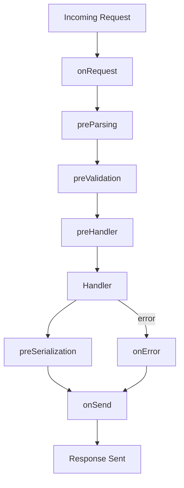

## What is Fastify and Why Use It

### Overview

Fastify is a web framework for Node.js focused on performance, low overhead, and developer experience. It provides a structured way to build HTTP servers and APIs, with a plugin-based architecture that keeps the core minimal while allowing extensibility.

It was created by Tomas Della Vedova and Matteo Collina, and is maintained as an open-source project under the Fastify organization on GitHub.

---

### Core Design Philosophy

Fastify is built around three guiding principles:

- **Performance** — minimize per-request overhead through efficient routing and serialization
- **Extensibility** — all functionality beyond the core is added via plugins
- **Developer experience** — consistent APIs, strong TypeScript support, and schema-based validation

---

### How It Compares to Other Node.js Frameworks

| Feature            | Fastify                            | Express                 | Koa                     |
| ------------------ | ---------------------------------- | ----------------------- | ----------------------- |
| JSON serialization | Schema-based (fast-json-stringify) | Manual / JSON.stringify | Manual                  |
| Input validation   | Built-in (ajv)                     | External library needed | External library needed |
| Plugin system      | Encapsulated, scoped               | Middleware (flat)       | Middleware (flat)       |
| TypeScript support | First-class                        | Community types         | Community types         |
| Routing            | Radix tree (find-my-way)           | Linear                  | Linear                  |

> [Inference] Performance differences in benchmarks may not translate directly to all real-world workloads. Behavior and throughput depend on application logic, I/O patterns, and infrastructure. Results may vary.

---

### Performance Characteristics

Fastify achieves high throughput through several mechanisms:

#### Schema-based JSON serialization

Rather than using `JSON.stringify()` on every response, Fastify uses **fast-json-stringify**, which compiles a serialization function from a JSON Schema definition. This avoids runtime type inference on each response cycle.

**Example:**

```js
const schema = {
  response: {
    200: {
      type: 'object',
      properties: {
        id: { type: 'integer' },
        name: { type: 'string' }
      }
    }
  }
}

fastify.get('/user/:id', { schema }, async (request, reply) => {
  return { id: 1, name: 'Ada' }
})
```

When a schema is provided, the response is serialized using the compiled function rather than the generic `JSON.stringify`. [Inference] This reduces per-response overhead for JSON-heavy APIs, though gains vary by payload size and shape.

#### Radix tree routing

Fastify uses **find-my-way** as its router, which organizes routes in a radix (prefix) tree. This means route matching time scales with URL depth rather than the total number of registered routes.

#### Validation via Ajv

Incoming request data (body, params, query, headers) is validated against JSON Schema using **Ajv** before the handler runs. Validation errors are caught early and return structured error responses automatically.

---

### Plugin Architecture

Fastify's plugin system is one of its most distinctive features. Plugins are isolated scopes — decorators, hooks, and routes registered inside a plugin do not leak to the parent scope unless explicitly exposed.

This is powered internally by **Avvio**, an async plugin loader that respects plugin boundaries and initialization order.

```js
// A scoped plugin
fastify.register(async function (instance, opts) {
  instance.decorate('helper', () => 'hello')

  instance.get('/scoped', async () => {
    return instance.helper()
  })
})

// fastify.helper is NOT available here — it is scoped to the plugin above
```

**Key Points:**
- Plugins can be nested
- Each plugin can have its own hooks, decorators, and middleware
- Shared functionality is exposed explicitly via `fastify-plugin`

---

### Built-in Features

| Feature | Mechanism |
|---|---|
| Request validation | JSON Schema + Ajv |
| Response serialization | JSON Schema + fast-json-stringify |
| Lifecycle hooks | `onRequest`, `preHandler`, `onSend`, `onError`, etc. |
| Logging | Pino (structured, low-overhead JSON logger) |
| Decorators | Extend `fastify`, `request`, and `reply` objects |
| TypeScript | Official type definitions included |

---

### Logging with Pino

Fastify ships with **Pino** as its default logger. Pino is a structured JSON logger designed for low overhead. Logging is enabled by default in Fastify and is tied to the request lifecycle.

```js
const fastify = require('fastify')({ logger: true })

fastify.get('/', async (request, reply) => {
  request.log.info('Handling root request')
  return { ok: true }
})
```

Each request gets its own child logger instance with a correlation ID (`reqId`) attached automatically.

---

### Lifecycle and Hook System

Fastify exposes a detailed request/response lifecycle with named hook points. This gives precise control over request processing at each stage.



Hooks can be registered globally or scoped to specific plugins.

---

### TypeScript Support

Fastify ships with its own TypeScript declarations and supports typed request generics, including body, params, querystring, and headers.

```ts
import Fastify, { FastifyRequest, FastifyReply } from 'fastify'

const fastify = Fastify()

type Params = { id: string }

fastify.get<{ Params: Params }>('/user/:id', async (request: FastifyRequest<{ Params: Params }>, reply: FastifyReply) => {
  const { id } = request.params
  return { id }
})
```

---

### When Fastify Is a Good Fit

- Building JSON APIs or microservices where throughput matters
- Projects that benefit from schema-first design (validation + serialization tied to schema)
- Teams that want structured logging out of the box
- TypeScript-first projects
- Applications that grow via plugins rather than monolithic middleware stacks

### When to Evaluate Alternatives

- Applications with heavy server-side rendering requirements (frameworks like Next.js or Nuxt may be more appropriate)
- Teams already deeply invested in the Express ecosystem with extensive existing middleware
- [Inference] Very simple scripts or proxies where framework overhead of any kind may be unnecessary

---

**Conclusion:**
Fastify is a production-oriented Node.js framework designed around measurable performance and architectural clarity. Its schema-driven approach to validation and serialization, combined with a scoped plugin system and structured logging, makes it well-suited for API and microservice development. Behavior and performance characteristics are subject to application-specific factors and should be validated against your actual workload.