## Fastify vs Express vs Koa vs Hapi

### Overview

These four frameworks represent the most widely used Node.js HTTP framework options. Each reflects a different philosophy on structure, extensibility, and responsibility boundaries. This document compares them across architecture, performance, features, and use-case fit.

---

### Origins and Maintenance Status

| Framework | First Release | Current Major Version | Maintained |
|---|---|---|---|
| Express | 2010 | 4.x (5.x in progress) | Yes — slowly |
| Koa | 2013 | 2.x | Yes |
| Hapi | 2012 | 21.x | Yes |
| Fastify | 2016 | 5.x | Yes — actively |

**Key Points:**
- Express 5 has been in development for several years; its release cadence is slow
- Koa was created by the original Express team as a redesign using async/await natively
- Hapi was originally developed at Walmart Labs for high-load production systems
- Fastify is currently among the most actively maintained of the four

---

### Architectural Philosophy

#### Express

Express is a minimalist, unopinionated framework. It provides routing and a middleware pipeline and leaves all other decisions to the developer. Middleware is a flat chain of functions executed in registration order.

```js
const express = require('express')
const app = express()

app.use(express.json())

app.get('/user/:id', (req, res) => {
  res.json({ id: req.params.id })
})
```

There is no built-in validation, serialization strategy, plugin scoping, or logging. Everything is additive via `app.use()`.

---

#### Koa

Koa is also minimalist but uses a different middleware model: the **onion model**, where each middleware explicitly yields control forward and then resumes on the way back out. This is enabled by `async/await` and `next()`.

```js
const Koa = require('koa')
const app = new Koa()

app.use(async (ctx, next) => {
  console.log('before')
  await next()
  console.log('after') // runs after downstream middleware
})

app.use(async ctx => {
  ctx.body = { ok: true }
})
```

Koa has no bundled router. Routing requires a separate package (e.g., `@koa/router`).

---

#### Hapi

Hapi is opinionated and configuration-driven. Routes, plugins, authentication, caching, and validation are all handled through a structured API. It was designed for enterprise environments where predictability and built-in security controls matter.

```js
const Hapi = require('@hapi/hapi')

const server = Hapi.server({ port: 3000 })

server.route({
  method: 'GET',
  path: '/user/{id}',
  handler: (request, h) => {
    return { id: request.params.id }
  }
})

await server.start()
```

Hapi uses **Joi** for schema validation (via the `@hapi/joi` package or `Joi` directly), has a built-in plugin and dependency injection system, and provides lifecycle extension points on every route.

---

#### Fastify

Fastify is performance-oriented and schema-first. Validation and serialization are driven by JSON Schema. The plugin system is encapsulated — each plugin has its own scope. All extensibility flows through `register`, `decorate`, and hooks.

```js
const fastify = require('fastify')({ logger: true })

fastify.get('/user/:id', {
  schema: {
    params: { type: 'object', properties: { id: { type: 'string' } } },
    response: { 200: { type: 'object', properties: { id: { type: 'string' } } } }
  }
}, async (request) => {
  return { id: request.params.id }
})
```

---

### Middleware vs Plugin vs Hook Model

```mermaid
flowchart TD
    subgraph Express / Koa
        A1[Request] --> M1[Middleware 1]
        M1 --> M2[Middleware 2]
        M2 --> M3[Handler]
    end

    subgraph Hapi
        A2[Request] --> LC[Lifecycle Extensions]
        LC --> H2[Route Handler]
        H2 --> RE[Response Toolkit]
    end

    subgraph Fastify
        A3[Request] --> HK[Hooks - onRequest, preHandler, etc.]
        HK --> V[Schema Validation]
        V --> H3[Handler]
        H3 --> S[Schema Serialization]
        S --> HS[onSend Hook]
    end
```



**Key Points:**
- Express and Koa middleware runs in a linear or onion chain with no enforced scoping
- Hapi uses a lifecycle with well-defined extension points per route
- Fastify separates hooks, validation, and serialization into distinct named stages

---

### Validation and Serialization

| Framework | Validation | Serialization |
|---|---|---|
| Express | None built-in | `JSON.stringify` |
| Koa | None built-in | `JSON.stringify` |
| Hapi | Built-in via Joi | `JSON.stringify` |
| Fastify | Built-in via Ajv (JSON Schema) | fast-json-stringify (schema-compiled) |

**Key Points:**
- Only Fastify compiles serialization functions ahead of time from schema definitions
- Hapi's Joi validation is expressive and JavaScript-native; Fastify's Ajv validation is JSON Schema-based and more portable
- In Express and Koa, validation must be added manually (e.g., Zod, Joi, express-validator)

---

### Performance

Fastify's benchmarks consistently show higher requests-per-second than the other three frameworks under comparable conditions. These benchmarks are typically run against simple JSON endpoints.

> [Inference] Benchmark numbers reflect synthetic conditions. Real-world performance depends heavily on database I/O, middleware chains, payload sizes, and application logic. Do not treat benchmark rankings as guarantees of production throughput. Behavior may vary significantly by workload.

**Factors contributing to Fastify's benchmark performance:**
- Schema-compiled serialization avoids runtime type inference
- Radix tree routing (find-my-way) scales with URL depth, not route count
- Pino logging is lower overhead than `console.log` or Winston by design

---

### Logging

| Framework | Built-in Logging | Default Logger |
|---|---|---|
| Express | None | — |
| Koa | None | — |
| Hapi | None (uses `@hapi/good` historically; now community plugins) | — |
| Fastify | Yes | Pino |

Fastify is the only framework that ships with structured request logging enabled by default.

---

### TypeScript Support

| Framework | TypeScript | Notes |
|---|---|---|
| Express | `@types/express` (DefinitelyTyped) | Community-maintained; generics limited |
| Koa | `@types/koa` (DefinitelyTyped) | Community-maintained |
| Hapi | `@hapi/hapi` includes types | Official, but ergonomics are verbose |
| Fastify | Included in package | First-class; request generics supported |

---

### Plugin and Extension Ecosystem

| Framework | Plugin Model | Scope Isolation |
|---|---|---|
| Express | `app.use()` middleware | None — flat global chain |
| Koa | `app.use()` middleware | None — flat global chain |
| Hapi | `server.register()` with dependencies | Partial — plugins declare dependencies |
| Fastify | `fastify.register()` with Avvio | Full — each plugin is an isolated scope |

---

### Security Defaults

| Feature | Express | Koa | Hapi | Fastify |
|---|---|---|---|---|
| Input validation | ✗ | ✗ | ✓ (Joi) | ✓ (Ajv) |
| CORS | External (cors) | External | External (@hapi/cors) | External (@fastify/cors) |
| Rate limiting | External | External | External | External (@fastify/rate-limit) |
| Auth system | External (Passport) | External | Built-in (hapi-auth-*) | External (@fastify/jwt, etc.) |
| HTTP security headers | External (helmet) | External | Partial built-in | External (@fastify/helmet) |

**Key Points:**
- Hapi has the most opinionated built-in auth model of the four
- All frameworks rely on external packages for CORS and rate limiting
- No framework in this group eliminates the need for security-conscious configuration

---

### Learning Curve

| Framework | Curve | Notes |
|---|---|---|
| Express | Low | Simple API; nearly no conventions enforced |
| Koa | Low–Medium | Requires understanding of async middleware flow |
| Hapi | Medium–High | Configuration-heavy; many concepts to learn upfront |
| Fastify | Medium | Plugin scoping and schema-first design require deliberate learning |

---

### Community and Ecosystem Size

Express has by far the largest ecosystem due to its age and adoption. The majority of Node.js middleware packages are written for Express or are Express-compatible.

> [Inference] A larger ecosystem does not imply better quality or active maintenance of individual packages. Evaluate dependencies independently.

| Framework | npm weekly downloads (approximate, unverified) | GitHub Stars (approximate, unverified) |
|---|---|---|
| Express | Highest | ~65k+ |
| Fastify | Growing | ~33k+ |
| Koa | Moderate | ~35k+ |
| Hapi | Lower | ~14k+ |

> [Unverified] Download and star counts shift over time. Treat these as rough relative indicators only, not current figures.

---

### Summary Comparison

| Criterion | Express | Koa | Hapi | Fastify |
|---|---|---|---|---|
| Philosophy | Minimal, flexible | Minimal, async-first | Opinionated, config-driven | Performance-first, schema-first |
| Validation | External | External | Built-in (Joi) | Built-in (Ajv) |
| Serialization | Generic | Generic | Generic | Schema-compiled |
| Logging | External | External | External | Built-in (Pino) |
| TypeScript | Community types | Community types | Official | First-class |
| Plugin scoping | None | None | Partial | Full |
| Routing engine | Linear | Linear | Custom | Radix tree |
| Learning curve | Low | Low–Medium | Medium–High | Medium |
| Ecosystem | Largest | Moderate | Moderate | Growing |

---

### When to Choose Each

#### Choose Express if:
- The team has deep existing Express knowledge
- You need maximum compatibility with existing npm middleware
- You are building something small where convention doesn't matter

#### Choose Koa if:
- You prefer a clean async/await middleware model without Express's legacy API surface
- You want minimal opinions and are comfortable assembling your own stack

#### Choose Hapi if:
- You need a built-in auth framework with declarative route-level access control
- The project requires strong configuration-driven conventions enforced across a team
- Enterprise-grade predictability and structure are priorities

#### Choose Fastify if:
- You are building a JSON API or microservice where throughput is a concern
- You want schema-driven validation and serialization without external configuration
- You want structured logging, TypeScript support, and plugin encapsulation out of the box
- You are starting a new project without legacy Express constraints

---

**Conclusion:**
There is no universally correct choice among these four frameworks. Express remains dominant by ecosystem size and familiarity. Koa offers a cleaner async model with the same minimal philosophy. Hapi provides structure and built-in features suited to enterprise teams. Fastify offers the most modern architecture among the four, with the strongest performance characteristics, schema-first design, and first-class TypeScript support. Selection should be based on team familiarity, project requirements, and the trade-offs each framework makes explicit by design.