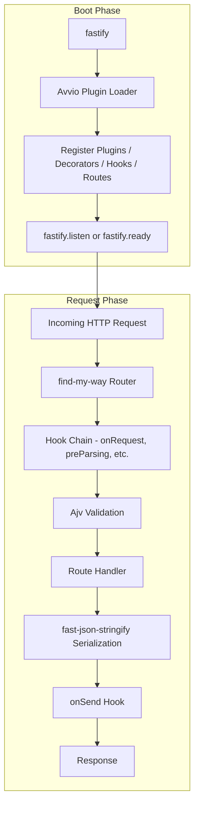
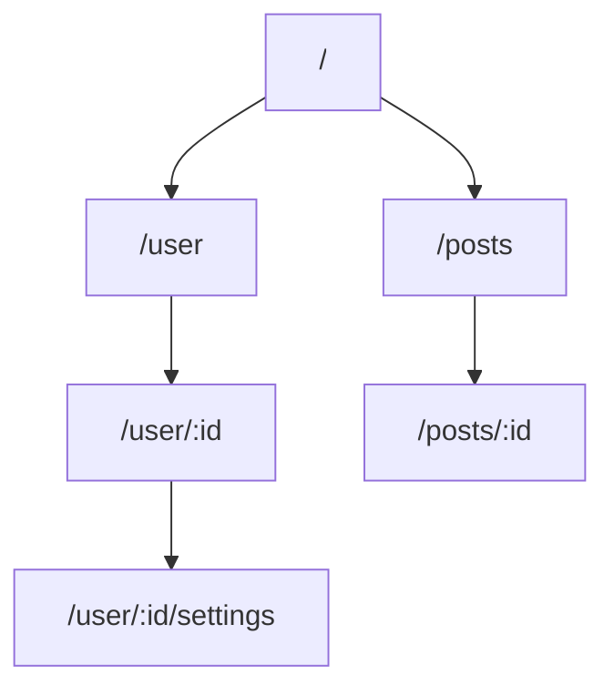
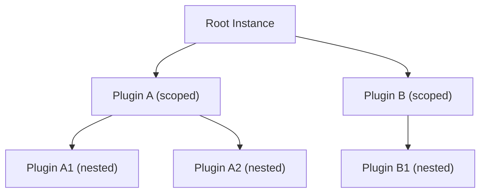
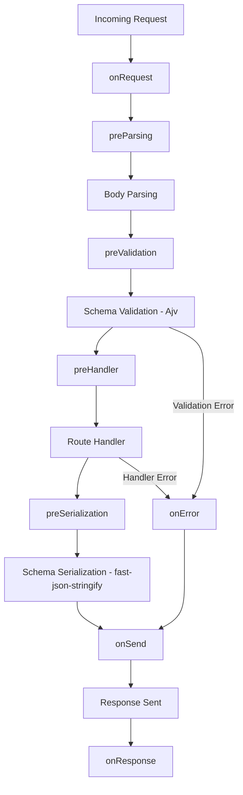

## Architecture Overview and Design Philosophy

### Overview

Fastify's architecture is not a collection of independent features — it is a cohesive system where routing, validation, serialization, logging, and extensibility are designed to work together under a unified set of constraints. Understanding the architecture as a whole explains why individual features behave the way they do.

---

### Top-Level Architecture

At startup, Fastify constructs several subsystems and composes them into a single server instance. At runtime, each incoming request passes through a fixed lifecycle managed by that instance.



**Key Points:**
- The boot phase is fully async and sequential, managed by Avvio
- The request phase is a fixed pipeline — its shape is determined at boot time, not per-request
- No subsystem is optional in the sense that they are all wired together; individual routes may skip validation or serialization if no schema is provided

---

### Core Subsystems

#### find-my-way — Router

Fastify does not implement its own router. It delegates to **find-my-way**, a standalone radix tree router.

A radix tree (also called a compact prefix tree) organizes routes by shared URL prefixes. Lookup time scales with URL segment depth, not total route count.



**Key Points:**
- Routes with static segments are matched before parameterized ones
- Wildcard and parametric routes are supported with defined precedence rules
- The router is method-aware — `GET /user` and `POST /user` are distinct entries

---

#### Avvio — Plugin Loader

**Avvio** is the async boot system that manages plugin registration, initialization order, and scope isolation. It is used internally by Fastify and is not typically called directly.

When `fastify.register()` is called, Avvio queues the plugin for async execution in the correct order. It tracks a tree of plugin scopes.



**Key Points:**
- Each node in this tree is an isolated Fastify instance with its own decorators, hooks, and routes
- A child plugin can access parent decorators but the reverse is not true by default
- `fastify-plugin` wraps a plugin to opt out of scoping — its registrations propagate to the parent scope

---

#### Ajv — Validation

Fastify uses **Ajv** (Another JSON Validator) to validate incoming request data against JSON Schema definitions. Ajv compiles schemas into validation functions at route registration time, not at request time.

Validated targets:
- `body`
- `params`
- `querystring`
- `headers`

```js
const schema = {
  body: {
    type: 'object',
    required: ['email'],
    properties: {
      email: { type: 'string', format: 'email' },
      age: { type: 'integer', minimum: 0 }
    }
  }
}

fastify.post('/register', { schema }, async (request) => {
  return { received: request.body.email }
})
```

If validation fails, Fastify returns a `400` response with a structured error body before the handler is invoked. The handler only runs if all defined validations pass.

> [Inference] Because validation functions are compiled at registration, per-request validation overhead is lower than libraries that interpret schemas at runtime. Actual gains depend on schema complexity and request volume.

---

#### fast-json-stringify — Serialization

**fast-json-stringify** compiles a dedicated serialization function from a response JSON Schema. This function is called instead of `JSON.stringify` when a schema is present.

```js
const schema = {
  response: {
    200: {
      type: 'object',
      properties: {
        id: { type: 'integer' },
        name: { type: 'string' }
      }
    }
  }
}
```

When this route responds with a `200`, Fastify uses the compiled function to serialize the object. Properties not defined in the schema are stripped from the output.

**Key Points:**
- Schema-defined responses are serialized faster than generic JSON.stringify for most payloads [Inference]
- Unlisted properties are silently omitted — this acts as an implicit response allowlist
- If no response schema is provided, Fastify falls back to `JSON.stringify`

---

#### Pino — Logging

Fastify integrates **Pino** as its logger. Pino is a structured JSON logger that writes log lines as newline-delimited JSON. It is designed to minimize synchronous work on the main thread.

```js
const fastify = require('fastify')({ logger: true })

fastify.get('/', async (request) => {
  request.log.info({ action: 'root_hit' }, 'Request received')
  return { ok: true }
})
```

**Output:**
```json
{"level":30,"time":1700000000000,"pid":1234,"hostname":"host","reqId":"req-1","action":"root_hit","msg":"Request received"}
```

**Key Points:**
- Each request gets a child logger with `reqId` bound automatically
- Log levels: `trace`, `debug`, `info`, `warn`, `error`, `fatal`
- Pino can be replaced with a custom logger that conforms to Pino's interface

---

### The Request Lifecycle

Fastify's request lifecycle is a fixed sequence of named stages. Each stage has one or more associated hooks. This is the complete lifecycle in order:



Each hook name maps to a specific position in this pipeline:

| Hook | Stage | Notes |
|---|---|---|
| `onRequest` | Before parsing | Connection-level; body not yet available |
| `preParsing` | Before body parsed | Can modify the raw stream |
| `preValidation` | After parsing, before validation | Can modify `request.body` |
| `preHandler` | After validation, before handler | Auth, rate limiting commonly placed here |
| `preSerialization` | After handler, before serialization | Can modify the payload |
| `onSend` | After serialization | Can modify the serialized payload string |
| `onResponse` | After response sent | Logging, metrics |
| `onError` | On any error | Can modify the error response |

---

### Plugin Scoping and Encapsulation

Plugin scoping is one of Fastify's most architecturally significant features. It is enforced by Avvio and cannot be bypassed without explicit opt-out.

```js
fastify.register(async function pluginA(instance) {
  instance.decorate('db', { query: () => {} })

  instance.get('/scoped', async (request) => {
    return instance.db.query()  // accessible here
  })
})

// fastify.db is undefined here — it did not escape pluginA's scope
fastify.get('/root', async (request) => {
  // fastify.db is not available
  return { ok: true }
})
```

To share a plugin's registrations with the parent scope, wrap it with `fastify-plugin`:

```js
const fp = require('fastify-plugin')

const dbPlugin = fp(async function (fastify, opts) {
  fastify.decorate('db', { query: () => {} })
})

fastify.register(dbPlugin)

// fastify.db is now available at root scope
```

**Key Points:**
- Scoping makes it possible to build self-contained feature modules
- `fastify-plugin` is the explicit escape hatch for shared infrastructure (databases, auth, config)
- Route prefixes, error handlers, and hooks registered inside a plugin are scoped by default

---

### Decorator System

Fastify allows extending the core `fastify`, `request`, and `reply` objects via decorators. This is the sanctioned way to attach custom properties or methods to these objects.

```js
fastify.decorate('config', { maxItems: 100 })
fastify.decorateRequest('user', null)
fastify.decorateReply('sendError', function (code, message) {
  this.code(code).send({ error: message })
})

fastify.get('/items', async (request, reply) => {
  if (!request.user) {
    return reply.sendError(401, 'Unauthorized')
  }
  return { max: fastify.config.maxItems }
})
```

**Key Points:**
- Decorators must be declared before use — they are registered at boot time
- Decorating `request` and `reply` with reference types (objects, arrays) requires care; Fastify recommends using `null` as a placeholder and assigning in a hook to avoid shared-state bugs across requests
- Decorators participate in plugin scoping the same way routes and hooks do

---

### Schema Management and Reuse

Schemas can be registered by `$id` on the Fastify instance and referenced across routes using JSON Schema `$ref`.

```js
fastify.addSchema({
  $id: 'User',
  type: 'object',
  properties: {
    id: { type: 'integer' },
    name: { type: 'string' }
  }
})

fastify.get('/user/:id', {
  schema: {
    response: {
      200: { $ref: 'User#' }
    }
  }
}, async () => ({ id: 1, name: 'Ada' }))
```

**Key Points:**
- Shared schemas reduce duplication across route definitions
- `$ref` resolution is handled by Fastify before passing schemas to Ajv or fast-json-stringify
- Schema registration is also subject to plugin scoping

---

### Error Handling Architecture

Fastify has a layered error handling system:

1. **Validation errors** — caught before the handler, produce a `400` response with Ajv's error output
2. **Handler errors** — thrown errors or rejected promises are caught and routed to `onError` hooks
3. **setErrorHandler** — a custom error handler can be registered per scope to transform error responses

```js
fastify.setErrorHandler(function (error, request, reply) {
  request.log.error(error)
  reply.code(error.statusCode || 500).send({
    error: true,
    message: error.message
  })
})
```

**Key Points:**
- `setErrorHandler` is scoped — each plugin can have its own error handler
- Unhandled errors that escape all scoped handlers fall through to the root error handler
- Fastify wraps non-`Error` thrown values automatically

---

### Design Philosophy Summary

Fastify's design reflects several explicit trade-offs:

| Decision | Trade-off |
|---|---|
| Schema-first validation and serialization | Requires upfront schema definition; enables early error detection and faster serialization |
| Encapsulated plugin scoping | Requires deliberate use of `fastify-plugin` for shared state; prevents accidental global side effects |
| Fixed lifecycle with named hooks | Less flexible than free-form middleware chains; more predictable and auditable |
| Pino as default logger | Structured JSON output; not suited to all logging pipelines without configuration |
| JSON Schema (not Joi, Zod) | Portable and standard; less expressive than TypeScript-native validators for complex business rules |

---

**Conclusion:**
Fastify's architecture is purpose-built rather than assembled from conventions. The integration of find-my-way, Avvio, Ajv, fast-json-stringify, and Pino is not incidental — each component was chosen to minimize overhead at a specific stage of the request lifecycle. The plugin scoping model enforces architectural boundaries by default rather than by convention, which distinguishes Fastify's design philosophy most sharply from Express and Koa.