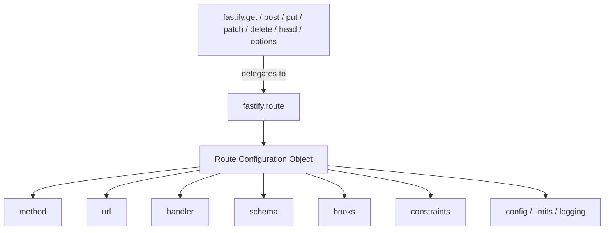

## Full Route Declaration Syntax

`fastify.route()` is the canonical route registration method from which all shorthand methods derive. It accepts a single configuration object that exposes every available route option in one place, making it the most explicit and flexible form of route declaration in Fastify.

---

### Basic Structure

```js
fastify.route({
  method: 'GET',
  url: '/users',
  handler: async (request, reply) => {
    return { users: [] }
  }
})
```

Three properties are always required: `method`, `url`, and `handler`. Every other property is optional.

---

### Complete Configuration Reference

The table below lists every recognized property in the route configuration object.

| Property | Type | Required | Purpose |
|----------|------|----------|---------|
| `method` | `string \| string[]` | Yes | HTTP verb(s) for this route |
| `url` | `string` | Yes | Path to match |
| `handler` | `function` | Yes | Request handler function |
| `schema` | `object` | No | Validation and serialization schema |
| `attachValidation` | `boolean` | No | Pass validation errors to handler instead of auto-rejecting |
| `validatorCompiler` | `function` | No | Override schema validator for this route |
| `serializerCompiler` | `function` | No | Override response serializer for this route |
| `bodyLimit` | `integer` | No | Max request body size in bytes |
| `logLevel` | `string` | No | Log level override for this route |
| `logSerializers` | `object` | No | Custom log serializers for this route |
| `config` | `object` | No | Arbitrary metadata accessible in hooks |
| `version` | `string` | No | Semver version constraint (shorthand for `constraints.version`) |
| `constraints` | `object` | No | Route matching constraints (host, version, custom) |
| `prefixTrailingSlash` | `string` | No | Controls slash behavior when route is inside a prefixed plugin |
| `exposeHeadRoute` | `boolean` | No | Whether to auto-expose a HEAD route (GET routes only) |
| `onRequest` | `function \| function[]` | No | Hook: request received |
| `preParsing` | `function \| function[]` | No | Hook: before body parsing |
| `preValidation` | `function \| function[]` | No | Hook: before schema validation |
| `preHandler` | `function \| function[]` | No | Hook: before handler, after validation |
| `preSerialization` | `function \| function[]` | No | Hook: before response serialization |
| `onSend` | `function \| function[]` | No | Hook: payload ready to send |
| `onResponse` | `function \| function[]` | No | Hook: response sent |
| `onError` | `function \| function[]` | No | Hook: error occurred |
| `onTimeout` | `function \| function[]` | No | Hook: request timed out |

---

### `method`

Accepts a single HTTP verb string or an array of verb strings. All standard HTTP methods are supported.

```js
// Single method
fastify.route({
  method: 'POST',
  url: '/items',
  handler: createItemHandler
})

// Multiple methods on the same path
fastify.route({
  method: ['PUT', 'PATCH'],
  url: '/items/:id',
  handler: async (request, reply) => {
    const isFullReplace = request.method === 'PUT'
    // apply logic based on verb
    return { id: request.params.id, method: request.method }
  }
})
```

**Key Points:**
- When multiple methods are specified, the same handler and options apply to all of them.
- `request.method` is available inside the handler to distinguish which verb was used.
- Method strings are case-sensitive and must be uppercase. [Behavior for lowercase method strings may vary — use uppercase consistently.]

---

### `url`

The path pattern Fastify's router matches against the incoming request URL. Supports static segments, named parameters, wildcards, and optional segments.

```js
fastify.route({ method: 'GET', url: '/users',          handler: h }) // static
fastify.route({ method: 'GET', url: '/users/:id',      handler: h }) // named param
fastify.route({ method: 'GET', url: '/files/*',        handler: h }) // wildcard
fastify.route({ method: 'GET', url: '/a/:b/c/:d',      handler: h }) // multiple params
```

**Key Points:**
- The `url` property is used instead of the positional path argument that shorthand methods accept.
- Query strings are not part of the `url` pattern. They are parsed separately and accessible via `request.query`.
- The `path` property is accepted as an alias for `url`. [Unverified — alias availability may vary by Fastify version.]

---

### `handler`

The function executed when a request matches the route. Receives `request` and `reply` objects.

```js
fastify.route({
  method: 'GET',
  url: '/status',
  handler: async function status(request, reply) {
    return { ok: true }
  }
})
```

**Key Points:**
- Named function expressions (as opposed to anonymous arrow functions) produce more descriptive stack traces. This is a general best practice, not Fastify-specific.
- When using async handlers, a returned value is automatically passed to `reply.send()`. Explicitly calling `reply.send()` and returning a value in the same handler may produce unexpected behavior. [Behavior may vary — avoid mixing both in a single handler.]
- The handler may be an ordinary function or an async function. Fastify handles both correctly.

---

### `schema`

Defines validation rules for incoming request components and serialization rules for outgoing responses. Fastify compiles schemas using `ajv` for validation and `fast-json-stringify` for serialization by default. [Behavior may vary with custom compilers.]

The schema object supports these sub-keys:

| Sub-key | Validates / Serializes |
|---------|----------------------|
| `body` | Request body |
| `querystring` (or `query`) | Query string parameters |
| `params` | URL path parameters |
| `headers` | Request headers |
| `response` | Response body, keyed by status code |

```js
fastify.route({
  method: 'POST',
  url: '/products',
  schema: {
    body: {
      type: 'object',
      required: ['name', 'price'],
      properties: {
        name:        { type: 'string', minLength: 1 },
        price:       { type: 'number', minimum: 0 },
        description: { type: 'string' }
      },
      additionalProperties: false
    },
    querystring: {
      type: 'object',
      properties: {
        currency: { type: 'string', default: 'USD' }
      }
    },
    params: {
      type: 'object',
      properties: {
        id: { type: 'integer' }
      }
    },
    headers: {
      type: 'object',
      required: ['x-request-id'],
      properties: {
        'x-request-id': { type: 'string' }
      }
    },
    response: {
      201: {
        type: 'object',
        properties: {
          id:    { type: 'integer' },
          name:  { type: 'string' },
          price: { type: 'number' }
        }
      },
      400: {
        type: 'object',
        properties: {
          message: { type: 'string' }
        }
      }
    }
  },
  handler: async (request, reply) => {
    reply.code(201).send({ id: 1, ...request.body })
  }
})
```

**Key Points:**
- `additionalProperties: false` in the body schema causes Fastify to reject requests with undeclared fields.
- Response schemas do not validate — they serialize and strip. Fields absent from the response schema are omitted from the output silently. This can cause debugging confusion if a field appears missing from a response.
- `querystring` and `query` are interchangeable as keys. [Unverified — confirm against target Fastify version.]
- Header names in schemas are conventionally lowercase, matching HTTP/2 normalization behavior.

---

### `validatorCompiler` and `serializerCompiler`

Allow per-route override of the schema compilation functions, replacing `ajv` or `fast-json-stringify` for a specific route only.

```js
fastify.route({
  method: 'POST',
  url: '/custom-validated',
  schema: {
    body: myCustomSchema
  },
  validatorCompiler: ({ schema, method, url, httpPart }) => {
    // return a validation function: (data) => boolean | { error }
    return (data) => {
      const valid = myValidator.validate(schema, data)
      return valid ? true : { error: myValidator.errors }
    }
  },
  handler: async (request, reply) => {
    return { received: request.body }
  }
})
```

**Key Points:**
- The `validatorCompiler` receives an object with `schema`, `method`, `url`, and `httpPart` (e.g., `'body'`, `'querystring'`).
- It must return a function that accepts the data and returns `true` or an object with an `error` property.
- `serializerCompiler` follows a similar pattern but for response serialization.
- Per-route compilers take precedence over instance-level compilers set via `fastify.setValidatorCompiler()`. [Behavior may vary — test in context.]

---

### `attachValidation`

When `true`, validation errors are not automatically converted to `400` responses. Instead, they are attached to `request.validationError` and the handler is invoked normally.

```js
fastify.route({
  method: 'POST',
  url: '/tolerant',
  attachValidation: true,
  schema: {
    body: {
      type: 'object',
      properties: {
        score: { type: 'integer' }
      }
    }
  },
  handler: async (request, reply) => {
    if (request.validationError) {
      return reply.code(422).send({
        code: 'VALIDATION_ERROR',
        message: request.validationError.message
      })
    }
    return { score: request.body.score }
  }
})
```

**Key Points:**
- `request.validationError` is `null` when validation passes.
- This is useful when custom error shapes or status codes are required per route, without a global error handler.

---

### `bodyLimit`

Sets the maximum accepted request body size for this route, in bytes. Overrides the server-level `bodyLimit` option.

```js
fastify.route({
  method: 'POST',
  url: '/upload',
  bodyLimit: 50 * 1024 * 1024, // 50 MB
  handler: async (request, reply) => {
    return { size: request.body.length }
  }
})
```

**Key Points:**
- Requests exceeding the limit are rejected with `413 Payload Too Large` before the handler is called.
- The server default `bodyLimit` is `1048576` (1 MiB) if not configured otherwise. [Unverified — verify against the installed Fastify version.]

---

### `logLevel` and `logSerializers`

`logLevel` sets the minimum log severity for entries produced during this route's request lifecycle. `logSerializers` customizes how specific log properties are serialized for this route.

```js
fastify.route({
  method: 'GET',
  url: '/heartbeat',
  logLevel: 'silent',
  handler: async (request, reply) => {
    return { alive: true }
  }
})
```

```js
fastify.route({
  method: 'GET',
  url: '/users/:id',
  logSerializers: {
    user: (value) => ({ id: value.id, name: value.name }) // omit sensitive fields
  },
  handler: async (request, reply) => {
    const user = await getUser(request.params.id)
    request.log.info({ user }, 'user fetched')
    return user
  }
})
```

**Key Points:**
- `logLevel: 'silent'` suppresses all log output for this route. This is commonly applied to health check or liveness probe endpoints to prevent log noise from frequent polling.
- `logSerializers` applies only to log entries emitted during this route's lifecycle, not to other routes.

---

### `config`

An arbitrary object attached to the route. Accessible inside lifecycle hooks via `request.routeOptions.config`.

```js
fastify.route({
  method: 'GET',
  url: '/admin/report',
  config: {
    auth: { required: true, roles: ['admin'] },
    cache: { ttl: 60 }
  },
  handler: async (request, reply) => {
    return { report: [] }
  }
})
```

**Example** — accessing `config` inside a hook:

```js
fastify.addHook('preHandler', async (request, reply) => {
  const { auth } = request.routeOptions.config
  if (auth?.required && !request.isAuthenticated()) {
    return reply.code(401).send({ message: 'Unauthorized' })
  }
})
```

**Key Points:**
- `config` has no effect on Fastify's internal behavior. It is purely for application-level use.
- `request.routeOptions.config` is the access path as of Fastify v4+. Earlier versions used `reply.context.config`. [Behavior may vary — verify the access path for the installed version.]

---

### `constraints`

Controls route matching beyond method and URL. Fastify includes built-in support for `host` and `version` constraints. Custom constraint strategies can be added via `fastify.addConstraintStrategy()`.

```js
// Host constraint
fastify.route({
  method: 'GET',
  url: '/data',
  constraints: { host: 'api.example.com' },
  handler: async (request, reply) => {
    return { source: 'api' }
  }
})

// Version constraint
fastify.route({
  method: 'GET',
  url: '/data',
  constraints: { version: '2.0.0' },
  handler: async (request, reply) => {
    return { version: 2 }
  }
})
```

**Key Points:**
- Multiple constraints can be combined in one object: `{ host: 'api.example.com', version: '1.0.0' }`.
- The `version` shorthand property at the top level of the route config is equivalent to `constraints: { version: '...' }`. [Behavior may vary — prefer `constraints.version` for explicitness.]

---

### `prefixTrailingSlash`

Controls how Fastify treats trailing slashes when a route is registered inside a plugin with a URL prefix. Accepted values are `'both'`, `'slash'`, and `'no-slash'`.

```js
fastify.register(async (instance) => {
  instance.route({
    method: 'GET',
    url: '/',
    prefixTrailingSlash: 'both',
    handler: async (request, reply) => {
      return { ok: true }
    }
  })
}, { prefix: '/api' })
```

| Value | Matches |
|-------|---------|
| `'both'` | `/api` and `/api/` |
| `'slash'` | `/api/` only |
| `'no-slash'` | `/api` only |

**Key Points:**
- The default behavior without this property depends on the server-level `ignoreTrailingSlash` option.
- `prefixTrailingSlash` only has effect on a route with `url: '/'` inside a prefixed plugin. On non-root URLs, the standard trailing slash behavior applies. [Behavior may vary — test in context with the target Fastify version.]

---

### `exposeHeadRoute`

Controls whether Fastify automatically registers a corresponding HEAD route for this GET route.

```js
fastify.route({
  method: 'GET',
  url: '/large-resource',
  exposeHeadRoute: false,
  handler: async (request, reply) => {
    return { data: '...' }
  }
})
```

**Key Points:**
- The server-level option `exposeHeadRoutes` (plural) sets the default for all GET routes. `exposeHeadRoute` (singular) overrides it per route.
- When auto-exposed, the HEAD route uses the same handler as GET but Fastify strips the body from the response automatically. [Behavior may vary.]

---

### Route-Level Hooks

All lifecycle hooks can be scoped to a single route by declaring them inside the route config. They accept a single function or an array of functions.

```js
async function verifyToken(request, reply) {
  if (!request.headers['x-token']) {
    reply.code(401).send({ message: 'Missing token' })
  }
}

async function checkPermission(request, reply) {
  // permission logic
}

fastify.route({
  method: 'DELETE',
  url: '/records/:id',
  onRequest: verifyToken,
  preHandler: [verifyToken, checkPermission],
  onResponse: async (request, reply) => {
    // audit log
  },
  handler: async (request, reply) => {
    reply.code(204).send()
  }
})
```

**Key Points:**
- Route-level hooks execute after hooks of the same type registered globally or at the plugin scope.
- The order of hook execution within the same scope follows registration order.
- `onRequest`, `preParsing`, `preValidation`, `preHandler`, `preSerialization`, `onSend`, `onResponse`, `onError`, and `onTimeout` are all supported as route-level properties.

---

### Composing a Full Route Declaration

The following illustrates a densely configured route using the majority of available properties.

```js
fastify.route({
  method: 'PUT',
  url: '/accounts/:id',
  constraints: { version: '2.0.0' },
  bodyLimit: 512 * 1024, // 512 KB
  logLevel: 'debug',
  attachValidation: false,
  config: {
    audit: true,
    requiredScope: 'accounts:write'
  },
  schema: {
    params: {
      type: 'object',
      properties: {
        id: { type: 'string', format: 'uuid' }
      },
      required: ['id']
    },
    body: {
      type: 'object',
      required: ['email', 'plan'],
      properties: {
        email: { type: 'string', format: 'email' },
        plan:  { type: 'string', enum: ['free', 'pro', 'enterprise'] }
      },
      additionalProperties: false
    },
    response: {
      200: {
        type: 'object',
        properties: {
          id:    { type: 'string' },
          email: { type: 'string' },
          plan:  { type: 'string' }
        }
      }
    }
  },
  preHandler: [authenticateRequest, authorizeScope],
  onResponse: async (request, reply) => {
    if (request.routeOptions.config.audit) {
      await writeAuditLog(request)
    }
  },
  handler: async (request, reply) => {
    const { id } = request.params
    const { email, plan } = request.body
    const updated = await updateAccount(id, { email, plan })
    return updated
  }
})
```

---

### Relationship Between `fastify.route()` and Shorthand Methods

The diagram below shows how shorthand methods map to `fastify.route()` internally.



---

**Conclusion**

`fastify.route()` exposes every configuration option available for a Fastify route in a single, self-contained object. The `method`, `url`, and `handler` properties are the minimum required. All other properties — schema, hooks, constraints, body limits, log levels, custom compilers, and metadata — are optional and compose independently. Shorthand methods (`fastify.get`, `fastify.post`, etc.) are syntactic convenience over this same configuration object and produce identical internal registrations.

**Next Steps**

- Route parameters: named params, wildcards, regex constraints, and enumerated values
- Schema validation in depth: `ajv` options, custom keywords, and shared schema references
- Lifecycle hooks: execution order and interaction between global, plugin, and route-level hooks
- Custom constraints and constraint strategies