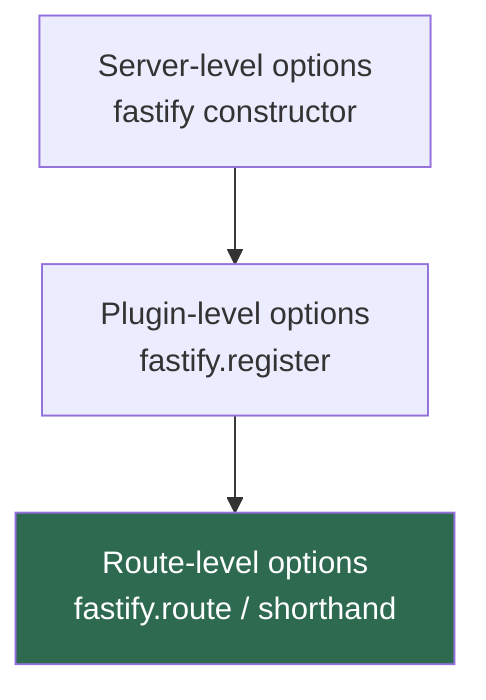

## Route-Level Options

Route-level options are properties passed to a route registration — either inside `fastify.route()` or as the options argument to a shorthand method — that modify behavior for that specific route only. They do not affect other routes, even those in the same plugin scope.

---

### Scope and Precedence

Route-level options occupy the narrowest scope in Fastify's configuration hierarchy. When the same concern is configurable at multiple levels, the route-level setting takes precedence.



**Key Points:**
- Not every option participates in this hierarchy. Some options (such as `config` and `schema`) exist only at the route level.
- Plugin-level scoping applies to hooks and decorators added inside a plugin, not to route options directly. Route options are always declared per route.

---

### `schema`

The `schema` option controls both incoming request validation and outgoing response serialization. It is the most consequential route-level option in most applications.

#### Supported Schema Targets

| Key | Scope |
|-----|-------|
| `body` | Request body |
| `querystring` / `query` | Query string parameters |
| `params` | URL path parameters |
| `headers` | Request headers |
| `response` | Response body, keyed by HTTP status code |

#### Body Schema

```js
fastify.post('/invoices', {
  schema: {
    body: {
      type: 'object',
      required: ['clientId', 'amount'],
      properties: {
        clientId: { type: 'integer' },
        amount:   { type: 'number', minimum: 0.01 },
        notes:    { type: 'string', maxLength: 500 }
      },
      additionalProperties: false
    }
  }
}, async (request, reply) => {
  reply.code(201).send({ id: 1, ...request.body })
})
```

**Key Points:**
- `additionalProperties: false` causes Fastify to reject requests containing fields not declared in the schema, returning `400 Bad Request`. Without it, undeclared fields are passed through to the handler.
- Body validation runs after parsing. If the body cannot be parsed (e.g., malformed JSON), a parse error is returned before validation runs.

#### Querystring Schema

```js
fastify.get('/products', {
  schema: {
    querystring: {
      type: 'object',
      properties: {
        page:     { type: 'integer', minimum: 1, default: 1 },
        limit:    { type: 'integer', minimum: 1, maximum: 100, default: 20 },
        category: { type: 'string' }
      }
    }
  }
}, async (request, reply) => {
  const { page, limit, category } = request.query
  return { page, limit, category }
})
```

**Key Points:**
- Query string values arrive as strings from the URL. Fastify's validator performs type coercion when the schema specifies `type: 'integer'` or `type: 'number'`, converting the string to the appropriate type before the handler receives it. [Behavior may vary depending on `ajv` coercion settings.]
- `default` values in the schema are applied by `ajv` during validation when the field is absent. The default is then accessible via `request.query`.

#### Params Schema

```js
fastify.get('/users/:id/posts/:postId', {
  schema: {
    params: {
      type: 'object',
      properties: {
        id:     { type: 'integer' },
        postId: { type: 'integer' }
      },
      required: ['id', 'postId']
    }
  }
}, async (request, reply) => {
  const { id, postId } = request.params
  return { userId: id, postId }
})
```

**Key Points:**
- Like query strings, URL parameters arrive as strings. Schema type coercion converts them when an integer or number type is declared, so `request.params.id` becomes a number rather than a string.
- If a parameter fails validation (e.g., a non-numeric string is passed where `integer` is expected), Fastify returns `400 Bad Request` before the handler executes.

#### Headers Schema

```js
fastify.get('/secure', {
  schema: {
    headers: {
      type: 'object',
      required: ['x-api-key'],
      properties: {
        'x-api-key': { type: 'string', minLength: 32 }
      }
    }
  }
}, async (request, reply) => {
  return { authorized: true }
})
```

**Key Points:**
- Header names should be lowercase in the schema definition, consistent with HTTP/2 normalization. HTTP/1.1 headers are lowercased by Node.js before reaching Fastify.
- Declaring a headers schema does not replace authentication logic. It only validates structure and presence. A valid `x-api-key` format does not imply the key is genuine.
- Avoid declaring `required` on standard headers (e.g., `content-type`, `host`) that Fastify or the HTTP layer handles internally, as this can produce unexpected rejections. [Inference — test behavior for specific headers before relying on this.]

#### Response Schema

Response schemas serialize and strip the outgoing payload. They are keyed by HTTP status code and do not perform validation — they define the output shape.

```js
fastify.get('/users/:id', {
  schema: {
    response: {
      200: {
        type: 'object',
        properties: {
          id:    { type: 'integer' },
          name:  { type: 'string' },
          email: { type: 'string' }
        }
      },
      404: {
        type: 'object',
        properties: {
          message: { type: 'string' }
        }
      }
    }
  }
}, async (request, reply) => {
  const user = await findUser(request.params.id)
  if (!user) return reply.code(404).send({ message: 'Not found' })
  return user
})
```

**Key Points:**
- Fields present in the handler's return value but absent from the response schema are silently omitted. This acts as an implicit allowlist and can accidentally strip fields during development if the schema is incomplete.
- Response serialization uses `fast-json-stringify`, which is significantly faster than `JSON.stringify` for known shapes. [Behavior may vary with custom serializers.]
- A `'2xx'` wildcard key can match any 2xx status code not explicitly defined.

```js
response: {
  '2xx': {
    type: 'object',
    properties: {
      ok: { type: 'boolean' }
    }
  }
}
```

---

### `attachValidation`

When `true`, validation errors are attached to `request.validationError` rather than automatically sending a `400` response. The handler is invoked regardless of validation outcome.

```js
fastify.post('/flexible', {
  attachValidation: true,
  schema: {
    body: {
      type: 'object',
      properties: {
        age: { type: 'integer', minimum: 0 }
      }
    }
  }
}, async (request, reply) => {
  if (request.validationError) {
    return reply.code(422).send({
      code: 'INVALID_INPUT',
      detail: request.validationError.message
    })
  }
  return { age: request.body.age }
})
```

**Key Points:**
- `request.validationError` is `null` when no validation error exists.
- This option is useful when a custom error response shape is required without implementing a full `setErrorHandler`.
- `attachValidation` applies to all schema targets (body, querystring, params, headers) for that route.

---

### `validatorCompiler`

Replaces the default `ajv`-based validator for this route. Must return a function that receives the data and returns `true` on success or `{ error }` on failure.

```js
const Joi = require('joi')

const bodyJoiSchema = Joi.object({
  name:  Joi.string().required(),
  email: Joi.string().email().required()
})

fastify.post('/joi-validated', {
  schema: { body: {} }, // schema key still required to trigger compilation
  validatorCompiler: ({ schema, method, url, httpPart }) => {
    return (data) => {
      const { error } = bodyJoiSchema.validate(data)
      return error ? { error } : true
    }
  }
}, async (request, reply) => {
  reply.code(201).send(request.body)
})
```

**Key Points:**
- The `validatorCompiler` function is called once per schema target (body, querystring, params, headers) during route registration, not on each request. It returns a validator function that is called on each request.
- The `httpPart` argument identifies which target is being compiled: `'body'`, `'querystring'`, `'params'`, or `'headers'`.
- A route-level `validatorCompiler` takes precedence over an instance-level one set via `fastify.setValidatorCompiler()`.

---

### `serializerCompiler`

Replaces the default `fast-json-stringify`-based serializer for this route's response. Must return a function that accepts the response data and returns a string.

```js
fastify.get('/custom-serial', {
  schema: {
    response: {
      200: { type: 'object', properties: { value: { type: 'string' } } }
    }
  },
  serializerCompiler: ({ schema, method, url, httpStatus }) => {
    return (data) => JSON.stringify({ value: String(data.value), _serialized: true })
  }
}, async (request, reply) => {
  return { value: 'hello' }
})
```

**Output:**

```json
{ "value": "hello", "_serialized": true }
```

**Key Points:**
- The `serializerCompiler` is called once per status code schema during route registration.
- The returned serializer function is called on each response for that status code.
- Custom serializers bypass `fast-json-stringify` entirely for that route, which may affect performance. [Inference — measure impact if performance is critical.]

---

### `bodyLimit`

Overrides the server-level maximum request body size for this specific route. Value is in bytes.

```js
// Server default (1 MiB assumed)
const fastify = Fastify({ bodyLimit: 1048576 })

// Route allows up to 25 MB
fastify.post('/media/upload', {
  bodyLimit: 25 * 1024 * 1024
}, async (request, reply) => {
  return { received: true }
})

// Route restricts to 4 KB
fastify.post('/commands', {
  bodyLimit: 4096
}, async (request, reply) => {
  return { executed: true }
})
```

**Key Points:**
- Requests exceeding the limit are rejected with `413 Payload Too Large` before parsing completes.
- Setting a smaller `bodyLimit` on routes that receive only small payloads (e.g., JSON commands) can reduce exposure to large payload attacks.
- `bodyLimit` applies to the raw body size before parsing. [Behavior may vary with streaming or multipart bodies.]

---

### `logLevel`

Sets the minimum log severity for entries emitted during this route's request lifecycle. Valid values follow Pino's log level names.

| Value | Severity |
|-------|---------|
| `'trace'` | Lowest — most verbose |
| `'debug'` | Debug information |
| `'info'` | General information (Fastify default) |
| `'warn'` | Warnings only |
| `'error'` | Errors only |
| `'fatal'` | Fatal errors only |
| `'silent'` | No output |

```js
// Suppress logs for a high-frequency health check
fastify.get('/healthz', {
  logLevel: 'silent'
}, async (request, reply) => {
  return { status: 'ok' }
})

// Verbose logging for a route under active debugging
fastify.post('/payments', {
  logLevel: 'trace'
}, async (request, reply) => {
  return { processed: true }
})
```

**Key Points:**
- `logLevel` affects Fastify's internal lifecycle log entries for the route (incoming request, outgoing response, errors). It also affects `request.log` calls made inside the handler for that request.
- Applying `logLevel: 'silent'` to liveness and readiness probe endpoints is a common pattern to avoid log noise from orchestrators like Kubernetes.

---

### `logSerializers`

Defines custom serialization functions for specific log fields, applied only to log entries produced during this route's lifecycle.

```js
fastify.get('/users/:id', {
  logSerializers: {
    user: (value) => ({
      id:   value.id,
      name: value.name
      // email and other PII fields omitted
    })
  }
}, async (request, reply) => {
  const user = await getUser(request.params.id)
  request.log.info({ user }, 'resolved user')
  return user
})
```

**Key Points:**
- `logSerializers` is an object whose keys are log property names and values are functions that transform those properties before they are written to the log.
- This is useful for stripping personally identifiable information (PII) from logs on routes that handle sensitive data, without applying the serializer globally.
- The serializers apply only to `request.log` calls within this route's lifecycle. Global log calls outside a request context are unaffected.

---

### `config`

An arbitrary metadata object attached to the route. It has no effect on Fastify's internal behavior and is intended for application-level use, primarily inside hooks.

```js
fastify.get('/reports/annual', {
  config: {
    auth:      { required: true, roles: ['admin', 'finance'] },
    rateLimit: { max: 5, window: '1m' },
    cache:     { ttl: 300 }
  }
}, async (request, reply) => {
  return { report: [] }
})
```

**Example** — reading `config` inside a global `preHandler` hook:

```js
fastify.addHook('preHandler', async (request, reply) => {
  const { auth, rateLimit } = request.routeOptions.config

  if (auth?.required) {
    const hasRole = auth.roles.some(r => request.user?.roles.includes(r))
    if (!hasRole) return reply.code(403).send({ message: 'Forbidden' })
  }

  if (rateLimit) {
    const exceeded = await checkRateLimit(request.ip, rateLimit)
    if (exceeded) return reply.code(429).send({ message: 'Too Many Requests' })
  }
})
```

**Key Points:**
- `request.routeOptions.config` is the access path in Fastify v4+. In earlier versions, `reply.context.config` was used. [Unverified for all minor versions — verify against the installed version.]
- `config` is merged with any plugin-level or framework-level default config if set via `fastify.setRouteOptions()` or similar mechanisms. [Unverified — consult documentation for the installed version.]
- Because `config` is entirely free-form, document its expected shape clearly when shared across hooks and routes.

---

### `constraints`

Restricts route matching to requests satisfying additional conditions beyond method and URL. Fastify includes two built-in constraint types.

#### `host`

Matches based on the `Host` request header.

```js
fastify.route({
  method: 'GET',
  url: '/data',
  constraints: { host: 'api.example.com' },
  handler: async () => ({ source: 'public api' })
})

fastify.route({
  method: 'GET',
  url: '/data',
  constraints: { host: 'internal.example.com' },
  handler: async () => ({ source: 'internal api' })
})
```

#### `version`

Matches based on the `Accept-Version` request header, using semver semantics.

```js
fastify.route({
  method: 'GET',
  url: '/users',
  constraints: { version: '1.0.0' },
  handler: async () => ({ schema: 'v1' })
})

fastify.route({
  method: 'GET',
  url: '/users',
  constraints: { version: '2.0.0' },
  handler: async () => ({ schema: 'v2' })
})
```

**Key Points:**
- Multiple constraint types can be combined: `{ host: 'api.example.com', version: '2.0.0' }`.
- A request that matches the path and method but not the constraint receives a `404`. [Behavior may vary depending on router configuration.]
- Custom constraint strategies are registered via `fastify.addConstraintStrategy()` and are then usable as keys in the `constraints` object.

---

### `prefixTrailingSlash`

Controls how trailing slashes are handled when a route with `url: '/'` is registered inside a plugin that has a URL prefix.

```js
fastify.register(async (instance) => {

  instance.route({
    method: 'GET',
    url: '/',
    prefixTrailingSlash: 'both',
    handler: async () => ({ ok: true })
  })

}, { prefix: '/v1' })
```

| Value | Matches |
|-------|---------|
| `'both'` | `/v1` and `/v1/` |
| `'slash'` | `/v1/` only |
| `'no-slash'` | `/v1` only |

**Key Points:**
- This option applies only to routes with `url: '/'` inside a prefixed plugin. It has no effect on routes with non-root URLs.
- The global `ignoreTrailingSlash` server option affects all routes. `prefixTrailingSlash` is a narrower, per-route override for the specific root-within-prefix case.

---

### `exposeHeadRoute`

Controls whether Fastify automatically registers a HEAD route alongside a GET route.

```js
// Disable auto HEAD for this route
fastify.get('/data-stream', {
  exposeHeadRoute: false
}, async (request, reply) => {
  return { streaming: true }
})

// Explicitly enable even if server default is false
fastify.get('/metadata', {
  exposeHeadRoute: true
}, async (request, reply) => {
  return { title: 'Resource Metadata' }
})
```

**Key Points:**
- When auto-exposed, the HEAD route uses the GET handler but Fastify strips the response body, sending only headers.
- The server-level `exposeHeadRoutes` (plural) option sets the default. `exposeHeadRoute` (singular) overrides it for one route.
- [Unverified — the exact default of `exposeHeadRoutes` may differ between Fastify versions.]

---

### Route-Level Hooks Summary

All lifecycle hooks can be scoped to a single route. They accept a function or an array of functions, and execute after their global and plugin-scoped counterparts of the same type.

```js
fastify.route({
  method: 'POST',
  url: '/transactions',
  onRequest:        verifyOrigin,
  preParsing:       logRawBody,
  preValidation:    decryptPayload,
  preHandler:       [authenticate, checkBalance],
  preSerialization: redactSensitiveFields,
  onSend:           addResponseHeaders,
  onResponse:       auditLog,
  onError:          notifyAlerts,
  onTimeout:        cleanupResources,
  handler: async (request, reply) => {
    return { transactionId: 'abc123' }
  }
})
```

**Key Points:**
- Hook execution order within a scope follows registration order.
- Global hooks of the same type run before plugin-level hooks, which run before route-level hooks.
- Calling `reply.send()` or throwing inside any hook short-circuits subsequent hooks and the handler. The `onResponse` hook still executes after the response is sent regardless of how the response was triggered.

---

### Interaction Between Route Options

Some route options interact with each other in non-obvious ways.

| Combination | Behavior |
|-------------|---------|
| `schema.body` + `attachValidation: true` | Validation errors reach the handler via `request.validationError` instead of auto-rejecting |
| `validatorCompiler` + `schema` | Custom compiler replaces `ajv` for all schema targets on this route |
| `bodyLimit` + `preParsing` hook | `bodyLimit` is checked during parsing; `preParsing` runs before the body size is fully known |
| `logLevel: 'silent'` + `request.log.info(...)` | `request.log` calls inside the handler also respect the route's log level — they are suppressed |
| `constraints` + `prefixTrailingSlash` | Both apply simultaneously; a request must satisfy both to match |

---

### Practical Pattern: Declaring a Shared Options Base

When multiple routes share a common set of options, a base object can be defined once and extended per route.

```js
const authenticated = {
  preHandler: [verifyJwt],
  config: { auth: true }
}

const withPagination = {
  schema: {
    querystring: {
      type: 'object',
      properties: {
        page:  { type: 'integer', default: 1 },
        limit: { type: 'integer', default: 20 }
      }
    }
  }
}

fastify.get('/orders', {
  ...authenticated,
  ...withPagination,
  schema: {
    ...withPagination.schema,
    response: {
      200: {
        type: 'array',
        items: { type: 'object', properties: { id: { type: 'integer' } } }
      }
    }
  }
}, listOrdersHandler)
```

**Key Points:**
- Object spread is shallow. When merging `schema` objects, nested keys (like `querystring` and `response`) must be spread explicitly to avoid one overwriting the other.
- This pattern improves consistency across routes but can reduce immediate readability. Keeping shared bases small and well-named reduces this cost.

---

**Conclusion**

Route-level options give fine-grained control over every aspect of a single route's behavior: what data it accepts and validates, how responses are shaped and serialized, what log output it produces, how it matches incoming requests, and which hooks participate in its lifecycle. Because these options are scoped to one route, they do not interfere with other routes — making them the appropriate tool for any behavior that should not apply globally.

**Next Steps**

- Schema validation in depth: `ajv` configuration, custom keywords, shared schema references
- Lifecycle hooks: full execution order from `onRequest` to `onResponse`
- Custom constraints and constraint strategies
- Plugin encapsulation and how scoped options interact with the plugin boundary