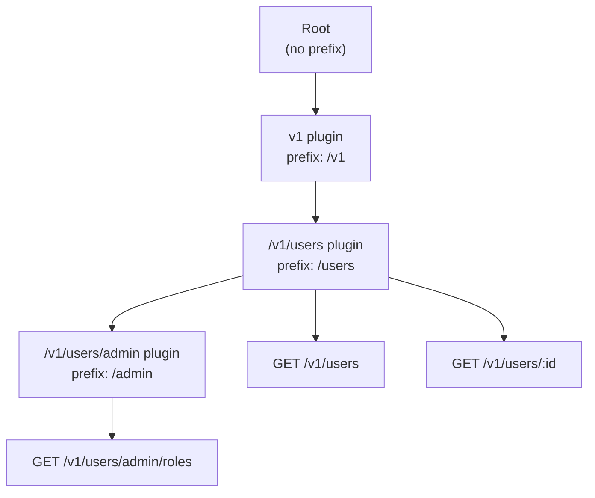

## Plugin Options and Prefix

Every `fastify.register()` call accepts an options object as its second argument. Some keys in that object are consumed by Fastify itself — `prefix` being the most significant — while the rest are forwarded to the plugin function. Understanding both uses is necessary for building well-structured route hierarchies and configurable plugins.

---

### The Options Object — Two Roles

```js
fastify.register(myPlugin, {
  prefix: '/api',       // consumed by Fastify internally
  logLevel: 'warn',     // consumed by Fastify internally
  db: myDbClient,       // forwarded to the plugin function
  timeout: 3000         // forwarded to the plugin function
})
```

Fastify extracts its own recognized keys and passes the **entire object** (including Fastify-specific keys) as `opts` to the plugin function. The plugin receives everything — it is responsible for reading only what it needs.

---

### Forwarding Options to the Plugin

The plugin function receives the options object as its second argument.

```js
async function greetPlugin(fastify, opts) {
  const lang = opts.lang || 'en'

  fastify.get('/hello', async () => {
    return lang === 'en' ? { message: 'Hello' } : { message: 'Hola' }
  })
}

fastify.register(greetPlugin, { lang: 'es' })
```

**Output:** `GET /hello` → `{ "message": "Hola" }`

**Key Points:**
- Options are not validated by Fastify — the plugin is responsible for handling missing or invalid values.
- Providing defaults inside the plugin function is the standard approach.
- Options are passed as-is. Object references are not deep-cloned by Fastify.

[Inference] Because options objects are not deep-cloned, mutations to nested objects inside a plugin may affect the original options reference. Behavior may vary — treat options as read-only inside plugin functions unless mutation is intentional.

---

### Using JSON Schema to Validate Options

Fastify does not validate plugin options automatically, but options validation can be added manually using a JSON Schema validator or by declaring a schema on the plugin function itself via the `options` property.

```js
const schema = {
  type: 'object',
  required: ['secret'],
  properties: {
    secret: { type: 'string' },
    expiresIn: { type: 'string', default: '1h' }
  }
}

async function jwtPlugin(fastify, opts) {
  // Manual validation
  if (!opts.secret) throw new Error('jwtPlugin requires a secret option')

  fastify.decorate('verifyToken', createVerifier(opts.secret))
}
```

[Inference] Some community plugins use `fastify-plugin` combined with a JSON Schema check on options. Fastify itself does not enforce this — it is a convention, not a built-in feature.

---

### The `prefix` Option

`prefix` is the most commonly used Fastify-recognized option. It prepends a string to the URL of every route registered inside the plugin.

```js
fastify.register(async function(fastify) {
  fastify.get('/users', listUsersHandler)      // → /api/users
  fastify.get('/users/:id', getUserHandler)    // → /api/users/:id
  fastify.post('/users', createUserHandler)    // → /api/users
}, { prefix: '/api' })
```

**Key Points:**
- The prefix applies to all HTTP method routes (`get`, `post`, `put`, `patch`, `delete`, `head`, `options`).
- The prefix does not apply to hooks or decorators — only to route URLs.
- A leading slash in the prefix is required. Missing it may produce malformed URLs.

---

### Prefix Inheritance and Nesting

Prefixes accumulate as plugins are nested. Each level appends its prefix to the parent's.

```js
fastify.register(async function v1(fastify) {
  // base: /v1

  fastify.register(async function users(fastify) {
    // base: /v1/users

    fastify.get('/', listHandler)         // → /v1/users
    fastify.get('/:id', getHandler)       // → /v1/users/:id

    fastify.register(async function admin(fastify) {
      // base: /v1/users/admin

      fastify.get('/roles', rolesHandler) // → /v1/users/admin/roles
    }, { prefix: '/admin' })

  }, { prefix: '/users' })

}, { prefix: '/v1' })
```



---

### Prefix and Trailing Slashes

Fastify's behavior with trailing slashes depends on server configuration. By default, `/api/users` and `/api/users/` are treated as different routes.

```js
// With prefix: '/api'
fastify.get('/users', handler)   // matches /api/users
fastify.get('/users/', handler)  // matches /api/users/ — different route
```

To normalize trailing slashes, configure the server instance:

```js
const fastify = require('fastify')({
  ignoreTrailingSlash: true
})
```

[Inference] With `ignoreTrailingSlash: true`, both `/api/users` and `/api/users/` resolve to the same handler. Behavior at the routing level may vary with complex prefix combinations — verify against your Fastify version.

---

### Prefix With `fastify-plugin`

When a plugin is wrapped with `fastify-plugin`, the `prefix` option is **ignored**. Because `fp`-wrapped plugins merge into the parent scope rather than creating a child scope, there is no isolated route context for the prefix to apply to.

```js
const fp = require('fastify-plugin')

// prefix has no effect here
fastify.register(fp(async function(fastify) {
  fastify.get('/test', handler)  // registers at /test, not /api/test
}), { prefix: '/api' })
```

**Key Points:**
- This is a documented behavior and a common source of confusion.
- `prefix` is meaningful only for encapsulated (non-`fp`-wrapped) plugins.
- If prefix-scoped routing is needed, do not wrap the plugin with `fastify-plugin`.

---

### `logLevel` Option

Controls the minimum log level for all routes inside the plugin scope.

```js
fastify.register(async function(fastify) {
  fastify.get('/verbose', handler)   // logs at 'debug' and above
}, { logLevel: 'debug' })

fastify.register(async function(fastify) {
  fastify.get('/quiet', handler)     // logs at 'error' and above only
}, { logLevel: 'error' })
```

Valid values follow the `pino` log level scale: `'trace'`, `'debug'`, `'info'`, `'warn'`, `'error'`, `'fatal'`.

---

### `logSerializers` Option

Provides custom serializer functions for log output within the plugin scope.

```js
fastify.register(async function(fastify) {
  fastify.get('/data', handler)
}, {
  logSerializers: {
    res: (res) => ({
      statusCode: res.statusCode,
      headers: res.getHeaders()
    }),
    req: (req) => ({
      method: req.method,
      url: req.url
    })
  }
})
```

**Key Points:**
- Serializers defined here apply only to routes within the plugin scope.
- They extend or override the serializers defined on the root instance for that scope.

---

### Dynamic Options With a Function

The options argument can be a function that receives the parent Fastify instance and returns an options object. This allows options to be derived from values already registered on the parent — such as config decorators.

```js
fastify.decorate('config', { dbUrl: process.env.DB_URL })

fastify.register(dbPlugin, parent => ({
  url: parent.config.dbUrl
}))
```

**Key Points:**
- The function receives the **parent instance**, not the child.
- This pattern avoids hardcoding environment values at the call site.
- The function must return a plain options object synchronously.

---

### Options Across Multiple Registrations

The same plugin can be registered multiple times with different options, producing independent scoped instances.

```js
async function prefixedLogger(fastify, opts) {
  const tag = opts.tag

  fastify.addHook('onSend', async (req, reply, payload) => {
    fastify.log.info(`[${tag}] response sent`)
    return payload
  })
}

fastify.register(prefixedLogger, { tag: 'PUBLIC' })
fastify.register(prefixedLogger, { tag: 'ADMIN' })
```

[Inference] Each registration creates an independent child scope. Hooks in each instance are isolated and apply only to routes within their respective scopes. The specific routes each hook covers depends on what routes are registered within those same scope calls.

---

### Options Reference Summary

| Option | Consumed By | Scope Effect | Notes |
|---|---|---|---|
| `prefix` | Fastify | Route URLs only | Ignored by `fp`-wrapped plugins |
| `logLevel` | Fastify | Route log output | Follows pino levels |
| `logSerializers` | Fastify | Route log serialization | Extends root serializers |
| All other keys | Plugin function | None | Forwarded as-is via `opts` |

---

### Summary

**Conclusion:**
Plugin options serve two distinct purposes in Fastify: configuring the framework's own behavior for that scope (via `prefix`, `logLevel`, `logSerializers`) and passing arbitrary configuration to the plugin function itself. The `prefix` option is the primary tool for URL namespace organization and composes cleanly through nested registrations. Understanding that `prefix` has no effect on `fastify-plugin`-wrapped plugins prevents a common class of routing mistakes.