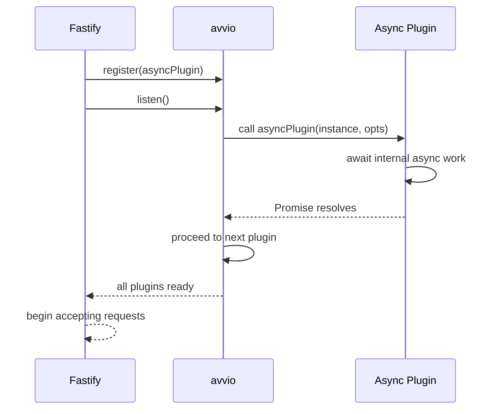

## Async Plugins

Fastify supports both async and callback-style plugin functions. Async plugins are the more common modern form, but they introduce specific behaviors around initialization timing, error propagation, and interaction with Fastify's boot sequence that are important to understand precisely.

---

### What Makes a Plugin Async

A plugin is async when its function is declared with `async` or explicitly returns a `Promise`.

```js
// async function declaration
async function myPlugin(fastify, opts) {
  const client = await connectToDatabase(opts.url)
  fastify.decorate('db', client)
}

// equivalent — explicit Promise return
function myPlugin(fastify, opts) {
  return connectToDatabase(opts.url).then(client => {
    fastify.decorate('db', client)
  })
}
```

Both forms signal to Fastify's boot system (`avvio`) that it should wait for the returned promise to settle before proceeding to the next plugin.

---

### Callback Style vs Async — Direct Comparison

```js
// Callback style — done() required
function callbackPlugin(fastify, opts, done) {
  doSomethingSync()
  done()
}

// Async style — done not used, not accepted
async function asyncPlugin(fastify, opts) {
  await doSomethingAsync()
}
```

| Aspect | Callback Style | Async Style |
|---|---|---|
| Completion signal | `done()` called | Promise resolves |
| Async work | Requires manual promise handling | Native `await` |
| Error signal | `done(error)` | Thrown error or rejected promise |
| `done` parameter | Required in signature | Must be omitted |

---

### The `done` Parameter Must Not Appear in Async Plugins

This is one of the most consequential rules when working with async plugins.

```js
// INCORRECT — async function with done parameter
async function brokenPlugin(fastify, opts, done) {
  await setup()
  done()  // calling done in an async plugin causes double-signaling
}
```

**Key Points:**
- When Fastify detects an async function (a function returning a Promise), it uses the promise to track completion.
- If `done` is also called, the plugin signals completion twice — once via `done()` and once via the resolved promise.
- This can cause premature continuation of the boot sequence or silent errors.
- The `done` parameter should be completely absent from async plugin signatures.

---

### Await in Plugin Body — Deferred Decoration

Because the plugin body is async, decorators and hooks defined after an `await` are still registered correctly. Fastify waits for the entire promise to resolve.

```js
async function dbPlugin(fastify, opts) {
  // async work before decoration
  const pool = await createPool(opts.connectionString)
  await pool.connect()

  // registered after await — still works correctly
  fastify.decorate('db', pool)

  fastify.addHook('onClose', async () => {
    await pool.end()
  })
}
```

**Key Points:**
- Fastify does not process the next plugin until this promise resolves.
- All decorations and hook registrations inside the async function are visible to the rest of the boot sequence once it completes.
- This makes async plugins safe for I/O-dependent initialization such as database connections and config loading.

---

### Boot Sequence and avvio

Fastify's plugin loader, `avvio`, manages async plugins by chaining their promises in registration order.


**Key Points:**
- Plugins are always initialized sequentially in registration order, regardless of how fast their internal async work completes.
- A plugin registered second will not begin executing until the first plugin's promise has resolved.
- This ordering guarantee is what makes it safe to depend on decorators from previously registered plugins.

[Inference] The sequential guarantee holds for top-level sibling registrations. Nested plugins within a single parent scope also follow sequential ordering within that scope. Behavior may vary for complex nested trees with concurrent internal registrations — verify against your Fastify and avvio versions.

---

### Error Propagation in Async Plugins

In async plugins, errors are propagated by throwing or returning a rejected promise.

```js
async function riskyPlugin(fastify, opts) {
  const result = await someExternalService()

  if (!result.ok) {
    throw new Error('External service unavailable')
  }

  fastify.decorate('service', result.client)
}
```

If the plugin throws, Fastify catches the rejection and:
- Aborts the remaining boot sequence.
- Propagates the error to the `fastify.listen()` or `fastify.ready()` call.

```js
fastify.register(riskyPlugin)

fastify.listen({ port: 3000 }, (err) => {
  if (err) {
    console.error('Startup failed:', err)
    process.exit(1)
  }
})
```

Or with async/await:

```js
try {
  await fastify.listen({ port: 3000 })
} catch (err) {
  fastify.log.error(err)
  process.exit(1)
}
```

---

### Callback-Style Error Handling for Comparison

In callback-style plugins, errors are passed to `done()`.

```js
function callbackPlugin(fastify, opts, done) {
  someOperation((err, result) => {
    if (err) return done(err)  // propagates to boot sequence
    fastify.decorate('result', result)
    done()
  })
}
```

Both approaches produce the same outcome — a failed boot sequence with an accessible error. The async form is generally cleaner.

---

### Mixing Async and Sync Operations

Async plugins can freely mix synchronous and asynchronous work.

```js
async function configPlugin(fastify, opts) {
  // sync operation
  const baseConfig = loadConfigFromEnv()

  // async operation
  const remoteConfig = await fetchRemoteConfig(opts.configUrl)

  // sync decoration
  fastify.decorate('config', { ...baseConfig, ...remoteConfig })
}
```

There is no requirement for any `await` to be present — an async plugin with no async operations is valid and behaves identically to a sync plugin.

---

### Async Plugins and `fastify-plugin`

`fastify-plugin` works with async functions without modification.

```js
const fp = require('fastify-plugin')

const dbPlugin = fp(async function(fastify, opts) {
  const client = await createClient(opts)
  fastify.decorate('db', client)
}, {
  name: 'db-plugin',
  fastify: '4.x'
})

module.exports = dbPlugin
```

**Key Points:**
- `fp` wraps the async function and preserves its async nature.
- The boot sequence still waits for the promise to resolve before continuing.
- The decorator (`db`) is promoted to the parent scope after resolution.

---

### The `fastify-plugin` Metadata Object

When wrapping with `fp`, a metadata object can be passed as the second argument. This is independent of async behavior but commonly seen alongside it.

```js
const fp = require('fastify-plugin')

async function authPlugin(fastify, opts) {
  // ...
}

module.exports = fp(authPlugin, {
  name: 'auth-plugin',        // identifies the plugin in error messages
  fastify: '4.x',             // declares Fastify version compatibility
  dependencies: ['db-plugin'] // declares required sibling plugins
})
```

**Key Points:**
- `dependencies` lists other plugins (by name) that must be registered before this one.
- If a declared dependency is missing, Fastify throws an error at boot time.
- This is a runtime check, not a static guarantee.

---

### Async Plugins and `onClose`

Async plugins that acquire external resources should register cleanup logic via `onClose`.

```js
async function cachePlugin(fastify, opts) {
  const cache = await connectCache(opts)
  fastify.decorate('cache', cache)

  fastify.addHook('onClose', async (instance) => {
    await instance.cache.disconnect()
  })
}
```

**Key Points:**
- `onClose` hooks are called when `fastify.close()` is invoked.
- The `onClose` hook inside an async plugin also supports async functions.
- Resource cleanup should always be registered inside the plugin that acquired the resource, not externally.

---

### Common Mistakes With Async Plugins

**Unhandled promise inside plugin body:**

```js
async function badPlugin(fastify, opts) {
  // fire-and-forget — Fastify cannot track this promise
  someAsyncSetup().then(result => {
    fastify.decorate('thing', result)
  })
  // function returns before decoration is complete
}
```

**Correct:**

```js
async function goodPlugin(fastify, opts) {
  const result = await someAsyncSetup()
  fastify.decorate('thing', result)
}
```

**Forgetting to await nested async calls:**

```js
async function parentPlugin(fastify, opts) {
  // register returns void — no await needed here
  // but internal async work must be awaited
  fastify.register(async function child(fastify) {
    const data = await fetchData()  // this must be awaited
    fastify.decorate('data', data)
  })
}
```

[Inference] Unhandled promises inside a plugin body that are not returned or awaited may complete after Fastify considers the plugin initialized. This can produce decorators that appear undefined immediately after `ready()` if the async work is still pending. Behavior may vary — always await or return all async work within a plugin.

---

### Async Plugin Initialization Flow



---

### Summary

**Conclusion:**
Async plugins are the standard form for any plugin that performs I/O during initialization. Fastify and `avvio` guarantee sequential plugin loading by chaining promises in registration order, making it safe to declare dependencies between plugins. The critical rules are: omit `done` from async plugin signatures, always `await` or return all async work inside the plugin body, and propagate errors by throwing rather than silently swallowing them. These rules together produce a predictable, debuggable boot sequence.