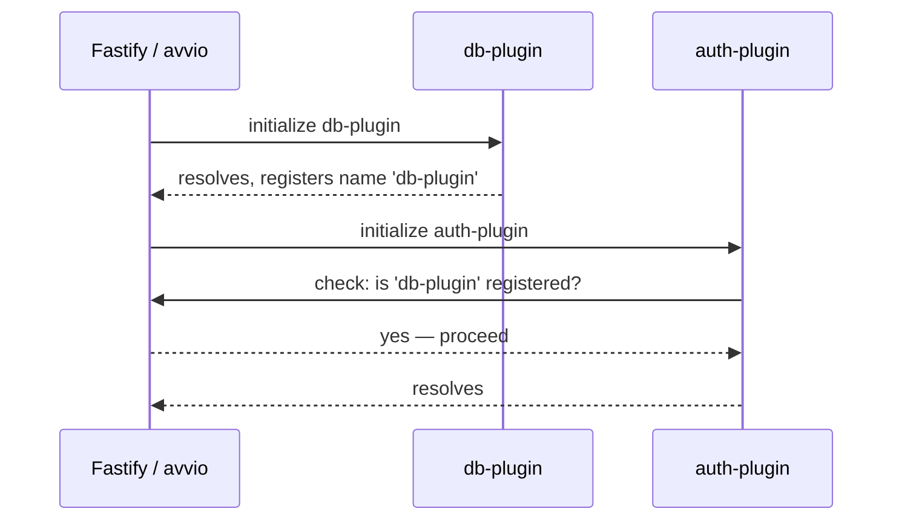
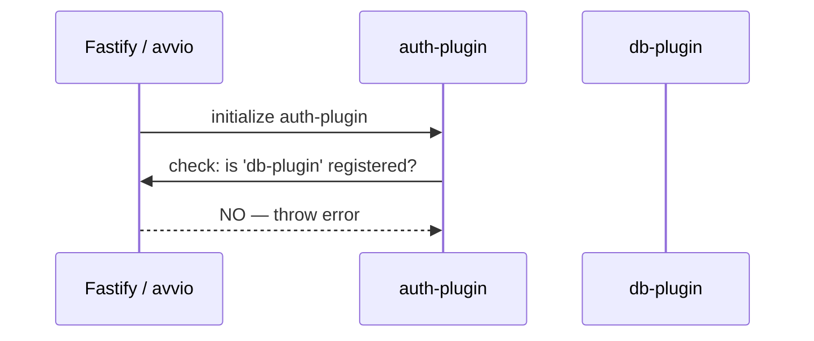
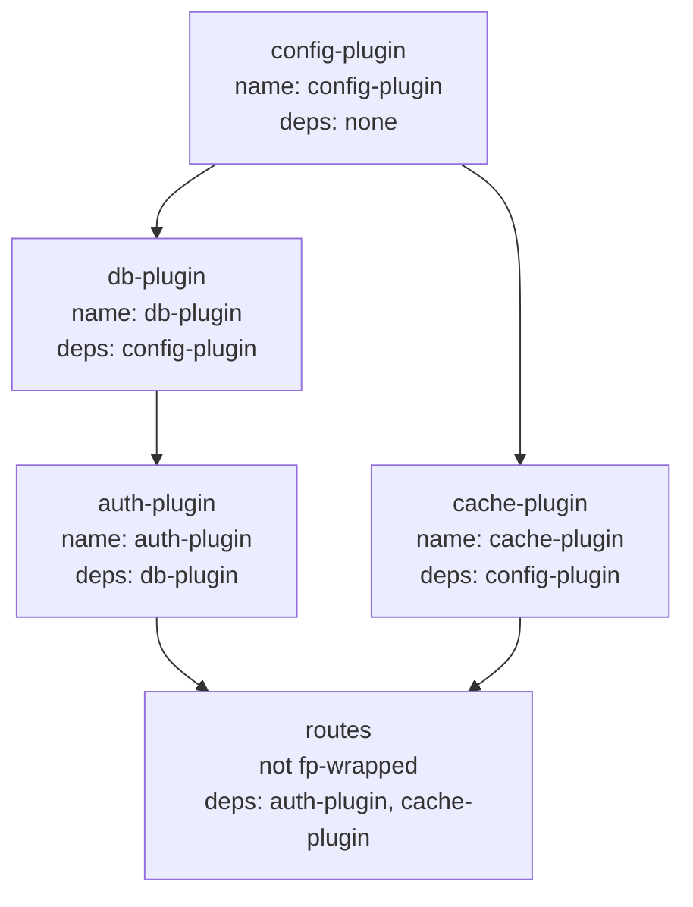

## Plugin Dependencies with `fastify-plugin`

`fastify-plugin` (`fp`) serves two related but distinct purposes: escaping scope encapsulation, and declaring explicit dependencies between plugins. This topic covers both, with emphasis on the dependency declaration system and the patterns that emerge from it.

---

### What `fastify-plugin` Does — Recap

When a plugin is wrapped with `fp`, it does not create a child scope. Instead, its decorators, hooks, and other additions are merged directly into the parent scope.

```js
const fp = require('fastify-plugin')

const myPlugin = fp(async function(fastify, opts) {
  fastify.decorate('util', {})
})

fastify.register(myPlugin)
// fastify.util is available on the root instance after ready()
```

This scope promotion is what makes `fp` the standard tool for shared infrastructure — but `fp` also carries a metadata system for declaring plugin identity and dependencies.

---

### The Metadata Object

`fp` accepts an optional second argument — a metadata object.

```js
fp(pluginFunction, {
  name: 'my-plugin',
  fastify: '4.x',
  dependencies: ['other-plugin']
})
```

| Field | Type | Purpose |
|---|---|---|
| `name` | `string` | Identifies this plugin in error messages and dependency checks |
| `fastify` | `string` | Declares compatible Fastify version range |
| `dependencies` | `string[]` | Lists plugin names that must be registered before this one |

All fields are optional. Their effects are described in detail below.

---

### Naming a Plugin

The `name` field assigns an identity to a plugin. This identity is used in two ways:

- Referenced by other plugins in their `dependencies` array.
- Shown in error messages when the plugin fails or a dependency is missing.

```js
const dbPlugin = fp(async function db(fastify, opts) {
  const client = await createClient(opts.url)
  fastify.decorate('db', client)
}, {
  name: 'db-plugin'
})
```

**Key Points:**
- The `name` in metadata is separate from the function name, though they are often kept consistent.
- Unnamed plugins produce less informative error output.
- The name must match exactly when referenced in `dependencies`.

---

### Declaring Dependencies

The `dependencies` array lists plugin names that must already be registered and initialized before this plugin runs.

```js
const authPlugin = fp(async function auth(fastify, opts) {
  // relies on fastify.db being present
  fastify.decorate('verifyToken', async (token) => {
    return fastify.db.query('SELECT * FROM tokens WHERE value = $1', [token])
  })
}, {
  name: 'auth-plugin',
  dependencies: ['db-plugin']
})
```

If `db-plugin` has not been registered when `auth-plugin` initializes, Fastify throws:

```
FastifyError: The dependency 'db-plugin' of plugin 'auth-plugin' is not satisfied
```

This is a **boot-time check**, not a static analysis guarantee.

---

### How the Dependency Check Works

Fastify tracks the names of all `fp`-wrapped plugins that have completed initialization. When a plugin declares `dependencies`, Fastify checks this registry at the moment the plugin begins executing.



If the order is reversed:



---

### Correct Registration Order

Because `avvio` initializes plugins sequentially, registration order determines whether dependencies are satisfied.

```js
// Correct
fastify.register(dbPlugin)    // name: 'db-plugin'
fastify.register(authPlugin)  // depends on: 'db-plugin' — satisfied
```

```js
// Incorrect
fastify.register(authPlugin)  // depends on: 'db-plugin' — NOT YET registered
fastify.register(dbPlugin)
```

**Key Points:**
- The dependency check is a runtime guard, not a reordering mechanism.
- Fastify does not automatically reorder plugins to satisfy dependencies.
- Registration order must be correct — `dependencies` only verifies it, it does not fix it.

---

### Fastify Version Compatibility

The `fastify` field in the metadata declares which versions of Fastify the plugin is compatible with, using semver range syntax.

```js
fp(pluginFn, {
  name: 'my-plugin',
  fastify: '>=4.0.0'
})
```

If the running Fastify version falls outside the declared range, Fastify throws at boot time.

```
FastifyError: fastify-plugin: my-plugin - expected '>=4.0.0' fastify, got '3.29.0'
```

**Key Points:**
- This check uses the `semver` package internally.
- It is a courtesy check for plugin authors publishing to npm — it protects consumers from silently running incompatible plugin versions.
- Omitting this field disables the version check entirely.

[Inference] The `fastify` compatibility field is most useful for published plugins. For internal application plugins, it is commonly omitted. Whether to include it is a project convention decision.

---

### Dependency Graph — Multi-Plugin Example

A realistic application often has layered dependencies.



```js
fastify.register(configPlugin)   // name: config-plugin
fastify.register(dbPlugin)       // name: db-plugin,    deps: [config-plugin]
fastify.register(cachePlugin)    // name: cache-plugin, deps: [config-plugin]
fastify.register(authPlugin)     // name: auth-plugin,  deps: [db-plugin]
fastify.register(routePlugins)   // not fp-wrapped, relies on auth + cache
```

**Key Points:**
- `routePlugins` does not need to be `fp`-wrapped — it is a scoped route container that consumes already-available decorators.
- The registration order directly mirrors the dependency graph.
- Each `fp`-wrapped plugin decorates the root instance, making its contributions globally available.

---

### Unnamed Dependencies — What Happens

If a plugin does not declare a `name`, other plugins cannot reference it in `dependencies`.

```js
// No name declared
const anonymousPlugin = fp(async function(fastify, opts) {
  fastify.decorate('x', 1)
})

// This will fail — 'anonymous-plugin' was never registered
const dependentPlugin = fp(async function(fastify, opts) {}, {
  dependencies: ['anonymous-plugin']
})
```

**Key Points:**
- Unnamed `fp` plugins still promote their decorators to the parent scope.
- They simply cannot be referenced in `dependencies` by name.
- For shared infrastructure plugins, always declare a name.

---

### Non-`fp` Plugins and Dependencies

The `dependencies` system only tracks `fp`-wrapped plugins. Scoped (non-`fp`) plugins are not registered in the name registry and cannot appear in `dependencies`.

```js
// Scoped plugin — not tracked by dependency system
fastify.register(async function routes(fastify) {
  fastify.get('/ping', async () => 'pong')
})
```

This is expected behavior — scoped plugins are leaf nodes in the dependency tree, not shared infrastructure. They consume decorators from `fp`-wrapped plugins but do not expose their own.

---

### Plugin Identity Across Multiple Registrations

If the same named `fp` plugin is registered more than once, Fastify raises an error by default — a plugin name can only be registered once.

```js
fastify.register(dbPlugin)  // name: db-plugin
fastify.register(dbPlugin)  // Error: plugin 'db-plugin' already registered
```

To allow multiple registrations of the same plugin with different options, the plugin author must explicitly opt in using the `fastify-plugin` `{ force: true }` option or omit the name.

[Inference] The double-registration guard is intended to prevent accidental duplicate initialization of stateful resources like database connection pools. Behavior and available options for overriding this guard may vary across `fastify-plugin` versions — consult the library's changelog for the version in use.

---

### Composing Plugins With a Bootstrap Module

A common pattern is a single top-level registration module that assembles all infrastructure plugins in dependency order.

```js
// app.js
const fp = require('fastify-plugin')

async function app(fastify, opts) {
  await fastify.register(require('./plugins/config'), opts)
  await fastify.register(require('./plugins/db'))
  await fastify.register(require('./plugins/cache'))
  await fastify.register(require('./plugins/auth'))
  await fastify.register(require('./routes'))
}

module.exports = fp(app)
```

**Key Points:**
- Wrapping the top-level app function with `fp` makes it usable as a plugin in testing or composition contexts.
- The `app` function itself can be passed to `fastify.register()` from an entry point.
- Using `await` on each `register` call inside an `fp`-wrapped async function is not required — `avvio` handles sequencing — but it is sometimes used for explicit readability.

[Inference] `await fastify.register()` does not actually await plugin initialization in the standard sense — `register` queues plugins and returns the Fastify instance synchronously. The sequencing is managed by `avvio` during the boot phase, not by awaiting the `register` call itself. Using `await` on it has no functional effect on load order in current Fastify versions.

---

### Summary

**Conclusion:**
`fastify-plugin` provides a formal dependency declaration system on top of its scope-escaping behavior. Naming plugins and declaring `dependencies` transforms implicit registration ordering into an explicit, verified contract. Fastify enforces this contract at boot time — if a declared dependency is absent, the server refuses to start. This makes plugin dependency failures loud and immediate rather than silent and runtime-variable. The system works correctly only when registration order reflects the dependency graph, since Fastify verifies but does not reorder plugins.