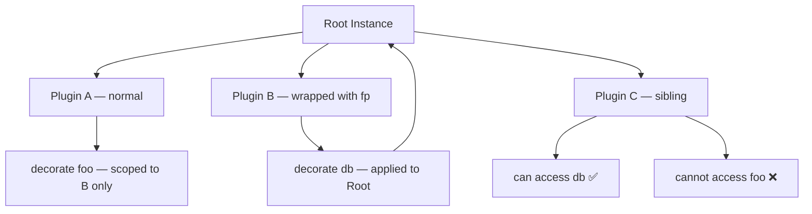

## Breaking Encapsulation Intentionally in Fastify

Fastify's plugin system enforces encapsulation by default — each plugin operates in its own scope, and decorators, hooks, and routes registered inside a plugin are not visible to sibling or parent scopes. However, there are legitimate, well-understood patterns for intentionally breaking this encapsulation when shared state or behavior is required across the entire application.

---

### Why Encapsulation Exists

Before breaking it, understanding what it protects is important.

Each plugin registered via `fastify.register()` receives a scoped child instance. Anything added to that child — decorators, hooks, content type parsers — does not leak upward or sideways.

```js
fastify.register(async function pluginA(instance) {
  instance.decorate('foo', 'bar')
})

fastify.register(async function pluginB(instance) {
  console.log(instance.foo) // undefined — not accessible here
})
```

This prevents unintended coupling between plugins.

---

### When Breaking Encapsulation Is Appropriate

- Sharing a database connection across all routes
- Applying authentication hooks globally
- Exposing utility decorators to the entire application
- Building a plugin intended for wide reuse (e.g., a published npm package)

---

### Method 1 — `fastify-plugin`

The primary and idiomatic tool for breaking encapsulation is the [`fastify-plugin`](https://github.com/fastify/fastify-plugin) package (`fp`).

When a plugin is wrapped with `fp`, Fastify skips creating a new child scope. Everything registered inside that plugin is applied directly to the parent instance.

```js
const fp = require('fastify-plugin')

async function myPlugin(fastify, options) {
  fastify.decorate('db', getDatabaseConnection())
}

module.exports = fp(myPlugin)
```

```js
// In the main app
fastify.register(require('./myPlugin'))

fastify.register(async function routePlugin(instance) {
  console.log(instance.db) // accessible — encapsulation was broken by fp
})
```

**Key Points**
- `fp` must wrap the function at the point of export or registration
- The plugin's decorators, hooks, and parsers become visible to all sibling and descendant scopes
- Hooks registered inside an `fp`-wrapped plugin run for all routes, not just those in a child scope

---

### Method 2 — `skip-override` Metadata (Advanced)

`fastify-plugin` works by setting a special property on the function:

```js
myPlugin[Symbol.for('skip-override')] = true
```

This is the underlying mechanism `fp` uses. Setting it manually achieves the same effect, though using `fp` is strongly preferred for clarity and maintainability.

```js
async function myPlugin(fastify, options) {
  fastify.decorate('utility', () => 'shared')
}

myPlugin[Symbol.for('skip-override')] = true

fastify.register(myPlugin)
```

> **Note:** This is an internal convention. Relying on it directly rather than through `fp` is [Inference] less maintainable and may be fragile across Fastify versions.

---

### Method 3 — Registering at the Root Level

If a decorator or hook is registered directly on the root `fastify` instance — outside of any `register()` call — it is globally available by definition.

```js
const fastify = require('fastify')()

fastify.decorate('config', { env: 'production' })

fastify.register(async function plugin(instance) {
  console.log(instance.config.env) // 'production' — inherited from root
})
```

**Key Points**
- This pattern is straightforward but tightly couples initialization order to the root instance
- Async setup (e.g., connecting to a database) cannot be safely awaited this way without `fastify.after()` or `fastify.ready()`

---

### Method 4 — Using `fastify.after()` for Sequential Access

When you need a plugin's exports to be available immediately after registration — but before `listen()` — use `fastify.after()`:

```js
fastify.register(dbPlugin)

fastify.after(() => {
  // dbPlugin has now been loaded; fastify.db is available
  fastify.register(routePlugin)
})
```

This is [Inference] most useful during application bootstrapping where plugin load order matters. Behavior may vary depending on how async plugins resolve.

---

### Scope Propagation: What Gets Shared

When encapsulation is broken via `fp`, the following propagate upward to the parent scope:

| What | Propagates? |
|---|---|
| `decorate` / `decorateRequest` / `decorateReply` | ✅ Yes |
| `addHook` | ✅ Yes — runs globally |
| `addContentTypeParser` | ✅ Yes |
| Route definitions | ✅ Yes — registered on parent |
| Plugin-local variables (closures) | ❌ No — still private |

---

### Encapsulation Break vs. Scope Leak

Breaking encapsulation intentionally with `fp` is distinct from accidentally leaking state.

```js
// Accidental leak attempt — does NOT work
fastify.register(async function (instance) {
  instance.decorate('secret', 42)
})

console.log(fastify.secret) // undefined — child scope, not leaked
```

```js
// Intentional break — works as expected
const fp = require('fastify-plugin')

fastify.register(fp(async function (instance) {
  instance.decorate('secret', 42)
}))

await fastify.ready()
console.log(fastify.secret) // 42
```

The distinction matters: accidental coupling is a bug; intentional use of `fp` is a design decision.

---

### Plugin Metadata with `fastify-plugin`

`fp` also accepts a metadata object as a second argument:

```js
module.exports = fp(myPlugin, {
  fastify: '4.x',
  name: 'my-shared-plugin',
  dependencies: ['another-plugin']
})
```

**Key Points**
- `fastify` — declares compatible Fastify version range
- `name` — identifies the plugin in error messages and dependency graphs
- `dependencies` — [Inference] declares that named plugins must be registered before this one; exact resolution behavior may vary

---

### Common Pitfall — Double Registration

Because `fp`-wrapped plugins apply to the parent scope, registering the same plugin twice can cause a "decorator already added" error.

```js
// This will throw if 'db' is already decorated
fastify.register(fp(dbPlugin))
fastify.register(fp(dbPlugin)) // ❌ Error: FST_ERR_DEC_ALREADY_PRESENT
```

Guard against this with a check if dynamic registration is needed:

```js
async function dbPlugin(fastify) {
  if (!fastify.hasDecorator('db')) {
    fastify.decorate('db', createConnection())
  }
}
```

---

### Visualization — Scope With and Without `fp`



---

### `fastify-plugin` vs. No Wrapper — Summary

| Behavior | Without `fp` | With `fp` |
|---|---|---|
| New child scope created | ✅ Yes | ❌ No |
| Decorators visible to siblings | ❌ No | ✅ Yes |
| Hooks apply globally | ❌ No | ✅ Yes |
| Suitable for shared infrastructure | ❌ No | ✅ Yes |
| Suitable for isolated feature modules | ✅ Yes | ❌ Avoid |

---

**Conclusion**

Breaking encapsulation in Fastify is a deliberate, supported pattern — not a workaround. The idiomatic approach is wrapping plugins with `fastify-plugin`, which signals clearly to both Fastify and other developers that the plugin's registrations are intended to be global. Understanding when to use `fp` versus when to preserve encapsulation is central to designing a well-structured Fastify application.

**Next Steps**
- Plugin dependency declaration and load ordering
- Designing reusable plugins for npm distribution
- Hook execution order across scoped and unscoped plugins