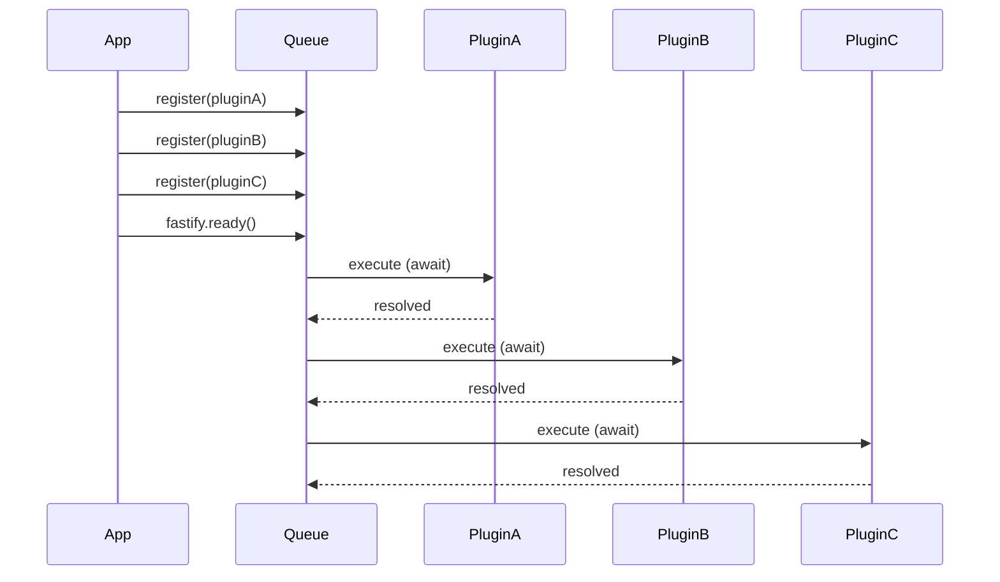

## Plugin Load Order in Fastify

Fastify loads plugins asynchronously but in a **deterministic, declaration order**. Understanding how and when plugins are loaded — and how to control that order — is essential for building applications where plugins depend on one another.

---

### How Fastify Loads Plugins

When you call `fastify.register()`, the plugin is **not executed immediately**. It is queued. Fastify processes the queue when one of the following is called:

- `fastify.listen()`
- `fastify.ready()`
- `fastify.inject()`

Until then, plugins are staged. This means code written after `register()` calls but before `ready()` executes **before** the plugins themselves run.

```js
fastify.register(async function pluginA(instance) {
  console.log('Plugin A loaded')
})

console.log('This runs before Plugin A')

await fastify.ready()
// Output:
// This runs before Plugin A
// Plugin A loaded
```

**Key Points**
- `register()` is declarative, not imperative
- Actual plugin execution is deferred until the boot phase
- Declaration order determines load order within the same scope level

---

### Sequential Loading Within a Scope

Plugins registered at the same level are loaded **sequentially**, in declaration order. A plugin does not begin loading until the previous one has fully resolved.

```js
fastify.register(async function pluginA(instance) {
  await someAsyncSetup()
  instance.decorate('a', 'value-a')
})

fastify.register(async function pluginB(instance) {
  // pluginA has fully resolved before this runs
  console.log(instance.a) // [Inference] 'value-a' if pluginA used fp; undefined otherwise
})
```

> **Note:** Even though plugins load sequentially, a decorator registered inside `pluginA` without `fastify-plugin` is not visible to `pluginB` — they are sibling scopes. Behavior of cross-scope access without `fp` is not guaranteed.

---

### Visualizing Load Order



---

### Nested Plugins and Load Order

When a plugin registers child plugins inside itself, those children are loaded **after the parent resolves its own synchronous setup**, but **before sibling plugins at the parent level continue**.

```js
fastify.register(async function parent(instance) {
  instance.decorate('parentVal', 1)

  instance.register(async function child(instance) {
    console.log('Child loaded')
  })

  console.log('Parent body done')
})

fastify.register(async function sibling(instance) {
  console.log('Sibling loaded')
})

await fastify.ready()
// Output (order is deterministic):
// Parent body done
// Child loaded
// Sibling loaded
```

**Key Points**
- Parent body executes first
- Child plugins of a parent resolve before the next sibling at the parent's level begins
- This enables safe dependency chains within a plugin tree

---

### Load Order With `fastify-plugin`

Plugins wrapped with `fp` break encapsulation but do **not** change load order. They still load sequentially in declaration order.

```js
const fp = require('fastify-plugin')

fastify.register(fp(async function dbPlugin(instance) {
  instance.decorate('db', await connectDB())
}))

fastify.register(async function routes(instance) {
  // db is available here because:
  // 1. dbPlugin loaded first (declaration order)
  // 2. fp made the decorator visible on the parent scope
  instance.get('/', async () => instance.db.query('SELECT 1'))
})
```

---

### Controlling Order With `fastify.after()`

`fastify.after()` registers a callback that runs **after the most recently registered plugin has loaded**, but before the next plugin in the queue begins.

```js
fastify.register(dbPlugin)

fastify.after(function (err) {
  if (err) throw err
  // dbPlugin is now loaded; fastify.db is available
  fastify.register(routePlugin)
})
```

**Key Points**
- `fastify.after()` is synchronous in declaration but async in execution
- The callback receives a single `err` argument — always handle it
- [Inference] Useful for conditional registration patterns where a subsequent plugin depends on the result of a prior one; behavior may vary based on plugin async resolution

---

### Dependency Declaration via `fastify-plugin` Metadata

The `dependencies` option in `fp` metadata declares that named plugins must already be registered:

```js
module.exports = fp(async function routesPlugin(fastify) {
  fastify.get('/', async () => ({ db: !!fastify.db }))
}, {
  name: 'routes-plugin',
  dependencies: ['db-plugin']
})
```

**Key Points**
- Fastify checks at load time whether the named dependency has been registered
- If the dependency is absent, Fastify throws a descriptive error
- This is a **registration check**, not a load-order enforcement mechanism — the declared plugin must have been registered before this one in the application tree
- [Inference] It does not reorder plugins automatically; it only asserts presence

---

### Common Ordering Pitfall — Accessing Decorators Too Early

```js
fastify.register(fp(async function dbPlugin(instance) {
  instance.decorate('db', await connectDB())
}))

// ❌ This runs before dbPlugin has loaded
console.log(fastify.db) // undefined
```

```js
// ✅ Wait for the boot phase to complete
await fastify.ready()
console.log(fastify.db) // connection object
```

Accessing decorators or plugin state before `ready()` resolves is a frequent source of bugs. The value is not available until the plugin's async function has fully resolved.

---

### Load Order Within `avvio`

Fastify's plugin system is built on [`avvio`](https://github.com/fastify/avvio), a general-purpose async plugin loader. Understanding the relationship clarifies some behaviors:

| Concept | Provided By |
|---|---|
| Sequential async loading | `avvio` |
| Scoped child instances | Fastify on top of `avvio` |
| `skip-override` / encapsulation | Fastify convention |
| Boot queue (`ready`) | `avvio` |

[Inference] Most load order behavior described here is ultimately governed by `avvio` internals. Edge case behavior should be verified against the `avvio` source or Fastify's own test suite, as it is not guaranteed to remain stable across major versions.

---

### Full Example — Controlled Load Order

```js
const fastify = require('fastify')()
const fp = require('fastify-plugin')

// Step 1 — shared config, breaks encapsulation
fastify.register(fp(async function configPlugin(instance) {
  instance.decorate('config', { db: process.env.DB_URL })
}, { name: 'config-plugin' }))

// Step 2 — DB depends on config
fastify.register(fp(async function dbPlugin(instance) {
  instance.decorate('db', await connectDB(instance.config.db))
}, {
  name: 'db-plugin',
  dependencies: ['config-plugin']
}))

// Step 3 — routes depend on db
fastify.register(async function routes(instance) {
  instance.get('/health', async () => ({ ok: !!instance.db }))
})

await fastify.listen({ port: 3000 })
```

**Output** (load sequence):
1. `configPlugin` loads and decorates `config`
2. `dbPlugin` loads, reads `config`, decorates `db`
3. `routes` loads, reads `db`, registers route
4. Server begins listening

---

### Load Order Summary

| Scenario | Behavior |
|---|---|
| Multiple `register()` at same level | Sequential, declaration order |
| Nested `register()` inside a plugin | Children load before next sibling |
| `fp`-wrapped plugin | Same load order, decorator visible on parent |
| `fastify.after()` | Callback fires after preceding plugin resolves |
| `dependencies` in `fp` metadata | Asserts presence, does not reorder |
| Code after `register()`, before `ready()` | Runs before plugins execute |

---

**Conclusion**

Fastify's load order is deterministic and declaration-driven. Plugins load sequentially within a scope, children before siblings, and nothing is available until the boot phase completes. Using `fastify-plugin`, `fastify.after()`, and `dependencies` metadata gives precise control over initialization sequences without sacrificing the clarity of the plugin tree.

**Next Steps**
- Designing reusable plugins for npm distribution
- Hook execution order across scoped and unscoped plugins
- Error handling during plugin load