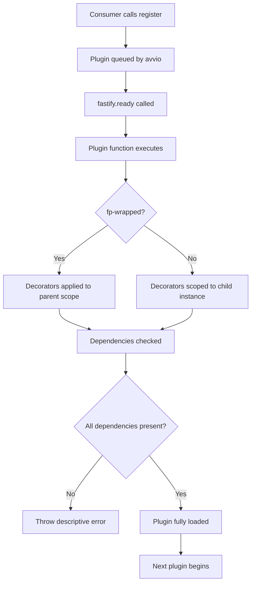

## Writing Reusable Plugins in Fastify

A reusable Fastify plugin is one that can be dropped into any application — or published to npm — without requiring modification. Writing one well means thinking carefully about encapsulation, options, defaults, compatibility declarations, and the guarantees your plugin makes to its consumers.

---

### Anatomy of a Reusable Plugin

At minimum, a reusable plugin is an async function registered with `fastify-plugin`:

```js
const fp = require('fastify-plugin')

async function myPlugin(fastify, options) {
  // setup
}

module.exports = fp(myPlugin, {
  fastify: '4.x',
  name: 'my-plugin'
})
```

**Key Points**
- The function signature is always `(fastify, options)`
- `fp` removes the child scope so decorators are visible to the parent
- Metadata (`fastify`, `name`) is strongly recommended for published plugins

---

### Plugin Options and Defaults

Consumers pass options via the second argument to `register()`. Your plugin receives them as `options`.

```js
const fp = require('fastify-plugin')

async function cachePlugin(fastify, options) {
  const {
    ttl = 300,
    maxSize = 1000,
    namespace = 'default'
  } = options

  const cache = new Cache({ ttl, maxSize })
  fastify.decorate('cache', cache)
}

module.exports = fp(cachePlugin, {
  fastify: '4.x',
  name: 'fastify-cache'
})
```

```js
// Consumer usage
fastify.register(require('fastify-cache'), {
  ttl: 600,
  namespace: 'sessions'
})
```

**Key Points**
- Always provide safe defaults — consumers may omit any or all options
- Destructure with defaults rather than accessing `options.x` directly throughout
- Avoid mutating the `options` object

---

### Validating Options with JSON Schema

For robust plugins, validate options explicitly using Fastify's schema tooling or a standalone validator.

```js
const fp = require('fastify-plugin')

const optionsSchema = {
  type: 'object',
  properties: {
    ttl: { type: 'number', minimum: 1 },
    namespace: { type: 'string', minLength: 1 }
  },
  additionalProperties: false
}

async function cachePlugin(fastify, options) {
  const valid = fastify.hasDecorator('ajv')
    ? fastify.ajv.validate(optionsSchema, options)
    : true // [Inference] fallback if ajv not available

  if (!valid) {
    throw new Error('fastify-cache: invalid options')
  }

  fastify.decorate('cache', new Cache(options))
}

module.exports = fp(cachePlugin, { name: 'fastify-cache' })
```

Alternatively, use a standalone schema validator like `ajv` directly, without relying on Fastify's internal instance.

---

### Guarding Against Duplicate Registration

Because `fp` applies decorators to the parent scope, registering the same plugin twice throws:

```
FST_ERR_DEC_ALREADY_PRESENT: The decorator 'cache' has already been added
```

Guard with `hasDecorator()`:

```js
async function cachePlugin(fastify, options) {
  if (fastify.hasDecorator('cache')) {
    return // already registered upstream — skip silently
  }

  fastify.decorate('cache', new Cache(options))
}
```

**Key Points**
- This pattern is common in plugins that may be transitively required by multiple dependencies
- Only skip silently when re-registration with different options would be genuinely harmless
- [Inference] If options differ between registrations, silently skipping may hide misconfiguration; consider logging a warning

---

### Declaring Dependencies

If your plugin requires another plugin to already be registered, declare it:

```js
module.exports = fp(myPlugin, {
  name: 'my-plugin',
  dependencies: ['fastify-sensible', 'fastify-jwt']
})
```

Fastify checks at load time that the named plugins are present. If they are absent, it throws a clear error rather than failing silently at runtime.

**Key Points**
- `dependencies` lists plugin names as declared in their own `fp` metadata `name` field
- This is a presence assertion, not an automatic loader — the consumer must still register dependencies before your plugin
- Omitting this when dependencies exist leads to confusing runtime errors

---

### Decorating the Instance, Request, and Reply

Reusable plugins commonly extend three targets:

```js
async function authPlugin(fastify, options) {
  // Extend the fastify instance
  fastify.decorate('authenticate', async function (request, reply) {
    // verify token
  })

  // Extend request objects
  fastify.decorateRequest('user', null)

  // Extend reply objects
  fastify.decorateReply('sendUnauthorized', function () {
    this.code(401).send({ error: 'Unauthorized' })
  })
}
```

**Key Points**
- `decorateRequest` and `decorateReply` should always be initialized with a primitive or `null`, not a reference type, to avoid shared state across requests
- Reference types as initial values for `decorateRequest`/`decorateReply` produce a warning in Fastify 4+ and [Inference] may cause subtle bugs due to shared object references
- Behavior of decorator initialization may vary across Fastify versions; verify against the target version's documentation

---

### Adding Hooks in Reusable Plugins

Hooks registered inside an `fp`-wrapped plugin apply globally — to all routes in the application. This is intentional for cross-cutting concerns:

```js
async function requestIdPlugin(fastify, options) {
  const { header = 'x-request-id' } = options

  fastify.addHook('onRequest', async (request) => {
    request.id = request.headers[header] ?? generateId()
  })
}

module.exports = fp(requestIdPlugin, { name: 'fastify-request-id' })
```

**Key Points**
- Be explicit in documentation that hooks will run globally
- If a hook should only apply to specific routes, do not use `fp` — use a scoped plugin instead and let consumers register it where needed
- Hook execution order across multiple `fp` plugins follows plugin load order

---

### Scoped vs. Global Plugin Design

Not every reusable plugin should break encapsulation. Choose based on intended use:

| Intent | Use `fp`? |
|---|---|
| Shared infrastructure (DB, cache, auth) | ✅ Yes |
| Global hooks (logging, request ID) | ✅ Yes |
| Feature module (a set of related routes) | ❌ No |
| Middleware applied to a route group | ❌ No |
| Optional enhancement for a sub-app | ❌ No |

A scoped reusable plugin — one without `fp` — is still a valid, reusable artifact. It simply applies only where registered.

---

### Exposing a Prefix Option for Route Plugins

Scoped plugins that register routes should respect a `prefix` option:

```js
async function adminRoutes(fastify, options) {
  const { prefix = '/admin' } = options

  fastify.get(`${prefix}/users`, async () => {
    return fastify.db.users.findAll()
  })
}

module.exports = adminRoutes // no fp — intentionally scoped
```

Alternatively, the consumer controls the prefix via `register()`:

```js
fastify.register(require('./adminRoutes'), { prefix: '/admin' })
```

Fastify natively supports the `prefix` option in `register()`, which prepends to all routes defined inside that plugin — this is often preferable to manual prefix concatenation.

```js
fastify.register(require('./adminRoutes'), { prefix: '/admin' })
// All routes inside adminRoutes are automatically prefixed with /admin
```

---

### Plugin File Structure for npm Distribution

A well-structured reusable plugin for npm typically looks like:

```
fastify-myplugin/
├── index.js          ← main plugin entry (fp-wrapped)
├── lib/
│   ├── plugin.js     ← core plugin logic
│   └── schema.js     ← option schemas, if any
├── types/
│   └── index.d.ts    ← TypeScript declarations
├── test/
│   └── plugin.test.js
├── package.json
└── README.md
```

**`package.json` key fields:**

```json
{
  "name": "fastify-myplugin",
  "version": "1.0.0",
  "main": "index.js",
  "peerDependencies": {
    "fastify": "^4.0.0"
  },
  "keywords": ["fastify", "fastify-plugin"]
}
```

**Key Points**
- Declare `fastify` as a `peerDependency`, not a direct dependency — consumers provide their own Fastify instance
- The `fastify-plugin` package itself is a direct dependency
- Include `"fastify-plugin"` in npm keywords for discoverability

---

### TypeScript Support

For TypeScript consumers, provide type declarations:

```ts
// types/index.d.ts
import { FastifyPluginCallback } from 'fastify'

export interface MyPluginOptions {
  ttl?: number
  namespace?: string
}

declare const myPlugin: FastifyPluginCallback<MyPluginOptions>
export default myPlugin
```

Augment Fastify's types to expose decorators:

```ts
declare module 'fastify' {
  interface FastifyInstance {
    cache: CacheInstance
  }

  interface FastifyRequest {
    user: UserPayload | null
  }
}
```

**Key Points**
- Module augmentation makes decorator types available to consumers without extra imports
- [Inference] Incorrect augmentation may cause TypeScript to accept invalid property access at compile time; verify augmentations against runtime behavior

---

### Testing a Reusable Plugin

Test the plugin in isolation by building a minimal Fastify instance:

```js
const { test } = require('node:test')
const assert = require('node:assert')
const Fastify = require('fastify')
const myPlugin = require('../index')

test('decorates instance with cache', async () => {
  const app = Fastify()
  await app.register(myPlugin, { ttl: 60 })
  await app.ready()

  assert.ok(app.cache)
  await app.close()
})

test('uses default ttl when not provided', async () => {
  const app = Fastify()
  await app.register(myPlugin)
  await app.ready()

  assert.strictEqual(app.cache.ttl, 300)
  await app.close()
})
```

**Key Points**
- Always call `app.close()` after each test to release resources
- Test with and without options to verify defaults
- Test that duplicate registration is handled gracefully if applicable

---

### Plugin Lifecycle — Full Flow



---

### Reusable Plugin Checklist

- [ ] Wrapped with `fastify-plugin` if decorators/hooks must be globally visible
- [ ] `name` declared in `fp` metadata
- [ ] `fastify` version range declared in `fp` metadata
- [ ] `dependencies` declared if other plugins are required
- [ ] Safe defaults for all options
- [ ] `hasDecorator()` guard if duplicate registration is possible
- [ ] `fastify` declared as `peerDependency` in `package.json`
- [ ] TypeScript declarations provided
- [ ] Tests cover default and custom options
- [ ] `app.close()` called in every test

---

**Conclusion**

A well-written reusable Fastify plugin is explicit about its scope, its dependencies, its options, and its compatibility. Using `fastify-plugin`, declaring metadata, validating options, and guarding against double registration are the practical foundations. Whether the plugin is intended for internal reuse or public distribution, the same principles apply — the difference is primarily in packaging and TypeScript support.

**Next Steps**
- Hook execution order across scoped and unscoped plugins
- Error handling during plugin load
- Publishing and versioning Fastify plugins on npm