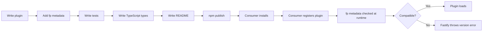

## Publishing Plugins to npm

Publishing a Fastify plugin to npm extends its reach beyond a single codebase. The process involves more than running `npm publish` — it requires deliberate decisions about package structure, versioning, compatibility signaling, documentation, and ongoing maintenance.

---

### Prerequisites

Before publishing, confirm the following are in place:

- Plugin is wrapped with `fastify-plugin` and has `name` and `fastify` metadata declared
- `fastify` is listed as a `peerDependency`, not a `dependency`
- Tests pass and cover core behavior
- TypeScript declarations exist (strongly recommended)
- An npm account exists at [npmjs.com](https://www.npmjs.com)

---

### Naming Conventions

The Fastify ecosystem uses a consistent naming convention:

| Scope | Pattern | Example |
|---|---|---|
| Community plugin | `fastify-<feature>` | `fastify-redis` |
| Scoped personal/org | `@scope/fastify-<feature>` | `@myorg/fastify-cache` |
| Official Fastify org | `@fastify/<feature>` | `@fastify/jwt` |

**Key Points**
- The `fastify-` prefix signals ecosystem membership and improves discoverability
- Do not use the `@fastify/` scope — it is reserved for the Fastify core team
- Check [npmjs.com](https://www.npmjs.com) for name availability before finalizing

---

### `package.json` — Required and Recommended Fields

```json
{
  "name": "fastify-myplugin",
  "version": "1.0.0",
  "description": "A Fastify plugin for ...",
  "main": "index.js",
  "types": "types/index.d.ts",
  "files": [
    "index.js",
    "lib/",
    "types/"
  ],
  "scripts": {
    "test": "node --test",
    "lint": "eslint ."
  },
  "keywords": [
    "fastify",
    "fastify-plugin",
    "your-feature-keyword"
  ],
  "author": "Your Name",
  "license": "MIT",
  "peerDependencies": {
    "fastify": "^4.0.0"
  },
  "dependencies": {
    "fastify-plugin": "^4.0.0"
  },
  "devDependencies": {
    "fastify": "^4.0.0",
    "tap": "^18.0.0"
  }
}
```

**Key Points**
- `files` controls what is included in the published package — always set it explicitly to avoid publishing test files, coverage reports, or local config
- `types` points TypeScript consumers to your declarations
- `keywords` must include `fastify` and `fastify-plugin` for ecosystem discoverability
- `fastify` in `devDependencies` is for running tests locally; the consumer's instance is used at runtime

---

### What to Include and Exclude

**Include:**
```
index.js
lib/
types/
README.md       ← npm displays this on the package page
LICENSE
```

**Exclude** (via `.npmignore` or `files` in `package.json`):
```
test/
coverage/
.github/
.eslintrc*
*.log
```

Using `files` in `package.json` is generally preferred over `.npmignore` — it is an allowlist, which is safer than a blocklist.

```json
"files": ["index.js", "lib/", "types/", "LICENSE"]
```

---

### Versioning with Semantic Versioning

Follow [Semantic Versioning](https://semver.org) (`MAJOR.MINOR.PATCH`):

| Change Type | Version Bump | Example |
|---|---|---|
| Breaking API or behavior change | MAJOR | `1.0.0` → `2.0.0` |
| New backward-compatible feature | MINOR | `1.0.0` → `1.1.0` |
| Bug fix, no API change | PATCH | `1.0.0` → `1.0.1` |

**Key Points**
- A change to supported Fastify version range is a **breaking change** if it drops previously supported versions — bump MAJOR
- Adding a new option with a safe default is a MINOR change
- Changing a default option value is [Inference] likely a breaking change for consumers who relied on the old default — treat with caution and document explicitly

---

### Declaring Fastify Compatibility

The `fastify` field in `fp` metadata communicates runtime compatibility:

```js
module.exports = fp(myPlugin, {
  fastify: '>=4.0.0',
  name: 'fastify-myplugin'
})
```

Also reflect this in `package.json` `peerDependencies`:

```json
"peerDependencies": {
  "fastify": ">=4.0.0 <5.0.0"
}
```

**Key Points**
- Keep both declarations consistent — discrepancies between `fp` metadata and `peerDependencies` are confusing to consumers
- Avoid overly broad ranges (e.g., `>=3.0.0`) unless you actively test against all covered versions
- [Inference] Untested version ranges in `peerDependencies` may give consumers false confidence; document tested versions explicitly in the README

---

### Writing a README

The README is the primary interface between your plugin and its consumers. A well-structured README includes:

````md
# fastify-myplugin

A Fastify plugin for ...

## Install

```
npm install fastify-myplugin
```

## Usage

```js
const fastify = require('fastify')()

fastify.register(require('fastify-myplugin'), {
  option: 'value'
})
```

## Options

| Option | Type | Default | Description |
|---|---|---|---|
| `ttl` | `number` | `300` | Cache TTL in seconds |

## Decorators

This plugin decorates the Fastify instance with:
- `fastify.cache` — a Cache instance

## Compatibility

| Plugin version | Fastify version |
|---|---|
| `^1.0.0` | `^4.0.0` |

## License

MIT
````

**Key Points**
- Always include a working usage example — it is the first thing most developers look at
- Document every option, decorator, hook, and side effect the plugin introduces
- A compatibility table is especially useful when the plugin has been updated across Fastify major versions

---

### Initial Publish

```bash
# Log in to npm
npm login

# Dry run — inspect what will be published without actually publishing
npm publish --dry-run

# Publish publicly
npm publish --access public
```

For scoped packages (`@scope/fastify-myplugin`), `--access public` is required — scoped packages default to private.

---

### Subsequent Releases

Use `npm version` to bump and tag in one step:

```bash
# Patch release
npm version patch

# Minor release
npm version minor

# Major release
npm version major
```

This updates `package.json`, creates a git commit, and tags the commit. Then publish:

```bash
npm publish
```

**Key Points**
- Always commit and push the version tag to your repository — it serves as a traceable release point
- [Inference] Publishing without a corresponding git tag makes it harder for consumers to audit what changed between versions

---

### Automating Releases with CI

A common pattern for published plugins uses GitHub Actions to automate testing and publishing:

```yaml
# .github/workflows/release.yml
name: Release

on:
  push:
    tags:
      - 'v*'

jobs:
  publish:
    runs-on: ubuntu-latest
    steps:
      - uses: actions/checkout@v4
      - uses: actions/setup-node@v4
        with:
          node-version: 20
          registry-url: 'https://registry.npmjs.org'
      - run: npm ci
      - run: npm test
      - run: npm publish --access public
        env:
          NODE_AUTH_TOKEN: ${{ secrets.NPM_TOKEN }}
```

**Key Points**
- Store the npm token as a repository secret (`NPM_TOKEN`)
- Tests run before publish — a failing test aborts the release
- [Inference] This pattern reduces human error in the release process, though it does not eliminate the possibility of publishing a broken version if tests are insufficient

---

### Supporting Multiple Fastify Versions

If your plugin supports both Fastify v4 and v5, test against both in CI:

```yaml
strategy:
  matrix:
    fastify: ['4', '5']
    node: [18, 20, 22]

steps:
  - run: npm install fastify@${{ matrix.fastify }}
  - run: npm test
```

**Key Points**
- Matrix testing catches compatibility regressions early
- If a Fastify major version introduces a breaking change affecting your plugin, you have evidence to act on before consumers are affected
- Document which Node.js versions are tested — npm does not enforce this automatically

---

### Deprecating a Version

If a published version has a critical bug or is superseded:

```bash
npm deprecate fastify-myplugin@"<1.2.0" "Versions below 1.2.0 have a security issue. Please upgrade."
```

This adds a visible deprecation warning when consumers install the affected range. It does not unpublish the version.

---

### Package Lifecycle — From Development to Consumer



---

### Checklist Before First Publish

- [ ] `name` follows `fastify-<feature>` convention
- [ ] `version` starts at `1.0.0` or `0.1.0` if not yet stable
- [ ] `files` field set — no test or config files included
- [ ] `peerDependencies` lists `fastify` with accurate version range
- [ ] `fp` metadata `fastify` field matches `peerDependencies`
- [ ] `keywords` includes `fastify` and `fastify-plugin`
- [ ] TypeScript declarations present
- [ ] README includes install, usage, options, and compatibility
- [ ] `npm publish --dry-run` reviewed and output is as expected
- [ ] Tests pass on CI against all target Fastify and Node versions
- [ ] Git tag created for the release commit

---

**Conclusion**

Publishing a Fastify plugin to npm is a commitment to consumers who will depend on it. Clear versioning, accurate compatibility declarations, thorough documentation, and automated CI reduce the surface area for problems. Following the ecosystem's conventions — naming, `peerDependencies`, `fp` metadata, and README structure — also makes the plugin significantly easier to discover and trust.

**Next Steps**
- Hook execution order across scoped and unscoped plugins
- Error handling during plugin load
- Fastify plugin ecosystem — official plugins and community standards