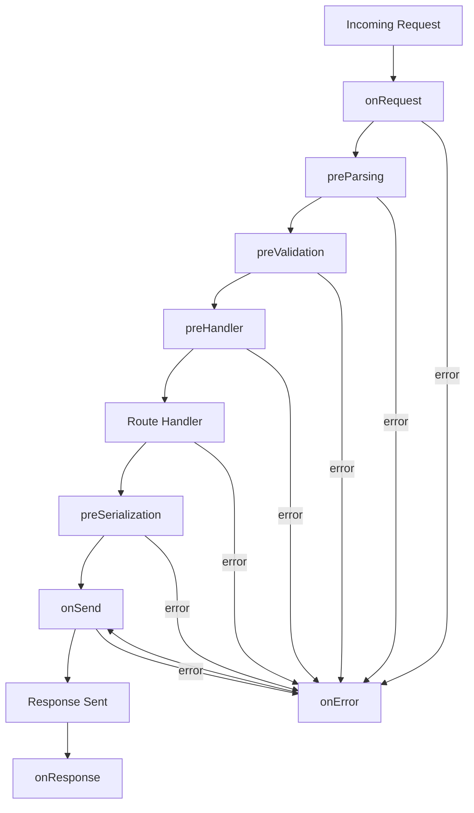
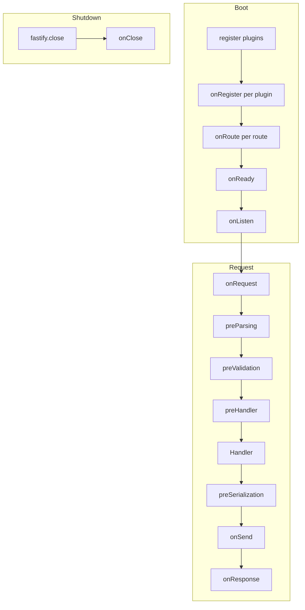

## Hook Lifecycle Overview

Fastify's hook system provides intervention points at every stage of a request's journey — from the moment a connection is received to the moment the response is fully sent. Hooks are the primary mechanism for cross-cutting concerns: authentication, logging, validation, transformation, and error handling.

---

### What a Hook Is

A hook is a function registered with `fastify.addHook()` that Fastify calls automatically at a defined point in the request or application lifecycle. Hooks are not middleware in the Express sense — they are first-class citizens of Fastify's pipeline with defined execution order and async support built in.

```js
fastify.addHook('onRequest', async (request, reply) => {
  request.log.info('Request received')
})
```

---

### Two Categories of Hooks

Fastify hooks fall into two broad categories:

| Category | When They Run | Typical Use |
|---|---|---|
| **Request/Reply hooks** | During the lifecycle of a single HTTP request | Auth, logging, transformation |
| **Application hooks** | During the application boot or teardown lifecycle | Setup, cleanup, graceful shutdown |

---

### Request/Reply Hook Execution Order

The following hooks execute in this fixed order for every matched request:



---

### Request/Reply Hooks — Reference

#### `onRequest`

Fires as soon as the request is received, before the body is read or parsed.

```js
fastify.addHook('onRequest', async (request, reply) => {
  // request.body is not yet available here
  request.startTime = Date.now()
})
```

**Key Points**
- No access to `request.body` — parsing has not occurred
- Suitable for connection-level concerns: rate limiting, IP blocking, early auth checks
- Replying here short-circuits the rest of the pipeline

---

#### `preParsing`

Fires after routing but before the request body is parsed. Receives the raw payload stream.

```js
fastify.addHook('preParsing', async (request, reply, payload) => {
  // payload is a readable stream
  return payload // must return the payload (modified or original)
})
```

**Key Points**
- Must return the payload — either the original or a transformed stream
- Suitable for payload decryption or decompression before parsing
- [Inference] Returning nothing or returning `undefined` may cause unexpected behavior; always return the payload explicitly

---

#### `preValidation`

Fires after parsing but before schema validation. `request.body`, `request.params`, `request.query`, and `request.headers` are available.

```js
fastify.addHook('preValidation', async (request, reply) => {
  // Mutate or normalize before validation runs
  if (request.body?.email) {
    request.body.email = request.body.email.toLowerCase()
  }
})
```

**Key Points**
- Body is parsed and accessible
- Schema validation has not yet run — changes here are subject to validation
- Suitable for input normalization and authentication that needs parsed data

---

#### `preHandler`

Fires after validation but before the route handler. This is the most common hook for authentication and authorization.

```js
fastify.addHook('preHandler', async (request, reply) => {
  await request.jwtVerify()
})
```

**Key Points**
- Validation has passed — body conforms to schema
- Throwing or replying here prevents the handler from executing
- Suitable for authorization checks, request enrichment, and business rule enforcement

---

#### `preSerialization`

Fires after the handler returns a payload but before it is serialized. Receives the unserialized payload.

```js
fastify.addHook('preSerialization', async (request, reply, payload) => {
  return { data: payload, timestamp: Date.now() }
  // Must return the modified payload
})
```

**Key Points**
- Only fires if the payload is not a `string`, `Buffer`, `stream`, or `null`
- Must return the payload — modified or original
- Suitable for wrapping responses in a standard envelope structure

---

#### `onSend`

Fires just before the response is written to the socket. The payload at this point is already serialized — it is a `string`, `Buffer`, or `stream`.

```js
fastify.addHook('onSend', async (request, reply, payload) => {
  reply.header('x-response-time', Date.now() - request.startTime)
  return payload // must return payload
})
```

**Key Points**
- Must return the payload
- Modifying `payload` here means working with the serialized form — a string or buffer
- Suitable for response compression, header injection, and response logging

---

#### `onResponse`

Fires after the response has been sent. The client has received the response.

```js
fastify.addHook('onResponse', async (request, reply) => {
  metrics.record(reply.statusCode, Date.now() - request.startTime)
})
```

**Key Points**
- Cannot modify the response — it has already been sent
- Errors thrown here do not affect the client
- Suitable for analytics, audit logging, and cleanup

---

#### `onError`

Fires when an error is thrown or passed during request handling, before the error response is serialized.

```js
fastify.addHook('onError', async (request, reply, error) => {
  request.log.error({ err: error }, 'Request failed')
})
```

**Key Points**
- Does not replace the error — it observes it
- To modify the error response, use a custom error handler (`fastify.setErrorHandler()`) instead
- Suitable for error reporting, alerting, and structured error logging
- After `onError`, execution continues to `onSend` for the error response

---

### Application Lifecycle Hooks — Reference

These hooks fire once during application boot or shutdown, not per-request.

#### `onReady`

Fires when `fastify.ready()` resolves — all plugins have loaded, but the server is not yet listening.

```js
fastify.addHook('onReady', async () => {
  await warmUpCache()
})
```

---

#### `onListen`

Fires after the server begins listening on a port.

```js
fastify.addHook('onListen', async () => {
  console.log('Server is accepting connections')
})
```

---

#### `onClose`

Fires when `fastify.close()` is called. Used for graceful shutdown.

```js
fastify.addHook('onClose', async (instance) => {
  await instance.db.disconnect()
})
```

**Key Points**
- Receives the Fastify instance as its argument
- Suitable for closing database connections, flushing queues, and releasing resources
- Plugins should register their own `onClose` hooks internally rather than expecting consumers to do cleanup

---

#### `onRoute`

Fires each time a route is registered. Receives the route options object.

```js
fastify.addHook('onRoute', (routeOptions) => {
  routeOptions.schema = routeOptions.schema ?? {}
  // Mutate route options before route is finalized
})
```

**Key Points**
- Synchronous only — no async support
- Fires at registration time, not at request time
- Suitable for applying default schema properties or enforcing route conventions

---

#### `onRegister`

Fires each time `fastify.register()` is called with a new child scope.

```js
fastify.addHook('onRegister', (instance, options) => {
  console.log('New plugin registered:', options)
})
```

**Key Points**
- Fires before the plugin function executes
- Suitable for instrumentation and plugin auditing

---

### Complete Lifecycle — Request and Application Combined



---

### Hook Signature Summary

| Hook | Arguments | Must Return |
|---|---|---|
| `onRequest` | `request, reply` | — |
| `preParsing` | `request, reply, payload` | `payload` |
| `preValidation` | `request, reply` | — |
| `preHandler` | `request, reply` | — |
| `preSerialization` | `request, reply, payload` | `payload` |
| `onSend` | `request, reply, payload` | `payload` |
| `onResponse` | `request, reply` | — |
| `onError` | `request, reply, error` | — |
| `onReady` | — | — |
| `onListen` | — | — |
| `onClose` | `instance` | — |
| `onRoute` | `routeOptions` | — (sync only) |
| `onRegister` | `instance, options` | — (sync only) |

---

### Replying Early From a Hook

Any hook that receives `reply` can send a response directly, which short-circuits the remaining pipeline:

```js
fastify.addHook('onRequest', async (request, reply) => {
  if (!request.headers['x-api-key']) {
    reply.code(401).send({ error: 'Missing API key' })
    // Pipeline stops here — handler does not run
  }
})
```

**Key Points**
- After calling `reply.send()` in a hook, Fastify skips remaining hooks in the same phase and the handler
- `onResponse` still fires — it always fires after a response is sent
- [Inference] Calling `reply.send()` multiple times may cause errors; verify behavior with your Fastify version

---

### Scope and Hook Visibility

Hooks obey the same scoping rules as decorators:

- A hook registered on the root instance runs for all routes
- A hook registered inside a plugin (without `fp`) runs only for routes in that plugin's scope
- A hook inside an `fp`-wrapped plugin runs globally

```js
// Global — runs for all routes
fastify.addHook('preHandler', authHook)

// Scoped — runs only for routes in this plugin
fastify.register(async function adminPlugin(instance) {
  instance.addHook('preHandler', adminAuthHook)
  instance.get('/admin/users', handler)
})
```

---

**Conclusion**

Fastify's hook system maps precisely to every meaningful stage of the request and application lifecycle. Each hook has a defined position, a defined signature, and defined semantics — understanding these prevents both misplacement of logic and subtle ordering bugs. Scoping rules mean hooks can be applied globally or constrained to specific route groups, making them a clean and composable way to implement cross-cutting behavior.

**Next Steps**
- Hook execution order across scoped and unscoped plugins
- `onError` vs `setErrorHandler` — when to use each
- Building authentication and authorization with hooks