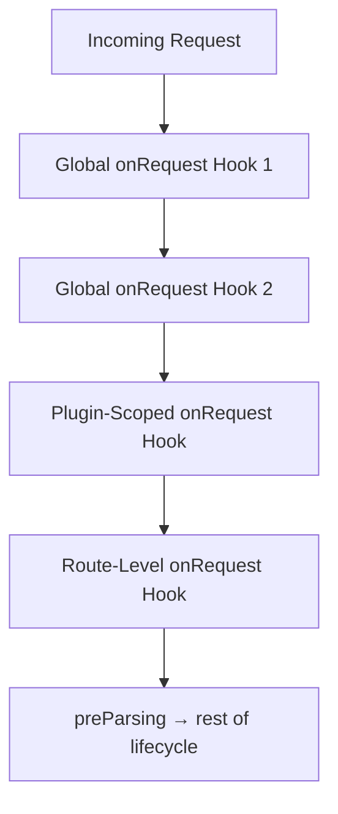

## Fastify Hooks — onRequest Hook

The `onRequest` hook is the first hook in the Fastify request lifecycle. It fires immediately after Fastify receives an incoming request, before any parsing of the request body, before routing resolution completes its handler invocation, and before any other application-level processing occurs.

---

### Position in the Lifecycle

Understanding where `onRequest` sits relative to other lifecycle events is essential for using it correctly.

```
Incoming Request
      │
      ▼
 onRequest        ← fires here (no body parsed yet)
      │
      ▼
 preParsing
      │
      ▼
 preValidation
      │
      ▼
 preHandler
      │
      ▼
 Route Handler
      │
      ▼
 onSend
      │
      ▼
 onResponse
```

At the `onRequest` stage:

- The request body has **not** been parsed
- `request.body` is `null`
- `request.params`, `request.query`, and `request.headers` are available
- The reply object is available and can be used to terminate the request early

---

### Registering an onRequest Hook

`onRequest` can be registered globally via `fastify.addHook`, or scoped to a plugin context.

#### Global Registration

```js
fastify.addHook('onRequest', async (request, reply) => {
  // executes for every incoming request
})
```

#### Scoped Registration

When registered inside a plugin wrapped with `fastify-plugin` excluded (i.e., a plain encapsulated plugin), the hook applies only to routes within that scope.

```js
fastify.register(async function (instance) {
  instance.addHook('onRequest', async (request, reply) => {
    // only applies to routes registered in this scope
  })

  instance.get('/scoped', async () => {
    return { scoped: true }
  })
})
```

---

### Hook Signature

```js
fastify.addHook('onRequest', async (request, reply) => {
  // async style — throw to abort
})
```

The callback-based style is also supported:

```js
fastify.addHook('onRequest', (request, reply, done) => {
  // call done() to proceed, done(error) to abort
  done()
})
```

**Key Points:**
- Mixing async functions with `done` callbacks in the same hook registration causes undefined behavior. [Unverified — behavior may vary across Fastify versions; do not rely on this combination.]
- Always use one style consistently per hook registration.

---

### What Is Available at This Stage

| Property | Available | Notes |
|---|---|---|
| `request.headers` | ✅ | Full request headers |
| `request.method` | ✅ | HTTP method string |
| `request.url` | ✅ | Raw URL string |
| `request.query` | ✅ | Parsed query string |
| `request.params` | ✅ | Route params (populated after routing) |
| `request.body` | ❌ | Always `null` at this stage |
| `request.id` | ✅ | Unique request ID assigned by Fastify |
| `request.log` | ✅ | Pino logger instance for this request |

**Key Points:**
- `request.params` availability at `onRequest` depends on whether routing has resolved before the hook fires. [Inference — the Fastify routing phase completes before hook execution in normal flow, but behavior across edge cases should be verified in your Fastify version.]

---

### Common Use Cases

#### Authentication and Authorization

The `onRequest` hook is the standard place to perform token validation or session checks before any other processing.

```js
fastify.addHook('onRequest', async (request, reply) => {
  const token = request.headers['authorization']

  if (!token) {
    reply.code(401).send({ error: 'Unauthorized' })
    return
  }

  // token validation logic here
})
```

**Key Points:**
- Returning early from an async hook after calling `reply.send()` is the correct way to abort further processing. Failing to `return` after `reply.send()` may allow execution to continue within the hook function body. Behavior after that point is not guaranteed.

#### Request Logging and Tracing

```js
fastify.addHook('onRequest', async (request, reply) => {
  request.log.info({
    method: request.method,
    url: request.url,
    requestId: request.id,
  }, 'incoming request received')
})
```

#### Rate Limiting (Custom)

A custom rate limiter can be applied at the `onRequest` stage before any body parsing or handler work is done.

```js
fastify.addHook('onRequest', async (request, reply) => {
  const ip = request.ip
  const allowed = await rateLimiter.check(ip)

  if (!allowed) {
    reply.code(429).send({ error: 'Too Many Requests' })
    return
  }
})
```

#### Attaching Request-Scoped Data

You can decorate the `request` object with data that downstream hooks and handlers can access.

```js
fastify.decorateRequest('tenantId', null)

fastify.addHook('onRequest', async (request, reply) => {
  const tenantId = request.headers['x-tenant-id']
  request.tenantId = tenantId ?? 'default'
})
```

**Key Points:**
- `decorateRequest` should be called before hooks that write to that property. Registration order matters.

---

### Error Handling in onRequest

Throwing an error inside an async `onRequest` hook causes Fastify to invoke its error handler and abort the request lifecycle.

```js
fastify.addHook('onRequest', async (request, reply) => {
  const isValid = await validate(request.headers)

  if (!isValid) {
    throw fastify.httpErrors.unauthorized('Invalid credentials')
  }
})
```

Using `@fastify/sensible` provides convenient HTTP error constructors (`fastify.httpErrors.*`) that integrate cleanly with this pattern.

In the callback style:

```js
fastify.addHook('onRequest', (request, reply, done) => {
  const isValid = validateSync(request.headers)

  if (!isValid) {
    done(new Error('Unauthorized'))
    return
  }

  done()
})
```

---

### Multiple onRequest Hooks

Multiple `onRequest` hooks can be registered. They execute in registration order.

```js
fastify.addHook('onRequest', async (request, reply) => {
  request.log.info('hook 1')
})

fastify.addHook('onRequest', async (request, reply) => {
  request.log.info('hook 2')
})
```

**Output** (log order):

```
hook 1
hook 2
```

If any hook in the chain throws or calls `done(error)`, subsequent hooks in the chain do not execute. [Inference — consistent with documented Fastify lifecycle behavior; verify against your version.]

---

### Interaction with Route-Level onRequest

Fastify allows defining `onRequest` at the route level using the route options object. Route-level hooks execute after any global or plugin-scope hooks of the same type.

```js
fastify.get('/protected', {
  onRequest: async (request, reply) => {
    // runs after any global onRequest hooks
    await verifyRouteAccess(request)
  }
}, async (request, reply) => {
  return { data: 'protected content' }
})
```

Route-level `onRequest` can also be an array of functions:

```js
fastify.get('/admin', {
  onRequest: [authHook, adminRoleHook]
}, handler)
```

---

### Diagram — Hook Scope and Execution Order



---

### Caveats and Behavioral Notes

- `request.body` is `null` at this stage without exception. Attempting to read it here will not produce the parsed body. [Confirmed by Fastify documentation.]
- Fastify does not clone or isolate hook arrays between scopes automatically; plugin encapsulation boundaries determine scope inheritance. [Inference — based on Fastify's encapsulation model; verify for your version.]
- Performance-sensitive logic in `onRequest` runs on every matched request. [Inference — the hook fires per request, not per route registration; expensive operations here affect all requests in scope.]

---

**Conclusion:**
The `onRequest` hook is the earliest interception point in the Fastify lifecycle and is best suited for cross-cutting concerns such as authentication, rate limiting, tracing, and early request enrichment. Because body parsing has not occurred, it is not the appropriate place to inspect `request.body`. Correct use of scope, registration order, and early-exit patterns are central to using this hook reliably.

**Next Steps:**
The next hook in the lifecycle is `preParsing`, which fires after `onRequest` but before the request body is parsed — allowing interception or transformation of the raw payload stream.