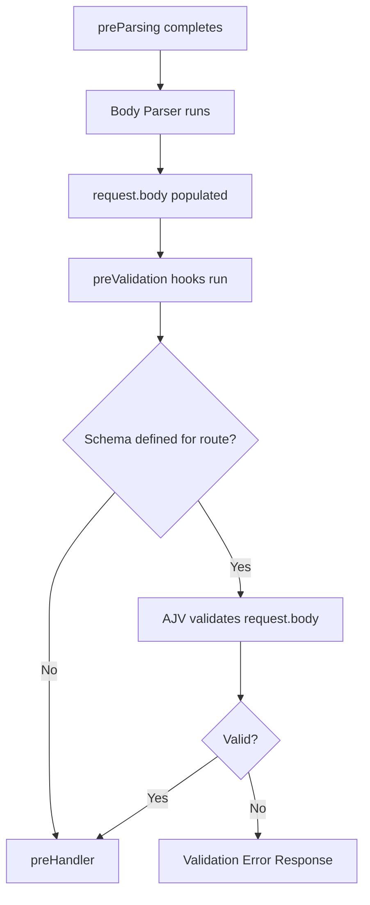

## Fastify Hooks — preValidation Hook

The `preValidation` hook fires after the request body has been parsed and before Fastify runs schema validation. It is the first point in the lifecycle where `request.body` is populated and accessible, making it the appropriate stage for payload transformation, normalization, or conditional modification before the validator evaluates the data.

---

### Position in the Lifecycle

```
Incoming Request
      │
      ▼
 onRequest
      │
      ▼
 preParsing
      │
      ▼
 [Body Parsing]
      │
      ▼
 preValidation     ← fires here (body parsed, validation not yet run)
      │
      ▼
 preHandler
      │
      ▼
 Route Handler
      │
      ▼
 onSend
      │
      ▼
 onResponse
```

At the `preValidation` stage:

- `request.body` is populated (for requests with a body)
- Schema validation has **not** yet run
- The body can be read, modified, or replaced entirely
- The reply object is available for early termination

---

### Hook Signature

```js
fastify.addHook('preValidation', async (request, reply) => {
  // inspect or mutate request.body before validation
})
```

Callback style:

```js
fastify.addHook('preValidation', (request, reply, done) => {
  done()
})
```

**Key Points:**
- Unlike `preParsing`, there is no third `payload` argument. The parsed body is accessed via `request.body`.
- `request.body` may be `null` if the request carried no body, or if the content type had no registered parser. [Inference — behavior depends on route configuration and registered parsers; verify for your setup.]

---

### What Is Available at This Stage

| Property | Available | Notes |
|---|---|---|
| `request.headers` | ✅ | Full request headers |
| `request.method` | ✅ | HTTP method string |
| `request.url` | ✅ | Raw URL string |
| `request.query` | ✅ | Parsed query string |
| `request.params` | ✅ | Route parameters |
| `request.body` | ✅ | Parsed request body |
| `request.id` | ✅ | Unique request ID |
| `request.log` | ✅ | Pino logger instance |

---

### Common Use Cases

#### Body Normalization Before Validation

A frequent use case is normalizing or sanitizing the body so that it conforms to expected formats before schema validation rejects it.

```js
fastify.addHook('preValidation', async (request, reply) => {
  if (request.body && typeof request.body.email === 'string') {
    request.body.email = request.body.email.trim().toLowerCase()
  }
})
```

**Key Points:**
- Mutations to `request.body` at this stage are visible to the schema validator and to the route handler. Changes persist through the rest of the lifecycle.

#### Conditional Body Transformation

```js
fastify.addHook('preValidation', async (request, reply) => {
  if (request.body && request.body.tags && typeof request.body.tags === 'string') {
    // convert comma-separated string to array before validation
    request.body.tags = request.body.tags.split(',').map(t => t.trim())
  }
})
```

This is useful when accepting multiple input formats from clients while maintaining a strict schema for validation.

#### Attaching Derived Data to the Body

```js
fastify.addHook('preValidation', async (request, reply) => {
  if (request.body) {
    request.body.submittedAt = new Date().toISOString()
  }
})
```

**Key Points:**
- If the route schema uses `additionalProperties: false`, injecting fields not declared in the schema will cause validation to fail. Coordinate body augmentation with schema definitions. [Inference — depends on the AJV configuration used by your Fastify instance.]

#### Replacing the Body Entirely

```js
fastify.addHook('preValidation', async (request, reply) => {
  if (request.headers['x-legacy-client'] === 'true') {
    request.body = transformLegacyPayload(request.body)
  }
})
```

#### Early Rejection Based on Business Logic

Schema validation handles structural correctness, but `preValidation` can enforce business rules that schemas cannot express.

```js
fastify.addHook('preValidation', async (request, reply) => {
  const { startDate, endDate } = request.body ?? {}

  if (startDate && endDate && new Date(startDate) >= new Date(endDate)) {
    reply.code(400).send({ error: 'startDate must be before endDate' })
    return
  }
})
```

---

### Interaction with Schema Validation

It is important to understand what happens after `preValidation` completes.



**Key Points:**
- If no schema is defined for the route, the validation step is skipped entirely and execution proceeds to `preHandler`.
- Modifications made in `preValidation` are what the validator sees. This makes the hook the correct place to coerce or reshape data that would otherwise fail validation.

---

### Scoped Registration

`preValidation` respects Fastify's encapsulation model. Hooks registered inside a plugin scope apply only to routes within that scope.

```js
fastify.register(async function (instance) {
  instance.addHook('preValidation', async (request, reply) => {
    if (request.body) {
      request.body.source = 'internal'
    }
  })

  instance.post('/internal/event', async (request, reply) => {
    return { ok: true }
  })
})
```

Routes outside this plugin are unaffected by the hook.

---

### Route-Level preValidation

`preValidation` can be defined at the route level using the route options object.

```js
fastify.post('/orders', {
  preValidation: async (request, reply) => {
    if (request.body) {
      request.body.currency = request.body.currency?.toUpperCase() ?? 'USD'
    }
  },
  schema: {
    body: {
      type: 'object',
      required: ['currency', 'amount'],
      properties: {
        currency: { type: 'string' },
        amount: { type: 'number' }
      }
    }
  }
}, async (request, reply) => {
  return { order: request.body }
})
```

An array of functions is also accepted:

```js
fastify.post('/checkout', {
  preValidation: [normalizeBody, enrichBody]
}, handler)
```

**Key Points:**
- Route-level `preValidation` hooks execute after any global or plugin-scope `preValidation` hooks of the same type, consistent with Fastify's hook execution ordering. [Inference — follows the same ordering rules as other hook types; verify for your version.]

---

### Multiple preValidation Hooks

Multiple globally registered `preValidation` hooks execute in registration order.

```js
fastify.addHook('preValidation', async (request, reply) => {
  request.log.info('preValidation step 1 — normalize')
  // normalization logic
})

fastify.addHook('preValidation', async (request, reply) => {
  request.log.info('preValidation step 2 — enrich')
  // enrichment logic
})
```

If any hook in the chain throws or terminates the request via `reply.send()`, subsequent hooks do not execute.

---

### Error Handling

```js
fastify.addHook('preValidation', async (request, reply) => {
  if (!request.body || Object.keys(request.body).length === 0) {
    throw fastify.httpErrors.badRequest('Request body must not be empty')
  }
})
```

Using the callback style:

```js
fastify.addHook('preValidation', (request, reply, done) => {
  if (!request.body) {
    done(new Error('Missing body'))
    return
  }
  done()
})
```

---

### preValidation vs preHandler

These two hooks are adjacent in the lifecycle but serve different purposes.

| Concern | preValidation | preHandler |
|---|---|---|
| Body parsed | ✅ | ✅ |
| Validation complete | ❌ | ✅ |
| Modify body before schema check | ✅ | N/A (too late) |
| Auth checks using validated body | ❌ Risky | ✅ Safer |
| Business logic pre-handler | ✅ | ✅ |

**Key Points:**
- Using `preValidation` for authorization checks that depend on validated fields is risky — the data has not been validated at that point, and malformed input could reach your logic. `preHandler` is the safer location for authorization that relies on body content. [Inference — depends on what fields are inspected and whether input is trusted; assess per use case.]

---

### Caveats and Behavioral Notes

- `request.body` will be `null` for routes where no body is expected (e.g., `GET`, `DELETE` without a body) or where no content type parser matched. Do not assume a non-null body without checking. [Inference — consistent with Fastify's body parsing behavior; verify for your content type configuration.]
- Fastify does not deep-clone `request.body` before passing it to hooks or the validator. Mutations are in-place and affect all downstream consumers. [Inference — based on standard JavaScript object reference semantics; no deep copy is documented.]
- If `additionalProperties: false` is set in the schema and fields are injected in `preValidation`, those fields must be declared in the schema or validation will fail. [Inference — depends on AJV configuration; behavior may vary if AJV options are customized.]
- This hook does not fire for requests where the body parsing step was skipped. [Inference — logical consequence of lifecycle ordering; verify edge cases.]

---

**Conclusion:**
The `preValidation` hook occupies a precise and useful position in the lifecycle — after body parsing, before schema enforcement. It is the correct place to normalize, transform, coerce, or enrich `request.body` when the goal is to influence what the schema validator sees. Its use should be deliberate: transformations that belong in the route handler or that depend on validated data should not be placed here.

**Next Steps:**
After `preValidation`, Fastify runs schema validation against `request.body`, `request.params`, `request.query`, and `request.headers` if schemas are defined. Once validation passes, the `preHandler` hook fires — the last interception point before the route handler itself.