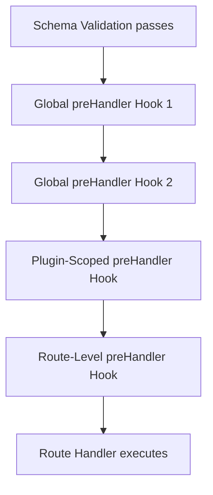

## Fastify Hooks — preHandler Hook

The `preHandler` hook fires after schema validation has completed successfully and before the route handler executes. It is the last interception point in the request lifecycle before business logic runs. At this stage, all input has been parsed and validated, making it the appropriate location for authorization, handler-level setup, and logic that depends on confirmed, schema-compliant data.

---

### Position in the Lifecycle

```
Incoming Request
      │
      ▼
 onRequest
      │
      ▼
 preParsing
      │
      ▼
 [Body Parsing]
      │
      ▼
 preValidation
      │
      ▼
 [Schema Validation]
      │
      ▼
 preHandler        ← fires here (body parsed and validated)
      │
      ▼
 Route Handler
      │
      ▼
 onSend
      │
      ▼
 onResponse
```

At the `preHandler` stage:

- `request.body` is populated and schema-validated
- `request.params`, `request.query`, and `request.headers` are validated if schemas were defined for them
- The route handler has not yet executed
- The reply object is available for early termination

---

### Hook Signature

```js
fastify.addHook('preHandler', async (request, reply) => {
  // last chance to intercept before the route handler
})
```

Callback style:

```js
fastify.addHook('preHandler', (request, reply, done) => {
  done()
})
```

**Key Points:**

- No additional arguments beyond `request` and `reply` are provided. Unlike `preParsing`, there is no stream argument.
- The async and callback styles must not be mixed within a single hook registration.

---

### What Is Available at This Stage

|Property|Available|Notes|
|---|---|---|
|`request.headers`|✅|Full, validated if schema defined|
|`request.method`|✅|HTTP method string|
|`request.url`|✅|Raw URL string|
|`request.query`|✅|Parsed, validated if schema defined|
|`request.params`|✅|Parsed, validated if schema defined|
|`request.body`|✅|Parsed, validated if schema defined|
|`request.id`|✅|Unique request ID|
|`request.log`|✅|Pino logger instance|
|Custom decorations|✅|Any properties set in earlier hooks|

---

### Common Use Cases

#### Authorization

Because `request.body` and other inputs are validated by this stage, `preHandler` is the safest location for authorization logic that depends on request content.

```js
fastify.addHook('preHandler', async (request, reply) => {
  const user = request.user // set by an earlier onRequest or preHandler hook

  if (!user) {
    throw fastify.httpErrors.unauthorized('Authentication required')
  }

  if (!user.roles.includes('admin')) {
    throw fastify.httpErrors.forbidden('Insufficient permissions')
  }
})
```

**Key Points:**

- Placing authorization in `preHandler` rather than `onRequest` is appropriate when the authorization decision depends on validated body fields or route parameters. For token-based authentication that only inspects headers, `onRequest` remains the correct location.

#### Loading Route-Specific Resources

```js
fastify.addHook('preHandler', async (request, reply) => {
  const { id } = request.params

  const resource = await db.findById(id)

  if (!resource) {
    throw fastify.httpErrors.notFound(`Resource ${id} not found`)
  }

  request.resource = resource
})
```

This pattern avoids repeating database lookups in every handler that operates on the same resource type.

**Key Points:**

- `request.resource` must be declared via `fastify.decorateRequest('resource', null)` before use to avoid warnings in Fastify v4+. [Inference — consistent with Fastify's decoration requirements; behavior and warning severity may differ across versions.]

#### Audit Logging

```js
fastify.addHook('preHandler', async (request, reply) => {
  request.log.info({
    userId: request.user?.id,
    method: request.method,
    url: request.url,
    body: request.body,
  }, 'handler invocation audit')
})
```

Because the body is validated at this point, logging it here is safer than logging raw, unvalidated input from earlier hooks.

#### Enforcing Business Rules Beyond Schema

Schema validation enforces structure. `preHandler` can enforce constraints that AJV cannot express.

```js
fastify.addHook('preHandler', async (request, reply) => {
  const { accountId } = request.body
  const user = request.user

  if (accountId !== user.accountId) {
    throw fastify.httpErrors.forbidden('Cross-account access is not permitted')
  }
})
```

#### Request Enrichment for Handlers

```js
fastify.decorateRequest('context', null)

fastify.addHook('preHandler', async (request, reply) => {
  request.context = {
    userId: request.user.id,
    requestedAt: Date.now(),
    traceId: request.id,
  }
})
```

Route handlers can then consume `request.context` without repeating this assembly logic.

---

### Scoped Registration

`preHandler` respects Fastify's encapsulation model. Hooks registered within a plugin scope apply only to routes in that scope.

```js
fastify.register(async function (instance) {
  instance.addHook('preHandler', async (request, reply) => {
    await verifyAdminRole(request.user)
  })

  instance.get('/admin/users', async (request, reply) => {
    return db.getAllUsers()
  })

  instance.delete('/admin/users/:id', async (request, reply) => {
    await db.deleteUser(request.params.id)
    return { deleted: true }
  })
})
```

All routes outside this plugin are unaffected.

---

### Route-Level preHandler

`preHandler` can be specified in the route options object, executing after any global and plugin-scope hooks of the same type.

```js
fastify.get('/orders/:id', {
  preHandler: async (request, reply) => {
    const order = await db.orders.findById(request.params.id)
    if (!order) throw fastify.httpErrors.notFound('Order not found')
    request.order = order
  }
}, async (request, reply) => {
  return request.order
})
```

An array of functions is accepted:

```js
fastify.post('/transfer', {
  preHandler: [authenticateUser, authorizeTransfer, loadSourceAccount]
}, handler)
```

**Key Points:**

- Route-level `preHandler` hooks execute after global and scoped `preHandler` hooks, consistent with Fastify's hook ordering model. [Inference — follows documented hook execution order; verify for your version.]
- Arrays allow composing fine-grained, reusable middleware-like functions at the route level without polluting global scope.

---

### Multiple preHandler Hooks

Multiple globally registered `preHandler` hooks execute in registration order.

```js
fastify.addHook('preHandler', async (request, reply) => {
  request.log.info('preHandler step 1 — authentication check')
  await verifyToken(request)
})

fastify.addHook('preHandler', async (request, reply) => {
  request.log.info('preHandler step 2 — permission check')
  await verifyPermissions(request)
})

fastify.addHook('preHandler', async (request, reply) => {
  request.log.info('preHandler step 3 — resource load')
  await loadRequestedResource(request)
})
```

If any hook throws or calls `reply.send()` and returns, subsequent hooks and the route handler do not execute.

---

### Diagram — preHandler Execution Order



---

### Error Handling

```js
fastify.addHook('preHandler', async (request, reply) => {
  const permitted = await checkPermission(request.user, request.routeOptions.url)

  if (!permitted) {
    throw fastify.httpErrors.forbidden('Access denied')
  }
})
```

Callback style:

```js
fastify.addHook('preHandler', (request, reply, done) => {
  checkPermission(request.user, (err, permitted) => {
    if (err) return done(err)
    if (!permitted) return done(new Error('Access denied'))
    done()
  })
})
```

---

### Early Response from preHandler

Calling `reply.send()` and returning from the hook terminates the lifecycle without invoking the route handler.

```js
fastify.addHook('preHandler', async (request, reply) => {
  const cached = await cache.get(request.url)

  if (cached) {
    reply.send(cached)
    return
  }
})
```

**Key Points:**

- After calling `reply.send()`, always `return` to prevent further execution within the hook body. Behavior after `reply.send()` without a return is not guaranteed across all scenarios.
- The `onSend` and `onResponse` hooks still fire even when the response is sent from `preHandler`. The route handler does not.

---

### preHandler vs Earlier Hooks

|Concern|onRequest|preValidation|preHandler|
|---|---|---|---|
|Body available|❌|✅ (unvalidated)|✅ (validated)|
|Params validated|❌|❌|✅|
|Safe for auth on body fields|❌|❌ Risky|✅|
|Token/header-only auth|✅ Best|—|✅ Works|
|Body normalization|❌|✅ Best|✅ (post-validation)|
|Resource loading|❌|❌|✅ Best|
|Schema not yet enforced|—|✅|❌ Already done|

---

### Caveats and Behavioral Notes

- If schema validation fails, `preHandler` does not fire. The error response is sent immediately after the validation step. [Inference — consistent with Fastify's documented lifecycle; if validation throws, the lifecycle short-circuits.]
- `preHandler` fires even on routes with no defined schema. In that case, `request.body` may be whatever the body parser produced, without any structural guarantee.
- Decorating `request` with properties inside `preHandler` is valid, but the decoration (`fastify.decorateRequest`) must be registered before the hook executes. [Inference — consistent with Fastify's encapsulation and decoration initialization order.]
- Using `request.routeOptions` inside `preHandler` provides access to route metadata such as the URL pattern, method, and schema. This is available in Fastify v4.10.0+. [Unverified — verify the exact version in which `routeOptions` became stable in your target release.]

---

**Conclusion:** The `preHandler` hook is the most semantically rich interception point in the inbound request lifecycle. Because it executes after all parsing and validation, it operates on data that is structurally confirmed. This makes it the correct location for authorization decisions that depend on request content, resource pre-loading, cross-field business rule enforcement, and handler context assembly. Its scoped and route-level registration options make it well suited for composing reusable, targeted logic without polluting global hook chains.

**Next Steps:** After `preHandler`, the route handler itself executes. Once the handler produces a response, the outbound lifecycle begins with the `onSend` hook, which fires before the response is serialized and transmitted to the client.

===END_SYLLABOT_RESPONSE_2fb3e009e3e84521===