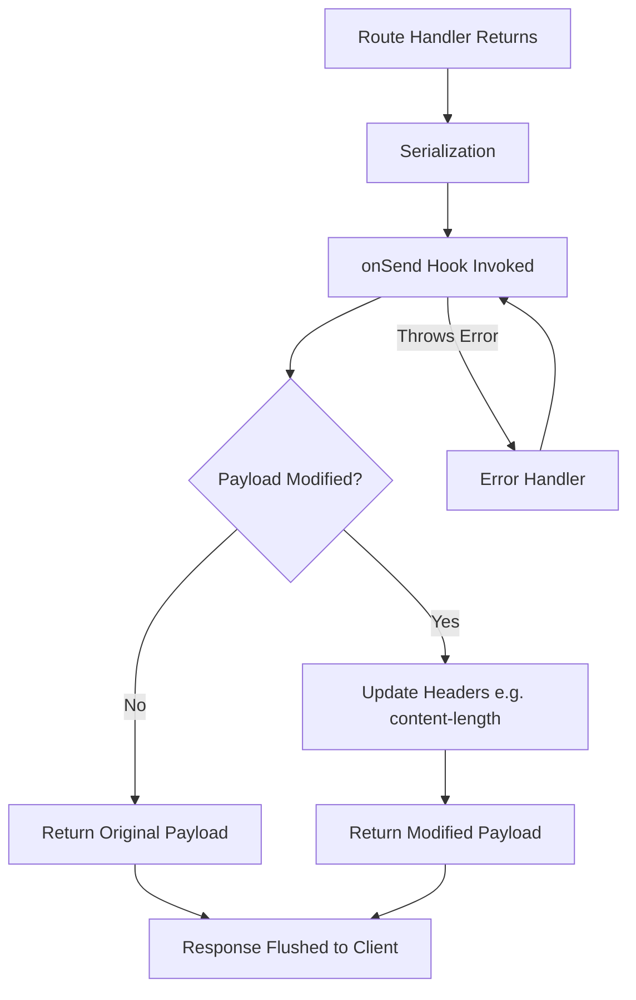

## onSend Hook

The `onSend` hook is triggered after the route handler has completed and a response has been serialized, but **before** the response is actually sent to the client. This makes it the ideal interception point for modifying response payloads, headers, or metadata at the last possible moment.

---

### Lifecycle Position

The `onSend` hook sits near the end of the Fastify request lifecycle, after serialization but before the response is flushed to the network.

```
Request
  └── onRequest
  └── preParsing
  └── preValidation
  └── preHandler
  └── Handler (route logic)
  └── Serialization
  └── onSend        ← here
  └── Response sent
  └── onResponse
```

---

### Signature

```js
fastify.addHook('onSend', async (request, reply, payload) => {
  // return modified payload or original payload
  return payload;
});
```

The hook receives three arguments:

| Argument | Type | Description |
|---|---|---|
| `request` | `FastifyRequest` | The incoming request object |
| `reply` | `FastifyReply` | The reply object (headers still mutable here) |
| `payload` | `string \| Buffer \| stream \| null` | The serialized response body |

**Key Points:**
- The `payload` parameter is the **already-serialized** output — typically a JSON string, not the original object.
- You **must return** the payload from this hook. Returning `undefined` or omitting the return will send an empty body. [Behavior may vary depending on Fastify version.]
- You may return `null` to send an empty response body.

---

### Registering the Hook

**Globally (all routes):**

```js
fastify.addHook('onSend', async (request, reply, payload) => {
  return payload;
});
```

**Scoped to a plugin or route subset:**

```js
fastify.register(async function (instance) {
  instance.addHook('onSend', async (request, reply, payload) => {
    return payload;
  });

  instance.get('/scoped', async () => ({ scoped: true }));
});
```

Scoping follows Fastify's encapsulation model. Hooks registered inside a plugin instance only apply to routes within that encapsulation scope.

---

### Common Use Cases

#### Modifying the Payload

Since `payload` is already a serialized string (or Buffer/stream), modifications must account for that.

**Example — appending metadata to a JSON response:**

```js
fastify.addHook('onSend', async (request, reply, payload) => {
  if (reply.getHeader('content-type')?.includes('application/json')) {
    let parsed;
    try {
      parsed = JSON.parse(payload);
    } catch {
      return payload; // not valid JSON, return unchanged
    }

    parsed._meta = { timestamp: Date.now() };

    const modified = JSON.stringify(parsed);
    reply.header('content-length', Buffer.byteLength(modified));
    return modified;
  }

  return payload;
});
```

**Output** (example response body):
```json
{
  "id": 1,
  "name": "Example",
  "_meta": { "timestamp": 1717500000000 }
}
```

> ⚠️ When modifying payload content, always recalculate and update `content-length` to avoid truncation or client errors. Behavior may vary depending on HTTP client and server configuration.

---

#### Modifying Response Headers

Headers are still mutable at this stage. This is useful for adding computed or conditional headers after the handler has run.

**Example — adding a custom header based on payload size:**

```js
fastify.addHook('onSend', async (request, reply, payload) => {
  const size = payload ? Buffer.byteLength(payload) : 0;
  reply.header('x-response-size', size);
  return payload;
});
```

---

#### Compressing or Transforming Payload Streams

[Inference] The `onSend` hook is where stream-based payload transformation naturally fits, since it intercepts the payload before it is written to the socket. The built-in `@fastify/compress` plugin uses this mechanism internally.

**Example — manual gzip compression (illustrative):**

```js
const { gzip } = require('node:zlib');
const { promisify } = require('node:util');
const gzipAsync = promisify(gzip);

fastify.addHook('onSend', async (request, reply, payload) => {
  const acceptEncoding = request.headers['accept-encoding'] || '';
  if (acceptEncoding.includes('gzip') && typeof payload === 'string') {
    const compressed = await gzipAsync(payload);
    reply.header('content-encoding', 'gzip');
    reply.header('content-length', compressed.length);
    return compressed;
  }
  return payload;
});
```

> In production, prefer `@fastify/compress` over manual compression. This example is for illustrative purposes only.

---

#### Logging or Auditing the Outgoing Payload

**Example — logging payload for audit trail:**

```js
fastify.addHook('onSend', async (request, reply, payload) => {
  request.log.info({
    url: request.url,
    statusCode: reply.statusCode,
    payloadSnippet: typeof payload === 'string' ? payload.slice(0, 200) : '[non-string]'
  }, 'outgoing response');

  return payload;
});
```

---

#### Returning `null` to Clear the Payload

Returning `null` sends a response with no body. This is appropriate for status codes like `204 No Content`.

```js
fastify.addHook('onSend', async (request, reply, payload) => {
  if (reply.statusCode === 204) {
    return null;
  }
  return payload;
});
```

---

### Payload Types

The `payload` argument may be one of several types depending on how the response was produced:

| Payload Type | When It Occurs |
|---|---|
| `string` | JSON serialization, `reply.send(string)` |
| `Buffer` | `reply.send(buffer)` |
| `ReadableStream` | `reply.send(stream)` |
| `null` | `reply.send(null)` or empty responses |

[Inference] When dealing with streams, modifying the payload requires replacing the stream with a new one or a transformed version, since you cannot mutate stream content directly. Behavior may vary.

---

### Callback Style (Non-async)

The hook also supports the callback pattern:

```js
fastify.addHook('onSend', function (request, reply, payload, done) {
  const modified = payload; // perform modifications
  done(null, modified);
});
```

Pass an error as the first argument to `done` to abort the response and trigger the error handler:

```js
done(new Error('Something went wrong before sending'));
```

---

### Error Handling Within the Hook

If the hook throws (async) or calls `done(error)` (callback), Fastify routes the error to the error handler and the `onSend` hook **may be called again** with the error response payload. [Behavior may vary; avoid infinite loops by guarding hook logic.]

**Example — guarding against re-entrant error responses:**

```js
fastify.addHook('onSend', async (request, reply, payload) => {
  if (reply.statusCode >= 400) {
    return payload; // skip modification for error responses
  }

  // safe to modify
  return payload;
});
```

---

### Interaction with `content-length`

Fastify may automatically compute `content-length` before invoking `onSend`. If you modify the payload size in the hook, **you must manually update `content-length`** using `reply.header('content-length', newSize)`, or remove it with `reply.removeHeader('content-length')` to allow chunked transfer. Failure to do so may result in truncated or malformed responses. Behavior depends on HTTP version and client implementation.

---

### Mermaid Diagram — onSend Hook Data Flow



---

### Key Differences from Related Hooks

| Hook | Payload Access | Headers Mutable | Use Case |
|---|---|---|---|
| `preSerialization` | Pre-serialization object | Yes | Modify data before serialization |
| `onSend` | Serialized payload | Yes | Modify final payload or headers |
| `onResponse` | No payload access | No | Post-send logging, cleanup |

---

**Conclusion:**
The `onSend` hook provides a powerful final interception point over the response payload and headers. Because it operates on the already-serialized output, care must be taken when parsing and re-serializing JSON, recalculating content lengths, and handling non-string payload types such as Buffers and streams. For most payload transformation needs, `onSend` is the appropriate hook; for transformations that require access to the original JavaScript object before serialization, `preSerialization` is the better choice.

**Next Steps:** Explore the `onResponse` hook, which fires after the response has been fully sent, for post-response tasks such as metrics collection and resource cleanup.