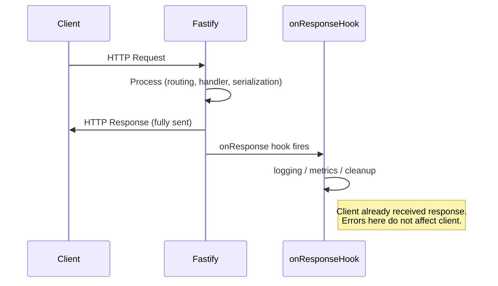

## onResponse Hook

The `onResponse` hook fires **after the response has been fully sent** to the client. Unlike `onSend`, the response is already gone — the payload cannot be modified and headers can no longer be mutated. This makes `onResponse` strictly a post-response hook, suited for cleanup, logging, and metrics collection.

---

### Lifecycle Position

```
Request
  └── onRequest
  └── preParsing
  └── preValidation
  └── preHandler
  └── Handler (route logic)
  └── Serialization
  └── onSend
  └── Response sent to client   ← response leaves here
  └── onResponse                ← fires here
```

---

### Signature

```js
fastify.addHook('onResponse', async (request, reply) => {
  // post-response logic
});
```

The hook receives two arguments:

| Argument | Type | Description |
|---|---|---|
| `request` | `FastifyRequest` | The original request object |
| `reply` | `FastifyReply` | The reply object (read-only at this point) |

**Key Points:**
- No payload argument is provided — the response body is no longer accessible.
- Headers and status codes are readable but **cannot be changed**.
- Errors thrown inside `onResponse` are logged but **do not affect the client** — the response is already sent. [Behavior may vary by Fastify version.]
- Return values are ignored.

---

### Registering the Hook

**Globally:**

```js
fastify.addHook('onResponse', async (request, reply) => {
  // runs after every response
});
```

**Scoped to a plugin:**

```js
fastify.register(async function (instance) {
  instance.addHook('onResponse', async (request, reply) => {
    // runs only for routes within this plugin
  });

  instance.get('/scoped', async () => ({ ok: true }));
});
```

---

### Common Use Cases

#### Request Duration Logging

`reply.elapsedTime` provides the elapsed time in milliseconds from when the request was received to when the response was sent. [Inference] This is one of the most common uses of `onResponse`.

**Example:**

```js
fastify.addHook('onResponse', async (request, reply) => {
  request.log.info({
    method: request.method,
    url: request.url,
    statusCode: reply.statusCode,
    durationMs: reply.elapsedTime
  }, 'request completed');
});
```

**Output** (Fastify log entry):
```json
{
  "level": 30,
  "msg": "request completed",
  "method": "GET",
  "url": "/api/users",
  "statusCode": 200,
  "durationMs": 4.217
}
```

---

#### Metrics Collection

`onResponse` is a natural fit for incrementing counters or recording histograms in observability systems such as Prometheus, StatsD, or OpenTelemetry. [Inference] Plugins like `@fastify/metrics` use this hook internally.

**Example — recording metrics with a hypothetical metrics client:**

```js
fastify.addHook('onResponse', async (request, reply) => {
  metrics.histogram('http_response_duration_ms', reply.elapsedTime, {
    method: request.method,
    route: request.routeOptions.url,  // normalized route pattern
    status: reply.statusCode
  });

  metrics.counter('http_responses_total', 1, {
    status: reply.statusCode
  });
});
```

> Use `request.routeOptions.url` (the route pattern such as `/users/:id`) rather than `request.url` (the actual URL such as `/users/42`) to avoid high-cardinality metric labels. [Inference; property name may differ by Fastify version — verify against your installed version.]

---

#### Resource Cleanup

If resources were acquired during the request lifecycle (database connections, file handles, locks), `onResponse` is a safe place to release them after the client has already received its response.

**Example — releasing a database connection stored on the request:**

```js
fastify.addHook('onResponse', async (request, reply) => {
  if (request.dbConnection) {
    await request.dbConnection.release();
  }
});
```

---

#### Audit Logging

**Example — writing an audit record for sensitive routes:**

```js
fastify.register(async function auditPlugin (instance) {
  instance.addHook('onResponse', async (request, reply) => {
    await auditLog.write({
      timestamp: new Date().toISOString(),
      userId: request.user?.id ?? 'anonymous',
      method: request.method,
      url: request.url,
      statusCode: reply.statusCode,
      ipAddress: request.ip
    });
  });

  instance.get('/admin/report', adminHandler);
  instance.delete('/admin/user/:id', deleteUserHandler);
});
```

---

#### Clearing Request-Scoped Caches or State

**Example:**

```js
fastify.addHook('onResponse', async (request) => {
  request.cache?.clear();
});
```

---

### Callback Style (Non-async)

```js
fastify.addHook('onResponse', function (request, reply, done) {
  // cleanup logic
  done();
});
```

Passing an error to `done` will log the error, but since the response is already sent, **it will not produce an error response to the client**.

```js
fastify.addHook('onResponse', function (request, reply, done) {
  done(new Error('cleanup failed')); // logged, not sent to client
});
```

---

### Error Behavior

Errors in `onResponse` do not propagate to the client. Fastify logs them internally. This distinction is important:

| Hook | Error Propagates to Client? |
|---|---|
| `onRequest` | Yes |
| `preHandler` | Yes |
| `onSend` | Yes (triggers error handler) |
| `onResponse` | **No — already sent** |

[Behavior may vary by Fastify version and custom error handler configuration.]

---

### Accessing Useful Reply Properties

| Property | Description |
|---|---|
| `reply.statusCode` | HTTP status code of the response |
| `reply.elapsedTime` | Duration in ms from request receipt to response sent |
| `reply.getHeaders()` | Returns all response headers as an object |

**Example — inspecting headers post-send:**

```js
fastify.addHook('onResponse', async (request, reply) => {
  const headers = reply.getHeaders();
  request.log.debug({ headers }, 'response headers');
});
```

---

### Multiple onResponse Hooks

Multiple `onResponse` hooks can be registered and they execute in registration order.

```js
fastify.addHook('onResponse', async (request, reply) => {
  // runs first — logging
});

fastify.addHook('onResponse', async (request, reply) => {
  // runs second — metrics
});
```

All registered hooks run regardless of errors in earlier ones. [Inference; behavior may vary.]

---

### Mermaid Diagram — onResponse Timing



---

### Comparison with Related Hooks

| Hook | Fires When | Payload Accessible | Headers Mutable | Errors Affect Client |
|---|---|---|---|---|
| `onSend` | Before response is sent | Yes (serialized) | Yes | Yes |
| `onResponse` | After response is sent | No | No | No |
| `onError` | When an error is thrown | No | Yes | Yes |

---

**Conclusion:**
`onResponse` is a read-only, post-send hook intended for observability, cleanup, and auditing. Because the response is already delivered when this hook runs, it is free from the risk of accidentally disrupting client communication — making it a safe and appropriate place for side effects. Keep logic here non-blocking where possible, as delays in `onResponse` can still hold Fastify's internal resources. [Inference; observable behavior may vary under high concurrency.]

**Next Steps:** Explore the `onError` hook, which intercepts errors before they are serialized and sent, allowing customization of error responses and centralized error telemetry.