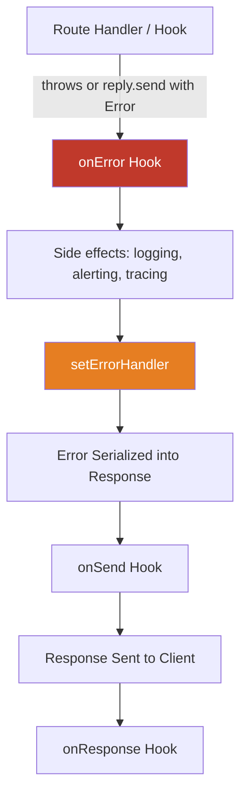

## onError Hook

The `onError` hook fires when an error is passed to `reply.send(error)`, thrown from a route handler, or propagated from another hook. It intercepts the error **before** it is serialized and sent to the client, making it the appropriate place for error-specific side effects such as logging, alerting, and response augmentation — but **not** for replacing the error response itself.

---

### Lifecycle Position

```
Request
  └── onRequest
  └── preParsing
  └── preValidation
  └── preHandler
  └── Handler (route logic)
  └── Error occurs ←─────────────────────┐
  └── onError hook fires                 │
  └── Error serialized (errorHandler)    │
  └── onSend                             │
  └── Response sent to client            │
  └── onResponse                         │
                                         │
  (errors from other hooks may also ─────┘
   route here depending on context)
```

---

### Signature

```js
fastify.addHook('onError', async (request, reply, error) => {
  // inspect or act on the error
});
```

| Argument | Type | Description |
|---|---|---|
| `request` | `FastifyRequest` | The incoming request object |
| `reply` | `FastifyReply` | The reply object |
| `error` | `Error` | The error that was thrown or passed to `reply.send()` |

**Key Points:**
- `onError` is **not** a replacement for `setErrorHandler`. It is a hook for side effects only.
- You **cannot** change the error response by returning a value from this hook.
- To modify what the client receives, use `fastify.setErrorHandler()` instead.
- Errors thrown inside `onError` are logged but may not propagate cleanly. [Behavior may vary; avoid throwing inside this hook.]

---

### Registering the Hook

**Globally:**

```js
fastify.addHook('onError', async (request, reply, error) => {
  // runs for all unhandled errors
});
```

**Scoped to a plugin:**

```js
fastify.register(async function (instance) {
  instance.addHook('onError', async (request, reply, error) => {
    // runs only for errors in this plugin's routes
  });

  instance.get('/fragile', async () => {
    throw new Error('something broke');
  });
});
```

---

### Common Use Cases

#### Centralized Error Logging

By default Fastify logs errors, but `onError` allows enriched or structured logging with additional request context.

**Example:**

```js
fastify.addHook('onError', async (request, reply, error) => {
  request.log.error({
    err: error,
    method: request.method,
    url: request.url,
    userId: request.user?.id ?? 'anonymous',
    statusCode: reply.statusCode
  }, 'unhandled error');
});
```

---

#### Sending Errors to an External Service

**Example — forwarding to a hypothetical error tracking service:**

```js
fastify.addHook('onError', async (request, reply, error) => {
  await errorTracker.capture({
    error,
    context: {
      route: request.routeOptions.url,
      method: request.method,
      headers: request.headers,
      body: request.body
    }
  });
});
```

> Be cautious about logging full request bodies in production — they may contain sensitive data. Apply appropriate redaction before forwarding. [Inference]

---

#### Distinguishing Error Types

**Example — conditional handling based on error properties:**

```js
fastify.addHook('onError', async (request, reply, error) => {
  if (error.validation) {
    // Fastify validation errors carry a .validation array
    request.log.warn({ validation: error.validation }, 'validation error');
    return;
  }

  if (error.statusCode >= 500) {
    // treat 5xx as operational errors worth alerting on
    await alerting.notify({
      title: `5xx on ${request.method} ${request.url}`,
      message: error.message,
      stack: error.stack
    });
  }
});
```

**Key Points:**
- Fastify validation errors include a `.validation` property containing the AJV error array.
- `error.statusCode` reflects the HTTP status code Fastify will use for the response. [Behavior may vary for custom error types without an explicit `statusCode`.]

---

#### Attaching Correlation IDs or Trace Information

**Example:**

```js
fastify.addHook('onError', async (request, reply, error) => {
  error.correlationId = request.id;
  error.traceId = request.headers['x-trace-id'];

  request.log.error({ err: error }, 'traced error');
});
```

> Mutating the error object here does not affect what the client receives, since `onError` fires before serialization but the response shape is controlled by `setErrorHandler`. [Inference]

---

### Callback Style (Non-async)

```js
fastify.addHook('onError', function (request, reply, error, done) {
  // side effects
  done();
});
```

Passing an error to `done` is not recommended and may produce undefined behavior. [Speculation]

---

### onError vs setErrorHandler

These two mechanisms serve different purposes and are often used together:

| Feature | `onError` hook | `setErrorHandler` |
|---|---|---|
| Purpose | Side effects (logging, alerting) | Shape the error response |
| Can modify response body | No | Yes |
| Can modify status code | No | Yes |
| Scoped to plugin | Yes | Yes |
| Receives error object | Yes | Yes |
| Multiple registrations | Yes (all run) | No (last one wins per scope) |

**Example — using both together:**

```js
// Shape the response
fastify.setErrorHandler(async (error, request, reply) => {
  reply.status(error.statusCode ?? 500).send({
    success: false,
    message: error.message,
    code: error.code ?? 'INTERNAL_ERROR'
  });
});

// Log and alert separately
fastify.addHook('onError', async (request, reply, error) => {
  if (!error.statusCode || error.statusCode >= 500) {
    await alerting.notify(error);
  }
  request.log.error({ err: error }, 'error captured');
});
```

---

### When onError Does Not Fire

`onError` only fires when an error enters Fastify's error handling pipeline. It does **not** fire in these cases:

- The route handler sends a successful response — no error path is taken.
- An error is caught and handled entirely within the route handler without being re-thrown or passed to `reply.send()`.
- [Inference] Errors that occur after `onResponse` fires (e.g., in cleanup tasks outside Fastify's lifecycle) may not be captured by this hook.

---

### Mermaid Diagram — onError Hook Flow



---

### Multiple onError Hooks

Multiple `onError` hooks can be registered and all will run in registration order, regardless of whether earlier hooks completed without error. [Behavior may vary if a hook itself throws.]

```js
fastify.addHook('onError', async (request, reply, error) => {
  // first — structured logging
});

fastify.addHook('onError', async (request, reply, error) => {
  // second — external error tracking
});
```

---

### Accessing Error Properties

Common properties available on Fastify errors:

| Property | Description |
|---|---|
| `error.message` | Human-readable error message |
| `error.statusCode` | HTTP status code (present on `fastify.httpErrors` and `http-errors` instances) |
| `error.code` | Optional machine-readable error code |
| `error.validation` | AJV validation error array (validation errors only) |
| `error.validationContext` | Context of validation failure (`body`, `params`, `query`, `headers`) |
| `error.stack` | Stack trace |

---

**Conclusion:**
`onError` is a side-effect-only hook that intercepts errors after they are thrown but before they are serialized into a response. It is the right place for cross-cutting concerns like error logging, tracing, and alerting. For controlling the shape of the error response sent to the client, `setErrorHandler` is the correct mechanism. Used together, the two provide a clean separation between error observability and error presentation.

**Next Steps:** Explore `setErrorHandler` in depth — how it differs from the `onError` hook, how scoped error handlers compose across plugins, and how to build consistent error response structures.