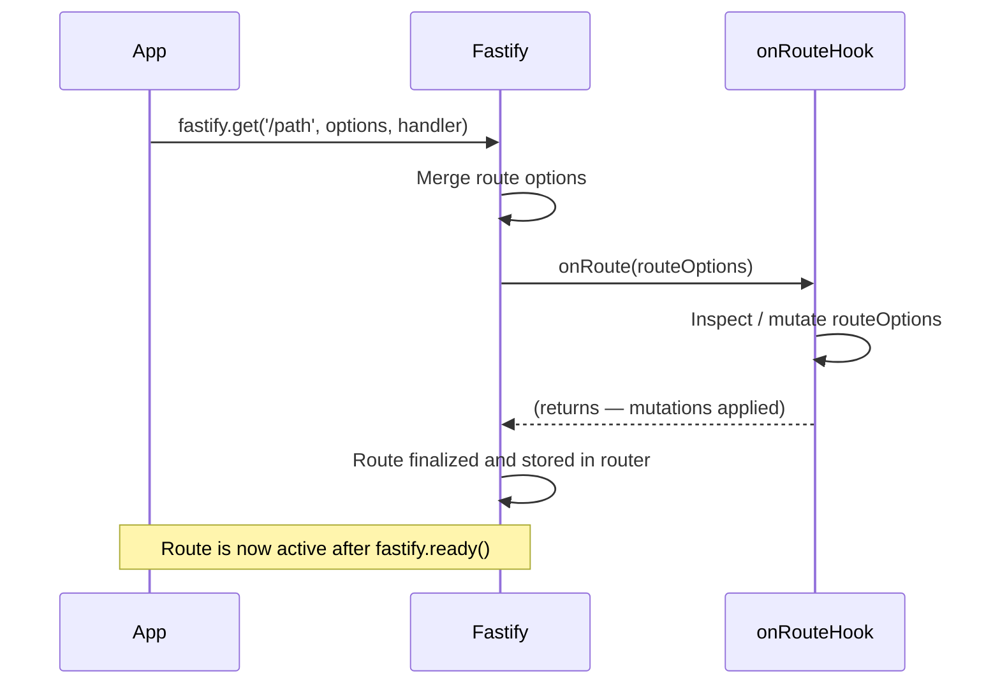

## onRoute Hook

The `onRoute` hook fires **at registration time** — not at request time — whenever a new route is added to a Fastify instance. It receives the route options object, allowing inspection or mutation of route configuration before the route becomes active. This makes it a powerful tool for building plugins that automatically apply cross-cutting behavior to routes.

---

### Lifecycle Position

`onRoute` is a **server lifecycle hook**, not a request lifecycle hook. It belongs to a separate category alongside `onRegister` and `onReady`.

```
Server Startup Phase
  └── fastify.register(plugin)
  └── onRegister fires
  └── fastify.get / .post / .route called
  └── onRoute fires ← here (once per route)
  └── fastify.listen / fastify.ready called
  └── onReady fires
  └── Server accepts requests
        └── (request lifecycle hooks fire per request)
```

---

### Signature

```js
fastify.addHook('onRoute', (routeOptions) => {
  // inspect or mutate routeOptions
});
```

| Argument | Type | Description |
|---|---|---|
| `routeOptions` | `RouteOptions` | The full route configuration object, mutable |

**Key Points:**
- `onRoute` is **synchronous only** — async functions and callbacks with `done` are not supported. [Verify against your installed Fastify version.]
- The hook receives a **live reference** to the route options object. Mutations take effect on the registered route.
- `onRoute` hooks are **not encapsulated** in the same way request hooks are — a hook registered on a parent instance will fire for routes added in child plugins. [Behavior may vary depending on plugin structure.]
- Return values are ignored.

---

### Registering the Hook

```js
fastify.addHook('onRoute', (routeOptions) => {
  console.log(`Route registered: ${routeOptions.method} ${routeOptions.url}`);
});

fastify.get('/hello', async () => ({ hello: 'world' }));
// Console: Route registered: GET /hello
```

---

### The routeOptions Object

The `routeOptions` object contains the full configuration of the route being registered:

| Property | Type | Description |
|---|---|---|
| `method` | `string \| string[]` | HTTP method(s) |
| `url` | `string` | The route URL pattern |
| `path` | `string` | Alias for `url` |
| `schema` | `object` | JSON Schema definitions for the route |
| `handler` | `Function` | The route handler function |
| `preHandler` | `Function[]` | Route-level preHandler hooks |
| `preValidation` | `Function[]` | Route-level preValidation hooks |
| `preSerialization` | `Function[]` | Route-level preSerialization hooks |
| `onSend` | `Function[]` | Route-level onSend hooks |
| `onResponse` | `Function[]` | Route-level onResponse hooks |
| `onError` | `Function[]` | Route-level onError hooks |
| `config` | `object` | Custom route-level config object |
| `prefix` | `string` | Plugin prefix applied to this route |
| `logLevel` | `string` | Log level override for this route |
| `bodyLimit` | `number` | Payload size limit in bytes |

[Inference] The exact shape of `routeOptions` may include additional internal properties. Rely only on documented properties for mutations.

---

### Common Use Cases

#### Auditing Registered Routes

**Example — logging all registered routes at startup:**

```js
const registeredRoutes = [];

fastify.addHook('onRoute', (routeOptions) => {
  registeredRoutes.push({
    method: routeOptions.method,
    url: routeOptions.url,
    hasSchema: !!routeOptions.schema
  });
});

fastify.ready(() => {
  console.table(registeredRoutes);
});
```

**Output** (example):
```
┌─────────┬──────────┬────────────────┬───────────┐
│ (index) │  method  │      url       │ hasSchema │
├─────────┼──────────┼────────────────┼───────────┤
│    0    │  'GET'   │  '/users'      │   true    │
│    1    │  'POST'  │  '/users'      │   true    │
│    2    │  'GET'   │  '/users/:id'  │   true    │
└─────────┴──────────┴────────────────┴───────────┘
```

---

#### Automatically Attaching Route-Level Hooks

Because `onRoute` receives a live reference to `routeOptions`, you can push hooks into the route's hook arrays conditionally.

**Example — attaching an authentication hook to all routes that opt in via `config`:**

```js
fastify.addHook('onRoute', (routeOptions) => {
  if (routeOptions.config?.requiresAuth) {
    routeOptions.preHandler = routeOptions.preHandler ?? [];
    if (!Array.isArray(routeOptions.preHandler)) {
      routeOptions.preHandler = [routeOptions.preHandler];
    }
    routeOptions.preHandler.push(authenticationHook);
  }
});

fastify.get('/public', async () => ({ public: true }));

fastify.get('/private', {
  config: { requiresAuth: true },
  handler: async () => ({ secret: 'data' })
});
```

**Key Points:**
- Always normalize hook arrays before pushing — the existing value may be `undefined`, a single function, or an array.
- This pattern is how many Fastify plugins (such as `@fastify/auth`) attach behavior without modifying individual route definitions.

---

#### Enforcing Schema Requirements

**Example — warning or throwing when a route is registered without a response schema:**

```js
fastify.addHook('onRoute', (routeOptions) => {
  if (!routeOptions.schema?.response) {
    fastify.log.warn(
      `Route ${routeOptions.method} ${routeOptions.url} has no response schema. Serialization will be skipped.`
    );
  }
});
```

---

#### Automatically Applying a Default Schema

**Example — injecting a default error response schema for all routes:**

```js
const defaultErrorSchema = {
  500: {
    type: 'object',
    properties: {
      statusCode: { type: 'number' },
      message: { type: 'string' }
    }
  }
};

fastify.addHook('onRoute', (routeOptions) => {
  routeOptions.schema = routeOptions.schema ?? {};
  routeOptions.schema.response = {
    ...defaultErrorSchema,
    ...(routeOptions.schema.response ?? {})
  };
});
```

---

#### Normalizing Route Config

**Example — ensuring all routes have a `version` field in their config:**

```js
fastify.addHook('onRoute', (routeOptions) => {
  routeOptions.config = routeOptions.config ?? {};
  routeOptions.config.version = routeOptions.config.version ?? 'v1';
});
```

---

#### Building a Route Registry Plugin

**Example — encapsulated plugin that exposes a route map:**

```js
async function routeRegistryPlugin (fastify, options) {
  const registry = new Map();

  fastify.addHook('onRoute', (routeOptions) => {
    const key = `${routeOptions.method} ${routeOptions.url}`;
    registry.set(key, {
      url: routeOptions.url,
      method: routeOptions.method,
      config: routeOptions.config
    });
  });

  fastify.decorate('routeRegistry', registry);
}

fastify.register(routeRegistryPlugin);

fastify.get('/items', async () => []);
fastify.post('/items', async () => ({}));

fastify.ready(() => {
  console.log([...fastify.routeRegistry.keys()]);
  // ['GET /items', 'POST /items']
});
```

---

### Encapsulation Behavior

`onRoute` does not fully respect Fastify's encapsulation boundaries in the same way request hooks do.

- A hook added to a **parent** instance fires for routes added in **child plugins**.
- A hook added inside a **child plugin** fires only for routes within that plugin's scope.

```js
fastify.addHook('onRoute', (routeOptions) => {
  console.log('parent hook:', routeOptions.url);
});

fastify.register(async function childPlugin (instance) {
  instance.addHook('onRoute', (routeOptions) => {
    console.log('child hook:', routeOptions.url);
  });

  instance.get('/child-route', async () => ({}));
  // Logs: 'parent hook: /child-route'
  // Logs: 'child hook: /child-route'
});

fastify.get('/parent-route', async () => ({}));
// Logs: 'parent hook: /parent-route'
// (child hook does NOT fire for parent routes)
```

[Behavior may vary. Verify against your installed Fastify version.]

---

### Mermaid Diagram — onRoute Hook Timing



---

### Comparison with Related Hooks

| Hook | Fires | Async Support | Mutates | Scope |
|---|---|---|---|---|
| `onRoute` | Route registration time | No | Route options | Parent sees child routes |
| `onRegister` | Plugin registration time | No | Plugin instance | Scoped to plugin |
| `onReady` | Server ready | Yes | N/A (server ready) | Global |
| `preHandler` | Each request | Yes | Request/Reply | Scoped |

---

### Things to Avoid

- **Do not register new routes inside `onRoute`.** This can cause infinite recursion since registering a route triggers `onRoute` again. [Behavior may vary; treat as unsafe.]
- **Do not perform async operations.** The hook is synchronous; async operations will not be awaited and may produce race conditions. [Speculation]
- **Do not rely on hook execution order across sibling plugins** without understanding your plugin registration sequence.

---

**Conclusion:**
`onRoute` is a server-lifecycle hook that fires synchronously at route registration time, providing a live reference to each route's options object. This makes it uniquely powerful for building plugins that apply cross-cutting behavior — such as authentication, schema defaults, or observability — without requiring individual routes to declare it explicitly. It is a foundational tool for Fastify plugin authors who need to introspect or augment the route table systematically.

**Next Steps:** Explore the `onRegister` hook, which fires when a plugin is registered and provides access to the child plugin instance — enabling patterns like scoped decorators and plugin-level initialization logic.