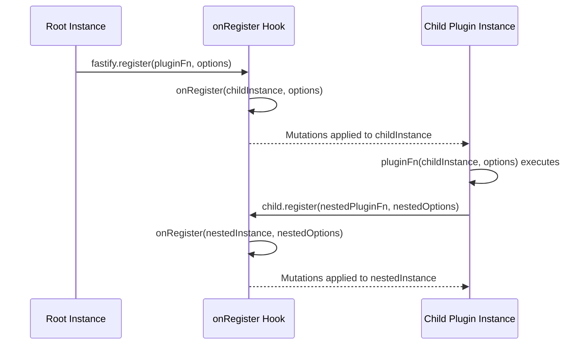

## onRegister Hook

The `onRegister` hook fires **each time a new plugin is registered** with `fastify.register()`, and receives the newly created child plugin instance along with the options passed to the registration call. It is primarily used by plugin authors to react to plugin registrations — for example, to initialize scoped state, apply configuration, or track plugin composition.

---

### Lifecycle Position

`onRegister` is a **server lifecycle hook**, firing during the plugin loading phase, before the server is ready to accept requests.

```
Server Startup Phase
  └── fastify.register(pluginA, options)
  └── onRegister fires (instance = pluginA scope, options)
        └── pluginA executes
              └── instance.register(pluginB, options)
              └── onRegister fires (instance = pluginB scope, options)
  └── fastify.listen / fastify.ready called
  └── onReady fires
  └── Server accepts requests
```

**Key Points:**
- `onRegister` fires **before** the plugin function itself executes. [Inference; the instance is created and passed, but the plugin body runs after. Verify against your installed Fastify version.]
- It fires for **every** `fastify.register()` call, including nested ones.
- It does not fire for the root Fastify instance itself — only for child instances created by `register()`.

---

### Signature

```js
fastify.addHook('onRegister', (instance, options) => {
  // react to plugin registration
});
```

| Argument | Type | Description |
|---|---|---|
| `instance` | `FastifyInstance` | The newly created child plugin instance |
| `options` | `object` | The options passed to `fastify.register()` |

**Key Points:**
- Like `onRoute`, `onRegister` is **synchronous only**. Async functions are not supported. [Verify against your installed Fastify version.]
- Mutations to `instance` take effect within the plugin's scope.
- Return values are ignored.

---

### Registering the Hook

```js
fastify.addHook('onRegister', (instance, options) => {
  console.log('Plugin registered with options:', options);
});

fastify.register(async function myPlugin (fastify, opts) {
  fastify.get('/hello', async () => ({ hello: 'world' }));
}, { prefix: '/api' });

// Console: Plugin registered with options: { prefix: '/api' }
```

---

### Common Use Cases

#### Tracking Plugin Registrations

**Example — building a plugin manifest at startup:**

```js
const pluginManifest = [];

fastify.addHook('onRegister', (instance, options) => {
  pluginManifest.push({
    prefix: options.prefix ?? '(none)',
    options
  });
});

fastify.ready(() => {
  console.log('Registered plugins:', pluginManifest);
});
```

---

#### Decorating the Child Instance

Because `onRegister` receives the child instance, you can add decorators or hooks scoped to that instance before the plugin body runs.

**Example — injecting a scoped logger into every plugin:**

```js
fastify.addHook('onRegister', (instance, options) => {
  const scopedLogger = createLogger({ prefix: options.prefix ?? 'root' });
  instance.decorate('scopedLogger', scopedLogger);
});
```

Each registered plugin will receive its own `scopedLogger` decorated onto its instance, isolated from sibling plugins via Fastify's encapsulation model.

---

#### Applying Scoped Request Hooks Conditionally

**Example — attaching a rate-limiting hook only to plugins that opt in via options:**

```js
fastify.addHook('onRegister', (instance, options) => {
  if (options.rateLimit) {
    instance.addHook('onRequest', rateLimitHook(options.rateLimit));
  }
});

fastify.register(publicPlugin, { prefix: '/public' });

fastify.register(apiPlugin, {
  prefix: '/api',
  rateLimit: { max: 100, windowMs: 60000 }
});
```

The rate limiting hook is applied only to the `apiPlugin` scope. `publicPlugin` is unaffected.

---

#### Sharing State Across Plugin Instances

**Example — tracking all child instances for introspection:**

```js
const instances = [];

fastify.addHook('onRegister', (instance, options) => {
  instances.push({ instance, options });
});

fastify.ready(() => {
  console.log(`Total plugins registered: ${instances.length}`);
});
```

> [Inference] Storing references to child instances this way may hold their scoped decorators and hooks in memory. Use with awareness of memory implications in large plugin trees.

---

#### Enforcing Plugin Option Requirements

**Example — validating that required options are present at registration time:**

```js
fastify.addHook('onRegister', (instance, options) => {
  if (options.namespace === undefined) {
    throw new Error(
      `Plugin registered at prefix "${options.prefix ?? '/'}" is missing required option: namespace`
    );
  }
});
```

Because this fires synchronously during the loading phase, the error surfaces at startup before the server accepts any requests.

---

#### Building a Plugin Dependency Tracker

**Example — tracking plugin dependency chains:**

```js
const dependencyGraph = new Map();

fastify.addHook('onRegister', (instance, options) => {
  const name = options.name ?? 'anonymous';
  dependencyGraph.set(name, {
    prefix: options.prefix,
    registeredAt: Date.now()
  });
});
```

---

### Encapsulation and Scope

`onRegister` follows the same parent-sees-child pattern as `onRoute`:

- A hook added to a **parent** instance fires for all plugins registered within that parent's scope and its descendants.
- A hook added inside a **child plugin** fires only for plugins registered within that child's scope.

```js
fastify.addHook('onRegister', (instance, options) => {
  console.log('parent sees:', options.prefix);
});

fastify.register(async function outerPlugin (outer, opts) {
  outer.addHook('onRegister', (instance, options) => {
    console.log('outerPlugin sees:', options.prefix);
  });

  outer.register(async function innerPlugin (inner, opts) {
    // ...
  }, { prefix: '/inner' });

}, { prefix: '/outer' });

// Console: parent sees: /outer
// Console: parent sees: /inner
// Console: outerPlugin sees: /inner
```

[Behavior may vary. Verify against your installed Fastify version.]

---

### Mermaid Diagram — onRegister Firing Sequence



---

### onRegister vs onRoute — Key Distinctions

| Aspect | `onRegister` | `onRoute` |
|---|---|---|
| Fires when | A plugin is registered | A route is added |
| Receives | Child instance + options | Route options object |
| Useful for | Plugin-level initialization | Route-level augmentation |
| Fires for root instance | No | N/A |
| Async support | No | No |
| Encapsulation | Parent sees all descendants | Parent sees all descendants |

---

### Comparison with Related Hooks

| Hook | Phase | Purpose |
|---|---|---|
| `onRegister` | Plugin loading | React to plugin registration, decorate child instances |
| `onRoute` | Plugin loading | React to route registration, mutate route options |
| `onReady` | Server ready | Run logic after all plugins have loaded |
| `onRequest` | Request time | First hook in the per-request lifecycle |

---

### Things to Avoid

- **Do not perform async operations.** The hook is synchronous; async work will not be awaited. [Behavior is undefined for async usage — treat as unsupported.]
- **Do not call `fastify.register()` inside `onRegister`** for the same instance being received, as this may produce unexpected nesting or infinite loops. [Speculation]
- **Do not assume plugin execution order** across sibling plugins without verifying your registration sequence — `onRegister` fires in registration order, but plugin bodies may execute in a different order due to Fastify's loading mechanism. [Inference]

---

### Practical Plugin Pattern

A common pattern is for framework-level plugins to use `onRegister` to automatically configure child instances, eliminating boilerplate from individual plugin authors.

**Example — auto-configuring database access per plugin scope:**

```js
async function dbPlugin (fastify, options) {
  const db = await createDbConnection(options.db);

  fastify.decorate('db', db);

  // Give every child plugin its own scoped db reference
  fastify.addHook('onRegister', (instance, opts) => {
    const childDb = db.withSchema(opts.schema ?? 'public');
    instance.decorate('db', childDb);
  });
}

fastify.register(dbPlugin, { db: dbConfig });

fastify.register(async function usersPlugin (instance, opts) {
  // instance.db is scoped to 'users' schema
  instance.get('/users', async () => instance.db.query('SELECT * FROM users'));
}, { schema: 'users' });

fastify.register(async function ordersPlugin (instance, opts) {
  // instance.db is scoped to 'orders' schema
  instance.get('/orders', async () => instance.db.query('SELECT * FROM orders'));
}, { schema: 'orders' });
```

---

**Conclusion:**
`onRegister` is a synchronous server-lifecycle hook that fires each time a plugin is registered, providing early access to the child instance before the plugin body executes. It enables plugin authors to apply scoped decorators, conditional hooks, and initialization logic in a centralized way — without requiring individual plugins to be aware of the surrounding infrastructure. It is most valuable when building framework-level plugins that need to configure or instrument every plugin that gets loaded.

**Next Steps:** Explore the `onReady` hook, which fires once all plugins have finished loading and the server is about to begin accepting connections — the appropriate place for final initialization tasks that require a fully assembled Fastify instance.