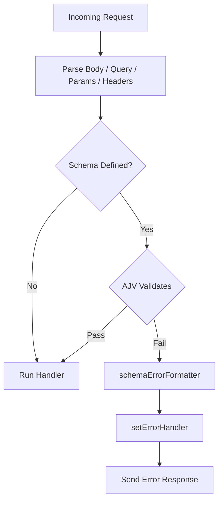

## Schema Validation Errors in Fastify

Fastify uses JSON Schema (via the `ajv` library by default) to validate incoming requests. When validation fails, Fastify intercepts the error before your handler runs and responds with a structured error automatically.

---

### How Validation Errors Are Triggered

Validation runs on the parts of the request you define schemas for:

- `body`
- `params`
- `querystring` (or `query`)
- `headers`

If the incoming data does not match the schema, Fastify stops the request lifecycle and invokes the error handler with a validation error object.

**Key Points:**
- The handler is never called when validation fails.
- Validation is synchronous and occurs during the request parsing phase.
- Only the schema sections you define are validated; unspecified sections are not checked.

---

### Default Validation Error Response

Without any customization, Fastify returns a `400 Bad Request` with a JSON body shaped like this:

**Example** — sending a `POST /user` with a missing required field:

```json
{
  "statusCode": 400,
  "error": "Bad Request",
  "message": "body must have required property 'email'"
}
```

The `message` field is generated by AJV and reflects the specific validation failure.

---

### Route Schema Example

```js
fastify.post('/user', {
  schema: {
    body: {
      type: 'object',
      required: ['name', 'email'],
      properties: {
        name: { type: 'string' },
        email: { type: 'string', format: 'email' },
        age: { type: 'integer', minimum: 0 }
      }
    }
  }
}, async (request, reply) => {
  return { status: 'created' }
})
```

If a request body omits `email` or sends `age` as a string, Fastify rejects it before the handler executes.

---

### The Validation Error Object

When validation fails, Fastify creates an error with:

| Property | Value |
|---|---|
| `statusCode` | `400` |
| `error` | `"Bad Request"` |
| `message` | AJV-generated description |
| `validation` | Array of AJV error objects |
| `validationContext` | Which part failed (`"body"`, `"params"`, etc.) |

The `validation` array contains raw AJV error objects. Each entry includes:

```json
[
  {
    "instancePath": "/age",
    "schemaPath": "#/properties/age/type",
    "keyword": "type",
    "params": { "type": "integer" },
    "message": "must be integer"
  }
]
```

---

### Accessing Validation Errors Programmatically

You can access the raw validation details inside a custom error handler:

```js
fastify.setErrorHandler(function (error, request, reply) {
  if (error.validation) {
    // error.validation — AJV error array
    // error.validationContext — 'body' | 'params' | 'querystring' | 'headers'
    reply.status(400).send({
      statusCode: 400,
      context: error.validationContext,
      issues: error.validation.map(e => ({
        field: e.instancePath,
        message: e.message
      }))
    })
    return
  }

  reply.status(error.statusCode ?? 500).send(error)
})
```

**Key Points:**
- `error.validation` is `undefined` for non-validation errors, so the `if` guard is necessary.
- `error.validationContext` tells you which request section triggered the failure.
- Behavior of `error.validation` structure may vary with AJV version or custom validator configuration. [Inference]

---

### Customizing the Validation Error Message (schemaErrorFormatter)

Fastify exposes `schemaErrorFormatter` as a plugin-level or server-level option to reformat validation errors before they reach the error handler.

```js
const fastify = Fastify({
  schemaErrorFormatter: (errors, dataVar) => {
    // errors — AJV error array
    // dataVar — the context string, e.g. 'body'
    const first = errors[0]
    return new Error(`Validation failed on ${dataVar}: ${first.message}`)
  }
})
```

**Key Points:**
- The function must return an `Error` instance (or a subclass).
- The returned error is what Fastify passes to the error handler.
- This is called once per failed validation, not once per AJV error entry.
- `schemaErrorFormatter` runs before `setErrorHandler`. [Inference — based on documented lifecycle order; behavior is not guaranteed across versions]

---

### Attaching a Per-Route Schema Error Formatter

`schemaErrorFormatter` can also be set at the route level to override the server-level formatter for a specific route:

```js
fastify.post('/user', {
  schema: { body: userSchema },
  schemaErrorFormatter: (errors, dataVar) => {
    return new Error(`Route-level error on ${dataVar}: ${errors[0].message}`)
  }
}, handler)
```

---

### Customizing AJV (Validation Compiler)

For deeper control — adding keywords, formats, or changing coercion behavior — you can replace the validation compiler entirely:

```js
const Ajv = require('ajv')
const addFormats = require('ajv-formats')

const ajv = new Ajv({
  removeAdditional: true,   // strip unknown properties
  useDefaults: true,        // apply schema defaults
  coerceTypes: true,        // coerce type mismatches where possible
  allErrors: true           // collect all errors, not just the first
})

addFormats(ajv)

fastify.setValidatorCompiler(({ schema }) => {
  return ajv.compile(schema)
})
```

**Key Points:**
- `removeAdditional: true` silently removes properties not listed in the schema rather than rejecting the request.
- `coerceTypes: true` will attempt to convert query string values (which arrive as strings) to declared types. This may mask type mismatches rather than surface them. Use with awareness.
- `allErrors: true` populates the full `error.validation` array with every failure, not just the first one.
- AJV behavior under these options depends on AJV version and configuration. Behavior is not guaranteed to be identical across upgrades.

---

### Separating the Validator Compiler Per Route

Each route can use a different validator compiler if needed:

```js
fastify.post('/strict', {
  schema: { body: strictSchema },
  validatorCompiler: ({ schema }) => strictAjv.compile(schema)
}, handler)
```

This allows mixing validation strictness across routes without affecting global behavior.

---

### Using `ajv-errors` for Custom Messages

By default, AJV error messages are generic. The `ajv-errors` package allows per-schema custom messages:

```js
const Ajv = require('ajv')
const ajvErrors = require('ajv-errors')

const ajv = new Ajv({ allErrors: true })
ajvErrors(ajv)

const schema = {
  type: 'object',
  properties: {
    age: {
      type: 'integer',
      errorMessage: 'age must be a whole number'
    }
  },
  required: ['age'],
  errorMessage: {
    required: {
      age: 'age is required'
    }
  }
}
```

**Key Points:**
- `allErrors: true` is required for `ajv-errors` to work correctly.
- Compatibility between `ajv-errors` and specific AJV versions should be verified before use. [Unverified — library compatibility can change across releases]

---

### Sending Validation Errors in Different Formats

A common pattern is normalizing validation errors into a consistent API error format:

```js
fastify.setErrorHandler((error, request, reply) => {
  if (error.validation) {
    return reply.status(422).send({
      statusCode: 422,
      error: 'Unprocessable Entity',
      fields: error.validation.map(e => ({
        path: e.instancePath || `/${error.validationContext}`,
        rule: e.keyword,
        message: e.message
      }))
    })
  }

  reply.status(error.statusCode ?? 500).send(error)
})
```

**Key Points:**
- Returning `422 Unprocessable Entity` instead of `400` is a deliberate semantic choice. Some API conventions prefer `400`; use whichever fits your contract.
- `instancePath` may be an empty string for top-level failures (e.g., a missing required property at the root). The fallback to `/${error.validationContext}` is a practical workaround. [Inference]

---

### Validation Error Lifecycle Position



---

### Summary Table

| Mechanism | Purpose | Scope |
|---|---|---|
| `setErrorHandler` | Handle and format all errors including validation | Server or plugin |
| `schemaErrorFormatter` | Reformat AJV errors into a single `Error` before handler | Server, plugin, or route |
| `setValidatorCompiler` | Replace AJV instance or configuration | Server or route |
| `validatorCompiler` (route option) | Per-route validator override | Route only |
| `ajv-errors` | Custom per-field error messages in schema | Schema level |

---