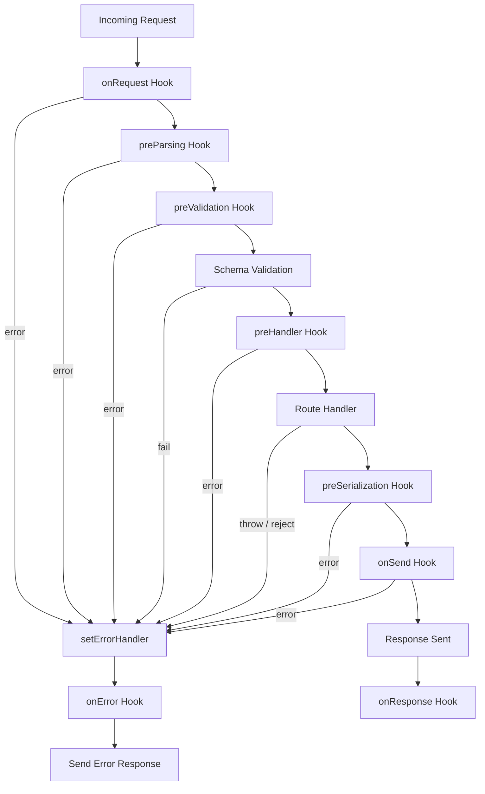

## Async Error Propagation in Fastify

Fastify is built with async/await as a first-class pattern. Understanding how errors propagate from async route handlers and hooks into Fastify's error handling pipeline is essential for writing reliable applications.

---

### How Fastify Captures Async Errors

When a route handler is declared as an `async` function, Fastify wraps it internally so that any rejected promise or thrown error is automatically caught and forwarded to the error handler.

```js
fastify.get('/example', async (request, reply) => {
  throw new Error('Something went wrong')
  // Fastify catches this and forwards it to setErrorHandler
})
```

**Key Points:**
- You do not need to wrap handler code in `try/catch` for the error to reach `setErrorHandler`.
- Fastify attaches a `.catch()` to the promise returned by async handlers. [Inference — based on observed behavior; internal implementation details may vary across versions]
- This applies to both route handlers and lifecycle hooks declared as async functions.

---

### Thrown Errors vs. Rejected Promises

Both forms are treated equivalently by Fastify:

```js
// Form 1: throw inside async handler
fastify.get('/throw', async (request, reply) => {
  throw new Error('thrown error')
})

// Form 2: rejected promise (less common but valid)
fastify.get('/reject', async (request, reply) => {
  return Promise.reject(new Error('rejected promise'))
})
```

In both cases, the error reaches `setErrorHandler` with the same structure. Behavior is not guaranteed to be identical in all edge cases across Fastify versions.

---

### Callback-Style Handlers and `reply.send(error)`

For non-async (callback-style) handlers, errors must be explicitly passed to `reply.send()`:

```js
fastify.get('/callback', (request, reply) => {
  someAsyncOperation((err, result) => {
    if (err) {
      reply.send(err) // routes to setErrorHandler
      return
    }
    reply.send(result)
  })
})
```

**Key Points:**
- In callback-style handlers, unhandled errors are not automatically caught.
- Forgetting `reply.send(err)` in a callback branch will cause the request to hang with no response.
- Mixing callbacks with async handlers is not recommended. [Inference]

---

### Error Propagation Through Hooks

Async errors thrown inside lifecycle hooks also propagate to `setErrorHandler`, with behavior depending on which hook is involved.

```js
fastify.addHook('preHandler', async (request, reply) => {
  throw new Error('hook failure')
  // request lifecycle is aborted; setErrorHandler is called
})
```

**Hook error propagation behavior:**

| Hook | Error Propagates to `setErrorHandler`? |
|---|---|
| `onRequest` | Yes |
| `preParsing` | Yes |
| `preValidation` | Yes |
| `preHandler` | Yes |
| `preSerialization` | Yes |
| `onError` | No — errors here are not re-caught |
| `onSend` | Yes (with limitations) |
| `onResponse` | No — response already sent |

**Key Points:**
- `onError` is itself part of the error pipeline; throwing inside it does not re-enter the pipeline and may produce unhandled behavior. [Inference — treat with caution]
- `onResponse` fires after the response is sent; errors thrown there cannot affect the client response.
- Hook-level error behavior may vary between Fastify versions. Verify against the version in use.

---

### `done` Callback in Non-Async Hooks

If a hook uses the callback style instead of async, errors are passed via the `done` argument:

```js
fastify.addHook('preHandler', (request, reply, done) => {
  const err = new Error('sync hook error')
  done(err) // propagates to setErrorHandler
})
```

Mixing `done()` with an async hook signature (declaring both `async` and using `done`) produces undefined behavior and should be avoided.

---

### Propagation Lifecycle Diagram



---

### `setErrorHandler` as the Central Receiver

All propagated async errors arrive at `setErrorHandler`:

```js
fastify.setErrorHandler(async (error, request, reply) => {
  request.log.error({ err: error }, 'Request error')

  const statusCode = error.statusCode ?? 500

  reply.status(statusCode).send({
    statusCode,
    message: error.message ?? 'Internal Server Error'
  })
})
```

**Key Points:**
- `setErrorHandler` itself can be an async function.
- If `setErrorHandler` throws or rejects, Fastify falls back to a default error response. The exact fallback behavior depends on the Fastify version. [Inference]
- `error.statusCode` is only present if the error was explicitly assigned one (e.g., via `fastify.httpErrors` or manual assignment).

---

### `fastify-plugin` Scope and Error Handler Inheritance

Error handlers registered with `setErrorHandler` are scoped to the plugin context. Child plugins inherit the parent's error handler unless they register their own.

```js
fastify.register(async function scopedPlugin (instance) {
  instance.setErrorHandler(async (error, request, reply) => {
    reply.status(400).send({ scoped: true, message: error.message })
  })

  instance.get('/scoped', async () => {
    throw new Error('scoped error')
  })
})

fastify.get('/root', async () => {
  throw new Error('root error') // goes to root error handler
})
```

**Key Points:**
- A scoped `setErrorHandler` only intercepts errors from routes and hooks within that plugin scope.
- Errors that escape a scoped handler (or are re-thrown from it) bubble up to the parent scope's handler. [Inference — behavior may vary; verify in your Fastify version]

---

### Re-throwing Errors from `setErrorHandler`

If the error handler itself throws, Fastify uses a built-in fallback handler to prevent an unhandled crash:

```js
fastify.setErrorHandler(async (error, request, reply) => {
  if (someCondition) {
    throw new Error('handler also failed') // fallback kicks in
  }
  reply.send({ message: error.message })
})
```

The fallback sends a minimal `500` response. The exact format of this fallback is not part of the public API contract and may change. [Unverified — treat as internal behavior]

---

### Async Errors in `reply.send()` Callbacks

Errors thrown after `reply.send()` has been called are not routable to `setErrorHandler` because the response lifecycle has already advanced:

```js
fastify.get('/late-error', async (request, reply) => {
  reply.send({ status: 'ok' })
  throw new Error('too late') // may produce an unhandled warning, not a 500 to client
})
```

**Key Points:**
- Errors after `reply.send()` do not alter the already-sent response.
- Fastify may log a warning in this case. [Inference — actual behavior depends on version]
- Avoid placing logic that can throw after `reply.send()`.

---

### Using `fastify-error` for Typed Propagation

Fastify provides `@fastify/error` (formerly `fastify-error`) to create typed, reusable error constructors that carry `statusCode` and `code`:

```js
const createError = require('@fastify/error')

const NotFound = createError('NOT_FOUND', 'Resource not found', 404)
const Forbidden = createError('FORBIDDEN', 'Access denied', 403)

fastify.get('/resource/:id', async (request) => {
  const resource = await db.find(request.params.id)
  if (!resource) throw new NotFound()
  if (!canAccess(resource)) throw new Forbidden()
  return resource
})
```

**Key Points:**
- `@fastify/error` errors arrive in `setErrorHandler` with `error.statusCode` and `error.code` already populated.
- Using typed errors avoids ad-hoc `statusCode` assignment scattered across handlers.
- This is the recommended pattern for propagating domain-level errors through async handlers. [Inference — based on common Fastify community practice; not an enforced convention]

---

### Summary

| Scenario | Error Reaches `setErrorHandler`? |
|---|---|
| `throw` inside async handler | Yes |
| `Promise.reject()` in async handler | Yes |
| `done(err)` in sync hook | Yes |
| `throw` in async hook | Yes |
| `reply.send(error)` in callback handler | Yes |
| Error thrown after `reply.send()` | No |
| Error thrown inside `onError` hook | No |
| Error thrown inside `onResponse` hook | No |
| Error thrown inside `setErrorHandler` | Fallback handler only |