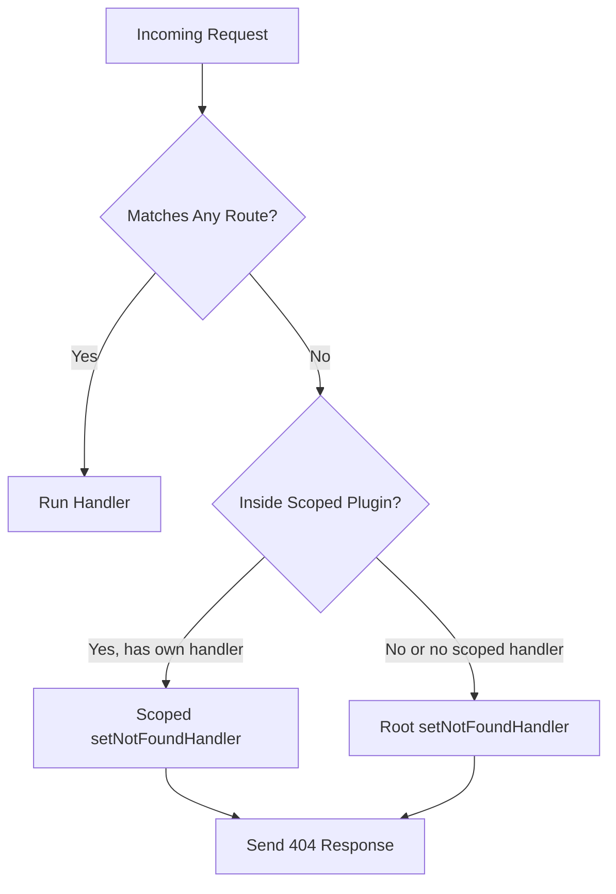

## Not Found Handler with `setNotFoundHandler`

Fastify provides a dedicated API for handling requests that do not match any registered route: `setNotFoundHandler`. This is separate from the general error handler and gives precise control over 404 responses.

---

### Default 404 Behavior

Without any customization, Fastify responds to unmatched routes with:

```json
{
  "message": "Route GET:/unknown not found",
  "error": "Not Found",
  "statusCode": 404
}
```

This default response is sent by Fastify's built-in not-found handler. It is functional but not customizable without `setNotFoundHandler`.

---

### Basic Usage

```js
fastify.setNotFoundHandler(async (request, reply) => {
  reply.status(404).send({
    statusCode: 404,
    error: 'Not Found',
    message: `${request.method} ${request.url} does not exist`
  })
})
```

**Key Points:**
- The handler receives the standard `request` and `reply` objects.
- `reply.status(404)` must be set explicitly; Fastify does not set it automatically inside the handler.
- The handler can be async or callback-style, consistent with route handlers.

---

### When `setNotFoundHandler` Is Called

`setNotFoundHandler` fires in two distinct situations:

| Situation | Description |
|---|---|
| No matching route | The URL does not match any registered route |
| No matching method | The URL matches a route path but the HTTP method is not registered |

**Key Points:**
- Method-not-allowed (405) is not natively distinguished from not-found (404) in Fastify by default. Both reach `setNotFoundHandler`. [Inference — Fastify does not send 405 unless explicitly configured; verify against your version]
- If you need to distinguish 404 from 405, inspect `request.method` and cross-reference known routes manually, or use a plugin such as `@fastify/router` with method-not-allowed support.

---

### Accessing Request Information

The full `request` object is available, including method, URL, headers, and params:

```js
fastify.setNotFoundHandler(async (request, reply) => {
  request.log.warn({ url: request.url, method: request.method }, '404 hit')

  reply.status(404).send({
    statusCode: 404,
    path: request.url,
    method: request.method,
    message: 'Resource not found'
  })
})
```

---

### Scoped Not Found Handlers

Like `setErrorHandler`, `setNotFoundHandler` is scoped to the plugin context. Each encapsulated plugin can register its own not-found handler for routes within that scope.

```js
fastify.register(async function apiPlugin (instance) {
  instance.setNotFoundHandler(async (request, reply) => {
    reply.status(404).send({
      statusCode: 404,
      message: 'API endpoint not found',
      docs: 'https://example.com/api/docs'
    })
  })

  instance.get('/users', async () => ({ users: [] }))
})

// Routes outside apiPlugin use the root not-found handler
fastify.setNotFoundHandler(async (request, reply) => {
  reply.status(404).send({ message: 'Page not found' })
})
```

**Key Points:**
- The scoped handler only applies to routes registered within that plugin instance.
- Routes registered at the root level use the root not-found handler.
- Plugin scoping requires encapsulation; plugins wrapped with `fastify-plugin` do not create a new scope. [Inference — consistent with how `fastify-plugin` breaks encapsulation generally]

---

### Scoped Handler Inheritance Diagram



---

### Adding a Prefix-Aware Not Found Handler

A common use case is catching requests that fall under a path prefix but do not match a specific route:

```js
fastify.register(async function v1 (instance) {
  instance.setNotFoundHandler(async (request, reply) => {
    reply.status(404).send({
      statusCode: 404,
      message: `No v1 endpoint at ${request.url}`
    })
  })

  instance.get('/products', async () => ({ products: [] }))
  instance.get('/orders', async () => ({ orders: [] }))
}, { prefix: '/v1' })
```

Requests to `/v1/unknown` trigger the scoped handler. Requests to `/unknown` (outside `/v1`) fall to the root handler.

---

### Attaching a Hook to the Not Found Handler

`setNotFoundHandler` accepts an optional `preHandler` hook as its first argument, before the handler function. This allows middleware-like logic (e.g., authentication) to run even on 404 paths:

```js
fastify.setNotFoundHandler(
  {
    preHandler: fastify.auth([fastify.verifyToken])
  },
  async (request, reply) => {
    reply.status(404).send({ message: 'Not found' })
  }
)
```

**Key Points:**
- The options object is the first argument; the handler is the second.
- Only `preHandler` and `preValidation` hooks are supported in this position. [Inference — based on documented API shape; verify in your Fastify version]
- This is useful when 404 responses still need to go through authentication or logging pipelines.

---

### Not Found Handler and `setErrorHandler` Interaction

The not-found handler and the error handler are separate pipelines, but they can interact:

```js
fastify.setNotFoundHandler(async (request, reply) => {
  throw new Error('Custom not-found error')
  // This propagates to setErrorHandler
})

fastify.setErrorHandler(async (error, request, reply) => {
  reply.status(500).send({ message: error.message })
})
```

**Key Points:**
- If the not-found handler throws or rejects, the error propagates to `setErrorHandler`.
- This means you can treat not-found conditions as typed errors if desired:

```js
const createError = require('@fastify/error')
const NotFound = createError('NOT_FOUND', 'Resource not found at %s', 404)

fastify.setNotFoundHandler(async (request) => {
  throw new NotFound(request.url)
})
```

- The `setErrorHandler` then handles the 404 uniformly alongside other application errors.

---

### Not Found vs. Error Handler — Choosing the Right Approach

| Approach | When to Use |
|---|---|
| `setNotFoundHandler` only | Simple 404 pages; static fallback messages |
| Throw from not-found into `setErrorHandler` | Centralized error formatting across all error types |
| Scoped `setNotFoundHandler` | Different 404 responses per API version or plugin group |
| Hook on not-found handler | 404 paths still require auth or logging |

---

### Common Patterns

**Catch-all redirect:**

```js
fastify.setNotFoundHandler(async (request, reply) => {
  reply.redirect(301, '/')
})
```

**SPA fallback (serve `index.html` for unknown routes):**

```js
const path = require('path')

fastify.setNotFoundHandler(async (request, reply) => {
  return reply.sendFile('index.html') // requires @fastify/static
})
```

**Structured API 404:**

```js
fastify.setNotFoundHandler(async (request, reply) => {
  reply.status(404).send({
    statusCode: 404,
    error: 'Not Found',
    method: request.method,
    path: request.url,
    timestamp: new Date().toISOString()
  })
})
```

---

### Summary

| Feature | Behavior |
|---|---|
| Default 404 | Built-in plain JSON response |
| `setNotFoundHandler` | Replaces default; full control over 404 response |
| Scope | Plugin-scoped; inherits from parent if not set |
| Hook support | `preHandler` and `preValidation` via options object |
| Error in handler | Propagates to `setErrorHandler` |
| Method not allowed | Also triggers not-found handler by default |