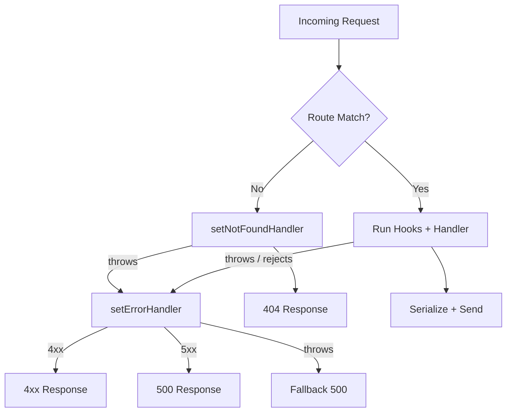

## 404 and 500 Customization in Fastify

Customizing 404 and 500 responses is a foundational concern for any production Fastify application. Both require different APIs and have distinct lifecycle behaviors. This topic consolidates both into a complete reference.

---

### Overview of the Two Pipelines

| Concern | API | Triggered By |
|---|---|---|
| 404 Not Found | `setNotFoundHandler` | No matching route or method |
| 500 Internal Server Error | `setErrorHandler` | Thrown errors, rejected promises, hook failures |

These are independent pipelines. A 404 can become a 500 if the not-found handler itself throws. A 500 is only produced by `setErrorHandler` returning a 5xx status — it is never automatic unless an unhandled error occurs.

---

### 404 Customization

#### Basic Custom 404

```js
fastify.setNotFoundHandler(async (request, reply) => {
  reply.status(404).send({
    statusCode: 404,
    error: 'Not Found',
    message: `No route found for ${request.method} ${request.url}`
  })
})
```

#### Structured JSON 404 with Metadata

```js
fastify.setNotFoundHandler(async (request, reply) => {
  reply.status(404).send({
    statusCode: 404,
    error: 'Not Found',
    path: request.url,
    method: request.method,
    timestamp: new Date().toISOString(),
    suggestion: 'Check the API documentation for available routes'
  })
})
```

#### HTML 404 Response

```js
fastify.setNotFoundHandler(async (request, reply) => {
  reply
    .status(404)
    .type('text/html')
    .send('<h1>404 — Page Not Found</h1><p>The requested resource does not exist.</p>')
})
```

**Key Points:**
- `reply.type()` sets the `Content-Type` header explicitly.
- Fastify does not infer response type from the sent value in the not-found handler. [Inference]
- HTML responses are appropriate for browser-facing applications; JSON is appropriate for APIs.

---

### 500 Customization

#### Basic Custom 500

```js
fastify.setErrorHandler(async (error, request, reply) => {
  const statusCode = error.statusCode ?? 500

  reply.status(statusCode).send({
    statusCode,
    error: statusCode === 500 ? 'Internal Server Error' : error.name,
    message: statusCode === 500
      ? 'An unexpected error occurred'
      : error.message
  })
})
```

**Key Points:**
- Exposing raw `error.message` on 500 responses may leak internal implementation details. Suppress or replace it for production. [Inference — common security practice]
- `error.statusCode` is only populated when the error was explicitly assigned one (e.g., via `@fastify/error` or manual assignment).
- The fallback `?? 500` handles plain `new Error()` objects that carry no status code.

#### Separating 4xx from 5xx

```js
fastify.setErrorHandler(async (error, request, reply) => {
  const statusCode = error.statusCode ?? 500

  if (statusCode >= 500) {
    request.log.error({ err: error }, 'Server error')
    return reply.status(500).send({
      statusCode: 500,
      error: 'Internal Server Error',
      message: 'Something went wrong on our end'
    })
  }

  reply.status(statusCode).send({
    statusCode,
    error: error.name ?? 'Error',
    message: error.message
  })
})
```

**Key Points:**
- Logging only 5xx errors prevents noise from expected client errors (4xx).
- Returning a generic message for 5xx while exposing `error.message` for 4xx is a common production pattern. [Inference — not a Fastify-enforced convention]

---

### Environment-Aware Error Responses

It is common to return different error detail levels depending on the runtime environment:

```js
const isDev = process.env.NODE_ENV !== 'production'

fastify.setErrorHandler(async (error, request, reply) => {
  const statusCode = error.statusCode ?? 500

  const body = {
    statusCode,
    message: isDev ? error.message : 'Internal Server Error'
  }

  if (isDev) {
    body.stack = error.stack
    body.code = error.code
  }

  reply.status(statusCode).send(body)
})
```

**Key Points:**
- Never expose stack traces in production responses. [Inference — standard security guidance; not Fastify-specific]
- `error.code` is available on errors created with `@fastify/error` or Node.js system errors.
- `error.stack` may be absent or incomplete depending on how the error was constructed. [Inference]

---

### Unifying 404 and 500 Into a Single Error Shape

A common API design goal is consistent error response shape across all failure types. This requires routing 404s through the error handler:

```js
const createError = require('@fastify/error')
const NotFound = createError('NOT_FOUND', 'No resource at %s', 404)

// Route 404s into the error handler
fastify.setNotFoundHandler(async (request) => {
  throw new NotFound(request.url)
})

// Single unified error shape
fastify.setErrorHandler(async (error, request, reply) => {
  const statusCode = error.statusCode ?? 500
  const isServer = statusCode >= 500

  request.log[isServer ? 'error' : 'warn']({ err: error }, 'Request failed')

  reply.status(statusCode).send({
    statusCode,
    code: error.code ?? 'INTERNAL_ERROR',
    message: isServer ? 'Internal Server Error' : error.message,
    timestamp: new Date().toISOString()
  })
})
```

**Output** (404 case):
```json
{
  "statusCode": 404,
  "code": "NOT_FOUND",
  "message": "No resource at /unknown",
  "timestamp": "2025-06-06T10:00:00.000Z"
}
```

**Output** (500 case):
```json
{
  "statusCode": 500,
  "code": "INTERNAL_ERROR",
  "message": "Internal Server Error",
  "timestamp": "2025-06-06T10:00:00.000Z"
}
```

---

### Scoped Customization Per Plugin

Both handlers are plugin-scoped. Different API versions or application sections can have distinct error shapes:

```js
// API v1 — JSON errors
fastify.register(async function v1 (instance) {
  instance.setNotFoundHandler(async (request, reply) => {
    reply.status(404).send({ statusCode: 404, message: 'v1: not found' })
  })

  instance.setErrorHandler(async (error, request, reply) => {
    reply.status(error.statusCode ?? 500).send({
      statusCode: error.statusCode ?? 500,
      message: error.message
    })
  })
}, { prefix: '/v1' })

// Web UI — HTML errors
fastify.register(async function web (instance) {
  instance.setNotFoundHandler(async (request, reply) => {
    reply.status(404).type('text/html').send('<h1>404</h1>')
  })

  instance.setErrorHandler(async (error, request, reply) => {
    reply.status(500).type('text/html').send('<h1>500</h1>')
  })
}, { prefix: '/web' })
```

---

### Lifecycle Position of Both Handlers



---

### Using `@fastify/error` for Consistent Error Codes

Defining all application errors as typed constructors centralizes status code assignment and produces consistent `code` fields:

```js
const createError = require('@fastify/error')

const errors = {
  NotFound:      createError('NOT_FOUND',      'Resource not found at %s',  404),
  Forbidden:     createError('FORBIDDEN',      'Access denied',              403),
  Unauthorized:  createError('UNAUTHORIZED',   'Authentication required',    401),
  Conflict:      createError('CONFLICT',       'Resource already exists',    409),
  Internal:      createError('INTERNAL_ERROR', 'Unexpected server error',    500)
}

module.exports = errors
```

Usage in handlers:

```js
const { NotFound, Forbidden } = require('./errors')

fastify.get('/resource/:id', async (request) => {
  const item = await db.find(request.params.id)
  if (!item) throw new NotFound(request.params.id)
  if (!item.isPublic) throw new Forbidden()
  return item
})
```

All errors arrive in `setErrorHandler` with `statusCode` and `code` already set.

---

### Logging Strategy for 404 and 500

| Status Range | Log Level | Rationale |
|---|---|---|
| 404 | `warn` | Expected client behavior; not a server fault |
| 4xx (other) | `warn` | Client error; informational |
| 5xx | `error` | Server fault; requires attention |

```js
fastify.setErrorHandler(async (error, request, reply) => {
  const statusCode = error.statusCode ?? 500
  const level = statusCode >= 500 ? 'error' : 'warn'

  request.log[level]({
    err: error,
    statusCode,
    url: request.url,
    method: request.method
  }, 'Request failed')

  reply.status(statusCode).send({
    statusCode,
    message: statusCode >= 500 ? 'Internal Server Error' : error.message
  })
})
```

---

### Validation Errors Alongside 404 and 500

Validation errors arrive in `setErrorHandler` with `error.validation` populated and `statusCode` set to `400`. A complete error handler accounts for all three categories:

```js
fastify.setErrorHandler(async (error, request, reply) => {
  const statusCode = error.statusCode ?? 500

  // Validation error (400)
  if (error.validation) {
    return reply.status(400).send({
      statusCode: 400,
      code: 'VALIDATION_ERROR',
      context: error.validationContext,
      issues: error.validation.map(e => ({
        path: e.instancePath,
        message: e.message
      }))
    })
  }

  // Client error (4xx)
  if (statusCode < 500) {
    return reply.status(statusCode).send({
      statusCode,
      code: error.code ?? 'CLIENT_ERROR',
      message: error.message
    })
  }

  // Server error (5xx)
  request.log.error({ err: error }, 'Unhandled server error')
  reply.status(500).send({
    statusCode: 500,
    code: 'INTERNAL_ERROR',
    message: 'Internal Server Error'
  })
})
```

---

### Summary

| Customization Target | API | Scoped? | Can Throw Into Error Handler? |
|---|---|---|---|
| 404 response | `setNotFoundHandler` | Yes | Yes |
| All errors including 500 | `setErrorHandler` | Yes | Fallback only |
| Validation errors | `setErrorHandler` + `error.validation` check | Yes | N/A |
| Typed error constructors | `@fastify/error` | N/A | Yes — via throw |