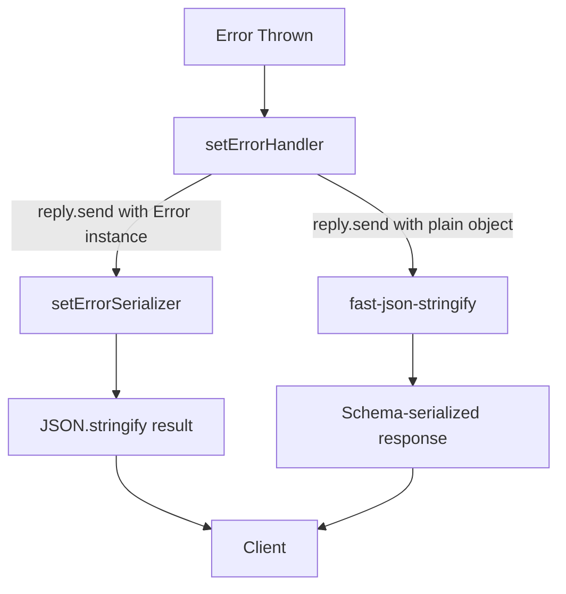
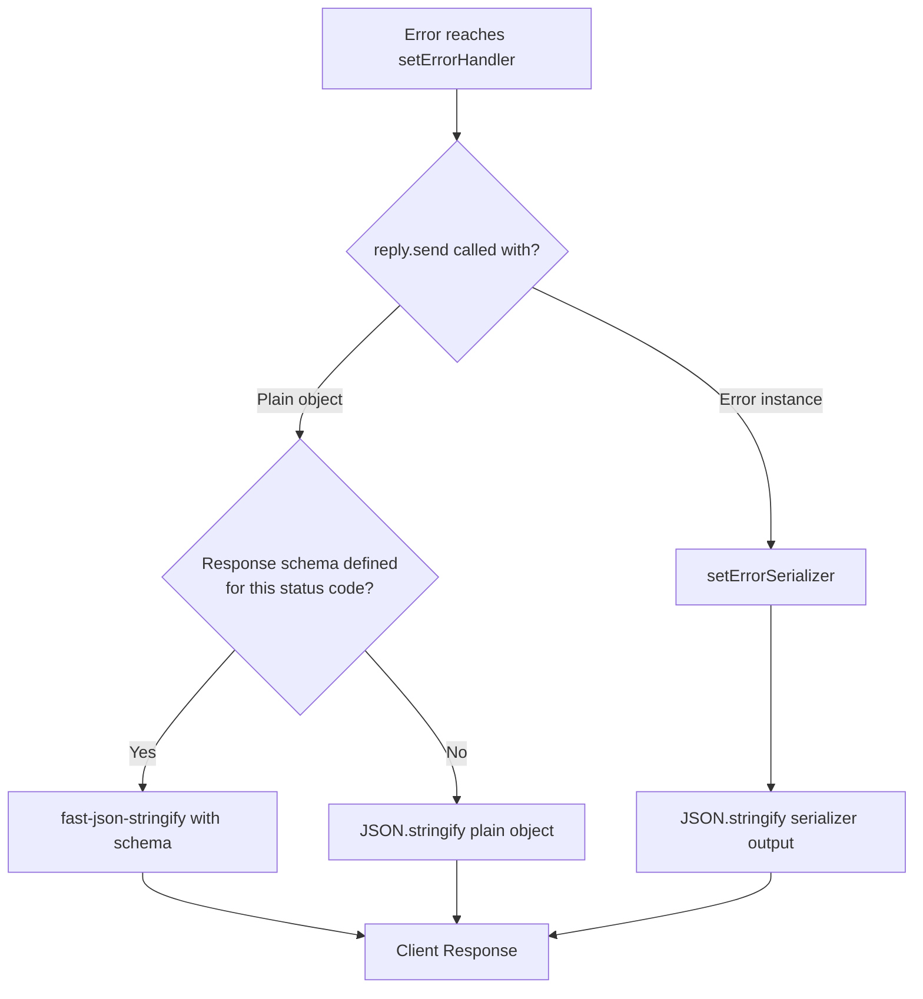

## Error Serialization in Fastify

Error serialization controls how error objects are converted into the response payload sent to the client. Fastify has a distinct serialization pipeline for errors that is separate from the normal response serialization pipeline.

---

### How Fastify Serializes Errors by Default

When an error reaches `setErrorHandler` and `reply.send(error)` is called with an `Error` instance, Fastify uses a built-in error serializer rather than the standard JSON schema serializer used for normal responses.

The default serializer produces:

```json
{
  "statusCode": 500,
  "error": "Internal Server Error",
  "message": "Something failed"
}
```

**Key Points:**
- The default serializer reads `error.statusCode`, `error.message`, and derives `error` (the label) from the HTTP status code via the `http` module.
- Properties beyond these three are not included by default.
- Custom properties attached to an error object (e.g., `error.code`, `error.context`) are silently dropped unless you override serialization.

---

### Normal Serialization vs. Error Serialization

Fastify uses two distinct paths:

| Scenario | Serializer Used |
|---|---|
| `reply.send({ ... })` with a plain object | JSON schema serializer (fast-json-stringify) |
| `reply.send(error)` with an `Error` instance | Error serializer |
| `reply.send({ statusCode, message })` (plain object, not Error) | JSON schema serializer |

**Key Points:**
- Sending a plain object with error shape bypasses error serialization and goes through the normal schema serializer.
- This distinction matters: if you want schema-controlled serialization of error responses, send a plain object, not an `Error` instance.
- Behavior may vary if a response schema is defined for error status codes. [Inference]

---

### Customizing Error Serialization with `setErrorHandler`

The most common approach is to intercept in `setErrorHandler` and call `reply.send()` with a plain object rather than the raw error:

```js
fastify.setErrorHandler(async (error, request, reply) => {
  const statusCode = error.statusCode ?? 500

  reply.status(statusCode).send({
    statusCode,
    code: error.code ?? 'UNKNOWN_ERROR',
    message: statusCode >= 500 ? 'Internal Server Error' : error.message,
    timestamp: new Date().toISOString()
  })
})
```

Because a plain object is passed to `reply.send()`, the normal JSON serializer handles it — not the error serializer.

---

### Replacing the Error Serializer

Fastify exposes `setErrorSerializer` to replace the built-in error serializer globally. This controls what happens when `reply.send(error)` is called with an actual `Error` instance:

```js
fastify.setErrorSerializer(function (error, statusCode) {
  return {
    statusCode,
    code: error.code ?? 'ERROR',
    message: error.message,
    timestamp: new Date().toISOString()
  }
})
```

**Key Points:**
- `setErrorSerializer` receives the raw error object and the resolved status code as arguments.
- The return value must be a plain object or a string. It is then passed through `JSON.stringify`. [Inference — based on documented behavior; verify in your Fastify version]
- `setErrorSerializer` is applied globally; it is not scoped to plugins.
- If both `setErrorHandler` and `setErrorSerializer` are defined, `setErrorHandler` runs first. If the handler calls `reply.send(error)` with an `Error` instance, the serializer is then invoked. If the handler calls `reply.send(plainObject)`, the serializer is bypassed.

---

### Interaction Between `setErrorHandler` and `setErrorSerializer`



---

### Defining Response Schemas for Error Status Codes

Fastify allows defining output schemas for specific HTTP status codes, including error codes. When defined, these schemas control serialization of plain object error responses via `fast-json-stringify`:

```js
fastify.get('/item/:id', {
  schema: {
    response: {
      200: {
        type: 'object',
        properties: {
          id: { type: 'string' },
          name: { type: 'string' }
        }
      },
      404: {
        type: 'object',
        properties: {
          statusCode: { type: 'integer' },
          code: { type: 'string' },
          message: { type: 'string' }
        }
      },
      500: {
        type: 'object',
        properties: {
          statusCode: { type: 'integer' },
          message: { type: 'string' }
        }
      }
    }
  }
}, async (request, reply) => {
  const item = await db.find(request.params.id)
  if (!item) {
    return reply.status(404).send({
      statusCode: 404,
      code: 'NOT_FOUND',
      message: 'Item not found'
    })
  }
  return item
})
```

**Key Points:**
- Response schemas for error codes only apply when sending plain objects. They do not intercept `Error` instances routed through `setErrorSerializer`.
- Properties not listed in the schema are stripped by `fast-json-stringify`. This can cause silent data loss if the error object has fields not declared in the schema. [Inference — consistent with how fast-json-stringify handles unknown fields]
- Defining error schemas per route is verbose; it is more common to rely on `setErrorHandler` sending normalized plain objects.

---

### Serializing Custom Error Properties

If your errors carry custom properties that must appear in the response, they must be explicitly extracted — either in `setErrorHandler` or `setErrorSerializer`:

```js
const createError = require('@fastify/error')

const ValidationFailure = createError(
  'VALIDATION_FAILURE',
  'Input validation failed',
  422
)

// Attaching extra context to the error
function throwWithContext (fields) {
  const err = new ValidationFailure()
  err.fields = fields
  throw err
}
```

In `setErrorHandler`:

```js
fastify.setErrorHandler(async (error, request, reply) => {
  const statusCode = error.statusCode ?? 500

  const body = {
    statusCode,
    code: error.code ?? 'ERROR',
    message: error.message
  }

  // Explicitly include custom properties
  if (error.fields) body.fields = error.fields

  reply.status(statusCode).send(body)
})
```

**Key Points:**
- Custom properties on `Error` instances are not automatically serialized by any Fastify mechanism.
- Each custom property must be extracted and placed on the plain object passed to `reply.send()`.
- Alternatively, custom properties can be handled inside `setErrorSerializer`, but this makes the serializer responsible for business-level concerns, which reduces clarity. [Inference]

---

### Using `fast-json-stringify` Directly for Error Responses

For high-throughput APIs where error response performance matters, you can pre-compile an error serializer using `fast-json-stringify` directly and invoke it manually:

```js
const FJS = require('fast-json-stringify')

const serializeError = FJS({
  type: 'object',
  properties: {
    statusCode: { type: 'integer' },
    code: { type: 'string' },
    message: { type: 'string' },
    timestamp: { type: 'string' }
  }
})

fastify.setErrorHandler(async (error, request, reply) => {
  const statusCode = error.statusCode ?? 500

  reply
    .status(statusCode)
    .type('application/json')
    .send(serializeError({
      statusCode,
      code: error.code ?? 'ERROR',
      message: statusCode >= 500 ? 'Internal Server Error' : error.message,
      timestamp: new Date().toISOString()
    }))
})
```

**Key Points:**
- `fast-json-stringify` produces a string, not an object. Setting `Content-Type` explicitly is necessary here.
- Pre-compiled serializers avoid repeated schema compilation on each request. [Inference — this is the stated purpose of fast-json-stringify's compile-once design]
- This approach is an optimization; for most applications the default path is sufficient.

---

### Error Serialization in `onError` Hook

The `onError` hook fires after `setErrorHandler` and before the error response is sent. It can be used for side effects (logging, monitoring) but cannot alter the serialized response body at that point:

```js
fastify.addHook('onError', async (request, reply, error) => {
  // Side effects only — response body is already determined
  await metrics.increment('errors', { code: error.code, status: error.statusCode })
})
```

**Key Points:**
- `onError` cannot modify what is sent to the client. [Inference — based on hook lifecycle position; verify in your Fastify version]
- Attempting to call `reply.send()` inside `onError` may produce unexpected behavior or be silently ignored.
- Use `onError` for observability concerns only; use `setErrorHandler` for response shaping.

---

### Precedence and Interaction Summary



---

### Summary Table

| Mechanism | Controls | Scope | Receives |
|---|---|---|---|
| `setErrorSerializer` | Serialization of `Error` instances via `reply.send(err)` | Global | `(error, statusCode)` |
| `setErrorHandler` | Error interception and response shaping | Plugin-scoped | `(error, request, reply)` |
| Response schema (error codes) | Serialization of plain object error responses | Route-level | Schema-driven |
| `onError` hook | Side effects after error is handled | Plugin-scoped | `(request, reply, error)` |
| Manual `fast-json-stringify` | Pre-compiled serialization in handler | Handler-level | Manual invocation |