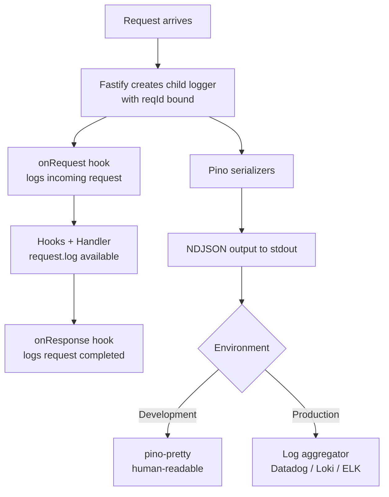

## Built-in Pino Logger in Fastify

Fastify ships with [Pino](https://github.com/pinojs/pino) as its built-in logger. It is integrated directly into the framework — not bolted on — meaning every request gets a logger instance automatically, and logging is structured, fast, and low-overhead by design.

---

### Why Pino

Pino is a JSON-first, extremely low-overhead logger for Node.js. Fastify chose it because:

- Log output is newline-delimited JSON (NDJSON) by default, suitable for log aggregation pipelines (Datadog, Loki, ELK, etc.)
- Serialization is handled by a pre-compiled fast serializer
- It is asynchronous-friendly and adds negligible latency per request
- It produces a child logger per request automatically, carrying request-scoped context

[Inference — the above reflects documented Pino design goals; actual overhead characteristics depend on runtime environment and configuration]

---

### Enabling the Logger

Logging is disabled by default. Enable it at server instantiation:

```js
const fastify = require('fastify')({
  logger: true
})
```

With `logger: true`, Fastify uses Pino with default settings: JSON output to `stdout`, log level `info`.

---

### Enabling with Options

Pass a configuration object instead of `true` to control Pino behavior:

```js
const fastify = require('fastify')({
  logger: {
    level: 'debug',
    transport: {
      target: 'pino-pretty',
      options: {
        colorize: true,
        translateTime: 'HH:MM:ss Z',
        ignore: 'pid,hostname'
      }
    }
  }
})
```

**Key Points:**
- `pino-pretty` is a development convenience. It adds formatting overhead and is not suitable for production use. [Inference — stated in Pino's own documentation]
- In production, output raw JSON and process it downstream.
- `level` controls the minimum severity level emitted. Levels in ascending order: `trace`, `debug`, `info`, `warn`, `error`, `fatal`.

---

### Accessing the Logger

#### Server-level logger

```js
fastify.log.info('Server starting')
fastify.log.error({ err: someError }, 'Startup failure')
```

#### Request-scoped logger

Each request automatically gets a child logger with the request ID bound:

```js
fastify.get('/example', async (request, reply) => {
  request.log.info('Handling request')
  request.log.debug({ userId: request.user?.id }, 'User context')
  return { ok: true }
})
```

**Key Points:**
- `request.log` is a Pino child logger. It inherits the server logger's level and transport but automatically includes `reqId` in every log line.
- Using `request.log` instead of `fastify.log` inside handlers is the recommended pattern for request-scoped logging. [Inference — consistent with Fastify documentation conventions]

---

### Automatic Request and Response Logging

With the logger enabled, Fastify automatically logs:

- Incoming request on `onRequest` hook
- Outgoing response on `onResponse` hook

**Example log output (JSON, formatted for readability):**

```json
{
  "level": 30,
  "time": 1717660800000,
  "pid": 12345,
  "hostname": "server-01",
  "reqId": "req-1",
  "req": {
    "method": "GET",
    "url": "/users",
    "hostname": "localhost:3000",
    "remoteAddress": "127.0.0.1",
    "remotePort": 52000
  },
  "msg": "incoming request"
}
```

```json
{
  "level": 30,
  "time": 1717660800050,
  "reqId": "req-1",
  "res": {
    "statusCode": 200
  },
  "responseTime": 50.12,
  "msg": "request completed"
}
```

**Key Points:**
- `level: 30` corresponds to `info` in Pino's numeric level system.
- `reqId` links the request and response log lines together.
- `responseTime` is in milliseconds.

---

### Log Levels

| Level | Numeric | Method | Typical Use |
|---|---|---|---|
| `trace` | 10 | `log.trace()` | Very fine-grained internal detail |
| `debug` | 20 | `log.debug()` | Development diagnostics |
| `info` | 30 | `log.info()` | Normal operational events |
| `warn` | 40 | `log.warn()` | Unexpected but non-fatal conditions |
| `error` | 50 | `log.error()` | Failures requiring attention |
| `fatal` | 60 | `log.fatal()` | Unrecoverable errors |

Only messages at or above the configured `level` are emitted. Messages below are discarded with near-zero cost. [Inference — Pino uses level guards to skip serialization entirely for suppressed levels]

---

### Logging with Context Objects

Pino supports a merging object as the first argument:

```js
request.log.info({ userId: 42, action: 'login' }, 'User logged in')
```

**Output:**
```json
{
  "level": 30,
  "reqId": "req-1",
  "userId": 42,
  "action": "login",
  "msg": "User logged in"
}
```

**Key Points:**
- The context object is merged into the log line at the top level.
- Avoid placing sensitive data (passwords, tokens, PII) directly in log objects without redaction. [Inference — general security practice]
- Do not use `{ err }` shorthand unless you explicitly configure an `err` serializer; use `{ err: error }` for clarity.

---

### Error Logging

Pino has a built-in `err` serializer that extracts `message`, `stack`, and `type` from `Error` instances:

```js
request.log.error({ err: error }, 'Handler failed')
```

**Output:**
```json
{
  "level": 50,
  "reqId": "req-1",
  "err": {
    "type": "Error",
    "message": "Something went wrong",
    "stack": "Error: Something went wrong\n    at ..."
  },
  "msg": "Handler failed"
}
```

**Key Points:**
- Always pass errors under the `err` key to trigger the built-in serializer.
- Passing an error as the first argument directly (`log.error(error)`) does not invoke the serializer and may produce incomplete output. [Inference — based on Pino's documented behavior; verify with your version]

---

### Request ID (`reqId`)

Every request log line includes a `reqId` that links logs across the lifecycle of a single request.

#### Default behavior

By default, Fastify uses an incrementing integer as the request ID.

#### Custom request ID generator

```js
const fastify = require('fastify')({
  logger: true,
  genReqId: (request) => {
    return request.headers['x-request-id'] ?? crypto.randomUUID()
  }
})
```

**Key Points:**
- Propagating `x-request-id` from upstream services allows distributed tracing correlation.
- `crypto.randomUUID()` is available in Node.js 14.17+.
- The generated ID is attached to `request.id` and to every `request.log` line automatically.

---

### Child Loggers and Binding Context

You can create child loggers with additional bound fields:

```js
fastify.get('/orders/:id', async (request, reply) => {
  const log = request.log.child({ orderId: request.params.id })

  log.info('Fetching order')
  const order = await db.getOrder(request.params.id)
  log.info('Order retrieved')

  return order
})
```

Every line emitted by `log` automatically includes `orderId`.

**Key Points:**
- Child loggers are cheap to create; Pino binds the context without copying the parent state. [Inference — based on Pino's child logger design]
- Child loggers inherit the level of their parent.

---

### Redacting Sensitive Fields

Pino supports field redaction via the `redact` option:

```js
const fastify = require('fastify')({
  logger: {
    level: 'info',
    redact: {
      paths: ['req.headers.authorization', 'req.headers.cookie', 'body.password'],
      censor: '[REDACTED]'
    }
  }
})
```

**Key Points:**
- `redact.paths` uses a dot-notation path syntax supporting wildcards (e.g., `'*.password'`).
- Redaction occurs at serialization time, not at log-call time. The original object in memory is not mutated. [Inference — Pino's documented redaction behavior; verify with your version]
- Redacting `req.headers.authorization` is a common baseline for API servers.

---

### Custom Serializers

Pino allows custom serializers for specific keys, giving you control over how objects are represented in log output:

```js
const fastify = require('fastify')({
  logger: {
    level: 'info',
    serializers: {
      req (request) {
        return {
          method: request.method,
          url: request.url,
          userAgent: request.headers['user-agent']
        }
      },
      res (reply) {
        return {
          statusCode: reply.statusCode
        }
      }
    }
  }
})
```

**Key Points:**
- The default `req` serializer includes `method`, `url`, `hostname`, `remoteAddress`, and `remotePort`.
- Replacing it with a leaner serializer reduces log volume in high-traffic scenarios.
- The `res` serializer controls what appears in the `"request completed"` log line.

---

### Disabling Automatic Request/Response Logs

If you want the logger active but do not want automatic per-request logs, disable them per route:

```js
fastify.get('/healthcheck', {
  logLevel: 'silent'
}, async () => {
  return { status: 'ok' }
})
```

Or globally via a custom logger configuration that sets `disableRequestLogging`:

```js
const fastify = require('fastify')({
  logger: true,
  disableRequestLogging: true
})
```

**Key Points:**
- `logLevel: 'silent'` at the route level suppresses automatic logs for that route only.
- `disableRequestLogging: true` suppresses automatic incoming/outgoing logs globally, leaving `request.log` available for manual use.
- Manual logging via `request.log` still works regardless of these settings.

---

### Using an External Pino Instance

If you need to share a Pino instance across the application (e.g., for a monorepo with shared logging config), pass it directly:

```js
const pino = require('pino')

const logger = pino({
  level: 'info',
  redact: ['req.headers.authorization']
})

const fastify = require('fastify')({ logger })
```

**Key Points:**
- The passed instance is used as-is; Fastify creates child loggers from it per request.
- Ensure the instance is configured before passing; changes after instantiation may not propagate. [Inference]

---

### Log Output Pipeline



---

### Summary

| Feature | API / Option |
|---|---|
| Enable logger | `logger: true` or `logger: { ... }` |
| Server-level logging | `fastify.log.info(...)` |
| Request-scoped logging | `request.log.info(...)` |
| Custom request ID | `genReqId` option |
| Field redaction | `logger.redact` option |
| Custom serializers | `logger.serializers` option |
| Suppress route logs | `logLevel: 'silent'` on route |
| Suppress all auto logs | `disableRequestLogging: true` |
| External Pino instance | Pass instance to `logger` option |
| Child logger with context | `request.log.child({ ... })` |