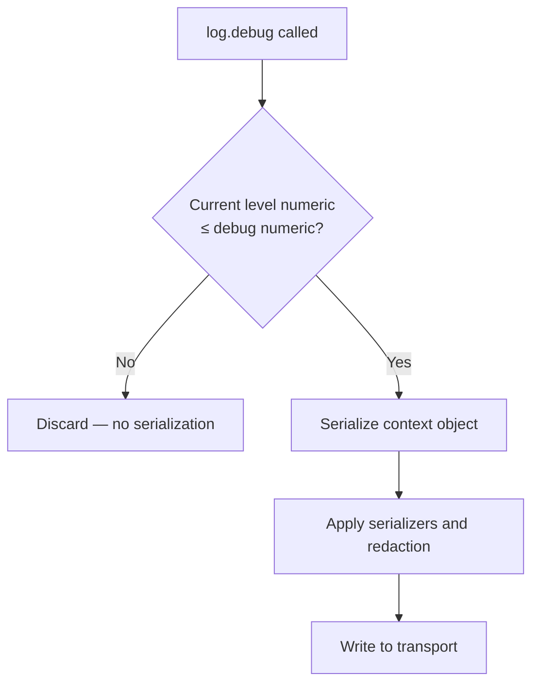

## Log Levels in Fastify (Pino)

Log levels are the primary mechanism for controlling what gets recorded and what gets discarded. In Fastify, levels are managed entirely by Pino and operate at multiple granularities: globally, per plugin, per route, and dynamically at runtime.

---

### The Level Hierarchy

Pino defines six named levels plus `silent`. Each level has a numeric value. Only messages at or above the configured threshold are emitted.

| Level | Numeric | Method | Intended Use |
|---|---|---|---|
| `trace` | 10 | `log.trace()` | Granular internal state — loop iterations, variable values |
| `debug` | 20 | `log.debug()` | Development diagnostics — function entry/exit, intermediate values |
| `info` | 30 | `log.info()` | Normal operational events — server start, request lifecycle |
| `warn` | 40 | `log.warn()` | Unexpected but recoverable conditions — deprecated usage, retries |
| `error` | 50 | `log.error()` | Failures requiring attention — caught exceptions, failed operations |
| `fatal` | 60 | `log.fatal()` | Unrecoverable failures — process about to exit |
| `silent` | Infinity | — | Suppresses all output |

**Key Points:**
- Levels are additive upward: setting `warn` emits `warn`, `error`, and `fatal` only.
- Suppressed levels incur near-zero processing cost because Pino evaluates a level guard before any serialization occurs. [Inference — consistent with Pino's documented design]
- `silent` does not disable the logger instance; it suppresses all output while keeping the logger API available.

---

### Setting the Global Level

```js
const fastify = require('fastify')({
  logger: {
    level: 'info'
  }
})
```

All `request.log` child loggers and `fastify.log` emit at this level by default.

---

### Level Method Signatures

Every level method accepts the same two calling forms:

#### Message only

```js
fastify.log.info('Server listening on port 3000')
```

#### Context object + message

```js
fastify.log.warn({ retries: 3, service: 'payments' }, 'Retrying connection')
```

#### Error with context

```js
fastify.log.error({ err: error, userId: 42 }, 'Payment processing failed')
```

**Key Points:**
- Always put the context object first and the message string second.
- Reversing the order (string first, object second) does not produce the expected structured output — the object may be ignored or mishandled. [Inference — based on Pino's documented argument order]
- Always log errors under the key `err` to trigger Pino's built-in error serializer.

---

### How Pino Evaluates Levels Internally



The guard check at `B` is a single integer comparison. Serialization only occurs if the message passes. [Inference — this reflects Pino's documented level check behavior]

---

### Changing Level at Runtime

The global level can be changed while the server is running:

```js
fastify.log.level = 'debug'
```

This affects all subsequent log calls on the root logger. Child loggers already created (including per-request loggers) may not automatically reflect the change, depending on how Pino binds the level. [Inference — child logger level inheritance at runtime is not guaranteed; verify in your Pino version]

A common pattern is exposing a management endpoint to toggle log verbosity:

```js
fastify.post('/admin/log-level', {
  schema: {
    body: {
      type: 'object',
      required: ['level'],
      properties: {
        level: { type: 'string', enum: ['trace', 'debug', 'info', 'warn', 'error', 'fatal', 'silent'] }
      }
    }
  }
}, async (request) => {
  fastify.log.level = request.body.level
  return { level: fastify.log.level }
})
```

**Key Points:**
- Restrict this endpoint to authorized requests only. Exposing it publicly allows arbitrary suppression of error logs.
- Runtime level changes are not persisted across restarts.

---

### Per-Route Log Level

Each route can declare its own `logLevel`, which controls the level of Fastify's automatic `"incoming request"` and `"request completed"` log lines for that route:

```js
// Suppress health check noise
fastify.get('/healthcheck', {
  logLevel: 'silent'
}, async () => ({ status: 'ok' }))

// Verbose logging for a critical endpoint
fastify.post('/checkout', {
  logLevel: 'debug'
}, async (request, reply) => {
  request.log.debug('Checkout initiated')
  // ...
})
```

**Key Points:**
- `logLevel` at the route level only controls Fastify's automatic lifecycle log lines — not manual `request.log` calls inside the handler. [Inference — manual calls use the child logger's own level, which inherits from the global setting]
- Setting `logLevel: 'silent'` on health check, metrics, and readiness probe endpoints is a standard practice for reducing log volume in containerized environments. [Inference]
- `logLevel: 'debug'` on a route has no effect if the global level is `info` or higher, because the child logger still respects the minimum level. [Inference — the stricter level takes precedence; verify in your Fastify version]

---

### Per-Plugin Log Level

A plugin can set a custom log level for all routes within its scope using `instance.log.level`:

```js
fastify.register(async function verbosePlugin (instance) {
  instance.log.level = 'trace'

  instance.get('/internal/state', async (request) => {
    request.log.trace('State endpoint called')
    return { state: 'ok' }
  })
})
```

**Key Points:**
- Setting `instance.log.level` inside a scoped plugin changes the level for that plugin's logger instance.
- Routes in the parent scope are unaffected.
- This is useful for selectively enabling verbose logging for a single plugin during debugging without affecting the entire application. [Inference]

---

### Using `silent` Strategically

`silent` suppresses all output without removing the logger. It is useful in:

| Scenario | Application |
|---|---|
| Test environments | Set `level: 'silent'` globally to suppress all log noise during test runs |
| Health check routes | Set `logLevel: 'silent'` per route |
| High-frequency polling endpoints | Suppress per-route automatic logs to reduce volume |
| Temporary suppression | Toggle at runtime via management endpoint |

```js
// Test environment pattern
const fastify = require('fastify')({
  logger: process.env.NODE_ENV === 'test'
    ? { level: 'silent' }
    : { level: 'info' }
})
```

---

### Level-Based Logging Strategy by Environment

| Environment | Recommended Level | Rationale |
|---|---|---|
| Development | `debug` | Visibility into application flow |
| Staging | `info` | Mirrors production; catches missing logs |
| Production | `info` or `warn` | Operational events without noise |
| Production (incident) | `debug` (runtime) | Temporary verbosity during investigation |
| Test | `silent` | Suppress output during automated runs |

---

### Checking the Current Level Programmatically

```js
console.log(fastify.log.level)       // 'info'
console.log(fastify.log.levelVal)    // 30 (numeric)
```

Within a handler:

```js
fastify.get('/debug-info', async (request) => {
  return {
    logLevel: request.log.level,
    logLevelVal: request.log.levelVal
  }
})
```

**Key Points:**
- `levelVal` is the numeric representation. Comparing numeric levels is more reliable than string comparison when evaluating level relationships programmatically. [Inference]

---

### Custom Level Definitions

Pino supports defining custom levels beyond the built-in set:

```js
const fastify = require('fastify')({
  logger: {
    level: 'http',
    customLevels: {
      http: 35  // Between info (30) and warn (40)
    }
  }
})

fastify.log.http({ method: 'GET', url: '/users' }, 'HTTP event')
```

**Key Points:**
- Custom levels must have a numeric value. Position relative to built-in levels determines filtering behavior.
- `useOnlyCustomLevels: true` can be set to replace built-in levels entirely, though this is uncommon. [Inference — Pino option; may interact unexpectedly with Fastify internals]
- Custom levels do not appear in `pino-pretty`'s output formatting by default; additional configuration may be needed. [Inference]

---

### Practical Level Usage Patterns

**Trace — internal loop detail:**
```js
for (const item of batch) {
  request.log.trace({ itemId: item.id }, 'Processing batch item')
}
```

**Debug — function-level diagnostics:**
```js
request.log.debug({ params: request.params, query: request.query }, 'Handler entered')
```

**Info — significant operational events:**
```js
fastify.log.info({ port: 3000, env: process.env.NODE_ENV }, 'Server started')
```

**Warn — recoverable unexpected conditions:**
```js
request.log.warn({ retries: attempt, service: 'db' }, 'Connection retry')
```

**Error — caught failure, request still handled:**
```js
request.log.error({ err: error, orderId: request.params.id }, 'Order lookup failed')
```

**Fatal — unrecoverable, process exiting:**
```js
fastify.log.fatal({ err: error }, 'Database connection pool exhausted — shutting down')
await fastify.close()
process.exit(1)
```

---

### Level Configuration Reference

| Configuration Point | Option | Scope |
|---|---|---|
| Global minimum level | `logger: { level: '...' }` | All logs |
| Runtime level change | `fastify.log.level = '...'` | Root logger |
| Per-route automatic logs | Route option `logLevel: '...'` | Single route |
| Per-plugin logger | `instance.log.level = '...'` | Plugin scope |
| Test suppression | `logger: { level: 'silent' }` | All logs |
| Custom levels | `logger: { customLevels: { ... } }` | All logs |