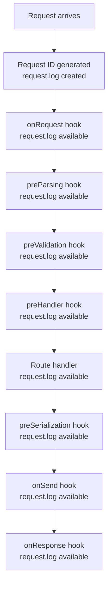

## Request-Level Logger in Fastify

Every incoming request in Fastify is automatically assigned a dedicated child logger derived from the root Pino instance. This logger is bound to the request's ID and is available throughout the entire request lifecycle — in hooks, handlers, and anywhere `request` is accessible.

---

### What the Request Logger Is

`request.log` is a Pino child logger. It is created at the start of each request with the request ID pre-bound as a field. Every log line emitted through `request.log` automatically carries that ID without any manual effort.

```js
fastify.get('/example', async (request, reply) => {
  request.log.info('Handler reached')
  return { ok: true }
})
```

**Output:**
```json
{
  "level": 30,
  "time": 1717660800000,
  "reqId": "req-1",
  "msg": "Handler reached"
}
```

**Key Points:**
- `reqId` is bound at creation time and cannot be removed from child log lines.
- `request.log` inherits the level and serializers of the root logger.
- Using `request.log` instead of `fastify.log` inside handlers is the correct pattern — `fastify.log` does not carry request context.

---

### When `request.log` Becomes Available

`request.log` is created during the `onRequest` hook phase — the earliest point in the lifecycle. It is available in every subsequent hook and in the handler.



**Key Points:**
- `request.log` is not available before `onRequest`. It does not exist at server startup or plugin registration time.
- `onResponse` fires after the response is sent; `request.log` is still accessible there for completion logging.

---

### Automatic Log Lines

With logging enabled, Fastify emits two automatic log lines per request using `request.log` internally:

**On `onRequest`:**
```json
{
  "level": 30,
  "reqId": "req-1",
  "req": {
    "method": "GET",
    "url": "/users",
    "hostname": "localhost:3000",
    "remoteAddress": "127.0.0.1",
    "remotePort": 52100
  },
  "msg": "incoming request"
}
```

**On `onResponse`:**
```json
{
  "level": 30,
  "reqId": "req-1",
  "res": { "statusCode": 200 },
  "responseTime": 12.34,
  "msg": "request completed"
}
```

**Key Points:**
- `responseTime` is in milliseconds.
- These lines are suppressed per route via `logLevel: 'silent'` or globally via `disableRequestLogging: true`.
- The `req` and `res` fields are shaped by the `serializers.req` and `serializers.res` configuration respectively.

---

### Using `request.log` in Handlers

```js
fastify.post('/orders', async (request, reply) => {
  request.log.info({ body: request.body }, 'Order received')

  const order = await createOrder(request.body)

  request.log.info({ orderId: order.id }, 'Order created')

  return order
})
```

All three log lines — the automatic incoming request, the two manual calls, and the automatic request completed — share the same `reqId`, making them trivially linkable in any log viewer.

---

### Using `request.log` in Hooks

`request.log` is available in all hooks that receive the `request` object:

```js
fastify.addHook('preHandler', async (request, reply) => {
  request.log.debug({ user: request.user?.id }, 'Auth check passed')
})

fastify.addHook('onResponse', async (request, reply) => {
  request.log.info({
    statusCode: reply.statusCode,
    responseTime: reply.elapsedTime
  }, 'Response sent')
})
```

**Key Points:**
- `reply.elapsedTime` is the time in milliseconds from when the request was received to when `onResponse` fired. [Inference — available in recent Fastify versions; verify in your version]
- Logging in `onResponse` is useful for audit trails and custom response-time metrics.

---

### Creating Child Loggers from `request.log`

Additional context can be bound for a subsection of the request lifecycle by creating a child logger:

```js
fastify.get('/report/:id', async (request, reply) => {
  const log = request.log.child({ reportId: request.params.id, phase: 'fetch' })

  log.debug('Fetching report data')
  const data = await fetchReport(request.params.id)

  log.debug({ rows: data.length }, 'Data fetched')

  return data
})
```

Every line from `log` carries both `reqId` (inherited) and `reportId` + `phase` (bound at child creation).

**Key Points:**
- Child loggers are cheap to create; Pino binds context without deep-copying the parent. [Inference — consistent with Pino's child logger implementation]
- Nested child loggers are valid: `request.log.child(...).child(...)` accumulates bindings.
- Child loggers inherit the parent's level. Changing `request.log.level` does not retroactively affect already-created children. [Inference]

---

### Passing `request.log` Into Service Layers

A common pattern is to pass the request logger into service functions so that all operations within a request remain correlated:

```js
// services/userService.js
async function getUser (id, log) {
  log.debug({ userId: id }, 'Fetching user')
  const user = await db.users.findById(id)
  if (!user) log.warn({ userId: id }, 'User not found')
  return user
}

module.exports = { getUser }
```

```js
// route handler
const { getUser } = require('./services/userService')

fastify.get('/users/:id', async (request, reply) => {
  const user = await getUser(request.params.id, request.log)
  if (!user) return reply.status(404).send({ message: 'Not found' })
  return user
})
```

**Key Points:**
- Passing `request.log` as a parameter (rather than importing `fastify.log`) keeps logs correlated under the same `reqId` throughout the call chain.
- This pattern avoids tight coupling between the service layer and the Fastify instance.
- An alternative is passing a child logger with service-specific bindings: `request.log.child({ service: 'UserService' })`.

---

### Logging Errors on `request.log`

```js
fastify.get('/data', async (request, reply) => {
  try {
    const result = await riskyOperation()
    return result
  } catch (error) {
    request.log.error({ err: error }, 'riskyOperation failed')
    throw error // re-throw to setErrorHandler
  }
})
```

**Key Points:**
- Always use `{ err: error }` to trigger Pino's built-in error serializer.
- Re-throwing after logging lets `setErrorHandler` handle the response while preserving the log trail.
- Avoid logging the error both here and in `setErrorHandler` — this produces duplicate log entries. Decide on one place for error logging per error type. [Inference]

---

### Correlating `request.log` with `reqId`

In distributed systems, the `reqId` can be propagated outward to downstream services via headers, creating a traceable chain:

```js
fastify.addHook('preHandler', async (request, reply) => {
  // Attach request ID to outgoing HTTP calls
  request.downstreamHeaders = {
    'x-request-id': request.id
  }
})

fastify.get('/composite', async (request, reply) => {
  const result = await fetch('https://service-b/data', {
    headers: request.downstreamHeaders
  })

  request.log.info({ upstream: 'service-b' }, 'Downstream call complete')

  return result.json()
})
```

**Key Points:**
- `request.id` holds the same value bound to `request.log` as `reqId`.
- Downstream services that accept and propagate `x-request-id` allow end-to-end log correlation across service boundaries.
- This pattern is manual; dedicated tracing libraries (OpenTelemetry, etc.) automate it. [Inference]

---

### Augmenting `request.log` with Additional Bound Fields

If you want every log line in a request to carry additional fields beyond `reqId` — such as authenticated user ID or tenant ID — re-bind them after authentication:

```js
fastify.addHook('preHandler', async (request, reply) => {
  if (request.user) {
    // Replace request.log with a richer child logger
    request.log = request.log.child({
      userId: request.user.id,
      tenantId: request.user.tenantId
    })
  }
})
```

All subsequent `request.log` calls in the handler and later hooks now carry `userId` and `tenantId` automatically.

**Key Points:**
- Replacing `request.log` with a child is a valid pattern; Fastify does not lock the property after creation. [Inference — no documented restriction; verify behavior in your version]
- Do this in `preHandler` or later, after authentication has populated `request.user`.
- Earlier hooks (`onRequest`, `preParsing`) fire before `request.user` is available and will still use the original logger.

---

### `request.log` vs. `fastify.log`

| | `request.log` | `fastify.log` |
|---|---|---|
| Carries `reqId` | Yes | No |
| Available in handlers | Yes | Yes (but lacks context) |
| Available at startup | No | Yes |
| Use in hooks | Yes | Avoid — loses correlation |
| Use in service layers | Yes (pass as argument) | Avoid |
| Use for server lifecycle events | No | Yes |

---

### Summary

| Feature | Mechanism |
|---|---|
| Request logger creation | Automatic at `onRequest` phase |
| Request ID binding | `genReqId` or `requestIdHeader` |
| Request ID log field name | `requestIdLogLabel` (default `reqId`) |
| Manual child logger | `request.log.child({ ... })` |
| Augmenting with auth context | Replace `request.log` in `preHandler` |
| Passing to service layers | Pass `request.log` as function argument |
| Error logging | `request.log.error({ err: error }, 'msg')` |
| Suppress automatic lines | `logLevel: 'silent'` on route |