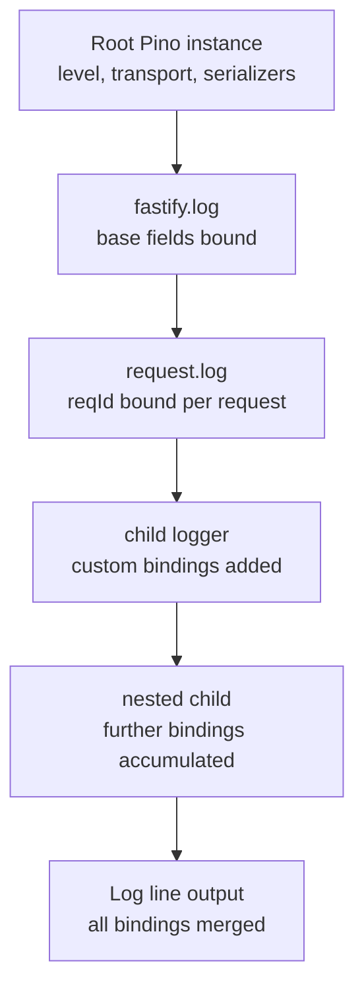

## Child Loggers in Fastify

Child loggers are Pino loggers derived from a parent logger that inherit its configuration — level, serializers, transport, redaction — while adding permanently bound fields to every log line they emit. In Fastify, child loggers are the primary mechanism for carrying contextual metadata through a request lifecycle without repeating it on every log call.

---

### What a Child Logger Is

A child logger is created by calling `.child(bindings)` on any existing Pino logger. The bindings object is merged into every log line the child emits, alongside any fields inherited from the parent.

```js
const child = request.log.child({ service: 'OrderService' })

child.info('Order created')
```

**Output:**
```json
{
  "level": 30,
  "reqId": "req-1",
  "service": "OrderService",
  "msg": "Order created"
}
```

**Key Points:**
- `reqId` is inherited from the parent `request.log`.
- `service` is bound at child creation time and appears on every subsequent line.
- The parent logger is unaffected by creating a child.

---

### How Pino Creates Child Loggers

Child loggers in Pino do not deep-copy parent state. Instead, the parent's serialized binding string is cached and prepended to each log line at write time. This makes child creation very cheap. [Inference — consistent with Pino's documented low-overhead child design; exact internals may vary across versions]



---

### Creating Child Loggers

#### From `request.log`

The most common source inside route handlers and hooks:

```js
fastify.get('/orders/:id', async (request, reply) => {
  const log = request.log.child({ orderId: request.params.id })

  log.info('Fetching order')
  const order = await db.orders.find(request.params.id)
  log.info({ status: order.status }, 'Order retrieved')

  return order
})
```

#### From `fastify.log`

Used at server startup, plugin registration, or anywhere `request` is not available:

```js
fastify.register(async function dbPlugin (instance) {
  const log = instance.log.child({ plugin: 'database' })

  log.info('Connecting to database')
  await connectDb()
  log.info('Database connected')
})
```

#### Nested child loggers

Bindings accumulate across nesting levels:

```js
const serviceLog = request.log.child({ service: 'PaymentService' })
const opLog = serviceLog.child({ operation: 'charge', currency: 'USD' })

opLog.info({ amount: 9900 }, 'Charging card')
```

**Output:**
```json
{
  "reqId": "req-1",
  "service": "PaymentService",
  "operation": "charge",
  "currency": "USD",
  "amount": 9900,
  "msg": "Charging card"
}
```

---

### Binding Strategies

#### Static bindings — known at creation time

```js
const log = request.log.child({
  module: 'checkout',
  userId: request.user.id,
  sessionId: request.session.id
})
```

All downstream calls through `log` carry these fields without repetition.

#### Dynamic fields — passed per call

For values that vary per log line, pass them in the call itself rather than binding:

```js
const log = request.log.child({ service: 'InventoryService' })

for (const item of cart.items) {
  log.debug({ itemId: item.id, qty: item.quantity }, 'Checking stock')
}
```

**Key Points:**
- Use child bindings for fields that are constant for the lifetime of the child (service name, user ID, request phase).
- Use per-call fields for values that change within the child's scope (item ID, loop index, attempt count).
- Binding a field that changes frequently defeats the purpose of child binding and may suggest the wrong granularity. [Inference]

---

### Passing Child Loggers Into Service Layers

The canonical pattern for maintaining request correlation throughout the call stack:

```js
// services/inventory.js
async function checkStock (items, log) {
  const serviceLog = log.child({ service: 'InventoryService' })

  for (const item of items) {
    serviceLog.debug({ itemId: item.id }, 'Checking stock level')
    const stock = await db.stock.find(item.id)

    if (stock.qty < item.quantity) {
      serviceLog.warn({ itemId: item.id, available: stock.qty }, 'Insufficient stock')
    }
  }
}

module.exports = { checkStock }
```

```js
// route handler
const { checkStock } = require('./services/inventory')

fastify.post('/checkout', async (request, reply) => {
  await checkStock(request.body.items, request.log)
  return { status: 'ok' }
})
```

**Key Points:**
- The service creates its own child logger from the passed parent, adding `service` without modifying the caller's logger.
- All lines — from the handler and all service layers — share the same `reqId` and form a coherent log trail.
- Avoid importing `fastify.log` directly into service modules; this breaks correlation and couples services to the Fastify instance.

---

### Augmenting `request.log` After Authentication

A common need is adding user context to every log line after authentication completes. Replacing `request.log` with a child in `preHandler` achieves this:

```js
fastify.addHook('preHandler', async (request, reply) => {
  if (request.user) {
    request.log = request.log.child({
      userId: request.user.id,
      role: request.user.role,
      tenantId: request.user.tenantId
    })
  }
})
```

Every `request.log` call in the handler and any hooks that follow now carries the user context automatically.

**Key Points:**
- Replacing `request.log` with a child is valid; Fastify does not enforce immutability on `request.log`. [Inference — no documented restriction; verify in your Fastify version]
- Only hooks that run after this `preHandler` see the augmented logger. Earlier hooks (`onRequest`, `preParsing`) use the original.
- Do not add sensitive user fields (passwords, tokens) as bindings; they would appear in every log line for the request. [Inference — general security guidance]

---

### Child Loggers for Request Phases

Structuring a complex handler by phase with distinct child loggers improves log readability:

```js
fastify.post('/import', async (request, reply) => {
  const base = request.log.child({ job: 'import', fileId: request.body.fileId })

  const parseLog = base.child({ phase: 'parse' })
  parseLog.info('Starting parse')
  const records = await parseFile(request.body.fileId)
  parseLog.info({ count: records.length }, 'Parse complete')

  const saveLog = base.child({ phase: 'save' })
  saveLog.info('Saving records')
  await saveRecords(records)
  saveLog.info('Save complete')

  return { imported: records.length }
})
```

**Output lines carry:** `reqId`, `job`, `fileId`, `phase` — providing instant context for any individual log line.

---

### Level Inheritance and Override

Child loggers inherit the parent's level by default. A child can be created with a different level:

```js
const verboseLog = request.log.child({ subsystem: 'parser' })
verboseLog.level = 'trace'

verboseLog.trace('Tokenizing input')  // emitted
request.log.trace('Root trace')       // suppressed if root is 'info'
```

**Key Points:**
- Setting `verboseLog.level = 'trace'` overrides the inherited level for that child only.
- The parent logger is unaffected.
- A child cannot emit below its own level or above it. Setting a higher level than the parent also works: `child.level = 'error'` suppresses everything below `error` for that child even if the parent would emit `info`. [Inference — based on Pino's level evaluation per logger instance]

---

### Child Loggers with Custom Serializers

Serializers defined at the root logger level apply to all child loggers. Additional serializers cannot be added at child creation time in standard Pino usage — they must be defined at root configuration or via a new logger instance. [Inference — verify in your Pino version; serializer inheritance behavior may vary]

If per-child serializer behavior is needed, one approach is to apply transformation in the binding itself:

```js
const log = request.log.child({
  user: {
    id: request.user.id,
    email: request.user.email
    // deliberately omitting sensitive fields rather than relying on serializer
  }
})
```

---

### Practical Naming Conventions for Bindings

Consistent binding keys across the codebase make log querying reliable in aggregation platforms:

| Binding Key | Values | Purpose |
|---|---|---|
| `service` | `'OrderService'`, `'AuthService'` | Service layer identifier |
| `module` | `'checkout'`, `'reporting'` | Feature module |
| `phase` | `'parse'`, `'validate'`, `'save'` | Stage within a multi-step operation |
| `operation` | `'create'`, `'update'`, `'delete'` | CRUD or domain operation |
| `jobId` | UUID | Background job or batch correlation |
| `userId` | Integer or UUID | Authenticated user |
| `tenantId` | String | Multi-tenant context |
| `entity` | `'order'`, `'invoice'` | Domain entity type |

**Key Points:**
- Establishing naming conventions early reduces inconsistency as a codebase grows. [Inference]
- Log aggregation platforms (Datadog, Loki, ELK) index on field names; inconsistent keys fragment query results.

---

### Anti-Patterns

**Creating a new child for every log call:**
```js
// Avoid — creates a new child on every iteration
for (const item of items) {
  request.log.child({ itemId: item.id }).info('Processing')
}

// Prefer — create once, pass dynamic fields per call
const log = request.log.child({ phase: 'processing' })
for (const item of items) {
  log.info({ itemId: item.id }, 'Processing')
}
```

**Binding mutable state:**
```js
// Avoid — the object reference is captured, not a snapshot
const log = request.log.child({ cart })
cart.items.push(newItem) // log's binding now reflects the mutation unexpectedly
```

**Key Points:**
- Bind primitive values or snapshots, not mutable object references.
- Child creation is cheap but not free. Avoid creating children in tight loops when a single child created before the loop suffices. [Inference]

---

### Summary

| Feature | Mechanism |
|---|---|
| Create child logger | `logger.child({ key: value })` |
| Inherit parent bindings | Automatic — all parent bindings carry forward |
| Add static context | Pass in `.child()` call |
| Add dynamic context | Pass in individual log call |
| Override level | Set `child.level = '...'` after creation |
| Augment `request.log` with auth context | Replace `request.log` in `preHandler` hook |
| Pass to service layers | Accept logger as function argument |
| Nested children | `.child().child()` — bindings accumulate |