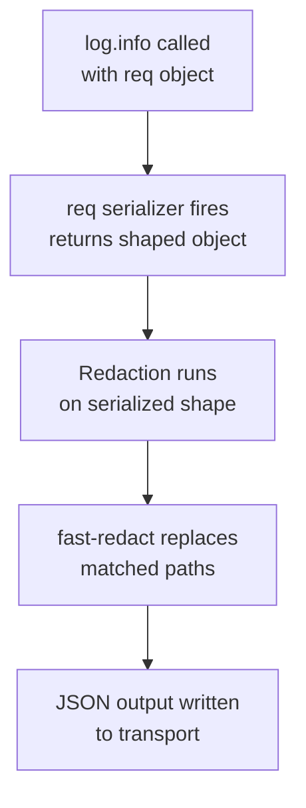

## Logging Redaction and Serializers in Fastify

Redaction and serializers are two complementary mechanisms that control what appears in log output. Serializers shape how objects are represented. Redaction removes or replaces sensitive values. Both operate at serialization time — before output is written — and neither mutates the original object in memory.

---

### Conceptual Distinction

| Mechanism | Purpose | Operates On |
|---|---|---|
| Serializers | Transform an object into its log representation | Specific named keys |
| Redaction | Replace sensitive field values with a censor string | Dot-path addressed fields |

Serializers run first, producing the log object. Redaction then operates on that serialized representation. [Inference — based on Pino's documented processing order; verify in your Pino version]

---

### Serializers

#### How Serializers Work

A serializer is a function registered under a key name. When a log call includes that key, the function receives the value and returns a replacement representation:

```js
const fastify = require('fastify')({
  logger: {
    serializers: {
      req (request) {
        return {
          method: request.method,
          url: request.url
        }
      }
    }
  }
})
```

When Fastify logs `{ req: rawRequest }`, the serializer intercepts `rawRequest` and replaces it with the return value.

**Key Points:**
- Serializers only fire for the exact key name they are registered under.
- The return value must be a plain object, primitive, or array — anything JSON-serializable.
- Serializers do not fire for keys that do not appear in the log call.
- Throwing inside a serializer may produce incomplete or malformed log output. [Inference — Pino does not document guaranteed error handling inside serializers]

---

#### Fastify's Default Serializers

Fastify registers three default serializers via Pino:

**`req` serializer** — fires on the automatic `"incoming request"` line:

```js
// Default shape
{
  method: request.method,
  url: request.url,
  hostname: request.hostname,
  remoteAddress: request.socket.remoteAddress,
  remotePort: request.socket.remotePort
}
```

**`res` serializer** — fires on the automatic `"request completed"` line:

```js
// Default shape
{
  statusCode: reply.statusCode
}
```

**`err` serializer** — fires when a value is logged under the key `err`:

```js
// Default shape
{
  type: error.constructor.name,
  message: error.message,
  stack: error.stack
}
```

---

#### Replacing the `req` Serializer

```js
const fastify = require('fastify')({
  logger: {
    serializers: {
      req (request) {
        return {
          method: request.method,
          url: request.url,
          ip: request.ip,
          userAgent: request.headers['user-agent'] ?? 'unknown',
          contentType: request.headers['content-type'] ?? null
        }
      }
    }
  }
})
```

**Key Points:**
- Replacing the default `req` serializer completely replaces it — there is no merge with the original. Include every field you want to retain.
- Adding headers to the `req` serializer output increases log volume. Include only headers relevant to debugging or auditing.
- Do not include `authorization`, `cookie`, or other credential headers in the serializer output without redaction. [Inference — general security guidance]

---

#### Replacing the `res` Serializer

```js
const fastify = require('fastify')({
  logger: {
    serializers: {
      res (reply) {
        return {
          statusCode: reply.statusCode,
          contentLength: reply.getHeader('content-length') ?? null
        }
      }
    }
  }
})
```

---

#### Replacing the `err` Serializer

```js
const fastify = require('fastify')({
  logger: {
    serializers: {
      err (error) {
        return {
          type: error.constructor.name,
          message: error.message,
          code: error.code ?? null,
          statusCode: error.statusCode ?? null,
          stack: process.env.NODE_ENV !== 'production' ? error.stack : undefined
        }
      }
    }
  }
})
```

**Key Points:**
- Suppressing `stack` in production reduces log volume and avoids leaking internal file paths. [Inference — common practice; evaluate against your observability requirements]
- `error.code` is present on `@fastify/error` instances and Node.js system errors.
- Returning `undefined` for a field omits it from the serialized output.

---

#### Custom Domain Serializers

Serializers can be registered for any key, not just `req`, `res`, and `err`:

```js
const fastify = require('fastify')({
  logger: {
    serializers: {
      user (user) {
        return {
          id: user.id,
          role: user.role
          // email, password deliberately omitted
        }
      },
      order (order) {
        return {
          id: order.id,
          status: order.status,
          total: order.total
        }
      }
    }
  }
})
```

Usage in handlers:

```js
fastify.get('/orders/:id', async (request, reply) => {
  const order = await db.orders.find(request.params.id)
  request.log.info({ order }, 'Order fetched')
  // The 'order' serializer fires here
})
```

**Key Points:**
- Custom serializers are the correct place to control which domain object fields appear in logs — not the logging call site.
- This centralizes the decision about what is safe to log for a given type.
- If the same domain object is logged under different key names in different places, only the matching key triggers the serializer.

---

#### Per-Route Serializer Override (`logSerializers`)

Individual routes can override serializers for their automatic log lines:

```js
fastify.get('/admin/audit', {
  logSerializers: {
    req (request) {
      return {
        method: request.method,
        url: request.url,
        ip: request.ip,
        userId: request.headers['x-user-id'] ?? null
      }
    }
  }
}, async (request, reply) => {
  return auditLog()
})
```

**Key Points:**
- `logSerializers` at the route level applies only to Fastify's automatic request/response log lines for that route.
- Manual `request.log` calls inside the handler still use the global serializers. [Inference — verify in your Fastify version]
- This is useful for routes where automatic logs need richer or different request fields without affecting the global configuration.

---

### Redaction

#### How Redaction Works

Redaction uses the `fast-redact` library (built into Pino) to identify fields by dot-path and replace their values with a censor string at serialization time. The original object in memory is never mutated.

```js
const fastify = require('fastify')({
  logger: {
    redact: ['req.headers.authorization', 'req.headers.cookie']
  }
})
```

A request with `Authorization: Bearer abc123` produces:

```json
{
  "req": {
    "method": "GET",
    "url": "/profile",
    "hostname": "localhost:3000",
    "remoteAddress": "127.0.0.1",
    "headers": {
      "authorization": "[Redacted]"
    }
  },
  "msg": "incoming request"
}
```

---

#### Array Form vs. Object Form

**Array form** — uses default censor `'[Redacted]'`:

```js
redact: [
  'req.headers.authorization',
  'req.headers.cookie',
  '*.password'
]
```

**Object form** — full control:

```js
redact: {
  paths: [
    'req.headers.authorization',
    'req.headers.cookie',
    '*.password',
    '*.token',
    '*.secret',
    'req.body.creditCard'
  ],
  censor: '[REDACTED]',
  remove: false
}
```

| Option | Type | Default | Purpose |
|---|---|---|---|
| `paths` | `string[]` | Required | Dot-path list of fields to redact |
| `censor` | `string` or `function` | `'[Redacted]'` | Replacement value |
| `remove` | `boolean` | `false` | Remove the key entirely instead of replacing |

---

#### Path Syntax

| Syntax | Matches |
|---|---|
| `'req.headers.authorization'` | Exact nested path |
| `'*.password'` | `password` key at any single depth |
| `'*.*.token'` | `token` key two levels deep from any root |
| `'users[*].email'` | `email` in every element of the `users` array |

**Key Points:**
- Wildcards match a single level. `'*.password'` does not match `a.b.password`; use `'*.*.password'` for two levels deep.
- Array wildcards (`[*]`) match all elements of an array at that position.
- Paths must match the serialized object shape, not the raw input object. If `req` goes through a serializer first, the redaction path must match what the serializer returns.
- Overly broad wildcard paths (e.g., `'*.*.*'`) may accidentally redact non-sensitive fields. Prefer specific paths where possible. [Inference]

---

#### Using a Censor Function

The `censor` value can be a function that receives the original value and returns the replacement:

```js
redact: {
  paths: ['req.headers.authorization'],
  censor (value) {
    if (typeof value === 'string' && value.startsWith('Bearer ')) {
      return 'Bearer [REDACTED]'
    }
    return '[REDACTED]'
  }
}
```

**Key Points:**
- The censor function receives the original value before replacement.
- It must return a JSON-serializable value.
- Avoid logging any portion of the original sensitive value in the censor output. The example above retains only the scheme prefix (`Bearer`), not any credential content. [Inference — evaluate carefully against your security requirements]

---

#### Removing Fields Entirely

Setting `remove: true` omits the key from the output rather than replacing it:

```js
redact: {
  paths: ['req.headers.cookie'],
  remove: true
}
```

The `cookie` key does not appear in the log line at all.

**Key Points:**
- `remove: true` applies to all paths in the list. It cannot be set per path in standard Pino configuration. [Inference — verify in your Pino version]
- Removing a field is more conservative than replacing it and is appropriate for fields with no diagnostic value.

---

#### Redaction and the `req.body` Field

Fastify does not log `req.body` automatically. If you log body content manually, include redaction paths for sensitive fields:

```js
const fastify = require('fastify')({
  logger: {
    redact: {
      paths: [
        '*.password',
        '*.currentPassword',
        '*.newPassword',
        '*.creditCard',
        '*.cvv',
        '*.ssn'
      ],
      censor: '[REDACTED]'
    }
  }
})

fastify.post('/register', async (request, reply) => {
  request.log.info({ body: request.body }, 'Registration request')
  // password field in body is redacted automatically
})
```

**Key Points:**
- Even with redaction, logging full request bodies in production should be deliberate. Body logging increases log volume and raises compliance considerations (GDPR, PCI DSS, HIPAA). [Inference — general compliance guidance; evaluate against your jurisdiction and data classification]
- Redaction operates on the serialized object. If `body` passes through a serializer first, redaction paths must match the serializer's output shape.

---

### Interaction Between Serializers and Redaction

Serializers run before redaction. The sequence for a log call containing `{ req: rawRequest }`:



**Key Points:**
- If the `req` serializer does not include `headers`, then `req.headers.authorization` as a redaction path matches nothing — the header was already excluded.
- If you add headers to the `req` serializer output and then want to redact specific ones, the redaction path must match the serializer's output structure.
- This ordering means serializers can be used as a first line of field exclusion, with redaction as a secondary safety net for fields that do slip through.

---

### Combined Configuration Example

A production-oriented configuration combining custom serializers and thorough redaction:

```js
const fastify = require('fastify')({
  logger: {
    level: 'info',
    serializers: {
      req (request) {
        return {
          method: request.method,
          url: request.url,
          ip: request.ip,
          userAgent: request.headers['user-agent'] ?? null,
          // authorization header intentionally excluded here
          // redaction below acts as a safety net if it appears elsewhere
        }
      },
      res (reply) {
        return {
          statusCode: reply.statusCode
        }
      },
      err (error) {
        return {
          type: error.constructor.name,
          message: error.message,
          code: error.code ?? null,
          stack: process.env.NODE_ENV !== 'production' ? error.stack : undefined
        }
      }
    },
    redact: {
      paths: [
        'req.headers.authorization',
        'req.headers.cookie',
        '*.password',
        '*.token',
        '*.secret',
        '*.apiKey',
        '*.creditCard',
        '*.cvv',
        'req.body.ssn'
      ],
      censor: '[REDACTED]'
    }
  }
})
```

---

### Summary

| Feature | Configuration Key | Scope | Mutates Original? |
|---|---|---|---|
| Built-in `req` serializer | `logger.serializers.req` | Global | No |
| Built-in `res` serializer | `logger.serializers.res` | Global | No |
| Built-in `err` serializer | `logger.serializers.err` | Global | No |
| Custom domain serializer | `logger.serializers.<key>` | Global | No |
| Per-route serializer | Route option `logSerializers` | Single route | No |
| Redaction (array) | `logger.redact: [...]` | Global | No |
| Redaction (object) | `logger.redact: { paths, censor, remove }` | Global | No |
| Censor function | `logger.redact.censor: fn` | Global | No |
| Field removal | `logger.redact.remove: true` | Global | No |