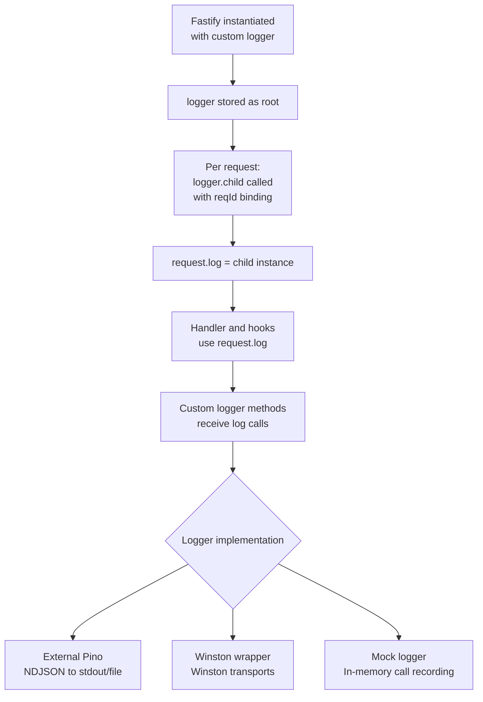

## Custom Logger Integration in Fastify

Fastify's logging system is built around Pino but is not strictly locked to it. You can pass an external Pino instance, a Pino-compatible logger, or a fully custom logger object — as long as it satisfies the interface Fastify expects. This is useful for sharing loggers across services, integrating with existing logging infrastructure, or using alternative logging libraries.

---

### Three Integration Approaches

| Approach | When to Use |
|---|---|
| External Pino instance | Shared Pino config across a monorepo or multiple Fastify instances |
| Pino-compatible logger | Drop-in alternative with the same API surface (e.g., `pino-http` setups) |
| Fully custom logger | Existing Winston, Bunyan, or other logger; testing with a mock logger |

---

### Approach 1 — External Pino Instance

Pass a pre-configured Pino instance directly to the `logger` option:

```js
const pino = require('pino')
const fastify = require('fastify')

const logger = pino({
  level: 'info',
  redact: {
    paths: ['req.headers.authorization', '*.password'],
    censor: '[REDACTED]'
  },
  transport: {
    target: 'pino/file',
    options: { destination: '/var/log/app/app.log', mkdir: true }
  },
  base: {
    service: 'api-gateway',
    version: process.env.APP_VERSION ?? 'unknown'
  }
})

const app = fastify({ logger })
```

**Key Points:**
- Fastify uses the passed instance as its root logger and derives per-request child loggers from it.
- Configuration applied to the external instance (redaction, serializers, transport) applies to all Fastify log output.
- Changes to the instance after passing it to Fastify may or may not propagate depending on what was changed. [Inference — treat post-construction mutation as unreliable]
- This approach allows the same `logger` instance to be imported and used in non-Fastify modules within the same process, sharing a single output stream.

---

### Approach 2 — Shared Logger Across Multiple Fastify Instances

In applications with multiple Fastify instances (e.g., a main server and an admin server), a single Pino instance can be shared:

```js
const pino = require('pino')
const fastify = require('fastify')

const sharedLogger = pino({ level: 'info', base: { service: 'my-app' } })

const mainApp = fastify({ logger: sharedLogger })
const adminApp = fastify({ logger: sharedLogger })
```

**Key Points:**
- Both instances log to the same transport with the same configuration.
- Per-request child loggers from each instance are independent but share the same root.
- `reqId` values from both instances appear in the same log stream; ensure `genReqId` produces globally unique IDs if cross-instance correlation matters. [Inference]

---

### Approach 3 — Fully Custom Logger

Fastify accepts any object that satisfies its logger interface. This allows integration with Winston, Bunyan, console-based loggers, or test mocks.

#### Required interface

Fastify calls these methods on the logger object:

```
logger.info(obj, msg)
logger.error(obj, msg)
logger.debug(obj, msg)
logger.warn(obj, msg)
logger.trace(obj, msg)
logger.fatal(obj, msg)
logger.child(bindings) → logger
```

The `child` method must return an object with the same interface. Fastify calls `child()` to create per-request loggers.

**Key Points:**
- All six level methods must be present even if some are no-ops. Fastify may call any of them depending on internal events.
- `child()` must return an object with the same shape. If it does not, request-level logging will fail or throw. [Inference]
- `logger.level` is read and set by Fastify for per-route `logLevel` support. Include it as a settable property if that feature is needed.

---

#### Minimal custom logger example

```js
const customLogger = {
  level: 'info',

  info (obj, msg) { console.log(JSON.stringify({ level: 'info', ...obj, msg })) },
  warn (obj, msg) { console.warn(JSON.stringify({ level: 'warn', ...obj, msg })) },
  error (obj, msg) { console.error(JSON.stringify({ level: 'error', ...obj, msg })) },
  debug (obj, msg) { console.debug(JSON.stringify({ level: 'debug', ...obj, msg })) },
  trace (obj, msg) { console.trace(JSON.stringify({ level: 'trace', ...obj, msg })) },
  fatal (obj, msg) { console.error(JSON.stringify({ level: 'fatal', ...obj, msg })) },

  child (bindings) {
    const childLogger = Object.create(this)
    childLogger._bindings = { ...this._bindings, ...bindings }
    return childLogger
  },

  _bindings: {}
}

const fastify = require('fastify')({ logger: customLogger })
```

**Key Points:**
- This is illustrative. A production custom logger requires proper level filtering, serialization, and transport handling.
- `Object.create(this)` avoids duplicating method definitions while inheriting the parent's prototype.
- `_bindings` accumulation here is naive — it does not handle Pino's prepend-string optimization. [Inference]

---

### Winston Integration

Winston does not natively satisfy Fastify's logger interface because it uses a different method signature and lacks `child()` in the expected form. A wrapper is required:

```js
const winston = require('winston')
const fastify = require('fastify')

const winstonLogger = winston.createLogger({
  level: 'info',
  format: winston.format.json(),
  transports: [new winston.transports.Console()]
})

// Wrap Winston to match Fastify's expected interface
function makeLogger (winstonInstance, bindings = {}) {
  const log = (level, obj, msg) => {
    if (typeof obj === 'string') {
      winstonInstance[level]({ ...bindings, msg: obj })
    } else {
      winstonInstance[level]({ ...bindings, ...obj, msg })
    }
  }

  return {
    get level () { return winstonInstance.level },
    set level (val) { winstonInstance.level = val },

    info  (obj, msg) { log('info',  obj, msg) },
    warn  (obj, msg) { log('warn',  obj, msg) },
    error (obj, msg) { log('error', obj, msg) },
    debug (obj, msg) { log('debug', obj, msg) },
    trace (obj, msg) { log('silly', obj, msg) }, // Winston has no 'trace'; map to 'silly'
    fatal (obj, msg) { log('error', obj, msg) }, // Winston has no 'fatal'; map to 'error'

    child (childBindings) {
      return makeLogger(winstonInstance, { ...bindings, ...childBindings })
    }
  }
}

const app = fastify({ logger: makeLogger(winstonLogger) })
```

**Key Points:**
- Winston's level names (`silly`, `verbose`) do not map 1:1 to Pino's (`trace`, `fatal`). The mapping above is a practical approximation.
- Winston's `child()` (if present) has a different signature than Pino's. The wrapper handles child creation manually.
- This wrapper does not replicate Pino's serialization performance. [Inference]
- Behavior of Winston-wrapped loggers under Fastify's per-route `logLevel` depends on whether the `level` getter/setter is correctly implemented in the wrapper.

---

### Bunyan Integration

Bunyan's interface is closer to Pino's but still requires a thin wrapper for `child()` compatibility:

```js
const bunyan = require('bunyan')

const bunyanLogger = bunyan.createLogger({
  name: 'my-app',
  level: 'info'
})

// Bunyan's child() signature is compatible but returns a Bunyan instance,
// not a plain object. Fastify accepts it as long as all methods are present.
const app = require('fastify')({ logger: bunyanLogger })
```

**Key Points:**
- Bunyan's API is closer to Pino's than Winston's, and may work with minimal or no wrapping. [Inference — compatibility depends on Fastify version and exact Bunyan version; test thoroughly]
- Bunyan serializers (`bunyan.stdSerializers`) differ from Pino's and do not apply to Fastify's automatic log lines.
- Stack traces in Bunyan's `err` output differ in format from Pino's.

---

### Test Logger (Mock Logger)

For unit and integration tests, a mock logger suppresses output while recording calls for assertion:

```js
function makeMockLogger (bindings = {}) {
  const calls = { info: [], warn: [], error: [], debug: [], trace: [], fatal: [] }

  const logger = {
    level: 'silent',
    _calls: calls,
    _bindings: bindings,

    info  (obj, msg) { calls.info.push({ ...bindings, ...obj, msg }) },
    warn  (obj, msg) { calls.warn.push({ ...bindings, ...obj, msg }) },
    error (obj, msg) { calls.error.push({ ...bindings, ...obj, msg }) },
    debug (obj, msg) { calls.debug.push({ ...bindings, ...obj, msg }) },
    trace (obj, msg) { calls.trace.push({ ...bindings, ...obj, msg }) },
    fatal (obj, msg) { calls.fatal.push({ ...bindings, ...obj, msg }) },

    child (childBindings) {
      return makeMockLogger({ ...bindings, ...childBindings })
    }
  }

  return logger
}

// In tests:
const mockLogger = makeMockLogger()
const app = require('fastify')({ logger: mockLogger })

// After a request:
console.log(mockLogger._calls.error)
// Assert specific log lines were emitted
```

**Key Points:**
- `_calls` is shared only within a single `makeMockLogger()` call. Child loggers created via `child()` have their own `_calls` object. If asserting on child logger output is needed, expose child instances explicitly. [Inference]
- This pattern avoids `tap`, `sinon`, or other spy libraries for basic log assertions.
- For more sophisticated test scenarios, libraries such as `pino-test` provide stream-based assertion utilities against real Pino output. [Unverified — verify `pino-test` availability and API in your Pino version]

---

### Using `pino-http` with Fastify

`pino-http` is a Pino-based HTTP logger middleware. It is primarily designed for Express/Connect but can be adapted. However, since Fastify already has Pino built in with request-level child loggers, using `pino-http` directly is generally redundant. [Inference]

The preferred pattern is to configure Pino via Fastify's `logger` option directly rather than layering `pino-http` on top.

---

### Verifying Custom Logger Compatibility

A basic verification checklist before using a custom logger in production:

```js
function verifyLogger (logger) {
  const required = ['info', 'warn', 'error', 'debug', 'trace', 'fatal', 'child']

  for (const method of required) {
    if (typeof logger[method] !== 'function') {
      throw new Error(`Logger missing required method: ${method}`)
    }
  }

  const child = logger.child({ test: true })

  for (const method of required) {
    if (typeof child[method] !== 'function') {
      throw new Error(`Child logger missing required method: ${method}`)
    }
  }

  return true
}

verifyLogger(customLogger) // throws if interface is incomplete
```

---

### Integration Behavior Summary



---

### Summary

| Scenario | Approach | Key Requirement |
|---|---|---|
| Shared Pino config across modules | Pass external Pino instance | None — Pino is natively compatible |
| Multiple Fastify instances | Share one Pino instance | Unique `reqId` generation |
| Winston integration | Wrap with adapter | Map level names; implement `child()` |
| Bunyan integration | Pass directly or thin wrapper | Verify `child()` compatibility |
| Test environments | Mock logger object | Implement all 6 level methods + `child()` |
| Suppress test output | `level: 'silent'` on any logger | None |