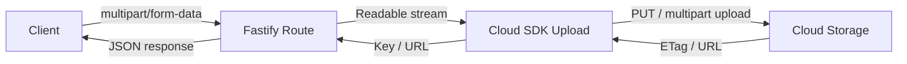

## Integrating with Cloud Storage in Fastify

Cloud storage — such as Amazon S3, Google Cloud Storage (GCS), or Azure Blob Storage — is the standard destination for uploaded files in production systems. Writing to local disk ties files to a single server instance, which breaks in horizontally scaled deployments. Streaming uploads directly to cloud storage avoids writing to disk entirely, reducing latency, disk I/O, and storage costs.

This article covers direct stream uploads to S3 and GCS from Fastify, using `@fastify/multipart` to receive the file stream and the respective SDKs to forward it to cloud storage.

---

### General Architecture

Rather than saving to disk first and then uploading, the preferred pattern is to pipe the incoming multipart stream directly to the cloud provider. This keeps memory usage low and avoids temporary file cleanup.



---

### Amazon S3

#### Installation

```bash
npm install @fastify/multipart @aws-sdk/client-s3 @aws-sdk/lib-storage
```

The `@aws-sdk/lib-storage` package provides the `Upload` class, which handles multipart uploads automatically for large files. [Inference] For files below the minimum multipart threshold (5 MB), it falls back to a single `PutObject` request — verify this behavior against current AWS SDK documentation.

#### Configuration

```js
import Fastify from 'fastify'
import multipart from '@fastify/multipart'
import { S3Client } from '@aws-sdk/client-s3'
import { Upload } from '@aws-sdk/lib-storage'
import { randomUUID } from 'crypto'
import path from 'path'

const fastify = Fastify()
await fastify.register(multipart, {
  limits: {
    fileSize: 100 * 1024 * 1024   // 100 MB
  }
})

const s3 = new S3Client({
  region: process.env.AWS_REGION,
  credentials: {
    accessKeyId: process.env.AWS_ACCESS_KEY_ID,
    secretAccessKey: process.env.AWS_SECRET_ACCESS_KEY
  }
})
```

**Key Points:**
- Credentials should always come from environment variables or an IAM role — never hardcoded
- [Inference] When running on EC2, ECS, or Lambda, the SDK picks up IAM role credentials automatically if `credentials` is omitted — behavior depends on the execution environment and SDK version

#### Single File Upload to S3

```js
fastify.post('/upload/s3', async (request, reply) => {
  const part = await request.file()

  const ext = path.extname(path.basename(part.filename))
  const key = `uploads/${randomUUID()}${ext}`

  const upload = new Upload({
    client: s3,
    params: {
      Bucket: process.env.S3_BUCKET,
      Key: key,
      Body: part.file,           // Readable stream piped directly
      ContentType: part.mimetype
    },
    queueSize: 4,                // concurrent part uploads for large files
    partSize: 5 * 1024 * 1024   // 5 MB minimum part size for multipart
  })

  const result = await upload.done()

  return {
    key,
    location: result.Location,
    bucket: result.Bucket,
    etag: result.ETag
  }
})
```

**Key Points:**
- `Body: part.file` passes the stream directly to the SDK — no disk write occurs
- `upload.done()` resolves when the upload completes and rejects on failure
- `queueSize` and `partSize` control how the SDK chunks large files; [Inference] tuning these affects throughput and memory usage under concurrent uploads — measure under realistic load
- `result.Location` is the public URL of the object if the bucket is public; for private buckets, generate a presigned URL instead

#### Multiple Files to S3

```js
fastify.post('/upload/s3/multiple', async (request, reply) => {
  const uploads = []

  for await (const part of request.files()) {
    const ext = path.extname(path.basename(part.filename))
    const key = `uploads/${randomUUID()}${ext}`

    const upload = new Upload({
      client: s3,
      params: {
        Bucket: process.env.S3_BUCKET,
        Key: key,
        Body: part.file,
        ContentType: part.mimetype
      }
    })

    // Await each upload before moving to the next part
    const result = await upload.done()
    uploads.push({ key, etag: result.ETag })
  }

  return { uploaded: uploads }
})
```

**Key Points:**
- Files are uploaded sequentially here; each `part.file` stream must be fully consumed before iterating to the next part, because multipart streams are ordered and the next part is not available until the previous one is drained
- [Inference] Attempting to read the next part before the current stream is consumed may stall or error — behavior depends on the multipart parser's internal buffering

#### Generating a Presigned URL for Private Objects

After uploading a private object, generate a time-limited URL for client access:

```js
import { GetObjectCommand } from '@aws-sdk/client-s3'
import { getSignedUrl } from '@aws-sdk/s3-request-presigner'

fastify.get('/file/:key', async (request, reply) => {
  const { key } = request.params

  const command = new GetObjectCommand({
    Bucket: process.env.S3_BUCKET,
    Key: `uploads/${key}`
  })

  const url = await getSignedUrl(s3, command, { expiresIn: 3600 })

  return { url }
})
```

**Key Points:**
- `expiresIn` is in seconds; `3600` gives a one-hour URL
- The URL is signed with the credentials active at generation time — [Inference] if those credentials are rotated or revoked before expiry, the URL may still be valid until expiry, depending on AWS's evaluation behavior
- Do not expose internal key paths directly as user-facing identifiers; map them through a database record

---

### Google Cloud Storage

#### Installation

```bash
npm install @fastify/multipart @google-cloud/storage
```

#### Configuration

```js
import { Storage } from '@google-cloud/storage'

const gcs = new Storage({
  projectId: process.env.GCP_PROJECT_ID,
  keyFilename: process.env.GCP_KEY_FILE   // path to service account JSON
})

const bucket = gcs.bucket(process.env.GCS_BUCKET)
```

**Key Points:**
- [Inference] In GKE or Cloud Run environments, `keyFilename` can be omitted and the SDK uses Workload Identity or the default service account — verify against current GCP documentation
- The `bucket` reference is reusable; instantiate it once at startup rather than per request

#### Single File Upload to GCS

```js
fastify.post('/upload/gcs', async (request, reply) => {
  const part = await request.file()

  const ext = path.extname(path.basename(part.filename))
  const filename = `uploads/${randomUUID()}${ext}`

  const blob = bucket.file(filename)

  const blobStream = blob.createWriteStream({
    resumable: false,             // for files under ~5 MB; use true for large files
    contentType: part.mimetype,
    metadata: {
      originalName: path.basename(part.filename)
    }
  })

  await pipeline(part.file, blobStream)

  return {
    filename,
    bucket: process.env.GCS_BUCKET,
    publicUrl: `https://storage.googleapis.com/${process.env.GCS_BUCKET}/${filename}`
  }
})
```

**Key Points:**
- `resumable: false` disables resumable upload protocol for small files; [Inference] resumable uploads add overhead for small payloads but are more reliable for large files over unstable connections
- `pipeline` from `stream/promises` is used here for the same reason as disk writes — it propagates errors and handles backpressure
- The `publicUrl` is only accessible if the bucket or object has public read permissions; for private buckets, generate a signed URL

#### Generating a Signed URL for GCS

```js
fastify.get('/file/gcs/:filename', async (request, reply) => {
  const { filename } = request.params
  const file = bucket.file(`uploads/${filename}`)

  const [url] = await file.getSignedUrl({
    action: 'read',
    expires: Date.now() + 60 * 60 * 1000   // 1 hour from now
  })

  return { url }
})
```

---

### Azure Blob Storage

#### Installation

```bash
npm install @fastify/multipart @azure/storage-blob
```

#### Configuration and Upload

```js
import { BlobServiceClient } from '@azure/storage-blob'

const blobService = BlobServiceClient.fromConnectionString(
  process.env.AZURE_STORAGE_CONNECTION_STRING
)

const containerClient = blobService.getContainerClient(
  process.env.AZURE_CONTAINER_NAME
)

fastify.post('/upload/azure', async (request, reply) => {
  const part = await request.file()

  const ext = path.extname(path.basename(part.filename))
  const blobName = `${randomUUID()}${ext}`
  const blockBlobClient = containerClient.getBlockBlobClient(blobName)

  await blockBlobClient.uploadStream(
    part.file,
    4 * 1024 * 1024,    // buffer size per block (4 MB)
    20,                  // max concurrency
    {
      blobHTTPHeaders: {
        blobContentType: part.mimetype
      }
    }
  )

  return {
    blobName,
    url: blockBlobClient.url
  }
})
```

**Key Points:**
- `uploadStream` accepts a Node.js `Readable` and handles block-level chunking internally
- `blockBlobClient.url` points to the blob; access depends on container public access settings
- [Unverified] The Azure SDK's `uploadStream` concurrency parameter behavior under high load should be validated against current Azure SDK documentation

---

### Abstracting the Storage Layer

In applications that may switch providers or support multiple backends, an abstraction layer decouples route logic from SDK specifics:

```js
// storage/s3.js
import { Upload } from '@aws-sdk/lib-storage'
import { S3Client } from '@aws-sdk/client-s3'

const s3 = new S3Client({ region: process.env.AWS_REGION })

export async function uploadFile({ stream, key, mimetype }) {
  const upload = new Upload({
    client: s3,
    params: {
      Bucket: process.env.S3_BUCKET,
      Key: key,
      Body: stream,
      ContentType: mimetype
    }
  })
  const result = await upload.done()
  return { key, url: result.Location }
}
```

```js
// storage/gcs.js
import { Storage } from '@google-cloud/storage'
import { pipeline } from 'stream/promises'

const storage = new Storage()
const bucket = storage.bucket(process.env.GCS_BUCKET)

export async function uploadFile({ stream, key, mimetype }) {
  const blob = bucket.file(key)
  const writeStream = blob.createWriteStream({ resumable: false, contentType: mimetype })
  await pipeline(stream, writeStream)
  return { key, url: `https://storage.googleapis.com/${process.env.GCS_BUCKET}/${key}` }
}
```

```js
// routes/upload.js
import { uploadFile } from '../storage/s3.js'   // swap to gcs.js without changing this file

fastify.post('/upload', async (request, reply) => {
  const part = await request.file()
  const ext = path.extname(path.basename(part.filename))
  const key = `uploads/${randomUUID()}${ext}`

  const result = await uploadFile({
    stream: part.file,
    key,
    mimetype: part.mimetype
  })

  return result
})
```

---

### Error Handling

Cloud SDK operations can fail due to network issues, credential expiry, bucket permissions, or throttling. Wrap uploads in try/catch and handle errors explicitly:

```js
fastify.post('/upload/s3', async (request, reply) => {
  let part

  try {
    part = await request.file()
  } catch (err) {
    return reply.code(400).send({ error: 'Failed to parse multipart request' })
  }

  const key = `uploads/${randomUUID()}${path.extname(path.basename(part.filename))}`

  try {
    const upload = new Upload({
      client: s3,
      params: {
        Bucket: process.env.S3_BUCKET,
        Key: key,
        Body: part.file,
        ContentType: part.mimetype
      }
    })
    const result = await upload.done()
    return { key, location: result.Location }
  } catch (err) {
    fastify.log.error({ err, key }, 'S3 upload failed')
    return reply.code(502).send({ error: 'Upload to storage failed' })
  }
})
```

**Key Points:**
- `502 Bad Gateway` is semantically appropriate when an upstream dependency (the cloud provider) fails
- Log the error with structured context (`key`, `err`) for traceability
- [Inference] The partially initiated multipart upload on S3 may persist and incur storage costs if the upload is aborted mid-stream; configure S3 lifecycle rules to abort incomplete multipart uploads after a set number of days

---

### Provider Comparison

| Feature | AWS S3 | Google Cloud Storage | Azure Blob |
|---|---|---|---|
| Node.js SDK | `@aws-sdk/client-s3` | `@google-cloud/storage` | `@azure/storage-blob` |
| Stream upload | `Upload` class | `createWriteStream` | `uploadStream` |
| Multipart handled by SDK | Yes (`@aws-sdk/lib-storage`) | Yes (resumable) | Yes (block blobs) |
| Presigned URLs | `getSignedUrl` (presigner) | `file.getSignedUrl` | SAS tokens |
| Free tier | Yes | Yes | Yes |

*[Unverified] Free tier availability and limits change; verify with each provider's current pricing page.*

---

**Related Topics:**
- Presigned upload URLs — letting clients upload directly to S3 or GCS, bypassing the server
- File metadata storage — recording key, URL, size, and MIME type in a database after upload
- Virus scanning on upload — scanning streams before they reach cloud storage
- CDN integration — serving cloud-stored files through CloudFront or Cloud CDN
- Multipart upload resumption — handling interrupted large file uploads
- Access control — bucket policies, IAM roles, and signed URL expiry strategies