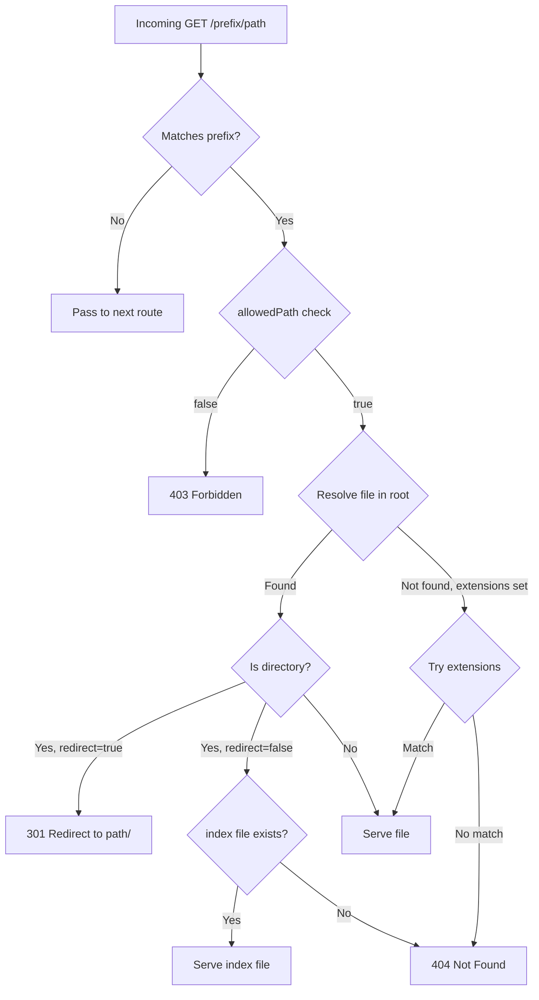

## Serving Static Assets with @fastify/static

### Overview

`@fastify/static` is the official Fastify plugin for serving static files (HTML, CSS, JS, images, fonts, etc.) from the filesystem. It wraps `send` under the hood and integrates with Fastify's reply decorators, lifecycle hooks, and plugin encapsulation model.

---

### Installation

```bash
npm install @fastify/static
```

Requires `fastify >= 4.x` for `@fastify/static >= 6.x`. Earlier versions used `fastify-static`.

---

### Basic Registration

```js
import Fastify from 'fastify'
import fastifyStatic from '@fastify/static'
import { fileURLToPath } from 'url'
import path from 'path'

const __dirname = path.dirname(fileURLToPath(import.meta.url))

const app = Fastify()

await app.register(fastifyStatic, {
  root: path.join(__dirname, 'public'),
  prefix: '/static/',
})

await app.listen({ port: 3000 })
```

**Key Points:**
- `root` — absolute path to the directory to serve. Required.
- `prefix` — URL prefix for all served files. Defaults to `'/'`.
- All files under `public/` become accessible at `/static/<filename>`.

---

### Plugin Options Reference

| Option | Type | Default | Description |
|---|---|---|---|
| `root` | `string \| string[]` | required | Filesystem root(s) to serve from |
| `prefix` | `string` | `'/'` | URL path prefix |
| `prefixAvoidTrailingSlash` | `boolean` | `false` | Skip appending trailing slash to prefix |
| `serve` | `boolean` | `true` | Whether to register GET/HEAD routes automatically |
| `decorateReply` | `boolean` | `true` | Add `reply.sendFile()` and `reply.download()` |
| `index` | `string \| string[] \| false` | `'index.html'` | Index file(s) to serve for directory requests |
| `hidden` | `boolean` | `false` | Serve dotfiles |
| `dotfiles` | `'allow'\|'deny'\|'ignore'` | `'allow'` | Dotfile handling behavior |
| `etag` | `boolean` | `true` | Enable ETag generation |
| `lastModified` | `boolean` | `true` | Set `Last-Modified` header |
| `maxAge` | `number` | `0` | `Cache-Control: max-age` in milliseconds |
| `immutable` | `boolean` | `false` | Add `immutable` directive to `Cache-Control` |
| `cacheControl` | `boolean` | `true` | Enable `Cache-Control` header |
| `acceptRanges` | `boolean` | `true` | Enable range requests |
| `redirect` | `boolean` | `false` | Redirect directory requests to trailing slash |
| `wildcard` | `boolean` | `true` | Register a wildcard route (`*`) to catch all paths |
| `extensions` | `string[]` | `[]` | Try these extensions if file not found |
| `allowedPath` | `function` | — | Filter which paths are served |
| `setHeaders` | `function` | — | Customize response headers per file |
| `schemaHide` | `boolean` | `true` | Hide auto-generated routes from JSON schema |
| `send` | `object` | `{}` | Options forwarded directly to the `send` package |

---

### Serving from Multiple Roots

Pass an array to `root` to serve from multiple directories. Files are resolved in order — first match wins.

```js
await app.register(fastifyStatic, {
  root: [
    path.join(__dirname, 'public'),
    path.join(__dirname, 'assets'),
  ],
  prefix: '/static/',
})
```

**Key Points:**
- If `public/logo.png` exists, it is served — `assets/logo.png` is never reached for that path.
- [Inference] Useful for layered asset strategies (e.g., tenant overrides over base assets). Behavior in edge cases should be tested in your environment.

---

### `reply.sendFile()`

When `decorateReply: true` (default), `reply.sendFile()` is available on every reply object, allowing manual file serving from custom routes.

```js
app.get('/download-report', async (req, reply) => {
  return reply.sendFile('reports/q1.pdf')
})
```

By default, `sendFile()` resolves relative to the `root` registered with the plugin. You can override the root:

```js
return reply.sendFile('invoice.pdf', path.join(__dirname, 'private-docs'))
```

**Key Points:**
- `sendFile()` bypasses the automatic wildcard route — it only fires when your route handler explicitly calls it.
- The second argument overrides `root` for that single call only.

---

### `reply.download()`

Forces a file download via `Content-Disposition: attachment`.

```js
app.get('/export', async (req, reply) => {
  return reply.download('exports/data.csv', 'export-2024.csv')
})
```

**Signature:**
```js
reply.download(filePath, fileName?, options?)
```

- `filePath` — path relative to registered `root`
- `fileName` — overrides the filename shown in the browser's save dialog
- `options` — forwarded to `send`

---

### Index File Serving

When a directory is requested, `@fastify/static` attempts to serve the configured index file.

```js
await app.register(fastifyStatic, {
  root: path.join(__dirname, 'public'),
  index: 'index.html',        // default
})
```

To serve multiple fallback index candidates:

```js
index: ['index.html', 'index.htm']
```

To disable index file serving entirely:

```js
index: false
```

---

### Extension Fallback

The `extensions` option lets the plugin try appending file extensions when a path is not found as-is.

```js
await app.register(fastifyStatic, {
  root: path.join(__dirname, 'public'),
  extensions: ['html', 'htm'],
})
```

**Example:**

A request to `/about` will attempt:
1. `public/about` (exact)
2. `public/about.html`
3. `public/about.htm`

[Inference] This is useful for clean URL routing in static-site deployments. Verify extension resolution order in your version of the plugin.

---

### Disabling Automatic Route Registration

Set `serve: false` to prevent the plugin from registering the wildcard GET/HEAD routes. Only `reply.sendFile()` and `reply.download()` remain available.

```js
await app.register(fastifyStatic, {
  root: path.join(__dirname, 'public'),
  serve: false,
  decorateReply: true,
})

app.get('/asset/:name', async (req, reply) => {
  return reply.sendFile(req.params.name)
})
```

**Key Points:**
- Use this when you need full control over which paths are served.
- Prevents unintended exposure of filesystem contents.

---

### `allowedPath` — Path Filtering

A synchronous function that receives `(pathName, root, request)` and returns a boolean. Return `false` to reject the request with a 403.

```js
await app.register(fastifyStatic, {
  root: path.join(__dirname, 'public'),
  allowedPath: (pathName, root, req) => {
    // Block access to anything in /admin/
    return !pathName.startsWith('/admin/')
  },
})
```

**Key Points:**
- Runs before file resolution.
- Returning `false` sends a 403 Forbidden.
- [Inference] Useful for tenant-scoped or role-gated static content, though access control logic in production should not rely solely on this filter.

---

### `setHeaders` — Custom Response Headers

A synchronous callback invoked with `(res, path, stat)` before headers are flushed. Mutate `res` directly using Node's `http.ServerResponse` API.

```js
await app.register(fastifyStatic, {
  root: path.join(__dirname, 'public'),
  setHeaders: (res, filePath, stat) => {
    if (filePath.endsWith('.woff2')) {
      res.setHeader('Access-Control-Allow-Origin', '*')
    }
  },
})
```

**Key Points:**
- `res` is the raw Node.js `ServerResponse`, not a Fastify reply.
- This is the correct place to set CORS headers for font files.
- Do not call `res.end()` or `res.write()` here.

---

### Caching Configuration

```js
await app.register(fastifyStatic, {
  root: path.join(__dirname, 'public'),
  maxAge: 86400000,       // 1 day in ms
  immutable: true,        // adds 'immutable' to Cache-Control (for content-hashed assets)
  etag: true,
  lastModified: true,
})
```

**Key Points:**
- `immutable` should only be used with content-hashed filenames (e.g., `app.a3f9c1.js`). Without content hashing, `immutable` prevents browsers from re-fetching changed files.
- `etag` and `lastModified` enable conditional requests (`If-None-Match`, `If-Modified-Since`), allowing 304 Not Modified responses.
- `maxAge: 0` disables `max-age` but does not disable `Cache-Control` entirely. Set `cacheControl: false` to remove the header.

---

### Dotfile Handling

```js
await app.register(fastifyStatic, {
  root: path.join(__dirname, 'public'),
  dotfiles: 'deny',   // 'allow' | 'deny' | 'ignore'
})
```

| Value | Behavior |
|---|---|
| `'allow'` | Serve dotfiles normally |
| `'deny'` | Return 403 for dotfile paths |
| `'ignore'` | Return 404 for dotfile paths |

**Key Points:**
- Default is `'allow'`. Explicitly set `'deny'` or `'ignore'` if `.env`, `.htaccess`, or similar files exist in your static root.

---

### Wildcard Option

By default, `@fastify/static` registers a `/*` wildcard route. This catches all unmatched GET/HEAD requests under the prefix.

```js
// wildcard: true (default)
// Registers: GET /static/*
```

Set `wildcard: false` to disable this and only serve exact registered paths. [Inference] Useful when other routes need to handle paths under the same prefix without being shadowed by the static wildcard.

---

### Plugin Encapsulation and Scope

Because `@fastify/static` uses `decorateReply`, it must be registered in a scope that encompasses all routes that need `reply.sendFile()`.

```js
// Correct: top-level registration
await app.register(fastifyStatic, { root: path.join(__dirname, 'public') })

// Incorrect: scoped registration used from outside
await app.register(async (child) => {
  await child.register(fastifyStatic, { root: path.join(__dirname, 'public') })
})

// Route outside child scope — reply.sendFile is undefined here
app.get('/file', async (req, reply) => reply.sendFile('a.txt')) // ❌
```

**Key Points:**
- Register at the root app level if `reply.sendFile()` must be accessible globally.
- Registering `@fastify/static` twice in the same scope requires `decorateReply: false` on subsequent registrations to avoid decorator collision.

---

### Multiple Plugin Registrations (Different Prefixes)

To serve from multiple roots at different URL prefixes, register the plugin multiple times. Set `decorateReply: false` on all but the first registration.

```js
await app.register(fastifyStatic, {
  root: path.join(__dirname, 'public'),
  prefix: '/public/',
})

await app.register(fastifyStatic, {
  root: path.join(__dirname, 'uploads'),
  prefix: '/uploads/',
  decorateReply: false,   // avoid duplicate decoration
})
```

**Example:**
- `/public/logo.png` → `public/logo.png`
- `/uploads/avatar.jpg` → `uploads/avatar.jpg`

---

### SPA Fallback Pattern

For single-page applications, all unmatched routes should serve `index.html`. Combine `@fastify/static` with a 404 handler:

```js
await app.register(fastifyStatic, {
  root: path.join(__dirname, 'dist'),
  prefix: '/',
  index: false,       // disable automatic index serving
  wildcard: false,    // disable wildcard so we can handle 404 ourselves
})

app.setNotFoundHandler((req, reply) => {
  return reply.sendFile('index.html')
})
```

**Key Points:**
- `index: false` and `wildcard: false` prevent the plugin from intercepting routes before your app router runs.
- The `setNotFoundHandler` catches all unmatched routes and returns `index.html` — the SPA's client-side router then handles the path.
- [Inference] This pattern assumes all API routes are registered before or alongside the static plugin. Route ordering in Fastify matters; verify behavior in your deployment.

---

### Range Requests

`acceptRanges: true` (default) enables HTTP range requests, which browsers use for media streaming.

```js
await app.register(fastifyStatic, {
  root: path.join(__dirname, 'media'),
  acceptRanges: true,
})
```

A client requesting `Range: bytes=0-1023` will receive a `206 Partial Content` response with the appropriate byte range. This is handled automatically by the underlying `send` package.

---

### Redirect on Directory Requests

```js
await app.register(fastifyStatic, {
  root: path.join(__dirname, 'public'),
  redirect: true,
})
```

When `redirect: true`, a request to `/about` (where `about` is a directory) redirects to `/about/` before attempting index resolution. Without this, some environments serve the index file without the redirect, which can cause relative asset paths to break.

---

### Diagram — Request Resolution Flow



---

### Security Considerations

**Key Points:**
- `@fastify/static` resolves paths and prevents directory traversal by design, but [Unverified] exact traversal protections depend on the version of `send` in use. Always pin dependencies and review changelogs.
- Avoid pointing `root` at application source directories (`src/`, project root). Use a dedicated `public/` or `dist/` directory.
- Use `allowedPath` or `dotfiles: 'deny'` to restrict sensitive files.
- [Inference] Serving user-uploaded content from the same static root as application assets is inadvisable — path conflicts and unintended exposure are possible. Verify your file isolation strategy independently.

---

**Related Topics:**
- `@fastify/compress` — gzip/brotli compression for static responses
- `@fastify/cors` — CORS configuration for cross-origin asset requests
- Content-addressable asset hashing and cache busting strategies
- Serving static files behind a reverse proxy (NGINX, Caddy) vs. Fastify-direct
- `@fastify/multipart` — handling file uploads (counterpart to static serving)
- ETag and conditional GET caching deep dive
- SPA deployment patterns with Fastify
- `reply.sendFile()` internals and the `send` package