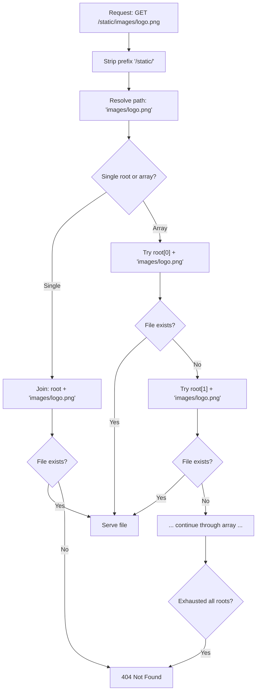

## Root Directory Configuration

### Overview

The `root` option in `@fastify/static` defines the filesystem base from which static files are resolved. Every file path in a request is joined against this root. Correct root configuration directly affects security, file resolution behavior, and multi-directory composition.

---

### Single Root — Basic Configuration

```js
import path from 'path'
import { fileURLToPath } from 'url'
import Fastify from 'fastify'
import fastifyStatic from '@fastify/static'

const __dirname = path.dirname(fileURLToPath(import.meta.url))

const app = Fastify()

await app.register(fastifyStatic, {
  root: path.join(__dirname, 'public'),
})
```

**Key Points:**
- `root` must be an **absolute path**. Relative paths are not supported and will cause an error at registration time.
- `path.join(__dirname, 'public')` constructs an absolute path relative to the current module file.
- In ESM (`type: "module"`), `__dirname` is not available natively — derive it via `fileURLToPath(import.meta.url)` as shown above.
- In CommonJS, `__dirname` is available as a global.

---

### ESM vs CJS — Deriving `__dirname`

**ESM (recommended for modern Fastify projects):**

```js
import { fileURLToPath } from 'url'
import path from 'path'

const __filename = fileURLToPath(import.meta.url)
const __dirname = path.dirname(__filename)
```

**CommonJS:**

```js
const path = require('path')
// __dirname is available natively — no derivation needed
```

**Key Points:**
- Forgetting to derive `__dirname` in ESM and passing a relative path like `'./public'` will throw at plugin registration.
- [Inference] This is one of the most common misconfiguration errors when migrating Fastify projects from CJS to ESM.

---

### Multiple Roots — Array Configuration

`root` accepts an array of absolute paths. When a request arrives, each root is searched in order. The first root containing the requested file wins.

```js
await app.register(fastifyStatic, {
  root: [
    path.join(__dirname, 'public'),
    path.join(__dirname, 'assets'),
    path.join(__dirname, 'vendor'),
  ],
  prefix: '/static/',
})
```

**Example:**

Filesystem state:
```
public/
  logo.png
assets/
  logo.png      ← shadowed by public/logo.png
  chart.js
vendor/
  jquery.min.js
```

Request resolution for `/static/logo.png`:
1. Check `public/logo.png` → found → serve it
2. `assets/logo.png` is never reached

Request resolution for `/static/chart.js`:
1. Check `public/chart.js` → not found
2. Check `assets/chart.js` → found → serve it

**Key Points:**
- Array order is significant. Earlier roots take priority.
- [Inference] Use this for override/layering patterns: place tenant-specific or environment-specific assets in earlier roots, shared base assets in later roots.
- Duplicate filenames across roots are silently shadowed — no warning is emitted. Verify resolution behavior explicitly when file naming overlaps.

---

### Root Resolution and Path Traversal Prevention

`@fastify/static` (via the `send` package) normalizes request paths and rejects traversal sequences. A request to `/static/../../etc/passwd` is rejected before filesystem access occurs.

**Key Points:**
- [Unverified] Exact traversal handling behavior depends on the version of `send` bundled with your installed `@fastify/static`. Verify in your dependency tree with `npm ls send`.
- Never set `root` to the project root (`process.cwd()`) or any directory containing source code, `.env` files, or `node_modules`.

**Dangerous:**
```js
root: process.cwd()                  // exposes entire project
root: path.join(__dirname, '..')     // exposes parent directory
root: path.join(__dirname)           // exposes source files if __dirname is src/
```

**Safe:**
```js
root: path.join(__dirname, 'public') // dedicated static output directory
root: path.join(__dirname, 'dist')   // SPA or compiled build output
```

---

### Root Validation at Registration

`@fastify/static` validates the `root` path at plugin registration time, before any requests are served. If the directory does not exist, the plugin throws.

```js
// If 'public/' does not exist on disk, this throws:
await app.register(fastifyStatic, {
  root: path.join(__dirname, 'public'),
})
// Error: ENOENT: no such file or directory
```

**Key Points:**
- The directory must exist at registration time, not just at request time.
- In CI/CD pipelines or build-step workflows, ensure the static output directory (`dist/`, `public/`) is created before `app.listen()` is called.
- [Inference] A common pattern is to run the frontend build step (`npm run build`) before starting the Fastify server in production. If this order is reversed, registration will fail.

---

### Using `process.cwd()` Safely

`process.cwd()` returns the current working directory at runtime, which may differ from `__dirname` depending on how the process is launched.

```js
// Fragile — depends on where the process is started from
root: path.join(process.cwd(), 'public')

// More robust — always relative to the module file
root: path.join(__dirname, 'public')
```

**Key Points:**
- If the server is started from the project root (`node src/server.js`), `process.cwd()` and `path.join(__dirname, '..')` may coincide — but this is not guaranteed.
- [Inference] Prefer `__dirname`-relative paths for predictable behavior across deployment environments and process managers (PM2, systemd, Docker).

---

### Root with `serve: false`

Setting `serve: false` disables automatic wildcard route registration but preserves `reply.sendFile()`. The `root` is still required and still validated.

```js
await app.register(fastifyStatic, {
  root: path.join(__dirname, 'protected'),
  serve: false,
  decorateReply: true,
})

app.get('/file/:name', { preHandler: [authMiddleware] }, async (req, reply) => {
  return reply.sendFile(req.params.name)
})
```

**Key Points:**
- `reply.sendFile(filename)` resolves `filename` relative to the registered `root`.
- The second argument to `reply.sendFile(filename, altRoot)` overrides `root` for that single call, allowing ad hoc resolution from a different directory.

---

### Per-Call Root Override with `reply.sendFile()`

```js
await app.register(fastifyStatic, {
  root: path.join(__dirname, 'public'),  // default root
})

app.get('/private/:file', async (req, reply) => {
  const altRoot = path.join(__dirname, 'private-docs')
  return reply.sendFile(req.params.file, altRoot)
})
```

**Key Points:**
- The override root must also be an absolute path.
- This does not change the plugin's registered `root` — only the resolution for that single `sendFile` call is affected.
- [Inference] Use this to serve gated content from a separate directory without registering a second plugin instance.

---

### Multiple Plugin Registrations with Different Roots

Each registration of `@fastify/static` creates an independent root binding. Use this for serving logically separate asset groups at different URL prefixes.

```js
// First registration — decorateReply: true (default)
await app.register(fastifyStatic, {
  root: path.join(__dirname, 'public'),
  prefix: '/public/',
})

// Second registration — must set decorateReply: false
await app.register(fastifyStatic, {
  root: path.join(__dirname, 'uploads'),
  prefix: '/uploads/',
  decorateReply: false,
})

// Third registration
await app.register(fastifyStatic, {
  root: path.join(__dirname, 'docs'),
  prefix: '/docs/',
  decorateReply: false,
})
```

**Key Points:**
- Only the first registration should have `decorateReply: true`. Subsequent registrations must set `decorateReply: false` to avoid a Fastify decorator collision error.
- Each registration is fully independent — different `root`, `prefix`, `maxAge`, `etag`, etc.
- `reply.sendFile()` always resolves against the root of the **first** registration that decorated the reply, unless an explicit `altRoot` is passed.

---

### Root Resolution Diagram



---

### Root Configuration in Encapsulated Plugins

When using Fastify's encapsulation model, register `@fastify/static` within a scoped plugin to limit its root to a subset of routes.

```js
await app.register(async (child) => {
  await child.register(fastifyStatic, {
    root: path.join(__dirname, 'admin-assets'),
    prefix: '/admin/static/',
  })

  child.get('/admin/dashboard', async (req, reply) => {
    return reply.sendFile('dashboard.html')
  })
}, { prefix: '/admin' })
```

**Key Points:**
- `reply.sendFile()` inside the child scope resolves against `admin-assets/`.
- Routes outside the child scope do not have access to this root via `reply.sendFile()` unless a top-level registration also exists.
- [Inference] Scoped root registration is useful for multi-tenant or modular Fastify applications where different sections of the app own distinct asset trees.

---

### Environment-Based Root Selection

```js
const isProd = process.env.NODE_ENV === 'production'

await app.register(fastifyStatic, {
  root: path.join(__dirname, isProd ? 'dist' : 'public'),
  prefix: '/',
})
```

**Key Points:**
- In production, serve from a compiled `dist/` directory (minified, content-hashed).
- In development, serve from `public/` (raw, unprocessed assets).
- [Inference] This pattern assumes a build step populates `dist/` before the production server starts. If `dist/` does not exist, registration will throw. Verify your build pipeline order.

---

### Common Errors and Causes

| Error | Likely Cause |
|---|---|
| `ENOENT: no such file or directory` | `root` path does not exist on disk at registration time |
| `root must be an absolute path` | Relative path passed to `root` |
| `FST_ERR_DEC_ALREADY_PRESENT` | `decorateReply: true` on a second plugin registration in the same scope |
| `Cannot read properties of undefined (reading 'sendFile')` | Route is outside the scope where `@fastify/static` was registered |
| File served from wrong directory | Array root priority not as expected — check element order |

---

**Related Topics:**
- `prefix` option and URL path mapping
- `serve: false` and manual file serving patterns
- `reply.sendFile()` and per-call root overrides
- Encapsulation-aware static serving in modular Fastify apps
- Environment-specific asset pipelines (dev vs prod)
- Securing static roots — dotfile handling, `allowedPath`, directory isolation
- Multi-tenant asset serving with scoped plugin registrations