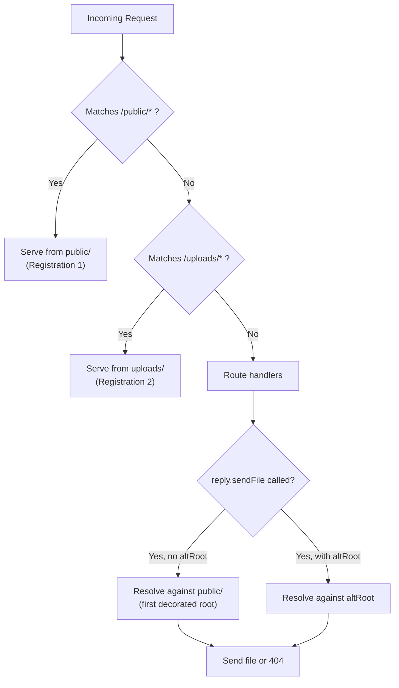

## Prefix and decorateReply Options

### Overview

`prefix` and `decorateReply` are two of the most consequential options in `@fastify/static` beyond `root`. `prefix` controls the URL namespace under which static files are served. `decorateReply` controls whether `reply.sendFile()` and `reply.download()` are added to Fastify's reply interface. Understanding both — and how they interact with Fastify's encapsulation model — is necessary for correct multi-registration and scoped plugin setups.

---

### `prefix` — URL Path Mapping

#### Basic Usage

```js
await app.register(fastifyStatic, {
  root: path.join(__dirname, 'public'),
  prefix: '/static/',
})
```

A request to `/static/images/logo.png` resolves to `public/images/logo.png` on disk. The prefix is stripped before filesystem resolution.

#### Default Behavior

If `prefix` is omitted, it defaults to `'/'`. All GET/HEAD requests to the server root that are not matched by other routes fall through to the static wildcard.

```js
await app.register(fastifyStatic, {
  root: path.join(__dirname, 'public'),
  // prefix defaults to '/'
})
// GET /logo.png → public/logo.png
// GET /css/main.css → public/css/main.css
```

**Key Points:**
- A prefix of `'/'` means the static wildcard competes directly with all other routes. Route registration order determines priority in Fastify — earlier registrations take precedence for exact matches.
- [Inference] Using `'/'` as a prefix in applications with API routes under the same server increases the risk of route shadowing. An explicit prefix like `'/static/'` reduces ambiguity.

---

### Trailing Slash Behavior

`@fastify/static` normalizes the prefix to always end with `/` internally. Both of the following are equivalent at runtime:

```js
prefix: '/static'
prefix: '/static/'
```

**Key Points:**
- The plugin appends the trailing slash if absent. This is consistent behavior but can be surprising if you inspect registered routes via `app.printRoutes()`.
- `prefixAvoidTrailingSlash: true` suppresses this normalization:

```js
await app.register(fastifyStatic, {
  root: path.join(__dirname, 'public'),
  prefix: '/static',
  prefixAvoidTrailingSlash: true,
})
```

[Inference] `prefixAvoidTrailingSlash` is rarely needed. Use it only if your routing scheme treats `/static` and `/static/` as meaningfully distinct, and verify behavior against your Fastify version.

---

### Prefix and the Wildcard Route

When `wildcard: true` (default), `@fastify/static` registers a catch-all route under the prefix:

```
GET /static/*
HEAD /static/*
```

This route is what intercepts file requests. It is registered as a standard Fastify route and appears in `app.printRoutes()`.

```js
await app.register(fastifyStatic, {
  root: path.join(__dirname, 'public'),
  prefix: '/static/',
})

console.log(app.printRoutes())
// └── /static/
//     └── * (GET, HEAD)
```

**Key Points:**
- If another route matches `/static/*` more specifically (e.g., `GET /static/special`), Fastify's router will prefer the more specific route.
- [Inference] Route conflicts between the static wildcard and application routes are possible if both use the same prefix. Register application routes before the static plugin to ensure they take priority, or use a distinct prefix.

---

### Prefix Scoping with Fastify Encapsulation

When `@fastify/static` is registered inside an encapsulated plugin that itself has a `prefix`, both prefixes compose.

```js
await app.register(async (child) => {
  await child.register(fastifyStatic, {
    root: path.join(__dirname, 'admin-assets'),
    prefix: '/assets/',
  })
}, { prefix: '/admin' })
```

Effective URL prefix: `/admin/assets/`

```
GET /admin/assets/dashboard.css → admin-assets/dashboard.css
```

**Key Points:**
- Fastify composes the encapsulation prefix and the plugin prefix automatically.
- [Inference] If you register the plugin at the app level with `prefix: '/assets/'` and also wrap it in a scoped plugin with `{ prefix: '/admin' }`, the composed result may not match expectations. Verify with `app.printRoutes()` after registration.

---

### `decorateReply` — Reply Method Injection

#### What It Does

When `decorateReply: true` (default), `@fastify/static` calls:

```js
fastify.decorateReply('sendFile', ...)
fastify.decorateReply('download', ...)
```

This makes `reply.sendFile()` and `reply.download()` available on every reply object within the plugin's scope.

#### Basic Usage

```js
await app.register(fastifyStatic, {
  root: path.join(__dirname, 'public'),
  decorateReply: true, // default — can be omitted
})

app.get('/logo', async (req, reply) => {
  return reply.sendFile('images/logo.png')
})
```

---

### `decorateReply: false` — When and Why

Fastify does not allow decorating `reply` with the same key more than once within the same scope or any ancestor scope. Registering `@fastify/static` twice without setting `decorateReply: false` on subsequent registrations will throw:

```
FST_ERR_DEC_ALREADY_PRESENT: The decorator 'sendFile' has already been added!
```

Set `decorateReply: false` on all registrations after the first:

```js
// First registration — decorates reply
await app.register(fastifyStatic, {
  root: path.join(__dirname, 'public'),
  prefix: '/public/',
})

// Second registration — must NOT re-decorate
await app.register(fastifyStatic, {
  root: path.join(__dirname, 'uploads'),
  prefix: '/uploads/',
  decorateReply: false,
})
```

**Key Points:**
- `decorateReply: false` does not disable `reply.sendFile()` — it only skips re-registering it. The method from the first registration remains available.
- `reply.sendFile()` always resolves against the root of the registration that originally decorated the reply. When using multiple registrations, use the explicit `altRoot` argument to target a different root:

```js
app.get('/uploaded/:file', async (req, reply) => {
  return reply.sendFile(req.params.file, path.join(__dirname, 'uploads'))
})
```

---

### Decorator Scope and Encapsulation

Fastify decorators are scoped to the plugin context in which they are defined and propagate downward to child contexts, but not upward or sideways.

```js
// Scoped registration
await app.register(async (child) => {
  await child.register(fastifyStatic, {
    root: path.join(__dirname, 'assets'),
    prefix: '/assets/',
  })

  // reply.sendFile is available here
  child.get('/test', async (req, reply) => reply.sendFile('test.txt')) // ✅
})

// reply.sendFile is NOT available here
app.get('/outside', async (req, reply) => reply.sendFile('test.txt')) // ❌ — undefined
```

**Key Points:**
- If `reply.sendFile()` is needed across multiple scopes, register `@fastify/static` at the top-level app instance, not inside a child plugin.
- [Inference] Attempting to call `reply.sendFile()` outside the registration scope will throw a runtime error, not a registration-time error. This can be difficult to detect without integration tests.

---

### Interaction Between `prefix`, `decorateReply`, and `serve`

These three options are independent but interact in practice:

| `serve` | `decorateReply` | `prefix` effect |
|---|---|---|
| `true` | `true` | Wildcard route registered under prefix; `sendFile`/`download` added to reply |
| `true` | `false` | Wildcard route registered under prefix; no reply decoration |
| `false` | `true` | No wildcard route; `sendFile`/`download` added to reply |
| `false` | `false` | No wildcard route; no reply decoration — plugin has no visible effect |

**Key Points:**
- `serve: false, decorateReply: true` is the pattern for fully manual static serving — you control exactly which routes serve files and from which paths.
- `serve: true, decorateReply: false` is valid for secondary registrations where you want automatic file serving from a new root/prefix but do not want to re-decorate reply.

---

### Resolving Files Across Multiple Registrations

When multiple registrations exist, `reply.sendFile(filename)` resolves against the root of the **first** registration that added the decoration — not the registration whose prefix matched the current request.

```js
await app.register(fastifyStatic, {
  root: path.join(__dirname, 'public'),      // ← sendFile resolves here by default
  prefix: '/public/',
})

await app.register(fastifyStatic, {
  root: path.join(__dirname, 'uploads'),
  prefix: '/uploads/',
  decorateReply: false,
})

app.get('/get-upload/:file', async (req, reply) => {
  // Without altRoot: resolves against 'public/' — wrong
  // return reply.sendFile(req.params.file)

  // With altRoot: resolves against 'uploads/' — correct
  return reply.sendFile(req.params.file, path.join(__dirname, 'uploads'))
})
```

**Key Points:**
- This is a common source of confusion in multi-root setups.
- Always pass an explicit `altRoot` when using `reply.sendFile()` to serve from a non-primary root.

---

### Diagram — Prefix Routing and Decorator Scope



---

### Practical Multi-Prefix Setup — Full Example

```js
import Fastify from 'fastify'
import fastifyStatic from '@fastify/static'
import path from 'path'
import { fileURLToPath } from 'url'

const __dirname = path.dirname(fileURLToPath(import.meta.url))
const app = Fastify({ logger: true })

// Primary registration — decorates reply
await app.register(fastifyStatic, {
  root: path.join(__dirname, 'public'),
  prefix: '/public/',
})

// Secondary — user uploads
await app.register(fastifyStatic, {
  root: path.join(__dirname, 'uploads'),
  prefix: '/uploads/',
  decorateReply: false,
})

// Tertiary — documentation
await app.register(fastifyStatic, {
  root: path.join(__dirname, 'docs'),
  prefix: '/docs/',
  decorateReply: false,
})

// Manual route using altRoot
app.get('/download/report', async (req, reply) => {
  return reply.download('q1-report.pdf', 'Q1-Report.pdf', {
    root: path.join(__dirname, 'private'),
  })
})

await app.listen({ port: 3000 })
```

**Output** (from `app.printRoutes()`):
```
└── /
    ├── public/* (GET, HEAD)
    ├── uploads/* (GET, HEAD)
    └── docs/* (GET, HEAD)
```

---

### Common Errors Reference

| Error | Cause | Fix |
|---|---|---|
| `FST_ERR_DEC_ALREADY_PRESENT: sendFile` | `decorateReply: true` on a second registration in the same scope | Set `decorateReply: false` on all registrations after the first |
| `reply.sendFile is not a function` | Route is outside the scope where decoration occurred | Move registration to a higher scope or register at root app level |
| File not found when using `reply.sendFile()` | Resolving against wrong root (first registered, not intended) | Pass explicit `altRoot` as second argument |
| Static wildcard shadowing API routes | Both static plugin and API use same prefix or `prefix: '/'` | Use a distinct prefix for static assets, or register API routes first |
| Prefix not composing as expected | Encapsulation prefix plus plugin prefix mis-combined | Inspect with `app.printRoutes()` after registration |

---

**Related Topics:**
- `wildcard` option and route conflict resolution
- `serve: false` for fully manual file serving
- `reply.sendFile()` and `reply.download()` — full API reference
- Fastify decorator system and encapsulation model
- Multi-tenant static serving with scoped plugin registrations
- Route registration order and priority in Fastify
- `app.printRoutes()` for debugging registered route trees